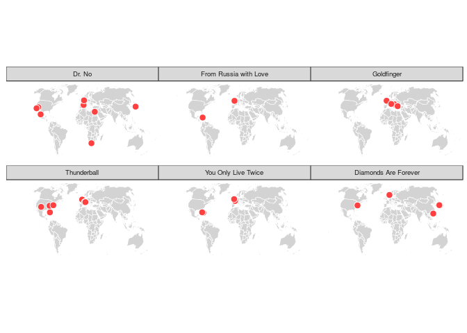
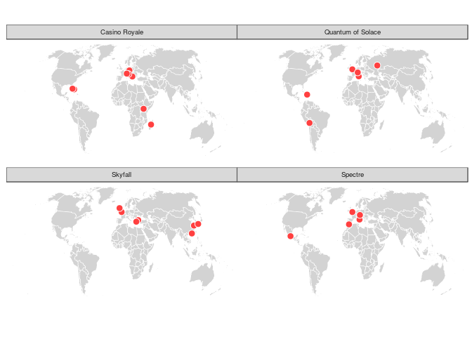

James Bond must be the most well-travelled man in the history of movies. As it is summer time, let's have a look at the 007 travel locations in the 24 films of the spy franchise with the R packages {maps}, {ggplot2} and {ggmap}.

In this article, we will answer three questions:

1.  What are the countries that James Bond has visited?
2.  Which countries has James Bond visited the most?
3.  Have mission's locations of James Bond changed over time?

## The Data

We can find on Wikipedia a full [list of James Bond film locations](https://en.wikipedia.org/wiki/List_of_James_Bond_film_locations). I copied the list on LibreOffice Calc and made some quick cleaning. For reproductivity, the data can be downloaded on my [Github repository](https://github.com/lgnbhl/lgnbhl.github.io/blob/master/images/data_bond.csv).


```r
library(tidyverse)

bond <- read_csv("https://raw.githubusercontent.com/lgnbhl/lgnbhl.github.io/master/images/data_bond.csv")

print(bond)
```

```
## # A tibble: 143 x 3
##    Film                  Location                           region        
##    <chr>                 <chr>                              <chr>         
##  1 Dr. No                MI6 headquarters in central London England       
##  2 Dr. No                Kingston                           Jamaica       
##  3 Dr. No                Crab Key                           Jamaica       
##  4 From Russia with Love Unnamed river                      United Kingdom
##  5 From Russia with Love Zagreb                             Croatia       
##  6 From Russia with Love Belgrade                           Serbia        
##  7 From Russia with Love Istanbul                           Turkey        
##  8 From Russia with Love Venice                             Italy         
##  9 Goldfinger            Stoke Park                         England       
## 10 Goldfinger            Geneva                             Switzerland   
## # … with 133 more rows
```

## Mapping Bond's worldwide missions

We can count and map all the countries visited by James Bond in the film series. The package {ggalt} gives the possibility to choose between different map projections. We selected the [Winkel Tripel projection](https://en.wikipedia.org/wiki/Winkel_tripel_projection) for mapping.


```r
library(maps)

world <- map_data("world") %>% 
  filter(region != "Antarctica")

# Renaming regions for mapping
bond <- bond %>%
  mutate(region = recode(region,
    "United Kingdom" = "UK",
    "England" = "UK",
    "United States" = "USA"
  )) 

bond_number <- bond %>%
  count(region, sort = TRUE)

library(ggalt)
library(ggthemes)

ggplot() +
  geom_map(data = world, map = world,
           aes(x = long, y = lat, map_id = region),
           fill="lightgrey", col="white", size = 0.2) +
  geom_map(data = bond_number, map = world,
           aes(map_id = region, fill = n)) +
  scale_fill_distiller(breaks = c(1, 2, 4, 6, 8, 10, 12, 14),
                       labels = c( "1", "2", "3-4", "5-6", "7-8", "9-10", "11-12", "13-14"),
                       name = "Number of visits",
                       palette = "OrRd", direction = 1,
                       guide = guide_legend(title.position = "top")) +
  ggalt::coord_proj("+proj=wintri") +
  ggthemes::theme_map() +
  theme(plot.title = element_text(size = 20, face = "bold"),
        plot.subtitle = element_text(size = 11),
        legend.position = "right",
        legend.justification = "center") +
  labs(title = "James Bond Tourism",
       subtitle = "007 locations in the movie franchise",
       caption = "Félix Luginbühl (@lgnbhl)\n Data source: Wikipedia")
```

<!-- -->

James Bond has been to the United States 13 times. But in which movies did these visits happen?


```r
bond %>%
  select(Film, region) %>%
  filter(region == "USA") %>%
  count(Film, sort = TRUE) %>%
  rename(US_visits_by_film = n)
```

```
## # A tibble: 9 x 2
##   Film                 US_visits_by_film
##   <chr>                            <int>
## 1 Goldfinger                           3
## 2 Diamonds Are Forever                 2
## 3 Live and Let Die                     2
## 4 A View to a Kill                     1
## 5 Casino Royale                        1
## 6 Licence to Kill                      1
## 7 Moonraker                            1
## 8 Thunderball                          1
## 9 You Only Live Twice                  1
```

## Locating 007 missions

In order to locate the places in the films where James Bond has been, we need to get their geolocations (latitude and longitude). The ```geocoding``` function of the package {ggmap} does the job well with the Google Maps API. We will use the loop described in the blog article of [Mitchell Craver](http://whatdothedatasay.com/2016/03/16/geocoding-addresses-in-r-with-ggmap/).

However, we face a problem. There are plenty of imaginary locations in the James Bond movies that Google Maps cannot geolocate. So for each imaginary place, we will just replace it by the name of the country. As this work has to be done manually, we selected only the movies starring the first and last actors playing James Bond: Sean Connery and Daniel Craig.

Let's begin by locating Bond's missions in movies starring Sean Connery.


```r
# Identify locations by country, otherwise imprecisions
bond_2 <- tidyr::unite(bond, loc, c(Location, region), sep = ", ", remove = FALSE)

# Selecting movies starring Sean Connery
connery <- c("Dr. No", "From Russia with Love", "Goldfinger", "Thunderball", "You Only Live Twice", "Diamonds Are Forever")
bond_connery <- filter(bond_2, Film %in% connery)

# Change imaginary locations in country names
bond_connery[18,2] <- "England" # "Shrublands Health Retreat" in "Thunderball"
bond_connery[24,2] <- "Japan" # "SPECTRE's hideout" in "You Only Live Twice"
bond_connery[25,2] <- "Norway" # "Secret CIA base" in "You Only Live Twice"
bond_connery <- bond_connery[-29,] # remove unknown country in Latin America
bond_connery[29,2] <- "South Africa" # "Unnamed location" in "Diamonds Are Forever"
bond_connery[33,2] <- "Mexico" # "Oil rig in Baja California" in "Diamonds Are Forever"

# Google Maps API
# Loop from Mitchell Craver: http://whatdothedatasay.com/2016/03/16/geocoding-addresses-in-r-with-ggmap/
library(ggmap)

# ?register_google()
# register_google(key = "KEY_HERE")

#for(i in 1:nrow(bond_connery)){
    #result <- ggmap::geocode(bond_connery$loc[i], output = "latlona", source = "google")
    #bond_connery$lon[i] <- as.numeric(result[1])
    #bond_connery$lat[i] <- as.numeric(result[2])
    #bond_connery$geoAddress[i] <- as.character(result[3])
    #Sys.sleep(1) #slow down the requests speed
    #}

# write_csv(bond_connery, "output/bond_connery.csv")
bond_connery <- read.csv("output/bond_connery.csv", header = T) # keep factor

levels(bond_connery$Film) <- c("Dr. No", "From Russia with Love", "Goldfinger", "Thunderball", "You Only Live Twice", "Diamonds Are Forever")

library(ggiraph)

g1 <- ggplot() +
  geom_map(data = world, map = world, aes(x = long, y = lat, map_id = region),
           fill = "lightgrey", col = "white", size = 0.2) +
  geom_point_interactive(data = bond_connery, aes(lon, lat, tooltip = loc), 
           color = "white", size = 3, fill= "brown1", pch = 21) +
  coord_proj("+proj=wintri") +
  theme_map() +
  labs(labs(title = "James Bond locations in movies starring Sean Connery",
            caption = "Félix Luginbühl (@lgnbhl)\n Data source: Wikipedia")) +
  theme(plot.title = element_text(size = 14, hjust = 0.5, face = "bold"),
               plot.caption = element_text(size = 8, color = "dimkgrey"))

ggiraph(print(g1))
```

<!--html_preserve--><div id="htmlwidget-b8151e4fed9ff0d181bd" style="width:672px;height:480px;" class="girafe html-widget"></div>
<script type="application/json" data-for="htmlwidget-b8151e4fed9ff0d181bd">{"x":{"html":"<?xml version=\"1.0\" encoding=\"UTF-8\"?>\n<svg xmlns=\"http://www.w3.org/2000/svg\" xmlns:xlink=\"http://www.w3.org/1999/xlink\" id=\"svg_80270d992d920190423085817\" viewBox=\"0 0 432.00 360.00\">\n  <g>\n    <defs>\n      <clipPath id=\"cl_id802492661ef20190423085817_132353\">\n        <rect x=\"0.00\" y=\"360.00\" width=\"0.00\" height=\"72.00\"/>\n      <\/clipPath>\n    <\/defs>\n    <rect x=\"0.00\" y=\"0.00\" width=\"432.00\" height=\"360.00\" id=\"1\" clip-path=\"url(#cl_id802492661ef20190423085817_132353)\" fill=\"#FFFFFF\" fill-opacity=\"1\" stroke-width=\"0.75\" stroke=\"#FFFFFF\" stroke-opacity=\"1\" stroke-linejoin=\"round\" stroke-linecap=\"round\"/>\n    <defs>\n      <clipPath id=\"cl_id802492661ef20190423085817_132354\">\n        <rect x=\"0.00\" y=\"0.00\" width=\"432.00\" height=\"360.00\"/>\n      <\/clipPath>\n    <\/defs>\n    <defs>\n      <clipPath id=\"cl_id802492661ef20190423085817_132355\">\n        <rect x=\"0.00\" y=\"57.41\" width=\"432.00\" height=\"245.19\"/>\n      <\/clipPath>\n    <\/defs>\n    <defs>\n      <clipPath id=\"cl_id802492661ef20190423085817_132356\">\n        <rect x=\"0.00\" y=\"0.00\" width=\"432.00\" height=\"360.00\"/>\n      <\/clipPath>\n    <\/defs>\n    <defs>\n      <clipPath id=\"cl_id802492661ef20190423085817_132357\">\n        <rect x=\"6.72\" y=\"61.89\" width=\"420.79\" height=\"233.98\"/>\n      <\/clipPath>\n    <\/defs>\n    <polygon points=\"136.23,172.11 136.23,172.15 136.18,172.13 136.12,172.04 136.05,171.97 136.08,171.89 136.10,171.87 136.16,171.94 136.22,172.07 136.23,172.11\" id=\"2\" clip-path=\"url(#cl_id802492661ef20190423085817_132357)\" fill=\"#D3D3D3\" fill-opacity=\"1\" stroke-width=\"0.426791\" stroke=\"#FFFFFF\" stroke-opacity=\"1\" stroke-linejoin=\"round\" stroke-linecap=\"round\"/>\n    <polygon points=\"296.51,135.54 296.46,135.55 296.37,135.52 296.33,135.47 296.31,135.46 296.26,135.50 296.16,135.55 296.00,135.67 296.01,135.70 296.18,135.81 296.22,135.85 296.24,135.86 296.14,135.93 295.93,136.06 295.80,136.17 295.76,136.18 295.65,136.14 295.49,136.10 295.45,136.10 295.11,136.12 294.81,136.16 294.69,136.19 294.45,136.22 294.31,136.23 294.22,136.28 294.13,136.34 294.03,136.38 293.95,136.39 293.87,136.44 293.83,136.54 293.69,136.70 293.61,136.77 293.58,136.85 293.52,136.86 293.42,136.85 293.36,136.94 293.31,137.07 293.20,137.26 293.14,137.33 293.12,137.45 293.17,137.51 293.33,137.59 293.41,137.68 293.46,137.74 293.57,137.91 293.65,138.08 293.73,138.15 293.78,138.28 293.82,138.36 293.80,138.41 293.79,138.47 293.81,138.53 293.86,138.59 293.90,138.64 293.93,138.68 293.92,138.73 293.88,138.81 293.87,138.88 293.84,139.01 293.76,139.09 293.71,139.16 293.67,139.29 293.59,139.44 293.57,139.56 293.53,139.63 293.49,139.67 293.52,139.73 293.59,139.81 293.69,139.89 293.72,140.04 293.75,140.14 293.78,140.26 293.77,140.36 293.58,140.47 293.38,140.52 293.12,140.54 293.02,140.52 292.94,140.51 292.64,140.41 292.54,140.47 292.56,140.64 292.83,140.89 292.95,141.03 293.10,141.27 293.20,141.39 293.21,141.51 293.06,141.65 292.91,141.78 292.68,141.81 292.54,141.86 292.49,141.93 292.50,142.21 292.48,142.31 292.51,142.43 292.49,142.57 292.44,142.66 292.42,142.80 292.50,143.07 292.63,143.52 292.57,143.67 292.49,143.82 292.40,143.93 292.29,143.98 292.20,143.97 292.10,143.88 292.04,143.81 291.94,143.75 291.86,143.76 291.79,143.82 291.65,143.81 291.52,143.75 291.47,143.76 291.45,143.82 291.36,143.95 291.10,144.15 290.98,144.17 290.94,144.22 290.98,144.29 291.04,144.36 291.15,144.40 291.16,144.45 291.09,144.50 291.03,144.55 290.89,144.62 290.72,144.65 290.52,144.62 290.41,144.54 290.29,144.54 290.20,144.60 290.12,144.70 290.05,144.93 290.03,144.96 290.01,145.00 289.94,145.05 289.85,145.13 289.83,145.29 289.83,145.58 289.87,145.73 289.94,145.99 289.95,146.18 289.93,146.31 289.96,146.40 290.06,146.51 290.04,146.58 290.00,146.66 289.95,146.71 289.73,146.80 289.43,146.92 289.23,147.00 288.93,147.12 288.85,147.15 288.66,147.17 288.55,147.15 288.41,147.15 288.22,147.16 288.08,147.20 287.95,147.25 287.86,147.33 287.82,147.39 287.80,147.43 287.65,147.38 287.19,147.29 286.02,147.46 285.90,147.44 285.46,147.30 284.90,147.11 284.55,147.00 284.10,146.86 284.31,146.45 284.49,146.10 284.67,145.75 284.85,145.41 284.85,145.29 284.81,145.06 284.68,144.75 284.55,144.61 284.19,144.57 283.93,144.53 283.64,144.49 283.60,144.48 283.52,144.24 283.51,144.13 283.45,143.92 283.42,143.76 283.40,143.50 283.38,143.38 283.14,142.87 283.01,142.59 282.88,142.30 282.84,142.21 282.81,142.10 282.92,141.82 282.96,141.76 283.03,141.62 283.08,141.55 283.06,141.50 282.94,141.48 282.78,141.48 282.68,141.44 282.60,141.37 282.55,141.27 282.55,141.08 282.43,140.71 282.48,140.53 282.53,140.40 282.79,140.37 282.66,140.23 282.60,140.15 282.57,140.13 282.55,140.09 282.55,140.05 282.62,140.03 282.65,139.98 282.71,139.91 282.74,139.88 282.73,139.80 282.75,139.74 282.79,139.67 282.81,139.58 282.78,139.49 282.79,139.37 282.79,139.30 282.81,139.24 282.76,139.15 282.72,139.07 282.69,138.98 282.73,138.95 282.78,138.92 282.77,138.85 282.78,138.75 282.78,138.68 282.80,138.62 282.79,138.56 282.75,138.47 282.83,138.45 282.88,138.50 282.94,138.57 283.10,138.69 283.19,138.73 283.30,138.74 283.43,138.72 283.53,138.69 283.58,138.70 283.71,138.79 283.87,138.91 283.93,138.97 283.97,139.06 284.02,139.08 284.08,138.99 284.15,138.96 284.23,138.97 284.32,138.98 284.39,138.94 284.42,138.92 284.54,138.80 284.65,138.71 284.72,138.65 284.70,138.47 284.72,138.37 284.76,138.31 284.72,138.24 284.68,138.18 284.64,138.11 284.65,138.07 284.70,138.05 284.83,138.04 285.04,137.96 285.21,137.87 285.37,137.80 285.45,137.79 285.53,137.79 285.56,137.77 285.55,137.71 285.58,137.64 285.66,137.59 285.82,137.47 285.94,137.30 285.96,137.17 285.96,136.98 285.96,136.69 285.96,136.38 285.96,136.24 285.96,136.13 286.08,136.04 286.21,135.97 286.43,135.95 286.70,135.93 286.71,135.76 286.70,135.61 286.73,135.54 286.77,135.47 286.79,135.46 286.96,135.54 287.21,135.67 287.49,135.73 287.62,135.76 287.67,135.75 287.99,135.70 288.25,135.75 288.43,135.88 288.57,135.92 288.68,135.84 288.75,135.83 288.80,135.87 288.87,135.89 288.96,135.87 289.03,135.91 289.05,135.95 289.07,136.00 289.17,136.11 289.34,136.24 289.46,136.26 289.58,136.15 289.64,136.16 289.65,136.13 289.65,136.05 289.72,135.98 289.87,135.90 289.95,135.84 289.97,135.79 290.02,135.77 290.09,135.78 290.13,135.76 290.13,135.72 290.14,135.69 290.17,135.68 290.19,135.67 290.25,135.68 290.37,135.76 290.55,135.91 290.66,135.98 290.69,135.97 290.73,135.92 290.77,135.83 290.75,135.71 290.68,135.55 290.66,135.42 290.71,135.32 290.83,135.26 291.03,135.23 291.16,135.23 291.22,135.28 291.29,135.31 291.37,135.31 291.43,135.25 291.46,135.13 291.42,134.98 291.31,134.81 291.31,134.75 291.33,134.72 291.39,134.66 291.46,134.52 291.51,134.35 291.55,134.13 291.64,134.00 291.78,133.94 291.97,133.99 292.23,134.14 292.37,134.34 292.39,134.58 292.43,134.71 292.48,134.73 292.55,134.72 292.64,134.68 292.71,134.68 292.75,134.71 292.77,134.77 292.76,134.88 292.80,135.16 292.85,135.40 292.89,135.64 292.93,135.85 293.02,136.02 293.15,136.26 293.27,136.42 293.35,136.47 293.43,136.49 293.50,136.47 293.62,136.36 293.78,136.15 293.96,136.02 294.26,135.94 294.30,135.73 294.40,135.58 294.67,135.36 294.83,135.28 294.93,135.26 295.07,135.29 295.10,135.30 295.13,135.31 295.20,135.32 295.23,135.39 295.24,135.45 295.18,135.51 295.17,135.56 295.21,135.59 295.32,135.60 295.50,135.51 295.62,135.46 295.71,135.43 295.73,135.37 295.77,135.30 295.86,135.29 295.97,135.32 296.06,135.34 296.20,135.31 296.29,135.37 296.42,135.46 296.49,135.53 296.51,135.54\" id=\"3\" clip-path=\"url(#cl_id802492661ef20190423085817_132357)\" fill=\"#D3D3D3\" fill-opacity=\"1\" stroke-width=\"0.426791\" stroke=\"#FFFFFF\" stroke-opacity=\"1\" stroke-linejoin=\"round\" stroke-linecap=\"round\"/>\n    <polygon points=\"244.93,206.06 244.95,206.24 244.97,206.50 244.98,206.69 245.00,206.78 245.00,206.82 244.98,206.87 244.96,206.98 244.93,207.08 244.91,207.15 244.92,207.28 244.90,207.46 244.88,207.66 244.87,207.84 244.91,208.18 244.90,208.28 244.84,208.45 244.79,208.58 244.76,208.74 244.75,208.82 244.85,209.04 244.84,209.09 244.76,209.10 244.70,209.11 244.46,209.11 244.12,209.10 243.77,209.10 243.43,209.10 243.11,209.10 242.81,209.10 242.54,209.10 242.54,209.32 242.52,209.78 242.51,210.24 242.50,210.70 242.48,211.16 242.47,211.62 242.45,212.08 242.43,212.54 242.42,213.00 242.41,213.33 242.46,213.77 242.57,214.25 242.62,214.30 242.74,214.38 242.91,214.57 243.01,214.70 243.20,214.94 243.45,215.24 243.70,215.51 243.92,215.75 243.56,215.84 243.05,215.95 242.70,216.03 242.28,216.12 242.00,216.18 241.65,216.26 241.59,216.25 241.50,216.20 241.30,216.19 241.07,216.26 240.88,216.28 240.74,216.25 240.61,216.18 240.48,216.09 240.26,216.05 239.93,216.08 239.62,216.06 239.32,215.99 239.11,215.97 238.98,215.98 238.84,215.96 238.69,215.90 238.57,215.81 238.43,215.62 238.32,215.44 238.29,215.41 238.26,215.39 238.22,215.38 237.89,215.37 237.58,215.36 237.40,215.36 236.96,215.36 236.52,215.36 236.08,215.35 235.64,215.35 235.20,215.35 234.76,215.35 234.33,215.34 233.89,215.34 233.65,215.34 233.44,215.35 233.20,215.37 233.16,215.36 233.11,215.34 233.07,215.30 232.94,215.19 232.83,215.12 232.68,214.98 232.59,214.84 232.51,214.79 232.36,214.77 232.25,214.74 232.16,214.73 232.00,214.80 231.88,214.87 231.79,214.93 231.64,215.01 231.52,215.08 231.30,215.07 231.26,215.08 231.13,215.08 231.02,215.01 230.91,215.02 230.78,215.10 230.59,215.13 230.65,214.59 230.70,214.35 230.70,214.07 230.69,213.33 230.66,213.22 230.64,213.10 230.76,213.01 230.82,212.94 230.90,212.82 230.96,212.65 231.03,212.27 231.29,211.40 231.41,210.54 231.57,210.14 231.63,209.68 232.04,209.10 232.14,208.74 232.36,208.56 232.65,208.37 232.87,208.04 232.97,207.81 233.10,207.36 233.10,206.90 233.19,206.28 233.17,206.10 233.07,205.85 233.05,205.68 232.95,205.50 232.84,205.37 232.79,205.14 232.61,204.77 232.56,204.52 232.47,204.34 232.46,204.13 232.42,203.90 232.33,203.67 232.24,203.41 232.24,203.33 232.30,203.23 232.35,203.20 232.33,203.24 232.30,203.30 232.30,203.35 232.67,202.89 232.69,202.80 232.68,202.70 232.68,202.58 232.69,202.44 232.37,201.59 232.11,200.81 232.07,200.41 231.72,199.89 231.58,199.55 231.51,199.31 231.45,199.22 231.47,199.18 231.56,199.17 231.76,199.11 232.04,199.05 232.30,198.92 232.37,198.85 232.50,198.84 232.64,198.88 232.69,198.85 232.72,198.85 233.04,198.85 233.18,198.84 233.43,198.85 233.59,198.86 233.68,198.87 233.92,198.90 234.22,198.89 234.33,198.88 234.72,198.87 235.12,198.86 235.47,198.86 235.86,198.86 236.15,198.86 236.29,198.91 236.41,199.00 236.47,199.09 236.49,199.13 236.53,199.22 236.59,199.29 236.62,199.40 236.60,199.55 236.60,199.73 236.64,199.94 236.72,200.16 236.84,200.39 236.89,200.57 236.88,200.71 236.91,200.85 237.00,201.01 237.07,201.09 237.11,201.15 237.21,201.38 237.40,201.75 237.54,202.03 237.59,202.06 237.66,202.05 237.82,202.02 237.98,202.02 238.09,202.07 238.13,202.06 238.30,201.95 238.47,201.92 238.65,201.88 238.74,201.83 238.84,201.83 239.13,201.92 239.18,201.92 239.41,201.92 239.64,201.88 239.68,201.50 239.69,201.43 239.74,201.29 239.81,201.17 239.83,201.05 239.82,200.89 239.88,200.70 240.03,200.55 240.29,200.47 240.43,200.46 240.65,200.42 240.99,200.37 241.12,200.38 241.13,200.40 241.05,200.67 241.05,200.76 241.08,200.84 241.13,200.89 241.49,200.90 241.81,200.90 242.19,200.92 242.46,200.94 242.50,200.95 242.53,200.97 242.57,201.10 242.55,201.36 242.49,201.74 242.50,202.09 242.61,202.42 242.61,202.92 242.56,203.23 242.51,203.60 242.48,204.04 242.53,204.22 242.63,204.40 242.79,204.60 242.91,204.86 242.99,205.17 243.02,205.37 242.99,205.45 242.99,205.59 243.01,205.79 242.98,205.92 242.89,205.99 242.86,206.08 242.90,206.25 242.90,206.41 242.94,206.47 242.96,206.51 243.00,206.52 243.10,206.46 243.21,206.36 243.29,206.31 243.42,206.32 243.59,206.35 243.89,206.36 243.99,206.34 244.27,206.20 244.35,206.19 244.46,206.21 244.61,206.25 244.77,206.26 244.85,206.21 244.86,206.16 244.89,206.08 244.93,206.06\" id=\"4\" clip-path=\"url(#cl_id802492661ef20190423085817_132357)\" fill=\"#D3D3D3\" fill-opacity=\"1\" stroke-width=\"0.426791\" stroke=\"#FFFFFF\" stroke-opacity=\"1\" stroke-linejoin=\"round\" stroke-linecap=\"round\"/>\n    <polygon points=\"231.37,198.70 231.35,198.66 231.30,198.52 231.33,198.39 231.36,198.29 231.33,198.08 231.26,197.90 231.17,197.67 231.15,197.62 231.22,197.55 231.32,197.38 231.37,197.30 231.49,197.28 231.53,197.22 231.57,197.13 231.58,197.07 231.72,197.03 231.88,196.95 231.97,196.86 232.06,196.80 232.12,196.80 232.16,196.82 232.27,196.98 232.35,197.07 232.38,197.10 232.37,197.12 232.24,197.18 232.10,197.24 231.92,197.48 231.82,197.59 231.80,197.61 231.71,197.67 231.65,197.72 231.66,197.75 231.70,197.78 231.74,197.83 231.73,198.22 231.71,198.61 231.69,198.64 231.57,198.66 231.42,198.68 231.37,198.70\" id=\"5\" clip-path=\"url(#cl_id802492661ef20190423085817_132357)\" fill=\"#D3D3D3\" fill-opacity=\"1\" stroke-width=\"0.426791\" stroke=\"#FFFFFF\" stroke-opacity=\"1\" stroke-linejoin=\"round\" stroke-linecap=\"round\"/>\n    <polygon points=\"145.06,163.77 144.87,163.84 144.88,163.80 145.04,163.70 145.09,163.71 145.06,163.77\" id=\"6\" clip-path=\"url(#cl_id802492661ef20190423085817_132357)\" fill=\"#D3D3D3\" fill-opacity=\"1\" stroke-width=\"0.426791\" stroke=\"#FFFFFF\" stroke-opacity=\"1\" stroke-linejoin=\"round\" stroke-linecap=\"round\"/>\n    <polygon points=\"237.83,129.55 237.87,129.58 237.97,129.72 238.04,129.85 238.16,129.89 238.22,129.94 238.31,130.01 238.36,130.08 238.43,130.31 238.45,130.45 238.44,130.51 238.43,130.52 238.40,130.75 238.42,130.86 238.43,130.94 238.39,130.97 238.37,131.01 238.43,131.20 238.43,131.28 238.44,131.37 238.54,131.57 238.60,131.64 238.64,131.67 238.72,131.86 238.75,131.89 238.88,131.87 238.95,131.89 238.98,131.94 238.99,131.97 238.99,132.07 239.03,132.16 239.09,132.24 239.09,132.29 239.07,132.38 239.02,132.48 238.96,132.51 238.88,132.55 238.85,132.63 238.84,132.71 238.81,132.77 238.79,132.83 238.77,132.97 238.77,133.02 238.72,133.07 238.64,133.09 238.56,133.10 238.51,133.12 238.49,133.17 238.45,133.20 238.42,133.22 238.43,133.26 238.47,133.35 238.51,133.42 238.52,133.47 238.50,133.49 238.44,133.48 238.43,133.50 238.43,133.57 238.42,133.62 238.39,133.65 238.35,133.69 238.27,133.68 238.19,133.63 238.15,133.61 238.13,133.61 238.11,133.48 238.07,133.38 237.93,133.14 237.53,132.90 237.43,132.80 237.38,132.71 237.33,132.62 237.37,132.62 237.41,132.64 237.46,132.67 237.48,132.62 237.45,132.53 237.33,132.31 237.32,132.25 237.35,132.07 237.41,131.87 237.39,131.62 237.40,131.43 237.36,131.31 237.33,131.16 237.37,130.97 237.42,130.92 237.44,130.85 237.43,130.64 237.31,130.55 237.17,130.53 237.17,130.46 237.18,130.35 237.16,130.31 237.17,130.24 237.13,130.16 237.07,130.10 237.11,129.99 237.17,129.85 237.23,129.75 237.30,129.64 237.35,129.53 237.40,129.44 237.45,129.41 237.47,129.43 237.49,129.47 237.50,129.59 237.52,129.63 237.56,129.66 237.63,129.64 237.71,129.61 237.81,129.55 237.83,129.55\" id=\"7\" clip-path=\"url(#cl_id802492661ef20190423085817_132357)\" fill=\"#D3D3D3\" fill-opacity=\"1\" stroke-width=\"0.426791\" stroke=\"#FFFFFF\" stroke-opacity=\"1\" stroke-linejoin=\"round\" stroke-linecap=\"round\"/>\n    <polygon points=\"235.37,104.54 235.37,104.57 235.30,104.58 235.26,104.55 235.20,104.56 235.18,104.54 235.21,104.51 235.26,104.49 235.33,104.50 235.37,104.54\" id=\"8\" clip-path=\"url(#cl_id802492661ef20190423085817_132357)\" fill=\"#D3D3D3\" fill-opacity=\"1\" stroke-width=\"0.426791\" stroke=\"#FFFFFF\" stroke-opacity=\"1\" stroke-linejoin=\"round\" stroke-linecap=\"round\"/>\n    <polygon points=\"234.50,104.34 234.51,104.37 234.48,104.37 234.45,104.38 234.44,104.42 234.40,104.40 234.38,104.35 234.39,104.26 234.46,104.26 234.50,104.34\" id=\"9\" clip-path=\"url(#cl_id802492661ef20190423085817_132357)\" fill=\"#D3D3D3\" fill-opacity=\"1\" stroke-width=\"0.426791\" stroke=\"#FFFFFF\" stroke-opacity=\"1\" stroke-linejoin=\"round\" stroke-linecap=\"round\"/>\n    <polygon points=\"234.76,104.10 234.78,104.10 234.79,104.09 234.84,104.10 234.92,104.15 234.94,104.18 234.99,104.20 235.01,104.23 234.97,104.33 234.94,104.33 234.91,104.32 234.86,104.33 234.84,104.35 234.84,104.39 234.85,104.47 234.64,104.49 234.59,104.47 234.50,104.28 234.51,104.23 234.55,104.21 234.58,104.20 234.61,104.30 234.66,104.29 234.67,104.22 234.66,104.18 234.64,104.15 234.60,104.13 234.58,104.10 234.60,104.05 234.66,104.03 234.72,104.10 234.76,104.10\" id=\"10\" clip-path=\"url(#cl_id802492661ef20190423085817_132357)\" fill=\"#D3D3D3\" fill-opacity=\"1\" stroke-width=\"0.426791\" stroke=\"#FFFFFF\" stroke-opacity=\"1\" stroke-linejoin=\"round\" stroke-linecap=\"round\"/>\n    <polygon points=\"218.88,129.74 218.85,129.75 218.76,129.81 218.71,129.83 218.66,129.84 218.62,129.84 218.60,129.80 218.60,129.75 218.59,129.70 218.58,129.68 218.60,129.61 218.63,129.57 218.67,129.54 218.74,129.56 218.89,129.60 218.92,129.64 218.92,129.67 218.89,129.71 218.88,129.74\" id=\"11\" clip-path=\"url(#cl_id802492661ef20190423085817_132357)\" fill=\"#D3D3D3\" fill-opacity=\"1\" stroke-width=\"0.426791\" stroke=\"#FFFFFF\" stroke-opacity=\"1\" stroke-linejoin=\"round\" stroke-linecap=\"round\"/>\n    <polygon points=\"277.79,155.30 277.79,155.35 277.68,155.34 277.65,155.37 277.55,155.36 277.46,155.32 277.51,155.26 277.66,155.19 277.74,155.25 277.79,155.30\" id=\"12\" clip-path=\"url(#cl_id802492661ef20190423085817_132357)\" fill=\"#D3D3D3\" fill-opacity=\"1\" stroke-width=\"0.426791\" stroke=\"#FFFFFF\" stroke-opacity=\"1\" stroke-linejoin=\"round\" stroke-linecap=\"round\"/>\n    <polygon points=\"276.29,155.17 276.27,155.18 276.24,155.11 276.24,155.08 276.29,155.05 276.33,155.11 276.29,155.17\" id=\"13\" clip-path=\"url(#cl_id802492661ef20190423085817_132357)\" fill=\"#D3D3D3\" fill-opacity=\"1\" stroke-width=\"0.426791\" stroke=\"#FFFFFF\" stroke-opacity=\"1\" stroke-linejoin=\"round\" stroke-linecap=\"round\"/>\n    <polygon points=\"277.10,155.20 277.02,155.21 276.94,155.16 277.08,155.08 277.12,155.05 277.16,154.98 277.21,155.03 277.18,155.13 277.15,155.17 277.10,155.20\" id=\"14\" clip-path=\"url(#cl_id802492661ef20190423085817_132357)\" fill=\"#D3D3D3\" fill-opacity=\"1\" stroke-width=\"0.426791\" stroke=\"#FFFFFF\" stroke-opacity=\"1\" stroke-linejoin=\"round\" stroke-linecap=\"round\"/>\n    <polygon points=\"278.34,154.91 278.33,154.94 278.30,154.93 278.21,154.91 278.18,154.87 278.23,154.82 278.25,154.82 278.29,154.87 278.34,154.91\" id=\"15\" clip-path=\"url(#cl_id802492661ef20190423085817_132357)\" fill=\"#D3D3D3\" fill-opacity=\"1\" stroke-width=\"0.426791\" stroke=\"#FFFFFF\" stroke-opacity=\"1\" stroke-linejoin=\"round\" stroke-linecap=\"round\"/>\n    <polygon points=\"280.13,153.11 280.22,153.22 280.35,154.02 280.38,154.08 280.34,154.09 280.30,154.15 280.27,154.25 280.20,154.30 280.15,154.35 280.11,154.42 280.06,154.44 279.99,154.35 279.93,154.27 279.94,154.25 279.97,154.24 279.98,154.19 279.95,154.13 279.90,154.10 279.85,154.10 279.80,154.13 279.76,154.19 279.74,154.26 279.75,154.38 279.79,154.52 279.80,154.59 279.78,154.68 279.79,154.81 279.82,154.90 279.85,154.96 279.86,155.01 279.83,155.17 279.88,155.19 280.02,155.20 280.08,155.31 280.12,155.38 280.12,155.42 280.02,155.46 279.90,155.49 279.80,155.48 279.64,155.54 279.56,155.61 279.60,155.66 279.63,155.69 279.66,155.79 279.65,155.92 279.62,156.06 279.59,156.23 279.54,156.42 279.49,156.71 279.44,156.93 279.45,157.10 279.47,157.20 279.49,157.42 279.43,157.53 279.41,157.54 279.32,157.52 279.29,157.52 279.20,157.51 279.07,157.49 278.89,157.47 278.68,157.44 278.45,157.41 278.20,157.37 277.95,157.34 277.69,157.31 277.44,157.27 277.21,157.24 277.00,157.21 276.83,157.19 276.69,157.17 276.61,157.16 276.58,157.16 276.48,157.14 276.42,157.06 276.34,156.97 276.27,156.88 276.20,156.78 276.12,156.69 276.05,156.60 275.97,156.50 275.90,156.41 275.83,156.31 275.75,156.22 275.68,156.13 275.60,156.03 275.53,155.94 275.45,155.85 275.38,155.75 275.31,155.66 275.23,155.56 275.18,155.50 275.15,155.43 275.12,155.24 275.12,155.20 275.15,155.12 275.17,155.18 275.23,155.25 275.31,155.23 275.35,155.24 275.41,155.50 275.48,155.59 275.55,155.63 275.79,155.65 275.94,155.61 276.21,155.43 276.35,155.37 276.78,155.37 277.13,155.43 277.67,155.46 277.77,155.45 278.03,155.31 278.19,155.18 278.29,155.15 278.34,155.03 278.37,154.88 278.39,154.78 278.44,154.73 278.48,154.64 278.50,154.51 278.57,154.37 278.92,154.02 279.11,153.73 279.11,153.64 279.22,153.50 279.30,153.35 279.70,152.91 279.77,152.73 279.79,152.53 279.79,152.51 279.83,152.50 279.89,152.53 279.92,152.68 279.92,152.82 279.94,152.97 279.95,153.05 280.00,153.12 280.08,153.14 280.11,153.14 280.13,153.11\" id=\"16\" clip-path=\"url(#cl_id802492661ef20190423085817_132357)\" fill=\"#D3D3D3\" fill-opacity=\"1\" stroke-width=\"0.426791\" stroke=\"#FFFFFF\" stroke-opacity=\"1\" stroke-linejoin=\"round\" stroke-linecap=\"round\"/>\n    <polygon points=\"280.13,153.74 280.16,153.75 280.20,153.71 280.20,153.65 280.18,153.62 280.13,153.61 280.12,153.67 280.13,153.74\" id=\"17\" clip-path=\"url(#cl_id802492661ef20190423085817_132357)\" fill=\"#D3D3D3\" fill-opacity=\"1\" stroke-width=\"0.426791\" stroke=\"#FFFFFF\" stroke-opacity=\"1\" stroke-linejoin=\"round\" stroke-linecap=\"round\"/>\n    <polygon points=\"157.08,270.16 157.20,270.18 157.39,270.15 157.49,270.14 157.54,270.15 157.57,270.17 157.70,270.13 157.76,270.13 157.77,270.20 157.67,270.26 157.60,270.24 157.34,270.26 157.24,270.33 157.19,270.33 157.11,270.43 157.00,270.38 156.96,270.32 156.99,270.25 157.05,270.24 157.07,270.21 157.08,270.16\" id=\"18\" clip-path=\"url(#cl_id802492661ef20190423085817_132357)\" fill=\"#D3D3D3\" fill-opacity=\"1\" stroke-width=\"0.426791\" stroke=\"#FFFFFF\" stroke-opacity=\"1\" stroke-linejoin=\"round\" stroke-linecap=\"round\"/>\n    <polygon points=\"153.42,270.56 153.28,270.23 153.10,269.80 152.93,269.41 152.77,269.03 152.60,268.64 152.43,268.25 152.26,267.83 152.08,267.40 152.16,267.46 152.50,267.74 152.60,267.86 152.70,268.00 152.58,267.91 152.51,267.97 152.50,268.06 152.50,268.15 152.52,268.21 152.58,268.27 152.69,268.31 152.91,268.32 152.93,268.33 153.21,268.68 153.30,268.75 153.40,268.81 153.65,268.98 153.89,269.16 154.16,269.34 154.43,269.47 154.66,269.56 154.90,269.68 155.16,269.86 155.43,269.98 155.69,270.06 155.95,270.12 156.28,270.08 156.39,270.08 156.48,270.13 156.48,270.29 156.45,270.43 156.36,270.48 156.25,270.51 156.14,270.51 156.02,270.50 155.92,270.52 155.85,270.57 155.76,270.61 155.65,270.62 155.57,270.67 155.48,270.70 155.36,270.68 155.03,270.57 154.84,270.55 154.21,270.53 154.01,270.52 153.79,270.48 153.69,270.49 153.56,270.52 153.44,270.53 153.42,270.56\" id=\"19\" clip-path=\"url(#cl_id802492661ef20190423085817_132357)\" fill=\"#D3D3D3\" fill-opacity=\"1\" stroke-width=\"0.426791\" stroke=\"#FFFFFF\" stroke-opacity=\"1\" stroke-linejoin=\"round\" stroke-linecap=\"round\"/>\n    <polygon points=\"152.14,247.64 152.18,247.73 152.12,247.72 151.97,247.64 151.90,247.56 151.88,247.52 152.03,247.56 152.10,247.59 152.14,247.64\" id=\"20\" clip-path=\"url(#cl_id802492661ef20190423085817_132357)\" fill=\"#D3D3D3\" fill-opacity=\"1\" stroke-width=\"0.426791\" stroke=\"#FFFFFF\" stroke-opacity=\"1\" stroke-linejoin=\"round\" stroke-linecap=\"round\"/>\n    <polygon points=\"146.24,223.02 146.27,223.06 146.28,223.10 146.39,223.18 146.59,223.31 146.81,223.56 147.03,223.93 147.23,224.20 147.40,224.38 147.56,224.50 147.69,224.57 147.76,224.63 147.78,224.68 147.91,224.77 148.15,224.91 148.31,225.05 148.39,225.19 148.63,225.34 149.03,225.48 149.31,225.55 149.48,225.54 149.75,225.66 150.10,225.90 150.32,226.07 150.41,226.17 150.64,226.32 151.21,226.63 151.45,226.71 151.57,226.78 151.65,226.88 151.72,226.90 151.77,226.87 151.91,226.90 152.12,227.00 152.30,227.12 152.54,227.39 152.62,227.50 152.66,227.60 152.67,227.69 152.62,227.79 152.52,227.89 152.50,227.93 152.50,227.98 152.49,228.06 152.42,228.24 152.41,228.33 152.42,228.39 152.37,228.46 152.23,228.58 152.21,228.65 152.22,228.71 152.20,228.75 152.18,228.77 152.16,228.83 152.16,228.94 152.18,229.08 152.22,229.25 152.23,229.30 152.20,229.33 152.19,229.37 152.19,229.45 152.17,229.51 152.13,229.55 152.12,229.59 152.14,229.64 152.11,229.68 152.03,229.73 151.98,229.80 151.98,229.89 151.94,229.97 151.88,230.04 151.87,230.14 151.94,230.31 152.41,230.24 152.82,230.29 153.31,230.44 153.63,230.49 153.77,230.44 153.89,230.44 153.97,230.51 154.07,230.52 154.19,230.48 154.30,230.50 154.40,230.60 154.47,230.57 154.51,230.43 154.57,230.32 154.64,230.25 154.75,230.23 154.88,230.25 154.99,230.30 155.08,230.38 155.16,230.37 155.24,230.29 155.27,230.19 155.25,230.07 155.27,229.99 155.34,229.93 155.38,229.86 155.39,229.78 155.47,229.72 155.62,229.70 155.70,229.66 155.69,229.59 155.73,229.53 155.80,229.47 155.85,229.40 155.87,229.32 155.91,229.27 155.98,229.24 156.03,229.07 156.06,228.74 156.05,228.30 155.97,227.68 156.06,227.67 156.11,227.72 156.18,227.74 156.24,227.69 156.29,227.66 156.38,227.66 156.42,227.60 156.48,227.59 156.52,227.62 156.57,227.66 156.65,227.66 156.73,227.76 156.80,227.79 156.85,227.91 156.94,228.21 157.05,228.39 157.17,228.59 157.18,228.69 157.15,228.78 157.16,228.91 157.18,229.24 157.19,229.36 157.23,229.44 157.26,229.55 157.24,229.69 157.18,229.90 157.10,229.96 157.08,229.96 156.98,230.08 156.91,230.13 156.86,230.10 156.81,230.15 156.77,230.29 156.71,230.35 156.58,230.39 156.54,230.40 156.46,230.40 156.40,230.43 156.35,230.51 156.30,230.54 156.23,230.52 156.18,230.55 156.14,230.62 156.12,230.70 156.13,230.78 156.08,230.84 156.00,230.87 155.97,230.91 155.98,230.97 155.95,231.01 155.80,231.06 155.70,231.15 155.65,231.27 155.59,231.35 155.48,231.40 155.34,231.52 155.33,231.60 155.40,231.66 155.43,231.72 155.43,231.78 155.38,231.79 155.29,231.75 155.23,231.74 155.20,231.77 155.19,231.81 155.20,231.87 155.18,231.92 155.12,231.94 155.09,231.99 155.09,232.08 155.03,232.18 154.92,232.31 154.84,232.48 154.80,232.69 154.73,232.83 154.64,232.90 154.59,233.00 154.57,233.12 154.49,233.31 154.35,233.57 154.22,233.75 154.09,233.85 154.03,233.96 154.03,234.09 153.96,234.23 153.81,234.38 153.78,234.45 153.75,234.51 153.76,234.61 153.72,234.74 153.62,234.91 153.60,235.05 153.69,235.22 153.74,235.44 153.73,235.52 153.68,235.55 153.68,235.61 153.72,235.69 153.75,235.79 153.74,235.93 153.71,236.08 153.65,236.25 153.65,236.37 153.71,236.42 153.75,236.48 153.76,236.55 153.76,236.64 153.74,236.76 153.70,236.86 153.64,236.92 153.63,236.99 153.68,237.08 153.70,237.18 153.70,237.28 153.73,237.37 153.80,237.46 153.82,237.57 153.78,237.79 153.78,237.92 153.95,238.50 153.94,238.58 153.90,238.67 153.84,238.68 153.77,238.67 153.73,238.72 153.75,238.98 153.76,239.53 153.81,239.66 153.93,239.87 153.99,240.00 154.03,240.10 154.09,240.29 154.07,240.38 154.03,240.40 153.98,240.45 154.10,240.68 154.17,240.78 154.36,241.00 154.99,241.29 155.26,241.46 155.57,241.70 155.77,241.95 155.83,242.15 155.69,242.47 155.72,242.73 155.81,242.91 155.92,243.08 156.17,243.30 156.34,243.37 156.53,243.36 156.58,243.42 156.61,243.47 156.75,243.92 156.78,244.08 156.76,244.24 156.54,244.96 156.32,245.40 156.26,245.64 156.27,245.90 156.20,246.03 155.73,246.43 154.95,246.81 154.30,247.01 154.15,247.08 153.08,247.31 152.87,247.35 152.58,247.34 152.36,247.38 152.09,247.33 151.85,247.28 151.68,247.13 151.52,247.12 151.50,247.20 151.63,247.39 151.65,247.63 151.73,247.76 151.83,247.78 151.94,247.85 152.04,247.94 151.91,247.95 151.98,248.03 152.05,248.07 152.08,248.22 152.13,248.60 152.03,248.68 152.00,248.70 151.98,248.79 152.00,249.15 152.04,249.38 152.11,249.52 152.35,249.83 152.35,250.04 152.29,250.15 151.94,250.39 151.80,250.49 151.56,250.56 151.14,250.59 150.98,250.58 150.56,250.39 150.25,250.28 149.98,250.19 149.73,250.14 149.75,250.11 149.75,250.06 149.68,250.03 149.62,250.03 149.50,250.14 149.47,250.25 149.48,250.35 149.54,250.58 149.63,250.77 149.88,251.24 149.97,251.50 150.01,251.83 150.15,252.02 150.26,252.10 150.49,252.17 150.59,252.23 150.67,252.22 150.70,252.24 150.70,252.28 150.68,252.36 150.71,252.45 150.87,252.47 151.02,252.45 151.18,252.40 151.20,252.34 151.16,252.21 150.96,252.20 150.97,252.15 151.10,252.09 151.27,252.00 151.37,251.98 151.45,252.03 151.51,252.08 151.61,252.22 151.70,252.39 151.76,252.61 151.80,252.81 151.80,252.89 151.77,252.98 151.46,253.10 151.35,253.08 151.22,252.93 151.14,252.77 151.03,252.67 150.84,252.59 150.68,252.62 150.56,252.78 150.41,252.83 150.40,252.97 150.87,253.17 151.08,253.22 151.14,253.21 151.21,253.24 151.18,253.32 151.14,253.38 150.88,253.50 150.78,253.58 150.68,253.74 150.58,254.08 150.54,254.15 150.53,254.24 150.59,254.47 150.77,254.84 150.75,255.00 150.85,255.18 150.87,255.30 150.85,255.47 150.65,255.75 150.67,255.94 150.80,256.05 150.83,256.16 150.83,256.25 150.71,256.25 150.26,256.21 150.13,256.32 150.03,256.45 150.01,256.51 149.97,256.54 149.69,256.62 149.65,256.67 149.49,257.15 149.46,257.44 149.40,257.73 149.40,257.85 149.44,258.01 149.52,258.16 149.58,258.27 149.69,258.41 149.86,258.56 150.69,259.19 150.84,259.24 151.50,259.28 151.68,259.36 151.81,259.50 151.89,259.63 151.96,259.95 151.96,260.05 151.92,260.15 151.82,260.27 151.66,260.34 151.73,260.39 151.80,260.38 151.94,260.33 152.02,260.36 152.12,260.49 152.04,260.54 152.03,260.61 151.99,260.70 151.76,261.09 151.61,261.22 151.48,261.37 151.30,261.54 151.23,261.63 151.17,261.82 151.05,262.02 151.00,262.46 151.03,262.54 151.08,262.60 151.25,263.35 151.24,263.44 151.20,263.53 151.03,263.70 150.94,263.72 150.76,263.64 150.64,263.55 150.50,263.40 150.34,263.24 150.36,263.30 150.43,263.39 150.45,263.50 150.23,263.56 150.19,263.61 150.40,263.58 150.56,263.60 150.63,263.64 150.72,263.72 150.81,263.81 150.79,263.86 150.69,263.91 150.57,264.00 150.44,264.16 150.41,264.33 150.42,264.45 150.47,264.70 150.52,264.86 150.49,264.99 150.42,265.11 150.44,265.13 150.50,265.07 150.55,265.05 150.67,265.20 150.86,265.49 150.98,265.69 151.00,265.75 151.01,265.84 150.87,265.87 150.74,265.87 150.65,265.91 150.72,265.95 150.81,265.93 150.97,266.01 151.09,265.96 151.18,266.02 151.25,266.07 151.64,266.49 151.93,266.74 152.09,266.89 152.07,266.97 152.02,266.87 151.89,266.86 151.76,266.84 151.53,266.78 151.23,266.69 150.96,266.71 150.72,266.63 150.44,266.55 149.95,266.57 149.52,266.58 149.07,266.60 148.79,266.62 148.60,266.62 148.53,266.59 148.50,266.47 148.39,266.38 148.24,266.28 148.09,266.21 147.98,266.12 147.86,266.01 147.86,265.90 147.81,265.65 147.76,265.54 147.68,265.47 147.61,265.36 147.61,265.31 147.64,265.27 147.59,265.09 147.50,264.92 147.39,264.77 147.32,264.70 147.24,264.67 147.19,264.67 147.11,264.73 146.93,264.73 146.88,264.75 146.82,264.82 146.74,264.92 146.66,264.89 146.60,264.79 146.52,264.71 146.46,264.64 146.38,264.52 146.28,264.36 146.13,264.17 145.95,264.03 145.89,263.89 145.79,263.72 145.78,263.55 145.69,263.41 145.55,263.25 145.50,263.08 145.53,262.98 145.50,262.86 145.80,262.82 145.72,262.66 145.72,262.52 145.73,262.40 145.76,262.35 145.85,262.29 145.95,262.22 145.99,262.13 146.00,262.06 145.99,261.97 145.95,261.87 145.85,261.67 145.85,261.60 145.89,261.51 146.00,261.43 145.98,261.23 145.88,261.06 145.75,260.93 145.63,260.87 145.56,260.73 145.55,260.60 145.56,260.45 145.56,260.28 145.51,260.17 145.55,260.10 145.66,259.94 145.67,259.79 145.71,259.75 145.78,259.73 145.75,259.64 145.67,259.56 145.62,259.46 145.58,259.35 145.54,259.19 145.60,259.13 145.67,259.00 145.67,258.92 145.64,258.81 145.52,258.60 145.43,258.44 145.39,258.39 145.30,258.28 145.23,258.22 145.27,258.13 145.36,258.04 145.36,257.91 145.27,257.80 145.18,257.75 145.10,257.58 145.05,257.37 145.07,257.31 145.25,257.26 145.22,257.15 145.31,256.99 145.25,256.85 145.13,256.76 144.99,256.62 144.88,256.50 144.64,256.44 144.39,256.41 144.32,256.29 144.30,256.22 144.42,256.24 144.58,256.21 144.71,256.20 144.80,256.18 144.90,256.16 145.01,256.20 145.10,256.17 145.07,255.97 145.09,255.87 145.07,255.77 144.98,255.70 144.86,255.68 144.34,255.64 144.30,255.57 144.26,255.44 144.23,255.31 144.20,255.24 144.23,255.18 144.24,255.06 144.25,254.98 144.17,254.88 144.04,254.73 144.07,254.66 144.05,254.57 144.00,254.49 143.89,254.40 143.77,254.28 143.72,254.15 143.80,254.11 143.84,254.06 143.82,253.98 143.76,253.88 143.63,253.85 143.45,253.80 143.38,253.75 143.30,253.64 143.22,253.33 143.14,253.14 143.09,253.04 143.11,252.96 143.13,252.89 143.05,252.72 142.98,252.64 142.97,252.57 142.99,252.50 143.00,252.41 143.03,252.39 143.09,252.44 143.17,252.40 143.25,252.33 143.23,252.25 143.17,252.14 143.00,251.86 142.87,251.68 142.87,251.62 142.87,251.55 142.77,251.31 142.73,251.16 142.59,250.73 142.55,250.58 142.43,250.43 142.39,250.29 142.41,250.19 142.41,250.04 142.41,249.92 142.42,249.86 142.48,249.83 142.47,249.76 142.43,249.71 142.32,249.63 142.27,249.54 142.26,249.46 142.29,249.42 142.35,249.41 142.36,249.30 142.33,249.17 142.32,249.11 142.26,249.03 142.18,248.85 142.12,248.74 142.14,248.70 142.17,248.68 142.25,248.70 142.29,248.69 142.28,248.63 142.27,248.57 142.28,248.53 142.28,248.39 142.27,248.22 142.25,248.11 142.13,247.79 142.13,247.71 142.16,247.64 142.21,247.57 142.29,247.52 142.38,247.44 142.51,247.40 142.55,247.32 142.55,247.20 142.54,247.11 142.46,247.05 142.37,246.98 142.28,246.79 142.21,246.61 142.13,246.39 142.00,246.20 141.86,245.99 141.79,245.80 141.78,245.70 141.76,245.53 141.71,245.45 141.63,245.32 141.64,245.21 141.64,245.05 141.61,244.96 141.51,244.76 141.45,244.65 141.45,244.53 141.47,244.42 141.50,244.36 141.46,244.26 141.46,244.18 141.52,244.12 141.57,244.02 141.63,244.01 141.69,244.01 141.73,243.98 141.72,243.90 141.71,243.82 141.79,243.71 141.82,243.61 141.93,243.58 141.96,243.48 141.92,243.35 141.87,243.21 141.87,243.05 141.76,242.82 141.73,242.69 141.66,242.59 141.63,242.48 141.59,242.41 141.52,242.38 141.47,242.30 141.49,242.25 141.54,242.22 141.60,242.14 141.57,241.81 141.58,241.71 141.57,241.60 141.55,241.53 141.57,241.45 141.58,241.31 141.62,241.18 141.64,241.09 141.65,240.97 141.64,240.89 141.68,240.86 141.74,240.84 141.81,240.82 141.82,240.77 141.80,240.71 141.76,240.57 141.68,240.35 141.59,240.06 141.56,239.87 141.56,239.67 141.57,239.57 141.54,239.49 141.51,239.40 141.41,239.35 141.35,239.40 141.29,239.39 141.19,239.29 141.14,239.18 141.12,239.04 141.15,238.94 141.14,238.82 141.10,238.79 141.01,238.72 140.88,238.45 140.83,238.23 140.76,238.17 140.68,237.99 140.60,237.93 140.54,237.80 140.49,237.67 140.48,237.61 140.55,237.59 140.56,237.48 140.52,237.42 140.45,237.37 140.38,237.38 140.31,237.32 140.16,237.06 140.06,236.93 140.03,236.72 140.01,236.56 140.00,236.42 139.99,236.31 140.03,236.25 140.08,236.28 140.12,236.26 140.14,236.17 140.17,236.11 140.16,236.07 140.12,236.02 140.09,235.94 140.10,235.84 140.10,235.61 140.12,235.35 140.14,235.26 140.11,235.18 140.12,235.14 140.18,235.18 140.33,235.13 140.36,235.01 140.36,234.91 140.39,234.86 140.36,234.78 140.28,234.76 140.24,234.72 140.23,234.63 140.21,234.42 140.17,234.27 140.04,233.94 139.92,233.62 139.93,233.51 140.00,233.36 140.06,233.29 140.06,233.20 140.06,232.82 140.02,232.61 140.05,232.49 140.03,232.27 140.14,232.08 140.15,231.95 140.21,231.94 140.23,231.90 140.28,231.76 140.35,231.61 140.42,231.54 140.41,231.42 140.42,231.27 140.46,231.01 140.47,230.84 140.52,230.77 140.55,230.53 140.55,230.40 140.62,230.34 140.69,230.32 140.76,230.38 140.83,230.37 140.87,230.29 141.01,230.23 141.07,230.20 141.08,230.12 141.05,229.98 140.97,229.87 140.81,229.68 140.66,229.46 140.64,229.39 140.62,229.31 140.62,229.21 140.65,229.10 140.74,228.92 140.71,228.79 140.52,228.32 140.46,228.19 140.35,227.95 140.34,227.85 140.35,227.58 140.38,227.47 140.45,227.45 140.48,227.41 140.49,227.36 140.43,227.30 140.39,227.23 140.35,227.12 140.28,227.08 140.22,226.99 140.20,226.86 140.23,226.69 140.29,226.64 140.30,226.56 140.36,226.49 140.42,226.43 140.45,226.33 140.66,226.20 140.82,226.10 141.14,225.91 141.36,225.78 141.37,225.69 141.38,225.63 141.42,225.19 141.47,224.62 141.50,224.26 141.25,224.00 141.27,223.93 141.37,223.74 141.37,223.60 141.40,223.54 141.60,223.38 141.62,223.29 141.62,223.18 141.65,223.10 141.73,223.08 141.87,223.01 142.02,222.94 142.05,222.85 142.08,222.69 142.09,222.52 142.11,222.48 142.17,222.48 142.26,222.52 142.31,222.59 142.57,222.79 142.69,222.90 142.78,222.92 142.97,222.89 143.01,222.89 143.49,222.89 143.57,222.90 143.74,222.94 143.84,222.98 143.91,223.00 144.03,223.06 144.15,223.27 144.23,223.43 144.29,223.58 144.41,223.83 144.48,223.93 144.49,223.88 144.50,223.60 144.54,223.43 144.60,223.25 144.71,222.81 144.76,222.75 144.82,222.72 144.87,222.71 144.92,222.74 144.99,222.74 145.03,222.71 145.49,222.69 145.97,222.67 145.98,222.68 146.01,222.75 146.12,222.91 146.22,222.99 146.24,223.02\" id=\"21\" clip-path=\"url(#cl_id802492661ef20190423085817_132357)\" fill=\"#D3D3D3\" fill-opacity=\"1\" stroke-width=\"0.426791\" stroke=\"#FFFFFF\" stroke-opacity=\"1\" stroke-linejoin=\"round\" stroke-linecap=\"round\"/>\n    <polygon points=\"264.63,131.78 264.59,131.80 264.55,131.79 264.54,131.73 264.56,131.71 264.60,131.71 264.63,131.73 264.63,131.78\" id=\"22\" clip-path=\"url(#cl_id802492661ef20190423085817_132357)\" fill=\"#D3D3D3\" fill-opacity=\"1\" stroke-width=\"0.426791\" stroke=\"#FFFFFF\" stroke-opacity=\"1\" stroke-linejoin=\"round\" stroke-linecap=\"round\"/>\n    <polygon points=\"266.10,134.21 265.92,134.21 265.77,134.27 265.71,134.26 265.65,134.15 265.60,134.06 265.46,133.84 265.47,133.74 265.40,133.69 265.25,133.59 265.21,133.55 265.22,133.50 265.21,133.39 265.18,133.31 265.14,133.29 265.07,133.29 265.00,133.31 264.85,133.39 264.73,133.35 264.65,133.30 264.61,133.26 264.53,133.29 264.51,133.28 264.48,133.17 264.45,133.11 264.38,133.05 264.33,133.02 264.17,133.09 264.07,133.11 264.02,133.05 263.80,132.85 263.61,132.70 263.48,132.64 263.36,132.65 263.19,132.69 263.12,132.68 262.95,132.61 262.81,132.54 262.82,132.50 262.84,132.48 262.79,132.37 262.68,132.21 262.68,132.15 262.64,132.08 262.61,132.03 262.68,131.89 262.71,131.79 262.70,131.68 262.65,131.58 262.55,131.38 262.49,131.33 262.41,131.28 262.32,131.19 262.30,131.13 262.35,131.12 262.51,131.11 262.66,131.09 262.77,131.04 262.94,131.01 263.00,130.97 263.08,130.96 263.34,130.98 263.43,130.95 263.72,130.94 263.72,130.93 263.68,130.89 263.67,130.87 263.84,130.84 263.86,130.82 263.90,130.89 263.97,130.96 264.05,130.99 264.10,131.02 264.10,131.05 263.99,131.09 263.98,131.11 263.99,131.13 264.03,131.14 264.23,131.22 264.32,131.22 264.38,131.25 264.42,131.30 264.52,131.37 264.60,131.44 264.61,131.47 264.60,131.51 264.45,131.65 264.43,131.70 264.44,131.75 264.55,131.90 264.70,132.06 264.90,132.19 265.17,132.32 265.19,132.40 265.17,132.50 265.15,132.57 265.15,132.62 265.12,132.64 264.88,132.64 264.85,132.66 264.84,132.68 264.84,132.70 264.93,132.72 265.09,132.83 265.19,132.93 265.28,132.97 265.38,133.06 265.47,133.13 265.60,133.23 265.72,133.19 265.90,133.28 265.92,133.34 265.92,133.39 265.83,133.45 265.82,133.48 265.83,133.50 265.85,133.53 265.92,133.58 266.01,133.65 266.11,133.75 266.08,133.78 266.00,133.79 265.94,133.78 265.92,133.80 265.93,133.84 266.03,133.92 266.05,133.98 266.07,134.08 266.10,134.21\" id=\"23\" clip-path=\"url(#cl_id802492661ef20190423085817_132357)\" fill=\"#D3D3D3\" fill-opacity=\"1\" stroke-width=\"0.426791\" stroke=\"#FFFFFF\" stroke-opacity=\"1\" stroke-linejoin=\"round\" stroke-linecap=\"round\"/>\n    <polygon points=\"263.90,131.20 263.94,131.22 263.96,131.20 263.96,131.16 263.94,131.13 263.91,131.12 263.88,131.13 263.89,131.17 263.90,131.20\" id=\"24\" clip-path=\"url(#cl_id802492661ef20190423085817_132357)\" fill=\"#D3D3D3\" fill-opacity=\"1\" stroke-width=\"0.426791\" stroke=\"#FFFFFF\" stroke-opacity=\"1\" stroke-linejoin=\"round\" stroke-linecap=\"round\"/>\n    <polygon points=\"21.16,215.90 21.11,215.92 21.03,215.84 21.13,215.77 21.15,215.74 21.29,215.74 21.22,215.78 21.16,215.90\" id=\"25\" clip-path=\"url(#cl_id802492661ef20190423085817_132357)\" fill=\"#D3D3D3\" fill-opacity=\"1\" stroke-width=\"0.426791\" stroke=\"#FFFFFF\" stroke-opacity=\"1\" stroke-linejoin=\"round\" stroke-linecap=\"round\"/>\n    <polygon points=\"359.97,210.17 359.97,210.19 359.94,210.19 359.95,210.17 359.97,210.17\" id=\"26\" clip-path=\"url(#cl_id802492661ef20190423085817_132357)\" fill=\"#D3D3D3\" fill-opacity=\"1\" stroke-width=\"0.426791\" stroke=\"#FFFFFF\" stroke-opacity=\"1\" stroke-linejoin=\"round\" stroke-linecap=\"round\"/>\n    <polygon points=\"284.88,262.27 284.82,262.28 284.82,262.23 284.84,262.17 284.83,262.12 284.83,262.06 284.87,262.01 284.97,262.01 285.06,262.03 285.05,262.12 284.93,262.24 284.88,262.27\" id=\"27\" clip-path=\"url(#cl_id802492661ef20190423085817_132357)\" fill=\"#D3D3D3\" fill-opacity=\"1\" stroke-width=\"0.426791\" stroke=\"#FFFFFF\" stroke-opacity=\"1\" stroke-linejoin=\"round\" stroke-linecap=\"round\"/>\n    <polygon points=\"284.76,262.34 284.83,262.35 284.88,262.34 285.17,262.16 285.23,262.16 285.17,262.30 285.19,262.37 285.12,262.39 284.99,262.37 284.93,262.45 285.02,262.57 285.08,262.58 285.13,262.59 285.24,262.57 285.34,262.53 285.50,262.45 285.59,262.42 285.73,262.43 285.83,262.35 285.88,262.32 285.96,262.33 286.02,262.37 286.04,262.45 286.02,262.54 285.97,262.63 285.88,262.72 285.77,262.77 285.76,262.83 285.73,262.87 285.68,262.87 285.65,262.85 285.62,262.77 285.57,262.72 285.40,262.72 285.32,262.72 285.29,262.78 285.23,262.82 285.18,262.84 285.13,262.83 285.11,262.85 285.11,262.92 285.16,263.00 285.26,263.06 285.33,263.07 285.38,262.97 285.47,262.96 285.54,263.00 285.56,263.08 285.51,263.10 285.45,263.14 285.42,263.19 285.32,263.24 285.27,263.25 285.13,263.21 285.07,263.14 285.07,263.10 285.02,263.08 284.93,263.13 284.86,263.14 284.75,263.08 284.66,263.00 284.60,262.97 284.49,262.94 284.36,263.12 284.24,263.19 284.12,263.19 284.07,263.17 284.07,263.10 284.10,263.02 284.15,262.95 284.21,262.88 284.27,262.80 284.29,262.73 284.27,262.67 284.33,262.57 284.32,262.49 284.35,262.44 284.44,262.40 284.42,262.37 284.39,262.36 284.38,262.31 284.38,262.25 284.45,262.15 284.52,262.06 284.56,261.94 284.67,261.84 284.77,261.73 284.83,261.68 284.89,261.68 284.90,261.71 284.88,261.78 284.85,261.82 284.89,261.84 284.85,261.98 284.80,262.03 284.77,262.09 284.66,262.20 284.64,262.29 284.76,262.34\" id=\"28\" clip-path=\"url(#cl_id802492661ef20190423085817_132357)\" fill=\"#D3D3D3\" fill-opacity=\"1\" stroke-width=\"0.426791\" stroke=\"#FFFFFF\" stroke-opacity=\"1\" stroke-linejoin=\"round\" stroke-linecap=\"round\"/>\n    <polygon points=\"269.04,257.74 268.96,257.75 268.91,257.72 268.89,257.64 268.99,257.57 269.02,257.62 269.04,257.68 269.04,257.74\" id=\"29\" clip-path=\"url(#cl_id802492661ef20190423085817_132357)\" fill=\"#D3D3D3\" fill-opacity=\"1\" stroke-width=\"0.426791\" stroke=\"#FFFFFF\" stroke-opacity=\"1\" stroke-linejoin=\"round\" stroke-linecap=\"round\"/>\n    <polygon points=\"146.33,165.53 146.29,165.59 146.16,165.57 146.14,165.49 146.14,165.44 146.23,165.34 146.32,165.38 146.35,165.43 146.37,165.44 146.37,165.49 146.35,165.52 146.33,165.53\" id=\"30\" clip-path=\"url(#cl_id802492661ef20190423085817_132357)\" fill=\"#D3D3D3\" fill-opacity=\"1\" stroke-width=\"0.426791\" stroke=\"#FFFFFF\" stroke-opacity=\"1\" stroke-linejoin=\"round\" stroke-linecap=\"round\"/>\n    <polygon points=\"146.38,164.75 146.36,164.78 146.27,164.71 146.26,164.58 146.27,164.56 146.28,164.54 146.32,164.57 146.37,164.58 146.39,164.62 146.38,164.75\" id=\"31\" clip-path=\"url(#cl_id802492661ef20190423085817_132357)\" fill=\"#D3D3D3\" fill-opacity=\"1\" stroke-width=\"0.426791\" stroke=\"#FFFFFF\" stroke-opacity=\"1\" stroke-linejoin=\"round\" stroke-linecap=\"round\"/>\n    <polygon points=\"357.85,278.76 357.76,278.81 357.83,278.74 358.18,278.47 358.29,278.43 358.11,278.58 357.85,278.76\" id=\"32\" clip-path=\"url(#cl_id802492661ef20190423085817_132357)\" fill=\"#D3D3D3\" fill-opacity=\"1\" stroke-width=\"0.426791\" stroke=\"#FFFFFF\" stroke-opacity=\"1\" stroke-linejoin=\"round\" stroke-linecap=\"round\"/>\n    <polygon points=\"363.73,260.68 363.57,260.83 363.52,260.79 363.43,260.81 363.46,260.70 363.48,260.67 363.52,260.71 363.56,260.67 363.61,260.63 363.64,260.62 363.70,260.56 363.80,260.49 363.83,260.50 363.78,260.60 363.73,260.68\" id=\"33\" clip-path=\"url(#cl_id802492661ef20190423085817_132357)\" fill=\"#D3D3D3\" fill-opacity=\"1\" stroke-width=\"0.426791\" stroke=\"#FFFFFF\" stroke-opacity=\"1\" stroke-linejoin=\"round\" stroke-linecap=\"round\"/>\n    <polygon points=\"363.99,260.45 363.93,260.45 363.92,260.43 363.96,260.35 363.95,260.32 363.99,260.30 364.03,260.25 364.10,260.20 364.09,260.26 363.99,260.45\" id=\"34\" clip-path=\"url(#cl_id802492661ef20190423085817_132357)\" fill=\"#D3D3D3\" fill-opacity=\"1\" stroke-width=\"0.426791\" stroke=\"#FFFFFF\" stroke-opacity=\"1\" stroke-linejoin=\"round\" stroke-linecap=\"round\"/>\n    <polygon points=\"365.22,259.74 365.16,259.74 365.15,259.73 365.21,259.66 365.23,259.62 365.33,259.56 365.36,259.60 365.35,259.66 365.25,259.69 365.22,259.74\" id=\"35\" clip-path=\"url(#cl_id802492661ef20190423085817_132357)\" fill=\"#D3D3D3\" fill-opacity=\"1\" stroke-width=\"0.426791\" stroke=\"#FFFFFF\" stroke-opacity=\"1\" stroke-linejoin=\"round\" stroke-linecap=\"round\"/>\n    <polygon points=\"364.51,256.43 364.61,256.45 364.70,256.42 364.75,256.43 364.76,256.53 364.80,256.59 364.86,256.58 364.89,256.61 364.89,256.67 364.95,256.74 364.97,256.78 364.97,256.84 364.99,256.89 365.16,257.07 365.30,257.16 365.57,257.16 365.67,257.13 365.78,257.08 365.80,257.14 365.80,257.23 365.85,257.14 365.93,257.07 366.03,257.01 366.13,256.98 366.23,257.00 366.35,257.00 366.42,256.97 366.48,256.97 366.51,257.02 366.55,257.06 366.64,257.00 366.81,256.88 366.88,256.84 367.04,256.90 367.09,256.91 367.28,256.78 367.34,256.79 367.43,256.93 367.40,257.08 367.21,257.33 367.15,257.43 367.09,257.52 366.97,257.70 366.82,257.87 366.71,258.01 366.62,258.15 366.42,258.40 366.32,258.58 366.22,258.69 366.18,258.75 366.16,258.80 366.13,258.86 366.07,258.93 366.01,259.02 365.95,259.09 365.92,259.07 365.95,259.01 366.01,258.95 366.04,258.89 366.06,258.83 366.04,258.77 366.08,258.74 366.14,258.71 366.17,258.63 366.08,258.69 365.99,258.77 365.98,258.80 365.94,258.82 365.81,258.91 365.66,259.04 365.55,259.17 365.45,259.31 365.34,259.41 365.21,259.51 365.10,259.63 364.92,259.87 364.79,260.10 364.59,260.40 364.52,260.43 364.41,260.44 364.33,260.47 364.37,260.31 364.44,260.15 364.52,260.09 364.57,260.14 364.63,260.11 364.66,260.07 364.69,260.03 364.65,259.93 364.57,259.87 364.50,259.92 364.40,260.07 364.36,260.10 364.24,260.14 364.36,259.93 364.38,259.76 364.33,259.83 364.27,259.97 364.22,260.02 364.15,260.10 364.09,260.12 364.02,260.18 363.96,260.26 363.84,260.39 363.73,260.44 363.68,260.27 363.63,260.32 363.60,260.36 363.62,260.46 363.53,260.52 363.44,260.59 363.24,260.79 363.04,260.94 362.99,260.95 362.89,260.91 362.86,260.75 362.72,260.74 362.52,260.71 362.35,260.74 362.44,260.58 362.46,260.52 362.50,260.48 362.63,260.46 362.74,260.47 362.77,260.41 362.76,260.39 362.70,260.39 362.60,260.32 362.49,260.33 362.48,260.25 362.56,259.98 362.58,259.86 362.58,259.81 362.55,259.77 362.55,259.73 362.78,259.13 362.85,258.99 363.07,258.64 363.11,258.83 363.09,258.94 363.03,259.08 363.20,258.92 363.23,258.87 363.22,258.66 363.25,258.60 363.29,258.53 363.20,258.60 363.14,258.60 363.26,258.47 363.34,258.33 363.38,258.01 363.45,257.72 363.57,257.36 363.59,257.31 363.64,257.24 363.74,257.00 363.83,256.83 363.92,256.68 364.20,256.38 364.32,256.22 364.37,256.30 364.51,256.43\" id=\"36\" clip-path=\"url(#cl_id802492661ef20190423085817_132357)\" fill=\"#D3D3D3\" fill-opacity=\"1\" stroke-width=\"0.426791\" stroke=\"#FFFFFF\" stroke-opacity=\"1\" stroke-linejoin=\"round\" stroke-linecap=\"round\"/>\n    <polygon points=\"367.83,256.41 367.70,256.52 367.69,256.44 367.71,256.41 367.80,256.39 367.82,256.39 367.83,256.41\" id=\"37\" clip-path=\"url(#cl_id802492661ef20190423085817_132357)\" fill=\"#D3D3D3\" fill-opacity=\"1\" stroke-width=\"0.426791\" stroke=\"#FFFFFF\" stroke-opacity=\"1\" stroke-linejoin=\"round\" stroke-linecap=\"round\"/>\n    <polygon points=\"364.56,255.97 364.44,256.09 364.52,255.93 364.57,255.91 364.64,255.86 364.64,255.87 364.56,255.97\" id=\"38\" clip-path=\"url(#cl_id802492661ef20190423085817_132357)\" fill=\"#D3D3D3\" fill-opacity=\"1\" stroke-width=\"0.426791\" stroke=\"#FFFFFF\" stroke-opacity=\"1\" stroke-linejoin=\"round\" stroke-linecap=\"round\"/>\n    <polygon points=\"368.14,256.10 368.17,256.21 368.15,256.31 368.02,256.39 367.96,256.40 368.00,256.30 367.87,256.32 367.77,256.30 367.75,256.21 367.76,256.18 367.84,256.15 367.97,256.16 368.14,256.10\" id=\"39\" clip-path=\"url(#cl_id802492661ef20190423085817_132357)\" fill=\"#D3D3D3\" fill-opacity=\"1\" stroke-width=\"0.426791\" stroke=\"#FFFFFF\" stroke-opacity=\"1\" stroke-linejoin=\"round\" stroke-linecap=\"round\"/>\n    <polygon points=\"368.43,255.22 368.41,255.52 368.46,255.57 368.47,255.61 368.37,255.73 368.30,255.78 368.32,255.85 368.28,255.90 368.27,255.89 368.11,255.98 367.98,256.01 367.98,255.97 367.98,255.92 368.01,255.86 368.05,255.60 368.11,255.54 368.15,255.43 368.09,255.43 368.09,255.36 368.20,255.31 368.40,255.16 368.43,255.22\" id=\"40\" clip-path=\"url(#cl_id802492661ef20190423085817_132357)\" fill=\"#D3D3D3\" fill-opacity=\"1\" stroke-width=\"0.426791\" stroke=\"#FFFFFF\" stroke-opacity=\"1\" stroke-linejoin=\"round\" stroke-linecap=\"round\"/>\n    <polygon points=\"364.16,255.27 364.13,255.27 364.17,255.18 364.26,255.06 364.30,254.94 364.41,254.82 364.49,254.68 364.55,254.63 364.65,254.57 364.74,254.46 364.79,254.46 364.82,254.56 364.69,254.79 364.59,254.92 364.54,255.05 364.44,255.15 364.30,255.23 364.16,255.27\" id=\"41\" clip-path=\"url(#cl_id802492661ef20190423085817_132357)\" fill=\"#D3D3D3\" fill-opacity=\"1\" stroke-width=\"0.426791\" stroke=\"#FFFFFF\" stroke-opacity=\"1\" stroke-linejoin=\"round\" stroke-linecap=\"round\"/>\n    <polygon points=\"367.18,252.94 367.17,253.02 367.15,253.05 367.11,252.98 366.97,252.98 367.12,252.88 367.18,252.91 367.18,252.94\" id=\"42\" clip-path=\"url(#cl_id802492661ef20190423085817_132357)\" fill=\"#D3D3D3\" fill-opacity=\"1\" stroke-width=\"0.426791\" stroke=\"#FFFFFF\" stroke-opacity=\"1\" stroke-linejoin=\"round\" stroke-linecap=\"round\"/>\n    <polygon points=\"367.49,252.75 367.28,252.84 367.25,252.78 367.31,252.71 367.34,252.67 367.47,252.68 367.49,252.75\" id=\"43\" clip-path=\"url(#cl_id802492661ef20190423085817_132357)\" fill=\"#D3D3D3\" fill-opacity=\"1\" stroke-width=\"0.426791\" stroke=\"#FFFFFF\" stroke-opacity=\"1\" stroke-linejoin=\"round\" stroke-linecap=\"round\"/>\n    <polygon points=\"362.17,247.83 362.39,247.89 362.52,247.84 362.61,247.90 362.60,248.06 362.50,248.13 362.44,248.13 362.30,248.05 362.11,248.08 362.02,248.14 361.91,248.27 361.73,248.33 361.71,248.24 361.57,248.16 361.46,248.24 361.35,248.21 361.21,248.23 361.07,248.19 360.99,248.02 360.98,247.95 361.09,247.83 361.20,247.74 361.73,247.66 362.04,247.57 362.22,247.61 362.27,247.64 362.28,247.70 362.19,247.80 362.17,247.83\" id=\"44\" clip-path=\"url(#cl_id802492661ef20190423085817_132357)\" fill=\"#D3D3D3\" fill-opacity=\"1\" stroke-width=\"0.426791\" stroke=\"#FFFFFF\" stroke-opacity=\"1\" stroke-linejoin=\"round\" stroke-linecap=\"round\"/>\n    <polygon points=\"385.62,236.38 385.31,236.82 385.29,236.81 385.29,236.73 385.42,236.48 385.54,236.32 385.61,236.35 385.62,236.38\" id=\"45\" clip-path=\"url(#cl_id802492661ef20190423085817_132357)\" fill=\"#D3D3D3\" fill-opacity=\"1\" stroke-width=\"0.426791\" stroke=\"#FFFFFF\" stroke-opacity=\"1\" stroke-linejoin=\"round\" stroke-linecap=\"round\"/>\n    <polygon points=\"385.62,236.17 385.58,236.19 385.61,236.03 385.67,235.88 385.76,235.73 385.83,235.71 385.86,235.72 385.69,235.98 385.62,236.17\" id=\"46\" clip-path=\"url(#cl_id802492661ef20190423085817_132357)\" fill=\"#D3D3D3\" fill-opacity=\"1\" stroke-width=\"0.426791\" stroke=\"#FFFFFF\" stroke-opacity=\"1\" stroke-linejoin=\"round\" stroke-linecap=\"round\"/>\n    <polygon points=\"342.99,230.86 342.94,230.93 342.89,230.44 342.93,230.11 342.99,230.05 343.04,230.03 343.02,230.49 343.02,230.60 342.99,230.71 343.00,230.74 342.99,230.86\" id=\"47\" clip-path=\"url(#cl_id802492661ef20190423085817_132357)\" fill=\"#D3D3D3\" fill-opacity=\"1\" stroke-width=\"0.426791\" stroke=\"#FFFFFF\" stroke-opacity=\"1\" stroke-linejoin=\"round\" stroke-linecap=\"round\"/>\n    <polygon points=\"386.43,233.59 386.38,233.63 386.37,233.54 386.47,233.25 386.57,233.08 386.70,232.94 386.74,232.85 386.80,232.67 387.05,232.49 387.14,232.38 387.22,232.25 387.22,232.10 387.19,232.06 387.26,231.98 387.33,231.95 387.37,231.93 387.39,231.95 387.28,232.24 387.30,232.35 387.23,232.49 386.68,233.20 386.49,233.47 386.43,233.59\" id=\"48\" clip-path=\"url(#cl_id802492661ef20190423085817_132357)\" fill=\"#D3D3D3\" fill-opacity=\"1\" stroke-width=\"0.426791\" stroke=\"#FFFFFF\" stroke-opacity=\"1\" stroke-linejoin=\"round\" stroke-linecap=\"round\"/>\n    <polygon points=\"385.95,229.71 385.97,229.75 386.00,229.75 386.02,229.78 385.97,229.88 385.97,230.01 385.95,230.10 385.89,230.16 385.85,230.18 385.82,230.12 385.80,229.76 385.87,229.65 385.95,229.71\" id=\"49\" clip-path=\"url(#cl_id802492661ef20190423085817_132357)\" fill=\"#D3D3D3\" fill-opacity=\"1\" stroke-width=\"0.426791\" stroke=\"#FFFFFF\" stroke-opacity=\"1\" stroke-linejoin=\"round\" stroke-linecap=\"round\"/>\n    <polygon points=\"386.02,227.74 385.99,227.74 385.97,227.71 386.02,227.64 386.06,227.55 386.08,227.58 386.06,227.71 386.02,227.74\" id=\"50\" clip-path=\"url(#cl_id802492661ef20190423085817_132357)\" fill=\"#D3D3D3\" fill-opacity=\"1\" stroke-width=\"0.426791\" stroke=\"#FFFFFF\" stroke-opacity=\"1\" stroke-linejoin=\"round\" stroke-linecap=\"round\"/>\n    <polygon points=\"385.45,227.47 385.40,227.52 385.42,227.40 385.47,227.27 385.53,227.24 385.48,227.40 385.45,227.47\" id=\"51\" clip-path=\"url(#cl_id802492661ef20190423085817_132357)\" fill=\"#D3D3D3\" fill-opacity=\"1\" stroke-width=\"0.426791\" stroke=\"#FFFFFF\" stroke-opacity=\"1\" stroke-linejoin=\"round\" stroke-linecap=\"round\"/>\n    <polygon points=\"347.88,222.89 347.79,223.00 347.71,222.98 347.72,222.91 347.80,222.82 347.92,222.70 347.92,222.78 347.88,222.89\" id=\"52\" clip-path=\"url(#cl_id802492661ef20190423085817_132357)\" fill=\"#D3D3D3\" fill-opacity=\"1\" stroke-width=\"0.426791\" stroke=\"#FFFFFF\" stroke-opacity=\"1\" stroke-linejoin=\"round\" stroke-linecap=\"round\"/>\n    <polygon points=\"385.61,224.28 385.58,224.30 385.54,224.29 385.50,224.26 385.62,224.05 385.61,224.16 385.62,224.26 385.61,224.28\" id=\"53\" clip-path=\"url(#cl_id802492661ef20190423085817_132357)\" fill=\"#D3D3D3\" fill-opacity=\"1\" stroke-width=\"0.426791\" stroke=\"#FFFFFF\" stroke-opacity=\"1\" stroke-linejoin=\"round\" stroke-linecap=\"round\"/>\n    <polygon points=\"385.57,224.04 385.54,224.05 385.52,224.03 385.56,223.96 385.61,223.91 385.66,223.87 385.60,224.02 385.57,224.04\" id=\"54\" clip-path=\"url(#cl_id802492661ef20190423085817_132357)\" fill=\"#D3D3D3\" fill-opacity=\"1\" stroke-width=\"0.426791\" stroke=\"#FFFFFF\" stroke-opacity=\"1\" stroke-linejoin=\"round\" stroke-linecap=\"round\"/>\n    <polygon points=\"383.62,220.69 383.59,220.85 383.61,220.98 383.56,221.05 383.51,221.11 383.46,221.05 383.46,220.90 383.41,220.78 383.41,220.72 383.50,220.73 383.56,220.71 383.59,220.68 383.62,220.69\" id=\"55\" clip-path=\"url(#cl_id802492661ef20190423085817_132357)\" fill=\"#D3D3D3\" fill-opacity=\"1\" stroke-width=\"0.426791\" stroke=\"#FFFFFF\" stroke-opacity=\"1\" stroke-linejoin=\"round\" stroke-linecap=\"round\"/>\n    <polygon points=\"376.46,218.43 376.41,218.46 376.41,218.39 376.49,218.33 376.55,218.24 376.60,218.32 376.59,218.41 376.46,218.43\" id=\"56\" clip-path=\"url(#cl_id802492661ef20190423085817_132357)\" fill=\"#D3D3D3\" fill-opacity=\"1\" stroke-width=\"0.426791\" stroke=\"#FFFFFF\" stroke-opacity=\"1\" stroke-linejoin=\"round\" stroke-linecap=\"round\"/>\n    <polygon points=\"376.74,217.56 376.62,217.70 376.58,217.68 376.52,217.75 376.43,217.78 376.38,217.78 376.28,217.81 376.28,217.77 376.33,217.63 376.45,217.47 376.55,217.38 376.74,217.34 376.91,217.28 376.92,217.29 376.98,217.48 376.82,217.49 376.74,217.56\" id=\"57\" clip-path=\"url(#cl_id802492661ef20190423085817_132357)\" fill=\"#D3D3D3\" fill-opacity=\"1\" stroke-width=\"0.426791\" stroke=\"#FFFFFF\" stroke-opacity=\"1\" stroke-linejoin=\"round\" stroke-linecap=\"round\"/>\n    <polygon points=\"374.33,216.14 374.26,216.21 374.22,216.13 374.22,216.05 374.18,216.02 374.22,215.95 374.25,215.93 374.30,215.84 374.34,215.95 374.32,216.07 374.33,216.14\" id=\"58\" clip-path=\"url(#cl_id802492661ef20190423085817_132357)\" fill=\"#D3D3D3\" fill-opacity=\"1\" stroke-width=\"0.426791\" stroke=\"#FFFFFF\" stroke-opacity=\"1\" stroke-linejoin=\"round\" stroke-linecap=\"round\"/>\n    <polygon points=\"373.81,215.87 373.74,215.87 373.73,215.86 373.73,215.79 373.77,215.73 373.84,215.72 373.87,215.73 373.81,215.87\" id=\"59\" clip-path=\"url(#cl_id802492661ef20190423085817_132357)\" fill=\"#D3D3D3\" fill-opacity=\"1\" stroke-width=\"0.426791\" stroke=\"#FFFFFF\" stroke-opacity=\"1\" stroke-linejoin=\"round\" stroke-linecap=\"round\"/>\n    <polygon points=\"374.13,215.87 374.10,215.88 374.14,215.75 374.19,215.68 374.17,215.82 374.13,215.87\" id=\"60\" clip-path=\"url(#cl_id802492661ef20190423085817_132357)\" fill=\"#D3D3D3\" fill-opacity=\"1\" stroke-width=\"0.426791\" stroke=\"#FFFFFF\" stroke-opacity=\"1\" stroke-linejoin=\"round\" stroke-linecap=\"round\"/>\n    <polygon points=\"360.23,214.92 360.18,214.96 360.14,214.95 360.16,214.88 360.12,214.82 360.16,214.74 360.19,214.70 360.22,214.71 360.23,214.77 360.26,214.85 360.23,214.92\" id=\"61\" clip-path=\"url(#cl_id802492661ef20190423085817_132357)\" fill=\"#D3D3D3\" fill-opacity=\"1\" stroke-width=\"0.426791\" stroke=\"#FFFFFF\" stroke-opacity=\"1\" stroke-linejoin=\"round\" stroke-linecap=\"round\"/>\n    <polygon points=\"361.19,213.64 361.09,213.74 361.06,213.66 361.12,213.50 361.18,213.45 361.22,213.48 361.19,213.60 361.19,213.64\" id=\"62\" clip-path=\"url(#cl_id802492661ef20190423085817_132357)\" fill=\"#D3D3D3\" fill-opacity=\"1\" stroke-width=\"0.426791\" stroke=\"#FFFFFF\" stroke-opacity=\"1\" stroke-linejoin=\"round\" stroke-linecap=\"round\"/>\n    <polygon points=\"374.61,212.93 374.65,212.99 374.70,212.99 374.78,212.85 374.81,212.87 374.82,212.91 374.82,212.97 374.73,213.08 374.69,213.10 374.65,213.16 374.56,213.36 374.55,213.43 374.57,213.50 374.67,213.57 374.73,213.54 374.75,213.55 374.71,213.65 374.65,213.73 374.51,213.69 374.37,213.69 374.17,213.61 374.07,213.60 374.04,213.57 374.12,213.51 374.17,213.43 374.20,213.25 374.26,213.01 374.41,212.90 374.49,212.79 374.59,212.72 374.64,212.73 374.62,212.80 374.61,212.93\" id=\"63\" clip-path=\"url(#cl_id802492661ef20190423085817_132357)\" fill=\"#D3D3D3\" fill-opacity=\"1\" stroke-width=\"0.426791\" stroke=\"#FFFFFF\" stroke-opacity=\"1\" stroke-linejoin=\"round\" stroke-linecap=\"round\"/>\n    <polygon points=\"374.06,212.94 374.03,212.95 373.93,212.92 373.94,212.86 373.97,212.82 374.00,212.79 374.09,212.68 374.12,212.75 374.11,212.88 374.06,212.94\" id=\"64\" clip-path=\"url(#cl_id802492661ef20190423085817_132357)\" fill=\"#D3D3D3\" fill-opacity=\"1\" stroke-width=\"0.426791\" stroke=\"#FFFFFF\" stroke-opacity=\"1\" stroke-linejoin=\"round\" stroke-linecap=\"round\"/>\n    <polygon points=\"374.87,209.34 374.66,209.46 374.79,209.30 375.03,209.16 375.07,209.13 375.04,209.20 374.92,209.31 374.87,209.34\" id=\"65\" clip-path=\"url(#cl_id802492661ef20190423085817_132357)\" fill=\"#D3D3D3\" fill-opacity=\"1\" stroke-width=\"0.426791\" stroke=\"#FFFFFF\" stroke-opacity=\"1\" stroke-linejoin=\"round\" stroke-linecap=\"round\"/>\n    <polygon points=\"368.07,209.24 368.16,209.28 368.20,209.34 368.21,209.40 368.21,209.46 368.08,209.49 367.89,209.38 367.66,209.46 367.59,209.46 367.57,209.40 367.63,209.23 367.70,209.26 367.78,209.20 367.80,209.01 367.77,208.90 367.92,208.72 367.97,208.68 368.03,208.69 368.05,208.82 368.03,208.97 368.07,209.10 368.07,209.24\" id=\"66\" clip-path=\"url(#cl_id802492661ef20190423085817_132357)\" fill=\"#D3D3D3\" fill-opacity=\"1\" stroke-width=\"0.426791\" stroke=\"#FFFFFF\" stroke-opacity=\"1\" stroke-linejoin=\"round\" stroke-linecap=\"round\"/>\n    <polygon points=\"368.34,208.76 368.49,208.78 368.69,208.66 368.77,208.71 368.81,208.71 368.97,208.60 369.06,208.57 369.14,208.48 369.18,208.58 369.30,208.69 369.32,208.80 369.37,208.86 369.38,208.89 369.28,209.00 369.25,209.13 369.16,209.12 369.02,209.32 368.57,209.65 368.27,209.35 368.15,209.14 368.09,208.86 368.11,208.64 368.09,208.49 368.12,208.46 368.14,208.44 368.17,208.44 368.25,208.60 368.29,208.64 368.34,208.76\" id=\"67\" clip-path=\"url(#cl_id802492661ef20190423085817_132357)\" fill=\"#D3D3D3\" fill-opacity=\"1\" stroke-width=\"0.426791\" stroke=\"#FFFFFF\" stroke-opacity=\"1\" stroke-linejoin=\"round\" stroke-linecap=\"round\"/>\n    <polygon points=\"375.23,208.99 375.13,209.09 375.14,209.01 375.19,208.96 375.33,208.72 375.39,208.67 375.42,208.64 375.45,208.55 375.48,208.42 375.54,208.40 375.44,208.70 375.23,208.99\" id=\"68\" clip-path=\"url(#cl_id802492661ef20190423085817_132357)\" fill=\"#D3D3D3\" fill-opacity=\"1\" stroke-width=\"0.426791\" stroke=\"#FFFFFF\" stroke-opacity=\"1\" stroke-linejoin=\"round\" stroke-linecap=\"round\"/>\n    <polygon points=\"370.63,208.71 370.61,208.74 370.56,208.49 370.59,208.41 370.58,208.28 370.64,208.27 370.70,208.18 370.71,208.22 370.69,208.40 370.71,208.50 370.63,208.71\" id=\"69\" clip-path=\"url(#cl_id802492661ef20190423085817_132357)\" fill=\"#D3D3D3\" fill-opacity=\"1\" stroke-width=\"0.426791\" stroke=\"#FFFFFF\" stroke-opacity=\"1\" stroke-linejoin=\"round\" stroke-linecap=\"round\"/>\n    <polygon points=\"382.63,210.21 382.56,210.41 382.48,210.56 382.45,210.65 382.44,210.78 382.51,210.88 382.57,210.94 382.58,211.11 382.66,211.34 382.63,211.50 382.65,211.70 382.63,212.10 382.58,212.44 382.60,212.67 382.45,213.16 382.45,213.36 382.47,213.53 382.47,213.86 382.46,214.17 382.52,214.26 382.65,214.37 382.84,214.26 382.99,214.12 383.13,214.09 383.32,214.02 383.40,214.22 383.42,214.45 383.65,214.77 383.78,214.97 383.88,215.08 383.97,215.23 383.92,215.37 383.87,215.48 383.85,215.66 383.82,215.86 383.74,216.11 383.73,216.48 383.68,216.78 383.70,217.07 383.62,217.37 383.57,217.48 383.51,217.64 383.53,217.85 383.55,218.01 383.61,218.18 383.67,218.44 383.75,218.50 383.83,218.51 383.75,218.76 383.77,219.28 383.74,219.71 383.51,220.26 383.36,220.59 383.32,220.75 383.42,221.15 383.52,221.23 383.44,221.41 383.33,221.70 383.36,221.92 383.42,222.10 383.50,222.21 383.59,222.29 383.72,222.38 383.91,222.43 383.97,222.56 383.98,222.66 384.13,222.71 384.21,222.69 384.30,222.66 384.34,222.73 384.35,222.82 384.36,223.07 384.45,223.32 384.56,223.37 384.59,223.50 384.68,223.54 384.76,223.56 384.85,223.66 384.97,223.89 385.14,223.94 385.20,224.01 385.30,224.26 385.32,224.39 385.33,224.58 385.23,224.59 385.16,224.55 385.05,224.73 385.07,224.99 385.15,225.18 385.24,225.38 385.31,225.66 385.27,225.87 385.29,225.95 385.24,226.25 385.31,226.43 385.20,226.73 385.12,227.16 385.05,227.55 385.06,227.67 385.05,227.86 385.14,227.84 385.22,227.79 385.25,227.98 385.28,228.06 385.33,228.02 385.40,227.66 385.52,227.46 385.57,227.44 385.63,227.44 385.64,227.61 385.68,227.79 385.80,227.97 385.89,228.13 385.94,228.12 385.97,228.01 386.04,227.84 386.11,227.82 386.13,227.91 386.13,228.17 385.94,228.71 385.76,229.16 385.64,229.62 385.68,229.75 385.70,229.87 385.74,230.04 385.76,230.19 385.82,230.26 385.98,230.59 386.04,230.63 386.17,230.65 386.26,230.80 386.28,230.94 386.24,231.43 386.25,231.61 386.34,231.79 386.40,231.85 386.46,231.98 386.42,232.14 386.39,232.24 386.38,232.43 386.38,232.65 386.47,232.78 386.49,233.05 386.31,233.47 386.28,233.68 386.29,233.78 386.35,233.87 386.36,233.94 386.02,234.49 385.58,235.60 385.37,235.94 385.29,236.29 385.19,236.90 385.13,237.12 385.04,237.36 385.01,237.69 384.76,238.16 384.70,238.39 384.53,238.68 384.22,238.99 383.90,239.36 383.72,239.69 383.30,240.32 383.16,240.49 382.98,240.75 382.47,241.37 382.32,241.63 382.18,241.93 381.99,242.21 381.84,242.40 381.60,242.76 381.12,243.31 380.65,243.69 380.46,244.01 380.35,244.14 380.20,244.31 379.95,244.48 379.82,244.55 379.72,244.66 379.64,244.65 379.62,244.69 379.65,244.73 379.59,244.78 379.32,244.86 379.10,244.97 378.77,245.26 378.61,245.42 378.44,245.57 378.35,245.64 378.28,245.71 378.13,245.91 378.04,245.93 377.94,245.98 377.86,246.18 377.69,246.39 377.60,246.53 377.50,246.62 377.48,246.58 377.44,246.59 377.36,246.64 377.42,246.66 377.45,246.69 377.18,246.88 376.92,247.08 376.80,247.21 376.63,247.38 376.34,247.77 376.16,247.99 376.09,248.16 376.07,248.19 376.03,248.19 376.02,248.17 375.93,248.22 375.88,248.27 375.86,248.34 375.86,248.37 375.84,248.40 375.79,248.43 375.73,248.42 375.63,248.47 375.07,249.03 374.90,249.18 374.65,249.40 374.48,249.61 374.30,249.84 374.01,250.23 373.80,250.51 373.55,250.77 373.39,250.95 373.14,251.32 372.99,251.60 372.87,251.74 372.78,251.89 372.66,252.01 372.52,252.03 372.35,252.12 372.09,252.28 371.97,252.34 371.76,252.36 371.43,252.30 370.72,252.28 370.57,252.30 370.24,252.39 369.88,252.55 369.48,252.77 368.50,253.39 368.04,253.42 367.96,253.41 367.92,253.38 367.81,253.41 367.76,253.50 367.76,253.60 367.76,253.69 367.92,253.58 367.94,253.62 367.81,253.83 367.72,253.97 367.64,254.04 367.55,254.08 367.52,254.04 367.56,253.97 367.60,253.78 367.61,253.62 367.56,253.56 367.48,253.61 367.36,253.65 367.42,253.45 367.46,253.27 367.38,253.24 367.30,253.23 367.28,253.15 367.22,253.02 367.30,252.93 367.40,252.84 367.50,252.82 367.56,252.69 367.59,252.58 367.50,252.54 367.42,252.55 367.32,252.63 367.17,252.76 366.83,252.91 366.79,252.80 366.76,252.64 366.81,252.66 366.94,252.67 367.13,252.55 367.23,252.47 367.40,252.30 367.41,252.17 367.41,252.07 367.37,251.98 366.85,252.21 366.75,252.24 366.65,252.29 366.74,252.35 366.82,252.34 366.84,252.43 366.64,252.53 366.53,252.55 366.37,252.60 366.03,252.75 365.51,253.08 365.32,253.17 365.12,253.24 364.99,253.12 364.90,253.08 364.86,252.92 364.69,252.79 364.59,252.56 364.51,252.44 364.41,252.41 364.23,252.43 364.09,252.23 363.91,252.18 363.66,252.35 363.57,252.32 363.52,252.29 363.50,251.97 363.40,251.80 363.07,251.69 362.96,251.46 363.03,251.05 362.97,250.56 362.98,250.39 363.04,250.22 363.11,250.10 363.30,249.86 363.51,249.63 363.60,249.50 363.74,249.03 363.81,248.59 363.81,248.45 363.75,248.14 363.67,247.90 363.68,247.79 363.69,247.73 363.78,247.77 363.87,247.68 363.96,247.66 363.94,247.78 363.99,247.81 364.10,247.62 364.19,247.53 364.19,247.48 364.19,247.44 364.13,247.39 363.99,247.44 363.87,247.52 363.72,247.58 363.64,247.65 363.53,247.64 363.48,247.66 363.19,247.78 363.05,247.76 362.88,247.69 363.06,247.51 363.20,247.40 363.35,247.27 363.72,246.82 363.93,246.41 363.97,246.24 363.98,245.89 364.01,245.67 364.03,245.45 363.91,245.57 363.81,245.69 363.61,245.87 363.34,246.29 362.79,246.92 362.66,246.91 362.57,246.87 362.34,246.93 362.16,247.00 362.04,246.99 361.96,247.01 361.89,246.98 362.30,246.49 362.41,246.52 362.55,246.51 362.60,246.53 362.69,246.53 362.88,246.30 363.06,246.05 363.13,245.88 363.21,245.71 363.34,245.51 363.43,245.37 363.85,244.92 364.11,244.69 364.37,244.51 364.45,244.33 364.52,244.09 364.60,243.91 364.70,243.87 364.83,243.76 365.01,243.25 365.04,243.09 365.04,242.94 364.93,243.13 364.85,243.32 364.60,243.55 364.37,243.71 364.18,243.86 363.90,244.22 363.61,244.52 363.44,244.62 363.33,244.64 363.21,244.68 362.98,244.79 362.78,244.87 362.59,245.00 362.46,245.06 361.81,245.65 361.55,245.84 361.48,245.92 361.38,245.98 361.34,246.08 361.35,246.15 361.25,246.43 361.18,246.49 361.15,246.45 361.11,246.29 360.99,246.33 360.89,246.39 360.88,246.09 360.84,246.02 360.81,245.90 360.77,245.79 360.74,245.78 360.66,245.79 360.71,245.71 360.79,245.66 360.84,245.65 360.86,245.74 360.91,245.83 360.95,245.85 360.99,245.82 361.08,245.49 361.17,245.20 361.19,245.12 361.27,244.83 361.28,244.75 361.24,244.53 361.21,244.28 361.31,244.00 361.35,243.81 361.33,243.69 361.27,243.58 360.97,243.51 360.99,243.21 361.09,242.84 361.16,242.82 361.24,242.83 361.32,242.72 361.39,242.54 361.18,242.30 361.14,242.07 361.06,241.96 360.96,241.91 360.80,241.91 360.61,241.88 360.30,241.49 360.20,241.46 359.80,241.54 359.70,241.51 359.42,240.99 359.18,240.73 359.09,240.67 358.96,240.62 358.81,240.67 358.70,240.71 358.50,240.76 357.84,240.66 357.21,240.69 356.79,240.70 356.51,240.75 355.95,241.00 355.32,241.23 354.85,241.33 354.40,241.47 354.13,241.50 353.80,241.50 353.17,241.36 352.91,241.40 352.39,241.69 352.25,241.76 352.00,241.83 351.28,242.20 350.99,242.27 350.82,242.29 350.65,242.36 350.44,242.53 350.05,243.00 349.84,243.22 349.44,243.57 349.23,243.68 349.09,243.65 348.87,243.76 348.79,243.62 348.68,243.58 348.49,243.58 347.77,243.68 347.76,243.49 347.65,243.45 347.43,243.44 347.11,243.36 346.47,243.38 346.14,243.43 345.99,243.49 345.79,243.43 345.40,243.46 345.22,243.55 345.08,243.63 344.70,244.02 344.43,244.14 344.25,244.13 344.04,244.15 343.47,244.51 342.90,244.85 342.75,244.88 342.57,244.93 342.36,244.95 342.25,244.98 341.84,244.84 341.56,244.81 341.22,244.72 341.00,244.51 340.81,244.39 340.72,243.96 340.62,243.80 340.41,243.59 340.32,243.59 340.22,243.63 340.16,243.49 340.23,243.33 340.26,243.18 340.42,242.81 340.63,242.37 340.70,242.48 340.75,242.58 340.93,242.59 341.17,242.44 341.37,242.20 341.57,241.93 341.68,241.64 341.84,241.13 341.93,241.03 342.00,240.99 342.13,240.73 342.46,239.95 342.54,239.66 342.53,239.04 342.57,238.51 342.53,238.27 342.58,237.88 342.69,237.35 342.77,237.08 342.93,236.59 343.06,236.32 343.11,236.15 343.17,235.70 343.07,235.27 343.09,235.12 343.15,234.96 343.16,234.76 343.10,234.37 343.01,234.03 343.03,233.87 343.23,233.21 343.25,232.90 343.17,232.11 342.98,231.43 342.95,231.16 342.93,231.06 342.96,231.05 343.00,231.09 343.03,231.16 343.05,231.17 343.09,231.11 343.13,230.99 343.17,230.92 343.19,230.96 343.19,231.10 343.20,231.47 343.18,231.66 343.32,231.73 343.39,231.68 343.48,231.59 343.59,231.33 343.54,231.21 343.48,231.16 343.42,230.96 343.43,230.65 343.39,230.36 343.43,230.26 343.51,230.18 343.60,230.23 343.63,230.40 343.69,230.56 343.58,230.82 343.54,230.89 343.53,230.96 343.55,231.02 343.58,231.06 343.65,231.00 343.75,230.85 343.77,230.87 343.72,231.23 343.74,231.33 343.82,231.44 343.94,231.36 344.01,231.29 344.07,231.04 344.18,230.80 344.22,230.62 344.13,230.13 344.10,229.54 344.06,229.24 344.08,228.80 344.05,228.65 344.03,228.40 344.11,228.12 344.18,227.93 344.37,227.53 344.51,227.32 344.87,226.85 344.95,226.64 344.99,226.49 345.09,226.25 345.14,226.08 345.15,225.92 345.14,225.65 345.39,225.18 345.74,224.58 345.84,224.50 345.97,224.42 345.96,224.55 345.79,224.97 345.81,225.19 345.71,225.43 345.80,225.40 345.92,225.35 346.04,225.23 346.12,225.11 346.46,224.62 346.63,224.45 346.83,224.32 347.22,224.17 347.60,223.98 347.82,223.78 348.06,223.61 348.25,223.42 348.42,223.29 349.21,222.83 349.35,222.75 349.50,222.74 349.67,222.77 349.84,222.75 349.98,222.87 350.11,222.89 350.45,222.78 350.65,222.68 351.00,222.46 351.14,222.39 351.45,222.33 351.81,222.25 352.31,221.85 352.59,221.89 352.84,221.94 353.07,221.83 353.57,221.78 353.87,221.68 354.44,221.43 354.60,221.34 354.86,221.15 355.10,220.92 355.36,220.59 355.54,220.30 355.63,220.14 355.79,219.90 355.91,219.71 355.99,219.62 356.22,219.50 356.60,219.15 356.71,219.08 356.75,218.96 356.71,218.89 356.64,218.85 356.68,218.45 356.69,218.18 356.73,217.99 356.80,217.81 356.97,217.54 357.08,217.42 357.23,217.29 357.34,217.25 357.45,217.13 357.62,217.01 357.71,216.90 357.85,216.65 357.97,216.47 358.03,216.47 358.05,216.92 358.07,217.15 358.15,217.43 358.19,217.84 358.26,218.03 358.28,218.15 358.31,218.21 358.34,218.13 358.35,218.04 358.47,217.74 358.50,217.52 358.52,217.44 358.56,217.41 358.61,217.43 358.68,217.56 358.72,217.60 358.76,217.59 358.80,217.40 358.88,217.28 358.88,217.19 358.79,217.19 358.78,217.08 358.73,216.96 358.67,216.87 358.61,216.66 358.60,216.58 358.65,216.55 358.71,216.56 358.78,216.47 358.83,216.36 358.83,216.17 358.89,216.10 358.98,216.13 359.06,216.43 359.13,216.40 359.21,216.29 359.31,216.25 359.40,216.28 359.45,216.37 359.56,216.46 359.73,216.46 359.82,216.48 360.00,216.48 360.09,216.51 360.08,216.46 359.99,216.40 359.88,216.38 359.75,216.38 359.71,216.33 359.72,216.17 359.78,216.06 359.81,216.02 359.89,216.04 359.97,216.04 360.01,215.89 360.06,215.76 360.13,215.66 360.16,215.56 360.10,215.58 359.93,215.81 359.92,215.62 359.87,215.47 359.93,215.26 360.02,215.06 360.10,215.03 360.16,215.07 360.28,214.95 360.35,214.86 360.36,214.78 360.38,214.72 360.45,214.74 360.66,214.94 360.69,215.04 360.75,215.00 360.79,214.90 360.81,214.79 360.75,214.80 360.62,214.79 360.60,214.73 360.62,214.68 360.59,214.55 360.69,214.47 360.77,214.47 360.83,214.42 360.84,214.34 360.87,214.31 360.90,214.36 361.02,214.38 361.13,214.48 361.19,214.51 361.22,214.45 361.26,214.34 361.12,214.22 361.14,214.11 361.10,213.98 361.12,213.86 361.24,213.76 361.28,213.66 361.35,213.62 361.46,213.62 361.56,213.54 361.65,213.51 361.71,213.32 361.74,213.18 361.78,213.15 361.86,213.21 361.80,213.36 361.77,213.51 361.73,213.59 361.77,213.58 361.79,213.55 361.85,213.45 361.93,213.50 361.93,213.60 361.93,213.70 361.97,213.74 362.06,213.58 362.15,213.55 362.19,213.35 362.25,213.21 362.28,213.11 362.34,213.06 362.38,212.95 362.35,212.87 362.35,212.73 362.43,212.70 362.49,212.77 362.51,212.95 362.53,213.03 362.58,212.99 362.63,212.87 362.74,212.81 362.81,212.91 362.89,213.04 363.03,212.93 363.19,212.72 363.20,212.59 363.24,212.46 363.40,212.39 363.50,212.45 363.58,212.60 363.78,212.71 363.94,212.87 364.01,212.98 364.14,213.14 364.21,213.31 364.29,213.61 364.55,213.99 364.56,214.05 364.49,214.17 364.42,214.32 364.31,214.58 364.22,214.96 364.27,214.94 364.35,214.80 364.40,214.83 364.44,214.92 364.46,214.84 364.44,214.79 364.41,214.61 364.44,214.51 364.50,214.44 364.60,214.35 364.69,214.30 364.75,214.25 364.78,214.18 364.87,214.12 364.98,214.10 365.05,214.12 365.50,214.30 365.58,214.47 365.55,214.67 365.58,214.75 365.64,214.62 365.69,214.34 365.74,214.29 365.86,214.34 365.94,214.40 366.02,214.58 366.03,214.67 366.07,214.74 366.10,214.65 366.10,214.53 366.12,214.39 366.17,214.27 366.32,214.27 366.42,214.25 366.38,214.20 366.32,214.18 366.24,214.07 366.20,213.95 366.33,213.84 366.34,213.81 366.23,213.81 366.11,213.69 366.03,213.53 366.18,213.25 366.42,212.98 366.54,212.89 366.57,212.79 366.65,212.62 366.71,212.48 366.74,212.36 366.81,212.24 366.95,212.13 367.11,212.10 367.19,212.06 367.29,211.96 367.38,211.83 367.28,211.57 367.32,211.44 367.38,211.27 367.57,211.16 367.72,210.85 367.79,210.81 367.93,210.82 367.99,210.80 368.02,210.55 368.05,210.45 368.12,210.41 368.18,210.45 368.21,210.56 368.30,210.66 368.34,210.61 368.35,210.50 368.36,210.36 368.46,210.33 368.54,210.32 368.57,210.21 368.57,210.12 368.61,210.08 368.81,210.07 368.88,209.98 368.93,209.89 368.94,209.94 368.94,210.12 369.04,210.24 369.37,210.25 369.57,210.18 369.64,210.23 369.75,210.27 369.91,210.18 370.00,210.12 370.12,210.21 370.15,210.30 370.22,210.11 370.31,210.05 370.40,210.01 370.50,210.05 370.55,210.04 370.48,209.89 370.50,209.76 370.53,209.57 370.58,209.40 370.63,209.27 370.45,209.01 370.23,208.97 370.05,209.02 369.99,208.97 369.87,208.76 369.74,208.69 369.74,208.64 369.94,208.50 370.00,208.52 370.08,208.66 370.13,208.71 370.18,208.70 370.23,208.60 370.28,208.54 370.36,208.58 370.57,208.82 370.68,209.04 370.77,208.99 370.91,208.87 371.03,208.90 371.09,208.97 371.15,209.25 371.21,209.39 371.40,209.43 371.49,209.48 371.58,209.58 371.72,209.57 372.00,209.62 372.24,209.80 372.33,209.91 372.46,209.95 372.53,209.99 372.66,210.01 372.91,209.90 372.98,210.01 373.01,210.09 373.19,210.25 373.40,210.30 373.58,210.16 373.83,210.05 374.01,209.89 374.15,209.81 374.28,209.68 374.32,209.69 374.21,209.81 374.19,209.89 374.25,209.92 374.24,209.96 374.12,210.05 373.98,210.21 373.96,210.30 374.00,210.35 374.05,210.33 374.15,210.26 374.25,210.22 374.32,210.28 374.30,210.51 374.33,210.66 374.45,210.69 374.53,210.69 374.65,210.48 374.64,210.30 374.60,210.26 374.63,210.20 374.89,209.91 375.00,209.93 375.02,210.22 375.12,210.37 375.26,210.36 375.32,210.41 375.35,210.58 374.74,211.27 374.70,211.34 374.74,211.47 374.74,211.62 374.51,211.98 374.45,211.99 374.42,211.89 374.35,211.83 374.27,211.87 374.19,211.89 373.88,212.08 373.78,212.59 373.78,212.90 373.70,213.10 373.54,213.45 373.43,213.58 373.34,213.66 373.00,214.13 372.90,214.24 372.78,214.40 372.78,214.56 372.78,214.67 372.84,214.80 373.13,215.07 373.24,215.26 373.46,215.49 373.49,215.64 373.49,215.76 373.66,215.91 373.77,215.99 373.82,215.97 373.86,215.95 373.89,215.95 373.92,215.97 373.89,216.07 373.86,216.13 373.86,216.21 373.93,216.31 374.09,216.31 374.18,216.29 374.26,216.40 374.33,216.47 374.45,216.61 374.66,216.79 374.84,216.91 374.98,217.31 375.10,217.55 375.25,217.72 375.52,217.85 375.66,217.84 375.85,217.99 376.04,218.06 376.11,218.25 376.11,218.39 376.09,218.50 376.13,218.77 376.32,218.86 376.53,219.14 376.73,219.27 376.77,219.34 376.85,219.42 377.05,219.44 377.42,219.33 377.61,219.20 377.87,219.00 378.07,218.65 378.20,218.36 378.65,217.78 378.81,217.49 378.98,217.10 379.11,216.85 379.16,216.58 379.35,216.10 379.66,215.44 379.76,215.21 379.81,214.88 379.87,214.25 379.96,214.04 380.07,213.73 380.05,213.51 380.02,213.36 380.06,213.15 380.21,212.75 380.32,212.54 380.44,212.28 380.51,211.76 380.69,211.58 380.76,211.50 380.87,211.50 380.91,211.54 380.94,211.44 380.92,211.34 380.92,211.23 380.91,211.17 380.84,211.15 380.80,211.09 380.73,211.02 380.79,210.79 381.01,210.35 381.12,210.18 381.15,210.26 381.20,210.32 381.23,210.19 381.24,210.06 381.42,209.63 381.64,209.04 381.77,208.51 381.97,208.41 382.08,208.28 382.17,208.13 382.27,208.13 382.33,208.20 382.26,208.32 382.23,208.41 382.39,208.64 382.42,208.81 382.42,208.97 382.43,209.13 382.41,209.34 382.35,209.66 382.32,209.98 382.37,210.08 382.42,210.14 382.51,210.15 382.63,210.21\" id=\"70\" clip-path=\"url(#cl_id802492661ef20190423085817_132357)\" fill=\"#D3D3D3\" fill-opacity=\"1\" stroke-width=\"0.426791\" stroke=\"#FFFFFF\" stroke-opacity=\"1\" stroke-linejoin=\"round\" stroke-linecap=\"round\"/>\n    <polygon points=\"381.96,208.12 381.85,208.21 381.79,208.15 381.80,208.05 381.81,208.00 381.90,207.93 381.96,208.12\" id=\"71\" clip-path=\"url(#cl_id802492661ef20190423085817_132357)\" fill=\"#D3D3D3\" fill-opacity=\"1\" stroke-width=\"0.426791\" stroke=\"#FFFFFF\" stroke-opacity=\"1\" stroke-linejoin=\"round\" stroke-linecap=\"round\"/>\n    <polygon points=\"382.17,207.28 382.09,207.38 382.02,207.34 382.00,207.28 382.04,207.20 382.14,207.19 382.17,207.28\" id=\"72\" clip-path=\"url(#cl_id802492661ef20190423085817_132357)\" fill=\"#D3D3D3\" fill-opacity=\"1\" stroke-width=\"0.426791\" stroke=\"#FFFFFF\" stroke-opacity=\"1\" stroke-linejoin=\"round\" stroke-linecap=\"round\"/>\n    <polygon points=\"381.98,207.21 381.95,207.25 381.91,207.15 381.99,207.04 382.03,207.09 381.98,207.21\" id=\"73\" clip-path=\"url(#cl_id802492661ef20190423085817_132357)\" fill=\"#D3D3D3\" fill-opacity=\"1\" stroke-width=\"0.426791\" stroke=\"#FFFFFF\" stroke-opacity=\"1\" stroke-linejoin=\"round\" stroke-linecap=\"round\"/>\n    <polygon points=\"233.88,120.94 233.88,120.95 233.88,121.01 233.84,121.07 233.81,121.16 233.82,121.24 233.95,121.51 234.06,121.67 234.08,121.73 234.15,121.78 234.10,121.84 234.09,121.93 234.06,121.97 234.06,122.02 234.08,122.07 234.08,122.13 234.11,122.21 234.02,122.23 233.91,122.23 233.87,122.23 233.83,122.25 233.79,122.24 233.69,122.17 233.63,122.15 233.59,122.16 233.56,122.19 233.52,122.23 233.47,122.26 233.48,122.29 233.70,122.36 233.74,122.46 233.71,122.54 233.70,122.59 233.66,122.62 233.60,122.65 233.53,122.66 233.52,122.70 233.56,122.84 233.54,122.87 233.52,122.91 233.55,123.02 233.60,123.03 233.61,123.05 233.61,123.10 233.60,123.14 233.59,123.20 233.59,123.22 233.56,123.23 233.47,123.23 233.39,123.27 233.24,123.43 233.19,123.45 233.13,123.52 233.15,123.65 233.14,123.67 233.13,123.69 232.93,123.65 232.93,123.65 232.80,123.67 232.72,123.73 232.62,123.77 232.39,123.75 232.18,123.78 232.13,123.80 232.07,123.81 232.02,123.84 231.99,123.90 231.95,123.96 231.87,124.01 231.79,124.05 231.77,124.09 231.75,124.11 231.70,124.08 231.66,124.08 231.61,124.07 231.46,124.05 231.29,124.02 231.21,123.99 231.11,123.97 231.02,123.95 230.93,123.95 230.88,123.94 230.67,123.89 230.53,123.89 230.34,123.87 229.97,123.80 229.87,123.77 229.76,123.76 229.64,123.74 229.55,123.69 229.48,123.61 229.42,123.50 229.29,123.36 229.26,123.29 229.30,123.23 229.33,123.18 229.32,123.16 229.29,123.15 229.10,123.21 228.91,123.29 228.83,123.30 228.76,123.28 228.66,123.28 228.57,123.30 228.38,123.31 228.27,123.37 228.21,123.48 228.17,123.57 228.14,123.60 228.08,123.61 227.98,123.60 227.91,123.58 227.83,123.50 227.72,123.49 227.62,123.49 227.59,123.48 227.59,123.43 227.55,123.33 227.48,123.31 227.32,123.48 227.28,123.50 227.14,123.45 227.01,123.38 227.00,123.32 226.98,123.28 226.87,123.23 226.75,123.21 226.71,123.21 226.72,123.18 226.73,123.14 226.72,123.10 226.69,123.06 226.67,123.02 226.67,122.99 226.66,122.95 226.65,122.93 226.64,122.90 226.71,122.73 226.72,122.62 226.65,122.56 226.62,122.54 226.64,122.53 226.74,122.54 226.81,122.50 226.84,122.47 226.93,122.50 227.06,122.56 227.13,122.61 227.16,122.64 227.17,122.67 227.17,122.72 227.20,122.74 227.26,122.75 227.30,122.77 227.29,122.83 227.29,122.89 227.35,122.88 227.42,122.84 227.47,122.76 227.50,122.69 227.52,122.51 227.53,122.49 227.57,122.51 227.75,122.50 227.83,122.53 227.96,122.54 227.96,122.56 227.99,122.61 228.05,122.67 228.08,122.71 228.14,122.72 228.23,122.69 228.29,122.67 228.31,122.69 228.39,122.67 228.47,122.62 228.48,122.58 228.56,122.55 228.66,122.49 228.80,122.44 229.26,122.38 229.28,122.35 229.26,122.26 229.28,122.24 229.34,122.26 229.43,122.28 229.51,122.32 229.56,122.36 229.60,122.36 229.66,122.33 229.75,122.31 229.84,122.35 229.87,122.40 229.86,122.42 229.86,122.46 229.89,122.49 229.96,122.54 230.05,122.58 230.10,122.58 230.11,122.54 230.12,122.43 230.12,122.33 230.10,122.26 230.05,122.25 229.99,122.24 229.96,122.23 229.97,122.20 230.01,122.11 230.00,121.99 229.89,121.86 229.79,121.73 229.79,121.68 229.83,121.61 229.91,121.54 230.09,121.44 230.14,121.42 230.22,121.40 230.32,121.36 230.37,121.31 230.40,121.27 230.43,121.02 230.44,121.01 230.46,121.00 230.65,121.08 230.66,121.07 230.70,121.05 230.75,120.99 230.76,120.94 230.75,120.84 230.75,120.76 230.76,120.73 230.79,120.74 230.87,120.78 230.94,120.83 231.01,120.96 231.15,121.00 231.33,121.00 231.39,120.94 231.44,120.93 231.51,120.94 231.65,120.96 231.65,120.86 231.72,120.75 231.75,120.71 231.85,120.71 231.87,120.63 231.88,120.41 231.90,120.38 231.97,120.39 232.04,120.43 232.07,120.46 232.11,120.46 232.16,120.43 232.21,120.42 232.30,120.44 232.51,120.54 232.61,120.58 232.67,120.57 232.73,120.57 232.97,120.72 233.14,120.74 233.28,120.74 233.33,120.70 233.38,120.65 233.45,120.66 233.51,120.68 233.62,120.75 233.68,120.76 233.75,120.77 233.80,120.79 233.85,120.91 233.88,120.94\" id=\"74\" clip-path=\"url(#cl_id802492661ef20190423085817_132357)\" fill=\"#D3D3D3\" fill-opacity=\"1\" stroke-width=\"0.426791\" stroke=\"#FFFFFF\" stroke-opacity=\"1\" stroke-linejoin=\"round\" stroke-linecap=\"round\"/>\n    <polygon points=\"265.71,134.26 265.50,134.23 265.12,134.14 265.01,134.10 264.89,133.97 264.82,133.91 264.73,133.83 264.65,133.80 264.59,133.75 264.54,133.67 264.49,133.60 264.39,133.51 264.17,133.22 264.14,133.19 264.09,133.14 264.07,133.11 264.17,133.09 264.33,133.02 264.38,133.05 264.45,133.11 264.48,133.17 264.51,133.28 264.53,133.29 264.61,133.26 264.65,133.30 264.73,133.35 264.85,133.39 265.00,133.31 265.07,133.29 265.14,133.29 265.18,133.31 265.21,133.39 265.22,133.50 265.21,133.55 265.25,133.59 265.40,133.69 265.47,133.74 265.46,133.84 265.60,134.06 265.65,134.15 265.71,134.26\" id=\"75\" clip-path=\"url(#cl_id802492661ef20190423085817_132357)\" fill=\"#D3D3D3\" fill-opacity=\"1\" stroke-width=\"0.426791\" stroke=\"#FFFFFF\" stroke-opacity=\"1\" stroke-linejoin=\"round\" stroke-linecap=\"round\"/>\n    <polygon points=\"263.90,131.20 263.89,131.17 263.88,131.13 263.91,131.12 263.94,131.13 263.96,131.16 263.96,131.20 263.94,131.22 263.90,131.20\" id=\"76\" clip-path=\"url(#cl_id802492661ef20190423085817_132357)\" fill=\"#D3D3D3\" fill-opacity=\"1\" stroke-width=\"0.426791\" stroke=\"#FFFFFF\" stroke-opacity=\"1\" stroke-linejoin=\"round\" stroke-linecap=\"round\"/>\n    <polygon points=\"267.37,129.92 267.49,130.00 267.70,130.22 268.02,130.58 268.10,130.68 268.16,130.80 268.23,130.95 268.31,131.07 268.62,131.39 268.75,131.51 268.95,131.66 269.02,131.69 269.10,131.70 269.25,131.70 269.39,131.75 269.47,131.79 269.55,131.85 269.63,131.92 269.73,132.11 269.49,132.06 269.25,132.07 269.13,132.12 269.02,132.18 268.91,132.26 268.87,132.42 268.88,132.78 268.86,133.11 268.89,133.27 268.97,133.41 268.98,133.49 268.94,133.52 268.90,133.58 268.89,133.89 268.87,133.95 268.83,133.99 268.81,133.96 268.79,133.87 268.68,133.81 268.64,133.89 268.64,134.06 268.60,134.24 268.60,134.27 268.73,134.82 268.70,134.82 268.50,134.88 268.45,134.86 268.22,134.61 268.17,134.59 268.09,134.58 268.04,134.54 267.98,134.47 267.95,134.42 267.73,134.29 267.70,134.24 267.68,134.20 267.70,134.16 267.73,134.12 267.81,134.09 267.92,134.05 267.95,134.03 267.96,134.00 267.94,133.94 267.91,133.88 267.74,133.78 267.71,133.74 267.69,133.68 267.69,133.62 267.71,133.58 267.82,133.51 267.87,133.45 267.82,133.38 267.65,133.22 267.45,133.05 267.34,133.05 267.23,133.10 267.06,133.26 266.96,133.33 266.84,133.44 266.71,133.56 266.60,133.70 266.54,133.80 266.41,133.85 266.36,133.94 266.17,134.21 266.10,134.21 266.07,134.08 266.05,133.98 266.03,133.92 265.93,133.84 265.92,133.80 265.94,133.78 266.00,133.79 266.08,133.78 266.11,133.75 266.01,133.65 265.92,133.58 265.85,133.53 265.83,133.50 265.82,133.48 265.83,133.45 265.92,133.39 265.92,133.34 265.90,133.28 265.72,133.19 265.60,133.23 265.47,133.13 265.38,133.06 265.28,132.97 265.19,132.93 265.09,132.83 264.93,132.72 264.84,132.70 264.84,132.68 264.85,132.66 264.88,132.64 265.12,132.64 265.15,132.62 265.15,132.57 265.17,132.50 265.19,132.40 265.17,132.32 264.90,132.19 264.70,132.06 264.55,131.90 264.44,131.75 264.43,131.70 264.45,131.65 264.60,131.51 264.61,131.47 264.60,131.44 264.52,131.37 264.42,131.30 264.38,131.25 264.32,131.22 264.23,131.22 264.03,131.14 263.99,131.13 263.98,131.11 263.99,131.09 264.10,131.05 264.10,131.02 264.05,130.99 263.97,130.96 263.90,130.89 263.86,130.82 264.04,130.63 264.10,130.59 264.26,130.62 264.58,130.73 264.58,130.81 264.62,130.84 264.70,130.90 264.84,130.95 264.96,130.97 265.01,130.94 265.10,130.92 265.22,130.98 265.34,131.06 265.40,131.09 265.43,131.10 265.51,131.07 265.58,130.96 265.59,130.84 265.59,130.78 265.52,130.70 265.38,130.61 265.24,130.54 265.14,130.47 265.06,130.34 265.01,130.32 264.99,130.31 264.97,130.26 264.96,130.20 264.97,130.15 265.01,130.12 265.06,130.11 265.10,130.06 265.14,129.97 265.15,129.92 265.27,129.94 265.30,130.03 265.33,130.04 265.37,130.03 265.44,129.99 265.51,130.02 265.61,130.12 265.74,130.22 265.81,130.29 265.84,130.34 265.91,130.38 266.00,130.43 266.09,130.52 266.19,130.72 266.26,130.77 266.48,130.84 266.56,130.85 266.77,130.87 266.84,130.85 266.91,130.67 266.96,130.49 267.04,130.45 267.19,130.36 267.26,130.27 267.29,130.18 267.34,130.01 267.37,129.92\" id=\"77\" clip-path=\"url(#cl_id802492661ef20190423085817_132357)\" fill=\"#D3D3D3\" fill-opacity=\"1\" stroke-width=\"0.426791\" stroke=\"#FFFFFF\" stroke-opacity=\"1\" stroke-linejoin=\"round\" stroke-linecap=\"round\"/>\n    <polygon points=\"264.63,131.78 264.63,131.73 264.60,131.71 264.56,131.71 264.54,131.73 264.55,131.79 264.59,131.80 264.63,131.78\" id=\"78\" clip-path=\"url(#cl_id802492661ef20190423085817_132357)\" fill=\"#D3D3D3\" fill-opacity=\"1\" stroke-width=\"0.426791\" stroke=\"#FFFFFF\" stroke-opacity=\"1\" stroke-linejoin=\"round\" stroke-linecap=\"round\"/>\n    <polygon points=\"252.83,193.92 252.80,193.95 252.69,194.22 252.67,194.26 252.69,194.29 252.73,194.34 252.70,194.42 252.69,194.45 252.67,194.53 252.68,194.60 252.71,194.62 252.78,194.66 252.88,194.69 253.00,194.75 253.09,194.76 253.10,194.80 253.10,194.88 253.12,194.95 253.12,195.07 253.09,195.17 252.97,195.22 252.90,195.28 252.88,195.31 252.90,195.34 252.91,195.38 252.79,195.49 252.66,195.62 252.63,195.72 252.61,195.83 252.57,195.90 252.47,196.00 252.38,196.20 252.33,196.34 252.09,196.66 251.88,196.81 251.82,196.87 251.45,196.86 251.43,196.64 251.38,196.35 251.25,196.08 251.24,195.97 251.25,195.76 251.25,195.46 251.25,195.30 251.25,195.18 251.27,194.98 251.27,194.85 251.18,194.71 251.08,194.56 251.03,194.49 251.02,194.43 251.03,194.37 251.04,194.29 251.08,194.21 251.13,194.20 251.24,194.23 251.36,194.31 251.42,194.48 251.46,194.50 251.55,194.50 251.77,194.48 251.82,194.48 251.92,194.44 252.02,194.37 252.05,194.30 252.08,194.13 252.10,193.83 252.15,193.82 252.29,193.93 252.32,193.94 252.35,193.94 252.39,193.88 252.45,193.84 252.50,193.84 252.66,193.79 252.74,193.88 252.80,193.91 252.83,193.92\" id=\"79\" clip-path=\"url(#cl_id802492661ef20190423085817_132357)\" fill=\"#D3D3D3\" fill-opacity=\"1\" stroke-width=\"0.426791\" stroke=\"#FFFFFF\" stroke-opacity=\"1\" stroke-linejoin=\"round\" stroke-linecap=\"round\"/>\n    <polygon points=\"222.94,117.95 222.96,117.98 223.07,118.05 223.11,118.11 223.19,118.17 223.12,118.24 223.14,118.27 223.16,118.31 223.25,118.33 223.30,118.37 223.30,118.45 223.33,118.57 223.15,118.69 223.10,118.82 223.10,118.85 223.09,118.84 223.07,118.80 223.03,118.80 222.96,118.78 222.85,118.90 222.81,119.00 222.78,119.08 222.74,119.14 222.73,119.20 222.74,119.23 222.73,119.26 222.73,119.30 222.79,119.37 222.81,119.41 222.89,119.53 222.87,119.58 222.85,119.62 222.83,119.66 222.80,119.68 222.73,119.68 222.63,119.70 222.56,119.72 222.53,119.72 222.45,119.66 222.37,119.57 222.32,119.52 222.30,119.48 222.23,119.47 222.14,119.42 222.08,119.37 222.03,119.34 221.95,119.33 221.89,119.33 221.87,119.24 221.86,119.15 221.81,119.08 221.87,118.83 221.83,118.81 221.78,118.83 221.72,118.89 221.69,118.96 221.67,119.02 221.57,119.08 221.39,119.11 221.21,119.09 221.18,119.07 221.17,119.05 221.17,119.03 221.18,118.99 221.21,118.95 221.22,118.89 221.18,118.84 221.16,118.82 221.17,118.77 221.19,118.71 221.19,118.68 221.06,118.57 220.97,118.55 220.88,118.55 220.81,118.53 220.78,118.54 220.75,118.57 220.72,118.59 220.70,118.57 220.65,118.38 220.62,118.35 220.51,118.32 220.35,118.31 220.31,118.27 220.28,118.19 220.27,118.08 220.21,117.99 220.19,117.96 220.14,117.92 220.06,117.94 219.96,117.99 219.90,118.01 219.88,118.01 219.80,117.96 219.71,117.87 219.64,117.78 219.62,117.73 219.64,117.67 219.62,117.62 219.58,117.53 219.57,117.46 219.98,117.22 220.24,117.10 220.36,117.06 220.39,117.19 220.41,117.23 220.44,117.25 220.48,117.26 220.52,117.22 220.58,117.19 220.68,117.21 220.75,117.24 220.78,117.27 220.83,117.30 220.90,117.30 221.03,117.25 221.16,117.16 221.19,117.10 221.20,117.05 221.28,117.08 221.35,117.09 221.38,117.07 221.36,116.99 221.41,116.94 221.47,116.92 221.50,116.96 221.55,117.00 221.60,117.00 221.71,116.90 221.74,116.92 221.77,116.95 221.77,116.98 221.78,117.01 221.81,117.02 221.90,117.01 221.94,116.96 221.98,116.93 222.01,116.95 222.02,117.02 222.05,117.10 222.16,117.20 222.26,117.22 222.37,117.21 222.42,117.19 222.45,117.20 222.48,117.25 222.55,117.31 222.69,117.35 222.73,117.38 222.76,117.41 222.76,117.47 222.70,117.61 222.69,117.65 222.70,117.67 222.69,117.69 222.60,117.79 222.60,117.82 222.63,117.87 222.65,117.92 222.70,117.94 222.75,117.94 222.85,117.95 222.94,117.95\" id=\"80\" clip-path=\"url(#cl_id802492661ef20190423085817_132357)\" fill=\"#D3D3D3\" fill-opacity=\"1\" stroke-width=\"0.426791\" stroke=\"#FFFFFF\" stroke-opacity=\"1\" stroke-linejoin=\"round\" stroke-linecap=\"round\"/>\n    <polygon points=\"221.29,173.76 221.24,173.85 221.17,174.04 221.17,174.19 221.34,174.50 221.36,174.53 221.41,174.58 221.43,174.64 221.45,174.79 221.47,174.96 221.48,175.08 221.57,175.24 221.57,175.31 221.51,175.56 221.50,175.58 221.49,175.59 221.39,175.57 221.36,175.59 221.31,175.68 221.28,175.76 221.27,175.80 221.36,175.95 221.31,176.17 221.25,176.31 221.16,176.39 221.08,176.41 221.02,176.45 220.99,176.50 220.99,176.66 220.87,176.80 220.80,176.90 220.77,176.96 220.78,177.15 220.74,177.34 220.66,177.49 220.49,177.52 220.35,177.54 220.30,177.92 220.30,178.16 220.29,178.41 220.27,178.51 220.28,178.65 220.27,178.97 220.25,179.22 220.27,179.28 220.29,179.43 220.29,179.59 220.33,179.69 220.37,179.78 220.36,179.83 220.34,179.86 220.33,179.90 220.33,180.26 220.33,180.37 220.32,180.44 220.29,180.49 220.31,180.68 220.33,180.79 220.36,180.88 220.33,180.95 220.31,181.04 220.28,181.28 220.28,181.37 219.79,181.43 219.24,181.52 219.01,181.59 219.00,181.54 219.19,181.47 219.15,181.29 219.03,181.06 218.98,181.02 218.96,180.91 218.99,180.84 218.98,180.79 218.96,180.64 218.91,180.48 219.01,180.47 219.01,179.94 219.01,179.43 219.01,178.99 219.01,178.65 218.99,178.24 218.99,177.94 218.98,177.54 218.94,177.41 218.78,177.20 218.73,177.09 218.72,176.95 218.69,176.80 218.68,176.54 218.68,176.23 218.67,176.18 218.49,176.04 218.23,175.83 218.04,175.68 218.03,175.67 218.01,175.63 218.03,175.17 218.07,175.11 218.14,174.91 218.17,174.76 218.19,174.76 218.23,174.71 218.26,174.64 218.30,174.65 218.35,174.67 218.38,174.64 218.38,174.59 218.39,174.53 218.44,174.50 218.45,174.45 218.45,174.39 218.49,174.38 218.55,174.38 218.61,174.36 218.65,174.33 218.70,174.21 218.73,174.17 218.74,174.14 218.78,174.11 218.86,174.10 218.93,174.11 218.98,174.18 219.27,174.12 219.42,174.15 219.71,173.85 219.77,173.76 219.86,173.55 219.89,173.47 219.92,173.32 219.86,173.05 219.86,173.01 219.98,172.95 220.13,172.90 220.19,172.90 220.23,172.88 220.28,172.82 220.37,172.77 220.42,172.79 220.45,172.80 220.77,173.15 220.91,173.33 220.94,173.43 221.01,173.49 221.12,173.53 221.21,173.63 221.29,173.76\" id=\"81\" clip-path=\"url(#cl_id802492661ef20190423085817_132357)\" fill=\"#D3D3D3\" fill-opacity=\"1\" stroke-width=\"0.426791\" stroke=\"#FFFFFF\" stroke-opacity=\"1\" stroke-linejoin=\"round\" stroke-linecap=\"round\"/>\n    <polygon points=\"217.37,169.16 217.36,169.23 217.35,169.35 217.33,169.53 217.31,169.76 217.41,169.90 217.53,170.05 217.56,170.11 217.53,170.27 217.55,170.36 217.62,170.51 217.72,170.69 217.84,170.89 217.91,170.92 217.98,170.93 218.03,170.97 218.09,171.00 218.16,171.02 218.21,171.06 218.25,171.11 218.30,171.23 218.42,171.31 218.51,171.38 218.47,171.42 218.37,171.41 218.26,171.37 218.25,171.43 218.25,171.65 218.26,171.83 218.29,171.86 218.39,171.89 218.64,172.13 218.86,172.36 218.93,172.42 219.06,172.44 219.19,172.45 219.25,172.43 219.38,172.31 219.46,172.30 219.52,172.30 219.56,172.32 219.62,172.41 219.68,172.55 219.70,172.66 219.69,172.71 219.67,172.73 219.56,172.76 219.52,172.78 219.50,172.81 219.52,172.88 219.54,172.93 219.66,173.13 219.84,173.40 219.89,173.47 219.86,173.55 219.77,173.76 219.71,173.85 219.42,174.15 219.27,174.12 218.98,174.18 218.93,174.11 218.86,174.10 218.78,174.11 218.74,174.14 218.73,174.17 218.70,174.21 218.65,174.33 218.61,174.36 218.55,174.38 218.49,174.38 218.45,174.39 218.45,174.45 218.44,174.50 218.39,174.53 218.38,174.59 218.38,174.64 218.35,174.67 218.30,174.65 218.26,174.64 218.23,174.71 218.19,174.76 218.17,174.76 217.87,174.78 217.76,174.82 217.69,174.82 217.69,174.78 217.68,174.76 217.31,174.65 217.12,174.61 217.04,174.59 216.77,174.51 216.76,174.58 216.72,174.63 216.66,174.63 216.62,174.62 216.59,174.67 216.55,174.74 216.49,174.77 216.43,174.82 216.39,174.86 216.37,174.86 216.31,174.77 216.23,174.76 216.07,174.77 216.00,174.75 215.91,174.74 215.69,174.76 215.34,174.72 215.28,174.74 215.26,174.75 214.92,174.76 214.53,174.76 214.21,174.77 213.93,174.77 213.93,174.76 213.84,174.75 213.83,174.78 213.75,175.14 213.74,175.33 213.78,175.45 213.83,175.53 213.88,175.56 213.88,175.61 213.84,175.66 213.85,175.72 213.90,175.78 213.91,175.84 213.88,175.90 213.89,176.06 213.92,176.31 213.93,176.47 213.89,176.54 213.91,176.67 213.97,176.85 213.99,176.92 213.96,176.96 213.90,177.00 213.85,177.00 213.78,176.89 213.75,176.84 213.69,176.74 213.65,176.63 213.58,176.58 213.52,176.53 213.45,176.39 213.38,176.33 213.30,176.35 213.19,176.32 212.96,176.29 212.72,176.30 212.62,176.33 212.52,176.38 212.26,176.49 212.16,176.55 212.09,176.68 212.00,176.68 211.91,176.64 211.86,176.57 211.74,176.59 211.63,176.53 211.53,176.41 211.45,176.37 211.35,176.28 211.32,176.11 211.26,175.99 211.20,175.83 211.11,175.76 211.01,175.72 210.87,175.73 210.78,175.66 210.71,175.57 210.73,175.49 210.76,175.37 210.76,175.26 210.79,175.08 210.78,174.85 210.75,174.69 210.83,174.62 210.92,174.56 210.97,174.45 211.03,174.21 211.06,174.00 211.04,173.92 211.01,173.86 210.99,173.77 210.98,173.66 210.99,173.57 211.06,173.48 211.14,173.40 211.20,173.37 211.36,173.33 211.56,173.27 211.68,173.21 211.76,173.15 211.81,173.10 211.86,173.00 211.93,172.92 211.99,172.84 212.00,172.62 212.00,172.49 211.96,172.42 211.93,172.36 212.23,172.19 212.23,172.06 212.19,171.93 212.14,171.82 212.11,171.72 212.20,171.61 212.27,171.53 212.32,171.45 212.44,171.35 212.56,171.32 212.67,171.36 212.99,171.62 213.04,171.63 213.11,171.61 213.19,171.54 213.30,171.49 213.34,171.32 213.34,171.07 213.37,170.95 213.43,170.93 213.61,170.98 213.66,170.98 213.71,170.97 213.75,170.92 213.75,170.84 213.74,170.77 213.80,170.54 213.91,170.36 214.13,170.14 214.20,170.10 214.28,170.07 214.68,170.22 214.75,170.19 214.84,169.81 214.95,169.78 215.08,169.77 215.17,169.74 215.21,169.71 215.40,169.57 215.73,169.38 215.91,169.29 215.95,169.26 216.07,169.13 216.24,168.97 216.35,168.94 216.50,168.93 216.60,168.95 216.62,169.00 216.65,169.02 216.85,168.95 217.12,169.06 217.13,169.06 217.37,169.16\" id=\"82\" clip-path=\"url(#cl_id802492661ef20190423085817_132357)\" fill=\"#D3D3D3\" fill-opacity=\"1\" stroke-width=\"0.426791\" stroke=\"#FFFFFF\" stroke-opacity=\"1\" stroke-linejoin=\"round\" stroke-linecap=\"round\"/>\n    <polygon points=\"321.22,158.04 321.15,158.04 321.11,158.00 321.11,157.94 321.05,157.74 321.10,157.71 321.13,157.71 321.16,157.77 321.20,157.88 321.22,158.04\" id=\"83\" clip-path=\"url(#cl_id802492661ef20190423085817_132357)\" fill=\"#D3D3D3\" fill-opacity=\"1\" stroke-width=\"0.426791\" stroke=\"#FFFFFF\" stroke-opacity=\"1\" stroke-linejoin=\"round\" stroke-linecap=\"round\"/>\n    <polygon points=\"321.03,157.55 321.02,157.68 320.98,157.59 320.97,157.47 320.97,157.41 320.99,157.41 321.02,157.47 321.03,157.55\" id=\"84\" clip-path=\"url(#cl_id802492661ef20190423085817_132357)\" fill=\"#D3D3D3\" fill-opacity=\"1\" stroke-width=\"0.426791\" stroke=\"#FFFFFF\" stroke-opacity=\"1\" stroke-linejoin=\"round\" stroke-linecap=\"round\"/>\n    <polygon points=\"320.11,157.07 320.01,157.18 319.92,156.55 320.05,156.78 320.10,156.90 320.11,157.07\" id=\"85\" clip-path=\"url(#cl_id802492661ef20190423085817_132357)\" fill=\"#D3D3D3\" fill-opacity=\"1\" stroke-width=\"0.426791\" stroke=\"#FFFFFF\" stroke-opacity=\"1\" stroke-linejoin=\"round\" stroke-linecap=\"round\"/>\n    <polygon points=\"320.50,156.74 320.45,156.79 320.40,156.75 320.30,156.61 320.29,156.42 320.31,156.39 320.35,156.45 320.42,156.58 320.47,156.68 320.50,156.74\" id=\"86\" clip-path=\"url(#cl_id802492661ef20190423085817_132357)\" fill=\"#D3D3D3\" fill-opacity=\"1\" stroke-width=\"0.426791\" stroke=\"#FFFFFF\" stroke-opacity=\"1\" stroke-linejoin=\"round\" stroke-linecap=\"round\"/>\n    <polygon points=\"319.72,157.21 319.53,157.27 319.43,157.26 319.53,156.86 319.49,156.68 319.43,156.54 319.31,156.43 319.28,156.35 319.22,156.24 319.17,156.10 319.26,156.06 319.36,156.13 319.38,156.17 319.43,156.28 319.49,156.39 319.69,156.61 319.72,156.76 319.75,157.10 319.72,157.21\" id=\"87\" clip-path=\"url(#cl_id802492661ef20190423085817_132357)\" fill=\"#D3D3D3\" fill-opacity=\"1\" stroke-width=\"0.426791\" stroke=\"#FFFFFF\" stroke-opacity=\"1\" stroke-linejoin=\"round\" stroke-linecap=\"round\"/>\n    <polygon points=\"319.28,155.91 319.31,155.97 319.24,155.94 319.18,155.89 319.14,155.83 319.18,155.80 319.28,155.91\" id=\"88\" clip-path=\"url(#cl_id802492661ef20190423085817_132357)\" fill=\"#D3D3D3\" fill-opacity=\"1\" stroke-width=\"0.426791\" stroke=\"#FFFFFF\" stroke-opacity=\"1\" stroke-linejoin=\"round\" stroke-linecap=\"round\"/>\n    <polygon points=\"321.77,157.30 321.79,157.36 321.90,157.86 321.96,158.07 322.03,158.24 322.05,158.31 322.03,158.37 321.99,158.38 321.94,158.29 321.85,158.23 321.73,158.17 321.67,158.12 321.62,158.14 321.56,158.25 321.55,158.35 321.59,158.48 321.64,158.62 321.72,158.69 321.74,158.78 321.78,158.89 321.83,158.99 321.87,159.10 321.85,159.10 321.75,158.96 321.66,158.81 321.45,158.53 321.29,158.02 321.23,157.77 321.06,157.47 320.90,157.07 320.85,156.96 320.86,156.82 320.85,156.77 320.83,156.79 320.79,156.86 320.69,156.70 320.61,156.55 320.36,156.25 320.27,156.12 320.24,155.99 320.19,156.12 320.11,156.22 320.03,156.36 319.97,156.41 319.74,156.44 319.57,156.26 319.27,155.81 319.22,155.71 319.19,155.44 319.09,155.19 319.06,155.06 319.02,154.97 318.99,154.99 318.99,155.05 319.02,155.15 319.03,155.23 318.86,155.22 318.70,155.19 318.86,155.31 319.02,155.34 319.12,155.46 319.15,155.55 319.17,155.65 319.11,155.73 319.05,155.78 319.09,155.88 319.20,156.00 319.10,156.04 319.09,156.12 319.12,156.23 319.19,156.33 319.23,156.40 319.23,156.47 319.29,156.55 319.40,156.70 319.45,156.81 319.45,156.96 319.42,157.03 319.37,157.09 319.26,157.29 319.23,157.51 319.18,157.62 319.11,157.64 319.07,157.60 318.99,157.54 318.96,157.43 318.96,157.35 319.06,157.13 318.99,157.16 318.92,157.23 318.81,157.34 318.74,157.20 318.69,157.08 318.65,156.92 318.71,156.68 318.62,156.80 318.61,156.95 318.67,157.12 318.68,157.24 318.67,157.41 318.62,157.51 318.54,157.57 318.51,157.67 318.46,157.74 318.43,157.60 318.37,157.42 318.20,156.98 318.21,157.08 318.30,157.35 318.34,157.52 318.31,157.66 318.23,157.82 318.15,157.84 318.10,157.82 318.00,157.73 317.89,157.60 317.83,157.39 317.78,157.27 317.75,157.13 317.72,157.00 317.55,156.65 317.46,156.47 317.45,156.41 317.44,156.39 317.37,156.16 317.30,156.02 317.25,155.87 317.29,155.64 317.24,155.61 317.14,155.58 317.03,155.55 317.00,155.49 316.99,155.28 316.93,155.20 316.84,155.11 316.81,155.08 316.78,155.04 316.72,154.93 316.73,154.70 316.76,154.43 316.75,154.33 316.72,154.16 316.72,154.09 316.69,154.03 316.58,153.95 316.41,153.93 316.29,153.87 316.20,153.78 316.13,153.74 316.07,153.77 315.97,153.74 315.88,153.64 315.79,153.53 315.78,153.48 315.78,153.40 315.83,153.10 315.87,153.09 315.98,153.14 316.02,153.14 316.06,153.02 316.07,152.68 316.20,152.67 316.32,152.68 316.40,152.69 316.48,152.68 316.55,152.65 316.58,152.60 316.60,152.55 316.58,152.50 316.46,152.44 316.41,152.40 316.35,152.26 316.31,152.21 316.11,152.21 316.00,152.15 315.93,152.10 315.78,151.92 315.63,151.79 315.50,151.76 315.45,151.72 315.41,151.65 315.40,151.55 315.41,151.45 315.41,151.35 315.47,151.21 315.55,151.09 315.57,151.00 315.62,150.92 315.62,150.87 315.59,150.82 315.52,150.77 315.48,150.75 315.47,150.72 315.47,150.63 315.52,150.62 315.65,150.69 315.80,150.82 315.89,150.93 315.92,151.02 315.97,151.03 316.01,151.04 316.09,151.07 316.17,151.06 316.22,151.08 316.25,151.07 316.25,151.02 316.19,150.94 316.15,150.89 316.17,150.83 316.20,150.82 316.25,150.83 316.31,150.88 316.38,150.98 316.42,151.14 316.54,151.28 316.68,151.37 316.79,151.42 316.90,151.45 316.98,151.41 317.01,151.31 316.96,151.22 316.96,151.14 316.98,151.09 317.04,151.09 317.10,151.15 317.31,151.49 317.32,151.64 317.45,152.06 317.49,152.34 317.51,152.40 317.54,152.44 317.56,152.46 317.60,152.46 317.76,152.50 317.91,152.56 318.06,152.60 318.28,152.63 318.41,152.62 318.47,152.61 318.61,152.62 318.94,152.58 319.22,152.57 319.35,152.60 319.44,152.61 319.75,152.57 320.07,152.54 320.26,152.62 320.48,152.76 320.62,152.86 320.65,152.92 320.65,152.97 320.62,153.00 320.56,153.01 320.39,152.95 320.37,152.97 320.41,153.11 320.41,153.13 320.41,153.26 320.39,153.55 320.40,153.68 320.39,153.71 320.38,153.73 320.31,153.74 320.26,153.76 320.24,153.81 320.23,153.91 320.23,154.01 320.20,154.04 320.11,153.99 320.06,154.00 320.00,154.03 319.95,154.09 319.92,154.16 319.88,154.18 319.73,154.17 319.70,154.18 319.69,154.23 319.69,154.30 319.61,154.45 319.62,154.69 319.62,154.84 319.65,154.96 319.82,155.27 319.98,155.67 320.02,155.71 320.05,155.72 320.05,155.71 320.03,155.63 320.01,155.53 320.04,155.50 320.09,155.52 320.15,155.61 320.23,155.77 320.29,155.83 320.37,155.84 320.44,155.80 320.49,155.73 320.50,155.65 320.44,155.49 320.41,155.38 320.43,155.26 320.53,155.09 320.54,155.04 320.50,154.90 320.47,154.77 320.52,154.76 320.60,154.78 320.68,154.71 320.71,154.71 320.76,154.77 320.82,154.76 320.94,155.04 321.05,155.30 321.08,155.42 321.14,155.68 321.21,155.89 321.26,155.93 321.33,156.04 321.40,156.17 321.44,156.25 321.52,156.49 321.58,156.66 321.73,157.20 321.77,157.30\" id=\"89\" clip-path=\"url(#cl_id802492661ef20190423085817_132357)\" fill=\"#D3D3D3\" fill-opacity=\"1\" stroke-width=\"0.426791\" stroke=\"#FFFFFF\" stroke-opacity=\"1\" stroke-linejoin=\"round\" stroke-linecap=\"round\"/>\n    <polygon points=\"246.38,127.70 246.40,128.05 246.33,128.21 246.17,128.16 245.99,128.21 245.91,128.39 245.86,128.45 245.82,128.51 245.81,128.75 245.86,129.14 245.79,129.19 245.73,129.20 245.49,129.55 245.67,129.64 245.75,129.71 245.89,129.92 246.09,130.14 246.13,130.25 245.99,130.23 245.94,130.24 245.91,130.28 245.85,130.27 245.77,130.27 245.69,130.31 245.65,130.33 245.58,130.30 245.45,130.19 245.37,130.11 245.31,130.09 245.26,130.11 245.08,130.14 245.04,130.19 244.96,130.24 244.88,130.27 244.75,130.29 244.69,130.28 244.65,130.31 244.63,130.38 244.62,130.46 244.60,130.49 244.45,130.52 244.42,130.56 244.42,130.61 244.43,130.65 244.30,130.61 244.20,130.64 244.18,130.67 244.17,130.71 244.19,130.76 244.23,130.80 244.27,130.93 244.30,131.05 244.29,131.12 244.22,131.17 244.08,131.23 243.93,131.21 243.87,131.23 243.77,131.24 243.67,131.26 243.53,131.31 243.39,131.34 243.26,131.24 243.11,131.17 242.95,131.13 242.90,131.16 242.88,131.19 242.74,131.10 242.68,131.07 242.65,131.03 242.58,130.91 242.55,130.91 242.45,130.95 242.35,130.95 242.29,130.95 242.11,130.95 242.09,131.04 242.07,131.05 242.03,131.06 241.94,131.06 241.82,131.12 241.69,131.16 241.59,131.16 241.48,131.15 241.42,131.16 241.28,131.17 241.21,131.26 241.07,131.26 240.95,131.24 240.97,131.22 240.95,130.86 240.99,130.70 240.98,130.67 240.97,130.64 240.92,130.62 240.87,130.53 240.77,130.30 240.73,130.26 240.60,130.21 240.49,130.15 240.40,130.06 240.22,129.85 240.30,129.83 240.31,129.79 240.38,129.67 240.39,129.61 240.37,129.58 240.31,129.52 240.26,129.40 240.28,129.29 240.28,129.23 240.24,129.17 240.26,129.10 240.32,129.05 240.35,129.04 240.50,129.03 240.58,128.89 240.64,128.84 240.69,128.75 240.71,128.72 240.73,128.66 240.73,128.59 240.60,128.50 240.56,128.43 240.49,128.36 240.42,128.31 240.26,128.22 240.19,128.13 240.16,128.01 240.11,127.92 240.06,127.86 240.04,127.81 240.02,127.75 240.00,127.64 240.02,127.48 240.04,127.43 240.09,127.41 240.21,127.33 240.20,127.22 240.22,127.16 240.26,127.12 240.29,127.10 240.37,127.16 240.55,127.25 240.65,127.32 240.65,127.36 240.61,127.41 240.54,127.45 240.50,127.51 240.50,127.58 240.52,127.63 240.57,127.67 240.88,127.61 241.20,127.63 241.64,127.72 241.92,127.75 242.13,127.70 242.52,127.78 242.89,127.85 243.24,127.86 243.42,127.80 243.55,127.72 243.65,127.57 243.91,127.37 244.18,127.25 244.53,127.16 244.77,127.12 244.81,127.15 245.14,127.33 245.28,127.33 245.40,127.36 245.44,127.40 245.47,127.41 245.62,127.37 245.70,127.46 245.82,127.60 246.00,127.67 246.16,127.70 246.22,127.71 246.38,127.70\" id=\"90\" clip-path=\"url(#cl_id802492661ef20190423085817_132357)\" fill=\"#D3D3D3\" fill-opacity=\"1\" stroke-width=\"0.426791\" stroke=\"#FFFFFF\" stroke-opacity=\"1\" stroke-linejoin=\"round\" stroke-linecap=\"round\"/>\n    <polygon points=\"273.73,152.91 273.71,153.02 273.67,152.98 273.55,152.79 273.56,152.66 273.49,152.47 273.51,152.41 273.61,152.38 273.63,152.39 273.61,152.45 273.68,152.56 273.72,152.74 273.73,152.91\" id=\"91\" clip-path=\"url(#cl_id802492661ef20190423085817_132357)\" fill=\"#D3D3D3\" fill-opacity=\"1\" stroke-width=\"0.426791\" stroke=\"#FFFFFF\" stroke-opacity=\"1\" stroke-linejoin=\"round\" stroke-linecap=\"round\"/>\n    <polygon points=\"134.28,159.16 134.23,159.27 134.07,159.47 133.80,159.51 133.50,159.52 133.49,159.46 133.49,159.41 133.52,159.33 133.53,159.30 133.52,159.27 133.63,159.24 133.72,159.15 133.83,159.13 133.96,159.20 134.04,159.21 134.16,159.14 134.27,158.98 134.32,159.00 134.28,159.16\" id=\"92\" clip-path=\"url(#cl_id802492661ef20190423085817_132357)\" fill=\"#D3D3D3\" fill-opacity=\"1\" stroke-width=\"0.426791\" stroke=\"#FFFFFF\" stroke-opacity=\"1\" stroke-linejoin=\"round\" stroke-linecap=\"round\"/>\n    <polygon points=\"134.48,158.70 134.32,158.77 134.32,158.68 134.41,158.62 134.48,158.70\" id=\"93\" clip-path=\"url(#cl_id802492661ef20190423085817_132357)\" fill=\"#D3D3D3\" fill-opacity=\"1\" stroke-width=\"0.426791\" stroke=\"#FFFFFF\" stroke-opacity=\"1\" stroke-linejoin=\"round\" stroke-linecap=\"round\"/>\n    <polygon points=\"134.57,157.34 134.64,157.36 134.68,157.36 134.80,157.41 134.86,157.47 134.88,157.50 134.83,157.55 134.72,157.44 134.62,157.43 134.48,157.42 134.42,157.40 134.48,157.29 134.57,157.34\" id=\"94\" clip-path=\"url(#cl_id802492661ef20190423085817_132357)\" fill=\"#D3D3D3\" fill-opacity=\"1\" stroke-width=\"0.426791\" stroke=\"#FFFFFF\" stroke-opacity=\"1\" stroke-linejoin=\"round\" stroke-linecap=\"round\"/>\n    <polygon points=\"133.20,157.62 133.12,157.66 133.15,157.58 133.32,157.46 133.43,157.35 133.48,157.31 133.50,157.28 133.58,157.24 133.62,157.16 133.62,157.10 133.57,157.00 133.58,156.93 133.62,156.89 133.74,156.87 133.69,156.94 133.70,157.15 133.50,157.41 133.36,157.48 133.20,157.62\" id=\"95\" clip-path=\"url(#cl_id802492661ef20190423085817_132357)\" fill=\"#D3D3D3\" fill-opacity=\"1\" stroke-width=\"0.426791\" stroke=\"#FFFFFF\" stroke-opacity=\"1\" stroke-linejoin=\"round\" stroke-linecap=\"round\"/>\n    <polygon points=\"133.50,156.87 133.52,156.90 133.44,156.95 133.29,156.88 133.26,156.88 133.24,156.80 133.24,156.74 133.25,156.69 133.34,156.74 133.38,156.81 133.50,156.87\" id=\"96\" clip-path=\"url(#cl_id802492661ef20190423085817_132357)\" fill=\"#D3D3D3\" fill-opacity=\"1\" stroke-width=\"0.426791\" stroke=\"#FFFFFF\" stroke-opacity=\"1\" stroke-linejoin=\"round\" stroke-linecap=\"round\"/>\n    <polygon points=\"132.67,156.59 132.65,156.63 132.57,156.33 132.40,156.26 132.31,156.18 132.34,156.14 132.42,156.13 132.44,156.03 132.43,155.93 132.38,155.72 132.35,155.58 132.33,155.55 132.35,155.44 132.42,155.62 132.44,155.78 132.49,155.94 132.49,156.21 132.61,156.30 132.69,156.44 132.67,156.59\" id=\"97\" clip-path=\"url(#cl_id802492661ef20190423085817_132357)\" fill=\"#D3D3D3\" fill-opacity=\"1\" stroke-width=\"0.426791\" stroke=\"#FFFFFF\" stroke-opacity=\"1\" stroke-linejoin=\"round\" stroke-linecap=\"round\"/>\n    <polygon points=\"131.90,155.75 131.85,155.75 131.77,155.71 131.61,155.53 131.52,155.51 131.57,155.41 131.63,155.45 131.76,155.61 131.81,155.68 131.90,155.75\" id=\"98\" clip-path=\"url(#cl_id802492661ef20190423085817_132357)\" fill=\"#D3D3D3\" fill-opacity=\"1\" stroke-width=\"0.426791\" stroke=\"#FFFFFF\" stroke-opacity=\"1\" stroke-linejoin=\"round\" stroke-linecap=\"round\"/>\n    <polygon points=\"133.45,154.88 133.33,155.03 133.29,155.02 133.35,154.82 133.42,154.79 133.44,154.79 133.45,154.88\" id=\"99\" clip-path=\"url(#cl_id802492661ef20190423085817_132357)\" fill=\"#D3D3D3\" fill-opacity=\"1\" stroke-width=\"0.426791\" stroke=\"#FFFFFF\" stroke-opacity=\"1\" stroke-linejoin=\"round\" stroke-linecap=\"round\"/>\n    <polygon points=\"129.89,154.50 129.89,154.53 129.76,154.62 129.83,154.69 129.93,154.55 129.97,154.67 129.96,154.89 129.94,154.93 129.94,154.96 129.95,155.00 129.94,155.06 129.84,155.25 129.62,155.23 129.65,155.06 129.62,155.03 129.61,154.80 129.56,154.72 129.50,154.53 129.57,154.48 129.64,154.50 129.68,154.48 129.79,154.46 129.86,154.44 129.89,154.50\" id=\"100\" clip-path=\"url(#cl_id802492661ef20190423085817_132357)\" fill=\"#D3D3D3\" fill-opacity=\"1\" stroke-width=\"0.426791\" stroke=\"#FFFFFF\" stroke-opacity=\"1\" stroke-linejoin=\"round\" stroke-linecap=\"round\"/>\n    <polygon points=\"132.51,154.65 132.50,154.73 132.43,154.71 132.31,154.74 132.27,154.74 132.31,154.69 132.40,154.62 132.41,154.55 132.34,154.45 132.27,154.21 132.23,154.16 132.22,154.07 132.15,153.97 132.18,153.92 132.20,153.91 132.26,153.93 132.33,154.28 132.34,154.31 132.51,154.65\" id=\"101\" clip-path=\"url(#cl_id802492661ef20190423085817_132357)\" fill=\"#D3D3D3\" fill-opacity=\"1\" stroke-width=\"0.426791\" stroke=\"#FFFFFF\" stroke-opacity=\"1\" stroke-linejoin=\"round\" stroke-linecap=\"round\"/>\n    <polygon points=\"130.47,153.38 130.34,153.41 130.25,153.37 130.24,153.35 130.28,153.31 130.37,153.28 130.51,153.28 130.56,153.32 130.57,153.34 130.47,153.38\" id=\"102\" clip-path=\"url(#cl_id802492661ef20190423085817_132357)\" fill=\"#D3D3D3\" fill-opacity=\"1\" stroke-width=\"0.426791\" stroke=\"#FFFFFF\" stroke-opacity=\"1\" stroke-linejoin=\"round\" stroke-linecap=\"round\"/>\n    <polygon points=\"129.93,153.82 129.90,154.00 129.88,154.13 129.86,154.18 129.72,154.26 129.68,154.31 129.56,154.36 129.47,154.43 129.46,154.31 129.41,154.24 129.42,154.12 129.36,154.16 129.29,154.13 129.19,154.04 129.14,153.91 129.25,153.89 129.26,153.97 129.36,153.88 129.35,153.83 129.34,153.82 129.33,153.73 129.51,153.49 129.57,153.34 129.56,153.09 129.62,153.07 129.75,153.16 129.79,153.25 129.77,153.37 129.81,153.46 129.85,153.69 129.93,153.82\" id=\"103\" clip-path=\"url(#cl_id802492661ef20190423085817_132357)\" fill=\"#D3D3D3\" fill-opacity=\"1\" stroke-width=\"0.426791\" stroke=\"#FFFFFF\" stroke-opacity=\"1\" stroke-linejoin=\"round\" stroke-linecap=\"round\"/>\n    <polygon points=\"131.39,152.71 131.54,152.88 131.68,152.95 131.81,153.16 131.87,153.24 131.87,153.31 131.78,153.61 131.70,153.80 131.67,153.96 131.64,153.91 131.63,153.80 131.57,153.74 131.56,153.71 131.68,153.70 131.72,153.54 131.80,153.41 131.82,153.27 131.72,153.11 131.65,152.97 131.51,152.93 131.41,152.79 131.33,152.77 131.23,152.79 131.28,152.71 131.33,152.61 131.35,152.59 131.39,152.71\" id=\"104\" clip-path=\"url(#cl_id802492661ef20190423085817_132357)\" fill=\"#D3D3D3\" fill-opacity=\"1\" stroke-width=\"0.426791\" stroke=\"#FFFFFF\" stroke-opacity=\"1\" stroke-linejoin=\"round\" stroke-linecap=\"round\"/>\n    <polygon points=\"129.74,150.80 129.87,150.86 129.94,150.85 129.99,150.82 130.19,150.84 130.36,150.80 130.36,150.88 130.35,150.92 130.00,150.95 129.66,151.05 129.47,151.13 129.39,151.13 129.34,151.09 129.19,150.84 129.24,150.87 129.36,151.01 129.46,150.99 129.57,150.90 129.59,150.84 129.59,150.80 129.65,150.70 129.74,150.80\" id=\"105\" clip-path=\"url(#cl_id802492661ef20190423085817_132357)\" fill=\"#D3D3D3\" fill-opacity=\"1\" stroke-width=\"0.426791\" stroke=\"#FFFFFF\" stroke-opacity=\"1\" stroke-linejoin=\"round\" stroke-linecap=\"round\"/>\n    <polygon points=\"130.88,152.07 130.86,152.08 130.79,151.93 130.72,151.89 130.87,151.79 130.94,151.70 130.98,151.50 131.03,151.40 131.04,151.30 131.09,151.21 131.08,151.10 130.99,151.01 130.87,150.67 130.57,150.58 130.41,150.57 130.51,150.52 130.59,150.53 130.71,150.56 130.86,150.59 130.93,150.69 130.99,150.82 131.06,150.88 131.09,150.91 131.08,150.95 131.08,150.99 131.17,151.05 131.26,151.15 131.23,151.44 131.05,151.58 130.94,152.00 130.88,152.07\" id=\"106\" clip-path=\"url(#cl_id802492661ef20190423085817_132357)\" fill=\"#D3D3D3\" fill-opacity=\"1\" stroke-width=\"0.426791\" stroke=\"#FFFFFF\" stroke-opacity=\"1\" stroke-linejoin=\"round\" stroke-linecap=\"round\"/>\n    <polygon points=\"236.44,126.24 236.47,126.24 236.56,126.20 236.66,126.18 236.74,126.20 236.78,126.22 236.79,126.25 236.78,126.37 236.75,126.49 236.69,126.61 236.63,126.73 236.62,126.79 236.62,126.89 236.62,126.97 236.63,127.01 236.66,127.05 236.74,127.08 236.86,127.16 236.96,127.26 237.09,127.37 237.14,127.42 237.14,127.46 237.11,127.50 237.01,127.51 236.90,127.50 236.86,127.49 236.82,127.51 236.80,127.53 236.82,127.56 236.94,127.70 237.08,127.90 237.10,127.99 237.09,128.06 237.07,128.11 237.01,128.10 236.97,128.06 236.91,128.07 236.86,128.08 236.81,128.15 236.77,128.15 236.72,128.16 236.69,128.18 236.64,128.15 236.58,128.14 236.56,128.16 236.55,128.21 236.59,128.28 236.67,128.41 236.67,128.50 236.62,128.51 236.56,128.43 236.52,128.42 236.48,128.42 236.38,128.51 236.31,128.59 236.30,128.64 236.28,128.70 236.27,128.74 236.29,128.88 236.15,128.91 236.12,128.93 236.11,128.97 236.13,129.15 236.15,129.24 236.25,129.39 236.25,129.44 236.24,129.47 236.19,129.53 236.17,129.55 236.15,129.55 236.05,129.52 236.01,129.50 235.81,129.37 235.72,129.30 235.59,129.21 235.50,129.15 235.46,129.07 235.39,129.05 235.32,129.08 235.23,129.02 235.29,128.99 235.30,128.96 235.29,128.92 235.26,128.87 235.01,128.65 234.88,128.50 234.86,128.45 234.85,128.30 234.82,128.27 234.65,128.20 234.44,128.01 234.24,127.83 234.20,127.78 234.09,127.64 233.96,127.51 233.86,127.43 233.77,127.34 233.68,127.21 233.61,127.02 233.56,126.84 233.53,126.78 233.47,126.75 233.28,126.55 233.13,126.43 233.12,126.30 233.13,126.08 233.13,125.84 233.17,125.80 233.23,125.78 233.31,125.79 233.38,125.82 233.52,125.99 233.60,126.05 233.66,126.08 233.73,126.00 233.81,125.86 233.88,125.78 234.15,125.80 234.27,125.69 234.49,125.83 234.58,125.86 234.62,125.83 234.69,125.84 234.84,125.88 234.88,125.90 234.92,125.90 235.03,125.84 235.06,125.85 235.20,125.96 235.26,125.96 235.33,125.91 235.38,125.87 235.52,125.90 235.60,125.88 235.67,125.87 235.74,125.89 235.81,125.92 235.88,125.94 236.06,125.95 236.15,126.02 236.19,126.09 236.20,126.13 236.21,126.18 236.26,126.23 236.37,126.25 236.44,126.24\" id=\"107\" clip-path=\"url(#cl_id802492661ef20190423085817_132357)\" fill=\"#D3D3D3\" fill-opacity=\"1\" stroke-width=\"0.426791\" stroke=\"#FFFFFF\" stroke-opacity=\"1\" stroke-linejoin=\"round\" stroke-linecap=\"round\"/>\n    <polygon points=\"145.19,164.28 145.17,164.28 145.16,164.27 145.15,164.25 145.15,164.23 145.15,164.22 145.16,164.22 145.23,164.24 145.22,164.25 145.21,164.27 145.19,164.28\" id=\"108\" clip-path=\"url(#cl_id802492661ef20190423085817_132357)\" fill=\"#D3D3D3\" fill-opacity=\"1\" stroke-width=\"0.426791\" stroke=\"#FFFFFF\" stroke-opacity=\"1\" stroke-linejoin=\"round\" stroke-linecap=\"round\"/>\n    <polygon points=\"243.10,109.97 243.25,110.10 243.28,110.10 243.34,110.05 243.35,110.05 243.50,110.04 243.57,110.08 243.64,110.16 243.70,110.23 243.75,110.25 243.87,110.16 243.95,110.13 244.00,110.13 244.19,110.20 244.28,110.24 244.31,110.28 244.32,110.32 244.31,110.39 244.31,110.46 244.38,110.54 244.45,110.60 244.57,110.50 244.62,110.47 244.67,110.47 244.74,110.44 244.78,110.38 244.83,110.36 244.93,110.37 245.10,110.35 245.32,110.43 245.35,110.46 245.47,110.55 245.51,110.60 245.55,110.62 245.62,110.66 245.69,110.69 245.74,110.68 245.77,110.70 245.80,110.73 245.82,110.80 245.85,110.98 245.82,111.03 245.79,111.08 245.79,111.11 245.80,111.15 245.87,111.23 245.97,111.35 246.01,111.42 246.02,111.47 245.94,111.63 245.92,111.67 245.91,111.75 245.91,111.83 245.92,111.86 246.12,111.98 246.26,112.05 246.30,112.08 246.30,112.10 246.26,112.23 246.26,112.27 246.38,112.32 246.45,112.41 246.53,112.55 246.65,112.69 246.89,112.80 247.06,112.88 247.10,112.91 247.12,112.96 247.12,113.05 247.11,113.16 247.09,113.23 247.16,113.25 247.32,113.24 247.52,113.26 247.78,113.38 247.79,113.44 247.78,113.49 247.81,113.54 247.84,113.59 248.07,113.73 248.10,113.77 248.12,113.83 248.12,113.88 248.07,113.90 248.01,113.92 247.92,113.98 247.90,114.07 247.75,114.19 247.66,114.25 247.58,114.25 247.38,114.23 247.30,114.18 247.26,114.12 247.18,114.10 247.08,114.10 246.95,114.12 246.92,114.13 246.91,114.20 246.88,114.31 246.85,114.38 246.89,114.41 246.96,114.49 247.06,114.59 247.17,114.68 247.21,114.74 247.21,114.78 247.18,114.82 247.20,114.92 247.31,115.04 247.29,115.06 247.31,115.21 247.34,115.38 247.37,115.41 247.42,115.45 247.47,115.50 247.56,115.64 247.57,115.67 247.39,115.67 247.17,115.68 247.07,115.76 247.02,115.74 246.93,115.72 246.84,115.77 246.74,115.91 246.67,115.99 246.60,116.11 246.59,116.17 246.55,116.29 246.53,116.42 246.57,116.51 246.63,116.60 246.65,116.69 246.69,116.77 246.64,116.82 246.63,116.90 246.53,116.89 246.41,116.81 246.36,116.71 246.27,116.64 246.20,116.60 246.11,116.60 245.97,116.63 245.77,116.66 245.63,116.68 245.56,116.71 245.44,116.75 245.39,116.71 245.30,116.59 245.23,116.47 245.18,116.42 245.15,116.41 245.11,116.41 245.07,116.45 245.04,116.49 245.00,116.51 244.93,116.54 244.88,116.58 244.84,116.69 244.80,116.69 244.75,116.66 244.69,116.54 244.62,116.51 244.51,116.51 244.38,116.49 244.27,116.46 244.23,116.47 244.18,116.52 244.12,116.53 243.96,116.48 243.94,116.51 243.91,116.58 243.87,116.64 243.84,116.65 243.81,116.63 243.80,116.52 243.71,116.48 243.57,116.47 243.47,116.49 243.42,116.49 243.39,116.47 243.24,116.27 243.17,116.26 243.05,116.27 242.88,116.25 242.67,116.21 242.56,116.20 242.50,116.15 242.37,116.14 242.03,116.06 241.90,116.05 241.70,116.05 241.40,116.04 241.21,116.05 241.12,116.08 241.02,116.10 240.85,116.12 240.78,116.12 240.67,116.13 240.54,116.16 240.51,116.20 240.48,116.29 240.36,116.45 240.23,116.56 240.21,116.57 240.11,116.51 240.04,116.49 239.96,116.49 239.90,116.51 239.87,116.54 239.89,116.66 239.89,116.67 239.80,116.53 239.79,116.39 239.82,116.32 239.85,116.25 239.82,116.15 239.84,116.02 239.83,115.92 239.80,115.88 239.76,115.83 239.66,115.78 239.62,115.74 239.48,115.69 239.35,115.62 239.32,115.58 239.32,115.55 239.34,115.50 239.42,115.37 239.50,115.24 239.56,115.19 239.88,115.03 239.93,114.97 239.93,114.87 239.92,114.80 239.90,114.68 239.85,114.51 239.81,114.39 239.71,114.16 239.46,113.69 239.28,113.21 239.35,113.24 239.52,113.24 239.64,113.21 239.71,113.20 239.77,113.21 239.86,113.19 239.94,113.18 239.99,113.22 240.07,113.26 240.22,113.20 240.34,113.13 240.48,113.14 240.49,113.10 240.50,112.93 240.54,112.89 240.71,112.91 240.76,112.87 240.81,112.79 240.90,112.73 240.98,112.73 241.06,112.67 241.11,112.71 241.14,112.78 241.12,112.84 241.14,112.86 241.20,112.89 241.30,112.88 241.36,112.86 241.37,112.83 241.36,112.77 241.34,112.71 241.28,112.66 241.20,112.64 241.14,112.64 241.13,112.61 241.14,112.55 241.17,112.43 241.21,112.32 241.24,112.28 241.24,112.24 241.23,112.17 241.20,112.06 241.23,111.89 241.29,111.77 241.38,111.72 241.49,111.70 241.56,111.64 241.59,111.57 241.59,111.52 241.60,111.47 241.64,111.44 241.93,111.45 241.95,111.34 241.97,111.31 242.02,111.28 242.05,111.24 242.03,111.21 241.96,111.20 241.78,111.18 241.74,111.15 241.74,111.11 241.77,111.00 241.79,110.86 241.80,110.75 241.79,110.68 241.81,110.67 241.95,110.64 241.99,110.62 242.08,110.47 242.17,110.44 242.41,110.47 242.52,110.47 242.55,110.47 242.66,110.48 242.67,110.46 242.69,110.31 242.73,110.27 242.89,110.07 243.00,109.99 243.07,109.97 243.10,109.97\" id=\"109\" clip-path=\"url(#cl_id802492661ef20190423085817_132357)\" fill=\"#D3D3D3\" fill-opacity=\"1\" stroke-width=\"0.426791\" stroke=\"#FFFFFF\" stroke-opacity=\"1\" stroke-linejoin=\"round\" stroke-linecap=\"round\"/>\n    <polygon points=\"116.52,164.30 116.40,164.51 116.40,164.45 116.47,164.30 116.52,164.24 116.56,164.19 116.58,164.12 116.62,164.15 116.60,164.22 116.52,164.30\" id=\"110\" clip-path=\"url(#cl_id802492661ef20190423085817_132357)\" fill=\"#D3D3D3\" fill-opacity=\"1\" stroke-width=\"0.426791\" stroke=\"#FFFFFF\" stroke-opacity=\"1\" stroke-linejoin=\"round\" stroke-linecap=\"round\"/>\n    <polygon points=\"116.53,163.55 116.48,163.58 116.53,163.49 116.55,163.44 116.65,163.21 116.70,163.21 116.71,163.23 116.53,163.55\" id=\"111\" clip-path=\"url(#cl_id802492661ef20190423085817_132357)\" fill=\"#D3D3D3\" fill-opacity=\"1\" stroke-width=\"0.426791\" stroke=\"#FFFFFF\" stroke-opacity=\"1\" stroke-linejoin=\"round\" stroke-linecap=\"round\"/>\n    <polygon points=\"114.97,166.57 114.92,166.57 114.72,166.55 114.59,166.56 114.58,166.55 114.65,166.18 114.76,165.61 114.83,165.18 114.91,164.77 114.97,164.46 115.06,164.04 115.13,163.68 115.15,163.54 115.20,163.44 115.30,163.40 115.41,163.50 115.45,163.53 115.50,163.51 115.57,163.46 115.67,163.30 115.90,162.98 116.02,162.75 116.09,162.71 116.20,162.70 116.28,162.72 116.19,162.89 116.25,162.91 116.31,162.90 116.44,162.91 116.46,163.09 116.42,163.25 116.22,163.66 116.18,163.80 116.09,164.01 116.15,164.15 116.04,164.34 116.00,164.46 115.96,164.64 115.94,164.98 115.81,165.47 115.67,165.69 115.59,165.77 115.44,165.98 115.28,166.04 115.02,166.38 114.97,166.47 114.97,166.57\" id=\"112\" clip-path=\"url(#cl_id802492661ef20190423085817_132357)\" fill=\"#D3D3D3\" fill-opacity=\"1\" stroke-width=\"0.426791\" stroke=\"#FFFFFF\" stroke-opacity=\"1\" stroke-linejoin=\"round\" stroke-linecap=\"round\"/>\n    <polygon points=\"146.65,143.18 146.54,143.22 146.52,143.22 146.50,143.20 146.61,143.15 146.72,143.04 146.75,143.05 146.65,143.18\" id=\"113\" clip-path=\"url(#cl_id802492661ef20190423085817_132357)\" fill=\"#D3D3D3\" fill-opacity=\"1\" stroke-width=\"0.426791\" stroke=\"#FFFFFF\" stroke-opacity=\"1\" stroke-linejoin=\"round\" stroke-linecap=\"round\"/>\n    <polygon points=\"150.92,219.89 150.91,219.65 150.86,219.44 150.83,219.39 150.47,219.14 150.14,218.92 149.70,218.63 149.19,218.65 148.66,218.67 148.17,218.81 147.69,218.95 147.46,219.02 147.00,219.15 146.73,219.21 146.69,219.45 146.63,219.82 146.55,220.03 146.45,220.25 146.32,220.56 146.37,220.94 146.42,221.30 146.36,221.81 146.32,222.24 146.28,222.66 146.25,222.94 146.24,223.02 146.22,222.99 146.12,222.91 146.01,222.75 145.98,222.68 145.97,222.67 145.49,222.69 145.03,222.71 144.99,222.74 144.92,222.74 144.87,222.71 144.82,222.72 144.76,222.75 144.71,222.81 144.60,223.25 144.54,223.43 144.50,223.60 144.49,223.88 144.48,223.93 144.41,223.83 144.29,223.58 144.23,223.43 144.15,223.27 144.03,223.06 143.91,223.00 143.84,222.98 143.74,222.94 143.57,222.90 143.49,222.89 143.01,222.89 142.97,222.89 142.78,222.92 142.69,222.90 142.57,222.79 142.31,222.59 142.26,222.52 142.17,222.48 142.11,222.48 142.09,222.52 142.08,222.69 142.05,222.85 142.02,222.94 141.87,223.01 141.73,223.08 141.65,223.10 141.62,223.18 141.62,223.29 141.60,223.38 141.40,223.54 141.37,223.60 141.37,223.74 141.27,223.93 141.25,224.00 141.07,224.05 140.83,224.11 140.69,224.11 140.59,224.10 140.55,224.07 140.48,224.02 140.46,223.96 140.44,223.88 140.44,223.74 140.40,223.54 140.28,223.31 140.28,223.23 140.25,223.12 140.18,222.90 140.06,222.79 140.00,222.62 139.97,222.46 139.85,222.26 139.80,222.01 139.77,221.80 139.60,221.55 139.42,221.29 139.30,221.25 139.27,221.22 139.25,221.15 139.23,221.03 139.22,220.95 139.29,220.84 139.29,220.82 139.27,220.79 139.02,220.63 138.96,220.58 138.93,220.51 138.93,220.46 138.97,220.40 138.99,220.36 138.92,220.23 138.91,220.12 138.87,220.07 138.87,220.04 138.90,220.00 139.04,219.96 139.06,219.85 139.05,219.75 139.02,219.69 138.86,219.52 138.86,219.49 138.96,219.25 139.04,219.09 139.06,219.06 139.05,219.03 139.02,218.99 138.95,218.93 138.86,218.87 138.78,218.79 138.67,218.67 138.55,218.57 138.45,218.48 138.39,218.39 138.38,218.31 138.35,218.16 138.27,217.94 138.23,217.78 138.18,217.61 138.14,217.50 138.12,217.39 138.06,217.27 138.03,217.19 138.05,217.12 138.08,217.08 138.07,217.05 137.84,216.93 137.80,216.89 137.72,216.64 137.53,216.42 137.49,216.26 137.49,216.25 137.48,216.19 137.46,216.08 137.40,216.00 137.32,215.95 137.29,215.88 137.30,215.81 137.42,215.67 137.50,215.64 137.51,215.57 137.55,215.51 137.65,215.30 137.71,215.16 137.78,215.08 137.86,215.02 137.89,214.97 137.86,214.83 137.85,214.73 137.87,214.67 137.96,214.60 138.03,214.55 138.04,214.52 138.03,214.49 137.95,214.41 137.79,214.35 137.69,214.36 137.62,214.30 137.58,214.25 137.31,213.65 137.26,213.51 137.26,213.46 137.36,213.15 137.40,213.05 137.48,212.91 137.46,212.86 137.27,212.62 137.21,212.51 137.19,212.40 137.20,212.27 137.28,212.19 137.30,212.08 137.31,211.97 137.35,211.93 137.38,211.87 137.42,211.78 137.49,211.70 137.53,211.64 137.52,211.48 137.56,211.43 137.66,211.38 137.66,211.34 137.63,211.22 137.56,211.11 137.51,211.05 137.43,210.77 137.36,210.62 137.38,210.56 137.41,210.49 137.43,210.35 137.43,210.18 137.36,209.56 137.35,209.44 137.40,209.35 137.47,209.25 137.53,209.22 137.58,209.15 137.57,209.04 137.60,208.97 137.64,208.88 137.46,208.54 137.30,208.24 137.14,207.96 136.97,207.64 136.85,207.43 136.71,207.16 136.59,206.93 136.42,206.61 136.55,206.60 136.82,206.61 137.09,206.66 137.27,206.69 137.35,206.73 137.37,206.81 137.42,206.85 137.48,206.83 137.54,206.83 137.68,206.75 137.79,206.69 137.89,206.63 137.93,206.56 138.04,206.34 138.13,206.22 138.22,206.18 138.40,206.16 138.46,206.19 138.54,206.19 138.59,206.06 138.68,205.93 138.86,205.75 138.95,205.70 139.01,205.64 139.11,205.63 139.20,205.57 139.61,205.13 139.79,205.02 139.90,205.00 139.99,204.97 140.14,204.91 140.53,204.84 140.78,204.82 140.87,204.88 140.96,204.86 141.03,204.76 141.09,204.73 141.14,204.73 141.21,204.84 141.25,204.96 141.24,205.06 141.25,205.19 141.29,205.37 141.29,205.52 141.21,205.73 141.16,205.81 141.16,205.90 141.17,206.01 141.23,206.20 141.33,206.46 141.36,206.66 141.31,206.78 141.29,206.89 141.30,206.98 141.33,207.05 141.37,207.08 141.39,207.15 141.40,207.26 141.46,207.37 141.55,207.47 141.60,207.57 141.59,207.66 141.60,207.72 141.63,207.74 141.65,207.72 141.68,207.70 141.71,207.70 141.78,207.83 141.79,207.86 141.83,207.96 141.85,208.05 141.94,208.09 142.04,208.12 142.10,208.17 142.22,208.29 142.32,208.38 142.43,208.44 142.48,208.55 142.57,208.72 142.76,208.78 142.99,208.81 143.13,208.84 143.30,208.75 143.42,208.76 143.54,208.82 143.59,208.86 143.69,208.95 143.84,209.05 143.95,209.09 144.03,209.03 144.10,209.01 144.16,209.03 144.20,209.15 144.23,209.23 144.31,209.29 144.46,209.45 144.55,209.51 144.64,209.50 144.83,209.60 145.04,209.70 145.14,209.72 145.24,209.70 145.31,209.74 145.35,209.86 145.55,210.09 145.64,210.19 145.74,210.27 145.99,210.26 146.06,210.29 146.17,210.26 146.50,210.22 146.56,210.20 146.75,210.31 146.99,210.45 147.15,210.57 147.25,210.63 147.32,210.74 147.37,210.85 147.40,210.97 147.38,211.08 147.35,211.13 147.34,211.21 147.37,211.32 147.45,211.42 147.49,211.55 147.55,211.77 147.60,211.84 147.69,212.53 147.55,212.53 147.34,212.55 147.41,212.61 147.60,212.86 147.78,213.10 147.85,213.48 147.89,213.71 147.94,214.05 147.98,214.25 148.37,214.26 148.83,214.27 149.38,214.29 149.86,214.31 149.91,214.30 149.99,214.27 150.04,214.24 150.08,214.24 150.09,214.32 150.09,214.42 150.10,214.54 149.99,214.77 149.99,214.85 150.04,215.15 150.11,215.40 150.16,215.62 150.22,215.69 150.40,215.81 150.67,216.02 150.77,216.05 150.85,216.02 150.91,216.11 150.93,216.25 151.11,216.65 151.23,216.90 151.27,216.99 151.34,217.04 151.34,217.07 151.28,217.08 151.26,217.13 151.22,217.42 151.17,217.80 151.13,218.06 151.19,218.06 151.20,218.14 151.23,218.25 151.15,218.26 151.14,218.30 151.08,218.52 151.00,218.81 150.92,219.10 150.87,219.28 151.01,219.40 151.22,219.61 151.20,219.67 151.12,219.71 151.05,219.73 151.01,219.81 150.99,219.87 150.92,219.89\" id=\"114\" clip-path=\"url(#cl_id802492661ef20190423085817_132357)\" fill=\"#D3D3D3\" fill-opacity=\"1\" stroke-width=\"0.426791\" stroke=\"#FFFFFF\" stroke-opacity=\"1\" stroke-linejoin=\"round\" stroke-linecap=\"round\"/>\n    <polygon points=\"163.26,230.70 163.19,230.77 163.15,230.42 163.18,230.31 163.21,230.22 163.26,230.17 163.31,230.24 163.30,230.41 163.23,230.61 163.26,230.70\" id=\"115\" clip-path=\"url(#cl_id802492661ef20190423085817_132357)\" fill=\"#D3D3D3\" fill-opacity=\"1\" stroke-width=\"0.426791\" stroke=\"#FFFFFF\" stroke-opacity=\"1\" stroke-linejoin=\"round\" stroke-linecap=\"round\"/>\n    <polygon points=\"162.87,228.73 162.85,228.75 162.76,228.57 162.88,228.39 162.93,228.46 162.91,228.60 162.89,228.70 162.87,228.73\" id=\"116\" clip-path=\"url(#cl_id802492661ef20190423085817_132357)\" fill=\"#D3D3D3\" fill-opacity=\"1\" stroke-width=\"0.426791\" stroke=\"#FFFFFF\" stroke-opacity=\"1\" stroke-linejoin=\"round\" stroke-linecap=\"round\"/>\n    <polygon points=\"166.14,225.03 166.15,225.10 166.10,225.06 165.98,225.09 165.93,225.04 166.07,224.79 166.11,224.83 166.14,224.87 166.16,224.93 166.15,224.97 166.14,225.03\" id=\"117\" clip-path=\"url(#cl_id802492661ef20190423085817_132357)\" fill=\"#D3D3D3\" fill-opacity=\"1\" stroke-width=\"0.426791\" stroke=\"#FFFFFF\" stroke-opacity=\"1\" stroke-linejoin=\"round\" stroke-linecap=\"round\"/>\n    <polygon points=\"167.30,223.93 167.34,223.96 167.27,223.96 167.20,224.00 167.09,224.03 167.04,223.97 167.13,223.89 167.16,223.83 167.18,223.84 167.22,223.89 167.30,223.93\" id=\"118\" clip-path=\"url(#cl_id802492661ef20190423085817_132357)\" fill=\"#D3D3D3\" fill-opacity=\"1\" stroke-width=\"0.426791\" stroke=\"#FFFFFF\" stroke-opacity=\"1\" stroke-linejoin=\"round\" stroke-linecap=\"round\"/>\n    <polygon points=\"172.16,209.90 172.13,209.99 172.08,209.97 172.06,209.92 172.02,209.86 172.04,209.82 172.07,209.79 172.15,209.80 172.16,209.90\" id=\"119\" clip-path=\"url(#cl_id802492661ef20190423085817_132357)\" fill=\"#D3D3D3\" fill-opacity=\"1\" stroke-width=\"0.426791\" stroke=\"#FFFFFF\" stroke-opacity=\"1\" stroke-linejoin=\"round\" stroke-linecap=\"round\"/>\n    <polygon points=\"172.32,209.36 172.27,209.39 172.26,209.30 172.38,209.18 172.39,209.04 172.45,209.11 172.47,209.18 172.47,209.20 172.32,209.36\" id=\"120\" clip-path=\"url(#cl_id802492661ef20190423085817_132357)\" fill=\"#D3D3D3\" fill-opacity=\"1\" stroke-width=\"0.426791\" stroke=\"#FFFFFF\" stroke-opacity=\"1\" stroke-linejoin=\"round\" stroke-linecap=\"round\"/>\n    <polygon points=\"165.13,194.72 165.01,194.86 165.05,194.70 165.03,194.58 165.04,194.50 165.12,194.41 165.14,194.40 165.14,194.50 165.14,194.54 165.13,194.72\" id=\"121\" clip-path=\"url(#cl_id802492661ef20190423085817_132357)\" fill=\"#D3D3D3\" fill-opacity=\"1\" stroke-width=\"0.426791\" stroke=\"#FFFFFF\" stroke-opacity=\"1\" stroke-linejoin=\"round\" stroke-linecap=\"round\"/>\n    <polygon points=\"164.65,192.37 164.58,192.44 164.56,192.48 164.49,192.45 164.51,192.41 164.52,192.42 164.54,192.30 164.65,192.31 164.65,192.37\" id=\"122\" clip-path=\"url(#cl_id802492661ef20190423085817_132357)\" fill=\"#D3D3D3\" fill-opacity=\"1\" stroke-width=\"0.426791\" stroke=\"#FFFFFF\" stroke-opacity=\"1\" stroke-linejoin=\"round\" stroke-linecap=\"round\"/>\n    <polygon points=\"156.53,192.55 156.41,192.58 156.57,192.21 156.71,192.05 156.71,191.71 156.86,191.41 157.00,191.29 157.20,191.25 157.31,191.44 157.18,191.95 157.14,191.95 156.96,192.23 156.76,192.42 156.53,192.55\" id=\"123\" clip-path=\"url(#cl_id802492661ef20190423085817_132357)\" fill=\"#D3D3D3\" fill-opacity=\"1\" stroke-width=\"0.426791\" stroke=\"#FFFFFF\" stroke-opacity=\"1\" stroke-linejoin=\"round\" stroke-linecap=\"round\"/>\n    <polygon points=\"159.10,190.80 159.21,190.81 159.37,190.78 159.47,190.71 159.58,190.70 159.70,190.70 160.09,190.78 160.32,190.80 160.40,190.83 160.49,190.86 160.55,190.90 160.56,190.98 160.51,191.11 160.46,191.24 160.43,191.43 160.40,191.47 160.34,191.46 160.38,191.63 160.37,191.70 160.34,191.76 160.28,191.90 160.19,192.07 160.16,192.11 160.09,192.17 160.03,192.25 160.04,192.32 160.07,192.39 160.04,192.48 159.93,192.62 159.86,192.65 159.80,192.66 159.74,192.65 159.64,192.52 159.63,192.62 159.61,192.73 159.57,192.79 159.44,192.78 159.37,192.72 159.25,192.66 159.23,192.83 159.16,192.95 159.09,192.99 158.97,193.01 158.91,193.07 158.78,193.03 158.67,192.95 158.60,192.94 158.55,193.00 158.28,193.02 158.16,193.08 158.09,193.06 157.97,192.93 157.96,192.85 157.89,192.67 157.83,192.46 157.78,192.27 157.82,192.10 157.89,192.11 157.98,192.13 157.99,192.12 158.00,192.07 157.98,192.03 157.84,192.03 157.76,191.93 157.74,191.78 157.76,191.47 157.77,191.40 157.83,191.31 157.85,191.23 157.83,191.15 157.86,191.00 157.91,190.86 158.13,190.70 158.38,190.64 159.10,190.80\" id=\"124\" clip-path=\"url(#cl_id802492661ef20190423085817_132357)\" fill=\"#D3D3D3\" fill-opacity=\"1\" stroke-width=\"0.426791\" stroke=\"#FFFFFF\" stroke-opacity=\"1\" stroke-linejoin=\"round\" stroke-linecap=\"round\"/>\n    <polygon points=\"157.90,190.66 157.58,190.94 157.48,190.85 157.45,190.79 157.47,190.74 157.47,190.72 157.50,190.62 157.68,190.54 157.77,190.53 157.89,190.55 157.91,190.62 157.90,190.66\" id=\"125\" clip-path=\"url(#cl_id802492661ef20190423085817_132357)\" fill=\"#D3D3D3\" fill-opacity=\"1\" stroke-width=\"0.426791\" stroke=\"#FFFFFF\" stroke-opacity=\"1\" stroke-linejoin=\"round\" stroke-linecap=\"round\"/>\n    <polygon points=\"159.32,190.63 159.01,190.68 158.87,190.60 158.90,190.54 159.00,190.44 159.13,190.38 159.25,190.35 159.37,190.38 159.40,190.47 159.39,190.55 159.32,190.63\" id=\"126\" clip-path=\"url(#cl_id802492661ef20190423085817_132357)\" fill=\"#D3D3D3\" fill-opacity=\"1\" stroke-width=\"0.426791\" stroke=\"#FFFFFF\" stroke-opacity=\"1\" stroke-linejoin=\"round\" stroke-linecap=\"round\"/>\n    <polygon points=\"158.97,190.08 159.02,190.15 158.86,190.46 158.76,190.50 158.66,190.51 158.53,190.42 158.33,190.43 158.27,190.40 158.26,190.27 158.35,190.13 158.52,190.14 158.81,190.02 158.97,190.08\" id=\"127\" clip-path=\"url(#cl_id802492661ef20190423085817_132357)\" fill=\"#D3D3D3\" fill-opacity=\"1\" stroke-width=\"0.426791\" stroke=\"#FFFFFF\" stroke-opacity=\"1\" stroke-linejoin=\"round\" stroke-linecap=\"round\"/>\n    <polygon points=\"158.17,190.26 158.15,190.48 157.94,190.39 157.95,190.17 158.05,190.11 158.14,189.99 158.17,189.85 158.17,189.66 158.20,189.62 158.23,189.61 158.26,189.62 158.27,189.91 158.28,190.09 158.17,190.26\" id=\"128\" clip-path=\"url(#cl_id802492661ef20190423085817_132357)\" fill=\"#D3D3D3\" fill-opacity=\"1\" stroke-width=\"0.426791\" stroke=\"#FFFFFF\" stroke-opacity=\"1\" stroke-linejoin=\"round\" stroke-linecap=\"round\"/>\n    <polygon points=\"158.49,189.90 158.36,189.95 158.34,189.90 158.34,189.72 158.37,189.62 158.54,189.59 158.55,189.56 158.60,189.54 158.63,189.60 158.62,189.71 158.49,189.90\" id=\"129\" clip-path=\"url(#cl_id802492661ef20190423085817_132357)\" fill=\"#D3D3D3\" fill-opacity=\"1\" stroke-width=\"0.426791\" stroke=\"#FFFFFF\" stroke-opacity=\"1\" stroke-linejoin=\"round\" stroke-linecap=\"round\"/>\n    <polygon points=\"158.33,187.65 158.21,187.72 158.15,187.69 158.09,187.52 158.11,187.38 158.19,187.33 158.26,187.34 158.28,187.36 158.34,187.59 158.33,187.65\" id=\"130\" clip-path=\"url(#cl_id802492661ef20190423085817_132357)\" fill=\"#D3D3D3\" fill-opacity=\"1\" stroke-width=\"0.426791\" stroke=\"#FFFFFF\" stroke-opacity=\"1\" stroke-linejoin=\"round\" stroke-linecap=\"round\"/>\n    <polygon points=\"151.10,187.63 151.14,187.65 151.22,187.66 151.40,187.72 151.64,187.78 151.71,187.76 151.75,187.72 151.76,187.59 151.77,187.49 151.72,187.41 151.65,187.32 151.59,187.21 151.51,187.17 151.52,187.11 151.57,187.05 151.62,187.02 151.65,186.98 151.69,186.83 151.71,186.80 151.73,186.79 151.75,186.80 151.80,186.84 151.99,186.96 152.08,186.94 152.40,186.91 152.45,186.84 152.51,186.82 152.63,186.76 152.67,186.75 152.71,186.77 152.77,186.75 152.84,186.69 152.87,186.68 152.89,186.75 152.93,186.83 152.99,186.90 153.02,186.91 153.12,186.89 153.17,186.91 153.19,186.97 153.20,187.03 153.24,187.08 153.29,187.08 153.32,187.10 153.37,187.13 153.41,187.20 153.50,187.25 153.67,187.33 153.74,187.33 153.81,187.36 153.86,187.38 153.90,187.34 154.07,187.22 154.16,187.15 154.21,187.10 154.25,187.05 154.28,187.04 154.30,187.07 154.32,187.11 154.38,187.13 154.52,187.18 154.58,187.19 154.68,187.15 154.75,187.08 154.79,187.06 154.85,187.13 154.88,187.22 154.91,187.26 154.97,187.25 155.08,187.26 155.17,187.29 155.22,187.29 155.29,187.25 155.33,187.17 155.43,187.10 155.53,187.03 155.59,186.94 155.67,186.79 155.70,186.72 155.71,186.62 155.83,186.30 155.87,186.24 155.90,186.14 155.95,186.03 155.95,185.93 155.99,185.84 156.05,185.76 156.10,185.71 156.18,185.57 156.24,185.45 156.38,185.17 156.39,185.09 156.45,185.04 156.47,184.98 156.53,184.90 156.59,184.84 156.62,184.75 156.66,184.66 156.76,184.60 156.80,184.56 156.91,184.31 156.93,184.20 157.03,184.20 157.18,184.33 157.30,184.52 157.46,185.13 157.48,185.70 157.54,186.00 157.73,186.61 157.74,186.73 157.77,186.87 157.83,187.01 157.89,187.26 157.89,187.30 157.85,187.37 157.91,187.37 157.97,187.41 158.01,187.56 158.06,187.67 158.14,187.81 158.32,187.86 158.46,187.87 158.61,187.95 158.73,188.06 158.81,188.41 158.78,188.62 158.79,188.78 158.74,188.84 158.62,188.94 158.59,188.99 158.33,189.25 158.27,189.38 158.13,189.54 157.99,189.86 157.78,190.14 157.71,190.22 157.60,190.23 157.54,190.28 157.38,190.51 157.17,190.59 157.15,190.73 157.03,191.04 156.92,191.21 156.85,191.26 156.68,191.57 156.66,191.71 156.66,191.95 156.55,192.09 156.43,192.18 156.41,192.39 156.36,192.46 156.31,192.50 156.07,192.45 155.69,192.67 155.56,192.72 155.98,192.73 156.11,192.85 156.40,192.77 156.75,192.49 156.88,192.43 157.16,192.24 157.27,192.12 157.47,191.97 157.51,191.90 157.62,191.83 157.69,191.92 157.69,191.98 157.60,192.09 157.62,192.16 157.69,192.25 157.71,192.37 157.72,192.47 157.76,192.63 157.88,192.85 157.89,192.93 157.87,193.03 157.93,193.11 158.00,193.15 158.21,193.39 158.38,193.26 158.48,193.22 158.54,193.16 158.68,193.13 158.79,193.18 159.01,193.26 159.16,193.18 159.48,192.98 159.38,193.33 159.32,193.65 159.26,193.78 159.21,194.12 159.16,194.22 159.12,194.32 159.19,194.29 159.25,194.24 159.32,194.10 159.38,193.87 159.60,193.25 159.67,193.19 159.86,193.12 160.18,192.62 160.31,192.63 160.39,192.74 160.47,192.81 160.49,192.67 160.60,192.62 160.48,192.55 160.46,192.49 160.45,192.39 160.53,192.25 160.48,192.13 160.65,191.97 160.64,191.86 160.70,191.76 160.77,191.67 160.86,191.62 160.87,191.54 160.93,191.50 160.97,191.49 161.05,191.58 161.14,191.47 161.23,191.43 161.27,191.45 161.32,191.50 161.37,191.52 161.41,191.51 161.52,191.44 161.63,191.55 161.69,191.58 161.67,191.51 161.64,191.45 161.66,191.41 161.71,191.38 161.86,191.40 161.94,191.45 162.03,191.55 162.15,191.55 162.24,191.54 162.30,191.60 162.40,191.60 162.45,191.68 162.59,191.79 162.62,191.87 162.74,191.91 162.85,191.96 162.97,191.97 163.09,191.96 163.10,192.06 163.18,192.09 163.30,192.06 163.38,192.19 163.61,192.28 163.76,192.42 163.87,192.39 163.98,192.43 164.11,192.74 164.14,192.95 164.19,192.92 164.24,192.83 164.31,192.65 164.43,192.59 164.49,192.66 164.61,192.77 164.72,192.89 164.77,192.96 164.85,192.98 164.78,193.07 164.85,193.06 164.93,192.99 165.00,193.13 165.05,193.28 165.07,193.44 165.02,193.53 164.98,193.58 164.93,193.69 164.87,193.71 164.81,193.75 164.88,193.82 164.93,193.90 165.02,193.69 165.09,193.64 165.19,193.60 165.24,193.75 165.25,193.89 165.09,193.95 165.09,194.06 165.05,194.12 165.01,194.19 164.99,194.34 164.96,194.46 164.87,195.01 164.87,195.10 164.99,195.01 165.20,194.73 165.26,194.43 165.34,194.13 165.43,194.04 165.49,194.04 165.58,194.07 165.58,194.17 165.57,194.23 165.48,194.37 165.44,194.45 165.48,194.53 165.69,194.29 165.78,194.20 165.86,194.22 166.02,194.11 166.34,194.08 166.36,193.96 166.42,193.90 166.60,193.92 166.94,194.03 167.07,194.12 167.25,194.21 167.35,194.31 167.75,194.50 168.04,194.52 168.19,194.44 168.37,194.52 168.47,194.63 168.65,194.68 168.84,194.71 168.99,194.64 169.36,194.61 169.83,194.50 170.11,194.53 170.42,194.60 170.65,194.78 170.84,194.88 170.96,194.98 171.14,195.08 171.54,195.36 171.68,195.52 171.93,195.74 172.18,195.83 172.32,196.06 172.42,196.16 172.69,196.55 172.99,196.82 173.19,197.09 173.57,197.26 173.73,197.55 173.98,197.58 174.09,197.62 174.23,197.74 174.41,197.81 174.65,197.79 174.91,197.80 175.13,197.75 175.63,197.85 175.71,197.91 175.82,198.03 176.01,198.48 176.13,198.99 176.19,199.37 176.32,199.67 176.40,200.24 176.47,200.41 176.47,200.55 176.52,200.58 176.57,200.96 176.56,201.11 176.51,201.31 176.51,201.40 176.52,201.46 176.50,201.54 176.50,201.62 176.55,201.80 176.56,201.94 176.50,202.12 176.42,202.57 176.22,203.33 176.03,203.76 175.74,204.21 175.56,204.44 175.48,204.47 175.41,204.42 175.46,204.54 175.42,204.65 175.24,204.98 175.05,205.20 174.86,205.57 174.85,205.58 174.59,205.73 174.44,205.84 174.26,206.06 174.09,206.40 174.05,206.44 173.99,206.42 174.00,206.59 173.85,206.86 173.81,206.90 173.81,206.83 173.83,206.77 173.84,206.71 173.83,206.63 173.79,206.69 173.71,206.89 173.75,207.04 173.69,207.26 173.47,207.91 173.18,208.45 173.12,208.62 172.88,208.99 172.70,209.16 172.65,209.17 172.59,209.15 172.55,208.87 172.39,208.70 172.34,208.67 172.29,208.85 172.24,208.90 172.17,208.91 172.25,208.99 172.28,209.08 172.21,209.26 172.22,209.43 172.08,209.61 172.01,209.75 171.97,209.91 171.96,210.07 172.02,210.02 172.05,210.06 172.07,210.11 172.06,210.18 172.03,210.31 172.05,210.65 172.04,210.72 172.09,210.81 172.13,210.66 172.16,210.70 172.08,211.61 172.16,212.01 172.20,212.47 172.29,212.92 172.38,213.31 172.39,213.35 172.33,213.81 172.24,214.27 172.20,214.65 172.18,215.05 172.15,215.24 172.15,215.44 172.23,215.91 172.26,216.00 172.13,216.21 171.98,216.32 171.91,216.42 171.75,216.80 171.69,217.36 171.71,217.66 171.80,218.28 171.79,218.53 171.74,218.70 171.68,218.82 171.51,218.95 171.38,219.28 171.34,219.62 171.24,219.75 171.24,219.94 171.17,220.15 170.96,220.46 170.82,220.56 170.76,220.64 170.73,220.82 170.62,221.12 170.55,221.51 170.59,221.64 170.59,221.66 170.67,222.11 170.67,222.22 170.54,222.35 170.04,222.58 169.91,222.68 169.64,223.08 169.63,223.17 169.65,223.30 169.71,223.38 169.67,223.46 169.62,223.61 169.53,223.60 169.01,223.61 168.74,223.66 168.59,223.65 168.52,223.62 168.44,223.56 168.41,223.49 168.44,223.37 168.41,223.30 168.33,223.31 168.25,223.34 168.25,223.41 168.26,223.46 168.30,223.53 168.32,223.61 168.29,223.69 168.13,223.70 167.95,223.78 167.73,223.81 167.55,223.86 167.46,223.80 167.54,223.77 167.66,223.78 167.79,223.73 167.75,223.66 167.56,223.59 167.36,223.64 167.26,223.74 167.01,223.73 166.71,223.81 166.67,223.88 166.69,224.03 166.76,224.06 166.82,224.12 166.77,224.19 166.72,224.21 166.41,224.29 166.14,224.57 166.02,224.61 165.93,224.73 165.93,224.84 165.90,224.90 165.83,224.91 165.67,224.85 165.47,224.86 165.33,224.90 164.64,225.37 164.39,225.56 164.14,225.94 163.68,226.36 163.44,226.62 163.40,226.68 163.36,226.69 163.28,226.74 163.32,226.78 163.37,226.78 163.37,226.93 163.28,227.03 163.11,227.29 163.06,227.28 163.11,227.14 163.01,227.14 162.86,227.09 162.80,227.15 162.86,227.28 162.81,227.34 162.71,227.35 162.62,227.33 162.51,227.24 162.58,227.41 162.79,227.45 162.88,227.49 162.92,227.56 162.80,227.88 162.67,227.92 162.66,227.97 162.74,227.97 162.79,228.05 162.79,228.41 162.73,228.48 162.69,228.48 162.66,228.54 162.73,228.65 162.80,228.74 162.81,228.90 162.81,229.03 162.83,229.17 162.93,229.42 162.99,229.68 163.03,229.77 163.06,229.88 163.03,229.98 163.08,230.13 163.04,230.40 163.13,230.79 163.17,231.15 163.17,231.34 163.14,231.49 163.05,231.68 163.08,231.88 162.86,232.06 162.62,232.32 162.41,232.62 162.21,233.04 161.99,233.68 161.84,234.59 161.61,235.28 161.51,235.53 161.36,235.81 161.17,236.14 160.89,236.47 160.57,236.76 160.46,236.90 160.36,237.08 160.32,237.01 160.32,236.88 160.29,236.79 160.26,236.67 160.33,236.65 160.46,236.72 160.51,236.67 160.54,236.61 160.67,236.58 160.87,236.26 161.04,236.14 161.11,235.94 161.11,235.83 161.07,235.62 161.12,235.56 161.26,235.58 161.28,235.51 161.25,235.45 161.26,235.30 161.42,235.16 161.48,235.00 161.39,234.60 161.42,234.58 161.51,234.64 161.54,234.62 161.55,234.44 161.51,234.35 161.42,234.33 161.14,234.53 161.03,234.53 160.99,234.37 160.83,234.30 160.75,234.18 160.71,234.09 160.66,234.05 160.68,234.21 160.72,234.35 160.89,234.52 160.87,234.59 160.82,234.68 160.80,234.86 160.84,235.09 160.80,235.02 160.74,234.98 160.77,235.23 160.69,235.33 160.68,235.42 160.72,235.53 160.69,235.61 160.49,235.81 160.29,235.96 160.25,236.02 160.25,236.18 160.24,236.34 160.17,236.48 160.14,236.75 160.16,236.87 160.22,237.05 160.28,237.16 160.23,237.24 160.16,237.39 160.12,237.56 160.05,238.20 159.97,238.58 159.88,238.77 159.75,238.97 159.36,239.48 159.33,239.47 159.25,239.43 159.18,239.39 159.16,239.36 159.15,239.31 159.12,239.13 159.03,238.65 159.03,238.56 159.05,238.50 159.13,238.42 159.20,238.29 159.28,238.14 159.35,238.01 159.30,237.93 159.20,237.86 159.05,237.80 158.89,237.69 158.74,237.55 158.66,237.40 158.58,237.23 158.50,237.11 158.48,237.05 158.42,237.03 158.33,236.96 158.28,236.90 158.20,236.87 158.07,236.83 157.92,236.77 157.73,236.62 157.58,236.44 157.50,236.33 157.42,236.25 157.06,236.12 156.88,235.96 156.83,236.01 156.73,235.96 156.63,235.89 156.59,235.83 156.54,235.77 156.49,235.70 156.46,235.63 156.35,235.52 156.20,235.39 156.15,235.36 156.12,235.37 156.11,235.42 156.10,235.47 156.06,235.50 156.02,235.56 155.97,235.63 155.91,235.68 155.83,235.70 155.77,235.70 155.75,235.67 155.73,235.57 155.71,235.35 155.65,235.26 155.56,235.17 155.46,235.05 155.16,234.80 154.75,234.43 154.61,234.31 154.49,234.31 154.39,234.32 154.30,234.38 154.26,234.55 154.23,234.58 154.05,234.58 153.86,234.56 153.78,234.45 153.81,234.38 153.96,234.23 154.03,234.09 154.03,233.96 154.09,233.85 154.22,233.75 154.35,233.57 154.49,233.31 154.57,233.12 154.59,233.00 154.64,232.90 154.73,232.83 154.80,232.69 154.84,232.48 154.92,232.31 155.03,232.18 155.09,232.08 155.09,231.99 155.12,231.94 155.18,231.92 155.20,231.87 155.19,231.81 155.20,231.77 155.23,231.74 155.29,231.75 155.38,231.79 155.43,231.78 155.43,231.72 155.40,231.66 155.33,231.60 155.34,231.52 155.48,231.40 155.59,231.35 155.65,231.27 155.70,231.15 155.80,231.06 155.95,231.01 155.98,230.97 155.97,230.91 156.00,230.87 156.08,230.84 156.13,230.78 156.12,230.70 156.14,230.62 156.18,230.55 156.23,230.52 156.30,230.54 156.35,230.51 156.40,230.43 156.46,230.40 156.54,230.40 156.58,230.39 156.71,230.35 156.77,230.29 156.81,230.15 156.86,230.10 156.91,230.13 156.98,230.08 157.08,229.96 157.10,229.96 157.18,229.90 157.24,229.69 157.26,229.55 157.23,229.44 157.19,229.36 157.18,229.24 157.16,228.91 157.15,228.78 157.18,228.69 157.17,228.59 157.05,228.39 156.94,228.21 156.85,227.91 156.80,227.79 156.73,227.76 156.65,227.66 156.57,227.66 156.52,227.62 156.48,227.59 156.42,227.60 156.38,227.66 156.29,227.66 156.24,227.69 156.18,227.74 156.11,227.72 156.06,227.67 155.97,227.68 155.95,227.47 156.06,227.16 156.08,227.01 156.05,226.93 156.05,226.64 156.09,226.15 156.09,225.82 156.02,225.67 156.01,225.57 156.05,225.47 156.08,225.45 155.92,225.34 155.83,225.24 155.72,225.17 155.60,225.12 155.55,225.14 155.50,225.18 155.40,225.23 155.29,225.32 155.23,225.36 155.12,225.40 155.00,225.43 154.90,225.41 154.80,225.39 154.74,225.34 154.69,225.21 154.68,225.11 154.64,224.95 154.56,224.87 154.53,224.80 154.51,224.72 154.51,224.63 154.52,224.56 154.49,224.48 154.46,224.42 154.45,224.32 154.42,224.18 154.36,224.10 154.32,224.00 154.31,223.89 154.26,223.79 154.25,223.68 154.26,223.58 154.26,223.48 154.22,223.41 154.15,223.37 154.08,223.25 154.06,223.10 153.99,223.02 153.93,222.96 153.87,222.96 153.76,222.92 153.68,222.93 153.54,222.93 153.47,222.90 153.43,222.85 153.34,222.78 153.27,222.66 153.21,222.63 153.13,222.67 153.10,222.72 153.08,222.79 153.03,222.87 152.95,222.87 152.87,222.91 152.80,222.92 152.69,222.93 152.58,222.89 152.45,222.85 152.34,222.83 152.24,222.86 152.16,222.83 152.07,222.82 151.96,222.81 151.87,222.74 151.78,222.70 151.73,222.71 151.67,222.76 151.60,222.75 151.51,222.72 151.47,222.63 151.47,222.57 151.48,222.51 151.50,222.43 151.47,222.34 151.47,222.26 151.47,222.20 151.48,222.12 151.46,222.05 151.44,221.97 151.43,221.90 151.40,221.82 151.43,221.71 151.46,221.62 151.43,221.54 151.43,221.49 151.45,221.40 151.47,221.29 151.44,221.10 151.39,220.98 151.35,220.95 151.34,220.92 151.35,220.87 151.33,220.82 151.31,220.78 151.33,220.73 151.29,220.65 151.23,220.63 151.21,220.60 151.18,220.51 151.15,220.41 151.15,220.32 151.11,220.25 151.07,220.21 151.02,220.13 150.98,220.08 150.95,220.00 150.92,219.89 150.99,219.87 151.01,219.81 151.05,219.73 151.12,219.71 151.20,219.67 151.22,219.61 151.01,219.40 150.87,219.28 150.92,219.10 151.00,218.81 151.08,218.52 151.14,218.30 151.15,218.26 151.23,218.25 151.20,218.14 151.19,218.06 151.13,218.06 151.17,217.80 151.22,217.42 151.26,217.13 151.28,217.08 151.34,217.07 151.34,217.04 151.27,216.99 151.23,216.90 151.11,216.65 150.93,216.25 150.91,216.11 150.85,216.02 150.77,216.05 150.67,216.02 150.40,215.81 150.22,215.69 150.16,215.62 150.11,215.40 150.04,215.15 149.99,214.85 149.99,214.77 150.10,214.54 150.09,214.42 150.09,214.32 150.08,214.24 150.04,214.24 149.99,214.27 149.91,214.30 149.86,214.31 149.38,214.29 148.83,214.27 148.37,214.26 147.98,214.25 147.94,214.05 147.89,213.71 147.85,213.48 147.78,213.10 147.60,212.86 147.41,212.61 147.34,212.55 147.55,212.53 147.69,212.53 147.60,211.84 147.55,211.77 147.49,211.55 147.45,211.42 147.37,211.32 147.34,211.21 147.35,211.13 147.38,211.08 147.40,210.97 147.37,210.85 147.32,210.74 147.25,210.63 147.15,210.57 146.99,210.45 146.75,210.31 146.56,210.20 146.50,210.22 146.17,210.26 146.06,210.29 145.99,210.26 145.74,210.27 145.64,210.19 145.55,210.09 145.35,209.86 145.31,209.74 145.24,209.70 145.14,209.72 145.04,209.70 144.83,209.60 144.64,209.50 144.55,209.51 144.46,209.45 144.31,209.29 144.23,209.23 144.20,209.15 144.16,209.03 144.10,209.01 144.03,209.03 143.95,209.09 143.84,209.05 143.69,208.95 143.59,208.86 143.54,208.82 143.42,208.76 143.30,208.75 143.13,208.84 142.99,208.81 142.76,208.78 142.57,208.72 142.48,208.55 142.43,208.44 142.32,208.38 142.22,208.29 142.10,208.17 142.04,208.12 141.94,208.09 141.85,208.05 141.83,207.96 141.79,207.86 141.78,207.83 141.71,207.70 141.68,207.70 141.65,207.72 141.63,207.74 141.60,207.72 141.59,207.66 141.60,207.57 141.55,207.47 141.46,207.37 141.40,207.26 141.39,207.15 141.37,207.08 141.33,207.05 141.30,206.98 141.29,206.89 141.31,206.78 141.36,206.66 141.33,206.46 141.23,206.20 141.17,206.01 141.16,205.90 141.16,205.81 141.21,205.73 141.29,205.52 141.29,205.37 141.25,205.19 141.24,205.06 141.25,204.96 141.21,204.84 141.14,204.73 141.09,204.73 141.03,204.76 140.96,204.86 140.87,204.88 140.78,204.82 140.53,204.84 140.14,204.91 139.99,204.97 139.90,205.00 139.79,205.02 139.61,205.13 139.20,205.57 139.11,205.63 139.01,205.64 138.95,205.70 138.86,205.75 138.68,205.93 138.59,206.06 138.54,206.19 138.46,206.19 138.40,206.16 138.22,206.18 138.13,206.22 138.04,206.34 137.93,206.56 137.89,206.63 137.79,206.69 137.68,206.75 137.54,206.83 137.48,206.83 137.42,206.85 137.37,206.81 137.35,206.73 137.27,206.69 137.09,206.66 136.82,206.61 136.55,206.60 136.42,206.61 136.31,206.61 136.11,206.59 135.97,206.58 135.85,206.66 135.68,206.76 135.60,206.79 135.54,206.79 135.49,206.78 135.41,206.73 135.31,206.62 135.24,206.66 135.19,206.71 135.17,206.46 135.14,206.09 135.12,205.76 135.10,205.49 135.08,205.18 135.06,204.96 135.11,204.88 135.13,204.79 135.08,204.66 135.09,204.55 135.11,204.47 135.13,204.39 135.06,204.43 135.03,204.45 134.99,204.51 134.89,204.59 134.83,204.67 134.76,204.74 134.67,204.88 134.59,204.96 134.51,205.01 134.38,205.18 134.26,205.22 133.96,205.24 133.63,205.25 133.33,205.25 133.29,205.25 133.28,205.11 133.28,205.01 133.17,204.91 133.16,204.79 133.12,204.70 133.08,204.59 133.01,204.52 132.91,204.50 132.74,204.44 132.49,204.38 132.26,204.38 132.03,204.39 132.16,204.17 132.28,203.95 132.26,203.77 132.14,203.61 132.07,203.50 131.97,203.37 131.85,203.27 131.77,203.14 131.78,203.06 131.76,203.01 131.72,202.98 131.67,202.94 131.61,202.89 131.53,202.82 131.53,202.75 131.49,202.68 131.44,202.59 131.44,202.52 131.39,202.41 131.34,202.34 131.30,202.29 131.23,202.21 131.23,202.15 131.27,202.12 131.29,202.05 131.28,201.99 131.22,201.94 131.16,201.92 131.07,201.80 131.00,201.74 130.96,201.70 130.93,201.65 130.95,201.62 130.98,201.58 130.98,201.51 130.96,201.45 130.96,201.39 131.00,201.37 131.04,201.38 131.09,201.35 131.14,201.33 131.21,201.32 131.24,201.29 131.23,201.22 131.18,201.08 131.14,201.03 131.12,200.95 131.15,200.79 131.16,200.69 131.23,200.58 131.45,200.35 131.64,200.19 131.74,200.18 131.81,200.12 131.85,200.03 131.86,199.94 131.85,199.85 131.80,199.73 131.75,199.58 131.71,199.49 131.74,199.39 131.79,199.24 131.89,199.03 131.98,198.80 131.99,198.73 132.00,198.60 132.03,198.31 132.05,198.16 132.04,198.10 132.06,198.04 132.12,198.00 132.27,197.96 132.38,197.87 132.53,197.71 132.66,197.54 132.77,197.49 132.97,197.33 133.08,197.23 133.13,197.20 133.24,197.12 133.45,197.10 133.62,197.07 133.71,197.02 133.85,197.00 133.95,196.95 134.05,196.95 134.25,196.89 134.32,196.81 134.37,196.71 134.45,196.63 134.54,196.61 134.64,196.62 134.76,196.62 134.91,196.59 134.98,196.65 135.01,196.73 135.11,196.81 135.17,196.81 135.23,196.79 135.32,196.86 135.38,196.85 135.42,196.81 135.42,196.71 135.44,196.66 135.47,196.36 135.53,195.86 135.59,195.41 135.65,194.92 135.71,194.40 135.78,193.88 135.83,193.45 135.88,193.08 135.91,192.86 135.96,192.56 135.97,192.30 135.99,192.23 135.98,192.17 135.94,192.08 135.94,192.04 135.94,191.98 135.94,191.94 135.89,191.89 135.85,191.86 135.82,191.82 135.81,191.76 135.79,191.70 135.78,191.64 135.74,191.59 135.73,191.53 135.75,191.47 135.76,191.41 135.75,191.35 135.74,191.28 135.71,191.22 135.68,191.18 135.58,191.13 135.49,191.03 135.38,190.94 135.23,190.76 135.20,190.67 135.20,190.44 135.21,190.19 135.22,189.81 135.22,189.61 135.30,189.60 135.37,189.60 135.45,189.58 135.51,189.57 135.57,189.54 135.62,189.51 135.67,189.49 135.71,189.49 135.75,189.46 135.80,189.43 135.84,189.41 135.91,189.39 135.97,189.44 136.00,189.48 136.04,189.51 136.07,189.50 136.10,189.51 136.13,189.54 136.16,189.54 136.21,189.54 136.25,189.53 136.27,189.52 136.28,189.50 136.27,189.45 136.25,189.42 136.26,189.36 136.26,189.28 136.27,189.19 136.23,189.14 136.20,189.05 136.16,188.97 136.10,188.92 136.04,188.90 135.99,188.93 135.94,188.94 135.91,188.91 135.86,188.90 135.80,188.90 135.73,188.88 135.62,188.91 135.58,188.88 135.53,188.88 135.46,188.90 135.47,188.54 135.47,188.19 135.48,187.95 135.53,187.95 135.61,187.91 135.71,187.90 135.79,187.86 135.84,187.85 135.92,187.88 136.01,187.92 136.10,187.93 136.32,187.93 136.57,187.93 136.85,187.93 137.12,187.93 137.36,187.93 137.43,187.93 137.39,187.85 137.34,187.75 137.36,187.67 137.39,187.58 137.42,187.54 137.49,187.59 137.55,187.73 137.60,187.83 137.65,187.89 137.71,187.89 137.79,187.87 137.86,187.83 137.98,187.64 138.10,187.47 138.16,187.42 138.23,187.36 138.28,187.35 138.35,187.35 138.40,187.40 138.44,187.48 138.57,187.75 138.67,187.96 138.70,188.09 138.70,188.41 138.69,188.69 138.70,188.72 138.72,188.73 138.95,188.67 139.24,189.01 139.46,189.26 139.56,189.34 139.61,189.36 139.74,189.34 139.89,189.31 139.97,189.28 140.05,189.20 140.19,189.09 140.30,189.03 140.34,189.02 140.38,189.04 140.47,189.11 140.52,189.23 140.48,189.37 140.48,189.46 140.58,189.45 140.66,189.31 140.71,189.19 140.83,189.10 140.94,188.97 141.02,188.84 141.11,188.77 141.24,188.68 141.35,188.62 141.45,188.63 141.53,188.57 141.63,188.46 141.69,188.37 141.74,188.33 141.84,188.34 141.95,188.33 142.07,188.22 142.18,188.09 142.24,187.87 142.28,187.67 142.31,187.63 142.35,187.60 142.39,187.58 142.50,187.57 142.69,187.46 142.82,187.36 142.95,187.33 142.99,187.31 143.03,187.21 143.06,187.03 143.04,186.93 142.81,186.90 142.66,186.90 142.42,186.87 142.30,186.83 142.28,186.80 142.27,186.76 142.30,186.69 142.32,186.55 142.29,186.36 142.18,186.06 142.09,185.76 142.09,185.56 142.09,185.34 142.10,185.20 142.04,185.09 141.71,184.74 141.60,184.58 141.56,184.46 141.43,184.25 141.47,184.19 141.55,184.19 141.61,184.25 141.67,184.36 141.71,184.39 141.77,184.39 142.08,184.39 142.16,184.41 142.20,184.45 142.24,184.50 142.29,184.64 142.35,184.70 142.47,184.70 142.67,184.70 142.78,184.69 142.85,184.72 142.93,184.76 143.10,184.69 143.15,184.68 143.20,184.72 143.38,184.96 143.48,185.06 143.57,185.20 143.70,185.20 143.81,185.08 143.85,184.69 143.88,184.58 143.94,184.55 144.00,184.54 144.08,184.48 144.17,184.40 144.24,184.38 144.54,184.46 144.62,184.42 144.93,184.32 145.24,184.19 145.34,184.02 145.47,183.98 145.57,183.85 145.66,183.87 145.78,183.87 145.86,183.85 145.90,183.83 145.94,183.77 146.02,183.61 146.10,183.55 146.21,183.48 146.29,183.40 146.35,183.31 146.38,183.23 146.38,183.16 146.35,183.03 146.31,182.91 146.27,182.87 146.23,182.86 146.34,182.83 146.43,182.87 146.56,182.88 146.62,182.85 146.71,182.86 146.82,182.78 146.89,182.81 146.93,182.81 146.97,182.87 147.00,182.94 147.10,183.03 147.09,183.17 147.07,183.29 147.05,183.43 147.04,183.53 146.99,183.64 146.93,183.74 146.91,183.78 146.90,183.84 146.94,183.87 147.02,183.88 147.11,183.88 147.18,183.92 147.26,183.92 147.36,184.01 147.41,184.06 147.41,184.10 147.38,184.20 147.36,184.29 147.39,184.34 147.41,184.38 147.49,184.59 147.53,184.66 147.56,184.68 147.57,184.72 147.54,184.79 147.50,184.88 147.42,184.98 147.41,185.06 147.35,185.11 147.20,185.22 147.23,185.40 147.23,185.50 147.22,185.57 147.17,185.67 147.08,185.95 147.05,186.09 147.02,186.42 147.02,186.53 147.05,186.68 147.13,187.01 147.18,187.06 147.29,187.14 147.30,187.36 147.28,187.60 147.28,187.69 147.30,187.73 147.34,187.75 147.38,187.77 147.38,187.84 147.38,187.91 147.46,187.96 147.53,187.98 147.60,188.08 147.71,188.23 147.76,188.26 147.78,188.33 147.88,188.46 148.04,188.50 148.19,188.56 148.25,188.64 148.31,188.71 148.36,188.71 148.40,188.70 148.47,188.64 148.52,188.60 148.61,188.60 148.72,188.59 148.74,188.55 148.75,188.50 148.73,188.37 148.77,188.33 148.86,188.30 148.88,188.23 148.90,188.19 148.93,188.15 148.96,188.14 149.00,188.17 149.06,188.18 149.12,188.21 149.16,188.25 149.22,188.26 149.28,188.25 149.31,188.22 149.33,188.17 149.35,188.06 149.39,188.06 149.47,188.03 149.57,187.99 149.69,187.98 149.80,187.98 149.86,187.95 149.91,187.88 150.02,187.68 150.07,187.64 150.13,187.60 150.18,187.61 150.28,187.58 150.36,187.53 150.39,187.54 150.46,187.64 150.49,187.66 150.53,187.67 150.69,187.72 150.77,187.71 150.86,187.67 150.95,187.66 151.01,187.69 151.05,187.66 151.10,187.63\" id=\"131\" clip-path=\"url(#cl_id802492661ef20190423085817_132357)\" fill=\"#D3D3D3\" fill-opacity=\"1\" stroke-width=\"0.426791\" stroke=\"#FFFFFF\" stroke-opacity=\"1\" stroke-linejoin=\"round\" stroke-linecap=\"round\"/>\n    <polygon points=\"148.34,171.35 148.30,171.38 148.20,171.32 148.17,171.25 148.19,171.03 148.25,171.00 148.36,171.18 148.42,171.25 148.34,171.35\" id=\"132\" clip-path=\"url(#cl_id802492661ef20190423085817_132357)\" fill=\"#D3D3D3\" fill-opacity=\"1\" stroke-width=\"0.426791\" stroke=\"#FFFFFF\" stroke-opacity=\"1\" stroke-linejoin=\"round\" stroke-linecap=\"round\"/>\n    <polygon points=\"351.36,182.80 351.50,182.80 351.53,182.85 351.61,183.03 351.67,183.22 351.70,183.49 351.76,183.61 351.75,183.64 351.72,183.66 351.67,183.66 351.58,183.64 351.50,183.60 351.42,183.30 351.38,183.13 351.37,182.93 351.36,182.80\" id=\"133\" clip-path=\"url(#cl_id802492661ef20190423085817_132357)\" fill=\"#D3D3D3\" fill-opacity=\"1\" stroke-width=\"0.426791\" stroke=\"#FFFFFF\" stroke-opacity=\"1\" stroke-linejoin=\"round\" stroke-linecap=\"round\"/>\n    <polygon points=\"351.36,182.80 351.27,182.87 351.18,182.96 351.09,183.03 351.05,183.09 351.07,183.17 351.11,183.35 351.13,183.49 351.16,183.54 351.19,183.60 351.18,183.66 351.14,183.77 351.17,183.80 351.14,183.95 351.08,184.06 351.00,184.16 350.95,184.18 350.91,184.14 350.83,184.04 350.75,183.90 350.71,183.82 350.60,183.81 350.56,183.74 350.55,183.66 350.51,183.57 350.47,183.47 350.40,183.40 350.31,183.34 350.27,183.30 350.40,183.30 350.54,183.27 350.68,183.18 350.82,183.08 350.93,182.97 351.03,182.84 351.14,182.73 351.32,182.61 351.38,182.62 351.38,182.71 351.36,182.80\" id=\"134\" clip-path=\"url(#cl_id802492661ef20190423085817_132357)\" fill=\"#D3D3D3\" fill-opacity=\"1\" stroke-width=\"0.426791\" stroke=\"#FFFFFF\" stroke-opacity=\"1\" stroke-linejoin=\"round\" stroke-linecap=\"round\"/>\n    <polygon points=\"318.59,148.69 318.59,148.73 318.58,148.82 318.59,148.92 318.63,149.00 318.73,149.09 318.84,149.16 318.96,149.16 319.06,149.13 319.11,149.14 319.20,149.26 319.28,149.37 319.25,149.49 319.25,149.59 319.25,149.66 319.27,149.69 319.32,149.75 319.39,149.84 319.42,149.93 319.41,149.99 319.36,150.03 319.30,150.02 319.25,150.02 319.19,150.04 319.10,150.07 319.02,150.12 318.85,150.12 318.76,150.03 318.72,150.03 318.60,150.16 318.43,150.14 318.13,150.20 318.00,150.21 317.87,150.20 317.80,150.18 317.65,150.11 317.52,150.05 317.42,150.11 317.39,150.12 317.33,150.26 317.15,150.32 316.96,150.36 316.89,150.34 316.78,150.34 316.77,150.31 316.76,150.28 316.73,150.25 316.68,150.23 316.60,150.22 316.49,150.19 316.42,150.16 316.23,150.22 316.10,150.15 315.94,150.06 315.86,150.02 315.79,149.86 315.76,149.81 315.69,149.76 315.64,149.70 315.65,149.64 315.75,149.51 315.76,149.49 315.76,149.26 315.82,149.18 315.88,149.06 315.90,148.88 315.97,148.70 316.06,148.51 316.11,148.35 316.15,148.28 316.26,148.19 316.35,148.15 316.40,148.04 316.47,147.98 316.55,147.95 316.69,147.96 316.83,147.99 316.98,148.03 317.01,148.07 317.02,148.15 317.02,148.22 317.03,148.26 317.05,148.28 317.20,148.28 317.36,148.27 317.46,148.27 317.68,148.33 317.76,148.37 317.83,148.41 317.89,148.40 317.95,148.32 318.01,148.25 318.06,148.23 318.11,148.25 318.19,148.31 318.34,148.37 318.48,148.41 318.53,148.45 318.57,148.63 318.59,148.69\" id=\"135\" clip-path=\"url(#cl_id802492661ef20190423085817_132357)\" fill=\"#D3D3D3\" fill-opacity=\"1\" stroke-width=\"0.426791\" stroke=\"#FFFFFF\" stroke-opacity=\"1\" stroke-linejoin=\"round\" stroke-linecap=\"round\"/>\n    <polygon points=\"246.06,215.99 246.04,216.06 246.01,216.16 246.03,216.24 246.07,216.34 246.14,216.43 246.18,216.49 246.24,216.62 246.29,216.79 246.36,216.92 246.58,217.22 246.60,217.33 246.63,217.43 246.76,217.64 246.78,217.70 246.76,217.84 246.89,218.26 246.98,218.50 247.06,218.54 247.31,218.80 247.53,219.01 247.80,219.15 247.99,219.25 248.09,219.31 248.13,219.38 248.16,219.50 248.17,219.72 248.17,219.86 248.39,219.85 248.56,219.87 248.62,219.90 248.64,219.94 248.63,220.03 248.63,220.16 248.63,220.27 248.60,220.39 248.58,220.53 248.56,220.70 248.59,220.77 248.74,220.99 248.81,221.13 248.87,221.34 248.91,221.41 248.95,221.44 249.10,221.46 249.49,221.55 249.73,221.64 249.92,221.72 250.00,221.75 250.04,221.77 250.05,221.79 250.01,221.97 250.02,222.03 250.03,222.09 250.06,222.13 250.10,222.15 250.25,222.18 250.33,222.29 250.38,222.34 250.11,222.37 249.98,222.46 249.89,222.63 249.76,222.75 249.59,222.82 249.42,222.88 249.23,222.90 249.03,223.05 248.80,223.30 248.69,223.46 248.68,223.53 248.63,223.59 248.54,223.64 248.48,223.69 248.47,223.76 248.42,223.79 248.34,223.79 248.28,223.84 248.24,223.94 248.16,224.01 248.05,224.03 247.94,224.08 247.86,224.18 247.79,224.22 247.75,224.23 247.67,224.30 247.55,224.48 247.53,224.57 247.33,225.25 247.24,225.33 247.07,225.47 246.93,225.64 246.86,225.74 246.80,225.78 246.49,225.86 246.38,225.90 246.24,225.97 246.20,226.02 246.16,226.23 246.04,226.54 245.95,226.76 245.89,226.95 245.79,227.19 245.71,227.27 245.62,227.35 245.51,227.38 245.36,227.40 245.22,227.40 245.12,227.40 244.97,227.48 244.83,227.49 244.62,227.44 244.45,227.39 244.37,227.38 244.23,227.22 244.13,227.22 243.98,227.20 243.90,227.17 243.82,227.09 243.66,226.93 243.50,226.80 243.36,226.72 243.22,226.68 243.09,226.71 242.99,226.75 242.94,226.76 242.86,226.83 242.77,226.95 242.69,227.15 242.66,227.27 242.57,227.52 242.45,227.83 242.40,227.92 242.34,227.98 242.25,228.04 241.95,228.28 241.79,228.55 241.70,228.63 241.59,228.67 241.50,228.69 241.44,228.73 241.38,228.87 241.33,228.92 241.27,228.94 241.11,228.92 241.06,228.91 240.63,228.93 240.50,228.89 240.41,228.87 240.26,228.92 240.20,228.88 240.16,228.77 240.15,228.54 240.17,228.34 240.26,228.19 240.33,228.09 240.40,227.94 240.41,227.88 240.40,227.82 240.40,227.71 240.40,227.59 240.32,227.33 240.23,226.98 240.09,226.59 240.05,226.48 239.97,226.32 239.63,225.99 239.58,225.95 239.58,225.91 239.59,225.60 239.61,225.19 239.63,224.78 239.65,224.37 239.67,223.96 239.69,223.55 239.71,223.14 239.73,222.73 239.75,222.32 239.76,221.97 240.02,221.98 240.34,221.98 240.72,221.98 240.89,221.98 240.90,221.93 240.91,221.67 240.94,221.09 240.97,220.50 240.99,219.92 241.02,219.34 241.04,218.75 241.07,218.17 241.09,217.58 241.11,217.00 241.12,216.71 241.42,216.69 241.76,216.64 242.32,216.54 242.84,216.43 243.18,216.36 243.58,216.28 243.71,216.27 243.75,216.28 243.80,216.31 243.97,216.60 244.08,216.82 244.10,216.92 244.12,216.93 244.17,216.92 244.24,216.88 244.43,216.66 244.48,216.60 244.60,216.50 244.75,216.39 244.89,216.31 245.02,216.25 245.08,216.26 245.15,216.32 245.21,216.35 245.52,216.09 245.66,216.03 246.01,215.98 246.06,215.99\" id=\"136\" clip-path=\"url(#cl_id802492661ef20190423085817_132357)\" fill=\"#D3D3D3\" fill-opacity=\"1\" stroke-width=\"0.426791\" stroke=\"#FFFFFF\" stroke-opacity=\"1\" stroke-linejoin=\"round\" stroke-linecap=\"round\"/>\n    <polygon points=\"243.65,174.81 243.73,174.99 243.77,175.06 244.12,175.48 244.19,175.58 244.37,175.88 244.47,176.09 244.60,176.38 244.61,176.55 244.60,176.68 244.59,177.08 244.56,177.19 244.41,177.40 244.41,177.49 244.44,177.57 244.49,177.61 244.52,177.65 244.50,177.83 244.56,177.90 244.67,177.95 244.95,177.98 245.10,178.00 245.22,178.04 245.27,178.06 245.31,178.12 245.26,178.33 245.30,178.47 245.40,178.58 245.50,178.62 245.59,178.65 245.92,178.72 246.06,178.80 246.24,179.04 246.47,179.27 246.53,179.39 246.52,179.49 246.45,179.63 246.47,179.68 246.57,179.81 246.69,179.95 246.91,180.10 247.29,180.33 247.47,180.49 247.53,180.61 247.63,180.74 247.76,180.85 247.85,180.95 247.80,181.20 247.82,181.29 247.85,181.36 247.93,181.46 247.97,181.59 248.05,181.76 248.14,181.83 248.30,181.86 248.38,181.93 248.55,182.06 248.72,182.18 248.79,182.25 248.83,182.32 248.87,182.40 248.89,182.48 248.90,182.66 248.93,182.87 249.02,183.02 249.11,183.13 248.77,183.01 248.72,183.00 248.66,183.03 248.48,183.18 248.43,183.20 248.36,183.19 248.21,183.17 247.67,183.05 247.25,182.93 247.13,182.89 246.91,182.85 246.76,182.93 246.63,183.20 246.59,183.26 246.38,183.34 246.28,183.32 246.03,183.40 245.64,183.28 245.51,183.31 245.40,183.36 245.13,183.49 244.96,183.56 244.77,183.63 244.58,183.73 244.46,183.78 244.34,183.78 244.23,183.72 244.11,183.68 243.96,183.67 243.81,183.70 243.69,183.81 243.64,183.89 243.53,184.10 243.40,184.44 243.35,184.50 243.34,184.51 243.31,184.54 242.70,184.37 242.45,184.33 242.27,184.38 242.05,184.29 241.96,184.27 241.91,184.30 241.79,184.26 241.59,184.14 241.40,184.10 241.23,184.11 241.12,184.07 241.04,183.96 240.93,183.75 240.73,183.55 240.47,183.38 240.30,183.26 240.24,183.18 240.10,183.13 239.88,183.12 239.68,183.21 239.38,183.46 239.11,183.99 238.96,184.19 238.83,184.24 238.80,184.37 238.87,184.57 238.88,184.81 238.84,185.20 238.86,185.49 238.79,185.44 238.73,185.31 238.70,185.28 238.52,185.34 238.42,185.39 238.37,185.45 238.34,185.46 238.28,185.38 238.23,185.37 238.16,185.38 238.09,185.38 238.04,185.37 238.01,185.38 237.92,185.34 237.61,185.23 237.55,185.19 237.49,185.19 237.33,185.29 237.24,185.32 236.98,185.38 236.70,185.41 236.60,185.41 236.53,185.45 236.48,185.51 236.45,185.64 236.39,185.87 236.37,185.94 236.38,186.03 236.36,186.18 236.35,186.32 236.36,186.41 236.29,186.60 236.19,186.83 236.11,187.02 236.03,187.22 235.98,187.08 235.94,186.93 235.93,186.75 235.94,186.70 235.92,186.65 235.91,186.63 235.89,186.50 235.91,186.40 235.89,186.30 235.83,186.21 235.77,186.13 235.73,186.07 235.70,186.04 235.64,186.03 235.55,185.99 235.44,185.85 235.32,185.70 235.18,185.52 235.06,185.36 234.92,185.17 234.79,184.99 234.71,184.82 234.68,184.72 234.72,184.71 234.77,184.71 234.80,184.69 234.80,184.64 234.74,184.51 234.71,184.34 234.66,184.23 234.51,184.07 234.37,183.95 234.32,183.88 234.29,183.79 234.23,183.22 234.21,183.06 234.16,182.99 234.13,182.95 234.12,182.91 234.12,182.81 234.14,182.72 234.14,182.69 234.18,182.61 234.17,182.08 234.15,182.05 234.13,182.00 234.09,182.01 234.04,182.00 233.99,181.93 233.95,181.83 233.96,181.76 234.00,181.70 234.05,181.65 234.10,181.61 234.26,181.53 234.31,181.48 234.34,181.43 234.36,181.36 234.45,181.09 234.59,180.82 234.65,180.76 234.71,180.58 234.79,180.36 234.82,180.26 234.84,180.16 234.89,180.07 235.04,179.94 235.15,179.70 235.28,179.71 235.41,179.75 235.58,179.77 235.71,179.72 235.79,179.63 235.98,179.56 236.20,179.47 236.23,179.34 236.29,179.28 236.36,179.22 236.39,179.21 236.40,179.25 236.44,179.39 236.54,179.52 236.67,179.66 236.71,179.65 236.80,179.54 237.01,179.47 237.06,179.44 237.21,179.28 237.39,179.18 237.43,179.17 237.49,179.14 237.67,179.04 237.80,179.05 238.01,179.04 238.36,178.98 238.61,178.97 238.74,178.95 238.77,178.93 238.81,178.77 238.85,178.73 238.95,178.66 239.13,178.43 239.24,178.24 239.28,178.17 239.28,178.17 239.31,178.15 239.36,178.07 239.30,177.99 239.09,177.81 239.10,177.79 239.08,177.76 239.09,177.74 239.17,177.67 239.28,177.59 239.39,177.56 239.69,177.56 239.94,177.54 240.00,177.55 240.19,177.51 240.33,177.47 240.47,177.39 240.78,177.39 241.04,177.18 241.11,177.14 241.14,177.11 241.15,177.08 241.27,176.99 241.41,176.82 241.51,176.66 241.54,176.55 241.83,176.18 241.93,176.18 241.98,176.14 242.09,175.89 242.12,175.84 242.18,175.83 242.25,175.80 242.30,175.72 242.35,175.61 242.35,175.48 242.32,175.37 242.32,175.31 242.35,175.27 242.39,175.22 242.61,175.08 242.67,175.02 242.70,174.96 242.76,174.95 242.83,174.95 242.88,174.92 242.92,174.85 243.08,174.77 243.22,174.71 243.37,174.73 243.49,174.77 243.60,174.80 243.65,174.81\" id=\"137\" clip-path=\"url(#cl_id802492661ef20190423085817_132357)\" fill=\"#D3D3D3\" fill-opacity=\"1\" stroke-width=\"0.426791\" stroke=\"#FFFFFF\" stroke-opacity=\"1\" stroke-linejoin=\"round\" stroke-linecap=\"round\"/>\n    <polygon points=\"156.22,126.49 156.07,126.53 155.95,126.52 155.89,126.47 155.89,126.45 156.07,126.48 156.14,126.47 156.30,126.40 156.22,126.49\" id=\"138\" clip-path=\"url(#cl_id802492661ef20190423085817_132357)\" fill=\"#D3D3D3\" fill-opacity=\"1\" stroke-width=\"0.426791\" stroke=\"#FFFFFF\" stroke-opacity=\"1\" stroke-linejoin=\"round\" stroke-linecap=\"round\"/>\n    <polygon points=\"149.85,125.69 149.78,125.74 149.81,125.69 149.91,125.57 149.96,125.55 149.85,125.69\" id=\"139\" clip-path=\"url(#cl_id802492661ef20190423085817_132357)\" fill=\"#D3D3D3\" fill-opacity=\"1\" stroke-width=\"0.426791\" stroke=\"#FFFFFF\" stroke-opacity=\"1\" stroke-linejoin=\"round\" stroke-linecap=\"round\"/>\n    <polygon points=\"149.55,125.10 149.39,125.18 149.50,124.98 149.57,124.92 149.62,124.95 149.57,125.06 149.55,125.10\" id=\"140\" clip-path=\"url(#cl_id802492661ef20190423085817_132357)\" fill=\"#D3D3D3\" fill-opacity=\"1\" stroke-width=\"0.426791\" stroke=\"#FFFFFF\" stroke-opacity=\"1\" stroke-linejoin=\"round\" stroke-linecap=\"round\"/>\n    <polygon points=\"155.72,124.20 155.67,124.21 155.67,124.19 155.62,124.13 155.63,124.10 155.69,124.07 155.80,124.09 155.74,124.16 155.72,124.20\" id=\"141\" clip-path=\"url(#cl_id802492661ef20190423085817_132357)\" fill=\"#D3D3D3\" fill-opacity=\"1\" stroke-width=\"0.426791\" stroke=\"#FFFFFF\" stroke-opacity=\"1\" stroke-linejoin=\"round\" stroke-linecap=\"round\"/>\n    <polygon points=\"143.12,123.45 142.99,123.47 142.95,123.46 143.14,123.32 143.30,123.30 143.12,123.45\" id=\"142\" clip-path=\"url(#cl_id802492661ef20190423085817_132357)\" fill=\"#D3D3D3\" fill-opacity=\"1\" stroke-width=\"0.426791\" stroke=\"#FFFFFF\" stroke-opacity=\"1\" stroke-linejoin=\"round\" stroke-linecap=\"round\"/>\n    <polygon points=\"143.18,123.63 143.10,123.65 142.98,123.62 142.82,123.65 142.78,123.65 142.93,123.54 143.12,123.49 143.36,123.29 143.40,123.29 143.25,123.52 143.21,123.60 143.18,123.63\" id=\"143\" clip-path=\"url(#cl_id802492661ef20190423085817_132357)\" fill=\"#D3D3D3\" fill-opacity=\"1\" stroke-width=\"0.426791\" stroke=\"#FFFFFF\" stroke-opacity=\"1\" stroke-linejoin=\"round\" stroke-linecap=\"round\"/>\n    <polygon points=\"146.46,121.73 146.36,121.74 146.40,121.69 146.56,121.60 146.67,121.56 146.72,121.56 146.59,121.67 146.46,121.73\" id=\"144\" clip-path=\"url(#cl_id802492661ef20190423085817_132357)\" fill=\"#D3D3D3\" fill-opacity=\"1\" stroke-width=\"0.426791\" stroke=\"#FFFFFF\" stroke-opacity=\"1\" stroke-linejoin=\"round\" stroke-linecap=\"round\"/>\n    <polygon points=\"155.78,123.54 155.81,123.55 155.97,123.49 156.04,123.49 156.02,123.54 155.88,123.59 155.82,123.63 155.87,123.67 155.86,123.70 155.76,123.76 155.70,123.82 155.72,123.89 155.86,123.83 155.92,123.83 155.98,123.85 156.06,123.83 156.11,123.80 156.41,123.56 156.43,123.53 156.17,123.57 156.15,123.54 156.36,123.39 156.37,123.31 156.49,123.19 156.59,123.12 156.66,123.08 156.75,123.04 156.78,123.10 156.77,123.21 156.90,123.20 157.03,123.23 157.11,123.28 157.11,123.31 157.10,123.35 157.05,123.42 156.98,123.48 157.06,123.56 157.03,123.60 156.83,123.68 156.71,123.76 156.58,123.87 156.36,123.99 156.05,124.07 155.96,124.06 155.86,124.03 155.75,124.03 155.64,124.06 155.54,124.05 155.48,124.07 155.43,124.06 155.40,124.03 155.35,123.92 155.33,123.85 155.39,123.52 155.46,123.35 155.58,123.20 155.72,123.10 155.81,123.02 156.23,122.53 156.31,122.41 156.40,122.32 156.54,122.23 156.74,122.07 156.79,122.04 156.88,122.03 156.96,122.04 156.91,122.10 156.90,122.16 156.92,122.38 156.91,122.43 156.80,122.60 156.61,122.89 156.54,123.05 156.53,123.09 156.47,123.17 156.41,123.23 156.20,123.34 156.11,123.36 156.02,123.40 155.78,123.54\" id=\"145\" clip-path=\"url(#cl_id802492661ef20190423085817_132357)\" fill=\"#D3D3D3\" fill-opacity=\"1\" stroke-width=\"0.426791\" stroke=\"#FFFFFF\" stroke-opacity=\"1\" stroke-linejoin=\"round\" stroke-linecap=\"round\"/>\n    <polygon points=\"153.35,122.66 153.37,122.68 153.42,122.65 153.52,122.53 153.65,122.57 153.71,122.63 153.76,122.62 153.80,122.62 153.86,122.70 154.00,122.76 154.16,122.76 154.42,122.74 154.46,122.73 154.72,122.71 154.98,122.71 155.06,122.74 155.08,122.77 155.09,122.81 154.91,122.90 154.73,123.00 154.49,123.10 154.45,123.15 154.43,123.25 154.39,123.35 154.43,123.36 154.44,123.40 154.38,123.43 154.16,123.43 154.11,123.42 154.05,123.38 154.05,123.28 153.96,123.29 153.93,123.28 154.09,123.20 154.06,123.09 154.00,123.10 153.97,123.05 154.00,122.98 154.07,122.95 154.10,122.92 154.01,122.95 153.93,123.00 153.84,123.02 153.75,123.07 153.86,123.10 153.79,123.13 153.72,123.14 153.46,123.05 153.40,123.01 153.34,122.92 153.31,122.81 153.35,122.81 153.36,122.79 153.36,122.77 153.27,122.75 153.11,122.74 153.03,122.71 153.10,122.51 153.09,122.46 153.01,122.41 152.86,122.39 152.87,122.31 152.96,122.20 153.06,122.11 153.15,122.02 153.24,121.94 153.46,121.80 153.41,121.91 153.39,122.01 153.22,122.21 153.34,122.41 153.35,122.46 153.34,122.51 153.32,122.56 153.27,122.60 153.34,122.62 153.35,122.66\" id=\"146\" clip-path=\"url(#cl_id802492661ef20190423085817_132357)\" fill=\"#D3D3D3\" fill-opacity=\"1\" stroke-width=\"0.426791\" stroke=\"#FFFFFF\" stroke-opacity=\"1\" stroke-linejoin=\"round\" stroke-linecap=\"round\"/>\n    <polygon points=\"155.61,121.57 155.63,121.60 155.70,121.60 155.73,121.61 155.66,121.66 155.54,121.66 155.49,121.64 155.66,121.37 155.78,121.31 156.04,121.14 156.13,121.09 156.21,121.07 156.28,121.09 156.17,121.19 156.06,121.19 155.93,121.27 155.84,121.37 155.74,121.42 155.66,121.49 155.61,121.57\" id=\"147\" clip-path=\"url(#cl_id802492661ef20190423085817_132357)\" fill=\"#D3D3D3\" fill-opacity=\"1\" stroke-width=\"0.426791\" stroke=\"#FFFFFF\" stroke-opacity=\"1\" stroke-linejoin=\"round\" stroke-linecap=\"round\"/>\n    <polygon points=\"163.24,121.66 163.18,121.71 163.13,121.71 163.15,121.66 163.23,121.58 163.28,121.52 163.29,121.49 163.31,121.46 163.37,121.43 163.42,121.37 163.37,121.48 163.24,121.66\" id=\"148\" clip-path=\"url(#cl_id802492661ef20190423085817_132357)\" fill=\"#D3D3D3\" fill-opacity=\"1\" stroke-width=\"0.426791\" stroke=\"#FFFFFF\" stroke-opacity=\"1\" stroke-linejoin=\"round\" stroke-linecap=\"round\"/>\n    <polygon points=\"153.36,120.59 153.30,120.69 153.18,120.77 153.14,120.78 153.12,120.77 153.17,120.71 153.20,120.61 153.28,120.60 153.30,120.61 153.36,120.59\" id=\"149\" clip-path=\"url(#cl_id802492661ef20190423085817_132357)\" fill=\"#D3D3D3\" fill-opacity=\"1\" stroke-width=\"0.426791\" stroke=\"#FFFFFF\" stroke-opacity=\"1\" stroke-linejoin=\"round\" stroke-linecap=\"round\"/>\n    <polygon points=\"153.43,120.48 153.29,120.55 153.38,120.44 153.41,120.41 153.44,120.40 153.45,120.41 153.43,120.48\" id=\"150\" clip-path=\"url(#cl_id802492661ef20190423085817_132357)\" fill=\"#D3D3D3\" fill-opacity=\"1\" stroke-width=\"0.426791\" stroke=\"#FFFFFF\" stroke-opacity=\"1\" stroke-linejoin=\"round\" stroke-linecap=\"round\"/>\n    <polygon points=\"98.30,115.05 98.23,115.08 98.22,115.07 98.22,115.05 98.35,114.78 98.37,114.79 98.39,114.88 98.35,114.91 98.35,114.99 98.33,115.05 98.30,115.05\" id=\"151\" clip-path=\"url(#cl_id802492661ef20190423085817_132357)\" fill=\"#D3D3D3\" fill-opacity=\"1\" stroke-width=\"0.426791\" stroke=\"#FFFFFF\" stroke-opacity=\"1\" stroke-linejoin=\"round\" stroke-linecap=\"round\"/>\n    <polygon points=\"98.49,114.86 98.47,114.88 98.41,114.76 98.41,114.61 98.43,114.52 98.47,114.75 98.51,114.83 98.49,114.86\" id=\"152\" clip-path=\"url(#cl_id802492661ef20190423085817_132357)\" fill=\"#D3D3D3\" fill-opacity=\"1\" stroke-width=\"0.426791\" stroke=\"#FFFFFF\" stroke-opacity=\"1\" stroke-linejoin=\"round\" stroke-linecap=\"round\"/>\n    <polygon points=\"141.80,124.24 141.96,124.19 142.33,124.00 142.58,123.93 142.95,123.72 143.17,123.69 143.23,123.64 143.33,123.46 143.37,123.39 143.54,123.22 143.71,123.07 143.88,122.86 144.10,122.74 144.40,122.64 144.73,122.40 144.88,122.34 145.03,122.29 145.12,122.19 145.22,122.14 145.47,122.03 145.70,122.01 145.97,121.93 146.16,121.88 146.30,121.80 146.48,121.76 147.04,121.52 147.21,121.41 147.47,121.17 147.67,121.05 147.77,120.92 148.06,120.71 148.39,120.43 148.57,120.23 148.78,120.12 149.21,119.81 149.43,119.69 149.50,119.67 149.73,119.57 149.90,119.45 150.13,119.34 150.52,119.21 150.91,119.04 151.40,118.91 151.99,118.70 152.44,118.60 152.73,118.59 153.10,118.55 153.22,118.56 153.72,118.69 153.93,118.83 154.13,119.11 154.15,119.18 154.12,119.28 153.98,119.22 153.85,119.21 153.92,119.27 154.03,119.44 153.95,119.64 153.79,119.82 153.48,119.90 153.39,119.97 153.29,120.08 153.22,120.12 153.06,120.17 152.96,120.24 152.70,120.36 152.60,120.37 152.49,120.33 152.26,120.20 152.14,120.08 152.03,120.14 151.94,120.20 151.79,120.17 151.70,120.19 151.59,120.16 151.29,120.29 151.36,120.31 151.59,120.23 151.65,120.25 151.76,120.36 152.07,120.49 152.13,120.57 152.14,120.81 152.18,120.85 152.31,120.83 152.49,120.72 152.62,120.66 152.86,120.62 152.79,120.70 152.96,120.70 153.09,120.81 153.00,120.88 152.87,121.03 152.71,121.31 152.47,121.50 152.17,121.68 152.21,121.73 152.27,121.76 152.44,121.71 152.54,121.72 152.63,121.76 152.55,121.91 152.47,122.01 152.46,122.10 152.47,122.28 152.54,122.33 152.50,122.56 152.50,122.69 152.46,122.79 152.53,122.85 152.51,122.96 152.83,123.00 152.88,123.04 153.10,123.09 153.13,123.12 153.15,123.18 152.89,123.30 153.04,123.39 153.16,123.55 153.30,123.52 153.36,123.53 153.48,123.63 153.51,123.68 153.52,123.72 153.60,123.71 153.71,123.68 153.91,123.70 154.10,123.76 154.06,123.84 154.01,123.89 154.18,123.88 154.26,123.94 154.31,123.92 154.34,123.88 154.58,123.80 154.90,123.61 154.92,123.64 154.91,123.71 154.91,123.84 154.98,123.92 155.09,123.95 155.28,123.89 155.32,123.95 155.37,124.06 155.40,124.21 155.37,124.26 155.27,124.30 155.16,124.36 155.51,124.40 155.54,124.42 155.56,124.48 155.50,124.54 155.46,124.56 155.41,124.53 155.28,124.55 155.15,124.62 155.03,124.66 154.96,124.66 154.87,124.69 154.78,124.74 154.70,124.75 154.43,124.87 154.16,124.94 153.87,125.06 153.59,125.14 153.30,125.23 153.24,125.23 153.17,125.23 152.99,125.32 152.92,125.30 152.84,125.32 152.75,125.29 152.71,125.25 152.72,125.35 152.70,125.45 152.67,125.49 152.61,125.54 152.46,125.52 152.41,125.49 152.36,125.43 152.35,125.35 152.29,125.29 152.22,125.37 152.20,125.43 152.12,125.51 152.10,125.36 151.96,125.41 151.86,125.56 151.87,125.60 151.87,125.72 151.79,125.78 151.76,125.76 151.61,125.93 151.48,125.99 151.31,126.16 151.13,126.28 151.07,126.37 150.78,126.56 150.69,126.55 150.63,126.56 150.51,126.64 150.44,126.81 150.40,126.78 150.36,126.79 150.32,126.84 150.28,126.85 150.22,126.79 150.11,126.82 150.04,126.77 150.03,126.52 150.00,126.43 149.92,126.40 149.88,126.45 149.83,126.50 149.77,126.39 149.83,126.00 149.86,125.91 150.06,125.59 150.39,125.31 150.32,125.30 150.04,125.49 150.08,125.44 150.13,125.39 150.23,125.31 150.36,125.24 150.51,125.20 150.61,125.20 150.69,125.16 150.81,125.09 150.84,125.05 150.74,125.09 150.59,125.13 150.64,125.07 150.69,125.04 151.61,124.56 151.79,124.48 152.13,124.38 152.20,124.31 152.17,124.26 152.27,124.31 152.25,124.37 152.21,124.41 152.18,124.49 152.17,124.56 152.28,124.60 152.33,124.73 152.35,124.55 152.47,124.45 152.86,124.33 153.15,124.33 153.26,124.27 153.03,124.22 152.73,124.23 152.57,124.18 152.31,124.19 152.05,124.15 151.96,124.19 151.87,124.27 151.79,124.23 151.76,124.22 151.73,124.19 151.86,124.05 152.20,123.84 152.42,123.66 152.48,123.63 152.54,123.55 152.45,123.56 152.36,123.59 152.34,123.50 152.28,123.38 152.25,123.42 152.25,123.57 151.99,123.82 151.86,123.83 151.66,123.94 151.41,124.03 151.08,124.21 150.69,124.36 150.61,124.36 150.51,124.22 150.57,124.16 150.64,124.08 150.59,124.10 150.56,124.13 150.44,124.19 150.48,124.30 150.43,124.35 150.30,124.40 150.18,124.47 150.07,124.52 150.02,124.45 149.80,124.53 149.62,124.54 149.60,124.50 149.62,124.43 149.57,124.41 149.45,124.42 149.42,124.38 149.38,124.36 149.35,124.35 149.31,124.33 149.29,124.35 149.26,124.38 149.23,124.40 149.18,124.37 149.17,124.31 149.14,124.25 149.13,124.21 149.16,124.17 149.20,124.12 149.23,124.07 149.22,124.00 149.21,123.97 149.21,123.92 149.23,123.89 149.27,123.87 149.31,123.85 149.33,123.80 149.33,123.74 149.29,123.72 149.24,123.72 149.18,123.71 149.13,123.67 149.10,123.63 149.08,123.61 149.06,123.61 149.03,123.58 149.03,123.54 149.05,123.48 149.07,123.45 149.10,123.41 149.12,123.38 149.12,123.35 149.12,123.33 149.14,123.31 149.17,123.26 149.16,123.22 149.21,123.09 149.29,122.85 149.35,122.66 149.43,122.43 149.49,122.26 149.57,122.02 149.65,121.80 149.72,121.59 149.64,121.46 149.54,121.30 149.44,121.19 149.37,121.17 149.32,121.18 149.29,121.22 149.17,121.26 148.97,121.30 148.79,121.36 148.73,121.36 148.68,121.35 148.63,121.31 148.61,121.25 148.63,121.16 148.69,121.03 148.61,121.00 148.52,120.97 148.43,121.05 148.35,121.12 148.18,121.28 147.94,121.50 147.80,121.62 147.57,121.83 147.37,122.02 147.26,122.21 147.16,122.40 147.00,122.54 146.88,122.67 146.80,122.81 146.73,122.94 146.68,123.06 146.68,123.12 146.65,123.16 146.60,123.22 146.49,123.31 146.44,123.40 146.38,123.44 146.22,123.53 146.06,123.66 146.03,123.73 146.02,123.79 146.01,123.83 145.98,123.86 145.94,123.86 145.89,123.86 145.83,123.92 145.80,124.00 145.76,124.05 145.72,124.06 145.71,124.02 145.69,123.96 145.66,123.95 145.58,123.99 145.48,124.05 145.42,124.05 145.31,124.00 145.17,124.13 144.97,124.40 144.55,124.38 144.14,124.36 143.73,124.34 143.31,124.32 142.90,124.30 142.49,124.27 142.07,124.25 141.84,124.24 141.80,124.24\" id=\"153\" clip-path=\"url(#cl_id802492661ef20190423085817_132357)\" fill=\"#D3D3D3\" fill-opacity=\"1\" stroke-width=\"0.426791\" stroke=\"#FFFFFF\" stroke-opacity=\"1\" stroke-linejoin=\"round\" stroke-linecap=\"round\"/>\n    <polygon points=\"96.55,113.90 96.48,114.03 96.38,114.00 96.36,113.97 96.41,113.91 96.47,113.85 96.54,113.88 96.55,113.90\" id=\"154\" clip-path=\"url(#cl_id802492661ef20190423085817_132357)\" fill=\"#D3D3D3\" fill-opacity=\"1\" stroke-width=\"0.426791\" stroke=\"#FFFFFF\" stroke-opacity=\"1\" stroke-linejoin=\"round\" stroke-linecap=\"round\"/>\n    <polygon points=\"163.84,118.57 163.67,118.64 163.63,118.67 163.58,118.69 163.56,118.66 163.54,118.57 163.56,118.54 163.60,118.54 163.62,118.55 163.62,118.58 163.63,118.60 163.66,118.60 163.80,118.52 163.86,118.50 163.87,118.52 163.84,118.57\" id=\"155\" clip-path=\"url(#cl_id802492661ef20190423085817_132357)\" fill=\"#D3D3D3\" fill-opacity=\"1\" stroke-width=\"0.426791\" stroke=\"#FFFFFF\" stroke-opacity=\"1\" stroke-linejoin=\"round\" stroke-linecap=\"round\"/>\n    <polygon points=\"164.36,118.36 164.40,118.46 164.43,118.48 164.15,118.57 164.12,118.58 164.11,118.57 164.13,118.47 164.17,118.40 164.19,118.39 164.23,118.44 164.32,118.35 164.36,118.36\" id=\"156\" clip-path=\"url(#cl_id802492661ef20190423085817_132357)\" fill=\"#D3D3D3\" fill-opacity=\"1\" stroke-width=\"0.426791\" stroke=\"#FFFFFF\" stroke-opacity=\"1\" stroke-linejoin=\"round\" stroke-linecap=\"round\"/>\n    <polygon points=\"98.48,113.84 98.47,113.87 98.36,113.74 98.32,113.66 98.32,113.61 98.32,113.58 98.27,113.49 98.28,113.46 98.32,113.44 98.38,113.46 98.45,113.53 98.49,113.63 98.48,113.84\" id=\"157\" clip-path=\"url(#cl_id802492661ef20190423085817_132357)\" fill=\"#D3D3D3\" fill-opacity=\"1\" stroke-width=\"0.426791\" stroke=\"#FFFFFF\" stroke-opacity=\"1\" stroke-linejoin=\"round\" stroke-linecap=\"round\"/>\n    <polygon points=\"96.34,113.47 96.30,113.48 96.25,113.45 96.22,113.40 96.20,113.28 96.20,113.25 96.23,113.23 96.28,113.22 96.31,113.19 96.34,113.11 96.47,113.07 96.51,113.12 96.51,113.17 96.48,113.27 96.43,113.37 96.37,113.45 96.34,113.47\" id=\"158\" clip-path=\"url(#cl_id802492661ef20190423085817_132357)\" fill=\"#D3D3D3\" fill-opacity=\"1\" stroke-width=\"0.426791\" stroke=\"#FFFFFF\" stroke-opacity=\"1\" stroke-linejoin=\"round\" stroke-linecap=\"round\"/>\n    <polygon points=\"156.60,118.97 156.19,118.97 155.90,118.87 155.67,118.82 155.47,118.73 155.05,118.45 155.03,118.36 155.02,118.25 154.95,118.15 154.88,118.07 154.44,117.79 154.42,117.71 154.55,117.66 154.69,117.64 154.79,117.65 155.11,117.76 155.53,117.86 155.70,117.94 155.89,118.04 156.07,118.17 156.44,118.51 156.52,118.53 156.68,118.70 156.72,118.82 156.72,118.91 156.66,118.96 156.60,118.97\" id=\"159\" clip-path=\"url(#cl_id802492661ef20190423085817_132357)\" fill=\"#D3D3D3\" fill-opacity=\"1\" stroke-width=\"0.426791\" stroke=\"#FFFFFF\" stroke-opacity=\"1\" stroke-linejoin=\"round\" stroke-linecap=\"round\"/>\n    <polygon points=\"98.29,113.03 98.26,113.04 98.36,112.87 98.43,112.82 98.46,112.79 98.48,112.76 98.47,112.84 98.45,112.89 98.41,112.96 98.39,112.98 98.29,113.03\" id=\"160\" clip-path=\"url(#cl_id802492661ef20190423085817_132357)\" fill=\"#D3D3D3\" fill-opacity=\"1\" stroke-width=\"0.426791\" stroke=\"#FFFFFF\" stroke-opacity=\"1\" stroke-linejoin=\"round\" stroke-linecap=\"round\"/>\n    <polygon points=\"98.18,112.91 98.11,112.99 98.15,112.86 98.26,112.58 98.32,112.52 98.42,112.44 98.46,112.44 98.49,112.49 98.49,112.56 98.48,112.59 98.45,112.67 98.41,112.74 98.31,112.82 98.18,112.91\" id=\"161\" clip-path=\"url(#cl_id802492661ef20190423085817_132357)\" fill=\"#D3D3D3\" fill-opacity=\"1\" stroke-width=\"0.426791\" stroke=\"#FFFFFF\" stroke-opacity=\"1\" stroke-linejoin=\"round\" stroke-linecap=\"round\"/>\n    <polygon points=\"163.41,116.90 163.38,116.92 163.35,116.92 163.32,116.90 163.33,116.87 163.38,116.81 163.46,116.79 163.51,116.80 163.50,116.83 163.45,116.87 163.41,116.90\" id=\"162\" clip-path=\"url(#cl_id802492661ef20190423085817_132357)\" fill=\"#D3D3D3\" fill-opacity=\"1\" stroke-width=\"0.426791\" stroke=\"#FFFFFF\" stroke-opacity=\"1\" stroke-linejoin=\"round\" stroke-linecap=\"round\"/>\n    <polygon points=\"97.00,111.91 97.30,112.15 97.67,112.29 97.91,112.43 98.08,112.49 98.14,112.52 98.16,112.56 98.14,112.66 98.07,112.88 98.04,113.03 98.01,113.29 98.00,113.47 97.98,113.54 97.93,113.56 97.91,113.60 97.87,113.77 97.93,113.94 98.01,114.03 98.20,114.17 98.29,114.30 98.29,114.39 98.31,114.47 98.30,114.53 98.22,114.73 98.20,114.93 98.06,115.29 98.10,115.27 98.19,115.16 98.22,115.14 98.26,115.13 98.25,115.17 98.21,115.27 98.12,115.50 98.05,115.56 98.02,115.57 97.95,115.52 97.88,115.56 97.78,115.64 97.72,115.66 97.71,115.65 97.47,115.54 97.35,115.44 97.19,115.30 97.00,115.15 96.89,115.05 96.82,114.95 96.78,114.87 96.81,114.80 96.83,114.77 97.16,114.60 97.31,114.50 97.40,114.43 97.48,114.34 97.54,114.24 97.53,114.24 97.44,114.34 97.35,114.43 97.27,114.49 97.23,114.52 96.99,114.52 96.82,114.49 96.67,114.57 96.63,114.57 96.61,114.54 96.58,114.42 96.50,114.31 96.53,114.29 96.67,114.25 96.77,114.19 96.77,114.18 96.73,114.18 96.71,114.16 96.71,114.07 96.70,114.04 96.59,114.07 96.56,114.07 96.58,114.01 96.72,113.88 96.74,113.85 96.63,113.89 96.62,113.87 96.63,113.82 96.62,113.80 96.55,113.80 96.51,113.75 96.48,113.77 96.42,113.82 96.39,113.84 96.36,113.73 96.34,113.72 96.24,113.79 96.22,113.79 96.21,113.76 96.34,113.57 96.38,113.52 96.41,113.51 96.53,113.48 96.82,113.46 96.86,113.43 96.66,113.42 96.63,113.39 96.62,113.33 96.57,113.32 96.55,113.30 96.56,113.25 96.60,113.08 96.58,113.03 96.50,112.99 96.48,112.95 96.45,112.97 96.39,113.01 96.35,113.04 96.27,113.04 96.22,113.03 96.21,112.98 96.23,112.92 96.26,112.85 96.35,112.77 96.38,112.74 96.40,112.70 96.40,112.66 96.39,112.64 96.36,112.65 96.32,112.70 96.28,112.73 96.21,112.75 96.20,112.70 96.22,112.63 96.23,112.58 96.04,112.55 95.91,112.60 95.87,112.60 95.84,112.59 95.85,112.55 95.96,112.47 96.04,112.35 96.06,112.32 95.99,112.29 96.00,112.26 96.16,112.12 96.21,112.10 96.25,112.09 96.43,112.10 96.47,112.13 96.48,112.22 96.51,112.19 96.55,112.09 96.59,112.03 96.70,111.97 96.67,111.94 96.48,111.90 96.45,111.94 96.42,112.01 96.26,112.05 96.16,112.05 96.09,112.03 96.04,111.99 96.03,111.84 96.06,111.71 96.11,111.64 96.21,111.57 96.30,111.53 96.46,111.50 96.62,111.52 96.76,111.60 97.00,111.91\" id=\"163\" clip-path=\"url(#cl_id802492661ef20190423085817_132357)\" fill=\"#D3D3D3\" fill-opacity=\"1\" stroke-width=\"0.426791\" stroke=\"#FFFFFF\" stroke-opacity=\"1\" stroke-linejoin=\"round\" stroke-linecap=\"round\"/>\n    <polygon points=\"163.87,115.73 163.75,115.87 163.68,115.94 163.63,115.96 163.53,115.98 163.32,115.99 163.23,116.01 163.18,116.10 163.18,116.16 163.19,116.20 163.23,116.21 163.32,116.19 163.35,116.19 163.37,116.22 163.37,116.25 163.37,116.30 163.35,116.37 163.31,116.44 163.18,116.62 163.06,116.72 162.92,116.79 162.89,116.82 162.86,116.86 162.81,116.98 162.72,117.07 162.46,117.30 162.37,117.35 162.36,117.40 162.30,117.51 162.21,117.60 161.99,117.80 161.93,117.88 161.90,117.93 161.87,118.02 161.85,118.05 161.80,118.12 161.73,118.19 161.71,118.22 161.71,118.28 161.72,118.30 161.71,118.35 161.66,118.44 161.74,118.39 161.95,118.20 162.09,118.08 162.18,118.05 162.24,118.00 162.33,117.88 162.44,117.78 162.52,117.74 162.54,117.77 162.55,117.82 162.52,117.89 162.46,117.97 162.45,118.00 162.55,117.94 162.71,117.89 162.76,117.90 162.84,117.98 162.93,117.98 163.09,117.94 163.11,117.96 163.06,118.03 162.99,118.09 162.83,118.17 162.46,118.34 162.32,118.46 162.34,118.46 162.43,118.41 162.51,118.38 162.58,118.38 162.61,118.40 162.59,118.43 162.55,118.52 162.30,118.70 162.35,118.70 162.59,118.62 162.69,118.74 162.88,118.71 163.01,118.68 162.99,118.70 163.00,118.75 162.98,118.83 162.98,118.84 163.04,118.82 163.06,118.79 163.11,118.64 163.13,118.63 163.16,118.65 163.17,118.69 163.14,118.80 163.08,118.90 163.02,119.00 162.89,119.14 162.89,119.20 162.84,119.27 162.86,119.27 162.96,119.21 162.97,119.18 162.98,119.13 163.00,119.10 163.09,119.04 163.22,118.96 163.26,118.95 163.27,118.97 163.25,119.02 163.29,119.01 163.38,118.94 163.46,118.90 163.52,118.89 163.60,118.85 163.69,118.77 163.78,118.71 163.87,118.66 163.90,118.65 163.86,118.74 163.85,118.84 163.82,118.92 163.83,118.94 163.92,118.85 163.96,118.82 164.00,118.81 164.04,118.82 164.36,118.80 164.44,118.83 164.53,118.89 164.63,118.99 164.66,119.07 164.63,119.17 164.60,119.25 164.48,119.33 164.37,119.39 164.31,119.45 164.27,119.51 164.24,119.55 164.17,119.60 163.88,119.73 163.93,119.74 164.09,119.71 164.19,119.71 164.18,119.73 164.13,119.77 164.05,119.81 164.03,119.83 164.03,119.86 164.10,119.89 164.20,119.88 164.28,119.90 164.26,119.94 164.16,120.05 164.12,120.12 164.01,120.18 163.81,120.26 163.75,120.30 163.76,120.31 163.94,120.24 164.03,120.23 164.08,120.23 164.16,120.17 164.26,120.15 164.34,120.19 164.51,120.08 164.56,120.07 164.64,120.09 164.70,120.07 164.82,119.99 164.90,119.96 164.91,119.96 164.92,119.99 164.90,120.09 164.86,120.16 164.82,120.22 164.71,120.32 164.66,120.36 164.61,120.38 164.54,120.37 164.50,120.38 164.40,120.47 164.25,120.55 164.17,120.59 164.20,120.64 164.19,120.73 164.16,120.76 164.02,120.78 164.00,120.80 163.95,120.82 163.83,120.85 163.90,120.86 164.05,120.85 164.06,120.86 164.02,120.93 163.96,120.99 163.75,121.16 163.74,121.18 163.74,121.27 163.75,121.33 163.78,121.38 163.87,121.39 163.94,121.37 164.08,121.26 164.40,120.90 164.62,120.81 164.82,120.70 164.85,120.72 164.86,120.75 164.84,120.78 164.73,120.87 164.67,120.94 164.49,121.17 164.42,121.28 164.36,121.40 164.31,121.60 164.31,121.64 164.33,121.69 164.41,121.65 164.55,121.55 164.65,121.46 164.75,121.31 164.80,121.25 164.83,121.25 164.86,121.28 164.84,121.36 164.84,121.46 164.83,121.57 164.79,121.68 164.75,121.74 164.40,122.20 164.40,122.28 164.39,122.33 164.37,122.39 164.23,122.61 164.12,122.74 164.07,122.80 164.02,122.84 163.96,122.85 163.92,122.82 163.89,122.77 163.87,122.74 163.83,122.74 163.77,122.75 163.59,122.85 163.56,122.86 163.54,122.84 163.53,122.78 163.63,122.48 163.68,122.38 163.67,122.31 163.74,122.18 163.75,122.13 163.74,122.11 163.70,122.12 163.62,122.18 163.51,122.30 163.39,122.40 163.20,122.54 163.13,122.56 163.11,122.55 163.08,122.53 163.06,122.47 163.07,122.42 163.11,122.35 163.22,122.18 163.42,121.93 163.57,121.76 163.61,121.68 163.59,121.64 163.59,121.58 163.61,121.38 163.60,121.22 163.57,121.15 163.45,121.06 163.42,121.08 163.37,121.19 163.11,121.49 163.04,121.63 163.01,121.67 162.97,121.71 162.88,121.75 162.92,121.67 163.05,121.52 163.04,121.50 162.90,121.63 162.81,121.69 162.71,121.71 162.65,121.70 162.59,121.72 162.27,122.01 162.24,122.12 162.17,122.20 162.01,122.34 161.94,122.39 161.85,122.40 161.78,122.37 161.73,122.37 161.60,122.41 161.46,122.43 161.40,122.42 161.37,122.40 161.32,122.33 161.33,122.29 161.34,122.27 161.39,122.21 161.49,122.13 161.57,122.11 161.74,122.07 161.87,122.02 161.99,121.93 162.04,121.88 162.29,121.62 162.53,121.53 162.66,121.45 162.76,121.36 162.78,121.32 162.66,121.37 162.61,121.38 162.52,121.36 162.50,121.32 162.37,121.33 162.21,121.30 162.18,121.33 162.12,121.46 162.07,121.53 162.04,121.55 162.00,121.57 161.92,121.58 161.74,121.52 161.71,121.49 161.67,121.47 161.44,121.51 161.39,121.50 161.45,121.47 161.69,121.38 161.80,121.10 161.80,121.06 161.73,121.09 161.61,121.13 161.55,121.12 161.52,121.09 161.49,121.11 161.38,121.25 161.33,121.27 161.27,121.27 161.12,121.32 160.85,121.35 160.79,121.39 160.61,121.36 160.13,121.26 159.94,121.26 159.74,121.20 159.70,121.18 159.39,121.18 159.30,121.16 159.33,121.10 159.33,121.08 159.21,121.15 159.12,121.19 159.01,121.22 158.66,121.27 158.49,121.28 158.40,121.23 158.38,121.18 158.36,121.03 158.38,120.85 158.39,120.81 158.44,120.75 158.53,120.66 158.91,120.44 159.23,120.21 159.38,120.09 159.49,120.05 159.69,119.96 159.70,119.94 159.53,119.95 159.43,119.92 159.32,119.90 159.10,119.92 158.88,119.91 158.90,119.86 159.03,119.76 159.30,119.60 159.32,119.60 159.23,119.68 159.19,119.74 159.21,119.78 159.23,119.80 159.35,119.82 159.39,119.79 159.50,119.60 159.66,119.40 159.76,119.25 159.89,119.13 159.94,119.12 159.97,119.14 160.09,119.17 160.18,119.29 160.22,119.30 160.24,119.29 160.20,119.26 160.18,119.20 160.18,119.16 160.27,119.01 160.35,118.97 160.36,118.94 160.25,118.94 160.17,118.89 160.17,118.82 160.21,118.71 160.27,118.64 160.37,118.55 160.48,118.49 160.53,118.51 160.60,118.60 160.67,118.58 160.67,118.55 160.62,118.41 160.62,118.31 160.64,118.27 161.00,117.81 161.18,117.57 161.44,117.19 161.50,117.13 161.60,117.02 161.64,116.99 161.73,117.00 161.79,116.99 161.73,116.93 161.71,116.90 161.72,116.86 161.75,116.82 161.79,116.80 161.92,116.74 162.03,116.64 162.11,116.53 162.12,116.49 162.11,116.45 162.12,116.42 162.18,116.40 162.37,116.27 162.40,116.24 162.52,116.06 162.61,115.98 162.68,115.94 162.80,115.89 163.14,115.77 163.35,115.67 163.46,115.68 163.47,115.76 163.62,115.82 163.67,115.76 163.65,115.69 163.69,115.67 163.84,115.65 163.86,115.66 163.89,115.70 163.87,115.73\" id=\"164\" clip-path=\"url(#cl_id802492661ef20190423085817_132357)\" fill=\"#D3D3D3\" fill-opacity=\"1\" stroke-width=\"0.426791\" stroke=\"#FFFFFF\" stroke-opacity=\"1\" stroke-linejoin=\"round\" stroke-linecap=\"round\"/>\n    <polygon points=\"97.33,110.63 97.29,110.65 97.26,110.65 97.22,110.62 97.22,110.56 97.31,110.38 97.34,110.36 97.38,110.33 97.51,110.28 97.53,110.29 97.51,110.33 97.47,110.44 97.46,110.47 97.37,110.58 97.33,110.63\" id=\"165\" clip-path=\"url(#cl_id802492661ef20190423085817_132357)\" fill=\"#D3D3D3\" fill-opacity=\"1\" stroke-width=\"0.426791\" stroke=\"#FFFFFF\" stroke-opacity=\"1\" stroke-linejoin=\"round\" stroke-linecap=\"round\"/>\n    <polygon points=\"164.13,115.23 164.08,115.23 164.08,115.21 164.12,115.16 164.19,115.10 164.26,115.08 164.21,115.18 164.13,115.23\" id=\"166\" clip-path=\"url(#cl_id802492661ef20190423085817_132357)\" fill=\"#D3D3D3\" fill-opacity=\"1\" stroke-width=\"0.426791\" stroke=\"#FFFFFF\" stroke-opacity=\"1\" stroke-linejoin=\"round\" stroke-linecap=\"round\"/>\n    <polygon points=\"141.62,113.94 141.57,113.95 141.49,113.93 141.44,113.89 141.42,113.84 141.76,113.73 141.82,113.75 141.81,113.78 141.73,113.84 141.70,113.89 141.66,113.92 141.62,113.94\" id=\"167\" clip-path=\"url(#cl_id802492661ef20190423085817_132357)\" fill=\"#D3D3D3\" fill-opacity=\"1\" stroke-width=\"0.426791\" stroke=\"#FFFFFF\" stroke-opacity=\"1\" stroke-linejoin=\"round\" stroke-linecap=\"round\"/>\n    <polygon points=\"95.22,109.59 95.20,109.59 95.20,109.56 95.22,109.51 95.31,109.38 95.36,109.33 95.39,109.31 95.40,109.40 95.22,109.59\" id=\"168\" clip-path=\"url(#cl_id802492661ef20190423085817_132357)\" fill=\"#D3D3D3\" fill-opacity=\"1\" stroke-width=\"0.426791\" stroke=\"#FFFFFF\" stroke-opacity=\"1\" stroke-linejoin=\"round\" stroke-linecap=\"round\"/>\n    <polygon points=\"98.03,109.25 97.95,109.26 98.04,109.18 98.08,109.14 98.10,109.09 98.16,109.01 98.32,108.81 98.49,108.70 98.59,108.71 98.54,108.77 98.27,109.04 98.14,109.17 98.08,109.21 98.03,109.25\" id=\"169\" clip-path=\"url(#cl_id802492661ef20190423085817_132357)\" fill=\"#D3D3D3\" fill-opacity=\"1\" stroke-width=\"0.426791\" stroke=\"#FFFFFF\" stroke-opacity=\"1\" stroke-linejoin=\"round\" stroke-linecap=\"round\"/>\n    <polygon points=\"97.68,109.03 97.59,109.09 97.61,108.92 97.61,108.87 97.66,108.69 97.71,108.62 97.75,108.58 97.77,108.56 97.79,108.58 97.80,108.60 97.81,108.80 97.78,108.90 97.68,109.03\" id=\"170\" clip-path=\"url(#cl_id802492661ef20190423085817_132357)\" fill=\"#D3D3D3\" fill-opacity=\"1\" stroke-width=\"0.426791\" stroke=\"#FFFFFF\" stroke-opacity=\"1\" stroke-linejoin=\"round\" stroke-linecap=\"round\"/>\n    <polygon points=\"97.93,108.30 97.91,108.31 97.89,108.28 97.89,108.24 97.92,108.13 97.94,108.08 97.99,108.01 98.01,107.99 98.03,108.01 98.04,108.02 97.98,108.21 97.93,108.30\" id=\"171\" clip-path=\"url(#cl_id802492661ef20190423085817_132357)\" fill=\"#D3D3D3\" fill-opacity=\"1\" stroke-width=\"0.426791\" stroke=\"#FFFFFF\" stroke-opacity=\"1\" stroke-linejoin=\"round\" stroke-linecap=\"round\"/>\n    <polygon points=\"140.93,112.72 140.86,112.73 140.69,112.68 140.62,112.65 140.44,112.53 140.07,112.34 139.95,112.26 139.95,112.20 140.09,112.09 140.16,112.04 140.23,112.02 140.72,111.99 140.89,112.03 140.99,112.29 141.03,112.46 141.01,112.60 140.98,112.66 140.93,112.72\" id=\"172\" clip-path=\"url(#cl_id802492661ef20190423085817_132357)\" fill=\"#D3D3D3\" fill-opacity=\"1\" stroke-width=\"0.426791\" stroke=\"#FFFFFF\" stroke-opacity=\"1\" stroke-linejoin=\"round\" stroke-linecap=\"round\"/>\n    <polygon points=\"96.11,107.74 96.09,107.88 96.01,108.00 95.88,108.14 95.69,108.18 95.66,108.13 95.62,108.13 95.54,108.17 95.58,108.19 95.60,108.27 95.59,108.37 95.68,108.40 95.76,108.48 95.56,108.58 95.49,108.64 95.46,108.84 95.44,108.88 95.47,108.90 95.57,108.89 95.57,108.91 95.54,108.95 95.40,109.04 95.38,109.07 95.42,109.09 95.52,109.10 95.46,109.21 95.29,109.29 95.22,109.15 95.24,109.02 95.30,108.90 95.30,108.83 95.26,108.67 95.28,108.33 95.25,108.28 95.30,108.15 95.33,108.09 95.36,108.06 95.40,108.04 95.49,108.03 95.54,107.97 95.36,107.83 95.34,107.81 95.37,107.73 95.40,107.72 95.54,107.76 95.73,107.74 95.86,107.73 95.92,107.70 96.04,107.67 96.07,107.68 96.11,107.74\" id=\"173\" clip-path=\"url(#cl_id802492661ef20190423085817_132357)\" fill=\"#D3D3D3\" fill-opacity=\"1\" stroke-width=\"0.426791\" stroke=\"#FFFFFF\" stroke-opacity=\"1\" stroke-linejoin=\"round\" stroke-linecap=\"round\"/>\n    <polygon points=\"98.52,108.45 98.18,108.92 98.05,109.06 97.91,109.15 97.74,109.31 97.63,109.37 97.67,109.27 97.80,109.11 97.89,108.98 97.93,108.92 98.14,108.68 98.11,108.70 97.97,108.80 97.90,108.80 97.90,108.67 97.92,108.56 98.00,108.46 98.02,108.35 98.04,108.31 98.08,108.27 98.23,108.18 98.31,108.11 98.45,107.97 98.52,107.91 98.57,107.93 98.61,108.01 98.65,108.09 98.66,108.20 98.52,108.45\" id=\"174\" clip-path=\"url(#cl_id802492661ef20190423085817_132357)\" fill=\"#D3D3D3\" fill-opacity=\"1\" stroke-width=\"0.426791\" stroke=\"#FFFFFF\" stroke-opacity=\"1\" stroke-linejoin=\"round\" stroke-linecap=\"round\"/>\n    <polygon points=\"98.21,108.13 98.20,108.14 98.11,108.13 98.10,108.11 98.11,108.08 98.14,108.03 98.20,107.98 98.34,107.88 98.38,107.84 98.41,107.82 98.40,107.88 98.37,107.93 98.21,108.13\" id=\"175\" clip-path=\"url(#cl_id802492661ef20190423085817_132357)\" fill=\"#D3D3D3\" fill-opacity=\"1\" stroke-width=\"0.426791\" stroke=\"#FFFFFF\" stroke-opacity=\"1\" stroke-linejoin=\"round\" stroke-linecap=\"round\"/>\n    <polygon points=\"142.06,111.96 142.04,112.01 141.98,112.00 141.96,111.97 141.96,111.93 141.97,111.90 142.00,111.87 142.06,111.89 142.06,111.96\" id=\"176\" clip-path=\"url(#cl_id802492661ef20190423085817_132357)\" fill=\"#D3D3D3\" fill-opacity=\"1\" stroke-width=\"0.426791\" stroke=\"#FFFFFF\" stroke-opacity=\"1\" stroke-linejoin=\"round\" stroke-linecap=\"round\"/>\n    <polygon points=\"97.69,107.99 97.67,107.99 97.63,107.96 97.65,107.70 97.60,107.59 97.61,107.46 97.59,107.37 97.75,107.26 97.79,107.28 97.87,107.40 97.92,107.52 97.94,107.59 97.87,107.89 97.82,107.92 97.69,107.99\" id=\"177\" clip-path=\"url(#cl_id802492661ef20190423085817_132357)\" fill=\"#D3D3D3\" fill-opacity=\"1\" stroke-width=\"0.426791\" stroke=\"#FFFFFF\" stroke-opacity=\"1\" stroke-linejoin=\"round\" stroke-linecap=\"round\"/>\n    <polygon points=\"98.34,106.81 98.27,106.86 98.14,106.93 98.07,106.96 98.07,106.94 98.02,106.93 98.04,106.84 98.02,106.80 97.99,106.80 97.95,106.82 97.92,106.86 97.88,106.91 97.86,106.93 97.84,106.93 97.85,106.90 97.87,106.86 97.90,106.82 97.95,106.77 98.04,106.72 98.27,106.62 98.33,106.60 98.37,106.62 98.39,106.68 98.39,106.70 98.34,106.81\" id=\"178\" clip-path=\"url(#cl_id802492661ef20190423085817_132357)\" fill=\"#D3D3D3\" fill-opacity=\"1\" stroke-width=\"0.426791\" stroke=\"#FFFFFF\" stroke-opacity=\"1\" stroke-linejoin=\"round\" stroke-linecap=\"round\"/>\n    <polygon points=\"96.53,106.31 96.53,106.40 96.76,106.37 96.79,106.39 96.80,106.42 96.77,106.50 96.72,106.61 96.63,106.72 96.58,106.76 96.50,106.80 96.05,106.94 96.03,106.96 96.02,106.98 96.03,107.00 96.09,107.00 96.36,106.99 96.40,106.96 96.55,106.82 96.64,106.75 96.70,106.69 96.80,106.55 96.85,106.50 97.02,106.51 97.17,106.47 97.35,106.39 97.37,106.40 97.21,106.56 97.15,106.61 96.87,106.81 96.65,106.98 96.46,107.16 96.20,107.46 96.08,107.55 95.98,107.61 95.61,107.68 95.47,107.65 95.42,107.54 95.42,107.46 95.54,107.39 95.57,107.39 95.65,107.41 95.69,107.45 95.72,107.46 95.74,107.44 95.67,107.26 95.59,107.17 95.61,107.08 95.66,107.02 95.68,106.99 95.76,106.76 95.81,106.67 95.90,106.55 96.01,106.43 96.21,106.24 96.25,106.22 96.29,106.23 96.35,106.26 96.53,106.31\" id=\"179\" clip-path=\"url(#cl_id802492661ef20190423085817_132357)\" fill=\"#D3D3D3\" fill-opacity=\"1\" stroke-width=\"0.426791\" stroke=\"#FFFFFF\" stroke-opacity=\"1\" stroke-linejoin=\"round\" stroke-linecap=\"round\"/>\n    <polygon points=\"98.42,106.00 98.40,106.00 98.42,105.97 98.48,105.91 98.59,105.80 98.63,105.78 98.72,105.82 98.73,105.82 98.71,105.84 98.68,105.88 98.60,105.92 98.42,106.00\" id=\"180\" clip-path=\"url(#cl_id802492661ef20190423085817_132357)\" fill=\"#D3D3D3\" fill-opacity=\"1\" stroke-width=\"0.426791\" stroke=\"#FFFFFF\" stroke-opacity=\"1\" stroke-linejoin=\"round\" stroke-linecap=\"round\"/>\n    <polygon points=\"99.08,105.62 99.23,105.54 99.52,105.40 99.70,105.30 99.61,105.41 99.32,105.58 99.08,105.66 99.08,105.62\" id=\"181\" clip-path=\"url(#cl_id802492661ef20190423085817_132357)\" fill=\"#D3D3D3\" fill-opacity=\"1\" stroke-width=\"0.426791\" stroke=\"#FFFFFF\" stroke-opacity=\"1\" stroke-linejoin=\"round\" stroke-linecap=\"round\"/>\n    <polygon points=\"161.09,109.05 161.09,109.09 160.96,109.05 160.92,109.03 160.92,109.01 160.95,108.97 160.99,108.93 161.07,108.90 161.10,108.92 161.15,108.97 161.15,108.99 161.09,109.05\" id=\"182\" clip-path=\"url(#cl_id802492661ef20190423085817_132357)\" fill=\"#D3D3D3\" fill-opacity=\"1\" stroke-width=\"0.426791\" stroke=\"#FFFFFF\" stroke-opacity=\"1\" stroke-linejoin=\"round\" stroke-linecap=\"round\"/>\n    <polygon points=\"145.16,107.97 145.11,107.98 145.07,107.98 145.11,107.93 145.20,107.84 145.27,107.76 145.31,107.69 145.37,107.63 145.43,107.58 145.48,107.55 145.52,107.56 145.44,107.73 145.39,107.81 145.32,107.88 145.24,107.93 145.16,107.97\" id=\"183\" clip-path=\"url(#cl_id802492661ef20190423085817_132357)\" fill=\"#D3D3D3\" fill-opacity=\"1\" stroke-width=\"0.426791\" stroke=\"#FFFFFF\" stroke-opacity=\"1\" stroke-linejoin=\"round\" stroke-linecap=\"round\"/>\n    <polygon points=\"144.19,107.81 144.14,107.82 144.09,107.79 144.18,107.69 144.25,107.65 144.39,107.61 144.42,107.59 144.47,107.58 144.52,107.58 144.60,107.55 144.71,107.47 144.74,107.46 144.63,107.57 144.54,107.66 144.19,107.81\" id=\"184\" clip-path=\"url(#cl_id802492661ef20190423085817_132357)\" fill=\"#D3D3D3\" fill-opacity=\"1\" stroke-width=\"0.426791\" stroke=\"#FFFFFF\" stroke-opacity=\"1\" stroke-linejoin=\"round\" stroke-linecap=\"round\"/>\n    <polygon points=\"145.16,107.79 145.01,107.93 144.87,108.06 144.65,108.32 144.60,108.32 144.60,108.26 144.87,107.96 144.90,107.93 144.91,107.90 144.90,107.85 144.83,107.90 144.49,108.23 144.41,108.28 144.36,108.31 144.33,108.32 144.26,108.31 144.07,108.39 144.53,108.00 144.55,107.97 144.51,107.95 144.49,107.96 144.16,108.20 143.99,108.29 143.94,108.26 143.93,108.23 143.96,108.20 144.28,107.95 144.55,107.78 144.69,107.67 144.78,107.56 144.83,107.48 144.88,107.39 144.90,107.37 144.91,107.37 144.90,107.41 144.85,107.50 144.71,107.69 144.63,107.78 144.55,107.86 144.56,107.87 144.65,107.84 144.76,107.75 144.88,107.61 144.98,107.48 145.11,107.29 145.12,107.30 145.11,107.34 145.13,107.37 145.17,107.39 145.18,107.41 145.17,107.48 145.17,107.51 145.23,107.54 145.25,107.56 145.23,107.64 145.21,107.68 145.21,107.70 145.22,107.71 145.16,107.79\" id=\"185\" clip-path=\"url(#cl_id802492661ef20190423085817_132357)\" fill=\"#D3D3D3\" fill-opacity=\"1\" stroke-width=\"0.426791\" stroke=\"#FFFFFF\" stroke-opacity=\"1\" stroke-linejoin=\"round\" stroke-linecap=\"round\"/>\n    <polygon points=\"144.94,107.20 144.90,107.21 144.88,107.21 144.97,107.08 144.97,107.04 144.98,107.02 145.00,106.99 145.02,106.99 145.03,107.03 145.03,107.08 145.02,107.12 144.99,107.16 144.97,107.18 144.94,107.20\" id=\"186\" clip-path=\"url(#cl_id802492661ef20190423085817_132357)\" fill=\"#D3D3D3\" fill-opacity=\"1\" stroke-width=\"0.426791\" stroke=\"#FFFFFF\" stroke-opacity=\"1\" stroke-linejoin=\"round\" stroke-linecap=\"round\"/>\n    <polygon points=\"144.72,107.01 144.68,107.03 144.66,107.00 144.69,106.93 144.77,106.88 144.80,106.88 144.81,106.91 144.78,106.95 144.72,107.01\" id=\"187\" clip-path=\"url(#cl_id802492661ef20190423085817_132357)\" fill=\"#D3D3D3\" fill-opacity=\"1\" stroke-width=\"0.426791\" stroke=\"#FFFFFF\" stroke-opacity=\"1\" stroke-linejoin=\"round\" stroke-linecap=\"round\"/>\n    <polygon points=\"161.32,106.85 161.37,106.90 161.33,107.06 161.19,107.04 161.07,106.93 161.07,106.85 161.08,106.84 161.11,106.83 161.14,106.85 161.19,106.82 161.24,106.81 161.32,106.85\" id=\"188\" clip-path=\"url(#cl_id802492661ef20190423085817_132357)\" fill=\"#D3D3D3\" fill-opacity=\"1\" stroke-width=\"0.426791\" stroke=\"#FFFFFF\" stroke-opacity=\"1\" stroke-linejoin=\"round\" stroke-linecap=\"round\"/>\n    <polygon points=\"145.43,105.96 145.41,105.97 145.38,105.96 145.31,106.05 145.30,106.06 145.30,106.00 145.35,105.95 145.36,105.92 145.39,105.89 145.45,105.84 145.48,105.83 145.49,105.83 145.47,105.90 145.43,105.96\" id=\"189\" clip-path=\"url(#cl_id802492661ef20190423085817_132357)\" fill=\"#D3D3D3\" fill-opacity=\"1\" stroke-width=\"0.426791\" stroke=\"#FFFFFF\" stroke-opacity=\"1\" stroke-linejoin=\"round\" stroke-linecap=\"round\"/>\n    <polygon points=\"155.77,104.38 155.66,104.48 155.60,104.46 155.56,104.48 155.54,104.48 155.62,104.39 155.66,104.32 155.68,104.26 155.72,104.22 155.81,104.23 155.77,104.30 155.77,104.33 155.79,104.35 155.77,104.38\" id=\"190\" clip-path=\"url(#cl_id802492661ef20190423085817_132357)\" fill=\"#D3D3D3\" fill-opacity=\"1\" stroke-width=\"0.426791\" stroke=\"#FFFFFF\" stroke-opacity=\"1\" stroke-linejoin=\"round\" stroke-linecap=\"round\"/>\n    <polygon points=\"146.64,102.93 146.62,102.93 146.62,102.92 146.67,102.86 146.71,102.86 146.79,102.79 146.82,102.82 146.78,102.85 146.70,102.91 146.64,102.93\" id=\"191\" clip-path=\"url(#cl_id802492661ef20190423085817_132357)\" fill=\"#D3D3D3\" fill-opacity=\"1\" stroke-width=\"0.426791\" stroke=\"#FFFFFF\" stroke-opacity=\"1\" stroke-linejoin=\"round\" stroke-linecap=\"round\"/>\n    <polygon points=\"146.95,102.74 146.86,102.74 146.95,102.66 147.01,102.62 147.06,102.60 147.13,102.59 147.16,102.63 147.08,102.69 146.95,102.74\" id=\"192\" clip-path=\"url(#cl_id802492661ef20190423085817_132357)\" fill=\"#D3D3D3\" fill-opacity=\"1\" stroke-width=\"0.426791\" stroke=\"#FFFFFF\" stroke-opacity=\"1\" stroke-linejoin=\"round\" stroke-linecap=\"round\"/>\n    <polygon points=\"160.78,102.73 160.70,102.82 160.62,102.78 160.50,102.70 160.46,102.65 160.47,102.59 160.50,102.52 160.55,102.51 160.67,102.51 160.72,102.62 160.74,102.63 160.78,102.73\" id=\"193\" clip-path=\"url(#cl_id802492661ef20190423085817_132357)\" fill=\"#D3D3D3\" fill-opacity=\"1\" stroke-width=\"0.426791\" stroke=\"#FFFFFF\" stroke-opacity=\"1\" stroke-linejoin=\"round\" stroke-linecap=\"round\"/>\n    <polygon points=\"157.41,102.72 157.33,102.73 157.31,102.70 157.35,102.61 157.41,102.55 157.56,102.42 157.72,102.27 157.78,102.24 157.87,102.27 157.90,102.31 157.92,102.39 157.92,102.45 157.85,102.53 157.75,102.60 157.65,102.64 157.41,102.72\" id=\"194\" clip-path=\"url(#cl_id802492661ef20190423085817_132357)\" fill=\"#D3D3D3\" fill-opacity=\"1\" stroke-width=\"0.426791\" stroke=\"#FFFFFF\" stroke-opacity=\"1\" stroke-linejoin=\"round\" stroke-linecap=\"round\"/>\n    <polygon points=\"149.04,101.47 148.92,101.48 148.93,101.46 149.01,101.41 149.22,101.37 149.36,101.36 149.30,101.41 149.20,101.44 149.04,101.47\" id=\"195\" clip-path=\"url(#cl_id802492661ef20190423085817_132357)\" fill=\"#D3D3D3\" fill-opacity=\"1\" stroke-width=\"0.426791\" stroke=\"#FFFFFF\" stroke-opacity=\"1\" stroke-linejoin=\"round\" stroke-linecap=\"round\"/>\n    <polygon points=\"161.10,101.29 161.07,101.31 161.05,101.30 161.02,101.22 160.95,101.19 160.94,101.15 160.76,100.98 160.76,100.91 160.79,100.86 160.88,100.84 161.07,100.82 161.21,100.83 161.34,100.87 161.35,100.91 161.39,100.98 161.34,101.05 161.28,101.15 161.23,101.19 161.17,101.23 161.10,101.29\" id=\"196\" clip-path=\"url(#cl_id802492661ef20190423085817_132357)\" fill=\"#D3D3D3\" fill-opacity=\"1\" stroke-width=\"0.426791\" stroke=\"#FFFFFF\" stroke-opacity=\"1\" stroke-linejoin=\"round\" stroke-linecap=\"round\"/>\n    <polygon points=\"138.06,98.98 138.02,98.98 138.00,98.90 138.01,98.86 138.13,98.85 138.15,98.92 138.12,98.95 138.06,98.98\" id=\"197\" clip-path=\"url(#cl_id802492661ef20190423085817_132357)\" fill=\"#D3D3D3\" fill-opacity=\"1\" stroke-width=\"0.426791\" stroke=\"#FFFFFF\" stroke-opacity=\"1\" stroke-linejoin=\"round\" stroke-linecap=\"round\"/>\n    <polygon points=\"161.29,100.55 161.30,100.57 161.33,100.55 161.34,100.57 161.33,100.61 161.34,100.64 161.37,100.68 161.37,100.70 161.36,100.73 161.30,100.77 161.27,100.77 161.11,100.66 161.11,100.57 161.13,100.52 161.17,100.48 161.21,100.46 161.25,100.46 161.29,100.49 161.29,100.55\" id=\"198\" clip-path=\"url(#cl_id802492661ef20190423085817_132357)\" fill=\"#D3D3D3\" fill-opacity=\"1\" stroke-width=\"0.426791\" stroke=\"#FFFFFF\" stroke-opacity=\"1\" stroke-linejoin=\"round\" stroke-linecap=\"round\"/>\n    <polygon points=\"149.63,99.04 149.67,99.08 149.70,99.22 149.70,99.28 149.66,99.37 149.56,99.49 149.48,99.59 149.39,99.67 149.25,99.77 149.11,99.89 148.97,100.02 148.86,100.11 148.80,100.15 148.74,100.18 148.70,100.17 148.66,100.12 148.64,100.01 148.60,99.94 148.53,99.89 148.52,99.83 148.55,99.77 148.66,99.59 148.72,99.50 148.78,99.42 148.83,99.36 148.93,99.28 149.18,99.11 149.30,99.04 149.36,99.03 149.48,99.05 149.53,99.05 149.59,99.03 149.63,99.04\" id=\"199\" clip-path=\"url(#cl_id802492661ef20190423085817_132357)\" fill=\"#D3D3D3\" fill-opacity=\"1\" stroke-width=\"0.426791\" stroke=\"#FFFFFF\" stroke-opacity=\"1\" stroke-linejoin=\"round\" stroke-linecap=\"round\"/>\n    <polygon points=\"161.94,99.60 162.09,99.62 162.19,99.62 162.22,99.65 162.22,99.72 162.13,99.82 162.05,99.85 161.95,99.86 161.82,99.82 161.77,99.79 161.75,99.74 161.79,99.70 161.88,99.69 161.90,99.68 161.89,99.65 161.90,99.62 161.94,99.60\" id=\"200\" clip-path=\"url(#cl_id802492661ef20190423085817_132357)\" fill=\"#D3D3D3\" fill-opacity=\"1\" stroke-width=\"0.426791\" stroke=\"#FFFFFF\" stroke-opacity=\"1\" stroke-linejoin=\"round\" stroke-linecap=\"round\"/>\n    <polygon points=\"154.37,99.06 154.32,99.07 154.16,99.04 154.00,98.96 153.93,98.89 153.94,98.87 154.00,98.86 154.04,98.88 154.11,98.93 154.33,98.96 154.39,98.99 154.39,99.03 154.37,99.06\" id=\"201\" clip-path=\"url(#cl_id802492661ef20190423085817_132357)\" fill=\"#D3D3D3\" fill-opacity=\"1\" stroke-width=\"0.426791\" stroke=\"#FFFFFF\" stroke-opacity=\"1\" stroke-linejoin=\"round\" stroke-linecap=\"round\"/>\n    <polygon points=\"157.34,99.35 157.28,99.35 157.18,99.33 157.07,99.29 157.02,99.26 157.01,99.18 157.04,99.10 156.99,98.98 156.89,98.93 156.86,98.84 156.94,98.84 157.03,98.86 157.16,98.91 157.26,98.96 157.40,99.08 157.41,99.18 157.43,99.25 157.42,99.31 157.39,99.33 157.34,99.35\" id=\"202\" clip-path=\"url(#cl_id802492661ef20190423085817_132357)\" fill=\"#D3D3D3\" fill-opacity=\"1\" stroke-width=\"0.426791\" stroke=\"#FFFFFF\" stroke-opacity=\"1\" stroke-linejoin=\"round\" stroke-linecap=\"round\"/>\n    <polygon points=\"148.10,98.13 148.11,98.17 148.08,98.23 148.02,98.31 147.95,98.38 147.88,98.44 147.74,98.55 147.39,98.72 147.24,98.81 147.14,98.87 146.60,99.12 146.54,99.13 146.50,99.12 146.43,99.07 146.33,99.05 145.99,99.14 145.99,99.12 146.06,99.01 146.07,98.94 146.05,98.79 146.06,98.76 146.09,98.72 146.12,98.69 146.33,98.57 146.94,98.12 147.02,98.10 147.13,98.16 147.19,98.18 147.24,98.19 147.52,98.10 147.71,98.13 147.93,98.08 148.02,98.09 148.08,98.10 148.10,98.13\" id=\"203\" clip-path=\"url(#cl_id802492661ef20190423085817_132357)\" fill=\"#D3D3D3\" fill-opacity=\"1\" stroke-width=\"0.426791\" stroke=\"#FFFFFF\" stroke-opacity=\"1\" stroke-linejoin=\"round\" stroke-linecap=\"round\"/>\n    <polygon points=\"151.91,97.64 151.94,97.71 152.02,97.71 152.02,97.76 152.03,97.92 152.02,97.95 151.98,98.00 151.90,98.06 151.82,98.09 151.68,98.13 151.55,98.14 151.50,98.10 151.40,97.95 151.33,97.77 151.33,97.67 151.38,97.64 151.47,97.61 151.63,97.60 151.87,97.63 151.91,97.64\" id=\"204\" clip-path=\"url(#cl_id802492661ef20190423085817_132357)\" fill=\"#D3D3D3\" fill-opacity=\"1\" stroke-width=\"0.426791\" stroke=\"#FFFFFF\" stroke-opacity=\"1\" stroke-linejoin=\"round\" stroke-linecap=\"round\"/>\n    <polygon points=\"152.82,97.82 152.72,97.83 152.63,97.79 152.56,97.72 152.43,97.51 152.69,97.39 152.90,97.56 152.93,97.67 152.82,97.82\" id=\"205\" clip-path=\"url(#cl_id802492661ef20190423085817_132357)\" fill=\"#D3D3D3\" fill-opacity=\"1\" stroke-width=\"0.426791\" stroke=\"#FFFFFF\" stroke-opacity=\"1\" stroke-linejoin=\"round\" stroke-linecap=\"round\"/>\n    <polygon points=\"152.55,96.92 152.45,96.98 152.30,96.95 152.28,96.93 152.29,96.90 152.34,96.88 152.54,96.86 152.61,96.86 152.64,96.87 152.64,96.89 152.55,96.92\" id=\"206\" clip-path=\"url(#cl_id802492661ef20190423085817_132357)\" fill=\"#D3D3D3\" fill-opacity=\"1\" stroke-width=\"0.426791\" stroke=\"#FFFFFF\" stroke-opacity=\"1\" stroke-linejoin=\"round\" stroke-linecap=\"round\"/>\n    <polygon points=\"147.94,94.73 147.96,94.75 148.00,94.74 148.10,94.67 148.37,94.49 148.42,94.47 148.47,94.48 148.56,94.62 148.58,94.69 148.55,94.80 148.56,94.84 148.67,94.90 148.79,94.93 148.94,94.99 148.98,95.04 148.99,95.24 149.00,95.25 149.12,95.34 149.25,95.53 149.30,95.56 149.51,95.64 149.57,95.69 149.62,95.76 149.63,95.88 149.62,96.08 149.51,96.38 149.48,96.44 149.45,96.48 149.39,96.51 149.16,96.63 149.16,96.65 149.31,96.65 149.66,96.60 149.81,96.66 149.87,96.68 149.89,96.67 150.01,96.59 150.08,96.61 150.13,96.70 150.15,96.78 150.14,96.84 150.11,96.87 150.04,96.88 150.18,96.95 150.27,97.04 150.21,97.10 149.96,97.21 149.73,97.30 149.43,97.45 149.36,97.48 149.33,97.47 149.25,97.44 149.14,97.35 148.78,97.14 148.66,97.09 148.48,97.05 148.48,97.01 148.62,96.74 148.56,96.68 148.31,96.61 148.25,96.57 148.28,96.52 148.36,96.43 148.35,96.38 148.26,96.37 148.15,96.38 147.95,96.44 147.84,96.49 147.78,96.55 147.67,96.68 147.61,96.74 147.50,96.82 147.12,97.02 146.98,97.08 146.87,97.09 146.82,97.11 146.70,97.18 146.48,97.37 146.40,97.42 146.30,97.47 146.11,97.55 145.93,97.61 145.65,97.67 145.51,97.69 145.44,97.66 145.51,97.47 145.76,96.92 145.76,96.88 145.76,96.86 145.73,96.84 145.29,96.88 145.07,96.86 144.77,96.96 144.71,96.97 144.60,96.95 144.54,96.93 144.53,96.91 144.55,96.86 144.59,96.81 144.66,96.75 144.87,96.59 145.02,96.50 145.08,96.47 145.58,96.32 145.71,96.27 145.79,96.22 145.84,96.15 145.87,96.07 145.95,95.87 146.05,95.70 146.12,95.61 146.24,95.48 146.56,95.16 146.70,95.00 147.16,94.44 147.31,94.28 147.46,94.13 147.57,94.05 147.81,93.88 147.95,93.81 148.10,93.77 148.12,93.78 148.13,93.80 148.11,93.88 148.22,93.96 148.22,94.04 148.21,94.11 148.16,94.21 148.11,94.25 147.98,94.31 147.95,94.34 147.94,94.36 148.01,94.47 147.94,94.73\" id=\"207\" clip-path=\"url(#cl_id802492661ef20190423085817_132357)\" fill=\"#D3D3D3\" fill-opacity=\"1\" stroke-width=\"0.426791\" stroke=\"#FFFFFF\" stroke-opacity=\"1\" stroke-linejoin=\"round\" stroke-linecap=\"round\"/>\n    <polygon points=\"148.44,94.30 148.39,94.32 148.35,94.31 148.35,94.26 148.37,94.19 148.36,94.13 148.29,94.05 148.29,94.03 148.33,93.93 148.39,93.84 148.42,93.76 148.45,93.72 148.51,93.66 148.61,93.66 148.67,93.69 148.67,93.70 148.67,93.74 148.65,93.78 148.66,93.90 148.65,94.00 148.58,94.19 148.56,94.23 148.51,94.27 148.44,94.30\" id=\"208\" clip-path=\"url(#cl_id802492661ef20190423085817_132357)\" fill=\"#D3D3D3\" fill-opacity=\"1\" stroke-width=\"0.426791\" stroke=\"#FFFFFF\" stroke-opacity=\"1\" stroke-linejoin=\"round\" stroke-linecap=\"round\"/>\n    <polygon points=\"149.40,94.05 149.46,94.11 149.54,94.15 149.69,94.18 149.70,94.19 149.69,94.22 149.64,94.26 149.55,94.31 149.51,94.30 149.44,94.26 149.42,94.24 149.42,94.20 149.40,94.19 149.37,94.20 149.35,94.22 149.34,94.24 149.32,94.25 149.23,94.23 149.22,94.21 149.26,94.17 149.38,94.11 149.33,94.08 149.32,94.06 149.20,94.09 149.14,94.10 149.07,94.06 149.17,93.92 149.19,93.86 149.18,93.82 149.18,93.78 149.17,93.75 149.11,93.71 149.10,93.64 149.11,93.60 149.14,93.58 149.20,93.55 149.37,93.64 149.45,93.72 149.52,93.81 149.54,93.88 149.52,93.92 149.47,93.96 149.40,94.00 149.40,94.05\" id=\"209\" clip-path=\"url(#cl_id802492661ef20190423085817_132357)\" fill=\"#D3D3D3\" fill-opacity=\"1\" stroke-width=\"0.426791\" stroke=\"#FFFFFF\" stroke-opacity=\"1\" stroke-linejoin=\"round\" stroke-linecap=\"round\"/>\n    <polygon points=\"150.34,93.41 150.41,93.43 150.47,93.44 150.47,93.46 150.36,93.52 150.31,93.53 150.28,93.48 150.27,93.41 150.28,93.38 150.30,93.34 150.32,93.33 150.34,93.41\" id=\"210\" clip-path=\"url(#cl_id802492661ef20190423085817_132357)\" fill=\"#D3D3D3\" fill-opacity=\"1\" stroke-width=\"0.426791\" stroke=\"#FFFFFF\" stroke-opacity=\"1\" stroke-linejoin=\"round\" stroke-linecap=\"round\"/>\n    <polygon points=\"132.35,90.76 132.43,90.78 132.55,90.79 132.43,90.89 132.32,90.96 132.27,90.97 132.28,90.93 132.30,90.84 132.35,90.76\" id=\"211\" clip-path=\"url(#cl_id802492661ef20190423085817_132357)\" fill=\"#D3D3D3\" fill-opacity=\"1\" stroke-width=\"0.426791\" stroke=\"#FFFFFF\" stroke-opacity=\"1\" stroke-linejoin=\"round\" stroke-linecap=\"round\"/>\n    <polygon points=\"166.94,93.35 166.82,93.38 166.80,93.33 166.84,93.32 166.93,93.27 167.02,93.22 167.08,93.18 167.21,93.17 167.25,93.17 167.26,93.19 167.16,93.25 166.94,93.35\" id=\"212\" clip-path=\"url(#cl_id802492661ef20190423085817_132357)\" fill=\"#D3D3D3\" fill-opacity=\"1\" stroke-width=\"0.426791\" stroke=\"#FFFFFF\" stroke-opacity=\"1\" stroke-linejoin=\"round\" stroke-linecap=\"round\"/>\n    <polygon points=\"133.00,90.24 132.85,90.35 132.85,90.33 132.88,90.28 132.85,90.25 132.85,90.18 132.98,90.05 133.05,90.00 133.13,89.91 133.23,89.87 133.22,89.93 133.14,90.03 133.08,90.08 133.07,90.13 133.08,90.15 133.05,90.19 133.00,90.24\" id=\"213\" clip-path=\"url(#cl_id802492661ef20190423085817_132357)\" fill=\"#D3D3D3\" fill-opacity=\"1\" stroke-width=\"0.426791\" stroke=\"#FFFFFF\" stroke-opacity=\"1\" stroke-linejoin=\"round\" stroke-linecap=\"round\"/>\n    <polygon points=\"132.84,89.36 132.91,89.38 132.98,89.38 132.97,89.44 132.93,89.49 132.91,89.51 132.88,89.52 132.82,89.44 132.81,89.40 132.82,89.37 132.84,89.36\" id=\"214\" clip-path=\"url(#cl_id802492661ef20190423085817_132357)\" fill=\"#D3D3D3\" fill-opacity=\"1\" stroke-width=\"0.426791\" stroke=\"#FFFFFF\" stroke-opacity=\"1\" stroke-linejoin=\"round\" stroke-linecap=\"round\"/>\n    <polygon points=\"159.06,91.83 158.69,91.80 158.49,91.78 158.42,91.75 158.37,91.72 158.36,91.60 158.38,91.49 158.41,91.44 158.45,91.40 158.49,91.38 158.76,91.36 158.94,91.42 159.08,91.48 159.30,91.51 159.35,91.53 159.37,91.55 159.37,91.58 159.31,91.71 159.27,91.77 159.23,91.82 159.06,91.83\" id=\"215\" clip-path=\"url(#cl_id802492661ef20190423085817_132357)\" fill=\"#D3D3D3\" fill-opacity=\"1\" stroke-width=\"0.426791\" stroke=\"#FFFFFF\" stroke-opacity=\"1\" stroke-linejoin=\"round\" stroke-linecap=\"round\"/>\n    <polygon points=\"132.74,89.34 132.71,89.34 132.69,89.25 132.78,89.18 132.80,89.26 132.77,89.31 132.74,89.34\" id=\"216\" clip-path=\"url(#cl_id802492661ef20190423085817_132357)\" fill=\"#D3D3D3\" fill-opacity=\"1\" stroke-width=\"0.426791\" stroke=\"#FFFFFF\" stroke-opacity=\"1\" stroke-linejoin=\"round\" stroke-linecap=\"round\"/>\n    <polygon points=\"149.17,91.19 149.13,91.19 149.10,91.17 149.05,91.08 149.05,91.04 149.07,90.99 149.11,90.95 149.15,90.90 149.27,90.80 149.26,90.72 149.28,90.67 149.30,90.64 149.39,90.59 149.43,90.55 149.51,90.50 149.69,90.40 149.77,90.43 149.79,90.53 149.77,90.59 149.71,90.65 149.65,90.74 149.59,90.86 149.53,90.94 149.48,90.99 149.36,91.09 149.30,91.13 149.22,91.17 149.17,91.19\" id=\"217\" clip-path=\"url(#cl_id802492661ef20190423085817_132357)\" fill=\"#D3D3D3\" fill-opacity=\"1\" stroke-width=\"0.426791\" stroke=\"#FFFFFF\" stroke-opacity=\"1\" stroke-linejoin=\"round\" stroke-linecap=\"round\"/>\n    <polygon points=\"157.99,90.97 158.30,91.12 158.31,91.17 158.30,91.21 158.29,91.26 158.23,91.35 158.19,91.38 158.10,91.47 158.08,91.50 157.91,91.80 157.80,91.96 157.69,92.10 157.56,92.20 157.42,92.28 157.32,92.32 156.95,92.42 156.73,92.43 156.51,92.42 156.21,92.44 156.09,92.42 156.03,92.40 156.00,92.38 155.99,92.30 156.01,92.17 156.05,92.03 156.16,91.78 156.18,91.75 156.37,91.55 156.54,91.42 156.81,91.23 157.10,91.05 157.16,91.02 157.25,90.99 157.46,90.94 157.60,90.97 157.67,90.97 157.76,90.94 157.86,90.94 157.99,90.97\" id=\"218\" clip-path=\"url(#cl_id802492661ef20190423085817_132357)\" fill=\"#D3D3D3\" fill-opacity=\"1\" stroke-width=\"0.426791\" stroke=\"#FFFFFF\" stroke-opacity=\"1\" stroke-linejoin=\"round\" stroke-linecap=\"round\"/>\n    <polygon points=\"155.36,90.98 155.29,91.00 155.26,90.92 155.29,90.87 155.37,90.78 155.54,90.76 155.56,90.83 155.55,90.89 155.36,90.98\" id=\"219\" clip-path=\"url(#cl_id802492661ef20190423085817_132357)\" fill=\"#D3D3D3\" fill-opacity=\"1\" stroke-width=\"0.426791\" stroke=\"#FFFFFF\" stroke-opacity=\"1\" stroke-linejoin=\"round\" stroke-linecap=\"round\"/>\n    <polygon points=\"136.72,89.12 136.68,89.12 136.62,89.09 136.56,89.04 136.53,88.98 136.52,88.92 136.55,88.88 136.61,88.86 136.68,88.86 136.83,88.88 136.88,88.91 136.90,89.00 136.87,89.04 136.85,89.07 136.82,89.09 136.72,89.12\" id=\"220\" clip-path=\"url(#cl_id802492661ef20190423085817_132357)\" fill=\"#D3D3D3\" fill-opacity=\"1\" stroke-width=\"0.426791\" stroke=\"#FFFFFF\" stroke-opacity=\"1\" stroke-linejoin=\"round\" stroke-linecap=\"round\"/>\n    <polygon points=\"158.61,90.98 158.55,90.98 158.52,90.89 158.41,90.78 158.38,90.71 158.40,90.67 158.45,90.62 158.51,90.55 158.62,90.49 158.69,90.48 158.78,90.50 158.81,90.56 158.79,90.70 158.79,90.78 158.78,90.83 158.74,90.85 158.72,90.88 158.72,90.89 158.70,90.92 158.66,90.95 158.61,90.98\" id=\"221\" clip-path=\"url(#cl_id802492661ef20190423085817_132357)\" fill=\"#D3D3D3\" fill-opacity=\"1\" stroke-width=\"0.426791\" stroke=\"#FFFFFF\" stroke-opacity=\"1\" stroke-linejoin=\"round\" stroke-linecap=\"round\"/>\n    <polygon points=\"138.89,89.06 138.86,89.06 138.84,89.04 138.69,88.93 138.68,88.90 138.74,88.87 138.87,88.83 138.96,88.79 139.07,88.73 139.17,88.78 139.19,88.82 139.19,88.85 139.16,88.89 139.06,88.98 139.00,89.00 138.89,89.06\" id=\"222\" clip-path=\"url(#cl_id802492661ef20190423085817_132357)\" fill=\"#D3D3D3\" fill-opacity=\"1\" stroke-width=\"0.426791\" stroke=\"#FFFFFF\" stroke-opacity=\"1\" stroke-linejoin=\"round\" stroke-linecap=\"round\"/>\n    <polygon points=\"140.34,88.88 140.28,88.92 140.24,88.93 140.14,88.97 140.11,88.98 140.11,88.94 140.13,88.89 140.12,88.88 140.11,88.88 140.04,88.91 140.02,88.90 140.03,88.88 140.06,88.84 140.12,88.77 140.24,88.67 140.27,88.63 140.29,88.60 140.32,88.58 140.37,88.55 140.41,88.55 140.48,88.56 140.50,88.61 140.48,88.67 140.50,88.71 140.49,88.75 140.34,88.88\" id=\"223\" clip-path=\"url(#cl_id802492661ef20190423085817_132357)\" fill=\"#D3D3D3\" fill-opacity=\"1\" stroke-width=\"0.426791\" stroke=\"#FFFFFF\" stroke-opacity=\"1\" stroke-linejoin=\"round\" stroke-linecap=\"round\"/>\n    <polygon points=\"140.76,88.61 140.67,88.69 140.60,88.66 140.59,88.63 140.62,88.56 140.63,88.54 140.66,88.52 140.75,88.46 140.79,88.44 140.83,88.47 140.82,88.51 140.79,88.56 140.76,88.61\" id=\"224\" clip-path=\"url(#cl_id802492661ef20190423085817_132357)\" fill=\"#D3D3D3\" fill-opacity=\"1\" stroke-width=\"0.426791\" stroke=\"#FFFFFF\" stroke-opacity=\"1\" stroke-linejoin=\"round\" stroke-linecap=\"round\"/>\n    <polygon points=\"147.89,88.92 147.82,88.93 147.83,88.87 147.81,88.86 147.83,88.82 147.77,88.81 147.82,88.75 147.86,88.72 147.94,88.70 147.98,88.71 147.97,88.78 147.96,88.83 147.93,88.89 147.89,88.92\" id=\"225\" clip-path=\"url(#cl_id802492661ef20190423085817_132357)\" fill=\"#D3D3D3\" fill-opacity=\"1\" stroke-width=\"0.426791\" stroke=\"#FFFFFF\" stroke-opacity=\"1\" stroke-linejoin=\"round\" stroke-linecap=\"round\"/>\n    <polygon points=\"155.83,90.07 155.77,90.07 155.73,90.04 155.74,90.00 155.76,89.95 155.79,89.93 155.83,89.91 155.90,89.86 156.00,89.78 156.11,89.74 156.31,89.70 156.34,89.68 156.51,89.55 156.55,89.53 156.65,89.52 156.67,89.50 156.66,89.46 156.69,89.43 156.74,89.40 156.80,89.37 156.92,89.35 157.01,89.36 157.03,89.38 157.03,89.40 157.01,89.47 157.01,89.48 156.92,89.54 156.75,89.62 156.63,89.69 156.60,89.71 156.57,89.74 156.52,89.78 156.37,89.86 156.25,89.94 156.16,89.99 155.98,90.02 155.83,90.07\" id=\"226\" clip-path=\"url(#cl_id802492661ef20190423085817_132357)\" fill=\"#D3D3D3\" fill-opacity=\"1\" stroke-width=\"0.426791\" stroke=\"#FFFFFF\" stroke-opacity=\"1\" stroke-linejoin=\"round\" stroke-linecap=\"round\"/>\n    <polygon points=\"148.33,88.67 148.27,88.75 148.11,88.86 148.08,88.88 148.05,88.89 148.03,88.87 148.03,88.78 148.06,88.72 148.11,88.69 148.20,88.66 148.25,88.65 148.29,88.67 148.33,88.64 148.33,88.67\" id=\"227\" clip-path=\"url(#cl_id802492661ef20190423085817_132357)\" fill=\"#D3D3D3\" fill-opacity=\"1\" stroke-width=\"0.426791\" stroke=\"#FFFFFF\" stroke-opacity=\"1\" stroke-linejoin=\"round\" stroke-linecap=\"round\"/>\n    <polygon points=\"157.77,89.77 157.66,89.78 157.60,89.76 157.58,89.73 157.57,89.68 157.61,89.57 157.66,89.52 157.73,89.42 157.76,89.39 157.79,89.37 157.91,89.35 157.97,89.35 158.03,89.40 158.21,89.42 158.23,89.45 158.23,89.47 158.21,89.50 158.18,89.53 158.03,89.61 157.94,89.66 157.86,89.73 157.77,89.77\" id=\"228\" clip-path=\"url(#cl_id802492661ef20190423085817_132357)\" fill=\"#D3D3D3\" fill-opacity=\"1\" stroke-width=\"0.426791\" stroke=\"#FFFFFF\" stroke-opacity=\"1\" stroke-linejoin=\"round\" stroke-linecap=\"round\"/>\n    <polygon points=\"140.39,88.01 140.33,88.02 140.32,88.02 140.36,87.98 140.37,87.96 140.37,87.95 140.44,87.92 140.47,87.90 140.47,87.88 140.43,87.84 140.44,87.81 140.47,87.78 140.52,87.76 140.57,87.77 140.63,87.82 140.62,87.89 140.60,87.94 140.56,87.94 140.51,87.96 140.45,87.99 140.39,88.01\" id=\"229\" clip-path=\"url(#cl_id802492661ef20190423085817_132357)\" fill=\"#D3D3D3\" fill-opacity=\"1\" stroke-width=\"0.426791\" stroke=\"#FFFFFF\" stroke-opacity=\"1\" stroke-linejoin=\"round\" stroke-linecap=\"round\"/>\n    <polygon points=\"144.66,88.14 144.68,88.24 144.64,88.28 144.56,88.35 144.49,88.41 144.41,88.44 144.33,88.46 144.26,88.45 144.24,88.43 144.31,88.38 144.35,88.36 144.39,88.31 144.45,88.23 144.48,88.17 144.47,88.14 144.44,88.14 144.41,88.16 144.37,88.22 144.30,88.29 144.19,88.38 144.13,88.41 144.10,88.39 144.11,88.35 144.16,88.30 144.19,88.25 144.25,88.20 144.35,88.12 144.44,88.07 144.52,88.05 144.59,88.06 144.63,88.09 144.66,88.14\" id=\"230\" clip-path=\"url(#cl_id802492661ef20190423085817_132357)\" fill=\"#D3D3D3\" fill-opacity=\"1\" stroke-width=\"0.426791\" stroke=\"#FFFFFF\" stroke-opacity=\"1\" stroke-linejoin=\"round\" stroke-linecap=\"round\"/>\n    <polygon points=\"114.84,84.79 114.72,84.83 114.71,84.77 114.72,84.74 114.90,84.69 114.94,84.70 114.98,84.75 114.97,84.79 114.84,84.79\" id=\"231\" clip-path=\"url(#cl_id802492661ef20190423085817_132357)\" fill=\"#D3D3D3\" fill-opacity=\"1\" stroke-width=\"0.426791\" stroke=\"#FFFFFF\" stroke-opacity=\"1\" stroke-linejoin=\"round\" stroke-linecap=\"round\"/>\n    <polygon points=\"164.92,89.64 164.89,89.65 164.74,89.57 164.75,89.52 164.88,89.47 164.98,89.45 165.04,89.44 165.10,89.46 165.11,89.52 165.01,89.57 164.92,89.64\" id=\"232\" clip-path=\"url(#cl_id802492661ef20190423085817_132357)\" fill=\"#D3D3D3\" fill-opacity=\"1\" stroke-width=\"0.426791\" stroke=\"#FFFFFF\" stroke-opacity=\"1\" stroke-linejoin=\"round\" stroke-linecap=\"round\"/>\n    <polygon points=\"157.56,88.92 157.55,89.00 157.53,89.03 157.44,89.07 157.19,89.14 157.02,89.20 156.95,89.21 156.88,89.19 156.76,89.21 156.72,89.20 156.81,89.15 157.08,89.00 157.22,88.99 157.29,88.96 157.31,88.98 157.35,88.95 157.39,88.91 157.45,88.88 157.50,88.88 157.56,88.92\" id=\"233\" clip-path=\"url(#cl_id802492661ef20190423085817_132357)\" fill=\"#D3D3D3\" fill-opacity=\"1\" stroke-width=\"0.426791\" stroke=\"#FFFFFF\" stroke-opacity=\"1\" stroke-linejoin=\"round\" stroke-linecap=\"round\"/>\n    <polygon points=\"156.60,88.75 156.57,88.83 156.57,88.86 156.52,88.90 156.35,88.96 156.09,88.98 155.99,88.93 155.97,89.04 155.95,89.09 155.92,89.11 155.87,89.10 155.81,89.06 155.79,89.02 155.80,88.98 155.79,88.97 155.75,88.99 155.73,88.98 155.73,88.92 155.71,88.89 155.50,88.84 155.50,88.82 155.53,88.79 155.60,88.75 155.66,88.74 155.79,88.77 155.80,88.76 155.85,88.71 155.88,88.69 155.97,88.70 156.04,88.69 156.05,88.72 156.04,88.79 156.09,88.78 156.15,88.79 156.24,88.77 156.40,88.73 156.50,88.71 156.60,88.75\" id=\"234\" clip-path=\"url(#cl_id802492661ef20190423085817_132357)\" fill=\"#D3D3D3\" fill-opacity=\"1\" stroke-width=\"0.426791\" stroke=\"#FFFFFF\" stroke-opacity=\"1\" stroke-linejoin=\"round\" stroke-linecap=\"round\"/>\n    <polygon points=\"143.37,87.92 143.37,87.94 143.43,87.93 143.50,87.89 143.53,87.88 143.55,87.89 143.58,87.98 143.58,88.07 143.61,88.14 143.69,88.20 143.82,88.40 143.81,88.52 143.74,88.71 143.69,88.86 143.68,88.96 143.69,89.04 143.74,89.14 143.90,89.08 143.96,89.07 143.97,89.10 143.96,89.17 143.91,89.20 143.83,89.23 143.72,89.26 143.61,89.26 143.55,89.27 143.40,89.33 143.27,89.40 143.15,89.42 142.85,89.54 142.71,89.58 142.56,89.58 142.35,89.45 142.15,89.45 142.02,89.41 141.95,89.29 141.87,89.21 141.70,89.10 141.69,89.08 141.71,89.05 141.75,89.00 141.76,88.97 141.76,88.95 141.72,88.95 141.65,88.98 141.55,89.00 141.43,88.98 141.40,88.96 141.39,88.92 141.40,88.89 141.43,88.85 141.45,88.81 141.45,88.79 141.40,88.79 141.32,88.80 141.27,88.82 141.26,88.86 141.23,88.87 141.11,88.86 141.08,88.84 141.04,88.78 141.05,88.72 141.10,88.61 141.13,88.58 141.21,88.52 141.29,88.49 141.58,88.48 141.73,88.47 141.93,88.41 142.19,88.31 142.26,88.27 142.29,88.25 142.30,88.22 142.32,88.15 142.34,88.10 142.38,88.08 142.44,88.08 142.44,88.05 142.44,88.01 142.45,87.98 142.49,87.95 142.55,87.94 142.59,87.97 142.61,88.09 142.64,88.11 142.71,88.14 142.69,88.05 142.74,87.89 142.78,87.83 142.81,87.80 142.91,87.72 142.96,87.69 143.01,87.66 143.14,87.62 143.31,87.60 143.38,87.60 143.43,87.64 143.44,87.70 143.50,87.79 143.49,87.83 143.47,87.85 143.40,87.87 143.37,87.89 143.37,87.92\" id=\"235\" clip-path=\"url(#cl_id802492661ef20190423085817_132357)\" fill=\"#D3D3D3\" fill-opacity=\"1\" stroke-width=\"0.426791\" stroke=\"#FFFFFF\" stroke-opacity=\"1\" stroke-linejoin=\"round\" stroke-linecap=\"round\"/>\n    <polygon points=\"151.48,87.91 151.56,87.92 151.65,87.92 151.69,87.93 151.70,87.97 151.69,88.02 151.67,88.06 151.61,88.09 151.46,88.10 151.39,88.08 151.32,88.04 151.26,88.05 151.18,88.02 151.15,87.98 151.15,87.93 151.18,87.90 151.31,87.87 151.38,87.85 151.48,87.91\" id=\"236\" clip-path=\"url(#cl_id802492661ef20190423085817_132357)\" fill=\"#D3D3D3\" fill-opacity=\"1\" stroke-width=\"0.426791\" stroke=\"#FFFFFF\" stroke-opacity=\"1\" stroke-linejoin=\"round\" stroke-linecap=\"round\"/>\n    <polygon points=\"142.40,86.59 142.38,86.60 142.27,86.53 142.24,86.50 142.24,86.48 142.27,86.43 142.33,86.36 142.39,86.33 142.45,86.34 142.50,86.37 142.54,86.46 142.49,86.48 142.44,86.52 142.41,86.57 142.40,86.59\" id=\"237\" clip-path=\"url(#cl_id802492661ef20190423085817_132357)\" fill=\"#D3D3D3\" fill-opacity=\"1\" stroke-width=\"0.426791\" stroke=\"#FFFFFF\" stroke-opacity=\"1\" stroke-linejoin=\"round\" stroke-linecap=\"round\"/>\n    <polygon points=\"141.80,124.24 141.74,124.24 141.65,124.23 141.49,124.27 141.27,124.37 140.98,124.54 140.44,124.92 140.40,124.96 140.31,125.03 140.14,125.10 139.97,125.18 139.91,125.26 139.83,125.30 139.53,125.52 139.33,125.70 139.14,125.90 138.93,126.12 138.68,126.11 138.49,126.10 138.16,126.08 137.87,126.06 137.54,126.04 137.30,126.03 137.03,126.02 136.88,126.07 136.69,126.15 136.49,126.23 136.50,126.43 136.50,126.51 136.39,126.76 136.40,126.78 136.40,126.82 136.38,126.89 136.39,126.92 136.41,126.94 136.43,126.97 136.44,127.01 136.43,127.05 136.38,127.12 136.25,127.20 136.08,127.27 135.76,127.40 135.38,127.54 135.05,127.67 134.79,127.77 134.31,127.84 133.94,127.90 133.66,127.94 133.37,128.08 133.05,128.23 132.78,128.37 132.47,128.51 132.19,128.65 131.93,128.64 131.80,128.51 131.68,128.39 131.65,128.17 131.73,127.93 131.84,127.77 131.90,127.70 131.99,127.66 132.16,127.59 132.35,127.44 132.48,127.35 132.62,127.26 132.75,127.09 132.98,126.69 133.02,126.61 133.23,126.34 133.47,126.04 133.58,125.90 133.67,125.53 133.74,125.25 133.81,124.99 133.88,124.70 133.95,124.43 134.02,124.18 134.08,123.93 134.15,123.68 134.19,123.50 134.25,123.29 134.10,123.14 133.99,123.02 133.81,122.84 133.65,122.69 133.52,122.55 133.75,122.30 133.76,122.26 133.74,122.20 133.69,122.11 133.64,122.10 133.54,122.11 133.37,122.16 133.31,122.14 133.30,122.04 133.30,121.92 133.32,121.83 133.36,121.71 133.38,121.60 133.42,121.55 133.44,121.52 133.46,121.48 133.44,121.46 133.41,121.45 133.24,121.48 133.18,121.48 133.13,121.51 133.05,121.56 132.99,121.56 132.94,121.43 132.89,121.28 132.93,121.09 132.97,120.90 132.84,120.77 132.70,120.64 132.57,120.51 132.43,120.38 132.30,120.25 132.17,120.13 132.04,120.00 131.90,119.87 131.86,119.83 131.74,119.71 131.56,119.55 131.37,119.37 131.17,119.19 131.00,119.03 130.89,118.92 130.84,118.87 130.72,118.76 130.57,118.63 130.32,118.68 129.97,118.81 129.77,118.89 129.62,118.95 129.51,118.98 129.32,119.01 129.23,119.00 129.03,118.96 128.90,118.98 128.82,118.94 128.82,118.85 128.80,118.79 128.57,118.80 128.31,118.76 128.17,118.76 128.14,118.72 128.15,118.62 128.08,118.60 127.95,118.61 127.72,118.73 127.52,118.78 127.40,118.78 127.31,118.70 127.18,118.55 127.12,118.39 126.99,118.32 126.86,118.33 126.77,118.40 126.71,118.40 126.73,118.26 126.75,118.16 126.69,118.11 126.60,118.00 126.53,117.94 126.41,117.87 126.37,117.85 126.27,117.84 126.18,117.83 126.05,117.83 125.93,117.91 125.82,117.94 125.67,117.94 125.60,117.90 125.60,117.81 125.45,117.72 125.14,117.63 124.98,117.56 124.95,117.51 124.95,117.46 124.98,117.38 124.98,117.38 125.01,117.17 125.06,117.00 125.16,116.80 125.20,116.73 125.19,116.71 125.15,116.66 124.97,116.61 124.83,116.86 124.66,117.16 124.44,117.14 124.04,117.11 123.64,117.08 123.24,117.05 122.84,117.02 122.44,116.98 122.04,116.95 121.64,116.92 121.24,116.89 120.84,116.85 120.44,116.82 120.04,116.79 119.64,116.75 119.24,116.72 118.85,116.69 118.45,116.65 118.05,116.62 117.65,116.59 117.25,116.55 116.86,116.52 116.46,116.48 116.06,116.45 115.67,116.41 115.27,116.38 114.87,116.34 114.48,116.31 114.08,116.27 113.69,116.23 113.29,116.20 112.90,116.16 112.50,116.13 112.11,116.09 111.71,116.05 111.32,116.01 110.92,115.98 110.53,115.94 110.14,115.90 109.74,115.86 109.35,115.83 108.96,115.79 108.57,115.75 108.17,115.71 107.78,115.67 107.39,115.63 107.00,115.60 106.61,115.56 106.22,115.52 105.83,115.48 105.44,115.44 105.05,115.40 104.66,115.36 104.27,115.32 103.88,115.28 103.49,115.24 103.10,115.19 102.71,115.15 102.32,115.11 101.94,115.07 101.55,115.03 101.16,114.99 100.77,114.95 100.39,114.90 100.00,114.86 99.61,114.82 99.23,114.77 99.14,114.76 99.14,114.71 99.10,114.63 99.06,114.63 99.01,114.64 98.97,114.67 98.90,114.74 98.87,114.76 98.86,114.75 98.87,114.73 98.91,114.64 98.94,114.60 99.01,114.55 99.02,114.53 98.94,114.54 98.92,114.53 98.93,114.50 99.01,114.39 99.02,114.33 99.08,114.31 99.20,114.30 99.31,114.31 99.37,114.27 99.48,114.16 99.33,114.26 99.28,114.26 99.16,114.21 99.07,114.20 99.07,114.18 99.09,114.16 99.13,114.14 99.20,114.06 99.38,113.85 99.47,113.77 99.51,113.73 99.51,113.72 99.27,113.86 99.23,113.90 99.21,113.95 99.14,114.03 99.06,114.05 99.04,114.03 98.92,114.09 98.90,114.10 98.69,113.94 98.68,113.92 98.67,113.86 98.67,113.75 98.71,113.66 98.79,113.59 98.85,113.56 98.88,113.56 98.89,113.59 98.87,113.72 98.84,113.80 98.92,113.79 99.10,113.71 99.15,113.68 99.02,113.70 98.97,113.70 98.95,113.65 98.95,113.57 98.99,113.48 99.19,113.21 99.25,113.16 99.33,113.13 99.41,113.07 99.43,113.04 99.44,112.98 99.42,112.94 99.39,112.91 99.38,112.91 99.36,113.04 99.32,113.08 99.16,113.19 99.12,113.22 99.03,113.33 99.00,113.36 98.91,113.38 98.77,113.46 98.63,113.48 98.52,113.46 98.49,113.40 98.45,113.16 98.45,113.07 98.51,112.99 98.58,112.70 98.62,112.65 98.64,112.56 98.60,112.54 98.65,112.46 98.88,112.30 99.06,112.16 99.10,112.12 99.16,112.05 99.26,111.89 99.33,111.82 99.19,111.90 99.13,111.97 99.09,112.04 99.02,112.11 98.90,112.21 98.75,112.32 98.58,112.36 98.36,112.30 98.35,112.28 98.36,112.24 98.48,112.07 98.45,112.09 98.35,112.18 98.23,112.30 98.18,112.33 98.13,112.33 98.11,112.30 98.11,112.25 98.06,112.24 97.92,112.26 97.88,112.24 97.82,112.24 97.72,112.18 97.58,112.16 97.56,112.12 97.61,112.07 97.66,112.04 97.83,112.04 98.03,112.00 98.20,111.99 98.22,111.96 98.16,111.94 97.76,111.96 97.66,111.94 97.65,111.93 97.70,111.86 97.79,111.81 97.90,111.76 97.95,111.71 97.93,111.69 97.86,111.70 97.86,111.66 98.00,111.52 98.08,111.38 97.93,111.51 97.81,111.57 97.50,111.57 97.42,111.60 97.39,111.60 97.26,111.51 97.21,111.45 97.19,111.38 97.17,111.22 97.14,111.12 97.27,110.95 97.38,110.84 97.53,110.73 97.92,110.49 98.03,110.45 98.10,110.44 98.39,110.45 98.61,110.44 98.67,110.43 98.38,110.37 98.11,110.35 97.98,110.38 97.73,110.54 97.65,110.60 97.58,110.65 97.55,110.65 97.53,110.63 97.53,110.60 97.56,110.55 97.57,110.45 97.62,110.35 97.73,110.20 97.78,110.14 97.88,110.05 98.10,109.90 97.99,109.89 98.11,109.75 98.28,109.61 98.46,109.53 98.62,109.48 98.78,109.41 99.00,109.37 98.96,109.50 99.07,109.55 99.07,109.61 99.05,109.71 99.04,109.81 99.04,109.90 99.06,109.91 99.09,109.83 99.10,109.66 99.14,109.60 99.16,109.53 99.07,109.42 99.07,109.38 99.11,109.29 99.15,109.23 99.21,109.18 99.52,109.02 99.63,108.94 99.67,108.89 99.69,108.84 99.73,108.76 99.72,108.76 99.62,108.88 99.58,108.93 99.51,108.98 99.45,109.02 99.39,109.05 98.71,109.40 98.66,109.42 98.50,109.43 98.40,109.47 98.32,109.52 98.14,109.66 97.82,109.93 97.54,110.16 97.71,109.84 97.76,109.60 98.22,109.40 98.26,109.37 98.33,109.24 98.37,109.20 98.44,109.15 98.57,109.08 98.58,109.08 98.47,109.09 98.20,109.26 98.10,109.31 98.07,109.31 98.15,109.21 98.45,108.94 98.72,108.69 98.80,108.62 98.91,108.55 98.86,108.55 98.54,108.64 98.53,108.55 98.79,108.17 98.80,108.01 98.72,107.86 98.59,107.78 98.64,107.67 98.71,107.54 98.89,107.39 99.04,107.33 99.14,107.30 99.19,107.33 99.15,107.38 98.97,107.53 99.02,107.55 99.11,107.76 99.15,107.79 99.31,107.73 99.37,107.74 99.45,107.81 99.44,107.89 99.46,108.04 99.50,107.96 99.50,107.77 99.47,107.71 99.34,107.68 99.23,107.70 99.20,107.69 99.16,107.64 99.16,107.56 99.23,107.40 99.27,107.33 99.32,107.28 99.38,107.23 99.44,107.19 99.52,107.17 99.61,107.16 99.65,107.14 99.63,107.04 99.58,107.04 99.32,107.14 99.27,107.15 99.28,107.12 99.27,107.12 99.17,107.18 99.11,107.20 98.82,107.38 98.72,107.47 98.59,107.61 98.50,107.69 98.45,107.72 98.24,107.77 98.04,107.90 98.03,107.77 98.02,107.64 98.11,107.43 98.00,107.38 97.94,107.25 97.97,107.14 98.23,106.94 98.49,106.81 98.67,106.62 98.72,106.59 98.97,106.57 99.19,106.49 99.06,106.47 98.96,106.47 98.75,106.51 98.69,106.36 98.70,106.24 98.76,106.13 98.86,106.05 98.94,105.97 99.06,105.86 99.12,105.81 99.21,105.75 99.32,105.72 99.51,105.59 99.61,105.51 99.99,105.25 100.15,105.14 100.38,104.98 100.80,104.75 100.73,104.76 100.68,104.78 100.65,104.77 100.65,104.74 100.67,104.68 100.73,104.59 100.68,104.62 100.53,104.79 100.39,104.92 100.27,105.02 100.00,105.20 99.88,105.27 99.91,105.20 100.05,105.08 100.19,104.98 100.32,104.85 100.41,104.69 100.50,104.55 100.58,104.45 100.66,104.36 100.74,104.29 100.84,104.20 100.96,104.11 100.96,104.10 101.05,104.01 101.13,103.92 101.16,103.85 101.19,103.78 101.06,103.80 100.95,103.73 101.04,103.57 100.94,103.50 100.96,103.38 100.86,103.31 100.77,103.26 100.73,103.18 100.69,103.09 100.66,103.00 100.63,102.93 100.56,102.93 100.41,102.92 100.53,102.78 100.57,102.70 100.65,102.63 100.61,102.58 100.54,102.51 100.71,102.38 100.83,102.28 100.76,102.24 100.65,102.17 100.79,102.09 100.90,102.02 100.95,101.90 101.01,101.70 101.05,101.56 101.14,101.34 101.21,101.15 101.27,101.00 101.30,100.89 101.39,100.70 101.46,100.48 101.51,100.30 101.63,100.20 101.64,100.06 101.67,99.91 101.71,99.75 101.67,99.66 101.64,99.60 101.60,99.50 101.61,99.43 101.64,99.37 101.65,99.32 101.69,99.27 101.74,99.20 101.76,99.16 101.72,99.04 101.74,98.97 101.71,98.89 101.66,98.85 101.66,98.82 101.78,98.60 101.87,98.52 101.96,98.45 101.99,98.41 102.00,98.23 101.98,98.15 101.97,98.07 101.71,98.13 101.43,98.20 101.27,98.21 101.05,98.23 101.01,98.34 100.91,98.41 100.82,98.44 100.73,98.42 100.47,98.66 100.21,98.83 100.02,98.80 99.86,98.85 99.62,98.92 99.43,98.98 99.19,99.07 99.14,99.05 99.28,98.95 99.42,98.77 99.53,98.61 99.53,98.53 99.54,98.38 99.54,98.27 99.54,98.11 99.54,98.00 99.55,97.89 99.55,97.74 99.68,97.56 99.62,97.48 99.56,97.40 99.59,97.26 99.75,97.14 99.96,97.00 100.05,96.92 99.93,96.90 99.75,96.89 99.58,96.87 99.35,96.96 99.14,97.03 99.06,96.94 98.96,96.82 98.78,96.92 98.67,96.84 98.55,96.76 98.99,96.36 99.44,95.97 99.89,95.57 100.34,95.18 100.79,94.78 101.24,94.39 101.70,94.00 102.15,93.61 102.61,93.22 103.07,92.83 103.54,92.44 104.00,92.05 104.47,91.67 104.94,91.28 105.41,90.90 105.88,90.52 106.36,90.13 106.83,89.75 107.31,89.37 107.79,88.99 108.27,88.62 108.76,88.24 109.25,87.86 109.73,87.49 110.22,87.11 110.72,86.74 111.21,86.37 111.71,86.00 112.20,85.63 112.70,85.26 113.20,84.89 113.71,84.52 113.77,84.55 114.01,84.64 114.32,84.65 114.65,84.86 114.63,85.15 114.72,85.32 114.72,85.42 114.79,85.51 114.97,85.73 115.07,85.77 115.20,85.88 115.36,85.89 115.58,85.94 115.67,86.03 115.78,86.25 115.83,86.27 115.86,86.26 115.97,86.08 115.97,86.06 115.92,85.97 115.80,85.92 115.80,85.91 115.85,85.84 115.89,85.82 115.94,85.81 116.06,85.83 116.14,85.83 116.18,85.81 116.14,85.79 116.11,85.76 116.09,85.71 116.10,85.67 116.58,85.43 116.59,85.47 116.74,85.42 116.83,85.47 116.88,85.46 117.07,85.33 117.13,85.30 117.20,85.28 117.41,85.29 117.62,85.34 117.66,85.33 117.75,85.24 117.79,85.21 117.91,85.13 117.97,85.09 118.03,85.08 118.12,85.11 118.10,85.15 118.05,85.22 118.04,85.26 118.11,85.32 118.09,85.34 117.92,85.44 117.80,85.48 117.53,85.61 117.48,85.64 117.71,85.60 117.98,85.54 118.19,85.51 118.32,85.52 118.44,85.50 118.55,85.46 118.65,85.42 118.92,85.27 119.01,85.25 119.20,85.29 119.26,85.29 119.31,85.28 119.33,85.26 119.31,85.23 119.26,85.22 119.28,85.20 119.33,85.18 119.38,85.17 119.50,85.17 119.50,85.23 119.54,85.24 119.77,85.20 120.21,85.07 120.36,85.03 120.45,85.03 120.48,85.07 120.54,85.07 120.73,84.99 120.82,84.94 120.92,84.90 121.21,84.83 121.35,84.82 121.39,84.85 121.42,84.90 121.47,84.92 121.57,84.92 121.63,84.94 121.68,84.92 121.93,84.83 121.97,84.83 121.96,84.87 121.92,84.95 121.87,84.99 121.67,85.08 120.79,85.29 120.47,85.39 120.33,85.43 120.22,85.44 120.03,85.44 119.93,85.45 119.79,85.46 119.49,85.47 119.41,85.48 119.35,85.50 119.07,85.63 118.97,85.68 118.78,85.74 118.63,85.77 118.47,85.77 118.30,85.82 118.03,85.95 117.83,86.03 117.64,86.09 117.41,86.18 117.31,86.24 117.25,86.31 117.24,86.34 117.29,86.39 117.34,86.39 117.35,86.34 117.34,86.28 117.35,86.25 117.39,86.24 117.74,86.34 117.88,86.31 117.95,86.27 117.97,86.25 117.87,86.23 117.89,86.20 117.95,86.13 118.01,86.08 118.07,86.04 118.16,86.00 118.37,85.93 118.54,85.91 118.69,85.88 118.80,85.85 119.03,85.79 119.16,85.74 119.25,85.70 119.28,85.68 119.27,85.66 119.34,85.62 119.49,85.60 119.54,85.61 119.65,85.66 119.64,85.69 119.54,85.76 119.56,85.76 119.73,85.67 119.80,85.65 119.84,85.65 119.86,85.66 119.85,85.70 119.77,85.78 119.59,85.92 119.53,85.98 119.69,85.89 119.77,85.85 120.17,85.66 120.41,85.56 120.66,85.46 120.92,85.40 121.45,85.31 121.70,85.30 121.84,85.28 121.93,85.25 122.01,85.22 122.12,85.18 122.12,85.19 121.99,85.27 121.94,85.30 121.74,85.34 121.68,85.38 121.61,85.44 121.58,85.49 121.59,85.51 121.66,85.50 121.80,85.47 122.00,85.40 122.45,85.23 122.51,85.20 122.75,85.05 122.96,85.00 123.27,84.95 123.39,84.91 123.25,84.84 123.24,84.81 123.26,84.79 123.35,84.75 123.32,84.70 123.32,84.66 123.42,84.59 123.52,84.53 123.64,84.49 123.69,84.48 123.73,84.52 123.75,84.57 123.76,84.79 123.75,84.90 123.72,84.98 123.57,85.22 123.48,85.36 123.36,85.51 123.29,85.61 123.26,85.68 123.22,85.95 123.22,86.06 123.25,86.14 123.31,86.21 123.40,86.26 123.49,86.27 123.76,86.19 123.84,86.12 123.91,86.00 123.94,85.92 124.01,85.87 124.20,85.79 124.23,85.76 124.36,85.67 124.40,85.69 124.43,85.69 124.50,85.66 124.62,85.60 124.74,85.55 124.85,85.52 124.90,85.49 124.86,85.47 124.82,85.46 124.81,85.45 124.81,85.43 124.86,85.41 125.06,85.38 125.14,85.33 125.22,85.31 125.29,85.30 125.31,85.32 125.30,85.36 125.23,85.43 125.09,85.53 124.99,85.61 124.80,85.81 124.79,85.86 124.87,85.93 124.80,85.98 124.38,86.17 124.29,86.21 124.22,86.25 124.19,86.28 124.19,86.31 124.23,86.34 124.37,86.37 124.43,86.35 124.74,86.38 124.81,86.37 124.91,86.34 125.09,86.25 125.20,86.23 125.26,86.20 125.44,86.09 125.63,85.95 125.72,85.90 125.79,85.87 125.85,85.86 125.95,85.89 126.02,85.88 126.22,85.92 126.45,85.93 126.64,85.99 126.75,86.03 126.83,86.09 126.96,86.23 127.00,86.29 127.06,86.59 127.11,86.66 127.25,86.73 127.80,86.92 127.85,86.96 127.90,87.10 127.94,87.18 128.02,87.26 128.14,87.34 128.41,87.47 128.43,87.50 128.49,87.52 128.58,87.51 128.85,87.60 128.94,87.61 129.00,87.62 129.04,87.67 129.14,87.69 129.16,87.67 129.17,87.52 129.20,87.50 129.26,87.50 129.39,87.54 129.47,87.51 129.53,87.52 129.63,87.55 129.71,87.60 129.79,87.68 129.90,87.76 130.01,87.93 130.04,88.06 130.02,88.21 130.00,88.32 129.95,88.38 129.95,88.41 130.00,88.42 129.99,88.44 129.82,88.56 129.77,88.59 129.71,88.60 129.56,88.62 129.25,88.55 129.08,88.64 128.80,88.70 128.72,88.74 128.69,88.76 128.61,88.85 128.56,88.88 128.29,88.96 128.26,88.99 128.32,89.04 128.36,89.12 128.43,89.15 128.55,89.15 128.66,89.19 128.76,89.27 128.85,89.31 128.92,89.31 129.00,89.33 129.09,89.37 129.23,89.40 129.56,89.43 129.64,89.46 129.77,89.48 130.05,89.51 130.10,89.51 130.23,89.47 130.30,89.47 130.40,89.47 130.72,89.47 130.81,89.48 130.93,89.46 131.10,89.42 131.18,89.42 131.17,89.46 131.20,89.48 131.28,89.48 131.47,89.44 131.94,89.31 132.05,89.32 132.18,89.28 132.21,89.28 132.21,89.30 132.16,89.43 132.17,89.45 132.21,89.47 132.20,89.53 132.16,89.63 132.18,89.66 132.47,89.70 132.55,89.73 132.55,89.76 132.51,89.84 132.39,89.98 132.36,90.03 132.33,90.11 132.33,90.14 132.38,90.12 132.64,89.93 132.70,89.90 132.74,89.92 132.74,89.93 132.68,90.08 132.68,90.20 132.75,90.43 132.72,90.50 132.68,90.56 132.62,90.61 132.54,90.65 132.43,90.67 132.31,90.69 132.23,90.67 132.19,90.62 132.16,90.61 132.16,90.65 132.17,90.84 132.15,90.91 132.15,90.96 132.17,90.98 132.17,91.02 132.16,91.07 132.18,91.22 132.16,91.29 132.14,91.50 132.15,91.59 132.17,91.64 132.18,91.65 132.20,91.61 132.24,91.32 132.29,91.15 132.31,91.11 132.36,91.05 132.54,90.84 132.59,90.82 132.69,90.80 132.69,90.90 132.72,90.91 132.74,90.91 132.78,90.89 132.81,90.92 132.84,90.99 132.87,91.00 132.92,90.86 132.93,90.79 132.96,90.75 133.06,90.69 133.07,90.65 133.04,90.54 133.08,90.44 133.16,90.28 133.21,90.22 133.28,90.16 133.32,90.11 133.35,90.00 133.33,89.92 133.35,89.83 133.38,89.79 133.50,89.67 133.60,89.62 133.75,89.56 133.85,89.50 133.88,89.42 133.90,89.39 133.92,89.40 134.14,89.38 134.17,89.40 134.25,89.39 134.39,89.35 134.48,89.34 134.57,89.35 134.63,89.35 134.71,89.33 134.77,89.31 134.90,89.24 134.95,89.23 135.03,89.25 135.07,89.27 135.10,89.27 135.21,89.15 135.27,89.11 135.45,89.03 135.56,89.03 135.65,89.01 135.77,88.97 135.87,88.94 135.99,88.87 136.09,88.79 136.10,88.76 136.02,88.71 135.94,88.72 135.72,88.77 135.49,88.84 135.35,88.91 135.24,89.00 135.17,89.04 135.09,88.99 135.04,88.98 134.95,88.99 134.85,89.02 134.72,89.07 134.60,89.07 134.49,89.02 134.41,89.00 134.27,89.06 134.23,89.10 134.20,89.17 134.12,89.21 133.90,89.20 133.85,89.19 133.71,89.20 133.68,89.19 133.67,89.16 133.58,89.00 133.58,88.97 133.74,88.87 134.25,88.59 134.29,88.58 134.73,88.57 135.01,88.54 135.60,88.42 135.70,88.41 136.08,88.33 136.22,88.32 136.31,88.34 136.41,88.42 136.45,88.47 136.44,88.54 136.41,88.63 136.29,88.83 136.15,88.99 136.13,89.05 136.15,89.18 136.18,89.23 136.21,89.25 136.27,89.22 136.30,89.22 136.31,89.23 136.26,89.31 136.27,89.32 136.36,89.31 136.42,89.35 136.41,89.38 136.31,89.46 136.30,89.50 136.33,89.59 136.40,89.63 136.50,89.65 136.72,89.66 136.93,89.64 137.13,89.59 137.17,89.67 137.23,89.86 137.26,89.99 137.32,90.06 137.48,90.15 137.49,90.19 137.57,90.20 137.71,90.18 137.82,90.20 137.92,90.27 138.00,90.30 138.42,90.23 138.48,90.23 138.64,90.20 138.74,90.19 138.83,90.20 138.91,90.20 138.99,90.17 139.16,90.19 139.46,90.25 139.64,90.32 139.73,90.38 139.81,90.42 139.89,90.43 139.98,90.43 140.08,90.41 140.21,90.37 140.41,90.37 140.45,90.36 140.47,90.33 140.47,90.29 140.43,90.20 140.42,90.12 140.45,90.07 140.50,90.01 140.55,89.98 140.60,89.98 140.64,90.02 140.66,90.11 140.66,90.43 140.69,90.48 140.69,90.52 140.83,90.65 140.93,90.68 141.12,90.62 141.22,90.59 141.28,90.55 141.31,90.51 141.37,90.45 141.39,90.42 141.39,90.37 141.35,90.30 141.27,90.20 141.15,90.17 140.99,90.19 140.78,90.24 140.75,90.21 140.74,90.00 140.75,89.93 140.77,89.91 140.84,89.94 140.86,89.91 140.89,89.82 140.89,89.78 140.91,89.63 140.94,89.58 141.01,89.58 141.06,89.56 141.10,89.57 141.20,89.67 141.33,89.64 141.59,89.60 141.58,89.51 141.64,89.43 141.66,89.41 141.74,89.40 141.82,89.49 141.88,89.50 141.95,89.48 142.00,89.48 142.04,89.51 142.06,89.55 142.06,89.66 142.06,89.73 142.03,89.82 142.04,89.84 142.28,89.87 142.50,89.80 142.47,89.83 142.38,89.89 141.99,90.12 141.97,90.15 142.07,90.15 142.14,90.13 142.19,90.10 142.27,90.04 142.31,90.02 142.67,89.92 142.77,89.91 142.61,90.03 142.13,90.47 141.98,90.62 141.91,90.67 141.66,90.84 141.61,90.90 141.60,91.05 141.59,91.09 141.50,91.21 141.50,91.24 141.60,91.25 141.73,91.22 141.87,91.20 141.87,91.23 141.68,91.37 141.68,91.38 141.82,91.36 141.88,91.35 141.89,91.36 141.91,91.45 141.88,91.50 141.81,91.58 141.75,91.64 141.69,91.67 141.65,91.68 141.60,91.69 141.56,91.68 141.43,91.68 141.38,91.66 141.34,91.61 141.30,91.59 141.22,91.62 141.13,91.61 141.12,91.50 141.07,91.51 141.04,91.52 141.02,91.54 141.02,91.61 141.09,91.98 141.08,92.06 141.01,92.16 141.02,92.16 141.14,92.06 141.16,92.01 141.14,91.80 141.18,91.72 141.20,91.70 141.26,91.69 141.48,91.76 141.59,91.76 141.69,91.73 141.76,91.69 141.98,91.46 142.15,91.31 142.24,91.17 142.35,90.95 142.40,90.82 142.38,90.68 142.41,90.63 142.88,90.26 142.93,90.23 142.97,90.21 143.09,90.22 143.19,90.19 143.28,90.25 143.34,90.27 143.46,90.23 143.79,90.09 143.91,90.04 144.08,89.96 144.32,89.83 144.53,89.73 144.81,89.66 145.00,89.59 145.05,89.57 144.94,89.55 144.92,89.53 144.96,89.46 145.08,89.33 145.14,89.25 145.18,89.19 145.21,89.12 145.22,89.07 145.21,89.03 145.19,89.02 145.17,89.02 145.14,89.04 145.00,89.17 144.88,89.26 144.79,89.30 144.65,89.32 144.44,89.33 144.39,89.28 144.42,89.24 144.57,89.10 144.69,89.04 144.97,88.93 145.17,88.84 145.18,88.82 145.08,88.81 145.07,88.79 145.16,88.66 145.20,88.62 145.26,88.57 145.37,88.54 145.63,88.51 145.85,88.47 145.83,88.49 145.55,88.64 145.51,88.68 145.53,88.72 145.74,88.63 145.90,88.56 145.93,88.53 145.86,88.52 145.89,88.49 145.95,88.43 145.98,88.38 145.94,88.33 145.81,88.35 145.68,88.39 145.59,88.40 145.49,88.39 145.42,88.37 145.39,88.34 145.38,88.28 145.40,88.18 145.39,88.09 145.37,88.07 145.33,88.08 145.20,88.17 145.17,88.17 144.94,88.02 144.85,87.94 144.83,87.88 144.77,87.85 144.68,87.83 144.61,87.80 144.59,87.75 144.59,87.69 144.61,87.62 144.63,87.52 144.63,87.33 144.69,87.21 144.72,87.16 144.84,87.05 145.16,86.87 145.24,86.82 145.33,86.78 145.42,86.76 145.48,86.76 145.58,86.79 145.56,86.73 145.59,86.69 145.75,86.59 145.74,86.59 145.47,86.65 145.43,86.64 145.40,86.59 145.43,86.40 145.52,86.29 145.71,86.14 145.80,86.05 145.84,85.97 145.87,85.95 145.93,85.93 145.97,85.91 146.03,85.82 146.10,85.78 146.28,85.70 146.44,85.63 146.51,85.61 146.56,85.62 146.58,85.65 146.60,85.70 146.64,85.75 146.70,85.77 146.77,85.75 147.00,85.59 147.07,85.55 147.06,85.53 146.90,85.51 146.84,85.50 146.81,85.48 146.84,85.41 146.90,85.38 147.16,85.27 147.35,85.16 147.72,85.00 148.01,84.94 148.14,84.92 148.23,84.93 148.26,84.94 148.22,85.03 148.15,85.12 148.16,85.24 148.25,85.26 148.33,85.25 148.51,85.27 148.53,85.30 148.49,85.34 148.42,85.39 148.39,85.44 148.43,85.55 148.49,85.62 148.53,85.71 148.53,85.90 148.53,85.95 148.50,86.00 148.38,86.19 148.32,86.26 148.12,86.47 148.08,86.51 147.99,86.55 147.99,86.57 148.07,86.64 148.07,86.75 148.10,86.79 148.17,86.86 148.18,86.89 148.17,86.92 148.11,87.09 148.11,87.24 148.09,87.27 148.01,87.33 148.01,87.35 148.03,87.38 148.09,87.37 148.16,87.33 148.22,87.31 148.24,87.34 148.24,87.38 148.21,87.47 148.21,87.55 148.18,87.57 148.14,87.59 147.95,87.60 147.86,87.57 147.80,87.53 147.77,87.49 147.76,87.43 147.73,87.43 147.66,87.47 147.54,87.54 147.44,87.60 147.47,87.63 147.70,87.65 147.73,87.67 147.75,87.72 147.62,87.79 147.36,87.90 146.82,88.11 146.67,88.17 146.67,88.19 146.71,88.20 146.83,88.20 146.97,88.17 147.09,88.20 147.12,88.23 147.08,88.25 147.08,88.30 147.21,88.41 147.37,88.40 147.58,88.32 147.73,88.28 147.86,88.30 147.89,88.31 147.85,88.34 147.71,88.38 147.57,88.43 147.55,88.45 147.68,88.43 147.89,88.49 148.00,88.51 148.10,88.51 148.17,88.53 148.21,88.58 148.21,88.60 148.13,88.61 148.06,88.61 147.99,88.63 147.90,88.67 147.81,88.73 147.73,88.81 147.65,88.83 147.58,88.81 147.57,88.79 147.61,88.76 147.59,88.76 147.51,88.77 147.46,88.77 147.42,88.79 147.58,89.06 147.52,89.29 147.52,89.39 147.51,89.41 147.41,89.47 147.37,89.51 147.28,89.65 147.19,89.76 147.00,89.94 146.98,90.00 147.02,90.06 147.01,90.13 147.03,90.15 147.01,90.21 147.01,90.24 147.03,90.26 147.07,90.24 147.12,90.20 147.19,90.15 147.33,90.08 147.52,89.96 147.56,89.92 147.63,89.82 147.67,89.77 147.87,89.63 147.98,89.53 148.13,89.36 148.27,89.25 148.43,89.16 148.73,88.98 148.82,88.95 148.89,88.93 148.99,88.94 149.02,89.01 149.02,89.14 149.07,89.25 149.19,89.42 149.22,89.47 149.24,89.63 149.18,89.77 149.07,89.97 149.01,90.10 149.00,90.14 148.97,90.20 148.90,90.28 148.84,90.34 148.79,90.39 148.74,90.41 148.66,90.41 148.58,90.39 148.57,90.37 148.60,90.27 148.58,90.27 148.44,90.33 148.40,90.37 148.33,90.50 148.14,90.74 148.11,90.80 148.00,91.06 148.00,91.26 148.09,91.67 148.08,91.71 148.00,91.87 147.99,91.90 148.00,91.92 148.03,91.93 148.08,91.92 148.31,91.81 148.52,91.70 148.65,91.64 148.71,91.64 148.77,91.62 148.86,91.59 148.93,91.55 148.98,91.50 149.15,91.32 149.23,91.23 149.38,91.12 149.43,91.08 149.95,90.80 150.00,90.77 150.39,90.42 150.56,90.26 150.64,90.17 150.69,90.08 150.75,90.01 150.83,89.96 150.89,89.92 150.98,89.88 151.06,89.83 151.08,89.83 151.13,89.83 151.17,89.87 151.21,89.88 151.54,89.86 151.56,89.84 151.44,89.75 151.47,89.71 151.53,89.66 151.62,89.61 151.71,89.60 151.75,89.56 151.79,89.52 151.86,89.45 151.86,89.42 151.78,89.31 151.68,89.30 151.66,89.29 151.64,89.20 151.71,89.08 151.74,89.03 151.81,88.95 151.84,88.93 151.86,88.90 151.88,88.85 151.91,88.80 151.96,88.76 151.98,88.72 151.99,88.66 152.01,88.62 152.15,88.49 152.18,88.45 152.19,88.39 152.18,88.36 152.21,88.35 152.28,88.35 152.35,88.37 152.41,88.42 152.52,88.43 152.69,88.40 152.84,88.39 153.08,88.42 153.12,88.43 153.27,88.57 153.40,88.65 153.49,88.65 153.88,88.71 154.07,88.71 154.16,88.72 154.29,88.80 154.23,88.86 154.08,88.94 153.97,88.96 153.86,88.98 153.90,89.04 154.10,89.12 154.07,89.23 154.05,89.28 153.99,89.33 153.99,89.35 154.05,89.35 154.22,89.33 154.37,89.36 154.54,89.46 154.55,89.48 154.55,89.55 154.52,89.58 154.20,89.72 154.04,89.78 153.85,89.83 153.82,89.87 154.02,89.89 154.16,89.92 154.21,89.95 154.23,89.98 154.23,90.05 154.20,90.10 154.15,90.17 154.09,90.22 153.81,90.35 153.69,90.38 153.51,90.42 153.42,90.46 153.36,90.45 153.32,90.39 153.25,90.38 153.08,90.41 153.00,90.40 152.96,90.41 152.93,90.44 152.93,90.53 152.95,90.57 152.94,90.60 152.88,90.64 152.88,90.66 152.89,90.67 152.88,90.88 152.89,90.89 152.92,90.89 153.02,90.84 153.07,90.82 153.08,90.82 153.06,90.85 152.88,91.01 152.84,91.06 152.81,91.10 152.78,91.19 152.78,91.28 152.80,91.37 152.84,91.49 152.92,91.62 152.94,91.68 152.94,91.83 152.92,91.88 152.79,92.02 152.56,92.25 152.43,92.38 152.39,92.41 152.20,92.49 152.11,92.51 151.99,92.50 151.94,92.52 151.83,92.59 151.65,92.71 151.53,92.79 151.46,92.82 151.34,92.86 151.11,92.97 151.01,93.01 150.74,93.05 150.43,93.20 150.32,93.25 150.21,93.27 150.12,93.27 150.09,93.24 150.13,93.13 150.13,93.10 150.12,93.02 150.12,92.81 150.11,92.74 150.08,92.72 149.99,92.73 149.96,92.72 149.91,92.65 149.91,92.60 149.93,92.59 150.01,92.57 150.01,92.54 149.95,92.44 149.94,92.39 149.94,92.37 149.87,92.30 149.76,92.27 149.54,92.36 149.44,92.43 149.42,92.45 149.47,92.48 149.51,92.47 149.62,92.41 149.67,92.40 149.75,92.41 149.79,92.46 149.79,92.50 149.79,92.53 149.85,92.74 149.89,92.79 149.89,92.84 149.85,92.92 149.83,93.02 149.83,93.17 149.81,93.36 149.78,93.43 149.70,93.46 149.67,93.46 149.61,93.43 149.45,93.33 149.42,93.33 149.33,93.37 149.22,93.47 149.19,93.48 149.11,93.43 148.95,93.32 148.86,93.24 148.83,93.17 148.82,93.06 148.81,92.92 148.72,92.87 148.54,92.91 148.32,92.91 147.89,92.86 147.82,92.87 147.79,92.88 147.77,92.96 147.75,92.98 147.71,92.99 147.69,93.01 147.67,93.09 147.71,93.15 147.88,93.24 147.98,93.31 148.03,93.37 148.02,93.42 147.99,93.47 147.88,93.57 147.83,93.60 146.96,94.05 146.62,94.23 146.43,94.35 146.29,94.42 146.18,94.45 146.04,94.46 145.86,94.46 145.65,94.42 145.58,94.35 145.49,94.16 145.41,94.05 145.37,94.01 145.39,93.91 145.35,93.89 145.25,93.87 145.18,93.81 145.05,93.62 144.97,93.54 144.88,93.49 144.77,93.48 144.73,93.48 144.74,93.57 144.70,93.58 144.63,93.55 144.54,93.54 144.43,93.47 144.27,93.47 144.17,93.44 144.07,93.40 143.94,93.37 143.71,93.35 143.63,93.35 143.60,93.37 143.65,93.45 143.77,93.56 143.81,93.48 143.83,93.46 143.91,93.44 144.17,93.51 144.43,93.64 144.51,93.65 144.58,93.70 144.64,93.77 144.69,93.90 144.76,94.20 144.80,94.28 144.87,94.36 145.40,94.50 145.61,94.52 146.01,94.58 146.20,94.64 146.23,94.69 146.16,94.81 146.10,94.87 145.84,95.06 145.66,95.19 144.76,95.75 144.60,95.88 144.51,95.96 144.37,96.03 144.06,96.15 143.76,96.24 143.61,96.26 143.52,96.22 143.46,96.18 143.43,96.06 143.42,96.07 143.37,96.25 143.34,96.27 143.29,96.24 143.20,96.15 143.14,96.16 143.09,96.18 143.05,96.18 143.02,96.15 142.97,96.08 142.97,96.04 143.02,95.95 143.02,95.93 142.79,95.97 142.75,95.98 142.80,96.03 142.80,96.06 142.77,96.21 142.75,96.24 142.69,96.25 142.55,96.18 142.53,96.19 142.51,96.34 142.50,96.40 142.47,96.44 142.25,96.59 142.13,96.65 142.01,96.67 141.96,96.65 141.92,96.60 141.87,96.60 141.80,96.65 141.71,96.68 141.61,96.70 141.51,96.68 141.41,96.63 141.18,96.45 141.09,96.42 140.91,96.38 140.90,96.36 140.92,96.34 140.96,96.32 140.96,96.30 140.93,96.29 140.88,96.29 140.80,96.33 140.71,96.34 140.61,96.31 140.49,96.24 140.27,96.06 140.00,95.90 139.92,95.72 139.89,95.87 139.84,95.92 139.77,95.96 139.73,96.01 139.73,96.12 139.81,96.17 139.93,96.17 139.95,96.16 139.92,96.13 139.91,96.08 139.93,96.02 139.96,96.02 140.04,96.05 140.08,96.10 140.44,96.33 140.56,96.38 140.64,96.43 140.66,96.46 140.58,96.50 140.29,96.61 140.27,96.63 140.42,96.63 140.67,96.53 140.80,96.49 140.91,96.47 141.00,96.53 141.05,96.68 141.13,96.77 141.27,96.83 141.35,96.88 141.43,97.02 141.41,97.09 141.23,97.36 141.18,97.43 141.11,97.49 141.02,97.55 140.92,97.58 140.81,97.58 140.70,97.60 140.41,97.73 140.32,97.74 140.01,97.67 139.91,97.62 139.84,97.62 139.79,97.65 139.74,97.66 139.60,97.66 139.56,97.68 139.54,97.72 139.53,97.78 139.53,97.81 139.56,97.86 139.61,97.89 139.75,97.93 139.71,98.01 139.69,98.03 139.60,98.07 139.55,98.06 139.49,98.00 139.44,97.99 139.37,98.02 139.30,98.02 139.23,98.01 139.17,98.03 139.12,98.09 139.06,98.13 138.91,98.20 138.83,98.25 138.80,98.29 138.83,98.32 138.84,98.40 138.83,98.51 138.81,98.56 138.77,98.54 138.75,98.50 138.73,98.42 138.67,98.34 138.50,98.24 138.46,98.24 138.46,98.26 138.55,98.36 138.57,98.43 138.55,98.47 138.35,98.55 138.33,98.58 138.34,98.61 138.33,98.63 138.25,98.67 138.15,98.70 138.00,98.70 137.97,98.72 137.99,98.77 137.99,98.80 137.91,98.83 137.88,98.84 137.72,98.80 137.70,98.91 137.70,98.94 137.71,99.00 137.78,99.05 137.76,99.07 137.70,99.10 137.61,99.15 137.27,99.27 136.99,99.43 136.93,99.48 136.89,99.59 136.87,99.62 136.79,99.67 136.70,99.64 136.67,99.66 136.65,99.72 136.60,99.79 136.51,99.90 136.33,100.05 136.05,100.25 135.81,100.44 135.62,100.61 135.50,100.70 135.41,100.70 135.30,100.75 135.33,100.78 135.33,100.82 135.31,100.87 135.18,101.03 134.93,101.30 134.74,101.51 134.28,102.18 134.06,102.48 133.92,102.64 133.82,102.73 133.73,102.75 133.80,102.78 133.83,102.83 133.81,102.89 133.77,103.00 133.77,103.05 133.82,103.04 133.85,103.06 133.86,103.09 133.87,103.24 133.95,103.29 133.90,103.38 133.55,103.82 133.51,103.88 133.64,103.77 133.93,103.43 134.11,103.28 134.19,103.25 134.43,103.25 134.65,103.31 134.74,103.32 134.84,103.31 134.90,103.36 134.89,103.41 134.79,103.59 134.74,103.70 134.64,104.09 134.57,104.30 134.44,104.64 134.41,104.74 134.31,105.19 134.27,105.31 134.22,105.40 134.18,105.47 134.08,105.57 133.93,105.69 133.81,105.79 133.71,105.86 133.62,105.91 133.55,105.94 133.54,105.95 133.62,105.93 133.70,105.90 133.88,105.82 133.94,105.81 134.08,105.80 134.07,105.84 133.96,105.90 133.97,105.91 134.10,105.86 134.35,105.80 135.29,105.61 135.49,105.60 135.73,105.67 135.87,105.79 136.02,105.95 136.21,106.07 136.54,106.20 136.62,106.25 136.83,106.31 136.90,106.38 136.95,106.51 137.05,106.69 137.14,106.81 137.26,106.92 137.32,107.11 137.36,107.54 137.40,107.60 137.53,107.68 137.81,107.79 138.17,108.02 138.34,108.12 138.45,108.16 138.56,108.23 138.65,108.32 138.70,108.41 138.72,108.51 138.75,108.58 138.82,108.65 138.85,108.71 138.82,108.78 138.52,109.06 138.50,109.08 138.76,108.88 138.87,108.83 138.94,108.81 139.07,108.82 139.24,108.87 139.40,108.88 139.57,108.86 139.70,108.85 139.80,108.86 139.88,108.86 139.94,108.84 139.99,108.84 140.17,108.93 140.25,108.94 140.53,109.03 140.75,109.02 140.78,109.03 140.80,109.13 140.86,109.14 140.97,109.13 141.05,109.16 141.15,109.29 141.18,109.39 141.14,109.60 141.11,109.66 140.73,110.12 140.59,110.30 140.50,110.46 140.47,110.56 140.51,110.72 140.51,110.76 140.46,110.99 140.43,111.09 140.36,111.20 140.23,111.39 140.17,111.53 140.09,111.74 140.00,111.89 139.91,111.96 139.83,112.03 139.73,112.16 139.71,112.21 139.68,112.31 139.71,112.37 139.76,112.44 139.79,112.54 139.83,112.78 139.87,112.92 139.91,113.11 139.88,113.21 139.82,113.27 139.75,113.31 139.61,113.36 139.54,113.40 139.55,113.41 139.72,113.39 139.81,113.40 139.87,113.45 139.88,113.54 139.95,113.63 140.07,113.70 140.16,113.81 140.28,114.08 140.30,114.14 140.30,114.28 140.29,114.49 140.27,114.62 140.24,114.69 140.16,114.75 139.94,114.85 139.67,115.04 139.73,115.03 139.88,114.96 140.15,114.80 140.27,114.78 140.35,114.80 140.48,114.86 140.58,114.94 140.66,115.03 140.72,115.28 140.81,115.48 140.84,115.65 140.85,115.55 140.84,115.42 140.76,115.22 140.73,115.12 140.74,115.07 140.76,115.02 140.82,114.93 140.91,114.79 141.00,114.70 141.08,114.65 141.15,114.59 141.20,114.53 141.25,114.48 141.44,114.41 141.47,114.42 141.45,114.52 141.48,114.55 141.54,114.57 141.58,114.60 141.60,114.66 141.61,114.72 141.60,114.78 141.56,114.96 141.55,115.05 141.60,114.95 141.72,114.79 141.78,114.72 141.91,114.63 141.93,114.59 141.92,114.53 141.84,114.28 141.87,114.22 141.94,114.19 142.00,114.12 142.07,114.03 142.14,113.96 142.31,113.86 142.48,113.72 142.58,113.61 142.65,113.56 142.70,113.55 142.66,113.50 142.66,113.48 142.72,113.35 142.76,113.21 142.75,113.15 142.70,113.01 142.70,112.97 142.75,112.82 142.80,112.74 142.86,112.68 142.87,112.62 142.82,112.50 142.83,112.40 142.90,112.16 143.00,111.87 143.07,111.65 143.08,111.51 143.11,111.42 143.16,111.39 143.25,111.28 143.30,111.26 143.35,111.27 143.36,111.26 143.31,111.19 143.30,111.12 143.32,111.09 143.43,111.02 143.43,110.99 143.40,110.95 143.27,110.87 143.34,110.85 143.41,110.79 143.41,110.77 143.36,110.74 143.31,110.70 143.29,110.63 143.27,110.52 143.28,110.43 143.31,110.29 143.32,110.13 143.31,110.09 143.29,110.06 143.25,110.04 143.27,110.02 143.33,109.99 144.15,109.77 144.22,109.73 144.63,109.61 144.83,109.54 145.05,109.43 145.32,109.32 145.47,109.25 145.57,109.18 146.06,108.90 146.29,108.75 146.44,108.63 146.64,108.48 146.89,108.30 147.07,108.15 147.18,108.02 147.35,107.80 147.47,107.60 147.63,107.30 147.76,107.04 147.94,106.62 147.98,106.49 148.01,106.33 148.06,106.02 148.09,105.93 148.09,105.78 148.06,105.40 147.91,105.13 147.89,105.06 147.81,104.98 147.68,104.88 147.61,104.81 147.46,104.53 147.38,104.49 147.38,104.42 147.40,104.37 147.48,104.25 147.54,104.17 147.60,104.11 147.65,104.07 147.91,103.89 148.09,103.74 148.20,103.66 148.30,103.61 148.47,103.53 148.60,103.43 148.61,103.38 148.58,103.33 148.60,103.29 148.76,103.18 148.79,103.14 148.84,103.03 148.87,103.01 148.99,103.01 149.07,103.18 149.11,103.17 149.09,103.12 149.08,103.01 149.12,102.97 149.30,102.86 149.33,102.81 149.34,102.74 149.37,102.68 149.52,102.54 149.52,102.51 149.33,102.47 149.32,102.43 149.34,102.42 149.46,102.38 149.48,102.36 149.49,102.04 149.51,101.95 149.65,101.84 149.76,101.79 149.76,101.77 149.66,101.75 149.61,101.73 149.59,101.64 149.65,101.59 149.69,101.56 149.83,101.44 149.90,101.41 149.90,101.39 149.65,101.43 149.57,101.38 149.45,101.38 149.41,101.36 149.46,101.32 149.77,101.12 149.93,101.01 150.04,100.91 150.11,100.84 150.13,100.81 150.25,100.58 150.30,100.52 150.41,100.46 150.58,100.36 150.49,100.25 150.45,100.15 150.41,100.10 150.39,100.05 150.39,99.94 150.42,99.81 150.53,99.55 150.61,99.40 150.68,99.30 150.73,99.25 150.79,99.20 150.99,99.11 151.33,98.98 151.55,98.94 151.67,98.98 151.92,99.03 152.08,99.13 152.62,99.38 152.68,99.49 152.53,99.56 152.53,99.58 152.87,99.44 152.95,99.42 153.01,99.42 153.16,99.49 153.23,99.50 153.30,99.56 153.44,99.73 153.46,99.72 153.44,99.63 153.50,99.60 153.73,99.52 153.96,99.46 154.13,99.40 154.32,99.32 154.44,99.28 154.49,99.28 154.54,99.31 154.64,99.44 154.71,99.51 154.76,99.58 154.82,99.70 154.85,99.73 154.90,99.81 155.03,99.81 155.06,99.82 155.07,99.84 155.06,99.89 155.05,99.93 155.03,99.96 154.95,100.06 154.77,100.22 154.80,100.23 154.88,100.19 154.99,100.14 155.05,100.12 155.15,100.18 155.22,100.26 155.23,100.31 155.24,100.38 155.26,100.42 155.26,100.49 155.24,100.51 155.19,100.54 155.02,100.59 155.04,100.61 155.22,100.58 155.28,100.55 155.35,100.50 155.41,100.48 155.54,100.60 155.55,100.63 155.53,100.66 155.48,100.69 155.38,100.72 155.26,100.80 155.23,100.84 155.26,100.87 155.38,100.88 155.37,100.90 155.28,100.94 155.24,100.99 155.31,101.17 155.38,101.26 155.43,101.27 155.57,101.29 155.68,101.32 155.89,101.44 156.03,101.47 156.18,101.44 156.27,101.44 156.33,101.49 156.34,101.52 156.32,101.57 156.28,101.66 156.29,101.72 156.36,101.76 156.43,101.76 156.56,101.70 156.64,101.69 156.69,101.64 156.76,101.55 156.81,101.50 156.88,101.49 156.91,101.52 156.91,101.57 156.90,101.69 156.88,101.75 156.85,101.80 156.80,101.85 156.73,101.89 156.63,101.94 156.54,102.01 156.38,102.18 156.29,102.29 156.25,102.36 156.22,102.43 156.19,102.51 156.18,102.58 156.20,102.68 156.19,102.71 156.15,102.79 156.13,102.82 156.06,102.88 155.92,102.94 155.77,102.95 155.30,102.93 155.18,102.90 155.18,102.96 155.31,102.99 155.43,103.00 155.85,103.06 155.90,103.10 155.91,103.17 155.92,103.25 155.88,103.39 155.85,103.46 155.80,103.53 155.71,103.61 155.62,103.72 155.54,103.85 155.53,103.92 155.77,103.94 155.79,104.00 155.77,104.03 155.61,104.17 155.59,104.20 155.58,104.30 155.56,104.33 155.52,104.35 155.47,104.42 155.39,104.53 155.32,104.60 155.23,104.66 155.19,104.67 155.17,104.65 155.18,104.49 155.17,104.47 155.13,104.48 155.11,104.50 155.09,104.54 155.06,104.57 155.02,104.61 154.90,104.66 154.72,104.68 154.71,104.73 154.80,104.75 154.90,104.83 154.97,104.85 155.12,104.80 155.44,104.64 155.56,104.60 155.65,104.58 155.75,104.59 155.85,104.61 156.07,104.60 156.12,104.62 156.16,104.66 156.21,104.72 156.24,104.78 156.24,104.84 156.18,105.05 156.22,105.11 156.22,105.16 156.19,105.22 156.13,105.34 155.94,105.58 155.86,105.67 155.71,105.79 155.57,105.84 155.34,105.88 155.21,105.92 155.10,105.97 155.08,106.00 155.36,105.91 155.64,105.88 155.74,105.82 155.82,105.77 155.93,105.65 156.18,105.34 156.29,105.24 156.38,105.23 156.39,105.26 156.39,105.46 156.36,105.50 156.32,105.54 156.10,105.72 156.16,105.70 156.38,105.54 156.43,105.49 156.48,105.41 156.55,105.36 156.56,105.38 156.50,105.59 156.43,105.74 156.42,105.78 156.34,105.92 156.34,105.95 156.44,105.83 156.50,105.74 156.55,105.67 156.59,105.64 156.81,105.52 157.05,105.43 157.22,105.35 157.34,105.32 157.52,105.28 157.66,105.21 157.76,105.08 157.84,105.00 157.89,104.95 158.03,104.87 158.09,104.87 158.13,104.91 158.16,104.97 158.18,105.08 158.19,105.15 158.17,105.21 158.09,105.40 158.11,105.40 158.24,105.26 158.27,105.21 158.29,105.15 158.30,105.10 158.29,104.97 158.30,104.89 158.33,104.85 158.41,104.83 158.51,104.82 158.54,104.80 158.49,104.75 158.50,104.72 158.61,104.64 158.65,104.63 158.73,104.65 158.73,104.60 158.75,104.57 158.77,104.56 158.89,104.60 158.92,104.57 159.04,104.57 159.06,104.54 158.99,104.49 158.90,104.46 158.89,104.43 158.88,104.39 158.89,104.31 158.91,104.28 158.94,104.28 158.97,104.31 159.02,104.27 159.10,104.16 159.15,104.12 159.21,104.18 159.22,104.15 159.23,103.98 159.26,103.95 159.37,103.95 159.43,103.97 159.54,104.10 159.58,104.09 159.57,104.05 159.52,103.98 159.46,103.93 159.40,103.90 159.36,103.86 159.36,103.74 159.37,103.70 159.40,103.64 159.50,103.52 159.54,103.49 159.59,103.48 159.65,103.47 159.71,103.48 159.81,103.57 159.85,103.55 159.79,103.50 159.77,103.46 159.78,103.40 159.81,103.34 159.93,103.23 160.00,103.13 160.25,102.87 160.31,102.82 160.36,102.79 160.40,102.76 160.50,102.76 160.63,102.86 160.66,102.92 160.64,103.01 160.49,103.11 160.30,103.18 160.23,103.22 160.25,103.24 160.43,103.18 160.58,103.16 160.68,103.16 160.71,103.30 160.64,103.48 160.52,103.63 160.62,103.55 160.72,103.52 160.74,103.62 160.71,103.70 160.71,103.78 160.74,103.88 160.78,103.97 160.65,104.06 160.52,104.11 160.53,104.15 160.65,104.20 160.65,104.25 160.61,104.31 160.63,104.31 160.77,104.22 160.85,104.24 160.87,104.44 160.74,104.55 160.59,104.60 160.49,104.61 160.35,104.60 160.29,104.62 160.30,104.65 160.43,104.66 160.64,104.64 160.81,104.61 160.87,104.61 160.93,104.63 160.95,104.65 160.86,104.67 160.85,104.69 160.86,104.72 160.87,104.83 160.85,104.85 160.77,104.91 160.85,104.93 160.98,104.91 161.01,104.94 161.02,105.08 161.01,105.21 160.73,105.38 160.61,105.41 160.42,105.50 160.34,105.57 160.21,105.67 160.26,105.67 160.49,105.52 160.58,105.49 160.64,105.50 160.65,105.53 160.62,105.57 160.67,105.57 160.92,105.49 161.01,105.47 161.13,105.47 161.13,105.51 160.96,105.72 160.77,105.88 160.50,105.98 160.39,106.03 160.25,106.13 160.28,106.15 160.55,106.03 160.72,105.99 160.94,105.96 161.02,105.97 161.07,106.23 161.15,106.26 161.23,106.25 161.34,106.34 161.36,106.41 161.33,106.46 161.27,106.49 161.22,106.54 161.22,106.68 161.15,106.76 161.02,106.83 160.93,106.86 160.85,106.87 160.74,106.93 160.71,106.93 160.61,106.91 160.63,106.95 160.67,106.98 160.75,106.99 160.85,106.98 160.95,106.98 161.08,107.04 161.12,107.10 161.11,107.11 161.06,107.14 160.97,107.25 160.92,107.28 160.94,107.31 161.00,107.36 161.04,107.38 161.12,107.37 161.19,107.39 161.36,107.65 161.29,107.78 161.21,107.87 161.18,107.98 161.13,108.12 160.97,108.15 160.52,108.06 160.29,107.95 160.28,107.92 160.39,107.86 160.32,107.85 160.23,107.87 160.19,107.89 160.24,108.00 160.45,108.10 160.52,108.22 160.64,108.23 160.66,108.26 160.71,108.32 160.68,108.34 160.55,108.34 160.42,108.41 160.46,108.46 160.67,108.51 160.83,108.53 160.89,108.57 160.80,108.62 160.59,108.66 160.55,108.75 160.68,108.79 160.81,108.77 160.86,108.78 160.82,108.98 160.82,109.03 160.67,109.06 160.66,109.09 160.73,109.13 160.87,109.16 160.90,109.20 160.89,109.26 160.91,109.29 160.99,109.30 161.11,109.23 161.19,109.18 161.26,109.20 161.24,109.28 161.30,109.37 161.33,109.39 161.30,109.52 161.43,109.41 161.48,109.44 161.54,109.44 161.47,109.55 161.40,109.63 161.43,109.69 161.44,109.77 161.50,109.89 161.45,109.94 161.28,110.04 161.15,110.22 161.11,110.28 161.00,110.37 160.88,110.47 160.94,110.46 161.21,110.29 161.35,110.23 161.62,110.21 161.70,110.17 161.80,110.15 161.84,110.21 161.80,110.31 161.87,110.35 161.96,110.32 162.02,110.35 161.95,110.42 161.61,110.68 161.50,110.78 161.45,110.85 161.58,110.75 161.96,110.53 162.01,110.49 162.11,110.39 162.20,110.33 162.35,110.36 162.41,110.41 162.40,110.55 162.40,110.70 162.44,110.87 162.67,110.96 162.75,110.97 162.94,110.93 162.99,110.85 163.12,110.83 163.21,110.85 163.18,111.00 163.25,111.08 163.32,111.15 163.40,111.18 163.53,111.21 163.57,111.28 163.56,111.31 163.46,111.38 163.35,111.49 163.19,111.56 163.02,111.55 162.76,111.59 162.73,111.63 162.66,111.68 162.51,111.72 162.43,111.75 162.25,111.93 162.15,112.00 162.07,112.01 161.96,112.00 161.88,112.01 161.81,112.04 161.76,112.09 161.73,112.11 161.56,112.15 161.24,112.27 161.09,112.27 161.01,112.25 160.93,112.26 160.87,112.29 160.72,112.35 160.66,112.39 160.62,112.44 160.57,112.53 160.54,112.57 160.51,112.58 160.41,112.56 160.31,112.49 160.31,112.56 160.46,112.68 160.49,112.74 160.42,112.79 160.26,112.87 160.23,112.91 160.27,112.94 160.24,112.98 160.16,113.01 160.16,113.03 160.16,113.05 160.35,113.00 160.55,112.88 160.69,112.76 160.75,112.73 160.96,112.69 161.10,112.64 161.30,112.55 161.53,112.42 161.79,112.24 162.10,112.10 162.44,112.01 162.68,111.97 162.82,111.97 162.83,111.95 162.72,111.92 162.62,111.90 162.48,111.92 162.46,111.86 162.47,111.84 162.53,111.80 162.65,111.76 163.17,111.84 163.34,111.89 163.41,112.24 163.42,112.35 163.41,112.43 163.37,112.48 163.27,112.54 162.99,112.65 162.95,112.68 162.94,112.69 163.03,112.72 163.05,112.75 163.06,112.89 163.19,112.81 163.46,112.61 163.65,112.52 163.80,112.50 163.96,112.50 164.01,112.50 164.01,112.57 164.05,112.71 164.11,112.74 164.26,112.77 164.33,112.94 164.34,113.06 164.37,113.13 164.35,113.17 164.34,113.21 164.36,113.27 164.36,113.32 164.31,113.43 164.17,113.62 164.17,113.80 164.11,113.87 164.06,114.00 164.08,114.09 164.08,114.13 164.02,114.16 163.70,114.22 163.58,114.21 163.54,114.25 163.62,114.27 163.79,114.28 163.97,114.33 164.05,114.38 164.06,114.45 164.03,114.50 163.96,114.54 163.85,114.52 163.76,114.48 163.75,114.52 163.88,114.61 163.92,114.66 163.99,114.71 163.98,114.79 163.93,114.86 163.53,115.15 163.21,115.33 162.90,115.48 162.39,115.79 162.34,115.80 162.27,115.80 162.09,115.74 161.93,115.75 161.62,115.80 161.53,115.83 161.33,115.94 161.26,115.95 161.08,115.96 160.92,115.94 160.85,115.95 160.75,116.00 160.72,116.03 160.67,116.13 160.13,116.53 159.97,116.67 159.72,116.81 159.40,117.06 159.17,117.16 159.05,117.30 158.84,117.38 158.49,117.39 158.31,117.40 158.14,117.35 157.97,117.41 157.75,117.42 157.65,117.40 157.18,117.52 157.13,117.38 157.06,117.33 156.83,117.31 156.66,117.24 156.50,117.23 156.34,117.19 156.23,117.19 156.11,117.20 155.93,117.19 155.81,117.25 155.48,117.22 155.37,117.14 155.26,117.12 155.10,117.13 154.93,117.17 154.63,117.10 154.27,117.13 153.98,117.08 153.91,117.05 153.40,117.11 153.24,117.05 153.02,117.18 152.92,117.14 152.80,117.16 152.76,117.13 152.68,117.14 152.60,117.21 152.53,117.22 152.36,117.34 152.13,117.44 151.63,117.98 151.52,118.20 151.36,118.34 151.26,118.36 151.18,118.36 150.65,118.44 150.40,118.52 150.43,118.59 150.34,118.63 150.22,118.65 150.07,118.71 149.96,118.77 149.89,118.87 149.57,119.01 149.14,119.37 148.90,119.63 148.65,119.81 148.50,119.88 148.41,119.89 148.34,119.86 148.23,119.76 148.12,119.75 147.91,119.61 147.35,119.44 147.42,119.50 147.47,119.58 147.62,119.61 147.79,119.62 148.07,119.79 148.22,119.86 148.30,119.91 148.35,120.02 148.21,120.23 148.08,120.40 147.94,120.53 147.51,120.86 147.32,120.96 146.92,121.36 146.58,121.54 146.40,121.65 146.18,121.83 145.77,121.95 145.63,121.98 145.52,121.95 145.33,122.06 145.13,122.12 145.04,122.22 144.51,122.49 144.34,122.52 144.17,122.58 144.08,122.71 143.93,122.78 143.87,122.84 143.70,123.02 143.42,123.24 143.17,123.27 143.06,123.34 142.91,123.47 142.74,123.55 142.48,123.50 142.52,123.56 142.74,123.65 142.71,123.78 142.58,123.81 142.26,123.96 141.80,124.24\" id=\"238\" clip-path=\"url(#cl_id802492661ef20190423085817_132357)\" fill=\"#D3D3D3\" fill-opacity=\"1\" stroke-width=\"0.426791\" stroke=\"#FFFFFF\" stroke-opacity=\"1\" stroke-linejoin=\"round\" stroke-linecap=\"round\"/>\n    <polygon points=\"147.94,83.53 147.82,83.53 147.81,83.43 147.89,83.34 147.94,83.30 147.99,83.25 148.07,83.22 148.21,83.19 148.22,83.22 148.21,83.26 148.21,83.28 148.24,83.32 148.24,83.36 148.19,83.40 148.11,83.46 148.05,83.50 148.00,83.52 147.94,83.53\" id=\"239\" clip-path=\"url(#cl_id802492661ef20190423085817_132357)\" fill=\"#D3D3D3\" fill-opacity=\"1\" stroke-width=\"0.426791\" stroke=\"#FFFFFF\" stroke-opacity=\"1\" stroke-linejoin=\"round\" stroke-linecap=\"round\"/>\n    <polygon points=\"135.65,82.88 135.67,82.90 135.76,82.89 135.92,82.86 136.10,82.84 136.31,82.83 136.32,82.87 136.35,82.87 136.47,82.82 136.52,82.78 136.56,82.74 136.66,82.65 136.75,82.60 136.98,82.50 137.08,82.46 137.19,82.45 137.39,82.49 137.51,82.57 137.70,82.66 137.92,82.86 137.96,82.94 137.91,83.00 137.70,83.12 137.33,83.28 137.13,83.33 137.03,83.36 137.09,83.40 137.09,83.45 137.25,83.39 137.40,83.33 137.56,83.27 137.60,83.27 137.59,83.29 137.54,83.32 137.50,83.35 137.47,83.38 137.46,83.40 137.50,83.41 137.54,83.40 137.76,83.33 138.02,83.21 138.30,83.14 138.39,83.10 138.59,83.08 138.62,83.05 138.73,82.95 138.73,82.90 138.65,82.79 138.68,82.68 138.79,82.59 138.88,82.62 139.14,82.65 139.18,82.67 139.29,82.83 139.29,82.93 139.31,82.98 139.40,83.06 139.39,83.12 139.41,83.14 139.40,83.17 139.36,83.19 139.30,83.24 139.31,83.26 139.39,83.29 139.39,83.31 139.36,83.39 139.28,83.51 139.19,83.63 139.00,83.88 138.79,84.20 138.63,84.40 138.61,84.44 138.61,84.47 138.66,84.51 138.67,84.57 138.73,84.59 138.75,84.59 138.81,84.55 138.94,84.48 139.31,84.37 139.34,84.35 139.35,84.32 139.36,84.29 139.38,84.28 139.44,84.27 139.46,84.08 139.53,83.91 139.68,83.70 139.73,83.64 139.86,83.52 139.87,83.48 139.87,83.45 139.90,83.41 139.95,83.36 139.99,83.32 140.04,83.23 140.52,82.62 140.59,82.56 140.66,82.52 140.74,82.50 140.84,82.51 140.88,82.49 140.87,82.47 140.88,82.40 140.90,82.37 141.01,82.32 141.18,82.36 141.27,82.43 141.39,82.58 141.42,82.57 141.52,82.51 141.61,82.48 141.68,82.50 141.81,82.61 141.90,82.80 141.99,82.90 142.00,83.02 141.98,83.13 141.95,83.21 141.92,83.25 141.87,83.28 141.84,83.32 141.82,83.37 141.80,83.42 141.71,83.52 141.61,83.65 141.55,83.72 141.20,84.32 141.14,84.42 141.12,84.47 141.06,84.71 140.99,84.88 140.89,84.99 140.87,85.02 140.82,85.07 140.75,85.14 140.67,85.20 140.58,85.25 140.48,85.31 140.27,85.46 140.23,85.50 140.21,85.56 140.27,85.76 140.20,86.00 140.23,86.04 140.28,86.20 140.41,86.29 140.44,86.33 140.46,86.39 140.48,86.39 140.52,86.39 140.55,86.37 140.57,86.35 140.62,86.24 140.65,86.20 140.69,86.20 140.72,86.40 140.76,86.48 140.85,86.57 140.95,86.76 140.97,86.78 141.13,86.78 141.16,86.79 141.17,86.81 141.15,86.84 141.06,86.94 141.05,86.99 141.30,86.99 141.36,87.00 141.39,87.02 141.39,87.06 141.33,87.17 141.18,87.39 141.11,87.47 140.96,87.60 140.89,87.64 140.83,87.65 140.72,87.63 140.67,87.58 140.68,87.52 140.74,87.40 140.75,87.38 140.71,87.40 140.57,87.50 140.50,87.55 140.44,87.57 140.38,87.56 140.34,87.51 140.28,87.38 140.25,87.34 140.21,87.34 140.09,87.37 139.89,87.44 139.79,87.49 139.78,87.52 139.75,87.57 139.71,87.62 139.67,87.66 139.63,87.68 139.56,87.71 139.47,87.71 139.36,87.67 139.30,87.62 139.23,87.50 139.21,87.48 139.13,87.50 139.08,87.53 139.07,87.57 139.10,87.64 139.12,87.75 139.13,87.77 139.16,87.77 139.15,87.79 139.12,87.84 139.03,87.93 138.81,88.10 138.76,88.14 138.79,88.13 139.10,87.97 139.23,87.93 139.46,87.87 139.59,87.82 139.81,87.83 139.86,87.86 139.86,87.92 139.83,87.95 139.72,88.00 139.68,88.03 139.64,88.07 139.61,88.11 139.59,88.14 139.61,88.18 139.68,88.17 139.70,88.18 139.70,88.21 139.68,88.26 139.62,88.33 139.44,88.47 139.30,88.51 138.95,88.57 138.81,88.61 138.60,88.63 138.49,88.66 138.44,88.67 138.25,88.65 138.01,88.65 137.81,88.58 137.65,88.53 137.53,88.43 137.43,88.44 137.30,88.49 136.98,88.39 136.98,88.34 137.02,88.31 137.21,88.22 137.24,88.20 137.25,88.18 137.09,88.14 136.95,88.07 136.78,88.03 136.63,88.02 136.56,87.99 136.51,87.94 136.50,87.89 136.52,87.86 136.56,87.82 136.65,87.74 136.69,87.68 136.69,87.63 136.65,87.59 136.56,87.58 136.44,87.62 136.30,87.69 135.95,87.90 135.85,87.94 135.53,88.08 135.43,88.11 135.06,88.15 134.68,88.14 134.50,88.18 134.28,88.26 134.03,88.33 133.55,88.40 133.14,88.43 132.75,88.42 132.44,88.43 132.39,88.41 132.26,88.40 132.06,88.45 131.90,88.45 131.32,88.41 131.03,88.42 130.88,88.42 130.77,88.40 130.71,88.38 130.70,88.31 130.71,88.22 130.79,87.98 130.85,87.88 131.03,87.72 131.12,87.62 131.28,87.42 131.29,87.40 131.11,87.30 130.96,87.25 130.70,87.22 130.37,87.20 130.08,87.14 129.94,87.09 129.82,87.03 129.66,86.88 129.66,86.87 129.68,86.83 129.72,86.76 129.75,86.67 129.76,86.46 129.81,86.34 129.83,86.31 129.90,86.22 130.03,86.08 130.11,86.00 130.19,85.95 130.22,85.95 130.72,85.89 131.54,85.86 132.26,85.85 132.54,85.89 132.68,85.95 132.83,85.98 133.14,86.02 133.47,86.11 133.56,86.12 133.77,86.10 133.85,86.08 134.13,86.11 134.20,86.10 134.28,86.07 134.28,86.01 134.15,85.86 133.68,85.56 133.56,85.49 133.37,85.42 133.24,85.40 133.03,85.41 132.96,85.40 132.74,85.42 132.54,85.43 132.19,85.42 131.71,85.39 131.65,85.38 131.59,85.34 131.53,85.32 131.06,85.30 130.69,85.22 130.62,84.83 130.67,84.72 130.73,84.68 130.84,84.64 131.21,84.53 131.33,84.51 131.74,84.48 132.17,84.43 132.52,84.38 132.68,84.36 132.81,84.37 132.94,84.36 132.95,84.33 132.90,84.29 132.95,84.25 133.01,84.24 133.20,84.24 133.35,84.28 133.44,84.28 133.50,84.26 133.50,84.23 133.39,84.17 132.44,84.21 132.06,84.19 131.74,84.22 131.60,84.20 131.50,84.12 131.49,84.10 131.52,84.08 131.66,84.01 131.89,83.98 132.13,83.87 132.03,83.85 131.68,83.84 131.56,83.82 131.43,83.75 131.44,83.68 131.46,83.64 131.52,83.59 131.69,83.45 131.80,83.37 131.83,83.36 132.34,83.15 132.54,83.11 132.73,83.05 132.77,83.02 132.79,82.99 132.78,82.90 132.79,82.86 132.81,82.82 132.90,82.76 133.04,82.69 133.35,82.58 134.03,82.36 134.35,82.28 134.60,82.24 135.01,82.14 135.91,82.01 136.74,81.86 136.89,81.94 136.91,81.99 136.89,82.03 136.86,82.08 136.80,82.15 136.67,82.29 136.59,82.36 136.50,82.44 136.41,82.50 136.32,82.56 136.19,82.63 136.02,82.71 135.71,82.84 135.65,82.88\" id=\"240\" clip-path=\"url(#cl_id802492661ef20190423085817_132357)\" fill=\"#D3D3D3\" fill-opacity=\"1\" stroke-width=\"0.426791\" stroke=\"#FFFFFF\" stroke-opacity=\"1\" stroke-linejoin=\"round\" stroke-linecap=\"round\"/>\n    <polygon points=\"142.21,83.05 142.17,83.05 142.14,83.02 142.12,82.94 142.12,82.79 142.08,82.64 142.14,82.55 142.16,82.49 142.09,82.32 142.00,82.25 141.92,82.21 141.95,82.17 142.15,82.06 142.34,81.98 142.43,81.95 142.62,81.93 143.25,81.92 143.38,81.93 143.48,81.98 143.53,82.12 143.59,82.14 143.60,82.17 143.59,82.23 143.56,82.28 143.46,82.38 143.28,82.52 143.20,82.57 142.89,82.75 142.66,82.85 142.57,82.91 142.46,82.96 142.31,83.02 142.21,83.05\" id=\"241\" clip-path=\"url(#cl_id802492661ef20190423085817_132357)\" fill=\"#D3D3D3\" fill-opacity=\"1\" stroke-width=\"0.426791\" stroke=\"#FFFFFF\" stroke-opacity=\"1\" stroke-linejoin=\"round\" stroke-linecap=\"round\"/>\n    <polygon points=\"160.53,83.44 160.64,83.46 161.40,83.48 161.54,83.51 161.89,83.70 161.97,83.75 161.98,83.82 161.96,83.93 161.96,83.96 162.09,84.03 162.10,84.11 162.09,84.16 162.06,84.25 162.10,84.30 162.17,84.34 162.18,84.37 162.08,84.48 162.08,84.54 162.11,84.61 162.11,84.65 162.01,84.70 161.83,84.72 161.43,84.66 160.91,84.55 160.56,84.55 160.37,84.57 159.87,84.66 159.73,84.67 159.60,84.67 159.45,84.56 159.41,84.50 159.41,84.46 159.45,84.34 159.52,84.20 159.58,84.08 159.63,83.99 159.57,83.96 159.38,83.91 159.34,83.86 159.34,83.82 159.35,83.75 159.41,83.69 159.47,83.63 159.50,83.62 159.52,83.62 159.52,83.54 159.56,83.46 159.64,83.36 159.71,83.29 159.75,83.26 159.81,83.24 159.91,83.23 160.05,83.25 160.19,83.34 160.34,83.36 160.53,83.44\" id=\"242\" clip-path=\"url(#cl_id802492661ef20190423085817_132357)\" fill=\"#D3D3D3\" fill-opacity=\"1\" stroke-width=\"0.426791\" stroke=\"#FFFFFF\" stroke-opacity=\"1\" stroke-linejoin=\"round\" stroke-linecap=\"round\"/>\n    <polygon points=\"152.71,86.70 152.71,86.73 152.91,86.70 153.08,86.67 153.38,86.58 153.54,86.55 153.93,86.58 153.98,86.61 153.90,86.67 153.87,86.68 153.86,86.71 153.87,86.75 153.92,86.80 153.99,86.77 154.08,86.68 154.43,86.32 154.54,86.21 154.64,86.11 154.71,86.01 154.74,85.95 154.67,85.90 154.53,85.90 154.46,85.89 154.40,85.86 154.36,85.83 154.35,85.78 154.37,85.65 154.37,85.58 154.31,85.45 154.28,85.40 154.35,85.36 154.54,85.31 154.66,85.26 154.89,85.12 154.97,85.10 155.16,85.13 155.35,85.27 155.45,85.39 155.48,85.41 155.50,85.39 155.49,85.33 155.39,85.19 155.38,85.09 155.39,85.02 155.43,84.99 155.57,84.97 155.62,84.94 155.49,84.88 155.41,84.88 155.32,84.90 155.25,84.90 155.17,84.84 155.16,84.81 155.16,84.71 155.18,84.63 155.18,84.58 155.20,84.54 155.29,84.41 155.35,84.34 155.42,84.28 155.50,84.24 155.66,84.15 155.73,84.12 155.82,84.12 155.97,84.18 156.34,84.38 156.37,84.33 155.99,84.06 155.84,83.99 155.86,83.90 156.42,83.61 156.76,83.56 156.97,83.48 157.20,83.49 157.36,83.56 157.38,83.55 157.37,83.43 157.40,83.41 157.58,83.35 157.86,83.29 158.17,83.25 158.25,83.22 158.34,83.20 158.48,83.19 158.80,83.20 158.97,83.22 159.16,83.29 159.23,83.38 159.23,83.43 159.18,83.60 159.05,83.83 159.07,83.93 159.17,83.99 159.22,84.05 159.22,84.12 159.18,84.19 159.08,84.28 159.02,84.38 159.01,84.48 159.02,84.54 159.07,84.61 159.05,84.64 158.99,84.68 158.87,84.73 158.57,84.88 158.20,85.05 157.92,85.19 157.87,85.24 158.40,85.02 158.50,85.03 158.48,85.07 158.32,85.18 158.15,85.28 158.01,85.35 158.01,85.37 158.07,85.50 158.03,85.52 157.96,85.51 157.92,85.51 157.88,85.54 157.84,85.57 157.80,85.61 157.77,85.67 157.73,85.72 157.70,85.75 157.70,85.76 157.75,85.76 157.81,85.74 157.94,85.66 158.34,85.46 158.54,85.38 158.60,85.38 158.69,85.44 158.72,85.44 158.71,85.26 158.73,85.22 158.80,85.16 158.84,85.14 158.96,85.10 159.04,85.08 159.07,85.09 159.06,85.18 159.05,85.24 159.08,85.27 159.21,85.24 159.34,85.18 159.39,85.23 159.44,85.35 159.34,85.47 159.26,85.58 159.20,85.67 159.25,85.83 159.31,85.91 159.33,85.91 159.35,85.89 159.36,85.83 159.34,85.78 159.34,85.70 159.36,85.60 159.56,85.37 159.74,85.26 159.80,85.29 159.85,85.37 159.93,85.38 160.07,85.38 160.25,85.54 160.39,85.55 160.42,85.50 160.33,85.46 160.22,85.37 160.04,85.27 160.00,85.16 160.01,85.11 160.06,85.05 160.10,85.01 160.16,84.97 160.24,84.93 160.58,84.83 160.79,84.79 160.93,84.78 161.15,84.80 161.39,84.84 161.50,84.88 161.59,84.97 161.73,85.07 161.79,85.09 161.87,85.09 161.98,85.08 162.07,85.09 162.27,85.24 162.30,85.31 162.29,85.39 162.27,85.46 162.24,85.54 162.19,85.60 161.76,85.84 161.62,85.88 161.48,85.97 161.24,86.15 161.08,86.24 161.06,86.26 161.08,86.27 161.16,86.23 161.35,86.10 161.49,86.00 161.68,85.91 161.96,85.82 162.17,85.78 162.31,85.79 162.42,85.82 162.51,85.85 162.55,85.87 162.56,85.89 162.54,85.98 162.50,86.03 162.43,86.09 162.33,86.16 162.06,86.22 161.90,86.28 161.81,86.30 161.57,86.30 161.56,86.33 161.70,86.37 161.89,86.37 161.86,86.41 161.70,86.51 161.61,86.60 161.58,86.68 161.53,86.74 161.38,86.86 161.22,86.97 161.24,86.99 161.52,86.84 161.70,86.66 161.88,86.50 162.02,86.42 162.10,86.39 162.30,86.39 162.47,86.30 162.58,86.28 162.62,86.28 162.67,86.32 162.64,86.36 162.42,86.52 161.99,86.77 162.11,86.75 162.22,86.69 162.35,86.63 162.52,86.54 162.52,86.63 162.58,86.70 162.54,86.85 162.59,86.93 162.61,86.99 162.67,86.89 162.71,86.70 162.78,86.63 162.87,86.60 163.19,86.45 163.29,86.51 163.35,86.56 163.40,86.55 163.51,86.57 163.67,86.60 163.81,86.66 163.94,86.73 164.02,86.81 164.06,86.90 164.08,86.96 164.07,86.99 164.05,87.08 163.99,87.13 163.78,87.25 163.66,87.31 163.58,87.33 163.40,87.29 163.33,87.30 163.24,87.34 162.93,87.50 162.77,87.57 162.62,87.61 162.58,87.64 162.82,87.65 162.92,87.60 163.04,87.51 163.21,87.41 163.43,87.38 163.64,87.49 163.77,87.50 163.94,87.40 164.10,87.34 164.15,87.33 164.17,87.34 164.21,87.42 164.20,87.48 164.10,87.63 164.06,87.67 163.91,87.77 163.61,87.93 163.45,87.98 163.29,88.00 163.10,88.05 163.02,88.09 162.93,88.15 162.85,88.19 162.76,88.22 162.81,88.28 162.84,88.28 162.90,88.25 163.06,88.14 163.16,88.09 163.21,88.08 163.24,88.08 163.26,88.11 163.27,88.16 163.20,88.26 162.82,88.67 162.84,88.67 162.98,88.56 163.46,88.14 163.56,88.06 163.71,87.98 164.01,87.86 164.22,87.80 164.44,87.75 164.55,87.74 164.66,87.76 164.69,87.83 164.78,87.85 164.91,87.84 164.98,87.85 165.05,87.88 165.10,87.94 165.19,88.00 165.41,88.13 165.43,88.15 165.44,88.19 165.44,88.25 165.40,88.31 165.32,88.37 165.25,88.40 165.18,88.41 165.10,88.43 164.94,88.51 164.90,88.52 164.70,88.55 164.53,88.55 164.40,88.58 164.15,88.66 163.78,88.81 163.76,88.85 163.85,88.87 163.96,88.85 164.15,88.75 164.29,88.71 164.48,88.68 164.75,88.67 164.85,88.68 164.86,88.69 164.86,88.71 164.84,88.76 164.76,88.82 164.69,88.85 164.48,88.98 164.54,89.02 164.64,89.05 164.73,89.01 164.84,88.93 164.94,88.88 165.02,88.88 165.10,88.86 165.17,88.83 165.20,88.81 165.15,88.76 165.16,88.73 165.23,88.67 165.34,88.60 165.43,88.55 165.48,88.55 165.60,88.61 165.65,88.70 165.75,88.98 165.75,89.03 165.73,89.23 165.69,89.31 165.64,89.37 165.60,89.41 165.56,89.42 165.50,89.41 165.20,89.32 165.03,89.32 164.95,89.33 164.87,89.36 164.81,89.40 164.74,89.45 164.66,89.48 164.44,89.46 164.30,89.48 164.04,89.54 163.94,89.57 163.89,89.62 164.03,89.62 164.29,89.57 164.50,89.56 164.75,89.73 164.85,89.75 164.93,89.74 165.01,89.74 165.27,89.76 165.36,89.78 165.46,89.85 165.60,89.98 165.62,90.01 165.63,90.05 165.61,90.09 165.55,90.18 165.51,90.21 165.43,90.23 165.14,90.19 165.05,90.16 164.93,90.18 164.84,90.17 164.74,90.12 164.65,90.05 164.42,90.10 164.29,90.05 164.10,90.08 163.69,90.21 163.71,90.24 164.23,90.13 164.31,90.15 164.42,90.20 164.58,90.31 164.61,90.35 164.53,90.50 164.43,90.59 164.30,90.70 164.21,90.68 164.02,90.60 163.93,90.58 163.85,90.59 163.73,90.63 163.69,90.62 163.36,90.52 163.28,90.51 163.27,90.51 163.28,90.53 163.53,90.69 163.77,90.72 163.92,90.75 163.98,90.80 164.01,90.83 163.96,90.92 163.99,91.02 164.04,91.06 164.09,91.06 164.19,91.04 164.28,91.04 164.33,91.06 164.39,91.12 164.48,91.14 164.55,91.17 164.62,91.18 164.82,91.18 164.90,91.21 164.91,91.22 164.86,91.25 164.64,91.31 164.57,91.38 164.62,91.47 164.63,91.54 164.60,91.59 164.48,91.70 164.44,91.75 164.46,91.75 164.64,91.67 164.65,91.68 164.59,91.81 164.61,91.80 164.72,91.70 164.78,91.56 164.89,91.51 165.16,91.48 164.99,91.70 164.92,91.81 164.70,92.00 164.58,92.05 164.57,92.07 164.62,92.09 164.66,92.10 164.71,92.07 164.89,91.93 165.16,91.78 165.20,91.78 165.16,91.84 165.08,91.94 165.14,91.99 165.25,91.95 165.32,91.91 165.41,91.92 165.45,91.95 165.44,91.99 165.28,92.18 165.26,92.23 165.30,92.36 165.31,92.36 165.33,92.29 165.39,92.14 165.45,92.07 165.59,92.00 165.84,91.88 165.92,91.86 165.95,91.88 165.99,91.94 165.95,91.98 165.85,92.01 165.76,92.07 165.67,92.17 165.68,92.22 165.83,92.23 166.02,92.16 166.08,92.21 166.13,92.31 166.22,92.49 166.36,92.45 166.42,92.58 166.19,92.67 166.13,92.88 165.90,92.86 165.76,92.87 165.69,92.85 165.59,92.85 165.65,92.90 165.80,92.93 165.78,93.00 165.92,93.00 166.02,92.99 166.20,93.01 166.25,92.94 166.38,92.90 166.47,92.86 166.51,92.89 166.66,92.93 166.80,93.08 166.66,93.16 166.59,93.24 166.52,93.31 166.47,93.37 166.41,93.41 165.97,93.63 166.02,93.64 166.18,93.59 166.48,93.51 166.64,93.49 166.73,93.52 166.78,93.52 166.84,93.49 166.91,93.53 167.07,93.57 167.37,93.39 167.47,93.43 167.52,93.56 167.65,93.79 167.72,93.92 167.73,93.98 167.69,94.04 167.55,94.09 167.48,94.10 167.39,93.98 167.27,93.91 167.18,93.92 167.08,93.95 167.09,93.98 167.34,94.17 167.34,94.30 167.31,94.36 167.04,94.43 166.96,94.43 166.82,94.38 166.77,94.30 166.71,94.27 166.60,94.26 166.56,94.27 166.61,94.40 166.58,94.44 166.51,94.46 166.44,94.52 166.62,94.65 166.73,94.77 166.74,94.82 166.60,94.84 166.51,94.85 166.34,94.82 166.26,94.79 166.22,94.82 166.29,94.88 166.31,94.92 166.31,94.98 166.30,95.03 166.28,95.08 166.17,95.12 166.02,95.23 165.92,95.34 165.82,95.35 165.79,95.33 165.65,95.36 165.52,95.30 165.49,95.24 165.43,95.01 165.41,95.03 165.40,95.15 165.36,95.21 165.15,95.25 165.14,95.27 165.23,95.31 165.36,95.35 165.28,95.45 165.05,95.89 164.94,96.05 164.80,96.18 164.63,96.31 164.57,96.22 164.58,96.12 164.57,96.08 164.53,96.04 164.48,96.02 164.41,96.01 164.30,96.09 164.25,96.02 164.22,95.93 164.36,95.72 164.45,95.61 164.44,95.61 164.36,95.66 164.18,95.81 164.01,96.00 163.96,95.92 163.93,95.82 163.91,95.73 163.86,95.62 163.82,95.48 163.85,95.33 163.84,95.30 163.85,95.18 163.84,95.14 163.83,95.13 163.82,95.05 163.88,94.97 164.01,94.88 164.12,94.81 164.28,94.75 164.44,94.72 164.56,94.63 164.72,94.48 164.87,94.37 165.00,94.31 164.96,94.30 164.81,94.35 164.68,94.42 164.51,94.55 164.37,94.62 164.08,94.71 163.98,94.72 163.87,94.73 163.66,94.70 163.62,94.67 163.70,94.57 163.95,94.42 163.93,94.40 163.84,94.46 163.75,94.50 163.67,94.51 163.57,94.50 163.52,94.39 163.48,94.35 163.39,94.31 163.36,94.27 163.32,94.01 163.32,93.94 163.33,93.87 163.31,93.81 163.23,93.76 163.21,93.77 163.21,93.83 163.18,93.88 163.08,93.90 163.00,93.89 162.94,93.83 162.89,93.90 162.92,94.03 162.83,94.18 162.79,94.20 162.72,94.20 162.69,94.18 162.60,94.05 162.51,93.96 162.43,93.91 162.40,93.95 162.39,94.09 162.38,94.23 162.44,94.35 162.56,94.50 162.61,94.59 162.48,94.69 162.39,94.73 162.35,94.73 162.23,94.73 162.04,94.65 161.98,94.58 161.92,94.41 161.77,94.22 161.72,94.22 161.50,94.28 161.52,94.29 161.63,94.30 161.70,94.33 161.83,94.48 161.81,94.53 161.72,94.59 161.68,94.67 161.68,94.77 161.71,94.83 161.80,94.88 161.86,94.89 161.86,94.92 161.67,95.13 161.63,95.19 161.64,95.21 161.66,95.21 161.86,95.14 161.94,95.12 162.00,95.12 162.05,95.15 162.09,95.20 162.10,95.26 162.08,95.32 162.08,95.36 162.20,95.42 162.17,95.45 161.97,95.53 161.95,95.55 161.98,95.56 162.04,95.61 162.09,95.70 162.09,95.81 162.07,95.86 162.04,95.90 162.04,95.93 162.09,95.94 162.11,95.92 162.13,95.93 162.15,95.95 162.13,96.03 162.06,96.26 162.05,96.33 162.07,96.33 162.20,96.10 162.25,96.07 162.32,96.11 162.41,96.21 162.47,96.29 162.46,96.33 162.35,96.40 162.34,96.43 162.37,96.48 162.43,96.46 162.51,96.39 162.62,96.31 162.72,96.26 162.83,96.31 162.89,96.44 162.88,96.48 162.93,96.53 163.01,96.51 163.07,96.65 162.97,96.71 162.80,96.79 162.77,96.82 162.80,96.81 163.05,96.83 163.10,96.87 163.09,96.93 162.87,97.12 162.78,97.09 162.65,97.08 162.57,97.09 162.57,97.11 162.71,97.21 162.73,97.28 162.76,97.36 162.77,97.42 162.75,97.45 162.70,97.49 162.71,97.51 162.82,97.54 162.92,97.52 163.02,97.52 163.11,97.53 163.10,97.56 163.05,97.62 162.93,97.68 162.95,97.70 163.06,97.69 163.10,97.72 163.08,97.87 163.10,98.00 163.02,98.02 162.95,98.03 162.89,98.18 162.85,98.34 162.77,98.49 162.69,98.62 162.62,98.64 162.56,98.64 162.55,98.60 162.59,98.20 162.59,98.12 162.57,98.06 162.50,97.88 162.49,97.91 162.49,97.99 162.47,98.11 162.39,98.34 162.34,98.50 162.30,98.55 162.26,98.56 162.24,98.59 162.23,98.63 162.28,98.79 162.30,98.89 162.29,98.99 162.30,99.06 162.32,99.09 162.30,99.12 162.23,99.14 162.13,99.14 162.09,99.13 161.96,99.03 161.92,99.06 161.85,99.39 161.81,99.47 161.75,99.49 161.70,99.46 161.68,99.36 161.62,99.25 161.53,99.13 161.44,99.03 161.41,99.03 161.37,99.06 161.35,99.06 161.33,99.04 161.32,98.97 161.29,98.92 161.17,98.76 161.15,98.76 161.14,98.80 161.11,98.90 161.08,98.92 161.03,98.91 160.95,98.86 160.93,98.76 160.94,98.58 160.93,98.52 160.90,98.56 160.84,98.72 160.81,98.78 160.75,98.79 160.73,98.77 160.74,98.73 160.75,98.65 160.73,98.60 160.68,98.55 160.66,98.51 160.67,98.44 160.67,98.42 160.52,98.43 160.48,98.38 160.40,98.17 160.34,97.94 160.29,97.82 160.26,97.79 160.24,97.94 160.20,98.15 160.17,98.24 160.13,98.24 160.09,98.20 159.90,97.91 159.76,97.78 159.66,97.75 159.49,97.72 159.40,97.79 159.42,97.95 159.46,98.07 159.51,98.15 159.58,98.31 159.61,98.51 159.63,98.57 159.78,98.67 159.86,98.70 159.96,98.71 159.95,98.74 159.87,98.79 159.84,98.82 160.02,98.92 160.08,98.98 160.12,99.06 160.16,99.08 160.24,99.30 160.28,99.33 160.41,99.41 160.45,99.45 160.48,99.59 160.50,99.66 160.51,99.82 160.54,99.89 160.65,99.98 160.71,100.01 160.72,100.04 160.67,100.11 160.63,100.14 160.52,100.18 160.50,100.25 160.49,100.38 160.45,100.46 160.38,100.48 160.25,100.51 160.19,100.50 160.12,100.47 160.04,100.42 159.89,100.28 159.62,100.18 159.52,100.12 159.51,100.08 159.46,100.05 158.74,99.89 158.62,99.85 158.56,99.81 158.51,99.75 158.28,99.61 158.25,99.58 158.17,99.36 158.15,99.11 158.12,99.07 157.97,99.03 157.83,99.04 157.72,99.06 157.59,99.05 157.52,99.00 157.40,98.88 157.24,98.81 157.13,98.71 157.06,98.67 157.08,98.64 157.28,98.51 157.24,98.51 156.97,98.60 156.91,98.56 156.83,98.47 156.78,98.38 156.72,98.13 156.66,98.04 156.69,98.02 156.82,98.02 156.91,98.03 156.99,98.02 157.17,97.93 157.26,97.87 157.29,97.84 157.19,97.82 157.17,97.80 157.18,97.76 157.16,97.71 157.11,97.64 157.03,97.61 156.71,97.61 156.67,97.58 156.69,97.54 156.82,97.43 156.88,97.39 156.90,97.36 156.90,97.35 156.85,97.36 156.61,97.45 156.57,97.44 156.57,97.32 156.60,97.20 156.59,97.15 156.56,97.13 156.48,97.00 156.40,96.76 156.37,96.68 156.32,96.61 156.27,96.58 156.30,96.54 156.55,96.36 156.57,96.33 156.45,96.33 156.31,96.28 156.20,96.32 156.14,96.32 156.10,96.29 156.06,96.30 155.93,96.46 155.88,96.50 155.83,96.51 155.80,96.51 155.79,96.48 155.82,96.44 155.91,96.25 155.86,96.22 155.70,96.20 155.67,96.18 155.65,96.14 155.66,96.07 155.69,95.97 155.69,95.92 155.65,95.91 155.62,95.91 155.58,95.94 155.52,95.95 155.43,95.95 155.41,95.99 155.44,96.06 155.46,96.16 155.45,96.29 155.36,96.37 155.17,96.41 155.03,96.41 154.92,96.39 154.84,96.35 154.76,96.27 154.56,96.28 154.41,96.46 154.36,96.47 154.19,96.46 154.11,96.47 153.82,96.55 153.74,96.56 153.69,96.55 153.62,96.57 153.51,96.62 153.40,96.62 153.29,96.57 153.19,96.54 153.09,96.54 153.01,96.50 152.95,96.44 152.89,96.40 152.78,96.40 152.76,96.39 152.69,96.25 152.68,96.19 152.68,96.02 152.70,95.95 152.74,95.88 152.79,95.83 152.87,95.75 153.03,95.57 153.10,95.51 153.18,95.46 153.32,95.39 153.74,95.29 153.84,95.25 153.86,95.22 153.88,95.06 153.90,95.02 153.94,95.00 154.06,94.92 154.10,94.89 154.17,94.88 154.26,94.94 154.36,94.96 154.49,94.98 154.69,95.05 154.94,95.19 155.08,95.29 155.15,95.42 155.18,95.55 155.16,95.61 155.05,95.70 155.01,95.72 154.99,95.75 155.00,95.79 155.05,95.85 155.08,95.83 155.11,95.77 155.16,95.72 155.23,95.68 155.27,95.62 155.28,95.55 155.28,95.49 155.26,95.44 155.15,95.25 155.17,95.19 155.26,95.17 155.53,95.25 155.66,95.24 155.74,95.18 155.82,95.14 155.89,95.12 156.00,95.11 156.13,95.15 156.20,95.16 156.27,95.16 156.37,95.13 156.57,95.01 156.66,94.99 156.79,94.98 156.88,94.98 157.01,95.04 157.11,95.05 157.15,94.97 157.18,94.81 157.20,94.64 157.17,94.58 157.07,94.47 156.99,94.27 156.97,94.15 156.98,94.08 157.02,94.05 157.09,93.99 157.56,93.80 157.97,93.61 158.15,93.51 158.26,93.44 158.35,93.39 158.43,93.36 158.59,93.33 158.66,93.28 158.72,93.19 158.79,93.12 159.04,92.92 159.17,92.87 159.33,92.84 159.46,92.80 159.67,92.64 159.69,92.59 159.66,92.56 159.65,92.51 159.75,92.05 159.77,91.83 159.75,91.64 159.78,91.40 159.72,91.17 159.75,91.11 159.83,91.04 159.82,91.03 159.55,91.11 159.50,91.11 159.45,91.07 159.43,91.01 159.45,90.91 159.48,90.87 159.54,90.82 159.65,90.71 159.69,90.65 159.72,90.60 159.72,90.56 159.71,90.54 159.66,90.52 159.56,90.51 159.51,90.52 159.52,90.70 159.47,90.74 159.31,90.75 159.25,90.74 159.21,90.71 159.17,90.68 159.12,90.49 159.13,90.42 159.17,90.37 159.17,90.35 159.13,90.36 159.08,90.36 159.03,90.34 159.03,90.32 159.21,90.23 159.24,90.20 159.20,90.16 159.13,90.15 159.12,90.12 159.17,90.09 159.32,90.05 159.38,90.02 159.33,89.99 159.30,89.98 159.18,90.03 158.99,90.14 158.88,90.18 158.81,90.12 158.75,90.10 158.69,90.11 158.55,90.19 158.35,90.25 157.94,90.38 157.78,90.42 157.65,90.41 157.65,90.37 157.69,90.32 157.73,90.28 157.77,90.24 157.80,90.20 157.91,90.02 157.97,89.98 158.04,89.95 158.14,89.92 158.34,89.98 158.44,89.98 158.54,89.94 158.65,89.88 158.77,89.81 158.84,89.74 158.85,89.61 158.84,89.58 158.71,89.48 158.63,89.44 158.54,89.42 158.49,89.38 158.48,89.34 158.48,89.27 158.51,89.23 158.56,89.17 158.62,89.13 158.83,89.10 158.83,89.09 158.72,89.04 158.65,89.04 158.56,89.08 158.43,89.16 158.37,89.18 158.28,89.12 158.21,89.11 158.17,89.08 158.16,89.05 158.20,89.03 158.28,89.01 158.44,88.94 158.48,88.90 158.45,88.82 158.42,88.81 158.28,88.77 158.07,88.78 158.01,88.76 158.03,88.69 158.07,88.60 158.14,88.49 158.23,88.31 158.26,88.21 158.22,88.20 157.96,88.22 157.91,88.22 157.88,88.20 157.81,88.07 157.78,88.02 157.76,88.01 157.74,87.88 157.71,87.85 157.71,87.78 157.72,87.68 157.68,87.64 157.59,87.68 157.48,87.73 157.36,87.80 157.27,87.86 157.23,87.91 157.25,87.95 157.44,88.03 157.47,88.08 157.47,88.15 157.44,88.24 157.39,88.35 157.34,88.43 157.27,88.48 157.18,88.52 156.98,88.58 156.80,88.61 156.64,88.61 156.57,88.59 156.27,88.43 156.20,88.42 156.12,88.40 155.96,88.32 155.85,88.31 155.68,88.25 155.37,88.20 155.28,88.21 155.32,88.28 155.38,88.32 155.45,88.33 155.50,88.39 155.54,88.52 155.56,88.59 155.56,88.67 155.55,88.70 155.44,88.75 155.19,88.43 154.83,88.51 154.67,88.54 154.55,88.54 154.44,88.49 154.22,88.32 154.14,88.26 154.10,88.25 153.78,88.29 153.54,88.28 153.10,88.18 152.95,88.13 152.94,88.09 152.90,88.06 152.79,88.06 152.55,87.99 152.22,88.07 151.99,87.96 151.95,87.89 151.95,87.85 151.99,87.69 152.04,87.60 152.13,87.53 152.20,87.48 152.24,87.45 152.01,87.53 151.94,87.54 151.86,87.53 151.66,87.49 151.61,87.50 151.60,87.53 151.62,87.58 151.61,87.61 151.47,87.62 151.29,87.58 151.20,87.59 151.15,87.59 151.01,87.66 150.96,87.67 150.92,87.66 150.86,87.49 150.78,87.37 150.62,87.32 150.56,87.28 150.55,87.24 150.56,86.89 150.58,86.82 150.71,86.56 150.73,86.51 150.73,86.47 150.80,86.47 151.02,86.52 151.25,86.53 151.36,86.56 151.46,86.64 151.61,86.70 151.74,86.72 151.98,86.72 152.26,86.70 152.32,86.66 152.20,86.60 152.12,86.51 152.06,86.40 152.02,86.36 151.91,86.32 151.55,86.27 151.26,86.18 151.09,86.08 150.98,85.96 150.95,85.91 150.95,85.86 151.03,85.73 151.18,85.52 151.28,85.37 151.31,85.30 151.36,85.23 151.54,85.10 151.86,84.97 151.88,84.95 151.85,84.94 151.81,84.89 151.83,84.84 151.90,84.75 151.96,84.68 152.02,84.62 152.12,84.54 152.32,84.41 152.57,84.26 152.83,84.11 152.90,84.06 153.03,83.93 153.13,83.83 153.21,83.76 153.28,83.71 153.45,83.61 153.62,83.53 153.84,83.46 153.88,83.43 153.92,83.39 153.96,83.36 153.99,83.34 154.58,83.11 154.84,83.01 155.04,82.96 155.25,82.92 155.81,82.85 156.08,82.84 156.38,82.87 156.90,82.97 156.94,83.01 156.94,83.03 156.91,83.09 156.87,83.13 156.60,83.24 156.32,83.33 156.12,83.41 155.73,83.60 155.61,83.66 154.99,84.05 154.87,84.11 154.79,84.16 154.63,84.31 154.60,84.36 154.57,84.45 154.56,84.65 154.53,84.73 154.46,84.81 154.29,85.00 154.20,85.10 154.13,85.19 154.05,85.33 153.97,85.50 153.95,85.69 154.01,85.88 154.06,86.01 154.14,86.11 154.21,86.25 154.20,86.31 154.06,86.37 153.79,86.46 153.50,86.49 153.34,86.52 153.09,86.60 152.83,86.66 152.71,86.70\" id=\"243\" clip-path=\"url(#cl_id802492661ef20190423085817_132357)\" fill=\"#D3D3D3\" fill-opacity=\"1\" stroke-width=\"0.426791\" stroke=\"#FFFFFF\" stroke-opacity=\"1\" stroke-linejoin=\"round\" stroke-linecap=\"round\"/>\n    <polygon points=\"147.11,82.01 147.39,82.34 147.49,82.32 147.67,82.32 147.89,82.29 148.17,82.28 148.38,82.23 148.46,82.22 148.58,82.21 148.64,82.22 148.77,82.27 148.82,82.30 148.83,82.32 148.82,82.37 148.78,82.49 148.75,82.53 148.73,82.54 148.60,82.61 148.53,82.63 148.42,82.66 148.34,82.66 148.23,82.70 148.17,82.68 148.10,82.73 148.08,82.76 148.09,82.77 148.13,82.77 148.19,82.75 148.26,82.77 148.27,82.80 148.26,82.86 148.19,82.90 147.99,82.95 147.71,83.01 147.23,83.21 147.00,83.29 146.95,83.32 146.90,83.35 146.85,83.41 146.84,83.43 146.87,83.44 147.07,83.37 147.18,83.34 147.29,83.33 147.43,83.34 147.48,83.36 147.54,83.42 147.57,83.50 147.57,83.52 147.53,83.55 147.47,83.57 147.44,83.59 147.50,83.64 147.51,83.74 147.46,83.81 147.36,83.86 147.31,83.90 147.31,83.92 147.37,83.91 147.56,83.86 147.73,83.83 147.78,83.84 147.80,83.86 147.75,83.96 147.68,84.06 147.60,84.15 147.51,84.22 147.42,84.27 147.28,84.33 147.18,84.35 147.14,84.35 147.14,84.36 147.17,84.43 147.16,84.47 147.14,84.52 147.09,84.56 147.05,84.60 146.82,84.72 146.80,84.74 146.82,84.75 146.82,84.84 146.66,85.02 146.37,85.05 146.28,85.09 146.15,85.15 146.03,85.20 145.82,85.23 145.73,85.23 145.36,85.15 145.34,85.12 145.35,85.08 145.40,85.01 145.45,84.96 145.49,84.92 145.51,84.90 145.50,84.89 145.42,84.92 145.31,84.99 145.26,85.07 145.19,85.29 145.13,85.38 145.10,85.42 145.06,85.45 144.80,85.56 144.67,85.59 144.57,85.61 144.50,85.58 144.47,85.53 144.43,85.50 144.30,85.49 144.29,85.46 144.30,85.41 144.38,85.22 144.38,85.08 144.41,84.93 144.34,84.70 144.33,84.57 144.34,84.35 144.30,84.30 144.26,84.28 144.15,84.25 144.14,84.22 144.16,84.15 144.14,84.10 144.11,84.09 144.06,84.09 143.89,84.13 143.78,84.07 143.78,84.03 143.82,83.97 143.84,83.94 143.81,83.90 143.84,83.82 143.70,83.65 143.70,83.47 143.72,83.41 143.74,83.39 143.84,83.31 143.97,83.22 144.12,83.14 144.19,83.10 144.38,83.04 144.48,83.03 144.60,83.05 144.64,83.07 144.65,83.13 144.61,83.19 144.60,83.23 144.65,83.28 144.66,83.32 144.65,83.41 144.61,83.52 144.63,83.55 144.74,83.58 144.89,83.57 145.23,83.53 145.25,83.53 145.30,83.49 145.56,83.27 145.58,83.27 145.57,83.38 145.58,83.39 145.64,83.38 145.72,83.33 145.74,83.30 145.80,83.18 145.82,83.12 145.82,83.08 145.80,83.07 145.72,83.07 145.68,83.05 145.70,83.01 145.76,82.97 145.84,82.92 145.90,82.90 145.98,82.89 146.04,82.91 146.09,82.98 146.14,82.99 146.25,82.99 146.17,82.94 146.13,82.79 146.09,82.76 145.94,82.81 145.86,82.83 145.72,82.85 145.63,82.84 145.46,82.60 145.46,82.58 145.49,82.53 145.52,82.50 145.59,82.47 145.74,82.43 145.91,82.41 146.00,82.41 146.05,82.45 146.06,82.57 146.10,82.63 146.13,82.61 146.17,82.55 146.22,82.46 146.21,82.44 146.15,82.40 146.13,82.34 146.14,82.29 146.17,82.24 146.22,82.19 146.27,82.16 146.32,82.14 146.66,82.11 146.80,82.19 146.92,82.21 147.04,82.14 147.04,82.13 146.95,82.14 146.88,82.13 146.87,82.09 146.89,82.07 147.00,82.02 147.11,82.01\" id=\"244\" clip-path=\"url(#cl_id802492661ef20190423085817_132357)\" fill=\"#D3D3D3\" fill-opacity=\"1\" stroke-width=\"0.426791\" stroke=\"#FFFFFF\" stroke-opacity=\"1\" stroke-linejoin=\"round\" stroke-linecap=\"round\"/>\n    <polygon points=\"148.15,82.21 147.94,82.22 147.86,82.20 147.78,82.23 147.73,82.24 147.61,82.24 147.47,82.16 147.43,82.13 147.43,82.11 147.46,82.09 147.52,82.07 147.71,82.05 147.80,82.04 147.85,82.01 147.92,81.99 147.99,81.97 148.17,81.97 148.61,81.90 148.79,81.90 148.85,81.92 148.85,81.94 148.83,81.97 148.79,81.99 148.68,82.05 148.56,82.10 148.26,82.19 148.15,82.21\" id=\"245\" clip-path=\"url(#cl_id802492661ef20190423085817_132357)\" fill=\"#D3D3D3\" fill-opacity=\"1\" stroke-width=\"0.426791\" stroke=\"#FFFFFF\" stroke-opacity=\"1\" stroke-linejoin=\"round\" stroke-linecap=\"round\"/>\n    <polygon points=\"151.92,82.09 152.12,82.17 152.21,82.22 152.24,82.26 152.28,82.36 152.31,82.39 152.59,82.36 152.78,82.35 153.12,82.40 153.35,82.50 153.41,82.57 153.44,82.63 153.36,82.68 153.22,82.77 153.07,82.86 152.81,82.99 152.63,83.05 152.57,83.09 152.51,83.13 152.40,83.20 152.14,83.34 152.09,83.36 151.85,83.41 151.89,83.45 151.89,83.48 151.81,83.54 151.55,83.69 151.30,83.83 151.14,83.92 150.88,84.03 150.77,84.06 150.65,84.07 150.11,83.90 149.94,83.89 149.46,83.91 149.47,83.95 149.59,84.00 149.65,84.06 149.65,84.22 149.63,84.25 149.60,84.30 149.52,84.38 149.49,84.40 149.07,84.61 148.84,84.77 148.68,84.90 148.57,84.93 148.38,84.86 148.30,84.85 147.99,84.87 147.88,84.84 148.08,84.63 148.27,84.41 148.43,84.20 148.58,83.81 148.62,83.74 148.67,83.67 148.74,83.59 148.81,83.51 148.97,83.36 149.05,83.28 149.23,83.07 149.50,82.76 149.60,82.66 149.64,82.61 149.68,82.58 149.77,82.54 149.88,82.52 149.92,82.51 150.10,82.63 150.19,82.67 150.27,82.67 150.28,82.66 150.23,82.64 150.20,82.59 150.21,82.47 150.25,82.36 150.28,82.33 150.31,82.29 150.35,82.25 150.40,82.22 150.50,82.17 150.57,82.15 150.79,82.11 150.98,82.09 151.37,82.09 151.45,82.11 151.67,82.06 151.78,82.05 151.92,82.09\" id=\"246\" clip-path=\"url(#cl_id802492661ef20190423085817_132357)\" fill=\"#D3D3D3\" fill-opacity=\"1\" stroke-width=\"0.426791\" stroke=\"#FFFFFF\" stroke-opacity=\"1\" stroke-linejoin=\"round\" stroke-linecap=\"round\"/>\n    <polygon points=\"134.63,80.58 134.63,80.59 134.94,80.48 135.05,80.49 135.10,80.51 135.11,80.52 135.09,80.55 135.03,80.60 134.88,80.73 134.87,80.74 134.90,80.74 134.97,80.71 135.38,80.54 135.52,80.50 135.59,80.49 135.85,80.48 135.99,80.50 136.13,80.54 136.22,80.57 136.33,80.67 136.38,80.78 136.41,80.89 136.46,81.29 136.54,81.42 136.55,81.49 136.54,81.54 136.50,81.59 136.45,81.65 136.38,81.69 136.32,81.72 136.24,81.75 135.79,81.84 135.59,81.86 135.37,81.89 134.77,82.04 134.41,82.10 133.86,82.24 132.89,82.46 132.75,82.50 132.67,82.54 132.10,82.84 131.95,82.91 131.69,82.96 131.46,82.96 131.37,82.97 131.23,83.08 130.93,83.26 130.75,83.38 130.30,83.71 130.25,83.74 130.14,83.79 130.00,83.85 129.70,83.91 129.50,83.93 129.25,83.94 129.23,83.91 129.25,83.85 129.20,83.84 129.16,83.85 128.61,84.05 128.24,84.11 128.03,84.18 127.90,84.21 127.82,84.22 127.73,84.20 127.70,84.15 127.70,84.08 127.73,84.01 127.91,83.74 127.97,83.64 127.97,83.59 128.04,83.41 128.04,83.38 127.81,83.12 127.71,82.98 127.70,82.93 127.68,82.90 127.36,82.88 127.32,82.87 127.34,82.85 127.45,82.80 127.51,82.76 127.56,82.73 127.63,82.67 127.64,82.66 127.83,82.61 127.83,82.60 127.84,82.58 127.88,82.54 127.92,82.52 127.97,82.51 128.08,82.46 128.25,82.37 128.35,82.32 128.44,82.30 128.65,82.21 128.76,82.18 128.87,82.14 128.89,82.12 128.89,82.11 128.93,82.07 129.08,81.96 129.15,81.90 129.22,81.86 129.29,81.82 129.35,81.80 129.67,81.75 129.71,81.72 129.75,81.70 129.78,81.67 129.79,81.65 129.78,81.62 129.73,81.61 129.74,81.56 129.75,81.54 129.85,81.48 130.08,81.39 130.18,81.34 130.57,81.13 130.94,81.02 131.18,80.88 131.53,80.74 131.56,80.72 131.58,80.66 131.49,80.61 131.50,80.54 131.54,80.47 131.83,80.08 131.83,80.05 131.88,80.01 131.88,79.97 131.92,79.95 132.82,79.92 133.39,79.94 134.06,79.91 134.22,79.92 134.31,79.95 134.37,80.01 134.41,80.11 134.50,80.22 134.73,80.39 134.93,80.44 134.71,80.53 134.66,80.56 134.63,80.58\" id=\"247\" clip-path=\"url(#cl_id802492661ef20190423085817_132357)\" fill=\"#D3D3D3\" fill-opacity=\"1\" stroke-width=\"0.426791\" stroke=\"#FFFFFF\" stroke-opacity=\"1\" stroke-linejoin=\"round\" stroke-linecap=\"round\"/>\n    <polygon points=\"149.63,81.38 149.35,81.45 149.34,81.41 149.35,81.38 149.62,81.27 149.72,81.25 149.75,81.29 149.73,81.32 149.70,81.34 149.63,81.38\" id=\"248\" clip-path=\"url(#cl_id802492661ef20190423085817_132357)\" fill=\"#D3D3D3\" fill-opacity=\"1\" stroke-width=\"0.426791\" stroke=\"#FFFFFF\" stroke-opacity=\"1\" stroke-linejoin=\"round\" stroke-linecap=\"round\"/>\n    <polygon points=\"150.94,81.52 150.91,81.52 150.86,81.51 150.69,81.43 150.68,81.41 150.69,81.39 150.76,81.37 150.80,81.35 150.88,81.33 150.98,81.33 151.02,81.41 151.01,81.48 150.98,81.50 150.94,81.52\" id=\"249\" clip-path=\"url(#cl_id802492661ef20190423085817_132357)\" fill=\"#D3D3D3\" fill-opacity=\"1\" stroke-width=\"0.426791\" stroke=\"#FFFFFF\" stroke-opacity=\"1\" stroke-linejoin=\"round\" stroke-linecap=\"round\"/>\n    <polygon points=\"145.94,80.34 145.82,80.34 145.65,80.28 145.61,80.20 145.61,80.16 145.63,80.14 145.67,80.13 145.76,80.08 145.99,79.94 146.05,79.91 146.26,79.83 146.36,79.82 146.53,79.84 146.58,79.89 146.59,79.92 146.59,79.96 146.53,80.04 146.49,80.08 146.48,80.14 146.46,80.18 146.43,80.21 146.38,80.24 146.32,80.26 146.20,80.30 145.94,80.34\" id=\"250\" clip-path=\"url(#cl_id802492661ef20190423085817_132357)\" fill=\"#D3D3D3\" fill-opacity=\"1\" stroke-width=\"0.426791\" stroke=\"#FFFFFF\" stroke-opacity=\"1\" stroke-linejoin=\"round\" stroke-linecap=\"round\"/>\n    <polygon points=\"152.78,80.92 152.72,81.02 152.69,81.06 152.61,81.15 152.48,81.26 152.45,81.28 152.42,81.29 152.39,81.32 152.34,81.36 152.30,81.39 152.25,81.40 151.99,81.40 151.85,81.39 151.62,81.39 151.52,81.37 151.48,81.34 151.43,81.28 151.33,81.14 151.23,81.12 151.00,81.06 150.99,80.91 150.95,80.88 150.86,80.92 150.85,80.91 150.86,80.88 150.89,80.83 150.88,80.81 150.76,80.81 150.75,80.79 150.79,80.75 150.83,80.72 150.90,80.67 151.17,80.53 151.24,80.52 151.34,80.50 151.46,80.42 151.53,80.35 151.75,80.24 151.85,80.22 152.05,80.15 152.57,80.05 152.69,80.05 152.83,80.07 152.93,80.12 152.98,80.20 153.05,80.37 153.05,80.48 153.01,80.58 153.00,80.65 152.94,80.77 152.88,80.82 152.80,80.88 152.78,80.92\" id=\"251\" clip-path=\"url(#cl_id802492661ef20190423085817_132357)\" fill=\"#D3D3D3\" fill-opacity=\"1\" stroke-width=\"0.426791\" stroke=\"#FFFFFF\" stroke-opacity=\"1\" stroke-linejoin=\"round\" stroke-linecap=\"round\"/>\n    <polygon points=\"151.76,80.15 151.67,80.19 151.61,80.19 151.58,80.14 151.49,80.15 151.31,80.23 151.22,80.27 151.17,80.29 151.07,80.30 151.05,80.28 151.06,80.23 151.10,80.16 151.18,80.10 151.30,80.07 151.57,80.03 151.66,80.01 151.70,79.97 151.74,79.95 151.77,79.94 151.86,80.01 151.89,80.05 151.90,80.10 151.87,80.11 151.76,80.15\" id=\"252\" clip-path=\"url(#cl_id802492661ef20190423085817_132357)\" fill=\"#D3D3D3\" fill-opacity=\"1\" stroke-width=\"0.426791\" stroke=\"#FFFFFF\" stroke-opacity=\"1\" stroke-linejoin=\"round\" stroke-linecap=\"round\"/>\n    <polygon points=\"136.44,78.44 136.38,78.44 136.35,78.42 136.40,78.39 136.63,78.32 136.67,78.29 136.70,78.27 136.72,78.25 136.79,78.22 136.85,78.21 136.85,78.22 136.82,78.25 136.71,78.33 136.64,78.36 136.58,78.39 136.51,78.42 136.44,78.44\" id=\"253\" clip-path=\"url(#cl_id802492661ef20190423085817_132357)\" fill=\"#D3D3D3\" fill-opacity=\"1\" stroke-width=\"0.426791\" stroke=\"#FFFFFF\" stroke-opacity=\"1\" stroke-linejoin=\"round\" stroke-linecap=\"round\"/>\n    <polygon points=\"153.08,79.91 153.01,79.91 152.96,79.87 152.96,79.84 152.98,79.80 153.02,79.75 153.05,79.71 153.05,79.68 153.07,79.65 153.11,79.63 153.14,79.63 153.21,79.63 153.39,79.58 153.41,79.59 153.40,79.62 153.35,79.69 153.33,79.74 153.30,79.82 153.27,79.87 153.25,79.89 153.22,79.90 153.08,79.91\" id=\"254\" clip-path=\"url(#cl_id802492661ef20190423085817_132357)\" fill=\"#D3D3D3\" fill-opacity=\"1\" stroke-width=\"0.426791\" stroke=\"#FFFFFF\" stroke-opacity=\"1\" stroke-linejoin=\"round\" stroke-linecap=\"round\"/>\n    <polygon points=\"137.85,78.82 137.57,78.88 137.46,78.86 137.37,78.78 137.26,78.75 137.24,78.73 137.26,78.70 137.37,78.65 137.49,78.61 137.74,78.54 138.19,78.39 138.43,78.34 138.63,78.31 138.91,78.22 139.06,78.18 139.13,78.19 139.18,78.21 139.15,78.24 138.90,78.37 138.77,78.42 138.48,78.56 137.96,78.78 137.85,78.82\" id=\"255\" clip-path=\"url(#cl_id802492661ef20190423085817_132357)\" fill=\"#D3D3D3\" fill-opacity=\"1\" stroke-width=\"0.426791\" stroke=\"#FFFFFF\" stroke-opacity=\"1\" stroke-linejoin=\"round\" stroke-linecap=\"round\"/>\n    <polygon points=\"163.34,80.37 163.28,80.45 163.24,80.44 163.04,80.49 162.91,80.49 162.87,80.46 162.87,80.40 163.06,80.31 163.23,80.24 163.45,80.14 163.62,80.08 163.66,80.09 163.68,80.14 163.53,80.24 163.41,80.29 163.34,80.37\" id=\"256\" clip-path=\"url(#cl_id802492661ef20190423085817_132357)\" fill=\"#D3D3D3\" fill-opacity=\"1\" stroke-width=\"0.426791\" stroke=\"#FFFFFF\" stroke-opacity=\"1\" stroke-linejoin=\"round\" stroke-linecap=\"round\"/>\n    <polygon points=\"148.53,79.17 148.58,79.26 148.57,79.28 148.52,79.30 148.31,79.32 148.20,79.35 148.06,79.43 147.98,79.46 147.73,79.46 147.49,79.44 147.62,79.37 147.88,79.25 147.84,79.20 147.39,79.25 147.31,79.19 147.58,79.06 147.47,79.04 147.31,79.03 147.30,78.94 147.44,78.84 147.71,78.81 148.04,78.79 148.41,78.74 148.64,78.77 148.69,78.81 148.60,78.92 148.48,79.06 148.51,79.07 148.53,79.17\" id=\"257\" clip-path=\"url(#cl_id802492661ef20190423085817_132357)\" fill=\"#D3D3D3\" fill-opacity=\"1\" stroke-width=\"0.426791\" stroke=\"#FFFFFF\" stroke-opacity=\"1\" stroke-linejoin=\"round\" stroke-linecap=\"round\"/>\n    <polygon points=\"148.23,78.34 148.25,78.35 148.37,78.34 148.44,78.34 148.45,78.39 148.43,78.42 148.59,78.52 148.64,78.57 148.62,78.59 148.55,78.62 148.43,78.66 148.33,78.68 148.20,78.70 147.70,78.66 147.66,78.65 147.67,78.61 147.77,78.45 147.82,78.37 147.87,78.31 147.91,78.28 148.00,78.26 148.23,78.23 148.31,78.23 148.35,78.25 148.35,78.28 148.30,78.31 148.23,78.34\" id=\"258\" clip-path=\"url(#cl_id802492661ef20190423085817_132357)\" fill=\"#D3D3D3\" fill-opacity=\"1\" stroke-width=\"0.426791\" stroke=\"#FFFFFF\" stroke-opacity=\"1\" stroke-linejoin=\"round\" stroke-linecap=\"round\"/>\n    <polygon points=\"152.02,78.81 151.96,78.87 151.91,78.92 151.85,78.95 151.81,78.98 151.79,79.03 151.77,79.14 151.74,79.19 151.68,79.25 151.64,79.29 151.51,79.36 151.38,79.45 151.33,79.50 151.28,79.59 151.24,79.62 151.12,79.68 150.93,79.73 150.92,79.76 151.12,79.85 151.12,79.87 150.96,80.03 150.83,80.20 150.81,80.21 150.80,80.15 150.74,80.07 150.48,80.18 150.28,80.39 150.28,80.49 150.26,80.54 150.22,80.57 150.12,80.58 150.10,80.57 150.06,80.52 150.08,80.46 150.06,80.46 150.02,80.49 149.99,80.52 149.99,80.58 149.95,80.65 149.90,80.66 149.80,80.67 149.69,80.67 149.48,80.68 149.39,80.68 149.32,80.66 149.21,80.64 149.11,80.64 149.07,80.62 149.05,80.59 148.98,80.59 148.76,80.66 148.58,80.62 148.40,80.59 148.39,80.57 148.40,80.51 148.49,80.34 148.55,80.31 148.77,80.30 148.79,80.29 148.71,80.22 148.59,80.16 148.55,80.12 148.63,80.06 148.64,80.05 149.00,80.00 149.35,79.87 149.53,79.83 149.57,79.80 149.70,79.78 149.97,79.78 150.02,79.74 149.53,79.73 148.82,79.76 148.58,79.78 148.45,79.74 147.63,79.81 147.60,79.81 147.57,79.76 147.59,79.68 147.69,79.64 147.99,79.56 148.18,79.48 148.22,79.43 148.39,79.36 148.53,79.36 148.67,79.44 148.72,79.52 148.78,79.56 148.88,79.56 149.02,79.52 149.01,79.51 148.82,79.52 148.81,79.52 148.81,79.44 148.83,79.39 148.85,79.34 148.89,79.30 149.00,79.24 148.85,79.21 148.83,79.16 148.86,79.10 148.89,79.08 149.01,79.02 149.26,78.95 149.27,78.92 149.05,78.90 149.01,78.89 148.97,78.83 149.06,78.77 149.25,78.69 149.37,78.64 149.43,78.63 149.50,78.63 149.63,78.68 149.65,78.70 149.69,78.80 149.67,78.85 149.61,78.90 149.60,78.93 149.64,78.99 149.79,79.29 149.80,79.35 149.82,79.39 149.90,79.41 149.96,79.41 150.03,79.40 150.06,79.38 149.98,79.27 149.98,79.22 150.01,79.15 150.05,79.13 150.11,79.13 150.24,79.14 150.41,79.14 150.27,79.10 150.20,79.05 150.08,79.04 150.00,78.97 150.02,78.95 150.07,78.94 150.30,78.93 150.35,78.92 150.37,78.90 150.35,78.86 150.31,78.83 150.06,78.76 150.02,78.70 150.01,78.67 150.03,78.64 150.13,78.58 150.38,78.52 150.54,78.49 150.76,78.48 150.92,78.49 151.00,78.51 151.07,78.66 151.08,78.76 151.27,78.76 151.32,78.66 151.39,78.55 151.48,78.52 151.70,78.47 151.77,78.51 151.83,78.61 151.83,78.64 151.94,78.71 152.02,78.74 152.04,78.77 152.02,78.81\" id=\"259\" clip-path=\"url(#cl_id802492661ef20190423085817_132357)\" fill=\"#D3D3D3\" fill-opacity=\"1\" stroke-width=\"0.426791\" stroke=\"#FFFFFF\" stroke-opacity=\"1\" stroke-linejoin=\"round\" stroke-linecap=\"round\"/>\n    <polygon points=\"149.96,78.49 149.80,78.48 149.74,78.46 149.76,78.44 149.86,78.41 150.12,78.38 150.35,78.30 150.41,78.30 150.59,78.30 150.68,78.31 150.78,78.34 150.36,78.42 149.96,78.49\" id=\"260\" clip-path=\"url(#cl_id802492661ef20190423085817_132357)\" fill=\"#D3D3D3\" fill-opacity=\"1\" stroke-width=\"0.426791\" stroke=\"#FFFFFF\" stroke-opacity=\"1\" stroke-linejoin=\"round\" stroke-linecap=\"round\"/>\n    <polygon points=\"144.80,78.79 144.87,78.80 144.98,78.80 145.07,78.82 145.08,78.85 145.06,78.90 145.03,78.93 144.99,78.95 144.96,78.97 144.67,79.09 144.59,79.13 144.62,79.15 144.65,79.14 144.90,79.06 145.03,79.03 145.12,79.03 145.22,79.07 145.25,79.09 145.27,79.11 145.26,79.13 145.20,79.23 145.10,79.36 145.12,79.34 145.20,79.28 145.26,79.22 145.43,79.20 145.45,79.19 145.43,79.15 145.44,79.11 145.50,79.04 145.54,79.01 145.60,78.98 145.75,78.92 145.89,78.89 145.98,78.89 146.22,78.99 146.28,79.05 146.29,79.08 146.29,79.10 146.24,79.17 146.10,79.35 146.03,79.40 145.91,79.49 145.62,79.65 145.47,79.77 145.05,80.05 144.90,80.12 144.76,80.16 144.34,80.23 143.99,80.31 143.91,80.32 143.85,80.31 143.69,80.26 143.53,80.18 143.38,80.19 143.20,80.22 143.11,80.23 143.04,80.21 142.98,80.19 142.93,80.14 143.00,80.12 143.05,80.10 143.05,80.08 142.98,80.04 142.79,80.10 142.29,80.24 141.80,80.25 141.62,80.27 141.48,80.31 141.38,80.34 141.21,80.41 141.01,80.46 140.71,80.51 140.31,80.59 139.67,80.65 139.33,80.64 139.06,80.57 139.00,80.54 138.95,80.48 138.86,80.35 138.85,80.30 138.88,80.21 138.99,80.16 139.18,80.11 139.42,80.06 139.86,80.02 140.32,79.92 140.46,79.90 140.78,79.91 140.91,79.94 141.03,79.94 141.12,79.93 141.28,79.89 141.54,79.82 141.76,79.74 141.84,79.70 141.84,79.66 141.79,79.65 141.50,79.72 141.38,79.74 141.27,79.74 141.10,79.75 140.95,79.75 140.93,79.75 140.89,79.65 140.83,79.63 140.79,79.64 140.73,79.65 140.59,79.71 140.53,79.73 140.45,79.74 140.18,79.74 139.91,79.75 139.88,79.72 139.90,79.68 139.92,79.66 140.00,79.58 140.02,79.55 140.12,79.49 140.20,79.45 140.27,79.42 140.55,79.34 140.60,79.32 140.52,79.31 140.28,79.34 140.28,79.33 140.30,79.27 140.29,79.26 140.24,79.28 140.18,79.31 140.00,79.44 139.89,79.50 139.83,79.48 139.79,79.43 139.76,79.42 139.73,79.43 139.71,79.46 139.67,79.58 139.62,79.61 139.48,79.68 139.09,79.76 138.95,79.78 138.93,79.77 138.93,79.73 138.97,79.68 138.98,79.61 138.96,79.59 138.92,79.58 138.86,79.59 138.79,79.62 138.73,79.65 138.63,79.70 138.53,79.75 138.49,79.75 138.35,79.63 138.35,79.45 138.09,79.45 137.99,79.43 137.76,79.34 137.77,79.30 137.81,79.25 137.84,79.22 137.89,79.20 138.00,79.15 138.18,79.07 138.24,79.05 138.32,79.03 138.40,79.02 138.58,79.03 139.00,79.07 139.10,79.06 139.75,78.95 139.84,78.93 139.97,78.88 140.01,78.86 140.02,78.85 139.30,78.92 139.03,78.93 138.69,78.87 138.64,78.84 138.67,78.81 138.86,78.72 138.95,78.69 139.09,78.67 139.40,78.65 139.79,78.64 140.02,78.66 140.25,78.64 140.40,78.62 140.03,78.58 139.55,78.56 139.50,78.54 139.43,78.48 139.47,78.44 139.58,78.40 139.64,78.37 139.69,78.30 139.74,78.27 139.90,78.22 140.13,78.17 140.23,78.17 140.38,78.21 140.86,78.28 140.97,78.28 140.94,78.25 140.88,78.22 140.53,78.14 140.47,78.12 140.48,78.10 140.52,78.06 140.58,78.02 140.66,77.98 140.90,77.90 141.35,77.86 141.50,77.86 141.64,77.88 141.74,77.93 141.76,77.96 141.75,78.00 141.72,78.04 141.65,78.10 141.63,78.12 141.61,78.16 141.58,78.26 141.61,78.29 141.95,78.27 142.09,78.26 142.19,78.29 142.29,78.36 142.31,78.55 142.40,78.74 142.35,78.78 142.18,78.83 142.13,78.85 142.12,78.87 142.22,78.89 142.33,78.89 142.42,78.91 142.42,78.93 142.38,78.99 142.30,79.11 142.27,79.19 142.27,79.26 142.31,79.29 142.41,79.30 142.53,79.29 142.69,79.31 143.48,79.46 143.54,79.45 143.62,79.42 143.71,79.36 143.77,79.32 143.83,79.25 143.85,79.22 143.57,78.96 143.62,78.87 144.02,78.77 144.07,78.75 144.12,78.71 144.17,78.66 144.19,78.62 144.15,78.52 144.04,78.49 143.96,78.39 143.96,78.37 143.98,78.33 144.02,78.28 144.06,78.25 144.12,78.22 144.40,78.15 144.53,78.11 145.00,77.92 145.21,77.84 145.33,77.80 145.44,77.78 145.61,77.79 145.69,77.88 145.72,77.89 145.71,77.91 145.66,77.95 145.60,77.98 145.46,78.04 145.41,78.07 145.38,78.10 145.35,78.17 145.31,78.21 145.24,78.28 145.23,78.29 145.26,78.36 145.27,78.45 145.16,78.58 145.08,78.62 144.93,78.67 144.83,78.71 144.77,78.75 144.75,78.78 144.80,78.79\" id=\"261\" clip-path=\"url(#cl_id802492661ef20190423085817_132357)\" fill=\"#D3D3D3\" fill-opacity=\"1\" stroke-width=\"0.426791\" stroke=\"#FFFFFF\" stroke-opacity=\"1\" stroke-linejoin=\"round\" stroke-linecap=\"round\"/>\n    <polygon points=\"157.13,79.13 157.08,79.15 156.99,79.13 156.95,79.15 156.90,79.13 156.87,79.09 156.86,79.01 156.87,78.89 156.89,78.79 156.91,78.77 156.98,78.72 157.08,78.70 157.29,78.68 157.41,78.69 157.45,78.77 157.46,78.79 157.45,78.82 157.42,78.85 157.39,78.88 157.28,78.93 157.22,78.96 157.19,79.00 157.15,79.06 157.13,79.10 157.15,79.11 157.13,79.13\" id=\"262\" clip-path=\"url(#cl_id802492661ef20190423085817_132357)\" fill=\"#D3D3D3\" fill-opacity=\"1\" stroke-width=\"0.426791\" stroke=\"#FFFFFF\" stroke-opacity=\"1\" stroke-linejoin=\"round\" stroke-linecap=\"round\"/>\n    <polygon points=\"142.61,77.63 142.47,77.66 141.91,77.54 141.90,77.52 141.92,77.49 142.12,77.43 142.30,77.42 142.65,77.42 142.72,77.46 142.76,77.50 142.76,77.53 142.72,77.58 142.61,77.63\" id=\"263\" clip-path=\"url(#cl_id802492661ef20190423085817_132357)\" fill=\"#D3D3D3\" fill-opacity=\"1\" stroke-width=\"0.426791\" stroke=\"#FFFFFF\" stroke-opacity=\"1\" stroke-linejoin=\"round\" stroke-linecap=\"round\"/>\n    <polygon points=\"154.76,78.39 154.87,78.41 154.99,78.40 155.07,78.41 155.14,78.47 155.18,78.56 155.23,78.60 155.25,78.63 155.24,78.65 155.19,78.71 155.16,78.74 155.13,78.76 155.03,78.81 154.93,78.88 154.80,78.94 154.72,78.98 154.63,79.04 154.73,79.01 155.20,78.83 155.35,78.87 155.63,78.87 156.03,78.82 156.20,78.81 156.35,78.83 156.44,78.86 156.58,78.99 156.61,79.05 156.61,79.08 156.59,79.11 156.50,79.15 156.37,79.11 156.14,79.07 156.11,79.06 156.07,79.05 156.02,79.07 155.99,79.12 156.03,79.14 156.32,79.17 157.15,79.43 157.14,79.49 157.10,79.51 157.04,79.54 156.93,79.57 156.31,79.57 156.02,79.51 155.79,79.43 155.69,79.44 155.69,79.52 155.84,79.56 155.93,79.62 155.95,79.66 156.22,79.71 156.24,79.75 156.25,79.83 156.33,79.84 156.35,79.90 156.32,80.00 156.34,80.02 156.45,80.01 156.52,80.10 156.53,80.15 156.50,80.18 156.42,80.23 156.28,80.30 156.03,80.37 156.00,80.39 156.21,80.40 156.23,80.41 156.33,80.57 156.36,80.58 156.40,80.56 156.47,80.51 156.50,80.46 156.53,80.40 156.59,80.35 156.66,80.32 156.72,80.31 156.76,80.31 156.80,80.33 156.87,80.53 157.26,80.47 157.28,80.51 157.26,80.58 157.27,80.60 157.51,80.46 157.62,80.43 157.75,80.62 157.90,80.67 157.93,80.71 158.03,80.76 158.20,80.79 158.29,80.73 158.25,80.64 158.35,80.61 158.67,80.56 158.79,80.58 159.13,80.50 159.30,80.49 159.39,80.50 159.83,80.38 159.93,80.36 160.03,80.31 160.14,80.33 160.40,80.43 160.50,80.43 160.93,80.37 161.08,80.36 161.21,80.37 161.50,80.44 161.70,80.51 161.75,80.54 161.67,80.61 161.66,80.63 161.68,80.65 161.75,80.67 162.06,80.69 162.18,80.72 162.23,80.79 162.24,80.82 162.21,80.85 162.05,80.91 162.05,80.93 162.14,80.95 162.38,80.97 162.41,80.99 162.39,81.08 162.34,81.21 162.30,81.25 162.15,81.33 161.84,81.43 161.51,81.50 161.47,81.52 161.52,81.57 161.59,81.60 161.65,81.60 161.89,81.57 161.94,81.57 162.00,81.62 162.00,81.67 162.00,81.72 161.89,81.77 161.54,81.81 161.44,81.72 161.39,81.70 161.35,81.70 161.34,81.74 161.37,81.81 161.36,81.86 161.32,81.88 161.27,81.92 161.22,81.98 161.16,82.04 161.05,82.14 161.04,82.14 160.39,82.12 160.29,82.13 160.06,82.19 159.89,82.22 159.80,82.22 159.72,82.20 159.55,82.11 159.39,82.11 159.33,82.10 159.24,82.05 159.23,82.02 159.23,81.95 159.26,81.86 159.31,81.81 159.39,81.74 159.41,81.70 159.37,81.70 159.35,81.68 159.29,81.59 159.23,81.56 159.20,81.58 159.18,81.64 159.18,81.66 159.22,81.71 159.19,81.76 159.05,81.88 159.02,81.90 158.86,81.99 158.78,82.01 158.61,82.00 158.30,82.05 158.17,82.05 158.02,82.03 157.95,81.99 157.91,81.95 157.89,81.90 157.86,81.89 157.75,82.00 157.71,82.01 157.66,82.00 157.60,81.96 157.60,81.88 157.58,81.88 157.53,81.92 157.49,81.95 157.46,81.97 157.24,82.00 157.14,81.99 157.08,81.93 157.01,81.93 156.90,81.96 156.74,81.89 156.69,81.88 156.65,81.97 156.57,81.98 156.42,81.97 156.20,81.92 156.01,81.95 155.76,81.91 155.49,81.88 155.45,81.86 155.46,81.81 155.49,81.77 155.55,81.72 155.66,81.65 155.82,81.55 155.89,81.50 155.86,81.47 155.85,81.43 155.82,81.42 155.69,81.46 155.52,81.57 155.44,81.60 155.44,81.57 155.49,81.50 155.50,81.46 155.47,81.46 155.43,81.48 155.37,81.51 155.32,81.52 155.28,81.51 155.25,81.53 155.22,81.57 155.19,81.61 155.15,81.65 155.07,81.69 154.89,81.73 154.80,81.75 154.61,81.74 154.51,81.72 154.34,81.63 154.22,81.62 154.17,81.50 154.07,81.46 154.11,81.42 154.24,81.35 154.26,81.33 153.99,81.43 153.93,81.46 153.88,81.54 153.85,81.54 153.77,81.51 153.63,81.52 153.61,81.51 153.59,81.45 153.51,81.38 153.51,81.31 153.62,81.09 153.70,80.95 153.73,80.93 153.84,80.89 153.86,80.86 153.84,80.78 153.81,80.71 153.83,80.66 153.86,80.61 153.91,80.55 153.96,80.50 154.00,80.47 154.14,80.38 154.45,80.21 154.50,80.18 154.54,80.15 154.61,80.06 154.67,79.96 154.71,79.90 154.72,79.80 154.70,79.70 154.72,79.52 154.74,79.38 154.79,79.18 154.74,79.16 154.66,79.16 154.43,79.22 154.35,79.24 154.31,79.26 154.19,79.26 153.87,79.21 153.76,79.19 153.66,79.18 153.45,79.22 153.28,79.20 153.30,79.06 153.12,78.97 153.09,78.92 153.09,78.87 153.15,78.83 153.32,78.81 153.41,78.78 153.47,78.76 153.31,78.77 153.25,78.76 153.01,78.55 152.91,78.51 152.91,78.50 152.92,78.48 152.94,78.45 152.99,78.41 153.07,78.47 153.12,78.48 153.22,78.47 153.29,78.44 153.28,78.42 153.20,78.35 153.18,78.30 153.19,78.27 153.26,78.23 153.30,78.20 153.37,78.18 153.45,78.19 153.58,78.17 153.84,78.13 154.00,78.12 154.13,78.13 154.38,78.21 154.62,78.31 154.76,78.39\" id=\"264\" clip-path=\"url(#cl_id802492661ef20190423085817_132357)\" fill=\"#D3D3D3\" fill-opacity=\"1\" stroke-width=\"0.426791\" stroke=\"#FFFFFF\" stroke-opacity=\"1\" stroke-linejoin=\"round\" stroke-linecap=\"round\"/>\n    <polygon points=\"142.40,76.74 142.38,76.80 142.36,76.82 142.31,76.83 142.20,76.86 141.70,76.94 141.57,76.98 141.54,77.03 141.55,77.13 141.58,77.22 141.56,77.26 141.45,77.29 141.35,77.27 141.30,77.27 141.23,77.28 141.20,77.32 141.19,77.44 141.15,77.51 141.11,77.54 141.05,77.56 140.94,77.60 140.79,77.65 140.58,77.67 140.19,77.70 140.12,77.74 140.08,77.78 139.97,77.86 139.91,77.90 139.79,77.96 139.72,77.99 139.64,78.00 139.56,78.01 139.47,78.00 139.40,77.93 139.38,77.89 139.38,77.80 139.43,77.75 139.52,77.69 139.67,77.59 139.84,77.50 140.03,77.40 140.13,77.34 140.13,77.31 140.10,77.31 139.93,77.34 139.83,77.35 139.74,77.37 139.64,77.41 139.55,77.46 139.41,77.55 139.33,77.60 139.23,77.62 139.13,77.61 139.08,77.62 139.01,77.65 138.99,77.68 139.01,77.75 138.94,77.81 138.87,77.85 138.68,77.91 138.62,77.94 138.41,78.04 138.35,78.07 138.27,78.09 138.22,78.08 138.22,78.03 138.25,77.95 138.29,77.88 138.34,77.82 138.35,77.79 138.29,77.81 138.18,77.86 138.12,77.91 138.04,77.97 137.98,78.01 137.86,78.06 137.84,78.08 137.87,78.15 137.84,78.18 137.79,78.22 137.76,78.24 137.72,78.23 137.62,78.28 137.53,78.31 137.33,78.37 137.17,78.36 137.00,78.38 136.97,78.38 137.02,78.32 137.13,78.21 137.18,78.14 137.18,78.11 137.29,77.98 137.31,77.93 137.31,77.92 137.29,77.91 137.23,77.93 136.92,78.10 136.75,78.13 136.67,78.14 136.61,78.12 136.51,78.06 136.41,78.03 136.29,78.04 136.05,78.10 135.96,78.11 135.89,78.09 135.89,78.06 135.92,78.02 135.96,77.99 135.99,77.98 136.10,77.93 136.13,77.91 136.13,77.88 136.16,77.85 136.20,77.84 136.21,77.83 136.20,77.82 136.15,77.82 135.98,77.84 136.04,77.81 136.21,77.74 136.57,77.60 136.69,77.56 136.74,77.55 137.26,77.54 137.31,77.53 137.81,77.34 137.93,77.30 138.04,77.27 138.52,77.17 138.59,77.15 138.75,77.07 138.81,77.05 138.92,77.02 139.37,76.86 139.74,76.76 139.95,76.69 140.20,76.62 140.40,76.60 140.96,76.59 141.21,76.70 141.29,76.71 141.36,76.69 141.44,76.66 141.47,76.68 141.59,76.70 141.63,76.70 141.74,76.66 141.73,76.63 141.63,76.58 141.65,76.55 141.68,76.54 141.79,76.49 141.90,76.47 142.12,76.46 142.20,76.48 142.25,76.52 142.28,76.60 142.40,76.74\" id=\"265\" clip-path=\"url(#cl_id802492661ef20190423085817_132357)\" fill=\"#D3D3D3\" fill-opacity=\"1\" stroke-width=\"0.426791\" stroke=\"#FFFFFF\" stroke-opacity=\"1\" stroke-linejoin=\"round\" stroke-linecap=\"round\"/>\n    <polygon points=\"158.03,78.12 157.79,78.18 157.71,78.18 157.39,77.99 157.36,77.91 157.40,77.85 157.46,77.78 157.56,77.68 157.65,77.61 157.70,77.59 157.78,77.57 157.90,77.57 158.00,77.58 158.13,77.62 158.24,77.67 158.32,77.82 158.33,77.89 158.26,77.98 158.21,78.03 158.16,78.07 158.12,78.09 158.03,78.12\" id=\"266\" clip-path=\"url(#cl_id802492661ef20190423085817_132357)\" fill=\"#D3D3D3\" fill-opacity=\"1\" stroke-width=\"0.426791\" stroke=\"#FFFFFF\" stroke-opacity=\"1\" stroke-linejoin=\"round\" stroke-linecap=\"round\"/>\n    <polygon points=\"148.71,77.60 148.59,77.61 148.47,77.55 148.37,77.51 148.38,77.41 148.41,77.28 148.49,77.13 148.56,77.05 148.55,76.99 148.63,76.91 148.66,76.78 148.70,76.76 148.83,76.75 148.97,76.79 149.00,76.84 149.01,76.92 149.00,77.05 148.98,77.11 148.90,77.18 148.88,77.22 148.98,77.24 149.01,77.35 148.99,77.39 148.94,77.46 148.89,77.50 148.78,77.57 148.71,77.60\" id=\"267\" clip-path=\"url(#cl_id802492661ef20190423085817_132357)\" fill=\"#D3D3D3\" fill-opacity=\"1\" stroke-width=\"0.426791\" stroke=\"#FFFFFF\" stroke-opacity=\"1\" stroke-linejoin=\"round\" stroke-linecap=\"round\"/>\n    <polygon points=\"155.22,77.18 155.32,77.24 155.51,77.23 155.70,77.24 156.08,77.29 156.36,77.30 156.42,77.31 156.49,77.35 156.51,77.39 156.49,77.46 156.32,77.49 156.00,77.69 155.97,77.70 155.85,77.69 155.77,77.70 155.45,77.65 154.48,77.56 154.47,77.53 154.46,77.41 154.51,77.36 154.59,77.31 154.65,77.27 154.70,77.26 155.08,77.19 155.22,77.18\" id=\"268\" clip-path=\"url(#cl_id802492661ef20190423085817_132357)\" fill=\"#D3D3D3\" fill-opacity=\"1\" stroke-width=\"0.426791\" stroke=\"#FFFFFF\" stroke-opacity=\"1\" stroke-linejoin=\"round\" stroke-linecap=\"round\"/>\n    <polygon points=\"151.28,77.02 151.18,77.03 151.03,77.01 150.90,76.95 150.92,76.89 151.00,76.81 151.06,76.76 151.09,76.75 151.21,76.75 151.43,76.75 151.59,76.77 151.73,76.84 151.77,76.88 151.79,76.90 151.79,76.95 151.78,76.97 151.75,77.01 151.50,77.00 151.37,77.00 151.28,77.02\" id=\"269\" clip-path=\"url(#cl_id802492661ef20190423085817_132357)\" fill=\"#D3D3D3\" fill-opacity=\"1\" stroke-width=\"0.426791\" stroke=\"#FFFFFF\" stroke-opacity=\"1\" stroke-linejoin=\"round\" stroke-linecap=\"round\"/>\n    <polygon points=\"144.05,76.35 143.83,76.37 143.73,76.36 143.61,76.29 143.63,76.09 143.68,76.02 143.78,76.01 143.87,76.00 143.94,75.97 144.05,75.95 144.27,75.92 144.27,75.94 144.22,75.97 144.19,76.01 144.23,76.02 144.26,76.05 144.27,76.14 144.33,76.16 144.33,76.18 144.31,76.21 144.30,76.26 144.27,76.28 144.15,76.32 144.05,76.35\" id=\"270\" clip-path=\"url(#cl_id802492661ef20190423085817_132357)\" fill=\"#D3D3D3\" fill-opacity=\"1\" stroke-width=\"0.426791\" stroke=\"#FFFFFF\" stroke-opacity=\"1\" stroke-linejoin=\"round\" stroke-linecap=\"round\"/>\n    <polygon points=\"146.61,76.08 147.05,76.15 147.06,76.16 147.04,76.18 146.91,76.25 146.79,76.30 146.45,76.34 146.05,76.38 145.94,76.40 145.93,76.42 145.93,76.44 145.95,76.47 146.21,76.49 146.26,76.50 146.26,76.52 146.24,76.55 146.21,76.59 146.07,76.70 145.97,76.77 145.86,76.82 145.71,76.86 145.45,76.90 145.29,76.91 145.20,76.89 145.09,76.89 144.53,76.96 144.39,76.95 144.30,76.91 144.27,76.80 144.15,76.74 144.13,76.69 144.09,76.66 144.12,76.62 144.14,76.60 144.19,76.57 144.25,76.55 144.28,76.54 144.32,76.48 144.37,76.42 144.42,76.34 144.47,76.30 144.51,76.27 144.55,76.24 144.65,76.19 144.69,76.18 144.79,76.18 144.96,76.16 145.36,76.11 146.14,76.06 146.33,76.09 146.44,76.08 146.61,76.08\" id=\"271\" clip-path=\"url(#cl_id802492661ef20190423085817_132357)\" fill=\"#D3D3D3\" fill-opacity=\"1\" stroke-width=\"0.426791\" stroke=\"#FFFFFF\" stroke-opacity=\"1\" stroke-linejoin=\"round\" stroke-linecap=\"round\"/>\n    <polygon points=\"151.14,76.38 151.04,76.40 150.98,76.38 150.98,76.37 151.01,76.35 151.04,76.32 151.22,76.25 151.34,76.23 151.39,76.23 151.40,76.26 151.37,76.30 151.14,76.38\" id=\"272\" clip-path=\"url(#cl_id802492661ef20190423085817_132357)\" fill=\"#D3D3D3\" fill-opacity=\"1\" stroke-width=\"0.426791\" stroke=\"#FFFFFF\" stroke-opacity=\"1\" stroke-linejoin=\"round\" stroke-linecap=\"round\"/>\n    <polygon points=\"147.85,75.42 147.86,75.51 147.90,75.51 147.93,75.52 147.92,75.55 147.87,75.64 147.82,75.69 147.75,75.75 147.68,75.80 147.61,75.84 147.52,75.86 147.37,75.87 147.21,75.83 147.01,75.84 146.93,75.84 146.76,75.81 146.73,75.79 146.69,75.72 146.63,75.69 146.58,75.70 146.48,75.75 146.32,75.80 146.25,75.81 146.12,75.79 146.03,75.67 145.74,75.68 145.40,75.72 145.29,75.72 145.28,75.70 145.30,75.65 145.33,75.63 145.50,75.56 145.77,75.51 145.95,75.48 146.27,75.44 146.61,75.43 146.77,75.40 146.91,75.36 147.20,75.29 147.36,75.27 147.55,75.25 147.67,75.26 147.74,75.34 147.82,75.38 147.85,75.42\" id=\"273\" clip-path=\"url(#cl_id802492661ef20190423085817_132357)\" fill=\"#D3D3D3\" fill-opacity=\"1\" stroke-width=\"0.426791\" stroke=\"#FFFFFF\" stroke-opacity=\"1\" stroke-linejoin=\"round\" stroke-linecap=\"round\"/>\n    <polygon points=\"155.80,76.19 155.91,76.24 156.17,76.24 156.23,76.27 156.37,76.37 156.39,76.43 156.36,76.47 156.34,76.49 156.22,76.53 156.00,76.58 155.91,76.63 155.98,76.70 155.99,76.76 155.98,76.80 155.94,76.84 155.73,76.94 155.63,76.97 155.53,76.96 155.47,76.96 155.28,77.00 155.02,77.04 154.72,77.04 154.61,77.06 154.41,77.10 154.31,77.10 154.31,77.07 154.34,77.03 154.38,77.00 154.43,76.96 154.42,76.93 154.29,76.85 154.27,76.75 154.28,76.72 154.30,76.70 154.58,76.70 154.71,76.69 154.79,76.67 154.82,76.65 154.78,76.64 154.66,76.57 154.40,76.51 154.43,76.47 154.39,76.38 154.47,76.30 154.46,76.27 154.42,76.23 154.42,76.22 154.45,76.17 154.47,76.14 154.50,76.12 154.72,76.08 154.74,76.04 154.77,75.89 154.82,75.82 154.86,75.79 154.98,75.75 155.08,75.76 155.33,75.79 155.44,75.82 155.54,75.86 155.62,75.92 155.79,75.97 155.82,76.01 155.85,76.11 155.84,76.14 155.80,76.16 155.80,76.19\" id=\"274\" clip-path=\"url(#cl_id802492661ef20190423085817_132357)\" fill=\"#D3D3D3\" fill-opacity=\"1\" stroke-width=\"0.426791\" stroke=\"#FFFFFF\" stroke-opacity=\"1\" stroke-linejoin=\"round\" stroke-linecap=\"round\"/>\n    <polygon points=\"152.63,74.88 152.74,74.91 152.81,75.00 152.76,75.19 152.74,75.21 152.71,75.24 152.66,75.28 152.58,75.32 152.52,75.35 152.56,75.39 152.55,75.40 152.50,75.44 152.48,75.47 152.56,75.44 152.65,75.41 152.69,75.38 152.78,75.31 152.95,75.28 153.14,75.24 153.21,75.23 153.29,75.25 153.39,75.39 153.47,75.41 153.49,75.43 153.48,75.46 153.45,75.49 153.32,75.56 153.25,75.60 153.23,75.63 153.33,75.66 153.67,75.64 153.79,75.77 153.77,75.92 153.82,75.98 153.81,76.00 153.75,76.03 153.65,76.09 153.51,76.13 153.47,76.15 153.45,76.21 153.41,76.25 153.35,76.30 153.33,76.33 153.41,76.37 153.44,76.60 153.42,76.66 153.37,76.74 153.35,76.76 153.27,76.80 153.10,76.91 153.05,76.93 152.92,76.95 152.70,76.95 152.48,76.98 152.34,76.91 152.23,76.82 152.23,76.77 152.25,76.70 152.27,76.68 152.36,76.58 152.37,76.56 152.35,76.50 152.37,76.41 152.25,76.39 152.02,76.29 151.91,76.26 151.76,76.25 151.53,76.27 151.50,76.26 151.50,76.23 151.52,76.19 151.54,76.16 151.63,76.11 150.99,76.13 150.74,76.20 150.53,76.17 150.45,76.12 150.39,76.04 150.39,75.97 150.43,75.88 150.50,75.82 150.60,75.78 150.69,75.76 150.75,75.75 151.00,75.83 151.24,75.87 151.38,75.86 151.52,75.79 151.50,75.75 151.26,75.71 151.35,75.68 151.62,75.66 151.79,75.61 151.80,75.59 151.76,75.57 151.46,75.55 151.38,75.52 151.39,75.50 151.45,75.48 151.75,75.38 151.76,75.36 151.74,75.32 151.73,75.26 151.71,75.26 151.52,75.29 151.12,75.44 151.04,75.46 151.00,75.45 150.99,75.42 151.03,75.39 151.12,75.35 151.37,75.23 151.42,75.18 151.36,75.15 151.10,75.15 150.96,75.14 150.98,75.10 151.06,75.04 151.14,74.97 151.29,74.88 151.43,74.80 151.49,74.78 151.79,74.82 152.37,74.81 152.52,74.82 152.63,74.88\" id=\"275\" clip-path=\"url(#cl_id802492661ef20190423085817_132357)\" fill=\"#D3D3D3\" fill-opacity=\"1\" stroke-width=\"0.426791\" stroke=\"#FFFFFF\" stroke-opacity=\"1\" stroke-linejoin=\"round\" stroke-linecap=\"round\"/>\n    <polygon points=\"156.34,74.22 156.16,74.39 156.05,74.47 155.95,74.53 155.91,74.54 155.87,74.54 155.77,74.48 155.75,74.45 155.77,74.43 155.81,74.38 155.78,74.31 155.56,74.31 155.49,74.29 155.48,74.27 155.49,74.25 155.59,74.14 155.63,74.10 155.73,74.04 155.77,74.03 155.98,73.98 156.03,73.97 156.18,74.01 156.34,74.02 156.40,74.04 156.42,74.09 156.40,74.15 156.34,74.22\" id=\"276\" clip-path=\"url(#cl_id802492661ef20190423085817_132357)\" fill=\"#D3D3D3\" fill-opacity=\"1\" stroke-width=\"0.426791\" stroke=\"#FFFFFF\" stroke-opacity=\"1\" stroke-linejoin=\"round\" stroke-linecap=\"round\"/>\n    <polygon points=\"161.99,72.99 161.95,73.10 161.95,73.38 161.98,73.48 162.07,73.61 162.05,73.65 162.03,73.67 161.96,73.73 162.00,73.76 162.15,73.80 162.29,73.88 162.33,73.88 162.44,73.85 162.54,73.84 162.64,73.86 162.67,73.89 162.67,73.93 162.66,73.96 162.64,73.98 162.55,74.02 162.54,74.04 162.54,74.06 162.52,74.09 162.38,74.18 162.36,74.21 162.38,74.30 162.43,74.35 162.57,74.41 162.70,74.41 162.75,74.44 162.77,74.43 162.79,74.37 162.79,74.29 162.69,74.24 162.72,74.20 162.79,74.12 162.85,74.07 162.96,74.03 163.04,74.02 163.21,74.03 163.29,74.05 163.40,74.12 163.39,74.15 163.33,74.21 163.22,74.34 163.19,74.36 162.97,74.43 162.89,74.47 162.91,74.49 163.03,74.50 163.18,74.56 163.25,74.57 163.22,74.67 163.19,74.77 163.03,74.89 162.78,75.07 162.70,75.11 162.59,75.17 162.61,75.19 162.82,75.17 162.87,75.16 163.06,75.11 163.23,75.13 163.28,75.15 163.29,75.18 163.27,75.25 163.23,75.35 163.27,75.34 163.47,75.24 163.53,75.21 163.60,75.18 163.61,75.19 163.60,75.30 163.61,75.50 163.61,75.58 163.56,75.64 163.41,75.71 163.32,75.73 162.69,75.85 162.40,75.92 162.23,75.97 162.15,75.99 162.04,75.97 162.01,75.98 161.87,76.08 161.79,76.12 161.62,76.18 161.36,76.30 161.22,76.35 161.11,76.30 161.13,76.24 161.24,76.11 161.29,76.05 161.32,76.02 161.39,75.98 161.56,75.87 161.57,75.86 161.53,75.86 161.37,75.91 161.31,75.94 161.22,75.99 161.12,76.08 160.97,76.24 160.90,76.30 160.82,76.33 160.82,76.36 160.90,76.40 160.91,76.42 160.89,76.44 160.86,76.48 160.82,76.52 160.73,76.57 160.64,76.59 160.58,76.56 160.53,76.41 160.45,76.41 160.41,76.43 160.38,76.48 160.33,76.59 160.25,76.69 160.14,76.76 159.97,76.88 159.87,76.94 159.85,76.95 159.75,76.95 159.71,76.91 159.69,76.68 159.66,76.58 159.67,76.40 159.67,76.36 159.65,76.35 159.55,76.42 159.53,76.49 159.51,76.67 159.48,76.79 159.45,76.90 159.42,76.94 159.38,76.96 159.35,76.94 159.34,76.91 159.27,76.84 159.24,76.80 159.24,76.76 159.20,76.73 159.12,76.70 159.03,76.69 158.92,76.70 158.88,76.71 158.94,76.77 158.95,76.80 158.94,76.84 158.92,76.89 158.85,76.92 158.69,76.92 158.52,76.90 158.26,76.84 158.02,76.76 157.85,76.64 157.75,76.52 157.72,76.47 157.74,76.42 157.85,76.40 158.16,76.37 158.45,76.36 158.43,76.33 158.02,76.24 157.87,76.22 157.77,76.23 157.69,76.21 157.66,76.16 157.65,76.07 157.66,76.01 157.69,75.99 157.74,75.98 157.94,76.01 157.98,76.00 157.92,75.95 157.66,75.84 157.61,75.76 157.62,75.73 157.64,75.70 157.67,75.67 157.86,75.63 158.40,75.52 158.55,75.51 158.69,75.52 158.83,75.48 159.04,75.36 159.50,75.35 159.87,75.31 159.91,75.29 159.66,75.29 159.34,75.26 159.29,75.16 159.21,75.14 159.11,75.14 158.95,75.15 158.66,75.22 158.54,75.23 158.22,75.30 158.17,75.29 158.14,75.28 158.15,75.26 158.25,75.21 158.35,75.18 158.35,75.16 158.27,75.15 158.17,75.14 158.08,75.15 157.74,75.21 157.56,75.25 157.52,75.25 157.49,75.16 157.33,75.10 157.33,75.06 157.52,74.92 157.62,74.90 157.80,74.89 158.40,74.79 158.45,74.77 158.57,74.70 158.44,74.71 158.14,74.76 157.92,74.78 157.77,74.77 157.67,74.75 157.62,74.73 157.58,74.68 157.51,74.48 157.53,74.39 157.61,74.31 157.66,74.25 157.74,74.10 158.22,74.23 158.43,74.26 158.86,74.29 158.89,74.28 158.92,74.26 158.96,74.22 158.99,74.19 159.03,74.17 159.25,74.13 159.29,74.12 159.11,74.10 158.66,74.16 158.54,74.15 158.53,74.02 158.36,74.03 158.30,74.02 158.22,73.98 158.20,73.95 158.20,73.91 158.22,73.88 158.25,73.86 158.31,73.84 158.48,73.81 158.54,73.81 158.67,73.84 158.79,73.85 158.79,73.81 158.73,73.70 158.70,73.59 158.91,73.41 159.08,73.38 159.21,73.38 159.28,73.43 159.43,73.45 159.49,73.51 159.46,73.61 159.55,73.61 159.68,73.64 160.00,73.66 159.98,73.62 159.91,73.58 159.73,73.53 159.78,73.38 159.62,73.29 159.48,73.24 159.52,73.21 159.86,73.05 160.09,72.99 160.33,73.03 160.54,73.01 160.84,72.96 161.02,73.00 161.08,73.00 161.14,72.99 161.21,72.95 161.25,72.92 161.25,72.88 161.22,72.84 160.95,72.82 160.84,72.80 160.82,72.77 160.84,72.74 160.87,72.71 160.90,72.68 160.93,72.66 160.97,72.65 161.05,72.64 161.31,72.65 161.49,72.64 161.63,72.68 161.89,72.79 161.96,72.84 162.00,72.92 161.99,72.99\" id=\"277\" clip-path=\"url(#cl_id802492661ef20190423085817_132357)\" fill=\"#D3D3D3\" fill-opacity=\"1\" stroke-width=\"0.426791\" stroke=\"#FFFFFF\" stroke-opacity=\"1\" stroke-linejoin=\"round\" stroke-linecap=\"round\"/>\n    <polygon points=\"177.14,71.12 177.58,71.16 177.73,71.16 177.85,71.22 177.95,71.23 178.13,71.23 178.24,71.25 178.69,71.28 178.77,71.30 178.75,71.33 178.60,71.39 178.42,71.44 177.40,71.60 177.31,71.63 177.47,71.64 177.73,71.65 177.94,71.63 178.22,71.58 178.29,71.57 178.46,71.55 178.81,71.47 179.07,71.43 179.16,71.46 179.22,71.49 179.27,71.50 179.32,71.47 179.42,71.41 179.47,71.38 179.56,71.37 179.60,71.37 179.65,71.40 179.67,71.49 179.70,71.54 179.74,71.55 179.96,71.49 180.05,71.48 180.23,71.51 180.29,71.54 180.28,71.57 180.21,71.60 180.15,71.63 180.12,71.65 180.13,71.68 180.21,71.73 180.29,71.86 180.26,71.90 180.10,71.99 180.08,72.01 180.60,71.94 181.01,71.99 181.12,72.03 181.14,72.06 181.15,72.12 181.15,72.20 181.05,72.29 180.76,72.41 180.48,72.50 180.29,72.59 180.07,72.63 179.27,72.83 178.90,72.89 178.67,72.95 178.58,72.96 178.21,72.93 178.08,72.96 177.97,73.03 177.83,73.05 177.63,73.07 177.26,73.07 177.12,73.14 177.06,73.19 176.99,73.22 176.95,73.24 175.70,73.46 175.65,73.50 175.74,73.52 175.88,73.51 177.65,73.26 177.96,73.25 178.21,73.28 178.12,73.35 177.58,73.55 176.95,73.71 176.59,73.85 175.78,74.07 175.08,74.29 174.78,74.40 174.34,74.61 174.21,74.66 174.08,74.68 173.96,74.67 173.87,74.63 173.78,74.54 173.71,74.44 173.68,74.42 173.67,74.47 173.70,74.79 173.62,74.85 173.06,74.89 172.79,74.93 172.67,74.94 172.59,74.92 172.51,74.93 172.41,74.94 172.39,74.97 172.44,75.00 172.62,75.03 173.13,74.98 173.19,74.99 173.28,75.03 173.26,75.06 173.06,75.15 172.61,75.25 172.65,75.26 172.72,75.31 172.69,75.34 172.50,75.43 172.42,75.45 172.01,75.52 171.84,75.53 171.71,75.51 171.24,75.30 171.05,75.27 170.88,75.21 170.72,75.21 170.52,75.25 170.57,75.28 170.82,75.35 171.06,75.37 171.15,75.40 171.16,75.43 171.17,75.56 171.14,75.62 171.06,75.68 171.00,75.72 170.94,75.74 170.86,75.75 170.62,75.73 170.52,75.74 170.39,75.77 170.24,75.78 170.01,75.76 169.68,75.79 169.53,75.79 169.38,75.76 169.25,75.70 169.08,75.66 168.79,75.62 168.78,75.65 168.89,75.67 169.04,75.77 169.05,75.89 169.14,75.92 169.27,76.03 169.41,76.05 169.54,76.09 169.80,76.06 169.94,76.08 169.71,76.31 169.63,76.33 169.26,76.31 169.12,76.27 169.07,76.23 168.94,76.18 168.77,76.19 168.63,76.18 168.52,76.20 168.37,76.19 167.95,76.21 167.75,76.20 167.62,76.17 167.45,76.15 167.25,76.15 167.24,76.18 167.31,76.19 167.40,76.24 167.45,76.32 167.52,76.35 167.65,76.34 167.79,76.31 168.26,76.28 168.45,76.29 168.60,76.32 168.68,76.35 168.73,76.39 168.75,76.49 168.99,76.51 169.15,76.56 169.33,76.71 169.41,76.72 169.41,76.76 169.28,76.84 169.22,76.89 168.93,76.99 168.59,77.00 168.24,76.97 167.97,76.97 167.94,76.98 168.09,77.01 168.40,77.16 168.50,77.23 168.50,77.27 168.15,77.40 167.72,77.67 167.64,77.69 167.56,77.70 167.39,77.68 167.11,77.74 166.93,77.75 166.65,77.70 166.29,77.68 166.23,77.73 166.14,77.82 166.02,77.95 165.90,78.13 165.77,78.26 165.64,78.34 165.52,78.39 165.33,78.44 165.16,78.47 165.05,78.48 164.88,78.47 164.35,78.48 164.12,78.47 163.95,78.44 163.80,78.37 163.63,78.18 163.57,78.14 163.50,78.11 163.48,78.15 163.49,78.25 163.52,78.31 163.56,78.34 163.52,78.37 163.34,78.40 163.16,78.42 162.98,78.40 162.96,78.42 162.98,78.47 163.02,78.52 163.06,78.54 163.22,78.53 163.43,78.49 163.55,78.48 163.74,78.50 163.80,78.53 163.95,78.67 163.98,78.68 164.22,78.62 164.49,78.64 164.55,78.69 164.51,78.80 164.44,78.88 164.36,78.94 164.37,79.00 164.48,79.07 164.59,79.09 164.70,79.06 164.90,78.99 164.97,78.97 165.02,78.98 165.05,79.04 165.07,79.16 164.97,79.29 164.76,79.44 164.57,79.53 164.01,79.67 163.83,79.72 163.67,79.78 163.48,79.83 163.12,79.89 162.96,79.90 162.56,79.97 162.48,79.96 162.39,79.94 162.40,79.90 162.49,79.83 162.59,79.76 162.68,79.70 162.73,79.65 162.71,79.56 162.68,79.52 162.63,79.49 162.50,79.50 162.41,79.51 162.33,79.51 162.26,79.49 162.22,79.45 162.21,79.30 162.18,79.28 162.10,79.28 162.06,79.25 162.05,79.20 162.00,79.15 162.00,79.19 162.01,79.28 162.00,79.36 161.96,79.45 161.89,79.51 161.11,79.50 160.81,79.46 160.79,79.40 160.86,79.15 160.44,79.57 159.82,79.60 159.70,79.58 159.53,79.52 159.35,79.39 159.31,79.30 159.33,79.23 159.33,79.18 159.32,79.17 159.17,79.26 158.92,79.44 158.77,79.38 158.57,79.32 158.66,79.13 158.40,79.39 158.05,79.33 157.85,79.33 158.02,79.09 158.25,78.83 158.02,78.99 157.92,79.13 157.78,79.30 157.65,79.24 157.32,79.19 157.21,79.16 157.44,78.94 157.68,78.72 158.35,78.53 158.59,78.43 158.73,78.40 158.91,78.38 159.13,78.38 159.25,78.40 159.42,78.40 159.65,78.37 159.79,78.37 159.83,78.36 159.81,78.34 159.80,78.18 159.78,78.15 159.74,78.13 159.65,78.12 159.60,78.05 159.60,77.99 159.61,77.91 159.65,77.76 159.70,77.60 159.83,77.51 160.06,77.45 160.27,77.42 160.45,77.40 160.59,77.41 160.72,77.46 160.88,77.55 160.93,77.64 160.94,77.83 160.92,77.97 160.95,78.04 161.24,78.18 161.36,78.21 161.53,78.21 161.88,78.20 162.07,78.18 162.17,78.15 162.26,78.09 162.34,78.06 162.57,77.97 162.97,77.79 163.23,77.64 163.30,77.59 163.39,77.52 163.47,77.45 163.37,77.49 162.64,77.85 162.50,77.91 162.17,78.02 162.06,78.03 161.92,78.02 161.76,77.95 161.45,78.02 161.33,77.99 161.26,77.92 161.51,77.65 161.55,77.42 161.83,77.32 162.04,77.26 162.46,77.10 162.52,77.10 162.68,77.14 162.62,77.10 162.57,77.03 162.33,77.03 162.77,76.66 162.35,76.93 162.06,77.07 161.90,77.14 161.75,77.18 161.32,77.19 161.55,77.06 161.84,76.86 161.67,76.93 161.34,77.03 161.12,77.08 160.95,77.10 160.69,77.08 160.62,77.01 160.79,76.87 160.96,76.70 161.12,76.62 161.34,76.52 161.61,76.39 161.84,76.25 162.25,76.21 162.61,76.20 162.97,76.14 163.12,76.14 163.21,76.18 163.70,76.27 163.87,76.33 163.94,76.37 164.00,76.39 164.12,76.34 164.26,76.30 164.60,76.33 164.70,76.32 164.80,76.30 164.95,76.27 165.14,76.20 165.19,76.17 165.10,76.17 165.00,76.18 164.82,76.22 164.68,76.24 164.55,76.23 164.34,76.17 163.91,76.14 163.70,76.11 163.62,76.08 163.58,76.05 163.57,76.00 163.58,75.94 163.64,75.90 163.75,75.89 163.84,75.89 163.93,75.92 164.02,75.99 164.17,76.00 164.16,75.95 164.06,75.84 164.00,75.75 163.99,75.64 163.99,75.54 163.95,75.37 163.95,75.21 163.91,75.13 163.83,75.09 163.53,75.03 163.48,75.00 163.45,74.86 163.63,74.63 163.70,74.48 163.95,74.31 164.14,74.24 164.76,74.34 165.05,74.34 165.40,74.39 165.55,74.44 165.67,74.56 165.76,74.70 165.88,74.79 165.95,74.91 165.99,75.09 166.04,75.17 166.09,75.23 166.19,75.28 166.40,75.35 166.60,75.38 166.73,75.37 166.89,75.34 167.02,75.30 166.93,75.28 166.67,75.28 166.51,75.24 166.46,75.18 166.41,75.10 166.37,74.96 166.32,74.86 166.18,74.70 166.10,74.55 166.07,74.40 166.11,74.34 166.27,74.31 166.44,74.29 167.45,74.24 168.10,74.16 168.45,74.05 168.50,74.02 169.40,73.87 169.98,73.83 170.19,73.83 170.39,73.81 170.42,73.79 170.28,73.76 170.13,73.74 169.77,73.72 169.47,73.69 169.41,73.64 169.49,73.58 169.57,73.52 169.75,73.43 169.92,73.37 170.55,73.18 170.92,73.11 171.06,73.06 170.30,73.16 169.99,73.24 169.64,73.38 169.49,73.41 169.41,73.40 169.33,73.41 169.23,73.44 169.11,73.51 168.97,73.61 168.87,73.67 168.80,73.71 168.66,73.76 168.34,73.85 167.69,73.97 167.49,73.99 167.33,73.99 166.77,74.05 166.63,74.04 166.49,74.01 166.63,73.94 167.00,73.83 167.13,73.77 166.95,73.78 166.75,73.80 166.36,73.81 166.16,73.86 165.93,73.94 165.76,74.00 165.65,74.02 165.52,74.03 165.09,74.01 165.00,74.00 164.82,73.91 164.58,73.93 164.49,73.92 164.38,73.85 164.36,73.82 164.42,73.77 164.60,73.70 164.79,73.62 165.32,73.47 165.63,73.39 166.03,73.34 166.89,73.30 166.98,73.25 166.13,73.27 165.39,73.32 165.25,73.34 165.01,73.41 164.22,73.68 164.00,73.74 163.76,73.75 163.61,73.71 163.52,73.67 163.38,73.57 163.25,73.51 163.20,73.48 163.19,73.44 163.19,73.40 163.20,73.36 163.29,73.33 163.81,73.28 164.39,73.33 164.67,73.32 164.98,73.29 165.48,73.20 166.07,73.06 166.20,73.01 166.06,72.99 165.93,73.00 165.60,73.04 165.01,73.17 164.58,73.21 163.62,73.19 163.27,73.21 163.15,73.20 163.10,73.15 163.07,73.06 163.16,73.00 163.45,72.95 163.65,72.94 163.69,72.93 163.52,72.85 163.53,72.81 163.75,72.74 164.18,72.65 164.37,72.62 164.68,72.61 164.96,72.64 164.99,72.62 164.75,72.56 164.54,72.54 164.22,72.56 163.27,72.70 163.21,72.69 163.14,72.65 163.22,72.61 163.82,72.44 163.87,72.41 163.57,72.40 163.50,72.38 163.44,72.36 163.30,72.37 163.08,72.42 162.94,72.45 162.89,72.43 162.81,72.35 162.90,72.29 163.11,72.22 163.29,72.17 163.50,72.13 163.83,72.08 164.04,72.06 164.34,72.08 164.51,72.06 164.69,72.02 164.94,71.94 165.17,71.90 165.50,71.87 165.73,71.89 165.82,71.94 165.85,72.01 165.91,72.07 165.96,72.03 166.11,71.98 166.25,71.97 166.39,71.98 166.48,72.01 166.58,72.09 166.68,72.12 166.74,72.12 166.86,72.09 167.06,72.10 167.07,72.08 167.04,72.04 166.99,72.01 166.46,71.79 166.49,71.75 166.77,71.72 166.97,71.68 167.05,71.68 167.33,71.59 167.49,71.54 167.76,71.50 167.83,71.52 167.89,71.57 167.96,71.61 168.24,71.65 168.34,71.69 168.39,71.89 168.43,71.95 168.50,72.02 168.56,72.04 168.70,72.07 168.75,72.03 168.65,71.94 168.65,71.89 168.71,71.84 168.77,71.82 168.83,71.82 168.94,71.87 169.21,72.02 169.65,72.20 169.84,72.24 169.93,72.30 170.00,72.38 170.08,72.43 170.11,72.43 170.09,72.32 169.92,72.18 169.37,71.93 169.18,71.80 169.11,71.72 169.07,71.63 169.11,71.59 169.26,71.55 169.44,71.51 169.63,71.51 169.67,71.49 169.57,71.43 169.52,71.37 169.56,71.34 169.78,71.32 169.88,71.33 170.04,71.40 170.19,71.44 170.24,71.43 170.22,71.25 170.24,71.21 170.29,71.19 170.38,71.17 170.56,71.19 170.81,71.29 171.35,71.35 171.52,71.35 171.52,71.33 171.33,71.27 171.15,71.19 171.09,71.15 171.06,71.09 171.01,71.04 171.03,71.02 171.21,70.99 171.60,71.01 171.91,71.08 172.24,71.07 172.43,71.10 172.49,71.12 172.57,71.18 172.82,71.42 172.84,71.46 172.84,71.52 172.83,71.59 172.89,71.61 173.09,71.57 173.23,71.53 173.23,71.48 173.08,71.36 173.06,71.31 173.01,71.23 172.85,71.08 172.84,71.02 172.84,70.96 173.66,70.94 174.37,71.02 174.46,71.05 174.50,71.10 174.51,71.17 174.57,71.25 174.72,71.36 175.01,71.44 174.98,71.40 174.83,71.27 174.78,71.18 174.83,71.13 174.89,71.09 174.96,71.06 175.34,70.96 175.79,70.94 175.83,70.95 176.01,71.13 176.10,71.21 176.19,71.24 176.20,71.23 176.12,71.15 176.04,71.10 176.05,71.07 176.31,71.00 176.45,70.98 176.98,70.98 177.03,70.99 177.06,71.01 177.10,71.11 177.14,71.12\" id=\"278\" clip-path=\"url(#cl_id802492661ef20190423085817_132357)\" fill=\"#D3D3D3\" fill-opacity=\"1\" stroke-width=\"0.426791\" stroke=\"#FFFFFF\" stroke-opacity=\"1\" stroke-linejoin=\"round\" stroke-linecap=\"round\"/>\n    <polygon points=\"226.62,122.54 226.65,122.56 226.72,122.62 226.71,122.73 226.64,122.90 226.60,123.04 226.60,123.15 226.61,123.20 226.63,123.20 226.71,123.21 226.75,123.21 226.87,123.23 226.98,123.28 227.00,123.32 227.01,123.38 227.14,123.45 227.28,123.50 227.32,123.48 227.48,123.31 227.55,123.33 227.59,123.43 227.59,123.48 227.56,123.66 227.56,123.76 227.60,123.83 227.61,123.88 227.60,123.93 227.53,123.93 227.44,123.91 227.36,123.83 227.30,123.84 227.25,123.86 227.23,123.93 227.21,124.02 227.22,124.07 227.26,124.11 227.29,124.20 227.31,124.30 227.33,124.35 227.32,124.37 227.27,124.39 227.23,124.37 227.15,124.25 227.12,124.20 227.06,124.19 226.97,124.22 226.82,124.29 226.76,124.29 226.71,124.28 226.66,124.22 226.61,124.10 226.59,124.03 226.57,124.03 226.47,124.01 226.43,124.04 226.43,124.16 226.43,124.31 226.39,124.41 226.26,124.57 226.22,124.65 226.20,124.70 226.20,124.75 226.22,124.82 226.25,124.90 226.23,124.94 226.16,124.96 226.11,124.92 226.09,124.84 225.97,124.73 226.02,124.64 226.01,124.61 225.83,124.57 225.75,124.50 225.64,124.37 225.61,124.32 225.61,124.15 225.60,124.11 225.59,124.09 225.54,124.09 225.47,124.15 225.40,124.24 225.27,124.34 225.26,124.36 225.31,124.46 225.31,124.50 225.20,124.65 225.18,124.70 225.04,124.80 224.98,124.84 224.78,124.77 224.72,124.76 224.64,124.81 224.52,124.86 224.32,124.90 224.24,124.87 224.21,124.84 224.19,124.79 224.13,124.71 224.07,124.66 224.03,124.61 223.98,124.55 223.94,124.50 223.98,124.34 223.95,124.28 223.93,124.21 223.93,124.15 223.92,124.14 223.73,124.11 223.58,124.12 223.48,124.17 223.39,124.26 223.38,124.28 223.39,124.30 223.44,124.38 223.36,124.46 223.25,124.53 223.17,124.53 223.14,124.52 223.13,124.43 223.20,124.40 223.26,124.34 223.27,124.25 223.28,124.20 223.21,124.12 223.22,124.08 223.26,124.00 223.28,123.93 223.31,123.86 223.43,123.76 223.55,123.66 223.57,123.55 223.57,123.41 223.59,123.38 223.75,123.30 223.79,123.27 223.81,123.22 223.94,123.07 224.07,122.92 224.09,122.87 224.11,122.84 224.11,122.82 224.09,122.80 224.03,122.79 224.01,122.74 224.07,122.66 224.16,122.60 224.24,122.60 224.27,122.63 224.27,122.65 224.31,122.68 224.37,122.69 224.45,122.68 224.52,122.65 224.57,122.58 224.59,122.52 224.71,122.45 224.79,122.49 225.02,122.49 225.19,122.47 225.29,122.43 225.42,122.43 225.51,122.45 225.52,122.45 225.55,122.44 225.57,122.42 225.65,122.40 225.66,122.38 225.65,122.36 225.64,122.35 225.54,122.36 225.50,122.35 225.49,122.31 225.52,122.25 225.59,122.20 225.65,122.19 225.70,122.20 225.81,122.29 225.84,122.30 225.85,122.28 225.88,122.27 225.91,122.29 225.96,122.35 225.97,122.36 226.21,122.33 226.27,122.33 226.44,122.43 226.62,122.54\" id=\"279\" clip-path=\"url(#cl_id802492661ef20190423085817_132357)\" fill=\"#D3D3D3\" fill-opacity=\"1\" stroke-width=\"0.426791\" stroke=\"#FFFFFF\" stroke-opacity=\"1\" stroke-linejoin=\"round\" stroke-linecap=\"round\"/>\n    <polygon points=\"155.06,271.98 155.03,271.99 154.94,271.97 154.81,271.96 154.79,271.95 154.78,271.93 154.78,271.91 154.84,271.89 155.04,271.89 155.07,271.90 155.09,271.91 155.08,271.96 155.06,271.98\" id=\"280\" clip-path=\"url(#cl_id802492661ef20190423085817_132357)\" fill=\"#D3D3D3\" fill-opacity=\"1\" stroke-width=\"0.426791\" stroke=\"#FFFFFF\" stroke-opacity=\"1\" stroke-linejoin=\"round\" stroke-linecap=\"round\"/>\n    <polygon points=\"155.24,271.81 155.22,271.82 155.18,271.80 155.13,271.78 154.97,271.75 154.95,271.72 154.95,271.69 154.97,271.65 155.01,271.62 155.02,271.54 155.05,271.54 155.08,271.58 155.17,271.68 155.25,271.76 155.25,271.79 155.24,271.81\" id=\"281\" clip-path=\"url(#cl_id802492661ef20190423085817_132357)\" fill=\"#D3D3D3\" fill-opacity=\"1\" stroke-width=\"0.426791\" stroke=\"#FFFFFF\" stroke-opacity=\"1\" stroke-linejoin=\"round\" stroke-linecap=\"round\"/>\n    <polygon points=\"155.64,270.98 155.59,271.05 155.54,271.05 155.51,271.03 155.49,271.00 155.49,270.97 155.50,270.94 155.54,270.90 155.55,270.90 155.65,270.93 155.64,270.98\" id=\"282\" clip-path=\"url(#cl_id802492661ef20190423085817_132357)\" fill=\"#D3D3D3\" fill-opacity=\"1\" stroke-width=\"0.426791\" stroke=\"#FFFFFF\" stroke-opacity=\"1\" stroke-linejoin=\"round\" stroke-linecap=\"round\"/>\n    <polygon points=\"155.04,270.91 155.04,270.96 155.01,271.04 154.96,271.10 154.89,271.12 154.83,271.09 154.78,271.04 154.74,270.99 154.71,270.97 154.68,270.96 154.64,270.96 154.61,270.99 154.54,271.06 154.51,271.09 154.48,271.09 154.18,271.05 154.15,271.03 154.09,270.99 153.99,270.84 153.82,270.72 153.97,270.64 154.18,270.63 154.61,270.66 154.78,270.66 154.96,270.78 155.01,270.85 155.04,270.91\" id=\"283\" clip-path=\"url(#cl_id802492661ef20190423085817_132357)\" fill=\"#D3D3D3\" fill-opacity=\"1\" stroke-width=\"0.426791\" stroke=\"#FFFFFF\" stroke-opacity=\"1\" stroke-linejoin=\"round\" stroke-linecap=\"round\"/>\n    <polygon points=\"152.51,270.70 153.30,270.80 153.49,270.71 153.67,270.70 153.77,270.81 153.65,270.95 153.65,270.99 153.69,271.02 153.88,271.03 153.95,271.06 154.01,271.11 154.01,271.19 154.02,271.23 154.06,271.26 154.25,271.37 154.33,271.42 154.38,271.48 154.44,271.57 154.47,271.65 154.45,271.67 154.37,271.65 154.28,271.60 154.17,271.49 154.12,271.47 154.00,271.46 153.86,271.41 153.77,271.41 153.67,271.40 153.61,271.42 153.57,271.38 153.50,271.31 153.48,271.28 153.47,271.15 153.45,271.12 153.43,271.12 153.36,271.15 153.31,271.14 153.18,271.05 153.13,271.04 153.04,271.04 153.05,271.19 153.07,271.23 153.17,271.33 153.34,271.47 153.29,271.48 153.11,271.44 153.06,271.41 152.98,271.34 152.86,271.30 152.82,271.28 152.80,271.24 152.75,271.15 152.72,271.13 152.60,271.16 152.57,271.14 152.54,271.10 152.51,271.08 152.40,271.05 152.39,271.02 152.41,270.99 152.40,270.92 152.32,270.66 152.51,270.70\" id=\"284\" clip-path=\"url(#cl_id802492661ef20190423085817_132357)\" fill=\"#D3D3D3\" fill-opacity=\"1\" stroke-width=\"0.426791\" stroke=\"#FFFFFF\" stroke-opacity=\"1\" stroke-linejoin=\"round\" stroke-linecap=\"round\"/>\n    <polygon points=\"151.30,270.70 151.39,270.79 151.41,270.80 151.54,270.83 151.58,270.81 151.70,270.79 151.75,270.75 151.85,270.73 152.08,270.95 152.09,271.01 152.03,271.09 151.97,271.11 151.90,271.10 151.89,271.06 151.86,271.02 151.80,270.98 151.76,270.99 151.71,271.03 151.68,271.02 151.60,270.99 151.48,270.97 151.44,270.94 151.42,270.90 151.38,270.87 151.23,270.81 151.13,270.75 151.06,270.74 151.04,270.75 151.03,270.78 150.99,270.82 150.97,270.81 150.94,270.79 150.91,270.75 150.90,270.68 150.93,270.67 151.10,270.68 151.21,270.70 151.30,270.70\" id=\"285\" clip-path=\"url(#cl_id802492661ef20190423085817_132357)\" fill=\"#D3D3D3\" fill-opacity=\"1\" stroke-width=\"0.426791\" stroke=\"#FFFFFF\" stroke-opacity=\"1\" stroke-linejoin=\"round\" stroke-linecap=\"round\"/>\n    <polygon points=\"150.39,269.53 150.65,269.63 150.78,269.62 150.81,269.69 150.88,269.81 150.89,269.86 150.86,269.91 150.86,269.99 150.84,270.00 150.65,269.92 150.45,269.81 150.38,269.84 150.26,269.82 150.18,269.83 150.16,269.90 150.06,269.94 149.97,269.81 149.81,269.69 149.65,269.59 149.64,269.43 149.70,269.40 149.74,269.35 150.03,269.39 150.19,269.42 150.39,269.53\" id=\"286\" clip-path=\"url(#cl_id802492661ef20190423085817_132357)\" fill=\"#D3D3D3\" fill-opacity=\"1\" stroke-width=\"0.426791\" stroke=\"#FFFFFF\" stroke-opacity=\"1\" stroke-linejoin=\"round\" stroke-linecap=\"round\"/>\n    <polygon points=\"148.62,268.82 148.70,268.93 148.73,268.96 148.78,268.93 148.89,268.92 149.10,268.95 149.13,268.96 149.27,269.08 149.35,269.13 149.50,269.25 149.44,269.33 149.44,269.45 149.46,269.50 149.44,269.54 149.40,269.58 149.35,269.65 149.25,269.66 149.16,269.70 149.13,269.74 149.10,269.74 149.06,269.72 149.01,269.69 148.98,269.66 149.03,269.62 149.07,269.49 149.02,269.36 148.91,269.34 148.86,269.36 148.82,269.37 148.75,269.33 148.75,269.39 148.76,269.45 148.82,269.54 148.82,269.57 148.79,269.59 148.69,269.56 148.58,269.50 148.56,269.47 148.52,269.35 148.49,269.28 148.43,269.20 148.41,269.19 148.38,269.19 148.29,269.21 148.13,269.10 148.02,268.99 147.82,268.96 147.89,268.78 148.10,268.74 148.21,268.83 148.48,268.87 148.43,268.78 148.41,268.75 148.43,268.71 148.45,268.70 148.49,268.73 148.54,268.74 148.58,268.76 148.62,268.82\" id=\"287\" clip-path=\"url(#cl_id802492661ef20190423085817_132357)\" fill=\"#D3D3D3\" fill-opacity=\"1\" stroke-width=\"0.426791\" stroke=\"#FFFFFF\" stroke-opacity=\"1\" stroke-linejoin=\"round\" stroke-linecap=\"round\"/>\n    <polygon points=\"146.91,268.10 146.93,268.11 146.96,268.10 147.02,268.12 147.23,268.14 147.43,268.20 147.55,268.26 147.68,268.27 147.81,268.34 147.86,268.36 147.92,268.36 148.11,268.50 148.13,268.52 148.33,268.63 148.35,268.65 148.27,268.66 148.07,268.61 147.99,268.62 147.92,268.60 147.90,268.59 147.85,268.53 147.82,268.50 147.58,268.35 147.50,268.32 147.37,268.30 147.25,268.33 147.15,268.31 147.12,268.32 146.93,268.20 146.75,268.11 146.63,267.99 146.50,267.89 146.49,267.87 146.52,267.84 146.64,267.89 146.77,267.98 146.83,268.01 146.91,268.10\" id=\"288\" clip-path=\"url(#cl_id802492661ef20190423085817_132357)\" fill=\"#D3D3D3\" fill-opacity=\"1\" stroke-width=\"0.426791\" stroke=\"#FFFFFF\" stroke-opacity=\"1\" stroke-linejoin=\"round\" stroke-linecap=\"round\"/>\n    <polygon points=\"152.08,267.40 152.26,267.83 152.43,268.25 152.60,268.64 152.77,269.03 152.93,269.41 153.10,269.80 153.28,270.23 153.42,270.56 153.28,270.56 153.26,270.60 153.07,270.66 152.67,270.61 152.54,270.55 152.35,270.41 152.33,270.45 152.24,270.52 152.14,270.57 152.05,270.58 151.93,270.53 151.90,270.50 151.87,270.50 151.71,270.59 151.46,270.52 151.26,270.48 150.97,270.46 150.73,270.37 150.38,270.40 150.30,270.37 150.23,270.26 150.22,270.21 150.29,270.18 150.28,270.12 150.36,270.13 150.50,270.20 150.53,270.20 150.56,270.12 150.63,270.05 150.66,270.04 150.88,270.11 150.94,270.10 151.03,270.06 151.04,270.02 151.03,269.97 151.04,269.94 151.13,269.92 151.23,269.94 151.28,270.03 151.32,270.14 151.45,270.16 151.59,270.15 151.70,270.18 151.69,270.12 151.46,269.96 151.35,269.87 151.23,269.81 151.10,269.79 150.93,269.61 150.86,269.44 150.78,269.28 150.94,269.19 150.83,269.05 150.86,268.94 150.92,268.90 151.17,269.28 151.29,269.41 151.23,269.44 151.07,269.45 151.24,269.63 151.41,269.68 151.60,269.81 151.65,269.92 151.73,269.96 151.90,269.95 152.00,269.92 152.03,269.85 152.08,269.83 152.22,269.91 152.44,269.96 152.51,270.00 152.57,270.07 152.61,270.15 152.64,270.19 152.68,270.16 152.71,270.05 152.74,270.01 152.77,269.99 152.79,269.97 152.78,269.94 152.61,269.87 151.73,269.56 151.57,269.43 151.44,269.25 151.36,269.07 151.39,269.01 151.48,268.93 151.68,268.82 151.89,268.66 151.91,268.63 151.87,268.54 151.81,268.48 151.68,268.44 151.56,268.43 151.45,268.44 151.35,268.47 151.19,268.58 151.08,268.58 150.95,268.53 150.82,268.43 150.72,268.29 150.68,268.20 150.66,268.12 150.67,268.03 150.72,267.99 150.78,267.99 150.83,267.97 150.85,267.94 150.86,267.90 150.84,267.86 150.80,267.84 150.69,267.78 150.63,267.72 150.51,267.64 150.54,267.61 150.67,267.59 150.79,267.64 150.91,267.72 150.97,267.71 151.00,267.68 151.07,267.57 151.11,267.45 151.14,267.30 151.17,267.22 151.24,267.20 151.59,267.45 151.67,267.46 151.88,267.30 151.91,267.31 152.04,267.37 152.08,267.40\" id=\"289\" clip-path=\"url(#cl_id802492661ef20190423085817_132357)\" fill=\"#D3D3D3\" fill-opacity=\"1\" stroke-width=\"0.426791\" stroke=\"#FFFFFF\" stroke-opacity=\"1\" stroke-linejoin=\"round\" stroke-linecap=\"round\"/>\n    <polygon points=\"146.49,266.66 146.46,266.68 146.35,266.65 146.28,266.62 146.17,266.55 146.12,266.48 146.04,266.38 146.06,266.38 146.16,266.41 146.21,266.44 146.28,266.50 146.45,266.57 146.48,266.60 146.49,266.63 146.49,266.66\" id=\"290\" clip-path=\"url(#cl_id802492661ef20190423085817_132357)\" fill=\"#D3D3D3\" fill-opacity=\"1\" stroke-width=\"0.426791\" stroke=\"#FFFFFF\" stroke-opacity=\"1\" stroke-linejoin=\"round\" stroke-linecap=\"round\"/>\n    <polygon points=\"145.65,266.27 145.82,266.54 145.87,266.58 145.97,266.60 146.14,266.73 146.16,266.77 146.15,267.02 146.20,267.19 146.04,267.19 145.91,267.02 145.74,266.86 145.62,266.67 145.49,266.51 145.54,266.41 145.64,266.43 145.59,266.30 145.65,266.27\" id=\"291\" clip-path=\"url(#cl_id802492661ef20190423085817_132357)\" fill=\"#D3D3D3\" fill-opacity=\"1\" stroke-width=\"0.426791\" stroke=\"#FFFFFF\" stroke-opacity=\"1\" stroke-linejoin=\"round\" stroke-linecap=\"round\"/>\n    <polygon points=\"145.67,265.74 145.73,265.86 145.71,265.90 145.69,265.92 145.61,265.89 145.57,265.88 145.54,265.95 145.50,265.99 145.42,265.98 145.29,265.95 145.28,266.13 145.27,266.20 145.21,266.29 145.16,266.19 145.15,266.04 145.13,265.93 145.12,265.78 145.25,265.83 145.37,265.77 145.46,265.65 145.58,265.65 145.64,265.70 145.67,265.74\" id=\"292\" clip-path=\"url(#cl_id802492661ef20190423085817_132357)\" fill=\"#D3D3D3\" fill-opacity=\"1\" stroke-width=\"0.426791\" stroke=\"#FFFFFF\" stroke-opacity=\"1\" stroke-linejoin=\"round\" stroke-linecap=\"round\"/>\n    <polygon points=\"144.59,264.93 144.63,265.06 144.54,265.05 144.50,265.02 144.45,264.94 144.41,264.90 144.41,264.81 144.39,264.72 144.35,264.65 144.47,264.64 144.61,264.65 144.66,264.67 144.65,264.74 144.62,264.78 144.55,264.81 144.59,264.93\" id=\"293\" clip-path=\"url(#cl_id802492661ef20190423085817_132357)\" fill=\"#D3D3D3\" fill-opacity=\"1\" stroke-width=\"0.426791\" stroke=\"#FFFFFF\" stroke-opacity=\"1\" stroke-linejoin=\"round\" stroke-linecap=\"round\"/>\n    <polygon points=\"144.58,264.36 144.45,264.49 144.37,264.44 144.24,264.45 144.22,264.32 144.19,264.23 144.20,264.19 144.17,264.11 144.15,263.97 144.28,264.01 144.37,264.02 144.50,264.06 144.64,264.08 144.73,264.21 144.63,264.27 144.58,264.36\" id=\"294\" clip-path=\"url(#cl_id802492661ef20190423085817_132357)\" fill=\"#D3D3D3\" fill-opacity=\"1\" stroke-width=\"0.426791\" stroke=\"#FFFFFF\" stroke-opacity=\"1\" stroke-linejoin=\"round\" stroke-linecap=\"round\"/>\n    <polygon points=\"143.63,262.26 143.67,262.37 143.62,262.60 143.56,262.74 143.49,262.85 143.42,262.85 143.34,262.81 143.37,262.72 143.42,262.64 143.35,262.53 143.31,262.50 143.27,262.49 143.19,262.44 143.17,262.36 143.19,262.32 143.22,262.29 143.27,262.30 143.43,262.23 143.47,262.18 143.58,262.17 143.63,262.26\" id=\"295\" clip-path=\"url(#cl_id802492661ef20190423085817_132357)\" fill=\"#D3D3D3\" fill-opacity=\"1\" stroke-width=\"0.426791\" stroke=\"#FFFFFF\" stroke-opacity=\"1\" stroke-linejoin=\"round\" stroke-linecap=\"round\"/>\n    <polygon points=\"144.43,262.67 144.52,262.88 144.60,263.10 144.67,263.36 144.70,263.41 144.75,263.42 144.77,263.46 144.82,263.59 144.84,263.70 144.84,263.79 144.85,263.89 144.84,263.92 144.74,263.94 144.68,263.93 144.59,263.82 144.54,263.75 144.50,263.65 144.39,263.53 144.37,263.48 144.36,263.40 144.38,263.35 144.34,263.22 144.34,263.18 144.37,263.13 144.37,263.10 144.36,263.08 144.34,263.08 144.20,263.26 144.20,263.30 144.21,263.36 144.30,263.57 144.32,263.70 144.30,263.72 144.20,263.73 144.07,263.73 143.88,263.62 143.80,263.66 143.72,263.53 143.72,263.41 143.90,263.41 143.84,263.22 143.77,263.18 143.67,263.10 143.61,263.03 143.62,262.98 143.68,262.89 143.74,262.88 143.80,262.92 143.92,262.88 143.86,262.76 143.72,262.71 143.71,262.62 143.81,262.52 143.86,262.43 143.82,262.33 143.74,262.23 143.74,262.19 143.77,262.10 143.85,262.05 143.90,262.06 144.02,262.11 144.10,262.11 144.13,262.13 144.17,262.19 144.43,262.67\" id=\"296\" clip-path=\"url(#cl_id802492661ef20190423085817_132357)\" fill=\"#D3D3D3\" fill-opacity=\"1\" stroke-width=\"0.426791\" stroke=\"#FFFFFF\" stroke-opacity=\"1\" stroke-linejoin=\"round\" stroke-linecap=\"round\"/>\n    <polygon points=\"143.20,262.18 143.09,262.18 142.96,261.93 142.93,261.55 142.88,261.41 142.79,261.30 142.73,261.22 142.73,261.18 142.86,261.10 142.95,261.17 143.09,261.38 143.33,261.67 143.45,261.95 143.42,262.03 143.25,262.11 143.20,262.18\" id=\"297\" clip-path=\"url(#cl_id802492661ef20190423085817_132357)\" fill=\"#D3D3D3\" fill-opacity=\"1\" stroke-width=\"0.426791\" stroke=\"#FFFFFF\" stroke-opacity=\"1\" stroke-linejoin=\"round\" stroke-linecap=\"round\"/>\n    <polygon points=\"144.00,261.88 144.00,261.91 143.87,261.90 143.68,261.95 143.54,261.82 143.41,261.61 143.37,261.57 143.27,261.46 143.21,261.38 143.11,261.26 143.04,261.14 143.01,261.10 143.02,261.02 143.21,260.93 143.24,260.81 143.31,260.82 143.39,261.07 143.46,261.15 143.57,261.21 143.59,261.24 143.64,261.33 143.73,261.46 143.81,261.52 143.83,261.56 143.85,261.59 143.85,261.64 144.00,261.88\" id=\"298\" clip-path=\"url(#cl_id802492661ef20190423085817_132357)\" fill=\"#D3D3D3\" fill-opacity=\"1\" stroke-width=\"0.426791\" stroke=\"#FFFFFF\" stroke-opacity=\"1\" stroke-linejoin=\"round\" stroke-linecap=\"round\"/>\n    <polygon points=\"143.02,260.82 142.96,260.84 142.93,260.79 142.84,260.72 142.87,260.66 142.96,260.60 143.04,260.60 143.14,260.64 143.17,260.69 143.06,260.76 143.04,260.80 143.02,260.82\" id=\"299\" clip-path=\"url(#cl_id802492661ef20190423085817_132357)\" fill=\"#D3D3D3\" fill-opacity=\"1\" stroke-width=\"0.426791\" stroke=\"#FFFFFF\" stroke-opacity=\"1\" stroke-linejoin=\"round\" stroke-linecap=\"round\"/>\n    <polygon points=\"142.57,257.67 142.54,257.74 142.46,257.77 142.34,257.73 142.24,257.76 142.18,257.65 142.19,257.55 142.23,257.44 142.24,257.29 142.16,257.09 142.19,257.04 142.19,256.97 142.28,256.92 142.37,257.07 142.44,257.34 142.58,257.50 142.61,257.55 142.62,257.61 142.57,257.67\" id=\"300\" clip-path=\"url(#cl_id802492661ef20190423085817_132357)\" fill=\"#D3D3D3\" fill-opacity=\"1\" stroke-width=\"0.426791\" stroke=\"#FFFFFF\" stroke-opacity=\"1\" stroke-linejoin=\"round\" stroke-linecap=\"round\"/>\n    <polygon points=\"141.40,256.55 141.39,256.57 141.35,256.57 141.31,256.52 141.26,256.44 141.29,256.41 141.31,256.41 141.36,256.45 141.40,256.52 141.40,256.55\" id=\"301\" clip-path=\"url(#cl_id802492661ef20190423085817_132357)\" fill=\"#D3D3D3\" fill-opacity=\"1\" stroke-width=\"0.426791\" stroke=\"#FFFFFF\" stroke-opacity=\"1\" stroke-linejoin=\"round\" stroke-linecap=\"round\"/>\n    <polygon points=\"142.77,256.37 142.74,256.39 142.71,256.39 142.66,256.34 142.63,256.28 142.53,256.18 142.49,256.14 142.47,256.08 142.48,256.00 142.53,255.98 142.56,255.98 142.64,256.07 142.69,256.17 142.74,256.27 142.77,256.37\" id=\"302\" clip-path=\"url(#cl_id802492661ef20190423085817_132357)\" fill=\"#D3D3D3\" fill-opacity=\"1\" stroke-width=\"0.426791\" stroke=\"#FFFFFF\" stroke-opacity=\"1\" stroke-linejoin=\"round\" stroke-linecap=\"round\"/>\n    <polygon points=\"143.39,256.28 143.19,256.41 143.05,256.38 142.97,256.29 142.93,256.22 142.86,256.10 142.87,256.03 142.93,255.94 142.94,255.87 142.93,255.80 142.90,255.73 142.88,255.67 142.93,255.65 143.13,255.71 143.36,255.80 143.45,255.87 143.49,255.93 143.45,256.07 143.44,256.18 143.39,256.28\" id=\"303\" clip-path=\"url(#cl_id802492661ef20190423085817_132357)\" fill=\"#D3D3D3\" fill-opacity=\"1\" stroke-width=\"0.426791\" stroke=\"#FFFFFF\" stroke-opacity=\"1\" stroke-linejoin=\"round\" stroke-linecap=\"round\"/>\n    <polygon points=\"142.43,255.76 142.41,255.82 142.33,255.84 142.24,255.92 142.25,255.98 142.27,256.06 142.39,256.15 142.47,256.25 142.58,256.41 142.67,256.56 142.69,256.61 142.73,256.69 142.83,256.81 142.86,256.86 142.87,256.92 142.89,257.02 142.88,257.04 142.82,257.05 142.84,257.12 142.83,257.14 142.67,257.15 142.58,257.13 142.52,256.94 142.38,256.87 142.26,256.75 142.10,256.54 142.01,256.48 141.86,256.31 141.69,256.17 141.79,256.07 141.71,255.91 141.77,255.86 141.87,255.79 141.98,255.83 142.05,255.81 142.07,255.77 142.00,255.61 141.98,255.48 142.04,255.40 142.13,255.39 142.19,255.46 142.27,255.53 142.40,255.58 142.43,255.66 142.43,255.76\" id=\"304\" clip-path=\"url(#cl_id802492661ef20190423085817_132357)\" fill=\"#D3D3D3\" fill-opacity=\"1\" stroke-width=\"0.426791\" stroke=\"#FFFFFF\" stroke-opacity=\"1\" stroke-linejoin=\"round\" stroke-linecap=\"round\"/>\n    <polygon points=\"142.06,254.94 142.10,255.01 142.06,255.02 141.99,255.02 141.98,255.07 141.96,255.09 141.78,255.04 141.75,255.02 141.72,254.95 141.89,254.93 141.99,254.88 142.01,254.89 142.06,254.94\" id=\"305\" clip-path=\"url(#cl_id802492661ef20190423085817_132357)\" fill=\"#D3D3D3\" fill-opacity=\"1\" stroke-width=\"0.426791\" stroke=\"#FFFFFF\" stroke-opacity=\"1\" stroke-linejoin=\"round\" stroke-linecap=\"round\"/>\n    <polygon points=\"141.08,254.67 140.95,254.70 140.90,254.66 140.89,254.62 140.90,254.59 140.97,254.57 141.02,254.59 141.06,254.62 141.08,254.66 141.08,254.67\" id=\"306\" clip-path=\"url(#cl_id802492661ef20190423085817_132357)\" fill=\"#D3D3D3\" fill-opacity=\"1\" stroke-width=\"0.426791\" stroke=\"#FFFFFF\" stroke-opacity=\"1\" stroke-linejoin=\"round\" stroke-linecap=\"round\"/>\n    <polygon points=\"141.84,254.24 141.78,254.27 141.71,254.29 141.63,254.27 141.50,254.28 141.36,254.23 141.21,254.15 141.16,254.11 141.15,254.04 141.18,253.88 141.16,253.58 141.06,253.16 140.97,253.01 140.95,252.94 140.94,252.86 140.92,252.78 140.89,252.70 140.87,252.62 140.90,252.45 140.89,252.38 140.87,252.30 140.85,252.14 140.82,252.09 140.77,252.04 140.78,252.00 141.13,252.10 141.35,252.12 141.40,252.24 141.48,252.34 141.56,252.51 141.60,252.55 141.63,252.67 141.55,252.73 141.60,252.84 141.69,252.95 141.63,252.99 141.55,253.02 141.54,253.05 141.49,253.07 141.43,253.14 141.47,253.19 141.61,253.30 141.75,253.38 141.85,253.50 141.97,253.63 141.96,253.71 141.93,253.83 141.85,253.92 141.77,253.97 141.85,254.16 141.84,254.24\" id=\"307\" clip-path=\"url(#cl_id802492661ef20190423085817_132357)\" fill=\"#D3D3D3\" fill-opacity=\"1\" stroke-width=\"0.426791\" stroke=\"#FFFFFF\" stroke-opacity=\"1\" stroke-linejoin=\"round\" stroke-linecap=\"round\"/>\n    <polygon points=\"132.02,240.33 131.84,240.37 131.83,240.36 131.83,240.33 131.86,240.29 131.90,240.23 131.91,240.23 131.93,240.23 131.96,240.24 132.02,240.28 132.05,240.30 132.05,240.32 132.02,240.33\" id=\"308\" clip-path=\"url(#cl_id802492661ef20190423085817_132357)\" fill=\"#D3D3D3\" fill-opacity=\"1\" stroke-width=\"0.426791\" stroke=\"#FFFFFF\" stroke-opacity=\"1\" stroke-linejoin=\"round\" stroke-linecap=\"round\"/>\n    <polygon points=\"96.06,232.28 95.91,232.34 95.88,232.26 95.90,232.18 96.04,232.22 96.10,232.22 96.06,232.28\" id=\"309\" clip-path=\"url(#cl_id802492661ef20190423085817_132357)\" fill=\"#D3D3D3\" fill-opacity=\"1\" stroke-width=\"0.426791\" stroke=\"#FFFFFF\" stroke-opacity=\"1\" stroke-linejoin=\"round\" stroke-linecap=\"round\"/>\n    <polygon points=\"141.25,224.00 141.50,224.26 141.47,224.62 141.42,225.19 141.38,225.63 141.37,225.69 141.36,225.78 141.14,225.91 140.82,226.10 140.66,226.20 140.45,226.33 140.42,226.43 140.36,226.49 140.30,226.56 140.29,226.64 140.23,226.69 140.20,226.86 140.22,226.99 140.28,227.08 140.35,227.12 140.39,227.23 140.43,227.30 140.49,227.36 140.48,227.41 140.45,227.45 140.38,227.47 140.35,227.58 140.34,227.85 140.35,227.95 140.46,228.19 140.52,228.32 140.71,228.79 140.74,228.92 140.65,229.10 140.62,229.21 140.62,229.31 140.64,229.39 140.66,229.46 140.81,229.68 140.97,229.87 141.05,229.98 141.08,230.12 141.07,230.20 141.01,230.23 140.87,230.29 140.83,230.37 140.76,230.38 140.69,230.32 140.62,230.34 140.55,230.40 140.55,230.53 140.52,230.77 140.47,230.84 140.46,231.01 140.42,231.27 140.41,231.42 140.42,231.54 140.35,231.61 140.28,231.76 140.23,231.90 140.21,231.94 140.15,231.95 140.14,232.08 140.03,232.27 140.05,232.49 140.02,232.61 140.06,232.82 140.06,233.20 140.06,233.29 140.00,233.36 139.93,233.51 139.92,233.62 140.04,233.94 140.17,234.27 140.21,234.42 140.23,234.63 140.24,234.72 140.28,234.76 140.36,234.78 140.39,234.86 140.36,234.91 140.36,235.01 140.33,235.13 140.18,235.18 140.12,235.14 140.11,235.18 140.14,235.26 140.12,235.35 140.10,235.61 140.10,235.84 140.09,235.94 140.12,236.02 140.16,236.07 140.17,236.11 140.14,236.17 140.12,236.26 140.08,236.28 140.03,236.25 139.99,236.31 140.00,236.42 140.01,236.56 140.03,236.72 140.06,236.93 140.16,237.06 140.31,237.32 140.38,237.38 140.45,237.37 140.52,237.42 140.56,237.48 140.55,237.59 140.48,237.61 140.49,237.67 140.54,237.80 140.60,237.93 140.68,237.99 140.76,238.17 140.83,238.23 140.88,238.45 141.01,238.72 141.10,238.79 141.14,238.82 141.15,238.94 141.12,239.04 141.14,239.18 141.19,239.29 141.29,239.39 141.35,239.40 141.41,239.35 141.51,239.40 141.54,239.49 141.57,239.57 141.56,239.67 141.56,239.87 141.59,240.06 141.68,240.35 141.76,240.57 141.80,240.71 141.82,240.77 141.81,240.82 141.74,240.84 141.68,240.86 141.64,240.89 141.65,240.97 141.64,241.09 141.62,241.18 141.58,241.31 141.57,241.45 141.55,241.53 141.57,241.60 141.58,241.71 141.57,241.81 141.60,242.14 141.54,242.22 141.49,242.25 141.47,242.30 141.52,242.38 141.59,242.41 141.63,242.48 141.66,242.59 141.73,242.69 141.76,242.82 141.87,243.05 141.87,243.21 141.92,243.35 141.96,243.48 141.93,243.58 141.82,243.61 141.79,243.71 141.71,243.82 141.72,243.90 141.73,243.98 141.69,244.01 141.63,244.01 141.57,244.02 141.52,244.12 141.46,244.18 141.46,244.26 141.50,244.36 141.47,244.42 141.45,244.53 141.45,244.65 141.51,244.76 141.61,244.96 141.64,245.05 141.64,245.21 141.63,245.32 141.71,245.45 141.76,245.53 141.78,245.70 141.79,245.80 141.86,245.99 142.00,246.20 142.13,246.39 142.21,246.61 142.28,246.79 142.37,246.98 142.46,247.05 142.54,247.11 142.55,247.20 142.55,247.32 142.51,247.40 142.38,247.44 142.29,247.52 142.21,247.57 142.16,247.64 142.13,247.71 142.13,247.79 142.25,248.11 142.27,248.22 142.28,248.39 142.28,248.53 142.27,248.57 142.28,248.63 142.29,248.69 142.25,248.70 142.17,248.68 142.14,248.70 142.12,248.74 142.18,248.85 142.26,249.03 142.32,249.11 142.33,249.17 142.36,249.30 142.35,249.41 142.29,249.42 142.26,249.46 142.27,249.54 142.32,249.63 142.43,249.71 142.47,249.76 142.48,249.83 142.42,249.86 142.41,249.92 142.41,250.04 142.41,250.19 142.39,250.29 142.43,250.43 142.55,250.58 142.59,250.73 142.73,251.16 142.77,251.31 142.87,251.55 142.87,251.62 142.87,251.68 143.00,251.86 143.17,252.14 143.23,252.25 143.25,252.33 143.17,252.40 143.09,252.44 143.03,252.39 143.00,252.41 142.99,252.50 142.97,252.57 142.98,252.64 143.05,252.72 143.13,252.89 143.11,252.96 143.09,253.04 143.14,253.14 143.22,253.33 143.30,253.64 143.38,253.75 143.45,253.80 143.63,253.85 143.76,253.88 143.82,253.98 143.84,254.06 143.80,254.11 143.72,254.15 143.77,254.28 143.89,254.40 144.00,254.49 144.05,254.57 144.07,254.66 144.04,254.73 144.17,254.88 144.25,254.98 144.24,255.06 144.23,255.18 144.20,255.24 144.23,255.31 144.26,255.44 144.30,255.57 144.34,255.64 144.86,255.68 144.98,255.70 145.07,255.77 145.09,255.87 145.07,255.97 145.10,256.17 145.01,256.20 144.90,256.16 144.80,256.18 144.71,256.20 144.58,256.21 144.42,256.24 144.30,256.22 144.32,256.29 144.39,256.41 144.64,256.44 144.88,256.50 144.99,256.62 145.13,256.76 145.25,256.85 145.31,256.99 145.22,257.15 145.25,257.26 145.07,257.31 145.05,257.37 145.10,257.58 145.18,257.75 145.27,257.80 145.36,257.91 145.36,258.04 145.27,258.13 145.23,258.22 145.30,258.28 145.39,258.39 145.43,258.44 145.52,258.60 145.64,258.81 145.67,258.92 145.67,259.00 145.60,259.13 145.54,259.19 145.58,259.35 145.62,259.46 145.67,259.56 145.75,259.64 145.78,259.73 145.71,259.75 145.67,259.79 145.66,259.94 145.55,260.10 145.51,260.17 145.56,260.28 145.56,260.45 145.55,260.60 145.56,260.73 145.63,260.87 145.75,260.93 145.88,261.06 145.98,261.23 146.00,261.43 145.89,261.51 145.85,261.60 145.85,261.67 145.95,261.87 145.99,261.97 146.00,262.06 145.99,262.13 145.95,262.22 145.85,262.29 145.76,262.35 145.73,262.40 145.72,262.52 145.72,262.66 145.80,262.82 145.50,262.86 145.53,262.98 145.50,263.08 145.55,263.25 145.69,263.41 145.78,263.55 145.79,263.72 145.89,263.89 145.95,264.03 146.13,264.17 146.28,264.36 146.38,264.52 146.46,264.64 146.52,264.71 146.60,264.79 146.66,264.89 146.74,264.92 146.82,264.82 146.88,264.75 146.93,264.73 147.11,264.73 147.19,264.67 147.24,264.67 147.32,264.70 147.39,264.77 147.50,264.92 147.59,265.09 147.64,265.27 147.61,265.31 147.61,265.36 147.68,265.47 147.76,265.54 147.81,265.65 147.86,265.90 147.86,266.01 147.98,266.12 148.09,266.21 148.24,266.28 148.39,266.38 148.50,266.47 148.53,266.59 148.60,266.62 148.79,266.62 149.07,266.60 149.52,266.58 149.95,266.57 150.44,266.55 150.72,266.63 150.96,266.71 151.23,266.69 151.53,266.78 151.76,266.84 151.89,266.86 152.02,266.87 152.07,266.97 151.49,266.86 151.34,266.80 151.24,266.79 151.08,266.89 151.07,267.12 151.04,267.18 150.93,267.25 150.80,267.27 150.44,267.51 150.29,267.53 150.21,267.60 150.13,267.68 150.17,267.86 150.23,267.96 150.28,268.35 150.34,268.56 150.39,268.67 150.50,268.84 150.59,269.14 150.54,269.21 150.38,269.31 150.22,269.25 149.96,269.21 149.75,269.11 149.50,269.04 149.41,268.99 149.12,268.77 149.07,268.70 149.01,268.60 149.04,268.46 149.09,268.45 149.25,268.44 149.37,268.41 149.48,268.48 149.58,268.64 149.58,268.73 149.57,268.78 149.60,268.82 149.67,268.76 149.55,268.40 149.79,268.20 149.84,268.09 149.87,267.92 149.87,267.87 149.85,267.81 149.76,267.76 149.58,267.71 149.26,268.08 149.09,268.18 148.99,268.28 148.90,268.47 148.90,268.52 148.91,268.64 148.96,268.77 148.76,268.72 148.43,268.55 148.35,268.48 148.36,268.39 148.40,268.30 148.28,268.04 148.26,267.94 148.28,267.86 148.34,267.78 148.38,267.75 148.43,267.79 148.47,267.85 148.62,267.84 148.83,267.58 148.96,267.57 149.15,267.61 149.33,267.57 149.35,267.54 149.37,267.49 149.20,267.43 149.04,267.40 148.65,267.40 148.58,267.43 148.52,267.56 148.47,267.54 148.41,267.47 148.26,267.44 148.21,267.45 148.17,267.51 148.22,267.61 148.24,267.71 148.16,267.82 148.15,267.98 148.21,268.10 148.23,268.17 148.22,268.20 148.17,268.25 147.96,268.23 147.79,268.11 147.71,268.02 147.54,267.93 147.76,267.80 147.83,267.73 147.85,267.57 147.87,267.47 147.79,267.40 147.74,267.41 147.79,267.51 147.77,267.61 147.62,267.57 147.49,267.71 147.36,267.69 147.19,267.74 147.06,267.67 147.00,267.58 146.99,267.49 146.89,267.33 146.82,267.30 146.77,267.31 146.70,267.22 146.57,267.06 146.53,267.01 146.46,266.94 146.48,266.92 146.56,266.94 146.64,266.98 146.73,266.98 146.97,267.08 147.04,267.05 147.07,267.02 147.04,266.93 147.01,266.85 147.04,266.84 147.20,266.95 147.26,266.93 147.40,266.95 147.45,266.94 147.55,266.89 147.68,266.76 147.72,266.63 147.76,266.61 147.82,266.63 147.87,266.66 147.91,266.74 147.99,266.82 148.07,266.88 148.12,266.96 148.15,267.04 148.09,267.15 148.09,267.19 148.14,267.23 148.18,267.21 148.21,267.15 148.21,267.08 148.20,267.04 148.18,266.98 148.15,266.92 147.98,266.73 147.95,266.69 147.91,266.60 147.97,266.51 147.97,266.45 147.92,266.33 147.84,266.25 147.55,266.07 147.12,265.90 147.09,265.92 147.08,265.96 147.12,265.98 147.17,265.99 147.55,266.13 147.67,266.22 147.73,266.24 147.82,266.30 147.84,266.39 147.57,266.49 147.41,266.69 147.28,266.82 147.14,266.78 147.03,266.67 146.90,266.53 146.76,266.44 146.71,266.46 146.66,266.44 146.61,266.40 146.55,266.44 146.34,266.35 146.27,266.30 146.33,266.15 146.48,266.20 146.33,265.79 146.25,265.69 146.03,265.60 145.96,265.62 145.84,265.61 145.74,265.57 145.64,265.56 145.55,265.54 145.43,265.48 145.30,265.45 145.02,265.20 144.89,265.06 144.79,264.92 145.03,264.90 145.16,264.87 145.17,264.80 145.07,264.69 144.96,264.59 144.97,264.50 145.01,264.43 145.10,264.46 145.36,264.60 145.43,264.70 145.71,265.01 145.75,265.03 145.78,265.06 146.13,265.22 146.17,265.22 146.09,265.07 146.08,264.86 146.13,264.79 146.17,264.79 146.16,264.76 146.04,264.68 146.03,264.57 146.01,264.56 145.97,264.64 145.99,265.00 145.94,265.06 145.76,264.91 145.64,264.80 145.59,264.76 145.53,264.58 145.76,264.61 145.66,264.55 145.36,264.47 145.27,264.42 145.21,264.40 145.08,264.29 144.92,264.19 145.03,263.99 145.07,263.86 145.40,263.91 145.44,263.87 145.35,263.77 145.30,263.81 145.18,263.75 144.96,263.58 144.93,263.49 144.88,263.32 144.92,263.28 145.03,263.24 145.19,263.29 145.27,263.33 145.32,263.30 145.21,263.18 145.10,263.14 144.96,263.06 144.93,262.96 144.93,262.88 144.92,262.79 144.88,262.66 144.83,262.57 144.84,262.52 144.88,262.50 144.87,262.46 144.78,262.47 144.80,262.60 144.84,262.71 144.81,262.80 144.83,262.91 144.86,263.03 144.88,263.17 144.78,263.12 144.72,263.07 144.68,263.03 144.66,262.96 144.46,262.52 144.30,262.16 144.22,261.87 144.28,261.75 144.32,261.71 144.37,261.73 144.44,261.72 144.47,261.68 144.28,261.62 144.21,261.66 144.16,261.72 144.01,261.69 143.93,261.54 143.80,261.42 143.72,261.26 143.63,261.02 143.82,261.03 143.98,261.07 144.36,261.04 144.77,261.25 144.90,261.21 144.87,261.17 144.74,261.12 144.63,261.00 144.57,260.96 144.52,260.89 144.48,260.80 144.27,260.48 144.24,260.49 144.26,260.60 144.27,260.79 144.21,260.89 144.09,260.93 143.96,260.96 143.83,260.93 143.77,260.85 143.73,260.77 143.66,260.72 143.51,260.69 143.47,260.67 143.39,260.60 143.40,260.47 143.43,260.40 143.50,260.41 143.57,260.44 143.69,260.53 143.77,260.54 143.83,260.46 143.83,260.41 143.76,260.38 143.70,260.37 143.61,260.33 143.40,260.19 143.41,260.04 143.53,259.86 143.57,259.82 143.46,259.68 143.45,259.52 143.35,259.39 143.19,259.26 143.04,259.23 143.03,259.28 143.04,259.33 143.08,259.38 143.08,259.41 143.05,259.41 142.86,259.39 142.71,259.30 142.48,259.23 142.43,259.16 142.37,259.07 142.37,258.89 142.34,258.89 142.27,259.03 142.11,259.11 141.98,259.14 141.94,259.19 141.93,259.24 141.98,259.26 142.06,259.26 142.18,259.42 142.19,259.49 142.18,259.53 142.12,259.54 141.94,259.44 141.82,259.31 141.78,259.21 141.77,259.07 141.91,258.88 141.94,258.79 142.03,258.70 142.13,258.50 142.23,258.38 142.12,258.29 142.00,258.16 141.93,257.98 142.20,257.89 142.34,257.91 142.51,257.89 142.58,257.84 142.64,257.83 142.76,257.77 142.80,257.69 142.79,257.64 142.77,257.59 142.73,257.53 142.65,257.38 142.65,257.32 142.69,257.26 142.76,257.23 142.80,257.24 142.92,257.29 142.93,257.37 142.93,257.47 143.00,257.86 142.99,257.95 142.96,258.03 143.06,258.18 143.04,258.29 142.82,258.43 142.79,258.44 142.82,258.48 142.98,258.46 143.09,258.43 143.17,258.32 143.15,258.17 143.08,257.87 143.13,257.83 143.21,257.81 143.27,257.88 143.32,258.04 143.38,258.19 143.45,258.64 143.40,258.82 143.40,258.87 143.43,258.92 143.52,258.91 143.56,258.81 143.56,258.69 143.55,258.51 143.50,258.39 143.48,258.31 143.41,258.06 143.40,257.93 143.33,257.75 143.23,257.69 143.13,257.66 143.06,257.55 143.03,257.33 143.21,257.33 143.32,257.17 143.41,257.11 143.48,257.12 143.76,257.25 143.80,257.25 143.78,257.20 143.73,257.17 143.62,257.12 143.40,256.98 143.18,256.97 143.14,256.77 143.12,256.59 143.22,256.56 143.37,256.49 143.61,256.20 143.59,255.99 143.53,255.76 143.34,255.71 143.11,255.57 142.94,255.50 142.78,255.41 142.75,255.26 142.68,255.01 142.82,254.95 142.77,254.61 142.57,254.36 142.53,254.17 142.61,254.00 142.60,253.89 142.59,253.76 142.71,253.74 142.69,253.68 142.63,253.55 142.50,253.41 142.43,253.21 142.42,252.97 142.55,252.98 142.57,252.97 142.43,252.83 142.31,252.67 142.30,252.61 142.34,252.55 142.41,252.52 142.52,252.60 142.73,252.85 142.73,252.78 142.59,252.52 142.44,252.19 142.33,252.24 142.20,252.23 142.14,252.18 142.07,252.10 142.08,252.01 142.10,251.94 142.16,251.85 142.32,251.82 142.42,251.70 142.39,251.48 142.35,251.51 142.35,251.70 142.25,251.77 142.19,251.77 142.11,251.73 141.91,251.57 141.82,251.54 141.75,251.54 141.70,251.58 141.63,251.89 141.58,251.94 141.31,251.98 141.19,251.95 141.06,251.91 141.05,251.84 141.06,251.76 141.11,251.71 141.09,251.67 141.00,251.66 140.87,251.59 140.79,251.48 140.71,251.30 140.52,251.01 140.43,250.80 140.44,250.65 140.39,250.06 140.33,249.76 140.32,249.49 140.26,249.32 140.40,249.15 140.45,249.05 140.44,248.51 140.37,248.22 139.83,247.36 139.74,247.19 139.66,246.98 139.62,246.64 139.58,246.50 139.47,246.32 139.23,246.02 139.17,245.86 139.19,245.69 139.07,245.49 139.06,245.37 139.06,245.27 139.32,245.31 139.42,245.28 139.46,245.22 139.45,245.05 139.40,244.79 139.38,244.68 139.35,244.52 139.45,244.44 139.45,244.29 139.48,244.07 139.41,243.46 139.47,243.31 139.52,243.14 139.41,242.88 139.44,242.76 139.48,242.67 139.49,242.52 139.52,242.37 139.64,242.15 139.61,241.89 139.62,241.44 139.57,241.15 139.56,240.96 139.50,240.78 139.52,240.56 139.55,240.37 139.55,240.27 139.67,240.02 139.64,239.82 139.55,239.69 139.49,239.49 139.37,239.20 139.46,239.09 139.48,239.01 139.52,238.55 139.47,238.38 139.45,238.15 139.29,237.90 139.13,237.31 138.96,236.86 138.75,236.38 138.70,236.11 138.56,235.78 138.51,235.59 138.45,235.15 138.68,234.87 138.67,234.56 138.61,234.14 138.53,233.84 138.47,233.71 138.28,233.49 138.15,233.09 138.16,232.99 138.25,232.87 138.30,232.71 138.29,232.47 138.34,232.27 138.28,231.81 138.27,231.44 138.28,231.32 138.37,231.15 138.38,231.11 138.37,230.98 138.31,230.70 138.29,230.52 138.31,230.17 138.29,230.01 138.32,229.65 138.30,229.39 138.31,229.25 138.27,229.10 138.23,228.76 138.12,228.57 138.08,228.45 138.10,228.10 138.15,228.01 138.22,227.85 138.22,227.66 138.21,227.55 137.98,226.97 137.92,226.78 137.87,226.32 137.86,226.02 137.80,225.78 137.79,225.66 137.79,225.51 137.84,225.32 137.84,225.19 137.80,225.13 137.68,225.07 137.57,224.90 137.53,224.74 137.54,224.62 137.52,224.44 137.64,224.41 137.69,224.31 137.73,224.13 137.73,223.70 137.68,223.17 137.68,222.84 137.69,222.68 137.66,222.35 137.67,222.13 137.65,221.93 137.62,221.78 137.37,221.01 137.33,220.72 137.32,220.28 137.23,219.65 137.19,219.51 137.13,219.37 137.09,219.19 136.97,218.87 136.81,218.22 136.76,217.88 136.69,217.59 136.62,217.51 136.66,217.49 136.77,217.48 136.88,217.48 137.01,217.41 137.15,217.30 137.23,217.13 137.25,216.98 137.23,216.84 137.17,216.67 137.14,216.56 137.18,216.50 137.32,216.47 137.42,216.36 137.49,216.26 137.53,216.42 137.72,216.64 137.80,216.89 137.84,216.93 138.07,217.05 138.08,217.08 138.05,217.12 138.03,217.19 138.06,217.27 138.12,217.39 138.14,217.50 138.18,217.61 138.23,217.78 138.27,217.94 138.35,218.16 138.38,218.31 138.39,218.39 138.45,218.48 138.55,218.57 138.67,218.67 138.78,218.79 138.86,218.87 138.95,218.93 139.02,218.99 139.05,219.03 139.06,219.06 139.04,219.09 138.96,219.25 138.86,219.49 138.86,219.52 139.02,219.69 139.05,219.75 139.06,219.85 139.04,219.96 138.90,220.00 138.87,220.04 138.87,220.07 138.91,220.12 138.92,220.23 138.99,220.36 138.97,220.40 138.93,220.46 138.93,220.51 138.96,220.58 139.02,220.63 139.27,220.79 139.29,220.82 139.29,220.84 139.22,220.95 139.23,221.03 139.25,221.15 139.27,221.22 139.30,221.25 139.42,221.29 139.60,221.55 139.77,221.80 139.80,222.01 139.85,222.26 139.97,222.46 140.00,222.62 140.06,222.79 140.18,222.90 140.25,223.12 140.28,223.23 140.28,223.31 140.40,223.54 140.44,223.74 140.44,223.88 140.46,223.96 140.48,224.02 140.55,224.07 140.59,224.10 140.69,224.11 140.83,224.11 141.07,224.05 141.25,224.00\" id=\"310\" clip-path=\"url(#cl_id802492661ef20190423085817_132357)\" fill=\"#D3D3D3\" fill-opacity=\"1\" stroke-width=\"0.426791\" stroke=\"#FFFFFF\" stroke-opacity=\"1\" stroke-linejoin=\"round\" stroke-linecap=\"round\"/>\n    <polygon points=\"343.07,159.51 343.14,159.57 343.20,159.67 343.28,159.85 343.33,160.02 343.24,160.13 343.15,160.18 343.04,160.60 343.03,160.73 343.01,160.78 343.01,160.84 343.03,160.90 343.02,161.10 343.03,161.34 343.02,161.44 342.98,161.52 342.91,161.56 342.87,161.57 342.83,161.59 342.75,161.73 342.65,161.83 342.68,161.88 342.69,161.92 342.64,161.97 342.58,161.96 342.42,162.01 342.37,162.09 342.34,162.23 342.32,162.25 342.22,162.28 342.14,162.30 341.99,162.21 341.91,162.18 341.73,162.15 341.54,162.09 341.40,162.02 341.11,161.85 341.01,161.52 340.93,161.34 340.91,161.28 340.80,160.73 340.81,160.67 340.83,160.61 340.91,160.49 341.01,160.38 341.15,160.17 341.26,160.07 341.34,159.94 341.27,159.95 341.22,159.93 341.24,159.81 341.28,159.75 341.33,159.71 341.45,159.73 341.55,159.71 341.61,159.60 341.68,159.58 341.97,159.60 342.16,159.54 342.24,159.45 342.28,159.44 342.44,159.46 342.52,159.55 342.49,159.49 342.49,159.43 342.51,159.43 342.74,159.54 342.70,159.40 342.70,159.36 342.75,159.29 342.78,159.29 342.88,159.41 342.97,159.47 343.07,159.51\" id=\"311\" clip-path=\"url(#cl_id802492661ef20190423085817_132357)\" fill=\"#D3D3D3\" fill-opacity=\"1\" stroke-width=\"0.426791\" stroke=\"#FFFFFF\" stroke-opacity=\"1\" stroke-linejoin=\"round\" stroke-linecap=\"round\"/>\n    <polygon points=\"342.08,157.84 342.14,157.89 342.24,157.85 342.28,157.91 342.29,157.94 342.27,158.02 342.16,157.97 342.07,157.99 342.00,157.98 341.98,157.95 342.01,157.87 342.08,157.84\" id=\"312\" clip-path=\"url(#cl_id802492661ef20190423085817_132357)\" fill=\"#D3D3D3\" fill-opacity=\"1\" stroke-width=\"0.426791\" stroke=\"#FFFFFF\" stroke-opacity=\"1\" stroke-linejoin=\"round\" stroke-linecap=\"round\"/>\n    <polygon points=\"344.40,156.88 344.30,156.92 344.27,156.91 344.29,156.83 344.37,156.77 344.40,156.88\" id=\"313\" clip-path=\"url(#cl_id802492661ef20190423085817_132357)\" fill=\"#D3D3D3\" fill-opacity=\"1\" stroke-width=\"0.426791\" stroke=\"#FFFFFF\" stroke-opacity=\"1\" stroke-linejoin=\"round\" stroke-linecap=\"round\"/>\n    <polygon points=\"344.58,156.93 344.56,156.96 344.52,156.91 344.48,156.83 344.45,156.79 344.49,156.73 344.50,156.67 344.56,156.68 344.60,156.70 344.56,156.76 344.55,156.79 344.58,156.93\" id=\"314\" clip-path=\"url(#cl_id802492661ef20190423085817_132357)\" fill=\"#D3D3D3\" fill-opacity=\"1\" stroke-width=\"0.426791\" stroke=\"#FFFFFF\" stroke-opacity=\"1\" stroke-linejoin=\"round\" stroke-linecap=\"round\"/>\n    <polygon points=\"344.92,155.04 344.95,155.11 344.83,155.00 344.81,155.00 344.75,154.96 344.71,154.89 344.78,154.89 344.86,154.97 344.92,155.04\" id=\"315\" clip-path=\"url(#cl_id802492661ef20190423085817_132357)\" fill=\"#D3D3D3\" fill-opacity=\"1\" stroke-width=\"0.426791\" stroke=\"#FFFFFF\" stroke-opacity=\"1\" stroke-linejoin=\"round\" stroke-linecap=\"round\"/>\n    <polygon points=\"349.26,152.15 349.25,152.25 349.18,152.24 349.16,152.17 349.14,152.15 349.14,152.09 349.15,152.07 349.24,152.12 349.26,152.15\" id=\"316\" clip-path=\"url(#cl_id802492661ef20190423085817_132357)\" fill=\"#D3D3D3\" fill-opacity=\"1\" stroke-width=\"0.426791\" stroke=\"#FFFFFF\" stroke-opacity=\"1\" stroke-linejoin=\"round\" stroke-linecap=\"round\"/>\n    <polygon points=\"350.57,150.56 350.52,150.64 350.45,150.61 350.42,150.51 350.42,150.42 350.37,150.36 350.37,150.28 350.42,150.26 350.46,150.30 350.50,150.33 350.52,150.35 350.54,150.40 350.53,150.48 350.57,150.52 350.57,150.56\" id=\"317\" clip-path=\"url(#cl_id802492661ef20190423085817_132357)\" fill=\"#D3D3D3\" fill-opacity=\"1\" stroke-width=\"0.426791\" stroke=\"#FFFFFF\" stroke-opacity=\"1\" stroke-linejoin=\"round\" stroke-linecap=\"round\"/>\n    <polygon points=\"350.67,146.40 350.59,146.44 350.56,146.44 350.52,146.33 350.55,146.22 350.60,146.25 350.64,146.30 350.67,146.40\" id=\"318\" clip-path=\"url(#cl_id802492661ef20190423085817_132357)\" fill=\"#D3D3D3\" fill-opacity=\"1\" stroke-width=\"0.426791\" stroke=\"#FFFFFF\" stroke-opacity=\"1\" stroke-linejoin=\"round\" stroke-linecap=\"round\"/>\n    <polygon points=\"350.69,143.87 350.70,143.90 350.57,143.81 350.52,143.79 350.52,143.73 350.57,143.72 350.67,143.84 350.69,143.87\" id=\"319\" clip-path=\"url(#cl_id802492661ef20190423085817_132357)\" fill=\"#D3D3D3\" fill-opacity=\"1\" stroke-width=\"0.426791\" stroke=\"#FFFFFF\" stroke-opacity=\"1\" stroke-linejoin=\"round\" stroke-linecap=\"round\"/>\n    <polygon points=\"350.81,143.52 350.83,143.60 350.79,143.59 350.70,143.46 350.71,143.43 350.77,143.43 350.81,143.52\" id=\"320\" clip-path=\"url(#cl_id802492661ef20190423085817_132357)\" fill=\"#D3D3D3\" fill-opacity=\"1\" stroke-width=\"0.426791\" stroke=\"#FFFFFF\" stroke-opacity=\"1\" stroke-linejoin=\"round\" stroke-linecap=\"round\"/>\n    <polygon points=\"350.65,143.42 350.64,143.45 350.48,143.37 350.33,143.37 350.24,143.29 350.18,143.17 350.34,143.17 350.57,143.26 350.63,143.32 350.65,143.42\" id=\"321\" clip-path=\"url(#cl_id802492661ef20190423085817_132357)\" fill=\"#D3D3D3\" fill-opacity=\"1\" stroke-width=\"0.426791\" stroke=\"#FFFFFF\" stroke-opacity=\"1\" stroke-linejoin=\"round\" stroke-linecap=\"round\"/>\n    <polygon points=\"349.20,141.11 349.13,141.16 348.80,141.05 348.54,140.92 348.35,140.75 348.30,140.68 348.44,140.68 348.60,140.73 348.67,140.83 348.74,140.85 348.80,140.91 349.10,141.02 349.15,141.06 349.20,141.11\" id=\"322\" clip-path=\"url(#cl_id802492661ef20190423085817_132357)\" fill=\"#D3D3D3\" fill-opacity=\"1\" stroke-width=\"0.426791\" stroke=\"#FFFFFF\" stroke-opacity=\"1\" stroke-linejoin=\"round\" stroke-linecap=\"round\"/>\n    <polygon points=\"348.89,123.51 348.82,123.46 348.77,123.45 348.63,123.39 348.52,123.31 348.41,123.23 348.29,123.04 348.26,123.01 348.15,122.98 348.09,122.92 348.03,122.90 347.98,122.92 347.93,122.91 347.87,122.88 347.83,122.88 347.83,122.94 347.88,123.05 347.94,123.23 348.00,123.34 348.07,123.49 348.17,123.69 348.18,123.73 348.12,123.74 348.10,123.76 348.11,123.83 348.07,123.84 348.01,123.81 347.93,123.78 347.87,123.78 347.84,123.82 347.84,123.91 347.85,123.98 347.88,124.05 347.92,124.13 347.91,124.21 347.88,124.25 347.84,124.38 347.83,124.42 347.75,124.43 347.66,124.44 347.56,124.48 347.38,124.52 347.25,124.51 347.12,124.54 347.03,124.59 347.05,124.65 347.10,124.73 347.16,124.78 347.21,124.81 347.32,124.91 347.44,125.01 347.55,125.07 347.63,125.14 347.67,125.20 347.69,125.29 347.70,125.41 347.70,125.48 347.66,125.48 347.58,125.45 347.51,125.40 347.40,125.39 347.20,125.45 347.08,125.44 347.00,125.40 346.90,125.41 346.72,125.37 346.62,125.36 346.56,125.33 346.50,125.25 346.43,125.20 346.36,125.14 346.26,125.06 346.18,125.03 346.12,125.02 346.10,125.07 346.07,125.12 346.02,125.12 346.01,125.13 346.01,125.17 345.96,125.26 345.98,125.33 346.04,125.48 346.10,125.64 346.11,125.69 346.08,125.71 346.07,125.76 346.08,125.91 346.09,126.05 346.03,126.15 346.03,126.23 346.05,126.31 346.04,126.42 345.94,126.45 345.87,126.49 345.82,126.51 345.80,126.55 345.81,126.62 345.82,126.65 345.77,126.65 345.75,126.71 345.70,126.85 345.61,126.88 345.54,126.98 345.46,127.05 345.44,127.09 345.45,127.13 345.46,127.18 345.41,127.20 345.36,127.20 345.31,127.33 345.31,127.43 345.20,127.66 345.18,127.78 345.24,127.94 345.22,127.93 345.22,128.07 345.13,128.21 344.80,128.27 344.64,128.19 344.64,128.26 344.66,128.34 344.58,128.38 344.44,128.40 344.40,128.46 344.39,128.52 344.21,128.56 344.18,128.65 344.08,128.69 343.78,129.09 343.75,129.25 343.74,129.43 343.72,129.53 343.68,129.59 343.64,129.62 343.61,129.69 343.56,129.70 343.48,129.68 343.42,129.70 343.42,129.77 343.51,129.87 343.51,129.91 343.40,129.97 343.22,130.02 343.17,130.09 343.16,130.13 343.13,130.15 343.02,130.03 342.92,129.87 342.98,129.83 343.04,129.80 343.34,129.54 343.19,129.38 343.19,129.30 343.22,129.17 343.24,129.11 343.20,129.09 342.95,129.15 342.79,129.16 342.71,129.16 342.67,129.06 342.60,128.96 342.56,128.92 342.64,128.79 342.69,128.76 342.73,128.76 342.69,128.69 342.59,128.58 342.56,128.45 342.75,128.26 342.74,128.11 342.78,127.97 342.79,127.61 342.77,127.55 342.74,127.39 342.72,127.33 342.57,127.25 342.46,127.12 342.05,126.92 341.91,126.72 341.89,126.73 341.93,126.88 341.92,126.92 341.79,126.94 341.70,126.89 341.32,126.89 341.29,126.99 341.29,127.14 341.26,127.24 341.21,127.30 341.19,127.40 341.21,127.96 341.12,128.01 340.79,128.38 340.60,128.54 340.53,128.78 340.53,128.92 340.55,129.08 340.64,129.31 340.61,129.61 340.58,129.67 340.52,129.70 340.43,129.70 340.37,129.73 340.23,129.71 340.12,129.81 339.99,129.91 339.74,129.73 339.60,129.69 339.46,129.76 339.42,129.85 339.48,130.29 339.54,130.54 339.60,130.64 339.85,130.93 340.05,131.09 340.40,131.26 341.00,131.35 341.10,131.29 341.24,131.28 341.44,131.39 341.64,131.59 341.72,131.73 341.75,131.78 341.80,131.82 341.86,131.89 341.83,131.96 341.81,131.99 341.88,132.22 342.01,132.46 342.09,132.54 342.27,132.65 342.49,132.72 342.67,132.73 342.96,132.66 343.01,132.50 342.97,132.44 342.93,132.35 343.10,132.11 343.16,131.90 343.11,131.85 343.06,131.82 343.08,131.80 343.16,131.78 343.43,131.55 343.82,131.68 344.09,131.86 344.28,131.87 344.45,131.96 344.63,132.03 344.81,132.02 344.97,132.02 344.98,131.94 345.00,131.89 345.05,131.89 345.17,131.99 345.38,132.05 345.53,132.03 345.63,131.99 345.71,132.02 345.69,132.16 345.81,132.37 345.77,132.44 345.76,132.55 345.83,132.62 345.88,132.64 345.92,132.73 345.89,132.78 345.83,132.92 345.76,132.92 345.72,132.90 345.67,132.86 345.62,132.79 345.55,132.74 345.43,132.73 345.32,132.76 345.15,132.97 344.96,133.14 344.75,133.29 344.69,133.37 344.64,133.39 344.50,133.35 344.43,133.36 344.44,133.40 344.58,133.49 344.64,133.57 344.66,133.63 344.63,133.67 344.53,133.63 344.50,133.70 344.52,133.81 344.65,134.07 344.64,134.13 344.53,134.18 344.44,134.27 344.38,134.24 344.34,134.19 344.29,134.07 344.25,134.01 344.19,134.02 344.12,134.06 344.09,134.15 344.09,134.20 344.25,134.34 344.35,134.35 344.38,134.39 344.35,134.47 344.24,134.59 344.26,134.69 344.25,134.78 344.22,134.86 344.21,134.94 344.17,134.98 344.10,135.03 344.07,135.22 344.07,135.40 344.01,135.49 344.07,135.79 344.00,135.95 344.06,136.20 344.17,136.35 344.33,136.34 344.43,136.39 344.68,136.57 344.94,136.69 345.17,136.75 345.51,136.91 345.61,136.99 345.75,137.14 346.07,137.59 346.25,137.82 346.31,137.93 346.53,138.15 346.83,138.53 347.12,138.85 347.27,139.12 347.28,139.24 347.35,139.40 347.56,139.53 347.95,139.67 348.02,139.72 348.12,139.80 348.23,140.05 348.32,140.13 348.38,140.17 348.62,140.26 348.74,140.35 348.89,140.48 348.97,140.61 349.06,140.78 348.95,140.80 348.86,140.78 348.41,140.59 348.32,140.59 348.21,140.63 348.01,140.60 347.71,140.37 347.54,140.30 347.37,140.27 347.11,140.51 347.01,140.51 347.00,140.53 346.97,140.57 347.16,140.61 347.29,140.52 347.40,140.41 347.66,140.45 347.74,140.54 347.84,140.69 348.05,140.79 348.19,140.82 348.41,140.95 348.66,141.16 349.10,141.39 349.33,141.62 349.45,141.77 349.59,141.99 349.51,142.07 349.41,142.09 349.27,142.13 349.19,142.22 349.13,142.37 348.89,142.61 348.88,142.75 348.88,142.87 348.83,142.94 348.60,142.89 348.41,142.91 348.26,143.09 348.23,143.16 348.26,143.14 348.29,143.12 348.40,143.14 348.51,143.04 348.77,143.29 349.04,143.23 349.22,142.99 349.32,142.98 349.43,143.01 349.56,143.08 349.98,143.45 350.14,143.48 350.32,143.56 350.40,143.56 350.48,143.58 350.35,143.74 350.22,144.06 350.14,144.13 350.10,144.22 350.28,144.17 350.37,144.01 350.42,143.97 350.49,144.00 350.59,144.18 350.76,144.73 350.69,144.74 350.57,144.60 350.47,144.56 350.42,144.59 350.28,144.60 350.26,144.67 350.26,144.77 350.34,144.78 350.56,144.94 350.61,145.03 350.60,145.09 350.48,145.07 350.66,145.18 350.67,145.32 350.65,145.37 350.59,145.41 350.58,145.52 350.72,145.70 350.88,145.94 350.94,146.05 350.81,146.01 350.70,146.17 350.61,146.18 350.48,146.00 350.42,146.03 350.39,146.09 350.40,146.30 350.38,146.49 350.33,146.55 350.24,146.54 350.17,146.55 350.21,146.60 350.31,146.66 350.33,146.73 350.26,146.96 350.26,147.05 350.30,147.13 350.25,147.22 350.35,147.37 350.36,147.48 350.34,147.63 350.30,147.73 350.27,147.90 350.18,147.99 350.15,148.33 350.16,148.49 350.21,148.66 350.18,148.72 350.13,148.80 350.02,148.77 349.98,148.66 349.94,148.65 349.89,148.58 349.85,148.49 349.83,148.41 349.80,148.44 349.81,148.53 349.77,148.60 349.70,148.58 349.61,148.52 349.64,148.61 349.71,148.69 349.75,148.77 349.85,148.78 349.95,148.88 350.05,149.02 350.08,149.08 350.15,149.14 350.17,149.20 350.10,149.26 350.02,149.36 349.94,149.54 349.87,149.66 349.76,149.67 349.70,149.66 349.59,149.60 349.48,149.58 349.69,149.80 349.78,149.83 349.87,149.82 349.93,149.73 350.06,149.73 350.14,149.86 350.16,150.01 350.15,150.20 350.19,150.37 350.36,150.60 350.39,150.67 350.37,150.71 350.25,150.66 350.13,150.58 350.06,150.61 349.96,150.58 349.87,150.61 349.86,150.67 349.91,150.76 350.02,150.83 350.10,150.94 350.06,150.99 349.82,150.97 349.78,151.00 349.75,151.13 349.86,151.32 349.84,151.44 349.76,151.47 349.66,151.57 349.59,151.60 349.61,151.64 349.68,151.68 349.73,151.73 349.72,151.93 349.63,152.00 349.46,151.98 349.35,152.03 349.21,151.95 349.09,151.96 349.04,152.06 349.07,152.19 349.00,152.20 348.95,152.20 348.90,152.21 348.92,152.27 348.97,152.33 349.14,152.34 349.20,152.42 349.24,152.55 349.14,152.77 349.12,152.92 349.01,152.92 348.96,153.05 348.97,153.21 348.90,153.18 348.79,153.21 348.77,153.29 348.81,153.32 348.83,153.37 348.84,153.55 348.80,153.61 348.75,153.53 348.70,153.42 348.65,153.42 348.61,153.52 348.55,153.60 348.49,153.64 348.41,153.57 348.26,153.54 348.30,153.85 348.22,153.96 348.18,154.00 348.09,154.01 348.16,154.05 348.20,154.13 348.19,154.20 348.10,154.22 348.07,154.29 348.13,154.56 348.10,154.65 347.96,154.67 347.84,154.61 347.82,154.66 347.82,154.71 347.78,154.76 347.68,154.78 347.48,154.91 347.36,154.88 347.22,154.84 347.14,154.89 347.14,154.99 347.12,155.06 346.99,155.07 346.86,154.98 346.74,154.93 346.64,154.99 346.58,155.10 346.49,155.15 346.49,155.22 346.45,155.25 346.33,155.25 346.24,155.07 346.16,155.05 346.12,155.14 346.12,155.21 346.10,155.27 346.15,155.41 346.09,155.41 345.98,155.33 345.89,155.32 345.83,155.40 345.78,155.39 345.73,155.37 345.66,155.37 345.64,155.40 345.59,155.41 345.56,155.46 345.56,155.46 345.46,155.44 345.31,155.33 345.17,155.14 345.04,155.04 344.97,154.95 344.90,154.78 344.86,154.70 344.84,154.62 344.85,154.54 344.75,154.58 344.69,154.66 344.73,154.75 344.74,154.83 344.63,154.88 344.64,154.92 344.66,154.96 344.79,155.07 344.84,155.16 344.89,155.21 345.01,155.36 345.09,155.65 345.15,155.73 345.16,155.82 345.16,155.93 345.16,155.93 345.13,155.90 345.10,155.91 345.09,155.95 345.10,155.98 345.09,155.98 345.04,156.01 344.99,156.03 344.95,156.07 344.91,156.16 344.78,156.18 344.66,155.98 344.61,156.12 344.65,156.40 344.63,156.45 344.59,156.49 344.46,156.40 344.38,156.47 344.33,156.54 344.31,156.60 344.28,156.67 344.16,156.61 344.05,156.52 344.05,156.45 344.03,156.40 343.98,156.37 343.94,156.38 343.98,156.47 344.05,156.65 344.02,156.70 343.98,156.74 343.84,156.71 343.74,156.65 343.62,156.60 343.53,156.59 343.54,156.71 343.50,156.80 343.45,156.82 343.39,156.80 343.35,156.91 343.33,156.98 343.26,157.06 343.04,157.11 342.98,157.19 342.86,157.18 342.78,157.20 342.73,157.20 342.68,157.16 342.63,157.16 342.64,157.29 342.52,157.35 342.40,157.37 342.31,157.54 342.24,157.64 342.17,157.66 342.11,157.62 342.05,157.48 342.02,157.46 342.04,157.60 342.04,157.72 342.01,157.78 341.89,157.93 341.88,158.08 341.95,158.21 342.16,158.23 342.21,158.30 342.20,158.36 342.16,158.41 342.17,158.49 342.45,158.71 342.48,158.80 342.45,158.86 342.44,158.97 342.34,159.07 342.11,159.12 341.89,159.09 341.80,158.98 341.78,158.91 341.84,158.93 341.90,158.92 341.86,158.85 341.83,158.81 341.72,158.75 341.60,158.59 341.58,158.45 341.51,158.35 341.44,158.26 341.38,158.21 341.34,158.14 341.34,157.93 341.28,157.81 341.33,157.66 341.31,157.49 341.45,157.43 341.42,157.27 341.31,157.27 341.20,157.15 341.19,157.20 341.13,157.21 340.97,156.99 340.93,156.96 340.88,156.96 340.97,157.20 340.87,157.29 340.78,157.34 340.64,157.36 340.57,157.39 340.49,157.37 340.49,157.30 340.51,157.21 340.45,157.14 340.36,157.09 340.24,157.10 340.15,157.08 340.07,157.09 340.03,157.06 339.92,156.96 339.84,156.89 339.79,156.82 339.80,156.74 339.76,156.69 339.63,156.69 339.66,156.81 339.71,156.94 339.77,157.04 339.76,157.10 339.71,157.15 339.61,157.04 339.57,157.01 339.54,157.02 339.54,157.13 339.51,157.23 339.39,157.23 339.32,157.29 339.22,157.32 339.13,157.24 338.97,157.12 338.92,157.11 338.81,157.18 338.62,157.21 338.56,157.14 338.48,157.20 338.36,157.05 338.25,157.04 338.09,156.93 338.02,156.87 337.99,156.78 337.94,156.74 337.89,156.74 337.82,156.70 337.71,156.66 337.64,156.63 337.61,156.65 337.57,156.67 337.55,156.61 337.50,156.43 337.46,156.27 337.42,156.20 337.36,156.14 337.31,156.12 337.26,156.04 337.24,155.87 337.25,155.76 337.30,155.74 337.35,155.66 337.36,155.55 337.38,155.44 337.17,155.30 337.07,155.25 336.97,155.28 336.86,155.33 336.79,155.35 336.76,155.33 336.65,155.20 336.60,155.18 336.51,155.18 336.44,155.18 336.41,155.24 336.35,155.26 336.28,155.27 336.19,155.20 336.07,155.11 335.89,155.05 335.85,154.98 335.79,154.89 335.71,154.81 335.58,154.71 335.48,154.65 335.45,154.69 335.41,154.76 335.23,154.90 335.15,154.95 335.10,154.99 335.08,155.05 335.10,155.19 335.12,155.34 335.07,155.42 335.03,155.48 334.97,155.49 334.91,155.49 334.86,155.52 334.73,155.68 334.64,155.67 334.55,155.58 334.51,155.52 334.43,155.54 334.35,155.62 334.34,155.75 334.35,155.87 334.34,155.93 334.31,155.95 334.28,155.95 333.88,155.61 333.86,155.59 333.82,155.67 333.82,155.86 333.79,155.89 333.76,155.88 333.57,155.65 333.53,155.63 333.51,155.64 333.49,155.72 333.43,155.83 333.39,155.90 333.41,155.98 333.36,156.05 333.30,156.12 333.27,156.13 333.21,156.11 333.12,156.02 333.05,155.93 332.90,155.84 332.75,155.77 332.64,155.71 332.58,155.70 332.54,155.73 332.53,155.77 332.52,155.86 332.47,156.02 332.43,156.14 332.38,156.22 332.34,156.28 332.29,156.23 332.20,156.19 332.11,156.19 332.02,156.28 331.89,156.13 331.86,156.12 331.83,156.13 331.80,156.17 331.79,156.26 331.79,156.38 331.75,156.46 331.71,156.50 331.74,156.56 331.79,156.63 331.80,156.70 331.84,156.79 331.90,156.89 332.05,157.05 332.11,157.13 332.13,157.21 332.20,157.47 332.22,157.58 332.25,157.79 332.28,157.91 332.33,157.96 332.39,158.03 332.40,158.06 332.38,158.08 332.34,158.15 332.31,158.16 332.27,158.13 332.21,158.11 332.16,158.09 332.10,158.04 331.99,158.05 331.83,158.13 331.78,158.11 331.75,158.07 331.71,157.99 331.70,157.89 331.67,157.83 331.63,157.80 331.61,157.62 331.53,157.55 331.53,157.53 331.47,157.35 331.46,157.30 331.45,157.28 331.40,157.27 331.34,157.30 331.16,157.44 331.03,157.67 330.96,157.72 330.89,157.75 330.78,157.71 330.67,157.69 330.53,157.75 330.45,157.73 330.40,157.69 330.35,157.62 330.35,157.53 330.33,157.46 330.26,157.43 330.18,157.40 330.12,157.32 330.08,157.23 330.07,157.10 330.04,156.97 330.00,156.91 329.88,156.88 329.61,156.83 329.37,156.81 329.28,156.83 329.20,156.82 329.15,156.80 329.12,156.76 329.10,156.70 329.11,156.56 329.12,156.42 329.18,156.23 329.15,156.09 329.11,155.94 329.11,155.73 329.16,155.57 329.19,155.52 329.17,155.45 329.11,155.39 329.05,155.36 328.96,155.32 328.82,155.32 328.63,155.28 328.39,155.20 328.37,155.03 328.34,154.92 328.29,154.83 328.23,154.76 328.19,154.71 328.19,154.55 328.10,154.38 328.02,154.31 327.94,154.23 327.91,154.13 327.92,154.04 328.01,153.85 328.00,153.80 327.97,153.80 327.93,153.81 327.74,153.89 327.71,153.85 327.63,153.82 327.48,153.83 327.31,153.85 327.11,153.92 326.95,154.05 326.87,154.14 326.81,154.19 326.75,154.21 326.67,154.18 326.64,154.06 326.73,153.84 326.71,153.69 326.63,153.57 326.60,153.47 326.54,153.40 326.46,153.37 326.41,153.30 326.35,153.09 326.36,152.87 326.44,152.80 326.49,152.77 326.49,152.72 326.42,152.57 326.40,152.48 326.41,152.29 326.43,152.14 326.54,152.16 326.58,152.13 326.62,152.07 326.66,151.99 326.67,151.88 326.66,151.65 326.68,151.61 326.83,151.64 326.86,151.61 326.90,151.47 326.92,151.30 327.01,151.25 327.08,151.24 327.10,151.18 327.08,151.10 326.97,150.97 326.91,150.87 326.90,150.81 326.99,150.77 327.00,150.69 326.94,150.53 326.92,150.33 326.88,150.09 326.84,149.92 326.80,149.79 326.75,149.65 326.66,149.40 326.55,149.18 326.54,149.10 326.45,148.83 326.36,148.61 326.29,148.57 326.16,148.50 326.10,148.49 326.06,148.52 326.07,148.60 326.05,148.68 325.98,148.66 325.93,148.59 325.87,148.50 325.61,148.04 325.56,147.91 325.50,147.78 325.44,147.72 325.38,147.68 325.24,147.53 325.17,147.47 325.14,147.46 325.09,147.48 325.04,147.48 324.98,147.41 324.91,147.31 324.86,147.27 324.78,147.25 324.72,147.26 324.71,147.34 324.69,147.39 324.68,147.50 324.64,147.66 324.62,147.71 324.57,147.69 324.37,147.54 324.28,147.50 324.19,147.55 324.02,147.52 323.95,147.52 323.78,147.40 323.72,147.39 323.56,147.48 323.53,147.54 323.51,147.54 323.45,147.51 323.39,147.48 323.38,147.45 323.42,147.39 323.41,147.35 323.39,147.30 323.43,147.18 323.56,146.93 323.50,146.84 323.36,146.65 323.32,146.55 323.27,146.51 323.19,146.55 323.04,146.74 323.01,146.72 322.99,146.66 322.92,146.48 322.97,146.43 323.04,146.36 323.10,146.28 323.10,146.22 323.07,146.20 322.97,146.23 322.91,146.19 322.79,146.03 322.71,145.97 322.66,145.94 322.52,146.03 322.36,146.16 322.20,146.33 322.23,146.41 322.21,146.43 322.19,146.49 322.17,146.56 322.14,146.59 322.10,146.59 322.02,146.58 321.85,146.50 321.67,146.44 321.63,146.45 321.40,146.41 321.39,146.38 321.33,146.30 321.25,146.24 321.18,146.22 321.06,146.37 320.90,146.49 320.83,146.62 320.78,146.75 320.68,146.78 320.70,146.86 320.68,146.93 320.63,147.02 320.50,147.14 320.42,147.20 320.10,147.27 319.99,147.31 319.96,147.37 319.95,147.52 319.95,147.66 319.89,147.77 319.76,147.93 319.60,148.06 319.57,148.14 319.57,148.19 319.60,148.21 319.63,148.24 319.65,148.30 319.64,148.36 319.54,148.47 319.48,148.52 319.42,148.56 319.34,148.57 319.26,148.56 319.23,148.54 319.21,148.56 319.14,148.59 319.08,148.60 318.98,148.72 318.91,148.72 318.81,148.70 318.68,148.69 318.59,148.69 318.57,148.63 318.53,148.45 318.48,148.41 318.34,148.37 318.19,148.31 318.11,148.25 318.06,148.23 318.01,148.25 317.95,148.32 317.89,148.40 317.83,148.41 317.76,148.37 317.68,148.33 317.46,148.27 317.36,148.27 317.20,148.28 317.05,148.28 317.03,148.26 317.02,148.22 317.02,148.15 317.01,148.07 316.98,148.03 316.83,147.99 316.69,147.96 316.55,147.95 316.47,147.98 316.40,148.04 316.35,148.15 316.26,148.19 316.15,148.28 316.11,148.35 316.06,148.51 315.97,148.70 315.90,148.88 315.88,149.06 315.82,149.18 315.76,149.26 315.76,149.49 315.67,149.42 315.57,149.32 315.52,149.19 315.51,148.82 315.49,148.66 315.45,148.61 315.39,148.46 315.32,148.41 315.15,148.34 315.10,148.34 315.07,148.40 315.03,148.44 314.97,148.47 314.82,148.54 314.68,148.58 314.65,148.60 314.65,148.65 314.68,148.70 314.58,148.68 314.48,148.68 314.40,148.69 314.23,148.79 314.17,148.80 314.09,148.80 313.99,148.80 313.80,148.81 313.63,148.79 313.46,148.66 313.35,148.61 313.24,148.57 313.13,148.54 313.08,148.46 313.04,148.43 312.95,148.42 312.89,148.45 312.90,148.63 312.87,148.67 312.79,148.69 312.69,148.65 312.54,148.56 312.47,148.46 312.42,148.43 312.37,148.48 312.40,148.61 312.41,148.70 312.34,148.74 312.29,148.71 312.23,148.62 312.09,148.41 311.97,148.29 311.85,148.21 311.56,148.22 311.34,148.20 311.23,148.17 311.17,148.09 311.16,147.92 311.17,147.79 311.16,147.76 311.12,147.75 311.06,147.74 310.84,147.83 310.78,147.83 310.73,147.80 310.67,147.78 310.62,147.74 310.58,147.69 310.34,147.56 310.26,147.48 310.13,147.39 310.02,147.33 309.91,147.15 309.81,146.98 309.76,146.88 309.66,146.84 309.56,146.80 309.42,146.89 309.30,146.95 309.21,146.96 309.02,146.78 308.86,146.59 308.68,146.43 308.57,146.34 308.42,146.34 308.22,146.25 307.93,146.05 307.72,145.89 307.38,145.72 307.29,145.65 307.25,145.58 307.17,145.46 307.08,145.34 306.86,145.30 306.62,145.27 306.40,145.35 306.32,145.72 306.25,145.80 306.18,145.81 306.10,145.72 306.02,145.63 305.97,145.52 305.82,145.45 305.66,145.35 305.57,145.27 305.47,145.23 305.39,145.21 305.23,145.15 305.05,145.08 304.97,145.07 304.95,145.01 304.95,144.90 304.90,144.79 304.84,144.74 304.77,144.76 304.56,144.61 304.55,144.60 304.49,144.56 304.39,144.50 304.25,144.51 304.14,144.54 304.05,144.47 303.91,144.38 303.88,144.35 303.84,144.32 303.67,144.12 303.47,143.89 303.39,143.86 303.36,143.88 303.35,144.00 303.32,143.99 303.27,144.00 303.23,144.05 303.17,144.06 303.13,144.05 303.11,144.02 303.08,143.86 303.03,143.80 303.03,143.69 303.05,143.59 302.98,143.51 302.89,143.41 302.85,143.32 302.86,143.19 302.85,143.09 302.83,143.05 302.76,143.00 302.48,142.72 302.47,142.69 302.41,142.60 302.35,142.46 302.30,142.36 302.25,142.28 302.24,142.24 302.26,142.22 302.37,142.20 302.48,142.18 302.55,142.15 302.60,142.21 302.65,142.29 302.68,142.34 302.77,142.42 302.88,142.49 302.96,142.48 303.03,142.44 303.06,142.31 303.09,142.28 303.15,142.27 303.14,142.26 303.12,142.18 303.08,141.97 303.05,141.89 303.00,141.82 302.99,141.73 302.94,141.61 302.86,141.54 302.81,141.51 302.79,141.46 302.79,141.38 302.78,141.29 302.74,141.22 302.73,141.21 302.67,141.17 302.60,141.12 302.50,141.04 302.45,140.98 302.38,140.92 302.28,140.82 302.21,140.60 302.13,140.37 302.07,140.25 301.98,140.07 301.97,140.01 301.98,139.96 302.13,139.80 302.15,139.74 302.14,139.70 302.12,139.63 302.06,139.56 301.97,139.51 301.83,139.42 301.70,139.33 301.52,139.28 301.30,139.22 301.23,139.15 301.13,138.98 300.97,138.73 300.80,138.45 300.68,138.29 300.66,138.21 300.63,138.00 300.61,137.95 300.57,137.94 300.52,137.97 300.47,138.00 300.42,137.99 300.37,137.96 300.35,137.94 300.35,137.94 300.28,137.97 300.12,137.99 300.06,137.99 299.99,137.99 299.81,137.95 299.57,137.89 299.32,137.81 299.18,137.75 299.14,137.72 299.01,137.65 298.92,137.59 298.86,137.43 298.81,137.44 298.70,137.51 298.57,137.55 298.50,137.56 298.46,137.53 298.36,137.36 298.31,137.31 298.24,137.29 298.16,137.27 298.11,137.22 298.09,137.16 298.10,137.10 298.12,137.04 298.03,136.73 297.97,136.62 297.92,136.53 297.84,136.41 297.77,136.35 297.68,136.28 297.55,136.22 297.44,136.20 297.34,136.25 297.29,136.24 297.18,136.03 297.13,135.98 296.89,135.91 296.79,135.89 296.69,135.92 296.64,135.95 296.57,135.91 296.48,135.87 296.39,135.84 296.29,135.84 296.24,135.86 296.22,135.85 296.18,135.81 296.01,135.70 296.00,135.67 296.16,135.55 296.26,135.50 296.31,135.46 296.33,135.47 296.37,135.52 296.46,135.55 296.51,135.54 296.53,135.51 296.61,135.44 296.66,135.37 296.68,135.30 296.63,135.21 296.48,135.10 296.38,135.04 296.35,135.00 296.33,134.87 296.32,134.75 296.28,134.70 296.25,134.66 296.20,134.53 296.10,134.37 296.01,134.27 295.96,134.14 295.91,134.02 295.92,133.83 295.87,133.75 295.78,133.68 295.49,133.56 295.22,133.49 295.13,133.49 295.07,133.49 295.02,133.57 295.01,133.67 294.96,133.69 294.84,133.65 294.75,133.59 294.66,133.45 294.57,133.28 294.53,133.23 294.52,133.18 294.53,133.14 294.59,133.10 294.59,133.06 294.56,133.01 294.49,132.95 294.41,132.87 294.26,132.69 294.25,132.59 294.21,132.44 294.18,132.37 294.26,132.34 294.36,132.30 294.39,132.23 294.41,132.17 294.40,132.12 294.32,131.97 294.25,131.90 294.23,131.85 294.24,131.80 294.24,131.73 294.25,131.58 294.27,131.48 294.30,131.46 294.36,131.43 294.51,131.40 294.66,131.33 294.80,131.12 294.85,131.06 294.93,131.03 295.00,131.03 295.00,131.00 294.92,130.88 294.92,130.84 294.93,130.80 294.95,130.78 295.12,130.84 295.23,130.83 295.35,130.78 295.56,130.56 295.60,130.56 295.64,130.58 295.71,130.71 295.85,130.98 295.88,131.02 296.08,131.01 296.18,130.90 296.23,130.88 296.34,130.89 296.37,130.84 296.41,130.80 296.52,130.92 296.58,130.86 296.63,130.77 296.64,130.67 296.67,130.57 296.67,130.45 296.65,130.33 296.65,130.27 296.68,130.22 296.71,129.97 296.78,129.91 296.85,129.88 297.07,129.91 297.17,129.90 297.48,129.92 297.61,129.86 297.69,129.81 297.84,129.81 297.99,129.77 298.11,129.45 298.09,129.39 298.08,129.32 298.14,129.25 298.22,129.18 298.37,129.03 298.69,128.77 298.81,128.67 298.87,128.67 299.00,128.60 299.22,128.48 299.25,128.33 299.30,128.30 299.61,128.26 299.62,128.24 299.62,128.21 299.56,128.11 299.51,128.03 299.53,128.00 299.54,127.96 299.51,127.90 299.39,127.72 299.30,127.55 299.22,127.39 299.20,127.34 299.20,127.23 299.21,127.14 299.35,127.04 299.46,127.01 299.44,126.96 299.34,126.93 299.25,126.87 299.22,126.84 299.21,126.81 299.21,126.77 299.31,126.70 299.39,126.64 299.54,126.67 299.56,126.64 299.54,126.58 299.49,126.52 299.42,126.42 299.34,126.37 299.31,126.31 299.31,126.20 299.18,126.00 299.05,125.83 298.83,125.53 298.73,125.45 298.64,125.31 298.57,125.24 298.53,125.13 298.51,125.06 298.44,124.91 298.35,124.75 298.31,124.58 298.30,124.47 298.27,124.43 298.28,124.40 298.33,124.38 298.34,124.34 298.29,124.29 298.18,124.26 298.06,124.21 297.93,124.23 297.81,124.24 297.73,124.21 297.65,124.16 297.63,124.13 297.67,124.03 297.74,123.94 297.89,123.89 298.05,123.82 298.13,123.77 298.24,123.73 298.38,123.71 298.46,123.71 298.62,123.64 298.86,123.51 299.08,123.40 299.15,123.34 299.24,123.39 299.32,123.52 299.42,123.58 299.51,123.60 299.56,123.60 299.67,123.54 299.79,123.50 299.86,123.51 299.96,123.57 300.06,123.62 300.10,123.62 300.12,123.57 300.12,123.48 300.10,123.37 300.05,123.25 300.01,123.18 299.97,123.15 299.82,123.12 299.67,123.06 299.63,122.99 299.61,122.95 299.59,122.84 299.59,122.63 299.55,122.34 299.49,122.12 299.48,121.78 299.43,121.43 299.38,120.92 299.37,120.82 299.31,120.66 299.29,120.60 299.34,120.56 299.45,120.59 299.74,120.68 299.97,120.77 300.06,120.79 300.19,120.82 300.39,120.85 300.49,120.83 300.57,120.80 300.69,120.79 300.89,120.81 300.95,120.81 301.02,120.80 301.09,120.85 301.17,120.96 301.23,121.00 301.29,120.98 301.40,120.87 301.46,120.79 301.53,120.68 301.64,120.65 301.75,120.62 301.77,120.56 301.76,120.43 301.79,120.33 301.74,120.21 301.68,120.13 301.56,119.99 301.52,119.90 301.36,119.63 301.21,119.38 301.15,119.18 301.11,118.96 301.10,118.89 301.10,118.80 301.10,118.69 301.16,118.65 301.37,118.61 301.55,118.55 301.63,118.50 301.72,118.47 301.77,118.43 301.80,118.27 301.81,118.17 301.73,117.93 301.65,117.82 301.62,117.72 301.64,117.66 301.69,117.59 301.73,117.58 301.83,117.55 302.00,117.55 302.10,117.57 302.20,117.58 302.25,117.55 302.26,117.51 302.31,117.49 302.39,117.46 302.46,117.43 302.51,117.43 302.56,117.49 302.58,117.55 302.63,117.62 302.69,117.66 302.70,117.71 302.66,117.74 302.63,117.78 302.65,117.84 302.75,117.90 302.80,117.96 302.92,117.99 303.03,118.03 303.08,118.07 303.09,118.12 303.08,118.17 303.07,118.23 303.08,118.26 303.11,118.30 303.20,118.32 303.31,118.35 303.48,118.39 303.63,118.49 303.74,118.51 303.84,118.60 303.92,118.74 304.05,118.81 304.25,118.90 304.34,118.91 304.42,118.96 304.52,119.03 304.60,119.04 304.68,119.05 304.78,118.97 304.92,118.96 305.01,118.99 305.16,119.12 305.23,119.16 305.28,119.20 305.35,119.23 305.40,119.23 305.46,119.20 305.48,119.13 305.55,119.14 305.60,119.18 305.64,119.24 305.72,119.33 305.84,119.38 305.97,119.41 306.00,119.44 306.06,119.53 306.12,119.58 306.20,119.66 306.31,119.79 306.38,119.91 306.43,119.97 306.53,120.07 306.70,120.23 306.84,120.36 306.93,120.38 307.02,120.42 307.11,120.52 307.28,120.71 307.36,120.84 307.41,120.94 307.46,120.98 307.49,121.03 307.53,121.24 307.52,121.34 307.55,121.42 307.65,121.55 307.75,121.65 307.80,121.75 307.80,121.83 307.77,121.92 307.76,121.98 307.73,122.03 307.73,122.21 307.79,122.42 307.83,122.52 307.89,122.59 307.99,122.67 308.03,122.74 308.19,122.89 308.26,122.98 308.30,122.98 308.33,122.95 308.42,122.94 308.52,122.97 308.64,123.03 308.74,123.07 308.86,123.05 308.95,123.08 309.04,123.11 309.19,123.11 309.31,123.10 309.48,123.09 309.64,123.13 309.91,123.15 310.06,123.14 310.24,123.09 310.38,123.10 310.78,123.13 311.02,123.17 311.19,123.22 311.33,123.32 311.52,123.47 311.64,123.53 311.90,123.56 312.15,123.73 312.31,123.79 312.61,123.95 312.80,124.01 313.01,124.06 313.29,124.01 313.32,124.04 313.34,124.14 313.39,124.27 313.43,124.37 313.49,124.41 313.61,124.43 313.69,124.48 313.77,124.56 313.82,124.62 314.05,124.89 314.40,125.29 314.49,125.45 314.59,125.54 314.84,125.69 314.98,125.81 315.17,125.93 315.27,126.04 315.35,126.19 315.40,126.22 315.62,126.17 315.82,126.13 316.17,126.06 316.71,126.11 317.27,126.14 317.77,126.18 318.02,126.19 318.57,126.23 318.81,126.12 319.00,126.03 319.11,126.03 319.57,126.08 319.85,126.10 320.19,126.13 320.42,126.13 320.60,126.12 320.69,126.14 320.79,126.16 320.87,126.21 321.16,126.45 321.31,126.56 321.53,126.63 321.99,126.70 322.25,126.74 322.55,126.79 322.78,126.87 323.04,126.98 323.37,127.11 323.62,127.02 323.89,126.93 324.06,126.87 324.22,127.19 324.51,127.19 324.59,127.18 324.75,127.24 324.80,127.21 324.83,127.13 324.86,127.02 324.95,126.96 325.09,126.82 325.12,126.79 325.33,126.59 325.67,126.33 325.81,126.21 325.86,126.18 325.94,126.12 326.00,126.08 326.12,126.04 326.29,126.00 326.47,125.95 326.88,125.83 326.93,125.82 327.17,125.77 327.26,125.73 327.43,125.73 327.64,125.73 327.79,125.73 327.97,125.70 328.21,125.66 328.42,125.65 328.51,125.61 328.61,125.52 328.68,125.45 328.79,125.36 328.95,125.26 329.04,125.17 329.11,125.12 329.19,125.06 329.19,125.00 329.19,124.95 329.21,124.87 329.24,124.72 329.25,124.59 329.26,124.53 329.28,124.40 329.30,124.30 329.32,124.17 329.37,124.12 329.45,124.08 329.64,123.94 329.68,123.90 329.72,123.90 329.75,123.79 329.78,123.70 329.79,123.63 329.89,123.60 329.91,123.54 329.89,123.48 329.82,123.39 329.72,123.30 329.63,123.22 329.39,123.08 329.26,122.99 329.11,122.87 329.01,122.76 328.91,122.69 328.85,122.62 328.81,122.55 328.81,122.40 328.78,122.31 328.73,122.16 328.66,121.93 328.66,121.81 328.67,121.70 328.73,121.55 328.84,121.51 328.93,121.54 329.10,121.52 329.22,121.52 329.35,121.58 329.52,121.71 329.66,121.75 330.05,121.83 330.20,121.83 330.31,121.83 330.48,121.85 330.53,121.86 330.62,121.87 330.67,121.84 330.71,121.74 330.77,121.62 330.80,121.60 330.87,121.54 330.89,121.50 330.91,121.37 330.96,121.27 331.01,121.12 331.01,121.02 330.99,120.95 330.96,120.88 330.98,120.84 331.04,120.79 331.12,120.78 331.33,120.82 331.55,120.78 331.60,120.77 331.79,120.71 331.86,120.67 331.98,120.63 332.01,120.51 332.07,120.36 332.12,120.28 332.18,120.26 332.21,120.17 332.20,120.08 332.15,120.01 332.09,119.95 332.07,119.84 332.04,119.63 332.06,119.53 332.08,119.45 332.05,119.33 332.08,119.29 332.14,119.27 332.18,119.18 332.23,119.16 332.37,119.18 332.54,119.18 332.65,119.17 332.70,119.15 332.70,119.10 332.66,119.04 332.59,118.89 332.57,118.84 332.59,118.81 332.69,118.80 332.79,118.84 332.87,118.88 332.94,118.88 332.99,118.85 333.00,118.72 333.11,118.63 333.17,118.61 333.28,118.54 333.38,118.55 333.56,118.55 333.61,118.53 333.69,118.53 333.70,118.45 333.74,118.42 333.87,118.45 333.97,118.50 334.15,118.57 334.33,118.59 334.45,118.56 334.61,118.58 334.69,118.57 334.71,118.53 334.78,118.45 334.74,118.36 334.68,118.28 334.62,118.18 334.54,118.11 334.40,118.01 334.33,117.94 334.27,117.85 334.16,117.77 333.99,117.67 333.89,117.63 333.63,117.46 333.55,117.42 333.51,117.39 333.46,117.33 333.39,117.31 333.29,117.27 333.22,117.22 333.14,117.14 333.08,117.09 332.99,117.05 332.92,117.03 332.83,117.00 332.68,116.97 332.56,116.88 332.32,116.71 332.22,116.66 331.97,116.66 331.85,116.63 331.76,116.65 331.73,116.69 331.60,116.70 331.54,116.72 331.54,116.85 331.53,117.01 331.49,117.12 331.49,117.22 331.49,117.26 331.41,117.24 331.26,117.14 331.08,117.06 330.94,117.02 330.87,117.00 330.73,116.99 330.63,117.01 330.53,117.06 330.40,117.07 330.33,117.05 330.25,117.06 330.17,117.17 330.17,117.30 330.11,117.34 329.98,117.27 329.82,117.19 329.66,117.09 329.54,117.00 329.33,116.73 329.39,116.64 329.46,116.53 329.38,116.39 329.26,116.23 329.17,116.05 329.19,115.87 329.16,115.73 329.11,115.64 329.07,115.50 329.03,115.35 328.98,115.14 328.89,114.79 328.78,114.36 328.72,114.15 328.99,114.26 329.16,114.31 329.43,114.39 329.66,114.39 329.93,114.47 330.06,114.50 330.11,114.49 330.22,114.20 330.30,113.95 330.45,113.75 330.64,113.71 330.75,113.64 330.80,113.55 330.76,113.42 330.65,113.24 330.53,113.13 330.41,113.10 330.36,113.07 330.38,113.03 330.36,112.95 330.30,112.83 330.28,112.72 330.30,112.61 330.26,112.50 330.18,112.37 330.15,112.25 330.16,112.11 330.13,112.00 330.06,111.89 330.02,111.76 329.99,111.52 329.89,111.25 329.90,111.06 330.01,110.85 330.02,110.65 329.94,110.47 329.82,110.31 329.65,110.19 329.53,110.05 329.46,109.90 329.34,109.80 329.17,109.75 329.02,109.74 328.88,109.80 328.75,109.77 328.64,109.64 328.61,109.54 328.66,109.45 328.69,109.25 328.71,108.93 328.82,108.74 329.15,108.65 329.36,108.52 329.58,108.39 329.76,108.32 329.82,108.35 329.94,108.34 330.13,108.30 330.28,108.24 330.39,108.15 330.51,108.12 330.64,108.14 330.69,108.14 330.74,108.14 330.76,108.13 330.78,108.10 330.93,108.14 331.27,108.26 331.46,108.31 331.51,108.29 331.60,108.33 331.75,108.42 331.88,108.47 332.05,108.48 332.29,108.57 332.35,108.57 332.33,108.50 332.35,108.46 332.43,108.44 332.61,108.48 332.87,108.58 333.02,108.62 333.05,108.60 333.12,108.61 333.20,108.66 333.26,108.73 333.27,108.77 333.36,108.82 333.41,108.82 333.51,108.83 333.65,108.93 333.74,108.97 333.81,109.01 333.85,109.04 333.88,109.07 333.89,109.10 333.90,109.15 333.94,109.19 334.01,109.24 334.13,109.27 334.20,109.31 334.25,109.36 334.32,109.41 334.44,109.47 334.51,109.52 334.53,109.56 334.58,109.60 334.63,109.62 334.72,109.72 334.77,109.78 334.88,109.84 335.00,109.98 335.16,110.13 335.45,110.32 335.58,110.43 335.68,110.56 335.75,110.62 335.83,110.65 335.90,110.70 335.97,110.79 336.03,110.83 336.09,110.89 336.15,110.97 336.23,111.05 336.29,111.09 336.38,111.17 336.47,111.28 336.69,111.43 337.02,111.64 337.26,111.80 337.39,111.92 337.47,112.03 337.50,112.11 337.54,112.17 337.60,112.21 337.65,112.25 337.69,112.32 337.80,112.39 338.07,112.50 338.16,112.70 338.25,112.85 338.37,112.99 338.50,113.09 338.62,113.14 338.72,113.20 338.78,113.27 338.93,113.33 339.16,113.38 339.38,113.37 339.60,113.29 339.75,113.26 339.83,113.29 339.89,113.34 339.93,113.41 340.00,113.45 340.13,113.46 340.23,113.49 340.32,113.55 340.39,113.56 340.42,113.53 340.48,113.53 340.56,113.56 340.59,113.54 340.59,113.50 340.64,113.49 340.69,113.48 340.80,113.58 340.89,113.62 340.97,113.63 341.17,113.73 341.64,114.03 341.88,114.13 342.05,114.15 342.23,114.14 342.39,114.26 342.44,114.40 342.52,114.52 342.59,114.55 342.75,114.68 342.89,114.75 342.95,114.81 343.04,114.87 343.12,115.00 343.19,115.20 343.33,115.35 343.54,115.47 343.69,115.59 343.80,115.71 343.88,115.78 343.94,115.80 344.04,115.78 344.19,115.72 344.32,115.71 344.45,115.76 344.66,115.73 344.95,115.64 345.14,115.60 345.24,115.61 345.26,115.52 345.19,115.33 345.19,115.24 345.26,115.24 345.31,115.17 345.34,115.03 345.40,114.96 345.55,114.95 345.70,114.93 345.76,114.87 345.76,114.75 345.84,114.63 346.06,114.47 346.12,114.44 346.16,114.44 346.29,114.44 346.42,114.48 346.59,114.57 346.66,114.63 346.71,114.72 346.73,114.77 346.74,114.83 346.77,114.92 346.85,114.99 347.02,115.13 347.14,115.23 347.29,115.35 347.30,115.40 347.34,115.49 347.37,115.65 347.36,115.71 347.36,115.77 347.27,115.80 347.25,115.82 347.22,115.85 347.23,115.90 347.23,115.94 347.24,116.02 347.28,116.09 347.38,116.18 347.46,116.28 347.47,116.37 347.53,116.51 347.54,116.55 347.60,116.66 347.62,116.69 347.77,116.91 347.82,117.06 347.86,117.24 347.96,117.34 348.04,117.43 348.05,117.48 348.08,117.52 348.13,117.62 348.13,117.65 348.10,117.72 348.11,117.79 348.19,117.90 348.24,117.99 348.26,118.07 348.26,118.13 348.23,118.17 348.22,118.20 348.27,118.31 348.32,118.38 348.35,118.47 348.42,118.54 348.45,118.62 348.41,118.67 348.39,118.71 348.36,118.72 348.34,118.81 348.45,119.07 348.55,119.22 348.66,119.36 348.62,119.45 348.60,119.53 348.54,119.51 348.48,119.49 348.35,119.47 348.28,119.46 348.14,119.43 347.93,119.40 347.72,119.35 347.59,119.33 347.49,119.31 347.39,119.28 347.28,119.20 347.25,119.24 347.27,119.34 347.23,119.41 347.26,119.51 347.29,119.59 347.27,119.71 347.27,119.76 347.15,119.85 347.13,119.88 347.01,119.91 346.98,119.94 346.98,120.01 347.01,120.08 347.10,120.15 347.25,120.28 347.34,120.37 347.50,120.56 348.03,121.14 348.06,121.24 348.33,121.69 348.40,121.77 348.48,121.90 348.54,121.99 348.58,122.01 348.64,122.04 348.69,122.09 348.74,122.17 348.77,122.23 348.82,122.36 348.90,122.53 348.91,122.60 348.92,122.66 348.92,122.70 349.00,122.82 349.04,122.90 349.00,122.94 348.97,122.99 348.89,122.98 348.83,123.00 348.78,123.04 348.66,123.09 348.61,123.15 348.60,123.19 348.60,123.23 348.62,123.28 348.65,123.30 348.74,123.30 348.85,123.37 348.91,123.46 348.89,123.51\" id=\"323\" clip-path=\"url(#cl_id802492661ef20190423085817_132357)\" fill=\"#D3D3D3\" fill-opacity=\"1\" stroke-width=\"0.426791\" stroke=\"#FFFFFF\" stroke-opacity=\"1\" stroke-linejoin=\"round\" stroke-linecap=\"round\"/>\n    <polygon points=\"213.52,183.14 213.49,183.20 213.33,183.16 213.37,183.11 213.52,183.14\" id=\"324\" clip-path=\"url(#cl_id802492661ef20190423085817_132357)\" fill=\"#D3D3D3\" fill-opacity=\"1\" stroke-width=\"0.426791\" stroke=\"#FFFFFF\" stroke-opacity=\"1\" stroke-linejoin=\"round\" stroke-linecap=\"round\"/>\n    <polygon points=\"210.71,175.57 210.78,175.66 210.87,175.73 211.01,175.72 211.11,175.76 211.20,175.83 211.26,175.99 211.32,176.11 211.35,176.28 211.45,176.37 211.53,176.41 211.63,176.53 211.74,176.59 211.86,176.57 211.91,176.64 212.00,176.68 212.09,176.68 212.16,176.55 212.26,176.49 212.52,176.38 212.62,176.33 212.72,176.30 212.96,176.29 213.19,176.32 213.30,176.35 213.38,176.33 213.45,176.39 213.52,176.53 213.58,176.58 213.65,176.63 213.69,176.74 213.75,176.84 213.78,176.89 213.85,177.00 213.90,177.00 213.96,176.96 213.99,176.92 214.00,176.99 213.97,177.11 213.98,177.18 214.01,177.20 213.99,177.30 213.93,177.45 213.93,177.54 213.99,177.57 214.04,177.67 214.07,177.84 214.10,177.89 214.10,177.93 214.14,178.33 214.20,178.74 214.17,178.79 214.11,178.81 214.08,178.83 214.07,178.86 214.09,178.92 214.08,178.97 214.01,179.01 213.87,179.13 213.86,179.19 213.82,179.30 213.79,179.36 213.75,179.49 213.67,179.82 213.65,180.09 213.64,180.17 213.61,180.23 213.58,180.32 213.43,180.55 213.35,180.74 213.36,180.82 213.36,180.91 213.34,180.97 213.34,181.13 213.36,181.26 213.39,181.40 213.50,181.77 213.56,182.00 213.59,182.18 213.62,182.31 213.65,182.36 213.66,182.40 213.83,182.44 213.86,182.47 213.91,182.71 213.90,182.81 213.87,182.85 213.87,182.95 213.86,183.06 213.83,183.10 213.74,183.11 213.68,183.15 213.60,183.14 213.59,183.11 213.54,183.10 213.42,183.03 213.44,182.83 213.39,182.82 213.34,182.84 213.26,183.09 213.21,183.14 212.60,183.01 212.47,182.90 212.31,182.88 212.04,182.89 211.81,182.92 211.74,182.99 212.32,182.95 212.38,182.96 212.41,182.99 211.68,183.08 211.40,183.12 211.32,183.11 211.26,183.03 210.96,183.02 210.89,183.05 210.86,183.11 210.97,183.09 211.16,183.09 211.21,183.14 210.63,183.19 210.22,183.31 210.04,183.39 209.48,183.66 209.13,183.79 209.04,183.84 208.88,183.97 208.68,184.06 208.45,184.21 208.31,184.25 208.28,184.20 208.28,183.93 208.26,183.58 208.27,183.44 208.29,183.31 208.29,183.21 208.36,183.17 208.37,183.12 208.38,182.98 208.45,182.86 208.45,182.64 208.47,182.59 208.49,182.53 208.46,182.39 208.42,182.12 208.41,182.10 208.39,182.11 208.36,182.12 208.21,182.02 208.10,182.01 208.03,181.93 208.02,181.84 207.98,181.78 207.96,181.68 207.92,181.56 207.81,181.48 207.71,181.46 207.64,181.48 207.55,181.48 207.46,181.44 207.39,181.39 207.33,181.30 207.27,181.23 207.22,181.24 207.16,181.22 207.11,181.19 207.09,181.17 207.33,180.88 207.41,180.75 207.42,180.66 207.42,180.58 207.44,180.49 207.45,180.36 207.32,179.87 207.29,179.72 207.26,179.68 207.23,179.66 207.30,179.60 207.39,179.62 207.53,179.67 207.56,179.62 207.67,179.37 207.67,179.28 207.66,179.22 207.72,179.06 207.77,178.99 207.79,178.92 207.79,178.83 207.75,178.79 207.70,178.80 207.64,178.77 207.55,178.72 207.51,178.67 207.53,178.45 207.53,178.38 207.57,178.34 207.61,178.33 207.75,178.33 207.86,178.35 207.96,178.36 208.02,178.36 208.06,178.43 208.11,178.50 208.16,178.50 208.18,178.45 208.17,178.23 208.14,178.11 208.06,178.00 207.87,177.91 207.87,177.78 207.89,177.63 207.93,177.58 208.07,177.49 208.05,177.44 208.00,177.39 207.91,177.33 207.93,177.16 207.94,177.01 207.86,177.03 207.78,177.04 207.72,176.99 207.66,176.90 207.65,176.64 207.66,176.34 207.65,176.21 207.67,176.14 207.74,176.08 207.81,176.00 207.84,175.94 207.87,175.94 207.96,175.91 208.04,175.84 208.12,175.69 208.22,175.56 208.34,175.57 208.37,175.55 208.41,175.55 208.46,175.63 208.51,175.69 208.54,175.69 208.57,175.80 208.78,175.85 208.87,175.88 208.94,175.97 208.97,175.97 209.00,175.95 209.03,175.92 209.03,175.89 209.00,175.82 209.02,175.75 209.05,175.69 209.10,175.68 209.19,175.67 209.28,175.67 209.35,175.68 209.38,175.62 209.35,175.44 209.36,175.35 209.37,175.27 209.40,175.24 209.50,175.34 209.59,175.37 209.66,175.38 209.68,175.36 209.65,175.25 209.66,175.22 209.69,175.20 209.73,175.19 209.85,175.14 209.87,175.15 209.89,175.32 209.88,175.38 209.90,175.50 209.93,175.60 209.93,175.65 209.90,175.72 209.87,175.78 209.88,175.80 209.92,175.85 210.02,175.89 210.11,175.90 210.17,175.84 210.22,175.78 210.26,175.74 210.27,175.67 210.33,175.62 210.51,175.56 210.67,175.55 210.71,175.57\" id=\"325\" clip-path=\"url(#cl_id802492661ef20190423085817_132357)\" fill=\"#D3D3D3\" fill-opacity=\"1\" stroke-width=\"0.426791\" stroke=\"#FFFFFF\" stroke-opacity=\"1\" stroke-linejoin=\"round\" stroke-linecap=\"round\"/>\n    <polygon points=\"235.15,179.70 235.04,179.94 234.89,180.07 234.84,180.16 234.82,180.26 234.79,180.36 234.71,180.58 234.65,180.76 234.59,180.82 234.45,181.09 234.36,181.36 234.34,181.43 234.31,181.48 234.26,181.53 234.10,181.61 234.05,181.65 234.00,181.70 233.96,181.76 233.95,181.83 233.99,181.93 234.04,182.00 234.09,182.01 234.13,182.00 234.15,182.05 234.17,182.08 234.18,182.61 234.14,182.69 234.14,182.72 234.12,182.81 234.12,182.91 234.13,182.95 234.16,182.99 234.21,183.06 234.23,183.22 234.29,183.79 234.32,183.88 234.37,183.95 234.51,184.07 234.66,184.23 234.71,184.34 234.74,184.51 234.80,184.64 234.80,184.69 234.77,184.71 234.72,184.71 234.68,184.72 234.71,184.82 234.79,184.99 234.92,185.17 235.06,185.36 235.18,185.52 235.32,185.70 235.44,185.85 235.55,185.99 235.64,186.03 235.70,186.04 235.73,186.07 235.77,186.13 235.83,186.21 235.89,186.30 235.91,186.40 235.89,186.50 235.91,186.63 235.92,186.65 235.94,186.70 235.93,186.75 235.94,186.93 235.98,187.08 236.03,187.22 236.03,187.23 236.03,187.31 235.96,187.36 235.91,187.45 235.90,187.57 235.92,187.72 235.98,187.90 235.98,188.00 235.96,188.01 235.93,188.05 235.89,188.07 235.79,187.95 235.68,187.87 235.52,187.73 235.35,187.68 235.14,187.67 235.05,187.68 234.98,187.63 234.89,187.57 234.84,187.55 234.77,187.60 234.72,187.60 234.66,187.59 234.54,187.59 234.53,187.51 234.51,187.49 234.38,187.50 234.33,187.43 234.32,187.44 234.27,187.42 234.16,187.32 234.05,187.38 233.82,187.38 233.52,187.38 233.22,187.38 232.94,187.38 232.66,187.38 232.63,187.29 232.57,187.24 232.47,187.24 232.16,187.25 231.92,187.24 231.85,187.23 231.76,187.20 231.57,187.18 231.32,187.20 231.27,187.20 231.07,187.20 230.63,187.18 230.38,187.18 230.39,187.23 230.37,187.27 230.36,187.37 230.09,187.37 229.73,187.37 229.40,187.37 229.17,187.37 228.78,187.37 228.66,187.30 228.62,187.26 228.61,187.21 228.60,187.18 228.57,187.17 228.60,186.84 228.65,186.56 228.67,186.30 228.74,186.07 228.70,185.84 228.66,185.74 228.42,185.41 228.53,185.29 228.38,185.30 228.35,185.18 228.28,185.04 228.33,185.01 228.37,184.93 228.50,184.96 228.49,184.92 228.38,184.80 228.39,184.74 228.44,184.67 228.41,184.64 228.33,184.71 228.27,184.71 228.23,184.66 228.20,184.65 228.22,184.75 228.17,184.83 228.13,184.86 228.06,184.86 228.00,184.83 227.98,184.79 227.92,184.75 227.76,184.69 227.63,184.62 227.60,184.42 227.55,184.33 227.53,184.24 227.52,184.13 227.53,183.96 227.50,183.93 227.46,183.92 227.40,183.93 227.35,183.92 227.29,183.83 227.23,183.79 227.27,183.96 227.23,184.01 227.13,184.00 227.09,183.93 227.08,183.88 227.13,183.67 227.11,183.67 227.14,183.56 227.21,183.42 227.29,183.25 227.39,183.04 227.46,182.66 227.50,182.42 227.54,182.20 227.62,182.01 227.69,181.88 227.90,181.62 228.05,181.43 228.13,181.36 228.19,181.29 228.28,181.22 228.38,181.13 228.46,180.96 228.52,180.80 228.57,180.77 228.63,180.74 228.82,180.57 228.94,180.46 228.97,180.52 228.99,180.58 229.02,180.61 229.12,180.64 229.26,180.63 229.34,180.61 229.38,180.56 229.42,180.41 229.45,180.38 229.48,180.37 229.64,180.48 229.76,180.63 229.89,180.78 229.95,180.83 229.98,180.89 230.04,181.17 230.07,181.23 230.13,181.26 230.22,181.24 230.33,181.19 230.41,181.12 230.50,181.03 230.56,180.95 230.59,180.89 230.60,180.67 230.62,180.62 230.71,180.53 230.86,180.38 230.94,180.29 230.94,180.26 230.88,180.17 230.83,180.07 230.88,179.96 230.93,179.88 231.12,179.61 231.12,179.52 231.13,179.42 231.28,179.11 231.36,178.70 231.36,178.62 231.45,178.43 231.55,178.17 231.76,178.13 231.84,178.07 231.93,177.96 231.99,177.86 232.02,177.76 232.04,177.57 232.07,177.35 232.09,177.16 232.15,176.99 232.26,176.90 232.44,176.82 232.46,176.79 232.49,176.67 232.51,176.43 232.51,176.28 232.52,176.22 232.54,176.11 232.70,175.92 232.77,175.62 232.83,175.30 233.02,174.91 233.24,174.53 233.34,174.43 233.42,174.38 233.52,174.38 233.59,174.35 233.83,174.16 233.93,174.09 234.00,174.03 234.02,173.97 234.03,173.88 234.00,173.69 234.04,173.54 234.06,173.32 234.06,173.14 234.06,173.08 234.02,173.00 234.01,172.98 233.93,172.87 233.81,172.81 233.65,172.79 233.56,172.75 233.54,172.66 233.53,172.61 233.52,172.55 233.51,172.42 233.39,171.76 233.60,171.76 233.85,171.84 233.91,171.90 233.95,172.13 234.04,172.26 234.21,172.36 234.31,172.58 234.35,172.91 234.45,173.11 234.47,173.14 234.57,173.43 234.60,173.52 234.61,173.69 234.60,173.81 234.65,173.95 234.58,174.20 234.56,174.35 234.56,174.57 234.61,174.94 234.69,175.23 234.77,175.47 234.86,175.65 235.01,175.85 235.16,176.03 235.31,176.15 235.18,176.22 234.92,176.22 234.77,176.19 234.70,176.18 234.63,176.21 234.36,176.24 234.08,176.23 233.82,176.18 233.67,176.19 233.55,176.30 233.46,176.47 233.37,176.60 233.40,176.75 233.47,176.83 233.60,177.01 233.73,177.18 233.79,177.30 234.03,177.56 234.26,177.78 234.31,177.82 234.37,177.86 234.41,177.88 234.54,178.01 234.71,178.22 234.88,178.56 234.99,178.90 235.11,179.23 235.15,179.29 235.23,179.32 235.24,179.39 235.24,179.50 235.21,179.59 235.15,179.70\" id=\"326\" clip-path=\"url(#cl_id802492661ef20190423085817_132357)\" fill=\"#D3D3D3\" fill-opacity=\"1\" stroke-width=\"0.426791\" stroke=\"#FFFFFF\" stroke-opacity=\"1\" stroke-linejoin=\"round\" stroke-linecap=\"round\"/>\n    <polygon points=\"249.11,183.13 249.15,183.23 249.21,183.34 249.41,183.51 249.48,183.61 249.53,183.71 249.56,183.80 249.63,183.87 249.71,183.91 249.79,183.96 249.84,184.04 249.91,184.11 250.04,184.22 250.10,184.22 250.18,184.24 250.25,184.27 250.32,184.26 250.43,184.19 250.56,184.07 250.66,184.00 250.91,184.02 251.05,184.08 251.16,184.16 251.25,184.16 251.43,184.00 251.53,183.84 251.62,183.81 251.77,183.88 251.89,184.03 252.00,184.25 252.08,184.33 252.18,184.46 252.39,184.74 252.65,184.89 252.75,184.95 252.79,185.02 252.81,185.12 252.82,185.22 252.85,185.26 252.92,185.24 252.98,185.23 253.05,185.26 253.10,185.33 253.12,185.39 253.15,185.45 253.21,185.49 253.23,185.57 253.18,185.66 253.14,185.75 253.08,185.92 253.05,186.09 253.09,186.15 253.13,186.20 253.16,186.25 253.17,186.31 253.16,186.37 253.08,186.62 253.03,186.83 253.03,186.94 253.15,187.02 253.30,187.01 253.35,187.06 253.40,187.14 253.45,187.18 253.51,187.18 253.56,187.20 253.57,187.26 253.63,187.32 253.67,187.38 253.65,187.46 253.65,187.53 253.54,187.70 253.29,188.05 252.75,188.69 252.75,188.69 252.57,188.76 252.47,188.88 252.40,189.07 252.25,189.23 252.12,189.29 252.11,189.33 252.10,189.50 252.12,189.75 252.06,189.86 251.98,190.09 251.93,190.23 251.90,190.26 251.86,190.33 251.84,190.55 251.82,190.63 251.76,191.10 251.78,191.24 251.73,191.46 251.73,191.59 251.71,191.74 251.68,191.87 251.68,192.08 251.70,192.42 251.69,192.46 251.65,192.49 251.57,192.58 251.49,192.63 251.43,192.65 251.33,192.80 251.25,192.94 251.18,193.08 251.17,193.14 251.18,193.32 251.19,193.53 251.17,193.62 251.14,193.67 251.00,193.79 250.91,193.87 250.87,193.91 250.84,193.98 250.88,194.14 250.89,194.25 250.92,194.32 251.03,194.37 251.02,194.43 251.03,194.49 251.08,194.56 251.18,194.71 251.27,194.85 251.27,194.98 251.25,195.18 251.25,195.30 251.25,195.46 251.25,195.76 251.24,195.97 251.25,196.08 251.38,196.35 251.43,196.64 251.45,196.86 251.45,196.93 251.41,197.17 251.35,197.41 251.35,197.50 251.37,197.63 251.46,197.90 251.52,198.10 251.55,198.23 251.59,198.37 251.65,198.58 251.66,198.69 251.65,198.76 251.52,199.04 251.51,199.12 251.53,199.33 251.57,199.54 251.63,199.65 251.76,199.97 251.86,200.08 252.05,200.24 252.21,200.40 252.27,200.49 252.33,200.58 252.44,200.82 252.51,201.01 252.54,201.19 252.63,201.43 252.71,201.65 252.81,201.92 252.89,202.11 252.92,202.24 252.72,202.28 252.42,202.33 252.10,202.39 251.77,202.45 251.44,202.52 251.12,202.57 250.84,202.62 250.75,202.65 250.79,202.80 250.77,202.96 250.71,203.09 250.62,203.24 250.57,203.30 250.48,203.41 250.40,203.50 250.25,203.63 250.15,203.71 250.14,203.79 250.30,204.12 250.36,204.37 250.39,204.59 250.38,204.71 250.37,204.97 250.35,205.28 250.34,205.40 250.38,205.62 250.36,205.79 250.25,205.98 250.21,206.17 250.15,206.42 250.06,206.77 250.00,206.96 250.02,207.08 250.05,207.16 250.07,207.27 250.13,207.43 250.19,207.53 250.23,207.57 250.45,207.77 250.54,207.87 250.67,208.07 250.77,208.20 250.92,208.23 251.09,208.29 251.19,208.32 251.26,208.31 251.28,208.26 251.28,208.16 251.27,208.09 251.29,208.03 251.36,208.00 251.51,207.99 251.58,207.94 251.63,207.93 251.62,208.15 251.61,208.35 251.61,208.61 251.59,208.89 251.59,209.13 251.58,209.38 251.56,209.67 251.56,209.71 251.54,209.77 251.47,209.79 251.39,209.74 251.39,209.68 251.38,209.57 251.34,209.52 251.29,209.50 251.21,209.53 251.09,209.60 250.94,209.67 250.88,209.71 250.77,209.71 250.66,209.67 250.58,209.58 250.56,209.45 250.49,209.31 250.40,209.11 250.36,209.03 250.29,208.94 250.23,208.93 250.15,208.90 250.11,208.76 250.08,208.59 250.05,208.53 250.01,208.44 249.95,208.39 249.81,208.32 249.62,208.22 249.38,208.10 249.26,208.10 249.13,208.08 249.05,208.02 249.01,207.97 248.96,207.81 248.89,207.61 248.69,207.38 248.65,207.12 248.61,207.09 248.53,207.11 248.47,207.14 248.45,207.21 248.38,207.44 248.35,207.54 248.32,207.57 248.28,207.61 248.20,207.64 248.09,207.65 247.93,207.65 247.74,207.61 247.64,207.59 247.36,207.55 247.28,207.53 247.16,207.48 247.08,207.42 246.81,207.31 246.69,207.33 246.63,207.25 246.58,207.21 246.51,207.14 246.48,207.04 246.44,206.83 246.45,206.71 246.49,206.59 246.45,206.55 246.40,206.55 246.33,206.59 246.20,206.62 245.97,206.67 245.89,206.70 245.80,206.73 245.73,206.75 245.55,206.87 245.49,206.88 245.39,206.84 245.34,206.77 245.39,206.70 245.42,206.61 245.39,206.43 245.33,206.34 245.18,206.28 245.12,206.28 245.10,206.18 245.06,206.08 244.97,206.07 244.93,206.06 244.89,206.08 244.86,206.16 244.85,206.21 244.77,206.26 244.61,206.25 244.46,206.21 244.35,206.19 244.27,206.20 243.99,206.34 243.89,206.36 243.59,206.35 243.42,206.32 243.29,206.31 243.21,206.36 243.10,206.46 243.00,206.52 242.96,206.51 242.94,206.47 242.90,206.41 242.90,206.25 242.86,206.08 242.89,205.99 242.98,205.92 243.01,205.79 242.99,205.59 242.99,205.45 243.02,205.37 242.99,205.17 242.91,204.86 242.79,204.60 242.63,204.40 242.53,204.22 242.48,204.04 242.51,203.60 242.56,203.23 242.61,202.92 242.61,202.42 242.50,202.09 242.49,201.74 242.55,201.36 242.57,201.10 242.53,200.97 242.50,200.95 242.46,200.94 242.19,200.92 241.81,200.90 241.49,200.90 241.13,200.89 241.08,200.84 241.05,200.76 241.05,200.67 241.13,200.40 241.12,200.38 240.99,200.37 240.65,200.42 240.43,200.46 240.29,200.47 240.03,200.55 239.88,200.70 239.82,200.89 239.83,201.05 239.81,201.17 239.74,201.29 239.69,201.43 239.68,201.50 239.64,201.88 239.41,201.92 239.18,201.92 239.13,201.92 238.84,201.83 238.74,201.83 238.65,201.88 238.47,201.92 238.30,201.95 238.13,202.06 238.09,202.07 237.98,202.02 237.82,202.02 237.66,202.05 237.59,202.06 237.54,202.03 237.40,201.75 237.21,201.38 237.11,201.15 237.07,201.09 237.00,201.01 236.91,200.85 236.88,200.71 236.89,200.57 236.84,200.39 236.72,200.16 236.64,199.94 236.60,199.73 236.60,199.55 236.62,199.40 236.59,199.29 236.53,199.22 236.49,199.13 236.47,199.09 236.41,199.00 236.29,198.91 236.15,198.86 235.86,198.86 235.47,198.86 235.12,198.86 234.72,198.87 234.33,198.88 234.22,198.89 233.92,198.90 233.68,198.87 233.59,198.86 233.43,198.85 233.18,198.84 233.04,198.85 232.72,198.85 232.69,198.85 232.64,198.88 232.50,198.84 232.37,198.85 232.29,198.81 232.12,198.84 232.04,198.87 231.91,198.99 231.72,199.05 231.65,199.05 231.60,199.03 231.49,198.90 231.40,198.77 231.37,198.70 231.42,198.68 231.57,198.66 231.69,198.64 231.71,198.61 231.73,198.22 231.74,197.83 231.70,197.78 231.66,197.75 231.65,197.72 231.71,197.67 231.80,197.61 231.82,197.59 231.92,197.48 232.10,197.24 232.24,197.18 232.37,197.12 232.38,197.10 232.40,197.05 232.46,197.05 232.48,197.07 232.50,197.13 232.55,197.20 232.64,197.28 232.74,197.37 232.78,197.39 232.86,197.34 232.94,197.27 233.07,197.22 233.10,197.17 233.12,197.07 233.13,196.97 233.14,196.84 233.16,196.82 233.21,196.81 233.29,196.84 233.33,196.88 233.40,196.88 233.44,196.85 233.52,196.79 233.62,196.76 233.73,196.70 233.84,196.62 233.89,196.62 233.94,196.72 233.98,196.79 233.99,196.83 233.95,196.92 233.89,197.03 233.94,197.16 233.95,197.30 233.94,197.38 233.98,197.41 234.00,197.43 234.04,197.41 234.11,197.41 234.20,197.46 234.29,197.45 234.37,197.40 234.53,197.20 234.76,196.85 234.95,196.63 235.10,196.54 235.20,196.44 235.25,196.32 235.34,196.23 235.52,196.17 235.66,196.10 235.80,195.86 235.98,195.42 236.04,195.04 236.07,194.80 236.05,193.99 236.04,193.73 236.07,193.58 236.14,193.48 236.33,193.27 236.45,193.10 236.55,192.90 236.74,192.44 236.82,192.29 236.85,192.22 236.96,192.10 237.12,191.99 237.32,191.90 237.63,191.58 237.87,191.25 237.84,190.86 237.90,190.54 238.03,190.13 238.08,189.70 238.03,189.24 238.05,188.87 238.18,188.43 238.23,188.27 238.25,188.01 238.24,187.58 238.40,187.01 238.56,186.67 238.73,186.28 238.79,186.05 238.88,185.74 238.86,185.49 238.84,185.20 238.88,184.81 238.87,184.57 238.80,184.37 238.83,184.24 238.96,184.19 239.11,183.99 239.38,183.46 239.68,183.21 239.88,183.12 240.10,183.13 240.24,183.18 240.30,183.26 240.47,183.38 240.73,183.55 240.93,183.75 241.04,183.96 241.12,184.07 241.23,184.11 241.40,184.10 241.59,184.14 241.79,184.26 241.91,184.30 241.96,184.27 242.05,184.29 242.27,184.38 242.45,184.33 242.70,184.37 243.31,184.54 243.34,184.51 243.35,184.50 243.40,184.44 243.53,184.10 243.64,183.89 243.69,183.81 243.81,183.70 243.96,183.67 244.11,183.68 244.23,183.72 244.34,183.78 244.46,183.78 244.58,183.73 244.77,183.63 244.96,183.56 245.13,183.49 245.40,183.36 245.51,183.31 245.64,183.28 246.03,183.40 246.28,183.32 246.38,183.34 246.59,183.26 246.63,183.20 246.76,182.93 246.91,182.85 247.13,182.89 247.25,182.93 247.67,183.05 248.21,183.17 248.36,183.19 248.43,183.20 248.48,183.18 248.66,183.03 248.72,183.00 248.77,183.01 249.11,183.13\" id=\"327\" clip-path=\"url(#cl_id802492661ef20190423085817_132357)\" fill=\"#D3D3D3\" fill-opacity=\"1\" stroke-width=\"0.426791\" stroke=\"#FFFFFF\" stroke-opacity=\"1\" stroke-linejoin=\"round\" stroke-linecap=\"round\"/>\n    <polygon points=\"238.86,185.49 238.88,185.74 238.79,186.05 238.73,186.28 238.56,186.67 238.40,187.01 238.24,187.58 238.25,188.01 238.23,188.27 238.18,188.43 238.05,188.87 238.03,189.24 238.08,189.70 238.03,190.13 237.90,190.54 237.84,190.86 237.87,191.25 237.63,191.58 237.32,191.90 237.12,191.99 236.96,192.10 236.85,192.22 236.82,192.29 236.74,192.44 236.55,192.90 236.45,193.10 236.33,193.27 236.14,193.48 236.07,193.58 236.04,193.73 236.05,193.99 236.07,194.80 236.04,195.04 235.98,195.42 235.80,195.86 235.66,196.10 235.52,196.17 235.34,196.23 235.25,196.32 235.20,196.44 235.10,196.54 234.95,196.63 234.76,196.85 234.53,197.20 234.37,197.40 234.29,197.45 234.20,197.46 234.11,197.41 234.04,197.41 234.00,197.43 233.98,197.41 233.94,197.38 233.95,197.30 233.94,197.16 233.89,197.03 233.95,196.92 233.99,196.83 233.98,196.79 233.94,196.72 233.89,196.62 233.84,196.62 233.73,196.70 233.62,196.76 233.52,196.79 233.44,196.85 233.40,196.88 233.33,196.88 233.29,196.84 233.21,196.81 233.16,196.82 233.14,196.84 233.13,196.97 233.12,197.07 233.10,197.17 233.07,197.22 232.94,197.27 232.86,197.34 232.78,197.39 232.74,197.37 232.64,197.28 232.55,197.20 232.50,197.13 232.48,197.07 232.46,197.05 232.40,197.05 232.38,197.10 232.35,197.07 232.27,196.98 232.16,196.82 232.12,196.80 232.06,196.80 231.97,196.86 231.88,196.95 231.72,197.03 231.58,197.07 231.57,197.13 231.53,197.22 231.49,197.28 231.37,197.30 231.32,197.38 231.22,197.55 231.15,197.62 231.13,197.59 231.09,197.55 231.00,197.42 230.92,197.27 230.90,197.19 230.87,197.15 230.87,197.00 230.74,196.81 230.43,196.47 230.39,196.37 230.12,196.07 230.19,195.85 230.24,195.74 230.31,195.67 230.56,195.50 230.60,195.51 230.77,195.73 230.83,195.75 230.89,195.74 230.96,195.75 231.00,195.71 231.00,195.65 230.95,195.59 230.94,195.52 230.98,195.44 231.00,195.36 231.06,195.26 231.06,195.21 231.01,195.16 230.89,195.08 230.81,195.01 230.78,194.94 230.80,194.85 230.87,194.77 230.86,194.73 230.80,194.67 230.76,194.59 230.72,194.55 230.60,194.52 230.63,194.43 230.67,194.29 230.68,194.18 230.65,193.89 230.65,193.84 230.68,193.82 230.75,193.85 230.83,193.89 231.02,193.83 231.09,193.82 231.14,193.87 231.22,193.92 231.67,193.80 231.68,193.68 231.70,193.57 231.71,193.49 231.69,193.43 231.66,193.39 231.65,193.31 231.65,193.23 231.69,193.18 231.84,193.08 231.88,193.08 231.98,193.14 232.07,193.23 232.16,193.42 232.21,193.58 232.30,193.78 232.50,193.86 232.73,193.91 232.86,193.89 233.04,193.73 233.14,193.60 233.17,193.53 233.23,193.56 233.30,193.73 233.34,193.80 233.35,193.86 233.32,193.94 233.35,193.99 233.47,194.03 233.58,194.00 233.63,193.93 233.72,193.83 233.72,193.76 233.67,193.71 233.67,193.64 233.72,193.59 233.76,193.44 233.78,193.33 233.82,193.26 233.90,193.21 233.93,193.17 233.98,192.92 233.96,192.82 233.96,192.75 234.01,192.65 234.02,192.49 234.00,192.23 233.98,192.05 233.97,191.86 234.01,191.61 234.05,191.35 234.04,191.29 233.98,191.21 233.91,191.14 233.73,191.08 233.66,190.98 233.61,190.89 233.57,190.85 233.37,190.81 233.32,190.76 233.34,190.60 233.36,190.36 233.35,190.19 233.39,190.06 233.43,189.96 233.52,189.85 233.56,189.73 233.59,189.70 233.76,189.68 233.82,189.63 233.87,189.57 233.89,189.50 233.94,189.39 234.00,189.31 234.00,189.25 233.99,189.18 233.94,189.03 233.88,188.91 233.84,188.86 233.77,188.57 233.70,188.51 233.56,188.47 233.31,188.44 233.16,188.49 232.93,188.59 232.75,188.65 232.64,188.69 232.57,188.68 232.54,188.64 232.58,188.60 232.61,188.51 232.58,188.39 232.53,188.27 232.51,188.11 232.52,187.91 232.56,187.72 232.65,187.48 232.66,187.38 232.94,187.38 233.22,187.38 233.52,187.38 233.82,187.38 234.05,187.38 234.16,187.32 234.27,187.42 234.32,187.44 234.33,187.43 234.38,187.50 234.51,187.49 234.53,187.51 234.54,187.59 234.66,187.59 234.72,187.60 234.77,187.60 234.84,187.55 234.89,187.57 234.98,187.63 235.05,187.68 235.14,187.67 235.35,187.68 235.52,187.73 235.68,187.87 235.79,187.95 235.89,188.07 235.93,188.05 235.96,188.01 235.98,188.00 235.98,187.90 235.92,187.72 235.90,187.57 235.91,187.45 235.96,187.36 236.03,187.31 236.03,187.23 236.03,187.22 236.11,187.02 236.19,186.83 236.29,186.60 236.36,186.41 236.35,186.32 236.36,186.18 236.38,186.03 236.37,185.94 236.39,185.87 236.45,185.64 236.48,185.51 236.53,185.45 236.60,185.41 236.70,185.41 236.98,185.38 237.24,185.32 237.33,185.29 237.49,185.19 237.55,185.19 237.61,185.23 237.92,185.34 238.01,185.38 238.04,185.37 238.09,185.38 238.16,185.38 238.23,185.37 238.28,185.38 238.34,185.46 238.37,185.45 238.42,185.39 238.52,185.34 238.70,185.28 238.73,185.31 238.79,185.44 238.86,185.49\" id=\"328\" clip-path=\"url(#cl_id802492661ef20190423085817_132357)\" fill=\"#D3D3D3\" fill-opacity=\"1\" stroke-width=\"0.426791\" stroke=\"#FFFFFF\" stroke-opacity=\"1\" stroke-linejoin=\"round\" stroke-linecap=\"round\"/>\n    <polygon points=\"37.43,226.79 37.39,226.79 37.34,226.78 37.31,226.78 37.30,226.76 37.30,226.72 37.31,226.69 37.36,226.69 37.40,226.72 37.43,226.77 37.43,226.79\" id=\"329\" clip-path=\"url(#cl_id802492661ef20190423085817_132357)\" fill=\"#D3D3D3\" fill-opacity=\"1\" stroke-width=\"0.426791\" stroke=\"#FFFFFF\" stroke-opacity=\"1\" stroke-linejoin=\"round\" stroke-linecap=\"round\"/>\n    <polygon points=\"125.84,186.69 125.81,186.72 125.75,186.66 125.73,186.59 125.77,186.53 125.81,186.55 125.83,186.60 125.84,186.69\" id=\"330\" clip-path=\"url(#cl_id802492661ef20190423085817_132357)\" fill=\"#D3D3D3\" fill-opacity=\"1\" stroke-width=\"0.426791\" stroke=\"#FFFFFF\" stroke-opacity=\"1\" stroke-linejoin=\"round\" stroke-linecap=\"round\"/>\n    <polygon points=\"134.51,172.95 134.47,172.97 134.41,173.01 134.25,173.08 134.03,173.15 133.75,173.23 133.68,173.33 133.35,173.92 133.11,174.04 133.02,174.13 132.95,174.24 132.80,174.45 132.73,174.61 132.55,174.95 132.43,175.39 132.38,175.63 132.31,175.99 132.23,176.17 132.13,176.33 132.02,176.50 131.92,176.68 131.84,176.82 131.83,176.86 131.86,176.90 132.03,176.87 132.10,176.82 132.19,176.77 132.25,176.80 132.29,176.96 132.36,176.98 132.42,176.96 132.48,177.00 132.54,177.38 132.58,177.71 132.73,177.92 132.85,178.08 132.87,178.22 132.89,178.42 132.89,178.51 132.85,178.57 132.78,178.69 132.75,178.92 132.73,179.00 132.71,179.21 132.71,179.34 132.74,179.45 132.79,179.51 132.90,179.54 133.01,179.57 133.05,179.75 133.13,179.98 133.21,180.07 133.34,180.14 133.44,180.12 133.66,180.08 133.85,180.09 134.13,180.15 134.23,180.15 134.37,180.14 134.61,180.02 134.70,180.00 134.79,180.01 134.93,180.08 135.00,180.13 135.09,180.18 135.23,180.22 135.32,180.21 135.39,180.21 135.43,180.23 135.64,180.59 135.82,180.89 135.97,181.15 136.14,181.42 136.15,181.44 136.24,181.40 136.29,181.42 136.34,181.48 136.42,181.45 136.55,181.35 136.73,181.33 136.96,181.40 137.27,181.40 137.66,181.34 137.90,181.28 137.99,181.21 138.15,181.22 138.33,181.28 138.43,181.37 138.43,181.46 138.47,181.60 138.42,181.74 138.30,181.88 138.22,182.06 138.20,182.29 138.13,182.45 138.02,182.55 137.97,182.71 137.99,182.91 137.97,183.21 137.91,183.60 137.90,183.83 137.94,183.91 137.96,184.02 137.95,184.16 137.97,184.29 138.02,184.45 138.10,184.78 138.16,184.92 138.22,184.97 138.28,185.03 138.45,185.37 138.49,185.44 138.47,185.50 138.46,185.55 138.44,185.58 138.24,185.78 137.86,186.21 137.83,186.26 137.83,186.35 137.94,186.30 138.05,186.35 138.11,186.36 138.13,186.39 138.17,186.51 138.20,186.53 138.26,186.58 138.37,186.70 138.46,186.83 138.53,186.89 138.58,186.95 138.59,187.03 138.57,187.12 138.62,187.31 138.66,187.38 138.68,187.45 138.66,187.52 138.71,187.61 138.76,187.78 138.82,188.00 138.83,188.11 138.85,188.17 138.88,188.32 138.94,188.47 138.92,188.57 138.95,188.67 138.72,188.73 138.70,188.72 138.69,188.69 138.70,188.41 138.70,188.09 138.67,187.96 138.57,187.75 138.44,187.48 138.40,187.40 138.35,187.35 138.28,187.35 138.23,187.36 138.16,187.42 138.10,187.47 137.98,187.64 137.86,187.83 137.79,187.87 137.71,187.89 137.65,187.89 137.60,187.83 137.55,187.73 137.49,187.59 137.42,187.54 137.39,187.58 137.36,187.67 137.34,187.75 137.39,187.85 137.43,187.93 137.36,187.93 137.12,187.93 136.85,187.93 136.57,187.93 136.32,187.93 136.10,187.93 136.01,187.92 135.92,187.88 135.84,187.85 135.79,187.86 135.71,187.90 135.61,187.91 135.53,187.95 135.48,187.95 135.47,188.19 135.47,188.54 135.46,188.90 135.53,188.88 135.58,188.88 135.62,188.91 135.73,188.88 135.80,188.90 135.86,188.90 135.91,188.91 135.94,188.94 135.99,188.93 136.04,188.90 136.10,188.92 136.16,188.97 136.20,189.05 136.23,189.14 136.27,189.19 136.26,189.28 136.26,189.36 136.25,189.42 136.27,189.45 136.28,189.50 136.27,189.52 136.25,189.53 136.21,189.54 136.16,189.54 136.13,189.54 136.10,189.51 136.07,189.50 136.04,189.51 136.00,189.48 135.97,189.44 135.91,189.39 135.84,189.41 135.80,189.43 135.75,189.46 135.71,189.49 135.67,189.49 135.62,189.51 135.57,189.54 135.51,189.57 135.45,189.58 135.37,189.60 135.30,189.60 135.22,189.61 135.22,189.81 135.21,190.19 135.20,190.44 135.20,190.67 135.23,190.76 135.38,190.94 135.49,191.03 135.58,191.13 135.68,191.18 135.71,191.22 135.74,191.28 135.75,191.35 135.76,191.41 135.75,191.47 135.73,191.53 135.74,191.59 135.78,191.64 135.79,191.70 135.81,191.76 135.82,191.82 135.85,191.86 135.89,191.89 135.94,191.94 135.94,191.98 135.94,192.04 135.94,192.08 135.98,192.17 135.99,192.23 135.97,192.30 135.96,192.56 135.91,192.86 135.88,193.08 135.83,193.45 135.78,193.88 135.71,194.40 135.65,194.92 135.59,195.41 135.53,195.86 135.47,196.36 135.44,196.66 135.42,196.71 135.36,196.61 135.26,196.50 135.18,196.44 135.14,196.36 135.09,196.20 135.02,196.14 134.97,196.09 134.92,196.10 134.87,196.15 134.80,196.18 134.75,196.17 134.54,196.06 134.50,196.05 134.63,195.79 134.85,195.32 135.00,195.02 135.16,194.69 135.24,194.52 135.25,194.50 135.25,194.45 135.21,194.39 135.13,194.36 135.04,194.31 134.98,194.23 134.89,194.20 134.83,194.14 134.71,194.09 134.64,194.04 134.56,194.02 134.49,193.92 134.24,193.74 134.18,193.73 134.11,193.75 134.01,193.78 133.92,193.88 133.80,193.92 133.68,193.91 133.62,193.85 133.56,193.83 133.49,193.75 133.36,193.69 133.26,193.65 133.20,193.67 133.13,193.76 133.06,193.85 133.00,193.91 132.91,193.90 132.82,193.99 132.72,194.02 132.63,194.03 132.52,194.06 132.39,194.01 132.29,193.96 132.25,193.94 132.21,193.96 132.14,194.00 132.03,194.02 131.94,194.03 131.88,194.01 131.82,193.93 131.73,193.89 131.63,193.84 131.60,193.73 131.62,193.66 131.65,193.55 131.63,193.43 131.59,193.25 131.57,193.17 131.53,193.11 131.48,193.09 131.39,193.11 131.28,193.04 131.21,192.97 131.18,192.89 131.21,192.74 131.18,192.61 131.12,192.54 131.07,192.42 131.01,192.32 130.93,192.26 130.84,192.27 130.78,192.24 130.70,192.13 130.63,192.09 130.55,191.99 130.40,191.94 130.33,191.90 130.28,191.84 130.22,191.73 130.23,191.66 130.20,191.60 130.17,191.49 130.12,191.33 130.07,191.23 130.01,191.16 129.96,191.10 129.89,191.02 129.80,190.96 129.73,190.91 129.70,190.83 129.67,190.76 129.63,190.77 129.57,190.76 129.50,190.75 129.43,190.70 129.38,190.64 129.28,190.54 129.22,190.53 129.18,190.53 129.11,190.62 128.90,190.52 128.72,190.37 128.53,190.33 128.41,190.24 128.30,190.10 128.24,190.00 128.19,189.95 127.96,189.81 127.91,189.80 127.82,189.87 127.79,189.90 127.78,190.02 127.77,190.08 127.69,190.12 127.57,190.11 127.48,190.07 127.42,190.06 127.41,190.09 127.37,190.11 127.30,190.10 127.20,190.07 127.10,190.03 126.97,189.94 126.91,189.95 126.76,189.93 126.64,189.88 126.61,189.84 126.56,189.52 126.54,189.50 126.49,189.49 126.40,189.44 126.35,189.39 126.32,189.30 126.28,189.22 126.14,189.24 125.89,189.13 125.73,189.03 125.57,188.91 125.34,188.68 125.26,188.63 125.15,188.56 125.08,188.44 124.98,188.33 124.94,188.30 124.91,188.20 124.75,188.05 124.83,187.86 125.03,187.72 125.28,187.83 125.31,187.60 125.22,187.41 125.24,187.03 125.27,186.96 125.34,186.86 125.43,186.79 125.48,186.77 125.57,186.81 125.62,186.73 125.83,186.77 125.89,186.74 125.94,186.69 125.99,186.65 126.05,186.56 126.09,186.45 126.12,186.41 126.20,186.43 126.20,186.38 126.24,186.32 126.37,186.19 126.37,186.13 126.34,186.00 126.35,185.95 126.42,185.93 126.50,185.90 126.55,185.77 126.61,185.66 126.68,185.50 126.75,185.49 126.79,185.30 126.89,185.14 127.10,184.65 127.04,184.66 127.00,184.73 126.94,184.72 126.88,184.68 126.91,184.46 126.88,184.44 126.78,184.61 126.70,184.43 126.70,184.33 126.73,184.22 126.73,184.15 126.60,184.21 126.61,184.14 126.69,184.08 126.73,184.01 126.80,183.93 126.84,183.82 126.86,183.64 126.90,183.45 126.88,183.36 126.84,183.28 126.83,182.92 126.84,182.72 126.83,182.56 126.81,182.42 126.66,182.24 126.91,182.03 127.01,181.88 126.91,181.56 126.78,181.29 126.79,181.13 126.82,181.15 126.87,181.14 126.93,180.80 126.93,180.70 126.86,180.53 126.76,180.52 126.68,180.31 126.63,180.26 126.60,180.12 126.47,179.86 126.36,179.72 126.47,179.40 126.54,179.34 126.57,179.27 126.56,179.07 126.57,179.02 126.59,179.01 126.60,179.01 126.63,179.04 126.68,179.12 126.72,179.23 126.76,179.26 126.82,179.22 127.05,179.02 127.04,178.95 127.07,178.82 127.14,178.72 127.22,178.68 127.25,178.62 127.24,178.53 127.17,178.31 127.11,178.18 127.07,178.06 127.05,177.95 126.98,177.84 127.02,177.74 127.09,177.62 127.11,177.60 127.15,177.64 127.23,177.85 127.37,177.99 127.52,178.21 127.57,178.37 127.62,178.40 127.66,178.45 127.64,178.49 127.59,178.54 127.57,178.63 127.60,178.68 127.63,178.71 127.72,178.69 127.78,178.59 127.78,178.13 127.74,177.90 127.68,177.83 127.63,177.74 127.67,177.67 127.78,177.64 127.91,177.56 128.42,177.13 128.62,176.72 128.75,176.57 128.90,176.48 129.07,176.50 129.21,176.45 129.26,176.32 129.24,176.15 129.20,176.04 129.26,175.88 129.33,175.65 129.34,175.45 129.42,175.34 129.40,175.29 129.29,175.38 129.21,175.43 129.26,175.35 129.41,175.15 129.51,174.86 129.57,174.74 129.78,174.57 129.82,174.48 129.98,174.36 130.24,174.08 130.33,174.01 130.77,174.19 130.92,174.18 130.89,174.22 130.82,174.23 130.72,174.27 130.68,174.38 130.74,174.49 130.80,174.52 130.87,174.45 130.94,174.25 131.06,174.02 131.10,173.79 131.17,173.71 131.27,173.68 131.44,173.73 131.57,173.78 131.71,173.79 132.13,173.76 132.87,173.15 133.20,173.02 133.41,172.90 133.56,172.65 133.61,172.46 133.71,172.39 133.81,172.39 133.86,172.34 133.88,172.28 134.13,172.12 134.27,172.11 134.39,172.11 134.64,172.26 134.74,172.51 134.75,172.69 134.56,172.87 134.51,172.95\" id=\"331\" clip-path=\"url(#cl_id802492661ef20190423085817_132357)\" fill=\"#D3D3D3\" fill-opacity=\"1\" stroke-width=\"0.426791\" stroke=\"#FFFFFF\" stroke-opacity=\"1\" stroke-linejoin=\"round\" stroke-linecap=\"round\"/>\n    <polygon points=\"267.82,208.26 267.90,208.35 267.67,208.31 267.64,208.23 267.64,208.18 267.73,208.19 267.82,208.26\" id=\"332\" clip-path=\"url(#cl_id802492661ef20190423085817_132357)\" fill=\"#D3D3D3\" fill-opacity=\"1\" stroke-width=\"0.426791\" stroke=\"#FFFFFF\" stroke-opacity=\"1\" stroke-linejoin=\"round\" stroke-linecap=\"round\"/>\n    <polygon points=\"268.64,207.94 268.68,208.15 268.67,208.30 268.65,208.34 268.60,208.31 268.51,208.19 268.33,208.07 268.42,208.06 268.46,208.08 268.52,208.07 268.55,208.00 268.56,207.96 268.61,207.93 268.64,207.94\" id=\"333\" clip-path=\"url(#cl_id802492661ef20190423085817_132357)\" fill=\"#D3D3D3\" fill-opacity=\"1\" stroke-width=\"0.426791\" stroke=\"#FFFFFF\" stroke-opacity=\"1\" stroke-linejoin=\"round\" stroke-linecap=\"round\"/>\n    <polygon points=\"267.48,207.67 267.46,207.69 267.35,207.61 267.30,207.59 267.21,207.46 267.27,206.99 267.30,206.94 267.33,206.91 267.38,206.90 267.43,206.96 267.40,207.26 267.47,207.46 267.51,207.62 267.48,207.67\" id=\"334\" clip-path=\"url(#cl_id802492661ef20190423085817_132357)\" fill=\"#D3D3D3\" fill-opacity=\"1\" stroke-width=\"0.426791\" stroke=\"#FFFFFF\" stroke-opacity=\"1\" stroke-linejoin=\"round\" stroke-linecap=\"round\"/>\n    <polygon points=\"189.10,169.16 189.00,169.22 188.94,169.19 188.88,169.14 188.86,169.06 188.89,168.98 189.01,168.90 189.08,168.93 189.11,169.06 189.10,169.16\" id=\"335\" clip-path=\"url(#cl_id802492661ef20190423085817_132357)\" fill=\"#D3D3D3\" fill-opacity=\"1\" stroke-width=\"0.426791\" stroke=\"#FFFFFF\" stroke-opacity=\"1\" stroke-linejoin=\"round\" stroke-linecap=\"round\"/>\n    <polygon points=\"190.41,168.77 190.38,168.77 190.33,168.71 190.34,168.62 190.34,168.60 190.39,168.50 190.47,168.51 190.49,168.58 190.49,168.73 190.41,168.77\" id=\"336\" clip-path=\"url(#cl_id802492661ef20190423085817_132357)\" fill=\"#D3D3D3\" fill-opacity=\"1\" stroke-width=\"0.426791\" stroke=\"#FFFFFF\" stroke-opacity=\"1\" stroke-linejoin=\"round\" stroke-linecap=\"round\"/>\n    <polygon points=\"190.10,168.95 190.03,169.08 189.87,169.07 189.80,169.02 189.71,168.85 189.72,168.72 189.75,168.61 189.75,168.52 189.77,168.49 189.81,168.51 189.82,168.57 189.95,168.73 190.00,168.76 190.10,168.95\" id=\"337\" clip-path=\"url(#cl_id802492661ef20190423085817_132357)\" fill=\"#D3D3D3\" fill-opacity=\"1\" stroke-width=\"0.426791\" stroke=\"#FFFFFF\" stroke-opacity=\"1\" stroke-linejoin=\"round\" stroke-linecap=\"round\"/>\n    <polygon points=\"190.77,167.19 190.87,167.22 190.90,167.21 190.96,167.22 191.03,167.29 191.04,167.37 191.00,167.47 190.87,167.55 190.80,167.54 190.71,167.47 190.77,167.32 190.77,167.19\" id=\"338\" clip-path=\"url(#cl_id802492661ef20190423085817_132357)\" fill=\"#D3D3D3\" fill-opacity=\"1\" stroke-width=\"0.426791\" stroke=\"#FFFFFF\" stroke-opacity=\"1\" stroke-linejoin=\"round\" stroke-linecap=\"round\"/>\n    <polygon points=\"189.45,166.63 189.49,166.68 189.51,166.71 189.44,166.72 189.27,166.67 189.22,166.70 189.17,166.82 189.09,166.64 189.10,166.57 189.12,166.55 189.24,166.60 189.45,166.63\" id=\"339\" clip-path=\"url(#cl_id802492661ef20190423085817_132357)\" fill=\"#D3D3D3\" fill-opacity=\"1\" stroke-width=\"0.426791\" stroke=\"#FFFFFF\" stroke-opacity=\"1\" stroke-linejoin=\"round\" stroke-linecap=\"round\"/>\n    <polygon points=\"190.83,166.59 190.79,166.66 190.75,166.55 190.72,166.53 190.72,166.37 190.79,166.33 190.82,166.32 190.81,166.48 190.83,166.59\" id=\"340\" clip-path=\"url(#cl_id802492661ef20190423085817_132357)\" fill=\"#D3D3D3\" fill-opacity=\"1\" stroke-width=\"0.426791\" stroke=\"#FFFFFF\" stroke-opacity=\"1\" stroke-linejoin=\"round\" stroke-linecap=\"round\"/>\n    <polygon points=\"188.54,166.35 188.45,166.38 188.39,166.38 188.31,166.32 188.34,166.27 188.43,166.21 188.49,166.20 188.54,166.31 188.54,166.35\" id=\"341\" clip-path=\"url(#cl_id802492661ef20190423085817_132357)\" fill=\"#D3D3D3\" fill-opacity=\"1\" stroke-width=\"0.426791\" stroke=\"#FFFFFF\" stroke-opacity=\"1\" stroke-linejoin=\"round\" stroke-linecap=\"round\"/>\n    <polygon points=\"188.23,166.16 188.11,166.19 188.07,166.17 188.06,166.06 188.04,165.99 188.04,165.95 188.31,165.81 188.40,165.83 188.45,165.95 188.41,166.01 188.23,166.16\" id=\"342\" clip-path=\"url(#cl_id802492661ef20190423085817_132357)\" fill=\"#D3D3D3\" fill-opacity=\"1\" stroke-width=\"0.426791\" stroke=\"#FFFFFF\" stroke-opacity=\"1\" stroke-linejoin=\"round\" stroke-linecap=\"round\"/>\n    <polygon points=\"120.12,174.14 120.14,174.20 120.16,174.29 120.17,174.41 120.28,174.82 120.38,175.04 120.60,175.46 120.70,175.53 120.86,175.87 120.92,175.92 120.95,176.02 121.14,176.10 121.19,176.16 121.18,176.19 121.16,176.22 121.13,176.25 121.09,176.26 121.00,176.20 120.91,176.13 120.86,176.16 120.84,176.25 120.80,176.30 120.76,176.32 120.74,176.34 120.71,176.64 120.69,176.93 120.76,176.93 120.86,177.03 120.91,177.09 120.92,177.14 120.90,177.17 120.81,177.23 120.73,177.31 120.68,177.40 120.74,177.56 120.75,177.67 120.74,177.78 120.71,177.83 120.54,177.96 120.51,178.00 120.51,178.04 120.59,178.13 120.62,178.21 120.65,178.32 120.65,178.40 120.58,178.24 120.48,178.08 120.40,177.98 120.41,177.75 120.38,177.63 120.24,177.51 120.13,177.43 120.03,177.45 120.08,177.58 120.21,177.75 120.22,177.81 120.21,177.90 120.11,177.88 120.02,177.85 119.92,177.83 119.85,177.78 119.72,177.58 119.83,177.41 119.88,177.30 119.89,177.07 119.88,176.95 119.77,176.78 119.61,176.59 119.36,176.43 119.25,176.30 118.95,176.20 118.85,176.14 118.77,176.02 118.76,175.94 118.80,175.81 118.73,175.64 118.40,175.31 118.21,175.19 118.18,175.12 118.15,175.10 118.16,175.32 118.23,175.46 118.45,175.59 118.51,175.66 118.52,175.76 118.37,175.94 118.30,175.98 118.27,176.08 118.23,176.11 118.19,176.05 118.03,175.76 117.68,175.62 117.62,175.54 117.51,175.27 117.47,175.03 117.51,174.88 117.68,174.63 117.73,174.52 117.73,174.46 117.75,174.36 117.70,174.29 117.57,174.20 117.49,174.13 117.52,174.09 117.68,174.00 117.70,173.91 117.70,173.88 117.73,173.88 117.75,173.85 117.77,173.83 117.82,173.75 117.86,173.70 117.91,173.70 117.96,173.73 118.15,173.82 118.35,173.93 118.65,174.07 118.79,173.99 118.91,173.92 118.99,173.93 119.15,174.01 119.24,174.04 119.31,174.03 119.40,174.15 119.45,174.24 119.46,174.30 119.49,174.33 119.57,174.34 119.77,174.41 119.90,174.40 120.02,174.33 120.09,174.26 120.12,174.14\" id=\"343\" clip-path=\"url(#cl_id802492661ef20190423085817_132357)\" fill=\"#D3D3D3\" fill-opacity=\"1\" stroke-width=\"0.426791\" stroke=\"#FFFFFF\" stroke-opacity=\"1\" stroke-linejoin=\"round\" stroke-linecap=\"round\"/>\n    <polygon points=\"123.61,158.29 123.49,158.37 123.25,158.47 123.13,158.47 123.02,158.42 122.95,158.33 122.92,158.24 122.93,158.19 122.99,158.27 123.05,158.31 123.11,158.28 123.16,158.25 123.09,157.95 123.11,157.88 123.24,157.72 123.49,157.78 123.53,157.81 123.55,157.92 123.59,158.00 123.62,158.22 123.61,158.29\" id=\"344\" clip-path=\"url(#cl_id802492661ef20190423085817_132357)\" fill=\"#D3D3D3\" fill-opacity=\"1\" stroke-width=\"0.426791\" stroke=\"#FFFFFF\" stroke-opacity=\"1\" stroke-linejoin=\"round\" stroke-linecap=\"round\"/>\n    <polygon points=\"129.23,157.89 129.18,157.94 129.14,157.87 129.11,157.86 129.07,157.83 129.00,157.76 128.99,157.68 129.06,157.68 129.15,157.70 129.30,157.74 129.27,157.83 129.23,157.89\" id=\"345\" clip-path=\"url(#cl_id802492661ef20190423085817_132357)\" fill=\"#D3D3D3\" fill-opacity=\"1\" stroke-width=\"0.426791\" stroke=\"#FFFFFF\" stroke-opacity=\"1\" stroke-linejoin=\"round\" stroke-linecap=\"round\"/>\n    <polygon points=\"129.04,157.63 129.01,157.63 128.91,157.56 128.88,157.51 128.93,157.44 128.96,157.37 128.97,157.36 128.97,157.46 129.05,157.50 129.05,157.52 129.09,157.60 129.04,157.63\" id=\"346\" clip-path=\"url(#cl_id802492661ef20190423085817_132357)\" fill=\"#D3D3D3\" fill-opacity=\"1\" stroke-width=\"0.426791\" stroke=\"#FFFFFF\" stroke-opacity=\"1\" stroke-linejoin=\"round\" stroke-linecap=\"round\"/>\n    <polygon points=\"128.92,157.39 128.89,157.41 128.84,157.35 128.76,157.33 128.72,157.24 128.68,157.21 128.68,157.17 128.77,157.16 128.82,157.17 128.87,157.23 128.89,157.36 128.92,157.39\" id=\"347\" clip-path=\"url(#cl_id802492661ef20190423085817_132357)\" fill=\"#D3D3D3\" fill-opacity=\"1\" stroke-width=\"0.426791\" stroke=\"#FFFFFF\" stroke-opacity=\"1\" stroke-linejoin=\"round\" stroke-linecap=\"round\"/>\n    <polygon points=\"128.32,156.97 128.46,157.01 128.52,156.99 128.57,156.99 128.63,157.00 128.68,157.13 128.61,157.14 128.56,157.14 128.52,157.12 128.38,157.11 128.30,157.07 128.25,157.03 128.24,157.00 128.32,156.97\" id=\"348\" clip-path=\"url(#cl_id802492661ef20190423085817_132357)\" fill=\"#D3D3D3\" fill-opacity=\"1\" stroke-width=\"0.426791\" stroke=\"#FFFFFF\" stroke-opacity=\"1\" stroke-linejoin=\"round\" stroke-linecap=\"round\"/>\n    <polygon points=\"127.54,156.78 127.53,156.82 127.36,156.71 127.29,156.59 127.27,156.56 127.32,156.56 127.51,156.76 127.54,156.78\" id=\"349\" clip-path=\"url(#cl_id802492661ef20190423085817_132357)\" fill=\"#D3D3D3\" fill-opacity=\"1\" stroke-width=\"0.426791\" stroke=\"#FFFFFF\" stroke-opacity=\"1\" stroke-linejoin=\"round\" stroke-linecap=\"round\"/>\n    <polygon points=\"124.89,155.95 125.17,156.03 125.41,156.02 125.53,155.98 125.52,156.03 125.60,156.13 125.64,156.14 125.80,156.09 126.20,156.09 126.24,156.12 126.29,156.22 126.38,156.28 126.48,156.33 126.59,156.35 126.70,156.33 126.80,156.34 126.91,156.45 126.95,156.46 127.07,156.44 127.02,156.52 127.19,156.65 127.29,156.90 127.37,157.01 127.47,157.10 127.55,157.16 127.65,157.20 127.97,157.19 128.04,157.20 128.10,157.24 128.16,157.26 128.20,157.24 128.74,157.64 128.90,157.85 129.00,157.96 129.23,158.12 129.33,158.16 129.38,158.14 129.38,158.11 129.32,158.02 129.31,157.99 129.41,158.02 129.55,158.19 129.59,158.26 129.66,158.32 129.74,158.37 129.69,158.43 129.62,158.44 129.49,158.40 129.57,158.52 129.58,158.60 129.63,158.61 129.72,158.52 129.78,158.45 129.94,158.65 130.03,158.74 129.99,158.79 129.97,158.84 130.10,158.79 130.14,158.80 130.18,158.83 130.21,158.91 130.32,158.93 130.43,158.93 130.64,159.01 130.82,159.15 131.01,159.19 131.21,159.20 131.30,159.27 131.33,159.37 131.27,159.44 131.23,159.51 131.29,159.60 131.12,159.64 131.09,159.69 131.09,159.75 131.11,159.78 131.21,159.76 131.34,159.79 131.55,159.81 131.69,159.80 131.97,159.87 132.05,159.90 132.20,160.02 132.27,160.10 132.41,160.31 132.54,160.39 132.66,160.41 132.71,160.40 132.74,160.42 132.78,160.45 132.80,160.54 132.76,160.63 132.68,160.71 132.63,160.76 132.45,160.76 132.19,160.78 131.93,160.86 131.80,160.92 131.74,160.96 131.61,161.00 131.60,160.97 131.61,160.92 131.59,160.84 131.55,160.91 131.50,160.97 131.41,161.01 131.11,161.00 131.00,160.94 130.89,160.90 130.45,160.84 130.34,160.84 130.03,160.88 129.73,160.90 129.60,160.92 129.47,160.96 129.23,160.95 128.94,160.99 128.65,160.99 128.89,160.66 129.33,160.35 129.41,160.28 129.48,160.19 129.50,160.13 129.49,160.07 129.42,159.97 129.41,159.89 129.39,159.84 129.27,159.80 129.13,159.77 128.99,159.76 128.70,159.72 128.54,159.71 128.42,159.64 128.24,159.39 128.14,159.32 128.10,159.26 128.07,159.19 128.08,158.83 128.07,158.66 128.03,158.51 127.94,158.39 127.84,158.35 127.41,158.43 127.32,158.42 127.23,158.38 126.65,158.13 126.42,157.99 126.32,157.92 126.25,157.83 126.19,157.68 126.11,157.54 126.10,157.60 126.08,157.63 125.55,157.63 125.48,157.60 125.43,157.56 125.40,157.51 125.39,157.40 125.36,157.30 125.33,157.40 125.28,157.49 125.21,157.54 125.12,157.54 125.05,157.42 124.63,157.38 124.60,157.36 124.48,157.24 124.39,157.10 124.52,157.05 124.78,156.99 124.84,156.95 124.88,156.89 124.87,156.81 124.84,156.74 124.79,156.71 124.74,156.68 124.67,156.67 123.74,156.62 123.68,156.67 123.57,156.76 123.38,156.87 123.25,157.00 123.19,157.06 123.13,157.10 123.00,157.18 122.88,157.29 122.75,157.34 122.69,157.31 122.63,157.31 122.57,157.33 122.52,157.35 122.28,157.35 122.24,157.38 122.19,157.47 122.11,157.63 122.07,157.69 121.94,157.70 121.82,157.74 121.55,157.90 121.49,157.92 121.52,157.80 121.53,157.69 121.47,157.68 121.39,157.70 121.32,157.73 121.19,157.81 121.12,157.83 121.08,157.78 121.10,157.73 121.53,157.54 121.57,157.52 121.64,157.54 121.71,157.54 121.77,157.48 121.76,157.21 121.82,157.03 121.94,156.89 122.16,156.68 122.27,156.61 123.24,156.19 123.33,156.17 123.93,156.10 124.02,156.07 124.31,155.95 124.60,155.90 124.89,155.95\" id=\"350\" clip-path=\"url(#cl_id802492661ef20190423085817_132357)\" fill=\"#D3D3D3\" fill-opacity=\"1\" stroke-width=\"0.426791\" stroke=\"#FFFFFF\" stroke-opacity=\"1\" stroke-linejoin=\"round\" stroke-linecap=\"round\"/>\n    <polygon points=\"137.51,172.71 137.45,172.73 137.24,172.58 137.07,172.35 137.08,172.23 137.12,172.24 137.17,172.28 137.23,172.45 137.43,172.56 137.51,172.71\" id=\"351\" clip-path=\"url(#cl_id802492661ef20190423085817_132357)\" fill=\"#D3D3D3\" fill-opacity=\"1\" stroke-width=\"0.426791\" stroke=\"#FFFFFF\" stroke-opacity=\"1\" stroke-linejoin=\"round\" stroke-linecap=\"round\"/>\n    <polygon points=\"124.38,161.63 124.41,161.66 124.46,161.65 124.48,161.61 124.65,161.64 124.66,161.71 124.53,161.70 124.46,161.74 124.43,161.75 124.32,161.74 124.33,161.59 124.36,161.58 124.38,161.63\" id=\"352\" clip-path=\"url(#cl_id802492661ef20190423085817_132357)\" fill=\"#D3D3D3\" fill-opacity=\"1\" stroke-width=\"0.426791\" stroke=\"#FFFFFF\" stroke-opacity=\"1\" stroke-linejoin=\"round\" stroke-linecap=\"round\"/>\n    <polygon points=\"126.04,161.14 126.03,161.15 126.00,161.14 125.90,161.20 125.87,161.20 125.88,161.18 125.90,161.16 125.92,161.14 125.94,161.14 126.00,161.13 126.03,161.13 126.05,161.14 126.04,161.14\" id=\"353\" clip-path=\"url(#cl_id802492661ef20190423085817_132357)\" fill=\"#D3D3D3\" fill-opacity=\"1\" stroke-width=\"0.426791\" stroke=\"#FFFFFF\" stroke-opacity=\"1\" stroke-linejoin=\"round\" stroke-linecap=\"round\"/>\n    <polygon points=\"126.22,161.14 126.16,161.16 126.12,161.15 126.23,161.09 126.26,161.07 126.28,161.06 126.30,161.06 126.32,161.08 126.32,161.09 126.22,161.14\" id=\"354\" clip-path=\"url(#cl_id802492661ef20190423085817_132357)\" fill=\"#D3D3D3\" fill-opacity=\"1\" stroke-width=\"0.426791\" stroke=\"#FFFFFF\" stroke-opacity=\"1\" stroke-linejoin=\"round\" stroke-linecap=\"round\"/>\n    <polygon points=\"253.73,140.04 253.69,140.05 253.62,140.01 253.58,140.00 253.54,140.04 253.51,140.07 253.47,140.08 253.44,140.08 253.39,140.11 253.32,140.11 253.22,140.09 253.17,140.14 253.16,140.14 253.13,140.00 253.09,139.94 253.05,139.91 252.98,139.93 252.90,139.92 252.84,139.90 252.72,139.94 252.63,139.99 252.56,140.03 252.51,140.03 252.41,139.99 252.34,139.95 252.32,139.91 252.39,139.93 252.50,139.90 252.53,139.75 252.53,139.59 252.73,139.64 252.93,139.66 253.09,139.66 253.25,139.63 253.72,139.45 253.84,139.35 253.92,139.31 254.06,139.22 254.21,139.17 254.12,139.27 253.62,139.71 253.60,139.84 253.64,139.93 253.73,140.04\" id=\"355\" clip-path=\"url(#cl_id802492661ef20190423085817_132357)\" fill=\"#D3D3D3\" fill-opacity=\"1\" stroke-width=\"0.426791\" stroke=\"#FFFFFF\" stroke-opacity=\"1\" stroke-linejoin=\"round\" stroke-linecap=\"round\"/>\n    <polygon points=\"252.32,139.91 252.34,139.95 252.41,139.99 252.51,140.03 252.56,140.03 252.63,139.99 252.72,139.94 252.84,139.90 252.90,139.92 252.98,139.93 253.05,139.91 253.09,139.94 253.13,140.00 253.16,140.14 253.17,140.14 253.22,140.09 253.32,140.11 253.39,140.11 253.44,140.08 253.47,140.08 253.51,140.07 253.54,140.04 253.58,140.00 253.62,140.01 253.69,140.05 253.73,140.04 253.75,140.07 253.79,140.15 253.67,140.18 253.55,140.19 253.48,140.18 253.42,140.18 253.25,140.42 253.15,140.50 253.03,140.55 252.91,140.58 252.84,140.59 252.79,140.62 252.75,140.67 252.76,140.73 252.75,140.77 252.67,140.76 252.63,140.68 252.58,140.64 252.46,140.66 252.39,140.66 252.18,140.58 252.12,140.55 252.07,140.48 251.94,140.23 251.90,140.05 252.00,140.09 252.08,140.03 252.16,139.94 252.26,139.90 252.32,139.91\" id=\"356\" clip-path=\"url(#cl_id802492661ef20190423085817_132357)\" fill=\"#D3D3D3\" fill-opacity=\"1\" stroke-width=\"0.426791\" stroke=\"#FFFFFF\" stroke-opacity=\"1\" stroke-linejoin=\"round\" stroke-linecap=\"round\"/>\n    <polygon points=\"231.49,117.73 231.58,117.73 231.66,117.69 231.66,117.63 231.64,117.52 231.65,117.51 231.78,117.54 231.92,117.58 231.94,117.69 231.98,117.74 232.03,117.79 232.07,117.81 232.14,117.82 232.32,117.88 232.40,117.89 232.49,117.93 232.57,117.98 232.62,117.99 232.65,118.04 232.69,118.07 232.74,118.04 232.95,118.00 233.03,118.05 233.08,118.10 233.09,118.12 233.07,118.17 233.06,118.20 233.04,118.23 232.97,118.25 232.93,118.29 232.91,118.34 232.93,118.38 232.99,118.41 233.04,118.42 233.06,118.45 233.20,118.58 233.33,118.76 233.37,118.79 233.41,118.80 233.45,118.77 233.50,118.71 233.56,118.67 233.61,118.65 233.69,118.59 233.69,118.56 233.61,118.44 233.55,118.34 233.56,118.32 233.66,118.34 233.83,118.39 234.11,118.56 234.15,118.56 234.24,118.55 234.33,118.52 234.38,118.49 234.40,118.50 234.42,118.59 234.40,118.65 234.29,118.70 234.30,118.73 234.33,118.76 234.39,118.78 234.46,118.84 234.51,118.91 234.55,118.95 234.59,118.96 234.70,118.92 234.72,118.89 234.74,118.87 234.76,118.87 234.80,118.91 234.81,118.93 234.92,118.97 234.98,119.02 235.02,119.04 235.06,119.02 235.23,119.05 235.28,119.09 235.30,119.14 235.30,119.17 235.33,119.26 235.56,119.46 235.59,119.57 235.60,119.61 235.57,119.61 235.52,119.63 235.45,119.64 235.37,119.64 235.31,119.68 235.26,119.74 235.21,119.79 235.18,119.83 235.17,119.86 234.98,119.98 234.95,120.03 234.94,120.09 234.94,120.18 234.93,120.26 234.90,120.30 234.80,120.33 234.77,120.35 234.76,120.39 234.70,120.45 234.63,120.51 234.51,120.58 234.37,120.60 234.19,120.58 234.08,120.56 234.03,120.59 233.96,120.68 233.90,120.82 233.88,120.94 233.85,120.91 233.80,120.79 233.75,120.77 233.68,120.76 233.62,120.75 233.51,120.68 233.45,120.66 233.38,120.65 233.33,120.70 233.28,120.74 233.14,120.74 232.97,120.72 232.73,120.57 232.67,120.57 232.61,120.58 232.51,120.54 232.30,120.44 232.21,120.42 232.16,120.43 232.11,120.46 232.07,120.46 232.04,120.43 231.97,120.39 231.90,120.38 231.88,120.41 231.87,120.63 231.85,120.71 231.75,120.71 231.72,120.75 231.65,120.86 231.65,120.96 231.51,120.94 231.44,120.93 231.39,120.94 231.33,121.00 231.15,121.00 231.01,120.96 230.94,120.83 230.87,120.78 230.79,120.74 230.76,120.73 230.71,120.66 230.62,120.57 230.48,120.46 230.37,120.46 230.33,120.43 230.31,120.39 230.26,120.31 230.21,120.26 230.15,120.24 230.05,120.18 229.93,120.03 229.82,119.93 229.72,119.94 229.65,119.88 229.58,119.81 229.52,119.75 229.44,119.59 229.38,119.49 229.33,119.44 229.28,119.39 229.26,119.35 229.31,119.27 229.33,119.22 229.35,119.19 229.37,119.15 229.36,119.13 229.30,119.04 229.23,118.98 229.12,118.92 229.05,118.84 229.02,118.77 229.01,118.73 228.96,118.68 228.91,118.60 228.91,118.55 228.92,118.54 228.95,118.54 228.99,118.57 229.05,118.63 229.10,118.72 229.13,118.69 229.18,118.59 229.26,118.48 229.35,118.42 229.43,118.41 229.50,118.39 229.56,118.36 229.66,118.37 229.73,118.39 229.75,118.38 229.78,118.32 229.79,118.27 229.95,118.24 230.00,118.15 230.03,118.15 230.06,118.13 230.10,118.10 230.13,118.08 230.15,118.10 230.19,118.11 230.22,118.09 230.27,117.98 230.30,117.96 230.43,117.94 230.62,117.88 230.71,117.82 230.81,117.79 230.90,117.73 231.06,117.68 231.07,117.66 230.99,117.60 230.96,117.57 230.94,117.53 230.96,117.49 231.00,117.48 231.04,117.50 231.18,117.52 231.22,117.54 231.24,117.60 231.28,117.65 231.31,117.65 231.30,117.74 231.35,117.77 231.41,117.79 231.46,117.79 231.48,117.75 231.49,117.73\" id=\"357\" clip-path=\"url(#cl_id802492661ef20190423085817_132357)\" fill=\"#D3D3D3\" fill-opacity=\"1\" stroke-width=\"0.426791\" stroke=\"#FFFFFF\" stroke-opacity=\"1\" stroke-linejoin=\"round\" stroke-linecap=\"round\"/>\n    <polygon points=\"230.55,113.43 230.51,113.43 230.39,113.44 230.28,113.42 230.25,113.34 230.26,113.26 230.21,113.20 230.16,113.17 230.15,113.12 230.15,113.07 230.36,113.20 230.54,113.32 230.53,113.36 230.55,113.43\" id=\"358\" clip-path=\"url(#cl_id802492661ef20190423085817_132357)\" fill=\"#D3D3D3\" fill-opacity=\"1\" stroke-width=\"0.426791\" stroke=\"#FFFFFF\" stroke-opacity=\"1\" stroke-linejoin=\"round\" stroke-linecap=\"round\"/>\n    <polygon points=\"227.73,112.68 227.58,112.68 227.52,112.62 227.47,112.61 227.49,112.54 227.53,112.51 227.67,112.56 227.72,112.65 227.73,112.68\" id=\"359\" clip-path=\"url(#cl_id802492661ef20190423085817_132357)\" fill=\"#D3D3D3\" fill-opacity=\"1\" stroke-width=\"0.426791\" stroke=\"#FFFFFF\" stroke-opacity=\"1\" stroke-linejoin=\"round\" stroke-linecap=\"round\"/>\n    <polygon points=\"230.01,112.71 230.04,112.80 230.02,112.85 229.91,112.77 229.80,112.77 229.75,112.90 229.70,112.90 229.53,112.79 229.50,112.74 229.49,112.69 229.50,112.53 229.49,112.48 229.54,112.42 229.54,112.35 229.62,112.26 229.70,112.26 229.73,112.33 229.78,112.38 229.92,112.43 229.94,112.45 229.95,112.49 229.90,112.56 229.88,112.59 229.90,112.65 230.01,112.71\" id=\"360\" clip-path=\"url(#cl_id802492661ef20190423085817_132357)\" fill=\"#D3D3D3\" fill-opacity=\"1\" stroke-width=\"0.426791\" stroke=\"#FFFFFF\" stroke-opacity=\"1\" stroke-linejoin=\"round\" stroke-linecap=\"round\"/>\n    <polygon points=\"225.17,112.28 225.14,112.31 225.05,112.31 224.99,112.27 225.01,112.24 225.06,112.21 225.09,112.21 225.15,112.22 225.17,112.28\" id=\"361\" clip-path=\"url(#cl_id802492661ef20190423085817_132357)\" fill=\"#D3D3D3\" fill-opacity=\"1\" stroke-width=\"0.426791\" stroke=\"#FFFFFF\" stroke-opacity=\"1\" stroke-linejoin=\"round\" stroke-linecap=\"round\"/>\n    <polygon points=\"226.24,112.11 226.25,112.13 226.39,112.17 226.45,112.23 226.52,112.32 226.53,112.45 226.46,112.55 226.39,112.61 226.65,112.59 226.68,112.64 226.72,112.70 226.86,112.66 227.22,112.83 227.42,112.74 227.48,112.73 227.53,112.88 227.49,113.02 227.32,113.17 227.36,113.26 227.42,113.28 227.60,113.26 227.88,113.35 227.94,113.32 228.15,113.11 228.24,113.06 228.53,113.03 228.58,112.94 228.69,112.86 228.76,112.77 228.93,112.60 229.13,112.62 229.24,112.66 229.37,112.67 229.49,112.85 229.79,113.05 230.05,113.03 230.16,113.22 230.22,113.46 230.31,113.53 230.38,113.58 230.60,113.63 230.61,113.63 230.62,113.67 230.64,113.78 230.67,113.88 230.81,114.27 230.82,114.36 230.82,114.39 230.79,114.52 230.73,114.64 230.64,114.70 230.59,114.77 230.59,114.85 230.72,114.99 230.99,115.18 231.10,115.35 231.07,115.49 231.06,115.59 231.09,115.65 231.13,115.70 231.20,115.74 231.23,115.80 231.22,115.89 231.24,115.94 231.29,115.98 231.28,116.00 231.27,116.06 231.24,116.16 231.23,116.24 231.17,116.34 231.20,116.43 231.27,116.53 231.31,116.58 231.33,116.63 231.31,116.75 231.33,116.78 231.51,116.87 231.54,116.90 231.57,116.99 231.64,117.17 231.61,117.39 231.58,117.51 231.50,117.71 231.49,117.73 231.48,117.75 231.46,117.79 231.41,117.79 231.35,117.77 231.30,117.74 231.31,117.65 231.28,117.65 231.24,117.60 231.22,117.54 231.18,117.52 231.04,117.50 231.00,117.48 230.96,117.49 230.94,117.53 230.96,117.57 230.99,117.60 231.07,117.66 231.06,117.68 230.90,117.73 230.81,117.79 230.71,117.82 230.62,117.88 230.43,117.94 230.30,117.96 230.27,117.98 230.22,118.09 230.19,118.11 230.15,118.10 230.13,118.08 230.10,118.10 230.06,118.13 230.03,118.15 230.00,118.15 229.95,118.24 229.79,118.27 229.78,118.32 229.75,118.38 229.73,118.39 229.66,118.37 229.56,118.36 229.50,118.39 229.43,118.41 229.35,118.42 229.26,118.48 229.18,118.59 229.13,118.69 229.10,118.72 229.05,118.63 228.99,118.57 228.95,118.54 228.92,118.54 228.91,118.55 228.91,118.60 228.96,118.68 229.01,118.73 229.02,118.77 229.05,118.84 229.12,118.92 229.23,118.98 229.30,119.04 229.36,119.13 229.37,119.15 229.35,119.19 229.33,119.22 229.31,119.27 229.26,119.35 229.28,119.39 229.33,119.44 229.38,119.49 229.44,119.59 229.52,119.75 229.58,119.81 229.65,119.88 229.72,119.94 229.82,119.93 229.93,120.03 230.05,120.18 230.15,120.24 230.21,120.26 230.26,120.31 230.31,120.39 230.33,120.43 230.37,120.46 230.48,120.46 230.62,120.57 230.71,120.66 230.76,120.73 230.75,120.76 230.75,120.84 230.76,120.94 230.75,120.99 230.70,121.05 230.66,121.07 230.65,121.08 230.46,121.00 230.44,121.01 230.43,121.02 230.40,121.27 230.37,121.31 230.32,121.36 230.22,121.40 230.14,121.42 230.09,121.44 229.91,121.54 229.83,121.61 229.79,121.68 229.79,121.73 229.89,121.86 230.00,121.99 230.01,122.11 229.97,122.20 229.96,122.23 229.99,122.24 230.05,122.25 230.10,122.26 230.12,122.33 230.12,122.43 230.11,122.54 230.10,122.58 230.05,122.58 229.96,122.54 229.89,122.49 229.86,122.46 229.86,122.42 229.87,122.40 229.84,122.35 229.75,122.31 229.66,122.33 229.60,122.36 229.56,122.36 229.51,122.32 229.43,122.28 229.34,122.26 229.28,122.24 229.26,122.26 229.28,122.35 229.26,122.38 228.80,122.44 228.66,122.49 228.56,122.55 228.48,122.58 228.47,122.62 228.39,122.67 228.31,122.69 228.29,122.67 228.23,122.69 228.14,122.72 228.08,122.71 228.05,122.67 227.99,122.61 227.96,122.56 227.96,122.54 227.83,122.53 227.75,122.50 227.57,122.51 227.53,122.49 227.52,122.51 227.50,122.69 227.47,122.76 227.42,122.84 227.35,122.88 227.29,122.89 227.29,122.83 227.30,122.77 227.26,122.75 227.20,122.74 227.17,122.72 227.17,122.67 227.16,122.64 227.13,122.61 227.06,122.56 226.93,122.50 226.84,122.47 226.81,122.50 226.74,122.54 226.64,122.53 226.62,122.54 226.44,122.43 226.27,122.33 226.21,122.33 225.97,122.36 225.96,122.35 225.91,122.29 225.88,122.27 225.85,122.28 225.84,122.30 225.81,122.29 225.70,122.20 225.65,122.19 225.59,122.20 225.52,122.25 225.49,122.31 225.50,122.35 225.54,122.36 225.64,122.35 225.65,122.36 225.66,122.38 225.65,122.40 225.57,122.42 225.55,122.44 225.52,122.45 225.51,122.45 225.42,122.43 225.29,122.43 225.19,122.47 225.02,122.49 224.79,122.49 224.71,122.45 224.66,122.43 224.62,122.34 224.62,122.20 224.67,122.01 224.68,121.87 224.65,121.78 224.68,121.65 224.76,121.47 224.81,121.29 224.83,121.09 224.87,120.96 224.95,120.87 225.14,120.62 225.15,120.60 225.14,120.48 225.09,120.46 225.01,120.43 224.81,120.38 224.62,120.35 224.53,120.32 224.46,120.23 224.41,120.23 224.32,120.26 224.21,120.28 224.13,120.26 224.08,120.27 224.05,120.28 224.04,120.27 224.01,120.19 223.97,120.17 223.90,120.15 223.86,120.16 223.83,120.20 223.79,120.23 223.75,120.22 223.62,120.03 223.59,119.99 223.58,119.95 223.54,119.88 223.46,119.82 223.39,119.79 223.35,119.80 223.35,119.72 223.38,119.59 223.40,119.53 223.44,119.47 223.48,119.44 223.48,119.37 223.47,119.31 223.43,119.30 223.31,119.25 223.24,119.20 223.19,119.14 223.12,119.06 223.09,118.97 223.09,118.89 223.10,118.85 223.10,118.82 223.15,118.69 223.33,118.57 223.30,118.45 223.30,118.37 223.25,118.33 223.16,118.31 223.14,118.27 223.12,118.24 223.19,118.17 223.11,118.11 223.07,118.05 222.96,117.98 222.94,117.95 222.99,117.73 222.95,117.66 222.90,117.63 222.84,117.62 222.81,117.59 222.80,117.55 222.81,117.53 222.88,117.54 222.90,117.51 223.06,117.38 223.06,117.36 223.04,117.34 223.01,117.34 223.00,117.31 223.00,117.27 223.08,117.09 223.10,117.01 223.11,116.95 223.10,116.89 223.05,116.81 223.00,116.74 222.99,116.68 222.96,116.65 222.85,116.50 222.85,116.45 222.90,116.40 222.98,116.37 223.01,116.35 223.05,116.33 223.18,116.38 223.24,116.41 223.25,116.41 223.30,116.36 223.39,116.37 223.61,116.29 223.64,116.25 223.66,116.21 223.66,116.19 223.57,116.11 223.57,116.08 223.58,116.05 223.60,116.02 223.65,116.00 223.70,115.97 223.82,115.87 223.85,115.78 223.86,115.69 223.86,115.62 223.83,115.56 223.79,115.53 223.75,115.53 223.66,115.53 223.58,115.50 223.54,115.45 223.52,115.40 223.54,115.38 223.55,115.34 223.53,115.31 223.54,115.28 223.57,115.26 223.82,115.25 223.84,115.23 223.85,115.10 223.91,114.89 223.96,114.78 223.97,114.73 223.96,114.46 223.96,114.33 223.91,114.26 223.82,114.19 223.83,114.05 223.86,113.93 223.94,113.79 224.02,113.76 224.34,113.73 224.70,113.74 224.86,113.95 224.81,114.06 224.90,114.11 224.94,114.09 224.97,113.99 224.99,113.89 225.02,113.86 225.13,113.93 225.17,113.99 225.18,114.16 225.21,113.93 225.17,113.76 225.19,113.61 225.23,113.52 225.26,113.47 225.53,113.53 225.82,113.50 225.93,113.56 226.20,113.86 226.29,113.91 226.39,113.92 226.24,113.86 225.92,113.49 225.83,113.44 225.69,113.43 225.60,113.40 225.54,113.34 225.52,113.29 225.51,112.92 225.45,112.86 225.38,112.85 225.34,112.87 225.26,112.87 225.23,112.79 225.25,112.72 225.42,112.68 225.53,112.62 225.53,112.52 225.45,112.44 225.36,112.30 225.25,112.16 225.23,112.00 225.23,112.00 225.41,112.00 225.45,112.01 225.72,112.08 225.79,112.13 225.87,112.14 226.01,112.09 226.12,112.06 226.17,112.09 226.23,112.11 226.24,112.11\" id=\"362\" clip-path=\"url(#cl_id802492661ef20190423085817_132357)\" fill=\"#D3D3D3\" fill-opacity=\"1\" stroke-width=\"0.426791\" stroke=\"#FFFFFF\" stroke-opacity=\"1\" stroke-linejoin=\"round\" stroke-linecap=\"round\"/>\n    <polygon points=\"224.90,112.17 224.88,112.20 224.88,112.00 224.97,111.78 225.02,111.79 224.98,111.84 224.96,111.89 224.95,111.97 224.96,112.01 225.20,112.02 225.17,112.06 224.94,112.08 224.90,112.17\" id=\"363\" clip-path=\"url(#cl_id802492661ef20190423085817_132357)\" fill=\"#D3D3D3\" fill-opacity=\"1\" stroke-width=\"0.426791\" stroke=\"#FFFFFF\" stroke-opacity=\"1\" stroke-linejoin=\"round\" stroke-linecap=\"round\"/>\n    <polygon points=\"267.25,173.84 267.16,174.04 267.05,174.28 266.92,174.57 266.82,174.57 266.75,174.55 266.70,174.51 266.60,174.46 266.49,174.45 266.38,174.50 266.20,174.56 266.04,174.59 265.91,174.62 265.80,174.66 265.70,174.64 265.61,174.60 265.58,174.31 265.54,173.98 265.53,173.73 265.56,173.59 265.58,173.53 265.73,173.34 265.78,173.26 265.94,172.94 266.07,172.66 266.18,172.45 266.21,172.41 266.25,172.37 266.29,172.38 266.52,172.58 266.56,172.57 266.63,172.51 266.69,172.30 266.73,172.22 266.75,172.22 266.89,172.16 267.01,172.10 267.03,172.17 267.24,172.45 267.31,172.59 267.39,172.84 267.37,172.99 267.32,173.08 267.25,173.16 267.00,173.37 266.72,173.50 266.55,173.76 266.41,173.74 266.44,173.84 266.49,173.85 266.57,173.83 266.72,173.76 266.86,173.72 267.01,173.72 267.15,173.75 267.25,173.84\" id=\"364\" clip-path=\"url(#cl_id802492661ef20190423085817_132357)\" fill=\"#D3D3D3\" fill-opacity=\"1\" stroke-width=\"0.426791\" stroke=\"#FFFFFF\" stroke-opacity=\"1\" stroke-linejoin=\"round\" stroke-linecap=\"round\"/>\n    <polygon points=\"146.56,168.16 146.45,168.19 146.42,167.93 146.37,167.75 146.39,167.63 146.41,167.59 146.56,167.66 146.60,167.75 146.61,167.97 146.56,168.16\" id=\"365\" clip-path=\"url(#cl_id802492661ef20190423085817_132357)\" fill=\"#D3D3D3\" fill-opacity=\"1\" stroke-width=\"0.426791\" stroke=\"#FFFFFF\" stroke-opacity=\"1\" stroke-linejoin=\"round\" stroke-linecap=\"round\"/>\n    <polygon points=\"227.75,112.00 227.92,112.09 228.03,112.08 228.11,112.12 228.14,112.17 228.15,112.30 228.07,112.34 227.99,112.33 227.87,112.37 227.46,112.17 227.45,112.00 227.46,111.93 227.65,111.91 227.75,112.00\" id=\"366\" clip-path=\"url(#cl_id802492661ef20190423085817_132357)\" fill=\"#D3D3D3\" fill-opacity=\"1\" stroke-width=\"0.426791\" stroke=\"#FFFFFF\" stroke-opacity=\"1\" stroke-linejoin=\"round\" stroke-linecap=\"round\"/>\n    <polygon points=\"226.94,112.07 226.87,112.09 226.80,112.05 226.67,111.94 226.66,111.91 226.72,111.93 226.80,111.99 226.86,112.00 226.95,112.05 226.94,112.07\" id=\"367\" clip-path=\"url(#cl_id802492661ef20190423085817_132357)\" fill=\"#D3D3D3\" fill-opacity=\"1\" stroke-width=\"0.426791\" stroke=\"#FFFFFF\" stroke-opacity=\"1\" stroke-linejoin=\"round\" stroke-linecap=\"round\"/>\n    <polygon points=\"228.85,111.88 228.82,111.91 228.67,111.89 228.52,111.99 228.46,111.96 228.48,111.90 228.49,111.87 228.54,111.85 228.58,111.81 228.59,111.75 228.62,111.78 228.72,111.79 228.77,111.81 228.82,111.84 228.85,111.88\" id=\"368\" clip-path=\"url(#cl_id802492661ef20190423085817_132357)\" fill=\"#D3D3D3\" fill-opacity=\"1\" stroke-width=\"0.426791\" stroke=\"#FFFFFF\" stroke-opacity=\"1\" stroke-linejoin=\"round\" stroke-linecap=\"round\"/>\n    <polygon points=\"226.54,112.02 226.44,112.04 226.39,112.00 226.30,111.99 226.25,111.77 226.26,111.76 226.30,111.77 226.47,111.87 226.53,111.99 226.54,112.02\" id=\"369\" clip-path=\"url(#cl_id802492661ef20190423085817_132357)\" fill=\"#D3D3D3\" fill-opacity=\"1\" stroke-width=\"0.426791\" stroke=\"#FFFFFF\" stroke-opacity=\"1\" stroke-linejoin=\"round\" stroke-linecap=\"round\"/>\n    <polygon points=\"227.18,112.21 227.14,112.21 227.07,112.10 227.06,112.06 227.12,111.99 227.16,111.90 227.26,111.77 227.32,111.62 227.34,111.63 227.32,111.76 227.20,112.14 227.18,112.21\" id=\"370\" clip-path=\"url(#cl_id802492661ef20190423085817_132357)\" fill=\"#D3D3D3\" fill-opacity=\"1\" stroke-width=\"0.426791\" stroke=\"#FFFFFF\" stroke-opacity=\"1\" stroke-linejoin=\"round\" stroke-linecap=\"round\"/>\n    <polygon points=\"231.22,111.78 231.19,111.80 231.03,111.76 230.83,111.67 230.84,111.47 230.88,111.39 231.24,111.60 231.25,111.68 231.22,111.78\" id=\"371\" clip-path=\"url(#cl_id802492661ef20190423085817_132357)\" fill=\"#D3D3D3\" fill-opacity=\"1\" stroke-width=\"0.426791\" stroke=\"#FFFFFF\" stroke-opacity=\"1\" stroke-linejoin=\"round\" stroke-linecap=\"round\"/>\n    <polygon points=\"227.01,110.98 227.06,111.05 227.11,111.21 227.20,111.39 227.18,111.46 227.20,111.56 227.19,111.66 227.05,111.78 226.88,111.78 226.70,111.73 226.44,111.62 226.42,111.56 226.38,111.53 226.30,111.35 226.29,111.12 226.41,111.09 226.68,110.98 226.74,111.00 226.81,111.05 226.89,111.05 226.99,110.98 227.01,110.98\" id=\"372\" clip-path=\"url(#cl_id802492661ef20190423085817_132357)\" fill=\"#D3D3D3\" fill-opacity=\"1\" stroke-width=\"0.426791\" stroke=\"#FFFFFF\" stroke-opacity=\"1\" stroke-linejoin=\"round\" stroke-linecap=\"round\"/>\n    <polygon points=\"228.89,110.98 228.81,111.04 228.79,111.04 228.75,110.96 228.79,110.91 228.82,110.86 228.84,110.86 228.87,110.91 228.89,110.98\" id=\"373\" clip-path=\"url(#cl_id802492661ef20190423085817_132357)\" fill=\"#D3D3D3\" fill-opacity=\"1\" stroke-width=\"0.426791\" stroke=\"#FFFFFF\" stroke-opacity=\"1\" stroke-linejoin=\"round\" stroke-linecap=\"round\"/>\n    <polygon points=\"226.96,110.73 226.95,110.76 226.88,110.73 226.87,110.64 226.89,110.56 226.86,110.48 226.88,110.43 226.97,110.54 227.00,110.60 226.97,110.66 226.96,110.73\" id=\"374\" clip-path=\"url(#cl_id802492661ef20190423085817_132357)\" fill=\"#D3D3D3\" fill-opacity=\"1\" stroke-width=\"0.426791\" stroke=\"#FFFFFF\" stroke-opacity=\"1\" stroke-linejoin=\"round\" stroke-linecap=\"round\"/>\n    <polygon points=\"228.78,110.71 228.79,110.86 228.77,110.90 228.74,110.93 228.65,110.96 228.57,111.00 228.50,111.07 228.49,111.17 228.55,111.25 228.65,111.29 228.69,111.43 228.61,111.50 228.40,111.57 228.39,111.74 228.41,111.87 228.41,111.97 228.40,112.10 228.23,112.17 228.10,111.96 228.10,111.88 228.06,111.79 228.04,111.71 227.99,111.58 227.82,111.54 227.76,111.54 227.67,111.56 227.65,111.55 227.53,111.38 227.53,111.18 227.47,111.08 227.46,111.04 227.45,110.99 227.40,110.95 227.35,110.93 227.31,110.82 227.37,110.79 227.54,110.80 227.58,110.79 227.63,110.77 227.74,110.59 227.74,110.55 227.75,110.50 227.89,110.48 227.95,110.55 227.95,110.66 227.97,110.80 228.06,110.84 228.09,110.84 228.12,110.74 228.14,110.69 228.17,110.66 228.18,110.56 228.15,110.50 228.11,110.46 228.26,110.34 228.41,110.24 228.51,110.23 228.61,110.26 228.70,110.29 228.75,110.31 228.78,110.36 228.73,110.46 228.72,110.52 228.78,110.71\" id=\"375\" clip-path=\"url(#cl_id802492661ef20190423085817_132357)\" fill=\"#D3D3D3\" fill-opacity=\"1\" stroke-width=\"0.426791\" stroke=\"#FFFFFF\" stroke-opacity=\"1\" stroke-linejoin=\"round\" stroke-linecap=\"round\"/>\n    <polygon points=\"227.22,108.63 227.18,108.66 227.05,108.62 227.10,108.55 227.24,108.52 227.32,108.53 227.24,108.59 227.22,108.63\" id=\"376\" clip-path=\"url(#cl_id802492661ef20190423085817_132357)\" fill=\"#D3D3D3\" fill-opacity=\"1\" stroke-width=\"0.426791\" stroke=\"#FFFFFF\" stroke-opacity=\"1\" stroke-linejoin=\"round\" stroke-linecap=\"round\"/>\n    <polygon points=\"226.24,112.11 226.23,112.11 226.17,112.09 226.12,112.06 226.01,112.09 225.87,112.14 225.79,112.13 225.72,112.08 225.45,112.01 225.41,112.00 225.23,112.00 225.23,112.00 225.22,111.88 225.19,111.80 225.12,111.67 225.21,111.64 225.18,111.39 225.14,111.27 224.88,111.14 224.68,111.01 224.70,110.58 224.71,110.46 224.63,110.24 224.62,109.98 224.63,109.57 224.69,109.56 224.74,109.56 224.92,109.63 224.99,109.64 225.05,109.70 225.11,109.73 225.15,109.66 225.15,109.54 225.29,109.38 225.38,109.33 225.44,109.30 225.52,109.36 225.57,109.43 225.57,109.28 225.60,108.99 225.46,108.94 225.36,108.98 225.26,109.17 225.18,109.40 225.03,109.42 224.91,109.49 224.79,109.42 224.71,109.36 224.71,109.27 224.72,109.22 224.84,109.03 225.01,108.85 225.18,108.85 225.31,108.79 225.39,108.78 225.63,108.79 225.75,108.75 225.85,108.67 226.07,108.32 226.19,108.17 226.46,108.11 226.70,107.94 226.76,107.94 226.66,108.07 226.64,108.12 226.63,108.19 226.73,108.35 226.72,108.45 226.74,108.65 226.66,108.75 226.59,108.97 226.55,109.00 226.56,109.25 226.57,109.31 226.58,109.54 226.68,109.63 226.78,109.68 227.11,109.68 227.14,109.72 227.19,109.79 227.17,109.91 227.14,110.00 227.05,110.08 226.93,110.13 226.85,110.14 226.74,110.03 226.70,110.06 226.65,110.12 226.58,110.42 226.56,110.62 226.54,110.63 226.49,110.61 226.40,110.60 226.30,110.65 226.36,110.69 226.42,110.77 226.40,110.80 226.31,110.85 226.23,110.93 226.20,110.99 226.10,111.06 226.04,111.15 226.08,111.27 226.10,111.37 226.14,111.48 226.12,111.57 226.00,111.69 225.95,111.80 226.06,111.80 226.13,111.83 226.18,111.86 226.22,111.90 226.20,111.96 226.24,112.11\" id=\"377\" clip-path=\"url(#cl_id802492661ef20190423085817_132357)\" fill=\"#D3D3D3\" fill-opacity=\"1\" stroke-width=\"0.426791\" stroke=\"#FFFFFF\" stroke-opacity=\"1\" stroke-linejoin=\"round\" stroke-linecap=\"round\"/>\n    <polygon points=\"135.02,163.84 135.05,163.60 135.10,163.50 135.08,163.39 134.97,163.28 134.92,163.14 134.86,163.01 134.88,162.99 135.02,162.99 135.07,162.94 135.19,162.82 135.22,162.71 135.22,162.64 135.18,162.54 135.17,162.44 135.25,162.36 135.37,162.23 135.39,162.19 135.39,162.14 135.30,162.00 135.30,161.95 135.37,161.80 135.38,161.71 135.37,161.41 135.36,161.36 135.41,161.34 135.46,161.25 135.51,161.18 135.58,161.13 135.65,161.11 135.78,161.12 135.95,161.19 136.00,161.19 136.18,161.13 136.33,161.10 136.47,161.14 136.51,161.20 136.61,161.28 136.67,161.31 136.84,161.31 136.89,161.32 137.02,161.47 137.14,161.53 137.21,161.53 137.35,161.48 137.42,161.48 137.47,161.60 137.46,161.78 137.50,161.93 137.58,162.04 138.06,162.00 138.16,162.09 138.11,162.16 138.04,162.19 137.82,162.17 137.72,162.17 137.69,162.24 137.68,162.30 137.81,162.32 137.93,162.36 138.06,162.41 138.18,162.45 138.33,162.47 138.47,162.51 138.70,162.64 138.94,162.93 139.00,162.99 139.04,163.08 139.00,163.19 138.88,163.36 138.82,163.42 138.73,163.45 138.67,163.52 138.60,163.65 138.57,163.65 138.53,163.65 138.47,163.58 138.44,163.47 138.32,163.37 138.16,163.37 137.94,163.31 137.80,163.34 137.66,163.34 137.52,163.31 137.37,163.29 137.23,163.33 137.08,163.39 137.02,163.43 136.92,163.53 136.87,163.56 136.52,163.61 136.43,163.53 136.36,163.43 136.23,163.41 136.03,163.49 135.91,163.51 135.85,163.54 135.84,163.58 135.82,163.72 135.78,163.81 135.55,164.13 135.42,164.36 135.36,164.43 135.31,164.44 135.24,164.31 135.19,164.26 135.12,164.23 135.10,164.16 135.11,164.06 135.11,163.97 135.07,163.89 135.02,163.84\" id=\"378\" clip-path=\"url(#cl_id802492661ef20190423085817_132357)\" fill=\"#D3D3D3\" fill-opacity=\"1\" stroke-width=\"0.426791\" stroke=\"#FFFFFF\" stroke-opacity=\"1\" stroke-linejoin=\"round\" stroke-linecap=\"round\"/>\n    <polygon points=\"226.27,137.67 226.30,137.75 226.31,137.82 226.21,137.89 226.14,137.93 226.07,138.11 225.92,138.24 225.90,138.27 225.90,138.31 226.00,138.36 226.04,138.42 226.06,138.49 226.02,138.75 226.00,138.94 225.97,139.20 225.97,139.30 226.02,139.42 226.06,139.51 226.07,139.61 226.07,139.87 226.12,140.02 226.16,140.15 226.08,140.32 226.04,140.47 226.03,140.69 226.02,140.82 225.97,140.95 225.90,141.07 225.81,141.14 225.71,141.21 225.59,141.29 225.50,141.51 225.30,141.70 225.26,141.76 225.24,141.91 225.25,142.12 225.29,142.28 225.40,142.52 225.50,142.79 225.52,142.92 225.56,142.97 225.69,143.06 225.91,143.18 225.95,143.22 226.06,143.41 226.17,143.74 226.21,143.95 226.41,144.13 226.60,144.29 226.78,144.43 226.98,144.58 227.00,144.62 227.08,144.95 227.15,145.27 227.23,145.62 227.31,145.98 227.41,146.39 227.46,146.63 227.53,146.92 227.61,147.26 227.50,147.33 227.38,147.42 227.47,147.59 227.65,147.88 227.76,148.10 227.80,148.20 227.89,148.49 227.97,148.76 227.99,148.85 228.02,149.06 228.00,149.64 228.07,150.38 228.15,150.75 228.06,151.08 227.98,151.40 227.99,151.56 228.04,151.81 228.10,151.99 228.16,152.09 228.16,152.40 228.14,152.51 227.94,152.67 227.73,152.82 227.68,152.95 227.66,153.09 227.69,153.21 227.85,153.46 228.08,153.84 228.34,154.25 228.36,154.36 228.38,154.66 228.49,155.03 228.61,155.19 228.65,155.31 228.74,155.40 228.82,155.46 228.86,155.47 229.14,155.37 229.62,155.53 230.07,155.70 230.11,155.74 230.21,155.95 230.38,156.30 230.51,156.59 230.63,156.84 230.05,157.28 229.48,157.72 228.91,158.16 228.33,158.59 227.75,159.03 227.17,159.47 226.60,159.91 226.01,160.35 225.63,160.64 225.38,160.89 225.08,161.21 224.79,161.53 224.56,161.78 224.26,162.11 224.11,162.27 223.78,162.63 223.68,162.70 223.24,162.80 222.83,162.90 222.46,162.99 222.20,163.06 221.95,163.12 221.59,163.20 221.33,163.26 221.05,163.33 221.01,163.34 220.96,163.34 220.92,163.34 220.84,163.30 220.75,163.22 220.68,163.17 220.67,163.11 220.70,163.02 220.75,162.94 220.77,162.87 220.80,162.83 220.84,162.79 220.84,162.73 220.80,162.64 220.77,162.52 220.77,162.29 220.77,162.22 220.77,162.19 220.69,162.11 220.53,162.01 220.39,161.96 220.32,161.94 220.16,161.90 219.94,161.84 219.86,161.80 219.72,161.59 219.65,161.54 219.32,161.50 219.21,161.47 219.12,161.42 219.04,161.35 219.00,161.24 218.98,161.14 218.95,161.10 218.59,160.87 218.50,160.80 218.45,160.73 218.44,160.62 218.45,160.49 218.44,160.38 218.42,160.32 218.26,160.18 217.88,159.88 217.51,159.57 217.14,159.26 217.12,159.25 216.77,158.96 216.40,158.65 216.03,158.35 215.66,158.04 215.29,157.74 214.92,157.43 214.55,157.12 214.18,156.82 213.82,156.51 213.45,156.20 213.08,155.90 212.72,155.59 212.35,155.28 212.04,155.03 211.70,154.75 211.45,154.55 211.20,154.35 210.93,154.14 210.76,154.01 210.55,153.85 210.34,153.69 210.13,153.53 209.93,153.37 209.72,153.21 209.51,153.05 209.30,152.90 209.10,152.74 208.89,152.58 208.68,152.42 208.48,152.26 208.27,152.10 208.06,151.94 207.86,151.78 207.65,151.63 207.45,151.47 207.45,151.18 207.46,150.94 207.47,150.59 207.48,150.29 207.48,149.98 207.49,149.78 207.49,149.56 207.50,149.46 207.52,149.42 207.64,149.35 207.82,149.19 207.89,149.12 207.97,149.05 208.27,148.83 208.33,148.77 208.63,148.52 208.69,148.49 208.85,148.46 208.91,148.42 209.00,148.32 209.13,148.20 209.21,148.15 209.23,148.14 209.29,148.13 209.55,148.16 209.66,148.19 209.79,148.21 209.83,148.20 209.87,148.16 209.92,148.08 209.93,147.99 209.94,147.91 209.95,147.87 209.97,147.85 210.03,147.86 210.11,147.87 210.26,147.87 210.32,147.86 210.50,147.84 210.75,147.79 210.95,147.72 211.11,147.66 211.29,147.52 211.41,147.36 211.55,147.13 211.65,146.94 211.86,146.81 212.04,146.74 212.14,146.71 212.37,146.60 212.56,146.45 212.74,146.30 212.88,146.28 213.06,146.25 213.09,146.23 213.14,146.17 213.14,146.08 213.09,146.02 213.03,145.98 212.98,145.94 212.94,145.94 212.92,145.89 212.93,145.81 212.94,145.73 212.97,145.66 212.96,145.55 212.92,145.44 212.90,145.37 212.91,145.29 212.93,145.23 213.00,145.19 213.07,145.17 213.17,145.19 213.36,145.17 213.82,144.98 213.85,144.93 213.88,144.80 213.92,144.69 213.97,144.65 213.99,144.64 214.15,144.61 214.36,144.57 214.45,144.56 214.68,144.58 214.86,144.58 215.14,144.60 215.33,144.61 215.51,144.61 215.73,144.62 215.78,144.60 215.78,144.51 215.74,144.36 215.77,144.27 215.85,144.18 215.96,144.08 215.91,143.96 215.83,143.88 215.71,143.78 215.65,143.74 215.54,143.63 215.48,143.50 215.43,143.22 215.35,143.06 215.30,142.87 215.35,142.51 215.27,142.30 215.26,142.20 215.26,142.09 215.29,141.91 215.27,141.64 215.18,141.37 215.23,141.27 215.25,141.22 215.24,141.18 215.16,141.10 215.12,141.02 215.14,140.96 215.19,140.86 215.18,140.82 215.05,140.70 214.82,140.50 214.76,140.42 214.73,140.31 214.95,140.34 215.06,140.33 215.32,140.20 215.52,140.03 215.68,139.94 215.82,139.76 215.95,139.64 216.14,139.51 216.66,139.23 216.74,139.23 216.92,139.29 217.07,139.27 217.12,139.23 217.17,139.18 217.28,138.95 217.46,138.80 217.67,138.66 217.97,138.53 218.16,138.40 218.47,138.29 219.23,138.22 219.63,138.16 219.89,138.18 220.16,137.98 220.30,137.91 220.88,137.90 221.15,137.75 222.20,137.75 222.33,137.80 222.46,137.87 222.67,138.06 222.78,138.10 222.92,138.06 223.24,137.88 223.60,137.79 223.79,137.68 223.87,137.53 224.04,137.47 224.14,137.59 224.51,137.71 224.74,137.67 224.84,137.64 224.80,137.46 225.05,137.51 225.24,137.59 225.44,137.76 225.57,137.79 225.80,137.72 226.27,137.67\" id=\"379\" clip-path=\"url(#cl_id802492661ef20190423085817_132357)\" fill=\"#D3D3D3\" fill-opacity=\"1\" stroke-width=\"0.426791\" stroke=\"#FFFFFF\" stroke-opacity=\"1\" stroke-linejoin=\"round\" stroke-linecap=\"round\"/>\n    <polygon points=\"123.50,194.90 123.47,194.96 123.36,194.95 123.33,194.93 123.33,194.87 123.35,194.66 123.38,194.57 123.47,194.49 123.54,194.44 123.64,194.45 123.75,194.53 123.63,194.67 123.56,194.69 123.54,194.71 123.50,194.90\" id=\"380\" clip-path=\"url(#cl_id802492661ef20190423085817_132357)\" fill=\"#D3D3D3\" fill-opacity=\"1\" stroke-width=\"0.426791\" stroke=\"#FFFFFF\" stroke-opacity=\"1\" stroke-linejoin=\"round\" stroke-linecap=\"round\"/>\n    <polygon points=\"111.42,192.49 111.37,192.49 111.31,192.43 111.36,192.31 111.41,192.34 111.45,192.37 111.47,192.42 111.42,192.49\" id=\"381\" clip-path=\"url(#cl_id802492661ef20190423085817_132357)\" fill=\"#D3D3D3\" fill-opacity=\"1\" stroke-width=\"0.426791\" stroke=\"#FFFFFF\" stroke-opacity=\"1\" stroke-linejoin=\"round\" stroke-linecap=\"round\"/>\n    <polygon points=\"112.59,191.84 112.45,191.90 112.40,191.87 112.37,191.84 112.37,191.81 112.44,191.71 112.52,191.66 112.58,191.56 112.70,191.49 112.74,191.51 112.76,191.53 112.77,191.56 112.73,191.65 112.66,191.71 112.59,191.84\" id=\"382\" clip-path=\"url(#cl_id802492661ef20190423085817_132357)\" fill=\"#D3D3D3\" fill-opacity=\"1\" stroke-width=\"0.426791\" stroke=\"#FFFFFF\" stroke-opacity=\"1\" stroke-linejoin=\"round\" stroke-linecap=\"round\"/>\n    <polygon points=\"111.52,191.63 111.46,191.63 111.27,191.49 111.28,191.34 111.36,191.25 111.59,191.20 111.69,191.29 111.68,191.46 111.60,191.59 111.54,191.61 111.52,191.63\" id=\"383\" clip-path=\"url(#cl_id802492661ef20190423085817_132357)\" fill=\"#D3D3D3\" fill-opacity=\"1\" stroke-width=\"0.426791\" stroke=\"#FFFFFF\" stroke-opacity=\"1\" stroke-linejoin=\"round\" stroke-linecap=\"round\"/>\n    <polygon points=\"110.24,191.16 110.12,191.19 110.02,191.14 109.98,191.06 109.97,190.94 109.98,190.90 110.20,190.85 110.27,190.95 110.27,191.10 110.24,191.16\" id=\"384\" clip-path=\"url(#cl_id802492661ef20190423085817_132357)\" fill=\"#D3D3D3\" fill-opacity=\"1\" stroke-width=\"0.426791\" stroke=\"#FFFFFF\" stroke-opacity=\"1\" stroke-linejoin=\"round\" stroke-linecap=\"round\"/>\n    <polygon points=\"111.23,190.97 111.18,191.02 110.96,190.96 110.89,190.88 110.95,190.76 110.99,190.71 111.12,190.75 111.26,190.89 111.23,190.97\" id=\"385\" clip-path=\"url(#cl_id802492661ef20190423085817_132357)\" fill=\"#D3D3D3\" fill-opacity=\"1\" stroke-width=\"0.426791\" stroke=\"#FFFFFF\" stroke-opacity=\"1\" stroke-linejoin=\"round\" stroke-linecap=\"round\"/>\n    <polygon points=\"110.42,190.43 110.49,190.53 110.53,190.80 110.76,191.10 110.79,191.26 110.77,191.34 110.79,191.37 110.90,191.48 110.97,191.60 110.85,191.89 110.59,192.01 110.31,192.00 110.25,191.97 110.18,191.86 110.16,191.77 110.20,191.67 110.35,191.53 110.57,191.41 110.60,191.31 110.51,191.22 110.44,191.03 110.30,190.90 110.23,190.50 110.19,190.48 110.09,190.54 110.04,190.49 110.04,190.46 110.14,190.37 110.16,190.31 110.31,190.28 110.38,190.33 110.42,190.43\" id=\"386\" clip-path=\"url(#cl_id802492661ef20190423085817_132357)\" fill=\"#D3D3D3\" fill-opacity=\"1\" stroke-width=\"0.426791\" stroke=\"#FFFFFF\" stroke-opacity=\"1\" stroke-linejoin=\"round\" stroke-linecap=\"round\"/>\n    <polygon points=\"124.88,188.60 124.81,188.61 124.78,188.54 124.86,188.46 124.89,188.44 124.88,188.60\" id=\"387\" clip-path=\"url(#cl_id802492661ef20190423085817_132357)\" fill=\"#D3D3D3\" fill-opacity=\"1\" stroke-width=\"0.426791\" stroke=\"#FFFFFF\" stroke-opacity=\"1\" stroke-linejoin=\"round\" stroke-linecap=\"round\"/>\n    <polygon points=\"129.11,190.62 129.04,190.68 128.97,190.68 128.88,190.70 128.76,190.65 128.71,190.65 128.70,190.70 128.78,190.76 128.87,190.84 128.90,190.94 128.94,191.07 129.06,191.22 129.13,191.29 129.14,191.34 129.12,191.44 129.11,191.52 129.15,191.88 129.13,191.90 129.08,191.90 129.04,191.90 129.00,191.86 128.97,191.84 128.95,191.89 128.92,192.06 128.85,192.42 128.79,192.74 128.70,192.85 128.59,193.03 128.43,193.28 128.19,193.63 128.02,193.80 127.88,193.93 127.72,194.08 127.52,194.27 127.28,194.38 126.96,194.53 126.73,194.64 126.56,194.72 126.38,194.80 126.15,194.90 126.06,195.00 125.92,195.24 125.85,195.35 125.79,195.45 125.77,195.49 125.78,195.52 125.82,195.57 125.82,195.62 125.78,195.65 125.74,195.66 125.72,195.63 125.71,195.58 125.67,195.52 125.62,195.51 125.60,195.52 125.60,195.57 125.55,195.81 125.55,195.93 125.52,195.98 125.53,196.09 125.47,196.18 125.45,196.27 125.43,196.35 125.39,196.40 125.37,196.48 125.33,196.65 125.29,196.79 125.25,196.90 125.25,196.99 125.28,197.05 125.29,197.10 125.27,197.19 125.26,197.26 125.19,197.30 125.06,197.41 125.01,197.48 124.99,197.57 125.01,197.64 125.00,197.70 124.94,197.72 124.92,197.77 124.88,197.86 124.83,197.90 124.70,197.85 124.60,197.85 124.53,197.80 124.44,197.67 124.37,197.56 124.31,197.42 124.29,197.23 124.21,197.17 124.14,197.10 124.06,197.12 123.96,197.14 123.90,197.09 123.76,197.01 123.64,196.92 123.55,196.87 123.48,196.89 123.44,196.95 123.37,197.05 123.27,197.12 123.22,197.12 123.16,197.07 123.14,197.02 123.19,196.93 123.29,196.74 123.17,196.74 123.13,196.68 123.12,196.61 123.10,196.53 123.12,196.45 123.18,196.40 123.28,196.43 123.34,196.44 123.38,196.35 123.42,196.32 123.46,196.29 123.48,196.25 123.43,196.11 123.41,196.04 123.43,196.00 123.42,195.91 123.42,195.85 123.39,195.80 123.39,195.72 123.36,195.67 123.35,195.63 123.35,195.57 123.32,195.54 123.29,195.52 123.31,195.50 123.48,195.42 123.54,195.35 123.63,195.28 123.70,195.17 123.75,195.07 123.85,194.60 123.95,194.31 123.93,194.17 123.84,193.98 123.81,193.70 123.82,193.61 123.81,193.55 123.75,193.66 123.77,194.08 123.72,194.26 123.65,194.31 123.60,194.28 123.62,193.97 123.57,194.03 123.49,194.23 123.35,194.39 123.34,194.44 123.31,194.50 123.20,194.44 123.11,194.38 122.83,194.04 122.65,193.97 122.54,193.85 122.51,193.80 122.50,193.73 122.61,193.66 122.72,193.56 122.73,193.35 122.72,193.19 122.64,192.90 122.67,192.53 122.65,192.38 122.55,192.08 122.62,191.92 122.87,191.81 122.95,191.73 123.01,191.49 123.06,191.34 123.18,191.40 123.27,191.39 123.15,191.34 123.05,191.12 123.03,191.02 123.22,190.71 123.32,190.64 123.44,190.48 123.54,190.24 123.57,189.86 123.53,189.58 123.50,189.30 123.56,189.22 123.71,189.19 123.84,189.09 123.90,189.01 124.05,189.02 124.23,188.89 124.50,188.82 124.89,188.67 124.98,188.54 124.94,188.30 124.98,188.33 125.08,188.44 125.15,188.56 125.26,188.63 125.34,188.68 125.57,188.91 125.73,189.03 125.89,189.13 126.14,189.24 126.28,189.22 126.32,189.30 126.35,189.39 126.40,189.44 126.49,189.49 126.54,189.50 126.56,189.52 126.61,189.84 126.64,189.88 126.76,189.93 126.91,189.95 126.97,189.94 127.10,190.03 127.20,190.07 127.30,190.10 127.37,190.11 127.41,190.09 127.42,190.06 127.48,190.07 127.57,190.11 127.69,190.12 127.77,190.08 127.78,190.02 127.79,189.90 127.82,189.87 127.91,189.80 127.96,189.81 128.19,189.95 128.24,190.00 128.30,190.10 128.41,190.24 128.53,190.33 128.72,190.37 128.90,190.52 129.11,190.62\" id=\"388\" clip-path=\"url(#cl_id802492661ef20190423085817_132357)\" fill=\"#D3D3D3\" fill-opacity=\"1\" stroke-width=\"0.426791\" stroke=\"#FFFFFF\" stroke-opacity=\"1\" stroke-linejoin=\"round\" stroke-linecap=\"round\"/>\n    <polygon points=\"254.59,145.41 254.61,145.45 254.66,145.57 254.79,145.88 254.89,146.12 255.03,146.45 255.07,146.58 255.10,146.66 255.28,147.03 255.40,147.33 255.48,147.57 255.61,147.93 255.66,148.05 255.61,148.12 255.51,148.35 255.45,149.09 255.33,149.67 255.34,150.03 255.32,150.16 255.25,150.34 255.16,150.52 254.96,150.43 254.61,150.12 254.40,149.83 254.18,149.64 253.97,149.38 253.90,149.20 253.89,149.08 253.78,148.80 253.70,148.66 253.45,148.36 253.36,148.20 253.31,148.13 253.25,148.02 253.12,147.63 253.01,147.38 252.91,147.45 252.94,147.55 252.87,147.70 252.83,147.87 252.89,148.01 253.09,148.22 253.14,148.31 253.20,148.51 253.23,148.78 253.26,148.88 253.42,149.08 253.49,149.20 253.53,149.30 253.58,149.39 253.74,149.57 253.97,149.90 254.18,150.13 254.33,150.23 254.39,150.34 254.44,150.62 254.44,150.76 254.58,151.01 254.64,151.14 254.77,151.24 254.83,151.36 254.90,151.56 255.03,152.13 255.14,152.27 255.52,153.02 255.83,153.50 255.99,153.85 256.23,154.29 256.70,155.24 256.95,155.53 257.06,155.69 257.24,155.82 257.43,156.00 257.26,155.98 257.22,156.00 257.16,156.03 257.14,156.14 257.14,156.23 257.20,156.72 257.27,156.96 257.46,157.43 257.58,157.57 257.65,157.66 257.73,157.72 258.10,157.88 258.34,158.21 258.84,158.63 258.90,158.75 258.90,158.78 258.53,158.78 258.16,158.79 257.79,158.79 257.42,158.80 257.04,158.80 256.67,158.81 256.30,158.81 255.93,158.82 255.56,158.82 255.19,158.82 254.82,158.83 254.44,158.83 254.07,158.84 253.70,158.84 253.33,158.85 252.96,158.85 252.75,158.85 252.77,158.72 252.79,158.63 252.76,158.57 252.69,158.56 252.64,158.58 252.55,158.84 252.49,158.86 252.36,158.86 251.93,158.86 251.49,158.87 251.06,158.87 250.63,158.88 250.19,158.88 249.76,158.88 249.33,158.89 248.90,158.89 248.46,158.90 248.03,158.90 247.60,158.90 247.17,158.91 246.73,158.91 246.30,158.92 245.87,158.92 245.43,158.92 245.42,158.60 245.40,158.28 245.38,157.96 245.36,157.63 245.34,157.31 245.32,156.99 245.30,156.67 245.28,156.35 245.26,156.03 245.24,155.70 245.22,155.38 245.20,155.06 245.18,154.74 245.16,154.42 245.14,154.09 245.11,153.77 245.09,153.45 245.07,153.13 245.05,152.81 245.03,152.48 245.00,152.16 244.98,151.84 244.96,151.52 244.94,151.20 244.91,150.87 244.89,150.55 244.87,150.23 244.84,149.91 244.82,149.59 244.79,149.27 244.77,148.94 244.75,148.62 244.73,148.56 244.65,148.34 244.58,148.07 244.49,147.73 244.47,147.62 244.34,147.26 244.33,147.17 244.35,147.09 244.49,146.80 244.53,146.65 244.55,146.48 244.56,146.34 244.49,146.12 244.42,145.93 244.38,145.73 244.36,145.54 244.43,145.40 244.52,145.28 244.55,145.20 244.61,145.12 244.65,145.08 244.74,145.25 244.92,145.28 245.46,145.11 246.09,145.26 246.44,145.32 246.98,145.44 247.32,145.68 247.41,145.71 247.64,145.70 247.80,145.84 248.41,145.90 248.74,146.05 248.94,146.17 249.05,146.20 249.14,146.20 249.27,146.15 249.43,146.06 249.59,145.93 249.93,145.62 250.06,145.56 250.15,145.58 250.25,145.57 250.28,145.49 250.33,145.43 250.36,145.36 250.41,145.28 250.60,145.26 250.97,145.12 250.93,145.18 250.60,145.34 250.75,145.35 250.90,145.30 251.07,145.26 251.10,145.20 251.11,145.08 251.14,145.06 251.26,145.08 251.64,145.26 251.73,145.26 251.98,145.16 252.03,145.14 252.12,145.19 252.33,145.42 252.26,145.42 252.04,145.22 252.04,145.32 251.94,145.50 252.09,145.57 252.21,145.60 252.28,145.69 252.33,145.78 252.44,145.74 252.51,145.62 252.46,145.55 252.43,145.49 252.46,145.48 252.55,145.54 252.80,145.76 252.88,145.80 252.97,145.79 253.15,145.73 253.20,145.74 253.45,145.65 253.48,145.71 253.53,145.77 253.72,145.70 254.04,145.70 254.29,145.62 254.57,145.44 254.59,145.41\" id=\"389\" clip-path=\"url(#cl_id802492661ef20190423085817_132357)\" fill=\"#D3D3D3\" fill-opacity=\"1\" stroke-width=\"0.426791\" stroke=\"#FFFFFF\" stroke-opacity=\"1\" stroke-linejoin=\"round\" stroke-linecap=\"round\"/>\n    <polygon points=\"263.32,167.81 263.37,167.89 263.40,167.88 263.43,167.86 263.44,167.80 263.63,167.91 263.62,167.98 263.52,167.98 263.39,167.96 263.27,167.97 263.13,167.94 263.09,167.82 263.19,167.87 263.23,167.86 263.24,167.84 263.17,167.76 263.08,167.75 263.08,167.68 263.12,167.66 263.14,167.63 263.09,167.54 263.19,167.56 263.25,167.61 263.30,167.67 263.32,167.81\" id=\"390\" clip-path=\"url(#cl_id802492661ef20190423085817_132357)\" fill=\"#D3D3D3\" fill-opacity=\"1\" stroke-width=\"0.426791\" stroke=\"#FFFFFF\" stroke-opacity=\"1\" stroke-linejoin=\"round\" stroke-linecap=\"round\"/>\n    <polygon points=\"263.21,167.26 263.25,167.40 263.14,167.35 263.12,167.32 263.16,167.26 263.17,167.23 263.21,167.26\" id=\"391\" clip-path=\"url(#cl_id802492661ef20190423085817_132357)\" fill=\"#D3D3D3\" fill-opacity=\"1\" stroke-width=\"0.426791\" stroke=\"#FFFFFF\" stroke-opacity=\"1\" stroke-linejoin=\"round\" stroke-linecap=\"round\"/>\n    <polygon points=\"261.33,164.50 261.74,165.33 261.91,165.82 262.07,166.34 262.21,167.11 262.33,167.50 262.48,167.69 262.60,168.06 262.69,168.07 262.75,168.17 262.88,168.52 262.96,168.64 262.99,168.53 262.98,168.47 262.95,168.36 262.97,168.23 263.02,168.14 263.16,168.25 263.23,168.34 263.26,168.51 263.30,168.60 263.45,168.80 263.57,168.85 263.72,168.87 263.85,168.91 263.96,168.98 264.16,169.18 264.61,169.36 264.99,169.90 265.22,170.27 265.93,170.83 266.06,171.11 266.14,171.38 266.28,171.36 266.54,171.65 266.63,171.87 266.83,171.95 266.86,171.82 266.96,171.93 267.01,172.10 266.89,172.16 266.75,172.22 266.73,172.22 266.69,172.30 266.63,172.51 266.56,172.57 266.52,172.58 266.29,172.38 266.25,172.37 266.21,172.41 266.18,172.45 266.07,172.30 265.98,172.17 265.87,172.01 265.76,171.94 265.65,171.86 265.53,171.65 265.41,171.42 265.24,171.24 264.92,170.97 264.62,170.63 264.39,170.28 264.24,170.09 264.18,170.05 263.89,169.93 263.68,169.77 263.52,169.64 263.43,169.60 263.34,169.60 263.15,169.63 262.98,169.55 262.91,169.55 262.80,169.52 262.72,169.49 262.62,169.53 262.42,169.59 262.34,169.58 262.29,169.50 262.26,169.43 262.18,169.37 262.12,169.37 262.10,169.43 261.89,169.58 261.54,169.67 261.46,169.66 261.39,169.60 261.20,169.34 261.14,169.30 261.10,169.30 261.02,169.27 260.94,169.22 260.86,169.12 260.79,169.06 260.73,169.26 260.62,169.63 260.56,169.82 260.49,170.07 260.46,170.08 260.41,170.06 260.22,169.75 260.10,169.64 260.02,169.65 259.96,169.71 259.93,169.81 259.89,169.88 259.85,169.90 259.75,169.89 259.60,169.84 259.45,169.85 259.29,169.93 259.27,169.93 259.21,169.51 259.17,169.24 259.13,168.94 259.09,168.67 259.19,168.50 259.23,168.34 259.33,167.81 259.38,167.70 259.46,167.42 259.47,167.34 259.55,166.99 259.53,166.75 259.49,166.51 259.54,166.37 259.58,166.26 259.57,166.16 259.58,165.94 259.59,165.89 259.65,165.88 259.78,165.91 259.87,165.89 259.97,165.89 260.05,165.88 260.09,165.81 260.14,165.55 260.18,165.50 260.21,165.48 260.30,165.43 260.38,165.36 260.44,165.30 260.46,165.29 260.53,165.28 260.60,165.25 260.63,165.21 260.71,165.18 260.79,165.20 260.85,165.17 260.89,165.15 260.93,165.14 260.97,165.11 260.98,165.07 261.00,165.04 261.06,164.97 261.09,164.92 261.10,164.87 261.11,164.83 261.14,164.77 261.24,164.60 261.33,164.50\" id=\"392\" clip-path=\"url(#cl_id802492661ef20190423085817_132357)\" fill=\"#D3D3D3\" fill-opacity=\"1\" stroke-width=\"0.426791\" stroke=\"#FFFFFF\" stroke-opacity=\"1\" stroke-linejoin=\"round\" stroke-linecap=\"round\"/>\n    <polygon points=\"197.23,150.66 197.11,150.89 196.98,150.81 196.95,150.78 196.92,150.73 197.06,150.72 197.19,150.60 197.23,150.66\" id=\"393\" clip-path=\"url(#cl_id802492661ef20190423085817_132357)\" fill=\"#D3D3D3\" fill-opacity=\"1\" stroke-width=\"0.426791\" stroke=\"#FFFFFF\" stroke-opacity=\"1\" stroke-linejoin=\"round\" stroke-linecap=\"round\"/>\n    <polygon points=\"200.02,150.20 200.01,150.31 200.03,150.42 200.01,150.59 199.96,150.68 199.82,150.77 199.71,150.75 199.65,150.71 199.55,150.57 199.55,150.41 199.66,150.31 199.71,150.19 199.96,150.21 199.98,150.19 200.00,150.18 200.02,150.20\" id=\"394\" clip-path=\"url(#cl_id802492661ef20190423085817_132357)\" fill=\"#D3D3D3\" fill-opacity=\"1\" stroke-width=\"0.426791\" stroke=\"#FFFFFF\" stroke-opacity=\"1\" stroke-linejoin=\"round\" stroke-linecap=\"round\"/>\n    <polygon points=\"198.03,150.36 197.98,150.37 197.93,150.34 197.88,150.22 197.92,150.14 197.96,150.10 198.01,150.11 198.10,150.17 198.12,150.24 198.13,150.28 198.03,150.36\" id=\"395\" clip-path=\"url(#cl_id802492661ef20190423085817_132357)\" fill=\"#D3D3D3\" fill-opacity=\"1\" stroke-width=\"0.426791\" stroke=\"#FFFFFF\" stroke-opacity=\"1\" stroke-linejoin=\"round\" stroke-linecap=\"round\"/>\n    <polygon points=\"199.00,149.86 198.89,150.18 198.80,150.31 198.74,150.35 198.61,150.39 198.47,150.18 198.40,149.98 198.36,149.91 198.43,149.86 198.53,149.87 198.75,149.83 198.80,149.81 199.03,149.60 199.24,149.58 199.25,149.65 199.00,149.86\" id=\"396\" clip-path=\"url(#cl_id802492661ef20190423085817_132357)\" fill=\"#D3D3D3\" fill-opacity=\"1\" stroke-width=\"0.426791\" stroke=\"#FFFFFF\" stroke-opacity=\"1\" stroke-linejoin=\"round\" stroke-linecap=\"round\"/>\n    <polygon points=\"201.36,150.17 201.20,150.34 201.05,150.30 201.02,150.27 201.18,150.23 201.32,150.11 201.42,149.84 201.57,149.53 201.60,149.41 201.66,149.36 201.73,149.35 201.77,149.36 201.80,149.43 201.79,149.58 201.74,149.83 201.66,150.06 201.36,150.17\" id=\"397\" clip-path=\"url(#cl_id802492661ef20190423085817_132357)\" fill=\"#D3D3D3\" fill-opacity=\"1\" stroke-width=\"0.426791\" stroke=\"#FFFFFF\" stroke-opacity=\"1\" stroke-linejoin=\"round\" stroke-linecap=\"round\"/>\n    <polygon points=\"197.34,149.68 197.31,149.69 197.29,149.58 197.18,149.30 197.26,149.18 197.41,149.18 197.46,149.26 197.48,149.35 197.45,149.40 197.45,149.51 197.43,149.58 197.34,149.68\" id=\"398\" clip-path=\"url(#cl_id802492661ef20190423085817_132357)\" fill=\"#D3D3D3\" fill-opacity=\"1\" stroke-width=\"0.426791\" stroke=\"#FFFFFF\" stroke-opacity=\"1\" stroke-linejoin=\"round\" stroke-linecap=\"round\"/>\n    <polygon points=\"201.93,149.12 201.85,149.21 201.77,149.18 201.82,148.97 201.86,148.91 202.02,148.82 202.15,148.78 202.19,148.69 202.23,148.65 202.27,148.71 202.24,148.78 202.20,148.98 202.11,149.05 201.93,149.12\" id=\"399\" clip-path=\"url(#cl_id802492661ef20190423085817_132357)\" fill=\"#D3D3D3\" fill-opacity=\"1\" stroke-width=\"0.426791\" stroke=\"#FFFFFF\" stroke-opacity=\"1\" stroke-linejoin=\"round\" stroke-linecap=\"round\"/>\n    <polygon points=\"218.81,135.22 218.78,135.24 218.71,135.22 218.61,135.22 218.60,135.16 218.62,135.12 218.64,135.08 218.70,135.16 218.80,135.18 218.81,135.22\" id=\"400\" clip-path=\"url(#cl_id802492661ef20190423085817_132357)\" fill=\"#D3D3D3\" fill-opacity=\"1\" stroke-width=\"0.426791\" stroke=\"#FFFFFF\" stroke-opacity=\"1\" stroke-linejoin=\"round\" stroke-linecap=\"round\"/>\n    <polygon points=\"218.65,134.87 218.61,134.95 218.45,134.92 218.41,134.89 218.45,134.79 218.49,134.78 218.49,134.70 218.54,134.63 218.77,134.58 218.82,134.62 218.83,134.69 218.70,134.85 218.65,134.87\" id=\"401\" clip-path=\"url(#cl_id802492661ef20190423085817_132357)\" fill=\"#D3D3D3\" fill-opacity=\"1\" stroke-width=\"0.426791\" stroke=\"#FFFFFF\" stroke-opacity=\"1\" stroke-linejoin=\"round\" stroke-linecap=\"round\"/>\n    <polygon points=\"220.42,133.62 220.53,133.67 220.63,133.62 220.69,133.64 220.74,133.66 220.76,133.75 220.71,133.85 220.64,133.95 220.59,134.06 220.54,134.19 220.44,134.27 220.36,134.32 220.17,134.22 220.07,134.20 220.04,134.16 220.01,134.02 219.96,133.97 219.89,133.95 219.83,133.99 219.75,134.06 219.71,133.99 219.64,133.98 219.61,133.93 219.61,133.87 220.04,133.53 220.17,133.45 220.44,133.36 220.48,133.37 220.44,133.43 220.44,133.45 220.48,133.48 220.47,133.52 220.44,133.55 220.42,133.62\" id=\"402\" clip-path=\"url(#cl_id802492661ef20190423085817_132357)\" fill=\"#D3D3D3\" fill-opacity=\"1\" stroke-width=\"0.426791\" stroke=\"#FFFFFF\" stroke-opacity=\"1\" stroke-linejoin=\"round\" stroke-linecap=\"round\"/>\n    <polygon points=\"221.63,133.54 221.61,133.56 221.28,133.39 221.18,133.38 221.15,133.35 221.15,133.26 221.16,133.23 221.38,133.21 221.55,133.27 221.65,133.43 221.66,133.46 221.63,133.54\" id=\"403\" clip-path=\"url(#cl_id802492661ef20190423085817_132357)\" fill=\"#D3D3D3\" fill-opacity=\"1\" stroke-width=\"0.426791\" stroke=\"#FFFFFF\" stroke-opacity=\"1\" stroke-linejoin=\"round\" stroke-linecap=\"round\"/>\n    <polygon points=\"215.28,128.45 215.28,128.50 215.32,128.57 215.36,128.60 215.45,128.63 215.52,128.64 215.61,128.65 215.67,128.69 215.67,128.75 215.66,128.82 215.62,128.88 215.60,128.93 215.62,128.96 215.65,128.98 215.69,128.99 215.71,128.98 215.73,128.94 215.76,128.90 215.78,128.89 215.78,128.92 215.80,128.95 215.91,129.00 216.16,129.11 216.26,129.11 216.34,129.12 216.36,129.16 216.52,129.32 216.55,129.32 216.62,129.32 216.71,129.31 216.77,129.28 216.81,129.28 216.86,129.32 216.91,129.34 216.98,129.39 217.04,129.46 217.08,129.48 217.12,129.47 217.33,129.44 217.38,129.47 217.44,129.47 217.51,129.46 217.65,129.48 217.77,129.48 217.78,129.46 217.79,129.32 217.81,129.27 217.84,129.26 217.91,129.27 218.16,129.35 218.27,129.40 218.37,129.44 218.45,129.45 218.51,129.48 218.60,129.61 218.58,129.68 218.59,129.70 218.60,129.75 218.60,129.80 218.62,129.84 218.66,129.84 218.71,129.83 218.76,129.81 218.85,129.75 218.88,129.74 219.04,129.81 219.11,129.85 219.14,129.90 219.17,129.95 219.22,129.96 219.29,129.91 219.39,129.86 219.58,129.90 219.78,129.97 219.86,129.97 219.87,129.94 219.88,129.90 219.91,129.88 219.96,129.87 220.03,129.85 220.11,129.81 220.19,129.79 220.28,129.82 220.38,129.84 220.44,129.84 220.47,129.93 220.52,129.97 220.54,130.05 220.45,130.09 220.40,130.09 220.38,130.23 220.41,130.27 220.46,130.30 220.47,130.34 220.49,130.54 220.38,130.66 220.24,130.79 219.52,131.22 219.35,131.43 219.29,131.48 218.75,131.61 218.38,131.75 218.20,131.80 217.97,132.05 217.87,132.15 217.95,132.17 218.05,132.29 218.02,132.34 217.87,132.42 217.81,132.44 217.78,132.43 217.74,132.44 217.50,132.87 217.29,133.17 217.17,133.30 217.12,133.37 217.04,133.50 216.78,134.01 216.77,134.15 216.90,134.66 216.98,134.79 217.08,134.90 217.12,134.92 217.28,135.00 217.33,135.09 217.26,135.18 217.12,135.30 217.07,135.34 216.72,135.56 216.57,135.72 216.54,135.89 216.44,135.96 216.40,136.19 216.33,136.34 216.32,136.39 216.26,136.51 216.25,136.59 216.35,136.71 216.30,136.75 216.25,136.78 216.12,136.79 215.71,136.80 215.37,137.05 215.21,137.27 215.05,137.68 214.87,137.92 214.78,137.97 214.66,137.86 214.50,137.85 214.35,137.88 214.27,137.97 214.14,138.01 214.02,137.97 213.76,137.95 213.64,137.95 213.45,138.02 213.30,137.97 213.03,137.95 212.45,138.00 212.38,138.03 212.31,138.13 212.12,138.31 211.84,138.31 211.59,138.42 211.52,138.49 211.41,138.69 211.38,138.83 211.35,138.84 211.33,138.80 211.29,138.81 211.26,138.92 211.17,138.97 211.09,138.99 210.89,138.90 210.73,138.77 210.65,138.76 210.51,138.55 210.46,138.41 210.42,138.27 210.43,138.22 210.42,138.17 210.30,138.11 210.27,137.98 210.36,137.81 210.44,137.74 210.49,137.72 210.37,137.73 210.29,137.84 210.19,137.66 209.78,137.32 209.81,137.24 209.81,137.19 209.74,137.29 209.69,137.31 209.47,137.29 209.23,137.33 209.17,136.98 209.15,136.84 209.14,136.75 209.21,136.55 209.28,136.47 209.38,136.30 209.50,136.15 209.62,136.12 209.67,136.10 209.72,135.99 209.75,135.90 209.73,135.89 209.59,135.90 209.35,135.51 209.36,135.45 209.39,135.35 209.42,135.23 209.43,135.14 209.49,135.06 209.59,134.98 209.68,134.87 209.73,134.76 209.74,134.65 209.69,134.58 209.56,134.54 209.43,134.25 209.40,134.07 209.37,134.05 209.29,133.97 209.21,133.81 209.20,133.79 209.29,133.76 209.64,133.76 209.72,133.73 209.73,133.71 209.79,133.59 209.87,133.40 209.89,133.27 209.87,133.22 209.75,133.10 209.75,133.07 209.77,133.01 209.84,132.95 209.94,132.88 209.99,132.82 209.98,132.77 209.95,132.72 209.95,132.67 209.97,132.62 209.98,132.42 210.00,132.37 209.98,132.20 209.96,132.05 209.90,131.86 209.91,131.82 209.95,131.79 210.06,131.72 210.15,131.57 210.29,131.44 210.46,131.34 210.58,131.23 210.63,131.14 210.66,131.12 210.66,131.08 210.64,131.02 210.57,130.96 210.48,130.93 210.39,130.93 210.33,130.92 210.31,130.87 210.32,130.75 210.32,130.63 210.30,130.57 210.26,130.53 210.17,130.54 210.10,130.51 210.04,130.50 210.00,130.53 209.83,130.52 209.76,130.50 209.71,130.47 209.68,130.49 209.66,130.51 209.66,130.55 209.64,130.60 209.58,130.64 209.44,130.68 209.33,130.68 209.23,130.65 209.19,130.62 209.14,130.60 208.93,130.63 208.91,130.61 208.83,130.65 208.72,130.71 208.66,130.71 208.64,130.70 208.63,130.68 208.59,130.59 208.61,130.55 208.70,130.42 208.69,130.39 208.65,130.34 208.63,130.28 208.62,130.25 208.56,130.25 208.50,130.28 208.28,130.34 208.22,130.36 208.12,130.43 208.02,130.52 207.94,130.54 207.92,130.51 207.92,130.29 208.04,130.14 208.13,130.05 208.09,130.03 208.00,130.03 208.01,129.96 208.05,129.93 208.10,129.85 208.05,129.82 208.02,129.77 208.02,129.64 208.04,129.58 208.03,129.52 207.84,129.60 207.80,129.59 207.80,129.49 207.91,129.34 207.92,129.30 207.80,129.27 207.72,129.20 207.66,129.13 207.61,129.04 207.61,128.96 207.68,128.76 207.77,128.70 207.84,128.67 208.01,128.53 208.22,128.56 208.35,128.53 208.47,128.46 208.54,128.45 208.65,128.38 208.65,128.30 208.62,128.24 208.65,128.18 208.78,128.11 208.92,128.02 209.07,128.00 209.24,127.92 209.34,127.98 209.43,127.96 209.54,128.02 209.67,128.17 209.88,128.23 210.04,128.18 210.33,128.17 210.48,128.19 210.74,128.16 210.89,128.17 211.13,128.10 211.31,128.19 211.67,128.24 211.88,128.31 212.48,128.43 212.69,128.44 213.00,128.37 213.13,128.32 213.25,128.35 213.42,128.29 213.50,128.30 213.61,128.39 213.99,128.50 214.09,128.40 214.17,128.38 214.44,128.44 214.72,128.56 214.86,128.57 215.08,128.54 215.24,128.46 215.28,128.45\" id=\"404\" clip-path=\"url(#cl_id802492661ef20190423085817_132357)\" fill=\"#D3D3D3\" fill-opacity=\"1\" stroke-width=\"0.426791\" stroke=\"#FFFFFF\" stroke-opacity=\"1\" stroke-linejoin=\"round\" stroke-linecap=\"round\"/>\n    <polygon points=\"237.47,106.53 237.54,106.57 237.59,106.56 237.65,106.53 237.78,106.55 238.10,106.72 238.14,106.77 237.97,106.79 237.93,106.85 237.90,106.88 237.85,106.90 237.78,106.97 237.67,107.05 237.66,107.09 237.44,107.09 237.33,107.12 237.25,107.20 237.24,107.35 237.19,107.48 237.13,107.52 237.06,107.53 237.03,107.48 237.03,107.44 237.16,107.26 237.18,107.21 237.10,107.18 237.03,107.13 236.88,107.06 236.85,107.00 236.88,107.00 236.91,106.98 236.94,106.93 236.95,106.88 236.82,106.72 236.87,106.70 236.94,106.70 237.02,106.75 237.09,106.69 237.12,106.68 237.18,106.70 237.22,106.60 237.34,106.56 237.40,106.53 237.47,106.53\" id=\"405\" clip-path=\"url(#cl_id802492661ef20190423085817_132357)\" fill=\"#D3D3D3\" fill-opacity=\"1\" stroke-width=\"0.426791\" stroke=\"#FFFFFF\" stroke-opacity=\"1\" stroke-linejoin=\"round\" stroke-linecap=\"round\"/>\n    <polygon points=\"238.13,106.62 238.06,106.64 237.87,106.54 237.90,106.47 237.94,106.44 238.10,106.48 238.14,106.59 238.13,106.62\" id=\"406\" clip-path=\"url(#cl_id802492661ef20190423085817_132357)\" fill=\"#D3D3D3\" fill-opacity=\"1\" stroke-width=\"0.426791\" stroke=\"#FFFFFF\" stroke-opacity=\"1\" stroke-linejoin=\"round\" stroke-linecap=\"round\"/>\n    <polygon points=\"237.69,106.24 237.63,106.31 237.58,106.28 237.56,106.25 237.49,106.41 237.38,106.44 237.32,106.41 237.31,106.35 237.23,106.19 237.13,106.15 237.00,106.15 236.89,106.08 237.25,106.03 237.27,105.96 237.34,105.88 237.39,105.87 237.44,105.89 237.46,105.95 237.47,105.97 237.64,106.00 237.72,106.10 237.77,106.22 237.69,106.24\" id=\"407\" clip-path=\"url(#cl_id802492661ef20190423085817_132357)\" fill=\"#D3D3D3\" fill-opacity=\"1\" stroke-width=\"0.426791\" stroke=\"#FFFFFF\" stroke-opacity=\"1\" stroke-linejoin=\"round\" stroke-linecap=\"round\"/>\n    <polygon points=\"242.06,105.20 242.12,105.25 242.19,105.32 242.22,105.36 242.20,105.38 242.15,105.40 242.14,105.43 242.12,105.46 242.05,105.47 242.02,105.50 242.00,105.62 241.96,105.83 241.87,105.98 241.78,106.07 241.75,106.13 241.74,106.21 241.75,106.29 241.92,106.71 241.94,106.79 241.93,106.87 241.93,106.95 241.96,107.02 242.04,107.14 242.14,107.31 242.19,107.42 242.24,107.46 242.29,107.49 242.30,107.51 242.30,107.53 242.29,107.56 242.11,107.62 242.09,107.67 242.08,107.73 242.01,107.81 242.00,107.89 242.00,107.98 242.01,108.01 241.98,108.01 241.85,108.00 241.70,107.94 241.63,107.90 241.57,107.90 241.51,107.93 241.26,108.02 241.19,108.00 241.03,107.93 240.94,107.84 240.74,107.67 240.72,107.63 240.69,107.59 240.51,107.55 240.43,107.49 240.37,107.48 240.29,107.45 240.05,107.32 240.00,107.31 239.99,107.33 240.00,107.36 239.99,107.38 239.96,107.38 239.91,107.33 239.84,107.29 239.68,107.38 239.61,107.40 239.56,107.41 239.29,107.52 239.21,107.58 239.18,107.58 239.18,107.52 239.25,107.24 239.23,107.02 239.27,106.99 239.28,106.95 239.25,106.88 239.12,106.84 239.07,106.85 239.03,106.93 239.00,106.98 238.89,107.02 238.79,106.96 238.56,106.89 238.49,106.79 238.46,106.68 238.33,106.58 238.26,106.47 238.26,106.38 238.36,106.33 238.38,106.28 238.25,106.29 238.22,106.28 238.21,106.24 238.13,106.09 238.17,106.04 238.18,105.98 238.13,105.93 238.14,105.88 238.16,105.83 238.12,105.70 238.24,105.63 238.36,105.58 238.62,105.55 238.57,105.44 238.68,105.43 238.84,105.29 239.03,105.31 239.27,105.21 239.77,105.20 239.83,105.14 239.81,105.09 239.80,105.03 239.90,105.05 240.05,105.03 240.67,105.14 240.81,105.13 241.04,105.24 241.15,105.27 241.47,105.27 241.98,105.31 242.06,105.23 242.06,105.20\" id=\"408\" clip-path=\"url(#cl_id802492661ef20190423085817_132357)\" fill=\"#D3D3D3\" fill-opacity=\"1\" stroke-width=\"0.426791\" stroke=\"#FFFFFF\" stroke-opacity=\"1\" stroke-linejoin=\"round\" stroke-linecap=\"round\"/>\n    <polygon points=\"266.18,172.45 266.07,172.66 265.94,172.94 265.78,173.26 265.73,173.34 265.58,173.53 265.56,173.59 265.53,173.73 265.54,173.98 265.58,174.31 265.61,174.60 265.70,174.64 265.80,174.66 265.91,174.62 266.04,174.59 266.20,174.56 266.38,174.50 266.49,174.45 266.60,174.46 266.70,174.51 266.75,174.55 266.82,174.57 266.92,174.57 266.90,174.62 266.85,174.71 266.80,174.79 266.75,174.88 266.64,175.12 266.63,175.15 266.65,175.19 266.72,175.30 266.80,175.48 266.84,175.64 266.88,175.72 266.96,175.81 267.09,175.99 267.16,176.12 267.29,176.18 267.34,176.34 267.45,176.57 267.56,176.76 267.67,176.90 267.79,176.96 267.83,176.96 268.09,177.23 268.28,177.44 268.32,177.47 268.66,177.60 269.04,177.75 269.35,177.88 269.75,178.03 270.14,178.19 270.50,178.33 271.01,178.54 271.42,178.71 271.75,178.84 271.82,178.88 272.20,178.88 272.59,178.87 272.98,178.87 272.71,179.22 272.40,179.61 272.07,180.02 271.86,180.29 271.53,180.71 271.25,181.06 270.96,181.44 270.70,181.78 270.36,182.26 270.14,182.57 269.80,183.05 269.58,183.36 269.55,183.38 269.22,183.35 268.91,183.33 268.51,183.31 268.47,183.31 268.35,183.34 268.28,183.36 268.00,183.45 267.94,183.47 267.71,183.60 267.47,183.75 267.34,183.87 267.25,184.04 267.21,184.16 267.16,184.22 267.09,184.26 266.58,184.38 266.43,184.40 266.20,184.49 266.07,184.64 266.04,184.72 265.87,184.72 265.57,184.74 265.44,184.77 265.38,184.77 265.26,184.77 265.17,184.74 265.11,184.70 265.03,184.61 264.85,184.42 264.72,184.30 264.45,184.44 264.20,184.57 263.85,184.77 263.66,184.91 263.60,185.05 263.45,185.30 263.31,185.46 263.26,185.48 262.94,185.45 262.83,185.42 262.64,185.39 262.39,185.33 262.22,185.27 262.04,185.27 261.77,185.25 261.61,185.21 261.44,185.06 261.23,184.90 261.01,184.72 260.78,184.54 260.51,184.33 260.21,184.11 260.15,184.09 260.12,184.08 259.80,184.07 259.47,184.06 259.25,184.06 259.18,184.03 259.13,183.98 259.06,183.81 258.97,183.69 258.87,183.54 258.86,183.34 258.88,183.11 258.90,183.04 258.89,182.97 258.89,182.86 258.83,182.77 258.51,182.66 258.46,182.67 258.40,182.71 258.34,182.74 258.30,182.71 258.27,182.67 258.27,182.61 258.27,182.56 258.25,182.53 258.15,182.43 258.05,182.30 257.99,182.15 257.93,182.03 257.90,181.76 257.82,181.60 257.75,181.40 257.64,181.01 257.59,180.88 257.50,180.79 257.41,180.71 257.32,180.54 257.07,180.39 256.98,180.27 256.81,180.07 256.77,179.96 256.76,179.86 256.71,179.77 256.61,179.66 256.33,179.43 256.26,179.40 256.16,179.38 256.01,179.35 255.82,179.30 255.65,179.21 255.57,179.15 255.55,179.10 255.56,179.03 255.62,178.90 255.73,178.60 255.80,178.39 255.85,178.33 256.00,178.31 256.16,178.32 256.28,178.33 256.44,178.33 256.64,178.32 256.71,178.25 256.77,178.17 256.80,178.12 256.80,177.98 256.80,177.87 256.77,177.45 256.76,177.20 256.74,176.91 256.74,176.85 256.74,176.77 256.77,176.46 256.81,176.29 256.84,176.19 256.95,175.89 256.97,175.80 256.97,175.71 256.91,175.31 256.98,175.13 257.08,174.94 257.16,174.86 257.24,174.80 257.27,174.83 257.36,174.91 257.48,175.00 257.53,174.98 257.60,174.90 257.65,174.82 257.64,174.68 257.68,174.40 257.67,174.23 257.71,174.02 257.76,173.73 257.78,173.55 257.81,173.45 257.96,173.25 258.09,172.96 258.17,172.75 258.32,172.41 258.40,172.29 258.47,172.23 258.57,172.20 258.76,172.17 258.90,172.14 258.92,172.09 258.93,172.02 258.92,171.87 258.94,171.61 258.99,171.35 259.05,171.16 259.08,171.07 259.12,170.98 259.17,170.84 259.21,170.53 259.20,170.31 259.27,169.93 259.29,169.93 259.45,169.85 259.60,169.84 259.75,169.89 259.85,169.90 259.89,169.88 259.93,169.81 259.96,169.71 260.02,169.65 260.10,169.64 260.22,169.75 260.41,170.06 260.46,170.08 260.49,170.07 260.56,169.82 260.62,169.63 260.73,169.26 260.79,169.06 260.86,169.12 260.94,169.22 261.02,169.27 261.10,169.30 261.14,169.30 261.20,169.34 261.39,169.60 261.46,169.66 261.54,169.67 261.89,169.58 262.10,169.43 262.12,169.37 262.18,169.37 262.26,169.43 262.29,169.50 262.34,169.58 262.42,169.59 262.62,169.53 262.72,169.49 262.80,169.52 262.91,169.55 262.98,169.55 263.15,169.63 263.34,169.60 263.43,169.60 263.52,169.64 263.68,169.77 263.89,169.93 264.18,170.05 264.24,170.09 264.39,170.28 264.62,170.63 264.92,170.97 265.24,171.24 265.41,171.42 265.53,171.65 265.65,171.86 265.76,171.94 265.87,172.01 265.98,172.17 266.07,172.30 266.18,172.45\" id=\"409\" clip-path=\"url(#cl_id802492661ef20190423085817_132357)\" fill=\"#D3D3D3\" fill-opacity=\"1\" stroke-width=\"0.426791\" stroke=\"#FFFFFF\" stroke-opacity=\"1\" stroke-linejoin=\"round\" stroke-linecap=\"round\"/>\n    <polygon points=\"236.25,104.43 236.18,104.44 236.12,104.40 236.14,104.37 236.19,104.34 236.25,104.34 236.26,104.38 236.25,104.43\" id=\"410\" clip-path=\"url(#cl_id802492661ef20190423085817_132357)\" fill=\"#D3D3D3\" fill-opacity=\"1\" stroke-width=\"0.426791\" stroke=\"#FFFFFF\" stroke-opacity=\"1\" stroke-linejoin=\"round\" stroke-linecap=\"round\"/>\n    <polygon points=\"236.43,104.38 236.35,104.43 236.31,104.42 236.31,104.33 236.35,104.30 236.44,104.29 236.43,104.38\" id=\"411\" clip-path=\"url(#cl_id802492661ef20190423085817_132357)\" fill=\"#D3D3D3\" fill-opacity=\"1\" stroke-width=\"0.426791\" stroke=\"#FFFFFF\" stroke-opacity=\"1\" stroke-linejoin=\"round\" stroke-linecap=\"round\"/>\n    <polygon points=\"236.68,104.04 236.79,104.07 236.84,104.06 236.90,104.14 236.82,104.19 236.82,104.24 236.87,104.28 236.89,104.33 236.80,104.33 236.75,104.29 236.72,104.23 236.67,104.20 236.61,104.17 236.63,104.12 236.64,104.07 236.68,104.04\" id=\"412\" clip-path=\"url(#cl_id802492661ef20190423085817_132357)\" fill=\"#D3D3D3\" fill-opacity=\"1\" stroke-width=\"0.426791\" stroke=\"#FFFFFF\" stroke-opacity=\"1\" stroke-linejoin=\"round\" stroke-linecap=\"round\"/>\n    <polygon points=\"236.53,104.09 236.46,104.10 236.36,104.03 236.34,104.01 236.38,103.99 236.35,103.93 236.35,103.91 236.43,103.95 236.47,104.00 236.44,104.02 236.51,104.07 236.53,104.09\" id=\"413\" clip-path=\"url(#cl_id802492661ef20190423085817_132357)\" fill=\"#D3D3D3\" fill-opacity=\"1\" stroke-width=\"0.426791\" stroke=\"#FFFFFF\" stroke-opacity=\"1\" stroke-linejoin=\"round\" stroke-linecap=\"round\"/>\n    <polygon points=\"236.00,103.83 236.00,103.89 235.94,103.89 235.88,103.90 235.82,103.84 235.78,103.73 235.79,103.70 235.82,103.68 235.86,103.74 236.00,103.83\" id=\"414\" clip-path=\"url(#cl_id802492661ef20190423085817_132357)\" fill=\"#D3D3D3\" fill-opacity=\"1\" stroke-width=\"0.426791\" stroke=\"#FFFFFF\" stroke-opacity=\"1\" stroke-linejoin=\"round\" stroke-linecap=\"round\"/>\n    <polygon points=\"235.19,99.96 235.20,99.99 235.25,99.98 235.31,99.93 235.36,99.95 235.36,100.02 235.33,100.02 235.32,100.01 235.29,100.05 235.28,100.07 235.24,100.09 235.14,100.02 235.06,99.91 235.19,99.91 235.19,99.93 235.19,99.96\" id=\"415\" clip-path=\"url(#cl_id802492661ef20190423085817_132357)\" fill=\"#D3D3D3\" fill-opacity=\"1\" stroke-width=\"0.426791\" stroke=\"#FFFFFF\" stroke-opacity=\"1\" stroke-linejoin=\"round\" stroke-linecap=\"round\"/>\n    <polygon points=\"237.78,97.41 237.67,97.46 237.56,97.43 237.54,97.34 237.60,97.29 237.70,97.27 237.87,97.31 237.89,97.34 237.81,97.35 237.78,97.41\" id=\"416\" clip-path=\"url(#cl_id802492661ef20190423085817_132357)\" fill=\"#D3D3D3\" fill-opacity=\"1\" stroke-width=\"0.426791\" stroke=\"#FFFFFF\" stroke-opacity=\"1\" stroke-linejoin=\"round\" stroke-linecap=\"round\"/>\n    <polygon points=\"239.80,91.59 239.75,91.61 239.61,91.68 239.52,91.73 239.41,91.77 239.45,91.81 239.65,91.82 239.69,91.83 239.72,91.85 239.73,91.89 239.72,91.95 239.59,92.29 239.60,92.36 239.72,92.55 239.88,92.78 240.20,92.87 240.44,92.95 240.63,93.13 240.93,93.38 241.08,93.47 241.10,93.50 241.10,93.67 240.99,93.84 240.89,93.99 240.78,94.17 240.70,94.32 240.62,94.51 240.62,94.56 240.63,94.62 240.67,94.68 240.88,94.89 240.97,95.00 241.08,95.12 241.18,95.25 241.24,95.37 241.33,95.48 241.39,95.54 241.48,95.62 241.59,95.74 241.64,95.84 241.85,96.17 241.88,96.26 241.89,96.32 241.84,96.34 241.72,96.35 241.60,96.40 241.60,96.41 241.70,96.49 241.66,96.63 241.69,96.82 241.64,96.93 241.64,96.95 241.65,96.97 241.66,96.98 241.82,97.01 241.84,97.04 241.85,97.09 241.85,97.15 241.79,97.19 241.72,97.25 241.71,97.30 241.73,97.35 241.78,97.43 241.85,97.52 241.93,97.58 242.19,97.63 242.23,97.67 242.26,97.74 242.27,97.80 242.18,97.93 242.20,97.97 242.27,98.09 242.35,98.20 242.62,98.31 242.71,98.37 242.75,98.43 242.78,98.51 242.80,98.60 242.80,98.68 242.75,98.79 242.63,99.00 242.47,99.08 242.47,99.10 242.53,99.16 242.90,99.42 243.13,99.54 243.44,99.70 243.65,99.82 243.73,99.92 243.83,100.02 243.93,100.10 244.01,100.18 244.05,100.23 244.06,100.28 244.01,100.44 244.00,100.56 243.95,100.74 243.90,100.86 243.74,101.09 243.49,101.38 243.43,101.47 243.32,101.62 243.13,101.92 243.07,101.99 242.92,102.23 242.84,102.30 242.78,102.38 242.62,102.60 242.43,102.78 242.24,102.94 242.19,103.02 242.12,103.09 242.04,103.15 242.00,103.18 241.82,103.40 241.57,103.71 241.54,103.71 241.47,103.76 241.35,103.78 241.30,103.82 241.08,103.71 241.05,103.71 240.94,103.74 240.85,103.82 240.65,103.84 240.56,103.87 240.50,103.91 240.47,103.82 240.48,103.72 240.51,103.65 240.50,103.60 240.47,103.60 240.43,103.71 240.42,103.83 240.36,103.89 240.21,103.92 240.04,103.83 239.97,103.83 240.03,103.90 240.08,103.98 240.08,104.02 240.00,104.01 239.92,104.06 239.86,104.13 239.82,104.13 239.75,104.04 239.66,104.08 239.59,104.14 239.43,104.17 239.34,104.25 239.18,104.30 239.08,104.30 238.88,104.37 238.82,104.47 238.76,104.50 238.67,104.48 238.39,104.53 238.14,104.60 238.02,104.59 237.90,104.57 237.80,104.66 237.69,104.78 237.55,104.82 237.50,104.81 237.53,104.75 237.61,104.68 237.66,104.60 237.66,104.52 237.61,104.50 237.55,104.49 237.46,104.42 237.36,104.26 237.32,104.25 237.31,104.30 237.31,104.42 237.29,104.45 237.26,104.48 237.21,104.51 237.17,104.53 237.01,104.53 236.98,104.47 236.97,104.44 236.99,104.36 236.96,104.34 236.98,104.28 237.01,104.28 237.06,104.27 237.07,104.24 237.07,104.20 237.00,104.19 236.99,104.17 237.03,104.05 237.04,104.02 237.01,104.02 236.98,104.03 236.74,104.00 236.44,103.86 236.36,103.86 236.30,103.73 236.23,103.75 236.15,103.82 236.06,103.77 235.98,103.73 235.95,103.68 235.93,103.59 235.91,103.49 235.87,103.37 235.83,103.20 235.82,103.07 235.87,102.97 235.89,102.91 235.89,102.75 235.87,102.57 235.84,102.51 235.84,102.46 235.89,102.46 235.87,102.43 235.85,102.41 235.82,102.37 235.83,102.35 235.89,102.34 235.90,102.33 235.90,102.31 235.84,102.20 235.82,102.15 235.73,102.00 235.64,101.85 235.51,101.75 235.52,101.57 235.54,101.41 235.52,101.33 235.48,101.24 235.33,101.14 235.29,101.00 235.23,100.84 235.23,100.75 235.24,100.68 235.27,100.60 235.46,100.37 235.45,100.25 235.60,100.24 235.51,100.14 235.49,100.08 235.47,100.01 235.68,99.96 235.77,99.99 235.95,99.94 236.11,99.84 236.09,99.79 236.06,99.75 236.01,99.66 236.03,99.64 236.09,99.66 236.06,99.61 236.06,99.57 236.13,99.59 236.21,99.46 236.20,99.36 236.38,99.31 236.56,99.10 236.65,99.04 236.74,98.99 236.91,98.79 237.00,98.78 237.02,98.65 237.16,98.47 237.21,98.44 237.26,98.28 237.44,98.09 237.53,97.86 237.59,97.77 237.59,97.68 237.68,97.67 237.74,97.61 237.89,97.56 238.05,97.57 238.12,97.60 238.18,97.58 238.16,97.50 238.11,97.46 238.13,97.41 238.21,97.37 238.19,97.29 238.16,97.24 238.08,97.18 238.08,97.04 238.06,96.88 238.05,96.70 237.95,96.61 237.58,96.45 237.52,96.46 237.45,96.44 237.34,96.32 237.36,96.21 237.35,96.17 237.32,96.17 237.29,96.23 237.19,96.29 237.05,96.24 236.98,96.26 236.84,95.99 236.78,95.90 236.68,95.77 236.54,95.71 236.51,95.68 236.48,95.63 236.46,95.55 236.43,95.44 236.42,95.35 236.42,95.30 236.47,95.26 236.53,95.16 236.53,95.09 236.51,94.97 236.53,94.88 236.56,94.83 236.54,94.79 236.50,94.73 236.43,94.65 236.32,94.56 236.24,94.46 236.19,94.38 236.16,94.30 236.15,94.23 236.16,94.18 236.24,94.12 236.24,94.09 236.18,93.96 236.12,93.93 236.02,93.92 235.96,93.92 235.95,93.91 235.94,93.88 235.94,93.83 235.96,93.76 235.98,93.72 235.97,93.69 235.92,93.57 235.88,93.43 235.87,93.32 235.96,93.23 235.95,93.20 235.80,93.11 235.69,93.01 235.65,92.95 235.54,92.95 235.44,92.78 235.32,92.69 235.21,92.62 235.15,92.59 234.80,92.49 234.66,92.48 234.50,92.42 234.37,92.34 234.26,92.30 234.16,92.24 234.03,92.18 233.99,92.14 233.85,92.05 233.77,91.99 233.55,91.88 233.53,91.84 233.52,91.80 233.51,91.78 233.28,91.70 233.31,91.65 233.48,91.65 233.63,91.69 233.65,91.67 233.67,91.63 233.58,91.48 233.58,91.44 233.63,91.39 233.72,91.35 233.87,91.35 233.98,91.35 234.00,91.35 234.19,91.52 234.35,91.68 234.43,91.74 234.64,91.94 234.73,92.05 234.77,92.13 234.84,92.13 235.09,92.16 235.30,92.18 235.37,92.23 235.51,92.22 235.61,92.17 235.79,92.12 235.83,92.05 235.88,91.98 235.99,91.99 236.12,92.04 236.28,92.11 236.41,92.14 236.59,92.19 236.68,92.25 236.79,92.27 236.89,92.20 236.92,92.02 236.96,91.94 237.04,91.88 237.13,91.85 237.20,91.84 237.24,91.79 237.30,91.69 237.29,91.57 237.22,91.35 237.22,91.27 237.26,91.15 237.27,90.83 237.29,90.74 237.32,90.69 237.38,90.65 237.48,90.55 237.60,90.36 237.64,90.34 237.76,90.33 237.91,90.34 238.05,90.37 238.07,90.36 238.12,90.34 238.22,90.28 238.37,90.16 238.49,90.13 238.60,90.13 238.75,90.25 238.96,90.39 239.08,90.46 239.42,90.58 239.70,90.66 239.92,90.94 239.88,91.05 239.85,91.09 239.75,91.21 239.65,91.37 239.66,91.45 239.73,91.54 239.80,91.59\" id=\"417\" clip-path=\"url(#cl_id802492661ef20190423085817_132357)\" fill=\"#D3D3D3\" fill-opacity=\"1\" stroke-width=\"0.426791\" stroke=\"#FFFFFF\" stroke-opacity=\"1\" stroke-linejoin=\"round\" stroke-linecap=\"round\"/>\n    <polygon points=\"412.68,229.09 412.66,229.11 412.63,229.10 412.64,229.06 412.67,229.04 412.69,229.06 412.68,229.09\" id=\"418\" clip-path=\"url(#cl_id802492661ef20190423085817_132357)\" fill=\"#D3D3D3\" fill-opacity=\"1\" stroke-width=\"0.426791\" stroke=\"#FFFFFF\" stroke-opacity=\"1\" stroke-linejoin=\"round\" stroke-linecap=\"round\"/>\n    <polygon points=\"16.35,227.77 16.36,227.77 16.35,227.78 16.34,227.77 16.33,227.76 16.32,227.75 16.32,227.73 16.32,227.73 16.33,227.74 16.35,227.76 16.35,227.77\" id=\"419\" clip-path=\"url(#cl_id802492661ef20190423085817_132357)\" fill=\"#D3D3D3\" fill-opacity=\"1\" stroke-width=\"0.426791\" stroke=\"#FFFFFF\" stroke-opacity=\"1\" stroke-linejoin=\"round\" stroke-linecap=\"round\"/>\n    <polygon points=\"15.41,225.10 15.41,225.12 15.37,225.11 15.34,225.08 15.32,225.06 15.32,225.03 15.34,225.01 15.35,225.01 15.35,225.02 15.34,225.04 15.36,225.07 15.38,225.08 15.40,225.09 15.41,225.10\" id=\"420\" clip-path=\"url(#cl_id802492661ef20190423085817_132357)\" fill=\"#D3D3D3\" fill-opacity=\"1\" stroke-width=\"0.426791\" stroke=\"#FFFFFF\" stroke-opacity=\"1\" stroke-linejoin=\"round\" stroke-linecap=\"round\"/>\n    <polygon points=\"418.91,224.76 418.88,224.84 418.72,224.87 418.70,224.80 418.67,224.79 418.54,224.89 418.50,224.94 418.48,224.97 418.45,224.98 418.27,225.02 418.23,224.96 418.29,224.93 418.37,224.86 418.43,224.88 418.51,224.82 418.61,224.72 418.70,224.71 418.77,224.67 418.86,224.71 418.91,224.76\" id=\"421\" clip-path=\"url(#cl_id802492661ef20190423085817_132357)\" fill=\"#D3D3D3\" fill-opacity=\"1\" stroke-width=\"0.426791\" stroke=\"#FFFFFF\" stroke-opacity=\"1\" stroke-linejoin=\"round\" stroke-linecap=\"round\"/>\n    <polygon points=\"13.87,224.84 13.89,224.89 13.87,224.89 13.85,224.87 13.84,224.88 13.84,224.90 13.85,224.94 13.86,224.96 13.84,224.95 13.82,224.92 13.82,224.89 13.81,224.85 13.82,224.82 13.87,224.84\" id=\"422\" clip-path=\"url(#cl_id802492661ef20190423085817_132357)\" fill=\"#D3D3D3\" fill-opacity=\"1\" stroke-width=\"0.426791\" stroke=\"#FFFFFF\" stroke-opacity=\"1\" stroke-linejoin=\"round\" stroke-linecap=\"round\"/>\n    <polygon points=\"14.50,223.48 14.50,223.51 14.42,223.46 14.39,223.43 14.44,223.40 14.47,223.40 14.50,223.48\" id=\"423\" clip-path=\"url(#cl_id802492661ef20190423085817_132357)\" fill=\"#D3D3D3\" fill-opacity=\"1\" stroke-width=\"0.426791\" stroke=\"#FFFFFF\" stroke-opacity=\"1\" stroke-linejoin=\"round\" stroke-linecap=\"round\"/>\n    <polygon points=\"420.47,223.31 420.46,223.32 420.42,223.17 420.44,223.11 420.48,223.06 420.54,223.02 420.54,223.10 420.51,223.24 420.47,223.31\" id=\"424\" clip-path=\"url(#cl_id802492661ef20190423085817_132357)\" fill=\"#D3D3D3\" fill-opacity=\"1\" stroke-width=\"0.426791\" stroke=\"#FFFFFF\" stroke-opacity=\"1\" stroke-linejoin=\"round\" stroke-linecap=\"round\"/>\n    <polygon points=\"14.08,223.04 14.06,223.07 14.03,223.07 13.99,223.04 13.96,223.00 13.97,222.95 14.05,222.99 14.08,223.04\" id=\"425\" clip-path=\"url(#cl_id802492661ef20190423085817_132357)\" fill=\"#D3D3D3\" fill-opacity=\"1\" stroke-width=\"0.426791\" stroke=\"#FFFFFF\" stroke-opacity=\"1\" stroke-linejoin=\"round\" stroke-linecap=\"round\"/>\n    <polygon points=\"14.87,222.93 14.82,222.95 14.74,222.88 14.74,222.80 14.80,222.81 14.86,222.89 14.87,222.93\" id=\"426\" clip-path=\"url(#cl_id802492661ef20190423085817_132357)\" fill=\"#D3D3D3\" fill-opacity=\"1\" stroke-width=\"0.426791\" stroke=\"#FFFFFF\" stroke-opacity=\"1\" stroke-linejoin=\"round\" stroke-linecap=\"round\"/>\n    <polygon points=\"420.15,222.59 420.09,222.61 420.10,222.50 420.18,222.40 420.23,222.39 420.21,222.51 420.15,222.59\" id=\"427\" clip-path=\"url(#cl_id802492661ef20190423085817_132357)\" fill=\"#D3D3D3\" fill-opacity=\"1\" stroke-width=\"0.426791\" stroke=\"#FFFFFF\" stroke-opacity=\"1\" stroke-linejoin=\"round\" stroke-linecap=\"round\"/>\n    <polygon points=\"419.79,221.90 419.76,221.98 419.78,222.01 419.81,222.02 419.83,222.18 419.91,222.32 419.95,222.43 419.92,222.51 419.86,222.60 419.83,222.76 419.78,222.93 419.74,223.20 419.64,223.24 419.52,223.23 419.47,223.28 419.44,223.25 419.33,223.26 419.20,223.33 419.06,223.44 418.96,223.43 418.83,223.45 418.72,223.42 418.66,223.35 418.53,223.27 418.36,223.19 418.30,223.13 418.26,223.05 418.27,222.85 418.29,222.76 418.34,222.67 418.41,222.64 418.47,222.60 418.50,222.54 418.54,222.50 418.57,222.49 418.60,222.46 418.62,222.36 418.64,222.27 418.82,222.12 419.00,221.99 419.26,221.88 419.40,221.91 419.64,221.82 419.72,221.78 419.78,221.82 419.79,221.90\" id=\"428\" clip-path=\"url(#cl_id802492661ef20190423085817_132357)\" fill=\"#D3D3D3\" fill-opacity=\"1\" stroke-width=\"0.426791\" stroke=\"#FFFFFF\" stroke-opacity=\"1\" stroke-linejoin=\"round\" stroke-linecap=\"round\"/>\n    <polygon points=\"421.05,222.00 421.00,222.05 421.07,221.80 421.11,221.81 421.13,221.83 421.12,221.90 421.05,222.00\" id=\"429\" clip-path=\"url(#cl_id802492661ef20190423085817_132357)\" fill=\"#D3D3D3\" fill-opacity=\"1\" stroke-width=\"0.426791\" stroke=\"#FFFFFF\" stroke-opacity=\"1\" stroke-linejoin=\"round\" stroke-linecap=\"round\"/>\n    <polygon points=\"13.64,221.79 13.63,221.85 13.60,221.83 13.60,221.73 13.58,221.68 13.52,221.63 13.50,221.60 13.50,221.57 13.58,221.63 13.64,221.67 13.65,221.70 13.66,221.74 13.64,221.79\" id=\"430\" clip-path=\"url(#cl_id802492661ef20190423085817_132357)\" fill=\"#D3D3D3\" fill-opacity=\"1\" stroke-width=\"0.426791\" stroke=\"#FFFFFF\" stroke-opacity=\"1\" stroke-linejoin=\"round\" stroke-linecap=\"round\"/>\n    <polygon points=\"418.77,221.40 418.71,221.42 418.79,221.28 418.84,221.24 418.86,221.23 418.90,221.23 418.85,221.33 418.77,221.40\" id=\"431\" clip-path=\"url(#cl_id802492661ef20190423085817_132357)\" fill=\"#D3D3D3\" fill-opacity=\"1\" stroke-width=\"0.426791\" stroke=\"#FFFFFF\" stroke-opacity=\"1\" stroke-linejoin=\"round\" stroke-linecap=\"round\"/>\n    <polygon points=\"421.96,221.34 421.85,221.40 421.85,221.33 421.94,221.18 422.08,221.02 422.13,220.87 422.14,220.85 422.09,220.99 422.03,221.14 421.99,221.27 421.96,221.34\" id=\"432\" clip-path=\"url(#cl_id802492661ef20190423085817_132357)\" fill=\"#D3D3D3\" fill-opacity=\"1\" stroke-width=\"0.426791\" stroke=\"#FFFFFF\" stroke-opacity=\"1\" stroke-linejoin=\"round\" stroke-linecap=\"round\"/>\n    <polygon points=\"422.23,220.58 422.22,220.58 422.23,220.55 422.27,220.49 422.30,220.41 422.30,220.39 422.27,220.47 422.26,220.52 422.23,220.58\" id=\"433\" clip-path=\"url(#cl_id802492661ef20190423085817_132357)\" fill=\"#D3D3D3\" fill-opacity=\"1\" stroke-width=\"0.426791\" stroke=\"#FFFFFF\" stroke-opacity=\"1\" stroke-linejoin=\"round\" stroke-linecap=\"round\"/>\n    <polygon points=\"422.47,219.92 422.22,220.14 422.11,220.26 422.01,220.39 421.82,220.52 421.69,220.71 421.62,220.91 421.84,220.72 422.06,220.56 422.12,220.53 422.17,220.54 422.15,220.60 422.10,220.65 422.03,220.80 422.02,220.94 421.91,220.92 421.79,220.92 421.62,220.99 421.47,221.01 421.42,221.00 421.38,220.97 421.36,220.93 421.37,220.84 421.35,220.82 421.24,220.81 421.01,220.98 420.90,221.13 420.84,221.13 420.77,221.09 420.64,221.20 420.52,221.24 420.51,221.13 420.52,221.01 420.52,220.91 420.41,220.88 420.46,220.77 420.51,220.73 420.56,220.67 420.61,220.59 420.65,220.65 420.69,220.68 420.78,220.63 420.85,220.63 420.97,220.47 421.11,220.38 421.29,220.31 421.46,220.27 421.54,220.26 421.62,220.24 421.81,220.09 421.92,220.02 422.03,219.98 422.13,219.96 422.20,219.99 422.27,219.99 422.48,219.89 422.50,219.84 422.50,219.84 422.48,219.88 422.47,219.92\" id=\"434\" clip-path=\"url(#cl_id802492661ef20190423085817_132357)\" fill=\"#D3D3D3\" fill-opacity=\"1\" stroke-width=\"0.426791\" stroke=\"#FFFFFF\" stroke-opacity=\"1\" stroke-linejoin=\"round\" stroke-linecap=\"round\"/>\n    <polygon points=\"421.23,213.11 421.18,213.12 421.12,213.10 421.11,213.07 421.13,213.07 421.19,213.05 421.24,213.07 421.25,213.09 421.23,213.11\" id=\"435\" clip-path=\"url(#cl_id802492661ef20190423085817_132357)\" fill=\"#D3D3D3\" fill-opacity=\"1\" stroke-width=\"0.426791\" stroke=\"#FFFFFF\" stroke-opacity=\"1\" stroke-linejoin=\"round\" stroke-linecap=\"round\"/>\n    <polygon points=\"160.22,266.37 160.17,266.40 160.15,266.39 160.11,266.34 160.08,266.27 160.06,266.24 160.11,266.25 160.19,266.30 160.22,266.37\" id=\"436\" clip-path=\"url(#cl_id802492661ef20190423085817_132357)\" fill=\"#D3D3D3\" fill-opacity=\"1\" stroke-width=\"0.426791\" stroke=\"#FFFFFF\" stroke-opacity=\"1\" stroke-linejoin=\"round\" stroke-linecap=\"round\"/>\n    <polygon points=\"161.28,266.00 161.33,266.13 161.24,266.09 161.19,266.03 161.22,265.99 161.25,265.99 161.28,266.00\" id=\"437\" clip-path=\"url(#cl_id802492661ef20190423085817_132357)\" fill=\"#D3D3D3\" fill-opacity=\"1\" stroke-width=\"0.426791\" stroke=\"#FFFFFF\" stroke-opacity=\"1\" stroke-linejoin=\"round\" stroke-linecap=\"round\"/>\n    <polygon points=\"158.73,265.79 158.80,265.81 158.87,265.80 158.88,265.95 158.88,266.02 158.80,266.02 158.68,265.93 158.64,265.88 158.71,265.84 158.73,265.79\" id=\"438\" clip-path=\"url(#cl_id802492661ef20190423085817_132357)\" fill=\"#D3D3D3\" fill-opacity=\"1\" stroke-width=\"0.426791\" stroke=\"#FFFFFF\" stroke-opacity=\"1\" stroke-linejoin=\"round\" stroke-linecap=\"round\"/>\n    <polygon points=\"159.25,265.30 159.40,265.32 159.49,265.21 159.56,265.17 159.64,265.19 159.72,265.25 159.78,265.24 159.97,265.17 160.00,265.19 160.05,265.11 160.13,265.14 160.20,265.20 160.20,265.28 160.16,265.33 160.15,265.39 160.12,265.45 160.07,265.50 160.04,265.58 159.97,265.77 159.86,266.01 159.80,266.03 159.67,266.05 159.61,266.04 159.56,266.05 159.57,266.17 159.54,266.27 159.52,266.29 159.46,266.31 159.43,266.32 159.42,266.36 159.25,266.36 159.11,266.30 158.92,266.18 159.05,266.01 159.22,266.01 159.31,265.90 159.40,265.84 159.42,265.78 159.46,265.74 159.44,265.68 159.39,265.66 159.34,265.67 159.30,265.69 159.20,265.73 159.10,265.67 159.14,265.64 159.20,265.64 159.36,265.57 159.38,265.55 159.30,265.47 159.17,265.42 159.06,265.34 159.03,265.31 159.01,265.26 158.93,265.16 158.98,265.15 159.07,265.21 159.25,265.30\" id=\"439\" clip-path=\"url(#cl_id802492661ef20190423085817_132357)\" fill=\"#D3D3D3\" fill-opacity=\"1\" stroke-width=\"0.426791\" stroke=\"#FFFFFF\" stroke-opacity=\"1\" stroke-linejoin=\"round\" stroke-linecap=\"round\"/>\n    <polygon points=\"159.38,265.19 159.25,265.20 159.21,265.15 159.17,265.04 159.26,265.02 159.38,265.07 159.39,265.12 159.38,265.19\" id=\"440\" clip-path=\"url(#cl_id802492661ef20190423085817_132357)\" fill=\"#D3D3D3\" fill-opacity=\"1\" stroke-width=\"0.426791\" stroke=\"#FFFFFF\" stroke-opacity=\"1\" stroke-linejoin=\"round\" stroke-linecap=\"round\"/>\n    <polygon points=\"160.52,264.96 160.69,265.04 160.86,265.00 160.95,265.02 161.02,265.09 161.01,265.15 160.95,265.15 160.91,265.17 160.95,265.25 160.99,265.29 161.22,265.37 161.26,265.37 161.24,265.34 161.18,265.27 161.14,265.20 161.15,265.14 161.20,265.12 161.40,265.09 161.46,265.11 161.63,265.27 161.54,265.30 161.52,265.37 161.62,265.40 161.70,265.44 161.69,265.51 161.70,265.55 161.56,265.60 161.43,265.64 161.39,265.72 161.30,265.79 161.01,265.91 161.08,265.99 161.10,266.03 161.12,266.14 160.62,266.03 160.57,266.05 160.77,266.26 160.69,266.31 160.60,266.29 160.52,266.31 160.53,266.47 160.36,266.37 160.20,266.23 160.17,266.15 160.22,265.99 160.17,265.93 160.34,265.71 160.36,265.65 160.43,265.61 160.50,265.59 160.53,265.56 160.50,265.51 160.44,265.43 160.39,265.29 160.53,265.09 160.45,264.96 160.52,264.96\" id=\"441\" clip-path=\"url(#cl_id802492661ef20190423085817_132357)\" fill=\"#D3D3D3\" fill-opacity=\"1\" stroke-width=\"0.426791\" stroke=\"#FFFFFF\" stroke-opacity=\"1\" stroke-linejoin=\"round\" stroke-linecap=\"round\"/>\n    <polygon points=\"280.43,221.55 280.27,221.59 280.16,221.57 279.95,221.44 279.90,221.36 279.84,221.13 279.87,221.05 279.96,220.90 280.13,220.85 280.29,220.88 280.36,220.92 280.42,221.08 280.52,221.26 280.47,221.46 280.43,221.55\" id=\"442\" clip-path=\"url(#cl_id802492661ef20190423085817_132357)\" fill=\"#D3D3D3\" fill-opacity=\"1\" stroke-width=\"0.426791\" stroke=\"#FFFFFF\" stroke-opacity=\"1\" stroke-linejoin=\"round\" stroke-linecap=\"round\"/>\n    <polygon points=\"269.37,209.25 269.30,209.26 269.27,209.22 269.25,209.13 269.28,209.04 269.29,208.97 269.24,208.85 269.30,208.78 269.35,208.86 269.37,208.87 269.44,208.92 269.42,209.03 269.42,209.06 269.38,209.17 269.37,209.25\" id=\"443\" clip-path=\"url(#cl_id802492661ef20190423085817_132357)\" fill=\"#D3D3D3\" fill-opacity=\"1\" stroke-width=\"0.426791\" stroke=\"#FFFFFF\" stroke-opacity=\"1\" stroke-linejoin=\"round\" stroke-linecap=\"round\"/>\n    <polygon points=\"156.80,184.56 156.76,184.60 156.66,184.66 156.62,184.75 156.59,184.84 156.53,184.90 156.47,184.98 156.45,185.04 156.39,185.09 156.38,185.17 156.24,185.45 156.18,185.57 156.10,185.71 156.05,185.76 155.99,185.84 155.95,185.93 155.95,186.03 155.90,186.14 155.87,186.24 155.83,186.30 155.71,186.62 155.70,186.72 155.67,186.79 155.59,186.94 155.53,187.03 155.43,187.10 155.33,187.17 155.29,187.25 155.22,187.29 155.17,187.29 155.08,187.26 154.97,187.25 154.91,187.26 154.88,187.22 154.85,187.13 154.79,187.06 154.75,187.08 154.68,187.15 154.58,187.19 154.52,187.18 154.38,187.13 154.32,187.11 154.30,187.07 154.28,187.04 154.25,187.05 154.21,187.10 154.16,187.15 154.07,187.22 153.90,187.34 153.86,187.38 153.81,187.36 153.74,187.33 153.67,187.33 153.50,187.25 153.41,187.20 153.37,187.13 153.32,187.10 153.29,187.08 153.31,187.06 153.35,187.06 153.39,187.05 153.45,186.95 153.55,186.88 153.72,186.52 153.79,186.36 153.80,186.28 153.83,186.11 153.79,185.90 153.81,185.84 153.96,185.58 154.03,185.45 154.03,185.33 154.05,185.24 154.04,185.20 154.00,185.18 153.95,185.07 153.92,184.98 153.82,184.88 153.75,184.79 153.65,184.56 153.66,184.44 153.63,184.39 153.60,184.35 153.60,184.29 153.58,184.15 153.56,184.02 153.55,183.94 153.58,183.79 153.57,183.63 153.53,183.55 153.53,183.42 153.54,183.31 153.57,183.25 153.56,183.17 153.71,182.91 153.82,182.77 153.92,182.66 154.01,182.59 154.13,182.20 154.22,182.07 154.30,182.05 154.75,182.37 154.97,182.40 155.39,182.58 155.54,182.80 155.90,183.16 156.08,183.28 156.08,183.38 156.04,183.53 156.16,183.40 156.35,183.61 156.40,183.71 156.45,183.90 156.43,184.03 156.40,184.09 156.40,184.14 156.46,184.07 156.49,184.02 156.50,183.89 156.55,183.73 156.61,183.73 156.66,183.82 156.75,184.24 156.79,184.32 156.80,184.45 156.79,184.51 156.80,184.56\" id=\"444\" clip-path=\"url(#cl_id802492661ef20190423085817_132357)\" fill=\"#D3D3D3\" fill-opacity=\"1\" stroke-width=\"0.426791\" stroke=\"#FFFFFF\" stroke-opacity=\"1\" stroke-linejoin=\"round\" stroke-linecap=\"round\"/>\n    <polygon points=\"146.98,169.27 146.96,169.35 146.93,169.36 146.89,169.29 146.70,169.30 146.68,169.24 146.68,169.21 146.78,169.11 146.67,169.08 146.64,169.03 146.57,168.81 146.58,168.74 146.62,168.71 146.68,168.70 146.79,168.78 146.87,168.88 146.90,168.88 146.90,168.91 146.88,168.98 146.92,169.05 146.94,169.09 146.98,169.27\" id=\"445\" clip-path=\"url(#cl_id802492661ef20190423085817_132357)\" fill=\"#D3D3D3\" fill-opacity=\"1\" stroke-width=\"0.426791\" stroke=\"#FFFFFF\" stroke-opacity=\"1\" stroke-linejoin=\"round\" stroke-linecap=\"round\"/>\n    <polygon points=\"146.71,167.22 146.64,167.22 146.62,167.21 146.62,167.12 146.67,167.06 146.70,167.05 146.74,167.12 146.74,167.17 146.71,167.22\" id=\"446\" clip-path=\"url(#cl_id802492661ef20190423085817_132357)\" fill=\"#D3D3D3\" fill-opacity=\"1\" stroke-width=\"0.426791\" stroke=\"#FFFFFF\" stroke-opacity=\"1\" stroke-linejoin=\"round\" stroke-linecap=\"round\"/>\n    <polygon points=\"146.31,167.04 146.21,167.11 146.17,167.08 146.13,166.96 146.12,166.61 146.16,166.55 146.18,166.53 146.30,166.57 146.35,166.62 146.40,166.66 146.36,166.72 146.35,166.98 146.31,167.04\" id=\"447\" clip-path=\"url(#cl_id802492661ef20190423085817_132357)\" fill=\"#D3D3D3\" fill-opacity=\"1\" stroke-width=\"0.426791\" stroke=\"#FFFFFF\" stroke-opacity=\"1\" stroke-linejoin=\"round\" stroke-linecap=\"round\"/>\n    <polygon points=\"146.65,166.72 146.51,166.73 146.42,166.72 146.41,166.61 146.47,166.53 146.45,166.42 146.48,166.35 146.53,166.31 146.59,166.37 146.60,166.45 146.64,166.53 146.83,166.69 146.65,166.72\" id=\"448\" clip-path=\"url(#cl_id802492661ef20190423085817_132357)\" fill=\"#D3D3D3\" fill-opacity=\"1\" stroke-width=\"0.426791\" stroke=\"#FFFFFF\" stroke-opacity=\"1\" stroke-linejoin=\"round\" stroke-linecap=\"round\"/>\n    <polygon points=\"226.89,129.28 226.88,129.49 226.90,129.56 226.94,129.60 226.96,129.64 227.01,130.20 227.01,130.25 226.89,130.47 226.87,130.54 226.87,130.82 226.85,130.89 226.81,130.97 226.74,131.21 226.68,131.32 226.48,131.19 226.37,131.13 226.31,131.07 226.27,131.03 226.29,130.97 226.34,130.91 226.35,130.87 226.22,130.81 226.17,130.78 226.17,130.72 226.20,130.62 226.18,130.55 226.11,130.55 226.06,130.54 226.05,130.50 226.09,130.45 226.14,130.38 226.13,130.30 226.07,130.27 226.01,130.21 225.98,130.13 226.03,130.07 226.09,130.03 226.04,129.95 226.00,129.95 225.98,129.93 226.00,129.89 226.05,129.83 226.12,129.65 226.22,129.57 226.40,129.52 226.45,129.49 226.50,129.43 226.55,129.39 226.61,129.39 226.67,129.42 226.70,129.44 226.73,129.42 226.75,129.34 226.73,129.27 226.73,129.09 226.76,128.98 226.81,128.98 226.86,129.03 226.86,129.08 226.89,129.20 226.89,129.28\" id=\"449\" clip-path=\"url(#cl_id802492661ef20190423085817_132357)\" fill=\"#D3D3D3\" fill-opacity=\"1\" stroke-width=\"0.426791\" stroke=\"#FFFFFF\" stroke-opacity=\"1\" stroke-linejoin=\"round\" stroke-linecap=\"round\"/>\n    <polygon points=\"215.93,124.89 215.90,125.01 215.83,124.90 215.74,124.79 215.72,124.70 215.72,124.68 215.82,124.74 215.93,124.89\" id=\"450\" clip-path=\"url(#cl_id802492661ef20190423085817_132357)\" fill=\"#D3D3D3\" fill-opacity=\"1\" stroke-width=\"0.426791\" stroke=\"#FFFFFF\" stroke-opacity=\"1\" stroke-linejoin=\"round\" stroke-linecap=\"round\"/>\n    <polygon points=\"222.80,119.68 222.84,119.73 222.92,119.75 222.94,119.77 222.97,119.80 223.03,119.81 223.09,119.80 223.13,119.76 223.19,119.74 223.25,119.74 223.28,119.77 223.35,119.80 223.39,119.79 223.46,119.82 223.54,119.88 223.58,119.95 223.59,119.99 223.62,120.03 223.75,120.22 223.79,120.23 223.83,120.20 223.86,120.16 223.90,120.15 223.97,120.17 224.01,120.19 224.04,120.27 224.05,120.28 224.08,120.27 224.13,120.26 224.21,120.28 224.32,120.26 224.41,120.23 224.46,120.23 224.53,120.32 224.62,120.35 224.81,120.38 225.01,120.43 225.09,120.46 225.14,120.48 225.15,120.60 225.14,120.62 224.95,120.87 224.87,120.96 224.83,121.09 224.81,121.29 224.76,121.47 224.68,121.65 224.65,121.78 224.68,121.87 224.67,122.01 224.62,122.20 224.62,122.34 224.66,122.43 224.71,122.45 224.59,122.52 224.57,122.58 224.52,122.65 224.45,122.68 224.37,122.69 224.31,122.68 224.27,122.65 224.27,122.63 224.24,122.60 224.16,122.60 224.07,122.66 224.01,122.74 224.03,122.79 224.09,122.80 224.11,122.82 224.11,122.84 224.09,122.87 224.07,122.92 223.94,123.07 223.81,123.22 223.79,123.27 223.75,123.30 223.59,123.38 223.57,123.41 223.57,123.55 223.55,123.66 223.43,123.76 223.31,123.86 223.28,123.93 223.26,124.00 223.22,124.08 223.21,124.12 223.28,124.20 223.27,124.25 223.26,124.34 223.20,124.40 223.13,124.43 223.14,124.52 223.17,124.53 223.25,124.53 223.36,124.46 223.44,124.38 223.39,124.30 223.38,124.28 223.39,124.26 223.48,124.17 223.58,124.12 223.73,124.11 223.92,124.14 223.93,124.15 223.93,124.21 223.95,124.28 223.98,124.34 223.94,124.50 223.98,124.55 224.03,124.61 224.07,124.66 224.13,124.71 224.19,124.79 224.21,124.84 224.13,124.92 223.99,125.00 223.98,125.05 223.98,125.10 224.00,125.15 224.08,125.20 224.16,125.33 224.22,125.45 224.34,125.56 224.37,125.59 224.36,125.62 224.33,125.66 224.30,125.82 224.25,125.84 224.20,125.85 224.06,125.97 224.00,125.95 223.91,125.96 223.85,125.99 223.86,126.07 223.92,126.13 223.95,126.20 223.97,126.27 224.03,126.33 224.13,126.36 224.18,126.36 224.21,126.38 224.23,126.41 224.28,126.57 224.25,126.61 224.21,126.62 224.18,126.69 224.13,126.78 224.10,126.86 224.13,126.93 224.15,126.98 224.13,127.03 224.16,127.11 224.23,127.19 224.42,127.30 224.60,127.39 224.65,127.41 224.88,127.35 224.92,127.35 224.95,127.42 224.97,127.47 224.94,127.54 224.88,127.64 224.82,127.71 224.78,127.78 224.79,127.84 224.80,127.92 224.74,127.94 224.74,127.93 224.72,127.92 224.70,127.92 224.68,127.94 224.68,127.97 224.56,128.02 224.48,128.08 224.17,128.39 224.02,128.49 223.99,128.54 223.96,128.65 223.88,128.74 223.80,128.78 223.61,128.82 223.41,128.92 223.33,128.88 223.10,128.88 222.95,128.77 222.68,128.70 222.59,128.53 222.46,128.52 222.38,128.53 222.33,128.50 222.32,128.45 222.32,128.39 222.23,128.42 222.16,128.42 222.13,128.44 222.09,128.46 222.06,128.45 222.04,128.45 222.04,128.49 221.96,128.49 221.87,128.47 221.65,128.39 221.61,128.38 221.46,128.34 221.39,128.31 221.34,128.23 221.30,128.20 221.28,128.18 221.13,128.23 221.08,128.29 221.01,128.37 220.47,128.76 220.38,128.92 220.26,129.15 220.26,129.26 220.31,129.62 220.42,129.80 220.44,129.84 220.38,129.84 220.28,129.82 220.19,129.79 220.11,129.81 220.03,129.85 219.96,129.87 219.91,129.88 219.88,129.90 219.87,129.94 219.86,129.97 219.78,129.97 219.58,129.90 219.39,129.86 219.29,129.91 219.22,129.96 219.17,129.95 219.14,129.90 219.11,129.85 219.04,129.81 218.88,129.74 218.89,129.71 218.92,129.67 218.92,129.64 218.89,129.60 218.74,129.56 218.67,129.54 218.63,129.57 218.60,129.61 218.51,129.48 218.45,129.45 218.37,129.44 218.27,129.40 218.16,129.35 217.91,129.27 217.84,129.26 217.81,129.27 217.79,129.32 217.78,129.46 217.77,129.48 217.65,129.48 217.51,129.46 217.44,129.47 217.38,129.47 217.33,129.44 217.12,129.47 217.08,129.48 217.04,129.46 216.98,129.39 216.91,129.34 216.86,129.32 216.81,129.28 216.77,129.28 216.71,129.31 216.62,129.32 216.55,129.32 216.52,129.32 216.36,129.16 216.34,129.12 216.26,129.11 216.16,129.11 215.91,129.00 215.80,128.95 215.78,128.92 215.78,128.89 215.76,128.90 215.73,128.94 215.71,128.98 215.69,128.99 215.65,128.98 215.62,128.96 215.60,128.93 215.62,128.88 215.66,128.82 215.67,128.75 215.67,128.69 215.61,128.65 215.52,128.64 215.45,128.63 215.36,128.60 215.32,128.57 215.28,128.50 215.28,128.45 215.45,128.41 215.60,128.23 215.74,127.58 215.85,126.81 215.93,126.66 216.02,126.62 215.95,126.51 215.90,126.57 215.88,126.62 215.85,126.65 215.91,125.95 215.96,125.69 216.03,125.42 216.17,125.52 216.28,125.63 216.34,125.73 216.42,126.04 216.48,126.11 216.56,126.18 216.53,126.10 216.47,126.05 216.38,125.63 216.32,125.51 216.23,125.41 215.94,125.20 215.91,125.16 215.90,125.08 216.00,125.08 216.08,125.12 216.07,125.07 216.04,125.03 216.01,124.86 215.98,124.46 215.98,124.39 215.97,124.30 215.87,124.28 215.80,124.28 215.72,124.25 215.33,124.01 215.19,123.77 215.06,123.59 215.02,123.51 215.03,123.43 215.10,123.27 215.04,123.16 214.98,123.14 214.92,123.09 214.97,123.00 215.01,122.94 215.10,122.93 215.20,122.95 215.30,123.00 215.38,123.01 215.15,122.88 214.77,122.92 214.69,122.90 214.62,122.87 214.60,122.77 214.65,122.73 214.70,122.65 214.64,122.59 214.57,122.57 214.46,122.57 214.36,122.58 214.33,122.55 214.40,122.46 214.34,122.42 214.27,122.44 214.17,122.46 214.07,122.43 213.97,122.32 213.91,122.33 213.87,122.34 213.81,122.30 213.74,122.29 213.69,122.30 213.63,122.24 213.24,122.12 213.07,122.10 212.92,122.16 212.83,122.14 212.77,122.06 212.72,121.93 212.47,121.83 212.52,121.76 212.64,121.75 212.78,121.70 212.82,121.64 212.72,121.57 212.65,121.56 212.61,121.53 212.58,121.47 212.63,121.44 212.66,121.46 212.76,121.47 212.92,121.45 212.86,121.39 212.80,121.38 212.77,121.36 212.64,121.35 212.58,121.37 212.45,121.37 212.42,121.30 212.41,121.24 212.45,121.11 212.64,121.00 213.11,120.88 213.31,120.89 213.45,120.87 213.62,120.79 213.69,120.73 213.93,120.69 214.16,120.76 214.36,121.03 214.46,121.12 214.70,120.96 215.07,120.97 215.14,121.06 215.17,120.98 215.24,120.89 215.29,120.93 215.32,120.99 215.70,120.97 215.76,120.96 215.66,120.89 215.58,120.74 215.56,120.17 215.46,120.01 215.34,119.76 215.29,119.61 215.28,119.56 215.30,119.48 215.45,119.49 215.56,119.51 215.78,119.45 215.89,119.49 215.88,119.61 215.91,119.76 215.95,119.83 216.00,119.91 216.18,119.90 216.37,119.95 216.61,119.96 216.96,120.04 217.11,119.99 217.12,119.98 217.25,119.89 217.53,119.82 217.55,119.79 217.39,119.80 217.25,119.74 217.23,119.67 217.24,119.60 217.30,119.46 217.72,119.23 218.03,119.16 218.34,119.04 218.50,118.91 218.60,118.74 218.63,118.70 218.67,118.67 218.63,118.61 218.66,117.98 218.68,117.86 218.74,117.77 218.84,117.70 218.98,117.62 219.49,117.51 219.57,117.46 219.58,117.53 219.62,117.62 219.64,117.67 219.62,117.73 219.64,117.78 219.71,117.87 219.80,117.96 219.88,118.01 219.90,118.01 219.96,117.99 220.06,117.94 220.14,117.92 220.19,117.96 220.21,117.99 220.27,118.08 220.28,118.19 220.31,118.27 220.35,118.31 220.51,118.32 220.62,118.35 220.65,118.38 220.70,118.57 220.72,118.59 220.75,118.57 220.78,118.54 220.81,118.53 220.88,118.55 220.97,118.55 221.06,118.57 221.19,118.68 221.19,118.71 221.17,118.77 221.16,118.82 221.18,118.84 221.22,118.89 221.21,118.95 221.18,118.99 221.17,119.03 221.17,119.05 221.18,119.07 221.21,119.09 221.39,119.11 221.57,119.08 221.67,119.02 221.69,118.96 221.72,118.89 221.78,118.83 221.83,118.81 221.87,118.83 221.81,119.08 221.86,119.15 221.87,119.24 221.89,119.33 221.95,119.33 222.03,119.34 222.08,119.37 222.14,119.42 222.23,119.47 222.30,119.48 222.32,119.52 222.37,119.57 222.45,119.66 222.53,119.72 222.56,119.72 222.63,119.70 222.73,119.68 222.80,119.68\" id=\"451\" clip-path=\"url(#cl_id802492661ef20190423085817_132357)\" fill=\"#D3D3D3\" fill-opacity=\"1\" stroke-width=\"0.426791\" stroke=\"#FFFFFF\" stroke-opacity=\"1\" stroke-linejoin=\"round\" stroke-linecap=\"round\"/>\n    <polygon points=\"211.28,102.67 211.30,102.71 211.28,102.71 211.22,102.66 211.12,102.54 211.09,102.44 211.09,102.40 211.12,102.40 211.13,102.44 211.23,102.47 211.25,102.49 211.25,102.54 211.28,102.59 211.28,102.67\" id=\"452\" clip-path=\"url(#cl_id802492661ef20190423085817_132357)\" fill=\"#D3D3D3\" fill-opacity=\"1\" stroke-width=\"0.426791\" stroke=\"#FFFFFF\" stroke-opacity=\"1\" stroke-linejoin=\"round\" stroke-linecap=\"round\"/>\n    <polygon points=\"211.37,102.15 211.35,102.21 211.33,102.21 211.25,102.14 211.19,102.10 211.17,102.07 211.15,102.02 211.19,102.01 211.23,102.02 211.34,102.07 211.37,102.12 211.37,102.15\" id=\"453\" clip-path=\"url(#cl_id802492661ef20190423085817_132357)\" fill=\"#D3D3D3\" fill-opacity=\"1\" stroke-width=\"0.426791\" stroke=\"#FFFFFF\" stroke-opacity=\"1\" stroke-linejoin=\"round\" stroke-linecap=\"round\"/>\n    <polygon points=\"210.91,101.67 210.98,101.73 211.01,101.77 210.96,101.81 210.91,101.82 210.84,101.81 210.74,101.76 210.71,101.67 210.78,101.67 210.87,101.66 210.91,101.67\" id=\"454\" clip-path=\"url(#cl_id802492661ef20190423085817_132357)\" fill=\"#D3D3D3\" fill-opacity=\"1\" stroke-width=\"0.426791\" stroke=\"#FFFFFF\" stroke-opacity=\"1\" stroke-linejoin=\"round\" stroke-linecap=\"round\"/>\n    <polygon points=\"211.40,101.55 211.37,101.74 211.33,101.74 211.27,101.69 211.22,101.68 211.21,101.70 211.21,101.74 211.23,101.76 211.30,101.89 211.31,101.93 211.30,101.94 211.22,101.91 211.06,101.74 210.93,101.46 211.12,101.42 211.25,101.49 211.40,101.55\" id=\"455\" clip-path=\"url(#cl_id802492661ef20190423085817_132357)\" fill=\"#D3D3D3\" fill-opacity=\"1\" stroke-width=\"0.426791\" stroke=\"#FFFFFF\" stroke-opacity=\"1\" stroke-linejoin=\"round\" stroke-linecap=\"round\"/>\n    <polygon points=\"211.59,101.51 211.55,101.61 211.49,101.59 211.47,101.58 211.46,101.55 211.47,101.48 211.47,101.37 211.54,101.46 211.59,101.51\" id=\"456\" clip-path=\"url(#cl_id802492661ef20190423085817_132357)\" fill=\"#D3D3D3\" fill-opacity=\"1\" stroke-width=\"0.426791\" stroke=\"#FFFFFF\" stroke-opacity=\"1\" stroke-linejoin=\"round\" stroke-linecap=\"round\"/>\n    <polygon points=\"407.20,181.20 407.22,181.28 407.14,181.24 407.13,181.21 407.17,181.18 407.20,181.20\" id=\"457\" clip-path=\"url(#cl_id802492661ef20190423085817_132357)\" fill=\"#D3D3D3\" fill-opacity=\"1\" stroke-width=\"0.426791\" stroke=\"#FFFFFF\" stroke-opacity=\"1\" stroke-linejoin=\"round\" stroke-linecap=\"round\"/>\n    <polygon points=\"401.49,178.76 401.42,178.81 401.34,178.79 401.29,178.65 401.25,178.61 401.25,178.55 401.30,178.49 401.43,178.53 401.49,178.63 401.47,178.69 401.49,178.76\" id=\"458\" clip-path=\"url(#cl_id802492661ef20190423085817_132357)\" fill=\"#D3D3D3\" fill-opacity=\"1\" stroke-width=\"0.426791\" stroke=\"#FFFFFF\" stroke-opacity=\"1\" stroke-linejoin=\"round\" stroke-linecap=\"round\"/>\n    <polygon points=\"393.63,178.07 393.62,178.09 393.55,178.08 393.54,178.07 393.55,178.06 393.58,178.05 393.58,178.02 393.56,178.01 393.57,178.00 393.60,177.99 393.62,178.01 393.63,178.04 393.63,178.07\" id=\"459\" clip-path=\"url(#cl_id802492661ef20190423085817_132357)\" fill=\"#D3D3D3\" fill-opacity=\"1\" stroke-width=\"0.426791\" stroke=\"#FFFFFF\" stroke-opacity=\"1\" stroke-linejoin=\"round\" stroke-linecap=\"round\"/>\n    <polygon points=\"393.88,177.92 393.87,177.93 393.86,177.92 393.85,177.87 393.86,177.86 393.88,177.86 393.91,177.87 393.92,177.88 393.88,177.92\" id=\"460\" clip-path=\"url(#cl_id802492661ef20190423085817_132357)\" fill=\"#D3D3D3\" fill-opacity=\"1\" stroke-width=\"0.426791\" stroke=\"#FFFFFF\" stroke-opacity=\"1\" stroke-linejoin=\"round\" stroke-linecap=\"round\"/>\n    <polygon points=\"377.50,174.94 377.43,175.08 377.42,175.03 377.43,174.95 377.45,174.86 377.48,174.81 377.52,174.79 377.57,174.86 377.54,174.93 377.50,174.94\" id=\"461\" clip-path=\"url(#cl_id802492661ef20190423085817_132357)\" fill=\"#D3D3D3\" fill-opacity=\"1\" stroke-width=\"0.426791\" stroke=\"#FFFFFF\" stroke-opacity=\"1\" stroke-linejoin=\"round\" stroke-linecap=\"round\"/>\n    <polygon points=\"232.66,187.38 232.65,187.48 232.56,187.72 232.52,187.91 232.51,188.11 232.53,188.27 232.58,188.39 232.61,188.51 232.58,188.60 232.54,188.64 232.57,188.68 232.64,188.69 232.75,188.65 232.93,188.59 233.16,188.49 233.31,188.44 233.56,188.47 233.70,188.51 233.77,188.57 233.84,188.86 233.88,188.91 233.94,189.03 233.99,189.18 234.00,189.25 234.00,189.31 233.94,189.39 233.89,189.50 233.87,189.57 233.82,189.63 233.76,189.68 233.59,189.70 233.56,189.73 233.52,189.85 233.43,189.96 233.39,190.06 233.35,190.19 233.36,190.36 233.34,190.60 233.32,190.76 233.37,190.81 233.57,190.85 233.61,190.89 233.66,190.98 233.73,191.08 233.91,191.14 233.98,191.21 234.04,191.29 234.05,191.35 234.01,191.61 233.97,191.86 233.98,192.05 234.00,192.23 234.02,192.49 234.01,192.65 233.96,192.75 233.96,192.82 233.98,192.92 233.93,193.17 233.90,193.21 233.82,193.26 233.78,193.33 233.76,193.44 233.72,193.59 233.67,193.64 233.67,193.71 233.72,193.76 233.72,193.83 233.63,193.93 233.58,194.00 233.47,194.03 233.35,193.99 233.32,193.94 233.35,193.86 233.34,193.80 233.30,193.73 233.23,193.56 233.17,193.53 233.14,193.60 233.04,193.73 232.86,193.89 232.73,193.91 232.50,193.86 232.30,193.78 232.21,193.58 232.16,193.42 232.07,193.23 231.98,193.14 231.88,193.08 231.84,193.08 231.69,193.18 231.65,193.23 231.65,193.31 231.66,193.39 231.69,193.43 231.71,193.49 231.70,193.57 231.68,193.68 231.67,193.80 231.22,193.92 231.14,193.87 231.09,193.82 231.02,193.83 230.83,193.89 230.75,193.85 230.68,193.82 230.65,193.84 230.65,193.89 230.68,194.18 230.67,194.29 230.63,194.43 230.60,194.52 230.72,194.55 230.76,194.59 230.80,194.67 230.86,194.73 230.87,194.77 230.80,194.85 230.78,194.94 230.81,195.01 230.89,195.08 231.01,195.16 231.06,195.21 231.06,195.26 231.00,195.36 230.98,195.44 230.94,195.52 230.95,195.59 231.00,195.65 231.00,195.71 230.96,195.75 230.89,195.74 230.83,195.75 230.77,195.73 230.60,195.51 230.56,195.50 230.31,195.67 230.24,195.74 230.19,195.85 230.12,196.07 230.01,195.94 229.91,195.70 229.79,195.56 229.55,195.32 229.49,195.15 229.21,194.77 228.81,194.40 228.53,194.07 228.48,193.99 228.53,194.00 228.81,194.17 228.85,194.15 228.88,194.11 228.76,194.03 228.64,193.96 228.54,193.92 228.43,193.92 228.37,193.85 228.33,193.74 228.31,193.65 228.26,193.56 228.11,193.37 228.07,193.29 227.99,193.19 228.04,193.17 228.20,193.27 228.22,193.23 228.20,193.18 228.04,193.08 227.95,193.08 227.93,193.01 227.94,192.93 227.83,192.65 227.70,192.44 227.68,192.34 228.01,192.80 228.06,192.81 228.12,192.80 228.25,192.75 228.23,192.69 228.17,192.62 228.11,192.65 228.03,192.66 227.99,192.63 227.97,192.59 228.05,192.36 228.01,192.37 227.99,192.41 227.95,192.43 227.88,192.44 227.72,192.32 227.57,192.00 227.54,191.93 227.50,191.82 227.46,191.77 227.30,191.31 227.36,191.35 227.43,191.48 227.58,191.45 227.64,191.37 227.69,191.38 227.74,191.36 227.80,191.29 227.99,190.97 228.04,190.55 228.02,190.30 228.00,190.05 228.06,189.98 228.08,190.03 228.09,190.12 228.12,190.18 228.19,190.24 228.31,190.25 228.51,190.35 228.57,190.40 228.59,190.29 228.81,190.19 228.75,190.15 228.55,190.19 228.28,190.04 228.19,189.95 228.11,189.77 228.02,189.68 228.03,189.59 228.22,189.52 228.27,189.53 228.29,189.62 228.34,189.66 228.36,189.64 228.37,189.56 228.37,189.35 228.31,189.05 228.33,188.99 228.39,188.97 228.43,188.93 228.47,188.92 228.53,188.93 228.56,189.00 228.58,189.04 228.65,189.06 228.70,189.09 228.75,189.08 228.79,189.04 228.84,189.03 229.02,189.03 229.18,189.03 229.50,189.03 229.81,189.04 230.13,189.04 230.37,189.04 230.37,188.86 230.37,188.60 230.37,188.28 230.37,187.98 230.36,187.70 230.36,187.37 230.37,187.27 230.39,187.23 230.38,187.18 230.63,187.18 231.07,187.20 231.27,187.20 231.32,187.20 231.57,187.18 231.76,187.20 231.85,187.23 231.92,187.24 232.16,187.25 232.47,187.24 232.57,187.24 232.63,187.29 232.66,187.38\" id=\"462\" clip-path=\"url(#cl_id802492661ef20190423085817_132357)\" fill=\"#D3D3D3\" fill-opacity=\"1\" stroke-width=\"0.426791\" stroke=\"#FFFFFF\" stroke-opacity=\"1\" stroke-linejoin=\"round\" stroke-linecap=\"round\"/>\n    <polygon points=\"216.08,118.05 216.00,118.10 215.98,118.15 215.96,118.18 215.90,118.19 215.85,118.19 215.65,118.08 215.60,118.08 215.65,118.03 215.77,117.99 215.85,117.93 216.01,117.98 216.08,118.05\" id=\"463\" clip-path=\"url(#cl_id802492661ef20190423085817_132357)\" fill=\"#D3D3D3\" fill-opacity=\"1\" stroke-width=\"0.426791\" stroke=\"#FFFFFF\" stroke-opacity=\"1\" stroke-linejoin=\"round\" stroke-linecap=\"round\"/>\n    <polygon points=\"213.13,114.28 213.17,114.31 213.27,114.31 213.24,114.36 213.13,114.43 213.05,114.50 212.96,114.55 212.92,114.49 212.87,114.49 212.79,114.37 212.78,114.19 212.89,114.14 213.03,114.15 213.13,114.28\" id=\"464\" clip-path=\"url(#cl_id802492661ef20190423085817_132357)\" fill=\"#D3D3D3\" fill-opacity=\"1\" stroke-width=\"0.426791\" stroke=\"#FFFFFF\" stroke-opacity=\"1\" stroke-linejoin=\"round\" stroke-linecap=\"round\"/>\n    <polygon points=\"211.26,113.18 211.18,113.17 211.12,113.20 211.08,113.22 211.05,113.21 210.94,113.22 210.85,113.22 210.84,113.18 210.86,113.07 210.84,113.04 210.75,113.02 210.71,113.00 210.66,112.92 210.66,112.88 210.65,112.83 210.60,112.77 210.53,112.72 210.49,112.72 210.41,112.79 210.34,112.87 210.36,112.91 210.38,112.96 210.35,113.00 210.23,113.08 210.22,113.11 210.19,113.13 210.14,113.10 210.01,113.11 209.95,113.09 209.89,113.03 209.72,112.99 209.70,112.89 209.67,112.87 209.49,112.70 209.47,112.65 209.49,112.61 209.57,112.56 209.81,112.48 209.84,112.45 209.85,112.42 209.79,112.38 209.73,112.35 209.71,112.32 209.70,112.30 209.74,112.27 209.81,112.27 209.87,112.28 209.91,112.26 209.99,112.23 210.05,112.20 210.10,112.12 210.15,112.05 210.15,112.01 210.20,111.87 210.23,111.83 210.38,111.74 210.41,111.79 210.49,111.80 210.55,111.76 210.64,111.61 210.69,111.60 210.75,111.62 210.87,111.60 211.08,111.53 211.18,111.53 211.31,111.57 211.40,111.57 211.49,111.67 211.53,111.84 211.63,112.00 211.77,112.14 211.77,112.23 211.72,112.27 211.61,112.33 211.61,112.39 211.68,112.36 211.74,112.35 211.89,112.36 211.93,112.42 211.97,112.52 211.98,112.59 211.97,112.68 211.93,112.65 211.89,112.58 211.85,112.54 211.80,112.52 211.82,112.63 211.80,112.76 211.82,112.78 211.89,112.78 211.84,112.92 211.75,112.96 211.63,112.97 211.61,113.02 211.58,113.08 211.52,113.18 211.44,113.23 211.35,113.22 211.26,113.18\" id=\"465\" clip-path=\"url(#cl_id802492661ef20190423085817_132357)\" fill=\"#D3D3D3\" fill-opacity=\"1\" stroke-width=\"0.426791\" stroke=\"#FFFFFF\" stroke-opacity=\"1\" stroke-linejoin=\"round\" stroke-linecap=\"round\"/>\n    <polygon points=\"212.37,111.24 212.25,111.24 212.21,111.23 212.16,111.19 212.11,111.00 212.13,110.93 212.16,110.89 212.18,110.87 212.25,110.86 212.31,110.89 212.33,110.93 212.38,111.06 212.38,111.18 212.37,111.24\" id=\"466\" clip-path=\"url(#cl_id802492661ef20190423085817_132357)\" fill=\"#D3D3D3\" fill-opacity=\"1\" stroke-width=\"0.426791\" stroke=\"#FFFFFF\" stroke-opacity=\"1\" stroke-linejoin=\"round\" stroke-linecap=\"round\"/>\n    <polygon points=\"211.44,110.55 211.47,110.73 211.50,110.85 211.50,110.88 211.47,110.94 211.31,111.01 211.26,111.01 211.26,110.99 211.30,110.92 211.27,110.84 211.29,110.77 211.28,110.76 211.24,110.77 211.13,110.87 211.09,110.88 211.09,110.86 211.12,110.78 211.13,110.72 211.15,110.69 211.18,110.66 211.21,110.63 211.24,110.63 211.27,110.65 211.36,110.59 211.44,110.55\" id=\"467\" clip-path=\"url(#cl_id802492661ef20190423085817_132357)\" fill=\"#D3D3D3\" fill-opacity=\"1\" stroke-width=\"0.426791\" stroke=\"#FFFFFF\" stroke-opacity=\"1\" stroke-linejoin=\"round\" stroke-linecap=\"round\"/>\n    <polygon points=\"211.58,110.71 211.56,110.73 211.52,110.73 211.50,110.70 211.49,110.67 211.49,110.60 211.52,110.56 211.65,110.49 211.59,110.46 211.59,110.44 211.63,110.39 211.76,110.30 211.79,110.28 211.83,110.28 211.76,110.44 211.58,110.71\" id=\"468\" clip-path=\"url(#cl_id802492661ef20190423085817_132357)\" fill=\"#D3D3D3\" fill-opacity=\"1\" stroke-width=\"0.426791\" stroke=\"#FFFFFF\" stroke-opacity=\"1\" stroke-linejoin=\"round\" stroke-linecap=\"round\"/>\n    <polygon points=\"211.79,109.96 211.42,110.04 211.29,110.03 211.28,109.99 211.31,109.96 211.42,109.94 211.47,109.75 211.31,109.66 211.31,109.63 211.32,109.59 211.34,109.57 211.44,109.53 211.48,109.52 211.51,109.53 211.57,109.58 211.65,109.69 211.75,109.70 211.81,109.75 211.79,109.96\" id=\"469\" clip-path=\"url(#cl_id802492661ef20190423085817_132357)\" fill=\"#D3D3D3\" fill-opacity=\"1\" stroke-width=\"0.426791\" stroke=\"#FFFFFF\" stroke-opacity=\"1\" stroke-linejoin=\"round\" stroke-linecap=\"round\"/>\n    <polygon points=\"211.04,109.61 210.99,109.62 210.99,109.60 211.08,109.50 211.14,109.49 211.16,109.50 211.11,109.55 211.04,109.61\" id=\"470\" clip-path=\"url(#cl_id802492661ef20190423085817_132357)\" fill=\"#D3D3D3\" fill-opacity=\"1\" stroke-width=\"0.426791\" stroke=\"#FFFFFF\" stroke-opacity=\"1\" stroke-linejoin=\"round\" stroke-linecap=\"round\"/>\n    <polygon points=\"210.32,109.06 210.24,109.08 210.21,109.07 210.21,109.05 210.23,109.00 210.29,108.99 210.34,109.01 210.34,109.04 210.32,109.06\" id=\"471\" clip-path=\"url(#cl_id802492661ef20190423085817_132357)\" fill=\"#D3D3D3\" fill-opacity=\"1\" stroke-width=\"0.426791\" stroke=\"#FFFFFF\" stroke-opacity=\"1\" stroke-linejoin=\"round\" stroke-linecap=\"round\"/>\n    <polygon points=\"211.37,109.07 211.34,109.09 211.30,109.08 211.27,109.06 211.23,108.99 211.33,108.95 211.37,108.97 211.38,109.01 211.38,109.04 211.37,109.07\" id=\"472\" clip-path=\"url(#cl_id802492661ef20190423085817_132357)\" fill=\"#D3D3D3\" fill-opacity=\"1\" stroke-width=\"0.426791\" stroke=\"#FFFFFF\" stroke-opacity=\"1\" stroke-linejoin=\"round\" stroke-linecap=\"round\"/>\n    <polygon points=\"210.49,108.85 210.45,108.86 210.40,108.85 210.37,108.83 210.34,108.74 210.34,108.69 210.36,108.59 210.36,108.47 210.46,108.47 210.49,108.48 210.49,108.83 210.49,108.85\" id=\"473\" clip-path=\"url(#cl_id802492661ef20190423085817_132357)\" fill=\"#D3D3D3\" fill-opacity=\"1\" stroke-width=\"0.426791\" stroke=\"#FFFFFF\" stroke-opacity=\"1\" stroke-linejoin=\"round\" stroke-linecap=\"round\"/>\n    <polygon points=\"211.52,108.30 211.52,108.36 211.50,108.44 211.52,108.52 211.52,108.57 211.56,108.59 211.58,108.62 211.75,108.65 211.91,108.64 211.94,108.66 211.94,108.70 211.91,108.74 211.82,108.81 211.71,108.93 211.67,108.96 211.64,108.96 211.61,108.95 211.60,108.73 211.49,108.76 211.39,108.76 211.34,108.73 211.31,108.68 211.24,108.55 211.03,108.50 210.97,108.43 210.96,108.39 210.96,108.36 211.01,108.31 211.07,108.33 211.10,108.32 211.12,108.29 211.12,108.27 211.10,108.23 211.09,108.21 211.31,108.16 211.34,108.07 211.38,108.06 211.44,108.09 211.51,108.18 211.52,108.30\" id=\"474\" clip-path=\"url(#cl_id802492661ef20190423085817_132357)\" fill=\"#D3D3D3\" fill-opacity=\"1\" stroke-width=\"0.426791\" stroke=\"#FFFFFF\" stroke-opacity=\"1\" stroke-linejoin=\"round\" stroke-linecap=\"round\"/>\n    <polygon points=\"210.57,108.04 210.67,108.12 210.58,108.25 210.45,108.25 210.28,108.15 210.28,108.13 210.30,108.10 210.32,108.08 210.35,108.08 210.39,108.09 210.46,108.07 210.51,108.08 210.57,108.04\" id=\"475\" clip-path=\"url(#cl_id802492661ef20190423085817_132357)\" fill=\"#D3D3D3\" fill-opacity=\"1\" stroke-width=\"0.426791\" stroke=\"#FFFFFF\" stroke-opacity=\"1\" stroke-linejoin=\"round\" stroke-linecap=\"round\"/>\n    <polygon points=\"211.52,107.07 211.40,107.32 211.35,107.33 211.31,107.39 211.18,107.46 211.29,107.46 211.32,107.48 211.32,107.53 211.30,107.56 211.15,107.67 211.06,107.72 210.95,107.84 210.90,107.84 210.84,107.91 210.80,107.95 210.77,107.94 210.75,107.93 210.69,107.85 210.81,107.78 210.82,107.74 210.90,107.70 210.89,107.68 210.77,107.62 210.72,107.58 210.73,107.56 210.79,107.52 210.76,107.51 210.75,107.48 210.71,107.47 210.70,107.45 210.70,107.39 210.71,107.33 210.75,107.30 210.76,107.27 210.78,107.26 210.84,107.28 210.89,107.33 210.96,107.31 211.04,107.32 211.04,107.31 210.99,107.18 211.00,107.16 211.03,107.13 211.21,107.04 211.44,106.90 211.50,106.87 211.51,106.89 211.53,106.97 211.52,107.07\" id=\"476\" clip-path=\"url(#cl_id802492661ef20190423085817_132357)\" fill=\"#D3D3D3\" fill-opacity=\"1\" stroke-width=\"0.426791\" stroke=\"#FFFFFF\" stroke-opacity=\"1\" stroke-linejoin=\"round\" stroke-linecap=\"round\"/>\n    <polygon points=\"214.32,106.87 214.32,106.98 214.31,107.02 214.29,107.06 214.22,107.14 214.04,107.26 213.70,107.53 213.50,107.66 213.47,107.72 213.46,107.81 213.57,107.83 213.62,107.86 213.59,107.90 213.41,108.06 213.36,108.20 213.49,108.20 213.60,108.17 213.82,108.08 214.03,108.02 214.12,108.02 214.32,108.07 214.36,108.07 214.44,108.05 214.52,108.04 215.08,108.06 215.23,108.03 215.34,108.07 215.42,108.16 215.50,108.33 215.50,108.36 215.45,108.43 215.35,108.53 215.27,108.66 215.25,108.73 215.23,108.81 215.21,108.89 215.05,109.23 214.89,109.42 214.82,109.55 214.73,109.66 214.65,109.73 214.56,109.77 214.31,109.82 214.24,109.85 214.16,109.91 214.07,109.94 214.17,109.94 214.27,109.90 214.46,109.89 214.67,110.01 214.65,110.10 214.56,110.17 214.37,110.18 214.18,110.34 214.10,110.39 214.01,110.42 213.90,110.41 213.70,110.37 213.62,110.32 213.69,110.40 213.78,110.43 214.30,110.53 214.33,110.52 214.50,110.42 214.72,110.42 215.13,110.60 215.25,110.74 215.42,110.93 215.51,111.01 215.58,111.08 215.62,111.18 215.70,111.52 215.79,111.85 215.91,112.21 215.97,112.31 216.04,112.38 216.41,112.55 216.49,112.60 216.63,112.76 216.77,112.92 216.90,113.05 217.04,113.15 216.97,113.20 216.93,113.29 216.96,113.40 217.02,113.51 217.12,113.67 217.13,113.69 217.23,113.88 217.19,113.85 217.15,113.83 217.12,113.84 217.10,113.84 217.05,113.83 216.96,113.77 216.87,113.70 216.68,113.73 216.58,113.71 216.50,113.71 216.66,113.76 216.84,113.76 217.12,113.98 217.24,114.08 217.38,114.27 217.46,114.52 217.40,114.63 217.32,114.71 217.24,114.79 217.16,114.88 217.39,115.02 217.44,115.02 217.49,115.00 217.53,114.95 217.61,114.84 217.65,114.80 217.79,114.78 217.91,114.79 218.02,114.81 218.13,114.81 218.33,114.86 218.44,114.90 218.70,115.10 218.76,115.21 218.79,115.35 218.79,115.51 218.75,115.65 218.70,115.78 218.67,115.95 218.65,116.01 218.62,116.05 218.48,116.18 218.39,116.24 218.35,116.21 218.31,116.22 218.30,116.25 218.35,116.32 218.35,116.40 218.27,116.46 218.18,116.48 218.04,116.45 217.85,116.56 217.99,116.62 218.02,116.68 217.98,116.79 217.89,116.84 217.79,116.86 217.69,116.86 217.61,116.89 217.53,116.94 217.63,116.91 217.70,116.94 217.74,117.03 217.78,117.05 217.98,117.09 218.10,117.09 218.34,117.07 218.45,117.07 218.49,117.09 218.49,117.16 218.47,117.35 218.44,117.38 218.13,117.54 218.07,117.65 218.05,117.71 217.87,117.70 217.79,117.77 217.64,117.82 217.52,117.86 217.41,117.93 217.32,117.94 217.12,117.91 216.92,117.87 216.68,117.88 216.36,117.94 216.27,117.93 216.15,117.87 216.02,117.83 215.87,117.81 215.75,117.75 215.82,117.86 215.65,117.97 215.57,117.99 215.48,117.98 215.31,118.01 215.15,118.00 215.17,118.07 215.21,118.14 215.18,118.16 215.14,118.17 214.83,118.12 214.79,118.13 214.75,118.18 214.64,118.15 214.54,118.08 214.42,118.02 214.30,118.00 214.21,118.01 213.81,118.13 213.73,118.25 213.69,118.42 213.63,118.57 213.53,118.69 213.42,118.70 213.32,118.62 213.12,118.53 213.05,118.47 213.03,118.47 213.01,118.49 212.93,118.51 212.85,118.52 212.73,118.54 212.51,118.61 212.42,118.66 212.23,118.80 212.19,118.83 212.12,118.97 212.01,118.99 211.92,118.91 211.81,118.87 211.70,118.90 211.63,118.95 211.59,118.91 211.60,118.83 211.68,118.74 211.91,118.67 212.11,118.49 212.21,118.38 212.25,118.32 212.30,118.28 212.36,118.26 212.39,118.19 212.67,117.92 212.69,117.85 212.71,117.74 212.73,117.63 212.96,117.56 213.07,117.33 213.10,117.31 213.40,117.27 213.63,117.27 213.85,117.32 213.97,117.32 214.09,117.31 214.18,117.25 214.34,117.02 214.43,116.92 214.53,116.84 214.62,116.73 214.78,116.55 214.67,116.61 214.55,116.71 214.48,116.77 214.25,116.83 214.15,116.89 213.97,117.03 213.94,117.04 213.68,117.01 213.49,116.83 213.37,116.76 213.32,116.75 213.26,116.77 213.15,116.79 213.03,116.79 213.10,116.70 213.18,116.66 213.00,116.62 212.95,116.60 212.89,116.54 212.76,116.53 212.69,116.54 212.57,116.62 212.39,116.70 212.18,116.59 212.14,116.54 212.15,116.44 212.12,116.37 212.06,116.34 212.14,116.24 212.23,116.17 212.43,116.11 212.74,115.95 212.91,115.89 213.08,115.77 213.14,115.70 213.19,115.61 213.24,115.49 213.31,115.40 213.25,115.37 213.22,115.30 213.23,115.23 213.26,115.17 213.24,115.08 213.19,115.00 213.20,114.93 213.21,114.86 213.09,114.87 212.97,114.89 212.86,114.94 212.75,115.01 212.65,115.02 212.65,114.96 212.70,114.90 212.81,114.80 212.92,114.72 212.97,114.66 213.00,114.59 213.06,114.54 213.21,114.43 213.50,114.31 213.54,114.30 213.66,114.32 213.77,114.30 213.87,114.26 213.96,114.25 214.18,114.37 214.12,114.18 214.21,114.14 214.35,114.31 214.40,114.33 214.51,114.30 214.47,114.27 214.42,114.27 214.35,114.25 214.30,114.19 214.22,114.01 214.22,113.91 214.28,113.80 214.35,113.70 214.30,113.68 214.25,113.64 214.24,113.54 214.26,113.45 214.38,113.37 214.42,113.25 214.44,113.12 214.42,113.06 214.30,113.07 214.24,113.10 214.19,113.14 214.14,113.13 213.99,112.99 213.91,112.88 213.77,112.65 213.75,112.51 213.87,112.21 214.06,112.02 214.28,111.95 214.24,111.94 213.91,111.94 213.80,111.96 213.70,112.04 213.64,112.06 213.58,112.07 213.52,112.11 213.47,112.16 213.41,112.20 213.30,112.19 213.25,112.20 213.21,112.17 213.18,112.12 213.14,112.10 213.09,112.12 212.99,112.19 212.89,112.23 212.77,112.18 212.61,112.10 212.58,112.13 212.54,112.21 212.52,112.33 212.41,112.22 212.31,112.09 212.28,112.00 212.28,111.90 212.34,111.86 212.39,111.90 212.49,111.67 212.66,111.37 212.73,111.28 212.77,111.17 212.77,111.09 212.73,111.03 212.58,110.88 212.58,110.77 212.61,110.63 212.65,110.55 212.67,110.54 212.87,110.54 212.80,110.50 212.64,110.38 212.64,110.34 212.68,110.23 212.67,110.24 212.63,110.29 212.56,110.41 212.52,110.44 212.41,110.47 212.38,110.53 212.36,110.55 212.31,110.55 212.29,110.61 212.28,110.62 212.26,110.55 212.26,110.45 212.29,110.36 212.34,110.29 212.51,110.12 212.42,110.17 212.24,110.32 212.14,110.42 212.11,110.46 212.10,110.49 212.10,110.52 212.14,110.70 212.12,110.78 211.95,111.32 211.91,111.38 211.89,111.41 211.86,111.41 211.78,111.40 211.75,111.36 211.75,111.32 211.77,111.25 211.84,110.99 211.87,110.92 211.92,110.85 212.02,110.73 212.01,110.73 211.95,110.75 211.92,110.74 211.91,110.72 211.93,110.37 211.99,110.26 212.01,110.09 212.06,109.95 212.11,109.85 212.16,109.72 212.22,109.66 212.23,109.57 212.30,109.47 212.36,109.37 212.33,109.38 212.00,109.64 211.92,109.69 211.81,109.68 211.72,109.65 211.66,109.58 211.63,109.46 211.55,109.46 211.48,109.44 211.49,109.42 211.58,109.36 211.72,109.34 211.86,109.23 211.75,109.16 211.76,109.14 211.86,109.08 212.00,108.88 212.04,108.69 211.98,108.60 211.96,108.55 211.83,108.48 211.81,108.40 211.83,108.35 211.87,108.31 211.94,108.27 212.04,108.24 211.95,108.21 211.92,108.16 211.90,108.10 211.89,108.07 211.95,107.91 211.98,107.85 212.03,107.76 212.27,107.77 212.29,107.73 212.32,107.73 212.44,107.77 212.42,107.73 212.23,107.53 212.22,107.50 212.28,107.39 212.28,107.34 212.28,107.29 212.29,107.25 212.36,107.24 212.55,107.24 212.59,107.22 212.57,107.17 212.53,107.10 212.53,107.05 212.54,107.00 212.54,106.90 212.55,106.85 212.60,106.79 212.64,106.77 212.68,106.76 212.79,106.78 212.83,106.81 212.87,106.87 212.90,106.86 213.03,106.80 213.07,106.79 213.12,106.87 213.35,106.80 213.64,106.78 213.82,106.73 214.01,106.72 214.19,106.67 214.37,106.69 214.38,106.72 214.37,106.76 214.32,106.87\" id=\"477\" clip-path=\"url(#cl_id802492661ef20190423085817_132357)\" fill=\"#D3D3D3\" fill-opacity=\"1\" stroke-width=\"0.426791\" stroke=\"#FFFFFF\" stroke-opacity=\"1\" stroke-linejoin=\"round\" stroke-linecap=\"round\"/>\n    <polygon points=\"214.49,106.54 214.48,106.55 214.45,106.52 214.39,106.43 214.48,106.41 214.52,106.42 214.50,106.46 214.49,106.54\" id=\"478\" clip-path=\"url(#cl_id802492661ef20190423085817_132357)\" fill=\"#D3D3D3\" fill-opacity=\"1\" stroke-width=\"0.426791\" stroke=\"#FFFFFF\" stroke-opacity=\"1\" stroke-linejoin=\"round\" stroke-linecap=\"round\"/>\n    <polygon points=\"214.28,106.47 214.22,106.49 214.17,106.48 214.10,106.40 214.07,106.34 214.07,106.30 214.11,106.29 214.18,106.31 214.22,106.38 214.23,106.42 214.23,106.44 214.28,106.46 214.28,106.47\" id=\"479\" clip-path=\"url(#cl_id802492661ef20190423085817_132357)\" fill=\"#D3D3D3\" fill-opacity=\"1\" stroke-width=\"0.426791\" stroke=\"#FFFFFF\" stroke-opacity=\"1\" stroke-linejoin=\"round\" stroke-linecap=\"round\"/>\n    <polygon points=\"214.38,106.13 214.37,106.17 214.44,106.17 214.53,106.20 214.59,106.20 214.64,106.24 214.61,106.31 214.58,106.33 214.55,106.33 214.43,106.26 214.28,106.29 214.25,106.28 214.23,106.26 214.22,106.24 214.22,106.19 214.21,106.17 214.16,106.22 214.13,106.21 214.12,106.19 214.11,106.15 214.12,106.08 214.16,105.99 214.21,105.97 214.29,105.98 214.39,106.03 214.42,106.06 214.41,106.09 214.38,106.13\" id=\"480\" clip-path=\"url(#cl_id802492661ef20190423085817_132357)\" fill=\"#D3D3D3\" fill-opacity=\"1\" stroke-width=\"0.426791\" stroke=\"#FFFFFF\" stroke-opacity=\"1\" stroke-linejoin=\"round\" stroke-linecap=\"round\"/>\n    <polygon points=\"214.84,105.84 214.74,105.85 214.79,105.76 214.85,105.74 214.97,105.75 214.95,105.79 214.84,105.84\" id=\"481\" clip-path=\"url(#cl_id802492661ef20190423085817_132357)\" fill=\"#D3D3D3\" fill-opacity=\"1\" stroke-width=\"0.426791\" stroke=\"#FFFFFF\" stroke-opacity=\"1\" stroke-linejoin=\"round\" stroke-linecap=\"round\"/>\n    <polygon points=\"214.68,105.91 214.60,105.94 214.57,105.91 214.56,105.82 214.47,105.78 214.43,105.76 214.39,105.71 214.40,105.70 214.46,105.68 214.56,105.76 214.60,105.83 214.68,105.85 214.69,105.86 214.68,105.91\" id=\"482\" clip-path=\"url(#cl_id802492661ef20190423085817_132357)\" fill=\"#D3D3D3\" fill-opacity=\"1\" stroke-width=\"0.426791\" stroke=\"#FFFFFF\" stroke-opacity=\"1\" stroke-linejoin=\"round\" stroke-linecap=\"round\"/>\n    <polygon points=\"215.97,103.98 215.99,104.08 216.03,104.05 216.10,104.15 216.13,104.15 216.19,104.11 216.18,104.20 216.12,104.45 216.10,104.49 216.09,104.57 216.08,104.58 216.06,104.74 216.02,104.79 215.98,104.91 215.97,104.92 215.92,104.87 215.97,104.69 215.99,104.58 215.98,104.53 215.95,104.48 215.87,104.48 215.81,104.50 215.80,104.47 215.80,104.43 215.78,104.42 215.69,104.42 215.67,104.41 215.65,104.37 215.65,104.34 215.73,104.32 215.80,104.33 215.91,104.27 215.84,104.08 215.76,104.06 215.74,104.04 215.75,104.01 215.80,103.99 215.88,103.89 215.92,103.88 215.97,103.88 215.97,103.98\" id=\"483\" clip-path=\"url(#cl_id802492661ef20190423085817_132357)\" fill=\"#D3D3D3\" fill-opacity=\"1\" stroke-width=\"0.426791\" stroke=\"#FFFFFF\" stroke-opacity=\"1\" stroke-linejoin=\"round\" stroke-linecap=\"round\"/>\n    <polygon points=\"216.20,104.01 216.18,104.03 216.09,103.88 216.16,103.72 216.24,103.72 216.25,103.77 216.24,103.81 216.20,103.81 216.20,103.82 216.21,103.90 216.21,103.99 216.20,104.01\" id=\"484\" clip-path=\"url(#cl_id802492661ef20190423085817_132357)\" fill=\"#D3D3D3\" fill-opacity=\"1\" stroke-width=\"0.426791\" stroke=\"#FFFFFF\" stroke-opacity=\"1\" stroke-linejoin=\"round\" stroke-linecap=\"round\"/>\n    <polygon points=\"216.44,103.59 216.44,103.60 216.39,103.72 216.39,103.77 216.32,103.77 216.31,103.75 216.30,103.68 216.31,103.61 216.32,103.59 216.34,103.58 216.36,103.60 216.40,103.56 216.42,103.56 216.44,103.59\" id=\"485\" clip-path=\"url(#cl_id802492661ef20190423085817_132357)\" fill=\"#D3D3D3\" fill-opacity=\"1\" stroke-width=\"0.426791\" stroke=\"#FFFFFF\" stroke-opacity=\"1\" stroke-linejoin=\"round\" stroke-linecap=\"round\"/>\n    <polygon points=\"265.15,129.92 265.14,129.97 265.10,130.06 265.06,130.11 265.01,130.12 264.97,130.15 264.96,130.20 264.97,130.26 264.99,130.31 265.01,130.32 265.06,130.34 265.14,130.47 265.24,130.54 265.38,130.61 265.52,130.70 265.59,130.78 265.59,130.84 265.58,130.96 265.51,131.07 265.43,131.10 265.40,131.09 265.34,131.06 265.22,130.98 265.10,130.92 265.01,130.94 264.96,130.97 264.84,130.95 264.70,130.90 264.62,130.84 264.58,130.81 264.58,130.73 264.26,130.62 264.10,130.59 264.04,130.63 263.86,130.82 263.84,130.84 263.67,130.87 263.68,130.89 263.72,130.93 263.72,130.94 263.43,130.95 263.34,130.98 263.08,130.96 263.00,130.97 262.94,131.01 262.77,131.04 262.66,131.09 262.51,131.11 262.35,131.12 262.30,131.13 262.29,131.11 262.28,131.06 262.24,131.03 262.19,131.02 262.11,131.02 262.03,131.01 261.96,130.95 261.94,130.91 261.97,130.88 261.94,130.85 261.83,130.79 261.64,130.63 261.55,130.60 261.49,130.49 261.45,130.47 261.38,130.47 261.30,130.48 261.29,130.49 261.27,130.51 261.23,130.64 261.20,130.68 261.09,130.66 260.99,130.64 260.92,130.62 260.78,130.61 260.62,130.62 260.53,130.71 260.49,130.70 260.40,130.66 260.26,130.62 260.19,130.60 260.33,130.32 260.36,130.16 260.34,130.06 260.32,129.94 260.17,129.69 260.01,129.33 259.85,128.96 259.76,128.85 259.43,128.72 259.34,128.58 259.07,128.39 258.73,128.32 258.66,128.29 258.34,128.05 258.09,127.91 258.12,127.81 258.16,127.71 258.23,127.69 258.43,127.72 258.62,127.76 258.74,127.72 258.92,127.80 259.08,127.88 259.23,127.94 259.52,127.99 259.65,128.07 259.78,128.15 260.27,128.18 260.31,128.16 260.34,128.15 260.50,128.12 260.64,128.12 260.81,128.21 260.91,128.21 261.00,128.19 261.15,128.24 261.26,128.29 261.28,128.35 261.39,128.44 261.69,128.56 261.92,128.63 261.99,128.68 262.18,128.77 262.20,128.79 262.20,128.83 262.17,128.89 262.17,128.95 262.20,128.99 262.27,129.02 262.41,129.02 262.45,128.98 262.54,128.94 262.63,128.89 262.75,128.81 262.92,128.74 262.99,128.74 263.06,128.76 263.12,128.79 263.23,128.92 263.27,128.73 263.29,128.72 263.37,128.76 263.51,128.80 263.61,128.83 263.67,128.87 263.84,129.03 264.06,129.02 264.16,129.04 264.22,129.07 264.25,129.10 264.25,129.27 264.23,129.45 264.24,129.49 264.35,129.55 264.48,129.62 264.56,129.67 264.62,129.72 264.72,129.76 264.84,129.78 264.90,129.78 264.96,129.82 265.13,129.90 265.15,129.92\" id=\"486\" clip-path=\"url(#cl_id802492661ef20190423085817_132357)\" fill=\"#D3D3D3\" fill-opacity=\"1\" stroke-width=\"0.426791\" stroke=\"#FFFFFF\" stroke-opacity=\"1\" stroke-linejoin=\"round\" stroke-linecap=\"round\"/>\n    <polygon points=\"214.65,119.75 214.62,119.85 214.53,119.82 214.52,119.79 214.62,119.74 214.65,119.74 214.65,119.75\" id=\"487\" clip-path=\"url(#cl_id802492661ef20190423085817_132357)\" fill=\"#D3D3D3\" fill-opacity=\"1\" stroke-width=\"0.426791\" stroke=\"#FFFFFF\" stroke-opacity=\"1\" stroke-linejoin=\"round\" stroke-linecap=\"round\"/>\n    <polygon points=\"217.04,174.59 217.12,174.67 217.12,174.69 217.13,174.72 217.12,174.80 217.10,174.91 217.05,175.04 217.02,175.16 217.02,175.22 217.05,175.28 217.12,175.34 217.17,175.37 217.22,175.44 217.29,175.53 217.37,175.62 217.51,175.74 217.56,175.76 217.56,175.80 217.54,175.84 217.53,176.29 217.52,176.40 217.51,176.46 217.50,176.63 217.48,176.65 217.46,176.65 217.43,176.65 217.43,176.69 217.44,176.72 217.52,176.75 217.50,176.77 217.44,176.79 217.41,176.84 217.43,176.90 217.39,176.95 217.40,176.98 217.42,177.00 217.46,176.99 217.55,176.92 217.59,176.91 217.64,176.92 217.73,177.04 217.74,177.10 217.70,177.29 217.66,177.44 217.66,177.65 217.69,177.76 217.69,177.82 217.65,177.88 217.55,177.95 217.56,178.01 217.60,178.11 217.68,178.22 217.84,178.35 217.92,178.53 217.92,178.60 217.87,178.68 217.82,178.74 217.80,178.83 217.83,179.43 217.70,179.68 217.70,179.76 217.71,179.84 217.75,179.90 217.81,179.91 217.86,179.96 217.84,180.14 217.82,180.33 217.81,180.42 217.80,180.46 217.75,180.50 217.73,180.55 217.74,180.63 217.73,180.68 217.76,180.75 217.82,180.83 217.91,181.05 217.94,181.07 217.95,181.11 217.95,181.15 217.98,181.25 218.08,181.34 218.18,181.43 218.27,181.44 218.29,181.51 218.35,181.61 218.39,181.65 218.45,181.67 218.50,181.69 218.51,181.77 218.41,181.82 218.35,181.90 218.30,182.03 218.23,182.17 217.99,182.24 217.90,182.24 217.42,182.24 217.12,182.42 216.97,182.51 216.71,182.61 216.55,182.76 216.34,182.87 216.19,183.00 215.88,183.06 215.37,183.27 215.21,183.35 215.05,183.49 214.78,183.66 214.68,183.66 214.48,183.50 214.32,183.42 213.94,183.30 213.66,183.26 213.52,183.21 213.49,183.20 213.52,183.14 213.60,183.14 213.68,183.15 213.74,183.11 213.83,183.10 213.86,183.06 213.87,182.95 213.87,182.85 213.90,182.81 213.91,182.71 213.86,182.47 213.83,182.44 213.66,182.40 213.65,182.36 213.62,182.31 213.59,182.18 213.56,182.00 213.50,181.77 213.39,181.40 213.36,181.26 213.34,181.13 213.34,180.97 213.36,180.91 213.36,180.82 213.35,180.74 213.43,180.55 213.58,180.32 213.61,180.23 213.64,180.17 213.65,180.09 213.67,179.82 213.75,179.49 213.79,179.36 213.82,179.30 213.86,179.19 213.87,179.13 214.01,179.01 214.08,178.97 214.09,178.92 214.07,178.86 214.08,178.83 214.11,178.81 214.17,178.79 214.20,178.74 214.14,178.33 214.10,177.93 214.10,177.89 214.07,177.84 214.04,177.67 213.99,177.57 213.93,177.54 213.93,177.45 213.99,177.30 214.01,177.20 213.98,177.18 213.97,177.11 214.00,176.99 213.99,176.92 213.97,176.85 213.91,176.67 213.89,176.54 213.93,176.47 213.92,176.31 213.89,176.06 213.88,175.90 213.91,175.84 213.90,175.78 213.85,175.72 213.84,175.66 213.88,175.61 213.88,175.56 213.83,175.53 213.78,175.45 213.74,175.33 213.75,175.14 213.83,174.78 213.84,174.75 213.93,174.76 213.93,174.77 214.21,174.77 214.53,174.76 214.92,174.76 215.26,174.75 215.28,174.74 215.34,174.72 215.69,174.76 215.91,174.74 216.00,174.75 216.07,174.77 216.23,174.76 216.31,174.77 216.37,174.86 216.39,174.86 216.43,174.82 216.49,174.77 216.55,174.74 216.59,174.67 216.62,174.62 216.66,174.63 216.72,174.63 216.76,174.58 216.77,174.51 217.04,174.59\" id=\"488\" clip-path=\"url(#cl_id802492661ef20190423085817_132357)\" fill=\"#D3D3D3\" fill-opacity=\"1\" stroke-width=\"0.426791\" stroke=\"#FFFFFF\" stroke-opacity=\"1\" stroke-linejoin=\"round\" stroke-linecap=\"round\"/>\n    <polygon points=\"203.93,172.73 203.90,172.77 203.86,172.85 203.83,172.96 203.80,173.02 203.81,173.07 203.90,173.16 204.02,173.29 204.07,173.30 204.13,173.27 204.23,173.17 204.30,173.07 204.38,173.01 204.46,173.02 204.52,173.09 204.60,173.26 204.67,173.41 204.68,173.43 204.71,173.46 204.75,173.45 204.79,173.42 204.82,173.39 204.85,173.32 205.00,173.11 205.11,173.05 205.14,173.04 205.22,173.01 205.34,173.06 205.52,173.15 205.74,173.25 205.82,173.27 205.87,173.25 205.93,173.11 206.02,173.05 206.13,172.99 206.23,172.95 206.28,172.95 206.30,172.91 206.31,172.85 206.30,172.79 206.24,172.68 206.24,172.65 206.28,172.63 206.35,172.61 206.45,172.62 206.56,172.67 206.65,172.74 206.70,172.82 206.75,172.99 206.79,173.16 206.90,173.43 206.90,173.59 206.89,173.78 206.94,173.82 207.00,173.83 207.02,173.86 207.07,174.01 207.12,174.05 207.19,174.06 207.30,174.16 207.37,174.19 207.38,174.22 207.38,174.26 207.35,174.31 207.30,174.34 207.24,174.41 207.18,174.49 207.07,174.69 207.07,174.73 207.09,174.76 207.14,174.76 207.18,174.75 207.29,174.68 207.37,174.70 207.45,174.76 207.48,174.82 207.48,174.89 207.46,174.99 207.46,175.10 207.48,175.29 207.52,175.48 207.56,175.55 207.82,175.71 207.85,175.78 207.86,175.85 207.84,175.94 207.81,176.00 207.74,176.08 207.67,176.14 207.65,176.21 207.66,176.34 207.65,176.64 207.66,176.90 207.72,176.99 207.78,177.04 207.86,177.03 207.94,177.01 207.93,177.16 207.91,177.33 208.00,177.39 208.05,177.44 208.07,177.49 207.93,177.58 207.89,177.63 207.87,177.78 207.87,177.91 208.06,178.00 208.14,178.11 208.17,178.23 208.18,178.45 208.16,178.50 208.11,178.50 208.06,178.43 208.02,178.36 207.96,178.36 207.86,178.35 207.75,178.33 207.61,178.33 207.57,178.34 207.53,178.38 207.53,178.45 207.51,178.67 207.55,178.72 207.64,178.77 207.70,178.80 207.75,178.79 207.79,178.83 207.79,178.92 207.77,178.99 207.72,179.06 207.66,179.22 207.67,179.28 207.67,179.37 207.56,179.62 207.53,179.67 207.39,179.62 207.30,179.60 207.23,179.66 207.19,179.62 207.14,179.57 207.13,179.49 207.10,179.48 207.03,179.48 206.98,179.52 206.95,179.60 206.95,179.68 206.94,179.75 206.90,179.79 206.84,179.90 206.80,180.00 206.76,180.09 206.71,180.08 206.68,180.07 206.66,180.09 206.57,180.14 206.50,180.15 206.48,180.10 206.43,180.06 206.38,179.98 206.33,179.92 206.22,179.88 206.18,179.90 206.13,179.89 206.09,179.87 206.10,179.83 206.16,179.73 206.19,179.64 206.21,179.55 206.21,179.45 206.18,179.32 206.13,179.22 206.12,179.16 206.13,179.08 206.12,179.00 206.10,178.96 206.09,178.88 206.08,178.81 206.05,178.78 206.04,178.66 206.04,178.54 206.00,178.49 205.94,178.46 205.90,178.41 205.87,178.35 205.85,178.34 205.83,178.34 205.81,178.37 205.79,178.38 205.75,178.27 205.74,178.26 205.71,178.29 205.41,178.42 205.39,178.37 205.37,178.31 205.31,178.29 205.21,178.33 205.15,178.34 205.06,178.32 205.02,178.34 204.90,178.51 204.83,178.58 204.78,178.57 204.72,178.56 204.68,178.57 204.65,178.55 204.66,178.51 204.69,178.46 204.75,178.27 204.90,178.09 204.90,178.05 204.84,177.94 204.78,177.79 204.78,177.63 204.77,177.52 204.64,177.48 204.62,177.46 204.62,177.42 204.65,177.32 204.69,177.23 204.70,177.19 204.69,177.15 204.61,177.05 204.49,176.86 204.38,176.65 204.28,176.47 204.20,176.39 204.13,176.28 204.10,176.20 204.02,176.17 203.79,176.17 203.52,176.18 203.28,176.18 203.27,176.28 203.01,176.35 202.86,176.27 202.68,176.31 202.59,176.36 202.57,176.47 202.53,176.59 202.49,176.64 202.47,176.69 202.45,176.74 202.41,176.79 202.37,176.90 202.29,177.06 202.20,177.16 202.05,177.22 202.00,177.39 201.97,177.45 201.91,177.50 201.85,177.53 201.79,177.51 201.73,177.49 201.66,177.52 201.65,177.48 201.69,177.35 201.66,177.28 201.54,177.14 201.53,177.08 201.50,176.99 201.35,176.82 201.21,176.83 201.25,176.68 201.25,176.48 201.20,176.38 201.21,176.27 201.19,176.27 201.14,176.35 201.06,176.32 200.91,176.21 200.83,176.09 200.82,176.00 200.81,175.96 200.76,175.98 200.66,175.98 200.37,175.81 200.16,175.37 200.16,175.28 200.19,175.11 200.18,175.06 200.08,175.18 200.07,175.10 200.00,174.93 199.98,174.83 199.90,174.78 199.85,174.78 199.80,174.81 199.74,175.01 199.70,175.01 199.65,174.97 199.67,174.81 199.72,174.74 199.78,174.63 199.98,174.15 200.05,174.04 200.10,174.00 200.19,174.00 200.37,173.94 200.51,173.83 200.58,173.79 200.75,173.80 200.95,173.78 201.20,173.68 201.21,173.54 201.21,173.36 201.20,173.29 201.11,173.22 201.06,173.17 201.02,173.10 200.96,173.05 200.97,172.99 201.04,172.95 201.08,172.93 201.19,172.93 201.22,172.90 201.25,172.86 201.28,172.74 201.29,172.62 201.23,172.45 201.23,172.34 201.61,172.36 201.64,172.37 201.81,172.39 201.91,172.39 201.98,172.40 202.00,172.43 202.00,172.47 201.98,172.54 202.00,172.60 202.06,172.62 202.09,172.60 202.12,172.57 202.15,172.54 202.20,172.56 202.30,172.66 202.40,172.69 202.51,172.74 202.61,172.77 202.70,172.77 202.76,172.82 202.89,172.84 203.05,172.77 203.18,172.74 203.36,172.73 203.45,172.75 203.72,172.70 203.86,172.71 203.93,172.73\" id=\"489\" clip-path=\"url(#cl_id802492661ef20190423085817_132357)\" fill=\"#D3D3D3\" fill-opacity=\"1\" stroke-width=\"0.426791\" stroke=\"#FFFFFF\" stroke-opacity=\"1\" stroke-linejoin=\"round\" stroke-linecap=\"round\"/>\n    <polygon points=\"197.73,171.77 197.73,171.65 197.67,171.37 197.76,171.25 197.85,171.18 197.92,171.24 197.93,171.35 197.98,171.43 198.14,171.48 198.31,171.44 198.41,171.46 198.41,171.40 198.44,171.31 198.64,171.28 198.85,171.26 199.07,171.21 199.24,171.21 199.29,171.20 199.28,171.18 199.13,171.15 198.80,171.21 198.47,171.22 198.22,171.37 198.11,171.36 198.01,171.21 197.98,171.02 198.27,171.01 198.63,171.02 199.02,171.02 199.20,171.03 199.30,170.83 199.48,170.74 199.67,170.71 199.77,170.72 199.87,170.75 200.06,170.91 200.18,170.95 200.28,170.99 200.36,171.07 200.47,171.15 200.56,171.17 200.62,171.16 200.71,171.13 200.77,171.10 200.97,171.09 201.11,171.19 201.14,171.29 201.11,171.39 200.92,171.45 200.65,171.53 200.43,171.49 200.16,171.37 200.00,171.28 199.94,171.25 199.84,171.19 199.76,171.13 199.67,171.10 199.61,171.07 199.56,171.10 199.54,171.17 199.50,171.25 199.45,171.30 199.22,171.33 199.02,171.36 198.91,171.38 198.84,171.40 198.81,171.64 198.58,171.64 198.35,171.63 198.12,171.64 197.87,171.64 197.80,171.69 197.73,171.77\" id=\"490\" clip-path=\"url(#cl_id802492661ef20190423085817_132357)\" fill=\"#D3D3D3\" fill-opacity=\"1\" stroke-width=\"0.426791\" stroke=\"#FFFFFF\" stroke-opacity=\"1\" stroke-linejoin=\"round\" stroke-linecap=\"round\"/>\n    <polygon points=\"198.68,174.61 198.67,174.65 198.60,174.64 198.62,174.60 198.60,174.59 198.62,174.47 198.63,174.45 198.67,174.50 198.67,174.51 198.68,174.61\" id=\"491\" clip-path=\"url(#cl_id802492661ef20190423085817_132357)\" fill=\"#D3D3D3\" fill-opacity=\"1\" stroke-width=\"0.426791\" stroke=\"#FFFFFF\" stroke-opacity=\"1\" stroke-linejoin=\"round\" stroke-linecap=\"round\"/>\n    <polygon points=\"198.43,174.64 198.33,174.66 198.29,174.59 198.29,174.56 198.33,174.54 198.36,174.54 198.39,174.49 198.44,174.45 198.46,174.44 198.48,174.44 198.50,174.56 198.48,174.61 198.43,174.64\" id=\"492\" clip-path=\"url(#cl_id802492661ef20190423085817_132357)\" fill=\"#D3D3D3\" fill-opacity=\"1\" stroke-width=\"0.426791\" stroke=\"#FFFFFF\" stroke-opacity=\"1\" stroke-linejoin=\"round\" stroke-linecap=\"round\"/>\n    <polygon points=\"198.88,174.42 198.88,174.48 198.83,174.47 198.82,174.45 198.85,174.34 198.89,174.30 198.94,174.30 198.96,174.32 198.95,174.36 198.93,174.39 198.88,174.42\" id=\"493\" clip-path=\"url(#cl_id802492661ef20190423085817_132357)\" fill=\"#D3D3D3\" fill-opacity=\"1\" stroke-width=\"0.426791\" stroke=\"#FFFFFF\" stroke-opacity=\"1\" stroke-linejoin=\"round\" stroke-linecap=\"round\"/>\n    <polygon points=\"198.68,174.06 198.63,174.10 198.57,174.08 198.54,174.04 198.55,173.97 198.61,173.87 198.67,173.88 198.68,174.06\" id=\"494\" clip-path=\"url(#cl_id802492661ef20190423085817_132357)\" fill=\"#D3D3D3\" fill-opacity=\"1\" stroke-width=\"0.426791\" stroke=\"#FFFFFF\" stroke-opacity=\"1\" stroke-linejoin=\"round\" stroke-linecap=\"round\"/>\n    <polygon points=\"199.09,173.96 199.08,173.99 199.01,173.96 199.11,173.84 199.17,173.82 199.17,173.92 199.12,173.94 199.09,173.96\" id=\"495\" clip-path=\"url(#cl_id802492661ef20190423085817_132357)\" fill=\"#D3D3D3\" fill-opacity=\"1\" stroke-width=\"0.426791\" stroke=\"#FFFFFF\" stroke-opacity=\"1\" stroke-linejoin=\"round\" stroke-linecap=\"round\"/>\n    <polygon points=\"198.60,173.46 198.53,173.64 198.46,173.62 198.41,173.52 198.40,173.47 198.56,173.46 198.60,173.46\" id=\"496\" clip-path=\"url(#cl_id802492661ef20190423085817_132357)\" fill=\"#D3D3D3\" fill-opacity=\"1\" stroke-width=\"0.426791\" stroke=\"#FFFFFF\" stroke-opacity=\"1\" stroke-linejoin=\"round\" stroke-linecap=\"round\"/>\n    <polygon points=\"199.67,174.81 199.61,174.71 199.66,174.53 199.61,174.53 199.51,174.68 199.46,174.68 199.47,174.51 199.42,174.50 199.35,174.51 199.27,174.42 199.26,174.35 199.27,174.25 199.32,174.19 199.32,174.16 199.26,174.15 199.21,174.17 199.17,174.14 199.23,174.01 199.44,173.91 199.54,173.90 199.65,173.87 199.59,173.78 199.47,173.75 199.37,173.77 199.32,173.84 199.25,173.85 199.15,173.69 199.16,173.61 199.20,173.52 199.26,173.48 199.49,173.48 199.59,173.43 199.62,173.42 199.66,173.37 199.65,173.34 199.61,173.34 199.52,173.40 199.24,173.38 199.15,173.42 198.98,173.56 198.79,173.63 198.65,173.60 198.69,173.41 198.67,173.38 198.63,173.35 198.42,173.41 198.27,173.33 198.21,173.22 198.22,173.09 198.29,173.00 198.31,172.96 198.23,172.95 198.08,173.00 197.77,172.79 197.83,172.77 197.99,172.79 198.11,172.77 198.20,172.72 198.32,172.66 198.43,172.64 198.78,172.67 199.09,172.60 199.32,172.45 199.53,172.33 199.81,172.33 200.10,172.33 200.51,172.33 200.84,172.34 201.23,172.34 201.23,172.45 201.29,172.62 201.28,172.74 201.25,172.86 201.22,172.90 201.19,172.93 201.08,172.93 201.04,172.95 200.97,172.99 200.96,173.05 201.02,173.10 201.06,173.17 201.11,173.22 201.20,173.29 201.21,173.36 201.21,173.54 201.20,173.68 200.95,173.78 200.75,173.80 200.58,173.79 200.51,173.83 200.37,173.94 200.19,174.00 200.10,174.00 200.05,174.04 199.98,174.15 199.78,174.63 199.72,174.74 199.67,174.81\" id=\"497\" clip-path=\"url(#cl_id802492661ef20190423085817_132357)\" fill=\"#D3D3D3\" fill-opacity=\"1\" stroke-width=\"0.426791\" stroke=\"#FFFFFF\" stroke-opacity=\"1\" stroke-linejoin=\"round\" stroke-linecap=\"round\"/>\n    <polygon points=\"228.33,188.99 228.34,188.96 228.24,188.87 228.16,188.86 228.09,188.84 228.15,188.61 228.22,188.42 228.32,188.27 228.38,188.23 228.40,188.15 228.48,187.91 228.58,187.71 228.55,187.51 228.57,187.17 228.60,187.18 228.61,187.21 228.62,187.26 228.66,187.30 228.78,187.37 229.17,187.37 229.40,187.37 229.73,187.37 230.09,187.37 230.36,187.37 230.36,187.70 230.37,187.98 230.37,188.28 230.37,188.60 230.37,188.86 230.37,189.04 230.13,189.04 229.81,189.04 229.50,189.03 229.18,189.03 229.02,189.03 228.84,189.03 228.79,189.04 228.75,189.08 228.70,189.09 228.65,189.06 228.58,189.04 228.56,189.00 228.53,188.93 228.47,188.92 228.43,188.93 228.39,188.97 228.33,188.99\" id=\"498\" clip-path=\"url(#cl_id802492661ef20190423085817_132357)\" fill=\"#D3D3D3\" fill-opacity=\"1\" stroke-width=\"0.426791\" stroke=\"#FFFFFF\" stroke-opacity=\"1\" stroke-linejoin=\"round\" stroke-linecap=\"round\"/>\n    <polygon points=\"227.32,185.09 227.35,185.10 227.53,185.09 227.58,185.17 227.57,185.28 227.39,185.61 227.36,185.74 227.29,185.86 227.23,185.87 227.02,185.80 226.99,185.76 226.97,185.70 226.99,185.57 227.01,185.53 227.11,185.51 227.14,185.49 227.19,185.35 227.21,185.22 227.25,185.13 227.32,185.09\" id=\"499\" clip-path=\"url(#cl_id802492661ef20190423085817_132357)\" fill=\"#D3D3D3\" fill-opacity=\"1\" stroke-width=\"0.426791\" stroke=\"#FFFFFF\" stroke-opacity=\"1\" stroke-linejoin=\"round\" stroke-linecap=\"round\"/>\n    <polygon points=\"242.75,139.54 242.83,139.54 242.93,139.54 242.95,139.53 243.00,139.45 243.08,139.45 243.12,139.53 243.05,139.57 243.03,139.59 243.05,139.61 243.11,139.64 243.19,139.63 243.20,139.69 243.22,139.74 243.27,139.77 243.31,139.78 243.41,139.77 243.50,139.75 243.60,139.70 243.70,139.68 244.00,139.70 244.12,139.79 244.33,139.80 244.53,139.84 244.62,139.81 244.79,139.78 244.82,139.81 244.82,140.01 244.84,140.07 244.89,140.10 244.94,140.08 244.99,140.02 245.13,139.96 245.28,139.96 245.40,139.82 245.43,139.81 245.42,139.88 245.41,140.04 245.39,140.13 245.39,140.20 245.31,140.24 245.18,140.25 244.95,140.24 244.71,140.27 244.28,140.34 243.85,140.38 243.79,140.36 243.78,140.27 243.76,140.21 243.73,140.16 243.59,140.13 243.46,140.06 242.94,139.98 242.82,139.95 242.63,139.97 242.56,139.97 242.51,139.94 242.47,139.88 242.44,139.71 242.45,139.54 242.49,139.49 242.51,139.55 242.56,139.57 242.60,139.52 242.60,139.44 242.61,139.36 242.65,139.39 242.69,139.51 242.75,139.54\" id=\"500\" clip-path=\"url(#cl_id802492661ef20190423085817_132357)\" fill=\"#D3D3D3\" fill-opacity=\"1\" stroke-width=\"0.426791\" stroke=\"#FFFFFF\" stroke-opacity=\"1\" stroke-linejoin=\"round\" stroke-linecap=\"round\"/>\n    <polygon points=\"246.33,139.59 246.30,139.67 246.25,139.60 246.26,139.52 246.20,139.40 246.27,139.21 246.26,139.12 246.33,139.08 246.33,139.23 246.28,139.35 246.35,139.45 246.39,139.57 246.33,139.59\" id=\"501\" clip-path=\"url(#cl_id802492661ef20190423085817_132357)\" fill=\"#D3D3D3\" fill-opacity=\"1\" stroke-width=\"0.426791\" stroke=\"#FFFFFF\" stroke-opacity=\"1\" stroke-linejoin=\"round\" stroke-linecap=\"round\"/>\n    <polygon points=\"241.81,138.61 241.80,138.67 241.69,138.63 241.65,138.57 241.64,138.42 241.66,138.35 241.68,138.33 241.73,138.41 241.85,138.53 241.81,138.61\" id=\"502\" clip-path=\"url(#cl_id802492661ef20190423085817_132357)\" fill=\"#D3D3D3\" fill-opacity=\"1\" stroke-width=\"0.426791\" stroke=\"#FFFFFF\" stroke-opacity=\"1\" stroke-linejoin=\"round\" stroke-linecap=\"round\"/>\n    <polygon points=\"246.97,138.91 246.90,138.94 246.87,138.94 246.83,138.87 246.86,138.71 246.81,138.61 246.80,138.57 246.86,138.50 246.89,138.41 246.99,138.31 247.25,138.19 247.31,138.18 247.32,138.27 247.25,138.50 247.18,138.62 247.22,138.71 247.09,138.74 246.97,138.91\" id=\"503\" clip-path=\"url(#cl_id802492661ef20190423085817_132357)\" fill=\"#D3D3D3\" fill-opacity=\"1\" stroke-width=\"0.426791\" stroke=\"#FFFFFF\" stroke-opacity=\"1\" stroke-linejoin=\"round\" stroke-linecap=\"round\"/>\n    <polygon points=\"244.38,138.28 244.34,138.36 244.27,138.33 244.29,138.30 244.30,138.27 244.30,138.21 244.28,138.18 244.29,138.17 244.36,138.22 244.38,138.28\" id=\"504\" clip-path=\"url(#cl_id802492661ef20190423085817_132357)\" fill=\"#D3D3D3\" fill-opacity=\"1\" stroke-width=\"0.426791\" stroke=\"#FFFFFF\" stroke-opacity=\"1\" stroke-linejoin=\"round\" stroke-linecap=\"round\"/>\n    <polygon points=\"245.40,137.99 245.32,138.03 245.27,138.10 245.20,138.05 245.19,137.98 245.27,138.00 245.31,137.96 245.29,137.92 245.35,137.94 245.40,137.99\" id=\"505\" clip-path=\"url(#cl_id802492661ef20190423085817_132357)\" fill=\"#D3D3D3\" fill-opacity=\"1\" stroke-width=\"0.426791\" stroke=\"#FFFFFF\" stroke-opacity=\"1\" stroke-linejoin=\"round\" stroke-linecap=\"round\"/>\n    <polygon points=\"246.90,138.02 246.87,138.04 246.81,137.97 246.81,137.94 246.86,137.90 246.88,137.89 246.90,137.92 246.90,137.97 246.90,138.02\" id=\"506\" clip-path=\"url(#cl_id802492661ef20190423085817_132357)\" fill=\"#D3D3D3\" fill-opacity=\"1\" stroke-width=\"0.426791\" stroke=\"#FFFFFF\" stroke-opacity=\"1\" stroke-linejoin=\"round\" stroke-linecap=\"round\"/>\n    <polygon points=\"243.32,137.77 243.33,137.85 243.32,137.88 243.11,137.92 243.12,137.83 243.13,137.80 243.21,137.84 243.23,137.82 243.24,137.79 243.32,137.77\" id=\"507\" clip-path=\"url(#cl_id802492661ef20190423085817_132357)\" fill=\"#D3D3D3\" fill-opacity=\"1\" stroke-width=\"0.426791\" stroke=\"#FFFFFF\" stroke-opacity=\"1\" stroke-linejoin=\"round\" stroke-linecap=\"round\"/>\n    <polygon points=\"244.23,137.88 244.22,137.91 244.13,137.82 244.09,137.76 244.12,137.72 244.25,137.82 244.23,137.88\" id=\"508\" clip-path=\"url(#cl_id802492661ef20190423085817_132357)\" fill=\"#D3D3D3\" fill-opacity=\"1\" stroke-width=\"0.426791\" stroke=\"#FFFFFF\" stroke-opacity=\"1\" stroke-linejoin=\"round\" stroke-linecap=\"round\"/>\n    <polygon points=\"245.90,137.78 245.86,137.78 245.90,137.71 246.00,137.62 246.15,137.53 246.21,137.52 246.30,137.57 246.14,137.66 246.10,137.71 245.98,137.72 245.90,137.78\" id=\"509\" clip-path=\"url(#cl_id802492661ef20190423085817_132357)\" fill=\"#D3D3D3\" fill-opacity=\"1\" stroke-width=\"0.426791\" stroke=\"#FFFFFF\" stroke-opacity=\"1\" stroke-linejoin=\"round\" stroke-linecap=\"round\"/>\n    <polygon points=\"244.73,137.71 244.63,137.72 244.60,137.71 244.66,137.69 244.69,137.66 244.71,137.63 244.80,137.57 244.85,137.50 244.93,137.54 244.85,137.58 244.73,137.71\" id=\"510\" clip-path=\"url(#cl_id802492661ef20190423085817_132357)\" fill=\"#D3D3D3\" fill-opacity=\"1\" stroke-width=\"0.426791\" stroke=\"#FFFFFF\" stroke-opacity=\"1\" stroke-linejoin=\"round\" stroke-linecap=\"round\"/>\n    <polygon points=\"243.49,137.54 243.47,137.54 243.44,137.48 243.43,137.43 243.44,137.39 243.47,137.39 243.53,137.50 243.49,137.54\" id=\"511\" clip-path=\"url(#cl_id802492661ef20190423085817_132357)\" fill=\"#D3D3D3\" fill-opacity=\"1\" stroke-width=\"0.426791\" stroke=\"#FFFFFF\" stroke-opacity=\"1\" stroke-linejoin=\"round\" stroke-linecap=\"round\"/>\n    <polygon points=\"245.94,137.45 245.83,137.47 245.84,137.36 245.78,137.27 245.87,137.32 245.92,137.38 245.95,137.39 245.95,137.42 245.94,137.45\" id=\"512\" clip-path=\"url(#cl_id802492661ef20190423085817_132357)\" fill=\"#D3D3D3\" fill-opacity=\"1\" stroke-width=\"0.426791\" stroke=\"#FFFFFF\" stroke-opacity=\"1\" stroke-linejoin=\"round\" stroke-linecap=\"round\"/>\n    <polygon points=\"244.07,137.32 243.99,137.43 243.92,137.42 243.89,137.37 243.92,137.27 244.01,137.20 244.05,137.22 244.06,137.30 244.07,137.32\" id=\"513\" clip-path=\"url(#cl_id802492661ef20190423085817_132357)\" fill=\"#D3D3D3\" fill-opacity=\"1\" stroke-width=\"0.426791\" stroke=\"#FFFFFF\" stroke-opacity=\"1\" stroke-linejoin=\"round\" stroke-linecap=\"round\"/>\n    <polygon points=\"244.37,137.46 244.28,137.51 244.20,137.44 244.15,137.31 244.31,137.13 244.35,137.15 244.38,137.19 244.40,137.36 244.37,137.46\" id=\"514\" clip-path=\"url(#cl_id802492661ef20190423085817_132357)\" fill=\"#D3D3D3\" fill-opacity=\"1\" stroke-width=\"0.426791\" stroke=\"#FFFFFF\" stroke-opacity=\"1\" stroke-linejoin=\"round\" stroke-linecap=\"round\"/>\n    <polygon points=\"243.25,137.25 243.22,137.27 243.15,137.24 243.16,137.16 243.20,137.13 243.25,137.15 243.26,137.19 243.25,137.25\" id=\"515\" clip-path=\"url(#cl_id802492661ef20190423085817_132357)\" fill=\"#D3D3D3\" fill-opacity=\"1\" stroke-width=\"0.426791\" stroke=\"#FFFFFF\" stroke-opacity=\"1\" stroke-linejoin=\"round\" stroke-linecap=\"round\"/>\n    <polygon points=\"243.13,136.94 243.07,136.98 243.08,136.88 243.05,136.83 243.07,136.79 243.11,136.75 243.13,136.79 243.17,136.84 243.13,136.94\" id=\"516\" clip-path=\"url(#cl_id802492661ef20190423085817_132357)\" fill=\"#D3D3D3\" fill-opacity=\"1\" stroke-width=\"0.426791\" stroke=\"#FFFFFF\" stroke-opacity=\"1\" stroke-linejoin=\"round\" stroke-linecap=\"round\"/>\n    <polygon points=\"243.65,136.72 243.66,136.86 243.63,136.86 243.61,136.84 243.60,136.78 243.61,136.69 243.65,136.72\" id=\"517\" clip-path=\"url(#cl_id802492661ef20190423085817_132357)\" fill=\"#D3D3D3\" fill-opacity=\"1\" stroke-width=\"0.426791\" stroke=\"#FFFFFF\" stroke-opacity=\"1\" stroke-linejoin=\"round\" stroke-linecap=\"round\"/>\n    <polygon points=\"244.15,136.81 244.05,136.83 244.04,136.72 244.08,136.69 244.20,136.74 244.20,136.77 244.15,136.81\" id=\"518\" clip-path=\"url(#cl_id802492661ef20190423085817_132357)\" fill=\"#D3D3D3\" fill-opacity=\"1\" stroke-width=\"0.426791\" stroke=\"#FFFFFF\" stroke-opacity=\"1\" stroke-linejoin=\"round\" stroke-linecap=\"round\"/>\n    <polygon points=\"244.80,136.65 244.75,136.65 244.76,136.60 244.84,136.50 244.97,136.49 245.09,136.44 245.12,136.43 245.07,136.51 244.98,136.59 244.80,136.65\" id=\"519\" clip-path=\"url(#cl_id802492661ef20190423085817_132357)\" fill=\"#D3D3D3\" fill-opacity=\"1\" stroke-width=\"0.426791\" stroke=\"#FFFFFF\" stroke-opacity=\"1\" stroke-linejoin=\"round\" stroke-linecap=\"round\"/>\n    <polygon points=\"243.96,136.56 243.93,136.65 243.87,136.64 243.75,136.54 243.70,136.50 243.68,136.45 243.72,136.45 243.78,136.49 243.93,136.51 243.96,136.56\" id=\"520\" clip-path=\"url(#cl_id802492661ef20190423085817_132357)\" fill=\"#D3D3D3\" fill-opacity=\"1\" stroke-width=\"0.426791\" stroke=\"#FFFFFF\" stroke-opacity=\"1\" stroke-linejoin=\"round\" stroke-linecap=\"round\"/>\n    <polygon points=\"243.01,136.60 242.95,136.68 242.93,136.57 242.96,136.46 243.02,136.45 243.05,136.50 243.01,136.60\" id=\"521\" clip-path=\"url(#cl_id802492661ef20190423085817_132357)\" fill=\"#D3D3D3\" fill-opacity=\"1\" stroke-width=\"0.426791\" stroke=\"#FFFFFF\" stroke-opacity=\"1\" stroke-linejoin=\"round\" stroke-linecap=\"round\"/>\n    <polygon points=\"245.60,136.23 245.73,136.28 245.77,136.27 245.83,136.29 245.86,136.37 245.78,136.39 245.64,136.47 245.58,136.45 245.50,136.38 245.39,136.38 245.35,136.36 245.40,136.28 245.51,136.23 245.60,136.23\" id=\"522\" clip-path=\"url(#cl_id802492661ef20190423085817_132357)\" fill=\"#D3D3D3\" fill-opacity=\"1\" stroke-width=\"0.426791\" stroke=\"#FFFFFF\" stroke-opacity=\"1\" stroke-linejoin=\"round\" stroke-linecap=\"round\"/>\n    <polygon points=\"239.30,136.32 239.43,136.46 239.33,136.43 239.24,136.53 239.11,136.42 239.03,136.30 239.01,136.26 239.08,136.15 239.16,136.26 239.25,136.27 239.30,136.32\" id=\"523\" clip-path=\"url(#cl_id802492661ef20190423085817_132357)\" fill=\"#D3D3D3\" fill-opacity=\"1\" stroke-width=\"0.426791\" stroke=\"#FFFFFF\" stroke-opacity=\"1\" stroke-linejoin=\"round\" stroke-linecap=\"round\"/>\n    <polygon points=\"243.66,136.33 243.64,136.43 243.54,136.32 243.45,136.24 243.41,136.18 243.35,136.14 243.32,136.05 243.39,136.01 243.41,136.01 243.49,136.11 243.60,136.13 243.60,136.19 243.64,136.28 243.66,136.33\" id=\"524\" clip-path=\"url(#cl_id802492661ef20190423085817_132357)\" fill=\"#D3D3D3\" fill-opacity=\"1\" stroke-width=\"0.426791\" stroke=\"#FFFFFF\" stroke-opacity=\"1\" stroke-linejoin=\"round\" stroke-linecap=\"round\"/>\n    <polygon points=\"242.11,136.12 242.07,136.15 242.02,136.15 241.99,136.14 241.97,136.11 241.99,136.10 242.01,136.04 242.03,136.02 242.06,136.03 242.09,136.05 242.11,136.12\" id=\"525\" clip-path=\"url(#cl_id802492661ef20190423085817_132357)\" fill=\"#D3D3D3\" fill-opacity=\"1\" stroke-width=\"0.426791\" stroke=\"#FFFFFF\" stroke-opacity=\"1\" stroke-linejoin=\"round\" stroke-linecap=\"round\"/>\n    <polygon points=\"238.94,135.50 238.97,135.67 239.04,135.70 239.15,135.84 239.15,135.92 239.13,135.95 238.96,135.88 238.93,135.91 238.88,135.90 238.84,135.82 238.84,135.79 238.81,135.74 238.79,135.72 238.73,135.78 238.69,135.80 238.68,135.74 238.73,135.57 238.75,135.54 238.81,135.60 238.85,135.58 238.87,135.49 238.86,135.40 238.87,135.37 238.94,135.50\" id=\"526\" clip-path=\"url(#cl_id802492661ef20190423085817_132357)\" fill=\"#D3D3D3\" fill-opacity=\"1\" stroke-width=\"0.426791\" stroke=\"#FFFFFF\" stroke-opacity=\"1\" stroke-linejoin=\"round\" stroke-linecap=\"round\"/>\n    <polygon points=\"239.10,135.58 239.05,135.59 238.97,135.46 238.94,135.36 238.97,135.36 238.99,135.37 239.02,135.40 239.03,135.44 239.04,135.48 239.07,135.52 239.10,135.58\" id=\"527\" clip-path=\"url(#cl_id802492661ef20190423085817_132357)\" fill=\"#D3D3D3\" fill-opacity=\"1\" stroke-width=\"0.426791\" stroke=\"#FFFFFF\" stroke-opacity=\"1\" stroke-linejoin=\"round\" stroke-linecap=\"round\"/>\n    <polygon points=\"244.76,135.66 244.67,135.74 244.54,135.63 244.52,135.59 244.60,135.54 244.63,135.47 244.59,135.38 244.46,135.25 244.44,135.15 244.61,135.11 244.73,135.19 244.78,135.20 244.77,135.27 244.78,135.30 244.81,135.54 244.77,135.57 244.77,135.64 244.76,135.66\" id=\"528\" clip-path=\"url(#cl_id802492661ef20190423085817_132357)\" fill=\"#D3D3D3\" fill-opacity=\"1\" stroke-width=\"0.426791\" stroke=\"#FFFFFF\" stroke-opacity=\"1\" stroke-linejoin=\"round\" stroke-linecap=\"round\"/>\n    <polygon points=\"238.99,135.18 238.95,135.19 238.91,135.18 238.88,135.19 238.85,135.22 238.85,135.10 238.87,134.96 238.91,134.88 238.97,134.84 239.00,134.90 239.02,135.14 238.99,135.18\" id=\"529\" clip-path=\"url(#cl_id802492661ef20190423085817_132357)\" fill=\"#D3D3D3\" fill-opacity=\"1\" stroke-width=\"0.426791\" stroke=\"#FFFFFF\" stroke-opacity=\"1\" stroke-linejoin=\"round\" stroke-linecap=\"round\"/>\n    <polygon points=\"243.17,134.84 243.06,134.87 243.03,134.87 243.05,134.82 243.05,134.80 242.93,134.72 242.94,134.62 242.95,134.59 243.03,134.65 243.06,134.74 243.17,134.84\" id=\"530\" clip-path=\"url(#cl_id802492661ef20190423085817_132357)\" fill=\"#D3D3D3\" fill-opacity=\"1\" stroke-width=\"0.426791\" stroke=\"#FFFFFF\" stroke-opacity=\"1\" stroke-linejoin=\"round\" stroke-linecap=\"round\"/>\n    <polygon points=\"241.82,134.64 241.90,134.79 241.96,134.85 242.08,134.91 242.14,134.91 242.35,135.02 242.58,135.04 242.62,135.07 242.65,135.16 242.71,135.23 242.73,135.28 242.71,135.34 242.76,135.52 242.84,135.68 242.93,135.77 243.05,135.79 243.15,135.78 243.18,135.82 243.18,135.97 243.15,136.02 243.11,136.04 243.08,136.02 243.05,135.99 243.01,135.97 242.95,135.97 242.90,135.91 242.78,135.83 242.76,135.78 242.75,135.71 242.69,135.65 242.64,135.55 242.59,135.52 242.57,135.47 242.56,135.44 242.40,135.43 242.26,135.43 242.14,135.37 242.09,135.22 242.02,135.18 241.96,135.13 241.92,135.07 241.80,134.96 241.67,134.87 241.55,134.81 241.43,134.77 241.33,134.82 241.27,134.81 241.26,134.77 241.38,134.71 241.53,134.58 241.65,134.54 241.70,134.53 241.82,134.64\" id=\"531\" clip-path=\"url(#cl_id802492661ef20190423085817_132357)\" fill=\"#D3D3D3\" fill-opacity=\"1\" stroke-width=\"0.426791\" stroke=\"#FFFFFF\" stroke-opacity=\"1\" stroke-linejoin=\"round\" stroke-linecap=\"round\"/>\n    <polygon points=\"242.18,134.41 242.14,134.46 242.07,134.44 241.97,134.28 242.18,134.41\" id=\"532\" clip-path=\"url(#cl_id802492661ef20190423085817_132357)\" fill=\"#D3D3D3\" fill-opacity=\"1\" stroke-width=\"0.426791\" stroke=\"#FFFFFF\" stroke-opacity=\"1\" stroke-linejoin=\"round\" stroke-linecap=\"round\"/>\n    <polygon points=\"242.29,134.35 242.24,134.36 242.28,134.25 242.36,134.19 242.34,134.29 242.29,134.35\" id=\"533\" clip-path=\"url(#cl_id802492661ef20190423085817_132357)\" fill=\"#D3D3D3\" fill-opacity=\"1\" stroke-width=\"0.426791\" stroke=\"#FFFFFF\" stroke-opacity=\"1\" stroke-linejoin=\"round\" stroke-linecap=\"round\"/>\n    <polygon points=\"244.92,134.06 244.91,134.15 245.07,134.29 245.13,134.37 245.16,134.46 245.15,134.49 245.09,134.44 245.04,134.43 245.06,134.49 245.12,134.54 245.04,134.57 244.95,134.57 244.70,134.50 244.64,134.42 244.77,134.30 244.79,134.25 244.69,134.26 244.60,134.40 244.42,134.34 244.36,134.29 244.34,134.26 244.40,134.13 244.52,134.13 244.58,134.10 244.66,134.06 244.65,134.00 244.84,133.99 244.92,134.06\" id=\"534\" clip-path=\"url(#cl_id802492661ef20190423085817_132357)\" fill=\"#D3D3D3\" fill-opacity=\"1\" stroke-width=\"0.426791\" stroke=\"#FFFFFF\" stroke-opacity=\"1\" stroke-linejoin=\"round\" stroke-linecap=\"round\"/>\n    <polygon points=\"238.25,134.01 238.28,134.09 238.14,134.04 238.04,133.97 237.94,133.79 237.76,133.59 237.75,133.53 237.81,133.49 237.95,133.46 238.01,133.49 238.04,133.52 238.06,133.56 237.99,133.64 237.97,133.67 238.04,133.74 238.04,133.77 238.08,133.90 238.11,133.95 238.19,133.99 238.25,134.01\" id=\"535\" clip-path=\"url(#cl_id802492661ef20190423085817_132357)\" fill=\"#D3D3D3\" fill-opacity=\"1\" stroke-width=\"0.426791\" stroke=\"#FFFFFF\" stroke-opacity=\"1\" stroke-linejoin=\"round\" stroke-linecap=\"round\"/>\n    <polygon points=\"243.79,133.14 243.76,133.19 243.74,133.27 243.74,133.39 243.67,133.40 243.63,133.37 243.62,133.33 243.61,133.27 243.58,133.28 243.57,133.34 243.55,133.37 243.49,133.37 243.42,133.34 243.41,133.25 243.39,133.16 243.39,133.12 243.58,133.11 243.64,133.18 243.70,133.14 243.72,133.10 243.80,133.07 243.79,133.14\" id=\"536\" clip-path=\"url(#cl_id802492661ef20190423085817_132357)\" fill=\"#D3D3D3\" fill-opacity=\"1\" stroke-width=\"0.426791\" stroke=\"#FFFFFF\" stroke-opacity=\"1\" stroke-linejoin=\"round\" stroke-linecap=\"round\"/>\n    <polygon points=\"243.98,132.50 243.87,132.54 243.72,132.43 243.84,132.38 243.91,132.41 243.95,132.45 243.98,132.50\" id=\"537\" clip-path=\"url(#cl_id802492661ef20190423085817_132357)\" fill=\"#D3D3D3\" fill-opacity=\"1\" stroke-width=\"0.426791\" stroke=\"#FFFFFF\" stroke-opacity=\"1\" stroke-linejoin=\"round\" stroke-linecap=\"round\"/>\n    <polygon points=\"243.00,132.25 242.87,132.30 242.72,132.21 242.72,132.15 242.78,132.03 242.81,132.00 242.91,132.00 242.98,132.08 243.00,132.12 242.99,132.19 243.00,132.25\" id=\"538\" clip-path=\"url(#cl_id802492661ef20190423085817_132357)\" fill=\"#D3D3D3\" fill-opacity=\"1\" stroke-width=\"0.426791\" stroke=\"#FFFFFF\" stroke-opacity=\"1\" stroke-linejoin=\"round\" stroke-linecap=\"round\"/>\n    <polygon points=\"244.30,132.07 244.26,132.01 244.09,131.90 243.71,131.85 243.52,131.77 243.44,131.79 243.28,131.70 243.18,131.74 242.98,131.90 242.86,131.89 242.72,131.79 242.64,131.78 242.55,131.83 242.41,132.01 242.26,132.10 242.11,132.07 241.92,132.07 241.91,132.18 241.96,132.24 242.08,132.36 242.04,132.45 242.08,132.54 242.15,132.56 242.25,132.55 242.46,132.67 242.55,132.79 242.62,132.92 242.49,132.83 242.41,132.74 242.30,132.71 242.14,132.63 242.04,132.62 241.95,132.67 241.95,132.73 242.07,132.85 242.17,132.92 242.23,132.98 242.28,133.11 242.27,133.15 242.23,133.19 242.11,133.11 241.90,132.83 241.64,132.77 241.61,132.83 241.67,132.98 241.71,133.04 241.95,133.20 241.93,133.24 241.90,133.25 241.65,133.16 241.57,133.02 241.53,132.84 241.30,132.72 241.07,132.58 241.01,132.46 241.05,132.41 241.07,132.31 240.96,132.33 240.89,132.39 240.78,132.45 240.78,132.55 240.81,132.64 240.78,132.77 240.77,132.99 240.80,133.11 241.09,133.44 241.20,133.69 241.28,133.78 241.42,133.88 241.57,134.07 241.64,134.17 241.70,134.33 241.59,134.43 241.53,134.44 241.49,134.39 241.53,134.28 241.51,134.22 241.32,134.11 241.25,134.15 241.17,134.22 241.23,134.34 241.30,134.43 241.34,134.54 241.44,134.53 241.31,134.66 241.18,134.73 241.05,134.74 240.97,134.75 240.94,134.78 241.01,134.81 241.07,134.81 241.17,134.88 241.44,134.96 241.57,135.06 241.69,135.07 241.83,135.26 242.05,135.31 242.19,135.50 242.36,135.54 242.50,135.61 242.55,135.68 242.58,135.80 242.62,136.07 242.67,136.26 242.67,136.33 242.67,136.42 242.64,136.47 242.59,136.47 242.48,136.32 242.31,136.17 242.13,135.99 242.08,135.96 242.04,135.96 241.96,136.02 241.73,136.07 241.62,136.14 241.58,136.16 241.57,136.19 241.63,136.23 241.70,136.31 241.71,136.42 241.78,136.56 241.85,136.59 241.94,136.59 241.99,136.61 242.01,136.67 242.07,136.73 242.11,136.78 242.11,136.81 241.87,136.91 241.82,136.95 241.78,136.97 241.71,136.93 241.69,136.82 241.60,136.76 241.52,136.71 241.42,136.69 241.33,136.62 241.28,136.68 241.35,136.89 241.45,137.04 241.64,137.43 241.73,137.66 241.76,137.77 241.74,137.96 241.83,138.10 241.89,138.24 241.83,138.23 241.78,138.18 241.69,138.13 241.51,137.90 241.44,137.76 241.37,137.75 241.26,137.77 241.16,138.07 241.17,138.25 241.11,138.21 241.04,138.15 241.03,137.96 241.02,137.88 240.84,137.63 240.77,137.60 240.73,137.51 240.66,137.42 240.59,137.44 240.54,137.48 240.53,137.62 240.54,137.75 240.50,137.84 240.32,137.66 240.13,137.35 240.11,137.18 240.22,137.02 240.19,136.91 240.06,136.69 239.88,136.55 239.79,136.51 239.73,136.36 239.63,136.29 239.56,136.25 239.54,136.20 239.56,136.16 239.72,136.00 239.80,135.76 239.85,135.75 239.96,135.80 240.07,135.79 240.15,135.64 240.23,135.56 240.36,135.57 240.69,135.76 241.03,135.86 241.20,135.95 241.31,136.05 241.36,136.07 241.44,136.08 241.43,136.01 241.40,135.95 241.46,135.91 241.63,135.91 241.66,135.88 241.69,135.82 241.65,135.76 241.59,135.74 241.52,135.73 241.48,135.71 241.42,135.73 241.31,135.68 241.25,135.65 241.22,135.61 241.03,135.53 240.84,135.40 240.81,135.47 240.75,135.52 240.65,135.52 240.37,135.44 240.20,135.51 240.11,135.53 240.04,135.53 239.95,135.56 239.86,135.58 239.76,135.46 239.71,135.36 239.68,135.34 239.69,135.43 239.67,135.51 239.55,135.55 239.47,135.49 239.40,135.32 239.31,135.11 239.17,134.94 239.06,134.89 239.04,134.80 239.04,134.72 239.17,134.70 239.36,134.78 239.40,134.76 239.44,134.72 239.43,134.64 239.39,134.57 239.34,134.57 239.30,134.58 239.18,134.56 239.04,134.60 238.96,134.57 238.94,134.52 238.80,134.41 238.68,134.26 238.49,134.15 238.35,133.84 238.24,133.71 238.13,133.61 238.15,133.61 238.19,133.63 238.27,133.68 238.35,133.69 238.39,133.65 238.42,133.62 238.43,133.57 238.43,133.50 238.44,133.48 238.50,133.49 238.52,133.47 238.51,133.42 238.47,133.35 238.43,133.26 238.42,133.22 238.45,133.20 238.49,133.17 238.51,133.12 238.56,133.10 238.64,133.09 238.72,133.07 238.77,133.02 238.77,132.97 238.79,132.83 238.81,132.77 238.84,132.71 238.85,132.63 238.88,132.55 238.96,132.51 239.02,132.48 239.07,132.38 239.09,132.29 239.09,132.24 239.03,132.16 238.99,132.07 238.99,131.97 239.13,131.96 239.18,131.95 239.36,131.94 239.44,131.88 239.50,131.88 239.63,131.93 239.68,131.89 239.83,131.81 239.96,131.59 240.02,131.55 240.17,131.54 240.22,131.51 240.28,131.51 240.45,131.56 240.55,131.56 240.66,131.53 240.78,131.47 240.79,131.28 240.82,131.25 240.90,131.24 240.95,131.24 241.07,131.26 241.21,131.26 241.28,131.17 241.42,131.16 241.48,131.15 241.59,131.16 241.69,131.16 241.82,131.12 241.94,131.06 242.03,131.06 242.07,131.05 242.09,131.04 242.11,130.95 242.29,130.95 242.35,130.95 242.45,130.95 242.55,130.91 242.58,130.91 242.65,131.03 242.68,131.07 242.74,131.10 242.88,131.19 242.90,131.16 242.95,131.13 243.11,131.17 243.26,131.24 243.39,131.34 243.53,131.31 243.67,131.26 243.77,131.24 243.87,131.23 243.93,131.21 244.08,131.23 244.22,131.17 244.29,131.12 244.30,131.05 244.27,130.93 244.23,130.80 244.19,130.76 244.17,130.71 244.18,130.67 244.20,130.64 244.30,130.61 244.43,130.65 244.52,130.67 244.58,130.72 244.62,130.76 244.68,130.80 244.71,130.81 244.76,130.93 244.79,131.09 244.78,131.16 244.71,131.18 244.52,131.33 244.53,131.47 244.54,131.53 244.55,131.58 244.58,131.62 244.58,131.68 244.57,131.74 244.48,131.84 244.43,131.92 244.37,132.03 244.33,132.05 244.30,132.07\" id=\"539\" clip-path=\"url(#cl_id802492661ef20190423085817_132357)\" fill=\"#D3D3D3\" fill-opacity=\"1\" stroke-width=\"0.426791\" stroke=\"#FFFFFF\" stroke-opacity=\"1\" stroke-linejoin=\"round\" stroke-linecap=\"round\"/>\n    <polygon points=\"145.64,172.88 145.57,172.89 145.60,172.83 145.62,172.74 145.66,172.63 145.73,172.55 145.79,172.57 145.75,172.82 145.64,172.88\" id=\"540\" clip-path=\"url(#cl_id802492661ef20190423085817_132357)\" fill=\"#D3D3D3\" fill-opacity=\"1\" stroke-width=\"0.426791\" stroke=\"#FFFFFF\" stroke-opacity=\"1\" stroke-linejoin=\"round\" stroke-linecap=\"round\"/>\n    <polygon points=\"176.66,102.87 176.51,103.04 176.42,102.99 176.40,102.92 176.31,102.88 176.20,102.88 176.21,102.85 176.62,102.68 176.80,102.64 176.76,102.72 176.70,102.78 176.66,102.87\" id=\"541\" clip-path=\"url(#cl_id802492661ef20190423085817_132357)\" fill=\"#D3D3D3\" fill-opacity=\"1\" stroke-width=\"0.426791\" stroke=\"#FFFFFF\" stroke-opacity=\"1\" stroke-linejoin=\"round\" stroke-linecap=\"round\"/>\n    <polygon points=\"186.62,96.38 186.49,96.37 186.48,96.26 186.53,96.14 186.68,96.11 186.74,96.19 186.67,96.32 186.62,96.38\" id=\"542\" clip-path=\"url(#cl_id802492661ef20190423085817_132357)\" fill=\"#D3D3D3\" fill-opacity=\"1\" stroke-width=\"0.426791\" stroke=\"#FFFFFF\" stroke-opacity=\"1\" stroke-linejoin=\"round\" stroke-linecap=\"round\"/>\n    <polygon points=\"177.70,90.27 177.56,90.31 177.54,90.30 177.53,90.26 177.55,90.09 177.57,90.01 177.63,89.91 177.64,89.83 177.79,89.75 177.88,89.74 177.99,89.77 178.15,89.86 178.12,89.89 178.06,89.93 177.91,89.99 177.81,90.11 177.77,90.18 177.75,90.23 177.70,90.27\" id=\"543\" clip-path=\"url(#cl_id802492661ef20190423085817_132357)\" fill=\"#D3D3D3\" fill-opacity=\"1\" stroke-width=\"0.426791\" stroke=\"#FFFFFF\" stroke-opacity=\"1\" stroke-linejoin=\"round\" stroke-linecap=\"round\"/>\n    <polygon points=\"176.66,89.66 176.85,89.79 177.08,89.88 177.09,89.91 177.09,89.97 177.08,90.00 177.06,90.02 177.03,90.05 177.04,90.08 177.08,90.12 177.06,90.17 176.96,90.24 176.82,90.32 176.24,90.48 176.05,90.50 175.55,90.60 175.42,90.59 175.39,90.58 175.33,90.53 175.24,90.47 175.21,90.43 175.19,90.37 175.22,90.34 175.32,90.33 175.44,90.34 175.63,90.30 175.60,90.27 175.56,90.24 175.55,90.19 175.48,90.20 175.43,90.17 175.34,90.15 175.07,90.12 174.91,90.06 174.87,90.03 174.85,89.98 174.84,89.91 175.03,89.65 175.11,89.58 175.21,89.56 175.41,89.63 175.45,89.61 175.25,89.50 175.19,89.44 175.18,89.39 175.20,89.32 175.22,89.28 175.25,89.24 175.29,89.21 175.38,89.15 175.67,89.08 175.93,89.12 176.36,89.25 176.40,89.27 176.51,89.37 176.66,89.66\" id=\"544\" clip-path=\"url(#cl_id802492661ef20190423085817_132357)\" fill=\"#D3D3D3\" fill-opacity=\"1\" stroke-width=\"0.426791\" stroke=\"#FFFFFF\" stroke-opacity=\"1\" stroke-linejoin=\"round\" stroke-linecap=\"round\"/>\n    <polygon points=\"178.06,88.41 177.95,88.41 177.74,88.38 177.72,88.36 177.74,88.33 177.81,88.24 177.92,88.23 178.02,88.29 178.11,88.36 178.12,88.40 178.06,88.41\" id=\"545\" clip-path=\"url(#cl_id802492661ef20190423085817_132357)\" fill=\"#D3D3D3\" fill-opacity=\"1\" stroke-width=\"0.426791\" stroke=\"#FFFFFF\" stroke-opacity=\"1\" stroke-linejoin=\"round\" stroke-linecap=\"round\"/>\n    <polygon points=\"197.81,88.95 197.82,89.03 197.81,89.07 197.80,89.10 197.78,89.13 197.74,89.15 197.79,89.20 197.80,89.24 197.80,89.27 197.75,89.33 197.43,89.40 197.33,89.43 197.21,89.52 197.06,89.60 197.02,89.60 196.99,89.51 196.80,89.45 196.41,89.47 195.95,89.54 195.78,89.57 195.70,89.55 195.69,89.52 195.69,89.48 195.78,89.37 195.80,89.34 195.92,89.30 196.01,89.20 196.02,89.09 196.08,88.94 196.16,88.92 196.32,88.98 196.43,88.99 196.62,89.00 196.90,88.99 197.13,88.93 197.56,88.77 197.63,88.77 197.66,88.83 197.69,88.86 197.80,88.92 197.81,88.95\" id=\"546\" clip-path=\"url(#cl_id802492661ef20190423085817_132357)\" fill=\"#D3D3D3\" fill-opacity=\"1\" stroke-width=\"0.426791\" stroke=\"#FFFFFF\" stroke-opacity=\"1\" stroke-linejoin=\"round\" stroke-linecap=\"round\"/>\n    <polygon points=\"176.80,88.09 176.73,88.10 176.56,88.02 176.54,87.99 176.55,87.96 176.57,87.92 176.67,87.85 176.85,87.75 176.94,87.73 176.96,87.80 176.97,87.89 176.95,87.94 176.92,87.99 176.89,88.03 176.85,88.07 176.80,88.09\" id=\"547\" clip-path=\"url(#cl_id802492661ef20190423085817_132357)\" fill=\"#D3D3D3\" fill-opacity=\"1\" stroke-width=\"0.426791\" stroke=\"#FFFFFF\" stroke-opacity=\"1\" stroke-linejoin=\"round\" stroke-linecap=\"round\"/>\n    <polygon points=\"176.97,85.59 176.82,85.68 176.71,85.73 176.44,85.88 176.41,85.89 176.37,85.86 176.36,85.82 176.29,85.81 176.28,85.78 176.29,85.75 176.26,85.74 176.22,85.73 176.13,85.74 176.07,85.72 176.06,85.65 176.18,85.61 176.26,85.57 176.51,85.56 176.56,85.58 176.61,85.58 176.67,85.58 176.84,85.53 176.87,85.51 176.98,85.54 176.97,85.59\" id=\"548\" clip-path=\"url(#cl_id802492661ef20190423085817_132357)\" fill=\"#D3D3D3\" fill-opacity=\"1\" stroke-width=\"0.426791\" stroke=\"#FFFFFF\" stroke-opacity=\"1\" stroke-linejoin=\"round\" stroke-linecap=\"round\"/>\n    <polygon points=\"204.54,82.65 204.57,82.80 204.57,82.94 204.64,83.03 204.83,83.02 204.87,83.18 204.73,83.24 204.19,83.21 203.97,83.22 203.83,83.12 203.87,82.94 203.92,82.77 204.09,82.67 204.21,82.76 204.37,82.70 204.54,82.65\" id=\"549\" clip-path=\"url(#cl_id802492661ef20190423085817_132357)\" fill=\"#D3D3D3\" fill-opacity=\"1\" stroke-width=\"0.426791\" stroke=\"#FFFFFF\" stroke-opacity=\"1\" stroke-linejoin=\"round\" stroke-linecap=\"round\"/>\n    <polygon points=\"204.30,81.74 204.22,81.78 204.07,81.18 204.11,80.97 204.16,80.81 204.28,80.79 204.36,80.88 204.35,81.22 204.30,81.74\" id=\"550\" clip-path=\"url(#cl_id802492661ef20190423085817_132357)\" fill=\"#D3D3D3\" fill-opacity=\"1\" stroke-width=\"0.426791\" stroke=\"#FFFFFF\" stroke-opacity=\"1\" stroke-linejoin=\"round\" stroke-linecap=\"round\"/>\n    <polygon points=\"169.66,78.75 169.42,78.75 169.23,78.68 169.19,78.64 169.24,78.58 169.29,78.56 169.43,78.54 169.53,78.54 169.59,78.55 169.73,78.60 169.81,78.65 169.88,78.66 169.82,78.72 169.66,78.75\" id=\"551\" clip-path=\"url(#cl_id802492661ef20190423085817_132357)\" fill=\"#D3D3D3\" fill-opacity=\"1\" stroke-width=\"0.426791\" stroke=\"#FFFFFF\" stroke-opacity=\"1\" stroke-linejoin=\"round\" stroke-linecap=\"round\"/>\n    <polygon points=\"205.16,79.47 205.03,79.46 204.99,79.43 205.03,79.36 205.25,79.15 205.31,79.14 205.40,79.16 205.40,79.27 205.33,79.38 205.16,79.47\" id=\"552\" clip-path=\"url(#cl_id802492661ef20190423085817_132357)\" fill=\"#D3D3D3\" fill-opacity=\"1\" stroke-width=\"0.426791\" stroke=\"#FFFFFF\" stroke-opacity=\"1\" stroke-linejoin=\"round\" stroke-linecap=\"round\"/>\n    <polygon points=\"204.56,78.98 204.46,79.03 204.43,78.88 204.42,78.68 204.46,78.45 204.61,78.34 204.69,78.32 204.73,78.34 204.70,78.45 204.66,78.65 204.68,78.78 204.56,78.98\" id=\"553\" clip-path=\"url(#cl_id802492661ef20190423085817_132357)\" fill=\"#D3D3D3\" fill-opacity=\"1\" stroke-width=\"0.426791\" stroke=\"#FFFFFF\" stroke-opacity=\"1\" stroke-linejoin=\"round\" stroke-linecap=\"round\"/>\n    <polygon points=\"205.97,76.36 205.67,76.52 205.28,76.50 205.06,76.42 205.02,76.31 205.13,76.18 205.44,76.09 205.81,76.03 206.12,76.07 206.14,76.20 205.97,76.36\" id=\"554\" clip-path=\"url(#cl_id802492661ef20190423085817_132357)\" fill=\"#D3D3D3\" fill-opacity=\"1\" stroke-width=\"0.426791\" stroke=\"#FFFFFF\" stroke-opacity=\"1\" stroke-linejoin=\"round\" stroke-linecap=\"round\"/>\n    <polygon points=\"205.91,73.48 205.84,73.52 205.69,73.50 205.51,73.37 205.40,73.26 205.42,73.14 205.50,73.09 205.61,73.08 205.74,73.18 205.86,73.33 205.91,73.48\" id=\"555\" clip-path=\"url(#cl_id802492661ef20190423085817_132357)\" fill=\"#D3D3D3\" fill-opacity=\"1\" stroke-width=\"0.426791\" stroke=\"#FFFFFF\" stroke-opacity=\"1\" stroke-linejoin=\"round\" stroke-linecap=\"round\"/>\n    <polygon points=\"190.46,72.85 190.33,72.87 190.16,72.72 189.84,72.56 189.55,72.45 189.37,72.19 189.39,72.10 189.48,72.02 189.77,72.01 190.02,71.98 190.50,72.15 190.72,72.30 190.76,72.41 190.63,72.63 190.46,72.85\" id=\"556\" clip-path=\"url(#cl_id802492661ef20190423085817_132357)\" fill=\"#D3D3D3\" fill-opacity=\"1\" stroke-width=\"0.426791\" stroke=\"#FFFFFF\" stroke-opacity=\"1\" stroke-linejoin=\"round\" stroke-linecap=\"round\"/>\n    <polygon points=\"200.01,70.95 200.53,71.04 200.79,71.15 200.85,71.14 201.23,71.19 201.59,71.24 202.17,71.37 202.25,71.41 202.17,71.45 202.01,71.47 201.19,71.50 199.73,71.52 198.86,71.61 198.59,71.61 198.52,71.75 198.63,71.76 198.82,71.75 199.53,71.61 199.78,71.59 200.23,71.61 200.80,71.67 201.05,71.66 201.47,71.68 201.98,71.65 202.59,71.56 202.69,71.77 202.85,71.97 203.03,71.95 203.18,71.96 203.21,72.03 203.28,72.06 203.45,72.04 203.95,72.11 204.28,72.22 204.40,72.27 204.45,72.34 204.47,72.39 204.39,72.46 204.14,72.58 203.83,72.68 203.43,72.76 202.97,72.81 199.53,72.94 199.40,72.98 199.30,73.08 199.30,73.23 199.45,73.25 199.85,73.18 200.51,73.11 200.98,73.12 202.09,73.21 202.38,73.38 202.48,73.64 202.89,73.59 202.99,73.54 203.07,73.47 203.14,73.39 203.21,73.30 203.26,73.24 203.32,73.21 203.42,73.18 203.65,73.15 204.25,73.13 204.39,73.14 204.46,73.26 204.47,73.33 204.45,73.43 204.42,73.54 204.37,73.67 204.29,73.81 204.07,74.04 203.90,74.16 203.74,74.25 203.41,74.46 203.30,74.51 202.93,74.75 202.82,74.86 202.80,74.94 202.85,74.96 202.96,74.88 203.00,74.83 203.08,74.77 203.57,74.62 203.67,74.58 204.01,74.41 204.22,74.34 204.39,74.27 204.48,74.22 205.01,73.87 205.27,73.76 205.51,73.77 205.52,73.95 205.80,73.98 205.93,73.97 206.13,74.02 206.21,74.06 206.36,74.08 206.51,74.12 206.66,74.08 206.71,74.05 206.87,73.92 207.07,73.80 207.26,73.66 207.33,73.62 207.42,73.59 207.51,73.58 207.77,73.51 207.84,73.51 207.97,73.53 208.56,73.55 208.88,73.59 209.31,73.69 209.62,73.74 209.76,73.79 209.96,73.90 210.11,74.00 210.19,74.04 210.18,74.07 210.12,74.12 209.67,74.28 209.51,74.39 209.07,74.59 208.86,74.66 208.64,74.68 208.40,74.69 208.24,74.72 208.21,74.74 208.31,74.83 208.35,74.89 208.33,74.95 208.20,75.03 208.16,75.04 207.72,75.10 207.49,75.20 207.20,75.21 207.00,75.19 206.71,75.30 206.80,75.39 206.89,75.43 207.18,75.51 207.18,75.56 207.02,75.65 206.80,75.76 206.54,75.83 206.45,75.84 206.34,75.82 206.24,75.83 206.00,75.86 205.78,75.86 205.40,75.81 205.21,75.75 205.10,75.73 204.96,75.73 204.90,75.75 204.65,75.89 204.52,75.98 204.43,76.07 204.38,76.18 204.36,76.29 204.37,76.37 204.41,76.41 204.45,76.44 204.54,76.45 204.75,76.44 204.83,76.45 204.85,76.48 204.88,76.55 204.85,76.62 204.80,76.71 204.74,76.83 204.70,76.95 204.69,77.02 204.77,77.04 204.81,77.04 204.85,77.06 204.89,77.11 204.92,77.17 204.94,77.22 204.91,77.27 204.85,77.31 204.72,77.35 204.41,77.42 204.37,77.45 204.34,77.50 204.31,77.57 204.26,77.64 204.19,77.70 204.13,77.74 204.03,77.75 203.90,77.76 203.75,77.79 203.37,77.99 203.36,78.01 203.47,78.08 203.45,78.14 203.24,78.39 203.17,78.51 203.10,78.68 203.01,78.82 202.90,78.93 202.80,79.07 202.69,79.22 202.67,79.34 202.75,79.42 202.90,79.36 203.11,79.14 203.31,79.06 203.50,79.09 203.65,79.13 203.85,79.22 204.02,79.27 204.16,79.34 204.21,79.40 204.26,79.48 204.25,79.54 204.13,79.56 204.09,79.55 203.84,79.41 203.71,79.38 203.51,79.42 203.34,79.47 203.43,79.72 203.56,79.83 203.83,79.89 203.97,79.95 204.07,80.02 204.14,80.05 204.26,80.04 204.43,79.97 204.64,79.97 204.73,80.01 204.79,80.07 204.80,80.19 204.76,80.36 204.71,80.49 204.65,80.58 204.55,80.69 204.48,80.71 204.39,80.70 204.31,80.68 204.24,80.64 204.13,80.60 203.90,80.56 203.67,80.48 203.54,80.46 203.26,80.47 202.94,80.51 202.91,80.58 202.42,80.79 202.33,80.78 202.22,80.71 202.07,80.63 201.97,80.63 201.80,80.72 201.75,80.75 201.75,80.79 201.84,80.87 201.88,80.89 201.93,80.90 202.12,80.93 202.21,80.95 202.23,81.20 202.33,81.35 202.38,81.38 202.42,81.39 202.58,81.39 202.80,81.34 202.86,81.39 203.00,81.44 203.08,81.45 203.19,81.45 203.31,81.47 203.44,81.62 203.34,81.79 203.42,81.93 203.56,82.08 203.59,82.14 203.58,82.23 203.57,82.30 203.58,82.36 203.59,82.41 203.59,82.51 203.58,82.67 203.55,82.79 203.50,82.89 203.41,82.96 203.30,83.00 203.22,82.99 203.16,82.92 203.08,82.85 202.98,82.77 202.78,82.76 202.44,82.98 202.31,82.99 202.19,83.01 202.06,83.10 201.88,83.16 201.73,83.13 201.50,83.01 201.58,83.09 201.69,83.18 201.77,83.23 201.83,83.24 201.90,83.23 202.01,83.20 202.25,83.10 202.31,83.08 202.36,83.09 202.39,83.12 202.42,83.21 202.45,83.36 202.41,83.48 202.33,83.58 202.26,83.64 202.20,83.67 202.20,83.69 202.32,83.72 202.52,83.59 202.61,83.43 202.73,83.24 202.89,83.18 203.03,83.25 203.13,83.42 203.25,83.75 203.32,83.78 203.41,83.86 203.43,83.96 203.40,84.07 203.36,84.15 203.32,84.20 203.28,84.24 203.21,84.26 203.07,84.27 202.79,84.23 202.65,84.23 202.64,84.34 202.32,84.43 201.97,84.46 201.67,84.38 201.42,84.26 201.55,84.10 201.63,83.93 201.53,83.81 201.50,83.80 201.51,83.99 201.46,84.06 201.29,84.14 201.18,84.18 201.17,84.20 201.21,84.22 201.24,84.26 201.24,84.32 201.21,84.37 201.15,84.43 201.11,84.48 201.10,84.52 201.13,84.56 201.22,84.62 201.32,84.65 201.81,84.67 202.00,84.71 202.44,84.85 202.46,84.89 202.33,85.12 202.24,85.35 202.14,85.39 201.64,85.39 201.47,85.43 201.22,85.53 200.96,85.65 200.84,85.65 200.40,85.53 200.24,85.45 199.91,85.24 199.69,84.92 199.53,85.05 199.44,85.11 199.35,85.14 199.26,85.14 199.19,85.12 199.12,85.07 199.00,84.95 198.85,84.83 198.74,84.77 198.74,84.79 198.79,84.86 198.88,84.94 199.09,85.17 199.17,85.23 199.15,85.27 198.97,85.30 198.75,85.38 198.63,85.43 198.44,85.57 198.38,85.59 198.14,85.62 198.07,85.61 197.91,85.53 197.67,85.47 197.52,85.42 197.33,85.34 197.38,85.43 197.76,85.57 197.79,85.62 197.69,85.70 197.63,85.72 197.53,85.73 197.39,85.71 197.24,85.71 197.08,85.73 197.01,85.76 197.02,85.79 197.05,85.83 197.09,85.86 197.14,85.86 197.28,85.77 197.37,85.77 197.59,85.80 197.84,85.73 198.02,85.70 198.15,85.70 198.63,85.60 198.76,85.47 198.92,85.43 199.27,85.40 199.59,85.42 199.76,85.44 199.87,85.56 200.04,85.65 200.17,85.74 200.34,85.78 200.42,85.90 200.68,86.05 200.86,86.08 200.97,86.15 200.92,86.43 200.90,86.55 200.78,86.89 200.61,86.96 200.61,87.14 200.54,87.28 200.40,87.23 200.26,87.13 199.92,86.98 199.60,86.88 199.49,86.79 199.34,86.72 199.19,86.45 199.13,86.11 199.11,85.95 199.00,85.93 198.84,85.98 198.70,86.02 198.61,86.10 198.15,86.20 197.97,86.27 197.88,86.27 197.52,86.37 197.64,86.43 197.70,86.44 197.84,86.41 197.93,86.37 198.25,86.27 198.50,86.26 198.60,86.21 198.80,86.15 198.93,86.14 198.94,86.15 198.95,86.18 198.94,86.59 198.88,86.70 198.77,86.75 198.54,86.82 198.47,86.85 198.52,86.92 198.74,86.86 198.88,86.80 198.95,86.83 199.04,86.93 199.15,86.98 199.45,87.15 199.59,87.24 199.79,87.33 200.01,87.45 200.07,87.49 200.28,87.55 200.33,87.58 200.38,87.78 200.45,87.81 200.68,87.82 200.62,87.90 200.36,88.08 200.23,88.13 200.20,88.16 200.20,88.23 200.18,88.33 200.19,88.52 200.28,88.35 200.33,88.26 200.39,88.24 200.43,88.24 200.61,88.16 200.76,88.21 200.76,88.41 200.74,88.59 200.69,88.76 200.66,89.01 200.64,89.09 200.66,89.17 200.64,89.47 200.66,89.57 200.57,89.65 200.32,89.68 200.23,89.64 199.99,89.64 200.00,89.57 200.01,89.49 200.02,89.43 200.01,89.38 200.06,89.08 199.98,89.15 199.96,89.21 199.93,89.27 199.82,89.60 199.75,89.68 199.56,89.65 199.36,89.66 199.26,89.65 198.94,89.49 198.83,89.36 198.76,89.15 198.72,88.96 198.73,88.79 198.68,88.64 198.57,88.53 198.42,88.44 198.25,88.36 198.10,88.27 197.98,88.16 197.85,88.08 197.69,88.01 197.45,87.98 197.09,87.98 196.87,87.91 196.81,87.92 196.74,87.95 196.76,88.05 197.03,88.10 197.24,88.12 197.52,88.11 197.69,88.14 197.74,88.20 197.76,88.31 197.75,88.45 197.66,88.57 197.43,88.69 197.31,88.75 196.96,88.86 196.85,88.88 196.58,88.89 196.38,88.87 196.13,88.81 195.98,88.79 195.67,88.78 195.59,88.79 195.66,88.86 195.78,88.90 195.87,88.94 195.86,89.02 195.79,89.14 195.74,89.22 195.66,89.28 195.43,89.39 195.33,89.43 194.91,89.54 194.88,89.56 194.97,89.56 195.23,89.52 195.30,89.53 195.67,89.64 195.99,89.64 196.66,89.56 196.72,89.56 196.75,89.58 196.79,89.62 196.82,89.68 196.75,89.73 196.59,89.78 196.35,89.83 196.24,89.86 196.13,89.92 195.92,90.04 195.83,90.18 196.01,90.24 196.11,90.17 196.24,90.03 196.35,89.94 196.58,89.89 196.83,89.93 197.04,89.90 197.48,89.76 197.55,89.75 198.13,89.85 198.64,90.02 198.91,90.09 199.28,90.13 199.97,90.13 200.02,90.15 199.99,90.21 199.94,90.26 199.81,90.32 199.66,90.37 199.58,90.38 199.50,90.41 199.33,90.44 199.28,90.46 199.31,90.57 199.28,90.59 199.14,90.59 198.88,90.66 198.68,90.65 198.64,90.66 198.67,90.68 198.70,90.74 198.72,90.82 198.69,90.87 198.59,90.90 198.52,90.91 198.30,90.86 198.26,90.87 198.28,90.90 198.29,90.95 198.28,91.02 198.21,91.07 198.08,91.12 197.83,91.24 197.72,91.27 197.51,91.30 197.46,91.31 197.53,91.41 197.51,91.45 197.34,91.55 197.12,91.61 197.08,91.65 197.04,91.74 197.02,91.78 196.95,91.83 196.72,91.93 196.57,91.98 196.49,92.02 196.38,92.09 196.26,92.13 196.13,92.13 196.00,92.15 195.77,92.22 195.62,92.24 195.13,92.36 194.91,92.38 194.71,92.42 194.29,92.53 194.10,92.57 193.96,92.61 193.82,92.62 193.60,92.59 193.48,92.58 193.40,92.60 193.32,92.64 193.18,92.74 193.08,92.74 192.78,92.65 192.78,92.69 192.84,92.78 192.82,92.84 192.61,92.90 192.51,92.92 192.36,92.89 192.18,92.81 191.97,92.66 191.72,92.43 191.59,92.35 191.58,92.42 191.60,92.49 191.64,92.56 191.63,92.61 191.59,92.64 191.54,92.66 191.48,92.65 191.47,92.67 191.53,92.78 191.58,92.89 191.54,92.99 191.43,93.09 191.34,93.14 191.27,93.16 190.83,93.39 190.72,93.42 190.66,93.44 190.61,93.49 190.44,93.69 190.38,93.75 190.27,93.82 190.23,93.84 190.21,93.87 190.21,93.92 190.17,94.00 190.07,94.12 189.76,94.45 189.49,94.75 189.39,94.85 189.32,94.89 189.28,94.87 189.19,94.88 189.14,94.93 189.07,95.03 189.01,95.10 188.94,95.15 188.52,95.36 188.42,95.40 188.34,95.37 188.24,95.38 188.07,95.26 188.05,95.21 187.95,95.11 187.94,95.16 187.95,95.19 187.96,95.23 187.99,95.28 188.02,95.55 187.92,95.60 187.83,95.66 187.61,95.75 187.36,95.92 187.28,95.97 187.30,95.83 187.32,95.78 187.23,95.71 187.22,95.76 187.19,95.81 187.06,95.99 187.03,96.02 186.99,96.01 186.89,96.04 186.80,96.02 186.75,95.94 186.74,95.89 186.56,96.01 186.50,96.00 186.45,96.10 186.36,96.19 186.26,96.23 186.14,96.22 186.05,96.27 185.91,96.21 185.90,96.10 186.08,95.96 186.13,95.90 186.13,95.82 186.19,95.72 186.53,95.42 186.75,95.27 186.75,95.24 186.53,95.20 186.35,95.14 186.17,95.12 186.08,95.13 186.18,95.23 186.35,95.32 186.23,95.40 186.12,95.49 185.96,95.72 185.87,95.82 185.70,95.70 185.61,95.66 185.64,95.79 185.78,95.91 185.78,95.95 185.74,96.09 185.34,96.20 184.97,96.21 184.69,96.24 184.23,96.27 184.06,96.26 184.03,96.31 184.40,96.54 184.45,96.58 184.36,96.66 184.26,96.70 184.06,96.86 183.97,96.91 183.76,96.98 183.45,96.88 183.26,96.91 183.10,96.88 183.07,96.97 183.09,97.04 183.09,97.21 183.21,97.21 183.37,97.16 183.44,97.29 183.44,97.51 183.53,97.62 183.56,97.71 183.56,97.79 183.45,97.87 183.25,97.97 183.06,97.99 183.04,98.08 182.94,98.14 182.78,98.12 182.72,98.07 182.64,98.04 182.31,98.01 182.59,98.19 182.69,98.28 182.76,98.23 182.88,98.22 183.04,98.27 182.92,98.56 182.92,98.80 182.91,98.85 182.68,98.99 182.63,99.12 182.51,99.15 182.40,99.14 182.34,99.28 182.23,99.37 182.23,99.43 182.24,99.48 182.13,99.57 182.03,99.68 181.91,99.77 181.86,99.76 181.70,99.76 181.52,99.75 181.42,99.61 181.37,99.57 181.31,99.54 181.31,99.62 181.33,99.67 181.44,99.77 181.66,99.89 181.62,99.97 181.54,100.01 181.32,100.22 181.26,100.22 181.17,100.28 180.96,100.25 180.87,100.22 180.60,100.23 180.52,100.21 180.43,100.21 180.49,100.28 180.62,100.34 180.78,100.40 181.03,100.45 181.00,100.53 180.91,100.60 180.92,100.69 180.86,100.76 180.82,100.85 180.70,101.04 180.73,101.18 180.79,101.24 180.75,101.33 180.75,101.47 180.59,101.58 180.49,101.58 180.34,101.60 180.28,101.65 180.48,101.71 180.44,101.80 180.34,101.91 180.19,102.16 179.93,102.58 179.74,103.00 179.34,103.34 179.24,103.34 179.21,103.36 179.08,103.33 178.88,103.25 178.72,103.21 178.61,103.21 178.58,103.25 178.66,103.32 178.79,103.35 178.89,103.39 179.09,103.44 179.14,103.52 179.16,103.61 179.14,103.65 179.12,103.70 179.07,103.99 178.94,104.09 178.84,104.18 178.58,104.16 178.54,104.12 178.32,104.02 178.32,104.06 178.47,104.20 178.51,104.27 178.46,104.28 178.39,104.28 178.27,104.32 178.09,104.29 178.12,104.23 178.18,104.16 178.09,104.17 177.99,104.20 177.94,104.18 177.89,104.19 177.88,104.15 177.88,104.02 177.95,103.95 178.15,103.79 178.23,103.70 178.20,103.66 178.06,103.75 177.90,103.90 177.82,104.00 177.74,104.01 177.58,103.96 177.16,103.72 177.22,103.59 177.25,103.48 177.40,103.47 177.52,103.43 177.63,103.37 177.77,103.27 177.93,103.10 177.92,103.08 177.56,103.30 177.36,103.37 177.27,103.38 177.24,103.34 177.13,103.26 177.04,103.23 176.86,103.17 176.83,103.14 176.78,103.11 176.77,102.88 176.97,102.60 177.07,102.53 177.15,102.43 177.22,102.31 177.22,102.26 177.15,102.27 177.11,102.32 177.09,102.38 177.04,102.43 176.75,102.52 176.48,102.60 176.33,102.68 176.24,102.74 176.15,102.80 176.07,102.79 175.94,102.80 175.84,102.83 175.72,102.80 175.66,102.74 175.56,102.73 175.44,102.75 175.36,102.75 175.36,102.79 175.37,102.89 175.28,102.89 175.12,102.89 175.05,102.86 175.00,102.82 174.97,102.76 175.02,102.70 175.33,102.58 175.47,102.51 175.40,102.48 175.15,102.49 175.11,102.47 174.94,102.48 175.02,102.29 174.99,102.24 175.00,102.22 174.96,102.16 174.91,102.14 174.89,102.12 174.62,102.07 174.62,101.96 174.64,101.85 174.64,101.71 174.52,101.67 174.47,101.61 174.55,101.55 174.60,101.48 174.55,101.44 174.53,101.39 174.55,101.35 174.54,101.26 174.55,101.18 174.63,101.12 174.82,101.04 174.88,101.01 174.92,100.98 175.12,100.93 174.98,100.88 174.89,100.87 174.81,100.89 174.72,100.96 174.64,101.01 174.40,101.02 174.38,100.99 174.40,100.88 174.44,100.80 174.58,100.69 174.49,100.63 174.40,100.60 174.30,100.54 174.22,100.48 174.15,100.41 174.09,100.33 174.07,100.32 174.13,100.24 174.17,100.17 174.23,100.03 174.22,99.97 174.35,99.85 174.51,99.72 174.82,99.53 174.53,99.61 174.24,99.81 174.20,99.82 174.20,99.78 174.17,99.64 174.13,99.60 174.12,99.56 174.03,99.48 174.00,99.42 173.97,99.31 173.92,99.18 173.87,98.92 173.76,98.62 173.76,98.45 173.92,98.25 173.90,98.10 174.15,98.04 174.49,97.98 174.68,97.93 174.78,97.91 174.99,97.91 175.08,97.85 174.96,97.86 174.89,97.85 174.90,97.82 174.95,97.77 174.99,97.70 174.95,97.71 174.71,97.82 174.38,97.90 174.13,97.94 174.10,97.94 174.01,97.96 173.96,97.97 173.92,97.96 173.88,97.87 173.88,97.81 174.09,97.66 174.28,97.46 174.48,97.32 174.59,97.31 174.75,97.32 174.81,97.34 174.82,97.26 174.84,97.22 175.00,97.18 175.16,97.16 175.27,97.18 175.30,97.28 175.32,97.46 175.42,97.53 175.45,97.44 175.43,97.33 175.47,97.16 175.42,97.08 175.37,97.05 175.19,97.06 175.13,96.93 175.12,96.88 175.14,96.82 175.11,96.64 175.11,96.55 175.10,96.43 175.08,96.42 175.05,96.57 175.06,96.68 175.04,96.91 175.04,97.01 174.96,97.08 174.84,97.14 174.74,97.18 174.53,97.23 174.62,97.12 174.69,97.01 174.58,97.04 174.45,97.12 174.38,97.23 174.28,97.33 174.01,97.57 173.88,97.70 173.79,97.77 173.71,97.78 173.67,97.73 173.67,97.60 173.69,97.50 173.79,97.24 173.85,97.12 173.89,96.96 173.95,96.58 173.99,96.44 173.87,96.37 173.88,96.34 173.87,96.26 173.87,96.19 173.91,96.16 173.95,96.14 174.23,96.04 174.45,95.92 174.74,95.73 174.85,95.68 175.16,95.64 175.30,95.64 175.31,95.61 175.27,95.59 175.07,95.59 174.77,95.66 174.71,95.68 174.54,95.80 174.42,95.86 174.10,96.01 173.94,96.00 173.85,95.81 173.64,95.83 173.52,95.82 173.50,95.79 173.58,95.54 173.81,95.25 173.70,95.24 173.68,95.23 173.65,95.16 173.62,95.14 173.67,95.10 174.00,94.98 174.52,94.73 174.74,94.63 174.87,94.59 174.98,94.54 175.12,94.43 175.18,94.38 175.25,94.34 175.39,94.30 175.54,94.24 175.82,94.09 175.87,94.04 175.83,94.02 175.71,94.07 175.45,94.20 175.28,94.28 174.65,94.61 174.39,94.73 174.24,94.81 174.12,94.88 174.00,94.93 173.89,94.96 173.68,94.98 173.56,95.00 173.51,94.98 173.56,94.81 173.62,94.71 173.66,94.61 173.77,94.47 173.89,94.38 173.95,94.32 173.98,94.29 174.18,94.19 174.29,94.15 174.39,94.05 174.76,94.03 174.84,94.04 174.90,94.02 174.94,94.00 174.92,93.97 174.82,93.95 174.55,93.94 174.30,93.91 174.19,93.89 174.13,93.90 174.06,93.86 173.98,93.80 173.92,93.58 174.11,93.32 174.17,93.19 174.42,93.08 174.54,93.05 174.73,92.97 174.99,92.84 175.27,92.76 175.40,92.75 175.50,92.76 175.81,92.91 175.99,92.94 176.17,92.92 176.37,92.97 176.66,93.17 176.75,93.14 176.74,93.10 176.41,92.89 176.44,92.83 176.55,92.82 176.69,92.77 176.64,92.74 176.35,92.75 176.25,92.79 175.97,92.81 175.85,92.76 175.73,92.74 175.58,92.65 175.41,92.67 175.30,92.69 175.11,92.72 175.03,92.74 174.57,92.98 174.40,93.03 174.31,93.00 174.45,92.84 174.51,92.77 174.54,92.70 174.61,92.60 174.88,92.42 175.08,92.22 175.19,92.09 175.28,92.08 175.39,92.11 175.70,92.21 175.95,92.32 176.16,92.36 176.30,92.36 176.38,92.34 176.45,92.28 176.48,92.25 176.53,92.17 176.56,92.14 176.62,92.11 176.77,92.00 176.84,91.91 176.83,91.86 176.76,91.86 176.62,91.89 176.60,91.90 176.59,91.93 176.41,92.06 176.26,92.08 175.94,92.11 175.80,92.11 175.58,92.03 175.55,92.01 175.54,91.96 175.23,91.96 175.14,91.97 175.07,91.96 175.14,91.88 175.27,91.80 175.54,91.53 175.68,91.46 175.94,91.41 176.17,91.43 176.47,91.66 176.58,91.69 176.70,91.67 177.00,91.61 177.07,91.59 177.20,91.50 177.38,91.35 177.39,91.31 177.18,91.39 177.08,91.41 177.00,91.41 177.20,91.13 177.33,90.92 177.38,90.87 177.59,90.89 177.91,90.88 178.01,90.83 178.02,90.81 177.91,90.78 177.87,90.72 177.76,90.73 177.61,90.76 177.43,90.75 177.49,90.66 177.70,90.47 177.76,90.38 177.89,90.21 177.93,90.12 178.04,90.04 178.26,89.98 178.36,89.95 178.39,89.91 178.34,89.75 178.39,89.70 178.50,89.67 178.55,89.64 178.53,89.62 178.45,89.60 178.31,89.63 178.15,89.64 178.05,89.58 177.96,89.56 177.89,89.56 177.68,89.64 177.61,89.64 177.55,89.61 177.09,89.52 177.04,89.49 176.93,89.35 176.82,89.25 176.68,89.15 176.46,89.06 176.18,89.00 176.01,88.95 175.96,88.88 175.87,88.72 175.81,88.60 175.82,88.54 175.93,88.47 176.02,88.42 176.18,88.38 176.40,88.41 176.51,88.43 176.63,88.48 176.72,88.49 176.94,88.49 177.15,88.52 177.26,88.56 177.40,88.63 177.74,88.91 177.89,89.00 177.97,89.02 178.28,89.13 178.33,89.13 178.50,89.09 178.52,89.06 178.49,89.03 178.35,89.00 178.21,88.89 178.14,88.80 178.19,88.66 178.25,88.58 178.29,88.55 178.37,88.43 178.30,88.35 178.23,88.33 178.09,88.22 178.09,88.19 178.18,88.18 178.27,88.19 178.44,88.25 178.54,88.27 178.62,88.25 178.64,88.23 178.55,88.16 178.45,88.05 178.15,88.02 177.95,88.03 177.84,87.98 177.73,87.92 177.65,87.90 177.45,87.93 177.36,87.93 177.29,87.91 177.30,87.72 177.35,87.67 177.42,87.65 177.50,87.59 177.56,87.53 177.70,87.47 178.34,87.36 178.54,87.26 178.54,87.25 178.43,87.26 178.28,87.30 178.19,87.31 177.89,87.23 177.83,87.24 177.65,87.32 177.41,87.41 177.33,87.40 177.24,87.34 177.25,87.30 177.26,87.25 177.42,87.19 177.48,87.16 177.60,87.07 177.62,87.03 177.47,87.05 177.47,87.00 177.51,86.93 177.54,86.84 177.56,86.75 177.51,86.60 177.48,86.57 177.47,86.51 177.48,86.32 177.53,86.28 177.62,86.25 177.64,86.23 177.45,86.25 177.41,86.28 177.42,86.33 177.41,86.40 177.39,86.48 177.38,86.55 177.41,86.63 177.44,86.67 177.47,86.78 177.45,86.90 177.41,86.96 177.31,87.02 177.17,87.08 177.11,87.13 177.07,87.19 176.96,87.23 176.91,87.21 176.87,87.21 176.88,87.30 176.86,87.40 176.78,87.49 176.65,87.54 176.59,87.54 176.46,87.58 176.18,87.59 176.09,87.58 175.94,87.52 175.74,87.49 175.69,87.42 175.65,87.30 175.64,87.20 175.69,87.11 175.75,87.04 175.83,87.00 176.04,86.74 176.26,86.53 176.62,86.32 176.73,86.24 176.78,86.20 176.80,86.17 176.77,86.15 176.32,86.41 176.11,86.43 176.09,86.36 176.16,86.25 176.21,86.23 176.36,86.25 176.45,86.19 176.40,86.09 176.31,86.06 176.30,86.04 176.44,85.98 176.68,85.99 176.76,85.95 176.88,85.90 177.02,85.80 177.10,85.72 177.15,85.65 177.16,85.60 177.18,85.54 177.23,85.48 177.24,85.42 177.21,85.35 177.10,85.27 177.01,85.35 176.95,85.37 176.88,85.38 176.84,85.34 176.78,85.33 176.74,85.30 176.68,85.29 176.67,85.26 176.68,85.20 176.73,85.11 176.82,85.08 176.94,85.05 177.03,85.00 177.12,84.92 177.18,84.83 177.20,84.73 177.16,84.64 176.97,84.72 176.90,84.73 176.92,84.67 176.92,84.63 176.89,84.56 176.84,84.51 176.77,84.48 176.79,84.43 176.84,84.38 176.91,84.32 177.02,84.20 177.07,84.21 177.11,84.21 177.15,84.10 177.15,84.01 177.13,83.96 177.14,83.94 177.15,83.91 177.14,83.85 177.13,83.81 177.13,83.68 177.10,83.63 177.05,83.60 176.98,83.59 176.85,83.62 176.62,83.65 176.44,83.66 176.42,83.65 176.53,83.61 176.68,83.56 176.86,83.54 176.95,83.46 176.98,83.38 177.02,83.32 177.02,83.24 177.08,83.20 177.25,83.17 177.32,83.17 177.42,83.12 177.30,82.99 177.15,82.90 177.12,82.87 177.11,82.81 177.12,82.74 177.10,82.66 177.06,82.58 176.98,82.50 176.75,82.36 176.70,82.26 176.68,82.12 176.67,82.06 176.64,82.01 176.49,81.90 176.49,81.85 176.78,81.74 176.83,81.69 176.83,81.54 176.80,81.43 176.73,81.39 176.59,81.36 176.49,81.31 176.41,81.23 176.32,81.17 176.17,81.11 175.95,80.96 175.57,80.79 175.41,80.70 175.30,80.66 175.14,80.65 174.88,80.55 174.63,80.52 174.46,80.52 174.41,80.50 174.34,80.42 174.18,80.36 174.07,80.38 173.90,80.46 173.69,80.53 173.61,80.54 173.54,80.46 173.52,80.40 173.48,80.38 173.41,80.39 173.26,80.46 173.13,80.51 172.94,80.56 172.80,80.58 172.65,80.58 172.60,80.60 172.54,80.60 172.48,80.58 172.43,80.53 172.40,80.47 172.36,80.44 172.31,80.43 172.17,80.45 171.96,80.53 171.88,80.55 171.83,80.54 171.77,80.51 171.68,80.43 171.60,80.43 171.52,80.45 171.50,80.51 171.54,80.66 171.59,80.77 171.48,80.77 170.69,80.59 170.60,80.55 170.50,80.46 170.40,80.41 170.27,80.27 170.14,80.19 170.12,80.13 170.13,80.09 170.23,80.04 170.70,79.89 170.86,79.86 171.16,79.84 171.25,79.81 171.28,79.79 171.24,79.75 170.87,79.75 170.57,79.71 170.35,79.62 170.32,79.60 170.30,79.55 170.30,79.49 170.36,79.42 170.48,79.35 170.56,79.30 170.59,79.28 170.11,79.44 169.92,79.50 169.82,79.47 169.77,79.44 169.75,79.40 169.78,79.36 169.81,79.34 169.85,79.32 169.73,79.24 169.69,79.17 169.73,79.11 169.84,79.05 169.94,79.01 170.02,78.98 170.21,78.97 170.85,78.95 171.26,79.02 171.52,78.87 171.66,78.83 171.99,78.79 172.45,78.81 172.75,78.85 172.87,78.90 173.02,78.99 173.05,78.96 173.05,78.89 173.09,78.83 173.24,78.73 173.33,78.67 173.35,78.60 173.31,78.53 173.22,78.43 173.14,78.42 173.03,78.43 172.88,78.48 172.55,78.59 172.42,78.61 172.23,78.61 172.14,78.59 172.05,78.56 171.95,78.49 171.90,78.47 171.81,78.50 171.68,78.57 171.56,78.61 171.47,78.64 171.39,78.65 171.29,78.63 170.97,78.50 170.92,78.45 170.97,78.38 170.90,78.30 170.77,78.28 170.77,78.25 171.03,78.15 171.20,78.11 171.19,78.10 171.00,78.09 170.83,78.14 170.74,78.14 170.57,78.14 170.42,78.10 170.36,78.07 170.33,78.01 170.27,77.97 170.05,77.90 170.01,77.87 169.99,77.82 169.87,77.68 169.82,77.58 169.84,77.53 170.08,77.42 170.11,77.40 170.09,77.34 170.09,77.30 170.15,77.26 170.37,77.15 170.44,77.12 170.73,77.07 171.04,76.99 171.14,76.97 171.22,76.97 171.52,76.99 171.63,76.97 171.75,76.93 171.92,76.89 172.25,76.83 172.94,76.75 172.99,76.74 173.01,76.72 173.00,76.66 173.01,76.63 173.17,76.59 173.51,76.52 173.73,76.49 173.86,76.50 173.97,76.49 174.15,76.44 174.24,76.44 174.73,76.44 174.92,76.48 175.03,76.48 175.11,76.46 175.24,76.41 175.50,76.28 175.65,76.20 175.83,76.07 176.09,75.86 176.31,75.67 176.51,75.47 176.64,75.35 176.70,75.31 176.83,75.26 176.97,75.22 177.17,75.19 177.17,75.18 177.11,75.14 177.05,75.13 176.98,75.13 176.84,75.17 176.66,75.20 176.52,75.18 176.41,75.19 176.28,75.23 176.10,75.25 176.00,75.24 175.86,75.17 175.77,75.16 175.52,75.15 175.47,75.13 175.44,75.08 175.44,75.02 175.46,74.95 175.52,74.87 175.72,74.73 175.78,74.69 176.13,74.54 176.33,74.48 176.51,74.43 176.64,74.40 176.75,74.39 176.87,74.36 177.13,74.25 177.37,74.17 177.73,74.00 177.87,73.96 178.29,73.90 178.40,73.90 178.47,73.92 178.52,73.96 178.62,74.15 178.64,74.14 178.65,74.08 178.71,73.87 178.79,73.79 178.98,73.71 179.04,73.70 179.18,73.71 179.38,73.74 179.51,73.78 179.58,73.83 179.70,73.87 179.77,73.87 179.83,73.85 179.96,73.77 180.14,73.65 180.29,73.50 180.40,73.31 180.47,73.17 180.50,73.09 180.57,73.01 180.74,72.93 180.88,72.87 181.19,72.79 181.40,72.78 181.51,72.79 181.63,72.83 181.82,72.87 181.96,72.95 182.14,73.15 182.29,73.25 182.43,73.30 182.55,73.38 182.70,73.54 182.79,73.61 182.85,73.63 182.92,73.64 182.92,73.59 182.86,73.50 182.74,73.39 182.46,73.20 182.32,73.07 182.22,72.92 182.13,72.83 181.93,72.73 181.95,72.70 182.35,72.59 183.01,72.51 183.72,72.45 183.93,72.47 184.34,72.44 184.41,72.39 184.51,72.37 184.91,72.31 185.01,72.32 185.15,72.36 185.28,72.43 185.32,72.49 185.36,72.59 185.32,72.73 185.04,73.18 184.99,73.26 184.99,73.30 185.09,73.25 185.24,73.16 185.36,73.10 185.48,73.01 185.60,72.88 185.69,72.78 185.65,72.66 185.76,72.48 185.87,72.39 186.02,72.39 186.41,72.74 186.60,72.82 186.76,73.01 187.09,73.00 187.37,73.03 187.50,73.03 187.58,73.00 187.53,72.93 187.24,72.71 187.15,72.54 187.14,72.34 187.17,72.23 187.28,72.21 187.74,72.23 188.36,72.34 189.06,72.69 189.44,72.80 190.02,73.20 190.23,73.26 190.32,73.28 190.41,73.23 190.49,73.18 190.52,73.12 190.53,73.03 190.56,72.94 190.61,72.83 190.77,72.61 190.94,72.54 191.03,72.46 191.06,72.32 190.96,72.22 190.53,71.95 190.55,71.92 190.68,71.89 190.86,71.87 192.22,71.97 192.45,71.99 192.55,72.02 192.58,72.05 192.63,72.06 192.95,72.03 192.97,71.97 192.95,71.93 191.39,71.78 191.11,71.74 190.95,71.73 190.78,71.76 190.44,71.76 190.30,71.75 190.17,71.62 190.43,71.47 190.58,71.47 190.83,71.54 191.04,71.46 191.35,71.40 191.62,71.38 192.28,71.24 192.39,71.23 192.52,71.24 192.79,71.29 192.89,71.33 192.99,71.41 193.05,71.44 193.14,71.44 193.25,71.48 193.49,71.37 193.72,71.25 193.95,71.17 194.19,71.22 194.34,71.29 194.46,71.36 194.66,71.41 194.92,71.66 194.99,71.66 195.03,71.64 195.09,71.60 195.13,71.53 195.22,71.44 195.20,71.40 194.94,71.29 194.90,71.25 194.87,71.19 194.89,71.13 194.97,71.09 195.04,71.08 195.23,71.10 195.30,71.08 195.38,71.05 195.49,70.98 195.56,70.97 195.69,70.97 195.88,71.02 196.06,71.02 196.13,71.00 196.16,70.96 196.19,70.94 196.21,70.93 196.87,70.94 197.04,70.93 197.18,70.90 197.34,70.90 197.46,70.92 197.62,70.96 197.78,70.96 198.06,70.90 198.31,70.87 199.60,70.90 200.01,70.95\" id=\"557\" clip-path=\"url(#cl_id802492661ef20190423085817_132357)\" fill=\"#D3D3D3\" fill-opacity=\"1\" stroke-width=\"0.426791\" stroke=\"#FFFFFF\" stroke-opacity=\"1\" stroke-linejoin=\"round\" stroke-linecap=\"round\"/>\n    <polygon points=\"115.13,163.68 115.06,164.04 114.97,164.46 114.91,164.77 114.83,165.18 114.76,165.61 114.65,166.18 114.58,166.55 114.59,166.56 114.72,166.55 114.92,166.57 114.97,166.57 115.03,166.60 115.08,166.61 115.17,166.70 115.28,166.77 115.37,166.64 115.35,166.56 115.32,166.52 115.33,166.49 115.70,166.83 115.64,166.88 115.52,167.00 115.30,167.19 115.10,167.37 114.91,167.53 114.74,167.68 114.72,167.69 114.51,167.79 114.47,167.84 114.40,168.05 114.37,168.10 114.39,168.21 114.40,168.40 114.38,168.49 114.23,168.60 114.16,168.70 114.12,168.77 114.10,168.75 114.06,168.75 113.96,168.77 113.91,168.77 113.87,168.80 113.86,168.87 113.87,168.97 113.87,169.03 113.84,169.05 113.72,169.11 113.66,169.17 113.61,169.27 113.55,169.31 113.50,169.30 113.46,169.31 113.37,169.38 113.23,169.52 113.15,169.62 113.14,169.70 113.14,169.77 112.73,169.52 112.59,169.47 111.97,169.46 111.72,169.36 111.44,169.16 111.26,168.99 110.84,168.50 110.88,168.46 110.92,168.37 110.96,168.28 110.96,168.17 110.96,168.09 111.01,167.96 111.02,167.87 111.05,167.81 111.11,167.78 111.14,167.71 111.03,167.46 111.04,167.40 111.07,167.33 111.23,167.07 111.42,166.76 111.63,166.42 111.76,166.22 112.11,166.22 112.34,166.23 112.63,166.24 112.94,166.25 113.15,166.25 113.24,166.25 113.24,166.12 113.28,165.97 113.34,165.83 113.35,165.77 113.30,165.70 113.18,165.65 113.13,165.59 113.14,165.50 113.12,165.41 113.09,165.29 112.98,165.17 112.82,165.04 112.69,164.87 112.60,164.66 112.51,164.53 112.44,164.47 112.42,164.44 112.67,164.45 112.90,164.46 112.95,164.17 112.99,163.91 113.05,163.61 113.46,163.63 113.96,163.64 114.48,163.66 114.89,163.67 115.13,163.68\" id=\"558\" clip-path=\"url(#cl_id802492661ef20190423085817_132357)\" fill=\"#D3D3D3\" fill-opacity=\"1\" stroke-width=\"0.426791\" stroke=\"#FFFFFF\" stroke-opacity=\"1\" stroke-linejoin=\"round\" stroke-linecap=\"round\"/>\n    <polygon points=\"383.98,168.50 383.94,168.51 383.88,168.46 383.86,168.42 383.82,168.23 383.94,168.06 383.96,167.90 384.01,167.91 384.05,167.94 384.10,167.98 383.97,168.25 383.98,168.50\" id=\"559\" clip-path=\"url(#cl_id802492661ef20190423085817_132357)\" fill=\"#D3D3D3\" fill-opacity=\"1\" stroke-width=\"0.426791\" stroke=\"#FFFFFF\" stroke-opacity=\"1\" stroke-linejoin=\"round\" stroke-linecap=\"round\"/>\n    <polygon points=\"150.39,182.37 150.32,182.46 150.31,182.52 150.27,182.63 150.23,182.68 150.27,182.81 150.33,182.82 150.35,182.83 150.36,182.86 150.35,182.89 150.33,182.91 150.28,182.94 150.23,183.02 150.24,183.10 150.20,183.14 150.11,183.16 149.92,183.16 149.83,183.17 149.76,183.18 149.71,183.23 149.65,183.27 149.60,183.28 149.56,183.34 149.51,183.43 149.52,183.49 149.57,183.57 149.59,183.65 149.55,183.78 149.51,183.89 149.49,183.97 149.46,184.12 149.38,184.28 149.33,184.38 149.32,184.48 149.35,184.62 149.49,184.84 149.53,184.94 149.57,185.10 149.70,185.23 149.78,185.33 149.77,185.47 149.78,185.51 149.83,185.55 149.89,185.57 149.96,185.57 150.02,185.56 150.03,185.54 150.18,185.54 150.19,185.57 150.20,185.77 150.20,185.85 150.23,185.88 150.25,185.93 150.25,185.97 150.26,186.08 150.28,186.14 150.27,186.26 150.29,186.30 150.33,186.33 150.37,186.42 150.39,186.43 150.40,186.46 150.44,186.58 150.46,186.61 150.48,186.62 150.49,186.66 150.51,186.77 150.53,186.80 150.57,186.88 150.59,186.97 150.64,187.07 150.69,187.14 150.72,187.22 150.78,187.38 150.85,187.50 150.94,187.53 151.01,187.54 151.06,187.59 151.10,187.63 151.05,187.66 151.01,187.69 150.95,187.66 150.86,187.67 150.77,187.71 150.69,187.72 150.53,187.67 150.49,187.66 150.46,187.64 150.39,187.54 150.36,187.53 150.28,187.58 150.18,187.61 150.13,187.60 150.07,187.64 150.02,187.68 149.91,187.88 149.86,187.95 149.80,187.98 149.69,187.98 149.57,187.99 149.47,188.03 149.39,188.06 149.35,188.06 149.33,188.17 149.31,188.22 149.28,188.25 149.22,188.26 149.16,188.25 149.12,188.21 149.06,188.18 149.00,188.17 148.96,188.14 148.93,188.15 148.90,188.19 148.88,188.23 148.86,188.30 148.77,188.33 148.73,188.37 148.75,188.50 148.74,188.55 148.72,188.59 148.61,188.60 148.52,188.60 148.47,188.64 148.40,188.70 148.36,188.71 148.31,188.71 148.25,188.64 148.19,188.56 148.04,188.50 147.88,188.46 147.78,188.33 147.76,188.26 147.71,188.23 147.60,188.08 147.53,187.98 147.46,187.96 147.38,187.91 147.38,187.84 147.38,187.77 147.34,187.75 147.30,187.73 147.28,187.69 147.28,187.60 147.30,187.36 147.29,187.14 147.18,187.06 147.13,187.01 147.05,186.68 147.02,186.53 147.02,186.42 147.05,186.09 147.08,185.95 147.17,185.67 147.22,185.57 147.23,185.50 147.23,185.40 147.20,185.22 147.35,185.11 147.41,185.06 147.42,184.98 147.50,184.88 147.54,184.79 147.57,184.72 147.56,184.68 147.53,184.66 147.49,184.59 147.41,184.38 147.39,184.34 147.36,184.29 147.38,184.20 147.41,184.10 147.41,184.06 147.36,184.01 147.26,183.92 147.18,183.92 147.11,183.88 147.02,183.88 146.94,183.87 146.90,183.84 146.91,183.78 146.93,183.74 146.99,183.64 147.04,183.53 147.05,183.43 147.07,183.29 147.09,183.17 147.10,183.03 147.00,182.94 146.97,182.87 146.93,182.81 146.89,182.81 146.82,182.78 146.71,182.86 146.62,182.85 146.56,182.88 146.43,182.87 146.34,182.83 146.23,182.86 146.00,182.51 145.76,182.16 145.53,181.82 145.51,181.77 145.62,181.61 145.72,181.50 145.80,181.43 145.83,181.37 145.82,181.12 145.82,181.03 145.79,180.93 145.77,180.82 145.80,180.73 145.84,180.67 145.89,180.64 146.01,180.62 146.09,180.61 146.12,180.58 146.17,180.54 146.23,180.53 146.35,180.56 146.40,180.51 146.51,180.44 146.73,180.31 146.79,180.22 146.83,180.09 146.83,180.03 146.81,180.01 146.75,179.99 146.67,179.98 146.60,180.02 146.53,180.00 146.47,179.92 146.47,179.85 146.51,179.76 146.49,179.69 146.39,179.50 146.40,179.44 146.48,179.35 146.53,179.28 146.60,179.10 146.65,179.04 146.81,179.02 146.85,178.98 146.94,178.88 147.06,178.78 147.23,178.69 147.29,178.53 147.32,178.49 147.46,178.41 147.49,178.36 147.48,178.32 147.29,177.97 147.33,177.99 147.48,178.22 147.57,178.28 147.59,178.28 147.60,178.22 147.68,178.24 147.89,178.40 148.20,178.67 148.63,179.17 148.75,179.36 148.83,179.45 148.96,179.66 148.99,179.77 148.97,180.19 148.84,180.47 148.80,180.68 148.78,180.97 148.71,181.13 148.80,181.04 148.84,180.79 148.93,180.63 149.04,180.46 149.17,180.42 149.32,180.49 149.43,180.51 149.54,180.56 149.75,180.83 149.95,181.05 150.03,181.23 150.25,181.31 150.38,181.45 150.42,181.57 150.44,181.88 150.38,182.35 150.39,182.37\" id=\"560\" clip-path=\"url(#cl_id802492661ef20190423085817_132357)\" fill=\"#D3D3D3\" fill-opacity=\"1\" stroke-width=\"0.426791\" stroke=\"#FFFFFF\" stroke-opacity=\"1\" stroke-linejoin=\"round\" stroke-linecap=\"round\"/>\n    <polygon points=\"345.93,155.92 345.91,155.94 345.80,155.83 345.79,155.79 345.85,155.78 345.93,155.83 345.94,155.88 345.93,155.92\" id=\"561\" clip-path=\"url(#cl_id802492661ef20190423085817_132357)\" fill=\"#D3D3D3\" fill-opacity=\"1\" stroke-width=\"0.426791\" stroke=\"#FFFFFF\" stroke-opacity=\"1\" stroke-linejoin=\"round\" stroke-linecap=\"round\"/>\n    <polygon points=\"345.67,155.93 345.54,155.93 345.50,155.92 345.48,155.89 345.51,155.83 345.67,155.74 345.65,155.82 345.67,155.93\" id=\"562\" clip-path=\"url(#cl_id802492661ef20190423085817_132357)\" fill=\"#D3D3D3\" fill-opacity=\"1\" stroke-width=\"0.426791\" stroke=\"#FFFFFF\" stroke-opacity=\"1\" stroke-linejoin=\"round\" stroke-linecap=\"round\"/>\n    <polygon points=\"345.56,155.46 345.56,155.46 345.59,155.41 345.64,155.40 345.66,155.37 345.73,155.37 345.78,155.39 345.83,155.40 345.83,155.41 345.87,155.47 345.88,155.53 345.94,155.56 345.97,155.62 345.93,155.66 345.95,155.74 345.94,155.78 345.77,155.71 345.64,155.67 345.54,155.69 345.49,155.65 345.46,155.60 345.56,155.51 345.56,155.46\" id=\"563\" clip-path=\"url(#cl_id802492661ef20190423085817_132357)\" fill=\"#D3D3D3\" fill-opacity=\"1\" stroke-width=\"0.426791\" stroke=\"#FFFFFF\" stroke-opacity=\"1\" stroke-linejoin=\"round\" stroke-linecap=\"round\"/>\n    <polygon points=\"286.57,268.37 286.42,268.43 286.31,268.42 286.29,268.37 286.29,268.19 286.25,268.18 286.24,268.13 286.25,268.11 286.31,268.10 286.36,268.15 286.53,268.20 286.62,268.30 286.70,268.34 286.65,268.36 286.57,268.37\" id=\"564\" clip-path=\"url(#cl_id802492661ef20190423085817_132357)\" fill=\"#D3D3D3\" fill-opacity=\"1\" stroke-width=\"0.426791\" stroke=\"#FFFFFF\" stroke-opacity=\"1\" stroke-linejoin=\"round\" stroke-linecap=\"round\"/>\n    <polygon points=\"121.37,168.07 121.07,168.04 120.93,168.08 120.85,168.18 120.79,168.23 120.75,168.22 120.66,168.26 120.51,168.34 120.39,168.38 120.28,168.35 120.25,168.37 120.24,168.40 120.22,168.43 120.17,168.45 120.13,168.44 120.08,168.41 120.05,168.42 120.03,168.48 120.00,168.49 119.95,168.46 119.89,168.49 119.81,168.56 119.71,168.57 119.59,168.52 119.51,168.44 119.45,168.33 119.37,168.30 119.22,168.38 119.15,168.48 119.13,168.54 119.13,168.59 119.10,168.63 119.03,168.65 118.97,168.71 118.92,168.83 118.90,168.92 118.92,168.99 118.88,169.03 118.79,169.06 118.67,169.16 118.53,169.33 118.40,169.45 118.27,169.51 118.20,169.59 118.20,169.67 118.19,169.70 118.16,169.71 118.12,169.72 117.92,169.53 117.87,169.40 117.81,169.42 117.73,169.48 117.61,169.62 117.48,169.82 117.43,169.84 117.16,169.80 117.02,169.82 116.98,169.84 116.96,169.91 116.96,170.01 116.96,170.35 116.96,170.49 116.93,170.53 116.86,170.54 116.76,170.56 116.70,170.62 116.68,170.69 116.67,170.78 116.63,170.87 116.56,170.94 116.50,170.96 116.18,170.98 116.20,170.82 116.12,170.75 116.08,170.62 116.04,170.53 116.07,170.48 116.07,170.41 115.95,170.36 115.82,170.40 115.75,170.37 115.70,170.34 115.80,170.26 115.81,170.21 115.79,170.18 115.76,170.15 115.78,170.06 115.81,169.96 115.90,169.72 115.88,169.67 115.81,169.60 115.71,169.59 115.59,169.61 115.54,169.57 115.50,169.49 115.43,169.44 115.27,169.51 115.11,169.61 115.06,169.64 115.02,169.64 115.01,169.56 115.02,169.47 115.01,169.45 114.93,169.41 114.84,169.39 114.80,169.36 114.76,169.30 114.66,169.22 114.64,169.16 114.50,169.02 114.48,168.96 114.45,168.91 114.39,168.85 114.33,168.86 114.15,168.78 114.12,168.77 114.16,168.70 114.23,168.60 114.38,168.49 114.40,168.40 114.39,168.21 114.37,168.10 114.40,168.05 114.47,167.84 114.51,167.79 114.72,167.69 114.74,167.68 114.91,167.53 115.10,167.37 115.30,167.19 115.52,167.00 115.64,166.88 115.70,166.83 115.81,166.88 115.91,166.78 115.96,166.75 116.10,166.64 116.14,166.62 116.34,166.57 116.44,166.58 116.51,166.70 116.56,166.76 116.70,166.71 116.80,166.70 117.22,166.82 117.40,166.77 117.72,166.77 117.86,166.80 118.08,166.65 118.21,166.63 118.38,166.56 118.37,166.49 118.34,166.45 118.56,166.49 118.88,166.65 119.25,166.63 119.40,166.55 119.49,166.53 119.84,166.70 119.92,166.82 120.00,166.84 120.06,166.81 120.08,166.79 120.01,166.76 119.98,166.72 120.27,166.80 120.75,167.39 120.75,167.44 120.54,167.26 120.41,167.27 120.37,167.30 120.37,167.39 120.37,167.43 120.43,167.44 120.47,167.42 120.56,167.45 120.62,167.51 120.69,167.61 120.72,167.71 120.77,167.71 120.83,167.65 120.92,167.65 120.98,167.72 121.02,167.72 120.97,167.61 120.85,167.50 120.88,167.49 121.17,167.69 121.23,167.93 121.30,167.99 121.37,168.07\" id=\"565\" clip-path=\"url(#cl_id802492661ef20190423085817_132357)\" fill=\"#D3D3D3\" fill-opacity=\"1\" stroke-width=\"0.426791\" stroke=\"#FFFFFF\" stroke-opacity=\"1\" stroke-linejoin=\"round\" stroke-linecap=\"round\"/>\n    <polygon points=\"117.92,165.91 117.72,166.02 117.66,166.02 117.76,165.93 117.90,165.86 118.02,165.82 118.12,165.84 117.92,165.91\" id=\"566\" clip-path=\"url(#cl_id802492661ef20190423085817_132357)\" fill=\"#D3D3D3\" fill-opacity=\"1\" stroke-width=\"0.426791\" stroke=\"#FFFFFF\" stroke-opacity=\"1\" stroke-linejoin=\"round\" stroke-linecap=\"round\"/>\n    <polygon points=\"118.56,165.80 118.46,165.89 118.45,165.85 118.51,165.77 118.57,165.72 118.62,165.73 118.60,165.76 118.56,165.80\" id=\"567\" clip-path=\"url(#cl_id802492661ef20190423085817_132357)\" fill=\"#D3D3D3\" fill-opacity=\"1\" stroke-width=\"0.426791\" stroke=\"#FFFFFF\" stroke-opacity=\"1\" stroke-linejoin=\"round\" stroke-linecap=\"round\"/>\n    <polygon points=\"235.27,129.26 235.42,129.36 235.00,129.24 235.04,129.22 235.09,129.22 235.27,129.26\" id=\"568\" clip-path=\"url(#cl_id802492661ef20190423085817_132357)\" fill=\"#D3D3D3\" fill-opacity=\"1\" stroke-width=\"0.426791\" stroke=\"#FFFFFF\" stroke-opacity=\"1\" stroke-linejoin=\"round\" stroke-linecap=\"round\"/>\n    <polygon points=\"234.26,128.95 234.45,128.99 234.59,128.97 234.72,128.99 234.80,129.03 234.82,129.06 234.72,129.06 234.60,129.04 234.48,129.09 234.36,129.07 234.31,129.04 234.28,129.00 234.26,128.95\" id=\"569\" clip-path=\"url(#cl_id802492661ef20190423085817_132357)\" fill=\"#D3D3D3\" fill-opacity=\"1\" stroke-width=\"0.426791\" stroke=\"#FFFFFF\" stroke-opacity=\"1\" stroke-linejoin=\"round\" stroke-linecap=\"round\"/>\n    <polygon points=\"235.32,129.08 235.39,129.05 235.46,129.07 235.50,129.15 235.59,129.21 235.72,129.30 235.81,129.37 236.01,129.50 236.05,129.52 236.15,129.55 236.16,129.61 236.20,129.67 236.25,129.73 236.05,129.60 235.86,129.45 235.49,129.22 235.24,129.17 234.89,128.98 234.66,128.92 234.75,128.90 234.84,128.90 235.38,129.15 235.32,129.08\" id=\"570\" clip-path=\"url(#cl_id802492661ef20190423085817_132357)\" fill=\"#D3D3D3\" fill-opacity=\"1\" stroke-width=\"0.426791\" stroke=\"#FFFFFF\" stroke-opacity=\"1\" stroke-linejoin=\"round\" stroke-linecap=\"round\"/>\n    <polygon points=\"234.80,128.76 234.73,128.77 234.27,128.77 234.14,128.74 233.99,128.66 233.95,128.64 234.10,128.62 234.24,128.64 234.29,128.69 234.67,128.73 234.80,128.76\" id=\"571\" clip-path=\"url(#cl_id802492661ef20190423085817_132357)\" fill=\"#D3D3D3\" fill-opacity=\"1\" stroke-width=\"0.426791\" stroke=\"#FFFFFF\" stroke-opacity=\"1\" stroke-linejoin=\"round\" stroke-linecap=\"round\"/>\n    <polygon points=\"234.37,128.56 234.21,128.56 234.06,128.54 233.99,128.49 233.99,128.46 234.01,128.39 234.17,128.40 234.41,128.44 234.47,128.49 234.45,128.52 234.37,128.56\" id=\"572\" clip-path=\"url(#cl_id802492661ef20190423085817_132357)\" fill=\"#D3D3D3\" fill-opacity=\"1\" stroke-width=\"0.426791\" stroke=\"#FFFFFF\" stroke-opacity=\"1\" stroke-linejoin=\"round\" stroke-linecap=\"round\"/>\n    <polygon points=\"232.84,127.57 232.92,127.67 232.85,127.65 232.78,127.58 232.73,127.51 232.84,127.57\" id=\"573\" clip-path=\"url(#cl_id802492661ef20190423085817_132357)\" fill=\"#D3D3D3\" fill-opacity=\"1\" stroke-width=\"0.426791\" stroke=\"#FFFFFF\" stroke-opacity=\"1\" stroke-linejoin=\"round\" stroke-linecap=\"round\"/>\n    <polygon points=\"232.69,127.44 232.71,127.49 232.57,127.40 232.52,127.33 232.51,127.31 232.69,127.44\" id=\"574\" clip-path=\"url(#cl_id802492661ef20190423085817_132357)\" fill=\"#D3D3D3\" fill-opacity=\"1\" stroke-width=\"0.426791\" stroke=\"#FFFFFF\" stroke-opacity=\"1\" stroke-linejoin=\"round\" stroke-linecap=\"round\"/>\n    <polygon points=\"232.66,127.64 232.68,127.66 232.68,127.68 232.62,127.66 232.61,127.66 232.33,127.35 232.30,127.29 232.40,127.36 232.66,127.64\" id=\"575\" clip-path=\"url(#cl_id802492661ef20190423085817_132357)\" fill=\"#D3D3D3\" fill-opacity=\"1\" stroke-width=\"0.426791\" stroke=\"#FFFFFF\" stroke-opacity=\"1\" stroke-linejoin=\"round\" stroke-linecap=\"round\"/>\n    <polygon points=\"232.62,127.05 232.59,127.09 232.52,127.02 232.46,126.97 232.41,126.91 232.32,126.84 232.28,126.75 232.15,126.58 232.12,126.54 232.19,126.61 232.25,126.65 232.29,126.66 232.41,126.77 232.53,126.91 232.67,127.03 232.64,127.03 232.62,127.05\" id=\"576\" clip-path=\"url(#cl_id802492661ef20190423085817_132357)\" fill=\"#D3D3D3\" fill-opacity=\"1\" stroke-width=\"0.426791\" stroke=\"#FFFFFF\" stroke-opacity=\"1\" stroke-linejoin=\"round\" stroke-linecap=\"round\"/>\n    <polygon points=\"232.21,126.45 232.24,126.51 232.14,126.46 232.05,126.43 232.03,126.39 232.04,126.36 232.05,126.32 232.12,126.33 232.13,126.36 232.21,126.45\" id=\"577\" clip-path=\"url(#cl_id802492661ef20190423085817_132357)\" fill=\"#D3D3D3\" fill-opacity=\"1\" stroke-width=\"0.426791\" stroke=\"#FFFFFF\" stroke-opacity=\"1\" stroke-linejoin=\"round\" stroke-linecap=\"round\"/>\n    <polygon points=\"231.87,126.59 231.86,126.65 231.80,126.58 231.76,126.45 231.67,126.25 231.65,126.19 231.69,126.14 231.68,126.08 231.61,125.90 231.66,125.87 231.68,125.87 231.70,125.99 231.73,126.06 231.82,126.15 231.81,126.29 231.84,126.50 231.86,126.55 231.87,126.59\" id=\"578\" clip-path=\"url(#cl_id802492661ef20190423085817_132357)\" fill=\"#D3D3D3\" fill-opacity=\"1\" stroke-width=\"0.426791\" stroke=\"#FFFFFF\" stroke-opacity=\"1\" stroke-linejoin=\"round\" stroke-linecap=\"round\"/>\n    <polygon points=\"232.16,126.14 232.04,126.17 231.98,126.11 231.96,126.07 231.85,126.06 231.79,125.99 231.77,125.97 231.86,125.90 231.89,125.79 231.96,125.85 232.04,125.98 232.08,126.01 232.16,126.14\" id=\"579\" clip-path=\"url(#cl_id802492661ef20190423085817_132357)\" fill=\"#D3D3D3\" fill-opacity=\"1\" stroke-width=\"0.426791\" stroke=\"#FFFFFF\" stroke-opacity=\"1\" stroke-linejoin=\"round\" stroke-linecap=\"round\"/>\n    <polygon points=\"236.19,124.73 236.19,124.76 236.19,124.82 236.14,124.86 236.20,124.96 236.27,125.12 236.25,125.20 236.29,125.26 236.40,125.30 236.41,125.32 236.38,125.34 236.36,125.39 236.36,125.49 236.46,125.57 236.65,125.66 236.71,125.67 236.74,125.70 236.77,125.72 236.79,125.75 236.79,125.78 236.78,125.80 236.70,125.81 236.60,125.81 236.52,125.77 236.52,125.80 236.52,125.84 236.46,125.86 236.52,126.09 236.51,126.16 236.49,126.18 236.46,126.17 236.43,126.17 236.42,126.19 236.44,126.24 236.37,126.25 236.26,126.23 236.21,126.18 236.20,126.13 236.19,126.09 236.15,126.02 236.06,125.95 235.88,125.94 235.81,125.92 235.74,125.89 235.67,125.87 235.60,125.88 235.52,125.90 235.38,125.87 235.33,125.91 235.26,125.96 235.20,125.96 235.06,125.85 235.03,125.84 234.92,125.90 234.88,125.90 234.84,125.88 234.69,125.84 234.62,125.83 234.58,125.86 234.49,125.83 234.27,125.69 234.15,125.80 233.88,125.78 233.81,125.86 233.73,126.00 233.66,126.08 233.60,126.05 233.52,125.99 233.38,125.82 233.31,125.79 233.23,125.78 233.17,125.80 233.13,125.84 233.13,126.08 233.12,126.30 233.13,126.43 233.28,126.55 233.47,126.75 233.53,126.78 233.56,126.84 233.61,127.02 233.68,127.21 233.77,127.34 233.86,127.43 233.96,127.51 234.09,127.64 234.20,127.78 234.24,127.83 234.44,128.01 234.65,128.20 234.82,128.27 234.85,128.30 234.86,128.45 234.88,128.50 235.01,128.65 235.26,128.87 235.29,128.92 235.30,128.96 235.29,128.99 235.23,129.02 235.18,128.99 234.94,128.77 234.73,128.64 234.47,128.38 234.16,128.28 233.93,128.17 233.81,128.19 233.67,128.23 233.58,128.23 233.52,128.21 233.47,128.14 233.47,128.08 233.46,128.01 233.33,127.90 233.15,127.80 232.98,127.66 232.63,127.28 232.56,127.16 232.62,127.14 232.67,127.14 232.72,127.12 232.81,127.11 232.91,127.14 232.81,127.06 232.69,126.98 232.38,126.67 232.28,126.52 232.26,126.36 232.26,126.14 232.20,125.99 231.96,125.79 231.87,125.68 231.69,125.62 231.62,125.63 231.58,125.71 231.56,125.88 231.43,126.11 231.39,126.22 231.32,126.35 231.25,126.36 231.21,126.35 231.08,126.13 230.95,125.96 230.93,125.88 230.91,125.78 230.80,125.43 230.86,125.38 230.90,125.43 231.17,125.50 231.23,125.47 231.26,125.42 231.26,125.39 231.28,125.38 231.38,125.43 231.45,125.42 231.58,125.41 231.66,125.42 231.72,125.39 231.79,125.26 231.81,125.18 231.85,125.17 231.87,125.18 231.89,125.23 231.94,125.29 232.03,125.38 232.09,125.42 232.15,125.44 232.20,125.40 232.25,125.39 232.42,125.46 232.55,125.47 232.65,125.43 232.63,125.38 232.59,125.33 232.58,125.27 232.58,125.22 232.64,125.18 232.64,125.16 232.55,125.07 232.55,125.05 232.73,124.96 232.89,124.90 232.92,124.86 232.93,124.80 232.93,124.69 232.91,124.60 232.83,124.51 232.83,124.47 232.84,124.42 232.86,124.38 232.93,124.36 233.01,124.33 233.07,124.30 233.15,124.27 233.22,124.23 233.28,124.13 233.31,124.11 233.44,124.13 233.46,124.10 233.43,123.97 233.45,123.93 233.49,123.91 233.51,123.89 233.62,123.91 233.71,123.94 233.77,123.96 233.95,124.06 234.09,124.17 234.17,124.29 234.27,124.38 234.39,124.45 234.49,124.54 234.57,124.65 234.68,124.72 234.80,124.73 234.88,124.77 234.92,124.83 234.99,124.89 235.10,124.94 235.26,124.97 235.56,124.97 235.59,124.97 235.66,124.99 235.74,124.97 235.83,124.92 235.86,124.90 235.95,124.76 236.01,124.77 236.12,124.76 236.18,124.73 236.19,124.73\" id=\"580\" clip-path=\"url(#cl_id802492661ef20190423085817_132357)\" fill=\"#D3D3D3\" fill-opacity=\"1\" stroke-width=\"0.426791\" stroke=\"#FFFFFF\" stroke-opacity=\"1\" stroke-linejoin=\"round\" stroke-linecap=\"round\"/>\n    <polygon points=\"133.99,162.72 133.95,162.83 133.68,162.70 133.46,162.53 133.49,162.45 133.61,162.43 133.72,162.49 133.87,162.60 133.99,162.72\" id=\"581\" clip-path=\"url(#cl_id802492661ef20190423085817_132357)\" fill=\"#D3D3D3\" fill-opacity=\"1\" stroke-width=\"0.426791\" stroke=\"#FFFFFF\" stroke-opacity=\"1\" stroke-linejoin=\"round\" stroke-linecap=\"round\"/>\n    <polygon points=\"135.36,161.36 135.37,161.41 135.38,161.71 135.37,161.80 135.30,161.95 135.30,162.00 135.39,162.14 135.39,162.19 135.37,162.23 135.25,162.36 135.17,162.44 135.18,162.54 135.22,162.64 135.22,162.71 135.19,162.82 135.07,162.94 135.02,162.99 134.88,162.99 134.86,163.01 134.92,163.14 134.97,163.28 135.08,163.39 135.10,163.50 135.05,163.60 135.02,163.84 134.93,163.72 134.84,163.62 134.78,163.58 134.72,163.55 134.21,163.55 134.15,163.57 134.11,163.60 134.06,163.61 133.91,163.64 133.77,163.64 133.46,163.56 133.34,163.51 133.21,163.48 133.06,163.49 132.91,163.51 132.79,163.56 132.69,163.66 132.66,163.76 132.60,163.78 132.50,163.63 132.41,163.52 132.29,163.44 132.05,163.32 132.02,163.25 132.01,163.16 132.15,162.91 132.27,162.86 132.34,162.85 132.48,162.89 132.61,162.95 132.74,162.99 132.94,163.01 133.04,163.08 133.79,163.19 133.93,163.23 133.99,163.22 134.04,163.18 134.10,163.11 134.15,163.06 134.38,163.06 134.43,163.03 134.48,162.96 134.48,162.89 134.37,162.78 134.19,162.56 134.04,162.29 134.13,162.20 134.13,162.04 134.18,161.89 134.24,161.75 134.08,161.62 133.88,161.49 133.59,161.44 133.50,161.41 133.47,161.31 133.53,161.19 133.64,161.12 133.76,161.08 133.88,161.05 134.16,161.03 134.42,161.07 134.64,161.21 134.86,161.31 135.16,161.35 135.29,161.39 135.36,161.36\" id=\"582\" clip-path=\"url(#cl_id802492661ef20190423085817_132357)\" fill=\"#D3D3D3\" fill-opacity=\"1\" stroke-width=\"0.426791\" stroke=\"#FFFFFF\" stroke-opacity=\"1\" stroke-linejoin=\"round\" stroke-linecap=\"round\"/>\n    <polygon points=\"134.42,160.87 134.46,160.91 134.44,160.95 134.33,160.92 134.22,160.87 134.18,160.88 134.15,160.87 134.09,160.83 134.16,160.79 134.22,160.78 134.29,160.79 134.42,160.87\" id=\"583\" clip-path=\"url(#cl_id802492661ef20190423085817_132357)\" fill=\"#D3D3D3\" fill-opacity=\"1\" stroke-width=\"0.426791\" stroke=\"#FFFFFF\" stroke-opacity=\"1\" stroke-linejoin=\"round\" stroke-linecap=\"round\"/>\n    <polygon points=\"239.03,121.14 239.12,121.13 239.12,121.13 239.15,121.14 239.17,121.20 239.17,121.21 239.20,121.25 239.23,121.31 239.27,121.35 239.34,121.37 239.44,121.42 239.52,121.52 239.62,121.56 239.62,121.57 239.64,121.56 239.71,121.56 239.72,121.58 239.78,121.63 239.81,121.67 239.80,121.72 239.82,121.77 239.84,121.79 239.82,121.82 239.67,122.00 239.61,122.05 239.56,122.06 239.49,122.04 239.42,122.06 239.36,122.10 239.30,122.11 239.26,122.15 239.21,122.25 239.15,122.33 239.08,122.39 239.05,122.43 239.06,122.59 239.03,122.63 238.98,122.68 238.95,122.72 238.89,122.96 238.84,123.04 238.79,123.10 238.78,123.15 238.79,123.21 238.74,123.33 238.66,123.46 238.65,123.52 238.68,123.58 238.60,123.67 238.55,123.71 238.52,123.73 238.50,123.78 238.47,123.90 238.48,123.96 238.49,124.01 238.42,124.04 238.41,124.09 238.39,124.16 238.37,124.19 238.29,124.25 238.08,124.23 238.01,124.25 237.99,124.29 237.99,124.33 237.97,124.36 237.93,124.40 237.88,124.41 237.77,124.37 237.54,124.42 237.51,124.45 237.47,124.43 237.42,124.41 237.19,124.38 237.10,124.41 236.98,124.40 236.87,124.38 236.79,124.40 236.72,124.50 236.69,124.53 236.66,124.55 236.60,124.58 236.55,124.62 236.49,124.65 236.42,124.64 236.36,124.60 236.34,124.61 236.32,124.65 236.30,124.68 236.21,124.73 236.19,124.73 236.18,124.73 236.12,124.76 236.01,124.77 235.95,124.76 235.86,124.90 235.83,124.92 235.74,124.97 235.66,124.99 235.59,124.97 235.56,124.97 235.26,124.97 235.10,124.94 234.99,124.89 234.92,124.83 234.88,124.77 234.80,124.73 234.68,124.72 234.57,124.65 234.49,124.54 234.39,124.45 234.27,124.38 234.17,124.29 234.09,124.17 233.95,124.06 233.77,123.96 233.71,123.94 233.70,123.91 233.60,123.79 233.56,123.75 233.56,123.68 233.54,123.65 233.50,123.63 233.48,123.54 233.46,123.48 233.43,123.43 233.24,123.43 233.39,123.27 233.47,123.23 233.56,123.23 233.59,123.22 233.59,123.20 233.60,123.14 233.61,123.10 233.61,123.05 233.60,123.03 233.55,123.02 233.52,122.91 233.54,122.87 233.56,122.84 233.52,122.70 233.53,122.66 233.60,122.65 233.66,122.62 233.70,122.59 233.71,122.54 233.74,122.46 233.70,122.36 233.48,122.29 233.47,122.26 233.52,122.23 233.56,122.19 233.59,122.16 233.63,122.15 233.69,122.17 233.79,122.24 233.83,122.25 233.87,122.23 233.91,122.23 234.02,122.23 234.11,122.21 234.08,122.13 234.08,122.07 234.06,122.02 234.06,121.97 234.09,121.93 234.10,121.84 234.15,121.78 234.18,121.77 234.28,121.78 234.30,121.80 234.32,121.80 234.50,121.95 234.66,122.06 234.79,122.11 234.98,122.11 235.17,122.12 235.50,122.09 235.75,122.07 235.76,122.05 235.79,121.98 235.75,121.92 235.75,121.86 235.78,121.77 235.90,121.70 236.24,121.66 236.44,121.60 236.46,121.53 236.52,121.46 236.58,121.44 236.66,121.47 236.77,121.53 236.86,121.57 236.91,121.54 237.07,121.43 237.27,121.33 237.37,121.04 237.38,120.99 237.53,120.96 237.75,120.96 237.87,121.00 237.96,121.01 238.08,121.01 238.26,120.94 238.33,120.94 238.39,120.99 238.45,121.02 238.49,121.07 238.53,121.13 238.55,121.16 238.58,121.19 238.63,121.23 238.68,121.24 239.01,121.16 239.03,121.14\" id=\"584\" clip-path=\"url(#cl_id802492661ef20190423085817_132357)\" fill=\"#D3D3D3\" fill-opacity=\"1\" stroke-width=\"0.426791\" stroke=\"#FFFFFF\" stroke-opacity=\"1\" stroke-linejoin=\"round\" stroke-linecap=\"round\"/>\n    <polygon points=\"359.60,207.75 359.49,207.75 359.46,207.73 359.47,207.60 359.52,207.52 359.78,207.42 359.89,207.34 360.06,207.15 360.15,207.10 360.17,207.08 360.19,207.08 360.18,207.23 360.20,207.32 360.20,207.36 360.07,207.43 359.93,207.60 359.67,207.70 359.60,207.75\" id=\"585\" clip-path=\"url(#cl_id802492661ef20190423085817_132357)\" fill=\"#D3D3D3\" fill-opacity=\"1\" stroke-width=\"0.426791\" stroke=\"#FFFFFF\" stroke-opacity=\"1\" stroke-linejoin=\"round\" stroke-linecap=\"round\"/>\n    <polygon points=\"358.44,207.22 358.38,207.23 358.26,207.19 358.24,207.16 358.36,207.08 358.46,206.98 358.55,206.97 358.61,207.00 358.57,207.12 358.44,207.22\" id=\"586\" clip-path=\"url(#cl_id802492661ef20190423085817_132357)\" fill=\"#D3D3D3\" fill-opacity=\"1\" stroke-width=\"0.426791\" stroke=\"#FFFFFF\" stroke-opacity=\"1\" stroke-linejoin=\"round\" stroke-linecap=\"round\"/>\n    <polygon points=\"360.28,206.81 360.17,206.86 360.18,206.75 360.28,206.60 360.36,206.55 360.39,206.61 360.39,206.64 360.28,206.69 360.28,206.81\" id=\"587\" clip-path=\"url(#cl_id802492661ef20190423085817_132357)\" fill=\"#D3D3D3\" fill-opacity=\"1\" stroke-width=\"0.426791\" stroke=\"#FFFFFF\" stroke-opacity=\"1\" stroke-linejoin=\"round\" stroke-linecap=\"round\"/>\n    <polygon points=\"356.53,205.25 356.57,205.32 356.74,205.46 356.77,205.52 356.77,205.61 356.80,205.69 356.88,205.70 356.97,205.69 357.04,205.73 357.09,205.81 357.16,205.95 357.22,206.10 357.31,206.19 357.34,206.32 357.30,206.43 357.15,206.58 357.08,206.61 356.99,206.62 356.84,206.71 356.79,206.66 356.63,206.62 356.51,206.55 356.42,206.43 356.38,206.29 356.32,206.18 356.19,206.10 355.97,205.87 355.82,205.84 355.76,205.86 355.70,205.86 355.39,205.75 355.35,205.69 355.32,205.61 355.29,205.53 355.28,205.45 355.33,205.37 355.38,205.33 355.57,205.24 355.70,205.22 355.85,205.23 356.07,205.20 356.27,205.25 356.34,205.22 356.46,205.13 356.49,205.16 356.53,205.25\" id=\"588\" clip-path=\"url(#cl_id802492661ef20190423085817_132357)\" fill=\"#D3D3D3\" fill-opacity=\"1\" stroke-width=\"0.426791\" stroke=\"#FFFFFF\" stroke-opacity=\"1\" stroke-linejoin=\"round\" stroke-linecap=\"round\"/>\n    <polygon points=\"362.36,205.60 362.26,205.69 362.20,205.85 362.04,205.99 361.86,206.23 361.72,206.35 361.59,206.50 361.48,206.60 361.36,206.63 361.18,206.64 360.92,206.81 360.78,206.89 360.65,206.89 360.54,206.83 360.50,206.76 360.53,206.68 360.58,206.60 360.63,206.54 360.67,206.46 360.55,206.36 360.55,206.28 360.63,206.08 360.69,205.87 360.76,205.73 360.99,205.48 361.12,205.35 361.20,205.31 361.21,205.36 361.24,205.43 361.27,205.44 361.30,205.42 361.46,205.45 361.51,205.43 361.59,205.33 361.64,205.27 361.68,205.15 361.70,205.08 361.86,205.02 361.95,204.97 362.03,204.88 362.26,204.74 362.30,204.70 362.28,204.84 362.30,204.87 362.34,204.89 362.50,204.80 362.52,204.82 362.55,204.86 362.53,204.99 362.46,205.09 362.32,205.10 362.29,205.13 362.28,205.19 362.29,205.26 362.31,205.31 362.34,205.40 362.36,205.60\" id=\"589\" clip-path=\"url(#cl_id802492661ef20190423085817_132357)\" fill=\"#D3D3D3\" fill-opacity=\"1\" stroke-width=\"0.426791\" stroke=\"#FFFFFF\" stroke-opacity=\"1\" stroke-linejoin=\"round\" stroke-linecap=\"round\"/>\n    <polygon points=\"351.53,204.19 351.49,204.24 351.41,204.15 351.39,204.10 351.47,204.04 351.49,204.03 351.54,204.10 351.53,204.19\" id=\"590\" clip-path=\"url(#cl_id802492661ef20190423085817_132357)\" fill=\"#D3D3D3\" fill-opacity=\"1\" stroke-width=\"0.426791\" stroke=\"#FFFFFF\" stroke-opacity=\"1\" stroke-linejoin=\"round\" stroke-linecap=\"round\"/>\n    <polygon points=\"360.12,204.02 360.07,204.11 360.01,204.08 360.04,203.99 360.08,203.94 360.18,203.86 360.27,203.85 360.32,203.88 360.34,203.91 360.19,203.94 360.12,204.02\" id=\"591\" clip-path=\"url(#cl_id802492661ef20190423085817_132357)\" fill=\"#D3D3D3\" fill-opacity=\"1\" stroke-width=\"0.426791\" stroke=\"#FFFFFF\" stroke-opacity=\"1\" stroke-linejoin=\"round\" stroke-linecap=\"round\"/>\n    <polygon points=\"356.01,204.24 355.96,204.25 355.92,204.23 355.95,204.09 355.94,203.99 355.99,203.92 356.02,203.79 356.04,203.75 356.07,203.79 356.08,203.82 356.10,203.83 356.15,203.83 356.15,203.89 356.15,203.94 356.12,204.00 356.05,204.06 356.00,204.13 356.01,204.24\" id=\"592\" clip-path=\"url(#cl_id802492661ef20190423085817_132357)\" fill=\"#D3D3D3\" fill-opacity=\"1\" stroke-width=\"0.426791\" stroke=\"#FFFFFF\" stroke-opacity=\"1\" stroke-linejoin=\"round\" stroke-linecap=\"round\"/>\n    <polygon points=\"360.55,203.72 360.52,203.79 360.20,203.78 360.22,203.69 360.32,203.59 360.35,203.56 360.45,203.53 360.59,203.59 360.55,203.72\" id=\"593\" clip-path=\"url(#cl_id802492661ef20190423085817_132357)\" fill=\"#D3D3D3\" fill-opacity=\"1\" stroke-width=\"0.426791\" stroke=\"#FFFFFF\" stroke-opacity=\"1\" stroke-linejoin=\"round\" stroke-linecap=\"round\"/>\n    <polygon points=\"352.75,203.97 352.57,204.29 352.62,204.35 352.64,204.40 352.39,204.46 352.30,204.42 352.24,204.43 352.00,204.36 351.83,204.28 351.81,204.22 351.84,204.15 351.89,204.18 352.02,204.19 352.08,204.16 352.10,203.95 352.11,203.68 352.32,203.46 352.42,203.37 352.54,203.32 352.82,203.45 352.86,203.49 352.89,203.54 352.90,203.62 352.75,203.97\" id=\"594\" clip-path=\"url(#cl_id802492661ef20190423085817_132357)\" fill=\"#D3D3D3\" fill-opacity=\"1\" stroke-width=\"0.426791\" stroke=\"#FFFFFF\" stroke-opacity=\"1\" stroke-linejoin=\"round\" stroke-linecap=\"round\"/>\n    <polygon points=\"361.68,203.71 361.60,203.80 361.53,203.97 361.48,204.02 361.38,204.05 361.34,203.88 361.24,203.89 361.31,203.74 361.36,203.68 361.43,203.68 361.45,203.74 361.47,203.76 361.65,203.51 361.68,203.50 361.70,203.51 361.72,203.55 361.68,203.71\" id=\"595\" clip-path=\"url(#cl_id802492661ef20190423085817_132357)\" fill=\"#D3D3D3\" fill-opacity=\"1\" stroke-width=\"0.426791\" stroke=\"#FFFFFF\" stroke-opacity=\"1\" stroke-linejoin=\"round\" stroke-linecap=\"round\"/>\n    <polygon points=\"361.27,203.61 361.10,203.65 360.98,203.84 360.90,203.84 360.84,203.92 360.83,203.96 360.83,204.00 360.82,204.03 360.78,204.06 360.72,204.01 360.64,204.08 360.62,204.09 360.53,204.01 360.44,204.01 360.42,204.00 360.54,203.86 360.71,203.72 360.74,203.67 360.68,203.66 360.65,203.64 360.65,203.61 360.74,203.59 360.81,203.59 360.86,203.63 360.89,203.63 361.11,203.47 361.19,203.51 361.24,203.55 361.27,203.61\" id=\"596\" clip-path=\"url(#cl_id802492661ef20190423085817_132357)\" fill=\"#D3D3D3\" fill-opacity=\"1\" stroke-width=\"0.426791\" stroke=\"#FFFFFF\" stroke-opacity=\"1\" stroke-linejoin=\"round\" stroke-linecap=\"round\"/>\n    <polygon points=\"378.62,204.20 378.56,204.22 378.27,204.17 378.25,204.10 378.25,204.06 378.32,204.00 378.40,203.89 378.51,203.85 378.55,203.85 378.63,204.12 378.62,204.20\" id=\"597\" clip-path=\"url(#cl_id802492661ef20190423085817_132357)\" fill=\"#D3D3D3\" fill-opacity=\"1\" stroke-width=\"0.426791\" stroke=\"#FFFFFF\" stroke-opacity=\"1\" stroke-linejoin=\"round\" stroke-linecap=\"round\"/>\n    <polygon points=\"353.86,203.61 353.83,203.61 353.78,203.57 353.81,203.51 353.79,203.40 353.81,203.32 353.88,203.27 354.02,203.26 354.02,203.33 353.86,203.61\" id=\"598\" clip-path=\"url(#cl_id802492661ef20190423085817_132357)\" fill=\"#D3D3D3\" fill-opacity=\"1\" stroke-width=\"0.426791\" stroke=\"#FFFFFF\" stroke-opacity=\"1\" stroke-linejoin=\"round\" stroke-linecap=\"round\"/>\n    <polygon points=\"355.64,203.44 355.59,203.44 355.59,203.38 355.61,203.31 355.66,203.28 355.69,203.28 355.71,203.34 355.72,203.37 355.68,203.42 355.64,203.44\" id=\"599\" clip-path=\"url(#cl_id802492661ef20190423085817_132357)\" fill=\"#D3D3D3\" fill-opacity=\"1\" stroke-width=\"0.426791\" stroke=\"#FFFFFF\" stroke-opacity=\"1\" stroke-linejoin=\"round\" stroke-linecap=\"round\"/>\n    <polygon points=\"362.05,203.41 362.06,203.51 362.16,203.46 362.25,203.45 362.45,203.46 362.59,203.49 362.67,203.53 362.66,203.72 362.61,203.76 361.84,203.89 361.77,203.84 361.75,203.80 361.85,203.66 361.82,203.59 361.87,203.48 361.97,203.40 362.05,203.41\" id=\"600\" clip-path=\"url(#cl_id802492661ef20190423085817_132357)\" fill=\"#D3D3D3\" fill-opacity=\"1\" stroke-width=\"0.426791\" stroke=\"#FFFFFF\" stroke-opacity=\"1\" stroke-linejoin=\"round\" stroke-linecap=\"round\"/>\n    <polygon points=\"365.83,203.43 366.02,203.50 366.14,203.49 366.16,203.55 366.03,203.68 365.81,203.57 365.78,203.46 365.83,203.43\" id=\"601\" clip-path=\"url(#cl_id802492661ef20190423085817_132357)\" fill=\"#D3D3D3\" fill-opacity=\"1\" stroke-width=\"0.426791\" stroke=\"#FFFFFF\" stroke-opacity=\"1\" stroke-linejoin=\"round\" stroke-linecap=\"round\"/>\n    <polygon points=\"359.88,204.12 359.71,204.17 359.60,204.22 359.50,204.29 359.44,204.30 359.32,204.30 359.17,204.29 359.06,204.31 358.74,204.49 358.62,204.50 358.52,204.54 358.49,204.47 358.45,204.42 358.36,204.40 358.26,204.40 358.14,204.56 357.98,204.52 357.92,204.54 357.86,204.57 357.80,204.58 357.73,204.57 357.52,204.44 357.26,204.36 356.99,204.38 356.76,204.31 356.63,204.36 356.50,204.43 356.48,204.35 356.44,204.28 356.41,204.18 356.43,204.06 356.45,203.98 356.49,203.90 356.52,203.83 356.54,203.74 356.59,203.78 356.64,203.77 356.81,203.68 356.98,203.55 357.12,203.50 357.21,203.49 357.28,203.51 357.35,203.51 357.43,203.48 357.53,203.59 357.58,203.61 357.73,203.62 357.87,203.68 357.98,203.78 358.16,203.87 358.26,203.98 358.33,204.03 358.40,204.04 358.46,204.03 358.54,203.95 358.63,203.92 358.70,203.92 358.84,203.91 358.89,203.89 358.96,203.85 359.02,203.88 359.07,203.92 359.28,204.12 359.35,204.13 359.48,204.09 359.52,204.04 359.55,203.95 359.60,203.88 359.65,203.83 359.71,203.78 359.89,203.71 360.02,203.63 360.11,203.50 359.93,203.44 359.98,203.35 360.05,203.30 360.13,203.32 360.19,203.39 360.19,203.67 360.13,203.71 360.09,203.75 360.06,203.81 359.94,203.91 359.97,204.04 359.93,204.09 359.88,204.12\" id=\"602\" clip-path=\"url(#cl_id802492661ef20190423085817_132357)\" fill=\"#D3D3D3\" fill-opacity=\"1\" stroke-width=\"0.426791\" stroke=\"#FFFFFF\" stroke-opacity=\"1\" stroke-linejoin=\"round\" stroke-linecap=\"round\"/>\n    <polygon points=\"369.31,203.86 369.20,203.91 369.29,203.78 369.54,203.50 369.61,203.55 369.71,203.57 369.54,203.69 369.38,203.74 369.31,203.86\" id=\"603\" clip-path=\"url(#cl_id802492661ef20190423085817_132357)\" fill=\"#D3D3D3\" fill-opacity=\"1\" stroke-width=\"0.426791\" stroke=\"#FFFFFF\" stroke-opacity=\"1\" stroke-linejoin=\"round\" stroke-linecap=\"round\"/>\n    <polygon points=\"354.66,203.54 354.71,203.61 354.77,203.60 354.89,203.51 354.96,203.48 355.03,203.48 355.10,203.49 355.16,203.56 355.17,203.67 355.19,203.71 355.25,203.58 355.31,203.54 355.37,203.52 355.46,203.53 355.52,203.59 355.57,203.78 355.55,203.94 355.57,204.01 355.61,204.05 355.63,204.11 355.60,204.18 355.56,204.21 355.47,204.24 355.44,204.23 355.40,204.18 355.36,204.16 355.27,204.18 355.18,204.21 355.18,204.27 355.25,204.30 355.27,204.33 355.26,204.37 355.23,204.37 355.14,204.32 355.08,204.33 354.84,204.39 354.78,204.39 354.76,204.33 354.78,204.15 354.76,204.11 354.57,204.31 354.51,204.36 354.44,204.39 354.37,204.38 354.11,204.50 354.04,204.48 353.97,204.48 353.69,204.61 353.55,204.64 353.48,204.64 353.41,204.63 353.34,204.64 353.28,204.70 353.16,204.74 353.04,204.70 352.95,204.65 352.86,204.59 352.84,204.51 352.86,204.41 352.91,204.28 352.91,204.05 352.94,203.95 352.99,203.85 353.06,203.81 353.13,203.80 353.27,203.72 353.40,203.60 353.47,203.61 353.62,203.70 353.70,203.71 353.86,203.70 353.92,203.75 353.93,203.87 353.96,203.92 354.00,203.95 354.09,204.15 354.19,204.14 354.28,204.18 354.45,204.06 354.56,204.07 354.61,203.97 354.55,203.87 354.47,203.79 354.43,203.77 354.38,203.77 354.33,203.76 354.16,203.57 354.12,203.47 354.10,203.35 354.12,203.27 354.26,203.19 354.33,203.18 354.55,203.23 354.58,203.28 354.62,203.46 354.66,203.54\" id=\"604\" clip-path=\"url(#cl_id802492661ef20190423085817_132357)\" fill=\"#D3D3D3\" fill-opacity=\"1\" stroke-width=\"0.426791\" stroke=\"#FFFFFF\" stroke-opacity=\"1\" stroke-linejoin=\"round\" stroke-linecap=\"round\"/>\n    <polygon points=\"351.44,203.23 351.55,203.31 351.69,203.56 351.70,203.63 351.64,203.69 351.52,203.79 351.24,203.94 351.18,204.02 351.11,204.16 351.09,204.23 351.07,204.26 351.04,204.28 350.98,204.30 350.92,204.27 350.98,204.18 351.00,204.07 350.97,203.96 350.92,203.87 350.81,203.75 350.70,203.64 350.57,203.58 350.44,203.56 350.39,203.50 350.33,203.37 350.31,203.30 350.30,203.22 350.32,203.15 350.35,203.15 350.49,203.17 350.72,203.26 350.85,203.27 350.92,203.25 351.12,203.08 351.16,203.08 351.32,203.16 351.44,203.23\" id=\"605\" clip-path=\"url(#cl_id802492661ef20190423085817_132357)\" fill=\"#D3D3D3\" fill-opacity=\"1\" stroke-width=\"0.426791\" stroke=\"#FFFFFF\" stroke-opacity=\"1\" stroke-linejoin=\"round\" stroke-linecap=\"round\"/>\n    <polygon points=\"368.19,203.25 368.11,203.39 368.03,203.38 367.91,203.18 367.94,203.04 367.95,203.00 368.01,202.99 368.19,203.03 368.21,203.14 368.19,203.25\" id=\"606\" clip-path=\"url(#cl_id802492661ef20190423085817_132357)\" fill=\"#D3D3D3\" fill-opacity=\"1\" stroke-width=\"0.426791\" stroke=\"#FFFFFF\" stroke-opacity=\"1\" stroke-linejoin=\"round\" stroke-linecap=\"round\"/>\n    <polygon points=\"364.71,202.71 364.72,202.79 364.71,202.83 364.57,202.85 364.43,202.93 364.35,203.03 364.28,203.16 364.10,203.10 363.94,203.09 363.87,203.04 363.79,203.04 363.68,203.08 363.53,203.19 363.49,203.20 363.52,203.03 363.58,202.93 363.75,202.69 363.88,202.74 364.02,202.76 364.20,202.72 364.33,202.61 364.51,202.56 364.63,202.70 364.71,202.71\" id=\"607\" clip-path=\"url(#cl_id802492661ef20190423085817_132357)\" fill=\"#D3D3D3\" fill-opacity=\"1\" stroke-width=\"0.426791\" stroke=\"#FFFFFF\" stroke-opacity=\"1\" stroke-linejoin=\"round\" stroke-linecap=\"round\"/>\n    <polygon points=\"365.44,202.66 365.36,202.69 365.40,202.58 365.40,202.48 365.52,202.51 365.51,202.59 365.50,202.62 365.44,202.66\" id=\"608\" clip-path=\"url(#cl_id802492661ef20190423085817_132357)\" fill=\"#D3D3D3\" fill-opacity=\"1\" stroke-width=\"0.426791\" stroke=\"#FFFFFF\" stroke-opacity=\"1\" stroke-linejoin=\"round\" stroke-linecap=\"round\"/>\n    <polygon points=\"378.22,204.00 377.92,204.21 377.56,204.16 377.43,204.16 377.21,204.20 377.17,204.16 377.24,203.96 377.48,203.43 377.74,202.96 377.84,202.84 377.97,202.72 378.11,202.63 378.41,202.54 378.67,202.57 378.70,202.61 378.80,202.77 378.85,202.90 378.86,203.07 378.72,203.37 378.56,203.66 378.33,203.88 378.22,204.00\" id=\"609\" clip-path=\"url(#cl_id802492661ef20190423085817_132357)\" fill=\"#D3D3D3\" fill-opacity=\"1\" stroke-width=\"0.426791\" stroke=\"#FFFFFF\" stroke-opacity=\"1\" stroke-linejoin=\"round\" stroke-linecap=\"round\"/>\n    <polygon points=\"369.91,203.36 369.89,203.38 369.75,203.35 369.66,203.35 369.69,203.23 369.66,203.14 369.73,203.00 369.75,202.85 369.81,202.83 369.83,202.74 369.93,202.51 369.98,202.45 370.04,202.44 370.13,202.30 370.17,202.26 370.22,202.16 370.29,202.11 370.29,202.02 370.33,201.97 370.43,201.94 370.50,201.98 370.53,202.08 370.41,202.19 370.43,202.47 370.32,202.77 370.26,202.85 370.16,202.93 370.12,203.00 369.99,203.15 369.95,203.28 369.93,203.33 369.91,203.36\" id=\"610\" clip-path=\"url(#cl_id802492661ef20190423085817_132357)\" fill=\"#D3D3D3\" fill-opacity=\"1\" stroke-width=\"0.426791\" stroke=\"#FFFFFF\" stroke-opacity=\"1\" stroke-linejoin=\"round\" stroke-linecap=\"round\"/>\n    <polygon points=\"370.81,202.09 370.79,202.17 370.75,202.13 370.71,202.03 370.64,202.02 370.59,201.99 370.56,201.95 370.76,201.93 370.81,202.09\" id=\"611\" clip-path=\"url(#cl_id802492661ef20190423085817_132357)\" fill=\"#D3D3D3\" fill-opacity=\"1\" stroke-width=\"0.426791\" stroke=\"#FFFFFF\" stroke-opacity=\"1\" stroke-linejoin=\"round\" stroke-linecap=\"round\"/>\n    <polygon points=\"350.39,201.61 350.37,201.67 350.31,201.66 350.26,201.55 350.29,201.53 350.32,201.51 350.36,201.53 350.39,201.61\" id=\"612\" clip-path=\"url(#cl_id802492661ef20190423085817_132357)\" fill=\"#D3D3D3\" fill-opacity=\"1\" stroke-width=\"0.426791\" stroke=\"#FFFFFF\" stroke-opacity=\"1\" stroke-linejoin=\"round\" stroke-linecap=\"round\"/>\n    <polygon points=\"366.97,201.98 366.91,202.02 366.83,201.94 366.81,201.90 366.87,201.82 366.93,201.80 366.97,201.84 366.98,201.87 366.97,201.91 366.97,201.98\" id=\"613\" clip-path=\"url(#cl_id802492661ef20190423085817_132357)\" fill=\"#D3D3D3\" fill-opacity=\"1\" stroke-width=\"0.426791\" stroke=\"#FFFFFF\" stroke-opacity=\"1\" stroke-linejoin=\"round\" stroke-linecap=\"round\"/>\n    <polygon points=\"357.79,201.71 357.67,201.72 357.64,201.70 357.64,201.55 357.77,201.62 357.81,201.62 357.79,201.71\" id=\"614\" clip-path=\"url(#cl_id802492661ef20190423085817_132357)\" fill=\"#D3D3D3\" fill-opacity=\"1\" stroke-width=\"0.426791\" stroke=\"#FFFFFF\" stroke-opacity=\"1\" stroke-linejoin=\"round\" stroke-linecap=\"round\"/>\n    <polygon points=\"349.73,201.56 349.71,201.58 349.51,201.56 349.37,201.69 349.28,201.72 348.97,201.72 348.93,201.70 348.90,201.70 348.88,201.73 348.78,201.71 348.47,201.59 348.44,201.48 348.50,201.37 348.62,201.22 348.86,201.19 349.92,201.20 350.02,201.33 350.03,201.38 349.79,201.47 349.73,201.56\" id=\"615\" clip-path=\"url(#cl_id802492661ef20190423085817_132357)\" fill=\"#D3D3D3\" fill-opacity=\"1\" stroke-width=\"0.426791\" stroke=\"#FFFFFF\" stroke-opacity=\"1\" stroke-linejoin=\"round\" stroke-linecap=\"round\"/>\n    <polygon points=\"351.53,201.37 351.44,201.40 351.35,201.34 351.36,201.27 351.39,201.20 351.53,201.17 351.60,201.17 351.67,201.22 351.72,201.27 351.74,201.33 351.59,201.33 351.53,201.37\" id=\"616\" clip-path=\"url(#cl_id802492661ef20190423085817_132357)\" fill=\"#D3D3D3\" fill-opacity=\"1\" stroke-width=\"0.426791\" stroke=\"#FFFFFF\" stroke-opacity=\"1\" stroke-linejoin=\"round\" stroke-linecap=\"round\"/>\n    <polygon points=\"374.02,201.42 374.00,201.45 373.97,201.39 373.97,201.36 374.02,201.27 374.07,201.22 374.11,201.22 374.09,201.29 374.02,201.42\" id=\"617\" clip-path=\"url(#cl_id802492661ef20190423085817_132357)\" fill=\"#D3D3D3\" fill-opacity=\"1\" stroke-width=\"0.426791\" stroke=\"#FFFFFF\" stroke-opacity=\"1\" stroke-linejoin=\"round\" stroke-linecap=\"round\"/>\n    <polygon points=\"339.79,200.69 339.71,200.72 339.66,200.69 339.64,200.65 339.73,200.54 339.77,200.52 339.81,200.51 339.83,200.57 339.79,200.69\" id=\"618\" clip-path=\"url(#cl_id802492661ef20190423085817_132357)\" fill=\"#D3D3D3\" fill-opacity=\"1\" stroke-width=\"0.426791\" stroke=\"#FFFFFF\" stroke-opacity=\"1\" stroke-linejoin=\"round\" stroke-linecap=\"round\"/>\n    <polygon points=\"374.10,201.10 374.03,201.11 374.01,200.98 374.07,200.95 374.12,201.03 374.10,201.10\" id=\"619\" clip-path=\"url(#cl_id802492661ef20190423085817_132357)\" fill=\"#D3D3D3\" fill-opacity=\"1\" stroke-width=\"0.426791\" stroke=\"#FFFFFF\" stroke-opacity=\"1\" stroke-linejoin=\"round\" stroke-linecap=\"round\"/>\n    <polygon points=\"374.24,200.91 374.21,200.93 374.22,200.85 374.25,200.78 374.29,200.74 374.33,200.74 374.24,200.91\" id=\"620\" clip-path=\"url(#cl_id802492661ef20190423085817_132357)\" fill=\"#D3D3D3\" fill-opacity=\"1\" stroke-width=\"0.426791\" stroke=\"#FFFFFF\" stroke-opacity=\"1\" stroke-linejoin=\"round\" stroke-linecap=\"round\"/>\n    <polygon points=\"373.91,200.92 373.88,201.03 373.85,201.16 373.73,201.30 373.64,201.52 373.59,201.57 373.44,201.67 373.33,201.55 373.30,201.44 373.40,200.96 373.46,200.98 373.49,200.97 373.51,200.94 373.43,200.89 373.44,200.61 373.45,200.50 373.52,200.48 373.59,200.56 373.67,200.71 373.77,200.83 373.91,200.92\" id=\"621\" clip-path=\"url(#cl_id802492661ef20190423085817_132357)\" fill=\"#D3D3D3\" fill-opacity=\"1\" stroke-width=\"0.426791\" stroke=\"#FFFFFF\" stroke-opacity=\"1\" stroke-linejoin=\"round\" stroke-linecap=\"round\"/>\n    <polygon points=\"342.33,199.75 342.44,199.92 342.53,200.02 342.65,200.07 342.78,200.08 342.90,200.10 343.04,200.17 343.19,200.20 343.26,200.19 343.33,200.16 343.38,200.16 343.41,200.19 343.51,200.34 343.61,200.48 343.63,200.55 343.68,200.88 343.76,200.98 343.88,201.01 344.02,201.01 344.15,201.02 344.47,201.10 344.60,201.10 344.72,201.02 344.81,201.07 345.08,201.17 345.21,201.19 345.36,201.17 345.52,201.16 345.59,201.19 345.65,201.23 345.71,201.25 345.78,201.25 345.89,201.17 345.98,201.03 346.05,200.85 346.11,200.67 346.15,200.59 346.20,200.52 346.25,200.47 346.32,200.44 346.47,200.46 346.50,200.51 346.66,200.83 346.69,200.86 346.87,200.88 346.93,200.87 347.04,200.81 347.11,200.80 347.22,200.88 347.27,200.95 347.32,201.00 347.61,201.06 347.72,201.19 347.77,201.21 347.98,201.20 348.12,201.21 348.24,201.25 348.28,201.45 348.31,201.65 348.33,201.71 348.44,201.78 348.48,201.85 348.45,202.04 348.45,202.23 348.69,202.40 348.95,202.50 349.24,202.51 349.54,202.49 349.69,202.45 349.88,202.38 349.92,202.38 350.26,202.60 350.29,202.64 350.32,202.80 350.30,202.97 350.19,203.37 350.18,203.48 350.17,203.59 350.22,203.84 350.25,203.91 350.37,204.03 350.36,204.10 350.34,204.17 350.20,204.12 350.12,204.06 350.08,203.97 350.01,203.92 349.87,203.93 349.63,203.84 349.35,203.69 348.87,203.38 348.73,203.38 348.60,203.42 348.45,203.49 348.30,203.54 348.19,203.56 348.08,203.55 347.82,203.47 347.55,203.42 346.84,203.38 346.65,203.30 346.33,203.26 346.07,203.20 345.82,203.12 345.20,202.70 344.99,202.60 344.34,202.40 344.24,202.38 344.00,202.39 343.85,202.34 343.72,202.33 343.52,202.39 343.45,202.43 343.37,202.53 343.23,202.52 343.10,202.50 342.75,202.41 342.63,202.35 342.51,202.26 342.40,202.16 342.35,202.12 342.05,202.00 341.81,201.96 341.30,201.91 341.19,201.87 341.10,201.83 341.06,201.74 341.07,201.63 341.12,201.53 341.18,201.44 341.22,201.35 340.86,201.15 340.57,201.04 340.44,201.01 340.32,201.01 340.17,201.03 340.03,201.02 339.96,200.99 339.90,200.98 339.82,201.00 339.77,200.99 339.76,200.90 339.80,200.83 339.88,200.74 339.92,200.73 339.93,200.86 339.95,200.89 340.01,200.92 340.04,200.91 340.17,200.74 340.21,200.66 340.28,200.43 340.33,200.48 340.40,200.45 340.43,200.42 340.56,199.89 340.65,199.74 340.77,199.61 340.83,199.58 340.93,199.66 341.14,199.70 341.26,199.75 341.39,199.76 341.51,199.78 341.68,199.88 341.74,199.87 341.81,199.84 341.91,199.74 341.96,199.58 342.09,199.67 342.28,199.70 342.33,199.75\" id=\"622\" clip-path=\"url(#cl_id802492661ef20190423085817_132357)\" fill=\"#D3D3D3\" fill-opacity=\"1\" stroke-width=\"0.426791\" stroke=\"#FFFFFF\" stroke-opacity=\"1\" stroke-linejoin=\"round\" stroke-linecap=\"round\"/>\n    <polygon points=\"361.77,199.96 361.75,200.04 361.71,199.95 361.68,199.91 361.69,199.81 361.74,199.85 361.77,199.96\" id=\"623\" clip-path=\"url(#cl_id802492661ef20190423085817_132357)\" fill=\"#D3D3D3\" fill-opacity=\"1\" stroke-width=\"0.426791\" stroke=\"#FFFFFF\" stroke-opacity=\"1\" stroke-linejoin=\"round\" stroke-linecap=\"round\"/>\n    <polygon points=\"357.62,200.41 357.55,200.67 357.54,200.58 357.55,200.34 357.53,200.22 357.56,200.09 357.58,199.74 357.63,199.59 357.68,199.79 357.69,199.89 357.62,200.41\" id=\"624\" clip-path=\"url(#cl_id802492661ef20190423085817_132357)\" fill=\"#D3D3D3\" fill-opacity=\"1\" stroke-width=\"0.426791\" stroke=\"#FFFFFF\" stroke-opacity=\"1\" stroke-linejoin=\"round\" stroke-linecap=\"round\"/>\n    <polygon points=\"348.58,199.52 348.55,199.57 348.44,199.57 348.43,199.51 348.51,199.39 348.56,199.39 348.60,199.43 348.58,199.52\" id=\"625\" clip-path=\"url(#cl_id802492661ef20190423085817_132357)\" fill=\"#D3D3D3\" fill-opacity=\"1\" stroke-width=\"0.426791\" stroke=\"#FFFFFF\" stroke-opacity=\"1\" stroke-linejoin=\"round\" stroke-linecap=\"round\"/>\n    <polygon points=\"371.98,199.93 371.90,200.08 371.85,200.03 371.83,200.03 371.82,199.93 371.85,199.74 371.81,199.53 371.89,199.54 371.90,199.60 371.92,199.62 371.99,199.83 371.98,199.93\" id=\"626\" clip-path=\"url(#cl_id802492661ef20190423085817_132357)\" fill=\"#D3D3D3\" fill-opacity=\"1\" stroke-width=\"0.426791\" stroke=\"#FFFFFF\" stroke-opacity=\"1\" stroke-linejoin=\"round\" stroke-linecap=\"round\"/>\n    <polygon points=\"374.26,199.73 374.24,199.80 374.23,199.91 374.24,200.02 374.18,200.13 374.22,200.29 374.22,200.37 374.20,200.49 374.19,200.54 374.14,200.69 374.10,200.74 374.07,200.75 374.04,200.80 373.81,200.74 373.72,200.64 373.65,200.52 373.63,200.48 373.54,200.34 373.52,200.30 373.52,200.23 373.61,200.21 373.70,200.21 373.70,200.15 373.77,199.93 373.65,199.78 373.63,199.72 373.68,199.68 373.79,199.73 373.94,199.48 373.98,199.43 374.01,199.29 374.09,199.28 374.14,199.30 374.17,199.38 374.18,199.46 374.16,199.53 374.22,199.56 374.26,199.73\" id=\"627\" clip-path=\"url(#cl_id802492661ef20190423085817_132357)\" fill=\"#D3D3D3\" fill-opacity=\"1\" stroke-width=\"0.426791\" stroke=\"#FFFFFF\" stroke-opacity=\"1\" stroke-linejoin=\"round\" stroke-linecap=\"round\"/>\n    <polygon points=\"372.11,200.01 372.00,200.15 372.12,199.82 372.15,199.66 372.25,199.56 372.41,199.06 372.44,199.07 372.47,199.12 372.38,199.49 372.19,199.75 372.11,200.01\" id=\"628\" clip-path=\"url(#cl_id802492661ef20190423085817_132357)\" fill=\"#D3D3D3\" fill-opacity=\"1\" stroke-width=\"0.426791\" stroke=\"#FFFFFF\" stroke-opacity=\"1\" stroke-linejoin=\"round\" stroke-linecap=\"round\"/>\n    <polygon points=\"336.55,198.87 336.45,198.87 336.29,198.68 336.26,198.62 336.31,198.57 336.37,198.57 336.56,198.69 336.60,198.75 336.55,198.87\" id=\"629\" clip-path=\"url(#cl_id802492661ef20190423085817_132357)\" fill=\"#D3D3D3\" fill-opacity=\"1\" stroke-width=\"0.426791\" stroke=\"#FFFFFF\" stroke-opacity=\"1\" stroke-linejoin=\"round\" stroke-linecap=\"round\"/>\n    <polygon points=\"361.35,198.84 361.34,199.00 361.29,198.99 361.26,198.93 361.25,198.88 361.26,198.84 361.28,198.80 361.35,198.84\" id=\"630\" clip-path=\"url(#cl_id802492661ef20190423085817_132357)\" fill=\"#D3D3D3\" fill-opacity=\"1\" stroke-width=\"0.426791\" stroke=\"#FFFFFF\" stroke-opacity=\"1\" stroke-linejoin=\"round\" stroke-linecap=\"round\"/>\n    <polygon points=\"359.49,199.08 359.41,199.12 359.29,198.94 359.24,198.79 359.26,198.70 359.30,198.63 359.32,198.61 359.32,198.53 359.38,198.50 359.44,198.50 359.47,198.61 359.52,198.64 359.54,198.74 359.49,199.08\" id=\"631\" clip-path=\"url(#cl_id802492661ef20190423085817_132357)\" fill=\"#D3D3D3\" fill-opacity=\"1\" stroke-width=\"0.426791\" stroke=\"#FFFFFF\" stroke-opacity=\"1\" stroke-linejoin=\"round\" stroke-linecap=\"round\"/>\n    <polygon points=\"360.21,198.82 360.17,198.93 360.10,199.01 360.05,199.01 360.00,198.99 359.91,198.92 359.88,199.00 359.80,198.99 359.78,198.89 359.86,198.61 359.94,198.50 359.94,198.39 359.89,198.15 359.94,198.02 360.13,197.93 360.29,197.81 360.34,197.79 360.38,197.88 360.38,198.29 360.19,198.61 360.21,198.82\" id=\"632\" clip-path=\"url(#cl_id802492661ef20190423085817_132357)\" fill=\"#D3D3D3\" fill-opacity=\"1\" stroke-width=\"0.426791\" stroke=\"#FFFFFF\" stroke-opacity=\"1\" stroke-linejoin=\"round\" stroke-linecap=\"round\"/>\n    <polygon points=\"360.91,197.69 360.91,198.03 360.90,198.12 360.84,197.99 360.82,197.96 360.80,197.99 360.78,198.00 360.74,198.00 360.69,198.13 360.68,198.26 360.64,198.34 360.61,198.62 360.61,198.69 360.66,198.66 360.70,198.65 360.80,198.76 360.86,198.84 360.84,198.93 360.75,199.02 360.66,199.06 360.59,199.02 360.57,199.04 360.53,199.09 360.49,199.15 360.50,199.22 360.41,199.41 360.36,199.46 360.27,199.40 360.21,199.45 360.16,199.44 360.11,199.26 360.12,199.17 360.19,199.07 360.19,199.00 360.23,198.92 360.31,198.81 360.36,198.73 360.36,198.68 360.41,198.48 360.42,198.40 360.45,198.31 360.50,198.13 360.52,197.79 360.65,197.51 360.76,197.44 360.80,197.43 360.79,197.50 360.91,197.69\" id=\"633\" clip-path=\"url(#cl_id802492661ef20190423085817_132357)\" fill=\"#D3D3D3\" fill-opacity=\"1\" stroke-width=\"0.426791\" stroke=\"#FFFFFF\" stroke-opacity=\"1\" stroke-linejoin=\"round\" stroke-linecap=\"round\"/>\n    <polygon points=\"373.06,197.34 373.12,197.43 372.98,197.36 372.79,197.22 372.78,197.12 372.94,197.27 373.06,197.34\" id=\"634\" clip-path=\"url(#cl_id802492661ef20190423085817_132357)\" fill=\"#D3D3D3\" fill-opacity=\"1\" stroke-width=\"0.426791\" stroke=\"#FFFFFF\" stroke-opacity=\"1\" stroke-linejoin=\"round\" stroke-linecap=\"round\"/>\n    <polygon points=\"361.02,197.00 360.90,197.18 360.82,197.17 360.73,197.05 360.71,196.91 360.71,196.86 360.78,196.78 361.00,196.81 361.03,196.88 361.02,197.00\" id=\"635\" clip-path=\"url(#cl_id802492661ef20190423085817_132357)\" fill=\"#D3D3D3\" fill-opacity=\"1\" stroke-width=\"0.426791\" stroke=\"#FFFFFF\" stroke-opacity=\"1\" stroke-linejoin=\"round\" stroke-linecap=\"round\"/>\n    <polygon points=\"367.28,196.22 367.07,196.30 367.12,196.14 367.15,196.10 367.25,196.15 367.28,196.22\" id=\"636\" clip-path=\"url(#cl_id802492661ef20190423085817_132357)\" fill=\"#D3D3D3\" fill-opacity=\"1\" stroke-width=\"0.426791\" stroke=\"#FFFFFF\" stroke-opacity=\"1\" stroke-linejoin=\"round\" stroke-linecap=\"round\"/>\n    <polygon points=\"366.93,196.36 366.90,196.41 366.83,196.45 366.77,196.45 366.80,196.39 366.78,196.36 366.74,196.37 366.67,196.42 366.58,196.51 366.53,196.46 366.52,196.39 366.53,196.36 366.64,196.24 366.76,196.21 366.93,196.10 367.01,196.10 366.99,196.18 366.96,196.23 366.94,196.29 366.93,196.36\" id=\"637\" clip-path=\"url(#cl_id802492661ef20190423085817_132357)\" fill=\"#D3D3D3\" fill-opacity=\"1\" stroke-width=\"0.426791\" stroke=\"#FFFFFF\" stroke-opacity=\"1\" stroke-linejoin=\"round\" stroke-linecap=\"round\"/>\n    <polygon points=\"367.47,196.16 367.46,196.22 367.45,196.25 367.39,196.22 367.34,196.22 367.31,196.10 367.32,196.07 367.40,196.11 367.43,196.12 367.47,196.16\" id=\"638\" clip-path=\"url(#cl_id802492661ef20190423085817_132357)\" fill=\"#D3D3D3\" fill-opacity=\"1\" stroke-width=\"0.426791\" stroke=\"#FFFFFF\" stroke-opacity=\"1\" stroke-linejoin=\"round\" stroke-linecap=\"round\"/>\n    <polygon points=\"353.11,195.90 353.06,196.17 352.99,196.02 353.08,195.83 353.12,195.80 353.11,195.90\" id=\"639\" clip-path=\"url(#cl_id802492661ef20190423085817_132357)\" fill=\"#D3D3D3\" fill-opacity=\"1\" stroke-width=\"0.426791\" stroke=\"#FFFFFF\" stroke-opacity=\"1\" stroke-linejoin=\"round\" stroke-linecap=\"round\"/>\n    <polygon points=\"366.18,195.77 366.20,195.84 366.09,195.80 366.04,195.73 366.10,195.69 366.12,195.68 366.18,195.77\" id=\"640\" clip-path=\"url(#cl_id802492661ef20190423085817_132357)\" fill=\"#D3D3D3\" fill-opacity=\"1\" stroke-width=\"0.426791\" stroke=\"#FFFFFF\" stroke-opacity=\"1\" stroke-linejoin=\"round\" stroke-linecap=\"round\"/>\n    <polygon points=\"352.94,196.53 352.68,196.82 352.65,196.75 352.68,196.45 352.62,196.26 352.63,196.13 352.69,195.89 352.76,195.70 352.91,195.58 352.95,195.56 352.93,195.79 352.95,195.87 352.96,195.95 352.94,196.01 352.96,196.30 352.97,196.37 352.93,196.46 352.94,196.53\" id=\"641\" clip-path=\"url(#cl_id802492661ef20190423085817_132357)\" fill=\"#D3D3D3\" fill-opacity=\"1\" stroke-width=\"0.426791\" stroke=\"#FFFFFF\" stroke-opacity=\"1\" stroke-linejoin=\"round\" stroke-linecap=\"round\"/>\n    <polygon points=\"365.33,195.40 365.51,195.53 365.55,195.61 365.58,195.71 365.62,195.76 365.66,195.81 365.73,195.89 365.75,196.02 365.72,196.28 365.63,196.30 365.54,196.34 365.37,196.48 365.28,196.51 365.19,196.52 365.13,196.56 365.07,196.58 364.91,196.49 364.75,196.39 364.53,196.22 364.49,196.18 364.46,196.09 364.36,195.93 364.34,195.82 364.35,195.53 364.38,195.46 364.42,195.42 364.57,195.49 364.68,195.42 364.97,195.36 365.27,195.37 365.33,195.40\" id=\"642\" clip-path=\"url(#cl_id802492661ef20190423085817_132357)\" fill=\"#D3D3D3\" fill-opacity=\"1\" stroke-width=\"0.426791\" stroke=\"#FFFFFF\" stroke-opacity=\"1\" stroke-linejoin=\"round\" stroke-linecap=\"round\"/>\n    <polygon points=\"366.65,195.17 366.59,195.30 366.49,195.30 366.47,195.28 366.59,195.20 366.65,195.17\" id=\"643\" clip-path=\"url(#cl_id802492661ef20190423085817_132357)\" fill=\"#D3D3D3\" fill-opacity=\"1\" stroke-width=\"0.426791\" stroke=\"#FFFFFF\" stroke-opacity=\"1\" stroke-linejoin=\"round\" stroke-linecap=\"round\"/>\n    <polygon points=\"342.00,195.11 341.98,195.14 341.92,195.12 341.87,195.08 341.84,195.04 341.84,194.99 341.90,194.94 342.03,195.00 342.00,195.11\" id=\"644\" clip-path=\"url(#cl_id802492661ef20190423085817_132357)\" fill=\"#D3D3D3\" fill-opacity=\"1\" stroke-width=\"0.426791\" stroke=\"#FFFFFF\" stroke-opacity=\"1\" stroke-linejoin=\"round\" stroke-linecap=\"round\"/>\n    <polygon points=\"342.69,194.95 342.64,194.99 342.62,194.95 342.61,194.91 342.63,194.85 342.70,194.85 342.72,194.86 342.69,194.95\" id=\"645\" clip-path=\"url(#cl_id802492661ef20190423085817_132357)\" fill=\"#D3D3D3\" fill-opacity=\"1\" stroke-width=\"0.426791\" stroke=\"#FFFFFF\" stroke-opacity=\"1\" stroke-linejoin=\"round\" stroke-linecap=\"round\"/>\n    <polygon points=\"368.72,195.07 368.98,195.25 369.12,195.28 369.35,195.26 369.44,195.28 369.65,195.51 369.71,195.66 369.72,195.80 369.75,195.93 369.81,195.96 369.87,195.97 369.95,196.16 369.96,196.22 369.87,196.68 369.62,196.50 369.37,196.30 369.27,196.23 368.99,196.06 368.94,196.00 368.91,195.92 368.79,195.82 368.54,195.80 368.44,195.80 368.40,195.81 368.41,195.87 368.41,195.98 368.34,196.01 368.19,195.94 368.05,195.91 367.93,195.84 367.77,195.80 367.75,195.77 367.77,195.72 367.76,195.67 367.73,195.65 367.65,195.66 367.58,195.71 367.52,195.76 367.42,195.91 367.38,195.97 367.23,196.00 367.17,195.98 367.12,195.94 366.97,195.66 366.92,195.60 366.86,195.55 366.81,195.53 366.75,195.57 366.71,195.66 366.69,195.76 366.67,195.82 366.60,195.98 366.53,196.08 366.51,196.07 366.55,195.91 366.55,195.82 366.52,195.72 366.50,195.63 366.80,195.17 366.90,195.06 367.34,195.02 367.59,195.05 367.74,195.04 367.83,195.01 367.91,195.02 367.92,195.11 367.97,195.18 368.04,195.18 368.16,195.11 368.28,195.00 368.34,194.95 368.41,194.94 368.48,194.95 368.54,194.98 368.72,195.07\" id=\"646\" clip-path=\"url(#cl_id802492661ef20190423085817_132357)\" fill=\"#D3D3D3\" fill-opacity=\"1\" stroke-width=\"0.426791\" stroke=\"#FFFFFF\" stroke-opacity=\"1\" stroke-linejoin=\"round\" stroke-linecap=\"round\"/>\n    <polygon points=\"334.44,195.33 334.48,195.56 334.35,195.40 334.35,195.30 334.34,195.23 334.26,195.14 334.20,195.03 334.17,194.78 334.20,194.72 334.25,194.72 334.49,195.06 334.50,195.11 334.49,195.23 334.46,195.27 334.44,195.33\" id=\"647\" clip-path=\"url(#cl_id802492661ef20190423085817_132357)\" fill=\"#D3D3D3\" fill-opacity=\"1\" stroke-width=\"0.426791\" stroke=\"#FFFFFF\" stroke-opacity=\"1\" stroke-linejoin=\"round\" stroke-linecap=\"round\"/>\n    <polygon points=\"343.54,195.10 343.52,195.27 343.49,195.33 343.39,195.41 343.35,195.46 343.26,195.45 343.25,195.36 343.23,195.31 343.13,195.24 343.10,195.25 343.08,195.35 342.89,195.42 342.84,195.43 342.87,195.30 342.82,195.19 342.83,195.07 342.82,195.01 342.80,194.98 342.85,194.89 342.84,194.79 342.90,194.69 342.93,194.43 343.13,194.38 343.18,194.42 343.41,194.48 343.57,194.64 343.65,194.85 343.54,195.10\" id=\"648\" clip-path=\"url(#cl_id802492661ef20190423085817_132357)\" fill=\"#D3D3D3\" fill-opacity=\"1\" stroke-width=\"0.426791\" stroke=\"#FFFFFF\" stroke-opacity=\"1\" stroke-linejoin=\"round\" stroke-linecap=\"round\"/>\n    <polygon points=\"334.21,194.66 334.12,194.78 333.98,194.78 333.96,194.70 333.97,194.51 333.94,194.45 333.94,194.43 333.96,194.33 333.99,194.30 334.21,194.56 334.21,194.66\" id=\"649\" clip-path=\"url(#cl_id802492661ef20190423085817_132357)\" fill=\"#D3D3D3\" fill-opacity=\"1\" stroke-width=\"0.426791\" stroke=\"#FFFFFF\" stroke-opacity=\"1\" stroke-linejoin=\"round\" stroke-linecap=\"round\"/>\n    <polygon points=\"374.16,193.91 374.13,193.94 374.12,193.87 374.14,193.77 374.16,193.76 374.18,193.76 374.22,193.80 374.16,193.91\" id=\"650\" clip-path=\"url(#cl_id802492661ef20190423085817_132357)\" fill=\"#D3D3D3\" fill-opacity=\"1\" stroke-width=\"0.426791\" stroke=\"#FFFFFF\" stroke-opacity=\"1\" stroke-linejoin=\"round\" stroke-linecap=\"round\"/>\n    <polygon points=\"333.80,194.05 333.81,194.09 333.62,193.95 333.53,193.91 333.45,193.77 333.48,193.70 333.48,193.60 333.50,193.56 333.55,193.55 333.63,193.62 333.68,193.79 333.77,193.96 333.80,194.05\" id=\"651\" clip-path=\"url(#cl_id802492661ef20190423085817_132357)\" fill=\"#D3D3D3\" fill-opacity=\"1\" stroke-width=\"0.426791\" stroke=\"#FFFFFF\" stroke-opacity=\"1\" stroke-linejoin=\"round\" stroke-linecap=\"round\"/>\n    <polygon points=\"364.42,194.38 364.40,194.41 364.34,194.32 364.30,194.08 364.26,194.01 364.22,193.78 364.23,193.71 364.29,193.62 364.34,193.62 364.37,193.68 364.35,193.93 364.44,194.24 364.42,194.38\" id=\"652\" clip-path=\"url(#cl_id802492661ef20190423085817_132357)\" fill=\"#D3D3D3\" fill-opacity=\"1\" stroke-width=\"0.426791\" stroke=\"#FFFFFF\" stroke-opacity=\"1\" stroke-linejoin=\"round\" stroke-linecap=\"round\"/>\n    <polygon points=\"361.87,193.57 361.89,193.64 361.81,193.64 361.79,193.52 361.80,193.45 361.87,193.57\" id=\"653\" clip-path=\"url(#cl_id802492661ef20190423085817_132357)\" fill=\"#D3D3D3\" fill-opacity=\"1\" stroke-width=\"0.426791\" stroke=\"#FFFFFF\" stroke-opacity=\"1\" stroke-linejoin=\"round\" stroke-linecap=\"round\"/>\n    <polygon points=\"364.42,193.32 364.78,193.38 364.72,193.43 364.33,193.53 364.20,193.51 363.77,193.56 363.72,193.56 363.71,193.47 363.67,193.40 363.74,193.35 363.83,193.34 364.06,193.36 364.42,193.32\" id=\"654\" clip-path=\"url(#cl_id802492661ef20190423085817_132357)\" fill=\"#D3D3D3\" fill-opacity=\"1\" stroke-width=\"0.426791\" stroke=\"#FFFFFF\" stroke-opacity=\"1\" stroke-linejoin=\"round\" stroke-linecap=\"round\"/>\n    <polygon points=\"361.06,193.35 360.97,193.48 360.96,193.41 360.98,193.35 361.01,193.30 361.04,193.28 361.06,193.35\" id=\"655\" clip-path=\"url(#cl_id802492661ef20190423085817_132357)\" fill=\"#D3D3D3\" fill-opacity=\"1\" stroke-width=\"0.426791\" stroke=\"#FFFFFF\" stroke-opacity=\"1\" stroke-linejoin=\"round\" stroke-linecap=\"round\"/>\n    <polygon points=\"369.48,193.19 369.49,193.28 369.56,193.37 369.53,193.51 369.50,193.53 369.52,193.59 369.55,193.64 369.49,193.67 369.45,193.66 369.39,193.70 369.34,193.76 369.21,193.79 369.16,193.73 368.92,193.66 368.77,193.51 368.75,193.47 369.06,193.30 369.19,193.25 369.30,193.25 369.44,193.19 369.48,193.19\" id=\"656\" clip-path=\"url(#cl_id802492661ef20190423085817_132357)\" fill=\"#D3D3D3\" fill-opacity=\"1\" stroke-width=\"0.426791\" stroke=\"#FFFFFF\" stroke-opacity=\"1\" stroke-linejoin=\"round\" stroke-linecap=\"round\"/>\n    <polygon points=\"363.19,193.18 363.30,193.24 363.33,193.24 363.37,193.17 363.39,193.16 363.44,193.20 363.45,193.30 363.52,193.29 363.58,193.33 363.59,193.35 363.58,193.46 363.37,193.48 363.22,193.56 363.02,193.48 362.79,193.62 362.65,193.66 362.53,193.66 362.43,193.42 362.50,193.15 362.54,193.11 362.62,193.08 362.83,193.07 363.19,193.18\" id=\"657\" clip-path=\"url(#cl_id802492661ef20190423085817_132357)\" fill=\"#D3D3D3\" fill-opacity=\"1\" stroke-width=\"0.426791\" stroke=\"#FFFFFF\" stroke-opacity=\"1\" stroke-linejoin=\"round\" stroke-linecap=\"round\"/>\n    <polygon points=\"375.47,193.06 375.93,193.14 376.05,193.13 376.32,193.16 376.53,193.27 376.92,193.30 377.03,193.33 377.12,193.40 376.90,193.46 376.80,193.52 376.61,193.55 376.45,193.52 376.34,193.55 376.30,193.50 376.13,193.44 375.92,193.32 375.48,193.18 375.46,193.10 375.47,193.06\" id=\"658\" clip-path=\"url(#cl_id802492661ef20190423085817_132357)\" fill=\"#D3D3D3\" fill-opacity=\"1\" stroke-width=\"0.426791\" stroke=\"#FFFFFF\" stroke-opacity=\"1\" stroke-linejoin=\"round\" stroke-linecap=\"round\"/>\n    <polygon points=\"344.47,192.98 344.34,193.04 344.30,192.89 344.39,192.85 344.48,192.89 344.47,192.98\" id=\"659\" clip-path=\"url(#cl_id802492661ef20190423085817_132357)\" fill=\"#D3D3D3\" fill-opacity=\"1\" stroke-width=\"0.426791\" stroke=\"#FFFFFF\" stroke-opacity=\"1\" stroke-linejoin=\"round\" stroke-linecap=\"round\"/>\n    <polygon points=\"341.07,193.04 341.11,193.15 341.16,193.24 341.20,193.35 341.25,193.84 341.42,194.27 341.94,194.44 341.85,194.51 341.81,194.57 341.77,194.64 341.69,194.93 341.69,195.00 341.73,195.10 341.74,195.21 341.67,195.21 341.60,195.18 341.54,195.14 341.49,195.09 341.43,195.04 341.37,195.01 341.26,194.93 341.12,194.87 340.97,194.82 340.90,194.70 340.87,194.54 340.92,194.31 340.88,194.25 340.83,194.19 340.77,194.02 340.75,193.83 340.66,193.75 340.54,193.71 340.48,193.67 340.24,193.74 340.18,193.72 340.13,193.67 339.99,193.61 340.00,193.50 340.07,193.42 340.21,193.33 340.28,193.26 340.30,193.16 340.27,193.09 340.29,193.02 340.33,192.95 340.39,192.89 340.54,192.82 340.60,192.95 340.63,193.06 340.67,193.13 340.73,193.02 340.70,192.83 340.81,192.79 340.92,192.79 341.00,192.84 341.05,192.92 341.07,193.04\" id=\"660\" clip-path=\"url(#cl_id802492661ef20190423085817_132357)\" fill=\"#D3D3D3\" fill-opacity=\"1\" stroke-width=\"0.426791\" stroke=\"#FFFFFF\" stroke-opacity=\"1\" stroke-linejoin=\"round\" stroke-linecap=\"round\"/>\n    <polygon points=\"361.58,193.17 361.50,193.18 361.45,193.14 361.46,192.90 361.51,192.85 361.53,192.86 361.55,192.93 361.57,192.99 361.61,193.05 361.58,193.17\" id=\"661\" clip-path=\"url(#cl_id802492661ef20190423085817_132357)\" fill=\"#D3D3D3\" fill-opacity=\"1\" stroke-width=\"0.426791\" stroke=\"#FFFFFF\" stroke-opacity=\"1\" stroke-linejoin=\"round\" stroke-linecap=\"round\"/>\n    <polygon points=\"366.91,193.13 366.84,193.19 366.80,193.21 366.63,193.17 366.43,193.17 366.22,193.23 366.10,193.18 366.02,193.10 366.03,193.01 366.10,192.79 366.27,192.63 366.33,192.60 366.44,192.64 366.63,192.77 366.77,192.92 366.91,193.04 366.91,193.13\" id=\"662\" clip-path=\"url(#cl_id802492661ef20190423085817_132357)\" fill=\"#D3D3D3\" fill-opacity=\"1\" stroke-width=\"0.426791\" stroke=\"#FFFFFF\" stroke-opacity=\"1\" stroke-linejoin=\"round\" stroke-linecap=\"round\"/>\n    <polygon points=\"361.15,192.33 361.18,192.43 361.13,192.51 361.17,192.67 361.30,192.46 361.41,192.43 361.47,192.47 361.52,192.51 361.54,192.59 361.49,192.77 361.42,192.85 361.32,192.86 361.28,192.76 361.22,192.75 361.17,192.97 361.15,193.00 361.09,193.03 361.04,192.97 361.04,192.94 361.11,192.84 361.08,192.54 361.02,192.59 360.87,192.86 360.76,192.98 360.73,192.92 360.67,192.74 360.70,192.50 360.79,192.34 360.87,192.35 361.09,192.30 361.15,192.33\" id=\"663\" clip-path=\"url(#cl_id802492661ef20190423085817_132357)\" fill=\"#D3D3D3\" fill-opacity=\"1\" stroke-width=\"0.426791\" stroke=\"#FFFFFF\" stroke-opacity=\"1\" stroke-linejoin=\"round\" stroke-linecap=\"round\"/>\n    <polygon points=\"345.37,192.30 345.13,192.46 345.08,192.45 345.04,192.39 345.07,192.09 345.10,191.99 345.26,191.98 345.36,192.03 345.41,192.08 345.43,192.18 345.42,192.24 345.37,192.30\" id=\"664\" clip-path=\"url(#cl_id802492661ef20190423085817_132357)\" fill=\"#D3D3D3\" fill-opacity=\"1\" stroke-width=\"0.426791\" stroke=\"#FFFFFF\" stroke-opacity=\"1\" stroke-linejoin=\"round\" stroke-linecap=\"round\"/>\n    <polygon points=\"374.89,192.28 374.83,192.31 374.77,192.28 374.71,192.15 374.73,192.06 374.81,191.99 374.87,192.06 374.88,192.14 374.93,192.15 374.89,192.28\" id=\"665\" clip-path=\"url(#cl_id802492661ef20190423085817_132357)\" fill=\"#D3D3D3\" fill-opacity=\"1\" stroke-width=\"0.426791\" stroke=\"#FFFFFF\" stroke-opacity=\"1\" stroke-linejoin=\"round\" stroke-linecap=\"round\"/>\n    <polygon points=\"333.03,193.18 332.92,193.19 332.69,193.00 332.64,192.92 332.63,192.81 332.41,192.39 332.38,192.29 332.47,191.95 332.70,191.86 332.77,191.92 332.80,192.08 332.92,192.36 332.96,192.51 332.99,192.58 333.01,192.63 333.00,192.67 333.09,192.85 333.15,192.95 333.15,193.12 333.03,193.18\" id=\"666\" clip-path=\"url(#cl_id802492661ef20190423085817_132357)\" fill=\"#D3D3D3\" fill-opacity=\"1\" stroke-width=\"0.426791\" stroke=\"#FFFFFF\" stroke-opacity=\"1\" stroke-linejoin=\"round\" stroke-linecap=\"round\"/>\n    <polygon points=\"370.25,192.59 370.21,192.63 370.07,192.59 370.00,192.49 369.95,192.36 369.92,192.25 369.91,192.16 369.87,192.05 369.88,192.01 370.14,191.90 370.19,191.94 370.30,191.95 370.35,192.03 370.31,192.38 370.25,192.59\" id=\"667\" clip-path=\"url(#cl_id802492661ef20190423085817_132357)\" fill=\"#D3D3D3\" fill-opacity=\"1\" stroke-width=\"0.426791\" stroke=\"#FFFFFF\" stroke-opacity=\"1\" stroke-linejoin=\"round\" stroke-linecap=\"round\"/>\n    <polygon points=\"370.15,191.72 370.12,191.80 370.07,191.86 369.56,191.95 369.61,191.90 369.63,191.84 369.66,191.81 369.71,191.82 369.73,191.80 369.76,191.79 369.79,191.80 369.84,191.77 369.94,191.79 370.04,191.78 370.04,191.70 370.15,191.72\" id=\"668\" clip-path=\"url(#cl_id802492661ef20190423085817_132357)\" fill=\"#D3D3D3\" fill-opacity=\"1\" stroke-width=\"0.426791\" stroke=\"#FFFFFF\" stroke-opacity=\"1\" stroke-linejoin=\"round\" stroke-linecap=\"round\"/>\n    <polygon points=\"375.39,191.53 375.64,191.59 375.73,191.59 375.82,191.66 375.92,191.63 375.98,191.65 376.19,191.90 376.28,192.06 376.43,192.20 376.54,192.25 376.46,192.38 376.29,192.45 376.23,192.45 376.10,192.37 376.00,192.39 375.91,192.29 375.90,192.14 375.81,191.81 375.69,191.90 375.55,191.75 375.51,191.74 375.50,191.77 375.44,191.72 375.39,191.61 375.39,191.53\" id=\"669\" clip-path=\"url(#cl_id802492661ef20190423085817_132357)\" fill=\"#D3D3D3\" fill-opacity=\"1\" stroke-width=\"0.426791\" stroke=\"#FFFFFF\" stroke-opacity=\"1\" stroke-linejoin=\"round\" stroke-linecap=\"round\"/>\n    <polygon points=\"365.94,191.72 365.92,191.75 365.80,191.71 365.77,191.68 365.83,191.46 365.89,191.46 365.94,191.68 365.94,191.72\" id=\"670\" clip-path=\"url(#cl_id802492661ef20190423085817_132357)\" fill=\"#D3D3D3\" fill-opacity=\"1\" stroke-width=\"0.426791\" stroke=\"#FFFFFF\" stroke-opacity=\"1\" stroke-linejoin=\"round\" stroke-linecap=\"round\"/>\n    <polygon points=\"369.83,191.32 369.76,191.32 369.64,191.25 369.71,191.19 369.76,191.18 369.80,191.14 369.82,191.14 369.87,191.17 369.90,191.22 369.83,191.32\" id=\"671\" clip-path=\"url(#cl_id802492661ef20190423085817_132357)\" fill=\"#D3D3D3\" fill-opacity=\"1\" stroke-width=\"0.426791\" stroke=\"#FFFFFF\" stroke-opacity=\"1\" stroke-linejoin=\"round\" stroke-linecap=\"round\"/>\n    <polygon points=\"359.59,191.11 359.64,191.18 359.61,191.26 359.57,191.24 359.46,191.24 359.42,191.25 359.37,191.30 359.34,191.30 359.36,191.22 359.45,191.11 359.51,191.13 359.59,191.11\" id=\"672\" clip-path=\"url(#cl_id802492661ef20190423085817_132357)\" fill=\"#D3D3D3\" fill-opacity=\"1\" stroke-width=\"0.426791\" stroke=\"#FFFFFF\" stroke-opacity=\"1\" stroke-linejoin=\"round\" stroke-linecap=\"round\"/>\n    <polygon points=\"381.84,194.76 381.83,195.08 381.81,195.42 381.80,195.75 381.78,196.09 381.76,196.42 381.74,196.76 381.72,197.09 381.70,197.42 381.68,197.76 381.65,198.09 381.63,198.43 381.60,198.76 381.58,199.10 381.55,199.43 381.52,199.77 381.49,200.10 381.46,200.43 381.43,200.77 381.41,200.91 381.36,201.08 381.25,201.34 381.22,201.56 381.27,201.72 381.32,201.83 381.29,202.10 381.25,202.44 381.21,202.77 381.17,203.11 381.13,203.44 381.09,203.77 381.05,204.11 381.01,204.44 380.96,204.78 380.91,205.11 380.87,205.44 380.86,205.46 380.81,205.41 380.68,205.22 380.56,205.01 380.50,204.81 380.41,204.63 380.03,204.09 379.94,203.92 379.92,203.87 379.94,203.83 380.00,203.74 380.13,203.48 380.01,203.64 379.88,203.76 379.71,203.77 379.55,203.79 379.38,203.87 379.23,203.89 379.15,203.85 379.12,203.75 379.11,203.65 379.11,203.55 379.02,203.72 378.89,203.81 378.69,204.00 378.64,203.96 378.62,203.88 378.62,203.80 378.67,203.72 378.70,203.63 378.76,203.43 378.85,203.30 378.93,203.07 378.97,202.98 379.00,202.90 378.97,202.80 378.89,202.77 378.85,202.71 378.81,202.54 378.77,202.49 378.71,202.42 378.67,202.34 378.73,202.28 378.81,202.26 378.88,202.27 378.99,202.30 379.04,202.31 379.18,202.25 379.10,202.27 379.03,202.26 378.80,202.15 378.67,202.04 378.55,201.82 378.56,201.78 378.66,201.74 378.87,201.70 378.82,201.59 378.73,201.49 378.72,201.31 378.66,201.21 378.54,201.03 378.46,200.85 378.42,200.48 378.36,200.20 378.39,200.10 378.46,200.03 378.36,200.02 378.27,199.97 378.33,199.83 378.45,199.75 378.34,199.77 378.24,199.81 378.20,199.82 378.15,199.80 378.13,199.75 378.13,199.67 378.16,199.54 378.15,199.40 378.07,199.34 378.00,199.25 377.97,199.21 377.91,199.21 377.86,199.15 377.83,199.06 377.33,198.65 377.31,198.54 377.26,198.59 377.21,198.61 377.15,198.55 377.09,198.50 377.02,198.51 376.96,198.47 376.89,198.45 376.82,198.45 376.55,198.32 376.31,198.13 376.10,198.04 375.97,197.93 375.84,197.84 375.54,197.75 375.23,197.69 375.12,197.69 375.03,197.71 374.94,197.70 374.45,197.28 374.37,197.09 374.39,196.98 374.42,196.89 374.63,196.86 374.48,196.84 374.42,196.85 374.29,196.92 374.23,196.93 374.14,196.88 374.05,196.81 373.90,196.87 373.83,196.77 373.81,196.67 373.78,196.63 373.72,196.63 373.65,196.66 373.57,196.66 373.53,196.59 373.50,196.50 373.45,196.43 373.39,196.38 373.30,196.27 373.26,196.11 373.28,195.83 373.30,195.73 373.40,195.57 373.48,195.42 373.39,195.40 373.31,195.47 373.28,195.54 373.26,195.63 373.24,195.92 373.17,196.00 373.08,195.99 373.10,196.16 373.05,196.32 372.93,196.51 372.91,196.60 372.93,196.69 372.90,196.78 372.70,197.04 372.64,197.06 372.51,197.05 372.37,197.09 372.31,197.03 372.27,196.95 372.23,196.85 372.19,196.66 372.16,196.46 372.31,196.21 372.27,195.99 372.19,195.80 371.97,195.53 371.74,195.27 371.64,195.22 371.46,195.20 371.40,195.17 371.35,195.08 371.31,194.97 371.43,194.92 371.62,194.80 371.73,194.80 372.02,194.88 372.11,194.94 372.20,194.98 372.40,194.77 372.57,194.49 372.68,194.43 372.76,194.41 372.85,194.44 373.01,194.54 373.15,194.58 373.24,194.59 373.29,194.68 373.34,194.72 373.36,194.59 373.42,194.44 373.51,194.39 373.56,194.38 373.60,194.34 373.60,194.20 373.47,194.18 373.54,194.07 373.61,194.01 373.63,193.95 373.63,193.88 373.38,194.01 373.12,194.07 372.97,194.06 372.81,194.05 372.50,194.14 372.39,194.14 372.12,194.10 371.97,194.05 371.85,194.09 371.74,194.09 371.63,193.98 371.53,193.85 371.48,193.75 371.42,193.68 371.39,193.59 371.33,193.24 371.33,192.99 371.21,192.98 371.10,192.95 370.59,192.71 370.53,192.77 370.46,192.80 370.38,192.81 370.31,192.80 370.24,192.76 370.25,192.70 370.30,192.54 370.36,192.48 370.43,192.43 370.48,192.35 370.56,192.09 370.56,192.00 370.56,191.91 370.56,191.85 370.61,191.81 370.80,191.73 371.20,191.60 371.31,191.53 371.39,191.41 371.49,191.33 371.53,191.26 371.59,191.20 371.90,191.04 372.03,191.03 372.17,191.05 372.44,191.14 372.70,191.30 372.92,191.50 373.15,191.64 373.45,191.67 373.60,191.65 373.74,191.67 373.80,191.72 373.90,191.84 373.87,191.92 373.85,192.09 373.90,192.26 373.98,192.42 374.05,192.59 374.06,192.68 374.03,192.86 374.00,192.95 373.92,193.10 373.87,193.26 373.89,193.46 373.90,193.66 373.89,193.85 373.90,194.03 373.94,194.21 374.12,194.72 374.22,195.06 374.26,194.87 374.26,194.66 374.31,194.58 374.36,194.54 374.43,194.59 374.45,194.67 374.45,194.86 374.49,195.23 374.57,195.25 374.66,195.19 374.67,195.31 374.66,195.52 374.69,195.68 374.72,195.75 374.86,195.88 374.92,195.91 375.10,195.94 375.24,195.96 375.38,195.91 375.47,195.78 375.56,195.65 375.84,195.34 375.93,195.20 376.01,194.97 376.04,194.92 376.32,194.68 376.35,194.59 376.40,194.42 376.46,194.26 376.51,194.17 376.77,194.09 377.04,194.05 377.31,193.90 377.43,193.77 377.44,193.69 377.39,193.54 377.39,193.47 377.45,193.41 377.69,193.22 377.97,193.03 378.20,192.89 378.32,192.89 378.43,193.01 378.55,193.11 379.17,193.40 379.27,193.49 379.36,193.61 379.48,193.69 379.62,193.73 379.74,193.81 379.86,193.91 380.12,194.10 380.48,194.32 380.57,194.34 380.90,194.33 380.96,194.37 381.01,194.43 381.06,194.45 381.44,194.49 381.50,194.53 381.55,194.59 381.58,194.76 381.84,194.76\" id=\"673\" clip-path=\"url(#cl_id802492661ef20190423085817_132357)\" fill=\"#D3D3D3\" fill-opacity=\"1\" stroke-width=\"0.426791\" stroke=\"#FFFFFF\" stroke-opacity=\"1\" stroke-linejoin=\"round\" stroke-linecap=\"round\"/>\n    <polygon points=\"339.26,190.98 339.37,191.13 339.39,191.18 339.34,191.27 339.29,191.38 339.27,191.41 339.19,191.36 339.13,191.48 339.09,191.30 339.00,191.18 339.06,191.06 339.08,191.05 339.10,191.06 339.13,191.09 339.26,190.98\" id=\"674\" clip-path=\"url(#cl_id802492661ef20190423085817_132357)\" fill=\"#D3D3D3\" fill-opacity=\"1\" stroke-width=\"0.426791\" stroke=\"#FFFFFF\" stroke-opacity=\"1\" stroke-linejoin=\"round\" stroke-linecap=\"round\"/>\n    <polygon points=\"366.26,190.98 366.39,191.22 366.30,191.44 366.36,191.57 366.53,191.58 366.57,191.63 366.60,191.68 366.62,191.76 366.57,191.82 366.47,191.88 366.37,191.80 366.34,191.72 366.32,191.69 366.17,191.75 366.13,191.76 366.10,191.65 366.14,191.50 366.03,191.43 365.94,191.27 365.94,191.20 365.98,191.09 365.97,191.00 366.03,191.00 366.12,191.12 366.17,191.00 366.21,190.96 366.26,190.98\" id=\"675\" clip-path=\"url(#cl_id802492661ef20190423085817_132357)\" fill=\"#D3D3D3\" fill-opacity=\"1\" stroke-width=\"0.426791\" stroke=\"#FFFFFF\" stroke-opacity=\"1\" stroke-linejoin=\"round\" stroke-linecap=\"round\"/>\n    <polygon points=\"365.88,191.26 365.81,191.30 365.73,191.30 365.71,191.13 365.74,190.91 365.81,190.88 365.93,190.92 365.89,190.98 365.92,191.09 365.88,191.26\" id=\"676\" clip-path=\"url(#cl_id802492661ef20190423085817_132357)\" fill=\"#D3D3D3\" fill-opacity=\"1\" stroke-width=\"0.426791\" stroke=\"#FFFFFF\" stroke-opacity=\"1\" stroke-linejoin=\"round\" stroke-linecap=\"round\"/>\n    <polygon points=\"338.40,191.00 338.24,191.06 338.07,191.02 338.09,190.92 338.18,190.82 338.25,190.82 338.38,190.89 338.43,190.96 338.40,191.00\" id=\"677\" clip-path=\"url(#cl_id802492661ef20190423085817_132357)\" fill=\"#D3D3D3\" fill-opacity=\"1\" stroke-width=\"0.426791\" stroke=\"#FFFFFF\" stroke-opacity=\"1\" stroke-linejoin=\"round\" stroke-linecap=\"round\"/>\n    <polygon points=\"370.05,190.47 370.25,190.54 370.30,190.53 370.59,190.71 370.64,190.80 370.62,190.86 370.67,190.94 370.57,191.06 370.52,191.07 370.48,191.02 370.38,191.00 370.27,191.05 370.21,191.01 370.15,190.90 370.05,190.83 369.90,190.60 369.83,190.61 369.85,190.70 369.91,190.76 369.99,190.94 370.04,190.95 370.09,190.95 370.15,191.02 370.15,191.14 369.98,191.18 369.92,191.10 369.90,190.94 369.81,191.00 369.77,191.05 369.74,191.06 369.68,190.90 369.50,190.89 369.38,190.80 369.44,190.72 369.45,190.63 369.52,190.58 369.60,190.63 369.68,190.56 369.74,190.58 369.78,190.54 369.95,190.51 370.05,190.47\" id=\"678\" clip-path=\"url(#cl_id802492661ef20190423085817_132357)\" fill=\"#D3D3D3\" fill-opacity=\"1\" stroke-width=\"0.426791\" stroke=\"#FFFFFF\" stroke-opacity=\"1\" stroke-linejoin=\"round\" stroke-linecap=\"round\"/>\n    <polygon points=\"332.23,191.28 332.15,191.35 332.05,191.28 332.09,191.18 332.10,191.05 332.17,190.94 332.19,190.81 332.07,190.47 332.13,190.46 332.18,190.49 332.26,190.72 332.33,190.86 332.30,191.05 332.23,191.28\" id=\"679\" clip-path=\"url(#cl_id802492661ef20190423085817_132357)\" fill=\"#D3D3D3\" fill-opacity=\"1\" stroke-width=\"0.426791\" stroke=\"#FFFFFF\" stroke-opacity=\"1\" stroke-linejoin=\"round\" stroke-linecap=\"round\"/>\n    <polygon points=\"339.61,190.74 339.65,190.76 339.69,190.68 339.77,190.79 339.81,190.85 339.88,190.90 339.82,190.90 339.79,190.95 339.77,190.96 339.53,190.79 339.37,190.84 339.26,190.79 339.23,190.76 339.29,190.66 339.34,190.44 339.45,190.50 339.47,190.56 339.47,190.58 339.54,190.63 339.61,190.74\" id=\"680\" clip-path=\"url(#cl_id802492661ef20190423085817_132357)\" fill=\"#D3D3D3\" fill-opacity=\"1\" stroke-width=\"0.426791\" stroke=\"#FFFFFF\" stroke-opacity=\"1\" stroke-linejoin=\"round\" stroke-linecap=\"round\"/>\n    <polygon points=\"368.57,190.77 368.52,190.77 368.48,190.68 368.36,190.57 368.29,190.39 368.57,190.69 368.57,190.77\" id=\"681\" clip-path=\"url(#cl_id802492661ef20190423085817_132357)\" fill=\"#D3D3D3\" fill-opacity=\"1\" stroke-width=\"0.426791\" stroke=\"#FFFFFF\" stroke-opacity=\"1\" stroke-linejoin=\"round\" stroke-linecap=\"round\"/>\n    <polygon points=\"366.12,190.48 366.12,190.53 366.08,190.46 366.06,190.44 366.08,190.27 366.10,190.24 366.12,190.36 366.12,190.48\" id=\"682\" clip-path=\"url(#cl_id802492661ef20190423085817_132357)\" fill=\"#D3D3D3\" fill-opacity=\"1\" stroke-width=\"0.426791\" stroke=\"#FFFFFF\" stroke-opacity=\"1\" stroke-linejoin=\"round\" stroke-linecap=\"round\"/>\n    <polygon points=\"339.51,190.38 339.52,190.41 339.47,190.37 339.43,190.34 339.41,190.32 339.29,190.11 339.34,190.12 339.48,190.31 339.51,190.38\" id=\"683\" clip-path=\"url(#cl_id802492661ef20190423085817_132357)\" fill=\"#D3D3D3\" fill-opacity=\"1\" stroke-width=\"0.426791\" stroke=\"#FFFFFF\" stroke-opacity=\"1\" stroke-linejoin=\"round\" stroke-linecap=\"round\"/>\n    <polygon points=\"337.87,189.63 337.73,189.64 337.70,189.62 337.71,189.48 337.75,189.39 337.81,189.39 337.88,189.52 337.87,189.63\" id=\"684\" clip-path=\"url(#cl_id802492661ef20190423085817_132357)\" fill=\"#D3D3D3\" fill-opacity=\"1\" stroke-width=\"0.426791\" stroke=\"#FFFFFF\" stroke-opacity=\"1\" stroke-linejoin=\"round\" stroke-linecap=\"round\"/>\n    <polygon points=\"366.08,189.44 366.04,189.46 366.03,189.45 366.01,189.39 366.03,189.28 366.08,189.28 366.10,189.29 366.11,189.37 366.08,189.44\" id=\"685\" clip-path=\"url(#cl_id802492661ef20190423085817_132357)\" fill=\"#D3D3D3\" fill-opacity=\"1\" stroke-width=\"0.426791\" stroke=\"#FFFFFF\" stroke-opacity=\"1\" stroke-linejoin=\"round\" stroke-linecap=\"round\"/>\n    <polygon points=\"366.02,189.20 365.98,189.25 365.94,189.24 365.92,189.17 365.93,189.12 365.96,189.09 366.00,189.11 366.02,189.20\" id=\"686\" clip-path=\"url(#cl_id802492661ef20190423085817_132357)\" fill=\"#D3D3D3\" fill-opacity=\"1\" stroke-width=\"0.426791\" stroke=\"#FFFFFF\" stroke-opacity=\"1\" stroke-linejoin=\"round\" stroke-linecap=\"round\"/>\n    <polygon points=\"338.06,189.45 338.03,189.47 337.93,189.27 337.96,189.16 337.98,189.13 338.04,189.20 338.08,189.27 338.11,189.36 338.06,189.45\" id=\"687\" clip-path=\"url(#cl_id802492661ef20190423085817_132357)\" fill=\"#D3D3D3\" fill-opacity=\"1\" stroke-width=\"0.426791\" stroke=\"#FFFFFF\" stroke-opacity=\"1\" stroke-linejoin=\"round\" stroke-linecap=\"round\"/>\n    <polygon points=\"338.50,189.24 338.51,189.28 338.40,189.19 338.39,189.13 338.41,189.10 338.47,189.17 338.50,189.24\" id=\"688\" clip-path=\"url(#cl_id802492661ef20190423085817_132357)\" fill=\"#D3D3D3\" fill-opacity=\"1\" stroke-width=\"0.426791\" stroke=\"#FFFFFF\" stroke-opacity=\"1\" stroke-linejoin=\"round\" stroke-linecap=\"round\"/>\n    <polygon points=\"338.98,189.18 338.91,189.23 338.81,189.09 338.82,189.06 338.82,189.03 338.84,189.02 338.90,189.09 338.96,189.11 338.98,189.18\" id=\"689\" clip-path=\"url(#cl_id802492661ef20190423085817_132357)\" fill=\"#D3D3D3\" fill-opacity=\"1\" stroke-width=\"0.426791\" stroke=\"#FFFFFF\" stroke-opacity=\"1\" stroke-linejoin=\"round\" stroke-linecap=\"round\"/>\n    <polygon points=\"337.56,189.32 337.54,189.38 337.50,189.34 337.27,189.27 337.19,189.26 336.99,189.19 336.93,189.15 336.89,189.10 336.90,189.01 336.93,188.95 336.95,188.80 337.00,188.73 337.10,188.85 337.21,188.95 337.27,188.99 337.46,189.10 337.53,189.15 337.56,189.32\" id=\"690\" clip-path=\"url(#cl_id802492661ef20190423085817_132357)\" fill=\"#D3D3D3\" fill-opacity=\"1\" stroke-width=\"0.426791\" stroke=\"#FFFFFF\" stroke-opacity=\"1\" stroke-linejoin=\"round\" stroke-linecap=\"round\"/>\n    <polygon points=\"338.02,188.86 338.03,188.94 337.95,188.92 337.89,188.82 337.94,188.75 337.97,188.73 338.00,188.82 338.02,188.86\" id=\"691\" clip-path=\"url(#cl_id802492661ef20190423085817_132357)\" fill=\"#D3D3D3\" fill-opacity=\"1\" stroke-width=\"0.426791\" stroke=\"#FFFFFF\" stroke-opacity=\"1\" stroke-linejoin=\"round\" stroke-linecap=\"round\"/>\n    <polygon points=\"337.72,189.13 337.69,189.17 337.63,189.16 337.57,189.11 337.49,189.02 337.39,188.94 337.28,188.89 337.21,188.87 337.18,188.85 337.20,188.69 337.28,188.68 337.53,188.83 337.61,188.91 337.72,189.13\" id=\"692\" clip-path=\"url(#cl_id802492661ef20190423085817_132357)\" fill=\"#D3D3D3\" fill-opacity=\"1\" stroke-width=\"0.426791\" stroke=\"#FFFFFF\" stroke-opacity=\"1\" stroke-linejoin=\"round\" stroke-linecap=\"round\"/>\n    <polygon points=\"338.72,188.65 338.80,188.72 338.86,188.67 338.86,188.73 338.84,188.79 338.77,188.95 338.65,188.91 338.63,188.86 338.62,188.82 338.63,188.80 338.64,188.72 338.69,188.72 338.72,188.65\" id=\"693\" clip-path=\"url(#cl_id802492661ef20190423085817_132357)\" fill=\"#D3D3D3\" fill-opacity=\"1\" stroke-width=\"0.426791\" stroke=\"#FFFFFF\" stroke-opacity=\"1\" stroke-linejoin=\"round\" stroke-linecap=\"round\"/>\n    <polygon points=\"339.38,188.60 339.38,188.71 339.45,188.77 339.47,188.85 339.46,188.99 339.40,189.15 339.37,189.19 339.29,189.16 339.26,189.10 339.25,189.06 339.26,189.03 339.20,189.00 339.24,188.94 339.21,188.85 339.04,188.90 338.99,188.91 338.98,188.81 338.99,188.77 339.12,188.65 339.19,188.63 339.28,188.65 339.38,188.60\" id=\"694\" clip-path=\"url(#cl_id802492661ef20190423085817_132357)\" fill=\"#D3D3D3\" fill-opacity=\"1\" stroke-width=\"0.426791\" stroke=\"#FFFFFF\" stroke-opacity=\"1\" stroke-linejoin=\"round\" stroke-linecap=\"round\"/>\n    <polygon points=\"336.86,188.95 336.80,189.00 336.74,188.92 336.68,188.82 336.65,188.71 336.63,188.53 336.62,188.40 336.65,188.33 336.67,188.33 336.77,188.40 336.84,188.53 336.87,188.57 336.88,188.69 336.86,188.83 336.86,188.95\" id=\"695\" clip-path=\"url(#cl_id802492661ef20190423085817_132357)\" fill=\"#D3D3D3\" fill-opacity=\"1\" stroke-width=\"0.426791\" stroke=\"#FFFFFF\" stroke-opacity=\"1\" stroke-linejoin=\"round\" stroke-linecap=\"round\"/>\n    <polygon points=\"331.07,188.24 331.33,188.66 331.43,188.72 331.57,188.92 331.60,188.98 331.57,189.12 331.54,189.51 331.48,189.61 331.32,189.56 331.32,189.49 331.22,189.20 331.05,189.03 330.99,189.03 330.94,188.86 330.86,188.66 330.60,188.30 330.79,188.30 330.88,188.21 330.90,188.14 330.92,188.12 331.07,188.24\" id=\"696\" clip-path=\"url(#cl_id802492661ef20190423085817_132357)\" fill=\"#D3D3D3\" fill-opacity=\"1\" stroke-width=\"0.426791\" stroke=\"#FFFFFF\" stroke-opacity=\"1\" stroke-linejoin=\"round\" stroke-linecap=\"round\"/>\n    <polygon points=\"336.92,188.23 336.94,188.43 336.85,188.37 336.78,188.30 336.67,188.24 336.54,188.22 336.44,188.17 336.37,188.08 336.37,188.04 336.37,188.00 336.39,187.98 336.90,188.15 336.92,188.23\" id=\"697\" clip-path=\"url(#cl_id802492661ef20190423085817_132357)\" fill=\"#D3D3D3\" fill-opacity=\"1\" stroke-width=\"0.426791\" stroke=\"#FFFFFF\" stroke-opacity=\"1\" stroke-linejoin=\"round\" stroke-linecap=\"round\"/>\n    <polygon points=\"363.11,188.88 362.90,189.15 362.83,189.28 362.77,189.42 362.68,189.58 362.58,189.72 362.53,189.76 362.41,189.83 362.34,189.86 362.20,189.87 361.80,189.98 361.66,189.99 361.53,189.99 361.28,189.96 361.23,189.95 361.13,189.81 361.01,189.70 360.91,189.68 360.81,189.70 360.07,189.70 359.82,189.73 359.56,189.78 359.42,189.75 359.28,189.70 359.18,189.68 359.07,189.68 358.59,189.77 358.47,189.76 358.23,189.65 358.08,189.63 357.95,189.66 357.82,189.76 357.77,189.82 357.63,190.04 357.56,190.20 357.50,190.40 357.45,190.61 357.43,190.78 357.42,190.95 357.45,191.15 357.48,191.34 357.52,191.49 357.68,191.84 357.72,191.89 357.90,191.98 358.00,192.11 358.10,192.45 358.17,192.63 358.24,192.63 358.32,192.62 358.46,192.64 358.60,192.69 358.73,192.58 358.81,192.38 358.89,192.24 359.07,191.95 359.18,191.82 359.24,191.78 359.31,191.80 359.37,191.87 359.43,191.93 359.57,191.96 359.70,191.94 359.85,191.85 359.90,191.80 359.95,191.72 360.07,191.67 360.36,191.67 360.51,191.69 360.78,191.66 360.78,191.61 360.73,191.56 360.71,191.51 360.76,191.48 360.94,191.42 361.11,191.37 361.24,191.41 361.36,191.50 361.40,191.59 361.42,191.70 361.37,191.99 361.35,192.06 361.26,192.10 361.17,192.06 361.09,191.91 360.97,191.85 360.80,191.90 360.74,191.94 360.68,192.00 360.58,192.15 360.50,192.33 360.32,192.60 360.12,192.84 360.02,192.93 359.91,192.99 359.55,193.15 359.46,193.26 359.38,193.42 359.30,193.47 359.21,193.48 359.14,193.45 359.01,193.37 358.96,193.44 358.95,193.55 359.02,193.58 359.12,193.70 359.20,193.87 359.26,193.91 359.38,193.96 359.43,194.01 359.51,194.16 359.65,194.49 359.69,194.67 359.77,194.82 360.00,195.07 360.01,195.14 359.99,195.23 360.01,195.30 360.09,195.45 360.11,195.54 360.01,195.66 359.99,195.83 359.92,196.06 359.91,196.13 359.91,196.20 359.94,196.27 359.99,196.32 360.05,196.35 360.11,196.39 360.21,196.57 360.27,196.62 360.30,196.69 360.29,196.78 360.34,196.84 360.38,196.94 360.45,196.97 360.48,196.94 360.51,196.90 360.57,196.91 360.60,196.98 360.61,197.08 360.61,197.18 360.60,197.37 360.56,197.43 360.50,197.43 360.39,197.35 360.38,197.41 360.39,197.46 360.33,197.48 360.26,197.47 360.09,197.48 359.78,197.59 359.67,197.66 359.59,197.78 359.58,197.87 359.59,198.06 359.55,198.12 359.41,198.14 359.21,198.09 359.10,198.04 359.03,198.00 358.95,197.87 358.93,197.71 359.02,197.24 359.04,197.18 359.08,197.13 359.11,197.04 359.13,196.94 359.04,196.82 358.90,196.77 358.79,196.67 358.35,196.09 358.32,196.03 358.33,195.94 358.35,195.85 358.52,195.53 358.54,195.47 358.57,195.23 358.57,195.02 358.56,194.82 358.49,194.69 358.37,194.65 358.23,194.64 358.10,194.68 357.97,194.78 357.72,195.00 357.63,195.12 357.61,195.29 357.66,195.45 357.72,195.59 357.75,195.75 357.78,196.32 357.77,196.39 357.71,196.55 357.66,196.92 357.66,197.44 357.68,197.76 357.65,197.93 357.52,198.30 357.47,198.51 357.47,198.59 357.57,198.98 357.59,199.13 357.59,199.29 357.46,199.21 357.40,199.22 357.33,199.24 357.18,199.26 357.04,199.27 356.98,199.29 356.87,199.40 356.81,199.44 356.75,199.44 356.57,199.31 356.47,199.17 356.38,199.02 356.38,198.84 356.42,198.66 356.49,198.47 356.61,198.16 356.62,197.94 356.66,197.77 356.73,197.60 356.76,197.44 356.80,196.83 356.79,196.77 356.67,196.41 356.66,196.35 356.66,196.25 356.68,196.15 356.69,196.07 356.66,196.00 356.61,195.94 356.54,195.92 356.40,195.94 356.11,196.04 356.03,195.95 355.97,195.82 355.94,195.63 355.92,195.44 355.94,195.25 355.99,195.08 355.96,194.95 355.91,194.82 355.91,194.75 355.95,194.69 356.00,194.64 356.06,194.61 356.12,194.56 356.29,194.38 356.34,194.22 356.35,194.03 356.40,193.84 356.48,193.67 356.58,193.51 356.61,193.34 356.57,193.08 356.59,192.96 356.58,192.82 356.58,192.69 356.65,192.43 356.83,191.90 357.00,191.61 357.07,191.54 357.15,191.67 357.22,191.83 357.22,191.69 357.21,191.55 357.14,191.23 357.08,190.61 357.10,190.55 357.16,190.56 357.22,190.50 357.25,190.40 357.19,190.17 357.19,190.09 357.31,189.76 357.40,189.65 357.45,189.57 357.47,189.37 357.52,189.30 357.59,189.24 357.67,189.11 357.72,188.93 357.74,188.92 357.78,188.91 357.83,189.07 357.89,189.13 358.01,189.18 358.11,189.12 358.13,189.04 358.17,188.98 358.23,188.91 358.28,188.83 358.34,188.65 358.41,188.49 358.46,188.43 358.52,188.39 358.59,188.37 358.66,188.37 358.81,188.47 358.89,188.49 358.98,188.48 359.04,188.50 359.08,188.55 359.12,188.64 359.17,188.72 359.21,188.76 359.26,188.78 359.58,188.74 359.86,188.83 360.25,188.85 360.38,188.91 360.51,188.98 360.66,189.10 360.72,189.13 360.78,189.12 360.86,189.00 360.92,188.98 360.99,188.97 361.23,188.99 361.90,189.13 362.00,189.12 362.40,188.84 362.55,188.58 362.69,188.51 362.74,188.39 362.77,188.25 362.82,188.21 362.94,188.17 362.98,188.13 363.07,187.96 363.16,187.80 363.21,187.76 363.35,187.78 363.42,187.85 363.50,188.07 363.49,188.11 363.40,188.22 363.37,188.27 363.27,188.59 363.20,188.74 363.11,188.88\" id=\"698\" clip-path=\"url(#cl_id802492661ef20190423085817_132357)\" fill=\"#D3D3D3\" fill-opacity=\"1\" stroke-width=\"0.426791\" stroke=\"#FFFFFF\" stroke-opacity=\"1\" stroke-linejoin=\"round\" stroke-linecap=\"round\"/>\n    <polygon points=\"335.99,187.28 336.06,187.41 336.07,187.49 336.03,187.58 336.01,187.73 335.88,187.84 335.76,187.81 335.72,187.77 335.64,187.56 335.64,187.37 335.69,187.30 335.80,187.31 335.91,187.21 335.99,187.28\" id=\"699\" clip-path=\"url(#cl_id802492661ef20190423085817_132357)\" fill=\"#D3D3D3\" fill-opacity=\"1\" stroke-width=\"0.426791\" stroke=\"#FFFFFF\" stroke-opacity=\"1\" stroke-linejoin=\"round\" stroke-linecap=\"round\"/>\n    <polygon points=\"366.44,189.11 366.53,189.14 366.62,189.13 366.66,189.06 366.67,188.97 366.71,188.80 366.81,188.68 366.89,188.66 366.94,188.61 366.92,188.48 366.93,188.36 367.00,188.22 367.23,188.03 367.37,187.97 367.54,187.94 367.56,188.02 367.54,188.12 367.58,188.27 367.57,188.69 367.53,188.75 367.35,188.90 367.16,189.01 367.10,189.06 367.06,189.18 367.06,189.29 367.22,189.44 367.47,189.58 367.53,189.65 367.56,189.76 367.57,189.89 367.63,189.95 367.71,189.98 367.77,190.04 367.81,190.12 367.39,189.92 367.28,189.84 367.15,189.83 367.02,189.80 366.88,189.73 366.74,189.71 366.67,189.77 366.65,189.87 366.63,189.99 366.66,190.14 366.66,190.23 366.63,190.39 366.74,190.86 366.86,191.24 367.05,191.64 367.15,191.78 367.25,191.90 367.08,191.86 367.03,191.73 366.81,191.60 366.77,191.52 366.63,191.15 366.59,191.08 366.46,190.95 366.40,190.85 366.38,190.73 366.40,190.59 366.39,190.41 366.39,190.23 366.42,190.01 366.37,189.93 366.31,189.85 366.24,189.68 366.22,189.49 366.22,189.38 366.25,189.28 366.29,189.19 366.30,189.11 366.19,188.99 366.08,188.64 366.07,188.46 366.20,188.12 366.19,187.95 366.22,187.85 366.23,187.75 366.29,187.52 366.41,187.32 366.59,187.04 366.67,186.98 366.75,186.94 366.76,187.01 366.75,187.07 366.61,187.35 366.59,187.41 366.59,187.53 366.66,187.60 366.74,187.74 366.76,187.93 366.77,188.13 366.76,188.33 366.73,188.40 366.61,188.60 366.35,188.84 366.32,188.90 366.33,188.97 366.38,189.05 366.44,189.11\" id=\"700\" clip-path=\"url(#cl_id802492661ef20190423085817_132357)\" fill=\"#D3D3D3\" fill-opacity=\"1\" stroke-width=\"0.426791\" stroke=\"#FFFFFF\" stroke-opacity=\"1\" stroke-linejoin=\"round\" stroke-linecap=\"round\"/>\n    <polygon points=\"330.88,187.31 330.87,187.34 330.75,187.18 330.61,187.09 330.67,187.07 330.78,187.09 330.82,187.12 330.87,187.20 330.88,187.31\" id=\"701\" clip-path=\"url(#cl_id802492661ef20190423085817_132357)\" fill=\"#D3D3D3\" fill-opacity=\"1\" stroke-width=\"0.426791\" stroke=\"#FFFFFF\" stroke-opacity=\"1\" stroke-linejoin=\"round\" stroke-linecap=\"round\"/>\n    <polygon points=\"367.25,187.18 367.06,187.21 367.02,187.13 366.96,186.78 367.08,186.51 367.24,186.35 367.35,186.30 367.39,186.30 367.50,186.50 367.44,186.90 367.35,187.10 367.25,187.18\" id=\"702\" clip-path=\"url(#cl_id802492661ef20190423085817_132357)\" fill=\"#D3D3D3\" fill-opacity=\"1\" stroke-width=\"0.426791\" stroke=\"#FFFFFF\" stroke-opacity=\"1\" stroke-linejoin=\"round\" stroke-linecap=\"round\"/>\n    <polygon points=\"363.66,186.24 363.64,186.28 363.59,186.09 363.63,186.00 363.68,186.03 363.69,186.06 363.65,186.15 363.66,186.24\" id=\"703\" clip-path=\"url(#cl_id802492661ef20190423085817_132357)\" fill=\"#D3D3D3\" fill-opacity=\"1\" stroke-width=\"0.426791\" stroke=\"#FFFFFF\" stroke-opacity=\"1\" stroke-linejoin=\"round\" stroke-linecap=\"round\"/>\n    <polygon points=\"329.85,186.88 329.78,186.89 329.71,186.86 329.65,186.77 329.33,186.52 329.23,186.52 329.16,186.45 329.07,186.43 328.98,186.26 328.96,186.17 329.02,186.13 329.06,186.04 329.17,186.08 329.29,186.24 329.41,186.30 329.45,186.33 329.51,186.42 329.79,186.64 329.82,186.72 329.84,186.79 329.85,186.88\" id=\"704\" clip-path=\"url(#cl_id802492661ef20190423085817_132357)\" fill=\"#D3D3D3\" fill-opacity=\"1\" stroke-width=\"0.426791\" stroke=\"#FFFFFF\" stroke-opacity=\"1\" stroke-linejoin=\"round\" stroke-linecap=\"round\"/>\n    <polygon points=\"344.34,185.97 344.29,186.05 344.23,186.00 344.31,185.83 344.34,185.82 344.34,185.97\" id=\"705\" clip-path=\"url(#cl_id802492661ef20190423085817_132357)\" fill=\"#D3D3D3\" fill-opacity=\"1\" stroke-width=\"0.426791\" stroke=\"#FFFFFF\" stroke-opacity=\"1\" stroke-linejoin=\"round\" stroke-linecap=\"round\"/>\n    <polygon points=\"340.69,186.05 340.64,186.06 340.63,186.02 340.63,185.94 340.62,185.87 340.60,185.83 340.60,185.75 340.65,185.79 340.68,185.82 340.72,185.85 340.76,185.87 340.78,185.88 340.75,185.99 340.69,186.05\" id=\"706\" clip-path=\"url(#cl_id802492661ef20190423085817_132357)\" fill=\"#D3D3D3\" fill-opacity=\"1\" stroke-width=\"0.426791\" stroke=\"#FFFFFF\" stroke-opacity=\"1\" stroke-linejoin=\"round\" stroke-linecap=\"round\"/>\n    <polygon points=\"341.29,185.60 341.29,185.70 341.21,185.64 341.19,185.52 341.21,185.49 341.27,185.51 341.29,185.60\" id=\"707\" clip-path=\"url(#cl_id802492661ef20190423085817_132357)\" fill=\"#D3D3D3\" fill-opacity=\"1\" stroke-width=\"0.426791\" stroke=\"#FFFFFF\" stroke-opacity=\"1\" stroke-linejoin=\"round\" stroke-linecap=\"round\"/>\n    <polygon points=\"354.57,185.31 354.55,185.36 354.45,185.24 354.42,185.15 354.43,185.08 354.53,185.07 354.58,185.11 354.57,185.31\" id=\"708\" clip-path=\"url(#cl_id802492661ef20190423085817_132357)\" fill=\"#D3D3D3\" fill-opacity=\"1\" stroke-width=\"0.426791\" stroke=\"#FFFFFF\" stroke-opacity=\"1\" stroke-linejoin=\"round\" stroke-linecap=\"round\"/>\n    <polygon points=\"363.90,184.99 363.87,185.04 363.72,184.95 363.72,184.81 363.70,184.74 363.66,184.67 363.64,184.59 363.65,184.52 363.74,184.62 363.80,184.77 363.88,184.92 363.90,184.99\" id=\"709\" clip-path=\"url(#cl_id802492661ef20190423085817_132357)\" fill=\"#D3D3D3\" fill-opacity=\"1\" stroke-width=\"0.426791\" stroke=\"#FFFFFF\" stroke-opacity=\"1\" stroke-linejoin=\"round\" stroke-linecap=\"round\"/>\n    <polygon points=\"365.26,184.44 365.25,184.46 365.20,184.42 365.17,184.37 365.17,184.33 365.20,184.30 365.27,184.37 365.27,184.41 365.26,184.44\" id=\"710\" clip-path=\"url(#cl_id802492661ef20190423085817_132357)\" fill=\"#D3D3D3\" fill-opacity=\"1\" stroke-width=\"0.426791\" stroke=\"#FFFFFF\" stroke-opacity=\"1\" stroke-linejoin=\"round\" stroke-linecap=\"round\"/>\n    <polygon points=\"365.10,184.28 365.11,184.34 365.03,184.19 364.99,184.01 365.05,184.07 365.12,184.21 365.10,184.28\" id=\"711\" clip-path=\"url(#cl_id802492661ef20190423085817_132357)\" fill=\"#D3D3D3\" fill-opacity=\"1\" stroke-width=\"0.426791\" stroke=\"#FFFFFF\" stroke-opacity=\"1\" stroke-linejoin=\"round\" stroke-linecap=\"round\"/>\n    <polygon points=\"354.76,183.89 354.81,184.04 354.82,184.09 354.60,184.17 354.46,183.99 354.49,183.92 354.60,183.92 354.76,183.89\" id=\"712\" clip-path=\"url(#cl_id802492661ef20190423085817_132357)\" fill=\"#D3D3D3\" fill-opacity=\"1\" stroke-width=\"0.426791\" stroke=\"#FFFFFF\" stroke-opacity=\"1\" stroke-linejoin=\"round\" stroke-linecap=\"round\"/>\n    <polygon points=\"343.63,184.76 343.47,184.82 343.38,184.74 343.47,184.64 343.51,184.63 343.53,184.61 343.54,184.57 343.35,184.51 343.30,184.45 343.24,184.31 343.24,184.22 343.46,183.97 343.51,183.94 343.53,184.04 343.70,184.30 343.71,184.47 343.71,184.53 343.63,184.76\" id=\"713\" clip-path=\"url(#cl_id802492661ef20190423085817_132357)\" fill=\"#D3D3D3\" fill-opacity=\"1\" stroke-width=\"0.426791\" stroke=\"#FFFFFF\" stroke-opacity=\"1\" stroke-linejoin=\"round\" stroke-linecap=\"round\"/>\n    <polygon points=\"354.40,183.91 354.39,183.93 354.31,183.97 354.28,184.06 354.40,184.20 354.41,184.29 354.50,184.37 354.61,184.50 354.62,184.54 354.65,184.60 354.68,184.67 354.61,184.74 354.51,184.75 354.43,184.69 354.36,184.61 354.35,184.71 354.30,184.77 354.11,184.75 353.97,184.75 353.84,184.78 353.91,184.80 353.97,184.83 354.19,185.09 354.24,185.18 354.17,185.37 354.21,185.45 354.30,185.50 354.40,185.59 354.47,185.60 354.52,185.65 354.53,185.75 354.56,185.83 354.48,185.86 354.56,185.89 354.64,185.93 354.60,185.97 354.57,186.03 354.60,186.06 354.70,186.10 354.75,186.15 354.77,186.27 354.87,186.47 355.06,186.73 355.10,186.82 355.10,186.91 355.07,186.98 354.98,187.07 354.90,187.19 354.89,187.23 354.78,187.28 354.83,187.32 354.88,187.37 354.95,187.53 355.14,187.79 355.23,187.89 355.60,188.24 355.80,188.39 356.06,188.74 356.19,188.82 356.21,188.92 356.11,189.07 355.95,189.15 355.69,189.19 355.43,189.13 355.29,189.09 355.17,189.01 355.08,188.83 354.96,188.74 355.01,188.84 355.04,188.95 355.02,189.07 354.97,189.16 354.89,189.23 354.81,189.28 354.77,189.32 354.55,189.93 354.51,190.10 354.44,190.78 354.44,190.98 354.54,191.34 354.55,191.53 354.57,191.61 354.55,191.68 354.51,191.72 354.31,191.83 354.18,191.92 354.06,192.05 353.97,192.21 353.89,192.33 353.79,192.39 353.71,192.38 353.65,192.32 353.61,192.22 353.59,192.11 353.57,192.19 353.57,192.27 353.61,192.36 353.62,192.45 353.60,192.55 353.55,192.63 353.43,192.71 353.36,192.78 353.35,192.90 353.31,192.97 353.27,193.03 353.09,193.15 353.05,193.20 353.02,193.26 353.12,193.26 353.20,193.27 353.20,193.39 353.23,193.48 353.19,193.69 353.06,193.82 353.12,193.85 353.18,193.90 353.30,193.93 353.34,194.07 353.32,194.25 353.29,194.40 353.20,194.45 353.14,194.42 353.08,194.42 353.04,194.47 353.03,194.55 353.11,194.51 353.10,194.71 353.07,194.91 353.04,195.02 352.99,195.11 352.91,195.13 352.84,195.07 352.83,195.14 352.85,195.21 352.94,195.37 352.88,195.40 352.83,195.46 352.81,195.53 352.69,195.71 352.64,195.85 352.61,195.99 352.56,196.10 351.72,196.58 351.04,196.99 350.99,196.96 350.96,196.89 350.97,196.26 350.91,195.93 350.90,195.74 350.80,195.91 350.74,195.89 350.68,195.85 350.64,195.79 350.64,195.72 350.70,195.52 350.63,195.63 350.56,195.72 350.50,195.71 350.44,195.66 350.42,195.60 350.39,195.59 350.24,195.77 350.04,195.86 349.94,195.86 349.86,195.80 349.87,195.67 349.86,195.53 349.84,195.45 349.79,195.43 349.75,195.43 349.61,195.50 349.56,195.50 349.53,195.53 349.19,195.04 349.10,195.44 348.84,195.64 348.65,195.76 348.47,195.72 348.29,195.64 348.10,195.73 347.89,195.96 347.83,195.99 347.77,195.99 347.73,195.96 347.75,195.79 347.76,195.61 347.76,195.22 347.75,195.15 347.70,195.04 347.62,194.96 347.58,195.02 347.54,195.09 347.38,195.09 347.24,195.03 347.11,195.06 346.85,195.22 346.72,195.24 346.65,195.20 346.61,195.12 346.64,195.04 346.69,194.99 346.59,195.03 346.50,195.11 346.46,195.16 346.42,195.13 346.31,194.96 346.08,195.02 346.05,195.04 345.99,195.10 345.94,195.07 345.91,195.01 345.92,194.64 345.82,193.93 345.80,193.57 345.77,193.49 345.64,193.36 345.65,193.17 345.72,193.02 345.74,192.83 345.72,192.64 345.68,192.44 345.63,192.30 345.56,192.17 345.46,192.04 345.34,191.93 345.07,191.81 344.93,191.82 344.88,191.78 344.85,191.72 344.86,191.60 344.91,191.52 344.97,191.50 344.98,191.46 344.85,191.36 344.74,191.23 344.70,191.16 344.69,191.07 344.69,190.88 344.72,190.75 344.74,190.69 344.78,190.48 344.85,190.42 344.84,190.38 344.81,190.35 344.76,190.28 344.72,190.21 344.64,190.08 344.48,189.92 344.46,189.64 344.43,189.24 344.45,189.05 344.49,188.71 344.57,188.60 344.64,188.57 344.69,188.52 344.65,188.52 344.61,188.53 344.55,188.55 344.60,188.24 344.62,188.15 344.72,187.98 344.84,187.82 344.89,187.64 344.96,187.49 345.25,187.32 345.15,187.53 345.16,187.60 345.19,187.67 345.26,187.71 345.29,187.96 345.39,188.11 345.49,188.24 345.56,188.30 345.64,188.39 345.69,188.48 345.75,188.55 345.84,188.62 346.08,188.92 346.18,189.01 346.25,189.10 346.30,189.13 346.43,189.10 346.81,188.89 346.87,188.87 347.00,188.83 347.21,188.85 347.44,188.92 347.52,188.92 347.59,188.88 347.69,188.89 347.78,188.91 347.82,188.89 347.96,188.73 348.14,188.69 348.19,188.53 348.24,188.38 348.26,188.23 348.33,188.16 348.44,188.11 348.59,188.04 349.14,188.02 349.19,188.05 349.20,188.13 349.19,188.20 349.21,188.23 349.29,188.23 349.36,188.27 349.63,188.40 349.75,188.44 349.81,188.43 349.94,188.54 350.01,188.50 350.10,188.42 350.18,188.31 350.26,188.23 350.38,188.19 350.52,188.20 350.70,188.17 350.83,188.12 350.97,188.20 351.01,188.17 351.04,188.10 351.11,187.94 351.14,187.83 351.17,187.62 351.19,187.57 351.24,187.54 351.30,187.51 351.31,187.44 351.33,187.37 351.31,187.31 351.28,187.26 351.24,187.09 351.25,187.01 351.27,186.95 351.32,186.92 351.48,186.79 351.61,186.64 351.68,186.57 351.71,186.52 351.71,186.45 351.65,186.38 351.59,186.35 351.58,186.26 351.59,186.21 351.60,186.15 351.59,186.10 351.59,186.02 351.62,185.94 351.70,185.81 351.76,185.73 351.84,185.78 351.93,185.76 352.01,185.72 352.05,185.57 352.05,185.50 352.04,185.44 352.06,185.23 352.06,185.20 352.11,185.07 352.11,184.98 352.07,184.78 352.09,184.62 352.08,184.30 352.11,184.24 352.14,184.08 352.19,183.90 352.30,183.80 352.36,183.68 352.39,183.66 352.43,183.65 352.58,183.74 352.71,183.64 352.82,183.63 352.92,183.64 352.98,183.68 353.04,183.71 353.15,183.61 353.19,183.63 353.24,183.66 353.30,183.66 353.36,183.64 353.53,183.66 353.83,183.66 354.04,183.72 354.26,183.88 354.36,183.91 354.40,183.91\" id=\"714\" clip-path=\"url(#cl_id802492661ef20190423085817_132357)\" fill=\"#D3D3D3\" fill-opacity=\"1\" stroke-width=\"0.426791\" stroke=\"#FFFFFF\" stroke-opacity=\"1\" stroke-linejoin=\"round\" stroke-linecap=\"round\"/>\n    <polygon points=\"365.20,184.02 365.15,184.05 365.08,184.04 365.07,183.96 365.13,183.82 365.18,183.66 365.12,183.62 365.06,183.53 365.05,183.41 365.08,183.20 365.15,183.22 365.21,183.31 365.25,183.48 365.30,183.61 365.22,183.79 365.20,184.02\" id=\"715\" clip-path=\"url(#cl_id802492661ef20190423085817_132357)\" fill=\"#D3D3D3\" fill-opacity=\"1\" stroke-width=\"0.426791\" stroke=\"#FFFFFF\" stroke-opacity=\"1\" stroke-linejoin=\"round\" stroke-linecap=\"round\"/>\n    <polygon points=\"329.72,182.52 329.86,182.53 330.12,182.44 330.27,182.45 330.41,182.51 330.53,182.54 330.83,182.50 330.89,182.51 330.95,182.54 331.00,182.59 331.15,182.79 331.40,183.03 331.47,183.19 331.52,183.36 331.55,183.40 331.83,183.74 331.86,183.88 331.83,184.07 331.92,184.23 332.18,184.37 332.34,184.48 332.37,184.54 332.40,184.62 332.49,184.73 332.60,184.81 332.93,185.00 333.38,185.41 333.63,185.61 333.85,185.90 333.93,186.04 333.99,186.20 334.12,186.42 334.34,186.70 334.39,186.78 334.45,186.90 334.52,187.02 334.60,187.12 334.70,187.20 334.79,187.22 334.95,187.42 335.04,187.49 335.02,187.33 334.95,187.19 334.95,187.11 334.96,187.04 335.01,186.97 335.08,186.96 335.21,187.01 335.42,187.25 335.52,187.39 335.59,187.58 335.65,187.78 335.73,187.87 335.85,187.91 335.97,187.92 336.09,187.98 336.37,188.26 336.47,188.39 336.54,188.54 336.59,188.72 336.62,188.91 336.64,188.95 336.82,189.18 336.91,189.27 337.02,189.32 337.36,189.37 337.47,189.45 337.57,189.58 337.61,189.71 337.54,189.83 337.29,190.01 337.01,190.13 337.28,190.09 337.41,190.04 337.54,189.96 337.66,189.85 337.86,189.71 337.93,189.68 338.02,189.69 338.09,189.73 338.21,189.87 338.32,190.02 338.40,190.20 338.46,190.39 338.36,190.50 338.22,190.57 338.04,190.76 338.02,190.84 338.05,190.88 338.01,191.02 338.11,191.11 338.13,191.18 338.04,191.29 338.05,191.35 338.15,191.63 338.21,191.69 338.37,191.83 338.63,191.97 338.77,192.04 338.93,192.09 339.00,192.09 339.12,192.06 339.14,192.12 339.19,192.39 339.21,192.56 339.24,192.93 339.29,193.08 339.28,193.27 339.34,193.42 339.46,193.52 339.59,193.61 339.66,193.69 339.65,193.81 339.63,193.90 339.58,193.98 339.44,194.14 339.41,194.21 339.39,194.38 339.41,194.46 339.46,194.46 339.51,194.42 339.68,194.19 339.73,194.15 339.79,194.12 339.86,194.10 340.16,194.10 340.29,194.13 340.40,194.21 340.50,194.31 340.85,194.92 341.01,195.26 341.02,195.34 341.02,195.43 340.99,195.49 340.83,195.72 340.81,195.79 340.75,196.04 340.75,196.22 340.80,196.29 340.83,196.37 340.83,196.45 340.71,196.82 340.70,196.88 340.73,197.49 340.73,197.65 340.70,197.85 340.69,198.19 340.55,199.21 340.53,199.28 340.46,199.43 340.37,199.43 340.31,199.40 340.26,199.34 340.24,199.27 340.21,199.20 340.02,199.01 339.96,199.04 339.74,199.28 339.69,199.31 339.62,199.28 339.52,199.21 339.19,198.96 339.17,199.04 339.16,199.14 339.21,199.41 339.21,199.53 339.14,199.55 339.11,199.55 338.98,199.39 338.86,199.22 338.73,198.98 338.63,198.87 338.54,198.74 338.29,198.27 338.22,198.20 337.81,197.86 337.73,197.78 337.63,197.64 337.52,197.52 337.27,197.33 336.85,196.83 336.67,196.55 336.47,196.10 336.41,195.98 336.06,195.64 335.87,195.44 335.79,195.32 335.61,194.91 335.56,194.77 335.49,194.64 335.38,194.54 335.28,194.43 335.09,194.06 335.03,193.91 334.98,193.75 335.00,193.43 334.58,192.45 334.48,192.15 334.38,191.73 334.36,191.69 334.13,191.31 334.05,191.19 333.95,191.08 333.86,190.95 333.70,190.52 333.64,190.40 333.56,190.31 333.25,190.15 333.14,190.06 333.04,189.93 332.99,189.77 332.93,189.42 332.78,188.89 332.60,188.19 332.49,187.87 332.36,187.62 332.32,187.57 331.75,187.12 331.66,187.06 331.55,187.02 331.41,186.99 331.30,186.87 331.25,186.67 331.21,186.39 331.18,186.23 331.15,186.13 330.91,185.94 330.81,185.78 330.73,185.61 330.66,185.48 330.39,185.03 330.29,184.91 330.18,184.83 329.86,184.74 329.76,184.66 329.59,184.41 329.49,184.28 329.20,183.99 328.69,183.39 328.59,183.24 328.51,183.08 328.44,182.91 328.21,182.45 328.22,182.35 328.25,182.25 328.24,182.17 328.21,182.09 328.21,182.02 328.27,181.98 328.40,181.92 328.55,181.93 328.68,181.95 328.81,181.99 328.93,182.09 329.16,182.34 329.29,182.42 329.43,182.46 329.72,182.52\" id=\"716\" clip-path=\"url(#cl_id802492661ef20190423085817_132357)\" fill=\"#D3D3D3\" fill-opacity=\"1\" stroke-width=\"0.426791\" stroke=\"#FFFFFF\" stroke-opacity=\"1\" stroke-linejoin=\"round\" stroke-linecap=\"round\"/>\n    <polygon points=\"328.35,181.64 328.33,181.69 328.26,181.67 328.17,181.53 328.20,181.50 328.25,181.52 328.34,181.55 328.35,181.60 328.35,181.64\" id=\"717\" clip-path=\"url(#cl_id802492661ef20190423085817_132357)\" fill=\"#D3D3D3\" fill-opacity=\"1\" stroke-width=\"0.426791\" stroke=\"#FFFFFF\" stroke-opacity=\"1\" stroke-linejoin=\"round\" stroke-linecap=\"round\"/>\n    <polygon points=\"212.96,113.05 212.77,113.23 212.69,113.20 212.63,113.21 212.61,113.21 212.65,113.14 212.70,112.99 212.78,112.93 212.88,112.77 212.96,112.73 212.99,112.74 213.00,112.75 213.04,112.93 212.98,112.99 212.96,113.05\" id=\"718\" clip-path=\"url(#cl_id802492661ef20190423085817_132357)\" fill=\"#D3D3D3\" fill-opacity=\"1\" stroke-width=\"0.426791\" stroke=\"#FFFFFF\" stroke-opacity=\"1\" stroke-linejoin=\"round\" stroke-linecap=\"round\"/>\n    <polygon points=\"326.54,180.12 326.47,180.24 326.31,179.86 326.25,179.84 326.23,179.66 326.26,179.59 326.41,179.51 326.46,179.55 326.57,179.90 326.54,180.12\" id=\"719\" clip-path=\"url(#cl_id802492661ef20190423085817_132357)\" fill=\"#D3D3D3\" fill-opacity=\"1\" stroke-width=\"0.426791\" stroke=\"#FFFFFF\" stroke-opacity=\"1\" stroke-linejoin=\"round\" stroke-linecap=\"round\"/>\n    <polygon points=\"326.30,179.32 326.20,179.47 326.14,179.38 326.16,179.32 326.20,179.29 326.24,179.24 326.30,179.32\" id=\"720\" clip-path=\"url(#cl_id802492661ef20190423085817_132357)\" fill=\"#D3D3D3\" fill-opacity=\"1\" stroke-width=\"0.426791\" stroke=\"#FFFFFF\" stroke-opacity=\"1\" stroke-linejoin=\"round\" stroke-linecap=\"round\"/>\n    <polygon points=\"325.90,178.54 325.81,178.54 325.78,178.48 325.74,178.41 325.76,178.35 325.81,178.33 325.88,178.43 325.90,178.51 325.90,178.54\" id=\"721\" clip-path=\"url(#cl_id802492661ef20190423085817_132357)\" fill=\"#D3D3D3\" fill-opacity=\"1\" stroke-width=\"0.426791\" stroke=\"#FFFFFF\" stroke-opacity=\"1\" stroke-linejoin=\"round\" stroke-linecap=\"round\"/>\n    <polygon points=\"325.99,178.27 325.94,178.33 325.92,178.32 325.91,178.28 325.91,178.25 325.89,178.19 325.88,178.10 325.92,178.01 325.96,178.03 325.95,178.11 325.99,178.27\" id=\"722\" clip-path=\"url(#cl_id802492661ef20190423085817_132357)\" fill=\"#D3D3D3\" fill-opacity=\"1\" stroke-width=\"0.426791\" stroke=\"#FFFFFF\" stroke-opacity=\"1\" stroke-linejoin=\"round\" stroke-linecap=\"round\"/>\n    <polygon points=\"302.16,178.24 302.14,178.25 302.13,178.26 302.11,178.26 302.11,178.24 302.11,178.23 302.13,178.24 302.14,178.23 302.16,178.18 302.17,178.17 302.17,178.17 302.17,178.20 302.16,178.24\" id=\"723\" clip-path=\"url(#cl_id802492661ef20190423085817_132357)\" fill=\"#D3D3D3\" fill-opacity=\"1\" stroke-width=\"0.426791\" stroke=\"#FFFFFF\" stroke-opacity=\"1\" stroke-linejoin=\"round\" stroke-linecap=\"round\"/>\n    <polygon points=\"325.50,177.98 325.54,178.04 325.48,178.03 325.41,177.95 325.42,177.87 325.44,177.83 325.50,177.98\" id=\"724\" clip-path=\"url(#cl_id802492661ef20190423085817_132357)\" fill=\"#D3D3D3\" fill-opacity=\"1\" stroke-width=\"0.426791\" stroke=\"#FFFFFF\" stroke-opacity=\"1\" stroke-linejoin=\"round\" stroke-linecap=\"round\"/>\n    <polygon points=\"324.98,176.65 324.93,176.66 324.89,176.61 324.88,176.55 324.91,176.51 324.94,176.49 324.96,176.49 325.00,176.59 324.98,176.65\" id=\"725\" clip-path=\"url(#cl_id802492661ef20190423085817_132357)\" fill=\"#D3D3D3\" fill-opacity=\"1\" stroke-width=\"0.426791\" stroke=\"#FFFFFF\" stroke-opacity=\"1\" stroke-linejoin=\"round\" stroke-linecap=\"round\"/>\n    <polygon points=\"324.44,174.51 324.41,174.56 324.29,174.53 324.28,174.37 324.24,174.22 324.25,174.15 324.33,174.04 324.40,173.99 324.46,174.14 324.50,174.28 324.44,174.51\" id=\"726\" clip-path=\"url(#cl_id802492661ef20190423085817_132357)\" fill=\"#D3D3D3\" fill-opacity=\"1\" stroke-width=\"0.426791\" stroke=\"#FFFFFF\" stroke-opacity=\"1\" stroke-linejoin=\"round\" stroke-linecap=\"round\"/>\n    <polygon points=\"301.50,173.90 301.50,173.91 301.49,173.89 301.50,173.84 301.51,173.82 301.52,173.82 301.51,173.85 301.51,173.88 301.50,173.90\" id=\"727\" clip-path=\"url(#cl_id802492661ef20190423085817_132357)\" fill=\"#D3D3D3\" fill-opacity=\"1\" stroke-width=\"0.426791\" stroke=\"#FFFFFF\" stroke-opacity=\"1\" stroke-linejoin=\"round\" stroke-linecap=\"round\"/>\n    <polygon points=\"324.53,173.26 324.48,173.29 324.42,173.25 324.45,173.19 324.45,173.07 324.51,173.14 324.52,173.21 324.53,173.26\" id=\"728\" clip-path=\"url(#cl_id802492661ef20190423085817_132357)\" fill=\"#D3D3D3\" fill-opacity=\"1\" stroke-width=\"0.426791\" stroke=\"#FFFFFF\" stroke-opacity=\"1\" stroke-linejoin=\"round\" stroke-linecap=\"round\"/>\n    <polygon points=\"324.79,172.26 324.87,172.47 324.76,172.38 324.73,172.32 324.77,172.27 324.79,172.26\" id=\"729\" clip-path=\"url(#cl_id802492661ef20190423085817_132357)\" fill=\"#D3D3D3\" fill-opacity=\"1\" stroke-width=\"0.426791\" stroke=\"#FFFFFF\" stroke-opacity=\"1\" stroke-linejoin=\"round\" stroke-linecap=\"round\"/>\n    <polygon points=\"324.29,171.02 324.27,171.12 324.23,170.91 324.25,170.88 324.27,170.87 324.29,170.89 324.29,171.02\" id=\"730\" clip-path=\"url(#cl_id802492661ef20190423085817_132357)\" fill=\"#D3D3D3\" fill-opacity=\"1\" stroke-width=\"0.426791\" stroke=\"#FFFFFF\" stroke-opacity=\"1\" stroke-linejoin=\"round\" stroke-linecap=\"round\"/>\n    <polygon points=\"324.54,173.02 324.52,173.06 324.47,173.02 324.34,172.75 324.30,172.58 324.26,172.52 324.29,172.43 324.33,172.40 324.35,172.31 324.34,172.16 324.37,172.04 324.39,172.00 324.47,172.00 324.49,171.98 324.47,171.87 324.41,171.82 324.39,171.79 324.36,171.51 324.36,171.40 324.38,171.31 324.33,171.15 324.34,171.08 324.39,171.00 324.40,170.81 324.36,170.75 324.39,170.46 324.36,170.27 324.41,170.08 324.52,169.99 324.56,169.98 324.58,170.15 324.60,170.20 324.54,170.30 324.63,170.43 324.62,170.47 324.61,170.57 324.58,170.67 324.52,170.72 324.49,170.85 324.47,170.90 324.58,171.03 324.67,171.51 324.62,171.64 324.54,171.66 324.60,171.98 324.59,172.05 324.53,172.20 324.52,172.27 324.49,172.33 324.52,172.41 324.56,172.45 324.57,172.51 324.55,172.68 324.57,172.87 324.54,173.02\" id=\"731\" clip-path=\"url(#cl_id802492661ef20190423085817_132357)\" fill=\"#D3D3D3\" fill-opacity=\"1\" stroke-width=\"0.426791\" stroke=\"#FFFFFF\" stroke-opacity=\"1\" stroke-linejoin=\"round\" stroke-linecap=\"round\"/>\n    <polygon points=\"300.35,137.94 300.35,137.94 300.37,137.96 300.42,137.99 300.47,138.00 300.52,137.97 300.57,137.94 300.61,137.95 300.63,138.00 300.66,138.21 300.68,138.29 300.80,138.45 300.97,138.73 301.13,138.98 301.23,139.15 301.30,139.22 301.52,139.28 301.70,139.33 301.83,139.42 301.97,139.51 302.06,139.56 302.12,139.63 302.14,139.70 302.15,139.74 302.13,139.80 301.98,139.96 301.97,140.01 301.98,140.07 302.07,140.25 302.13,140.37 302.21,140.60 302.28,140.82 302.38,140.92 302.45,140.98 302.50,141.04 302.60,141.12 302.67,141.17 302.73,141.21 302.74,141.22 302.78,141.29 302.79,141.38 302.79,141.46 302.81,141.51 302.86,141.54 302.94,141.61 302.99,141.73 303.00,141.82 303.05,141.89 303.08,141.97 303.12,142.18 303.14,142.26 303.15,142.27 303.09,142.28 303.06,142.31 303.03,142.44 302.96,142.48 302.88,142.49 302.77,142.42 302.68,142.34 302.65,142.29 302.60,142.21 302.55,142.15 302.48,142.18 302.37,142.20 302.26,142.22 302.24,142.24 302.25,142.28 302.30,142.36 302.35,142.46 302.41,142.60 302.47,142.69 302.48,142.72 302.76,143.00 302.83,143.05 302.85,143.09 302.86,143.19 302.85,143.32 302.89,143.41 302.98,143.51 303.05,143.59 303.03,143.69 303.03,143.80 303.08,143.86 303.11,144.02 303.13,144.05 303.17,144.06 303.23,144.05 303.27,144.00 303.32,143.99 303.35,144.00 303.36,143.88 303.39,143.86 303.47,143.89 303.67,144.12 303.84,144.32 303.88,144.35 303.91,144.38 304.05,144.47 304.14,144.54 304.25,144.51 304.39,144.50 304.49,144.56 304.55,144.60 304.56,144.61 304.77,144.76 304.84,144.74 304.90,144.79 304.95,144.90 304.95,145.01 304.97,145.07 305.05,145.08 305.23,145.15 305.39,145.21 305.47,145.23 305.57,145.27 305.66,145.35 305.82,145.45 305.97,145.52 306.02,145.63 305.97,145.61 305.91,145.62 305.85,145.67 305.83,145.70 305.73,145.89 305.67,145.95 305.62,146.04 305.53,146.30 305.49,146.53 305.48,146.75 305.52,146.91 305.54,147.09 305.50,147.20 305.47,147.24 305.46,147.40 305.47,147.58 305.50,147.64 305.61,147.71 305.71,147.79 305.84,147.87 305.96,147.95 306.03,147.95 306.04,147.91 306.05,147.86 306.13,147.88 306.24,147.96 306.32,148.02 306.35,148.04 306.54,148.14 306.69,148.22 306.89,148.32 306.94,148.39 307.00,148.46 307.10,148.55 307.33,148.71 307.53,148.83 307.69,148.92 307.81,148.98 307.85,148.97 307.90,148.93 307.94,148.91 308.00,148.93 308.09,148.98 308.33,149.13 308.54,149.25 308.73,149.22 308.79,149.24 308.85,149.35 308.90,149.46 309.14,149.53 309.29,149.56 309.48,149.61 309.57,149.66 309.64,149.60 309.65,149.54 309.71,149.51 309.83,149.52 310.06,149.60 310.16,149.62 310.22,149.54 310.35,149.49 310.41,149.44 310.58,149.53 310.89,149.64 311.05,149.71 311.10,149.78 311.14,149.85 311.18,150.01 311.23,150.09 311.55,150.24 311.66,150.31 311.74,150.33 311.78,150.33 311.81,150.35 311.86,150.45 311.89,150.47 311.95,150.49 312.01,150.50 312.17,150.41 312.28,150.34 312.37,150.36 312.44,150.43 312.48,150.53 312.54,150.63 312.61,150.69 312.68,150.69 312.83,150.61 312.98,150.66 313.11,150.67 313.25,150.70 313.31,150.73 313.48,150.81 313.68,150.90 313.74,150.88 313.98,150.70 314.01,150.72 314.11,150.88 314.21,150.94 314.35,150.98 314.47,150.88 314.58,150.91 314.72,150.91 314.84,150.86 314.94,150.84 315.13,150.92 315.16,150.90 315.17,150.84 315.18,150.61 315.18,150.40 315.14,150.28 315.05,150.10 314.86,149.87 314.83,149.80 314.77,149.39 314.75,149.15 314.77,149.04 314.77,148.88 314.76,148.80 314.74,148.74 314.68,148.70 314.65,148.65 314.65,148.60 314.68,148.58 314.82,148.54 314.97,148.47 315.03,148.44 315.07,148.40 315.10,148.34 315.15,148.34 315.32,148.41 315.39,148.46 315.45,148.61 315.49,148.66 315.51,148.82 315.52,149.19 315.57,149.32 315.67,149.42 315.76,149.49 315.75,149.51 315.65,149.64 315.64,149.70 315.69,149.76 315.76,149.81 315.79,149.86 315.86,150.02 315.94,150.06 316.10,150.15 316.23,150.22 316.42,150.16 316.49,150.19 316.60,150.22 316.68,150.23 316.73,150.25 316.76,150.28 316.77,150.31 316.78,150.34 316.89,150.34 316.96,150.36 317.15,150.32 317.33,150.26 317.39,150.12 317.42,150.11 317.52,150.05 317.65,150.11 317.80,150.18 317.87,150.20 318.00,150.21 318.13,150.20 318.43,150.14 318.60,150.16 318.72,150.03 318.76,150.03 318.85,150.12 319.02,150.12 319.10,150.07 319.19,150.04 319.25,150.02 319.30,150.02 319.36,150.03 319.41,149.99 319.42,149.93 319.39,149.84 319.32,149.75 319.27,149.69 319.25,149.66 319.25,149.59 319.25,149.49 319.28,149.37 319.20,149.26 319.11,149.14 319.06,149.13 318.96,149.16 318.84,149.16 318.73,149.09 318.63,149.00 318.59,148.92 318.58,148.82 318.59,148.73 318.59,148.69 318.68,148.69 318.81,148.70 318.91,148.72 318.98,148.72 319.08,148.60 319.14,148.59 319.21,148.56 319.23,148.54 319.26,148.56 319.34,148.57 319.42,148.56 319.48,148.52 319.54,148.47 319.64,148.36 319.65,148.30 319.63,148.24 319.60,148.21 319.57,148.19 319.57,148.14 319.60,148.06 319.76,147.93 319.89,147.77 319.95,147.66 319.95,147.52 319.96,147.37 319.99,147.31 320.10,147.27 320.42,147.20 320.50,147.14 320.63,147.02 320.68,146.93 320.70,146.86 320.68,146.78 320.78,146.75 320.83,146.62 320.90,146.49 321.06,146.37 321.18,146.22 321.25,146.24 321.33,146.30 321.39,146.38 321.40,146.41 321.63,146.45 321.67,146.44 321.85,146.50 322.02,146.58 322.10,146.59 322.14,146.59 322.17,146.56 322.19,146.49 322.21,146.43 322.23,146.41 322.20,146.33 322.36,146.16 322.52,146.03 322.66,145.94 322.71,145.97 322.79,146.03 322.91,146.19 322.97,146.23 323.07,146.20 323.10,146.22 323.10,146.28 323.04,146.36 322.97,146.43 322.92,146.48 322.99,146.66 323.01,146.72 323.04,146.74 323.19,146.55 323.27,146.51 323.32,146.55 323.36,146.65 323.50,146.84 323.56,146.93 323.43,147.18 323.39,147.30 323.41,147.35 323.42,147.39 323.38,147.45 323.39,147.48 323.45,147.51 323.51,147.54 323.53,147.54 323.56,147.48 323.72,147.39 323.78,147.40 323.95,147.52 324.02,147.52 324.19,147.55 324.28,147.50 324.37,147.54 324.57,147.69 324.62,147.71 324.63,147.81 324.66,147.91 324.72,147.99 324.75,148.06 324.76,148.13 324.74,148.18 324.66,148.21 324.61,148.29 324.52,148.41 324.46,148.51 324.41,148.60 324.41,148.68 324.45,148.79 324.50,148.90 324.84,149.31 324.86,149.38 324.80,149.40 324.69,149.36 324.59,149.30 324.45,149.12 324.36,149.07 324.29,149.07 323.88,149.18 323.80,149.21 323.68,149.28 323.61,149.42 323.58,149.54 323.52,149.60 323.43,149.70 323.21,150.00 323.07,150.14 322.97,150.19 322.91,150.26 322.90,150.37 322.88,150.45 322.93,150.64 323.01,150.87 323.09,151.02 323.12,151.05 323.14,151.09 323.12,151.17 323.08,151.25 323.06,151.29 323.09,151.50 323.07,151.61 323.02,151.77 322.96,151.89 322.86,151.99 322.83,152.06 322.81,152.20 322.82,152.32 322.82,152.36 322.85,152.39 322.91,152.43 322.99,152.47 323.04,152.53 323.06,152.60 323.06,152.78 323.03,153.03 322.98,153.23 322.92,153.42 322.91,153.48 322.87,153.71 322.87,154.03 322.87,154.24 322.85,154.39 322.80,154.40 322.71,154.35 322.53,154.30 322.40,154.25 322.31,154.21 322.26,154.22 322.19,154.25 322.11,154.27 322.06,154.25 321.92,154.13 321.89,154.14 321.89,154.21 322.05,154.57 322.13,154.71 322.18,154.94 322.22,155.23 322.27,155.54 322.27,155.61 322.24,155.69 322.18,155.72 322.12,155.69 322.08,155.70 322.07,155.75 322.12,155.88 322.10,156.04 322.09,156.17 322.13,156.30 322.18,156.43 322.30,156.71 322.33,156.81 322.34,156.90 322.31,156.94 322.25,156.94 322.23,156.98 322.22,157.03 322.20,157.25 322.14,157.27 322.08,157.24 321.95,157.11 321.89,157.07 321.85,157.07 321.84,157.11 321.84,157.19 321.82,157.25 321.77,157.30 321.73,157.20 321.58,156.66 321.52,156.49 321.44,156.25 321.40,156.17 321.33,156.04 321.26,155.93 321.21,155.89 321.14,155.68 321.08,155.42 321.05,155.30 320.94,155.04 320.82,154.76 320.76,154.77 320.71,154.71 320.68,154.71 320.60,154.78 320.52,154.76 320.47,154.77 320.50,154.90 320.54,155.04 320.53,155.09 320.43,155.26 320.41,155.38 320.44,155.49 320.50,155.65 320.49,155.73 320.44,155.80 320.37,155.84 320.29,155.83 320.23,155.77 320.15,155.61 320.09,155.52 320.04,155.50 320.01,155.53 320.03,155.63 320.05,155.71 320.05,155.72 320.02,155.71 319.98,155.67 319.82,155.27 319.65,154.96 319.62,154.84 319.62,154.69 319.61,154.45 319.69,154.30 319.69,154.23 319.70,154.18 319.73,154.17 319.88,154.18 319.92,154.16 319.95,154.09 320.00,154.03 320.06,154.00 320.11,153.99 320.20,154.04 320.23,154.01 320.23,153.91 320.24,153.81 320.26,153.76 320.31,153.74 320.38,153.73 320.39,153.71 320.40,153.68 320.39,153.55 320.41,153.26 320.41,153.13 320.41,153.11 320.37,152.97 320.39,152.95 320.56,153.01 320.62,153.00 320.65,152.97 320.65,152.92 320.62,152.86 320.48,152.76 320.26,152.62 320.07,152.54 319.75,152.57 319.44,152.61 319.35,152.60 319.22,152.57 318.94,152.58 318.61,152.62 318.47,152.61 318.41,152.62 318.28,152.63 318.06,152.60 317.91,152.56 317.76,152.50 317.60,152.46 317.56,152.46 317.54,152.44 317.51,152.40 317.49,152.34 317.45,152.06 317.32,151.64 317.31,151.49 317.10,151.15 317.04,151.09 316.98,151.09 316.96,151.14 316.96,151.22 317.01,151.31 316.98,151.41 316.90,151.45 316.79,151.42 316.68,151.37 316.54,151.28 316.42,151.14 316.38,150.98 316.31,150.88 316.25,150.83 316.20,150.82 316.17,150.83 316.15,150.89 316.19,150.94 316.25,151.02 316.25,151.07 316.22,151.08 316.17,151.06 316.09,151.07 316.01,151.04 315.97,151.03 315.92,151.02 315.89,150.93 315.80,150.82 315.65,150.69 315.52,150.62 315.47,150.63 315.47,150.72 315.48,150.75 315.52,150.77 315.59,150.82 315.62,150.87 315.62,150.92 315.57,151.00 315.55,151.09 315.47,151.21 315.41,151.35 315.41,151.45 315.40,151.55 315.41,151.65 315.45,151.72 315.50,151.76 315.63,151.79 315.78,151.92 315.93,152.10 316.00,152.15 316.11,152.21 316.31,152.21 316.35,152.26 316.41,152.40 316.46,152.44 316.58,152.50 316.60,152.55 316.58,152.60 316.55,152.65 316.48,152.68 316.40,152.69 316.32,152.68 316.20,152.67 316.07,152.68 316.06,153.02 316.02,153.14 315.98,153.14 315.87,153.09 315.83,153.10 315.78,153.40 315.78,153.48 315.79,153.53 315.88,153.64 315.97,153.74 316.07,153.77 316.13,153.74 316.20,153.78 316.29,153.87 316.41,153.93 316.58,153.95 316.69,154.03 316.72,154.09 316.72,154.16 316.75,154.33 316.76,154.43 316.73,154.70 316.72,154.93 316.78,155.04 316.81,155.08 316.84,155.11 316.93,155.20 316.99,155.28 317.00,155.49 317.03,155.55 317.14,155.58 317.24,155.61 317.29,155.64 317.25,155.87 317.30,156.02 317.37,156.16 317.44,156.39 317.45,156.41 317.46,156.47 317.55,156.65 317.72,157.00 317.75,157.13 317.78,157.27 317.80,157.51 317.71,157.51 317.82,157.66 317.87,157.77 317.91,157.93 317.82,157.95 317.75,157.94 317.67,157.80 317.67,157.93 317.59,158.05 317.54,157.99 317.51,157.93 317.48,157.82 317.45,157.42 317.43,157.37 317.40,157.34 317.34,157.33 317.31,157.25 317.31,157.68 317.39,157.86 317.39,157.94 317.24,158.01 317.05,157.85 317.02,157.80 317.03,157.90 317.02,158.01 316.87,157.99 316.78,157.91 316.80,157.76 316.82,157.40 316.80,157.24 316.65,157.12 316.53,157.06 316.44,156.90 316.50,157.07 316.57,157.14 316.66,157.18 316.76,157.27 316.73,157.38 316.68,157.45 316.62,157.72 316.51,157.87 316.37,157.98 315.86,158.16 315.76,158.23 315.64,158.44 315.57,158.64 315.59,158.83 315.69,159.04 315.80,159.37 315.86,159.43 315.82,159.55 315.74,159.69 315.69,159.86 315.72,159.95 315.71,160.02 315.47,160.24 315.43,160.36 315.37,160.49 315.27,160.42 315.21,160.42 315.30,160.52 315.31,160.58 315.29,160.62 315.22,160.66 314.84,160.83 314.55,160.98 314.46,160.98 314.47,160.94 314.52,160.89 314.48,160.73 314.42,160.70 314.36,160.69 314.16,160.90 314.10,161.11 314.13,161.14 314.18,161.13 314.32,161.01 314.40,161.04 314.42,161.09 314.20,161.27 313.79,161.86 313.78,161.97 313.74,162.10 313.66,162.22 313.55,162.52 313.30,162.96 313.23,163.12 312.78,163.47 312.70,163.57 312.54,163.90 312.36,164.17 312.14,164.39 311.75,164.68 311.52,164.95 311.46,165.13 311.47,165.19 311.51,165.28 311.57,165.36 311.59,165.42 311.58,165.53 311.58,165.60 311.52,165.76 311.40,165.87 311.00,166.11 310.94,166.11 310.58,166.07 310.46,166.11 310.42,166.22 310.36,166.67 310.26,166.80 310.23,166.91 310.22,166.98 310.15,166.98 310.09,166.95 310.05,166.97 309.97,166.82 309.89,166.80 309.81,166.79 309.53,166.95 309.45,167.07 309.30,167.65 309.29,168.02 309.40,168.43 309.51,168.76 309.55,168.90 309.56,169.10 309.53,169.19 309.52,169.30 309.58,169.53 309.71,169.83 309.75,169.95 309.76,170.08 309.87,170.38 309.82,170.33 309.76,170.20 309.66,170.04 309.57,170.20 309.64,170.32 309.86,170.45 309.93,170.56 309.91,171.56 309.85,171.92 309.75,172.15 309.69,172.24 309.59,172.61 309.53,173.06 309.53,173.23 309.59,173.42 309.55,173.54 309.50,173.62 309.61,173.58 309.67,173.69 309.69,173.79 309.75,174.43 309.80,175.09 309.70,175.12 309.60,175.13 309.51,175.11 309.44,175.09 309.28,175.13 309.20,175.20 309.14,175.32 309.16,175.53 308.90,176.06 308.85,176.23 308.84,176.40 308.88,176.49 308.97,176.58 309.07,176.61 309.27,176.65 309.37,176.69 309.44,176.78 309.20,176.69 308.93,176.67 308.30,176.93 308.14,177.10 308.06,177.25 308.01,177.59 308.02,177.81 307.95,178.00 307.64,178.29 307.43,178.39 307.35,178.46 307.10,178.37 306.80,178.12 306.68,177.98 306.23,177.33 306.15,177.25 306.05,176.97 306.03,176.87 306.00,176.83 305.96,176.80 305.94,176.76 305.82,176.44 305.76,176.11 305.67,175.74 305.72,175.76 305.80,175.88 305.85,176.06 305.87,176.31 305.93,176.34 305.97,176.31 305.80,175.74 305.67,175.60 305.64,175.59 305.60,175.50 305.59,175.39 305.59,175.33 305.49,175.15 305.45,175.04 305.20,174.47 305.07,174.07 304.89,173.62 304.79,173.46 304.62,173.12 304.48,172.96 304.34,172.74 304.23,172.65 304.19,172.60 303.83,171.85 303.69,171.44 303.60,171.25 303.55,171.10 303.38,170.46 303.37,170.35 303.34,170.23 303.24,169.96 303.08,169.67 303.03,169.49 303.02,169.42 302.91,169.14 302.87,169.01 302.81,168.89 302.73,168.78 302.66,168.70 302.47,168.41 302.40,168.34 302.28,168.16 302.16,167.82 302.05,167.69 302.20,167.69 302.09,167.56 302.04,167.48 301.99,167.43 302.04,167.30 301.93,167.31 301.86,167.23 301.74,166.99 301.56,166.72 301.52,166.58 301.33,166.13 301.07,165.04 300.91,164.56 300.89,164.42 300.71,164.00 300.61,163.72 300.56,163.48 300.50,163.33 300.43,163.02 300.36,162.92 300.35,162.86 300.36,162.72 300.42,162.50 300.43,162.36 300.37,162.16 300.31,162.37 300.25,162.43 300.19,162.28 300.16,162.07 300.14,162.02 300.15,161.95 300.36,161.98 300.11,161.86 300.07,161.79 300.06,161.73 300.09,161.63 299.99,161.55 299.92,161.28 299.89,161.22 299.87,161.17 299.86,160.81 299.95,160.09 299.93,159.93 299.88,159.70 299.81,159.52 299.76,159.32 299.74,159.28 299.67,159.26 299.59,159.19 299.46,158.91 299.52,158.81 299.56,158.76 299.49,158.78 299.43,158.77 299.52,158.64 299.61,158.53 299.83,158.41 299.92,158.33 299.78,158.40 299.63,158.43 299.29,158.43 299.30,158.16 299.35,158.07 299.40,158.02 299.31,158.04 299.20,158.02 299.19,157.75 299.26,157.69 299.35,157.67 299.46,157.63 299.33,157.59 299.20,157.57 299.06,157.62 298.91,157.59 298.74,157.60 298.82,157.63 298.90,157.71 298.89,157.86 298.87,157.95 298.79,158.02 298.73,158.11 298.72,158.20 298.69,158.26 298.77,158.30 298.85,158.33 298.91,158.39 298.98,158.49 299.01,158.68 298.88,159.14 298.83,159.24 298.37,159.53 298.19,159.68 297.80,159.88 297.64,159.92 297.46,159.89 297.17,159.75 296.71,159.39 296.58,159.26 296.18,158.79 295.91,158.54 295.69,158.31 295.44,158.09 295.18,157.80 295.12,157.66 295.11,157.52 295.18,157.44 295.27,157.47 295.36,157.59 295.42,157.64 295.47,157.66 295.74,157.47 295.86,157.48 295.93,157.38 296.04,157.40 296.22,157.25 296.31,157.24 296.41,157.21 296.52,156.85 296.61,156.62 296.68,156.57 296.67,156.52 296.63,156.44 296.57,156.46 296.54,156.53 296.53,156.62 296.50,156.67 296.39,156.63 296.33,156.63 296.25,156.66 295.97,156.81 295.87,156.93 295.79,156.95 295.28,156.84 294.76,156.55 294.53,156.35 294.36,156.10 294.18,155.80 294.21,155.71 294.37,155.53 294.52,155.38 294.38,155.45 294.23,155.54 294.16,155.60 294.09,155.74 293.97,155.77 293.89,155.58 293.83,155.39 293.90,155.32 293.94,155.28 294.05,155.24 294.16,155.22 294.27,155.21 294.43,155.21 294.36,154.77 294.36,154.73 294.38,154.71 294.40,154.70 294.42,154.71 294.47,154.77 294.51,154.77 294.54,154.73 294.64,154.75 294.71,154.73 294.79,154.76 294.92,154.75 295.15,154.74 295.28,154.74 295.38,154.80 295.49,154.88 295.59,154.89 295.73,154.87 295.82,154.84 295.86,154.77 295.88,154.70 296.08,154.59 296.29,154.50 296.35,154.49 296.38,154.54 296.38,154.62 296.42,154.69 296.52,154.74 296.59,154.75 296.64,154.74 296.68,154.71 296.75,154.59 296.79,154.56 296.85,154.56 296.91,154.50 296.90,154.46 296.86,154.44 296.81,154.38 296.81,154.32 296.78,154.25 296.78,154.18 296.80,154.13 296.84,154.08 296.79,153.98 296.67,153.78 296.54,153.53 296.42,153.33 296.27,153.15 296.19,153.01 296.14,152.71 296.12,152.65 296.08,152.62 296.02,152.60 295.96,152.63 295.89,152.64 295.75,152.64 295.68,152.61 295.44,152.32 295.39,152.20 295.37,152.08 295.39,151.87 295.37,151.67 295.34,151.49 295.32,151.44 295.27,151.38 295.20,151.34 295.04,151.33 294.83,151.28 294.66,151.18 294.54,151.12 294.51,151.08 294.48,151.03 294.47,150.81 294.47,150.56 294.48,150.48 294.53,150.40 294.56,150.35 294.62,150.27 294.76,150.03 294.86,149.70 294.92,149.47 294.96,149.40 295.00,149.34 295.07,149.27 295.15,149.20 295.24,149.20 295.35,149.26 295.43,149.33 295.48,149.47 295.55,149.57 295.61,149.63 295.68,149.65 295.77,149.64 296.07,149.46 296.18,149.42 296.45,149.39 296.63,149.32 296.79,149.24 296.78,149.12 296.80,148.93 296.95,148.67 296.98,148.56 296.99,148.34 297.01,148.15 297.05,148.07 297.32,147.84 297.58,147.64 297.61,147.55 297.71,147.14 297.76,146.86 297.77,146.77 297.78,146.53 297.79,146.29 297.87,146.23 298.06,146.14 298.20,146.04 298.26,145.94 298.29,145.85 298.26,145.76 298.19,145.66 298.19,145.60 298.18,145.54 298.27,145.41 298.40,145.03 298.49,144.85 298.54,144.84 298.65,144.74 298.76,144.63 298.74,144.58 298.71,144.51 298.62,144.49 298.58,144.41 298.57,144.30 298.56,144.00 298.52,143.91 298.38,143.64 298.37,143.56 298.39,143.48 298.45,143.37 298.54,143.28 298.84,143.06 298.91,143.03 299.02,142.98 299.07,142.86 299.05,142.77 299.00,142.71 298.91,142.64 298.75,142.57 298.61,142.52 298.39,142.53 298.27,142.48 298.23,142.45 298.18,142.32 298.14,142.10 298.10,142.08 298.06,142.11 297.94,142.09 297.81,142.10 297.74,142.04 297.74,141.96 297.71,141.86 297.66,141.77 297.64,141.75 297.57,141.73 297.44,141.66 297.33,141.56 297.27,141.49 297.24,141.45 297.23,141.42 297.27,141.33 297.31,141.20 297.31,141.10 297.30,141.02 297.26,140.97 297.18,140.90 297.09,140.85 297.05,140.79 297.03,140.72 297.03,140.62 297.09,140.54 297.22,140.46 297.23,140.38 297.21,140.31 297.16,140.29 297.06,140.30 296.88,140.28 296.84,140.25 296.81,140.20 296.79,140.15 296.82,140.10 296.84,140.03 296.82,139.96 296.74,139.89 296.61,139.84 296.57,139.76 296.57,139.70 296.58,139.60 296.60,139.54 296.63,139.35 296.72,139.31 296.83,139.25 296.95,139.17 297.17,139.21 297.28,139.23 297.51,139.28 297.69,139.32 297.87,139.32 297.95,139.32 298.04,139.37 298.27,139.46 298.45,139.50 298.56,139.49 298.70,139.40 298.76,139.32 298.84,139.23 298.98,139.23 299.25,139.09 299.31,139.11 299.40,139.11 299.49,139.03 299.52,138.94 299.51,138.90 299.53,138.86 299.63,138.80 299.72,138.72 299.73,138.61 299.72,138.54 299.82,138.45 299.93,138.35 300.04,138.24 300.16,138.12 300.27,138.02 300.35,137.94\" id=\"732\" clip-path=\"url(#cl_id802492661ef20190423085817_132357)\" fill=\"#D3D3D3\" fill-opacity=\"1\" stroke-width=\"0.426791\" stroke=\"#FFFFFF\" stroke-opacity=\"1\" stroke-linejoin=\"round\" stroke-linecap=\"round\"/>\n    <polygon points=\"329.27,209.00 329.25,209.01 329.24,209.01 329.24,209.00 329.24,208.99 329.25,208.99 329.26,208.99 329.27,208.97 329.28,208.95 329.28,208.97 329.28,208.99 329.27,209.00\" id=\"733\" clip-path=\"url(#cl_id802492661ef20190423085817_132357)\" fill=\"#D3D3D3\" fill-opacity=\"1\" stroke-width=\"0.426791\" stroke=\"#FFFFFF\" stroke-opacity=\"1\" stroke-linejoin=\"round\" stroke-linecap=\"round\"/>\n    <polygon points=\"329.18,208.98 329.19,208.99 329.21,208.98 329.22,208.99 329.19,209.01 329.17,208.98 329.17,208.94 329.17,208.90 329.18,208.90 329.18,208.91 329.18,208.93 329.18,208.95 329.18,208.97 329.18,208.98\" id=\"734\" clip-path=\"url(#cl_id802492661ef20190423085817_132357)\" fill=\"#D3D3D3\" fill-opacity=\"1\" stroke-width=\"0.426791\" stroke=\"#FFFFFF\" stroke-opacity=\"1\" stroke-linejoin=\"round\" stroke-linecap=\"round\"/>\n    <polygon points=\"339.77,206.62 339.72,206.73 339.67,206.67 339.60,206.65 339.62,206.57 339.68,206.56 339.71,206.56 339.76,206.53 339.77,206.62\" id=\"735\" clip-path=\"url(#cl_id802492661ef20190423085817_132357)\" fill=\"#D3D3D3\" fill-opacity=\"1\" stroke-width=\"0.426791\" stroke=\"#FFFFFF\" stroke-opacity=\"1\" stroke-linejoin=\"round\" stroke-linecap=\"round\"/>\n    <polygon points=\"301.57,201.37 301.54,201.43 301.49,201.46 301.47,201.31 301.41,201.20 301.44,201.20 301.50,201.26 301.51,201.40 301.54,201.36 301.54,201.31 301.55,201.27 301.54,201.23 301.51,201.16 301.53,201.14 301.58,201.20 301.58,201.25 301.57,201.37\" id=\"736\" clip-path=\"url(#cl_id802492661ef20190423085817_132357)\" fill=\"#D3D3D3\" fill-opacity=\"1\" stroke-width=\"0.426791\" stroke=\"#FFFFFF\" stroke-opacity=\"1\" stroke-linejoin=\"round\" stroke-linecap=\"round\"/>\n    <polygon points=\"207.72,113.41 207.72,113.45 207.65,113.40 207.62,113.34 207.43,113.31 207.51,113.26 207.55,113.28 207.69,113.28 207.72,113.30 207.72,113.41\" id=\"737\" clip-path=\"url(#cl_id802492661ef20190423085817_132357)\" fill=\"#D3D3D3\" fill-opacity=\"1\" stroke-width=\"0.426791\" stroke=\"#FFFFFF\" stroke-opacity=\"1\" stroke-linejoin=\"round\" stroke-linecap=\"round\"/>\n    <polygon points=\"211.26,113.18 211.29,113.23 211.31,113.28 211.24,113.30 211.17,113.29 211.13,113.32 211.13,113.39 211.15,113.47 211.19,113.53 211.23,113.67 211.25,113.82 211.30,113.91 211.31,114.02 211.30,114.08 211.30,114.18 211.28,114.21 211.29,114.30 211.35,114.50 211.37,114.61 211.38,114.84 211.33,114.93 211.27,115.01 211.23,115.11 211.20,115.22 211.17,115.39 211.04,115.59 210.99,115.64 210.93,115.67 211.05,115.81 210.94,115.87 210.82,115.89 210.70,115.86 210.61,115.86 210.54,115.91 210.51,115.93 210.48,115.92 210.44,115.80 210.40,115.92 210.32,115.96 210.19,115.95 209.98,115.98 209.89,116.02 209.86,116.07 209.83,116.13 209.79,116.17 209.75,116.19 209.58,116.23 209.55,116.25 209.47,116.35 209.36,116.40 209.28,116.42 209.21,116.36 209.18,116.33 209.14,116.31 209.03,116.31 209.07,116.33 209.09,116.37 209.09,116.45 209.08,116.52 209.02,116.56 208.95,116.57 208.84,116.65 208.70,116.67 208.62,116.74 208.15,116.86 208.12,116.86 208.06,116.83 207.99,116.82 207.92,116.83 207.72,116.90 207.63,116.88 207.76,116.71 207.92,116.62 207.94,116.60 207.89,116.59 207.58,116.65 207.47,116.70 207.36,116.71 207.41,116.63 207.56,116.53 207.63,116.48 207.68,116.46 207.74,116.39 207.89,116.32 207.41,116.47 207.29,116.45 207.26,116.41 207.16,116.43 207.13,116.33 207.29,116.18 207.37,116.11 207.47,116.08 207.57,116.03 207.61,115.97 207.56,115.95 207.28,115.96 207.15,115.95 207.16,115.90 207.19,115.84 207.33,115.75 207.41,115.74 207.47,115.75 207.54,115.77 207.59,115.80 207.75,115.79 207.69,115.73 207.68,115.61 207.63,115.57 207.70,115.51 207.78,115.48 207.91,115.36 207.95,115.35 208.20,115.32 208.46,115.26 208.73,115.18 208.60,115.13 208.54,115.07 208.43,115.19 208.35,115.24 208.14,115.26 208.08,115.25 207.99,115.21 207.96,115.22 207.93,115.25 207.78,115.31 207.64,115.33 207.81,115.22 208.04,115.03 208.09,114.97 208.16,114.87 208.15,114.82 208.10,114.79 208.27,114.58 208.33,114.54 208.43,114.53 208.50,114.50 208.53,114.50 208.56,114.49 208.63,114.42 208.53,114.38 208.43,114.36 208.12,114.38 208.08,114.38 208.04,114.36 208.02,114.33 208.00,114.25 207.98,114.24 207.91,114.24 207.84,114.26 207.79,114.26 207.74,114.22 207.82,114.15 207.73,114.13 207.63,114.15 207.55,114.12 207.55,114.08 207.59,114.03 207.54,113.98 207.53,113.93 207.59,113.90 207.64,113.91 207.76,113.87 207.91,113.85 207.79,113.81 207.74,113.77 207.74,113.72 207.75,113.67 207.91,113.60 208.06,113.57 208.06,113.51 208.07,113.46 207.91,113.44 207.75,113.48 207.78,113.37 207.82,113.28 207.83,113.22 207.83,113.15 207.75,113.18 207.75,113.08 207.72,113.02 207.61,113.06 207.62,112.98 207.65,112.92 207.71,112.89 207.77,112.90 207.87,112.90 207.98,112.86 208.12,112.85 208.35,112.86 208.51,112.99 208.55,112.97 208.62,112.89 208.65,112.88 208.89,112.92 209.03,112.96 209.07,112.95 209.06,112.86 209.01,112.80 209.08,112.72 209.16,112.66 209.21,112.64 209.34,112.60 209.39,112.57 209.43,112.47 209.49,112.38 209.19,112.42 208.90,112.32 208.95,112.25 209.02,112.21 209.12,112.18 209.13,112.14 209.19,112.11 209.28,112.02 209.26,111.92 209.28,111.84 209.34,111.79 209.37,111.71 209.40,111.66 209.53,111.64 209.65,111.59 209.70,111.59 209.84,111.58 209.89,111.60 209.88,111.51 209.97,111.50 210.01,111.52 210.02,111.59 210.06,111.63 210.07,111.70 210.04,111.75 209.99,111.79 210.03,111.83 209.96,111.91 210.03,111.88 210.13,111.80 210.13,111.74 210.12,111.66 210.09,111.59 210.11,111.52 210.17,111.47 210.32,111.45 210.26,111.36 210.31,111.35 210.37,111.37 210.45,111.44 210.54,111.49 210.63,111.53 210.54,111.62 210.42,111.68 210.38,111.74 210.23,111.83 210.20,111.87 210.15,112.01 210.15,112.05 210.10,112.12 210.05,112.20 209.99,112.23 209.91,112.26 209.87,112.28 209.81,112.27 209.74,112.27 209.70,112.30 209.71,112.32 209.73,112.35 209.79,112.38 209.85,112.42 209.84,112.45 209.81,112.48 209.57,112.56 209.49,112.61 209.47,112.65 209.49,112.70 209.67,112.87 209.70,112.89 209.72,112.99 209.89,113.03 209.95,113.09 210.01,113.11 210.14,113.10 210.19,113.13 210.22,113.11 210.23,113.08 210.35,113.00 210.38,112.96 210.36,112.91 210.34,112.87 210.41,112.79 210.49,112.72 210.53,112.72 210.60,112.77 210.65,112.83 210.66,112.88 210.66,112.92 210.71,113.00 210.75,113.02 210.84,113.04 210.86,113.07 210.84,113.18 210.85,113.22 210.94,113.22 211.05,113.21 211.08,113.22 211.12,113.20 211.18,113.17 211.26,113.18\" id=\"738\" clip-path=\"url(#cl_id802492661ef20190423085817_132357)\" fill=\"#D3D3D3\" fill-opacity=\"1\" stroke-width=\"0.426791\" stroke=\"#FFFFFF\" stroke-opacity=\"1\" stroke-linejoin=\"round\" stroke-linecap=\"round\"/>\n    <polygon points=\"279.72,151.26 279.64,151.44 279.51,151.59 279.43,151.55 279.38,151.55 279.28,151.61 279.20,151.62 279.07,151.72 278.95,151.77 278.85,151.77 278.82,151.76 278.79,151.70 278.79,151.67 278.85,151.68 279.04,151.59 279.27,151.43 279.28,151.37 279.23,151.26 279.23,151.24 279.41,151.29 279.58,151.18 279.73,151.14 279.81,151.22 279.72,151.26\" id=\"739\" clip-path=\"url(#cl_id802492661ef20190423085817_132357)\" fill=\"#D3D3D3\" fill-opacity=\"1\" stroke-width=\"0.426791\" stroke=\"#FFFFFF\" stroke-opacity=\"1\" stroke-linejoin=\"round\" stroke-linecap=\"round\"/>\n    <polygon points=\"265.71,134.26 265.77,134.27 265.92,134.21 266.10,134.21 266.17,134.21 266.36,133.94 266.41,133.85 266.54,133.80 266.60,133.70 266.71,133.56 266.84,133.44 266.96,133.33 267.06,133.26 267.23,133.10 267.34,133.05 267.45,133.05 267.65,133.22 267.82,133.38 267.87,133.45 267.82,133.51 267.71,133.58 267.69,133.62 267.69,133.68 267.71,133.74 267.74,133.78 267.91,133.88 267.94,133.94 267.96,134.00 267.95,134.03 267.92,134.05 267.81,134.09 267.73,134.12 267.70,134.16 267.68,134.20 267.70,134.24 267.73,134.29 267.95,134.42 267.98,134.47 268.04,134.54 268.09,134.58 268.17,134.59 268.22,134.61 268.45,134.86 268.50,134.88 268.70,134.82 268.73,134.82 268.75,134.88 268.85,135.24 268.92,135.42 268.99,135.60 269.08,135.76 269.18,135.92 269.30,136.01 269.53,136.12 269.64,136.15 269.92,136.17 270.20,136.21 270.37,136.26 270.42,136.30 270.48,136.36 270.66,136.63 270.91,136.82 271.39,137.10 271.61,137.19 272.33,137.36 272.78,137.33 273.96,136.94 274.36,136.83 274.52,136.83 274.44,136.90 274.29,136.95 274.40,137.00 274.54,137.00 274.61,136.99 274.65,136.94 274.64,136.87 274.62,136.79 274.48,136.46 274.39,136.23 274.68,136.24 274.79,136.20 274.94,136.12 275.06,136.07 275.12,136.06 275.17,136.02 275.21,135.98 275.25,135.65 275.29,135.57 275.43,135.39 275.56,135.27 275.70,135.16 275.89,135.08 276.17,135.08 276.40,135.10 276.52,135.09 276.59,135.10 276.63,135.09 276.65,135.06 276.65,134.92 276.68,134.88 276.75,134.84 276.86,134.83 276.99,134.82 277.10,134.82 277.25,134.87 277.43,134.87 277.55,134.86 277.63,134.91 277.70,134.98 277.74,135.03 277.76,135.12 277.78,135.18 277.80,135.20 277.89,135.24 277.99,135.26 278.20,135.29 278.40,135.35 278.51,135.39 278.66,135.45 278.86,135.61 278.93,135.64 279.01,135.65 279.06,135.65 279.16,135.57 279.28,135.62 279.33,135.61 279.44,135.57 279.58,135.61 279.95,135.79 279.98,135.78 280.01,135.80 280.05,135.84 280.08,135.89 280.15,136.05 280.27,136.17 280.40,136.27 280.55,136.33 280.86,136.46 281.01,136.57 281.18,136.75 281.39,137.00 281.42,137.03 281.80,137.01 282.24,136.99 282.32,137.09 282.36,137.29 282.42,137.50 282.50,137.64 282.53,137.77 282.51,137.84 282.51,137.92 282.51,137.95 282.58,138.00 282.65,138.11 282.70,138.26 282.69,138.35 282.71,138.41 282.75,138.47 282.79,138.56 282.80,138.62 282.78,138.68 282.78,138.75 282.77,138.85 282.78,138.92 282.73,138.95 282.69,138.98 282.72,139.07 282.76,139.15 282.81,139.24 282.79,139.30 282.79,139.37 282.78,139.49 282.81,139.58 282.79,139.67 282.75,139.74 282.73,139.80 282.74,139.88 282.71,139.91 282.65,139.98 282.62,140.03 282.55,140.05 282.55,140.09 282.57,140.13 282.60,140.15 282.66,140.23 282.79,140.37 282.53,140.40 282.48,140.53 282.43,140.71 282.55,141.08 282.55,141.27 282.60,141.37 282.68,141.44 282.78,141.48 282.94,141.48 283.06,141.50 283.08,141.55 283.03,141.62 282.96,141.76 282.92,141.82 282.81,142.10 282.84,142.21 282.88,142.30 283.01,142.59 283.14,142.87 283.38,143.38 283.40,143.50 283.42,143.76 283.45,143.92 283.51,144.13 283.52,144.24 283.60,144.48 283.64,144.49 283.93,144.53 284.19,144.57 284.55,144.61 284.68,144.75 284.81,145.06 284.85,145.29 284.85,145.41 284.67,145.75 284.49,146.10 284.31,146.45 284.10,146.86 284.36,147.13 284.53,147.31 284.76,147.55 284.79,147.61 284.81,147.70 285.07,148.07 285.17,148.27 285.25,148.38 285.44,148.56 285.61,148.73 285.79,148.81 285.90,148.82 286.16,148.91 286.26,148.98 286.44,149.16 286.61,149.13 286.64,149.13 286.65,149.15 286.67,149.21 286.70,149.50 286.80,149.79 286.92,150.23 286.92,150.31 286.90,150.44 286.91,150.52 286.91,150.57 286.93,150.59 286.99,150.62 287.11,150.64 287.38,150.58 287.41,150.59 287.49,150.64 287.55,150.72 287.56,150.76 287.51,150.83 287.51,150.95 287.57,151.12 287.56,151.14 287.51,151.18 287.53,151.43 287.52,151.46 287.46,151.48 287.11,151.48 287.08,151.49 286.96,151.56 286.75,151.61 286.69,151.64 286.63,151.71 286.58,151.81 286.59,151.89 286.58,151.91 286.45,151.90 286.42,151.97 286.20,152.09 286.17,152.12 286.15,152.20 286.16,152.45 286.17,152.68 286.15,152.71 286.09,152.79 286.09,152.81 286.11,152.90 286.10,153.06 286.15,153.49 286.14,153.61 286.08,153.63 286.04,153.69 285.97,153.77 285.77,153.71 285.61,153.66 285.09,153.52 285.02,153.46 284.97,153.34 284.88,153.30 284.79,153.49 284.35,153.39 284.21,153.43 284.11,153.38 283.89,153.38 283.69,153.27 283.45,153.35 283.25,153.37 282.94,153.18 282.63,153.13 282.39,153.15 282.27,153.14 282.05,153.07 281.95,153.00 281.80,153.06 281.71,152.96 281.25,152.87 281.14,152.69 281.05,152.52 281.02,152.34 280.86,152.04 280.76,151.59 280.69,151.42 280.60,151.26 280.50,151.14 280.37,151.00 280.27,150.95 279.84,150.85 279.76,150.87 279.59,150.94 279.42,151.10 279.11,151.20 279.05,151.26 278.99,151.41 278.90,151.50 278.76,151.48 278.61,151.58 278.36,151.83 278.22,151.91 278.10,151.90 277.94,151.79 277.61,151.64 277.41,151.59 277.14,151.64 277.00,151.61 276.75,151.43 276.68,151.30 276.54,151.22 276.11,151.03 275.74,150.77 275.67,150.67 275.61,150.53 275.44,150.35 275.10,150.21 274.90,150.06 274.69,150.03 274.49,150.04 274.40,150.02 274.32,149.95 274.00,149.64 273.98,149.51 273.77,149.20 273.71,149.09 273.63,148.78 273.57,148.70 273.38,148.58 273.34,148.50 273.36,148.38 273.35,148.30 273.25,148.22 273.11,148.18 273.06,148.09 273.06,147.90 273.02,147.79 272.87,147.61 272.67,147.42 272.45,147.14 272.37,147.08 272.30,146.89 272.20,146.68 272.10,146.66 271.67,146.94 271.51,146.79 271.06,146.55 271.03,146.51 270.99,146.45 271.03,146.42 271.08,146.40 271.19,146.45 271.25,146.39 271.21,146.30 271.10,146.25 270.96,146.26 271.01,146.34 270.89,146.42 270.88,146.52 270.92,146.65 270.96,146.82 270.91,146.91 270.88,146.95 270.70,146.96 270.63,147.04 270.58,147.06 270.50,147.00 270.44,146.95 270.39,146.85 270.36,146.78 270.37,146.74 270.34,146.68 270.27,146.60 270.21,146.55 270.15,146.55 270.09,146.50 270.04,146.41 269.94,146.35 269.89,146.34 269.84,146.07 269.80,145.83 269.76,145.59 269.57,145.58 269.40,145.58 269.37,145.38 269.31,145.00 269.34,144.71 269.38,144.43 269.22,144.23 269.05,144.01 268.95,143.92 268.80,143.65 268.73,143.53 268.68,143.49 268.63,143.46 268.45,143.48 268.26,143.34 268.04,143.17 267.76,142.96 267.53,142.83 267.44,142.80 267.24,142.80 267.21,142.77 267.19,142.70 267.17,142.61 267.22,142.48 267.21,142.40 267.03,142.14 266.98,142.06 266.85,142.03 266.86,141.95 266.86,141.90 266.83,141.86 266.80,141.84 266.77,141.84 266.68,141.88 266.59,141.76 266.32,141.42 266.24,141.38 266.23,141.35 266.26,141.25 266.32,141.09 266.32,141.00 266.29,140.90 266.16,140.71 266.17,140.63 266.20,140.54 266.19,140.47 266.26,140.48 266.34,140.48 266.36,140.42 266.32,140.23 266.33,140.15 266.53,139.81 266.65,139.74 266.73,139.67 266.74,139.57 266.71,139.52 266.68,139.44 266.66,139.39 266.53,139.24 266.48,139.17 266.46,139.10 266.46,138.98 266.49,138.88 266.64,138.82 266.72,138.77 266.72,138.73 266.59,138.67 266.35,138.65 266.18,138.68 266.12,138.66 266.01,138.53 265.91,138.46 265.82,138.41 265.74,138.42 265.68,138.41 265.66,138.35 265.47,137.92 265.42,137.86 265.36,137.85 265.32,137.85 265.28,137.82 265.24,137.76 265.20,137.68 265.18,137.58 265.17,137.49 265.14,137.43 265.09,137.38 265.03,137.34 264.97,137.29 264.82,136.91 264.76,136.81 264.76,136.80 264.76,136.78 264.73,136.69 264.76,136.62 264.75,136.59 264.65,136.49 264.52,136.40 264.48,136.38 264.46,136.28 264.45,136.20 264.43,136.13 264.40,136.10 264.39,136.06 264.43,135.99 264.39,135.94 264.19,135.82 264.12,135.76 263.99,135.75 263.97,135.71 263.98,135.63 264.00,135.52 264.05,135.42 264.06,135.37 264.07,135.27 264.06,135.21 264.12,135.12 264.11,135.09 264.09,135.06 264.03,135.04 263.97,135.04 263.94,135.02 263.92,134.97 263.89,134.78 263.85,134.66 263.81,134.57 263.79,134.38 263.74,134.34 263.66,134.24 263.61,134.15 263.62,134.12 263.63,134.06 263.62,133.99 263.61,133.93 263.54,133.88 263.49,133.83 263.47,133.77 263.44,133.70 263.40,133.64 263.38,133.60 263.40,133.58 263.48,133.56 263.61,133.57 263.71,133.57 263.75,133.53 263.76,133.18 263.80,133.08 263.87,133.03 264.03,133.15 264.10,133.19 264.14,133.19 264.17,133.22 264.39,133.51 264.49,133.60 264.54,133.67 264.59,133.75 264.65,133.80 264.73,133.83 264.82,133.91 264.89,133.97 265.01,134.10 265.12,134.14 265.50,134.23 265.71,134.26\" id=\"740\" clip-path=\"url(#cl_id802492661ef20190423085817_132357)\" fill=\"#D3D3D3\" fill-opacity=\"1\" stroke-width=\"0.426791\" stroke=\"#FFFFFF\" stroke-opacity=\"1\" stroke-linejoin=\"round\" stroke-linecap=\"round\"/>\n    <polygon points=\"264.76,136.80 264.76,136.81 264.82,136.91 264.97,137.29 265.03,137.34 265.09,137.38 265.14,137.43 265.17,137.49 265.18,137.58 265.20,137.68 265.24,137.76 265.28,137.82 265.32,137.85 265.36,137.85 265.42,137.86 265.47,137.92 265.66,138.35 265.68,138.41 265.74,138.42 265.82,138.41 265.91,138.46 266.01,138.53 266.12,138.66 266.18,138.68 266.35,138.65 266.59,138.67 266.72,138.73 266.72,138.77 266.64,138.82 266.49,138.88 266.46,138.98 266.46,139.10 266.48,139.17 266.53,139.24 266.66,139.39 266.68,139.44 266.71,139.52 266.74,139.57 266.73,139.67 266.65,139.74 266.53,139.81 266.33,140.15 266.32,140.23 266.36,140.42 266.34,140.48 266.26,140.48 266.19,140.47 266.20,140.54 266.17,140.63 266.16,140.71 266.29,140.90 266.32,141.00 266.32,141.09 266.26,141.25 266.23,141.35 266.24,141.38 266.32,141.42 266.59,141.76 266.68,141.88 266.77,141.84 266.80,141.84 266.83,141.86 266.86,141.90 266.86,141.95 266.85,142.03 266.98,142.06 267.03,142.14 267.21,142.40 267.22,142.48 267.17,142.61 267.19,142.70 267.21,142.77 267.24,142.80 267.44,142.80 267.53,142.83 267.76,142.96 268.04,143.17 268.26,143.34 268.45,143.48 268.63,143.46 268.68,143.49 268.73,143.53 268.80,143.65 268.95,143.92 269.05,144.01 269.22,144.23 269.38,144.43 269.34,144.71 269.31,145.00 269.37,145.38 269.40,145.58 269.57,145.58 269.76,145.59 269.80,145.83 269.84,146.07 269.89,146.34 269.94,146.35 270.04,146.41 270.09,146.50 270.15,146.55 270.21,146.55 270.27,146.60 270.34,146.68 270.37,146.74 270.36,146.78 270.39,146.85 270.44,146.95 270.50,147.00 270.58,147.06 270.49,147.10 270.37,147.07 270.12,146.96 270.04,146.95 269.95,147.00 269.95,147.04 269.69,146.91 269.59,146.89 269.56,146.89 269.42,146.89 269.22,146.92 269.11,146.98 269.04,147.04 269.01,147.10 269.00,147.13 268.96,147.30 268.92,147.52 268.87,147.71 268.76,147.99 268.70,148.12 268.55,148.36 268.36,148.41 267.91,148.37 267.41,148.33 266.90,148.29 266.53,148.26 266.50,148.25 266.09,147.92 265.77,147.66 265.36,147.34 264.95,147.01 264.53,146.67 264.23,146.43 263.85,146.11 263.52,145.83 263.25,145.60 262.92,145.40 262.67,145.25 262.29,145.03 261.99,144.85 261.74,144.70 261.35,144.46 261.22,144.40 260.83,144.33 260.47,144.27 260.10,144.20 259.85,144.16 259.99,143.99 259.92,143.83 259.80,143.86 259.70,143.90 259.60,143.66 259.68,143.63 259.56,143.32 259.44,143.00 259.32,142.69 259.20,142.37 259.48,142.16 259.69,142.01 259.98,141.79 260.25,141.57 260.52,141.37 260.81,141.15 261.07,140.95 261.32,140.87 261.37,140.80 261.45,140.54 261.52,140.31 261.52,140.26 261.47,139.94 261.43,139.56 261.43,139.36 261.46,139.18 261.49,139.05 261.48,138.93 261.45,138.81 261.37,138.62 261.28,138.43 261.25,138.24 261.25,138.14 261.26,137.98 261.30,137.87 261.36,137.79 261.59,137.71 261.73,137.66 261.90,137.45 261.99,137.33 262.12,137.13 262.22,136.98 262.22,136.93 262.22,136.91 262.31,136.88 262.47,136.70 262.56,136.54 262.59,136.52 262.70,136.57 262.78,136.59 262.93,136.52 263.03,136.55 263.12,136.59 263.17,136.59 263.41,136.69 263.47,136.70 263.58,136.71 263.75,136.71 263.85,136.64 263.92,136.57 263.97,136.57 264.03,136.59 264.08,136.61 264.12,136.66 264.15,136.73 264.19,136.95 264.21,137.00 264.25,137.04 264.29,137.05 264.33,137.00 264.40,136.93 264.48,136.85 264.54,136.78 264.58,136.76 264.65,136.76 264.72,136.77 264.76,136.80\" id=\"741\" clip-path=\"url(#cl_id802492661ef20190423085817_132357)\" fill=\"#D3D3D3\" fill-opacity=\"1\" stroke-width=\"0.426791\" stroke=\"#FFFFFF\" stroke-opacity=\"1\" stroke-linejoin=\"round\" stroke-linecap=\"round\"/>\n    <polygon points=\"204.41,95.77 204.50,95.77 204.66,95.73 204.73,95.70 204.90,95.59 205.00,95.56 205.14,95.57 205.21,95.56 205.21,95.57 205.11,95.61 205.04,95.63 204.93,95.70 204.82,95.85 204.74,95.92 204.73,95.95 204.81,96.01 204.90,96.05 205.00,96.02 205.03,96.03 205.06,96.07 205.08,96.12 205.08,96.16 205.05,96.25 204.99,96.34 204.90,96.41 204.91,96.44 204.97,96.45 205.25,96.41 205.27,96.41 205.29,96.43 205.28,96.48 205.29,96.52 205.32,96.56 205.30,96.59 205.17,96.71 205.32,96.64 205.44,96.62 205.62,96.66 205.69,96.70 205.73,96.78 205.80,96.75 205.83,96.76 205.87,96.80 205.86,96.85 205.83,96.91 205.81,96.97 205.77,97.00 205.71,97.01 205.69,97.03 205.71,97.08 205.75,97.12 205.80,97.13 205.81,97.15 205.81,97.17 205.80,97.20 205.78,97.22 205.75,97.23 205.70,97.27 205.84,97.34 205.86,97.36 205.85,97.40 205.84,97.44 205.81,97.49 205.76,97.52 205.66,97.52 205.59,97.55 205.61,97.60 205.60,97.66 205.57,97.74 205.48,97.85 205.39,97.91 205.31,97.94 205.18,97.93 205.11,97.90 205.10,97.99 205.02,98.05 205.03,98.10 205.05,98.13 205.03,98.19 204.99,98.26 204.92,98.32 204.85,98.37 204.71,98.42 204.58,98.50 204.50,98.53 204.30,98.53 204.10,98.58 203.80,98.69 203.60,98.79 203.43,98.89 203.22,99.06 203.06,99.13 202.98,99.15 202.81,99.16 202.67,99.21 202.20,99.29 202.04,99.33 202.01,99.38 201.94,99.44 201.93,99.47 201.96,99.48 201.96,99.51 201.89,99.58 201.77,99.64 201.72,99.64 201.66,99.59 201.63,99.59 201.62,99.60 201.62,99.61 201.65,99.67 201.58,99.70 201.27,99.76 200.77,99.70 200.58,99.65 200.34,99.56 200.20,99.53 199.99,99.53 199.84,99.41 199.77,99.33 199.77,99.30 199.78,99.27 199.81,99.25 199.83,99.24 199.89,99.24 199.90,99.23 199.87,99.17 199.82,99.18 199.70,99.26 199.65,99.26 199.59,99.22 199.60,99.18 199.47,99.16 199.37,99.11 199.28,99.04 199.26,99.01 199.32,98.97 199.31,98.96 199.28,98.96 199.19,98.97 199.06,99.06 199.01,99.08 198.22,99.08 198.02,99.09 197.98,99.10 197.96,99.04 197.95,98.91 197.96,98.83 197.97,98.79 198.01,98.74 198.05,98.75 198.08,98.79 198.11,98.84 198.14,98.87 198.43,98.81 198.55,98.76 198.60,98.72 198.67,98.65 198.73,98.61 198.77,98.58 198.84,98.46 198.89,98.41 198.94,98.37 199.00,98.35 199.12,98.33 199.04,98.30 198.97,98.30 198.69,98.42 198.61,98.42 198.62,98.40 198.66,98.37 198.76,98.31 198.70,98.30 198.68,98.28 198.68,98.22 198.74,98.13 198.97,98.02 199.05,98.00 199.07,97.98 199.05,97.96 199.01,97.95 198.78,98.06 198.62,98.10 198.58,98.09 198.51,98.05 198.48,98.02 198.46,97.97 198.47,97.94 198.56,97.84 198.55,97.82 198.50,97.81 198.38,97.72 198.17,97.73 197.66,97.67 197.55,97.69 197.36,97.76 197.24,97.78 197.20,97.76 197.16,97.72 197.13,97.67 197.11,97.60 197.13,97.55 197.20,97.53 197.26,97.52 197.40,97.54 197.58,97.49 197.69,97.49 197.72,97.48 197.80,97.43 197.83,97.42 197.88,97.44 197.90,97.47 198.08,97.42 198.14,97.40 198.15,97.38 198.18,97.36 198.26,97.39 198.33,97.39 198.42,97.37 198.58,97.37 198.93,97.37 198.99,97.33 199.02,97.29 199.06,97.19 199.05,97.17 198.82,97.26 198.77,97.26 198.53,97.21 198.45,97.15 198.49,97.11 198.64,97.02 198.79,96.95 199.00,96.87 199.05,96.84 199.07,96.80 198.94,96.73 198.69,96.75 198.64,96.67 198.44,96.62 198.29,96.65 198.23,96.60 198.04,96.66 197.62,96.75 197.45,96.81 197.36,96.83 197.27,96.77 197.12,96.71 196.93,96.69 196.92,96.65 197.05,96.54 197.13,96.53 197.20,96.54 197.34,96.62 197.43,96.64 197.33,96.53 197.34,96.49 197.34,96.42 197.31,96.39 197.28,96.32 197.30,96.30 197.35,96.29 197.45,96.32 197.67,96.44 197.79,96.42 197.86,96.38 197.96,96.35 197.94,96.33 197.73,96.33 197.62,96.30 197.57,96.26 197.54,96.20 197.56,96.17 197.62,96.15 197.80,96.16 197.70,96.05 197.63,95.99 197.63,95.96 197.64,95.92 197.66,95.90 197.68,95.89 197.87,95.95 197.91,95.96 197.88,95.91 197.80,95.85 197.80,95.83 197.84,95.81 197.87,95.78 197.87,95.75 197.94,95.73 198.00,95.73 198.06,95.75 198.23,95.87 198.25,95.91 198.26,95.95 198.24,96.00 198.24,96.02 198.32,96.01 198.38,96.03 198.41,96.02 198.50,95.95 198.55,95.97 198.57,96.00 198.57,96.04 198.57,96.08 198.54,96.18 198.54,96.19 198.60,96.14 198.69,96.14 198.71,96.11 198.73,96.01 198.74,95.92 198.73,95.91 198.46,95.78 198.41,95.75 198.36,95.69 198.38,95.67 198.44,95.64 198.53,95.63 198.73,95.64 198.75,95.63 198.72,95.59 198.63,95.57 198.61,95.55 198.61,95.52 198.49,95.54 198.37,95.54 198.26,95.51 198.26,95.49 198.31,95.45 198.42,95.39 198.47,95.37 198.60,95.38 198.74,95.37 198.84,95.39 198.92,95.46 199.02,95.57 199.17,95.65 199.18,95.67 199.26,95.73 199.41,95.89 199.57,95.98 199.57,96.01 199.54,96.03 199.47,96.07 199.48,96.08 199.56,96.11 199.62,96.17 199.62,96.20 199.53,96.39 199.49,96.43 199.45,96.45 199.29,96.41 199.32,96.47 199.42,96.54 199.44,96.58 199.42,96.61 199.43,96.62 199.48,96.60 199.49,96.62 199.48,96.68 199.45,96.73 199.41,96.77 199.42,96.79 199.46,96.78 199.51,96.79 199.57,96.85 199.59,97.02 199.61,97.07 199.64,97.02 199.68,96.90 199.72,96.84 199.74,96.84 199.76,96.82 199.79,96.78 199.84,96.65 199.97,96.55 200.03,96.52 200.08,96.51 200.10,96.53 200.17,96.63 200.21,96.65 200.24,96.65 200.29,96.57 200.36,96.44 200.39,96.28 200.40,96.11 200.43,95.99 200.50,95.92 200.57,95.90 200.65,95.92 200.71,95.97 200.80,96.14 200.89,96.23 200.96,96.33 201.00,96.36 201.08,96.38 201.10,96.37 201.12,96.35 201.14,96.31 201.16,96.07 201.19,95.99 201.24,95.94 201.40,95.91 201.48,95.88 201.57,95.83 201.65,95.80 201.70,95.79 201.75,95.82 201.80,95.86 201.88,95.96 201.97,96.11 202.10,96.23 202.15,96.41 202.16,96.44 202.18,96.44 202.20,96.42 202.22,96.39 202.24,96.31 202.21,96.20 202.11,95.93 202.12,95.88 202.14,95.84 202.24,95.84 202.46,95.86 202.52,95.91 202.65,96.07 202.69,96.11 202.71,96.12 202.73,96.10 202.79,96.07 202.84,96.04 202.92,95.95 203.09,95.79 203.12,95.78 203.16,95.80 203.23,95.84 203.26,95.87 203.33,95.90 203.40,95.89 203.51,95.84 203.63,95.80 203.68,95.72 203.69,95.69 203.63,95.45 203.68,95.40 203.89,95.34 204.06,95.34 204.10,95.36 204.19,95.47 204.26,95.53 204.29,95.58 204.29,95.68 204.33,95.72 204.41,95.77\" id=\"742\" clip-path=\"url(#cl_id802492661ef20190423085817_132357)\" fill=\"#D3D3D3\" fill-opacity=\"1\" stroke-width=\"0.426791\" stroke=\"#FFFFFF\" stroke-opacity=\"1\" stroke-linejoin=\"round\" stroke-linecap=\"round\"/>\n    <polygon points=\"256.08,143.35 256.02,143.36 255.90,143.43 255.88,143.45 255.86,143.49 255.86,143.52 255.88,143.84 255.81,143.84 255.71,143.77 255.69,143.71 255.66,143.69 255.59,143.68 255.47,143.65 255.34,143.76 255.31,143.94 255.30,144.02 255.28,144.19 255.31,144.30 255.33,144.44 255.36,144.55 255.35,144.61 255.33,144.65 255.34,144.68 255.37,144.69 255.44,144.65 255.52,144.68 255.61,144.74 255.62,144.78 255.57,144.80 255.45,144.89 255.37,144.99 255.35,145.09 255.32,145.29 255.33,145.33 255.36,145.36 255.57,145.33 255.75,145.25 255.89,145.16 255.93,145.16 255.93,145.38 255.93,145.38 255.92,145.52 255.93,145.54 255.98,145.66 255.94,145.88 255.90,146.05 255.88,146.14 255.83,146.32 255.79,146.54 255.77,146.69 255.78,146.74 255.80,147.01 255.82,147.09 255.76,147.33 255.76,147.44 255.74,147.60 255.72,147.94 255.66,148.05 255.61,147.93 255.48,147.57 255.40,147.33 255.28,147.03 255.10,146.66 255.07,146.58 255.03,146.45 254.89,146.12 254.79,145.88 254.66,145.57 254.76,145.45 254.75,145.35 254.91,145.11 254.91,145.09 254.85,145.03 254.86,145.02 255.02,144.58 255.11,144.14 255.16,143.54 255.22,143.23 255.27,143.03 255.28,142.86 255.40,142.85 255.50,142.87 255.61,142.87 255.69,142.80 255.71,142.62 255.76,142.58 255.79,142.63 255.81,142.58 255.92,142.49 255.97,142.44 256.01,142.37 256.04,142.35 256.04,142.44 256.03,142.49 256.04,142.57 256.07,142.61 256.11,142.69 256.14,142.77 256.10,142.84 256.12,142.91 256.14,142.97 256.18,143.04 256.13,143.17 256.09,143.28 256.08,143.35\" id=\"743\" clip-path=\"url(#cl_id802492661ef20190423085817_132357)\" fill=\"#D3D3D3\" fill-opacity=\"1\" stroke-width=\"0.426791\" stroke=\"#FFFFFF\" stroke-opacity=\"1\" stroke-linejoin=\"round\" stroke-linecap=\"round\"/>\n    <polygon points=\"229.99,137.91 229.94,137.93 229.87,137.88 229.87,137.81 229.88,137.79 229.96,137.82 229.99,137.88 229.99,137.91\" id=\"744\" clip-path=\"url(#cl_id802492661ef20190423085817_132357)\" fill=\"#D3D3D3\" fill-opacity=\"1\" stroke-width=\"0.426791\" stroke=\"#FFFFFF\" stroke-opacity=\"1\" stroke-linejoin=\"round\" stroke-linecap=\"round\"/>\n    <polygon points=\"233.63,135.79 233.56,135.95 233.53,136.02 233.30,136.42 233.28,136.51 233.27,136.61 233.25,136.70 233.21,136.78 233.19,136.88 233.20,137.00 233.22,137.06 233.25,137.10 233.30,137.13 233.35,137.19 233.29,137.24 233.36,137.34 233.42,137.40 233.43,137.46 233.43,137.52 233.32,137.63 233.28,137.69 233.26,137.77 233.25,137.85 233.27,137.92 233.27,137.99 233.15,137.98 233.03,137.94 232.91,137.96 232.73,137.88 232.67,137.86 232.61,137.83 232.45,137.58 232.33,137.48 232.20,137.40 232.07,137.40 231.95,137.41 231.83,137.36 231.59,137.19 231.35,137.06 231.24,136.97 231.19,136.91 231.13,136.87 230.99,136.83 230.87,136.74 230.81,136.74 230.69,136.75 230.63,136.74 230.56,136.71 230.44,136.60 230.35,136.45 230.33,136.39 230.37,136.22 230.43,136.06 230.48,136.01 230.55,135.98 230.59,135.93 230.62,135.87 230.75,136.04 230.81,136.08 230.86,136.07 230.96,136.01 230.96,135.94 231.07,135.85 231.21,135.85 231.27,135.87 231.31,135.94 231.36,135.97 231.43,135.98 231.64,136.12 231.69,136.14 231.75,136.15 231.90,136.09 232.02,136.06 232.28,136.09 232.41,136.05 232.51,136.05 232.64,135.99 232.74,135.90 232.80,135.87 232.86,135.87 233.00,135.87 233.15,135.89 233.21,135.87 233.25,135.81 233.31,135.78 233.38,135.80 233.54,135.69 233.61,135.68 233.68,135.72 233.63,135.79\" id=\"745\" clip-path=\"url(#cl_id802492661ef20190423085817_132357)\" fill=\"#D3D3D3\" fill-opacity=\"1\" stroke-width=\"0.426791\" stroke=\"#FFFFFF\" stroke-opacity=\"1\" stroke-linejoin=\"round\" stroke-linecap=\"round\"/>\n    <polygon points=\"226.06,134.63 226.01,134.77 225.94,134.67 225.94,134.59 225.94,134.56 226.02,134.60 226.06,134.63\" id=\"746\" clip-path=\"url(#cl_id802492661ef20190423085817_132357)\" fill=\"#D3D3D3\" fill-opacity=\"1\" stroke-width=\"0.426791\" stroke=\"#FFFFFF\" stroke-opacity=\"1\" stroke-linejoin=\"round\" stroke-linecap=\"round\"/>\n    <polygon points=\"231.68,132.25 231.63,132.26 231.60,132.25 231.59,132.23 231.60,132.17 231.70,132.20 231.70,132.23 231.68,132.25\" id=\"747\" clip-path=\"url(#cl_id802492661ef20190423085817_132357)\" fill=\"#D3D3D3\" fill-opacity=\"1\" stroke-width=\"0.426791\" stroke=\"#FFFFFF\" stroke-opacity=\"1\" stroke-linejoin=\"round\" stroke-linecap=\"round\"/>\n    <polygon points=\"225.76,131.81 225.73,131.88 225.68,131.87 225.69,131.83 225.74,131.73 225.79,131.70 225.82,131.72 225.79,131.78 225.76,131.81\" id=\"748\" clip-path=\"url(#cl_id802492661ef20190423085817_132357)\" fill=\"#D3D3D3\" fill-opacity=\"1\" stroke-width=\"0.426791\" stroke=\"#FFFFFF\" stroke-opacity=\"1\" stroke-linejoin=\"round\" stroke-linecap=\"round\"/>\n    <polygon points=\"227.17,132.03 227.23,132.12 227.36,132.50 227.38,132.58 227.36,132.66 227.33,132.72 227.22,132.91 227.24,133.06 227.29,133.16 227.30,133.27 227.29,133.40 227.25,134.21 227.22,134.36 227.20,134.48 227.12,134.52 227.02,134.48 226.88,134.41 226.82,134.42 226.76,134.44 226.71,134.42 226.66,134.38 226.64,134.66 226.58,134.78 226.50,134.85 226.41,134.85 226.32,134.83 226.25,134.83 226.19,134.78 226.14,134.68 226.07,134.57 225.99,134.43 225.98,134.31 225.96,134.04 225.98,133.98 226.00,133.92 226.01,133.80 226.00,133.70 226.02,133.66 226.06,133.70 226.09,133.68 226.09,133.63 226.10,133.53 226.04,133.44 225.94,133.42 225.93,133.33 225.94,133.25 225.99,133.19 226.00,133.11 225.99,132.88 225.92,132.80 225.89,132.67 225.86,132.58 225.79,132.50 225.72,132.43 225.68,132.37 225.66,132.20 225.68,132.06 225.70,131.99 225.72,132.00 225.79,132.07 225.85,132.09 225.96,132.11 226.07,132.08 226.20,132.02 226.32,131.94 226.50,131.71 226.61,131.66 226.66,131.60 226.68,131.52 226.73,131.50 226.79,131.58 226.86,131.58 226.97,131.65 227.02,131.71 227.06,131.79 227.10,131.82 227.15,131.84 227.15,131.86 227.12,131.87 227.09,131.96 227.11,131.99 227.17,132.03\" id=\"749\" clip-path=\"url(#cl_id802492661ef20190423085817_132357)\" fill=\"#D3D3D3\" fill-opacity=\"1\" stroke-width=\"0.426791\" stroke=\"#FFFFFF\" stroke-opacity=\"1\" stroke-linejoin=\"round\" stroke-linecap=\"round\"/>\n    <polygon points=\"227.83,129.20 227.87,129.26 227.88,129.29 227.85,129.33 227.87,129.41 227.78,129.34 227.65,129.38 227.57,129.37 227.54,129.31 227.56,129.27 227.68,129.26 227.72,129.25 227.80,129.25 227.83,129.20\" id=\"750\" clip-path=\"url(#cl_id802492661ef20190423085817_132357)\" fill=\"#D3D3D3\" fill-opacity=\"1\" stroke-width=\"0.426791\" stroke=\"#FFFFFF\" stroke-opacity=\"1\" stroke-linejoin=\"round\" stroke-linecap=\"round\"/>\n    <polygon points=\"230.88,123.94 230.87,124.02 230.83,124.04 230.76,124.09 230.68,124.16 230.60,124.23 230.58,124.31 230.61,124.37 230.63,124.38 230.66,124.37 230.70,124.38 230.76,124.41 230.85,124.43 230.85,124.46 230.84,124.50 230.77,124.56 230.72,124.63 230.71,124.67 230.72,124.71 230.75,124.72 230.84,124.72 230.85,124.74 230.82,124.92 230.84,124.95 230.92,124.98 230.98,125.03 231.10,125.14 231.15,125.23 231.12,125.27 231.05,125.28 231.00,125.27 231.06,125.22 230.89,125.01 230.81,125.01 230.73,125.10 230.46,125.02 230.41,125.05 230.38,125.12 230.29,125.21 230.17,125.25 230.03,125.35 229.88,125.41 229.77,125.47 229.70,125.46 229.80,125.35 229.76,125.34 229.62,125.42 229.55,125.49 229.53,125.60 229.52,125.78 229.58,125.83 229.70,126.07 229.84,126.17 229.82,126.27 229.79,126.35 229.72,126.41 229.65,126.37 229.61,126.37 229.58,126.52 229.67,126.94 229.78,127.24 229.88,127.36 230.10,127.56 230.33,127.66 230.75,128.00 230.97,128.10 231.03,128.16 231.18,128.42 231.31,128.71 231.47,129.18 231.57,129.41 231.77,129.67 232.16,130.05 232.52,130.32 232.84,130.48 233.09,130.51 233.67,130.47 233.77,130.48 233.88,130.53 233.91,130.65 233.88,130.72 233.76,130.81 233.65,130.92 233.64,131.08 233.77,131.19 234.35,131.47 234.94,131.71 235.13,131.83 235.35,132.02 235.88,132.28 235.97,132.41 236.30,132.69 236.46,132.90 236.50,133.06 236.44,133.23 236.42,133.35 236.38,133.47 236.24,133.43 236.09,133.31 235.83,132.82 235.41,132.77 235.33,132.74 235.18,132.66 235.16,132.60 235.12,132.53 235.08,132.51 234.93,132.50 234.83,132.58 234.71,132.77 234.59,133.04 234.47,133.44 234.47,133.60 234.57,133.75 234.81,133.84 235.00,133.97 235.14,134.12 235.17,134.46 235.24,134.66 235.17,134.78 235.01,134.75 234.81,134.82 234.67,134.95 234.62,135.07 234.66,135.39 234.63,135.51 234.37,135.74 234.24,135.98 234.21,136.07 234.16,136.18 233.81,136.19 233.72,136.06 233.70,135.85 233.75,135.73 233.88,135.67 233.95,135.41 233.91,135.22 233.95,135.14 234.00,135.08 234.09,135.05 234.23,135.01 234.23,134.75 234.11,134.64 234.06,134.47 233.99,134.16 233.79,133.78 233.67,133.43 233.58,133.26 233.46,133.17 233.26,133.17 233.16,133.15 232.78,132.91 232.75,132.87 232.75,132.81 232.80,132.71 232.75,132.58 232.70,132.46 232.63,132.35 232.55,132.30 232.39,132.33 232.33,132.36 232.23,132.35 232.15,132.40 232.11,132.40 232.22,132.21 232.18,132.17 232.06,132.10 231.89,132.09 231.84,132.08 231.81,132.12 231.78,132.10 231.78,132.02 231.56,131.65 231.42,131.50 231.35,131.47 231.23,131.50 231.03,131.44 230.91,131.42 230.84,131.44 230.75,131.49 230.69,131.46 230.67,131.41 230.48,131.26 230.25,131.17 229.78,130.68 229.64,130.50 229.35,130.30 229.16,130.01 229.01,129.90 228.79,129.82 228.75,129.83 228.69,129.86 228.64,129.87 228.59,129.83 228.63,129.79 228.68,129.77 228.65,129.66 228.40,129.37 228.26,129.28 228.21,129.22 228.18,129.14 228.15,129.09 228.08,129.06 228.03,129.06 227.95,129.05 227.94,128.91 227.95,128.80 227.94,128.71 227.85,128.47 227.71,128.27 227.61,127.78 227.54,127.65 227.39,127.54 227.07,127.43 226.60,127.12 226.50,127.12 226.23,127.00 226.06,126.98 225.85,127.09 225.59,127.39 225.39,127.70 225.31,127.76 225.04,127.87 224.80,127.92 224.79,127.84 224.78,127.78 224.82,127.71 224.88,127.64 224.94,127.54 224.97,127.47 224.95,127.42 224.92,127.35 224.88,127.35 224.65,127.41 224.60,127.39 224.42,127.30 224.23,127.19 224.16,127.11 224.13,127.03 224.15,126.98 224.13,126.93 224.10,126.86 224.13,126.78 224.18,126.69 224.21,126.62 224.25,126.61 224.28,126.57 224.23,126.41 224.21,126.38 224.18,126.36 224.13,126.36 224.03,126.33 223.97,126.27 223.95,126.20 223.92,126.13 223.86,126.07 223.85,125.99 223.91,125.96 224.00,125.95 224.06,125.97 224.20,125.85 224.25,125.84 224.30,125.82 224.33,125.66 224.36,125.62 224.37,125.59 224.34,125.56 224.22,125.45 224.16,125.33 224.08,125.20 224.00,125.15 223.98,125.10 223.98,125.05 223.99,125.00 224.13,124.92 224.21,124.84 224.24,124.87 224.32,124.90 224.52,124.86 224.64,124.81 224.72,124.76 224.78,124.77 224.98,124.84 225.04,124.80 225.18,124.70 225.20,124.65 225.31,124.50 225.31,124.46 225.26,124.36 225.27,124.34 225.40,124.24 225.47,124.15 225.54,124.09 225.59,124.09 225.60,124.11 225.61,124.15 225.61,124.32 225.64,124.37 225.75,124.50 225.83,124.57 226.01,124.61 226.02,124.64 225.97,124.73 226.09,124.84 226.11,124.92 226.16,124.96 226.23,124.94 226.25,124.90 226.22,124.82 226.20,124.75 226.20,124.70 226.22,124.65 226.26,124.57 226.39,124.41 226.43,124.31 226.43,124.16 226.43,124.04 226.47,124.01 226.57,124.03 226.59,124.03 226.61,124.10 226.66,124.22 226.71,124.28 226.76,124.29 226.82,124.29 226.97,124.22 227.06,124.19 227.12,124.20 227.15,124.25 227.23,124.37 227.27,124.39 227.32,124.37 227.33,124.35 227.31,124.30 227.29,124.20 227.26,124.11 227.22,124.07 227.21,124.02 227.23,123.93 227.25,123.86 227.30,123.84 227.36,123.83 227.44,123.91 227.53,123.93 227.60,123.93 227.61,123.88 227.60,123.83 227.56,123.76 227.56,123.66 227.59,123.48 227.62,123.49 227.72,123.49 227.83,123.50 227.91,123.58 227.98,123.60 228.08,123.61 228.14,123.60 228.17,123.57 228.21,123.48 228.27,123.37 228.38,123.31 228.57,123.30 228.66,123.28 228.76,123.28 228.83,123.30 228.91,123.29 229.10,123.21 229.29,123.15 229.32,123.16 229.33,123.18 229.30,123.23 229.26,123.29 229.29,123.36 229.42,123.50 229.48,123.61 229.55,123.69 229.64,123.74 229.76,123.76 229.87,123.77 229.97,123.80 230.34,123.87 230.53,123.89 230.67,123.89 230.88,123.94\" id=\"751\" clip-path=\"url(#cl_id802492661ef20190423085817_132357)\" fill=\"#D3D3D3\" fill-opacity=\"1\" stroke-width=\"0.426791\" stroke=\"#FFFFFF\" stroke-opacity=\"1\" stroke-linejoin=\"round\" stroke-linecap=\"round\"/>\n    <polygon points=\"229.80,127.65 229.84,127.71 229.90,127.70 229.92,127.62 229.91,127.57 229.84,127.58 229.80,127.65\" id=\"752\" clip-path=\"url(#cl_id802492661ef20190423085817_132357)\" fill=\"#D3D3D3\" fill-opacity=\"1\" stroke-width=\"0.426791\" stroke=\"#FFFFFF\" stroke-opacity=\"1\" stroke-linejoin=\"round\" stroke-linecap=\"round\"/>\n    <polygon points=\"128.84,163.08 128.97,163.13 129.11,163.16 129.17,163.17 129.23,163.18 129.34,163.32 129.43,163.39 129.81,163.55 129.91,163.82 129.92,163.91 129.81,163.96 129.68,163.97 129.55,163.97 129.44,163.92 129.40,163.88 129.28,163.85 129.32,163.82 129.27,163.80 129.20,163.80 129.14,163.90 129.07,163.99 128.96,163.97 128.93,163.90 128.88,163.93 128.82,163.98 128.74,164.18 128.67,164.08 128.59,164.00 128.48,163.96 128.24,163.95 128.13,163.92 128.07,163.76 128.04,163.71 127.95,163.66 127.88,163.47 127.85,163.45 127.61,163.40 127.57,163.30 127.60,163.21 127.70,163.09 127.75,163.06 127.89,163.07 128.03,163.04 128.09,162.99 128.16,162.96 128.63,163.06 128.74,163.06 128.84,163.08\" id=\"753\" clip-path=\"url(#cl_id802492661ef20190423085817_132357)\" fill=\"#D3D3D3\" fill-opacity=\"1\" stroke-width=\"0.426791\" stroke=\"#FFFFFF\" stroke-opacity=\"1\" stroke-linejoin=\"round\" stroke-linecap=\"round\"/>\n    <polygon points=\"215.13,120.13 215.14,120.20 215.10,120.22 215.06,120.19 214.99,120.19 214.92,120.21 214.94,120.08 215.07,120.10 215.13,120.13\" id=\"754\" clip-path=\"url(#cl_id802492661ef20190423085817_132357)\" fill=\"#D3D3D3\" fill-opacity=\"1\" stroke-width=\"0.426791\" stroke=\"#FFFFFF\" stroke-opacity=\"1\" stroke-linejoin=\"round\" stroke-linecap=\"round\"/>\n    <polygon points=\"259.85,144.16 259.71,144.33 259.67,144.35 259.47,144.42 259.06,144.58 258.79,144.68 258.43,144.80 258.14,144.91 257.85,145.02 257.58,145.12 257.76,145.31 258.05,145.60 258.23,145.80 258.46,146.05 258.66,146.28 258.87,146.52 258.76,146.61 258.56,146.75 258.54,146.77 258.53,146.80 258.47,147.04 258.42,147.23 258.40,147.26 258.11,147.33 257.82,147.41 257.64,147.46 257.59,147.51 257.49,147.75 257.39,148.00 257.20,148.20 256.99,148.43 256.93,148.44 256.76,148.41 256.46,148.36 256.17,148.31 255.97,148.27 255.73,148.23 255.75,148.04 255.72,147.94 255.74,147.60 255.76,147.44 255.76,147.33 255.82,147.09 255.80,147.01 255.78,146.74 255.77,146.69 255.79,146.54 255.83,146.32 255.88,146.14 255.90,146.05 255.94,145.88 255.98,145.66 255.93,145.54 255.92,145.52 255.93,145.38 255.93,145.38 255.93,145.16 255.94,145.04 255.95,144.88 256.00,144.75 255.93,144.43 255.92,144.26 255.93,144.07 255.88,143.84 255.86,143.52 255.86,143.49 255.88,143.45 255.90,143.43 256.02,143.36 256.08,143.35 256.20,143.38 256.28,143.45 256.41,143.64 256.59,143.69 256.67,143.74 256.78,143.84 256.90,143.87 257.28,143.93 257.55,143.71 257.77,143.53 258.03,143.32 258.20,143.18 258.50,142.93 258.69,142.78 258.95,142.57 259.20,142.37 259.32,142.69 259.44,143.00 259.56,143.32 259.68,143.63 259.60,143.66 259.70,143.90 259.80,143.86 259.92,143.83 259.99,143.99 259.85,144.16\" id=\"755\" clip-path=\"url(#cl_id802492661ef20190423085817_132357)\" fill=\"#D3D3D3\" fill-opacity=\"1\" stroke-width=\"0.426791\" stroke=\"#FFFFFF\" stroke-opacity=\"1\" stroke-linejoin=\"round\" stroke-linecap=\"round\"/>\n    <polygon points=\"355.65,152.12 355.59,152.14 355.50,152.12 355.42,152.12 355.40,152.07 355.47,152.02 355.45,151.95 355.45,151.91 355.66,151.98 355.67,152.05 355.65,152.12\" id=\"756\" clip-path=\"url(#cl_id802492661ef20190423085817_132357)\" fill=\"#D3D3D3\" fill-opacity=\"1\" stroke-width=\"0.426791\" stroke=\"#FFFFFF\" stroke-opacity=\"1\" stroke-linejoin=\"round\" stroke-linecap=\"round\"/>\n    <polygon points=\"355.97,151.72 355.99,151.97 355.95,152.01 355.89,151.99 355.79,151.86 355.81,151.80 355.87,151.83 355.91,151.82 355.95,151.61 355.98,151.64 355.97,151.72\" id=\"757\" clip-path=\"url(#cl_id802492661ef20190423085817_132357)\" fill=\"#D3D3D3\" fill-opacity=\"1\" stroke-width=\"0.426791\" stroke=\"#FFFFFF\" stroke-opacity=\"1\" stroke-linejoin=\"round\" stroke-linecap=\"round\"/>\n    <polygon points=\"357.12,151.29 357.04,151.33 356.93,151.32 356.87,151.10 356.92,151.12 356.96,151.20 357.05,151.24 357.12,151.29\" id=\"758\" clip-path=\"url(#cl_id802492661ef20190423085817_132357)\" fill=\"#D3D3D3\" fill-opacity=\"1\" stroke-width=\"0.426791\" stroke=\"#FFFFFF\" stroke-opacity=\"1\" stroke-linejoin=\"round\" stroke-linecap=\"round\"/>\n    <polygon points=\"374.15,146.99 374.13,146.99 373.99,146.83 374.00,146.82 374.05,146.84 374.14,146.94 374.15,146.99\" id=\"759\" clip-path=\"url(#cl_id802492661ef20190423085817_132357)\" fill=\"#D3D3D3\" fill-opacity=\"1\" stroke-width=\"0.426791\" stroke=\"#FFFFFF\" stroke-opacity=\"1\" stroke-linejoin=\"round\" stroke-linecap=\"round\"/>\n    <polygon points=\"359.10,148.10 359.02,148.18 359.02,148.26 358.93,148.30 358.88,148.43 358.80,148.46 358.84,148.55 358.91,148.63 358.85,148.65 358.83,148.75 358.85,148.83 358.89,148.88 358.90,148.91 358.85,149.01 358.77,149.01 358.73,148.92 358.71,148.85 358.73,148.68 358.65,148.48 358.72,148.45 358.73,148.42 358.80,148.27 358.79,148.21 358.71,148.16 358.69,148.09 358.69,148.06 358.80,148.08 358.85,148.12 358.87,148.13 358.92,148.09 358.92,148.02 358.97,147.87 358.96,147.74 359.08,147.84 359.11,147.99 359.10,148.10\" id=\"760\" clip-path=\"url(#cl_id802492661ef20190423085817_132357)\" fill=\"#D3D3D3\" fill-opacity=\"1\" stroke-width=\"0.426791\" stroke=\"#FFFFFF\" stroke-opacity=\"1\" stroke-linejoin=\"round\" stroke-linecap=\"round\"/>\n    <polygon points=\"359.24,146.37 359.21,146.40 359.13,146.37 359.04,146.19 359.03,146.10 359.07,146.08 359.18,146.23 359.23,146.29 359.24,146.37\" id=\"761\" clip-path=\"url(#cl_id802492661ef20190423085817_132357)\" fill=\"#D3D3D3\" fill-opacity=\"1\" stroke-width=\"0.426791\" stroke=\"#FFFFFF\" stroke-opacity=\"1\" stroke-linejoin=\"round\" stroke-linecap=\"round\"/>\n    <polygon points=\"359.35,145.74 359.37,145.78 359.25,145.76 359.15,145.62 359.23,145.64 359.27,145.69 359.35,145.74\" id=\"762\" clip-path=\"url(#cl_id802492661ef20190423085817_132357)\" fill=\"#D3D3D3\" fill-opacity=\"1\" stroke-width=\"0.426791\" stroke=\"#FFFFFF\" stroke-opacity=\"1\" stroke-linejoin=\"round\" stroke-linecap=\"round\"/>\n    <polygon points=\"359.42,145.57 359.38,145.71 359.23,145.60 359.09,145.53 359.13,145.51 359.15,145.47 359.14,145.43 359.18,145.35 359.31,145.28 359.36,145.27 359.39,145.22 359.39,145.17 359.40,145.14 359.47,145.07 359.53,145.14 359.55,145.20 359.49,145.24 359.45,145.32 359.43,145.43 359.38,145.47 359.38,145.50 359.42,145.57\" id=\"763\" clip-path=\"url(#cl_id802492661ef20190423085817_132357)\" fill=\"#D3D3D3\" fill-opacity=\"1\" stroke-width=\"0.426791\" stroke=\"#FFFFFF\" stroke-opacity=\"1\" stroke-linejoin=\"round\" stroke-linecap=\"round\"/>\n    <polygon points=\"359.29,142.27 359.18,142.32 359.10,142.29 358.96,142.10 359.02,141.97 359.22,142.07 359.27,142.11 359.29,142.27\" id=\"764\" clip-path=\"url(#cl_id802492661ef20190423085817_132357)\" fill=\"#D3D3D3\" fill-opacity=\"1\" stroke-width=\"0.426791\" stroke=\"#FFFFFF\" stroke-opacity=\"1\" stroke-linejoin=\"round\" stroke-linecap=\"round\"/>\n    <polygon points=\"359.55,142.03 359.47,142.06 359.43,141.97 359.41,141.76 359.35,141.61 359.33,141.42 359.34,141.37 359.35,141.35 359.40,141.41 359.48,141.64 359.49,141.82 359.55,142.03\" id=\"765\" clip-path=\"url(#cl_id802492661ef20190423085817_132357)\" fill=\"#D3D3D3\" fill-opacity=\"1\" stroke-width=\"0.426791\" stroke=\"#FFFFFF\" stroke-opacity=\"1\" stroke-linejoin=\"round\" stroke-linecap=\"round\"/>\n    <polygon points=\"357.35,140.19 357.33,140.22 357.29,140.09 357.33,139.98 357.36,140.05 357.35,140.19\" id=\"766\" clip-path=\"url(#cl_id802492661ef20190423085817_132357)\" fill=\"#D3D3D3\" fill-opacity=\"1\" stroke-width=\"0.426791\" stroke=\"#FFFFFF\" stroke-opacity=\"1\" stroke-linejoin=\"round\" stroke-linecap=\"round\"/>\n    <polygon points=\"357.48,138.94 357.39,138.96 357.34,138.94 357.30,138.89 357.38,138.78 357.49,138.79 357.49,138.89 357.48,138.94\" id=\"767\" clip-path=\"url(#cl_id802492661ef20190423085817_132357)\" fill=\"#D3D3D3\" fill-opacity=\"1\" stroke-width=\"0.426791\" stroke=\"#FFFFFF\" stroke-opacity=\"1\" stroke-linejoin=\"round\" stroke-linecap=\"round\"/>\n    <polygon points=\"357.31,139.27 357.25,139.33 357.22,139.28 357.17,139.26 357.20,139.18 357.18,139.15 357.12,139.10 357.07,138.90 357.02,138.82 357.17,138.78 357.23,138.85 357.35,139.09 357.31,139.27\" id=\"768\" clip-path=\"url(#cl_id802492661ef20190423085817_132357)\" fill=\"#D3D3D3\" fill-opacity=\"1\" stroke-width=\"0.426791\" stroke=\"#FFFFFF\" stroke-opacity=\"1\" stroke-linejoin=\"round\" stroke-linecap=\"round\"/>\n    <polygon points=\"355.42,138.54 355.48,138.58 355.53,138.55 355.58,138.54 355.62,138.56 355.71,138.66 355.76,138.72 355.69,138.74 355.66,138.76 355.66,138.84 355.58,138.81 355.53,138.78 355.50,138.73 355.42,138.54\" id=\"769\" clip-path=\"url(#cl_id802492661ef20190423085817_132357)\" fill=\"#D3D3D3\" fill-opacity=\"1\" stroke-width=\"0.426791\" stroke=\"#FFFFFF\" stroke-opacity=\"1\" stroke-linejoin=\"round\" stroke-linecap=\"round\"/>\n    <polygon points=\"366.76,137.04 366.75,137.06 366.68,137.01 366.64,136.97 366.64,136.94 366.67,136.93 366.76,136.98 366.76,137.04\" id=\"770\" clip-path=\"url(#cl_id802492661ef20190423085817_132357)\" fill=\"#D3D3D3\" fill-opacity=\"1\" stroke-width=\"0.426791\" stroke=\"#FFFFFF\" stroke-opacity=\"1\" stroke-linejoin=\"round\" stroke-linecap=\"round\"/>\n    <polygon points=\"355.81,138.42 355.79,138.44 355.69,138.30 355.64,138.25 355.67,138.22 355.62,137.96 355.69,138.06 355.77,138.16 355.80,138.17 355.81,138.25 355.78,138.28 355.81,138.42\" id=\"771\" clip-path=\"url(#cl_id802492661ef20190423085817_132357)\" fill=\"#D3D3D3\" fill-opacity=\"1\" stroke-width=\"0.426791\" stroke=\"#FFFFFF\" stroke-opacity=\"1\" stroke-linejoin=\"round\" stroke-linecap=\"round\"/>\n    <polygon points=\"355.95,137.79 355.91,137.87 355.86,137.87 355.87,137.78 355.86,137.74 355.84,137.62 355.90,137.58 355.93,137.57 355.92,137.69 355.95,137.79\" id=\"772\" clip-path=\"url(#cl_id802492661ef20190423085817_132357)\" fill=\"#D3D3D3\" fill-opacity=\"1\" stroke-width=\"0.426791\" stroke=\"#FFFFFF\" stroke-opacity=\"1\" stroke-linejoin=\"round\" stroke-linecap=\"round\"/>\n    <polygon points=\"355.86,136.95 355.82,137.02 355.75,136.97 355.70,136.84 355.70,136.79 355.78,136.83 355.86,136.95\" id=\"773\" clip-path=\"url(#cl_id802492661ef20190423085817_132357)\" fill=\"#D3D3D3\" fill-opacity=\"1\" stroke-width=\"0.426791\" stroke=\"#FFFFFF\" stroke-opacity=\"1\" stroke-linejoin=\"round\" stroke-linecap=\"round\"/>\n    <polygon points=\"357.40,137.05 357.56,137.08 357.62,137.08 357.67,137.05 357.72,136.98 357.78,136.93 357.86,136.95 357.94,137.00 358.01,137.07 358.03,137.15 358.02,137.33 358.03,137.52 358.23,137.54 358.42,137.52 358.43,137.63 358.47,137.73 358.55,137.77 358.63,137.83 358.65,137.89 358.65,137.95 358.79,138.02 358.81,138.08 358.82,138.14 358.76,138.56 358.78,138.76 358.83,138.98 358.86,139.14 358.91,139.31 358.96,139.49 359.00,139.68 359.10,139.84 359.16,140.01 359.23,140.43 359.13,140.43 358.99,140.39 358.93,140.41 358.93,140.50 359.09,140.69 358.98,140.93 358.83,141.10 358.79,141.03 358.79,140.97 358.80,140.93 358.80,140.87 358.75,140.69 358.65,140.52 358.48,140.30 358.44,140.22 358.47,140.19 358.50,140.18 358.50,140.14 358.47,140.07 358.42,140.02 358.35,140.01 358.28,140.01 358.28,140.10 358.29,140.26 358.34,140.42 358.39,140.51 358.46,140.58 358.60,140.71 358.61,140.79 358.61,140.85 358.25,140.74 358.18,140.74 358.12,140.71 357.98,140.54 358.08,140.48 358.10,140.46 358.09,140.40 358.02,140.22 357.90,140.08 357.82,140.03 357.76,139.97 357.72,139.85 357.63,139.69 357.53,139.47 357.53,139.43 357.62,139.38 357.64,139.26 357.65,139.12 357.64,138.88 357.60,138.62 357.52,138.61 357.42,138.57 357.44,138.44 357.34,138.30 357.14,138.12 356.97,137.91 356.83,137.82 356.76,137.79 356.72,137.85 356.70,137.91 356.82,138.05 356.87,138.18 356.94,138.30 356.99,138.30 357.04,138.27 357.10,138.28 357.16,138.35 357.21,138.43 357.23,138.52 357.20,138.56 357.15,138.56 357.07,138.52 357.00,138.46 356.88,138.43 356.81,138.52 356.78,138.68 356.73,138.77 356.72,138.65 356.67,138.53 356.59,138.44 356.42,138.31 356.36,138.23 356.30,138.12 356.27,138.02 356.43,138.13 356.55,138.27 356.66,138.32 356.75,138.32 356.58,138.11 356.52,138.06 356.38,137.98 356.16,137.83 356.03,137.76 355.98,137.59 356.02,137.55 356.07,137.56 356.24,137.60 356.22,137.52 356.17,137.48 356.14,137.43 356.20,137.35 356.32,137.27 356.34,137.24 356.34,137.18 356.36,137.15 356.48,137.14 356.54,137.07 356.54,136.91 356.52,136.83 356.51,136.75 356.64,136.61 356.67,136.59 356.81,136.59 356.96,136.65 357.09,136.79 357.23,136.95 357.40,137.05\" id=\"774\" clip-path=\"url(#cl_id802492661ef20190423085817_132357)\" fill=\"#D3D3D3\" fill-opacity=\"1\" stroke-width=\"0.426791\" stroke=\"#FFFFFF\" stroke-opacity=\"1\" stroke-linejoin=\"round\" stroke-linecap=\"round\"/>\n    <polygon points=\"358.25,136.41 358.33,136.47 358.44,136.43 358.46,136.45 358.46,136.50 358.43,136.56 358.31,136.53 358.25,136.53 358.20,136.45 358.19,136.42 358.25,136.41\" id=\"775\" clip-path=\"url(#cl_id802492661ef20190423085817_132357)\" fill=\"#D3D3D3\" fill-opacity=\"1\" stroke-width=\"0.426791\" stroke=\"#FFFFFF\" stroke-opacity=\"1\" stroke-linejoin=\"round\" stroke-linecap=\"round\"/>\n    <polygon points=\"358.44,136.12 358.44,136.19 358.34,136.18 358.35,136.12 358.34,136.05 358.36,136.04 358.41,136.10 358.44,136.12\" id=\"776\" clip-path=\"url(#cl_id802492661ef20190423085817_132357)\" fill=\"#D3D3D3\" fill-opacity=\"1\" stroke-width=\"0.426791\" stroke=\"#FFFFFF\" stroke-opacity=\"1\" stroke-linejoin=\"round\" stroke-linecap=\"round\"/>\n    <polygon points=\"355.04,136.42 355.01,136.49 354.93,136.40 354.82,136.12 354.98,136.17 355.02,136.25 355.04,136.42\" id=\"777\" clip-path=\"url(#cl_id802492661ef20190423085817_132357)\" fill=\"#D3D3D3\" fill-opacity=\"1\" stroke-width=\"0.426791\" stroke=\"#FFFFFF\" stroke-opacity=\"1\" stroke-linejoin=\"round\" stroke-linecap=\"round\"/>\n    <polygon points=\"360.15,135.73 360.32,135.78 360.46,135.75 360.61,136.03 360.68,136.12 360.76,136.20 360.81,136.33 360.90,136.37 360.77,136.53 360.69,136.73 360.69,136.86 360.69,137.01 360.73,137.15 360.78,137.31 360.69,137.25 360.39,137.02 360.25,136.96 360.06,136.94 360.01,136.95 359.77,137.22 359.81,137.40 359.84,137.66 359.84,137.75 359.80,137.78 359.79,137.83 359.86,138.05 359.81,138.20 359.75,138.21 359.61,138.18 359.57,138.21 359.53,137.98 359.41,137.97 359.30,137.98 359.23,137.84 359.12,137.77 359.12,137.66 359.07,137.57 359.08,137.53 359.06,137.46 359.02,137.40 358.95,137.39 358.88,137.35 358.81,137.20 358.77,137.19 358.69,137.23 358.55,137.37 358.49,137.37 358.53,137.28 358.65,137.15 358.70,137.07 358.78,136.87 358.85,136.77 358.82,136.61 358.79,136.51 358.79,136.43 358.75,136.29 358.78,136.24 358.82,136.12 358.88,136.12 359.02,136.26 359.16,136.36 359.22,136.34 359.30,136.28 359.34,136.26 359.47,136.25 359.55,136.18 359.55,136.09 359.52,135.99 359.39,135.82 359.45,135.83 359.50,135.82 359.56,135.70 359.65,135.63 359.78,135.60 359.96,135.65 360.15,135.73\" id=\"778\" clip-path=\"url(#cl_id802492661ef20190423085817_132357)\" fill=\"#D3D3D3\" fill-opacity=\"1\" stroke-width=\"0.426791\" stroke=\"#FFFFFF\" stroke-opacity=\"1\" stroke-linejoin=\"round\" stroke-linecap=\"round\"/>\n    <polygon points=\"359.96,135.38 359.95,135.41 359.93,135.40 359.90,135.48 359.85,135.42 359.78,135.38 359.75,135.34 359.89,135.30 359.94,135.32 359.96,135.38\" id=\"779\" clip-path=\"url(#cl_id802492661ef20190423085817_132357)\" fill=\"#D3D3D3\" fill-opacity=\"1\" stroke-width=\"0.426791\" stroke=\"#FFFFFF\" stroke-opacity=\"1\" stroke-linejoin=\"round\" stroke-linecap=\"round\"/>\n    <polygon points=\"360.71,135.62 360.67,135.77 360.57,135.77 360.49,135.71 360.43,135.64 360.46,135.52 360.46,135.35 360.49,135.27 360.53,135.22 360.57,135.22 360.59,135.46 360.71,135.62\" id=\"780\" clip-path=\"url(#cl_id802492661ef20190423085817_132357)\" fill=\"#D3D3D3\" fill-opacity=\"1\" stroke-width=\"0.426791\" stroke=\"#FFFFFF\" stroke-opacity=\"1\" stroke-linejoin=\"round\" stroke-linecap=\"round\"/>\n    <polygon points=\"354.97,136.06 354.99,136.13 354.89,136.09 354.84,136.04 354.78,135.80 354.73,135.72 354.71,135.67 354.78,135.54 354.81,135.56 354.84,135.59 354.85,135.65 354.92,135.76 354.92,135.96 354.97,136.06\" id=\"781\" clip-path=\"url(#cl_id802492661ef20190423085817_132357)\" fill=\"#D3D3D3\" fill-opacity=\"1\" stroke-width=\"0.426791\" stroke=\"#FFFFFF\" stroke-opacity=\"1\" stroke-linejoin=\"round\" stroke-linecap=\"round\"/>\n    <polygon points=\"364.94,134.48 364.97,134.55 364.91,134.54 364.86,134.50 364.81,134.41 364.87,134.41 364.94,134.48\" id=\"782\" clip-path=\"url(#cl_id802492661ef20190423085817_132357)\" fill=\"#D3D3D3\" fill-opacity=\"1\" stroke-width=\"0.426791\" stroke=\"#FFFFFF\" stroke-opacity=\"1\" stroke-linejoin=\"round\" stroke-linecap=\"round\"/>\n    <polygon points=\"357.51,132.83 357.50,132.89 357.40,132.88 357.30,132.80 357.27,132.71 357.32,132.62 357.48,132.76 357.51,132.83\" id=\"783\" clip-path=\"url(#cl_id802492661ef20190423085817_132357)\" fill=\"#D3D3D3\" fill-opacity=\"1\" stroke-width=\"0.426791\" stroke=\"#FFFFFF\" stroke-opacity=\"1\" stroke-linejoin=\"round\" stroke-linecap=\"round\"/>\n    <polygon points=\"361.02,129.82 360.93,129.83 360.89,129.82 360.93,129.78 360.89,129.71 360.86,129.59 360.84,129.56 360.76,129.56 360.68,129.44 360.66,129.30 360.69,129.09 360.71,129.04 360.77,129.13 360.85,129.34 360.89,129.42 361.01,129.42 361.09,129.68 361.02,129.82\" id=\"784\" clip-path=\"url(#cl_id802492661ef20190423085817_132357)\" fill=\"#D3D3D3\" fill-opacity=\"1\" stroke-width=\"0.426791\" stroke=\"#FFFFFF\" stroke-opacity=\"1\" stroke-linejoin=\"round\" stroke-linecap=\"round\"/>\n    <polygon points=\"360.26,124.07 360.32,124.09 360.45,123.99 360.57,124.23 360.72,124.47 361.00,124.86 361.14,125.03 361.29,125.20 361.45,125.31 361.60,125.39 361.94,125.65 362.25,125.98 362.41,126.14 362.57,126.31 362.64,126.39 362.69,126.47 362.75,126.58 362.83,126.66 362.99,126.94 363.14,127.27 363.24,127.44 363.21,127.48 363.22,127.56 363.22,127.60 363.20,127.63 363.16,127.64 363.14,127.68 363.19,127.77 363.22,127.85 363.23,127.93 363.25,128.02 363.35,128.22 363.47,128.43 363.52,128.57 363.45,128.62 363.34,128.63 363.24,128.72 363.23,128.76 363.28,129.02 363.34,129.18 363.44,129.33 363.59,129.53 363.76,129.71 364.01,130.07 364.31,130.61 364.39,130.79 364.39,130.92 364.36,130.98 364.36,131.05 364.40,131.23 364.52,131.60 364.56,131.69 364.62,131.78 364.66,131.91 364.71,132.03 364.81,132.16 364.92,132.29 365.25,132.60 365.36,132.69 365.48,132.78 365.30,132.90 365.28,132.95 365.25,133.16 365.31,133.34 365.43,133.54 365.45,133.61 365.45,133.68 365.43,133.72 365.32,133.83 365.28,133.93 365.26,134.08 365.26,134.16 365.17,134.15 365.09,134.08 365.08,134.00 365.01,133.90 364.89,133.65 364.81,133.55 364.85,133.47 364.82,133.35 364.84,133.24 364.85,133.15 364.82,133.08 364.73,133.01 364.64,132.96 364.56,132.97 364.50,132.99 364.49,133.07 364.53,133.17 364.56,133.21 364.57,133.25 364.53,133.40 364.63,133.54 364.70,133.60 364.77,133.63 364.78,133.68 364.79,133.80 364.76,133.81 364.59,133.67 364.45,133.59 364.34,133.60 364.25,133.65 364.22,133.76 364.24,133.85 364.27,133.94 364.40,134.16 364.47,134.34 364.49,134.51 364.49,134.57 364.46,134.69 364.41,134.71 364.34,134.67 364.26,134.59 364.15,134.32 364.06,134.16 364.12,134.07 363.97,133.97 363.85,133.94 363.74,134.01 363.73,134.08 363.75,134.17 363.74,134.29 363.71,134.41 363.72,134.60 363.77,134.81 363.52,134.77 363.39,134.76 363.28,134.78 363.05,134.78 362.85,134.84 362.63,134.95 362.62,134.89 362.76,134.74 362.75,134.70 362.69,134.64 362.63,134.64 362.52,134.67 362.45,134.67 362.38,134.60 362.32,134.57 362.31,134.60 362.40,134.75 362.38,134.77 362.31,134.74 362.26,134.62 362.14,134.46 362.08,134.36 362.08,134.27 362.01,134.23 361.97,134.25 361.93,134.30 361.91,134.37 361.97,134.68 362.02,134.86 362.18,134.99 362.51,135.16 362.58,135.20 362.62,135.28 362.64,135.37 362.60,135.42 362.38,135.51 362.23,135.66 362.24,135.79 362.30,136.30 362.31,136.65 362.15,136.79 361.85,136.71 361.72,136.60 361.60,136.46 361.44,136.34 361.28,136.20 361.14,136.04 361.00,135.77 360.88,135.61 360.89,135.56 360.97,135.45 360.99,135.39 361.00,135.25 360.98,135.17 360.93,135.07 360.84,135.01 360.68,135.03 360.54,135.08 360.40,135.05 360.18,134.93 360.12,134.90 359.95,134.91 359.85,134.95 359.77,135.01 359.66,135.03 359.63,135.06 359.58,135.24 359.53,135.35 359.46,135.41 359.27,135.44 359.18,135.48 359.10,135.55 359.07,135.55 359.00,135.63 358.90,135.71 358.87,135.78 358.72,135.75 358.53,135.89 358.41,135.91 358.26,135.86 358.09,135.77 358.00,135.82 358.00,135.98 358.12,136.29 358.15,136.43 358.22,136.59 358.15,136.57 357.66,136.31 357.63,136.30 357.38,136.37 357.33,136.41 357.27,136.47 357.19,136.51 357.08,136.47 356.97,136.41 356.90,136.44 356.85,136.49 356.59,136.06 356.57,136.00 356.58,135.92 356.60,135.84 356.72,135.81 356.87,135.82 356.95,135.78 356.98,135.68 357.00,135.55 357.04,135.44 357.13,135.35 357.21,135.25 357.25,135.11 357.28,134.96 357.32,134.85 357.38,134.75 357.42,134.53 357.51,134.28 357.49,134.10 357.52,134.05 357.65,133.94 357.84,133.84 357.96,133.83 358.15,133.97 358.20,133.94 358.24,133.90 358.35,133.87 358.49,133.88 358.61,133.87 358.72,133.84 358.93,133.76 359.02,133.69 359.10,133.60 359.50,133.50 359.72,133.35 359.78,133.35 359.84,133.38 359.89,133.47 359.92,133.58 359.99,133.64 360.07,133.67 360.35,133.66 360.45,133.67 360.52,133.59 360.58,133.49 360.63,133.36 360.64,133.22 360.47,133.06 360.35,132.88 360.30,132.68 360.30,132.51 360.35,132.40 360.38,132.28 360.39,131.93 360.38,131.66 360.24,131.33 359.98,130.95 359.94,130.66 360.03,130.59 360.19,130.44 360.29,130.39 360.34,130.44 360.38,130.52 360.34,130.77 360.29,130.88 360.24,130.92 360.21,130.97 360.24,131.06 360.41,131.19 360.50,131.29 360.55,131.39 360.61,131.47 360.77,131.56 360.91,131.58 360.96,131.57 360.99,131.54 360.99,131.29 361.00,131.25 361.29,131.03 361.41,130.87 361.50,130.83 361.56,130.75 361.62,130.46 361.63,130.32 361.62,130.18 361.59,130.02 361.53,129.84 361.53,129.73 361.73,129.43 361.76,129.28 361.75,129.21 361.68,129.01 361.58,128.81 361.52,128.64 361.49,128.49 361.47,128.33 361.47,128.18 361.43,128.03 361.28,127.68 361.19,127.49 361.18,127.42 361.18,127.36 361.16,127.28 361.13,127.20 361.09,127.11 360.95,126.87 360.81,126.68 360.65,126.52 360.57,126.48 360.52,126.49 360.45,126.51 360.34,126.45 360.31,126.39 360.37,126.37 360.40,126.34 360.40,126.28 360.34,126.09 360.25,125.90 360.20,125.82 360.05,125.67 359.89,125.50 359.82,125.40 359.79,125.28 359.79,125.18 359.83,125.15 359.88,125.14 359.91,125.10 359.92,125.04 359.91,124.98 359.85,124.82 359.81,124.73 359.62,124.50 359.60,124.43 359.61,124.39 359.69,124.41 359.74,124.41 359.80,124.39 359.88,124.41 359.93,124.47 360.24,124.86 360.30,124.91 360.38,124.95 360.42,124.94 360.42,124.87 360.39,124.78 360.44,124.76 360.67,124.83 360.69,124.76 360.67,124.65 360.58,124.48 360.45,124.32 360.37,124.27 360.34,124.28 360.33,124.33 360.30,124.36 360.10,124.47 359.98,124.30 359.86,124.03 359.83,123.95 359.85,123.90 359.99,123.93 360.06,123.96 360.26,124.07\" id=\"785\" clip-path=\"url(#cl_id802492661ef20190423085817_132357)\" fill=\"#D3D3D3\" fill-opacity=\"1\" stroke-width=\"0.426791\" stroke=\"#FFFFFF\" stroke-opacity=\"1\" stroke-linejoin=\"round\" stroke-linecap=\"round\"/>\n    <polygon points=\"357.86,123.20 357.84,123.21 357.81,123.20 357.71,123.09 357.69,123.03 357.72,122.98 357.77,122.96 357.87,123.18 357.86,123.20\" id=\"786\" clip-path=\"url(#cl_id802492661ef20190423085817_132357)\" fill=\"#D3D3D3\" fill-opacity=\"1\" stroke-width=\"0.426791\" stroke=\"#FFFFFF\" stroke-opacity=\"1\" stroke-linejoin=\"round\" stroke-linecap=\"round\"/>\n    <polygon points=\"356.19,118.42 356.14,118.44 356.01,118.39 355.94,118.31 355.95,118.24 356.02,118.26 356.14,118.33 356.19,118.37 356.19,118.42\" id=\"787\" clip-path=\"url(#cl_id802492661ef20190423085817_132357)\" fill=\"#D3D3D3\" fill-opacity=\"1\" stroke-width=\"0.426791\" stroke=\"#FFFFFF\" stroke-opacity=\"1\" stroke-linejoin=\"round\" stroke-linecap=\"round\"/>\n    <polygon points=\"355.74,118.13 355.78,118.23 355.62,118.10 355.50,117.95 355.52,117.94 355.59,117.96 355.66,118.03 355.74,118.13\" id=\"788\" clip-path=\"url(#cl_id802492661ef20190423085817_132357)\" fill=\"#D3D3D3\" fill-opacity=\"1\" stroke-width=\"0.426791\" stroke=\"#FFFFFF\" stroke-opacity=\"1\" stroke-linejoin=\"round\" stroke-linecap=\"round\"/>\n    <polygon points=\"359.66,119.61 359.78,119.61 359.82,119.59 359.93,119.60 360.45,119.78 360.58,119.80 360.69,119.79 360.75,119.76 360.77,119.69 360.77,119.38 360.79,119.10 360.82,119.11 360.88,119.18 360.92,119.25 361.00,119.50 361.14,119.82 361.23,119.99 361.39,120.13 361.55,120.25 361.74,120.42 361.99,120.65 362.10,120.67 362.15,120.67 362.18,120.58 362.19,120.48 362.26,120.46 362.34,120.46 362.29,120.54 362.26,120.63 362.29,120.79 362.29,120.82 362.19,120.83 362.14,120.84 362.08,120.92 362.03,121.00 362.01,121.10 361.94,121.16 361.85,121.18 361.74,121.28 361.63,121.30 361.39,121.26 361.30,121.29 361.19,121.46 361.15,121.68 361.15,121.93 361.21,122.22 361.25,122.37 361.33,122.53 361.41,122.64 361.47,122.74 361.48,122.82 361.49,122.88 361.34,122.86 361.05,122.74 360.52,122.58 359.89,122.30 359.55,122.17 359.17,122.27 359.00,122.63 358.95,122.61 358.64,122.42 358.51,122.34 358.41,122.33 358.34,122.34 358.29,122.36 358.28,122.48 358.30,122.57 358.34,122.66 358.38,122.72 358.43,122.78 358.62,122.91 358.79,123.00 358.86,123.02 358.95,123.00 359.00,123.00 359.32,123.19 359.64,123.36 359.73,123.42 359.71,123.50 359.66,123.54 359.57,123.55 359.46,123.53 359.26,123.47 359.24,123.54 359.25,123.70 359.30,123.87 359.31,123.95 359.27,124.06 359.18,124.12 359.11,124.11 359.03,124.06 358.95,123.99 358.88,123.91 358.78,123.72 358.72,123.55 358.63,123.38 358.42,123.16 358.35,123.11 358.14,122.99 357.99,122.86 357.85,122.70 357.80,122.61 357.68,122.40 357.64,122.30 357.67,122.26 357.72,122.23 357.76,122.14 357.79,122.04 357.82,121.92 357.82,121.77 357.76,121.62 357.55,121.46 357.46,121.35 357.40,121.25 357.45,121.19 357.57,121.22 357.86,121.34 357.90,121.35 358.03,121.34 358.23,121.35 358.32,121.33 358.35,121.30 358.34,121.17 358.26,121.01 358.10,120.82 357.96,120.62 357.88,120.46 357.84,120.18 357.76,120.03 357.50,119.66 357.43,119.49 357.35,119.32 357.10,118.97 356.78,118.64 356.60,118.48 356.41,118.33 356.30,118.18 356.25,118.04 356.22,118.00 356.20,117.96 356.28,117.92 356.31,117.88 356.30,117.81 356.32,117.76 356.39,117.80 356.48,117.86 356.75,118.01 357.20,118.28 357.82,118.70 358.16,118.90 358.49,119.08 358.84,119.26 359.18,119.41 359.38,119.48 359.58,119.60 359.66,119.61\" id=\"789\" clip-path=\"url(#cl_id802492661ef20190423085817_132357)\" fill=\"#D3D3D3\" fill-opacity=\"1\" stroke-width=\"0.426791\" stroke=\"#FFFFFF\" stroke-opacity=\"1\" stroke-linejoin=\"round\" stroke-linecap=\"round\"/>\n    <polygon points=\"300.35,137.94 300.27,138.02 300.16,138.12 300.04,138.24 299.93,138.35 299.82,138.45 299.72,138.54 299.64,138.42 299.59,138.34 299.49,138.20 299.41,138.07 299.27,137.88 299.18,137.75 299.32,137.81 299.57,137.89 299.81,137.95 299.99,137.99 300.06,137.99 300.12,137.99 300.28,137.97 300.35,137.94\" id=\"790\" clip-path=\"url(#cl_id802492661ef20190423085817_132357)\" fill=\"#D3D3D3\" fill-opacity=\"1\" stroke-width=\"0.426791\" stroke=\"#FFFFFF\" stroke-opacity=\"1\" stroke-linejoin=\"round\" stroke-linecap=\"round\"/>\n    <polygon points=\"267.98,125.53 267.96,125.57 267.90,125.57 267.76,125.42 267.75,125.26 267.78,125.23 267.83,125.21 267.84,125.24 267.79,125.31 267.80,125.40 267.89,125.50 267.98,125.53\" id=\"791\" clip-path=\"url(#cl_id802492661ef20190423085817_132357)\" fill=\"#D3D3D3\" fill-opacity=\"1\" stroke-width=\"0.426791\" stroke=\"#FFFFFF\" stroke-opacity=\"1\" stroke-linejoin=\"round\" stroke-linecap=\"round\"/>\n    <polygon points=\"268.07,125.36 268.04,125.38 268.00,125.29 268.01,125.21 268.07,125.20 268.08,125.32 268.07,125.36\" id=\"792\" clip-path=\"url(#cl_id802492661ef20190423085817_132357)\" fill=\"#D3D3D3\" fill-opacity=\"1\" stroke-width=\"0.426791\" stroke=\"#FFFFFF\" stroke-opacity=\"1\" stroke-linejoin=\"round\" stroke-linecap=\"round\"/>\n    <polygon points=\"270.28,124.64 270.27,124.66 270.19,124.62 270.13,124.56 270.17,124.48 270.22,124.49 270.28,124.57 270.28,124.64\" id=\"793\" clip-path=\"url(#cl_id802492661ef20190423085817_132357)\" fill=\"#D3D3D3\" fill-opacity=\"1\" stroke-width=\"0.426791\" stroke=\"#FFFFFF\" stroke-opacity=\"1\" stroke-linejoin=\"round\" stroke-linecap=\"round\"/>\n    <polygon points=\"302.10,117.57 302.00,117.55 301.83,117.55 301.73,117.58 301.69,117.59 301.64,117.66 301.62,117.72 301.65,117.82 301.73,117.93 301.81,118.17 301.80,118.27 301.77,118.43 301.72,118.47 301.63,118.50 301.55,118.55 301.37,118.61 301.16,118.65 301.10,118.69 301.10,118.80 301.10,118.89 301.11,118.96 301.15,119.18 301.21,119.38 301.36,119.63 301.52,119.90 301.56,119.99 301.68,120.13 301.74,120.21 301.79,120.33 301.76,120.43 301.77,120.56 301.75,120.62 301.64,120.65 301.53,120.68 301.46,120.79 301.40,120.87 301.29,120.98 301.23,121.00 301.17,120.96 301.09,120.85 301.02,120.80 300.95,120.81 300.89,120.81 300.69,120.79 300.57,120.80 300.49,120.83 300.39,120.85 300.19,120.82 300.06,120.79 299.97,120.77 299.74,120.68 299.45,120.59 299.34,120.56 299.29,120.60 299.31,120.66 299.37,120.82 299.38,120.92 299.43,121.43 299.48,121.78 299.49,122.12 299.55,122.34 299.59,122.63 299.59,122.84 299.61,122.95 299.63,122.99 299.67,123.06 299.82,123.12 299.97,123.15 300.01,123.18 300.05,123.25 300.10,123.37 300.12,123.48 300.12,123.57 300.10,123.62 300.06,123.62 299.96,123.57 299.86,123.51 299.79,123.50 299.67,123.54 299.56,123.60 299.51,123.60 299.42,123.58 299.32,123.52 299.24,123.39 299.15,123.34 299.08,123.40 298.86,123.51 298.62,123.64 298.46,123.71 298.38,123.71 298.24,123.73 298.13,123.77 298.05,123.82 297.89,123.89 297.74,123.94 297.67,124.03 297.63,124.13 297.65,124.16 297.73,124.21 297.81,124.24 297.93,124.23 298.06,124.21 298.18,124.26 298.29,124.29 298.34,124.34 298.33,124.38 298.28,124.40 298.27,124.43 298.30,124.47 298.31,124.58 298.35,124.75 298.44,124.91 298.51,125.06 298.53,125.13 298.57,125.24 298.64,125.31 298.73,125.45 298.83,125.53 299.05,125.83 299.18,126.00 299.31,126.20 299.31,126.31 299.34,126.37 299.42,126.42 299.49,126.52 299.54,126.58 299.56,126.64 299.54,126.67 299.39,126.64 299.31,126.70 299.21,126.77 299.21,126.81 299.22,126.84 299.25,126.87 299.34,126.93 299.44,126.96 299.46,127.01 299.35,127.04 299.21,127.14 299.20,127.23 299.20,127.34 299.22,127.39 299.30,127.55 299.39,127.72 299.51,127.90 299.54,127.96 299.53,128.00 299.51,128.03 299.31,127.87 299.10,127.72 298.96,127.69 298.75,127.67 298.64,127.68 298.56,127.64 298.46,127.55 298.36,127.47 298.23,127.39 298.14,127.26 298.09,127.23 298.03,127.25 297.92,127.26 297.85,127.25 297.75,127.23 297.58,127.18 297.44,127.14 297.29,127.14 297.20,127.15 296.94,127.18 296.69,127.13 296.51,127.13 296.40,127.14 296.34,127.14 296.25,127.14 296.12,127.14 295.90,127.06 295.83,127.06 295.79,127.07 295.51,127.15 295.38,127.17 295.08,127.18 294.79,127.19 294.70,127.18 294.65,127.19 294.59,127.34 294.55,127.37 294.27,127.35 293.91,127.27 293.64,127.17 293.41,127.07 293.08,126.90 292.89,126.82 292.89,126.88 292.85,126.89 292.80,126.91 292.66,126.90 292.62,127.00 292.48,127.07 292.39,127.13 292.36,127.20 292.41,127.64 292.43,127.80 292.60,128.07 292.51,128.06 292.39,127.99 292.34,127.94 292.23,127.91 291.88,127.88 291.79,127.82 291.73,127.77 291.63,127.75 291.50,127.73 291.19,127.62 291.07,127.62 290.69,127.55 290.64,127.56 290.61,127.56 290.50,127.63 290.42,127.65 290.31,127.63 290.17,127.71 290.11,127.81 290.08,127.93 290.03,128.01 290.05,128.12 290.02,128.18 290.00,128.30 290.02,128.37 290.09,128.43 290.03,128.49 289.94,128.52 289.90,128.56 289.87,128.65 289.85,128.73 289.83,128.75 289.78,128.75 289.71,128.69 289.64,128.70 289.57,128.78 289.51,128.90 289.43,129.09 289.33,129.19 289.18,129.28 289.06,129.33 288.98,129.39 288.86,129.53 288.85,129.60 288.74,129.65 288.66,129.71 288.59,129.80 288.62,129.95 288.59,130.04 288.49,130.16 288.41,130.29 288.37,130.41 288.32,130.53 288.32,130.60 288.35,130.70 288.41,130.77 288.44,130.85 288.43,130.90 288.35,130.93 288.27,130.91 288.12,130.87 287.96,130.78 287.89,130.73 287.80,130.65 287.79,130.58 287.78,130.43 287.77,130.33 287.70,130.29 287.65,130.24 287.60,130.19 287.51,130.10 287.45,130.12 287.40,130.15 287.31,130.12 287.11,130.14 286.95,130.16 286.80,130.18 286.61,130.20 286.39,130.23 286.32,130.21 286.27,130.18 286.18,130.05 286.12,129.94 286.01,129.73 285.93,129.56 285.84,129.37 285.75,129.16 285.69,129.01 285.51,129.01 285.37,129.01 285.18,129.01 285.15,128.89 285.10,128.74 285.05,128.56 285.01,128.33 284.97,128.14 284.91,127.91 284.87,127.75 284.83,127.58 284.75,127.64 284.66,127.70 284.58,127.76 284.47,127.63 284.36,127.49 284.19,127.30 284.07,127.15 283.91,127.06 283.79,127.00 283.66,126.90 283.53,126.78 283.42,126.68 283.29,126.59 283.20,126.62 283.11,126.69 283.03,126.75 282.94,126.81 282.90,126.85 282.77,126.84 282.65,126.84 282.45,126.83 282.28,126.82 282.10,126.81 281.86,126.80 281.61,126.79 281.46,126.82 281.27,126.87 281.07,126.92 280.90,126.95 280.69,127.00 280.53,127.04 280.44,127.04 280.30,126.92 280.08,126.73 279.94,126.62 279.81,126.50 279.61,126.34 279.46,126.22 279.31,126.10 279.21,125.98 279.14,125.84 279.06,125.78 278.90,125.70 278.73,125.61 278.57,125.52 278.40,125.43 278.23,125.34 278.07,125.25 277.90,125.16 277.73,125.07 277.56,124.98 277.40,124.89 277.23,124.80 277.06,124.72 276.90,124.63 276.73,124.54 276.56,124.45 276.40,124.36 276.23,124.27 276.10,124.21 276.00,124.23 275.85,124.28 275.70,124.34 275.55,124.40 275.29,124.50 275.11,124.56 274.98,124.62 274.84,124.68 274.65,124.75 274.49,124.82 274.31,124.89 274.15,124.96 274.01,125.01 273.86,125.07 273.75,125.12 273.84,125.45 273.94,125.78 274.03,126.11 274.12,126.44 274.21,126.77 274.30,127.10 274.39,127.43 274.48,127.76 274.57,128.09 274.66,128.43 274.75,128.76 274.83,129.09 274.92,129.42 275.01,129.75 275.09,130.08 275.18,130.41 275.13,130.41 275.04,130.43 274.88,130.49 274.75,130.51 274.69,130.50 274.63,130.47 274.56,130.40 274.47,130.31 274.38,130.24 274.25,130.10 274.16,129.99 273.94,129.75 273.90,129.67 273.85,129.59 273.78,129.53 273.56,129.37 273.32,129.23 273.07,129.09 273.01,129.06 272.90,129.02 272.78,129.02 272.70,129.03 272.47,129.09 272.29,129.15 272.05,129.24 271.87,129.33 271.84,129.35 271.72,129.46 271.58,129.63 271.43,129.88 271.36,129.73 271.30,129.49 271.28,129.42 271.29,129.22 271.31,129.08 271.33,128.94 271.30,128.75 271.19,128.46 271.12,128.40 271.06,128.38 271.00,128.37 270.89,128.39 270.84,128.42 270.73,128.32 270.61,128.31 270.56,128.34 270.50,128.35 270.43,128.33 270.36,128.27 270.31,128.21 270.27,128.14 270.15,128.00 270.04,127.92 269.93,127.91 269.77,127.92 269.71,127.91 269.69,127.83 269.66,127.65 269.64,127.56 269.61,127.47 269.56,127.40 269.51,127.33 269.38,127.23 269.27,127.09 269.07,126.79 268.88,126.46 268.81,126.41 268.70,126.36 268.48,126.33 268.32,126.29 268.26,126.25 268.21,126.17 268.19,126.09 268.18,126.00 268.20,125.92 268.29,125.86 268.54,125.83 268.75,125.83 268.97,125.97 269.04,126.00 269.11,126.00 269.24,125.96 269.30,125.94 269.47,125.95 269.40,125.88 269.33,125.85 269.27,125.86 269.20,125.83 269.08,125.70 268.88,125.56 268.83,125.50 268.79,125.41 268.80,125.32 268.89,125.23 268.96,125.11 268.96,124.95 268.98,124.88 269.04,124.76 269.17,124.78 269.34,124.69 269.66,124.70 270.03,124.66 270.14,124.67 270.40,124.74 270.55,124.76 270.72,124.78 270.83,124.74 270.69,124.63 270.41,124.51 270.31,124.41 270.35,124.10 270.43,123.83 270.43,123.50 270.32,123.18 270.25,123.10 270.23,122.99 270.26,122.90 270.28,122.81 270.21,122.71 270.10,122.55 270.05,122.50 269.91,122.41 269.67,122.42 269.47,122.38 269.41,122.42 269.40,122.48 269.36,122.52 269.23,122.61 269.19,122.62 269.13,122.61 269.03,122.52 268.97,122.53 268.76,122.49 268.63,122.37 268.59,122.35 268.24,122.27 268.13,122.25 267.90,122.36 267.75,122.50 267.70,122.52 267.63,122.60 267.58,122.62 267.52,122.61 267.47,122.61 267.39,122.74 267.22,122.89 267.14,122.98 267.04,123.04 266.93,123.08 266.80,123.09 266.76,123.12 266.62,123.14 266.54,123.17 266.55,123.22 266.59,123.32 266.51,123.29 266.45,123.36 266.49,123.43 266.44,123.42 266.18,123.29 265.97,123.20 265.79,123.12 265.76,123.11 265.70,123.07 265.66,123.01 265.63,122.94 265.63,122.89 265.66,122.85 265.71,122.84 265.75,122.85 265.81,122.88 265.90,122.91 266.01,122.92 266.07,122.88 266.06,122.81 265.86,122.56 265.69,122.35 265.52,122.13 265.45,122.04 265.26,121.85 265.08,121.67 264.93,121.50 264.86,121.45 264.68,121.43 264.34,121.40 264.22,121.39 264.14,121.44 264.05,121.48 263.94,121.41 263.84,121.29 263.78,121.19 263.77,121.09 263.74,120.93 263.65,120.78 263.57,120.71 263.41,120.66 263.18,120.54 263.07,120.31 263.08,119.97 263.17,119.73 263.25,119.63 263.28,119.54 263.27,119.47 263.24,119.40 263.16,119.32 263.04,119.25 262.97,119.17 262.94,118.97 262.93,118.69 262.97,118.46 263.07,118.33 263.16,118.24 263.18,118.16 263.15,118.04 263.12,117.93 263.13,117.85 263.16,117.78 263.19,117.72 263.25,117.66 263.34,117.64 263.45,117.69 263.63,117.82 263.91,118.08 264.07,118.25 264.13,118.31 264.27,118.41 264.37,118.45 264.52,118.38 264.65,118.29 264.68,118.24 264.70,118.17 264.64,118.05 264.58,117.97 264.52,117.86 264.42,117.69 264.31,117.41 264.24,117.32 264.27,117.31 264.35,117.32 264.43,117.33 264.51,117.26 264.62,117.14 264.82,116.95 264.84,116.83 264.84,116.70 264.89,116.61 265.04,116.58 265.18,116.53 265.26,116.43 265.40,116.34 265.52,116.29 265.56,116.24 265.59,116.17 265.68,115.97 265.77,115.85 265.84,115.72 265.85,115.64 265.94,115.65 266.08,115.70 266.24,115.74 266.36,115.81 266.41,115.89 266.43,115.95 266.49,115.98 266.54,115.99 266.61,115.97 266.73,115.96 266.86,115.85 267.03,115.67 267.21,115.61 267.33,115.65 267.46,115.77 267.57,115.89 267.65,115.93 267.70,115.93 267.71,115.93 267.79,115.90 267.80,115.90 267.88,115.90 267.97,115.94 268.10,115.93 268.27,115.90 268.29,115.88 268.38,115.90 268.50,115.95 268.61,116.01 268.82,116.21 268.92,116.26 269.12,116.33 269.22,116.40 269.35,116.50 269.42,116.56 269.55,116.67 269.73,116.86 269.80,117.01 269.87,117.14 269.93,117.20 269.97,117.21 270.01,117.18 270.03,117.12 270.01,117.02 269.94,116.85 269.87,116.71 269.81,116.67 269.78,116.62 269.78,116.55 269.84,116.52 269.93,116.54 270.09,116.61 270.26,116.71 270.49,116.88 270.69,116.99 270.89,117.07 271.04,117.09 271.13,117.06 271.24,116.98 271.32,116.89 271.35,116.80 271.35,116.70 271.48,116.56 271.60,116.43 271.68,116.45 271.74,116.48 271.88,116.40 271.93,116.38 272.07,116.35 272.25,116.38 272.42,116.50 272.57,116.58 272.68,116.57 272.75,116.52 272.79,116.44 272.80,116.34 272.84,116.28 272.85,116.27 273.06,116.30 273.18,116.29 273.19,116.27 273.36,116.29 273.58,116.42 273.75,116.56 273.95,116.74 274.04,116.80 274.15,116.82 274.23,116.83 274.34,116.85 274.62,116.88 274.67,116.90 274.71,116.93 274.72,117.04 274.75,117.06 274.95,116.98 274.99,116.92 275.00,116.76 275.01,116.60 275.04,116.54 275.09,116.53 275.14,116.55 275.25,116.63 275.38,116.72 275.52,116.75 275.61,116.77 275.73,116.77 276.01,116.71 276.24,116.58 276.35,116.45 276.35,116.26 276.32,116.05 276.34,115.91 276.26,115.78 276.08,115.65 276.02,115.62 275.66,115.56 275.63,115.51 275.60,115.50 275.24,115.40 275.06,115.36 274.99,115.28 274.93,115.19 274.79,115.10 274.56,115.03 274.50,114.97 274.52,114.91 274.65,114.83 274.78,114.68 274.84,114.65 274.99,114.63 275.10,114.51 275.18,114.43 275.20,114.35 275.16,114.27 274.91,114.02 274.81,113.87 274.80,113.77 274.85,113.66 274.88,113.60 274.89,113.49 274.91,113.44 275.05,113.41 275.23,113.39 275.36,113.41 275.54,113.41 275.70,113.42 275.79,113.44 275.84,113.40 275.86,113.34 275.83,113.27 275.74,113.20 275.47,113.12 275.34,113.04 275.27,113.05 275.13,113.04 274.99,112.99 274.88,112.98 274.82,112.91 274.80,112.81 274.82,112.75 274.89,112.72 274.98,112.73 275.05,112.68 275.07,112.66 275.06,112.63 275.03,112.58 274.98,112.55 274.91,112.54 274.86,112.57 274.78,112.60 274.63,112.56 274.49,112.51 274.48,112.46 274.53,112.38 274.55,112.32 274.51,112.23 274.48,112.13 274.46,112.01 274.51,111.93 274.59,111.88 274.86,111.95 275.19,112.00 275.24,111.99 275.24,111.95 275.27,111.92 275.68,111.88 275.75,111.83 275.77,111.79 276.16,111.72 276.19,111.67 276.23,111.62 276.33,111.62 276.43,111.59 276.56,111.53 276.66,111.49 276.68,111.49 276.80,111.50 276.92,111.45 276.95,111.43 276.96,111.39 277.06,111.32 277.28,111.26 277.35,111.29 277.47,111.29 277.60,111.26 277.70,111.22 277.78,111.25 277.88,111.29 277.93,111.25 277.91,111.14 277.91,111.03 277.96,110.98 278.01,110.95 278.04,110.91 278.06,110.87 278.28,110.86 278.42,110.74 278.48,110.79 278.72,110.77 278.99,110.68 279.16,110.64 279.45,110.55 279.56,110.48 279.76,110.44 279.94,110.40 280.01,110.29 280.11,110.27 280.23,110.25 280.29,110.23 280.32,110.19 280.32,110.11 280.27,110.02 280.22,109.96 280.29,109.92 280.41,109.90 280.48,109.88 280.58,109.72 280.67,109.65 280.77,109.59 281.03,109.60 281.26,109.61 281.52,109.67 281.67,109.75 281.81,109.81 281.92,109.84 282.01,109.86 282.10,109.82 282.15,109.77 282.16,109.71 282.21,109.67 282.42,109.62 282.50,109.68 282.69,109.87 282.88,110.12 283.16,110.45 283.29,110.61 283.31,110.70 283.36,110.82 283.42,110.95 283.39,111.10 283.46,111.17 283.72,111.23 284.02,111.18 284.18,111.11 284.30,111.13 284.34,111.09 284.32,110.98 284.38,110.95 284.50,111.02 284.61,111.14 284.70,111.23 284.74,111.32 284.82,111.45 284.88,111.48 284.93,111.43 284.97,111.40 284.96,111.36 284.92,111.31 284.89,111.26 284.88,111.22 284.91,111.20 285.03,111.20 285.19,111.22 285.47,111.39 285.58,111.42 285.63,111.42 285.72,111.40 285.81,111.34 285.85,111.27 285.87,111.24 285.91,111.24 285.97,111.27 286.00,111.33 286.01,111.43 285.94,111.53 285.84,111.62 285.82,111.77 285.87,111.93 285.95,112.00 286.00,112.06 286.05,112.13 286.08,112.14 286.13,112.10 286.22,111.94 286.28,111.90 286.39,111.87 286.58,111.87 286.74,111.91 286.83,111.97 286.93,112.03 286.96,112.00 286.96,111.93 286.92,111.86 286.91,111.79 287.05,111.63 287.14,111.52 287.18,111.50 287.29,111.52 287.34,111.50 287.45,111.40 287.54,111.28 287.52,111.20 287.49,111.14 287.51,111.10 287.70,111.07 287.73,111.05 287.86,110.97 288.03,110.82 288.11,110.74 288.30,110.69 288.33,110.67 288.38,110.61 288.47,110.53 288.54,110.52 288.58,110.69 288.60,110.90 288.58,110.95 288.37,110.96 288.39,111.01 288.47,111.09 288.51,111.14 288.56,111.18 288.65,111.25 288.96,111.41 289.35,111.61 289.78,111.83 290.08,111.99 290.21,112.07 290.30,112.14 290.58,112.38 290.85,112.61 291.31,113.01 291.73,113.40 292.19,113.83 292.46,114.07 293.02,114.59 293.18,114.76 293.48,115.06 293.75,115.34 294.00,115.60 294.08,115.62 294.06,115.55 294.05,115.50 294.07,115.47 294.12,115.39 294.16,115.36 294.24,115.37 294.29,115.32 294.28,115.25 294.20,115.11 294.16,115.05 294.15,114.98 294.18,114.95 294.22,114.93 294.27,114.91 294.27,114.83 294.34,114.81 294.42,114.81 294.48,114.81 294.56,114.87 294.63,114.94 294.69,114.94 294.78,114.93 294.82,114.99 294.85,115.10 294.85,115.19 294.88,115.25 294.95,115.28 295.11,115.24 295.19,115.25 295.24,115.32 295.29,115.37 295.34,115.44 295.36,115.51 295.41,115.56 295.57,115.55 295.66,115.50 295.83,115.49 296.02,115.56 296.12,115.54 296.22,115.50 296.38,115.51 296.46,115.44 296.50,115.36 296.49,115.29 296.52,115.26 296.66,115.25 296.75,115.23 296.78,115.14 296.82,115.09 296.92,115.08 297.00,115.07 297.25,115.14 297.42,115.20 297.60,115.30 297.71,115.35 297.83,115.49 297.97,115.59 298.11,115.70 298.18,115.82 298.35,116.03 298.45,116.10 298.52,116.10 298.63,116.12 298.74,116.14 299.04,116.28 299.12,116.28 299.20,116.31 299.25,116.39 299.27,116.47 299.33,116.55 299.45,116.65 299.56,116.75 299.69,116.87 299.75,116.94 299.81,116.96 299.87,116.92 300.01,116.94 300.40,116.99 300.46,116.99 300.53,117.06 300.58,117.05 300.64,117.05 300.73,117.05 300.75,116.98 300.77,116.91 300.85,116.83 300.90,116.73 300.94,116.63 300.99,116.61 301.06,116.65 301.10,116.73 301.07,116.79 301.06,116.86 301.10,116.93 301.19,116.93 301.33,117.02 301.58,117.25 301.65,117.30 301.74,117.34 301.83,117.36 301.93,117.39 302.03,117.48 302.10,117.57\" id=\"794\" clip-path=\"url(#cl_id802492661ef20190423085817_132357)\" fill=\"#D3D3D3\" fill-opacity=\"1\" stroke-width=\"0.426791\" stroke=\"#FFFFFF\" stroke-opacity=\"1\" stroke-linejoin=\"round\" stroke-linecap=\"round\"/>\n    <polygon points=\"265.03,193.58 264.99,193.60 265.01,193.51 265.14,193.41 265.19,193.43 265.20,193.46 265.20,193.48 265.18,193.50 265.03,193.58\" id=\"795\" clip-path=\"url(#cl_id802492661ef20190423085817_132357)\" fill=\"#D3D3D3\" fill-opacity=\"1\" stroke-width=\"0.426791\" stroke=\"#FFFFFF\" stroke-opacity=\"1\" stroke-linejoin=\"round\" stroke-linecap=\"round\"/>\n    <polygon points=\"266.04,184.72 265.90,184.97 265.73,185.28 265.42,185.84 265.18,186.14 265.00,186.36 264.99,186.40 264.99,186.65 265.00,187.26 265.01,188.48 265.02,189.69 265.03,190.91 265.03,191.52 265.03,191.72 265.19,191.98 265.34,192.23 265.55,192.56 265.66,192.74 265.67,192.80 265.67,192.92 265.49,193.16 265.35,193.28 265.17,193.33 265.11,193.32 265.04,193.28 265.01,193.34 264.98,193.44 264.94,193.42 264.91,193.39 264.93,193.55 264.95,193.63 264.92,193.74 264.83,193.84 264.82,193.92 264.62,194.13 264.34,194.16 264.19,194.26 264.12,194.35 264.07,194.54 264.08,194.83 264.00,195.05 263.99,195.16 263.84,195.30 263.78,195.44 263.73,195.57 263.68,195.63 263.63,195.93 263.56,196.11 263.54,196.17 263.52,196.23 263.47,196.34 263.43,196.41 263.41,196.46 263.23,196.93 263.09,197.14 262.99,197.12 262.92,197.20 262.91,197.24 262.87,197.21 262.79,197.14 262.61,196.98 262.44,196.82 262.26,196.66 262.08,196.50 261.91,196.34 261.73,196.18 261.55,196.02 261.37,195.86 261.27,195.76 261.23,195.71 261.19,195.60 261.17,195.57 261.13,195.54 261.07,195.53 261.05,195.51 261.06,195.46 261.08,195.38 261.14,195.23 261.15,195.15 261.14,195.05 261.12,194.89 261.10,194.86 260.99,194.78 260.74,194.60 260.49,194.43 260.24,194.26 260.00,194.09 259.75,193.92 259.50,193.74 259.25,193.57 259.01,193.40 258.76,193.23 258.51,193.06 258.26,192.89 258.01,192.71 257.77,192.54 257.52,192.37 257.27,192.20 257.02,192.03 256.93,191.96 256.84,191.91 256.75,191.91 256.75,191.66 256.78,191.04 256.78,190.49 256.80,190.22 256.91,190.04 256.96,189.92 257.00,189.74 257.06,189.60 257.19,189.48 257.21,189.41 257.35,189.22 257.43,188.97 257.49,188.88 257.57,188.80 257.62,188.76 257.72,188.72 257.79,188.69 257.80,188.68 257.80,188.63 257.78,188.48 257.81,188.43 257.86,188.32 257.91,188.23 257.96,188.16 257.99,188.10 258.00,187.99 258.00,187.91 258.00,187.79 257.99,187.50 257.93,187.26 257.89,186.99 257.91,186.90 257.86,186.74 257.84,186.73 257.80,186.69 257.75,186.55 257.72,186.41 257.69,186.38 257.54,186.26 257.46,185.98 257.37,185.91 257.32,185.63 257.31,185.55 257.35,185.28 257.35,185.21 257.29,185.15 257.15,185.09 257.03,184.98 257.04,184.94 257.05,184.90 256.99,184.87 256.80,184.39 257.03,184.11 257.26,183.82 257.56,183.45 257.83,183.11 258.06,182.82 258.27,182.56 258.27,182.61 258.27,182.67 258.30,182.71 258.34,182.74 258.40,182.71 258.46,182.67 258.51,182.66 258.83,182.77 258.89,182.86 258.89,182.97 258.90,183.04 258.88,183.11 258.86,183.34 258.87,183.54 258.97,183.69 259.06,183.81 259.13,183.98 259.18,184.03 259.25,184.06 259.47,184.06 259.80,184.07 260.12,184.08 260.15,184.09 260.21,184.11 260.51,184.33 260.78,184.54 261.01,184.72 261.23,184.90 261.44,185.06 261.61,185.21 261.77,185.25 262.04,185.27 262.22,185.27 262.39,185.33 262.64,185.39 262.83,185.42 262.94,185.45 263.26,185.48 263.31,185.46 263.45,185.30 263.60,185.05 263.66,184.91 263.85,184.77 264.20,184.57 264.45,184.44 264.72,184.30 264.85,184.42 265.03,184.61 265.11,184.70 265.17,184.74 265.26,184.77 265.38,184.77 265.44,184.77 265.57,184.74 265.87,184.72 266.04,184.72\" id=\"796\" clip-path=\"url(#cl_id802492661ef20190423085817_132357)\" fill=\"#D3D3D3\" fill-opacity=\"1\" stroke-width=\"0.426791\" stroke=\"#FFFFFF\" stroke-opacity=\"1\" stroke-linejoin=\"round\" stroke-linecap=\"round\"/>\n    <polygon points=\"299.51,128.03 299.56,128.11 299.62,128.21 299.62,128.24 299.61,128.26 299.30,128.30 299.25,128.33 299.22,128.48 299.00,128.60 298.87,128.67 298.81,128.67 298.69,128.77 298.37,129.03 298.22,129.18 298.14,129.25 298.08,129.32 298.09,129.39 298.11,129.45 297.99,129.77 297.84,129.81 297.69,129.81 297.61,129.86 297.48,129.92 297.17,129.90 297.07,129.91 296.85,129.88 296.78,129.91 296.71,129.97 296.68,130.22 296.65,130.27 296.65,130.33 296.67,130.45 296.67,130.57 296.64,130.67 296.63,130.77 296.58,130.86 296.52,130.92 296.41,130.80 296.37,130.84 296.34,130.89 296.23,130.88 296.18,130.90 296.08,131.01 295.88,131.02 295.85,130.98 295.71,130.71 295.64,130.58 295.60,130.56 295.56,130.56 295.35,130.78 295.23,130.83 295.12,130.84 294.95,130.78 294.93,130.80 294.92,130.84 294.92,130.88 295.00,131.00 295.00,131.03 294.93,131.03 294.85,131.06 294.80,131.12 294.66,131.33 294.51,131.40 294.36,131.43 294.30,131.46 294.27,131.48 294.25,131.58 294.24,131.73 294.24,131.80 294.23,131.85 294.25,131.90 294.32,131.97 294.40,132.12 294.41,132.17 294.39,132.23 294.36,132.30 294.26,132.34 294.18,132.37 294.12,132.36 294.01,132.36 293.93,132.39 293.90,132.44 293.81,132.50 293.68,132.52 293.52,132.53 293.44,132.53 293.19,132.51 293.11,132.52 293.05,132.56 292.92,132.59 292.87,132.69 292.86,132.77 292.84,132.79 292.73,132.71 292.65,132.64 292.58,132.59 292.53,132.59 292.37,132.71 292.34,132.71 292.28,132.67 292.25,132.56 292.23,132.50 292.16,132.46 292.02,132.46 291.97,132.43 291.95,132.37 291.95,132.32 291.92,132.28 291.88,132.25 291.81,132.26 291.75,132.30 291.70,132.36 291.64,132.38 291.55,132.39 291.51,132.43 291.48,132.55 291.28,132.58 291.20,132.56 291.12,132.48 291.00,132.34 290.96,132.33 290.88,132.32 290.77,132.33 290.64,132.39 290.59,132.35 290.54,132.34 290.52,132.38 290.48,132.37 290.33,132.39 290.14,132.39 290.02,132.37 289.95,132.38 289.83,132.44 289.76,132.45 289.66,132.46 289.58,132.26 289.49,132.12 289.48,132.03 289.47,131.89 289.48,131.82 289.55,131.85 289.63,131.90 289.67,131.88 289.67,131.84 289.64,131.78 289.62,131.73 289.63,131.68 289.65,131.62 289.86,131.52 290.05,131.45 290.17,131.49 290.41,131.57 290.54,131.62 290.62,131.65 290.73,131.79 290.77,131.78 290.81,131.75 290.82,131.71 290.81,131.59 290.88,131.51 291.07,131.42 291.07,131.37 291.06,131.35 291.08,131.32 291.18,131.29 291.39,131.26 291.47,131.27 291.57,131.32 291.65,131.36 291.71,131.36 291.76,131.35 291.79,131.36 291.82,131.40 291.85,131.44 291.92,131.38 291.97,131.31 292.03,131.30 292.08,131.27 292.08,131.22 292.10,131.15 292.17,131.00 292.23,130.97 292.27,130.97 292.28,131.00 292.30,131.02 292.42,131.04 292.44,131.00 292.44,130.95 292.38,130.87 292.37,130.84 292.37,130.80 292.38,130.78 292.58,130.85 292.62,130.85 292.68,130.80 292.73,130.72 292.73,130.66 293.01,130.45 293.03,130.41 293.01,130.38 292.85,130.35 292.80,130.37 292.73,130.38 292.69,130.35 292.51,130.35 292.46,130.33 292.30,130.19 292.20,130.14 292.12,130.11 292.05,130.12 291.98,130.16 291.95,130.14 291.92,130.08 291.90,130.01 291.86,129.93 291.80,129.91 291.75,129.95 291.64,129.92 291.55,129.91 291.48,129.74 291.42,129.67 291.36,129.60 291.32,129.58 291.25,129.55 291.21,129.46 291.19,129.43 291.17,129.42 291.14,129.43 291.12,129.48 291.17,129.58 291.19,129.68 291.19,129.73 291.16,129.76 291.11,129.77 291.01,129.72 291.10,130.02 291.09,130.04 290.98,130.00 290.91,130.02 290.79,130.01 290.68,129.97 290.62,129.96 290.50,129.92 290.40,129.87 290.29,129.67 290.22,129.60 290.17,129.59 290.01,129.67 289.93,129.61 289.79,129.55 289.69,129.53 289.65,129.49 289.64,129.45 289.85,129.21 289.91,129.05 289.95,128.99 290.04,128.94 290.11,128.91 290.10,128.77 290.11,128.75 290.16,128.74 290.26,128.67 290.42,128.54 290.42,128.50 290.39,128.48 290.28,128.42 290.17,128.37 290.12,128.40 290.09,128.43 290.02,128.37 290.00,128.30 290.02,128.18 290.05,128.12 290.03,128.01 290.08,127.93 290.11,127.81 290.17,127.71 290.31,127.63 290.42,127.65 290.50,127.63 290.61,127.56 290.64,127.56 290.69,127.55 291.07,127.62 291.19,127.62 291.50,127.73 291.63,127.75 291.73,127.77 291.79,127.82 291.88,127.88 292.23,127.91 292.34,127.94 292.39,127.99 292.51,128.06 292.60,128.07 292.43,127.80 292.41,127.64 292.36,127.20 292.39,127.13 292.48,127.07 292.62,127.00 292.66,126.90 292.80,126.91 292.85,126.89 292.89,126.88 292.89,126.82 293.08,126.90 293.41,127.07 293.64,127.17 293.91,127.27 294.27,127.35 294.55,127.37 294.59,127.34 294.65,127.19 294.70,127.18 294.79,127.19 295.08,127.18 295.38,127.17 295.51,127.15 295.79,127.07 295.83,127.06 295.90,127.06 296.12,127.14 296.25,127.14 296.34,127.14 296.40,127.14 296.51,127.13 296.69,127.13 296.94,127.18 297.20,127.15 297.29,127.14 297.44,127.14 297.58,127.18 297.75,127.23 297.85,127.25 297.92,127.26 298.03,127.25 298.09,127.23 298.14,127.26 298.23,127.39 298.36,127.47 298.46,127.55 298.56,127.64 298.64,127.68 298.75,127.67 298.96,127.69 299.10,127.72 299.31,127.87 299.51,128.03\" id=\"797\" clip-path=\"url(#cl_id802492661ef20190423085817_132357)\" fill=\"#D3D3D3\" fill-opacity=\"1\" stroke-width=\"0.426791\" stroke=\"#FFFFFF\" stroke-opacity=\"1\" stroke-linejoin=\"round\" stroke-linecap=\"round\"/>\n    <polygon points=\"290.98,131.96 290.97,131.93 290.93,131.92 290.82,131.91 290.75,131.89 290.73,131.89 290.75,131.92 290.79,131.97 290.85,132.02 290.91,132.02 290.98,131.96\" id=\"798\" clip-path=\"url(#cl_id802492661ef20190423085817_132357)\" fill=\"#D3D3D3\" fill-opacity=\"1\" stroke-width=\"0.426791\" stroke=\"#FFFFFF\" stroke-opacity=\"1\" stroke-linejoin=\"round\" stroke-linecap=\"round\"/>\n    <polygon points=\"292.04,131.73 292.03,131.66 292.00,131.67 291.98,131.69 291.93,131.71 291.93,131.74 291.98,131.78 292.03,131.79 292.04,131.73\" id=\"799\" clip-path=\"url(#cl_id802492661ef20190423085817_132357)\" fill=\"#D3D3D3\" fill-opacity=\"1\" stroke-width=\"0.426791\" stroke=\"#FFFFFF\" stroke-opacity=\"1\" stroke-linejoin=\"round\" stroke-linecap=\"round\"/>\n    <polygon points=\"291.47,131.84 291.48,131.82 291.40,131.71 291.42,131.61 291.32,131.60 291.26,131.57 291.17,131.47 291.15,131.47 291.12,131.50 291.13,131.57 291.17,131.64 291.22,131.68 291.25,131.70 291.26,131.70 291.27,131.72 291.27,131.84 291.33,131.86 291.42,131.85 291.47,131.84\" id=\"800\" clip-path=\"url(#cl_id802492661ef20190423085817_132357)\" fill=\"#D3D3D3\" fill-opacity=\"1\" stroke-width=\"0.426791\" stroke=\"#FFFFFF\" stroke-opacity=\"1\" stroke-linejoin=\"round\" stroke-linecap=\"round\"/>\n    <polygon points=\"336.94,174.02 336.90,174.08 336.82,173.96 336.82,173.93 336.94,174.02\" id=\"801\" clip-path=\"url(#cl_id802492661ef20190423085817_132357)\" fill=\"#D3D3D3\" fill-opacity=\"1\" stroke-width=\"0.426791\" stroke=\"#FFFFFF\" stroke-opacity=\"1\" stroke-linejoin=\"round\" stroke-linecap=\"round\"/>\n    <polygon points=\"336.52,173.16 336.50,173.18 336.48,173.18 336.46,173.15 336.45,173.07 336.46,173.01 336.49,173.00 336.52,173.16\" id=\"802\" clip-path=\"url(#cl_id802492661ef20190423085817_132357)\" fill=\"#D3D3D3\" fill-opacity=\"1\" stroke-width=\"0.426791\" stroke=\"#FFFFFF\" stroke-opacity=\"1\" stroke-linejoin=\"round\" stroke-linecap=\"round\"/>\n    <polygon points=\"338.28,174.47 338.07,174.27 337.68,174.21 337.63,174.12 337.59,174.11 337.57,174.22 337.38,174.33 337.28,174.27 337.21,174.19 337.21,174.09 337.26,174.01 337.35,173.95 337.38,173.75 337.27,173.49 337.19,173.42 337.11,173.36 337.04,173.46 337.00,173.62 336.94,173.71 336.85,173.73 336.71,173.73 336.63,173.48 336.59,173.27 336.58,173.03 336.58,172.89 336.42,172.70 336.39,172.51 336.31,172.42 336.30,172.46 336.31,172.52 336.29,172.48 336.01,171.94 335.94,171.68 335.95,171.49 335.96,171.42 335.88,171.32 335.78,171.21 335.61,171.06 335.57,170.81 335.49,170.53 335.43,170.44 335.34,170.26 335.28,170.12 335.21,169.73 335.23,169.70 335.33,169.69 335.46,169.66 335.48,169.59 335.45,169.54 335.52,169.45 335.62,169.26 335.68,169.06 335.73,168.93 335.75,168.80 335.87,168.62 336.04,168.49 336.17,168.46 336.30,168.42 336.42,168.35 336.48,168.35 336.65,168.41 336.74,168.43 336.84,168.43 336.93,168.43 337.01,168.42 337.20,168.36 337.42,168.40 337.61,168.36 337.83,168.30 337.95,168.33 338.06,168.39 338.10,168.50 338.13,168.56 338.17,168.60 338.22,168.59 338.26,168.51 338.30,168.42 338.31,168.41 338.32,168.45 338.36,168.54 338.42,168.63 338.48,168.69 338.56,168.77 338.61,168.77 338.76,168.69 339.02,168.79 339.05,168.85 339.15,168.95 339.25,169.03 339.43,169.03 339.47,168.83 339.42,168.71 339.28,168.51 339.23,168.39 339.26,168.36 339.43,168.34 339.46,168.31 339.48,168.17 339.53,168.19 339.63,168.20 339.72,168.11 339.77,168.01 339.81,168.05 339.86,168.12 339.91,168.16 339.99,168.21 340.09,168.29 340.15,168.37 340.20,168.40 340.30,168.38 340.33,168.38 340.38,168.28 340.41,168.23 340.45,168.24 340.51,168.24 340.60,168.11 340.64,167.99 340.67,167.96 340.78,168.01 340.82,168.00 340.85,167.84 340.90,167.78 340.94,167.86 340.91,168.02 340.89,168.17 340.81,168.30 340.82,168.40 340.84,168.67 340.86,168.76 340.90,168.84 340.94,168.88 341.06,169.15 341.18,169.40 341.29,169.60 341.32,169.73 341.30,170.05 341.26,170.36 341.29,170.51 341.35,170.66 341.42,170.85 341.47,171.11 341.47,171.28 341.45,171.38 341.40,171.49 341.34,171.54 341.26,171.46 341.20,171.45 341.12,171.48 341.07,171.53 340.97,171.69 340.85,171.84 340.66,171.88 340.60,172.00 340.53,172.02 340.37,172.02 340.28,172.05 340.29,172.11 340.32,172.38 340.33,172.44 340.32,172.46 340.25,172.47 340.13,172.43 339.96,172.36 339.85,172.36 339.81,172.47 339.78,172.52 339.74,172.53 339.69,172.55 339.69,172.60 339.69,172.67 339.73,172.78 339.76,172.95 339.77,173.07 339.82,173.15 340.09,173.40 340.17,173.46 340.18,173.50 340.16,173.64 340.22,173.83 340.14,173.83 340.01,173.75 339.94,173.70 339.87,173.74 339.85,173.74 339.79,173.64 339.71,173.54 339.64,173.54 339.51,173.58 339.37,173.61 339.31,173.61 339.29,173.63 339.23,173.78 339.19,173.75 339.04,173.70 338.90,173.68 338.88,173.72 338.91,173.84 338.95,173.96 338.94,174.01 338.88,174.07 338.80,174.18 338.75,174.27 338.71,174.29 338.56,174.29 338.42,174.30 338.37,174.38 338.32,174.45 338.28,174.47\" id=\"803\" clip-path=\"url(#cl_id802492661ef20190423085817_132357)\" fill=\"#D3D3D3\" fill-opacity=\"1\" stroke-width=\"0.426791\" stroke=\"#FFFFFF\" stroke-opacity=\"1\" stroke-linejoin=\"round\" stroke-linecap=\"round\"/>\n    <polygon points=\"41.56,209.76 41.56,209.78 41.54,209.77 41.52,209.74 41.51,209.70 41.51,209.67 41.52,209.67 41.54,209.71 41.56,209.76\" id=\"804\" clip-path=\"url(#cl_id802492661ef20190423085817_132357)\" fill=\"#D3D3D3\" fill-opacity=\"1\" stroke-width=\"0.426791\" stroke=\"#FFFFFF\" stroke-opacity=\"1\" stroke-linejoin=\"round\" stroke-linecap=\"round\"/>\n    <polygon points=\"35.38,200.07 35.35,200.08 35.32,200.08 35.30,200.06 35.30,200.04 35.31,200.04 35.32,200.04 35.37,200.04 35.38,200.06 35.38,200.07\" id=\"805\" clip-path=\"url(#cl_id802492661ef20190423085817_132357)\" fill=\"#D3D3D3\" fill-opacity=\"1\" stroke-width=\"0.426791\" stroke=\"#FFFFFF\" stroke-opacity=\"1\" stroke-linejoin=\"round\" stroke-linecap=\"round\"/>\n    <polygon points=\"13.50,198.89 13.52,198.92 13.52,198.93 13.51,198.93 13.49,198.92 13.49,198.91 13.50,198.91 13.51,198.91 13.49,198.89 13.48,198.88 13.47,198.87 13.47,198.86 13.48,198.87 13.50,198.89\" id=\"806\" clip-path=\"url(#cl_id802492661ef20190423085817_132357)\" fill=\"#D3D3D3\" fill-opacity=\"1\" stroke-width=\"0.426791\" stroke=\"#FFFFFF\" stroke-opacity=\"1\" stroke-linejoin=\"round\" stroke-linecap=\"round\"/>\n    <polygon points=\"16.15,198.54 16.16,198.55 16.18,198.55 16.19,198.54 16.19,198.56 16.16,198.56 16.14,198.53 16.15,198.51 16.17,198.50 16.17,198.51 16.17,198.52 16.17,198.52 16.15,198.52 16.15,198.54\" id=\"807\" clip-path=\"url(#cl_id802492661ef20190423085817_132357)\" fill=\"#D3D3D3\" fill-opacity=\"1\" stroke-width=\"0.426791\" stroke=\"#FFFFFF\" stroke-opacity=\"1\" stroke-linejoin=\"round\" stroke-linecap=\"round\"/>\n    <polygon points=\"17.29,198.43 17.28,198.44 17.27,198.44 17.26,198.42 17.25,198.40 17.26,198.39 17.28,198.40 17.29,198.41 17.29,198.43\" id=\"808\" clip-path=\"url(#cl_id802492661ef20190423085817_132357)\" fill=\"#D3D3D3\" fill-opacity=\"1\" stroke-width=\"0.426791\" stroke=\"#FFFFFF\" stroke-opacity=\"1\" stroke-linejoin=\"round\" stroke-linecap=\"round\"/>\n    <polygon points=\"36.21,197.43 36.21,197.44 36.20,197.43 36.17,197.40 36.14,197.37 36.14,197.36 36.17,197.35 36.21,197.33 36.22,197.35 36.22,197.38 36.21,197.43\" id=\"809\" clip-path=\"url(#cl_id802492661ef20190423085817_132357)\" fill=\"#D3D3D3\" fill-opacity=\"1\" stroke-width=\"0.426791\" stroke=\"#FFFFFF\" stroke-opacity=\"1\" stroke-linejoin=\"round\" stroke-linecap=\"round\"/>\n    <polygon points=\"17.28,196.06 17.28,196.07 17.27,196.06 17.27,196.04 17.28,196.02 17.29,196.03 17.28,196.06\" id=\"810\" clip-path=\"url(#cl_id802492661ef20190423085817_132357)\" fill=\"#D3D3D3\" fill-opacity=\"1\" stroke-width=\"0.426791\" stroke=\"#FFFFFF\" stroke-opacity=\"1\" stroke-linejoin=\"round\" stroke-linecap=\"round\"/>\n    <polygon points=\"16.53,195.41 16.57,195.44 16.60,195.49 16.62,195.55 16.62,195.57 16.60,195.57 16.57,195.55 16.55,195.52 16.54,195.52 16.53,195.51 16.56,195.51 16.59,195.54 16.61,195.55 16.60,195.52 16.58,195.47 16.56,195.45 16.54,195.43 16.52,195.42 16.51,195.43 16.50,195.44 16.50,195.42 16.50,195.41 16.50,195.40 16.53,195.41\" id=\"811\" clip-path=\"url(#cl_id802492661ef20190423085817_132357)\" fill=\"#D3D3D3\" fill-opacity=\"1\" stroke-width=\"0.426791\" stroke=\"#FFFFFF\" stroke-opacity=\"1\" stroke-linejoin=\"round\" stroke-linecap=\"round\"/>\n    <polygon points=\"421.42,192.65 421.42,192.75 421.39,192.73 421.39,192.70 421.38,192.60 421.35,192.51 421.39,192.54 421.41,192.61 421.42,192.65\" id=\"812\" clip-path=\"url(#cl_id802492661ef20190423085817_132357)\" fill=\"#D3D3D3\" fill-opacity=\"1\" stroke-width=\"0.426791\" stroke=\"#FFFFFF\" stroke-opacity=\"1\" stroke-linejoin=\"round\" stroke-linecap=\"round\"/>\n    <polygon points=\"415.33,192.02 415.31,192.02 415.29,192.00 415.30,191.98 415.31,191.97 415.33,191.99 415.33,192.02\" id=\"813\" clip-path=\"url(#cl_id802492661ef20190423085817_132357)\" fill=\"#D3D3D3\" fill-opacity=\"1\" stroke-width=\"0.426791\" stroke=\"#FFFFFF\" stroke-opacity=\"1\" stroke-linejoin=\"round\" stroke-linecap=\"round\"/>\n    <polygon points=\"421.12,191.91 421.08,191.96 421.07,191.92 421.09,191.86 421.06,191.63 421.01,191.60 420.98,191.53 420.99,191.53 421.05,191.60 421.09,191.62 421.11,191.78 421.12,191.91\" id=\"814\" clip-path=\"url(#cl_id802492661ef20190423085817_132357)\" fill=\"#D3D3D3\" fill-opacity=\"1\" stroke-width=\"0.426791\" stroke=\"#FFFFFF\" stroke-opacity=\"1\" stroke-linejoin=\"round\" stroke-linecap=\"round\"/>\n    <polygon points=\"419.39,188.65 419.46,188.72 419.45,188.77 419.43,188.82 419.35,188.97 419.32,188.95 419.40,188.82 419.43,188.74 419.38,188.67 419.36,188.69 419.36,188.69 419.34,188.63 419.36,188.63 419.39,188.65\" id=\"815\" clip-path=\"url(#cl_id802492661ef20190423085817_132357)\" fill=\"#D3D3D3\" fill-opacity=\"1\" stroke-width=\"0.426791\" stroke=\"#FFFFFF\" stroke-opacity=\"1\" stroke-linejoin=\"round\" stroke-linecap=\"round\"/>\n    <polygon points=\"419.38,188.06 419.35,188.06 419.37,188.03 419.50,187.99 419.52,187.98 419.54,188.00 419.54,188.02 419.53,188.03 419.46,188.03 419.41,188.05 419.38,188.06\" id=\"816\" clip-path=\"url(#cl_id802492661ef20190423085817_132357)\" fill=\"#D3D3D3\" fill-opacity=\"1\" stroke-width=\"0.426791\" stroke=\"#FFFFFF\" stroke-opacity=\"1\" stroke-linejoin=\"round\" stroke-linecap=\"round\"/>\n    <polygon points=\"419.35,187.38 419.31,187.39 419.34,187.37 419.35,187.33 419.34,187.22 419.36,187.23 419.36,187.27 419.37,187.34 419.35,187.38\" id=\"817\" clip-path=\"url(#cl_id802492661ef20190423085817_132357)\" fill=\"#D3D3D3\" fill-opacity=\"1\" stroke-width=\"0.426791\" stroke=\"#FFFFFF\" stroke-opacity=\"1\" stroke-linejoin=\"round\" stroke-linecap=\"round\"/>\n    <polygon points=\"419.33,187.15 419.34,187.20 419.27,187.08 419.23,187.01 419.23,186.98 419.25,187.00 419.27,187.03 419.28,187.06 419.33,187.15\" id=\"818\" clip-path=\"url(#cl_id802492661ef20190423085817_132357)\" fill=\"#D3D3D3\" fill-opacity=\"1\" stroke-width=\"0.426791\" stroke=\"#FFFFFF\" stroke-opacity=\"1\" stroke-linejoin=\"round\" stroke-linecap=\"round\"/>\n    <polygon points=\"33.23,187.29 33.42,187.49 33.33,187.50 33.13,187.40 32.95,187.20 33.01,187.16 33.04,187.23 33.12,187.30 33.17,187.16 33.21,187.13 33.06,186.99 33.12,186.99 33.26,187.09 33.23,187.29\" id=\"819\" clip-path=\"url(#cl_id802492661ef20190423085817_132357)\" fill=\"#D3D3D3\" fill-opacity=\"1\" stroke-width=\"0.426791\" stroke=\"#FFFFFF\" stroke-opacity=\"1\" stroke-linejoin=\"round\" stroke-linecap=\"round\"/>\n    <polygon points=\"419.02,184.99 418.94,185.07 418.91,185.03 418.94,185.03 419.00,184.96 419.07,184.95 419.06,184.99 419.02,184.99\" id=\"820\" clip-path=\"url(#cl_id802492661ef20190423085817_132357)\" fill=\"#D3D3D3\" fill-opacity=\"1\" stroke-width=\"0.426791\" stroke=\"#FFFFFF\" stroke-opacity=\"1\" stroke-linejoin=\"round\" stroke-linecap=\"round\"/>\n    <polygon points=\"419.16,184.85 419.09,184.91 419.06,184.90 419.15,184.82 419.15,184.83 419.16,184.85\" id=\"821\" clip-path=\"url(#cl_id802492661ef20190423085817_132357)\" fill=\"#D3D3D3\" fill-opacity=\"1\" stroke-width=\"0.426791\" stroke=\"#FFFFFF\" stroke-opacity=\"1\" stroke-linejoin=\"round\" stroke-linecap=\"round\"/>\n    <polygon points=\"31.08,183.71 31.16,183.85 31.14,183.92 31.07,183.92 31.05,183.89 31.10,183.88 31.11,183.85 31.09,183.81 31.06,183.78 31.04,183.78 31.03,183.84 30.99,183.79 31.02,183.75 31.05,183.72 31.08,183.71\" id=\"822\" clip-path=\"url(#cl_id802492661ef20190423085817_132357)\" fill=\"#D3D3D3\" fill-opacity=\"1\" stroke-width=\"0.426791\" stroke=\"#FFFFFF\" stroke-opacity=\"1\" stroke-linejoin=\"round\" stroke-linecap=\"round\"/>\n    <polygon points=\"145.41,165.39 145.35,165.42 145.30,165.38 145.33,165.28 145.37,165.28 145.41,165.32 145.41,165.39\" id=\"823\" clip-path=\"url(#cl_id802492661ef20190423085817_132357)\" fill=\"#D3D3D3\" fill-opacity=\"1\" stroke-width=\"0.426791\" stroke=\"#FFFFFF\" stroke-opacity=\"1\" stroke-linejoin=\"round\" stroke-linecap=\"round\"/>\n    <polygon points=\"145.31,165.22 145.28,165.24 145.24,165.15 145.16,165.12 145.09,165.07 145.09,165.06 145.10,165.03 145.11,165.00 145.15,164.98 145.24,165.05 145.27,165.14 145.31,165.19 145.31,165.22\" id=\"824\" clip-path=\"url(#cl_id802492661ef20190423085817_132357)\" fill=\"#D3D3D3\" fill-opacity=\"1\" stroke-width=\"0.426791\" stroke=\"#FFFFFF\" stroke-opacity=\"1\" stroke-linejoin=\"round\" stroke-linecap=\"round\"/>\n    <polygon points=\"352.67,138.07 352.64,138.11 352.58,138.09 352.56,138.08 352.47,137.99 352.43,137.95 352.43,137.86 352.50,137.71 352.81,137.54 352.87,137.53 353.05,137.57 353.13,137.68 353.15,137.78 353.15,137.84 353.03,137.96 352.92,138.03 352.67,138.07\" id=\"825\" clip-path=\"url(#cl_id802492661ef20190423085817_132357)\" fill=\"#D3D3D3\" fill-opacity=\"1\" stroke-width=\"0.426791\" stroke=\"#FFFFFF\" stroke-opacity=\"1\" stroke-linejoin=\"round\" stroke-linecap=\"round\"/>\n    <polygon points=\"352.27,136.31 352.32,136.39 352.23,136.38 352.15,136.31 352.13,136.25 352.18,136.24 352.27,136.31\" id=\"826\" clip-path=\"url(#cl_id802492661ef20190423085817_132357)\" fill=\"#D3D3D3\" fill-opacity=\"1\" stroke-width=\"0.426791\" stroke=\"#FFFFFF\" stroke-opacity=\"1\" stroke-linejoin=\"round\" stroke-linecap=\"round\"/>\n    <polygon points=\"351.71,136.32 351.66,136.35 351.60,136.30 351.56,136.29 351.54,136.22 351.58,136.07 351.58,136.02 351.69,136.04 351.77,136.11 351.78,136.23 351.71,136.32\" id=\"827\" clip-path=\"url(#cl_id802492661ef20190423085817_132357)\" fill=\"#D3D3D3\" fill-opacity=\"1\" stroke-width=\"0.426791\" stroke=\"#FFFFFF\" stroke-opacity=\"1\" stroke-linejoin=\"round\" stroke-linecap=\"round\"/>\n    <polygon points=\"353.14,135.80 353.15,135.85 353.06,135.78 353.07,135.70 353.14,135.80\" id=\"828\" clip-path=\"url(#cl_id802492661ef20190423085817_132357)\" fill=\"#D3D3D3\" fill-opacity=\"1\" stroke-width=\"0.426791\" stroke=\"#FFFFFF\" stroke-opacity=\"1\" stroke-linejoin=\"round\" stroke-linecap=\"round\"/>\n    <polygon points=\"351.38,135.77 351.38,135.81 351.33,135.80 351.23,135.70 351.17,135.62 351.10,135.58 351.14,135.50 351.30,135.62 351.38,135.77\" id=\"829\" clip-path=\"url(#cl_id802492661ef20190423085817_132357)\" fill=\"#D3D3D3\" fill-opacity=\"1\" stroke-width=\"0.426791\" stroke=\"#FFFFFF\" stroke-opacity=\"1\" stroke-linejoin=\"round\" stroke-linecap=\"round\"/>\n    <polygon points=\"353.26,135.49 353.33,135.64 353.26,135.65 353.17,135.56 353.14,135.61 353.12,135.61 353.02,135.50 352.97,135.40 353.02,135.32 353.09,135.36 353.18,135.38 353.26,135.49\" id=\"830\" clip-path=\"url(#cl_id802492661ef20190423085817_132357)\" fill=\"#D3D3D3\" fill-opacity=\"1\" stroke-width=\"0.426791\" stroke=\"#FFFFFF\" stroke-opacity=\"1\" stroke-linejoin=\"round\" stroke-linecap=\"round\"/>\n    <polygon points=\"353.96,135.43 353.91,135.54 353.72,135.42 353.65,135.35 353.70,135.24 353.72,135.12 353.77,135.11 353.96,135.43\" id=\"831\" clip-path=\"url(#cl_id802492661ef20190423085817_132357)\" fill=\"#D3D3D3\" fill-opacity=\"1\" stroke-width=\"0.426791\" stroke=\"#FFFFFF\" stroke-opacity=\"1\" stroke-linejoin=\"round\" stroke-linecap=\"round\"/>\n    <polygon points=\"350.24,133.06 350.28,133.16 350.18,133.10 350.04,132.89 350.15,132.94 350.24,133.06\" id=\"832\" clip-path=\"url(#cl_id802492661ef20190423085817_132357)\" fill=\"#D3D3D3\" fill-opacity=\"1\" stroke-width=\"0.426791\" stroke=\"#FFFFFF\" stroke-opacity=\"1\" stroke-linejoin=\"round\" stroke-linecap=\"round\"/>\n    <polygon points=\"353.95,131.12 353.93,131.17 353.85,131.13 353.81,131.08 353.82,131.04 353.87,131.01 353.92,131.04 353.95,131.12\" id=\"833\" clip-path=\"url(#cl_id802492661ef20190423085817_132357)\" fill=\"#D3D3D3\" fill-opacity=\"1\" stroke-width=\"0.426791\" stroke=\"#FFFFFF\" stroke-opacity=\"1\" stroke-linejoin=\"round\" stroke-linecap=\"round\"/>\n    <polygon points=\"349.32,131.16 349.43,131.36 349.37,131.36 349.32,131.34 349.28,131.30 349.14,131.12 349.14,131.04 349.26,131.09 349.32,131.16\" id=\"834\" clip-path=\"url(#cl_id802492661ef20190423085817_132357)\" fill=\"#D3D3D3\" fill-opacity=\"1\" stroke-width=\"0.426791\" stroke=\"#FFFFFF\" stroke-opacity=\"1\" stroke-linejoin=\"round\" stroke-linecap=\"round\"/>\n    <polygon points=\"350.41,129.63 351.05,130.29 351.53,130.70 351.91,131.00 352.54,131.59 352.80,131.91 352.92,132.11 353.12,132.39 353.17,132.55 353.32,132.81 353.38,132.94 353.39,133.04 353.49,133.22 353.56,133.32 353.63,133.45 353.68,133.50 353.72,133.51 353.75,133.46 353.80,133.44 353.87,133.59 354.01,134.00 354.09,134.30 354.14,134.56 354.14,134.80 354.05,134.91 353.97,134.95 353.78,134.98 353.61,134.95 353.49,134.99 353.46,135.04 353.46,135.13 353.55,135.26 353.60,135.35 353.54,135.35 353.40,135.30 353.26,135.31 353.19,135.29 353.06,135.16 353.00,135.17 352.94,135.26 352.79,135.29 352.75,135.34 352.76,135.40 352.82,135.47 352.95,135.55 352.97,135.65 352.91,135.70 352.78,135.59 352.68,135.48 352.63,135.48 352.57,135.52 352.62,135.64 352.69,135.72 352.80,135.82 352.78,135.94 352.80,136.02 352.77,136.08 352.55,135.97 352.52,135.87 352.55,135.78 352.51,135.69 352.46,135.64 352.35,135.89 352.35,136.16 352.26,136.14 352.20,136.08 352.14,136.06 352.08,136.24 352.12,136.37 352.06,136.38 352.01,136.33 351.95,136.21 351.88,136.11 351.65,135.98 351.51,135.85 351.52,135.78 351.66,135.81 351.76,135.79 351.71,135.73 351.67,135.71 351.72,135.67 351.74,135.59 351.68,135.58 351.63,135.62 351.56,135.61 351.45,135.44 351.29,135.28 351.17,135.12 351.19,135.01 351.15,134.86 351.11,134.64 351.11,134.57 351.17,134.51 351.18,134.45 351.11,134.42 351.02,134.41 350.99,134.34 351.02,134.31 351.05,134.23 351.12,134.14 351.08,133.98 351.02,133.94 350.93,133.91 350.91,133.83 350.90,133.76 350.87,133.73 350.73,133.64 350.63,133.55 350.59,133.44 350.49,133.28 350.43,133.14 350.38,133.07 350.26,132.91 350.15,132.75 350.11,132.78 350.08,132.82 349.89,132.78 349.84,132.78 349.75,132.66 349.73,132.50 349.79,132.36 349.86,132.33 349.89,132.27 349.97,132.24 350.13,132.32 350.24,132.33 350.38,132.48 350.43,132.51 350.41,132.45 350.45,132.38 350.44,132.33 350.41,132.30 350.30,132.28 350.12,132.10 350.06,132.01 350.00,131.96 349.96,131.80 349.77,131.64 349.69,131.59 349.61,131.43 349.51,131.33 349.45,131.28 349.38,131.19 349.37,131.14 349.41,131.12 349.40,131.08 349.41,131.05 349.39,131.01 349.32,130.87 349.35,130.77 349.37,130.56 349.37,130.45 349.39,130.35 349.43,130.27 349.49,130.23 349.61,130.21 349.85,130.20 349.89,130.18 350.05,130.16 350.10,130.17 350.23,130.17 350.35,130.14 350.40,130.11 350.44,130.05 350.44,129.96 350.41,129.79 350.39,129.66 350.41,129.63\" id=\"835\" clip-path=\"url(#cl_id802492661ef20190423085817_132357)\" fill=\"#D3D3D3\" fill-opacity=\"1\" stroke-width=\"0.426791\" stroke=\"#FFFFFF\" stroke-opacity=\"1\" stroke-linejoin=\"round\" stroke-linecap=\"round\"/>\n    <polygon points=\"239.42,129.96 239.42,129.96 239.24,130.00 239.19,130.05 239.16,130.13 239.15,130.17 239.12,130.18 239.07,130.13 239.00,130.07 238.91,130.08 238.63,130.22 238.61,130.30 238.62,130.46 238.61,130.51 238.58,130.53 238.45,130.52 238.44,130.51 238.45,130.45 238.43,130.31 238.36,130.08 238.31,130.01 238.22,129.94 238.16,129.89 238.04,129.85 237.97,129.72 237.87,129.58 237.83,129.55 237.84,129.54 237.85,129.43 237.81,129.35 237.77,129.29 237.79,129.25 237.87,129.25 237.94,129.25 237.95,129.19 238.08,129.15 238.21,129.10 238.22,129.07 238.19,129.01 238.20,128.97 238.34,128.85 238.36,128.79 238.37,128.75 238.34,128.71 238.31,128.64 238.32,128.61 238.39,128.57 238.45,128.52 238.49,128.52 238.52,128.55 238.52,128.59 238.55,128.64 238.60,128.68 238.68,128.73 238.78,128.76 238.86,128.83 238.97,128.95 238.99,129.01 239.08,129.07 239.17,129.13 239.17,129.24 239.46,129.34 239.52,129.34 239.55,129.35 239.56,129.38 239.54,129.46 239.45,129.71 239.45,129.76 239.37,129.81 239.36,129.84 239.39,129.91 239.42,129.96\" id=\"836\" clip-path=\"url(#cl_id802492661ef20190423085817_132357)\" fill=\"#D3D3D3\" fill-opacity=\"1\" stroke-width=\"0.426791\" stroke=\"#FFFFFF\" stroke-opacity=\"1\" stroke-linejoin=\"round\" stroke-linecap=\"round\"/>\n    <polygon points=\"270.36,147.55 270.30,147.59 270.26,147.57 270.20,147.50 270.11,147.31 270.13,147.23 270.13,147.20 270.13,147.18 270.15,147.16 270.16,147.07 270.18,147.04 270.24,147.10 270.40,147.32 270.42,147.41 270.41,147.45 270.36,147.55\" id=\"837\" clip-path=\"url(#cl_id802492661ef20190423085817_132357)\" fill=\"#D3D3D3\" fill-opacity=\"1\" stroke-width=\"0.426791\" stroke=\"#FFFFFF\" stroke-opacity=\"1\" stroke-linejoin=\"round\" stroke-linecap=\"round\"/>\n    <polygon points=\"270.78,149.11 270.58,149.12 270.34,149.13 270.15,149.14 269.93,149.15 269.81,149.01 269.75,148.86 269.70,148.71 269.57,148.49 269.24,148.45 269.06,148.42 268.77,148.39 268.55,148.36 268.70,148.12 268.76,147.99 268.87,147.71 268.92,147.52 268.96,147.30 269.00,147.13 269.01,147.10 269.04,147.04 269.11,146.98 269.22,146.92 269.42,146.89 269.56,146.89 269.59,146.89 269.69,146.91 269.95,147.04 269.96,147.10 270.02,147.25 270.12,147.43 270.21,147.57 270.23,147.63 270.16,147.62 270.12,147.60 270.02,147.57 269.89,147.76 269.80,147.87 269.80,147.90 269.94,147.94 270.04,147.93 270.11,147.91 270.17,147.95 270.23,148.06 270.26,148.16 270.40,148.49 270.49,148.60 270.62,148.80 270.67,148.90 270.70,148.99 270.78,149.11\" id=\"838\" clip-path=\"url(#cl_id802492661ef20190423085817_132357)\" fill=\"#D3D3D3\" fill-opacity=\"1\" stroke-width=\"0.426791\" stroke=\"#FFFFFF\" stroke-opacity=\"1\" stroke-linejoin=\"round\" stroke-linecap=\"round\"/>\n    <polygon points=\"332.34,156.28 332.44,156.42 332.61,156.57 332.83,156.80 332.90,156.90 333.03,156.98 333.08,157.06 333.13,157.18 333.16,157.27 333.20,157.32 333.24,157.34 333.29,157.31 333.31,157.26 333.31,157.13 333.32,157.11 333.38,157.22 333.42,157.24 333.47,157.25 333.52,157.30 333.55,157.38 333.56,157.47 333.54,157.57 333.54,157.67 333.56,157.82 333.56,157.93 333.62,158.03 333.98,158.49 334.12,158.57 334.42,158.65 334.54,158.71 334.65,158.76 334.73,158.73 334.78,158.59 334.86,158.50 335.03,158.37 335.08,158.37 335.20,158.41 335.41,158.54 335.56,158.67 335.66,158.74 335.73,158.80 335.74,158.87 335.71,158.94 335.65,158.98 335.59,159.05 335.56,159.12 335.59,159.15 335.71,159.16 335.87,159.21 335.93,159.28 335.95,159.34 335.98,159.44 336.02,159.47 336.14,159.44 336.18,159.46 336.24,159.51 336.32,159.64 336.34,159.74 336.27,159.85 336.25,159.92 336.26,160.02 336.22,160.15 336.09,160.37 336.05,160.38 335.70,160.28 335.55,160.29 335.48,160.30 335.44,160.30 335.43,160.35 335.50,160.47 335.54,160.60 335.53,160.69 335.44,160.78 335.40,160.82 335.41,160.87 335.45,160.93 335.56,160.98 335.69,161.03 336.14,161.34 336.24,161.41 336.37,161.52 336.51,161.61 336.85,161.71 337.00,161.78 337.04,161.82 337.05,161.87 337.03,161.94 337.03,162.06 337.04,162.13 337.09,162.20 337.16,162.30 337.32,162.45 337.40,162.52 337.48,162.53 337.56,162.57 337.65,162.68 337.76,162.82 337.79,162.92 337.85,163.05 337.95,163.19 338.08,163.33 338.26,163.51 338.36,163.63 338.41,163.68 338.77,163.97 338.86,164.08 339.01,164.29 339.06,164.32 339.11,164.36 339.16,164.48 339.19,164.57 339.25,164.83 339.32,164.90 339.39,165.00 339.42,165.06 339.48,165.11 339.53,165.12 339.58,165.06 339.61,165.01 339.64,165.02 339.72,165.20 339.78,165.27 339.87,165.33 339.96,165.38 340.17,165.59 340.27,165.67 340.34,165.69 340.40,165.73 340.43,165.80 340.42,165.87 340.39,165.91 340.22,166.05 340.20,166.10 340.24,166.19 340.31,166.29 340.38,166.38 340.47,166.47 340.63,166.61 340.77,166.72 340.86,166.85 340.91,166.93 340.91,167.03 340.87,167.14 340.85,167.24 340.79,167.29 340.79,167.36 340.83,167.46 340.86,167.52 340.87,167.61 340.90,167.78 340.85,167.84 340.82,168.00 340.78,168.01 340.67,167.96 340.64,167.99 340.60,168.11 340.51,168.24 340.45,168.24 340.41,168.23 340.38,168.28 340.33,168.38 340.30,168.38 340.20,168.40 340.15,168.37 340.09,168.29 339.99,168.21 339.91,168.16 339.86,168.12 339.81,168.05 339.77,168.01 339.72,168.11 339.63,168.20 339.53,168.19 339.48,168.17 339.46,168.31 339.43,168.34 339.26,168.36 339.23,168.39 339.28,168.51 339.42,168.71 339.47,168.83 339.43,169.03 339.25,169.03 339.15,168.95 339.05,168.85 339.02,168.79 338.76,168.69 338.61,168.77 338.56,168.77 338.48,168.69 338.42,168.63 338.36,168.54 338.32,168.45 338.31,168.41 338.38,168.37 338.48,168.30 338.56,168.21 338.60,168.12 338.61,168.02 338.60,167.92 338.58,167.64 338.58,167.50 338.54,167.33 338.47,167.20 338.43,167.00 338.43,166.91 338.43,166.84 338.49,166.76 338.51,166.64 338.51,166.49 338.50,166.38 338.46,166.32 338.38,166.26 338.26,166.20 338.17,166.13 338.13,166.04 338.12,165.96 338.14,165.89 338.04,165.81 337.81,165.73 337.68,165.63 337.63,165.52 337.52,165.36 337.33,165.17 337.20,164.90 337.13,164.54 337.09,164.24 337.09,163.90 336.95,163.65 336.83,163.53 336.68,163.44 336.53,163.30 336.37,163.13 336.17,162.87 335.94,162.53 335.79,162.38 335.74,162.41 335.61,162.39 335.41,162.29 335.24,162.24 335.10,162.24 335.01,162.27 334.98,162.32 334.99,162.37 335.04,162.42 335.03,162.47 334.96,162.50 334.91,162.56 334.87,162.69 334.86,162.86 334.81,162.92 334.70,162.94 334.61,162.99 334.52,163.08 334.49,163.14 334.50,163.18 334.48,163.19 334.43,163.17 334.39,163.12 334.38,163.03 334.31,162.97 334.20,162.95 334.06,162.86 333.89,162.70 333.78,162.62 333.73,162.62 333.66,162.68 333.59,162.82 333.52,162.87 333.45,162.85 333.41,162.90 333.40,163.02 333.35,163.12 333.23,163.23 333.23,163.24 333.09,163.39 332.99,163.54 332.88,163.73 332.81,163.77 332.73,163.72 332.62,163.68 332.56,163.62 332.60,163.29 332.66,162.92 332.66,162.76 332.64,162.64 332.61,162.54 332.54,162.44 332.47,162.36 332.46,162.30 332.46,162.25 332.50,162.16 332.54,162.03 332.55,161.76 332.57,161.48 332.52,161.31 332.42,161.13 332.35,160.95 332.33,160.71 332.30,160.62 332.22,160.57 332.00,160.53 331.93,160.54 331.89,160.58 331.84,160.64 331.78,160.69 331.65,160.71 331.51,160.64 331.37,160.50 331.31,160.34 331.35,160.13 331.37,159.97 331.37,159.82 331.35,159.76 331.31,159.69 331.28,159.68 331.19,159.60 331.09,159.45 331.01,159.38 330.96,159.40 330.92,159.46 330.89,159.56 330.86,159.60 330.83,159.59 330.82,159.50 330.81,159.41 330.80,159.08 330.82,158.86 330.89,158.76 330.97,158.72 331.07,158.73 331.14,158.71 331.20,158.65 331.19,158.62 331.11,158.62 331.06,158.56 331.05,158.45 331.07,158.38 331.12,158.35 331.15,158.24 331.15,158.05 331.19,157.96 331.26,157.95 331.36,157.87 331.50,157.71 331.53,157.55 331.61,157.62 331.63,157.80 331.67,157.83 331.70,157.89 331.71,157.99 331.75,158.07 331.78,158.11 331.83,158.13 331.99,158.05 332.10,158.04 332.16,158.09 332.21,158.11 332.27,158.13 332.31,158.16 332.34,158.15 332.38,158.08 332.40,158.06 332.39,158.03 332.33,157.96 332.28,157.91 332.25,157.79 332.22,157.58 332.20,157.47 332.13,157.21 332.11,157.13 332.05,157.05 331.90,156.89 331.84,156.79 331.80,156.70 331.79,156.63 331.74,156.56 331.71,156.50 331.75,156.46 331.79,156.38 331.79,156.26 331.80,156.17 331.83,156.13 331.86,156.12 331.89,156.13 332.02,156.28 332.11,156.19 332.20,156.19 332.29,156.23 332.34,156.28\" id=\"839\" clip-path=\"url(#cl_id802492661ef20190423085817_132357)\" fill=\"#D3D3D3\" fill-opacity=\"1\" stroke-width=\"0.426791\" stroke=\"#FFFFFF\" stroke-opacity=\"1\" stroke-linejoin=\"round\" stroke-linecap=\"round\"/>\n    <polygon points=\"256.04,142.35 256.01,142.37 255.97,142.44 255.92,142.49 255.81,142.58 255.79,142.63 255.76,142.58 255.71,142.62 255.69,142.80 255.61,142.87 255.50,142.87 255.40,142.85 255.28,142.86 255.32,142.75 255.35,142.61 255.38,142.42 255.45,142.26 255.57,141.71 255.65,141.49 255.65,141.18 255.78,140.90 255.90,140.82 255.95,140.74 255.93,140.63 256.12,140.62 256.24,140.61 256.27,140.55 256.37,140.58 256.43,140.64 256.39,140.71 256.33,140.78 256.34,140.80 256.39,140.81 256.48,140.85 256.54,140.90 256.67,141.20 256.63,141.33 256.56,141.44 256.53,141.45 256.46,141.51 256.41,141.58 256.39,141.63 256.40,141.68 256.50,141.73 256.50,141.75 256.49,141.77 256.42,141.76 256.32,141.76 256.27,141.76 256.21,141.77 256.14,141.84 256.11,141.89 256.09,141.91 256.08,142.01 256.12,142.07 256.18,142.11 256.19,142.12 256.18,142.16 256.13,142.20 256.09,142.25 256.09,142.30 256.04,142.35\" id=\"840\" clip-path=\"url(#cl_id802492661ef20190423085817_132357)\" fill=\"#D3D3D3\" fill-opacity=\"1\" stroke-width=\"0.426791\" stroke=\"#FFFFFF\" stroke-opacity=\"1\" stroke-linejoin=\"round\" stroke-linecap=\"round\"/>\n    <polygon points=\"207.23,179.66 207.26,179.68 207.29,179.72 207.32,179.87 207.45,180.36 207.44,180.49 207.42,180.58 207.42,180.66 207.41,180.75 207.33,180.88 207.09,181.17 207.11,181.19 207.16,181.22 207.22,181.24 207.27,181.23 207.33,181.30 207.39,181.39 207.46,181.44 207.55,181.48 207.64,181.48 207.71,181.46 207.81,181.48 207.92,181.56 207.96,181.68 207.98,181.78 208.02,181.84 208.03,181.93 208.10,182.01 208.21,182.02 208.36,182.12 208.39,182.11 208.41,182.10 208.42,182.12 208.46,182.39 208.49,182.53 208.47,182.59 208.45,182.64 208.45,182.86 208.38,182.98 208.37,183.12 208.36,183.17 208.29,183.21 208.29,183.31 208.27,183.44 208.26,183.58 208.28,183.93 208.28,184.20 208.31,184.25 208.18,184.23 207.78,184.02 207.48,183.91 206.46,183.24 206.18,182.98 205.86,182.58 205.13,181.78 204.97,181.65 204.76,181.59 204.63,181.52 204.54,181.45 204.47,181.22 204.29,181.09 203.96,180.90 203.71,180.59 203.77,180.53 203.86,180.32 203.99,180.13 204.11,180.01 204.21,179.89 204.31,179.80 204.45,179.69 204.67,179.41 204.72,179.37 204.76,179.18 204.81,178.93 204.88,178.85 205.02,178.80 205.06,178.76 205.11,178.59 205.15,178.38 205.15,178.34 205.21,178.33 205.31,178.29 205.37,178.31 205.39,178.37 205.41,178.42 205.71,178.29 205.74,178.26 205.75,178.27 205.79,178.38 205.81,178.37 205.83,178.34 205.85,178.34 205.87,178.35 205.90,178.41 205.94,178.46 206.00,178.49 206.04,178.54 206.04,178.66 206.05,178.78 206.08,178.81 206.09,178.88 206.10,178.96 206.12,179.00 206.13,179.08 206.12,179.16 206.13,179.22 206.18,179.32 206.21,179.45 206.21,179.55 206.19,179.64 206.16,179.73 206.10,179.83 206.09,179.87 206.13,179.89 206.18,179.90 206.22,179.88 206.33,179.92 206.38,179.98 206.43,180.06 206.48,180.10 206.50,180.15 206.57,180.14 206.66,180.09 206.68,180.07 206.71,180.08 206.76,180.09 206.80,180.00 206.84,179.90 206.90,179.79 206.94,179.75 206.95,179.68 206.95,179.60 206.98,179.52 207.03,179.48 207.10,179.48 207.13,179.49 207.14,179.57 207.19,179.62 207.23,179.66\" id=\"841\" clip-path=\"url(#cl_id802492661ef20190423085817_132357)\" fill=\"#D3D3D3\" fill-opacity=\"1\" stroke-width=\"0.426791\" stroke=\"#FFFFFF\" stroke-opacity=\"1\" stroke-linejoin=\"round\" stroke-linecap=\"round\"/>\n    <polygon points=\"244.65,145.08 244.61,145.12 244.55,145.20 244.52,145.28 244.43,145.40 244.36,145.54 244.38,145.73 244.42,145.93 244.49,146.12 244.56,146.34 244.55,146.48 244.53,146.65 244.49,146.80 244.35,147.09 244.33,147.17 244.34,147.26 244.47,147.62 244.49,147.73 244.58,148.07 244.65,148.34 244.73,148.56 244.75,148.62 244.77,148.94 244.79,149.27 244.82,149.59 244.84,149.91 244.87,150.23 244.89,150.55 244.91,150.87 244.94,151.20 244.96,151.52 244.98,151.84 245.00,152.16 245.03,152.48 245.05,152.81 245.07,153.13 245.09,153.45 245.11,153.77 245.14,154.09 245.16,154.42 245.18,154.74 245.20,155.06 245.22,155.38 245.24,155.70 245.26,156.03 245.28,156.35 245.30,156.67 245.32,156.99 245.34,157.31 245.36,157.63 245.38,157.96 245.40,158.28 245.42,158.60 245.43,158.92 245.47,159.64 245.51,160.35 245.55,161.07 245.59,161.78 245.58,161.78 245.58,161.79 245.58,161.79 245.57,161.79 245.29,161.79 245.01,161.79 244.73,161.80 244.45,161.80 244.46,161.98 244.47,162.16 244.48,162.34 244.49,162.51 243.92,162.18 243.36,161.84 242.80,161.51 242.24,161.17 241.68,160.84 241.12,160.50 240.56,160.17 240.00,159.83 239.44,159.50 238.88,159.16 238.32,158.83 237.77,158.49 237.21,158.16 236.65,157.82 236.10,157.49 235.54,157.15 235.16,156.92 234.77,157.15 234.46,157.33 234.05,157.57 234.05,157.57 233.58,157.88 233.22,158.11 233.21,158.11 233.19,158.11 232.79,157.71 232.48,157.40 232.35,157.31 231.78,157.16 231.22,157.00 230.63,156.84 230.51,156.59 230.38,156.30 230.21,155.95 230.11,155.74 230.07,155.70 229.62,155.53 229.14,155.37 228.86,155.47 228.82,155.46 228.74,155.40 228.65,155.31 228.61,155.19 228.49,155.03 228.38,154.66 228.36,154.36 228.34,154.25 228.08,153.84 227.85,153.46 227.69,153.21 227.66,153.09 227.68,152.95 227.73,152.82 227.94,152.67 228.14,152.51 228.16,152.40 228.16,152.09 228.10,151.99 228.04,151.81 227.99,151.56 227.98,151.40 228.06,151.08 228.15,150.75 228.07,150.38 228.00,149.64 228.02,149.06 227.99,148.85 227.97,148.76 227.89,148.49 227.80,148.20 227.76,148.10 227.65,147.88 227.47,147.59 227.38,147.42 227.50,147.33 227.61,147.26 227.73,147.18 227.92,147.09 228.01,147.03 228.05,146.97 228.19,146.75 228.25,146.63 228.35,146.46 228.39,146.34 228.38,146.24 228.37,146.11 228.28,145.79 228.20,145.49 228.25,145.37 228.29,145.32 228.37,145.17 228.40,145.14 228.59,145.10 228.66,145.00 228.71,144.88 228.72,144.82 228.80,144.76 228.89,144.69 228.95,144.60 229.14,144.47 229.32,144.35 229.52,144.22 229.67,144.12 229.70,144.04 229.70,143.96 229.61,143.80 229.60,143.60 229.60,143.43 229.60,143.33 229.63,143.06 229.63,143.03 229.80,143.11 229.97,143.15 230.49,143.48 230.65,143.52 231.01,143.56 231.42,143.42 231.58,143.40 231.86,143.52 231.99,143.56 232.19,143.57 232.54,143.68 232.64,143.72 232.85,143.91 232.95,143.96 233.68,144.13 233.79,144.24 233.90,144.46 233.92,144.73 233.98,144.92 234.08,145.18 234.20,145.36 234.33,145.51 234.47,145.60 234.80,145.73 235.16,145.78 235.53,145.80 236.16,145.98 236.70,146.20 236.84,146.31 237.11,146.41 237.67,146.92 237.97,147.10 238.18,147.13 238.36,147.10 238.68,146.92 238.81,146.81 239.11,146.36 239.20,146.13 239.23,145.96 239.21,145.79 239.16,145.64 239.06,145.49 238.98,145.28 238.92,144.91 238.95,144.65 239.00,144.49 239.09,144.33 239.34,144.02 239.60,143.81 240.06,143.52 240.34,143.52 240.45,143.48 240.67,143.28 240.76,143.28 240.89,143.32 241.27,143.30 241.44,143.36 241.65,143.48 241.90,143.55 242.09,143.63 242.28,143.72 242.35,143.97 242.33,144.04 242.33,144.13 242.54,144.30 243.11,144.37 243.22,144.42 243.39,144.54 243.49,144.58 243.87,144.60 244.09,144.57 244.31,144.61 244.39,144.65 244.48,144.75 244.60,144.99 244.65,145.08\" id=\"842\" clip-path=\"url(#cl_id802492661ef20190423085817_132357)\" fill=\"#D3D3D3\" fill-opacity=\"1\" stroke-width=\"0.426791\" stroke=\"#FFFFFF\" stroke-opacity=\"1\" stroke-linejoin=\"round\" stroke-linecap=\"round\"/>\n    <polygon points=\"146.81,170.25 146.73,170.40 146.61,170.30 146.61,170.18 146.63,170.11 146.72,169.97 146.78,169.88 146.83,169.85 146.84,169.97 146.81,170.25\" id=\"843\" clip-path=\"url(#cl_id802492661ef20190423085817_132357)\" fill=\"#D3D3D3\" fill-opacity=\"1\" stroke-width=\"0.426791\" stroke=\"#FFFFFF\" stroke-opacity=\"1\" stroke-linejoin=\"round\" stroke-linecap=\"round\"/>\n    <polygon points=\"226.71,123.21 226.63,123.20 226.61,123.20 226.60,123.15 226.60,123.04 226.64,122.90 226.65,122.93 226.66,122.95 226.67,122.99 226.67,123.02 226.69,123.06 226.72,123.10 226.73,123.14 226.72,123.18 226.71,123.21\" id=\"844\" clip-path=\"url(#cl_id802492661ef20190423085817_132357)\" fill=\"#D3D3D3\" fill-opacity=\"1\" stroke-width=\"0.426791\" stroke=\"#FFFFFF\" stroke-opacity=\"1\" stroke-linejoin=\"round\" stroke-linecap=\"round\"/>\n    <polygon points=\"309.99,176.99 310.03,177.10 309.93,177.02 309.86,176.96 309.84,176.91 309.97,176.96 309.99,176.99\" id=\"845\" clip-path=\"url(#cl_id802492661ef20190423085817_132357)\" fill=\"#D3D3D3\" fill-opacity=\"1\" stroke-width=\"0.426791\" stroke=\"#FFFFFF\" stroke-opacity=\"1\" stroke-linejoin=\"round\" stroke-linecap=\"round\"/>\n    <polygon points=\"310.04,176.12 309.96,176.14 309.90,176.04 309.88,176.00 309.89,175.97 309.91,175.95 309.93,175.96 309.96,176.05 310.04,176.12\" id=\"846\" clip-path=\"url(#cl_id802492661ef20190423085817_132357)\" fill=\"#D3D3D3\" fill-opacity=\"1\" stroke-width=\"0.426791\" stroke=\"#FFFFFF\" stroke-opacity=\"1\" stroke-linejoin=\"round\" stroke-linecap=\"round\"/>\n    <polygon points=\"310.03,175.85 310.14,175.86 310.26,175.85 310.34,175.87 310.51,176.10 310.93,176.50 311.17,176.92 311.20,177.01 311.23,177.09 311.29,177.11 311.33,177.15 311.57,177.55 311.60,177.63 311.61,177.71 311.62,177.78 311.68,177.81 311.75,177.83 311.80,177.89 311.88,178.21 311.89,178.31 311.91,178.35 312.21,178.85 312.23,178.91 312.23,178.96 312.24,179.00 312.30,179.09 312.39,179.32 312.44,179.38 312.50,179.59 312.53,179.99 312.52,180.16 312.48,180.38 312.43,180.59 312.38,180.75 312.30,180.88 312.01,181.15 311.93,181.21 311.55,181.39 311.27,181.55 311.01,181.60 310.73,181.51 310.52,181.30 310.40,180.98 310.32,180.66 310.19,180.29 310.05,179.17 309.99,178.85 309.90,178.45 309.90,178.28 309.93,178.11 309.95,178.48 310.00,178.52 310.02,178.48 310.02,178.10 310.03,177.94 310.11,177.52 310.11,177.45 310.08,177.29 310.07,177.21 310.21,176.92 310.24,176.75 310.24,176.57 310.22,176.38 310.18,176.20 310.31,176.26 310.38,176.32 310.46,176.36 310.52,176.34 310.59,176.34 310.53,176.24 310.37,176.15 310.12,176.09 310.04,176.02 310.00,175.96 310.01,175.88 310.03,175.85\" id=\"847\" clip-path=\"url(#cl_id802492661ef20190423085817_132357)\" fill=\"#D3D3D3\" fill-opacity=\"1\" stroke-width=\"0.426791\" stroke=\"#FFFFFF\" stroke-opacity=\"1\" stroke-linejoin=\"round\" stroke-linecap=\"round\"/>\n    <polygon points=\"248.78,233.68 248.67,233.72 248.66,233.72 248.60,233.71 248.51,233.72 248.44,233.74 248.39,233.74 248.30,233.84 248.12,234.11 248.07,234.17 248.05,234.28 248.01,234.36 247.96,234.43 247.92,234.45 247.79,234.42 247.63,234.38 247.54,234.30 247.47,234.19 247.43,234.11 247.39,234.06 247.37,234.04 247.31,234.00 247.29,233.98 247.27,233.97 247.24,233.92 247.23,233.87 247.25,233.74 247.21,233.67 247.14,233.54 247.10,233.43 247.04,233.28 247.01,233.16 246.98,233.03 246.99,232.97 247.03,232.94 247.16,232.87 247.26,232.83 247.34,232.73 247.42,232.60 247.47,232.52 247.51,232.48 247.55,232.42 247.63,232.29 247.72,232.15 247.82,232.00 247.93,231.96 248.08,231.91 248.22,231.78 248.40,231.67 248.67,231.55 248.80,231.52 248.85,231.50 248.88,231.52 248.90,231.59 248.94,231.65 249.04,231.76 249.08,231.78 249.17,231.93 249.28,232.04 249.40,232.16 249.49,232.22 249.53,232.24 249.56,232.34 249.59,232.42 249.61,232.50 249.60,232.57 249.54,232.74 249.46,232.92 249.40,233.00 249.34,233.04 249.28,233.11 249.24,233.26 249.20,233.42 249.12,233.49 249.05,233.54 248.97,233.59 248.78,233.68\" id=\"848\" clip-path=\"url(#cl_id802492661ef20190423085817_132357)\" fill=\"#D3D3D3\" fill-opacity=\"1\" stroke-width=\"0.426791\" stroke=\"#FFFFFF\" stroke-opacity=\"1\" stroke-linejoin=\"round\" stroke-linecap=\"round\"/>\n    <polygon points=\"236.64,111.34 236.59,111.32 236.67,111.16 236.70,111.05 236.71,110.90 236.72,110.85 236.74,110.92 236.74,111.03 236.70,111.23 236.64,111.34\" id=\"849\" clip-path=\"url(#cl_id802492661ef20190423085817_132357)\" fill=\"#D3D3D3\" fill-opacity=\"1\" stroke-width=\"0.426791\" stroke=\"#FFFFFF\" stroke-opacity=\"1\" stroke-linejoin=\"round\" stroke-linecap=\"round\"/>\n    <polygon points=\"241.79,110.68 241.80,110.75 241.79,110.86 241.77,111.00 241.74,111.11 241.74,111.15 241.78,111.18 241.96,111.20 242.03,111.21 242.05,111.24 242.02,111.28 241.97,111.31 241.95,111.34 241.93,111.45 241.64,111.44 241.60,111.47 241.59,111.52 241.59,111.57 241.56,111.64 241.49,111.70 241.38,111.72 241.29,111.77 241.23,111.89 241.20,112.06 241.23,112.17 241.24,112.24 241.24,112.28 241.21,112.32 241.17,112.43 241.14,112.55 241.13,112.61 241.14,112.64 241.20,112.64 241.28,112.66 241.34,112.71 241.36,112.77 241.37,112.83 241.36,112.86 241.30,112.88 241.20,112.89 241.14,112.86 241.12,112.84 241.14,112.78 241.11,112.71 241.06,112.67 240.98,112.73 240.90,112.73 240.81,112.79 240.76,112.87 240.71,112.91 240.54,112.89 240.50,112.93 240.49,113.10 240.48,113.14 240.34,113.13 240.22,113.20 240.07,113.26 239.99,113.22 239.94,113.18 239.86,113.19 239.77,113.21 239.71,113.20 239.64,113.21 239.52,113.24 239.35,113.24 239.28,113.21 239.27,113.18 239.26,113.11 239.25,113.01 239.21,112.92 239.12,112.84 239.03,112.78 238.91,112.73 238.83,112.70 238.79,112.70 238.77,112.66 238.75,112.63 238.71,112.61 238.63,112.57 238.56,112.57 238.52,112.62 238.47,112.56 238.41,112.43 238.40,112.33 238.41,112.23 238.48,111.94 238.47,111.89 238.37,111.81 238.26,111.75 238.19,111.62 237.98,111.62 237.79,111.63 237.72,111.63 237.53,111.58 237.34,111.49 237.22,111.45 237.11,111.39 237.05,111.33 236.96,111.35 236.91,111.35 236.91,111.34 236.86,111.24 236.87,111.08 236.78,110.85 236.64,110.57 236.59,110.27 236.57,110.20 236.80,110.03 237.08,109.84 237.15,109.83 237.42,109.72 237.46,109.71 237.72,109.72 237.93,109.74 238.10,109.74 238.19,109.71 238.28,109.73 238.36,109.81 238.43,109.80 238.49,109.74 238.88,109.79 238.97,109.78 239.07,109.79 239.25,109.83 239.36,109.88 239.59,109.84 239.68,109.84 239.73,109.82 239.87,109.70 239.93,109.68 239.99,109.65 240.05,109.67 240.11,109.77 240.25,109.95 240.38,109.98 240.74,110.04 240.82,110.08 241.04,110.23 241.18,110.31 241.26,110.37 241.40,110.48 241.48,110.57 241.60,110.64 241.74,110.68 241.79,110.68\" id=\"850\" clip-path=\"url(#cl_id802492661ef20190423085817_132357)\" fill=\"#D3D3D3\" fill-opacity=\"1\" stroke-width=\"0.426791\" stroke=\"#FFFFFF\" stroke-opacity=\"1\" stroke-linejoin=\"round\" stroke-linecap=\"round\"/>\n    <polygon points=\"223.10,118.85 223.09,118.89 223.09,118.97 223.12,119.06 223.19,119.14 223.24,119.20 223.31,119.25 223.43,119.30 223.47,119.31 223.48,119.37 223.48,119.44 223.44,119.47 223.40,119.53 223.38,119.59 223.35,119.72 223.35,119.80 223.28,119.77 223.25,119.74 223.19,119.74 223.13,119.76 223.09,119.80 223.03,119.81 222.97,119.80 222.94,119.77 222.92,119.75 222.84,119.73 222.80,119.68 222.83,119.66 222.85,119.62 222.87,119.58 222.89,119.53 222.81,119.41 222.79,119.37 222.73,119.30 222.73,119.26 222.74,119.23 222.73,119.20 222.74,119.14 222.78,119.08 222.81,119.00 222.85,118.90 222.96,118.78 223.03,118.80 223.07,118.80 223.09,118.84 223.10,118.85\" id=\"851\" clip-path=\"url(#cl_id802492661ef20190423085817_132357)\" fill=\"#D3D3D3\" fill-opacity=\"1\" stroke-width=\"0.426791\" stroke=\"#FFFFFF\" stroke-opacity=\"1\" stroke-linejoin=\"round\" stroke-linecap=\"round\"/>\n    <polygon points=\"242.01,108.01 242.11,108.01 242.16,108.04 242.20,108.15 242.34,108.23 242.47,108.30 242.50,108.34 242.52,108.40 242.53,108.48 242.52,108.52 242.48,108.56 242.46,108.68 242.48,108.79 242.45,108.98 242.46,108.98 242.59,108.95 242.64,108.96 242.67,109.01 242.71,109.12 242.76,109.18 242.82,109.26 242.85,109.32 242.95,109.40 242.97,109.45 243.05,109.62 243.09,109.73 243.12,109.80 243.11,109.91 243.10,109.97 243.07,109.97 243.00,109.99 242.89,110.07 242.73,110.27 242.69,110.31 242.67,110.46 242.66,110.48 242.55,110.47 242.52,110.47 242.41,110.47 242.17,110.44 242.08,110.47 241.99,110.62 241.95,110.64 241.81,110.67 241.79,110.68 241.74,110.68 241.60,110.64 241.48,110.57 241.40,110.48 241.26,110.37 241.18,110.31 241.04,110.23 240.82,110.08 240.74,110.04 240.38,109.98 240.25,109.95 240.11,109.77 240.05,109.67 239.99,109.65 239.93,109.68 239.87,109.70 239.73,109.82 239.68,109.84 239.59,109.84 239.36,109.88 239.25,109.83 239.07,109.79 238.97,109.78 238.88,109.79 238.49,109.74 238.43,109.80 238.36,109.81 238.28,109.73 238.19,109.71 238.10,109.74 237.93,109.74 237.72,109.72 237.46,109.71 237.42,109.72 237.15,109.83 237.08,109.84 236.80,110.03 236.57,110.20 236.51,109.93 236.45,109.39 236.45,109.13 236.59,108.97 236.66,108.85 236.69,108.68 236.68,108.53 236.70,108.41 236.89,108.05 237.08,108.01 237.33,107.90 237.61,107.82 237.68,107.92 237.72,108.00 238.12,108.28 238.23,108.38 238.41,108.71 238.77,108.87 239.02,108.82 239.12,108.73 239.30,108.58 239.38,108.46 239.38,108.36 239.27,107.90 239.18,107.70 239.18,107.58 239.21,107.58 239.29,107.52 239.56,107.41 239.61,107.40 239.68,107.38 239.84,107.29 239.91,107.33 239.96,107.38 239.99,107.38 240.00,107.36 239.99,107.33 240.00,107.31 240.05,107.32 240.29,107.45 240.37,107.48 240.43,107.49 240.51,107.55 240.69,107.59 240.72,107.63 240.74,107.67 240.94,107.84 241.03,107.93 241.19,108.00 241.26,108.02 241.51,107.93 241.57,107.90 241.63,107.90 241.70,107.94 241.85,108.00 241.98,108.01 242.01,108.01\" id=\"852\" clip-path=\"url(#cl_id802492661ef20190423085817_132357)\" fill=\"#D3D3D3\" fill-opacity=\"1\" stroke-width=\"0.426791\" stroke=\"#FFFFFF\" stroke-opacity=\"1\" stroke-linejoin=\"round\" stroke-linecap=\"round\"/>\n    <polygon points=\"345.10,155.98 345.09,155.95 345.10,155.91 345.13,155.90 345.16,155.93 345.16,155.94 345.12,155.97 345.10,155.98 345.10,155.98\" id=\"853\" clip-path=\"url(#cl_id802492661ef20190423085817_132357)\" fill=\"#D3D3D3\" fill-opacity=\"1\" stroke-width=\"0.426791\" stroke=\"#FFFFFF\" stroke-opacity=\"1\" stroke-linejoin=\"round\" stroke-linecap=\"round\"/>\n    <polygon points=\"145.02,164.00 144.89,164.00 144.90,163.96 144.97,163.93 145.01,163.93 145.03,163.95 145.02,164.00\" id=\"854\" clip-path=\"url(#cl_id802492661ef20190423085817_132357)\" fill=\"#D3D3D3\" fill-opacity=\"1\" stroke-width=\"0.426791\" stroke=\"#FFFFFF\" stroke-opacity=\"1\" stroke-linejoin=\"round\" stroke-linecap=\"round\"/>\n    <polygon points=\"214.73,140.31 214.76,140.42 214.82,140.50 215.05,140.70 215.18,140.82 215.19,140.86 215.14,140.96 215.12,141.02 215.16,141.10 215.24,141.18 215.25,141.22 215.23,141.27 215.18,141.37 215.27,141.64 215.29,141.91 215.26,142.09 215.26,142.20 215.27,142.30 215.35,142.51 215.30,142.87 215.35,143.06 215.43,143.22 215.48,143.50 215.54,143.63 215.65,143.74 215.71,143.78 215.83,143.88 215.91,143.96 215.96,144.08 215.85,144.18 215.77,144.27 215.74,144.36 215.78,144.51 215.78,144.60 215.73,144.62 215.51,144.61 215.33,144.61 215.14,144.60 214.86,144.58 214.68,144.58 214.45,144.56 214.36,144.57 214.15,144.61 213.99,144.64 213.97,144.65 213.92,144.69 213.88,144.80 213.85,144.93 213.82,144.98 213.36,145.17 213.17,145.19 213.07,145.17 213.00,145.19 212.93,145.23 212.91,145.29 212.90,145.37 212.92,145.44 212.96,145.55 212.97,145.66 212.94,145.73 212.93,145.81 212.92,145.89 212.94,145.94 212.98,145.94 213.03,145.98 213.09,146.02 213.14,146.08 213.14,146.17 213.09,146.23 213.06,146.25 212.88,146.28 212.74,146.30 212.56,146.45 212.37,146.60 212.14,146.71 212.04,146.74 211.86,146.81 211.65,146.94 211.55,147.13 211.41,147.36 211.29,147.52 211.11,147.66 210.95,147.72 210.75,147.79 210.50,147.84 210.32,147.86 210.26,147.87 210.11,147.87 210.03,147.86 209.97,147.85 209.95,147.87 209.94,147.91 209.93,147.99 209.92,148.08 209.87,148.16 209.83,148.20 209.79,148.21 209.66,148.19 209.55,148.16 209.29,148.13 209.23,148.14 209.21,148.15 209.13,148.20 209.00,148.32 208.91,148.42 208.85,148.46 208.69,148.49 208.63,148.52 208.33,148.77 208.27,148.83 207.97,149.05 207.89,149.12 207.82,149.19 207.64,149.35 207.52,149.42 207.50,149.46 207.49,149.56 207.49,149.78 207.48,149.98 207.48,150.29 207.47,150.59 207.46,150.94 207.31,150.94 207.31,150.94 207.31,151.00 207.34,151.12 207.35,151.22 207.33,151.28 207.32,151.36 207.32,151.44 207.34,151.52 207.36,151.60 207.36,151.66 207.32,151.70 207.21,151.73 207.08,151.75 206.99,151.75 206.85,151.73 206.77,151.73 206.69,151.73 206.63,151.75 206.54,151.80 206.45,151.89 206.33,152.00 206.26,152.07 206.16,152.09 206.07,152.08 205.98,152.03 205.93,152.00 205.89,152.00 205.83,152.04 205.75,152.07 205.68,152.07 205.57,152.01 205.43,151.92 205.35,151.88 205.24,151.87 205.12,151.84 205.04,151.85 204.94,151.85 204.80,151.91 204.68,151.95 204.55,151.99 204.41,152.03 204.44,152.16 204.49,152.23 204.48,152.32 204.46,152.39 204.39,152.46 204.31,152.55 204.26,152.62 204.21,152.72 204.17,152.78 204.11,152.87 204.05,152.99 204.03,153.06 204.01,153.14 203.97,153.17 203.83,153.19 203.74,153.22 203.66,153.25 203.63,153.29 203.62,153.30 203.59,153.40 203.59,153.47 203.57,153.53 203.53,153.67 203.48,153.80 203.44,153.97 203.40,154.12 203.35,154.35 203.30,154.56 203.24,154.76 203.19,154.89 203.15,154.96 203.07,155.05 203.00,155.10 202.92,155.17 202.83,155.24 202.70,155.33 202.60,155.40 202.56,155.43 202.51,155.47 202.42,155.57 202.35,155.71 202.30,155.83 202.22,156.01 202.16,156.11 202.12,156.17 202.03,156.23 201.93,156.27 201.81,156.33 201.72,156.38 201.59,156.44 201.51,156.50 201.45,156.58 201.41,156.68 201.34,156.83 201.29,156.98 201.27,157.08 201.19,157.42 201.16,157.62 201.13,157.75 201.09,157.91 201.06,158.15 201.06,158.35 201.03,158.47 201.01,158.55 200.96,158.65 200.91,158.72 200.83,158.82 200.76,158.88 200.73,158.94 200.66,159.01 200.59,159.12 200.53,159.19 200.54,159.25 200.55,159.35 200.51,159.45 200.47,159.57 200.38,159.71 200.27,159.78 200.12,159.79 199.92,159.79 199.76,159.78 199.57,159.78 199.40,159.75 199.24,159.72 199.05,159.70 198.91,159.70 198.74,159.73 198.30,159.73 198.13,159.74 197.88,159.80 197.82,159.81 197.82,159.81 197.92,159.12 198.09,158.75 198.22,158.59 198.42,158.51 198.61,158.13 198.68,157.79 198.81,157.63 198.85,157.51 198.81,157.42 198.92,157.23 199.06,156.95 199.13,156.77 199.30,156.49 199.32,156.42 199.31,156.35 199.25,156.41 199.18,156.52 199.10,156.60 199.13,156.50 199.20,156.35 199.34,156.19 199.56,156.02 200.03,155.45 200.21,155.35 200.37,155.10 200.43,154.89 200.46,154.39 200.53,154.13 200.63,153.92 200.77,153.55 200.86,153.38 200.93,153.04 201.00,152.91 201.12,152.85 201.29,152.68 201.53,152.58 201.83,152.36 201.97,152.23 202.06,152.03 202.17,151.64 202.36,151.23 202.46,150.92 202.46,150.92 202.62,150.75 202.73,150.55 202.90,150.46 203.27,150.41 203.81,150.25 204.30,149.99 204.44,149.89 204.59,149.68 204.84,149.42 205.30,149.10 205.52,148.92 205.85,148.47 206.07,148.09 206.25,147.86 206.38,147.64 206.47,147.43 206.53,147.08 206.50,146.94 206.37,146.72 206.29,146.66 206.27,146.56 206.32,146.37 206.33,146.05 206.37,145.55 206.53,145.14 206.91,144.60 206.98,144.38 207.03,144.03 207.04,143.91 207.50,143.41 207.77,143.03 207.87,142.94 208.10,142.77 208.92,142.39 209.38,142.12 209.64,141.92 209.81,141.69 210.27,140.77 210.72,139.48 210.76,139.33 210.95,139.29 211.09,139.27 211.19,139.22 211.33,139.13 211.46,139.17 211.39,139.23 211.39,139.39 211.48,139.58 211.63,139.79 211.91,140.06 212.14,140.16 212.46,140.23 212.83,140.11 213.04,140.11 213.15,140.06 213.25,140.13 213.47,140.16 213.67,140.12 213.82,140.01 213.92,139.88 213.94,139.94 213.94,140.01 213.97,140.05 214.03,140.22 214.06,140.28 214.18,140.27 214.28,140.30 214.51,140.29 214.73,140.31\" id=\"855\" clip-path=\"url(#cl_id802492661ef20190423085817_132357)\" fill=\"#D3D3D3\" fill-opacity=\"1\" stroke-width=\"0.426791\" stroke=\"#FFFFFF\" stroke-opacity=\"1\" stroke-linejoin=\"round\" stroke-linecap=\"round\"/>\n    <polygon points=\"224.74,127.94 224.68,127.97 224.68,127.94 224.70,127.92 224.72,127.92 224.74,127.93 224.74,127.94\" id=\"856\" clip-path=\"url(#cl_id802492661ef20190423085817_132357)\" fill=\"#D3D3D3\" fill-opacity=\"1\" stroke-width=\"0.426791\" stroke=\"#FFFFFF\" stroke-opacity=\"1\" stroke-linejoin=\"round\" stroke-linecap=\"round\"/>\n    <polygon points=\"245.66,125.27 245.59,125.18 245.53,125.10 245.49,125.06 245.50,125.04 245.54,125.01 245.56,124.98 245.55,124.89 245.51,124.78 245.48,124.73 245.47,124.65 245.44,124.52 245.42,124.28 245.46,123.98 245.48,123.83 245.45,123.75 245.44,123.56 245.39,123.47 245.32,123.35 245.20,123.08 245.09,122.99 244.95,122.89 244.89,122.81 244.84,122.73 244.76,122.65 244.67,122.57 244.54,122.38 244.48,122.29 244.46,122.27 244.33,122.15 244.25,122.04 244.21,121.95 244.18,121.86 244.08,121.69 243.99,121.57 243.91,121.48 243.87,121.42 243.78,121.34 243.66,121.28 243.58,121.27 243.49,121.27 243.50,121.23 243.69,121.09 243.74,121.11 243.85,121.11 244.07,121.10 244.16,121.01 244.23,121.04 244.28,121.00 244.36,120.95 244.38,120.96 244.39,120.96 244.53,120.98 244.64,121.03 244.72,121.10 244.80,121.14 244.88,121.16 244.92,121.20 244.94,121.25 245.02,121.28 245.15,121.27 245.21,121.31 245.20,121.38 245.22,121.41 245.26,121.38 245.30,121.40 245.32,121.46 245.35,121.48 245.40,121.39 245.47,121.40 245.65,121.43 245.77,121.61 245.83,121.67 245.89,121.70 245.95,121.67 246.00,121.63 246.03,121.65 246.12,121.76 246.16,121.92 246.17,121.98 246.16,122.09 246.14,122.20 246.13,122.27 246.15,122.33 246.18,122.38 246.22,122.39 246.37,122.49 246.43,122.55 246.51,122.60 246.57,122.61 246.60,122.63 246.61,122.67 246.62,122.76 246.60,122.84 246.61,122.89 246.67,122.95 246.69,123.02 246.70,123.07 246.73,123.11 246.87,123.18 247.04,123.26 247.09,123.32 247.12,123.41 247.14,123.55 247.15,123.67 247.38,123.83 247.36,123.87 247.33,123.90 247.14,123.93 247.10,123.94 247.00,123.82 246.95,123.81 246.91,123.85 246.87,123.88 246.81,123.87 246.74,123.83 246.70,123.80 246.67,123.80 246.64,123.83 246.58,123.82 246.54,123.79 246.51,123.90 246.48,123.92 246.46,123.92 246.43,123.74 246.41,123.71 246.37,123.71 246.28,123.75 246.20,123.81 246.17,123.86 246.19,123.95 246.22,124.05 246.31,124.21 246.28,124.28 246.27,124.39 246.19,124.50 246.09,124.56 246.10,124.68 246.05,124.76 245.95,124.85 245.90,124.95 245.92,125.02 245.94,125.08 245.93,125.13 245.93,125.16 245.91,125.18 245.75,125.19 245.70,125.22 245.66,125.27\" id=\"857\" clip-path=\"url(#cl_id802492661ef20190423085817_132357)\" fill=\"#D3D3D3\" fill-opacity=\"1\" stroke-width=\"0.426791\" stroke=\"#FFFFFF\" stroke-opacity=\"1\" stroke-linejoin=\"round\" stroke-linecap=\"round\"/>\n    <polygon points=\"274.43,215.00 274.28,215.26 274.34,215.04 274.51,214.72 274.56,214.70 274.43,215.00\" id=\"858\" clip-path=\"url(#cl_id802492661ef20190423085817_132357)\" fill=\"#D3D3D3\" fill-opacity=\"1\" stroke-width=\"0.426791\" stroke=\"#FFFFFF\" stroke-opacity=\"1\" stroke-linejoin=\"round\" stroke-linecap=\"round\"/>\n    <polygon points=\"272.99,209.84 272.99,209.90 272.84,209.87 272.83,209.69 272.90,209.69 272.92,209.61 272.97,209.60 273.01,209.77 272.99,209.84\" id=\"859\" clip-path=\"url(#cl_id802492661ef20190423085817_132357)\" fill=\"#D3D3D3\" fill-opacity=\"1\" stroke-width=\"0.426791\" stroke=\"#FFFFFF\" stroke-opacity=\"1\" stroke-linejoin=\"round\" stroke-linecap=\"round\"/>\n    <polygon points=\"274.46,208.51 274.51,208.66 274.56,208.81 274.73,209.16 274.80,209.30 274.86,209.44 274.88,209.73 274.97,210.18 275.04,210.85 275.02,211.54 275.03,211.85 275.10,212.15 275.22,212.46 275.25,212.80 275.13,213.16 274.97,213.49 274.93,213.55 274.86,213.63 274.84,213.63 274.74,213.54 274.66,213.40 274.58,213.07 274.56,212.90 274.51,212.87 274.39,212.89 274.29,212.99 274.27,213.05 274.27,213.24 274.29,213.41 274.29,213.58 274.28,213.80 274.31,213.86 274.35,213.92 274.39,214.06 274.37,214.39 274.33,214.56 274.23,214.70 274.22,214.78 274.25,214.87 274.21,214.92 274.09,214.98 274.04,215.03 273.96,215.18 273.83,215.48 273.80,215.63 273.83,216.10 273.78,216.43 273.59,217.07 273.48,217.37 273.34,217.72 273.13,218.20 272.91,218.79 272.71,219.40 272.58,219.76 272.42,220.12 272.20,220.76 272.00,221.41 271.72,222.12 271.36,222.92 271.32,223.02 271.21,223.43 271.11,223.78 271.00,224.13 270.78,224.70 270.74,224.88 270.69,225.05 270.50,225.41 270.42,225.54 270.36,225.69 270.31,225.87 270.25,226.04 270.10,226.36 269.91,226.64 269.78,226.74 269.53,226.88 269.41,226.90 269.14,226.90 268.88,226.98 268.59,227.14 268.32,227.32 268.21,227.40 268.09,227.45 267.75,227.45 267.66,227.41 267.35,227.10 267.23,227.05 266.99,227.01 266.91,226.98 266.85,226.94 266.77,226.78 266.58,226.64 266.54,226.60 266.52,226.51 266.51,226.41 266.47,226.30 266.46,226.09 266.41,225.94 266.26,225.67 266.25,225.59 266.26,225.31 266.29,225.13 266.31,224.78 266.35,224.62 266.43,224.48 266.42,224.32 266.37,224.15 266.36,223.98 266.32,223.83 266.16,223.54 266.13,223.40 266.11,223.26 266.08,222.81 266.09,222.66 266.13,222.33 266.18,222.16 266.24,222.05 266.26,221.96 266.29,221.89 266.35,221.83 266.38,221.75 266.50,221.34 266.60,221.24 266.74,221.19 266.86,221.08 266.94,220.94 267.03,220.63 267.23,220.33 267.31,220.18 267.47,219.94 267.62,219.60 267.68,219.44 267.72,219.28 267.78,218.92 267.82,218.74 267.83,218.57 267.78,218.38 267.64,218.05 267.64,217.99 267.67,217.75 267.68,217.57 267.63,217.39 267.56,217.22 267.51,216.91 267.51,216.40 267.54,216.21 267.53,216.05 267.48,215.89 267.55,215.62 268.13,214.63 268.16,214.51 268.16,214.20 268.18,214.03 268.21,213.96 268.25,213.93 268.34,213.91 268.75,213.87 268.80,213.84 268.91,213.76 269.07,213.60 269.13,213.55 269.19,213.57 269.22,213.64 269.26,213.68 269.43,213.60 269.50,213.60 269.56,213.62 269.60,213.55 269.62,213.46 269.65,213.39 269.70,213.36 269.91,213.34 270.05,213.32 270.23,213.25 270.27,213.27 270.39,213.50 270.43,213.52 270.49,213.53 270.54,213.49 270.43,213.37 270.42,213.30 270.43,213.22 270.51,213.06 270.62,212.93 270.86,212.75 271.12,212.53 271.19,212.51 271.25,212.55 271.27,212.81 271.26,212.85 271.30,212.86 271.35,212.83 271.39,212.72 271.40,212.64 271.38,212.55 271.37,212.48 271.37,212.42 271.50,212.26 271.61,212.12 271.67,211.94 271.71,211.86 271.82,211.77 271.84,211.79 271.86,211.86 271.87,211.94 271.84,212.02 271.80,212.09 271.77,212.20 271.83,212.22 271.88,212.19 271.98,212.01 272.08,211.83 272.14,211.74 272.21,211.68 272.32,211.70 272.42,211.74 272.26,211.55 272.24,211.29 272.48,210.86 272.49,210.77 272.52,210.74 272.53,210.70 272.44,210.55 272.42,210.48 272.44,210.37 272.50,210.27 272.55,210.20 272.62,210.18 272.67,210.22 272.78,210.34 272.86,210.36 272.96,210.24 273.05,210.10 273.17,210.00 273.31,209.94 273.53,209.71 273.69,209.23 273.71,209.09 273.69,208.92 273.66,208.76 273.59,208.55 273.61,208.51 273.72,208.54 273.76,208.51 273.89,208.33 274.11,207.99 274.18,207.99 274.23,208.06 274.25,208.15 274.28,208.22 274.40,208.38 274.46,208.51\" id=\"860\" clip-path=\"url(#cl_id802492661ef20190423085817_132357)\" fill=\"#D3D3D3\" fill-opacity=\"1\" stroke-width=\"0.426791\" stroke=\"#FFFFFF\" stroke-opacity=\"1\" stroke-linejoin=\"round\" stroke-linecap=\"round\"/>\n    <polygon points=\"302.89,185.68 302.87,185.69 302.85,185.66 302.85,185.63 302.87,185.60 302.90,185.60 302.92,185.62 302.91,185.66 302.89,185.68\" id=\"861\" clip-path=\"url(#cl_id802492661ef20190423085817_132357)\" fill=\"#D3D3D3\" fill-opacity=\"1\" stroke-width=\"0.426791\" stroke=\"#FFFFFF\" stroke-opacity=\"1\" stroke-linejoin=\"round\" stroke-linecap=\"round\"/>\n    <polygon points=\"302.96,184.30 302.94,184.32 302.93,184.31 302.92,184.29 302.93,184.27 302.94,184.24 302.95,184.20 302.97,184.18 302.98,184.19 302.98,184.21 302.97,184.23 302.97,184.27 302.96,184.30\" id=\"862\" clip-path=\"url(#cl_id802492661ef20190423085817_132357)\" fill=\"#D3D3D3\" fill-opacity=\"1\" stroke-width=\"0.426791\" stroke=\"#FFFFFF\" stroke-opacity=\"1\" stroke-linejoin=\"round\" stroke-linecap=\"round\"/>\n    <polygon points=\"112.48,162.30 112.35,162.33 112.33,162.29 112.62,162.15 112.66,162.16 112.67,162.18 112.53,162.25 112.48,162.30\" id=\"863\" clip-path=\"url(#cl_id802492661ef20190423085817_132357)\" fill=\"#D3D3D3\" fill-opacity=\"1\" stroke-width=\"0.426791\" stroke=\"#FFFFFF\" stroke-opacity=\"1\" stroke-linejoin=\"round\" stroke-linecap=\"round\"/>\n    <polygon points=\"90.70,161.43 90.62,161.46 90.54,161.36 90.58,161.29 90.65,161.24 90.69,161.34 90.70,161.43\" id=\"864\" clip-path=\"url(#cl_id802492661ef20190423085817_132357)\" fill=\"#D3D3D3\" fill-opacity=\"1\" stroke-width=\"0.426791\" stroke=\"#FFFFFF\" stroke-opacity=\"1\" stroke-linejoin=\"round\" stroke-linecap=\"round\"/>\n    <polygon points=\"118.31,160.03 118.25,160.07 118.25,159.91 118.32,159.75 118.40,159.66 118.51,159.65 118.59,159.62 118.59,159.66 118.51,159.78 118.31,160.03\" id=\"865\" clip-path=\"url(#cl_id802492661ef20190423085817_132357)\" fill=\"#D3D3D3\" fill-opacity=\"1\" stroke-width=\"0.426791\" stroke=\"#FFFFFF\" stroke-opacity=\"1\" stroke-linejoin=\"round\" stroke-linecap=\"round\"/>\n    <polygon points=\"118.84,158.64 118.84,158.71 118.83,158.70 118.81,158.65 118.81,158.58 118.82,158.58 118.83,158.60 118.84,158.64\" id=\"866\" clip-path=\"url(#cl_id802492661ef20190423085817_132357)\" fill=\"#D3D3D3\" fill-opacity=\"1\" stroke-width=\"0.426791\" stroke=\"#FFFFFF\" stroke-opacity=\"1\" stroke-linejoin=\"round\" stroke-linecap=\"round\"/>\n    <polygon points=\"96.71,157.24 96.65,157.36 96.57,157.31 96.56,157.23 96.59,157.10 96.64,157.08 96.70,157.13 96.70,157.17 96.71,157.24\" id=\"867\" clip-path=\"url(#cl_id802492661ef20190423085817_132357)\" fill=\"#D3D3D3\" fill-opacity=\"1\" stroke-width=\"0.426791\" stroke=\"#FFFFFF\" stroke-opacity=\"1\" stroke-linejoin=\"round\" stroke-linecap=\"round\"/>\n    <polygon points=\"94.08,153.18 94.05,153.19 94.02,153.10 94.05,152.90 94.07,152.88 94.10,153.13 94.09,153.16 94.08,153.18\" id=\"868\" clip-path=\"url(#cl_id802492661ef20190423085817_132357)\" fill=\"#D3D3D3\" fill-opacity=\"1\" stroke-width=\"0.426791\" stroke=\"#FFFFFF\" stroke-opacity=\"1\" stroke-linejoin=\"round\" stroke-linecap=\"round\"/>\n    <polygon points=\"92.09,152.70 92.05,152.77 91.81,152.47 91.89,152.45 91.98,152.47 92.09,152.70\" id=\"869\" clip-path=\"url(#cl_id802492661ef20190423085817_132357)\" fill=\"#D3D3D3\" fill-opacity=\"1\" stroke-width=\"0.426791\" stroke=\"#FFFFFF\" stroke-opacity=\"1\" stroke-linejoin=\"round\" stroke-linecap=\"round\"/>\n    <polygon points=\"93.62,151.83 93.60,152.01 93.55,151.98 93.50,151.88 93.49,151.76 93.51,151.71 93.52,151.70 93.61,151.77 93.62,151.83\" id=\"870\" clip-path=\"url(#cl_id802492661ef20190423085817_132357)\" fill=\"#D3D3D3\" fill-opacity=\"1\" stroke-width=\"0.426791\" stroke=\"#FFFFFF\" stroke-opacity=\"1\" stroke-linejoin=\"round\" stroke-linecap=\"round\"/>\n    <polygon points=\"91.76,152.45 91.74,152.46 91.70,152.28 91.72,152.16 91.70,152.11 91.61,152.06 91.77,151.82 92.00,151.31 92.00,151.40 91.77,151.92 91.75,151.99 91.76,152.05 91.77,152.16 91.74,152.28 91.77,152.39 91.76,152.45\" id=\"871\" clip-path=\"url(#cl_id802492661ef20190423085817_132357)\" fill=\"#D3D3D3\" fill-opacity=\"1\" stroke-width=\"0.426791\" stroke=\"#FFFFFF\" stroke-opacity=\"1\" stroke-linejoin=\"round\" stroke-linecap=\"round\"/>\n    <polygon points=\"93.52,150.25 93.51,150.30 93.50,150.32 93.47,150.28 93.32,150.50 93.29,150.52 93.44,150.21 93.50,150.17 93.55,150.16 93.52,150.25\" id=\"872\" clip-path=\"url(#cl_id802492661ef20190423085817_132357)\" fill=\"#D3D3D3\" fill-opacity=\"1\" stroke-width=\"0.426791\" stroke=\"#FFFFFF\" stroke-opacity=\"1\" stroke-linejoin=\"round\" stroke-linecap=\"round\"/>\n    <polygon points=\"90.14,146.85 90.10,146.90 89.96,146.79 90.12,146.61 90.18,146.43 90.23,146.39 90.25,146.45 90.22,146.70 90.14,146.85\" id=\"873\" clip-path=\"url(#cl_id802492661ef20190423085817_132357)\" fill=\"#D3D3D3\" fill-opacity=\"1\" stroke-width=\"0.426791\" stroke=\"#FFFFFF\" stroke-opacity=\"1\" stroke-linejoin=\"round\" stroke-linecap=\"round\"/>\n    <polygon points=\"87.31,145.30 87.25,145.35 87.25,145.02 87.27,144.95 87.32,144.91 87.38,144.92 87.35,145.00 87.37,145.07 87.37,145.14 87.31,145.30\" id=\"874\" clip-path=\"url(#cl_id802492661ef20190423085817_132357)\" fill=\"#D3D3D3\" fill-opacity=\"1\" stroke-width=\"0.426791\" stroke=\"#FFFFFF\" stroke-opacity=\"1\" stroke-linejoin=\"round\" stroke-linecap=\"round\"/>\n    <polygon points=\"93.86,145.62 93.65,145.98 93.57,145.97 93.44,145.84 93.44,145.77 93.66,145.36 93.73,145.30 93.90,145.26 93.91,145.31 93.88,145.43 93.86,145.62\" id=\"875\" clip-path=\"url(#cl_id802492661ef20190423085817_132357)\" fill=\"#D3D3D3\" fill-opacity=\"1\" stroke-width=\"0.426791\" stroke=\"#FFFFFF\" stroke-opacity=\"1\" stroke-linejoin=\"round\" stroke-linecap=\"round\"/>\n    <polygon points=\"92.86,145.49 92.84,145.51 92.76,145.41 92.63,145.07 92.60,144.91 92.62,144.83 92.69,144.66 92.76,144.69 92.82,144.81 92.82,144.91 92.78,145.03 92.95,145.10 92.88,145.36 92.86,145.49\" id=\"876\" clip-path=\"url(#cl_id802492661ef20190423085817_132357)\" fill=\"#D3D3D3\" fill-opacity=\"1\" stroke-width=\"0.426791\" stroke=\"#FFFFFF\" stroke-opacity=\"1\" stroke-linejoin=\"round\" stroke-linecap=\"round\"/>\n    <polygon points=\"92.77,141.33 92.73,141.34 92.69,141.26 92.73,141.20 92.74,141.19 92.79,141.26 92.79,141.31 92.77,141.33\" id=\"877\" clip-path=\"url(#cl_id802492661ef20190423085817_132357)\" fill=\"#D3D3D3\" fill-opacity=\"1\" stroke-width=\"0.426791\" stroke=\"#FFFFFF\" stroke-opacity=\"1\" stroke-linejoin=\"round\" stroke-linecap=\"round\"/>\n    <polygon points=\"108.85,151.11 108.74,151.42 108.61,151.67 108.24,152.19 108.06,152.52 107.64,153.45 107.43,154.06 107.34,154.35 107.32,154.40 107.32,154.44 107.12,155.08 107.01,155.63 106.97,155.71 106.87,155.88 106.77,156.10 106.76,156.21 106.74,156.28 106.73,156.63 106.69,156.89 106.79,157.35 106.86,157.51 106.97,157.65 107.01,157.73 106.94,157.92 106.86,158.01 106.80,158.16 106.80,158.04 106.85,157.87 106.91,157.79 106.93,157.72 106.86,157.65 106.76,157.42 106.67,157.01 106.66,157.65 106.68,157.76 106.70,157.80 106.75,157.85 106.75,157.92 106.74,157.97 106.80,158.42 106.89,158.89 106.87,159.01 106.91,159.17 107.24,159.83 107.42,160.32 107.43,160.78 107.46,160.93 107.45,161.12 107.59,161.35 107.62,161.49 107.71,161.57 107.74,161.81 107.87,161.96 107.83,161.96 107.71,161.88 107.71,161.93 107.81,162.03 108.01,162.13 108.06,162.14 107.99,162.08 107.93,162.01 107.95,162.00 108.09,162.09 108.52,162.14 108.67,162.34 108.90,162.43 108.99,162.69 109.09,162.95 109.19,162.97 109.26,162.97 109.50,162.93 109.89,162.78 110.03,162.70 110.29,162.60 110.67,162.59 110.77,162.63 111.06,162.57 111.21,162.49 111.27,162.41 111.30,162.36 111.57,162.29 111.62,162.27 111.88,162.27 112.02,162.24 112.17,162.23 112.25,162.35 112.24,162.41 112.16,162.46 112.18,162.51 112.29,162.60 112.52,162.64 112.59,162.63 112.72,162.51 112.93,162.39 112.96,162.25 112.94,162.17 112.88,162.16 112.88,162.11 112.94,162.01 112.93,161.97 112.80,162.07 112.77,162.07 112.79,162.02 112.82,161.99 113.21,161.77 113.31,161.69 113.44,161.61 113.74,161.32 113.90,160.75 113.97,160.65 114.17,160.48 114.19,160.43 114.23,160.31 114.28,160.02 114.34,159.78 114.38,159.52 114.46,159.28 114.50,159.22 114.66,158.85 114.89,158.68 115.26,158.50 115.35,158.47 116.45,158.30 116.61,158.25 116.82,158.12 116.96,158.08 117.20,158.09 117.28,158.08 117.30,158.06 117.30,158.04 117.35,158.02 117.49,158.04 117.74,158.13 117.83,158.16 118.04,158.26 118.29,158.31 118.33,158.29 118.37,158.26 118.41,158.21 118.39,158.16 118.37,158.16 118.32,158.19 118.27,158.19 118.17,158.15 118.20,158.11 118.30,158.12 118.37,158.11 118.48,158.05 118.58,158.10 118.68,158.30 118.77,158.36 118.72,158.64 118.72,158.69 118.75,158.77 118.65,158.98 118.56,159.16 118.47,159.31 118.27,159.53 118.05,159.71 117.75,160.12 117.66,160.31 117.63,160.46 117.64,160.61 117.62,160.67 117.58,160.72 117.54,160.72 117.44,160.79 117.28,161.00 117.27,161.06 117.31,161.12 117.38,161.10 117.46,161.10 117.52,161.08 117.57,161.09 117.53,161.21 117.46,161.29 117.42,161.32 117.36,161.33 117.28,161.38 117.24,161.42 117.22,161.56 117.25,161.58 117.35,161.47 117.40,161.48 117.40,161.52 117.23,161.88 117.10,162.25 116.97,162.46 116.88,162.78 116.81,162.91 116.73,163.04 116.70,163.03 116.66,162.78 116.58,162.71 116.57,162.65 116.67,162.35 116.68,162.18 116.63,162.18 116.55,162.27 116.46,162.35 116.44,162.47 116.32,162.66 116.28,162.72 116.20,162.70 116.09,162.71 116.02,162.75 115.90,162.98 115.67,163.30 115.57,163.46 115.50,163.51 115.45,163.53 115.41,163.50 115.30,163.40 115.20,163.44 115.15,163.54 115.13,163.68 114.89,163.67 114.48,163.66 113.96,163.64 113.46,163.63 113.05,163.61 112.99,163.91 112.95,164.17 112.90,164.46 112.67,164.45 112.42,164.44 112.44,164.47 112.51,164.53 112.60,164.66 112.69,164.87 112.82,165.04 112.98,165.17 113.09,165.29 113.12,165.41 113.14,165.50 113.13,165.59 113.18,165.65 113.30,165.70 113.35,165.77 113.34,165.83 113.28,165.97 113.24,166.12 113.24,166.25 113.15,166.25 112.94,166.25 112.63,166.24 112.34,166.23 112.11,166.22 111.76,166.22 111.63,166.42 111.42,166.76 111.23,167.07 111.07,167.33 111.04,167.40 111.03,167.46 111.14,167.71 111.11,167.78 111.05,167.81 111.02,167.87 111.01,167.96 110.96,168.09 110.96,168.17 110.96,168.28 110.92,168.37 110.88,168.46 110.84,168.50 110.82,168.46 110.57,168.05 110.32,167.59 110.21,167.44 110.11,167.32 109.98,167.11 109.62,166.64 109.43,166.43 109.26,166.17 109.10,166.03 108.93,165.93 108.85,165.88 108.79,165.81 108.75,165.81 108.72,165.90 108.78,165.95 108.85,165.99 108.91,165.99 108.97,166.03 109.13,166.16 109.16,166.22 108.66,165.96 108.44,165.93 108.43,165.89 108.56,165.76 108.53,165.71 108.49,165.70 108.36,165.79 108.32,165.79 108.32,165.73 108.33,165.68 108.27,165.59 108.22,165.59 108.18,165.65 108.06,165.76 108.05,165.80 108.24,165.85 108.31,165.88 108.29,165.91 108.12,165.90 107.90,165.95 107.47,166.24 107.10,166.37 106.54,166.65 106.32,166.66 106.19,166.70 105.87,166.58 105.48,166.29 104.85,166.18 104.47,165.81 104.06,165.64 103.84,165.29 103.68,165.27 103.58,165.21 103.21,165.07 102.83,164.97 102.51,164.66 102.27,164.55 102.08,164.42 101.64,164.20 101.49,164.08 101.36,163.90 101.12,163.70 101.04,163.55 100.92,163.49 100.79,163.19 100.72,163.06 100.65,163.00 100.56,162.98 100.31,163.00 99.96,162.86 99.79,162.82 99.47,162.62 99.03,162.39 98.92,162.14 98.83,161.91 98.65,161.60 98.53,161.47 98.30,161.31 98.18,161.18 97.98,161.08 97.65,160.82 97.57,160.61 97.54,160.43 97.39,160.20 97.26,159.78 97.24,159.63 97.25,159.39 97.23,159.26 97.20,159.15 97.24,159.07 97.38,158.98 97.57,158.97 97.73,158.87 97.76,158.79 97.77,158.73 97.71,158.60 97.62,158.56 97.53,158.56 97.53,158.51 97.60,158.46 97.70,158.33 97.84,158.19 97.95,158.05 98.01,157.85 98.05,157.65 98.12,157.48 97.91,157.28 97.91,157.19 97.88,156.97 97.81,156.70 97.95,156.19 97.90,155.72 97.79,155.49 97.72,155.40 97.58,155.04 97.45,154.82 97.37,154.43 97.26,154.17 97.14,153.75 97.03,153.54 96.48,152.80 96.52,152.81 96.69,152.99 96.73,152.98 96.76,152.89 96.76,152.79 96.73,152.77 96.66,152.79 96.59,152.76 96.56,152.73 96.45,152.70 96.33,152.58 96.30,152.45 96.34,152.32 96.21,152.01 96.18,151.85 96.22,151.86 96.25,151.93 96.30,151.95 96.37,151.95 96.43,151.93 96.42,151.88 96.39,151.84 96.13,151.67 96.06,151.56 95.86,151.36 95.82,151.30 95.83,151.12 95.77,151.11 95.70,151.16 95.54,151.20 95.52,151.14 95.53,151.08 95.65,151.03 95.80,150.87 95.81,150.82 95.74,150.88 95.63,150.95 95.54,150.99 95.40,151.01 95.35,150.99 95.30,150.95 95.26,150.80 95.36,150.33 95.49,150.17 95.63,150.02 95.74,149.93 95.76,150.00 95.80,150.01 95.80,149.93 95.74,149.85 95.74,149.77 95.76,149.70 95.76,149.57 95.62,149.29 95.41,149.30 95.32,149.29 95.28,149.18 95.26,149.00 95.28,148.86 95.30,148.78 95.30,148.70 94.98,148.56 94.91,148.44 94.84,148.30 94.83,148.18 94.82,148.10 94.83,147.95 94.86,147.78 94.98,147.57 95.06,147.47 94.84,147.38 94.74,147.37 94.65,147.41 94.60,147.35 94.47,147.28 94.38,147.04 94.31,146.62 94.13,146.47 94.11,146.32 94.07,146.19 94.04,146.03 94.05,145.96 94.04,145.92 93.97,145.80 93.91,145.60 93.93,145.45 93.98,145.22 93.93,145.13 93.86,145.09 93.88,144.98 93.91,144.92 93.93,144.80 93.86,144.51 93.86,144.27 93.84,144.20 93.83,144.09 93.89,143.88 93.92,143.61 93.91,143.28 93.88,143.06 93.90,142.84 94.01,142.62 94.05,142.48 94.05,142.45 94.07,142.41 94.10,142.43 94.15,142.40 94.20,142.25 94.18,142.21 94.09,142.16 94.05,142.12 93.81,142.05 93.69,141.96 93.75,141.77 93.71,141.68 93.67,141.63 93.51,141.51 93.46,141.56 93.39,141.66 93.30,141.68 93.23,141.68 93.13,141.60 92.94,141.30 92.90,141.25 92.81,141.22 92.78,141.18 92.64,141.02 92.65,141.10 92.67,141.18 92.63,141.42 92.50,141.58 92.23,142.16 92.23,142.27 92.24,142.47 92.19,142.77 92.12,142.99 92.11,143.16 91.93,143.57 91.90,143.70 91.91,143.91 92.00,144.11 91.99,144.21 92.14,144.37 92.20,144.57 92.35,144.85 92.39,144.96 92.47,145.38 92.43,145.50 92.42,145.65 92.55,145.63 92.57,145.75 92.55,145.80 92.55,145.84 92.62,145.83 92.66,145.87 92.63,146.31 92.67,146.38 92.74,146.41 92.82,146.46 92.79,146.58 92.75,146.67 92.78,146.80 92.71,146.97 92.72,147.13 92.66,147.27 92.65,147.39 92.76,147.66 92.93,147.87 92.89,148.15 92.91,148.40 92.99,148.47 93.05,148.57 93.01,148.68 92.99,148.74 93.06,148.95 93.01,149.19 93.07,149.36 93.10,149.38 93.14,149.35 93.10,149.19 93.10,149.08 93.14,148.91 93.18,148.89 93.34,149.17 93.30,149.37 93.35,149.48 93.31,149.63 93.33,149.72 93.30,149.86 93.31,150.07 93.22,150.37 93.19,150.59 93.25,150.93 93.35,151.01 93.32,151.17 93.33,151.60 93.41,151.84 93.43,152.03 93.40,152.16 93.29,152.33 93.25,152.46 93.22,152.84 93.28,153.04 93.41,153.10 93.42,153.13 93.40,153.18 93.43,153.23 93.50,153.17 93.55,153.09 93.55,152.99 93.57,152.92 93.61,152.87 93.66,152.86 93.85,153.13 93.86,153.24 93.93,153.36 93.98,153.51 93.98,153.62 94.03,153.72 94.00,153.94 94.16,154.04 94.21,154.23 94.18,154.34 94.06,154.63 93.99,154.72 93.81,154.83 93.66,154.98 93.53,155.06 93.40,155.11 93.31,155.09 93.27,154.92 93.31,154.40 93.27,154.29 93.26,154.12 93.22,153.99 92.98,153.77 92.89,153.55 92.79,153.40 92.69,153.18 92.37,152.82 92.25,152.63 92.18,152.45 92.11,152.45 92.04,152.47 92.04,152.42 92.06,152.33 92.05,152.27 91.88,152.00 91.88,151.85 91.92,151.68 92.11,151.25 92.21,151.00 92.23,150.87 92.21,150.85 92.21,150.78 92.27,150.58 92.29,150.35 92.21,149.87 92.08,149.77 91.95,149.70 91.69,149.27 91.65,149.06 91.66,148.94 91.73,148.70 91.63,148.84 91.52,148.93 91.36,148.92 91.13,149.02 91.05,148.91 91.04,148.78 90.99,148.63 90.90,148.59 90.83,148.59 90.77,148.40 90.69,148.33 90.56,148.30 90.47,148.20 90.46,148.10 90.49,147.96 90.48,147.87 90.34,147.69 90.25,147.50 90.15,147.37 90.14,147.27 90.16,147.21 90.38,147.24 90.63,147.33 90.77,147.32 90.88,147.25 90.97,147.21 90.97,147.26 90.92,147.36 90.96,147.45 91.04,147.53 91.12,147.53 91.07,147.45 91.09,147.28 91.13,147.23 91.15,147.15 91.04,147.16 91.04,147.12 91.17,147.00 91.39,146.69 91.55,146.38 91.54,146.10 91.43,145.90 91.26,145.32 91.13,145.02 91.11,144.91 91.07,144.85 90.90,144.77 90.81,144.60 90.62,144.36 90.55,144.23 90.58,143.96 90.53,143.91 90.62,143.73 90.72,143.39 90.71,143.30 90.60,143.21 90.65,142.98 90.73,142.76 90.76,142.61 90.61,142.34 90.65,142.21 90.70,142.10 90.72,141.98 90.68,141.73 90.61,141.51 90.60,141.40 90.67,141.20 90.64,141.14 90.67,141.13 90.72,141.13 90.76,141.11 90.82,140.97 90.67,140.73 90.73,140.42 90.67,140.24 90.67,140.18 90.72,139.89 91.04,139.88 91.35,139.87 91.67,139.86 91.98,139.85 92.30,139.84 92.61,139.83 92.93,139.82 93.24,139.80 93.37,139.80 93.21,140.02 93.12,140.10 93.53,140.36 93.94,140.62 94.35,140.88 94.76,141.14 95.17,141.40 95.59,141.66 96.00,141.92 96.42,142.18 96.80,142.20 97.18,142.22 97.55,142.25 97.93,142.27 98.31,142.29 98.69,142.32 99.06,142.34 99.44,142.36 99.50,142.19 99.57,142.02 99.64,141.85 99.70,141.68 99.93,141.70 100.17,141.72 100.40,141.73 100.63,141.75 100.87,141.77 101.10,141.78 101.33,141.80 101.57,141.82 101.58,141.82 101.58,141.83 101.63,141.96 101.65,142.17 101.71,142.32 101.82,142.41 101.96,142.66 102.13,143.07 102.29,143.35 102.44,143.49 102.53,143.61 102.56,143.71 102.57,143.92 102.58,144.40 102.50,144.62 102.49,144.83 102.53,145.10 102.59,145.26 102.67,145.31 102.74,145.42 102.81,145.56 102.90,145.67 103.04,145.72 103.20,145.86 103.39,146.08 103.54,146.20 103.63,146.21 103.74,146.14 103.86,146.01 103.96,145.93 104.04,145.89 104.09,145.83 104.10,145.74 104.22,145.55 104.42,145.26 104.61,145.10 104.77,145.09 104.88,145.03 104.96,144.95 105.04,144.94 105.13,145.02 105.30,145.07 105.55,145.11 105.71,145.11 105.77,145.08 105.79,145.08 105.78,145.12 105.81,145.14 105.89,145.14 105.94,145.19 105.97,145.36 106.17,145.64 106.17,145.64 106.16,145.73 106.22,145.86 106.34,146.07 106.39,146.25 106.37,146.39 106.39,146.63 106.45,146.95 106.47,147.12 106.45,147.14 106.43,147.23 106.43,147.38 106.47,147.51 106.56,147.63 106.62,147.82 106.66,148.10 106.75,148.31 106.88,148.46 106.94,148.60 106.92,148.72 106.89,148.83 106.84,148.91 106.83,149.00 106.85,149.08 106.84,149.17 106.78,149.30 106.77,149.34 106.77,149.34 106.78,149.37 106.86,149.61 106.89,149.80 106.87,150.10 106.87,150.10 106.89,150.28 106.97,150.36 107.12,150.39 107.22,150.46 107.27,150.56 107.36,150.62 107.48,150.65 107.58,150.72 107.66,150.83 107.86,150.91 108.16,150.96 108.37,151.05 108.49,151.20 108.56,151.23 108.58,151.24 108.59,151.22 108.61,151.18 108.69,151.13 108.85,151.11\" id=\"878\" clip-path=\"url(#cl_id802492661ef20190423085817_132357)\" fill=\"#D3D3D3\" fill-opacity=\"1\" stroke-width=\"0.426791\" stroke=\"#FFFFFF\" stroke-opacity=\"1\" stroke-linejoin=\"round\" stroke-linecap=\"round\"/>\n    <polygon points=\"414.84,180.12 414.83,180.18 414.80,180.17 414.82,180.13 414.83,180.08 414.84,179.92 414.89,179.86 414.92,179.79 414.92,179.86 414.87,179.93 414.84,180.12\" id=\"879\" clip-path=\"url(#cl_id802492661ef20190423085817_132357)\" fill=\"#D3D3D3\" fill-opacity=\"1\" stroke-width=\"0.426791\" stroke=\"#FFFFFF\" stroke-opacity=\"1\" stroke-linejoin=\"round\" stroke-linecap=\"round\"/>\n    <polygon points=\"416.82,177.89 416.87,177.93 416.96,177.92 417.05,178.02 417.02,178.01 416.97,177.97 416.93,177.95 416.87,177.96 416.85,177.95 416.82,177.89\" id=\"880\" clip-path=\"url(#cl_id802492661ef20190423085817_132357)\" fill=\"#D3D3D3\" fill-opacity=\"1\" stroke-width=\"0.426791\" stroke=\"#FFFFFF\" stroke-opacity=\"1\" stroke-linejoin=\"round\" stroke-linecap=\"round\"/>\n    <polygon points=\"416.25,177.75 416.41,177.83 416.59,177.79 416.57,177.81 416.50,177.84 416.45,177.87 416.42,177.87 416.38,177.86 416.25,177.80 416.17,177.72 416.18,177.69 416.25,177.75\" id=\"881\" clip-path=\"url(#cl_id802492661ef20190423085817_132357)\" fill=\"#D3D3D3\" fill-opacity=\"1\" stroke-width=\"0.426791\" stroke=\"#FFFFFF\" stroke-opacity=\"1\" stroke-linejoin=\"round\" stroke-linecap=\"round\"/>\n    <polygon points=\"413.57,177.53 413.56,177.56 413.44,177.55 413.39,177.52 413.39,177.49 413.48,177.51 413.57,177.53\" id=\"882\" clip-path=\"url(#cl_id802492661ef20190423085817_132357)\" fill=\"#D3D3D3\" fill-opacity=\"1\" stroke-width=\"0.426791\" stroke=\"#FFFFFF\" stroke-opacity=\"1\" stroke-linejoin=\"round\" stroke-linecap=\"round\"/>\n    <polygon points=\"410.12,170.88 410.10,170.89 410.07,170.88 410.08,170.86 410.11,170.85 410.13,170.86 410.12,170.88\" id=\"883\" clip-path=\"url(#cl_id802492661ef20190423085817_132357)\" fill=\"#D3D3D3\" fill-opacity=\"1\" stroke-width=\"0.426791\" stroke=\"#FFFFFF\" stroke-opacity=\"1\" stroke-linejoin=\"round\" stroke-linecap=\"round\"/>\n    <polygon points=\"240.22,129.85 240.40,130.06 240.49,130.15 240.60,130.21 240.73,130.26 240.77,130.30 240.87,130.53 240.92,130.62 240.97,130.64 240.98,130.67 240.99,130.70 240.95,130.86 240.97,131.22 240.95,131.24 240.90,131.24 240.82,131.25 240.79,131.28 240.78,131.47 240.66,131.53 240.55,131.56 240.45,131.56 240.28,131.51 240.22,131.51 240.17,131.54 240.02,131.55 239.96,131.59 239.83,131.81 239.68,131.89 239.63,131.93 239.50,131.88 239.44,131.88 239.36,131.94 239.18,131.95 239.13,131.96 238.99,131.97 238.98,131.94 238.95,131.89 238.88,131.87 238.75,131.89 238.72,131.86 238.64,131.67 238.60,131.64 238.54,131.57 238.44,131.37 238.43,131.28 238.43,131.20 238.37,131.01 238.39,130.97 238.43,130.94 238.42,130.86 238.40,130.75 238.43,130.52 238.44,130.51 238.45,130.52 238.58,130.53 238.61,130.51 238.62,130.46 238.61,130.30 238.63,130.22 238.91,130.08 239.00,130.07 239.07,130.13 239.12,130.18 239.15,130.17 239.16,130.13 239.19,130.05 239.24,130.00 239.42,129.96 239.42,129.96 239.48,129.97 239.60,129.93 239.67,129.88 239.71,129.87 239.76,129.85 239.84,129.85 239.92,129.87 240.01,129.84 240.10,129.79 240.14,129.80 240.19,129.84 240.22,129.85\" id=\"884\" clip-path=\"url(#cl_id802492661ef20190423085817_132357)\" fill=\"#D3D3D3\" fill-opacity=\"1\" stroke-width=\"0.426791\" stroke=\"#FFFFFF\" stroke-opacity=\"1\" stroke-linejoin=\"round\" stroke-linecap=\"round\"/>\n    <polygon points=\"221.95,163.12 221.95,163.37 221.96,163.74 221.96,164.16 221.97,164.55 221.97,164.99 221.97,165.35 221.98,165.77 221.98,166.18 221.95,166.23 221.93,166.47 221.93,166.77 221.86,167.09 221.74,167.33 221.69,167.56 221.66,167.68 221.62,167.75 221.61,167.84 221.58,167.96 221.54,168.03 221.51,168.07 221.39,168.12 221.18,168.35 221.16,168.53 220.91,168.48 220.65,168.43 220.61,168.43 220.59,168.45 220.58,168.55 220.22,168.56 219.91,168.58 219.53,168.59 219.26,168.61 218.93,168.63 218.62,168.65 218.41,168.86 218.23,169.06 218.21,169.06 217.95,169.10 217.62,169.07 217.45,169.07 217.38,169.09 217.37,169.16 217.13,169.06 217.12,169.06 216.85,168.95 216.65,169.02 216.62,169.00 216.60,168.95 216.50,168.93 216.35,168.94 216.24,168.97 216.07,169.13 215.95,169.26 215.91,169.29 215.73,169.38 215.40,169.57 215.21,169.71 215.17,169.74 215.08,169.77 214.95,169.78 214.84,169.81 214.75,170.19 214.68,170.22 214.28,170.07 214.20,170.10 214.13,170.14 213.91,170.36 213.80,170.54 213.74,170.77 213.75,170.84 213.75,170.92 213.71,170.97 213.66,170.98 213.61,170.98 213.43,170.93 213.37,170.95 213.34,171.07 213.34,171.32 213.30,171.49 213.19,171.54 213.11,171.61 213.04,171.63 212.99,171.62 212.67,171.36 212.56,171.32 212.44,171.35 212.32,171.45 212.27,171.53 212.20,171.61 212.11,171.72 212.14,171.82 212.19,171.93 212.23,172.06 212.23,172.19 211.93,172.36 211.96,172.42 212.00,172.49 212.00,172.62 211.99,172.84 211.93,172.92 211.86,173.00 211.81,173.10 211.76,173.15 211.68,173.21 211.56,173.27 211.36,173.33 211.20,173.37 211.14,173.40 211.06,173.48 210.99,173.57 210.98,173.66 210.99,173.77 211.01,173.86 211.04,173.92 211.06,174.00 211.03,174.21 210.97,174.45 210.92,174.56 210.83,174.62 210.75,174.69 210.78,174.85 210.79,175.08 210.76,175.26 210.76,175.37 210.73,175.49 210.71,175.57 210.67,175.55 210.51,175.56 210.33,175.62 210.27,175.67 210.26,175.74 210.22,175.78 210.17,175.84 210.11,175.90 210.02,175.89 209.92,175.85 209.88,175.80 209.87,175.78 209.90,175.72 209.93,175.65 209.93,175.60 209.90,175.50 209.88,175.38 209.89,175.32 209.87,175.15 209.85,175.14 209.73,175.19 209.69,175.20 209.66,175.22 209.65,175.25 209.68,175.36 209.66,175.38 209.59,175.37 209.50,175.34 209.40,175.24 209.37,175.27 209.36,175.35 209.35,175.44 209.38,175.62 209.35,175.68 209.28,175.67 209.19,175.67 209.10,175.68 209.05,175.69 209.02,175.75 209.00,175.82 209.03,175.89 209.03,175.92 209.00,175.95 208.97,175.97 208.94,175.97 208.87,175.88 208.78,175.85 208.57,175.80 208.54,175.69 208.51,175.69 208.46,175.63 208.41,175.55 208.37,175.55 208.34,175.57 208.22,175.56 208.12,175.69 208.04,175.84 207.96,175.91 207.87,175.94 207.84,175.94 207.86,175.85 207.85,175.78 207.82,175.71 207.56,175.55 207.52,175.48 207.48,175.29 207.46,175.10 207.46,174.99 207.48,174.89 207.48,174.82 207.45,174.76 207.37,174.70 207.29,174.68 207.18,174.75 207.14,174.76 207.09,174.76 207.07,174.73 207.07,174.69 207.18,174.49 207.24,174.41 207.30,174.34 207.35,174.31 207.38,174.26 207.38,174.22 207.37,174.19 207.30,174.16 207.19,174.06 207.12,174.05 207.07,174.01 207.02,173.86 207.00,173.83 206.94,173.82 206.89,173.78 206.90,173.59 206.90,173.43 206.79,173.16 206.75,172.99 206.70,172.82 206.65,172.74 206.56,172.67 206.45,172.62 206.35,172.61 206.28,172.63 206.24,172.65 206.24,172.68 206.30,172.79 206.31,172.85 206.30,172.91 206.28,172.95 206.23,172.95 206.13,172.99 206.02,173.05 205.93,173.11 205.87,173.25 205.82,173.27 205.74,173.25 205.52,173.15 205.34,173.06 205.22,173.01 205.14,173.04 205.11,173.05 205.00,173.11 204.85,173.32 204.82,173.39 204.79,173.42 204.75,173.45 204.71,173.46 204.68,173.43 204.67,173.41 204.60,173.26 204.52,173.09 204.46,173.02 204.38,173.01 204.30,173.07 204.23,173.17 204.13,173.27 204.07,173.30 204.02,173.29 203.90,173.16 203.81,173.07 203.80,173.02 203.83,172.96 203.86,172.85 203.90,172.77 203.93,172.73 203.94,172.62 203.87,172.55 203.87,172.51 203.87,172.41 203.91,172.20 203.91,172.12 203.94,171.96 203.89,171.89 203.88,171.84 203.83,171.75 203.77,171.64 203.75,171.54 203.73,171.46 203.67,171.35 203.62,171.33 203.53,171.31 203.51,171.35 203.47,171.41 203.44,171.43 203.39,171.36 203.37,171.30 203.37,171.24 203.30,171.15 203.19,170.97 203.21,170.83 203.28,170.75 203.30,170.69 203.31,170.63 203.28,170.55 203.24,170.48 203.25,170.35 203.25,170.15 203.19,170.06 203.14,169.99 203.07,169.91 203.01,169.79 203.04,169.63 203.06,169.52 202.96,169.29 203.16,169.38 203.19,169.35 203.26,169.30 203.35,169.18 203.44,169.03 203.47,168.83 203.49,168.67 203.53,168.53 203.58,168.41 203.68,168.29 203.77,168.20 203.88,168.11 203.93,168.13 204.03,168.25 204.26,168.51 204.44,168.70 204.50,168.81 204.57,168.81 204.66,168.62 204.76,168.46 204.80,168.42 204.93,168.40 205.04,168.39 205.13,168.40 205.30,168.43 205.38,168.46 205.45,168.47 205.67,168.49 205.89,168.45 206.09,168.40 206.24,168.37 206.25,168.29 206.24,168.20 206.27,168.13 206.32,168.07 206.36,168.06 206.37,168.27 206.42,168.31 206.55,168.32 206.77,168.32 207.01,168.32 207.24,168.32 207.48,168.32 207.71,168.32 207.95,168.32 208.18,168.32 208.42,168.32 208.65,168.32 208.89,168.32 209.12,168.32 209.36,168.32 209.59,168.32 209.82,168.32 210.06,168.32 210.29,168.32 210.53,168.32 210.77,168.32 210.84,167.91 210.91,167.52 210.96,167.20 210.79,166.97 210.65,166.79 210.62,166.45 210.60,166.09 210.57,165.74 210.54,165.38 210.51,165.03 210.48,164.67 210.45,164.31 210.42,163.96 210.39,163.60 210.37,163.25 210.34,162.89 210.31,162.54 210.28,162.18 210.25,161.83 210.22,161.47 210.20,161.12 210.17,160.76 210.14,160.41 210.11,160.05 210.09,159.69 210.06,159.34 210.03,158.98 210.00,158.63 209.98,158.27 209.95,157.92 209.92,157.56 209.90,157.21 209.87,156.85 209.84,156.50 209.82,156.14 209.79,155.79 209.77,155.43 209.74,155.07 209.71,154.75 210.06,154.75 210.43,154.75 210.79,154.75 211.31,154.75 211.70,154.75 212.04,155.03 212.35,155.28 212.72,155.59 213.08,155.90 213.45,156.20 213.82,156.51 214.18,156.82 214.55,157.12 214.92,157.43 215.29,157.74 215.66,158.04 216.03,158.35 216.40,158.65 216.77,158.96 217.12,159.25 217.14,159.26 217.51,159.57 217.88,159.88 218.26,160.18 218.42,160.32 218.44,160.38 218.45,160.49 218.44,160.62 218.45,160.73 218.50,160.80 218.59,160.87 218.95,161.10 218.98,161.14 219.00,161.24 219.04,161.35 219.12,161.42 219.21,161.47 219.32,161.50 219.65,161.54 219.72,161.59 219.86,161.80 219.94,161.84 220.16,161.90 220.32,161.94 220.39,161.96 220.53,162.01 220.69,162.11 220.77,162.19 220.77,162.22 220.77,162.29 220.77,162.52 220.80,162.64 220.84,162.73 220.84,162.79 220.80,162.83 220.77,162.87 220.75,162.94 220.70,163.02 220.67,163.11 220.68,163.17 220.75,163.22 220.84,163.30 220.92,163.34 220.96,163.34 221.01,163.34 221.05,163.33 221.33,163.26 221.59,163.20 221.95,163.12\" id=\"885\" clip-path=\"url(#cl_id802492661ef20190423085817_132357)\" fill=\"#D3D3D3\" fill-opacity=\"1\" stroke-width=\"0.426791\" stroke=\"#FFFFFF\" stroke-opacity=\"1\" stroke-linejoin=\"round\" stroke-linecap=\"round\"/>\n    <polygon points=\"232.75,139.18 232.72,139.23 232.62,139.23 232.52,139.16 232.51,139.01 232.62,139.04 232.72,139.14 232.75,139.18\" id=\"886\" clip-path=\"url(#cl_id802492661ef20190423085817_132357)\" fill=\"#D3D3D3\" fill-opacity=\"1\" stroke-width=\"0.426791\" stroke=\"#FFFFFF\" stroke-opacity=\"1\" stroke-linejoin=\"round\" stroke-linecap=\"round\"/>\n    <polygon points=\"232.47,138.94 232.40,138.96 232.34,138.92 232.32,138.89 232.41,138.87 232.45,138.89 232.47,138.92 232.47,138.94\" id=\"887\" clip-path=\"url(#cl_id802492661ef20190423085817_132357)\" fill=\"#D3D3D3\" fill-opacity=\"1\" stroke-width=\"0.426791\" stroke=\"#FFFFFF\" stroke-opacity=\"1\" stroke-linejoin=\"round\" stroke-linecap=\"round\"/>\n    <polygon points=\"331.12,175.34 331.08,175.42 331.06,175.42 331.07,175.27 331.15,175.16 331.23,175.15 331.23,175.22 331.18,175.30 331.12,175.34\" id=\"888\" clip-path=\"url(#cl_id802492661ef20190423085817_132357)\" fill=\"#D3D3D3\" fill-opacity=\"1\" stroke-width=\"0.426791\" stroke=\"#FFFFFF\" stroke-opacity=\"1\" stroke-linejoin=\"round\" stroke-linecap=\"round\"/>\n    <polygon points=\"330.99,173.78 331.11,174.05 331.11,174.09 331.09,174.11 331.07,174.10 331.02,173.96 330.93,173.87 330.85,173.89 330.91,173.77 330.93,173.74 330.99,173.78\" id=\"889\" clip-path=\"url(#cl_id802492661ef20190423085817_132357)\" fill=\"#D3D3D3\" fill-opacity=\"1\" stroke-width=\"0.426791\" stroke=\"#FFFFFF\" stroke-opacity=\"1\" stroke-linejoin=\"round\" stroke-linecap=\"round\"/>\n    <polygon points=\"331.37,173.76 331.34,173.77 331.32,173.76 331.29,173.74 331.33,173.57 331.37,173.76\" id=\"890\" clip-path=\"url(#cl_id802492661ef20190423085817_132357)\" fill=\"#D3D3D3\" fill-opacity=\"1\" stroke-width=\"0.426791\" stroke=\"#FFFFFF\" stroke-opacity=\"1\" stroke-linejoin=\"round\" stroke-linecap=\"round\"/>\n    <polygon points=\"330.91,172.98 330.90,173.02 330.90,173.02 330.87,172.99 330.87,172.85 330.90,172.73 330.92,172.56 330.94,172.52 330.96,172.61 330.96,172.81 330.95,172.91 330.91,172.98\" id=\"891\" clip-path=\"url(#cl_id802492661ef20190423085817_132357)\" fill=\"#D3D3D3\" fill-opacity=\"1\" stroke-width=\"0.426791\" stroke=\"#FFFFFF\" stroke-opacity=\"1\" stroke-linejoin=\"round\" stroke-linecap=\"round\"/>\n    <polygon points=\"331.24,172.57 331.25,172.89 331.17,172.84 331.14,172.84 331.07,172.67 331.07,172.62 331.03,172.50 331.20,172.48 331.24,172.57\" id=\"892\" clip-path=\"url(#cl_id802492661ef20190423085817_132357)\" fill=\"#D3D3D3\" fill-opacity=\"1\" stroke-width=\"0.426791\" stroke=\"#FFFFFF\" stroke-opacity=\"1\" stroke-linejoin=\"round\" stroke-linecap=\"round\"/>\n    <polygon points=\"330.70,172.66 330.72,172.75 330.63,172.66 330.59,172.41 330.67,172.57 330.70,172.60 330.70,172.66\" id=\"893\" clip-path=\"url(#cl_id802492661ef20190423085817_132357)\" fill=\"#D3D3D3\" fill-opacity=\"1\" stroke-width=\"0.426791\" stroke=\"#FFFFFF\" stroke-opacity=\"1\" stroke-linejoin=\"round\" stroke-linecap=\"round\"/>\n    <polygon points=\"331.17,172.33 331.12,172.34 331.07,172.09 331.08,172.06 331.16,172.18 331.27,172.25 331.23,172.30 331.17,172.33\" id=\"894\" clip-path=\"url(#cl_id802492661ef20190423085817_132357)\" fill=\"#D3D3D3\" fill-opacity=\"1\" stroke-width=\"0.426791\" stroke=\"#FFFFFF\" stroke-opacity=\"1\" stroke-linejoin=\"round\" stroke-linecap=\"round\"/>\n    <polygon points=\"330.68,171.96 330.67,171.97 330.65,171.97 330.61,171.95 330.55,171.84 330.57,171.77 330.58,171.75 330.62,171.76 330.64,171.77 330.65,171.80 330.65,171.85 330.66,171.90 330.68,171.96\" id=\"895\" clip-path=\"url(#cl_id802492661ef20190423085817_132357)\" fill=\"#D3D3D3\" fill-opacity=\"1\" stroke-width=\"0.426791\" stroke=\"#FFFFFF\" stroke-opacity=\"1\" stroke-linejoin=\"round\" stroke-linecap=\"round\"/>\n    <polygon points=\"330.55,171.60 330.56,171.66 330.50,171.77 330.44,171.71 330.42,171.67 330.47,171.60 330.53,171.61 330.55,171.59 330.55,171.60\" id=\"896\" clip-path=\"url(#cl_id802492661ef20190423085817_132357)\" fill=\"#D3D3D3\" fill-opacity=\"1\" stroke-width=\"0.426791\" stroke=\"#FFFFFF\" stroke-opacity=\"1\" stroke-linejoin=\"round\" stroke-linecap=\"round\"/>\n    <polygon points=\"330.91,171.28 330.95,171.32 330.98,171.32 330.99,171.47 330.92,171.65 330.87,171.68 330.85,171.68 330.84,171.41 330.78,171.26 330.78,171.16 330.88,171.20 330.91,171.28\" id=\"897\" clip-path=\"url(#cl_id802492661ef20190423085817_132357)\" fill=\"#D3D3D3\" fill-opacity=\"1\" stroke-width=\"0.426791\" stroke=\"#FFFFFF\" stroke-opacity=\"1\" stroke-linejoin=\"round\" stroke-linecap=\"round\"/>\n    <polygon points=\"330.70,170.52 330.73,170.77 330.65,170.65 330.62,170.51 330.61,170.38 330.62,170.36 330.63,170.38 330.67,170.44 330.70,170.52\" id=\"898\" clip-path=\"url(#cl_id802492661ef20190423085817_132357)\" fill=\"#D3D3D3\" fill-opacity=\"1\" stroke-width=\"0.426791\" stroke=\"#FFFFFF\" stroke-opacity=\"1\" stroke-linejoin=\"round\" stroke-linecap=\"round\"/>\n    <polygon points=\"326.05,166.50 326.04,166.54 325.99,166.51 325.97,166.50 326.05,166.33 326.08,166.39 326.05,166.50\" id=\"899\" clip-path=\"url(#cl_id802492661ef20190423085817_132357)\" fill=\"#D3D3D3\" fill-opacity=\"1\" stroke-width=\"0.426791\" stroke=\"#FFFFFF\" stroke-opacity=\"1\" stroke-linejoin=\"round\" stroke-linecap=\"round\"/>\n    <polygon points=\"325.65,166.32 325.60,166.47 325.53,166.25 325.64,166.12 325.68,166.00 325.73,165.92 325.76,166.02 325.73,166.20 325.65,166.32\" id=\"900\" clip-path=\"url(#cl_id802492661ef20190423085817_132357)\" fill=\"#D3D3D3\" fill-opacity=\"1\" stroke-width=\"0.426791\" stroke=\"#FFFFFF\" stroke-opacity=\"1\" stroke-linejoin=\"round\" stroke-linecap=\"round\"/>\n    <polygon points=\"329.12,165.75 329.08,165.77 328.99,165.68 328.94,165.44 328.99,165.39 329.01,165.37 329.06,165.40 329.08,165.44 329.10,165.49 329.10,165.53 329.12,165.75\" id=\"901\" clip-path=\"url(#cl_id802492661ef20190423085817_132357)\" fill=\"#D3D3D3\" fill-opacity=\"1\" stroke-width=\"0.426791\" stroke=\"#FFFFFF\" stroke-opacity=\"1\" stroke-linejoin=\"round\" stroke-linecap=\"round\"/>\n    <polygon points=\"324.04,162.21 324.02,162.23 323.88,162.11 323.75,161.95 323.90,161.91 324.05,161.94 324.06,162.03 324.06,162.17 324.04,162.21\" id=\"902\" clip-path=\"url(#cl_id802492661ef20190423085817_132357)\" fill=\"#D3D3D3\" fill-opacity=\"1\" stroke-width=\"0.426791\" stroke=\"#FFFFFF\" stroke-opacity=\"1\" stroke-linejoin=\"round\" stroke-linecap=\"round\"/>\n    <polygon points=\"323.81,160.90 323.97,161.02 324.01,161.01 324.11,161.08 324.12,161.11 324.12,161.18 324.09,161.23 324.00,161.28 323.93,161.25 323.87,161.11 323.78,161.05 323.75,161.00 323.78,160.92 323.81,160.90\" id=\"903\" clip-path=\"url(#cl_id802492661ef20190423085817_132357)\" fill=\"#D3D3D3\" fill-opacity=\"1\" stroke-width=\"0.426791\" stroke=\"#FFFFFF\" stroke-opacity=\"1\" stroke-linejoin=\"round\" stroke-linecap=\"round\"/>\n    <polygon points=\"323.46,160.40 323.52,160.61 323.43,160.53 323.38,160.43 323.35,160.32 323.46,160.40\" id=\"904\" clip-path=\"url(#cl_id802492661ef20190423085817_132357)\" fill=\"#D3D3D3\" fill-opacity=\"1\" stroke-width=\"0.426791\" stroke=\"#FFFFFF\" stroke-opacity=\"1\" stroke-linejoin=\"round\" stroke-linecap=\"round\"/>\n    <polygon points=\"322.90,160.37 322.95,160.52 322.88,160.46 322.77,160.26 322.75,160.13 322.81,160.19 322.90,160.37\" id=\"905\" clip-path=\"url(#cl_id802492661ef20190423085817_132357)\" fill=\"#D3D3D3\" fill-opacity=\"1\" stroke-width=\"0.426791\" stroke=\"#FFFFFF\" stroke-opacity=\"1\" stroke-linejoin=\"round\" stroke-linecap=\"round\"/>\n    <polygon points=\"331.53,157.55 331.50,157.71 331.36,157.87 331.26,157.95 331.19,157.96 331.15,158.05 331.15,158.24 331.12,158.35 331.07,158.38 331.05,158.45 331.06,158.56 331.11,158.62 331.19,158.62 331.20,158.65 331.14,158.71 331.07,158.73 330.97,158.72 330.89,158.76 330.82,158.86 330.80,159.08 330.81,159.41 330.82,159.50 330.66,159.41 330.59,159.35 330.52,159.34 330.46,159.41 330.41,159.47 330.36,159.50 330.27,159.51 330.14,159.48 330.05,159.45 330.04,159.47 330.12,159.61 330.16,159.72 330.15,159.78 330.12,159.83 330.07,159.86 330.01,159.89 329.95,159.89 329.84,159.84 329.76,159.84 329.70,159.87 329.67,159.91 329.66,159.96 329.68,160.23 329.67,160.32 329.63,160.37 329.59,160.38 329.52,160.37 329.46,160.38 329.18,160.50 329.13,160.51 329.04,160.52 328.95,160.53 328.89,160.52 328.72,160.42 328.65,160.41 328.62,160.44 328.62,160.59 328.56,160.68 328.49,160.89 328.52,161.18 328.57,161.39 328.51,161.59 328.52,161.69 328.67,162.16 328.67,162.21 328.65,162.24 328.59,162.25 328.49,162.31 328.43,162.36 328.40,162.36 328.29,162.33 328.27,162.33 328.28,162.37 328.40,162.57 328.50,162.66 328.58,162.65 328.63,162.67 328.62,162.71 328.68,162.84 328.80,163.05 328.85,163.20 328.83,163.35 328.85,163.41 328.88,163.44 328.98,163.58 329.18,163.80 329.38,164.04 329.54,164.24 329.66,164.37 329.91,164.63 329.97,164.75 330.02,165.00 330.10,165.14 330.16,165.24 330.21,165.32 330.34,165.60 330.38,165.64 330.51,165.46 330.56,165.50 330.59,165.56 330.61,165.64 330.60,165.73 330.56,165.82 330.33,166.03 330.34,166.20 330.36,166.46 330.41,166.77 330.46,167.01 330.46,167.06 330.44,167.09 330.34,167.08 330.22,167.21 330.18,167.22 330.12,167.27 330.08,167.32 330.08,167.41 330.15,167.67 330.24,167.91 330.37,168.09 330.47,168.23 330.60,168.43 330.72,168.60 330.92,168.78 331.20,169.06 331.32,169.21 331.43,169.40 331.51,169.56 331.57,169.77 331.60,169.89 331.66,170.29 331.63,170.38 331.61,170.49 331.64,170.60 331.72,170.70 331.73,170.83 331.82,171.04 331.92,171.17 332.02,171.26 332.07,171.33 332.07,171.44 332.11,171.56 332.15,171.69 332.21,171.87 332.29,172.02 332.46,172.49 332.46,172.54 332.43,172.63 332.37,172.72 332.33,172.75 332.30,172.84 332.24,173.09 332.09,173.53 331.94,173.82 331.80,174.02 331.70,174.14 331.67,174.22 331.68,174.27 331.71,174.37 331.72,174.57 331.71,174.69 331.69,174.82 331.69,174.93 331.64,174.95 331.55,175.17 331.49,175.06 331.45,174.95 331.45,174.69 331.33,174.20 331.36,174.13 331.40,174.10 331.45,173.91 331.52,173.72 331.50,173.50 331.55,173.33 331.52,173.20 331.51,173.04 331.51,172.91 331.49,172.80 331.53,172.69 331.62,172.60 331.57,172.57 331.52,172.51 331.41,172.61 331.34,172.58 331.31,172.48 331.32,172.38 331.32,172.32 331.36,172.25 331.34,172.11 331.30,171.99 331.31,171.84 331.24,171.84 331.20,171.81 331.21,171.73 331.27,171.65 331.19,171.51 331.22,171.36 331.19,171.17 331.14,171.01 331.12,170.89 331.04,170.68 330.99,170.42 330.86,170.22 330.74,169.93 330.48,169.56 330.46,169.39 330.43,169.25 330.38,169.18 330.39,169.69 330.33,169.59 330.28,169.31 330.23,169.18 330.22,168.91 330.07,168.65 330.01,168.46 329.89,168.17 329.90,168.10 330.02,168.17 329.90,168.00 329.82,168.04 329.73,167.86 329.64,167.37 329.55,167.18 329.55,166.99 329.37,166.32 329.19,166.11 329.18,165.92 329.19,165.75 329.13,165.44 329.15,165.35 329.21,165.27 329.15,165.30 329.09,165.32 328.97,165.34 328.82,165.35 328.73,165.13 328.64,165.02 328.53,164.80 328.45,164.54 328.47,164.49 328.33,164.39 328.29,164.33 328.14,164.16 327.99,164.04 328.03,164.13 328.08,164.18 328.04,164.34 328.15,164.60 328.12,164.77 328.11,164.98 328.07,165.09 327.95,165.31 327.83,165.39 327.74,165.41 327.66,165.39 327.55,165.28 327.51,165.18 327.47,165.02 327.43,165.00 327.40,165.02 327.49,165.23 327.51,165.32 327.64,165.51 327.61,165.56 327.45,165.67 327.38,165.65 327.34,165.67 327.34,165.76 327.33,165.80 327.07,165.94 327.03,166.09 327.02,166.23 326.91,166.45 326.75,166.63 326.70,166.62 326.64,166.58 326.62,166.39 326.66,166.23 326.61,166.06 326.61,166.16 326.52,166.40 326.48,166.48 326.36,166.46 326.21,166.50 326.11,166.26 326.10,166.17 326.08,166.09 326.08,166.01 326.07,165.95 326.05,166.07 326.05,166.18 326.01,166.27 325.87,166.38 325.84,166.25 325.82,166.13 325.84,166.03 325.80,165.86 325.82,165.63 325.80,165.55 325.77,165.46 325.76,165.59 325.77,165.72 325.74,165.76 325.69,165.80 325.61,165.96 325.57,166.10 325.43,166.23 325.34,166.22 325.30,166.05 325.27,165.46 325.32,165.38 325.34,165.27 325.33,164.93 325.37,164.80 325.35,164.52 325.36,164.48 325.40,164.26 325.36,163.86 325.30,163.67 325.19,163.48 325.01,162.92 324.74,162.46 324.69,162.31 324.57,162.12 324.65,162.11 324.44,161.95 324.41,161.89 324.30,161.51 324.26,161.29 324.24,161.32 324.25,161.45 324.19,161.51 324.26,161.74 324.26,161.79 324.24,161.88 324.08,161.79 323.95,161.70 323.79,161.46 323.61,161.19 323.65,161.15 323.70,161.14 323.91,161.34 324.03,161.38 324.09,161.32 324.16,161.23 324.17,161.06 324.11,161.00 324.02,160.97 323.96,160.93 323.86,160.82 323.84,160.76 323.80,160.69 323.71,160.64 323.63,160.57 323.66,160.45 323.70,160.37 323.56,160.37 323.36,160.23 323.32,160.19 323.26,160.16 323.13,160.14 323.04,160.19 323.13,160.41 323.13,160.48 323.06,160.47 322.85,160.15 322.88,160.06 322.92,159.98 322.89,159.97 322.83,159.98 322.83,159.69 322.79,159.65 322.79,159.74 322.77,159.83 322.69,160.04 322.62,160.00 322.57,159.95 322.61,159.84 322.63,159.81 322.64,159.75 322.58,159.64 322.49,159.56 322.40,159.42 322.37,159.42 322.43,159.59 322.47,159.83 322.29,159.57 321.95,159.21 321.87,159.10 321.83,158.99 321.78,158.89 321.74,158.78 321.72,158.69 321.64,158.62 321.59,158.48 321.55,158.35 321.56,158.25 321.62,158.14 321.67,158.12 321.73,158.17 321.85,158.23 321.94,158.29 321.99,158.38 322.03,158.37 322.05,158.31 322.03,158.24 321.96,158.07 321.90,157.86 321.79,157.36 321.77,157.30 321.82,157.25 321.84,157.19 321.84,157.11 321.85,157.07 321.89,157.07 321.95,157.11 322.08,157.24 322.14,157.27 322.20,157.25 322.22,157.03 322.23,156.98 322.25,156.94 322.31,156.94 322.34,156.90 322.33,156.81 322.30,156.71 322.18,156.43 322.13,156.30 322.09,156.17 322.10,156.04 322.12,155.88 322.07,155.75 322.08,155.70 322.12,155.69 322.18,155.72 322.24,155.69 322.27,155.61 322.27,155.54 322.22,155.23 322.18,154.94 322.13,154.71 322.05,154.57 321.89,154.21 321.89,154.14 321.92,154.13 322.06,154.25 322.11,154.27 322.19,154.25 322.26,154.22 322.31,154.21 322.40,154.25 322.53,154.30 322.71,154.35 322.80,154.40 322.85,154.39 322.87,154.24 322.87,154.03 322.87,153.71 322.91,153.48 322.92,153.42 322.98,153.23 323.03,153.03 323.06,152.78 323.06,152.60 323.04,152.53 322.99,152.47 322.91,152.43 322.85,152.39 322.82,152.36 322.82,152.32 322.81,152.20 322.83,152.06 322.86,151.99 322.96,151.89 323.02,151.77 323.07,151.61 323.09,151.50 323.06,151.29 323.08,151.25 323.12,151.17 323.14,151.09 323.12,151.05 323.09,151.02 323.01,150.87 322.93,150.64 322.88,150.45 322.90,150.37 322.91,150.26 322.97,150.19 323.07,150.14 323.21,150.00 323.43,149.70 323.52,149.60 323.58,149.54 323.61,149.42 323.68,149.28 323.80,149.21 323.88,149.18 324.29,149.07 324.36,149.07 324.45,149.12 324.59,149.30 324.69,149.36 324.80,149.40 324.86,149.38 324.84,149.31 324.50,148.90 324.45,148.79 324.41,148.68 324.41,148.60 324.46,148.51 324.52,148.41 324.61,148.29 324.66,148.21 324.74,148.18 324.76,148.13 324.75,148.06 324.72,147.99 324.66,147.91 324.63,147.81 324.62,147.71 324.64,147.66 324.68,147.50 324.69,147.39 324.71,147.34 324.72,147.26 324.78,147.25 324.86,147.27 324.91,147.31 324.98,147.41 325.04,147.48 325.09,147.48 325.14,147.46 325.17,147.47 325.24,147.53 325.38,147.68 325.44,147.72 325.50,147.78 325.56,147.91 325.61,148.04 325.87,148.50 325.93,148.59 325.98,148.66 326.05,148.68 326.07,148.60 326.06,148.52 326.10,148.49 326.16,148.50 326.29,148.57 326.36,148.61 326.45,148.83 326.54,149.10 326.55,149.18 326.66,149.40 326.75,149.65 326.80,149.79 326.84,149.92 326.88,150.09 326.92,150.33 326.94,150.53 327.00,150.69 326.99,150.77 326.90,150.81 326.91,150.87 326.97,150.97 327.08,151.10 327.10,151.18 327.08,151.24 327.01,151.25 326.92,151.30 326.90,151.47 326.86,151.61 326.83,151.64 326.68,151.61 326.66,151.65 326.67,151.88 326.66,151.99 326.62,152.07 326.58,152.13 326.54,152.16 326.43,152.14 326.41,152.29 326.40,152.48 326.42,152.57 326.49,152.72 326.49,152.77 326.44,152.80 326.36,152.87 326.35,153.09 326.41,153.30 326.46,153.37 326.54,153.40 326.60,153.47 326.63,153.57 326.71,153.69 326.73,153.84 326.64,154.06 326.67,154.18 326.75,154.21 326.81,154.19 326.87,154.14 326.95,154.05 327.11,153.92 327.31,153.85 327.48,153.83 327.63,153.82 327.71,153.85 327.74,153.89 327.93,153.81 327.97,153.80 328.00,153.80 328.01,153.85 327.92,154.04 327.91,154.13 327.94,154.23 328.02,154.31 328.10,154.38 328.19,154.55 328.19,154.71 328.23,154.76 328.29,154.83 328.34,154.92 328.37,155.03 328.39,155.20 328.63,155.28 328.82,155.32 328.96,155.32 329.05,155.36 329.11,155.39 329.17,155.45 329.19,155.52 329.16,155.57 329.11,155.73 329.11,155.94 329.15,156.09 329.18,156.23 329.12,156.42 329.11,156.56 329.10,156.70 329.12,156.76 329.15,156.80 329.20,156.82 329.28,156.83 329.37,156.81 329.61,156.83 329.88,156.88 330.00,156.91 330.04,156.97 330.07,157.10 330.08,157.23 330.12,157.32 330.18,157.40 330.26,157.43 330.33,157.46 330.35,157.53 330.35,157.62 330.40,157.69 330.45,157.73 330.53,157.75 330.67,157.69 330.78,157.71 330.89,157.75 330.96,157.72 331.03,157.67 331.16,157.44 331.34,157.30 331.40,157.27 331.45,157.28 331.46,157.30 331.47,157.35 331.53,157.53 331.53,157.55\" id=\"906\" clip-path=\"url(#cl_id802492661ef20190423085817_132357)\" fill=\"#D3D3D3\" fill-opacity=\"1\" stroke-width=\"0.426791\" stroke=\"#FFFFFF\" stroke-opacity=\"1\" stroke-linejoin=\"round\" stroke-linecap=\"round\"/>\n    <polygon points=\"236.81,128.15 236.80,128.17 236.81,128.22 236.84,128.27 236.93,128.32 237.06,128.42 237.21,128.61 237.28,128.66 237.34,128.67 237.46,128.75 237.55,128.77 237.64,128.79 237.88,128.95 237.99,128.99 238.07,129.05 238.08,129.11 238.08,129.15 237.95,129.19 237.94,129.25 237.87,129.25 237.79,129.25 237.77,129.29 237.81,129.35 237.85,129.43 237.84,129.54 237.83,129.55 237.81,129.55 237.71,129.61 237.63,129.64 237.56,129.66 237.52,129.63 237.50,129.59 237.49,129.47 237.47,129.43 237.45,129.41 237.40,129.44 237.35,129.53 237.30,129.64 237.23,129.75 237.17,129.85 237.11,129.99 237.07,130.10 237.13,130.16 237.17,130.24 237.16,130.31 237.18,130.35 237.17,130.46 237.17,130.53 237.00,130.42 236.92,130.26 236.66,129.99 236.38,129.81 236.36,129.78 236.37,129.75 236.38,129.72 236.33,129.72 236.29,129.74 236.25,129.73 236.20,129.67 236.16,129.61 236.15,129.55 236.17,129.55 236.19,129.53 236.24,129.47 236.25,129.44 236.25,129.39 236.15,129.24 236.13,129.15 236.11,128.97 236.12,128.93 236.15,128.91 236.29,128.88 236.27,128.74 236.28,128.70 236.30,128.64 236.31,128.59 236.38,128.51 236.48,128.42 236.52,128.42 236.56,128.43 236.62,128.51 236.67,128.50 236.67,128.41 236.59,128.28 236.55,128.21 236.56,128.16 236.58,128.14 236.64,128.15 236.69,128.18 236.72,128.16 236.77,128.15 236.81,128.15\" id=\"907\" clip-path=\"url(#cl_id802492661ef20190423085817_132357)\" fill=\"#D3D3D3\" fill-opacity=\"1\" stroke-width=\"0.426791\" stroke=\"#FFFFFF\" stroke-opacity=\"1\" stroke-linejoin=\"round\" stroke-linecap=\"round\"/>\n    <polygon points=\"328.72,114.15 328.78,114.36 328.89,114.79 328.98,115.14 329.03,115.35 329.07,115.50 329.11,115.64 329.16,115.73 329.19,115.87 329.17,116.05 329.26,116.23 329.38,116.39 329.46,116.53 329.39,116.64 329.33,116.73 329.54,117.00 329.66,117.09 329.82,117.19 329.98,117.27 330.11,117.34 330.17,117.30 330.17,117.17 330.25,117.06 330.33,117.05 330.40,117.07 330.53,117.06 330.63,117.01 330.73,116.99 330.87,117.00 330.94,117.02 331.08,117.06 331.26,117.14 331.41,117.24 331.49,117.26 331.49,117.22 331.49,117.12 331.53,117.01 331.54,116.85 331.54,116.72 331.60,116.70 331.73,116.69 331.76,116.65 331.85,116.63 331.97,116.66 332.22,116.66 332.32,116.71 332.56,116.88 332.68,116.97 332.83,117.00 332.92,117.03 332.99,117.05 333.08,117.09 333.14,117.14 333.22,117.22 333.29,117.27 333.39,117.31 333.46,117.33 333.51,117.39 333.55,117.42 333.63,117.46 333.89,117.63 333.99,117.67 334.16,117.77 334.27,117.85 334.33,117.94 334.40,118.01 334.54,118.11 334.62,118.18 334.68,118.28 334.74,118.36 334.78,118.45 334.71,118.53 334.69,118.57 334.61,118.58 334.45,118.56 334.33,118.59 334.15,118.57 333.97,118.50 333.87,118.45 333.74,118.42 333.70,118.45 333.69,118.53 333.61,118.53 333.56,118.55 333.38,118.55 333.28,118.54 333.17,118.61 333.11,118.63 333.00,118.72 332.99,118.85 332.94,118.88 332.87,118.88 332.79,118.84 332.69,118.80 332.59,118.81 332.57,118.84 332.59,118.89 332.66,119.04 332.70,119.10 332.70,119.15 332.65,119.17 332.54,119.18 332.37,119.18 332.23,119.16 332.18,119.18 332.14,119.27 332.08,119.29 332.05,119.33 332.08,119.45 332.06,119.53 332.04,119.63 332.07,119.84 332.09,119.95 332.15,120.01 332.20,120.08 332.21,120.17 332.18,120.26 332.12,120.28 332.07,120.36 332.01,120.51 331.98,120.63 331.86,120.67 331.79,120.71 331.60,120.77 331.55,120.78 331.33,120.82 331.12,120.78 331.04,120.79 330.98,120.84 330.96,120.88 330.99,120.95 331.01,121.02 331.01,121.12 330.96,121.27 330.91,121.37 330.89,121.50 330.87,121.54 330.80,121.60 330.77,121.62 330.71,121.74 330.67,121.84 330.62,121.87 330.53,121.86 330.48,121.85 330.31,121.83 330.20,121.83 330.05,121.83 329.66,121.75 329.52,121.71 329.35,121.58 329.22,121.52 329.10,121.52 328.93,121.54 328.84,121.51 328.73,121.55 328.67,121.70 328.66,121.81 328.66,121.93 328.73,122.16 328.78,122.31 328.81,122.40 328.81,122.55 328.85,122.62 328.91,122.69 329.01,122.76 329.11,122.87 329.26,122.99 329.39,123.08 329.63,123.22 329.72,123.30 329.82,123.39 329.89,123.48 329.91,123.54 329.89,123.60 329.79,123.63 329.78,123.70 329.75,123.79 329.72,123.90 329.68,123.90 329.64,123.94 329.45,124.08 329.37,124.12 329.32,124.17 329.30,124.30 329.28,124.40 329.26,124.53 329.25,124.59 329.24,124.72 329.21,124.87 329.19,124.95 329.19,125.00 329.19,125.06 329.11,125.12 329.04,125.17 328.95,125.26 328.79,125.36 328.68,125.45 328.61,125.52 328.51,125.61 328.42,125.65 328.21,125.66 327.97,125.70 327.79,125.73 327.64,125.73 327.43,125.73 327.26,125.73 327.17,125.77 326.93,125.82 326.88,125.83 326.47,125.95 326.29,126.00 326.12,126.04 326.00,126.08 325.94,126.12 325.86,126.18 325.81,126.21 325.67,126.33 325.33,126.59 325.12,126.79 325.09,126.82 324.95,126.96 324.86,127.02 324.83,127.13 324.80,127.21 324.75,127.24 324.59,127.18 324.51,127.19 324.22,127.19 324.06,126.87 323.89,126.93 323.62,127.02 323.37,127.11 323.04,126.98 322.78,126.87 322.55,126.79 322.25,126.74 321.99,126.70 321.53,126.63 321.31,126.56 321.16,126.45 320.87,126.21 320.79,126.16 320.69,126.14 320.60,126.12 320.42,126.13 320.19,126.13 319.85,126.10 319.57,126.08 319.11,126.03 319.00,126.03 318.81,126.12 318.57,126.23 318.02,126.19 317.77,126.18 317.27,126.14 316.71,126.11 316.17,126.06 315.82,126.13 315.62,126.17 315.40,126.22 315.35,126.19 315.27,126.04 315.17,125.93 314.98,125.81 314.84,125.69 314.59,125.54 314.49,125.45 314.40,125.29 314.05,124.89 313.82,124.62 313.77,124.56 313.69,124.48 313.61,124.43 313.49,124.41 313.43,124.37 313.39,124.27 313.34,124.14 313.32,124.04 313.29,124.01 313.01,124.06 312.80,124.01 312.61,123.95 312.31,123.79 312.15,123.73 311.90,123.56 311.64,123.53 311.52,123.47 311.33,123.32 311.19,123.22 311.02,123.17 310.78,123.13 310.38,123.10 310.24,123.09 310.06,123.14 309.91,123.15 309.64,123.13 309.48,123.09 309.31,123.10 309.19,123.11 309.04,123.11 308.95,123.08 308.86,123.05 308.74,123.07 308.64,123.03 308.52,122.97 308.42,122.94 308.33,122.95 308.30,122.98 308.26,122.98 308.19,122.89 308.03,122.74 307.99,122.67 307.89,122.59 307.83,122.52 307.79,122.42 307.73,122.21 307.73,122.03 307.76,121.98 307.77,121.92 307.80,121.83 307.80,121.75 307.75,121.65 307.65,121.55 307.55,121.42 307.52,121.34 307.53,121.24 307.49,121.03 307.46,120.98 307.41,120.94 307.36,120.84 307.28,120.71 307.11,120.52 307.02,120.42 306.93,120.38 306.84,120.36 306.70,120.23 306.53,120.07 306.43,119.97 306.38,119.91 306.31,119.79 306.20,119.66 306.12,119.58 306.06,119.53 306.00,119.44 305.97,119.41 305.84,119.38 305.72,119.33 305.64,119.24 305.60,119.18 305.55,119.14 305.48,119.13 305.46,119.20 305.40,119.23 305.35,119.23 305.28,119.20 305.23,119.16 305.16,119.12 305.01,118.99 304.92,118.96 304.78,118.97 304.68,119.05 304.60,119.04 304.52,119.03 304.42,118.96 304.34,118.91 304.25,118.90 304.05,118.81 303.92,118.74 303.84,118.60 303.74,118.51 303.63,118.49 303.48,118.39 303.31,118.35 303.20,118.32 303.11,118.30 303.08,118.26 303.07,118.23 303.08,118.17 303.09,118.12 303.08,118.07 303.03,118.03 302.92,117.99 302.80,117.96 302.75,117.90 302.65,117.84 302.63,117.78 302.66,117.74 302.70,117.71 302.69,117.66 302.63,117.62 302.58,117.55 302.56,117.49 302.51,117.43 302.52,117.43 302.63,117.42 302.66,117.38 302.68,117.33 302.73,117.27 302.72,117.21 302.66,117.09 302.66,116.98 302.78,116.94 302.83,116.93 302.89,116.94 302.97,116.92 303.05,116.90 303.11,116.93 303.19,116.95 303.27,116.95 303.27,116.90 303.24,116.83 303.26,116.81 303.33,116.85 303.37,116.89 303.41,116.90 303.49,116.85 303.53,116.80 303.51,116.71 303.52,116.66 303.59,116.68 303.68,116.67 303.71,116.60 303.78,116.53 303.84,116.50 303.83,116.45 303.74,116.35 303.69,116.23 303.75,116.16 303.87,116.14 303.94,116.09 303.90,115.97 303.93,115.93 303.97,115.91 304.07,115.88 304.13,115.83 304.16,115.80 304.27,115.72 304.39,115.70 304.42,115.64 304.43,115.57 304.49,115.54 304.53,115.48 304.59,115.40 304.62,115.38 304.76,115.33 304.81,115.31 304.84,115.30 304.91,115.29 304.90,115.21 304.94,115.15 305.00,115.13 305.00,115.07 305.03,114.99 305.10,114.94 305.24,114.92 305.38,114.92 305.45,114.90 305.46,114.79 305.44,114.74 305.43,114.68 305.47,114.66 305.59,114.74 305.67,114.79 305.79,114.84 305.86,114.89 305.92,114.89 305.95,114.85 305.93,114.75 306.00,114.73 306.08,114.74 306.13,114.78 306.16,114.83 306.25,114.91 306.37,114.98 306.48,114.97 306.52,114.95 306.63,114.95 306.75,114.96 306.87,114.97 306.91,114.97 307.04,114.97 307.23,114.96 307.30,114.95 307.48,114.96 307.55,115.03 307.66,115.18 307.77,115.32 307.84,115.44 307.92,115.50 307.99,115.51 308.05,115.56 308.15,115.62 308.24,115.71 308.30,115.70 308.33,115.67 308.41,115.66 308.52,115.66 308.63,115.70 308.70,115.77 308.78,115.80 308.82,115.78 308.98,115.77 309.03,115.77 309.10,115.80 309.18,115.80 309.20,115.75 309.31,115.71 309.35,115.64 309.41,115.63 309.47,115.66 309.53,115.70 309.57,115.68 309.57,115.64 309.62,115.64 309.67,115.66 309.81,115.69 309.93,115.76 309.99,115.76 310.06,115.73 310.09,115.72 310.15,115.75 310.21,115.77 310.23,115.74 310.29,115.71 310.57,115.74 310.67,115.81 310.74,115.84 310.81,115.90 310.90,115.94 311.03,115.91 311.06,115.86 311.12,115.75 311.11,115.65 311.14,115.61 311.20,115.59 311.26,115.59 311.32,115.58 311.36,115.50 311.41,115.47 311.44,115.37 311.44,115.33 311.42,115.21 311.41,115.14 311.39,115.03 311.32,114.86 311.28,114.76 311.22,114.70 311.15,114.67 311.07,114.66 310.98,114.61 310.90,114.55 310.82,114.47 310.73,114.38 310.69,114.31 310.65,114.26 310.59,114.21 310.49,114.14 310.42,114.08 310.37,113.98 310.35,113.81 310.31,113.74 310.29,113.69 310.26,113.64 310.22,113.54 310.24,113.50 310.22,113.39 310.25,113.34 310.32,113.33 310.34,113.30 310.29,113.19 310.28,113.11 310.27,113.05 310.27,112.98 310.46,112.84 310.48,112.68 310.47,112.60 310.42,112.44 310.42,112.36 310.49,112.38 310.62,112.47 310.67,112.47 310.78,112.51 311.05,112.60 311.19,112.63 311.27,112.63 311.38,112.65 311.48,112.71 311.67,112.81 311.79,112.82 311.97,112.82 312.19,112.80 312.27,112.82 312.47,112.88 312.70,112.95 312.91,113.01 313.07,113.05 313.18,113.10 313.27,113.13 313.33,113.09 313.43,113.09 313.70,113.14 313.88,113.18 314.02,113.21 314.10,113.26 314.15,113.34 314.17,113.41 314.28,113.56 314.37,113.64 314.45,113.75 314.53,113.85 314.58,113.96 314.64,114.01 314.70,114.04 314.78,114.11 314.81,114.19 314.82,114.24 314.87,114.31 314.95,114.36 315.02,114.37 315.09,114.38 315.22,114.47 315.41,114.56 315.50,114.58 315.62,114.63 315.81,114.66 315.93,114.66 316.02,114.69 316.14,114.78 316.26,114.79 316.35,114.82 316.50,114.84 316.57,114.81 316.62,114.78 316.68,114.78 316.78,114.79 316.90,114.78 316.98,114.75 317.01,114.68 317.04,114.59 317.12,114.53 317.23,114.51 317.29,114.46 317.52,114.38 317.62,114.36 317.67,114.29 317.71,114.24 317.81,114.21 317.98,114.25 318.14,114.27 318.32,114.27 318.46,114.32 318.58,114.36 318.72,114.39 318.85,114.36 319.03,114.32 319.17,114.34 319.36,114.42 319.49,114.48 319.68,114.64 319.82,114.70 319.95,114.76 320.05,114.75 320.32,114.74 320.48,114.76 320.61,114.76 320.66,114.79 320.72,114.90 320.82,115.06 320.87,115.13 320.93,115.18 320.97,115.19 321.05,115.27 321.13,115.31 321.27,115.35 321.57,115.52 321.73,115.59 321.83,115.61 321.93,115.58 322.10,115.56 322.39,115.54 322.63,115.58 322.72,115.61 322.95,115.63 323.21,115.66 323.43,115.69 323.50,115.62 323.60,115.60 323.72,115.64 323.86,115.70 323.93,115.69 324.02,115.64 324.23,115.41 324.30,115.32 324.40,115.33 324.46,115.30 324.50,115.27 324.63,115.23 324.71,115.21 324.79,115.18 324.92,115.16 325.10,115.00 325.20,114.96 325.41,114.98 325.49,114.95 325.54,114.87 325.63,114.79 325.59,114.68 325.55,114.52 325.62,114.39 325.67,114.28 325.72,114.18 325.81,114.08 325.90,114.01 325.97,113.84 326.06,113.75 326.11,113.72 326.21,113.74 326.37,113.75 326.48,113.73 326.55,113.74 326.73,113.80 326.88,113.85 327.05,113.96 327.32,114.10 327.44,114.15 327.51,114.16 327.67,114.16 327.79,114.16 327.83,114.12 327.91,114.04 328.04,113.93 328.11,113.93 328.26,113.96 328.50,114.02 328.62,114.08 328.72,114.15\" id=\"908\" clip-path=\"url(#cl_id802492661ef20190423085817_132357)\" fill=\"#D3D3D3\" fill-opacity=\"1\" stroke-width=\"0.426791\" stroke=\"#FFFFFF\" stroke-opacity=\"1\" stroke-linejoin=\"round\" stroke-linecap=\"round\"/>\n    <polygon points=\"384.25,167.00 384.21,167.08 384.17,167.06 384.14,167.04 384.12,166.99 384.20,166.95 384.24,166.96 384.25,167.00\" id=\"909\" clip-path=\"url(#cl_id802492661ef20190423085817_132357)\" fill=\"#D3D3D3\" fill-opacity=\"1\" stroke-width=\"0.426791\" stroke=\"#FFFFFF\" stroke-opacity=\"1\" stroke-linejoin=\"round\" stroke-linecap=\"round\"/>\n    <polygon points=\"384.39,165.64 384.36,165.72 384.29,165.59 384.28,165.54 384.31,165.49 384.33,165.49 384.39,165.64\" id=\"910\" clip-path=\"url(#cl_id802492661ef20190423085817_132357)\" fill=\"#D3D3D3\" fill-opacity=\"1\" stroke-width=\"0.426791\" stroke=\"#FFFFFF\" stroke-opacity=\"1\" stroke-linejoin=\"round\" stroke-linecap=\"round\"/>\n    <polygon points=\"384.42,165.36 384.43,165.41 384.37,165.40 384.35,165.38 384.34,165.23 384.41,165.16 384.45,165.14 384.43,165.21 384.44,165.29 384.42,165.36\" id=\"911\" clip-path=\"url(#cl_id802492661ef20190423085817_132357)\" fill=\"#D3D3D3\" fill-opacity=\"1\" stroke-width=\"0.426791\" stroke=\"#FFFFFF\" stroke-opacity=\"1\" stroke-linejoin=\"round\" stroke-linecap=\"round\"/>\n    <polygon points=\"383.86,163.38 383.84,163.39 383.81,163.39 383.77,163.37 383.76,163.32 383.83,163.32 383.86,163.35 383.86,163.38\" id=\"912\" clip-path=\"url(#cl_id802492661ef20190423085817_132357)\" fill=\"#D3D3D3\" fill-opacity=\"1\" stroke-width=\"0.426791\" stroke=\"#FFFFFF\" stroke-opacity=\"1\" stroke-linejoin=\"round\" stroke-linecap=\"round\"/>\n    <polygon points=\"383.13,160.52 383.09,160.56 383.11,160.40 383.12,160.37 383.17,160.42 383.13,160.52\" id=\"913\" clip-path=\"url(#cl_id802492661ef20190423085817_132357)\" fill=\"#D3D3D3\" fill-opacity=\"1\" stroke-width=\"0.426791\" stroke=\"#FFFFFF\" stroke-opacity=\"1\" stroke-linejoin=\"round\" stroke-linecap=\"round\"/>\n    <polygon points=\"382.71,159.41 382.70,159.47 382.66,159.43 382.62,159.34 382.67,159.35 382.70,159.36 382.71,159.41\" id=\"914\" clip-path=\"url(#cl_id802492661ef20190423085817_132357)\" fill=\"#D3D3D3\" fill-opacity=\"1\" stroke-width=\"0.426791\" stroke=\"#FFFFFF\" stroke-opacity=\"1\" stroke-linejoin=\"round\" stroke-linecap=\"round\"/>\n    <polygon points=\"253.80,229.07 253.68,229.08 253.47,229.08 253.35,229.08 253.21,229.08 253.04,229.04 252.94,229.05 252.98,228.59 252.95,228.49 252.93,228.34 252.94,228.25 252.96,228.15 252.99,228.00 252.99,227.87 252.89,227.80 252.87,227.78 252.86,227.68 252.86,227.52 252.95,227.31 252.98,226.92 253.00,226.78 253.02,226.51 253.05,226.18 253.07,225.89 253.10,225.63 253.08,225.51 253.07,225.44 253.03,225.31 253.00,225.02 252.95,224.81 252.88,224.67 252.86,224.60 252.84,224.50 252.77,224.32 252.71,224.22 252.70,224.14 252.72,223.93 252.67,223.55 252.64,223.27 252.58,222.97 252.54,222.77 252.54,222.74 252.54,222.66 252.71,222.52 252.88,222.31 253.09,222.07 253.27,221.85 253.44,221.66 253.66,221.40 253.88,221.14 253.92,221.11 253.95,221.09 253.88,220.86 254.03,220.59 254.05,220.42 254.06,220.25 254.08,220.17 254.13,220.11 254.30,219.97 254.44,219.75 254.55,219.54 254.72,219.21 254.74,219.13 254.74,219.05 254.71,218.94 254.63,218.75 254.57,218.60 254.53,218.35 254.60,218.14 254.63,218.01 254.64,217.94 254.62,217.88 254.55,217.83 254.50,217.79 254.48,217.71 254.49,217.60 254.52,217.55 254.68,217.45 254.71,217.40 254.74,217.35 254.74,217.27 254.80,217.06 254.87,216.87 254.88,216.81 254.86,216.75 254.85,216.64 254.85,216.48 254.88,216.02 254.94,215.55 254.94,215.28 254.86,214.97 254.86,214.75 254.94,214.60 254.96,214.51 254.91,214.49 254.80,214.48 254.73,214.45 254.61,214.33 254.41,214.22 254.17,214.12 253.83,214.09 253.55,213.78 253.33,213.73 253.26,213.69 253.05,213.50 252.71,213.48 252.35,213.46 252.13,213.45 252.10,213.43 252.10,213.17 252.11,212.94 252.10,212.75 252.08,212.52 252.03,212.44 251.97,212.28 251.95,212.12 251.95,212.03 251.96,212.01 252.22,211.89 252.33,211.83 252.48,211.76 252.77,211.67 253.02,211.59 253.25,211.51 253.50,211.42 253.60,211.37 253.72,211.31 254.02,211.19 254.11,211.15 254.28,211.09 254.36,211.06 254.69,210.93 255.07,210.78 255.20,210.73 255.46,210.63 255.50,210.67 255.65,211.02 255.78,211.23 255.92,211.43 255.94,211.42 255.99,211.37 256.07,211.36 256.31,211.31 256.40,211.31 256.46,211.26 256.59,211.23 256.73,211.20 256.78,211.23 256.92,211.48 256.93,211.67 256.95,211.95 256.95,212.08 256.93,212.26 256.91,212.49 256.77,212.74 256.74,212.87 256.66,213.07 256.57,213.17 256.52,213.25 256.52,213.33 256.56,213.40 256.66,213.53 256.68,213.61 256.67,213.68 256.67,213.78 256.69,213.85 256.71,213.89 256.81,213.96 256.90,214.12 257.05,214.31 257.24,214.59 257.32,214.68 257.40,214.70 257.43,214.80 257.40,214.90 257.34,214.96 257.36,215.05 257.39,215.10 257.42,215.12 257.51,215.13 257.59,215.11 257.62,215.08 257.63,214.67 257.59,214.42 257.53,214.33 257.52,214.31 257.55,214.23 257.62,214.04 257.69,213.86 257.73,213.78 257.78,213.74 258.06,213.69 258.18,213.65 258.24,213.59 258.29,213.45 258.35,213.05 258.38,212.67 258.36,212.45 258.42,212.12 258.49,211.91 258.47,211.87 258.46,211.60 258.29,211.30 258.08,210.92 257.96,210.71 257.83,210.48 257.57,210.11 257.46,209.98 257.39,209.92 257.18,209.88 257.12,209.81 257.07,209.70 257.06,209.49 257.07,209.34 257.05,209.07 257.03,208.70 257.01,208.59 256.96,208.31 256.91,208.04 256.91,207.98 256.94,207.91 257.05,207.72 257.12,207.58 257.16,207.50 257.23,207.29 257.25,207.19 257.30,207.15 257.49,207.13 257.65,207.14 257.90,207.13 258.18,207.15 258.22,207.16 258.28,207.18 258.35,207.18 258.42,207.15 258.51,207.08 258.61,206.96 258.76,206.97 258.95,207.09 259.05,207.19 259.07,207.28 259.20,207.33 259.44,207.35 259.63,207.30 259.74,207.20 259.86,207.14 259.99,207.14 260.08,207.17 260.14,207.25 260.26,207.31 260.43,207.35 260.63,207.30 260.85,207.16 260.98,207.02 261.01,206.87 261.05,206.78 261.10,206.75 261.21,206.73 261.39,206.73 261.55,206.78 261.75,206.93 261.88,206.83 262.11,206.66 262.34,206.58 262.55,206.58 262.73,206.51 262.87,206.39 263.02,206.31 263.17,206.27 263.32,206.21 263.52,206.08 263.74,205.89 263.96,205.70 264.10,205.57 264.15,205.72 264.26,205.86 264.19,205.94 264.11,206.01 264.23,206.10 264.13,206.24 264.11,206.34 264.14,206.38 264.15,206.44 264.08,206.60 264.00,206.73 263.97,206.82 264.04,206.99 263.98,207.29 264.04,207.56 264.05,207.70 264.07,207.80 264.03,207.96 264.02,208.24 264.04,208.36 263.99,208.50 264.05,208.55 264.08,208.71 264.06,208.88 264.04,208.98 263.91,209.09 263.89,209.14 263.89,209.21 264.04,209.21 264.04,209.32 264.03,209.40 264.02,209.56 264.00,209.66 264.03,209.77 263.98,209.90 263.99,210.00 263.98,210.13 264.00,210.45 263.98,210.85 263.98,210.92 264.04,210.96 264.11,210.99 264.10,211.10 264.01,211.24 264.00,211.33 264.00,211.45 264.11,211.29 264.16,211.29 264.21,211.35 264.19,211.45 264.21,211.50 264.20,211.60 264.22,211.72 264.20,211.82 264.13,211.89 264.03,212.02 264.01,212.14 264.01,212.21 263.95,212.24 263.92,212.29 263.95,212.40 263.94,212.50 263.82,212.80 263.51,213.22 263.38,213.37 263.25,213.53 263.25,213.59 263.23,213.65 263.08,213.88 262.94,213.92 262.86,213.98 262.90,214.18 262.81,214.23 262.64,214.39 262.18,214.69 262.10,214.76 261.98,214.95 261.83,214.99 261.74,215.04 261.60,215.06 261.55,215.05 261.50,215.05 261.45,215.09 261.15,215.22 260.88,215.33 260.81,215.37 260.76,215.44 260.51,215.54 260.12,215.79 259.79,216.03 259.56,216.27 259.50,216.31 259.42,216.39 259.39,216.52 259.36,216.59 259.18,216.84 258.91,217.14 258.86,217.23 258.75,217.39 258.73,217.50 258.64,217.54 258.57,217.43 258.53,217.63 258.47,217.65 258.40,217.60 258.23,217.70 258.08,217.82 257.83,218.06 257.47,218.53 256.96,218.99 256.90,219.00 256.85,219.00 256.71,218.84 256.63,218.82 256.70,218.92 256.74,219.00 256.72,219.15 256.71,219.38 256.62,219.83 256.62,219.93 256.68,220.06 256.79,220.22 256.90,220.42 257.01,220.98 257.00,221.27 257.13,221.64 257.12,221.79 257.15,222.19 257.12,222.51 257.09,222.71 257.16,222.79 257.20,222.72 257.20,222.59 257.24,222.40 257.29,222.31 257.33,222.32 257.33,222.41 257.35,222.50 257.36,222.58 257.35,222.68 257.26,223.09 257.26,223.25 257.32,223.53 257.20,223.85 257.00,224.60 256.98,224.73 257.01,224.78 257.08,224.80 257.11,224.71 257.16,224.71 257.17,224.77 257.08,225.11 257.01,225.26 256.77,225.63 256.65,225.79 256.45,225.95 255.99,226.19 255.10,226.53 254.74,226.70 254.53,226.80 254.06,227.12 253.86,227.34 253.76,227.59 253.67,227.71 253.58,227.86 253.64,227.98 253.69,228.08 253.76,228.14 253.79,228.20 253.84,228.24 253.91,228.04 253.94,227.98 253.98,227.98 253.94,228.22 253.81,229.05 253.80,229.07\" id=\"915\" clip-path=\"url(#cl_id802492661ef20190423085817_132357)\" fill=\"#D3D3D3\" fill-opacity=\"1\" stroke-width=\"0.426791\" stroke=\"#FFFFFF\" stroke-opacity=\"1\" stroke-linejoin=\"round\" stroke-linecap=\"round\"/>\n    <polygon points=\"257.25,207.76 257.23,207.72 257.20,207.70 257.15,207.71 257.14,207.77 257.18,207.84 257.23,207.84 257.25,207.76\" id=\"916\" clip-path=\"url(#cl_id802492661ef20190423085817_132357)\" fill=\"#D3D3D3\" fill-opacity=\"1\" stroke-width=\"0.426791\" stroke=\"#FFFFFF\" stroke-opacity=\"1\" stroke-linejoin=\"round\" stroke-linecap=\"round\"/>\n    <polygon points=\"257.34,207.90 257.37,207.87 257.38,207.83 257.38,207.79 257.36,207.76 257.34,207.75 257.30,207.75 257.28,207.81 257.27,207.89 257.29,207.91 257.34,207.90\" id=\"917\" clip-path=\"url(#cl_id802492661ef20190423085817_132357)\" fill=\"#D3D3D3\" fill-opacity=\"1\" stroke-width=\"0.426791\" stroke=\"#FFFFFF\" stroke-opacity=\"1\" stroke-linejoin=\"round\" stroke-linecap=\"round\"/>\n    <polygon points=\"198.45,162.27 198.37,162.41 198.34,162.35 198.33,162.26 198.40,162.13 198.43,162.06 198.49,162.04 198.45,162.27\" id=\"918\" clip-path=\"url(#cl_id802492661ef20190423085817_132357)\" fill=\"#D3D3D3\" fill-opacity=\"1\" stroke-width=\"0.426791\" stroke=\"#FFFFFF\" stroke-opacity=\"1\" stroke-linejoin=\"round\" stroke-linecap=\"round\"/>\n    <polygon points=\"202.96,169.29 202.94,169.28 202.81,169.18 202.76,169.05 202.66,168.96 202.53,168.90 202.45,168.83 202.41,168.75 202.36,168.70 202.31,168.67 202.30,168.64 202.32,168.60 202.30,168.53 202.23,168.37 202.16,168.29 202.09,168.30 202.06,168.28 202.04,168.25 202.03,168.20 201.99,168.15 201.92,168.13 201.86,168.01 201.82,167.79 201.77,167.62 201.70,167.50 201.65,167.45 201.61,167.44 201.60,167.42 201.59,167.39 201.53,167.38 201.45,167.41 201.38,167.40 201.35,167.34 201.30,167.33 201.24,167.38 201.17,167.37 201.10,167.29 201.06,167.21 201.05,167.14 200.93,166.98 200.69,166.75 200.42,166.64 200.13,166.65 199.97,166.64 199.94,166.61 199.90,166.61 199.86,166.65 199.82,166.66 199.78,166.64 199.76,166.65 199.75,166.71 199.64,166.74 199.45,166.74 199.29,166.78 199.17,166.85 199.00,166.88 198.78,166.87 198.65,166.84 198.61,166.80 198.54,166.79 198.46,166.81 198.38,166.92 198.31,167.13 198.26,167.25 198.22,167.28 198.17,167.43 198.13,167.69 198.09,167.80 198.11,167.16 198.18,166.92 198.21,166.71 198.35,166.24 198.52,165.86 198.69,165.36 198.76,164.87 198.75,164.39 198.72,163.96 198.65,163.68 198.60,163.27 198.50,163.06 198.31,162.87 198.27,162.76 198.31,162.72 198.43,162.69 198.51,162.54 198.35,162.60 198.55,162.15 198.62,161.85 198.62,161.65 198.66,161.52 198.52,161.25 198.43,160.91 198.37,160.86 198.32,160.83 198.31,160.91 198.27,160.98 198.21,160.94 198.10,160.69 197.94,160.29 197.88,160.25 197.83,160.30 197.80,160.36 197.73,160.69 197.72,160.56 197.75,160.40 197.80,160.21 197.85,159.94 198.00,159.94 198.26,159.94 198.52,159.94 198.78,159.94 199.04,159.95 199.30,159.95 199.56,159.95 199.82,159.95 200.08,159.95 200.34,159.95 200.60,159.95 200.86,159.95 201.12,159.95 201.39,159.95 201.65,159.95 201.91,159.96 202.17,159.96 202.34,159.96 202.33,159.77 202.33,159.62 202.33,159.41 202.32,159.21 202.32,159.01 202.31,158.82 202.31,158.63 202.30,158.46 202.30,158.29 202.29,158.20 202.24,158.02 202.23,157.93 202.25,157.83 202.29,157.74 202.39,157.57 202.55,157.45 202.73,157.30 202.87,157.19 202.94,157.16 203.15,157.12 203.32,157.04 203.48,156.96 203.55,156.91 203.56,156.75 203.57,156.58 203.57,156.39 203.58,156.19 203.59,156.00 203.59,155.80 203.60,155.61 203.60,155.41 203.61,155.22 203.62,155.02 203.62,154.83 203.63,154.63 203.63,154.44 203.64,154.25 203.65,154.05 203.65,153.86 203.66,153.66 203.67,153.47 203.67,153.30 203.84,153.30 204.05,153.30 204.26,153.30 204.46,153.30 204.67,153.30 204.88,153.30 205.09,153.30 205.30,153.30 205.51,153.30 205.72,153.31 205.92,153.31 206.13,153.31 206.34,153.31 206.55,153.31 206.76,153.31 206.97,153.31 207.17,153.31 207.40,153.31 207.41,153.15 207.41,152.91 207.42,152.59 207.43,152.27 207.43,151.99 207.44,151.71 207.45,151.47 207.65,151.63 207.86,151.78 208.06,151.94 208.27,152.10 208.48,152.26 208.68,152.42 208.89,152.58 209.10,152.74 209.30,152.90 209.51,153.05 209.72,153.21 209.93,153.37 210.13,153.53 210.34,153.69 210.55,153.85 210.76,154.01 210.93,154.14 211.20,154.35 211.45,154.55 211.70,154.75 211.31,154.75 210.79,154.75 210.43,154.75 210.06,154.75 209.71,154.75 209.74,155.07 209.77,155.43 209.79,155.79 209.82,156.14 209.84,156.50 209.87,156.85 209.90,157.21 209.92,157.56 209.95,157.92 209.98,158.27 210.00,158.63 210.03,158.98 210.06,159.34 210.09,159.69 210.11,160.05 210.14,160.41 210.17,160.76 210.20,161.12 210.22,161.47 210.25,161.83 210.28,162.18 210.31,162.54 210.34,162.89 210.37,163.25 210.39,163.60 210.42,163.96 210.45,164.31 210.48,164.67 210.51,165.03 210.54,165.38 210.57,165.74 210.60,166.09 210.62,166.45 210.65,166.79 210.79,166.97 210.96,167.20 210.91,167.52 210.84,167.91 210.77,168.32 210.53,168.32 210.29,168.32 210.06,168.32 209.82,168.32 209.59,168.32 209.36,168.32 209.12,168.32 208.89,168.32 208.65,168.32 208.42,168.32 208.18,168.32 207.95,168.32 207.71,168.32 207.48,168.32 207.24,168.32 207.01,168.32 206.77,168.32 206.55,168.32 206.42,168.31 206.37,168.27 206.36,168.06 206.32,168.07 206.27,168.13 206.24,168.20 206.25,168.29 206.24,168.37 206.09,168.40 205.89,168.45 205.67,168.49 205.45,168.47 205.38,168.46 205.30,168.43 205.13,168.40 205.04,168.39 204.93,168.40 204.80,168.42 204.76,168.46 204.66,168.62 204.57,168.81 204.50,168.81 204.44,168.70 204.26,168.51 204.03,168.25 203.93,168.13 203.88,168.11 203.77,168.20 203.68,168.29 203.58,168.41 203.53,168.53 203.49,168.67 203.47,168.83 203.44,169.03 203.35,169.18 203.26,169.30 203.19,169.35 203.16,169.38 202.96,169.29\" id=\"919\" clip-path=\"url(#cl_id802492661ef20190423085817_132357)\" fill=\"#D3D3D3\" fill-opacity=\"1\" stroke-width=\"0.426791\" stroke=\"#FFFFFF\" stroke-opacity=\"1\" stroke-linejoin=\"round\" stroke-linecap=\"round\"/>\n    <polygon points=\"145.79,165.96 145.77,166.04 145.70,166.02 145.70,165.94 145.75,165.86 145.77,165.86 145.79,165.96\" id=\"920\" clip-path=\"url(#cl_id802492661ef20190423085817_132357)\" fill=\"#D3D3D3\" fill-opacity=\"1\" stroke-width=\"0.426791\" stroke=\"#FFFFFF\" stroke-opacity=\"1\" stroke-linejoin=\"round\" stroke-linecap=\"round\"/>\n    <polygon points=\"282.69,220.35 282.54,220.38 282.38,220.37 282.33,220.29 282.32,220.25 282.38,220.22 282.39,220.12 282.43,219.97 282.48,219.90 282.56,219.85 282.61,219.72 282.69,219.63 282.78,219.62 282.86,219.78 282.90,219.95 282.87,220.12 282.79,220.18 282.76,220.27 282.69,220.35\" id=\"921\" clip-path=\"url(#cl_id802492661ef20190423085817_132357)\" fill=\"#D3D3D3\" fill-opacity=\"1\" stroke-width=\"0.426791\" stroke=\"#FFFFFF\" stroke-opacity=\"1\" stroke-linejoin=\"round\" stroke-linecap=\"round\"/>\n    <polygon points=\"257.34,207.90 257.29,207.91 257.27,207.89 257.28,207.81 257.30,207.75 257.34,207.75 257.36,207.76 257.38,207.79 257.38,207.83 257.37,207.87 257.34,207.90\" id=\"922\" clip-path=\"url(#cl_id802492661ef20190423085817_132357)\" fill=\"#D3D3D3\" fill-opacity=\"1\" stroke-width=\"0.426791\" stroke=\"#FFFFFF\" stroke-opacity=\"1\" stroke-linejoin=\"round\" stroke-linecap=\"round\"/>\n    <polygon points=\"257.25,207.76 257.23,207.84 257.18,207.84 257.14,207.77 257.15,207.71 257.20,207.70 257.23,207.72 257.25,207.76\" id=\"923\" clip-path=\"url(#cl_id802492661ef20190423085817_132357)\" fill=\"#D3D3D3\" fill-opacity=\"1\" stroke-width=\"0.426791\" stroke=\"#FFFFFF\" stroke-opacity=\"1\" stroke-linejoin=\"round\" stroke-linecap=\"round\"/>\n    <polygon points=\"257.65,207.14 257.49,207.13 257.30,207.15 257.25,207.19 257.23,207.29 257.16,207.50 257.12,207.58 257.05,207.72 256.94,207.91 256.91,207.98 256.91,208.04 256.96,208.31 257.01,208.59 257.03,208.70 257.05,209.07 257.07,209.34 257.06,209.49 257.07,209.70 257.12,209.81 257.18,209.88 257.39,209.92 257.46,209.98 257.57,210.11 257.83,210.48 257.96,210.71 258.08,210.92 258.29,211.30 258.46,211.60 258.47,211.87 258.49,211.91 258.42,212.12 258.36,212.45 258.38,212.67 258.35,213.05 258.29,213.45 258.24,213.59 258.18,213.65 258.06,213.69 257.78,213.74 257.73,213.78 257.69,213.86 257.62,214.04 257.55,214.23 257.52,214.31 257.53,214.33 257.59,214.42 257.63,214.67 257.62,215.08 257.59,215.11 257.51,215.13 257.42,215.12 257.39,215.10 257.36,215.05 257.34,214.96 257.40,214.90 257.43,214.80 257.40,214.70 257.32,214.68 257.24,214.59 257.05,214.31 256.90,214.12 256.81,213.96 256.71,213.89 256.69,213.85 256.67,213.78 256.67,213.68 256.68,213.61 256.66,213.53 256.56,213.40 256.52,213.33 256.52,213.25 256.57,213.17 256.66,213.07 256.74,212.87 256.77,212.74 256.91,212.49 256.93,212.26 256.95,212.08 256.95,211.95 256.93,211.67 256.92,211.48 256.78,211.23 256.73,211.20 256.59,211.23 256.46,211.26 256.40,211.31 256.31,211.31 256.07,211.36 255.99,211.37 255.94,211.42 255.92,211.43 255.78,211.23 255.65,211.02 255.50,210.67 255.46,210.63 255.40,210.52 255.35,210.55 255.27,210.62 255.23,210.64 255.21,210.64 255.20,210.62 255.19,210.57 255.14,210.44 255.08,210.34 255.02,210.30 254.97,210.26 254.99,210.22 255.02,210.19 255.01,210.16 254.98,210.11 254.87,210.04 254.87,210.01 254.98,209.96 255.04,209.89 255.09,209.82 255.15,209.68 255.20,209.54 255.24,209.49 255.25,209.40 255.25,209.29 255.28,209.15 255.30,209.02 255.26,208.97 255.24,208.89 255.28,208.74 255.34,208.64 255.60,208.53 255.78,208.44 255.82,208.39 255.89,208.31 255.92,208.23 255.90,208.21 255.76,208.21 255.73,208.17 255.64,207.89 255.71,207.57 255.72,207.44 255.72,207.29 255.71,207.17 255.66,207.12 255.64,207.06 255.65,206.89 255.70,206.87 255.79,206.65 255.84,206.52 255.80,206.42 255.75,206.27 255.73,206.17 255.72,206.14 255.75,206.08 255.82,206.02 255.89,206.01 255.96,205.98 256.19,205.71 256.20,205.65 256.16,205.56 256.08,205.42 256.06,205.36 256.06,205.19 256.03,205.14 255.91,205.03 255.82,204.91 255.85,204.79 255.87,204.66 255.83,204.58 255.76,204.51 255.72,204.40 255.70,204.32 255.65,204.28 255.60,204.28 255.56,204.33 255.52,204.33 255.47,204.31 255.46,204.24 255.46,204.16 255.43,204.11 255.40,204.04 255.39,204.00 255.41,203.99 255.46,203.98 255.63,204.13 255.74,204.13 255.87,204.16 255.97,204.29 256.02,204.31 256.09,204.29 256.29,204.28 256.37,204.30 256.47,204.37 256.51,204.38 256.57,204.39 256.58,204.37 256.59,204.32 256.58,204.23 256.60,204.18 256.64,204.13 256.74,204.19 257.01,204.47 257.01,204.51 257.17,204.79 257.23,204.91 257.22,204.97 257.27,205.21 257.28,205.32 257.26,205.41 257.26,205.48 257.28,205.58 257.27,205.62 257.33,205.76 257.35,205.88 257.35,206.00 257.33,206.12 257.27,206.29 257.26,206.36 257.27,206.42 257.30,206.48 257.36,206.56 257.40,206.65 257.42,206.75 257.44,206.79 257.48,206.79 257.53,206.81 257.58,206.87 257.63,206.97 257.64,207.09 257.65,207.14\" id=\"924\" clip-path=\"url(#cl_id802492661ef20190423085817_132357)\" fill=\"#D3D3D3\" fill-opacity=\"1\" stroke-width=\"0.426791\" stroke=\"#FFFFFF\" stroke-opacity=\"1\" stroke-linejoin=\"round\" stroke-linecap=\"round\"/>\n    <polygon points=\"347.29,186.71 347.25,186.73 347.20,186.68 347.17,186.21 347.21,186.16 347.23,186.17 347.26,186.25 347.27,186.46 347.28,186.64 347.29,186.71\" id=\"925\" clip-path=\"url(#cl_id802492661ef20190423085817_132357)\" fill=\"#D3D3D3\" fill-opacity=\"1\" stroke-width=\"0.426791\" stroke=\"#FFFFFF\" stroke-opacity=\"1\" stroke-linejoin=\"round\" stroke-linecap=\"round\"/>\n    <polygon points=\"338.90,186.27 338.84,186.28 338.81,186.27 338.79,186.21 338.83,186.07 338.85,186.05 338.90,186.20 338.90,186.27\" id=\"926\" clip-path=\"url(#cl_id802492661ef20190423085817_132357)\" fill=\"#D3D3D3\" fill-opacity=\"1\" stroke-width=\"0.426791\" stroke=\"#FFFFFF\" stroke-opacity=\"1\" stroke-linejoin=\"round\" stroke-linecap=\"round\"/>\n    <polygon points=\"335.50,185.89 335.44,185.92 335.43,185.88 335.44,185.82 335.48,185.77 335.51,185.80 335.50,185.89\" id=\"927\" clip-path=\"url(#cl_id802492661ef20190423085817_132357)\" fill=\"#D3D3D3\" fill-opacity=\"1\" stroke-width=\"0.426791\" stroke=\"#FFFFFF\" stroke-opacity=\"1\" stroke-linejoin=\"round\" stroke-linecap=\"round\"/>\n    <polygon points=\"354.76,183.89 354.60,183.92 354.49,183.92 354.51,183.86 354.50,183.79 354.55,183.77 354.61,183.78 354.76,183.89\" id=\"928\" clip-path=\"url(#cl_id802492661ef20190423085817_132357)\" fill=\"#D3D3D3\" fill-opacity=\"1\" stroke-width=\"0.426791\" stroke=\"#FFFFFF\" stroke-opacity=\"1\" stroke-linejoin=\"round\" stroke-linecap=\"round\"/>\n    <polygon points=\"334.14,182.37 334.11,182.42 334.03,182.39 334.03,182.14 334.07,182.11 334.15,182.16 334.19,182.20 334.14,182.37\" id=\"929\" clip-path=\"url(#cl_id802492661ef20190423085817_132357)\" fill=\"#D3D3D3\" fill-opacity=\"1\" stroke-width=\"0.426791\" stroke=\"#FFFFFF\" stroke-opacity=\"1\" stroke-linejoin=\"round\" stroke-linecap=\"round\"/>\n    <polygon points=\"333.51,180.59 333.61,180.75 333.57,180.83 333.55,180.85 333.50,180.83 333.46,180.89 333.41,180.90 333.36,180.79 333.30,180.74 333.28,180.67 333.36,180.65 333.40,180.68 333.49,180.62 333.51,180.59\" id=\"930\" clip-path=\"url(#cl_id802492661ef20190423085817_132357)\" fill=\"#D3D3D3\" fill-opacity=\"1\" stroke-width=\"0.426791\" stroke=\"#FFFFFF\" stroke-opacity=\"1\" stroke-linejoin=\"round\" stroke-linecap=\"round\"/>\n    <polygon points=\"336.16,180.90 336.37,180.96 336.45,181.01 336.70,181.48 337.02,181.81 337.16,181.93 337.26,181.99 337.40,182.17 337.53,182.39 337.82,183.02 337.88,183.30 337.92,183.72 337.89,184.36 337.84,184.68 337.86,184.83 337.96,185.06 337.94,185.28 337.97,185.46 337.98,185.96 338.04,186.11 338.10,186.21 338.43,186.50 338.46,186.61 338.62,186.99 338.94,187.82 339.02,188.19 339.02,188.29 338.98,188.33 338.90,188.37 338.82,188.30 338.80,188.24 338.80,188.18 338.77,188.12 338.70,188.04 338.66,187.97 338.67,188.08 338.68,188.23 338.59,188.24 338.47,188.20 338.33,188.24 338.16,188.42 338.08,188.42 338.02,188.27 337.98,188.17 337.93,188.09 337.39,187.72 337.19,187.62 336.97,187.33 336.49,187.02 336.19,186.71 336.06,186.52 335.75,186.36 335.61,186.16 335.54,186.12 335.47,186.05 335.54,185.86 335.50,185.66 335.46,185.49 335.23,185.15 335.12,184.92 334.91,184.69 334.82,184.56 334.74,184.40 334.78,184.35 334.83,184.31 334.78,184.20 334.66,184.00 334.59,183.78 334.57,183.35 334.38,182.75 334.19,181.93 334.19,181.63 334.14,181.32 334.03,181.02 333.89,180.80 333.83,180.62 333.85,180.55 333.86,180.32 333.87,180.27 333.92,180.25 333.97,180.25 334.08,180.46 334.35,180.58 334.43,180.61 334.52,180.56 334.57,180.59 334.62,180.64 334.66,180.78 334.73,180.91 334.86,180.89 334.91,180.91 334.94,180.92 334.98,181.03 335.00,181.23 335.00,181.35 334.91,181.52 334.90,181.64 334.96,181.71 335.03,181.78 335.07,181.84 335.11,181.83 335.16,181.79 335.20,181.69 335.22,181.61 335.39,181.51 335.56,181.42 335.58,181.43 335.62,181.47 335.68,181.59 335.72,181.62 335.76,181.63 335.85,181.61 335.94,181.54 335.98,181.41 336.00,181.31 336.12,181.13 336.13,180.99 336.16,180.90\" id=\"931\" clip-path=\"url(#cl_id802492661ef20190423085817_132357)\" fill=\"#D3D3D3\" fill-opacity=\"1\" stroke-width=\"0.426791\" stroke=\"#FFFFFF\" stroke-opacity=\"1\" stroke-linejoin=\"round\" stroke-linecap=\"round\"/>\n    <polygon points=\"354.40,183.91 354.36,183.91 354.26,183.88 354.04,183.72 353.83,183.66 353.53,183.66 353.36,183.64 353.30,183.66 353.24,183.66 353.19,183.63 353.15,183.61 353.04,183.71 352.98,183.68 352.92,183.64 352.82,183.63 352.71,183.64 352.58,183.74 352.43,183.65 352.39,183.66 352.36,183.68 352.30,183.80 352.19,183.90 352.14,184.08 352.11,184.24 352.08,184.30 352.09,184.62 352.07,184.78 352.11,184.98 352.11,185.07 352.06,185.20 352.06,185.23 352.04,185.44 352.05,185.50 352.05,185.57 352.01,185.72 351.93,185.76 351.84,185.78 351.76,185.73 351.70,185.81 351.62,185.94 351.59,186.02 351.59,186.10 351.60,186.15 351.59,186.21 351.58,186.26 351.59,186.35 351.65,186.38 351.71,186.45 351.71,186.52 351.68,186.57 351.61,186.64 351.48,186.79 351.32,186.92 351.27,186.95 351.25,187.01 351.24,187.09 351.28,187.26 351.31,187.31 351.33,187.37 351.31,187.44 351.30,187.51 351.24,187.54 351.19,187.57 351.17,187.62 351.14,187.83 351.11,187.94 351.04,188.10 351.01,188.17 350.97,188.20 350.83,188.12 350.70,188.17 350.52,188.20 350.38,188.19 350.26,188.23 350.18,188.31 350.10,188.42 350.01,188.50 349.94,188.54 349.81,188.43 349.75,188.44 349.63,188.40 349.36,188.27 349.29,188.23 349.21,188.23 349.19,188.20 349.20,188.13 349.19,188.05 349.14,188.02 348.59,188.04 348.44,188.11 348.33,188.16 348.26,188.23 348.24,188.38 348.19,188.53 348.14,188.69 347.96,188.73 347.82,188.89 347.78,188.91 347.69,188.89 347.59,188.88 347.52,188.92 347.44,188.92 347.21,188.85 347.00,188.83 346.87,188.87 346.81,188.89 346.43,189.10 346.30,189.13 346.25,189.10 346.18,189.01 346.08,188.92 345.84,188.62 345.75,188.55 345.69,188.48 345.64,188.39 345.56,188.30 345.49,188.24 345.39,188.11 345.29,187.96 345.26,187.71 345.19,187.67 345.16,187.60 345.15,187.53 345.25,187.32 345.33,187.54 345.36,187.59 345.53,187.73 345.67,187.80 345.83,187.83 345.98,187.84 346.04,187.83 346.10,187.80 346.16,187.83 346.49,188.06 346.61,188.10 346.74,188.09 346.80,188.11 346.99,188.29 347.04,188.31 347.13,188.30 347.01,188.21 346.94,188.16 346.90,188.05 346.92,187.93 346.99,187.85 347.04,187.76 347.05,187.51 347.08,187.38 347.14,187.26 347.16,187.14 347.09,187.05 347.07,186.90 347.08,186.77 347.12,186.68 347.18,186.74 347.25,186.79 347.31,186.79 347.35,186.76 347.36,186.70 347.35,186.58 347.34,186.37 347.42,186.20 347.54,186.08 347.66,186.03 348.12,185.93 348.83,185.68 349.04,185.59 349.12,185.54 349.18,185.47 349.28,185.25 349.48,184.91 349.62,184.63 349.91,184.22 350.14,183.84 350.16,183.77 350.19,183.56 350.19,183.47 350.18,183.37 350.21,183.32 350.26,183.29 350.27,183.30 350.31,183.34 350.40,183.40 350.47,183.47 350.51,183.57 350.55,183.66 350.56,183.74 350.60,183.81 350.71,183.82 350.75,183.90 350.83,184.04 350.91,184.14 350.95,184.18 351.00,184.16 351.08,184.06 351.14,183.95 351.17,183.80 351.14,183.77 351.18,183.66 351.19,183.60 351.16,183.54 351.13,183.49 351.11,183.35 351.07,183.17 351.05,183.09 351.09,183.03 351.18,182.96 351.27,182.87 351.36,182.80 351.37,182.93 351.38,183.13 351.42,183.30 351.50,183.60 351.58,183.64 351.67,183.66 351.72,183.66 351.75,183.64 351.76,183.61 351.70,183.49 351.67,183.22 351.61,183.03 351.53,182.85 351.50,182.80 351.77,182.75 351.83,182.69 351.92,182.56 351.96,182.49 351.98,182.34 351.84,182.24 351.78,182.12 351.77,182.00 351.91,181.75 351.97,181.69 352.00,181.78 352.07,181.80 352.13,181.80 352.20,181.80 352.28,181.67 352.32,181.50 352.47,181.25 352.51,181.06 352.53,180.86 352.89,180.24 352.94,180.15 353.13,179.52 353.16,179.50 353.23,179.56 353.27,179.76 353.27,179.84 353.24,179.97 353.23,180.11 353.25,180.10 353.36,180.02 353.47,179.80 353.52,179.61 353.57,179.53 353.69,179.57 353.72,179.61 353.73,179.74 353.75,179.82 353.80,179.98 353.91,180.08 354.06,180.15 354.19,180.24 354.24,180.30 354.27,180.37 354.31,180.49 354.32,180.61 354.24,180.73 354.30,180.93 354.30,181.04 354.27,181.13 354.14,181.22 354.51,181.13 354.59,181.08 354.71,180.95 354.79,181.06 354.86,181.25 354.82,181.30 354.66,181.37 354.66,181.40 354.72,181.50 354.78,181.49 354.91,181.42 355.02,181.31 355.08,181.31 355.15,181.33 355.27,181.40 355.34,181.45 355.41,181.52 355.45,181.67 355.60,181.72 355.89,181.92 355.95,181.93 356.00,181.94 356.15,181.91 356.21,181.94 356.25,182.01 356.27,182.10 356.27,182.20 356.26,182.28 356.23,182.34 356.13,182.43 355.88,182.56 355.61,182.65 355.47,182.65 355.27,182.57 355.19,182.58 355.13,182.62 355.06,182.87 355.23,183.12 355.53,183.38 355.57,183.45 355.56,183.53 355.52,183.58 355.46,183.60 355.31,183.65 355.15,183.68 355.03,183.72 354.90,183.78 354.77,183.77 354.58,183.65 354.53,183.64 354.48,183.70 354.43,183.87 354.40,183.91\" id=\"932\" clip-path=\"url(#cl_id802492661ef20190423085817_132357)\" fill=\"#D3D3D3\" fill-opacity=\"1\" stroke-width=\"0.426791\" stroke=\"#FFFFFF\" stroke-opacity=\"1\" stroke-linejoin=\"round\" stroke-linecap=\"round\"/>\n    <polygon points=\"353.56,179.22 353.50,179.30 353.46,179.20 353.46,179.07 353.54,178.95 353.68,178.93 353.70,179.02 353.70,179.13 353.67,179.19 353.56,179.22\" id=\"933\" clip-path=\"url(#cl_id802492661ef20190423085817_132357)\" fill=\"#D3D3D3\" fill-opacity=\"1\" stroke-width=\"0.426791\" stroke=\"#FFFFFF\" stroke-opacity=\"1\" stroke-linejoin=\"round\" stroke-linecap=\"round\"/>\n    <polygon points=\"243.92,215.75 244.17,215.70 244.41,215.64 244.68,215.59 244.90,215.54 244.96,215.53 245.48,215.59 245.71,215.63 245.78,215.66 245.88,215.76 246.06,215.99 246.01,215.98 245.66,216.03 245.52,216.09 245.21,216.35 245.15,216.32 245.08,216.26 245.02,216.25 244.89,216.31 244.75,216.39 244.60,216.50 244.48,216.60 244.43,216.66 244.24,216.88 244.17,216.92 244.12,216.93 244.10,216.92 244.08,216.82 243.97,216.60 243.80,216.31 243.75,216.28 243.71,216.27 243.58,216.28 243.18,216.36 242.84,216.43 242.32,216.54 241.76,216.64 241.42,216.69 241.12,216.71 241.11,217.00 241.09,217.58 241.07,218.17 241.04,218.75 241.02,219.34 240.99,219.92 240.97,220.50 240.94,221.09 240.91,221.67 240.90,221.93 240.89,221.98 240.72,221.98 240.34,221.98 240.02,221.98 239.76,221.97 239.75,222.32 239.73,222.73 239.71,223.14 239.69,223.55 239.67,223.96 239.65,224.37 239.63,224.78 239.61,225.19 239.59,225.60 239.58,225.91 239.58,225.95 239.54,226.55 239.51,227.19 239.48,227.82 239.44,228.46 239.40,229.10 239.37,229.73 239.33,230.37 239.29,231.01 239.28,231.21 239.17,231.21 238.94,231.28 238.78,231.38 238.71,231.51 238.62,231.58 238.52,231.61 238.47,231.67 238.47,231.77 238.43,231.85 238.33,231.90 238.18,231.88 237.98,231.80 237.72,231.78 237.40,231.82 237.17,231.79 237.03,231.71 236.89,231.66 236.73,231.64 236.64,231.61 236.46,231.54 236.43,231.43 236.41,231.35 236.36,231.26 236.36,231.19 236.40,231.13 236.41,231.05 236.39,230.93 236.34,230.87 236.27,230.87 236.22,230.82 236.21,230.73 236.17,230.66 236.07,230.58 235.93,230.64 235.86,230.72 235.82,230.85 235.78,230.91 235.76,231.02 235.75,231.10 235.71,231.18 235.67,231.22 235.63,231.20 235.56,231.23 235.40,231.35 235.35,231.42 235.23,231.30 234.89,230.86 234.77,230.75 234.59,230.48 234.21,229.65 234.15,229.49 234.09,229.09 234.01,228.79 234.01,228.62 234.06,228.52 234.03,228.39 233.99,228.27 233.85,228.12 233.84,227.60 233.75,227.27 233.78,226.99 233.75,226.74 233.75,226.58 233.78,226.28 233.72,225.93 233.57,225.58 233.45,225.09 233.44,224.87 233.47,224.29 233.45,224.05 233.47,223.77 233.42,223.48 233.40,223.32 233.45,223.20 233.47,223.24 233.51,223.26 233.54,223.09 233.55,222.94 233.49,222.58 233.35,222.21 232.97,221.60 232.88,221.37 232.83,221.18 232.41,220.38 232.24,219.82 232.12,219.33 231.98,219.11 231.36,217.53 231.22,217.28 230.96,216.98 230.90,216.88 230.80,216.59 230.61,216.21 230.57,215.85 230.56,215.44 230.59,215.13 230.78,215.10 230.91,215.02 231.02,215.01 231.13,215.08 231.26,215.08 231.30,215.07 231.52,215.08 231.64,215.01 231.79,214.93 231.88,214.87 232.00,214.80 232.16,214.73 232.25,214.74 232.36,214.77 232.51,214.79 232.59,214.84 232.68,214.98 232.83,215.12 232.94,215.19 233.07,215.30 233.11,215.34 233.16,215.36 233.20,215.37 233.44,215.35 233.65,215.34 233.89,215.34 234.33,215.34 234.76,215.35 235.20,215.35 235.64,215.35 236.08,215.35 236.52,215.36 236.96,215.36 237.40,215.36 237.58,215.36 237.89,215.37 238.22,215.38 238.26,215.39 238.29,215.41 238.32,215.44 238.43,215.62 238.57,215.81 238.69,215.90 238.84,215.96 238.98,215.98 239.11,215.97 239.32,215.99 239.62,216.06 239.93,216.08 240.26,216.05 240.48,216.09 240.61,216.18 240.74,216.25 240.88,216.28 241.07,216.26 241.30,216.19 241.50,216.20 241.59,216.25 241.65,216.26 242.00,216.18 242.28,216.12 242.70,216.03 243.05,215.95 243.56,215.84 243.92,215.75\" id=\"934\" clip-path=\"url(#cl_id802492661ef20190423085817_132357)\" fill=\"#D3D3D3\" fill-opacity=\"1\" stroke-width=\"0.426791\" stroke=\"#FFFFFF\" stroke-opacity=\"1\" stroke-linejoin=\"round\" stroke-linecap=\"round\"/>\n    <polygon points=\"404.32,229.90 404.26,229.96 404.22,229.94 404.20,229.91 404.19,229.87 404.27,229.75 404.34,229.82 404.32,229.90\" id=\"935\" clip-path=\"url(#cl_id802492661ef20190423085817_132357)\" fill=\"#D3D3D3\" fill-opacity=\"1\" stroke-width=\"0.426791\" stroke=\"#FFFFFF\" stroke-opacity=\"1\" stroke-linejoin=\"round\" stroke-linecap=\"round\"/>\n    <polygon points=\"405.71,227.91 405.75,227.95 405.84,227.95 405.70,228.24 405.55,228.28 405.51,228.27 405.51,228.21 405.45,228.16 405.50,228.06 405.53,227.83 405.66,227.81 405.75,227.75 405.73,227.81 405.71,227.87 405.71,227.91\" id=\"936\" clip-path=\"url(#cl_id802492661ef20190423085817_132357)\" fill=\"#D3D3D3\" fill-opacity=\"1\" stroke-width=\"0.426791\" stroke=\"#FFFFFF\" stroke-opacity=\"1\" stroke-linejoin=\"round\" stroke-linecap=\"round\"/>\n    <polygon points=\"405.24,227.39 405.18,227.40 405.15,227.27 405.02,227.19 405.00,227.08 405.01,226.95 405.11,226.92 405.26,226.76 405.23,226.69 405.14,226.67 405.17,226.60 405.37,226.54 405.42,226.59 405.43,226.65 405.31,226.92 405.35,227.01 405.35,227.21 405.33,227.27 405.24,227.39\" id=\"937\" clip-path=\"url(#cl_id802492661ef20190423085817_132357)\" fill=\"#D3D3D3\" fill-opacity=\"1\" stroke-width=\"0.426791\" stroke=\"#FFFFFF\" stroke-opacity=\"1\" stroke-linejoin=\"round\" stroke-linecap=\"round\"/>\n    <polygon points=\"404.63,226.52 404.57,226.53 404.70,226.38 404.74,226.28 404.85,226.10 404.87,226.03 404.91,226.04 404.94,226.10 404.86,226.15 404.81,226.23 404.77,226.33 404.79,226.35 404.70,226.46 404.63,226.52\" id=\"938\" clip-path=\"url(#cl_id802492661ef20190423085817_132357)\" fill=\"#D3D3D3\" fill-opacity=\"1\" stroke-width=\"0.426791\" stroke=\"#FFFFFF\" stroke-opacity=\"1\" stroke-linejoin=\"round\" stroke-linecap=\"round\"/>\n    <polygon points=\"402.37,225.52 402.45,225.63 402.60,225.60 402.70,225.78 402.93,226.33 403.03,226.45 403.10,226.50 403.14,226.59 403.15,226.71 403.19,226.80 403.20,226.88 403.16,226.99 403.17,227.06 403.25,227.24 403.27,227.39 403.36,227.48 403.38,227.57 403.43,227.62 403.46,227.72 403.55,227.80 403.71,228.09 403.81,228.36 403.84,228.52 403.90,228.67 403.99,228.79 404.07,228.92 404.01,229.22 403.93,229.32 403.83,229.37 403.76,229.36 403.68,229.39 403.54,229.18 403.50,229.15 403.43,229.16 403.42,229.11 403.42,229.05 403.32,228.97 403.24,228.84 403.24,228.76 403.26,228.67 403.25,228.61 403.11,228.51 403.03,228.41 403.00,228.27 402.90,228.17 402.77,227.96 402.69,227.89 402.63,227.79 402.52,227.43 402.45,227.36 402.44,227.20 402.36,226.83 402.32,226.67 402.26,226.53 402.23,226.37 402.23,226.18 402.18,225.91 402.20,225.80 402.25,225.69 402.24,225.61 402.20,225.56 402.20,225.48 402.24,225.38 402.28,225.33 402.37,225.52\" id=\"939\" clip-path=\"url(#cl_id802492661ef20190423085817_132357)\" fill=\"#D3D3D3\" fill-opacity=\"1\" stroke-width=\"0.426791\" stroke=\"#FFFFFF\" stroke-opacity=\"1\" stroke-linejoin=\"round\" stroke-linecap=\"round\"/>\n    <polygon points=\"398.27,223.55 398.24,223.59 398.33,223.32 398.40,223.22 398.34,223.43 398.27,223.55\" id=\"940\" clip-path=\"url(#cl_id802492661ef20190423085817_132357)\" fill=\"#D3D3D3\" fill-opacity=\"1\" stroke-width=\"0.426791\" stroke=\"#FFFFFF\" stroke-opacity=\"1\" stroke-linejoin=\"round\" stroke-linecap=\"round\"/>\n    <polygon points=\"234.05,157.57 234.20,158.39 234.32,159.10 234.34,159.56 234.35,159.67 234.39,159.75 234.49,159.83 234.86,160.49 234.79,160.60 234.85,160.80 234.95,160.89 235.26,161.28 235.30,161.35 235.28,161.42 235.09,161.88 235.06,161.99 235.04,162.57 235.02,162.99 235.00,163.55 234.97,164.23 234.95,164.80 234.92,165.56 234.89,166.27 234.60,166.67 234.08,167.37 233.66,167.94 233.45,168.32 233.04,169.06 232.86,169.54 232.71,169.79 232.64,169.90 232.71,170.25 232.84,170.87 232.63,170.87 232.52,170.91 232.37,171.05 232.20,171.11 232.00,171.23 231.87,171.33 231.75,171.41 231.59,171.60 231.54,171.74 231.37,171.77 231.14,171.75 230.99,171.60 230.64,171.45 230.42,171.39 230.31,171.37 229.79,171.35 229.23,171.41 228.95,171.48 228.90,171.50 228.74,171.59 228.60,171.69 228.25,172.15 227.77,172.14 227.49,172.09 227.24,172.02 226.90,171.80 226.48,171.47 226.32,171.43 226.17,171.40 226.13,171.40 225.63,171.73 225.53,171.73 225.42,171.77 225.34,171.85 225.28,171.89 225.22,171.90 225.15,171.88 225.07,171.83 224.99,171.74 224.78,171.37 224.74,171.30 224.65,171.20 224.50,171.03 224.40,170.95 224.34,170.93 224.27,170.94 223.87,170.80 223.46,170.64 223.38,170.66 223.31,170.70 223.18,170.81 223.01,170.83 222.81,170.82 222.69,170.81 222.51,170.84 222.39,170.89 222.23,170.97 222.02,171.18 221.96,171.20 221.91,171.24 221.85,171.81 221.79,171.99 221.69,172.21 221.48,172.43 221.34,172.56 221.34,172.74 221.33,173.03 221.33,173.23 221.34,173.36 221.32,173.43 221.31,173.48 221.31,173.57 221.35,173.61 221.37,173.66 221.36,173.70 221.29,173.76 221.21,173.63 221.12,173.53 221.01,173.49 220.94,173.43 220.91,173.33 220.77,173.15 220.45,172.80 220.42,172.79 220.37,172.77 220.28,172.82 220.23,172.88 220.19,172.90 220.13,172.90 219.98,172.95 219.86,173.01 219.86,173.05 219.92,173.32 219.89,173.47 219.84,173.40 219.66,173.13 219.54,172.93 219.52,172.88 219.50,172.81 219.52,172.78 219.56,172.76 219.67,172.73 219.69,172.71 219.70,172.66 219.68,172.55 219.62,172.41 219.56,172.32 219.52,172.30 219.46,172.30 219.38,172.31 219.25,172.43 219.19,172.45 219.06,172.44 218.93,172.42 218.86,172.36 218.64,172.13 218.39,171.89 218.29,171.86 218.26,171.83 218.25,171.65 218.25,171.43 218.26,171.37 218.37,171.41 218.47,171.42 218.51,171.38 218.42,171.31 218.30,171.23 218.25,171.11 218.21,171.06 218.16,171.02 218.09,171.00 218.03,170.97 217.98,170.93 217.91,170.92 217.84,170.89 217.72,170.69 217.62,170.51 217.55,170.36 217.53,170.27 217.56,170.11 217.53,170.05 217.41,169.90 217.31,169.76 217.33,169.53 217.35,169.35 217.36,169.23 217.37,169.16 217.38,169.09 217.45,169.07 217.62,169.07 217.95,169.10 218.21,169.06 218.23,169.06 218.41,168.86 218.62,168.65 218.93,168.63 219.26,168.61 219.53,168.59 219.91,168.58 220.22,168.56 220.58,168.55 220.59,168.45 220.61,168.43 220.65,168.43 220.91,168.48 221.16,168.53 221.18,168.35 221.39,168.12 221.51,168.07 221.54,168.03 221.58,167.96 221.61,167.84 221.62,167.75 221.66,167.68 221.69,167.56 221.74,167.33 221.86,167.09 221.93,166.77 221.93,166.47 221.95,166.23 221.98,166.18 221.98,165.77 221.97,165.35 221.97,164.99 221.97,164.55 221.96,164.16 221.96,163.74 221.95,163.37 221.95,163.12 222.20,163.06 222.46,162.99 222.83,162.90 223.24,162.80 223.68,162.70 223.78,162.63 224.11,162.27 224.26,162.11 224.56,161.78 224.79,161.53 225.08,161.21 225.38,160.89 225.63,160.64 226.01,160.35 226.60,159.91 227.17,159.47 227.75,159.03 228.33,158.59 228.91,158.16 229.48,157.72 230.05,157.28 230.63,156.84 231.22,157.00 231.78,157.16 232.35,157.31 232.48,157.40 232.79,157.71 233.19,158.11 233.21,158.11 233.22,158.11 233.58,157.88 234.05,157.57 234.05,157.57\" id=\"941\" clip-path=\"url(#cl_id802492661ef20190423085817_132357)\" fill=\"#D3D3D3\" fill-opacity=\"1\" stroke-width=\"0.426791\" stroke=\"#FFFFFF\" stroke-opacity=\"1\" stroke-linejoin=\"round\" stroke-linecap=\"round\"/>\n    <polygon points=\"399.21,240.68 399.22,240.70 399.23,240.71 399.23,240.73 399.22,240.75 399.19,240.78 399.17,240.79 399.17,240.79 399.16,240.80 399.16,240.80 399.15,240.81 399.16,240.79 399.16,240.77 399.15,240.77 399.13,240.78 399.12,240.78 399.13,240.77 399.14,240.75 399.14,240.73 399.16,240.72 399.17,240.71 399.18,240.69 399.18,240.69 399.16,240.69 399.19,240.67 399.21,240.68\" id=\"942\" clip-path=\"url(#cl_id802492661ef20190423085817_132357)\" fill=\"#D3D3D3\" fill-opacity=\"1\" stroke-width=\"0.426791\" stroke=\"#FFFFFF\" stroke-opacity=\"1\" stroke-linejoin=\"round\" stroke-linecap=\"round\"/>\n    <polygon points=\"225.65,184.15 225.53,184.20 225.46,184.19 225.56,184.00 225.61,184.04 225.68,184.05 225.65,184.15\" id=\"943\" clip-path=\"url(#cl_id802492661ef20190423085817_132357)\" fill=\"#D3D3D3\" fill-opacity=\"1\" stroke-width=\"0.426791\" stroke=\"#FFFFFF\" stroke-opacity=\"1\" stroke-linejoin=\"round\" stroke-linecap=\"round\"/>\n    <polygon points=\"232.84,170.87 233.03,171.17 233.23,171.50 233.39,171.76 233.51,172.42 233.52,172.55 233.53,172.61 233.54,172.66 233.56,172.75 233.65,172.79 233.81,172.81 233.93,172.87 234.01,172.98 234.02,173.00 234.06,173.08 234.06,173.14 234.06,173.32 234.04,173.54 234.00,173.69 234.03,173.88 234.02,173.97 234.00,174.03 233.93,174.09 233.83,174.16 233.59,174.35 233.52,174.38 233.42,174.38 233.34,174.43 233.24,174.53 233.02,174.91 232.83,175.30 232.77,175.62 232.70,175.92 232.54,176.11 232.52,176.22 232.51,176.28 232.51,176.43 232.49,176.67 232.46,176.79 232.44,176.82 232.26,176.90 232.15,176.99 232.09,177.16 232.07,177.35 232.04,177.57 232.02,177.76 231.99,177.86 231.93,177.96 231.84,178.07 231.76,178.13 231.55,178.17 231.45,178.43 231.36,178.62 231.36,178.70 231.28,179.11 231.13,179.42 231.12,179.52 231.12,179.61 230.93,179.88 230.88,179.96 230.83,180.07 230.88,180.17 230.94,180.26 230.94,180.29 230.86,180.38 230.71,180.53 230.62,180.62 230.60,180.67 230.59,180.89 230.56,180.95 230.50,181.03 230.41,181.12 230.33,181.19 230.22,181.24 230.13,181.26 230.07,181.23 230.04,181.17 229.98,180.89 229.95,180.83 229.89,180.78 229.76,180.63 229.64,180.48 229.48,180.37 229.45,180.38 229.42,180.41 229.38,180.56 229.34,180.61 229.26,180.63 229.12,180.64 229.02,180.61 228.99,180.58 228.97,180.52 228.94,180.46 228.82,180.57 228.63,180.74 228.57,180.77 228.52,180.80 228.46,180.96 228.38,181.13 228.28,181.22 228.19,181.29 228.13,181.36 228.05,181.43 227.90,181.62 227.69,181.88 227.62,182.01 227.54,182.20 227.50,182.42 227.46,182.66 227.39,183.04 227.29,183.25 227.21,183.42 227.14,183.56 227.11,183.67 227.10,183.67 227.06,183.71 226.96,183.68 226.92,183.59 226.86,183.57 226.75,183.43 226.73,183.45 226.84,183.81 226.80,183.95 226.49,183.96 226.23,184.00 226.05,184.00 225.95,183.95 225.91,183.81 225.90,183.83 225.89,183.90 225.83,183.96 225.63,183.97 225.53,183.88 225.46,183.77 225.38,183.73 225.39,183.77 225.49,183.87 225.47,184.02 225.31,184.18 225.20,184.19 225.14,184.12 225.11,184.00 225.09,183.83 225.05,183.71 225.02,183.71 225.04,183.82 225.05,183.90 225.05,184.08 225.13,184.22 225.01,184.26 224.96,184.26 224.87,184.26 224.85,184.21 224.83,184.10 224.80,184.07 224.77,184.26 224.71,184.28 224.67,184.27 224.48,184.32 224.44,184.31 224.43,184.27 224.45,184.22 224.44,184.13 224.38,184.20 224.37,184.33 224.33,184.35 224.22,184.34 224.09,184.27 224.02,184.20 223.89,184.10 223.64,183.83 223.60,183.70 223.53,183.55 223.48,183.40 223.40,183.14 223.43,183.12 223.48,183.14 223.51,183.10 223.41,183.07 223.39,183.04 223.38,182.95 223.39,182.84 223.47,182.80 223.54,182.78 223.58,182.71 223.60,182.64 223.41,182.75 223.23,182.63 223.19,182.56 223.21,182.51 223.29,182.50 223.41,182.50 223.49,182.45 223.44,182.43 223.36,182.43 223.33,182.40 223.34,182.31 223.31,182.33 223.28,182.41 223.16,182.46 223.09,182.41 223.08,182.28 223.06,182.23 223.00,182.18 222.79,181.86 222.52,181.58 222.29,181.40 221.93,181.31 221.19,181.31 221.14,181.28 221.19,181.24 221.26,181.21 221.49,181.06 221.45,181.04 221.21,181.14 221.12,181.14 221.01,181.33 220.35,181.36 220.28,181.37 220.28,181.28 220.31,181.04 220.33,180.95 220.36,180.88 220.33,180.79 220.31,180.68 220.29,180.49 220.32,180.44 220.33,180.37 220.33,180.26 220.33,179.90 220.34,179.86 220.36,179.83 220.37,179.78 220.33,179.69 220.29,179.59 220.29,179.43 220.27,179.28 220.25,179.22 220.27,178.97 220.28,178.65 220.27,178.51 220.29,178.41 220.30,178.16 220.30,177.92 220.35,177.54 220.49,177.52 220.66,177.49 220.74,177.34 220.78,177.15 220.77,176.96 220.80,176.90 220.87,176.80 220.99,176.66 220.99,176.50 221.02,176.45 221.08,176.41 221.16,176.39 221.25,176.31 221.31,176.17 221.36,175.95 221.27,175.80 221.28,175.76 221.31,175.68 221.36,175.59 221.39,175.57 221.49,175.59 221.50,175.58 221.51,175.56 221.57,175.31 221.57,175.24 221.48,175.08 221.47,174.96 221.45,174.79 221.43,174.64 221.41,174.58 221.36,174.53 221.34,174.50 221.17,174.19 221.17,174.04 221.24,173.85 221.29,173.76 221.36,173.70 221.37,173.66 221.35,173.61 221.31,173.57 221.31,173.48 221.32,173.43 221.34,173.36 221.33,173.23 221.33,173.03 221.34,172.74 221.34,172.56 221.48,172.43 221.69,172.21 221.79,171.99 221.85,171.81 221.91,171.24 221.96,171.20 222.02,171.18 222.23,170.97 222.39,170.89 222.51,170.84 222.69,170.81 222.81,170.82 223.01,170.83 223.18,170.81 223.31,170.70 223.38,170.66 223.46,170.64 223.87,170.80 224.27,170.94 224.34,170.93 224.40,170.95 224.50,171.03 224.65,171.20 224.74,171.30 224.78,171.37 224.99,171.74 225.07,171.83 225.15,171.88 225.22,171.90 225.28,171.89 225.34,171.85 225.42,171.77 225.53,171.73 225.63,171.73 226.13,171.40 226.17,171.40 226.32,171.43 226.48,171.47 226.90,171.80 227.24,172.02 227.49,172.09 227.77,172.14 228.25,172.15 228.60,171.69 228.74,171.59 228.90,171.50 228.95,171.48 229.23,171.41 229.79,171.35 230.31,171.37 230.42,171.39 230.64,171.45 230.99,171.60 231.14,171.75 231.37,171.77 231.54,171.74 231.59,171.60 231.75,171.41 231.87,171.33 232.00,171.23 232.20,171.11 232.37,171.05 232.52,170.91 232.63,170.87 232.84,170.87\" id=\"944\" clip-path=\"url(#cl_id802492661ef20190423085817_132357)\" fill=\"#D3D3D3\" fill-opacity=\"1\" stroke-width=\"0.426791\" stroke=\"#FFFFFF\" stroke-opacity=\"1\" stroke-linejoin=\"round\" stroke-linecap=\"round\"/>\n    <polygon points=\"121.37,168.07 121.33,168.12 121.29,168.16 121.19,168.33 121.16,168.35 121.18,168.22 121.13,168.20 121.08,168.24 121.04,168.31 121.07,168.40 121.11,168.40 121.16,168.43 121.21,169.04 121.17,169.15 121.07,169.32 120.97,169.46 120.88,169.55 120.74,169.93 120.59,170.55 120.58,171.12 120.49,171.63 120.51,171.76 120.50,171.91 120.43,171.94 120.40,171.93 120.37,171.84 120.38,171.75 120.43,171.66 120.46,171.53 120.45,171.46 120.40,171.61 120.33,171.67 120.28,171.70 120.23,171.77 120.26,171.91 120.30,172.02 120.31,172.09 120.28,172.18 120.24,172.49 120.22,172.48 120.20,172.44 120.14,172.43 120.12,172.55 120.12,172.62 120.07,172.67 120.04,172.73 120.08,172.76 120.12,172.79 120.18,172.78 120.21,172.93 120.21,173.06 120.09,173.17 120.05,173.26 119.97,173.37 119.93,173.48 119.91,173.56 119.93,173.82 119.98,174.00 120.04,174.11 120.12,174.14 120.09,174.26 120.02,174.33 119.90,174.40 119.77,174.41 119.57,174.34 119.49,174.33 119.46,174.30 119.45,174.24 119.40,174.15 119.31,174.03 119.24,174.04 119.15,174.01 118.99,173.93 118.91,173.92 118.79,173.99 118.65,174.07 118.35,173.93 118.15,173.82 117.96,173.73 117.91,173.70 117.86,173.70 117.82,173.75 117.77,173.83 117.75,173.85 117.73,173.88 117.70,173.88 117.71,173.84 117.63,173.68 117.49,173.48 116.97,172.86 116.79,172.49 116.71,172.22 116.61,172.08 116.33,171.80 116.27,171.69 116.00,171.31 115.78,171.08 115.79,170.99 115.90,170.87 115.95,170.88 115.99,170.97 116.07,171.06 116.11,171.06 116.17,171.02 116.18,170.98 116.50,170.96 116.56,170.94 116.63,170.87 116.67,170.78 116.68,170.69 116.70,170.62 116.76,170.56 116.86,170.54 116.93,170.53 116.96,170.49 116.96,170.35 116.96,170.01 116.96,169.91 116.98,169.84 117.02,169.82 117.16,169.80 117.43,169.84 117.48,169.82 117.61,169.62 117.73,169.48 117.81,169.42 117.87,169.40 117.92,169.53 118.12,169.72 118.16,169.71 118.19,169.70 118.20,169.67 118.20,169.59 118.27,169.51 118.40,169.45 118.53,169.33 118.67,169.16 118.79,169.06 118.88,169.03 118.92,168.99 118.90,168.92 118.92,168.83 118.97,168.71 119.03,168.65 119.10,168.63 119.13,168.59 119.13,168.54 119.15,168.48 119.22,168.38 119.37,168.30 119.45,168.33 119.51,168.44 119.59,168.52 119.71,168.57 119.81,168.56 119.89,168.49 119.95,168.46 120.00,168.49 120.03,168.48 120.05,168.42 120.08,168.41 120.13,168.44 120.17,168.45 120.22,168.43 120.24,168.40 120.25,168.37 120.28,168.35 120.39,168.38 120.51,168.34 120.66,168.26 120.75,168.22 120.79,168.23 120.85,168.18 120.93,168.08 121.07,168.04 121.37,168.07\" id=\"945\" clip-path=\"url(#cl_id802492661ef20190423085817_132357)\" fill=\"#D3D3D3\" fill-opacity=\"1\" stroke-width=\"0.426791\" stroke=\"#FFFFFF\" stroke-opacity=\"1\" stroke-linejoin=\"round\" stroke-linecap=\"round\"/>\n    <polygon points=\"24.94,224.06 24.87,224.17 24.78,224.06 24.77,223.91 24.80,223.87 24.83,223.86 24.93,223.99 24.94,224.06\" id=\"946\" clip-path=\"url(#cl_id802492661ef20190423085817_132357)\" fill=\"#D3D3D3\" fill-opacity=\"1\" stroke-width=\"0.426791\" stroke=\"#FFFFFF\" stroke-opacity=\"1\" stroke-linejoin=\"round\" stroke-linecap=\"round\"/>\n    <polygon points=\"138.15,172.59 138.08,172.75 138.05,172.68 138.06,172.55 138.04,172.50 138.00,172.46 137.97,172.42 137.98,172.36 138.15,172.46 138.15,172.59\" id=\"947\" clip-path=\"url(#cl_id802492661ef20190423085817_132357)\" fill=\"#D3D3D3\" fill-opacity=\"1\" stroke-width=\"0.426791\" stroke=\"#FFFFFF\" stroke-opacity=\"1\" stroke-linejoin=\"round\" stroke-linecap=\"round\"/>\n    <polygon points=\"145.01,164.84 144.97,164.87 144.95,164.86 144.94,164.83 144.94,164.79 144.96,164.80 144.97,164.81 144.98,164.82 145.01,164.84\" id=\"948\" clip-path=\"url(#cl_id802492661ef20190423085817_132357)\" fill=\"#D3D3D3\" fill-opacity=\"1\" stroke-width=\"0.426791\" stroke=\"#FFFFFF\" stroke-opacity=\"1\" stroke-linejoin=\"round\" stroke-linecap=\"round\"/>\n    <polygon points=\"144.69,164.65 144.68,164.65 144.67,164.64 144.67,164.61 144.68,164.60 144.69,164.61 144.70,164.63 144.69,164.65\" id=\"949\" clip-path=\"url(#cl_id802492661ef20190423085817_132357)\" fill=\"#D3D3D3\" fill-opacity=\"1\" stroke-width=\"0.426791\" stroke=\"#FFFFFF\" stroke-opacity=\"1\" stroke-linejoin=\"round\" stroke-linecap=\"round\"/>\n    <polygon points=\"221.20,117.05 221.19,117.10 221.16,117.16 221.03,117.25 220.90,117.30 220.83,117.30 220.78,117.27 220.75,117.24 220.68,117.21 220.58,117.19 220.52,117.22 220.48,117.26 220.44,117.25 220.41,117.23 220.39,117.19 220.36,117.06 220.43,117.04 220.59,117.03 220.71,117.07 220.87,117.09 221.00,117.03 221.10,117.08 221.20,117.05\" id=\"950\" clip-path=\"url(#cl_id802492661ef20190423085817_132357)\" fill=\"#D3D3D3\" fill-opacity=\"1\" stroke-width=\"0.426791\" stroke=\"#FFFFFF\" stroke-opacity=\"1\" stroke-linejoin=\"round\" stroke-linecap=\"round\"/>\n    <polygon points=\"220.93,116.54 221.02,116.62 221.04,116.65 221.05,116.67 220.93,116.70 220.80,116.61 220.72,116.63 220.69,116.59 220.68,116.56 220.77,116.53 220.93,116.54\" id=\"951\" clip-path=\"url(#cl_id802492661ef20190423085817_132357)\" fill=\"#D3D3D3\" fill-opacity=\"1\" stroke-width=\"0.426791\" stroke=\"#FFFFFF\" stroke-opacity=\"1\" stroke-linejoin=\"round\" stroke-linecap=\"round\"/>\n    <polygon points=\"221.77,114.64 221.68,114.74 221.62,114.71 221.61,114.69 221.63,114.61 221.77,114.48 221.77,114.64\" id=\"952\" clip-path=\"url(#cl_id802492661ef20190423085817_132357)\" fill=\"#D3D3D3\" fill-opacity=\"1\" stroke-width=\"0.426791\" stroke=\"#FFFFFF\" stroke-opacity=\"1\" stroke-linejoin=\"round\" stroke-linecap=\"round\"/>\n    <polygon points=\"221.97,114.30 221.80,114.40 221.79,114.39 221.90,114.30 221.97,114.30\" id=\"953\" clip-path=\"url(#cl_id802492661ef20190423085817_132357)\" fill=\"#D3D3D3\" fill-opacity=\"1\" stroke-width=\"0.426791\" stroke=\"#FFFFFF\" stroke-opacity=\"1\" stroke-linejoin=\"round\" stroke-linecap=\"round\"/>\n    <polygon points=\"221.20,117.05 221.12,117.03 220.99,116.97 220.81,117.02 220.69,116.96 220.59,116.95 220.52,116.91 220.45,116.83 220.50,116.78 220.54,116.76 220.73,116.75 220.87,116.78 221.12,116.95 221.18,116.95 221.25,116.93 221.21,116.88 221.15,116.86 221.06,116.81 220.98,116.75 221.16,116.73 221.13,116.69 221.11,116.64 220.92,116.44 220.95,116.39 220.99,116.27 221.05,116.18 221.09,116.15 221.16,116.09 221.32,115.89 221.42,115.73 221.49,115.54 221.59,115.01 221.62,114.92 221.67,114.82 221.73,114.84 221.78,114.87 221.94,114.80 222.22,114.60 222.30,114.43 222.38,114.35 222.70,114.20 222.87,114.15 223.15,114.14 223.35,114.11 223.59,114.10 223.68,114.20 223.74,114.26 223.83,114.30 223.96,114.33 223.96,114.46 223.97,114.73 223.96,114.78 223.91,114.89 223.85,115.10 223.84,115.23 223.82,115.25 223.57,115.26 223.54,115.28 223.53,115.31 223.55,115.34 223.54,115.38 223.52,115.40 223.54,115.45 223.58,115.50 223.66,115.53 223.75,115.53 223.79,115.53 223.83,115.56 223.86,115.62 223.86,115.69 223.85,115.78 223.82,115.87 223.70,115.97 223.65,116.00 223.60,116.02 223.58,116.05 223.57,116.08 223.57,116.11 223.66,116.19 223.66,116.21 223.64,116.25 223.61,116.29 223.39,116.37 223.30,116.36 223.25,116.41 223.24,116.41 223.18,116.38 223.05,116.33 223.01,116.35 222.98,116.37 222.90,116.40 222.85,116.45 222.85,116.50 222.96,116.65 222.99,116.68 223.00,116.74 223.05,116.81 223.10,116.89 223.11,116.95 223.10,117.01 223.08,117.09 223.00,117.27 223.00,117.31 223.01,117.34 223.04,117.34 223.06,117.36 223.06,117.38 222.90,117.51 222.88,117.54 222.81,117.53 222.80,117.55 222.81,117.59 222.84,117.62 222.90,117.63 222.95,117.66 222.99,117.73 222.94,117.95 222.85,117.95 222.75,117.94 222.70,117.94 222.65,117.92 222.63,117.87 222.60,117.82 222.60,117.79 222.69,117.69 222.70,117.67 222.69,117.65 222.70,117.61 222.76,117.47 222.76,117.41 222.73,117.38 222.69,117.35 222.55,117.31 222.48,117.25 222.45,117.20 222.42,117.19 222.37,117.21 222.26,117.22 222.16,117.20 222.05,117.10 222.02,117.02 222.01,116.95 221.98,116.93 221.94,116.96 221.90,117.01 221.81,117.02 221.78,117.01 221.77,116.98 221.77,116.95 221.74,116.92 221.71,116.90 221.60,117.00 221.55,117.00 221.50,116.96 221.47,116.92 221.41,116.94 221.36,116.99 221.38,117.07 221.35,117.09 221.28,117.08 221.20,117.05\" id=\"954\" clip-path=\"url(#cl_id802492661ef20190423085817_132357)\" fill=\"#D3D3D3\" fill-opacity=\"1\" stroke-width=\"0.426791\" stroke=\"#FFFFFF\" stroke-opacity=\"1\" stroke-linejoin=\"round\" stroke-linecap=\"round\"/>\n    <polygon points=\"222.18,114.19 222.09,114.20 222.05,114.18 222.26,114.12 222.39,114.10 222.42,114.11 222.18,114.19\" id=\"955\" clip-path=\"url(#cl_id802492661ef20190423085817_132357)\" fill=\"#D3D3D3\" fill-opacity=\"1\" stroke-width=\"0.426791\" stroke=\"#FFFFFF\" stroke-opacity=\"1\" stroke-linejoin=\"round\" stroke-linecap=\"round\"/>\n    <polygon points=\"222.75,114.08 222.56,114.10 222.50,114.09 222.48,114.07 222.53,114.06 222.69,114.06 222.74,114.07 222.75,114.08\" id=\"956\" clip-path=\"url(#cl_id802492661ef20190423085817_132357)\" fill=\"#D3D3D3\" fill-opacity=\"1\" stroke-width=\"0.426791\" stroke=\"#FFFFFF\" stroke-opacity=\"1\" stroke-linejoin=\"round\" stroke-linecap=\"round\"/>\n    <polygon points=\"223.13,114.00 222.99,114.05 222.96,114.04 222.97,114.03 223.09,114.00 223.13,114.00\" id=\"957\" clip-path=\"url(#cl_id802492661ef20190423085817_132357)\" fill=\"#D3D3D3\" fill-opacity=\"1\" stroke-width=\"0.426791\" stroke=\"#FFFFFF\" stroke-opacity=\"1\" stroke-linejoin=\"round\" stroke-linecap=\"round\"/>\n    <polygon points=\"223.50,113.90 223.41,113.91 223.44,113.87 223.52,113.84 223.56,113.84 223.50,113.90\" id=\"958\" clip-path=\"url(#cl_id802492661ef20190423085817_132357)\" fill=\"#D3D3D3\" fill-opacity=\"1\" stroke-width=\"0.426791\" stroke=\"#FFFFFF\" stroke-opacity=\"1\" stroke-linejoin=\"round\" stroke-linecap=\"round\"/>\n    <polygon points=\"221.61,104.30 221.62,104.47 221.54,104.46 221.50,104.39 221.49,104.35 221.49,104.25 221.47,104.15 221.49,104.10 221.52,104.09 221.58,104.18 221.61,104.30\" id=\"959\" clip-path=\"url(#cl_id802492661ef20190423085817_132357)\" fill=\"#D3D3D3\" fill-opacity=\"1\" stroke-width=\"0.426791\" stroke=\"#FFFFFF\" stroke-opacity=\"1\" stroke-linejoin=\"round\" stroke-linecap=\"round\"/>\n    <polygon points=\"221.46,103.19 221.38,103.21 221.32,103.19 221.34,103.06 221.37,103.03 221.42,103.03 221.47,103.10 221.46,103.19\" id=\"960\" clip-path=\"url(#cl_id802492661ef20190423085817_132357)\" fill=\"#D3D3D3\" fill-opacity=\"1\" stroke-width=\"0.426791\" stroke=\"#FFFFFF\" stroke-opacity=\"1\" stroke-linejoin=\"round\" stroke-linecap=\"round\"/>\n    <polygon points=\"224.02,99.96 223.93,99.96 223.83,99.94 223.77,99.89 223.76,99.85 223.87,99.80 223.98,99.77 224.04,99.82 224.05,99.92 224.02,99.96\" id=\"961\" clip-path=\"url(#cl_id802492661ef20190423085817_132357)\" fill=\"#D3D3D3\" fill-opacity=\"1\" stroke-width=\"0.426791\" stroke=\"#FFFFFF\" stroke-opacity=\"1\" stroke-linejoin=\"round\" stroke-linecap=\"round\"/>\n    <polygon points=\"224.30,99.48 224.20,99.49 224.14,99.46 224.28,99.39 224.49,99.33 224.51,99.29 224.54,99.29 224.58,99.33 224.59,99.40 224.56,99.43 224.30,99.48\" id=\"962\" clip-path=\"url(#cl_id802492661ef20190423085817_132357)\" fill=\"#D3D3D3\" fill-opacity=\"1\" stroke-width=\"0.426791\" stroke=\"#FFFFFF\" stroke-opacity=\"1\" stroke-linejoin=\"round\" stroke-linecap=\"round\"/>\n    <polygon points=\"226.49,97.75 226.45,97.79 226.35,97.76 226.16,97.79 226.08,97.75 226.13,97.67 226.30,97.59 226.39,97.60 226.49,97.69 226.49,97.75\" id=\"963\" clip-path=\"url(#cl_id802492661ef20190423085817_132357)\" fill=\"#D3D3D3\" fill-opacity=\"1\" stroke-width=\"0.426791\" stroke=\"#FFFFFF\" stroke-opacity=\"1\" stroke-linejoin=\"round\" stroke-linecap=\"round\"/>\n    <polygon points=\"227.00,96.66 226.95,96.71 226.84,96.69 226.83,96.66 226.85,96.58 226.91,96.55 226.99,96.55 227.02,96.59 227.00,96.66\" id=\"964\" clip-path=\"url(#cl_id802492661ef20190423085817_132357)\" fill=\"#D3D3D3\" fill-opacity=\"1\" stroke-width=\"0.426791\" stroke=\"#FFFFFF\" stroke-opacity=\"1\" stroke-linejoin=\"round\" stroke-linecap=\"round\"/>\n    <polygon points=\"227.40,96.26 227.34,96.27 227.33,96.21 227.36,96.16 227.42,96.12 227.50,96.11 227.58,96.10 227.61,96.13 227.57,96.17 227.40,96.26\" id=\"965\" clip-path=\"url(#cl_id802492661ef20190423085817_132357)\" fill=\"#D3D3D3\" fill-opacity=\"1\" stroke-width=\"0.426791\" stroke=\"#FFFFFF\" stroke-opacity=\"1\" stroke-linejoin=\"round\" stroke-linecap=\"round\"/>\n    <polygon points=\"227.31,96.06 227.23,96.07 227.24,96.01 227.30,95.95 227.31,95.91 227.32,95.86 227.37,95.82 227.45,95.87 227.46,95.95 227.43,96.02 227.31,96.06\" id=\"966\" clip-path=\"url(#cl_id802492661ef20190423085817_132357)\" fill=\"#D3D3D3\" fill-opacity=\"1\" stroke-width=\"0.426791\" stroke=\"#FFFFFF\" stroke-opacity=\"1\" stroke-linejoin=\"round\" stroke-linecap=\"round\"/>\n    <polygon points=\"227.48,93.44 227.37,93.52 227.40,93.38 227.44,93.24 227.52,93.16 227.57,93.19 227.56,93.26 227.57,93.32 227.55,93.36 227.48,93.44\" id=\"967\" clip-path=\"url(#cl_id802492661ef20190423085817_132357)\" fill=\"#D3D3D3\" fill-opacity=\"1\" stroke-width=\"0.426791\" stroke=\"#FFFFFF\" stroke-opacity=\"1\" stroke-linejoin=\"round\" stroke-linecap=\"round\"/>\n    <polygon points=\"228.13,92.88 228.18,92.90 228.30,92.89 228.33,92.90 228.32,92.94 228.27,92.99 228.16,93.01 228.12,93.08 228.08,93.11 227.99,93.11 227.93,93.12 227.87,93.19 227.81,93.14 227.79,93.17 227.79,93.23 227.76,93.25 227.66,93.27 227.63,93.14 227.67,93.09 227.69,93.03 227.75,93.02 227.80,93.03 227.87,92.90 227.98,92.87 228.06,92.86 228.13,92.88\" id=\"968\" clip-path=\"url(#cl_id802492661ef20190423085817_132357)\" fill=\"#D3D3D3\" fill-opacity=\"1\" stroke-width=\"0.426791\" stroke=\"#FFFFFF\" stroke-opacity=\"1\" stroke-linejoin=\"round\" stroke-linecap=\"round\"/>\n    <polygon points=\"229.06,91.90 229.18,92.04 229.24,92.12 229.22,92.28 229.13,92.36 228.98,92.38 228.87,92.37 228.80,92.34 228.79,92.29 228.75,92.28 228.65,92.34 228.58,92.35 228.48,92.30 228.45,92.24 228.54,92.15 228.57,92.08 228.68,92.09 228.71,92.11 228.77,92.12 228.80,92.04 228.78,91.98 228.80,91.94 228.94,91.97 228.92,91.82 228.97,91.81 228.99,91.81 229.03,91.84 229.06,91.90\" id=\"969\" clip-path=\"url(#cl_id802492661ef20190423085817_132357)\" fill=\"#D3D3D3\" fill-opacity=\"1\" stroke-width=\"0.426791\" stroke=\"#FFFFFF\" stroke-opacity=\"1\" stroke-linejoin=\"round\" stroke-linecap=\"round\"/>\n    <polygon points=\"229.57,92.44 229.58,92.45 229.67,92.31 229.78,92.26 229.78,92.22 229.82,92.17 229.81,92.09 229.82,92.03 229.88,92.01 229.91,91.99 229.95,91.98 230.04,92.03 230.09,92.08 230.16,92.21 230.15,92.33 230.02,92.42 229.92,92.46 229.82,92.57 229.77,92.66 229.72,92.68 229.69,92.67 229.66,92.65 229.60,92.65 229.55,92.73 229.36,92.79 229.28,92.78 229.27,92.70 229.23,92.71 229.17,92.80 229.10,92.83 229.05,92.84 228.96,92.81 228.74,92.97 228.52,93.00 228.45,92.98 228.44,92.89 228.57,92.76 228.67,92.68 229.07,92.61 229.29,92.36 229.31,92.09 229.35,91.99 229.32,91.94 229.25,91.93 229.24,91.84 229.26,91.75 229.37,91.62 229.44,91.57 229.53,91.41 229.58,91.38 229.65,91.38 229.72,91.42 229.72,91.50 229.64,91.65 229.52,91.78 229.55,91.87 229.62,91.94 229.65,92.07 229.67,92.19 229.58,92.36 229.57,92.44\" id=\"970\" clip-path=\"url(#cl_id802492661ef20190423085817_132357)\" fill=\"#D3D3D3\" fill-opacity=\"1\" stroke-width=\"0.426791\" stroke=\"#FFFFFF\" stroke-opacity=\"1\" stroke-linejoin=\"round\" stroke-linecap=\"round\"/>\n    <polygon points=\"230.72,90.94 230.82,91.02 230.86,91.00 230.94,90.99 231.01,91.01 231.07,91.06 231.13,91.07 231.18,91.13 231.21,91.22 231.18,91.29 231.12,91.32 231.11,91.40 231.16,91.50 231.02,91.54 230.87,91.56 230.79,91.51 230.68,91.61 230.58,91.76 230.52,91.78 230.51,91.73 230.41,91.70 230.29,91.70 230.29,91.66 230.31,91.64 230.40,91.60 230.41,91.53 230.37,91.39 230.38,91.33 230.38,91.28 230.44,91.23 230.66,91.25 230.67,91.20 230.65,91.17 230.53,91.11 230.54,91.08 230.62,91.04 230.69,91.04 230.71,90.98 230.71,90.95 230.72,90.94\" id=\"971\" clip-path=\"url(#cl_id802492661ef20190423085817_132357)\" fill=\"#D3D3D3\" fill-opacity=\"1\" stroke-width=\"0.426791\" stroke=\"#FFFFFF\" stroke-opacity=\"1\" stroke-linejoin=\"round\" stroke-linecap=\"round\"/>\n    <polygon points=\"240.28,90.47 240.15,90.51 240.12,90.48 240.14,90.42 240.15,90.32 240.21,90.32 240.28,90.36 240.34,90.41 240.28,90.47\" id=\"972\" clip-path=\"url(#cl_id802492661ef20190423085817_132357)\" fill=\"#D3D3D3\" fill-opacity=\"1\" stroke-width=\"0.426791\" stroke=\"#FFFFFF\" stroke-opacity=\"1\" stroke-linejoin=\"round\" stroke-linecap=\"round\"/>\n    <polygon points=\"233.13,90.20 233.09,90.23 233.03,90.25 232.99,90.23 232.94,90.21 232.89,90.22 232.83,90.16 232.83,90.11 232.88,90.04 233.00,90.00 233.10,90.01 233.13,90.03 233.13,90.20\" id=\"973\" clip-path=\"url(#cl_id802492661ef20190423085817_132357)\" fill=\"#D3D3D3\" fill-opacity=\"1\" stroke-width=\"0.426791\" stroke=\"#FFFFFF\" stroke-opacity=\"1\" stroke-linejoin=\"round\" stroke-linecap=\"round\"/>\n    <polygon points=\"231.96,90.25 232.04,90.33 232.10,90.32 232.12,90.29 232.16,90.27 232.25,90.31 232.25,90.38 232.15,90.47 232.08,90.60 231.98,90.63 231.93,90.62 231.85,90.69 231.78,90.77 231.72,90.86 231.72,90.91 231.72,90.95 231.43,90.99 231.33,91.02 231.21,90.99 231.15,90.93 231.16,90.89 231.27,90.88 231.27,90.82 231.29,90.78 231.32,90.76 231.34,90.69 231.38,90.67 231.46,90.68 231.51,90.63 231.54,90.62 231.58,90.66 231.59,90.60 231.56,90.55 231.57,90.51 231.66,90.41 231.69,90.33 231.75,90.29 231.81,90.29 231.82,90.22 231.79,90.16 231.79,90.11 231.83,90.00 231.89,89.99 231.93,90.09 231.96,90.25\" id=\"974\" clip-path=\"url(#cl_id802492661ef20190423085817_132357)\" fill=\"#D3D3D3\" fill-opacity=\"1\" stroke-width=\"0.426791\" stroke=\"#FFFFFF\" stroke-opacity=\"1\" stroke-linejoin=\"round\" stroke-linecap=\"round\"/>\n    <polygon points=\"232.32,90.03 232.36,90.05 232.40,90.03 232.43,90.05 232.51,90.12 232.58,90.15 232.59,90.19 232.54,90.23 232.46,90.24 232.36,90.23 232.33,90.18 232.29,90.10 232.20,90.03 232.18,89.96 232.24,89.95 232.32,90.03\" id=\"975\" clip-path=\"url(#cl_id802492661ef20190423085817_132357)\" fill=\"#D3D3D3\" fill-opacity=\"1\" stroke-width=\"0.426791\" stroke=\"#FFFFFF\" stroke-opacity=\"1\" stroke-linejoin=\"round\" stroke-linecap=\"round\"/>\n    <polygon points=\"235.17,89.50 235.20,89.57 235.21,89.62 235.16,89.71 235.02,89.81 235.03,89.84 234.98,89.87 234.90,89.89 234.85,89.87 234.84,89.78 234.82,89.76 234.76,89.79 234.69,89.75 234.68,89.70 234.69,89.66 234.74,89.60 234.83,89.56 234.90,89.57 235.10,89.41 235.13,89.44 235.17,89.50\" id=\"976\" clip-path=\"url(#cl_id802492661ef20190423085817_132357)\" fill=\"#D3D3D3\" fill-opacity=\"1\" stroke-width=\"0.426791\" stroke=\"#FFFFFF\" stroke-opacity=\"1\" stroke-linejoin=\"round\" stroke-linecap=\"round\"/>\n    <polygon points=\"235.47,89.47 235.34,89.53 235.24,89.48 235.20,89.43 235.17,89.32 235.17,89.25 235.23,89.22 235.28,89.24 235.30,89.26 235.38,89.28 235.49,89.35 235.47,89.47\" id=\"977\" clip-path=\"url(#cl_id802492661ef20190423085817_132357)\" fill=\"#D3D3D3\" fill-opacity=\"1\" stroke-width=\"0.426791\" stroke=\"#FFFFFF\" stroke-opacity=\"1\" stroke-linejoin=\"round\" stroke-linecap=\"round\"/>\n    <polygon points=\"234.95,89.13 234.95,89.17 234.93,89.22 234.88,89.26 234.74,89.45 234.64,89.48 234.61,89.51 234.57,89.53 234.43,89.50 234.40,89.54 234.37,89.57 234.28,89.58 234.22,89.57 234.06,89.51 233.96,89.43 233.90,89.37 234.04,89.37 234.08,89.36 234.17,89.37 234.21,89.30 234.33,89.31 234.54,89.26 234.62,89.28 234.78,89.13 234.83,89.13 234.91,89.09 234.95,89.13\" id=\"978\" clip-path=\"url(#cl_id802492661ef20190423085817_132357)\" fill=\"#D3D3D3\" fill-opacity=\"1\" stroke-width=\"0.426791\" stroke=\"#FFFFFF\" stroke-opacity=\"1\" stroke-linejoin=\"round\" stroke-linecap=\"round\"/>\n    <polygon points=\"240.99,90.47 241.08,90.66 241.10,90.72 241.10,90.78 241.08,90.82 241.03,90.83 240.89,90.83 240.69,90.76 240.55,90.69 240.51,90.69 240.50,90.70 240.55,90.77 240.56,90.82 240.55,90.88 240.54,90.94 240.52,90.98 240.46,91.04 240.35,91.09 240.03,91.19 240.01,91.23 239.96,91.48 239.94,91.51 239.91,91.55 239.80,91.59 239.73,91.54 239.66,91.45 239.65,91.37 239.75,91.21 239.85,91.09 239.88,91.05 239.92,90.94 239.70,90.66 239.42,90.58 239.08,90.46 238.96,90.39 238.75,90.25 238.60,90.13 238.49,90.13 238.37,90.16 238.22,90.28 238.12,90.34 238.07,90.36 238.05,90.37 237.91,90.34 237.76,90.33 237.64,90.34 237.60,90.36 237.48,90.55 237.38,90.65 237.32,90.69 237.29,90.74 237.27,90.83 237.26,91.15 237.22,91.27 237.22,91.35 237.29,91.57 237.30,91.69 237.24,91.79 237.20,91.84 237.13,91.85 237.04,91.88 236.96,91.94 236.92,92.02 236.89,92.20 236.79,92.27 236.68,92.25 236.59,92.19 236.41,92.14 236.28,92.11 236.12,92.04 235.99,91.99 235.88,91.98 235.83,92.05 235.79,92.12 235.61,92.17 235.51,92.22 235.37,92.23 235.30,92.18 235.09,92.16 234.84,92.13 234.77,92.13 234.73,92.05 234.64,91.94 234.43,91.74 234.35,91.68 234.19,91.52 234.00,91.35 233.98,91.35 233.87,91.35 233.72,91.35 233.63,91.39 233.58,91.44 233.58,91.48 233.67,91.63 233.65,91.67 233.63,91.69 233.48,91.65 233.31,91.65 233.28,91.70 233.18,91.71 232.89,91.73 233.04,91.85 233.09,91.90 233.11,91.97 233.12,92.11 233.07,92.22 233.02,92.32 232.89,92.41 233.12,92.50 233.00,92.63 232.94,92.68 232.86,92.67 232.71,92.63 232.35,92.53 232.18,92.50 232.03,92.49 231.96,92.49 231.63,92.41 231.58,92.42 231.47,92.46 231.47,92.54 231.51,92.76 231.56,92.92 231.53,93.02 231.50,93.09 231.40,93.26 231.10,93.15 230.90,93.07 230.79,93.18 230.51,93.38 230.41,93.76 230.40,93.77 230.32,93.87 230.21,93.92 230.12,93.94 230.08,94.05 230.23,94.21 230.30,94.30 230.38,94.44 230.38,94.52 230.38,94.58 230.26,94.69 230.01,94.99 229.79,95.31 229.69,95.40 229.77,95.66 229.69,95.74 229.52,95.83 229.43,95.86 229.34,95.88 229.03,95.92 229.12,96.20 229.16,96.32 229.17,96.40 229.14,96.47 229.12,96.61 229.12,97.10 229.08,97.16 229.04,97.29 228.88,97.61 228.74,97.83 228.55,98.14 228.74,98.23 228.92,98.30 228.97,98.41 229.01,98.59 229.02,98.72 228.97,98.83 228.93,98.91 228.89,98.95 228.65,98.91 228.33,98.87 228.25,98.87 228.07,98.90 227.91,98.98 227.83,99.04 227.81,99.06 227.72,99.20 227.54,99.45 227.45,99.56 227.49,99.71 227.34,100.00 227.48,100.28 227.49,100.29 227.56,100.41 227.50,100.48 227.48,100.53 227.50,100.66 227.53,100.81 227.53,100.90 227.53,100.99 227.73,101.43 227.74,101.53 227.74,101.60 227.71,101.87 227.68,102.24 227.80,102.33 227.98,102.45 228.08,102.49 228.24,102.63 228.36,102.76 228.35,102.85 228.33,102.94 228.29,103.01 228.26,103.11 228.24,103.18 228.22,103.20 228.04,103.20 227.94,103.23 227.89,103.26 227.92,103.42 228.06,103.71 228.18,103.91 228.22,104.05 228.20,104.19 228.17,104.26 228.18,104.35 228.17,104.54 228.11,104.64 228.02,104.74 227.92,104.82 227.83,104.84 227.76,104.85 227.71,104.89 227.68,105.01 227.65,105.13 227.52,105.28 227.53,105.33 227.60,105.51 227.66,105.71 227.64,105.90 227.62,106.10 227.57,106.23 227.48,106.28 227.41,106.26 227.33,106.08 227.32,106.04 227.30,105.98 227.08,105.93 227.05,105.93 226.96,105.90 226.91,105.89 226.81,105.87 226.72,105.71 226.62,105.58 226.61,105.52 226.59,105.28 226.56,105.17 226.54,105.04 226.49,105.14 226.53,105.30 226.47,105.36 226.39,105.40 226.40,105.49 226.44,105.50 226.45,105.60 226.44,105.74 226.30,106.05 226.27,106.08 226.25,106.13 226.16,106.10 226.05,106.19 225.95,106.20 225.90,106.10 225.75,105.98 225.68,105.98 225.75,106.05 225.81,106.13 225.78,106.18 225.75,106.22 225.69,106.24 225.48,106.35 225.56,106.42 225.50,106.51 225.43,106.52 225.39,106.56 225.38,106.61 225.16,106.76 224.82,107.15 224.64,107.26 224.51,107.37 224.39,107.37 224.25,107.47 223.89,107.56 223.64,107.52 223.47,107.55 223.37,107.49 223.36,107.44 223.36,107.42 223.38,107.38 223.34,107.37 223.28,107.37 223.25,107.40 223.25,107.47 223.22,107.49 223.09,107.45 223.06,107.41 223.10,107.34 223.17,107.27 223.16,107.26 223.14,107.21 223.10,107.21 222.99,107.22 222.90,107.21 222.59,107.06 222.51,106.97 222.26,106.85 222.15,106.71 222.08,106.56 222.08,106.42 222.10,106.20 222.15,106.15 222.37,106.22 222.60,106.35 222.63,106.34 222.70,106.24 222.83,106.16 222.79,106.14 222.59,106.23 222.52,106.18 222.40,106.08 222.40,106.02 222.45,105.97 222.46,105.90 222.43,105.83 222.44,105.74 222.52,105.64 222.65,105.54 222.74,105.44 222.84,105.38 222.83,105.36 222.72,105.40 222.61,105.46 222.49,105.57 222.34,105.66 222.23,105.69 222.18,105.72 222.09,105.75 222.01,105.87 221.92,105.93 221.75,105.93 221.71,105.84 221.75,105.52 221.79,105.36 221.84,105.25 221.93,105.23 221.99,105.15 222.04,105.15 222.09,105.18 222.26,105.22 222.34,105.12 222.45,105.10 222.64,104.99 222.64,104.97 222.50,105.00 222.42,105.00 222.31,105.03 222.24,105.01 222.21,104.93 222.25,104.86 222.44,104.69 222.50,104.62 222.53,104.55 222.52,104.50 222.55,104.40 222.73,104.23 222.87,104.15 222.92,104.22 222.89,104.43 222.90,104.51 223.00,104.21 223.05,104.13 223.11,104.08 223.25,104.05 223.29,104.00 223.12,104.02 222.72,104.13 222.55,104.24 222.51,104.32 222.40,104.44 222.35,104.52 222.33,104.64 222.26,104.70 222.17,104.72 222.05,104.87 222.00,104.99 221.88,105.08 221.80,105.15 221.78,105.18 221.74,105.25 221.70,105.25 221.67,105.21 221.66,105.12 221.67,104.98 221.72,104.87 221.75,104.77 221.71,104.67 221.73,104.61 221.78,104.61 221.88,104.64 221.99,104.64 222.16,104.56 222.13,104.52 222.05,104.51 221.92,104.52 221.80,104.44 221.70,104.30 221.65,104.10 221.68,104.05 222.00,103.84 222.09,103.75 222.04,103.74 221.92,103.86 221.74,103.92 221.62,103.83 221.56,103.73 221.52,103.51 221.53,103.40 221.51,103.26 221.58,103.21 221.67,103.23 221.75,103.24 221.94,103.23 222.36,103.14 222.63,103.19 222.74,103.18 222.90,103.11 223.05,103.10 223.16,103.16 223.23,103.22 223.24,103.31 223.29,103.37 223.33,103.35 223.29,103.28 223.28,103.17 223.72,103.05 223.77,103.00 223.59,102.98 223.53,102.87 223.62,102.70 223.61,102.68 223.52,102.77 223.47,102.89 223.50,103.00 223.48,103.04 223.39,103.06 223.19,103.07 223.06,103.03 222.94,103.01 222.90,102.98 222.91,102.90 222.88,102.89 222.84,102.95 222.80,103.08 222.71,103.11 222.44,103.07 222.06,103.10 221.89,103.16 221.78,103.15 221.59,103.04 221.51,102.95 221.47,102.77 221.48,102.69 221.63,102.66 221.70,102.66 221.77,102.62 221.71,102.59 221.62,102.53 221.56,102.42 221.47,102.39 221.40,102.30 221.38,102.15 221.40,102.06 221.44,102.02 221.56,102.05 221.86,102.03 222.15,102.13 222.34,102.18 222.73,102.15 222.96,102.06 222.91,102.04 222.67,102.09 222.44,102.09 222.03,101.99 221.86,101.96 221.68,101.97 221.59,101.94 221.53,101.84 221.56,101.65 221.65,101.61 221.69,101.66 221.75,101.66 221.80,101.58 221.85,101.54 221.89,101.44 222.05,101.34 222.11,101.33 222.21,101.28 222.27,101.30 222.31,101.34 222.36,101.38 222.47,101.37 222.79,101.29 222.82,101.27 222.88,101.21 222.68,101.24 222.51,101.28 222.41,101.30 222.39,101.24 222.43,101.19 222.49,101.13 222.51,101.04 222.58,101.00 222.65,101.01 222.81,100.99 222.91,100.96 223.10,100.98 223.38,101.01 223.56,101.10 223.63,101.09 223.70,101.06 223.73,101.03 223.59,101.00 223.58,100.95 223.59,100.91 223.82,100.84 224.06,100.82 224.02,100.77 223.48,100.85 223.33,100.80 223.22,100.80 223.15,100.83 222.94,100.87 222.90,100.85 222.93,100.75 223.05,100.58 223.06,100.54 223.12,100.51 223.44,100.41 223.59,100.30 223.65,100.29 223.73,100.29 223.83,100.28 224.04,100.31 224.14,100.44 224.23,100.49 224.51,100.66 224.49,100.61 224.24,100.38 224.15,100.32 224.08,100.21 224.10,100.10 224.17,100.03 224.43,99.99 224.47,99.95 224.47,99.88 224.43,99.83 224.33,99.83 224.25,99.80 224.22,99.72 224.25,99.67 224.40,99.58 224.48,99.55 224.62,99.51 224.87,99.58 224.89,99.62 224.83,99.72 224.84,99.77 224.90,99.78 225.03,99.62 225.20,99.59 225.26,99.56 225.34,99.54 225.47,99.68 225.52,99.73 225.56,99.74 225.61,99.86 225.64,99.87 225.69,99.81 225.78,99.78 225.91,99.75 226.12,99.78 226.22,99.76 226.26,99.76 226.21,99.66 226.18,99.63 226.21,99.53 226.26,99.49 226.40,99.42 226.54,99.39 226.62,99.33 226.74,99.27 226.72,99.22 226.68,99.17 226.60,99.16 226.56,99.13 226.66,99.06 226.79,98.98 226.76,98.95 226.65,98.92 226.58,98.95 226.47,99.01 226.34,99.10 226.39,99.13 226.46,99.21 226.37,99.32 225.89,99.61 225.66,99.69 225.55,99.68 225.51,99.60 225.46,99.55 225.39,99.43 225.30,99.43 225.25,99.46 225.22,99.42 225.26,99.29 225.33,99.19 225.45,99.12 225.51,99.03 225.56,98.88 225.74,98.74 225.99,98.40 226.20,98.29 226.27,98.17 226.40,98.11 226.51,98.02 226.59,98.01 226.75,97.92 226.83,97.82 226.77,97.82 226.63,97.88 226.56,97.91 226.55,97.80 226.58,97.69 226.69,97.59 227.22,97.30 227.28,97.35 227.35,97.43 227.52,97.41 227.69,97.24 227.82,97.06 227.74,97.10 227.67,97.17 227.51,97.27 227.43,97.29 227.38,97.28 227.35,97.21 227.29,97.19 227.24,97.20 227.18,97.16 227.16,97.04 227.21,96.86 227.26,96.74 227.31,96.65 227.51,96.40 227.55,96.26 227.65,96.19 227.79,96.20 227.82,96.18 227.77,96.09 227.61,96.02 227.60,95.98 228.08,95.85 228.32,95.86 228.38,95.80 228.50,95.76 228.59,95.68 228.54,95.65 228.31,95.72 228.16,95.75 228.09,95.75 228.04,95.78 227.85,95.79 227.78,95.50 227.79,95.35 227.86,95.35 227.86,95.20 227.94,95.11 228.05,95.09 228.10,95.06 228.17,94.98 228.31,94.99 228.45,94.98 228.41,94.94 228.23,94.90 228.18,94.82 228.23,94.77 228.30,94.74 228.35,94.73 228.45,94.58 228.51,94.51 228.59,94.52 228.69,94.45 228.80,94.47 228.90,94.43 229.04,94.40 229.55,94.38 229.56,94.32 229.45,94.30 229.06,94.29 228.87,94.29 228.79,94.31 228.76,94.29 228.76,94.25 228.82,94.19 228.85,94.13 228.97,93.96 229.12,93.85 229.25,93.88 229.40,93.98 229.50,93.99 229.55,94.02 229.64,94.16 229.67,94.17 229.64,94.03 229.71,93.92 229.69,93.89 229.55,93.93 229.44,93.89 229.34,93.81 229.31,93.73 229.35,93.66 229.40,93.62 229.36,93.58 229.16,93.70 229.02,93.73 228.96,93.71 228.98,93.60 228.95,93.52 229.12,93.31 229.18,93.28 229.30,93.30 229.41,93.36 229.49,93.35 229.58,93.31 229.56,93.26 229.36,93.24 229.30,93.19 229.31,93.14 229.44,93.09 229.56,93.00 229.72,92.98 229.83,92.91 229.86,92.92 229.88,92.95 229.96,93.19 230.10,93.39 230.14,93.40 230.07,93.23 230.11,93.18 230.15,93.14 230.16,93.10 230.10,93.09 230.05,93.03 229.95,92.83 229.97,92.78 230.10,92.67 230.28,92.65 230.48,92.72 230.55,92.72 230.66,92.70 230.84,92.63 230.95,92.61 231.01,92.61 231.02,92.58 230.97,92.56 230.94,92.54 230.90,92.53 230.73,92.57 230.24,92.56 230.19,92.53 230.17,92.47 230.21,92.38 230.26,92.33 230.43,92.25 230.62,92.23 230.80,92.08 230.87,91.96 230.88,91.79 230.98,91.65 231.28,91.56 231.29,91.53 231.24,91.45 231.23,91.32 231.29,91.17 231.33,91.11 231.36,91.10 231.43,91.15 231.53,91.26 231.67,91.32 231.84,91.33 231.88,91.30 231.74,91.24 231.63,91.16 231.61,91.08 231.64,91.04 231.72,91.04 231.81,91.03 231.88,90.97 231.89,90.94 231.88,90.88 231.89,90.83 232.00,90.70 232.36,90.62 232.39,90.65 232.41,90.89 232.40,91.05 232.42,91.16 232.47,91.05 232.52,90.73 232.57,90.59 232.64,90.50 232.69,90.48 232.74,90.44 232.82,90.41 232.85,90.44 232.88,90.52 232.89,90.79 232.91,90.88 232.88,90.99 232.75,91.25 232.76,91.29 232.80,91.27 232.86,91.23 233.05,90.98 233.25,91.01 233.25,90.99 233.17,90.92 233.08,90.85 233.04,90.77 233.01,90.54 233.05,90.45 233.22,90.46 233.32,90.44 233.38,90.48 233.48,90.48 233.52,90.31 233.65,90.30 233.79,90.40 233.95,90.47 234.09,90.57 234.12,90.55 234.01,90.30 233.92,90.22 233.76,90.17 233.58,90.07 233.53,90.02 233.53,89.99 233.67,89.95 233.86,89.98 234.01,89.89 234.06,89.91 234.17,89.87 234.26,89.93 234.31,89.91 234.32,89.82 234.51,89.77 234.65,89.81 234.73,89.86 234.78,89.96 234.87,90.15 234.99,90.25 235.06,90.30 235.14,90.31 235.16,90.26 235.08,90.20 235.05,90.14 235.05,89.99 235.08,89.94 235.25,89.72 235.40,89.60 235.51,89.59 235.64,89.33 235.69,89.29 235.73,89.27 235.71,89.21 235.60,89.18 235.58,89.10 235.69,89.00 235.82,88.84 235.90,88.83 235.96,88.87 236.13,88.94 236.25,89.02 236.33,89.06 236.37,89.05 236.40,88.99 236.44,88.96 236.54,88.97 236.61,89.01 236.66,89.01 236.71,89.04 236.73,89.09 236.65,89.15 236.54,89.30 236.43,89.47 236.40,89.56 236.41,89.80 236.32,89.95 236.34,90.06 236.40,90.11 236.52,90.07 236.64,89.92 236.65,89.77 236.95,89.36 237.08,89.13 237.25,88.94 237.35,88.90 237.44,89.02 237.43,89.18 237.37,89.29 237.45,89.33 237.46,89.45 237.46,89.52 237.46,89.59 237.48,89.65 237.54,89.64 237.75,89.50 237.78,89.36 237.81,89.26 237.82,89.17 237.89,89.08 238.07,89.08 238.07,89.04 237.82,88.93 237.78,88.88 237.84,88.81 238.01,88.67 238.11,88.68 238.18,88.71 238.43,88.73 238.65,88.82 238.68,88.97 238.65,89.03 238.62,89.07 238.41,89.19 238.38,89.25 238.46,89.27 238.61,89.21 238.67,89.26 238.65,89.39 238.69,89.58 238.70,89.70 238.73,89.80 238.76,89.86 238.77,89.64 238.78,89.58 238.86,89.49 238.85,89.33 238.89,89.12 238.97,89.00 239.02,88.97 239.23,88.97 239.33,89.01 239.43,89.11 239.50,89.14 239.69,89.18 239.77,89.23 239.79,89.26 239.84,89.27 239.94,89.19 240.02,89.18 240.18,89.29 240.18,89.37 240.19,89.40 240.35,89.39 240.49,89.42 240.79,89.59 240.84,89.67 240.85,89.77 240.52,89.89 240.39,90.00 240.14,90.04 239.25,89.99 239.29,90.07 239.94,90.22 239.99,90.26 239.99,90.36 240.02,90.44 240.04,90.50 240.10,90.55 240.18,90.57 240.33,90.55 240.41,90.58 240.45,90.54 240.44,90.40 240.47,90.37 240.57,90.41 240.65,90.55 240.67,90.56 240.69,90.46 240.78,90.47 240.86,90.45 240.99,90.47\" id=\"979\" clip-path=\"url(#cl_id802492661ef20190423085817_132357)\" fill=\"#D3D3D3\" fill-opacity=\"1\" stroke-width=\"0.426791\" stroke=\"#FFFFFF\" stroke-opacity=\"1\" stroke-linejoin=\"round\" stroke-linecap=\"round\"/>\n    <polygon points=\"236.47,88.63 236.69,88.68 236.76,88.68 236.88,88.78 236.93,88.77 236.94,88.83 236.84,88.86 236.69,88.88 236.67,88.89 236.53,88.89 236.44,88.81 236.30,88.79 236.30,88.76 236.37,88.70 236.47,88.63\" id=\"980\" clip-path=\"url(#cl_id802492661ef20190423085817_132357)\" fill=\"#D3D3D3\" fill-opacity=\"1\" stroke-width=\"0.426791\" stroke=\"#FFFFFF\" stroke-opacity=\"1\" stroke-linejoin=\"round\" stroke-linecap=\"round\"/>\n    <polygon points=\"210.30,89.24 210.23,89.25 210.19,89.21 210.30,89.13 210.65,88.97 210.80,88.81 211.06,88.76 211.07,88.85 211.05,88.95 210.81,89.04 210.56,89.09 210.30,89.24\" id=\"981\" clip-path=\"url(#cl_id802492661ef20190423085817_132357)\" fill=\"#D3D3D3\" fill-opacity=\"1\" stroke-width=\"0.426791\" stroke=\"#FFFFFF\" stroke-opacity=\"1\" stroke-linejoin=\"round\" stroke-linecap=\"round\"/>\n    <polygon points=\"230.83,84.09 230.75,84.14 230.61,84.06 230.50,83.96 230.54,83.91 230.77,83.91 230.83,83.96 230.85,83.99 230.83,84.09\" id=\"982\" clip-path=\"url(#cl_id802492661ef20190423085817_132357)\" fill=\"#D3D3D3\" fill-opacity=\"1\" stroke-width=\"0.426791\" stroke=\"#FFFFFF\" stroke-opacity=\"1\" stroke-linejoin=\"round\" stroke-linecap=\"round\"/>\n    <polygon points=\"231.20,78.08 231.30,78.11 231.49,78.10 231.65,78.34 231.77,78.59 231.88,78.61 232.06,78.57 232.22,78.55 232.31,78.57 232.48,78.64 232.56,78.69 232.51,78.73 232.38,78.78 232.39,78.92 232.55,78.96 232.81,79.08 232.94,79.09 233.17,79.04 233.41,79.13 233.66,79.23 233.18,79.38 233.15,79.42 233.10,79.53 233.05,79.61 232.99,79.66 232.86,79.75 232.78,79.78 232.59,79.78 232.53,79.82 232.48,79.89 232.43,79.94 232.27,79.96 232.16,79.89 232.19,79.86 232.19,79.82 232.14,79.73 232.27,79.62 232.29,79.57 232.26,79.55 232.22,79.55 232.09,79.52 232.06,79.53 231.98,79.59 231.86,79.63 231.72,79.64 231.20,79.72 231.12,79.70 231.05,79.55 231.25,79.47 231.25,79.34 231.29,79.25 231.34,79.19 231.42,79.04 231.45,79.03 231.13,78.92 231.00,78.84 230.84,78.69 230.78,78.57 230.58,78.47 230.57,78.34 230.45,78.35 230.34,78.26 230.42,78.20 230.85,78.14 231.10,78.07 231.20,78.08\" id=\"983\" clip-path=\"url(#cl_id802492661ef20190423085817_132357)\" fill=\"#D3D3D3\" fill-opacity=\"1\" stroke-width=\"0.426791\" stroke=\"#FFFFFF\" stroke-opacity=\"1\" stroke-linejoin=\"round\" stroke-linecap=\"round\"/>\n    <polygon points=\"234.60,77.94 234.51,77.95 234.30,77.85 234.24,77.76 234.26,77.72 234.35,77.71 234.51,77.84 234.67,77.87 234.60,77.94\" id=\"984\" clip-path=\"url(#cl_id802492661ef20190423085817_132357)\" fill=\"#D3D3D3\" fill-opacity=\"1\" stroke-width=\"0.426791\" stroke=\"#FFFFFF\" stroke-opacity=\"1\" stroke-linejoin=\"round\" stroke-linecap=\"round\"/>\n    <polygon points=\"224.46,78.13 224.47,78.23 224.58,78.22 224.72,78.32 224.86,78.38 224.91,78.42 224.94,78.46 225.04,78.56 225.09,78.67 224.99,78.68 224.84,78.53 224.71,78.45 224.56,78.38 224.45,78.37 224.40,78.34 224.18,78.08 224.14,78.03 224.03,77.93 223.97,77.81 223.96,77.72 224.10,77.74 224.23,77.80 224.35,77.93 224.37,77.97 224.33,78.02 224.39,78.09 224.46,78.13\" id=\"985\" clip-path=\"url(#cl_id802492661ef20190423085817_132357)\" fill=\"#D3D3D3\" fill-opacity=\"1\" stroke-width=\"0.426791\" stroke=\"#FFFFFF\" stroke-opacity=\"1\" stroke-linejoin=\"round\" stroke-linecap=\"round\"/>\n    <polygon points=\"235.89,77.54 236.08,77.55 236.27,77.52 236.31,77.54 236.09,77.62 235.80,77.59 235.54,77.58 235.28,77.67 235.17,77.64 235.29,77.56 235.45,77.53 235.46,77.48 235.52,77.47 235.73,77.46 235.89,77.54\" id=\"986\" clip-path=\"url(#cl_id802492661ef20190423085817_132357)\" fill=\"#D3D3D3\" fill-opacity=\"1\" stroke-width=\"0.426791\" stroke=\"#FFFFFF\" stroke-opacity=\"1\" stroke-linejoin=\"round\" stroke-linecap=\"round\"/>\n    <polygon points=\"227.72,76.25 227.76,76.25 227.79,76.24 227.80,76.20 227.82,76.17 227.99,76.20 228.23,76.28 228.30,76.31 228.41,76.39 228.52,76.53 228.48,76.63 228.41,76.72 228.40,76.77 228.44,76.85 228.44,76.92 228.42,76.98 228.53,76.91 228.75,76.67 228.78,76.66 228.83,76.67 228.95,76.71 229.08,76.83 229.11,76.87 229.14,76.92 229.17,76.98 229.18,77.05 229.17,77.09 229.13,77.13 229.10,77.15 229.16,77.16 229.24,77.19 229.32,77.27 229.40,77.30 229.65,77.27 229.83,77.31 229.95,77.44 230.08,77.40 230.07,77.34 230.09,77.31 230.29,77.33 230.39,77.36 230.51,77.42 230.36,77.54 230.53,77.64 230.78,77.71 230.94,77.79 230.98,77.83 231.01,77.87 230.93,77.93 230.84,77.97 230.60,77.97 230.39,78.02 230.00,78.05 229.94,78.07 229.93,78.09 229.92,78.14 229.79,78.26 229.67,78.41 229.62,78.49 229.60,78.61 229.60,78.69 229.64,78.76 229.65,78.83 229.55,78.89 229.48,78.89 229.38,78.88 229.30,78.92 229.30,78.97 229.32,79.03 229.34,79.25 229.34,79.41 229.33,79.55 229.30,79.63 229.24,79.66 229.05,79.67 228.93,79.81 228.85,80.06 228.81,80.16 228.70,80.32 228.73,80.37 228.79,80.43 228.73,80.54 228.64,80.66 228.65,80.70 228.70,80.79 228.74,80.87 228.66,80.95 228.51,80.99 228.34,80.95 228.25,80.90 228.17,80.82 228.08,80.77 227.99,80.74 227.66,80.56 227.33,80.28 227.05,80.18 226.87,80.13 226.78,80.08 226.69,80.01 226.61,79.93 226.54,79.84 226.50,79.78 226.48,79.69 226.49,79.63 226.52,79.61 226.72,79.58 226.79,79.59 226.87,79.64 226.94,79.66 227.05,79.42 227.89,79.28 228.16,79.25 228.43,79.25 228.38,79.19 228.33,79.11 228.28,79.09 228.08,79.14 227.77,79.19 227.62,79.19 227.45,79.16 227.30,79.18 227.14,79.25 226.99,79.30 226.83,79.32 226.48,79.31 226.39,79.28 226.27,79.20 226.24,79.15 226.20,79.10 226.16,78.95 226.18,78.91 226.21,78.88 226.24,78.87 226.32,78.86 226.39,78.89 226.58,78.98 226.52,78.88 227.00,78.76 227.21,78.66 227.33,78.64 227.44,78.65 227.41,78.60 227.40,78.55 227.48,78.51 227.53,78.49 227.71,78.47 228.12,78.47 228.26,78.44 228.36,78.37 228.25,78.39 228.13,78.40 228.07,78.39 227.94,78.33 227.87,78.25 228.00,78.09 228.04,78.02 227.88,78.03 227.83,78.06 227.67,78.20 227.54,78.27 227.37,78.30 227.20,78.30 227.16,78.28 227.09,78.19 227.07,78.14 227.07,78.11 227.11,78.03 227.13,77.95 227.11,77.88 227.07,77.86 227.02,77.93 226.97,78.03 226.90,78.08 226.82,78.07 226.78,78.03 226.74,77.97 226.71,77.95 226.67,77.95 226.60,77.98 226.54,78.02 226.57,78.08 226.59,78.15 226.57,78.21 226.55,78.28 226.63,78.32 226.71,78.39 226.62,78.42 226.54,78.47 226.47,78.54 226.39,78.60 226.26,78.61 226.10,78.64 225.77,78.65 225.60,78.56 225.57,78.52 225.53,78.49 225.42,78.45 225.25,78.31 225.11,78.15 225.04,78.13 224.91,78.08 224.84,78.04 224.78,77.98 224.75,77.91 224.75,77.84 224.81,77.81 224.64,77.74 224.47,77.65 224.53,77.61 224.58,77.60 225.07,77.71 225.10,77.69 225.14,77.64 225.12,77.62 225.04,77.61 224.93,77.61 224.91,77.60 224.86,77.54 224.81,77.46 224.79,77.41 224.78,77.35 224.84,77.27 224.88,77.19 224.80,77.15 224.61,77.16 224.55,77.17 224.59,77.28 224.54,77.36 224.43,77.42 224.34,77.39 224.26,77.24 224.16,77.14 224.12,77.08 224.08,76.98 224.04,76.92 223.97,76.84 223.96,76.79 223.96,76.75 224.00,76.66 223.95,76.59 223.90,76.53 223.90,76.50 223.93,76.45 223.97,76.44 224.01,76.44 224.13,76.49 224.20,76.55 224.22,76.55 224.25,76.46 224.31,76.43 224.53,76.40 224.80,76.52 224.87,76.54 224.92,76.55 224.89,76.50 224.86,76.43 224.90,76.41 225.11,76.47 225.20,76.46 225.42,76.38 225.78,76.33 225.93,76.40 225.94,76.43 225.95,76.47 225.94,76.49 225.87,76.54 225.40,76.59 225.12,76.76 225.54,76.73 225.61,76.74 225.67,76.88 225.70,76.89 225.81,76.91 225.89,76.95 225.98,77.03 226.06,77.08 226.11,77.07 226.12,77.01 226.09,76.95 226.07,76.87 226.06,76.79 226.06,76.72 226.14,76.68 226.25,76.52 226.36,76.42 226.52,76.46 226.68,76.59 226.84,76.77 227.00,76.97 227.18,77.21 227.26,77.30 227.32,77.32 227.65,77.57 227.68,77.58 227.59,77.39 227.39,77.06 227.24,76.81 227.21,76.71 227.17,76.58 227.17,76.54 227.17,76.50 227.22,76.36 227.30,76.29 227.25,76.19 227.26,76.11 227.35,76.05 227.43,76.04 227.53,76.09 227.72,76.25\" id=\"987\" clip-path=\"url(#cl_id802492661ef20190423085817_132357)\" fill=\"#D3D3D3\" fill-opacity=\"1\" stroke-width=\"0.426791\" stroke=\"#FFFFFF\" stroke-opacity=\"1\" stroke-linejoin=\"round\" stroke-linecap=\"round\"/>\n    <polygon points=\"237.52,75.79 236.94,75.85 236.87,75.82 237.77,75.64 237.82,75.63 237.99,75.60 238.15,75.63 238.12,75.66 237.52,75.79\" id=\"988\" clip-path=\"url(#cl_id802492661ef20190423085817_132357)\" fill=\"#D3D3D3\" fill-opacity=\"1\" stroke-width=\"0.426791\" stroke=\"#FFFFFF\" stroke-opacity=\"1\" stroke-linejoin=\"round\" stroke-linecap=\"round\"/>\n    <polygon points=\"228.84,75.67 228.72,75.75 228.48,75.70 228.50,75.63 228.54,75.60 228.69,75.61 228.84,75.67\" id=\"989\" clip-path=\"url(#cl_id802492661ef20190423085817_132357)\" fill=\"#D3D3D3\" fill-opacity=\"1\" stroke-width=\"0.426791\" stroke=\"#FFFFFF\" stroke-opacity=\"1\" stroke-linejoin=\"round\" stroke-linecap=\"round\"/>\n    <polygon points=\"230.20,75.73 230.27,75.74 230.61,75.73 230.69,75.77 230.73,75.85 230.79,75.88 230.87,75.89 231.08,75.99 231.14,76.00 231.18,75.94 231.19,75.80 231.15,75.63 231.11,75.55 231.12,75.50 231.17,75.48 231.25,75.48 231.32,75.45 231.37,75.40 231.44,75.39 231.60,75.43 231.65,75.46 231.62,75.52 231.63,75.61 231.61,75.80 231.76,75.81 231.96,75.77 232.00,75.71 232.09,75.62 232.21,75.64 232.26,75.62 232.28,75.59 232.28,75.54 232.35,75.55 232.46,75.63 232.51,75.64 232.58,75.62 232.61,75.62 232.69,75.65 233.06,75.71 233.20,75.74 233.26,75.77 233.32,75.79 233.69,75.78 233.96,75.80 234.07,75.85 234.18,75.94 234.28,76.15 234.22,76.21 233.76,76.49 233.65,76.58 233.60,76.66 233.54,76.83 233.50,76.89 233.27,76.97 233.21,76.98 233.01,76.95 232.95,76.95 232.74,77.04 232.67,77.10 232.61,77.17 232.50,77.20 232.38,77.19 231.82,77.16 231.73,77.11 231.65,77.02 231.73,76.90 231.13,76.96 230.46,76.94 230.42,76.93 230.38,76.88 230.14,76.85 229.96,76.82 229.80,76.76 229.64,76.68 229.68,76.64 229.72,76.61 229.84,76.60 229.95,76.61 230.15,76.61 230.18,76.53 230.25,76.50 230.30,76.44 230.08,76.41 229.87,76.41 229.74,76.46 229.58,76.48 229.43,76.49 229.13,76.48 228.99,76.44 228.78,76.35 228.71,76.31 228.67,76.27 228.64,76.21 228.85,76.15 228.92,76.11 228.99,76.05 228.66,76.02 228.52,75.97 228.37,75.90 228.47,75.86 228.90,75.83 229.02,75.85 229.14,75.90 229.27,75.93 229.38,75.86 229.26,75.83 229.13,75.72 229.10,75.67 229.10,75.63 229.16,75.62 229.20,75.64 229.37,75.74 229.49,75.77 229.50,75.67 229.50,75.63 229.47,75.59 229.40,75.52 229.33,75.44 229.40,75.41 229.48,75.42 229.65,75.48 229.82,75.52 229.90,75.56 230.06,75.66 230.20,75.73\" id=\"990\" clip-path=\"url(#cl_id802492661ef20190423085817_132357)\" fill=\"#D3D3D3\" fill-opacity=\"1\" stroke-width=\"0.426791\" stroke=\"#FFFFFF\" stroke-opacity=\"1\" stroke-linejoin=\"round\" stroke-linecap=\"round\"/>\n    <polygon points=\"314.68,148.70 314.74,148.74 314.76,148.80 314.77,148.88 314.77,149.04 314.75,149.15 314.77,149.39 314.83,149.80 314.86,149.87 315.05,150.10 315.14,150.28 315.18,150.40 315.18,150.61 315.17,150.84 315.16,150.90 315.13,150.92 314.94,150.84 314.84,150.86 314.72,150.91 314.58,150.91 314.47,150.88 314.35,150.98 314.21,150.94 314.11,150.88 314.01,150.72 313.98,150.70 313.74,150.88 313.68,150.90 313.48,150.81 313.31,150.73 313.25,150.70 313.11,150.67 312.98,150.66 312.83,150.61 312.68,150.69 312.61,150.69 312.54,150.63 312.48,150.53 312.44,150.43 312.37,150.36 312.28,150.34 312.17,150.41 312.01,150.50 311.95,150.49 311.89,150.47 311.86,150.45 311.81,150.35 311.78,150.33 311.74,150.33 311.66,150.31 311.55,150.24 311.23,150.09 311.18,150.01 311.14,149.85 311.10,149.78 311.05,149.71 310.89,149.64 310.58,149.53 310.41,149.44 310.35,149.49 310.22,149.54 310.16,149.62 310.06,149.60 309.83,149.52 309.71,149.51 309.65,149.54 309.64,149.60 309.57,149.66 309.48,149.61 309.29,149.56 309.14,149.53 308.90,149.46 308.85,149.35 308.79,149.24 308.73,149.22 308.54,149.25 308.33,149.13 308.09,148.98 308.00,148.93 307.94,148.91 307.90,148.93 307.85,148.97 307.81,148.98 307.69,148.92 307.53,148.83 307.33,148.71 307.10,148.55 307.00,148.46 306.94,148.39 306.89,148.32 306.69,148.22 306.54,148.14 306.35,148.04 306.32,148.02 306.24,147.96 306.13,147.88 306.05,147.86 306.04,147.91 306.03,147.95 305.96,147.95 305.84,147.87 305.71,147.79 305.61,147.71 305.50,147.64 305.47,147.58 305.46,147.40 305.47,147.24 305.50,147.20 305.54,147.09 305.52,146.91 305.48,146.75 305.49,146.53 305.53,146.30 305.62,146.04 305.67,145.95 305.73,145.89 305.83,145.70 305.85,145.67 305.91,145.62 305.97,145.61 306.02,145.63 306.10,145.72 306.18,145.81 306.25,145.80 306.32,145.72 306.40,145.35 306.62,145.27 306.86,145.30 307.08,145.34 307.17,145.46 307.25,145.58 307.29,145.65 307.38,145.72 307.72,145.89 307.93,146.05 308.22,146.25 308.42,146.34 308.57,146.34 308.68,146.43 308.86,146.59 309.02,146.78 309.21,146.96 309.30,146.95 309.42,146.89 309.56,146.80 309.66,146.84 309.76,146.88 309.81,146.98 309.91,147.15 310.02,147.33 310.13,147.39 310.26,147.48 310.34,147.56 310.58,147.69 310.62,147.74 310.67,147.78 310.73,147.80 310.78,147.83 310.84,147.83 311.06,147.74 311.12,147.75 311.16,147.76 311.17,147.79 311.16,147.92 311.17,148.09 311.23,148.17 311.34,148.20 311.56,148.22 311.85,148.21 311.97,148.29 312.09,148.41 312.23,148.62 312.29,148.71 312.34,148.74 312.41,148.70 312.40,148.61 312.37,148.48 312.42,148.43 312.47,148.46 312.54,148.56 312.69,148.65 312.79,148.69 312.87,148.67 312.90,148.63 312.89,148.45 312.95,148.42 313.04,148.43 313.08,148.46 313.13,148.54 313.24,148.57 313.35,148.61 313.46,148.66 313.63,148.79 313.80,148.81 313.99,148.80 314.09,148.80 314.17,148.80 314.23,148.79 314.40,148.69 314.48,148.68 314.58,148.68 314.68,148.70\" id=\"991\" clip-path=\"url(#cl_id802492661ef20190423085817_132357)\" fill=\"#D3D3D3\" fill-opacity=\"1\" stroke-width=\"0.426791\" stroke=\"#FFFFFF\" stroke-opacity=\"1\" stroke-linejoin=\"round\" stroke-linecap=\"round\"/>\n    <polygon points=\"412.30,191.38 412.28,191.44 412.25,191.43 412.24,191.39 412.25,191.35 412.28,191.33 412.30,191.34 412.30,191.38\" id=\"992\" clip-path=\"url(#cl_id802492661ef20190423085817_132357)\" fill=\"#D3D3D3\" fill-opacity=\"1\" stroke-width=\"0.426791\" stroke=\"#FFFFFF\" stroke-opacity=\"1\" stroke-linejoin=\"round\" stroke-linecap=\"round\"/>\n    <polygon points=\"369.26,277.19 369.22,277.27 369.10,277.28 369.09,277.25 369.10,277.21 369.14,277.16 369.18,277.17 369.24,277.16 369.26,277.19\" id=\"993\" clip-path=\"url(#cl_id802492661ef20190423085817_132357)\" fill=\"#D3D3D3\" fill-opacity=\"1\" stroke-width=\"0.426791\" stroke=\"#FFFFFF\" stroke-opacity=\"1\" stroke-linejoin=\"round\" stroke-linecap=\"round\"/>\n    <polygon points=\"369.77,274.25 369.66,274.37 369.61,274.37 369.56,274.31 369.59,274.26 369.58,274.24 369.49,274.29 369.43,274.29 369.44,274.26 369.53,274.20 369.79,274.11 369.98,273.96 370.03,273.91 370.14,273.92 370.14,273.94 370.13,273.96 370.09,273.99 370.00,274.03 369.93,274.09 369.88,274.15 369.81,274.18 369.77,274.23 369.77,274.25\" id=\"994\" clip-path=\"url(#cl_id802492661ef20190423085817_132357)\" fill=\"#D3D3D3\" fill-opacity=\"1\" stroke-width=\"0.426791\" stroke=\"#FFFFFF\" stroke-opacity=\"1\" stroke-linejoin=\"round\" stroke-linecap=\"round\"/>\n    <polygon points=\"377.31,268.86 377.25,268.91 377.18,268.88 377.12,268.94 377.15,268.99 377.13,269.04 377.21,269.04 377.15,269.12 377.07,269.18 376.98,269.22 376.82,269.21 376.63,269.29 376.57,269.26 376.54,269.26 376.35,269.35 376.22,269.36 376.20,269.34 376.30,269.26 376.46,269.19 376.54,269.11 376.63,269.05 376.75,269.02 376.83,268.93 376.95,268.87 377.09,268.70 377.25,268.56 377.40,268.58 377.31,268.86\" id=\"995\" clip-path=\"url(#cl_id802492661ef20190423085817_132357)\" fill=\"#D3D3D3\" fill-opacity=\"1\" stroke-width=\"0.426791\" stroke=\"#FFFFFF\" stroke-opacity=\"1\" stroke-linejoin=\"round\" stroke-linecap=\"round\"/>\n    <polygon points=\"377.91,266.84 377.83,266.91 377.79,266.94 377.76,266.94 377.72,266.92 377.71,266.88 377.67,266.88 377.66,266.87 377.77,266.79 377.92,266.76 377.92,266.81 377.91,266.84\" id=\"996\" clip-path=\"url(#cl_id802492661ef20190423085817_132357)\" fill=\"#D3D3D3\" fill-opacity=\"1\" stroke-width=\"0.426791\" stroke=\"#FFFFFF\" stroke-opacity=\"1\" stroke-linejoin=\"round\" stroke-linecap=\"round\"/>\n    <polygon points=\"378.79,266.16 378.66,266.34 378.61,266.30 378.63,266.24 378.78,266.16 378.79,266.16\" id=\"997\" clip-path=\"url(#cl_id802492661ef20190423085817_132357)\" fill=\"#D3D3D3\" fill-opacity=\"1\" stroke-width=\"0.426791\" stroke=\"#FFFFFF\" stroke-opacity=\"1\" stroke-linejoin=\"round\" stroke-linecap=\"round\"/>\n    <polygon points=\"46.44,266.37 46.41,266.40 46.33,266.31 46.26,266.26 46.31,266.22 46.40,266.28 46.44,266.37\" id=\"998\" clip-path=\"url(#cl_id802492661ef20190423085817_132357)\" fill=\"#D3D3D3\" fill-opacity=\"1\" stroke-width=\"0.426791\" stroke=\"#FFFFFF\" stroke-opacity=\"1\" stroke-linejoin=\"round\" stroke-linecap=\"round\"/>\n    <polygon points=\"45.56,265.49 45.57,265.54 45.51,265.55 45.58,265.72 45.47,265.60 45.40,265.56 45.33,265.59 45.34,265.62 45.42,265.64 45.45,265.65 45.47,265.73 45.66,265.86 45.70,265.85 45.86,265.95 45.89,265.99 45.84,266.05 45.84,266.12 45.79,266.13 45.76,266.12 45.63,266.02 45.58,265.97 45.56,265.88 45.51,265.80 45.41,265.73 45.29,265.69 45.17,265.74 45.12,265.73 45.09,265.62 45.18,265.61 45.20,265.52 45.56,265.49\" id=\"999\" clip-path=\"url(#cl_id802492661ef20190423085817_132357)\" fill=\"#D3D3D3\" fill-opacity=\"1\" stroke-width=\"0.426791\" stroke=\"#FFFFFF\" stroke-opacity=\"1\" stroke-linejoin=\"round\" stroke-linecap=\"round\"/>\n    <polygon points=\"390.91,260.68 390.71,260.74 390.77,260.68 390.91,260.55 391.03,260.49 391.06,260.49 391.16,260.45 391.05,260.56 390.91,260.68\" id=\"1000\" clip-path=\"url(#cl_id802492661ef20190423085817_132357)\" fill=\"#D3D3D3\" fill-opacity=\"1\" stroke-width=\"0.426791\" stroke=\"#FFFFFF\" stroke-opacity=\"1\" stroke-linejoin=\"round\" stroke-linecap=\"round\"/>\n    <polygon points=\"389.62,261.19 389.72,261.22 389.91,261.12 390.09,261.05 390.26,260.99 390.58,260.84 390.64,260.82 390.77,260.81 390.85,260.78 390.91,260.78 390.77,260.87 390.68,260.90 390.64,260.93 390.62,261.00 390.49,261.07 390.40,261.18 390.23,261.29 390.36,261.26 390.47,261.18 390.49,261.13 390.61,261.05 390.71,261.02 390.75,260.95 390.80,260.89 390.85,260.93 390.89,260.93 390.94,260.91 391.00,260.92 390.95,260.98 391.03,260.98 390.93,261.06 390.80,261.13 390.74,261.19 390.58,261.26 390.48,261.29 390.56,261.31 390.80,261.22 390.97,261.13 390.85,261.26 390.68,261.36 390.56,261.43 390.48,261.44 390.37,261.49 390.25,261.58 390.19,261.65 390.16,261.70 390.14,261.80 389.92,261.96 390.01,261.95 390.02,261.99 389.99,262.10 389.85,262.20 389.78,262.26 389.41,262.47 389.24,262.57 389.09,262.63 388.98,262.76 388.85,262.84 388.34,263.11 388.24,263.17 387.60,263.64 387.30,263.82 387.17,263.88 387.05,263.93 386.80,264.00 386.63,264.09 386.46,264.17 386.36,264.18 386.32,264.22 386.35,264.25 386.33,264.32 386.24,264.39 386.14,264.42 386.07,264.42 386.00,264.46 386.17,264.45 386.18,264.50 386.11,264.57 386.06,264.64 386.01,264.74 386.07,264.82 386.15,264.87 386.14,264.91 386.01,265.06 385.93,265.13 385.86,265.17 385.81,265.18 385.71,265.17 385.65,265.12 385.68,265.02 385.49,265.02 385.42,265.03 385.42,265.01 385.60,264.94 385.60,264.87 385.58,264.85 385.50,264.87 385.43,264.91 385.35,264.99 385.27,265.03 385.21,265.03 385.21,264.95 385.24,264.85 385.23,264.74 385.19,264.80 385.13,264.95 385.07,265.06 384.92,265.11 384.77,265.16 384.67,265.18 384.54,265.22 384.38,265.28 384.31,265.31 384.19,265.28 384.10,265.30 383.97,265.40 383.86,265.47 383.74,265.46 383.75,265.49 383.74,265.53 383.35,265.85 383.20,265.98 382.96,266.21 382.71,266.42 382.58,266.40 382.57,266.44 382.60,266.52 382.49,266.61 382.22,266.76 382.08,266.85 381.81,267.08 381.53,267.28 381.19,267.51 381.14,267.56 381.11,267.63 381.10,267.69 381.02,267.76 380.97,267.80 380.92,267.80 380.85,267.82 380.57,267.85 380.42,267.91 380.23,268.04 380.05,268.14 379.56,268.36 379.22,268.55 379.13,268.60 379.05,268.64 378.66,268.69 378.44,268.66 378.36,268.62 378.30,268.54 378.26,268.52 378.12,268.53 378.03,268.55 377.98,268.50 377.89,268.51 377.89,268.48 377.93,268.41 378.03,268.33 378.07,268.27 378.07,268.22 378.09,268.16 378.09,268.12 378.01,268.09 377.84,268.08 377.79,268.07 377.90,267.84 377.91,267.79 377.86,267.70 377.81,267.70 377.64,267.80 377.58,267.81 377.34,267.78 377.15,267.70 377.11,267.64 377.19,267.54 377.62,267.31 377.53,267.34 377.32,267.43 377.27,267.40 377.45,267.29 377.50,267.24 377.55,267.18 377.36,267.26 377.25,267.26 377.32,267.16 377.44,267.06 377.49,267.03 377.81,267.03 377.95,267.01 378.04,266.96 377.90,266.91 377.97,266.83 378.05,266.77 378.29,266.69 378.17,266.70 378.06,266.67 378.18,266.55 378.29,266.47 378.41,266.49 378.43,266.42 378.51,266.34 378.55,266.34 378.56,266.47 378.61,266.53 378.65,266.44 378.71,266.39 378.76,266.37 378.85,266.36 378.84,266.34 378.79,266.31 378.78,266.23 378.83,266.16 378.91,266.08 379.10,265.99 379.09,266.06 379.17,266.06 379.17,266.00 379.22,265.91 379.28,265.87 379.66,265.70 379.52,265.90 379.60,265.84 379.66,265.78 379.69,265.72 379.74,265.67 379.81,265.62 379.93,265.59 380.17,265.46 380.32,265.40 380.34,265.46 380.32,265.53 380.37,265.47 380.39,265.41 380.51,265.27 380.85,265.08 381.20,264.91 381.54,264.72 381.70,264.66 381.95,264.60 382.02,264.65 382.05,264.65 382.35,264.53 382.46,264.50 382.46,264.57 382.48,264.59 382.58,264.44 382.67,264.38 382.91,264.29 383.18,264.21 383.36,264.18 383.52,264.12 383.58,264.13 383.63,264.06 383.69,264.01 383.74,264.02 383.77,264.00 383.76,263.96 384.01,263.87 384.20,263.75 384.27,263.74 384.34,263.70 384.46,263.62 384.54,263.60 384.58,263.63 384.57,263.68 384.62,263.60 384.60,263.55 384.72,263.50 384.83,263.46 384.87,263.51 384.89,263.57 384.89,263.48 384.93,263.43 385.06,263.39 385.12,263.38 385.08,263.50 385.15,263.41 385.23,263.34 385.43,263.24 385.73,263.06 385.70,263.13 385.63,263.22 385.53,263.32 385.58,263.29 385.67,263.20 385.81,263.03 386.22,262.76 386.28,262.73 386.33,262.72 386.39,262.72 386.42,262.67 386.42,262.62 386.60,262.47 386.78,262.30 386.96,262.14 387.17,261.99 387.47,261.72 387.57,261.67 387.70,261.67 387.79,261.65 387.97,261.56 388.23,261.40 388.42,261.27 388.83,260.90 389.22,260.51 389.60,260.24 389.96,260.06 390.25,259.93 390.35,259.91 390.46,259.92 390.52,259.98 390.30,259.98 390.20,260.08 390.11,260.17 390.05,260.26 390.02,260.35 390.04,260.44 390.11,260.50 390.01,260.67 389.85,260.87 389.71,261.04 389.62,261.19\" id=\"1001\" clip-path=\"url(#cl_id802492661ef20190423085817_132357)\" fill=\"#D3D3D3\" fill-opacity=\"1\" stroke-width=\"0.426791\" stroke=\"#FFFFFF\" stroke-opacity=\"1\" stroke-linejoin=\"round\" stroke-linecap=\"round\"/>\n    <polygon points=\"398.51,253.68 398.44,253.77 398.40,253.73 398.42,253.66 398.40,253.57 398.40,253.55 398.50,253.42 398.59,253.36 398.62,253.33 398.65,253.32 398.62,253.40 398.61,253.51 398.51,253.68\" id=\"1002\" clip-path=\"url(#cl_id802492661ef20190423085817_132357)\" fill=\"#D3D3D3\" fill-opacity=\"1\" stroke-width=\"0.426791\" stroke=\"#FFFFFF\" stroke-opacity=\"1\" stroke-linejoin=\"round\" stroke-linecap=\"round\"/>\n    <polygon points=\"398.04,251.15 398.00,251.23 398.09,251.18 398.19,251.10 398.32,251.03 398.20,251.17 398.21,251.20 398.35,251.33 398.34,251.42 398.36,251.45 398.42,251.41 398.47,251.39 398.51,251.45 398.58,251.62 398.55,251.67 398.49,251.74 398.44,251.81 398.42,251.88 398.47,251.90 398.61,251.82 398.65,251.82 398.61,251.95 398.57,252.03 398.57,252.02 398.54,252.10 398.53,252.18 398.45,252.40 398.38,252.47 398.31,252.53 398.23,252.73 398.18,252.74 398.07,252.68 398.04,252.72 398.01,252.87 397.92,253.08 397.88,253.21 397.78,253.61 397.65,253.74 397.58,253.82 397.50,253.89 397.41,254.10 397.32,254.15 397.14,254.35 397.08,254.38 397.03,254.45 397.08,254.48 397.10,254.52 397.09,254.59 397.17,254.52 397.22,254.51 397.23,254.62 397.34,254.75 397.36,254.79 397.33,254.87 397.19,255.06 397.16,255.15 397.22,255.17 397.32,255.16 397.39,255.10 397.53,254.92 397.71,254.62 397.78,254.52 397.87,254.43 397.93,254.33 397.97,254.24 398.00,254.17 398.01,254.10 398.09,254.02 398.18,253.99 398.15,254.07 398.11,254.16 398.03,254.46 398.13,254.45 398.05,254.57 398.02,254.69 397.94,254.83 397.66,255.23 397.42,255.61 397.40,255.80 397.35,255.88 397.31,255.82 397.27,255.84 397.25,255.88 397.25,255.97 397.30,256.01 397.35,256.02 397.37,256.05 397.47,256.35 397.53,256.47 397.76,256.68 397.85,256.72 397.91,256.72 398.06,256.69 398.23,256.61 398.44,256.48 398.65,256.33 398.79,256.27 398.93,256.22 399.02,256.17 399.10,256.14 399.33,256.20 399.34,256.30 399.39,256.39 399.40,256.45 399.29,256.55 399.10,256.69 398.91,256.85 398.53,257.23 398.17,257.61 397.98,257.77 397.79,257.89 397.62,257.97 397.49,257.99 397.26,258.21 397.01,258.46 396.96,258.52 396.95,258.58 396.89,258.66 396.71,258.80 396.70,258.77 396.77,258.64 396.78,258.58 396.70,258.52 396.59,258.47 396.48,258.47 396.33,258.50 396.09,258.58 395.99,258.63 395.89,258.70 395.68,258.84 395.49,259.03 395.41,259.13 395.36,259.22 395.39,259.35 394.93,259.70 394.48,260.07 394.31,260.16 394.15,260.25 393.87,260.47 393.57,260.65 393.35,260.79 393.15,260.93 392.94,261.09 392.61,261.30 392.41,261.45 392.23,261.57 391.95,261.71 391.68,261.83 391.29,261.98 391.18,262.04 391.07,262.07 391.05,262.00 391.09,261.94 391.19,261.80 391.22,261.75 391.16,261.69 390.97,261.73 390.96,261.71 390.99,261.68 391.17,261.48 391.24,261.43 391.24,261.39 391.19,261.40 391.14,261.45 391.12,261.50 391.00,261.53 390.92,261.52 390.91,261.50 390.94,261.46 391.01,261.40 391.09,261.36 391.45,261.14 391.90,260.84 392.34,260.51 392.54,260.33 392.89,260.00 392.98,259.86 393.04,259.71 393.14,259.43 393.09,259.26 393.00,259.22 392.94,259.14 392.94,259.00 392.98,258.84 392.90,258.69 392.79,258.56 392.79,258.41 392.83,258.33 392.89,258.23 392.96,258.15 393.05,258.07 393.13,258.00 393.20,257.96 393.55,257.83 393.85,257.77 393.89,257.78 393.94,257.78 394.04,257.73 394.26,257.61 394.36,257.53 394.62,257.25 394.89,256.97 395.21,256.66 395.46,256.48 395.59,256.36 395.73,256.15 395.82,256.08 395.90,256.04 395.96,256.03 396.04,255.82 396.19,255.52 396.25,255.43 396.33,255.34 396.42,255.26 396.39,255.22 396.42,255.14 396.57,254.84 396.63,254.80 396.65,254.84 396.55,255.05 396.65,254.95 396.75,254.90 396.84,254.87 396.90,254.88 396.95,254.63 396.90,254.63 396.81,254.65 396.73,254.66 396.68,254.63 396.67,254.57 396.71,254.47 396.83,254.28 396.86,254.21 396.97,253.81 397.04,253.80 397.03,254.02 397.11,253.96 397.20,253.88 397.27,253.78 397.29,253.70 397.28,253.65 397.34,253.56 397.44,253.49 397.48,253.43 397.49,253.31 397.46,253.29 397.41,253.34 397.37,253.42 397.34,253.43 397.30,253.19 397.36,253.01 397.45,252.82 397.39,252.90 397.32,253.00 397.24,253.22 397.19,253.47 397.16,253.54 397.08,253.61 397.02,253.63 397.02,253.57 397.11,253.37 397.15,253.26 397.43,252.15 397.60,252.03 397.78,251.93 397.85,251.89 397.91,251.83 397.87,251.81 397.81,251.83 397.73,251.88 397.65,251.93 397.50,252.05 397.45,252.08 397.46,251.98 397.48,251.92 397.53,251.85 397.55,251.81 397.52,251.78 397.55,251.64 397.56,251.56 397.73,251.44 397.86,251.27 397.93,251.07 397.97,250.89 398.01,250.60 398.07,250.28 398.26,250.27 398.43,250.29 398.22,250.45 398.19,250.56 398.18,250.65 398.10,250.93 398.05,251.00 398.05,251.09 398.04,251.15\" id=\"1003\" clip-path=\"url(#cl_id802492661ef20190423085817_132357)\" fill=\"#D3D3D3\" fill-opacity=\"1\" stroke-width=\"0.426791\" stroke=\"#FFFFFF\" stroke-opacity=\"1\" stroke-linejoin=\"round\" stroke-linecap=\"round\"/>\n    <polygon points=\"18.54,207.12 18.54,207.13 18.54,207.12 18.52,207.11 18.52,207.09 18.52,207.08 18.53,207.10 18.54,207.11 18.54,207.12\" id=\"1004\" clip-path=\"url(#cl_id802492661ef20190423085817_132357)\" fill=\"#D3D3D3\" fill-opacity=\"1\" stroke-width=\"0.426791\" stroke=\"#FFFFFF\" stroke-opacity=\"1\" stroke-linejoin=\"round\" stroke-linecap=\"round\"/>\n    <polygon points=\"16.80,205.81 16.80,205.82 16.79,205.80 16.78,205.77 16.77,205.75 16.77,205.75 16.79,205.77 16.80,205.79 16.80,205.81\" id=\"1005\" clip-path=\"url(#cl_id802492661ef20190423085817_132357)\" fill=\"#D3D3D3\" fill-opacity=\"1\" stroke-width=\"0.426791\" stroke=\"#FFFFFF\" stroke-opacity=\"1\" stroke-linejoin=\"round\" stroke-linecap=\"round\"/>\n    <polygon points=\"283.95,160.95 283.89,160.98 283.86,160.97 283.84,160.78 283.98,160.55 284.05,160.28 284.16,160.51 284.04,160.65 284.00,160.88 283.95,160.95\" id=\"1006\" clip-path=\"url(#cl_id802492661ef20190423085817_132357)\" fill=\"#D3D3D3\" fill-opacity=\"1\" stroke-width=\"0.426791\" stroke=\"#FFFFFF\" stroke-opacity=\"1\" stroke-linejoin=\"round\" stroke-linecap=\"round\"/>\n    <polygon points=\"280.38,154.08 280.55,154.46 280.77,154.81 280.95,155.01 281.14,155.27 281.41,155.51 281.53,155.59 282.00,155.76 282.25,155.82 282.59,155.87 282.84,156.00 282.92,156.01 283.03,155.97 283.12,155.97 283.36,156.15 283.45,156.32 283.56,156.41 283.66,156.55 283.73,156.70 283.95,156.93 284.12,157.19 284.28,157.38 284.42,157.49 284.61,157.54 284.76,157.59 284.79,157.72 284.80,157.89 284.79,158.01 284.69,158.26 284.68,158.41 284.56,158.66 284.45,159.07 284.39,159.17 284.15,159.38 283.99,159.65 283.81,160.10 283.69,160.54 283.64,160.68 283.50,160.72 283.40,160.71 283.33,160.66 283.34,160.54 283.34,160.41 283.26,160.42 283.19,160.45 283.05,160.79 282.97,160.93 282.97,161.12 282.96,161.36 282.91,161.58 282.90,161.76 282.92,161.87 283.00,162.12 283.03,162.38 283.08,162.54 283.13,162.72 283.05,162.78 282.98,162.81 282.70,162.84 282.42,162.90 282.18,163.02 282.05,163.13 281.88,163.37 281.83,163.99 281.66,164.25 281.54,164.31 281.23,164.33 280.80,164.41 280.65,164.48 280.43,164.86 280.42,164.97 280.48,165.06 280.51,165.15 280.49,165.24 280.40,165.48 280.29,165.65 279.97,165.77 279.84,165.71 279.72,165.67 279.51,165.67 279.16,165.72 279.04,165.85 278.84,165.94 278.66,166.09 278.31,166.14 278.08,166.26 277.99,166.07 277.90,165.88 277.82,165.68 277.73,165.49 277.67,165.36 277.58,165.31 277.52,165.17 277.45,165.03 277.39,164.89 277.32,164.74 277.26,164.60 277.19,164.45 277.13,164.31 277.06,164.16 277.00,164.02 276.93,163.88 276.87,163.73 276.80,163.59 276.74,163.44 276.67,163.30 276.61,163.15 276.54,163.01 276.48,162.87 276.63,162.80 276.82,162.71 277.01,162.62 277.19,162.54 277.38,162.45 277.57,162.36 277.76,162.28 277.94,162.19 278.13,162.10 278.32,162.02 278.50,161.93 278.69,161.84 278.88,161.76 279.06,161.67 279.25,161.58 279.44,161.50 279.62,161.41 279.74,161.36 279.76,161.16 279.79,161.00 279.81,160.84 279.83,160.68 279.86,160.51 279.88,160.35 279.90,160.19 279.92,160.03 279.94,159.87 279.97,159.71 279.99,159.54 280.01,159.38 280.03,159.22 280.05,159.06 280.07,158.90 280.09,158.74 280.12,158.57 280.13,158.43 280.04,158.29 279.92,158.10 279.80,157.90 279.68,157.71 279.59,157.58 279.49,157.42 279.47,157.20 279.45,157.10 279.44,156.93 279.49,156.71 279.54,156.42 279.59,156.23 279.62,156.06 279.65,155.92 279.66,155.79 279.63,155.69 279.60,155.66 279.56,155.61 279.64,155.54 279.80,155.48 279.90,155.49 280.02,155.46 280.12,155.42 280.12,155.38 280.08,155.31 280.02,155.20 279.88,155.19 279.83,155.17 279.86,155.01 279.85,154.96 279.82,154.90 279.79,154.81 279.78,154.68 279.80,154.59 279.79,154.52 279.75,154.38 279.74,154.26 279.76,154.19 279.80,154.13 279.85,154.10 279.90,154.10 279.95,154.13 279.98,154.19 279.97,154.24 279.94,154.25 279.93,154.27 279.99,154.35 280.06,154.44 280.11,154.42 280.15,154.35 280.20,154.30 280.27,154.25 280.30,154.15 280.34,154.09 280.38,154.08\" id=\"1007\" clip-path=\"url(#cl_id802492661ef20190423085817_132357)\" fill=\"#D3D3D3\" fill-opacity=\"1\" stroke-width=\"0.426791\" stroke=\"#FFFFFF\" stroke-opacity=\"1\" stroke-linejoin=\"round\" stroke-linecap=\"round\"/>\n    <polygon points=\"280.13,153.74 280.12,153.67 280.13,153.61 280.18,153.62 280.20,153.65 280.20,153.71 280.16,153.75 280.13,153.74\" id=\"1008\" clip-path=\"url(#cl_id802492661ef20190423085817_132357)\" fill=\"#D3D3D3\" fill-opacity=\"1\" stroke-width=\"0.426791\" stroke=\"#FFFFFF\" stroke-opacity=\"1\" stroke-linejoin=\"round\" stroke-linecap=\"round\"/>\n    <polygon points=\"280.13,153.11 280.11,153.14 280.08,153.14 280.00,153.12 279.95,153.05 279.94,152.97 279.92,152.82 279.92,152.68 279.89,152.53 279.83,152.50 279.79,152.51 279.86,152.30 279.89,152.27 279.92,152.28 280.01,152.26 280.03,152.14 280.06,152.08 280.10,152.09 280.12,152.12 280.14,152.29 280.16,152.44 280.18,152.88 280.14,152.96 280.13,153.02 280.13,153.11\" id=\"1009\" clip-path=\"url(#cl_id802492661ef20190423085817_132357)\" fill=\"#D3D3D3\" fill-opacity=\"1\" stroke-width=\"0.426791\" stroke=\"#FFFFFF\" stroke-opacity=\"1\" stroke-linejoin=\"round\" stroke-linecap=\"round\"/>\n    <polygon points=\"299.18,137.75 299.27,137.88 299.41,138.07 299.49,138.20 299.59,138.34 299.64,138.42 299.72,138.54 299.73,138.61 299.72,138.72 299.63,138.80 299.53,138.86 299.51,138.90 299.52,138.94 299.49,139.03 299.40,139.11 299.31,139.11 299.25,139.09 298.98,139.23 298.84,139.23 298.76,139.32 298.70,139.40 298.56,139.49 298.45,139.50 298.27,139.46 298.04,139.37 297.95,139.32 297.87,139.32 297.69,139.32 297.51,139.28 297.28,139.23 297.17,139.21 296.95,139.17 296.83,139.25 296.72,139.31 296.63,139.35 296.60,139.54 296.58,139.60 296.57,139.70 296.57,139.76 296.61,139.84 296.74,139.89 296.82,139.96 296.84,140.03 296.82,140.10 296.79,140.15 296.81,140.20 296.84,140.25 296.88,140.28 297.06,140.30 297.16,140.29 297.21,140.31 297.23,140.38 297.22,140.46 297.09,140.54 297.03,140.62 297.03,140.72 297.05,140.79 297.09,140.85 297.18,140.90 297.26,140.97 297.30,141.02 297.31,141.10 297.31,141.20 297.27,141.33 297.23,141.42 297.24,141.45 297.27,141.49 297.33,141.56 297.44,141.66 297.57,141.73 297.64,141.75 297.66,141.77 297.71,141.86 297.74,141.96 297.74,142.04 297.81,142.10 297.94,142.09 298.06,142.11 298.10,142.08 298.14,142.10 298.18,142.32 298.23,142.45 298.27,142.48 298.39,142.53 298.61,142.52 298.75,142.57 298.91,142.64 299.00,142.71 299.05,142.77 299.07,142.86 299.02,142.98 298.91,143.03 298.84,143.06 298.54,143.28 298.45,143.37 298.39,143.48 298.37,143.56 298.38,143.64 298.52,143.91 298.56,144.00 298.57,144.30 298.58,144.41 298.62,144.49 298.71,144.51 298.74,144.58 298.76,144.63 298.65,144.74 298.54,144.84 298.49,144.85 298.40,145.03 298.27,145.41 298.18,145.54 298.19,145.60 298.19,145.66 298.26,145.76 298.29,145.85 298.26,145.94 298.20,146.04 298.06,146.14 297.87,146.23 297.79,146.29 297.78,146.53 297.77,146.77 297.76,146.86 297.71,147.14 297.61,147.55 297.58,147.64 297.32,147.84 297.05,148.07 297.01,148.15 296.99,148.34 296.98,148.56 296.95,148.67 296.80,148.93 296.78,149.12 296.79,149.24 296.63,149.32 296.45,149.39 296.18,149.42 296.07,149.46 295.77,149.64 295.68,149.65 295.61,149.63 295.55,149.57 295.48,149.47 295.43,149.33 295.35,149.26 295.24,149.20 295.15,149.20 295.07,149.27 295.00,149.34 294.96,149.40 294.92,149.47 294.86,149.70 294.76,150.03 294.62,150.27 294.56,150.35 294.53,150.40 294.48,150.48 294.47,150.56 294.47,150.81 294.48,151.03 294.51,151.08 294.54,151.12 294.66,151.18 294.83,151.28 295.04,151.33 295.20,151.34 295.27,151.38 295.32,151.44 295.34,151.49 295.37,151.67 295.39,151.87 295.37,152.08 295.39,152.20 295.44,152.32 295.68,152.61 295.75,152.64 295.89,152.64 295.96,152.63 296.02,152.60 296.08,152.62 296.12,152.65 296.14,152.71 296.19,153.01 296.27,153.15 296.42,153.33 296.54,153.53 296.67,153.78 296.79,153.98 296.84,154.08 296.80,154.13 296.78,154.18 296.78,154.25 296.81,154.32 296.81,154.38 296.86,154.44 296.90,154.46 296.91,154.50 296.85,154.56 296.79,154.56 296.75,154.59 296.68,154.71 296.64,154.74 296.59,154.75 296.52,154.74 296.42,154.69 296.38,154.62 296.38,154.54 296.35,154.49 296.29,154.50 296.08,154.59 295.88,154.70 295.86,154.77 295.82,154.84 295.73,154.87 295.59,154.89 295.49,154.88 295.38,154.80 295.28,154.74 295.15,154.74 294.92,154.75 294.79,154.76 294.71,154.73 294.64,154.75 294.54,154.73 294.51,154.77 294.47,154.77 294.42,154.71 294.40,154.70 294.38,154.71 294.36,154.73 294.36,154.77 294.43,155.21 294.27,155.21 294.16,155.22 294.05,155.24 293.94,155.28 293.90,155.32 293.83,155.39 293.83,155.48 293.80,155.54 293.73,155.45 293.69,155.41 293.65,155.44 293.60,155.44 293.48,155.33 293.45,155.44 293.28,155.47 293.25,155.39 293.23,155.31 293.15,155.37 293.07,155.29 293.02,155.17 292.99,155.14 292.95,155.11 292.87,155.07 292.79,154.95 292.76,154.82 292.72,154.67 292.49,154.10 292.40,154.05 291.94,153.96 291.90,153.86 291.88,153.60 291.84,153.43 291.65,153.21 291.59,153.06 291.44,152.93 291.32,152.89 291.21,152.91 291.15,152.97 291.13,153.06 291.38,153.03 291.44,153.06 291.52,153.11 291.45,153.11 291.36,153.09 291.26,153.09 290.88,153.17 290.67,153.27 290.36,153.25 289.99,153.35 289.67,153.37 289.57,153.55 289.49,153.52 289.43,153.48 288.97,153.35 288.93,153.29 288.85,153.25 288.78,153.33 288.72,153.34 288.47,153.29 288.30,153.34 288.24,153.42 288.26,153.55 288.03,153.53 287.89,153.49 287.73,153.54 287.33,153.49 287.22,153.51 287.10,153.60 287.05,153.66 286.97,153.69 286.88,153.60 286.81,153.56 286.77,153.59 286.71,153.67 286.51,153.71 286.33,153.70 286.12,153.64 286.14,153.61 286.15,153.49 286.10,153.06 286.11,152.90 286.09,152.81 286.09,152.79 286.15,152.71 286.17,152.68 286.16,152.45 286.15,152.20 286.17,152.12 286.20,152.09 286.42,151.97 286.45,151.90 286.58,151.91 286.59,151.89 286.58,151.81 286.63,151.71 286.69,151.64 286.75,151.61 286.96,151.56 287.08,151.49 287.11,151.48 287.46,151.48 287.52,151.46 287.53,151.43 287.51,151.18 287.56,151.14 287.57,151.12 287.51,150.95 287.51,150.83 287.56,150.76 287.55,150.72 287.49,150.64 287.41,150.59 287.38,150.58 287.11,150.64 286.99,150.62 286.93,150.59 286.91,150.57 286.91,150.52 286.90,150.44 286.92,150.31 286.92,150.23 286.80,149.79 286.70,149.50 286.67,149.21 286.65,149.15 286.64,149.13 286.61,149.13 286.44,149.16 286.26,148.98 286.16,148.91 285.90,148.82 285.79,148.81 285.61,148.73 285.44,148.56 285.25,148.38 285.17,148.27 285.07,148.07 284.81,147.70 284.79,147.61 284.76,147.55 284.53,147.31 284.36,147.13 284.10,146.86 284.55,147.00 284.90,147.11 285.46,147.30 285.90,147.44 286.02,147.46 287.19,147.29 287.65,147.38 287.80,147.43 287.82,147.39 287.86,147.33 287.95,147.25 288.08,147.20 288.22,147.16 288.41,147.15 288.55,147.15 288.66,147.17 288.85,147.15 288.93,147.12 289.23,147.00 289.43,146.92 289.73,146.80 289.95,146.71 290.00,146.66 290.04,146.58 290.06,146.51 289.96,146.40 289.93,146.31 289.95,146.18 289.94,145.99 289.87,145.73 289.83,145.58 289.83,145.29 289.85,145.13 289.94,145.05 290.01,145.00 290.03,144.96 290.05,144.93 290.12,144.70 290.20,144.60 290.29,144.54 290.41,144.54 290.52,144.62 290.72,144.65 290.89,144.62 291.03,144.55 291.09,144.50 291.16,144.45 291.15,144.40 291.04,144.36 290.98,144.29 290.94,144.22 290.98,144.17 291.10,144.15 291.36,143.95 291.45,143.82 291.47,143.76 291.52,143.75 291.65,143.81 291.79,143.82 291.86,143.76 291.94,143.75 292.04,143.81 292.10,143.88 292.20,143.97 292.29,143.98 292.40,143.93 292.49,143.82 292.57,143.67 292.63,143.52 292.50,143.07 292.42,142.80 292.44,142.66 292.49,142.57 292.51,142.43 292.48,142.31 292.50,142.21 292.49,141.93 292.54,141.86 292.68,141.81 292.91,141.78 293.06,141.65 293.21,141.51 293.20,141.39 293.10,141.27 292.95,141.03 292.83,140.89 292.56,140.64 292.54,140.47 292.64,140.41 292.94,140.51 293.02,140.52 293.12,140.54 293.38,140.52 293.58,140.47 293.77,140.36 293.78,140.26 293.75,140.14 293.72,140.04 293.69,139.89 293.59,139.81 293.52,139.73 293.49,139.67 293.53,139.63 293.57,139.56 293.59,139.44 293.67,139.29 293.71,139.16 293.76,139.09 293.84,139.01 293.87,138.88 293.88,138.81 293.92,138.73 293.93,138.68 293.90,138.64 293.86,138.59 293.81,138.53 293.79,138.47 293.80,138.41 293.82,138.36 293.78,138.28 293.73,138.15 293.65,138.08 293.57,137.91 293.46,137.74 293.41,137.68 293.33,137.59 293.17,137.51 293.12,137.45 293.14,137.33 293.20,137.26 293.31,137.07 293.36,136.94 293.42,136.85 293.52,136.86 293.58,136.85 293.61,136.77 293.69,136.70 293.83,136.54 293.87,136.44 293.95,136.39 294.03,136.38 294.13,136.34 294.22,136.28 294.31,136.23 294.45,136.22 294.69,136.19 294.81,136.16 295.11,136.12 295.45,136.10 295.49,136.10 295.65,136.14 295.76,136.18 295.80,136.17 295.93,136.06 296.14,135.93 296.24,135.86 296.29,135.84 296.39,135.84 296.48,135.87 296.57,135.91 296.64,135.95 296.69,135.92 296.79,135.89 296.89,135.91 297.13,135.98 297.18,136.03 297.29,136.24 297.34,136.25 297.44,136.20 297.55,136.22 297.68,136.28 297.77,136.35 297.84,136.41 297.92,136.53 297.97,136.62 298.03,136.73 298.12,137.04 298.10,137.10 298.09,137.16 298.11,137.22 298.16,137.27 298.24,137.29 298.31,137.31 298.36,137.36 298.46,137.53 298.50,137.56 298.57,137.55 298.70,137.51 298.81,137.44 298.86,137.43 298.92,137.59 299.01,137.65 299.14,137.72 299.18,137.75\" id=\"1010\" clip-path=\"url(#cl_id802492661ef20190423085817_132357)\" fill=\"#D3D3D3\" fill-opacity=\"1\" stroke-width=\"0.426791\" stroke=\"#FFFFFF\" stroke-opacity=\"1\" stroke-linejoin=\"round\" stroke-linecap=\"round\"/>\n    <polygon points=\"122.06,179.52 122.00,179.53 121.87,179.46 121.78,179.34 121.78,179.30 121.78,179.26 121.84,179.13 121.92,179.09 121.94,179.09 122.00,179.24 121.95,179.29 121.96,179.38 122.05,179.45 122.06,179.52\" id=\"1011\" clip-path=\"url(#cl_id802492661ef20190423085817_132357)\" fill=\"#D3D3D3\" fill-opacity=\"1\" stroke-width=\"0.426791\" stroke=\"#FFFFFF\" stroke-opacity=\"1\" stroke-linejoin=\"round\" stroke-linecap=\"round\"/>\n    <polygon points=\"125.10,178.18 125.05,178.25 125.03,178.18 125.07,178.12 125.09,178.12 125.10,178.18\" id=\"1012\" clip-path=\"url(#cl_id802492661ef20190423085817_132357)\" fill=\"#D3D3D3\" fill-opacity=\"1\" stroke-width=\"0.426791\" stroke=\"#FFFFFF\" stroke-opacity=\"1\" stroke-linejoin=\"round\" stroke-linecap=\"round\"/>\n    <polygon points=\"125.30,178.15 125.27,178.22 125.23,178.08 125.24,178.04 125.25,177.91 125.30,177.88 125.34,177.88 125.37,177.90 125.38,178.05 125.36,178.11 125.30,178.15\" id=\"1013\" clip-path=\"url(#cl_id802492661ef20190423085817_132357)\" fill=\"#D3D3D3\" fill-opacity=\"1\" stroke-width=\"0.426791\" stroke=\"#FFFFFF\" stroke-opacity=\"1\" stroke-linejoin=\"round\" stroke-linecap=\"round\"/>\n    <polygon points=\"121.55,176.46 121.53,176.53 121.45,176.40 121.51,176.38 121.52,176.38 121.55,176.46\" id=\"1014\" clip-path=\"url(#cl_id802492661ef20190423085817_132357)\" fill=\"#D3D3D3\" fill-opacity=\"1\" stroke-width=\"0.426791\" stroke=\"#FFFFFF\" stroke-opacity=\"1\" stroke-linejoin=\"round\" stroke-linecap=\"round\"/>\n    <polygon points=\"127.11,177.60 127.09,177.62 127.02,177.74 126.98,177.84 127.05,177.95 127.07,178.06 127.11,178.18 127.17,178.31 127.24,178.53 127.25,178.62 127.22,178.68 127.14,178.72 127.07,178.82 127.04,178.95 127.05,179.02 126.82,179.22 126.76,179.26 126.72,179.23 126.68,179.12 126.63,179.04 126.60,179.01 126.59,179.01 126.57,179.02 126.56,179.07 126.57,179.27 126.54,179.34 126.47,179.40 126.36,179.72 126.33,179.68 126.08,179.25 125.87,178.72 125.83,178.48 125.90,178.46 125.96,178.47 125.99,178.43 126.04,178.36 126.02,178.20 126.14,178.08 126.19,178.00 126.22,178.01 126.29,178.15 126.40,178.23 126.53,178.35 126.61,178.38 126.51,178.25 126.34,178.09 126.29,177.98 126.25,177.83 126.18,177.90 126.14,177.95 126.10,177.98 126.07,177.94 126.07,177.90 125.96,177.89 125.93,177.84 125.91,177.82 125.91,177.91 125.93,177.97 125.91,178.04 125.88,178.04 125.85,177.97 125.82,177.90 125.78,177.63 125.67,177.50 125.62,177.46 125.57,177.45 125.51,177.36 125.42,177.31 125.30,177.17 125.16,177.08 124.98,177.04 124.75,177.06 124.67,177.11 124.61,177.18 124.58,177.21 124.44,177.29 124.39,177.40 124.35,177.49 124.27,177.60 124.34,177.67 123.88,178.03 123.79,178.08 123.59,178.11 123.54,178.15 123.48,178.22 123.46,178.33 123.47,178.43 123.52,178.50 123.57,178.55 123.67,178.77 123.87,179.04 123.91,179.14 123.93,179.29 123.86,179.36 123.81,179.39 123.60,179.40 123.53,179.46 123.49,179.55 123.41,179.62 123.14,179.69 122.93,179.70 122.87,179.61 122.87,179.37 122.76,178.97 122.74,178.68 122.71,178.72 122.63,178.75 122.60,178.82 122.57,179.03 122.54,179.10 122.48,179.09 122.37,179.01 122.21,178.94 122.04,178.50 122.03,178.42 122.00,178.32 121.85,178.28 121.72,178.20 121.58,178.19 121.50,178.23 121.43,178.18 121.42,178.05 121.27,178.11 121.08,178.09 120.91,178.03 120.79,178.06 120.68,178.14 120.68,178.36 120.65,178.40 120.65,178.32 120.62,178.21 120.59,178.13 120.51,178.04 120.51,178.00 120.54,177.96 120.71,177.83 120.74,177.78 120.75,177.67 120.74,177.56 120.68,177.40 120.73,177.31 120.81,177.23 120.90,177.17 120.92,177.14 120.91,177.09 120.86,177.03 120.76,176.93 120.69,176.93 120.71,176.64 120.74,176.34 120.76,176.32 120.80,176.30 120.84,176.25 120.86,176.16 120.91,176.13 121.00,176.20 121.09,176.26 121.13,176.25 121.16,176.22 121.18,176.19 121.19,176.16 121.26,176.24 121.39,176.38 121.40,176.45 121.38,176.52 121.40,176.71 121.48,176.74 121.56,176.71 121.58,176.74 121.56,176.78 121.52,176.82 121.49,176.98 121.62,177.06 121.68,177.13 121.89,177.10 121.97,177.12 122.02,177.10 121.98,176.96 121.90,176.87 121.91,176.82 121.97,176.86 122.01,176.92 122.11,177.01 122.28,177.29 122.50,177.37 122.68,177.36 122.84,177.32 123.11,177.22 123.31,177.02 123.47,176.93 123.97,176.75 124.16,176.55 124.24,176.52 124.31,176.50 124.47,176.35 124.57,176.23 124.66,176.18 124.91,176.22 125.07,176.28 125.19,176.27 125.30,176.31 125.34,176.40 125.39,176.44 125.66,176.43 125.88,176.48 126.35,176.74 126.63,176.99 126.76,177.26 127.11,177.60\" id=\"1015\" clip-path=\"url(#cl_id802492661ef20190423085817_132357)\" fill=\"#D3D3D3\" fill-opacity=\"1\" stroke-width=\"0.426791\" stroke=\"#FFFFFF\" stroke-opacity=\"1\" stroke-linejoin=\"round\" stroke-linecap=\"round\"/>\n    <polygon points=\"73.81,229.31 73.81,229.33 73.78,229.31 73.74,229.27 73.72,229.22 73.73,229.19 73.77,229.21 73.80,229.26 73.81,229.31\" id=\"1016\" clip-path=\"url(#cl_id802492661ef20190423085817_132357)\" fill=\"#D3D3D3\" fill-opacity=\"1\" stroke-width=\"0.426791\" stroke=\"#FFFFFF\" stroke-opacity=\"1\" stroke-linejoin=\"round\" stroke-linecap=\"round\"/>\n    <polygon points=\"135.42,196.71 135.42,196.81 135.38,196.85 135.32,196.86 135.23,196.79 135.17,196.81 135.11,196.81 135.01,196.73 134.98,196.65 134.91,196.59 134.76,196.62 134.64,196.62 134.54,196.61 134.45,196.63 134.37,196.71 134.32,196.81 134.25,196.89 134.05,196.95 133.95,196.95 133.85,197.00 133.71,197.02 133.62,197.07 133.45,197.10 133.24,197.12 133.13,197.20 133.08,197.23 132.97,197.33 132.77,197.49 132.66,197.54 132.53,197.71 132.38,197.87 132.27,197.96 132.12,198.00 132.06,198.04 132.04,198.10 132.05,198.16 132.03,198.31 132.00,198.60 131.99,198.73 131.98,198.80 131.89,199.03 131.79,199.24 131.74,199.39 131.71,199.49 131.75,199.58 131.80,199.73 131.85,199.85 131.86,199.94 131.85,200.03 131.81,200.12 131.74,200.18 131.64,200.19 131.45,200.35 131.23,200.58 131.16,200.69 131.15,200.79 131.12,200.95 131.14,201.03 131.18,201.08 131.23,201.22 131.24,201.29 131.21,201.32 131.14,201.33 131.09,201.35 131.04,201.38 131.00,201.37 130.96,201.39 130.96,201.45 130.98,201.51 130.98,201.58 130.95,201.62 130.93,201.65 130.96,201.70 131.00,201.74 131.07,201.80 131.16,201.92 131.22,201.94 131.28,201.99 131.29,202.05 131.27,202.12 131.23,202.15 131.23,202.21 131.30,202.29 131.34,202.34 131.39,202.41 131.44,202.52 131.44,202.59 131.49,202.68 131.53,202.75 131.53,202.82 131.61,202.89 131.67,202.94 131.72,202.98 131.76,203.01 131.78,203.06 131.77,203.14 131.85,203.27 131.97,203.37 132.07,203.50 132.14,203.61 132.26,203.77 132.28,203.95 132.16,204.17 132.03,204.39 132.26,204.38 132.49,204.38 132.74,204.44 132.91,204.50 133.01,204.52 133.08,204.59 133.12,204.70 133.16,204.79 133.17,204.91 133.28,205.01 133.28,205.11 133.29,205.25 133.33,205.25 133.63,205.25 133.96,205.24 134.26,205.22 134.38,205.18 134.51,205.01 134.59,204.96 134.67,204.88 134.76,204.74 134.83,204.67 134.89,204.59 134.99,204.51 135.03,204.45 135.06,204.43 135.13,204.39 135.11,204.47 135.09,204.55 135.08,204.66 135.13,204.79 135.11,204.88 135.06,204.96 135.08,205.18 135.10,205.49 135.12,205.76 135.14,206.09 135.17,206.46 135.19,206.71 135.24,206.66 135.31,206.62 135.41,206.73 135.49,206.78 135.54,206.79 135.60,206.79 135.68,206.76 135.85,206.66 135.97,206.58 136.11,206.59 136.31,206.61 136.42,206.61 136.59,206.93 136.71,207.16 136.85,207.43 136.97,207.64 137.14,207.96 137.30,208.24 137.46,208.54 137.64,208.88 137.60,208.97 137.57,209.04 137.58,209.15 137.53,209.22 137.47,209.25 137.40,209.35 137.35,209.44 137.36,209.56 137.43,210.18 137.43,210.35 137.41,210.49 137.38,210.56 137.36,210.62 137.43,210.77 137.51,211.05 137.56,211.11 137.63,211.22 137.66,211.34 137.66,211.38 137.56,211.43 137.52,211.48 137.53,211.64 137.49,211.70 137.42,211.78 137.38,211.87 137.35,211.93 137.31,211.97 137.30,212.08 137.28,212.19 137.20,212.27 137.19,212.40 137.21,212.51 137.27,212.62 137.46,212.86 137.48,212.91 137.40,213.05 137.36,213.15 137.26,213.46 137.26,213.51 137.31,213.65 137.58,214.25 137.62,214.30 137.69,214.36 137.79,214.35 137.95,214.41 138.03,214.49 138.04,214.52 138.03,214.55 137.96,214.60 137.87,214.67 137.85,214.73 137.86,214.83 137.89,214.97 137.86,215.02 137.78,215.08 137.71,215.16 137.65,215.30 137.55,215.51 137.51,215.57 137.50,215.64 137.42,215.67 137.30,215.81 137.29,215.88 137.32,215.95 137.40,216.00 137.46,216.08 137.48,216.19 137.49,216.25 137.49,216.26 137.42,216.36 137.32,216.47 137.18,216.50 137.14,216.56 137.17,216.67 137.23,216.84 137.25,216.98 137.23,217.13 137.15,217.30 137.01,217.41 136.88,217.48 136.77,217.48 136.66,217.49 136.62,217.51 136.52,217.42 136.10,217.09 135.94,216.92 135.80,216.84 135.44,216.56 135.39,216.47 135.32,216.18 135.26,216.10 135.14,215.99 134.84,215.86 134.73,215.79 134.60,215.66 134.42,215.58 134.22,215.39 134.09,215.25 133.96,215.15 133.57,215.02 133.36,214.89 132.99,214.70 132.81,214.58 132.42,214.43 132.30,214.36 131.89,214.02 131.61,213.90 131.38,213.71 130.70,213.30 130.58,213.16 130.46,212.96 130.30,212.83 130.11,212.55 129.86,212.38 129.61,212.16 129.50,211.96 129.32,211.70 129.26,211.57 129.11,211.43 129.07,211.16 128.97,211.03 129.02,210.97 129.09,210.94 129.13,210.51 129.06,210.30 128.79,209.92 128.68,209.73 128.60,209.50 128.49,209.36 128.32,209.06 128.20,208.80 128.00,208.61 127.94,208.54 127.90,208.44 127.79,208.37 127.77,208.17 127.66,207.79 127.54,207.59 127.13,207.24 127.11,207.10 127.06,206.84 126.95,206.57 126.46,205.72 126.33,205.47 126.19,205.05 126.08,204.82 125.95,204.40 125.77,204.09 125.65,203.81 125.52,203.47 125.50,203.29 125.28,202.97 125.16,202.69 124.97,202.44 124.78,202.26 124.70,202.13 124.42,201.52 124.37,201.33 124.18,200.99 124.00,200.75 123.89,200.55 123.74,200.38 122.89,199.84 122.59,199.61 122.49,199.50 122.44,199.33 122.45,199.23 122.53,199.14 122.65,199.21 122.72,199.18 122.77,199.06 122.76,198.87 122.68,198.63 122.40,198.18 122.41,198.08 122.46,197.97 122.35,197.75 122.23,197.57 122.17,197.43 122.21,196.92 122.27,196.78 122.65,196.26 122.75,196.03 122.91,195.89 123.08,195.68 123.29,195.52 123.32,195.54 123.35,195.57 123.35,195.63 123.36,195.67 123.39,195.72 123.39,195.80 123.42,195.85 123.42,195.91 123.43,196.00 123.41,196.04 123.43,196.11 123.48,196.25 123.46,196.29 123.42,196.32 123.38,196.35 123.34,196.44 123.28,196.43 123.18,196.40 123.12,196.45 123.10,196.53 123.12,196.61 123.13,196.68 123.17,196.74 123.29,196.74 123.19,196.93 123.14,197.02 123.16,197.07 123.22,197.12 123.27,197.12 123.37,197.05 123.44,196.95 123.48,196.89 123.55,196.87 123.64,196.92 123.76,197.01 123.90,197.09 123.96,197.14 124.06,197.12 124.14,197.10 124.21,197.17 124.29,197.23 124.31,197.42 124.37,197.56 124.44,197.67 124.53,197.80 124.60,197.85 124.70,197.85 124.83,197.90 124.88,197.86 124.92,197.77 124.94,197.72 125.00,197.70 125.01,197.64 124.99,197.57 125.01,197.48 125.06,197.41 125.19,197.30 125.26,197.26 125.27,197.19 125.29,197.10 125.28,197.05 125.25,196.99 125.25,196.90 125.29,196.79 125.33,196.65 125.37,196.48 125.39,196.40 125.43,196.35 125.45,196.27 125.47,196.18 125.53,196.09 125.52,195.98 125.55,195.93 125.55,195.81 125.60,195.57 125.60,195.52 125.62,195.51 125.67,195.52 125.71,195.58 125.72,195.63 125.74,195.66 125.78,195.65 125.82,195.62 125.82,195.57 125.78,195.52 125.77,195.49 125.79,195.45 125.85,195.35 125.92,195.24 126.06,195.00 126.15,194.90 126.38,194.80 126.56,194.72 126.73,194.64 126.96,194.53 127.28,194.38 127.52,194.27 127.72,194.08 127.88,193.93 128.02,193.80 128.19,193.63 128.43,193.28 128.59,193.03 128.70,192.85 128.79,192.74 128.85,192.42 128.92,192.06 128.95,191.89 128.97,191.84 129.00,191.86 129.04,191.90 129.08,191.90 129.13,191.90 129.15,191.88 129.11,191.52 129.12,191.44 129.14,191.34 129.13,191.29 129.06,191.22 128.94,191.07 128.90,190.94 128.87,190.84 128.78,190.76 128.70,190.70 128.71,190.65 128.76,190.65 128.88,190.70 128.97,190.68 129.04,190.68 129.11,190.62 129.18,190.53 129.22,190.53 129.28,190.54 129.38,190.64 129.43,190.70 129.50,190.75 129.57,190.76 129.63,190.77 129.67,190.76 129.70,190.83 129.73,190.91 129.80,190.96 129.89,191.02 129.96,191.10 130.01,191.16 130.07,191.23 130.12,191.33 130.17,191.49 130.20,191.60 130.23,191.66 130.22,191.73 130.28,191.84 130.33,191.90 130.40,191.94 130.55,191.99 130.63,192.09 130.70,192.13 130.78,192.24 130.84,192.27 130.93,192.26 131.01,192.32 131.07,192.42 131.12,192.54 131.18,192.61 131.21,192.74 131.18,192.89 131.21,192.97 131.28,193.04 131.39,193.11 131.48,193.09 131.53,193.11 131.57,193.17 131.59,193.25 131.63,193.43 131.65,193.55 131.62,193.66 131.60,193.73 131.63,193.84 131.73,193.89 131.82,193.93 131.88,194.01 131.94,194.03 132.03,194.02 132.14,194.00 132.21,193.96 132.25,193.94 132.29,193.96 132.39,194.01 132.52,194.06 132.63,194.03 132.72,194.02 132.82,193.99 132.91,193.90 133.00,193.91 133.06,193.85 133.13,193.76 133.20,193.67 133.26,193.65 133.36,193.69 133.49,193.75 133.56,193.83 133.62,193.85 133.68,193.91 133.80,193.92 133.92,193.88 134.01,193.78 134.11,193.75 134.18,193.73 134.24,193.74 134.49,193.92 134.56,194.02 134.64,194.04 134.71,194.09 134.83,194.14 134.89,194.20 134.98,194.23 135.04,194.31 135.13,194.36 135.21,194.39 135.25,194.45 135.25,194.50 135.24,194.52 135.16,194.69 135.00,195.02 134.85,195.32 134.63,195.79 134.50,196.05 134.54,196.06 134.75,196.17 134.80,196.18 134.87,196.15 134.92,196.10 134.97,196.09 135.02,196.14 135.09,196.20 135.14,196.36 135.18,196.44 135.26,196.50 135.36,196.61 135.42,196.71\" id=\"1017\" clip-path=\"url(#cl_id802492661ef20190423085817_132357)\" fill=\"#D3D3D3\" fill-opacity=\"1\" stroke-width=\"0.426791\" stroke=\"#FFFFFF\" stroke-opacity=\"1\" stroke-linejoin=\"round\" stroke-linecap=\"round\"/>\n    <polygon points=\"357.42,182.17 357.39,182.27 357.36,182.31 357.31,182.29 357.27,182.24 357.25,182.31 357.15,182.34 357.10,182.45 357.01,182.49 356.94,182.47 356.94,182.37 357.11,182.22 357.22,182.16 357.31,182.05 357.36,182.04 357.39,182.13 357.42,182.17\" id=\"1018\" clip-path=\"url(#cl_id802492661ef20190423085817_132357)\" fill=\"#D3D3D3\" fill-opacity=\"1\" stroke-width=\"0.426791\" stroke=\"#FFFFFF\" stroke-opacity=\"1\" stroke-linejoin=\"round\" stroke-linecap=\"round\"/>\n    <polygon points=\"358.38,180.86 358.46,180.98 358.53,180.94 358.66,180.97 358.69,181.03 358.69,181.07 358.57,181.18 358.47,181.07 358.32,181.15 358.24,181.11 358.14,181.15 358.07,181.06 358.09,180.98 358.24,180.83 358.38,180.86\" id=\"1019\" clip-path=\"url(#cl_id802492661ef20190423085817_132357)\" fill=\"#D3D3D3\" fill-opacity=\"1\" stroke-width=\"0.426791\" stroke=\"#FFFFFF\" stroke-opacity=\"1\" stroke-linejoin=\"round\" stroke-linecap=\"round\"/>\n    <polygon points=\"359.42,180.29 359.31,180.31 359.27,180.31 359.16,180.15 359.15,180.08 359.07,180.00 359.09,179.92 359.18,179.90 359.34,179.79 359.62,179.95 359.67,180.01 359.59,180.05 359.54,180.20 359.42,180.29\" id=\"1020\" clip-path=\"url(#cl_id802492661ef20190423085817_132357)\" fill=\"#D3D3D3\" fill-opacity=\"1\" stroke-width=\"0.426791\" stroke=\"#FFFFFF\" stroke-opacity=\"1\" stroke-linejoin=\"round\" stroke-linecap=\"round\"/>\n    <polygon points=\"363.64,179.37 363.64,179.46 363.54,179.24 363.51,179.19 363.53,179.01 363.62,179.10 363.64,179.37\" id=\"1021\" clip-path=\"url(#cl_id802492661ef20190423085817_132357)\" fill=\"#D3D3D3\" fill-opacity=\"1\" stroke-width=\"0.426791\" stroke=\"#FFFFFF\" stroke-opacity=\"1\" stroke-linejoin=\"round\" stroke-linecap=\"round\"/>\n    <polygon points=\"360.26,178.72 360.28,178.75 360.28,178.79 360.17,178.87 360.12,178.87 360.10,178.75 360.13,178.69 360.19,178.74 360.23,178.68 360.26,178.72\" id=\"1022\" clip-path=\"url(#cl_id802492661ef20190423085817_132357)\" fill=\"#D3D3D3\" fill-opacity=\"1\" stroke-width=\"0.426791\" stroke=\"#FFFFFF\" stroke-opacity=\"1\" stroke-linejoin=\"round\" stroke-linecap=\"round\"/>\n    <polygon points=\"353.38,178.10 353.33,178.22 353.25,178.08 353.24,177.89 353.26,177.84 353.35,177.81 353.38,178.10\" id=\"1023\" clip-path=\"url(#cl_id802492661ef20190423085817_132357)\" fill=\"#D3D3D3\" fill-opacity=\"1\" stroke-width=\"0.426791\" stroke=\"#FFFFFF\" stroke-opacity=\"1\" stroke-linejoin=\"round\" stroke-linecap=\"round\"/>\n    <polygon points=\"353.65,177.57 353.57,177.61 353.55,177.51 353.55,177.42 353.60,177.43 353.64,177.46 353.65,177.57\" id=\"1024\" clip-path=\"url(#cl_id802492661ef20190423085817_132357)\" fill=\"#D3D3D3\" fill-opacity=\"1\" stroke-width=\"0.426791\" stroke=\"#FFFFFF\" stroke-opacity=\"1\" stroke-linejoin=\"round\" stroke-linecap=\"round\"/>\n    <polygon points=\"362.13,175.92 362.11,176.02 361.97,175.94 361.93,175.88 361.93,175.80 361.99,175.77 362.03,175.77 362.10,175.85 362.13,175.92\" id=\"1025\" clip-path=\"url(#cl_id802492661ef20190423085817_132357)\" fill=\"#D3D3D3\" fill-opacity=\"1\" stroke-width=\"0.426791\" stroke=\"#FFFFFF\" stroke-opacity=\"1\" stroke-linejoin=\"round\" stroke-linecap=\"round\"/>\n    <polygon points=\"360.82,175.80 360.85,175.97 360.75,176.02 360.66,175.98 360.60,175.88 360.59,175.84 360.64,175.85 360.74,175.76 360.77,175.74 360.82,175.80\" id=\"1026\" clip-path=\"url(#cl_id802492661ef20190423085817_132357)\" fill=\"#D3D3D3\" fill-opacity=\"1\" stroke-width=\"0.426791\" stroke=\"#FFFFFF\" stroke-opacity=\"1\" stroke-linejoin=\"round\" stroke-linecap=\"round\"/>\n    <polygon points=\"363.39,175.17 363.37,175.21 363.32,175.13 363.33,174.94 363.35,174.91 363.39,175.03 363.39,175.17\" id=\"1027\" clip-path=\"url(#cl_id802492661ef20190423085817_132357)\" fill=\"#D3D3D3\" fill-opacity=\"1\" stroke-width=\"0.426791\" stroke=\"#FFFFFF\" stroke-opacity=\"1\" stroke-linejoin=\"round\" stroke-linecap=\"round\"/>\n    <polygon points=\"363.48,175.61 363.59,175.70 363.71,175.67 363.74,175.91 363.77,175.98 363.90,176.18 363.94,176.36 363.89,176.52 363.85,176.59 363.78,176.71 363.78,176.76 363.83,176.81 363.96,176.84 364.06,176.93 364.11,177.18 364.22,177.37 364.23,177.46 364.23,177.81 364.26,177.96 364.34,178.08 364.41,178.13 364.44,178.21 364.49,178.42 364.52,178.77 364.53,178.89 364.50,179.01 364.40,179.27 364.25,179.48 364.16,179.47 364.14,179.53 364.21,179.72 364.22,180.12 364.21,180.40 364.14,180.26 364.09,180.11 364.02,179.73 363.96,179.55 363.88,179.39 363.84,179.25 363.76,179.12 363.63,178.77 363.58,178.79 363.49,178.89 363.47,178.95 363.47,179.05 363.46,179.14 363.35,179.29 363.28,179.45 363.22,179.64 363.22,179.81 363.29,179.94 363.36,179.99 363.46,180.11 363.49,180.16 363.62,180.54 363.65,180.94 363.59,181.11 363.44,181.44 363.32,181.55 363.25,181.49 363.18,181.30 363.16,181.21 363.18,181.03 363.18,180.86 363.13,180.80 363.08,180.81 363.06,180.84 362.97,181.06 362.92,181.12 362.86,181.13 362.80,181.11 362.44,180.92 362.15,180.73 361.92,180.56 361.74,180.29 361.69,180.09 361.67,179.87 361.57,179.56 361.55,179.46 361.55,179.35 361.60,179.16 361.67,179.06 361.71,178.99 361.74,178.92 361.76,178.81 361.74,178.71 361.71,178.65 361.55,178.43 361.42,178.29 361.17,178.17 361.11,178.10 361.05,178.05 360.98,178.03 360.91,178.03 360.85,178.07 360.84,178.16 360.85,178.23 360.85,178.30 360.79,178.71 360.66,178.62 360.53,178.52 360.49,178.45 360.46,178.36 360.44,178.31 360.40,178.25 360.36,178.39 360.30,178.50 360.22,178.53 360.14,178.53 360.10,178.48 360.05,178.23 359.95,178.15 359.83,178.16 359.71,178.31 359.69,178.36 359.67,178.49 359.56,178.84 359.50,179.11 359.44,179.38 359.41,179.46 359.36,179.52 359.28,179.50 359.20,179.44 359.11,179.27 359.12,179.07 359.18,178.94 359.24,178.81 359.27,178.34 359.26,178.17 359.26,178.10 359.37,177.89 359.47,177.75 359.52,177.72 359.75,177.64 359.84,177.58 359.99,177.57 360.11,177.54 360.20,177.43 360.20,177.33 360.18,177.22 360.19,177.15 360.22,177.09 360.27,177.02 360.32,176.96 360.49,176.92 360.54,176.87 360.57,176.80 360.62,176.66 360.70,176.69 360.78,176.74 360.92,176.78 361.05,176.89 361.15,177.07 361.18,177.16 361.23,177.46 361.21,177.53 361.11,177.67 361.16,177.68 361.30,177.56 361.37,177.51 361.55,177.43 361.59,177.39 361.62,177.32 361.66,177.14 361.69,176.94 361.72,176.86 361.77,176.80 361.82,176.78 362.03,176.91 362.15,176.85 362.16,176.64 362.16,176.35 362.17,176.27 362.23,176.19 362.32,176.21 362.46,176.32 362.57,176.35 362.60,176.26 362.62,176.10 362.66,176.10 362.82,176.15 362.96,176.11 362.97,175.91 362.92,175.69 362.73,175.07 362.77,174.93 362.83,174.92 362.99,175.09 363.29,175.30 363.40,175.44 363.48,175.61\" id=\"1028\" clip-path=\"url(#cl_id802492661ef20190423085817_132357)\" fill=\"#D3D3D3\" fill-opacity=\"1\" stroke-width=\"0.426791\" stroke=\"#FFFFFF\" stroke-opacity=\"1\" stroke-linejoin=\"round\" stroke-linecap=\"round\"/>\n    <polygon points=\"363.45,174.90 363.44,174.90 363.36,174.78 363.35,174.64 363.40,174.43 363.49,174.61 363.51,174.70 363.50,174.74 363.58,174.84 363.54,174.89 363.45,174.90\" id=\"1029\" clip-path=\"url(#cl_id802492661ef20190423085817_132357)\" fill=\"#D3D3D3\" fill-opacity=\"1\" stroke-width=\"0.426791\" stroke=\"#FFFFFF\" stroke-opacity=\"1\" stroke-linejoin=\"round\" stroke-linecap=\"round\"/>\n    <polygon points=\"362.50,174.58 362.52,174.65 362.35,174.45 362.30,174.31 362.35,174.31 362.42,174.37 362.50,174.58\" id=\"1030\" clip-path=\"url(#cl_id802492661ef20190423085817_132357)\" fill=\"#D3D3D3\" fill-opacity=\"1\" stroke-width=\"0.426791\" stroke=\"#FFFFFF\" stroke-opacity=\"1\" stroke-linejoin=\"round\" stroke-linecap=\"round\"/>\n    <polygon points=\"361.75,174.91 361.75,174.96 361.66,174.96 361.62,174.97 361.56,175.12 361.51,175.16 361.24,175.22 361.02,175.18 360.94,175.10 360.87,174.97 360.85,174.88 360.89,174.78 360.93,174.72 361.09,174.58 361.11,174.49 361.19,174.37 361.37,174.32 361.39,174.35 361.42,174.37 361.46,174.37 361.57,174.47 361.68,174.53 361.69,174.76 361.73,174.84 361.75,174.91\" id=\"1031\" clip-path=\"url(#cl_id802492661ef20190423085817_132357)\" fill=\"#D3D3D3\" fill-opacity=\"1\" stroke-width=\"0.426791\" stroke=\"#FFFFFF\" stroke-opacity=\"1\" stroke-linejoin=\"round\" stroke-linecap=\"round\"/>\n    <polygon points=\"362.99,174.67 362.98,174.72 362.94,174.63 362.86,174.54 362.77,174.40 362.72,174.35 362.74,174.24 362.71,174.05 362.77,173.96 362.79,173.93 362.83,173.84 362.85,173.84 362.88,173.91 362.87,174.15 362.97,174.42 362.98,174.59 362.99,174.63 362.99,174.67\" id=\"1032\" clip-path=\"url(#cl_id802492661ef20190423085817_132357)\" fill=\"#D3D3D3\" fill-opacity=\"1\" stroke-width=\"0.426791\" stroke=\"#FFFFFF\" stroke-opacity=\"1\" stroke-linejoin=\"round\" stroke-linecap=\"round\"/>\n    <polygon points=\"356.19,173.94 356.05,173.99 356.00,173.84 356.08,173.70 356.20,173.75 356.28,173.80 356.25,173.85 356.19,173.94\" id=\"1033\" clip-path=\"url(#cl_id802492661ef20190423085817_132357)\" fill=\"#D3D3D3\" fill-opacity=\"1\" stroke-width=\"0.426791\" stroke=\"#FFFFFF\" stroke-opacity=\"1\" stroke-linejoin=\"round\" stroke-linecap=\"round\"/>\n    <polygon points=\"361.25,173.62 361.22,173.62 361.25,173.46 361.29,173.48 361.31,173.50 361.32,173.57 361.25,173.62\" id=\"1034\" clip-path=\"url(#cl_id802492661ef20190423085817_132357)\" fill=\"#D3D3D3\" fill-opacity=\"1\" stroke-width=\"0.426791\" stroke=\"#FFFFFF\" stroke-opacity=\"1\" stroke-linejoin=\"round\" stroke-linecap=\"round\"/>\n    <polygon points=\"359.35,173.88 359.32,173.90 359.30,173.90 359.24,173.96 359.20,173.85 359.19,173.67 359.28,173.53 359.30,173.48 359.32,173.46 359.35,173.45 359.39,173.51 359.41,173.59 359.38,173.84 359.35,173.88\" id=\"1035\" clip-path=\"url(#cl_id802492661ef20190423085817_132357)\" fill=\"#D3D3D3\" fill-opacity=\"1\" stroke-width=\"0.426791\" stroke=\"#FFFFFF\" stroke-opacity=\"1\" stroke-linejoin=\"round\" stroke-linecap=\"round\"/>\n    <polygon points=\"360.20,176.09 360.13,176.11 360.04,176.10 359.98,176.03 359.85,175.70 359.73,175.62 359.59,175.56 359.52,175.51 359.46,175.45 359.24,175.12 359.20,174.91 359.22,174.80 359.26,174.69 359.31,174.66 359.46,174.65 359.53,174.64 359.68,174.48 359.68,174.42 359.65,174.17 359.60,173.99 359.54,173.82 359.57,173.74 359.62,173.67 359.66,173.51 359.66,173.41 359.64,173.29 359.65,173.21 359.69,173.17 359.90,173.04 359.94,173.04 360.25,173.14 360.33,173.31 360.35,173.36 360.33,173.55 360.30,173.68 360.23,173.88 360.19,174.09 360.18,174.41 360.16,174.51 360.09,174.72 360.08,174.83 360.11,175.06 360.10,175.15 360.12,175.23 360.35,175.62 360.37,175.69 360.38,175.76 360.36,175.85 360.30,176.00 360.27,176.05 360.20,176.09\" id=\"1036\" clip-path=\"url(#cl_id802492661ef20190423085817_132357)\" fill=\"#D3D3D3\" fill-opacity=\"1\" stroke-width=\"0.426791\" stroke=\"#FFFFFF\" stroke-opacity=\"1\" stroke-linejoin=\"round\" stroke-linecap=\"round\"/>\n    <polygon points=\"360.40,175.48 360.36,175.52 360.33,175.41 360.33,175.27 360.35,174.78 360.31,174.66 360.43,174.38 360.48,174.12 360.58,173.84 360.58,173.70 360.66,173.43 360.72,173.06 360.70,172.94 360.72,172.88 360.72,172.79 360.71,172.71 360.77,172.57 360.81,172.66 360.81,172.83 360.83,172.92 360.85,172.95 360.87,173.12 360.88,173.37 360.95,173.66 360.94,173.95 360.89,174.09 360.82,174.18 360.73,174.24 360.64,174.39 360.60,174.56 360.61,174.72 360.52,175.25 360.40,175.48\" id=\"1037\" clip-path=\"url(#cl_id802492661ef20190423085817_132357)\" fill=\"#D3D3D3\" fill-opacity=\"1\" stroke-width=\"0.426791\" stroke=\"#FFFFFF\" stroke-opacity=\"1\" stroke-linejoin=\"round\" stroke-linecap=\"round\"/>\n    <polygon points=\"360.45,172.56 360.55,172.77 360.45,172.77 360.40,172.62 360.43,172.57 360.45,172.56\" id=\"1038\" clip-path=\"url(#cl_id802492661ef20190423085817_132357)\" fill=\"#D3D3D3\" fill-opacity=\"1\" stroke-width=\"0.426791\" stroke=\"#FFFFFF\" stroke-opacity=\"1\" stroke-linejoin=\"round\" stroke-linecap=\"round\"/>\n    <polygon points=\"353.56,177.22 353.47,177.34 353.46,177.20 353.48,177.06 353.56,176.79 353.63,176.71 353.74,176.49 353.80,176.38 353.95,176.18 354.09,175.95 354.14,175.93 354.20,175.93 354.24,175.90 354.33,175.78 354.55,175.37 354.73,175.07 354.91,174.68 355.00,174.57 355.02,174.53 355.19,174.17 355.24,174.12 355.31,174.08 355.36,174.03 355.39,173.97 355.44,173.82 355.45,173.64 355.42,173.54 355.35,173.39 355.38,173.19 355.40,173.10 355.49,172.68 355.52,172.60 355.59,172.65 355.61,172.72 355.60,172.90 355.61,172.98 355.66,173.07 355.64,173.22 355.79,173.60 355.91,173.84 355.92,173.92 355.84,174.07 355.78,174.12 355.65,174.16 355.59,174.20 355.51,174.33 355.47,174.48 355.46,174.56 355.44,174.63 355.17,174.74 355.05,174.81 355.00,174.87 354.97,174.95 355.02,175.10 354.85,175.65 354.79,175.79 354.72,175.91 354.63,176.00 354.50,176.06 354.40,176.16 354.35,176.35 354.27,176.52 354.17,176.64 354.06,176.76 353.95,176.84 353.83,176.90 353.80,176.97 353.78,177.06 353.73,177.10 353.67,177.13 353.56,177.22\" id=\"1039\" clip-path=\"url(#cl_id802492661ef20190423085817_132357)\" fill=\"#D3D3D3\" fill-opacity=\"1\" stroke-width=\"0.426791\" stroke=\"#FFFFFF\" stroke-opacity=\"1\" stroke-linejoin=\"round\" stroke-linecap=\"round\"/>\n    <polygon points=\"355.89,172.31 355.93,172.39 355.92,172.51 355.89,172.54 355.85,172.49 355.76,172.46 355.75,172.39 355.79,172.39 355.86,172.32 355.89,172.31\" id=\"1040\" clip-path=\"url(#cl_id802492661ef20190423085817_132357)\" fill=\"#D3D3D3\" fill-opacity=\"1\" stroke-width=\"0.426791\" stroke=\"#FFFFFF\" stroke-opacity=\"1\" stroke-linejoin=\"round\" stroke-linecap=\"round\"/>\n    <polygon points=\"361.37,172.44 361.46,172.49 361.55,172.47 361.64,172.34 361.78,172.38 361.88,172.56 361.93,172.63 361.97,172.75 362.01,173.04 362.01,173.31 362.05,173.36 362.11,173.41 362.17,173.47 362.22,173.54 362.26,173.62 362.30,173.82 362.40,173.99 362.42,174.06 362.41,174.13 362.29,174.12 362.29,174.18 362.30,174.25 362.25,174.21 362.16,174.04 362.08,173.97 362.14,174.24 362.18,174.37 362.20,174.50 362.07,174.41 361.93,174.35 361.89,174.30 361.87,174.13 361.86,174.04 361.78,173.87 361.79,173.48 361.78,173.40 361.75,173.32 361.68,173.17 361.57,173.04 361.51,173.04 361.40,173.14 361.33,173.11 361.23,172.75 361.13,172.40 361.07,172.31 361.03,172.22 361.05,172.14 361.10,172.17 361.19,172.26 361.28,172.31 361.33,172.36 361.37,172.44\" id=\"1041\" clip-path=\"url(#cl_id802492661ef20190423085817_132357)\" fill=\"#D3D3D3\" fill-opacity=\"1\" stroke-width=\"0.426791\" stroke=\"#FFFFFF\" stroke-opacity=\"1\" stroke-linejoin=\"round\" stroke-linecap=\"round\"/>\n    <polygon points=\"361.38,172.20 361.23,172.22 361.16,172.14 361.05,171.93 361.13,171.89 361.22,171.90 361.29,171.97 361.38,172.11 361.38,172.20\" id=\"1042\" clip-path=\"url(#cl_id802492661ef20190423085817_132357)\" fill=\"#D3D3D3\" fill-opacity=\"1\" stroke-width=\"0.426791\" stroke=\"#FFFFFF\" stroke-opacity=\"1\" stroke-linejoin=\"round\" stroke-linecap=\"round\"/>\n    <polygon points=\"361.64,172.03 361.63,172.11 361.59,172.09 361.55,172.06 361.49,171.93 361.46,171.84 361.54,171.89 361.59,171.98 361.64,172.03\" id=\"1043\" clip-path=\"url(#cl_id802492661ef20190423085817_132357)\" fill=\"#D3D3D3\" fill-opacity=\"1\" stroke-width=\"0.426791\" stroke=\"#FFFFFF\" stroke-opacity=\"1\" stroke-linejoin=\"round\" stroke-linecap=\"round\"/>\n    <polygon points=\"358.91,172.08 359.06,172.16 359.18,172.08 359.31,172.10 359.43,172.20 359.41,172.27 359.41,172.34 359.63,172.17 359.69,172.18 359.71,172.33 359.72,172.45 359.71,172.58 359.68,172.72 359.63,172.85 359.55,172.94 359.46,173.00 359.41,173.06 359.41,173.13 359.43,173.23 359.41,173.32 359.31,173.36 359.16,173.54 358.80,173.65 358.71,173.73 358.65,173.83 358.59,173.92 358.56,173.94 358.53,173.90 358.52,173.87 358.54,173.64 358.52,173.54 358.48,173.45 358.47,173.27 358.51,173.10 358.52,172.91 358.48,172.55 358.45,172.05 358.44,171.99 358.39,171.92 358.24,171.87 358.17,171.82 358.18,171.72 358.23,171.65 358.30,171.65 358.38,171.71 358.64,171.84 358.78,171.94 358.91,172.08\" id=\"1044\" clip-path=\"url(#cl_id802492661ef20190423085817_132357)\" fill=\"#D3D3D3\" fill-opacity=\"1\" stroke-width=\"0.426791\" stroke=\"#FFFFFF\" stroke-opacity=\"1\" stroke-linejoin=\"round\" stroke-linecap=\"round\"/>\n    <polygon points=\"356.06,172.02 355.98,172.08 355.95,172.04 355.92,171.97 355.92,171.91 355.79,171.63 355.85,171.59 355.90,171.62 355.95,171.66 356.00,171.68 356.05,171.77 356.05,171.83 356.08,171.89 356.06,172.02\" id=\"1045\" clip-path=\"url(#cl_id802492661ef20190423085817_132357)\" fill=\"#D3D3D3\" fill-opacity=\"1\" stroke-width=\"0.426791\" stroke=\"#FFFFFF\" stroke-opacity=\"1\" stroke-linejoin=\"round\" stroke-linecap=\"round\"/>\n    <polygon points=\"356.01,171.29 356.08,171.31 356.12,171.29 356.15,171.20 356.20,171.32 356.31,171.42 356.30,171.53 356.22,171.54 356.13,171.52 356.06,171.56 355.95,171.54 355.87,171.45 355.77,171.28 355.73,171.25 355.73,171.18 355.75,171.13 355.73,171.12 355.73,171.09 355.74,171.07 355.76,171.06 355.83,171.13 355.98,171.24 356.01,171.29\" id=\"1046\" clip-path=\"url(#cl_id802492661ef20190423085817_132357)\" fill=\"#D3D3D3\" fill-opacity=\"1\" stroke-width=\"0.426791\" stroke=\"#FFFFFF\" stroke-opacity=\"1\" stroke-linejoin=\"round\" stroke-linecap=\"round\"/>\n    <polygon points=\"358.92,170.98 358.87,171.02 358.72,170.87 358.64,170.80 358.61,170.76 358.66,170.70 358.81,170.69 358.91,170.80 358.93,170.86 358.92,170.98\" id=\"1047\" clip-path=\"url(#cl_id802492661ef20190423085817_132357)\" fill=\"#D3D3D3\" fill-opacity=\"1\" stroke-width=\"0.426791\" stroke=\"#FFFFFF\" stroke-opacity=\"1\" stroke-linejoin=\"round\" stroke-linecap=\"round\"/>\n    <polygon points=\"361.84,170.54 361.94,170.66 361.97,170.76 361.98,170.86 362.03,170.91 362.10,170.92 362.19,170.97 362.27,171.06 362.24,171.15 362.28,171.28 362.24,171.44 362.29,171.73 362.35,171.82 362.36,171.91 362.37,172.01 362.40,172.09 362.54,172.35 362.57,172.44 362.55,172.51 362.55,172.57 362.62,172.58 362.72,172.68 362.80,172.83 362.79,172.87 362.70,172.75 362.64,172.74 362.42,172.78 362.27,172.73 362.18,172.73 362.06,172.54 361.98,172.51 361.91,172.43 361.77,172.21 361.72,172.09 361.77,171.96 361.77,171.85 361.75,171.76 361.69,171.77 361.62,171.74 361.53,171.62 361.49,171.55 361.43,171.50 361.32,171.36 361.19,171.31 361.14,171.27 361.02,171.16 360.93,171.02 360.82,170.77 360.74,170.51 361.06,170.56 361.37,170.54 361.72,170.47 361.84,170.54\" id=\"1048\" clip-path=\"url(#cl_id802492661ef20190423085817_132357)\" fill=\"#D3D3D3\" fill-opacity=\"1\" stroke-width=\"0.426791\" stroke=\"#FFFFFF\" stroke-opacity=\"1\" stroke-linejoin=\"round\" stroke-linecap=\"round\"/>\n    <polygon points=\"360.15,170.97 360.40,171.15 360.60,171.47 360.66,171.71 360.66,171.81 360.57,171.71 360.39,171.56 360.28,171.53 360.24,171.50 360.24,171.42 360.16,171.35 360.15,171.32 360.08,171.29 359.96,171.12 359.89,171.09 359.83,171.13 359.72,171.39 359.60,171.57 359.58,171.50 359.61,171.28 359.59,170.93 359.60,170.82 359.54,170.66 359.52,170.52 359.64,170.58 359.80,170.65 359.92,170.73 359.95,170.79 360.15,170.97\" id=\"1049\" clip-path=\"url(#cl_id802492661ef20190423085817_132357)\" fill=\"#D3D3D3\" fill-opacity=\"1\" stroke-width=\"0.426791\" stroke=\"#FFFFFF\" stroke-opacity=\"1\" stroke-linejoin=\"round\" stroke-linecap=\"round\"/>\n    <polygon points=\"358.47,170.64 358.44,170.69 358.41,170.69 358.39,170.60 358.41,170.54 358.42,170.55 358.47,170.64\" id=\"1050\" clip-path=\"url(#cl_id802492661ef20190423085817_132357)\" fill=\"#D3D3D3\" fill-opacity=\"1\" stroke-width=\"0.426791\" stroke=\"#FFFFFF\" stroke-opacity=\"1\" stroke-linejoin=\"round\" stroke-linecap=\"round\"/>\n    <polygon points=\"358.26,170.93 358.23,171.32 358.15,171.19 358.16,171.10 358.10,171.03 358.07,170.97 358.08,170.88 358.12,170.80 358.09,170.54 358.20,170.46 358.24,170.45 358.24,170.52 358.26,170.64 358.26,170.93\" id=\"1051\" clip-path=\"url(#cl_id802492661ef20190423085817_132357)\" fill=\"#D3D3D3\" fill-opacity=\"1\" stroke-width=\"0.426791\" stroke=\"#FFFFFF\" stroke-opacity=\"1\" stroke-linejoin=\"round\" stroke-linecap=\"round\"/>\n    <polygon points=\"360.17,170.71 360.20,170.85 360.15,170.80 359.96,170.53 359.91,170.43 359.93,170.36 360.05,170.46 360.17,170.71\" id=\"1052\" clip-path=\"url(#cl_id802492661ef20190423085817_132357)\" fill=\"#D3D3D3\" fill-opacity=\"1\" stroke-width=\"0.426791\" stroke=\"#FFFFFF\" stroke-opacity=\"1\" stroke-linejoin=\"round\" stroke-linecap=\"round\"/>\n    <polygon points=\"359.50,170.10 359.64,170.33 359.50,170.17 359.36,170.06 359.20,169.88 359.09,169.82 359.06,169.78 359.05,169.71 359.12,169.69 359.15,169.69 359.39,170.02 359.50,170.10\" id=\"1053\" clip-path=\"url(#cl_id802492661ef20190423085817_132357)\" fill=\"#D3D3D3\" fill-opacity=\"1\" stroke-width=\"0.426791\" stroke=\"#FFFFFF\" stroke-opacity=\"1\" stroke-linejoin=\"round\" stroke-linecap=\"round\"/>\n    <polygon points=\"356.36,169.21 356.42,169.22 356.60,169.16 356.68,169.19 356.74,169.27 356.81,169.30 356.87,169.34 356.95,169.26 357.06,169.35 357.17,169.52 357.29,169.64 357.40,169.72 357.43,169.79 357.39,169.90 357.40,170.04 357.43,170.19 357.55,170.50 357.54,170.58 357.49,170.71 357.46,170.84 357.47,170.90 357.46,170.94 357.47,171.04 357.42,171.02 357.39,171.03 357.35,171.08 357.31,171.17 357.21,171.14 357.16,171.12 357.14,171.04 357.10,170.99 357.06,170.95 356.94,170.82 356.87,170.72 356.85,170.61 356.81,170.51 356.74,170.42 356.66,170.35 356.63,170.29 356.61,170.21 356.57,170.00 356.43,169.76 356.39,169.70 356.29,169.64 356.20,169.56 356.15,169.48 356.10,169.35 356.08,169.33 356.02,169.34 355.96,169.33 355.96,169.23 356.00,169.16 356.08,169.15 356.30,169.18 356.36,169.21\" id=\"1054\" clip-path=\"url(#cl_id802492661ef20190423085817_132357)\" fill=\"#D3D3D3\" fill-opacity=\"1\" stroke-width=\"0.426791\" stroke=\"#FFFFFF\" stroke-opacity=\"1\" stroke-linejoin=\"round\" stroke-linecap=\"round\"/>\n    <polygon points=\"357.73,169.06 357.81,169.07 357.83,169.05 357.99,169.18 357.99,169.24 358.02,169.33 357.97,169.49 357.97,169.54 357.93,169.59 357.76,169.47 357.70,169.40 357.65,169.25 357.67,169.03 357.73,169.06\" id=\"1055\" clip-path=\"url(#cl_id802492661ef20190423085817_132357)\" fill=\"#D3D3D3\" fill-opacity=\"1\" stroke-width=\"0.426791\" stroke=\"#FFFFFF\" stroke-opacity=\"1\" stroke-linejoin=\"round\" stroke-linecap=\"round\"/>\n    <polygon points=\"355.79,168.80 355.81,168.90 355.59,168.75 355.57,168.70 355.57,168.66 355.59,168.63 355.70,168.69 355.79,168.80\" id=\"1056\" clip-path=\"url(#cl_id802492661ef20190423085817_132357)\" fill=\"#D3D3D3\" fill-opacity=\"1\" stroke-width=\"0.426791\" stroke=\"#FFFFFF\" stroke-opacity=\"1\" stroke-linejoin=\"round\" stroke-linecap=\"round\"/>\n    <polygon points=\"360.51,168.82 360.49,168.93 360.45,168.89 360.40,168.90 360.33,168.99 360.17,168.88 360.14,168.79 360.20,168.58 360.14,168.28 360.16,168.21 360.19,168.15 360.23,168.12 360.36,168.33 360.40,168.35 360.51,168.44 360.52,168.63 360.55,168.75 360.51,168.82\" id=\"1057\" clip-path=\"url(#cl_id802492661ef20190423085817_132357)\" fill=\"#D3D3D3\" fill-opacity=\"1\" stroke-width=\"0.426791\" stroke=\"#FFFFFF\" stroke-opacity=\"1\" stroke-linejoin=\"round\" stroke-linecap=\"round\"/>\n    <polygon points=\"357.89,168.25 357.89,168.32 357.60,168.09 357.58,168.05 357.58,168.02 357.59,167.98 357.89,168.25\" id=\"1058\" clip-path=\"url(#cl_id802492661ef20190423085817_132357)\" fill=\"#D3D3D3\" fill-opacity=\"1\" stroke-width=\"0.426791\" stroke=\"#FFFFFF\" stroke-opacity=\"1\" stroke-linejoin=\"round\" stroke-linecap=\"round\"/>\n    <polygon points=\"357.43,166.75 357.46,166.81 357.44,166.81 357.43,166.82 357.40,166.93 357.50,167.14 357.49,167.29 357.43,167.31 357.40,167.29 357.40,167.22 357.40,167.18 357.37,167.08 357.32,167.02 357.26,166.90 357.20,166.83 357.20,166.71 357.35,166.69 357.43,166.75\" id=\"1059\" clip-path=\"url(#cl_id802492661ef20190423085817_132357)\" fill=\"#D3D3D3\" fill-opacity=\"1\" stroke-width=\"0.426791\" stroke=\"#FFFFFF\" stroke-opacity=\"1\" stroke-linejoin=\"round\" stroke-linecap=\"round\"/>\n    <polygon points=\"355.11,161.13 355.30,161.21 355.76,161.48 355.91,161.55 356.07,161.60 356.19,161.61 356.28,161.53 356.30,161.46 356.34,161.28 356.42,161.25 356.48,161.32 356.54,161.40 356.59,161.53 356.60,161.67 356.55,161.79 356.54,161.94 356.62,162.43 356.66,162.57 356.72,162.71 356.84,162.93 356.89,162.99 357.01,163.06 357.06,163.12 357.09,163.23 357.12,163.32 357.20,163.35 357.27,163.40 357.27,163.50 357.26,163.61 357.27,163.88 357.18,164.50 357.20,164.63 357.16,164.89 356.99,164.94 356.80,165.08 356.71,165.18 356.63,165.31 356.63,165.48 356.68,165.56 356.72,165.64 356.73,165.73 356.72,165.80 356.65,165.98 356.64,166.13 356.61,166.20 356.60,166.28 356.63,166.37 356.68,166.45 356.88,166.78 357.07,167.11 357.11,167.15 357.13,167.19 357.07,167.28 357.10,167.44 357.15,167.59 357.35,167.98 357.38,168.08 357.44,168.17 357.51,168.24 357.59,168.31 357.81,168.42 357.88,168.44 357.96,168.44 357.97,168.36 358.03,168.33 358.00,168.26 357.90,168.15 357.88,168.10 357.92,168.05 357.97,168.02 358.06,167.91 358.17,167.81 358.32,167.81 358.49,167.86 358.61,167.91 358.71,168.00 358.84,168.17 358.94,168.36 358.96,168.45 358.96,168.54 358.98,168.63 359.04,168.69 359.19,168.69 359.23,168.54 359.21,168.38 359.15,168.32 359.16,168.25 359.19,168.19 359.27,168.24 359.35,168.33 359.60,168.43 359.66,168.43 359.71,168.45 359.83,168.52 359.89,168.58 359.85,168.70 359.63,168.74 359.58,168.83 359.68,169.02 359.82,169.17 359.91,169.29 360.00,169.42 360.02,169.54 360.00,169.67 360.10,169.66 360.20,169.68 360.35,169.78 360.39,169.79 360.43,169.77 360.50,170.16 360.47,170.52 360.35,170.48 360.23,170.33 360.21,170.15 360.24,169.97 360.20,169.93 360.14,169.95 360.08,169.99 360.01,170.01 359.88,169.99 359.58,169.81 359.48,169.79 359.44,169.71 359.41,169.52 359.27,169.31 359.24,169.23 359.20,169.17 358.85,168.94 358.80,168.91 358.67,168.72 358.41,168.46 358.34,168.43 358.28,168.43 358.27,168.50 358.32,168.60 358.35,168.69 358.36,168.78 358.38,168.86 358.51,169.00 358.54,169.07 358.64,169.26 358.69,169.49 358.62,169.58 358.50,169.48 358.48,169.40 358.45,169.32 358.31,169.12 358.27,169.08 358.04,168.88 357.84,168.67 357.46,168.44 357.42,168.43 357.37,168.45 357.32,168.48 357.17,168.60 357.13,168.69 357.15,168.81 357.05,168.91 356.89,168.93 356.75,168.88 356.63,168.76 356.54,168.75 356.40,168.56 356.27,168.54 356.19,168.70 356.12,168.40 356.06,168.10 356.07,168.01 356.11,167.93 356.32,167.60 356.33,167.50 356.29,167.37 356.21,167.26 356.10,167.19 355.99,167.17 355.90,167.11 355.81,167.01 355.81,167.19 355.90,167.46 355.94,167.63 355.91,167.70 355.85,167.70 355.78,167.69 355.72,167.63 355.65,167.45 355.53,167.33 355.46,167.16 355.41,167.14 355.33,167.15 355.25,167.08 355.17,166.88 355.12,166.67 355.04,166.49 354.96,166.32 354.90,166.17 354.72,165.54 354.70,165.48 354.66,165.43 354.59,165.36 354.53,165.28 354.50,165.20 354.45,164.89 354.45,164.81 354.49,164.78 354.57,164.84 354.63,164.91 354.70,164.94 354.77,164.99 354.91,165.17 354.96,165.20 355.08,165.19 355.15,165.16 355.18,165.09 355.18,165.01 355.16,164.92 355.03,164.64 354.96,164.44 354.92,164.26 354.90,164.07 354.93,163.76 354.90,163.55 354.83,163.27 354.81,163.10 354.78,163.01 354.69,162.86 354.63,162.70 354.61,161.87 354.62,161.71 354.62,161.54 354.58,161.33 354.69,161.26 354.79,161.17 354.85,161.17 354.92,161.19 355.05,161.14 355.11,161.13\" id=\"1060\" clip-path=\"url(#cl_id802492661ef20190423085817_132357)\" fill=\"#D3D3D3\" fill-opacity=\"1\" stroke-width=\"0.426791\" stroke=\"#FFFFFF\" stroke-opacity=\"1\" stroke-linejoin=\"round\" stroke-linecap=\"round\"/>\n    <polygon points=\"355.93,160.65 355.88,160.77 355.84,160.74 355.85,160.63 355.84,160.59 355.85,160.50 355.90,160.47 355.98,160.55 355.93,160.65\" id=\"1061\" clip-path=\"url(#cl_id802492661ef20190423085817_132357)\" fill=\"#D3D3D3\" fill-opacity=\"1\" stroke-width=\"0.426791\" stroke=\"#FFFFFF\" stroke-opacity=\"1\" stroke-linejoin=\"round\" stroke-linecap=\"round\"/>\n    <polygon points=\"355.10,160.39 355.12,160.50 355.05,160.45 355.01,160.37 355.00,160.31 355.01,160.24 355.06,160.30 355.10,160.39\" id=\"1062\" clip-path=\"url(#cl_id802492661ef20190423085817_132357)\" fill=\"#D3D3D3\" fill-opacity=\"1\" stroke-width=\"0.426791\" stroke=\"#FFFFFF\" stroke-opacity=\"1\" stroke-linejoin=\"round\" stroke-linecap=\"round\"/>\n    <polygon points=\"355.29,159.94 355.34,160.08 355.27,160.08 355.15,160.00 355.12,159.96 355.12,159.92 355.13,159.89 355.29,159.94\" id=\"1063\" clip-path=\"url(#cl_id802492661ef20190423085817_132357)\" fill=\"#D3D3D3\" fill-opacity=\"1\" stroke-width=\"0.426791\" stroke=\"#FFFFFF\" stroke-opacity=\"1\" stroke-linejoin=\"round\" stroke-linecap=\"round\"/>\n    <polygon points=\"355.36,158.35 355.35,158.37 355.31,158.36 355.30,158.21 355.35,158.17 355.40,158.18 355.36,158.35\" id=\"1064\" clip-path=\"url(#cl_id802492661ef20190423085817_132357)\" fill=\"#D3D3D3\" fill-opacity=\"1\" stroke-width=\"0.426791\" stroke=\"#FFFFFF\" stroke-opacity=\"1\" stroke-linejoin=\"round\" stroke-linecap=\"round\"/>\n    <polygon points=\"355.09,157.70 355.07,157.83 355.03,157.83 355.02,157.76 355.03,157.61 355.05,157.61 355.09,157.70\" id=\"1065\" clip-path=\"url(#cl_id802492661ef20190423085817_132357)\" fill=\"#D3D3D3\" fill-opacity=\"1\" stroke-width=\"0.426791\" stroke=\"#FFFFFF\" stroke-opacity=\"1\" stroke-linejoin=\"round\" stroke-linecap=\"round\"/>\n    <polygon points=\"370.37,185.59 370.34,185.60 370.32,185.59 370.32,185.57 370.34,185.54 370.36,185.53 370.38,185.54 370.38,185.56 370.37,185.59\" id=\"1066\" clip-path=\"url(#cl_id802492661ef20190423085817_132357)\" fill=\"#D3D3D3\" fill-opacity=\"1\" stroke-width=\"0.426791\" stroke=\"#FFFFFF\" stroke-opacity=\"1\" stroke-linejoin=\"round\" stroke-linecap=\"round\"/>\n    <polygon points=\"373.82,178.49 373.75,178.52 373.71,178.40 373.70,178.26 373.74,178.15 373.78,178.11 373.79,178.10 373.82,177.95 373.84,178.03 373.84,178.29 373.81,178.40 373.82,178.49\" id=\"1067\" clip-path=\"url(#cl_id802492661ef20190423085817_132357)\" fill=\"#D3D3D3\" fill-opacity=\"1\" stroke-width=\"0.426791\" stroke=\"#FFFFFF\" stroke-opacity=\"1\" stroke-linejoin=\"round\" stroke-linecap=\"round\"/>\n    <polygon points=\"394.68,209.90 394.86,210.00 394.90,210.10 394.82,210.14 394.65,210.16 394.62,210.10 394.47,210.03 394.47,209.92 394.38,209.96 394.44,209.88 394.35,209.79 394.35,209.67 394.35,209.63 394.46,209.69 394.68,209.90\" id=\"1068\" clip-path=\"url(#cl_id802492661ef20190423085817_132357)\" fill=\"#D3D3D3\" fill-opacity=\"1\" stroke-width=\"0.426791\" stroke=\"#FFFFFF\" stroke-opacity=\"1\" stroke-linejoin=\"round\" stroke-linecap=\"round\"/>\n    <polygon points=\"395.58,209.74 395.54,209.83 395.51,209.80 395.37,209.84 395.31,209.83 395.29,209.75 395.29,209.71 395.39,209.74 395.39,209.65 395.53,209.70 395.58,209.74\" id=\"1069\" clip-path=\"url(#cl_id802492661ef20190423085817_132357)\" fill=\"#D3D3D3\" fill-opacity=\"1\" stroke-width=\"0.426791\" stroke=\"#FFFFFF\" stroke-opacity=\"1\" stroke-linejoin=\"round\" stroke-linecap=\"round\"/>\n    <polygon points=\"391.94,208.25 391.90,208.38 391.81,208.33 391.80,208.30 391.83,208.22 391.91,208.22 391.94,208.25\" id=\"1070\" clip-path=\"url(#cl_id802492661ef20190423085817_132357)\" fill=\"#D3D3D3\" fill-opacity=\"1\" stroke-width=\"0.426791\" stroke=\"#FFFFFF\" stroke-opacity=\"1\" stroke-linejoin=\"round\" stroke-linecap=\"round\"/>\n    <polygon points=\"392.31,207.34 392.36,207.34 392.46,207.22 392.54,207.18 392.58,207.24 392.43,207.64 392.38,207.58 392.15,207.46 392.17,207.30 392.11,207.24 392.10,207.09 392.04,206.92 392.05,206.81 392.08,206.85 392.12,206.97 392.30,207.20 392.28,207.28 392.31,207.34\" id=\"1071\" clip-path=\"url(#cl_id802492661ef20190423085817_132357)\" fill=\"#D3D3D3\" fill-opacity=\"1\" stroke-width=\"0.426791\" stroke=\"#FFFFFF\" stroke-opacity=\"1\" stroke-linejoin=\"round\" stroke-linecap=\"round\"/>\n    <polygon points=\"391.86,206.19 392.00,206.33 392.09,206.29 392.14,206.32 392.22,206.48 392.21,206.60 392.21,206.70 392.19,206.74 392.13,206.80 392.14,206.73 392.10,206.72 391.95,206.71 391.84,206.67 391.68,206.65 391.76,206.55 391.78,206.50 391.73,206.33 391.73,206.25 391.75,206.21 391.82,206.18 391.86,206.19\" id=\"1072\" clip-path=\"url(#cl_id802492661ef20190423085817_132357)\" fill=\"#D3D3D3\" fill-opacity=\"1\" stroke-width=\"0.426791\" stroke=\"#FFFFFF\" stroke-opacity=\"1\" stroke-linejoin=\"round\" stroke-linecap=\"round\"/>\n    <polygon points=\"391.61,206.43 391.58,206.47 391.52,206.44 391.37,206.20 391.43,206.03 391.52,205.94 391.64,206.04 391.66,206.18 391.66,206.26 391.61,206.43\" id=\"1073\" clip-path=\"url(#cl_id802492661ef20190423085817_132357)\" fill=\"#D3D3D3\" fill-opacity=\"1\" stroke-width=\"0.426791\" stroke=\"#FFFFFF\" stroke-opacity=\"1\" stroke-linejoin=\"round\" stroke-linecap=\"round\"/>\n    <polygon points=\"394.39,205.62 394.45,205.65 394.60,205.64 394.63,205.74 394.69,205.77 394.73,205.82 394.77,205.88 394.77,205.92 394.75,205.95 394.71,205.98 394.71,206.05 394.66,206.04 394.59,206.07 394.48,205.99 394.44,205.97 394.44,205.90 394.37,205.78 394.24,205.70 394.33,205.63 394.39,205.62\" id=\"1074\" clip-path=\"url(#cl_id802492661ef20190423085817_132357)\" fill=\"#D3D3D3\" fill-opacity=\"1\" stroke-width=\"0.426791\" stroke=\"#FFFFFF\" stroke-opacity=\"1\" stroke-linejoin=\"round\" stroke-linecap=\"round\"/>\n    <polygon points=\"384.00,204.75 384.02,204.83 383.86,204.72 383.72,204.55 383.65,204.50 383.61,204.39 383.70,204.48 383.86,204.56 384.00,204.75\" id=\"1075\" clip-path=\"url(#cl_id802492661ef20190423085817_132357)\" fill=\"#D3D3D3\" fill-opacity=\"1\" stroke-width=\"0.426791\" stroke=\"#FFFFFF\" stroke-opacity=\"1\" stroke-linejoin=\"round\" stroke-linecap=\"round\"/>\n    <polygon points=\"392.68,205.18 392.69,205.30 392.62,205.17 392.68,205.03 392.70,204.95 392.70,204.90 392.62,204.82 392.68,204.70 392.74,204.66 392.77,204.65 392.75,204.83 392.76,204.90 392.68,205.18\" id=\"1076\" clip-path=\"url(#cl_id802492661ef20190423085817_132357)\" fill=\"#D3D3D3\" fill-opacity=\"1\" stroke-width=\"0.426791\" stroke=\"#FFFFFF\" stroke-opacity=\"1\" stroke-linejoin=\"round\" stroke-linecap=\"round\"/>\n    <polygon points=\"384.03,204.50 383.98,204.51 383.79,204.39 383.75,204.30 383.99,204.33 384.05,204.35 384.05,204.47 384.03,204.50\" id=\"1077\" clip-path=\"url(#cl_id802492661ef20190423085817_132357)\" fill=\"#D3D3D3\" fill-opacity=\"1\" stroke-width=\"0.426791\" stroke=\"#FFFFFF\" stroke-opacity=\"1\" stroke-linejoin=\"round\" stroke-linecap=\"round\"/>\n    <polygon points=\"389.70,200.22 389.66,200.23 389.64,200.15 389.54,200.08 389.45,199.88 389.47,199.70 389.49,199.65 389.55,199.65 389.77,199.86 389.79,199.92 389.75,200.11 389.70,200.22\" id=\"1078\" clip-path=\"url(#cl_id802492661ef20190423085817_132357)\" fill=\"#D3D3D3\" fill-opacity=\"1\" stroke-width=\"0.426791\" stroke=\"#FFFFFF\" stroke-opacity=\"1\" stroke-linejoin=\"round\" stroke-linecap=\"round\"/>\n    <polygon points=\"398.77,201.88 398.73,202.04 398.70,202.07 398.68,202.01 398.57,202.06 398.52,202.13 398.46,202.17 398.34,202.16 398.24,202.11 398.14,202.03 398.05,201.92 397.98,201.76 397.93,201.59 397.99,201.39 397.97,201.21 397.80,201.08 397.76,201.04 397.70,200.86 397.63,200.78 397.54,200.63 397.52,200.56 397.50,200.36 397.50,200.25 397.57,199.90 397.57,199.73 397.62,199.75 397.67,199.82 397.72,199.87 397.87,199.90 397.97,200.04 398.05,200.31 398.05,200.40 398.08,200.46 398.18,200.58 398.23,200.65 398.31,200.94 398.36,201.01 398.43,201.03 398.49,201.08 398.59,201.21 398.68,201.35 398.73,201.51 398.76,201.67 398.77,201.88\" id=\"1079\" clip-path=\"url(#cl_id802492661ef20190423085817_132357)\" fill=\"#D3D3D3\" fill-opacity=\"1\" stroke-width=\"0.426791\" stroke=\"#FFFFFF\" stroke-opacity=\"1\" stroke-linejoin=\"round\" stroke-linecap=\"round\"/>\n    <polygon points=\"388.78,199.54 388.71,199.55 388.62,199.39 388.60,199.33 388.61,199.24 388.76,199.13 388.84,199.24 388.84,199.45 388.78,199.54\" id=\"1080\" clip-path=\"url(#cl_id802492661ef20190423085817_132357)\" fill=\"#D3D3D3\" fill-opacity=\"1\" stroke-width=\"0.426791\" stroke=\"#FFFFFF\" stroke-opacity=\"1\" stroke-linejoin=\"round\" stroke-linecap=\"round\"/>\n    <polygon points=\"397.48,199.71 397.45,199.72 397.42,199.51 397.43,199.35 397.42,199.23 397.40,199.16 397.49,199.03 397.52,199.00 397.58,199.07 397.57,199.22 397.60,199.35 397.54,199.63 397.48,199.71\" id=\"1081\" clip-path=\"url(#cl_id802492661ef20190423085817_132357)\" fill=\"#D3D3D3\" fill-opacity=\"1\" stroke-width=\"0.426791\" stroke=\"#FFFFFF\" stroke-opacity=\"1\" stroke-linejoin=\"round\" stroke-linecap=\"round\"/>\n    <polygon points=\"387.53,198.34 387.44,198.39 387.39,198.35 387.37,198.24 387.40,198.13 387.48,198.05 387.52,198.03 387.57,198.08 387.58,198.20 387.53,198.34\" id=\"1082\" clip-path=\"url(#cl_id802492661ef20190423085817_132357)\" fill=\"#D3D3D3\" fill-opacity=\"1\" stroke-width=\"0.426791\" stroke=\"#FFFFFF\" stroke-opacity=\"1\" stroke-linejoin=\"round\" stroke-linecap=\"round\"/>\n    <polygon points=\"394.46,197.73 394.51,197.76 394.70,197.59 394.79,197.71 394.90,197.78 395.02,197.81 394.95,198.06 394.96,198.18 394.98,198.30 394.96,198.47 394.89,198.62 394.77,198.85 394.71,198.89 394.65,198.91 394.47,198.92 394.43,199.04 394.43,199.17 394.51,199.34 394.57,199.52 394.48,199.69 394.34,199.81 394.22,199.87 394.02,199.83 393.81,199.84 393.76,199.90 393.75,200.01 393.72,200.09 393.67,200.16 393.55,200.32 393.42,200.45 393.24,200.58 393.18,200.61 393.04,200.62 392.90,200.70 392.84,200.77 392.77,200.82 392.62,200.89 392.48,201.01 392.42,201.03 392.14,201.05 391.75,201.04 391.63,201.05 391.52,201.03 391.46,200.98 391.35,200.75 391.24,200.67 391.11,200.67 390.93,200.75 390.90,200.73 390.60,200.39 390.50,200.30 390.40,200.24 390.27,200.19 390.15,200.12 390.09,199.96 390.12,199.75 390.23,199.63 390.38,199.70 390.44,199.70 390.50,199.66 390.57,199.67 390.64,199.71 390.89,199.67 391.03,199.73 391.16,199.82 391.29,199.84 391.43,199.83 391.62,199.73 391.68,199.75 391.85,199.75 392.02,199.63 392.12,199.11 392.18,198.93 392.23,198.90 392.27,198.91 392.32,199.00 392.24,199.11 392.20,199.19 392.17,199.40 392.19,199.60 392.26,199.76 392.40,199.78 392.53,199.68 392.67,199.66 392.78,199.76 392.91,199.75 392.97,199.68 393.04,199.66 393.11,199.65 393.18,199.61 393.27,199.44 393.34,199.24 393.44,199.09 393.68,198.84 393.75,198.81 393.82,198.79 393.97,198.80 394.09,198.71 394.12,198.51 394.12,198.30 394.03,197.80 394.02,197.73 394.05,197.64 394.09,197.56 394.22,197.56 394.35,197.59 394.40,197.67 394.46,197.73\" id=\"1083\" clip-path=\"url(#cl_id802492661ef20190423085817_132357)\" fill=\"#D3D3D3\" fill-opacity=\"1\" stroke-width=\"0.426791\" stroke=\"#FFFFFF\" stroke-opacity=\"1\" stroke-linejoin=\"round\" stroke-linecap=\"round\"/>\n    <polygon points=\"396.51,197.43 396.50,197.47 396.43,197.42 396.50,197.33 396.52,197.33 396.51,197.43\" id=\"1084\" clip-path=\"url(#cl_id802492661ef20190423085817_132357)\" fill=\"#D3D3D3\" fill-opacity=\"1\" stroke-width=\"0.426791\" stroke=\"#FFFFFF\" stroke-opacity=\"1\" stroke-linejoin=\"round\" stroke-linecap=\"round\"/>\n    <polygon points=\"395.46,195.77 395.42,195.92 395.36,195.83 395.32,195.71 395.35,195.65 395.43,195.62 395.46,195.77\" id=\"1085\" clip-path=\"url(#cl_id802492661ef20190423085817_132357)\" fill=\"#D3D3D3\" fill-opacity=\"1\" stroke-width=\"0.426791\" stroke=\"#FFFFFF\" stroke-opacity=\"1\" stroke-linejoin=\"round\" stroke-linecap=\"round\"/>\n    <polygon points=\"394.81,195.45 394.79,195.54 394.76,195.53 394.67,195.36 394.65,195.32 394.67,195.28 394.78,195.40 394.81,195.45\" id=\"1086\" clip-path=\"url(#cl_id802492661ef20190423085817_132357)\" fill=\"#D3D3D3\" fill-opacity=\"1\" stroke-width=\"0.426791\" stroke=\"#FFFFFF\" stroke-opacity=\"1\" stroke-linejoin=\"round\" stroke-linecap=\"round\"/>\n    <polygon points=\"394.65,195.25 394.63,195.25 394.63,195.12 394.65,195.05 394.71,195.10 394.72,195.22 394.65,195.25\" id=\"1087\" clip-path=\"url(#cl_id802492661ef20190423085817_132357)\" fill=\"#D3D3D3\" fill-opacity=\"1\" stroke-width=\"0.426791\" stroke=\"#FFFFFF\" stroke-opacity=\"1\" stroke-linejoin=\"round\" stroke-linecap=\"round\"/>\n    <polygon points=\"380.86,205.46 380.87,205.44 380.91,205.11 380.96,204.78 381.01,204.44 381.05,204.11 381.09,203.77 381.13,203.44 381.17,203.11 381.21,202.77 381.25,202.44 381.29,202.10 381.32,201.83 381.27,201.72 381.22,201.56 381.25,201.34 381.36,201.08 381.41,200.91 381.43,200.77 381.46,200.43 381.49,200.10 381.52,199.77 381.55,199.43 381.58,199.10 381.60,198.76 381.63,198.43 381.65,198.09 381.68,197.76 381.70,197.42 381.72,197.09 381.74,196.76 381.76,196.42 381.78,196.09 381.80,195.75 381.81,195.42 381.83,195.08 381.84,194.76 381.88,194.76 382.00,194.77 382.09,194.80 382.66,195.16 382.83,195.30 382.89,195.34 382.94,195.34 383.00,195.36 383.25,195.56 383.64,195.76 384.04,195.96 384.17,196.00 384.30,196.02 384.59,196.09 384.74,196.15 384.95,196.39 385.06,196.46 385.16,196.59 385.30,196.74 385.35,196.78 385.42,196.79 385.56,196.80 385.71,196.78 385.77,196.79 385.83,196.82 385.88,196.87 385.90,196.96 385.99,197.10 386.11,197.16 386.23,197.28 386.33,197.42 386.40,197.57 386.49,197.69 386.62,197.75 386.77,197.76 387.22,198.49 387.23,198.61 387.20,199.09 387.11,199.46 387.23,199.57 387.40,199.62 387.63,199.71 387.85,199.83 388.53,200.35 388.63,200.39 388.78,200.41 388.93,200.41 388.98,200.43 389.08,200.53 389.13,200.59 389.22,200.76 389.29,200.93 389.32,200.99 389.36,201.03 389.38,201.12 389.38,201.42 389.35,201.61 389.30,201.68 389.18,201.71 388.77,201.73 388.49,201.69 388.28,201.87 388.27,201.95 388.27,202.03 388.39,202.43 388.45,202.78 388.51,202.93 388.62,203.05 388.71,203.19 388.79,203.35 388.97,203.63 389.07,203.74 389.19,203.80 389.38,204.02 389.40,204.12 389.42,204.42 389.42,204.62 389.41,204.70 389.42,204.78 389.58,204.97 389.62,205.02 389.65,205.43 389.68,205.62 389.79,205.69 389.92,205.69 390.29,205.58 390.34,205.58 390.40,205.61 390.45,205.68 390.44,205.86 390.35,206.05 390.31,206.24 390.36,206.39 390.52,206.52 390.58,206.55 390.89,206.60 391.02,206.64 391.13,206.69 391.17,206.74 391.12,206.82 391.05,206.86 390.98,206.87 390.85,206.93 390.83,207.03 390.88,207.14 390.92,207.28 390.96,207.33 391.01,207.36 391.15,207.41 391.27,207.48 391.35,207.55 391.43,207.59 391.63,207.63 391.76,207.72 391.98,207.69 391.77,207.82 391.71,207.85 391.49,207.79 391.44,207.85 391.51,207.99 391.63,208.10 391.66,208.16 391.62,208.22 391.44,208.35 391.37,208.36 391.25,208.37 391.05,208.31 390.92,208.23 390.90,208.13 390.87,208.07 390.76,207.92 390.68,207.84 390.57,207.81 390.45,207.81 390.24,207.72 389.77,207.64 389.66,207.60 389.54,207.49 389.47,207.47 389.39,207.50 389.20,207.52 389.15,207.50 389.03,207.40 388.90,207.36 388.84,207.39 388.78,207.40 388.61,207.32 388.47,207.29 388.37,207.19 388.33,207.10 388.27,207.02 388.24,206.81 388.16,206.61 388.06,206.45 387.83,206.19 387.79,206.12 387.72,205.89 387.75,205.73 387.81,205.57 387.74,205.63 387.68,205.62 387.51,205.51 387.45,205.38 387.38,205.04 387.32,204.87 387.18,204.55 387.15,204.36 387.10,204.20 387.06,204.13 387.03,204.06 387.00,203.97 386.96,203.91 386.72,203.76 386.68,203.72 386.63,203.69 386.44,203.67 386.34,203.65 386.14,203.53 386.04,203.49 385.91,203.47 385.79,203.42 385.73,203.38 385.70,203.30 385.70,203.14 385.59,203.15 385.49,203.12 385.40,203.06 385.30,203.02 385.22,203.07 385.19,203.20 385.15,203.21 385.10,203.18 385.06,203.19 384.99,203.25 384.93,203.34 384.84,203.32 384.65,203.23 384.57,203.18 384.51,203.08 384.46,202.97 384.40,202.88 384.33,202.82 384.41,202.97 384.56,203.62 384.50,203.64 384.45,203.62 384.49,203.74 384.42,203.76 384.36,203.76 384.23,203.70 384.10,203.68 384.06,203.71 384.08,203.75 384.11,203.89 384.13,204.04 383.93,204.10 383.73,204.13 383.50,204.20 383.28,204.20 383.17,204.16 383.06,204.13 382.95,204.15 382.84,204.20 382.75,204.19 382.71,204.09 382.69,204.01 382.67,203.94 382.58,203.95 382.50,203.99 382.63,203.99 382.66,204.08 382.69,204.18 382.77,204.28 382.90,204.23 383.15,204.25 383.38,204.42 383.44,204.44 383.49,204.47 383.59,204.64 383.67,204.79 383.73,204.96 383.74,205.02 383.71,205.20 383.67,205.29 383.49,205.40 383.30,205.49 383.02,205.67 382.75,205.86 382.63,205.82 382.53,205.71 382.48,205.68 382.37,205.61 382.30,205.59 382.01,205.63 381.71,205.64 381.59,205.64 381.48,205.60 381.35,205.53 381.22,205.56 381.12,205.63 381.02,205.64 380.86,205.46\" id=\"1088\" clip-path=\"url(#cl_id802492661ef20190423085817_132357)\" fill=\"#D3D3D3\" fill-opacity=\"1\" stroke-width=\"0.426791\" stroke=\"#FFFFFF\" stroke-opacity=\"1\" stroke-linejoin=\"round\" stroke-linecap=\"round\"/>\n    <polygon points=\"395.62,198.53 395.52,198.65 395.48,198.53 395.42,198.43 395.37,198.32 395.32,198.08 395.33,197.97 395.35,197.84 395.37,197.72 395.35,197.46 395.29,197.23 395.04,196.67 394.96,196.53 394.87,196.40 394.80,196.36 394.67,196.33 394.62,196.30 394.51,196.21 394.42,196.11 394.18,195.79 394.06,195.70 393.99,195.59 393.61,195.24 393.50,195.15 393.36,195.15 393.25,195.08 393.34,195.04 393.37,194.92 393.35,194.80 393.54,195.00 393.74,195.17 393.80,195.31 393.90,195.32 394.08,195.43 394.21,195.54 394.32,195.66 394.45,195.83 394.71,195.96 394.74,196.01 394.86,196.23 395.03,196.42 395.08,196.53 395.76,197.42 395.87,197.68 395.87,197.84 395.84,197.91 395.75,198.05 395.74,198.22 395.70,198.37 395.62,198.53\" id=\"1089\" clip-path=\"url(#cl_id802492661ef20190423085817_132357)\" fill=\"#D3D3D3\" fill-opacity=\"1\" stroke-width=\"0.426791\" stroke=\"#FFFFFF\" stroke-opacity=\"1\" stroke-linejoin=\"round\" stroke-linecap=\"round\"/>\n    <polygon points=\"392.89,194.95 392.66,194.97 392.58,194.94 392.51,194.85 392.44,194.69 392.38,194.66 392.35,194.63 392.52,194.51 392.67,194.48 392.90,194.63 392.92,194.70 392.92,194.75 392.91,194.90 392.89,194.95\" id=\"1090\" clip-path=\"url(#cl_id802492661ef20190423085817_132357)\" fill=\"#D3D3D3\" fill-opacity=\"1\" stroke-width=\"0.426791\" stroke=\"#FFFFFF\" stroke-opacity=\"1\" stroke-linejoin=\"round\" stroke-linecap=\"round\"/>\n    <polygon points=\"389.93,194.29 389.89,194.38 389.80,194.37 389.76,194.34 389.83,194.32 389.85,194.25 389.88,194.23 389.93,194.29\" id=\"1091\" clip-path=\"url(#cl_id802492661ef20190423085817_132357)\" fill=\"#D3D3D3\" fill-opacity=\"1\" stroke-width=\"0.426791\" stroke=\"#FFFFFF\" stroke-opacity=\"1\" stroke-linejoin=\"round\" stroke-linecap=\"round\"/>\n    <polygon points=\"389.00,193.74 389.39,193.85 389.41,193.85 389.41,193.81 389.42,193.80 389.44,193.83 389.43,193.91 389.37,193.93 389.31,193.92 389.27,193.96 389.15,194.11 389.08,194.09 388.98,194.12 388.82,194.12 388.62,194.05 388.56,194.11 388.48,194.09 388.41,194.15 388.38,194.15 388.36,194.06 388.37,194.01 388.46,193.97 388.45,193.83 388.52,193.76 388.64,193.77 388.76,193.72 389.00,193.74\" id=\"1092\" clip-path=\"url(#cl_id802492661ef20190423085817_132357)\" fill=\"#D3D3D3\" fill-opacity=\"1\" stroke-width=\"0.426791\" stroke=\"#FFFFFF\" stroke-opacity=\"1\" stroke-linejoin=\"round\" stroke-linecap=\"round\"/>\n    <polygon points=\"392.17,193.08 392.17,193.14 392.09,193.11 392.06,193.12 391.92,192.94 391.93,192.83 391.97,192.74 392.03,192.76 392.13,192.87 392.17,193.08\" id=\"1093\" clip-path=\"url(#cl_id802492661ef20190423085817_132357)\" fill=\"#D3D3D3\" fill-opacity=\"1\" stroke-width=\"0.426791\" stroke=\"#FFFFFF\" stroke-opacity=\"1\" stroke-linejoin=\"round\" stroke-linecap=\"round\"/>\n    <polygon points=\"235.53,112.53 235.57,112.54 235.84,112.56 236.10,112.57 236.54,112.59 236.98,112.60 237.45,112.61 237.96,112.63 238.49,112.63 238.52,112.62 238.56,112.57 238.63,112.57 238.71,112.61 238.75,112.63 238.77,112.66 238.79,112.70 238.83,112.70 238.91,112.73 239.03,112.78 239.12,112.84 239.21,112.92 239.25,113.01 239.26,113.11 239.27,113.18 239.28,113.21 239.46,113.69 239.71,114.16 239.81,114.39 239.85,114.51 239.90,114.68 239.92,114.80 239.93,114.87 239.93,114.97 239.88,115.03 239.56,115.19 239.50,115.24 239.42,115.37 239.34,115.50 239.32,115.55 239.32,115.58 239.35,115.62 239.48,115.69 239.62,115.74 239.66,115.78 239.76,115.83 239.80,115.88 239.83,115.92 239.84,116.02 239.82,116.15 239.85,116.25 239.82,116.32 239.79,116.39 239.80,116.53 239.89,116.67 239.95,116.77 239.98,116.84 239.97,116.90 239.98,116.96 240.04,117.03 240.21,117.22 240.31,117.41 240.37,117.49 240.49,117.58 240.50,117.62 240.47,117.66 240.43,117.66 240.41,117.67 240.39,117.71 240.43,117.75 240.47,117.80 240.54,117.95 240.55,118.07 240.52,118.10 240.48,118.18 240.46,118.25 240.21,118.30 240.16,118.37 240.04,118.51 239.96,118.59 239.84,118.74 239.65,118.99 239.58,119.10 239.53,119.18 239.38,119.42 239.33,119.51 239.36,119.59 239.44,119.78 239.46,119.86 239.46,119.94 239.45,120.01 239.46,120.04 239.52,120.09 239.61,120.16 239.62,120.19 239.61,120.23 239.59,120.25 239.48,120.23 239.35,120.17 239.31,120.18 239.24,120.17 238.96,120.07 238.78,119.99 238.75,119.94 238.71,119.87 238.62,119.80 238.44,119.75 238.37,119.71 238.08,119.69 237.96,119.69 237.87,119.71 237.82,119.71 237.75,119.82 237.70,119.86 237.63,119.86 237.56,119.84 237.48,119.78 237.37,119.75 237.29,119.77 237.23,119.76 237.18,119.76 237.16,119.77 237.12,119.77 237.06,119.80 237.00,119.84 236.94,119.87 236.89,119.94 236.85,120.06 236.71,120.01 236.66,120.03 236.60,120.05 236.55,120.03 236.56,119.99 236.57,119.94 236.57,119.87 236.54,119.79 236.50,119.77 236.43,119.76 236.40,119.75 236.39,119.72 236.35,119.69 236.29,119.61 236.22,119.51 236.18,119.48 236.13,119.53 236.06,119.58 236.01,119.60 235.93,119.76 235.75,119.77 235.73,119.70 235.71,119.63 235.60,119.61 235.59,119.57 235.56,119.46 235.33,119.26 235.30,119.17 235.30,119.14 235.28,119.09 235.23,119.05 235.06,119.02 235.02,119.04 234.98,119.02 234.92,118.97 234.81,118.93 234.80,118.91 234.76,118.87 234.74,118.87 234.72,118.89 234.70,118.92 234.59,118.96 234.55,118.95 234.51,118.91 234.46,118.84 234.39,118.78 234.33,118.76 234.30,118.73 234.29,118.70 234.40,118.65 234.42,118.59 234.40,118.50 234.38,118.49 234.33,118.52 234.24,118.55 234.15,118.56 234.11,118.56 233.83,118.39 233.66,118.34 233.56,118.32 233.55,118.34 233.61,118.44 233.69,118.56 233.69,118.59 233.61,118.65 233.56,118.67 233.50,118.71 233.45,118.77 233.41,118.80 233.37,118.79 233.33,118.76 233.20,118.58 233.06,118.45 233.04,118.42 232.99,118.41 232.93,118.38 232.91,118.34 232.93,118.29 232.97,118.25 233.04,118.23 233.06,118.20 233.07,118.17 233.09,118.12 233.08,118.10 233.03,118.05 232.95,118.00 232.74,118.04 232.69,118.07 232.65,118.04 232.62,117.99 232.57,117.98 232.49,117.93 232.40,117.89 232.32,117.88 232.14,117.82 232.07,117.81 232.03,117.79 231.98,117.74 231.94,117.69 231.92,117.58 231.78,117.54 231.65,117.51 231.64,117.52 231.66,117.63 231.66,117.69 231.58,117.73 231.49,117.73 231.50,117.71 231.58,117.51 231.61,117.39 231.64,117.17 231.57,116.99 231.54,116.90 231.51,116.87 231.33,116.78 231.31,116.75 231.33,116.63 231.31,116.58 231.27,116.53 231.20,116.43 231.17,116.34 231.23,116.24 231.24,116.16 231.27,116.06 231.28,116.00 231.29,115.98 231.24,115.94 231.22,115.89 231.23,115.80 231.20,115.74 231.13,115.70 231.09,115.65 231.06,115.59 231.07,115.49 231.10,115.35 230.99,115.18 230.72,114.99 230.59,114.85 230.59,114.77 230.64,114.70 230.73,114.64 230.79,114.52 230.82,114.39 230.82,114.36 230.81,114.27 230.67,113.88 230.64,113.78 230.62,113.67 230.61,113.63 230.83,113.71 230.93,113.76 230.91,113.71 230.89,113.66 230.90,113.60 230.88,113.50 230.68,113.45 230.55,113.43 230.53,113.36 230.54,113.32 230.57,113.34 230.70,113.35 231.00,113.22 231.53,113.04 232.09,112.87 232.22,112.85 232.35,112.81 232.39,112.75 232.44,112.71 232.51,112.60 232.66,112.43 232.96,112.37 233.07,112.29 233.29,112.17 233.82,112.04 234.05,112.01 234.27,112.00 234.48,112.10 234.70,112.22 234.75,112.29 234.63,112.24 234.45,112.14 234.39,112.13 234.57,112.46 234.66,112.58 234.83,112.66 234.96,112.69 235.36,112.63 235.49,112.56 235.53,112.53\" id=\"1094\" clip-path=\"url(#cl_id802492661ef20190423085817_132357)\" fill=\"#D3D3D3\" fill-opacity=\"1\" stroke-width=\"0.426791\" stroke=\"#FFFFFF\" stroke-opacity=\"1\" stroke-linejoin=\"round\" stroke-linecap=\"round\"/>\n    <polygon points=\"139.47,163.90 139.46,163.90 139.45,163.90 139.44,163.90 139.44,163.88 139.41,163.86 139.40,163.84 139.41,163.82 139.42,163.81 139.49,163.81 139.50,163.81 139.51,163.83 139.51,163.84 139.50,163.85 139.49,163.87 139.48,163.88 139.47,163.89 139.47,163.90 139.47,163.90\" id=\"1095\" clip-path=\"url(#cl_id802492661ef20190423085817_132357)\" fill=\"#D3D3D3\" fill-opacity=\"1\" stroke-width=\"0.426791\" stroke=\"#FFFFFF\" stroke-opacity=\"1\" stroke-linejoin=\"round\" stroke-linecap=\"round\"/>\n    <polygon points=\"142.27,163.89 142.18,163.90 142.12,163.89 142.11,163.84 142.22,163.80 142.35,163.81 142.42,163.84 142.42,163.85 142.27,163.89\" id=\"1096\" clip-path=\"url(#cl_id802492661ef20190423085817_132357)\" fill=\"#D3D3D3\" fill-opacity=\"1\" stroke-width=\"0.426791\" stroke=\"#FFFFFF\" stroke-opacity=\"1\" stroke-linejoin=\"round\" stroke-linecap=\"round\"/>\n    <polygon points=\"141.53,163.38 141.56,163.41 141.59,163.40 141.57,163.34 141.60,163.34 141.81,163.38 141.95,163.45 142.09,163.48 142.07,163.69 141.95,163.77 141.87,163.85 141.79,163.95 141.62,164.07 141.43,164.10 141.30,164.10 141.26,164.10 141.21,164.08 141.12,164.10 141.01,164.04 140.91,164.05 140.71,164.03 140.63,164.08 140.56,164.09 140.49,164.08 140.43,164.06 140.28,164.06 140.23,164.01 140.28,163.78 140.30,163.68 140.27,163.59 140.24,163.53 140.22,163.47 140.28,163.43 140.34,163.37 140.36,163.27 140.42,163.25 140.48,163.24 140.76,163.29 141.47,163.33 141.51,163.34 141.53,163.38\" id=\"1097\" clip-path=\"url(#cl_id802492661ef20190423085817_132357)\" fill=\"#D3D3D3\" fill-opacity=\"1\" stroke-width=\"0.426791\" stroke=\"#FFFFFF\" stroke-opacity=\"1\" stroke-linejoin=\"round\" stroke-linecap=\"round\"/>\n    <polygon points=\"346.18,128.59 346.15,128.64 346.10,128.56 346.11,128.49 346.15,128.48 346.18,128.59\" id=\"1098\" clip-path=\"url(#cl_id802492661ef20190423085817_132357)\" fill=\"#D3D3D3\" fill-opacity=\"1\" stroke-width=\"0.426791\" stroke=\"#FFFFFF\" stroke-opacity=\"1\" stroke-linejoin=\"round\" stroke-linecap=\"round\"/>\n    <polygon points=\"348.89,123.51 348.97,123.60 349.09,123.68 349.16,123.74 349.21,123.81 349.27,123.84 349.25,123.89 349.17,123.87 349.05,123.87 349.00,124.02 348.95,124.07 348.98,124.21 348.92,124.29 348.92,124.38 348.93,124.53 348.97,124.68 348.94,124.83 348.99,125.01 349.08,125.16 349.25,125.31 349.34,125.44 349.46,125.72 349.67,126.00 349.71,126.12 349.47,126.36 349.44,126.46 349.46,126.73 349.36,126.85 349.32,126.96 349.22,127.04 349.24,127.23 349.21,127.34 349.13,127.41 349.09,127.50 348.90,127.53 348.80,127.60 348.79,127.76 348.60,127.96 348.63,128.09 348.77,128.29 348.86,128.45 348.91,128.58 348.82,128.55 348.81,128.59 348.84,128.71 348.93,128.84 349.06,128.88 349.17,128.92 349.31,128.94 349.43,128.99 349.77,129.26 350.00,129.37 350.06,129.41 350.18,129.46 350.32,129.55 350.41,129.63 350.39,129.66 350.41,129.79 350.44,129.96 350.44,130.05 350.40,130.11 350.35,130.14 350.23,130.17 350.10,130.17 350.05,130.16 349.89,130.18 349.85,130.20 349.61,130.21 349.49,130.23 349.43,130.27 349.39,130.35 349.37,130.45 349.37,130.56 349.35,130.77 349.32,130.87 349.39,131.01 349.41,131.05 349.40,131.08 349.38,131.07 349.32,131.06 349.05,130.96 348.93,131.05 348.94,131.15 348.91,131.19 348.74,131.00 348.63,131.01 348.36,130.85 348.30,130.89 348.32,130.96 348.31,131.13 348.25,131.27 348.22,131.29 348.16,131.29 348.15,131.25 348.02,131.11 347.78,131.07 347.67,131.02 347.62,131.01 347.74,130.83 347.78,130.79 347.72,130.76 347.66,130.75 347.51,130.79 347.39,130.74 347.27,130.77 347.16,130.74 347.26,130.56 347.21,130.47 347.17,130.40 347.15,130.18 347.18,130.05 347.33,129.87 347.42,129.83 347.50,129.83 347.55,129.81 347.45,129.76 347.37,129.73 347.25,129.75 347.07,129.67 347.00,129.57 346.90,128.92 346.87,128.86 346.74,128.71 346.64,128.56 346.41,128.49 346.33,128.49 346.00,128.34 345.86,128.27 345.84,128.30 345.91,128.43 345.89,128.47 345.85,128.50 345.73,128.35 345.62,128.24 345.40,128.14 345.31,128.09 345.26,127.95 345.24,127.94 345.18,127.78 345.20,127.66 345.31,127.43 345.31,127.33 345.36,127.20 345.41,127.20 345.46,127.18 345.45,127.13 345.44,127.09 345.46,127.05 345.54,126.98 345.61,126.88 345.70,126.85 345.75,126.71 345.77,126.65 345.82,126.65 345.81,126.62 345.80,126.55 345.82,126.51 345.87,126.49 345.94,126.45 346.04,126.42 346.05,126.31 346.03,126.23 346.03,126.15 346.09,126.05 346.08,125.91 346.07,125.76 346.08,125.71 346.11,125.69 346.10,125.64 346.04,125.48 345.98,125.33 345.96,125.26 346.01,125.17 346.01,125.13 346.02,125.12 346.07,125.12 346.10,125.07 346.12,125.02 346.18,125.03 346.26,125.06 346.36,125.14 346.43,125.20 346.50,125.25 346.56,125.33 346.62,125.36 346.72,125.37 346.90,125.41 347.00,125.40 347.08,125.44 347.20,125.45 347.40,125.39 347.51,125.40 347.58,125.45 347.66,125.48 347.70,125.48 347.70,125.41 347.69,125.29 347.67,125.20 347.63,125.14 347.55,125.07 347.44,125.01 347.32,124.91 347.21,124.81 347.16,124.78 347.10,124.73 347.05,124.65 347.03,124.59 347.12,124.54 347.25,124.51 347.38,124.52 347.56,124.48 347.66,124.44 347.75,124.43 347.83,124.42 347.84,124.38 347.88,124.25 347.91,124.21 347.92,124.13 347.88,124.05 347.85,123.98 347.84,123.91 347.84,123.82 347.87,123.78 347.93,123.78 348.01,123.81 348.07,123.84 348.11,123.83 348.10,123.76 348.12,123.74 348.18,123.73 348.17,123.69 348.07,123.49 348.00,123.34 347.94,123.23 347.88,123.05 347.83,122.94 347.83,122.88 347.87,122.88 347.93,122.91 347.98,122.92 348.03,122.90 348.09,122.92 348.15,122.98 348.26,123.01 348.29,123.04 348.41,123.23 348.52,123.31 348.63,123.39 348.77,123.45 348.82,123.46 348.89,123.51\" id=\"1099\" clip-path=\"url(#cl_id802492661ef20190423085817_132357)\" fill=\"#D3D3D3\" fill-opacity=\"1\" stroke-width=\"0.426791\" stroke=\"#FFFFFF\" stroke-opacity=\"1\" stroke-linejoin=\"round\" stroke-linecap=\"round\"/>\n    <polygon points=\"198.40,143.43 198.55,143.51 198.69,143.47 198.85,143.57 198.94,143.59 198.85,143.66 198.77,143.75 198.58,143.73 198.41,143.64 198.36,143.57 198.34,143.52 198.40,143.43\" id=\"1100\" clip-path=\"url(#cl_id802492661ef20190423085817_132357)\" fill=\"#D3D3D3\" fill-opacity=\"1\" stroke-width=\"0.426791\" stroke=\"#FFFFFF\" stroke-opacity=\"1\" stroke-linejoin=\"round\" stroke-linecap=\"round\"/>\n    <polygon points=\"190.43,137.48 190.42,137.50 190.36,137.49 190.28,137.50 190.25,137.42 190.29,137.39 190.38,137.39 190.42,137.42 190.43,137.48\" id=\"1101\" clip-path=\"url(#cl_id802492661ef20190423085817_132357)\" fill=\"#D3D3D3\" fill-opacity=\"1\" stroke-width=\"0.426791\" stroke=\"#FFFFFF\" stroke-opacity=\"1\" stroke-linejoin=\"round\" stroke-linecap=\"round\"/>\n    <polygon points=\"189.90,136.21 189.96,136.22 190.30,136.20 190.39,136.22 190.37,136.32 190.30,136.36 190.10,136.39 189.79,136.32 189.70,136.23 189.69,136.16 189.70,136.13 189.76,136.10 189.90,136.21\" id=\"1102\" clip-path=\"url(#cl_id802492661ef20190423085817_132357)\" fill=\"#D3D3D3\" fill-opacity=\"1\" stroke-width=\"0.426791\" stroke=\"#FFFFFF\" stroke-opacity=\"1\" stroke-linejoin=\"round\" stroke-linecap=\"round\"/>\n    <polygon points=\"187.35,135.29 187.43,135.35 187.30,135.36 187.25,135.39 187.15,135.34 187.02,135.35 186.95,135.27 186.94,135.19 186.98,135.14 187.10,135.14 187.35,135.29\" id=\"1103\" clip-path=\"url(#cl_id802492661ef20190423085817_132357)\" fill=\"#D3D3D3\" fill-opacity=\"1\" stroke-width=\"0.426791\" stroke=\"#FFFFFF\" stroke-opacity=\"1\" stroke-linejoin=\"round\" stroke-linecap=\"round\"/>\n    <polygon points=\"186.84,135.18 186.73,135.18 186.64,135.07 186.80,135.01 186.84,135.05 186.87,135.09 186.88,135.14 186.84,135.18\" id=\"1104\" clip-path=\"url(#cl_id802492661ef20190423085817_132357)\" fill=\"#D3D3D3\" fill-opacity=\"1\" stroke-width=\"0.426791\" stroke=\"#FFFFFF\" stroke-opacity=\"1\" stroke-linejoin=\"round\" stroke-linecap=\"round\"/>\n    <polygon points=\"187.76,135.15 187.70,135.16 187.44,135.05 187.34,135.00 187.23,134.87 187.58,135.03 187.76,135.15\" id=\"1105\" clip-path=\"url(#cl_id802492661ef20190423085817_132357)\" fill=\"#D3D3D3\" fill-opacity=\"1\" stroke-width=\"0.426791\" stroke=\"#FFFFFF\" stroke-opacity=\"1\" stroke-linejoin=\"round\" stroke-linecap=\"round\"/>\n    <polygon points=\"188.51,135.03 188.49,135.05 188.28,135.01 188.22,134.95 188.21,134.85 188.25,134.82 188.34,134.80 188.48,134.82 188.56,134.89 188.55,134.98 188.51,135.03\" id=\"1106\" clip-path=\"url(#cl_id802492661ef20190423085817_132357)\" fill=\"#D3D3D3\" fill-opacity=\"1\" stroke-width=\"0.426791\" stroke=\"#FFFFFF\" stroke-opacity=\"1\" stroke-linejoin=\"round\" stroke-linecap=\"round\"/>\n    <polygon points=\"184.37,133.87 184.32,133.93 184.24,133.91 184.22,133.88 184.26,133.74 184.33,133.70 184.39,133.76 184.37,133.87\" id=\"1107\" clip-path=\"url(#cl_id802492661ef20190423085817_132357)\" fill=\"#D3D3D3\" fill-opacity=\"1\" stroke-width=\"0.426791\" stroke=\"#FFFFFF\" stroke-opacity=\"1\" stroke-linejoin=\"round\" stroke-linecap=\"round\"/>\n    <polygon points=\"209.23,137.33 209.13,137.35 208.76,137.58 208.65,137.58 208.44,137.48 208.07,137.44 207.95,137.41 207.80,137.48 207.68,137.48 207.59,137.56 207.52,137.54 207.61,137.35 207.74,136.97 207.74,136.74 207.78,136.54 207.75,136.34 207.70,136.21 207.79,135.89 207.79,135.73 207.72,135.52 207.94,135.55 207.88,135.47 207.81,135.41 207.74,135.43 207.69,135.42 207.49,135.50 207.40,135.53 207.37,135.51 207.38,135.38 207.34,135.21 207.42,135.17 207.51,135.16 207.59,135.09 207.64,135.01 207.62,134.86 207.69,134.73 207.85,134.61 207.77,134.63 207.67,134.70 207.52,134.96 207.47,135.09 207.34,135.13 207.23,135.15 207.18,135.14 207.11,135.11 207.11,135.01 207.12,134.93 207.17,134.78 207.19,134.56 207.27,134.37 207.26,134.32 207.25,134.24 207.31,134.16 207.38,134.11 207.50,133.95 207.67,133.55 207.86,133.13 207.84,133.08 207.81,133.04 207.83,132.93 207.95,132.43 208.00,132.37 208.05,132.22 208.07,131.99 208.10,131.83 208.10,131.75 208.08,131.65 208.03,131.46 207.97,131.07 207.97,130.94 208.03,130.87 207.94,130.86 207.90,130.77 207.91,130.68 208.02,130.52 208.12,130.43 208.22,130.36 208.28,130.34 208.50,130.28 208.56,130.25 208.62,130.25 208.63,130.28 208.65,130.34 208.69,130.39 208.70,130.42 208.61,130.55 208.59,130.59 208.63,130.68 208.64,130.70 208.66,130.71 208.72,130.71 208.83,130.65 208.91,130.61 208.93,130.63 209.14,130.60 209.19,130.62 209.23,130.65 209.33,130.68 209.44,130.68 209.58,130.64 209.64,130.60 209.66,130.55 209.66,130.51 209.68,130.49 209.71,130.47 209.76,130.50 209.83,130.52 210.00,130.53 210.04,130.50 210.10,130.51 210.17,130.54 210.26,130.53 210.30,130.57 210.32,130.63 210.32,130.75 210.31,130.87 210.33,130.92 210.39,130.93 210.48,130.93 210.57,130.96 210.64,131.02 210.66,131.08 210.66,131.12 210.63,131.14 210.58,131.23 210.46,131.34 210.29,131.44 210.15,131.57 210.06,131.72 209.95,131.79 209.91,131.82 209.90,131.86 209.96,132.05 209.98,132.20 210.00,132.37 209.98,132.42 209.97,132.62 209.95,132.67 209.95,132.72 209.98,132.77 209.99,132.82 209.94,132.88 209.84,132.95 209.77,133.01 209.75,133.07 209.75,133.10 209.87,133.22 209.89,133.27 209.87,133.40 209.79,133.59 209.73,133.71 209.72,133.73 209.64,133.76 209.29,133.76 209.20,133.79 209.21,133.81 209.29,133.97 209.37,134.05 209.40,134.07 209.43,134.25 209.56,134.54 209.69,134.58 209.74,134.65 209.73,134.76 209.68,134.87 209.59,134.98 209.49,135.06 209.43,135.14 209.42,135.23 209.39,135.35 209.36,135.45 209.35,135.51 209.59,135.90 209.73,135.89 209.75,135.90 209.72,135.99 209.67,136.10 209.62,136.12 209.50,136.15 209.38,136.30 209.28,136.47 209.21,136.55 209.14,136.75 209.15,136.84 209.17,136.98 209.23,137.33\" id=\"1108\" clip-path=\"url(#cl_id802492661ef20190423085817_132357)\" fill=\"#D3D3D3\" fill-opacity=\"1\" stroke-width=\"0.426791\" stroke=\"#FFFFFF\" stroke-opacity=\"1\" stroke-linejoin=\"round\" stroke-linecap=\"round\"/>\n    <polygon points=\"150.92,219.89 150.95,220.00 150.98,220.08 151.02,220.13 151.07,220.21 151.11,220.25 151.15,220.32 151.15,220.41 151.18,220.51 151.21,220.60 151.23,220.63 151.29,220.65 151.33,220.73 151.31,220.78 151.33,220.82 151.35,220.87 151.34,220.92 151.35,220.95 151.39,220.98 151.44,221.10 151.47,221.29 151.45,221.40 151.43,221.49 151.43,221.54 151.46,221.62 151.43,221.71 151.40,221.82 151.43,221.90 151.44,221.97 151.46,222.05 151.48,222.12 151.47,222.20 151.47,222.26 151.47,222.34 151.50,222.43 151.48,222.51 151.47,222.57 151.47,222.63 151.51,222.72 151.60,222.75 151.67,222.76 151.73,222.71 151.78,222.70 151.87,222.74 151.96,222.81 152.07,222.82 152.16,222.83 152.24,222.86 152.34,222.83 152.45,222.85 152.58,222.89 152.69,222.93 152.80,222.92 152.87,222.91 152.95,222.87 153.03,222.87 153.08,222.79 153.10,222.72 153.13,222.67 153.21,222.63 153.27,222.66 153.34,222.78 153.43,222.85 153.47,222.90 153.54,222.93 153.68,222.93 153.76,222.92 153.87,222.96 153.93,222.96 153.99,223.02 154.06,223.10 154.08,223.25 154.15,223.37 154.22,223.41 154.26,223.48 154.26,223.58 154.25,223.68 154.26,223.79 154.31,223.89 154.32,224.00 154.36,224.10 154.42,224.18 154.45,224.32 154.46,224.42 154.49,224.48 154.52,224.56 154.51,224.63 154.51,224.72 154.53,224.80 154.56,224.87 154.64,224.95 154.68,225.11 154.69,225.21 154.74,225.34 154.80,225.39 154.90,225.41 155.00,225.43 155.12,225.40 155.23,225.36 155.29,225.32 155.40,225.23 155.50,225.18 155.55,225.14 155.60,225.12 155.72,225.17 155.83,225.24 155.92,225.34 156.08,225.45 156.05,225.47 156.01,225.57 156.02,225.67 156.09,225.82 156.09,226.15 156.05,226.64 156.05,226.93 156.08,227.01 156.06,227.16 155.95,227.47 155.97,227.68 156.05,228.30 156.06,228.74 156.03,229.07 155.98,229.24 155.91,229.27 155.87,229.32 155.85,229.40 155.80,229.47 155.73,229.53 155.69,229.59 155.70,229.66 155.62,229.70 155.47,229.72 155.39,229.78 155.38,229.86 155.34,229.93 155.27,229.99 155.25,230.07 155.27,230.19 155.24,230.29 155.16,230.37 155.08,230.38 154.99,230.30 154.88,230.25 154.75,230.23 154.64,230.25 154.57,230.32 154.51,230.43 154.47,230.57 154.40,230.60 154.30,230.50 154.19,230.48 154.07,230.52 153.97,230.51 153.89,230.44 153.77,230.44 153.63,230.49 153.31,230.44 152.82,230.29 152.41,230.24 151.94,230.31 151.87,230.14 151.88,230.04 151.94,229.97 151.98,229.89 151.98,229.80 152.03,229.73 152.11,229.68 152.14,229.64 152.12,229.59 152.13,229.55 152.17,229.51 152.19,229.45 152.19,229.37 152.20,229.33 152.23,229.30 152.22,229.25 152.18,229.08 152.16,228.94 152.16,228.83 152.18,228.77 152.20,228.75 152.22,228.71 152.21,228.65 152.23,228.58 152.37,228.46 152.42,228.39 152.41,228.33 152.42,228.24 152.49,228.06 152.50,227.98 152.50,227.93 152.52,227.89 152.62,227.79 152.67,227.69 152.66,227.60 152.62,227.50 152.54,227.39 152.30,227.12 152.12,227.00 151.91,226.90 151.77,226.87 151.72,226.90 151.65,226.88 151.57,226.78 151.45,226.71 151.21,226.63 150.64,226.32 150.41,226.17 150.32,226.07 150.10,225.90 149.75,225.66 149.48,225.54 149.31,225.55 149.03,225.48 148.63,225.34 148.39,225.19 148.31,225.05 148.15,224.91 147.91,224.77 147.78,224.68 147.76,224.63 147.69,224.57 147.56,224.50 147.40,224.38 147.23,224.20 147.03,223.93 146.81,223.56 146.59,223.31 146.39,223.18 146.28,223.10 146.27,223.06 146.24,223.02 146.25,222.94 146.28,222.66 146.32,222.24 146.36,221.81 146.42,221.30 146.37,220.94 146.32,220.56 146.45,220.25 146.55,220.03 146.63,219.82 146.69,219.45 146.73,219.21 147.00,219.15 147.46,219.02 147.69,218.95 148.17,218.81 148.66,218.67 149.19,218.65 149.70,218.63 150.14,218.92 150.47,219.14 150.83,219.39 150.86,219.44 150.91,219.65 150.92,219.89\" id=\"1109\" clip-path=\"url(#cl_id802492661ef20190423085817_132357)\" fill=\"#D3D3D3\" fill-opacity=\"1\" stroke-width=\"0.426791\" stroke=\"#FFFFFF\" stroke-opacity=\"1\" stroke-linejoin=\"round\" stroke-linecap=\"round\"/>\n    <polygon points=\"254.66,145.57 254.61,145.45 254.59,145.41 254.77,145.18 254.85,145.03 254.91,145.09 254.91,145.11 254.75,145.35 254.76,145.45 254.66,145.57\" id=\"1110\" clip-path=\"url(#cl_id802492661ef20190423085817_132357)\" fill=\"#D3D3D3\" fill-opacity=\"1\" stroke-width=\"0.426791\" stroke=\"#FFFFFF\" stroke-opacity=\"1\" stroke-linejoin=\"round\" stroke-linecap=\"round\"/>\n    <polygon points=\"255.93,145.16 255.89,145.16 255.75,145.25 255.57,145.33 255.36,145.36 255.33,145.33 255.32,145.29 255.35,145.09 255.37,144.99 255.45,144.89 255.57,144.80 255.62,144.78 255.61,144.74 255.52,144.68 255.44,144.65 255.37,144.69 255.34,144.68 255.33,144.65 255.35,144.61 255.36,144.55 255.33,144.44 255.31,144.30 255.28,144.19 255.30,144.02 255.31,143.94 255.34,143.76 255.47,143.65 255.59,143.68 255.66,143.69 255.69,143.71 255.71,143.77 255.81,143.84 255.88,143.84 255.93,144.07 255.92,144.26 255.93,144.43 256.00,144.75 255.95,144.88 255.94,145.04 255.93,145.16\" id=\"1111\" clip-path=\"url(#cl_id802492661ef20190423085817_132357)\" fill=\"#D3D3D3\" fill-opacity=\"1\" stroke-width=\"0.426791\" stroke=\"#FFFFFF\" stroke-opacity=\"1\" stroke-linejoin=\"round\" stroke-linecap=\"round\"/>\n    <polygon points=\"60.64,224.41 60.61,224.44 60.61,224.40 60.56,224.32 60.53,224.30 60.55,224.28 60.60,224.34 60.64,224.41\" id=\"1112\" clip-path=\"url(#cl_id802492661ef20190423085817_132357)\" fill=\"#D3D3D3\" fill-opacity=\"1\" stroke-width=\"0.426791\" stroke=\"#FFFFFF\" stroke-opacity=\"1\" stroke-linejoin=\"round\" stroke-linecap=\"round\"/>\n    <polygon points=\"61.98,220.55 61.97,220.58 61.96,220.55 61.92,220.54 61.87,220.50 61.80,220.47 61.76,220.46 61.74,220.44 61.76,220.43 61.80,220.44 61.86,220.48 61.93,220.51 61.98,220.55\" id=\"1113\" clip-path=\"url(#cl_id802492661ef20190423085817_132357)\" fill=\"#D3D3D3\" fill-opacity=\"1\" stroke-width=\"0.426791\" stroke=\"#FFFFFF\" stroke-opacity=\"1\" stroke-linejoin=\"round\" stroke-linecap=\"round\"/>\n    <polygon points=\"56.97,220.56 57.00,220.62 56.97,220.59 56.87,220.54 56.84,220.49 56.97,220.56\" id=\"1114\" clip-path=\"url(#cl_id802492661ef20190423085817_132357)\" fill=\"#D3D3D3\" fill-opacity=\"1\" stroke-width=\"0.426791\" stroke=\"#FFFFFF\" stroke-opacity=\"1\" stroke-linejoin=\"round\" stroke-linecap=\"round\"/>\n    <polygon points=\"61.13,220.26 61.14,220.30 60.99,220.15 61.03,220.16 61.13,220.26\" id=\"1115\" clip-path=\"url(#cl_id802492661ef20190423085817_132357)\" fill=\"#D3D3D3\" fill-opacity=\"1\" stroke-width=\"0.426791\" stroke=\"#FFFFFF\" stroke-opacity=\"1\" stroke-linejoin=\"round\" stroke-linecap=\"round\"/>\n    <polygon points=\"56.72,220.26 56.74,220.31 56.69,220.28 56.63,220.20 56.53,220.10 56.50,220.06 56.56,220.10 56.62,220.15 56.72,220.26\" id=\"1116\" clip-path=\"url(#cl_id802492661ef20190423085817_132357)\" fill=\"#D3D3D3\" fill-opacity=\"1\" stroke-width=\"0.426791\" stroke=\"#FFFFFF\" stroke-opacity=\"1\" stroke-linejoin=\"round\" stroke-linecap=\"round\"/>\n    <polygon points=\"56.59,219.72 56.60,219.75 56.56,219.75 56.55,219.74 56.53,219.68 56.54,219.61 56.55,219.55 56.58,219.49 56.65,219.43 56.69,219.41 56.70,219.42 56.69,219.43 56.58,219.55 56.56,219.64 56.56,219.69 56.56,219.71 56.59,219.72\" id=\"1117\" clip-path=\"url(#cl_id802492661ef20190423085817_132357)\" fill=\"#D3D3D3\" fill-opacity=\"1\" stroke-width=\"0.426791\" stroke=\"#FFFFFF\" stroke-opacity=\"1\" stroke-linejoin=\"round\" stroke-linecap=\"round\"/>\n    <polygon points=\"46.94,220.02 47.13,220.08 47.19,220.21 47.18,220.29 47.10,220.28 47.04,220.23 46.94,220.09 46.79,220.13 46.67,220.11 46.56,219.92 46.53,219.83 46.54,219.77 46.64,219.71 46.79,219.74 46.88,219.85 46.94,220.02\" id=\"1118\" clip-path=\"url(#cl_id802492661ef20190423085817_132357)\" fill=\"#D3D3D3\" fill-opacity=\"1\" stroke-width=\"0.426791\" stroke=\"#FFFFFF\" stroke-opacity=\"1\" stroke-linejoin=\"round\" stroke-linecap=\"round\"/>\n    <polygon points=\"46.32,219.81 46.29,219.86 46.24,219.83 46.21,219.79 46.18,219.75 46.18,219.69 46.29,219.69 46.32,219.71 46.32,219.81\" id=\"1119\" clip-path=\"url(#cl_id802492661ef20190423085817_132357)\" fill=\"#D3D3D3\" fill-opacity=\"1\" stroke-width=\"0.426791\" stroke=\"#FFFFFF\" stroke-opacity=\"1\" stroke-linejoin=\"round\" stroke-linecap=\"round\"/>\n    <polygon points=\"44.20,218.81 44.15,218.82 44.10,218.80 44.06,218.63 44.07,218.59 44.14,218.64 44.24,218.79 44.20,218.81\" id=\"1120\" clip-path=\"url(#cl_id802492661ef20190423085817_132357)\" fill=\"#D3D3D3\" fill-opacity=\"1\" stroke-width=\"0.426791\" stroke=\"#FFFFFF\" stroke-opacity=\"1\" stroke-linejoin=\"round\" stroke-linecap=\"round\"/>\n    <polygon points=\"53.07,217.87 53.15,217.95 53.05,217.90 52.94,217.88 52.98,217.86 53.04,217.86 53.07,217.87\" id=\"1121\" clip-path=\"url(#cl_id802492661ef20190423085817_132357)\" fill=\"#D3D3D3\" fill-opacity=\"1\" stroke-width=\"0.426791\" stroke=\"#FFFFFF\" stroke-opacity=\"1\" stroke-linejoin=\"round\" stroke-linecap=\"round\"/>\n    <polygon points=\"52.93,217.90 52.89,217.92 52.75,217.82 52.79,217.82 52.87,217.88 52.93,217.90\" id=\"1122\" clip-path=\"url(#cl_id802492661ef20190423085817_132357)\" fill=\"#D3D3D3\" fill-opacity=\"1\" stroke-width=\"0.426791\" stroke=\"#FFFFFF\" stroke-opacity=\"1\" stroke-linejoin=\"round\" stroke-linecap=\"round\"/>\n    <polygon points=\"44.03,218.45 44.01,218.47 43.98,218.44 43.96,218.39 43.94,218.32 44.01,218.36 44.04,218.39 44.03,218.45\" id=\"1123\" clip-path=\"url(#cl_id802492661ef20190423085817_132357)\" fill=\"#D3D3D3\" fill-opacity=\"1\" stroke-width=\"0.426791\" stroke=\"#FFFFFF\" stroke-opacity=\"1\" stroke-linejoin=\"round\" stroke-linecap=\"round\"/>\n    <polygon points=\"50.63,217.52 50.64,217.55 50.62,217.55 50.55,217.47 50.52,217.40 50.47,217.32 50.42,217.26 50.40,217.20 50.37,217.12 50.45,217.25 50.52,217.35 50.57,217.44 50.63,217.52\" id=\"1124\" clip-path=\"url(#cl_id802492661ef20190423085817_132357)\" fill=\"#D3D3D3\" fill-opacity=\"1\" stroke-width=\"0.426791\" stroke=\"#FFFFFF\" stroke-opacity=\"1\" stroke-linejoin=\"round\" stroke-linecap=\"round\"/>\n    <polygon points=\"53.90,216.96 53.88,216.98 53.87,216.85 53.90,216.83 53.90,216.96\" id=\"1125\" clip-path=\"url(#cl_id802492661ef20190423085817_132357)\" fill=\"#D3D3D3\" fill-opacity=\"1\" stroke-width=\"0.426791\" stroke=\"#FFFFFF\" stroke-opacity=\"1\" stroke-linejoin=\"round\" stroke-linecap=\"round\"/>\n    <polygon points=\"50.92,216.72 50.93,216.79 50.89,216.72 50.79,216.61 50.75,216.56 50.78,216.57 50.92,216.72\" id=\"1126\" clip-path=\"url(#cl_id802492661ef20190423085817_132357)\" fill=\"#D3D3D3\" fill-opacity=\"1\" stroke-width=\"0.426791\" stroke=\"#FFFFFF\" stroke-opacity=\"1\" stroke-linejoin=\"round\" stroke-linecap=\"round\"/>\n    <polygon points=\"56.41,207.67 56.37,207.69 56.34,207.52 56.40,207.55 56.43,207.58 56.43,207.63 56.41,207.67\" id=\"1127\" clip-path=\"url(#cl_id802492661ef20190423085817_132357)\" fill=\"#D3D3D3\" fill-opacity=\"1\" stroke-width=\"0.426791\" stroke=\"#FFFFFF\" stroke-opacity=\"1\" stroke-linejoin=\"round\" stroke-linecap=\"round\"/>\n    <polygon points=\"55.79,206.73 55.72,206.86 55.70,206.72 55.73,206.70 55.76,206.70 55.79,206.73\" id=\"1128\" clip-path=\"url(#cl_id802492661ef20190423085817_132357)\" fill=\"#D3D3D3\" fill-opacity=\"1\" stroke-width=\"0.426791\" stroke=\"#FFFFFF\" stroke-opacity=\"1\" stroke-linejoin=\"round\" stroke-linecap=\"round\"/>\n    <polygon points=\"55.77,206.34 55.96,206.42 56.01,206.41 55.97,206.49 55.80,206.55 55.75,206.59 55.68,206.56 55.63,206.47 55.77,206.34\" id=\"1129\" clip-path=\"url(#cl_id802492661ef20190423085817_132357)\" fill=\"#D3D3D3\" fill-opacity=\"1\" stroke-width=\"0.426791\" stroke=\"#FFFFFF\" stroke-opacity=\"1\" stroke-linejoin=\"round\" stroke-linecap=\"round\"/>\n    <polygon points=\"54.49,205.94 54.47,205.97 54.41,205.87 54.40,205.83 54.47,205.78 54.52,205.80 54.49,205.94\" id=\"1130\" clip-path=\"url(#cl_id802492661ef20190423085817_132357)\" fill=\"#D3D3D3\" fill-opacity=\"1\" stroke-width=\"0.426791\" stroke=\"#FFFFFF\" stroke-opacity=\"1\" stroke-linejoin=\"round\" stroke-linecap=\"round\"/>\n    <polygon points=\"54.98,205.12 54.91,205.14 54.88,205.06 54.90,205.02 54.93,204.99 54.99,205.02 55.03,205.05 55.03,205.08 54.98,205.12\" id=\"1131\" clip-path=\"url(#cl_id802492661ef20190423085817_132357)\" fill=\"#D3D3D3\" fill-opacity=\"1\" stroke-width=\"0.426791\" stroke=\"#FFFFFF\" stroke-opacity=\"1\" stroke-linejoin=\"round\" stroke-linecap=\"round\"/>\n    <polygon points=\"54.38,205.09 54.27,205.13 54.21,205.13 54.15,205.00 54.16,204.91 54.17,204.89 54.37,204.91 54.39,204.97 54.40,205.03 54.38,205.09\" id=\"1132\" clip-path=\"url(#cl_id802492661ef20190423085817_132357)\" fill=\"#D3D3D3\" fill-opacity=\"1\" stroke-width=\"0.426791\" stroke=\"#FFFFFF\" stroke-opacity=\"1\" stroke-linejoin=\"round\" stroke-linecap=\"round\"/>\n    <polygon points=\"274.72,154.74 274.62,154.77 274.53,154.81 274.45,154.81 274.39,154.80 274.34,154.77 274.24,154.65 274.16,154.49 274.19,154.40 274.19,154.34 274.06,153.93 273.99,153.61 273.99,153.54 274.02,153.46 274.07,153.30 274.09,153.13 274.15,152.76 274.25,152.61 274.40,152.50 274.57,152.71 274.77,152.86 274.83,153.03 274.80,153.18 274.78,153.41 274.82,153.51 274.85,153.60 274.91,153.75 274.99,153.95 275.01,154.09 275.01,154.22 274.96,154.33 274.89,154.65 274.85,154.69 274.72,154.74\" id=\"1133\" clip-path=\"url(#cl_id802492661ef20190423085817_132357)\" fill=\"#D3D3D3\" fill-opacity=\"1\" stroke-width=\"0.426791\" stroke=\"#FFFFFF\" stroke-opacity=\"1\" stroke-linejoin=\"round\" stroke-linecap=\"round\"/>\n    <polygon points=\"245.66,125.27 245.79,125.41 245.93,125.49 246.26,125.56 246.28,125.55 246.28,125.54 246.26,125.52 246.25,125.49 246.26,125.46 246.30,125.45 246.38,125.48 246.51,125.44 246.69,125.31 246.87,125.29 247.04,125.35 247.14,125.43 247.21,125.51 247.20,125.60 247.20,125.66 247.19,125.91 247.18,126.00 247.14,126.11 246.65,126.24 246.67,126.18 246.64,126.08 246.61,126.00 246.65,125.93 246.53,125.91 246.48,125.95 246.45,126.01 246.51,126.17 246.47,126.26 246.45,126.30 246.47,126.42 246.44,126.47 246.44,126.52 246.52,126.51 246.50,126.61 246.37,126.80 246.33,126.91 246.41,127.36 246.37,127.62 246.38,127.70 246.22,127.71 246.16,127.70 246.00,127.67 245.82,127.60 245.70,127.46 245.62,127.37 245.47,127.41 245.44,127.40 245.40,127.36 245.28,127.33 245.14,127.33 244.81,127.15 244.77,127.12 244.53,127.16 244.18,127.25 243.91,127.37 243.65,127.57 243.55,127.72 243.42,127.80 243.24,127.86 242.89,127.85 242.52,127.78 242.13,127.70 241.92,127.75 241.64,127.72 241.20,127.63 240.88,127.61 240.57,127.67 240.52,127.63 240.50,127.58 240.50,127.51 240.54,127.45 240.61,127.41 240.65,127.36 240.65,127.32 240.55,127.25 240.37,127.16 240.29,127.10 240.27,127.08 240.26,127.03 240.22,126.98 240.15,126.95 240.09,126.90 240.05,126.82 240.05,126.74 240.09,126.66 240.15,126.63 240.24,126.64 240.27,126.62 240.25,126.57 240.16,126.50 240.01,126.43 239.86,126.47 239.73,126.64 239.62,126.67 239.54,126.56 239.41,126.49 239.24,126.48 239.13,126.43 239.08,126.37 239.00,126.32 238.83,126.27 238.82,126.22 238.85,126.21 238.91,126.20 238.99,126.19 239.00,126.16 238.99,126.14 238.93,126.11 238.86,126.08 238.83,126.06 238.80,126.04 238.80,126.01 238.81,125.99 238.84,125.99 238.86,125.98 238.87,125.92 238.90,125.87 238.92,125.85 238.91,125.81 238.89,125.78 238.85,125.75 238.80,125.73 238.63,125.68 238.55,125.61 238.50,125.61 238.42,125.57 238.33,125.51 238.25,125.42 238.16,125.36 238.14,125.34 238.13,125.32 238.15,125.29 238.14,125.27 238.11,125.18 238.12,125.09 238.10,125.00 238.10,124.96 238.08,124.95 238.07,124.96 238.05,124.98 238.04,124.98 237.97,124.92 237.89,124.79 237.83,124.75 237.73,124.69 237.65,124.64 237.58,124.54 237.51,124.45 237.54,124.42 237.77,124.37 237.88,124.41 237.93,124.40 237.97,124.36 237.99,124.33 237.99,124.29 238.01,124.25 238.08,124.23 238.29,124.25 238.37,124.19 238.39,124.16 238.41,124.09 238.42,124.04 238.49,124.01 238.48,123.96 238.47,123.90 238.50,123.78 238.52,123.73 238.55,123.71 238.60,123.67 238.68,123.58 238.65,123.52 238.66,123.46 238.74,123.33 238.79,123.21 238.78,123.15 238.79,123.10 238.84,123.04 238.89,122.96 238.95,122.72 238.98,122.68 239.03,122.63 239.06,122.59 239.05,122.43 239.08,122.39 239.15,122.33 239.21,122.25 239.26,122.15 239.30,122.11 239.36,122.10 239.42,122.06 239.49,122.04 239.56,122.06 239.61,122.05 239.67,122.00 239.82,121.82 239.84,121.79 239.88,121.76 240.01,121.70 240.04,121.64 240.08,121.58 240.14,121.58 240.36,121.72 240.58,121.70 240.62,121.71 240.63,121.71 240.66,121.72 240.96,121.78 241.00,121.78 241.02,121.77 241.14,121.82 241.24,121.81 241.34,121.77 241.44,121.76 241.53,121.78 241.62,121.86 241.82,122.02 241.89,122.08 241.97,122.07 242.06,122.04 242.14,121.93 242.42,121.79 242.63,121.76 242.84,121.71 243.09,121.67 243.15,121.56 243.18,121.49 243.19,121.36 243.32,121.32 243.44,121.29 243.49,121.27 243.58,121.27 243.66,121.28 243.78,121.34 243.87,121.42 243.91,121.48 243.99,121.57 244.08,121.69 244.18,121.86 244.21,121.95 244.25,122.04 244.33,122.15 244.46,122.27 244.48,122.29 244.54,122.38 244.67,122.57 244.76,122.65 244.84,122.73 244.89,122.81 244.95,122.89 245.09,122.99 245.20,123.08 245.32,123.35 245.39,123.47 245.44,123.56 245.45,123.75 245.48,123.83 245.46,123.98 245.42,124.28 245.44,124.52 245.47,124.65 245.48,124.73 245.51,124.78 245.55,124.89 245.56,124.98 245.54,125.01 245.50,125.04 245.49,125.06 245.53,125.10 245.59,125.18 245.66,125.27\" id=\"1134\" clip-path=\"url(#cl_id802492661ef20190423085817_132357)\" fill=\"#D3D3D3\" fill-opacity=\"1\" stroke-width=\"0.426791\" stroke=\"#FFFFFF\" stroke-opacity=\"1\" stroke-linejoin=\"round\" stroke-linecap=\"round\"/>\n    <polygon points=\"362.51,120.40 362.50,120.41 362.48,120.39 362.49,120.36 362.51,120.34 362.53,120.35 362.53,120.37 362.52,120.38 362.51,120.40\" id=\"1135\" clip-path=\"url(#cl_id802492661ef20190423085817_132357)\" fill=\"#D3D3D3\" fill-opacity=\"1\" stroke-width=\"0.426791\" stroke=\"#FFFFFF\" stroke-opacity=\"1\" stroke-linejoin=\"round\" stroke-linecap=\"round\"/>\n    <polygon points=\"362.30,120.35 362.32,120.35 362.34,120.35 362.35,120.34 362.38,120.36 362.40,120.39 362.39,120.39 362.37,120.40 362.36,120.40 362.34,120.39 362.32,120.37 362.30,120.36 362.29,120.35 362.30,120.35\" id=\"1136\" clip-path=\"url(#cl_id802492661ef20190423085817_132357)\" fill=\"#D3D3D3\" fill-opacity=\"1\" stroke-width=\"0.426791\" stroke=\"#FFFFFF\" stroke-opacity=\"1\" stroke-linejoin=\"round\" stroke-linecap=\"round\"/>\n    <polygon points=\"362.55,120.04 362.53,120.05 362.49,120.05 362.47,120.04 362.47,120.03 362.47,120.00 362.50,120.01 362.52,120.01 362.55,120.04\" id=\"1137\" clip-path=\"url(#cl_id802492661ef20190423085817_132357)\" fill=\"#D3D3D3\" fill-opacity=\"1\" stroke-width=\"0.426791\" stroke=\"#FFFFFF\" stroke-opacity=\"1\" stroke-linejoin=\"round\" stroke-linecap=\"round\"/>\n    <polygon points=\"362.74,119.81 362.74,119.86 362.64,119.83 362.58,119.75 362.57,119.72 362.70,119.62 362.79,119.66 362.84,119.70 362.74,119.81\" id=\"1138\" clip-path=\"url(#cl_id802492661ef20190423085817_132357)\" fill=\"#D3D3D3\" fill-opacity=\"1\" stroke-width=\"0.426791\" stroke=\"#FFFFFF\" stroke-opacity=\"1\" stroke-linejoin=\"round\" stroke-linecap=\"round\"/>\n    <polygon points=\"361.39,118.74 361.61,118.84 361.78,118.78 361.81,118.89 361.74,118.90 361.72,119.06 361.63,119.09 361.60,119.13 361.58,119.37 361.62,119.46 361.64,119.64 361.59,119.80 361.77,120.08 361.58,119.98 361.48,119.88 361.44,119.78 361.48,119.56 361.47,119.44 361.43,119.35 361.42,119.25 361.39,119.16 361.41,119.12 361.30,118.75 361.39,118.74\" id=\"1139\" clip-path=\"url(#cl_id802492661ef20190423085817_132357)\" fill=\"#D3D3D3\" fill-opacity=\"1\" stroke-width=\"0.426791\" stroke=\"#FFFFFF\" stroke-opacity=\"1\" stroke-linejoin=\"round\" stroke-linecap=\"round\"/>\n    <polygon points=\"362.55,117.21 362.47,117.34 362.37,117.40 362.32,117.66 362.34,117.79 362.26,117.85 362.12,117.84 362.13,117.89 362.19,117.98 362.21,118.06 362.17,118.33 362.23,118.53 362.15,118.58 362.12,118.80 362.03,118.63 362.00,118.54 362.03,118.38 361.92,118.22 361.90,118.07 361.96,117.92 361.93,117.73 361.98,117.67 361.96,117.51 362.02,117.44 361.92,117.33 361.87,117.20 361.91,117.20 362.13,117.36 362.20,117.36 362.35,117.30 362.36,116.96 362.40,116.89 362.45,116.87 362.50,116.89 362.55,116.93 362.58,116.97 362.61,117.04 362.71,117.11 362.71,117.17 362.55,117.21\" id=\"1140\" clip-path=\"url(#cl_id802492661ef20190423085817_132357)\" fill=\"#D3D3D3\" fill-opacity=\"1\" stroke-width=\"0.426791\" stroke=\"#FFFFFF\" stroke-opacity=\"1\" stroke-linejoin=\"round\" stroke-linecap=\"round\"/>\n    <polygon points=\"265.55,124.69 265.54,124.72 265.46,124.59 265.43,124.51 265.45,124.47 265.53,124.60 265.55,124.69\" id=\"1141\" clip-path=\"url(#cl_id802492661ef20190423085817_132357)\" fill=\"#D3D3D3\" fill-opacity=\"1\" stroke-width=\"0.426791\" stroke=\"#FFFFFF\" stroke-opacity=\"1\" stroke-linejoin=\"round\" stroke-linecap=\"round\"/>\n    <polygon points=\"363.12,116.58 363.05,116.68 362.96,116.69 362.85,116.29 362.92,116.22 362.88,115.98 362.96,115.67 362.98,115.64 363.17,115.62 363.14,115.96 363.20,116.08 363.18,116.22 363.13,116.28 363.11,116.35 363.12,116.58\" id=\"1142\" clip-path=\"url(#cl_id802492661ef20190423085817_132357)\" fill=\"#D3D3D3\" fill-opacity=\"1\" stroke-width=\"0.426791\" stroke=\"#FFFFFF\" stroke-opacity=\"1\" stroke-linejoin=\"round\" stroke-linecap=\"round\"/>\n    <polygon points=\"363.54,114.40 363.53,114.59 363.47,114.60 363.39,114.54 363.35,114.51 363.46,114.46 363.42,114.22 363.41,114.07 363.42,114.01 363.47,114.00 363.54,114.40\" id=\"1143\" clip-path=\"url(#cl_id802492661ef20190423085817_132357)\" fill=\"#D3D3D3\" fill-opacity=\"1\" stroke-width=\"0.426791\" stroke=\"#FFFFFF\" stroke-opacity=\"1\" stroke-linejoin=\"round\" stroke-linecap=\"round\"/>\n    <polygon points=\"363.34,112.97 363.38,113.06 363.33,113.06 363.29,113.04 363.25,112.93 363.26,112.91 363.34,112.97\" id=\"1144\" clip-path=\"url(#cl_id802492661ef20190423085817_132357)\" fill=\"#D3D3D3\" fill-opacity=\"1\" stroke-width=\"0.426791\" stroke=\"#FFFFFF\" stroke-opacity=\"1\" stroke-linejoin=\"round\" stroke-linecap=\"round\"/>\n    <polygon points=\"362.78,111.33 362.82,111.41 362.76,111.39 362.73,111.37 362.73,111.27 362.66,111.16 362.72,111.15 362.76,111.16 362.79,111.21 362.78,111.33\" id=\"1145\" clip-path=\"url(#cl_id802492661ef20190423085817_132357)\" fill=\"#D3D3D3\" fill-opacity=\"1\" stroke-width=\"0.426791\" stroke=\"#FFFFFF\" stroke-opacity=\"1\" stroke-linejoin=\"round\" stroke-linecap=\"round\"/>\n    <polygon points=\"362.66,110.47 362.65,110.54 362.52,110.52 362.40,110.39 362.20,109.98 362.29,109.99 362.37,110.08 362.44,110.24 362.63,110.41 362.66,110.47\" id=\"1146\" clip-path=\"url(#cl_id802492661ef20190423085817_132357)\" fill=\"#D3D3D3\" fill-opacity=\"1\" stroke-width=\"0.426791\" stroke=\"#FFFFFF\" stroke-opacity=\"1\" stroke-linejoin=\"round\" stroke-linecap=\"round\"/>\n    <polygon points=\"362.18,108.87 362.21,109.03 362.10,109.10 362.07,109.15 362.11,109.26 362.12,109.32 362.00,109.31 361.92,109.27 361.75,109.09 361.63,109.03 361.60,108.98 361.70,108.97 361.68,108.84 361.84,108.76 361.79,108.63 361.59,108.32 361.58,108.20 361.64,108.17 361.81,108.31 361.95,108.47 362.06,108.64 362.18,108.87\" id=\"1147\" clip-path=\"url(#cl_id802492661ef20190423085817_132357)\" fill=\"#D3D3D3\" fill-opacity=\"1\" stroke-width=\"0.426791\" stroke=\"#FFFFFF\" stroke-opacity=\"1\" stroke-linejoin=\"round\" stroke-linecap=\"round\"/>\n    <polygon points=\"362.06,108.29 362.06,108.33 362.02,108.33 361.82,108.25 361.76,108.21 361.72,108.13 361.74,108.00 361.80,107.99 361.85,108.01 361.98,108.14 362.06,108.29\" id=\"1148\" clip-path=\"url(#cl_id802492661ef20190423085817_132357)\" fill=\"#D3D3D3\" fill-opacity=\"1\" stroke-width=\"0.426791\" stroke=\"#FFFFFF\" stroke-opacity=\"1\" stroke-linejoin=\"round\" stroke-linecap=\"round\"/>\n    <polygon points=\"361.20,108.16 361.14,108.19 361.07,108.15 361.00,108.11 360.92,108.05 360.97,108.01 361.06,108.03 361.17,108.12 361.20,108.16\" id=\"1149\" clip-path=\"url(#cl_id802492661ef20190423085817_132357)\" fill=\"#D3D3D3\" fill-opacity=\"1\" stroke-width=\"0.426791\" stroke=\"#FFFFFF\" stroke-opacity=\"1\" stroke-linejoin=\"round\" stroke-linecap=\"round\"/>\n    <polygon points=\"345.65,104.75 346.17,105.08 346.26,105.16 346.32,105.24 346.39,105.35 346.49,105.46 346.60,105.55 346.61,105.58 347.17,105.99 347.54,106.25 347.68,106.36 347.82,106.47 348.08,106.71 348.45,107.09 348.56,107.21 348.65,107.34 348.69,107.41 348.69,107.47 348.79,107.61 349.13,107.99 349.35,108.19 349.53,108.32 349.70,108.46 349.86,108.62 349.94,108.69 350.10,108.77 350.20,108.84 350.30,108.93 350.44,109.08 350.49,109.11 350.57,109.15 351.71,110.20 352.07,110.51 352.77,111.04 353.16,111.37 353.35,111.53 353.54,111.69 353.72,111.87 353.95,112.05 354.19,112.23 354.49,112.37 354.64,112.46 354.73,112.53 354.96,112.79 354.88,112.74 354.66,112.55 354.48,112.44 354.26,112.32 354.04,112.22 353.73,112.04 353.61,111.99 353.50,111.96 353.33,111.93 353.26,111.93 352.98,112.01 352.89,112.07 352.86,112.18 352.91,112.32 353.10,112.60 353.66,113.63 353.81,113.89 354.01,114.17 354.21,114.39 354.29,114.46 354.55,114.67 354.72,114.79 354.82,114.83 354.90,114.86 354.97,114.90 355.05,114.95 355.23,115.09 355.58,115.41 355.85,115.63 355.94,115.70 356.02,115.67 356.08,115.66 356.15,115.67 356.23,115.73 356.50,115.98 356.73,116.23 356.79,116.30 356.88,116.50 356.93,116.58 357.00,116.67 357.04,116.74 357.06,116.81 356.81,116.52 356.61,116.33 356.45,116.15 356.29,116.04 356.04,116.02 355.82,116.03 355.78,116.01 355.67,115.94 355.58,115.89 355.52,115.89 355.49,115.92 355.46,116.01 355.51,116.15 355.57,116.30 355.65,116.46 355.89,116.87 355.94,117.01 355.97,117.14 355.86,117.08 355.75,117.01 355.64,116.90 355.53,116.78 355.12,116.38 354.86,116.01 354.58,115.50 354.48,115.33 354.33,115.18 354.18,115.03 353.92,114.75 353.87,114.68 353.77,114.51 353.70,114.34 353.64,114.20 353.54,114.03 353.15,113.63 352.83,113.37 352.49,113.12 352.41,113.06 352.35,112.99 352.17,112.65 352.07,112.49 351.82,112.14 351.69,111.95 351.56,111.76 350.74,110.81 350.61,110.68 350.28,110.39 350.13,110.22 349.97,110.01 349.86,109.84 349.77,109.67 349.48,109.35 349.11,109.07 348.92,108.94 348.66,108.80 348.50,108.73 348.39,108.67 348.42,108.64 348.40,108.58 348.25,108.51 348.09,108.39 347.63,107.91 347.54,107.78 347.46,107.63 347.37,107.48 347.10,107.14 346.78,106.78 346.62,106.64 346.33,106.36 346.29,106.29 346.29,106.18 346.38,106.10 346.43,106.11 346.65,106.21 346.70,106.20 346.73,106.18 346.76,106.12 346.69,105.99 346.56,105.92 346.50,105.82 346.58,105.78 346.51,105.70 346.46,105.69 346.39,105.58 346.29,105.46 346.16,105.36 345.75,105.13 345.46,104.96 345.64,104.94 345.66,104.89 345.62,104.81 345.56,104.72 345.65,104.75\" id=\"1150\" clip-path=\"url(#cl_id802492661ef20190423085817_132357)\" fill=\"#D3D3D3\" fill-opacity=\"1\" stroke-width=\"0.426791\" stroke=\"#FFFFFF\" stroke-opacity=\"1\" stroke-linejoin=\"round\" stroke-linecap=\"round\"/>\n    <polygon points=\"364.96,101.03 365.08,101.10 364.47,100.90 364.16,100.80 364.03,100.72 364.07,100.71 364.23,100.78 364.37,100.80 364.63,100.88 364.96,101.03\" id=\"1151\" clip-path=\"url(#cl_id802492661ef20190423085817_132357)\" fill=\"#D3D3D3\" fill-opacity=\"1\" stroke-width=\"0.426791\" stroke=\"#FFFFFF\" stroke-opacity=\"1\" stroke-linejoin=\"round\" stroke-linecap=\"round\"/>\n    <polygon points=\"340.15,104.41 340.29,104.67 340.22,104.69 340.12,104.64 340.03,104.68 339.97,104.67 339.97,104.59 340.02,104.45 340.08,104.44 340.13,104.41 340.15,104.41\" id=\"1152\" clip-path=\"url(#cl_id802492661ef20190423085817_132357)\" fill=\"#D3D3D3\" fill-opacity=\"1\" stroke-width=\"0.426791\" stroke=\"#FFFFFF\" stroke-opacity=\"1\" stroke-linejoin=\"round\" stroke-linecap=\"round\"/>\n    <polygon points=\"340.78,104.34 340.91,104.38 341.02,104.35 341.08,104.39 341.05,104.46 341.11,104.60 341.19,104.71 341.21,104.76 341.19,104.83 341.20,104.91 341.19,104.97 341.15,104.99 340.81,104.76 340.69,104.70 340.65,104.84 340.62,104.85 340.52,104.70 340.46,104.53 340.48,104.50 340.37,104.28 340.35,104.23 340.74,104.31 340.78,104.34\" id=\"1153\" clip-path=\"url(#cl_id802492661ef20190423085817_132357)\" fill=\"#D3D3D3\" fill-opacity=\"1\" stroke-width=\"0.426791\" stroke=\"#FFFFFF\" stroke-opacity=\"1\" stroke-linejoin=\"round\" stroke-linecap=\"round\"/>\n    <polygon points=\"236.91,111.35 236.96,111.35 237.05,111.33 237.11,111.39 237.22,111.45 237.34,111.49 237.53,111.58 237.72,111.63 237.79,111.63 237.98,111.62 238.19,111.62 238.26,111.75 238.37,111.81 238.47,111.89 238.48,111.94 238.41,112.23 238.40,112.33 238.41,112.43 238.47,112.56 238.52,112.62 238.49,112.63 237.96,112.63 237.45,112.61 236.98,112.60 236.54,112.59 236.10,112.57 235.84,112.56 235.57,112.54 235.53,112.53 235.66,112.40 235.74,112.27 235.80,112.11 235.79,111.99 235.80,111.86 235.91,111.81 236.18,111.81 236.29,111.75 236.42,111.59 236.55,111.40 236.59,111.32 236.64,111.34 236.57,111.47 236.36,111.76 236.45,111.80 236.54,111.81 236.65,111.86 236.75,111.87 236.93,111.82 236.92,111.58 236.91,111.35\" id=\"1154\" clip-path=\"url(#cl_id802492661ef20190423085817_132357)\" fill=\"#D3D3D3\" fill-opacity=\"1\" stroke-width=\"0.426791\" stroke=\"#FFFFFF\" stroke-opacity=\"1\" stroke-linejoin=\"round\" stroke-linecap=\"round\"/>\n    <polygon points=\"363.47,100.86 363.71,101.07 363.50,100.98 363.35,100.91 363.27,100.91 363.19,100.88 363.00,100.79 362.76,100.68 362.65,100.62 362.54,100.54 362.40,100.48 362.04,100.37 362.08,100.34 362.08,100.26 362.33,100.26 362.40,100.27 362.48,100.37 362.63,100.47 363.01,100.67 363.16,100.74 363.30,100.78 363.47,100.86\" id=\"1155\" clip-path=\"url(#cl_id802492661ef20190423085817_132357)\" fill=\"#D3D3D3\" fill-opacity=\"1\" stroke-width=\"0.426791\" stroke=\"#FFFFFF\" stroke-opacity=\"1\" stroke-linejoin=\"round\" stroke-linecap=\"round\"/>\n    <polygon points=\"344.79,97.35 344.75,97.38 344.67,97.35 344.64,97.32 344.66,97.25 344.62,97.15 344.71,97.20 344.77,97.23 344.79,97.35\" id=\"1156\" clip-path=\"url(#cl_id802492661ef20190423085817_132357)\" fill=\"#D3D3D3\" fill-opacity=\"1\" stroke-width=\"0.426791\" stroke=\"#FFFFFF\" stroke-opacity=\"1\" stroke-linejoin=\"round\" stroke-linecap=\"round\"/>\n    <polygon points=\"354.88,96.18 354.93,96.33 354.88,96.31 354.83,96.28 354.77,96.24 354.77,96.14 354.60,95.90 354.42,95.72 354.33,95.67 354.25,95.61 354.42,95.44 354.41,95.22 354.46,95.22 354.69,95.36 354.96,95.54 355.07,95.66 354.92,95.77 354.86,95.94 354.88,96.18\" id=\"1157\" clip-path=\"url(#cl_id802492661ef20190423085817_132357)\" fill=\"#D3D3D3\" fill-opacity=\"1\" stroke-width=\"0.426791\" stroke=\"#FFFFFF\" stroke-opacity=\"1\" stroke-linejoin=\"round\" stroke-linecap=\"round\"/>\n    <polygon points=\"246.78,96.91 246.82,96.96 246.85,97.05 246.84,97.11 246.87,97.16 246.83,97.20 246.71,97.09 246.67,97.09 246.60,97.04 246.55,96.96 246.59,96.93 246.61,96.95 246.70,96.89 246.78,96.91\" id=\"1158\" clip-path=\"url(#cl_id802492661ef20190423085817_132357)\" fill=\"#D3D3D3\" fill-opacity=\"1\" stroke-width=\"0.426791\" stroke=\"#FFFFFF\" stroke-opacity=\"1\" stroke-linejoin=\"round\" stroke-linecap=\"round\"/>\n    <polygon points=\"273.49,93.80 273.36,93.82 273.15,93.72 272.88,93.52 272.88,93.47 272.98,93.48 273.12,93.48 273.24,93.51 273.37,93.52 273.42,93.62 273.44,93.66 273.51,93.70 273.51,93.77 273.49,93.80\" id=\"1159\" clip-path=\"url(#cl_id802492661ef20190423085817_132357)\" fill=\"#D3D3D3\" fill-opacity=\"1\" stroke-width=\"0.426791\" stroke=\"#FFFFFF\" stroke-opacity=\"1\" stroke-linejoin=\"round\" stroke-linecap=\"round\"/>\n    <polygon points=\"251.68,94.56 251.66,94.58 251.48,94.52 251.44,94.47 251.44,94.45 251.50,94.43 251.58,94.45 251.65,94.51 251.68,94.56\" id=\"1160\" clip-path=\"url(#cl_id802492661ef20190423085817_132357)\" fill=\"#D3D3D3\" fill-opacity=\"1\" stroke-width=\"0.426791\" stroke=\"#FFFFFF\" stroke-opacity=\"1\" stroke-linejoin=\"round\" stroke-linecap=\"round\"/>\n    <polygon points=\"256.20,90.81 256.27,90.95 256.25,91.01 256.22,91.02 256.16,90.94 256.11,90.90 256.02,91.01 256.01,91.13 255.91,91.29 255.62,91.42 255.43,91.48 255.25,91.50 255.03,91.41 254.85,91.22 254.81,91.16 254.76,91.08 254.73,91.00 254.69,90.88 254.66,90.76 254.68,90.64 254.79,90.51 254.92,90.42 255.00,90.40 255.20,90.39 255.92,90.65 256.08,90.71 256.20,90.81\" id=\"1161\" clip-path=\"url(#cl_id802492661ef20190423085817_132357)\" fill=\"#D3D3D3\" fill-opacity=\"1\" stroke-width=\"0.426791\" stroke=\"#FFFFFF\" stroke-opacity=\"1\" stroke-linejoin=\"round\" stroke-linecap=\"round\"/>\n    <polygon points=\"268.91,89.68 268.92,89.81 268.79,89.81 268.74,89.78 268.71,89.76 268.77,89.62 268.86,89.62 268.91,89.68\" id=\"1162\" clip-path=\"url(#cl_id802492661ef20190423085817_132357)\" fill=\"#D3D3D3\" fill-opacity=\"1\" stroke-width=\"0.426791\" stroke=\"#FFFFFF\" stroke-opacity=\"1\" stroke-linejoin=\"round\" stroke-linecap=\"round\"/>\n    <polygon points=\"334.62,83.39 334.59,83.39 334.49,83.31 334.43,83.27 334.28,83.23 334.10,83.20 334.02,83.17 333.84,83.07 333.60,82.90 333.42,82.83 333.31,82.75 333.30,82.64 333.24,82.57 333.21,82.50 333.23,82.51 333.37,82.55 333.54,82.66 333.63,82.74 333.57,82.79 333.65,82.84 333.81,82.93 334.00,83.05 334.18,83.15 334.41,83.25 334.52,83.30 334.59,83.35 334.62,83.39\" id=\"1163\" clip-path=\"url(#cl_id802492661ef20190423085817_132357)\" fill=\"#D3D3D3\" fill-opacity=\"1\" stroke-width=\"0.426791\" stroke=\"#FFFFFF\" stroke-opacity=\"1\" stroke-linejoin=\"round\" stroke-linecap=\"round\"/>\n    <polygon points=\"337.82,81.74 337.67,81.78 337.16,81.74 336.94,81.70 336.73,81.65 336.55,81.62 336.49,81.60 336.43,81.56 336.41,81.52 336.37,81.41 336.38,81.36 336.46,81.33 337.31,81.38 337.39,81.40 337.44,81.43 337.54,81.49 337.51,81.51 337.56,81.55 337.75,81.68 337.80,81.71 337.82,81.74\" id=\"1164\" clip-path=\"url(#cl_id802492661ef20190423085817_132357)\" fill=\"#D3D3D3\" fill-opacity=\"1\" stroke-width=\"0.426791\" stroke=\"#FFFFFF\" stroke-opacity=\"1\" stroke-linejoin=\"round\" stroke-linecap=\"round\"/>\n    <polygon points=\"263.41,89.40 263.47,89.46 263.54,89.59 263.56,89.69 263.48,89.71 263.42,89.75 263.25,89.72 263.19,89.75 263.11,89.76 263.04,89.74 262.96,89.73 262.90,89.71 262.86,89.63 262.75,89.53 262.64,89.50 262.55,89.49 262.44,89.46 262.40,89.48 262.36,89.52 262.31,89.51 261.99,89.30 261.93,89.25 261.88,89.19 261.83,89.16 261.68,89.01 261.67,88.93 261.72,88.88 261.76,88.87 261.79,88.76 261.92,88.71 261.96,88.71 262.01,88.74 262.23,88.84 262.35,88.91 262.48,88.99 262.60,89.06 262.90,89.17 263.13,89.28 263.34,89.36 263.41,89.40\" id=\"1165\" clip-path=\"url(#cl_id802492661ef20190423085817_132357)\" fill=\"#D3D3D3\" fill-opacity=\"1\" stroke-width=\"0.426791\" stroke=\"#FFFFFF\" stroke-opacity=\"1\" stroke-linejoin=\"round\" stroke-linecap=\"round\"/>\n    <polygon points=\"267.46,88.30 267.50,88.36 267.45,88.34 267.37,88.28 267.29,88.21 267.18,88.05 267.18,88.01 267.18,87.99 267.20,87.99 267.25,88.09 267.46,88.30\" id=\"1166\" clip-path=\"url(#cl_id802492661ef20190423085817_132357)\" fill=\"#D3D3D3\" fill-opacity=\"1\" stroke-width=\"0.426791\" stroke=\"#FFFFFF\" stroke-opacity=\"1\" stroke-linejoin=\"round\" stroke-linecap=\"round\"/>\n    <polygon points=\"330.45,81.19 330.44,81.22 330.33,81.22 330.23,81.19 330.09,81.10 330.08,81.09 330.16,81.09 330.29,81.13 330.45,81.19\" id=\"1167\" clip-path=\"url(#cl_id802492661ef20190423085817_132357)\" fill=\"#D3D3D3\" fill-opacity=\"1\" stroke-width=\"0.426791\" stroke=\"#FFFFFF\" stroke-opacity=\"1\" stroke-linejoin=\"round\" stroke-linecap=\"round\"/>\n    <polygon points=\"256.75,87.66 256.87,87.76 256.96,87.83 257.01,87.82 257.07,87.86 257.12,87.93 257.08,88.07 257.09,88.12 257.15,88.16 257.18,88.19 257.11,88.21 257.07,88.15 257.00,88.09 256.89,88.05 256.84,88.01 256.76,87.92 256.57,87.83 256.48,87.85 256.36,87.81 256.32,87.79 256.29,87.73 256.31,87.69 256.45,87.64 256.53,87.64 256.63,87.68 256.60,87.63 256.60,87.61 256.63,87.61 256.75,87.66\" id=\"1168\" clip-path=\"url(#cl_id802492661ef20190423085817_132357)\" fill=\"#D3D3D3\" fill-opacity=\"1\" stroke-width=\"0.426791\" stroke=\"#FFFFFF\" stroke-opacity=\"1\" stroke-linejoin=\"round\" stroke-linecap=\"round\"/>\n    <polygon points=\"340.60,79.28 340.57,79.29 340.12,79.11 340.01,79.06 339.91,78.99 339.84,78.90 339.76,78.83 339.74,78.70 339.65,78.53 339.70,78.49 339.67,78.41 339.69,78.39 339.67,78.37 339.61,78.34 339.60,78.34 339.63,78.35 339.62,78.35 339.57,78.32 339.58,78.33 339.61,78.34 339.69,78.38 339.71,78.39 339.81,78.45 339.85,78.46 339.91,78.49 340.01,78.54 340.12,78.60 340.24,78.66 340.28,78.68 340.37,78.73 340.48,78.78 340.69,78.89 340.75,78.92 340.81,78.95 340.96,79.03 341.01,79.05 341.00,79.05 340.90,78.99 340.85,78.97 340.83,79.00 340.86,79.11 340.64,79.19 340.60,79.28\" id=\"1169\" clip-path=\"url(#cl_id802492661ef20190423085817_132357)\" fill=\"#D3D3D3\" fill-opacity=\"1\" stroke-width=\"0.426791\" stroke=\"#FFFFFF\" stroke-opacity=\"1\" stroke-linejoin=\"round\" stroke-linecap=\"round\"/>\n    <polygon points=\"315.39,82.47 315.38,82.60 315.30,82.59 315.17,82.55 315.12,82.55 315.10,82.56 315.09,82.58 315.05,82.60 314.85,82.55 314.79,82.52 314.78,82.50 314.79,82.48 314.81,82.48 314.84,82.44 315.17,82.39 315.20,82.39 315.32,82.43 315.39,82.47\" id=\"1170\" clip-path=\"url(#cl_id802492661ef20190423085817_132357)\" fill=\"#D3D3D3\" fill-opacity=\"1\" stroke-width=\"0.426791\" stroke=\"#FFFFFF\" stroke-opacity=\"1\" stroke-linejoin=\"round\" stroke-linecap=\"round\"/>\n    <polygon points=\"273.81,85.39 273.48,85.43 273.30,85.42 273.25,85.39 273.22,85.32 273.32,85.21 273.35,85.14 273.35,85.03 273.43,84.93 273.55,84.92 274.00,85.00 274.10,85.07 274.13,85.09 274.05,85.19 273.97,85.23 273.90,85.36 273.81,85.39\" id=\"1171\" clip-path=\"url(#cl_id802492661ef20190423085817_132357)\" fill=\"#D3D3D3\" fill-opacity=\"1\" stroke-width=\"0.426791\" stroke=\"#FFFFFF\" stroke-opacity=\"1\" stroke-linejoin=\"round\" stroke-linecap=\"round\"/>\n    <polygon points=\"274.68,84.71 274.64,84.73 274.21,84.70 274.03,84.64 273.94,84.58 273.91,84.52 274.05,84.22 274.24,84.29 274.34,84.36 274.50,84.44 274.65,84.65 274.68,84.71\" id=\"1172\" clip-path=\"url(#cl_id802492661ef20190423085817_132357)\" fill=\"#D3D3D3\" fill-opacity=\"1\" stroke-width=\"0.426791\" stroke=\"#FFFFFF\" stroke-opacity=\"1\" stroke-linejoin=\"round\" stroke-linecap=\"round\"/>\n    <polygon points=\"271.14,84.73 271.13,84.74 271.08,84.72 270.94,84.69 270.70,84.61 270.60,84.55 270.57,84.47 270.58,84.42 270.70,84.38 270.85,84.39 270.95,84.40 271.16,84.45 271.04,84.50 271.03,84.59 271.08,84.65 271.13,84.68 271.14,84.73\" id=\"1173\" clip-path=\"url(#cl_id802492661ef20190423085817_132357)\" fill=\"#D3D3D3\" fill-opacity=\"1\" stroke-width=\"0.426791\" stroke=\"#FFFFFF\" stroke-opacity=\"1\" stroke-linejoin=\"round\" stroke-linecap=\"round\"/>\n    <polygon points=\"301.55,81.85 301.46,81.92 301.32,81.93 301.10,81.84 301.13,81.80 301.24,81.77 301.33,81.77 301.51,81.82 301.55,81.85\" id=\"1174\" clip-path=\"url(#cl_id802492661ef20190423085817_132357)\" fill=\"#D3D3D3\" fill-opacity=\"1\" stroke-width=\"0.426791\" stroke=\"#FFFFFF\" stroke-opacity=\"1\" stroke-linejoin=\"round\" stroke-linecap=\"round\"/>\n    <polygon points=\"257.10,84.85 257.46,84.89 257.72,84.90 257.90,84.94 257.97,84.97 258.00,85.05 257.97,85.09 257.93,85.21 257.95,85.28 258.03,85.39 258.05,85.47 258.05,85.53 258.04,85.55 257.85,85.56 257.80,85.60 257.83,85.66 257.85,85.73 257.84,85.84 257.73,85.87 257.73,85.91 257.77,85.98 257.75,86.03 257.80,86.11 257.84,86.15 257.90,86.24 258.05,86.37 258.06,86.42 258.05,86.53 258.10,86.66 258.10,86.78 258.28,86.86 258.39,86.98 258.51,87.11 258.79,87.36 259.08,87.58 259.55,87.90 260.01,88.14 260.18,88.20 260.55,88.30 260.62,88.34 260.70,88.39 260.62,88.49 260.50,88.53 260.51,88.58 260.45,88.60 260.04,88.54 260.01,88.53 259.94,88.47 259.87,88.43 259.78,88.42 259.70,88.46 259.78,88.51 259.85,88.52 260.01,88.62 259.98,88.66 259.94,88.66 259.65,88.54 259.64,88.56 259.64,88.60 259.51,88.56 259.50,88.59 259.42,88.61 259.34,88.58 259.31,88.53 259.29,88.51 258.97,88.56 258.83,88.57 258.69,88.56 258.48,88.47 258.47,88.52 258.49,88.56 258.41,88.55 258.24,88.48 258.13,88.46 257.74,88.40 257.45,88.33 257.49,88.29 257.59,88.27 257.56,88.22 257.51,88.15 257.47,88.07 257.51,88.02 257.66,88.04 257.60,87.96 257.66,87.94 257.81,87.98 257.84,87.95 257.59,87.86 257.31,87.73 257.30,87.68 257.22,87.67 257.14,87.67 257.03,87.59 256.99,87.48 257.01,87.41 256.97,87.39 256.66,87.47 256.49,87.47 256.28,87.43 256.13,87.50 255.96,87.53 255.86,87.51 255.75,87.47 255.64,87.41 255.53,87.30 255.39,87.12 255.35,87.06 255.29,86.90 255.29,86.84 255.30,86.71 255.33,86.66 255.41,86.60 255.46,86.58 255.61,86.61 255.74,86.60 255.79,86.57 255.81,86.50 255.81,86.42 255.88,86.38 255.89,86.35 255.90,86.30 255.89,86.22 255.87,86.16 255.86,86.09 255.89,85.99 255.84,85.94 255.83,85.90 255.85,85.82 255.67,85.81 255.60,85.78 255.52,85.74 255.51,85.70 255.52,85.66 255.63,85.54 255.68,85.50 255.75,85.48 255.83,85.48 255.92,85.48 256.00,85.46 255.87,85.39 255.83,85.33 255.73,85.21 255.71,85.14 255.72,85.09 255.77,85.03 255.87,85.01 255.94,84.97 256.00,84.92 256.07,84.91 256.25,84.94 256.33,84.93 256.40,84.90 256.60,84.79 256.68,84.76 256.78,84.76 256.92,84.79 257.10,84.85\" id=\"1175\" clip-path=\"url(#cl_id802492661ef20190423085817_132357)\" fill=\"#D3D3D3\" fill-opacity=\"1\" stroke-width=\"0.426791\" stroke=\"#FFFFFF\" stroke-opacity=\"1\" stroke-linejoin=\"round\" stroke-linecap=\"round\"/>\n    <polygon points=\"268.13,84.59 267.96,84.67 267.91,84.67 267.77,84.67 267.74,84.69 267.61,84.63 267.57,84.58 267.57,84.51 267.54,84.44 267.40,84.25 267.43,84.13 267.54,84.07 267.91,84.00 267.98,84.01 268.09,84.04 268.18,84.08 268.33,84.18 268.43,84.22 268.59,84.29 268.67,84.37 268.72,84.44 268.54,84.47 268.25,84.55 268.13,84.59\" id=\"1176\" clip-path=\"url(#cl_id802492661ef20190423085817_132357)\" fill=\"#D3D3D3\" fill-opacity=\"1\" stroke-width=\"0.426791\" stroke=\"#FFFFFF\" stroke-opacity=\"1\" stroke-linejoin=\"round\" stroke-linecap=\"round\"/>\n    <polygon points=\"272.01,83.85 271.95,83.86 271.62,83.83 271.47,83.77 271.48,83.73 271.55,83.72 272.01,83.85\" id=\"1177\" clip-path=\"url(#cl_id802492661ef20190423085817_132357)\" fill=\"#D3D3D3\" fill-opacity=\"1\" stroke-width=\"0.426791\" stroke=\"#FFFFFF\" stroke-opacity=\"1\" stroke-linejoin=\"round\" stroke-linecap=\"round\"/>\n    <polygon points=\"271.14,83.89 271.05,83.93 271.03,83.86 271.10,83.77 271.31,83.71 271.40,83.72 271.42,83.74 271.39,83.84 271.36,83.87 271.14,83.89\" id=\"1178\" clip-path=\"url(#cl_id802492661ef20190423085817_132357)\" fill=\"#D3D3D3\" fill-opacity=\"1\" stroke-width=\"0.426791\" stroke=\"#FFFFFF\" stroke-opacity=\"1\" stroke-linejoin=\"round\" stroke-linecap=\"round\"/>\n    <polygon points=\"313.72,79.22 313.95,79.25 314.16,79.29 315.00,79.52 315.13,79.57 315.28,79.64 315.68,79.89 315.69,79.91 315.55,79.95 315.30,79.95 315.13,79.96 314.98,79.98 314.80,79.96 314.43,79.97 314.04,79.91 313.68,79.87 313.61,79.87 313.48,79.91 313.39,80.03 313.34,80.05 313.26,80.06 313.07,79.98 313.17,79.93 313.30,79.90 313.39,79.86 313.37,79.74 313.32,79.65 313.16,79.46 313.12,79.39 313.12,79.34 313.16,79.32 313.24,79.31 313.40,79.25 313.53,79.21 313.72,79.22\" id=\"1179\" clip-path=\"url(#cl_id802492661ef20190423085817_132357)\" fill=\"#D3D3D3\" fill-opacity=\"1\" stroke-width=\"0.426791\" stroke=\"#FFFFFF\" stroke-opacity=\"1\" stroke-linejoin=\"round\" stroke-linecap=\"round\"/>\n    <polygon points=\"303.04,80.58 303.01,80.59 302.89,80.56 302.82,80.52 302.79,80.50 302.82,80.47 302.91,80.48 303.02,80.51 303.05,80.53 303.04,80.58\" id=\"1180\" clip-path=\"url(#cl_id802492661ef20190423085817_132357)\" fill=\"#D3D3D3\" fill-opacity=\"1\" stroke-width=\"0.426791\" stroke=\"#FFFFFF\" stroke-opacity=\"1\" stroke-linejoin=\"round\" stroke-linecap=\"round\"/>\n    <polygon points=\"275.98,82.69 275.97,82.72 275.94,82.72 275.92,82.74 275.71,82.70 275.46,82.69 275.48,82.64 275.62,82.60 275.90,82.62 276.01,82.66 275.98,82.69\" id=\"1181\" clip-path=\"url(#cl_id802492661ef20190423085817_132357)\" fill=\"#D3D3D3\" fill-opacity=\"1\" stroke-width=\"0.426791\" stroke=\"#FFFFFF\" stroke-opacity=\"1\" stroke-linejoin=\"round\" stroke-linecap=\"round\"/>\n    <polygon points=\"275.39,82.70 275.36,82.75 275.25,82.73 275.16,82.70 275.09,82.66 275.10,82.63 275.19,82.61 275.26,82.62 275.35,82.67 275.39,82.70\" id=\"1182\" clip-path=\"url(#cl_id802492661ef20190423085817_132357)\" fill=\"#D3D3D3\" fill-opacity=\"1\" stroke-width=\"0.426791\" stroke=\"#FFFFFF\" stroke-opacity=\"1\" stroke-linejoin=\"round\" stroke-linecap=\"round\"/>\n    <polygon points=\"310.10,79.66 310.11,79.70 309.98,79.65 309.55,79.52 309.39,79.45 309.18,79.39 309.11,79.37 309.01,79.31 309.22,79.33 309.69,79.45 310.01,79.57 310.10,79.66\" id=\"1183\" clip-path=\"url(#cl_id802492661ef20190423085817_132357)\" fill=\"#D3D3D3\" fill-opacity=\"1\" stroke-width=\"0.426791\" stroke=\"#FFFFFF\" stroke-opacity=\"1\" stroke-linejoin=\"round\" stroke-linecap=\"round\"/>\n    <polygon points=\"312.83,79.19 312.68,79.32 312.61,79.33 312.33,79.24 311.95,79.03 311.91,78.96 311.94,78.93 311.99,78.91 312.24,78.87 312.31,78.87 312.40,78.89 312.49,78.93 312.58,78.98 312.76,79.12 312.83,79.19\" id=\"1184\" clip-path=\"url(#cl_id802492661ef20190423085817_132357)\" fill=\"#D3D3D3\" fill-opacity=\"1\" stroke-width=\"0.426791\" stroke=\"#FFFFFF\" stroke-opacity=\"1\" stroke-linejoin=\"round\" stroke-linecap=\"round\"/>\n    <polygon points=\"276.35,82.10 276.39,82.19 276.16,82.16 276.11,82.13 276.17,82.07 276.23,82.04 276.36,82.02 276.35,82.10\" id=\"1185\" clip-path=\"url(#cl_id802492661ef20190423085817_132357)\" fill=\"#D3D3D3\" fill-opacity=\"1\" stroke-width=\"0.426791\" stroke=\"#FFFFFF\" stroke-opacity=\"1\" stroke-linejoin=\"round\" stroke-linecap=\"round\"/>\n    <polygon points=\"295.14,80.62 295.19,80.68 295.21,80.73 295.26,80.79 295.26,80.84 295.19,80.91 295.23,81.04 295.22,81.05 294.77,81.02 294.68,81.01 294.48,80.95 294.22,80.89 294.02,80.80 294.04,80.77 294.07,80.76 294.24,80.76 294.25,80.72 294.17,80.64 294.11,80.58 294.08,80.54 294.09,80.51 294.75,80.55 295.02,80.57 295.14,80.62\" id=\"1186\" clip-path=\"url(#cl_id802492661ef20190423085817_132357)\" fill=\"#D3D3D3\" fill-opacity=\"1\" stroke-width=\"0.426791\" stroke=\"#FFFFFF\" stroke-opacity=\"1\" stroke-linejoin=\"round\" stroke-linecap=\"round\"/>\n    <polygon points=\"277.00,81.31 277.07,81.33 277.21,81.28 277.26,81.29 277.36,81.35 277.38,81.46 277.36,81.50 277.18,81.49 276.98,81.50 276.84,81.45 276.83,81.38 276.92,81.34 276.95,81.30 277.00,81.31\" id=\"1187\" clip-path=\"url(#cl_id802492661ef20190423085817_132357)\" fill=\"#D3D3D3\" fill-opacity=\"1\" stroke-width=\"0.426791\" stroke=\"#FFFFFF\" stroke-opacity=\"1\" stroke-linejoin=\"round\" stroke-linecap=\"round\"/>\n    <polygon points=\"273.52,80.92 273.58,80.97 273.63,81.02 273.62,81.03 273.53,81.04 273.59,81.17 273.52,81.15 273.43,81.08 273.37,81.13 273.33,81.12 273.23,81.07 273.19,81.06 273.14,81.02 273.18,80.90 273.32,80.96 273.37,80.95 273.30,80.88 273.26,80.83 273.31,80.80 273.41,80.79 273.52,80.92\" id=\"1188\" clip-path=\"url(#cl_id802492661ef20190423085817_132357)\" fill=\"#D3D3D3\" fill-opacity=\"1\" stroke-width=\"0.426791\" stroke=\"#FFFFFF\" stroke-opacity=\"1\" stroke-linejoin=\"round\" stroke-linecap=\"round\"/>\n    <polygon points=\"313.64,77.13 313.81,77.12 313.88,77.00 313.91,76.99 314.49,76.96 314.58,76.98 314.69,77.04 314.72,77.07 314.79,77.11 314.92,77.15 315.11,77.13 315.15,77.08 315.50,77.06 315.81,77.05 316.02,77.10 316.15,77.12 316.28,77.15 316.29,77.12 316.27,77.08 316.29,77.07 316.34,77.07 316.65,77.32 316.66,77.36 316.62,77.44 316.48,77.56 316.38,77.60 316.07,77.65 315.59,77.67 315.42,77.66 315.29,77.63 315.02,77.56 314.90,77.54 314.64,77.54 314.55,77.53 314.30,77.48 314.08,77.43 313.60,77.38 313.44,77.26 313.29,77.14 313.18,77.03 313.08,76.94 313.09,76.90 313.35,76.97 313.51,77.06 313.64,77.13\" id=\"1189\" clip-path=\"url(#cl_id802492661ef20190423085817_132357)\" fill=\"#D3D3D3\" fill-opacity=\"1\" stroke-width=\"0.426791\" stroke=\"#FFFFFF\" stroke-opacity=\"1\" stroke-linejoin=\"round\" stroke-linecap=\"round\"/>\n    <polygon points=\"307.29,77.87 307.22,77.92 307.03,77.93 306.91,77.84 306.88,77.79 306.78,77.69 306.65,77.62 306.53,77.53 306.45,77.46 306.36,77.36 306.49,77.41 306.65,77.49 306.75,77.53 307.00,77.60 307.06,77.62 307.11,77.73 307.16,77.78 307.28,77.83 307.29,77.87\" id=\"1190\" clip-path=\"url(#cl_id802492661ef20190423085817_132357)\" fill=\"#D3D3D3\" fill-opacity=\"1\" stroke-width=\"0.426791\" stroke=\"#FFFFFF\" stroke-opacity=\"1\" stroke-linejoin=\"round\" stroke-linecap=\"round\"/>\n    <polygon points=\"315.60,75.82 315.62,75.87 315.38,75.82 315.36,75.78 315.41,75.74 315.45,75.75 315.51,75.77 315.60,75.82\" id=\"1191\" clip-path=\"url(#cl_id802492661ef20190423085817_132357)\" fill=\"#D3D3D3\" fill-opacity=\"1\" stroke-width=\"0.426791\" stroke=\"#FFFFFF\" stroke-opacity=\"1\" stroke-linejoin=\"round\" stroke-linecap=\"round\"/>\n    <polygon points=\"308.91,77.08 309.01,77.10 309.06,77.07 309.17,77.10 309.43,77.22 309.51,77.24 309.58,77.26 309.63,77.27 309.72,77.26 309.73,77.23 309.67,77.17 309.58,77.11 309.48,77.06 309.35,76.98 309.25,76.90 309.20,76.86 309.18,76.83 309.20,76.72 309.17,76.62 309.37,76.64 309.64,76.69 310.16,76.83 310.36,76.86 310.57,76.88 310.74,76.88 310.80,76.86 310.87,76.80 310.94,76.78 312.36,76.99 312.43,77.01 312.52,77.05 312.41,77.12 312.42,77.22 312.47,77.29 312.60,77.33 312.74,77.39 312.78,77.62 312.75,77.68 312.67,77.72 312.36,77.70 312.23,77.72 312.04,77.69 311.71,77.59 311.56,77.54 311.37,77.47 311.15,77.34 310.99,77.23 311.02,77.18 310.97,77.10 310.93,77.07 310.79,77.01 310.56,77.03 310.47,77.08 310.40,77.14 310.82,77.37 310.96,77.44 311.09,77.49 311.69,77.72 311.79,77.75 312.00,77.78 312.29,77.87 312.28,78.02 312.24,78.06 312.19,78.10 312.12,78.09 312.02,78.08 311.87,78.02 311.73,77.97 311.59,77.93 311.46,77.96 311.40,78.02 311.32,78.06 311.01,78.16 310.94,78.20 310.85,78.23 310.61,78.19 310.33,78.13 310.29,78.13 310.28,78.16 310.32,78.21 310.42,78.30 310.53,78.41 310.58,78.49 310.57,78.53 310.50,78.54 310.40,78.53 310.29,78.51 309.65,78.45 309.55,78.42 309.42,78.37 309.03,78.23 308.91,78.20 308.81,78.19 308.55,78.12 308.22,78.00 308.13,77.96 308.03,77.90 307.98,77.85 308.12,77.86 308.19,77.85 307.77,77.61 307.45,77.37 307.44,77.33 307.68,77.33 307.50,77.26 307.29,77.16 307.24,77.11 307.22,77.06 307.26,77.02 307.35,76.99 307.35,76.96 307.32,76.92 307.32,76.87 307.43,76.84 307.52,76.73 307.58,76.73 307.71,76.76 307.86,76.82 307.97,76.84 308.27,76.90 308.51,76.96 308.91,77.08\" id=\"1192\" clip-path=\"url(#cl_id802492661ef20190423085817_132357)\" fill=\"#D3D3D3\" fill-opacity=\"1\" stroke-width=\"0.426791\" stroke=\"#FFFFFF\" stroke-opacity=\"1\" stroke-linejoin=\"round\" stroke-linecap=\"round\"/>\n    <polygon points=\"281.74,79.12 281.81,79.13 281.86,79.19 281.77,79.18 281.72,79.21 281.76,79.26 281.81,79.33 281.64,79.30 281.46,79.30 281.31,79.27 281.05,79.26 281.00,79.20 281.00,79.16 281.19,79.20 281.25,79.13 281.51,79.14 281.54,79.09 281.74,79.12\" id=\"1193\" clip-path=\"url(#cl_id802492661ef20190423085817_132357)\" fill=\"#D3D3D3\" fill-opacity=\"1\" stroke-width=\"0.426791\" stroke=\"#FFFFFF\" stroke-opacity=\"1\" stroke-linejoin=\"round\" stroke-linecap=\"round\"/>\n    <polygon points=\"282.05,79.20 282.03,79.22 281.99,79.21 281.97,79.20 281.90,79.13 281.87,79.04 281.84,79.01 281.86,79.00 281.94,79.01 282.02,79.04 282.04,79.06 282.08,79.15 282.05,79.20\" id=\"1194\" clip-path=\"url(#cl_id802492661ef20190423085817_132357)\" fill=\"#D3D3D3\" fill-opacity=\"1\" stroke-width=\"0.426791\" stroke=\"#FFFFFF\" stroke-opacity=\"1\" stroke-linejoin=\"round\" stroke-linecap=\"round\"/>\n    <polygon points=\"291.16,77.84 291.36,77.92 291.45,77.97 291.44,77.99 291.45,78.01 291.49,78.05 291.46,78.06 291.33,78.02 291.18,77.96 291.08,77.95 290.90,77.89 290.85,77.87 290.86,77.85 291.05,77.86 291.08,77.82 291.16,77.84\" id=\"1195\" clip-path=\"url(#cl_id802492661ef20190423085817_132357)\" fill=\"#D3D3D3\" fill-opacity=\"1\" stroke-width=\"0.426791\" stroke=\"#FFFFFF\" stroke-opacity=\"1\" stroke-linejoin=\"round\" stroke-linecap=\"round\"/>\n    <polygon points=\"281.97,78.64 281.96,78.67 281.88,78.66 281.78,78.62 281.67,78.54 281.69,78.51 281.97,78.64\" id=\"1196\" clip-path=\"url(#cl_id802492661ef20190423085817_132357)\" fill=\"#D3D3D3\" fill-opacity=\"1\" stroke-width=\"0.426791\" stroke=\"#FFFFFF\" stroke-opacity=\"1\" stroke-linejoin=\"round\" stroke-linecap=\"round\"/>\n    <polygon points=\"312.48,75.48 312.09,75.55 312.06,75.51 312.07,75.42 312.38,75.33 312.37,75.38 312.48,75.46 312.48,75.48\" id=\"1197\" clip-path=\"url(#cl_id802492661ef20190423085817_132357)\" fill=\"#D3D3D3\" fill-opacity=\"1\" stroke-width=\"0.426791\" stroke=\"#FFFFFF\" stroke-opacity=\"1\" stroke-linejoin=\"round\" stroke-linecap=\"round\"/>\n    <polygon points=\"263.13,80.37 262.94,80.49 262.83,80.57 262.71,80.63 262.58,80.67 262.39,80.77 262.02,80.90 261.80,81.01 261.54,81.09 261.28,81.21 261.00,81.29 260.92,81.30 260.75,81.40 260.59,81.44 260.06,81.68 259.85,81.85 259.77,81.86 259.68,81.86 259.64,81.91 259.62,82.00 259.52,82.09 259.50,82.16 259.46,82.22 259.42,82.25 259.34,82.24 259.30,82.25 259.21,82.32 259.21,82.38 259.38,82.40 259.45,82.46 259.43,82.50 259.37,82.56 259.35,82.62 259.28,82.68 259.22,82.70 259.06,82.70 259.09,82.77 259.15,82.82 259.16,82.86 259.12,82.90 259.07,82.89 258.76,82.79 258.74,82.83 258.77,82.91 258.81,82.99 258.81,83.06 258.79,83.09 258.73,83.13 258.43,83.09 258.43,83.14 258.51,83.19 258.64,83.32 258.69,83.38 258.71,83.46 258.66,83.61 258.28,83.79 258.32,83.84 258.44,83.95 258.49,84.01 258.50,84.08 258.47,84.13 258.40,84.13 258.36,84.13 258.21,84.06 258.10,84.05 258.11,84.08 258.28,84.17 258.41,84.29 258.38,84.36 258.24,84.52 258.22,84.72 258.04,84.82 257.90,84.83 257.74,84.82 257.58,84.78 257.23,84.78 257.01,84.74 256.77,84.66 256.61,84.67 256.48,84.72 256.35,84.83 256.13,84.65 256.14,84.56 255.76,84.35 255.66,84.26 255.70,84.21 255.76,84.18 255.86,84.08 255.97,84.00 256.12,83.98 256.14,83.96 256.14,83.86 256.16,83.77 256.20,83.72 256.23,83.63 256.27,83.30 256.31,83.27 256.74,83.19 256.77,83.17 256.60,83.11 256.47,83.12 256.39,83.10 256.33,83.05 256.28,83.00 256.31,82.96 256.38,82.76 256.51,82.60 256.66,82.51 256.60,82.49 256.50,82.44 256.28,82.46 256.14,82.39 256.09,82.35 256.05,82.30 256.09,82.24 256.15,82.20 256.24,82.20 256.35,82.23 256.44,82.26 256.54,82.32 256.59,82.32 256.69,82.10 256.63,82.06 256.57,81.99 256.58,81.95 256.66,81.92 256.72,81.90 256.87,81.91 257.11,81.94 257.11,81.92 257.08,81.78 257.09,81.71 257.23,81.58 257.20,81.54 257.15,81.48 257.35,81.39 257.46,81.31 257.55,81.19 257.61,81.16 257.68,81.16 257.81,81.10 258.07,81.04 258.21,80.98 258.20,80.86 258.28,80.81 258.49,80.79 258.57,80.79 258.65,80.83 258.74,80.83 258.77,80.80 258.78,80.76 258.72,80.69 258.66,80.60 258.71,80.54 258.73,80.53 258.96,80.49 259.11,80.50 259.46,80.55 259.62,80.56 259.82,80.53 259.95,80.53 260.25,80.42 260.81,80.29 260.93,80.22 261.04,80.13 261.11,80.11 261.18,80.10 261.24,80.07 261.34,79.99 261.40,79.98 261.48,79.97 261.52,79.92 261.51,79.81 261.52,79.73 261.63,79.62 261.85,79.46 262.10,79.39 262.23,79.32 262.30,79.31 262.56,79.33 262.92,79.39 263.12,79.47 263.32,79.58 263.37,79.62 263.44,79.69 263.46,79.75 263.49,79.82 263.55,79.87 263.45,80.05 263.36,80.25 263.35,80.29 263.13,80.37\" id=\"1198\" clip-path=\"url(#cl_id802492661ef20190423085817_132357)\" fill=\"#D3D3D3\" fill-opacity=\"1\" stroke-width=\"0.426791\" stroke=\"#FFFFFF\" stroke-opacity=\"1\" stroke-linejoin=\"round\" stroke-linecap=\"round\"/>\n    <polygon points=\"280.57,78.15 280.58,78.17 280.57,78.20 280.48,78.19 280.37,78.24 280.29,78.22 280.20,78.18 280.01,78.21 279.95,78.20 279.99,78.15 280.20,78.07 280.48,77.90 280.57,77.97 280.60,78.00 280.60,78.08 280.57,78.15\" id=\"1199\" clip-path=\"url(#cl_id802492661ef20190423085817_132357)\" fill=\"#D3D3D3\" fill-opacity=\"1\" stroke-width=\"0.426791\" stroke=\"#FFFFFF\" stroke-opacity=\"1\" stroke-linejoin=\"round\" stroke-linecap=\"round\"/>\n    <polygon points=\"276.11,78.24 275.98,78.25 275.87,78.22 275.83,78.20 275.81,78.14 275.82,78.10 276.02,78.07 276.10,78.11 276.12,78.14 276.11,78.24\" id=\"1200\" clip-path=\"url(#cl_id802492661ef20190423085817_132357)\" fill=\"#D3D3D3\" fill-opacity=\"1\" stroke-width=\"0.426791\" stroke=\"#FFFFFF\" stroke-opacity=\"1\" stroke-linejoin=\"round\" stroke-linecap=\"round\"/>\n    <polygon points=\"287.12,77.32 287.06,77.33 286.97,77.27 286.94,77.19 287.01,77.19 287.10,77.20 287.14,77.21 287.19,77.24 287.25,77.28 287.12,77.32\" id=\"1201\" clip-path=\"url(#cl_id802492661ef20190423085817_132357)\" fill=\"#D3D3D3\" fill-opacity=\"1\" stroke-width=\"0.426791\" stroke=\"#FFFFFF\" stroke-opacity=\"1\" stroke-linejoin=\"round\" stroke-linecap=\"round\"/>\n    <polygon points=\"349.27,123.84 349.21,123.81 349.16,123.74 349.09,123.68 348.97,123.60 348.89,123.51 348.91,123.46 348.85,123.37 348.74,123.30 348.65,123.30 348.62,123.28 348.60,123.23 348.60,123.19 348.61,123.15 348.66,123.09 348.78,123.04 348.83,123.00 348.89,122.98 348.97,122.99 349.00,122.94 349.04,122.90 349.00,122.82 348.92,122.70 348.92,122.66 348.91,122.60 348.90,122.53 348.82,122.36 348.77,122.23 348.74,122.17 348.69,122.09 348.64,122.04 348.58,122.01 348.54,121.99 348.48,121.90 348.40,121.77 348.33,121.69 348.06,121.24 348.03,121.14 347.50,120.56 347.34,120.37 347.25,120.28 347.10,120.15 347.01,120.08 346.98,120.01 346.98,119.94 347.01,119.91 347.13,119.88 347.15,119.85 347.27,119.76 347.27,119.71 347.29,119.59 347.26,119.51 347.23,119.41 347.27,119.34 347.25,119.24 347.28,119.20 347.39,119.28 347.49,119.31 347.59,119.33 347.72,119.35 347.93,119.40 348.14,119.43 348.28,119.46 348.35,119.47 348.48,119.49 348.54,119.51 348.60,119.53 348.62,119.45 348.66,119.36 348.55,119.22 348.45,119.07 348.34,118.81 348.36,118.72 348.39,118.71 348.41,118.67 348.45,118.62 348.42,118.54 348.35,118.47 348.32,118.38 348.27,118.31 348.22,118.20 348.23,118.17 348.26,118.13 348.26,118.07 348.24,117.99 348.19,117.90 348.11,117.79 348.10,117.72 348.13,117.65 348.13,117.62 348.08,117.52 348.05,117.48 348.04,117.43 347.96,117.34 347.86,117.24 347.82,117.06 347.77,116.91 347.62,116.69 347.60,116.66 347.54,116.55 347.53,116.51 347.47,116.37 347.46,116.28 347.38,116.18 347.28,116.09 347.24,116.02 347.23,115.94 347.23,115.90 347.22,115.85 347.25,115.82 347.27,115.80 347.36,115.77 347.36,115.71 347.37,115.65 347.34,115.49 347.30,115.40 347.29,115.35 347.14,115.23 347.02,115.13 346.85,114.99 346.77,114.92 346.74,114.83 346.73,114.77 346.71,114.72 346.66,114.63 346.59,114.57 346.42,114.48 346.29,114.44 346.16,114.44 346.12,114.44 346.06,114.47 345.84,114.63 345.76,114.75 345.76,114.87 345.70,114.93 345.55,114.95 345.40,114.96 345.34,115.03 345.31,115.17 345.26,115.24 345.19,115.24 345.19,115.33 345.26,115.52 345.24,115.61 345.14,115.60 344.95,115.64 344.66,115.73 344.45,115.76 344.32,115.71 344.19,115.72 344.04,115.78 343.94,115.80 343.88,115.78 343.80,115.71 343.69,115.59 343.54,115.47 343.33,115.35 343.19,115.20 343.12,115.00 343.04,114.87 342.95,114.81 342.89,114.75 342.75,114.68 342.59,114.55 342.52,114.52 342.44,114.40 342.39,114.26 342.23,114.14 342.05,114.15 341.88,114.13 341.64,114.03 341.17,113.73 340.97,113.63 340.89,113.62 340.80,113.58 340.69,113.48 340.64,113.49 340.59,113.50 340.59,113.54 340.56,113.56 340.48,113.53 340.42,113.53 340.39,113.56 340.32,113.55 340.23,113.49 340.13,113.46 340.00,113.45 339.93,113.41 339.89,113.34 339.83,113.29 339.75,113.26 339.60,113.29 339.38,113.37 339.16,113.38 338.93,113.33 338.78,113.27 338.72,113.20 338.62,113.14 338.50,113.09 338.37,112.99 338.25,112.85 338.16,112.70 338.07,112.50 337.80,112.39 337.69,112.32 337.65,112.25 337.60,112.21 337.54,112.17 337.50,112.11 337.47,112.03 337.39,111.92 337.26,111.80 337.02,111.64 336.69,111.43 336.47,111.28 336.38,111.17 336.29,111.09 336.23,111.05 336.15,110.97 336.09,110.89 336.03,110.83 335.97,110.79 335.90,110.70 335.83,110.65 335.75,110.62 335.68,110.56 335.58,110.43 335.45,110.32 335.16,110.13 335.00,109.98 334.88,109.84 334.77,109.78 334.72,109.72 334.63,109.62 334.58,109.60 334.53,109.56 334.51,109.52 334.44,109.47 334.32,109.41 334.25,109.36 334.20,109.31 334.13,109.27 334.01,109.24 333.94,109.19 333.90,109.15 333.89,109.10 333.88,109.07 333.85,109.04 333.81,109.01 333.74,108.97 333.65,108.93 333.51,108.83 333.41,108.82 333.36,108.82 333.27,108.77 333.26,108.73 333.20,108.66 333.12,108.61 333.05,108.60 333.02,108.62 332.87,108.58 332.61,108.48 332.43,108.44 332.35,108.46 332.33,108.50 332.35,108.57 332.29,108.57 332.05,108.48 331.88,108.47 331.75,108.42 331.60,108.33 331.51,108.29 331.46,108.31 331.27,108.26 330.93,108.14 330.78,108.10 330.76,108.13 330.74,108.14 330.69,108.14 330.64,108.14 330.51,108.12 330.39,108.15 330.28,108.24 330.13,108.30 329.94,108.34 329.82,108.35 329.76,108.32 329.58,108.39 329.36,108.52 329.15,108.65 328.82,108.74 328.71,108.93 328.69,109.25 328.66,109.45 328.61,109.54 328.64,109.64 328.75,109.77 328.88,109.80 329.02,109.74 329.17,109.75 329.34,109.80 329.46,109.90 329.53,110.05 329.65,110.19 329.82,110.31 329.94,110.47 330.02,110.65 330.01,110.85 329.90,111.06 329.89,111.25 329.99,111.52 330.02,111.76 330.06,111.89 330.13,112.00 330.16,112.11 330.15,112.25 330.18,112.37 330.26,112.50 330.30,112.61 330.28,112.72 330.30,112.83 330.36,112.95 330.38,113.03 330.36,113.07 330.41,113.10 330.53,113.13 330.65,113.24 330.76,113.42 330.80,113.55 330.75,113.64 330.64,113.71 330.45,113.75 330.30,113.95 330.22,114.20 330.11,114.49 330.06,114.50 329.93,114.47 329.66,114.39 329.43,114.39 329.16,114.31 328.99,114.26 328.72,114.15 328.62,114.08 328.50,114.02 328.26,113.96 328.11,113.93 328.04,113.93 327.91,114.04 327.83,114.12 327.79,114.16 327.67,114.16 327.51,114.16 327.44,114.15 327.32,114.10 327.05,113.96 326.88,113.85 326.73,113.80 326.55,113.74 326.48,113.73 326.37,113.75 326.21,113.74 326.11,113.72 326.06,113.75 325.97,113.84 325.90,114.01 325.81,114.08 325.72,114.18 325.67,114.28 325.62,114.39 325.55,114.52 325.59,114.68 325.63,114.79 325.54,114.87 325.49,114.95 325.41,114.98 325.20,114.96 325.10,115.00 324.92,115.16 324.79,115.18 324.71,115.21 324.63,115.23 324.50,115.27 324.46,115.30 324.40,115.33 324.30,115.32 324.23,115.41 324.02,115.64 323.93,115.69 323.86,115.70 323.72,115.64 323.60,115.60 323.50,115.62 323.43,115.69 323.21,115.66 322.95,115.63 322.72,115.61 322.63,115.58 322.39,115.54 322.10,115.56 321.93,115.58 321.83,115.61 321.73,115.59 321.57,115.52 321.27,115.35 321.13,115.31 321.05,115.27 320.97,115.19 320.93,115.18 320.87,115.13 320.82,115.06 320.72,114.90 320.66,114.79 320.61,114.76 320.48,114.76 320.32,114.74 320.05,114.75 319.95,114.76 319.82,114.70 319.68,114.64 319.49,114.48 319.36,114.42 319.17,114.34 319.03,114.32 318.85,114.36 318.72,114.39 318.58,114.36 318.46,114.32 318.32,114.27 318.14,114.27 317.98,114.25 317.81,114.21 317.71,114.24 317.67,114.29 317.62,114.36 317.52,114.38 317.29,114.46 317.23,114.51 317.12,114.53 317.04,114.59 317.01,114.68 316.98,114.75 316.90,114.78 316.78,114.79 316.68,114.78 316.62,114.78 316.57,114.81 316.50,114.84 316.35,114.82 316.26,114.79 316.14,114.78 316.02,114.69 315.93,114.66 315.81,114.66 315.62,114.63 315.50,114.58 315.41,114.56 315.22,114.47 315.09,114.38 315.02,114.37 314.95,114.36 314.87,114.31 314.82,114.24 314.81,114.19 314.78,114.11 314.70,114.04 314.64,114.01 314.58,113.96 314.53,113.85 314.45,113.75 314.37,113.64 314.28,113.56 314.17,113.41 314.15,113.34 314.10,113.26 314.02,113.21 313.88,113.18 313.70,113.14 313.43,113.09 313.33,113.09 313.27,113.13 313.18,113.10 313.07,113.05 312.91,113.01 312.70,112.95 312.47,112.88 312.27,112.82 312.19,112.80 311.97,112.82 311.79,112.82 311.67,112.81 311.48,112.71 311.38,112.65 311.27,112.63 311.19,112.63 311.05,112.60 310.78,112.51 310.67,112.47 310.62,112.47 310.49,112.38 310.42,112.36 310.42,112.44 310.47,112.60 310.48,112.68 310.46,112.84 310.27,112.98 310.27,113.05 310.28,113.11 310.29,113.19 310.34,113.30 310.32,113.33 310.25,113.34 310.22,113.39 310.24,113.50 310.22,113.54 310.26,113.64 310.29,113.69 310.31,113.74 310.35,113.81 310.37,113.98 310.42,114.08 310.49,114.14 310.59,114.21 310.65,114.26 310.69,114.31 310.73,114.38 310.82,114.47 310.90,114.55 310.98,114.61 311.07,114.66 311.15,114.67 311.22,114.70 311.28,114.76 311.32,114.86 311.39,115.03 311.41,115.14 311.42,115.21 311.44,115.33 311.44,115.37 311.41,115.47 311.36,115.50 311.32,115.58 311.26,115.59 311.20,115.59 311.14,115.61 311.11,115.65 311.12,115.75 311.06,115.86 311.03,115.91 310.90,115.94 310.81,115.90 310.74,115.84 310.67,115.81 310.57,115.74 310.29,115.71 310.23,115.74 310.21,115.77 310.15,115.75 310.09,115.72 310.06,115.73 309.99,115.76 309.93,115.76 309.81,115.69 309.67,115.66 309.62,115.64 309.57,115.64 309.57,115.68 309.53,115.70 309.47,115.66 309.41,115.63 309.35,115.64 309.31,115.71 309.20,115.75 309.18,115.80 309.10,115.80 309.03,115.77 308.98,115.77 308.82,115.78 308.78,115.80 308.70,115.77 308.63,115.70 308.52,115.66 308.41,115.66 308.33,115.67 308.30,115.70 308.24,115.71 308.15,115.62 308.05,115.56 307.99,115.51 307.92,115.50 307.84,115.44 307.77,115.32 307.66,115.18 307.55,115.03 307.48,114.96 307.30,114.95 307.23,114.96 307.04,114.97 306.91,114.97 306.87,114.97 306.75,114.96 306.63,114.95 306.52,114.95 306.48,114.97 306.37,114.98 306.25,114.91 306.16,114.83 306.13,114.78 306.08,114.74 306.00,114.73 305.93,114.75 305.95,114.85 305.92,114.89 305.86,114.89 305.79,114.84 305.67,114.79 305.59,114.74 305.47,114.66 305.43,114.68 305.44,114.74 305.46,114.79 305.45,114.90 305.38,114.92 305.24,114.92 305.10,114.94 305.03,114.99 305.00,115.07 305.00,115.13 304.94,115.15 304.90,115.21 304.91,115.29 304.84,115.30 304.81,115.31 304.76,115.33 304.62,115.38 304.59,115.40 304.53,115.48 304.49,115.54 304.43,115.57 304.42,115.64 304.39,115.70 304.27,115.72 304.16,115.80 304.13,115.83 304.07,115.88 303.97,115.91 303.93,115.93 303.90,115.97 303.94,116.09 303.87,116.14 303.75,116.16 303.69,116.23 303.74,116.35 303.83,116.45 303.84,116.50 303.78,116.53 303.71,116.60 303.68,116.67 303.59,116.68 303.52,116.66 303.51,116.71 303.53,116.80 303.49,116.85 303.41,116.90 303.37,116.89 303.33,116.85 303.26,116.81 303.24,116.83 303.27,116.90 303.27,116.95 303.19,116.95 303.11,116.93 303.05,116.90 302.97,116.92 302.89,116.94 302.83,116.93 302.78,116.94 302.66,116.98 302.66,117.09 302.72,117.21 302.73,117.27 302.68,117.33 302.66,117.38 302.63,117.42 302.52,117.43 302.51,117.43 302.46,117.43 302.39,117.46 302.31,117.49 302.26,117.51 302.25,117.55 302.20,117.58 302.10,117.57 302.03,117.48 301.93,117.39 301.83,117.36 301.74,117.34 301.65,117.30 301.58,117.25 301.33,117.02 301.19,116.93 301.10,116.93 301.06,116.86 301.07,116.79 301.10,116.73 301.06,116.65 300.99,116.61 300.94,116.63 300.90,116.73 300.85,116.83 300.77,116.91 300.75,116.98 300.73,117.05 300.64,117.05 300.58,117.05 300.53,117.06 300.46,116.99 300.40,116.99 300.01,116.94 299.87,116.92 299.81,116.96 299.75,116.94 299.69,116.87 299.56,116.75 299.45,116.65 299.33,116.55 299.27,116.47 299.25,116.39 299.20,116.31 299.12,116.28 299.04,116.28 298.74,116.14 298.63,116.12 298.52,116.10 298.45,116.10 298.35,116.03 298.18,115.82 298.11,115.70 297.97,115.59 297.83,115.49 297.71,115.35 297.60,115.30 297.42,115.20 297.25,115.14 297.00,115.07 296.92,115.08 296.82,115.09 296.78,115.14 296.75,115.23 296.66,115.25 296.52,115.26 296.49,115.29 296.50,115.36 296.46,115.44 296.38,115.51 296.22,115.50 296.12,115.54 296.02,115.56 295.83,115.49 295.66,115.50 295.57,115.55 295.41,115.56 295.36,115.51 295.34,115.44 295.29,115.37 295.24,115.32 295.19,115.25 295.11,115.24 294.95,115.28 294.88,115.25 294.85,115.19 294.85,115.10 294.82,114.99 294.78,114.93 294.69,114.94 294.63,114.94 294.56,114.87 294.48,114.81 294.42,114.81 294.34,114.81 294.27,114.83 294.27,114.91 294.22,114.93 294.18,114.95 294.15,114.98 294.16,115.05 294.20,115.11 294.28,115.25 294.29,115.32 294.24,115.37 294.16,115.36 294.12,115.39 294.07,115.47 294.05,115.50 294.06,115.55 294.08,115.62 294.00,115.60 293.75,115.34 293.48,115.06 293.18,114.76 293.02,114.59 292.46,114.07 292.19,113.83 291.73,113.40 291.31,113.01 290.85,112.61 290.58,112.38 290.30,112.14 290.21,112.07 290.08,111.99 289.78,111.83 289.35,111.61 288.96,111.41 288.65,111.25 288.56,111.18 288.51,111.14 288.47,111.09 288.39,111.01 288.37,110.96 288.58,110.95 288.60,110.90 288.58,110.69 288.54,110.52 288.47,110.53 288.38,110.61 288.33,110.67 288.30,110.69 288.11,110.74 288.03,110.82 287.86,110.97 287.73,111.05 287.70,111.07 287.51,111.10 287.49,111.14 287.52,111.20 287.54,111.28 287.45,111.40 287.34,111.50 287.29,111.52 287.18,111.50 287.14,111.52 287.05,111.63 286.91,111.79 286.92,111.86 286.96,111.93 286.96,112.00 286.93,112.03 286.83,111.97 286.74,111.91 286.58,111.87 286.39,111.87 286.28,111.90 286.22,111.94 286.13,112.10 286.08,112.14 286.05,112.13 286.00,112.06 285.95,112.00 285.87,111.93 285.82,111.77 285.84,111.62 285.94,111.53 286.01,111.43 286.00,111.33 285.97,111.27 285.91,111.24 285.87,111.24 285.85,111.27 285.81,111.34 285.72,111.40 285.63,111.42 285.58,111.42 285.47,111.39 285.19,111.22 285.03,111.20 284.91,111.20 284.88,111.22 284.89,111.26 284.92,111.31 284.96,111.36 284.97,111.40 284.93,111.43 284.88,111.48 284.82,111.45 284.74,111.32 284.70,111.23 284.61,111.14 284.50,111.02 284.38,110.95 284.32,110.98 284.34,111.09 284.30,111.13 284.18,111.11 284.02,111.18 283.72,111.23 283.46,111.17 283.39,111.10 283.42,110.95 283.36,110.82 283.31,110.70 283.29,110.61 283.16,110.45 282.88,110.12 282.69,109.87 282.50,109.68 282.42,109.62 282.21,109.67 282.16,109.71 282.15,109.77 282.10,109.82 282.01,109.86 281.92,109.84 281.81,109.81 281.67,109.75 281.52,109.67 281.26,109.61 281.03,109.60 280.77,109.59 280.67,109.65 280.58,109.72 280.48,109.88 280.41,109.90 280.29,109.92 280.22,109.96 280.27,110.02 280.32,110.11 280.32,110.19 280.29,110.23 280.23,110.25 280.11,110.27 280.01,110.29 279.94,110.40 279.76,110.44 279.56,110.48 279.45,110.55 279.16,110.64 278.99,110.68 278.72,110.77 278.48,110.79 278.42,110.74 278.28,110.86 278.06,110.87 278.04,110.91 278.01,110.95 277.96,110.98 277.91,111.03 277.91,111.14 277.93,111.25 277.88,111.29 277.78,111.25 277.70,111.22 277.60,111.26 277.47,111.29 277.35,111.29 277.28,111.26 277.06,111.32 276.96,111.39 276.95,111.43 276.92,111.45 276.80,111.50 276.68,111.49 276.66,111.49 276.56,111.53 276.43,111.59 276.33,111.62 276.23,111.62 276.19,111.67 276.16,111.72 275.77,111.79 275.75,111.83 275.68,111.88 275.27,111.92 275.24,111.95 275.24,111.99 275.19,112.00 274.86,111.95 274.59,111.88 274.51,111.93 274.46,112.01 274.48,112.13 274.51,112.23 274.55,112.32 274.53,112.38 274.48,112.46 274.49,112.51 274.63,112.56 274.78,112.60 274.86,112.57 274.91,112.54 274.98,112.55 275.03,112.58 275.06,112.63 275.07,112.66 275.05,112.68 274.98,112.73 274.89,112.72 274.82,112.75 274.80,112.81 274.82,112.91 274.88,112.98 274.99,112.99 275.13,113.04 275.27,113.05 275.34,113.04 275.47,113.12 275.74,113.20 275.83,113.27 275.86,113.34 275.84,113.40 275.79,113.44 275.70,113.42 275.54,113.41 275.36,113.41 275.23,113.39 275.05,113.41 274.91,113.44 274.89,113.49 274.88,113.60 274.85,113.66 274.80,113.77 274.81,113.87 274.91,114.02 275.16,114.27 275.20,114.35 275.18,114.43 275.10,114.51 274.99,114.63 274.84,114.65 274.78,114.68 274.65,114.83 274.52,114.91 274.50,114.97 274.56,115.03 274.79,115.10 274.93,115.19 274.99,115.28 275.06,115.36 275.24,115.40 275.60,115.50 275.63,115.51 275.66,115.56 276.02,115.62 276.08,115.65 276.26,115.78 276.34,115.91 276.32,116.05 276.35,116.26 276.35,116.45 276.24,116.58 276.01,116.71 275.73,116.77 275.61,116.77 275.52,116.75 275.38,116.72 275.25,116.63 275.14,116.55 275.09,116.53 275.04,116.54 275.01,116.60 275.00,116.76 274.99,116.92 274.95,116.98 274.75,117.06 274.72,117.04 274.71,116.93 274.67,116.90 274.62,116.88 274.34,116.85 274.23,116.83 274.15,116.82 274.04,116.80 273.95,116.74 273.75,116.56 273.58,116.42 273.36,116.29 273.19,116.27 273.18,116.29 273.06,116.30 272.85,116.27 272.84,116.28 272.80,116.34 272.79,116.44 272.75,116.52 272.68,116.57 272.57,116.58 272.42,116.50 272.25,116.38 272.07,116.35 271.93,116.38 271.88,116.40 271.74,116.48 271.68,116.45 271.60,116.43 271.48,116.56 271.35,116.70 271.35,116.80 271.32,116.89 271.24,116.98 271.13,117.06 271.04,117.09 270.89,117.07 270.69,116.99 270.49,116.88 270.26,116.71 270.09,116.61 269.93,116.54 269.84,116.52 269.78,116.55 269.78,116.62 269.81,116.67 269.87,116.71 269.94,116.85 270.01,117.02 270.03,117.12 270.01,117.18 269.97,117.21 269.93,117.20 269.87,117.14 269.80,117.01 269.73,116.86 269.55,116.67 269.42,116.56 269.35,116.50 269.22,116.40 269.12,116.33 268.92,116.26 268.82,116.21 268.61,116.01 268.50,115.95 268.38,115.90 268.29,115.88 268.27,115.90 268.10,115.93 267.97,115.94 267.88,115.90 267.80,115.90 267.79,115.90 267.71,115.93 267.70,115.93 267.65,115.93 267.57,115.89 267.46,115.77 267.33,115.65 267.21,115.61 267.03,115.67 266.86,115.85 266.73,115.96 266.61,115.97 266.54,115.99 266.49,115.98 266.43,115.95 266.41,115.89 266.36,115.81 266.24,115.74 266.08,115.70 265.94,115.65 265.85,115.64 265.84,115.72 265.77,115.85 265.68,115.97 265.59,116.17 265.56,116.24 265.52,116.29 265.40,116.34 265.26,116.43 265.18,116.53 265.04,116.58 264.89,116.61 264.84,116.70 264.84,116.83 264.82,116.95 264.62,117.14 264.51,117.26 264.43,117.33 264.35,117.32 264.27,117.31 264.24,117.32 264.31,117.41 264.42,117.69 264.52,117.86 264.58,117.97 264.64,118.05 264.70,118.17 264.68,118.24 264.65,118.29 264.52,118.38 264.37,118.45 264.27,118.41 264.13,118.31 264.07,118.25 263.91,118.08 263.63,117.82 263.45,117.69 263.34,117.64 263.25,117.66 263.19,117.72 263.16,117.78 263.13,117.85 263.12,117.93 263.15,118.04 263.18,118.16 263.16,118.24 263.07,118.33 262.97,118.46 262.93,118.69 262.94,118.97 262.97,119.17 263.04,119.25 263.16,119.32 263.24,119.40 263.27,119.47 263.28,119.54 263.25,119.63 263.17,119.73 263.08,119.97 263.07,120.31 263.18,120.54 263.41,120.66 263.57,120.71 263.65,120.78 263.74,120.93 263.77,121.09 263.78,121.19 263.84,121.29 263.94,121.41 264.05,121.48 264.14,121.44 264.22,121.39 264.34,121.40 264.68,121.43 264.86,121.45 264.93,121.50 265.08,121.67 265.26,121.85 265.45,122.04 265.52,122.13 265.69,122.35 265.86,122.56 266.06,122.81 266.07,122.88 266.01,122.92 265.90,122.91 265.81,122.88 265.75,122.85 265.71,122.84 265.66,122.85 265.63,122.89 265.63,122.94 265.66,123.01 265.70,123.07 265.76,123.11 265.79,123.12 265.97,123.20 266.18,123.29 266.44,123.42 266.49,123.43 266.52,123.50 266.40,123.52 266.41,123.59 266.39,123.65 266.15,123.79 266.09,123.79 266.03,123.81 266.06,123.89 266.09,123.97 266.16,124.05 266.15,124.08 266.11,124.10 266.05,124.07 265.99,124.03 265.94,124.02 265.89,124.04 265.72,124.27 265.63,124.33 265.53,124.36 265.33,124.45 265.26,124.45 265.19,124.42 265.15,124.46 265.16,124.57 265.09,124.50 265.01,124.44 264.97,124.43 264.96,124.44 265.05,124.55 265.08,124.65 265.08,124.71 265.06,124.76 265.04,124.79 265.00,124.81 265.02,124.99 265.01,125.10 264.97,125.20 264.94,125.39 264.90,125.47 264.87,125.56 264.87,125.69 264.82,125.66 264.77,125.61 264.77,125.68 264.76,125.74 264.66,125.84 264.60,125.93 264.59,126.07 264.60,126.15 264.63,126.23 264.67,126.27 264.85,126.31 264.97,126.37 265.10,126.49 265.23,126.58 265.34,126.71 265.43,126.86 265.57,127.17 265.68,127.49 265.69,127.09 265.76,127.01 265.76,127.12 265.74,127.30 265.74,127.55 265.76,127.74 265.82,127.90 265.84,127.97 265.85,128.24 265.89,128.29 265.94,128.33 266.07,128.42 266.17,128.55 266.24,128.74 266.29,128.79 266.35,128.83 266.70,129.20 266.91,129.44 267.02,129.59 267.14,129.77 267.20,129.81 267.25,129.83 267.37,129.92 267.34,130.01 267.29,130.18 267.26,130.27 267.19,130.36 267.04,130.45 266.96,130.49 266.91,130.67 266.84,130.85 266.77,130.87 266.56,130.85 266.48,130.84 266.26,130.77 266.19,130.72 266.09,130.52 266.00,130.43 265.91,130.38 265.84,130.34 265.81,130.29 265.74,130.22 265.61,130.12 265.51,130.02 265.44,129.99 265.37,130.03 265.33,130.04 265.30,130.03 265.27,129.94 265.15,129.92 265.13,129.90 264.96,129.82 264.90,129.78 264.84,129.78 264.72,129.76 264.62,129.72 264.56,129.67 264.48,129.62 264.35,129.55 264.24,129.49 264.23,129.45 264.25,129.27 264.25,129.10 264.22,129.07 264.16,129.04 264.06,129.02 263.84,129.03 263.67,128.87 263.61,128.83 263.51,128.80 263.37,128.76 263.29,128.72 263.27,128.73 263.23,128.92 263.12,128.79 263.06,128.76 262.99,128.74 262.92,128.74 262.75,128.81 262.63,128.89 262.54,128.94 262.45,128.98 262.41,129.02 262.27,129.02 262.20,128.99 262.17,128.95 262.17,128.89 262.20,128.83 262.20,128.79 262.18,128.77 261.99,128.68 261.92,128.63 261.69,128.56 261.39,128.44 261.28,128.35 261.26,128.29 261.15,128.24 261.00,128.19 260.91,128.21 260.81,128.21 260.64,128.12 260.50,128.12 260.34,128.15 260.31,128.16 260.27,128.18 259.78,128.15 259.65,128.07 259.52,127.99 259.23,127.94 259.08,127.88 258.92,127.80 258.74,127.72 258.62,127.76 258.43,127.72 258.23,127.69 258.16,127.71 258.12,127.81 258.09,127.91 257.97,127.83 257.54,127.48 257.30,127.24 256.57,126.69 256.48,126.65 256.13,126.58 255.99,126.52 255.58,126.13 255.44,126.18 255.31,126.17 255.22,126.14 255.13,126.09 255.05,126.01 254.95,125.84 254.85,125.75 254.56,125.62 254.25,125.54 254.22,125.51 254.21,125.46 254.44,125.36 254.50,125.30 254.36,125.23 254.31,125.22 254.26,125.19 254.32,125.13 254.39,125.11 254.51,125.17 254.66,125.28 254.78,125.32 254.82,125.26 255.19,125.16 255.20,125.08 255.18,125.00 255.15,125.00 255.12,124.98 255.10,124.89 255.14,124.76 255.27,124.55 255.31,124.26 255.37,124.19 255.44,124.23 255.45,124.30 255.47,124.35 255.51,124.25 255.53,124.12 255.66,124.11 255.75,124.13 255.84,124.11 255.62,123.90 255.34,123.69 255.24,123.71 255.17,123.68 255.03,123.50 254.96,123.35 255.06,123.35 255.17,123.37 255.34,123.26 255.40,123.24 255.52,123.27 255.68,123.29 255.65,123.19 255.58,123.08 255.75,122.99 255.91,122.94 256.20,122.76 256.34,122.73 256.35,122.69 256.34,122.64 256.27,122.50 256.20,122.41 256.03,122.41 255.96,122.55 255.71,122.60 255.59,122.59 255.67,122.50 255.75,122.47 255.77,122.43 255.59,122.46 255.52,122.56 255.28,122.69 255.25,122.62 255.24,122.57 255.25,122.51 255.28,122.48 255.29,122.44 255.29,122.42 255.25,122.40 255.21,122.39 255.20,122.36 255.20,122.33 255.22,122.28 255.23,122.23 255.21,122.13 255.21,122.01 255.28,121.94 255.41,121.92 255.53,121.85 255.59,121.78 255.66,121.60 255.73,121.57 255.89,121.58 255.99,121.59 256.22,121.59 256.48,121.57 256.56,121.56 256.59,121.50 256.56,121.39 256.58,121.29 256.61,121.10 256.66,121.00 256.65,120.95 256.60,120.93 256.55,120.93 256.53,120.91 256.52,120.86 256.55,120.82 256.53,120.74 256.48,120.64 256.44,120.56 256.36,120.52 256.24,120.50 256.24,120.39 256.25,120.28 256.29,120.22 256.32,120.18 256.43,120.20 256.50,120.18 256.52,120.16 256.49,120.12 256.36,120.08 256.24,120.03 256.18,119.97 256.15,119.90 256.21,119.86 256.33,119.81 256.39,119.72 256.46,119.61 256.48,119.54 256.48,119.46 256.46,119.37 256.38,119.28 256.35,119.19 256.38,119.12 256.35,119.07 256.30,119.05 256.23,119.06 256.16,119.09 256.06,119.09 255.89,118.98 255.70,118.87 255.61,118.87 255.54,118.86 255.47,118.80 255.42,118.73 255.38,118.70 255.33,118.72 255.25,118.76 255.14,118.75 254.98,118.67 254.84,118.57 254.74,118.57 254.64,118.56 254.43,118.44 254.38,118.45 254.36,118.48 254.37,118.59 254.36,118.61 254.33,118.63 254.26,118.64 254.16,118.58 253.87,118.38 253.74,118.23 253.70,118.12 253.61,118.05 253.51,117.95 253.43,117.94 253.35,117.98 253.28,118.03 253.24,118.04 253.11,118.07 252.90,118.14 252.85,118.21 252.79,118.26 252.72,118.23 252.65,118.16 252.52,118.14 252.47,118.17 252.40,118.12 252.33,118.05 252.24,117.99 252.14,117.98 252.02,117.95 251.93,118.00 251.83,118.09 251.75,118.06 251.68,117.96 251.62,117.93 251.52,117.82 251.48,117.72 251.49,117.67 251.51,117.62 251.50,117.55 251.46,117.49 251.42,117.45 251.35,117.30 251.31,117.24 251.29,117.18 251.31,117.13 251.28,117.10 251.24,117.10 251.17,117.10 251.13,117.08 251.07,117.00 251.03,116.91 250.99,116.88 250.92,116.88 250.81,116.90 250.71,116.93 250.66,116.93 250.56,116.89 250.43,116.84 250.18,116.84 250.16,116.83 250.17,116.79 250.21,116.74 250.19,116.70 250.14,116.67 250.11,116.59 250.09,116.50 250.06,116.40 249.99,116.32 249.95,116.27 249.95,116.22 250.06,116.20 250.19,116.16 250.20,116.13 250.18,116.07 249.85,115.79 249.71,115.54 249.59,115.41 249.48,115.32 249.39,115.28 249.28,115.30 249.12,115.30 248.96,115.28 248.83,115.30 248.62,115.42 248.53,115.43 248.37,115.40 248.23,115.36 248.16,115.36 248.12,115.38 248.10,115.41 248.07,115.64 248.01,115.69 247.93,115.74 247.86,115.75 247.79,115.75 247.69,115.71 247.59,115.68 247.57,115.67 247.56,115.64 247.47,115.50 247.42,115.45 247.37,115.41 247.34,115.38 247.31,115.21 247.29,115.06 247.31,115.04 247.20,114.92 247.18,114.82 247.21,114.78 247.21,114.74 247.17,114.68 247.06,114.59 246.96,114.49 246.89,114.41 246.85,114.38 246.88,114.31 246.91,114.20 246.92,114.13 246.95,114.12 247.08,114.10 247.18,114.10 247.26,114.12 247.30,114.18 247.38,114.23 247.58,114.25 247.66,114.25 247.75,114.19 247.90,114.07 247.92,113.98 248.01,113.92 248.07,113.90 248.12,113.88 248.12,113.83 248.10,113.77 248.07,113.73 247.84,113.59 247.81,113.54 247.78,113.49 247.79,113.44 247.78,113.38 247.52,113.26 247.32,113.24 247.16,113.25 247.09,113.23 247.11,113.16 247.12,113.05 247.12,112.96 247.10,112.91 247.06,112.88 246.89,112.80 246.65,112.69 246.53,112.55 246.45,112.41 246.38,112.32 246.26,112.27 246.26,112.23 246.30,112.10 246.30,112.08 246.26,112.05 246.12,111.98 245.92,111.86 245.91,111.83 245.91,111.75 245.92,111.67 245.94,111.63 246.02,111.47 246.01,111.42 245.97,111.35 245.87,111.23 245.80,111.15 245.79,111.11 245.79,111.08 245.82,111.03 245.85,110.98 245.82,110.80 245.80,110.73 245.77,110.70 245.74,110.68 245.69,110.69 245.62,110.66 245.55,110.62 245.51,110.60 245.47,110.55 245.35,110.46 245.32,110.43 245.10,110.35 244.93,110.37 244.83,110.36 244.78,110.38 244.74,110.44 244.67,110.47 244.62,110.47 244.57,110.50 244.45,110.60 244.38,110.54 244.31,110.46 244.31,110.39 244.32,110.32 244.31,110.28 244.28,110.24 244.19,110.20 244.00,110.13 243.95,110.13 243.87,110.16 243.75,110.25 243.70,110.23 243.64,110.16 243.57,110.08 243.50,110.04 243.35,110.05 243.34,110.05 243.28,110.10 243.25,110.10 243.10,109.97 243.11,109.91 243.12,109.80 243.09,109.73 243.05,109.62 242.97,109.45 242.95,109.40 242.85,109.32 242.82,109.26 242.76,109.18 242.71,109.12 242.67,109.01 242.64,108.96 242.59,108.95 242.46,108.98 242.45,108.98 242.48,108.79 242.46,108.68 242.48,108.56 242.52,108.52 242.53,108.48 242.52,108.40 242.50,108.34 242.47,108.30 242.34,108.23 242.20,108.15 242.16,108.04 242.11,108.01 242.01,108.01 242.00,107.98 242.00,107.89 242.01,107.81 242.08,107.73 242.09,107.67 242.11,107.62 242.29,107.56 242.30,107.53 242.30,107.51 242.29,107.49 242.24,107.46 242.19,107.42 242.14,107.31 242.04,107.14 241.96,107.02 241.93,106.95 241.93,106.87 241.94,106.79 241.92,106.71 241.75,106.29 241.74,106.21 241.75,106.13 241.78,106.07 241.87,105.98 241.96,105.83 242.00,105.62 242.02,105.50 242.05,105.47 242.12,105.46 242.14,105.43 242.15,105.40 242.20,105.38 242.22,105.36 242.19,105.32 242.12,105.25 242.06,105.20 242.09,105.10 242.05,104.97 242.00,104.86 242.02,104.78 242.08,104.77 242.17,104.86 242.29,104.90 242.36,104.84 242.36,104.72 242.41,104.67 242.49,104.72 242.62,104.73 242.72,104.72 242.79,104.69 242.81,104.66 242.83,104.59 242.87,104.50 242.92,104.45 243.39,104.50 243.82,104.60 243.84,104.56 243.83,104.48 243.72,104.42 243.64,104.39 243.52,104.26 243.36,104.15 243.23,104.15 243.06,104.19 242.79,104.17 242.52,103.98 242.36,103.92 242.22,103.77 242.18,103.69 242.31,103.75 242.31,103.68 242.30,103.58 242.22,103.53 242.16,103.49 241.90,103.65 241.57,103.71 241.82,103.40 242.00,103.18 242.04,103.15 242.12,103.09 242.19,103.02 242.24,102.94 242.43,102.78 242.62,102.60 242.78,102.38 242.84,102.30 242.92,102.23 243.07,101.99 243.13,101.92 243.32,101.62 243.43,101.47 243.49,101.38 243.74,101.09 243.90,100.86 243.95,100.74 244.00,100.56 244.01,100.44 244.06,100.28 244.05,100.23 244.01,100.18 243.93,100.10 243.83,100.02 243.73,99.92 243.65,99.82 243.44,99.70 243.13,99.54 242.90,99.42 242.53,99.16 242.47,99.10 242.47,99.08 242.63,99.00 242.75,98.79 242.80,98.68 242.80,98.60 242.78,98.51 242.75,98.43 242.71,98.37 242.62,98.31 242.35,98.20 242.27,98.09 242.20,97.97 242.18,97.93 242.27,97.80 242.26,97.74 242.23,97.67 242.19,97.63 241.93,97.58 241.85,97.52 241.78,97.43 241.73,97.35 241.71,97.30 241.72,97.25 241.79,97.19 241.85,97.15 241.85,97.09 241.84,97.04 241.82,97.01 241.66,96.98 241.65,96.97 241.64,96.95 241.64,96.93 241.69,96.82 241.66,96.63 241.70,96.49 241.60,96.41 241.60,96.40 241.72,96.35 241.84,96.34 241.89,96.32 241.88,96.26 241.85,96.17 241.64,95.84 241.59,95.74 241.48,95.62 241.39,95.54 241.33,95.48 241.24,95.37 241.18,95.25 241.08,95.12 240.97,95.00 240.88,94.89 240.67,94.68 240.63,94.62 240.62,94.56 240.62,94.51 240.70,94.32 240.78,94.17 240.89,93.99 240.99,93.84 241.10,93.67 241.10,93.50 241.08,93.47 240.93,93.38 240.63,93.13 240.44,92.95 240.20,92.87 239.88,92.78 239.72,92.55 239.60,92.36 239.59,92.29 239.72,91.95 239.73,91.89 239.72,91.85 239.69,91.83 239.65,91.82 239.45,91.81 239.41,91.77 239.52,91.73 239.61,91.68 239.75,91.61 239.80,91.59 239.91,91.55 239.94,91.51 239.96,91.48 240.01,91.23 240.03,91.19 240.35,91.09 240.46,91.04 240.52,90.98 240.54,90.94 240.55,90.88 240.56,90.82 240.55,90.77 240.50,90.70 240.51,90.69 240.55,90.69 240.69,90.76 240.89,90.83 241.03,90.83 241.08,90.82 241.10,90.78 241.10,90.72 241.08,90.66 240.99,90.47 241.13,90.49 241.47,90.59 241.54,90.58 241.63,90.54 241.68,90.40 241.75,90.38 241.85,90.41 241.86,90.37 241.78,90.26 241.78,90.20 242.12,90.32 242.28,90.40 242.60,90.47 242.66,90.51 242.68,90.59 242.69,90.65 242.64,90.69 242.51,90.68 242.04,90.60 241.99,90.66 242.06,90.71 242.21,90.77 242.27,90.87 242.47,90.85 242.67,90.89 242.76,90.87 242.78,90.91 242.75,91.00 242.78,91.02 242.97,90.93 243.07,90.90 243.13,90.92 243.15,90.99 243.15,91.08 243.16,91.15 243.14,91.32 243.06,91.37 243.03,91.44 243.17,91.39 243.24,91.34 243.32,91.11 243.35,91.08 243.77,91.07 243.87,91.08 244.30,91.17 244.42,91.18 244.54,91.16 244.57,91.11 244.61,91.10 245.09,91.20 245.76,91.45 246.77,91.87 247.39,92.25 247.48,92.33 247.67,92.37 247.70,92.34 247.81,92.36 248.51,92.70 248.71,92.71 248.66,92.64 248.60,92.57 248.66,92.58 248.74,92.63 248.90,92.77 249.07,92.87 249.26,93.02 249.40,93.08 249.51,93.10 249.61,93.14 249.78,93.17 249.99,93.55 250.08,93.63 250.14,93.80 250.26,93.87 250.34,93.88 250.38,94.00 250.42,94.30 250.40,94.43 250.05,94.98 249.78,95.20 249.20,95.46 248.71,95.57 248.51,95.58 248.09,95.55 247.85,95.51 247.54,95.38 247.27,95.32 247.09,95.30 246.76,95.30 246.03,95.19 245.89,95.14 245.38,94.90 245.23,94.97 245.13,94.99 245.03,94.90 245.05,94.88 245.06,94.85 244.80,94.78 244.59,94.78 244.46,94.72 244.32,94.68 244.27,94.71 244.24,94.71 243.94,94.60 243.79,94.51 243.62,94.36 243.64,94.30 243.67,94.26 243.21,94.18 242.81,94.18 242.89,94.22 243.07,94.24 243.20,94.30 243.35,94.39 243.36,94.51 243.57,94.63 243.74,94.75 243.75,94.78 243.81,94.81 244.03,94.84 244.09,94.94 244.07,94.99 244.11,95.05 244.28,95.11 244.38,95.12 244.50,95.16 244.48,95.25 244.40,95.30 244.31,95.33 244.36,95.35 244.48,95.34 244.96,95.46 245.23,95.59 245.54,95.84 245.65,95.96 245.68,96.03 245.68,96.10 245.67,96.17 245.68,96.25 245.66,96.47 245.62,96.54 245.53,96.63 245.68,96.80 245.84,96.95 246.02,97.21 246.07,97.31 246.12,97.47 246.23,97.53 246.20,97.56 246.18,97.61 246.24,97.81 246.43,97.98 246.67,98.08 246.80,98.10 246.96,98.05 247.11,98.11 247.45,98.31 247.65,98.53 247.71,98.57 248.03,98.64 248.26,98.69 248.63,98.81 248.69,98.81 248.82,98.69 249.07,98.60 249.13,98.49 249.09,98.40 248.97,98.24 248.90,98.08 248.79,98.01 248.69,97.97 248.45,98.01 248.33,98.01 248.23,97.97 248.07,97.86 247.77,97.59 247.62,97.50 247.57,97.44 247.50,97.36 247.47,97.23 247.57,97.24 247.65,97.16 247.66,96.89 247.78,96.85 247.86,96.85 248.21,96.97 248.71,97.28 248.81,97.31 248.90,97.31 249.05,97.30 249.09,97.34 249.19,97.39 249.25,97.40 249.64,97.49 250.13,97.68 250.29,97.66 250.31,97.55 250.31,97.50 250.45,97.38 250.56,97.36 250.75,97.39 250.76,97.36 250.65,97.19 250.53,97.05 250.38,96.96 250.09,96.70 249.97,96.56 249.89,96.42 249.87,96.30 249.87,96.21 250.22,95.98 250.32,95.84 250.41,95.67 250.47,95.63 250.70,95.57 250.97,95.42 251.15,95.22 251.29,94.91 251.37,94.83 251.45,94.84 251.58,94.88 251.73,94.96 251.90,94.97 252.06,94.95 252.24,94.95 252.55,95.08 252.61,95.12 252.67,95.17 252.62,95.29 252.64,95.36 252.70,95.32 252.78,95.30 252.88,95.32 252.98,95.38 253.06,95.45 253.16,95.50 253.15,95.42 253.13,95.35 253.03,95.18 253.04,94.93 253.08,94.83 253.12,94.55 253.01,94.38 252.93,94.18 252.88,94.08 252.74,93.95 252.53,93.86 252.34,93.84 252.25,93.75 252.22,93.64 252.21,93.48 252.23,93.15 252.21,92.68 252.17,92.57 252.13,92.52 252.12,92.46 252.05,92.32 251.98,92.21 251.23,91.84 251.18,91.80 251.14,91.75 251.20,91.73 251.25,91.73 251.77,91.90 251.87,91.91 252.55,91.83 252.91,91.86 253.24,91.95 253.56,92.21 253.87,92.44 254.15,92.64 254.22,92.82 254.03,92.86 253.83,92.87 253.36,92.98 253.28,93.08 253.05,93.39 253.05,93.49 253.12,93.57 253.31,93.66 253.70,93.79 253.96,94.06 254.12,94.20 254.22,94.25 254.30,94.26 254.47,94.25 254.61,94.28 254.65,94.31 254.69,94.28 254.80,94.27 255.38,94.09 255.48,94.02 255.48,93.92 255.40,93.59 255.41,93.48 255.41,93.34 255.35,93.25 255.31,93.15 255.59,93.05 255.85,92.97 256.00,92.98 256.01,92.91 255.86,92.78 255.78,92.72 255.81,92.68 255.90,92.72 256.00,92.74 256.14,92.71 256.63,92.41 256.80,92.24 256.92,92.17 257.08,92.02 257.17,91.97 257.34,91.95 257.52,91.88 257.69,91.77 257.94,91.67 257.99,91.66 258.05,91.67 258.22,91.77 258.20,91.83 258.19,91.89 258.27,91.92 258.32,91.94 258.37,91.92 258.42,91.87 258.54,91.80 258.54,91.72 258.47,91.69 258.34,91.57 258.24,91.55 258.17,91.56 258.35,91.37 258.79,91.09 259.04,90.96 259.33,90.94 259.57,90.94 259.50,90.98 259.14,91.06 259.09,91.09 259.11,91.12 259.21,91.13 259.27,91.17 259.26,91.22 259.23,91.23 259.25,91.36 259.24,91.47 259.43,91.60 259.51,91.75 259.46,91.82 259.34,91.80 259.27,91.86 259.11,91.90 259.10,91.94 259.10,92.01 259.22,92.02 259.30,92.01 259.63,92.03 259.67,92.04 259.76,91.99 259.85,91.97 259.97,91.96 260.02,91.93 260.10,91.95 260.29,92.07 260.38,92.04 260.32,91.80 260.42,91.64 260.57,91.51 260.76,91.49 260.91,91.39 260.99,91.37 261.19,91.40 261.46,91.39 261.72,91.45 261.89,91.46 262.08,91.33 262.46,90.95 262.55,91.03 262.58,90.91 262.95,90.76 263.05,90.75 263.08,90.80 263.17,90.91 263.29,90.97 263.49,91.12 263.45,91.16 263.41,91.19 263.38,91.30 263.49,91.54 263.69,91.60 263.95,91.65 264.04,91.65 264.10,91.60 264.11,91.58 264.12,91.54 264.11,91.47 264.09,91.42 263.96,91.29 263.91,91.14 264.12,91.14 264.35,91.09 264.42,91.00 264.47,90.84 264.49,90.71 264.32,90.49 264.20,90.54 263.69,90.07 263.46,89.89 263.49,89.80 263.67,89.73 263.77,89.54 263.82,89.50 263.90,89.49 264.53,89.59 265.19,89.58 265.80,89.64 266.53,89.81 266.92,89.93 267.26,90.07 267.30,90.18 267.38,90.14 267.66,90.23 267.83,90.26 268.03,90.31 268.13,90.38 268.37,90.43 268.64,90.52 268.69,90.53 269.00,90.60 269.20,90.61 269.41,90.77 269.93,91.00 270.05,91.08 270.47,91.22 270.71,91.33 270.78,91.28 270.84,90.96 270.78,90.60 270.75,90.41 270.58,90.41 270.49,90.47 270.41,90.46 270.29,90.41 270.06,90.28 269.74,90.06 269.55,89.80 269.44,89.72 269.23,89.66 269.07,89.59 268.56,89.46 268.51,89.52 268.54,89.61 268.55,89.67 268.46,89.59 268.39,89.52 268.32,89.41 268.26,89.27 268.18,89.02 268.30,89.03 268.33,88.99 268.34,88.88 268.25,88.79 268.17,88.73 268.12,88.62 268.01,88.33 267.83,88.00 267.72,87.92 267.64,87.87 267.44,87.94 267.33,87.91 267.27,87.85 267.23,87.80 267.25,87.71 267.23,87.56 267.13,87.60 267.06,87.55 267.10,87.46 267.09,87.26 267.29,87.15 267.43,87.05 267.61,86.84 267.72,86.64 267.71,86.40 267.66,86.17 267.48,85.64 267.37,85.24 267.36,84.83 267.49,84.79 267.55,84.79 267.58,84.82 267.57,84.86 267.59,84.90 267.67,84.92 267.77,84.91 267.96,84.88 268.31,84.87 268.88,84.80 268.97,84.82 269.27,84.92 269.38,84.90 269.66,84.94 269.84,84.99 270.02,85.06 270.20,85.34 270.31,85.54 270.47,85.91 270.50,86.00 270.54,86.28 270.59,86.45 270.57,86.58 270.47,86.67 270.48,86.73 270.52,86.80 270.81,87.00 271.32,87.19 271.59,87.45 271.74,87.64 272.06,88.15 272.07,88.23 272.06,88.31 272.06,88.41 272.19,88.55 272.59,89.08 272.89,89.51 272.94,89.66 273.12,89.97 273.19,90.07 273.33,90.23 273.49,90.35 273.64,90.43 274.02,90.56 274.41,90.73 274.47,90.79 274.53,90.86 274.48,90.93 274.45,91.13 274.46,91.30 274.53,91.42 274.67,91.58 274.75,91.74 274.77,91.88 274.74,91.98 274.57,92.15 274.49,93.00 274.41,93.10 274.16,93.09 274.29,93.20 274.47,93.36 274.53,93.47 274.37,93.47 274.22,93.60 274.17,93.69 274.03,93.74 273.88,93.70 273.69,93.64 273.67,93.57 273.68,93.54 273.75,93.49 273.81,93.42 273.76,93.41 273.72,93.42 273.66,93.50 273.54,93.53 273.34,93.44 273.16,93.34 273.09,93.32 273.01,93.37 272.59,93.38 272.50,93.40 272.47,93.44 272.51,93.47 272.58,93.53 272.69,93.64 272.78,93.73 273.01,93.81 273.25,93.84 273.54,93.94 273.87,94.00 274.49,93.93 274.66,93.93 274.84,93.96 275.19,94.06 275.31,94.04 275.44,93.92 275.34,93.67 275.32,93.60 275.83,93.21 275.91,93.12 276.01,92.92 276.00,92.79 275.87,92.45 275.86,92.32 276.07,91.90 276.07,91.79 275.97,91.61 275.88,91.49 275.77,91.37 275.56,91.17 275.39,91.06 275.19,90.90 275.04,90.57 275.03,90.43 275.34,90.25 275.65,90.17 275.97,90.04 276.11,90.01 276.23,90.02 276.41,90.13 276.63,90.29 277.08,90.52 277.30,90.69 277.46,90.90 277.80,91.42 277.90,91.65 278.05,91.71 278.14,91.75 278.33,91.82 278.46,91.89 278.55,91.91 278.72,91.92 279.17,91.86 279.41,91.83 279.36,91.79 279.31,91.77 279.09,91.78 278.74,91.74 278.24,91.67 278.04,91.45 277.96,91.32 277.88,91.06 277.92,91.01 277.99,90.98 278.07,90.94 277.93,90.78 277.79,90.64 277.55,90.44 277.19,90.07 277.05,90.07 276.90,90.01 276.24,89.82 275.64,89.69 275.30,89.69 275.21,89.71 275.05,89.90 274.89,89.95 274.50,89.90 274.24,89.96 274.11,89.92 274.02,89.85 273.90,89.54 273.78,89.42 273.55,89.27 273.39,89.15 273.31,89.02 273.15,88.49 273.14,88.35 273.17,88.10 273.14,87.91 273.05,87.80 272.23,87.26 271.98,87.06 271.89,87.00 271.73,86.93 271.51,86.85 271.41,86.77 271.45,86.19 271.57,86.08 271.79,86.00 271.88,85.94 272.03,85.81 272.09,85.71 272.08,85.64 272.05,85.55 271.89,85.33 271.74,85.15 271.63,85.06 271.47,84.94 271.29,84.80 271.32,84.76 271.35,84.74 271.50,84.73 271.71,84.80 271.90,84.95 272.09,85.09 272.16,85.18 272.21,85.26 272.32,85.36 272.38,85.40 272.47,85.47 272.48,85.53 272.47,85.56 272.46,85.65 272.54,85.92 272.48,85.96 272.60,86.16 272.94,86.37 273.04,86.53 273.04,86.59 273.00,86.69 273.07,86.76 273.13,86.81 273.49,86.89 273.81,86.94 274.28,86.93 274.49,87.03 274.48,86.95 274.92,86.94 275.45,87.17 275.69,87.23 275.86,87.25 276.13,87.20 276.17,87.17 276.17,87.09 276.03,87.11 275.99,87.15 275.93,87.15 275.82,87.13 275.72,87.09 275.58,87.01 275.27,86.77 274.99,86.71 274.87,86.75 274.70,86.75 274.34,86.63 274.13,86.59 273.71,86.46 273.58,86.41 273.42,86.29 273.20,86.10 273.07,85.99 273.12,85.96 273.25,85.84 273.54,85.78 273.70,85.81 274.22,86.01 274.38,86.01 274.60,85.89 274.59,85.83 274.43,85.71 274.29,85.65 274.10,85.63 273.94,85.70 273.85,85.65 273.82,85.59 273.80,85.53 273.90,85.52 273.95,85.47 274.01,85.32 274.14,85.25 274.31,85.21 274.98,85.18 275.52,85.38 275.96,85.45 276.18,85.51 276.23,85.52 276.31,85.57 276.42,85.68 277.13,85.95 277.26,85.99 277.57,85.98 277.85,85.88 277.99,85.87 278.17,85.88 278.28,85.91 278.43,85.97 278.45,86.07 278.45,86.12 278.48,86.28 278.47,86.33 278.31,86.52 278.22,86.58 278.36,86.81 278.39,86.86 278.44,86.94 278.62,87.10 278.71,87.20 278.77,87.34 278.81,87.49 278.91,87.61 279.06,87.77 279.03,87.72 278.98,87.65 278.93,87.56 278.92,87.35 278.81,87.07 278.86,86.99 278.94,86.97 279.10,87.04 279.22,87.15 279.35,87.32 279.45,87.47 279.55,87.72 279.55,87.89 279.58,87.99 279.71,88.07 279.83,88.14 279.92,88.15 280.00,88.14 280.00,88.12 279.97,88.05 279.88,87.96 279.80,87.89 279.91,87.82 280.04,87.77 280.08,87.66 280.05,87.60 279.99,87.48 279.80,87.32 279.65,87.19 279.23,86.90 278.98,86.75 278.88,86.51 278.81,86.24 278.81,86.17 278.79,86.13 278.75,86.06 278.68,85.98 278.62,85.94 278.33,85.75 278.18,85.69 277.84,85.68 277.74,85.65 277.35,85.47 277.28,85.42 277.12,85.28 277.07,85.25 276.98,85.21 276.70,85.14 276.53,85.12 276.31,85.13 276.15,85.09 275.85,84.97 275.80,84.93 275.61,84.76 275.49,84.67 275.46,84.61 275.42,84.46 275.37,84.34 275.23,84.24 275.12,84.21 274.99,84.17 274.88,84.08 274.78,83.97 274.71,83.90 274.62,83.80 274.60,83.72 274.63,83.64 274.56,83.58 274.52,83.51 275.05,83.37 275.26,83.33 276.44,83.24 276.50,83.20 276.97,83.12 277.14,83.05 277.42,83.09 277.50,83.08 277.65,83.05 277.66,82.93 277.87,82.86 278.24,82.78 278.45,82.77 278.53,82.81 278.62,82.85 278.52,83.01 278.41,83.16 278.27,83.23 278.19,83.36 278.21,83.41 278.23,83.44 278.31,83.53 278.37,83.59 278.63,83.65 278.86,83.74 279.07,83.80 279.22,83.84 279.22,83.81 278.60,83.60 278.46,83.55 278.36,83.49 278.31,83.40 278.31,83.36 278.34,83.31 278.36,83.29 278.47,83.23 278.93,83.13 278.94,83.00 278.93,82.93 279.00,82.84 278.93,82.82 278.80,82.81 278.68,82.77 277.96,82.37 277.82,82.31 277.51,82.28 277.35,82.24 277.35,82.09 277.46,82.04 277.56,82.04 277.68,82.08 277.94,82.18 278.12,82.12 277.99,82.07 277.79,82.02 277.57,81.93 277.32,81.86 277.06,81.81 276.82,81.81 276.77,81.67 276.90,81.68 276.91,81.64 276.89,81.56 277.35,81.71 277.45,81.66 277.50,81.57 277.55,81.33 277.50,81.23 277.33,81.19 277.21,81.17 277.08,81.18 277.02,81.12 277.00,81.04 277.08,81.01 277.49,81.07 277.84,80.81 277.89,80.70 278.15,80.53 278.35,80.54 278.56,80.33 279.02,80.21 279.33,80.19 279.47,80.08 279.80,80.01 279.89,79.97 280.40,79.82 280.66,79.72 280.65,79.65 280.40,79.72 280.28,79.68 280.25,79.72 280.25,79.76 280.03,79.70 280.01,79.72 280.02,79.77 279.98,79.78 279.91,79.78 279.79,79.69 279.74,79.56 279.89,79.61 279.90,79.51 279.96,79.50 280.20,79.55 280.27,79.48 280.40,79.44 280.61,79.45 280.68,79.44 280.67,79.38 281.01,79.41 281.18,79.36 281.33,79.35 281.57,79.36 281.72,79.40 281.76,79.50 281.70,79.67 281.78,79.69 281.83,79.61 282.09,79.48 282.17,79.49 282.23,79.58 282.24,79.63 282.43,79.56 282.52,79.42 282.59,79.40 282.76,79.46 282.78,79.39 282.74,79.32 282.88,79.30 282.88,79.23 282.95,79.18 283.02,79.16 283.14,79.06 283.23,79.08 283.39,79.09 283.56,79.12 283.89,79.19 283.96,79.22 284.00,79.22 284.13,79.28 284.18,79.38 284.27,79.52 284.24,79.59 284.31,79.59 284.33,79.57 284.32,79.48 284.32,79.41 284.02,79.14 283.74,79.01 283.60,78.98 283.21,78.85 283.07,78.80 282.90,78.74 282.90,78.70 283.40,78.71 283.60,78.67 283.85,78.67 284.12,78.58 284.32,78.63 284.47,78.62 284.71,78.65 284.70,78.59 284.33,78.55 284.21,78.57 284.12,78.54 284.09,78.46 284.02,78.34 283.86,78.24 283.74,78.19 283.62,78.09 283.55,77.97 283.61,77.91 283.58,77.81 283.58,77.67 283.80,77.22 283.94,77.04 284.04,77.02 284.20,77.02 284.33,76.87 284.43,76.86 284.93,76.93 285.11,77.00 285.38,77.04 285.66,77.05 285.83,77.09 285.95,77.13 286.08,77.20 285.94,77.27 285.89,77.43 285.70,77.54 285.40,77.62 285.37,77.67 286.07,77.62 286.26,77.60 286.44,77.72 286.52,77.72 286.65,77.64 286.76,77.63 287.04,77.65 287.06,77.63 287.15,77.61 287.42,77.65 287.61,77.73 287.62,77.87 287.60,78.00 287.65,78.22 287.57,78.21 287.47,78.21 287.60,78.31 287.77,78.29 287.90,78.33 288.04,78.26 288.35,78.25 288.40,78.23 288.44,78.16 288.33,78.04 288.29,77.96 288.36,77.93 288.49,77.94 288.66,77.93 289.07,77.85 289.50,77.86 289.73,77.78 290.17,77.79 290.40,77.82 290.63,77.89 290.77,77.90 290.94,77.96 291.15,78.04 291.19,78.12 291.21,78.18 291.27,78.11 291.34,78.09 291.46,78.12 291.62,78.14 291.92,78.34 292.00,78.38 292.12,78.45 292.16,78.52 292.15,78.55 292.25,78.54 292.30,78.45 292.30,78.43 292.27,78.37 292.16,78.32 292.07,78.30 292.10,78.27 292.23,78.27 292.40,78.35 292.54,78.43 292.97,78.71 293.10,78.65 293.21,78.73 293.37,78.93 293.46,79.08 293.47,79.12 293.42,79.13 293.35,79.05 293.27,79.01 293.19,78.99 292.99,78.98 292.47,78.83 292.37,78.82 292.36,78.83 292.37,78.85 292.69,78.95 293.08,79.15 293.14,79.07 293.20,79.08 293.39,79.17 293.57,79.20 293.75,79.26 293.92,79.47 293.92,79.86 293.70,80.11 293.67,80.28 293.43,80.42 293.33,80.58 293.13,80.72 293.16,80.84 293.00,80.94 293.06,80.98 293.13,81.01 293.18,81.08 293.20,81.14 293.13,81.26 292.93,81.36 292.85,81.86 292.67,81.97 292.35,82.01 292.33,82.05 292.38,82.36 292.37,82.42 292.08,82.48 292.23,82.97 292.21,83.15 292.13,83.25 292.28,83.21 292.42,83.13 292.50,82.96 292.49,82.89 292.44,82.81 292.45,82.74 292.51,82.69 292.87,82.60 293.06,82.60 293.30,82.56 293.38,82.47 293.44,82.43 293.52,82.41 293.50,82.35 293.64,82.32 293.89,82.21 293.91,82.18 293.89,82.05 294.13,82.08 294.25,82.04 294.39,81.80 294.53,81.70 294.53,81.64 294.44,81.61 294.36,81.59 294.23,81.68 294.06,81.72 293.82,81.72 293.76,81.70 293.65,81.63 293.60,81.51 293.59,81.44 293.64,81.35 293.72,81.31 294.24,81.36 294.34,81.36 294.22,81.21 294.37,81.20 294.53,81.21 294.51,81.25 294.41,81.31 294.58,81.42 294.73,81.48 295.11,81.56 295.39,81.59 295.55,81.57 295.75,81.50 295.75,81.46 295.71,81.38 295.45,81.22 295.54,81.23 295.65,81.27 295.86,81.36 296.15,81.52 296.30,81.59 296.36,81.67 296.41,81.85 296.59,81.93 296.80,81.97 297.10,82.23 297.23,82.36 297.32,82.50 297.31,82.57 297.33,82.66 297.44,82.74 297.52,82.79 297.71,82.88 297.97,82.88 297.97,82.85 297.89,82.83 297.68,82.80 297.58,82.77 297.42,82.69 297.38,82.59 297.37,82.51 297.27,82.35 297.16,82.23 297.01,82.11 297.00,82.06 297.02,81.99 297.05,81.98 297.06,81.95 296.96,81.92 296.89,81.92 296.70,81.86 296.57,81.77 296.75,81.71 296.81,81.63 297.26,81.55 297.45,81.39 298.23,81.35 298.87,81.40 299.61,81.33 299.96,81.37 300.02,81.39 300.09,81.44 300.00,81.47 299.81,81.49 299.91,81.62 300.14,81.77 300.68,81.90 301.06,81.94 301.40,82.02 301.52,82.02 301.94,81.96 302.27,81.99 302.44,81.92 302.69,81.89 302.80,81.90 302.99,81.97 303.16,81.97 303.35,81.95 303.42,81.93 303.44,81.90 303.38,81.87 303.18,81.84 303.12,81.78 303.16,81.76 303.50,81.81 303.62,81.81 303.63,81.74 303.57,81.63 303.51,81.55 303.50,81.51 303.53,81.50 303.53,81.48 303.34,81.40 303.13,81.30 303.03,81.23 302.96,81.20 302.78,81.07 302.69,80.93 302.68,80.89 302.94,80.92 302.93,80.83 302.94,80.79 303.10,80.71 303.21,80.71 303.43,80.74 304.26,80.92 304.37,81.01 304.45,80.97 304.46,80.93 304.57,80.89 304.61,80.84 304.66,80.85 304.74,80.89 304.78,80.94 304.82,81.00 304.89,81.03 304.92,81.04 305.15,81.09 305.16,80.94 305.08,80.82 305.10,80.79 305.65,80.82 305.84,80.85 305.90,80.87 305.98,80.91 306.11,80.95 306.24,80.97 306.28,81.01 306.33,81.05 306.54,81.03 306.68,81.06 306.85,81.10 306.93,81.16 307.00,81.20 307.10,81.19 307.11,81.18 307.20,81.27 307.19,81.37 307.17,81.42 307.16,81.49 307.22,81.49 307.46,81.49 307.76,81.59 307.89,81.68 307.85,81.72 307.81,81.86 307.75,81.92 307.68,81.93 307.64,81.95 307.79,81.99 308.17,81.96 308.35,82.01 308.64,82.16 308.88,82.34 308.92,82.45 308.72,82.49 308.16,82.32 307.87,82.26 307.42,82.13 307.40,82.16 307.65,82.28 307.86,82.34 308.34,82.52 309.24,82.90 309.28,82.86 309.26,82.80 309.19,82.73 309.05,82.63 309.17,82.67 309.33,82.75 309.62,82.88 309.46,82.89 309.34,82.96 309.35,83.02 309.50,83.09 309.65,83.09 309.84,83.19 310.12,83.31 310.83,83.64 311.09,83.69 311.44,83.82 311.70,83.86 311.79,83.86 311.73,83.76 311.82,83.79 312.08,83.95 312.25,84.01 312.35,84.00 312.38,83.97 312.38,83.87 312.35,83.77 312.15,83.50 312.07,83.36 312.09,83.30 311.98,83.24 311.89,83.17 311.73,82.99 311.54,82.78 311.47,82.67 311.33,82.43 311.34,82.39 311.47,82.45 311.63,82.54 311.70,82.58 311.74,82.59 312.18,82.75 312.56,82.87 312.82,82.92 313.18,82.96 313.55,82.90 313.49,82.80 313.53,82.71 313.70,82.65 313.71,82.55 313.88,82.49 314.03,82.49 314.31,82.53 315.02,82.66 315.25,82.71 315.41,82.78 315.72,82.87 315.89,82.91 316.03,82.94 316.05,82.92 315.99,82.89 315.90,82.87 315.81,82.83 315.85,82.78 315.82,82.74 315.82,82.71 315.93,82.67 315.74,82.65 315.68,82.65 315.58,82.63 315.51,82.57 315.49,82.53 315.42,82.44 315.39,82.39 315.41,82.34 315.45,82.33 315.65,82.36 315.62,82.26 315.70,82.25 315.96,82.32 316.29,82.45 316.36,82.44 316.47,82.35 316.69,82.32 316.54,82.24 316.14,82.09 315.83,81.86 315.65,81.82 315.49,81.81 315.58,81.73 315.45,81.52 315.52,81.49 315.58,81.44 315.51,81.42 315.17,81.45 315.13,81.48 315.16,81.54 315.01,81.56 314.81,81.44 314.69,81.36 314.65,81.17 314.68,81.12 315.20,81.05 315.31,81.00 315.42,80.89 315.28,80.84 315.12,80.74 314.70,80.61 314.67,80.57 314.65,80.55 314.71,80.54 315.07,80.54 315.33,80.60 315.78,80.64 316.70,80.55 316.84,80.56 317.27,80.55 317.49,80.57 317.94,80.56 318.17,80.57 318.39,80.60 318.66,80.60 318.81,80.62 318.97,80.74 318.49,80.79 318.28,80.77 318.08,80.80 318.03,80.82 318.06,80.93 317.99,81.00 317.89,81.02 318.09,81.09 318.23,81.10 318.41,80.95 319.27,80.76 319.43,80.75 319.52,80.82 319.61,80.98 319.65,81.10 319.64,81.23 319.57,81.24 319.36,80.99 319.28,80.99 319.24,81.00 318.94,80.93 318.91,80.93 318.92,80.95 318.97,80.99 319.14,81.13 319.29,81.17 319.43,81.27 319.31,81.36 319.22,81.37 319.07,81.34 319.04,81.35 319.07,81.38 319.18,81.43 319.22,81.46 319.25,81.51 319.31,81.57 319.44,81.61 319.53,81.62 319.81,81.50 319.86,81.40 319.84,81.24 319.65,80.86 319.61,80.73 319.63,80.67 319.71,80.64 320.34,80.59 320.79,80.61 321.27,80.67 321.56,80.74 321.87,80.84 321.97,80.88 322.08,80.95 322.10,81.02 321.77,81.10 321.68,81.15 321.70,81.20 321.72,81.22 321.76,81.26 321.83,81.29 322.00,81.26 322.20,81.27 322.53,81.31 322.60,81.33 322.78,81.39 322.82,81.40 323.13,81.34 323.19,81.36 323.29,81.41 323.33,81.51 323.34,81.58 323.37,81.74 323.39,81.68 323.56,81.51 323.61,81.48 323.73,81.47 324.15,81.53 324.39,81.60 324.95,81.80 324.94,81.83 324.83,81.88 325.56,81.98 325.73,81.96 326.05,81.84 326.25,81.81 326.44,81.63 326.69,81.50 327.02,81.44 327.09,81.35 327.56,81.27 328.05,81.22 328.46,81.21 329.05,81.26 329.71,81.37 330.21,81.50 330.34,81.54 330.59,81.65 330.78,81.74 331.03,81.87 331.19,81.97 331.25,82.06 331.37,82.16 331.55,82.26 331.71,82.42 331.94,82.51 332.22,82.54 332.73,82.57 332.93,82.61 333.22,82.78 333.49,82.92 333.98,83.20 334.16,83.26 334.37,83.31 334.53,83.40 334.89,83.72 334.90,83.79 334.94,83.89 335.05,83.83 334.95,83.71 334.71,83.49 334.73,83.45 334.67,83.37 334.36,83.18 334.05,83.03 333.86,82.91 333.74,82.81 333.66,82.57 333.66,82.47 333.71,82.40 333.98,82.30 334.07,82.24 334.29,82.23 334.39,82.20 334.47,82.13 334.62,82.13 335.05,82.22 335.82,82.11 336.03,82.14 336.61,82.10 336.64,82.09 336.64,82.01 336.59,81.73 336.75,81.72 336.86,81.74 337.06,81.82 337.22,81.86 337.53,82.00 337.92,82.20 338.05,82.22 338.17,82.22 338.51,82.25 338.88,82.31 339.26,82.48 339.64,82.62 339.88,82.55 340.10,82.47 339.92,82.16 339.74,82.06 339.42,81.92 339.07,81.80 338.60,81.59 338.27,81.58 338.18,81.51 338.13,81.42 338.00,81.28 337.85,81.19 337.48,81.00 337.72,80.97 337.97,80.95 338.54,80.96 338.93,80.93 339.20,80.95 339.42,80.99 339.63,81.01 339.47,80.89 339.47,80.85 339.75,80.88 339.90,80.88 340.09,80.83 340.40,80.81 340.68,80.74 340.84,80.64 340.95,80.63 341.13,80.65 341.48,80.72 342.02,80.80 342.35,80.78 342.89,80.85 343.26,80.84 343.61,80.86 343.70,80.88 343.78,80.92 343.86,80.95 344.11,80.96 344.96,81.16 345.09,81.18 345.18,81.23 345.25,81.26 345.23,81.25 345.24,81.26 345.36,81.32 345.42,81.35 345.57,81.43 345.73,81.52 345.92,81.62 345.89,81.60 345.77,81.54 345.91,81.62 346.00,81.67 346.10,81.72 346.17,81.76 346.26,81.80 346.33,81.85 346.47,81.92 346.59,81.99 346.55,81.96 346.44,81.90 346.35,81.86 346.06,81.70 345.96,81.65 346.01,81.67 346.39,81.87 346.53,81.95 346.56,81.97 346.64,82.01 346.68,82.03 346.65,82.02 346.63,82.01 346.68,82.03 346.78,82.09 346.89,82.15 347.81,82.65 347.97,82.74 348.04,82.78 348.14,82.83 348.29,82.92 348.48,83.02 348.46,83.01 348.44,83.00 348.36,82.95 348.31,82.93 348.37,82.96 348.49,83.03 348.66,83.12 348.80,83.19 349.02,83.32 349.22,83.43 349.30,83.47 349.39,83.52 349.66,83.68 349.78,83.75 349.99,83.86 350.01,83.88 350.03,83.89 350.07,83.91 350.17,83.96 350.26,84.02 350.39,84.09 350.51,84.16 350.57,84.19 350.56,84.18 350.39,84.09 350.34,84.06 350.30,84.04 350.49,84.14 350.80,84.32 350.80,84.32 350.77,84.30 350.69,84.26 350.64,84.23 350.52,84.16 350.38,84.08 350.27,84.02 350.20,83.98 350.16,83.96 350.08,83.91 349.98,83.85 349.93,83.83 349.86,83.79 349.67,83.68 349.57,83.63 349.47,83.57 349.33,83.49 349.25,83.45 349.21,83.43 349.13,83.38 349.14,83.39 349.11,83.37 349.09,83.36 349.03,83.32 349.00,83.31 349.00,83.31 348.92,83.26 348.94,83.28 349.00,83.31 349.07,83.35 349.11,83.37 349.14,83.39 349.31,83.48 349.40,83.53 349.52,83.60 349.55,83.61 349.50,83.58 349.40,83.53 349.28,83.46 349.23,83.44 349.22,83.43 349.31,83.48 349.34,83.50 349.37,83.52 349.36,83.51 349.31,83.48 349.26,83.45 349.15,83.39 349.08,83.35 349.16,83.40 349.23,83.44 349.29,83.47 349.27,83.46 349.36,83.51 349.59,83.64 349.88,83.80 350.06,83.90 350.19,83.97 350.54,84.17 350.57,84.19 350.62,84.22 350.68,84.25 350.76,84.30 350.70,84.27 350.66,84.24 350.67,84.25 350.72,84.27 350.79,84.31 350.86,84.36 350.93,84.39 350.94,84.40 350.98,84.42 351.15,84.52 351.28,84.59 351.26,84.58 351.21,84.55 351.21,84.55 351.26,84.58 351.42,84.67 351.55,84.75 351.64,84.80 351.87,84.93 351.98,84.99 352.05,85.03 352.01,85.01 351.96,84.98 351.90,84.95 351.81,84.90 351.68,84.82 351.66,84.81 351.70,84.83 351.78,84.88 351.89,84.94 352.04,85.03 352.19,85.12 352.27,85.16 352.29,85.18 352.29,85.17 352.24,85.15 352.23,85.14 352.28,85.17 352.31,85.18 352.28,85.17 352.21,85.13 352.16,85.10 352.15,85.09 352.13,85.08 352.06,85.04 351.95,84.98 351.91,84.95 351.90,84.95 351.93,84.96 352.07,85.05 352.31,85.18 352.35,85.21 352.40,85.24 352.40,85.24 352.39,85.23 352.45,85.27 352.70,85.41 352.75,85.44 352.81,85.48 352.85,85.50 352.86,85.51 352.85,85.50 352.90,85.53 353.05,85.62 353.22,85.71 353.31,85.77 353.39,85.81 353.50,85.88 353.55,85.91 353.54,85.90 353.57,85.92 353.63,85.95 353.69,85.99 353.65,85.96 353.67,85.98 353.74,86.02 353.80,86.05 353.87,86.09 353.92,86.12 354.00,86.17 354.07,86.21 354.11,86.23 354.12,86.24 354.17,86.27 354.24,86.31 354.30,86.35 354.38,86.40 354.47,86.45 354.50,86.47 354.52,86.48 354.51,86.47 354.41,86.41 354.33,86.37 354.28,86.34 354.32,86.36 354.60,86.52 354.68,86.57 354.74,86.61 354.78,86.63 354.76,86.62 354.62,86.54 354.51,86.47 354.45,86.44 354.36,86.38 354.25,86.32 354.37,86.39 354.48,86.45 354.60,86.53 354.62,86.54 354.60,86.53 354.51,86.47 354.43,86.43 354.17,86.27 354.05,86.20 353.89,86.11 353.77,86.04 353.69,85.99 353.70,86.00 353.73,86.02 353.72,86.01 353.69,85.99 353.62,85.95 353.59,85.93 353.43,85.83 353.29,85.76 353.21,85.71 353.10,85.64 352.84,85.49 352.60,85.35 352.36,85.21 352.20,85.12 352.09,85.06 352.06,85.04 352.09,85.06 352.29,85.17 352.32,85.19 352.33,85.20 352.31,85.18 352.22,85.13 352.11,85.07 351.90,84.95 351.81,84.89 351.78,84.88 351.78,84.88 351.69,84.83 351.55,84.75 351.40,84.66 351.21,84.55 351.20,84.55 351.25,84.57 351.20,84.55 351.02,84.45 350.93,84.40 350.87,84.36 350.62,84.22 350.45,84.12 350.54,84.18 350.79,84.31 350.86,84.35 350.89,84.37 350.90,84.38 350.86,84.35 350.80,84.32 350.56,84.19 350.50,84.15 350.55,84.18 350.63,84.23 350.65,84.23 350.68,84.25 350.82,84.33 350.94,84.40 350.98,84.43 351.01,84.44 350.90,84.38 351.06,84.47 351.24,84.57 351.48,84.71 351.68,84.82 351.77,84.87 351.91,84.96 352.01,85.01 352.14,85.09 352.26,85.16 352.41,85.24 352.53,85.31 352.82,85.48 352.93,85.55 353.18,85.69 353.15,85.75 353.27,85.91 353.35,86.06 353.26,86.15 353.30,86.39 353.25,86.45 352.97,86.40 352.56,86.42 352.34,86.37 351.89,86.21 351.80,86.20 351.63,86.14 351.32,86.09 351.26,86.18 351.06,86.17 351.07,86.21 351.18,86.22 351.33,86.22 351.49,86.17 351.58,86.17 351.73,86.22 351.96,86.31 352.03,86.39 352.02,86.42 351.76,86.38 351.61,86.43 351.50,86.43 351.07,86.35 351.14,86.53 351.03,86.65 350.86,86.70 350.72,86.89 350.81,86.87 350.92,86.74 351.06,86.71 351.20,86.62 351.22,86.54 351.20,86.48 351.18,86.42 351.29,86.43 351.42,86.47 351.57,86.53 351.76,86.62 351.80,86.68 351.80,86.71 351.87,86.79 351.90,86.63 352.14,86.66 352.19,86.64 352.15,86.51 352.24,86.40 352.28,86.40 352.36,86.43 352.65,86.64 352.92,86.79 353.35,86.92 353.68,86.98 353.74,86.97 353.76,86.94 353.63,86.85 353.56,86.77 353.71,86.82 353.86,86.88 354.18,87.03 354.26,87.07 354.40,87.17 354.52,87.20 354.61,87.20 354.88,87.34 355.25,87.55 355.26,87.58 355.22,87.58 355.20,87.67 355.28,87.70 355.43,87.69 355.53,87.73 355.67,87.84 355.75,87.88 355.81,87.88 355.74,87.82 355.59,87.73 355.54,87.70 355.90,87.85 356.01,87.92 356.20,87.98 356.57,88.05 356.69,88.09 356.84,88.17 356.83,88.21 356.89,88.28 357.05,88.36 357.21,88.41 357.33,88.42 357.54,88.52 357.71,88.63 357.80,88.73 357.89,88.89 357.91,88.95 358.03,89.05 358.17,89.15 358.11,89.15 358.00,89.13 357.05,89.03 356.76,89.03 356.56,89.07 356.50,89.07 356.41,89.01 356.34,88.96 356.27,88.89 356.17,88.83 356.14,88.84 356.18,88.88 356.13,88.90 356.00,88.86 355.98,88.88 356.07,88.96 356.11,89.00 356.18,89.04 356.27,89.07 356.45,89.09 356.49,89.13 356.38,89.20 356.32,89.27 356.34,89.42 356.40,89.52 356.26,89.82 356.27,89.92 356.23,89.94 356.21,89.98 356.29,90.07 356.23,90.25 356.16,90.25 356.24,90.37 356.27,90.43 356.13,90.48 356.08,90.52 356.10,90.72 355.91,90.70 356.06,90.93 356.18,91.16 356.13,91.17 355.89,91.12 355.92,91.17 356.05,91.24 356.22,91.31 356.23,91.34 356.14,91.33 356.10,91.34 356.11,91.37 356.20,91.42 356.24,91.52 356.19,91.53 356.16,91.57 356.23,91.64 356.36,91.71 356.36,91.82 356.42,91.94 356.40,91.97 356.42,92.03 356.41,92.08 356.34,92.08 356.40,92.27 356.42,92.61 356.37,92.66 356.36,92.77 356.42,92.83 356.52,92.89 356.62,93.01 356.95,93.30 357.00,93.36 357.05,93.42 356.88,93.42 356.62,93.34 356.52,93.30 356.42,93.25 356.28,93.16 356.20,93.12 356.14,93.11 355.70,92.91 355.25,92.80 355.15,92.76 354.91,92.86 354.84,92.88 354.64,92.87 354.46,92.94 354.32,93.08 354.31,93.15 354.16,93.29 354.16,93.46 354.46,94.00 354.51,94.11 354.50,94.14 354.45,94.16 354.30,94.07 354.19,94.00 354.01,93.85 353.89,93.73 353.63,93.50 353.52,93.41 353.42,93.31 353.32,93.34 353.38,93.53 353.35,93.74 353.29,93.80 353.33,93.92 353.28,93.94 353.26,93.99 353.52,94.19 353.63,94.31 353.62,94.34 353.56,94.36 353.45,94.33 353.15,94.18 352.94,94.12 352.86,94.11 352.84,94.14 352.91,94.27 352.95,94.39 352.81,94.27 352.67,94.25 352.56,94.23 352.47,94.25 352.46,94.27 352.51,94.34 352.55,94.44 352.54,94.49 352.57,94.57 352.64,94.65 352.74,94.75 353.03,95.01 353.41,95.29 353.58,95.55 353.49,95.54 353.49,95.56 353.50,95.59 353.71,95.71 353.75,95.76 353.76,95.79 353.74,95.84 353.84,96.05 353.86,96.20 354.09,96.60 354.32,96.84 354.59,97.12 354.79,97.24 354.92,97.32 355.04,97.37 355.18,97.42 355.42,97.46 355.47,97.51 355.51,97.55 355.48,97.47 355.29,97.27 355.31,97.20 355.36,97.19 355.85,97.28 355.99,97.33 356.15,97.47 356.22,97.54 356.29,97.65 356.33,97.79 356.40,97.98 356.51,98.08 356.58,98.13 356.85,98.32 356.99,98.43 357.22,98.63 357.34,98.72 357.47,98.79 357.58,98.82 357.64,98.78 357.75,98.78 357.88,98.82 358.08,98.99 358.31,99.14 358.70,99.43 358.74,99.52 358.75,99.59 358.80,99.73 358.76,99.76 358.61,99.73 358.18,99.54 358.08,99.39 358.10,99.27 358.07,99.19 358.00,99.08 357.95,99.11 357.96,99.17 357.78,99.18 357.78,99.24 357.80,99.33 358.06,99.51 358.05,99.56 358.04,99.64 358.00,99.75 358.02,99.81 358.31,100.18 358.51,100.45 358.73,100.68 358.96,100.87 359.25,101.07 359.39,101.16 359.74,101.33 359.99,101.47 360.23,101.66 360.22,101.77 360.29,102.02 360.24,102.06 359.99,102.10 359.74,102.01 359.62,102.07 359.56,102.14 359.54,102.33 359.59,102.57 359.59,102.74 359.63,102.83 359.76,103.01 360.05,103.34 360.25,103.49 360.36,103.56 360.50,103.65 360.62,103.80 360.72,103.90 360.97,104.03 361.22,104.24 361.16,104.25 360.86,104.13 360.71,104.15 360.54,104.38 360.51,104.51 360.56,104.73 360.47,104.70 360.31,104.60 360.20,104.56 360.15,104.60 360.24,104.71 360.39,104.74 360.51,104.80 360.73,105.08 360.78,105.17 361.05,105.40 361.17,105.52 361.26,105.63 361.48,105.95 361.72,106.39 361.81,106.72 361.76,106.85 361.76,106.94 361.83,107.05 361.89,107.37 361.91,107.72 361.88,107.79 361.75,107.68 361.63,107.57 361.44,107.43 361.21,107.33 361.09,107.23 360.94,107.10 360.28,106.47 359.51,105.84 359.29,105.64 359.00,105.49 358.76,105.33 358.55,105.17 358.33,104.97 357.09,103.94 356.77,103.69 355.71,102.88 355.11,102.42 354.54,101.96 354.30,101.75 353.67,101.12 353.29,100.72 352.50,99.83 352.44,99.74 352.42,99.70 352.38,99.30 352.32,99.10 352.18,98.89 351.99,98.63 351.83,98.51 351.73,98.43 351.59,98.36 351.40,98.27 351.37,98.23 351.36,98.19 351.40,98.14 351.66,98.18 351.80,98.12 351.59,97.79 351.87,97.79 351.98,97.71 352.05,97.72 351.96,97.61 351.92,97.49 351.90,97.29 351.91,97.05 351.88,96.90 351.79,96.77 351.75,96.63 351.67,96.47 351.30,96.00 351.20,95.57 351.08,95.34 351.10,95.25 351.16,95.19 351.03,94.85 350.88,94.58 350.87,94.38 350.80,94.26 350.58,93.99 350.54,93.92 350.55,93.80 350.64,93.58 350.60,93.38 350.83,93.31 350.82,93.23 350.85,93.18 350.86,93.11 350.56,92.99 350.48,92.90 350.45,92.86 350.41,92.66 350.30,92.51 350.21,92.45 350.14,92.42 349.95,92.38 349.80,92.25 349.68,92.14 349.65,92.03 349.38,91.81 349.08,91.59 348.72,91.26 348.67,91.18 348.65,90.98 348.69,90.96 348.91,90.99 349.10,90.98 349.23,91.02 349.18,90.98 349.10,90.92 349.11,90.90 349.23,90.90 349.13,90.84 348.86,90.86 348.59,90.82 348.26,90.72 348.10,90.70 348.01,90.73 347.67,91.04 347.71,91.10 347.78,91.17 347.97,91.27 348.01,91.32 348.02,91.36 348.09,91.44 348.25,91.58 348.44,91.71 348.65,91.93 348.83,92.06 349.06,92.11 349.16,92.15 349.22,92.23 349.24,92.28 349.27,92.34 349.28,92.37 349.26,92.39 349.11,92.33 348.88,92.19 348.80,92.20 348.80,92.23 348.87,92.28 348.81,92.30 348.71,92.29 348.64,92.31 348.72,92.50 348.96,93.40 349.00,93.51 349.14,93.72 348.97,93.77 348.94,93.83 348.96,93.89 348.93,93.95 348.84,93.88 348.79,93.82 348.63,93.68 348.40,93.41 348.30,93.40 348.23,93.41 348.17,93.48 348.20,93.58 348.11,93.58 348.04,93.50 347.92,93.33 347.71,93.20 347.59,93.12 347.57,93.08 347.35,92.77 347.22,92.61 347.01,92.41 346.93,92.35 346.82,92.28 346.76,92.28 346.72,92.29 346.66,92.53 346.62,92.61 346.47,92.53 346.37,92.51 346.10,92.39 346.00,92.38 345.94,92.40 345.89,92.53 345.77,92.62 345.60,92.63 345.58,92.73 345.55,92.75 345.29,92.73 345.05,92.77 345.08,92.85 345.00,92.98 345.06,93.15 345.05,93.21 345.06,93.29 345.38,93.57 345.39,93.68 345.38,93.76 345.46,94.01 345.68,94.32 345.75,94.47 345.77,94.68 345.74,94.97 345.93,95.40 346.18,95.70 346.15,95.71 346.16,95.78 346.31,95.92 346.43,96.02 346.48,96.11 346.56,96.21 346.68,96.26 346.73,96.27 346.78,96.25 346.85,96.14 347.28,96.21 347.57,96.31 347.71,96.43 347.84,96.54 347.73,96.55 347.60,96.58 347.59,96.66 347.29,96.59 347.28,96.64 347.32,96.76 347.20,96.84 347.05,96.80 346.73,96.68 346.50,96.73 346.64,96.91 346.57,96.92 346.51,96.95 346.60,97.17 346.57,97.19 346.35,97.19 346.10,97.11 346.04,97.12 345.98,97.18 346.06,97.31 345.85,97.42 345.56,97.45 345.08,97.20 345.23,97.04 345.42,97.03 345.59,96.98 345.68,96.86 345.53,96.80 345.46,96.79 345.35,96.82 345.18,96.79 344.63,96.56 344.47,96.52 344.31,96.51 344.20,96.53 344.19,96.55 344.22,96.63 344.26,96.70 344.25,96.72 344.17,96.72 344.03,96.69 343.95,96.72 343.94,96.67 343.98,96.61 343.78,96.59 343.60,96.55 343.49,96.54 342.89,96.45 342.75,96.49 342.70,96.55 342.69,96.71 342.85,96.80 342.94,96.84 343.02,96.89 342.98,96.91 342.84,96.94 342.65,96.88 342.72,97.00 342.86,97.10 342.93,97.05 343.03,97.08 343.13,97.20 343.03,97.26 342.85,97.28 342.44,97.10 342.20,97.19 342.21,97.34 342.12,97.39 341.62,97.32 341.43,97.34 341.10,97.26 341.07,97.30 341.27,97.61 341.18,97.70 341.05,97.68 340.77,97.51 340.65,97.46 340.44,97.43 339.70,97.61 339.38,97.61 339.18,97.64 339.03,97.77 338.74,97.77 338.48,98.02 338.42,98.17 338.42,98.42 338.59,98.80 338.62,98.95 338.60,99.14 338.49,99.34 338.51,99.52 338.56,99.66 338.92,100.16 338.95,100.24 338.79,100.46 338.88,100.67 338.89,100.73 338.83,100.83 338.88,100.98 338.87,101.02 338.76,101.15 338.84,101.42 338.77,101.62 338.89,102.14 338.92,102.20 339.01,102.34 339.05,102.43 339.15,102.89 339.09,102.94 339.13,103.16 339.09,103.30 339.08,103.45 339.04,103.62 338.93,103.82 338.93,103.93 339.00,104.17 338.91,104.49 338.80,104.58 338.80,104.86 338.83,104.92 338.90,105.01 339.08,105.16 339.17,105.18 339.28,105.19 339.76,105.30 340.04,105.21 340.32,105.17 340.41,105.14 340.49,105.14 340.59,105.22 340.73,105.37 340.82,105.52 341.17,105.94 341.31,106.13 341.50,106.31 341.60,106.33 341.59,106.24 341.69,106.21 341.84,106.23 341.66,105.93 341.54,105.89 341.39,105.80 341.35,105.72 341.41,105.55 341.52,105.52 341.65,105.51 341.69,105.71 341.68,105.76 341.65,105.77 341.62,105.81 341.83,105.90 342.03,105.96 342.24,105.97 342.25,106.04 342.19,106.11 342.29,106.35 342.22,106.48 342.21,106.57 342.28,106.61 342.36,106.61 342.67,106.53 342.79,106.45 342.87,106.24 342.73,105.96 342.76,105.88 342.79,105.87 342.84,105.89 343.01,106.07 343.07,106.29 343.08,106.42 343.14,106.53 343.20,106.52 343.29,106.48 343.29,106.43 343.19,106.16 343.05,105.98 342.84,105.73 342.68,105.58 342.59,105.48 342.44,105.38 342.44,105.34 342.92,105.44 343.13,105.45 343.33,105.28 343.43,105.30 343.55,105.37 344.02,105.55 344.14,105.61 344.48,105.86 345.05,106.13 345.45,106.24 345.51,106.29 345.84,106.44 346.03,106.48 346.20,106.63 346.25,106.77 346.24,106.90 345.90,106.83 345.86,106.84 345.96,106.90 346.32,107.08 346.54,107.14 346.80,107.41 346.92,107.56 346.98,107.74 347.10,107.83 347.36,107.95 347.47,107.99 347.61,108.06 347.69,108.25 347.85,108.45 347.84,108.55 347.91,108.75 347.88,108.93 348.07,109.24 348.18,109.52 348.40,109.79 348.46,109.88 348.59,110.17 348.88,110.54 349.46,111.14 349.52,111.17 349.60,111.20 349.62,111.24 349.63,111.27 349.67,111.46 349.78,111.59 349.90,111.68 350.12,111.92 350.37,112.31 350.40,112.38 350.45,112.48 350.52,112.57 350.54,112.63 350.61,112.73 350.71,112.82 350.78,112.86 350.88,113.15 351.14,113.53 351.22,113.68 351.24,113.84 351.20,114.08 351.23,114.22 351.23,114.41 351.21,114.56 351.33,114.95 351.48,115.34 351.49,115.87 351.54,116.00 351.61,116.13 351.68,116.36 351.86,116.66 351.84,116.80 351.99,117.12 352.05,117.64 352.10,117.81 352.07,118.11 352.09,118.51 352.02,118.88 352.06,119.02 352.05,119.19 352.09,119.44 352.06,119.69 352.14,119.85 352.16,119.97 352.07,120.06 352.03,120.17 352.15,120.81 352.18,120.93 352.24,121.02 352.19,121.27 352.24,121.53 352.14,121.70 352.07,121.93 351.82,122.36 351.78,122.52 351.62,122.73 351.50,122.74 351.33,122.87 351.23,122.99 351.11,122.96 350.97,122.84 350.90,122.85 350.85,122.87 350.62,122.77 350.50,122.79 350.37,122.74 350.23,122.80 349.90,122.26 349.80,122.15 349.80,122.27 349.73,122.48 349.68,122.52 349.60,122.53 349.56,122.41 349.56,122.24 349.50,122.22 349.46,122.21 349.37,122.30 349.36,122.38 349.37,122.71 349.43,122.99 349.38,123.07 349.41,123.19 349.40,123.31 349.25,123.29 349.19,123.32 348.97,123.28 348.94,123.31 349.19,123.50 349.29,123.80 349.27,123.84\" id=\"1202\" clip-path=\"url(#cl_id802492661ef20190423085817_132357)\" fill=\"#D3D3D3\" fill-opacity=\"1\" stroke-width=\"0.426791\" stroke=\"#FFFFFF\" stroke-opacity=\"1\" stroke-linejoin=\"round\" stroke-linecap=\"round\"/>\n    <polygon points=\"285.94,76.18 285.96,76.25 285.93,76.28 285.78,76.24 285.58,76.26 285.16,76.23 285.22,76.19 285.74,76.12 285.79,76.12 285.94,76.18\" id=\"1203\" clip-path=\"url(#cl_id802492661ef20190423085817_132357)\" fill=\"#D3D3D3\" fill-opacity=\"1\" stroke-width=\"0.426791\" stroke=\"#FFFFFF\" stroke-opacity=\"1\" stroke-linejoin=\"round\" stroke-linecap=\"round\"/>\n    <polygon points=\"284.97,76.15 284.92,76.17 284.81,76.15 284.76,76.09 284.92,76.07 284.88,75.98 285.00,75.97 285.06,75.99 285.11,76.02 285.15,76.06 285.13,76.06 285.03,76.07 285.04,76.10 284.97,76.15\" id=\"1204\" clip-path=\"url(#cl_id802492661ef20190423085817_132357)\" fill=\"#D3D3D3\" fill-opacity=\"1\" stroke-width=\"0.426791\" stroke=\"#FFFFFF\" stroke-opacity=\"1\" stroke-linejoin=\"round\" stroke-linecap=\"round\"/>\n    <polygon points=\"281.38,74.98 281.44,75.08 281.52,75.17 281.69,75.48 281.73,75.53 281.78,75.48 281.76,75.37 281.72,75.28 281.72,75.23 281.79,75.22 281.84,75.20 281.90,75.12 282.00,75.07 282.08,75.07 282.19,75.10 282.33,75.17 282.46,75.23 282.70,75.26 282.74,75.28 282.82,75.33 282.87,75.38 283.05,75.43 283.16,75.40 283.26,75.40 283.38,75.43 283.47,75.48 283.57,75.53 283.70,75.62 283.83,75.71 283.96,75.83 283.89,76.04 283.86,76.06 283.71,76.05 283.60,76.08 283.37,76.21 282.94,76.24 282.92,76.34 282.88,76.34 282.82,76.33 282.75,76.30 282.52,76.35 282.24,76.38 281.95,76.41 281.92,76.48 281.76,76.62 281.58,76.74 281.46,76.77 281.23,76.76 281.13,76.74 281.01,76.69 281.04,76.63 280.96,76.50 280.97,76.42 281.02,76.27 280.98,76.22 280.89,76.10 280.87,76.05 280.85,76.01 280.82,75.96 280.74,75.89 280.69,75.82 280.66,75.72 280.67,75.67 280.72,75.66 280.89,75.66 280.93,75.65 280.86,75.63 280.71,75.52 280.67,75.48 280.62,75.41 280.62,75.37 280.63,75.35 280.54,75.26 280.50,75.22 280.50,75.17 280.46,75.11 280.49,75.07 280.59,75.03 280.51,74.96 280.48,74.91 280.49,74.89 280.55,74.87 280.59,74.87 280.72,74.95 280.85,75.00 280.94,75.01 281.01,75.00 280.88,74.93 280.79,74.86 280.76,74.80 280.77,74.78 280.83,74.77 281.12,74.81 281.36,74.87 281.44,74.91 281.44,74.93 281.39,74.95 281.38,74.98\" id=\"1205\" clip-path=\"url(#cl_id802492661ef20190423085817_132357)\" fill=\"#D3D3D3\" fill-opacity=\"1\" stroke-width=\"0.426791\" stroke=\"#FFFFFF\" stroke-opacity=\"1\" stroke-linejoin=\"round\" stroke-linecap=\"round\"/>\n    <polygon points=\"264.90,75.45 265.02,75.50 265.04,75.46 265.68,75.54 265.84,75.58 265.89,75.61 265.43,75.65 265.33,75.65 265.26,75.58 265.15,75.59 264.92,75.55 264.82,75.49 264.79,75.47 264.82,75.44 264.90,75.45\" id=\"1206\" clip-path=\"url(#cl_id802492661ef20190423085817_132357)\" fill=\"#D3D3D3\" fill-opacity=\"1\" stroke-width=\"0.426791\" stroke=\"#FFFFFF\" stroke-opacity=\"1\" stroke-linejoin=\"round\" stroke-linecap=\"round\"/>\n    <polygon points=\"279.23,74.63 279.12,74.66 279.03,74.57 279.01,74.54 279.06,74.53 279.13,74.54 279.24,74.56 279.23,74.63\" id=\"1207\" clip-path=\"url(#cl_id802492661ef20190423085817_132357)\" fill=\"#D3D3D3\" fill-opacity=\"1\" stroke-width=\"0.426791\" stroke=\"#FFFFFF\" stroke-opacity=\"1\" stroke-linejoin=\"round\" stroke-linecap=\"round\"/>\n    <polygon points=\"274.73,74.84 274.60,74.86 274.42,74.86 273.99,74.74 273.75,74.69 273.51,74.61 273.37,74.51 273.39,74.44 273.49,74.41 273.67,74.39 273.93,74.39 274.25,74.44 274.85,74.47 275.09,74.51 275.09,74.63 275.01,74.68 274.94,74.75 274.85,74.80 274.73,74.84\" id=\"1208\" clip-path=\"url(#cl_id802492661ef20190423085817_132357)\" fill=\"#D3D3D3\" fill-opacity=\"1\" stroke-width=\"0.426791\" stroke=\"#FFFFFF\" stroke-opacity=\"1\" stroke-linejoin=\"round\" stroke-linecap=\"round\"/>\n    <polygon points=\"249.37,75.71 249.39,75.72 249.40,75.74 249.17,75.73 248.79,75.76 248.52,75.68 248.72,75.60 248.83,75.58 248.96,75.51 249.19,75.57 249.21,75.62 249.23,75.65 249.29,75.67 249.37,75.71\" id=\"1209\" clip-path=\"url(#cl_id802492661ef20190423085817_132357)\" fill=\"#D3D3D3\" fill-opacity=\"1\" stroke-width=\"0.426791\" stroke=\"#FFFFFF\" stroke-opacity=\"1\" stroke-linejoin=\"round\" stroke-linecap=\"round\"/>\n    <polygon points=\"254.46,75.50 254.27,75.56 254.18,75.55 254.15,75.53 254.09,75.51 253.96,75.48 253.93,75.40 253.95,75.38 254.22,75.28 254.41,75.33 254.56,75.44 254.46,75.50\" id=\"1210\" clip-path=\"url(#cl_id802492661ef20190423085817_132357)\" fill=\"#D3D3D3\" fill-opacity=\"1\" stroke-width=\"0.426791\" stroke=\"#FFFFFF\" stroke-opacity=\"1\" stroke-linejoin=\"round\" stroke-linecap=\"round\"/>\n    <polygon points=\"276.99,74.04 277.22,74.11 277.39,74.20 277.35,74.22 277.37,74.29 277.43,74.37 277.41,74.43 277.50,74.53 277.56,74.55 277.57,74.52 277.55,74.42 277.60,74.35 277.76,74.38 277.79,74.36 277.77,74.27 277.68,74.20 277.66,74.15 277.69,74.14 277.85,74.13 278.15,74.15 278.24,74.19 278.32,74.21 278.40,74.24 278.54,74.26 278.63,74.28 278.77,74.34 278.95,74.43 278.92,74.48 278.98,74.58 278.98,74.60 279.00,74.63 279.09,74.71 279.15,74.78 279.17,74.81 279.20,74.84 279.32,74.94 279.39,75.02 279.37,75.09 279.29,75.10 279.11,75.07 279.07,75.07 279.06,75.09 279.31,75.16 279.57,75.28 279.75,75.30 279.80,75.31 279.98,75.42 280.06,75.48 279.99,75.63 279.96,75.66 279.61,75.71 279.41,75.77 279.32,75.76 279.15,75.74 279.07,75.76 278.92,75.75 278.84,75.75 278.60,75.71 278.31,75.64 278.23,75.60 278.17,75.58 277.91,75.57 277.85,75.56 277.54,75.60 277.47,75.59 277.24,75.48 277.18,75.49 277.07,75.56 277.00,75.56 276.82,75.53 276.68,75.48 276.64,75.47 276.57,75.40 276.45,75.37 276.22,75.26 276.03,75.14 275.69,75.10 275.51,75.09 275.39,75.11 275.22,75.07 275.23,74.88 275.40,74.77 275.43,74.69 275.46,74.59 275.36,74.44 275.48,74.34 275.50,74.30 275.50,74.23 275.51,74.22 275.78,74.29 275.80,74.27 275.78,74.23 275.80,74.19 276.00,74.17 276.20,74.17 276.25,74.15 276.34,74.15 276.68,74.06 276.93,74.03 276.99,74.04\" id=\"1211\" clip-path=\"url(#cl_id802492661ef20190423085817_132357)\" fill=\"#D3D3D3\" fill-opacity=\"1\" stroke-width=\"0.426791\" stroke=\"#FFFFFF\" stroke-opacity=\"1\" stroke-linejoin=\"round\" stroke-linecap=\"round\"/>\n    <polygon points=\"248.43,75.56 248.39,75.58 248.09,75.48 248.05,75.45 248.20,75.34 248.44,75.35 248.50,75.40 248.51,75.41 248.41,75.51 248.43,75.56\" id=\"1212\" clip-path=\"url(#cl_id802492661ef20190423085817_132357)\" fill=\"#D3D3D3\" fill-opacity=\"1\" stroke-width=\"0.426791\" stroke=\"#FFFFFF\" stroke-opacity=\"1\" stroke-linejoin=\"round\" stroke-linecap=\"round\"/>\n    <polygon points=\"251.60,75.16 251.47,75.23 251.37,75.24 251.31,75.20 251.34,75.14 251.41,75.10 251.48,75.11 251.55,75.12 251.60,75.16\" id=\"1213\" clip-path=\"url(#cl_id802492661ef20190423085817_132357)\" fill=\"#D3D3D3\" fill-opacity=\"1\" stroke-width=\"0.426791\" stroke=\"#FFFFFF\" stroke-opacity=\"1\" stroke-linejoin=\"round\" stroke-linecap=\"round\"/>\n    <polygon points=\"252.51,75.02 252.56,75.07 252.67,75.24 252.69,75.31 252.74,75.37 252.70,75.41 252.21,75.42 251.96,75.41 251.89,75.39 251.98,75.31 251.99,75.25 251.87,75.09 251.87,75.06 252.27,75.06 252.27,75.01 252.41,75.00 252.51,75.02\" id=\"1214\" clip-path=\"url(#cl_id802492661ef20190423085817_132357)\" fill=\"#D3D3D3\" fill-opacity=\"1\" stroke-width=\"0.426791\" stroke=\"#FFFFFF\" stroke-opacity=\"1\" stroke-linejoin=\"round\" stroke-linecap=\"round\"/>\n    <polygon points=\"250.47,75.33 250.08,75.36 249.93,75.36 249.91,75.34 249.86,75.33 249.73,75.31 249.61,75.25 249.63,75.23 249.80,75.19 249.85,75.16 249.85,75.12 249.88,75.04 250.08,75.02 250.18,75.03 250.22,75.08 250.34,75.14 250.61,75.21 250.60,75.26 250.52,75.27 250.47,75.33\" id=\"1215\" clip-path=\"url(#cl_id802492661ef20190423085817_132357)\" fill=\"#D3D3D3\" fill-opacity=\"1\" stroke-width=\"0.426791\" stroke=\"#FFFFFF\" stroke-opacity=\"1\" stroke-linejoin=\"round\" stroke-linecap=\"round\"/>\n    <polygon points=\"253.25,75.31 253.17,75.34 252.89,75.31 252.83,75.28 252.77,75.23 252.61,75.05 252.57,74.99 252.53,74.96 252.43,74.89 252.36,74.86 252.38,74.82 252.67,74.84 253.26,74.83 253.60,74.89 253.71,74.92 253.84,74.98 253.34,75.03 253.29,75.07 253.34,75.13 253.36,75.20 253.31,75.21 253.25,75.31\" id=\"1216\" clip-path=\"url(#cl_id802492661ef20190423085817_132357)\" fill=\"#D3D3D3\" fill-opacity=\"1\" stroke-width=\"0.426791\" stroke=\"#FFFFFF\" stroke-opacity=\"1\" stroke-linejoin=\"round\" stroke-linecap=\"round\"/>\n    <polygon points=\"250.78,74.91 250.74,74.99 250.41,74.92 250.41,74.88 250.43,74.86 250.41,74.83 250.36,74.80 250.34,74.74 250.55,74.78 250.58,74.79 250.72,74.82 250.77,74.88 250.78,74.91\" id=\"1217\" clip-path=\"url(#cl_id802492661ef20190423085817_132357)\" fill=\"#D3D3D3\" fill-opacity=\"1\" stroke-width=\"0.426791\" stroke=\"#FFFFFF\" stroke-opacity=\"1\" stroke-linejoin=\"round\" stroke-linecap=\"round\"/>\n    <polygon points=\"246.23,74.52 246.54,74.57 246.74,74.55 246.81,74.55 246.88,74.57 246.96,74.60 247.09,74.69 247.16,74.80 247.12,74.81 246.74,74.77 246.51,74.65 246.46,74.64 246.41,74.67 246.40,74.75 246.35,74.77 246.33,74.87 246.26,74.86 246.23,74.87 246.19,74.94 245.98,74.94 245.97,74.97 245.95,75.07 245.88,75.09 245.74,75.11 245.66,75.06 245.60,74.98 245.54,74.94 245.37,75.00 245.20,74.97 245.02,74.92 244.86,74.90 244.97,74.84 245.64,74.71 245.92,74.67 246.01,74.58 246.18,74.52 246.23,74.52\" id=\"1218\" clip-path=\"url(#cl_id802492661ef20190423085817_132357)\" fill=\"#D3D3D3\" fill-opacity=\"1\" stroke-width=\"0.426791\" stroke=\"#FFFFFF\" stroke-opacity=\"1\" stroke-linejoin=\"round\" stroke-linecap=\"round\"/>\n    <polygon points=\"255.14,74.24 255.21,74.29 255.25,74.38 255.25,74.45 255.29,74.54 255.12,74.57 255.08,74.59 255.08,74.66 254.92,74.71 254.86,74.83 254.65,74.82 254.32,74.75 254.14,74.82 254.00,74.85 253.75,74.76 253.71,74.73 253.65,74.67 253.62,74.60 253.58,74.47 253.59,74.39 253.61,74.37 253.61,74.32 253.66,74.29 253.88,74.27 253.97,74.28 254.03,74.33 254.15,74.32 254.33,74.28 254.60,74.22 254.74,74.17 254.90,74.18 255.07,74.20 255.14,74.24\" id=\"1219\" clip-path=\"url(#cl_id802492661ef20190423085817_132357)\" fill=\"#D3D3D3\" fill-opacity=\"1\" stroke-width=\"0.426791\" stroke=\"#FFFFFF\" stroke-opacity=\"1\" stroke-linejoin=\"round\" stroke-linecap=\"round\"/>\n    <polygon points=\"247.89,74.37 248.00,74.39 248.22,74.37 248.31,74.40 248.75,74.60 248.84,74.60 248.95,74.67 248.68,74.80 248.62,74.89 248.21,74.92 247.97,74.97 247.93,75.01 247.99,75.07 247.90,75.14 247.49,75.17 247.45,75.19 247.41,75.27 247.42,75.28 247.57,75.30 247.61,75.31 247.64,75.34 247.68,75.39 247.70,75.45 247.65,75.47 247.59,75.46 247.43,75.42 247.42,75.43 247.42,75.47 247.42,75.54 247.38,75.56 247.22,75.51 247.18,75.53 247.16,75.56 247.11,75.58 246.99,75.59 246.90,75.55 246.93,75.49 247.04,75.40 246.97,75.37 246.81,75.36 246.70,75.39 246.67,75.45 246.62,75.46 246.45,75.46 246.33,75.39 246.24,75.36 246.16,75.31 246.51,75.09 246.63,75.01 246.75,74.96 246.93,74.94 246.98,74.91 247.03,74.90 247.08,74.91 247.22,74.98 247.49,74.96 247.52,74.90 247.45,74.76 247.38,74.69 247.35,74.53 247.48,74.47 247.80,74.37 247.89,74.37\" id=\"1220\" clip-path=\"url(#cl_id802492661ef20190423085817_132357)\" fill=\"#D3D3D3\" fill-opacity=\"1\" stroke-width=\"0.426791\" stroke=\"#FFFFFF\" stroke-opacity=\"1\" stroke-linejoin=\"round\" stroke-linecap=\"round\"/>\n    <polygon points=\"265.73,73.74 265.23,73.82 265.15,73.79 265.11,73.77 265.10,73.67 265.12,73.61 265.45,73.58 265.75,73.60 265.87,73.62 265.89,73.68 265.89,73.70 265.73,73.74\" id=\"1221\" clip-path=\"url(#cl_id802492661ef20190423085817_132357)\" fill=\"#D3D3D3\" fill-opacity=\"1\" stroke-width=\"0.426791\" stroke=\"#FFFFFF\" stroke-opacity=\"1\" stroke-linejoin=\"round\" stroke-linecap=\"round\"/>\n    <polygon points=\"254.41,74.10 254.24,74.14 253.91,74.12 253.73,74.08 253.73,74.06 253.75,74.04 253.95,73.93 254.45,73.89 254.57,73.96 254.55,74.01 254.41,74.10\" id=\"1222\" clip-path=\"url(#cl_id802492661ef20190423085817_132357)\" fill=\"#D3D3D3\" fill-opacity=\"1\" stroke-width=\"0.426791\" stroke=\"#FFFFFF\" stroke-opacity=\"1\" stroke-linejoin=\"round\" stroke-linecap=\"round\"/>\n    <polygon points=\"250.41,74.02 250.94,74.13 251.36,74.11 251.57,74.14 251.90,74.25 252.38,74.36 252.49,74.40 252.45,74.45 252.07,74.60 251.79,74.65 251.54,74.66 251.43,74.66 251.26,74.57 250.97,74.51 250.70,74.54 250.66,74.50 250.59,74.48 250.49,74.48 250.28,74.45 250.21,74.37 250.31,74.32 250.38,74.32 250.34,74.20 250.36,74.02 250.41,74.02\" id=\"1223\" clip-path=\"url(#cl_id802492661ef20190423085817_132357)\" fill=\"#D3D3D3\" fill-opacity=\"1\" stroke-width=\"0.426791\" stroke=\"#FFFFFF\" stroke-opacity=\"1\" stroke-linejoin=\"round\" stroke-linecap=\"round\"/>\n    <polygon points=\"252.81,74.04 252.95,74.10 253.03,74.18 253.12,74.23 253.19,74.32 253.20,74.39 253.08,74.41 252.87,74.42 252.63,74.39 252.43,74.26 252.20,74.24 251.99,74.10 252.08,74.06 252.25,74.07 252.40,73.94 252.44,73.95 252.51,73.97 252.73,74.01 252.81,74.04\" id=\"1224\" clip-path=\"url(#cl_id802492661ef20190423085817_132357)\" fill=\"#D3D3D3\" fill-opacity=\"1\" stroke-width=\"0.426791\" stroke=\"#FFFFFF\" stroke-opacity=\"1\" stroke-linejoin=\"round\" stroke-linecap=\"round\"/>\n    <polygon points=\"248.08,74.19 248.01,74.20 247.94,74.20 247.85,74.15 247.81,74.12 247.79,74.09 247.85,74.09 247.86,74.06 247.86,74.04 247.89,74.02 247.96,74.02 248.08,74.04 248.15,74.10 248.09,74.16 248.08,74.19\" id=\"1225\" clip-path=\"url(#cl_id802492661ef20190423085817_132357)\" fill=\"#D3D3D3\" fill-opacity=\"1\" stroke-width=\"0.426791\" stroke=\"#FFFFFF\" stroke-opacity=\"1\" stroke-linejoin=\"round\" stroke-linecap=\"round\"/>\n    <polygon points=\"255.99,74.39 255.88,74.40 255.76,74.39 255.56,74.32 255.36,74.25 255.37,74.20 255.47,74.14 255.57,74.04 255.86,74.00 256.00,74.00 256.13,73.97 256.13,73.92 256.09,73.82 256.07,73.77 256.08,73.72 256.21,73.69 256.35,73.68 256.51,73.71 256.62,73.75 256.75,73.81 256.83,73.86 256.87,73.93 256.92,73.98 257.00,74.03 256.85,74.19 256.64,74.29 255.99,74.39\" id=\"1226\" clip-path=\"url(#cl_id802492661ef20190423085817_132357)\" fill=\"#D3D3D3\" fill-opacity=\"1\" stroke-width=\"0.426791\" stroke=\"#FFFFFF\" stroke-opacity=\"1\" stroke-linejoin=\"round\" stroke-linecap=\"round\"/>\n    <polygon points=\"272.06,72.99 271.97,73.10 271.18,73.08 271.10,73.04 271.06,73.01 271.10,72.95 271.71,72.93 271.95,72.94 272.06,72.99\" id=\"1227\" clip-path=\"url(#cl_id802492661ef20190423085817_132357)\" fill=\"#D3D3D3\" fill-opacity=\"1\" stroke-width=\"0.426791\" stroke=\"#FFFFFF\" stroke-opacity=\"1\" stroke-linejoin=\"round\" stroke-linecap=\"round\"/>\n    <polygon points=\"275.00,72.91 275.08,72.96 275.21,73.00 275.30,73.05 275.85,73.17 276.03,73.18 276.15,73.21 276.22,73.26 276.31,73.34 276.25,73.34 276.23,73.37 276.01,73.42 276.01,73.47 276.07,73.58 276.12,73.60 276.18,73.62 276.45,73.79 276.50,73.81 276.61,73.83 276.61,73.90 276.58,73.95 275.91,74.08 275.42,74.15 275.28,74.20 275.22,74.19 275.16,74.27 274.98,74.37 274.85,74.38 274.34,74.28 273.76,74.21 273.64,74.16 273.48,74.13 273.31,74.12 273.12,74.00 273.13,73.92 273.17,73.84 273.35,73.80 273.49,73.74 273.52,73.62 273.49,73.51 273.53,73.38 273.28,73.43 273.15,73.42 273.12,73.38 273.09,73.30 273.10,73.27 273.15,73.22 273.13,73.14 273.24,73.07 273.31,73.06 273.39,73.05 273.51,73.02 273.61,72.97 273.72,72.94 273.84,72.92 273.94,72.88 273.99,72.81 273.93,72.70 274.28,72.67 274.37,72.69 274.49,72.75 274.57,72.77 274.64,72.78 274.93,72.88 275.00,72.91\" id=\"1228\" clip-path=\"url(#cl_id802492661ef20190423085817_132357)\" fill=\"#D3D3D3\" fill-opacity=\"1\" stroke-width=\"0.426791\" stroke=\"#FFFFFF\" stroke-opacity=\"1\" stroke-linejoin=\"round\" stroke-linecap=\"round\"/>\n    <polygon points=\"252.98,73.66 252.87,73.68 252.62,73.66 252.53,73.63 252.53,73.60 252.64,73.55 252.75,73.54 252.91,73.58 253.00,73.63 252.98,73.66\" id=\"1229\" clip-path=\"url(#cl_id802492661ef20190423085817_132357)\" fill=\"#D3D3D3\" fill-opacity=\"1\" stroke-width=\"0.426791\" stroke=\"#FFFFFF\" stroke-opacity=\"1\" stroke-linejoin=\"round\" stroke-linecap=\"round\"/>\n    <polygon points=\"251.87,73.36 251.93,73.41 252.05,73.44 252.31,73.46 252.43,73.52 252.35,73.57 252.06,73.60 252.15,73.69 252.26,73.76 252.25,73.84 252.19,73.88 252.03,73.93 251.82,73.88 251.56,73.81 251.50,73.86 251.43,73.90 251.34,73.90 251.20,73.84 250.94,73.90 250.82,73.84 250.69,73.73 250.86,73.70 251.11,73.73 251.18,73.61 251.33,73.55 251.40,73.43 251.45,73.38 251.61,73.39 251.66,73.37 251.79,73.34 251.87,73.36\" id=\"1230\" clip-path=\"url(#cl_id802492661ef20190423085817_132357)\" fill=\"#D3D3D3\" fill-opacity=\"1\" stroke-width=\"0.426791\" stroke=\"#FFFFFF\" stroke-opacity=\"1\" stroke-linejoin=\"round\" stroke-linecap=\"round\"/>\n    <polygon points=\"255.25,73.15 255.19,73.17 254.80,73.17 254.59,73.14 254.55,73.12 254.53,73.11 254.27,73.09 254.35,73.05 254.64,73.02 255.20,73.04 255.26,73.07 255.28,73.09 255.25,73.15\" id=\"1231\" clip-path=\"url(#cl_id802492661ef20190423085817_132357)\" fill=\"#D3D3D3\" fill-opacity=\"1\" stroke-width=\"0.426791\" stroke=\"#FFFFFF\" stroke-opacity=\"1\" stroke-linejoin=\"round\" stroke-linecap=\"round\"/>\n    <polygon points=\"252.00,73.12 251.82,73.15 251.78,73.13 251.76,73.12 251.76,73.08 251.74,73.01 251.80,72.97 252.43,72.91 252.55,72.94 252.56,73.01 252.58,73.04 252.00,73.12\" id=\"1232\" clip-path=\"url(#cl_id802492661ef20190423085817_132357)\" fill=\"#D3D3D3\" fill-opacity=\"1\" stroke-width=\"0.426791\" stroke=\"#FFFFFF\" stroke-opacity=\"1\" stroke-linejoin=\"round\" stroke-linecap=\"round\"/>\n    <polygon points=\"252.79,192.00 252.75,192.02 252.74,192.09 252.78,192.20 252.93,192.43 253.02,192.47 253.08,192.56 253.14,192.71 253.15,192.90 253.13,193.13 253.14,193.29 253.19,193.40 253.21,193.55 253.18,193.72 253.15,193.83 253.11,193.86 253.07,193.88 253.02,193.86 252.95,193.88 252.87,193.91 252.83,193.92 252.80,193.91 252.74,193.88 252.66,193.79 252.50,193.84 252.45,193.84 252.39,193.88 252.35,193.94 252.32,193.94 252.29,193.93 252.15,193.82 252.10,193.83 252.08,194.13 252.05,194.30 252.02,194.37 251.92,194.44 251.82,194.48 251.77,194.48 251.55,194.50 251.46,194.50 251.42,194.48 251.36,194.31 251.24,194.23 251.13,194.20 251.08,194.21 251.04,194.29 251.03,194.37 250.92,194.32 250.89,194.25 250.88,194.14 250.84,193.98 250.87,193.91 250.91,193.87 251.00,193.79 251.14,193.67 251.17,193.62 251.19,193.53 251.18,193.32 251.17,193.14 251.18,193.08 251.25,192.94 251.33,192.80 251.43,192.65 251.49,192.63 251.57,192.58 251.65,192.49 251.69,192.46 251.73,192.46 251.99,192.39 252.01,192.41 252.05,192.55 252.07,192.57 252.11,192.58 252.18,192.55 252.31,192.43 252.36,192.37 252.43,192.27 252.52,192.16 252.57,192.07 252.61,192.01 252.67,191.99 252.74,192.00 252.79,192.00\" id=\"1233\" clip-path=\"url(#cl_id802492661ef20190423085817_132357)\" fill=\"#D3D3D3\" fill-opacity=\"1\" stroke-width=\"0.426791\" stroke=\"#FFFFFF\" stroke-opacity=\"1\" stroke-linejoin=\"round\" stroke-linecap=\"round\"/>\n    <polygon points=\"207.45,151.47 207.44,151.71 207.43,151.99 207.43,152.27 207.42,152.59 207.41,152.91 207.41,153.15 207.40,153.31 207.17,153.31 206.97,153.31 206.76,153.31 206.55,153.31 206.34,153.31 206.13,153.31 205.92,153.31 205.72,153.31 205.51,153.30 205.30,153.30 205.09,153.30 204.88,153.30 204.67,153.30 204.46,153.30 204.26,153.30 204.05,153.30 203.84,153.30 203.67,153.30 203.67,153.47 203.66,153.66 203.65,153.86 203.65,154.05 203.64,154.25 203.63,154.44 203.63,154.63 203.62,154.83 203.62,155.02 203.61,155.22 203.60,155.41 203.60,155.61 203.59,155.80 203.59,156.00 203.58,156.19 203.57,156.39 203.57,156.58 203.56,156.75 203.55,156.91 203.48,156.96 203.32,157.04 203.15,157.12 202.94,157.16 202.87,157.19 202.73,157.30 202.55,157.45 202.39,157.57 202.29,157.74 202.25,157.83 202.23,157.93 202.24,158.02 202.29,158.20 202.30,158.29 202.30,158.46 202.31,158.63 202.31,158.82 202.32,159.01 202.32,159.21 202.33,159.41 202.33,159.62 202.33,159.77 202.34,159.96 202.17,159.96 201.91,159.96 201.65,159.95 201.39,159.95 201.12,159.95 200.86,159.95 200.60,159.95 200.34,159.95 200.08,159.95 199.82,159.95 199.56,159.95 199.30,159.95 199.04,159.95 198.78,159.94 198.52,159.94 198.26,159.94 198.00,159.94 197.85,159.94 197.80,160.21 197.75,160.40 197.72,160.56 197.73,160.69 197.68,160.62 197.81,159.87 197.82,159.81 197.82,159.81 197.88,159.80 198.13,159.74 198.30,159.73 198.74,159.73 198.91,159.70 199.05,159.70 199.24,159.72 199.40,159.75 199.57,159.78 199.76,159.78 199.92,159.79 200.12,159.79 200.27,159.78 200.38,159.71 200.47,159.57 200.51,159.45 200.55,159.35 200.54,159.25 200.53,159.19 200.59,159.12 200.66,159.01 200.73,158.94 200.76,158.88 200.83,158.82 200.91,158.72 200.96,158.65 201.01,158.55 201.03,158.47 201.06,158.35 201.06,158.15 201.09,157.91 201.13,157.75 201.16,157.62 201.19,157.42 201.27,157.08 201.29,156.98 201.34,156.83 201.41,156.68 201.45,156.58 201.51,156.50 201.59,156.44 201.72,156.38 201.81,156.33 201.93,156.27 202.03,156.23 202.12,156.17 202.16,156.11 202.22,156.01 202.30,155.83 202.35,155.71 202.42,155.57 202.51,155.47 202.56,155.43 202.60,155.40 202.70,155.33 202.83,155.24 202.92,155.17 203.00,155.10 203.07,155.05 203.15,154.96 203.19,154.89 203.24,154.76 203.30,154.56 203.35,154.35 203.40,154.12 203.44,153.97 203.48,153.80 203.53,153.67 203.57,153.53 203.59,153.47 203.59,153.40 203.62,153.30 203.63,153.29 203.66,153.25 203.74,153.22 203.83,153.19 203.97,153.17 204.01,153.14 204.03,153.06 204.05,152.99 204.11,152.87 204.17,152.78 204.21,152.72 204.26,152.62 204.31,152.55 204.39,152.46 204.46,152.39 204.48,152.32 204.49,152.23 204.44,152.16 204.41,152.03 204.55,151.99 204.68,151.95 204.80,151.91 204.94,151.85 205.04,151.85 205.12,151.84 205.24,151.87 205.35,151.88 205.43,151.92 205.57,152.01 205.68,152.07 205.75,152.07 205.83,152.04 205.89,152.00 205.93,152.00 205.98,152.03 206.07,152.08 206.16,152.09 206.26,152.07 206.33,152.00 206.45,151.89 206.54,151.80 206.63,151.75 206.69,151.73 206.77,151.73 206.85,151.73 206.99,151.75 207.08,151.75 207.21,151.73 207.32,151.70 207.36,151.66 207.36,151.60 207.34,151.52 207.32,151.44 207.32,151.36 207.33,151.28 207.35,151.22 207.34,151.12 207.31,151.00 207.31,150.94 207.31,150.94 207.46,150.94 207.45,151.18 207.45,151.47\" id=\"1234\" clip-path=\"url(#cl_id802492661ef20190423085817_132357)\" fill=\"#D3D3D3\" fill-opacity=\"1\" stroke-width=\"0.426791\" stroke=\"#FFFFFF\" stroke-opacity=\"1\" stroke-linejoin=\"round\" stroke-linecap=\"round\"/>\n    <polygon points=\"265.34,166.32 265.43,166.33 265.39,166.28 265.38,166.26 265.41,166.19 265.55,166.33 265.56,166.49 265.55,166.53 265.51,166.49 265.49,166.46 265.48,166.42 265.44,166.38 265.32,166.41 265.24,166.37 265.12,166.23 265.08,166.13 265.12,166.11 265.17,166.07 265.19,165.99 265.16,165.91 265.23,165.92 265.27,166.00 265.29,166.19 265.30,166.23 265.29,166.27 265.34,166.32\" id=\"1235\" clip-path=\"url(#cl_id802492661ef20190423085817_132357)\" fill=\"#D3D3D3\" fill-opacity=\"1\" stroke-width=\"0.426791\" stroke=\"#FFFFFF\" stroke-opacity=\"1\" stroke-linejoin=\"round\" stroke-linecap=\"round\"/>\n    <polygon points=\"258.49,153.90 258.46,153.90 258.37,153.81 258.32,153.74 258.27,153.69 258.04,153.60 258.01,153.53 258.04,153.47 258.06,153.53 258.11,153.57 258.29,153.65 258.51,153.84 258.55,153.86 258.49,153.90\" id=\"1236\" clip-path=\"url(#cl_id802492661ef20190423085817_132357)\" fill=\"#D3D3D3\" fill-opacity=\"1\" stroke-width=\"0.426791\" stroke=\"#FFFFFF\" stroke-opacity=\"1\" stroke-linejoin=\"round\" stroke-linecap=\"round\"/>\n    <polygon points=\"258.10,153.43 258.09,153.45 258.04,153.40 258.03,153.29 258.07,153.23 258.07,153.32 258.10,153.40 258.10,153.43\" id=\"1237\" clip-path=\"url(#cl_id802492661ef20190423085817_132357)\" fill=\"#D3D3D3\" fill-opacity=\"1\" stroke-width=\"0.426791\" stroke=\"#FFFFFF\" stroke-opacity=\"1\" stroke-linejoin=\"round\" stroke-linecap=\"round\"/>\n    <polygon points=\"268.55,148.36 268.77,148.39 269.06,148.42 269.24,148.45 269.57,148.49 269.70,148.71 269.75,148.86 269.81,149.01 269.93,149.15 270.15,149.14 270.34,149.13 270.58,149.12 270.78,149.11 270.86,149.25 270.91,149.38 271.07,149.70 271.27,149.95 271.32,150.04 271.36,150.18 271.34,150.23 271.34,150.29 271.48,150.42 271.70,150.54 271.78,150.56 271.88,150.61 271.82,150.69 271.96,150.87 272.13,151.06 272.28,151.10 272.52,151.38 272.84,151.56 273.06,151.79 273.04,151.80 272.99,151.77 272.92,151.74 272.90,151.77 272.92,151.87 272.95,151.99 273.06,152.09 273.15,152.16 273.20,152.30 273.18,152.61 273.16,152.61 273.11,152.58 273.06,152.58 273.04,152.59 273.13,152.81 273.20,152.97 273.29,153.10 273.37,153.30 273.43,153.38 273.65,153.58 273.73,153.75 273.83,154.06 273.98,154.24 274.06,154.38 274.16,154.49 274.24,154.65 274.34,154.77 274.39,154.80 274.45,154.81 274.53,154.81 274.62,154.77 274.72,154.74 274.80,154.80 274.89,154.79 274.90,154.85 274.86,154.93 274.82,155.13 274.92,155.16 275.01,155.17 275.08,155.20 275.12,155.20 275.12,155.24 275.15,155.43 275.18,155.50 275.23,155.56 275.31,155.66 275.38,155.75 275.45,155.85 275.53,155.94 275.60,156.03 275.68,156.13 275.75,156.22 275.83,156.31 275.90,156.41 275.97,156.50 276.05,156.60 276.12,156.69 276.20,156.78 276.27,156.88 276.34,156.97 276.42,157.06 276.48,157.14 276.58,157.16 276.61,157.16 276.69,157.17 276.83,157.19 277.00,157.21 277.21,157.24 277.44,157.27 277.69,157.31 277.95,157.34 278.20,157.37 278.45,157.41 278.68,157.44 278.89,157.47 279.07,157.49 279.20,157.51 279.29,157.52 279.32,157.52 279.41,157.54 279.43,157.53 279.49,157.42 279.59,157.58 279.68,157.71 279.80,157.90 279.92,158.10 280.04,158.29 280.13,158.43 280.12,158.57 280.09,158.74 280.07,158.90 280.05,159.06 280.03,159.22 280.01,159.38 279.99,159.54 279.97,159.71 279.94,159.87 279.92,160.03 279.90,160.19 279.88,160.35 279.86,160.51 279.83,160.68 279.81,160.84 279.79,161.00 279.76,161.16 279.74,161.36 279.62,161.41 279.44,161.50 279.25,161.58 279.06,161.67 278.88,161.76 278.69,161.84 278.50,161.93 278.32,162.02 278.13,162.10 277.94,162.19 277.76,162.28 277.57,162.36 277.38,162.45 277.19,162.54 277.01,162.62 276.82,162.71 276.63,162.80 276.48,162.87 276.22,162.92 275.96,162.96 275.67,163.02 275.33,163.09 275.06,163.14 274.66,163.21 274.30,163.28 273.97,163.34 273.64,163.40 273.35,163.46 273.19,163.52 273.00,163.65 272.70,163.84 272.41,164.04 272.25,164.15 272.10,164.41 272.03,164.54 271.89,164.78 271.79,164.97 271.66,165.18 271.62,165.38 271.55,165.67 271.47,165.75 271.34,165.85 271.23,165.92 271.03,165.91 270.91,165.73 270.77,165.54 270.71,165.46 270.66,165.46 270.47,165.48 270.24,165.52 269.96,165.49 269.64,165.46 269.34,165.43 269.19,165.40 268.98,165.28 268.93,165.25 268.88,165.25 268.65,165.25 268.42,165.25 268.19,165.29 267.97,165.28 267.75,165.31 267.67,165.35 267.58,165.35 267.53,165.40 267.48,165.42 267.42,165.38 267.35,165.39 267.24,165.36 267.17,165.28 267.10,165.21 267.03,165.17 266.95,165.15 266.89,165.15 266.81,165.19 266.76,165.23 266.65,165.38 266.65,165.43 266.71,165.51 266.69,165.55 266.62,165.60 266.61,165.73 266.61,165.81 266.61,165.98 266.65,166.12 266.70,166.17 266.71,166.23 266.69,166.34 266.62,166.38 266.58,166.49 266.55,166.55 266.50,166.61 266.30,166.81 266.29,166.69 266.20,166.52 266.19,166.40 266.15,166.28 266.08,166.19 265.97,166.09 265.95,165.96 265.86,165.83 265.75,165.73 265.67,165.54 265.61,165.28 265.31,164.94 264.94,164.64 264.82,164.46 264.62,164.10 264.51,163.82 264.25,163.50 264.23,163.37 264.19,163.22 264.12,163.05 264.08,162.92 263.80,162.33 263.71,162.24 263.64,162.11 263.61,162.01 263.59,161.95 263.42,161.86 263.24,161.61 262.75,161.22 262.53,161.19 262.34,161.05 262.19,160.87 262.03,160.55 261.75,160.22 261.50,159.73 261.55,159.56 261.54,159.43 261.46,159.22 261.37,159.06 261.31,158.91 261.33,158.69 261.32,158.45 261.35,158.32 261.37,158.17 261.30,157.89 261.22,157.73 261.22,157.63 261.14,157.58 261.06,157.47 261.13,157.47 261.00,157.32 260.94,157.23 260.88,157.02 260.81,156.87 260.59,156.50 260.48,156.28 260.25,156.00 260.02,155.79 259.87,155.70 259.80,155.61 259.69,155.61 259.56,155.49 259.47,155.48 259.36,155.46 259.21,155.22 259.09,155.00 258.88,154.71 258.92,154.63 258.96,154.51 258.92,154.34 258.88,154.23 258.78,154.03 258.48,153.53 258.40,153.46 258.28,153.38 258.19,153.16 258.14,152.96 257.96,152.87 257.59,152.17 257.39,151.93 257.30,151.76 257.08,151.49 256.95,151.22 256.72,150.98 256.50,150.55 256.19,150.12 256.07,150.04 255.78,150.02 255.66,149.99 255.57,150.08 255.54,149.96 255.60,149.80 255.67,149.45 255.66,149.14 255.73,148.23 255.97,148.27 256.17,148.31 256.46,148.36 256.76,148.41 256.93,148.44 256.99,148.43 257.20,148.20 257.39,148.00 257.49,147.75 257.59,147.51 257.64,147.46 257.82,147.41 258.11,147.33 258.40,147.26 258.42,147.23 258.47,147.04 258.53,146.80 258.54,146.77 258.56,146.75 258.76,146.61 258.87,146.52 258.66,146.28 258.46,146.05 258.23,145.80 258.05,145.60 257.76,145.31 257.58,145.12 257.85,145.02 258.14,144.91 258.43,144.80 258.79,144.68 259.06,144.58 259.47,144.42 259.67,144.35 259.71,144.33 259.85,144.16 260.10,144.20 260.47,144.27 260.83,144.33 261.22,144.40 261.35,144.46 261.74,144.70 261.99,144.85 262.29,145.03 262.67,145.25 262.92,145.40 263.25,145.60 263.52,145.83 263.85,146.11 264.23,146.43 264.53,146.67 264.95,147.01 265.36,147.34 265.77,147.66 266.09,147.92 266.50,148.25 266.53,148.26 266.90,148.29 267.41,148.33 267.91,148.37 268.36,148.41 268.55,148.36\" id=\"1238\" clip-path=\"url(#cl_id802492661ef20190423085817_132357)\" fill=\"#D3D3D3\" fill-opacity=\"1\" stroke-width=\"0.426791\" stroke=\"#FFFFFF\" stroke-opacity=\"1\" stroke-linejoin=\"round\" stroke-linecap=\"round\"/>\n    <polygon points=\"258.90,158.78 258.94,159.11 259.01,159.37 259.22,159.74 259.38,159.94 259.45,160.05 259.46,160.10 259.45,160.15 259.40,160.10 259.32,160.06 259.33,160.24 259.36,160.36 259.39,160.59 259.48,160.85 259.45,161.08 259.49,161.47 259.60,161.95 259.61,162.25 259.79,162.95 259.94,163.34 260.02,163.44 260.10,163.49 260.25,163.52 260.49,163.72 260.68,163.93 260.75,164.04 260.84,164.16 260.89,164.13 260.93,164.10 260.99,164.20 261.28,164.41 261.33,164.50 261.24,164.60 261.14,164.77 261.11,164.83 261.10,164.87 261.09,164.92 261.06,164.97 261.00,165.04 260.98,165.07 260.97,165.11 260.93,165.14 260.89,165.15 260.85,165.17 260.79,165.20 260.71,165.18 260.63,165.21 260.60,165.25 260.53,165.28 260.46,165.29 260.44,165.30 260.38,165.36 260.30,165.43 260.21,165.48 260.18,165.50 260.14,165.55 260.09,165.81 260.05,165.88 259.97,165.89 259.87,165.89 259.78,165.91 259.65,165.88 259.59,165.89 259.58,165.94 259.57,166.16 259.58,166.26 259.54,166.37 259.49,166.51 259.53,166.75 259.55,166.99 259.47,167.34 259.46,167.42 259.38,167.70 259.33,167.81 259.23,168.34 259.19,168.50 259.09,168.67 259.13,168.94 259.17,169.24 259.21,169.51 259.27,169.93 259.20,170.31 259.21,170.53 259.17,170.84 259.12,170.98 259.08,171.07 259.05,171.16 258.99,171.35 258.94,171.61 258.92,171.87 258.93,172.02 258.92,172.09 258.90,172.14 258.76,172.17 258.57,172.20 258.47,172.23 258.40,172.29 258.32,172.41 258.17,172.75 258.09,172.96 257.96,173.25 257.81,173.45 257.78,173.55 257.76,173.73 257.71,174.02 257.67,174.23 257.68,174.40 257.64,174.68 257.65,174.82 257.60,174.90 257.53,174.98 257.48,175.00 257.36,174.91 257.27,174.83 257.24,174.80 257.16,174.86 257.08,174.94 256.98,175.13 256.91,175.31 256.97,175.71 256.97,175.80 256.95,175.89 256.84,176.19 256.81,176.29 256.77,176.46 256.74,176.77 256.74,176.85 256.73,176.85 256.52,176.85 256.52,176.85 256.51,176.84 256.51,176.84 256.50,176.83 256.49,176.79 256.49,176.72 256.49,176.61 256.51,176.48 256.58,176.30 256.58,176.28 256.58,176.27 256.58,176.26 256.58,176.23 256.57,176.20 256.56,176.16 256.57,176.07 256.57,176.04 256.57,176.00 256.56,175.97 256.50,175.81 256.48,175.79 255.96,175.29 255.87,175.15 255.86,175.14 255.84,175.13 255.58,175.02 255.57,175.01 255.57,174.99 255.58,174.97 255.61,174.90 255.61,174.88 255.61,174.86 255.46,173.79 255.46,173.77 255.46,173.76 255.47,173.75 255.48,173.73 255.49,173.70 255.51,173.66 255.51,173.65 255.52,173.45 255.51,173.29 255.57,173.01 255.57,172.89 255.02,172.89 255.01,172.89 255.01,172.90 255.01,172.91 255.02,172.92 255.02,172.94 255.01,172.97 255.01,172.99 255.01,173.01 255.02,173.07 255.04,173.12 255.04,173.14 255.05,173.16 255.05,173.19 254.28,173.20 254.60,173.62 254.60,173.63 254.61,173.65 254.61,173.67 254.62,173.81 254.61,174.05 254.62,174.20 254.64,174.29 254.73,174.48 254.73,174.52 254.71,174.56 254.19,175.14 254.17,175.16 254.10,175.40 254.04,175.54 254.01,175.58 253.88,175.77 253.41,176.38 253.32,176.42 253.08,176.44 252.94,176.44 252.93,176.45 252.91,176.46 252.89,176.48 252.88,176.49 252.86,176.48 252.84,176.46 252.53,176.13 251.96,175.70 251.91,175.74 251.61,175.93 251.55,175.97 251.51,176.01 251.52,176.21 251.47,176.32 251.37,176.43 251.10,176.51 250.97,176.57 250.83,176.66 250.80,176.69 250.80,176.69 250.75,176.75 250.65,176.88 250.64,176.98 250.66,177.07 249.73,177.07 249.67,177.00 249.53,176.68 249.53,176.68 249.43,176.70 248.59,176.67 248.47,176.70 248.23,176.83 248.11,176.86 247.99,176.80 247.52,176.17 247.43,176.09 247.39,176.05 247.32,175.94 247.23,175.88 247.19,175.83 247.18,175.76 247.18,175.62 247.15,175.54 247.08,175.52 246.48,175.67 246.40,175.65 246.27,175.68 246.23,175.70 246.18,175.79 246.18,175.87 246.18,175.96 246.17,176.04 246.12,176.14 245.96,176.35 245.92,176.45 245.94,176.68 245.93,176.80 245.90,176.86 245.83,176.95 245.81,177.00 245.80,177.07 245.80,177.23 245.78,177.30 245.70,177.49 245.68,177.55 245.67,177.68 245.66,177.72 245.39,177.83 245.29,177.89 245.23,178.00 245.22,178.04 245.10,178.00 244.95,177.98 244.67,177.95 244.56,177.90 244.50,177.83 244.52,177.65 244.49,177.61 244.44,177.57 244.41,177.49 244.41,177.40 244.56,177.19 244.59,177.08 244.60,176.68 244.61,176.55 244.60,176.38 244.47,176.09 244.37,175.88 244.19,175.58 244.12,175.48 243.77,175.06 243.73,174.99 243.65,174.81 243.68,174.66 243.73,174.42 243.73,174.32 243.70,174.21 243.62,174.12 243.54,174.11 243.50,174.07 243.44,174.01 243.37,173.96 243.31,173.87 243.27,173.74 243.28,173.28 243.26,173.22 243.17,173.20 243.15,173.17 243.15,173.08 243.10,172.82 243.04,172.61 243.07,172.49 242.99,172.32 242.85,172.25 242.72,172.27 242.58,172.31 242.50,172.30 242.44,172.27 242.40,172.21 242.38,172.14 242.39,172.03 242.46,171.84 242.55,171.68 242.74,171.53 242.79,171.45 242.82,171.36 242.82,171.27 242.80,171.16 242.78,171.07 242.72,170.94 242.66,170.79 242.66,170.69 242.68,170.62 242.73,170.53 242.83,170.43 242.85,170.41 242.92,170.36 242.97,170.32 243.11,170.22 243.14,170.17 243.13,170.11 243.09,170.06 243.03,170.00 243.02,169.91 242.99,169.77 242.96,169.68 242.94,169.61 242.98,169.56 243.04,169.49 243.11,169.45 243.22,169.42 243.26,169.37 243.28,169.27 243.27,169.18 243.31,169.11 243.36,168.97 243.40,168.90 243.47,168.83 243.54,168.73 243.57,168.63 243.58,168.52 243.53,168.20 243.61,168.07 243.71,167.96 243.87,167.97 244.12,167.94 244.29,167.89 244.41,167.89 244.68,167.95 244.70,167.94 244.71,167.93 244.72,167.84 244.71,167.63 244.69,166.99 244.66,166.35 244.63,165.71 244.61,165.07 244.58,164.43 244.55,163.79 244.52,163.15 244.49,162.51 244.48,162.34 244.47,162.16 244.46,161.98 244.45,161.80 244.73,161.80 245.01,161.79 245.29,161.79 245.57,161.79 245.58,161.79 245.58,161.79 245.58,161.78 245.59,161.78 245.55,161.07 245.51,160.35 245.47,159.64 245.43,158.92 245.87,158.92 246.30,158.92 246.73,158.91 247.17,158.91 247.60,158.90 248.03,158.90 248.46,158.90 248.90,158.89 249.33,158.89 249.76,158.88 250.19,158.88 250.63,158.88 251.06,158.87 251.49,158.87 251.93,158.86 252.36,158.86 252.49,158.86 252.55,158.84 252.64,158.58 252.69,158.56 252.76,158.57 252.79,158.63 252.77,158.72 252.75,158.85 252.96,158.85 253.33,158.85 253.70,158.84 254.07,158.84 254.44,158.83 254.82,158.83 255.19,158.82 255.56,158.82 255.93,158.82 256.30,158.81 256.67,158.81 257.04,158.80 257.42,158.80 257.79,158.79 258.16,158.79 258.53,158.78 258.90,158.78\" id=\"1239\" clip-path=\"url(#cl_id802492661ef20190423085817_132357)\" fill=\"#D3D3D3\" fill-opacity=\"1\" stroke-width=\"0.426791\" stroke=\"#FFFFFF\" stroke-opacity=\"1\" stroke-linejoin=\"round\" stroke-linecap=\"round\"/>\n    <polygon points=\"256.74,176.85 256.74,176.91 256.76,177.20 256.77,177.45 256.80,177.87 256.80,177.98 256.80,178.12 256.77,178.17 256.71,178.25 256.64,178.32 256.44,178.33 256.28,178.33 256.16,178.32 256.00,178.31 255.85,178.33 255.80,178.39 255.73,178.60 255.62,178.90 255.56,179.03 255.55,179.10 255.57,179.15 255.65,179.21 255.82,179.30 256.01,179.35 256.16,179.38 256.26,179.40 256.33,179.43 256.61,179.66 256.71,179.77 256.76,179.86 256.77,179.96 256.81,180.07 256.98,180.27 257.07,180.39 257.32,180.54 257.41,180.71 257.50,180.79 257.59,180.88 257.64,181.01 257.75,181.40 257.82,181.60 257.90,181.76 257.93,182.03 257.99,182.15 258.05,182.30 258.15,182.43 258.25,182.53 258.27,182.56 258.06,182.82 257.83,183.11 257.56,183.45 257.26,183.82 257.03,184.11 256.80,184.39 256.53,184.73 256.33,184.98 256.30,185.02 256.24,185.06 256.05,185.07 255.85,185.04 255.66,184.88 255.48,185.00 255.36,185.04 255.29,185.05 255.12,185.07 254.89,185.14 254.79,185.22 254.73,185.28 254.68,185.39 254.66,185.41 254.62,185.39 254.56,185.35 254.43,185.28 254.37,185.13 254.31,185.05 254.26,185.00 254.07,185.14 253.97,185.18 253.89,185.18 253.75,185.09 253.59,185.02 253.51,185.02 253.39,185.11 253.25,185.24 253.18,185.37 253.15,185.45 253.12,185.39 253.10,185.33 253.05,185.26 252.98,185.23 252.92,185.24 252.85,185.26 252.82,185.22 252.81,185.12 252.79,185.02 252.75,184.95 252.65,184.89 252.39,184.74 252.18,184.46 252.08,184.33 252.00,184.25 251.89,184.03 251.77,183.88 251.62,183.81 251.53,183.84 251.43,184.00 251.25,184.16 251.16,184.16 251.05,184.08 250.91,184.02 250.66,184.00 250.56,184.07 250.43,184.19 250.32,184.26 250.25,184.27 250.18,184.24 250.10,184.22 250.04,184.22 249.91,184.11 249.84,184.04 249.79,183.96 249.71,183.91 249.63,183.87 249.56,183.80 249.53,183.71 249.48,183.61 249.41,183.51 249.21,183.34 249.15,183.23 249.11,183.13 249.02,183.02 248.93,182.87 248.90,182.66 248.89,182.48 248.87,182.40 248.83,182.32 248.79,182.25 248.72,182.18 248.55,182.06 248.38,181.93 248.30,181.86 248.14,181.83 248.05,181.76 247.97,181.59 247.93,181.46 247.85,181.36 247.82,181.29 247.80,181.20 247.85,180.95 247.76,180.85 247.63,180.74 247.53,180.61 247.47,180.49 247.29,180.33 246.91,180.10 246.69,179.95 246.57,179.81 246.47,179.68 246.45,179.63 246.52,179.49 246.53,179.39 246.47,179.27 246.24,179.04 246.06,178.80 245.92,178.72 245.59,178.65 245.50,178.62 245.40,178.58 245.30,178.47 245.26,178.33 245.31,178.12 245.27,178.06 245.22,178.04 245.23,178.00 245.29,177.89 245.39,177.83 245.66,177.72 245.67,177.68 245.68,177.55 245.70,177.49 245.78,177.30 245.80,177.23 245.80,177.07 245.81,177.00 245.83,176.95 245.90,176.86 245.93,176.80 245.94,176.68 245.92,176.45 245.96,176.35 246.12,176.14 246.17,176.04 246.18,175.96 246.18,175.87 246.18,175.79 246.23,175.70 246.27,175.68 246.40,175.65 246.48,175.67 247.08,175.52 247.15,175.54 247.18,175.62 247.18,175.76 247.19,175.83 247.23,175.88 247.32,175.94 247.39,176.05 247.43,176.09 247.52,176.17 247.99,176.80 248.11,176.86 248.23,176.83 248.47,176.70 248.59,176.67 249.43,176.70 249.53,176.68 249.53,176.68 249.67,177.00 249.73,177.07 250.66,177.07 250.64,176.98 250.65,176.88 250.75,176.75 250.80,176.69 250.80,176.69 250.83,176.66 250.97,176.57 251.10,176.51 251.37,176.43 251.47,176.32 251.52,176.21 251.51,176.01 251.55,175.97 251.61,175.93 251.91,175.74 251.96,175.70 252.53,176.13 252.84,176.46 252.86,176.48 252.88,176.49 252.89,176.48 252.91,176.46 252.93,176.45 252.94,176.44 253.08,176.44 253.32,176.42 253.41,176.38 253.88,175.77 254.01,175.58 254.04,175.54 254.10,175.40 254.17,175.16 254.19,175.14 254.71,174.56 254.73,174.52 254.73,174.48 254.64,174.29 254.62,174.20 254.61,174.05 254.62,173.81 254.61,173.67 254.61,173.65 254.60,173.63 254.60,173.62 254.28,173.20 255.05,173.19 255.05,173.16 255.04,173.14 255.04,173.12 255.02,173.07 255.01,173.01 255.01,172.99 255.01,172.97 255.02,172.94 255.02,172.92 255.01,172.91 255.01,172.90 255.01,172.89 255.02,172.89 255.57,172.89 255.57,173.01 255.51,173.29 255.52,173.45 255.51,173.65 255.51,173.66 255.49,173.70 255.48,173.73 255.47,173.75 255.46,173.76 255.46,173.77 255.46,173.79 255.61,174.86 255.61,174.88 255.61,174.90 255.58,174.97 255.57,174.99 255.57,175.01 255.58,175.02 255.84,175.13 255.86,175.14 255.87,175.15 255.96,175.29 256.48,175.79 256.50,175.81 256.56,175.97 256.57,176.00 256.57,176.04 256.57,176.07 256.56,176.16 256.57,176.20 256.58,176.23 256.58,176.26 256.58,176.27 256.58,176.28 256.58,176.30 256.51,176.48 256.49,176.61 256.49,176.72 256.49,176.79 256.50,176.83 256.51,176.84 256.51,176.84 256.52,176.85 256.52,176.85 256.73,176.85 256.74,176.85\" id=\"1240\" clip-path=\"url(#cl_id802492661ef20190423085817_132357)\" fill=\"#D3D3D3\" fill-opacity=\"1\" stroke-width=\"0.426791\" stroke=\"#FFFFFF\" stroke-opacity=\"1\" stroke-linejoin=\"round\" stroke-linecap=\"round\"/>\n    <polygon points=\"202.96,169.29 203.06,169.52 203.04,169.63 203.01,169.79 203.07,169.91 203.14,169.99 203.19,170.06 203.25,170.15 203.25,170.35 203.24,170.48 203.28,170.55 203.31,170.63 203.30,170.69 203.28,170.75 203.21,170.83 203.19,170.97 203.30,171.15 203.37,171.24 203.37,171.30 203.39,171.36 203.44,171.43 203.47,171.41 203.51,171.35 203.53,171.31 203.62,171.33 203.67,171.35 203.73,171.46 203.75,171.54 203.77,171.64 203.83,171.75 203.88,171.84 203.89,171.89 203.94,171.96 203.91,172.12 203.91,172.20 203.87,172.41 203.87,172.51 203.87,172.55 203.94,172.62 203.93,172.73 203.86,172.71 203.72,172.70 203.45,172.75 203.36,172.73 203.18,172.74 203.05,172.77 202.89,172.84 202.76,172.82 202.70,172.77 202.61,172.77 202.51,172.74 202.40,172.69 202.30,172.66 202.20,172.56 202.15,172.54 202.12,172.57 202.09,172.60 202.06,172.62 202.00,172.60 201.98,172.54 202.00,172.47 202.00,172.43 201.98,172.40 201.91,172.39 201.81,172.39 201.64,172.37 201.61,172.36 201.23,172.34 200.84,172.34 200.51,172.33 200.10,172.33 199.81,172.33 199.53,172.33 199.32,172.45 199.09,172.60 198.78,172.67 198.43,172.64 198.32,172.66 198.20,172.72 198.11,172.77 197.99,172.79 197.83,172.77 197.77,172.79 197.73,172.72 197.69,172.62 197.72,172.54 197.82,172.49 197.96,172.43 198.04,172.46 198.08,172.46 198.09,172.42 198.07,172.40 197.97,172.34 197.91,172.27 197.87,172.31 197.82,172.40 197.79,172.43 197.74,172.45 197.71,172.39 197.70,172.33 197.73,172.29 197.72,172.03 197.74,171.89 197.73,171.77 197.80,171.69 197.87,171.64 198.12,171.64 198.35,171.63 198.58,171.64 198.81,171.64 198.84,171.40 198.91,171.38 199.02,171.36 199.22,171.33 199.45,171.30 199.50,171.25 199.54,171.17 199.56,171.10 199.61,171.07 199.67,171.10 199.76,171.13 199.84,171.19 199.94,171.25 200.00,171.28 200.16,171.37 200.43,171.49 200.65,171.53 200.92,171.45 201.11,171.39 201.14,171.29 201.11,171.19 200.97,171.09 200.77,171.10 200.71,171.13 200.62,171.16 200.56,171.17 200.47,171.15 200.36,171.07 200.28,170.99 200.18,170.95 200.06,170.91 199.87,170.75 199.77,170.72 199.67,170.71 199.48,170.74 199.30,170.83 199.20,171.03 199.02,171.02 198.63,171.02 198.27,171.01 197.98,171.02 197.96,170.88 197.89,170.76 197.78,170.66 197.76,170.57 197.80,170.49 197.91,170.42 197.93,170.37 197.88,170.38 197.79,170.42 197.73,170.42 197.73,170.30 197.64,170.13 197.53,169.85 197.42,169.74 197.32,169.51 197.21,169.43 197.12,169.38 197.03,169.39 197.00,169.50 196.90,169.35 197.04,169.29 197.35,169.11 197.72,168.58 198.05,167.95 198.09,167.80 198.13,167.69 198.17,167.43 198.22,167.28 198.26,167.25 198.31,167.13 198.38,166.92 198.46,166.81 198.54,166.79 198.61,166.80 198.65,166.84 198.78,166.87 199.00,166.88 199.17,166.85 199.29,166.78 199.45,166.74 199.64,166.74 199.75,166.71 199.76,166.65 199.78,166.64 199.82,166.66 199.86,166.65 199.90,166.61 199.94,166.61 199.97,166.64 200.13,166.65 200.42,166.64 200.69,166.75 200.93,166.98 201.05,167.14 201.06,167.21 201.10,167.29 201.17,167.37 201.24,167.38 201.30,167.33 201.35,167.34 201.38,167.40 201.45,167.41 201.53,167.38 201.59,167.39 201.60,167.42 201.61,167.44 201.65,167.45 201.70,167.50 201.77,167.62 201.82,167.79 201.86,168.01 201.92,168.13 201.99,168.15 202.03,168.20 202.04,168.25 202.06,168.28 202.09,168.30 202.16,168.29 202.23,168.37 202.30,168.53 202.32,168.60 202.30,168.64 202.31,168.67 202.36,168.70 202.41,168.75 202.45,168.83 202.53,168.90 202.66,168.96 202.76,169.05 202.81,169.18 202.94,169.28 202.96,169.29\" id=\"1241\" clip-path=\"url(#cl_id802492661ef20190423085817_132357)\" fill=\"#D3D3D3\" fill-opacity=\"1\" stroke-width=\"0.426791\" stroke=\"#FFFFFF\" stroke-opacity=\"1\" stroke-linejoin=\"round\" stroke-linecap=\"round\"/>\n    <polygon points=\"338.65,188.42 338.48,188.52 338.28,188.43 338.34,188.28 338.47,188.24 338.58,188.29 338.64,188.33 338.68,188.37 338.65,188.42\" id=\"1242\" clip-path=\"url(#cl_id802492661ef20190423085817_132357)\" fill=\"#D3D3D3\" fill-opacity=\"1\" stroke-width=\"0.426791\" stroke=\"#FFFFFF\" stroke-opacity=\"1\" stroke-linejoin=\"round\" stroke-linecap=\"round\"/>\n    <polygon points=\"193.46,274.20 193.47,274.28 193.32,274.21 193.28,274.17 193.32,274.13 193.41,274.12 193.43,274.15 193.46,274.20\" id=\"1243\" clip-path=\"url(#cl_id802492661ef20190423085817_132357)\" fill=\"#D3D3D3\" fill-opacity=\"1\" stroke-width=\"0.426791\" stroke=\"#FFFFFF\" stroke-opacity=\"1\" stroke-linejoin=\"round\" stroke-linecap=\"round\"/>\n    <polygon points=\"182.21,268.20 182.32,268.27 182.38,268.22 182.45,268.22 182.50,268.25 182.54,268.25 182.60,268.25 182.71,268.37 182.70,268.47 182.79,268.45 182.90,268.53 182.94,268.52 182.95,268.49 183.00,268.45 183.05,268.50 183.12,268.60 183.18,268.63 183.26,268.74 183.33,268.87 183.37,268.89 183.44,268.89 183.50,268.87 183.50,268.99 183.53,269.09 183.66,269.17 183.60,269.21 183.55,269.27 183.42,269.32 183.38,269.30 183.24,269.20 183.16,269.08 182.99,268.91 182.95,268.86 182.91,268.82 182.80,268.81 182.69,268.77 182.58,268.68 182.54,268.63 182.50,268.59 182.39,268.59 182.31,268.55 182.23,268.50 181.87,268.34 181.75,268.36 181.68,268.32 181.66,268.23 181.72,268.18 181.44,268.17 181.33,268.14 181.40,268.13 181.78,268.11 181.92,268.09 181.94,268.13 182.09,268.20 182.21,268.20\" id=\"1244\" clip-path=\"url(#cl_id802492661ef20190423085817_132357)\" fill=\"#D3D3D3\" fill-opacity=\"1\" stroke-width=\"0.426791\" stroke=\"#FFFFFF\" stroke-opacity=\"1\" stroke-linejoin=\"round\" stroke-linecap=\"round\"/>\n    <polygon points=\"210.57,213.33 210.47,213.34 210.48,213.27 210.55,213.20 210.61,213.21 210.61,213.29 210.57,213.33\" id=\"1245\" clip-path=\"url(#cl_id802492661ef20190423085817_132357)\" fill=\"#D3D3D3\" fill-opacity=\"1\" stroke-width=\"0.426791\" stroke=\"#FFFFFF\" stroke-opacity=\"1\" stroke-linejoin=\"round\" stroke-linecap=\"round\"/>\n    <polygon points=\"200.39,201.87 200.35,201.88 200.34,201.86 200.33,201.83 200.35,201.78 200.37,201.74 200.40,201.75 200.43,201.79 200.47,201.82 200.45,201.85 200.39,201.87\" id=\"1246\" clip-path=\"url(#cl_id802492661ef20190423085817_132357)\" fill=\"#D3D3D3\" fill-opacity=\"1\" stroke-width=\"0.426791\" stroke=\"#FFFFFF\" stroke-opacity=\"1\" stroke-linejoin=\"round\" stroke-linecap=\"round\"/>\n    <polygon points=\"409.97,210.95 409.86,210.97 409.82,210.96 409.79,210.81 409.85,210.78 409.92,210.79 409.92,210.88 409.97,210.95\" id=\"1247\" clip-path=\"url(#cl_id802492661ef20190423085817_132357)\" fill=\"#D3D3D3\" fill-opacity=\"1\" stroke-width=\"0.426791\" stroke=\"#FFFFFF\" stroke-opacity=\"1\" stroke-linejoin=\"round\" stroke-linecap=\"round\"/>\n    <polygon points=\"402.64,210.81 402.55,210.87 402.49,210.84 402.44,210.79 402.42,210.65 402.34,210.57 402.21,210.53 402.17,210.47 402.16,210.44 402.07,210.41 402.06,210.34 402.08,210.26 402.10,210.22 402.18,210.26 402.54,210.63 402.61,210.75 402.64,210.81\" id=\"1248\" clip-path=\"url(#cl_id802492661ef20190423085817_132357)\" fill=\"#D3D3D3\" fill-opacity=\"1\" stroke-width=\"0.426791\" stroke=\"#FFFFFF\" stroke-opacity=\"1\" stroke-linejoin=\"round\" stroke-linecap=\"round\"/>\n    <polygon points=\"409.40,209.32 409.30,209.35 409.27,209.34 409.20,209.35 409.10,209.47 409.05,209.45 409.01,209.46 409.00,209.35 409.01,209.30 409.06,209.31 409.11,209.21 409.17,209.16 409.31,209.15 409.42,209.19 409.46,209.21 409.40,209.30 409.40,209.32\" id=\"1249\" clip-path=\"url(#cl_id802492661ef20190423085817_132357)\" fill=\"#D3D3D3\" fill-opacity=\"1\" stroke-width=\"0.426791\" stroke=\"#FFFFFF\" stroke-opacity=\"1\" stroke-linejoin=\"round\" stroke-linecap=\"round\"/>\n    <polygon points=\"404.45,208.45 404.57,208.56 404.66,208.54 404.77,208.62 404.88,208.58 404.92,208.68 405.00,209.04 404.98,209.15 405.06,209.24 404.97,209.25 404.87,209.20 404.77,209.22 404.69,209.15 404.54,209.11 404.42,209.02 404.19,208.75 404.21,208.62 404.18,208.56 404.20,208.39 404.10,208.34 403.98,208.32 403.99,208.25 404.04,208.11 404.13,208.12 404.22,208.18 404.39,208.39 404.44,208.42 404.45,208.45\" id=\"1250\" clip-path=\"url(#cl_id802492661ef20190423085817_132357)\" fill=\"#D3D3D3\" fill-opacity=\"1\" stroke-width=\"0.426791\" stroke=\"#FFFFFF\" stroke-opacity=\"1\" stroke-linejoin=\"round\" stroke-linecap=\"round\"/>\n    <polygon points=\"404.50,207.13 404.48,207.31 404.46,207.38 404.40,207.24 404.35,207.29 404.32,207.22 404.35,207.08 404.38,206.93 404.39,206.82 404.37,206.65 404.42,206.68 404.50,207.13\" id=\"1251\" clip-path=\"url(#cl_id802492661ef20190423085817_132357)\" fill=\"#D3D3D3\" fill-opacity=\"1\" stroke-width=\"0.426791\" stroke=\"#FFFFFF\" stroke-opacity=\"1\" stroke-linejoin=\"round\" stroke-linecap=\"round\"/>\n    <polygon points=\"402.53,206.44 402.74,206.73 402.85,206.71 403.19,206.72 403.35,206.93 403.45,207.02 403.48,207.20 403.55,207.25 403.59,207.34 403.59,207.50 403.56,207.53 403.45,207.59 403.37,207.61 403.19,207.54 403.03,207.41 402.66,207.38 402.50,207.34 402.45,207.29 402.40,207.22 402.34,207.06 402.31,206.88 402.31,206.78 402.34,206.57 402.38,206.50 402.46,206.43 402.53,206.44\" id=\"1252\" clip-path=\"url(#cl_id802492661ef20190423085817_132357)\" fill=\"#D3D3D3\" fill-opacity=\"1\" stroke-width=\"0.426791\" stroke=\"#FFFFFF\" stroke-opacity=\"1\" stroke-linejoin=\"round\" stroke-linecap=\"round\"/>\n    <polygon points=\"403.09,205.98 403.16,206.01 403.19,206.01 403.25,206.10 403.33,206.24 403.28,206.31 403.20,206.27 403.17,206.29 403.16,206.28 403.16,206.21 403.08,206.14 403.00,206.13 403.00,206.05 403.09,205.98\" id=\"1253\" clip-path=\"url(#cl_id802492661ef20190423085817_132357)\" fill=\"#D3D3D3\" fill-opacity=\"1\" stroke-width=\"0.426791\" stroke=\"#FFFFFF\" stroke-opacity=\"1\" stroke-linejoin=\"round\" stroke-linecap=\"round\"/>\n    <polygon points=\"401.93,206.16 401.91,206.17 401.86,206.14 401.79,206.13 401.76,206.07 401.83,205.99 401.89,205.94 401.92,205.95 401.94,205.99 402.00,206.00 401.99,206.11 401.93,206.16\" id=\"1254\" clip-path=\"url(#cl_id802492661ef20190423085817_132357)\" fill=\"#D3D3D3\" fill-opacity=\"1\" stroke-width=\"0.426791\" stroke=\"#FFFFFF\" stroke-opacity=\"1\" stroke-linejoin=\"round\" stroke-linecap=\"round\"/>\n    <polygon points=\"400.24,205.47 400.23,205.53 400.17,205.51 400.03,205.42 400.04,205.38 400.12,205.36 400.18,205.38 400.22,205.43 400.24,205.47\" id=\"1255\" clip-path=\"url(#cl_id802492661ef20190423085817_132357)\" fill=\"#D3D3D3\" fill-opacity=\"1\" stroke-width=\"0.426791\" stroke=\"#FFFFFF\" stroke-opacity=\"1\" stroke-linejoin=\"round\" stroke-linecap=\"round\"/>\n    <polygon points=\"400.87,205.60 400.84,205.61 400.83,205.54 400.92,205.36 400.92,205.51 400.94,205.56 400.87,205.60\" id=\"1256\" clip-path=\"url(#cl_id802492661ef20190423085817_132357)\" fill=\"#D3D3D3\" fill-opacity=\"1\" stroke-width=\"0.426791\" stroke=\"#FFFFFF\" stroke-opacity=\"1\" stroke-linejoin=\"round\" stroke-linecap=\"round\"/>\n    <polygon points=\"400.80,205.36 400.66,205.50 400.59,205.45 400.54,205.33 400.58,205.19 400.60,205.15 400.63,205.15 400.67,205.12 400.72,205.06 400.83,205.11 400.86,205.15 400.77,205.23 400.79,205.26 400.80,205.30 400.80,205.36\" id=\"1257\" clip-path=\"url(#cl_id802492661ef20190423085817_132357)\" fill=\"#D3D3D3\" fill-opacity=\"1\" stroke-width=\"0.426791\" stroke=\"#FFFFFF\" stroke-opacity=\"1\" stroke-linejoin=\"round\" stroke-linecap=\"round\"/>\n    <polygon points=\"399.96,205.39 399.95,205.41 399.90,205.36 399.79,205.13 399.83,205.05 399.98,204.90 400.02,204.89 400.05,204.98 399.99,205.12 399.95,205.15 399.91,205.28 399.96,205.39\" id=\"1258\" clip-path=\"url(#cl_id802492661ef20190423085817_132357)\" fill=\"#D3D3D3\" fill-opacity=\"1\" stroke-width=\"0.426791\" stroke=\"#FFFFFF\" stroke-opacity=\"1\" stroke-linejoin=\"round\" stroke-linecap=\"round\"/>\n    <polygon points=\"402.67,205.13 402.61,205.15 402.54,205.08 402.51,205.02 402.55,204.93 402.60,204.90 402.64,204.96 402.64,205.03 402.67,205.13\" id=\"1259\" clip-path=\"url(#cl_id802492661ef20190423085817_132357)\" fill=\"#D3D3D3\" fill-opacity=\"1\" stroke-width=\"0.426791\" stroke=\"#FFFFFF\" stroke-opacity=\"1\" stroke-linejoin=\"round\" stroke-linecap=\"round\"/>\n    <polygon points=\"403.95,204.83 404.16,205.36 404.13,205.45 404.09,205.51 404.05,205.68 404.07,205.75 404.15,205.78 404.25,205.97 404.26,206.19 404.26,206.26 404.29,206.37 404.26,206.58 404.33,206.89 404.32,207.03 404.30,207.10 404.25,207.06 404.16,206.71 404.01,206.56 404.00,206.50 403.86,206.29 403.80,205.95 403.77,205.36 403.85,205.22 403.75,204.93 403.77,204.85 403.83,204.87 403.87,204.87 403.90,204.84 403.95,204.83\" id=\"1260\" clip-path=\"url(#cl_id802492661ef20190423085817_132357)\" fill=\"#D3D3D3\" fill-opacity=\"1\" stroke-width=\"0.426791\" stroke=\"#FFFFFF\" stroke-opacity=\"1\" stroke-linejoin=\"round\" stroke-linecap=\"round\"/>\n    <polygon points=\"400.51,204.60 400.57,204.74 400.60,205.05 400.57,205.16 400.51,205.16 400.48,205.23 400.43,205.08 400.32,205.03 400.26,204.94 400.26,204.75 400.27,204.64 400.21,204.61 400.03,204.64 399.96,204.73 399.88,204.70 399.88,204.61 399.90,204.52 400.02,204.44 400.06,204.33 400.20,204.14 400.27,204.11 400.38,204.19 400.36,204.46 400.39,204.55 400.51,204.60\" id=\"1261\" clip-path=\"url(#cl_id802492661ef20190423085817_132357)\" fill=\"#D3D3D3\" fill-opacity=\"1\" stroke-width=\"0.426791\" stroke=\"#FFFFFF\" stroke-opacity=\"1\" stroke-linejoin=\"round\" stroke-linecap=\"round\"/>\n    <polygon points=\"399.19,204.43 399.17,204.47 399.14,204.26 399.16,204.16 399.18,204.09 399.20,204.07 399.22,204.30 399.19,204.43\" id=\"1262\" clip-path=\"url(#cl_id802492661ef20190423085817_132357)\" fill=\"#D3D3D3\" fill-opacity=\"1\" stroke-width=\"0.426791\" stroke=\"#FFFFFF\" stroke-opacity=\"1\" stroke-linejoin=\"round\" stroke-linecap=\"round\"/>\n    <polygon points=\"399.86,204.34 399.83,204.37 399.71,204.36 399.64,204.18 399.66,204.05 399.75,203.93 399.84,203.91 399.89,203.96 399.92,204.06 399.92,204.19 399.89,204.30 399.86,204.34\" id=\"1263\" clip-path=\"url(#cl_id802492661ef20190423085817_132357)\" fill=\"#D3D3D3\" fill-opacity=\"1\" stroke-width=\"0.426791\" stroke=\"#FFFFFF\" stroke-opacity=\"1\" stroke-linejoin=\"round\" stroke-linecap=\"round\"/>\n    <polygon points=\"399.35,204.01 399.32,204.03 399.30,203.94 399.27,203.91 399.29,203.81 399.19,203.64 399.20,203.52 399.28,203.41 399.36,203.48 399.44,203.62 399.54,203.67 399.50,203.77 399.38,203.93 399.35,204.01\" id=\"1264\" clip-path=\"url(#cl_id802492661ef20190423085817_132357)\" fill=\"#D3D3D3\" fill-opacity=\"1\" stroke-width=\"0.426791\" stroke=\"#FFFFFF\" stroke-opacity=\"1\" stroke-linejoin=\"round\" stroke-linecap=\"round\"/>\n    <polygon points=\"402.89,205.18 402.88,205.22 402.75,205.07 402.66,204.89 402.35,204.69 402.29,204.59 402.23,204.57 402.09,204.41 401.93,204.30 401.85,204.15 401.83,204.10 401.77,204.06 401.69,203.90 401.60,203.80 401.59,203.61 401.51,203.48 401.49,203.43 401.80,203.54 401.92,203.75 402.03,203.86 402.06,203.95 402.16,204.07 402.26,204.08 402.35,204.20 402.43,204.23 402.50,204.29 402.90,204.82 402.82,204.95 402.87,205.06 402.89,205.18\" id=\"1265\" clip-path=\"url(#cl_id802492661ef20190423085817_132357)\" fill=\"#D3D3D3\" fill-opacity=\"1\" stroke-width=\"0.426791\" stroke=\"#FFFFFF\" stroke-opacity=\"1\" stroke-linejoin=\"round\" stroke-linecap=\"round\"/>\n    <polygon points=\"398.55,202.58 398.43,202.61 398.36,202.56 398.41,202.43 398.46,202.36 398.59,202.48 398.55,202.58\" id=\"1266\" clip-path=\"url(#cl_id802492661ef20190423085817_132357)\" fill=\"#D3D3D3\" fill-opacity=\"1\" stroke-width=\"0.426791\" stroke=\"#FFFFFF\" stroke-opacity=\"1\" stroke-linejoin=\"round\" stroke-linecap=\"round\"/>\n    <polygon points=\"400.41,203.03 400.44,203.09 400.34,203.19 400.23,203.13 400.21,203.07 400.21,203.04 400.12,203.06 399.97,203.00 399.77,202.75 399.58,202.28 399.38,202.02 399.35,201.94 399.36,201.81 399.40,201.76 399.53,201.82 399.70,202.04 399.98,202.26 400.05,202.38 400.07,202.65 400.11,202.73 400.25,202.94 400.33,202.99 400.37,203.00 400.41,203.03\" id=\"1267\" clip-path=\"url(#cl_id802492661ef20190423085817_132357)\" fill=\"#D3D3D3\" fill-opacity=\"1\" stroke-width=\"0.426791\" stroke=\"#FFFFFF\" stroke-opacity=\"1\" stroke-linejoin=\"round\" stroke-linecap=\"round\"/>\n    <polygon points=\"202.53,179.83 202.51,179.87 202.43,179.78 202.03,179.64 202.15,179.57 202.43,179.54 202.51,179.59 202.55,179.62 202.56,179.69 202.53,179.83\" id=\"1268\" clip-path=\"url(#cl_id802492661ef20190423085817_132357)\" fill=\"#D3D3D3\" fill-opacity=\"1\" stroke-width=\"0.426791\" stroke=\"#FFFFFF\" stroke-opacity=\"1\" stroke-linejoin=\"round\" stroke-linecap=\"round\"/>\n    <polygon points=\"205.15,178.34 205.15,178.38 205.11,178.59 205.06,178.76 205.02,178.80 204.88,178.85 204.81,178.93 204.76,179.18 204.72,179.37 204.67,179.41 204.45,179.69 204.31,179.80 204.21,179.89 204.11,180.01 203.99,180.13 203.86,180.32 203.77,180.53 203.71,180.59 203.66,180.53 203.45,180.33 203.22,180.19 202.74,179.97 202.57,179.90 202.58,179.82 202.64,179.68 202.55,179.50 202.58,179.38 202.55,179.38 202.48,179.45 202.33,179.43 202.23,179.32 202.15,179.28 202.12,179.23 202.07,178.95 202.04,178.82 201.96,178.74 201.81,178.72 201.75,178.54 201.67,178.41 201.69,178.33 201.75,178.33 201.81,178.39 201.89,178.42 202.00,178.27 202.09,178.19 202.12,178.12 202.11,178.09 202.05,178.15 201.89,178.13 201.85,178.18 201.78,178.20 201.73,178.03 201.73,177.93 201.76,177.82 201.91,177.80 201.93,177.77 201.82,177.74 201.68,177.61 201.66,177.52 201.73,177.49 201.79,177.51 201.85,177.53 201.91,177.50 201.97,177.45 202.00,177.39 202.05,177.22 202.20,177.16 202.29,177.06 202.37,176.90 202.41,176.79 202.45,176.74 202.47,176.69 202.49,176.64 202.53,176.59 202.57,176.47 202.59,176.36 202.68,176.31 202.86,176.27 203.01,176.35 203.27,176.28 203.28,176.18 203.52,176.18 203.79,176.17 204.02,176.17 204.10,176.20 204.13,176.28 204.20,176.39 204.28,176.47 204.38,176.65 204.49,176.86 204.61,177.05 204.69,177.15 204.70,177.19 204.69,177.23 204.65,177.32 204.62,177.42 204.62,177.46 204.64,177.48 204.77,177.52 204.78,177.63 204.78,177.79 204.84,177.94 204.90,178.05 204.90,178.09 204.75,178.27 204.69,178.46 204.66,178.51 204.65,178.55 204.68,178.57 204.72,178.56 204.78,178.57 204.83,178.58 204.90,178.51 205.02,178.34 205.06,178.32 205.15,178.34\" id=\"1269\" clip-path=\"url(#cl_id802492661ef20190423085817_132357)\" fill=\"#D3D3D3\" fill-opacity=\"1\" stroke-width=\"0.426791\" stroke=\"#FFFFFF\" stroke-opacity=\"1\" stroke-linejoin=\"round\" stroke-linecap=\"round\"/>\n    <polygon points=\"114.12,168.77 114.15,168.78 114.33,168.86 114.39,168.85 114.45,168.91 114.48,168.96 114.50,169.02 114.64,169.16 114.66,169.22 114.76,169.30 114.80,169.36 114.84,169.39 114.93,169.41 115.01,169.45 115.02,169.47 115.01,169.56 115.02,169.64 115.06,169.64 115.11,169.61 115.27,169.51 115.43,169.44 115.50,169.49 115.54,169.57 115.59,169.61 115.71,169.59 115.81,169.60 115.88,169.67 115.90,169.72 115.81,169.96 115.78,170.06 115.76,170.15 115.79,170.18 115.81,170.21 115.80,170.26 115.70,170.34 115.67,170.35 115.67,170.51 115.60,170.60 115.53,170.66 115.42,170.68 115.24,170.68 114.97,170.60 114.79,170.49 114.68,170.49 114.71,170.53 114.79,170.55 114.89,170.62 114.86,170.64 114.47,170.48 114.03,170.18 113.75,170.13 113.44,170.04 113.27,169.86 113.14,169.77 113.14,169.70 113.15,169.62 113.23,169.52 113.37,169.38 113.46,169.31 113.50,169.30 113.55,169.31 113.61,169.27 113.66,169.17 113.72,169.11 113.84,169.05 113.87,169.03 113.87,168.97 113.86,168.87 113.87,168.80 113.91,168.77 113.96,168.77 114.06,168.75 114.10,168.75 114.12,168.77\" id=\"1270\" clip-path=\"url(#cl_id802492661ef20190423085817_132357)\" fill=\"#D3D3D3\" fill-opacity=\"1\" stroke-width=\"0.426791\" stroke=\"#FFFFFF\" stroke-opacity=\"1\" stroke-linejoin=\"round\" stroke-linecap=\"round\"/>\n    <polygon points=\"229.80,127.65 229.84,127.58 229.91,127.57 229.92,127.62 229.90,127.70 229.84,127.71 229.80,127.65\" id=\"1271\" clip-path=\"url(#cl_id802492661ef20190423085817_132357)\" fill=\"#D3D3D3\" fill-opacity=\"1\" stroke-width=\"0.426791\" stroke=\"#FFFFFF\" stroke-opacity=\"1\" stroke-linejoin=\"round\" stroke-linecap=\"round\"/>\n    <polygon points=\"273.87,174.14 273.89,174.54 273.92,174.92 273.94,175.33 273.97,176.00 273.98,176.24 274.00,176.59 274.01,176.76 273.85,177.07 273.67,177.46 273.47,177.88 273.30,178.22 273.14,178.54 272.98,178.87 272.59,178.87 272.20,178.88 271.82,178.88 271.75,178.84 271.42,178.71 271.01,178.54 270.50,178.33 270.14,178.19 269.75,178.03 269.35,177.88 269.04,177.75 268.66,177.60 268.32,177.47 268.28,177.44 268.09,177.23 267.83,176.96 267.79,176.96 267.67,176.90 267.56,176.76 267.45,176.57 267.34,176.34 267.29,176.18 267.16,176.12 267.09,175.99 266.96,175.81 266.88,175.72 266.84,175.64 266.80,175.48 266.72,175.30 266.65,175.19 266.63,175.15 266.64,175.12 266.75,174.88 266.80,174.79 266.85,174.71 266.90,174.62 266.92,174.57 267.05,174.28 267.16,174.04 267.25,173.84 267.49,174.06 267.74,174.51 268.01,174.87 268.38,175.21 268.53,175.32 268.65,175.38 269.30,175.36 269.74,175.05 270.15,174.83 270.28,174.78 270.53,174.84 270.80,174.85 271.04,174.92 271.16,174.90 271.62,174.64 271.90,174.38 272.10,174.27 272.18,174.27 272.46,174.36 272.82,174.32 273.29,174.09 273.44,174.05 273.56,174.04 273.83,174.14 273.87,174.14\" id=\"1272\" clip-path=\"url(#cl_id802492661ef20190423085817_132357)\" fill=\"#D3D3D3\" fill-opacity=\"1\" stroke-width=\"0.426791\" stroke=\"#FFFFFF\" stroke-opacity=\"1\" stroke-linejoin=\"round\" stroke-linecap=\"round\"/>\n    <polygon points=\"265.67,192.92 265.67,192.80 265.66,192.74 265.55,192.56 265.34,192.23 265.19,191.98 265.03,191.72 265.03,191.52 265.03,190.91 265.02,189.69 265.01,188.48 265.00,187.26 264.99,186.65 264.99,186.40 265.00,186.36 265.18,186.14 265.42,185.84 265.73,185.28 265.90,184.97 266.04,184.72 266.07,184.64 266.20,184.49 266.43,184.40 266.58,184.38 267.09,184.26 267.16,184.22 267.21,184.16 267.25,184.04 267.34,183.87 267.47,183.75 267.71,183.60 267.94,183.47 268.00,183.45 268.28,183.36 268.35,183.34 268.47,183.31 268.51,183.31 268.91,183.33 269.22,183.35 269.55,183.38 269.58,183.36 269.80,183.05 270.14,182.57 270.36,182.26 270.70,181.78 270.96,181.44 271.25,181.06 271.53,180.71 271.86,180.29 272.07,180.02 272.40,179.61 272.71,179.22 272.98,178.87 273.14,178.54 273.30,178.22 273.47,177.88 273.67,177.46 273.85,177.07 274.01,176.76 274.00,176.59 273.98,176.24 273.97,176.00 273.94,175.33 273.92,174.92 273.89,174.54 273.87,174.14 274.01,174.12 274.39,174.01 274.67,173.85 275.21,173.73 275.60,173.44 275.66,173.30 275.78,173.12 275.96,173.06 276.43,173.26 276.51,173.28 276.49,173.40 276.48,173.53 276.40,173.75 276.35,174.00 276.42,174.38 276.47,174.99 276.47,175.07 276.44,175.16 276.43,175.23 276.39,175.26 276.37,175.29 276.40,175.31 276.54,175.24 276.54,175.17 276.54,175.13 276.67,175.21 276.75,175.25 276.78,175.32 276.78,175.38 276.64,175.35 276.57,175.31 276.37,175.38 276.26,175.45 276.23,175.57 276.22,176.05 276.19,176.36 276.20,176.77 276.05,177.05 276.01,177.24 275.78,177.62 275.67,177.95 275.64,178.11 275.44,178.56 275.17,178.91 275.08,179.35 274.98,179.63 274.88,179.88 274.63,180.32 274.51,180.63 274.36,181.17 274.32,181.51 273.89,182.50 273.42,183.28 273.14,183.95 272.61,184.71 271.89,185.71 270.94,186.88 270.68,187.12 269.63,187.85 268.94,188.45 268.59,188.87 268.23,189.23 267.94,189.57 267.05,190.72 266.96,190.83 266.88,190.93 266.77,191.13 266.69,191.20 266.48,191.53 266.34,191.70 266.20,191.87 266.13,191.99 266.09,192.13 266.04,192.21 265.90,192.53 265.78,192.75 265.67,192.92\" id=\"1273\" clip-path=\"url(#cl_id802492661ef20190423085817_132357)\" fill=\"#D3D3D3\" fill-opacity=\"1\" stroke-width=\"0.426791\" stroke=\"#FFFFFF\" stroke-opacity=\"1\" stroke-linejoin=\"round\" stroke-linecap=\"round\"/>\n    <polygon points=\"161.05,122.56 161.03,122.58 160.96,122.55 161.01,122.51 161.04,122.50 161.07,122.49 161.08,122.51 161.07,122.54 161.05,122.56\" id=\"1274\" clip-path=\"url(#cl_id802492661ef20190423085817_132357)\" fill=\"#D3D3D3\" fill-opacity=\"1\" stroke-width=\"0.426791\" stroke=\"#FFFFFF\" stroke-opacity=\"1\" stroke-linejoin=\"round\" stroke-linecap=\"round\"/>\n    <polygon points=\"160.97,122.45 160.87,122.51 160.85,122.47 160.86,122.43 160.94,122.34 160.95,122.31 160.95,122.12 160.97,122.09 160.99,122.07 161.05,122.12 161.04,122.17 160.97,122.28 160.97,122.36 160.99,122.42 160.97,122.45\" id=\"1275\" clip-path=\"url(#cl_id802492661ef20190423085817_132357)\" fill=\"#D3D3D3\" fill-opacity=\"1\" stroke-width=\"0.426791\" stroke=\"#FFFFFF\" stroke-opacity=\"1\" stroke-linejoin=\"round\" stroke-linecap=\"round\"/>\n    <polygon points=\"237.51,124.45 237.58,124.54 237.65,124.64 237.73,124.69 237.83,124.75 237.89,124.79 237.97,124.92 238.04,124.98 238.05,124.98 238.07,124.96 238.08,124.95 238.10,124.96 238.10,125.00 238.12,125.09 238.11,125.18 238.14,125.27 238.15,125.29 238.13,125.32 238.14,125.34 238.16,125.36 238.25,125.42 238.33,125.51 238.42,125.57 238.50,125.61 238.55,125.61 238.63,125.68 238.80,125.73 238.85,125.75 238.89,125.78 238.91,125.81 238.92,125.85 238.90,125.87 238.87,125.92 238.86,125.98 238.84,125.99 238.81,125.99 238.80,126.01 238.80,126.04 238.83,126.06 238.86,126.08 238.93,126.11 238.99,126.14 239.00,126.16 238.99,126.19 238.91,126.20 238.85,126.21 238.82,126.22 238.83,126.27 239.00,126.32 239.08,126.37 239.13,126.43 239.24,126.48 239.41,126.49 239.54,126.56 239.62,126.67 239.73,126.64 239.86,126.47 240.01,126.43 240.16,126.50 240.25,126.57 240.27,126.62 240.24,126.64 240.15,126.63 240.09,126.66 240.05,126.74 240.05,126.82 240.09,126.90 240.15,126.95 240.22,126.98 240.26,127.03 240.27,127.08 240.29,127.10 240.26,127.12 240.22,127.16 240.20,127.22 240.21,127.33 240.09,127.41 240.04,127.43 240.02,127.48 240.00,127.64 240.02,127.75 240.04,127.81 240.06,127.86 240.11,127.92 240.16,128.01 240.19,128.13 240.26,128.22 240.42,128.31 240.49,128.36 240.56,128.43 240.60,128.50 240.73,128.59 240.73,128.66 240.71,128.72 240.69,128.75 240.64,128.84 240.58,128.89 240.50,129.03 240.35,129.04 240.32,129.05 240.26,129.10 240.24,129.17 240.28,129.23 240.28,129.29 240.26,129.40 240.31,129.52 240.37,129.58 240.39,129.61 240.38,129.67 240.31,129.79 240.30,129.83 240.22,129.85 240.19,129.84 240.14,129.80 240.10,129.79 240.01,129.84 239.92,129.87 239.84,129.85 239.76,129.85 239.71,129.87 239.67,129.88 239.60,129.93 239.48,129.97 239.42,129.96 239.39,129.91 239.36,129.84 239.37,129.81 239.45,129.76 239.45,129.71 239.54,129.46 239.56,129.38 239.55,129.35 239.52,129.34 239.46,129.34 239.17,129.24 239.17,129.13 239.08,129.07 238.99,129.01 238.97,128.95 238.86,128.83 238.78,128.76 238.68,128.73 238.60,128.68 238.55,128.64 238.52,128.59 238.52,128.55 238.49,128.52 238.45,128.52 238.39,128.57 238.32,128.61 238.31,128.64 238.34,128.71 238.37,128.75 238.36,128.79 238.34,128.85 238.20,128.97 238.19,129.01 238.22,129.07 238.21,129.10 238.08,129.15 238.08,129.11 238.07,129.05 237.99,128.99 237.88,128.95 237.64,128.79 237.55,128.77 237.46,128.75 237.34,128.67 237.28,128.66 237.21,128.61 237.06,128.42 236.93,128.32 236.84,128.27 236.81,128.22 236.80,128.17 236.81,128.15 236.86,128.08 236.91,128.07 236.97,128.06 237.01,128.10 237.07,128.11 237.09,128.06 237.10,127.99 237.08,127.90 236.94,127.70 236.82,127.56 236.80,127.53 236.82,127.51 236.86,127.49 236.90,127.50 237.01,127.51 237.11,127.50 237.14,127.46 237.14,127.42 237.09,127.37 236.96,127.26 236.86,127.16 236.74,127.08 236.66,127.05 236.63,127.01 236.62,126.97 236.62,126.89 236.62,126.79 236.63,126.73 236.69,126.61 236.75,126.49 236.78,126.37 236.79,126.25 236.78,126.22 236.74,126.20 236.66,126.18 236.56,126.20 236.47,126.24 236.44,126.24 236.42,126.19 236.43,126.17 236.46,126.17 236.49,126.18 236.51,126.16 236.52,126.09 236.46,125.86 236.52,125.84 236.52,125.80 236.52,125.77 236.60,125.81 236.70,125.81 236.78,125.80 236.79,125.78 236.79,125.75 236.77,125.72 236.74,125.70 236.71,125.67 236.65,125.66 236.46,125.57 236.36,125.49 236.36,125.39 236.38,125.34 236.41,125.32 236.40,125.30 236.29,125.26 236.25,125.20 236.27,125.12 236.20,124.96 236.14,124.86 236.19,124.82 236.19,124.76 236.19,124.73 236.21,124.73 236.30,124.68 236.32,124.65 236.34,124.61 236.36,124.60 236.42,124.64 236.49,124.65 236.55,124.62 236.60,124.58 236.66,124.55 236.69,124.53 236.72,124.50 236.79,124.40 236.87,124.38 236.98,124.40 237.10,124.41 237.19,124.38 237.42,124.41 237.47,124.43 237.51,124.45\" id=\"1276\" clip-path=\"url(#cl_id802492661ef20190423085817_132357)\" fill=\"#D3D3D3\" fill-opacity=\"1\" stroke-width=\"0.426791\" stroke=\"#FFFFFF\" stroke-opacity=\"1\" stroke-linejoin=\"round\" stroke-linecap=\"round\"/>\n    <polygon points=\"224.91,190.29 224.79,190.40 224.74,190.37 224.72,190.30 224.68,190.14 224.69,190.07 224.75,189.98 224.87,189.89 224.94,189.89 225.01,190.00 225.01,190.12 224.91,190.29\" id=\"1277\" clip-path=\"url(#cl_id802492661ef20190423085817_132357)\" fill=\"#D3D3D3\" fill-opacity=\"1\" stroke-width=\"0.426791\" stroke=\"#FFFFFF\" stroke-opacity=\"1\" stroke-linejoin=\"round\" stroke-linecap=\"round\"/>\n    <polygon points=\"225.80,188.23 225.76,188.26 225.70,188.23 225.69,188.18 225.76,188.07 225.79,188.04 225.81,188.06 225.83,188.09 225.83,188.14 225.80,188.23\" id=\"1278\" clip-path=\"url(#cl_id802492661ef20190423085817_132357)\" fill=\"#D3D3D3\" fill-opacity=\"1\" stroke-width=\"0.426791\" stroke=\"#FFFFFF\" stroke-opacity=\"1\" stroke-linejoin=\"round\" stroke-linecap=\"round\"/>\n    <polygon points=\"153.92,182.66 153.82,182.77 153.71,182.91 153.56,183.17 153.57,183.25 153.54,183.31 153.53,183.42 153.53,183.55 153.57,183.63 153.58,183.79 153.55,183.94 153.56,184.02 153.58,184.15 153.60,184.29 153.60,184.35 153.63,184.39 153.66,184.44 153.65,184.56 153.75,184.79 153.82,184.88 153.92,184.98 153.95,185.07 154.00,185.18 154.04,185.20 154.05,185.24 154.03,185.33 154.03,185.45 153.96,185.58 153.81,185.84 153.79,185.90 153.83,186.11 153.80,186.28 153.79,186.36 153.72,186.52 153.55,186.88 153.45,186.95 153.39,187.05 153.35,187.06 153.31,187.06 153.29,187.08 153.24,187.08 153.20,187.03 153.19,186.97 153.17,186.91 153.12,186.89 153.02,186.91 152.99,186.90 152.93,186.83 152.89,186.75 152.87,186.68 152.84,186.69 152.77,186.75 152.71,186.77 152.67,186.75 152.63,186.76 152.51,186.82 152.45,186.84 152.40,186.91 152.08,186.94 151.99,186.96 151.80,186.84 151.75,186.80 151.73,186.79 151.71,186.80 151.69,186.83 151.65,186.98 151.62,187.02 151.57,187.05 151.52,187.11 151.51,187.17 151.59,187.21 151.65,187.32 151.72,187.41 151.77,187.49 151.76,187.59 151.75,187.72 151.71,187.76 151.64,187.78 151.40,187.72 151.22,187.66 151.14,187.65 151.10,187.63 151.06,187.59 151.01,187.54 150.94,187.53 150.85,187.50 150.78,187.38 150.72,187.22 150.69,187.14 150.64,187.07 150.59,186.97 150.57,186.88 150.53,186.80 150.51,186.77 150.49,186.66 150.48,186.62 150.46,186.61 150.44,186.58 150.40,186.46 150.39,186.43 150.37,186.42 150.33,186.33 150.29,186.30 150.27,186.26 150.28,186.14 150.26,186.08 150.25,185.97 150.25,185.93 150.23,185.88 150.20,185.85 150.20,185.77 150.19,185.57 150.18,185.54 150.03,185.54 150.02,185.56 149.96,185.57 149.89,185.57 149.83,185.55 149.78,185.51 149.77,185.47 149.78,185.33 149.70,185.23 149.57,185.10 149.53,184.94 149.49,184.84 149.35,184.62 149.32,184.48 149.33,184.38 149.38,184.28 149.46,184.12 149.49,183.97 149.51,183.89 149.55,183.78 149.59,183.65 149.57,183.57 149.52,183.49 149.51,183.43 149.56,183.34 149.60,183.28 149.65,183.27 149.71,183.23 149.76,183.18 149.83,183.17 149.92,183.16 150.11,183.16 150.20,183.14 150.24,183.10 150.23,183.02 150.28,182.94 150.33,182.91 150.35,182.89 150.36,182.86 150.35,182.83 150.33,182.82 150.27,182.81 150.23,182.68 150.27,182.63 150.31,182.52 150.32,182.46 150.39,182.37 150.40,182.40 150.46,182.23 150.47,182.10 150.51,181.96 150.57,181.80 150.67,181.72 151.26,181.81 151.52,181.89 151.86,182.02 151.91,182.16 151.92,182.02 151.90,181.88 152.00,181.78 152.21,181.74 152.53,181.79 152.80,181.73 153.16,181.74 153.72,181.86 153.96,181.94 154.06,182.01 154.08,182.14 154.06,182.30 154.02,182.46 153.92,182.66\" id=\"1279\" clip-path=\"url(#cl_id802492661ef20190423085817_132357)\" fill=\"#D3D3D3\" fill-opacity=\"1\" stroke-width=\"0.426791\" stroke=\"#FFFFFF\" stroke-opacity=\"1\" stroke-linejoin=\"round\" stroke-linecap=\"round\"/>\n    <polygon points=\"239.31,120.18 239.30,120.24 239.27,120.31 239.23,120.38 239.20,120.47 239.16,120.65 239.14,120.74 239.01,120.91 239.03,121.14 239.01,121.16 238.68,121.24 238.63,121.23 238.58,121.19 238.55,121.16 238.53,121.13 238.49,121.07 238.45,121.02 238.39,120.99 238.33,120.94 238.26,120.94 238.08,121.01 237.96,121.01 237.87,121.00 237.75,120.96 237.53,120.96 237.38,120.99 237.37,121.04 237.27,121.33 237.07,121.43 236.91,121.54 236.86,121.57 236.77,121.53 236.66,121.47 236.58,121.44 236.52,121.46 236.46,121.53 236.44,121.60 236.24,121.66 235.90,121.70 235.78,121.77 235.75,121.86 235.75,121.92 235.79,121.98 235.76,122.05 235.75,122.07 235.50,122.09 235.17,122.12 234.98,122.11 234.79,122.11 234.66,122.06 234.50,121.95 234.32,121.80 234.30,121.80 234.28,121.78 234.18,121.77 234.15,121.78 234.08,121.73 234.06,121.67 233.95,121.51 233.82,121.24 233.81,121.16 233.84,121.07 233.88,121.01 233.88,120.95 233.88,120.94 233.90,120.82 233.96,120.68 234.03,120.59 234.08,120.56 234.19,120.58 234.37,120.60 234.51,120.58 234.63,120.51 234.70,120.45 234.76,120.39 234.77,120.35 234.80,120.33 234.90,120.30 234.93,120.26 234.94,120.18 234.94,120.09 234.95,120.03 234.98,119.98 235.17,119.86 235.18,119.83 235.21,119.79 235.26,119.74 235.31,119.68 235.37,119.64 235.45,119.64 235.52,119.63 235.57,119.61 235.60,119.61 235.71,119.63 235.73,119.70 235.75,119.77 235.93,119.76 236.01,119.60 236.06,119.58 236.13,119.53 236.18,119.48 236.22,119.51 236.29,119.61 236.35,119.69 236.39,119.72 236.40,119.75 236.43,119.76 236.50,119.77 236.54,119.79 236.57,119.87 236.57,119.94 236.56,119.99 236.55,120.03 236.60,120.05 236.66,120.03 236.71,120.01 236.85,120.06 236.89,119.94 236.94,119.87 237.00,119.84 237.06,119.80 237.12,119.77 237.16,119.77 237.18,119.76 237.23,119.76 237.29,119.77 237.37,119.75 237.48,119.78 237.56,119.84 237.63,119.86 237.70,119.86 237.75,119.82 237.82,119.71 237.87,119.71 237.96,119.69 238.08,119.69 238.37,119.71 238.44,119.75 238.62,119.80 238.71,119.87 238.75,119.94 238.78,119.99 238.96,120.07 239.24,120.17 239.31,120.18\" id=\"1280\" clip-path=\"url(#cl_id802492661ef20190423085817_132357)\" fill=\"#D3D3D3\" fill-opacity=\"1\" stroke-width=\"0.426791\" stroke=\"#FFFFFF\" stroke-opacity=\"1\" stroke-linejoin=\"round\" stroke-linecap=\"round\"/>\n    <polygon points=\"233.71,123.94 233.62,123.91 233.51,123.89 233.49,123.91 233.45,123.93 233.43,123.97 233.46,124.10 233.44,124.13 233.31,124.11 233.28,124.13 233.22,124.23 233.15,124.27 233.07,124.30 233.01,124.33 232.93,124.36 232.86,124.38 232.84,124.42 232.83,124.47 232.83,124.51 232.91,124.60 232.93,124.69 232.93,124.80 232.92,124.86 232.89,124.90 232.73,124.96 232.55,125.05 232.55,125.07 232.64,125.16 232.64,125.18 232.58,125.22 232.58,125.27 232.59,125.33 232.63,125.38 232.65,125.43 232.55,125.47 232.42,125.46 232.25,125.39 232.20,125.40 232.15,125.44 232.09,125.42 232.03,125.38 231.94,125.29 231.89,125.23 231.87,125.18 231.85,125.17 231.81,125.18 231.79,125.26 231.72,125.39 231.66,125.42 231.58,125.41 231.45,125.42 231.38,125.43 231.28,125.38 231.26,125.39 231.26,125.42 231.23,125.47 231.17,125.50 230.90,125.43 230.86,125.38 230.92,125.35 231.00,125.27 231.05,125.28 231.12,125.27 231.15,125.23 231.10,125.14 230.98,125.03 230.92,124.98 230.84,124.95 230.82,124.92 230.85,124.74 230.84,124.72 230.75,124.72 230.72,124.71 230.71,124.67 230.72,124.63 230.77,124.56 230.84,124.50 230.85,124.46 230.85,124.43 230.76,124.41 230.70,124.38 230.66,124.37 230.63,124.38 230.61,124.37 230.58,124.31 230.60,124.23 230.68,124.16 230.76,124.09 230.83,124.04 230.87,124.02 230.88,123.94 230.93,123.95 231.02,123.95 231.11,123.97 231.21,123.99 231.29,124.02 231.46,124.05 231.61,124.07 231.66,124.08 231.70,124.08 231.75,124.11 231.77,124.09 231.79,124.05 231.87,124.01 231.95,123.96 231.99,123.90 232.02,123.84 232.07,123.81 232.13,123.80 232.18,123.78 232.39,123.75 232.62,123.77 232.72,123.73 232.80,123.67 232.93,123.65 232.93,123.65 233.13,123.69 233.14,123.67 233.15,123.65 233.13,123.52 233.19,123.45 233.24,123.43 233.43,123.43 233.46,123.48 233.48,123.54 233.50,123.63 233.54,123.65 233.56,123.68 233.56,123.75 233.60,123.79 233.70,123.91 233.71,123.94\" id=\"1281\" clip-path=\"url(#cl_id802492661ef20190423085817_132357)\" fill=\"#D3D3D3\" fill-opacity=\"1\" stroke-width=\"0.426791\" stroke=\"#FFFFFF\" stroke-opacity=\"1\" stroke-linejoin=\"round\" stroke-linecap=\"round\"/>\n    <polygon points=\"232.37,109.95 232.33,110.02 232.29,110.02 232.25,109.92 232.21,109.68 232.22,109.55 232.37,109.11 232.45,109.07 232.55,108.80 232.57,108.68 232.61,108.57 232.63,108.48 232.66,108.44 232.72,108.45 232.74,108.47 232.69,108.53 232.70,108.60 232.70,108.63 232.58,108.95 232.57,109.16 232.52,109.21 232.37,109.95\" id=\"1282\" clip-path=\"url(#cl_id802492661ef20190423085817_132357)\" fill=\"#D3D3D3\" fill-opacity=\"1\" stroke-width=\"0.426791\" stroke=\"#FFFFFF\" stroke-opacity=\"1\" stroke-linejoin=\"round\" stroke-linecap=\"round\"/>\n    <polygon points=\"234.43,107.71 234.36,107.74 234.33,107.85 234.27,107.86 234.22,107.90 234.24,108.22 234.36,108.34 234.30,108.35 234.26,108.39 234.22,108.45 234.20,108.56 234.06,108.63 234.01,108.68 233.94,108.79 233.92,108.94 233.84,109.01 233.75,109.03 233.79,108.90 233.85,108.80 233.77,108.72 233.72,108.61 233.65,108.53 233.68,108.43 233.64,108.27 233.63,108.12 233.68,108.04 233.75,107.98 233.84,107.83 233.95,107.72 234.11,107.67 234.19,107.72 234.21,107.62 234.26,107.60 234.31,107.62 234.43,107.71\" id=\"1283\" clip-path=\"url(#cl_id802492661ef20190423085817_132357)\" fill=\"#D3D3D3\" fill-opacity=\"1\" stroke-width=\"0.426791\" stroke=\"#FFFFFF\" stroke-opacity=\"1\" stroke-linejoin=\"round\" stroke-linecap=\"round\"/>\n    <polygon points=\"234.49,107.58 234.48,107.67 234.44,107.67 234.39,107.60 234.46,107.50 234.59,107.50 234.64,107.52 234.49,107.58\" id=\"1284\" clip-path=\"url(#cl_id802492661ef20190423085817_132357)\" fill=\"#D3D3D3\" fill-opacity=\"1\" stroke-width=\"0.426791\" stroke=\"#FFFFFF\" stroke-opacity=\"1\" stroke-linejoin=\"round\" stroke-linecap=\"round\"/>\n    <polygon points=\"233.62,106.01 233.58,106.03 233.56,106.02 233.58,105.96 233.59,105.93 233.65,105.90 233.67,105.91 233.62,106.01\" id=\"1285\" clip-path=\"url(#cl_id802492661ef20190423085817_132357)\" fill=\"#D3D3D3\" fill-opacity=\"1\" stroke-width=\"0.426791\" stroke=\"#FFFFFF\" stroke-opacity=\"1\" stroke-linejoin=\"round\" stroke-linecap=\"round\"/>\n    <polygon points=\"233.70,105.38 233.68,105.43 233.65,105.37 233.66,105.36 233.67,105.30 233.70,105.27 233.78,105.29 233.78,105.30 233.72,105.35 233.70,105.38\" id=\"1286\" clip-path=\"url(#cl_id802492661ef20190423085817_132357)\" fill=\"#D3D3D3\" fill-opacity=\"1\" stroke-width=\"0.426791\" stroke=\"#FFFFFF\" stroke-opacity=\"1\" stroke-linejoin=\"round\" stroke-linecap=\"round\"/>\n    <polygon points=\"236.98,96.26 236.77,96.29 236.59,96.23 236.52,96.27 236.38,96.27 236.22,96.30 236.18,96.35 236.14,96.37 235.97,96.30 235.81,96.19 235.72,96.28 235.66,96.30 235.58,96.22 235.53,96.20 235.50,96.23 235.49,96.31 235.46,96.36 235.46,96.40 235.48,96.55 235.48,96.58 235.33,96.57 235.35,96.60 235.38,96.62 235.40,96.65 235.35,96.68 235.22,96.68 235.21,96.72 235.26,96.77 235.24,96.82 235.21,96.84 235.05,96.87 234.96,96.86 234.93,96.89 234.93,96.93 234.96,96.97 235.00,96.99 235.02,97.02 235.03,97.07 235.00,97.08 234.88,96.99 234.85,96.99 234.88,97.04 234.95,97.10 234.99,97.15 235.03,97.22 235.03,97.27 234.94,97.43 234.85,97.53 234.78,97.63 234.75,97.72 234.81,97.77 234.89,97.84 234.95,97.98 235.03,98.10 235.15,98.21 235.14,98.28 235.12,98.33 234.97,98.45 234.80,98.63 234.66,99.07 234.59,99.13 234.42,99.21 234.36,99.29 234.23,99.37 234.00,99.45 233.90,99.56 233.87,99.66 233.81,99.67 233.75,99.63 233.67,99.60 233.67,99.67 233.68,99.72 233.55,99.65 233.51,99.72 233.48,99.84 233.33,100.00 233.14,99.97 233.13,100.00 233.18,100.02 233.19,100.04 233.16,100.06 233.11,100.06 233.03,100.09 232.98,100.09 232.97,100.16 232.94,100.25 232.84,100.29 232.79,100.30 232.77,100.35 232.93,100.36 232.92,100.40 232.92,100.44 232.91,100.49 232.74,100.56 232.72,100.61 232.69,100.65 232.60,100.65 232.60,100.62 232.61,100.58 232.49,100.59 232.44,100.51 232.42,100.53 232.44,100.59 232.48,100.65 232.53,100.75 232.51,100.81 232.48,100.84 232.51,100.86 232.58,100.88 232.61,100.92 232.54,100.95 232.45,101.06 232.35,101.06 232.30,101.14 232.24,101.14 232.18,101.09 232.09,101.06 232.07,101.12 232.07,101.18 232.14,101.31 232.24,101.41 232.33,101.45 232.28,101.48 232.24,101.55 232.21,101.75 232.19,101.83 232.18,101.98 232.21,102.10 232.24,102.15 232.29,102.23 232.17,102.23 232.05,102.18 232.08,102.28 232.02,102.39 232.05,102.49 232.07,102.56 232.06,102.67 232.10,102.70 232.13,102.77 232.10,102.82 232.12,102.86 232.14,103.01 232.20,103.23 232.19,103.28 232.29,103.48 232.28,103.55 232.28,103.64 232.39,103.73 232.47,103.72 232.56,103.72 232.60,103.74 232.64,103.80 232.67,103.87 232.74,103.87 232.85,103.81 232.92,103.79 232.98,103.90 233.14,104.05 233.22,104.11 233.36,104.15 233.51,104.26 233.51,104.41 233.58,104.45 233.75,104.51 233.82,104.58 233.86,104.65 233.91,104.70 233.98,104.87 233.97,104.97 233.91,105.00 233.77,105.11 233.71,105.19 233.66,105.25 233.52,105.36 233.47,105.38 233.42,105.43 233.37,105.46 233.32,105.44 233.15,105.55 233.17,105.59 233.31,105.61 233.38,105.58 233.43,105.53 233.48,105.52 233.54,105.53 233.59,105.49 233.63,105.47 233.68,105.49 233.74,105.59 233.64,105.64 233.57,105.64 233.55,105.80 233.51,105.87 233.49,105.90 233.33,105.97 233.23,106.06 233.11,106.13 233.05,106.11 232.97,106.18 232.79,106.27 232.71,106.38 232.50,106.49 232.39,106.57 232.09,106.58 231.80,106.56 231.71,106.60 231.81,106.61 231.88,106.65 231.95,106.63 232.14,106.65 232.24,106.67 232.37,106.80 232.29,106.85 232.14,106.89 232.22,107.07 232.28,107.20 232.23,107.28 232.26,107.62 232.17,107.63 232.15,107.78 232.19,107.85 232.21,108.02 232.24,108.12 232.29,108.22 232.28,108.32 232.17,108.56 232.18,108.67 232.22,108.73 232.25,108.84 232.20,109.04 232.18,109.21 232.14,109.35 232.03,109.53 231.99,109.65 231.89,110.05 231.83,110.13 231.75,110.19 231.64,110.14 231.55,110.11 231.44,110.11 231.28,110.16 231.02,110.14 230.78,110.15 230.72,110.19 230.77,110.34 230.68,110.36 230.59,110.32 230.51,110.37 230.45,110.42 230.33,110.55 230.30,110.63 230.30,110.78 230.38,110.91 230.45,111.06 230.32,111.25 230.23,111.26 229.97,111.21 229.53,111.33 229.12,111.24 229.16,111.14 229.15,111.07 229.16,110.96 229.17,110.84 229.16,110.76 229.12,110.68 229.01,110.57 228.76,110.21 228.68,110.06 228.63,109.99 228.66,109.99 228.85,110.07 228.89,110.06 228.94,110.03 228.87,109.91 228.82,109.86 228.78,109.78 228.89,109.75 228.96,109.76 229.01,109.67 228.97,109.52 228.88,109.48 228.81,109.46 228.66,109.23 228.51,109.11 228.23,108.66 228.11,108.34 228.03,108.37 227.98,108.24 227.94,108.11 227.92,108.01 227.79,107.96 227.78,107.89 227.73,107.59 227.59,107.56 227.48,107.39 227.44,107.07 227.35,107.02 227.28,107.03 227.27,106.95 227.28,106.88 227.22,106.59 227.18,106.32 227.14,106.24 227.12,106.15 227.13,106.07 227.15,106.02 227.24,106.01 227.33,106.08 227.41,106.26 227.48,106.28 227.57,106.23 227.62,106.10 227.64,105.90 227.66,105.71 227.60,105.51 227.53,105.33 227.52,105.28 227.65,105.13 227.68,105.01 227.71,104.89 227.76,104.85 227.83,104.84 227.92,104.82 228.02,104.74 228.11,104.64 228.17,104.54 228.18,104.35 228.17,104.26 228.20,104.19 228.22,104.05 228.18,103.91 228.06,103.71 227.92,103.42 227.89,103.26 227.94,103.23 228.04,103.20 228.22,103.20 228.24,103.18 228.26,103.11 228.29,103.01 228.33,102.94 228.35,102.85 228.36,102.76 228.24,102.63 228.08,102.49 227.98,102.45 227.80,102.33 227.68,102.24 227.71,101.87 227.74,101.60 227.74,101.53 227.73,101.43 227.53,100.99 227.53,100.90 227.53,100.81 227.50,100.66 227.48,100.53 227.50,100.48 227.56,100.41 227.49,100.29 227.48,100.28 227.34,100.00 227.49,99.71 227.45,99.56 227.54,99.45 227.72,99.20 227.81,99.06 227.83,99.04 227.91,98.98 228.07,98.90 228.25,98.87 228.33,98.87 228.65,98.91 228.89,98.95 228.93,98.91 228.97,98.83 229.02,98.72 229.01,98.59 228.97,98.41 228.92,98.30 228.74,98.23 228.55,98.14 228.74,97.83 228.88,97.61 229.04,97.29 229.08,97.16 229.12,97.10 229.12,96.61 229.14,96.47 229.17,96.40 229.16,96.32 229.12,96.20 229.03,95.92 229.34,95.88 229.43,95.86 229.52,95.83 229.69,95.74 229.77,95.66 229.69,95.40 229.79,95.31 230.01,94.99 230.26,94.69 230.38,94.58 230.38,94.52 230.38,94.44 230.30,94.30 230.23,94.21 230.08,94.05 230.12,93.94 230.21,93.92 230.32,93.87 230.40,93.77 230.41,93.76 230.51,93.38 230.79,93.18 230.90,93.07 231.10,93.15 231.40,93.26 231.50,93.09 231.53,93.02 231.56,92.92 231.51,92.76 231.47,92.54 231.47,92.46 231.58,92.42 231.63,92.41 231.96,92.49 232.03,92.49 232.18,92.50 232.35,92.53 232.71,92.63 232.86,92.67 232.94,92.68 233.00,92.63 233.12,92.50 232.89,92.41 233.02,92.32 233.07,92.22 233.12,92.11 233.11,91.97 233.09,91.90 233.04,91.85 232.89,91.73 233.18,91.71 233.28,91.70 233.51,91.78 233.52,91.80 233.53,91.84 233.55,91.88 233.77,91.99 233.85,92.05 233.99,92.14 234.03,92.18 234.16,92.24 234.26,92.30 234.37,92.34 234.50,92.42 234.66,92.48 234.80,92.49 235.15,92.59 235.21,92.62 235.32,92.69 235.44,92.78 235.54,92.95 235.65,92.95 235.69,93.01 235.80,93.11 235.95,93.20 235.96,93.23 235.87,93.32 235.88,93.43 235.92,93.57 235.97,93.69 235.98,93.72 235.96,93.76 235.94,93.83 235.94,93.88 235.95,93.91 235.96,93.92 236.02,93.92 236.12,93.93 236.18,93.96 236.24,94.09 236.24,94.12 236.16,94.18 236.15,94.23 236.16,94.30 236.19,94.38 236.24,94.46 236.32,94.56 236.43,94.65 236.50,94.73 236.54,94.79 236.56,94.83 236.53,94.88 236.51,94.97 236.53,95.09 236.53,95.16 236.47,95.26 236.42,95.30 236.42,95.35 236.43,95.44 236.46,95.55 236.48,95.63 236.51,95.68 236.54,95.71 236.68,95.77 236.78,95.90 236.84,95.99 236.98,96.26\" id=\"1287\" clip-path=\"url(#cl_id802492661ef20190423085817_132357)\" fill=\"#D3D3D3\" fill-opacity=\"1\" stroke-width=\"0.426791\" stroke=\"#FFFFFF\" stroke-opacity=\"1\" stroke-linejoin=\"round\" stroke-linecap=\"round\"/>\n    <polygon points=\"252.87,227.78 252.89,227.80 252.99,227.87 252.99,228.00 252.96,228.15 252.94,228.25 252.93,228.34 252.95,228.49 252.98,228.59 252.94,229.05 252.91,229.03 252.85,229.01 252.81,229.02 252.77,229.22 252.71,229.53 252.71,229.72 252.47,229.72 252.17,229.69 251.96,229.61 251.74,229.43 251.62,229.14 251.58,228.96 251.49,228.95 251.48,228.92 251.49,228.71 251.52,228.48 251.54,228.42 251.72,228.14 251.83,227.97 251.91,227.80 252.06,227.61 252.21,227.48 252.27,227.46 252.30,227.47 252.54,227.65 252.78,227.81 252.84,227.80 252.87,227.78\" id=\"1288\" clip-path=\"url(#cl_id802492661ef20190423085817_132357)\" fill=\"#D3D3D3\" fill-opacity=\"1\" stroke-width=\"0.426791\" stroke=\"#FFFFFF\" stroke-opacity=\"1\" stroke-linejoin=\"round\" stroke-linecap=\"round\"/>\n    <polygon points=\"144.89,164.00 145.02,164.00 145.01,164.03 145.00,164.07 144.92,164.04 144.89,164.00 144.89,164.00\" id=\"1289\" clip-path=\"url(#cl_id802492661ef20190423085817_132357)\" fill=\"#D3D3D3\" fill-opacity=\"1\" stroke-width=\"0.426791\" stroke=\"#FFFFFF\" stroke-opacity=\"1\" stroke-linejoin=\"round\" stroke-linecap=\"round\"/>\n    <polygon points=\"281.96,197.31 281.96,197.44 281.90,197.40 281.89,197.31 281.82,197.24 281.78,197.18 281.87,197.11 281.96,197.31\" id=\"1290\" clip-path=\"url(#cl_id802492661ef20190423085817_132357)\" fill=\"#D3D3D3\" fill-opacity=\"1\" stroke-width=\"0.426791\" stroke=\"#FFFFFF\" stroke-opacity=\"1\" stroke-linejoin=\"round\" stroke-linecap=\"round\"/>\n    <polygon points=\"262.22,136.91 262.22,136.93 262.22,136.98 262.12,137.13 261.99,137.33 261.90,137.45 261.73,137.66 261.59,137.71 261.36,137.79 261.30,137.87 261.26,137.98 261.25,138.14 261.25,138.24 261.28,138.43 261.37,138.62 261.45,138.81 261.48,138.93 261.49,139.05 261.46,139.18 261.43,139.36 261.43,139.56 261.47,139.94 261.52,140.26 261.52,140.31 261.45,140.54 261.37,140.80 261.32,140.87 261.07,140.95 260.81,141.15 260.52,141.37 260.25,141.57 259.98,141.79 259.69,142.01 259.48,142.16 259.20,142.37 258.95,142.57 258.69,142.78 258.50,142.93 258.20,143.18 258.03,143.32 257.77,143.53 257.55,143.71 257.28,143.93 256.90,143.87 256.78,143.84 256.67,143.74 256.59,143.69 256.41,143.64 256.28,143.45 256.20,143.38 256.08,143.35 256.09,143.28 256.13,143.17 256.18,143.04 256.14,142.97 256.12,142.91 256.10,142.84 256.14,142.77 256.11,142.69 256.07,142.61 256.04,142.57 256.03,142.49 256.04,142.44 256.04,142.35 256.09,142.30 256.09,142.25 256.13,142.20 256.18,142.16 256.19,142.12 256.18,142.11 256.12,142.07 256.08,142.01 256.09,141.91 256.11,141.89 256.14,141.84 256.21,141.77 256.27,141.76 256.32,141.76 256.42,141.76 256.49,141.77 256.50,141.75 256.50,141.73 256.40,141.68 256.39,141.63 256.41,141.58 256.46,141.51 256.53,141.45 256.56,141.44 256.63,141.33 256.67,141.20 256.54,140.90 256.48,140.85 256.39,140.81 256.34,140.80 256.33,140.78 256.39,140.71 256.43,140.64 256.37,140.58 256.27,140.55 256.24,140.61 256.12,140.62 255.93,140.63 255.81,140.31 255.78,140.17 255.76,140.01 255.78,139.77 255.74,139.66 255.73,139.59 255.70,139.49 255.52,139.28 255.55,138.88 255.59,138.78 255.67,138.79 255.86,138.90 255.89,138.89 255.92,138.74 255.96,138.69 256.06,138.64 256.06,138.40 256.10,138.35 256.15,138.33 256.25,138.32 256.32,138.31 256.32,138.26 256.17,137.99 256.17,137.92 256.18,137.64 256.20,137.53 256.23,137.49 256.36,137.50 256.54,137.55 256.60,137.63 256.69,137.70 256.82,137.69 256.97,137.70 257.09,137.70 257.17,137.65 257.37,137.55 257.47,137.52 257.56,137.47 257.84,137.31 257.96,137.32 258.05,137.34 258.11,137.36 258.27,137.47 258.41,137.57 258.49,137.60 258.64,137.59 258.86,137.61 259.13,137.60 259.28,137.57 259.46,137.51 259.79,137.38 260.21,137.10 260.46,136.97 260.58,136.95 260.73,136.95 260.89,136.98 261.06,137.00 261.14,136.99 261.33,136.96 261.56,136.90 261.70,136.86 261.88,136.78 261.97,136.66 262.00,136.65 262.06,136.67 262.08,136.67 262.14,136.74 262.22,136.91\" id=\"1291\" clip-path=\"url(#cl_id802492661ef20190423085817_132357)\" fill=\"#D3D3D3\" fill-opacity=\"1\" stroke-width=\"0.426791\" stroke=\"#FFFFFF\" stroke-opacity=\"1\" stroke-linejoin=\"round\" stroke-linecap=\"round\"/>\n    <polygon points=\"135.22,158.21 135.34,158.29 135.42,158.28 135.42,158.30 135.38,158.32 135.36,158.33 135.24,158.35 135.20,158.35 135.20,158.29 135.22,158.21\" id=\"1292\" clip-path=\"url(#cl_id802492661ef20190423085817_132357)\" fill=\"#D3D3D3\" fill-opacity=\"1\" stroke-width=\"0.426791\" stroke=\"#FFFFFF\" stroke-opacity=\"1\" stroke-linejoin=\"round\" stroke-linecap=\"round\"/>\n    <polygon points=\"135.96,158.36 135.95,158.38 135.90,158.32 135.78,158.31 135.77,158.23 135.82,158.22 135.97,158.25 135.99,158.32 135.96,158.36\" id=\"1293\" clip-path=\"url(#cl_id802492661ef20190423085817_132357)\" fill=\"#D3D3D3\" fill-opacity=\"1\" stroke-width=\"0.426791\" stroke=\"#FFFFFF\" stroke-opacity=\"1\" stroke-linejoin=\"round\" stroke-linecap=\"round\"/>\n    <polygon points=\"135.73,158.24 135.71,158.25 135.65,158.20 135.65,158.16 135.63,158.16 135.59,158.12 135.61,158.07 135.70,158.07 135.72,158.21 135.73,158.24\" id=\"1294\" clip-path=\"url(#cl_id802492661ef20190423085817_132357)\" fill=\"#D3D3D3\" fill-opacity=\"1\" stroke-width=\"0.426791\" stroke=\"#FFFFFF\" stroke-opacity=\"1\" stroke-linejoin=\"round\" stroke-linecap=\"round\"/>\n    <polygon points=\"244.49,162.51 244.52,163.15 244.55,163.79 244.58,164.43 244.61,165.07 244.63,165.71 244.66,166.35 244.69,166.99 244.71,167.63 244.72,167.84 244.71,167.93 244.70,167.94 244.68,167.95 244.41,167.89 244.29,167.89 244.12,167.94 243.87,167.97 243.71,167.96 243.61,168.07 243.53,168.20 243.58,168.52 243.57,168.63 243.54,168.73 243.47,168.83 243.40,168.90 243.36,168.97 243.31,169.11 243.27,169.18 243.28,169.27 243.26,169.37 243.22,169.42 243.11,169.45 243.04,169.49 242.98,169.56 242.94,169.61 242.96,169.68 242.99,169.77 243.02,169.91 243.03,170.00 243.09,170.06 243.13,170.11 243.14,170.17 243.11,170.22 242.97,170.32 242.92,170.36 242.85,170.41 242.83,170.43 242.73,170.53 242.68,170.62 242.66,170.69 242.66,170.79 242.72,170.94 242.78,171.07 242.80,171.16 242.82,171.27 242.82,171.36 242.79,171.45 242.74,171.53 242.55,171.68 242.46,171.84 242.39,172.03 242.38,172.14 242.40,172.21 242.44,172.27 242.50,172.30 242.58,172.31 242.72,172.27 242.85,172.25 242.99,172.32 243.07,172.49 243.04,172.61 243.10,172.82 243.15,173.08 243.15,173.17 243.17,173.20 243.26,173.22 243.28,173.28 243.27,173.74 243.31,173.87 243.37,173.96 243.44,174.01 243.50,174.07 243.54,174.11 243.62,174.12 243.70,174.21 243.73,174.32 243.73,174.42 243.68,174.66 243.65,174.81 243.60,174.80 243.49,174.77 243.37,174.73 243.22,174.71 243.08,174.77 242.92,174.85 242.88,174.92 242.83,174.95 242.76,174.95 242.70,174.96 242.67,175.02 242.61,175.08 242.39,175.22 242.35,175.27 242.32,175.31 242.32,175.37 242.35,175.48 242.35,175.61 242.30,175.72 242.25,175.80 242.18,175.83 242.12,175.84 242.09,175.89 241.98,176.14 241.93,176.18 241.83,176.18 241.54,176.55 241.51,176.66 241.41,176.82 241.27,176.99 241.15,177.08 241.14,177.11 241.11,177.14 241.04,177.18 240.78,177.39 240.47,177.39 240.33,177.47 240.19,177.51 240.00,177.55 239.94,177.54 239.69,177.56 239.39,177.56 239.28,177.59 239.17,177.67 239.09,177.74 239.08,177.76 239.10,177.79 239.09,177.81 239.30,177.99 239.36,178.07 239.31,178.15 239.28,178.17 239.28,178.17 239.24,178.24 239.13,178.43 238.95,178.66 238.85,178.73 238.81,178.77 238.77,178.93 238.74,178.95 238.61,178.97 238.36,178.98 238.01,179.04 237.80,179.05 237.67,179.04 237.49,179.14 237.43,179.17 237.39,179.18 237.21,179.28 237.06,179.44 237.01,179.47 236.80,179.54 236.71,179.65 236.67,179.66 236.54,179.52 236.44,179.39 236.40,179.25 236.39,179.21 236.36,179.22 236.29,179.28 236.23,179.34 236.20,179.47 235.98,179.56 235.79,179.63 235.71,179.72 235.58,179.77 235.41,179.75 235.28,179.71 235.15,179.70 235.21,179.59 235.24,179.50 235.24,179.39 235.23,179.32 235.15,179.29 235.11,179.23 234.99,178.90 234.88,178.56 234.71,178.22 234.54,178.01 234.41,177.88 234.37,177.86 234.31,177.82 234.26,177.78 234.03,177.56 233.79,177.30 233.73,177.18 233.60,177.01 233.47,176.83 233.40,176.75 233.37,176.60 233.46,176.47 233.55,176.30 233.67,176.19 233.82,176.18 234.08,176.23 234.36,176.24 234.63,176.21 234.70,176.18 234.77,176.19 234.92,176.22 235.18,176.22 235.31,176.15 235.16,176.03 235.01,175.85 234.86,175.65 234.77,175.47 234.69,175.23 234.61,174.94 234.56,174.57 234.56,174.35 234.58,174.20 234.65,173.95 234.60,173.81 234.61,173.69 234.60,173.52 234.57,173.43 234.47,173.14 234.45,173.11 234.35,172.91 234.31,172.58 234.21,172.36 234.04,172.26 233.95,172.13 233.91,171.90 233.85,171.84 233.60,171.76 233.39,171.76 233.23,171.50 233.03,171.17 232.84,170.87 232.71,170.25 232.64,169.90 232.71,169.79 232.86,169.54 233.04,169.06 233.45,168.32 233.66,167.94 234.08,167.37 234.60,166.67 234.89,166.27 234.92,165.56 234.95,164.80 234.97,164.23 235.00,163.55 235.02,162.99 235.04,162.57 235.06,161.99 235.09,161.88 235.28,161.42 235.30,161.35 235.26,161.28 234.95,160.89 234.85,160.80 234.79,160.60 234.86,160.49 234.49,159.83 234.39,159.75 234.35,159.67 234.34,159.56 234.32,159.10 234.20,158.39 234.05,157.57 234.46,157.33 234.77,157.15 235.16,156.92 235.54,157.15 236.10,157.49 236.65,157.82 237.21,158.16 237.77,158.49 238.32,158.83 238.88,159.16 239.44,159.50 240.00,159.83 240.56,160.17 241.12,160.50 241.68,160.84 242.24,161.17 242.80,161.51 243.36,161.84 243.92,162.18 244.49,162.51\" id=\"1295\" clip-path=\"url(#cl_id802492661ef20190423085817_132357)\" fill=\"#D3D3D3\" fill-opacity=\"1\" stroke-width=\"0.426791\" stroke=\"#FFFFFF\" stroke-opacity=\"1\" stroke-linejoin=\"round\" stroke-linecap=\"round\"/>\n    <polygon points=\"218.17,174.76 218.14,174.91 218.07,175.11 218.03,175.17 218.01,175.63 218.03,175.67 218.04,175.68 218.23,175.83 218.49,176.04 218.67,176.18 218.68,176.23 218.68,176.54 218.69,176.80 218.72,176.95 218.73,177.09 218.78,177.20 218.94,177.41 218.98,177.54 218.99,177.94 218.99,178.24 219.01,178.65 219.01,178.99 219.01,179.43 219.01,179.94 219.01,180.47 218.91,180.48 218.96,180.64 218.98,180.79 218.99,180.84 218.96,180.91 218.98,181.02 219.03,181.06 219.15,181.29 219.19,181.47 219.00,181.54 219.01,181.59 218.65,181.69 218.51,181.77 218.50,181.69 218.45,181.67 218.39,181.65 218.35,181.61 218.29,181.51 218.27,181.44 218.18,181.43 218.08,181.34 217.98,181.25 217.95,181.15 217.95,181.11 217.94,181.07 217.91,181.05 217.82,180.83 217.76,180.75 217.73,180.68 217.74,180.63 217.73,180.55 217.75,180.50 217.80,180.46 217.81,180.42 217.82,180.33 217.84,180.14 217.86,179.96 217.81,179.91 217.75,179.90 217.71,179.84 217.70,179.76 217.70,179.68 217.83,179.43 217.80,178.83 217.82,178.74 217.87,178.68 217.92,178.60 217.92,178.53 217.84,178.35 217.68,178.22 217.60,178.11 217.56,178.01 217.55,177.95 217.65,177.88 217.69,177.82 217.69,177.76 217.66,177.65 217.66,177.44 217.70,177.29 217.74,177.10 217.73,177.04 217.64,176.92 217.59,176.91 217.55,176.92 217.46,176.99 217.42,177.00 217.40,176.98 217.39,176.95 217.43,176.90 217.41,176.84 217.44,176.79 217.50,176.77 217.52,176.75 217.44,176.72 217.43,176.69 217.43,176.65 217.46,176.65 217.48,176.65 217.50,176.63 217.51,176.46 217.52,176.40 217.53,176.29 217.54,175.84 217.56,175.80 217.56,175.76 217.51,175.74 217.37,175.62 217.29,175.53 217.22,175.44 217.17,175.37 217.12,175.34 217.05,175.28 217.02,175.22 217.02,175.16 217.05,175.04 217.10,174.91 217.12,174.80 217.13,174.72 217.12,174.69 217.12,174.67 217.04,174.59 217.12,174.61 217.31,174.65 217.68,174.76 217.69,174.78 217.69,174.82 217.76,174.82 217.87,174.78 218.17,174.76\" id=\"1296\" clip-path=\"url(#cl_id802492661ef20190423085817_132357)\" fill=\"#D3D3D3\" fill-opacity=\"1\" stroke-width=\"0.426791\" stroke=\"#FFFFFF\" stroke-opacity=\"1\" stroke-linejoin=\"round\" stroke-linecap=\"round\"/>\n    <polygon points=\"333.29,180.51 333.27,180.52 333.22,180.39 333.26,180.22 333.33,180.43 333.29,180.51\" id=\"1297\" clip-path=\"url(#cl_id802492661ef20190423085817_132357)\" fill=\"#D3D3D3\" fill-opacity=\"1\" stroke-width=\"0.426791\" stroke=\"#FFFFFF\" stroke-opacity=\"1\" stroke-linejoin=\"round\" stroke-linecap=\"round\"/>\n    <polygon points=\"332.49,178.89 332.54,179.07 332.49,179.03 332.45,178.95 332.44,178.83 332.45,178.82 332.49,178.89\" id=\"1298\" clip-path=\"url(#cl_id802492661ef20190423085817_132357)\" fill=\"#D3D3D3\" fill-opacity=\"1\" stroke-width=\"0.426791\" stroke=\"#FFFFFF\" stroke-opacity=\"1\" stroke-linejoin=\"round\" stroke-linecap=\"round\"/>\n    <polygon points=\"331.88,178.37 331.87,178.40 331.79,178.11 331.88,178.18 331.88,178.37\" id=\"1299\" clip-path=\"url(#cl_id802492661ef20190423085817_132357)\" fill=\"#D3D3D3\" fill-opacity=\"1\" stroke-width=\"0.426791\" stroke=\"#FFFFFF\" stroke-opacity=\"1\" stroke-linejoin=\"round\" stroke-linecap=\"round\"/>\n    <polygon points=\"331.67,178.42 331.67,178.54 331.62,178.53 331.58,178.61 331.56,178.62 331.50,178.39 331.52,178.07 331.54,178.02 331.58,178.11 331.68,178.14 331.65,178.33 331.67,178.42\" id=\"1300\" clip-path=\"url(#cl_id802492661ef20190423085817_132357)\" fill=\"#D3D3D3\" fill-opacity=\"1\" stroke-width=\"0.426791\" stroke=\"#FFFFFF\" stroke-opacity=\"1\" stroke-linejoin=\"round\" stroke-linecap=\"round\"/>\n    <polygon points=\"331.40,176.68 331.34,176.69 331.34,176.61 331.35,176.56 331.38,176.54 331.40,176.63 331.40,176.68\" id=\"1301\" clip-path=\"url(#cl_id802492661ef20190423085817_132357)\" fill=\"#D3D3D3\" fill-opacity=\"1\" stroke-width=\"0.426791\" stroke=\"#FFFFFF\" stroke-opacity=\"1\" stroke-linejoin=\"round\" stroke-linecap=\"round\"/>\n    <polygon points=\"333.37,175.83 333.38,175.91 333.37,176.02 333.27,176.08 333.22,176.00 333.22,175.87 333.23,175.84 333.34,175.84 333.37,175.83\" id=\"1302\" clip-path=\"url(#cl_id802492661ef20190423085817_132357)\" fill=\"#D3D3D3\" fill-opacity=\"1\" stroke-width=\"0.426791\" stroke=\"#FFFFFF\" stroke-opacity=\"1\" stroke-linejoin=\"round\" stroke-linecap=\"round\"/>\n    <polygon points=\"333.35,175.66 333.35,175.68 333.30,175.63 333.26,175.58 333.23,175.51 333.30,175.51 333.34,175.58 333.35,175.66\" id=\"1303\" clip-path=\"url(#cl_id802492661ef20190423085817_132357)\" fill=\"#D3D3D3\" fill-opacity=\"1\" stroke-width=\"0.426791\" stroke=\"#FFFFFF\" stroke-opacity=\"1\" stroke-linejoin=\"round\" stroke-linecap=\"round\"/>\n    <polygon points=\"335.94,172.57 335.94,172.73 335.86,172.67 335.87,172.59 335.89,172.55 335.94,172.57\" id=\"1304\" clip-path=\"url(#cl_id802492661ef20190423085817_132357)\" fill=\"#D3D3D3\" fill-opacity=\"1\" stroke-width=\"0.426791\" stroke=\"#FFFFFF\" stroke-opacity=\"1\" stroke-linejoin=\"round\" stroke-linecap=\"round\"/>\n    <polygon points=\"335.67,172.10 335.68,172.14 335.61,172.11 335.59,172.12 335.53,172.12 335.46,171.90 335.46,171.85 335.51,171.87 335.59,171.97 335.64,172.04 335.67,172.10\" id=\"1305\" clip-path=\"url(#cl_id802492661ef20190423085817_132357)\" fill=\"#D3D3D3\" fill-opacity=\"1\" stroke-width=\"0.426791\" stroke=\"#FFFFFF\" stroke-opacity=\"1\" stroke-linejoin=\"round\" stroke-linecap=\"round\"/>\n    <polygon points=\"330.82,159.50 330.83,159.59 330.86,159.60 330.89,159.56 330.92,159.46 330.96,159.40 331.01,159.38 331.09,159.45 331.19,159.60 331.28,159.68 331.31,159.69 331.35,159.76 331.37,159.82 331.37,159.97 331.35,160.13 331.31,160.34 331.37,160.50 331.51,160.64 331.65,160.71 331.78,160.69 331.84,160.64 331.89,160.58 331.93,160.54 332.00,160.53 332.22,160.57 332.30,160.62 332.33,160.71 332.35,160.95 332.42,161.13 332.52,161.31 332.57,161.48 332.55,161.76 332.54,162.03 332.50,162.16 332.46,162.25 332.46,162.30 332.47,162.36 332.54,162.44 332.61,162.54 332.64,162.64 332.66,162.76 332.66,162.92 332.60,163.29 332.56,163.62 332.62,163.68 332.73,163.72 332.81,163.77 332.88,163.73 332.99,163.54 333.09,163.39 333.23,163.24 333.23,163.23 333.35,163.12 333.40,163.02 333.41,162.90 333.45,162.85 333.52,162.87 333.59,162.82 333.66,162.68 333.73,162.62 333.78,162.62 333.89,162.70 334.06,162.86 334.20,162.95 334.31,162.97 334.38,163.03 334.39,163.12 334.43,163.17 334.48,163.19 334.50,163.18 334.49,163.14 334.52,163.08 334.61,162.99 334.70,162.94 334.81,162.92 334.86,162.86 334.87,162.69 334.91,162.56 334.96,162.50 335.03,162.47 335.04,162.42 334.99,162.37 334.98,162.32 335.01,162.27 335.10,162.24 335.24,162.24 335.41,162.29 335.61,162.39 335.74,162.41 335.79,162.38 335.94,162.53 336.17,162.87 336.37,163.13 336.53,163.30 336.68,163.44 336.83,163.53 336.95,163.65 337.09,163.90 337.09,164.24 337.13,164.54 337.20,164.90 337.33,165.17 337.52,165.36 337.63,165.52 337.68,165.63 337.81,165.73 338.04,165.81 338.14,165.89 338.12,165.96 338.13,166.04 338.17,166.13 338.26,166.20 338.38,166.26 338.46,166.32 338.50,166.38 338.51,166.49 338.51,166.64 338.49,166.76 338.43,166.84 338.43,166.91 338.43,167.00 338.47,167.20 338.54,167.33 338.58,167.50 338.58,167.64 338.60,167.92 338.61,168.02 338.60,168.12 338.56,168.21 338.48,168.30 338.38,168.37 338.31,168.41 338.30,168.42 338.26,168.51 338.22,168.59 338.17,168.60 338.13,168.56 338.10,168.50 338.06,168.39 337.95,168.33 337.83,168.30 337.61,168.36 337.42,168.40 337.20,168.36 337.01,168.42 336.93,168.43 336.84,168.43 336.74,168.43 336.65,168.41 336.48,168.35 336.42,168.35 336.30,168.42 336.17,168.46 336.04,168.49 335.87,168.62 335.75,168.80 335.73,168.93 335.68,169.06 335.62,169.26 335.52,169.45 335.45,169.54 335.48,169.59 335.46,169.66 335.33,169.69 335.23,169.70 335.21,169.73 335.28,170.12 335.34,170.26 335.43,170.44 335.49,170.53 335.57,170.81 335.61,171.06 335.78,171.21 335.88,171.32 335.96,171.42 335.95,171.49 335.94,171.68 336.01,171.94 336.29,172.48 336.31,172.52 336.28,172.52 336.24,172.42 336.11,172.24 336.05,172.05 335.90,171.85 335.82,171.77 335.80,171.84 335.77,171.91 335.64,171.81 335.52,171.70 335.39,171.48 335.39,171.54 335.37,171.58 335.24,171.41 335.10,171.28 334.99,171.23 334.92,171.19 334.85,171.12 334.71,171.05 334.41,171.16 333.99,171.09 333.84,171.17 333.77,171.13 333.72,171.03 333.73,170.87 333.69,170.54 333.71,170.31 333.66,170.13 333.67,170.05 333.68,169.94 333.60,169.89 333.30,169.81 333.23,169.74 333.17,169.82 332.83,169.88 332.71,169.95 332.61,170.08 332.60,170.25 332.68,170.36 332.75,170.55 332.69,170.97 332.68,171.10 332.80,171.61 332.82,171.89 332.77,172.08 332.69,172.25 332.68,172.53 332.61,172.67 332.53,172.97 332.50,173.35 332.47,173.53 332.48,173.85 332.30,174.34 332.27,174.62 332.20,174.73 332.24,174.81 332.26,174.95 332.27,175.31 332.29,175.62 332.34,175.78 332.49,176.10 332.47,176.20 332.47,176.33 332.57,176.39 332.64,176.41 333.01,176.25 333.14,176.28 333.20,176.43 333.25,176.55 333.37,177.22 333.42,177.35 333.51,177.47 333.60,177.59 333.63,177.57 333.63,177.52 333.63,177.47 333.72,177.59 333.80,177.83 334.11,179.09 334.18,179.25 334.24,179.42 334.11,179.34 334.06,179.06 334.01,178.94 333.97,178.92 333.90,178.93 333.89,178.88 333.93,178.78 333.92,178.68 333.84,178.59 333.73,178.66 333.75,178.86 333.81,179.01 334.03,179.34 334.10,179.48 334.18,179.52 334.29,179.50 334.44,179.64 334.56,179.77 334.83,179.97 334.99,179.95 335.16,179.89 335.27,179.91 335.39,179.96 335.54,180.13 335.79,180.55 336.16,180.90 336.13,180.99 336.12,181.13 336.00,181.31 335.98,181.41 335.94,181.54 335.85,181.61 335.76,181.63 335.72,181.62 335.68,181.59 335.62,181.47 335.58,181.43 335.56,181.42 335.39,181.51 335.22,181.61 335.20,181.69 335.16,181.79 335.11,181.83 335.07,181.84 335.03,181.78 334.96,181.71 334.90,181.64 334.91,181.52 335.00,181.35 335.00,181.23 334.98,181.03 334.94,180.92 334.91,180.91 334.86,180.89 334.73,180.91 334.66,180.78 334.62,180.64 334.57,180.59 334.52,180.56 334.43,180.61 334.35,180.58 334.08,180.46 333.97,180.25 333.92,180.25 333.87,180.27 333.86,180.32 333.85,180.55 333.83,180.62 333.51,180.16 333.29,179.97 333.29,179.62 333.23,179.55 333.15,179.54 333.09,179.45 333.12,179.24 333.05,179.28 332.94,179.27 332.84,179.22 332.75,178.93 332.70,178.84 332.60,178.69 332.47,178.69 332.43,178.62 332.42,178.43 332.32,178.32 332.20,178.23 332.09,178.18 331.97,177.88 331.89,177.81 331.81,177.75 331.73,177.79 331.70,177.90 331.65,178.00 331.58,177.99 331.51,177.93 331.41,177.63 331.38,177.45 331.36,177.11 331.43,176.80 331.44,176.31 331.49,176.00 331.54,175.90 331.58,175.47 331.69,174.93 331.69,174.82 331.71,174.69 331.72,174.57 331.71,174.37 331.68,174.27 331.67,174.22 331.70,174.14 331.80,174.02 331.94,173.82 332.09,173.53 332.24,173.09 332.30,172.84 332.33,172.75 332.37,172.72 332.43,172.63 332.46,172.54 332.46,172.49 332.29,172.02 332.21,171.87 332.15,171.69 332.11,171.56 332.07,171.44 332.07,171.33 332.02,171.26 331.92,171.17 331.82,171.04 331.73,170.83 331.72,170.70 331.64,170.60 331.61,170.49 331.63,170.38 331.66,170.29 331.60,169.89 331.57,169.77 331.51,169.56 331.43,169.40 331.32,169.21 331.20,169.06 330.92,168.78 330.72,168.60 330.60,168.43 330.47,168.23 330.37,168.09 330.24,167.91 330.15,167.67 330.08,167.41 330.08,167.32 330.12,167.27 330.18,167.22 330.22,167.21 330.34,167.08 330.44,167.09 330.46,167.06 330.46,167.01 330.41,166.77 330.36,166.46 330.34,166.20 330.33,166.03 330.56,165.82 330.60,165.73 330.61,165.64 330.59,165.56 330.56,165.50 330.51,165.46 330.38,165.64 330.34,165.60 330.21,165.32 330.16,165.24 330.10,165.14 330.02,165.00 329.97,164.75 329.91,164.63 329.66,164.37 329.54,164.24 329.38,164.04 329.18,163.80 328.98,163.58 328.88,163.44 328.85,163.41 328.83,163.35 328.85,163.20 328.80,163.05 328.68,162.84 328.62,162.71 328.63,162.67 328.58,162.65 328.50,162.66 328.40,162.57 328.28,162.37 328.27,162.33 328.29,162.33 328.40,162.36 328.43,162.36 328.49,162.31 328.59,162.25 328.65,162.24 328.67,162.21 328.67,162.16 328.52,161.69 328.51,161.59 328.57,161.39 328.52,161.18 328.49,160.89 328.56,160.68 328.62,160.59 328.62,160.44 328.65,160.41 328.72,160.42 328.89,160.52 328.95,160.53 329.04,160.52 329.13,160.51 329.18,160.50 329.46,160.38 329.52,160.37 329.59,160.38 329.63,160.37 329.67,160.32 329.68,160.23 329.66,159.96 329.67,159.91 329.70,159.87 329.76,159.84 329.84,159.84 329.95,159.89 330.01,159.89 330.07,159.86 330.12,159.83 330.15,159.78 330.16,159.72 330.12,159.61 330.04,159.47 330.05,159.45 330.14,159.48 330.27,159.51 330.36,159.50 330.41,159.47 330.46,159.41 330.52,159.34 330.59,159.35 330.66,159.41 330.82,159.50\" id=\"1306\" clip-path=\"url(#cl_id802492661ef20190423085817_132357)\" fill=\"#D3D3D3\" fill-opacity=\"1\" stroke-width=\"0.426791\" stroke=\"#FFFFFF\" stroke-opacity=\"1\" stroke-linejoin=\"round\" stroke-linecap=\"round\"/>\n    <polygon points=\"290.98,131.96 290.91,132.02 290.85,132.02 290.79,131.97 290.75,131.92 290.73,131.89 290.75,131.89 290.82,131.91 290.93,131.92 290.97,131.93 290.98,131.96\" id=\"1307\" clip-path=\"url(#cl_id802492661ef20190423085817_132357)\" fill=\"#D3D3D3\" fill-opacity=\"1\" stroke-width=\"0.426791\" stroke=\"#FFFFFF\" stroke-opacity=\"1\" stroke-linejoin=\"round\" stroke-linecap=\"round\"/>\n    <polygon points=\"290.42,130.35 290.39,130.35 290.31,130.29 290.28,130.24 290.30,130.22 290.35,130.25 290.41,130.31 290.42,130.35\" id=\"1308\" clip-path=\"url(#cl_id802492661ef20190423085817_132357)\" fill=\"#D3D3D3\" fill-opacity=\"1\" stroke-width=\"0.426791\" stroke=\"#FFFFFF\" stroke-opacity=\"1\" stroke-linejoin=\"round\" stroke-linecap=\"round\"/>\n    <polygon points=\"291.06,131.35 291.07,131.37 291.07,131.42 290.88,131.51 290.81,131.59 290.82,131.71 290.81,131.75 290.77,131.78 290.73,131.79 290.62,131.65 290.54,131.62 290.41,131.57 290.17,131.49 290.05,131.45 289.86,131.52 289.65,131.62 289.63,131.68 289.62,131.73 289.64,131.78 289.67,131.84 289.67,131.88 289.63,131.90 289.55,131.85 289.48,131.82 289.47,131.89 289.48,132.03 289.49,132.12 289.58,132.26 289.66,132.46 289.76,132.45 289.83,132.44 289.95,132.38 290.02,132.37 290.14,132.39 290.33,132.39 290.48,132.37 290.52,132.38 290.54,132.34 290.59,132.35 290.64,132.39 290.77,132.33 290.88,132.32 290.96,132.33 291.00,132.34 291.12,132.48 291.20,132.56 291.28,132.58 291.48,132.55 291.51,132.43 291.55,132.39 291.64,132.38 291.70,132.36 291.75,132.30 291.81,132.26 291.88,132.25 291.92,132.28 291.95,132.32 291.95,132.37 291.97,132.43 292.02,132.46 292.16,132.46 292.23,132.50 292.25,132.56 292.28,132.67 292.34,132.71 292.37,132.71 292.53,132.59 292.58,132.59 292.65,132.64 292.73,132.71 292.84,132.79 292.86,132.77 292.87,132.69 292.92,132.59 293.05,132.56 293.11,132.52 293.19,132.51 293.44,132.53 293.52,132.53 293.68,132.52 293.81,132.50 293.90,132.44 293.93,132.39 294.01,132.36 294.12,132.36 294.18,132.37 294.21,132.44 294.25,132.59 294.26,132.69 294.41,132.87 294.49,132.95 294.56,133.01 294.59,133.06 294.59,133.10 294.53,133.14 294.52,133.18 294.53,133.23 294.57,133.28 294.66,133.45 294.75,133.59 294.84,133.65 294.96,133.69 295.01,133.67 295.02,133.57 295.07,133.49 295.13,133.49 295.22,133.49 295.49,133.56 295.78,133.68 295.87,133.75 295.92,133.83 295.91,134.02 295.96,134.14 296.01,134.27 296.10,134.37 296.20,134.53 296.25,134.66 296.28,134.70 296.32,134.75 296.33,134.87 296.35,135.00 296.38,135.04 296.48,135.10 296.63,135.21 296.68,135.30 296.66,135.37 296.61,135.44 296.53,135.51 296.51,135.54 296.49,135.53 296.42,135.46 296.29,135.37 296.20,135.31 296.06,135.34 295.97,135.32 295.86,135.29 295.77,135.30 295.73,135.37 295.71,135.43 295.62,135.46 295.50,135.51 295.32,135.60 295.21,135.59 295.17,135.56 295.18,135.51 295.24,135.45 295.23,135.39 295.20,135.32 295.13,135.31 295.10,135.30 295.07,135.29 294.93,135.26 294.83,135.28 294.67,135.36 294.40,135.58 294.30,135.73 294.26,135.94 293.96,136.02 293.78,136.15 293.62,136.36 293.50,136.47 293.43,136.49 293.35,136.47 293.27,136.42 293.15,136.26 293.02,136.02 292.93,135.85 292.89,135.64 292.85,135.40 292.80,135.16 292.76,134.88 292.77,134.77 292.75,134.71 292.71,134.68 292.64,134.68 292.55,134.72 292.48,134.73 292.43,134.71 292.39,134.58 292.37,134.34 292.23,134.14 291.97,133.99 291.78,133.94 291.64,134.00 291.55,134.13 291.51,134.35 291.46,134.52 291.39,134.66 291.33,134.72 291.31,134.75 291.31,134.81 291.42,134.98 291.46,135.13 291.43,135.25 291.37,135.31 291.29,135.31 291.22,135.28 291.16,135.23 291.03,135.23 290.83,135.26 290.71,135.32 290.66,135.42 290.68,135.55 290.75,135.71 290.77,135.83 290.73,135.92 290.69,135.97 290.66,135.98 290.55,135.91 290.37,135.76 290.25,135.68 290.19,135.67 290.17,135.68 290.14,135.69 290.13,135.72 290.13,135.76 290.09,135.78 290.02,135.77 289.97,135.79 289.95,135.84 289.87,135.90 289.72,135.98 289.65,136.05 289.65,136.13 289.64,136.16 289.58,136.15 289.46,136.26 289.34,136.24 289.17,136.11 289.07,136.00 289.05,135.95 289.06,135.84 288.98,135.49 288.99,135.37 289.09,135.14 289.12,134.97 289.17,134.83 289.23,134.79 289.26,134.68 289.27,134.55 289.26,134.48 289.24,134.42 289.21,134.38 289.10,134.30 288.95,134.17 288.86,134.05 288.78,133.88 288.73,133.76 288.74,133.44 288.71,133.38 288.67,133.33 288.60,133.31 288.50,133.30 288.42,133.31 288.31,133.32 288.23,133.31 288.20,133.29 288.15,133.14 288.12,133.11 288.08,133.08 287.84,133.03 287.78,133.00 287.76,132.96 287.75,132.63 287.78,132.61 287.79,132.55 287.83,132.49 287.99,132.39 288.19,132.43 288.38,132.46 288.56,132.48 288.63,132.49 288.73,132.50 288.79,132.48 288.83,132.44 288.88,132.34 288.86,132.18 288.84,132.04 288.89,132.02 288.94,132.04 288.96,132.01 288.96,131.97 288.96,131.94 288.98,131.93 289.02,131.96 289.04,131.95 289.05,131.93 289.04,131.90 288.98,131.85 288.92,131.78 288.92,131.75 288.92,131.72 289.02,131.69 289.07,131.68 289.08,131.66 289.06,131.61 289.01,131.59 288.87,131.61 288.72,131.61 288.69,131.59 288.69,131.56 288.71,131.54 289.00,131.46 289.17,131.48 289.30,131.50 289.34,131.49 289.24,131.36 289.32,131.34 289.31,131.30 289.10,130.95 289.15,130.92 289.18,130.85 289.14,130.72 289.17,130.65 289.21,130.61 289.31,130.65 289.49,130.77 289.54,130.79 289.58,130.80 289.63,130.76 289.83,130.62 289.94,130.54 290.07,130.43 290.09,130.39 290.09,130.23 290.12,130.22 290.16,130.23 290.36,130.39 290.47,130.49 290.48,130.52 290.47,130.55 290.48,130.58 290.61,130.63 290.62,130.66 290.61,130.71 290.61,130.73 290.59,130.75 290.49,130.90 290.37,131.06 290.37,131.08 290.37,131.12 290.39,131.16 290.42,131.20 290.51,131.22 290.58,131.24 290.64,131.32 290.70,131.40 290.76,131.42 291.00,131.36 291.06,131.35\" id=\"1309\" clip-path=\"url(#cl_id802492661ef20190423085817_132357)\" fill=\"#D3D3D3\" fill-opacity=\"1\" stroke-width=\"0.426791\" stroke=\"#FFFFFF\" stroke-opacity=\"1\" stroke-linejoin=\"round\" stroke-linecap=\"round\"/>\n    <polygon points=\"273.07,134.15 273.08,134.22 272.97,134.02 272.89,133.79 272.92,133.73 272.96,133.73 272.94,133.81 273.07,134.15\" id=\"1310\" clip-path=\"url(#cl_id802492661ef20190423085817_132357)\" fill=\"#D3D3D3\" fill-opacity=\"1\" stroke-width=\"0.426791\" stroke=\"#FFFFFF\" stroke-opacity=\"1\" stroke-linejoin=\"round\" stroke-linecap=\"round\"/>\n    <polygon points=\"287.67,135.75 287.62,135.76 287.49,135.73 287.21,135.67 286.96,135.54 286.79,135.46 286.77,135.47 286.73,135.54 286.70,135.61 286.71,135.76 286.70,135.93 286.43,135.95 286.21,135.97 286.08,136.04 285.96,136.13 285.96,136.24 285.96,136.38 285.96,136.69 285.96,136.98 285.96,137.17 285.94,137.30 285.82,137.47 285.66,137.59 285.58,137.64 285.55,137.71 285.56,137.77 285.53,137.79 285.45,137.79 285.37,137.80 285.21,137.87 285.04,137.96 284.83,138.04 284.70,138.05 284.65,138.07 284.64,138.11 284.68,138.18 284.72,138.24 284.76,138.31 284.72,138.37 284.70,138.47 284.72,138.65 284.65,138.71 284.54,138.80 284.42,138.92 284.39,138.94 284.32,138.98 284.23,138.97 284.15,138.96 284.08,138.99 284.02,139.08 283.97,139.06 283.93,138.97 283.87,138.91 283.71,138.79 283.58,138.70 283.53,138.69 283.43,138.72 283.30,138.74 283.19,138.73 283.10,138.69 282.94,138.57 282.88,138.50 282.83,138.45 282.75,138.47 282.71,138.41 282.69,138.35 282.70,138.26 282.65,138.11 282.58,138.00 282.51,137.95 282.51,137.92 282.51,137.84 282.53,137.77 282.50,137.64 282.42,137.50 282.36,137.29 282.32,137.09 282.24,136.99 281.80,137.01 281.42,137.03 281.39,137.00 281.18,136.75 281.01,136.57 280.86,136.46 280.55,136.33 280.40,136.27 280.27,136.17 280.15,136.05 280.08,135.89 280.05,135.84 280.01,135.80 279.98,135.78 279.95,135.79 279.58,135.61 279.44,135.57 279.33,135.61 279.28,135.62 279.16,135.57 279.06,135.65 279.01,135.65 278.93,135.64 278.86,135.61 278.66,135.45 278.51,135.39 278.40,135.35 278.20,135.29 277.99,135.26 277.89,135.24 277.80,135.20 277.78,135.18 277.76,135.12 277.74,135.03 277.70,134.98 277.63,134.91 277.55,134.86 277.43,134.87 277.25,134.87 277.10,134.82 276.99,134.82 276.86,134.83 276.75,134.84 276.68,134.88 276.65,134.92 276.65,135.06 276.63,135.09 276.59,135.10 276.52,135.09 276.40,135.10 276.17,135.08 275.89,135.08 275.70,135.16 275.56,135.27 275.43,135.39 275.29,135.57 275.25,135.65 275.21,135.98 275.17,136.02 275.12,136.06 275.06,136.07 274.94,136.12 274.79,136.20 274.68,136.24 274.39,136.23 274.35,136.13 274.21,135.76 274.10,135.39 274.07,135.22 274.02,134.87 273.98,134.70 273.93,134.54 273.91,134.39 273.89,134.21 273.86,134.04 273.82,133.91 273.74,133.82 273.62,133.70 273.58,133.62 273.56,133.54 273.47,133.54 273.37,133.46 273.29,133.41 273.13,133.37 273.06,133.37 273.00,133.41 272.97,133.48 272.91,133.37 272.88,133.24 272.94,132.98 273.03,133.06 273.12,133.08 273.24,133.08 273.34,133.06 273.30,132.97 273.24,132.93 273.16,132.89 273.11,132.77 273.09,132.66 273.10,132.54 273.05,132.50 272.99,132.47 272.87,132.48 272.71,132.45 272.55,132.45 272.55,132.58 272.67,132.75 272.58,132.67 272.48,132.56 272.34,132.36 272.22,132.12 272.15,131.86 272.15,131.65 272.17,131.44 272.15,131.19 272.15,130.93 272.23,131.04 272.32,131.14 272.43,131.23 272.48,131.25 272.64,131.29 272.73,131.27 272.82,131.21 272.92,131.23 273.03,131.33 273.13,131.44 273.24,131.46 273.45,131.37 273.55,131.35 273.65,131.38 273.70,131.39 273.75,131.38 273.68,131.28 273.64,131.18 273.69,131.12 273.88,131.17 273.98,131.13 274.01,131.11 274.03,131.08 274.02,130.99 273.99,130.91 273.95,130.82 273.90,130.75 273.80,130.65 273.42,130.41 273.29,130.32 273.17,130.20 273.07,130.02 272.97,129.84 272.90,129.70 272.71,129.38 272.65,129.34 272.60,129.33 272.46,129.32 272.34,129.35 272.13,129.41 272.00,129.40 271.96,129.44 271.85,129.58 271.81,129.70 271.78,129.96 271.87,130.05 271.89,130.10 271.93,130.50 272.00,130.69 272.00,130.70 271.96,130.66 271.83,130.47 271.63,130.24 271.43,129.88 271.58,129.63 271.72,129.46 271.84,129.35 271.87,129.33 272.05,129.24 272.29,129.15 272.47,129.09 272.70,129.03 272.78,129.02 272.90,129.02 273.01,129.06 273.07,129.09 273.32,129.23 273.56,129.37 273.78,129.53 273.85,129.59 273.90,129.67 273.94,129.75 274.16,129.99 274.25,130.10 274.38,130.24 274.47,130.31 274.56,130.40 274.63,130.47 274.69,130.50 274.75,130.51 274.88,130.49 275.04,130.43 275.13,130.41 275.18,130.41 275.45,130.42 275.70,130.43 276.01,130.43 276.10,130.45 276.22,130.46 276.27,130.46 276.30,130.39 276.32,130.36 276.34,130.33 276.33,130.30 276.28,130.27 276.20,130.19 276.08,129.87 275.99,129.60 276.04,129.52 276.10,129.45 276.17,129.26 276.22,129.21 276.30,129.16 276.61,129.13 276.73,129.09 276.76,129.03 276.79,128.88 276.78,128.75 276.80,128.70 276.83,128.65 276.88,128.65 276.98,128.68 277.06,128.70 277.12,128.73 277.17,128.77 277.24,128.84 277.26,128.89 277.29,128.92 277.32,128.92 277.35,128.92 277.36,128.91 277.37,128.88 277.35,128.85 277.26,128.75 277.08,128.58 276.98,128.52 276.92,128.48 276.90,128.44 276.94,128.39 276.99,128.35 277.09,128.37 277.22,128.38 277.27,128.35 277.29,128.21 277.47,128.35 277.67,128.51 277.73,128.54 277.85,128.55 277.94,128.56 277.98,128.57 278.03,128.61 278.16,128.79 278.25,128.84 278.36,128.87 278.68,128.85 278.78,128.86 278.88,128.94 278.94,128.97 278.97,129.00 278.98,129.04 278.97,129.09 278.99,129.18 279.01,129.25 278.99,129.29 278.99,129.32 279.02,129.34 279.19,129.41 279.26,129.48 279.31,129.51 279.33,129.55 279.31,129.59 279.24,129.57 279.22,129.62 279.24,129.71 279.31,129.79 279.35,129.86 279.33,129.93 279.32,130.03 279.34,130.10 279.38,130.14 279.51,130.21 279.82,130.38 279.89,130.39 280.12,130.34 280.24,130.33 280.31,130.35 280.51,130.37 280.58,130.40 280.65,130.40 280.73,130.39 280.77,130.30 280.79,130.28 280.82,130.27 280.87,130.26 281.04,130.31 281.23,130.41 281.36,130.51 281.44,130.60 281.56,130.79 281.73,131.10 281.88,131.30 282.02,131.40 282.16,131.59 282.35,132.02 282.41,132.10 282.47,132.15 282.63,132.27 282.96,132.46 283.15,132.58 283.44,132.76 283.71,132.93 284.01,133.20 284.07,133.23 284.31,133.37 284.57,133.52 284.71,133.48 285.01,133.70 285.12,133.78 285.17,133.81 285.37,133.90 285.69,134.08 286.10,134.34 286.37,134.49 286.43,134.51 286.49,134.51 286.55,134.47 286.61,134.44 286.74,134.47 286.89,134.53 286.98,134.57 287.10,134.64 287.19,134.70 287.26,134.73 287.46,134.78 287.51,134.82 287.54,134.86 287.55,134.90 287.50,135.11 287.56,135.38 287.62,135.59 287.67,135.75\" id=\"1311\" clip-path=\"url(#cl_id802492661ef20190423085817_132357)\" fill=\"#D3D3D3\" fill-opacity=\"1\" stroke-width=\"0.426791\" stroke=\"#FFFFFF\" stroke-opacity=\"1\" stroke-linejoin=\"round\" stroke-linecap=\"round\"/>\n    <polygon points=\"361.20,205.31 361.40,205.17 361.70,205.08 361.68,205.15 361.64,205.27 361.59,205.33 361.51,205.43 361.46,205.45 361.30,205.42 361.27,205.44 361.24,205.43 361.21,205.36 361.20,205.31\" id=\"1312\" clip-path=\"url(#cl_id802492661ef20190423085817_132357)\" fill=\"#D3D3D3\" fill-opacity=\"1\" stroke-width=\"0.426791\" stroke=\"#FFFFFF\" stroke-opacity=\"1\" stroke-linejoin=\"round\" stroke-linecap=\"round\"/>\n    <polygon points=\"362.36,205.60 362.34,205.40 362.31,205.31 362.29,205.26 362.28,205.19 362.29,205.13 362.32,205.10 362.46,205.09 362.53,204.99 362.55,204.86 362.52,204.82 362.50,204.80 362.34,204.89 362.30,204.87 362.28,204.84 362.30,204.70 362.44,204.57 362.57,204.33 362.65,204.23 362.83,204.15 362.90,204.12 363.41,204.00 363.53,204.00 363.84,204.01 364.26,203.99 364.36,203.97 364.50,203.92 364.64,203.85 364.71,203.79 364.79,203.75 364.89,203.81 365.07,203.85 365.11,203.89 365.15,203.93 364.91,204.18 364.66,204.39 364.51,204.45 364.35,204.49 364.23,204.57 364.12,204.69 363.99,204.76 363.85,204.78 363.73,204.82 363.62,204.89 363.45,205.01 363.39,205.02 363.33,205.02 363.20,205.07 362.80,205.24 362.54,205.44 362.36,205.60\" id=\"1313\" clip-path=\"url(#cl_id802492661ef20190423085817_132357)\" fill=\"#D3D3D3\" fill-opacity=\"1\" stroke-width=\"0.426791\" stroke=\"#FFFFFF\" stroke-opacity=\"1\" stroke-linejoin=\"round\" stroke-linecap=\"round\"/>\n    <polygon points=\"363.29,203.44 363.18,203.71 363.10,203.65 363.21,203.50 363.26,203.45 363.29,203.44\" id=\"1314\" clip-path=\"url(#cl_id802492661ef20190423085817_132357)\" fill=\"#D3D3D3\" fill-opacity=\"1\" stroke-width=\"0.426791\" stroke=\"#FFFFFF\" stroke-opacity=\"1\" stroke-linejoin=\"round\" stroke-linecap=\"round\"/>\n    <polygon points=\"20.95,228.44 21.06,228.70 20.96,228.59 20.93,228.53 20.94,228.45 20.95,228.44\" id=\"1315\" clip-path=\"url(#cl_id802492661ef20190423085817_132357)\" fill=\"#D3D3D3\" fill-opacity=\"1\" stroke-width=\"0.426791\" stroke=\"#FFFFFF\" stroke-opacity=\"1\" stroke-linejoin=\"round\" stroke-linecap=\"round\"/>\n    <polygon points=\"20.58,228.24 20.60,228.24 20.59,228.19 20.64,228.16 20.66,228.22 20.66,228.40 20.58,228.34 20.39,228.24 20.32,228.15 20.34,228.08 20.35,228.14 20.39,228.16 20.48,228.16 20.57,228.20 20.53,228.22 20.58,228.24\" id=\"1316\" clip-path=\"url(#cl_id802492661ef20190423085817_132357)\" fill=\"#D3D3D3\" fill-opacity=\"1\" stroke-width=\"0.426791\" stroke=\"#FFFFFF\" stroke-opacity=\"1\" stroke-linejoin=\"round\" stroke-linecap=\"round\"/>\n    <polygon points=\"20.08,223.70 20.07,223.81 20.05,223.81 19.98,223.75 19.95,223.71 19.98,223.58 20.01,223.57 20.08,223.61 20.09,223.64 20.08,223.70\" id=\"1317\" clip-path=\"url(#cl_id802492661ef20190423085817_132357)\" fill=\"#D3D3D3\" fill-opacity=\"1\" stroke-width=\"0.426791\" stroke=\"#FFFFFF\" stroke-opacity=\"1\" stroke-linejoin=\"round\" stroke-linecap=\"round\"/>\n    <polygon points=\"146.27,175.64 146.07,175.72 145.58,175.73 145.38,175.70 145.22,175.72 145.52,175.55 145.56,175.47 145.68,175.46 145.71,175.44 145.78,175.04 145.77,174.95 145.75,174.89 145.70,174.86 145.60,174.80 145.58,174.78 145.65,174.73 145.80,174.71 145.92,174.66 146.14,174.66 146.26,174.62 146.44,174.61 146.34,174.79 146.29,174.85 146.30,175.02 146.27,175.13 146.29,175.27 146.33,175.36 146.29,175.45 146.28,175.59 146.27,175.64\" id=\"1318\" clip-path=\"url(#cl_id802492661ef20190423085817_132357)\" fill=\"#D3D3D3\" fill-opacity=\"1\" stroke-width=\"0.426791\" stroke=\"#FFFFFF\" stroke-opacity=\"1\" stroke-linejoin=\"round\" stroke-linecap=\"round\"/>\n    <polygon points=\"146.67,174.11 146.60,174.13 146.61,174.07 146.73,173.97 146.90,173.90 146.95,173.90 146.92,173.99 146.67,174.11\" id=\"1319\" clip-path=\"url(#cl_id802492661ef20190423085817_132357)\" fill=\"#D3D3D3\" fill-opacity=\"1\" stroke-width=\"0.426791\" stroke=\"#FFFFFF\" stroke-opacity=\"1\" stroke-linejoin=\"round\" stroke-linecap=\"round\"/>\n    <polygon points=\"229.00,142.26 228.98,142.26 228.93,142.30 228.90,142.31 228.82,142.26 228.79,142.26 228.75,142.23 228.75,142.07 228.77,142.02 228.96,142.01 229.06,142.11 229.08,142.14 229.09,142.17 229.04,142.22 229.00,142.26\" id=\"1320\" clip-path=\"url(#cl_id802492661ef20190423085817_132357)\" fill=\"#D3D3D3\" fill-opacity=\"1\" stroke-width=\"0.426791\" stroke=\"#FFFFFF\" stroke-opacity=\"1\" stroke-linejoin=\"round\" stroke-linecap=\"round\"/>\n    <polygon points=\"229.29,140.78 229.13,140.88 229.16,140.79 229.26,140.68 229.29,140.71 229.29,140.78\" id=\"1321\" clip-path=\"url(#cl_id802492661ef20190423085817_132357)\" fill=\"#D3D3D3\" fill-opacity=\"1\" stroke-width=\"0.426791\" stroke=\"#FFFFFF\" stroke-opacity=\"1\" stroke-linejoin=\"round\" stroke-linecap=\"round\"/>\n    <polygon points=\"229.63,143.03 229.63,143.06 229.60,143.33 229.60,143.43 229.60,143.60 229.61,143.80 229.70,143.96 229.70,144.04 229.67,144.12 229.52,144.22 229.32,144.35 229.14,144.47 228.95,144.60 228.89,144.69 228.80,144.76 228.72,144.82 228.71,144.88 228.66,145.00 228.59,145.10 228.40,145.14 228.37,145.17 228.29,145.32 228.25,145.37 228.20,145.49 228.28,145.79 228.37,146.11 228.38,146.24 228.39,146.34 228.35,146.46 228.25,146.63 228.19,146.75 228.05,146.97 228.01,147.03 227.92,147.09 227.73,147.18 227.61,147.26 227.53,146.92 227.46,146.63 227.41,146.39 227.31,145.98 227.23,145.62 227.15,145.27 227.08,144.95 227.00,144.62 226.98,144.58 226.78,144.43 226.60,144.29 226.41,144.13 226.21,143.95 226.17,143.74 226.06,143.41 225.95,143.22 225.91,143.18 225.69,143.06 225.56,142.97 225.52,142.92 225.50,142.79 225.40,142.52 225.29,142.28 225.25,142.12 225.24,141.91 225.26,141.76 225.30,141.70 225.50,141.51 225.59,141.29 225.71,141.21 225.81,141.14 225.90,141.07 225.97,140.95 226.02,140.82 226.03,140.69 226.04,140.47 226.08,140.32 226.16,140.15 226.12,140.02 226.07,139.87 226.07,139.61 226.06,139.51 226.02,139.42 225.97,139.30 225.97,139.20 226.00,138.94 226.02,138.75 226.06,138.49 226.04,138.42 226.00,138.36 225.90,138.31 225.90,138.27 225.92,138.24 226.07,138.11 226.14,137.93 226.21,137.89 226.31,137.82 226.30,137.75 226.27,137.67 226.53,137.59 226.78,137.36 226.86,137.30 227.44,137.09 227.51,137.11 227.60,137.14 227.58,137.21 227.55,137.28 227.60,137.38 227.67,137.32 227.65,137.27 227.64,137.21 227.76,137.21 227.87,137.22 227.99,137.28 227.99,137.53 228.15,137.77 228.11,137.89 228.24,137.96 228.35,137.87 228.41,137.75 228.61,137.67 228.80,137.49 228.91,137.47 228.94,137.62 229.00,137.75 228.93,137.80 228.84,137.94 228.67,138.30 228.51,138.40 228.39,138.54 228.35,138.64 228.35,138.75 228.39,138.96 228.49,139.16 228.60,139.29 228.70,139.33 228.94,139.52 228.94,139.64 228.98,139.78 229.00,139.95 229.09,140.09 228.93,140.38 228.84,140.60 228.66,140.89 228.50,141.08 228.15,141.37 228.07,141.46 228.01,141.56 227.99,141.66 228.00,141.78 228.13,142.08 228.30,142.25 228.46,142.34 228.74,142.31 228.74,142.42 228.76,142.55 228.88,142.55 228.95,142.53 229.01,142.39 229.15,142.48 229.23,142.76 229.35,142.85 229.37,142.88 229.33,142.90 229.30,142.93 229.33,142.95 229.45,142.99 229.51,142.96 229.63,143.03\" id=\"1322\" clip-path=\"url(#cl_id802492661ef20190423085817_132357)\" fill=\"#D3D3D3\" fill-opacity=\"1\" stroke-width=\"0.426791\" stroke=\"#FFFFFF\" stroke-opacity=\"1\" stroke-linejoin=\"round\" stroke-linecap=\"round\"/>\n    <polygon points=\"244.32,132.91 244.09,132.96 244.01,132.92 244.08,132.83 244.21,132.78 244.25,132.77 244.33,132.85 244.32,132.91\" id=\"1323\" clip-path=\"url(#cl_id802492661ef20190423085817_132357)\" fill=\"#D3D3D3\" fill-opacity=\"1\" stroke-width=\"0.426791\" stroke=\"#FFFFFF\" stroke-opacity=\"1\" stroke-linejoin=\"round\" stroke-linecap=\"round\"/>\n    <polygon points=\"260.19,130.60 260.26,130.62 260.40,130.66 260.49,130.70 260.53,130.71 260.62,130.62 260.78,130.61 260.92,130.62 260.99,130.64 261.09,130.66 261.20,130.68 261.23,130.64 261.27,130.51 261.29,130.49 261.30,130.48 261.38,130.47 261.45,130.47 261.49,130.49 261.55,130.60 261.64,130.63 261.83,130.79 261.94,130.85 261.97,130.88 261.94,130.91 261.96,130.95 262.03,131.01 262.11,131.02 262.19,131.02 262.24,131.03 262.28,131.06 262.29,131.11 262.30,131.13 262.32,131.19 262.41,131.28 262.49,131.33 262.55,131.38 262.65,131.58 262.70,131.68 262.71,131.79 262.68,131.89 262.61,132.03 262.64,132.08 262.68,132.15 262.68,132.21 262.79,132.37 262.84,132.48 262.82,132.50 262.81,132.54 262.95,132.61 263.12,132.68 263.19,132.69 263.36,132.65 263.48,132.64 263.61,132.70 263.80,132.85 264.02,133.05 264.07,133.11 264.09,133.14 264.14,133.19 264.10,133.19 264.03,133.15 263.87,133.03 263.80,133.08 263.76,133.18 263.75,133.53 263.71,133.57 263.61,133.57 263.48,133.56 263.40,133.58 263.38,133.60 263.40,133.64 263.44,133.70 263.47,133.77 263.49,133.83 263.54,133.88 263.61,133.93 263.62,133.99 263.63,134.06 263.62,134.12 263.61,134.15 263.66,134.24 263.74,134.34 263.79,134.38 263.81,134.57 263.85,134.66 263.89,134.78 263.92,134.97 263.94,135.02 263.97,135.04 264.03,135.04 264.09,135.06 264.11,135.09 264.12,135.12 264.06,135.21 264.07,135.27 264.06,135.37 264.05,135.42 264.00,135.52 263.98,135.63 263.97,135.71 263.99,135.75 264.12,135.76 264.19,135.82 264.39,135.94 264.43,135.99 264.39,136.06 264.40,136.10 264.43,136.13 264.45,136.20 264.46,136.28 264.48,136.38 264.52,136.40 264.65,136.49 264.75,136.59 264.76,136.62 264.73,136.69 264.76,136.78 264.76,136.80 264.72,136.77 264.65,136.76 264.58,136.76 264.54,136.78 264.48,136.85 264.40,136.93 264.33,137.00 264.29,137.05 264.25,137.04 264.21,137.00 264.19,136.95 264.15,136.73 264.12,136.66 264.08,136.61 264.03,136.59 263.97,136.57 263.92,136.57 263.85,136.64 263.75,136.71 263.58,136.71 263.47,136.70 263.41,136.69 263.17,136.59 263.12,136.59 263.03,136.55 262.93,136.52 262.78,136.59 262.70,136.57 262.59,136.52 262.56,136.54 262.47,136.70 262.31,136.88 262.22,136.91 262.14,136.74 262.08,136.67 262.06,136.67 262.00,136.65 261.97,136.66 261.88,136.78 261.70,136.86 261.56,136.90 261.33,136.96 261.14,136.99 261.06,137.00 260.89,136.98 260.73,136.95 260.58,136.95 260.46,136.97 260.21,137.10 259.79,137.38 259.46,137.51 259.28,137.57 259.13,137.60 258.86,137.61 258.64,137.59 258.49,137.60 258.41,137.57 258.27,137.47 258.11,137.36 258.05,137.34 257.96,137.32 257.84,137.31 257.56,137.47 257.47,137.52 257.37,137.55 257.17,137.65 257.09,137.70 256.97,137.70 256.82,137.69 256.69,137.70 256.60,137.63 256.54,137.55 256.36,137.50 256.23,137.49 256.20,137.53 256.18,137.64 256.17,137.92 256.17,137.99 256.32,138.26 256.32,138.31 256.25,138.32 256.15,138.33 256.10,138.35 256.06,138.40 256.06,138.64 255.96,138.69 255.92,138.74 255.89,138.89 255.86,138.90 255.67,138.79 255.59,138.78 255.64,138.66 255.54,138.43 255.43,138.22 255.48,138.08 255.62,137.90 255.76,137.71 255.74,137.58 255.72,137.49 255.66,137.43 255.56,137.35 255.42,137.44 255.32,137.54 255.25,137.56 255.18,137.62 255.16,137.73 255.08,137.81 254.93,137.84 254.68,137.76 254.42,137.64 254.26,137.53 254.14,137.51 254.04,137.56 253.76,137.82 253.51,138.21 253.45,138.27 253.19,138.44 253.01,138.50 252.93,138.49 252.57,138.57 252.39,138.58 252.26,138.67 251.96,138.58 251.78,138.47 251.67,138.35 251.47,138.09 251.34,137.97 251.07,137.86 250.58,137.60 250.46,137.57 250.14,137.54 249.81,137.52 249.76,137.62 249.78,138.01 249.74,138.12 249.74,138.32 249.70,138.38 249.65,138.42 249.54,138.35 249.47,138.33 249.32,138.41 249.02,138.54 248.91,138.55 248.53,138.41 248.39,138.32 248.29,138.22 248.24,138.04 248.18,137.94 248.16,137.87 248.13,137.80 248.05,137.77 247.98,137.83 247.90,137.83 247.79,137.79 247.52,137.65 247.33,137.64 247.23,137.82 247.15,137.88 247.05,137.90 247.04,137.85 247.10,137.73 246.81,137.75 246.66,137.85 246.53,137.83 246.44,137.80 246.45,137.75 246.54,137.73 246.61,137.69 246.93,137.65 247.01,137.61 247.08,137.49 247.21,137.38 247.23,137.33 247.11,137.33 246.62,137.37 246.28,137.36 246.24,137.41 246.19,137.42 246.16,137.27 246.21,137.20 246.28,137.21 246.45,137.15 246.42,137.02 246.29,136.94 246.26,136.90 246.16,136.89 246.08,136.83 246.05,136.68 245.97,136.52 245.88,136.45 245.88,136.40 246.03,136.35 246.04,136.12 246.00,135.98 245.92,135.97 245.68,135.87 245.62,135.88 245.53,135.76 245.39,135.68 245.32,135.71 245.29,135.75 245.22,135.73 245.11,135.66 245.01,135.62 244.96,135.57 245.00,135.44 245.08,135.44 245.08,135.34 245.00,135.16 245.00,135.07 245.06,135.05 245.14,135.06 245.23,135.17 245.26,135.27 245.26,135.36 245.32,135.46 245.35,135.48 245.37,135.38 245.40,135.36 245.45,135.41 245.55,135.43 245.79,135.36 245.83,135.31 245.65,135.32 245.58,135.27 245.49,135.16 245.44,135.06 245.42,135.02 245.39,134.94 245.41,134.91 245.53,134.85 245.62,134.69 245.57,134.64 245.52,134.62 245.46,134.64 245.40,134.58 245.39,134.51 245.42,134.45 245.42,134.36 245.25,134.16 245.21,134.11 245.23,134.04 245.33,133.93 245.41,133.79 245.39,133.74 245.32,133.72 244.96,133.79 244.83,133.84 244.58,133.87 244.56,133.79 244.55,133.72 244.60,133.60 244.56,133.29 244.57,133.12 244.70,133.07 244.84,132.82 245.08,132.52 245.37,132.52 245.48,132.44 245.64,132.43 245.68,132.49 245.71,132.55 245.87,132.63 246.13,132.61 246.19,132.58 246.25,132.53 246.11,132.39 246.14,132.35 246.25,132.34 246.37,132.37 246.38,132.41 246.36,132.45 246.33,132.53 246.37,132.55 246.70,132.49 247.06,132.52 247.17,132.50 247.45,132.50 247.50,132.45 247.41,132.39 247.32,132.37 247.26,132.34 247.20,132.30 247.36,132.15 247.46,132.13 247.92,132.03 248.26,131.98 248.26,131.95 248.21,131.95 247.75,131.89 247.63,131.84 247.46,131.71 247.43,131.68 247.38,131.61 247.39,131.48 247.40,131.37 247.45,131.30 247.63,131.29 248.26,131.39 248.69,131.32 249.20,131.47 249.66,131.43 249.74,131.35 249.82,131.12 250.42,130.72 250.62,130.51 250.85,130.40 251.25,130.27 251.57,130.10 251.67,130.08 252.52,130.14 253.09,130.13 253.33,129.98 253.50,130.02 253.49,130.08 253.47,130.13 253.49,130.22 253.61,130.36 253.71,130.45 254.00,130.58 254.36,130.46 254.42,130.47 254.50,130.50 254.69,130.86 254.82,130.99 254.97,131.07 255.08,131.09 255.14,131.00 255.20,130.96 255.33,130.94 255.57,131.06 255.67,131.19 256.07,131.28 256.42,131.32 256.59,131.43 257.10,131.53 257.28,131.51 257.57,131.38 258.14,131.24 258.57,131.41 258.68,131.43 258.77,131.41 258.91,131.46 259.05,131.43 259.45,131.21 259.56,131.08 259.70,131.05 259.81,130.98 260.11,130.73 260.19,130.60\" id=\"1324\" clip-path=\"url(#cl_id802492661ef20190423085817_132357)\" fill=\"#D3D3D3\" fill-opacity=\"1\" stroke-width=\"0.426791\" stroke=\"#FFFFFF\" stroke-opacity=\"1\" stroke-linejoin=\"round\" stroke-linecap=\"round\"/>\n    <polygon points=\"246.13,130.25 246.13,130.42 246.21,130.60 246.40,130.84 246.57,130.97 247.23,131.27 247.35,131.29 247.34,131.42 247.32,131.54 247.29,131.61 247.11,131.67 246.59,131.53 246.46,131.52 246.37,131.55 246.22,131.66 246.03,131.63 245.78,131.69 245.73,131.88 245.58,132.10 245.30,132.28 245.10,132.38 244.82,132.73 244.70,132.93 244.65,132.97 244.58,133.00 244.59,132.90 244.62,132.81 244.60,132.75 244.59,132.65 244.69,132.54 244.77,132.46 245.04,132.32 245.10,132.20 244.88,132.20 244.66,132.23 244.51,132.22 244.39,132.23 244.34,132.13 244.30,132.07 244.33,132.05 244.37,132.03 244.43,131.92 244.48,131.84 244.57,131.74 244.58,131.68 244.58,131.62 244.55,131.58 244.54,131.53 244.53,131.47 244.52,131.33 244.71,131.18 244.78,131.16 244.79,131.09 244.76,130.93 244.71,130.81 244.68,130.80 244.62,130.76 244.58,130.72 244.52,130.67 244.43,130.65 244.42,130.61 244.42,130.56 244.45,130.52 244.60,130.49 244.62,130.46 244.63,130.38 244.65,130.31 244.69,130.28 244.75,130.29 244.88,130.27 244.96,130.24 245.04,130.19 245.08,130.14 245.26,130.11 245.31,130.09 245.37,130.11 245.45,130.19 245.58,130.30 245.65,130.33 245.69,130.31 245.77,130.27 245.85,130.27 245.91,130.28 245.94,130.24 245.99,130.23 246.13,130.25\" id=\"1325\" clip-path=\"url(#cl_id802492661ef20190423085817_132357)\" fill=\"#D3D3D3\" fill-opacity=\"1\" stroke-width=\"0.426791\" stroke=\"#FFFFFF\" stroke-opacity=\"1\" stroke-linejoin=\"round\" stroke-linecap=\"round\"/>\n    <polygon points=\"349.50,152.10 349.58,152.20 349.58,152.26 349.41,152.24 349.39,152.18 349.45,152.18 349.50,152.10\" id=\"1326\" clip-path=\"url(#cl_id802492661ef20190423085817_132357)\" fill=\"#D3D3D3\" fill-opacity=\"1\" stroke-width=\"0.426791\" stroke=\"#FFFFFF\" stroke-opacity=\"1\" stroke-linejoin=\"round\" stroke-linecap=\"round\"/>\n    <polygon points=\"353.29,154.89 353.28,155.07 353.28,155.27 353.31,155.45 353.37,155.64 353.40,155.81 353.42,155.98 353.30,155.94 353.21,155.82 353.14,155.62 352.99,155.39 352.94,155.32 352.79,155.20 352.66,155.14 352.56,155.04 352.57,155.05 352.47,154.92 352.38,154.78 352.17,154.39 352.11,154.29 352.04,154.21 352.00,154.12 351.99,154.02 351.98,153.88 351.96,153.73 351.88,153.53 351.83,153.34 351.83,153.25 351.96,152.02 352.02,151.76 352.07,151.63 352.09,151.49 352.10,151.30 352.13,151.14 352.17,151.08 352.42,150.92 352.47,150.77 352.53,150.73 352.61,150.72 352.69,150.79 352.76,150.86 352.83,150.90 352.99,150.97 353.07,151.04 353.14,151.17 353.10,151.29 353.10,151.41 353.13,151.53 353.20,151.69 353.25,151.86 353.28,152.25 353.25,152.50 353.26,152.62 353.33,152.92 353.36,153.22 353.42,153.61 353.46,154.00 353.46,154.17 353.45,154.33 353.39,154.63 353.29,154.89\" id=\"1327\" clip-path=\"url(#cl_id802492661ef20190423085817_132357)\" fill=\"#D3D3D3\" fill-opacity=\"1\" stroke-width=\"0.426791\" stroke=\"#FFFFFF\" stroke-opacity=\"1\" stroke-linejoin=\"round\" stroke-linecap=\"round\"/>\n    <polygon points=\"263.36,201.98 263.30,202.00 263.27,201.98 263.24,201.92 263.30,201.87 263.37,201.77 263.53,201.62 263.58,201.53 263.60,201.51 263.59,201.62 263.50,201.87 263.42,201.88 263.36,201.98\" id=\"1328\" clip-path=\"url(#cl_id802492661ef20190423085817_132357)\" fill=\"#D3D3D3\" fill-opacity=\"1\" stroke-width=\"0.426791\" stroke=\"#FFFFFF\" stroke-opacity=\"1\" stroke-linejoin=\"round\" stroke-linecap=\"round\"/>\n    <polygon points=\"263.18,199.38 263.27,199.68 263.25,199.74 263.19,199.78 263.16,199.78 263.12,199.73 263.09,199.63 263.04,199.65 262.97,199.53 262.89,199.52 262.82,199.37 262.85,199.24 262.84,199.02 262.93,198.91 262.98,198.72 263.03,198.85 263.04,199.05 263.11,199.29 263.17,199.36 263.18,199.38\" id=\"1329\" clip-path=\"url(#cl_id802492661ef20190423085817_132357)\" fill=\"#D3D3D3\" fill-opacity=\"1\" stroke-width=\"0.426791\" stroke=\"#FFFFFF\" stroke-opacity=\"1\" stroke-linejoin=\"round\" stroke-linecap=\"round\"/>\n    <polygon points=\"263.66,197.55 263.66,197.62 263.64,197.69 263.64,197.91 263.63,198.05 263.56,198.25 263.50,198.32 263.46,198.30 263.42,198.27 263.39,198.21 263.46,197.85 263.43,197.58 263.56,197.60 263.66,197.55\" id=\"1330\" clip-path=\"url(#cl_id802492661ef20190423085817_132357)\" fill=\"#D3D3D3\" fill-opacity=\"1\" stroke-width=\"0.426791\" stroke=\"#FFFFFF\" stroke-opacity=\"1\" stroke-linejoin=\"round\" stroke-linecap=\"round\"/>\n    <polygon points=\"256.75,191.91 256.84,191.91 256.93,191.96 257.02,192.03 257.27,192.20 257.52,192.37 257.77,192.54 258.01,192.71 258.26,192.89 258.51,193.06 258.76,193.23 259.01,193.40 259.25,193.57 259.50,193.74 259.75,193.92 260.00,194.09 260.24,194.26 260.49,194.43 260.74,194.60 260.99,194.78 261.10,194.86 261.12,194.89 261.14,195.05 261.15,195.15 261.14,195.23 261.08,195.38 261.06,195.46 261.05,195.51 261.07,195.53 261.13,195.54 261.17,195.57 261.19,195.60 261.23,195.71 261.27,195.76 261.37,195.86 261.55,196.02 261.73,196.18 261.91,196.34 262.08,196.50 262.26,196.66 262.44,196.82 262.61,196.98 262.79,197.14 262.87,197.21 262.91,197.24 262.88,197.36 262.79,197.65 262.78,197.77 262.74,197.92 262.70,198.01 262.60,198.43 262.52,198.58 262.40,198.95 262.38,199.22 262.44,199.42 262.45,199.60 262.57,199.78 262.67,199.84 262.74,199.92 262.85,200.11 262.92,200.30 263.13,200.39 263.21,200.60 263.17,200.75 263.07,200.87 262.97,201.06 262.89,201.31 262.87,201.70 262.93,201.64 263.04,201.74 263.04,202.03 262.92,202.36 262.87,202.52 262.86,202.65 262.93,203.05 263.06,203.25 263.04,203.32 263.01,203.37 263.22,203.73 263.19,204.04 263.26,204.29 263.29,204.50 263.34,204.66 263.34,204.77 263.27,204.90 263.43,204.93 263.52,205.03 263.56,205.13 263.68,205.13 263.74,205.19 263.82,205.25 264.02,205.41 264.07,205.49 264.09,205.54 264.10,205.57 263.96,205.70 263.74,205.89 263.52,206.08 263.32,206.21 263.17,206.27 263.02,206.31 262.87,206.39 262.73,206.51 262.55,206.58 262.34,206.58 262.11,206.66 261.88,206.83 261.75,206.93 261.55,206.78 261.39,206.73 261.21,206.73 261.10,206.75 261.05,206.78 261.01,206.87 260.98,207.02 260.85,207.16 260.63,207.30 260.43,207.35 260.26,207.31 260.14,207.25 260.08,207.17 259.99,207.14 259.86,207.14 259.74,207.20 259.63,207.30 259.44,207.35 259.20,207.33 259.07,207.28 259.05,207.19 258.95,207.09 258.76,206.97 258.61,206.96 258.51,207.08 258.42,207.15 258.35,207.18 258.28,207.18 258.22,207.16 258.18,207.15 257.90,207.13 257.65,207.14 257.64,207.09 257.63,206.97 257.58,206.87 257.53,206.81 257.48,206.79 257.44,206.79 257.42,206.75 257.40,206.65 257.36,206.56 257.30,206.48 257.27,206.42 257.26,206.36 257.27,206.29 257.33,206.12 257.35,206.00 257.35,205.88 257.33,205.76 257.27,205.62 257.28,205.58 257.26,205.48 257.26,205.41 257.28,205.32 257.27,205.21 257.22,204.97 257.23,204.91 257.17,204.79 257.01,204.51 257.01,204.47 256.74,204.19 256.64,204.13 256.60,204.18 256.58,204.23 256.59,204.32 256.58,204.37 256.57,204.39 256.51,204.38 256.47,204.37 256.37,204.30 256.29,204.28 256.09,204.29 256.02,204.31 255.97,204.29 255.87,204.16 255.74,204.13 255.63,204.13 255.46,203.98 255.41,203.99 255.39,204.00 255.33,203.96 255.21,203.88 255.04,203.80 254.90,203.72 254.84,203.64 254.71,203.60 254.59,203.59 254.49,203.51 254.38,203.51 254.27,203.49 254.25,203.44 254.25,203.32 254.21,203.30 254.13,203.27 254.05,203.27 254.00,203.28 253.97,203.28 253.90,203.21 253.83,203.13 253.81,202.99 253.71,202.91 253.60,202.84 253.28,202.85 253.23,202.83 253.16,202.76 253.07,202.65 253.01,202.52 252.95,202.35 252.92,202.24 252.89,202.11 252.81,201.92 252.71,201.65 252.63,201.43 252.54,201.19 252.51,201.01 252.44,200.82 252.33,200.58 252.27,200.49 252.21,200.40 252.05,200.24 251.86,200.08 251.76,199.97 251.63,199.65 251.57,199.54 251.53,199.33 251.51,199.12 251.52,199.04 251.65,198.76 251.66,198.69 251.65,198.58 251.59,198.37 251.55,198.23 251.52,198.10 251.46,197.90 251.37,197.63 251.35,197.50 251.35,197.41 251.41,197.17 251.45,196.93 251.45,196.86 251.82,196.87 251.88,196.81 252.09,196.66 252.33,196.34 252.38,196.20 252.47,196.00 252.57,195.90 252.61,195.83 252.63,195.72 252.66,195.62 252.79,195.49 252.91,195.38 252.90,195.34 252.88,195.31 252.90,195.28 252.97,195.22 253.09,195.17 253.12,195.07 253.12,194.95 253.10,194.88 253.10,194.80 253.09,194.76 253.00,194.75 252.88,194.69 252.78,194.66 252.71,194.62 252.68,194.60 252.67,194.53 252.69,194.45 252.70,194.42 252.73,194.34 252.69,194.29 252.67,194.26 252.69,194.22 252.80,193.95 252.83,193.92 252.87,193.91 252.95,193.88 253.02,193.86 253.07,193.88 253.11,193.86 253.15,193.83 253.18,193.72 253.21,193.55 253.19,193.40 253.14,193.29 253.13,193.13 253.15,192.90 253.14,192.71 253.08,192.56 253.02,192.47 252.93,192.43 252.78,192.20 252.74,192.09 252.75,192.02 252.79,192.00 252.80,191.99 252.89,192.00 252.98,191.98 253.06,191.91 253.14,191.90 253.15,191.90 253.18,191.91 253.30,191.91 253.51,191.91 253.72,191.91 253.92,191.91 254.13,191.91 254.34,191.91 254.55,191.91 254.76,191.91 254.96,191.91 255.17,191.91 255.38,191.91 255.59,191.91 255.79,191.91 256.00,191.91 256.21,191.91 256.42,191.91 256.63,191.91 256.75,191.91\" id=\"1331\" clip-path=\"url(#cl_id802492661ef20190423085817_132357)\" fill=\"#D3D3D3\" fill-opacity=\"1\" stroke-width=\"0.426791\" stroke=\"#FFFFFF\" stroke-opacity=\"1\" stroke-linejoin=\"round\" stroke-linecap=\"round\"/>\n    <polygon points=\"256.75,191.91 256.63,191.91 256.42,191.91 256.21,191.91 256.00,191.91 255.79,191.91 255.59,191.91 255.38,191.91 255.17,191.91 254.96,191.91 254.76,191.91 254.55,191.91 254.34,191.91 254.13,191.91 253.92,191.91 253.72,191.91 253.51,191.91 253.30,191.91 253.18,191.91 253.15,191.90 253.14,191.90 253.06,191.91 252.98,191.98 252.89,192.00 252.80,191.99 252.79,192.00 252.74,192.00 252.67,191.99 252.61,192.01 252.57,192.07 252.52,192.16 252.43,192.27 252.36,192.37 252.31,192.43 252.18,192.55 252.11,192.58 252.07,192.57 252.05,192.55 252.01,192.41 251.99,192.39 251.73,192.46 251.69,192.46 251.70,192.42 251.68,192.08 251.68,191.87 251.71,191.74 251.73,191.59 251.73,191.46 251.78,191.24 251.76,191.10 251.82,190.63 251.84,190.55 251.86,190.33 251.90,190.26 251.93,190.23 251.98,190.09 252.06,189.86 252.12,189.75 252.10,189.50 252.11,189.33 252.12,189.29 252.25,189.23 252.40,189.07 252.47,188.88 252.57,188.76 252.75,188.69 252.75,188.69 253.29,188.05 253.54,187.70 253.65,187.53 253.65,187.46 253.67,187.38 253.63,187.32 253.57,187.26 253.56,187.20 253.51,187.18 253.45,187.18 253.40,187.14 253.35,187.06 253.30,187.01 253.15,187.02 253.03,186.94 253.03,186.83 253.08,186.62 253.16,186.37 253.17,186.31 253.16,186.25 253.13,186.20 253.09,186.15 253.05,186.09 253.08,185.92 253.14,185.75 253.18,185.66 253.23,185.57 253.21,185.49 253.15,185.45 253.18,185.37 253.25,185.24 253.39,185.11 253.51,185.02 253.59,185.02 253.75,185.09 253.89,185.18 253.97,185.18 254.07,185.14 254.26,185.00 254.31,185.05 254.37,185.13 254.43,185.28 254.56,185.35 254.62,185.39 254.66,185.41 254.68,185.39 254.73,185.28 254.79,185.22 254.89,185.14 255.12,185.07 255.29,185.05 255.36,185.04 255.48,185.00 255.66,184.88 255.85,185.04 256.05,185.07 256.24,185.06 256.30,185.02 256.33,184.98 256.53,184.73 256.80,184.39 256.99,184.87 257.05,184.90 257.04,184.94 257.03,184.98 257.15,185.09 257.29,185.15 257.35,185.21 257.35,185.28 257.31,185.55 257.32,185.63 257.37,185.91 257.46,185.98 257.54,186.26 257.69,186.38 257.72,186.41 257.75,186.55 257.80,186.69 257.84,186.73 257.86,186.74 257.91,186.90 257.89,186.99 257.93,187.26 257.99,187.50 258.00,187.79 258.00,187.91 258.00,187.99 257.99,188.10 257.96,188.16 257.91,188.23 257.86,188.32 257.81,188.43 257.78,188.48 257.80,188.63 257.80,188.68 257.79,188.69 257.72,188.72 257.62,188.76 257.57,188.80 257.49,188.88 257.43,188.97 257.35,189.22 257.21,189.41 257.19,189.48 257.06,189.60 257.00,189.74 256.96,189.92 256.91,190.04 256.80,190.22 256.78,190.49 256.78,191.04 256.75,191.66 256.75,191.91\" id=\"1332\" clip-path=\"url(#cl_id802492661ef20190423085817_132357)\" fill=\"#D3D3D3\" fill-opacity=\"1\" stroke-width=\"0.426791\" stroke=\"#FFFFFF\" stroke-opacity=\"1\" stroke-linejoin=\"round\" stroke-linecap=\"round\"/>\n    <polygon points=\"249.32,124.11 249.47,124.18 249.32,124.16 249.00,124.10 248.85,124.04 248.81,123.97 248.77,123.88 248.86,123.98 248.92,124.02 249.32,124.11\" id=\"1333\" clip-path=\"url(#cl_id802492661ef20190423085817_132357)\" fill=\"#D3D3D3\" fill-opacity=\"1\" stroke-width=\"0.426791\" stroke=\"#FFFFFF\" stroke-opacity=\"1\" stroke-linejoin=\"round\" stroke-linecap=\"round\"/>\n    <polygon points=\"255.28,122.69 255.24,122.70 254.89,122.69 254.61,122.73 254.46,122.96 254.33,122.96 254.18,123.03 254.07,123.10 253.97,123.26 253.85,123.19 253.72,123.20 253.60,123.25 253.47,123.36 253.39,123.38 253.21,123.35 253.03,123.42 252.66,123.78 252.57,124.03 252.52,124.08 252.46,124.15 252.39,124.18 252.35,124.18 252.52,123.99 252.57,123.92 252.57,123.87 252.56,123.79 252.48,123.69 252.36,123.95 252.27,123.99 252.16,124.06 252.19,124.23 252.22,124.35 252.30,124.51 252.46,124.76 252.77,125.12 252.91,125.25 253.00,125.30 253.10,125.31 253.28,125.19 253.36,125.17 253.54,125.21 253.60,125.13 253.68,125.09 253.80,125.08 253.95,125.11 254.11,125.16 254.07,125.29 254.02,125.40 254.02,125.51 254.01,125.64 253.85,125.70 253.68,125.70 253.50,125.74 253.42,125.69 253.37,125.65 253.28,125.60 253.16,125.58 253.07,125.61 252.98,125.79 252.80,125.91 252.76,126.05 252.55,126.02 252.38,126.05 252.15,126.18 252.00,126.44 251.82,126.61 251.66,126.67 251.50,126.66 251.39,126.61 251.16,126.44 251.16,126.38 251.18,126.35 251.21,126.26 251.24,125.93 251.21,125.82 251.13,125.66 250.95,125.53 250.82,125.56 250.74,125.53 250.43,125.31 250.28,125.30 250.12,125.35 250.06,125.32 250.00,125.24 250.28,124.97 250.56,124.73 250.69,124.71 250.86,124.60 251.04,124.44 250.99,124.32 250.93,124.23 250.84,124.25 250.77,124.29 250.59,124.19 250.52,124.12 250.27,124.20 250.12,124.19 249.81,124.27 249.65,124.21 249.33,124.03 249.21,123.99 249.12,124.00 249.05,123.94 249.11,123.91 249.18,123.90 249.26,123.88 249.27,123.85 249.26,123.78 249.10,123.74 248.95,123.73 248.85,123.68 248.77,123.62 248.94,123.61 249.11,123.66 249.36,123.67 249.60,123.71 249.65,123.65 249.76,123.54 249.78,123.51 249.57,123.58 249.34,123.54 249.24,123.48 249.16,123.39 249.11,123.28 249.11,123.18 249.06,123.00 248.96,122.84 248.91,122.75 248.82,122.67 248.93,122.85 248.98,122.97 249.04,123.08 249.08,123.37 249.07,123.47 248.98,123.50 248.86,123.49 248.73,123.46 248.73,123.30 248.67,123.35 248.61,123.51 248.53,123.54 248.34,123.53 248.02,123.64 248.01,123.75 247.98,123.90 247.95,123.99 247.94,124.05 247.83,124.28 247.82,124.30 247.59,124.63 247.56,124.65 247.39,124.73 247.30,124.80 247.22,124.83 247.08,124.80 247.03,124.85 247.01,124.91 247.03,125.02 247.11,125.11 247.21,125.39 247.21,125.51 247.14,125.43 247.04,125.35 246.87,125.29 246.69,125.31 246.51,125.44 246.38,125.48 246.30,125.45 246.26,125.46 246.25,125.49 246.26,125.52 246.28,125.54 246.28,125.55 246.26,125.56 245.93,125.49 245.79,125.41 245.66,125.27 245.70,125.22 245.75,125.19 245.91,125.18 245.93,125.16 245.93,125.13 245.94,125.08 245.92,125.02 245.90,124.95 245.95,124.85 246.05,124.76 246.10,124.68 246.09,124.56 246.19,124.50 246.27,124.39 246.28,124.28 246.31,124.21 246.22,124.05 246.19,123.95 246.17,123.86 246.20,123.81 246.28,123.75 246.37,123.71 246.41,123.71 246.43,123.74 246.46,123.92 246.48,123.92 246.51,123.90 246.54,123.79 246.58,123.82 246.64,123.83 246.67,123.80 246.70,123.80 246.74,123.83 246.81,123.87 246.87,123.88 246.91,123.85 246.95,123.81 247.00,123.82 247.10,123.94 247.14,123.93 247.33,123.90 247.36,123.87 247.38,123.83 247.15,123.67 247.14,123.55 247.12,123.41 247.09,123.32 247.04,123.26 246.87,123.18 246.73,123.11 246.70,123.07 246.69,123.02 246.67,122.95 246.61,122.89 246.60,122.84 246.62,122.76 246.61,122.67 246.60,122.63 246.57,122.61 246.51,122.60 246.43,122.55 246.37,122.49 246.22,122.39 246.18,122.38 246.15,122.33 246.13,122.27 246.14,122.20 246.16,122.09 246.17,121.98 246.16,121.92 246.12,121.76 246.03,121.65 246.00,121.63 245.95,121.67 245.89,121.70 245.83,121.67 245.77,121.61 245.65,121.43 245.47,121.40 245.40,121.39 245.35,121.48 245.32,121.46 245.30,121.40 245.26,121.38 245.22,121.41 245.20,121.38 245.21,121.31 245.15,121.27 245.02,121.28 244.94,121.25 244.92,121.20 244.88,121.16 244.80,121.14 244.72,121.10 244.64,121.03 244.53,120.98 244.39,120.96 244.38,120.96 244.36,120.95 244.28,121.00 244.23,121.04 244.16,121.01 244.07,121.10 243.85,121.11 243.74,121.11 243.69,121.09 243.50,121.23 243.49,121.27 243.44,121.29 243.32,121.32 243.19,121.36 243.18,121.49 243.15,121.56 243.09,121.67 242.84,121.71 242.63,121.76 242.42,121.79 242.14,121.93 242.06,122.04 241.97,122.07 241.89,122.08 241.82,122.02 241.62,121.86 241.53,121.78 241.44,121.76 241.34,121.77 241.24,121.81 241.14,121.82 241.02,121.77 241.00,121.78 240.96,121.78 240.66,121.72 240.63,121.71 240.62,121.71 240.58,121.70 240.36,121.72 240.14,121.58 240.08,121.58 240.04,121.64 240.01,121.70 239.88,121.76 239.84,121.79 239.82,121.77 239.80,121.72 239.81,121.67 239.78,121.63 239.72,121.58 239.71,121.56 239.64,121.56 239.62,121.57 239.62,121.56 239.52,121.52 239.44,121.42 239.34,121.37 239.27,121.35 239.23,121.31 239.20,121.25 239.17,121.21 239.17,121.20 239.15,121.14 239.12,121.13 239.12,121.13 239.03,121.14 239.01,120.91 239.14,120.74 239.16,120.65 239.20,120.47 239.23,120.38 239.27,120.31 239.30,120.24 239.31,120.18 239.35,120.17 239.48,120.23 239.59,120.25 239.61,120.23 239.62,120.19 239.61,120.16 239.52,120.09 239.46,120.04 239.45,120.01 239.46,119.94 239.46,119.86 239.44,119.78 239.36,119.59 239.33,119.51 239.38,119.42 239.53,119.18 239.58,119.10 239.65,118.99 239.84,118.74 239.96,118.59 240.04,118.51 240.16,118.37 240.21,118.30 240.46,118.25 240.48,118.18 240.52,118.10 240.55,118.07 240.54,117.95 240.47,117.80 240.43,117.75 240.39,117.71 240.41,117.67 240.43,117.66 240.47,117.66 240.50,117.62 240.49,117.58 240.37,117.49 240.31,117.41 240.21,117.22 240.04,117.03 239.98,116.96 239.97,116.90 239.98,116.84 239.95,116.77 239.89,116.67 239.89,116.66 239.87,116.54 239.90,116.51 239.96,116.49 240.04,116.49 240.11,116.51 240.21,116.57 240.23,116.56 240.36,116.45 240.48,116.29 240.51,116.20 240.54,116.16 240.67,116.13 240.78,116.12 240.85,116.12 241.02,116.10 241.12,116.08 241.21,116.05 241.40,116.04 241.70,116.05 241.90,116.05 242.03,116.06 242.37,116.14 242.50,116.15 242.56,116.20 242.67,116.21 242.88,116.25 243.05,116.27 243.17,116.26 243.24,116.27 243.39,116.47 243.42,116.49 243.47,116.49 243.57,116.47 243.71,116.48 243.80,116.52 243.81,116.63 243.84,116.65 243.87,116.64 243.91,116.58 243.94,116.51 243.96,116.48 244.12,116.53 244.18,116.52 244.23,116.47 244.27,116.46 244.38,116.49 244.51,116.51 244.62,116.51 244.69,116.54 244.75,116.66 244.80,116.69 244.84,116.69 244.88,116.58 244.93,116.54 245.00,116.51 245.04,116.49 245.07,116.45 245.11,116.41 245.15,116.41 245.18,116.42 245.23,116.47 245.30,116.59 245.39,116.71 245.44,116.75 245.56,116.71 245.63,116.68 245.77,116.66 245.97,116.63 246.11,116.60 246.20,116.60 246.27,116.64 246.36,116.71 246.41,116.81 246.53,116.89 246.63,116.90 246.64,116.82 246.69,116.77 246.65,116.69 246.63,116.60 246.57,116.51 246.53,116.42 246.55,116.29 246.59,116.17 246.60,116.11 246.67,115.99 246.74,115.91 246.84,115.77 246.93,115.72 247.02,115.74 247.07,115.76 247.17,115.68 247.39,115.67 247.57,115.67 247.59,115.68 247.69,115.71 247.79,115.75 247.86,115.75 247.93,115.74 248.01,115.69 248.07,115.64 248.10,115.41 248.12,115.38 248.16,115.36 248.23,115.36 248.37,115.40 248.53,115.43 248.62,115.42 248.83,115.30 248.96,115.28 249.12,115.30 249.28,115.30 249.39,115.28 249.48,115.32 249.59,115.41 249.71,115.54 249.85,115.79 250.18,116.07 250.20,116.13 250.19,116.16 250.06,116.20 249.95,116.22 249.95,116.27 249.99,116.32 250.06,116.40 250.09,116.50 250.11,116.59 250.14,116.67 250.19,116.70 250.21,116.74 250.17,116.79 250.16,116.83 250.18,116.84 250.43,116.84 250.56,116.89 250.66,116.93 250.71,116.93 250.81,116.90 250.92,116.88 250.99,116.88 251.03,116.91 251.07,117.00 251.13,117.08 251.17,117.10 251.24,117.10 251.28,117.10 251.31,117.13 251.29,117.18 251.31,117.24 251.35,117.30 251.42,117.45 251.46,117.49 251.50,117.55 251.51,117.62 251.49,117.67 251.48,117.72 251.52,117.82 251.62,117.93 251.68,117.96 251.75,118.06 251.83,118.09 251.93,118.00 252.02,117.95 252.14,117.98 252.24,117.99 252.33,118.05 252.40,118.12 252.47,118.17 252.52,118.14 252.65,118.16 252.72,118.23 252.79,118.26 252.85,118.21 252.90,118.14 253.11,118.07 253.24,118.04 253.28,118.03 253.35,117.98 253.43,117.94 253.51,117.95 253.61,118.05 253.70,118.12 253.74,118.23 253.87,118.38 254.16,118.58 254.26,118.64 254.33,118.63 254.36,118.61 254.37,118.59 254.36,118.48 254.38,118.45 254.43,118.44 254.64,118.56 254.74,118.57 254.84,118.57 254.98,118.67 255.14,118.75 255.25,118.76 255.33,118.72 255.38,118.70 255.42,118.73 255.47,118.80 255.54,118.86 255.61,118.87 255.70,118.87 255.89,118.98 256.06,119.09 256.16,119.09 256.23,119.06 256.30,119.05 256.35,119.07 256.38,119.12 256.35,119.19 256.38,119.28 256.46,119.37 256.48,119.46 256.48,119.54 256.46,119.61 256.39,119.72 256.33,119.81 256.21,119.86 256.15,119.90 256.18,119.97 256.24,120.03 256.36,120.08 256.49,120.12 256.52,120.16 256.50,120.18 256.43,120.20 256.32,120.18 256.29,120.22 256.25,120.28 256.24,120.39 256.24,120.50 256.36,120.52 256.44,120.56 256.48,120.64 256.53,120.74 256.55,120.82 256.52,120.86 256.53,120.91 256.55,120.93 256.60,120.93 256.65,120.95 256.66,121.00 256.61,121.10 256.58,121.29 256.56,121.39 256.59,121.50 256.56,121.56 256.48,121.57 256.22,121.59 255.99,121.59 255.89,121.58 255.73,121.57 255.66,121.60 255.59,121.78 255.53,121.85 255.41,121.92 255.28,121.94 255.21,122.01 255.21,122.13 255.23,122.23 255.22,122.28 255.20,122.33 255.20,122.36 255.21,122.39 255.25,122.40 255.29,122.42 255.29,122.44 255.28,122.48 255.25,122.51 255.24,122.57 255.25,122.62 255.28,122.69\" id=\"1334\" clip-path=\"url(#cl_id802492661ef20190423085817_132357)\" fill=\"#D3D3D3\" fill-opacity=\"1\" stroke-width=\"0.426791\" stroke=\"#FFFFFF\" stroke-opacity=\"1\" stroke-linejoin=\"round\" stroke-linecap=\"round\"/>\n    <polygon points=\"159.36,239.48 159.32,239.53 159.28,239.63 159.26,239.88 159.10,240.22 159.10,240.41 158.89,240.62 158.77,240.84 158.66,240.84 158.58,240.94 158.06,241.25 157.84,241.20 157.69,241.20 157.52,241.08 157.19,241.05 157.00,241.10 156.75,241.25 156.67,241.25 156.61,241.25 156.45,241.19 156.34,241.07 155.89,240.94 155.48,240.63 155.08,240.63 154.79,240.69 154.73,240.64 154.68,240.56 154.59,240.44 154.27,240.16 154.00,239.89 153.90,239.61 153.86,239.30 153.85,238.94 153.81,238.83 153.88,238.76 153.95,238.74 154.00,238.65 154.04,238.50 154.03,238.40 153.94,238.20 153.85,237.93 153.78,237.79 153.82,237.57 153.80,237.46 153.73,237.37 153.70,237.28 153.70,237.18 153.68,237.08 153.63,236.99 153.64,236.92 153.70,236.86 153.74,236.76 153.76,236.64 153.76,236.55 153.75,236.48 153.71,236.42 153.65,236.37 153.65,236.25 153.71,236.08 153.74,235.93 153.75,235.79 153.72,235.69 153.68,235.61 153.68,235.55 153.73,235.52 153.74,235.44 153.69,235.22 153.60,235.05 153.62,234.91 153.72,234.74 153.76,234.61 153.75,234.51 153.78,234.45 153.86,234.56 154.05,234.58 154.23,234.58 154.26,234.55 154.30,234.38 154.39,234.32 154.49,234.31 154.61,234.31 154.75,234.43 155.16,234.80 155.46,235.05 155.56,235.17 155.65,235.26 155.71,235.35 155.73,235.57 155.75,235.67 155.77,235.70 155.83,235.70 155.91,235.68 155.97,235.63 156.02,235.56 156.06,235.50 156.10,235.47 156.11,235.42 156.12,235.37 156.15,235.36 156.20,235.39 156.35,235.52 156.46,235.63 156.49,235.70 156.54,235.77 156.59,235.83 156.63,235.89 156.73,235.96 156.83,236.01 156.88,235.96 157.06,236.12 157.42,236.25 157.50,236.33 157.58,236.44 157.73,236.62 157.92,236.77 158.07,236.83 158.20,236.87 158.28,236.90 158.33,236.96 158.42,237.03 158.48,237.05 158.50,237.11 158.58,237.23 158.66,237.40 158.74,237.55 158.89,237.69 159.05,237.80 159.20,237.86 159.30,237.93 159.35,238.01 159.28,238.14 159.20,238.29 159.13,238.42 159.05,238.50 159.03,238.56 159.03,238.65 159.12,239.13 159.15,239.31 159.16,239.36 159.18,239.39 159.25,239.43 159.33,239.47 159.36,239.48\" id=\"1335\" clip-path=\"url(#cl_id802492661ef20190423085817_132357)\" fill=\"#D3D3D3\" fill-opacity=\"1\" stroke-width=\"0.426791\" stroke=\"#FFFFFF\" stroke-opacity=\"1\" stroke-linejoin=\"round\" stroke-linecap=\"round\"/>\n    <polygon points=\"40.65,158.25 40.57,158.33 40.51,158.32 40.35,158.13 40.35,158.03 40.52,157.61 40.55,157.25 40.56,156.98 40.67,156.85 40.80,156.75 40.97,156.56 40.98,156.30 41.05,156.14 41.11,156.12 41.27,156.33 41.64,156.64 41.70,156.85 41.64,157.06 41.72,157.10 41.71,157.25 41.79,157.38 41.80,157.46 41.71,157.57 41.41,157.78 41.09,157.86 40.75,158.09 40.65,158.25\" id=\"1336\" clip-path=\"url(#cl_id802492661ef20190423085817_132357)\" fill=\"#D3D3D3\" fill-opacity=\"1\" stroke-width=\"0.426791\" stroke=\"#FFFFFF\" stroke-opacity=\"1\" stroke-linejoin=\"round\" stroke-linecap=\"round\"/>\n    <polygon points=\"40.30,155.20 40.21,155.25 40.15,155.22 40.18,155.10 40.16,154.95 40.29,154.93 40.34,154.98 40.36,155.03 40.38,155.11 40.30,155.20\" id=\"1337\" clip-path=\"url(#cl_id802492661ef20190423085817_132357)\" fill=\"#D3D3D3\" fill-opacity=\"1\" stroke-width=\"0.426791\" stroke=\"#FFFFFF\" stroke-opacity=\"1\" stroke-linejoin=\"round\" stroke-linecap=\"round\"/>\n    <polygon points=\"40.79,154.97 40.81,155.00 40.95,154.97 41.04,154.96 41.14,155.08 41.16,155.16 41.22,155.25 41.23,155.31 41.18,155.37 41.03,155.48 40.88,155.50 40.78,155.54 40.68,155.52 40.65,155.50 40.69,155.35 40.72,155.19 40.64,155.20 40.58,155.14 40.55,155.00 40.57,154.92 40.67,154.80 40.75,154.79 40.78,154.87 40.79,154.97\" id=\"1338\" clip-path=\"url(#cl_id802492661ef20190423085817_132357)\" fill=\"#D3D3D3\" fill-opacity=\"1\" stroke-width=\"0.426791\" stroke=\"#FFFFFF\" stroke-opacity=\"1\" stroke-linejoin=\"round\" stroke-linecap=\"round\"/>\n    <polygon points=\"40.18,154.43 40.39,154.50 40.45,154.48 40.48,154.52 40.66,154.56 40.69,154.58 40.62,154.66 40.46,154.73 40.31,154.65 40.03,154.60 40.06,154.53 40.11,154.49 40.15,154.41 40.18,154.43\" id=\"1339\" clip-path=\"url(#cl_id802492661ef20190423085817_132357)\" fill=\"#D3D3D3\" fill-opacity=\"1\" stroke-width=\"0.426791\" stroke=\"#FFFFFF\" stroke-opacity=\"1\" stroke-linejoin=\"round\" stroke-linecap=\"round\"/>\n    <polygon points=\"39.69,153.98 39.72,153.99 39.78,153.98 39.74,154.12 39.77,154.20 39.77,154.24 39.69,154.28 39.57,154.29 39.53,154.25 39.50,154.16 39.43,154.18 39.45,154.11 39.44,154.09 39.39,154.11 39.40,154.20 39.29,154.19 39.26,154.18 39.27,154.08 39.23,153.88 39.26,153.81 39.26,153.72 39.43,153.71 39.60,153.57 39.67,153.55 39.70,153.81 39.67,153.88 39.67,153.95 39.69,153.98\" id=\"1340\" clip-path=\"url(#cl_id802492661ef20190423085817_132357)\" fill=\"#D3D3D3\" fill-opacity=\"1\" stroke-width=\"0.426791\" stroke=\"#FFFFFF\" stroke-opacity=\"1\" stroke-linejoin=\"round\" stroke-linecap=\"round\"/>\n    <polygon points=\"37.35,153.11 37.29,153.18 37.26,153.17 37.28,153.10 37.34,153.01 37.43,152.94 37.55,152.83 37.60,152.85 37.54,152.92 37.50,153.01 37.40,153.05 37.35,153.11\" id=\"1341\" clip-path=\"url(#cl_id802492661ef20190423085817_132357)\" fill=\"#D3D3D3\" fill-opacity=\"1\" stroke-width=\"0.426791\" stroke=\"#FFFFFF\" stroke-opacity=\"1\" stroke-linejoin=\"round\" stroke-linecap=\"round\"/>\n    <polygon points=\"38.29,153.04 38.15,153.12 38.11,153.08 38.01,153.05 38.00,152.98 37.92,152.90 37.91,152.81 38.04,152.65 38.26,152.53 38.51,152.56 38.51,152.67 38.48,152.75 38.41,152.84 38.35,152.97 38.29,153.04\" id=\"1342\" clip-path=\"url(#cl_id802492661ef20190423085817_132357)\" fill=\"#D3D3D3\" fill-opacity=\"1\" stroke-width=\"0.426791\" stroke=\"#FFFFFF\" stroke-opacity=\"1\" stroke-linejoin=\"round\" stroke-linecap=\"round\"/>\n    <polygon points=\"125.38,153.91 125.35,153.91 125.35,153.89 125.41,153.86 125.44,153.86 125.43,153.89 125.38,153.91\" id=\"1343\" clip-path=\"url(#cl_id802492661ef20190423085817_132357)\" fill=\"#D3D3D3\" fill-opacity=\"1\" stroke-width=\"0.426791\" stroke=\"#FFFFFF\" stroke-opacity=\"1\" stroke-linejoin=\"round\" stroke-linecap=\"round\"/>\n    <polygon points=\"125.64,153.83 125.56,153.85 125.63,153.79 125.67,153.70 125.69,153.77 125.68,153.81 125.64,153.83\" id=\"1344\" clip-path=\"url(#cl_id802492661ef20190423085817_132357)\" fill=\"#D3D3D3\" fill-opacity=\"1\" stroke-width=\"0.426791\" stroke=\"#FFFFFF\" stroke-opacity=\"1\" stroke-linejoin=\"round\" stroke-linecap=\"round\"/>\n    <polygon points=\"125.91,153.77 125.87,153.80 125.86,153.79 125.87,153.74 125.84,153.64 125.85,153.62 125.94,153.72 125.93,153.74 125.91,153.77\" id=\"1345\" clip-path=\"url(#cl_id802492661ef20190423085817_132357)\" fill=\"#D3D3D3\" fill-opacity=\"1\" stroke-width=\"0.426791\" stroke=\"#FFFFFF\" stroke-opacity=\"1\" stroke-linejoin=\"round\" stroke-linecap=\"round\"/>\n    <polygon points=\"126.26,153.68 126.20,153.71 126.15,153.69 126.22,153.65 126.40,153.62 126.32,153.67 126.26,153.68\" id=\"1346\" clip-path=\"url(#cl_id802492661ef20190423085817_132357)\" fill=\"#D3D3D3\" fill-opacity=\"1\" stroke-width=\"0.426791\" stroke=\"#FFFFFF\" stroke-opacity=\"1\" stroke-linejoin=\"round\" stroke-linecap=\"round\"/>\n    <polygon points=\"126.52,153.56 126.50,153.56 126.52,153.54 126.57,153.50 126.58,153.51 126.58,153.54 126.52,153.56\" id=\"1347\" clip-path=\"url(#cl_id802492661ef20190423085817_132357)\" fill=\"#D3D3D3\" fill-opacity=\"1\" stroke-width=\"0.426791\" stroke=\"#FFFFFF\" stroke-opacity=\"1\" stroke-linejoin=\"round\" stroke-linecap=\"round\"/>\n    <polygon points=\"126.77,153.42 126.74,153.43 126.79,153.36 126.81,153.37 126.77,153.42\" id=\"1348\" clip-path=\"url(#cl_id802492661ef20190423085817_132357)\" fill=\"#D3D3D3\" fill-opacity=\"1\" stroke-width=\"0.426791\" stroke=\"#FFFFFF\" stroke-opacity=\"1\" stroke-linejoin=\"round\" stroke-linecap=\"round\"/>\n    <polygon points=\"127.13,153.08 126.85,153.35 126.89,153.28 127.01,153.13 127.05,153.06 127.12,153.02 127.19,152.94 127.21,152.85 127.31,152.79 127.34,152.78 127.13,153.08\" id=\"1349\" clip-path=\"url(#cl_id802492661ef20190423085817_132357)\" fill=\"#D3D3D3\" fill-opacity=\"1\" stroke-width=\"0.426791\" stroke=\"#FFFFFF\" stroke-opacity=\"1\" stroke-linejoin=\"round\" stroke-linecap=\"round\"/>\n    <polygon points=\"125.73,151.07 125.68,151.11 125.61,151.07 125.58,151.02 125.58,150.92 125.63,151.03 125.64,151.05 125.73,151.07\" id=\"1350\" clip-path=\"url(#cl_id802492661ef20190423085817_132357)\" fill=\"#D3D3D3\" fill-opacity=\"1\" stroke-width=\"0.426791\" stroke=\"#FFFFFF\" stroke-opacity=\"1\" stroke-linejoin=\"round\" stroke-linecap=\"round\"/>\n    <polygon points=\"125.71,150.92 125.69,151.01 125.67,150.86 125.67,150.70 125.71,150.75 125.71,150.92\" id=\"1351\" clip-path=\"url(#cl_id802492661ef20190423085817_132357)\" fill=\"#D3D3D3\" fill-opacity=\"1\" stroke-width=\"0.426791\" stroke=\"#FFFFFF\" stroke-opacity=\"1\" stroke-linejoin=\"round\" stroke-linecap=\"round\"/>\n    <polygon points=\"108.90,150.81 108.87,150.88 108.87,150.55 108.92,149.81 109.04,149.39 109.10,149.24 108.97,149.84 108.92,150.60 108.90,150.81\" id=\"1352\" clip-path=\"url(#cl_id802492661ef20190423085817_132357)\" fill=\"#D3D3D3\" fill-opacity=\"1\" stroke-width=\"0.426791\" stroke=\"#FFFFFF\" stroke-opacity=\"1\" stroke-linejoin=\"round\" stroke-linecap=\"round\"/>\n    <polygon points=\"109.18,149.09 109.13,149.17 109.17,149.04 109.35,148.76 109.64,148.38 109.73,148.32 109.40,148.73 109.18,149.09\" id=\"1353\" clip-path=\"url(#cl_id802492661ef20190423085817_132357)\" fill=\"#D3D3D3\" fill-opacity=\"1\" stroke-width=\"0.426791\" stroke=\"#FFFFFF\" stroke-opacity=\"1\" stroke-linejoin=\"round\" stroke-linecap=\"round\"/>\n    <polygon points=\"128.06,149.92 128.05,150.03 128.01,149.78 127.98,149.38 127.98,149.07 128.01,149.15 128.01,149.33 128.06,149.92\" id=\"1354\" clip-path=\"url(#cl_id802492661ef20190423085817_132357)\" fill=\"#D3D3D3\" fill-opacity=\"1\" stroke-width=\"0.426791\" stroke=\"#FFFFFF\" stroke-opacity=\"1\" stroke-linejoin=\"round\" stroke-linecap=\"round\"/>\n    <polygon points=\"109.82,148.20 109.79,148.21 109.88,148.09 109.91,148.04 110.04,147.89 110.09,147.86 110.09,147.93 109.97,148.04 109.82,148.20\" id=\"1355\" clip-path=\"url(#cl_id802492661ef20190423085817_132357)\" fill=\"#D3D3D3\" fill-opacity=\"1\" stroke-width=\"0.426791\" stroke=\"#FFFFFF\" stroke-opacity=\"1\" stroke-linejoin=\"round\" stroke-linecap=\"round\"/>\n    <polygon points=\"110.20,147.84 110.16,147.84 110.24,147.77 110.33,147.73 110.55,147.58 110.63,147.57 110.68,147.52 110.70,147.52 110.67,147.58 110.50,147.67 110.20,147.84\" id=\"1356\" clip-path=\"url(#cl_id802492661ef20190423085817_132357)\" fill=\"#D3D3D3\" fill-opacity=\"1\" stroke-width=\"0.426791\" stroke=\"#FFFFFF\" stroke-opacity=\"1\" stroke-linejoin=\"round\" stroke-linecap=\"round\"/>\n    <polygon points=\"112.53,146.45 112.47,146.46 112.78,146.24 112.85,146.16 112.91,146.17 112.77,146.29 112.53,146.45\" id=\"1357\" clip-path=\"url(#cl_id802492661ef20190423085817_132357)\" fill=\"#D3D3D3\" fill-opacity=\"1\" stroke-width=\"0.426791\" stroke=\"#FFFFFF\" stroke-opacity=\"1\" stroke-linejoin=\"round\" stroke-linecap=\"round\"/>\n    <polygon points=\"116.22,146.09 116.17,146.11 116.03,145.97 116.03,145.91 116.14,145.87 116.19,145.87 116.26,145.94 116.28,145.96 116.29,145.99 116.27,146.03 116.22,146.09\" id=\"1358\" clip-path=\"url(#cl_id802492661ef20190423085817_132357)\" fill=\"#D3D3D3\" fill-opacity=\"1\" stroke-width=\"0.426791\" stroke=\"#FFFFFF\" stroke-opacity=\"1\" stroke-linejoin=\"round\" stroke-linecap=\"round\"/>\n    <polygon points=\"123.77,146.22 123.65,146.27 123.54,146.22 123.61,146.22 123.66,146.24 123.82,146.17 123.90,146.11 123.99,146.09 123.77,146.22\" id=\"1359\" clip-path=\"url(#cl_id802492661ef20190423085817_132357)\" fill=\"#D3D3D3\" fill-opacity=\"1\" stroke-width=\"0.426791\" stroke=\"#FFFFFF\" stroke-opacity=\"1\" stroke-linejoin=\"round\" stroke-linecap=\"round\"/>\n    <polygon points=\"119.47,145.92 119.39,146.00 119.40,145.97 119.46,145.89 119.50,145.86 119.47,145.92\" id=\"1360\" clip-path=\"url(#cl_id802492661ef20190423085817_132357)\" fill=\"#D3D3D3\" fill-opacity=\"1\" stroke-width=\"0.426791\" stroke=\"#FFFFFF\" stroke-opacity=\"1\" stroke-linejoin=\"round\" stroke-linecap=\"round\"/>\n    <polygon points=\"119.57,145.78 119.53,145.83 119.63,145.60 119.64,145.41 119.66,145.50 119.64,145.60 119.57,145.78\" id=\"1361\" clip-path=\"url(#cl_id802492661ef20190423085817_132357)\" fill=\"#D3D3D3\" fill-opacity=\"1\" stroke-width=\"0.426791\" stroke=\"#FFFFFF\" stroke-opacity=\"1\" stroke-linejoin=\"round\" stroke-linecap=\"round\"/>\n    <polygon points=\"119.26,145.35 119.25,145.42 119.20,145.38 119.13,145.38 119.17,145.36 119.20,145.33 119.22,145.31 119.34,145.23 119.30,145.29 119.26,145.35\" id=\"1362\" clip-path=\"url(#cl_id802492661ef20190423085817_132357)\" fill=\"#D3D3D3\" fill-opacity=\"1\" stroke-width=\"0.426791\" stroke=\"#FFFFFF\" stroke-opacity=\"1\" stroke-linejoin=\"round\" stroke-linecap=\"round\"/>\n    <polygon points=\"120.04,145.19 120.02,145.21 119.94,145.17 119.89,145.14 119.88,145.11 120.03,145.17 120.04,145.19\" id=\"1363\" clip-path=\"url(#cl_id802492661ef20190423085817_132357)\" fill=\"#D3D3D3\" fill-opacity=\"1\" stroke-width=\"0.426791\" stroke=\"#FFFFFF\" stroke-opacity=\"1\" stroke-linejoin=\"round\" stroke-linecap=\"round\"/>\n    <polygon points=\"120.59,145.16 120.48,145.19 120.34,145.18 120.32,145.17 120.38,145.15 120.55,145.13 120.59,145.16\" id=\"1364\" clip-path=\"url(#cl_id802492661ef20190423085817_132357)\" fill=\"#D3D3D3\" fill-opacity=\"1\" stroke-width=\"0.426791\" stroke=\"#FFFFFF\" stroke-opacity=\"1\" stroke-linejoin=\"round\" stroke-linecap=\"round\"/>\n    <polygon points=\"128.10,144.42 127.95,144.78 127.96,144.65 128.00,144.52 128.05,144.45 128.10,144.42\" id=\"1365\" clip-path=\"url(#cl_id802492661ef20190423085817_132357)\" fill=\"#D3D3D3\" fill-opacity=\"1\" stroke-width=\"0.426791\" stroke=\"#FFFFFF\" stroke-opacity=\"1\" stroke-linejoin=\"round\" stroke-linecap=\"round\"/>\n    <polygon points=\"89.63,139.35 89.57,139.35 89.51,139.32 89.52,139.17 89.50,139.05 89.55,139.02 89.56,139.13 89.61,139.31 89.63,139.35\" id=\"1366\" clip-path=\"url(#cl_id802492661ef20190423085817_132357)\" fill=\"#D3D3D3\" fill-opacity=\"1\" stroke-width=\"0.426791\" stroke=\"#FFFFFF\" stroke-opacity=\"1\" stroke-linejoin=\"round\" stroke-linecap=\"round\"/>\n    <polygon points=\"88.76,138.66 88.71,138.66 88.65,138.64 88.65,138.56 88.71,138.56 88.75,138.57 88.76,138.64 88.76,138.66\" id=\"1367\" clip-path=\"url(#cl_id802492661ef20190423085817_132357)\" fill=\"#D3D3D3\" fill-opacity=\"1\" stroke-width=\"0.426791\" stroke=\"#FFFFFF\" stroke-opacity=\"1\" stroke-linejoin=\"round\" stroke-linecap=\"round\"/>\n    <polygon points=\"90.01,138.50 90.01,138.61 89.94,138.59 89.86,138.59 89.86,138.53 89.88,138.44 89.87,138.42 89.82,138.41 89.82,138.40 89.83,138.36 89.86,138.34 89.98,138.45 90.01,138.50\" id=\"1368\" clip-path=\"url(#cl_id802492661ef20190423085817_132357)\" fill=\"#D3D3D3\" fill-opacity=\"1\" stroke-width=\"0.426791\" stroke=\"#FFFFFF\" stroke-opacity=\"1\" stroke-linejoin=\"round\" stroke-linecap=\"round\"/>\n    <polygon points=\"88.61,137.55 88.53,137.56 88.48,137.54 88.46,137.38 88.66,137.38 88.71,137.45 88.71,137.47 88.61,137.55\" id=\"1369\" clip-path=\"url(#cl_id802492661ef20190423085817_132357)\" fill=\"#D3D3D3\" fill-opacity=\"1\" stroke-width=\"0.426791\" stroke=\"#FFFFFF\" stroke-opacity=\"1\" stroke-linejoin=\"round\" stroke-linecap=\"round\"/>\n    <polygon points=\"88.41,137.36 88.35,137.36 88.28,137.34 88.32,137.30 88.38,137.28 88.39,137.30 88.41,137.36\" id=\"1370\" clip-path=\"url(#cl_id802492661ef20190423085817_132357)\" fill=\"#D3D3D3\" fill-opacity=\"1\" stroke-width=\"0.426791\" stroke=\"#FFFFFF\" stroke-opacity=\"1\" stroke-linejoin=\"round\" stroke-linecap=\"round\"/>\n    <polygon points=\"88.89,137.31 89.07,137.41 89.20,137.38 89.20,137.42 89.17,137.45 88.89,137.49 88.83,137.44 88.85,137.38 88.84,137.33 88.89,137.31\" id=\"1371\" clip-path=\"url(#cl_id802492661ef20190423085817_132357)\" fill=\"#D3D3D3\" fill-opacity=\"1\" stroke-width=\"0.426791\" stroke=\"#FFFFFF\" stroke-opacity=\"1\" stroke-linejoin=\"round\" stroke-linecap=\"round\"/>\n    <polygon points=\"134.86,139.23 134.83,139.23 134.79,139.22 134.75,139.18 134.74,139.16 134.79,139.17 134.86,139.23\" id=\"1372\" clip-path=\"url(#cl_id802492661ef20190423085817_132357)\" fill=\"#D3D3D3\" fill-opacity=\"1\" stroke-width=\"0.426791\" stroke=\"#FFFFFF\" stroke-opacity=\"1\" stroke-linejoin=\"round\" stroke-linecap=\"round\"/>\n    <polygon points=\"134.90,139.25 134.86,139.27 135.02,139.09 135.28,138.86 135.34,138.83 135.12,139.02 134.90,139.25\" id=\"1373\" clip-path=\"url(#cl_id802492661ef20190423085817_132357)\" fill=\"#D3D3D3\" fill-opacity=\"1\" stroke-width=\"0.426791\" stroke=\"#FFFFFF\" stroke-opacity=\"1\" stroke-linejoin=\"round\" stroke-linecap=\"round\"/>\n    <polygon points=\"135.90,138.48 135.67,138.58 135.65,138.57 135.80,138.50 135.90,138.48\" id=\"1374\" clip-path=\"url(#cl_id802492661ef20190423085817_132357)\" fill=\"#D3D3D3\" fill-opacity=\"1\" stroke-width=\"0.426791\" stroke=\"#FFFFFF\" stroke-opacity=\"1\" stroke-linejoin=\"round\" stroke-linecap=\"round\"/>\n    <polygon points=\"136.17,138.42 136.02,138.46 136.01,138.44 136.19,138.37 136.33,138.07 136.38,137.94 136.42,137.70 136.44,137.65 136.44,137.73 136.40,137.95 136.34,138.12 136.22,138.36 136.17,138.42\" id=\"1375\" clip-path=\"url(#cl_id802492661ef20190423085817_132357)\" fill=\"#D3D3D3\" fill-opacity=\"1\" stroke-width=\"0.426791\" stroke=\"#FFFFFF\" stroke-opacity=\"1\" stroke-linejoin=\"round\" stroke-linecap=\"round\"/>\n    <polygon points=\"136.34,137.52 136.31,137.55 136.29,137.38 136.35,137.44 136.35,137.48 136.34,137.52\" id=\"1376\" clip-path=\"url(#cl_id802492661ef20190423085817_132357)\" fill=\"#D3D3D3\" fill-opacity=\"1\" stroke-width=\"0.426791\" stroke=\"#FFFFFF\" stroke-opacity=\"1\" stroke-linejoin=\"round\" stroke-linecap=\"round\"/>\n    <polygon points=\"137.56,134.56 137.51,134.58 137.76,134.30 137.93,134.06 138.00,133.97 137.90,134.14 137.79,134.30 137.56,134.56\" id=\"1377\" clip-path=\"url(#cl_id802492661ef20190423085817_132357)\" fill=\"#D3D3D3\" fill-opacity=\"1\" stroke-width=\"0.426791\" stroke=\"#FFFFFF\" stroke-opacity=\"1\" stroke-linejoin=\"round\" stroke-linecap=\"round\"/>\n    <polygon points=\"139.65,132.01 139.46,132.22 139.47,132.18 139.71,131.91 139.65,132.01\" id=\"1378\" clip-path=\"url(#cl_id802492661ef20190423085817_132357)\" fill=\"#D3D3D3\" fill-opacity=\"1\" stroke-width=\"0.426791\" stroke=\"#FFFFFF\" stroke-opacity=\"1\" stroke-linejoin=\"round\" stroke-linecap=\"round\"/>\n    <polygon points=\"140.00,130.78 139.95,130.78 140.04,130.64 140.15,130.58 140.18,130.60 140.17,130.65 140.14,130.69 140.06,130.75 140.00,130.78\" id=\"1379\" clip-path=\"url(#cl_id802492661ef20190423085817_132357)\" fill=\"#D3D3D3\" fill-opacity=\"1\" stroke-width=\"0.426791\" stroke=\"#FFFFFF\" stroke-opacity=\"1\" stroke-linejoin=\"round\" stroke-linecap=\"round\"/>\n    <polygon points=\"141.94,130.19 141.84,130.28 141.90,130.29 141.97,130.26 142.04,130.21 142.19,130.14 142.30,130.11 142.34,130.11 142.37,130.16 142.49,130.13 142.60,130.11 142.07,130.33 141.97,130.35 141.82,130.42 141.68,130.46 141.58,130.48 141.08,130.63 141.04,130.64 141.01,130.62 140.62,130.69 140.46,130.70 140.32,130.72 140.44,130.65 140.45,130.62 140.44,130.60 140.38,130.60 140.30,130.68 140.20,130.70 140.21,130.62 140.26,130.55 140.33,130.49 140.44,130.40 140.59,130.35 140.67,130.30 140.70,130.34 140.73,130.28 140.78,130.25 140.82,130.23 140.91,130.23 140.96,130.23 141.00,130.21 141.04,130.20 141.13,130.24 141.22,130.23 141.31,130.20 141.40,130.19 141.61,130.19 141.83,130.17 141.93,130.12 142.15,129.99 142.26,129.95 142.05,130.11 141.94,130.19\" id=\"1380\" clip-path=\"url(#cl_id802492661ef20190423085817_132357)\" fill=\"#D3D3D3\" fill-opacity=\"1\" stroke-width=\"0.426791\" stroke=\"#FFFFFF\" stroke-opacity=\"1\" stroke-linejoin=\"round\" stroke-linecap=\"round\"/>\n    <polygon points=\"144.67,129.90 144.58,129.92 144.42,129.86 144.58,129.82 144.61,129.81 144.65,129.74 144.66,129.71 144.67,129.85 144.67,129.90\" id=\"1381\" clip-path=\"url(#cl_id802492661ef20190423085817_132357)\" fill=\"#D3D3D3\" fill-opacity=\"1\" stroke-width=\"0.426791\" stroke=\"#FFFFFF\" stroke-opacity=\"1\" stroke-linejoin=\"round\" stroke-linecap=\"round\"/>\n    <polygon points=\"144.17,129.72 143.87,129.77 143.84,129.73 143.92,129.71 144.04,129.60 144.10,129.59 144.18,129.66 144.17,129.72\" id=\"1382\" clip-path=\"url(#cl_id802492661ef20190423085817_132357)\" fill=\"#D3D3D3\" fill-opacity=\"1\" stroke-width=\"0.426791\" stroke=\"#FFFFFF\" stroke-opacity=\"1\" stroke-linejoin=\"round\" stroke-linecap=\"round\"/>\n    <polygon points=\"143.35,129.52 143.31,129.54 143.33,129.47 143.37,129.39 143.39,129.39 143.39,129.43 143.35,129.52\" id=\"1383\" clip-path=\"url(#cl_id802492661ef20190423085817_132357)\" fill=\"#D3D3D3\" fill-opacity=\"1\" stroke-width=\"0.426791\" stroke=\"#FFFFFF\" stroke-opacity=\"1\" stroke-linejoin=\"round\" stroke-linecap=\"round\"/>\n    <polygon points=\"143.48,129.51 143.42,129.55 143.36,129.54 143.41,129.49 143.45,129.41 143.50,129.32 143.53,129.30 143.57,129.28 143.48,129.51\" id=\"1384\" clip-path=\"url(#cl_id802492661ef20190423085817_132357)\" fill=\"#D3D3D3\" fill-opacity=\"1\" stroke-width=\"0.426791\" stroke=\"#FFFFFF\" stroke-opacity=\"1\" stroke-linejoin=\"round\" stroke-linecap=\"round\"/>\n    <polygon points=\"147.45,125.72 147.40,125.75 147.36,125.73 147.38,125.66 147.40,125.64 147.42,125.63 147.44,125.65 147.45,125.72\" id=\"1385\" clip-path=\"url(#cl_id802492661ef20190423085817_132357)\" fill=\"#D3D3D3\" fill-opacity=\"1\" stroke-width=\"0.426791\" stroke=\"#FFFFFF\" stroke-opacity=\"1\" stroke-linejoin=\"round\" stroke-linecap=\"round\"/>\n    <polygon points=\"147.95,125.54 147.88,125.57 147.82,125.55 147.80,125.63 147.78,125.66 147.72,125.61 147.71,125.59 147.74,125.49 147.84,125.39 147.90,125.36 147.95,125.39 147.96,125.50 147.95,125.54\" id=\"1386\" clip-path=\"url(#cl_id802492661ef20190423085817_132357)\" fill=\"#D3D3D3\" fill-opacity=\"1\" stroke-width=\"0.426791\" stroke=\"#FFFFFF\" stroke-opacity=\"1\" stroke-linejoin=\"round\" stroke-linecap=\"round\"/>\n    <polygon points=\"97.23,117.38 97.20,117.40 97.19,117.40 97.20,117.34 97.22,117.30 97.27,117.27 97.24,117.36 97.23,117.38\" id=\"1387\" clip-path=\"url(#cl_id802492661ef20190423085817_132357)\" fill=\"#D3D3D3\" fill-opacity=\"1\" stroke-width=\"0.426791\" stroke=\"#FFFFFF\" stroke-opacity=\"1\" stroke-linejoin=\"round\" stroke-linecap=\"round\"/>\n    <polygon points=\"97.84,117.14 97.82,117.17 97.76,117.20 97.75,117.19 97.78,117.15 97.77,117.14 97.70,117.18 97.77,117.09 97.85,117.00 97.87,117.00 97.85,117.06 97.84,117.14\" id=\"1388\" clip-path=\"url(#cl_id802492661ef20190423085817_132357)\" fill=\"#D3D3D3\" fill-opacity=\"1\" stroke-width=\"0.426791\" stroke=\"#FFFFFF\" stroke-opacity=\"1\" stroke-linejoin=\"round\" stroke-linecap=\"round\"/>\n    <polygon points=\"97.95,116.84 97.93,116.87 97.90,116.83 97.90,116.79 97.95,116.73 98.00,116.68 98.01,116.67 98.03,116.70 98.03,116.71 97.95,116.84\" id=\"1389\" clip-path=\"url(#cl_id802492661ef20190423085817_132357)\" fill=\"#D3D3D3\" fill-opacity=\"1\" stroke-width=\"0.426791\" stroke=\"#FFFFFF\" stroke-opacity=\"1\" stroke-linejoin=\"round\" stroke-linecap=\"round\"/>\n    <polygon points=\"98.46,116.01 98.37,116.21 98.44,116.13 98.47,116.28 98.42,116.35 98.39,116.37 98.36,116.37 98.35,116.35 98.36,116.30 98.35,116.27 98.30,116.25 98.31,116.19 98.33,116.15 98.40,116.05 98.41,116.01 98.38,116.00 98.37,115.97 98.38,115.89 98.38,115.87 98.45,115.81 98.57,115.71 98.64,115.67 98.66,115.68 98.67,115.71 98.66,115.77 98.63,115.81 98.44,115.87 98.42,115.89 98.47,115.92 98.48,115.94 98.46,116.01\" id=\"1390\" clip-path=\"url(#cl_id802492661ef20190423085817_132357)\" fill=\"#D3D3D3\" fill-opacity=\"1\" stroke-width=\"0.426791\" stroke=\"#FFFFFF\" stroke-opacity=\"1\" stroke-linejoin=\"round\" stroke-linecap=\"round\"/>\n    <polygon points=\"98.52,115.58 98.49,115.59 98.46,115.57 98.45,115.53 98.47,115.49 98.55,115.42 98.58,115.40 98.60,115.41 98.55,115.47 98.55,115.55 98.52,115.58\" id=\"1391\" clip-path=\"url(#cl_id802492661ef20190423085817_132357)\" fill=\"#D3D3D3\" fill-opacity=\"1\" stroke-width=\"0.426791\" stroke=\"#FFFFFF\" stroke-opacity=\"1\" stroke-linejoin=\"round\" stroke-linecap=\"round\"/>\n    <polygon points=\"98.42,115.46 98.41,115.51 98.33,115.47 98.31,115.44 98.31,115.41 98.36,115.32 98.39,115.29 98.44,115.29 98.45,115.40 98.42,115.46\" id=\"1392\" clip-path=\"url(#cl_id802492661ef20190423085817_132357)\" fill=\"#D3D3D3\" fill-opacity=\"1\" stroke-width=\"0.426791\" stroke=\"#FFFFFF\" stroke-opacity=\"1\" stroke-linejoin=\"round\" stroke-linecap=\"round\"/>\n    <polygon points=\"98.81,115.23 98.79,115.27 98.74,115.29 98.71,115.29 98.70,115.24 98.69,115.23 98.65,115.31 98.62,115.34 98.57,115.28 98.58,115.24 98.64,115.20 98.72,115.17 98.74,115.17 98.81,115.23\" id=\"1393\" clip-path=\"url(#cl_id802492661ef20190423085817_132357)\" fill=\"#D3D3D3\" fill-opacity=\"1\" stroke-width=\"0.426791\" stroke=\"#FFFFFF\" stroke-opacity=\"1\" stroke-linejoin=\"round\" stroke-linecap=\"round\"/>\n    <polygon points=\"141.80,124.24 141.84,124.24 142.07,124.25 142.49,124.27 142.90,124.30 143.31,124.32 143.73,124.34 144.14,124.36 144.55,124.38 144.97,124.40 145.17,124.13 145.31,124.00 145.42,124.05 145.48,124.05 145.58,123.99 145.66,123.95 145.69,123.96 145.71,124.02 145.72,124.06 145.76,124.05 145.80,124.00 145.83,123.92 145.89,123.86 145.94,123.86 145.98,123.86 146.01,123.83 146.02,123.79 146.03,123.73 146.06,123.66 146.22,123.53 146.38,123.44 146.44,123.40 146.49,123.31 146.60,123.22 146.65,123.16 146.68,123.12 146.68,123.06 146.73,122.94 146.80,122.81 146.88,122.67 147.00,122.54 147.16,122.40 147.26,122.21 147.37,122.02 147.57,121.83 147.80,121.62 147.94,121.50 148.18,121.28 148.35,121.12 148.43,121.05 148.52,120.97 148.61,121.00 148.69,121.03 148.63,121.16 148.61,121.25 148.63,121.31 148.68,121.35 148.73,121.36 148.79,121.36 148.97,121.30 149.17,121.26 149.29,121.22 149.32,121.18 149.37,121.17 149.44,121.19 149.54,121.30 149.64,121.46 149.72,121.59 149.65,121.80 149.57,122.02 149.49,122.26 149.43,122.43 149.35,122.66 149.29,122.85 149.21,123.09 149.16,123.22 149.17,123.26 149.14,123.31 149.12,123.33 149.12,123.35 149.12,123.38 149.10,123.41 149.07,123.45 149.05,123.48 149.03,123.54 149.03,123.58 149.06,123.61 149.08,123.61 149.10,123.63 149.13,123.67 149.18,123.71 149.24,123.72 149.29,123.72 149.33,123.74 149.33,123.80 149.31,123.85 149.27,123.87 149.23,123.89 149.21,123.92 149.21,123.97 149.22,124.00 149.23,124.07 149.20,124.12 149.16,124.17 149.13,124.21 149.14,124.25 149.17,124.31 149.18,124.37 149.23,124.40 149.26,124.38 149.29,124.35 149.31,124.33 149.35,124.35 149.38,124.36 149.42,124.38 149.40,124.43 149.41,124.50 149.38,124.65 149.32,124.71 149.30,124.79 149.39,124.82 149.40,124.85 149.39,124.88 149.11,125.09 148.95,125.05 148.84,125.11 148.73,125.12 148.66,125.22 148.60,125.24 148.53,125.23 148.47,125.20 148.42,125.21 148.29,125.38 148.24,125.36 148.20,125.43 148.16,125.45 148.11,125.47 148.10,125.39 148.10,125.32 148.07,125.30 148.03,125.28 147.98,125.28 147.95,125.29 147.89,125.33 147.82,125.37 147.79,125.33 147.77,125.28 147.71,125.36 147.64,125.46 147.61,125.57 147.57,125.63 147.53,125.61 147.51,125.55 147.42,125.50 147.33,125.50 147.37,125.44 147.48,125.36 147.46,125.34 147.42,125.35 147.40,125.34 147.46,125.26 147.49,125.17 147.44,125.20 147.36,125.29 147.22,125.36 147.19,125.48 146.99,125.73 146.95,125.84 146.85,125.92 146.74,125.99 146.63,125.97 146.51,126.03 146.44,126.10 146.40,126.11 146.41,126.01 146.40,125.98 146.32,126.12 146.29,126.13 146.31,126.03 146.31,125.96 146.25,126.02 146.16,126.16 146.14,126.15 146.15,126.09 146.13,126.08 146.10,126.14 146.08,126.23 146.05,126.27 146.02,126.25 146.00,126.20 145.94,126.23 145.89,126.24 145.90,126.20 145.93,126.15 145.82,126.17 145.67,126.27 145.53,126.40 145.56,126.42 145.58,126.47 145.35,126.67 145.12,126.85 144.89,127.16 144.83,127.19 144.77,127.25 144.66,127.43 144.55,127.60 144.55,127.67 144.55,127.75 144.57,127.83 144.60,127.84 144.65,127.83 144.68,127.83 144.69,127.86 144.67,127.90 144.62,127.91 144.50,127.97 144.41,127.99 144.34,128.07 144.25,128.16 144.09,128.30 144.12,128.35 144.29,128.41 144.35,128.47 144.38,128.75 144.34,128.77 144.32,128.82 144.40,128.90 144.37,129.10 144.44,129.17 144.56,129.21 144.74,129.16 144.91,129.09 144.92,129.02 144.89,128.86 144.89,128.79 144.84,128.74 144.81,128.77 144.78,128.72 144.79,128.69 144.83,128.68 144.87,128.69 144.92,128.72 144.99,128.89 144.96,129.12 144.92,129.26 144.89,129.31 144.85,129.29 144.78,129.30 144.40,129.36 144.30,129.42 144.10,129.48 144.10,129.44 144.14,129.37 144.17,129.22 144.14,129.22 143.78,129.44 143.67,129.45 143.55,129.52 143.55,129.48 143.59,129.30 143.70,129.15 143.67,129.15 143.54,129.24 143.52,129.18 143.52,129.12 143.50,129.08 143.48,129.06 143.46,129.20 143.36,129.30 143.26,129.56 143.14,129.66 142.87,129.72 142.71,129.70 142.55,129.71 142.34,129.75 142.24,129.72 142.11,129.77 141.73,129.76 141.66,129.73 141.53,129.83 141.35,129.88 140.86,130.08 140.74,130.16 140.59,130.28 140.49,130.34 140.42,130.36 140.37,130.42 140.31,130.45 140.40,130.33 140.48,130.22 140.58,130.02 140.63,129.85 140.61,129.78 140.58,129.73 140.57,129.90 140.51,130.10 140.46,130.22 140.28,130.44 140.22,130.50 140.15,130.54 140.11,130.56 140.06,130.59 140.00,130.65 139.92,130.76 139.91,130.87 140.09,130.92 140.16,130.89 140.16,130.97 140.14,131.07 140.09,131.18 140.02,131.30 139.94,131.44 139.85,131.66 139.75,131.85 139.77,131.79 139.87,131.55 139.83,131.58 139.79,131.63 139.63,131.94 139.49,132.10 139.38,132.21 139.30,132.18 139.29,132.27 139.25,132.32 139.20,132.42 139.14,132.48 139.09,132.47 139.02,132.51 138.98,132.55 138.96,132.61 138.89,132.67 138.64,132.96 138.48,133.04 138.45,133.03 138.53,132.89 138.60,132.75 138.54,132.68 138.48,132.64 138.39,132.64 138.33,132.53 138.23,132.44 138.12,132.21 138.15,132.15 138.18,132.05 138.28,131.89 138.37,131.78 138.46,131.73 138.69,131.68 138.77,131.59 138.82,131.52 138.68,131.64 138.51,131.68 138.41,131.72 138.32,131.79 138.25,131.88 138.13,131.99 138.11,132.07 138.11,132.12 138.06,132.23 138.08,132.34 138.14,132.52 138.07,132.80 138.09,132.99 138.15,133.21 138.23,133.27 138.21,133.35 138.12,133.48 138.04,133.54 138.13,133.53 138.16,133.57 138.16,133.68 138.12,133.79 138.09,133.85 138.06,133.88 138.08,133.81 138.07,133.79 138.03,133.81 138.00,133.85 137.95,133.97 137.91,134.03 137.84,134.05 137.72,134.21 137.62,134.30 137.17,134.92 137.15,135.03 137.09,135.06 137.01,135.09 136.92,135.15 136.85,135.21 136.75,135.40 136.60,135.61 136.57,135.52 136.58,135.44 136.67,135.24 136.86,134.93 137.02,134.73 137.13,134.64 137.25,134.45 137.18,134.42 137.06,134.41 137.11,134.32 137.17,134.25 137.14,134.17 137.10,134.15 137.07,134.12 137.14,134.06 137.18,133.99 137.20,133.90 137.24,133.84 137.20,133.85 137.13,133.92 137.09,133.94 137.09,133.88 137.06,133.89 137.04,133.93 137.00,133.95 136.95,133.89 136.87,133.83 136.85,133.71 136.85,133.63 136.93,133.47 137.01,133.45 137.09,133.48 137.20,133.49 137.20,133.45 137.15,133.45 137.07,133.32 137.06,133.25 137.00,133.22 136.94,133.29 136.90,133.31 136.99,133.15 137.05,133.15 137.15,133.11 137.15,133.02 137.12,132.98 137.01,133.02 137.03,132.96 137.07,132.87 137.14,132.88 137.20,132.91 137.29,132.78 137.31,132.72 137.20,132.80 137.24,132.61 137.39,132.44 137.49,132.36 137.59,132.37 137.70,132.36 137.65,132.33 137.59,132.30 137.66,132.24 137.71,132.23 137.77,132.17 137.67,132.17 137.72,132.05 137.66,132.07 137.60,132.08 137.56,132.13 137.54,132.21 137.50,132.27 137.44,132.31 137.35,132.34 137.37,132.28 137.35,132.25 137.30,132.38 137.26,132.42 137.25,132.30 137.22,132.32 137.21,132.35 137.18,132.41 137.12,132.44 137.10,132.51 137.07,132.55 136.93,132.48 136.92,132.50 136.96,132.65 137.01,132.70 136.99,132.78 136.92,132.84 136.86,132.78 136.85,132.78 136.86,132.88 136.86,132.96 136.81,133.03 136.78,133.11 136.75,133.19 136.71,133.25 136.65,133.56 136.67,133.65 136.68,133.73 136.68,133.81 136.63,133.81 136.58,133.75 136.53,133.70 136.50,133.55 136.51,133.48 136.50,133.44 136.48,133.55 136.47,133.67 136.62,133.95 136.63,134.06 136.64,134.14 136.61,134.22 136.56,134.16 136.53,134.09 136.41,134.00 136.24,133.94 136.20,133.75 136.18,133.83 136.13,133.89 136.09,133.81 136.08,133.74 136.09,133.66 136.01,133.66 135.90,133.73 135.83,133.71 135.86,133.58 135.91,133.51 136.05,133.36 136.16,133.28 136.23,133.18 136.27,133.01 136.20,133.18 136.13,133.26 136.03,133.32 135.89,133.42 135.84,133.53 135.74,133.72 135.76,133.79 135.80,133.81 135.94,133.77 136.00,133.79 136.07,134.03 136.31,134.14 136.39,134.20 136.43,134.32 136.53,134.40 136.60,134.51 136.58,134.57 136.52,134.65 136.47,134.76 136.41,134.82 136.31,134.82 136.26,134.80 136.06,134.42 136.04,134.38 135.99,134.18 135.88,134.07 135.84,134.07 135.97,134.27 136.01,134.41 136.09,134.61 136.16,134.69 136.19,134.82 136.24,134.88 136.40,134.98 136.32,135.03 136.41,135.09 136.39,135.18 136.35,135.29 136.22,135.24 136.19,135.32 136.19,135.37 136.11,135.40 136.04,135.35 135.90,135.05 135.89,135.09 135.89,135.13 135.97,135.32 136.05,135.44 136.14,135.49 136.19,135.59 136.20,135.65 136.19,135.73 136.11,135.79 136.04,135.82 135.99,135.76 135.96,135.69 135.89,135.59 135.90,135.47 135.82,135.47 135.55,135.31 135.30,135.28 135.32,135.31 135.34,135.33 135.54,135.38 135.59,135.45 135.74,135.52 135.84,135.54 135.82,135.73 135.91,135.86 135.90,135.95 135.99,135.97 136.18,135.88 136.28,135.92 136.42,135.95 136.43,136.03 136.42,136.17 136.42,136.33 136.37,136.96 136.43,137.49 136.43,137.58 136.40,137.50 136.35,137.15 136.34,136.90 136.38,136.46 136.38,136.37 136.36,136.33 136.34,136.36 136.31,136.41 136.31,136.45 136.23,136.60 136.23,136.66 136.26,136.73 136.27,136.90 136.26,137.13 136.22,137.04 136.16,136.98 136.06,136.94 135.98,136.87 135.96,136.97 135.92,137.07 135.86,137.03 135.81,137.00 135.83,137.11 135.74,137.07 135.67,137.07 135.60,137.17 135.52,137.22 135.43,137.24 135.33,137.15 135.32,137.04 135.34,136.92 135.29,137.06 135.27,137.20 135.23,137.32 135.35,137.34 135.47,137.33 135.62,137.34 135.72,137.32 135.79,137.29 135.93,137.33 135.90,137.46 135.84,137.60 135.79,137.74 135.83,137.74 135.89,137.69 135.99,137.44 136.15,137.35 136.20,137.36 136.21,137.45 136.20,137.53 136.18,137.64 136.10,137.82 135.84,138.01 135.64,138.19 135.55,138.23 135.45,138.20 135.34,138.15 135.29,138.13 135.24,138.15 135.22,138.09 135.24,137.98 135.20,137.95 135.16,137.95 135.11,138.06 134.98,138.08 134.84,138.03 134.71,137.93 134.75,138.03 135.09,138.24 135.13,138.28 135.16,138.33 135.08,138.41 135.00,138.50 134.98,138.57 134.95,138.61 134.75,138.73 134.67,138.70 134.51,138.47 134.56,138.67 134.62,138.75 134.77,138.80 135.09,138.75 135.17,138.83 135.05,138.96 134.94,139.05 134.83,139.06 134.73,139.08 134.68,139.15 134.61,139.15 134.50,139.15 134.34,139.15 134.25,139.13 134.09,139.26 134.04,139.27 133.98,139.24 133.98,139.13 133.97,139.08 133.91,139.28 133.90,139.34 133.91,139.38 133.74,139.48 133.55,139.62 133.49,139.65 133.42,139.72 133.24,139.91 133.17,140.06 133.08,140.22 133.10,140.14 133.14,140.02 133.15,139.88 133.06,140.13 132.98,140.25 132.56,140.23 132.36,140.28 132.01,140.49 131.90,140.58 131.56,140.94 131.43,141.18 131.41,141.07 131.45,141.00 131.47,140.94 131.37,141.07 131.37,141.26 131.30,141.33 131.10,141.46 131.01,141.48 130.91,141.52 130.84,141.65 130.68,141.77 130.58,141.82 130.46,141.78 130.46,141.90 130.39,141.99 130.28,142.06 130.16,142.10 130.10,142.09 130.04,142.11 129.98,142.17 129.87,142.21 129.77,142.18 129.65,142.16 129.58,142.19 129.67,142.24 129.71,142.32 129.67,142.43 129.63,142.47 129.54,142.52 129.51,142.51 129.51,142.46 129.52,142.36 129.48,142.38 129.46,142.42 129.42,142.44 129.37,142.27 129.34,142.40 129.35,142.49 129.37,142.54 129.39,142.57 129.39,142.62 129.29,142.72 129.25,142.75 129.18,142.76 129.13,142.83 129.12,142.88 129.03,143.01 128.88,143.08 128.84,143.07 128.80,143.10 128.80,143.15 128.82,143.19 128.81,143.23 128.76,143.28 128.69,143.29 128.63,143.35 128.63,143.40 128.65,143.44 128.63,143.49 128.53,143.54 128.50,143.59 128.54,143.61 128.57,143.59 128.59,143.60 128.52,143.69 128.46,143.74 128.39,143.83 128.29,143.86 128.29,143.89 128.33,143.92 128.36,143.99 128.24,144.13 128.19,144.11 128.16,144.08 128.12,144.19 128.11,144.24 128.06,144.36 127.99,144.50 127.95,144.56 127.92,144.66 127.91,144.77 127.92,144.90 127.85,145.45 127.86,145.65 127.82,146.16 127.84,146.67 127.91,147.28 128.10,148.02 128.12,148.13 128.05,148.21 128.01,148.30 127.97,148.44 127.95,148.58 127.96,148.74 127.98,148.99 127.95,148.94 127.91,148.58 127.95,148.37 128.04,148.07 128.01,148.07 127.96,148.17 127.92,148.28 127.88,148.33 127.88,148.15 127.90,148.07 127.97,147.98 127.97,147.95 127.91,147.90 127.91,147.82 127.94,147.75 127.91,147.71 127.87,147.71 127.85,147.89 127.86,148.01 127.83,148.27 127.86,148.44 127.87,148.57 127.99,150.03 128.06,150.22 128.07,150.35 128.05,150.63 127.98,150.98 127.75,151.62 127.64,152.06 127.63,152.05 127.63,152.00 127.62,152.00 127.51,152.20 127.37,152.37 127.28,152.66 127.21,152.80 127.04,152.94 126.96,152.94 126.74,153.04 126.61,153.01 126.43,153.06 126.32,153.05 126.28,152.92 126.31,152.86 126.35,152.80 126.39,152.79 126.51,152.93 126.55,152.87 126.52,152.80 126.44,152.76 126.39,152.71 126.33,152.39 126.25,152.17 126.26,152.02 126.06,151.92 125.93,151.78 125.87,151.53 125.91,151.10 125.85,151.05 125.83,151.02 125.94,150.86 126.04,150.73 125.97,150.76 125.92,150.81 125.84,150.93 125.79,150.94 125.76,150.92 125.77,150.70 125.85,150.42 125.93,150.32 125.84,150.31 125.74,150.35 125.73,150.44 125.71,150.49 125.64,150.47 125.60,150.44 125.55,150.34 125.49,150.15 125.42,149.64 125.40,149.57 125.35,149.49 125.39,149.47 125.45,149.46 125.63,149.23 125.76,149.10 125.82,149.01 125.82,148.97 125.79,148.91 125.72,148.96 125.70,148.94 125.67,148.82 125.61,148.78 125.56,148.81 125.59,148.91 125.62,148.94 125.57,149.08 125.54,149.13 125.49,149.17 125.44,149.15 125.40,149.18 125.37,149.14 125.35,149.08 125.34,148.97 125.59,148.40 125.77,148.03 125.89,147.61 125.92,147.55 125.94,147.44 125.87,147.19 125.46,146.58 125.21,145.86 124.90,145.58 124.59,145.62 124.53,145.67 124.49,145.74 124.48,145.82 124.45,145.85 124.37,145.84 124.26,145.86 123.94,146.03 123.85,146.02 123.75,146.06 123.67,146.10 123.49,146.11 123.34,146.14 123.28,146.12 123.27,146.01 123.30,145.90 123.31,145.98 123.34,146.05 123.37,146.03 123.40,145.97 123.38,145.85 123.26,145.70 123.13,145.47 123.19,145.48 123.21,145.44 123.17,145.37 123.22,145.30 123.28,145.23 123.20,145.24 123.11,145.29 123.09,145.35 123.06,145.40 123.03,145.39 122.97,145.33 122.68,145.14 122.40,145.02 122.65,144.99 122.76,145.03 122.76,144.98 122.74,144.94 122.66,144.89 122.52,144.90 122.45,144.88 122.36,144.92 122.25,144.98 122.16,145.01 121.83,145.04 121.57,145.07 121.62,145.02 121.68,144.99 121.84,144.95 121.89,144.85 121.89,144.74 121.84,144.76 121.78,144.84 121.74,144.78 121.69,144.78 121.63,144.91 121.54,144.99 121.48,145.07 121.25,145.13 121.23,145.10 121.31,145.03 121.32,144.98 121.24,145.02 121.08,145.16 120.65,145.20 120.68,145.16 120.77,145.16 120.91,145.12 120.91,145.03 120.89,144.94 120.84,144.93 120.83,144.87 120.88,144.71 120.88,144.61 120.84,144.51 120.81,144.53 120.71,144.69 120.61,144.92 120.57,144.99 120.44,144.99 120.34,144.97 119.96,144.98 119.84,144.89 119.79,144.88 119.75,144.88 119.57,144.94 119.37,144.98 119.33,144.96 119.27,144.96 119.09,145.13 118.90,145.21 118.55,145.04 118.49,144.91 118.41,144.88 118.31,144.86 118.15,145.01 118.00,145.21 118.10,145.33 118.21,145.38 118.42,145.35 118.55,145.26 118.64,145.26 118.69,145.24 118.74,145.19 118.81,145.24 118.80,145.28 118.73,145.33 118.65,145.38 118.59,145.44 118.63,145.55 118.74,145.60 118.79,145.58 118.86,145.46 118.96,145.38 119.05,145.40 119.02,145.45 119.02,145.50 119.05,145.59 119.01,145.71 119.01,145.74 118.88,145.79 118.80,145.80 118.71,145.87 118.73,145.91 118.66,145.94 118.61,145.92 118.59,145.94 118.57,145.98 118.52,146.02 118.54,146.14 118.62,146.22 118.66,146.32 118.92,146.47 118.99,146.47 119.02,146.60 119.07,146.65 119.11,146.67 119.08,146.76 118.97,146.82 118.92,146.90 118.88,146.94 118.86,146.88 118.82,146.84 118.68,146.96 118.63,146.98 118.69,146.85 118.67,146.80 118.64,146.66 118.58,146.58 118.53,146.55 118.50,146.49 118.45,146.47 118.40,146.47 118.32,146.44 118.34,146.37 118.33,146.31 118.28,146.25 118.01,146.12 117.99,146.17 118.01,146.20 118.04,146.23 118.08,146.28 118.04,146.42 118.00,146.48 117.97,146.56 117.92,146.65 117.86,146.72 117.77,146.76 117.74,146.72 117.73,146.53 117.67,146.47 117.53,146.45 117.43,146.49 117.28,146.67 117.19,146.69 116.94,146.59 116.67,146.43 116.69,146.38 116.75,146.37 116.84,146.39 116.85,146.34 116.80,146.18 116.80,146.11 116.84,146.02 116.81,146.02 116.73,146.09 116.55,146.02 116.51,145.94 116.46,145.73 116.29,145.71 116.26,145.58 116.11,145.63 116.02,145.68 115.93,145.77 115.94,145.82 115.98,145.90 115.94,145.93 115.73,145.98 115.31,145.90 115.19,145.84 115.05,145.71 114.84,145.60 114.73,145.58 114.61,145.59 114.27,145.59 114.19,145.61 114.11,145.65 114.08,145.60 114.09,145.52 114.13,145.50 114.19,145.46 114.25,145.37 114.28,145.31 114.26,145.27 114.21,145.26 114.02,145.50 114.04,145.65 114.02,145.70 113.79,145.71 113.19,145.96 112.94,146.10 112.97,146.05 113.27,145.87 113.19,145.84 113.04,145.88 113.00,145.86 113.10,145.70 113.13,145.56 113.03,145.55 112.93,145.66 112.89,145.65 112.85,145.60 112.80,145.61 112.76,145.87 112.79,145.98 112.80,146.12 112.60,146.28 112.43,146.41 112.38,146.54 112.19,146.70 112.04,146.80 111.68,147.01 111.58,147.06 111.42,147.16 111.21,147.23 111.00,147.35 110.93,147.36 111.08,147.26 111.24,147.16 111.12,147.17 110.96,147.11 110.86,147.10 110.84,147.14 110.75,147.19 110.69,147.11 110.67,147.05 110.66,147.01 110.63,146.99 110.59,147.01 110.62,147.35 110.67,147.37 110.71,147.40 110.62,147.47 110.52,147.53 110.38,147.56 110.31,147.44 110.25,147.59 110.19,147.74 110.14,147.77 110.07,147.83 110.05,147.78 110.05,147.72 110.00,147.77 109.93,147.81 109.84,147.81 109.77,147.83 109.76,147.89 109.75,147.96 109.88,147.91 109.79,148.07 109.64,148.23 109.54,148.26 109.41,148.23 109.37,148.25 109.33,148.28 109.42,148.54 109.21,148.91 109.10,149.04 109.05,149.06 109.00,149.06 108.87,148.93 108.80,148.83 108.81,149.09 109.01,149.18 109.00,149.27 108.97,149.36 108.90,149.45 108.82,149.58 108.83,149.67 108.80,149.89 108.80,150.00 108.75,150.31 108.74,150.44 108.82,150.95 108.88,150.95 108.88,151.01 108.85,151.11 108.69,151.13 108.61,151.18 108.59,151.22 108.58,151.24 108.56,151.23 108.49,151.20 108.37,151.05 108.16,150.96 107.86,150.91 107.66,150.83 107.58,150.72 107.48,150.65 107.36,150.62 107.27,150.56 107.22,150.46 107.12,150.39 106.97,150.36 106.89,150.28 106.87,150.10 106.87,150.10 106.89,149.80 106.86,149.61 106.78,149.37 106.77,149.34 106.77,149.34 106.78,149.30 106.84,149.17 106.85,149.08 106.83,149.00 106.84,148.91 106.89,148.83 106.92,148.72 106.94,148.60 106.88,148.46 106.75,148.31 106.66,148.10 106.62,147.82 106.56,147.63 106.47,147.51 106.43,147.38 106.43,147.23 106.45,147.14 106.47,147.12 106.45,146.95 106.39,146.63 106.37,146.39 106.39,146.25 106.34,146.07 106.22,145.86 106.16,145.73 106.17,145.64 106.17,145.64 105.97,145.36 105.94,145.19 105.89,145.14 105.81,145.14 105.78,145.12 105.79,145.08 105.77,145.08 105.71,145.11 105.55,145.11 105.30,145.07 105.13,145.02 105.04,144.94 104.96,144.95 104.88,145.03 104.77,145.09 104.61,145.10 104.42,145.26 104.22,145.55 104.10,145.74 104.09,145.83 104.04,145.89 103.96,145.93 103.86,146.01 103.74,146.14 103.63,146.21 103.54,146.20 103.39,146.08 103.20,145.86 103.04,145.72 102.90,145.67 102.81,145.56 102.74,145.42 102.67,145.31 102.59,145.26 102.53,145.10 102.49,144.83 102.50,144.62 102.58,144.40 102.57,143.92 102.56,143.71 102.53,143.61 102.44,143.49 102.29,143.35 102.13,143.07 101.96,142.66 101.82,142.41 101.71,142.32 101.65,142.17 101.63,141.96 101.58,141.83 101.58,141.82 101.57,141.82 101.33,141.80 101.10,141.78 100.87,141.77 100.63,141.75 100.40,141.73 100.17,141.72 99.93,141.70 99.70,141.68 99.64,141.85 99.57,142.02 99.50,142.19 99.44,142.36 99.06,142.34 98.69,142.32 98.31,142.29 97.93,142.27 97.55,142.25 97.18,142.22 96.80,142.20 96.42,142.18 96.00,141.92 95.59,141.66 95.17,141.40 94.76,141.14 94.35,140.88 93.94,140.62 93.53,140.36 93.12,140.10 93.21,140.02 93.37,139.80 93.24,139.80 92.93,139.82 92.61,139.83 92.30,139.84 91.98,139.85 91.67,139.86 91.35,139.87 91.04,139.88 90.72,139.89 90.73,139.88 90.79,139.71 90.77,139.65 90.69,139.68 90.75,139.46 90.81,139.36 90.85,139.26 90.90,139.01 90.87,138.70 90.70,138.31 90.58,138.17 90.52,138.00 90.45,137.95 90.35,137.93 90.29,138.00 90.19,137.95 90.29,137.77 90.28,137.52 90.19,137.49 89.94,137.48 89.68,137.33 89.62,137.24 89.65,137.09 89.56,136.96 89.42,136.82 89.29,136.84 89.16,136.81 88.99,136.71 88.87,136.69 88.63,136.69 88.55,136.67 88.52,136.55 88.46,136.49 88.54,136.35 88.59,136.23 88.64,136.14 88.70,135.92 88.83,135.73 88.84,135.66 88.81,135.60 88.69,135.51 88.71,135.41 88.81,135.28 88.81,135.18 88.72,135.09 88.70,134.88 88.60,134.77 88.63,134.58 88.59,134.47 88.61,134.37 88.57,134.01 88.49,133.72 88.54,133.56 88.64,133.35 88.79,133.23 88.89,133.12 88.94,133.01 88.97,132.94 88.96,132.80 88.71,132.69 88.65,132.34 88.77,132.09 88.81,131.83 88.90,131.66 88.98,131.48 89.07,131.45 89.12,131.47 89.08,131.54 89.03,131.67 89.05,131.77 89.10,131.82 89.11,131.92 89.15,131.95 89.19,131.96 89.20,131.90 89.19,131.86 89.22,131.73 89.24,131.57 89.21,131.47 89.26,131.31 89.25,131.27 89.26,131.21 89.37,131.14 89.49,131.10 89.63,131.10 89.99,131.16 90.09,131.12 90.15,131.14 90.20,131.14 90.12,131.09 90.06,131.10 90.00,131.08 89.86,131.08 89.82,131.06 89.78,131.00 89.75,130.99 89.58,131.07 89.53,131.05 89.45,130.95 89.40,130.93 89.28,130.97 89.14,131.21 89.08,131.38 89.02,131.40 88.99,131.32 88.92,131.27 88.87,131.19 88.82,131.06 88.79,131.01 88.67,131.11 88.69,131.06 88.78,130.95 88.88,130.75 88.90,130.91 88.93,130.80 88.91,130.67 88.88,130.62 88.92,130.40 88.82,130.25 88.80,130.03 88.72,129.65 88.87,129.34 88.99,128.95 89.16,128.73 89.24,128.57 89.33,128.33 89.35,128.20 89.33,127.83 89.26,127.57 89.33,127.39 89.42,127.20 89.56,127.05 89.70,126.88 89.75,126.84 89.75,126.86 89.73,126.90 89.75,126.91 89.80,126.84 89.84,126.80 89.82,126.79 89.83,126.77 89.88,126.72 90.08,126.51 90.23,126.23 90.51,125.89 90.57,125.78 90.67,125.53 90.72,125.38 90.70,125.27 90.83,125.12 90.91,124.98 90.90,124.76 91.01,124.48 91.07,124.37 91.28,124.07 91.32,123.93 91.36,123.71 91.52,123.53 91.63,123.42 92.04,122.94 92.09,122.90 92.13,122.91 92.26,122.83 92.24,122.81 92.16,122.84 92.33,122.66 92.49,122.50 92.56,122.44 92.93,121.90 93.22,121.49 93.36,121.36 93.43,121.22 93.58,121.03 93.69,120.84 94.40,119.92 94.46,119.81 94.60,119.67 94.83,119.27 95.14,118.83 95.15,118.77 95.18,118.71 95.21,118.70 95.21,118.77 95.44,118.80 95.62,118.75 95.66,118.78 95.66,118.87 95.73,118.89 95.83,118.89 95.81,118.86 95.77,118.85 95.73,118.77 95.72,118.69 95.54,118.67 95.54,118.62 95.32,118.65 95.29,118.59 95.16,118.61 95.28,118.48 95.40,118.31 95.52,118.14 95.46,118.26 95.43,118.40 95.57,118.26 95.72,118.07 95.70,117.99 95.63,117.93 95.72,117.75 96.07,117.63 95.96,117.58 95.95,117.51 95.89,117.50 95.85,117.55 95.79,117.61 95.83,117.52 95.89,117.42 95.99,117.23 96.09,116.93 96.29,116.55 96.35,116.36 96.33,116.17 96.36,116.06 96.51,115.80 96.67,115.60 96.75,115.46 96.81,115.48 96.92,115.61 97.09,115.72 97.11,115.79 97.19,115.85 97.76,115.99 97.81,115.99 97.92,115.95 97.95,115.96 97.97,116.07 98.01,116.09 98.07,116.09 98.13,116.08 98.25,116.02 98.24,116.04 98.20,116.11 98.16,116.20 98.13,116.33 98.10,116.40 97.84,116.60 97.82,116.60 97.86,116.53 97.86,116.52 97.40,116.85 97.21,117.01 97.15,117.08 97.12,117.13 97.14,117.14 97.22,117.13 97.37,117.07 97.39,117.06 97.27,117.07 97.23,117.07 97.29,116.99 97.33,116.95 97.47,116.84 97.58,116.78 97.73,116.71 97.82,116.66 97.92,116.57 98.10,116.47 98.14,116.45 98.19,116.36 98.21,116.34 98.25,116.36 98.17,116.51 98.11,116.58 97.96,116.65 97.93,116.68 97.87,116.80 97.84,116.81 97.82,116.79 97.81,116.80 97.80,116.93 97.76,117.03 97.71,117.11 97.57,117.27 97.53,117.30 97.49,117.28 97.47,117.23 97.45,117.24 97.32,117.36 97.31,117.35 97.39,117.20 97.38,117.18 97.25,117.24 97.17,117.31 97.07,117.41 97.00,117.45 97.10,117.48 97.21,117.47 97.25,117.52 97.27,117.53 97.37,117.49 97.42,117.46 97.59,117.30 97.63,117.28 97.68,117.28 97.74,117.26 97.86,117.18 97.88,117.15 98.00,116.95 98.08,116.84 98.09,116.80 98.09,116.76 98.12,116.73 98.18,116.67 98.22,116.62 98.23,116.57 98.28,116.52 98.42,116.41 98.46,116.36 98.61,116.25 98.63,116.21 98.61,116.15 98.62,116.09 98.64,116.01 98.63,115.98 98.61,115.99 98.56,116.12 98.55,116.13 98.50,116.05 98.51,116.01 98.54,115.95 98.58,115.91 98.66,115.87 98.73,115.86 98.75,115.82 98.76,115.70 98.75,115.64 98.73,115.61 98.69,115.60 98.68,115.58 98.69,115.55 98.73,115.51 98.76,115.50 98.83,115.53 98.89,115.51 98.92,115.46 98.93,115.43 99.05,115.26 99.11,115.13 99.12,115.10 99.10,115.10 99.07,115.11 99.02,115.11 99.02,115.06 99.05,114.98 99.14,114.76 99.23,114.77 99.61,114.82 100.00,114.86 100.39,114.90 100.77,114.95 101.16,114.99 101.55,115.03 101.94,115.07 102.32,115.11 102.71,115.15 103.10,115.19 103.49,115.24 103.88,115.28 104.27,115.32 104.66,115.36 105.05,115.40 105.44,115.44 105.83,115.48 106.22,115.52 106.61,115.56 107.00,115.60 107.39,115.63 107.78,115.67 108.17,115.71 108.57,115.75 108.96,115.79 109.35,115.83 109.74,115.86 110.14,115.90 110.53,115.94 110.92,115.98 111.32,116.01 111.71,116.05 112.11,116.09 112.50,116.13 112.90,116.16 113.29,116.20 113.69,116.23 114.08,116.27 114.48,116.31 114.87,116.34 115.27,116.38 115.67,116.41 116.06,116.45 116.46,116.48 116.86,116.52 117.25,116.55 117.65,116.59 118.05,116.62 118.45,116.65 118.85,116.69 119.24,116.72 119.64,116.75 120.04,116.79 120.44,116.82 120.84,116.85 121.24,116.89 121.64,116.92 122.04,116.95 122.44,116.98 122.84,117.02 123.24,117.05 123.64,117.08 124.04,117.11 124.44,117.14 124.66,117.16 124.83,116.86 124.97,116.61 125.15,116.66 125.19,116.71 125.20,116.73 125.16,116.80 125.06,117.00 125.01,117.17 124.98,117.38 124.98,117.38 124.95,117.46 124.95,117.51 124.98,117.56 125.14,117.63 125.45,117.72 125.60,117.81 125.60,117.90 125.67,117.94 125.82,117.94 125.93,117.91 126.05,117.83 126.18,117.83 126.27,117.84 126.37,117.85 126.41,117.87 126.53,117.94 126.60,118.00 126.69,118.11 126.75,118.16 126.73,118.26 126.71,118.40 126.77,118.40 126.86,118.33 126.99,118.32 127.12,118.39 127.18,118.55 127.31,118.70 127.40,118.78 127.52,118.78 127.72,118.73 127.95,118.61 128.08,118.60 128.15,118.62 128.14,118.72 128.17,118.76 128.31,118.76 128.57,118.80 128.80,118.79 128.82,118.85 128.82,118.94 128.90,118.98 129.03,118.96 129.23,119.00 129.32,119.01 129.51,118.98 129.62,118.95 129.77,118.89 129.97,118.81 130.32,118.68 130.57,118.63 130.72,118.76 130.84,118.87 130.89,118.92 131.00,119.03 131.17,119.19 131.37,119.37 131.56,119.55 131.74,119.71 131.86,119.83 131.90,119.87 132.04,120.00 132.17,120.13 132.30,120.25 132.43,120.38 132.57,120.51 132.70,120.64 132.84,120.77 132.97,120.90 132.93,121.09 132.89,121.28 132.94,121.43 132.99,121.56 133.05,121.56 133.13,121.51 133.18,121.48 133.24,121.48 133.41,121.45 133.44,121.46 133.46,121.48 133.44,121.52 133.42,121.55 133.38,121.60 133.36,121.71 133.32,121.83 133.30,121.92 133.30,122.04 133.31,122.14 133.37,122.16 133.54,122.11 133.64,122.10 133.69,122.11 133.74,122.20 133.76,122.26 133.75,122.30 133.52,122.55 133.65,122.69 133.81,122.84 133.99,123.02 134.10,123.14 134.25,123.29 134.19,123.50 134.15,123.68 134.08,123.93 134.02,124.18 133.95,124.43 133.88,124.70 133.81,124.99 133.74,125.25 133.67,125.53 133.58,125.90 133.47,126.04 133.23,126.34 133.02,126.61 132.98,126.69 132.75,127.09 132.62,127.26 132.48,127.35 132.35,127.44 132.16,127.59 131.99,127.66 131.90,127.70 131.84,127.77 131.73,127.93 131.65,128.17 131.68,128.39 131.80,128.51 131.93,128.64 132.19,128.65 132.47,128.51 132.78,128.37 133.05,128.23 133.37,128.08 133.66,127.94 133.94,127.90 134.31,127.84 134.79,127.77 135.05,127.67 135.38,127.54 135.76,127.40 136.08,127.27 136.25,127.20 136.38,127.12 136.43,127.05 136.44,127.01 136.43,126.97 136.41,126.94 136.39,126.92 136.38,126.89 136.40,126.82 136.40,126.78 136.39,126.76 136.50,126.51 136.50,126.43 136.49,126.23 136.69,126.15 136.88,126.07 137.03,126.02 137.30,126.03 137.54,126.04 137.87,126.06 138.16,126.08 138.49,126.10 138.68,126.11 138.93,126.12 139.14,125.90 139.33,125.70 139.53,125.52 139.83,125.30 139.91,125.26 139.97,125.18 140.14,125.10 140.31,125.03 140.40,124.96 140.44,124.92 140.98,124.54 141.27,124.37 141.49,124.27 141.65,124.23 141.74,124.24 141.80,124.24\" id=\"1394\" clip-path=\"url(#cl_id802492661ef20190423085817_132357)\" fill=\"#D3D3D3\" fill-opacity=\"1\" stroke-width=\"0.426791\" stroke=\"#FFFFFF\" stroke-opacity=\"1\" stroke-linejoin=\"round\" stroke-linecap=\"round\"/>\n    <polygon points=\"378.84,103.64 378.71,103.67 378.17,103.50 377.95,103.46 377.78,103.40 377.79,103.37 378.02,103.39 378.30,103.49 378.47,103.55 378.64,103.60 378.76,103.61 378.84,103.64\" id=\"1395\" clip-path=\"url(#cl_id802492661ef20190423085817_132357)\" fill=\"#D3D3D3\" fill-opacity=\"1\" stroke-width=\"0.426791\" stroke=\"#FFFFFF\" stroke-opacity=\"1\" stroke-linejoin=\"round\" stroke-linecap=\"round\"/>\n    <polygon points=\"58.47,103.59 58.32,103.66 58.33,103.62 58.46,103.50 58.52,103.48 58.49,103.57 58.47,103.59\" id=\"1396\" clip-path=\"url(#cl_id802492661ef20190423085817_132357)\" fill=\"#D3D3D3\" fill-opacity=\"1\" stroke-width=\"0.426791\" stroke=\"#FFFFFF\" stroke-opacity=\"1\" stroke-linejoin=\"round\" stroke-linecap=\"round\"/>\n    <polygon points=\"58.71,103.61 58.61,103.62 58.60,103.54 58.70,103.47 58.71,103.55 58.71,103.61\" id=\"1397\" clip-path=\"url(#cl_id802492661ef20190423085817_132357)\" fill=\"#D3D3D3\" fill-opacity=\"1\" stroke-width=\"0.426791\" stroke=\"#FFFFFF\" stroke-opacity=\"1\" stroke-linejoin=\"round\" stroke-linecap=\"round\"/>\n    <polygon points=\"57.04,103.52 56.97,103.56 56.95,103.56 56.95,103.46 56.97,103.43 57.07,103.40 57.12,103.38 57.16,103.34 57.18,103.28 57.19,103.19 57.21,103.14 57.27,103.11 57.33,103.10 57.45,103.13 57.42,103.22 57.43,103.26 57.52,103.31 57.42,103.33 57.34,103.36 57.14,103.48 57.04,103.52\" id=\"1398\" clip-path=\"url(#cl_id802492661ef20190423085817_132357)\" fill=\"#D3D3D3\" fill-opacity=\"1\" stroke-width=\"0.426791\" stroke=\"#FFFFFF\" stroke-opacity=\"1\" stroke-linejoin=\"round\" stroke-linecap=\"round\"/>\n    <polygon points=\"57.70,103.55 57.65,103.56 57.60,103.57 57.50,103.53 57.43,103.52 57.34,103.51 57.25,103.52 57.29,103.48 57.32,103.45 57.66,103.43 57.77,103.41 57.87,103.36 58.02,103.27 58.08,103.25 58.09,103.26 58.08,103.30 58.01,103.35 57.92,103.39 57.86,103.42 57.70,103.55\" id=\"1399\" clip-path=\"url(#cl_id802492661ef20190423085817_132357)\" fill=\"#D3D3D3\" fill-opacity=\"1\" stroke-width=\"0.426791\" stroke=\"#FFFFFF\" stroke-opacity=\"1\" stroke-linejoin=\"round\" stroke-linecap=\"round\"/>\n    <polygon points=\"58.37,103.43 58.31,103.48 58.41,103.49 58.40,103.52 58.29,103.62 58.25,103.64 58.23,103.64 58.22,103.62 58.13,103.66 57.83,103.74 57.86,103.66 57.64,103.74 58.03,103.49 58.15,103.47 58.22,103.45 58.30,103.37 58.50,103.25 58.56,103.27 58.53,103.33 58.49,103.36 58.37,103.43\" id=\"1400\" clip-path=\"url(#cl_id802492661ef20190423085817_132357)\" fill=\"#D3D3D3\" fill-opacity=\"1\" stroke-width=\"0.426791\" stroke=\"#FFFFFF\" stroke-opacity=\"1\" stroke-linejoin=\"round\" stroke-linecap=\"round\"/>\n    <polygon points=\"377.25,103.02 377.23,103.06 377.13,103.00 377.08,102.97 377.06,102.93 377.14,102.94 377.21,102.97 377.25,103.02\" id=\"1401\" clip-path=\"url(#cl_id802492661ef20190423085817_132357)\" fill=\"#D3D3D3\" fill-opacity=\"1\" stroke-width=\"0.426791\" stroke=\"#FFFFFF\" stroke-opacity=\"1\" stroke-linejoin=\"round\" stroke-linecap=\"round\"/>\n    <polygon points=\"378.11,102.84 378.09,102.89 378.00,102.89 377.89,102.84 377.81,102.78 377.81,102.68 378.04,102.75 378.11,102.84\" id=\"1402\" clip-path=\"url(#cl_id802492661ef20190423085817_132357)\" fill=\"#D3D3D3\" fill-opacity=\"1\" stroke-width=\"0.426791\" stroke=\"#FFFFFF\" stroke-opacity=\"1\" stroke-linejoin=\"round\" stroke-linecap=\"round\"/>\n    <polygon points=\"59.02,103.34 58.96,103.37 58.94,103.31 58.96,103.27 59.00,103.23 59.09,103.18 59.15,103.19 59.15,103.22 59.13,103.28 59.10,103.31 59.02,103.34\" id=\"1403\" clip-path=\"url(#cl_id802492661ef20190423085817_132357)\" fill=\"#D3D3D3\" fill-opacity=\"1\" stroke-width=\"0.426791\" stroke=\"#FFFFFF\" stroke-opacity=\"1\" stroke-linejoin=\"round\" stroke-linecap=\"round\"/>\n    <polygon points=\"376.45,103.27 376.46,103.34 376.34,103.29 376.30,103.27 376.27,103.14 376.31,103.11 376.30,103.06 376.17,102.92 376.21,102.91 376.26,102.92 376.32,102.98 376.39,103.08 376.47,103.15 376.45,103.27\" id=\"1404\" clip-path=\"url(#cl_id802492661ef20190423085817_132357)\" fill=\"#D3D3D3\" fill-opacity=\"1\" stroke-width=\"0.426791\" stroke=\"#FFFFFF\" stroke-opacity=\"1\" stroke-linejoin=\"round\" stroke-linecap=\"round\"/>\n    <polygon points=\"61.09,103.56 61.17,103.65 61.36,103.68 61.41,103.71 61.39,103.72 61.24,103.72 61.21,103.70 61.07,103.71 61.00,103.70 60.87,103.64 60.73,103.63 60.70,103.62 60.70,103.58 60.71,103.53 60.74,103.50 60.79,103.50 60.85,103.56 60.89,103.54 61.02,103.53 61.09,103.56\" id=\"1405\" clip-path=\"url(#cl_id802492661ef20190423085817_132357)\" fill=\"#D3D3D3\" fill-opacity=\"1\" stroke-width=\"0.426791\" stroke=\"#FFFFFF\" stroke-opacity=\"1\" stroke-linejoin=\"round\" stroke-linecap=\"round\"/>\n    <polygon points=\"62.13,103.54 62.05,103.55 62.02,103.52 62.13,103.45 62.21,103.41 62.32,103.38 62.36,103.41 62.34,103.48 62.13,103.54\" id=\"1406\" clip-path=\"url(#cl_id802492661ef20190423085817_132357)\" fill=\"#D3D3D3\" fill-opacity=\"1\" stroke-width=\"0.426791\" stroke=\"#FFFFFF\" stroke-opacity=\"1\" stroke-linejoin=\"round\" stroke-linecap=\"round\"/>\n    <polygon points=\"60.08,103.51 59.61,103.48 59.60,103.43 59.68,103.42 59.77,103.42 60.00,103.39 60.26,103.37 60.48,103.34 60.66,103.32 60.79,103.25 60.72,103.19 60.74,103.16 60.83,103.13 60.94,103.09 61.11,103.05 61.11,103.15 61.07,103.20 60.99,103.26 60.90,103.32 60.78,103.33 60.73,103.36 60.66,103.46 60.40,103.51 60.08,103.51\" id=\"1407\" clip-path=\"url(#cl_id802492661ef20190423085817_132357)\" fill=\"#D3D3D3\" fill-opacity=\"1\" stroke-width=\"0.426791\" stroke=\"#FFFFFF\" stroke-opacity=\"1\" stroke-linejoin=\"round\" stroke-linecap=\"round\"/>\n    <polygon points=\"372.90,103.21 372.86,103.23 372.77,103.19 372.59,103.20 372.55,103.15 372.59,103.12 372.61,103.02 372.71,103.01 372.77,103.09 372.90,103.21\" id=\"1408\" clip-path=\"url(#cl_id802492661ef20190423085817_132357)\" fill=\"#D3D3D3\" fill-opacity=\"1\" stroke-width=\"0.426791\" stroke=\"#FFFFFF\" stroke-opacity=\"1\" stroke-linejoin=\"round\" stroke-linecap=\"round\"/>\n    <polygon points=\"63.95,103.38 63.85,103.42 63.85,103.40 63.91,103.34 63.99,103.30 64.18,103.23 64.22,103.26 64.21,103.29 64.16,103.32 64.09,103.36 64.03,103.38 64.00,103.37 63.95,103.38\" id=\"1409\" clip-path=\"url(#cl_id802492661ef20190423085817_132357)\" fill=\"#D3D3D3\" fill-opacity=\"1\" stroke-width=\"0.426791\" stroke=\"#FFFFFF\" stroke-opacity=\"1\" stroke-linejoin=\"round\" stroke-linecap=\"round\"/>\n    <polygon points=\"65.18,103.17 65.10,103.23 65.06,103.25 64.98,103.19 64.89,103.19 64.92,103.15 64.96,103.12 65.14,103.10 65.19,103.11 65.19,103.14 65.18,103.17\" id=\"1410\" clip-path=\"url(#cl_id802492661ef20190423085817_132357)\" fill=\"#D3D3D3\" fill-opacity=\"1\" stroke-width=\"0.426791\" stroke=\"#FFFFFF\" stroke-opacity=\"1\" stroke-linejoin=\"round\" stroke-linecap=\"round\"/>\n    <polygon points=\"371.11,102.44 371.29,102.46 371.36,102.42 371.56,102.47 371.85,102.57 371.85,102.60 371.83,102.62 371.79,102.63 371.71,102.67 371.65,102.68 371.65,102.79 371.45,102.75 371.26,102.64 371.13,102.63 371.01,102.60 371.02,102.47 371.11,102.44\" id=\"1411\" clip-path=\"url(#cl_id802492661ef20190423085817_132357)\" fill=\"#D3D3D3\" fill-opacity=\"1\" stroke-width=\"0.426791\" stroke=\"#FFFFFF\" stroke-opacity=\"1\" stroke-linejoin=\"round\" stroke-linecap=\"round\"/>\n    <polygon points=\"67.30,102.74 66.89,102.85 66.69,102.94 66.51,103.04 66.39,103.08 66.35,103.09 66.28,103.11 66.12,103.17 66.07,103.17 65.62,103.29 65.60,103.29 65.67,103.25 65.82,103.20 65.94,103.15 66.11,103.07 66.18,103.04 66.24,102.99 66.36,102.89 66.42,102.86 66.56,102.80 66.65,102.77 66.71,102.76 66.80,102.80 66.89,102.77 66.93,102.74 66.94,102.71 66.98,102.66 67.08,102.59 67.19,102.53 67.32,102.48 67.44,102.45 67.57,102.43 67.64,102.44 67.67,102.54 67.65,102.57 67.54,102.64 67.45,102.70 67.30,102.74\" id=\"1412\" clip-path=\"url(#cl_id802492661ef20190423085817_132357)\" fill=\"#D3D3D3\" fill-opacity=\"1\" stroke-width=\"0.426791\" stroke=\"#FFFFFF\" stroke-opacity=\"1\" stroke-linejoin=\"round\" stroke-linecap=\"round\"/>\n    <polygon points=\"69.24,102.48 69.23,102.49 69.25,102.45 69.29,102.41 69.33,102.39 69.42,102.35 69.47,102.33 69.51,102.33 69.51,102.35 69.40,102.40 69.32,102.44 69.24,102.48\" id=\"1413\" clip-path=\"url(#cl_id802492661ef20190423085817_132357)\" fill=\"#D3D3D3\" fill-opacity=\"1\" stroke-width=\"0.426791\" stroke=\"#FFFFFF\" stroke-opacity=\"1\" stroke-linejoin=\"round\" stroke-linecap=\"round\"/>\n    <polygon points=\"69.23,102.17 69.19,102.25 69.29,102.22 69.40,102.17 69.52,102.10 69.58,102.07 69.56,102.12 69.57,102.19 69.41,102.26 69.14,102.35 69.00,102.43 68.95,102.46 69.11,102.46 69.14,102.47 69.13,102.50 69.05,102.53 68.95,102.55 68.82,102.60 68.57,102.67 68.42,102.74 68.32,102.76 68.22,102.76 68.01,102.78 67.86,102.82 67.81,102.84 67.77,102.85 67.73,102.84 67.67,102.85 67.58,102.89 67.52,102.91 67.46,102.90 67.41,102.92 67.38,102.91 67.36,102.84 67.38,102.80 67.53,102.75 67.61,102.74 67.71,102.74 67.86,102.70 68.12,102.65 68.22,102.62 68.44,102.47 68.51,102.45 68.60,102.40 68.69,102.42 68.65,102.49 68.65,102.51 68.67,102.50 68.74,102.45 68.83,102.42 68.83,102.38 68.79,102.33 68.75,102.30 68.71,102.29 68.70,102.27 68.72,102.22 68.76,102.18 68.81,102.14 68.89,102.09 68.99,102.05 69.06,102.03 69.19,102.03 69.31,102.01 69.36,102.02 69.38,102.04 69.23,102.17\" id=\"1414\" clip-path=\"url(#cl_id802492661ef20190423085817_132357)\" fill=\"#D3D3D3\" fill-opacity=\"1\" stroke-width=\"0.426791\" stroke=\"#FFFFFF\" stroke-opacity=\"1\" stroke-linejoin=\"round\" stroke-linecap=\"round\"/>\n    <polygon points=\"70.09,102.05 70.04,102.07 70.01,102.07 70.01,102.06 69.91,102.06 69.91,102.04 69.97,101.95 70.02,101.91 70.07,101.88 70.14,101.86 70.23,101.84 70.28,101.86 70.29,101.95 70.28,102.01 70.25,102.04 70.19,102.05 70.09,102.05\" id=\"1415\" clip-path=\"url(#cl_id802492661ef20190423085817_132357)\" fill=\"#D3D3D3\" fill-opacity=\"1\" stroke-width=\"0.426791\" stroke=\"#FFFFFF\" stroke-opacity=\"1\" stroke-linejoin=\"round\" stroke-linecap=\"round\"/>\n    <polygon points=\"70.41,102.00 70.37,102.01 70.38,101.99 70.45,101.93 70.54,101.83 70.63,101.80 70.66,101.80 70.66,101.82 70.61,101.90 70.62,101.92 70.63,101.94 70.56,101.96 70.41,102.00\" id=\"1416\" clip-path=\"url(#cl_id802492661ef20190423085817_132357)\" fill=\"#D3D3D3\" fill-opacity=\"1\" stroke-width=\"0.426791\" stroke=\"#FFFFFF\" stroke-opacity=\"1\" stroke-linejoin=\"round\" stroke-linecap=\"round\"/>\n    <polygon points=\"73.11,102.08 73.01,102.10 72.97,102.05 72.98,101.98 73.06,101.91 73.14,101.98 73.14,102.01 73.11,102.08\" id=\"1417\" clip-path=\"url(#cl_id802492661ef20190423085817_132357)\" fill=\"#D3D3D3\" fill-opacity=\"1\" stroke-width=\"0.426791\" stroke=\"#FFFFFF\" stroke-opacity=\"1\" stroke-linejoin=\"round\" stroke-linecap=\"round\"/>\n    <polygon points=\"74.02,101.50 74.00,101.50 74.00,101.45 74.02,101.41 74.06,101.36 74.25,101.31 74.27,101.31 74.25,101.36 74.21,101.39 74.08,101.47 74.02,101.50\" id=\"1418\" clip-path=\"url(#cl_id802492661ef20190423085817_132357)\" fill=\"#D3D3D3\" fill-opacity=\"1\" stroke-width=\"0.426791\" stroke=\"#FFFFFF\" stroke-opacity=\"1\" stroke-linejoin=\"round\" stroke-linecap=\"round\"/>\n    <polygon points=\"73.36,101.14 73.16,101.38 73.14,101.43 73.16,101.47 73.20,101.51 73.19,101.55 73.17,101.61 73.14,101.63 73.05,101.50 72.76,101.61 72.70,101.62 72.32,101.55 72.22,101.56 72.12,101.60 71.89,101.70 71.79,101.74 71.71,101.76 71.58,101.78 71.47,101.75 71.43,101.72 71.47,101.66 71.58,101.53 71.62,101.50 71.69,101.45 71.89,101.39 71.97,101.36 72.41,101.12 72.49,101.09 72.54,101.09 72.63,101.13 72.82,101.08 73.17,101.00 73.23,101.00 73.38,101.02 73.40,101.05 73.39,101.09 73.36,101.14\" id=\"1419\" clip-path=\"url(#cl_id802492661ef20190423085817_132357)\" fill=\"#D3D3D3\" fill-opacity=\"1\" stroke-width=\"0.426791\" stroke=\"#FFFFFF\" stroke-opacity=\"1\" stroke-linejoin=\"round\" stroke-linecap=\"round\"/>\n    <polygon points=\"76.44,101.74 76.41,101.75 76.41,101.73 76.47,101.64 76.51,101.61 76.53,101.64 76.49,101.71 76.44,101.74\" id=\"1420\" clip-path=\"url(#cl_id802492661ef20190423085817_132357)\" fill=\"#D3D3D3\" fill-opacity=\"1\" stroke-width=\"0.426791\" stroke=\"#FFFFFF\" stroke-opacity=\"1\" stroke-linejoin=\"round\" stroke-linecap=\"round\"/>\n    <polygon points=\"76.61,101.47 76.48,101.58 76.45,101.60 76.47,101.56 76.39,101.59 76.39,101.56 76.44,101.52 76.48,101.49 76.51,101.50 76.58,101.44 76.60,101.42 76.68,101.37 76.71,101.37 76.61,101.47\" id=\"1421\" clip-path=\"url(#cl_id802492661ef20190423085817_132357)\" fill=\"#D3D3D3\" fill-opacity=\"1\" stroke-width=\"0.426791\" stroke=\"#FFFFFF\" stroke-opacity=\"1\" stroke-linejoin=\"round\" stroke-linecap=\"round\"/>\n    <polygon points=\"98.84,105.10 98.76,105.30 98.70,105.36 98.60,105.37 98.55,105.36 98.54,105.33 98.55,105.30 98.66,105.21 98.67,105.15 98.64,105.12 98.56,105.15 98.64,105.06 98.74,104.99 98.80,104.90 98.86,104.83 98.89,104.81 98.93,104.82 98.96,104.90 98.84,105.10\" id=\"1422\" clip-path=\"url(#cl_id802492661ef20190423085817_132357)\" fill=\"#D3D3D3\" fill-opacity=\"1\" stroke-width=\"0.426791\" stroke=\"#FFFFFF\" stroke-opacity=\"1\" stroke-linejoin=\"round\" stroke-linecap=\"round\"/>\n    <polygon points=\"76.31,101.45 76.23,101.48 76.17,101.51 76.11,101.52 76.05,101.55 75.78,101.67 75.71,101.69 75.90,101.58 75.95,101.54 75.98,101.51 76.07,101.42 76.10,101.43 76.14,101.41 76.28,101.34 76.34,101.34 76.49,101.25 76.53,101.25 76.53,101.27 76.44,101.32 76.42,101.38 76.35,101.43 76.31,101.45\" id=\"1423\" clip-path=\"url(#cl_id802492661ef20190423085817_132357)\" fill=\"#D3D3D3\" fill-opacity=\"1\" stroke-width=\"0.426791\" stroke=\"#FFFFFF\" stroke-opacity=\"1\" stroke-linejoin=\"round\" stroke-linecap=\"round\"/>\n    <polygon points=\"97.35,105.19 97.35,105.22 97.38,105.21 97.46,105.16 97.51,105.18 97.54,105.20 97.55,105.22 97.47,105.30 97.35,105.41 97.28,105.45 97.20,105.51 97.15,105.46 97.15,105.38 97.17,105.23 97.21,105.13 97.24,105.09 97.23,105.06 97.31,104.89 97.39,104.75 97.35,104.73 97.30,104.68 97.34,104.61 97.42,104.55 97.55,104.54 97.57,104.72 97.53,104.79 97.52,104.87 97.43,104.98 97.42,105.03 97.35,105.19\" id=\"1424\" clip-path=\"url(#cl_id802492661ef20190423085817_132357)\" fill=\"#D3D3D3\" fill-opacity=\"1\" stroke-width=\"0.426791\" stroke=\"#FFFFFF\" stroke-opacity=\"1\" stroke-linejoin=\"round\" stroke-linecap=\"round\"/>\n    <polygon points=\"76.30,101.10 76.16,101.21 76.14,101.12 76.15,101.08 76.20,101.06 76.31,101.07 76.30,101.10\" id=\"1425\" clip-path=\"url(#cl_id802492661ef20190423085817_132357)\" fill=\"#D3D3D3\" fill-opacity=\"1\" stroke-width=\"0.426791\" stroke=\"#FFFFFF\" stroke-opacity=\"1\" stroke-linejoin=\"round\" stroke-linecap=\"round\"/>\n    <polygon points=\"76.00,101.08 76.01,101.08 76.04,101.08 76.18,101.01 76.20,101.01 76.17,101.03 76.06,101.10 75.98,101.21 75.96,101.27 75.93,101.29 75.80,101.31 75.76,101.27 75.71,101.27 75.64,101.30 75.66,101.26 75.87,101.06 75.91,101.03 76.03,100.97 76.11,100.95 76.12,100.96 76.11,100.99 76.08,101.02 76.00,101.08\" id=\"1426\" clip-path=\"url(#cl_id802492661ef20190423085817_132357)\" fill=\"#D3D3D3\" fill-opacity=\"1\" stroke-width=\"0.426791\" stroke=\"#FFFFFF\" stroke-opacity=\"1\" stroke-linejoin=\"round\" stroke-linecap=\"round\"/>\n    <polygon points=\"97.83,104.23 97.81,104.27 97.79,104.29 97.58,104.37 97.56,104.39 97.48,104.44 97.44,104.46 97.34,104.52 97.19,104.58 97.39,104.37 97.42,104.24 97.56,104.20 97.60,104.22 97.68,104.24 97.82,104.20 97.83,104.23\" id=\"1427\" clip-path=\"url(#cl_id802492661ef20190423085817_132357)\" fill=\"#D3D3D3\" fill-opacity=\"1\" stroke-width=\"0.426791\" stroke=\"#FFFFFF\" stroke-opacity=\"1\" stroke-linejoin=\"round\" stroke-linecap=\"round\"/>\n    <polygon points=\"80.67,101.09 80.59,101.13 80.54,101.12 80.52,101.10 80.55,101.06 80.77,100.96 80.81,100.94 80.82,100.95 80.77,101.00 80.67,101.09\" id=\"1428\" clip-path=\"url(#cl_id802492661ef20190423085817_132357)\" fill=\"#D3D3D3\" fill-opacity=\"1\" stroke-width=\"0.426791\" stroke=\"#FFFFFF\" stroke-opacity=\"1\" stroke-linejoin=\"round\" stroke-linecap=\"round\"/>\n    <polygon points=\"99.66,104.56 99.49,104.71 99.29,104.86 99.13,104.94 99.09,104.91 99.10,104.83 99.06,104.83 99.03,104.81 99.05,104.75 99.14,104.68 99.18,104.62 99.11,104.67 99.03,104.71 98.88,104.76 98.70,104.86 98.60,104.93 98.64,104.85 98.79,104.65 98.86,104.57 99.04,104.45 99.24,104.35 99.58,104.01 100.03,103.87 100.05,103.88 100.02,104.03 99.96,104.22 99.91,104.31 99.78,104.45 99.66,104.56\" id=\"1429\" clip-path=\"url(#cl_id802492661ef20190423085817_132357)\" fill=\"#D3D3D3\" fill-opacity=\"1\" stroke-width=\"0.426791\" stroke=\"#FFFFFF\" stroke-opacity=\"1\" stroke-linejoin=\"round\" stroke-linecap=\"round\"/>\n    <polygon points=\"98.68,103.08 98.80,103.13 98.94,103.14 98.94,103.21 98.91,103.27 98.87,103.33 98.83,103.39 98.79,103.43 98.73,103.47 98.72,103.48 98.87,103.65 98.87,103.81 98.85,103.89 98.82,103.96 98.73,104.12 98.68,104.32 98.69,104.38 98.67,104.44 98.65,104.44 98.61,104.39 98.55,104.24 98.53,104.25 98.45,104.31 98.37,104.36 98.29,104.40 98.31,104.42 98.48,104.41 98.49,104.55 98.51,104.57 98.48,104.67 98.45,104.70 98.37,104.76 98.32,104.78 98.31,104.80 98.34,104.81 98.49,104.81 98.48,104.85 98.24,105.09 98.17,105.19 98.14,105.23 98.07,105.28 98.03,105.33 98.00,105.38 97.96,105.42 97.82,105.53 97.77,105.54 97.71,105.53 97.70,105.50 97.72,105.39 97.79,105.23 97.79,105.21 97.73,105.18 97.73,105.16 97.68,105.15 97.70,105.08 97.78,105.00 97.82,104.92 97.86,104.88 97.84,104.86 97.79,104.88 97.73,104.96 97.65,105.02 97.61,104.99 97.69,104.77 97.71,104.60 97.70,104.55 97.76,104.51 97.84,104.49 97.88,104.50 97.92,104.47 97.96,104.31 98.01,104.26 98.11,104.19 98.10,104.15 97.95,104.16 97.92,104.14 97.94,104.07 97.97,104.01 97.87,103.99 97.82,103.99 97.83,103.90 97.85,103.84 97.88,103.82 97.99,103.78 98.02,103.79 98.05,103.85 98.08,103.86 98.21,103.80 98.28,103.74 98.38,103.70 98.42,103.65 98.47,103.56 98.43,103.53 98.24,103.56 98.05,103.62 98.03,103.58 98.07,103.53 98.32,103.42 98.45,103.35 98.48,103.31 98.49,103.25 98.62,103.11 98.68,103.08\" id=\"1430\" clip-path=\"url(#cl_id802492661ef20190423085817_132357)\" fill=\"#D3D3D3\" fill-opacity=\"1\" stroke-width=\"0.426791\" stroke=\"#FFFFFF\" stroke-opacity=\"1\" stroke-linejoin=\"round\" stroke-linecap=\"round\"/>\n    <polygon points=\"99.19,103.29 99.14,103.29 99.11,103.26 99.11,103.13 99.14,103.10 99.19,103.06 99.32,103.00 99.36,102.99 99.52,103.02 99.55,103.04 99.53,103.08 99.49,103.11 99.45,103.14 99.41,103.18 99.38,103.22 99.33,103.25 99.19,103.29\" id=\"1431\" clip-path=\"url(#cl_id802492661ef20190423085817_132357)\" fill=\"#D3D3D3\" fill-opacity=\"1\" stroke-width=\"0.426791\" stroke=\"#FFFFFF\" stroke-opacity=\"1\" stroke-linejoin=\"round\" stroke-linecap=\"round\"/>\n    <polygon points=\"99.55,103.56 99.31,103.79 99.29,103.77 99.26,103.77 99.17,103.80 99.12,103.77 99.11,103.74 99.13,103.71 99.20,103.64 99.20,103.60 99.09,103.57 99.06,103.54 99.10,103.47 99.19,103.37 99.24,103.34 99.33,103.32 99.48,103.21 99.53,103.20 99.85,102.98 99.88,103.01 99.84,103.16 99.76,103.38 99.55,103.56\" id=\"1432\" clip-path=\"url(#cl_id802492661ef20190423085817_132357)\" fill=\"#D3D3D3\" fill-opacity=\"1\" stroke-width=\"0.426791\" stroke=\"#FFFFFF\" stroke-opacity=\"1\" stroke-linejoin=\"round\" stroke-linecap=\"round\"/>\n    <polygon points=\"82.31,100.36 82.22,100.38 82.21,100.37 82.24,100.34 82.30,100.30 82.38,100.26 82.55,100.19 82.69,100.15 82.73,100.16 82.70,100.20 82.57,100.26 82.31,100.36\" id=\"1433\" clip-path=\"url(#cl_id802492661ef20190423085817_132357)\" fill=\"#D3D3D3\" fill-opacity=\"1\" stroke-width=\"0.426791\" stroke=\"#FFFFFF\" stroke-opacity=\"1\" stroke-linejoin=\"round\" stroke-linecap=\"round\"/>\n    <polygon points=\"82.79,100.31 82.75,100.31 82.73,100.26 82.79,100.22 82.93,100.18 83.00,100.20 82.98,100.23 82.93,100.27 82.91,100.29 82.86,100.30 82.79,100.31\" id=\"1434\" clip-path=\"url(#cl_id802492661ef20190423085817_132357)\" fill=\"#D3D3D3\" fill-opacity=\"1\" stroke-width=\"0.426791\" stroke=\"#FFFFFF\" stroke-opacity=\"1\" stroke-linejoin=\"round\" stroke-linecap=\"round\"/>\n    <polygon points=\"71.61,97.93 71.67,97.98 71.75,97.97 71.77,98.00 71.74,98.03 71.57,98.09 71.54,98.07 71.56,97.97 71.61,97.93\" id=\"1435\" clip-path=\"url(#cl_id802492661ef20190423085817_132357)\" fill=\"#D3D3D3\" fill-opacity=\"1\" stroke-width=\"0.426791\" stroke=\"#FFFFFF\" stroke-opacity=\"1\" stroke-linejoin=\"round\" stroke-linecap=\"round\"/>\n    <polygon points=\"99.58,102.91 99.56,102.93 99.46,102.91 99.44,102.89 99.48,102.83 99.54,102.77 99.61,102.73 99.71,102.65 99.87,102.52 99.87,102.69 99.85,102.77 99.80,102.85 99.71,102.88 99.63,102.89 99.58,102.91\" id=\"1436\" clip-path=\"url(#cl_id802492661ef20190423085817_132357)\" fill=\"#D3D3D3\" fill-opacity=\"1\" stroke-width=\"0.426791\" stroke=\"#FFFFFF\" stroke-opacity=\"1\" stroke-linejoin=\"round\" stroke-linecap=\"round\"/>\n    <polygon points=\"99.02,102.32 98.97,102.42 99.06,102.43 99.03,102.51 98.95,102.62 98.86,102.69 98.85,102.67 98.77,102.70 98.62,102.84 98.50,102.97 98.36,103.11 98.18,103.24 98.08,103.33 98.04,103.36 98.01,103.36 98.01,103.34 97.99,103.31 97.88,103.38 97.82,103.38 97.95,103.19 98.27,102.90 98.42,102.85 98.44,102.77 98.42,102.66 98.48,102.61 98.54,102.45 98.57,102.41 98.70,102.29 98.89,102.19 99.01,102.18 99.04,102.24 99.04,102.29 99.02,102.32\" id=\"1437\" clip-path=\"url(#cl_id802492661ef20190423085817_132357)\" fill=\"#D3D3D3\" fill-opacity=\"1\" stroke-width=\"0.426791\" stroke=\"#FFFFFF\" stroke-opacity=\"1\" stroke-linejoin=\"round\" stroke-linecap=\"round\"/>\n    <polygon points=\"99.73,102.17 99.74,102.22 99.81,102.18 99.86,102.19 99.93,102.24 99.93,102.31 99.89,102.39 99.86,102.43 99.75,102.52 99.67,102.62 99.62,102.67 99.56,102.71 99.51,102.74 99.48,102.74 99.49,102.64 99.55,102.47 99.52,102.41 99.51,102.43 99.48,102.48 99.46,102.57 99.42,102.62 99.40,102.69 99.37,102.74 99.32,102.80 99.27,102.86 99.21,102.90 99.17,102.93 99.13,102.94 99.00,102.91 98.89,102.93 98.81,102.90 98.82,102.87 98.85,102.82 98.95,102.71 99.07,102.54 99.20,102.42 99.24,102.30 99.26,102.23 99.24,102.16 99.25,102.09 99.31,102.05 99.42,102.02 99.54,102.05 99.73,102.17\" id=\"1438\" clip-path=\"url(#cl_id802492661ef20190423085817_132357)\" fill=\"#D3D3D3\" fill-opacity=\"1\" stroke-width=\"0.426791\" stroke=\"#FFFFFF\" stroke-opacity=\"1\" stroke-linejoin=\"round\" stroke-linecap=\"round\"/>\n    <polygon points=\"84.66,99.63 84.51,99.66 84.49,99.65 84.33,99.73 84.24,99.76 84.26,99.68 84.41,99.58 84.54,99.51 84.78,99.58 84.77,99.61 84.75,99.62 84.72,99.63 84.66,99.63\" id=\"1439\" clip-path=\"url(#cl_id802492661ef20190423085817_132357)\" fill=\"#D3D3D3\" fill-opacity=\"1\" stroke-width=\"0.426791\" stroke=\"#FFFFFF\" stroke-opacity=\"1\" stroke-linejoin=\"round\" stroke-linecap=\"round\"/>\n    <polygon points=\"72.30,97.13 72.14,97.18 72.11,97.14 72.15,97.09 72.17,97.07 72.43,97.06 72.30,97.13\" id=\"1440\" clip-path=\"url(#cl_id802492661ef20190423085817_132357)\" fill=\"#D3D3D3\" fill-opacity=\"1\" stroke-width=\"0.426791\" stroke=\"#FFFFFF\" stroke-opacity=\"1\" stroke-linejoin=\"round\" stroke-linecap=\"round\"/>\n    <polygon points=\"98.93,101.50 98.84,101.67 98.78,101.79 98.68,101.94 98.46,102.25 98.39,102.36 98.34,102.43 98.19,102.59 98.15,102.62 98.09,102.65 98.05,102.70 97.95,102.82 97.77,103.01 97.65,103.11 97.61,103.13 97.59,103.08 97.60,103.02 97.62,102.96 97.72,102.76 97.78,102.67 97.84,102.60 97.90,102.56 97.95,102.54 98.07,102.47 98.08,102.45 98.02,102.47 97.94,102.46 97.94,102.40 97.92,102.36 98.03,102.25 98.05,102.22 97.92,102.24 97.91,102.20 97.94,102.16 98.01,102.10 98.08,102.05 98.30,101.93 98.31,101.90 98.27,101.89 98.26,101.84 98.38,101.69 98.40,101.59 98.36,101.59 98.03,101.82 97.94,101.87 97.79,101.89 97.88,101.82 97.95,101.76 98.09,101.58 98.15,101.51 98.23,101.46 98.34,101.45 98.41,101.43 98.50,101.38 98.55,101.33 98.75,101.22 98.80,101.19 98.88,101.21 98.91,101.37 98.94,101.40 98.93,101.50\" id=\"1441\" clip-path=\"url(#cl_id802492661ef20190423085817_132357)\" fill=\"#D3D3D3\" fill-opacity=\"1\" stroke-width=\"0.426791\" stroke=\"#FFFFFF\" stroke-opacity=\"1\" stroke-linejoin=\"round\" stroke-linecap=\"round\"/>\n    <polygon points=\"85.63,98.61 85.57,98.64 85.56,98.63 85.57,98.57 85.56,98.50 85.57,98.44 85.59,98.42 85.65,98.41 85.68,98.48 85.67,98.53 85.63,98.61\" id=\"1442\" clip-path=\"url(#cl_id802492661ef20190423085817_132357)\" fill=\"#D3D3D3\" fill-opacity=\"1\" stroke-width=\"0.426791\" stroke=\"#FFFFFF\" stroke-opacity=\"1\" stroke-linejoin=\"round\" stroke-linecap=\"round\"/>\n    <polygon points=\"85.84,98.69 85.76,98.76 85.80,98.76 86.01,98.70 86.09,98.69 86.18,98.70 86.20,98.74 86.18,98.77 86.13,98.80 86.01,98.86 85.96,98.90 85.92,98.99 86.01,99.06 85.99,99.08 85.96,99.11 85.72,99.23 85.65,99.25 85.62,99.25 85.49,99.20 85.38,99.13 85.33,99.12 85.29,99.13 85.21,99.16 85.22,99.18 85.34,99.21 85.32,99.28 85.29,99.32 85.25,99.37 85.20,99.39 85.13,99.39 85.06,99.38 84.92,99.42 84.80,99.47 84.62,99.46 84.39,99.52 84.30,99.55 84.23,99.59 84.14,99.62 84.00,99.64 84.03,99.68 84.00,99.71 83.96,99.74 83.92,99.77 83.67,99.90 83.38,99.99 83.34,99.97 83.34,99.96 83.35,99.93 83.38,99.91 83.85,99.71 83.86,99.70 83.81,99.68 83.79,99.60 83.68,99.63 83.67,99.63 83.75,99.58 83.87,99.52 83.88,99.50 83.88,99.48 83.84,99.46 83.76,99.44 83.68,99.45 83.60,99.47 83.58,99.49 83.67,99.50 83.67,99.52 83.66,99.56 83.63,99.60 83.58,99.64 83.50,99.69 83.38,99.76 83.33,99.74 83.40,99.56 83.61,99.31 83.72,99.12 83.76,99.07 83.92,98.97 84.21,98.83 84.36,98.81 84.52,98.76 84.62,98.75 84.66,98.76 84.69,98.80 84.65,98.87 84.60,98.89 84.59,98.91 84.60,98.95 84.50,99.08 84.43,99.21 84.41,99.26 84.43,99.29 84.48,99.20 84.57,99.09 84.80,98.88 84.85,98.82 84.89,98.81 84.96,98.83 85.00,98.80 84.99,98.72 85.01,98.65 85.04,98.60 85.09,98.56 85.21,98.51 85.25,98.50 85.29,98.49 85.33,98.52 85.33,98.54 85.25,98.68 85.23,98.73 85.26,98.74 85.31,98.72 85.38,98.68 85.44,98.66 85.47,98.65 85.53,98.69 85.56,98.68 85.61,98.65 85.68,98.59 85.73,98.57 85.78,98.53 85.81,98.46 85.89,98.45 85.99,98.53 86.00,98.59 85.84,98.69\" id=\"1443\" clip-path=\"url(#cl_id802492661ef20190423085817_132357)\" fill=\"#D3D3D3\" fill-opacity=\"1\" stroke-width=\"0.426791\" stroke=\"#FFFFFF\" stroke-opacity=\"1\" stroke-linejoin=\"round\" stroke-linecap=\"round\"/>\n    <polygon points=\"99.57,100.18 99.55,100.33 99.52,100.36 99.40,100.45 99.31,100.47 99.29,100.51 99.31,100.54 99.36,100.52 99.61,100.41 99.68,100.39 99.70,100.39 99.81,100.45 99.87,100.53 99.86,100.58 99.79,100.67 99.57,100.85 99.43,100.87 99.39,100.86 99.36,100.83 99.21,100.88 99.23,100.94 99.43,100.98 99.39,101.10 99.33,101.18 99.14,101.33 99.06,101.27 99.04,101.17 98.94,101.01 98.89,101.00 98.84,101.02 98.75,101.09 98.59,101.25 98.45,101.33 98.31,101.27 98.37,101.13 98.50,100.93 98.50,100.67 98.48,100.61 98.53,100.46 98.68,100.36 98.75,100.29 98.81,100.28 98.93,100.25 99.07,100.15 99.05,100.24 99.04,100.33 99.12,100.26 99.22,100.20 99.30,100.21 99.35,100.21 99.46,100.16 99.56,100.14 99.57,100.18\" id=\"1444\" clip-path=\"url(#cl_id802492661ef20190423085817_132357)\" fill=\"#D3D3D3\" fill-opacity=\"1\" stroke-width=\"0.426791\" stroke=\"#FFFFFF\" stroke-opacity=\"1\" stroke-linejoin=\"round\" stroke-linecap=\"round\"/>\n    <polygon points=\"100.66,100.35 100.62,100.39 100.52,100.37 100.46,100.30 100.47,100.23 100.51,100.20 100.64,100.19 100.67,100.26 100.66,100.35\" id=\"1445\" clip-path=\"url(#cl_id802492661ef20190423085817_132357)\" fill=\"#D3D3D3\" fill-opacity=\"1\" stroke-width=\"0.426791\" stroke=\"#FFFFFF\" stroke-opacity=\"1\" stroke-linejoin=\"round\" stroke-linecap=\"round\"/>\n    <polygon points=\"100.28,100.41 100.44,100.47 100.60,100.48 100.52,100.71 100.44,100.89 100.37,101.01 100.29,101.13 100.22,101.24 100.20,101.26 100.19,101.17 100.29,101.02 100.31,100.95 100.31,100.92 100.34,100.86 100.42,100.71 100.46,100.67 100.47,100.63 100.46,100.61 100.42,100.61 100.39,100.63 100.30,100.73 100.22,100.84 100.12,101.10 100.09,101.25 100.06,101.30 99.95,101.42 99.85,101.47 99.79,101.60 99.77,101.62 99.74,101.64 99.55,101.67 99.21,101.87 98.95,101.97 98.86,101.99 98.85,101.96 98.87,101.91 98.92,101.84 98.99,101.76 99.08,101.71 99.40,101.46 99.49,101.38 99.52,101.24 99.57,101.14 99.67,101.00 99.99,100.63 100.08,100.51 100.15,100.41 100.18,100.33 100.24,100.24 100.31,100.15 100.36,100.11 100.38,100.17 100.32,100.31 100.28,100.41\" id=\"1446\" clip-path=\"url(#cl_id802492661ef20190423085817_132357)\" fill=\"#D3D3D3\" fill-opacity=\"1\" stroke-width=\"0.426791\" stroke=\"#FFFFFF\" stroke-opacity=\"1\" stroke-linejoin=\"round\" stroke-linecap=\"round\"/>\n    <polygon points=\"87.06,98.02 87.07,98.03 87.19,97.96 87.22,97.96 87.22,98.04 87.29,98.03 87.23,98.12 87.25,98.14 87.29,98.13 87.30,98.14 87.19,98.23 87.02,98.31 86.97,98.33 86.95,98.30 86.95,98.28 86.97,98.24 87.00,98.19 86.99,98.18 86.87,98.23 86.84,98.26 86.81,98.31 86.77,98.34 86.71,98.34 86.66,98.33 86.55,98.35 86.57,98.33 86.64,98.26 86.61,98.26 86.48,98.34 86.38,98.39 86.27,98.42 86.24,98.44 86.19,98.43 86.09,98.45 86.06,98.44 85.92,98.31 85.91,98.26 86.34,98.09 86.54,98.03 86.60,98.04 86.63,98.08 86.66,98.08 86.77,97.99 86.80,97.91 86.83,97.88 87.01,97.86 87.05,97.87 87.07,97.91 87.07,97.95 87.06,98.02\" id=\"1447\" clip-path=\"url(#cl_id802492661ef20190423085817_132357)\" fill=\"#D3D3D3\" fill-opacity=\"1\" stroke-width=\"0.426791\" stroke=\"#FFFFFF\" stroke-opacity=\"1\" stroke-linejoin=\"round\" stroke-linecap=\"round\"/>\n    <polygon points=\"87.20,97.84 87.17,97.84 87.17,97.79 87.18,97.74 87.25,97.71 87.44,97.66 87.49,97.67 87.49,97.68 87.48,97.70 87.43,97.74 87.36,97.77 87.20,97.84\" id=\"1448\" clip-path=\"url(#cl_id802492661ef20190423085817_132357)\" fill=\"#D3D3D3\" fill-opacity=\"1\" stroke-width=\"0.426791\" stroke=\"#FFFFFF\" stroke-opacity=\"1\" stroke-linejoin=\"round\" stroke-linecap=\"round\"/>\n    <polygon points=\"81.24,96.59 81.16,96.60 81.12,96.58 81.25,96.44 81.28,96.44 81.47,96.37 81.71,96.33 81.76,96.33 81.24,96.59\" id=\"1449\" clip-path=\"url(#cl_id802492661ef20190423085817_132357)\" fill=\"#D3D3D3\" fill-opacity=\"1\" stroke-width=\"0.426791\" stroke=\"#FFFFFF\" stroke-opacity=\"1\" stroke-linejoin=\"round\" stroke-linecap=\"round\"/>\n    <polygon points=\"95.16,97.00 95.12,97.00 95.27,96.92 95.46,96.83 95.59,96.78 95.71,96.77 95.65,96.81 95.44,96.88 95.16,97.00\" id=\"1450\" clip-path=\"url(#cl_id802492661ef20190423085817_132357)\" fill=\"#D3D3D3\" fill-opacity=\"1\" stroke-width=\"0.426791\" stroke=\"#FFFFFF\" stroke-opacity=\"1\" stroke-linejoin=\"round\" stroke-linecap=\"round\"/>\n    <polygon points=\"93.00,96.25 92.92,96.29 92.80,96.24 92.93,96.16 93.10,96.13 93.12,96.23 93.00,96.25\" id=\"1451\" clip-path=\"url(#cl_id802492661ef20190423085817_132357)\" fill=\"#D3D3D3\" fill-opacity=\"1\" stroke-width=\"0.426791\" stroke=\"#FFFFFF\" stroke-opacity=\"1\" stroke-linejoin=\"round\" stroke-linecap=\"round\"/>\n    <polygon points=\"92.81,96.63 92.71,96.63 92.74,96.59 92.90,96.50 93.00,96.45 93.04,96.44 93.26,96.34 93.46,96.28 93.69,96.17 93.99,96.02 94.08,95.96 94.13,95.96 94.16,96.01 94.13,96.08 94.06,96.12 93.53,96.32 93.48,96.35 93.36,96.43 93.30,96.46 93.26,96.46 93.19,96.50 93.11,96.55 93.04,96.58 92.99,96.57 92.94,96.58 92.89,96.61 92.81,96.63\" id=\"1452\" clip-path=\"url(#cl_id802492661ef20190423085817_132357)\" fill=\"#D3D3D3\" fill-opacity=\"1\" stroke-width=\"0.426791\" stroke=\"#FFFFFF\" stroke-opacity=\"1\" stroke-linejoin=\"round\" stroke-linecap=\"round\"/>\n    <polygon points=\"80.78,93.47 80.75,93.55 80.78,93.56 80.91,93.56 80.93,93.58 80.93,93.62 80.90,93.67 80.80,93.74 80.69,93.81 80.56,93.90 80.50,93.94 80.49,94.01 80.41,94.08 80.31,94.16 80.15,94.17 80.02,94.14 79.85,94.18 79.77,94.21 79.71,94.27 79.66,94.28 79.65,94.26 79.68,94.20 79.65,94.16 79.51,94.08 79.49,93.88 79.43,93.82 79.48,93.69 79.58,93.52 79.68,93.51 79.76,93.51 80.01,93.59 80.19,93.49 80.26,93.48 80.39,93.47 80.55,93.42 80.58,93.43 80.59,93.46 80.72,93.45 80.77,93.45 80.78,93.47\" id=\"1453\" clip-path=\"url(#cl_id802492661ef20190423085817_132357)\" fill=\"#D3D3D3\" fill-opacity=\"1\" stroke-width=\"0.426791\" stroke=\"#FFFFFF\" stroke-opacity=\"1\" stroke-linejoin=\"round\" stroke-linecap=\"round\"/>\n    <polygon points=\"95.56,96.23 95.50,96.26 95.45,96.24 95.44,96.21 95.65,96.14 95.65,96.16 95.56,96.23\" id=\"1454\" clip-path=\"url(#cl_id802492661ef20190423085817_132357)\" fill=\"#D3D3D3\" fill-opacity=\"1\" stroke-width=\"0.426791\" stroke=\"#FFFFFF\" stroke-opacity=\"1\" stroke-linejoin=\"round\" stroke-linecap=\"round\"/>\n    <polygon points=\"94.80,95.93 94.77,95.97 94.92,95.98 94.96,96.00 94.95,96.02 94.91,96.04 94.81,96.06 94.59,96.09 94.37,96.15 94.36,96.14 94.43,96.05 94.45,96.01 94.49,95.96 94.51,95.95 94.57,95.92 94.68,95.88 94.73,95.87 94.80,95.93\" id=\"1455\" clip-path=\"url(#cl_id802492661ef20190423085817_132357)\" fill=\"#D3D3D3\" fill-opacity=\"1\" stroke-width=\"0.426791\" stroke=\"#FFFFFF\" stroke-opacity=\"1\" stroke-linejoin=\"round\" stroke-linecap=\"round\"/>\n    <polygon points=\"93.88,95.78 93.84,95.81 93.78,95.84 93.72,95.91 93.56,96.01 93.46,96.08 93.39,96.11 93.35,96.13 93.34,96.11 93.37,96.09 93.42,96.05 93.37,96.05 93.47,95.95 93.53,95.93 93.59,95.89 93.62,95.86 93.80,95.75 93.82,95.74 93.79,95.77 93.79,95.78 93.82,95.77 93.91,95.72 93.92,95.72 93.88,95.78\" id=\"1456\" clip-path=\"url(#cl_id802492661ef20190423085817_132357)\" fill=\"#D3D3D3\" fill-opacity=\"1\" stroke-width=\"0.426791\" stroke=\"#FFFFFF\" stroke-opacity=\"1\" stroke-linejoin=\"round\" stroke-linecap=\"round\"/>\n    <polygon points=\"90.59,95.36 90.54,95.36 90.67,95.30 90.86,95.18 90.88,95.20 90.86,95.23 90.63,95.35 90.59,95.36\" id=\"1457\" clip-path=\"url(#cl_id802492661ef20190423085817_132357)\" fill=\"#D3D3D3\" fill-opacity=\"1\" stroke-width=\"0.426791\" stroke=\"#FFFFFF\" stroke-opacity=\"1\" stroke-linejoin=\"round\" stroke-linecap=\"round\"/>\n    <polygon points=\"76.52,92.43 76.54,92.55 76.64,92.56 76.61,92.65 76.56,92.71 76.51,92.65 76.35,92.62 76.39,92.40 76.37,92.34 76.53,92.25 76.68,92.22 76.54,92.36 76.52,92.43\" id=\"1458\" clip-path=\"url(#cl_id802492661ef20190423085817_132357)\" fill=\"#D3D3D3\" fill-opacity=\"1\" stroke-width=\"0.426791\" stroke=\"#FFFFFF\" stroke-opacity=\"1\" stroke-linejoin=\"round\" stroke-linecap=\"round\"/>\n    <polygon points=\"94.28,95.24 94.18,95.23 94.16,95.21 94.17,95.19 94.27,95.13 94.30,95.10 94.36,95.09 94.38,95.14 94.35,95.17 94.28,95.24\" id=\"1459\" clip-path=\"url(#cl_id802492661ef20190423085817_132357)\" fill=\"#D3D3D3\" fill-opacity=\"1\" stroke-width=\"0.426791\" stroke=\"#FFFFFF\" stroke-opacity=\"1\" stroke-linejoin=\"round\" stroke-linecap=\"round\"/>\n    <polygon points=\"83.38,88.58 83.35,88.62 83.42,88.63 83.49,88.66 83.55,88.71 83.66,88.72 83.93,88.65 84.05,88.65 84.14,88.65 84.19,88.69 84.19,88.76 84.18,88.79 84.13,88.85 84.05,88.91 84.01,88.96 84.07,89.05 84.14,89.09 84.12,89.13 84.07,89.17 84.11,89.22 84.21,89.23 84.24,89.25 84.38,89.28 84.49,89.36 84.28,89.48 84.14,89.52 84.00,89.47 83.81,89.45 83.65,89.50 83.47,89.57 83.35,89.64 83.26,89.67 83.21,89.68 83.24,89.63 83.40,89.49 83.43,89.45 83.44,89.42 83.42,89.37 83.38,89.32 83.33,89.31 83.37,89.26 83.45,89.19 83.47,89.15 83.48,89.09 83.47,89.04 83.39,88.91 83.34,88.89 83.26,88.88 83.13,88.90 82.98,88.94 82.84,88.97 82.76,88.96 82.72,88.92 82.74,88.85 82.76,88.81 82.85,88.74 82.95,88.67 83.06,88.61 83.33,88.47 83.44,88.45 83.38,88.58\" id=\"1460\" clip-path=\"url(#cl_id802492661ef20190423085817_132357)\" fill=\"#D3D3D3\" fill-opacity=\"1\" stroke-width=\"0.426791\" stroke=\"#FFFFFF\" stroke-opacity=\"1\" stroke-linejoin=\"round\" stroke-linecap=\"round\"/>\n    <polygon points=\"91.67,86.08 91.63,86.09 91.67,86.07 91.81,86.03 92.04,86.00 92.01,86.01 91.87,86.04 91.67,86.08\" id=\"1461\" clip-path=\"url(#cl_id802492661ef20190423085817_132357)\" fill=\"#D3D3D3\" fill-opacity=\"1\" stroke-width=\"0.426791\" stroke=\"#FFFFFF\" stroke-opacity=\"1\" stroke-linejoin=\"round\" stroke-linecap=\"round\"/>\n    <polygon points=\"113.71,84.52 113.20,84.89 112.70,85.26 112.20,85.63 111.71,86.00 111.21,86.37 110.72,86.74 110.22,87.11 109.73,87.49 109.25,87.86 108.76,88.24 108.27,88.62 107.79,88.99 107.31,89.37 106.83,89.75 106.36,90.13 105.88,90.52 105.41,90.90 104.94,91.28 104.47,91.67 104.00,92.05 103.54,92.44 103.07,92.83 102.61,93.22 102.15,93.61 101.70,94.00 101.24,94.39 100.79,94.78 100.34,95.18 99.89,95.57 99.44,95.97 98.99,96.36 98.55,96.76 98.67,96.84 98.78,96.92 98.96,96.82 99.06,96.94 99.14,97.03 99.35,96.96 99.58,96.87 99.75,96.89 99.93,96.90 100.05,96.92 99.96,97.00 99.75,97.14 99.59,97.26 99.56,97.40 99.62,97.48 99.68,97.56 99.55,97.74 99.55,97.89 99.54,98.00 99.54,98.11 99.54,98.27 99.54,98.38 99.53,98.53 99.53,98.61 99.42,98.77 99.28,98.95 99.14,99.05 99.19,99.07 99.43,98.98 99.62,98.92 99.86,98.85 100.02,98.80 100.21,98.83 100.47,98.66 100.73,98.42 100.82,98.44 100.91,98.41 101.01,98.34 101.05,98.23 101.27,98.21 101.43,98.20 101.71,98.13 101.97,98.07 101.98,98.15 102.00,98.23 101.99,98.41 101.96,98.45 101.87,98.52 101.78,98.60 101.66,98.82 101.66,98.85 101.71,98.89 101.74,98.97 101.72,99.04 101.76,99.16 101.74,99.20 101.69,99.27 101.65,99.32 101.64,99.37 101.61,99.43 101.60,99.50 101.64,99.60 101.67,99.66 101.71,99.75 101.67,99.91 101.64,100.06 101.63,100.20 101.51,100.30 101.46,100.48 101.39,100.70 101.30,100.89 101.27,101.00 101.21,101.15 101.14,101.34 101.05,101.56 101.01,101.70 100.95,101.90 100.90,102.02 100.79,102.09 100.65,102.17 100.76,102.24 100.83,102.28 100.71,102.38 100.54,102.51 100.61,102.58 100.65,102.63 100.57,102.70 100.53,102.78 100.41,102.92 100.56,102.93 100.63,102.93 100.66,103.00 100.69,103.09 100.73,103.18 100.77,103.26 100.86,103.31 100.96,103.38 100.94,103.50 101.04,103.57 100.95,103.73 101.06,103.80 101.19,103.78 101.16,103.85 101.13,103.92 101.05,104.01 100.96,104.10 100.85,104.17 100.75,104.24 100.65,104.33 100.56,104.42 100.48,104.51 100.42,104.60 100.32,104.77 100.25,104.87 100.20,104.93 99.88,105.15 99.74,105.25 99.70,105.30 99.52,105.40 99.23,105.54 99.08,105.62 99.07,105.59 98.90,105.54 99.01,105.33 99.11,105.17 99.18,105.02 99.21,104.99 99.35,104.91 99.61,104.86 99.63,104.83 99.58,104.80 99.59,104.76 99.71,104.61 99.83,104.48 99.90,104.40 100.03,104.22 100.08,104.10 100.15,103.88 100.19,103.82 100.31,103.77 100.40,103.71 100.09,103.79 99.70,103.86 99.51,103.92 99.45,103.95 99.42,103.98 99.37,104.06 99.35,104.08 99.28,104.12 99.14,104.24 98.96,104.36 98.90,104.39 98.83,104.32 98.84,104.27 98.95,104.10 99.00,104.05 99.08,104.02 99.21,103.94 99.40,103.83 99.83,103.52 99.92,103.53 100.13,103.48 99.92,103.42 99.90,103.40 99.91,103.35 99.95,103.28 99.98,103.19 99.91,103.15 99.90,103.12 99.93,103.01 99.93,102.96 99.96,102.91 100.02,102.84 100.03,102.81 99.98,102.79 99.97,102.76 100.12,102.60 100.03,102.54 100.02,102.49 100.03,102.38 100.06,102.33 100.09,102.29 100.22,102.18 100.23,102.15 100.15,102.16 99.88,101.92 100.12,101.69 100.34,101.38 100.37,101.24 100.44,101.20 100.48,101.18 100.52,101.18 100.60,101.29 100.65,101.42 100.69,101.41 100.66,101.15 100.66,101.07 100.72,100.99 100.77,100.95 100.81,100.93 101.02,100.98 101.05,100.97 100.88,100.87 100.83,100.86 100.69,100.95 100.64,100.97 100.59,100.95 100.59,100.94 100.64,100.82 100.66,100.73 100.66,100.60 100.72,100.52 100.83,100.41 100.95,100.30 101.29,100.06 101.37,100.03 101.40,100.00 101.37,100.00 101.32,100.02 101.13,100.13 100.87,100.30 100.75,100.36 100.72,100.34 100.74,100.25 100.72,100.14 100.60,100.10 100.61,99.99 100.75,99.71 100.87,99.57 100.88,99.54 100.86,99.48 100.88,99.41 101.15,99.08 101.29,98.85 101.39,98.72 101.52,98.61 101.52,98.59 101.40,98.68 101.34,98.73 101.27,98.73 101.23,98.83 101.19,98.88 101.17,98.87 101.10,98.88 101.03,99.05 100.82,99.30 100.69,99.49 100.58,99.64 100.48,99.76 100.40,99.87 100.23,100.12 100.19,100.17 100.14,100.20 100.07,100.25 100.02,100.26 99.92,100.21 99.93,100.14 99.98,100.03 99.93,99.96 99.67,99.95 99.66,99.94 99.75,99.85 99.94,99.70 99.98,99.64 100.10,99.39 100.15,99.34 100.42,99.26 100.35,99.24 100.24,99.27 100.24,99.24 100.35,99.09 100.39,99.03 100.39,99.02 100.23,99.16 100.19,99.23 100.15,99.28 100.08,99.34 100.02,99.38 99.96,99.40 99.92,99.40 99.90,99.36 99.89,99.30 99.86,99.26 99.87,99.24 99.91,99.17 99.91,99.12 99.77,99.03 99.72,98.94 99.69,98.96 99.65,99.04 99.61,99.09 99.56,99.09 99.44,99.16 99.44,99.17 99.52,99.16 99.59,99.17 99.65,99.23 99.69,99.30 99.69,99.33 99.65,99.38 99.65,99.40 99.69,99.47 99.66,99.50 99.51,99.58 99.65,99.58 99.69,99.63 99.65,99.77 99.61,99.85 99.51,99.95 99.47,99.97 99.41,99.99 99.12,99.98 98.91,100.08 98.89,100.08 98.85,100.04 98.81,99.93 98.74,99.82 98.64,99.51 98.64,99.49 98.69,99.44 98.69,99.41 98.66,99.39 98.66,99.31 98.69,99.19 98.72,99.10 98.77,99.03 98.79,98.96 98.78,98.79 98.75,98.72 98.71,98.68 98.65,98.66 98.65,98.64 98.72,98.61 98.74,98.59 98.63,98.54 98.56,98.45 98.42,98.21 98.37,98.06 98.33,97.99 98.32,97.95 98.32,97.92 98.38,97.90 98.48,97.88 98.56,97.86 98.77,97.75 98.81,97.71 98.87,97.62 98.94,97.54 98.99,97.49 99.04,97.45 99.08,97.42 99.15,97.40 99.18,97.39 99.20,97.40 99.17,97.52 99.14,97.57 98.97,97.72 98.81,97.89 98.83,97.88 98.90,97.83 99.02,97.72 99.09,97.66 99.17,97.62 99.23,97.59 99.31,97.62 99.37,97.62 99.26,97.51 99.30,97.35 99.29,97.33 99.24,97.31 99.10,97.36 98.71,97.53 98.62,97.56 98.28,97.63 98.10,97.63 97.95,97.59 97.84,97.53 97.66,97.30 97.65,97.25 97.85,97.16 97.89,97.13 97.98,97.02 97.99,96.98 97.97,96.96 97.95,96.97 97.91,97.00 97.86,97.06 97.79,97.09 97.69,97.11 97.55,97.13 97.32,97.00 97.07,96.87 96.79,96.81 96.31,96.80 96.03,96.83 95.89,96.81 95.78,96.78 95.81,96.74 95.90,96.72 95.93,96.70 95.96,96.59 95.91,96.52 95.79,96.48 95.73,96.44 95.75,96.40 95.74,96.36 95.69,96.32 95.72,96.26 95.94,96.10 96.08,96.00 96.19,95.94 96.39,95.83 96.36,95.84 96.16,95.91 95.97,95.98 95.76,96.08 95.65,96.12 95.53,96.16 95.45,96.13 95.40,96.04 95.32,95.98 95.23,95.97 95.21,95.95 95.35,95.90 95.44,95.85 95.59,95.78 95.64,95.74 95.31,95.67 95.35,95.63 95.39,95.60 95.41,95.57 95.38,95.54 95.29,95.55 95.12,95.58 95.11,95.53 95.16,95.51 95.21,95.50 95.37,95.44 95.32,95.39 95.32,95.34 95.33,95.30 95.49,95.17 95.61,95.09 95.93,95.05 95.90,95.01 95.74,94.99 95.56,95.05 95.33,95.12 95.21,95.15 95.20,95.12 95.16,95.10 95.09,95.10 95.02,95.11 94.94,95.15 94.88,95.18 94.84,95.19 94.82,95.18 94.84,95.13 94.81,95.09 94.82,95.06 94.77,95.07 94.68,95.13 94.62,95.16 94.47,95.17 94.41,95.16 94.44,95.07 94.46,95.04 94.56,94.97 95.04,94.73 95.03,94.73 94.92,94.77 94.69,94.86 94.61,94.88 94.53,94.87 94.51,94.85 94.45,94.86 94.36,94.88 94.29,94.90 94.24,94.93 94.24,94.94 94.36,94.91 94.42,94.91 94.41,94.93 94.20,95.04 94.03,95.15 93.96,95.18 93.91,95.16 93.83,95.16 93.79,95.19 93.80,95.31 93.82,95.33 93.84,95.37 93.81,95.40 93.68,95.49 93.62,95.52 93.58,95.53 93.49,95.52 93.45,95.52 93.32,95.56 93.23,95.61 93.24,95.61 93.34,95.58 93.44,95.57 93.55,95.59 93.65,95.58 93.74,95.55 93.78,95.57 93.76,95.64 93.71,95.69 93.64,95.73 93.56,95.76 93.48,95.77 93.41,95.79 93.35,95.83 93.27,95.88 93.18,95.95 93.04,96.09 93.00,96.11 92.97,96.11 92.93,96.11 92.87,96.14 92.58,96.31 92.53,96.32 92.53,96.30 92.50,96.29 92.45,96.31 92.38,96.32 92.28,96.32 92.22,96.31 92.15,96.25 92.13,96.21 92.15,96.16 91.99,96.19 91.98,96.17 92.07,96.03 92.04,96.03 91.87,96.17 91.80,96.21 91.62,96.30 91.38,96.46 91.36,96.46 91.38,96.43 91.52,96.28 91.54,96.24 91.37,96.32 91.33,96.35 91.21,96.46 91.18,96.48 91.13,96.40 91.11,96.39 91.09,96.40 91.02,96.49 90.98,96.52 90.62,96.66 90.58,96.65 90.57,96.62 90.54,96.62 90.36,96.67 90.33,96.66 90.33,96.61 90.31,96.61 90.26,96.65 90.17,96.72 90.04,96.79 89.78,96.88 89.68,96.93 89.57,97.00 89.54,97.00 89.52,96.94 89.47,96.90 89.44,96.91 89.41,96.96 89.38,96.98 89.33,96.99 89.28,96.97 89.25,96.95 89.14,96.95 88.97,96.99 88.88,96.98 88.88,96.86 88.85,96.85 88.87,96.82 88.99,96.74 89.10,96.69 89.15,96.67 89.36,96.61 89.52,96.61 89.66,96.58 89.87,96.50 90.01,96.44 90.33,96.28 90.34,96.26 90.33,96.25 89.89,96.38 89.84,96.39 89.79,96.38 89.69,96.28 89.69,96.25 89.76,96.16 90.04,95.98 90.18,95.90 90.44,95.77 90.73,95.65 90.89,95.56 91.26,95.31 91.40,95.19 91.55,95.04 91.65,94.96 91.71,94.94 92.14,94.85 92.38,94.77 92.80,94.67 92.86,94.68 92.85,94.74 92.86,94.79 92.89,94.83 92.97,94.84 93.12,94.82 93.26,94.86 93.48,95.02 93.54,95.03 93.56,95.02 93.59,94.95 93.41,94.87 93.36,94.81 93.30,94.60 93.32,94.52 93.38,94.49 93.48,94.48 93.53,94.46 93.59,94.42 93.70,94.37 93.86,94.30 94.05,94.25 94.37,94.17 94.30,94.16 94.14,94.15 94.06,94.16 93.88,94.23 93.78,94.27 93.60,94.37 93.55,94.39 93.44,94.39 93.17,94.35 93.19,94.29 93.18,94.28 93.13,94.28 92.73,94.38 92.56,94.43 92.40,94.50 92.23,94.54 92.06,94.56 91.91,94.59 91.69,94.66 91.57,94.73 91.53,94.76 91.42,94.87 91.38,94.88 91.31,94.88 91.13,94.94 90.68,95.11 90.56,95.18 90.53,95.20 90.49,95.27 90.42,95.30 90.29,95.35 90.05,95.43 89.93,95.45 89.87,95.44 89.84,95.42 89.83,95.34 89.76,95.32 89.74,95.33 89.76,95.41 89.76,95.52 89.74,95.60 89.69,95.66 89.62,95.72 89.53,95.77 89.33,95.86 89.22,95.88 89.01,95.88 88.92,95.89 88.88,95.91 88.95,95.97 88.93,96.00 88.81,96.08 88.74,96.10 88.58,96.14 88.47,96.13 88.47,96.12 88.57,96.06 88.58,96.04 88.56,96.02 88.48,96.04 88.24,96.11 88.21,96.13 88.22,96.16 88.18,96.18 88.03,96.24 87.94,96.29 87.84,96.33 87.46,96.44 87.43,96.48 87.22,96.60 87.05,96.71 87.03,96.76 87.13,96.85 87.19,96.88 87.24,96.93 87.29,97.07 87.26,97.15 87.23,97.19 87.18,97.22 87.10,97.27 86.94,97.35 86.65,97.46 86.54,97.49 86.42,97.50 86.36,97.52 86.09,97.63 85.98,97.69 85.91,97.75 85.84,97.79 85.59,97.85 85.57,97.86 85.62,97.88 85.51,97.95 85.38,98.05 85.34,98.06 85.24,98.05 85.08,98.07 85.06,98.08 84.97,98.15 84.59,98.15 84.36,98.27 84.27,98.31 84.03,98.39 83.91,98.42 83.79,98.43 83.71,98.45 83.65,98.50 83.58,98.53 83.43,98.58 83.30,98.66 83.26,98.66 83.10,98.66 83.04,98.68 82.90,98.78 82.87,98.78 82.85,98.75 82.76,98.76 82.48,98.85 82.39,98.89 82.37,98.91 82.36,98.94 82.31,99.02 82.25,99.07 82.03,99.20 81.99,99.21 81.88,99.24 81.77,99.31 81.71,99.29 81.65,99.29 81.56,99.34 81.49,99.36 81.44,99.36 81.34,99.39 81.20,99.45 81.09,99.49 81.02,99.50 80.96,99.49 80.93,99.48 80.88,99.48 80.81,99.50 80.72,99.53 80.55,99.65 80.45,99.69 80.42,99.70 80.38,99.68 80.34,99.64 80.25,99.64 80.05,99.69 79.95,99.74 80.01,99.76 80.03,99.79 80.01,99.80 79.95,99.81 79.89,99.79 79.83,99.80 79.75,99.82 79.58,99.83 79.51,99.85 79.26,99.97 79.21,100.00 79.21,100.01 79.28,100.00 79.31,100.04 79.31,100.07 79.29,100.11 79.23,100.19 79.23,100.20 78.97,100.29 78.88,100.34 78.84,100.35 78.84,100.34 78.98,100.20 79.00,100.18 78.97,100.17 78.90,100.21 78.66,100.35 78.50,100.42 77.79,100.53 77.67,100.56 77.56,100.64 77.45,100.71 77.35,100.76 77.27,100.79 77.29,100.77 77.54,100.56 77.58,100.52 77.56,100.48 77.53,100.48 77.49,100.49 77.39,100.52 77.35,100.53 77.32,100.52 77.20,100.55 76.89,100.66 76.75,100.68 76.69,100.70 76.56,100.77 76.50,100.80 76.45,100.79 76.43,100.76 76.36,100.77 76.26,100.82 76.21,100.83 76.16,100.77 76.09,100.79 75.95,100.86 75.83,100.89 75.75,100.91 75.57,100.90 75.52,100.87 75.54,100.85 75.65,100.76 75.75,100.70 75.81,100.67 75.87,100.65 75.92,100.65 75.98,100.69 76.00,100.66 76.00,100.63 75.98,100.57 75.93,100.53 75.87,100.54 75.77,100.56 75.68,100.60 75.60,100.64 75.39,100.78 75.33,100.82 74.84,101.05 74.67,101.12 74.61,101.10 74.54,101.13 74.41,101.19 74.33,101.21 74.29,101.20 74.28,101.18 74.28,101.15 74.31,101.13 74.36,101.12 74.42,101.06 74.47,100.97 74.49,100.91 74.43,100.89 74.37,100.93 74.15,101.14 74.10,101.18 73.99,101.23 73.80,101.28 73.78,101.26 73.83,101.12 73.77,101.07 73.71,101.12 73.63,101.20 73.51,101.28 73.36,101.34 73.27,101.37 73.23,101.36 73.29,101.30 73.44,101.21 73.55,101.13 73.62,101.06 73.68,101.00 73.74,100.97 73.98,100.90 74.05,100.89 74.05,100.92 74.08,100.93 74.14,100.92 74.20,100.90 74.27,100.85 74.40,100.80 74.58,100.75 74.85,100.63 75.21,100.45 75.56,100.31 75.89,100.20 76.21,100.12 76.75,100.03 76.77,100.04 76.68,100.09 76.66,100.12 76.69,100.13 76.85,100.13 76.94,100.11 76.92,100.15 76.85,100.18 76.73,100.21 76.69,100.24 76.62,100.42 76.62,100.45 76.66,100.46 76.69,100.44 76.82,100.32 76.88,100.31 76.97,100.32 77.00,100.34 76.99,100.38 77.00,100.42 77.04,100.46 77.09,100.46 77.15,100.42 77.17,100.37 77.16,100.25 77.17,100.20 77.23,100.14 77.34,100.07 77.50,99.97 77.74,99.84 77.91,99.75 78.16,99.66 78.30,99.62 78.70,99.49 79.28,99.38 79.50,99.29 79.77,99.19 79.86,99.17 79.81,99.22 79.77,99.26 79.82,99.30 79.87,99.32 79.90,99.32 79.96,99.28 80.05,99.19 80.14,99.11 80.23,99.04 80.31,98.99 80.49,98.90 80.71,98.80 80.99,98.68 81.13,98.63 81.24,98.61 81.37,98.57 81.65,98.45 81.71,98.43 81.82,98.42 81.84,98.44 81.81,98.47 81.81,98.50 81.87,98.53 81.96,98.51 81.97,98.50 81.94,98.48 81.93,98.45 82.01,98.36 82.01,98.30 82.07,98.25 82.18,98.16 82.48,97.96 82.74,97.75 82.93,97.64 83.07,97.61 83.28,97.61 83.24,97.54 83.20,97.53 83.17,97.49 83.30,97.36 83.42,97.26 83.60,97.16 84.00,97.00 84.34,96.91 84.33,96.89 84.35,96.85 84.75,96.61 85.12,96.39 84.77,96.57 84.45,96.70 83.86,96.80 83.42,96.90 83.26,96.91 83.22,96.86 83.34,96.71 83.36,96.65 83.43,96.55 83.60,96.44 83.74,96.36 83.83,96.36 83.87,96.42 83.95,96.44 83.95,96.34 83.89,96.24 83.80,96.25 83.60,96.36 83.44,96.42 83.41,96.38 83.42,96.34 83.32,96.44 83.10,96.58 82.95,96.68 82.68,96.96 82.54,97.06 82.36,97.09 82.38,96.99 82.60,96.61 82.65,96.50 82.70,96.31 82.62,96.32 82.46,96.39 82.37,96.40 82.35,96.25 82.38,96.15 82.44,96.03 82.26,96.07 82.07,96.12 81.82,96.21 81.74,96.19 81.41,96.25 81.39,96.25 81.29,96.29 81.23,96.31 81.08,96.41 80.71,96.43 80.49,96.33 80.65,96.29 80.81,96.27 81.04,96.19 81.18,96.04 81.26,95.97 81.38,95.88 81.64,95.78 81.53,95.76 81.41,95.79 81.46,95.68 81.67,95.49 81.89,95.40 82.03,95.32 82.21,95.21 82.34,95.11 82.50,94.94 82.80,94.55 83.08,94.28 83.14,94.11 83.53,93.90 83.91,93.71 84.17,93.65 84.18,93.63 84.10,93.62 84.04,93.62 83.91,93.68 83.79,93.72 83.30,93.96 83.04,94.07 82.93,94.10 82.96,94.16 82.92,94.21 82.81,94.31 82.63,94.42 82.52,94.48 82.41,94.45 82.19,94.53 81.82,94.58 81.42,94.58 81.28,94.54 81.27,94.39 81.37,94.32 81.45,94.26 81.49,94.01 81.64,93.78 81.55,93.76 81.54,93.69 81.56,93.58 81.66,93.52 81.74,93.47 81.73,93.43 81.65,93.41 81.59,93.37 82.18,93.16 82.50,93.00 82.59,92.99 82.64,93.03 82.66,93.13 82.72,93.17 82.71,93.21 82.66,93.28 82.48,93.38 82.35,93.44 82.42,93.43 82.69,93.34 82.91,93.26 82.94,93.28 82.95,93.31 82.86,93.42 82.78,93.53 83.05,93.46 83.29,93.35 83.30,93.29 83.27,93.24 83.13,93.16 83.23,93.14 83.35,93.17 83.44,93.14 83.45,93.09 83.45,93.03 83.09,93.14 82.80,93.07 82.70,92.95 82.47,92.92 82.46,92.89 82.48,92.84 82.73,92.77 82.90,92.73 82.95,92.70 82.90,92.68 82.77,92.69 82.80,92.63 82.92,92.56 82.89,92.56 82.79,92.60 82.77,92.56 82.78,92.52 82.86,92.48 82.98,92.44 82.97,92.43 82.91,92.43 82.78,92.49 82.71,92.55 82.59,92.63 82.50,92.63 82.46,92.61 82.53,92.52 82.73,92.34 82.68,92.27 82.78,92.18 83.01,92.08 83.06,92.01 83.01,91.98 82.84,92.02 82.88,91.96 82.95,91.90 83.06,91.82 83.09,91.82 83.09,91.84 83.33,91.83 83.38,91.81 83.33,91.71 83.39,91.64 83.51,91.61 83.62,91.63 83.82,91.61 83.87,91.53 83.91,91.48 84.00,91.41 84.18,91.30 84.73,91.08 85.20,90.89 85.33,90.85 85.44,90.84 85.48,90.88 85.49,90.94 85.53,90.92 85.54,90.90 85.63,90.80 85.78,90.79 85.99,90.70 86.03,90.67 85.91,90.70 85.74,90.76 85.82,90.68 86.03,90.52 86.28,90.38 86.40,90.32 86.55,90.26 86.75,90.27 86.76,90.29 86.81,90.26 86.84,90.15 86.99,90.08 87.08,90.05 87.36,90.03 87.44,90.07 87.48,90.17 87.43,90.27 87.36,90.31 87.30,90.33 87.22,90.35 87.17,90.37 87.15,90.39 87.29,90.35 87.47,90.31 87.48,90.34 87.46,90.40 87.50,90.41 87.71,90.40 87.85,90.37 88.11,90.27 88.34,90.22 88.85,90.01 89.04,89.92 89.12,89.92 89.16,89.94 89.08,90.03 89.10,90.06 89.44,90.10 89.65,90.09 89.87,90.04 90.17,89.93 90.36,89.85 90.55,89.74 90.72,89.59 90.86,89.46 91.20,89.17 91.32,88.96 91.29,88.88 91.21,88.88 91.43,88.77 91.56,88.81 91.68,88.80 91.84,88.76 91.93,88.72 92.09,88.64 92.21,88.55 92.26,88.49 92.29,88.43 92.35,88.34 92.35,88.30 92.31,88.30 91.89,88.42 91.78,88.41 91.74,88.36 91.54,88.44 91.22,88.48 91.00,88.55 90.51,88.71 90.32,88.80 90.25,88.79 90.47,88.60 90.51,88.39 90.37,88.44 90.32,88.50 90.31,88.54 90.37,88.57 90.26,88.62 90.13,88.68 90.15,88.60 90.14,88.48 90.07,88.41 89.69,88.34 89.30,88.38 89.30,88.36 89.29,88.35 89.22,88.36 89.14,88.40 89.08,88.42 89.01,88.42 88.93,88.38 88.83,88.28 88.52,88.11 88.48,88.03 88.58,87.88 88.71,87.80 88.81,87.77 89.00,87.65 88.96,87.60 89.06,87.38 89.12,87.30 89.14,87.29 89.14,87.32 89.18,87.34 89.36,87.35 89.58,87.24 89.74,87.23 89.82,87.27 89.84,87.23 89.85,87.20 89.69,87.09 89.62,87.11 89.33,86.91 89.25,86.66 89.27,86.62 89.36,86.54 89.53,86.47 89.63,86.44 89.57,86.49 89.51,86.53 89.86,86.48 90.17,86.37 90.40,86.39 90.50,86.37 90.67,86.31 90.94,86.22 91.16,86.19 91.33,86.15 91.50,86.14 91.51,86.21 91.53,86.22 91.69,86.27 91.78,86.26 91.83,86.25 91.89,86.22 91.87,86.09 91.97,86.04 92.05,86.01 92.42,85.94 92.64,85.93 92.71,85.95 93.18,85.86 93.37,85.84 93.66,85.86 93.88,85.89 93.85,85.96 93.76,85.92 93.70,85.92 93.71,85.95 93.69,85.99 93.60,86.04 93.32,86.16 93.15,86.28 93.05,86.30 92.93,86.35 92.89,86.55 93.20,86.62 93.42,86.63 93.45,86.70 93.52,86.72 93.79,86.74 93.91,86.81 94.01,86.81 94.54,86.60 94.66,86.57 94.66,86.63 94.70,86.68 94.80,86.67 94.75,86.74 94.93,86.60 94.97,86.55 94.84,86.41 94.59,86.42 94.61,86.36 94.79,86.26 94.97,85.98 94.97,85.92 94.88,85.90 94.97,85.80 95.10,85.68 95.25,85.66 95.35,85.65 95.36,85.70 95.22,85.85 95.25,85.89 95.01,86.03 94.90,86.18 94.91,86.34 95.14,86.32 95.25,86.34 95.27,86.38 95.27,86.52 95.34,86.55 95.69,86.54 95.85,86.44 95.95,86.35 95.96,86.29 95.77,86.27 95.76,86.16 95.61,86.16 95.20,86.25 95.17,86.18 95.20,86.10 95.20,86.01 95.38,85.88 95.69,85.75 95.87,85.70 95.88,85.63 95.79,85.57 95.47,85.56 95.53,85.51 95.62,85.45 95.35,85.54 95.27,85.49 95.11,85.48 94.93,85.32 94.99,85.19 95.08,85.09 95.39,84.82 95.53,84.64 95.62,83.97 95.49,83.78 95.57,83.60 95.53,83.54 95.45,83.51 95.40,83.44 95.58,83.40 95.67,83.39 95.51,83.44 95.53,83.46 95.66,83.44 95.77,83.41 96.12,83.24 96.62,82.99 96.78,82.88 97.15,82.98 97.46,83.02 97.59,83.01 98.00,83.04 98.14,83.02 98.46,82.96 98.91,82.84 99.42,82.67 99.54,82.62 99.53,82.63 99.56,82.63 99.71,82.55 100.03,82.37 100.40,82.21 101.41,81.88 101.84,81.75 102.01,81.69 102.15,81.65 102.11,81.71 102.11,81.72 102.08,81.75 102.03,81.75 101.89,81.79 101.76,81.82 101.71,81.83 101.76,81.83 101.96,81.82 102.11,81.79 102.62,81.77 103.05,81.67 103.11,81.64 103.69,81.53 103.72,81.54 103.74,81.57 103.47,81.67 103.48,81.71 103.21,81.83 103.31,81.85 103.24,81.92 103.33,81.87 103.45,81.79 103.59,81.72 103.69,81.67 103.73,81.70 103.99,81.68 103.79,81.63 103.87,81.49 103.80,81.48 104.33,81.34 104.72,81.27 104.77,81.28 104.76,81.30 104.71,81.34 104.63,81.35 104.52,81.38 104.48,81.42 104.51,81.43 104.66,81.42 104.76,81.39 104.97,81.43 105.08,81.42 105.14,81.40 105.43,81.44 105.51,81.43 105.85,81.36 106.20,81.28 106.38,81.22 106.77,81.09 107.06,81.00 107.41,80.92 107.44,80.94 107.34,80.96 107.23,80.99 107.19,81.06 107.38,81.25 107.47,81.27 107.39,81.35 107.24,81.41 107.02,81.48 106.68,81.52 106.70,81.56 106.62,81.64 106.67,81.66 106.81,81.65 106.96,81.62 107.35,81.50 107.52,81.43 107.59,81.41 107.69,81.45 107.70,81.51 107.67,81.59 107.53,81.66 107.43,81.69 107.45,81.77 107.56,81.80 107.61,81.86 107.92,81.80 108.08,81.80 108.19,81.82 108.43,81.80 108.59,81.91 108.69,81.90 108.78,81.93 108.83,81.99 108.80,82.04 108.54,82.11 108.37,82.21 108.35,82.25 108.42,82.27 108.34,82.33 108.37,82.35 108.62,82.39 108.56,82.41 108.50,82.44 108.31,82.50 108.69,82.61 108.81,82.58 108.92,82.58 109.20,82.55 109.24,82.59 109.24,82.66 109.30,82.68 109.39,82.68 109.68,82.63 109.89,82.66 109.93,82.69 110.04,82.70 110.16,82.83 110.24,82.85 110.19,82.99 110.25,83.01 110.40,82.97 110.46,82.98 110.46,83.04 110.54,83.07 110.47,83.15 110.48,83.19 110.80,83.31 111.03,83.31 111.31,83.36 111.40,83.42 111.55,83.44 111.60,83.61 111.69,83.65 111.67,83.68 111.99,83.77 112.22,83.72 112.47,83.73 112.75,83.70 112.86,83.72 112.98,83.76 113.04,83.76 113.11,83.74 113.29,83.89 113.30,84.03 113.26,84.13 113.47,84.31 113.48,84.39 113.45,84.48 113.49,84.49 113.55,84.48 113.67,84.50 113.71,84.52\" id=\"1462\" clip-path=\"url(#cl_id802492661ef20190423085817_132357)\" fill=\"#D3D3D3\" fill-opacity=\"1\" stroke-width=\"0.426791\" stroke=\"#FFFFFF\" stroke-opacity=\"1\" stroke-linejoin=\"round\" stroke-linecap=\"round\"/>\n    <polygon points=\"292.04,131.73 292.03,131.79 291.98,131.78 291.93,131.74 291.93,131.71 291.98,131.69 292.00,131.67 292.03,131.66 292.04,131.73\" id=\"1463\" clip-path=\"url(#cl_id802492661ef20190423085817_132357)\" fill=\"#D3D3D3\" fill-opacity=\"1\" stroke-width=\"0.426791\" stroke=\"#FFFFFF\" stroke-opacity=\"1\" stroke-linejoin=\"round\" stroke-linecap=\"round\"/>\n    <polygon points=\"291.47,131.84 291.42,131.85 291.33,131.86 291.27,131.84 291.27,131.72 291.26,131.70 291.25,131.70 291.22,131.68 291.17,131.64 291.13,131.57 291.12,131.50 291.15,131.47 291.17,131.47 291.26,131.57 291.32,131.60 291.42,131.61 291.40,131.71 291.48,131.82 291.47,131.84\" id=\"1464\" clip-path=\"url(#cl_id802492661ef20190423085817_132357)\" fill=\"#D3D3D3\" fill-opacity=\"1\" stroke-width=\"0.426791\" stroke=\"#FFFFFF\" stroke-opacity=\"1\" stroke-linejoin=\"round\" stroke-linecap=\"round\"/>\n    <polygon points=\"290.09,128.43 290.12,128.40 290.17,128.37 290.28,128.42 290.39,128.48 290.42,128.50 290.42,128.54 290.26,128.67 290.16,128.74 290.11,128.75 290.10,128.77 290.11,128.91 290.04,128.94 289.95,128.99 289.91,129.05 289.85,129.21 289.64,129.45 289.65,129.49 289.69,129.53 289.79,129.55 289.93,129.61 290.01,129.67 290.17,129.59 290.22,129.60 290.29,129.67 290.40,129.87 290.50,129.92 290.62,129.96 290.68,129.97 290.79,130.01 290.91,130.02 290.98,130.00 291.09,130.04 291.10,130.02 291.01,129.72 291.11,129.77 291.16,129.76 291.19,129.73 291.19,129.68 291.17,129.58 291.12,129.48 291.14,129.43 291.17,129.42 291.19,129.43 291.21,129.46 291.25,129.55 291.32,129.58 291.36,129.60 291.42,129.67 291.48,129.74 291.55,129.91 291.64,129.92 291.75,129.95 291.80,129.91 291.86,129.93 291.90,130.01 291.92,130.08 291.95,130.14 291.98,130.16 292.05,130.12 292.12,130.11 292.20,130.14 292.30,130.19 292.46,130.33 292.51,130.35 292.69,130.35 292.73,130.38 292.80,130.37 292.85,130.35 293.01,130.38 293.03,130.41 293.01,130.45 292.73,130.66 292.73,130.72 292.68,130.80 292.62,130.85 292.58,130.85 292.38,130.78 292.37,130.80 292.37,130.84 292.38,130.87 292.44,130.95 292.44,131.00 292.42,131.04 292.30,131.02 292.28,131.00 292.27,130.97 292.23,130.97 292.17,131.00 292.10,131.15 292.08,131.22 292.08,131.27 292.03,131.30 291.97,131.31 291.92,131.38 291.85,131.44 291.82,131.40 291.79,131.36 291.76,131.35 291.71,131.36 291.65,131.36 291.57,131.32 291.47,131.27 291.39,131.26 291.18,131.29 291.08,131.32 291.06,131.35 291.00,131.36 290.76,131.42 290.70,131.40 290.64,131.32 290.58,131.24 290.51,131.22 290.42,131.20 290.39,131.16 290.37,131.12 290.37,131.08 290.37,131.06 290.49,130.90 290.59,130.75 290.61,130.73 290.61,130.71 290.62,130.66 290.61,130.63 290.48,130.58 290.47,130.55 290.48,130.52 290.47,130.49 290.36,130.39 290.16,130.23 290.12,130.22 290.09,130.23 290.09,130.39 290.07,130.43 289.94,130.54 289.83,130.62 289.63,130.76 289.58,130.80 289.54,130.79 289.49,130.77 289.31,130.65 289.21,130.61 289.17,130.65 289.14,130.72 289.18,130.85 289.15,130.92 289.10,130.95 289.31,131.30 289.32,131.34 289.24,131.36 289.34,131.49 289.30,131.50 289.17,131.48 289.00,131.46 288.71,131.54 288.69,131.56 288.69,131.59 288.72,131.61 288.87,131.61 289.01,131.59 289.06,131.61 289.08,131.66 289.07,131.68 289.02,131.69 288.92,131.72 288.92,131.75 288.92,131.78 288.98,131.85 289.04,131.90 289.05,131.93 289.04,131.95 289.02,131.96 288.98,131.93 288.96,131.94 288.96,131.97 288.96,132.01 288.94,132.04 288.89,132.02 288.84,132.04 288.86,132.18 288.88,132.34 288.83,132.44 288.79,132.48 288.73,132.50 288.63,132.49 288.56,132.48 288.38,132.46 288.19,132.43 287.99,132.39 287.83,132.49 287.79,132.55 287.78,132.61 287.75,132.63 287.76,132.96 287.78,133.00 287.84,133.03 288.08,133.08 288.12,133.11 288.15,133.14 288.20,133.29 288.23,133.31 288.31,133.32 288.42,133.31 288.50,133.30 288.60,133.31 288.67,133.33 288.71,133.38 288.74,133.44 288.73,133.76 288.78,133.88 288.86,134.05 288.95,134.17 289.10,134.30 289.21,134.38 289.24,134.42 289.26,134.48 289.27,134.55 289.26,134.68 289.23,134.79 289.17,134.83 289.12,134.97 289.09,135.14 288.99,135.37 288.98,135.49 289.06,135.84 289.05,135.95 289.03,135.91 288.96,135.87 288.87,135.89 288.80,135.87 288.75,135.83 288.68,135.84 288.57,135.92 288.43,135.88 288.25,135.75 287.99,135.70 287.67,135.75 287.62,135.59 287.56,135.38 287.50,135.11 287.55,134.90 287.54,134.86 287.51,134.82 287.46,134.78 287.26,134.73 287.19,134.70 287.10,134.64 286.98,134.57 286.89,134.53 286.74,134.47 286.61,134.44 286.55,134.47 286.49,134.51 286.43,134.51 286.37,134.49 286.10,134.34 285.69,134.08 285.37,133.90 285.17,133.81 285.12,133.78 285.01,133.70 284.71,133.48 284.57,133.52 284.31,133.37 284.07,133.23 284.01,133.20 283.71,132.93 283.44,132.76 283.15,132.58 282.96,132.46 282.63,132.27 282.47,132.15 282.41,132.10 282.35,132.02 282.16,131.59 282.02,131.40 281.88,131.30 281.73,131.10 281.56,130.79 281.44,130.60 281.36,130.51 281.23,130.41 281.04,130.31 280.87,130.26 280.82,130.27 280.79,130.28 280.77,130.30 280.73,130.39 280.65,130.40 280.58,130.40 280.51,130.37 280.31,130.35 280.24,130.33 280.12,130.34 279.89,130.39 279.82,130.38 279.51,130.21 279.38,130.14 279.34,130.10 279.32,130.03 279.33,129.93 279.35,129.86 279.31,129.79 279.24,129.71 279.22,129.62 279.24,129.57 279.31,129.59 279.33,129.55 279.31,129.51 279.26,129.48 279.19,129.41 279.02,129.34 278.99,129.32 278.99,129.29 279.01,129.25 278.99,129.18 278.97,129.09 278.98,129.04 278.97,129.00 278.94,128.97 278.88,128.94 278.78,128.86 278.68,128.85 278.36,128.87 278.25,128.84 278.16,128.79 278.03,128.61 277.98,128.57 277.94,128.56 277.85,128.55 277.73,128.54 277.67,128.51 277.47,128.35 277.29,128.21 277.27,128.35 277.22,128.38 277.09,128.37 276.99,128.35 276.94,128.39 276.90,128.44 276.92,128.48 276.98,128.52 277.08,128.58 277.26,128.75 277.35,128.85 277.37,128.88 277.36,128.91 277.35,128.92 277.32,128.92 277.29,128.92 277.26,128.89 277.24,128.84 277.17,128.77 277.12,128.73 277.06,128.70 276.98,128.68 276.88,128.65 276.83,128.65 276.80,128.70 276.78,128.75 276.79,128.88 276.76,129.03 276.73,129.09 276.61,129.13 276.30,129.16 276.22,129.21 276.17,129.26 276.10,129.45 276.04,129.52 275.99,129.60 276.08,129.87 276.20,130.19 276.28,130.27 276.33,130.30 276.34,130.33 276.32,130.36 276.30,130.39 276.27,130.46 276.22,130.46 276.10,130.45 276.01,130.43 275.70,130.43 275.45,130.42 275.18,130.41 275.09,130.08 275.01,129.75 274.92,129.42 274.83,129.09 274.75,128.76 274.66,128.43 274.57,128.09 274.48,127.76 274.39,127.43 274.30,127.10 274.21,126.77 274.12,126.44 274.03,126.11 273.94,125.78 273.84,125.45 273.75,125.12 273.86,125.07 274.01,125.01 274.15,124.96 274.31,124.89 274.49,124.82 274.65,124.75 274.84,124.68 274.98,124.62 275.11,124.56 275.29,124.50 275.55,124.40 275.70,124.34 275.85,124.28 276.00,124.23 276.10,124.21 276.23,124.27 276.40,124.36 276.56,124.45 276.73,124.54 276.90,124.63 277.06,124.72 277.23,124.80 277.40,124.89 277.56,124.98 277.73,125.07 277.90,125.16 278.07,125.25 278.23,125.34 278.40,125.43 278.57,125.52 278.73,125.61 278.90,125.70 279.06,125.78 279.14,125.84 279.21,125.98 279.31,126.10 279.46,126.22 279.61,126.34 279.81,126.50 279.94,126.62 280.08,126.73 280.30,126.92 280.44,127.04 280.53,127.04 280.69,127.00 280.90,126.95 281.07,126.92 281.27,126.87 281.46,126.82 281.61,126.79 281.86,126.80 282.10,126.81 282.28,126.82 282.45,126.83 282.65,126.84 282.77,126.84 282.90,126.85 282.94,126.81 283.03,126.75 283.11,126.69 283.20,126.62 283.29,126.59 283.42,126.68 283.53,126.78 283.66,126.90 283.79,127.00 283.91,127.06 284.07,127.15 284.19,127.30 284.36,127.49 284.47,127.63 284.58,127.76 284.66,127.70 284.75,127.64 284.83,127.58 284.87,127.75 284.91,127.91 284.97,128.14 285.01,128.33 285.05,128.56 285.10,128.74 285.15,128.89 285.18,129.01 285.37,129.01 285.51,129.01 285.69,129.01 285.75,129.16 285.84,129.37 285.93,129.56 286.01,129.73 286.12,129.94 286.18,130.05 286.27,130.18 286.32,130.21 286.39,130.23 286.61,130.20 286.80,130.18 286.95,130.16 287.11,130.14 287.31,130.12 287.40,130.15 287.45,130.12 287.51,130.10 287.60,130.19 287.65,130.24 287.70,130.29 287.77,130.33 287.78,130.43 287.79,130.58 287.80,130.65 287.89,130.73 287.96,130.78 288.12,130.87 288.27,130.91 288.35,130.93 288.43,130.90 288.44,130.85 288.41,130.77 288.35,130.70 288.32,130.60 288.32,130.53 288.37,130.41 288.41,130.29 288.49,130.16 288.59,130.04 288.62,129.95 288.59,129.80 288.66,129.71 288.74,129.65 288.85,129.60 288.86,129.53 288.98,129.39 289.06,129.33 289.18,129.28 289.33,129.19 289.43,129.09 289.51,128.90 289.57,128.78 289.64,128.70 289.71,128.69 289.78,128.75 289.83,128.75 289.85,128.73 289.87,128.65 289.90,128.56 289.94,128.52 290.03,128.49 290.09,128.43\" id=\"1465\" clip-path=\"url(#cl_id802492661ef20190423085817_132357)\" fill=\"#D3D3D3\" fill-opacity=\"1\" stroke-width=\"0.426791\" stroke=\"#FFFFFF\" stroke-opacity=\"1\" stroke-linejoin=\"round\" stroke-linecap=\"round\"/>\n    <polygon points=\"290.42,130.35 290.41,130.31 290.35,130.25 290.30,130.22 290.28,130.24 290.31,130.29 290.39,130.35 290.42,130.35\" id=\"1466\" clip-path=\"url(#cl_id802492661ef20190423085817_132357)\" fill=\"#D3D3D3\" fill-opacity=\"1\" stroke-width=\"0.426791\" stroke=\"#FFFFFF\" stroke-opacity=\"1\" stroke-linejoin=\"round\" stroke-linecap=\"round\"/>\n    <polygon points=\"230.02,130.56 230.01,130.56 230.01,130.56 230.01,130.55 230.02,130.55 230.02,130.56\" id=\"1467\" clip-path=\"url(#cl_id802492661ef20190423085817_132357)\" fill=\"#D3D3D3\" fill-opacity=\"1\" stroke-width=\"0.426791\" stroke=\"#FFFFFF\" stroke-opacity=\"1\" stroke-linejoin=\"round\" stroke-linecap=\"round\"/>\n    <polygon points=\"146.16,171.89 146.15,171.89 146.14,171.88 146.15,171.88 146.16,171.88 146.17,171.87 146.16,171.85 146.17,171.84 146.18,171.83 146.19,171.83 146.19,171.84 146.19,171.85 146.18,171.86 146.18,171.87 146.17,171.88 146.16,171.89\" id=\"1468\" clip-path=\"url(#cl_id802492661ef20190423085817_132357)\" fill=\"#D3D3D3\" fill-opacity=\"1\" stroke-width=\"0.426791\" stroke=\"#FFFFFF\" stroke-opacity=\"1\" stroke-linejoin=\"round\" stroke-linecap=\"round\"/>\n    <polygon points=\"146.32,171.45 146.30,171.47 146.31,171.47 146.30,171.48 146.30,171.47 146.29,171.46 146.28,171.46 146.27,171.46 146.27,171.45 146.28,171.45 146.31,171.45 146.31,171.44 146.30,171.43 146.30,171.42 146.31,171.41 146.35,171.38 146.36,171.37 146.36,171.37 146.36,171.38 146.36,171.38 146.37,171.39 146.35,171.41 146.32,171.45\" id=\"1469\" clip-path=\"url(#cl_id802492661ef20190423085817_132357)\" fill=\"#D3D3D3\" fill-opacity=\"1\" stroke-width=\"0.426791\" stroke=\"#FFFFFF\" stroke-opacity=\"1\" stroke-linejoin=\"round\" stroke-linecap=\"round\"/>\n    <polygon points=\"146.40,171.21 146.37,171.24 146.29,171.14 146.31,171.02 146.37,170.96 146.42,170.92 146.47,170.92 146.48,171.02 146.46,171.15 146.40,171.21\" id=\"1470\" clip-path=\"url(#cl_id802492661ef20190423085817_132357)\" fill=\"#D3D3D3\" fill-opacity=\"1\" stroke-width=\"0.426791\" stroke=\"#FFFFFF\" stroke-opacity=\"1\" stroke-linejoin=\"round\" stroke-linecap=\"round\"/>\n    <polygon points=\"146.17,177.49 146.10,177.52 146.10,177.37 146.12,177.33 146.25,177.22 146.28,177.20 146.31,177.22 146.30,177.25 146.36,177.31 146.34,177.37 146.27,177.45 146.17,177.49\" id=\"1471\" clip-path=\"url(#cl_id802492661ef20190423085817_132357)\" fill=\"#D3D3D3\" fill-opacity=\"1\" stroke-width=\"0.426791\" stroke=\"#FFFFFF\" stroke-opacity=\"1\" stroke-linejoin=\"round\" stroke-linecap=\"round\"/>\n    <polygon points=\"146.40,177.10 146.26,177.14 146.26,177.10 146.30,177.04 146.38,177.02 146.41,177.00 146.45,176.98 146.48,176.98 146.50,177.00 146.44,177.04 146.40,177.10\" id=\"1472\" clip-path=\"url(#cl_id802492661ef20190423085817_132357)\" fill=\"#D3D3D3\" fill-opacity=\"1\" stroke-width=\"0.426791\" stroke=\"#FFFFFF\" stroke-opacity=\"1\" stroke-linejoin=\"round\" stroke-linecap=\"round\"/>\n    <polygon points=\"141.47,174.45 141.41,174.49 141.29,174.45 141.24,174.40 141.28,174.35 141.37,174.35 141.46,174.42 141.47,174.45\" id=\"1473\" clip-path=\"url(#cl_id802492661ef20190423085817_132357)\" fill=\"#D3D3D3\" fill-opacity=\"1\" stroke-width=\"0.426791\" stroke=\"#FFFFFF\" stroke-opacity=\"1\" stroke-linejoin=\"round\" stroke-linecap=\"round\"/>\n    <polygon points=\"143.08,174.14 143.10,174.33 143.09,174.37 142.97,174.50 142.88,174.51 142.81,174.50 142.76,174.48 142.70,174.39 142.63,174.41 142.46,174.38 142.42,174.35 142.49,174.25 142.61,174.21 142.65,174.20 142.68,174.27 142.76,174.32 142.85,174.33 142.89,174.23 143.03,174.09 143.08,174.14\" id=\"1474\" clip-path=\"url(#cl_id802492661ef20190423085817_132357)\" fill=\"#D3D3D3\" fill-opacity=\"1\" stroke-width=\"0.426791\" stroke=\"#FFFFFF\" stroke-opacity=\"1\" stroke-linejoin=\"round\" stroke-linecap=\"round\"/>\n    <polygon points=\"147.29,177.97 147.48,178.32 147.49,178.36 147.46,178.41 147.32,178.49 147.29,178.53 147.23,178.69 147.06,178.78 146.94,178.88 146.85,178.98 146.81,179.02 146.65,179.04 146.60,179.10 146.53,179.28 146.48,179.35 146.40,179.44 146.39,179.50 146.49,179.69 146.51,179.76 146.47,179.85 146.47,179.92 146.53,180.00 146.60,180.02 146.67,179.98 146.75,179.99 146.81,180.01 146.83,180.03 146.83,180.09 146.79,180.22 146.73,180.31 146.51,180.44 146.40,180.51 146.35,180.56 146.23,180.53 146.17,180.54 146.12,180.58 146.09,180.61 146.01,180.62 145.89,180.64 145.84,180.67 145.80,180.73 145.77,180.82 145.79,180.93 145.82,181.03 145.82,181.12 145.83,181.37 145.80,181.43 145.72,181.50 145.62,181.61 145.51,181.77 145.53,181.82 145.76,182.16 146.00,182.51 146.23,182.86 146.27,182.87 146.31,182.91 146.35,183.03 146.38,183.16 146.38,183.23 146.35,183.31 146.29,183.40 146.21,183.48 146.10,183.55 146.02,183.61 145.94,183.77 145.90,183.83 145.86,183.85 145.78,183.87 145.66,183.87 145.57,183.85 145.47,183.98 145.34,184.02 145.24,184.19 144.93,184.32 144.62,184.42 144.54,184.46 144.24,184.38 144.17,184.40 144.08,184.48 144.00,184.54 143.94,184.55 143.88,184.58 143.85,184.69 143.81,185.08 143.70,185.20 143.57,185.20 143.48,185.06 143.38,184.96 143.20,184.72 143.15,184.68 143.10,184.69 142.93,184.76 142.85,184.72 142.78,184.69 142.67,184.70 142.47,184.70 142.35,184.70 142.29,184.64 142.24,184.50 142.20,184.45 142.16,184.41 142.08,184.39 141.77,184.39 141.71,184.39 141.67,184.36 141.61,184.25 141.55,184.19 141.47,184.19 141.43,184.25 141.56,184.46 141.60,184.58 141.71,184.74 142.04,185.09 142.10,185.20 142.09,185.34 142.09,185.56 142.09,185.76 142.18,186.06 142.29,186.36 142.32,186.55 142.30,186.69 142.27,186.76 142.28,186.80 142.30,186.83 142.42,186.87 142.66,186.90 142.81,186.90 143.04,186.93 143.06,187.03 143.03,187.21 142.99,187.31 142.95,187.33 142.82,187.36 142.69,187.46 142.50,187.57 142.39,187.58 142.35,187.60 142.31,187.63 142.28,187.67 142.24,187.87 142.18,188.09 142.07,188.22 141.95,188.33 141.84,188.34 141.74,188.33 141.69,188.37 141.63,188.46 141.53,188.57 141.45,188.63 141.35,188.62 141.24,188.68 141.11,188.77 141.02,188.84 140.94,188.97 140.83,189.10 140.71,189.19 140.66,189.31 140.58,189.45 140.48,189.46 140.48,189.37 140.52,189.23 140.47,189.11 140.38,189.04 140.34,189.02 140.30,189.03 140.19,189.09 140.05,189.20 139.97,189.28 139.89,189.31 139.74,189.34 139.61,189.36 139.56,189.34 139.46,189.26 139.24,189.01 138.95,188.67 138.92,188.57 138.94,188.47 138.88,188.32 138.85,188.17 138.83,188.11 138.82,188.00 138.76,187.78 138.71,187.61 138.66,187.52 138.68,187.45 138.66,187.38 138.62,187.31 138.57,187.12 138.59,187.03 138.58,186.95 138.53,186.89 138.46,186.83 138.37,186.70 138.26,186.58 138.20,186.53 138.17,186.51 138.13,186.39 138.11,186.36 138.05,186.35 137.94,186.30 137.83,186.35 137.83,186.26 137.86,186.21 138.24,185.78 138.44,185.58 138.46,185.55 138.47,185.50 138.49,185.44 138.45,185.37 138.28,185.03 138.22,184.97 138.16,184.92 138.10,184.78 138.02,184.45 137.97,184.29 137.95,184.16 137.96,184.02 137.94,183.91 137.90,183.83 137.91,183.60 137.97,183.21 137.99,182.91 137.97,182.71 138.02,182.55 138.13,182.45 138.20,182.29 138.22,182.06 138.30,181.88 138.42,181.74 138.47,181.60 138.43,181.46 138.43,181.37 138.33,181.28 138.15,181.22 137.99,181.21 137.90,181.28 137.66,181.34 137.27,181.40 136.96,181.40 136.73,181.33 136.55,181.35 136.42,181.45 136.34,181.48 136.29,181.42 136.24,181.40 136.15,181.44 136.14,181.42 135.97,181.15 135.82,180.89 135.64,180.59 135.43,180.23 135.39,180.21 135.32,180.21 135.23,180.22 135.09,180.18 135.00,180.13 134.93,180.08 134.79,180.01 134.70,180.00 134.61,180.02 134.37,180.14 134.23,180.15 134.13,180.15 133.85,180.09 133.66,180.08 133.44,180.12 133.34,180.14 133.21,180.07 133.13,179.98 133.05,179.75 133.01,179.57 132.90,179.54 132.79,179.51 132.74,179.45 132.71,179.34 132.71,179.21 132.73,179.00 132.75,178.92 132.78,178.69 132.85,178.57 132.89,178.51 132.89,178.42 132.87,178.22 132.85,178.08 132.73,177.92 132.58,177.71 132.54,177.38 132.48,177.00 132.42,176.96 132.36,176.98 132.29,176.96 132.25,176.80 132.19,176.77 132.10,176.82 132.03,176.87 131.86,176.90 131.83,176.86 131.84,176.82 131.92,176.68 132.02,176.50 132.13,176.33 132.23,176.17 132.31,175.99 132.38,175.63 132.43,175.39 132.55,174.95 132.73,174.61 132.80,174.45 132.95,174.24 133.02,174.13 133.11,174.04 133.35,173.92 133.68,173.33 133.75,173.23 134.03,173.15 134.25,173.08 134.41,173.01 134.47,172.97 134.51,172.95 134.47,173.02 134.39,173.11 134.30,173.16 133.85,173.29 133.80,173.32 133.74,173.37 133.73,173.50 133.73,173.60 133.83,173.94 133.87,174.02 134.03,174.20 133.99,174.23 133.93,174.23 133.95,174.46 134.05,174.63 134.04,174.73 133.94,175.04 133.77,175.23 133.65,175.45 133.56,175.53 133.35,175.96 133.47,176.22 133.48,176.35 133.59,176.54 133.66,176.60 133.71,176.68 133.67,176.80 133.71,176.97 133.77,177.07 133.84,177.10 133.94,177.10 134.22,176.99 134.29,176.94 134.34,176.85 134.49,176.67 134.52,176.43 134.57,176.14 134.55,175.95 134.42,175.68 134.37,175.49 134.24,175.31 134.18,175.01 134.15,174.91 134.13,174.78 134.12,174.55 134.22,174.47 134.23,174.28 134.47,174.23 135.01,173.93 135.33,173.85 135.71,173.69 135.80,173.61 135.88,173.48 135.94,173.46 136.12,173.59 136.22,173.55 136.26,173.45 136.23,173.26 136.12,173.26 135.79,173.32 135.76,173.24 135.77,173.17 135.71,172.94 135.77,172.76 135.83,172.62 135.93,172.57 136.08,172.51 136.17,172.61 136.23,172.70 136.25,172.78 136.26,173.02 136.29,173.25 136.34,173.42 136.42,173.54 136.49,173.54 136.54,173.52 136.88,173.49 137.08,173.58 137.34,173.63 137.57,173.81 137.81,174.03 137.86,174.19 137.87,174.35 137.92,174.45 137.85,174.55 137.87,174.73 137.93,174.91 138.03,175.02 138.34,175.05 138.68,174.98 139.21,174.92 139.38,174.86 140.24,174.84 140.40,174.93 140.41,175.01 140.41,175.08 140.66,175.40 140.89,175.44 141.07,175.55 141.27,175.60 141.48,175.68 141.60,175.67 141.70,175.65 141.81,175.64 142.61,175.12 143.02,175.14 143.09,175.11 143.15,175.06 143.00,174.98 142.66,174.95 142.55,175.00 142.50,174.86 142.61,174.87 143.00,174.83 143.43,174.86 143.80,174.77 143.98,174.76 144.08,174.78 144.37,174.72 144.89,174.80 145.32,174.74 145.26,174.83 145.12,174.88 144.90,174.89 144.72,175.02 144.36,174.99 144.10,175.03 144.18,175.07 144.17,175.20 144.20,175.23 144.24,175.23 144.32,175.33 144.34,175.39 144.36,175.52 144.31,175.67 144.25,175.73 144.36,175.71 144.42,175.64 144.42,175.58 144.43,175.50 144.49,175.52 144.53,175.56 144.63,175.94 144.71,176.14 144.74,176.13 144.76,176.12 144.79,176.08 144.84,175.99 144.87,176.05 144.89,176.07 144.91,176.08 144.90,176.00 144.93,175.89 144.92,175.85 144.97,175.84 145.02,175.86 145.08,175.89 145.20,176.01 145.28,176.14 145.28,176.22 145.31,176.26 145.36,176.30 145.38,176.37 145.39,176.26 145.36,176.18 145.36,176.10 145.52,176.10 145.57,175.98 145.66,176.05 145.88,176.37 145.96,176.42 146.21,176.48 146.37,176.64 146.45,176.77 146.39,176.91 146.23,176.98 146.17,177.07 146.13,177.16 146.12,177.25 146.07,177.35 146.06,177.38 146.02,177.53 145.95,177.70 145.86,177.88 145.43,177.88 145.53,177.96 145.63,178.01 145.78,178.16 145.91,178.04 146.10,178.04 146.30,177.91 146.38,177.90 146.75,177.96 146.84,177.87 146.92,177.85 147.12,177.87 147.29,177.97\" id=\"1475\" clip-path=\"url(#cl_id802492661ef20190423085817_132357)\" fill=\"#D3D3D3\" fill-opacity=\"1\" stroke-width=\"0.426791\" stroke=\"#FFFFFF\" stroke-opacity=\"1\" stroke-linejoin=\"round\" stroke-linecap=\"round\"/>\n    <polygon points=\"143.27,163.47 143.18,163.48 143.16,163.46 143.21,163.41 143.31,163.41 143.33,163.42 143.27,163.47\" id=\"1476\" clip-path=\"url(#cl_id802492661ef20190423085817_132357)\" fill=\"#D3D3D3\" fill-opacity=\"1\" stroke-width=\"0.426791\" stroke=\"#FFFFFF\" stroke-opacity=\"1\" stroke-linejoin=\"round\" stroke-linecap=\"round\"/>\n    <polygon points=\"143.51,163.39 143.48,163.40 143.46,163.40 143.46,163.37 143.48,163.32 143.60,163.31 143.51,163.39\" id=\"1477\" clip-path=\"url(#cl_id802492661ef20190423085817_132357)\" fill=\"#D3D3D3\" fill-opacity=\"1\" stroke-width=\"0.426791\" stroke=\"#FFFFFF\" stroke-opacity=\"1\" stroke-linejoin=\"round\" stroke-linecap=\"round\"/>\n    <polygon points=\"143.68,162.99 143.69,163.04 143.68,163.03 143.62,163.00 143.57,163.00 143.55,162.99 143.54,162.97 143.65,162.97 143.68,162.99\" id=\"1478\" clip-path=\"url(#cl_id802492661ef20190423085817_132357)\" fill=\"#D3D3D3\" fill-opacity=\"1\" stroke-width=\"0.426791\" stroke=\"#FFFFFF\" stroke-opacity=\"1\" stroke-linejoin=\"round\" stroke-linecap=\"round\"/>\n    <polygon points=\"142.97,164.36 143.05,164.43 143.17,164.43 143.04,164.49 142.81,164.49 142.83,164.39 142.97,164.36\" id=\"1479\" clip-path=\"url(#cl_id802492661ef20190423085817_132357)\" fill=\"#D3D3D3\" fill-opacity=\"1\" stroke-width=\"0.426791\" stroke=\"#FFFFFF\" stroke-opacity=\"1\" stroke-linejoin=\"round\" stroke-linecap=\"round\"/>\n    <polygon points=\"143.19,163.54 143.11,163.58 143.06,163.57 143.04,163.56 143.09,163.52 143.19,163.54\" id=\"1480\" clip-path=\"url(#cl_id802492661ef20190423085817_132357)\" fill=\"#D3D3D3\" fill-opacity=\"1\" stroke-width=\"0.426791\" stroke=\"#FFFFFF\" stroke-opacity=\"1\" stroke-linejoin=\"round\" stroke-linecap=\"round\"/>\n    <polygon points=\"142.97,163.58 142.89,163.59 142.78,163.52 142.87,163.49 142.93,163.51 142.97,163.58\" id=\"1481\" clip-path=\"url(#cl_id802492661ef20190423085817_132357)\" fill=\"#D3D3D3\" fill-opacity=\"1\" stroke-width=\"0.426791\" stroke=\"#FFFFFF\" stroke-opacity=\"1\" stroke-linejoin=\"round\" stroke-linecap=\"round\"/>\n    <polygon points=\"341.10,177.08 341.07,177.08 341.04,177.05 341.14,176.95 341.14,177.01 341.14,177.05 341.10,177.08\" id=\"1482\" clip-path=\"url(#cl_id802492661ef20190423085817_132357)\" fill=\"#D3D3D3\" fill-opacity=\"1\" stroke-width=\"0.426791\" stroke=\"#FFFFFF\" stroke-opacity=\"1\" stroke-linejoin=\"round\" stroke-linecap=\"round\"/>\n    <polygon points=\"337.86,174.51 337.89,174.58 337.90,174.76 337.88,174.94 337.90,175.01 337.87,175.06 337.76,174.74 337.64,174.60 337.62,174.54 337.67,174.54 337.77,174.45 337.81,174.45 337.86,174.51\" id=\"1483\" clip-path=\"url(#cl_id802492661ef20190423085817_132357)\" fill=\"#D3D3D3\" fill-opacity=\"1\" stroke-width=\"0.426791\" stroke=\"#FFFFFF\" stroke-opacity=\"1\" stroke-linejoin=\"round\" stroke-linecap=\"round\"/>\n    <polygon points=\"341.45,174.42 341.37,174.52 341.35,174.44 341.43,174.39 341.46,174.35 341.48,174.35 341.45,174.42\" id=\"1484\" clip-path=\"url(#cl_id802492661ef20190423085817_132357)\" fill=\"#D3D3D3\" fill-opacity=\"1\" stroke-width=\"0.426791\" stroke=\"#FFFFFF\" stroke-opacity=\"1\" stroke-linejoin=\"round\" stroke-linecap=\"round\"/>\n    <polygon points=\"338.45,158.53 338.40,158.54 338.28,158.42 338.32,158.35 338.43,158.39 338.46,158.42 338.47,158.45 338.46,158.51 338.45,158.53\" id=\"1485\" clip-path=\"url(#cl_id802492661ef20190423085817_132357)\" fill=\"#D3D3D3\" fill-opacity=\"1\" stroke-width=\"0.426791\" stroke=\"#FFFFFF\" stroke-opacity=\"1\" stroke-linejoin=\"round\" stroke-linecap=\"round\"/>\n    <polygon points=\"338.24,158.43 338.23,158.46 338.16,158.39 338.11,158.36 338.12,158.27 338.21,158.37 338.24,158.43\" id=\"1486\" clip-path=\"url(#cl_id802492661ef20190423085817_132357)\" fill=\"#D3D3D3\" fill-opacity=\"1\" stroke-width=\"0.426791\" stroke=\"#FFFFFF\" stroke-opacity=\"1\" stroke-linejoin=\"round\" stroke-linecap=\"round\"/>\n    <polygon points=\"338.93,158.23 338.88,158.28 338.80,158.27 338.87,158.20 338.90,158.10 338.93,158.07 338.95,158.15 338.93,158.23\" id=\"1487\" clip-path=\"url(#cl_id802492661ef20190423085817_132357)\" fill=\"#D3D3D3\" fill-opacity=\"1\" stroke-width=\"0.426791\" stroke=\"#FFFFFF\" stroke-opacity=\"1\" stroke-linejoin=\"round\" stroke-linecap=\"round\"/>\n    <polygon points=\"338.91,157.79 338.80,157.98 338.74,157.98 338.74,157.76 338.75,157.71 338.87,157.78 338.91,157.79\" id=\"1488\" clip-path=\"url(#cl_id802492661ef20190423085817_132357)\" fill=\"#D3D3D3\" fill-opacity=\"1\" stroke-width=\"0.426791\" stroke=\"#FFFFFF\" stroke-opacity=\"1\" stroke-linejoin=\"round\" stroke-linecap=\"round\"/>\n    <polygon points=\"339.22,157.32 339.17,157.34 339.04,157.35 338.96,157.49 338.90,157.55 338.78,157.61 338.67,157.69 338.67,157.83 338.69,157.93 338.70,158.04 338.52,158.22 338.46,158.20 338.40,158.14 338.34,158.16 338.31,158.19 338.26,158.19 338.21,158.23 338.13,158.22 338.05,158.17 338.01,158.16 337.96,158.16 337.97,158.22 338.10,158.45 338.14,158.56 337.99,158.89 338.06,159.10 338.04,159.26 337.93,159.39 337.74,159.73 337.63,159.74 337.56,159.82 337.49,160.36 337.53,160.54 337.53,160.68 337.56,160.81 337.53,161.07 337.47,161.18 337.48,161.32 337.67,161.60 337.69,161.65 337.80,161.80 337.85,161.91 337.93,162.02 338.19,162.29 338.30,162.38 338.42,162.43 338.67,162.68 338.80,162.84 338.78,162.96 338.85,163.19 338.70,163.13 338.72,163.15 338.91,163.28 339.25,163.72 339.51,163.94 339.78,164.18 339.90,164.42 340.13,164.58 340.40,164.80 340.40,164.85 340.47,164.91 340.64,165.03 340.76,165.16 340.82,165.28 340.87,165.30 340.93,165.27 340.99,165.25 341.04,165.26 341.13,165.39 341.25,165.51 341.31,165.62 341.34,165.61 341.38,165.62 341.40,165.72 341.43,165.78 341.59,165.95 341.68,166.12 341.88,166.39 342.02,166.54 342.11,166.62 342.21,166.70 342.36,167.00 342.45,167.27 342.60,167.58 342.69,167.71 342.74,167.96 342.84,168.22 342.93,168.39 342.98,168.57 343.02,168.66 343.05,168.72 343.17,169.03 343.17,169.17 343.10,169.03 343.17,169.44 343.25,169.65 343.27,169.92 343.33,170.01 343.45,170.31 343.53,170.41 343.58,170.78 343.63,170.96 343.54,170.85 343.47,170.73 343.41,170.80 343.36,170.90 343.52,171.29 343.40,171.25 343.49,171.78 343.55,171.90 343.56,171.96 343.56,172.03 343.52,171.96 343.50,171.88 343.48,171.90 343.49,171.94 343.46,172.03 343.47,172.15 343.52,172.24 343.54,172.32 343.52,172.41 343.49,172.51 343.39,172.53 343.39,172.72 343.38,172.93 343.19,172.96 343.07,173.14 342.91,173.22 342.78,173.40 342.63,173.56 342.52,173.59 342.43,173.63 342.36,173.90 342.18,173.94 341.88,174.17 341.79,174.28 341.69,174.32 341.56,174.42 341.53,174.38 341.47,174.31 341.34,174.27 341.27,174.18 341.24,174.06 341.22,174.02 341.20,174.09 341.21,174.36 341.20,174.42 341.15,174.45 341.04,174.37 340.92,174.22 340.79,174.33 340.84,174.34 340.90,174.33 340.95,174.36 341.01,174.46 341.01,174.52 341.00,174.59 340.87,174.60 340.69,174.58 340.66,174.59 340.83,174.69 340.98,174.75 341.06,174.81 341.06,174.86 340.99,174.95 340.94,175.06 340.94,175.12 340.95,175.20 340.89,175.26 340.84,175.25 340.70,175.14 340.29,174.72 340.36,174.84 340.79,175.32 340.88,175.49 340.90,175.60 340.87,175.66 340.81,175.73 340.69,175.74 340.47,175.56 340.09,175.12 339.98,175.06 340.36,175.56 340.43,175.68 340.50,175.82 340.49,175.91 340.47,175.99 339.74,176.47 339.65,176.67 339.58,176.92 339.44,177.06 339.37,177.19 339.12,177.26 338.97,177.24 339.10,177.01 339.00,176.93 338.93,176.34 338.90,175.69 338.93,175.37 339.02,175.29 339.14,175.23 339.13,175.17 339.11,175.09 339.04,174.98 338.96,174.93 338.85,174.91 338.75,174.78 338.69,174.78 338.60,174.83 338.53,174.77 338.50,174.68 338.39,174.57 338.28,174.47 338.32,174.45 338.37,174.38 338.42,174.30 338.56,174.29 338.71,174.29 338.75,174.27 338.80,174.18 338.88,174.07 338.94,174.01 338.95,173.96 338.91,173.84 338.88,173.72 338.90,173.68 339.04,173.70 339.19,173.75 339.23,173.78 339.29,173.63 339.31,173.61 339.37,173.61 339.51,173.58 339.64,173.54 339.71,173.54 339.79,173.64 339.85,173.74 339.87,173.74 339.94,173.70 340.01,173.75 340.14,173.83 340.22,173.83 340.16,173.64 340.18,173.50 340.17,173.46 340.09,173.40 339.82,173.15 339.77,173.07 339.76,172.95 339.73,172.78 339.69,172.67 339.69,172.60 339.69,172.55 339.74,172.53 339.78,172.52 339.81,172.47 339.85,172.36 339.96,172.36 340.13,172.43 340.25,172.47 340.32,172.46 340.33,172.44 340.32,172.38 340.29,172.11 340.28,172.05 340.37,172.02 340.53,172.02 340.60,172.00 340.66,171.88 340.85,171.84 340.97,171.69 341.07,171.53 341.12,171.48 341.20,171.45 341.26,171.46 341.34,171.54 341.40,171.49 341.45,171.38 341.47,171.28 341.47,171.11 341.42,170.85 341.35,170.66 341.29,170.51 341.26,170.36 341.30,170.05 341.32,169.73 341.29,169.60 341.18,169.40 341.06,169.15 340.94,168.88 340.90,168.84 340.86,168.76 340.84,168.67 340.82,168.40 340.81,168.30 340.89,168.17 340.91,168.02 340.94,167.86 340.90,167.78 340.87,167.61 340.86,167.52 340.83,167.46 340.79,167.36 340.79,167.29 340.85,167.24 340.87,167.14 340.91,167.03 340.91,166.93 340.86,166.85 340.77,166.72 340.63,166.61 340.47,166.47 340.38,166.38 340.31,166.29 340.24,166.19 340.20,166.10 340.22,166.05 340.39,165.91 340.42,165.87 340.43,165.80 340.40,165.73 340.34,165.69 340.27,165.67 340.17,165.59 339.96,165.38 339.87,165.33 339.78,165.27 339.72,165.20 339.64,165.02 339.61,165.01 339.58,165.06 339.53,165.12 339.48,165.11 339.42,165.06 339.39,165.00 339.32,164.90 339.25,164.83 339.19,164.57 339.16,164.48 339.11,164.36 339.06,164.32 339.01,164.29 338.86,164.08 338.77,163.97 338.41,163.68 338.36,163.63 338.26,163.51 338.08,163.33 337.95,163.19 337.85,163.05 337.79,162.92 337.76,162.82 337.65,162.68 337.56,162.57 337.48,162.53 337.40,162.52 337.32,162.45 337.16,162.30 337.09,162.20 337.04,162.13 337.03,162.06 337.03,161.94 337.05,161.87 337.04,161.82 337.00,161.78 336.85,161.71 336.51,161.61 336.37,161.52 336.24,161.41 336.14,161.34 335.69,161.03 335.56,160.98 335.45,160.93 335.41,160.87 335.40,160.82 335.44,160.78 335.53,160.69 335.54,160.60 335.50,160.47 335.43,160.35 335.44,160.30 335.48,160.30 335.55,160.29 335.70,160.28 336.05,160.38 336.09,160.37 336.22,160.15 336.26,160.02 336.25,159.92 336.27,159.85 336.34,159.74 336.32,159.64 336.24,159.51 336.18,159.46 336.14,159.44 336.02,159.47 335.98,159.44 335.95,159.34 335.93,159.28 335.87,159.21 335.71,159.16 335.59,159.15 335.56,159.12 335.59,159.05 335.65,158.98 335.71,158.94 335.74,158.87 335.73,158.80 335.66,158.74 335.56,158.67 335.41,158.54 335.20,158.41 335.08,158.37 335.03,158.37 334.86,158.50 334.78,158.59 334.73,158.73 334.65,158.76 334.54,158.71 334.42,158.65 334.12,158.57 333.98,158.49 333.62,158.03 333.56,157.93 333.56,157.82 333.54,157.67 333.54,157.57 333.56,157.47 333.55,157.38 333.52,157.30 333.47,157.25 333.42,157.24 333.38,157.22 333.32,157.11 333.31,157.13 333.31,157.26 333.29,157.31 333.24,157.34 333.20,157.32 333.16,157.27 333.13,157.18 333.08,157.06 333.03,156.98 332.90,156.90 332.83,156.80 332.61,156.57 332.44,156.42 332.34,156.28 332.38,156.22 332.43,156.14 332.47,156.02 332.52,155.86 332.53,155.77 332.54,155.73 332.58,155.70 332.64,155.71 332.75,155.77 332.90,155.84 333.05,155.93 333.12,156.02 333.21,156.11 333.27,156.13 333.30,156.12 333.36,156.05 333.41,155.98 333.39,155.90 333.43,155.83 333.49,155.72 333.51,155.64 333.53,155.63 333.57,155.65 333.76,155.88 333.79,155.89 333.82,155.86 333.82,155.67 333.86,155.59 333.88,155.61 334.28,155.95 334.31,155.95 334.34,155.93 334.35,155.87 334.34,155.75 334.35,155.62 334.43,155.54 334.51,155.52 334.55,155.58 334.64,155.67 334.73,155.68 334.86,155.52 334.91,155.49 334.97,155.49 335.03,155.48 335.07,155.42 335.12,155.34 335.10,155.19 335.08,155.05 335.10,154.99 335.15,154.95 335.23,154.90 335.41,154.76 335.45,154.69 335.48,154.65 335.58,154.71 335.71,154.81 335.79,154.89 335.85,154.98 335.89,155.05 336.07,155.11 336.19,155.20 336.28,155.27 336.35,155.26 336.41,155.24 336.44,155.18 336.51,155.18 336.60,155.18 336.65,155.20 336.76,155.33 336.79,155.35 336.86,155.33 336.97,155.28 337.07,155.25 337.17,155.30 337.38,155.44 337.36,155.55 337.35,155.66 337.30,155.74 337.25,155.76 337.24,155.87 337.26,156.04 337.31,156.12 337.36,156.14 337.42,156.20 337.46,156.27 337.50,156.43 337.55,156.61 337.57,156.67 337.61,156.65 337.64,156.63 337.71,156.66 337.82,156.70 337.89,156.74 337.94,156.74 337.99,156.78 338.02,156.87 338.09,156.93 338.25,157.04 338.36,157.05 338.48,157.20 338.56,157.14 338.62,157.21 338.81,157.18 338.92,157.11 338.97,157.12 339.13,157.24 339.22,157.32\" id=\"1489\" clip-path=\"url(#cl_id802492661ef20190423085817_132357)\" fill=\"#D3D3D3\" fill-opacity=\"1\" stroke-width=\"0.426791\" stroke=\"#FFFFFF\" stroke-opacity=\"1\" stroke-linejoin=\"round\" stroke-linecap=\"round\"/>\n    <polygon points=\"408.65,225.98 408.57,226.07 408.52,226.06 408.47,225.99 408.52,225.90 408.61,225.90 408.63,225.90 408.65,225.98\" id=\"1490\" clip-path=\"url(#cl_id802492661ef20190423085817_132357)\" fill=\"#D3D3D3\" fill-opacity=\"1\" stroke-width=\"0.426791\" stroke=\"#FFFFFF\" stroke-opacity=\"1\" stroke-linejoin=\"round\" stroke-linecap=\"round\"/>\n    <polygon points=\"408.65,224.82 408.52,225.00 408.44,224.95 408.40,224.81 408.39,224.68 408.51,224.46 408.58,224.42 408.62,224.44 408.56,224.67 408.65,224.82\" id=\"1491\" clip-path=\"url(#cl_id802492661ef20190423085817_132357)\" fill=\"#D3D3D3\" fill-opacity=\"1\" stroke-width=\"0.426791\" stroke=\"#FFFFFF\" stroke-opacity=\"1\" stroke-linejoin=\"round\" stroke-linecap=\"round\"/>\n    <polygon points=\"408.88,223.77 408.79,223.85 408.75,223.84 408.54,223.62 408.58,223.54 408.64,223.34 408.71,223.23 408.81,223.19 408.86,223.22 408.84,223.38 408.90,223.46 408.82,223.51 408.88,223.64 408.88,223.77\" id=\"1492\" clip-path=\"url(#cl_id802492661ef20190423085817_132357)\" fill=\"#D3D3D3\" fill-opacity=\"1\" stroke-width=\"0.426791\" stroke=\"#FFFFFF\" stroke-opacity=\"1\" stroke-linejoin=\"round\" stroke-linecap=\"round\"/>\n    <polygon points=\"408.76,221.27 408.79,221.53 408.83,221.55 408.70,221.72 408.55,221.73 408.41,221.67 408.49,221.61 408.48,221.54 408.43,221.52 408.37,221.55 408.34,221.54 408.42,221.43 408.57,221.28 408.60,221.27 408.62,221.27 408.64,221.28 408.76,221.27\" id=\"1493\" clip-path=\"url(#cl_id802492661ef20190423085817_132357)\" fill=\"#D3D3D3\" fill-opacity=\"1\" stroke-width=\"0.426791\" stroke=\"#FFFFFF\" stroke-opacity=\"1\" stroke-linejoin=\"round\" stroke-linecap=\"round\"/>\n    <polygon points=\"409.21,219.95 409.24,219.98 409.20,220.05 409.07,219.96 408.94,219.98 408.90,219.97 408.89,219.90 408.90,219.77 408.95,219.68 409.02,219.62 409.04,219.61 409.05,219.69 409.07,219.75 409.10,219.78 409.13,219.91 409.21,219.95\" id=\"1494\" clip-path=\"url(#cl_id802492661ef20190423085817_132357)\" fill=\"#D3D3D3\" fill-opacity=\"1\" stroke-width=\"0.426791\" stroke=\"#FFFFFF\" stroke-opacity=\"1\" stroke-linejoin=\"round\" stroke-linecap=\"round\"/>\n    <polygon points=\"409.30,219.17 409.16,219.18 409.00,219.11 408.95,219.03 408.94,218.96 409.02,218.90 409.12,218.88 409.29,218.72 409.31,218.79 409.29,218.99 409.31,219.05 409.32,219.11 409.30,219.17\" id=\"1495\" clip-path=\"url(#cl_id802492661ef20190423085817_132357)\" fill=\"#D3D3D3\" fill-opacity=\"1\" stroke-width=\"0.426791\" stroke=\"#FFFFFF\" stroke-opacity=\"1\" stroke-linejoin=\"round\" stroke-linecap=\"round\"/>\n    <polygon points=\"408.44,218.68 408.48,218.73 408.51,218.73 408.50,218.81 408.60,218.99 408.65,218.99 408.66,219.09 408.71,219.14 408.70,219.23 408.72,219.33 408.59,219.44 408.44,219.40 408.30,219.52 408.22,219.48 408.23,219.41 408.25,219.39 408.26,219.21 408.32,218.94 408.33,218.78 408.32,218.71 408.22,218.76 408.19,218.77 408.15,218.64 408.27,218.38 408.31,218.30 408.38,218.29 408.45,218.37 408.44,218.68\" id=\"1496\" clip-path=\"url(#cl_id802492661ef20190423085817_132357)\" fill=\"#D3D3D3\" fill-opacity=\"1\" stroke-width=\"0.426791\" stroke=\"#FFFFFF\" stroke-opacity=\"1\" stroke-linejoin=\"round\" stroke-linecap=\"round\"/>\n    <polygon points=\"408.42,218.03 408.39,218.07 408.30,217.95 408.36,217.84 408.48,217.89 408.42,218.03\" id=\"1497\" clip-path=\"url(#cl_id802492661ef20190423085817_132357)\" fill=\"#D3D3D3\" fill-opacity=\"1\" stroke-width=\"0.426791\" stroke=\"#FFFFFF\" stroke-opacity=\"1\" stroke-linejoin=\"round\" stroke-linecap=\"round\"/>\n    <polygon points=\"409.40,218.53 409.38,218.53 409.39,218.45 409.46,218.02 409.62,217.64 409.62,217.73 409.51,218.40 409.46,218.51 409.40,218.53\" id=\"1498\" clip-path=\"url(#cl_id802492661ef20190423085817_132357)\" fill=\"#D3D3D3\" fill-opacity=\"1\" stroke-width=\"0.426791\" stroke=\"#FFFFFF\" stroke-opacity=\"1\" stroke-linejoin=\"round\" stroke-linecap=\"round\"/>\n    <polygon points=\"409.35,217.58 409.25,217.65 409.11,217.64 409.08,217.59 409.32,217.36 409.53,217.32 409.35,217.58\" id=\"1499\" clip-path=\"url(#cl_id802492661ef20190423085817_132357)\" fill=\"#D3D3D3\" fill-opacity=\"1\" stroke-width=\"0.426791\" stroke=\"#FFFFFF\" stroke-opacity=\"1\" stroke-linejoin=\"round\" stroke-linecap=\"round\"/>\n    <polygon points=\"409.72,217.42 409.67,217.52 409.66,217.39 409.79,216.87 409.81,216.82 409.84,216.82 409.79,217.19 409.72,217.42\" id=\"1500\" clip-path=\"url(#cl_id802492661ef20190423085817_132357)\" fill=\"#D3D3D3\" fill-opacity=\"1\" stroke-width=\"0.426791\" stroke=\"#FFFFFF\" stroke-opacity=\"1\" stroke-linejoin=\"round\" stroke-linecap=\"round\"/>\n    <polygon points=\"408.35,216.43 408.25,217.01 408.34,217.02 408.39,216.99 408.48,216.86 408.56,216.65 408.62,216.62 408.67,216.65 408.62,216.71 408.59,216.88 408.60,216.98 408.63,217.00 408.55,217.44 408.55,217.54 408.52,217.61 408.35,217.77 408.18,217.75 408.02,217.84 407.95,217.83 407.99,217.72 407.94,217.62 407.92,217.43 408.04,217.09 408.09,216.46 408.13,216.30 408.24,216.10 408.29,216.09 408.30,216.27 408.35,216.43\" id=\"1501\" clip-path=\"url(#cl_id802492661ef20190423085817_132357)\" fill=\"#D3D3D3\" fill-opacity=\"1\" stroke-width=\"0.426791\" stroke=\"#FFFFFF\" stroke-opacity=\"1\" stroke-linejoin=\"round\" stroke-linecap=\"round\"/>\n    <polygon points=\"409.58,215.51 409.50,215.60 409.38,215.56 409.36,215.54 409.41,215.39 409.46,215.34 409.54,215.30 409.63,215.38 409.58,215.51\" id=\"1502\" clip-path=\"url(#cl_id802492661ef20190423085817_132357)\" fill=\"#D3D3D3\" fill-opacity=\"1\" stroke-width=\"0.426791\" stroke=\"#FFFFFF\" stroke-opacity=\"1\" stroke-linejoin=\"round\" stroke-linecap=\"round\"/>\n    <polygon points=\"409.64,214.89 409.61,214.91 409.59,214.89 409.58,214.68 409.62,214.61 409.72,214.55 409.76,214.67 409.75,214.73 409.74,214.79 409.71,214.84 409.66,214.85 409.64,214.89\" id=\"1503\" clip-path=\"url(#cl_id802492661ef20190423085817_132357)\" fill=\"#D3D3D3\" fill-opacity=\"1\" stroke-width=\"0.426791\" stroke=\"#FFFFFF\" stroke-opacity=\"1\" stroke-linejoin=\"round\" stroke-linecap=\"round\"/>\n    <polygon points=\"12.88,216.43 12.82,216.45 12.75,216.43 12.68,216.33 12.69,216.28 12.73,216.30 12.80,216.37 12.88,216.40 12.88,216.43\" id=\"1504\" clip-path=\"url(#cl_id802492661ef20190423085817_132357)\" fill=\"#D3D3D3\" fill-opacity=\"1\" stroke-width=\"0.426791\" stroke=\"#FFFFFF\" stroke-opacity=\"1\" stroke-linejoin=\"round\" stroke-linecap=\"round\"/>\n    <polygon points=\"14.50,214.52 14.48,214.53 14.44,214.46 14.44,214.36 14.46,214.32 14.50,214.40 14.50,214.52\" id=\"1505\" clip-path=\"url(#cl_id802492661ef20190423085817_132357)\" fill=\"#D3D3D3\" fill-opacity=\"1\" stroke-width=\"0.426791\" stroke=\"#FFFFFF\" stroke-opacity=\"1\" stroke-linejoin=\"round\" stroke-linecap=\"round\"/>\n    <polygon points=\"20.18,215.42 19.87,215.45 19.70,215.38 19.64,215.38 19.46,215.22 19.42,215.14 19.47,215.07 19.61,215.03 19.93,215.14 20.00,215.25 20.07,215.26 20.14,215.30 20.18,215.38 20.18,215.42\" id=\"1506\" clip-path=\"url(#cl_id802492661ef20190423085817_132357)\" fill=\"#D3D3D3\" fill-opacity=\"1\" stroke-width=\"0.426791\" stroke=\"#FFFFFF\" stroke-opacity=\"1\" stroke-linejoin=\"round\" stroke-linecap=\"round\"/>\n    <polygon points=\"18.90,214.47 19.07,214.62 19.19,214.84 19.19,215.06 19.06,215.01 18.89,215.07 18.83,215.06 18.62,214.81 18.49,214.70 18.42,214.59 18.55,214.59 18.71,214.51 18.90,214.47\" id=\"1507\" clip-path=\"url(#cl_id802492661ef20190423085817_132357)\" fill=\"#D3D3D3\" fill-opacity=\"1\" stroke-width=\"0.426791\" stroke=\"#FFFFFF\" stroke-opacity=\"1\" stroke-linejoin=\"round\" stroke-linecap=\"round\"/>\n    <polygon points=\"279.33,172.08 279.40,172.09 279.51,172.04 279.82,172.03 280.20,172.19 280.14,172.23 280.10,172.29 279.94,172.35 279.78,172.48 279.31,172.54 279.17,172.51 279.05,172.39 278.82,172.23 278.90,172.13 278.92,172.09 278.94,172.04 279.06,171.97 279.18,171.98 279.33,172.08\" id=\"1508\" clip-path=\"url(#cl_id802492661ef20190423085817_132357)\" fill=\"#D3D3D3\" fill-opacity=\"1\" stroke-width=\"0.426791\" stroke=\"#FFFFFF\" stroke-opacity=\"1\" stroke-linejoin=\"round\" stroke-linecap=\"round\"/>\n    <polygon points=\"266.51,170.66 266.44,170.71 266.48,170.59 266.53,170.57 266.55,170.57 266.51,170.66\" id=\"1509\" clip-path=\"url(#cl_id802492661ef20190423085817_132357)\" fill=\"#D3D3D3\" fill-opacity=\"1\" stroke-width=\"0.426791\" stroke=\"#FFFFFF\" stroke-opacity=\"1\" stroke-linejoin=\"round\" stroke-linecap=\"round\"/>\n    <polygon points=\"266.52,170.27 266.51,170.31 266.49,170.30 266.41,170.22 266.49,170.14 266.53,170.22 266.52,170.27\" id=\"1510\" clip-path=\"url(#cl_id802492661ef20190423085817_132357)\" fill=\"#D3D3D3\" fill-opacity=\"1\" stroke-width=\"0.426791\" stroke=\"#FFFFFF\" stroke-opacity=\"1\" stroke-linejoin=\"round\" stroke-linecap=\"round\"/>\n    <polygon points=\"266.17,168.35 266.14,168.39 266.12,168.33 266.14,168.20 266.17,168.17 266.20,168.26 266.19,168.31 266.17,168.35\" id=\"1511\" clip-path=\"url(#cl_id802492661ef20190423085817_132357)\" fill=\"#D3D3D3\" fill-opacity=\"1\" stroke-width=\"0.426791\" stroke=\"#FFFFFF\" stroke-opacity=\"1\" stroke-linejoin=\"round\" stroke-linecap=\"round\"/>\n    <polygon points=\"278.08,166.26 277.52,166.52 277.38,166.64 277.25,166.78 277.17,166.96 277.12,167.28 277.20,167.56 277.21,167.71 277.07,167.82 276.93,167.89 276.79,168.00 276.70,168.03 276.63,168.12 276.54,168.18 276.23,168.35 275.89,168.48 275.34,168.63 275.13,168.80 274.94,168.91 274.65,168.95 274.24,169.10 274.03,169.23 273.76,169.43 273.70,169.50 273.66,169.64 273.58,169.77 273.42,169.98 273.30,170.09 273.22,170.10 273.05,170.16 272.86,170.17 272.52,170.10 272.44,170.15 272.37,170.24 272.13,170.38 271.88,170.67 271.70,170.75 271.40,170.84 271.19,170.96 271.05,171.01 270.86,171.04 270.52,171.03 270.19,171.07 269.89,171.16 269.76,171.31 269.61,171.55 269.35,171.66 269.30,171.74 269.22,171.92 269.06,171.97 268.90,172.00 268.74,171.92 268.45,172.14 268.34,172.18 268.17,172.19 268.05,172.23 267.96,172.22 267.85,172.14 267.61,172.04 267.44,172.11 267.42,171.90 267.10,171.29 267.12,170.75 267.12,170.67 267.05,170.43 266.87,170.21 266.86,169.94 266.79,169.74 266.73,169.53 266.74,169.48 266.74,169.43 266.63,169.11 266.60,169.05 266.59,168.99 266.61,168.93 266.61,168.88 266.55,168.78 266.49,168.60 266.26,168.45 266.29,168.32 266.34,168.37 266.40,168.40 266.41,168.32 266.41,168.25 266.28,167.84 266.39,167.30 266.30,166.81 266.50,166.61 266.55,166.55 266.58,166.49 266.62,166.38 266.69,166.34 266.71,166.23 266.70,166.17 266.65,166.12 266.61,165.98 266.61,165.81 266.61,165.73 266.62,165.60 266.69,165.55 266.71,165.51 266.65,165.43 266.65,165.38 266.76,165.23 266.81,165.19 266.89,165.15 266.95,165.15 267.03,165.17 267.10,165.21 267.17,165.28 267.24,165.36 267.35,165.39 267.42,165.38 267.48,165.42 267.53,165.40 267.58,165.35 267.67,165.35 267.75,165.31 267.97,165.28 268.19,165.29 268.42,165.25 268.65,165.25 268.88,165.25 268.93,165.25 268.98,165.28 269.19,165.40 269.34,165.43 269.64,165.46 269.96,165.49 270.24,165.52 270.47,165.48 270.66,165.46 270.71,165.46 270.77,165.54 270.91,165.73 271.03,165.91 271.23,165.92 271.34,165.85 271.47,165.75 271.55,165.67 271.62,165.38 271.66,165.18 271.79,164.97 271.89,164.78 272.03,164.54 272.10,164.41 272.25,164.15 272.41,164.04 272.70,163.84 273.00,163.65 273.19,163.52 273.35,163.46 273.64,163.40 273.97,163.34 274.30,163.28 274.66,163.21 275.06,163.14 275.33,163.09 275.67,163.02 275.96,162.96 276.22,162.92 276.48,162.87 276.54,163.01 276.61,163.15 276.67,163.30 276.74,163.44 276.80,163.59 276.87,163.73 276.93,163.88 277.00,164.02 277.06,164.16 277.13,164.31 277.19,164.45 277.26,164.60 277.32,164.74 277.39,164.89 277.45,165.03 277.52,165.17 277.58,165.31 277.67,165.36 277.73,165.49 277.82,165.68 277.90,165.88 277.99,166.07 278.08,166.26\" id=\"1512\" clip-path=\"url(#cl_id802492661ef20190423085817_132357)\" fill=\"#D3D3D3\" fill-opacity=\"1\" stroke-width=\"0.426791\" stroke=\"#FFFFFF\" stroke-opacity=\"1\" stroke-linejoin=\"round\" stroke-linecap=\"round\"/>\n    <polygon points=\"254.96,258.03 254.91,258.05 254.72,258.02 254.71,257.97 254.78,257.89 254.83,257.85 254.93,257.87 255.00,257.94 255.01,257.97 254.96,258.03\" id=\"1513\" clip-path=\"url(#cl_id802492661ef20190423085817_132357)\" fill=\"#D3D3D3\" fill-opacity=\"1\" stroke-width=\"0.426791\" stroke=\"#FFFFFF\" stroke-opacity=\"1\" stroke-linejoin=\"round\" stroke-linecap=\"round\"/>\n    <polygon points=\"252.54,222.66 252.54,222.74 252.54,222.77 252.58,222.97 252.64,223.27 252.67,223.55 252.72,223.93 252.70,224.14 252.71,224.22 252.77,224.32 252.84,224.50 252.86,224.60 252.88,224.67 252.95,224.81 253.00,225.02 253.03,225.31 253.07,225.44 253.08,225.51 253.10,225.63 253.07,225.89 253.05,226.18 253.02,226.51 253.00,226.78 252.98,226.92 252.95,227.31 252.86,227.52 252.86,227.68 252.87,227.78 252.84,227.80 252.78,227.81 252.54,227.65 252.30,227.47 252.27,227.46 252.21,227.48 252.06,227.61 251.91,227.80 251.83,227.97 251.72,228.14 251.54,228.42 251.52,228.48 251.49,228.71 251.48,228.92 251.49,228.95 251.58,228.96 251.62,229.14 251.74,229.43 251.96,229.61 252.17,229.69 252.47,229.72 252.71,229.72 252.71,229.53 252.77,229.22 252.81,229.02 252.85,229.01 252.91,229.03 252.94,229.05 253.04,229.04 253.21,229.08 253.35,229.08 253.47,229.08 253.68,229.08 253.80,229.07 253.73,229.41 253.52,229.92 253.45,230.16 253.23,231.01 253.01,231.44 252.89,231.61 252.58,231.92 252.49,231.98 252.42,232.02 252.29,232.06 251.74,232.68 251.53,232.98 251.32,233.43 251.14,233.67 250.85,234.19 250.60,234.59 250.36,234.95 249.96,235.45 249.80,235.59 249.69,235.66 249.38,235.95 248.95,236.41 248.61,236.83 248.12,237.29 247.84,237.50 247.42,237.90 247.30,237.96 246.83,238.33 246.50,238.56 245.97,238.82 245.77,238.89 245.30,238.82 245.10,238.85 244.91,239.01 244.88,239.24 244.80,239.27 244.70,239.26 244.38,239.16 244.19,239.18 244.08,239.30 243.98,239.45 243.73,239.46 243.30,239.29 242.78,239.19 242.66,239.17 242.40,239.29 242.30,239.31 241.94,239.28 241.74,239.20 241.54,239.20 241.38,239.26 241.20,239.28 240.67,239.71 240.42,239.70 240.19,239.75 240.08,239.75 239.89,239.69 239.81,239.69 239.69,239.72 239.57,239.79 239.30,239.82 239.19,239.89 238.72,240.28 238.62,240.26 238.54,240.23 238.31,240.23 238.06,240.01 237.96,240.02 237.99,239.96 238.00,239.85 237.95,239.77 237.92,239.73 237.82,239.74 237.77,239.64 237.61,239.63 237.55,239.66 237.48,239.66 237.48,239.56 237.49,239.50 237.49,239.41 237.48,239.29 237.42,239.26 237.37,239.24 237.26,239.25 237.18,239.26 237.14,239.29 237.10,239.38 237.08,239.63 237.03,239.56 236.98,239.40 236.97,239.24 237.00,239.05 237.13,238.98 237.13,238.84 237.11,238.73 236.99,238.44 236.95,238.31 236.84,238.22 236.77,238.00 236.68,237.92 236.66,237.77 236.58,237.64 236.56,237.45 236.61,237.34 236.69,237.28 236.77,237.38 236.86,237.34 237.01,237.21 237.10,237.00 237.13,236.66 237.12,236.45 237.05,235.90 237.00,235.78 236.78,235.39 236.52,234.86 236.21,234.04 236.06,233.54 235.85,232.55 235.65,231.98 235.39,231.45 235.35,231.42 235.40,231.35 235.56,231.23 235.63,231.20 235.67,231.22 235.71,231.18 235.75,231.10 235.76,231.02 235.78,230.91 235.82,230.85 235.86,230.72 235.93,230.64 236.07,230.58 236.17,230.66 236.21,230.73 236.22,230.82 236.27,230.87 236.34,230.87 236.39,230.93 236.41,231.05 236.40,231.13 236.36,231.19 236.36,231.26 236.41,231.35 236.43,231.43 236.46,231.54 236.64,231.61 236.73,231.64 236.89,231.66 237.03,231.71 237.17,231.79 237.40,231.82 237.72,231.78 237.98,231.80 238.18,231.88 238.33,231.90 238.43,231.85 238.47,231.77 238.47,231.67 238.52,231.61 238.62,231.58 238.71,231.51 238.78,231.38 238.94,231.28 239.17,231.21 239.28,231.21 239.29,231.01 239.33,230.37 239.37,229.73 239.40,229.10 239.44,228.46 239.48,227.82 239.51,227.19 239.54,226.55 239.58,225.95 239.63,225.99 239.97,226.32 240.05,226.48 240.09,226.59 240.23,226.98 240.32,227.33 240.40,227.59 240.40,227.71 240.40,227.82 240.41,227.88 240.40,227.94 240.33,228.09 240.26,228.19 240.17,228.34 240.15,228.54 240.16,228.77 240.20,228.88 240.26,228.92 240.41,228.87 240.50,228.89 240.63,228.93 241.06,228.91 241.11,228.92 241.27,228.94 241.33,228.92 241.38,228.87 241.44,228.73 241.50,228.69 241.59,228.67 241.70,228.63 241.79,228.55 241.95,228.28 242.25,228.04 242.34,227.98 242.40,227.92 242.45,227.83 242.57,227.52 242.66,227.27 242.69,227.15 242.77,226.95 242.86,226.83 242.94,226.76 242.99,226.75 243.09,226.71 243.22,226.68 243.36,226.72 243.50,226.80 243.66,226.93 243.82,227.09 243.90,227.17 243.98,227.20 244.13,227.22 244.23,227.22 244.37,227.38 244.45,227.39 244.62,227.44 244.83,227.49 244.97,227.48 245.12,227.40 245.22,227.40 245.36,227.40 245.51,227.38 245.62,227.35 245.71,227.27 245.79,227.19 245.89,226.95 245.95,226.76 246.04,226.54 246.16,226.23 246.20,226.02 246.24,225.97 246.38,225.90 246.49,225.86 246.80,225.78 246.86,225.74 246.93,225.64 247.07,225.47 247.24,225.33 247.33,225.25 247.53,224.57 247.55,224.48 247.67,224.30 247.75,224.23 247.79,224.22 247.86,224.18 247.94,224.08 248.05,224.03 248.16,224.01 248.24,223.94 248.28,223.84 248.34,223.79 248.42,223.79 248.47,223.76 248.48,223.69 248.54,223.64 248.63,223.59 248.68,223.53 248.69,223.46 248.80,223.30 249.03,223.05 249.23,222.90 249.42,222.88 249.59,222.82 249.76,222.75 249.89,222.63 249.98,222.46 250.11,222.37 250.38,222.34 250.40,222.34 250.72,222.28 250.99,222.33 251.31,222.49 251.61,222.55 251.90,222.51 252.13,222.50 252.30,222.53 252.44,222.58 252.54,222.66\" id=\"1514\" clip-path=\"url(#cl_id802492661ef20190423085817_132357)\" fill=\"#D3D3D3\" fill-opacity=\"1\" stroke-width=\"0.426791\" stroke=\"#FFFFFF\" stroke-opacity=\"1\" stroke-linejoin=\"round\" stroke-linecap=\"round\"/>\n    <polygon points=\"248.78,233.68 248.97,233.59 249.05,233.54 249.12,233.49 249.20,233.42 249.24,233.26 249.28,233.11 249.34,233.04 249.40,233.00 249.46,232.92 249.54,232.74 249.60,232.57 249.61,232.50 249.59,232.42 249.56,232.34 249.53,232.24 249.49,232.22 249.40,232.16 249.28,232.04 249.17,231.93 249.08,231.78 249.04,231.76 248.94,231.65 248.90,231.59 248.88,231.52 248.85,231.50 248.80,231.52 248.67,231.55 248.40,231.67 248.22,231.78 248.08,231.91 247.93,231.96 247.82,232.00 247.72,232.15 247.63,232.29 247.55,232.42 247.51,232.48 247.47,232.52 247.42,232.60 247.34,232.73 247.26,232.83 247.16,232.87 247.03,232.94 246.99,232.97 246.98,233.03 247.01,233.16 247.04,233.28 247.10,233.43 247.14,233.54 247.21,233.67 247.25,233.74 247.23,233.87 247.24,233.92 247.27,233.97 247.29,233.98 247.31,234.00 247.37,234.04 247.39,234.06 247.43,234.11 247.47,234.19 247.54,234.30 247.63,234.38 247.79,234.42 247.92,234.45 247.96,234.43 248.01,234.36 248.05,234.28 248.07,234.17 248.12,234.11 248.30,233.84 248.39,233.74 248.44,233.74 248.51,233.72 248.60,233.71 248.66,233.72 248.67,233.72 248.78,233.68\" id=\"1515\" clip-path=\"url(#cl_id802492661ef20190423085817_132357)\" fill=\"#D3D3D3\" fill-opacity=\"1\" stroke-width=\"0.426791\" stroke=\"#FFFFFF\" stroke-opacity=\"1\" stroke-linejoin=\"round\" stroke-linecap=\"round\"/>\n    <polygon points=\"255.39,204.00 255.40,204.04 255.43,204.11 255.46,204.16 255.46,204.24 255.47,204.31 255.52,204.33 255.56,204.33 255.60,204.28 255.65,204.28 255.70,204.32 255.72,204.40 255.76,204.51 255.83,204.58 255.87,204.66 255.85,204.79 255.82,204.91 255.91,205.03 256.03,205.14 256.06,205.19 256.06,205.36 256.08,205.42 256.16,205.56 256.20,205.65 256.19,205.71 255.96,205.98 255.89,206.01 255.82,206.02 255.75,206.08 255.72,206.14 255.73,206.17 255.75,206.27 255.80,206.42 255.84,206.52 255.79,206.65 255.70,206.87 255.65,206.89 255.64,207.06 255.66,207.12 255.71,207.17 255.72,207.29 255.72,207.44 255.71,207.57 255.64,207.89 255.73,208.17 255.76,208.21 255.90,208.21 255.92,208.23 255.89,208.31 255.82,208.39 255.78,208.44 255.60,208.53 255.34,208.64 255.28,208.74 255.24,208.89 255.26,208.97 255.30,209.02 255.28,209.15 255.25,209.29 255.25,209.40 255.24,209.49 255.20,209.54 255.15,209.68 255.09,209.82 255.04,209.89 254.98,209.96 254.87,210.01 254.87,210.04 254.98,210.11 255.01,210.16 255.02,210.19 254.99,210.22 254.97,210.26 255.02,210.30 255.08,210.34 255.14,210.44 255.19,210.57 255.20,210.62 255.21,210.64 255.23,210.64 255.27,210.62 255.35,210.55 255.40,210.52 255.46,210.63 255.20,210.73 255.07,210.78 254.69,210.93 254.36,211.06 254.28,211.09 254.11,211.15 254.02,211.19 253.72,211.31 253.60,211.37 253.50,211.42 253.25,211.51 253.02,211.59 252.77,211.67 252.48,211.76 252.33,211.83 252.22,211.89 251.96,212.01 251.95,212.03 251.95,212.12 251.97,212.28 252.03,212.44 252.08,212.52 252.10,212.75 252.11,212.94 251.94,212.94 251.65,212.94 251.34,212.94 251.06,213.01 250.82,213.13 250.54,213.30 250.45,213.37 250.38,213.43 250.33,213.50 250.30,213.65 250.29,213.88 250.26,214.05 250.17,214.21 250.17,214.21 249.74,214.39 249.46,214.54 249.19,214.72 248.98,214.96 248.82,215.25 248.58,215.60 248.33,215.91 248.07,216.24 247.79,216.36 247.56,216.33 247.28,216.19 247.06,216.17 246.89,216.25 246.74,216.22 246.61,216.08 246.50,216.04 246.40,216.07 246.28,216.06 246.06,215.99 245.88,215.76 245.78,215.66 245.71,215.63 245.48,215.59 244.96,215.53 244.90,215.54 244.68,215.59 244.41,215.64 244.17,215.70 243.92,215.75 243.70,215.51 243.45,215.24 243.20,214.94 243.01,214.70 242.91,214.57 242.74,214.38 242.62,214.30 242.57,214.25 242.46,213.77 242.41,213.33 242.42,213.00 242.43,212.54 242.45,212.08 242.47,211.62 242.48,211.16 242.50,210.70 242.51,210.24 242.52,209.78 242.54,209.32 242.54,209.10 242.81,209.10 243.11,209.10 243.43,209.10 243.77,209.10 244.12,209.10 244.46,209.11 244.70,209.11 244.76,209.10 244.84,209.09 244.85,209.04 244.75,208.82 244.76,208.74 244.79,208.58 244.84,208.45 244.90,208.28 244.91,208.18 244.87,207.84 244.88,207.66 244.90,207.46 244.92,207.28 244.91,207.15 244.93,207.08 244.96,206.98 244.98,206.87 245.00,206.82 245.00,206.78 244.98,206.69 244.97,206.50 244.95,206.24 244.93,206.06 244.97,206.07 245.06,206.08 245.10,206.18 245.12,206.28 245.18,206.28 245.33,206.34 245.39,206.43 245.42,206.61 245.39,206.70 245.34,206.77 245.39,206.84 245.49,206.88 245.55,206.87 245.73,206.75 245.80,206.73 245.89,206.70 245.97,206.67 246.20,206.62 246.33,206.59 246.40,206.55 246.45,206.55 246.49,206.59 246.45,206.71 246.44,206.83 246.48,207.04 246.51,207.14 246.58,207.21 246.63,207.25 246.69,207.33 246.81,207.31 247.08,207.42 247.16,207.48 247.28,207.53 247.36,207.55 247.64,207.59 247.74,207.61 247.93,207.65 248.09,207.65 248.20,207.64 248.28,207.61 248.32,207.57 248.35,207.54 248.38,207.44 248.45,207.21 248.47,207.14 248.53,207.11 248.61,207.09 248.65,207.12 248.69,207.38 248.89,207.61 248.96,207.81 249.01,207.97 249.05,208.02 249.13,208.08 249.26,208.10 249.38,208.10 249.62,208.22 249.81,208.32 249.95,208.39 250.01,208.44 250.05,208.53 250.08,208.59 250.11,208.76 250.15,208.90 250.23,208.93 250.29,208.94 250.36,209.03 250.40,209.11 250.49,209.31 250.56,209.45 250.58,209.58 250.66,209.67 250.77,209.71 250.88,209.71 250.94,209.67 251.09,209.60 251.21,209.53 251.29,209.50 251.34,209.52 251.38,209.57 251.39,209.68 251.39,209.74 251.47,209.79 251.54,209.77 251.56,209.71 251.56,209.67 251.58,209.38 251.59,209.13 251.59,208.89 251.61,208.61 251.61,208.35 251.62,208.15 251.63,207.93 251.58,207.94 251.51,207.99 251.36,208.00 251.29,208.03 251.27,208.09 251.28,208.16 251.28,208.26 251.26,208.31 251.19,208.32 251.09,208.29 250.92,208.23 250.77,208.20 250.67,208.07 250.54,207.87 250.45,207.77 250.23,207.57 250.19,207.53 250.13,207.43 250.07,207.27 250.05,207.16 250.02,207.08 250.00,206.96 250.06,206.77 250.15,206.42 250.21,206.17 250.25,205.98 250.36,205.79 250.38,205.62 250.34,205.40 250.35,205.28 250.37,204.97 250.38,204.71 250.39,204.59 250.36,204.37 250.30,204.12 250.14,203.79 250.15,203.71 250.25,203.63 250.40,203.50 250.48,203.41 250.57,203.30 250.62,203.24 250.71,203.09 250.77,202.96 250.79,202.80 250.75,202.65 250.84,202.62 251.12,202.57 251.44,202.52 251.77,202.45 252.10,202.39 252.42,202.33 252.72,202.28 252.92,202.24 252.95,202.35 253.01,202.52 253.07,202.65 253.16,202.76 253.23,202.83 253.28,202.85 253.60,202.84 253.71,202.91 253.81,202.99 253.83,203.13 253.90,203.21 253.97,203.28 254.00,203.28 254.05,203.27 254.13,203.27 254.21,203.30 254.25,203.32 254.25,203.44 254.27,203.49 254.38,203.51 254.49,203.51 254.59,203.59 254.71,203.60 254.84,203.64 254.90,203.72 255.04,203.80 255.21,203.88 255.33,203.96 255.39,204.00\" id=\"1516\" clip-path=\"url(#cl_id802492661ef20190423085817_132357)\" fill=\"#D3D3D3\" fill-opacity=\"1\" stroke-width=\"0.426791\" stroke=\"#FFFFFF\" stroke-opacity=\"1\" stroke-linejoin=\"round\" stroke-linecap=\"round\"/>\n    <polygon points=\"252.54,222.66 252.44,222.58 252.30,222.53 252.13,222.50 251.90,222.51 251.61,222.55 251.31,222.49 250.99,222.33 250.72,222.28 250.40,222.34 250.38,222.34 250.33,222.29 250.25,222.18 250.10,222.15 250.06,222.13 250.03,222.09 250.02,222.03 250.01,221.97 250.05,221.79 250.04,221.77 250.00,221.75 249.92,221.72 249.73,221.64 249.49,221.55 249.10,221.46 248.95,221.44 248.91,221.41 248.87,221.34 248.81,221.13 248.74,220.99 248.59,220.77 248.56,220.70 248.58,220.53 248.60,220.39 248.63,220.27 248.63,220.16 248.63,220.03 248.64,219.94 248.62,219.90 248.56,219.87 248.39,219.85 248.17,219.86 248.17,219.72 248.16,219.50 248.13,219.38 248.09,219.31 247.99,219.25 247.80,219.15 247.53,219.01 247.31,218.80 247.06,218.54 246.98,218.50 246.89,218.26 246.76,217.84 246.78,217.70 246.76,217.64 246.63,217.43 246.60,217.33 246.58,217.22 246.36,216.92 246.29,216.79 246.24,216.62 246.18,216.49 246.14,216.43 246.07,216.34 246.03,216.24 246.01,216.16 246.04,216.06 246.06,215.99 246.28,216.06 246.40,216.07 246.50,216.04 246.61,216.08 246.74,216.22 246.89,216.25 247.06,216.17 247.28,216.19 247.56,216.33 247.79,216.36 248.07,216.24 248.33,215.91 248.58,215.60 248.82,215.25 248.98,214.96 249.19,214.72 249.46,214.54 249.74,214.39 250.17,214.21 250.17,214.21 250.26,214.05 250.29,213.88 250.30,213.65 250.33,213.50 250.38,213.43 250.45,213.37 250.54,213.30 250.82,213.13 251.06,213.01 251.34,212.94 251.65,212.94 251.94,212.94 252.11,212.94 252.10,213.17 252.10,213.43 252.13,213.45 252.35,213.46 252.71,213.48 253.05,213.50 253.26,213.69 253.33,213.73 253.55,213.78 253.83,214.09 254.17,214.12 254.41,214.22 254.61,214.33 254.73,214.45 254.80,214.48 254.91,214.49 254.96,214.51 254.94,214.60 254.86,214.75 254.86,214.97 254.94,215.28 254.94,215.55 254.88,216.02 254.85,216.48 254.85,216.64 254.86,216.75 254.88,216.81 254.87,216.87 254.80,217.06 254.74,217.27 254.74,217.35 254.71,217.40 254.68,217.45 254.52,217.55 254.49,217.60 254.48,217.71 254.50,217.79 254.55,217.83 254.62,217.88 254.64,217.94 254.63,218.01 254.60,218.14 254.53,218.35 254.57,218.60 254.63,218.75 254.71,218.94 254.74,219.05 254.74,219.13 254.72,219.21 254.55,219.54 254.44,219.75 254.30,219.97 254.13,220.11 254.08,220.17 254.06,220.25 254.05,220.42 254.03,220.59 253.88,220.86 253.95,221.09 253.92,221.11 253.88,221.14 253.66,221.40 253.44,221.66 253.27,221.85 253.09,222.07 252.88,222.31 252.71,222.52 252.54,222.66\" id=\"1517\" clip-path=\"url(#cl_id802492661ef20190423085817_132357)\" fill=\"#D3D3D3\" fill-opacity=\"1\" stroke-width=\"0.426791\" stroke=\"#FFFFFF\" stroke-opacity=\"1\" stroke-linejoin=\"round\" stroke-linecap=\"round\"/>\n    <polygon points=\"222.67,115.55 222.74,115.47 222.73,115.36 222.70,115.29 222.52,115.27 222.49,115.23 222.48,115.19 222.48,115.08 222.49,115.05 222.53,115.00 222.52,114.95 222.41,114.96 222.32,114.94 222.29,114.92 222.28,114.88 222.26,114.68 222.24,114.65 222.14,114.70 222.03,114.79 221.95,114.85 221.98,114.90 222.00,114.97 222.05,115.05 222.13,115.12 222.13,115.21 222.03,115.27 221.96,115.28 221.96,115.36 221.97,115.42 221.97,115.52 221.97,115.55 221.94,115.59 221.92,115.65 221.95,115.68 222.22,115.75 222.39,115.81 222.67,115.55\" id=\"1518\" clip-path=\"url(#cl_id802492661ef20190423085817_132357)\" fill=\"#D3D3D3\" fill-opacity=\"1\" stroke-width=\"0.426791\" stroke=\"#FFFFFF\" stroke-opacity=\"1\" stroke-linejoin=\"round\" stroke-linecap=\"round\"/>\n    <polygon points=\"222.39,115.74 222.32,115.74 222.14,115.69 222.09,115.66 222.07,115.63 222.27,115.47 222.42,115.37 222.53,115.33 222.61,115.33 222.67,115.36 222.70,115.40 222.70,115.45 222.67,115.50 222.62,115.55 222.51,115.63 222.44,115.70 222.39,115.74\" id=\"1519\" clip-path=\"url(#cl_id802492661ef20190423085817_132357)\" fill=\"#D3D3D3\" fill-opacity=\"1\" stroke-width=\"0.426791\" stroke=\"#FFFFFF\" stroke-opacity=\"1\" stroke-linejoin=\"round\" stroke-linecap=\"round\"/>\n    <polygon points=\"230.02,130.56 230.02,130.55 230.01,130.55 230.01,130.56 230.01,130.56 230.02,130.56\" id=\"1520\" clip-path=\"url(#cl_id802492661ef20190423085817_132357)\" fill=\"#D3D3D3\" fill-opacity=\"1\" stroke-width=\"0.426791\" stroke=\"#FFFFFF\" stroke-opacity=\"1\" stroke-linejoin=\"round\" stroke-linecap=\"round\"/>\n    <circle cx=\"217.00\" cy=\"116.91\" r=\"2.67pt\" id=\"1521\" clip-path=\"url(#cl_id802492661ef20190423085817_132357)\" fill=\"#FF4040\" fill-opacity=\"1\" stroke-width=\"0.708661\" stroke=\"#FFFFFF\" stroke-opacity=\"1\" stroke-linejoin=\"round\" stroke-linecap=\"round\"/>\n    <circle cx=\"129.26\" cy=\"163.74\" r=\"2.67pt\" id=\"1522\" clip-path=\"url(#cl_id802492661ef20190423085817_132357)\" fill=\"#FF4040\" fill-opacity=\"1\" stroke-width=\"0.708661\" stroke=\"#FFFFFF\" stroke-opacity=\"1\" stroke-linejoin=\"round\" stroke-linecap=\"round\"/>\n    <circle cx=\"128.96\" cy=\"163.13\" r=\"2.67pt\" id=\"1523\" clip-path=\"url(#cl_id802492661ef20190423085817_132357)\" fill=\"#FF4040\" fill-opacity=\"1\" stroke-width=\"0.708661\" stroke=\"#FFFFFF\" stroke-opacity=\"1\" stroke-linejoin=\"round\" stroke-linecap=\"round\"/>\n    <circle cx=\"216.75\" cy=\"116.67\" r=\"2.67pt\" id=\"1524\" clip-path=\"url(#cl_id802492661ef20190423085817_132357)\" fill=\"#FF4040\" fill-opacity=\"1\" stroke-width=\"0.708661\" stroke=\"#FFFFFF\" stroke-opacity=\"1\" stroke-linejoin=\"round\" stroke-linecap=\"round\"/>\n    <circle cx=\"233.26\" cy=\"124.93\" r=\"2.67pt\" id=\"1525\" clip-path=\"url(#cl_id802492661ef20190423085817_132357)\" fill=\"#FF4040\" fill-opacity=\"1\" stroke-width=\"0.708661\" stroke=\"#FFFFFF\" stroke-opacity=\"1\" stroke-linejoin=\"round\" stroke-linecap=\"round\"/>\n    <circle cx=\"237.91\" cy=\"126.34\" r=\"2.67pt\" id=\"1526\" clip-path=\"url(#cl_id802492661ef20190423085817_132357)\" fill=\"#FF4040\" fill-opacity=\"1\" stroke-width=\"0.708661\" stroke=\"#FFFFFF\" stroke-opacity=\"1\" stroke-linejoin=\"round\" stroke-linecap=\"round\"/>\n    <circle cx=\"247.31\" cy=\"131.61\" r=\"2.67pt\" id=\"1527\" clip-path=\"url(#cl_id802492661ef20190423085817_132357)\" fill=\"#FF4040\" fill-opacity=\"1\" stroke-width=\"0.708661\" stroke=\"#FFFFFF\" stroke-opacity=\"1\" stroke-linejoin=\"round\" stroke-linecap=\"round\"/>\n    <circle cx=\"229.59\" cy=\"125.50\" r=\"2.67pt\" id=\"1528\" clip-path=\"url(#cl_id802492661ef20190423085817_132357)\" fill=\"#FF4040\" fill-opacity=\"1\" stroke-width=\"0.708661\" stroke=\"#FFFFFF\" stroke-opacity=\"1\" stroke-linejoin=\"round\" stroke-linecap=\"round\"/>\n    <circle cx=\"216.54\" cy=\"116.84\" r=\"2.67pt\" id=\"1529\" clip-path=\"url(#cl_id802492661ef20190423085817_132357)\" fill=\"#FF4040\" fill-opacity=\"1\" stroke-width=\"0.708661\" stroke=\"#FFFFFF\" stroke-opacity=\"1\" stroke-linejoin=\"round\" stroke-linecap=\"round\"/>\n    <circle cx=\"223.31\" cy=\"124.44\" r=\"2.67pt\" id=\"1530\" clip-path=\"url(#cl_id802492661ef20190423085817_132357)\" fill=\"#FF4040\" fill-opacity=\"1\" stroke-width=\"0.708661\" stroke=\"#FFFFFF\" stroke-opacity=\"1\" stroke-linejoin=\"round\" stroke-linecap=\"round\"/>\n    <circle cx=\"225.50\" cy=\"123.36\" r=\"2.67pt\" id=\"1531\" clip-path=\"url(#cl_id802492661ef20190423085817_132357)\" fill=\"#FF4040\" fill-opacity=\"1\" stroke-width=\"0.708661\" stroke=\"#FFFFFF\" stroke-opacity=\"1\" stroke-linejoin=\"round\" stroke-linecap=\"round\"/>\n    <circle cx=\"225.57\" cy=\"123.91\" r=\"2.67pt\" id=\"1532\" clip-path=\"url(#cl_id802492661ef20190423085817_132357)\" fill=\"#FF4040\" fill-opacity=\"1\" stroke-width=\"0.708661\" stroke=\"#FFFFFF\" stroke-opacity=\"1\" stroke-linejoin=\"round\" stroke-linecap=\"round\"/>\n    <circle cx=\"127.54\" cy=\"152.17\" r=\"2.67pt\" id=\"1533\" clip-path=\"url(#cl_id802492661ef20190423085817_132357)\" fill=\"#FF4040\" fill-opacity=\"1\" stroke-width=\"0.708661\" stroke=\"#FFFFFF\" stroke-opacity=\"1\" stroke-linejoin=\"round\" stroke-linecap=\"round\"/>\n    <circle cx=\"126.49\" cy=\"134.00\" r=\"2.67pt\" id=\"1534\" clip-path=\"url(#cl_id802492661ef20190423085817_132357)\" fill=\"#FF4040\" fill-opacity=\"1\" stroke-width=\"0.708661\" stroke=\"#FFFFFF\" stroke-opacity=\"1\" stroke-linejoin=\"round\" stroke-linecap=\"round\"/>\n    <circle cx=\"136.90\" cy=\"132.45\" r=\"2.67pt\" id=\"1535\" clip-path=\"url(#cl_id802492661ef20190423085817_132357)\" fill=\"#FF4040\" fill-opacity=\"1\" stroke-width=\"0.708661\" stroke=\"#FFFFFF\" stroke-opacity=\"1\" stroke-linejoin=\"round\" stroke-linecap=\"round\"/>\n    <circle cx=\"103.16\" cy=\"137.14\" r=\"2.67pt\" id=\"1536\" clip-path=\"url(#cl_id802492661ef20190423085817_132357)\" fill=\"#FF4040\" fill-opacity=\"1\" stroke-width=\"0.708661\" stroke=\"#FFFFFF\" stroke-opacity=\"1\" stroke-linejoin=\"round\" stroke-linecap=\"round\"/>\n    <circle cx=\"218.54\" cy=\"120.67\" r=\"2.67pt\" id=\"1537\" clip-path=\"url(#cl_id802492661ef20190423085817_132357)\" fill=\"#FF4040\" fill-opacity=\"1\" stroke-width=\"0.708661\" stroke=\"#FFFFFF\" stroke-opacity=\"1\" stroke-linejoin=\"round\" stroke-linecap=\"round\"/>\n    <circle cx=\"216.00\" cy=\"115.67\" r=\"2.67pt\" id=\"1538\" clip-path=\"url(#cl_id802492661ef20190423085817_132357)\" fill=\"#FF4040\" fill-opacity=\"1\" stroke-width=\"0.708661\" stroke=\"#FFFFFF\" stroke-opacity=\"1\" stroke-linejoin=\"round\" stroke-linecap=\"round\"/>\n    <circle cx=\"130.53\" cy=\"153.28\" r=\"2.67pt\" id=\"1539\" clip-path=\"url(#cl_id802492661ef20190423085817_132357)\" fill=\"#FF4040\" fill-opacity=\"1\" stroke-width=\"0.708661\" stroke=\"#FFFFFF\" stroke-opacity=\"1\" stroke-linejoin=\"round\" stroke-linecap=\"round\"/>\n    <circle cx=\"127.62\" cy=\"152.13\" r=\"2.67pt\" id=\"1540\" clip-path=\"url(#cl_id802492661ef20190423085817_132357)\" fill=\"#FF4040\" fill-opacity=\"1\" stroke-width=\"0.708661\" stroke=\"#FFFFFF\" stroke-opacity=\"1\" stroke-linejoin=\"round\" stroke-linecap=\"round\"/>\n    <circle cx=\"345.72\" cy=\"155.64\" r=\"2.67pt\" id=\"1541\" clip-path=\"url(#cl_id802492661ef20190423085817_132357)\" fill=\"#FF4040\" fill-opacity=\"1\" stroke-width=\"0.708661\" stroke=\"#FFFFFF\" stroke-opacity=\"1\" stroke-linejoin=\"round\" stroke-linecap=\"round\"/>\n    <circle cx=\"136.27\" cy=\"132.99\" r=\"2.67pt\" id=\"1542\" clip-path=\"url(#cl_id802492661ef20190423085817_132357)\" fill=\"#FF4040\" fill-opacity=\"1\" stroke-width=\"0.708661\" stroke=\"#FFFFFF\" stroke-opacity=\"1\" stroke-linejoin=\"round\" stroke-linecap=\"round\"/>\n    <circle cx=\"364.32\" cy=\"132.96\" r=\"2.67pt\" id=\"1543\" clip-path=\"url(#cl_id802492661ef20190423085817_132357)\" fill=\"#FF4040\" fill-opacity=\"1\" stroke-width=\"0.708661\" stroke=\"#FFFFFF\" stroke-opacity=\"1\" stroke-linejoin=\"round\" stroke-linecap=\"round\"/>\n    <circle cx=\"362.42\" cy=\"132.32\" r=\"2.67pt\" id=\"1544\" clip-path=\"url(#cl_id802492661ef20190423085817_132357)\" fill=\"#FF4040\" fill-opacity=\"1\" stroke-width=\"0.708661\" stroke=\"#FFFFFF\" stroke-opacity=\"1\" stroke-linejoin=\"round\" stroke-linecap=\"round\"/>\n    <circle cx=\"224.59\" cy=\"104.05\" r=\"2.67pt\" id=\"1545\" clip-path=\"url(#cl_id802492661ef20190423085817_132357)\" fill=\"#FF4040\" fill-opacity=\"1\" stroke-width=\"0.708661\" stroke=\"#FFFFFF\" stroke-opacity=\"1\" stroke-linejoin=\"round\" stroke-linecap=\"round\"/>\n    <circle cx=\"364.32\" cy=\"132.96\" r=\"2.67pt\" id=\"1546\" clip-path=\"url(#cl_id802492661ef20190423085817_132357)\" fill=\"#FF4040\" fill-opacity=\"1\" stroke-width=\"0.708661\" stroke=\"#FFFFFF\" stroke-opacity=\"1\" stroke-linejoin=\"round\" stroke-linecap=\"round\"/>\n    <circle cx=\"251.53\" cy=\"147.30\" r=\"2.67pt\" id=\"1547\" clip-path=\"url(#cl_id802492661ef20190423085817_132357)\" fill=\"#FF4040\" fill-opacity=\"1\" stroke-width=\"0.708661\" stroke=\"#FFFFFF\" stroke-opacity=\"1\" stroke-linejoin=\"round\" stroke-linecap=\"round\"/>\n    <circle cx=\"220.62\" cy=\"128.43\" r=\"2.67pt\" id=\"1548\" clip-path=\"url(#cl_id802492661ef20190423085817_132357)\" fill=\"#FF4040\" fill-opacity=\"1\" stroke-width=\"0.708661\" stroke=\"#FFFFFF\" stroke-opacity=\"1\" stroke-linejoin=\"round\" stroke-linecap=\"round\"/>\n    <circle cx=\"242.34\" cy=\"234.26\" r=\"2.67pt\" id=\"1549\" clip-path=\"url(#cl_id802492661ef20190423085817_132357)\" fill=\"#FF4040\" fill-opacity=\"1\" stroke-width=\"0.708661\" stroke=\"#FFFFFF\" stroke-opacity=\"1\" stroke-linejoin=\"round\" stroke-linecap=\"round\"/>\n    <circle cx=\"221.81\" cy=\"115.64\" r=\"2.67pt\" id=\"1550\" clip-path=\"url(#cl_id802492661ef20190423085817_132357)\" fill=\"#FF4040\" fill-opacity=\"1\" stroke-width=\"0.708661\" stroke=\"#FFFFFF\" stroke-opacity=\"1\" stroke-linejoin=\"round\" stroke-linecap=\"round\"/>\n    <circle cx=\"95.27\" cy=\"134.54\" r=\"2.67pt\" id=\"1551\" clip-path=\"url(#cl_id802492661ef20190423085817_132357)\" fill=\"#FF4040\" fill-opacity=\"1\" stroke-width=\"0.708661\" stroke=\"#FFFFFF\" stroke-opacity=\"1\" stroke-linejoin=\"round\" stroke-linecap=\"round\"/>\n    <circle cx=\"90.58\" cy=\"137.49\" r=\"2.67pt\" id=\"1552\" clip-path=\"url(#cl_id802492661ef20190423085817_132357)\" fill=\"#FF4040\" fill-opacity=\"1\" stroke-width=\"0.708661\" stroke=\"#FFFFFF\" stroke-opacity=\"1\" stroke-linejoin=\"round\" stroke-linecap=\"round\"/>\n    <circle cx=\"101.91\" cy=\"154.35\" r=\"2.67pt\" id=\"1553\" clip-path=\"url(#cl_id802492661ef20190423085817_132357)\" fill=\"#FF4040\" fill-opacity=\"1\" stroke-width=\"0.708661\" stroke=\"#FFFFFF\" stroke-opacity=\"1\" stroke-linejoin=\"round\" stroke-linecap=\"round\"/>\n    <defs>\n      <clipPath id=\"cl_id802492661ef20190423085817_132358\">\n        <rect x=\"0.00\" y=\"0.00\" width=\"432.00\" height=\"360.00\"/>\n      <\/clipPath>\n    <\/defs>\n  <\/g>\n<\/svg>\n","js":"function zzz(){document.querySelectorAll('#svg_80270d992d920190423085817')[0].getElementById('1521').setAttribute('title','MI6 headquarters in central London, UK');document.querySelectorAll('#svg_80270d992d920190423085817')[0].getElementById('1522').setAttribute('title','Kingston, Jamaica');document.querySelectorAll('#svg_80270d992d920190423085817')[0].getElementById('1523').setAttribute('title','Crab Key, Jamaica');document.querySelectorAll('#svg_80270d992d920190423085817')[0].getElementById('1524').setAttribute('title','Unnamed river, UK');document.querySelectorAll('#svg_80270d992d920190423085817')[0].getElementById('1525').setAttribute('title','Zagreb, Croatia');document.querySelectorAll('#svg_80270d992d920190423085817')[0].getElementById('1526').setAttribute('title','Belgrade, Serbia');document.querySelectorAll('#svg_80270d992d920190423085817')[0].getElementById('1527').setAttribute('title','Istanbul, Turkey');document.querySelectorAll('#svg_80270d992d920190423085817')[0].getElementById('1528').setAttribute('title','Venice, Italy');document.querySelectorAll('#svg_80270d992d920190423085817')[0].getElementById('1529').setAttribute('title','Stoke Park, UK');document.querySelectorAll('#svg_80270d992d920190423085817')[0].getElementById('1530').setAttribute('title','Geneva, Switzerland');document.querySelectorAll('#svg_80270d992d920190423085817')[0].getElementById('1531').setAttribute('title','Stans, Switzerland');document.querySelectorAll('#svg_80270d992d920190423085817')[0].getElementById('1532').setAttribute('title','Furka Pass, Switzerland');document.querySelectorAll('#svg_80270d992d920190423085817')[0].getElementById('1533').setAttribute('title','Miami, USA');document.querySelectorAll('#svg_80270d992d920190423085817')[0].getElementById('1534').setAttribute('title','Fort Knox, USA');document.querySelectorAll('#svg_80270d992d920190423085817')[0].getElementById('1535').setAttribute('title','Baltimore, USA');document.querySelectorAll('#svg_80270d992d920190423085817')[0].getElementById('1536').setAttribute('title','Poppy farm, Mexico');document.querySelectorAll('#svg_80270d992d920190423085817')[0].getElementById('1537').setAttribute('title','Anet, France');document.querySelectorAll('#svg_80270d992d920190423085817')[0].getElementById('1538').setAttribute('title','England');document.querySelectorAll('#svg_80270d992d920190423085817')[0].getElementById('1539').setAttribute('title','Paradise Island, Bahamas');document.querySelectorAll('#svg_80270d992d920190423085817')[0].getElementById('1540').setAttribute('title','Florida coast off Miami, USA');document.querySelectorAll('#svg_80270d992d920190423085817')[0].getElementById('1541').setAttribute('title','Hong Kong, Hong Kong');document.querySelectorAll('#svg_80270d992d920190423085817')[0].getElementById('1542').setAttribute('title','Washington D.C., USA');document.querySelectorAll('#svg_80270d992d920190423085817')[0].getElementById('1543').setAttribute('title','Tokyo, Japan');document.querySelectorAll('#svg_80270d992d920190423085817')[0].getElementById('1544').setAttribute('title','Japan');document.querySelectorAll('#svg_80270d992d920190423085817')[0].getElementById('1545').setAttribute('title','Norway');document.querySelectorAll('#svg_80270d992d920190423085817')[0].getElementById('1546').setAttribute('title','Tokyo, Japan');document.querySelectorAll('#svg_80270d992d920190423085817')[0].getElementById('1547').setAttribute('title','Cairo, Egypt');document.querySelectorAll('#svg_80270d992d920190423085817')[0].getElementById('1548').setAttribute('title','Beach Southern, France');document.querySelectorAll('#svg_80270d992d920190423085817')[0].getElementById('1549').setAttribute('title','South Africa');document.querySelectorAll('#svg_80270d992d920190423085817')[0].getElementById('1550').setAttribute('title','Amsterdam, Netherlands');document.querySelectorAll('#svg_80270d992d920190423085817')[0].getElementById('1551').setAttribute('title','Las Vegas, USA');document.querySelectorAll('#svg_80270d992d920190423085817')[0].getElementById('1552').setAttribute('title','Los Angeles, USA');document.querySelectorAll('#svg_80270d992d920190423085817')[0].getElementById('1553').setAttribute('title','Mexico');};","uid":"svg_80270d992d920190423085817","ratio":1.2,"settings":{"tooltip":{"css":"{position:absolute;pointer-events:none;z-index:999;padding:5px;background:black;color:white;border-radius:2px 2px 2px 2px;}","offx":10,"offy":0,"use_cursor_pos":true,"opacity":0.9,"usefill":false,"usestroke":false,"delay":{"over":200,"out":500}},"hover":{"css":"{fill:orange;stroke:gray;}"},"zoom":{"min":1,"max":1},"capture":{"css":"{fill:red;stroke:gray;}","type":"multiple","only_shiny":true},"toolbar":{"position":"top","saveaspng":false},"sizing":{"rescale":true,"width":0.75}}},"evals":[],"jsHooks":[]}</script><!--/html_preserve-->

A nice interactive map!

And what about the locations by movie?


```r
g1 + facet_wrap(~ Film)
```

<!-- -->

Let's do the same work for the James Bond movies starring Daniel Craig.


```r
craig <- c("Casino Royale", "Quantum of Solace", "Skyfall", "Spectre")
bond_craig <- filter(bond_2, Film %in% craig)

bond_craig[3,2] <- "Madagascar"
bond_craig[22,2] <- "Scotland"

#for(i in 1:nrow(bond_craig)){
  #result <- geocode(bond_craig$loc[i], output = "latlona", source = "google")
  #bond_craig$lon[i] <- as.numeric(result[1])
  #bond_craig$lat[i] <- as.numeric(result[2])
  #bond_craig$geoAddress[i] <- as.character(result[3])
  #}

# write.csv(bond_craig, "bond_craig.csv")
bond_craig <- read.csv("output/bond_craig.csv", header = T) # keep factor

levels(bond_craig$Film) <- c("Casino Royale", "Quantum of Solace", "Skyfall", "Spectre")

g2 <- ggplot() +
  geom_map(data = world, map = world, aes(x = long, y = lat, map_id = region),
           fill = "lightgrey", col = "white", size = 0.2) +
  geom_point_interactive(data = bond_craig, aes(lon, lat, tooltip = loc), 
           color = "white", size = 3, fill = "brown1", pch = 21) +
  coord_proj("+proj=wintri") +
  theme_map() +
  labs(labs(title = "James Bond locations in movies starring Daniel Craig",
            caption = "Félix Luginbühl (@lgnbhl)\n Data source: Wikipedia")) +
  theme(plot.title = element_text(size = 14, hjust = 0.5, face = "bold"),
        plot.caption = element_text(size = 8, color = "dimkgrey"))

ggiraph(print(g2))
```

<!--html_preserve--><div id="htmlwidget-b4ee90248ed92bef58e6" style="width:672px;height:480px;" class="girafe html-widget"></div>
<script type="application/json" data-for="htmlwidget-b4ee90248ed92bef58e6">{"x":{"html":"<?xml version=\"1.0\" encoding=\"UTF-8\"?>\n<svg xmlns=\"http://www.w3.org/2000/svg\" xmlns:xlink=\"http://www.w3.org/1999/xlink\" id=\"svg_8023bd377b720190423085825\" viewBox=\"0 0 432.00 360.00\">\n  <g>\n    <defs>\n      <clipPath id=\"cl_id802548c858220190423085825_2\">\n        <rect x=\"0.00\" y=\"360.00\" width=\"0.00\" height=\"72.00\"/>\n      <\/clipPath>\n    <\/defs>\n    <rect x=\"0.00\" y=\"0.00\" width=\"432.00\" height=\"360.00\" id=\"1\" clip-path=\"url(#cl_id802548c858220190423085825_2)\" fill=\"#FFFFFF\" fill-opacity=\"1\" stroke-width=\"0.75\" stroke=\"#FFFFFF\" stroke-opacity=\"1\" stroke-linejoin=\"round\" stroke-linecap=\"round\"/>\n    <defs>\n      <clipPath id=\"cl_id802548c858220190423085825_3\">\n        <rect x=\"0.00\" y=\"0.00\" width=\"432.00\" height=\"360.00\"/>\n      <\/clipPath>\n    <\/defs>\n    <defs>\n      <clipPath id=\"cl_id802548c858220190423085825_4\">\n        <rect x=\"0.00\" y=\"57.41\" width=\"432.00\" height=\"245.19\"/>\n      <\/clipPath>\n    <\/defs>\n    <defs>\n      <clipPath id=\"cl_id802548c858220190423085825_5\">\n        <rect x=\"0.00\" y=\"0.00\" width=\"432.00\" height=\"360.00\"/>\n      <\/clipPath>\n    <\/defs>\n    <defs>\n      <clipPath id=\"cl_id802548c858220190423085825_6\">\n        <rect x=\"6.72\" y=\"61.89\" width=\"420.79\" height=\"233.98\"/>\n      <\/clipPath>\n    <\/defs>\n    <polygon points=\"136.23,172.11 136.23,172.15 136.18,172.13 136.12,172.04 136.05,171.97 136.08,171.89 136.10,171.87 136.16,171.94 136.22,172.07 136.23,172.11\" id=\"2\" clip-path=\"url(#cl_id802548c858220190423085825_6)\" fill=\"#D3D3D3\" fill-opacity=\"1\" stroke-width=\"0.426791\" stroke=\"#FFFFFF\" stroke-opacity=\"1\" stroke-linejoin=\"round\" stroke-linecap=\"round\"/>\n    <polygon points=\"296.51,135.54 296.46,135.55 296.37,135.52 296.33,135.47 296.31,135.46 296.26,135.50 296.16,135.55 296.00,135.67 296.01,135.70 296.18,135.81 296.22,135.85 296.24,135.86 296.14,135.93 295.93,136.06 295.80,136.17 295.76,136.18 295.65,136.14 295.49,136.10 295.45,136.10 295.11,136.12 294.81,136.16 294.69,136.19 294.45,136.22 294.31,136.23 294.22,136.28 294.13,136.34 294.03,136.38 293.95,136.39 293.87,136.44 293.83,136.54 293.69,136.70 293.61,136.77 293.58,136.85 293.52,136.86 293.42,136.85 293.36,136.94 293.31,137.07 293.20,137.26 293.14,137.33 293.12,137.45 293.17,137.51 293.33,137.59 293.41,137.68 293.46,137.74 293.57,137.91 293.65,138.08 293.73,138.15 293.78,138.28 293.82,138.36 293.80,138.41 293.79,138.47 293.81,138.53 293.86,138.59 293.90,138.64 293.93,138.68 293.92,138.73 293.88,138.81 293.87,138.88 293.84,139.01 293.76,139.09 293.71,139.16 293.67,139.29 293.59,139.44 293.57,139.56 293.53,139.63 293.49,139.67 293.52,139.73 293.59,139.81 293.69,139.89 293.72,140.04 293.75,140.14 293.78,140.26 293.77,140.36 293.58,140.47 293.38,140.52 293.12,140.54 293.02,140.52 292.94,140.51 292.64,140.41 292.54,140.47 292.56,140.64 292.83,140.89 292.95,141.03 293.10,141.27 293.20,141.39 293.21,141.51 293.06,141.65 292.91,141.78 292.68,141.81 292.54,141.86 292.49,141.93 292.50,142.21 292.48,142.31 292.51,142.43 292.49,142.57 292.44,142.66 292.42,142.80 292.50,143.07 292.63,143.52 292.57,143.67 292.49,143.82 292.40,143.93 292.29,143.98 292.20,143.97 292.10,143.88 292.04,143.81 291.94,143.75 291.86,143.76 291.79,143.82 291.65,143.81 291.52,143.75 291.47,143.76 291.45,143.82 291.36,143.95 291.10,144.15 290.98,144.17 290.94,144.22 290.98,144.29 291.04,144.36 291.15,144.40 291.16,144.45 291.09,144.50 291.03,144.55 290.89,144.62 290.72,144.65 290.52,144.62 290.41,144.54 290.29,144.54 290.20,144.60 290.12,144.70 290.05,144.93 290.03,144.96 290.01,145.00 289.94,145.05 289.85,145.13 289.83,145.29 289.83,145.58 289.87,145.73 289.94,145.99 289.95,146.18 289.93,146.31 289.96,146.40 290.06,146.51 290.04,146.58 290.00,146.66 289.95,146.71 289.73,146.80 289.43,146.92 289.23,147.00 288.93,147.12 288.85,147.15 288.66,147.17 288.55,147.15 288.41,147.15 288.22,147.16 288.08,147.20 287.95,147.25 287.86,147.33 287.82,147.39 287.80,147.43 287.65,147.38 287.19,147.29 286.02,147.46 285.90,147.44 285.46,147.30 284.90,147.11 284.55,147.00 284.10,146.86 284.31,146.45 284.49,146.10 284.67,145.75 284.85,145.41 284.85,145.29 284.81,145.06 284.68,144.75 284.55,144.61 284.19,144.57 283.93,144.53 283.64,144.49 283.60,144.48 283.52,144.24 283.51,144.13 283.45,143.92 283.42,143.76 283.40,143.50 283.38,143.38 283.14,142.87 283.01,142.59 282.88,142.30 282.84,142.21 282.81,142.10 282.92,141.82 282.96,141.76 283.03,141.62 283.08,141.55 283.06,141.50 282.94,141.48 282.78,141.48 282.68,141.44 282.60,141.37 282.55,141.27 282.55,141.08 282.43,140.71 282.48,140.53 282.53,140.40 282.79,140.37 282.66,140.23 282.60,140.15 282.57,140.13 282.55,140.09 282.55,140.05 282.62,140.03 282.65,139.98 282.71,139.91 282.74,139.88 282.73,139.80 282.75,139.74 282.79,139.67 282.81,139.58 282.78,139.49 282.79,139.37 282.79,139.30 282.81,139.24 282.76,139.15 282.72,139.07 282.69,138.98 282.73,138.95 282.78,138.92 282.77,138.85 282.78,138.75 282.78,138.68 282.80,138.62 282.79,138.56 282.75,138.47 282.83,138.45 282.88,138.50 282.94,138.57 283.10,138.69 283.19,138.73 283.30,138.74 283.43,138.72 283.53,138.69 283.58,138.70 283.71,138.79 283.87,138.91 283.93,138.97 283.97,139.06 284.02,139.08 284.08,138.99 284.15,138.96 284.23,138.97 284.32,138.98 284.39,138.94 284.42,138.92 284.54,138.80 284.65,138.71 284.72,138.65 284.70,138.47 284.72,138.37 284.76,138.31 284.72,138.24 284.68,138.18 284.64,138.11 284.65,138.07 284.70,138.05 284.83,138.04 285.04,137.96 285.21,137.87 285.37,137.80 285.45,137.79 285.53,137.79 285.56,137.77 285.55,137.71 285.58,137.64 285.66,137.59 285.82,137.47 285.94,137.30 285.96,137.17 285.96,136.98 285.96,136.69 285.96,136.38 285.96,136.24 285.96,136.13 286.08,136.04 286.21,135.97 286.43,135.95 286.70,135.93 286.71,135.76 286.70,135.61 286.73,135.54 286.77,135.47 286.79,135.46 286.96,135.54 287.21,135.67 287.49,135.73 287.62,135.76 287.67,135.75 287.99,135.70 288.25,135.75 288.43,135.88 288.57,135.92 288.68,135.84 288.75,135.83 288.80,135.87 288.87,135.89 288.96,135.87 289.03,135.91 289.05,135.95 289.07,136.00 289.17,136.11 289.34,136.24 289.46,136.26 289.58,136.15 289.64,136.16 289.65,136.13 289.65,136.05 289.72,135.98 289.87,135.90 289.95,135.84 289.97,135.79 290.02,135.77 290.09,135.78 290.13,135.76 290.13,135.72 290.14,135.69 290.17,135.68 290.19,135.67 290.25,135.68 290.37,135.76 290.55,135.91 290.66,135.98 290.69,135.97 290.73,135.92 290.77,135.83 290.75,135.71 290.68,135.55 290.66,135.42 290.71,135.32 290.83,135.26 291.03,135.23 291.16,135.23 291.22,135.28 291.29,135.31 291.37,135.31 291.43,135.25 291.46,135.13 291.42,134.98 291.31,134.81 291.31,134.75 291.33,134.72 291.39,134.66 291.46,134.52 291.51,134.35 291.55,134.13 291.64,134.00 291.78,133.94 291.97,133.99 292.23,134.14 292.37,134.34 292.39,134.58 292.43,134.71 292.48,134.73 292.55,134.72 292.64,134.68 292.71,134.68 292.75,134.71 292.77,134.77 292.76,134.88 292.80,135.16 292.85,135.40 292.89,135.64 292.93,135.85 293.02,136.02 293.15,136.26 293.27,136.42 293.35,136.47 293.43,136.49 293.50,136.47 293.62,136.36 293.78,136.15 293.96,136.02 294.26,135.94 294.30,135.73 294.40,135.58 294.67,135.36 294.83,135.28 294.93,135.26 295.07,135.29 295.10,135.30 295.13,135.31 295.20,135.32 295.23,135.39 295.24,135.45 295.18,135.51 295.17,135.56 295.21,135.59 295.32,135.60 295.50,135.51 295.62,135.46 295.71,135.43 295.73,135.37 295.77,135.30 295.86,135.29 295.97,135.32 296.06,135.34 296.20,135.31 296.29,135.37 296.42,135.46 296.49,135.53 296.51,135.54\" id=\"3\" clip-path=\"url(#cl_id802548c858220190423085825_6)\" fill=\"#D3D3D3\" fill-opacity=\"1\" stroke-width=\"0.426791\" stroke=\"#FFFFFF\" stroke-opacity=\"1\" stroke-linejoin=\"round\" stroke-linecap=\"round\"/>\n    <polygon points=\"244.93,206.06 244.95,206.24 244.97,206.50 244.98,206.69 245.00,206.78 245.00,206.82 244.98,206.87 244.96,206.98 244.93,207.08 244.91,207.15 244.92,207.28 244.90,207.46 244.88,207.66 244.87,207.84 244.91,208.18 244.90,208.28 244.84,208.45 244.79,208.58 244.76,208.74 244.75,208.82 244.85,209.04 244.84,209.09 244.76,209.10 244.70,209.11 244.46,209.11 244.12,209.10 243.77,209.10 243.43,209.10 243.11,209.10 242.81,209.10 242.54,209.10 242.54,209.32 242.52,209.78 242.51,210.24 242.50,210.70 242.48,211.16 242.47,211.62 242.45,212.08 242.43,212.54 242.42,213.00 242.41,213.33 242.46,213.77 242.57,214.25 242.62,214.30 242.74,214.38 242.91,214.57 243.01,214.70 243.20,214.94 243.45,215.24 243.70,215.51 243.92,215.75 243.56,215.84 243.05,215.95 242.70,216.03 242.28,216.12 242.00,216.18 241.65,216.26 241.59,216.25 241.50,216.20 241.30,216.19 241.07,216.26 240.88,216.28 240.74,216.25 240.61,216.18 240.48,216.09 240.26,216.05 239.93,216.08 239.62,216.06 239.32,215.99 239.11,215.97 238.98,215.98 238.84,215.96 238.69,215.90 238.57,215.81 238.43,215.62 238.32,215.44 238.29,215.41 238.26,215.39 238.22,215.38 237.89,215.37 237.58,215.36 237.40,215.36 236.96,215.36 236.52,215.36 236.08,215.35 235.64,215.35 235.20,215.35 234.76,215.35 234.33,215.34 233.89,215.34 233.65,215.34 233.44,215.35 233.20,215.37 233.16,215.36 233.11,215.34 233.07,215.30 232.94,215.19 232.83,215.12 232.68,214.98 232.59,214.84 232.51,214.79 232.36,214.77 232.25,214.74 232.16,214.73 232.00,214.80 231.88,214.87 231.79,214.93 231.64,215.01 231.52,215.08 231.30,215.07 231.26,215.08 231.13,215.08 231.02,215.01 230.91,215.02 230.78,215.10 230.59,215.13 230.65,214.59 230.70,214.35 230.70,214.07 230.69,213.33 230.66,213.22 230.64,213.10 230.76,213.01 230.82,212.94 230.90,212.82 230.96,212.65 231.03,212.27 231.29,211.40 231.41,210.54 231.57,210.14 231.63,209.68 232.04,209.10 232.14,208.74 232.36,208.56 232.65,208.37 232.87,208.04 232.97,207.81 233.10,207.36 233.10,206.90 233.19,206.28 233.17,206.10 233.07,205.85 233.05,205.68 232.95,205.50 232.84,205.37 232.79,205.14 232.61,204.77 232.56,204.52 232.47,204.34 232.46,204.13 232.42,203.90 232.33,203.67 232.24,203.41 232.24,203.33 232.30,203.23 232.35,203.20 232.33,203.24 232.30,203.30 232.30,203.35 232.67,202.89 232.69,202.80 232.68,202.70 232.68,202.58 232.69,202.44 232.37,201.59 232.11,200.81 232.07,200.41 231.72,199.89 231.58,199.55 231.51,199.31 231.45,199.22 231.47,199.18 231.56,199.17 231.76,199.11 232.04,199.05 232.30,198.92 232.37,198.85 232.50,198.84 232.64,198.88 232.69,198.85 232.72,198.85 233.04,198.85 233.18,198.84 233.43,198.85 233.59,198.86 233.68,198.87 233.92,198.90 234.22,198.89 234.33,198.88 234.72,198.87 235.12,198.86 235.47,198.86 235.86,198.86 236.15,198.86 236.29,198.91 236.41,199.00 236.47,199.09 236.49,199.13 236.53,199.22 236.59,199.29 236.62,199.40 236.60,199.55 236.60,199.73 236.64,199.94 236.72,200.16 236.84,200.39 236.89,200.57 236.88,200.71 236.91,200.85 237.00,201.01 237.07,201.09 237.11,201.15 237.21,201.38 237.40,201.75 237.54,202.03 237.59,202.06 237.66,202.05 237.82,202.02 237.98,202.02 238.09,202.07 238.13,202.06 238.30,201.95 238.47,201.92 238.65,201.88 238.74,201.83 238.84,201.83 239.13,201.92 239.18,201.92 239.41,201.92 239.64,201.88 239.68,201.50 239.69,201.43 239.74,201.29 239.81,201.17 239.83,201.05 239.82,200.89 239.88,200.70 240.03,200.55 240.29,200.47 240.43,200.46 240.65,200.42 240.99,200.37 241.12,200.38 241.13,200.40 241.05,200.67 241.05,200.76 241.08,200.84 241.13,200.89 241.49,200.90 241.81,200.90 242.19,200.92 242.46,200.94 242.50,200.95 242.53,200.97 242.57,201.10 242.55,201.36 242.49,201.74 242.50,202.09 242.61,202.42 242.61,202.92 242.56,203.23 242.51,203.60 242.48,204.04 242.53,204.22 242.63,204.40 242.79,204.60 242.91,204.86 242.99,205.17 243.02,205.37 242.99,205.45 242.99,205.59 243.01,205.79 242.98,205.92 242.89,205.99 242.86,206.08 242.90,206.25 242.90,206.41 242.94,206.47 242.96,206.51 243.00,206.52 243.10,206.46 243.21,206.36 243.29,206.31 243.42,206.32 243.59,206.35 243.89,206.36 243.99,206.34 244.27,206.20 244.35,206.19 244.46,206.21 244.61,206.25 244.77,206.26 244.85,206.21 244.86,206.16 244.89,206.08 244.93,206.06\" id=\"4\" clip-path=\"url(#cl_id802548c858220190423085825_6)\" fill=\"#D3D3D3\" fill-opacity=\"1\" stroke-width=\"0.426791\" stroke=\"#FFFFFF\" stroke-opacity=\"1\" stroke-linejoin=\"round\" stroke-linecap=\"round\"/>\n    <polygon points=\"231.37,198.70 231.35,198.66 231.30,198.52 231.33,198.39 231.36,198.29 231.33,198.08 231.26,197.90 231.17,197.67 231.15,197.62 231.22,197.55 231.32,197.38 231.37,197.30 231.49,197.28 231.53,197.22 231.57,197.13 231.58,197.07 231.72,197.03 231.88,196.95 231.97,196.86 232.06,196.80 232.12,196.80 232.16,196.82 232.27,196.98 232.35,197.07 232.38,197.10 232.37,197.12 232.24,197.18 232.10,197.24 231.92,197.48 231.82,197.59 231.80,197.61 231.71,197.67 231.65,197.72 231.66,197.75 231.70,197.78 231.74,197.83 231.73,198.22 231.71,198.61 231.69,198.64 231.57,198.66 231.42,198.68 231.37,198.70\" id=\"5\" clip-path=\"url(#cl_id802548c858220190423085825_6)\" fill=\"#D3D3D3\" fill-opacity=\"1\" stroke-width=\"0.426791\" stroke=\"#FFFFFF\" stroke-opacity=\"1\" stroke-linejoin=\"round\" stroke-linecap=\"round\"/>\n    <polygon points=\"145.06,163.77 144.87,163.84 144.88,163.80 145.04,163.70 145.09,163.71 145.06,163.77\" id=\"6\" clip-path=\"url(#cl_id802548c858220190423085825_6)\" fill=\"#D3D3D3\" fill-opacity=\"1\" stroke-width=\"0.426791\" stroke=\"#FFFFFF\" stroke-opacity=\"1\" stroke-linejoin=\"round\" stroke-linecap=\"round\"/>\n    <polygon points=\"237.83,129.55 237.87,129.58 237.97,129.72 238.04,129.85 238.16,129.89 238.22,129.94 238.31,130.01 238.36,130.08 238.43,130.31 238.45,130.45 238.44,130.51 238.43,130.52 238.40,130.75 238.42,130.86 238.43,130.94 238.39,130.97 238.37,131.01 238.43,131.20 238.43,131.28 238.44,131.37 238.54,131.57 238.60,131.64 238.64,131.67 238.72,131.86 238.75,131.89 238.88,131.87 238.95,131.89 238.98,131.94 238.99,131.97 238.99,132.07 239.03,132.16 239.09,132.24 239.09,132.29 239.07,132.38 239.02,132.48 238.96,132.51 238.88,132.55 238.85,132.63 238.84,132.71 238.81,132.77 238.79,132.83 238.77,132.97 238.77,133.02 238.72,133.07 238.64,133.09 238.56,133.10 238.51,133.12 238.49,133.17 238.45,133.20 238.42,133.22 238.43,133.26 238.47,133.35 238.51,133.42 238.52,133.47 238.50,133.49 238.44,133.48 238.43,133.50 238.43,133.57 238.42,133.62 238.39,133.65 238.35,133.69 238.27,133.68 238.19,133.63 238.15,133.61 238.13,133.61 238.11,133.48 238.07,133.38 237.93,133.14 237.53,132.90 237.43,132.80 237.38,132.71 237.33,132.62 237.37,132.62 237.41,132.64 237.46,132.67 237.48,132.62 237.45,132.53 237.33,132.31 237.32,132.25 237.35,132.07 237.41,131.87 237.39,131.62 237.40,131.43 237.36,131.31 237.33,131.16 237.37,130.97 237.42,130.92 237.44,130.85 237.43,130.64 237.31,130.55 237.17,130.53 237.17,130.46 237.18,130.35 237.16,130.31 237.17,130.24 237.13,130.16 237.07,130.10 237.11,129.99 237.17,129.85 237.23,129.75 237.30,129.64 237.35,129.53 237.40,129.44 237.45,129.41 237.47,129.43 237.49,129.47 237.50,129.59 237.52,129.63 237.56,129.66 237.63,129.64 237.71,129.61 237.81,129.55 237.83,129.55\" id=\"7\" clip-path=\"url(#cl_id802548c858220190423085825_6)\" fill=\"#D3D3D3\" fill-opacity=\"1\" stroke-width=\"0.426791\" stroke=\"#FFFFFF\" stroke-opacity=\"1\" stroke-linejoin=\"round\" stroke-linecap=\"round\"/>\n    <polygon points=\"235.37,104.54 235.37,104.57 235.30,104.58 235.26,104.55 235.20,104.56 235.18,104.54 235.21,104.51 235.26,104.49 235.33,104.50 235.37,104.54\" id=\"8\" clip-path=\"url(#cl_id802548c858220190423085825_6)\" fill=\"#D3D3D3\" fill-opacity=\"1\" stroke-width=\"0.426791\" stroke=\"#FFFFFF\" stroke-opacity=\"1\" stroke-linejoin=\"round\" stroke-linecap=\"round\"/>\n    <polygon points=\"234.50,104.34 234.51,104.37 234.48,104.37 234.45,104.38 234.44,104.42 234.40,104.40 234.38,104.35 234.39,104.26 234.46,104.26 234.50,104.34\" id=\"9\" clip-path=\"url(#cl_id802548c858220190423085825_6)\" fill=\"#D3D3D3\" fill-opacity=\"1\" stroke-width=\"0.426791\" stroke=\"#FFFFFF\" stroke-opacity=\"1\" stroke-linejoin=\"round\" stroke-linecap=\"round\"/>\n    <polygon points=\"234.76,104.10 234.78,104.10 234.79,104.09 234.84,104.10 234.92,104.15 234.94,104.18 234.99,104.20 235.01,104.23 234.97,104.33 234.94,104.33 234.91,104.32 234.86,104.33 234.84,104.35 234.84,104.39 234.85,104.47 234.64,104.49 234.59,104.47 234.50,104.28 234.51,104.23 234.55,104.21 234.58,104.20 234.61,104.30 234.66,104.29 234.67,104.22 234.66,104.18 234.64,104.15 234.60,104.13 234.58,104.10 234.60,104.05 234.66,104.03 234.72,104.10 234.76,104.10\" id=\"10\" clip-path=\"url(#cl_id802548c858220190423085825_6)\" fill=\"#D3D3D3\" fill-opacity=\"1\" stroke-width=\"0.426791\" stroke=\"#FFFFFF\" stroke-opacity=\"1\" stroke-linejoin=\"round\" stroke-linecap=\"round\"/>\n    <polygon points=\"218.88,129.74 218.85,129.75 218.76,129.81 218.71,129.83 218.66,129.84 218.62,129.84 218.60,129.80 218.60,129.75 218.59,129.70 218.58,129.68 218.60,129.61 218.63,129.57 218.67,129.54 218.74,129.56 218.89,129.60 218.92,129.64 218.92,129.67 218.89,129.71 218.88,129.74\" id=\"11\" clip-path=\"url(#cl_id802548c858220190423085825_6)\" fill=\"#D3D3D3\" fill-opacity=\"1\" stroke-width=\"0.426791\" stroke=\"#FFFFFF\" stroke-opacity=\"1\" stroke-linejoin=\"round\" stroke-linecap=\"round\"/>\n    <polygon points=\"277.79,155.30 277.79,155.35 277.68,155.34 277.65,155.37 277.55,155.36 277.46,155.32 277.51,155.26 277.66,155.19 277.74,155.25 277.79,155.30\" id=\"12\" clip-path=\"url(#cl_id802548c858220190423085825_6)\" fill=\"#D3D3D3\" fill-opacity=\"1\" stroke-width=\"0.426791\" stroke=\"#FFFFFF\" stroke-opacity=\"1\" stroke-linejoin=\"round\" stroke-linecap=\"round\"/>\n    <polygon points=\"276.29,155.17 276.27,155.18 276.24,155.11 276.24,155.08 276.29,155.05 276.33,155.11 276.29,155.17\" id=\"13\" clip-path=\"url(#cl_id802548c858220190423085825_6)\" fill=\"#D3D3D3\" fill-opacity=\"1\" stroke-width=\"0.426791\" stroke=\"#FFFFFF\" stroke-opacity=\"1\" stroke-linejoin=\"round\" stroke-linecap=\"round\"/>\n    <polygon points=\"277.10,155.20 277.02,155.21 276.94,155.16 277.08,155.08 277.12,155.05 277.16,154.98 277.21,155.03 277.18,155.13 277.15,155.17 277.10,155.20\" id=\"14\" clip-path=\"url(#cl_id802548c858220190423085825_6)\" fill=\"#D3D3D3\" fill-opacity=\"1\" stroke-width=\"0.426791\" stroke=\"#FFFFFF\" stroke-opacity=\"1\" stroke-linejoin=\"round\" stroke-linecap=\"round\"/>\n    <polygon points=\"278.34,154.91 278.33,154.94 278.30,154.93 278.21,154.91 278.18,154.87 278.23,154.82 278.25,154.82 278.29,154.87 278.34,154.91\" id=\"15\" clip-path=\"url(#cl_id802548c858220190423085825_6)\" fill=\"#D3D3D3\" fill-opacity=\"1\" stroke-width=\"0.426791\" stroke=\"#FFFFFF\" stroke-opacity=\"1\" stroke-linejoin=\"round\" stroke-linecap=\"round\"/>\n    <polygon points=\"280.13,153.11 280.22,153.22 280.35,154.02 280.38,154.08 280.34,154.09 280.30,154.15 280.27,154.25 280.20,154.30 280.15,154.35 280.11,154.42 280.06,154.44 279.99,154.35 279.93,154.27 279.94,154.25 279.97,154.24 279.98,154.19 279.95,154.13 279.90,154.10 279.85,154.10 279.80,154.13 279.76,154.19 279.74,154.26 279.75,154.38 279.79,154.52 279.80,154.59 279.78,154.68 279.79,154.81 279.82,154.90 279.85,154.96 279.86,155.01 279.83,155.17 279.88,155.19 280.02,155.20 280.08,155.31 280.12,155.38 280.12,155.42 280.02,155.46 279.90,155.49 279.80,155.48 279.64,155.54 279.56,155.61 279.60,155.66 279.63,155.69 279.66,155.79 279.65,155.92 279.62,156.06 279.59,156.23 279.54,156.42 279.49,156.71 279.44,156.93 279.45,157.10 279.47,157.20 279.49,157.42 279.43,157.53 279.41,157.54 279.32,157.52 279.29,157.52 279.20,157.51 279.07,157.49 278.89,157.47 278.68,157.44 278.45,157.41 278.20,157.37 277.95,157.34 277.69,157.31 277.44,157.27 277.21,157.24 277.00,157.21 276.83,157.19 276.69,157.17 276.61,157.16 276.58,157.16 276.48,157.14 276.42,157.06 276.34,156.97 276.27,156.88 276.20,156.78 276.12,156.69 276.05,156.60 275.97,156.50 275.90,156.41 275.83,156.31 275.75,156.22 275.68,156.13 275.60,156.03 275.53,155.94 275.45,155.85 275.38,155.75 275.31,155.66 275.23,155.56 275.18,155.50 275.15,155.43 275.12,155.24 275.12,155.20 275.15,155.12 275.17,155.18 275.23,155.25 275.31,155.23 275.35,155.24 275.41,155.50 275.48,155.59 275.55,155.63 275.79,155.65 275.94,155.61 276.21,155.43 276.35,155.37 276.78,155.37 277.13,155.43 277.67,155.46 277.77,155.45 278.03,155.31 278.19,155.18 278.29,155.15 278.34,155.03 278.37,154.88 278.39,154.78 278.44,154.73 278.48,154.64 278.50,154.51 278.57,154.37 278.92,154.02 279.11,153.73 279.11,153.64 279.22,153.50 279.30,153.35 279.70,152.91 279.77,152.73 279.79,152.53 279.79,152.51 279.83,152.50 279.89,152.53 279.92,152.68 279.92,152.82 279.94,152.97 279.95,153.05 280.00,153.12 280.08,153.14 280.11,153.14 280.13,153.11\" id=\"16\" clip-path=\"url(#cl_id802548c858220190423085825_6)\" fill=\"#D3D3D3\" fill-opacity=\"1\" stroke-width=\"0.426791\" stroke=\"#FFFFFF\" stroke-opacity=\"1\" stroke-linejoin=\"round\" stroke-linecap=\"round\"/>\n    <polygon points=\"280.13,153.74 280.16,153.75 280.20,153.71 280.20,153.65 280.18,153.62 280.13,153.61 280.12,153.67 280.13,153.74\" id=\"17\" clip-path=\"url(#cl_id802548c858220190423085825_6)\" fill=\"#D3D3D3\" fill-opacity=\"1\" stroke-width=\"0.426791\" stroke=\"#FFFFFF\" stroke-opacity=\"1\" stroke-linejoin=\"round\" stroke-linecap=\"round\"/>\n    <polygon points=\"157.08,270.16 157.20,270.18 157.39,270.15 157.49,270.14 157.54,270.15 157.57,270.17 157.70,270.13 157.76,270.13 157.77,270.20 157.67,270.26 157.60,270.24 157.34,270.26 157.24,270.33 157.19,270.33 157.11,270.43 157.00,270.38 156.96,270.32 156.99,270.25 157.05,270.24 157.07,270.21 157.08,270.16\" id=\"18\" clip-path=\"url(#cl_id802548c858220190423085825_6)\" fill=\"#D3D3D3\" fill-opacity=\"1\" stroke-width=\"0.426791\" stroke=\"#FFFFFF\" stroke-opacity=\"1\" stroke-linejoin=\"round\" stroke-linecap=\"round\"/>\n    <polygon points=\"153.42,270.56 153.28,270.23 153.10,269.80 152.93,269.41 152.77,269.03 152.60,268.64 152.43,268.25 152.26,267.83 152.08,267.40 152.16,267.46 152.50,267.74 152.60,267.86 152.70,268.00 152.58,267.91 152.51,267.97 152.50,268.06 152.50,268.15 152.52,268.21 152.58,268.27 152.69,268.31 152.91,268.32 152.93,268.33 153.21,268.68 153.30,268.75 153.40,268.81 153.65,268.98 153.89,269.16 154.16,269.34 154.43,269.47 154.66,269.56 154.90,269.68 155.16,269.86 155.43,269.98 155.69,270.06 155.95,270.12 156.28,270.08 156.39,270.08 156.48,270.13 156.48,270.29 156.45,270.43 156.36,270.48 156.25,270.51 156.14,270.51 156.02,270.50 155.92,270.52 155.85,270.57 155.76,270.61 155.65,270.62 155.57,270.67 155.48,270.70 155.36,270.68 155.03,270.57 154.84,270.55 154.21,270.53 154.01,270.52 153.79,270.48 153.69,270.49 153.56,270.52 153.44,270.53 153.42,270.56\" id=\"19\" clip-path=\"url(#cl_id802548c858220190423085825_6)\" fill=\"#D3D3D3\" fill-opacity=\"1\" stroke-width=\"0.426791\" stroke=\"#FFFFFF\" stroke-opacity=\"1\" stroke-linejoin=\"round\" stroke-linecap=\"round\"/>\n    <polygon points=\"152.14,247.64 152.18,247.73 152.12,247.72 151.97,247.64 151.90,247.56 151.88,247.52 152.03,247.56 152.10,247.59 152.14,247.64\" id=\"20\" clip-path=\"url(#cl_id802548c858220190423085825_6)\" fill=\"#D3D3D3\" fill-opacity=\"1\" stroke-width=\"0.426791\" stroke=\"#FFFFFF\" stroke-opacity=\"1\" stroke-linejoin=\"round\" stroke-linecap=\"round\"/>\n    <polygon points=\"146.24,223.02 146.27,223.06 146.28,223.10 146.39,223.18 146.59,223.31 146.81,223.56 147.03,223.93 147.23,224.20 147.40,224.38 147.56,224.50 147.69,224.57 147.76,224.63 147.78,224.68 147.91,224.77 148.15,224.91 148.31,225.05 148.39,225.19 148.63,225.34 149.03,225.48 149.31,225.55 149.48,225.54 149.75,225.66 150.10,225.90 150.32,226.07 150.41,226.17 150.64,226.32 151.21,226.63 151.45,226.71 151.57,226.78 151.65,226.88 151.72,226.90 151.77,226.87 151.91,226.90 152.12,227.00 152.30,227.12 152.54,227.39 152.62,227.50 152.66,227.60 152.67,227.69 152.62,227.79 152.52,227.89 152.50,227.93 152.50,227.98 152.49,228.06 152.42,228.24 152.41,228.33 152.42,228.39 152.37,228.46 152.23,228.58 152.21,228.65 152.22,228.71 152.20,228.75 152.18,228.77 152.16,228.83 152.16,228.94 152.18,229.08 152.22,229.25 152.23,229.30 152.20,229.33 152.19,229.37 152.19,229.45 152.17,229.51 152.13,229.55 152.12,229.59 152.14,229.64 152.11,229.68 152.03,229.73 151.98,229.80 151.98,229.89 151.94,229.97 151.88,230.04 151.87,230.14 151.94,230.31 152.41,230.24 152.82,230.29 153.31,230.44 153.63,230.49 153.77,230.44 153.89,230.44 153.97,230.51 154.07,230.52 154.19,230.48 154.30,230.50 154.40,230.60 154.47,230.57 154.51,230.43 154.57,230.32 154.64,230.25 154.75,230.23 154.88,230.25 154.99,230.30 155.08,230.38 155.16,230.37 155.24,230.29 155.27,230.19 155.25,230.07 155.27,229.99 155.34,229.93 155.38,229.86 155.39,229.78 155.47,229.72 155.62,229.70 155.70,229.66 155.69,229.59 155.73,229.53 155.80,229.47 155.85,229.40 155.87,229.32 155.91,229.27 155.98,229.24 156.03,229.07 156.06,228.74 156.05,228.30 155.97,227.68 156.06,227.67 156.11,227.72 156.18,227.74 156.24,227.69 156.29,227.66 156.38,227.66 156.42,227.60 156.48,227.59 156.52,227.62 156.57,227.66 156.65,227.66 156.73,227.76 156.80,227.79 156.85,227.91 156.94,228.21 157.05,228.39 157.17,228.59 157.18,228.69 157.15,228.78 157.16,228.91 157.18,229.24 157.19,229.36 157.23,229.44 157.26,229.55 157.24,229.69 157.18,229.90 157.10,229.96 157.08,229.96 156.98,230.08 156.91,230.13 156.86,230.10 156.81,230.15 156.77,230.29 156.71,230.35 156.58,230.39 156.54,230.40 156.46,230.40 156.40,230.43 156.35,230.51 156.30,230.54 156.23,230.52 156.18,230.55 156.14,230.62 156.12,230.70 156.13,230.78 156.08,230.84 156.00,230.87 155.97,230.91 155.98,230.97 155.95,231.01 155.80,231.06 155.70,231.15 155.65,231.27 155.59,231.35 155.48,231.40 155.34,231.52 155.33,231.60 155.40,231.66 155.43,231.72 155.43,231.78 155.38,231.79 155.29,231.75 155.23,231.74 155.20,231.77 155.19,231.81 155.20,231.87 155.18,231.92 155.12,231.94 155.09,231.99 155.09,232.08 155.03,232.18 154.92,232.31 154.84,232.48 154.80,232.69 154.73,232.83 154.64,232.90 154.59,233.00 154.57,233.12 154.49,233.31 154.35,233.57 154.22,233.75 154.09,233.85 154.03,233.96 154.03,234.09 153.96,234.23 153.81,234.38 153.78,234.45 153.75,234.51 153.76,234.61 153.72,234.74 153.62,234.91 153.60,235.05 153.69,235.22 153.74,235.44 153.73,235.52 153.68,235.55 153.68,235.61 153.72,235.69 153.75,235.79 153.74,235.93 153.71,236.08 153.65,236.25 153.65,236.37 153.71,236.42 153.75,236.48 153.76,236.55 153.76,236.64 153.74,236.76 153.70,236.86 153.64,236.92 153.63,236.99 153.68,237.08 153.70,237.18 153.70,237.28 153.73,237.37 153.80,237.46 153.82,237.57 153.78,237.79 153.78,237.92 153.95,238.50 153.94,238.58 153.90,238.67 153.84,238.68 153.77,238.67 153.73,238.72 153.75,238.98 153.76,239.53 153.81,239.66 153.93,239.87 153.99,240.00 154.03,240.10 154.09,240.29 154.07,240.38 154.03,240.40 153.98,240.45 154.10,240.68 154.17,240.78 154.36,241.00 154.99,241.29 155.26,241.46 155.57,241.70 155.77,241.95 155.83,242.15 155.69,242.47 155.72,242.73 155.81,242.91 155.92,243.08 156.17,243.30 156.34,243.37 156.53,243.36 156.58,243.42 156.61,243.47 156.75,243.92 156.78,244.08 156.76,244.24 156.54,244.96 156.32,245.40 156.26,245.64 156.27,245.90 156.20,246.03 155.73,246.43 154.95,246.81 154.30,247.01 154.15,247.08 153.08,247.31 152.87,247.35 152.58,247.34 152.36,247.38 152.09,247.33 151.85,247.28 151.68,247.13 151.52,247.12 151.50,247.20 151.63,247.39 151.65,247.63 151.73,247.76 151.83,247.78 151.94,247.85 152.04,247.94 151.91,247.95 151.98,248.03 152.05,248.07 152.08,248.22 152.13,248.60 152.03,248.68 152.00,248.70 151.98,248.79 152.00,249.15 152.04,249.38 152.11,249.52 152.35,249.83 152.35,250.04 152.29,250.15 151.94,250.39 151.80,250.49 151.56,250.56 151.14,250.59 150.98,250.58 150.56,250.39 150.25,250.28 149.98,250.19 149.73,250.14 149.75,250.11 149.75,250.06 149.68,250.03 149.62,250.03 149.50,250.14 149.47,250.25 149.48,250.35 149.54,250.58 149.63,250.77 149.88,251.24 149.97,251.50 150.01,251.83 150.15,252.02 150.26,252.10 150.49,252.17 150.59,252.23 150.67,252.22 150.70,252.24 150.70,252.28 150.68,252.36 150.71,252.45 150.87,252.47 151.02,252.45 151.18,252.40 151.20,252.34 151.16,252.21 150.96,252.20 150.97,252.15 151.10,252.09 151.27,252.00 151.37,251.98 151.45,252.03 151.51,252.08 151.61,252.22 151.70,252.39 151.76,252.61 151.80,252.81 151.80,252.89 151.77,252.98 151.46,253.10 151.35,253.08 151.22,252.93 151.14,252.77 151.03,252.67 150.84,252.59 150.68,252.62 150.56,252.78 150.41,252.83 150.40,252.97 150.87,253.17 151.08,253.22 151.14,253.21 151.21,253.24 151.18,253.32 151.14,253.38 150.88,253.50 150.78,253.58 150.68,253.74 150.58,254.08 150.54,254.15 150.53,254.24 150.59,254.47 150.77,254.84 150.75,255.00 150.85,255.18 150.87,255.30 150.85,255.47 150.65,255.75 150.67,255.94 150.80,256.05 150.83,256.16 150.83,256.25 150.71,256.25 150.26,256.21 150.13,256.32 150.03,256.45 150.01,256.51 149.97,256.54 149.69,256.62 149.65,256.67 149.49,257.15 149.46,257.44 149.40,257.73 149.40,257.85 149.44,258.01 149.52,258.16 149.58,258.27 149.69,258.41 149.86,258.56 150.69,259.19 150.84,259.24 151.50,259.28 151.68,259.36 151.81,259.50 151.89,259.63 151.96,259.95 151.96,260.05 151.92,260.15 151.82,260.27 151.66,260.34 151.73,260.39 151.80,260.38 151.94,260.33 152.02,260.36 152.12,260.49 152.04,260.54 152.03,260.61 151.99,260.70 151.76,261.09 151.61,261.22 151.48,261.37 151.30,261.54 151.23,261.63 151.17,261.82 151.05,262.02 151.00,262.46 151.03,262.54 151.08,262.60 151.25,263.35 151.24,263.44 151.20,263.53 151.03,263.70 150.94,263.72 150.76,263.64 150.64,263.55 150.50,263.40 150.34,263.24 150.36,263.30 150.43,263.39 150.45,263.50 150.23,263.56 150.19,263.61 150.40,263.58 150.56,263.60 150.63,263.64 150.72,263.72 150.81,263.81 150.79,263.86 150.69,263.91 150.57,264.00 150.44,264.16 150.41,264.33 150.42,264.45 150.47,264.70 150.52,264.86 150.49,264.99 150.42,265.11 150.44,265.13 150.50,265.07 150.55,265.05 150.67,265.20 150.86,265.49 150.98,265.69 151.00,265.75 151.01,265.84 150.87,265.87 150.74,265.87 150.65,265.91 150.72,265.95 150.81,265.93 150.97,266.01 151.09,265.96 151.18,266.02 151.25,266.07 151.64,266.49 151.93,266.74 152.09,266.89 152.07,266.97 152.02,266.87 151.89,266.86 151.76,266.84 151.53,266.78 151.23,266.69 150.96,266.71 150.72,266.63 150.44,266.55 149.95,266.57 149.52,266.58 149.07,266.60 148.79,266.62 148.60,266.62 148.53,266.59 148.50,266.47 148.39,266.38 148.24,266.28 148.09,266.21 147.98,266.12 147.86,266.01 147.86,265.90 147.81,265.65 147.76,265.54 147.68,265.47 147.61,265.36 147.61,265.31 147.64,265.27 147.59,265.09 147.50,264.92 147.39,264.77 147.32,264.70 147.24,264.67 147.19,264.67 147.11,264.73 146.93,264.73 146.88,264.75 146.82,264.82 146.74,264.92 146.66,264.89 146.60,264.79 146.52,264.71 146.46,264.64 146.38,264.52 146.28,264.36 146.13,264.17 145.95,264.03 145.89,263.89 145.79,263.72 145.78,263.55 145.69,263.41 145.55,263.25 145.50,263.08 145.53,262.98 145.50,262.86 145.80,262.82 145.72,262.66 145.72,262.52 145.73,262.40 145.76,262.35 145.85,262.29 145.95,262.22 145.99,262.13 146.00,262.06 145.99,261.97 145.95,261.87 145.85,261.67 145.85,261.60 145.89,261.51 146.00,261.43 145.98,261.23 145.88,261.06 145.75,260.93 145.63,260.87 145.56,260.73 145.55,260.60 145.56,260.45 145.56,260.28 145.51,260.17 145.55,260.10 145.66,259.94 145.67,259.79 145.71,259.75 145.78,259.73 145.75,259.64 145.67,259.56 145.62,259.46 145.58,259.35 145.54,259.19 145.60,259.13 145.67,259.00 145.67,258.92 145.64,258.81 145.52,258.60 145.43,258.44 145.39,258.39 145.30,258.28 145.23,258.22 145.27,258.13 145.36,258.04 145.36,257.91 145.27,257.80 145.18,257.75 145.10,257.58 145.05,257.37 145.07,257.31 145.25,257.26 145.22,257.15 145.31,256.99 145.25,256.85 145.13,256.76 144.99,256.62 144.88,256.50 144.64,256.44 144.39,256.41 144.32,256.29 144.30,256.22 144.42,256.24 144.58,256.21 144.71,256.20 144.80,256.18 144.90,256.16 145.01,256.20 145.10,256.17 145.07,255.97 145.09,255.87 145.07,255.77 144.98,255.70 144.86,255.68 144.34,255.64 144.30,255.57 144.26,255.44 144.23,255.31 144.20,255.24 144.23,255.18 144.24,255.06 144.25,254.98 144.17,254.88 144.04,254.73 144.07,254.66 144.05,254.57 144.00,254.49 143.89,254.40 143.77,254.28 143.72,254.15 143.80,254.11 143.84,254.06 143.82,253.98 143.76,253.88 143.63,253.85 143.45,253.80 143.38,253.75 143.30,253.64 143.22,253.33 143.14,253.14 143.09,253.04 143.11,252.96 143.13,252.89 143.05,252.72 142.98,252.64 142.97,252.57 142.99,252.50 143.00,252.41 143.03,252.39 143.09,252.44 143.17,252.40 143.25,252.33 143.23,252.25 143.17,252.14 143.00,251.86 142.87,251.68 142.87,251.62 142.87,251.55 142.77,251.31 142.73,251.16 142.59,250.73 142.55,250.58 142.43,250.43 142.39,250.29 142.41,250.19 142.41,250.04 142.41,249.92 142.42,249.86 142.48,249.83 142.47,249.76 142.43,249.71 142.32,249.63 142.27,249.54 142.26,249.46 142.29,249.42 142.35,249.41 142.36,249.30 142.33,249.17 142.32,249.11 142.26,249.03 142.18,248.85 142.12,248.74 142.14,248.70 142.17,248.68 142.25,248.70 142.29,248.69 142.28,248.63 142.27,248.57 142.28,248.53 142.28,248.39 142.27,248.22 142.25,248.11 142.13,247.79 142.13,247.71 142.16,247.64 142.21,247.57 142.29,247.52 142.38,247.44 142.51,247.40 142.55,247.32 142.55,247.20 142.54,247.11 142.46,247.05 142.37,246.98 142.28,246.79 142.21,246.61 142.13,246.39 142.00,246.20 141.86,245.99 141.79,245.80 141.78,245.70 141.76,245.53 141.71,245.45 141.63,245.32 141.64,245.21 141.64,245.05 141.61,244.96 141.51,244.76 141.45,244.65 141.45,244.53 141.47,244.42 141.50,244.36 141.46,244.26 141.46,244.18 141.52,244.12 141.57,244.02 141.63,244.01 141.69,244.01 141.73,243.98 141.72,243.90 141.71,243.82 141.79,243.71 141.82,243.61 141.93,243.58 141.96,243.48 141.92,243.35 141.87,243.21 141.87,243.05 141.76,242.82 141.73,242.69 141.66,242.59 141.63,242.48 141.59,242.41 141.52,242.38 141.47,242.30 141.49,242.25 141.54,242.22 141.60,242.14 141.57,241.81 141.58,241.71 141.57,241.60 141.55,241.53 141.57,241.45 141.58,241.31 141.62,241.18 141.64,241.09 141.65,240.97 141.64,240.89 141.68,240.86 141.74,240.84 141.81,240.82 141.82,240.77 141.80,240.71 141.76,240.57 141.68,240.35 141.59,240.06 141.56,239.87 141.56,239.67 141.57,239.57 141.54,239.49 141.51,239.40 141.41,239.35 141.35,239.40 141.29,239.39 141.19,239.29 141.14,239.18 141.12,239.04 141.15,238.94 141.14,238.82 141.10,238.79 141.01,238.72 140.88,238.45 140.83,238.23 140.76,238.17 140.68,237.99 140.60,237.93 140.54,237.80 140.49,237.67 140.48,237.61 140.55,237.59 140.56,237.48 140.52,237.42 140.45,237.37 140.38,237.38 140.31,237.32 140.16,237.06 140.06,236.93 140.03,236.72 140.01,236.56 140.00,236.42 139.99,236.31 140.03,236.25 140.08,236.28 140.12,236.26 140.14,236.17 140.17,236.11 140.16,236.07 140.12,236.02 140.09,235.94 140.10,235.84 140.10,235.61 140.12,235.35 140.14,235.26 140.11,235.18 140.12,235.14 140.18,235.18 140.33,235.13 140.36,235.01 140.36,234.91 140.39,234.86 140.36,234.78 140.28,234.76 140.24,234.72 140.23,234.63 140.21,234.42 140.17,234.27 140.04,233.94 139.92,233.62 139.93,233.51 140.00,233.36 140.06,233.29 140.06,233.20 140.06,232.82 140.02,232.61 140.05,232.49 140.03,232.27 140.14,232.08 140.15,231.95 140.21,231.94 140.23,231.90 140.28,231.76 140.35,231.61 140.42,231.54 140.41,231.42 140.42,231.27 140.46,231.01 140.47,230.84 140.52,230.77 140.55,230.53 140.55,230.40 140.62,230.34 140.69,230.32 140.76,230.38 140.83,230.37 140.87,230.29 141.01,230.23 141.07,230.20 141.08,230.12 141.05,229.98 140.97,229.87 140.81,229.68 140.66,229.46 140.64,229.39 140.62,229.31 140.62,229.21 140.65,229.10 140.74,228.92 140.71,228.79 140.52,228.32 140.46,228.19 140.35,227.95 140.34,227.85 140.35,227.58 140.38,227.47 140.45,227.45 140.48,227.41 140.49,227.36 140.43,227.30 140.39,227.23 140.35,227.12 140.28,227.08 140.22,226.99 140.20,226.86 140.23,226.69 140.29,226.64 140.30,226.56 140.36,226.49 140.42,226.43 140.45,226.33 140.66,226.20 140.82,226.10 141.14,225.91 141.36,225.78 141.37,225.69 141.38,225.63 141.42,225.19 141.47,224.62 141.50,224.26 141.25,224.00 141.27,223.93 141.37,223.74 141.37,223.60 141.40,223.54 141.60,223.38 141.62,223.29 141.62,223.18 141.65,223.10 141.73,223.08 141.87,223.01 142.02,222.94 142.05,222.85 142.08,222.69 142.09,222.52 142.11,222.48 142.17,222.48 142.26,222.52 142.31,222.59 142.57,222.79 142.69,222.90 142.78,222.92 142.97,222.89 143.01,222.89 143.49,222.89 143.57,222.90 143.74,222.94 143.84,222.98 143.91,223.00 144.03,223.06 144.15,223.27 144.23,223.43 144.29,223.58 144.41,223.83 144.48,223.93 144.49,223.88 144.50,223.60 144.54,223.43 144.60,223.25 144.71,222.81 144.76,222.75 144.82,222.72 144.87,222.71 144.92,222.74 144.99,222.74 145.03,222.71 145.49,222.69 145.97,222.67 145.98,222.68 146.01,222.75 146.12,222.91 146.22,222.99 146.24,223.02\" id=\"21\" clip-path=\"url(#cl_id802548c858220190423085825_6)\" fill=\"#D3D3D3\" fill-opacity=\"1\" stroke-width=\"0.426791\" stroke=\"#FFFFFF\" stroke-opacity=\"1\" stroke-linejoin=\"round\" stroke-linecap=\"round\"/>\n    <polygon points=\"264.63,131.78 264.59,131.80 264.55,131.79 264.54,131.73 264.56,131.71 264.60,131.71 264.63,131.73 264.63,131.78\" id=\"22\" clip-path=\"url(#cl_id802548c858220190423085825_6)\" fill=\"#D3D3D3\" fill-opacity=\"1\" stroke-width=\"0.426791\" stroke=\"#FFFFFF\" stroke-opacity=\"1\" stroke-linejoin=\"round\" stroke-linecap=\"round\"/>\n    <polygon points=\"266.10,134.21 265.92,134.21 265.77,134.27 265.71,134.26 265.65,134.15 265.60,134.06 265.46,133.84 265.47,133.74 265.40,133.69 265.25,133.59 265.21,133.55 265.22,133.50 265.21,133.39 265.18,133.31 265.14,133.29 265.07,133.29 265.00,133.31 264.85,133.39 264.73,133.35 264.65,133.30 264.61,133.26 264.53,133.29 264.51,133.28 264.48,133.17 264.45,133.11 264.38,133.05 264.33,133.02 264.17,133.09 264.07,133.11 264.02,133.05 263.80,132.85 263.61,132.70 263.48,132.64 263.36,132.65 263.19,132.69 263.12,132.68 262.95,132.61 262.81,132.54 262.82,132.50 262.84,132.48 262.79,132.37 262.68,132.21 262.68,132.15 262.64,132.08 262.61,132.03 262.68,131.89 262.71,131.79 262.70,131.68 262.65,131.58 262.55,131.38 262.49,131.33 262.41,131.28 262.32,131.19 262.30,131.13 262.35,131.12 262.51,131.11 262.66,131.09 262.77,131.04 262.94,131.01 263.00,130.97 263.08,130.96 263.34,130.98 263.43,130.95 263.72,130.94 263.72,130.93 263.68,130.89 263.67,130.87 263.84,130.84 263.86,130.82 263.90,130.89 263.97,130.96 264.05,130.99 264.10,131.02 264.10,131.05 263.99,131.09 263.98,131.11 263.99,131.13 264.03,131.14 264.23,131.22 264.32,131.22 264.38,131.25 264.42,131.30 264.52,131.37 264.60,131.44 264.61,131.47 264.60,131.51 264.45,131.65 264.43,131.70 264.44,131.75 264.55,131.90 264.70,132.06 264.90,132.19 265.17,132.32 265.19,132.40 265.17,132.50 265.15,132.57 265.15,132.62 265.12,132.64 264.88,132.64 264.85,132.66 264.84,132.68 264.84,132.70 264.93,132.72 265.09,132.83 265.19,132.93 265.28,132.97 265.38,133.06 265.47,133.13 265.60,133.23 265.72,133.19 265.90,133.28 265.92,133.34 265.92,133.39 265.83,133.45 265.82,133.48 265.83,133.50 265.85,133.53 265.92,133.58 266.01,133.65 266.11,133.75 266.08,133.78 266.00,133.79 265.94,133.78 265.92,133.80 265.93,133.84 266.03,133.92 266.05,133.98 266.07,134.08 266.10,134.21\" id=\"23\" clip-path=\"url(#cl_id802548c858220190423085825_6)\" fill=\"#D3D3D3\" fill-opacity=\"1\" stroke-width=\"0.426791\" stroke=\"#FFFFFF\" stroke-opacity=\"1\" stroke-linejoin=\"round\" stroke-linecap=\"round\"/>\n    <polygon points=\"263.90,131.20 263.94,131.22 263.96,131.20 263.96,131.16 263.94,131.13 263.91,131.12 263.88,131.13 263.89,131.17 263.90,131.20\" id=\"24\" clip-path=\"url(#cl_id802548c858220190423085825_6)\" fill=\"#D3D3D3\" fill-opacity=\"1\" stroke-width=\"0.426791\" stroke=\"#FFFFFF\" stroke-opacity=\"1\" stroke-linejoin=\"round\" stroke-linecap=\"round\"/>\n    <polygon points=\"21.16,215.90 21.11,215.92 21.03,215.84 21.13,215.77 21.15,215.74 21.29,215.74 21.22,215.78 21.16,215.90\" id=\"25\" clip-path=\"url(#cl_id802548c858220190423085825_6)\" fill=\"#D3D3D3\" fill-opacity=\"1\" stroke-width=\"0.426791\" stroke=\"#FFFFFF\" stroke-opacity=\"1\" stroke-linejoin=\"round\" stroke-linecap=\"round\"/>\n    <polygon points=\"359.97,210.17 359.97,210.19 359.94,210.19 359.95,210.17 359.97,210.17\" id=\"26\" clip-path=\"url(#cl_id802548c858220190423085825_6)\" fill=\"#D3D3D3\" fill-opacity=\"1\" stroke-width=\"0.426791\" stroke=\"#FFFFFF\" stroke-opacity=\"1\" stroke-linejoin=\"round\" stroke-linecap=\"round\"/>\n    <polygon points=\"284.88,262.27 284.82,262.28 284.82,262.23 284.84,262.17 284.83,262.12 284.83,262.06 284.87,262.01 284.97,262.01 285.06,262.03 285.05,262.12 284.93,262.24 284.88,262.27\" id=\"27\" clip-path=\"url(#cl_id802548c858220190423085825_6)\" fill=\"#D3D3D3\" fill-opacity=\"1\" stroke-width=\"0.426791\" stroke=\"#FFFFFF\" stroke-opacity=\"1\" stroke-linejoin=\"round\" stroke-linecap=\"round\"/>\n    <polygon points=\"284.76,262.34 284.83,262.35 284.88,262.34 285.17,262.16 285.23,262.16 285.17,262.30 285.19,262.37 285.12,262.39 284.99,262.37 284.93,262.45 285.02,262.57 285.08,262.58 285.13,262.59 285.24,262.57 285.34,262.53 285.50,262.45 285.59,262.42 285.73,262.43 285.83,262.35 285.88,262.32 285.96,262.33 286.02,262.37 286.04,262.45 286.02,262.54 285.97,262.63 285.88,262.72 285.77,262.77 285.76,262.83 285.73,262.87 285.68,262.87 285.65,262.85 285.62,262.77 285.57,262.72 285.40,262.72 285.32,262.72 285.29,262.78 285.23,262.82 285.18,262.84 285.13,262.83 285.11,262.85 285.11,262.92 285.16,263.00 285.26,263.06 285.33,263.07 285.38,262.97 285.47,262.96 285.54,263.00 285.56,263.08 285.51,263.10 285.45,263.14 285.42,263.19 285.32,263.24 285.27,263.25 285.13,263.21 285.07,263.14 285.07,263.10 285.02,263.08 284.93,263.13 284.86,263.14 284.75,263.08 284.66,263.00 284.60,262.97 284.49,262.94 284.36,263.12 284.24,263.19 284.12,263.19 284.07,263.17 284.07,263.10 284.10,263.02 284.15,262.95 284.21,262.88 284.27,262.80 284.29,262.73 284.27,262.67 284.33,262.57 284.32,262.49 284.35,262.44 284.44,262.40 284.42,262.37 284.39,262.36 284.38,262.31 284.38,262.25 284.45,262.15 284.52,262.06 284.56,261.94 284.67,261.84 284.77,261.73 284.83,261.68 284.89,261.68 284.90,261.71 284.88,261.78 284.85,261.82 284.89,261.84 284.85,261.98 284.80,262.03 284.77,262.09 284.66,262.20 284.64,262.29 284.76,262.34\" id=\"28\" clip-path=\"url(#cl_id802548c858220190423085825_6)\" fill=\"#D3D3D3\" fill-opacity=\"1\" stroke-width=\"0.426791\" stroke=\"#FFFFFF\" stroke-opacity=\"1\" stroke-linejoin=\"round\" stroke-linecap=\"round\"/>\n    <polygon points=\"269.04,257.74 268.96,257.75 268.91,257.72 268.89,257.64 268.99,257.57 269.02,257.62 269.04,257.68 269.04,257.74\" id=\"29\" clip-path=\"url(#cl_id802548c858220190423085825_6)\" fill=\"#D3D3D3\" fill-opacity=\"1\" stroke-width=\"0.426791\" stroke=\"#FFFFFF\" stroke-opacity=\"1\" stroke-linejoin=\"round\" stroke-linecap=\"round\"/>\n    <polygon points=\"146.33,165.53 146.29,165.59 146.16,165.57 146.14,165.49 146.14,165.44 146.23,165.34 146.32,165.38 146.35,165.43 146.37,165.44 146.37,165.49 146.35,165.52 146.33,165.53\" id=\"30\" clip-path=\"url(#cl_id802548c858220190423085825_6)\" fill=\"#D3D3D3\" fill-opacity=\"1\" stroke-width=\"0.426791\" stroke=\"#FFFFFF\" stroke-opacity=\"1\" stroke-linejoin=\"round\" stroke-linecap=\"round\"/>\n    <polygon points=\"146.38,164.75 146.36,164.78 146.27,164.71 146.26,164.58 146.27,164.56 146.28,164.54 146.32,164.57 146.37,164.58 146.39,164.62 146.38,164.75\" id=\"31\" clip-path=\"url(#cl_id802548c858220190423085825_6)\" fill=\"#D3D3D3\" fill-opacity=\"1\" stroke-width=\"0.426791\" stroke=\"#FFFFFF\" stroke-opacity=\"1\" stroke-linejoin=\"round\" stroke-linecap=\"round\"/>\n    <polygon points=\"357.85,278.76 357.76,278.81 357.83,278.74 358.18,278.47 358.29,278.43 358.11,278.58 357.85,278.76\" id=\"32\" clip-path=\"url(#cl_id802548c858220190423085825_6)\" fill=\"#D3D3D3\" fill-opacity=\"1\" stroke-width=\"0.426791\" stroke=\"#FFFFFF\" stroke-opacity=\"1\" stroke-linejoin=\"round\" stroke-linecap=\"round\"/>\n    <polygon points=\"363.73,260.68 363.57,260.83 363.52,260.79 363.43,260.81 363.46,260.70 363.48,260.67 363.52,260.71 363.56,260.67 363.61,260.63 363.64,260.62 363.70,260.56 363.80,260.49 363.83,260.50 363.78,260.60 363.73,260.68\" id=\"33\" clip-path=\"url(#cl_id802548c858220190423085825_6)\" fill=\"#D3D3D3\" fill-opacity=\"1\" stroke-width=\"0.426791\" stroke=\"#FFFFFF\" stroke-opacity=\"1\" stroke-linejoin=\"round\" stroke-linecap=\"round\"/>\n    <polygon points=\"363.99,260.45 363.93,260.45 363.92,260.43 363.96,260.35 363.95,260.32 363.99,260.30 364.03,260.25 364.10,260.20 364.09,260.26 363.99,260.45\" id=\"34\" clip-path=\"url(#cl_id802548c858220190423085825_6)\" fill=\"#D3D3D3\" fill-opacity=\"1\" stroke-width=\"0.426791\" stroke=\"#FFFFFF\" stroke-opacity=\"1\" stroke-linejoin=\"round\" stroke-linecap=\"round\"/>\n    <polygon points=\"365.22,259.74 365.16,259.74 365.15,259.73 365.21,259.66 365.23,259.62 365.33,259.56 365.36,259.60 365.35,259.66 365.25,259.69 365.22,259.74\" id=\"35\" clip-path=\"url(#cl_id802548c858220190423085825_6)\" fill=\"#D3D3D3\" fill-opacity=\"1\" stroke-width=\"0.426791\" stroke=\"#FFFFFF\" stroke-opacity=\"1\" stroke-linejoin=\"round\" stroke-linecap=\"round\"/>\n    <polygon points=\"364.51,256.43 364.61,256.45 364.70,256.42 364.75,256.43 364.76,256.53 364.80,256.59 364.86,256.58 364.89,256.61 364.89,256.67 364.95,256.74 364.97,256.78 364.97,256.84 364.99,256.89 365.16,257.07 365.30,257.16 365.57,257.16 365.67,257.13 365.78,257.08 365.80,257.14 365.80,257.23 365.85,257.14 365.93,257.07 366.03,257.01 366.13,256.98 366.23,257.00 366.35,257.00 366.42,256.97 366.48,256.97 366.51,257.02 366.55,257.06 366.64,257.00 366.81,256.88 366.88,256.84 367.04,256.90 367.09,256.91 367.28,256.78 367.34,256.79 367.43,256.93 367.40,257.08 367.21,257.33 367.15,257.43 367.09,257.52 366.97,257.70 366.82,257.87 366.71,258.01 366.62,258.15 366.42,258.40 366.32,258.58 366.22,258.69 366.18,258.75 366.16,258.80 366.13,258.86 366.07,258.93 366.01,259.02 365.95,259.09 365.92,259.07 365.95,259.01 366.01,258.95 366.04,258.89 366.06,258.83 366.04,258.77 366.08,258.74 366.14,258.71 366.17,258.63 366.08,258.69 365.99,258.77 365.98,258.80 365.94,258.82 365.81,258.91 365.66,259.04 365.55,259.17 365.45,259.31 365.34,259.41 365.21,259.51 365.10,259.63 364.92,259.87 364.79,260.10 364.59,260.40 364.52,260.43 364.41,260.44 364.33,260.47 364.37,260.31 364.44,260.15 364.52,260.09 364.57,260.14 364.63,260.11 364.66,260.07 364.69,260.03 364.65,259.93 364.57,259.87 364.50,259.92 364.40,260.07 364.36,260.10 364.24,260.14 364.36,259.93 364.38,259.76 364.33,259.83 364.27,259.97 364.22,260.02 364.15,260.10 364.09,260.12 364.02,260.18 363.96,260.26 363.84,260.39 363.73,260.44 363.68,260.27 363.63,260.32 363.60,260.36 363.62,260.46 363.53,260.52 363.44,260.59 363.24,260.79 363.04,260.94 362.99,260.95 362.89,260.91 362.86,260.75 362.72,260.74 362.52,260.71 362.35,260.74 362.44,260.58 362.46,260.52 362.50,260.48 362.63,260.46 362.74,260.47 362.77,260.41 362.76,260.39 362.70,260.39 362.60,260.32 362.49,260.33 362.48,260.25 362.56,259.98 362.58,259.86 362.58,259.81 362.55,259.77 362.55,259.73 362.78,259.13 362.85,258.99 363.07,258.64 363.11,258.83 363.09,258.94 363.03,259.08 363.20,258.92 363.23,258.87 363.22,258.66 363.25,258.60 363.29,258.53 363.20,258.60 363.14,258.60 363.26,258.47 363.34,258.33 363.38,258.01 363.45,257.72 363.57,257.36 363.59,257.31 363.64,257.24 363.74,257.00 363.83,256.83 363.92,256.68 364.20,256.38 364.32,256.22 364.37,256.30 364.51,256.43\" id=\"36\" clip-path=\"url(#cl_id802548c858220190423085825_6)\" fill=\"#D3D3D3\" fill-opacity=\"1\" stroke-width=\"0.426791\" stroke=\"#FFFFFF\" stroke-opacity=\"1\" stroke-linejoin=\"round\" stroke-linecap=\"round\"/>\n    <polygon points=\"367.83,256.41 367.70,256.52 367.69,256.44 367.71,256.41 367.80,256.39 367.82,256.39 367.83,256.41\" id=\"37\" clip-path=\"url(#cl_id802548c858220190423085825_6)\" fill=\"#D3D3D3\" fill-opacity=\"1\" stroke-width=\"0.426791\" stroke=\"#FFFFFF\" stroke-opacity=\"1\" stroke-linejoin=\"round\" stroke-linecap=\"round\"/>\n    <polygon points=\"364.56,255.97 364.44,256.09 364.52,255.93 364.57,255.91 364.64,255.86 364.64,255.87 364.56,255.97\" id=\"38\" clip-path=\"url(#cl_id802548c858220190423085825_6)\" fill=\"#D3D3D3\" fill-opacity=\"1\" stroke-width=\"0.426791\" stroke=\"#FFFFFF\" stroke-opacity=\"1\" stroke-linejoin=\"round\" stroke-linecap=\"round\"/>\n    <polygon points=\"368.14,256.10 368.17,256.21 368.15,256.31 368.02,256.39 367.96,256.40 368.00,256.30 367.87,256.32 367.77,256.30 367.75,256.21 367.76,256.18 367.84,256.15 367.97,256.16 368.14,256.10\" id=\"39\" clip-path=\"url(#cl_id802548c858220190423085825_6)\" fill=\"#D3D3D3\" fill-opacity=\"1\" stroke-width=\"0.426791\" stroke=\"#FFFFFF\" stroke-opacity=\"1\" stroke-linejoin=\"round\" stroke-linecap=\"round\"/>\n    <polygon points=\"368.43,255.22 368.41,255.52 368.46,255.57 368.47,255.61 368.37,255.73 368.30,255.78 368.32,255.85 368.28,255.90 368.27,255.89 368.11,255.98 367.98,256.01 367.98,255.97 367.98,255.92 368.01,255.86 368.05,255.60 368.11,255.54 368.15,255.43 368.09,255.43 368.09,255.36 368.20,255.31 368.40,255.16 368.43,255.22\" id=\"40\" clip-path=\"url(#cl_id802548c858220190423085825_6)\" fill=\"#D3D3D3\" fill-opacity=\"1\" stroke-width=\"0.426791\" stroke=\"#FFFFFF\" stroke-opacity=\"1\" stroke-linejoin=\"round\" stroke-linecap=\"round\"/>\n    <polygon points=\"364.16,255.27 364.13,255.27 364.17,255.18 364.26,255.06 364.30,254.94 364.41,254.82 364.49,254.68 364.55,254.63 364.65,254.57 364.74,254.46 364.79,254.46 364.82,254.56 364.69,254.79 364.59,254.92 364.54,255.05 364.44,255.15 364.30,255.23 364.16,255.27\" id=\"41\" clip-path=\"url(#cl_id802548c858220190423085825_6)\" fill=\"#D3D3D3\" fill-opacity=\"1\" stroke-width=\"0.426791\" stroke=\"#FFFFFF\" stroke-opacity=\"1\" stroke-linejoin=\"round\" stroke-linecap=\"round\"/>\n    <polygon points=\"367.18,252.94 367.17,253.02 367.15,253.05 367.11,252.98 366.97,252.98 367.12,252.88 367.18,252.91 367.18,252.94\" id=\"42\" clip-path=\"url(#cl_id802548c858220190423085825_6)\" fill=\"#D3D3D3\" fill-opacity=\"1\" stroke-width=\"0.426791\" stroke=\"#FFFFFF\" stroke-opacity=\"1\" stroke-linejoin=\"round\" stroke-linecap=\"round\"/>\n    <polygon points=\"367.49,252.75 367.28,252.84 367.25,252.78 367.31,252.71 367.34,252.67 367.47,252.68 367.49,252.75\" id=\"43\" clip-path=\"url(#cl_id802548c858220190423085825_6)\" fill=\"#D3D3D3\" fill-opacity=\"1\" stroke-width=\"0.426791\" stroke=\"#FFFFFF\" stroke-opacity=\"1\" stroke-linejoin=\"round\" stroke-linecap=\"round\"/>\n    <polygon points=\"362.17,247.83 362.39,247.89 362.52,247.84 362.61,247.90 362.60,248.06 362.50,248.13 362.44,248.13 362.30,248.05 362.11,248.08 362.02,248.14 361.91,248.27 361.73,248.33 361.71,248.24 361.57,248.16 361.46,248.24 361.35,248.21 361.21,248.23 361.07,248.19 360.99,248.02 360.98,247.95 361.09,247.83 361.20,247.74 361.73,247.66 362.04,247.57 362.22,247.61 362.27,247.64 362.28,247.70 362.19,247.80 362.17,247.83\" id=\"44\" clip-path=\"url(#cl_id802548c858220190423085825_6)\" fill=\"#D3D3D3\" fill-opacity=\"1\" stroke-width=\"0.426791\" stroke=\"#FFFFFF\" stroke-opacity=\"1\" stroke-linejoin=\"round\" stroke-linecap=\"round\"/>\n    <polygon points=\"385.62,236.38 385.31,236.82 385.29,236.81 385.29,236.73 385.42,236.48 385.54,236.32 385.61,236.35 385.62,236.38\" id=\"45\" clip-path=\"url(#cl_id802548c858220190423085825_6)\" fill=\"#D3D3D3\" fill-opacity=\"1\" stroke-width=\"0.426791\" stroke=\"#FFFFFF\" stroke-opacity=\"1\" stroke-linejoin=\"round\" stroke-linecap=\"round\"/>\n    <polygon points=\"385.62,236.17 385.58,236.19 385.61,236.03 385.67,235.88 385.76,235.73 385.83,235.71 385.86,235.72 385.69,235.98 385.62,236.17\" id=\"46\" clip-path=\"url(#cl_id802548c858220190423085825_6)\" fill=\"#D3D3D3\" fill-opacity=\"1\" stroke-width=\"0.426791\" stroke=\"#FFFFFF\" stroke-opacity=\"1\" stroke-linejoin=\"round\" stroke-linecap=\"round\"/>\n    <polygon points=\"342.99,230.86 342.94,230.93 342.89,230.44 342.93,230.11 342.99,230.05 343.04,230.03 343.02,230.49 343.02,230.60 342.99,230.71 343.00,230.74 342.99,230.86\" id=\"47\" clip-path=\"url(#cl_id802548c858220190423085825_6)\" fill=\"#D3D3D3\" fill-opacity=\"1\" stroke-width=\"0.426791\" stroke=\"#FFFFFF\" stroke-opacity=\"1\" stroke-linejoin=\"round\" stroke-linecap=\"round\"/>\n    <polygon points=\"386.43,233.59 386.38,233.63 386.37,233.54 386.47,233.25 386.57,233.08 386.70,232.94 386.74,232.85 386.80,232.67 387.05,232.49 387.14,232.38 387.22,232.25 387.22,232.10 387.19,232.06 387.26,231.98 387.33,231.95 387.37,231.93 387.39,231.95 387.28,232.24 387.30,232.35 387.23,232.49 386.68,233.20 386.49,233.47 386.43,233.59\" id=\"48\" clip-path=\"url(#cl_id802548c858220190423085825_6)\" fill=\"#D3D3D3\" fill-opacity=\"1\" stroke-width=\"0.426791\" stroke=\"#FFFFFF\" stroke-opacity=\"1\" stroke-linejoin=\"round\" stroke-linecap=\"round\"/>\n    <polygon points=\"385.95,229.71 385.97,229.75 386.00,229.75 386.02,229.78 385.97,229.88 385.97,230.01 385.95,230.10 385.89,230.16 385.85,230.18 385.82,230.12 385.80,229.76 385.87,229.65 385.95,229.71\" id=\"49\" clip-path=\"url(#cl_id802548c858220190423085825_6)\" fill=\"#D3D3D3\" fill-opacity=\"1\" stroke-width=\"0.426791\" stroke=\"#FFFFFF\" stroke-opacity=\"1\" stroke-linejoin=\"round\" stroke-linecap=\"round\"/>\n    <polygon points=\"386.02,227.74 385.99,227.74 385.97,227.71 386.02,227.64 386.06,227.55 386.08,227.58 386.06,227.71 386.02,227.74\" id=\"50\" clip-path=\"url(#cl_id802548c858220190423085825_6)\" fill=\"#D3D3D3\" fill-opacity=\"1\" stroke-width=\"0.426791\" stroke=\"#FFFFFF\" stroke-opacity=\"1\" stroke-linejoin=\"round\" stroke-linecap=\"round\"/>\n    <polygon points=\"385.45,227.47 385.40,227.52 385.42,227.40 385.47,227.27 385.53,227.24 385.48,227.40 385.45,227.47\" id=\"51\" clip-path=\"url(#cl_id802548c858220190423085825_6)\" fill=\"#D3D3D3\" fill-opacity=\"1\" stroke-width=\"0.426791\" stroke=\"#FFFFFF\" stroke-opacity=\"1\" stroke-linejoin=\"round\" stroke-linecap=\"round\"/>\n    <polygon points=\"347.88,222.89 347.79,223.00 347.71,222.98 347.72,222.91 347.80,222.82 347.92,222.70 347.92,222.78 347.88,222.89\" id=\"52\" clip-path=\"url(#cl_id802548c858220190423085825_6)\" fill=\"#D3D3D3\" fill-opacity=\"1\" stroke-width=\"0.426791\" stroke=\"#FFFFFF\" stroke-opacity=\"1\" stroke-linejoin=\"round\" stroke-linecap=\"round\"/>\n    <polygon points=\"385.61,224.28 385.58,224.30 385.54,224.29 385.50,224.26 385.62,224.05 385.61,224.16 385.62,224.26 385.61,224.28\" id=\"53\" clip-path=\"url(#cl_id802548c858220190423085825_6)\" fill=\"#D3D3D3\" fill-opacity=\"1\" stroke-width=\"0.426791\" stroke=\"#FFFFFF\" stroke-opacity=\"1\" stroke-linejoin=\"round\" stroke-linecap=\"round\"/>\n    <polygon points=\"385.57,224.04 385.54,224.05 385.52,224.03 385.56,223.96 385.61,223.91 385.66,223.87 385.60,224.02 385.57,224.04\" id=\"54\" clip-path=\"url(#cl_id802548c858220190423085825_6)\" fill=\"#D3D3D3\" fill-opacity=\"1\" stroke-width=\"0.426791\" stroke=\"#FFFFFF\" stroke-opacity=\"1\" stroke-linejoin=\"round\" stroke-linecap=\"round\"/>\n    <polygon points=\"383.62,220.69 383.59,220.85 383.61,220.98 383.56,221.05 383.51,221.11 383.46,221.05 383.46,220.90 383.41,220.78 383.41,220.72 383.50,220.73 383.56,220.71 383.59,220.68 383.62,220.69\" id=\"55\" clip-path=\"url(#cl_id802548c858220190423085825_6)\" fill=\"#D3D3D3\" fill-opacity=\"1\" stroke-width=\"0.426791\" stroke=\"#FFFFFF\" stroke-opacity=\"1\" stroke-linejoin=\"round\" stroke-linecap=\"round\"/>\n    <polygon points=\"376.46,218.43 376.41,218.46 376.41,218.39 376.49,218.33 376.55,218.24 376.60,218.32 376.59,218.41 376.46,218.43\" id=\"56\" clip-path=\"url(#cl_id802548c858220190423085825_6)\" fill=\"#D3D3D3\" fill-opacity=\"1\" stroke-width=\"0.426791\" stroke=\"#FFFFFF\" stroke-opacity=\"1\" stroke-linejoin=\"round\" stroke-linecap=\"round\"/>\n    <polygon points=\"376.74,217.56 376.62,217.70 376.58,217.68 376.52,217.75 376.43,217.78 376.38,217.78 376.28,217.81 376.28,217.77 376.33,217.63 376.45,217.47 376.55,217.38 376.74,217.34 376.91,217.28 376.92,217.29 376.98,217.48 376.82,217.49 376.74,217.56\" id=\"57\" clip-path=\"url(#cl_id802548c858220190423085825_6)\" fill=\"#D3D3D3\" fill-opacity=\"1\" stroke-width=\"0.426791\" stroke=\"#FFFFFF\" stroke-opacity=\"1\" stroke-linejoin=\"round\" stroke-linecap=\"round\"/>\n    <polygon points=\"374.33,216.14 374.26,216.21 374.22,216.13 374.22,216.05 374.18,216.02 374.22,215.95 374.25,215.93 374.30,215.84 374.34,215.95 374.32,216.07 374.33,216.14\" id=\"58\" clip-path=\"url(#cl_id802548c858220190423085825_6)\" fill=\"#D3D3D3\" fill-opacity=\"1\" stroke-width=\"0.426791\" stroke=\"#FFFFFF\" stroke-opacity=\"1\" stroke-linejoin=\"round\" stroke-linecap=\"round\"/>\n    <polygon points=\"373.81,215.87 373.74,215.87 373.73,215.86 373.73,215.79 373.77,215.73 373.84,215.72 373.87,215.73 373.81,215.87\" id=\"59\" clip-path=\"url(#cl_id802548c858220190423085825_6)\" fill=\"#D3D3D3\" fill-opacity=\"1\" stroke-width=\"0.426791\" stroke=\"#FFFFFF\" stroke-opacity=\"1\" stroke-linejoin=\"round\" stroke-linecap=\"round\"/>\n    <polygon points=\"374.13,215.87 374.10,215.88 374.14,215.75 374.19,215.68 374.17,215.82 374.13,215.87\" id=\"60\" clip-path=\"url(#cl_id802548c858220190423085825_6)\" fill=\"#D3D3D3\" fill-opacity=\"1\" stroke-width=\"0.426791\" stroke=\"#FFFFFF\" stroke-opacity=\"1\" stroke-linejoin=\"round\" stroke-linecap=\"round\"/>\n    <polygon points=\"360.23,214.92 360.18,214.96 360.14,214.95 360.16,214.88 360.12,214.82 360.16,214.74 360.19,214.70 360.22,214.71 360.23,214.77 360.26,214.85 360.23,214.92\" id=\"61\" clip-path=\"url(#cl_id802548c858220190423085825_6)\" fill=\"#D3D3D3\" fill-opacity=\"1\" stroke-width=\"0.426791\" stroke=\"#FFFFFF\" stroke-opacity=\"1\" stroke-linejoin=\"round\" stroke-linecap=\"round\"/>\n    <polygon points=\"361.19,213.64 361.09,213.74 361.06,213.66 361.12,213.50 361.18,213.45 361.22,213.48 361.19,213.60 361.19,213.64\" id=\"62\" clip-path=\"url(#cl_id802548c858220190423085825_6)\" fill=\"#D3D3D3\" fill-opacity=\"1\" stroke-width=\"0.426791\" stroke=\"#FFFFFF\" stroke-opacity=\"1\" stroke-linejoin=\"round\" stroke-linecap=\"round\"/>\n    <polygon points=\"374.61,212.93 374.65,212.99 374.70,212.99 374.78,212.85 374.81,212.87 374.82,212.91 374.82,212.97 374.73,213.08 374.69,213.10 374.65,213.16 374.56,213.36 374.55,213.43 374.57,213.50 374.67,213.57 374.73,213.54 374.75,213.55 374.71,213.65 374.65,213.73 374.51,213.69 374.37,213.69 374.17,213.61 374.07,213.60 374.04,213.57 374.12,213.51 374.17,213.43 374.20,213.25 374.26,213.01 374.41,212.90 374.49,212.79 374.59,212.72 374.64,212.73 374.62,212.80 374.61,212.93\" id=\"63\" clip-path=\"url(#cl_id802548c858220190423085825_6)\" fill=\"#D3D3D3\" fill-opacity=\"1\" stroke-width=\"0.426791\" stroke=\"#FFFFFF\" stroke-opacity=\"1\" stroke-linejoin=\"round\" stroke-linecap=\"round\"/>\n    <polygon points=\"374.06,212.94 374.03,212.95 373.93,212.92 373.94,212.86 373.97,212.82 374.00,212.79 374.09,212.68 374.12,212.75 374.11,212.88 374.06,212.94\" id=\"64\" clip-path=\"url(#cl_id802548c858220190423085825_6)\" fill=\"#D3D3D3\" fill-opacity=\"1\" stroke-width=\"0.426791\" stroke=\"#FFFFFF\" stroke-opacity=\"1\" stroke-linejoin=\"round\" stroke-linecap=\"round\"/>\n    <polygon points=\"374.87,209.34 374.66,209.46 374.79,209.30 375.03,209.16 375.07,209.13 375.04,209.20 374.92,209.31 374.87,209.34\" id=\"65\" clip-path=\"url(#cl_id802548c858220190423085825_6)\" fill=\"#D3D3D3\" fill-opacity=\"1\" stroke-width=\"0.426791\" stroke=\"#FFFFFF\" stroke-opacity=\"1\" stroke-linejoin=\"round\" stroke-linecap=\"round\"/>\n    <polygon points=\"368.07,209.24 368.16,209.28 368.20,209.34 368.21,209.40 368.21,209.46 368.08,209.49 367.89,209.38 367.66,209.46 367.59,209.46 367.57,209.40 367.63,209.23 367.70,209.26 367.78,209.20 367.80,209.01 367.77,208.90 367.92,208.72 367.97,208.68 368.03,208.69 368.05,208.82 368.03,208.97 368.07,209.10 368.07,209.24\" id=\"66\" clip-path=\"url(#cl_id802548c858220190423085825_6)\" fill=\"#D3D3D3\" fill-opacity=\"1\" stroke-width=\"0.426791\" stroke=\"#FFFFFF\" stroke-opacity=\"1\" stroke-linejoin=\"round\" stroke-linecap=\"round\"/>\n    <polygon points=\"368.34,208.76 368.49,208.78 368.69,208.66 368.77,208.71 368.81,208.71 368.97,208.60 369.06,208.57 369.14,208.48 369.18,208.58 369.30,208.69 369.32,208.80 369.37,208.86 369.38,208.89 369.28,209.00 369.25,209.13 369.16,209.12 369.02,209.32 368.57,209.65 368.27,209.35 368.15,209.14 368.09,208.86 368.11,208.64 368.09,208.49 368.12,208.46 368.14,208.44 368.17,208.44 368.25,208.60 368.29,208.64 368.34,208.76\" id=\"67\" clip-path=\"url(#cl_id802548c858220190423085825_6)\" fill=\"#D3D3D3\" fill-opacity=\"1\" stroke-width=\"0.426791\" stroke=\"#FFFFFF\" stroke-opacity=\"1\" stroke-linejoin=\"round\" stroke-linecap=\"round\"/>\n    <polygon points=\"375.23,208.99 375.13,209.09 375.14,209.01 375.19,208.96 375.33,208.72 375.39,208.67 375.42,208.64 375.45,208.55 375.48,208.42 375.54,208.40 375.44,208.70 375.23,208.99\" id=\"68\" clip-path=\"url(#cl_id802548c858220190423085825_6)\" fill=\"#D3D3D3\" fill-opacity=\"1\" stroke-width=\"0.426791\" stroke=\"#FFFFFF\" stroke-opacity=\"1\" stroke-linejoin=\"round\" stroke-linecap=\"round\"/>\n    <polygon points=\"370.63,208.71 370.61,208.74 370.56,208.49 370.59,208.41 370.58,208.28 370.64,208.27 370.70,208.18 370.71,208.22 370.69,208.40 370.71,208.50 370.63,208.71\" id=\"69\" clip-path=\"url(#cl_id802548c858220190423085825_6)\" fill=\"#D3D3D3\" fill-opacity=\"1\" stroke-width=\"0.426791\" stroke=\"#FFFFFF\" stroke-opacity=\"1\" stroke-linejoin=\"round\" stroke-linecap=\"round\"/>\n    <polygon points=\"382.63,210.21 382.56,210.41 382.48,210.56 382.45,210.65 382.44,210.78 382.51,210.88 382.57,210.94 382.58,211.11 382.66,211.34 382.63,211.50 382.65,211.70 382.63,212.10 382.58,212.44 382.60,212.67 382.45,213.16 382.45,213.36 382.47,213.53 382.47,213.86 382.46,214.17 382.52,214.26 382.65,214.37 382.84,214.26 382.99,214.12 383.13,214.09 383.32,214.02 383.40,214.22 383.42,214.45 383.65,214.77 383.78,214.97 383.88,215.08 383.97,215.23 383.92,215.37 383.87,215.48 383.85,215.66 383.82,215.86 383.74,216.11 383.73,216.48 383.68,216.78 383.70,217.07 383.62,217.37 383.57,217.48 383.51,217.64 383.53,217.85 383.55,218.01 383.61,218.18 383.67,218.44 383.75,218.50 383.83,218.51 383.75,218.76 383.77,219.28 383.74,219.71 383.51,220.26 383.36,220.59 383.32,220.75 383.42,221.15 383.52,221.23 383.44,221.41 383.33,221.70 383.36,221.92 383.42,222.10 383.50,222.21 383.59,222.29 383.72,222.38 383.91,222.43 383.97,222.56 383.98,222.66 384.13,222.71 384.21,222.69 384.30,222.66 384.34,222.73 384.35,222.82 384.36,223.07 384.45,223.32 384.56,223.37 384.59,223.50 384.68,223.54 384.76,223.56 384.85,223.66 384.97,223.89 385.14,223.94 385.20,224.01 385.30,224.26 385.32,224.39 385.33,224.58 385.23,224.59 385.16,224.55 385.05,224.73 385.07,224.99 385.15,225.18 385.24,225.38 385.31,225.66 385.27,225.87 385.29,225.95 385.24,226.25 385.31,226.43 385.20,226.73 385.12,227.16 385.05,227.55 385.06,227.67 385.05,227.86 385.14,227.84 385.22,227.79 385.25,227.98 385.28,228.06 385.33,228.02 385.40,227.66 385.52,227.46 385.57,227.44 385.63,227.44 385.64,227.61 385.68,227.79 385.80,227.97 385.89,228.13 385.94,228.12 385.97,228.01 386.04,227.84 386.11,227.82 386.13,227.91 386.13,228.17 385.94,228.71 385.76,229.16 385.64,229.62 385.68,229.75 385.70,229.87 385.74,230.04 385.76,230.19 385.82,230.26 385.98,230.59 386.04,230.63 386.17,230.65 386.26,230.80 386.28,230.94 386.24,231.43 386.25,231.61 386.34,231.79 386.40,231.85 386.46,231.98 386.42,232.14 386.39,232.24 386.38,232.43 386.38,232.65 386.47,232.78 386.49,233.05 386.31,233.47 386.28,233.68 386.29,233.78 386.35,233.87 386.36,233.94 386.02,234.49 385.58,235.60 385.37,235.94 385.29,236.29 385.19,236.90 385.13,237.12 385.04,237.36 385.01,237.69 384.76,238.16 384.70,238.39 384.53,238.68 384.22,238.99 383.90,239.36 383.72,239.69 383.30,240.32 383.16,240.49 382.98,240.75 382.47,241.37 382.32,241.63 382.18,241.93 381.99,242.21 381.84,242.40 381.60,242.76 381.12,243.31 380.65,243.69 380.46,244.01 380.35,244.14 380.20,244.31 379.95,244.48 379.82,244.55 379.72,244.66 379.64,244.65 379.62,244.69 379.65,244.73 379.59,244.78 379.32,244.86 379.10,244.97 378.77,245.26 378.61,245.42 378.44,245.57 378.35,245.64 378.28,245.71 378.13,245.91 378.04,245.93 377.94,245.98 377.86,246.18 377.69,246.39 377.60,246.53 377.50,246.62 377.48,246.58 377.44,246.59 377.36,246.64 377.42,246.66 377.45,246.69 377.18,246.88 376.92,247.08 376.80,247.21 376.63,247.38 376.34,247.77 376.16,247.99 376.09,248.16 376.07,248.19 376.03,248.19 376.02,248.17 375.93,248.22 375.88,248.27 375.86,248.34 375.86,248.37 375.84,248.40 375.79,248.43 375.73,248.42 375.63,248.47 375.07,249.03 374.90,249.18 374.65,249.40 374.48,249.61 374.30,249.84 374.01,250.23 373.80,250.51 373.55,250.77 373.39,250.95 373.14,251.32 372.99,251.60 372.87,251.74 372.78,251.89 372.66,252.01 372.52,252.03 372.35,252.12 372.09,252.28 371.97,252.34 371.76,252.36 371.43,252.30 370.72,252.28 370.57,252.30 370.24,252.39 369.88,252.55 369.48,252.77 368.50,253.39 368.04,253.42 367.96,253.41 367.92,253.38 367.81,253.41 367.76,253.50 367.76,253.60 367.76,253.69 367.92,253.58 367.94,253.62 367.81,253.83 367.72,253.97 367.64,254.04 367.55,254.08 367.52,254.04 367.56,253.97 367.60,253.78 367.61,253.62 367.56,253.56 367.48,253.61 367.36,253.65 367.42,253.45 367.46,253.27 367.38,253.24 367.30,253.23 367.28,253.15 367.22,253.02 367.30,252.93 367.40,252.84 367.50,252.82 367.56,252.69 367.59,252.58 367.50,252.54 367.42,252.55 367.32,252.63 367.17,252.76 366.83,252.91 366.79,252.80 366.76,252.64 366.81,252.66 366.94,252.67 367.13,252.55 367.23,252.47 367.40,252.30 367.41,252.17 367.41,252.07 367.37,251.98 366.85,252.21 366.75,252.24 366.65,252.29 366.74,252.35 366.82,252.34 366.84,252.43 366.64,252.53 366.53,252.55 366.37,252.60 366.03,252.75 365.51,253.08 365.32,253.17 365.12,253.24 364.99,253.12 364.90,253.08 364.86,252.92 364.69,252.79 364.59,252.56 364.51,252.44 364.41,252.41 364.23,252.43 364.09,252.23 363.91,252.18 363.66,252.35 363.57,252.32 363.52,252.29 363.50,251.97 363.40,251.80 363.07,251.69 362.96,251.46 363.03,251.05 362.97,250.56 362.98,250.39 363.04,250.22 363.11,250.10 363.30,249.86 363.51,249.63 363.60,249.50 363.74,249.03 363.81,248.59 363.81,248.45 363.75,248.14 363.67,247.90 363.68,247.79 363.69,247.73 363.78,247.77 363.87,247.68 363.96,247.66 363.94,247.78 363.99,247.81 364.10,247.62 364.19,247.53 364.19,247.48 364.19,247.44 364.13,247.39 363.99,247.44 363.87,247.52 363.72,247.58 363.64,247.65 363.53,247.64 363.48,247.66 363.19,247.78 363.05,247.76 362.88,247.69 363.06,247.51 363.20,247.40 363.35,247.27 363.72,246.82 363.93,246.41 363.97,246.24 363.98,245.89 364.01,245.67 364.03,245.45 363.91,245.57 363.81,245.69 363.61,245.87 363.34,246.29 362.79,246.92 362.66,246.91 362.57,246.87 362.34,246.93 362.16,247.00 362.04,246.99 361.96,247.01 361.89,246.98 362.30,246.49 362.41,246.52 362.55,246.51 362.60,246.53 362.69,246.53 362.88,246.30 363.06,246.05 363.13,245.88 363.21,245.71 363.34,245.51 363.43,245.37 363.85,244.92 364.11,244.69 364.37,244.51 364.45,244.33 364.52,244.09 364.60,243.91 364.70,243.87 364.83,243.76 365.01,243.25 365.04,243.09 365.04,242.94 364.93,243.13 364.85,243.32 364.60,243.55 364.37,243.71 364.18,243.86 363.90,244.22 363.61,244.52 363.44,244.62 363.33,244.64 363.21,244.68 362.98,244.79 362.78,244.87 362.59,245.00 362.46,245.06 361.81,245.65 361.55,245.84 361.48,245.92 361.38,245.98 361.34,246.08 361.35,246.15 361.25,246.43 361.18,246.49 361.15,246.45 361.11,246.29 360.99,246.33 360.89,246.39 360.88,246.09 360.84,246.02 360.81,245.90 360.77,245.79 360.74,245.78 360.66,245.79 360.71,245.71 360.79,245.66 360.84,245.65 360.86,245.74 360.91,245.83 360.95,245.85 360.99,245.82 361.08,245.49 361.17,245.20 361.19,245.12 361.27,244.83 361.28,244.75 361.24,244.53 361.21,244.28 361.31,244.00 361.35,243.81 361.33,243.69 361.27,243.58 360.97,243.51 360.99,243.21 361.09,242.84 361.16,242.82 361.24,242.83 361.32,242.72 361.39,242.54 361.18,242.30 361.14,242.07 361.06,241.96 360.96,241.91 360.80,241.91 360.61,241.88 360.30,241.49 360.20,241.46 359.80,241.54 359.70,241.51 359.42,240.99 359.18,240.73 359.09,240.67 358.96,240.62 358.81,240.67 358.70,240.71 358.50,240.76 357.84,240.66 357.21,240.69 356.79,240.70 356.51,240.75 355.95,241.00 355.32,241.23 354.85,241.33 354.40,241.47 354.13,241.50 353.80,241.50 353.17,241.36 352.91,241.40 352.39,241.69 352.25,241.76 352.00,241.83 351.28,242.20 350.99,242.27 350.82,242.29 350.65,242.36 350.44,242.53 350.05,243.00 349.84,243.22 349.44,243.57 349.23,243.68 349.09,243.65 348.87,243.76 348.79,243.62 348.68,243.58 348.49,243.58 347.77,243.68 347.76,243.49 347.65,243.45 347.43,243.44 347.11,243.36 346.47,243.38 346.14,243.43 345.99,243.49 345.79,243.43 345.40,243.46 345.22,243.55 345.08,243.63 344.70,244.02 344.43,244.14 344.25,244.13 344.04,244.15 343.47,244.51 342.90,244.85 342.75,244.88 342.57,244.93 342.36,244.95 342.25,244.98 341.84,244.84 341.56,244.81 341.22,244.72 341.00,244.51 340.81,244.39 340.72,243.96 340.62,243.80 340.41,243.59 340.32,243.59 340.22,243.63 340.16,243.49 340.23,243.33 340.26,243.18 340.42,242.81 340.63,242.37 340.70,242.48 340.75,242.58 340.93,242.59 341.17,242.44 341.37,242.20 341.57,241.93 341.68,241.64 341.84,241.13 341.93,241.03 342.00,240.99 342.13,240.73 342.46,239.95 342.54,239.66 342.53,239.04 342.57,238.51 342.53,238.27 342.58,237.88 342.69,237.35 342.77,237.08 342.93,236.59 343.06,236.32 343.11,236.15 343.17,235.70 343.07,235.27 343.09,235.12 343.15,234.96 343.16,234.76 343.10,234.37 343.01,234.03 343.03,233.87 343.23,233.21 343.25,232.90 343.17,232.11 342.98,231.43 342.95,231.16 342.93,231.06 342.96,231.05 343.00,231.09 343.03,231.16 343.05,231.17 343.09,231.11 343.13,230.99 343.17,230.92 343.19,230.96 343.19,231.10 343.20,231.47 343.18,231.66 343.32,231.73 343.39,231.68 343.48,231.59 343.59,231.33 343.54,231.21 343.48,231.16 343.42,230.96 343.43,230.65 343.39,230.36 343.43,230.26 343.51,230.18 343.60,230.23 343.63,230.40 343.69,230.56 343.58,230.82 343.54,230.89 343.53,230.96 343.55,231.02 343.58,231.06 343.65,231.00 343.75,230.85 343.77,230.87 343.72,231.23 343.74,231.33 343.82,231.44 343.94,231.36 344.01,231.29 344.07,231.04 344.18,230.80 344.22,230.62 344.13,230.13 344.10,229.54 344.06,229.24 344.08,228.80 344.05,228.65 344.03,228.40 344.11,228.12 344.18,227.93 344.37,227.53 344.51,227.32 344.87,226.85 344.95,226.64 344.99,226.49 345.09,226.25 345.14,226.08 345.15,225.92 345.14,225.65 345.39,225.18 345.74,224.58 345.84,224.50 345.97,224.42 345.96,224.55 345.79,224.97 345.81,225.19 345.71,225.43 345.80,225.40 345.92,225.35 346.04,225.23 346.12,225.11 346.46,224.62 346.63,224.45 346.83,224.32 347.22,224.17 347.60,223.98 347.82,223.78 348.06,223.61 348.25,223.42 348.42,223.29 349.21,222.83 349.35,222.75 349.50,222.74 349.67,222.77 349.84,222.75 349.98,222.87 350.11,222.89 350.45,222.78 350.65,222.68 351.00,222.46 351.14,222.39 351.45,222.33 351.81,222.25 352.31,221.85 352.59,221.89 352.84,221.94 353.07,221.83 353.57,221.78 353.87,221.68 354.44,221.43 354.60,221.34 354.86,221.15 355.10,220.92 355.36,220.59 355.54,220.30 355.63,220.14 355.79,219.90 355.91,219.71 355.99,219.62 356.22,219.50 356.60,219.15 356.71,219.08 356.75,218.96 356.71,218.89 356.64,218.85 356.68,218.45 356.69,218.18 356.73,217.99 356.80,217.81 356.97,217.54 357.08,217.42 357.23,217.29 357.34,217.25 357.45,217.13 357.62,217.01 357.71,216.90 357.85,216.65 357.97,216.47 358.03,216.47 358.05,216.92 358.07,217.15 358.15,217.43 358.19,217.84 358.26,218.03 358.28,218.15 358.31,218.21 358.34,218.13 358.35,218.04 358.47,217.74 358.50,217.52 358.52,217.44 358.56,217.41 358.61,217.43 358.68,217.56 358.72,217.60 358.76,217.59 358.80,217.40 358.88,217.28 358.88,217.19 358.79,217.19 358.78,217.08 358.73,216.96 358.67,216.87 358.61,216.66 358.60,216.58 358.65,216.55 358.71,216.56 358.78,216.47 358.83,216.36 358.83,216.17 358.89,216.10 358.98,216.13 359.06,216.43 359.13,216.40 359.21,216.29 359.31,216.25 359.40,216.28 359.45,216.37 359.56,216.46 359.73,216.46 359.82,216.48 360.00,216.48 360.09,216.51 360.08,216.46 359.99,216.40 359.88,216.38 359.75,216.38 359.71,216.33 359.72,216.17 359.78,216.06 359.81,216.02 359.89,216.04 359.97,216.04 360.01,215.89 360.06,215.76 360.13,215.66 360.16,215.56 360.10,215.58 359.93,215.81 359.92,215.62 359.87,215.47 359.93,215.26 360.02,215.06 360.10,215.03 360.16,215.07 360.28,214.95 360.35,214.86 360.36,214.78 360.38,214.72 360.45,214.74 360.66,214.94 360.69,215.04 360.75,215.00 360.79,214.90 360.81,214.79 360.75,214.80 360.62,214.79 360.60,214.73 360.62,214.68 360.59,214.55 360.69,214.47 360.77,214.47 360.83,214.42 360.84,214.34 360.87,214.31 360.90,214.36 361.02,214.38 361.13,214.48 361.19,214.51 361.22,214.45 361.26,214.34 361.12,214.22 361.14,214.11 361.10,213.98 361.12,213.86 361.24,213.76 361.28,213.66 361.35,213.62 361.46,213.62 361.56,213.54 361.65,213.51 361.71,213.32 361.74,213.18 361.78,213.15 361.86,213.21 361.80,213.36 361.77,213.51 361.73,213.59 361.77,213.58 361.79,213.55 361.85,213.45 361.93,213.50 361.93,213.60 361.93,213.70 361.97,213.74 362.06,213.58 362.15,213.55 362.19,213.35 362.25,213.21 362.28,213.11 362.34,213.06 362.38,212.95 362.35,212.87 362.35,212.73 362.43,212.70 362.49,212.77 362.51,212.95 362.53,213.03 362.58,212.99 362.63,212.87 362.74,212.81 362.81,212.91 362.89,213.04 363.03,212.93 363.19,212.72 363.20,212.59 363.24,212.46 363.40,212.39 363.50,212.45 363.58,212.60 363.78,212.71 363.94,212.87 364.01,212.98 364.14,213.14 364.21,213.31 364.29,213.61 364.55,213.99 364.56,214.05 364.49,214.17 364.42,214.32 364.31,214.58 364.22,214.96 364.27,214.94 364.35,214.80 364.40,214.83 364.44,214.92 364.46,214.84 364.44,214.79 364.41,214.61 364.44,214.51 364.50,214.44 364.60,214.35 364.69,214.30 364.75,214.25 364.78,214.18 364.87,214.12 364.98,214.10 365.05,214.12 365.50,214.30 365.58,214.47 365.55,214.67 365.58,214.75 365.64,214.62 365.69,214.34 365.74,214.29 365.86,214.34 365.94,214.40 366.02,214.58 366.03,214.67 366.07,214.74 366.10,214.65 366.10,214.53 366.12,214.39 366.17,214.27 366.32,214.27 366.42,214.25 366.38,214.20 366.32,214.18 366.24,214.07 366.20,213.95 366.33,213.84 366.34,213.81 366.23,213.81 366.11,213.69 366.03,213.53 366.18,213.25 366.42,212.98 366.54,212.89 366.57,212.79 366.65,212.62 366.71,212.48 366.74,212.36 366.81,212.24 366.95,212.13 367.11,212.10 367.19,212.06 367.29,211.96 367.38,211.83 367.28,211.57 367.32,211.44 367.38,211.27 367.57,211.16 367.72,210.85 367.79,210.81 367.93,210.82 367.99,210.80 368.02,210.55 368.05,210.45 368.12,210.41 368.18,210.45 368.21,210.56 368.30,210.66 368.34,210.61 368.35,210.50 368.36,210.36 368.46,210.33 368.54,210.32 368.57,210.21 368.57,210.12 368.61,210.08 368.81,210.07 368.88,209.98 368.93,209.89 368.94,209.94 368.94,210.12 369.04,210.24 369.37,210.25 369.57,210.18 369.64,210.23 369.75,210.27 369.91,210.18 370.00,210.12 370.12,210.21 370.15,210.30 370.22,210.11 370.31,210.05 370.40,210.01 370.50,210.05 370.55,210.04 370.48,209.89 370.50,209.76 370.53,209.57 370.58,209.40 370.63,209.27 370.45,209.01 370.23,208.97 370.05,209.02 369.99,208.97 369.87,208.76 369.74,208.69 369.74,208.64 369.94,208.50 370.00,208.52 370.08,208.66 370.13,208.71 370.18,208.70 370.23,208.60 370.28,208.54 370.36,208.58 370.57,208.82 370.68,209.04 370.77,208.99 370.91,208.87 371.03,208.90 371.09,208.97 371.15,209.25 371.21,209.39 371.40,209.43 371.49,209.48 371.58,209.58 371.72,209.57 372.00,209.62 372.24,209.80 372.33,209.91 372.46,209.95 372.53,209.99 372.66,210.01 372.91,209.90 372.98,210.01 373.01,210.09 373.19,210.25 373.40,210.30 373.58,210.16 373.83,210.05 374.01,209.89 374.15,209.81 374.28,209.68 374.32,209.69 374.21,209.81 374.19,209.89 374.25,209.92 374.24,209.96 374.12,210.05 373.98,210.21 373.96,210.30 374.00,210.35 374.05,210.33 374.15,210.26 374.25,210.22 374.32,210.28 374.30,210.51 374.33,210.66 374.45,210.69 374.53,210.69 374.65,210.48 374.64,210.30 374.60,210.26 374.63,210.20 374.89,209.91 375.00,209.93 375.02,210.22 375.12,210.37 375.26,210.36 375.32,210.41 375.35,210.58 374.74,211.27 374.70,211.34 374.74,211.47 374.74,211.62 374.51,211.98 374.45,211.99 374.42,211.89 374.35,211.83 374.27,211.87 374.19,211.89 373.88,212.08 373.78,212.59 373.78,212.90 373.70,213.10 373.54,213.45 373.43,213.58 373.34,213.66 373.00,214.13 372.90,214.24 372.78,214.40 372.78,214.56 372.78,214.67 372.84,214.80 373.13,215.07 373.24,215.26 373.46,215.49 373.49,215.64 373.49,215.76 373.66,215.91 373.77,215.99 373.82,215.97 373.86,215.95 373.89,215.95 373.92,215.97 373.89,216.07 373.86,216.13 373.86,216.21 373.93,216.31 374.09,216.31 374.18,216.29 374.26,216.40 374.33,216.47 374.45,216.61 374.66,216.79 374.84,216.91 374.98,217.31 375.10,217.55 375.25,217.72 375.52,217.85 375.66,217.84 375.85,217.99 376.04,218.06 376.11,218.25 376.11,218.39 376.09,218.50 376.13,218.77 376.32,218.86 376.53,219.14 376.73,219.27 376.77,219.34 376.85,219.42 377.05,219.44 377.42,219.33 377.61,219.20 377.87,219.00 378.07,218.65 378.20,218.36 378.65,217.78 378.81,217.49 378.98,217.10 379.11,216.85 379.16,216.58 379.35,216.10 379.66,215.44 379.76,215.21 379.81,214.88 379.87,214.25 379.96,214.04 380.07,213.73 380.05,213.51 380.02,213.36 380.06,213.15 380.21,212.75 380.32,212.54 380.44,212.28 380.51,211.76 380.69,211.58 380.76,211.50 380.87,211.50 380.91,211.54 380.94,211.44 380.92,211.34 380.92,211.23 380.91,211.17 380.84,211.15 380.80,211.09 380.73,211.02 380.79,210.79 381.01,210.35 381.12,210.18 381.15,210.26 381.20,210.32 381.23,210.19 381.24,210.06 381.42,209.63 381.64,209.04 381.77,208.51 381.97,208.41 382.08,208.28 382.17,208.13 382.27,208.13 382.33,208.20 382.26,208.32 382.23,208.41 382.39,208.64 382.42,208.81 382.42,208.97 382.43,209.13 382.41,209.34 382.35,209.66 382.32,209.98 382.37,210.08 382.42,210.14 382.51,210.15 382.63,210.21\" id=\"70\" clip-path=\"url(#cl_id802548c858220190423085825_6)\" fill=\"#D3D3D3\" fill-opacity=\"1\" stroke-width=\"0.426791\" stroke=\"#FFFFFF\" stroke-opacity=\"1\" stroke-linejoin=\"round\" stroke-linecap=\"round\"/>\n    <polygon points=\"381.96,208.12 381.85,208.21 381.79,208.15 381.80,208.05 381.81,208.00 381.90,207.93 381.96,208.12\" id=\"71\" clip-path=\"url(#cl_id802548c858220190423085825_6)\" fill=\"#D3D3D3\" fill-opacity=\"1\" stroke-width=\"0.426791\" stroke=\"#FFFFFF\" stroke-opacity=\"1\" stroke-linejoin=\"round\" stroke-linecap=\"round\"/>\n    <polygon points=\"382.17,207.28 382.09,207.38 382.02,207.34 382.00,207.28 382.04,207.20 382.14,207.19 382.17,207.28\" id=\"72\" clip-path=\"url(#cl_id802548c858220190423085825_6)\" fill=\"#D3D3D3\" fill-opacity=\"1\" stroke-width=\"0.426791\" stroke=\"#FFFFFF\" stroke-opacity=\"1\" stroke-linejoin=\"round\" stroke-linecap=\"round\"/>\n    <polygon points=\"381.98,207.21 381.95,207.25 381.91,207.15 381.99,207.04 382.03,207.09 381.98,207.21\" id=\"73\" clip-path=\"url(#cl_id802548c858220190423085825_6)\" fill=\"#D3D3D3\" fill-opacity=\"1\" stroke-width=\"0.426791\" stroke=\"#FFFFFF\" stroke-opacity=\"1\" stroke-linejoin=\"round\" stroke-linecap=\"round\"/>\n    <polygon points=\"233.88,120.94 233.88,120.95 233.88,121.01 233.84,121.07 233.81,121.16 233.82,121.24 233.95,121.51 234.06,121.67 234.08,121.73 234.15,121.78 234.10,121.84 234.09,121.93 234.06,121.97 234.06,122.02 234.08,122.07 234.08,122.13 234.11,122.21 234.02,122.23 233.91,122.23 233.87,122.23 233.83,122.25 233.79,122.24 233.69,122.17 233.63,122.15 233.59,122.16 233.56,122.19 233.52,122.23 233.47,122.26 233.48,122.29 233.70,122.36 233.74,122.46 233.71,122.54 233.70,122.59 233.66,122.62 233.60,122.65 233.53,122.66 233.52,122.70 233.56,122.84 233.54,122.87 233.52,122.91 233.55,123.02 233.60,123.03 233.61,123.05 233.61,123.10 233.60,123.14 233.59,123.20 233.59,123.22 233.56,123.23 233.47,123.23 233.39,123.27 233.24,123.43 233.19,123.45 233.13,123.52 233.15,123.65 233.14,123.67 233.13,123.69 232.93,123.65 232.93,123.65 232.80,123.67 232.72,123.73 232.62,123.77 232.39,123.75 232.18,123.78 232.13,123.80 232.07,123.81 232.02,123.84 231.99,123.90 231.95,123.96 231.87,124.01 231.79,124.05 231.77,124.09 231.75,124.11 231.70,124.08 231.66,124.08 231.61,124.07 231.46,124.05 231.29,124.02 231.21,123.99 231.11,123.97 231.02,123.95 230.93,123.95 230.88,123.94 230.67,123.89 230.53,123.89 230.34,123.87 229.97,123.80 229.87,123.77 229.76,123.76 229.64,123.74 229.55,123.69 229.48,123.61 229.42,123.50 229.29,123.36 229.26,123.29 229.30,123.23 229.33,123.18 229.32,123.16 229.29,123.15 229.10,123.21 228.91,123.29 228.83,123.30 228.76,123.28 228.66,123.28 228.57,123.30 228.38,123.31 228.27,123.37 228.21,123.48 228.17,123.57 228.14,123.60 228.08,123.61 227.98,123.60 227.91,123.58 227.83,123.50 227.72,123.49 227.62,123.49 227.59,123.48 227.59,123.43 227.55,123.33 227.48,123.31 227.32,123.48 227.28,123.50 227.14,123.45 227.01,123.38 227.00,123.32 226.98,123.28 226.87,123.23 226.75,123.21 226.71,123.21 226.72,123.18 226.73,123.14 226.72,123.10 226.69,123.06 226.67,123.02 226.67,122.99 226.66,122.95 226.65,122.93 226.64,122.90 226.71,122.73 226.72,122.62 226.65,122.56 226.62,122.54 226.64,122.53 226.74,122.54 226.81,122.50 226.84,122.47 226.93,122.50 227.06,122.56 227.13,122.61 227.16,122.64 227.17,122.67 227.17,122.72 227.20,122.74 227.26,122.75 227.30,122.77 227.29,122.83 227.29,122.89 227.35,122.88 227.42,122.84 227.47,122.76 227.50,122.69 227.52,122.51 227.53,122.49 227.57,122.51 227.75,122.50 227.83,122.53 227.96,122.54 227.96,122.56 227.99,122.61 228.05,122.67 228.08,122.71 228.14,122.72 228.23,122.69 228.29,122.67 228.31,122.69 228.39,122.67 228.47,122.62 228.48,122.58 228.56,122.55 228.66,122.49 228.80,122.44 229.26,122.38 229.28,122.35 229.26,122.26 229.28,122.24 229.34,122.26 229.43,122.28 229.51,122.32 229.56,122.36 229.60,122.36 229.66,122.33 229.75,122.31 229.84,122.35 229.87,122.40 229.86,122.42 229.86,122.46 229.89,122.49 229.96,122.54 230.05,122.58 230.10,122.58 230.11,122.54 230.12,122.43 230.12,122.33 230.10,122.26 230.05,122.25 229.99,122.24 229.96,122.23 229.97,122.20 230.01,122.11 230.00,121.99 229.89,121.86 229.79,121.73 229.79,121.68 229.83,121.61 229.91,121.54 230.09,121.44 230.14,121.42 230.22,121.40 230.32,121.36 230.37,121.31 230.40,121.27 230.43,121.02 230.44,121.01 230.46,121.00 230.65,121.08 230.66,121.07 230.70,121.05 230.75,120.99 230.76,120.94 230.75,120.84 230.75,120.76 230.76,120.73 230.79,120.74 230.87,120.78 230.94,120.83 231.01,120.96 231.15,121.00 231.33,121.00 231.39,120.94 231.44,120.93 231.51,120.94 231.65,120.96 231.65,120.86 231.72,120.75 231.75,120.71 231.85,120.71 231.87,120.63 231.88,120.41 231.90,120.38 231.97,120.39 232.04,120.43 232.07,120.46 232.11,120.46 232.16,120.43 232.21,120.42 232.30,120.44 232.51,120.54 232.61,120.58 232.67,120.57 232.73,120.57 232.97,120.72 233.14,120.74 233.28,120.74 233.33,120.70 233.38,120.65 233.45,120.66 233.51,120.68 233.62,120.75 233.68,120.76 233.75,120.77 233.80,120.79 233.85,120.91 233.88,120.94\" id=\"74\" clip-path=\"url(#cl_id802548c858220190423085825_6)\" fill=\"#D3D3D3\" fill-opacity=\"1\" stroke-width=\"0.426791\" stroke=\"#FFFFFF\" stroke-opacity=\"1\" stroke-linejoin=\"round\" stroke-linecap=\"round\"/>\n    <polygon points=\"265.71,134.26 265.50,134.23 265.12,134.14 265.01,134.10 264.89,133.97 264.82,133.91 264.73,133.83 264.65,133.80 264.59,133.75 264.54,133.67 264.49,133.60 264.39,133.51 264.17,133.22 264.14,133.19 264.09,133.14 264.07,133.11 264.17,133.09 264.33,133.02 264.38,133.05 264.45,133.11 264.48,133.17 264.51,133.28 264.53,133.29 264.61,133.26 264.65,133.30 264.73,133.35 264.85,133.39 265.00,133.31 265.07,133.29 265.14,133.29 265.18,133.31 265.21,133.39 265.22,133.50 265.21,133.55 265.25,133.59 265.40,133.69 265.47,133.74 265.46,133.84 265.60,134.06 265.65,134.15 265.71,134.26\" id=\"75\" clip-path=\"url(#cl_id802548c858220190423085825_6)\" fill=\"#D3D3D3\" fill-opacity=\"1\" stroke-width=\"0.426791\" stroke=\"#FFFFFF\" stroke-opacity=\"1\" stroke-linejoin=\"round\" stroke-linecap=\"round\"/>\n    <polygon points=\"263.90,131.20 263.89,131.17 263.88,131.13 263.91,131.12 263.94,131.13 263.96,131.16 263.96,131.20 263.94,131.22 263.90,131.20\" id=\"76\" clip-path=\"url(#cl_id802548c858220190423085825_6)\" fill=\"#D3D3D3\" fill-opacity=\"1\" stroke-width=\"0.426791\" stroke=\"#FFFFFF\" stroke-opacity=\"1\" stroke-linejoin=\"round\" stroke-linecap=\"round\"/>\n    <polygon points=\"267.37,129.92 267.49,130.00 267.70,130.22 268.02,130.58 268.10,130.68 268.16,130.80 268.23,130.95 268.31,131.07 268.62,131.39 268.75,131.51 268.95,131.66 269.02,131.69 269.10,131.70 269.25,131.70 269.39,131.75 269.47,131.79 269.55,131.85 269.63,131.92 269.73,132.11 269.49,132.06 269.25,132.07 269.13,132.12 269.02,132.18 268.91,132.26 268.87,132.42 268.88,132.78 268.86,133.11 268.89,133.27 268.97,133.41 268.98,133.49 268.94,133.52 268.90,133.58 268.89,133.89 268.87,133.95 268.83,133.99 268.81,133.96 268.79,133.87 268.68,133.81 268.64,133.89 268.64,134.06 268.60,134.24 268.60,134.27 268.73,134.82 268.70,134.82 268.50,134.88 268.45,134.86 268.22,134.61 268.17,134.59 268.09,134.58 268.04,134.54 267.98,134.47 267.95,134.42 267.73,134.29 267.70,134.24 267.68,134.20 267.70,134.16 267.73,134.12 267.81,134.09 267.92,134.05 267.95,134.03 267.96,134.00 267.94,133.94 267.91,133.88 267.74,133.78 267.71,133.74 267.69,133.68 267.69,133.62 267.71,133.58 267.82,133.51 267.87,133.45 267.82,133.38 267.65,133.22 267.45,133.05 267.34,133.05 267.23,133.10 267.06,133.26 266.96,133.33 266.84,133.44 266.71,133.56 266.60,133.70 266.54,133.80 266.41,133.85 266.36,133.94 266.17,134.21 266.10,134.21 266.07,134.08 266.05,133.98 266.03,133.92 265.93,133.84 265.92,133.80 265.94,133.78 266.00,133.79 266.08,133.78 266.11,133.75 266.01,133.65 265.92,133.58 265.85,133.53 265.83,133.50 265.82,133.48 265.83,133.45 265.92,133.39 265.92,133.34 265.90,133.28 265.72,133.19 265.60,133.23 265.47,133.13 265.38,133.06 265.28,132.97 265.19,132.93 265.09,132.83 264.93,132.72 264.84,132.70 264.84,132.68 264.85,132.66 264.88,132.64 265.12,132.64 265.15,132.62 265.15,132.57 265.17,132.50 265.19,132.40 265.17,132.32 264.90,132.19 264.70,132.06 264.55,131.90 264.44,131.75 264.43,131.70 264.45,131.65 264.60,131.51 264.61,131.47 264.60,131.44 264.52,131.37 264.42,131.30 264.38,131.25 264.32,131.22 264.23,131.22 264.03,131.14 263.99,131.13 263.98,131.11 263.99,131.09 264.10,131.05 264.10,131.02 264.05,130.99 263.97,130.96 263.90,130.89 263.86,130.82 264.04,130.63 264.10,130.59 264.26,130.62 264.58,130.73 264.58,130.81 264.62,130.84 264.70,130.90 264.84,130.95 264.96,130.97 265.01,130.94 265.10,130.92 265.22,130.98 265.34,131.06 265.40,131.09 265.43,131.10 265.51,131.07 265.58,130.96 265.59,130.84 265.59,130.78 265.52,130.70 265.38,130.61 265.24,130.54 265.14,130.47 265.06,130.34 265.01,130.32 264.99,130.31 264.97,130.26 264.96,130.20 264.97,130.15 265.01,130.12 265.06,130.11 265.10,130.06 265.14,129.97 265.15,129.92 265.27,129.94 265.30,130.03 265.33,130.04 265.37,130.03 265.44,129.99 265.51,130.02 265.61,130.12 265.74,130.22 265.81,130.29 265.84,130.34 265.91,130.38 266.00,130.43 266.09,130.52 266.19,130.72 266.26,130.77 266.48,130.84 266.56,130.85 266.77,130.87 266.84,130.85 266.91,130.67 266.96,130.49 267.04,130.45 267.19,130.36 267.26,130.27 267.29,130.18 267.34,130.01 267.37,129.92\" id=\"77\" clip-path=\"url(#cl_id802548c858220190423085825_6)\" fill=\"#D3D3D3\" fill-opacity=\"1\" stroke-width=\"0.426791\" stroke=\"#FFFFFF\" stroke-opacity=\"1\" stroke-linejoin=\"round\" stroke-linecap=\"round\"/>\n    <polygon points=\"264.63,131.78 264.63,131.73 264.60,131.71 264.56,131.71 264.54,131.73 264.55,131.79 264.59,131.80 264.63,131.78\" id=\"78\" clip-path=\"url(#cl_id802548c858220190423085825_6)\" fill=\"#D3D3D3\" fill-opacity=\"1\" stroke-width=\"0.426791\" stroke=\"#FFFFFF\" stroke-opacity=\"1\" stroke-linejoin=\"round\" stroke-linecap=\"round\"/>\n    <polygon points=\"252.83,193.92 252.80,193.95 252.69,194.22 252.67,194.26 252.69,194.29 252.73,194.34 252.70,194.42 252.69,194.45 252.67,194.53 252.68,194.60 252.71,194.62 252.78,194.66 252.88,194.69 253.00,194.75 253.09,194.76 253.10,194.80 253.10,194.88 253.12,194.95 253.12,195.07 253.09,195.17 252.97,195.22 252.90,195.28 252.88,195.31 252.90,195.34 252.91,195.38 252.79,195.49 252.66,195.62 252.63,195.72 252.61,195.83 252.57,195.90 252.47,196.00 252.38,196.20 252.33,196.34 252.09,196.66 251.88,196.81 251.82,196.87 251.45,196.86 251.43,196.64 251.38,196.35 251.25,196.08 251.24,195.97 251.25,195.76 251.25,195.46 251.25,195.30 251.25,195.18 251.27,194.98 251.27,194.85 251.18,194.71 251.08,194.56 251.03,194.49 251.02,194.43 251.03,194.37 251.04,194.29 251.08,194.21 251.13,194.20 251.24,194.23 251.36,194.31 251.42,194.48 251.46,194.50 251.55,194.50 251.77,194.48 251.82,194.48 251.92,194.44 252.02,194.37 252.05,194.30 252.08,194.13 252.10,193.83 252.15,193.82 252.29,193.93 252.32,193.94 252.35,193.94 252.39,193.88 252.45,193.84 252.50,193.84 252.66,193.79 252.74,193.88 252.80,193.91 252.83,193.92\" id=\"79\" clip-path=\"url(#cl_id802548c858220190423085825_6)\" fill=\"#D3D3D3\" fill-opacity=\"1\" stroke-width=\"0.426791\" stroke=\"#FFFFFF\" stroke-opacity=\"1\" stroke-linejoin=\"round\" stroke-linecap=\"round\"/>\n    <polygon points=\"222.94,117.95 222.96,117.98 223.07,118.05 223.11,118.11 223.19,118.17 223.12,118.24 223.14,118.27 223.16,118.31 223.25,118.33 223.30,118.37 223.30,118.45 223.33,118.57 223.15,118.69 223.10,118.82 223.10,118.85 223.09,118.84 223.07,118.80 223.03,118.80 222.96,118.78 222.85,118.90 222.81,119.00 222.78,119.08 222.74,119.14 222.73,119.20 222.74,119.23 222.73,119.26 222.73,119.30 222.79,119.37 222.81,119.41 222.89,119.53 222.87,119.58 222.85,119.62 222.83,119.66 222.80,119.68 222.73,119.68 222.63,119.70 222.56,119.72 222.53,119.72 222.45,119.66 222.37,119.57 222.32,119.52 222.30,119.48 222.23,119.47 222.14,119.42 222.08,119.37 222.03,119.34 221.95,119.33 221.89,119.33 221.87,119.24 221.86,119.15 221.81,119.08 221.87,118.83 221.83,118.81 221.78,118.83 221.72,118.89 221.69,118.96 221.67,119.02 221.57,119.08 221.39,119.11 221.21,119.09 221.18,119.07 221.17,119.05 221.17,119.03 221.18,118.99 221.21,118.95 221.22,118.89 221.18,118.84 221.16,118.82 221.17,118.77 221.19,118.71 221.19,118.68 221.06,118.57 220.97,118.55 220.88,118.55 220.81,118.53 220.78,118.54 220.75,118.57 220.72,118.59 220.70,118.57 220.65,118.38 220.62,118.35 220.51,118.32 220.35,118.31 220.31,118.27 220.28,118.19 220.27,118.08 220.21,117.99 220.19,117.96 220.14,117.92 220.06,117.94 219.96,117.99 219.90,118.01 219.88,118.01 219.80,117.96 219.71,117.87 219.64,117.78 219.62,117.73 219.64,117.67 219.62,117.62 219.58,117.53 219.57,117.46 219.98,117.22 220.24,117.10 220.36,117.06 220.39,117.19 220.41,117.23 220.44,117.25 220.48,117.26 220.52,117.22 220.58,117.19 220.68,117.21 220.75,117.24 220.78,117.27 220.83,117.30 220.90,117.30 221.03,117.25 221.16,117.16 221.19,117.10 221.20,117.05 221.28,117.08 221.35,117.09 221.38,117.07 221.36,116.99 221.41,116.94 221.47,116.92 221.50,116.96 221.55,117.00 221.60,117.00 221.71,116.90 221.74,116.92 221.77,116.95 221.77,116.98 221.78,117.01 221.81,117.02 221.90,117.01 221.94,116.96 221.98,116.93 222.01,116.95 222.02,117.02 222.05,117.10 222.16,117.20 222.26,117.22 222.37,117.21 222.42,117.19 222.45,117.20 222.48,117.25 222.55,117.31 222.69,117.35 222.73,117.38 222.76,117.41 222.76,117.47 222.70,117.61 222.69,117.65 222.70,117.67 222.69,117.69 222.60,117.79 222.60,117.82 222.63,117.87 222.65,117.92 222.70,117.94 222.75,117.94 222.85,117.95 222.94,117.95\" id=\"80\" clip-path=\"url(#cl_id802548c858220190423085825_6)\" fill=\"#D3D3D3\" fill-opacity=\"1\" stroke-width=\"0.426791\" stroke=\"#FFFFFF\" stroke-opacity=\"1\" stroke-linejoin=\"round\" stroke-linecap=\"round\"/>\n    <polygon points=\"221.29,173.76 221.24,173.85 221.17,174.04 221.17,174.19 221.34,174.50 221.36,174.53 221.41,174.58 221.43,174.64 221.45,174.79 221.47,174.96 221.48,175.08 221.57,175.24 221.57,175.31 221.51,175.56 221.50,175.58 221.49,175.59 221.39,175.57 221.36,175.59 221.31,175.68 221.28,175.76 221.27,175.80 221.36,175.95 221.31,176.17 221.25,176.31 221.16,176.39 221.08,176.41 221.02,176.45 220.99,176.50 220.99,176.66 220.87,176.80 220.80,176.90 220.77,176.96 220.78,177.15 220.74,177.34 220.66,177.49 220.49,177.52 220.35,177.54 220.30,177.92 220.30,178.16 220.29,178.41 220.27,178.51 220.28,178.65 220.27,178.97 220.25,179.22 220.27,179.28 220.29,179.43 220.29,179.59 220.33,179.69 220.37,179.78 220.36,179.83 220.34,179.86 220.33,179.90 220.33,180.26 220.33,180.37 220.32,180.44 220.29,180.49 220.31,180.68 220.33,180.79 220.36,180.88 220.33,180.95 220.31,181.04 220.28,181.28 220.28,181.37 219.79,181.43 219.24,181.52 219.01,181.59 219.00,181.54 219.19,181.47 219.15,181.29 219.03,181.06 218.98,181.02 218.96,180.91 218.99,180.84 218.98,180.79 218.96,180.64 218.91,180.48 219.01,180.47 219.01,179.94 219.01,179.43 219.01,178.99 219.01,178.65 218.99,178.24 218.99,177.94 218.98,177.54 218.94,177.41 218.78,177.20 218.73,177.09 218.72,176.95 218.69,176.80 218.68,176.54 218.68,176.23 218.67,176.18 218.49,176.04 218.23,175.83 218.04,175.68 218.03,175.67 218.01,175.63 218.03,175.17 218.07,175.11 218.14,174.91 218.17,174.76 218.19,174.76 218.23,174.71 218.26,174.64 218.30,174.65 218.35,174.67 218.38,174.64 218.38,174.59 218.39,174.53 218.44,174.50 218.45,174.45 218.45,174.39 218.49,174.38 218.55,174.38 218.61,174.36 218.65,174.33 218.70,174.21 218.73,174.17 218.74,174.14 218.78,174.11 218.86,174.10 218.93,174.11 218.98,174.18 219.27,174.12 219.42,174.15 219.71,173.85 219.77,173.76 219.86,173.55 219.89,173.47 219.92,173.32 219.86,173.05 219.86,173.01 219.98,172.95 220.13,172.90 220.19,172.90 220.23,172.88 220.28,172.82 220.37,172.77 220.42,172.79 220.45,172.80 220.77,173.15 220.91,173.33 220.94,173.43 221.01,173.49 221.12,173.53 221.21,173.63 221.29,173.76\" id=\"81\" clip-path=\"url(#cl_id802548c858220190423085825_6)\" fill=\"#D3D3D3\" fill-opacity=\"1\" stroke-width=\"0.426791\" stroke=\"#FFFFFF\" stroke-opacity=\"1\" stroke-linejoin=\"round\" stroke-linecap=\"round\"/>\n    <polygon points=\"217.37,169.16 217.36,169.23 217.35,169.35 217.33,169.53 217.31,169.76 217.41,169.90 217.53,170.05 217.56,170.11 217.53,170.27 217.55,170.36 217.62,170.51 217.72,170.69 217.84,170.89 217.91,170.92 217.98,170.93 218.03,170.97 218.09,171.00 218.16,171.02 218.21,171.06 218.25,171.11 218.30,171.23 218.42,171.31 218.51,171.38 218.47,171.42 218.37,171.41 218.26,171.37 218.25,171.43 218.25,171.65 218.26,171.83 218.29,171.86 218.39,171.89 218.64,172.13 218.86,172.36 218.93,172.42 219.06,172.44 219.19,172.45 219.25,172.43 219.38,172.31 219.46,172.30 219.52,172.30 219.56,172.32 219.62,172.41 219.68,172.55 219.70,172.66 219.69,172.71 219.67,172.73 219.56,172.76 219.52,172.78 219.50,172.81 219.52,172.88 219.54,172.93 219.66,173.13 219.84,173.40 219.89,173.47 219.86,173.55 219.77,173.76 219.71,173.85 219.42,174.15 219.27,174.12 218.98,174.18 218.93,174.11 218.86,174.10 218.78,174.11 218.74,174.14 218.73,174.17 218.70,174.21 218.65,174.33 218.61,174.36 218.55,174.38 218.49,174.38 218.45,174.39 218.45,174.45 218.44,174.50 218.39,174.53 218.38,174.59 218.38,174.64 218.35,174.67 218.30,174.65 218.26,174.64 218.23,174.71 218.19,174.76 218.17,174.76 217.87,174.78 217.76,174.82 217.69,174.82 217.69,174.78 217.68,174.76 217.31,174.65 217.12,174.61 217.04,174.59 216.77,174.51 216.76,174.58 216.72,174.63 216.66,174.63 216.62,174.62 216.59,174.67 216.55,174.74 216.49,174.77 216.43,174.82 216.39,174.86 216.37,174.86 216.31,174.77 216.23,174.76 216.07,174.77 216.00,174.75 215.91,174.74 215.69,174.76 215.34,174.72 215.28,174.74 215.26,174.75 214.92,174.76 214.53,174.76 214.21,174.77 213.93,174.77 213.93,174.76 213.84,174.75 213.83,174.78 213.75,175.14 213.74,175.33 213.78,175.45 213.83,175.53 213.88,175.56 213.88,175.61 213.84,175.66 213.85,175.72 213.90,175.78 213.91,175.84 213.88,175.90 213.89,176.06 213.92,176.31 213.93,176.47 213.89,176.54 213.91,176.67 213.97,176.85 213.99,176.92 213.96,176.96 213.90,177.00 213.85,177.00 213.78,176.89 213.75,176.84 213.69,176.74 213.65,176.63 213.58,176.58 213.52,176.53 213.45,176.39 213.38,176.33 213.30,176.35 213.19,176.32 212.96,176.29 212.72,176.30 212.62,176.33 212.52,176.38 212.26,176.49 212.16,176.55 212.09,176.68 212.00,176.68 211.91,176.64 211.86,176.57 211.74,176.59 211.63,176.53 211.53,176.41 211.45,176.37 211.35,176.28 211.32,176.11 211.26,175.99 211.20,175.83 211.11,175.76 211.01,175.72 210.87,175.73 210.78,175.66 210.71,175.57 210.73,175.49 210.76,175.37 210.76,175.26 210.79,175.08 210.78,174.85 210.75,174.69 210.83,174.62 210.92,174.56 210.97,174.45 211.03,174.21 211.06,174.00 211.04,173.92 211.01,173.86 210.99,173.77 210.98,173.66 210.99,173.57 211.06,173.48 211.14,173.40 211.20,173.37 211.36,173.33 211.56,173.27 211.68,173.21 211.76,173.15 211.81,173.10 211.86,173.00 211.93,172.92 211.99,172.84 212.00,172.62 212.00,172.49 211.96,172.42 211.93,172.36 212.23,172.19 212.23,172.06 212.19,171.93 212.14,171.82 212.11,171.72 212.20,171.61 212.27,171.53 212.32,171.45 212.44,171.35 212.56,171.32 212.67,171.36 212.99,171.62 213.04,171.63 213.11,171.61 213.19,171.54 213.30,171.49 213.34,171.32 213.34,171.07 213.37,170.95 213.43,170.93 213.61,170.98 213.66,170.98 213.71,170.97 213.75,170.92 213.75,170.84 213.74,170.77 213.80,170.54 213.91,170.36 214.13,170.14 214.20,170.10 214.28,170.07 214.68,170.22 214.75,170.19 214.84,169.81 214.95,169.78 215.08,169.77 215.17,169.74 215.21,169.71 215.40,169.57 215.73,169.38 215.91,169.29 215.95,169.26 216.07,169.13 216.24,168.97 216.35,168.94 216.50,168.93 216.60,168.95 216.62,169.00 216.65,169.02 216.85,168.95 217.12,169.06 217.13,169.06 217.37,169.16\" id=\"82\" clip-path=\"url(#cl_id802548c858220190423085825_6)\" fill=\"#D3D3D3\" fill-opacity=\"1\" stroke-width=\"0.426791\" stroke=\"#FFFFFF\" stroke-opacity=\"1\" stroke-linejoin=\"round\" stroke-linecap=\"round\"/>\n    <polygon points=\"321.22,158.04 321.15,158.04 321.11,158.00 321.11,157.94 321.05,157.74 321.10,157.71 321.13,157.71 321.16,157.77 321.20,157.88 321.22,158.04\" id=\"83\" clip-path=\"url(#cl_id802548c858220190423085825_6)\" fill=\"#D3D3D3\" fill-opacity=\"1\" stroke-width=\"0.426791\" stroke=\"#FFFFFF\" stroke-opacity=\"1\" stroke-linejoin=\"round\" stroke-linecap=\"round\"/>\n    <polygon points=\"321.03,157.55 321.02,157.68 320.98,157.59 320.97,157.47 320.97,157.41 320.99,157.41 321.02,157.47 321.03,157.55\" id=\"84\" clip-path=\"url(#cl_id802548c858220190423085825_6)\" fill=\"#D3D3D3\" fill-opacity=\"1\" stroke-width=\"0.426791\" stroke=\"#FFFFFF\" stroke-opacity=\"1\" stroke-linejoin=\"round\" stroke-linecap=\"round\"/>\n    <polygon points=\"320.11,157.07 320.01,157.18 319.92,156.55 320.05,156.78 320.10,156.90 320.11,157.07\" id=\"85\" clip-path=\"url(#cl_id802548c858220190423085825_6)\" fill=\"#D3D3D3\" fill-opacity=\"1\" stroke-width=\"0.426791\" stroke=\"#FFFFFF\" stroke-opacity=\"1\" stroke-linejoin=\"round\" stroke-linecap=\"round\"/>\n    <polygon points=\"320.50,156.74 320.45,156.79 320.40,156.75 320.30,156.61 320.29,156.42 320.31,156.39 320.35,156.45 320.42,156.58 320.47,156.68 320.50,156.74\" id=\"86\" clip-path=\"url(#cl_id802548c858220190423085825_6)\" fill=\"#D3D3D3\" fill-opacity=\"1\" stroke-width=\"0.426791\" stroke=\"#FFFFFF\" stroke-opacity=\"1\" stroke-linejoin=\"round\" stroke-linecap=\"round\"/>\n    <polygon points=\"319.72,157.21 319.53,157.27 319.43,157.26 319.53,156.86 319.49,156.68 319.43,156.54 319.31,156.43 319.28,156.35 319.22,156.24 319.17,156.10 319.26,156.06 319.36,156.13 319.38,156.17 319.43,156.28 319.49,156.39 319.69,156.61 319.72,156.76 319.75,157.10 319.72,157.21\" id=\"87\" clip-path=\"url(#cl_id802548c858220190423085825_6)\" fill=\"#D3D3D3\" fill-opacity=\"1\" stroke-width=\"0.426791\" stroke=\"#FFFFFF\" stroke-opacity=\"1\" stroke-linejoin=\"round\" stroke-linecap=\"round\"/>\n    <polygon points=\"319.28,155.91 319.31,155.97 319.24,155.94 319.18,155.89 319.14,155.83 319.18,155.80 319.28,155.91\" id=\"88\" clip-path=\"url(#cl_id802548c858220190423085825_6)\" fill=\"#D3D3D3\" fill-opacity=\"1\" stroke-width=\"0.426791\" stroke=\"#FFFFFF\" stroke-opacity=\"1\" stroke-linejoin=\"round\" stroke-linecap=\"round\"/>\n    <polygon points=\"321.77,157.30 321.79,157.36 321.90,157.86 321.96,158.07 322.03,158.24 322.05,158.31 322.03,158.37 321.99,158.38 321.94,158.29 321.85,158.23 321.73,158.17 321.67,158.12 321.62,158.14 321.56,158.25 321.55,158.35 321.59,158.48 321.64,158.62 321.72,158.69 321.74,158.78 321.78,158.89 321.83,158.99 321.87,159.10 321.85,159.10 321.75,158.96 321.66,158.81 321.45,158.53 321.29,158.02 321.23,157.77 321.06,157.47 320.90,157.07 320.85,156.96 320.86,156.82 320.85,156.77 320.83,156.79 320.79,156.86 320.69,156.70 320.61,156.55 320.36,156.25 320.27,156.12 320.24,155.99 320.19,156.12 320.11,156.22 320.03,156.36 319.97,156.41 319.74,156.44 319.57,156.26 319.27,155.81 319.22,155.71 319.19,155.44 319.09,155.19 319.06,155.06 319.02,154.97 318.99,154.99 318.99,155.05 319.02,155.15 319.03,155.23 318.86,155.22 318.70,155.19 318.86,155.31 319.02,155.34 319.12,155.46 319.15,155.55 319.17,155.65 319.11,155.73 319.05,155.78 319.09,155.88 319.20,156.00 319.10,156.04 319.09,156.12 319.12,156.23 319.19,156.33 319.23,156.40 319.23,156.47 319.29,156.55 319.40,156.70 319.45,156.81 319.45,156.96 319.42,157.03 319.37,157.09 319.26,157.29 319.23,157.51 319.18,157.62 319.11,157.64 319.07,157.60 318.99,157.54 318.96,157.43 318.96,157.35 319.06,157.13 318.99,157.16 318.92,157.23 318.81,157.34 318.74,157.20 318.69,157.08 318.65,156.92 318.71,156.68 318.62,156.80 318.61,156.95 318.67,157.12 318.68,157.24 318.67,157.41 318.62,157.51 318.54,157.57 318.51,157.67 318.46,157.74 318.43,157.60 318.37,157.42 318.20,156.98 318.21,157.08 318.30,157.35 318.34,157.52 318.31,157.66 318.23,157.82 318.15,157.84 318.10,157.82 318.00,157.73 317.89,157.60 317.83,157.39 317.78,157.27 317.75,157.13 317.72,157.00 317.55,156.65 317.46,156.47 317.45,156.41 317.44,156.39 317.37,156.16 317.30,156.02 317.25,155.87 317.29,155.64 317.24,155.61 317.14,155.58 317.03,155.55 317.00,155.49 316.99,155.28 316.93,155.20 316.84,155.11 316.81,155.08 316.78,155.04 316.72,154.93 316.73,154.70 316.76,154.43 316.75,154.33 316.72,154.16 316.72,154.09 316.69,154.03 316.58,153.95 316.41,153.93 316.29,153.87 316.20,153.78 316.13,153.74 316.07,153.77 315.97,153.74 315.88,153.64 315.79,153.53 315.78,153.48 315.78,153.40 315.83,153.10 315.87,153.09 315.98,153.14 316.02,153.14 316.06,153.02 316.07,152.68 316.20,152.67 316.32,152.68 316.40,152.69 316.48,152.68 316.55,152.65 316.58,152.60 316.60,152.55 316.58,152.50 316.46,152.44 316.41,152.40 316.35,152.26 316.31,152.21 316.11,152.21 316.00,152.15 315.93,152.10 315.78,151.92 315.63,151.79 315.50,151.76 315.45,151.72 315.41,151.65 315.40,151.55 315.41,151.45 315.41,151.35 315.47,151.21 315.55,151.09 315.57,151.00 315.62,150.92 315.62,150.87 315.59,150.82 315.52,150.77 315.48,150.75 315.47,150.72 315.47,150.63 315.52,150.62 315.65,150.69 315.80,150.82 315.89,150.93 315.92,151.02 315.97,151.03 316.01,151.04 316.09,151.07 316.17,151.06 316.22,151.08 316.25,151.07 316.25,151.02 316.19,150.94 316.15,150.89 316.17,150.83 316.20,150.82 316.25,150.83 316.31,150.88 316.38,150.98 316.42,151.14 316.54,151.28 316.68,151.37 316.79,151.42 316.90,151.45 316.98,151.41 317.01,151.31 316.96,151.22 316.96,151.14 316.98,151.09 317.04,151.09 317.10,151.15 317.31,151.49 317.32,151.64 317.45,152.06 317.49,152.34 317.51,152.40 317.54,152.44 317.56,152.46 317.60,152.46 317.76,152.50 317.91,152.56 318.06,152.60 318.28,152.63 318.41,152.62 318.47,152.61 318.61,152.62 318.94,152.58 319.22,152.57 319.35,152.60 319.44,152.61 319.75,152.57 320.07,152.54 320.26,152.62 320.48,152.76 320.62,152.86 320.65,152.92 320.65,152.97 320.62,153.00 320.56,153.01 320.39,152.95 320.37,152.97 320.41,153.11 320.41,153.13 320.41,153.26 320.39,153.55 320.40,153.68 320.39,153.71 320.38,153.73 320.31,153.74 320.26,153.76 320.24,153.81 320.23,153.91 320.23,154.01 320.20,154.04 320.11,153.99 320.06,154.00 320.00,154.03 319.95,154.09 319.92,154.16 319.88,154.18 319.73,154.17 319.70,154.18 319.69,154.23 319.69,154.30 319.61,154.45 319.62,154.69 319.62,154.84 319.65,154.96 319.82,155.27 319.98,155.67 320.02,155.71 320.05,155.72 320.05,155.71 320.03,155.63 320.01,155.53 320.04,155.50 320.09,155.52 320.15,155.61 320.23,155.77 320.29,155.83 320.37,155.84 320.44,155.80 320.49,155.73 320.50,155.65 320.44,155.49 320.41,155.38 320.43,155.26 320.53,155.09 320.54,155.04 320.50,154.90 320.47,154.77 320.52,154.76 320.60,154.78 320.68,154.71 320.71,154.71 320.76,154.77 320.82,154.76 320.94,155.04 321.05,155.30 321.08,155.42 321.14,155.68 321.21,155.89 321.26,155.93 321.33,156.04 321.40,156.17 321.44,156.25 321.52,156.49 321.58,156.66 321.73,157.20 321.77,157.30\" id=\"89\" clip-path=\"url(#cl_id802548c858220190423085825_6)\" fill=\"#D3D3D3\" fill-opacity=\"1\" stroke-width=\"0.426791\" stroke=\"#FFFFFF\" stroke-opacity=\"1\" stroke-linejoin=\"round\" stroke-linecap=\"round\"/>\n    <polygon points=\"246.38,127.70 246.40,128.05 246.33,128.21 246.17,128.16 245.99,128.21 245.91,128.39 245.86,128.45 245.82,128.51 245.81,128.75 245.86,129.14 245.79,129.19 245.73,129.20 245.49,129.55 245.67,129.64 245.75,129.71 245.89,129.92 246.09,130.14 246.13,130.25 245.99,130.23 245.94,130.24 245.91,130.28 245.85,130.27 245.77,130.27 245.69,130.31 245.65,130.33 245.58,130.30 245.45,130.19 245.37,130.11 245.31,130.09 245.26,130.11 245.08,130.14 245.04,130.19 244.96,130.24 244.88,130.27 244.75,130.29 244.69,130.28 244.65,130.31 244.63,130.38 244.62,130.46 244.60,130.49 244.45,130.52 244.42,130.56 244.42,130.61 244.43,130.65 244.30,130.61 244.20,130.64 244.18,130.67 244.17,130.71 244.19,130.76 244.23,130.80 244.27,130.93 244.30,131.05 244.29,131.12 244.22,131.17 244.08,131.23 243.93,131.21 243.87,131.23 243.77,131.24 243.67,131.26 243.53,131.31 243.39,131.34 243.26,131.24 243.11,131.17 242.95,131.13 242.90,131.16 242.88,131.19 242.74,131.10 242.68,131.07 242.65,131.03 242.58,130.91 242.55,130.91 242.45,130.95 242.35,130.95 242.29,130.95 242.11,130.95 242.09,131.04 242.07,131.05 242.03,131.06 241.94,131.06 241.82,131.12 241.69,131.16 241.59,131.16 241.48,131.15 241.42,131.16 241.28,131.17 241.21,131.26 241.07,131.26 240.95,131.24 240.97,131.22 240.95,130.86 240.99,130.70 240.98,130.67 240.97,130.64 240.92,130.62 240.87,130.53 240.77,130.30 240.73,130.26 240.60,130.21 240.49,130.15 240.40,130.06 240.22,129.85 240.30,129.83 240.31,129.79 240.38,129.67 240.39,129.61 240.37,129.58 240.31,129.52 240.26,129.40 240.28,129.29 240.28,129.23 240.24,129.17 240.26,129.10 240.32,129.05 240.35,129.04 240.50,129.03 240.58,128.89 240.64,128.84 240.69,128.75 240.71,128.72 240.73,128.66 240.73,128.59 240.60,128.50 240.56,128.43 240.49,128.36 240.42,128.31 240.26,128.22 240.19,128.13 240.16,128.01 240.11,127.92 240.06,127.86 240.04,127.81 240.02,127.75 240.00,127.64 240.02,127.48 240.04,127.43 240.09,127.41 240.21,127.33 240.20,127.22 240.22,127.16 240.26,127.12 240.29,127.10 240.37,127.16 240.55,127.25 240.65,127.32 240.65,127.36 240.61,127.41 240.54,127.45 240.50,127.51 240.50,127.58 240.52,127.63 240.57,127.67 240.88,127.61 241.20,127.63 241.64,127.72 241.92,127.75 242.13,127.70 242.52,127.78 242.89,127.85 243.24,127.86 243.42,127.80 243.55,127.72 243.65,127.57 243.91,127.37 244.18,127.25 244.53,127.16 244.77,127.12 244.81,127.15 245.14,127.33 245.28,127.33 245.40,127.36 245.44,127.40 245.47,127.41 245.62,127.37 245.70,127.46 245.82,127.60 246.00,127.67 246.16,127.70 246.22,127.71 246.38,127.70\" id=\"90\" clip-path=\"url(#cl_id802548c858220190423085825_6)\" fill=\"#D3D3D3\" fill-opacity=\"1\" stroke-width=\"0.426791\" stroke=\"#FFFFFF\" stroke-opacity=\"1\" stroke-linejoin=\"round\" stroke-linecap=\"round\"/>\n    <polygon points=\"273.73,152.91 273.71,153.02 273.67,152.98 273.55,152.79 273.56,152.66 273.49,152.47 273.51,152.41 273.61,152.38 273.63,152.39 273.61,152.45 273.68,152.56 273.72,152.74 273.73,152.91\" id=\"91\" clip-path=\"url(#cl_id802548c858220190423085825_6)\" fill=\"#D3D3D3\" fill-opacity=\"1\" stroke-width=\"0.426791\" stroke=\"#FFFFFF\" stroke-opacity=\"1\" stroke-linejoin=\"round\" stroke-linecap=\"round\"/>\n    <polygon points=\"134.28,159.16 134.23,159.27 134.07,159.47 133.80,159.51 133.50,159.52 133.49,159.46 133.49,159.41 133.52,159.33 133.53,159.30 133.52,159.27 133.63,159.24 133.72,159.15 133.83,159.13 133.96,159.20 134.04,159.21 134.16,159.14 134.27,158.98 134.32,159.00 134.28,159.16\" id=\"92\" clip-path=\"url(#cl_id802548c858220190423085825_6)\" fill=\"#D3D3D3\" fill-opacity=\"1\" stroke-width=\"0.426791\" stroke=\"#FFFFFF\" stroke-opacity=\"1\" stroke-linejoin=\"round\" stroke-linecap=\"round\"/>\n    <polygon points=\"134.48,158.70 134.32,158.77 134.32,158.68 134.41,158.62 134.48,158.70\" id=\"93\" clip-path=\"url(#cl_id802548c858220190423085825_6)\" fill=\"#D3D3D3\" fill-opacity=\"1\" stroke-width=\"0.426791\" stroke=\"#FFFFFF\" stroke-opacity=\"1\" stroke-linejoin=\"round\" stroke-linecap=\"round\"/>\n    <polygon points=\"134.57,157.34 134.64,157.36 134.68,157.36 134.80,157.41 134.86,157.47 134.88,157.50 134.83,157.55 134.72,157.44 134.62,157.43 134.48,157.42 134.42,157.40 134.48,157.29 134.57,157.34\" id=\"94\" clip-path=\"url(#cl_id802548c858220190423085825_6)\" fill=\"#D3D3D3\" fill-opacity=\"1\" stroke-width=\"0.426791\" stroke=\"#FFFFFF\" stroke-opacity=\"1\" stroke-linejoin=\"round\" stroke-linecap=\"round\"/>\n    <polygon points=\"133.20,157.62 133.12,157.66 133.15,157.58 133.32,157.46 133.43,157.35 133.48,157.31 133.50,157.28 133.58,157.24 133.62,157.16 133.62,157.10 133.57,157.00 133.58,156.93 133.62,156.89 133.74,156.87 133.69,156.94 133.70,157.15 133.50,157.41 133.36,157.48 133.20,157.62\" id=\"95\" clip-path=\"url(#cl_id802548c858220190423085825_6)\" fill=\"#D3D3D3\" fill-opacity=\"1\" stroke-width=\"0.426791\" stroke=\"#FFFFFF\" stroke-opacity=\"1\" stroke-linejoin=\"round\" stroke-linecap=\"round\"/>\n    <polygon points=\"133.50,156.87 133.52,156.90 133.44,156.95 133.29,156.88 133.26,156.88 133.24,156.80 133.24,156.74 133.25,156.69 133.34,156.74 133.38,156.81 133.50,156.87\" id=\"96\" clip-path=\"url(#cl_id802548c858220190423085825_6)\" fill=\"#D3D3D3\" fill-opacity=\"1\" stroke-width=\"0.426791\" stroke=\"#FFFFFF\" stroke-opacity=\"1\" stroke-linejoin=\"round\" stroke-linecap=\"round\"/>\n    <polygon points=\"132.67,156.59 132.65,156.63 132.57,156.33 132.40,156.26 132.31,156.18 132.34,156.14 132.42,156.13 132.44,156.03 132.43,155.93 132.38,155.72 132.35,155.58 132.33,155.55 132.35,155.44 132.42,155.62 132.44,155.78 132.49,155.94 132.49,156.21 132.61,156.30 132.69,156.44 132.67,156.59\" id=\"97\" clip-path=\"url(#cl_id802548c858220190423085825_6)\" fill=\"#D3D3D3\" fill-opacity=\"1\" stroke-width=\"0.426791\" stroke=\"#FFFFFF\" stroke-opacity=\"1\" stroke-linejoin=\"round\" stroke-linecap=\"round\"/>\n    <polygon points=\"131.90,155.75 131.85,155.75 131.77,155.71 131.61,155.53 131.52,155.51 131.57,155.41 131.63,155.45 131.76,155.61 131.81,155.68 131.90,155.75\" id=\"98\" clip-path=\"url(#cl_id802548c858220190423085825_6)\" fill=\"#D3D3D3\" fill-opacity=\"1\" stroke-width=\"0.426791\" stroke=\"#FFFFFF\" stroke-opacity=\"1\" stroke-linejoin=\"round\" stroke-linecap=\"round\"/>\n    <polygon points=\"133.45,154.88 133.33,155.03 133.29,155.02 133.35,154.82 133.42,154.79 133.44,154.79 133.45,154.88\" id=\"99\" clip-path=\"url(#cl_id802548c858220190423085825_6)\" fill=\"#D3D3D3\" fill-opacity=\"1\" stroke-width=\"0.426791\" stroke=\"#FFFFFF\" stroke-opacity=\"1\" stroke-linejoin=\"round\" stroke-linecap=\"round\"/>\n    <polygon points=\"129.89,154.50 129.89,154.53 129.76,154.62 129.83,154.69 129.93,154.55 129.97,154.67 129.96,154.89 129.94,154.93 129.94,154.96 129.95,155.00 129.94,155.06 129.84,155.25 129.62,155.23 129.65,155.06 129.62,155.03 129.61,154.80 129.56,154.72 129.50,154.53 129.57,154.48 129.64,154.50 129.68,154.48 129.79,154.46 129.86,154.44 129.89,154.50\" id=\"100\" clip-path=\"url(#cl_id802548c858220190423085825_6)\" fill=\"#D3D3D3\" fill-opacity=\"1\" stroke-width=\"0.426791\" stroke=\"#FFFFFF\" stroke-opacity=\"1\" stroke-linejoin=\"round\" stroke-linecap=\"round\"/>\n    <polygon points=\"132.51,154.65 132.50,154.73 132.43,154.71 132.31,154.74 132.27,154.74 132.31,154.69 132.40,154.62 132.41,154.55 132.34,154.45 132.27,154.21 132.23,154.16 132.22,154.07 132.15,153.97 132.18,153.92 132.20,153.91 132.26,153.93 132.33,154.28 132.34,154.31 132.51,154.65\" id=\"101\" clip-path=\"url(#cl_id802548c858220190423085825_6)\" fill=\"#D3D3D3\" fill-opacity=\"1\" stroke-width=\"0.426791\" stroke=\"#FFFFFF\" stroke-opacity=\"1\" stroke-linejoin=\"round\" stroke-linecap=\"round\"/>\n    <polygon points=\"130.47,153.38 130.34,153.41 130.25,153.37 130.24,153.35 130.28,153.31 130.37,153.28 130.51,153.28 130.56,153.32 130.57,153.34 130.47,153.38\" id=\"102\" clip-path=\"url(#cl_id802548c858220190423085825_6)\" fill=\"#D3D3D3\" fill-opacity=\"1\" stroke-width=\"0.426791\" stroke=\"#FFFFFF\" stroke-opacity=\"1\" stroke-linejoin=\"round\" stroke-linecap=\"round\"/>\n    <polygon points=\"129.93,153.82 129.90,154.00 129.88,154.13 129.86,154.18 129.72,154.26 129.68,154.31 129.56,154.36 129.47,154.43 129.46,154.31 129.41,154.24 129.42,154.12 129.36,154.16 129.29,154.13 129.19,154.04 129.14,153.91 129.25,153.89 129.26,153.97 129.36,153.88 129.35,153.83 129.34,153.82 129.33,153.73 129.51,153.49 129.57,153.34 129.56,153.09 129.62,153.07 129.75,153.16 129.79,153.25 129.77,153.37 129.81,153.46 129.85,153.69 129.93,153.82\" id=\"103\" clip-path=\"url(#cl_id802548c858220190423085825_6)\" fill=\"#D3D3D3\" fill-opacity=\"1\" stroke-width=\"0.426791\" stroke=\"#FFFFFF\" stroke-opacity=\"1\" stroke-linejoin=\"round\" stroke-linecap=\"round\"/>\n    <polygon points=\"131.39,152.71 131.54,152.88 131.68,152.95 131.81,153.16 131.87,153.24 131.87,153.31 131.78,153.61 131.70,153.80 131.67,153.96 131.64,153.91 131.63,153.80 131.57,153.74 131.56,153.71 131.68,153.70 131.72,153.54 131.80,153.41 131.82,153.27 131.72,153.11 131.65,152.97 131.51,152.93 131.41,152.79 131.33,152.77 131.23,152.79 131.28,152.71 131.33,152.61 131.35,152.59 131.39,152.71\" id=\"104\" clip-path=\"url(#cl_id802548c858220190423085825_6)\" fill=\"#D3D3D3\" fill-opacity=\"1\" stroke-width=\"0.426791\" stroke=\"#FFFFFF\" stroke-opacity=\"1\" stroke-linejoin=\"round\" stroke-linecap=\"round\"/>\n    <polygon points=\"129.74,150.80 129.87,150.86 129.94,150.85 129.99,150.82 130.19,150.84 130.36,150.80 130.36,150.88 130.35,150.92 130.00,150.95 129.66,151.05 129.47,151.13 129.39,151.13 129.34,151.09 129.19,150.84 129.24,150.87 129.36,151.01 129.46,150.99 129.57,150.90 129.59,150.84 129.59,150.80 129.65,150.70 129.74,150.80\" id=\"105\" clip-path=\"url(#cl_id802548c858220190423085825_6)\" fill=\"#D3D3D3\" fill-opacity=\"1\" stroke-width=\"0.426791\" stroke=\"#FFFFFF\" stroke-opacity=\"1\" stroke-linejoin=\"round\" stroke-linecap=\"round\"/>\n    <polygon points=\"130.88,152.07 130.86,152.08 130.79,151.93 130.72,151.89 130.87,151.79 130.94,151.70 130.98,151.50 131.03,151.40 131.04,151.30 131.09,151.21 131.08,151.10 130.99,151.01 130.87,150.67 130.57,150.58 130.41,150.57 130.51,150.52 130.59,150.53 130.71,150.56 130.86,150.59 130.93,150.69 130.99,150.82 131.06,150.88 131.09,150.91 131.08,150.95 131.08,150.99 131.17,151.05 131.26,151.15 131.23,151.44 131.05,151.58 130.94,152.00 130.88,152.07\" id=\"106\" clip-path=\"url(#cl_id802548c858220190423085825_6)\" fill=\"#D3D3D3\" fill-opacity=\"1\" stroke-width=\"0.426791\" stroke=\"#FFFFFF\" stroke-opacity=\"1\" stroke-linejoin=\"round\" stroke-linecap=\"round\"/>\n    <polygon points=\"236.44,126.24 236.47,126.24 236.56,126.20 236.66,126.18 236.74,126.20 236.78,126.22 236.79,126.25 236.78,126.37 236.75,126.49 236.69,126.61 236.63,126.73 236.62,126.79 236.62,126.89 236.62,126.97 236.63,127.01 236.66,127.05 236.74,127.08 236.86,127.16 236.96,127.26 237.09,127.37 237.14,127.42 237.14,127.46 237.11,127.50 237.01,127.51 236.90,127.50 236.86,127.49 236.82,127.51 236.80,127.53 236.82,127.56 236.94,127.70 237.08,127.90 237.10,127.99 237.09,128.06 237.07,128.11 237.01,128.10 236.97,128.06 236.91,128.07 236.86,128.08 236.81,128.15 236.77,128.15 236.72,128.16 236.69,128.18 236.64,128.15 236.58,128.14 236.56,128.16 236.55,128.21 236.59,128.28 236.67,128.41 236.67,128.50 236.62,128.51 236.56,128.43 236.52,128.42 236.48,128.42 236.38,128.51 236.31,128.59 236.30,128.64 236.28,128.70 236.27,128.74 236.29,128.88 236.15,128.91 236.12,128.93 236.11,128.97 236.13,129.15 236.15,129.24 236.25,129.39 236.25,129.44 236.24,129.47 236.19,129.53 236.17,129.55 236.15,129.55 236.05,129.52 236.01,129.50 235.81,129.37 235.72,129.30 235.59,129.21 235.50,129.15 235.46,129.07 235.39,129.05 235.32,129.08 235.23,129.02 235.29,128.99 235.30,128.96 235.29,128.92 235.26,128.87 235.01,128.65 234.88,128.50 234.86,128.45 234.85,128.30 234.82,128.27 234.65,128.20 234.44,128.01 234.24,127.83 234.20,127.78 234.09,127.64 233.96,127.51 233.86,127.43 233.77,127.34 233.68,127.21 233.61,127.02 233.56,126.84 233.53,126.78 233.47,126.75 233.28,126.55 233.13,126.43 233.12,126.30 233.13,126.08 233.13,125.84 233.17,125.80 233.23,125.78 233.31,125.79 233.38,125.82 233.52,125.99 233.60,126.05 233.66,126.08 233.73,126.00 233.81,125.86 233.88,125.78 234.15,125.80 234.27,125.69 234.49,125.83 234.58,125.86 234.62,125.83 234.69,125.84 234.84,125.88 234.88,125.90 234.92,125.90 235.03,125.84 235.06,125.85 235.20,125.96 235.26,125.96 235.33,125.91 235.38,125.87 235.52,125.90 235.60,125.88 235.67,125.87 235.74,125.89 235.81,125.92 235.88,125.94 236.06,125.95 236.15,126.02 236.19,126.09 236.20,126.13 236.21,126.18 236.26,126.23 236.37,126.25 236.44,126.24\" id=\"107\" clip-path=\"url(#cl_id802548c858220190423085825_6)\" fill=\"#D3D3D3\" fill-opacity=\"1\" stroke-width=\"0.426791\" stroke=\"#FFFFFF\" stroke-opacity=\"1\" stroke-linejoin=\"round\" stroke-linecap=\"round\"/>\n    <polygon points=\"145.19,164.28 145.17,164.28 145.16,164.27 145.15,164.25 145.15,164.23 145.15,164.22 145.16,164.22 145.23,164.24 145.22,164.25 145.21,164.27 145.19,164.28\" id=\"108\" clip-path=\"url(#cl_id802548c858220190423085825_6)\" fill=\"#D3D3D3\" fill-opacity=\"1\" stroke-width=\"0.426791\" stroke=\"#FFFFFF\" stroke-opacity=\"1\" stroke-linejoin=\"round\" stroke-linecap=\"round\"/>\n    <polygon points=\"243.10,109.97 243.25,110.10 243.28,110.10 243.34,110.05 243.35,110.05 243.50,110.04 243.57,110.08 243.64,110.16 243.70,110.23 243.75,110.25 243.87,110.16 243.95,110.13 244.00,110.13 244.19,110.20 244.28,110.24 244.31,110.28 244.32,110.32 244.31,110.39 244.31,110.46 244.38,110.54 244.45,110.60 244.57,110.50 244.62,110.47 244.67,110.47 244.74,110.44 244.78,110.38 244.83,110.36 244.93,110.37 245.10,110.35 245.32,110.43 245.35,110.46 245.47,110.55 245.51,110.60 245.55,110.62 245.62,110.66 245.69,110.69 245.74,110.68 245.77,110.70 245.80,110.73 245.82,110.80 245.85,110.98 245.82,111.03 245.79,111.08 245.79,111.11 245.80,111.15 245.87,111.23 245.97,111.35 246.01,111.42 246.02,111.47 245.94,111.63 245.92,111.67 245.91,111.75 245.91,111.83 245.92,111.86 246.12,111.98 246.26,112.05 246.30,112.08 246.30,112.10 246.26,112.23 246.26,112.27 246.38,112.32 246.45,112.41 246.53,112.55 246.65,112.69 246.89,112.80 247.06,112.88 247.10,112.91 247.12,112.96 247.12,113.05 247.11,113.16 247.09,113.23 247.16,113.25 247.32,113.24 247.52,113.26 247.78,113.38 247.79,113.44 247.78,113.49 247.81,113.54 247.84,113.59 248.07,113.73 248.10,113.77 248.12,113.83 248.12,113.88 248.07,113.90 248.01,113.92 247.92,113.98 247.90,114.07 247.75,114.19 247.66,114.25 247.58,114.25 247.38,114.23 247.30,114.18 247.26,114.12 247.18,114.10 247.08,114.10 246.95,114.12 246.92,114.13 246.91,114.20 246.88,114.31 246.85,114.38 246.89,114.41 246.96,114.49 247.06,114.59 247.17,114.68 247.21,114.74 247.21,114.78 247.18,114.82 247.20,114.92 247.31,115.04 247.29,115.06 247.31,115.21 247.34,115.38 247.37,115.41 247.42,115.45 247.47,115.50 247.56,115.64 247.57,115.67 247.39,115.67 247.17,115.68 247.07,115.76 247.02,115.74 246.93,115.72 246.84,115.77 246.74,115.91 246.67,115.99 246.60,116.11 246.59,116.17 246.55,116.29 246.53,116.42 246.57,116.51 246.63,116.60 246.65,116.69 246.69,116.77 246.64,116.82 246.63,116.90 246.53,116.89 246.41,116.81 246.36,116.71 246.27,116.64 246.20,116.60 246.11,116.60 245.97,116.63 245.77,116.66 245.63,116.68 245.56,116.71 245.44,116.75 245.39,116.71 245.30,116.59 245.23,116.47 245.18,116.42 245.15,116.41 245.11,116.41 245.07,116.45 245.04,116.49 245.00,116.51 244.93,116.54 244.88,116.58 244.84,116.69 244.80,116.69 244.75,116.66 244.69,116.54 244.62,116.51 244.51,116.51 244.38,116.49 244.27,116.46 244.23,116.47 244.18,116.52 244.12,116.53 243.96,116.48 243.94,116.51 243.91,116.58 243.87,116.64 243.84,116.65 243.81,116.63 243.80,116.52 243.71,116.48 243.57,116.47 243.47,116.49 243.42,116.49 243.39,116.47 243.24,116.27 243.17,116.26 243.05,116.27 242.88,116.25 242.67,116.21 242.56,116.20 242.50,116.15 242.37,116.14 242.03,116.06 241.90,116.05 241.70,116.05 241.40,116.04 241.21,116.05 241.12,116.08 241.02,116.10 240.85,116.12 240.78,116.12 240.67,116.13 240.54,116.16 240.51,116.20 240.48,116.29 240.36,116.45 240.23,116.56 240.21,116.57 240.11,116.51 240.04,116.49 239.96,116.49 239.90,116.51 239.87,116.54 239.89,116.66 239.89,116.67 239.80,116.53 239.79,116.39 239.82,116.32 239.85,116.25 239.82,116.15 239.84,116.02 239.83,115.92 239.80,115.88 239.76,115.83 239.66,115.78 239.62,115.74 239.48,115.69 239.35,115.62 239.32,115.58 239.32,115.55 239.34,115.50 239.42,115.37 239.50,115.24 239.56,115.19 239.88,115.03 239.93,114.97 239.93,114.87 239.92,114.80 239.90,114.68 239.85,114.51 239.81,114.39 239.71,114.16 239.46,113.69 239.28,113.21 239.35,113.24 239.52,113.24 239.64,113.21 239.71,113.20 239.77,113.21 239.86,113.19 239.94,113.18 239.99,113.22 240.07,113.26 240.22,113.20 240.34,113.13 240.48,113.14 240.49,113.10 240.50,112.93 240.54,112.89 240.71,112.91 240.76,112.87 240.81,112.79 240.90,112.73 240.98,112.73 241.06,112.67 241.11,112.71 241.14,112.78 241.12,112.84 241.14,112.86 241.20,112.89 241.30,112.88 241.36,112.86 241.37,112.83 241.36,112.77 241.34,112.71 241.28,112.66 241.20,112.64 241.14,112.64 241.13,112.61 241.14,112.55 241.17,112.43 241.21,112.32 241.24,112.28 241.24,112.24 241.23,112.17 241.20,112.06 241.23,111.89 241.29,111.77 241.38,111.72 241.49,111.70 241.56,111.64 241.59,111.57 241.59,111.52 241.60,111.47 241.64,111.44 241.93,111.45 241.95,111.34 241.97,111.31 242.02,111.28 242.05,111.24 242.03,111.21 241.96,111.20 241.78,111.18 241.74,111.15 241.74,111.11 241.77,111.00 241.79,110.86 241.80,110.75 241.79,110.68 241.81,110.67 241.95,110.64 241.99,110.62 242.08,110.47 242.17,110.44 242.41,110.47 242.52,110.47 242.55,110.47 242.66,110.48 242.67,110.46 242.69,110.31 242.73,110.27 242.89,110.07 243.00,109.99 243.07,109.97 243.10,109.97\" id=\"109\" clip-path=\"url(#cl_id802548c858220190423085825_6)\" fill=\"#D3D3D3\" fill-opacity=\"1\" stroke-width=\"0.426791\" stroke=\"#FFFFFF\" stroke-opacity=\"1\" stroke-linejoin=\"round\" stroke-linecap=\"round\"/>\n    <polygon points=\"116.52,164.30 116.40,164.51 116.40,164.45 116.47,164.30 116.52,164.24 116.56,164.19 116.58,164.12 116.62,164.15 116.60,164.22 116.52,164.30\" id=\"110\" clip-path=\"url(#cl_id802548c858220190423085825_6)\" fill=\"#D3D3D3\" fill-opacity=\"1\" stroke-width=\"0.426791\" stroke=\"#FFFFFF\" stroke-opacity=\"1\" stroke-linejoin=\"round\" stroke-linecap=\"round\"/>\n    <polygon points=\"116.53,163.55 116.48,163.58 116.53,163.49 116.55,163.44 116.65,163.21 116.70,163.21 116.71,163.23 116.53,163.55\" id=\"111\" clip-path=\"url(#cl_id802548c858220190423085825_6)\" fill=\"#D3D3D3\" fill-opacity=\"1\" stroke-width=\"0.426791\" stroke=\"#FFFFFF\" stroke-opacity=\"1\" stroke-linejoin=\"round\" stroke-linecap=\"round\"/>\n    <polygon points=\"114.97,166.57 114.92,166.57 114.72,166.55 114.59,166.56 114.58,166.55 114.65,166.18 114.76,165.61 114.83,165.18 114.91,164.77 114.97,164.46 115.06,164.04 115.13,163.68 115.15,163.54 115.20,163.44 115.30,163.40 115.41,163.50 115.45,163.53 115.50,163.51 115.57,163.46 115.67,163.30 115.90,162.98 116.02,162.75 116.09,162.71 116.20,162.70 116.28,162.72 116.19,162.89 116.25,162.91 116.31,162.90 116.44,162.91 116.46,163.09 116.42,163.25 116.22,163.66 116.18,163.80 116.09,164.01 116.15,164.15 116.04,164.34 116.00,164.46 115.96,164.64 115.94,164.98 115.81,165.47 115.67,165.69 115.59,165.77 115.44,165.98 115.28,166.04 115.02,166.38 114.97,166.47 114.97,166.57\" id=\"112\" clip-path=\"url(#cl_id802548c858220190423085825_6)\" fill=\"#D3D3D3\" fill-opacity=\"1\" stroke-width=\"0.426791\" stroke=\"#FFFFFF\" stroke-opacity=\"1\" stroke-linejoin=\"round\" stroke-linecap=\"round\"/>\n    <polygon points=\"146.65,143.18 146.54,143.22 146.52,143.22 146.50,143.20 146.61,143.15 146.72,143.04 146.75,143.05 146.65,143.18\" id=\"113\" clip-path=\"url(#cl_id802548c858220190423085825_6)\" fill=\"#D3D3D3\" fill-opacity=\"1\" stroke-width=\"0.426791\" stroke=\"#FFFFFF\" stroke-opacity=\"1\" stroke-linejoin=\"round\" stroke-linecap=\"round\"/>\n    <polygon points=\"150.92,219.89 150.91,219.65 150.86,219.44 150.83,219.39 150.47,219.14 150.14,218.92 149.70,218.63 149.19,218.65 148.66,218.67 148.17,218.81 147.69,218.95 147.46,219.02 147.00,219.15 146.73,219.21 146.69,219.45 146.63,219.82 146.55,220.03 146.45,220.25 146.32,220.56 146.37,220.94 146.42,221.30 146.36,221.81 146.32,222.24 146.28,222.66 146.25,222.94 146.24,223.02 146.22,222.99 146.12,222.91 146.01,222.75 145.98,222.68 145.97,222.67 145.49,222.69 145.03,222.71 144.99,222.74 144.92,222.74 144.87,222.71 144.82,222.72 144.76,222.75 144.71,222.81 144.60,223.25 144.54,223.43 144.50,223.60 144.49,223.88 144.48,223.93 144.41,223.83 144.29,223.58 144.23,223.43 144.15,223.27 144.03,223.06 143.91,223.00 143.84,222.98 143.74,222.94 143.57,222.90 143.49,222.89 143.01,222.89 142.97,222.89 142.78,222.92 142.69,222.90 142.57,222.79 142.31,222.59 142.26,222.52 142.17,222.48 142.11,222.48 142.09,222.52 142.08,222.69 142.05,222.85 142.02,222.94 141.87,223.01 141.73,223.08 141.65,223.10 141.62,223.18 141.62,223.29 141.60,223.38 141.40,223.54 141.37,223.60 141.37,223.74 141.27,223.93 141.25,224.00 141.07,224.05 140.83,224.11 140.69,224.11 140.59,224.10 140.55,224.07 140.48,224.02 140.46,223.96 140.44,223.88 140.44,223.74 140.40,223.54 140.28,223.31 140.28,223.23 140.25,223.12 140.18,222.90 140.06,222.79 140.00,222.62 139.97,222.46 139.85,222.26 139.80,222.01 139.77,221.80 139.60,221.55 139.42,221.29 139.30,221.25 139.27,221.22 139.25,221.15 139.23,221.03 139.22,220.95 139.29,220.84 139.29,220.82 139.27,220.79 139.02,220.63 138.96,220.58 138.93,220.51 138.93,220.46 138.97,220.40 138.99,220.36 138.92,220.23 138.91,220.12 138.87,220.07 138.87,220.04 138.90,220.00 139.04,219.96 139.06,219.85 139.05,219.75 139.02,219.69 138.86,219.52 138.86,219.49 138.96,219.25 139.04,219.09 139.06,219.06 139.05,219.03 139.02,218.99 138.95,218.93 138.86,218.87 138.78,218.79 138.67,218.67 138.55,218.57 138.45,218.48 138.39,218.39 138.38,218.31 138.35,218.16 138.27,217.94 138.23,217.78 138.18,217.61 138.14,217.50 138.12,217.39 138.06,217.27 138.03,217.19 138.05,217.12 138.08,217.08 138.07,217.05 137.84,216.93 137.80,216.89 137.72,216.64 137.53,216.42 137.49,216.26 137.49,216.25 137.48,216.19 137.46,216.08 137.40,216.00 137.32,215.95 137.29,215.88 137.30,215.81 137.42,215.67 137.50,215.64 137.51,215.57 137.55,215.51 137.65,215.30 137.71,215.16 137.78,215.08 137.86,215.02 137.89,214.97 137.86,214.83 137.85,214.73 137.87,214.67 137.96,214.60 138.03,214.55 138.04,214.52 138.03,214.49 137.95,214.41 137.79,214.35 137.69,214.36 137.62,214.30 137.58,214.25 137.31,213.65 137.26,213.51 137.26,213.46 137.36,213.15 137.40,213.05 137.48,212.91 137.46,212.86 137.27,212.62 137.21,212.51 137.19,212.40 137.20,212.27 137.28,212.19 137.30,212.08 137.31,211.97 137.35,211.93 137.38,211.87 137.42,211.78 137.49,211.70 137.53,211.64 137.52,211.48 137.56,211.43 137.66,211.38 137.66,211.34 137.63,211.22 137.56,211.11 137.51,211.05 137.43,210.77 137.36,210.62 137.38,210.56 137.41,210.49 137.43,210.35 137.43,210.18 137.36,209.56 137.35,209.44 137.40,209.35 137.47,209.25 137.53,209.22 137.58,209.15 137.57,209.04 137.60,208.97 137.64,208.88 137.46,208.54 137.30,208.24 137.14,207.96 136.97,207.64 136.85,207.43 136.71,207.16 136.59,206.93 136.42,206.61 136.55,206.60 136.82,206.61 137.09,206.66 137.27,206.69 137.35,206.73 137.37,206.81 137.42,206.85 137.48,206.83 137.54,206.83 137.68,206.75 137.79,206.69 137.89,206.63 137.93,206.56 138.04,206.34 138.13,206.22 138.22,206.18 138.40,206.16 138.46,206.19 138.54,206.19 138.59,206.06 138.68,205.93 138.86,205.75 138.95,205.70 139.01,205.64 139.11,205.63 139.20,205.57 139.61,205.13 139.79,205.02 139.90,205.00 139.99,204.97 140.14,204.91 140.53,204.84 140.78,204.82 140.87,204.88 140.96,204.86 141.03,204.76 141.09,204.73 141.14,204.73 141.21,204.84 141.25,204.96 141.24,205.06 141.25,205.19 141.29,205.37 141.29,205.52 141.21,205.73 141.16,205.81 141.16,205.90 141.17,206.01 141.23,206.20 141.33,206.46 141.36,206.66 141.31,206.78 141.29,206.89 141.30,206.98 141.33,207.05 141.37,207.08 141.39,207.15 141.40,207.26 141.46,207.37 141.55,207.47 141.60,207.57 141.59,207.66 141.60,207.72 141.63,207.74 141.65,207.72 141.68,207.70 141.71,207.70 141.78,207.83 141.79,207.86 141.83,207.96 141.85,208.05 141.94,208.09 142.04,208.12 142.10,208.17 142.22,208.29 142.32,208.38 142.43,208.44 142.48,208.55 142.57,208.72 142.76,208.78 142.99,208.81 143.13,208.84 143.30,208.75 143.42,208.76 143.54,208.82 143.59,208.86 143.69,208.95 143.84,209.05 143.95,209.09 144.03,209.03 144.10,209.01 144.16,209.03 144.20,209.15 144.23,209.23 144.31,209.29 144.46,209.45 144.55,209.51 144.64,209.50 144.83,209.60 145.04,209.70 145.14,209.72 145.24,209.70 145.31,209.74 145.35,209.86 145.55,210.09 145.64,210.19 145.74,210.27 145.99,210.26 146.06,210.29 146.17,210.26 146.50,210.22 146.56,210.20 146.75,210.31 146.99,210.45 147.15,210.57 147.25,210.63 147.32,210.74 147.37,210.85 147.40,210.97 147.38,211.08 147.35,211.13 147.34,211.21 147.37,211.32 147.45,211.42 147.49,211.55 147.55,211.77 147.60,211.84 147.69,212.53 147.55,212.53 147.34,212.55 147.41,212.61 147.60,212.86 147.78,213.10 147.85,213.48 147.89,213.71 147.94,214.05 147.98,214.25 148.37,214.26 148.83,214.27 149.38,214.29 149.86,214.31 149.91,214.30 149.99,214.27 150.04,214.24 150.08,214.24 150.09,214.32 150.09,214.42 150.10,214.54 149.99,214.77 149.99,214.85 150.04,215.15 150.11,215.40 150.16,215.62 150.22,215.69 150.40,215.81 150.67,216.02 150.77,216.05 150.85,216.02 150.91,216.11 150.93,216.25 151.11,216.65 151.23,216.90 151.27,216.99 151.34,217.04 151.34,217.07 151.28,217.08 151.26,217.13 151.22,217.42 151.17,217.80 151.13,218.06 151.19,218.06 151.20,218.14 151.23,218.25 151.15,218.26 151.14,218.30 151.08,218.52 151.00,218.81 150.92,219.10 150.87,219.28 151.01,219.40 151.22,219.61 151.20,219.67 151.12,219.71 151.05,219.73 151.01,219.81 150.99,219.87 150.92,219.89\" id=\"114\" clip-path=\"url(#cl_id802548c858220190423085825_6)\" fill=\"#D3D3D3\" fill-opacity=\"1\" stroke-width=\"0.426791\" stroke=\"#FFFFFF\" stroke-opacity=\"1\" stroke-linejoin=\"round\" stroke-linecap=\"round\"/>\n    <polygon points=\"163.26,230.70 163.19,230.77 163.15,230.42 163.18,230.31 163.21,230.22 163.26,230.17 163.31,230.24 163.30,230.41 163.23,230.61 163.26,230.70\" id=\"115\" clip-path=\"url(#cl_id802548c858220190423085825_6)\" fill=\"#D3D3D3\" fill-opacity=\"1\" stroke-width=\"0.426791\" stroke=\"#FFFFFF\" stroke-opacity=\"1\" stroke-linejoin=\"round\" stroke-linecap=\"round\"/>\n    <polygon points=\"162.87,228.73 162.85,228.75 162.76,228.57 162.88,228.39 162.93,228.46 162.91,228.60 162.89,228.70 162.87,228.73\" id=\"116\" clip-path=\"url(#cl_id802548c858220190423085825_6)\" fill=\"#D3D3D3\" fill-opacity=\"1\" stroke-width=\"0.426791\" stroke=\"#FFFFFF\" stroke-opacity=\"1\" stroke-linejoin=\"round\" stroke-linecap=\"round\"/>\n    <polygon points=\"166.14,225.03 166.15,225.10 166.10,225.06 165.98,225.09 165.93,225.04 166.07,224.79 166.11,224.83 166.14,224.87 166.16,224.93 166.15,224.97 166.14,225.03\" id=\"117\" clip-path=\"url(#cl_id802548c858220190423085825_6)\" fill=\"#D3D3D3\" fill-opacity=\"1\" stroke-width=\"0.426791\" stroke=\"#FFFFFF\" stroke-opacity=\"1\" stroke-linejoin=\"round\" stroke-linecap=\"round\"/>\n    <polygon points=\"167.30,223.93 167.34,223.96 167.27,223.96 167.20,224.00 167.09,224.03 167.04,223.97 167.13,223.89 167.16,223.83 167.18,223.84 167.22,223.89 167.30,223.93\" id=\"118\" clip-path=\"url(#cl_id802548c858220190423085825_6)\" fill=\"#D3D3D3\" fill-opacity=\"1\" stroke-width=\"0.426791\" stroke=\"#FFFFFF\" stroke-opacity=\"1\" stroke-linejoin=\"round\" stroke-linecap=\"round\"/>\n    <polygon points=\"172.16,209.90 172.13,209.99 172.08,209.97 172.06,209.92 172.02,209.86 172.04,209.82 172.07,209.79 172.15,209.80 172.16,209.90\" id=\"119\" clip-path=\"url(#cl_id802548c858220190423085825_6)\" fill=\"#D3D3D3\" fill-opacity=\"1\" stroke-width=\"0.426791\" stroke=\"#FFFFFF\" stroke-opacity=\"1\" stroke-linejoin=\"round\" stroke-linecap=\"round\"/>\n    <polygon points=\"172.32,209.36 172.27,209.39 172.26,209.30 172.38,209.18 172.39,209.04 172.45,209.11 172.47,209.18 172.47,209.20 172.32,209.36\" id=\"120\" clip-path=\"url(#cl_id802548c858220190423085825_6)\" fill=\"#D3D3D3\" fill-opacity=\"1\" stroke-width=\"0.426791\" stroke=\"#FFFFFF\" stroke-opacity=\"1\" stroke-linejoin=\"round\" stroke-linecap=\"round\"/>\n    <polygon points=\"165.13,194.72 165.01,194.86 165.05,194.70 165.03,194.58 165.04,194.50 165.12,194.41 165.14,194.40 165.14,194.50 165.14,194.54 165.13,194.72\" id=\"121\" clip-path=\"url(#cl_id802548c858220190423085825_6)\" fill=\"#D3D3D3\" fill-opacity=\"1\" stroke-width=\"0.426791\" stroke=\"#FFFFFF\" stroke-opacity=\"1\" stroke-linejoin=\"round\" stroke-linecap=\"round\"/>\n    <polygon points=\"164.65,192.37 164.58,192.44 164.56,192.48 164.49,192.45 164.51,192.41 164.52,192.42 164.54,192.30 164.65,192.31 164.65,192.37\" id=\"122\" clip-path=\"url(#cl_id802548c858220190423085825_6)\" fill=\"#D3D3D3\" fill-opacity=\"1\" stroke-width=\"0.426791\" stroke=\"#FFFFFF\" stroke-opacity=\"1\" stroke-linejoin=\"round\" stroke-linecap=\"round\"/>\n    <polygon points=\"156.53,192.55 156.41,192.58 156.57,192.21 156.71,192.05 156.71,191.71 156.86,191.41 157.00,191.29 157.20,191.25 157.31,191.44 157.18,191.95 157.14,191.95 156.96,192.23 156.76,192.42 156.53,192.55\" id=\"123\" clip-path=\"url(#cl_id802548c858220190423085825_6)\" fill=\"#D3D3D3\" fill-opacity=\"1\" stroke-width=\"0.426791\" stroke=\"#FFFFFF\" stroke-opacity=\"1\" stroke-linejoin=\"round\" stroke-linecap=\"round\"/>\n    <polygon points=\"159.10,190.80 159.21,190.81 159.37,190.78 159.47,190.71 159.58,190.70 159.70,190.70 160.09,190.78 160.32,190.80 160.40,190.83 160.49,190.86 160.55,190.90 160.56,190.98 160.51,191.11 160.46,191.24 160.43,191.43 160.40,191.47 160.34,191.46 160.38,191.63 160.37,191.70 160.34,191.76 160.28,191.90 160.19,192.07 160.16,192.11 160.09,192.17 160.03,192.25 160.04,192.32 160.07,192.39 160.04,192.48 159.93,192.62 159.86,192.65 159.80,192.66 159.74,192.65 159.64,192.52 159.63,192.62 159.61,192.73 159.57,192.79 159.44,192.78 159.37,192.72 159.25,192.66 159.23,192.83 159.16,192.95 159.09,192.99 158.97,193.01 158.91,193.07 158.78,193.03 158.67,192.95 158.60,192.94 158.55,193.00 158.28,193.02 158.16,193.08 158.09,193.06 157.97,192.93 157.96,192.85 157.89,192.67 157.83,192.46 157.78,192.27 157.82,192.10 157.89,192.11 157.98,192.13 157.99,192.12 158.00,192.07 157.98,192.03 157.84,192.03 157.76,191.93 157.74,191.78 157.76,191.47 157.77,191.40 157.83,191.31 157.85,191.23 157.83,191.15 157.86,191.00 157.91,190.86 158.13,190.70 158.38,190.64 159.10,190.80\" id=\"124\" clip-path=\"url(#cl_id802548c858220190423085825_6)\" fill=\"#D3D3D3\" fill-opacity=\"1\" stroke-width=\"0.426791\" stroke=\"#FFFFFF\" stroke-opacity=\"1\" stroke-linejoin=\"round\" stroke-linecap=\"round\"/>\n    <polygon points=\"157.90,190.66 157.58,190.94 157.48,190.85 157.45,190.79 157.47,190.74 157.47,190.72 157.50,190.62 157.68,190.54 157.77,190.53 157.89,190.55 157.91,190.62 157.90,190.66\" id=\"125\" clip-path=\"url(#cl_id802548c858220190423085825_6)\" fill=\"#D3D3D3\" fill-opacity=\"1\" stroke-width=\"0.426791\" stroke=\"#FFFFFF\" stroke-opacity=\"1\" stroke-linejoin=\"round\" stroke-linecap=\"round\"/>\n    <polygon points=\"159.32,190.63 159.01,190.68 158.87,190.60 158.90,190.54 159.00,190.44 159.13,190.38 159.25,190.35 159.37,190.38 159.40,190.47 159.39,190.55 159.32,190.63\" id=\"126\" clip-path=\"url(#cl_id802548c858220190423085825_6)\" fill=\"#D3D3D3\" fill-opacity=\"1\" stroke-width=\"0.426791\" stroke=\"#FFFFFF\" stroke-opacity=\"1\" stroke-linejoin=\"round\" stroke-linecap=\"round\"/>\n    <polygon points=\"158.97,190.08 159.02,190.15 158.86,190.46 158.76,190.50 158.66,190.51 158.53,190.42 158.33,190.43 158.27,190.40 158.26,190.27 158.35,190.13 158.52,190.14 158.81,190.02 158.97,190.08\" id=\"127\" clip-path=\"url(#cl_id802548c858220190423085825_6)\" fill=\"#D3D3D3\" fill-opacity=\"1\" stroke-width=\"0.426791\" stroke=\"#FFFFFF\" stroke-opacity=\"1\" stroke-linejoin=\"round\" stroke-linecap=\"round\"/>\n    <polygon points=\"158.17,190.26 158.15,190.48 157.94,190.39 157.95,190.17 158.05,190.11 158.14,189.99 158.17,189.85 158.17,189.66 158.20,189.62 158.23,189.61 158.26,189.62 158.27,189.91 158.28,190.09 158.17,190.26\" id=\"128\" clip-path=\"url(#cl_id802548c858220190423085825_6)\" fill=\"#D3D3D3\" fill-opacity=\"1\" stroke-width=\"0.426791\" stroke=\"#FFFFFF\" stroke-opacity=\"1\" stroke-linejoin=\"round\" stroke-linecap=\"round\"/>\n    <polygon points=\"158.49,189.90 158.36,189.95 158.34,189.90 158.34,189.72 158.37,189.62 158.54,189.59 158.55,189.56 158.60,189.54 158.63,189.60 158.62,189.71 158.49,189.90\" id=\"129\" clip-path=\"url(#cl_id802548c858220190423085825_6)\" fill=\"#D3D3D3\" fill-opacity=\"1\" stroke-width=\"0.426791\" stroke=\"#FFFFFF\" stroke-opacity=\"1\" stroke-linejoin=\"round\" stroke-linecap=\"round\"/>\n    <polygon points=\"158.33,187.65 158.21,187.72 158.15,187.69 158.09,187.52 158.11,187.38 158.19,187.33 158.26,187.34 158.28,187.36 158.34,187.59 158.33,187.65\" id=\"130\" clip-path=\"url(#cl_id802548c858220190423085825_6)\" fill=\"#D3D3D3\" fill-opacity=\"1\" stroke-width=\"0.426791\" stroke=\"#FFFFFF\" stroke-opacity=\"1\" stroke-linejoin=\"round\" stroke-linecap=\"round\"/>\n    <polygon points=\"151.10,187.63 151.14,187.65 151.22,187.66 151.40,187.72 151.64,187.78 151.71,187.76 151.75,187.72 151.76,187.59 151.77,187.49 151.72,187.41 151.65,187.32 151.59,187.21 151.51,187.17 151.52,187.11 151.57,187.05 151.62,187.02 151.65,186.98 151.69,186.83 151.71,186.80 151.73,186.79 151.75,186.80 151.80,186.84 151.99,186.96 152.08,186.94 152.40,186.91 152.45,186.84 152.51,186.82 152.63,186.76 152.67,186.75 152.71,186.77 152.77,186.75 152.84,186.69 152.87,186.68 152.89,186.75 152.93,186.83 152.99,186.90 153.02,186.91 153.12,186.89 153.17,186.91 153.19,186.97 153.20,187.03 153.24,187.08 153.29,187.08 153.32,187.10 153.37,187.13 153.41,187.20 153.50,187.25 153.67,187.33 153.74,187.33 153.81,187.36 153.86,187.38 153.90,187.34 154.07,187.22 154.16,187.15 154.21,187.10 154.25,187.05 154.28,187.04 154.30,187.07 154.32,187.11 154.38,187.13 154.52,187.18 154.58,187.19 154.68,187.15 154.75,187.08 154.79,187.06 154.85,187.13 154.88,187.22 154.91,187.26 154.97,187.25 155.08,187.26 155.17,187.29 155.22,187.29 155.29,187.25 155.33,187.17 155.43,187.10 155.53,187.03 155.59,186.94 155.67,186.79 155.70,186.72 155.71,186.62 155.83,186.30 155.87,186.24 155.90,186.14 155.95,186.03 155.95,185.93 155.99,185.84 156.05,185.76 156.10,185.71 156.18,185.57 156.24,185.45 156.38,185.17 156.39,185.09 156.45,185.04 156.47,184.98 156.53,184.90 156.59,184.84 156.62,184.75 156.66,184.66 156.76,184.60 156.80,184.56 156.91,184.31 156.93,184.20 157.03,184.20 157.18,184.33 157.30,184.52 157.46,185.13 157.48,185.70 157.54,186.00 157.73,186.61 157.74,186.73 157.77,186.87 157.83,187.01 157.89,187.26 157.89,187.30 157.85,187.37 157.91,187.37 157.97,187.41 158.01,187.56 158.06,187.67 158.14,187.81 158.32,187.86 158.46,187.87 158.61,187.95 158.73,188.06 158.81,188.41 158.78,188.62 158.79,188.78 158.74,188.84 158.62,188.94 158.59,188.99 158.33,189.25 158.27,189.38 158.13,189.54 157.99,189.86 157.78,190.14 157.71,190.22 157.60,190.23 157.54,190.28 157.38,190.51 157.17,190.59 157.15,190.73 157.03,191.04 156.92,191.21 156.85,191.26 156.68,191.57 156.66,191.71 156.66,191.95 156.55,192.09 156.43,192.18 156.41,192.39 156.36,192.46 156.31,192.50 156.07,192.45 155.69,192.67 155.56,192.72 155.98,192.73 156.11,192.85 156.40,192.77 156.75,192.49 156.88,192.43 157.16,192.24 157.27,192.12 157.47,191.97 157.51,191.90 157.62,191.83 157.69,191.92 157.69,191.98 157.60,192.09 157.62,192.16 157.69,192.25 157.71,192.37 157.72,192.47 157.76,192.63 157.88,192.85 157.89,192.93 157.87,193.03 157.93,193.11 158.00,193.15 158.21,193.39 158.38,193.26 158.48,193.22 158.54,193.16 158.68,193.13 158.79,193.18 159.01,193.26 159.16,193.18 159.48,192.98 159.38,193.33 159.32,193.65 159.26,193.78 159.21,194.12 159.16,194.22 159.12,194.32 159.19,194.29 159.25,194.24 159.32,194.10 159.38,193.87 159.60,193.25 159.67,193.19 159.86,193.12 160.18,192.62 160.31,192.63 160.39,192.74 160.47,192.81 160.49,192.67 160.60,192.62 160.48,192.55 160.46,192.49 160.45,192.39 160.53,192.25 160.48,192.13 160.65,191.97 160.64,191.86 160.70,191.76 160.77,191.67 160.86,191.62 160.87,191.54 160.93,191.50 160.97,191.49 161.05,191.58 161.14,191.47 161.23,191.43 161.27,191.45 161.32,191.50 161.37,191.52 161.41,191.51 161.52,191.44 161.63,191.55 161.69,191.58 161.67,191.51 161.64,191.45 161.66,191.41 161.71,191.38 161.86,191.40 161.94,191.45 162.03,191.55 162.15,191.55 162.24,191.54 162.30,191.60 162.40,191.60 162.45,191.68 162.59,191.79 162.62,191.87 162.74,191.91 162.85,191.96 162.97,191.97 163.09,191.96 163.10,192.06 163.18,192.09 163.30,192.06 163.38,192.19 163.61,192.28 163.76,192.42 163.87,192.39 163.98,192.43 164.11,192.74 164.14,192.95 164.19,192.92 164.24,192.83 164.31,192.65 164.43,192.59 164.49,192.66 164.61,192.77 164.72,192.89 164.77,192.96 164.85,192.98 164.78,193.07 164.85,193.06 164.93,192.99 165.00,193.13 165.05,193.28 165.07,193.44 165.02,193.53 164.98,193.58 164.93,193.69 164.87,193.71 164.81,193.75 164.88,193.82 164.93,193.90 165.02,193.69 165.09,193.64 165.19,193.60 165.24,193.75 165.25,193.89 165.09,193.95 165.09,194.06 165.05,194.12 165.01,194.19 164.99,194.34 164.96,194.46 164.87,195.01 164.87,195.10 164.99,195.01 165.20,194.73 165.26,194.43 165.34,194.13 165.43,194.04 165.49,194.04 165.58,194.07 165.58,194.17 165.57,194.23 165.48,194.37 165.44,194.45 165.48,194.53 165.69,194.29 165.78,194.20 165.86,194.22 166.02,194.11 166.34,194.08 166.36,193.96 166.42,193.90 166.60,193.92 166.94,194.03 167.07,194.12 167.25,194.21 167.35,194.31 167.75,194.50 168.04,194.52 168.19,194.44 168.37,194.52 168.47,194.63 168.65,194.68 168.84,194.71 168.99,194.64 169.36,194.61 169.83,194.50 170.11,194.53 170.42,194.60 170.65,194.78 170.84,194.88 170.96,194.98 171.14,195.08 171.54,195.36 171.68,195.52 171.93,195.74 172.18,195.83 172.32,196.06 172.42,196.16 172.69,196.55 172.99,196.82 173.19,197.09 173.57,197.26 173.73,197.55 173.98,197.58 174.09,197.62 174.23,197.74 174.41,197.81 174.65,197.79 174.91,197.80 175.13,197.75 175.63,197.85 175.71,197.91 175.82,198.03 176.01,198.48 176.13,198.99 176.19,199.37 176.32,199.67 176.40,200.24 176.47,200.41 176.47,200.55 176.52,200.58 176.57,200.96 176.56,201.11 176.51,201.31 176.51,201.40 176.52,201.46 176.50,201.54 176.50,201.62 176.55,201.80 176.56,201.94 176.50,202.12 176.42,202.57 176.22,203.33 176.03,203.76 175.74,204.21 175.56,204.44 175.48,204.47 175.41,204.42 175.46,204.54 175.42,204.65 175.24,204.98 175.05,205.20 174.86,205.57 174.85,205.58 174.59,205.73 174.44,205.84 174.26,206.06 174.09,206.40 174.05,206.44 173.99,206.42 174.00,206.59 173.85,206.86 173.81,206.90 173.81,206.83 173.83,206.77 173.84,206.71 173.83,206.63 173.79,206.69 173.71,206.89 173.75,207.04 173.69,207.26 173.47,207.91 173.18,208.45 173.12,208.62 172.88,208.99 172.70,209.16 172.65,209.17 172.59,209.15 172.55,208.87 172.39,208.70 172.34,208.67 172.29,208.85 172.24,208.90 172.17,208.91 172.25,208.99 172.28,209.08 172.21,209.26 172.22,209.43 172.08,209.61 172.01,209.75 171.97,209.91 171.96,210.07 172.02,210.02 172.05,210.06 172.07,210.11 172.06,210.18 172.03,210.31 172.05,210.65 172.04,210.72 172.09,210.81 172.13,210.66 172.16,210.70 172.08,211.61 172.16,212.01 172.20,212.47 172.29,212.92 172.38,213.31 172.39,213.35 172.33,213.81 172.24,214.27 172.20,214.65 172.18,215.05 172.15,215.24 172.15,215.44 172.23,215.91 172.26,216.00 172.13,216.21 171.98,216.32 171.91,216.42 171.75,216.80 171.69,217.36 171.71,217.66 171.80,218.28 171.79,218.53 171.74,218.70 171.68,218.82 171.51,218.95 171.38,219.28 171.34,219.62 171.24,219.75 171.24,219.94 171.17,220.15 170.96,220.46 170.82,220.56 170.76,220.64 170.73,220.82 170.62,221.12 170.55,221.51 170.59,221.64 170.59,221.66 170.67,222.11 170.67,222.22 170.54,222.35 170.04,222.58 169.91,222.68 169.64,223.08 169.63,223.17 169.65,223.30 169.71,223.38 169.67,223.46 169.62,223.61 169.53,223.60 169.01,223.61 168.74,223.66 168.59,223.65 168.52,223.62 168.44,223.56 168.41,223.49 168.44,223.37 168.41,223.30 168.33,223.31 168.25,223.34 168.25,223.41 168.26,223.46 168.30,223.53 168.32,223.61 168.29,223.69 168.13,223.70 167.95,223.78 167.73,223.81 167.55,223.86 167.46,223.80 167.54,223.77 167.66,223.78 167.79,223.73 167.75,223.66 167.56,223.59 167.36,223.64 167.26,223.74 167.01,223.73 166.71,223.81 166.67,223.88 166.69,224.03 166.76,224.06 166.82,224.12 166.77,224.19 166.72,224.21 166.41,224.29 166.14,224.57 166.02,224.61 165.93,224.73 165.93,224.84 165.90,224.90 165.83,224.91 165.67,224.85 165.47,224.86 165.33,224.90 164.64,225.37 164.39,225.56 164.14,225.94 163.68,226.36 163.44,226.62 163.40,226.68 163.36,226.69 163.28,226.74 163.32,226.78 163.37,226.78 163.37,226.93 163.28,227.03 163.11,227.29 163.06,227.28 163.11,227.14 163.01,227.14 162.86,227.09 162.80,227.15 162.86,227.28 162.81,227.34 162.71,227.35 162.62,227.33 162.51,227.24 162.58,227.41 162.79,227.45 162.88,227.49 162.92,227.56 162.80,227.88 162.67,227.92 162.66,227.97 162.74,227.97 162.79,228.05 162.79,228.41 162.73,228.48 162.69,228.48 162.66,228.54 162.73,228.65 162.80,228.74 162.81,228.90 162.81,229.03 162.83,229.17 162.93,229.42 162.99,229.68 163.03,229.77 163.06,229.88 163.03,229.98 163.08,230.13 163.04,230.40 163.13,230.79 163.17,231.15 163.17,231.34 163.14,231.49 163.05,231.68 163.08,231.88 162.86,232.06 162.62,232.32 162.41,232.62 162.21,233.04 161.99,233.68 161.84,234.59 161.61,235.28 161.51,235.53 161.36,235.81 161.17,236.14 160.89,236.47 160.57,236.76 160.46,236.90 160.36,237.08 160.32,237.01 160.32,236.88 160.29,236.79 160.26,236.67 160.33,236.65 160.46,236.72 160.51,236.67 160.54,236.61 160.67,236.58 160.87,236.26 161.04,236.14 161.11,235.94 161.11,235.83 161.07,235.62 161.12,235.56 161.26,235.58 161.28,235.51 161.25,235.45 161.26,235.30 161.42,235.16 161.48,235.00 161.39,234.60 161.42,234.58 161.51,234.64 161.54,234.62 161.55,234.44 161.51,234.35 161.42,234.33 161.14,234.53 161.03,234.53 160.99,234.37 160.83,234.30 160.75,234.18 160.71,234.09 160.66,234.05 160.68,234.21 160.72,234.35 160.89,234.52 160.87,234.59 160.82,234.68 160.80,234.86 160.84,235.09 160.80,235.02 160.74,234.98 160.77,235.23 160.69,235.33 160.68,235.42 160.72,235.53 160.69,235.61 160.49,235.81 160.29,235.96 160.25,236.02 160.25,236.18 160.24,236.34 160.17,236.48 160.14,236.75 160.16,236.87 160.22,237.05 160.28,237.16 160.23,237.24 160.16,237.39 160.12,237.56 160.05,238.20 159.97,238.58 159.88,238.77 159.75,238.97 159.36,239.48 159.33,239.47 159.25,239.43 159.18,239.39 159.16,239.36 159.15,239.31 159.12,239.13 159.03,238.65 159.03,238.56 159.05,238.50 159.13,238.42 159.20,238.29 159.28,238.14 159.35,238.01 159.30,237.93 159.20,237.86 159.05,237.80 158.89,237.69 158.74,237.55 158.66,237.40 158.58,237.23 158.50,237.11 158.48,237.05 158.42,237.03 158.33,236.96 158.28,236.90 158.20,236.87 158.07,236.83 157.92,236.77 157.73,236.62 157.58,236.44 157.50,236.33 157.42,236.25 157.06,236.12 156.88,235.96 156.83,236.01 156.73,235.96 156.63,235.89 156.59,235.83 156.54,235.77 156.49,235.70 156.46,235.63 156.35,235.52 156.20,235.39 156.15,235.36 156.12,235.37 156.11,235.42 156.10,235.47 156.06,235.50 156.02,235.56 155.97,235.63 155.91,235.68 155.83,235.70 155.77,235.70 155.75,235.67 155.73,235.57 155.71,235.35 155.65,235.26 155.56,235.17 155.46,235.05 155.16,234.80 154.75,234.43 154.61,234.31 154.49,234.31 154.39,234.32 154.30,234.38 154.26,234.55 154.23,234.58 154.05,234.58 153.86,234.56 153.78,234.45 153.81,234.38 153.96,234.23 154.03,234.09 154.03,233.96 154.09,233.85 154.22,233.75 154.35,233.57 154.49,233.31 154.57,233.12 154.59,233.00 154.64,232.90 154.73,232.83 154.80,232.69 154.84,232.48 154.92,232.31 155.03,232.18 155.09,232.08 155.09,231.99 155.12,231.94 155.18,231.92 155.20,231.87 155.19,231.81 155.20,231.77 155.23,231.74 155.29,231.75 155.38,231.79 155.43,231.78 155.43,231.72 155.40,231.66 155.33,231.60 155.34,231.52 155.48,231.40 155.59,231.35 155.65,231.27 155.70,231.15 155.80,231.06 155.95,231.01 155.98,230.97 155.97,230.91 156.00,230.87 156.08,230.84 156.13,230.78 156.12,230.70 156.14,230.62 156.18,230.55 156.23,230.52 156.30,230.54 156.35,230.51 156.40,230.43 156.46,230.40 156.54,230.40 156.58,230.39 156.71,230.35 156.77,230.29 156.81,230.15 156.86,230.10 156.91,230.13 156.98,230.08 157.08,229.96 157.10,229.96 157.18,229.90 157.24,229.69 157.26,229.55 157.23,229.44 157.19,229.36 157.18,229.24 157.16,228.91 157.15,228.78 157.18,228.69 157.17,228.59 157.05,228.39 156.94,228.21 156.85,227.91 156.80,227.79 156.73,227.76 156.65,227.66 156.57,227.66 156.52,227.62 156.48,227.59 156.42,227.60 156.38,227.66 156.29,227.66 156.24,227.69 156.18,227.74 156.11,227.72 156.06,227.67 155.97,227.68 155.95,227.47 156.06,227.16 156.08,227.01 156.05,226.93 156.05,226.64 156.09,226.15 156.09,225.82 156.02,225.67 156.01,225.57 156.05,225.47 156.08,225.45 155.92,225.34 155.83,225.24 155.72,225.17 155.60,225.12 155.55,225.14 155.50,225.18 155.40,225.23 155.29,225.32 155.23,225.36 155.12,225.40 155.00,225.43 154.90,225.41 154.80,225.39 154.74,225.34 154.69,225.21 154.68,225.11 154.64,224.95 154.56,224.87 154.53,224.80 154.51,224.72 154.51,224.63 154.52,224.56 154.49,224.48 154.46,224.42 154.45,224.32 154.42,224.18 154.36,224.10 154.32,224.00 154.31,223.89 154.26,223.79 154.25,223.68 154.26,223.58 154.26,223.48 154.22,223.41 154.15,223.37 154.08,223.25 154.06,223.10 153.99,223.02 153.93,222.96 153.87,222.96 153.76,222.92 153.68,222.93 153.54,222.93 153.47,222.90 153.43,222.85 153.34,222.78 153.27,222.66 153.21,222.63 153.13,222.67 153.10,222.72 153.08,222.79 153.03,222.87 152.95,222.87 152.87,222.91 152.80,222.92 152.69,222.93 152.58,222.89 152.45,222.85 152.34,222.83 152.24,222.86 152.16,222.83 152.07,222.82 151.96,222.81 151.87,222.74 151.78,222.70 151.73,222.71 151.67,222.76 151.60,222.75 151.51,222.72 151.47,222.63 151.47,222.57 151.48,222.51 151.50,222.43 151.47,222.34 151.47,222.26 151.47,222.20 151.48,222.12 151.46,222.05 151.44,221.97 151.43,221.90 151.40,221.82 151.43,221.71 151.46,221.62 151.43,221.54 151.43,221.49 151.45,221.40 151.47,221.29 151.44,221.10 151.39,220.98 151.35,220.95 151.34,220.92 151.35,220.87 151.33,220.82 151.31,220.78 151.33,220.73 151.29,220.65 151.23,220.63 151.21,220.60 151.18,220.51 151.15,220.41 151.15,220.32 151.11,220.25 151.07,220.21 151.02,220.13 150.98,220.08 150.95,220.00 150.92,219.89 150.99,219.87 151.01,219.81 151.05,219.73 151.12,219.71 151.20,219.67 151.22,219.61 151.01,219.40 150.87,219.28 150.92,219.10 151.00,218.81 151.08,218.52 151.14,218.30 151.15,218.26 151.23,218.25 151.20,218.14 151.19,218.06 151.13,218.06 151.17,217.80 151.22,217.42 151.26,217.13 151.28,217.08 151.34,217.07 151.34,217.04 151.27,216.99 151.23,216.90 151.11,216.65 150.93,216.25 150.91,216.11 150.85,216.02 150.77,216.05 150.67,216.02 150.40,215.81 150.22,215.69 150.16,215.62 150.11,215.40 150.04,215.15 149.99,214.85 149.99,214.77 150.10,214.54 150.09,214.42 150.09,214.32 150.08,214.24 150.04,214.24 149.99,214.27 149.91,214.30 149.86,214.31 149.38,214.29 148.83,214.27 148.37,214.26 147.98,214.25 147.94,214.05 147.89,213.71 147.85,213.48 147.78,213.10 147.60,212.86 147.41,212.61 147.34,212.55 147.55,212.53 147.69,212.53 147.60,211.84 147.55,211.77 147.49,211.55 147.45,211.42 147.37,211.32 147.34,211.21 147.35,211.13 147.38,211.08 147.40,210.97 147.37,210.85 147.32,210.74 147.25,210.63 147.15,210.57 146.99,210.45 146.75,210.31 146.56,210.20 146.50,210.22 146.17,210.26 146.06,210.29 145.99,210.26 145.74,210.27 145.64,210.19 145.55,210.09 145.35,209.86 145.31,209.74 145.24,209.70 145.14,209.72 145.04,209.70 144.83,209.60 144.64,209.50 144.55,209.51 144.46,209.45 144.31,209.29 144.23,209.23 144.20,209.15 144.16,209.03 144.10,209.01 144.03,209.03 143.95,209.09 143.84,209.05 143.69,208.95 143.59,208.86 143.54,208.82 143.42,208.76 143.30,208.75 143.13,208.84 142.99,208.81 142.76,208.78 142.57,208.72 142.48,208.55 142.43,208.44 142.32,208.38 142.22,208.29 142.10,208.17 142.04,208.12 141.94,208.09 141.85,208.05 141.83,207.96 141.79,207.86 141.78,207.83 141.71,207.70 141.68,207.70 141.65,207.72 141.63,207.74 141.60,207.72 141.59,207.66 141.60,207.57 141.55,207.47 141.46,207.37 141.40,207.26 141.39,207.15 141.37,207.08 141.33,207.05 141.30,206.98 141.29,206.89 141.31,206.78 141.36,206.66 141.33,206.46 141.23,206.20 141.17,206.01 141.16,205.90 141.16,205.81 141.21,205.73 141.29,205.52 141.29,205.37 141.25,205.19 141.24,205.06 141.25,204.96 141.21,204.84 141.14,204.73 141.09,204.73 141.03,204.76 140.96,204.86 140.87,204.88 140.78,204.82 140.53,204.84 140.14,204.91 139.99,204.97 139.90,205.00 139.79,205.02 139.61,205.13 139.20,205.57 139.11,205.63 139.01,205.64 138.95,205.70 138.86,205.75 138.68,205.93 138.59,206.06 138.54,206.19 138.46,206.19 138.40,206.16 138.22,206.18 138.13,206.22 138.04,206.34 137.93,206.56 137.89,206.63 137.79,206.69 137.68,206.75 137.54,206.83 137.48,206.83 137.42,206.85 137.37,206.81 137.35,206.73 137.27,206.69 137.09,206.66 136.82,206.61 136.55,206.60 136.42,206.61 136.31,206.61 136.11,206.59 135.97,206.58 135.85,206.66 135.68,206.76 135.60,206.79 135.54,206.79 135.49,206.78 135.41,206.73 135.31,206.62 135.24,206.66 135.19,206.71 135.17,206.46 135.14,206.09 135.12,205.76 135.10,205.49 135.08,205.18 135.06,204.96 135.11,204.88 135.13,204.79 135.08,204.66 135.09,204.55 135.11,204.47 135.13,204.39 135.06,204.43 135.03,204.45 134.99,204.51 134.89,204.59 134.83,204.67 134.76,204.74 134.67,204.88 134.59,204.96 134.51,205.01 134.38,205.18 134.26,205.22 133.96,205.24 133.63,205.25 133.33,205.25 133.29,205.25 133.28,205.11 133.28,205.01 133.17,204.91 133.16,204.79 133.12,204.70 133.08,204.59 133.01,204.52 132.91,204.50 132.74,204.44 132.49,204.38 132.26,204.38 132.03,204.39 132.16,204.17 132.28,203.95 132.26,203.77 132.14,203.61 132.07,203.50 131.97,203.37 131.85,203.27 131.77,203.14 131.78,203.06 131.76,203.01 131.72,202.98 131.67,202.94 131.61,202.89 131.53,202.82 131.53,202.75 131.49,202.68 131.44,202.59 131.44,202.52 131.39,202.41 131.34,202.34 131.30,202.29 131.23,202.21 131.23,202.15 131.27,202.12 131.29,202.05 131.28,201.99 131.22,201.94 131.16,201.92 131.07,201.80 131.00,201.74 130.96,201.70 130.93,201.65 130.95,201.62 130.98,201.58 130.98,201.51 130.96,201.45 130.96,201.39 131.00,201.37 131.04,201.38 131.09,201.35 131.14,201.33 131.21,201.32 131.24,201.29 131.23,201.22 131.18,201.08 131.14,201.03 131.12,200.95 131.15,200.79 131.16,200.69 131.23,200.58 131.45,200.35 131.64,200.19 131.74,200.18 131.81,200.12 131.85,200.03 131.86,199.94 131.85,199.85 131.80,199.73 131.75,199.58 131.71,199.49 131.74,199.39 131.79,199.24 131.89,199.03 131.98,198.80 131.99,198.73 132.00,198.60 132.03,198.31 132.05,198.16 132.04,198.10 132.06,198.04 132.12,198.00 132.27,197.96 132.38,197.87 132.53,197.71 132.66,197.54 132.77,197.49 132.97,197.33 133.08,197.23 133.13,197.20 133.24,197.12 133.45,197.10 133.62,197.07 133.71,197.02 133.85,197.00 133.95,196.95 134.05,196.95 134.25,196.89 134.32,196.81 134.37,196.71 134.45,196.63 134.54,196.61 134.64,196.62 134.76,196.62 134.91,196.59 134.98,196.65 135.01,196.73 135.11,196.81 135.17,196.81 135.23,196.79 135.32,196.86 135.38,196.85 135.42,196.81 135.42,196.71 135.44,196.66 135.47,196.36 135.53,195.86 135.59,195.41 135.65,194.92 135.71,194.40 135.78,193.88 135.83,193.45 135.88,193.08 135.91,192.86 135.96,192.56 135.97,192.30 135.99,192.23 135.98,192.17 135.94,192.08 135.94,192.04 135.94,191.98 135.94,191.94 135.89,191.89 135.85,191.86 135.82,191.82 135.81,191.76 135.79,191.70 135.78,191.64 135.74,191.59 135.73,191.53 135.75,191.47 135.76,191.41 135.75,191.35 135.74,191.28 135.71,191.22 135.68,191.18 135.58,191.13 135.49,191.03 135.38,190.94 135.23,190.76 135.20,190.67 135.20,190.44 135.21,190.19 135.22,189.81 135.22,189.61 135.30,189.60 135.37,189.60 135.45,189.58 135.51,189.57 135.57,189.54 135.62,189.51 135.67,189.49 135.71,189.49 135.75,189.46 135.80,189.43 135.84,189.41 135.91,189.39 135.97,189.44 136.00,189.48 136.04,189.51 136.07,189.50 136.10,189.51 136.13,189.54 136.16,189.54 136.21,189.54 136.25,189.53 136.27,189.52 136.28,189.50 136.27,189.45 136.25,189.42 136.26,189.36 136.26,189.28 136.27,189.19 136.23,189.14 136.20,189.05 136.16,188.97 136.10,188.92 136.04,188.90 135.99,188.93 135.94,188.94 135.91,188.91 135.86,188.90 135.80,188.90 135.73,188.88 135.62,188.91 135.58,188.88 135.53,188.88 135.46,188.90 135.47,188.54 135.47,188.19 135.48,187.95 135.53,187.95 135.61,187.91 135.71,187.90 135.79,187.86 135.84,187.85 135.92,187.88 136.01,187.92 136.10,187.93 136.32,187.93 136.57,187.93 136.85,187.93 137.12,187.93 137.36,187.93 137.43,187.93 137.39,187.85 137.34,187.75 137.36,187.67 137.39,187.58 137.42,187.54 137.49,187.59 137.55,187.73 137.60,187.83 137.65,187.89 137.71,187.89 137.79,187.87 137.86,187.83 137.98,187.64 138.10,187.47 138.16,187.42 138.23,187.36 138.28,187.35 138.35,187.35 138.40,187.40 138.44,187.48 138.57,187.75 138.67,187.96 138.70,188.09 138.70,188.41 138.69,188.69 138.70,188.72 138.72,188.73 138.95,188.67 139.24,189.01 139.46,189.26 139.56,189.34 139.61,189.36 139.74,189.34 139.89,189.31 139.97,189.28 140.05,189.20 140.19,189.09 140.30,189.03 140.34,189.02 140.38,189.04 140.47,189.11 140.52,189.23 140.48,189.37 140.48,189.46 140.58,189.45 140.66,189.31 140.71,189.19 140.83,189.10 140.94,188.97 141.02,188.84 141.11,188.77 141.24,188.68 141.35,188.62 141.45,188.63 141.53,188.57 141.63,188.46 141.69,188.37 141.74,188.33 141.84,188.34 141.95,188.33 142.07,188.22 142.18,188.09 142.24,187.87 142.28,187.67 142.31,187.63 142.35,187.60 142.39,187.58 142.50,187.57 142.69,187.46 142.82,187.36 142.95,187.33 142.99,187.31 143.03,187.21 143.06,187.03 143.04,186.93 142.81,186.90 142.66,186.90 142.42,186.87 142.30,186.83 142.28,186.80 142.27,186.76 142.30,186.69 142.32,186.55 142.29,186.36 142.18,186.06 142.09,185.76 142.09,185.56 142.09,185.34 142.10,185.20 142.04,185.09 141.71,184.74 141.60,184.58 141.56,184.46 141.43,184.25 141.47,184.19 141.55,184.19 141.61,184.25 141.67,184.36 141.71,184.39 141.77,184.39 142.08,184.39 142.16,184.41 142.20,184.45 142.24,184.50 142.29,184.64 142.35,184.70 142.47,184.70 142.67,184.70 142.78,184.69 142.85,184.72 142.93,184.76 143.10,184.69 143.15,184.68 143.20,184.72 143.38,184.96 143.48,185.06 143.57,185.20 143.70,185.20 143.81,185.08 143.85,184.69 143.88,184.58 143.94,184.55 144.00,184.54 144.08,184.48 144.17,184.40 144.24,184.38 144.54,184.46 144.62,184.42 144.93,184.32 145.24,184.19 145.34,184.02 145.47,183.98 145.57,183.85 145.66,183.87 145.78,183.87 145.86,183.85 145.90,183.83 145.94,183.77 146.02,183.61 146.10,183.55 146.21,183.48 146.29,183.40 146.35,183.31 146.38,183.23 146.38,183.16 146.35,183.03 146.31,182.91 146.27,182.87 146.23,182.86 146.34,182.83 146.43,182.87 146.56,182.88 146.62,182.85 146.71,182.86 146.82,182.78 146.89,182.81 146.93,182.81 146.97,182.87 147.00,182.94 147.10,183.03 147.09,183.17 147.07,183.29 147.05,183.43 147.04,183.53 146.99,183.64 146.93,183.74 146.91,183.78 146.90,183.84 146.94,183.87 147.02,183.88 147.11,183.88 147.18,183.92 147.26,183.92 147.36,184.01 147.41,184.06 147.41,184.10 147.38,184.20 147.36,184.29 147.39,184.34 147.41,184.38 147.49,184.59 147.53,184.66 147.56,184.68 147.57,184.72 147.54,184.79 147.50,184.88 147.42,184.98 147.41,185.06 147.35,185.11 147.20,185.22 147.23,185.40 147.23,185.50 147.22,185.57 147.17,185.67 147.08,185.95 147.05,186.09 147.02,186.42 147.02,186.53 147.05,186.68 147.13,187.01 147.18,187.06 147.29,187.14 147.30,187.36 147.28,187.60 147.28,187.69 147.30,187.73 147.34,187.75 147.38,187.77 147.38,187.84 147.38,187.91 147.46,187.96 147.53,187.98 147.60,188.08 147.71,188.23 147.76,188.26 147.78,188.33 147.88,188.46 148.04,188.50 148.19,188.56 148.25,188.64 148.31,188.71 148.36,188.71 148.40,188.70 148.47,188.64 148.52,188.60 148.61,188.60 148.72,188.59 148.74,188.55 148.75,188.50 148.73,188.37 148.77,188.33 148.86,188.30 148.88,188.23 148.90,188.19 148.93,188.15 148.96,188.14 149.00,188.17 149.06,188.18 149.12,188.21 149.16,188.25 149.22,188.26 149.28,188.25 149.31,188.22 149.33,188.17 149.35,188.06 149.39,188.06 149.47,188.03 149.57,187.99 149.69,187.98 149.80,187.98 149.86,187.95 149.91,187.88 150.02,187.68 150.07,187.64 150.13,187.60 150.18,187.61 150.28,187.58 150.36,187.53 150.39,187.54 150.46,187.64 150.49,187.66 150.53,187.67 150.69,187.72 150.77,187.71 150.86,187.67 150.95,187.66 151.01,187.69 151.05,187.66 151.10,187.63\" id=\"131\" clip-path=\"url(#cl_id802548c858220190423085825_6)\" fill=\"#D3D3D3\" fill-opacity=\"1\" stroke-width=\"0.426791\" stroke=\"#FFFFFF\" stroke-opacity=\"1\" stroke-linejoin=\"round\" stroke-linecap=\"round\"/>\n    <polygon points=\"148.34,171.35 148.30,171.38 148.20,171.32 148.17,171.25 148.19,171.03 148.25,171.00 148.36,171.18 148.42,171.25 148.34,171.35\" id=\"132\" clip-path=\"url(#cl_id802548c858220190423085825_6)\" fill=\"#D3D3D3\" fill-opacity=\"1\" stroke-width=\"0.426791\" stroke=\"#FFFFFF\" stroke-opacity=\"1\" stroke-linejoin=\"round\" stroke-linecap=\"round\"/>\n    <polygon points=\"351.36,182.80 351.50,182.80 351.53,182.85 351.61,183.03 351.67,183.22 351.70,183.49 351.76,183.61 351.75,183.64 351.72,183.66 351.67,183.66 351.58,183.64 351.50,183.60 351.42,183.30 351.38,183.13 351.37,182.93 351.36,182.80\" id=\"133\" clip-path=\"url(#cl_id802548c858220190423085825_6)\" fill=\"#D3D3D3\" fill-opacity=\"1\" stroke-width=\"0.426791\" stroke=\"#FFFFFF\" stroke-opacity=\"1\" stroke-linejoin=\"round\" stroke-linecap=\"round\"/>\n    <polygon points=\"351.36,182.80 351.27,182.87 351.18,182.96 351.09,183.03 351.05,183.09 351.07,183.17 351.11,183.35 351.13,183.49 351.16,183.54 351.19,183.60 351.18,183.66 351.14,183.77 351.17,183.80 351.14,183.95 351.08,184.06 351.00,184.16 350.95,184.18 350.91,184.14 350.83,184.04 350.75,183.90 350.71,183.82 350.60,183.81 350.56,183.74 350.55,183.66 350.51,183.57 350.47,183.47 350.40,183.40 350.31,183.34 350.27,183.30 350.40,183.30 350.54,183.27 350.68,183.18 350.82,183.08 350.93,182.97 351.03,182.84 351.14,182.73 351.32,182.61 351.38,182.62 351.38,182.71 351.36,182.80\" id=\"134\" clip-path=\"url(#cl_id802548c858220190423085825_6)\" fill=\"#D3D3D3\" fill-opacity=\"1\" stroke-width=\"0.426791\" stroke=\"#FFFFFF\" stroke-opacity=\"1\" stroke-linejoin=\"round\" stroke-linecap=\"round\"/>\n    <polygon points=\"318.59,148.69 318.59,148.73 318.58,148.82 318.59,148.92 318.63,149.00 318.73,149.09 318.84,149.16 318.96,149.16 319.06,149.13 319.11,149.14 319.20,149.26 319.28,149.37 319.25,149.49 319.25,149.59 319.25,149.66 319.27,149.69 319.32,149.75 319.39,149.84 319.42,149.93 319.41,149.99 319.36,150.03 319.30,150.02 319.25,150.02 319.19,150.04 319.10,150.07 319.02,150.12 318.85,150.12 318.76,150.03 318.72,150.03 318.60,150.16 318.43,150.14 318.13,150.20 318.00,150.21 317.87,150.20 317.80,150.18 317.65,150.11 317.52,150.05 317.42,150.11 317.39,150.12 317.33,150.26 317.15,150.32 316.96,150.36 316.89,150.34 316.78,150.34 316.77,150.31 316.76,150.28 316.73,150.25 316.68,150.23 316.60,150.22 316.49,150.19 316.42,150.16 316.23,150.22 316.10,150.15 315.94,150.06 315.86,150.02 315.79,149.86 315.76,149.81 315.69,149.76 315.64,149.70 315.65,149.64 315.75,149.51 315.76,149.49 315.76,149.26 315.82,149.18 315.88,149.06 315.90,148.88 315.97,148.70 316.06,148.51 316.11,148.35 316.15,148.28 316.26,148.19 316.35,148.15 316.40,148.04 316.47,147.98 316.55,147.95 316.69,147.96 316.83,147.99 316.98,148.03 317.01,148.07 317.02,148.15 317.02,148.22 317.03,148.26 317.05,148.28 317.20,148.28 317.36,148.27 317.46,148.27 317.68,148.33 317.76,148.37 317.83,148.41 317.89,148.40 317.95,148.32 318.01,148.25 318.06,148.23 318.11,148.25 318.19,148.31 318.34,148.37 318.48,148.41 318.53,148.45 318.57,148.63 318.59,148.69\" id=\"135\" clip-path=\"url(#cl_id802548c858220190423085825_6)\" fill=\"#D3D3D3\" fill-opacity=\"1\" stroke-width=\"0.426791\" stroke=\"#FFFFFF\" stroke-opacity=\"1\" stroke-linejoin=\"round\" stroke-linecap=\"round\"/>\n    <polygon points=\"246.06,215.99 246.04,216.06 246.01,216.16 246.03,216.24 246.07,216.34 246.14,216.43 246.18,216.49 246.24,216.62 246.29,216.79 246.36,216.92 246.58,217.22 246.60,217.33 246.63,217.43 246.76,217.64 246.78,217.70 246.76,217.84 246.89,218.26 246.98,218.50 247.06,218.54 247.31,218.80 247.53,219.01 247.80,219.15 247.99,219.25 248.09,219.31 248.13,219.38 248.16,219.50 248.17,219.72 248.17,219.86 248.39,219.85 248.56,219.87 248.62,219.90 248.64,219.94 248.63,220.03 248.63,220.16 248.63,220.27 248.60,220.39 248.58,220.53 248.56,220.70 248.59,220.77 248.74,220.99 248.81,221.13 248.87,221.34 248.91,221.41 248.95,221.44 249.10,221.46 249.49,221.55 249.73,221.64 249.92,221.72 250.00,221.75 250.04,221.77 250.05,221.79 250.01,221.97 250.02,222.03 250.03,222.09 250.06,222.13 250.10,222.15 250.25,222.18 250.33,222.29 250.38,222.34 250.11,222.37 249.98,222.46 249.89,222.63 249.76,222.75 249.59,222.82 249.42,222.88 249.23,222.90 249.03,223.05 248.80,223.30 248.69,223.46 248.68,223.53 248.63,223.59 248.54,223.64 248.48,223.69 248.47,223.76 248.42,223.79 248.34,223.79 248.28,223.84 248.24,223.94 248.16,224.01 248.05,224.03 247.94,224.08 247.86,224.18 247.79,224.22 247.75,224.23 247.67,224.30 247.55,224.48 247.53,224.57 247.33,225.25 247.24,225.33 247.07,225.47 246.93,225.64 246.86,225.74 246.80,225.78 246.49,225.86 246.38,225.90 246.24,225.97 246.20,226.02 246.16,226.23 246.04,226.54 245.95,226.76 245.89,226.95 245.79,227.19 245.71,227.27 245.62,227.35 245.51,227.38 245.36,227.40 245.22,227.40 245.12,227.40 244.97,227.48 244.83,227.49 244.62,227.44 244.45,227.39 244.37,227.38 244.23,227.22 244.13,227.22 243.98,227.20 243.90,227.17 243.82,227.09 243.66,226.93 243.50,226.80 243.36,226.72 243.22,226.68 243.09,226.71 242.99,226.75 242.94,226.76 242.86,226.83 242.77,226.95 242.69,227.15 242.66,227.27 242.57,227.52 242.45,227.83 242.40,227.92 242.34,227.98 242.25,228.04 241.95,228.28 241.79,228.55 241.70,228.63 241.59,228.67 241.50,228.69 241.44,228.73 241.38,228.87 241.33,228.92 241.27,228.94 241.11,228.92 241.06,228.91 240.63,228.93 240.50,228.89 240.41,228.87 240.26,228.92 240.20,228.88 240.16,228.77 240.15,228.54 240.17,228.34 240.26,228.19 240.33,228.09 240.40,227.94 240.41,227.88 240.40,227.82 240.40,227.71 240.40,227.59 240.32,227.33 240.23,226.98 240.09,226.59 240.05,226.48 239.97,226.32 239.63,225.99 239.58,225.95 239.58,225.91 239.59,225.60 239.61,225.19 239.63,224.78 239.65,224.37 239.67,223.96 239.69,223.55 239.71,223.14 239.73,222.73 239.75,222.32 239.76,221.97 240.02,221.98 240.34,221.98 240.72,221.98 240.89,221.98 240.90,221.93 240.91,221.67 240.94,221.09 240.97,220.50 240.99,219.92 241.02,219.34 241.04,218.75 241.07,218.17 241.09,217.58 241.11,217.00 241.12,216.71 241.42,216.69 241.76,216.64 242.32,216.54 242.84,216.43 243.18,216.36 243.58,216.28 243.71,216.27 243.75,216.28 243.80,216.31 243.97,216.60 244.08,216.82 244.10,216.92 244.12,216.93 244.17,216.92 244.24,216.88 244.43,216.66 244.48,216.60 244.60,216.50 244.75,216.39 244.89,216.31 245.02,216.25 245.08,216.26 245.15,216.32 245.21,216.35 245.52,216.09 245.66,216.03 246.01,215.98 246.06,215.99\" id=\"136\" clip-path=\"url(#cl_id802548c858220190423085825_6)\" fill=\"#D3D3D3\" fill-opacity=\"1\" stroke-width=\"0.426791\" stroke=\"#FFFFFF\" stroke-opacity=\"1\" stroke-linejoin=\"round\" stroke-linecap=\"round\"/>\n    <polygon points=\"243.65,174.81 243.73,174.99 243.77,175.06 244.12,175.48 244.19,175.58 244.37,175.88 244.47,176.09 244.60,176.38 244.61,176.55 244.60,176.68 244.59,177.08 244.56,177.19 244.41,177.40 244.41,177.49 244.44,177.57 244.49,177.61 244.52,177.65 244.50,177.83 244.56,177.90 244.67,177.95 244.95,177.98 245.10,178.00 245.22,178.04 245.27,178.06 245.31,178.12 245.26,178.33 245.30,178.47 245.40,178.58 245.50,178.62 245.59,178.65 245.92,178.72 246.06,178.80 246.24,179.04 246.47,179.27 246.53,179.39 246.52,179.49 246.45,179.63 246.47,179.68 246.57,179.81 246.69,179.95 246.91,180.10 247.29,180.33 247.47,180.49 247.53,180.61 247.63,180.74 247.76,180.85 247.85,180.95 247.80,181.20 247.82,181.29 247.85,181.36 247.93,181.46 247.97,181.59 248.05,181.76 248.14,181.83 248.30,181.86 248.38,181.93 248.55,182.06 248.72,182.18 248.79,182.25 248.83,182.32 248.87,182.40 248.89,182.48 248.90,182.66 248.93,182.87 249.02,183.02 249.11,183.13 248.77,183.01 248.72,183.00 248.66,183.03 248.48,183.18 248.43,183.20 248.36,183.19 248.21,183.17 247.67,183.05 247.25,182.93 247.13,182.89 246.91,182.85 246.76,182.93 246.63,183.20 246.59,183.26 246.38,183.34 246.28,183.32 246.03,183.40 245.64,183.28 245.51,183.31 245.40,183.36 245.13,183.49 244.96,183.56 244.77,183.63 244.58,183.73 244.46,183.78 244.34,183.78 244.23,183.72 244.11,183.68 243.96,183.67 243.81,183.70 243.69,183.81 243.64,183.89 243.53,184.10 243.40,184.44 243.35,184.50 243.34,184.51 243.31,184.54 242.70,184.37 242.45,184.33 242.27,184.38 242.05,184.29 241.96,184.27 241.91,184.30 241.79,184.26 241.59,184.14 241.40,184.10 241.23,184.11 241.12,184.07 241.04,183.96 240.93,183.75 240.73,183.55 240.47,183.38 240.30,183.26 240.24,183.18 240.10,183.13 239.88,183.12 239.68,183.21 239.38,183.46 239.11,183.99 238.96,184.19 238.83,184.24 238.80,184.37 238.87,184.57 238.88,184.81 238.84,185.20 238.86,185.49 238.79,185.44 238.73,185.31 238.70,185.28 238.52,185.34 238.42,185.39 238.37,185.45 238.34,185.46 238.28,185.38 238.23,185.37 238.16,185.38 238.09,185.38 238.04,185.37 238.01,185.38 237.92,185.34 237.61,185.23 237.55,185.19 237.49,185.19 237.33,185.29 237.24,185.32 236.98,185.38 236.70,185.41 236.60,185.41 236.53,185.45 236.48,185.51 236.45,185.64 236.39,185.87 236.37,185.94 236.38,186.03 236.36,186.18 236.35,186.32 236.36,186.41 236.29,186.60 236.19,186.83 236.11,187.02 236.03,187.22 235.98,187.08 235.94,186.93 235.93,186.75 235.94,186.70 235.92,186.65 235.91,186.63 235.89,186.50 235.91,186.40 235.89,186.30 235.83,186.21 235.77,186.13 235.73,186.07 235.70,186.04 235.64,186.03 235.55,185.99 235.44,185.85 235.32,185.70 235.18,185.52 235.06,185.36 234.92,185.17 234.79,184.99 234.71,184.82 234.68,184.72 234.72,184.71 234.77,184.71 234.80,184.69 234.80,184.64 234.74,184.51 234.71,184.34 234.66,184.23 234.51,184.07 234.37,183.95 234.32,183.88 234.29,183.79 234.23,183.22 234.21,183.06 234.16,182.99 234.13,182.95 234.12,182.91 234.12,182.81 234.14,182.72 234.14,182.69 234.18,182.61 234.17,182.08 234.15,182.05 234.13,182.00 234.09,182.01 234.04,182.00 233.99,181.93 233.95,181.83 233.96,181.76 234.00,181.70 234.05,181.65 234.10,181.61 234.26,181.53 234.31,181.48 234.34,181.43 234.36,181.36 234.45,181.09 234.59,180.82 234.65,180.76 234.71,180.58 234.79,180.36 234.82,180.26 234.84,180.16 234.89,180.07 235.04,179.94 235.15,179.70 235.28,179.71 235.41,179.75 235.58,179.77 235.71,179.72 235.79,179.63 235.98,179.56 236.20,179.47 236.23,179.34 236.29,179.28 236.36,179.22 236.39,179.21 236.40,179.25 236.44,179.39 236.54,179.52 236.67,179.66 236.71,179.65 236.80,179.54 237.01,179.47 237.06,179.44 237.21,179.28 237.39,179.18 237.43,179.17 237.49,179.14 237.67,179.04 237.80,179.05 238.01,179.04 238.36,178.98 238.61,178.97 238.74,178.95 238.77,178.93 238.81,178.77 238.85,178.73 238.95,178.66 239.13,178.43 239.24,178.24 239.28,178.17 239.28,178.17 239.31,178.15 239.36,178.07 239.30,177.99 239.09,177.81 239.10,177.79 239.08,177.76 239.09,177.74 239.17,177.67 239.28,177.59 239.39,177.56 239.69,177.56 239.94,177.54 240.00,177.55 240.19,177.51 240.33,177.47 240.47,177.39 240.78,177.39 241.04,177.18 241.11,177.14 241.14,177.11 241.15,177.08 241.27,176.99 241.41,176.82 241.51,176.66 241.54,176.55 241.83,176.18 241.93,176.18 241.98,176.14 242.09,175.89 242.12,175.84 242.18,175.83 242.25,175.80 242.30,175.72 242.35,175.61 242.35,175.48 242.32,175.37 242.32,175.31 242.35,175.27 242.39,175.22 242.61,175.08 242.67,175.02 242.70,174.96 242.76,174.95 242.83,174.95 242.88,174.92 242.92,174.85 243.08,174.77 243.22,174.71 243.37,174.73 243.49,174.77 243.60,174.80 243.65,174.81\" id=\"137\" clip-path=\"url(#cl_id802548c858220190423085825_6)\" fill=\"#D3D3D3\" fill-opacity=\"1\" stroke-width=\"0.426791\" stroke=\"#FFFFFF\" stroke-opacity=\"1\" stroke-linejoin=\"round\" stroke-linecap=\"round\"/>\n    <polygon points=\"156.22,126.49 156.07,126.53 155.95,126.52 155.89,126.47 155.89,126.45 156.07,126.48 156.14,126.47 156.30,126.40 156.22,126.49\" id=\"138\" clip-path=\"url(#cl_id802548c858220190423085825_6)\" fill=\"#D3D3D3\" fill-opacity=\"1\" stroke-width=\"0.426791\" stroke=\"#FFFFFF\" stroke-opacity=\"1\" stroke-linejoin=\"round\" stroke-linecap=\"round\"/>\n    <polygon points=\"149.85,125.69 149.78,125.74 149.81,125.69 149.91,125.57 149.96,125.55 149.85,125.69\" id=\"139\" clip-path=\"url(#cl_id802548c858220190423085825_6)\" fill=\"#D3D3D3\" fill-opacity=\"1\" stroke-width=\"0.426791\" stroke=\"#FFFFFF\" stroke-opacity=\"1\" stroke-linejoin=\"round\" stroke-linecap=\"round\"/>\n    <polygon points=\"149.55,125.10 149.39,125.18 149.50,124.98 149.57,124.92 149.62,124.95 149.57,125.06 149.55,125.10\" id=\"140\" clip-path=\"url(#cl_id802548c858220190423085825_6)\" fill=\"#D3D3D3\" fill-opacity=\"1\" stroke-width=\"0.426791\" stroke=\"#FFFFFF\" stroke-opacity=\"1\" stroke-linejoin=\"round\" stroke-linecap=\"round\"/>\n    <polygon points=\"155.72,124.20 155.67,124.21 155.67,124.19 155.62,124.13 155.63,124.10 155.69,124.07 155.80,124.09 155.74,124.16 155.72,124.20\" id=\"141\" clip-path=\"url(#cl_id802548c858220190423085825_6)\" fill=\"#D3D3D3\" fill-opacity=\"1\" stroke-width=\"0.426791\" stroke=\"#FFFFFF\" stroke-opacity=\"1\" stroke-linejoin=\"round\" stroke-linecap=\"round\"/>\n    <polygon points=\"143.12,123.45 142.99,123.47 142.95,123.46 143.14,123.32 143.30,123.30 143.12,123.45\" id=\"142\" clip-path=\"url(#cl_id802548c858220190423085825_6)\" fill=\"#D3D3D3\" fill-opacity=\"1\" stroke-width=\"0.426791\" stroke=\"#FFFFFF\" stroke-opacity=\"1\" stroke-linejoin=\"round\" stroke-linecap=\"round\"/>\n    <polygon points=\"143.18,123.63 143.10,123.65 142.98,123.62 142.82,123.65 142.78,123.65 142.93,123.54 143.12,123.49 143.36,123.29 143.40,123.29 143.25,123.52 143.21,123.60 143.18,123.63\" id=\"143\" clip-path=\"url(#cl_id802548c858220190423085825_6)\" fill=\"#D3D3D3\" fill-opacity=\"1\" stroke-width=\"0.426791\" stroke=\"#FFFFFF\" stroke-opacity=\"1\" stroke-linejoin=\"round\" stroke-linecap=\"round\"/>\n    <polygon points=\"146.46,121.73 146.36,121.74 146.40,121.69 146.56,121.60 146.67,121.56 146.72,121.56 146.59,121.67 146.46,121.73\" id=\"144\" clip-path=\"url(#cl_id802548c858220190423085825_6)\" fill=\"#D3D3D3\" fill-opacity=\"1\" stroke-width=\"0.426791\" stroke=\"#FFFFFF\" stroke-opacity=\"1\" stroke-linejoin=\"round\" stroke-linecap=\"round\"/>\n    <polygon points=\"155.78,123.54 155.81,123.55 155.97,123.49 156.04,123.49 156.02,123.54 155.88,123.59 155.82,123.63 155.87,123.67 155.86,123.70 155.76,123.76 155.70,123.82 155.72,123.89 155.86,123.83 155.92,123.83 155.98,123.85 156.06,123.83 156.11,123.80 156.41,123.56 156.43,123.53 156.17,123.57 156.15,123.54 156.36,123.39 156.37,123.31 156.49,123.19 156.59,123.12 156.66,123.08 156.75,123.04 156.78,123.10 156.77,123.21 156.90,123.20 157.03,123.23 157.11,123.28 157.11,123.31 157.10,123.35 157.05,123.42 156.98,123.48 157.06,123.56 157.03,123.60 156.83,123.68 156.71,123.76 156.58,123.87 156.36,123.99 156.05,124.07 155.96,124.06 155.86,124.03 155.75,124.03 155.64,124.06 155.54,124.05 155.48,124.07 155.43,124.06 155.40,124.03 155.35,123.92 155.33,123.85 155.39,123.52 155.46,123.35 155.58,123.20 155.72,123.10 155.81,123.02 156.23,122.53 156.31,122.41 156.40,122.32 156.54,122.23 156.74,122.07 156.79,122.04 156.88,122.03 156.96,122.04 156.91,122.10 156.90,122.16 156.92,122.38 156.91,122.43 156.80,122.60 156.61,122.89 156.54,123.05 156.53,123.09 156.47,123.17 156.41,123.23 156.20,123.34 156.11,123.36 156.02,123.40 155.78,123.54\" id=\"145\" clip-path=\"url(#cl_id802548c858220190423085825_6)\" fill=\"#D3D3D3\" fill-opacity=\"1\" stroke-width=\"0.426791\" stroke=\"#FFFFFF\" stroke-opacity=\"1\" stroke-linejoin=\"round\" stroke-linecap=\"round\"/>\n    <polygon points=\"153.35,122.66 153.37,122.68 153.42,122.65 153.52,122.53 153.65,122.57 153.71,122.63 153.76,122.62 153.80,122.62 153.86,122.70 154.00,122.76 154.16,122.76 154.42,122.74 154.46,122.73 154.72,122.71 154.98,122.71 155.06,122.74 155.08,122.77 155.09,122.81 154.91,122.90 154.73,123.00 154.49,123.10 154.45,123.15 154.43,123.25 154.39,123.35 154.43,123.36 154.44,123.40 154.38,123.43 154.16,123.43 154.11,123.42 154.05,123.38 154.05,123.28 153.96,123.29 153.93,123.28 154.09,123.20 154.06,123.09 154.00,123.10 153.97,123.05 154.00,122.98 154.07,122.95 154.10,122.92 154.01,122.95 153.93,123.00 153.84,123.02 153.75,123.07 153.86,123.10 153.79,123.13 153.72,123.14 153.46,123.05 153.40,123.01 153.34,122.92 153.31,122.81 153.35,122.81 153.36,122.79 153.36,122.77 153.27,122.75 153.11,122.74 153.03,122.71 153.10,122.51 153.09,122.46 153.01,122.41 152.86,122.39 152.87,122.31 152.96,122.20 153.06,122.11 153.15,122.02 153.24,121.94 153.46,121.80 153.41,121.91 153.39,122.01 153.22,122.21 153.34,122.41 153.35,122.46 153.34,122.51 153.32,122.56 153.27,122.60 153.34,122.62 153.35,122.66\" id=\"146\" clip-path=\"url(#cl_id802548c858220190423085825_6)\" fill=\"#D3D3D3\" fill-opacity=\"1\" stroke-width=\"0.426791\" stroke=\"#FFFFFF\" stroke-opacity=\"1\" stroke-linejoin=\"round\" stroke-linecap=\"round\"/>\n    <polygon points=\"155.61,121.57 155.63,121.60 155.70,121.60 155.73,121.61 155.66,121.66 155.54,121.66 155.49,121.64 155.66,121.37 155.78,121.31 156.04,121.14 156.13,121.09 156.21,121.07 156.28,121.09 156.17,121.19 156.06,121.19 155.93,121.27 155.84,121.37 155.74,121.42 155.66,121.49 155.61,121.57\" id=\"147\" clip-path=\"url(#cl_id802548c858220190423085825_6)\" fill=\"#D3D3D3\" fill-opacity=\"1\" stroke-width=\"0.426791\" stroke=\"#FFFFFF\" stroke-opacity=\"1\" stroke-linejoin=\"round\" stroke-linecap=\"round\"/>\n    <polygon points=\"163.24,121.66 163.18,121.71 163.13,121.71 163.15,121.66 163.23,121.58 163.28,121.52 163.29,121.49 163.31,121.46 163.37,121.43 163.42,121.37 163.37,121.48 163.24,121.66\" id=\"148\" clip-path=\"url(#cl_id802548c858220190423085825_6)\" fill=\"#D3D3D3\" fill-opacity=\"1\" stroke-width=\"0.426791\" stroke=\"#FFFFFF\" stroke-opacity=\"1\" stroke-linejoin=\"round\" stroke-linecap=\"round\"/>\n    <polygon points=\"153.36,120.59 153.30,120.69 153.18,120.77 153.14,120.78 153.12,120.77 153.17,120.71 153.20,120.61 153.28,120.60 153.30,120.61 153.36,120.59\" id=\"149\" clip-path=\"url(#cl_id802548c858220190423085825_6)\" fill=\"#D3D3D3\" fill-opacity=\"1\" stroke-width=\"0.426791\" stroke=\"#FFFFFF\" stroke-opacity=\"1\" stroke-linejoin=\"round\" stroke-linecap=\"round\"/>\n    <polygon points=\"153.43,120.48 153.29,120.55 153.38,120.44 153.41,120.41 153.44,120.40 153.45,120.41 153.43,120.48\" id=\"150\" clip-path=\"url(#cl_id802548c858220190423085825_6)\" fill=\"#D3D3D3\" fill-opacity=\"1\" stroke-width=\"0.426791\" stroke=\"#FFFFFF\" stroke-opacity=\"1\" stroke-linejoin=\"round\" stroke-linecap=\"round\"/>\n    <polygon points=\"98.30,115.05 98.23,115.08 98.22,115.07 98.22,115.05 98.35,114.78 98.37,114.79 98.39,114.88 98.35,114.91 98.35,114.99 98.33,115.05 98.30,115.05\" id=\"151\" clip-path=\"url(#cl_id802548c858220190423085825_6)\" fill=\"#D3D3D3\" fill-opacity=\"1\" stroke-width=\"0.426791\" stroke=\"#FFFFFF\" stroke-opacity=\"1\" stroke-linejoin=\"round\" stroke-linecap=\"round\"/>\n    <polygon points=\"98.49,114.86 98.47,114.88 98.41,114.76 98.41,114.61 98.43,114.52 98.47,114.75 98.51,114.83 98.49,114.86\" id=\"152\" clip-path=\"url(#cl_id802548c858220190423085825_6)\" fill=\"#D3D3D3\" fill-opacity=\"1\" stroke-width=\"0.426791\" stroke=\"#FFFFFF\" stroke-opacity=\"1\" stroke-linejoin=\"round\" stroke-linecap=\"round\"/>\n    <polygon points=\"141.80,124.24 141.96,124.19 142.33,124.00 142.58,123.93 142.95,123.72 143.17,123.69 143.23,123.64 143.33,123.46 143.37,123.39 143.54,123.22 143.71,123.07 143.88,122.86 144.10,122.74 144.40,122.64 144.73,122.40 144.88,122.34 145.03,122.29 145.12,122.19 145.22,122.14 145.47,122.03 145.70,122.01 145.97,121.93 146.16,121.88 146.30,121.80 146.48,121.76 147.04,121.52 147.21,121.41 147.47,121.17 147.67,121.05 147.77,120.92 148.06,120.71 148.39,120.43 148.57,120.23 148.78,120.12 149.21,119.81 149.43,119.69 149.50,119.67 149.73,119.57 149.90,119.45 150.13,119.34 150.52,119.21 150.91,119.04 151.40,118.91 151.99,118.70 152.44,118.60 152.73,118.59 153.10,118.55 153.22,118.56 153.72,118.69 153.93,118.83 154.13,119.11 154.15,119.18 154.12,119.28 153.98,119.22 153.85,119.21 153.92,119.27 154.03,119.44 153.95,119.64 153.79,119.82 153.48,119.90 153.39,119.97 153.29,120.08 153.22,120.12 153.06,120.17 152.96,120.24 152.70,120.36 152.60,120.37 152.49,120.33 152.26,120.20 152.14,120.08 152.03,120.14 151.94,120.20 151.79,120.17 151.70,120.19 151.59,120.16 151.29,120.29 151.36,120.31 151.59,120.23 151.65,120.25 151.76,120.36 152.07,120.49 152.13,120.57 152.14,120.81 152.18,120.85 152.31,120.83 152.49,120.72 152.62,120.66 152.86,120.62 152.79,120.70 152.96,120.70 153.09,120.81 153.00,120.88 152.87,121.03 152.71,121.31 152.47,121.50 152.17,121.68 152.21,121.73 152.27,121.76 152.44,121.71 152.54,121.72 152.63,121.76 152.55,121.91 152.47,122.01 152.46,122.10 152.47,122.28 152.54,122.33 152.50,122.56 152.50,122.69 152.46,122.79 152.53,122.85 152.51,122.96 152.83,123.00 152.88,123.04 153.10,123.09 153.13,123.12 153.15,123.18 152.89,123.30 153.04,123.39 153.16,123.55 153.30,123.52 153.36,123.53 153.48,123.63 153.51,123.68 153.52,123.72 153.60,123.71 153.71,123.68 153.91,123.70 154.10,123.76 154.06,123.84 154.01,123.89 154.18,123.88 154.26,123.94 154.31,123.92 154.34,123.88 154.58,123.80 154.90,123.61 154.92,123.64 154.91,123.71 154.91,123.84 154.98,123.92 155.09,123.95 155.28,123.89 155.32,123.95 155.37,124.06 155.40,124.21 155.37,124.26 155.27,124.30 155.16,124.36 155.51,124.40 155.54,124.42 155.56,124.48 155.50,124.54 155.46,124.56 155.41,124.53 155.28,124.55 155.15,124.62 155.03,124.66 154.96,124.66 154.87,124.69 154.78,124.74 154.70,124.75 154.43,124.87 154.16,124.94 153.87,125.06 153.59,125.14 153.30,125.23 153.24,125.23 153.17,125.23 152.99,125.32 152.92,125.30 152.84,125.32 152.75,125.29 152.71,125.25 152.72,125.35 152.70,125.45 152.67,125.49 152.61,125.54 152.46,125.52 152.41,125.49 152.36,125.43 152.35,125.35 152.29,125.29 152.22,125.37 152.20,125.43 152.12,125.51 152.10,125.36 151.96,125.41 151.86,125.56 151.87,125.60 151.87,125.72 151.79,125.78 151.76,125.76 151.61,125.93 151.48,125.99 151.31,126.16 151.13,126.28 151.07,126.37 150.78,126.56 150.69,126.55 150.63,126.56 150.51,126.64 150.44,126.81 150.40,126.78 150.36,126.79 150.32,126.84 150.28,126.85 150.22,126.79 150.11,126.82 150.04,126.77 150.03,126.52 150.00,126.43 149.92,126.40 149.88,126.45 149.83,126.50 149.77,126.39 149.83,126.00 149.86,125.91 150.06,125.59 150.39,125.31 150.32,125.30 150.04,125.49 150.08,125.44 150.13,125.39 150.23,125.31 150.36,125.24 150.51,125.20 150.61,125.20 150.69,125.16 150.81,125.09 150.84,125.05 150.74,125.09 150.59,125.13 150.64,125.07 150.69,125.04 151.61,124.56 151.79,124.48 152.13,124.38 152.20,124.31 152.17,124.26 152.27,124.31 152.25,124.37 152.21,124.41 152.18,124.49 152.17,124.56 152.28,124.60 152.33,124.73 152.35,124.55 152.47,124.45 152.86,124.33 153.15,124.33 153.26,124.27 153.03,124.22 152.73,124.23 152.57,124.18 152.31,124.19 152.05,124.15 151.96,124.19 151.87,124.27 151.79,124.23 151.76,124.22 151.73,124.19 151.86,124.05 152.20,123.84 152.42,123.66 152.48,123.63 152.54,123.55 152.45,123.56 152.36,123.59 152.34,123.50 152.28,123.38 152.25,123.42 152.25,123.57 151.99,123.82 151.86,123.83 151.66,123.94 151.41,124.03 151.08,124.21 150.69,124.36 150.61,124.36 150.51,124.22 150.57,124.16 150.64,124.08 150.59,124.10 150.56,124.13 150.44,124.19 150.48,124.30 150.43,124.35 150.30,124.40 150.18,124.47 150.07,124.52 150.02,124.45 149.80,124.53 149.62,124.54 149.60,124.50 149.62,124.43 149.57,124.41 149.45,124.42 149.42,124.38 149.38,124.36 149.35,124.35 149.31,124.33 149.29,124.35 149.26,124.38 149.23,124.40 149.18,124.37 149.17,124.31 149.14,124.25 149.13,124.21 149.16,124.17 149.20,124.12 149.23,124.07 149.22,124.00 149.21,123.97 149.21,123.92 149.23,123.89 149.27,123.87 149.31,123.85 149.33,123.80 149.33,123.74 149.29,123.72 149.24,123.72 149.18,123.71 149.13,123.67 149.10,123.63 149.08,123.61 149.06,123.61 149.03,123.58 149.03,123.54 149.05,123.48 149.07,123.45 149.10,123.41 149.12,123.38 149.12,123.35 149.12,123.33 149.14,123.31 149.17,123.26 149.16,123.22 149.21,123.09 149.29,122.85 149.35,122.66 149.43,122.43 149.49,122.26 149.57,122.02 149.65,121.80 149.72,121.59 149.64,121.46 149.54,121.30 149.44,121.19 149.37,121.17 149.32,121.18 149.29,121.22 149.17,121.26 148.97,121.30 148.79,121.36 148.73,121.36 148.68,121.35 148.63,121.31 148.61,121.25 148.63,121.16 148.69,121.03 148.61,121.00 148.52,120.97 148.43,121.05 148.35,121.12 148.18,121.28 147.94,121.50 147.80,121.62 147.57,121.83 147.37,122.02 147.26,122.21 147.16,122.40 147.00,122.54 146.88,122.67 146.80,122.81 146.73,122.94 146.68,123.06 146.68,123.12 146.65,123.16 146.60,123.22 146.49,123.31 146.44,123.40 146.38,123.44 146.22,123.53 146.06,123.66 146.03,123.73 146.02,123.79 146.01,123.83 145.98,123.86 145.94,123.86 145.89,123.86 145.83,123.92 145.80,124.00 145.76,124.05 145.72,124.06 145.71,124.02 145.69,123.96 145.66,123.95 145.58,123.99 145.48,124.05 145.42,124.05 145.31,124.00 145.17,124.13 144.97,124.40 144.55,124.38 144.14,124.36 143.73,124.34 143.31,124.32 142.90,124.30 142.49,124.27 142.07,124.25 141.84,124.24 141.80,124.24\" id=\"153\" clip-path=\"url(#cl_id802548c858220190423085825_6)\" fill=\"#D3D3D3\" fill-opacity=\"1\" stroke-width=\"0.426791\" stroke=\"#FFFFFF\" stroke-opacity=\"1\" stroke-linejoin=\"round\" stroke-linecap=\"round\"/>\n    <polygon points=\"96.55,113.90 96.48,114.03 96.38,114.00 96.36,113.97 96.41,113.91 96.47,113.85 96.54,113.88 96.55,113.90\" id=\"154\" clip-path=\"url(#cl_id802548c858220190423085825_6)\" fill=\"#D3D3D3\" fill-opacity=\"1\" stroke-width=\"0.426791\" stroke=\"#FFFFFF\" stroke-opacity=\"1\" stroke-linejoin=\"round\" stroke-linecap=\"round\"/>\n    <polygon points=\"163.84,118.57 163.67,118.64 163.63,118.67 163.58,118.69 163.56,118.66 163.54,118.57 163.56,118.54 163.60,118.54 163.62,118.55 163.62,118.58 163.63,118.60 163.66,118.60 163.80,118.52 163.86,118.50 163.87,118.52 163.84,118.57\" id=\"155\" clip-path=\"url(#cl_id802548c858220190423085825_6)\" fill=\"#D3D3D3\" fill-opacity=\"1\" stroke-width=\"0.426791\" stroke=\"#FFFFFF\" stroke-opacity=\"1\" stroke-linejoin=\"round\" stroke-linecap=\"round\"/>\n    <polygon points=\"164.36,118.36 164.40,118.46 164.43,118.48 164.15,118.57 164.12,118.58 164.11,118.57 164.13,118.47 164.17,118.40 164.19,118.39 164.23,118.44 164.32,118.35 164.36,118.36\" id=\"156\" clip-path=\"url(#cl_id802548c858220190423085825_6)\" fill=\"#D3D3D3\" fill-opacity=\"1\" stroke-width=\"0.426791\" stroke=\"#FFFFFF\" stroke-opacity=\"1\" stroke-linejoin=\"round\" stroke-linecap=\"round\"/>\n    <polygon points=\"98.48,113.84 98.47,113.87 98.36,113.74 98.32,113.66 98.32,113.61 98.32,113.58 98.27,113.49 98.28,113.46 98.32,113.44 98.38,113.46 98.45,113.53 98.49,113.63 98.48,113.84\" id=\"157\" clip-path=\"url(#cl_id802548c858220190423085825_6)\" fill=\"#D3D3D3\" fill-opacity=\"1\" stroke-width=\"0.426791\" stroke=\"#FFFFFF\" stroke-opacity=\"1\" stroke-linejoin=\"round\" stroke-linecap=\"round\"/>\n    <polygon points=\"96.34,113.47 96.30,113.48 96.25,113.45 96.22,113.40 96.20,113.28 96.20,113.25 96.23,113.23 96.28,113.22 96.31,113.19 96.34,113.11 96.47,113.07 96.51,113.12 96.51,113.17 96.48,113.27 96.43,113.37 96.37,113.45 96.34,113.47\" id=\"158\" clip-path=\"url(#cl_id802548c858220190423085825_6)\" fill=\"#D3D3D3\" fill-opacity=\"1\" stroke-width=\"0.426791\" stroke=\"#FFFFFF\" stroke-opacity=\"1\" stroke-linejoin=\"round\" stroke-linecap=\"round\"/>\n    <polygon points=\"156.60,118.97 156.19,118.97 155.90,118.87 155.67,118.82 155.47,118.73 155.05,118.45 155.03,118.36 155.02,118.25 154.95,118.15 154.88,118.07 154.44,117.79 154.42,117.71 154.55,117.66 154.69,117.64 154.79,117.65 155.11,117.76 155.53,117.86 155.70,117.94 155.89,118.04 156.07,118.17 156.44,118.51 156.52,118.53 156.68,118.70 156.72,118.82 156.72,118.91 156.66,118.96 156.60,118.97\" id=\"159\" clip-path=\"url(#cl_id802548c858220190423085825_6)\" fill=\"#D3D3D3\" fill-opacity=\"1\" stroke-width=\"0.426791\" stroke=\"#FFFFFF\" stroke-opacity=\"1\" stroke-linejoin=\"round\" stroke-linecap=\"round\"/>\n    <polygon points=\"98.29,113.03 98.26,113.04 98.36,112.87 98.43,112.82 98.46,112.79 98.48,112.76 98.47,112.84 98.45,112.89 98.41,112.96 98.39,112.98 98.29,113.03\" id=\"160\" clip-path=\"url(#cl_id802548c858220190423085825_6)\" fill=\"#D3D3D3\" fill-opacity=\"1\" stroke-width=\"0.426791\" stroke=\"#FFFFFF\" stroke-opacity=\"1\" stroke-linejoin=\"round\" stroke-linecap=\"round\"/>\n    <polygon points=\"98.18,112.91 98.11,112.99 98.15,112.86 98.26,112.58 98.32,112.52 98.42,112.44 98.46,112.44 98.49,112.49 98.49,112.56 98.48,112.59 98.45,112.67 98.41,112.74 98.31,112.82 98.18,112.91\" id=\"161\" clip-path=\"url(#cl_id802548c858220190423085825_6)\" fill=\"#D3D3D3\" fill-opacity=\"1\" stroke-width=\"0.426791\" stroke=\"#FFFFFF\" stroke-opacity=\"1\" stroke-linejoin=\"round\" stroke-linecap=\"round\"/>\n    <polygon points=\"163.41,116.90 163.38,116.92 163.35,116.92 163.32,116.90 163.33,116.87 163.38,116.81 163.46,116.79 163.51,116.80 163.50,116.83 163.45,116.87 163.41,116.90\" id=\"162\" clip-path=\"url(#cl_id802548c858220190423085825_6)\" fill=\"#D3D3D3\" fill-opacity=\"1\" stroke-width=\"0.426791\" stroke=\"#FFFFFF\" stroke-opacity=\"1\" stroke-linejoin=\"round\" stroke-linecap=\"round\"/>\n    <polygon points=\"97.00,111.91 97.30,112.15 97.67,112.29 97.91,112.43 98.08,112.49 98.14,112.52 98.16,112.56 98.14,112.66 98.07,112.88 98.04,113.03 98.01,113.29 98.00,113.47 97.98,113.54 97.93,113.56 97.91,113.60 97.87,113.77 97.93,113.94 98.01,114.03 98.20,114.17 98.29,114.30 98.29,114.39 98.31,114.47 98.30,114.53 98.22,114.73 98.20,114.93 98.06,115.29 98.10,115.27 98.19,115.16 98.22,115.14 98.26,115.13 98.25,115.17 98.21,115.27 98.12,115.50 98.05,115.56 98.02,115.57 97.95,115.52 97.88,115.56 97.78,115.64 97.72,115.66 97.71,115.65 97.47,115.54 97.35,115.44 97.19,115.30 97.00,115.15 96.89,115.05 96.82,114.95 96.78,114.87 96.81,114.80 96.83,114.77 97.16,114.60 97.31,114.50 97.40,114.43 97.48,114.34 97.54,114.24 97.53,114.24 97.44,114.34 97.35,114.43 97.27,114.49 97.23,114.52 96.99,114.52 96.82,114.49 96.67,114.57 96.63,114.57 96.61,114.54 96.58,114.42 96.50,114.31 96.53,114.29 96.67,114.25 96.77,114.19 96.77,114.18 96.73,114.18 96.71,114.16 96.71,114.07 96.70,114.04 96.59,114.07 96.56,114.07 96.58,114.01 96.72,113.88 96.74,113.85 96.63,113.89 96.62,113.87 96.63,113.82 96.62,113.80 96.55,113.80 96.51,113.75 96.48,113.77 96.42,113.82 96.39,113.84 96.36,113.73 96.34,113.72 96.24,113.79 96.22,113.79 96.21,113.76 96.34,113.57 96.38,113.52 96.41,113.51 96.53,113.48 96.82,113.46 96.86,113.43 96.66,113.42 96.63,113.39 96.62,113.33 96.57,113.32 96.55,113.30 96.56,113.25 96.60,113.08 96.58,113.03 96.50,112.99 96.48,112.95 96.45,112.97 96.39,113.01 96.35,113.04 96.27,113.04 96.22,113.03 96.21,112.98 96.23,112.92 96.26,112.85 96.35,112.77 96.38,112.74 96.40,112.70 96.40,112.66 96.39,112.64 96.36,112.65 96.32,112.70 96.28,112.73 96.21,112.75 96.20,112.70 96.22,112.63 96.23,112.58 96.04,112.55 95.91,112.60 95.87,112.60 95.84,112.59 95.85,112.55 95.96,112.47 96.04,112.35 96.06,112.32 95.99,112.29 96.00,112.26 96.16,112.12 96.21,112.10 96.25,112.09 96.43,112.10 96.47,112.13 96.48,112.22 96.51,112.19 96.55,112.09 96.59,112.03 96.70,111.97 96.67,111.94 96.48,111.90 96.45,111.94 96.42,112.01 96.26,112.05 96.16,112.05 96.09,112.03 96.04,111.99 96.03,111.84 96.06,111.71 96.11,111.64 96.21,111.57 96.30,111.53 96.46,111.50 96.62,111.52 96.76,111.60 97.00,111.91\" id=\"163\" clip-path=\"url(#cl_id802548c858220190423085825_6)\" fill=\"#D3D3D3\" fill-opacity=\"1\" stroke-width=\"0.426791\" stroke=\"#FFFFFF\" stroke-opacity=\"1\" stroke-linejoin=\"round\" stroke-linecap=\"round\"/>\n    <polygon points=\"163.87,115.73 163.75,115.87 163.68,115.94 163.63,115.96 163.53,115.98 163.32,115.99 163.23,116.01 163.18,116.10 163.18,116.16 163.19,116.20 163.23,116.21 163.32,116.19 163.35,116.19 163.37,116.22 163.37,116.25 163.37,116.30 163.35,116.37 163.31,116.44 163.18,116.62 163.06,116.72 162.92,116.79 162.89,116.82 162.86,116.86 162.81,116.98 162.72,117.07 162.46,117.30 162.37,117.35 162.36,117.40 162.30,117.51 162.21,117.60 161.99,117.80 161.93,117.88 161.90,117.93 161.87,118.02 161.85,118.05 161.80,118.12 161.73,118.19 161.71,118.22 161.71,118.28 161.72,118.30 161.71,118.35 161.66,118.44 161.74,118.39 161.95,118.20 162.09,118.08 162.18,118.05 162.24,118.00 162.33,117.88 162.44,117.78 162.52,117.74 162.54,117.77 162.55,117.82 162.52,117.89 162.46,117.97 162.45,118.00 162.55,117.94 162.71,117.89 162.76,117.90 162.84,117.98 162.93,117.98 163.09,117.94 163.11,117.96 163.06,118.03 162.99,118.09 162.83,118.17 162.46,118.34 162.32,118.46 162.34,118.46 162.43,118.41 162.51,118.38 162.58,118.38 162.61,118.40 162.59,118.43 162.55,118.52 162.30,118.70 162.35,118.70 162.59,118.62 162.69,118.74 162.88,118.71 163.01,118.68 162.99,118.70 163.00,118.75 162.98,118.83 162.98,118.84 163.04,118.82 163.06,118.79 163.11,118.64 163.13,118.63 163.16,118.65 163.17,118.69 163.14,118.80 163.08,118.90 163.02,119.00 162.89,119.14 162.89,119.20 162.84,119.27 162.86,119.27 162.96,119.21 162.97,119.18 162.98,119.13 163.00,119.10 163.09,119.04 163.22,118.96 163.26,118.95 163.27,118.97 163.25,119.02 163.29,119.01 163.38,118.94 163.46,118.90 163.52,118.89 163.60,118.85 163.69,118.77 163.78,118.71 163.87,118.66 163.90,118.65 163.86,118.74 163.85,118.84 163.82,118.92 163.83,118.94 163.92,118.85 163.96,118.82 164.00,118.81 164.04,118.82 164.36,118.80 164.44,118.83 164.53,118.89 164.63,118.99 164.66,119.07 164.63,119.17 164.60,119.25 164.48,119.33 164.37,119.39 164.31,119.45 164.27,119.51 164.24,119.55 164.17,119.60 163.88,119.73 163.93,119.74 164.09,119.71 164.19,119.71 164.18,119.73 164.13,119.77 164.05,119.81 164.03,119.83 164.03,119.86 164.10,119.89 164.20,119.88 164.28,119.90 164.26,119.94 164.16,120.05 164.12,120.12 164.01,120.18 163.81,120.26 163.75,120.30 163.76,120.31 163.94,120.24 164.03,120.23 164.08,120.23 164.16,120.17 164.26,120.15 164.34,120.19 164.51,120.08 164.56,120.07 164.64,120.09 164.70,120.07 164.82,119.99 164.90,119.96 164.91,119.96 164.92,119.99 164.90,120.09 164.86,120.16 164.82,120.22 164.71,120.32 164.66,120.36 164.61,120.38 164.54,120.37 164.50,120.38 164.40,120.47 164.25,120.55 164.17,120.59 164.20,120.64 164.19,120.73 164.16,120.76 164.02,120.78 164.00,120.80 163.95,120.82 163.83,120.85 163.90,120.86 164.05,120.85 164.06,120.86 164.02,120.93 163.96,120.99 163.75,121.16 163.74,121.18 163.74,121.27 163.75,121.33 163.78,121.38 163.87,121.39 163.94,121.37 164.08,121.26 164.40,120.90 164.62,120.81 164.82,120.70 164.85,120.72 164.86,120.75 164.84,120.78 164.73,120.87 164.67,120.94 164.49,121.17 164.42,121.28 164.36,121.40 164.31,121.60 164.31,121.64 164.33,121.69 164.41,121.65 164.55,121.55 164.65,121.46 164.75,121.31 164.80,121.25 164.83,121.25 164.86,121.28 164.84,121.36 164.84,121.46 164.83,121.57 164.79,121.68 164.75,121.74 164.40,122.20 164.40,122.28 164.39,122.33 164.37,122.39 164.23,122.61 164.12,122.74 164.07,122.80 164.02,122.84 163.96,122.85 163.92,122.82 163.89,122.77 163.87,122.74 163.83,122.74 163.77,122.75 163.59,122.85 163.56,122.86 163.54,122.84 163.53,122.78 163.63,122.48 163.68,122.38 163.67,122.31 163.74,122.18 163.75,122.13 163.74,122.11 163.70,122.12 163.62,122.18 163.51,122.30 163.39,122.40 163.20,122.54 163.13,122.56 163.11,122.55 163.08,122.53 163.06,122.47 163.07,122.42 163.11,122.35 163.22,122.18 163.42,121.93 163.57,121.76 163.61,121.68 163.59,121.64 163.59,121.58 163.61,121.38 163.60,121.22 163.57,121.15 163.45,121.06 163.42,121.08 163.37,121.19 163.11,121.49 163.04,121.63 163.01,121.67 162.97,121.71 162.88,121.75 162.92,121.67 163.05,121.52 163.04,121.50 162.90,121.63 162.81,121.69 162.71,121.71 162.65,121.70 162.59,121.72 162.27,122.01 162.24,122.12 162.17,122.20 162.01,122.34 161.94,122.39 161.85,122.40 161.78,122.37 161.73,122.37 161.60,122.41 161.46,122.43 161.40,122.42 161.37,122.40 161.32,122.33 161.33,122.29 161.34,122.27 161.39,122.21 161.49,122.13 161.57,122.11 161.74,122.07 161.87,122.02 161.99,121.93 162.04,121.88 162.29,121.62 162.53,121.53 162.66,121.45 162.76,121.36 162.78,121.32 162.66,121.37 162.61,121.38 162.52,121.36 162.50,121.32 162.37,121.33 162.21,121.30 162.18,121.33 162.12,121.46 162.07,121.53 162.04,121.55 162.00,121.57 161.92,121.58 161.74,121.52 161.71,121.49 161.67,121.47 161.44,121.51 161.39,121.50 161.45,121.47 161.69,121.38 161.80,121.10 161.80,121.06 161.73,121.09 161.61,121.13 161.55,121.12 161.52,121.09 161.49,121.11 161.38,121.25 161.33,121.27 161.27,121.27 161.12,121.32 160.85,121.35 160.79,121.39 160.61,121.36 160.13,121.26 159.94,121.26 159.74,121.20 159.70,121.18 159.39,121.18 159.30,121.16 159.33,121.10 159.33,121.08 159.21,121.15 159.12,121.19 159.01,121.22 158.66,121.27 158.49,121.28 158.40,121.23 158.38,121.18 158.36,121.03 158.38,120.85 158.39,120.81 158.44,120.75 158.53,120.66 158.91,120.44 159.23,120.21 159.38,120.09 159.49,120.05 159.69,119.96 159.70,119.94 159.53,119.95 159.43,119.92 159.32,119.90 159.10,119.92 158.88,119.91 158.90,119.86 159.03,119.76 159.30,119.60 159.32,119.60 159.23,119.68 159.19,119.74 159.21,119.78 159.23,119.80 159.35,119.82 159.39,119.79 159.50,119.60 159.66,119.40 159.76,119.25 159.89,119.13 159.94,119.12 159.97,119.14 160.09,119.17 160.18,119.29 160.22,119.30 160.24,119.29 160.20,119.26 160.18,119.20 160.18,119.16 160.27,119.01 160.35,118.97 160.36,118.94 160.25,118.94 160.17,118.89 160.17,118.82 160.21,118.71 160.27,118.64 160.37,118.55 160.48,118.49 160.53,118.51 160.60,118.60 160.67,118.58 160.67,118.55 160.62,118.41 160.62,118.31 160.64,118.27 161.00,117.81 161.18,117.57 161.44,117.19 161.50,117.13 161.60,117.02 161.64,116.99 161.73,117.00 161.79,116.99 161.73,116.93 161.71,116.90 161.72,116.86 161.75,116.82 161.79,116.80 161.92,116.74 162.03,116.64 162.11,116.53 162.12,116.49 162.11,116.45 162.12,116.42 162.18,116.40 162.37,116.27 162.40,116.24 162.52,116.06 162.61,115.98 162.68,115.94 162.80,115.89 163.14,115.77 163.35,115.67 163.46,115.68 163.47,115.76 163.62,115.82 163.67,115.76 163.65,115.69 163.69,115.67 163.84,115.65 163.86,115.66 163.89,115.70 163.87,115.73\" id=\"164\" clip-path=\"url(#cl_id802548c858220190423085825_6)\" fill=\"#D3D3D3\" fill-opacity=\"1\" stroke-width=\"0.426791\" stroke=\"#FFFFFF\" stroke-opacity=\"1\" stroke-linejoin=\"round\" stroke-linecap=\"round\"/>\n    <polygon points=\"97.33,110.63 97.29,110.65 97.26,110.65 97.22,110.62 97.22,110.56 97.31,110.38 97.34,110.36 97.38,110.33 97.51,110.28 97.53,110.29 97.51,110.33 97.47,110.44 97.46,110.47 97.37,110.58 97.33,110.63\" id=\"165\" clip-path=\"url(#cl_id802548c858220190423085825_6)\" fill=\"#D3D3D3\" fill-opacity=\"1\" stroke-width=\"0.426791\" stroke=\"#FFFFFF\" stroke-opacity=\"1\" stroke-linejoin=\"round\" stroke-linecap=\"round\"/>\n    <polygon points=\"164.13,115.23 164.08,115.23 164.08,115.21 164.12,115.16 164.19,115.10 164.26,115.08 164.21,115.18 164.13,115.23\" id=\"166\" clip-path=\"url(#cl_id802548c858220190423085825_6)\" fill=\"#D3D3D3\" fill-opacity=\"1\" stroke-width=\"0.426791\" stroke=\"#FFFFFF\" stroke-opacity=\"1\" stroke-linejoin=\"round\" stroke-linecap=\"round\"/>\n    <polygon points=\"141.62,113.94 141.57,113.95 141.49,113.93 141.44,113.89 141.42,113.84 141.76,113.73 141.82,113.75 141.81,113.78 141.73,113.84 141.70,113.89 141.66,113.92 141.62,113.94\" id=\"167\" clip-path=\"url(#cl_id802548c858220190423085825_6)\" fill=\"#D3D3D3\" fill-opacity=\"1\" stroke-width=\"0.426791\" stroke=\"#FFFFFF\" stroke-opacity=\"1\" stroke-linejoin=\"round\" stroke-linecap=\"round\"/>\n    <polygon points=\"95.22,109.59 95.20,109.59 95.20,109.56 95.22,109.51 95.31,109.38 95.36,109.33 95.39,109.31 95.40,109.40 95.22,109.59\" id=\"168\" clip-path=\"url(#cl_id802548c858220190423085825_6)\" fill=\"#D3D3D3\" fill-opacity=\"1\" stroke-width=\"0.426791\" stroke=\"#FFFFFF\" stroke-opacity=\"1\" stroke-linejoin=\"round\" stroke-linecap=\"round\"/>\n    <polygon points=\"98.03,109.25 97.95,109.26 98.04,109.18 98.08,109.14 98.10,109.09 98.16,109.01 98.32,108.81 98.49,108.70 98.59,108.71 98.54,108.77 98.27,109.04 98.14,109.17 98.08,109.21 98.03,109.25\" id=\"169\" clip-path=\"url(#cl_id802548c858220190423085825_6)\" fill=\"#D3D3D3\" fill-opacity=\"1\" stroke-width=\"0.426791\" stroke=\"#FFFFFF\" stroke-opacity=\"1\" stroke-linejoin=\"round\" stroke-linecap=\"round\"/>\n    <polygon points=\"97.68,109.03 97.59,109.09 97.61,108.92 97.61,108.87 97.66,108.69 97.71,108.62 97.75,108.58 97.77,108.56 97.79,108.58 97.80,108.60 97.81,108.80 97.78,108.90 97.68,109.03\" id=\"170\" clip-path=\"url(#cl_id802548c858220190423085825_6)\" fill=\"#D3D3D3\" fill-opacity=\"1\" stroke-width=\"0.426791\" stroke=\"#FFFFFF\" stroke-opacity=\"1\" stroke-linejoin=\"round\" stroke-linecap=\"round\"/>\n    <polygon points=\"97.93,108.30 97.91,108.31 97.89,108.28 97.89,108.24 97.92,108.13 97.94,108.08 97.99,108.01 98.01,107.99 98.03,108.01 98.04,108.02 97.98,108.21 97.93,108.30\" id=\"171\" clip-path=\"url(#cl_id802548c858220190423085825_6)\" fill=\"#D3D3D3\" fill-opacity=\"1\" stroke-width=\"0.426791\" stroke=\"#FFFFFF\" stroke-opacity=\"1\" stroke-linejoin=\"round\" stroke-linecap=\"round\"/>\n    <polygon points=\"140.93,112.72 140.86,112.73 140.69,112.68 140.62,112.65 140.44,112.53 140.07,112.34 139.95,112.26 139.95,112.20 140.09,112.09 140.16,112.04 140.23,112.02 140.72,111.99 140.89,112.03 140.99,112.29 141.03,112.46 141.01,112.60 140.98,112.66 140.93,112.72\" id=\"172\" clip-path=\"url(#cl_id802548c858220190423085825_6)\" fill=\"#D3D3D3\" fill-opacity=\"1\" stroke-width=\"0.426791\" stroke=\"#FFFFFF\" stroke-opacity=\"1\" stroke-linejoin=\"round\" stroke-linecap=\"round\"/>\n    <polygon points=\"96.11,107.74 96.09,107.88 96.01,108.00 95.88,108.14 95.69,108.18 95.66,108.13 95.62,108.13 95.54,108.17 95.58,108.19 95.60,108.27 95.59,108.37 95.68,108.40 95.76,108.48 95.56,108.58 95.49,108.64 95.46,108.84 95.44,108.88 95.47,108.90 95.57,108.89 95.57,108.91 95.54,108.95 95.40,109.04 95.38,109.07 95.42,109.09 95.52,109.10 95.46,109.21 95.29,109.29 95.22,109.15 95.24,109.02 95.30,108.90 95.30,108.83 95.26,108.67 95.28,108.33 95.25,108.28 95.30,108.15 95.33,108.09 95.36,108.06 95.40,108.04 95.49,108.03 95.54,107.97 95.36,107.83 95.34,107.81 95.37,107.73 95.40,107.72 95.54,107.76 95.73,107.74 95.86,107.73 95.92,107.70 96.04,107.67 96.07,107.68 96.11,107.74\" id=\"173\" clip-path=\"url(#cl_id802548c858220190423085825_6)\" fill=\"#D3D3D3\" fill-opacity=\"1\" stroke-width=\"0.426791\" stroke=\"#FFFFFF\" stroke-opacity=\"1\" stroke-linejoin=\"round\" stroke-linecap=\"round\"/>\n    <polygon points=\"98.52,108.45 98.18,108.92 98.05,109.06 97.91,109.15 97.74,109.31 97.63,109.37 97.67,109.27 97.80,109.11 97.89,108.98 97.93,108.92 98.14,108.68 98.11,108.70 97.97,108.80 97.90,108.80 97.90,108.67 97.92,108.56 98.00,108.46 98.02,108.35 98.04,108.31 98.08,108.27 98.23,108.18 98.31,108.11 98.45,107.97 98.52,107.91 98.57,107.93 98.61,108.01 98.65,108.09 98.66,108.20 98.52,108.45\" id=\"174\" clip-path=\"url(#cl_id802548c858220190423085825_6)\" fill=\"#D3D3D3\" fill-opacity=\"1\" stroke-width=\"0.426791\" stroke=\"#FFFFFF\" stroke-opacity=\"1\" stroke-linejoin=\"round\" stroke-linecap=\"round\"/>\n    <polygon points=\"98.21,108.13 98.20,108.14 98.11,108.13 98.10,108.11 98.11,108.08 98.14,108.03 98.20,107.98 98.34,107.88 98.38,107.84 98.41,107.82 98.40,107.88 98.37,107.93 98.21,108.13\" id=\"175\" clip-path=\"url(#cl_id802548c858220190423085825_6)\" fill=\"#D3D3D3\" fill-opacity=\"1\" stroke-width=\"0.426791\" stroke=\"#FFFFFF\" stroke-opacity=\"1\" stroke-linejoin=\"round\" stroke-linecap=\"round\"/>\n    <polygon points=\"142.06,111.96 142.04,112.01 141.98,112.00 141.96,111.97 141.96,111.93 141.97,111.90 142.00,111.87 142.06,111.89 142.06,111.96\" id=\"176\" clip-path=\"url(#cl_id802548c858220190423085825_6)\" fill=\"#D3D3D3\" fill-opacity=\"1\" stroke-width=\"0.426791\" stroke=\"#FFFFFF\" stroke-opacity=\"1\" stroke-linejoin=\"round\" stroke-linecap=\"round\"/>\n    <polygon points=\"97.69,107.99 97.67,107.99 97.63,107.96 97.65,107.70 97.60,107.59 97.61,107.46 97.59,107.37 97.75,107.26 97.79,107.28 97.87,107.40 97.92,107.52 97.94,107.59 97.87,107.89 97.82,107.92 97.69,107.99\" id=\"177\" clip-path=\"url(#cl_id802548c858220190423085825_6)\" fill=\"#D3D3D3\" fill-opacity=\"1\" stroke-width=\"0.426791\" stroke=\"#FFFFFF\" stroke-opacity=\"1\" stroke-linejoin=\"round\" stroke-linecap=\"round\"/>\n    <polygon points=\"98.34,106.81 98.27,106.86 98.14,106.93 98.07,106.96 98.07,106.94 98.02,106.93 98.04,106.84 98.02,106.80 97.99,106.80 97.95,106.82 97.92,106.86 97.88,106.91 97.86,106.93 97.84,106.93 97.85,106.90 97.87,106.86 97.90,106.82 97.95,106.77 98.04,106.72 98.27,106.62 98.33,106.60 98.37,106.62 98.39,106.68 98.39,106.70 98.34,106.81\" id=\"178\" clip-path=\"url(#cl_id802548c858220190423085825_6)\" fill=\"#D3D3D3\" fill-opacity=\"1\" stroke-width=\"0.426791\" stroke=\"#FFFFFF\" stroke-opacity=\"1\" stroke-linejoin=\"round\" stroke-linecap=\"round\"/>\n    <polygon points=\"96.53,106.31 96.53,106.40 96.76,106.37 96.79,106.39 96.80,106.42 96.77,106.50 96.72,106.61 96.63,106.72 96.58,106.76 96.50,106.80 96.05,106.94 96.03,106.96 96.02,106.98 96.03,107.00 96.09,107.00 96.36,106.99 96.40,106.96 96.55,106.82 96.64,106.75 96.70,106.69 96.80,106.55 96.85,106.50 97.02,106.51 97.17,106.47 97.35,106.39 97.37,106.40 97.21,106.56 97.15,106.61 96.87,106.81 96.65,106.98 96.46,107.16 96.20,107.46 96.08,107.55 95.98,107.61 95.61,107.68 95.47,107.65 95.42,107.54 95.42,107.46 95.54,107.39 95.57,107.39 95.65,107.41 95.69,107.45 95.72,107.46 95.74,107.44 95.67,107.26 95.59,107.17 95.61,107.08 95.66,107.02 95.68,106.99 95.76,106.76 95.81,106.67 95.90,106.55 96.01,106.43 96.21,106.24 96.25,106.22 96.29,106.23 96.35,106.26 96.53,106.31\" id=\"179\" clip-path=\"url(#cl_id802548c858220190423085825_6)\" fill=\"#D3D3D3\" fill-opacity=\"1\" stroke-width=\"0.426791\" stroke=\"#FFFFFF\" stroke-opacity=\"1\" stroke-linejoin=\"round\" stroke-linecap=\"round\"/>\n    <polygon points=\"98.42,106.00 98.40,106.00 98.42,105.97 98.48,105.91 98.59,105.80 98.63,105.78 98.72,105.82 98.73,105.82 98.71,105.84 98.68,105.88 98.60,105.92 98.42,106.00\" id=\"180\" clip-path=\"url(#cl_id802548c858220190423085825_6)\" fill=\"#D3D3D3\" fill-opacity=\"1\" stroke-width=\"0.426791\" stroke=\"#FFFFFF\" stroke-opacity=\"1\" stroke-linejoin=\"round\" stroke-linecap=\"round\"/>\n    <polygon points=\"99.08,105.62 99.23,105.54 99.52,105.40 99.70,105.30 99.61,105.41 99.32,105.58 99.08,105.66 99.08,105.62\" id=\"181\" clip-path=\"url(#cl_id802548c858220190423085825_6)\" fill=\"#D3D3D3\" fill-opacity=\"1\" stroke-width=\"0.426791\" stroke=\"#FFFFFF\" stroke-opacity=\"1\" stroke-linejoin=\"round\" stroke-linecap=\"round\"/>\n    <polygon points=\"161.09,109.05 161.09,109.09 160.96,109.05 160.92,109.03 160.92,109.01 160.95,108.97 160.99,108.93 161.07,108.90 161.10,108.92 161.15,108.97 161.15,108.99 161.09,109.05\" id=\"182\" clip-path=\"url(#cl_id802548c858220190423085825_6)\" fill=\"#D3D3D3\" fill-opacity=\"1\" stroke-width=\"0.426791\" stroke=\"#FFFFFF\" stroke-opacity=\"1\" stroke-linejoin=\"round\" stroke-linecap=\"round\"/>\n    <polygon points=\"145.16,107.97 145.11,107.98 145.07,107.98 145.11,107.93 145.20,107.84 145.27,107.76 145.31,107.69 145.37,107.63 145.43,107.58 145.48,107.55 145.52,107.56 145.44,107.73 145.39,107.81 145.32,107.88 145.24,107.93 145.16,107.97\" id=\"183\" clip-path=\"url(#cl_id802548c858220190423085825_6)\" fill=\"#D3D3D3\" fill-opacity=\"1\" stroke-width=\"0.426791\" stroke=\"#FFFFFF\" stroke-opacity=\"1\" stroke-linejoin=\"round\" stroke-linecap=\"round\"/>\n    <polygon points=\"144.19,107.81 144.14,107.82 144.09,107.79 144.18,107.69 144.25,107.65 144.39,107.61 144.42,107.59 144.47,107.58 144.52,107.58 144.60,107.55 144.71,107.47 144.74,107.46 144.63,107.57 144.54,107.66 144.19,107.81\" id=\"184\" clip-path=\"url(#cl_id802548c858220190423085825_6)\" fill=\"#D3D3D3\" fill-opacity=\"1\" stroke-width=\"0.426791\" stroke=\"#FFFFFF\" stroke-opacity=\"1\" stroke-linejoin=\"round\" stroke-linecap=\"round\"/>\n    <polygon points=\"145.16,107.79 145.01,107.93 144.87,108.06 144.65,108.32 144.60,108.32 144.60,108.26 144.87,107.96 144.90,107.93 144.91,107.90 144.90,107.85 144.83,107.90 144.49,108.23 144.41,108.28 144.36,108.31 144.33,108.32 144.26,108.31 144.07,108.39 144.53,108.00 144.55,107.97 144.51,107.95 144.49,107.96 144.16,108.20 143.99,108.29 143.94,108.26 143.93,108.23 143.96,108.20 144.28,107.95 144.55,107.78 144.69,107.67 144.78,107.56 144.83,107.48 144.88,107.39 144.90,107.37 144.91,107.37 144.90,107.41 144.85,107.50 144.71,107.69 144.63,107.78 144.55,107.86 144.56,107.87 144.65,107.84 144.76,107.75 144.88,107.61 144.98,107.48 145.11,107.29 145.12,107.30 145.11,107.34 145.13,107.37 145.17,107.39 145.18,107.41 145.17,107.48 145.17,107.51 145.23,107.54 145.25,107.56 145.23,107.64 145.21,107.68 145.21,107.70 145.22,107.71 145.16,107.79\" id=\"185\" clip-path=\"url(#cl_id802548c858220190423085825_6)\" fill=\"#D3D3D3\" fill-opacity=\"1\" stroke-width=\"0.426791\" stroke=\"#FFFFFF\" stroke-opacity=\"1\" stroke-linejoin=\"round\" stroke-linecap=\"round\"/>\n    <polygon points=\"144.94,107.20 144.90,107.21 144.88,107.21 144.97,107.08 144.97,107.04 144.98,107.02 145.00,106.99 145.02,106.99 145.03,107.03 145.03,107.08 145.02,107.12 144.99,107.16 144.97,107.18 144.94,107.20\" id=\"186\" clip-path=\"url(#cl_id802548c858220190423085825_6)\" fill=\"#D3D3D3\" fill-opacity=\"1\" stroke-width=\"0.426791\" stroke=\"#FFFFFF\" stroke-opacity=\"1\" stroke-linejoin=\"round\" stroke-linecap=\"round\"/>\n    <polygon points=\"144.72,107.01 144.68,107.03 144.66,107.00 144.69,106.93 144.77,106.88 144.80,106.88 144.81,106.91 144.78,106.95 144.72,107.01\" id=\"187\" clip-path=\"url(#cl_id802548c858220190423085825_6)\" fill=\"#D3D3D3\" fill-opacity=\"1\" stroke-width=\"0.426791\" stroke=\"#FFFFFF\" stroke-opacity=\"1\" stroke-linejoin=\"round\" stroke-linecap=\"round\"/>\n    <polygon points=\"161.32,106.85 161.37,106.90 161.33,107.06 161.19,107.04 161.07,106.93 161.07,106.85 161.08,106.84 161.11,106.83 161.14,106.85 161.19,106.82 161.24,106.81 161.32,106.85\" id=\"188\" clip-path=\"url(#cl_id802548c858220190423085825_6)\" fill=\"#D3D3D3\" fill-opacity=\"1\" stroke-width=\"0.426791\" stroke=\"#FFFFFF\" stroke-opacity=\"1\" stroke-linejoin=\"round\" stroke-linecap=\"round\"/>\n    <polygon points=\"145.43,105.96 145.41,105.97 145.38,105.96 145.31,106.05 145.30,106.06 145.30,106.00 145.35,105.95 145.36,105.92 145.39,105.89 145.45,105.84 145.48,105.83 145.49,105.83 145.47,105.90 145.43,105.96\" id=\"189\" clip-path=\"url(#cl_id802548c858220190423085825_6)\" fill=\"#D3D3D3\" fill-opacity=\"1\" stroke-width=\"0.426791\" stroke=\"#FFFFFF\" stroke-opacity=\"1\" stroke-linejoin=\"round\" stroke-linecap=\"round\"/>\n    <polygon points=\"155.77,104.38 155.66,104.48 155.60,104.46 155.56,104.48 155.54,104.48 155.62,104.39 155.66,104.32 155.68,104.26 155.72,104.22 155.81,104.23 155.77,104.30 155.77,104.33 155.79,104.35 155.77,104.38\" id=\"190\" clip-path=\"url(#cl_id802548c858220190423085825_6)\" fill=\"#D3D3D3\" fill-opacity=\"1\" stroke-width=\"0.426791\" stroke=\"#FFFFFF\" stroke-opacity=\"1\" stroke-linejoin=\"round\" stroke-linecap=\"round\"/>\n    <polygon points=\"146.64,102.93 146.62,102.93 146.62,102.92 146.67,102.86 146.71,102.86 146.79,102.79 146.82,102.82 146.78,102.85 146.70,102.91 146.64,102.93\" id=\"191\" clip-path=\"url(#cl_id802548c858220190423085825_6)\" fill=\"#D3D3D3\" fill-opacity=\"1\" stroke-width=\"0.426791\" stroke=\"#FFFFFF\" stroke-opacity=\"1\" stroke-linejoin=\"round\" stroke-linecap=\"round\"/>\n    <polygon points=\"146.95,102.74 146.86,102.74 146.95,102.66 147.01,102.62 147.06,102.60 147.13,102.59 147.16,102.63 147.08,102.69 146.95,102.74\" id=\"192\" clip-path=\"url(#cl_id802548c858220190423085825_6)\" fill=\"#D3D3D3\" fill-opacity=\"1\" stroke-width=\"0.426791\" stroke=\"#FFFFFF\" stroke-opacity=\"1\" stroke-linejoin=\"round\" stroke-linecap=\"round\"/>\n    <polygon points=\"160.78,102.73 160.70,102.82 160.62,102.78 160.50,102.70 160.46,102.65 160.47,102.59 160.50,102.52 160.55,102.51 160.67,102.51 160.72,102.62 160.74,102.63 160.78,102.73\" id=\"193\" clip-path=\"url(#cl_id802548c858220190423085825_6)\" fill=\"#D3D3D3\" fill-opacity=\"1\" stroke-width=\"0.426791\" stroke=\"#FFFFFF\" stroke-opacity=\"1\" stroke-linejoin=\"round\" stroke-linecap=\"round\"/>\n    <polygon points=\"157.41,102.72 157.33,102.73 157.31,102.70 157.35,102.61 157.41,102.55 157.56,102.42 157.72,102.27 157.78,102.24 157.87,102.27 157.90,102.31 157.92,102.39 157.92,102.45 157.85,102.53 157.75,102.60 157.65,102.64 157.41,102.72\" id=\"194\" clip-path=\"url(#cl_id802548c858220190423085825_6)\" fill=\"#D3D3D3\" fill-opacity=\"1\" stroke-width=\"0.426791\" stroke=\"#FFFFFF\" stroke-opacity=\"1\" stroke-linejoin=\"round\" stroke-linecap=\"round\"/>\n    <polygon points=\"149.04,101.47 148.92,101.48 148.93,101.46 149.01,101.41 149.22,101.37 149.36,101.36 149.30,101.41 149.20,101.44 149.04,101.47\" id=\"195\" clip-path=\"url(#cl_id802548c858220190423085825_6)\" fill=\"#D3D3D3\" fill-opacity=\"1\" stroke-width=\"0.426791\" stroke=\"#FFFFFF\" stroke-opacity=\"1\" stroke-linejoin=\"round\" stroke-linecap=\"round\"/>\n    <polygon points=\"161.10,101.29 161.07,101.31 161.05,101.30 161.02,101.22 160.95,101.19 160.94,101.15 160.76,100.98 160.76,100.91 160.79,100.86 160.88,100.84 161.07,100.82 161.21,100.83 161.34,100.87 161.35,100.91 161.39,100.98 161.34,101.05 161.28,101.15 161.23,101.19 161.17,101.23 161.10,101.29\" id=\"196\" clip-path=\"url(#cl_id802548c858220190423085825_6)\" fill=\"#D3D3D3\" fill-opacity=\"1\" stroke-width=\"0.426791\" stroke=\"#FFFFFF\" stroke-opacity=\"1\" stroke-linejoin=\"round\" stroke-linecap=\"round\"/>\n    <polygon points=\"138.06,98.98 138.02,98.98 138.00,98.90 138.01,98.86 138.13,98.85 138.15,98.92 138.12,98.95 138.06,98.98\" id=\"197\" clip-path=\"url(#cl_id802548c858220190423085825_6)\" fill=\"#D3D3D3\" fill-opacity=\"1\" stroke-width=\"0.426791\" stroke=\"#FFFFFF\" stroke-opacity=\"1\" stroke-linejoin=\"round\" stroke-linecap=\"round\"/>\n    <polygon points=\"161.29,100.55 161.30,100.57 161.33,100.55 161.34,100.57 161.33,100.61 161.34,100.64 161.37,100.68 161.37,100.70 161.36,100.73 161.30,100.77 161.27,100.77 161.11,100.66 161.11,100.57 161.13,100.52 161.17,100.48 161.21,100.46 161.25,100.46 161.29,100.49 161.29,100.55\" id=\"198\" clip-path=\"url(#cl_id802548c858220190423085825_6)\" fill=\"#D3D3D3\" fill-opacity=\"1\" stroke-width=\"0.426791\" stroke=\"#FFFFFF\" stroke-opacity=\"1\" stroke-linejoin=\"round\" stroke-linecap=\"round\"/>\n    <polygon points=\"149.63,99.04 149.67,99.08 149.70,99.22 149.70,99.28 149.66,99.37 149.56,99.49 149.48,99.59 149.39,99.67 149.25,99.77 149.11,99.89 148.97,100.02 148.86,100.11 148.80,100.15 148.74,100.18 148.70,100.17 148.66,100.12 148.64,100.01 148.60,99.94 148.53,99.89 148.52,99.83 148.55,99.77 148.66,99.59 148.72,99.50 148.78,99.42 148.83,99.36 148.93,99.28 149.18,99.11 149.30,99.04 149.36,99.03 149.48,99.05 149.53,99.05 149.59,99.03 149.63,99.04\" id=\"199\" clip-path=\"url(#cl_id802548c858220190423085825_6)\" fill=\"#D3D3D3\" fill-opacity=\"1\" stroke-width=\"0.426791\" stroke=\"#FFFFFF\" stroke-opacity=\"1\" stroke-linejoin=\"round\" stroke-linecap=\"round\"/>\n    <polygon points=\"161.94,99.60 162.09,99.62 162.19,99.62 162.22,99.65 162.22,99.72 162.13,99.82 162.05,99.85 161.95,99.86 161.82,99.82 161.77,99.79 161.75,99.74 161.79,99.70 161.88,99.69 161.90,99.68 161.89,99.65 161.90,99.62 161.94,99.60\" id=\"200\" clip-path=\"url(#cl_id802548c858220190423085825_6)\" fill=\"#D3D3D3\" fill-opacity=\"1\" stroke-width=\"0.426791\" stroke=\"#FFFFFF\" stroke-opacity=\"1\" stroke-linejoin=\"round\" stroke-linecap=\"round\"/>\n    <polygon points=\"154.37,99.06 154.32,99.07 154.16,99.04 154.00,98.96 153.93,98.89 153.94,98.87 154.00,98.86 154.04,98.88 154.11,98.93 154.33,98.96 154.39,98.99 154.39,99.03 154.37,99.06\" id=\"201\" clip-path=\"url(#cl_id802548c858220190423085825_6)\" fill=\"#D3D3D3\" fill-opacity=\"1\" stroke-width=\"0.426791\" stroke=\"#FFFFFF\" stroke-opacity=\"1\" stroke-linejoin=\"round\" stroke-linecap=\"round\"/>\n    <polygon points=\"157.34,99.35 157.28,99.35 157.18,99.33 157.07,99.29 157.02,99.26 157.01,99.18 157.04,99.10 156.99,98.98 156.89,98.93 156.86,98.84 156.94,98.84 157.03,98.86 157.16,98.91 157.26,98.96 157.40,99.08 157.41,99.18 157.43,99.25 157.42,99.31 157.39,99.33 157.34,99.35\" id=\"202\" clip-path=\"url(#cl_id802548c858220190423085825_6)\" fill=\"#D3D3D3\" fill-opacity=\"1\" stroke-width=\"0.426791\" stroke=\"#FFFFFF\" stroke-opacity=\"1\" stroke-linejoin=\"round\" stroke-linecap=\"round\"/>\n    <polygon points=\"148.10,98.13 148.11,98.17 148.08,98.23 148.02,98.31 147.95,98.38 147.88,98.44 147.74,98.55 147.39,98.72 147.24,98.81 147.14,98.87 146.60,99.12 146.54,99.13 146.50,99.12 146.43,99.07 146.33,99.05 145.99,99.14 145.99,99.12 146.06,99.01 146.07,98.94 146.05,98.79 146.06,98.76 146.09,98.72 146.12,98.69 146.33,98.57 146.94,98.12 147.02,98.10 147.13,98.16 147.19,98.18 147.24,98.19 147.52,98.10 147.71,98.13 147.93,98.08 148.02,98.09 148.08,98.10 148.10,98.13\" id=\"203\" clip-path=\"url(#cl_id802548c858220190423085825_6)\" fill=\"#D3D3D3\" fill-opacity=\"1\" stroke-width=\"0.426791\" stroke=\"#FFFFFF\" stroke-opacity=\"1\" stroke-linejoin=\"round\" stroke-linecap=\"round\"/>\n    <polygon points=\"151.91,97.64 151.94,97.71 152.02,97.71 152.02,97.76 152.03,97.92 152.02,97.95 151.98,98.00 151.90,98.06 151.82,98.09 151.68,98.13 151.55,98.14 151.50,98.10 151.40,97.95 151.33,97.77 151.33,97.67 151.38,97.64 151.47,97.61 151.63,97.60 151.87,97.63 151.91,97.64\" id=\"204\" clip-path=\"url(#cl_id802548c858220190423085825_6)\" fill=\"#D3D3D3\" fill-opacity=\"1\" stroke-width=\"0.426791\" stroke=\"#FFFFFF\" stroke-opacity=\"1\" stroke-linejoin=\"round\" stroke-linecap=\"round\"/>\n    <polygon points=\"152.82,97.82 152.72,97.83 152.63,97.79 152.56,97.72 152.43,97.51 152.69,97.39 152.90,97.56 152.93,97.67 152.82,97.82\" id=\"205\" clip-path=\"url(#cl_id802548c858220190423085825_6)\" fill=\"#D3D3D3\" fill-opacity=\"1\" stroke-width=\"0.426791\" stroke=\"#FFFFFF\" stroke-opacity=\"1\" stroke-linejoin=\"round\" stroke-linecap=\"round\"/>\n    <polygon points=\"152.55,96.92 152.45,96.98 152.30,96.95 152.28,96.93 152.29,96.90 152.34,96.88 152.54,96.86 152.61,96.86 152.64,96.87 152.64,96.89 152.55,96.92\" id=\"206\" clip-path=\"url(#cl_id802548c858220190423085825_6)\" fill=\"#D3D3D3\" fill-opacity=\"1\" stroke-width=\"0.426791\" stroke=\"#FFFFFF\" stroke-opacity=\"1\" stroke-linejoin=\"round\" stroke-linecap=\"round\"/>\n    <polygon points=\"147.94,94.73 147.96,94.75 148.00,94.74 148.10,94.67 148.37,94.49 148.42,94.47 148.47,94.48 148.56,94.62 148.58,94.69 148.55,94.80 148.56,94.84 148.67,94.90 148.79,94.93 148.94,94.99 148.98,95.04 148.99,95.24 149.00,95.25 149.12,95.34 149.25,95.53 149.30,95.56 149.51,95.64 149.57,95.69 149.62,95.76 149.63,95.88 149.62,96.08 149.51,96.38 149.48,96.44 149.45,96.48 149.39,96.51 149.16,96.63 149.16,96.65 149.31,96.65 149.66,96.60 149.81,96.66 149.87,96.68 149.89,96.67 150.01,96.59 150.08,96.61 150.13,96.70 150.15,96.78 150.14,96.84 150.11,96.87 150.04,96.88 150.18,96.95 150.27,97.04 150.21,97.10 149.96,97.21 149.73,97.30 149.43,97.45 149.36,97.48 149.33,97.47 149.25,97.44 149.14,97.35 148.78,97.14 148.66,97.09 148.48,97.05 148.48,97.01 148.62,96.74 148.56,96.68 148.31,96.61 148.25,96.57 148.28,96.52 148.36,96.43 148.35,96.38 148.26,96.37 148.15,96.38 147.95,96.44 147.84,96.49 147.78,96.55 147.67,96.68 147.61,96.74 147.50,96.82 147.12,97.02 146.98,97.08 146.87,97.09 146.82,97.11 146.70,97.18 146.48,97.37 146.40,97.42 146.30,97.47 146.11,97.55 145.93,97.61 145.65,97.67 145.51,97.69 145.44,97.66 145.51,97.47 145.76,96.92 145.76,96.88 145.76,96.86 145.73,96.84 145.29,96.88 145.07,96.86 144.77,96.96 144.71,96.97 144.60,96.95 144.54,96.93 144.53,96.91 144.55,96.86 144.59,96.81 144.66,96.75 144.87,96.59 145.02,96.50 145.08,96.47 145.58,96.32 145.71,96.27 145.79,96.22 145.84,96.15 145.87,96.07 145.95,95.87 146.05,95.70 146.12,95.61 146.24,95.48 146.56,95.16 146.70,95.00 147.16,94.44 147.31,94.28 147.46,94.13 147.57,94.05 147.81,93.88 147.95,93.81 148.10,93.77 148.12,93.78 148.13,93.80 148.11,93.88 148.22,93.96 148.22,94.04 148.21,94.11 148.16,94.21 148.11,94.25 147.98,94.31 147.95,94.34 147.94,94.36 148.01,94.47 147.94,94.73\" id=\"207\" clip-path=\"url(#cl_id802548c858220190423085825_6)\" fill=\"#D3D3D3\" fill-opacity=\"1\" stroke-width=\"0.426791\" stroke=\"#FFFFFF\" stroke-opacity=\"1\" stroke-linejoin=\"round\" stroke-linecap=\"round\"/>\n    <polygon points=\"148.44,94.30 148.39,94.32 148.35,94.31 148.35,94.26 148.37,94.19 148.36,94.13 148.29,94.05 148.29,94.03 148.33,93.93 148.39,93.84 148.42,93.76 148.45,93.72 148.51,93.66 148.61,93.66 148.67,93.69 148.67,93.70 148.67,93.74 148.65,93.78 148.66,93.90 148.65,94.00 148.58,94.19 148.56,94.23 148.51,94.27 148.44,94.30\" id=\"208\" clip-path=\"url(#cl_id802548c858220190423085825_6)\" fill=\"#D3D3D3\" fill-opacity=\"1\" stroke-width=\"0.426791\" stroke=\"#FFFFFF\" stroke-opacity=\"1\" stroke-linejoin=\"round\" stroke-linecap=\"round\"/>\n    <polygon points=\"149.40,94.05 149.46,94.11 149.54,94.15 149.69,94.18 149.70,94.19 149.69,94.22 149.64,94.26 149.55,94.31 149.51,94.30 149.44,94.26 149.42,94.24 149.42,94.20 149.40,94.19 149.37,94.20 149.35,94.22 149.34,94.24 149.32,94.25 149.23,94.23 149.22,94.21 149.26,94.17 149.38,94.11 149.33,94.08 149.32,94.06 149.20,94.09 149.14,94.10 149.07,94.06 149.17,93.92 149.19,93.86 149.18,93.82 149.18,93.78 149.17,93.75 149.11,93.71 149.10,93.64 149.11,93.60 149.14,93.58 149.20,93.55 149.37,93.64 149.45,93.72 149.52,93.81 149.54,93.88 149.52,93.92 149.47,93.96 149.40,94.00 149.40,94.05\" id=\"209\" clip-path=\"url(#cl_id802548c858220190423085825_6)\" fill=\"#D3D3D3\" fill-opacity=\"1\" stroke-width=\"0.426791\" stroke=\"#FFFFFF\" stroke-opacity=\"1\" stroke-linejoin=\"round\" stroke-linecap=\"round\"/>\n    <polygon points=\"150.34,93.41 150.41,93.43 150.47,93.44 150.47,93.46 150.36,93.52 150.31,93.53 150.28,93.48 150.27,93.41 150.28,93.38 150.30,93.34 150.32,93.33 150.34,93.41\" id=\"210\" clip-path=\"url(#cl_id802548c858220190423085825_6)\" fill=\"#D3D3D3\" fill-opacity=\"1\" stroke-width=\"0.426791\" stroke=\"#FFFFFF\" stroke-opacity=\"1\" stroke-linejoin=\"round\" stroke-linecap=\"round\"/>\n    <polygon points=\"132.35,90.76 132.43,90.78 132.55,90.79 132.43,90.89 132.32,90.96 132.27,90.97 132.28,90.93 132.30,90.84 132.35,90.76\" id=\"211\" clip-path=\"url(#cl_id802548c858220190423085825_6)\" fill=\"#D3D3D3\" fill-opacity=\"1\" stroke-width=\"0.426791\" stroke=\"#FFFFFF\" stroke-opacity=\"1\" stroke-linejoin=\"round\" stroke-linecap=\"round\"/>\n    <polygon points=\"166.94,93.35 166.82,93.38 166.80,93.33 166.84,93.32 166.93,93.27 167.02,93.22 167.08,93.18 167.21,93.17 167.25,93.17 167.26,93.19 167.16,93.25 166.94,93.35\" id=\"212\" clip-path=\"url(#cl_id802548c858220190423085825_6)\" fill=\"#D3D3D3\" fill-opacity=\"1\" stroke-width=\"0.426791\" stroke=\"#FFFFFF\" stroke-opacity=\"1\" stroke-linejoin=\"round\" stroke-linecap=\"round\"/>\n    <polygon points=\"133.00,90.24 132.85,90.35 132.85,90.33 132.88,90.28 132.85,90.25 132.85,90.18 132.98,90.05 133.05,90.00 133.13,89.91 133.23,89.87 133.22,89.93 133.14,90.03 133.08,90.08 133.07,90.13 133.08,90.15 133.05,90.19 133.00,90.24\" id=\"213\" clip-path=\"url(#cl_id802548c858220190423085825_6)\" fill=\"#D3D3D3\" fill-opacity=\"1\" stroke-width=\"0.426791\" stroke=\"#FFFFFF\" stroke-opacity=\"1\" stroke-linejoin=\"round\" stroke-linecap=\"round\"/>\n    <polygon points=\"132.84,89.36 132.91,89.38 132.98,89.38 132.97,89.44 132.93,89.49 132.91,89.51 132.88,89.52 132.82,89.44 132.81,89.40 132.82,89.37 132.84,89.36\" id=\"214\" clip-path=\"url(#cl_id802548c858220190423085825_6)\" fill=\"#D3D3D3\" fill-opacity=\"1\" stroke-width=\"0.426791\" stroke=\"#FFFFFF\" stroke-opacity=\"1\" stroke-linejoin=\"round\" stroke-linecap=\"round\"/>\n    <polygon points=\"159.06,91.83 158.69,91.80 158.49,91.78 158.42,91.75 158.37,91.72 158.36,91.60 158.38,91.49 158.41,91.44 158.45,91.40 158.49,91.38 158.76,91.36 158.94,91.42 159.08,91.48 159.30,91.51 159.35,91.53 159.37,91.55 159.37,91.58 159.31,91.71 159.27,91.77 159.23,91.82 159.06,91.83\" id=\"215\" clip-path=\"url(#cl_id802548c858220190423085825_6)\" fill=\"#D3D3D3\" fill-opacity=\"1\" stroke-width=\"0.426791\" stroke=\"#FFFFFF\" stroke-opacity=\"1\" stroke-linejoin=\"round\" stroke-linecap=\"round\"/>\n    <polygon points=\"132.74,89.34 132.71,89.34 132.69,89.25 132.78,89.18 132.80,89.26 132.77,89.31 132.74,89.34\" id=\"216\" clip-path=\"url(#cl_id802548c858220190423085825_6)\" fill=\"#D3D3D3\" fill-opacity=\"1\" stroke-width=\"0.426791\" stroke=\"#FFFFFF\" stroke-opacity=\"1\" stroke-linejoin=\"round\" stroke-linecap=\"round\"/>\n    <polygon points=\"149.17,91.19 149.13,91.19 149.10,91.17 149.05,91.08 149.05,91.04 149.07,90.99 149.11,90.95 149.15,90.90 149.27,90.80 149.26,90.72 149.28,90.67 149.30,90.64 149.39,90.59 149.43,90.55 149.51,90.50 149.69,90.40 149.77,90.43 149.79,90.53 149.77,90.59 149.71,90.65 149.65,90.74 149.59,90.86 149.53,90.94 149.48,90.99 149.36,91.09 149.30,91.13 149.22,91.17 149.17,91.19\" id=\"217\" clip-path=\"url(#cl_id802548c858220190423085825_6)\" fill=\"#D3D3D3\" fill-opacity=\"1\" stroke-width=\"0.426791\" stroke=\"#FFFFFF\" stroke-opacity=\"1\" stroke-linejoin=\"round\" stroke-linecap=\"round\"/>\n    <polygon points=\"157.99,90.97 158.30,91.12 158.31,91.17 158.30,91.21 158.29,91.26 158.23,91.35 158.19,91.38 158.10,91.47 158.08,91.50 157.91,91.80 157.80,91.96 157.69,92.10 157.56,92.20 157.42,92.28 157.32,92.32 156.95,92.42 156.73,92.43 156.51,92.42 156.21,92.44 156.09,92.42 156.03,92.40 156.00,92.38 155.99,92.30 156.01,92.17 156.05,92.03 156.16,91.78 156.18,91.75 156.37,91.55 156.54,91.42 156.81,91.23 157.10,91.05 157.16,91.02 157.25,90.99 157.46,90.94 157.60,90.97 157.67,90.97 157.76,90.94 157.86,90.94 157.99,90.97\" id=\"218\" clip-path=\"url(#cl_id802548c858220190423085825_6)\" fill=\"#D3D3D3\" fill-opacity=\"1\" stroke-width=\"0.426791\" stroke=\"#FFFFFF\" stroke-opacity=\"1\" stroke-linejoin=\"round\" stroke-linecap=\"round\"/>\n    <polygon points=\"155.36,90.98 155.29,91.00 155.26,90.92 155.29,90.87 155.37,90.78 155.54,90.76 155.56,90.83 155.55,90.89 155.36,90.98\" id=\"219\" clip-path=\"url(#cl_id802548c858220190423085825_6)\" fill=\"#D3D3D3\" fill-opacity=\"1\" stroke-width=\"0.426791\" stroke=\"#FFFFFF\" stroke-opacity=\"1\" stroke-linejoin=\"round\" stroke-linecap=\"round\"/>\n    <polygon points=\"136.72,89.12 136.68,89.12 136.62,89.09 136.56,89.04 136.53,88.98 136.52,88.92 136.55,88.88 136.61,88.86 136.68,88.86 136.83,88.88 136.88,88.91 136.90,89.00 136.87,89.04 136.85,89.07 136.82,89.09 136.72,89.12\" id=\"220\" clip-path=\"url(#cl_id802548c858220190423085825_6)\" fill=\"#D3D3D3\" fill-opacity=\"1\" stroke-width=\"0.426791\" stroke=\"#FFFFFF\" stroke-opacity=\"1\" stroke-linejoin=\"round\" stroke-linecap=\"round\"/>\n    <polygon points=\"158.61,90.98 158.55,90.98 158.52,90.89 158.41,90.78 158.38,90.71 158.40,90.67 158.45,90.62 158.51,90.55 158.62,90.49 158.69,90.48 158.78,90.50 158.81,90.56 158.79,90.70 158.79,90.78 158.78,90.83 158.74,90.85 158.72,90.88 158.72,90.89 158.70,90.92 158.66,90.95 158.61,90.98\" id=\"221\" clip-path=\"url(#cl_id802548c858220190423085825_6)\" fill=\"#D3D3D3\" fill-opacity=\"1\" stroke-width=\"0.426791\" stroke=\"#FFFFFF\" stroke-opacity=\"1\" stroke-linejoin=\"round\" stroke-linecap=\"round\"/>\n    <polygon points=\"138.89,89.06 138.86,89.06 138.84,89.04 138.69,88.93 138.68,88.90 138.74,88.87 138.87,88.83 138.96,88.79 139.07,88.73 139.17,88.78 139.19,88.82 139.19,88.85 139.16,88.89 139.06,88.98 139.00,89.00 138.89,89.06\" id=\"222\" clip-path=\"url(#cl_id802548c858220190423085825_6)\" fill=\"#D3D3D3\" fill-opacity=\"1\" stroke-width=\"0.426791\" stroke=\"#FFFFFF\" stroke-opacity=\"1\" stroke-linejoin=\"round\" stroke-linecap=\"round\"/>\n    <polygon points=\"140.34,88.88 140.28,88.92 140.24,88.93 140.14,88.97 140.11,88.98 140.11,88.94 140.13,88.89 140.12,88.88 140.11,88.88 140.04,88.91 140.02,88.90 140.03,88.88 140.06,88.84 140.12,88.77 140.24,88.67 140.27,88.63 140.29,88.60 140.32,88.58 140.37,88.55 140.41,88.55 140.48,88.56 140.50,88.61 140.48,88.67 140.50,88.71 140.49,88.75 140.34,88.88\" id=\"223\" clip-path=\"url(#cl_id802548c858220190423085825_6)\" fill=\"#D3D3D3\" fill-opacity=\"1\" stroke-width=\"0.426791\" stroke=\"#FFFFFF\" stroke-opacity=\"1\" stroke-linejoin=\"round\" stroke-linecap=\"round\"/>\n    <polygon points=\"140.76,88.61 140.67,88.69 140.60,88.66 140.59,88.63 140.62,88.56 140.63,88.54 140.66,88.52 140.75,88.46 140.79,88.44 140.83,88.47 140.82,88.51 140.79,88.56 140.76,88.61\" id=\"224\" clip-path=\"url(#cl_id802548c858220190423085825_6)\" fill=\"#D3D3D3\" fill-opacity=\"1\" stroke-width=\"0.426791\" stroke=\"#FFFFFF\" stroke-opacity=\"1\" stroke-linejoin=\"round\" stroke-linecap=\"round\"/>\n    <polygon points=\"147.89,88.92 147.82,88.93 147.83,88.87 147.81,88.86 147.83,88.82 147.77,88.81 147.82,88.75 147.86,88.72 147.94,88.70 147.98,88.71 147.97,88.78 147.96,88.83 147.93,88.89 147.89,88.92\" id=\"225\" clip-path=\"url(#cl_id802548c858220190423085825_6)\" fill=\"#D3D3D3\" fill-opacity=\"1\" stroke-width=\"0.426791\" stroke=\"#FFFFFF\" stroke-opacity=\"1\" stroke-linejoin=\"round\" stroke-linecap=\"round\"/>\n    <polygon points=\"155.83,90.07 155.77,90.07 155.73,90.04 155.74,90.00 155.76,89.95 155.79,89.93 155.83,89.91 155.90,89.86 156.00,89.78 156.11,89.74 156.31,89.70 156.34,89.68 156.51,89.55 156.55,89.53 156.65,89.52 156.67,89.50 156.66,89.46 156.69,89.43 156.74,89.40 156.80,89.37 156.92,89.35 157.01,89.36 157.03,89.38 157.03,89.40 157.01,89.47 157.01,89.48 156.92,89.54 156.75,89.62 156.63,89.69 156.60,89.71 156.57,89.74 156.52,89.78 156.37,89.86 156.25,89.94 156.16,89.99 155.98,90.02 155.83,90.07\" id=\"226\" clip-path=\"url(#cl_id802548c858220190423085825_6)\" fill=\"#D3D3D3\" fill-opacity=\"1\" stroke-width=\"0.426791\" stroke=\"#FFFFFF\" stroke-opacity=\"1\" stroke-linejoin=\"round\" stroke-linecap=\"round\"/>\n    <polygon points=\"148.33,88.67 148.27,88.75 148.11,88.86 148.08,88.88 148.05,88.89 148.03,88.87 148.03,88.78 148.06,88.72 148.11,88.69 148.20,88.66 148.25,88.65 148.29,88.67 148.33,88.64 148.33,88.67\" id=\"227\" clip-path=\"url(#cl_id802548c858220190423085825_6)\" fill=\"#D3D3D3\" fill-opacity=\"1\" stroke-width=\"0.426791\" stroke=\"#FFFFFF\" stroke-opacity=\"1\" stroke-linejoin=\"round\" stroke-linecap=\"round\"/>\n    <polygon points=\"157.77,89.77 157.66,89.78 157.60,89.76 157.58,89.73 157.57,89.68 157.61,89.57 157.66,89.52 157.73,89.42 157.76,89.39 157.79,89.37 157.91,89.35 157.97,89.35 158.03,89.40 158.21,89.42 158.23,89.45 158.23,89.47 158.21,89.50 158.18,89.53 158.03,89.61 157.94,89.66 157.86,89.73 157.77,89.77\" id=\"228\" clip-path=\"url(#cl_id802548c858220190423085825_6)\" fill=\"#D3D3D3\" fill-opacity=\"1\" stroke-width=\"0.426791\" stroke=\"#FFFFFF\" stroke-opacity=\"1\" stroke-linejoin=\"round\" stroke-linecap=\"round\"/>\n    <polygon points=\"140.39,88.01 140.33,88.02 140.32,88.02 140.36,87.98 140.37,87.96 140.37,87.95 140.44,87.92 140.47,87.90 140.47,87.88 140.43,87.84 140.44,87.81 140.47,87.78 140.52,87.76 140.57,87.77 140.63,87.82 140.62,87.89 140.60,87.94 140.56,87.94 140.51,87.96 140.45,87.99 140.39,88.01\" id=\"229\" clip-path=\"url(#cl_id802548c858220190423085825_6)\" fill=\"#D3D3D3\" fill-opacity=\"1\" stroke-width=\"0.426791\" stroke=\"#FFFFFF\" stroke-opacity=\"1\" stroke-linejoin=\"round\" stroke-linecap=\"round\"/>\n    <polygon points=\"144.66,88.14 144.68,88.24 144.64,88.28 144.56,88.35 144.49,88.41 144.41,88.44 144.33,88.46 144.26,88.45 144.24,88.43 144.31,88.38 144.35,88.36 144.39,88.31 144.45,88.23 144.48,88.17 144.47,88.14 144.44,88.14 144.41,88.16 144.37,88.22 144.30,88.29 144.19,88.38 144.13,88.41 144.10,88.39 144.11,88.35 144.16,88.30 144.19,88.25 144.25,88.20 144.35,88.12 144.44,88.07 144.52,88.05 144.59,88.06 144.63,88.09 144.66,88.14\" id=\"230\" clip-path=\"url(#cl_id802548c858220190423085825_6)\" fill=\"#D3D3D3\" fill-opacity=\"1\" stroke-width=\"0.426791\" stroke=\"#FFFFFF\" stroke-opacity=\"1\" stroke-linejoin=\"round\" stroke-linecap=\"round\"/>\n    <polygon points=\"114.84,84.79 114.72,84.83 114.71,84.77 114.72,84.74 114.90,84.69 114.94,84.70 114.98,84.75 114.97,84.79 114.84,84.79\" id=\"231\" clip-path=\"url(#cl_id802548c858220190423085825_6)\" fill=\"#D3D3D3\" fill-opacity=\"1\" stroke-width=\"0.426791\" stroke=\"#FFFFFF\" stroke-opacity=\"1\" stroke-linejoin=\"round\" stroke-linecap=\"round\"/>\n    <polygon points=\"164.92,89.64 164.89,89.65 164.74,89.57 164.75,89.52 164.88,89.47 164.98,89.45 165.04,89.44 165.10,89.46 165.11,89.52 165.01,89.57 164.92,89.64\" id=\"232\" clip-path=\"url(#cl_id802548c858220190423085825_6)\" fill=\"#D3D3D3\" fill-opacity=\"1\" stroke-width=\"0.426791\" stroke=\"#FFFFFF\" stroke-opacity=\"1\" stroke-linejoin=\"round\" stroke-linecap=\"round\"/>\n    <polygon points=\"157.56,88.92 157.55,89.00 157.53,89.03 157.44,89.07 157.19,89.14 157.02,89.20 156.95,89.21 156.88,89.19 156.76,89.21 156.72,89.20 156.81,89.15 157.08,89.00 157.22,88.99 157.29,88.96 157.31,88.98 157.35,88.95 157.39,88.91 157.45,88.88 157.50,88.88 157.56,88.92\" id=\"233\" clip-path=\"url(#cl_id802548c858220190423085825_6)\" fill=\"#D3D3D3\" fill-opacity=\"1\" stroke-width=\"0.426791\" stroke=\"#FFFFFF\" stroke-opacity=\"1\" stroke-linejoin=\"round\" stroke-linecap=\"round\"/>\n    <polygon points=\"156.60,88.75 156.57,88.83 156.57,88.86 156.52,88.90 156.35,88.96 156.09,88.98 155.99,88.93 155.97,89.04 155.95,89.09 155.92,89.11 155.87,89.10 155.81,89.06 155.79,89.02 155.80,88.98 155.79,88.97 155.75,88.99 155.73,88.98 155.73,88.92 155.71,88.89 155.50,88.84 155.50,88.82 155.53,88.79 155.60,88.75 155.66,88.74 155.79,88.77 155.80,88.76 155.85,88.71 155.88,88.69 155.97,88.70 156.04,88.69 156.05,88.72 156.04,88.79 156.09,88.78 156.15,88.79 156.24,88.77 156.40,88.73 156.50,88.71 156.60,88.75\" id=\"234\" clip-path=\"url(#cl_id802548c858220190423085825_6)\" fill=\"#D3D3D3\" fill-opacity=\"1\" stroke-width=\"0.426791\" stroke=\"#FFFFFF\" stroke-opacity=\"1\" stroke-linejoin=\"round\" stroke-linecap=\"round\"/>\n    <polygon points=\"143.37,87.92 143.37,87.94 143.43,87.93 143.50,87.89 143.53,87.88 143.55,87.89 143.58,87.98 143.58,88.07 143.61,88.14 143.69,88.20 143.82,88.40 143.81,88.52 143.74,88.71 143.69,88.86 143.68,88.96 143.69,89.04 143.74,89.14 143.90,89.08 143.96,89.07 143.97,89.10 143.96,89.17 143.91,89.20 143.83,89.23 143.72,89.26 143.61,89.26 143.55,89.27 143.40,89.33 143.27,89.40 143.15,89.42 142.85,89.54 142.71,89.58 142.56,89.58 142.35,89.45 142.15,89.45 142.02,89.41 141.95,89.29 141.87,89.21 141.70,89.10 141.69,89.08 141.71,89.05 141.75,89.00 141.76,88.97 141.76,88.95 141.72,88.95 141.65,88.98 141.55,89.00 141.43,88.98 141.40,88.96 141.39,88.92 141.40,88.89 141.43,88.85 141.45,88.81 141.45,88.79 141.40,88.79 141.32,88.80 141.27,88.82 141.26,88.86 141.23,88.87 141.11,88.86 141.08,88.84 141.04,88.78 141.05,88.72 141.10,88.61 141.13,88.58 141.21,88.52 141.29,88.49 141.58,88.48 141.73,88.47 141.93,88.41 142.19,88.31 142.26,88.27 142.29,88.25 142.30,88.22 142.32,88.15 142.34,88.10 142.38,88.08 142.44,88.08 142.44,88.05 142.44,88.01 142.45,87.98 142.49,87.95 142.55,87.94 142.59,87.97 142.61,88.09 142.64,88.11 142.71,88.14 142.69,88.05 142.74,87.89 142.78,87.83 142.81,87.80 142.91,87.72 142.96,87.69 143.01,87.66 143.14,87.62 143.31,87.60 143.38,87.60 143.43,87.64 143.44,87.70 143.50,87.79 143.49,87.83 143.47,87.85 143.40,87.87 143.37,87.89 143.37,87.92\" id=\"235\" clip-path=\"url(#cl_id802548c858220190423085825_6)\" fill=\"#D3D3D3\" fill-opacity=\"1\" stroke-width=\"0.426791\" stroke=\"#FFFFFF\" stroke-opacity=\"1\" stroke-linejoin=\"round\" stroke-linecap=\"round\"/>\n    <polygon points=\"151.48,87.91 151.56,87.92 151.65,87.92 151.69,87.93 151.70,87.97 151.69,88.02 151.67,88.06 151.61,88.09 151.46,88.10 151.39,88.08 151.32,88.04 151.26,88.05 151.18,88.02 151.15,87.98 151.15,87.93 151.18,87.90 151.31,87.87 151.38,87.85 151.48,87.91\" id=\"236\" clip-path=\"url(#cl_id802548c858220190423085825_6)\" fill=\"#D3D3D3\" fill-opacity=\"1\" stroke-width=\"0.426791\" stroke=\"#FFFFFF\" stroke-opacity=\"1\" stroke-linejoin=\"round\" stroke-linecap=\"round\"/>\n    <polygon points=\"142.40,86.59 142.38,86.60 142.27,86.53 142.24,86.50 142.24,86.48 142.27,86.43 142.33,86.36 142.39,86.33 142.45,86.34 142.50,86.37 142.54,86.46 142.49,86.48 142.44,86.52 142.41,86.57 142.40,86.59\" id=\"237\" clip-path=\"url(#cl_id802548c858220190423085825_6)\" fill=\"#D3D3D3\" fill-opacity=\"1\" stroke-width=\"0.426791\" stroke=\"#FFFFFF\" stroke-opacity=\"1\" stroke-linejoin=\"round\" stroke-linecap=\"round\"/>\n    <polygon points=\"141.80,124.24 141.74,124.24 141.65,124.23 141.49,124.27 141.27,124.37 140.98,124.54 140.44,124.92 140.40,124.96 140.31,125.03 140.14,125.10 139.97,125.18 139.91,125.26 139.83,125.30 139.53,125.52 139.33,125.70 139.14,125.90 138.93,126.12 138.68,126.11 138.49,126.10 138.16,126.08 137.87,126.06 137.54,126.04 137.30,126.03 137.03,126.02 136.88,126.07 136.69,126.15 136.49,126.23 136.50,126.43 136.50,126.51 136.39,126.76 136.40,126.78 136.40,126.82 136.38,126.89 136.39,126.92 136.41,126.94 136.43,126.97 136.44,127.01 136.43,127.05 136.38,127.12 136.25,127.20 136.08,127.27 135.76,127.40 135.38,127.54 135.05,127.67 134.79,127.77 134.31,127.84 133.94,127.90 133.66,127.94 133.37,128.08 133.05,128.23 132.78,128.37 132.47,128.51 132.19,128.65 131.93,128.64 131.80,128.51 131.68,128.39 131.65,128.17 131.73,127.93 131.84,127.77 131.90,127.70 131.99,127.66 132.16,127.59 132.35,127.44 132.48,127.35 132.62,127.26 132.75,127.09 132.98,126.69 133.02,126.61 133.23,126.34 133.47,126.04 133.58,125.90 133.67,125.53 133.74,125.25 133.81,124.99 133.88,124.70 133.95,124.43 134.02,124.18 134.08,123.93 134.15,123.68 134.19,123.50 134.25,123.29 134.10,123.14 133.99,123.02 133.81,122.84 133.65,122.69 133.52,122.55 133.75,122.30 133.76,122.26 133.74,122.20 133.69,122.11 133.64,122.10 133.54,122.11 133.37,122.16 133.31,122.14 133.30,122.04 133.30,121.92 133.32,121.83 133.36,121.71 133.38,121.60 133.42,121.55 133.44,121.52 133.46,121.48 133.44,121.46 133.41,121.45 133.24,121.48 133.18,121.48 133.13,121.51 133.05,121.56 132.99,121.56 132.94,121.43 132.89,121.28 132.93,121.09 132.97,120.90 132.84,120.77 132.70,120.64 132.57,120.51 132.43,120.38 132.30,120.25 132.17,120.13 132.04,120.00 131.90,119.87 131.86,119.83 131.74,119.71 131.56,119.55 131.37,119.37 131.17,119.19 131.00,119.03 130.89,118.92 130.84,118.87 130.72,118.76 130.57,118.63 130.32,118.68 129.97,118.81 129.77,118.89 129.62,118.95 129.51,118.98 129.32,119.01 129.23,119.00 129.03,118.96 128.90,118.98 128.82,118.94 128.82,118.85 128.80,118.79 128.57,118.80 128.31,118.76 128.17,118.76 128.14,118.72 128.15,118.62 128.08,118.60 127.95,118.61 127.72,118.73 127.52,118.78 127.40,118.78 127.31,118.70 127.18,118.55 127.12,118.39 126.99,118.32 126.86,118.33 126.77,118.40 126.71,118.40 126.73,118.26 126.75,118.16 126.69,118.11 126.60,118.00 126.53,117.94 126.41,117.87 126.37,117.85 126.27,117.84 126.18,117.83 126.05,117.83 125.93,117.91 125.82,117.94 125.67,117.94 125.60,117.90 125.60,117.81 125.45,117.72 125.14,117.63 124.98,117.56 124.95,117.51 124.95,117.46 124.98,117.38 124.98,117.38 125.01,117.17 125.06,117.00 125.16,116.80 125.20,116.73 125.19,116.71 125.15,116.66 124.97,116.61 124.83,116.86 124.66,117.16 124.44,117.14 124.04,117.11 123.64,117.08 123.24,117.05 122.84,117.02 122.44,116.98 122.04,116.95 121.64,116.92 121.24,116.89 120.84,116.85 120.44,116.82 120.04,116.79 119.64,116.75 119.24,116.72 118.85,116.69 118.45,116.65 118.05,116.62 117.65,116.59 117.25,116.55 116.86,116.52 116.46,116.48 116.06,116.45 115.67,116.41 115.27,116.38 114.87,116.34 114.48,116.31 114.08,116.27 113.69,116.23 113.29,116.20 112.90,116.16 112.50,116.13 112.11,116.09 111.71,116.05 111.32,116.01 110.92,115.98 110.53,115.94 110.14,115.90 109.74,115.86 109.35,115.83 108.96,115.79 108.57,115.75 108.17,115.71 107.78,115.67 107.39,115.63 107.00,115.60 106.61,115.56 106.22,115.52 105.83,115.48 105.44,115.44 105.05,115.40 104.66,115.36 104.27,115.32 103.88,115.28 103.49,115.24 103.10,115.19 102.71,115.15 102.32,115.11 101.94,115.07 101.55,115.03 101.16,114.99 100.77,114.95 100.39,114.90 100.00,114.86 99.61,114.82 99.23,114.77 99.14,114.76 99.14,114.71 99.10,114.63 99.06,114.63 99.01,114.64 98.97,114.67 98.90,114.74 98.87,114.76 98.86,114.75 98.87,114.73 98.91,114.64 98.94,114.60 99.01,114.55 99.02,114.53 98.94,114.54 98.92,114.53 98.93,114.50 99.01,114.39 99.02,114.33 99.08,114.31 99.20,114.30 99.31,114.31 99.37,114.27 99.48,114.16 99.33,114.26 99.28,114.26 99.16,114.21 99.07,114.20 99.07,114.18 99.09,114.16 99.13,114.14 99.20,114.06 99.38,113.85 99.47,113.77 99.51,113.73 99.51,113.72 99.27,113.86 99.23,113.90 99.21,113.95 99.14,114.03 99.06,114.05 99.04,114.03 98.92,114.09 98.90,114.10 98.69,113.94 98.68,113.92 98.67,113.86 98.67,113.75 98.71,113.66 98.79,113.59 98.85,113.56 98.88,113.56 98.89,113.59 98.87,113.72 98.84,113.80 98.92,113.79 99.10,113.71 99.15,113.68 99.02,113.70 98.97,113.70 98.95,113.65 98.95,113.57 98.99,113.48 99.19,113.21 99.25,113.16 99.33,113.13 99.41,113.07 99.43,113.04 99.44,112.98 99.42,112.94 99.39,112.91 99.38,112.91 99.36,113.04 99.32,113.08 99.16,113.19 99.12,113.22 99.03,113.33 99.00,113.36 98.91,113.38 98.77,113.46 98.63,113.48 98.52,113.46 98.49,113.40 98.45,113.16 98.45,113.07 98.51,112.99 98.58,112.70 98.62,112.65 98.64,112.56 98.60,112.54 98.65,112.46 98.88,112.30 99.06,112.16 99.10,112.12 99.16,112.05 99.26,111.89 99.33,111.82 99.19,111.90 99.13,111.97 99.09,112.04 99.02,112.11 98.90,112.21 98.75,112.32 98.58,112.36 98.36,112.30 98.35,112.28 98.36,112.24 98.48,112.07 98.45,112.09 98.35,112.18 98.23,112.30 98.18,112.33 98.13,112.33 98.11,112.30 98.11,112.25 98.06,112.24 97.92,112.26 97.88,112.24 97.82,112.24 97.72,112.18 97.58,112.16 97.56,112.12 97.61,112.07 97.66,112.04 97.83,112.04 98.03,112.00 98.20,111.99 98.22,111.96 98.16,111.94 97.76,111.96 97.66,111.94 97.65,111.93 97.70,111.86 97.79,111.81 97.90,111.76 97.95,111.71 97.93,111.69 97.86,111.70 97.86,111.66 98.00,111.52 98.08,111.38 97.93,111.51 97.81,111.57 97.50,111.57 97.42,111.60 97.39,111.60 97.26,111.51 97.21,111.45 97.19,111.38 97.17,111.22 97.14,111.12 97.27,110.95 97.38,110.84 97.53,110.73 97.92,110.49 98.03,110.45 98.10,110.44 98.39,110.45 98.61,110.44 98.67,110.43 98.38,110.37 98.11,110.35 97.98,110.38 97.73,110.54 97.65,110.60 97.58,110.65 97.55,110.65 97.53,110.63 97.53,110.60 97.56,110.55 97.57,110.45 97.62,110.35 97.73,110.20 97.78,110.14 97.88,110.05 98.10,109.90 97.99,109.89 98.11,109.75 98.28,109.61 98.46,109.53 98.62,109.48 98.78,109.41 99.00,109.37 98.96,109.50 99.07,109.55 99.07,109.61 99.05,109.71 99.04,109.81 99.04,109.90 99.06,109.91 99.09,109.83 99.10,109.66 99.14,109.60 99.16,109.53 99.07,109.42 99.07,109.38 99.11,109.29 99.15,109.23 99.21,109.18 99.52,109.02 99.63,108.94 99.67,108.89 99.69,108.84 99.73,108.76 99.72,108.76 99.62,108.88 99.58,108.93 99.51,108.98 99.45,109.02 99.39,109.05 98.71,109.40 98.66,109.42 98.50,109.43 98.40,109.47 98.32,109.52 98.14,109.66 97.82,109.93 97.54,110.16 97.71,109.84 97.76,109.60 98.22,109.40 98.26,109.37 98.33,109.24 98.37,109.20 98.44,109.15 98.57,109.08 98.58,109.08 98.47,109.09 98.20,109.26 98.10,109.31 98.07,109.31 98.15,109.21 98.45,108.94 98.72,108.69 98.80,108.62 98.91,108.55 98.86,108.55 98.54,108.64 98.53,108.55 98.79,108.17 98.80,108.01 98.72,107.86 98.59,107.78 98.64,107.67 98.71,107.54 98.89,107.39 99.04,107.33 99.14,107.30 99.19,107.33 99.15,107.38 98.97,107.53 99.02,107.55 99.11,107.76 99.15,107.79 99.31,107.73 99.37,107.74 99.45,107.81 99.44,107.89 99.46,108.04 99.50,107.96 99.50,107.77 99.47,107.71 99.34,107.68 99.23,107.70 99.20,107.69 99.16,107.64 99.16,107.56 99.23,107.40 99.27,107.33 99.32,107.28 99.38,107.23 99.44,107.19 99.52,107.17 99.61,107.16 99.65,107.14 99.63,107.04 99.58,107.04 99.32,107.14 99.27,107.15 99.28,107.12 99.27,107.12 99.17,107.18 99.11,107.20 98.82,107.38 98.72,107.47 98.59,107.61 98.50,107.69 98.45,107.72 98.24,107.77 98.04,107.90 98.03,107.77 98.02,107.64 98.11,107.43 98.00,107.38 97.94,107.25 97.97,107.14 98.23,106.94 98.49,106.81 98.67,106.62 98.72,106.59 98.97,106.57 99.19,106.49 99.06,106.47 98.96,106.47 98.75,106.51 98.69,106.36 98.70,106.24 98.76,106.13 98.86,106.05 98.94,105.97 99.06,105.86 99.12,105.81 99.21,105.75 99.32,105.72 99.51,105.59 99.61,105.51 99.99,105.25 100.15,105.14 100.38,104.98 100.80,104.75 100.73,104.76 100.68,104.78 100.65,104.77 100.65,104.74 100.67,104.68 100.73,104.59 100.68,104.62 100.53,104.79 100.39,104.92 100.27,105.02 100.00,105.20 99.88,105.27 99.91,105.20 100.05,105.08 100.19,104.98 100.32,104.85 100.41,104.69 100.50,104.55 100.58,104.45 100.66,104.36 100.74,104.29 100.84,104.20 100.96,104.11 100.96,104.10 101.05,104.01 101.13,103.92 101.16,103.85 101.19,103.78 101.06,103.80 100.95,103.73 101.04,103.57 100.94,103.50 100.96,103.38 100.86,103.31 100.77,103.26 100.73,103.18 100.69,103.09 100.66,103.00 100.63,102.93 100.56,102.93 100.41,102.92 100.53,102.78 100.57,102.70 100.65,102.63 100.61,102.58 100.54,102.51 100.71,102.38 100.83,102.28 100.76,102.24 100.65,102.17 100.79,102.09 100.90,102.02 100.95,101.90 101.01,101.70 101.05,101.56 101.14,101.34 101.21,101.15 101.27,101.00 101.30,100.89 101.39,100.70 101.46,100.48 101.51,100.30 101.63,100.20 101.64,100.06 101.67,99.91 101.71,99.75 101.67,99.66 101.64,99.60 101.60,99.50 101.61,99.43 101.64,99.37 101.65,99.32 101.69,99.27 101.74,99.20 101.76,99.16 101.72,99.04 101.74,98.97 101.71,98.89 101.66,98.85 101.66,98.82 101.78,98.60 101.87,98.52 101.96,98.45 101.99,98.41 102.00,98.23 101.98,98.15 101.97,98.07 101.71,98.13 101.43,98.20 101.27,98.21 101.05,98.23 101.01,98.34 100.91,98.41 100.82,98.44 100.73,98.42 100.47,98.66 100.21,98.83 100.02,98.80 99.86,98.85 99.62,98.92 99.43,98.98 99.19,99.07 99.14,99.05 99.28,98.95 99.42,98.77 99.53,98.61 99.53,98.53 99.54,98.38 99.54,98.27 99.54,98.11 99.54,98.00 99.55,97.89 99.55,97.74 99.68,97.56 99.62,97.48 99.56,97.40 99.59,97.26 99.75,97.14 99.96,97.00 100.05,96.92 99.93,96.90 99.75,96.89 99.58,96.87 99.35,96.96 99.14,97.03 99.06,96.94 98.96,96.82 98.78,96.92 98.67,96.84 98.55,96.76 98.99,96.36 99.44,95.97 99.89,95.57 100.34,95.18 100.79,94.78 101.24,94.39 101.70,94.00 102.15,93.61 102.61,93.22 103.07,92.83 103.54,92.44 104.00,92.05 104.47,91.67 104.94,91.28 105.41,90.90 105.88,90.52 106.36,90.13 106.83,89.75 107.31,89.37 107.79,88.99 108.27,88.62 108.76,88.24 109.25,87.86 109.73,87.49 110.22,87.11 110.72,86.74 111.21,86.37 111.71,86.00 112.20,85.63 112.70,85.26 113.20,84.89 113.71,84.52 113.77,84.55 114.01,84.64 114.32,84.65 114.65,84.86 114.63,85.15 114.72,85.32 114.72,85.42 114.79,85.51 114.97,85.73 115.07,85.77 115.20,85.88 115.36,85.89 115.58,85.94 115.67,86.03 115.78,86.25 115.83,86.27 115.86,86.26 115.97,86.08 115.97,86.06 115.92,85.97 115.80,85.92 115.80,85.91 115.85,85.84 115.89,85.82 115.94,85.81 116.06,85.83 116.14,85.83 116.18,85.81 116.14,85.79 116.11,85.76 116.09,85.71 116.10,85.67 116.58,85.43 116.59,85.47 116.74,85.42 116.83,85.47 116.88,85.46 117.07,85.33 117.13,85.30 117.20,85.28 117.41,85.29 117.62,85.34 117.66,85.33 117.75,85.24 117.79,85.21 117.91,85.13 117.97,85.09 118.03,85.08 118.12,85.11 118.10,85.15 118.05,85.22 118.04,85.26 118.11,85.32 118.09,85.34 117.92,85.44 117.80,85.48 117.53,85.61 117.48,85.64 117.71,85.60 117.98,85.54 118.19,85.51 118.32,85.52 118.44,85.50 118.55,85.46 118.65,85.42 118.92,85.27 119.01,85.25 119.20,85.29 119.26,85.29 119.31,85.28 119.33,85.26 119.31,85.23 119.26,85.22 119.28,85.20 119.33,85.18 119.38,85.17 119.50,85.17 119.50,85.23 119.54,85.24 119.77,85.20 120.21,85.07 120.36,85.03 120.45,85.03 120.48,85.07 120.54,85.07 120.73,84.99 120.82,84.94 120.92,84.90 121.21,84.83 121.35,84.82 121.39,84.85 121.42,84.90 121.47,84.92 121.57,84.92 121.63,84.94 121.68,84.92 121.93,84.83 121.97,84.83 121.96,84.87 121.92,84.95 121.87,84.99 121.67,85.08 120.79,85.29 120.47,85.39 120.33,85.43 120.22,85.44 120.03,85.44 119.93,85.45 119.79,85.46 119.49,85.47 119.41,85.48 119.35,85.50 119.07,85.63 118.97,85.68 118.78,85.74 118.63,85.77 118.47,85.77 118.30,85.82 118.03,85.95 117.83,86.03 117.64,86.09 117.41,86.18 117.31,86.24 117.25,86.31 117.24,86.34 117.29,86.39 117.34,86.39 117.35,86.34 117.34,86.28 117.35,86.25 117.39,86.24 117.74,86.34 117.88,86.31 117.95,86.27 117.97,86.25 117.87,86.23 117.89,86.20 117.95,86.13 118.01,86.08 118.07,86.04 118.16,86.00 118.37,85.93 118.54,85.91 118.69,85.88 118.80,85.85 119.03,85.79 119.16,85.74 119.25,85.70 119.28,85.68 119.27,85.66 119.34,85.62 119.49,85.60 119.54,85.61 119.65,85.66 119.64,85.69 119.54,85.76 119.56,85.76 119.73,85.67 119.80,85.65 119.84,85.65 119.86,85.66 119.85,85.70 119.77,85.78 119.59,85.92 119.53,85.98 119.69,85.89 119.77,85.85 120.17,85.66 120.41,85.56 120.66,85.46 120.92,85.40 121.45,85.31 121.70,85.30 121.84,85.28 121.93,85.25 122.01,85.22 122.12,85.18 122.12,85.19 121.99,85.27 121.94,85.30 121.74,85.34 121.68,85.38 121.61,85.44 121.58,85.49 121.59,85.51 121.66,85.50 121.80,85.47 122.00,85.40 122.45,85.23 122.51,85.20 122.75,85.05 122.96,85.00 123.27,84.95 123.39,84.91 123.25,84.84 123.24,84.81 123.26,84.79 123.35,84.75 123.32,84.70 123.32,84.66 123.42,84.59 123.52,84.53 123.64,84.49 123.69,84.48 123.73,84.52 123.75,84.57 123.76,84.79 123.75,84.90 123.72,84.98 123.57,85.22 123.48,85.36 123.36,85.51 123.29,85.61 123.26,85.68 123.22,85.95 123.22,86.06 123.25,86.14 123.31,86.21 123.40,86.26 123.49,86.27 123.76,86.19 123.84,86.12 123.91,86.00 123.94,85.92 124.01,85.87 124.20,85.79 124.23,85.76 124.36,85.67 124.40,85.69 124.43,85.69 124.50,85.66 124.62,85.60 124.74,85.55 124.85,85.52 124.90,85.49 124.86,85.47 124.82,85.46 124.81,85.45 124.81,85.43 124.86,85.41 125.06,85.38 125.14,85.33 125.22,85.31 125.29,85.30 125.31,85.32 125.30,85.36 125.23,85.43 125.09,85.53 124.99,85.61 124.80,85.81 124.79,85.86 124.87,85.93 124.80,85.98 124.38,86.17 124.29,86.21 124.22,86.25 124.19,86.28 124.19,86.31 124.23,86.34 124.37,86.37 124.43,86.35 124.74,86.38 124.81,86.37 124.91,86.34 125.09,86.25 125.20,86.23 125.26,86.20 125.44,86.09 125.63,85.95 125.72,85.90 125.79,85.87 125.85,85.86 125.95,85.89 126.02,85.88 126.22,85.92 126.45,85.93 126.64,85.99 126.75,86.03 126.83,86.09 126.96,86.23 127.00,86.29 127.06,86.59 127.11,86.66 127.25,86.73 127.80,86.92 127.85,86.96 127.90,87.10 127.94,87.18 128.02,87.26 128.14,87.34 128.41,87.47 128.43,87.50 128.49,87.52 128.58,87.51 128.85,87.60 128.94,87.61 129.00,87.62 129.04,87.67 129.14,87.69 129.16,87.67 129.17,87.52 129.20,87.50 129.26,87.50 129.39,87.54 129.47,87.51 129.53,87.52 129.63,87.55 129.71,87.60 129.79,87.68 129.90,87.76 130.01,87.93 130.04,88.06 130.02,88.21 130.00,88.32 129.95,88.38 129.95,88.41 130.00,88.42 129.99,88.44 129.82,88.56 129.77,88.59 129.71,88.60 129.56,88.62 129.25,88.55 129.08,88.64 128.80,88.70 128.72,88.74 128.69,88.76 128.61,88.85 128.56,88.88 128.29,88.96 128.26,88.99 128.32,89.04 128.36,89.12 128.43,89.15 128.55,89.15 128.66,89.19 128.76,89.27 128.85,89.31 128.92,89.31 129.00,89.33 129.09,89.37 129.23,89.40 129.56,89.43 129.64,89.46 129.77,89.48 130.05,89.51 130.10,89.51 130.23,89.47 130.30,89.47 130.40,89.47 130.72,89.47 130.81,89.48 130.93,89.46 131.10,89.42 131.18,89.42 131.17,89.46 131.20,89.48 131.28,89.48 131.47,89.44 131.94,89.31 132.05,89.32 132.18,89.28 132.21,89.28 132.21,89.30 132.16,89.43 132.17,89.45 132.21,89.47 132.20,89.53 132.16,89.63 132.18,89.66 132.47,89.70 132.55,89.73 132.55,89.76 132.51,89.84 132.39,89.98 132.36,90.03 132.33,90.11 132.33,90.14 132.38,90.12 132.64,89.93 132.70,89.90 132.74,89.92 132.74,89.93 132.68,90.08 132.68,90.20 132.75,90.43 132.72,90.50 132.68,90.56 132.62,90.61 132.54,90.65 132.43,90.67 132.31,90.69 132.23,90.67 132.19,90.62 132.16,90.61 132.16,90.65 132.17,90.84 132.15,90.91 132.15,90.96 132.17,90.98 132.17,91.02 132.16,91.07 132.18,91.22 132.16,91.29 132.14,91.50 132.15,91.59 132.17,91.64 132.18,91.65 132.20,91.61 132.24,91.32 132.29,91.15 132.31,91.11 132.36,91.05 132.54,90.84 132.59,90.82 132.69,90.80 132.69,90.90 132.72,90.91 132.74,90.91 132.78,90.89 132.81,90.92 132.84,90.99 132.87,91.00 132.92,90.86 132.93,90.79 132.96,90.75 133.06,90.69 133.07,90.65 133.04,90.54 133.08,90.44 133.16,90.28 133.21,90.22 133.28,90.16 133.32,90.11 133.35,90.00 133.33,89.92 133.35,89.83 133.38,89.79 133.50,89.67 133.60,89.62 133.75,89.56 133.85,89.50 133.88,89.42 133.90,89.39 133.92,89.40 134.14,89.38 134.17,89.40 134.25,89.39 134.39,89.35 134.48,89.34 134.57,89.35 134.63,89.35 134.71,89.33 134.77,89.31 134.90,89.24 134.95,89.23 135.03,89.25 135.07,89.27 135.10,89.27 135.21,89.15 135.27,89.11 135.45,89.03 135.56,89.03 135.65,89.01 135.77,88.97 135.87,88.94 135.99,88.87 136.09,88.79 136.10,88.76 136.02,88.71 135.94,88.72 135.72,88.77 135.49,88.84 135.35,88.91 135.24,89.00 135.17,89.04 135.09,88.99 135.04,88.98 134.95,88.99 134.85,89.02 134.72,89.07 134.60,89.07 134.49,89.02 134.41,89.00 134.27,89.06 134.23,89.10 134.20,89.17 134.12,89.21 133.90,89.20 133.85,89.19 133.71,89.20 133.68,89.19 133.67,89.16 133.58,89.00 133.58,88.97 133.74,88.87 134.25,88.59 134.29,88.58 134.73,88.57 135.01,88.54 135.60,88.42 135.70,88.41 136.08,88.33 136.22,88.32 136.31,88.34 136.41,88.42 136.45,88.47 136.44,88.54 136.41,88.63 136.29,88.83 136.15,88.99 136.13,89.05 136.15,89.18 136.18,89.23 136.21,89.25 136.27,89.22 136.30,89.22 136.31,89.23 136.26,89.31 136.27,89.32 136.36,89.31 136.42,89.35 136.41,89.38 136.31,89.46 136.30,89.50 136.33,89.59 136.40,89.63 136.50,89.65 136.72,89.66 136.93,89.64 137.13,89.59 137.17,89.67 137.23,89.86 137.26,89.99 137.32,90.06 137.48,90.15 137.49,90.19 137.57,90.20 137.71,90.18 137.82,90.20 137.92,90.27 138.00,90.30 138.42,90.23 138.48,90.23 138.64,90.20 138.74,90.19 138.83,90.20 138.91,90.20 138.99,90.17 139.16,90.19 139.46,90.25 139.64,90.32 139.73,90.38 139.81,90.42 139.89,90.43 139.98,90.43 140.08,90.41 140.21,90.37 140.41,90.37 140.45,90.36 140.47,90.33 140.47,90.29 140.43,90.20 140.42,90.12 140.45,90.07 140.50,90.01 140.55,89.98 140.60,89.98 140.64,90.02 140.66,90.11 140.66,90.43 140.69,90.48 140.69,90.52 140.83,90.65 140.93,90.68 141.12,90.62 141.22,90.59 141.28,90.55 141.31,90.51 141.37,90.45 141.39,90.42 141.39,90.37 141.35,90.30 141.27,90.20 141.15,90.17 140.99,90.19 140.78,90.24 140.75,90.21 140.74,90.00 140.75,89.93 140.77,89.91 140.84,89.94 140.86,89.91 140.89,89.82 140.89,89.78 140.91,89.63 140.94,89.58 141.01,89.58 141.06,89.56 141.10,89.57 141.20,89.67 141.33,89.64 141.59,89.60 141.58,89.51 141.64,89.43 141.66,89.41 141.74,89.40 141.82,89.49 141.88,89.50 141.95,89.48 142.00,89.48 142.04,89.51 142.06,89.55 142.06,89.66 142.06,89.73 142.03,89.82 142.04,89.84 142.28,89.87 142.50,89.80 142.47,89.83 142.38,89.89 141.99,90.12 141.97,90.15 142.07,90.15 142.14,90.13 142.19,90.10 142.27,90.04 142.31,90.02 142.67,89.92 142.77,89.91 142.61,90.03 142.13,90.47 141.98,90.62 141.91,90.67 141.66,90.84 141.61,90.90 141.60,91.05 141.59,91.09 141.50,91.21 141.50,91.24 141.60,91.25 141.73,91.22 141.87,91.20 141.87,91.23 141.68,91.37 141.68,91.38 141.82,91.36 141.88,91.35 141.89,91.36 141.91,91.45 141.88,91.50 141.81,91.58 141.75,91.64 141.69,91.67 141.65,91.68 141.60,91.69 141.56,91.68 141.43,91.68 141.38,91.66 141.34,91.61 141.30,91.59 141.22,91.62 141.13,91.61 141.12,91.50 141.07,91.51 141.04,91.52 141.02,91.54 141.02,91.61 141.09,91.98 141.08,92.06 141.01,92.16 141.02,92.16 141.14,92.06 141.16,92.01 141.14,91.80 141.18,91.72 141.20,91.70 141.26,91.69 141.48,91.76 141.59,91.76 141.69,91.73 141.76,91.69 141.98,91.46 142.15,91.31 142.24,91.17 142.35,90.95 142.40,90.82 142.38,90.68 142.41,90.63 142.88,90.26 142.93,90.23 142.97,90.21 143.09,90.22 143.19,90.19 143.28,90.25 143.34,90.27 143.46,90.23 143.79,90.09 143.91,90.04 144.08,89.96 144.32,89.83 144.53,89.73 144.81,89.66 145.00,89.59 145.05,89.57 144.94,89.55 144.92,89.53 144.96,89.46 145.08,89.33 145.14,89.25 145.18,89.19 145.21,89.12 145.22,89.07 145.21,89.03 145.19,89.02 145.17,89.02 145.14,89.04 145.00,89.17 144.88,89.26 144.79,89.30 144.65,89.32 144.44,89.33 144.39,89.28 144.42,89.24 144.57,89.10 144.69,89.04 144.97,88.93 145.17,88.84 145.18,88.82 145.08,88.81 145.07,88.79 145.16,88.66 145.20,88.62 145.26,88.57 145.37,88.54 145.63,88.51 145.85,88.47 145.83,88.49 145.55,88.64 145.51,88.68 145.53,88.72 145.74,88.63 145.90,88.56 145.93,88.53 145.86,88.52 145.89,88.49 145.95,88.43 145.98,88.38 145.94,88.33 145.81,88.35 145.68,88.39 145.59,88.40 145.49,88.39 145.42,88.37 145.39,88.34 145.38,88.28 145.40,88.18 145.39,88.09 145.37,88.07 145.33,88.08 145.20,88.17 145.17,88.17 144.94,88.02 144.85,87.94 144.83,87.88 144.77,87.85 144.68,87.83 144.61,87.80 144.59,87.75 144.59,87.69 144.61,87.62 144.63,87.52 144.63,87.33 144.69,87.21 144.72,87.16 144.84,87.05 145.16,86.87 145.24,86.82 145.33,86.78 145.42,86.76 145.48,86.76 145.58,86.79 145.56,86.73 145.59,86.69 145.75,86.59 145.74,86.59 145.47,86.65 145.43,86.64 145.40,86.59 145.43,86.40 145.52,86.29 145.71,86.14 145.80,86.05 145.84,85.97 145.87,85.95 145.93,85.93 145.97,85.91 146.03,85.82 146.10,85.78 146.28,85.70 146.44,85.63 146.51,85.61 146.56,85.62 146.58,85.65 146.60,85.70 146.64,85.75 146.70,85.77 146.77,85.75 147.00,85.59 147.07,85.55 147.06,85.53 146.90,85.51 146.84,85.50 146.81,85.48 146.84,85.41 146.90,85.38 147.16,85.27 147.35,85.16 147.72,85.00 148.01,84.94 148.14,84.92 148.23,84.93 148.26,84.94 148.22,85.03 148.15,85.12 148.16,85.24 148.25,85.26 148.33,85.25 148.51,85.27 148.53,85.30 148.49,85.34 148.42,85.39 148.39,85.44 148.43,85.55 148.49,85.62 148.53,85.71 148.53,85.90 148.53,85.95 148.50,86.00 148.38,86.19 148.32,86.26 148.12,86.47 148.08,86.51 147.99,86.55 147.99,86.57 148.07,86.64 148.07,86.75 148.10,86.79 148.17,86.86 148.18,86.89 148.17,86.92 148.11,87.09 148.11,87.24 148.09,87.27 148.01,87.33 148.01,87.35 148.03,87.38 148.09,87.37 148.16,87.33 148.22,87.31 148.24,87.34 148.24,87.38 148.21,87.47 148.21,87.55 148.18,87.57 148.14,87.59 147.95,87.60 147.86,87.57 147.80,87.53 147.77,87.49 147.76,87.43 147.73,87.43 147.66,87.47 147.54,87.54 147.44,87.60 147.47,87.63 147.70,87.65 147.73,87.67 147.75,87.72 147.62,87.79 147.36,87.90 146.82,88.11 146.67,88.17 146.67,88.19 146.71,88.20 146.83,88.20 146.97,88.17 147.09,88.20 147.12,88.23 147.08,88.25 147.08,88.30 147.21,88.41 147.37,88.40 147.58,88.32 147.73,88.28 147.86,88.30 147.89,88.31 147.85,88.34 147.71,88.38 147.57,88.43 147.55,88.45 147.68,88.43 147.89,88.49 148.00,88.51 148.10,88.51 148.17,88.53 148.21,88.58 148.21,88.60 148.13,88.61 148.06,88.61 147.99,88.63 147.90,88.67 147.81,88.73 147.73,88.81 147.65,88.83 147.58,88.81 147.57,88.79 147.61,88.76 147.59,88.76 147.51,88.77 147.46,88.77 147.42,88.79 147.58,89.06 147.52,89.29 147.52,89.39 147.51,89.41 147.41,89.47 147.37,89.51 147.28,89.65 147.19,89.76 147.00,89.94 146.98,90.00 147.02,90.06 147.01,90.13 147.03,90.15 147.01,90.21 147.01,90.24 147.03,90.26 147.07,90.24 147.12,90.20 147.19,90.15 147.33,90.08 147.52,89.96 147.56,89.92 147.63,89.82 147.67,89.77 147.87,89.63 147.98,89.53 148.13,89.36 148.27,89.25 148.43,89.16 148.73,88.98 148.82,88.95 148.89,88.93 148.99,88.94 149.02,89.01 149.02,89.14 149.07,89.25 149.19,89.42 149.22,89.47 149.24,89.63 149.18,89.77 149.07,89.97 149.01,90.10 149.00,90.14 148.97,90.20 148.90,90.28 148.84,90.34 148.79,90.39 148.74,90.41 148.66,90.41 148.58,90.39 148.57,90.37 148.60,90.27 148.58,90.27 148.44,90.33 148.40,90.37 148.33,90.50 148.14,90.74 148.11,90.80 148.00,91.06 148.00,91.26 148.09,91.67 148.08,91.71 148.00,91.87 147.99,91.90 148.00,91.92 148.03,91.93 148.08,91.92 148.31,91.81 148.52,91.70 148.65,91.64 148.71,91.64 148.77,91.62 148.86,91.59 148.93,91.55 148.98,91.50 149.15,91.32 149.23,91.23 149.38,91.12 149.43,91.08 149.95,90.80 150.00,90.77 150.39,90.42 150.56,90.26 150.64,90.17 150.69,90.08 150.75,90.01 150.83,89.96 150.89,89.92 150.98,89.88 151.06,89.83 151.08,89.83 151.13,89.83 151.17,89.87 151.21,89.88 151.54,89.86 151.56,89.84 151.44,89.75 151.47,89.71 151.53,89.66 151.62,89.61 151.71,89.60 151.75,89.56 151.79,89.52 151.86,89.45 151.86,89.42 151.78,89.31 151.68,89.30 151.66,89.29 151.64,89.20 151.71,89.08 151.74,89.03 151.81,88.95 151.84,88.93 151.86,88.90 151.88,88.85 151.91,88.80 151.96,88.76 151.98,88.72 151.99,88.66 152.01,88.62 152.15,88.49 152.18,88.45 152.19,88.39 152.18,88.36 152.21,88.35 152.28,88.35 152.35,88.37 152.41,88.42 152.52,88.43 152.69,88.40 152.84,88.39 153.08,88.42 153.12,88.43 153.27,88.57 153.40,88.65 153.49,88.65 153.88,88.71 154.07,88.71 154.16,88.72 154.29,88.80 154.23,88.86 154.08,88.94 153.97,88.96 153.86,88.98 153.90,89.04 154.10,89.12 154.07,89.23 154.05,89.28 153.99,89.33 153.99,89.35 154.05,89.35 154.22,89.33 154.37,89.36 154.54,89.46 154.55,89.48 154.55,89.55 154.52,89.58 154.20,89.72 154.04,89.78 153.85,89.83 153.82,89.87 154.02,89.89 154.16,89.92 154.21,89.95 154.23,89.98 154.23,90.05 154.20,90.10 154.15,90.17 154.09,90.22 153.81,90.35 153.69,90.38 153.51,90.42 153.42,90.46 153.36,90.45 153.32,90.39 153.25,90.38 153.08,90.41 153.00,90.40 152.96,90.41 152.93,90.44 152.93,90.53 152.95,90.57 152.94,90.60 152.88,90.64 152.88,90.66 152.89,90.67 152.88,90.88 152.89,90.89 152.92,90.89 153.02,90.84 153.07,90.82 153.08,90.82 153.06,90.85 152.88,91.01 152.84,91.06 152.81,91.10 152.78,91.19 152.78,91.28 152.80,91.37 152.84,91.49 152.92,91.62 152.94,91.68 152.94,91.83 152.92,91.88 152.79,92.02 152.56,92.25 152.43,92.38 152.39,92.41 152.20,92.49 152.11,92.51 151.99,92.50 151.94,92.52 151.83,92.59 151.65,92.71 151.53,92.79 151.46,92.82 151.34,92.86 151.11,92.97 151.01,93.01 150.74,93.05 150.43,93.20 150.32,93.25 150.21,93.27 150.12,93.27 150.09,93.24 150.13,93.13 150.13,93.10 150.12,93.02 150.12,92.81 150.11,92.74 150.08,92.72 149.99,92.73 149.96,92.72 149.91,92.65 149.91,92.60 149.93,92.59 150.01,92.57 150.01,92.54 149.95,92.44 149.94,92.39 149.94,92.37 149.87,92.30 149.76,92.27 149.54,92.36 149.44,92.43 149.42,92.45 149.47,92.48 149.51,92.47 149.62,92.41 149.67,92.40 149.75,92.41 149.79,92.46 149.79,92.50 149.79,92.53 149.85,92.74 149.89,92.79 149.89,92.84 149.85,92.92 149.83,93.02 149.83,93.17 149.81,93.36 149.78,93.43 149.70,93.46 149.67,93.46 149.61,93.43 149.45,93.33 149.42,93.33 149.33,93.37 149.22,93.47 149.19,93.48 149.11,93.43 148.95,93.32 148.86,93.24 148.83,93.17 148.82,93.06 148.81,92.92 148.72,92.87 148.54,92.91 148.32,92.91 147.89,92.86 147.82,92.87 147.79,92.88 147.77,92.96 147.75,92.98 147.71,92.99 147.69,93.01 147.67,93.09 147.71,93.15 147.88,93.24 147.98,93.31 148.03,93.37 148.02,93.42 147.99,93.47 147.88,93.57 147.83,93.60 146.96,94.05 146.62,94.23 146.43,94.35 146.29,94.42 146.18,94.45 146.04,94.46 145.86,94.46 145.65,94.42 145.58,94.35 145.49,94.16 145.41,94.05 145.37,94.01 145.39,93.91 145.35,93.89 145.25,93.87 145.18,93.81 145.05,93.62 144.97,93.54 144.88,93.49 144.77,93.48 144.73,93.48 144.74,93.57 144.70,93.58 144.63,93.55 144.54,93.54 144.43,93.47 144.27,93.47 144.17,93.44 144.07,93.40 143.94,93.37 143.71,93.35 143.63,93.35 143.60,93.37 143.65,93.45 143.77,93.56 143.81,93.48 143.83,93.46 143.91,93.44 144.17,93.51 144.43,93.64 144.51,93.65 144.58,93.70 144.64,93.77 144.69,93.90 144.76,94.20 144.80,94.28 144.87,94.36 145.40,94.50 145.61,94.52 146.01,94.58 146.20,94.64 146.23,94.69 146.16,94.81 146.10,94.87 145.84,95.06 145.66,95.19 144.76,95.75 144.60,95.88 144.51,95.96 144.37,96.03 144.06,96.15 143.76,96.24 143.61,96.26 143.52,96.22 143.46,96.18 143.43,96.06 143.42,96.07 143.37,96.25 143.34,96.27 143.29,96.24 143.20,96.15 143.14,96.16 143.09,96.18 143.05,96.18 143.02,96.15 142.97,96.08 142.97,96.04 143.02,95.95 143.02,95.93 142.79,95.97 142.75,95.98 142.80,96.03 142.80,96.06 142.77,96.21 142.75,96.24 142.69,96.25 142.55,96.18 142.53,96.19 142.51,96.34 142.50,96.40 142.47,96.44 142.25,96.59 142.13,96.65 142.01,96.67 141.96,96.65 141.92,96.60 141.87,96.60 141.80,96.65 141.71,96.68 141.61,96.70 141.51,96.68 141.41,96.63 141.18,96.45 141.09,96.42 140.91,96.38 140.90,96.36 140.92,96.34 140.96,96.32 140.96,96.30 140.93,96.29 140.88,96.29 140.80,96.33 140.71,96.34 140.61,96.31 140.49,96.24 140.27,96.06 140.00,95.90 139.92,95.72 139.89,95.87 139.84,95.92 139.77,95.96 139.73,96.01 139.73,96.12 139.81,96.17 139.93,96.17 139.95,96.16 139.92,96.13 139.91,96.08 139.93,96.02 139.96,96.02 140.04,96.05 140.08,96.10 140.44,96.33 140.56,96.38 140.64,96.43 140.66,96.46 140.58,96.50 140.29,96.61 140.27,96.63 140.42,96.63 140.67,96.53 140.80,96.49 140.91,96.47 141.00,96.53 141.05,96.68 141.13,96.77 141.27,96.83 141.35,96.88 141.43,97.02 141.41,97.09 141.23,97.36 141.18,97.43 141.11,97.49 141.02,97.55 140.92,97.58 140.81,97.58 140.70,97.60 140.41,97.73 140.32,97.74 140.01,97.67 139.91,97.62 139.84,97.62 139.79,97.65 139.74,97.66 139.60,97.66 139.56,97.68 139.54,97.72 139.53,97.78 139.53,97.81 139.56,97.86 139.61,97.89 139.75,97.93 139.71,98.01 139.69,98.03 139.60,98.07 139.55,98.06 139.49,98.00 139.44,97.99 139.37,98.02 139.30,98.02 139.23,98.01 139.17,98.03 139.12,98.09 139.06,98.13 138.91,98.20 138.83,98.25 138.80,98.29 138.83,98.32 138.84,98.40 138.83,98.51 138.81,98.56 138.77,98.54 138.75,98.50 138.73,98.42 138.67,98.34 138.50,98.24 138.46,98.24 138.46,98.26 138.55,98.36 138.57,98.43 138.55,98.47 138.35,98.55 138.33,98.58 138.34,98.61 138.33,98.63 138.25,98.67 138.15,98.70 138.00,98.70 137.97,98.72 137.99,98.77 137.99,98.80 137.91,98.83 137.88,98.84 137.72,98.80 137.70,98.91 137.70,98.94 137.71,99.00 137.78,99.05 137.76,99.07 137.70,99.10 137.61,99.15 137.27,99.27 136.99,99.43 136.93,99.48 136.89,99.59 136.87,99.62 136.79,99.67 136.70,99.64 136.67,99.66 136.65,99.72 136.60,99.79 136.51,99.90 136.33,100.05 136.05,100.25 135.81,100.44 135.62,100.61 135.50,100.70 135.41,100.70 135.30,100.75 135.33,100.78 135.33,100.82 135.31,100.87 135.18,101.03 134.93,101.30 134.74,101.51 134.28,102.18 134.06,102.48 133.92,102.64 133.82,102.73 133.73,102.75 133.80,102.78 133.83,102.83 133.81,102.89 133.77,103.00 133.77,103.05 133.82,103.04 133.85,103.06 133.86,103.09 133.87,103.24 133.95,103.29 133.90,103.38 133.55,103.82 133.51,103.88 133.64,103.77 133.93,103.43 134.11,103.28 134.19,103.25 134.43,103.25 134.65,103.31 134.74,103.32 134.84,103.31 134.90,103.36 134.89,103.41 134.79,103.59 134.74,103.70 134.64,104.09 134.57,104.30 134.44,104.64 134.41,104.74 134.31,105.19 134.27,105.31 134.22,105.40 134.18,105.47 134.08,105.57 133.93,105.69 133.81,105.79 133.71,105.86 133.62,105.91 133.55,105.94 133.54,105.95 133.62,105.93 133.70,105.90 133.88,105.82 133.94,105.81 134.08,105.80 134.07,105.84 133.96,105.90 133.97,105.91 134.10,105.86 134.35,105.80 135.29,105.61 135.49,105.60 135.73,105.67 135.87,105.79 136.02,105.95 136.21,106.07 136.54,106.20 136.62,106.25 136.83,106.31 136.90,106.38 136.95,106.51 137.05,106.69 137.14,106.81 137.26,106.92 137.32,107.11 137.36,107.54 137.40,107.60 137.53,107.68 137.81,107.79 138.17,108.02 138.34,108.12 138.45,108.16 138.56,108.23 138.65,108.32 138.70,108.41 138.72,108.51 138.75,108.58 138.82,108.65 138.85,108.71 138.82,108.78 138.52,109.06 138.50,109.08 138.76,108.88 138.87,108.83 138.94,108.81 139.07,108.82 139.24,108.87 139.40,108.88 139.57,108.86 139.70,108.85 139.80,108.86 139.88,108.86 139.94,108.84 139.99,108.84 140.17,108.93 140.25,108.94 140.53,109.03 140.75,109.02 140.78,109.03 140.80,109.13 140.86,109.14 140.97,109.13 141.05,109.16 141.15,109.29 141.18,109.39 141.14,109.60 141.11,109.66 140.73,110.12 140.59,110.30 140.50,110.46 140.47,110.56 140.51,110.72 140.51,110.76 140.46,110.99 140.43,111.09 140.36,111.20 140.23,111.39 140.17,111.53 140.09,111.74 140.00,111.89 139.91,111.96 139.83,112.03 139.73,112.16 139.71,112.21 139.68,112.31 139.71,112.37 139.76,112.44 139.79,112.54 139.83,112.78 139.87,112.92 139.91,113.11 139.88,113.21 139.82,113.27 139.75,113.31 139.61,113.36 139.54,113.40 139.55,113.41 139.72,113.39 139.81,113.40 139.87,113.45 139.88,113.54 139.95,113.63 140.07,113.70 140.16,113.81 140.28,114.08 140.30,114.14 140.30,114.28 140.29,114.49 140.27,114.62 140.24,114.69 140.16,114.75 139.94,114.85 139.67,115.04 139.73,115.03 139.88,114.96 140.15,114.80 140.27,114.78 140.35,114.80 140.48,114.86 140.58,114.94 140.66,115.03 140.72,115.28 140.81,115.48 140.84,115.65 140.85,115.55 140.84,115.42 140.76,115.22 140.73,115.12 140.74,115.07 140.76,115.02 140.82,114.93 140.91,114.79 141.00,114.70 141.08,114.65 141.15,114.59 141.20,114.53 141.25,114.48 141.44,114.41 141.47,114.42 141.45,114.52 141.48,114.55 141.54,114.57 141.58,114.60 141.60,114.66 141.61,114.72 141.60,114.78 141.56,114.96 141.55,115.05 141.60,114.95 141.72,114.79 141.78,114.72 141.91,114.63 141.93,114.59 141.92,114.53 141.84,114.28 141.87,114.22 141.94,114.19 142.00,114.12 142.07,114.03 142.14,113.96 142.31,113.86 142.48,113.72 142.58,113.61 142.65,113.56 142.70,113.55 142.66,113.50 142.66,113.48 142.72,113.35 142.76,113.21 142.75,113.15 142.70,113.01 142.70,112.97 142.75,112.82 142.80,112.74 142.86,112.68 142.87,112.62 142.82,112.50 142.83,112.40 142.90,112.16 143.00,111.87 143.07,111.65 143.08,111.51 143.11,111.42 143.16,111.39 143.25,111.28 143.30,111.26 143.35,111.27 143.36,111.26 143.31,111.19 143.30,111.12 143.32,111.09 143.43,111.02 143.43,110.99 143.40,110.95 143.27,110.87 143.34,110.85 143.41,110.79 143.41,110.77 143.36,110.74 143.31,110.70 143.29,110.63 143.27,110.52 143.28,110.43 143.31,110.29 143.32,110.13 143.31,110.09 143.29,110.06 143.25,110.04 143.27,110.02 143.33,109.99 144.15,109.77 144.22,109.73 144.63,109.61 144.83,109.54 145.05,109.43 145.32,109.32 145.47,109.25 145.57,109.18 146.06,108.90 146.29,108.75 146.44,108.63 146.64,108.48 146.89,108.30 147.07,108.15 147.18,108.02 147.35,107.80 147.47,107.60 147.63,107.30 147.76,107.04 147.94,106.62 147.98,106.49 148.01,106.33 148.06,106.02 148.09,105.93 148.09,105.78 148.06,105.40 147.91,105.13 147.89,105.06 147.81,104.98 147.68,104.88 147.61,104.81 147.46,104.53 147.38,104.49 147.38,104.42 147.40,104.37 147.48,104.25 147.54,104.17 147.60,104.11 147.65,104.07 147.91,103.89 148.09,103.74 148.20,103.66 148.30,103.61 148.47,103.53 148.60,103.43 148.61,103.38 148.58,103.33 148.60,103.29 148.76,103.18 148.79,103.14 148.84,103.03 148.87,103.01 148.99,103.01 149.07,103.18 149.11,103.17 149.09,103.12 149.08,103.01 149.12,102.97 149.30,102.86 149.33,102.81 149.34,102.74 149.37,102.68 149.52,102.54 149.52,102.51 149.33,102.47 149.32,102.43 149.34,102.42 149.46,102.38 149.48,102.36 149.49,102.04 149.51,101.95 149.65,101.84 149.76,101.79 149.76,101.77 149.66,101.75 149.61,101.73 149.59,101.64 149.65,101.59 149.69,101.56 149.83,101.44 149.90,101.41 149.90,101.39 149.65,101.43 149.57,101.38 149.45,101.38 149.41,101.36 149.46,101.32 149.77,101.12 149.93,101.01 150.04,100.91 150.11,100.84 150.13,100.81 150.25,100.58 150.30,100.52 150.41,100.46 150.58,100.36 150.49,100.25 150.45,100.15 150.41,100.10 150.39,100.05 150.39,99.94 150.42,99.81 150.53,99.55 150.61,99.40 150.68,99.30 150.73,99.25 150.79,99.20 150.99,99.11 151.33,98.98 151.55,98.94 151.67,98.98 151.92,99.03 152.08,99.13 152.62,99.38 152.68,99.49 152.53,99.56 152.53,99.58 152.87,99.44 152.95,99.42 153.01,99.42 153.16,99.49 153.23,99.50 153.30,99.56 153.44,99.73 153.46,99.72 153.44,99.63 153.50,99.60 153.73,99.52 153.96,99.46 154.13,99.40 154.32,99.32 154.44,99.28 154.49,99.28 154.54,99.31 154.64,99.44 154.71,99.51 154.76,99.58 154.82,99.70 154.85,99.73 154.90,99.81 155.03,99.81 155.06,99.82 155.07,99.84 155.06,99.89 155.05,99.93 155.03,99.96 154.95,100.06 154.77,100.22 154.80,100.23 154.88,100.19 154.99,100.14 155.05,100.12 155.15,100.18 155.22,100.26 155.23,100.31 155.24,100.38 155.26,100.42 155.26,100.49 155.24,100.51 155.19,100.54 155.02,100.59 155.04,100.61 155.22,100.58 155.28,100.55 155.35,100.50 155.41,100.48 155.54,100.60 155.55,100.63 155.53,100.66 155.48,100.69 155.38,100.72 155.26,100.80 155.23,100.84 155.26,100.87 155.38,100.88 155.37,100.90 155.28,100.94 155.24,100.99 155.31,101.17 155.38,101.26 155.43,101.27 155.57,101.29 155.68,101.32 155.89,101.44 156.03,101.47 156.18,101.44 156.27,101.44 156.33,101.49 156.34,101.52 156.32,101.57 156.28,101.66 156.29,101.72 156.36,101.76 156.43,101.76 156.56,101.70 156.64,101.69 156.69,101.64 156.76,101.55 156.81,101.50 156.88,101.49 156.91,101.52 156.91,101.57 156.90,101.69 156.88,101.75 156.85,101.80 156.80,101.85 156.73,101.89 156.63,101.94 156.54,102.01 156.38,102.18 156.29,102.29 156.25,102.36 156.22,102.43 156.19,102.51 156.18,102.58 156.20,102.68 156.19,102.71 156.15,102.79 156.13,102.82 156.06,102.88 155.92,102.94 155.77,102.95 155.30,102.93 155.18,102.90 155.18,102.96 155.31,102.99 155.43,103.00 155.85,103.06 155.90,103.10 155.91,103.17 155.92,103.25 155.88,103.39 155.85,103.46 155.80,103.53 155.71,103.61 155.62,103.72 155.54,103.85 155.53,103.92 155.77,103.94 155.79,104.00 155.77,104.03 155.61,104.17 155.59,104.20 155.58,104.30 155.56,104.33 155.52,104.35 155.47,104.42 155.39,104.53 155.32,104.60 155.23,104.66 155.19,104.67 155.17,104.65 155.18,104.49 155.17,104.47 155.13,104.48 155.11,104.50 155.09,104.54 155.06,104.57 155.02,104.61 154.90,104.66 154.72,104.68 154.71,104.73 154.80,104.75 154.90,104.83 154.97,104.85 155.12,104.80 155.44,104.64 155.56,104.60 155.65,104.58 155.75,104.59 155.85,104.61 156.07,104.60 156.12,104.62 156.16,104.66 156.21,104.72 156.24,104.78 156.24,104.84 156.18,105.05 156.22,105.11 156.22,105.16 156.19,105.22 156.13,105.34 155.94,105.58 155.86,105.67 155.71,105.79 155.57,105.84 155.34,105.88 155.21,105.92 155.10,105.97 155.08,106.00 155.36,105.91 155.64,105.88 155.74,105.82 155.82,105.77 155.93,105.65 156.18,105.34 156.29,105.24 156.38,105.23 156.39,105.26 156.39,105.46 156.36,105.50 156.32,105.54 156.10,105.72 156.16,105.70 156.38,105.54 156.43,105.49 156.48,105.41 156.55,105.36 156.56,105.38 156.50,105.59 156.43,105.74 156.42,105.78 156.34,105.92 156.34,105.95 156.44,105.83 156.50,105.74 156.55,105.67 156.59,105.64 156.81,105.52 157.05,105.43 157.22,105.35 157.34,105.32 157.52,105.28 157.66,105.21 157.76,105.08 157.84,105.00 157.89,104.95 158.03,104.87 158.09,104.87 158.13,104.91 158.16,104.97 158.18,105.08 158.19,105.15 158.17,105.21 158.09,105.40 158.11,105.40 158.24,105.26 158.27,105.21 158.29,105.15 158.30,105.10 158.29,104.97 158.30,104.89 158.33,104.85 158.41,104.83 158.51,104.82 158.54,104.80 158.49,104.75 158.50,104.72 158.61,104.64 158.65,104.63 158.73,104.65 158.73,104.60 158.75,104.57 158.77,104.56 158.89,104.60 158.92,104.57 159.04,104.57 159.06,104.54 158.99,104.49 158.90,104.46 158.89,104.43 158.88,104.39 158.89,104.31 158.91,104.28 158.94,104.28 158.97,104.31 159.02,104.27 159.10,104.16 159.15,104.12 159.21,104.18 159.22,104.15 159.23,103.98 159.26,103.95 159.37,103.95 159.43,103.97 159.54,104.10 159.58,104.09 159.57,104.05 159.52,103.98 159.46,103.93 159.40,103.90 159.36,103.86 159.36,103.74 159.37,103.70 159.40,103.64 159.50,103.52 159.54,103.49 159.59,103.48 159.65,103.47 159.71,103.48 159.81,103.57 159.85,103.55 159.79,103.50 159.77,103.46 159.78,103.40 159.81,103.34 159.93,103.23 160.00,103.13 160.25,102.87 160.31,102.82 160.36,102.79 160.40,102.76 160.50,102.76 160.63,102.86 160.66,102.92 160.64,103.01 160.49,103.11 160.30,103.18 160.23,103.22 160.25,103.24 160.43,103.18 160.58,103.16 160.68,103.16 160.71,103.30 160.64,103.48 160.52,103.63 160.62,103.55 160.72,103.52 160.74,103.62 160.71,103.70 160.71,103.78 160.74,103.88 160.78,103.97 160.65,104.06 160.52,104.11 160.53,104.15 160.65,104.20 160.65,104.25 160.61,104.31 160.63,104.31 160.77,104.22 160.85,104.24 160.87,104.44 160.74,104.55 160.59,104.60 160.49,104.61 160.35,104.60 160.29,104.62 160.30,104.65 160.43,104.66 160.64,104.64 160.81,104.61 160.87,104.61 160.93,104.63 160.95,104.65 160.86,104.67 160.85,104.69 160.86,104.72 160.87,104.83 160.85,104.85 160.77,104.91 160.85,104.93 160.98,104.91 161.01,104.94 161.02,105.08 161.01,105.21 160.73,105.38 160.61,105.41 160.42,105.50 160.34,105.57 160.21,105.67 160.26,105.67 160.49,105.52 160.58,105.49 160.64,105.50 160.65,105.53 160.62,105.57 160.67,105.57 160.92,105.49 161.01,105.47 161.13,105.47 161.13,105.51 160.96,105.72 160.77,105.88 160.50,105.98 160.39,106.03 160.25,106.13 160.28,106.15 160.55,106.03 160.72,105.99 160.94,105.96 161.02,105.97 161.07,106.23 161.15,106.26 161.23,106.25 161.34,106.34 161.36,106.41 161.33,106.46 161.27,106.49 161.22,106.54 161.22,106.68 161.15,106.76 161.02,106.83 160.93,106.86 160.85,106.87 160.74,106.93 160.71,106.93 160.61,106.91 160.63,106.95 160.67,106.98 160.75,106.99 160.85,106.98 160.95,106.98 161.08,107.04 161.12,107.10 161.11,107.11 161.06,107.14 160.97,107.25 160.92,107.28 160.94,107.31 161.00,107.36 161.04,107.38 161.12,107.37 161.19,107.39 161.36,107.65 161.29,107.78 161.21,107.87 161.18,107.98 161.13,108.12 160.97,108.15 160.52,108.06 160.29,107.95 160.28,107.92 160.39,107.86 160.32,107.85 160.23,107.87 160.19,107.89 160.24,108.00 160.45,108.10 160.52,108.22 160.64,108.23 160.66,108.26 160.71,108.32 160.68,108.34 160.55,108.34 160.42,108.41 160.46,108.46 160.67,108.51 160.83,108.53 160.89,108.57 160.80,108.62 160.59,108.66 160.55,108.75 160.68,108.79 160.81,108.77 160.86,108.78 160.82,108.98 160.82,109.03 160.67,109.06 160.66,109.09 160.73,109.13 160.87,109.16 160.90,109.20 160.89,109.26 160.91,109.29 160.99,109.30 161.11,109.23 161.19,109.18 161.26,109.20 161.24,109.28 161.30,109.37 161.33,109.39 161.30,109.52 161.43,109.41 161.48,109.44 161.54,109.44 161.47,109.55 161.40,109.63 161.43,109.69 161.44,109.77 161.50,109.89 161.45,109.94 161.28,110.04 161.15,110.22 161.11,110.28 161.00,110.37 160.88,110.47 160.94,110.46 161.21,110.29 161.35,110.23 161.62,110.21 161.70,110.17 161.80,110.15 161.84,110.21 161.80,110.31 161.87,110.35 161.96,110.32 162.02,110.35 161.95,110.42 161.61,110.68 161.50,110.78 161.45,110.85 161.58,110.75 161.96,110.53 162.01,110.49 162.11,110.39 162.20,110.33 162.35,110.36 162.41,110.41 162.40,110.55 162.40,110.70 162.44,110.87 162.67,110.96 162.75,110.97 162.94,110.93 162.99,110.85 163.12,110.83 163.21,110.85 163.18,111.00 163.25,111.08 163.32,111.15 163.40,111.18 163.53,111.21 163.57,111.28 163.56,111.31 163.46,111.38 163.35,111.49 163.19,111.56 163.02,111.55 162.76,111.59 162.73,111.63 162.66,111.68 162.51,111.72 162.43,111.75 162.25,111.93 162.15,112.00 162.07,112.01 161.96,112.00 161.88,112.01 161.81,112.04 161.76,112.09 161.73,112.11 161.56,112.15 161.24,112.27 161.09,112.27 161.01,112.25 160.93,112.26 160.87,112.29 160.72,112.35 160.66,112.39 160.62,112.44 160.57,112.53 160.54,112.57 160.51,112.58 160.41,112.56 160.31,112.49 160.31,112.56 160.46,112.68 160.49,112.74 160.42,112.79 160.26,112.87 160.23,112.91 160.27,112.94 160.24,112.98 160.16,113.01 160.16,113.03 160.16,113.05 160.35,113.00 160.55,112.88 160.69,112.76 160.75,112.73 160.96,112.69 161.10,112.64 161.30,112.55 161.53,112.42 161.79,112.24 162.10,112.10 162.44,112.01 162.68,111.97 162.82,111.97 162.83,111.95 162.72,111.92 162.62,111.90 162.48,111.92 162.46,111.86 162.47,111.84 162.53,111.80 162.65,111.76 163.17,111.84 163.34,111.89 163.41,112.24 163.42,112.35 163.41,112.43 163.37,112.48 163.27,112.54 162.99,112.65 162.95,112.68 162.94,112.69 163.03,112.72 163.05,112.75 163.06,112.89 163.19,112.81 163.46,112.61 163.65,112.52 163.80,112.50 163.96,112.50 164.01,112.50 164.01,112.57 164.05,112.71 164.11,112.74 164.26,112.77 164.33,112.94 164.34,113.06 164.37,113.13 164.35,113.17 164.34,113.21 164.36,113.27 164.36,113.32 164.31,113.43 164.17,113.62 164.17,113.80 164.11,113.87 164.06,114.00 164.08,114.09 164.08,114.13 164.02,114.16 163.70,114.22 163.58,114.21 163.54,114.25 163.62,114.27 163.79,114.28 163.97,114.33 164.05,114.38 164.06,114.45 164.03,114.50 163.96,114.54 163.85,114.52 163.76,114.48 163.75,114.52 163.88,114.61 163.92,114.66 163.99,114.71 163.98,114.79 163.93,114.86 163.53,115.15 163.21,115.33 162.90,115.48 162.39,115.79 162.34,115.80 162.27,115.80 162.09,115.74 161.93,115.75 161.62,115.80 161.53,115.83 161.33,115.94 161.26,115.95 161.08,115.96 160.92,115.94 160.85,115.95 160.75,116.00 160.72,116.03 160.67,116.13 160.13,116.53 159.97,116.67 159.72,116.81 159.40,117.06 159.17,117.16 159.05,117.30 158.84,117.38 158.49,117.39 158.31,117.40 158.14,117.35 157.97,117.41 157.75,117.42 157.65,117.40 157.18,117.52 157.13,117.38 157.06,117.33 156.83,117.31 156.66,117.24 156.50,117.23 156.34,117.19 156.23,117.19 156.11,117.20 155.93,117.19 155.81,117.25 155.48,117.22 155.37,117.14 155.26,117.12 155.10,117.13 154.93,117.17 154.63,117.10 154.27,117.13 153.98,117.08 153.91,117.05 153.40,117.11 153.24,117.05 153.02,117.18 152.92,117.14 152.80,117.16 152.76,117.13 152.68,117.14 152.60,117.21 152.53,117.22 152.36,117.34 152.13,117.44 151.63,117.98 151.52,118.20 151.36,118.34 151.26,118.36 151.18,118.36 150.65,118.44 150.40,118.52 150.43,118.59 150.34,118.63 150.22,118.65 150.07,118.71 149.96,118.77 149.89,118.87 149.57,119.01 149.14,119.37 148.90,119.63 148.65,119.81 148.50,119.88 148.41,119.89 148.34,119.86 148.23,119.76 148.12,119.75 147.91,119.61 147.35,119.44 147.42,119.50 147.47,119.58 147.62,119.61 147.79,119.62 148.07,119.79 148.22,119.86 148.30,119.91 148.35,120.02 148.21,120.23 148.08,120.40 147.94,120.53 147.51,120.86 147.32,120.96 146.92,121.36 146.58,121.54 146.40,121.65 146.18,121.83 145.77,121.95 145.63,121.98 145.52,121.95 145.33,122.06 145.13,122.12 145.04,122.22 144.51,122.49 144.34,122.52 144.17,122.58 144.08,122.71 143.93,122.78 143.87,122.84 143.70,123.02 143.42,123.24 143.17,123.27 143.06,123.34 142.91,123.47 142.74,123.55 142.48,123.50 142.52,123.56 142.74,123.65 142.71,123.78 142.58,123.81 142.26,123.96 141.80,124.24\" id=\"238\" clip-path=\"url(#cl_id802548c858220190423085825_6)\" fill=\"#D3D3D3\" fill-opacity=\"1\" stroke-width=\"0.426791\" stroke=\"#FFFFFF\" stroke-opacity=\"1\" stroke-linejoin=\"round\" stroke-linecap=\"round\"/>\n    <polygon points=\"147.94,83.53 147.82,83.53 147.81,83.43 147.89,83.34 147.94,83.30 147.99,83.25 148.07,83.22 148.21,83.19 148.22,83.22 148.21,83.26 148.21,83.28 148.24,83.32 148.24,83.36 148.19,83.40 148.11,83.46 148.05,83.50 148.00,83.52 147.94,83.53\" id=\"239\" clip-path=\"url(#cl_id802548c858220190423085825_6)\" fill=\"#D3D3D3\" fill-opacity=\"1\" stroke-width=\"0.426791\" stroke=\"#FFFFFF\" stroke-opacity=\"1\" stroke-linejoin=\"round\" stroke-linecap=\"round\"/>\n    <polygon points=\"135.65,82.88 135.67,82.90 135.76,82.89 135.92,82.86 136.10,82.84 136.31,82.83 136.32,82.87 136.35,82.87 136.47,82.82 136.52,82.78 136.56,82.74 136.66,82.65 136.75,82.60 136.98,82.50 137.08,82.46 137.19,82.45 137.39,82.49 137.51,82.57 137.70,82.66 137.92,82.86 137.96,82.94 137.91,83.00 137.70,83.12 137.33,83.28 137.13,83.33 137.03,83.36 137.09,83.40 137.09,83.45 137.25,83.39 137.40,83.33 137.56,83.27 137.60,83.27 137.59,83.29 137.54,83.32 137.50,83.35 137.47,83.38 137.46,83.40 137.50,83.41 137.54,83.40 137.76,83.33 138.02,83.21 138.30,83.14 138.39,83.10 138.59,83.08 138.62,83.05 138.73,82.95 138.73,82.90 138.65,82.79 138.68,82.68 138.79,82.59 138.88,82.62 139.14,82.65 139.18,82.67 139.29,82.83 139.29,82.93 139.31,82.98 139.40,83.06 139.39,83.12 139.41,83.14 139.40,83.17 139.36,83.19 139.30,83.24 139.31,83.26 139.39,83.29 139.39,83.31 139.36,83.39 139.28,83.51 139.19,83.63 139.00,83.88 138.79,84.20 138.63,84.40 138.61,84.44 138.61,84.47 138.66,84.51 138.67,84.57 138.73,84.59 138.75,84.59 138.81,84.55 138.94,84.48 139.31,84.37 139.34,84.35 139.35,84.32 139.36,84.29 139.38,84.28 139.44,84.27 139.46,84.08 139.53,83.91 139.68,83.70 139.73,83.64 139.86,83.52 139.87,83.48 139.87,83.45 139.90,83.41 139.95,83.36 139.99,83.32 140.04,83.23 140.52,82.62 140.59,82.56 140.66,82.52 140.74,82.50 140.84,82.51 140.88,82.49 140.87,82.47 140.88,82.40 140.90,82.37 141.01,82.32 141.18,82.36 141.27,82.43 141.39,82.58 141.42,82.57 141.52,82.51 141.61,82.48 141.68,82.50 141.81,82.61 141.90,82.80 141.99,82.90 142.00,83.02 141.98,83.13 141.95,83.21 141.92,83.25 141.87,83.28 141.84,83.32 141.82,83.37 141.80,83.42 141.71,83.52 141.61,83.65 141.55,83.72 141.20,84.32 141.14,84.42 141.12,84.47 141.06,84.71 140.99,84.88 140.89,84.99 140.87,85.02 140.82,85.07 140.75,85.14 140.67,85.20 140.58,85.25 140.48,85.31 140.27,85.46 140.23,85.50 140.21,85.56 140.27,85.76 140.20,86.00 140.23,86.04 140.28,86.20 140.41,86.29 140.44,86.33 140.46,86.39 140.48,86.39 140.52,86.39 140.55,86.37 140.57,86.35 140.62,86.24 140.65,86.20 140.69,86.20 140.72,86.40 140.76,86.48 140.85,86.57 140.95,86.76 140.97,86.78 141.13,86.78 141.16,86.79 141.17,86.81 141.15,86.84 141.06,86.94 141.05,86.99 141.30,86.99 141.36,87.00 141.39,87.02 141.39,87.06 141.33,87.17 141.18,87.39 141.11,87.47 140.96,87.60 140.89,87.64 140.83,87.65 140.72,87.63 140.67,87.58 140.68,87.52 140.74,87.40 140.75,87.38 140.71,87.40 140.57,87.50 140.50,87.55 140.44,87.57 140.38,87.56 140.34,87.51 140.28,87.38 140.25,87.34 140.21,87.34 140.09,87.37 139.89,87.44 139.79,87.49 139.78,87.52 139.75,87.57 139.71,87.62 139.67,87.66 139.63,87.68 139.56,87.71 139.47,87.71 139.36,87.67 139.30,87.62 139.23,87.50 139.21,87.48 139.13,87.50 139.08,87.53 139.07,87.57 139.10,87.64 139.12,87.75 139.13,87.77 139.16,87.77 139.15,87.79 139.12,87.84 139.03,87.93 138.81,88.10 138.76,88.14 138.79,88.13 139.10,87.97 139.23,87.93 139.46,87.87 139.59,87.82 139.81,87.83 139.86,87.86 139.86,87.92 139.83,87.95 139.72,88.00 139.68,88.03 139.64,88.07 139.61,88.11 139.59,88.14 139.61,88.18 139.68,88.17 139.70,88.18 139.70,88.21 139.68,88.26 139.62,88.33 139.44,88.47 139.30,88.51 138.95,88.57 138.81,88.61 138.60,88.63 138.49,88.66 138.44,88.67 138.25,88.65 138.01,88.65 137.81,88.58 137.65,88.53 137.53,88.43 137.43,88.44 137.30,88.49 136.98,88.39 136.98,88.34 137.02,88.31 137.21,88.22 137.24,88.20 137.25,88.18 137.09,88.14 136.95,88.07 136.78,88.03 136.63,88.02 136.56,87.99 136.51,87.94 136.50,87.89 136.52,87.86 136.56,87.82 136.65,87.74 136.69,87.68 136.69,87.63 136.65,87.59 136.56,87.58 136.44,87.62 136.30,87.69 135.95,87.90 135.85,87.94 135.53,88.08 135.43,88.11 135.06,88.15 134.68,88.14 134.50,88.18 134.28,88.26 134.03,88.33 133.55,88.40 133.14,88.43 132.75,88.42 132.44,88.43 132.39,88.41 132.26,88.40 132.06,88.45 131.90,88.45 131.32,88.41 131.03,88.42 130.88,88.42 130.77,88.40 130.71,88.38 130.70,88.31 130.71,88.22 130.79,87.98 130.85,87.88 131.03,87.72 131.12,87.62 131.28,87.42 131.29,87.40 131.11,87.30 130.96,87.25 130.70,87.22 130.37,87.20 130.08,87.14 129.94,87.09 129.82,87.03 129.66,86.88 129.66,86.87 129.68,86.83 129.72,86.76 129.75,86.67 129.76,86.46 129.81,86.34 129.83,86.31 129.90,86.22 130.03,86.08 130.11,86.00 130.19,85.95 130.22,85.95 130.72,85.89 131.54,85.86 132.26,85.85 132.54,85.89 132.68,85.95 132.83,85.98 133.14,86.02 133.47,86.11 133.56,86.12 133.77,86.10 133.85,86.08 134.13,86.11 134.20,86.10 134.28,86.07 134.28,86.01 134.15,85.86 133.68,85.56 133.56,85.49 133.37,85.42 133.24,85.40 133.03,85.41 132.96,85.40 132.74,85.42 132.54,85.43 132.19,85.42 131.71,85.39 131.65,85.38 131.59,85.34 131.53,85.32 131.06,85.30 130.69,85.22 130.62,84.83 130.67,84.72 130.73,84.68 130.84,84.64 131.21,84.53 131.33,84.51 131.74,84.48 132.17,84.43 132.52,84.38 132.68,84.36 132.81,84.37 132.94,84.36 132.95,84.33 132.90,84.29 132.95,84.25 133.01,84.24 133.20,84.24 133.35,84.28 133.44,84.28 133.50,84.26 133.50,84.23 133.39,84.17 132.44,84.21 132.06,84.19 131.74,84.22 131.60,84.20 131.50,84.12 131.49,84.10 131.52,84.08 131.66,84.01 131.89,83.98 132.13,83.87 132.03,83.85 131.68,83.84 131.56,83.82 131.43,83.75 131.44,83.68 131.46,83.64 131.52,83.59 131.69,83.45 131.80,83.37 131.83,83.36 132.34,83.15 132.54,83.11 132.73,83.05 132.77,83.02 132.79,82.99 132.78,82.90 132.79,82.86 132.81,82.82 132.90,82.76 133.04,82.69 133.35,82.58 134.03,82.36 134.35,82.28 134.60,82.24 135.01,82.14 135.91,82.01 136.74,81.86 136.89,81.94 136.91,81.99 136.89,82.03 136.86,82.08 136.80,82.15 136.67,82.29 136.59,82.36 136.50,82.44 136.41,82.50 136.32,82.56 136.19,82.63 136.02,82.71 135.71,82.84 135.65,82.88\" id=\"240\" clip-path=\"url(#cl_id802548c858220190423085825_6)\" fill=\"#D3D3D3\" fill-opacity=\"1\" stroke-width=\"0.426791\" stroke=\"#FFFFFF\" stroke-opacity=\"1\" stroke-linejoin=\"round\" stroke-linecap=\"round\"/>\n    <polygon points=\"142.21,83.05 142.17,83.05 142.14,83.02 142.12,82.94 142.12,82.79 142.08,82.64 142.14,82.55 142.16,82.49 142.09,82.32 142.00,82.25 141.92,82.21 141.95,82.17 142.15,82.06 142.34,81.98 142.43,81.95 142.62,81.93 143.25,81.92 143.38,81.93 143.48,81.98 143.53,82.12 143.59,82.14 143.60,82.17 143.59,82.23 143.56,82.28 143.46,82.38 143.28,82.52 143.20,82.57 142.89,82.75 142.66,82.85 142.57,82.91 142.46,82.96 142.31,83.02 142.21,83.05\" id=\"241\" clip-path=\"url(#cl_id802548c858220190423085825_6)\" fill=\"#D3D3D3\" fill-opacity=\"1\" stroke-width=\"0.426791\" stroke=\"#FFFFFF\" stroke-opacity=\"1\" stroke-linejoin=\"round\" stroke-linecap=\"round\"/>\n    <polygon points=\"160.53,83.44 160.64,83.46 161.40,83.48 161.54,83.51 161.89,83.70 161.97,83.75 161.98,83.82 161.96,83.93 161.96,83.96 162.09,84.03 162.10,84.11 162.09,84.16 162.06,84.25 162.10,84.30 162.17,84.34 162.18,84.37 162.08,84.48 162.08,84.54 162.11,84.61 162.11,84.65 162.01,84.70 161.83,84.72 161.43,84.66 160.91,84.55 160.56,84.55 160.37,84.57 159.87,84.66 159.73,84.67 159.60,84.67 159.45,84.56 159.41,84.50 159.41,84.46 159.45,84.34 159.52,84.20 159.58,84.08 159.63,83.99 159.57,83.96 159.38,83.91 159.34,83.86 159.34,83.82 159.35,83.75 159.41,83.69 159.47,83.63 159.50,83.62 159.52,83.62 159.52,83.54 159.56,83.46 159.64,83.36 159.71,83.29 159.75,83.26 159.81,83.24 159.91,83.23 160.05,83.25 160.19,83.34 160.34,83.36 160.53,83.44\" id=\"242\" clip-path=\"url(#cl_id802548c858220190423085825_6)\" fill=\"#D3D3D3\" fill-opacity=\"1\" stroke-width=\"0.426791\" stroke=\"#FFFFFF\" stroke-opacity=\"1\" stroke-linejoin=\"round\" stroke-linecap=\"round\"/>\n    <polygon points=\"152.71,86.70 152.71,86.73 152.91,86.70 153.08,86.67 153.38,86.58 153.54,86.55 153.93,86.58 153.98,86.61 153.90,86.67 153.87,86.68 153.86,86.71 153.87,86.75 153.92,86.80 153.99,86.77 154.08,86.68 154.43,86.32 154.54,86.21 154.64,86.11 154.71,86.01 154.74,85.95 154.67,85.90 154.53,85.90 154.46,85.89 154.40,85.86 154.36,85.83 154.35,85.78 154.37,85.65 154.37,85.58 154.31,85.45 154.28,85.40 154.35,85.36 154.54,85.31 154.66,85.26 154.89,85.12 154.97,85.10 155.16,85.13 155.35,85.27 155.45,85.39 155.48,85.41 155.50,85.39 155.49,85.33 155.39,85.19 155.38,85.09 155.39,85.02 155.43,84.99 155.57,84.97 155.62,84.94 155.49,84.88 155.41,84.88 155.32,84.90 155.25,84.90 155.17,84.84 155.16,84.81 155.16,84.71 155.18,84.63 155.18,84.58 155.20,84.54 155.29,84.41 155.35,84.34 155.42,84.28 155.50,84.24 155.66,84.15 155.73,84.12 155.82,84.12 155.97,84.18 156.34,84.38 156.37,84.33 155.99,84.06 155.84,83.99 155.86,83.90 156.42,83.61 156.76,83.56 156.97,83.48 157.20,83.49 157.36,83.56 157.38,83.55 157.37,83.43 157.40,83.41 157.58,83.35 157.86,83.29 158.17,83.25 158.25,83.22 158.34,83.20 158.48,83.19 158.80,83.20 158.97,83.22 159.16,83.29 159.23,83.38 159.23,83.43 159.18,83.60 159.05,83.83 159.07,83.93 159.17,83.99 159.22,84.05 159.22,84.12 159.18,84.19 159.08,84.28 159.02,84.38 159.01,84.48 159.02,84.54 159.07,84.61 159.05,84.64 158.99,84.68 158.87,84.73 158.57,84.88 158.20,85.05 157.92,85.19 157.87,85.24 158.40,85.02 158.50,85.03 158.48,85.07 158.32,85.18 158.15,85.28 158.01,85.35 158.01,85.37 158.07,85.50 158.03,85.52 157.96,85.51 157.92,85.51 157.88,85.54 157.84,85.57 157.80,85.61 157.77,85.67 157.73,85.72 157.70,85.75 157.70,85.76 157.75,85.76 157.81,85.74 157.94,85.66 158.34,85.46 158.54,85.38 158.60,85.38 158.69,85.44 158.72,85.44 158.71,85.26 158.73,85.22 158.80,85.16 158.84,85.14 158.96,85.10 159.04,85.08 159.07,85.09 159.06,85.18 159.05,85.24 159.08,85.27 159.21,85.24 159.34,85.18 159.39,85.23 159.44,85.35 159.34,85.47 159.26,85.58 159.20,85.67 159.25,85.83 159.31,85.91 159.33,85.91 159.35,85.89 159.36,85.83 159.34,85.78 159.34,85.70 159.36,85.60 159.56,85.37 159.74,85.26 159.80,85.29 159.85,85.37 159.93,85.38 160.07,85.38 160.25,85.54 160.39,85.55 160.42,85.50 160.33,85.46 160.22,85.37 160.04,85.27 160.00,85.16 160.01,85.11 160.06,85.05 160.10,85.01 160.16,84.97 160.24,84.93 160.58,84.83 160.79,84.79 160.93,84.78 161.15,84.80 161.39,84.84 161.50,84.88 161.59,84.97 161.73,85.07 161.79,85.09 161.87,85.09 161.98,85.08 162.07,85.09 162.27,85.24 162.30,85.31 162.29,85.39 162.27,85.46 162.24,85.54 162.19,85.60 161.76,85.84 161.62,85.88 161.48,85.97 161.24,86.15 161.08,86.24 161.06,86.26 161.08,86.27 161.16,86.23 161.35,86.10 161.49,86.00 161.68,85.91 161.96,85.82 162.17,85.78 162.31,85.79 162.42,85.82 162.51,85.85 162.55,85.87 162.56,85.89 162.54,85.98 162.50,86.03 162.43,86.09 162.33,86.16 162.06,86.22 161.90,86.28 161.81,86.30 161.57,86.30 161.56,86.33 161.70,86.37 161.89,86.37 161.86,86.41 161.70,86.51 161.61,86.60 161.58,86.68 161.53,86.74 161.38,86.86 161.22,86.97 161.24,86.99 161.52,86.84 161.70,86.66 161.88,86.50 162.02,86.42 162.10,86.39 162.30,86.39 162.47,86.30 162.58,86.28 162.62,86.28 162.67,86.32 162.64,86.36 162.42,86.52 161.99,86.77 162.11,86.75 162.22,86.69 162.35,86.63 162.52,86.54 162.52,86.63 162.58,86.70 162.54,86.85 162.59,86.93 162.61,86.99 162.67,86.89 162.71,86.70 162.78,86.63 162.87,86.60 163.19,86.45 163.29,86.51 163.35,86.56 163.40,86.55 163.51,86.57 163.67,86.60 163.81,86.66 163.94,86.73 164.02,86.81 164.06,86.90 164.08,86.96 164.07,86.99 164.05,87.08 163.99,87.13 163.78,87.25 163.66,87.31 163.58,87.33 163.40,87.29 163.33,87.30 163.24,87.34 162.93,87.50 162.77,87.57 162.62,87.61 162.58,87.64 162.82,87.65 162.92,87.60 163.04,87.51 163.21,87.41 163.43,87.38 163.64,87.49 163.77,87.50 163.94,87.40 164.10,87.34 164.15,87.33 164.17,87.34 164.21,87.42 164.20,87.48 164.10,87.63 164.06,87.67 163.91,87.77 163.61,87.93 163.45,87.98 163.29,88.00 163.10,88.05 163.02,88.09 162.93,88.15 162.85,88.19 162.76,88.22 162.81,88.28 162.84,88.28 162.90,88.25 163.06,88.14 163.16,88.09 163.21,88.08 163.24,88.08 163.26,88.11 163.27,88.16 163.20,88.26 162.82,88.67 162.84,88.67 162.98,88.56 163.46,88.14 163.56,88.06 163.71,87.98 164.01,87.86 164.22,87.80 164.44,87.75 164.55,87.74 164.66,87.76 164.69,87.83 164.78,87.85 164.91,87.84 164.98,87.85 165.05,87.88 165.10,87.94 165.19,88.00 165.41,88.13 165.43,88.15 165.44,88.19 165.44,88.25 165.40,88.31 165.32,88.37 165.25,88.40 165.18,88.41 165.10,88.43 164.94,88.51 164.90,88.52 164.70,88.55 164.53,88.55 164.40,88.58 164.15,88.66 163.78,88.81 163.76,88.85 163.85,88.87 163.96,88.85 164.15,88.75 164.29,88.71 164.48,88.68 164.75,88.67 164.85,88.68 164.86,88.69 164.86,88.71 164.84,88.76 164.76,88.82 164.69,88.85 164.48,88.98 164.54,89.02 164.64,89.05 164.73,89.01 164.84,88.93 164.94,88.88 165.02,88.88 165.10,88.86 165.17,88.83 165.20,88.81 165.15,88.76 165.16,88.73 165.23,88.67 165.34,88.60 165.43,88.55 165.48,88.55 165.60,88.61 165.65,88.70 165.75,88.98 165.75,89.03 165.73,89.23 165.69,89.31 165.64,89.37 165.60,89.41 165.56,89.42 165.50,89.41 165.20,89.32 165.03,89.32 164.95,89.33 164.87,89.36 164.81,89.40 164.74,89.45 164.66,89.48 164.44,89.46 164.30,89.48 164.04,89.54 163.94,89.57 163.89,89.62 164.03,89.62 164.29,89.57 164.50,89.56 164.75,89.73 164.85,89.75 164.93,89.74 165.01,89.74 165.27,89.76 165.36,89.78 165.46,89.85 165.60,89.98 165.62,90.01 165.63,90.05 165.61,90.09 165.55,90.18 165.51,90.21 165.43,90.23 165.14,90.19 165.05,90.16 164.93,90.18 164.84,90.17 164.74,90.12 164.65,90.05 164.42,90.10 164.29,90.05 164.10,90.08 163.69,90.21 163.71,90.24 164.23,90.13 164.31,90.15 164.42,90.20 164.58,90.31 164.61,90.35 164.53,90.50 164.43,90.59 164.30,90.70 164.21,90.68 164.02,90.60 163.93,90.58 163.85,90.59 163.73,90.63 163.69,90.62 163.36,90.52 163.28,90.51 163.27,90.51 163.28,90.53 163.53,90.69 163.77,90.72 163.92,90.75 163.98,90.80 164.01,90.83 163.96,90.92 163.99,91.02 164.04,91.06 164.09,91.06 164.19,91.04 164.28,91.04 164.33,91.06 164.39,91.12 164.48,91.14 164.55,91.17 164.62,91.18 164.82,91.18 164.90,91.21 164.91,91.22 164.86,91.25 164.64,91.31 164.57,91.38 164.62,91.47 164.63,91.54 164.60,91.59 164.48,91.70 164.44,91.75 164.46,91.75 164.64,91.67 164.65,91.68 164.59,91.81 164.61,91.80 164.72,91.70 164.78,91.56 164.89,91.51 165.16,91.48 164.99,91.70 164.92,91.81 164.70,92.00 164.58,92.05 164.57,92.07 164.62,92.09 164.66,92.10 164.71,92.07 164.89,91.93 165.16,91.78 165.20,91.78 165.16,91.84 165.08,91.94 165.14,91.99 165.25,91.95 165.32,91.91 165.41,91.92 165.45,91.95 165.44,91.99 165.28,92.18 165.26,92.23 165.30,92.36 165.31,92.36 165.33,92.29 165.39,92.14 165.45,92.07 165.59,92.00 165.84,91.88 165.92,91.86 165.95,91.88 165.99,91.94 165.95,91.98 165.85,92.01 165.76,92.07 165.67,92.17 165.68,92.22 165.83,92.23 166.02,92.16 166.08,92.21 166.13,92.31 166.22,92.49 166.36,92.45 166.42,92.58 166.19,92.67 166.13,92.88 165.90,92.86 165.76,92.87 165.69,92.85 165.59,92.85 165.65,92.90 165.80,92.93 165.78,93.00 165.92,93.00 166.02,92.99 166.20,93.01 166.25,92.94 166.38,92.90 166.47,92.86 166.51,92.89 166.66,92.93 166.80,93.08 166.66,93.16 166.59,93.24 166.52,93.31 166.47,93.37 166.41,93.41 165.97,93.63 166.02,93.64 166.18,93.59 166.48,93.51 166.64,93.49 166.73,93.52 166.78,93.52 166.84,93.49 166.91,93.53 167.07,93.57 167.37,93.39 167.47,93.43 167.52,93.56 167.65,93.79 167.72,93.92 167.73,93.98 167.69,94.04 167.55,94.09 167.48,94.10 167.39,93.98 167.27,93.91 167.18,93.92 167.08,93.95 167.09,93.98 167.34,94.17 167.34,94.30 167.31,94.36 167.04,94.43 166.96,94.43 166.82,94.38 166.77,94.30 166.71,94.27 166.60,94.26 166.56,94.27 166.61,94.40 166.58,94.44 166.51,94.46 166.44,94.52 166.62,94.65 166.73,94.77 166.74,94.82 166.60,94.84 166.51,94.85 166.34,94.82 166.26,94.79 166.22,94.82 166.29,94.88 166.31,94.92 166.31,94.98 166.30,95.03 166.28,95.08 166.17,95.12 166.02,95.23 165.92,95.34 165.82,95.35 165.79,95.33 165.65,95.36 165.52,95.30 165.49,95.24 165.43,95.01 165.41,95.03 165.40,95.15 165.36,95.21 165.15,95.25 165.14,95.27 165.23,95.31 165.36,95.35 165.28,95.45 165.05,95.89 164.94,96.05 164.80,96.18 164.63,96.31 164.57,96.22 164.58,96.12 164.57,96.08 164.53,96.04 164.48,96.02 164.41,96.01 164.30,96.09 164.25,96.02 164.22,95.93 164.36,95.72 164.45,95.61 164.44,95.61 164.36,95.66 164.18,95.81 164.01,96.00 163.96,95.92 163.93,95.82 163.91,95.73 163.86,95.62 163.82,95.48 163.85,95.33 163.84,95.30 163.85,95.18 163.84,95.14 163.83,95.13 163.82,95.05 163.88,94.97 164.01,94.88 164.12,94.81 164.28,94.75 164.44,94.72 164.56,94.63 164.72,94.48 164.87,94.37 165.00,94.31 164.96,94.30 164.81,94.35 164.68,94.42 164.51,94.55 164.37,94.62 164.08,94.71 163.98,94.72 163.87,94.73 163.66,94.70 163.62,94.67 163.70,94.57 163.95,94.42 163.93,94.40 163.84,94.46 163.75,94.50 163.67,94.51 163.57,94.50 163.52,94.39 163.48,94.35 163.39,94.31 163.36,94.27 163.32,94.01 163.32,93.94 163.33,93.87 163.31,93.81 163.23,93.76 163.21,93.77 163.21,93.83 163.18,93.88 163.08,93.90 163.00,93.89 162.94,93.83 162.89,93.90 162.92,94.03 162.83,94.18 162.79,94.20 162.72,94.20 162.69,94.18 162.60,94.05 162.51,93.96 162.43,93.91 162.40,93.95 162.39,94.09 162.38,94.23 162.44,94.35 162.56,94.50 162.61,94.59 162.48,94.69 162.39,94.73 162.35,94.73 162.23,94.73 162.04,94.65 161.98,94.58 161.92,94.41 161.77,94.22 161.72,94.22 161.50,94.28 161.52,94.29 161.63,94.30 161.70,94.33 161.83,94.48 161.81,94.53 161.72,94.59 161.68,94.67 161.68,94.77 161.71,94.83 161.80,94.88 161.86,94.89 161.86,94.92 161.67,95.13 161.63,95.19 161.64,95.21 161.66,95.21 161.86,95.14 161.94,95.12 162.00,95.12 162.05,95.15 162.09,95.20 162.10,95.26 162.08,95.32 162.08,95.36 162.20,95.42 162.17,95.45 161.97,95.53 161.95,95.55 161.98,95.56 162.04,95.61 162.09,95.70 162.09,95.81 162.07,95.86 162.04,95.90 162.04,95.93 162.09,95.94 162.11,95.92 162.13,95.93 162.15,95.95 162.13,96.03 162.06,96.26 162.05,96.33 162.07,96.33 162.20,96.10 162.25,96.07 162.32,96.11 162.41,96.21 162.47,96.29 162.46,96.33 162.35,96.40 162.34,96.43 162.37,96.48 162.43,96.46 162.51,96.39 162.62,96.31 162.72,96.26 162.83,96.31 162.89,96.44 162.88,96.48 162.93,96.53 163.01,96.51 163.07,96.65 162.97,96.71 162.80,96.79 162.77,96.82 162.80,96.81 163.05,96.83 163.10,96.87 163.09,96.93 162.87,97.12 162.78,97.09 162.65,97.08 162.57,97.09 162.57,97.11 162.71,97.21 162.73,97.28 162.76,97.36 162.77,97.42 162.75,97.45 162.70,97.49 162.71,97.51 162.82,97.54 162.92,97.52 163.02,97.52 163.11,97.53 163.10,97.56 163.05,97.62 162.93,97.68 162.95,97.70 163.06,97.69 163.10,97.72 163.08,97.87 163.10,98.00 163.02,98.02 162.95,98.03 162.89,98.18 162.85,98.34 162.77,98.49 162.69,98.62 162.62,98.64 162.56,98.64 162.55,98.60 162.59,98.20 162.59,98.12 162.57,98.06 162.50,97.88 162.49,97.91 162.49,97.99 162.47,98.11 162.39,98.34 162.34,98.50 162.30,98.55 162.26,98.56 162.24,98.59 162.23,98.63 162.28,98.79 162.30,98.89 162.29,98.99 162.30,99.06 162.32,99.09 162.30,99.12 162.23,99.14 162.13,99.14 162.09,99.13 161.96,99.03 161.92,99.06 161.85,99.39 161.81,99.47 161.75,99.49 161.70,99.46 161.68,99.36 161.62,99.25 161.53,99.13 161.44,99.03 161.41,99.03 161.37,99.06 161.35,99.06 161.33,99.04 161.32,98.97 161.29,98.92 161.17,98.76 161.15,98.76 161.14,98.80 161.11,98.90 161.08,98.92 161.03,98.91 160.95,98.86 160.93,98.76 160.94,98.58 160.93,98.52 160.90,98.56 160.84,98.72 160.81,98.78 160.75,98.79 160.73,98.77 160.74,98.73 160.75,98.65 160.73,98.60 160.68,98.55 160.66,98.51 160.67,98.44 160.67,98.42 160.52,98.43 160.48,98.38 160.40,98.17 160.34,97.94 160.29,97.82 160.26,97.79 160.24,97.94 160.20,98.15 160.17,98.24 160.13,98.24 160.09,98.20 159.90,97.91 159.76,97.78 159.66,97.75 159.49,97.72 159.40,97.79 159.42,97.95 159.46,98.07 159.51,98.15 159.58,98.31 159.61,98.51 159.63,98.57 159.78,98.67 159.86,98.70 159.96,98.71 159.95,98.74 159.87,98.79 159.84,98.82 160.02,98.92 160.08,98.98 160.12,99.06 160.16,99.08 160.24,99.30 160.28,99.33 160.41,99.41 160.45,99.45 160.48,99.59 160.50,99.66 160.51,99.82 160.54,99.89 160.65,99.98 160.71,100.01 160.72,100.04 160.67,100.11 160.63,100.14 160.52,100.18 160.50,100.25 160.49,100.38 160.45,100.46 160.38,100.48 160.25,100.51 160.19,100.50 160.12,100.47 160.04,100.42 159.89,100.28 159.62,100.18 159.52,100.12 159.51,100.08 159.46,100.05 158.74,99.89 158.62,99.85 158.56,99.81 158.51,99.75 158.28,99.61 158.25,99.58 158.17,99.36 158.15,99.11 158.12,99.07 157.97,99.03 157.83,99.04 157.72,99.06 157.59,99.05 157.52,99.00 157.40,98.88 157.24,98.81 157.13,98.71 157.06,98.67 157.08,98.64 157.28,98.51 157.24,98.51 156.97,98.60 156.91,98.56 156.83,98.47 156.78,98.38 156.72,98.13 156.66,98.04 156.69,98.02 156.82,98.02 156.91,98.03 156.99,98.02 157.17,97.93 157.26,97.87 157.29,97.84 157.19,97.82 157.17,97.80 157.18,97.76 157.16,97.71 157.11,97.64 157.03,97.61 156.71,97.61 156.67,97.58 156.69,97.54 156.82,97.43 156.88,97.39 156.90,97.36 156.90,97.35 156.85,97.36 156.61,97.45 156.57,97.44 156.57,97.32 156.60,97.20 156.59,97.15 156.56,97.13 156.48,97.00 156.40,96.76 156.37,96.68 156.32,96.61 156.27,96.58 156.30,96.54 156.55,96.36 156.57,96.33 156.45,96.33 156.31,96.28 156.20,96.32 156.14,96.32 156.10,96.29 156.06,96.30 155.93,96.46 155.88,96.50 155.83,96.51 155.80,96.51 155.79,96.48 155.82,96.44 155.91,96.25 155.86,96.22 155.70,96.20 155.67,96.18 155.65,96.14 155.66,96.07 155.69,95.97 155.69,95.92 155.65,95.91 155.62,95.91 155.58,95.94 155.52,95.95 155.43,95.95 155.41,95.99 155.44,96.06 155.46,96.16 155.45,96.29 155.36,96.37 155.17,96.41 155.03,96.41 154.92,96.39 154.84,96.35 154.76,96.27 154.56,96.28 154.41,96.46 154.36,96.47 154.19,96.46 154.11,96.47 153.82,96.55 153.74,96.56 153.69,96.55 153.62,96.57 153.51,96.62 153.40,96.62 153.29,96.57 153.19,96.54 153.09,96.54 153.01,96.50 152.95,96.44 152.89,96.40 152.78,96.40 152.76,96.39 152.69,96.25 152.68,96.19 152.68,96.02 152.70,95.95 152.74,95.88 152.79,95.83 152.87,95.75 153.03,95.57 153.10,95.51 153.18,95.46 153.32,95.39 153.74,95.29 153.84,95.25 153.86,95.22 153.88,95.06 153.90,95.02 153.94,95.00 154.06,94.92 154.10,94.89 154.17,94.88 154.26,94.94 154.36,94.96 154.49,94.98 154.69,95.05 154.94,95.19 155.08,95.29 155.15,95.42 155.18,95.55 155.16,95.61 155.05,95.70 155.01,95.72 154.99,95.75 155.00,95.79 155.05,95.85 155.08,95.83 155.11,95.77 155.16,95.72 155.23,95.68 155.27,95.62 155.28,95.55 155.28,95.49 155.26,95.44 155.15,95.25 155.17,95.19 155.26,95.17 155.53,95.25 155.66,95.24 155.74,95.18 155.82,95.14 155.89,95.12 156.00,95.11 156.13,95.15 156.20,95.16 156.27,95.16 156.37,95.13 156.57,95.01 156.66,94.99 156.79,94.98 156.88,94.98 157.01,95.04 157.11,95.05 157.15,94.97 157.18,94.81 157.20,94.64 157.17,94.58 157.07,94.47 156.99,94.27 156.97,94.15 156.98,94.08 157.02,94.05 157.09,93.99 157.56,93.80 157.97,93.61 158.15,93.51 158.26,93.44 158.35,93.39 158.43,93.36 158.59,93.33 158.66,93.28 158.72,93.19 158.79,93.12 159.04,92.92 159.17,92.87 159.33,92.84 159.46,92.80 159.67,92.64 159.69,92.59 159.66,92.56 159.65,92.51 159.75,92.05 159.77,91.83 159.75,91.64 159.78,91.40 159.72,91.17 159.75,91.11 159.83,91.04 159.82,91.03 159.55,91.11 159.50,91.11 159.45,91.07 159.43,91.01 159.45,90.91 159.48,90.87 159.54,90.82 159.65,90.71 159.69,90.65 159.72,90.60 159.72,90.56 159.71,90.54 159.66,90.52 159.56,90.51 159.51,90.52 159.52,90.70 159.47,90.74 159.31,90.75 159.25,90.74 159.21,90.71 159.17,90.68 159.12,90.49 159.13,90.42 159.17,90.37 159.17,90.35 159.13,90.36 159.08,90.36 159.03,90.34 159.03,90.32 159.21,90.23 159.24,90.20 159.20,90.16 159.13,90.15 159.12,90.12 159.17,90.09 159.32,90.05 159.38,90.02 159.33,89.99 159.30,89.98 159.18,90.03 158.99,90.14 158.88,90.18 158.81,90.12 158.75,90.10 158.69,90.11 158.55,90.19 158.35,90.25 157.94,90.38 157.78,90.42 157.65,90.41 157.65,90.37 157.69,90.32 157.73,90.28 157.77,90.24 157.80,90.20 157.91,90.02 157.97,89.98 158.04,89.95 158.14,89.92 158.34,89.98 158.44,89.98 158.54,89.94 158.65,89.88 158.77,89.81 158.84,89.74 158.85,89.61 158.84,89.58 158.71,89.48 158.63,89.44 158.54,89.42 158.49,89.38 158.48,89.34 158.48,89.27 158.51,89.23 158.56,89.17 158.62,89.13 158.83,89.10 158.83,89.09 158.72,89.04 158.65,89.04 158.56,89.08 158.43,89.16 158.37,89.18 158.28,89.12 158.21,89.11 158.17,89.08 158.16,89.05 158.20,89.03 158.28,89.01 158.44,88.94 158.48,88.90 158.45,88.82 158.42,88.81 158.28,88.77 158.07,88.78 158.01,88.76 158.03,88.69 158.07,88.60 158.14,88.49 158.23,88.31 158.26,88.21 158.22,88.20 157.96,88.22 157.91,88.22 157.88,88.20 157.81,88.07 157.78,88.02 157.76,88.01 157.74,87.88 157.71,87.85 157.71,87.78 157.72,87.68 157.68,87.64 157.59,87.68 157.48,87.73 157.36,87.80 157.27,87.86 157.23,87.91 157.25,87.95 157.44,88.03 157.47,88.08 157.47,88.15 157.44,88.24 157.39,88.35 157.34,88.43 157.27,88.48 157.18,88.52 156.98,88.58 156.80,88.61 156.64,88.61 156.57,88.59 156.27,88.43 156.20,88.42 156.12,88.40 155.96,88.32 155.85,88.31 155.68,88.25 155.37,88.20 155.28,88.21 155.32,88.28 155.38,88.32 155.45,88.33 155.50,88.39 155.54,88.52 155.56,88.59 155.56,88.67 155.55,88.70 155.44,88.75 155.19,88.43 154.83,88.51 154.67,88.54 154.55,88.54 154.44,88.49 154.22,88.32 154.14,88.26 154.10,88.25 153.78,88.29 153.54,88.28 153.10,88.18 152.95,88.13 152.94,88.09 152.90,88.06 152.79,88.06 152.55,87.99 152.22,88.07 151.99,87.96 151.95,87.89 151.95,87.85 151.99,87.69 152.04,87.60 152.13,87.53 152.20,87.48 152.24,87.45 152.01,87.53 151.94,87.54 151.86,87.53 151.66,87.49 151.61,87.50 151.60,87.53 151.62,87.58 151.61,87.61 151.47,87.62 151.29,87.58 151.20,87.59 151.15,87.59 151.01,87.66 150.96,87.67 150.92,87.66 150.86,87.49 150.78,87.37 150.62,87.32 150.56,87.28 150.55,87.24 150.56,86.89 150.58,86.82 150.71,86.56 150.73,86.51 150.73,86.47 150.80,86.47 151.02,86.52 151.25,86.53 151.36,86.56 151.46,86.64 151.61,86.70 151.74,86.72 151.98,86.72 152.26,86.70 152.32,86.66 152.20,86.60 152.12,86.51 152.06,86.40 152.02,86.36 151.91,86.32 151.55,86.27 151.26,86.18 151.09,86.08 150.98,85.96 150.95,85.91 150.95,85.86 151.03,85.73 151.18,85.52 151.28,85.37 151.31,85.30 151.36,85.23 151.54,85.10 151.86,84.97 151.88,84.95 151.85,84.94 151.81,84.89 151.83,84.84 151.90,84.75 151.96,84.68 152.02,84.62 152.12,84.54 152.32,84.41 152.57,84.26 152.83,84.11 152.90,84.06 153.03,83.93 153.13,83.83 153.21,83.76 153.28,83.71 153.45,83.61 153.62,83.53 153.84,83.46 153.88,83.43 153.92,83.39 153.96,83.36 153.99,83.34 154.58,83.11 154.84,83.01 155.04,82.96 155.25,82.92 155.81,82.85 156.08,82.84 156.38,82.87 156.90,82.97 156.94,83.01 156.94,83.03 156.91,83.09 156.87,83.13 156.60,83.24 156.32,83.33 156.12,83.41 155.73,83.60 155.61,83.66 154.99,84.05 154.87,84.11 154.79,84.16 154.63,84.31 154.60,84.36 154.57,84.45 154.56,84.65 154.53,84.73 154.46,84.81 154.29,85.00 154.20,85.10 154.13,85.19 154.05,85.33 153.97,85.50 153.95,85.69 154.01,85.88 154.06,86.01 154.14,86.11 154.21,86.25 154.20,86.31 154.06,86.37 153.79,86.46 153.50,86.49 153.34,86.52 153.09,86.60 152.83,86.66 152.71,86.70\" id=\"243\" clip-path=\"url(#cl_id802548c858220190423085825_6)\" fill=\"#D3D3D3\" fill-opacity=\"1\" stroke-width=\"0.426791\" stroke=\"#FFFFFF\" stroke-opacity=\"1\" stroke-linejoin=\"round\" stroke-linecap=\"round\"/>\n    <polygon points=\"147.11,82.01 147.39,82.34 147.49,82.32 147.67,82.32 147.89,82.29 148.17,82.28 148.38,82.23 148.46,82.22 148.58,82.21 148.64,82.22 148.77,82.27 148.82,82.30 148.83,82.32 148.82,82.37 148.78,82.49 148.75,82.53 148.73,82.54 148.60,82.61 148.53,82.63 148.42,82.66 148.34,82.66 148.23,82.70 148.17,82.68 148.10,82.73 148.08,82.76 148.09,82.77 148.13,82.77 148.19,82.75 148.26,82.77 148.27,82.80 148.26,82.86 148.19,82.90 147.99,82.95 147.71,83.01 147.23,83.21 147.00,83.29 146.95,83.32 146.90,83.35 146.85,83.41 146.84,83.43 146.87,83.44 147.07,83.37 147.18,83.34 147.29,83.33 147.43,83.34 147.48,83.36 147.54,83.42 147.57,83.50 147.57,83.52 147.53,83.55 147.47,83.57 147.44,83.59 147.50,83.64 147.51,83.74 147.46,83.81 147.36,83.86 147.31,83.90 147.31,83.92 147.37,83.91 147.56,83.86 147.73,83.83 147.78,83.84 147.80,83.86 147.75,83.96 147.68,84.06 147.60,84.15 147.51,84.22 147.42,84.27 147.28,84.33 147.18,84.35 147.14,84.35 147.14,84.36 147.17,84.43 147.16,84.47 147.14,84.52 147.09,84.56 147.05,84.60 146.82,84.72 146.80,84.74 146.82,84.75 146.82,84.84 146.66,85.02 146.37,85.05 146.28,85.09 146.15,85.15 146.03,85.20 145.82,85.23 145.73,85.23 145.36,85.15 145.34,85.12 145.35,85.08 145.40,85.01 145.45,84.96 145.49,84.92 145.51,84.90 145.50,84.89 145.42,84.92 145.31,84.99 145.26,85.07 145.19,85.29 145.13,85.38 145.10,85.42 145.06,85.45 144.80,85.56 144.67,85.59 144.57,85.61 144.50,85.58 144.47,85.53 144.43,85.50 144.30,85.49 144.29,85.46 144.30,85.41 144.38,85.22 144.38,85.08 144.41,84.93 144.34,84.70 144.33,84.57 144.34,84.35 144.30,84.30 144.26,84.28 144.15,84.25 144.14,84.22 144.16,84.15 144.14,84.10 144.11,84.09 144.06,84.09 143.89,84.13 143.78,84.07 143.78,84.03 143.82,83.97 143.84,83.94 143.81,83.90 143.84,83.82 143.70,83.65 143.70,83.47 143.72,83.41 143.74,83.39 143.84,83.31 143.97,83.22 144.12,83.14 144.19,83.10 144.38,83.04 144.48,83.03 144.60,83.05 144.64,83.07 144.65,83.13 144.61,83.19 144.60,83.23 144.65,83.28 144.66,83.32 144.65,83.41 144.61,83.52 144.63,83.55 144.74,83.58 144.89,83.57 145.23,83.53 145.25,83.53 145.30,83.49 145.56,83.27 145.58,83.27 145.57,83.38 145.58,83.39 145.64,83.38 145.72,83.33 145.74,83.30 145.80,83.18 145.82,83.12 145.82,83.08 145.80,83.07 145.72,83.07 145.68,83.05 145.70,83.01 145.76,82.97 145.84,82.92 145.90,82.90 145.98,82.89 146.04,82.91 146.09,82.98 146.14,82.99 146.25,82.99 146.17,82.94 146.13,82.79 146.09,82.76 145.94,82.81 145.86,82.83 145.72,82.85 145.63,82.84 145.46,82.60 145.46,82.58 145.49,82.53 145.52,82.50 145.59,82.47 145.74,82.43 145.91,82.41 146.00,82.41 146.05,82.45 146.06,82.57 146.10,82.63 146.13,82.61 146.17,82.55 146.22,82.46 146.21,82.44 146.15,82.40 146.13,82.34 146.14,82.29 146.17,82.24 146.22,82.19 146.27,82.16 146.32,82.14 146.66,82.11 146.80,82.19 146.92,82.21 147.04,82.14 147.04,82.13 146.95,82.14 146.88,82.13 146.87,82.09 146.89,82.07 147.00,82.02 147.11,82.01\" id=\"244\" clip-path=\"url(#cl_id802548c858220190423085825_6)\" fill=\"#D3D3D3\" fill-opacity=\"1\" stroke-width=\"0.426791\" stroke=\"#FFFFFF\" stroke-opacity=\"1\" stroke-linejoin=\"round\" stroke-linecap=\"round\"/>\n    <polygon points=\"148.15,82.21 147.94,82.22 147.86,82.20 147.78,82.23 147.73,82.24 147.61,82.24 147.47,82.16 147.43,82.13 147.43,82.11 147.46,82.09 147.52,82.07 147.71,82.05 147.80,82.04 147.85,82.01 147.92,81.99 147.99,81.97 148.17,81.97 148.61,81.90 148.79,81.90 148.85,81.92 148.85,81.94 148.83,81.97 148.79,81.99 148.68,82.05 148.56,82.10 148.26,82.19 148.15,82.21\" id=\"245\" clip-path=\"url(#cl_id802548c858220190423085825_6)\" fill=\"#D3D3D3\" fill-opacity=\"1\" stroke-width=\"0.426791\" stroke=\"#FFFFFF\" stroke-opacity=\"1\" stroke-linejoin=\"round\" stroke-linecap=\"round\"/>\n    <polygon points=\"151.92,82.09 152.12,82.17 152.21,82.22 152.24,82.26 152.28,82.36 152.31,82.39 152.59,82.36 152.78,82.35 153.12,82.40 153.35,82.50 153.41,82.57 153.44,82.63 153.36,82.68 153.22,82.77 153.07,82.86 152.81,82.99 152.63,83.05 152.57,83.09 152.51,83.13 152.40,83.20 152.14,83.34 152.09,83.36 151.85,83.41 151.89,83.45 151.89,83.48 151.81,83.54 151.55,83.69 151.30,83.83 151.14,83.92 150.88,84.03 150.77,84.06 150.65,84.07 150.11,83.90 149.94,83.89 149.46,83.91 149.47,83.95 149.59,84.00 149.65,84.06 149.65,84.22 149.63,84.25 149.60,84.30 149.52,84.38 149.49,84.40 149.07,84.61 148.84,84.77 148.68,84.90 148.57,84.93 148.38,84.86 148.30,84.85 147.99,84.87 147.88,84.84 148.08,84.63 148.27,84.41 148.43,84.20 148.58,83.81 148.62,83.74 148.67,83.67 148.74,83.59 148.81,83.51 148.97,83.36 149.05,83.28 149.23,83.07 149.50,82.76 149.60,82.66 149.64,82.61 149.68,82.58 149.77,82.54 149.88,82.52 149.92,82.51 150.10,82.63 150.19,82.67 150.27,82.67 150.28,82.66 150.23,82.64 150.20,82.59 150.21,82.47 150.25,82.36 150.28,82.33 150.31,82.29 150.35,82.25 150.40,82.22 150.50,82.17 150.57,82.15 150.79,82.11 150.98,82.09 151.37,82.09 151.45,82.11 151.67,82.06 151.78,82.05 151.92,82.09\" id=\"246\" clip-path=\"url(#cl_id802548c858220190423085825_6)\" fill=\"#D3D3D3\" fill-opacity=\"1\" stroke-width=\"0.426791\" stroke=\"#FFFFFF\" stroke-opacity=\"1\" stroke-linejoin=\"round\" stroke-linecap=\"round\"/>\n    <polygon points=\"134.63,80.58 134.63,80.59 134.94,80.48 135.05,80.49 135.10,80.51 135.11,80.52 135.09,80.55 135.03,80.60 134.88,80.73 134.87,80.74 134.90,80.74 134.97,80.71 135.38,80.54 135.52,80.50 135.59,80.49 135.85,80.48 135.99,80.50 136.13,80.54 136.22,80.57 136.33,80.67 136.38,80.78 136.41,80.89 136.46,81.29 136.54,81.42 136.55,81.49 136.54,81.54 136.50,81.59 136.45,81.65 136.38,81.69 136.32,81.72 136.24,81.75 135.79,81.84 135.59,81.86 135.37,81.89 134.77,82.04 134.41,82.10 133.86,82.24 132.89,82.46 132.75,82.50 132.67,82.54 132.10,82.84 131.95,82.91 131.69,82.96 131.46,82.96 131.37,82.97 131.23,83.08 130.93,83.26 130.75,83.38 130.30,83.71 130.25,83.74 130.14,83.79 130.00,83.85 129.70,83.91 129.50,83.93 129.25,83.94 129.23,83.91 129.25,83.85 129.20,83.84 129.16,83.85 128.61,84.05 128.24,84.11 128.03,84.18 127.90,84.21 127.82,84.22 127.73,84.20 127.70,84.15 127.70,84.08 127.73,84.01 127.91,83.74 127.97,83.64 127.97,83.59 128.04,83.41 128.04,83.38 127.81,83.12 127.71,82.98 127.70,82.93 127.68,82.90 127.36,82.88 127.32,82.87 127.34,82.85 127.45,82.80 127.51,82.76 127.56,82.73 127.63,82.67 127.64,82.66 127.83,82.61 127.83,82.60 127.84,82.58 127.88,82.54 127.92,82.52 127.97,82.51 128.08,82.46 128.25,82.37 128.35,82.32 128.44,82.30 128.65,82.21 128.76,82.18 128.87,82.14 128.89,82.12 128.89,82.11 128.93,82.07 129.08,81.96 129.15,81.90 129.22,81.86 129.29,81.82 129.35,81.80 129.67,81.75 129.71,81.72 129.75,81.70 129.78,81.67 129.79,81.65 129.78,81.62 129.73,81.61 129.74,81.56 129.75,81.54 129.85,81.48 130.08,81.39 130.18,81.34 130.57,81.13 130.94,81.02 131.18,80.88 131.53,80.74 131.56,80.72 131.58,80.66 131.49,80.61 131.50,80.54 131.54,80.47 131.83,80.08 131.83,80.05 131.88,80.01 131.88,79.97 131.92,79.95 132.82,79.92 133.39,79.94 134.06,79.91 134.22,79.92 134.31,79.95 134.37,80.01 134.41,80.11 134.50,80.22 134.73,80.39 134.93,80.44 134.71,80.53 134.66,80.56 134.63,80.58\" id=\"247\" clip-path=\"url(#cl_id802548c858220190423085825_6)\" fill=\"#D3D3D3\" fill-opacity=\"1\" stroke-width=\"0.426791\" stroke=\"#FFFFFF\" stroke-opacity=\"1\" stroke-linejoin=\"round\" stroke-linecap=\"round\"/>\n    <polygon points=\"149.63,81.38 149.35,81.45 149.34,81.41 149.35,81.38 149.62,81.27 149.72,81.25 149.75,81.29 149.73,81.32 149.70,81.34 149.63,81.38\" id=\"248\" clip-path=\"url(#cl_id802548c858220190423085825_6)\" fill=\"#D3D3D3\" fill-opacity=\"1\" stroke-width=\"0.426791\" stroke=\"#FFFFFF\" stroke-opacity=\"1\" stroke-linejoin=\"round\" stroke-linecap=\"round\"/>\n    <polygon points=\"150.94,81.52 150.91,81.52 150.86,81.51 150.69,81.43 150.68,81.41 150.69,81.39 150.76,81.37 150.80,81.35 150.88,81.33 150.98,81.33 151.02,81.41 151.01,81.48 150.98,81.50 150.94,81.52\" id=\"249\" clip-path=\"url(#cl_id802548c858220190423085825_6)\" fill=\"#D3D3D3\" fill-opacity=\"1\" stroke-width=\"0.426791\" stroke=\"#FFFFFF\" stroke-opacity=\"1\" stroke-linejoin=\"round\" stroke-linecap=\"round\"/>\n    <polygon points=\"145.94,80.34 145.82,80.34 145.65,80.28 145.61,80.20 145.61,80.16 145.63,80.14 145.67,80.13 145.76,80.08 145.99,79.94 146.05,79.91 146.26,79.83 146.36,79.82 146.53,79.84 146.58,79.89 146.59,79.92 146.59,79.96 146.53,80.04 146.49,80.08 146.48,80.14 146.46,80.18 146.43,80.21 146.38,80.24 146.32,80.26 146.20,80.30 145.94,80.34\" id=\"250\" clip-path=\"url(#cl_id802548c858220190423085825_6)\" fill=\"#D3D3D3\" fill-opacity=\"1\" stroke-width=\"0.426791\" stroke=\"#FFFFFF\" stroke-opacity=\"1\" stroke-linejoin=\"round\" stroke-linecap=\"round\"/>\n    <polygon points=\"152.78,80.92 152.72,81.02 152.69,81.06 152.61,81.15 152.48,81.26 152.45,81.28 152.42,81.29 152.39,81.32 152.34,81.36 152.30,81.39 152.25,81.40 151.99,81.40 151.85,81.39 151.62,81.39 151.52,81.37 151.48,81.34 151.43,81.28 151.33,81.14 151.23,81.12 151.00,81.06 150.99,80.91 150.95,80.88 150.86,80.92 150.85,80.91 150.86,80.88 150.89,80.83 150.88,80.81 150.76,80.81 150.75,80.79 150.79,80.75 150.83,80.72 150.90,80.67 151.17,80.53 151.24,80.52 151.34,80.50 151.46,80.42 151.53,80.35 151.75,80.24 151.85,80.22 152.05,80.15 152.57,80.05 152.69,80.05 152.83,80.07 152.93,80.12 152.98,80.20 153.05,80.37 153.05,80.48 153.01,80.58 153.00,80.65 152.94,80.77 152.88,80.82 152.80,80.88 152.78,80.92\" id=\"251\" clip-path=\"url(#cl_id802548c858220190423085825_6)\" fill=\"#D3D3D3\" fill-opacity=\"1\" stroke-width=\"0.426791\" stroke=\"#FFFFFF\" stroke-opacity=\"1\" stroke-linejoin=\"round\" stroke-linecap=\"round\"/>\n    <polygon points=\"151.76,80.15 151.67,80.19 151.61,80.19 151.58,80.14 151.49,80.15 151.31,80.23 151.22,80.27 151.17,80.29 151.07,80.30 151.05,80.28 151.06,80.23 151.10,80.16 151.18,80.10 151.30,80.07 151.57,80.03 151.66,80.01 151.70,79.97 151.74,79.95 151.77,79.94 151.86,80.01 151.89,80.05 151.90,80.10 151.87,80.11 151.76,80.15\" id=\"252\" clip-path=\"url(#cl_id802548c858220190423085825_6)\" fill=\"#D3D3D3\" fill-opacity=\"1\" stroke-width=\"0.426791\" stroke=\"#FFFFFF\" stroke-opacity=\"1\" stroke-linejoin=\"round\" stroke-linecap=\"round\"/>\n    <polygon points=\"136.44,78.44 136.38,78.44 136.35,78.42 136.40,78.39 136.63,78.32 136.67,78.29 136.70,78.27 136.72,78.25 136.79,78.22 136.85,78.21 136.85,78.22 136.82,78.25 136.71,78.33 136.64,78.36 136.58,78.39 136.51,78.42 136.44,78.44\" id=\"253\" clip-path=\"url(#cl_id802548c858220190423085825_6)\" fill=\"#D3D3D3\" fill-opacity=\"1\" stroke-width=\"0.426791\" stroke=\"#FFFFFF\" stroke-opacity=\"1\" stroke-linejoin=\"round\" stroke-linecap=\"round\"/>\n    <polygon points=\"153.08,79.91 153.01,79.91 152.96,79.87 152.96,79.84 152.98,79.80 153.02,79.75 153.05,79.71 153.05,79.68 153.07,79.65 153.11,79.63 153.14,79.63 153.21,79.63 153.39,79.58 153.41,79.59 153.40,79.62 153.35,79.69 153.33,79.74 153.30,79.82 153.27,79.87 153.25,79.89 153.22,79.90 153.08,79.91\" id=\"254\" clip-path=\"url(#cl_id802548c858220190423085825_6)\" fill=\"#D3D3D3\" fill-opacity=\"1\" stroke-width=\"0.426791\" stroke=\"#FFFFFF\" stroke-opacity=\"1\" stroke-linejoin=\"round\" stroke-linecap=\"round\"/>\n    <polygon points=\"137.85,78.82 137.57,78.88 137.46,78.86 137.37,78.78 137.26,78.75 137.24,78.73 137.26,78.70 137.37,78.65 137.49,78.61 137.74,78.54 138.19,78.39 138.43,78.34 138.63,78.31 138.91,78.22 139.06,78.18 139.13,78.19 139.18,78.21 139.15,78.24 138.90,78.37 138.77,78.42 138.48,78.56 137.96,78.78 137.85,78.82\" id=\"255\" clip-path=\"url(#cl_id802548c858220190423085825_6)\" fill=\"#D3D3D3\" fill-opacity=\"1\" stroke-width=\"0.426791\" stroke=\"#FFFFFF\" stroke-opacity=\"1\" stroke-linejoin=\"round\" stroke-linecap=\"round\"/>\n    <polygon points=\"163.34,80.37 163.28,80.45 163.24,80.44 163.04,80.49 162.91,80.49 162.87,80.46 162.87,80.40 163.06,80.31 163.23,80.24 163.45,80.14 163.62,80.08 163.66,80.09 163.68,80.14 163.53,80.24 163.41,80.29 163.34,80.37\" id=\"256\" clip-path=\"url(#cl_id802548c858220190423085825_6)\" fill=\"#D3D3D3\" fill-opacity=\"1\" stroke-width=\"0.426791\" stroke=\"#FFFFFF\" stroke-opacity=\"1\" stroke-linejoin=\"round\" stroke-linecap=\"round\"/>\n    <polygon points=\"148.53,79.17 148.58,79.26 148.57,79.28 148.52,79.30 148.31,79.32 148.20,79.35 148.06,79.43 147.98,79.46 147.73,79.46 147.49,79.44 147.62,79.37 147.88,79.25 147.84,79.20 147.39,79.25 147.31,79.19 147.58,79.06 147.47,79.04 147.31,79.03 147.30,78.94 147.44,78.84 147.71,78.81 148.04,78.79 148.41,78.74 148.64,78.77 148.69,78.81 148.60,78.92 148.48,79.06 148.51,79.07 148.53,79.17\" id=\"257\" clip-path=\"url(#cl_id802548c858220190423085825_6)\" fill=\"#D3D3D3\" fill-opacity=\"1\" stroke-width=\"0.426791\" stroke=\"#FFFFFF\" stroke-opacity=\"1\" stroke-linejoin=\"round\" stroke-linecap=\"round\"/>\n    <polygon points=\"148.23,78.34 148.25,78.35 148.37,78.34 148.44,78.34 148.45,78.39 148.43,78.42 148.59,78.52 148.64,78.57 148.62,78.59 148.55,78.62 148.43,78.66 148.33,78.68 148.20,78.70 147.70,78.66 147.66,78.65 147.67,78.61 147.77,78.45 147.82,78.37 147.87,78.31 147.91,78.28 148.00,78.26 148.23,78.23 148.31,78.23 148.35,78.25 148.35,78.28 148.30,78.31 148.23,78.34\" id=\"258\" clip-path=\"url(#cl_id802548c858220190423085825_6)\" fill=\"#D3D3D3\" fill-opacity=\"1\" stroke-width=\"0.426791\" stroke=\"#FFFFFF\" stroke-opacity=\"1\" stroke-linejoin=\"round\" stroke-linecap=\"round\"/>\n    <polygon points=\"152.02,78.81 151.96,78.87 151.91,78.92 151.85,78.95 151.81,78.98 151.79,79.03 151.77,79.14 151.74,79.19 151.68,79.25 151.64,79.29 151.51,79.36 151.38,79.45 151.33,79.50 151.28,79.59 151.24,79.62 151.12,79.68 150.93,79.73 150.92,79.76 151.12,79.85 151.12,79.87 150.96,80.03 150.83,80.20 150.81,80.21 150.80,80.15 150.74,80.07 150.48,80.18 150.28,80.39 150.28,80.49 150.26,80.54 150.22,80.57 150.12,80.58 150.10,80.57 150.06,80.52 150.08,80.46 150.06,80.46 150.02,80.49 149.99,80.52 149.99,80.58 149.95,80.65 149.90,80.66 149.80,80.67 149.69,80.67 149.48,80.68 149.39,80.68 149.32,80.66 149.21,80.64 149.11,80.64 149.07,80.62 149.05,80.59 148.98,80.59 148.76,80.66 148.58,80.62 148.40,80.59 148.39,80.57 148.40,80.51 148.49,80.34 148.55,80.31 148.77,80.30 148.79,80.29 148.71,80.22 148.59,80.16 148.55,80.12 148.63,80.06 148.64,80.05 149.00,80.00 149.35,79.87 149.53,79.83 149.57,79.80 149.70,79.78 149.97,79.78 150.02,79.74 149.53,79.73 148.82,79.76 148.58,79.78 148.45,79.74 147.63,79.81 147.60,79.81 147.57,79.76 147.59,79.68 147.69,79.64 147.99,79.56 148.18,79.48 148.22,79.43 148.39,79.36 148.53,79.36 148.67,79.44 148.72,79.52 148.78,79.56 148.88,79.56 149.02,79.52 149.01,79.51 148.82,79.52 148.81,79.52 148.81,79.44 148.83,79.39 148.85,79.34 148.89,79.30 149.00,79.24 148.85,79.21 148.83,79.16 148.86,79.10 148.89,79.08 149.01,79.02 149.26,78.95 149.27,78.92 149.05,78.90 149.01,78.89 148.97,78.83 149.06,78.77 149.25,78.69 149.37,78.64 149.43,78.63 149.50,78.63 149.63,78.68 149.65,78.70 149.69,78.80 149.67,78.85 149.61,78.90 149.60,78.93 149.64,78.99 149.79,79.29 149.80,79.35 149.82,79.39 149.90,79.41 149.96,79.41 150.03,79.40 150.06,79.38 149.98,79.27 149.98,79.22 150.01,79.15 150.05,79.13 150.11,79.13 150.24,79.14 150.41,79.14 150.27,79.10 150.20,79.05 150.08,79.04 150.00,78.97 150.02,78.95 150.07,78.94 150.30,78.93 150.35,78.92 150.37,78.90 150.35,78.86 150.31,78.83 150.06,78.76 150.02,78.70 150.01,78.67 150.03,78.64 150.13,78.58 150.38,78.52 150.54,78.49 150.76,78.48 150.92,78.49 151.00,78.51 151.07,78.66 151.08,78.76 151.27,78.76 151.32,78.66 151.39,78.55 151.48,78.52 151.70,78.47 151.77,78.51 151.83,78.61 151.83,78.64 151.94,78.71 152.02,78.74 152.04,78.77 152.02,78.81\" id=\"259\" clip-path=\"url(#cl_id802548c858220190423085825_6)\" fill=\"#D3D3D3\" fill-opacity=\"1\" stroke-width=\"0.426791\" stroke=\"#FFFFFF\" stroke-opacity=\"1\" stroke-linejoin=\"round\" stroke-linecap=\"round\"/>\n    <polygon points=\"149.96,78.49 149.80,78.48 149.74,78.46 149.76,78.44 149.86,78.41 150.12,78.38 150.35,78.30 150.41,78.30 150.59,78.30 150.68,78.31 150.78,78.34 150.36,78.42 149.96,78.49\" id=\"260\" clip-path=\"url(#cl_id802548c858220190423085825_6)\" fill=\"#D3D3D3\" fill-opacity=\"1\" stroke-width=\"0.426791\" stroke=\"#FFFFFF\" stroke-opacity=\"1\" stroke-linejoin=\"round\" stroke-linecap=\"round\"/>\n    <polygon points=\"144.80,78.79 144.87,78.80 144.98,78.80 145.07,78.82 145.08,78.85 145.06,78.90 145.03,78.93 144.99,78.95 144.96,78.97 144.67,79.09 144.59,79.13 144.62,79.15 144.65,79.14 144.90,79.06 145.03,79.03 145.12,79.03 145.22,79.07 145.25,79.09 145.27,79.11 145.26,79.13 145.20,79.23 145.10,79.36 145.12,79.34 145.20,79.28 145.26,79.22 145.43,79.20 145.45,79.19 145.43,79.15 145.44,79.11 145.50,79.04 145.54,79.01 145.60,78.98 145.75,78.92 145.89,78.89 145.98,78.89 146.22,78.99 146.28,79.05 146.29,79.08 146.29,79.10 146.24,79.17 146.10,79.35 146.03,79.40 145.91,79.49 145.62,79.65 145.47,79.77 145.05,80.05 144.90,80.12 144.76,80.16 144.34,80.23 143.99,80.31 143.91,80.32 143.85,80.31 143.69,80.26 143.53,80.18 143.38,80.19 143.20,80.22 143.11,80.23 143.04,80.21 142.98,80.19 142.93,80.14 143.00,80.12 143.05,80.10 143.05,80.08 142.98,80.04 142.79,80.10 142.29,80.24 141.80,80.25 141.62,80.27 141.48,80.31 141.38,80.34 141.21,80.41 141.01,80.46 140.71,80.51 140.31,80.59 139.67,80.65 139.33,80.64 139.06,80.57 139.00,80.54 138.95,80.48 138.86,80.35 138.85,80.30 138.88,80.21 138.99,80.16 139.18,80.11 139.42,80.06 139.86,80.02 140.32,79.92 140.46,79.90 140.78,79.91 140.91,79.94 141.03,79.94 141.12,79.93 141.28,79.89 141.54,79.82 141.76,79.74 141.84,79.70 141.84,79.66 141.79,79.65 141.50,79.72 141.38,79.74 141.27,79.74 141.10,79.75 140.95,79.75 140.93,79.75 140.89,79.65 140.83,79.63 140.79,79.64 140.73,79.65 140.59,79.71 140.53,79.73 140.45,79.74 140.18,79.74 139.91,79.75 139.88,79.72 139.90,79.68 139.92,79.66 140.00,79.58 140.02,79.55 140.12,79.49 140.20,79.45 140.27,79.42 140.55,79.34 140.60,79.32 140.52,79.31 140.28,79.34 140.28,79.33 140.30,79.27 140.29,79.26 140.24,79.28 140.18,79.31 140.00,79.44 139.89,79.50 139.83,79.48 139.79,79.43 139.76,79.42 139.73,79.43 139.71,79.46 139.67,79.58 139.62,79.61 139.48,79.68 139.09,79.76 138.95,79.78 138.93,79.77 138.93,79.73 138.97,79.68 138.98,79.61 138.96,79.59 138.92,79.58 138.86,79.59 138.79,79.62 138.73,79.65 138.63,79.70 138.53,79.75 138.49,79.75 138.35,79.63 138.35,79.45 138.09,79.45 137.99,79.43 137.76,79.34 137.77,79.30 137.81,79.25 137.84,79.22 137.89,79.20 138.00,79.15 138.18,79.07 138.24,79.05 138.32,79.03 138.40,79.02 138.58,79.03 139.00,79.07 139.10,79.06 139.75,78.95 139.84,78.93 139.97,78.88 140.01,78.86 140.02,78.85 139.30,78.92 139.03,78.93 138.69,78.87 138.64,78.84 138.67,78.81 138.86,78.72 138.95,78.69 139.09,78.67 139.40,78.65 139.79,78.64 140.02,78.66 140.25,78.64 140.40,78.62 140.03,78.58 139.55,78.56 139.50,78.54 139.43,78.48 139.47,78.44 139.58,78.40 139.64,78.37 139.69,78.30 139.74,78.27 139.90,78.22 140.13,78.17 140.23,78.17 140.38,78.21 140.86,78.28 140.97,78.28 140.94,78.25 140.88,78.22 140.53,78.14 140.47,78.12 140.48,78.10 140.52,78.06 140.58,78.02 140.66,77.98 140.90,77.90 141.35,77.86 141.50,77.86 141.64,77.88 141.74,77.93 141.76,77.96 141.75,78.00 141.72,78.04 141.65,78.10 141.63,78.12 141.61,78.16 141.58,78.26 141.61,78.29 141.95,78.27 142.09,78.26 142.19,78.29 142.29,78.36 142.31,78.55 142.40,78.74 142.35,78.78 142.18,78.83 142.13,78.85 142.12,78.87 142.22,78.89 142.33,78.89 142.42,78.91 142.42,78.93 142.38,78.99 142.30,79.11 142.27,79.19 142.27,79.26 142.31,79.29 142.41,79.30 142.53,79.29 142.69,79.31 143.48,79.46 143.54,79.45 143.62,79.42 143.71,79.36 143.77,79.32 143.83,79.25 143.85,79.22 143.57,78.96 143.62,78.87 144.02,78.77 144.07,78.75 144.12,78.71 144.17,78.66 144.19,78.62 144.15,78.52 144.04,78.49 143.96,78.39 143.96,78.37 143.98,78.33 144.02,78.28 144.06,78.25 144.12,78.22 144.40,78.15 144.53,78.11 145.00,77.92 145.21,77.84 145.33,77.80 145.44,77.78 145.61,77.79 145.69,77.88 145.72,77.89 145.71,77.91 145.66,77.95 145.60,77.98 145.46,78.04 145.41,78.07 145.38,78.10 145.35,78.17 145.31,78.21 145.24,78.28 145.23,78.29 145.26,78.36 145.27,78.45 145.16,78.58 145.08,78.62 144.93,78.67 144.83,78.71 144.77,78.75 144.75,78.78 144.80,78.79\" id=\"261\" clip-path=\"url(#cl_id802548c858220190423085825_6)\" fill=\"#D3D3D3\" fill-opacity=\"1\" stroke-width=\"0.426791\" stroke=\"#FFFFFF\" stroke-opacity=\"1\" stroke-linejoin=\"round\" stroke-linecap=\"round\"/>\n    <polygon points=\"157.13,79.13 157.08,79.15 156.99,79.13 156.95,79.15 156.90,79.13 156.87,79.09 156.86,79.01 156.87,78.89 156.89,78.79 156.91,78.77 156.98,78.72 157.08,78.70 157.29,78.68 157.41,78.69 157.45,78.77 157.46,78.79 157.45,78.82 157.42,78.85 157.39,78.88 157.28,78.93 157.22,78.96 157.19,79.00 157.15,79.06 157.13,79.10 157.15,79.11 157.13,79.13\" id=\"262\" clip-path=\"url(#cl_id802548c858220190423085825_6)\" fill=\"#D3D3D3\" fill-opacity=\"1\" stroke-width=\"0.426791\" stroke=\"#FFFFFF\" stroke-opacity=\"1\" stroke-linejoin=\"round\" stroke-linecap=\"round\"/>\n    <polygon points=\"142.61,77.63 142.47,77.66 141.91,77.54 141.90,77.52 141.92,77.49 142.12,77.43 142.30,77.42 142.65,77.42 142.72,77.46 142.76,77.50 142.76,77.53 142.72,77.58 142.61,77.63\" id=\"263\" clip-path=\"url(#cl_id802548c858220190423085825_6)\" fill=\"#D3D3D3\" fill-opacity=\"1\" stroke-width=\"0.426791\" stroke=\"#FFFFFF\" stroke-opacity=\"1\" stroke-linejoin=\"round\" stroke-linecap=\"round\"/>\n    <polygon points=\"154.76,78.39 154.87,78.41 154.99,78.40 155.07,78.41 155.14,78.47 155.18,78.56 155.23,78.60 155.25,78.63 155.24,78.65 155.19,78.71 155.16,78.74 155.13,78.76 155.03,78.81 154.93,78.88 154.80,78.94 154.72,78.98 154.63,79.04 154.73,79.01 155.20,78.83 155.35,78.87 155.63,78.87 156.03,78.82 156.20,78.81 156.35,78.83 156.44,78.86 156.58,78.99 156.61,79.05 156.61,79.08 156.59,79.11 156.50,79.15 156.37,79.11 156.14,79.07 156.11,79.06 156.07,79.05 156.02,79.07 155.99,79.12 156.03,79.14 156.32,79.17 157.15,79.43 157.14,79.49 157.10,79.51 157.04,79.54 156.93,79.57 156.31,79.57 156.02,79.51 155.79,79.43 155.69,79.44 155.69,79.52 155.84,79.56 155.93,79.62 155.95,79.66 156.22,79.71 156.24,79.75 156.25,79.83 156.33,79.84 156.35,79.90 156.32,80.00 156.34,80.02 156.45,80.01 156.52,80.10 156.53,80.15 156.50,80.18 156.42,80.23 156.28,80.30 156.03,80.37 156.00,80.39 156.21,80.40 156.23,80.41 156.33,80.57 156.36,80.58 156.40,80.56 156.47,80.51 156.50,80.46 156.53,80.40 156.59,80.35 156.66,80.32 156.72,80.31 156.76,80.31 156.80,80.33 156.87,80.53 157.26,80.47 157.28,80.51 157.26,80.58 157.27,80.60 157.51,80.46 157.62,80.43 157.75,80.62 157.90,80.67 157.93,80.71 158.03,80.76 158.20,80.79 158.29,80.73 158.25,80.64 158.35,80.61 158.67,80.56 158.79,80.58 159.13,80.50 159.30,80.49 159.39,80.50 159.83,80.38 159.93,80.36 160.03,80.31 160.14,80.33 160.40,80.43 160.50,80.43 160.93,80.37 161.08,80.36 161.21,80.37 161.50,80.44 161.70,80.51 161.75,80.54 161.67,80.61 161.66,80.63 161.68,80.65 161.75,80.67 162.06,80.69 162.18,80.72 162.23,80.79 162.24,80.82 162.21,80.85 162.05,80.91 162.05,80.93 162.14,80.95 162.38,80.97 162.41,80.99 162.39,81.08 162.34,81.21 162.30,81.25 162.15,81.33 161.84,81.43 161.51,81.50 161.47,81.52 161.52,81.57 161.59,81.60 161.65,81.60 161.89,81.57 161.94,81.57 162.00,81.62 162.00,81.67 162.00,81.72 161.89,81.77 161.54,81.81 161.44,81.72 161.39,81.70 161.35,81.70 161.34,81.74 161.37,81.81 161.36,81.86 161.32,81.88 161.27,81.92 161.22,81.98 161.16,82.04 161.05,82.14 161.04,82.14 160.39,82.12 160.29,82.13 160.06,82.19 159.89,82.22 159.80,82.22 159.72,82.20 159.55,82.11 159.39,82.11 159.33,82.10 159.24,82.05 159.23,82.02 159.23,81.95 159.26,81.86 159.31,81.81 159.39,81.74 159.41,81.70 159.37,81.70 159.35,81.68 159.29,81.59 159.23,81.56 159.20,81.58 159.18,81.64 159.18,81.66 159.22,81.71 159.19,81.76 159.05,81.88 159.02,81.90 158.86,81.99 158.78,82.01 158.61,82.00 158.30,82.05 158.17,82.05 158.02,82.03 157.95,81.99 157.91,81.95 157.89,81.90 157.86,81.89 157.75,82.00 157.71,82.01 157.66,82.00 157.60,81.96 157.60,81.88 157.58,81.88 157.53,81.92 157.49,81.95 157.46,81.97 157.24,82.00 157.14,81.99 157.08,81.93 157.01,81.93 156.90,81.96 156.74,81.89 156.69,81.88 156.65,81.97 156.57,81.98 156.42,81.97 156.20,81.92 156.01,81.95 155.76,81.91 155.49,81.88 155.45,81.86 155.46,81.81 155.49,81.77 155.55,81.72 155.66,81.65 155.82,81.55 155.89,81.50 155.86,81.47 155.85,81.43 155.82,81.42 155.69,81.46 155.52,81.57 155.44,81.60 155.44,81.57 155.49,81.50 155.50,81.46 155.47,81.46 155.43,81.48 155.37,81.51 155.32,81.52 155.28,81.51 155.25,81.53 155.22,81.57 155.19,81.61 155.15,81.65 155.07,81.69 154.89,81.73 154.80,81.75 154.61,81.74 154.51,81.72 154.34,81.63 154.22,81.62 154.17,81.50 154.07,81.46 154.11,81.42 154.24,81.35 154.26,81.33 153.99,81.43 153.93,81.46 153.88,81.54 153.85,81.54 153.77,81.51 153.63,81.52 153.61,81.51 153.59,81.45 153.51,81.38 153.51,81.31 153.62,81.09 153.70,80.95 153.73,80.93 153.84,80.89 153.86,80.86 153.84,80.78 153.81,80.71 153.83,80.66 153.86,80.61 153.91,80.55 153.96,80.50 154.00,80.47 154.14,80.38 154.45,80.21 154.50,80.18 154.54,80.15 154.61,80.06 154.67,79.96 154.71,79.90 154.72,79.80 154.70,79.70 154.72,79.52 154.74,79.38 154.79,79.18 154.74,79.16 154.66,79.16 154.43,79.22 154.35,79.24 154.31,79.26 154.19,79.26 153.87,79.21 153.76,79.19 153.66,79.18 153.45,79.22 153.28,79.20 153.30,79.06 153.12,78.97 153.09,78.92 153.09,78.87 153.15,78.83 153.32,78.81 153.41,78.78 153.47,78.76 153.31,78.77 153.25,78.76 153.01,78.55 152.91,78.51 152.91,78.50 152.92,78.48 152.94,78.45 152.99,78.41 153.07,78.47 153.12,78.48 153.22,78.47 153.29,78.44 153.28,78.42 153.20,78.35 153.18,78.30 153.19,78.27 153.26,78.23 153.30,78.20 153.37,78.18 153.45,78.19 153.58,78.17 153.84,78.13 154.00,78.12 154.13,78.13 154.38,78.21 154.62,78.31 154.76,78.39\" id=\"264\" clip-path=\"url(#cl_id802548c858220190423085825_6)\" fill=\"#D3D3D3\" fill-opacity=\"1\" stroke-width=\"0.426791\" stroke=\"#FFFFFF\" stroke-opacity=\"1\" stroke-linejoin=\"round\" stroke-linecap=\"round\"/>\n    <polygon points=\"142.40,76.74 142.38,76.80 142.36,76.82 142.31,76.83 142.20,76.86 141.70,76.94 141.57,76.98 141.54,77.03 141.55,77.13 141.58,77.22 141.56,77.26 141.45,77.29 141.35,77.27 141.30,77.27 141.23,77.28 141.20,77.32 141.19,77.44 141.15,77.51 141.11,77.54 141.05,77.56 140.94,77.60 140.79,77.65 140.58,77.67 140.19,77.70 140.12,77.74 140.08,77.78 139.97,77.86 139.91,77.90 139.79,77.96 139.72,77.99 139.64,78.00 139.56,78.01 139.47,78.00 139.40,77.93 139.38,77.89 139.38,77.80 139.43,77.75 139.52,77.69 139.67,77.59 139.84,77.50 140.03,77.40 140.13,77.34 140.13,77.31 140.10,77.31 139.93,77.34 139.83,77.35 139.74,77.37 139.64,77.41 139.55,77.46 139.41,77.55 139.33,77.60 139.23,77.62 139.13,77.61 139.08,77.62 139.01,77.65 138.99,77.68 139.01,77.75 138.94,77.81 138.87,77.85 138.68,77.91 138.62,77.94 138.41,78.04 138.35,78.07 138.27,78.09 138.22,78.08 138.22,78.03 138.25,77.95 138.29,77.88 138.34,77.82 138.35,77.79 138.29,77.81 138.18,77.86 138.12,77.91 138.04,77.97 137.98,78.01 137.86,78.06 137.84,78.08 137.87,78.15 137.84,78.18 137.79,78.22 137.76,78.24 137.72,78.23 137.62,78.28 137.53,78.31 137.33,78.37 137.17,78.36 137.00,78.38 136.97,78.38 137.02,78.32 137.13,78.21 137.18,78.14 137.18,78.11 137.29,77.98 137.31,77.93 137.31,77.92 137.29,77.91 137.23,77.93 136.92,78.10 136.75,78.13 136.67,78.14 136.61,78.12 136.51,78.06 136.41,78.03 136.29,78.04 136.05,78.10 135.96,78.11 135.89,78.09 135.89,78.06 135.92,78.02 135.96,77.99 135.99,77.98 136.10,77.93 136.13,77.91 136.13,77.88 136.16,77.85 136.20,77.84 136.21,77.83 136.20,77.82 136.15,77.82 135.98,77.84 136.04,77.81 136.21,77.74 136.57,77.60 136.69,77.56 136.74,77.55 137.26,77.54 137.31,77.53 137.81,77.34 137.93,77.30 138.04,77.27 138.52,77.17 138.59,77.15 138.75,77.07 138.81,77.05 138.92,77.02 139.37,76.86 139.74,76.76 139.95,76.69 140.20,76.62 140.40,76.60 140.96,76.59 141.21,76.70 141.29,76.71 141.36,76.69 141.44,76.66 141.47,76.68 141.59,76.70 141.63,76.70 141.74,76.66 141.73,76.63 141.63,76.58 141.65,76.55 141.68,76.54 141.79,76.49 141.90,76.47 142.12,76.46 142.20,76.48 142.25,76.52 142.28,76.60 142.40,76.74\" id=\"265\" clip-path=\"url(#cl_id802548c858220190423085825_6)\" fill=\"#D3D3D3\" fill-opacity=\"1\" stroke-width=\"0.426791\" stroke=\"#FFFFFF\" stroke-opacity=\"1\" stroke-linejoin=\"round\" stroke-linecap=\"round\"/>\n    <polygon points=\"158.03,78.12 157.79,78.18 157.71,78.18 157.39,77.99 157.36,77.91 157.40,77.85 157.46,77.78 157.56,77.68 157.65,77.61 157.70,77.59 157.78,77.57 157.90,77.57 158.00,77.58 158.13,77.62 158.24,77.67 158.32,77.82 158.33,77.89 158.26,77.98 158.21,78.03 158.16,78.07 158.12,78.09 158.03,78.12\" id=\"266\" clip-path=\"url(#cl_id802548c858220190423085825_6)\" fill=\"#D3D3D3\" fill-opacity=\"1\" stroke-width=\"0.426791\" stroke=\"#FFFFFF\" stroke-opacity=\"1\" stroke-linejoin=\"round\" stroke-linecap=\"round\"/>\n    <polygon points=\"148.71,77.60 148.59,77.61 148.47,77.55 148.37,77.51 148.38,77.41 148.41,77.28 148.49,77.13 148.56,77.05 148.55,76.99 148.63,76.91 148.66,76.78 148.70,76.76 148.83,76.75 148.97,76.79 149.00,76.84 149.01,76.92 149.00,77.05 148.98,77.11 148.90,77.18 148.88,77.22 148.98,77.24 149.01,77.35 148.99,77.39 148.94,77.46 148.89,77.50 148.78,77.57 148.71,77.60\" id=\"267\" clip-path=\"url(#cl_id802548c858220190423085825_6)\" fill=\"#D3D3D3\" fill-opacity=\"1\" stroke-width=\"0.426791\" stroke=\"#FFFFFF\" stroke-opacity=\"1\" stroke-linejoin=\"round\" stroke-linecap=\"round\"/>\n    <polygon points=\"155.22,77.18 155.32,77.24 155.51,77.23 155.70,77.24 156.08,77.29 156.36,77.30 156.42,77.31 156.49,77.35 156.51,77.39 156.49,77.46 156.32,77.49 156.00,77.69 155.97,77.70 155.85,77.69 155.77,77.70 155.45,77.65 154.48,77.56 154.47,77.53 154.46,77.41 154.51,77.36 154.59,77.31 154.65,77.27 154.70,77.26 155.08,77.19 155.22,77.18\" id=\"268\" clip-path=\"url(#cl_id802548c858220190423085825_6)\" fill=\"#D3D3D3\" fill-opacity=\"1\" stroke-width=\"0.426791\" stroke=\"#FFFFFF\" stroke-opacity=\"1\" stroke-linejoin=\"round\" stroke-linecap=\"round\"/>\n    <polygon points=\"151.28,77.02 151.18,77.03 151.03,77.01 150.90,76.95 150.92,76.89 151.00,76.81 151.06,76.76 151.09,76.75 151.21,76.75 151.43,76.75 151.59,76.77 151.73,76.84 151.77,76.88 151.79,76.90 151.79,76.95 151.78,76.97 151.75,77.01 151.50,77.00 151.37,77.00 151.28,77.02\" id=\"269\" clip-path=\"url(#cl_id802548c858220190423085825_6)\" fill=\"#D3D3D3\" fill-opacity=\"1\" stroke-width=\"0.426791\" stroke=\"#FFFFFF\" stroke-opacity=\"1\" stroke-linejoin=\"round\" stroke-linecap=\"round\"/>\n    <polygon points=\"144.05,76.35 143.83,76.37 143.73,76.36 143.61,76.29 143.63,76.09 143.68,76.02 143.78,76.01 143.87,76.00 143.94,75.97 144.05,75.95 144.27,75.92 144.27,75.94 144.22,75.97 144.19,76.01 144.23,76.02 144.26,76.05 144.27,76.14 144.33,76.16 144.33,76.18 144.31,76.21 144.30,76.26 144.27,76.28 144.15,76.32 144.05,76.35\" id=\"270\" clip-path=\"url(#cl_id802548c858220190423085825_6)\" fill=\"#D3D3D3\" fill-opacity=\"1\" stroke-width=\"0.426791\" stroke=\"#FFFFFF\" stroke-opacity=\"1\" stroke-linejoin=\"round\" stroke-linecap=\"round\"/>\n    <polygon points=\"146.61,76.08 147.05,76.15 147.06,76.16 147.04,76.18 146.91,76.25 146.79,76.30 146.45,76.34 146.05,76.38 145.94,76.40 145.93,76.42 145.93,76.44 145.95,76.47 146.21,76.49 146.26,76.50 146.26,76.52 146.24,76.55 146.21,76.59 146.07,76.70 145.97,76.77 145.86,76.82 145.71,76.86 145.45,76.90 145.29,76.91 145.20,76.89 145.09,76.89 144.53,76.96 144.39,76.95 144.30,76.91 144.27,76.80 144.15,76.74 144.13,76.69 144.09,76.66 144.12,76.62 144.14,76.60 144.19,76.57 144.25,76.55 144.28,76.54 144.32,76.48 144.37,76.42 144.42,76.34 144.47,76.30 144.51,76.27 144.55,76.24 144.65,76.19 144.69,76.18 144.79,76.18 144.96,76.16 145.36,76.11 146.14,76.06 146.33,76.09 146.44,76.08 146.61,76.08\" id=\"271\" clip-path=\"url(#cl_id802548c858220190423085825_6)\" fill=\"#D3D3D3\" fill-opacity=\"1\" stroke-width=\"0.426791\" stroke=\"#FFFFFF\" stroke-opacity=\"1\" stroke-linejoin=\"round\" stroke-linecap=\"round\"/>\n    <polygon points=\"151.14,76.38 151.04,76.40 150.98,76.38 150.98,76.37 151.01,76.35 151.04,76.32 151.22,76.25 151.34,76.23 151.39,76.23 151.40,76.26 151.37,76.30 151.14,76.38\" id=\"272\" clip-path=\"url(#cl_id802548c858220190423085825_6)\" fill=\"#D3D3D3\" fill-opacity=\"1\" stroke-width=\"0.426791\" stroke=\"#FFFFFF\" stroke-opacity=\"1\" stroke-linejoin=\"round\" stroke-linecap=\"round\"/>\n    <polygon points=\"147.85,75.42 147.86,75.51 147.90,75.51 147.93,75.52 147.92,75.55 147.87,75.64 147.82,75.69 147.75,75.75 147.68,75.80 147.61,75.84 147.52,75.86 147.37,75.87 147.21,75.83 147.01,75.84 146.93,75.84 146.76,75.81 146.73,75.79 146.69,75.72 146.63,75.69 146.58,75.70 146.48,75.75 146.32,75.80 146.25,75.81 146.12,75.79 146.03,75.67 145.74,75.68 145.40,75.72 145.29,75.72 145.28,75.70 145.30,75.65 145.33,75.63 145.50,75.56 145.77,75.51 145.95,75.48 146.27,75.44 146.61,75.43 146.77,75.40 146.91,75.36 147.20,75.29 147.36,75.27 147.55,75.25 147.67,75.26 147.74,75.34 147.82,75.38 147.85,75.42\" id=\"273\" clip-path=\"url(#cl_id802548c858220190423085825_6)\" fill=\"#D3D3D3\" fill-opacity=\"1\" stroke-width=\"0.426791\" stroke=\"#FFFFFF\" stroke-opacity=\"1\" stroke-linejoin=\"round\" stroke-linecap=\"round\"/>\n    <polygon points=\"155.80,76.19 155.91,76.24 156.17,76.24 156.23,76.27 156.37,76.37 156.39,76.43 156.36,76.47 156.34,76.49 156.22,76.53 156.00,76.58 155.91,76.63 155.98,76.70 155.99,76.76 155.98,76.80 155.94,76.84 155.73,76.94 155.63,76.97 155.53,76.96 155.47,76.96 155.28,77.00 155.02,77.04 154.72,77.04 154.61,77.06 154.41,77.10 154.31,77.10 154.31,77.07 154.34,77.03 154.38,77.00 154.43,76.96 154.42,76.93 154.29,76.85 154.27,76.75 154.28,76.72 154.30,76.70 154.58,76.70 154.71,76.69 154.79,76.67 154.82,76.65 154.78,76.64 154.66,76.57 154.40,76.51 154.43,76.47 154.39,76.38 154.47,76.30 154.46,76.27 154.42,76.23 154.42,76.22 154.45,76.17 154.47,76.14 154.50,76.12 154.72,76.08 154.74,76.04 154.77,75.89 154.82,75.82 154.86,75.79 154.98,75.75 155.08,75.76 155.33,75.79 155.44,75.82 155.54,75.86 155.62,75.92 155.79,75.97 155.82,76.01 155.85,76.11 155.84,76.14 155.80,76.16 155.80,76.19\" id=\"274\" clip-path=\"url(#cl_id802548c858220190423085825_6)\" fill=\"#D3D3D3\" fill-opacity=\"1\" stroke-width=\"0.426791\" stroke=\"#FFFFFF\" stroke-opacity=\"1\" stroke-linejoin=\"round\" stroke-linecap=\"round\"/>\n    <polygon points=\"152.63,74.88 152.74,74.91 152.81,75.00 152.76,75.19 152.74,75.21 152.71,75.24 152.66,75.28 152.58,75.32 152.52,75.35 152.56,75.39 152.55,75.40 152.50,75.44 152.48,75.47 152.56,75.44 152.65,75.41 152.69,75.38 152.78,75.31 152.95,75.28 153.14,75.24 153.21,75.23 153.29,75.25 153.39,75.39 153.47,75.41 153.49,75.43 153.48,75.46 153.45,75.49 153.32,75.56 153.25,75.60 153.23,75.63 153.33,75.66 153.67,75.64 153.79,75.77 153.77,75.92 153.82,75.98 153.81,76.00 153.75,76.03 153.65,76.09 153.51,76.13 153.47,76.15 153.45,76.21 153.41,76.25 153.35,76.30 153.33,76.33 153.41,76.37 153.44,76.60 153.42,76.66 153.37,76.74 153.35,76.76 153.27,76.80 153.10,76.91 153.05,76.93 152.92,76.95 152.70,76.95 152.48,76.98 152.34,76.91 152.23,76.82 152.23,76.77 152.25,76.70 152.27,76.68 152.36,76.58 152.37,76.56 152.35,76.50 152.37,76.41 152.25,76.39 152.02,76.29 151.91,76.26 151.76,76.25 151.53,76.27 151.50,76.26 151.50,76.23 151.52,76.19 151.54,76.16 151.63,76.11 150.99,76.13 150.74,76.20 150.53,76.17 150.45,76.12 150.39,76.04 150.39,75.97 150.43,75.88 150.50,75.82 150.60,75.78 150.69,75.76 150.75,75.75 151.00,75.83 151.24,75.87 151.38,75.86 151.52,75.79 151.50,75.75 151.26,75.71 151.35,75.68 151.62,75.66 151.79,75.61 151.80,75.59 151.76,75.57 151.46,75.55 151.38,75.52 151.39,75.50 151.45,75.48 151.75,75.38 151.76,75.36 151.74,75.32 151.73,75.26 151.71,75.26 151.52,75.29 151.12,75.44 151.04,75.46 151.00,75.45 150.99,75.42 151.03,75.39 151.12,75.35 151.37,75.23 151.42,75.18 151.36,75.15 151.10,75.15 150.96,75.14 150.98,75.10 151.06,75.04 151.14,74.97 151.29,74.88 151.43,74.80 151.49,74.78 151.79,74.82 152.37,74.81 152.52,74.82 152.63,74.88\" id=\"275\" clip-path=\"url(#cl_id802548c858220190423085825_6)\" fill=\"#D3D3D3\" fill-opacity=\"1\" stroke-width=\"0.426791\" stroke=\"#FFFFFF\" stroke-opacity=\"1\" stroke-linejoin=\"round\" stroke-linecap=\"round\"/>\n    <polygon points=\"156.34,74.22 156.16,74.39 156.05,74.47 155.95,74.53 155.91,74.54 155.87,74.54 155.77,74.48 155.75,74.45 155.77,74.43 155.81,74.38 155.78,74.31 155.56,74.31 155.49,74.29 155.48,74.27 155.49,74.25 155.59,74.14 155.63,74.10 155.73,74.04 155.77,74.03 155.98,73.98 156.03,73.97 156.18,74.01 156.34,74.02 156.40,74.04 156.42,74.09 156.40,74.15 156.34,74.22\" id=\"276\" clip-path=\"url(#cl_id802548c858220190423085825_6)\" fill=\"#D3D3D3\" fill-opacity=\"1\" stroke-width=\"0.426791\" stroke=\"#FFFFFF\" stroke-opacity=\"1\" stroke-linejoin=\"round\" stroke-linecap=\"round\"/>\n    <polygon points=\"161.99,72.99 161.95,73.10 161.95,73.38 161.98,73.48 162.07,73.61 162.05,73.65 162.03,73.67 161.96,73.73 162.00,73.76 162.15,73.80 162.29,73.88 162.33,73.88 162.44,73.85 162.54,73.84 162.64,73.86 162.67,73.89 162.67,73.93 162.66,73.96 162.64,73.98 162.55,74.02 162.54,74.04 162.54,74.06 162.52,74.09 162.38,74.18 162.36,74.21 162.38,74.30 162.43,74.35 162.57,74.41 162.70,74.41 162.75,74.44 162.77,74.43 162.79,74.37 162.79,74.29 162.69,74.24 162.72,74.20 162.79,74.12 162.85,74.07 162.96,74.03 163.04,74.02 163.21,74.03 163.29,74.05 163.40,74.12 163.39,74.15 163.33,74.21 163.22,74.34 163.19,74.36 162.97,74.43 162.89,74.47 162.91,74.49 163.03,74.50 163.18,74.56 163.25,74.57 163.22,74.67 163.19,74.77 163.03,74.89 162.78,75.07 162.70,75.11 162.59,75.17 162.61,75.19 162.82,75.17 162.87,75.16 163.06,75.11 163.23,75.13 163.28,75.15 163.29,75.18 163.27,75.25 163.23,75.35 163.27,75.34 163.47,75.24 163.53,75.21 163.60,75.18 163.61,75.19 163.60,75.30 163.61,75.50 163.61,75.58 163.56,75.64 163.41,75.71 163.32,75.73 162.69,75.85 162.40,75.92 162.23,75.97 162.15,75.99 162.04,75.97 162.01,75.98 161.87,76.08 161.79,76.12 161.62,76.18 161.36,76.30 161.22,76.35 161.11,76.30 161.13,76.24 161.24,76.11 161.29,76.05 161.32,76.02 161.39,75.98 161.56,75.87 161.57,75.86 161.53,75.86 161.37,75.91 161.31,75.94 161.22,75.99 161.12,76.08 160.97,76.24 160.90,76.30 160.82,76.33 160.82,76.36 160.90,76.40 160.91,76.42 160.89,76.44 160.86,76.48 160.82,76.52 160.73,76.57 160.64,76.59 160.58,76.56 160.53,76.41 160.45,76.41 160.41,76.43 160.38,76.48 160.33,76.59 160.25,76.69 160.14,76.76 159.97,76.88 159.87,76.94 159.85,76.95 159.75,76.95 159.71,76.91 159.69,76.68 159.66,76.58 159.67,76.40 159.67,76.36 159.65,76.35 159.55,76.42 159.53,76.49 159.51,76.67 159.48,76.79 159.45,76.90 159.42,76.94 159.38,76.96 159.35,76.94 159.34,76.91 159.27,76.84 159.24,76.80 159.24,76.76 159.20,76.73 159.12,76.70 159.03,76.69 158.92,76.70 158.88,76.71 158.94,76.77 158.95,76.80 158.94,76.84 158.92,76.89 158.85,76.92 158.69,76.92 158.52,76.90 158.26,76.84 158.02,76.76 157.85,76.64 157.75,76.52 157.72,76.47 157.74,76.42 157.85,76.40 158.16,76.37 158.45,76.36 158.43,76.33 158.02,76.24 157.87,76.22 157.77,76.23 157.69,76.21 157.66,76.16 157.65,76.07 157.66,76.01 157.69,75.99 157.74,75.98 157.94,76.01 157.98,76.00 157.92,75.95 157.66,75.84 157.61,75.76 157.62,75.73 157.64,75.70 157.67,75.67 157.86,75.63 158.40,75.52 158.55,75.51 158.69,75.52 158.83,75.48 159.04,75.36 159.50,75.35 159.87,75.31 159.91,75.29 159.66,75.29 159.34,75.26 159.29,75.16 159.21,75.14 159.11,75.14 158.95,75.15 158.66,75.22 158.54,75.23 158.22,75.30 158.17,75.29 158.14,75.28 158.15,75.26 158.25,75.21 158.35,75.18 158.35,75.16 158.27,75.15 158.17,75.14 158.08,75.15 157.74,75.21 157.56,75.25 157.52,75.25 157.49,75.16 157.33,75.10 157.33,75.06 157.52,74.92 157.62,74.90 157.80,74.89 158.40,74.79 158.45,74.77 158.57,74.70 158.44,74.71 158.14,74.76 157.92,74.78 157.77,74.77 157.67,74.75 157.62,74.73 157.58,74.68 157.51,74.48 157.53,74.39 157.61,74.31 157.66,74.25 157.74,74.10 158.22,74.23 158.43,74.26 158.86,74.29 158.89,74.28 158.92,74.26 158.96,74.22 158.99,74.19 159.03,74.17 159.25,74.13 159.29,74.12 159.11,74.10 158.66,74.16 158.54,74.15 158.53,74.02 158.36,74.03 158.30,74.02 158.22,73.98 158.20,73.95 158.20,73.91 158.22,73.88 158.25,73.86 158.31,73.84 158.48,73.81 158.54,73.81 158.67,73.84 158.79,73.85 158.79,73.81 158.73,73.70 158.70,73.59 158.91,73.41 159.08,73.38 159.21,73.38 159.28,73.43 159.43,73.45 159.49,73.51 159.46,73.61 159.55,73.61 159.68,73.64 160.00,73.66 159.98,73.62 159.91,73.58 159.73,73.53 159.78,73.38 159.62,73.29 159.48,73.24 159.52,73.21 159.86,73.05 160.09,72.99 160.33,73.03 160.54,73.01 160.84,72.96 161.02,73.00 161.08,73.00 161.14,72.99 161.21,72.95 161.25,72.92 161.25,72.88 161.22,72.84 160.95,72.82 160.84,72.80 160.82,72.77 160.84,72.74 160.87,72.71 160.90,72.68 160.93,72.66 160.97,72.65 161.05,72.64 161.31,72.65 161.49,72.64 161.63,72.68 161.89,72.79 161.96,72.84 162.00,72.92 161.99,72.99\" id=\"277\" clip-path=\"url(#cl_id802548c858220190423085825_6)\" fill=\"#D3D3D3\" fill-opacity=\"1\" stroke-width=\"0.426791\" stroke=\"#FFFFFF\" stroke-opacity=\"1\" stroke-linejoin=\"round\" stroke-linecap=\"round\"/>\n    <polygon points=\"177.14,71.12 177.58,71.16 177.73,71.16 177.85,71.22 177.95,71.23 178.13,71.23 178.24,71.25 178.69,71.28 178.77,71.30 178.75,71.33 178.60,71.39 178.42,71.44 177.40,71.60 177.31,71.63 177.47,71.64 177.73,71.65 177.94,71.63 178.22,71.58 178.29,71.57 178.46,71.55 178.81,71.47 179.07,71.43 179.16,71.46 179.22,71.49 179.27,71.50 179.32,71.47 179.42,71.41 179.47,71.38 179.56,71.37 179.60,71.37 179.65,71.40 179.67,71.49 179.70,71.54 179.74,71.55 179.96,71.49 180.05,71.48 180.23,71.51 180.29,71.54 180.28,71.57 180.21,71.60 180.15,71.63 180.12,71.65 180.13,71.68 180.21,71.73 180.29,71.86 180.26,71.90 180.10,71.99 180.08,72.01 180.60,71.94 181.01,71.99 181.12,72.03 181.14,72.06 181.15,72.12 181.15,72.20 181.05,72.29 180.76,72.41 180.48,72.50 180.29,72.59 180.07,72.63 179.27,72.83 178.90,72.89 178.67,72.95 178.58,72.96 178.21,72.93 178.08,72.96 177.97,73.03 177.83,73.05 177.63,73.07 177.26,73.07 177.12,73.14 177.06,73.19 176.99,73.22 176.95,73.24 175.70,73.46 175.65,73.50 175.74,73.52 175.88,73.51 177.65,73.26 177.96,73.25 178.21,73.28 178.12,73.35 177.58,73.55 176.95,73.71 176.59,73.85 175.78,74.07 175.08,74.29 174.78,74.40 174.34,74.61 174.21,74.66 174.08,74.68 173.96,74.67 173.87,74.63 173.78,74.54 173.71,74.44 173.68,74.42 173.67,74.47 173.70,74.79 173.62,74.85 173.06,74.89 172.79,74.93 172.67,74.94 172.59,74.92 172.51,74.93 172.41,74.94 172.39,74.97 172.44,75.00 172.62,75.03 173.13,74.98 173.19,74.99 173.28,75.03 173.26,75.06 173.06,75.15 172.61,75.25 172.65,75.26 172.72,75.31 172.69,75.34 172.50,75.43 172.42,75.45 172.01,75.52 171.84,75.53 171.71,75.51 171.24,75.30 171.05,75.27 170.88,75.21 170.72,75.21 170.52,75.25 170.57,75.28 170.82,75.35 171.06,75.37 171.15,75.40 171.16,75.43 171.17,75.56 171.14,75.62 171.06,75.68 171.00,75.72 170.94,75.74 170.86,75.75 170.62,75.73 170.52,75.74 170.39,75.77 170.24,75.78 170.01,75.76 169.68,75.79 169.53,75.79 169.38,75.76 169.25,75.70 169.08,75.66 168.79,75.62 168.78,75.65 168.89,75.67 169.04,75.77 169.05,75.89 169.14,75.92 169.27,76.03 169.41,76.05 169.54,76.09 169.80,76.06 169.94,76.08 169.71,76.31 169.63,76.33 169.26,76.31 169.12,76.27 169.07,76.23 168.94,76.18 168.77,76.19 168.63,76.18 168.52,76.20 168.37,76.19 167.95,76.21 167.75,76.20 167.62,76.17 167.45,76.15 167.25,76.15 167.24,76.18 167.31,76.19 167.40,76.24 167.45,76.32 167.52,76.35 167.65,76.34 167.79,76.31 168.26,76.28 168.45,76.29 168.60,76.32 168.68,76.35 168.73,76.39 168.75,76.49 168.99,76.51 169.15,76.56 169.33,76.71 169.41,76.72 169.41,76.76 169.28,76.84 169.22,76.89 168.93,76.99 168.59,77.00 168.24,76.97 167.97,76.97 167.94,76.98 168.09,77.01 168.40,77.16 168.50,77.23 168.50,77.27 168.15,77.40 167.72,77.67 167.64,77.69 167.56,77.70 167.39,77.68 167.11,77.74 166.93,77.75 166.65,77.70 166.29,77.68 166.23,77.73 166.14,77.82 166.02,77.95 165.90,78.13 165.77,78.26 165.64,78.34 165.52,78.39 165.33,78.44 165.16,78.47 165.05,78.48 164.88,78.47 164.35,78.48 164.12,78.47 163.95,78.44 163.80,78.37 163.63,78.18 163.57,78.14 163.50,78.11 163.48,78.15 163.49,78.25 163.52,78.31 163.56,78.34 163.52,78.37 163.34,78.40 163.16,78.42 162.98,78.40 162.96,78.42 162.98,78.47 163.02,78.52 163.06,78.54 163.22,78.53 163.43,78.49 163.55,78.48 163.74,78.50 163.80,78.53 163.95,78.67 163.98,78.68 164.22,78.62 164.49,78.64 164.55,78.69 164.51,78.80 164.44,78.88 164.36,78.94 164.37,79.00 164.48,79.07 164.59,79.09 164.70,79.06 164.90,78.99 164.97,78.97 165.02,78.98 165.05,79.04 165.07,79.16 164.97,79.29 164.76,79.44 164.57,79.53 164.01,79.67 163.83,79.72 163.67,79.78 163.48,79.83 163.12,79.89 162.96,79.90 162.56,79.97 162.48,79.96 162.39,79.94 162.40,79.90 162.49,79.83 162.59,79.76 162.68,79.70 162.73,79.65 162.71,79.56 162.68,79.52 162.63,79.49 162.50,79.50 162.41,79.51 162.33,79.51 162.26,79.49 162.22,79.45 162.21,79.30 162.18,79.28 162.10,79.28 162.06,79.25 162.05,79.20 162.00,79.15 162.00,79.19 162.01,79.28 162.00,79.36 161.96,79.45 161.89,79.51 161.11,79.50 160.81,79.46 160.79,79.40 160.86,79.15 160.44,79.57 159.82,79.60 159.70,79.58 159.53,79.52 159.35,79.39 159.31,79.30 159.33,79.23 159.33,79.18 159.32,79.17 159.17,79.26 158.92,79.44 158.77,79.38 158.57,79.32 158.66,79.13 158.40,79.39 158.05,79.33 157.85,79.33 158.02,79.09 158.25,78.83 158.02,78.99 157.92,79.13 157.78,79.30 157.65,79.24 157.32,79.19 157.21,79.16 157.44,78.94 157.68,78.72 158.35,78.53 158.59,78.43 158.73,78.40 158.91,78.38 159.13,78.38 159.25,78.40 159.42,78.40 159.65,78.37 159.79,78.37 159.83,78.36 159.81,78.34 159.80,78.18 159.78,78.15 159.74,78.13 159.65,78.12 159.60,78.05 159.60,77.99 159.61,77.91 159.65,77.76 159.70,77.60 159.83,77.51 160.06,77.45 160.27,77.42 160.45,77.40 160.59,77.41 160.72,77.46 160.88,77.55 160.93,77.64 160.94,77.83 160.92,77.97 160.95,78.04 161.24,78.18 161.36,78.21 161.53,78.21 161.88,78.20 162.07,78.18 162.17,78.15 162.26,78.09 162.34,78.06 162.57,77.97 162.97,77.79 163.23,77.64 163.30,77.59 163.39,77.52 163.47,77.45 163.37,77.49 162.64,77.85 162.50,77.91 162.17,78.02 162.06,78.03 161.92,78.02 161.76,77.95 161.45,78.02 161.33,77.99 161.26,77.92 161.51,77.65 161.55,77.42 161.83,77.32 162.04,77.26 162.46,77.10 162.52,77.10 162.68,77.14 162.62,77.10 162.57,77.03 162.33,77.03 162.77,76.66 162.35,76.93 162.06,77.07 161.90,77.14 161.75,77.18 161.32,77.19 161.55,77.06 161.84,76.86 161.67,76.93 161.34,77.03 161.12,77.08 160.95,77.10 160.69,77.08 160.62,77.01 160.79,76.87 160.96,76.70 161.12,76.62 161.34,76.52 161.61,76.39 161.84,76.25 162.25,76.21 162.61,76.20 162.97,76.14 163.12,76.14 163.21,76.18 163.70,76.27 163.87,76.33 163.94,76.37 164.00,76.39 164.12,76.34 164.26,76.30 164.60,76.33 164.70,76.32 164.80,76.30 164.95,76.27 165.14,76.20 165.19,76.17 165.10,76.17 165.00,76.18 164.82,76.22 164.68,76.24 164.55,76.23 164.34,76.17 163.91,76.14 163.70,76.11 163.62,76.08 163.58,76.05 163.57,76.00 163.58,75.94 163.64,75.90 163.75,75.89 163.84,75.89 163.93,75.92 164.02,75.99 164.17,76.00 164.16,75.95 164.06,75.84 164.00,75.75 163.99,75.64 163.99,75.54 163.95,75.37 163.95,75.21 163.91,75.13 163.83,75.09 163.53,75.03 163.48,75.00 163.45,74.86 163.63,74.63 163.70,74.48 163.95,74.31 164.14,74.24 164.76,74.34 165.05,74.34 165.40,74.39 165.55,74.44 165.67,74.56 165.76,74.70 165.88,74.79 165.95,74.91 165.99,75.09 166.04,75.17 166.09,75.23 166.19,75.28 166.40,75.35 166.60,75.38 166.73,75.37 166.89,75.34 167.02,75.30 166.93,75.28 166.67,75.28 166.51,75.24 166.46,75.18 166.41,75.10 166.37,74.96 166.32,74.86 166.18,74.70 166.10,74.55 166.07,74.40 166.11,74.34 166.27,74.31 166.44,74.29 167.45,74.24 168.10,74.16 168.45,74.05 168.50,74.02 169.40,73.87 169.98,73.83 170.19,73.83 170.39,73.81 170.42,73.79 170.28,73.76 170.13,73.74 169.77,73.72 169.47,73.69 169.41,73.64 169.49,73.58 169.57,73.52 169.75,73.43 169.92,73.37 170.55,73.18 170.92,73.11 171.06,73.06 170.30,73.16 169.99,73.24 169.64,73.38 169.49,73.41 169.41,73.40 169.33,73.41 169.23,73.44 169.11,73.51 168.97,73.61 168.87,73.67 168.80,73.71 168.66,73.76 168.34,73.85 167.69,73.97 167.49,73.99 167.33,73.99 166.77,74.05 166.63,74.04 166.49,74.01 166.63,73.94 167.00,73.83 167.13,73.77 166.95,73.78 166.75,73.80 166.36,73.81 166.16,73.86 165.93,73.94 165.76,74.00 165.65,74.02 165.52,74.03 165.09,74.01 165.00,74.00 164.82,73.91 164.58,73.93 164.49,73.92 164.38,73.85 164.36,73.82 164.42,73.77 164.60,73.70 164.79,73.62 165.32,73.47 165.63,73.39 166.03,73.34 166.89,73.30 166.98,73.25 166.13,73.27 165.39,73.32 165.25,73.34 165.01,73.41 164.22,73.68 164.00,73.74 163.76,73.75 163.61,73.71 163.52,73.67 163.38,73.57 163.25,73.51 163.20,73.48 163.19,73.44 163.19,73.40 163.20,73.36 163.29,73.33 163.81,73.28 164.39,73.33 164.67,73.32 164.98,73.29 165.48,73.20 166.07,73.06 166.20,73.01 166.06,72.99 165.93,73.00 165.60,73.04 165.01,73.17 164.58,73.21 163.62,73.19 163.27,73.21 163.15,73.20 163.10,73.15 163.07,73.06 163.16,73.00 163.45,72.95 163.65,72.94 163.69,72.93 163.52,72.85 163.53,72.81 163.75,72.74 164.18,72.65 164.37,72.62 164.68,72.61 164.96,72.64 164.99,72.62 164.75,72.56 164.54,72.54 164.22,72.56 163.27,72.70 163.21,72.69 163.14,72.65 163.22,72.61 163.82,72.44 163.87,72.41 163.57,72.40 163.50,72.38 163.44,72.36 163.30,72.37 163.08,72.42 162.94,72.45 162.89,72.43 162.81,72.35 162.90,72.29 163.11,72.22 163.29,72.17 163.50,72.13 163.83,72.08 164.04,72.06 164.34,72.08 164.51,72.06 164.69,72.02 164.94,71.94 165.17,71.90 165.50,71.87 165.73,71.89 165.82,71.94 165.85,72.01 165.91,72.07 165.96,72.03 166.11,71.98 166.25,71.97 166.39,71.98 166.48,72.01 166.58,72.09 166.68,72.12 166.74,72.12 166.86,72.09 167.06,72.10 167.07,72.08 167.04,72.04 166.99,72.01 166.46,71.79 166.49,71.75 166.77,71.72 166.97,71.68 167.05,71.68 167.33,71.59 167.49,71.54 167.76,71.50 167.83,71.52 167.89,71.57 167.96,71.61 168.24,71.65 168.34,71.69 168.39,71.89 168.43,71.95 168.50,72.02 168.56,72.04 168.70,72.07 168.75,72.03 168.65,71.94 168.65,71.89 168.71,71.84 168.77,71.82 168.83,71.82 168.94,71.87 169.21,72.02 169.65,72.20 169.84,72.24 169.93,72.30 170.00,72.38 170.08,72.43 170.11,72.43 170.09,72.32 169.92,72.18 169.37,71.93 169.18,71.80 169.11,71.72 169.07,71.63 169.11,71.59 169.26,71.55 169.44,71.51 169.63,71.51 169.67,71.49 169.57,71.43 169.52,71.37 169.56,71.34 169.78,71.32 169.88,71.33 170.04,71.40 170.19,71.44 170.24,71.43 170.22,71.25 170.24,71.21 170.29,71.19 170.38,71.17 170.56,71.19 170.81,71.29 171.35,71.35 171.52,71.35 171.52,71.33 171.33,71.27 171.15,71.19 171.09,71.15 171.06,71.09 171.01,71.04 171.03,71.02 171.21,70.99 171.60,71.01 171.91,71.08 172.24,71.07 172.43,71.10 172.49,71.12 172.57,71.18 172.82,71.42 172.84,71.46 172.84,71.52 172.83,71.59 172.89,71.61 173.09,71.57 173.23,71.53 173.23,71.48 173.08,71.36 173.06,71.31 173.01,71.23 172.85,71.08 172.84,71.02 172.84,70.96 173.66,70.94 174.37,71.02 174.46,71.05 174.50,71.10 174.51,71.17 174.57,71.25 174.72,71.36 175.01,71.44 174.98,71.40 174.83,71.27 174.78,71.18 174.83,71.13 174.89,71.09 174.96,71.06 175.34,70.96 175.79,70.94 175.83,70.95 176.01,71.13 176.10,71.21 176.19,71.24 176.20,71.23 176.12,71.15 176.04,71.10 176.05,71.07 176.31,71.00 176.45,70.98 176.98,70.98 177.03,70.99 177.06,71.01 177.10,71.11 177.14,71.12\" id=\"278\" clip-path=\"url(#cl_id802548c858220190423085825_6)\" fill=\"#D3D3D3\" fill-opacity=\"1\" stroke-width=\"0.426791\" stroke=\"#FFFFFF\" stroke-opacity=\"1\" stroke-linejoin=\"round\" stroke-linecap=\"round\"/>\n    <polygon points=\"226.62,122.54 226.65,122.56 226.72,122.62 226.71,122.73 226.64,122.90 226.60,123.04 226.60,123.15 226.61,123.20 226.63,123.20 226.71,123.21 226.75,123.21 226.87,123.23 226.98,123.28 227.00,123.32 227.01,123.38 227.14,123.45 227.28,123.50 227.32,123.48 227.48,123.31 227.55,123.33 227.59,123.43 227.59,123.48 227.56,123.66 227.56,123.76 227.60,123.83 227.61,123.88 227.60,123.93 227.53,123.93 227.44,123.91 227.36,123.83 227.30,123.84 227.25,123.86 227.23,123.93 227.21,124.02 227.22,124.07 227.26,124.11 227.29,124.20 227.31,124.30 227.33,124.35 227.32,124.37 227.27,124.39 227.23,124.37 227.15,124.25 227.12,124.20 227.06,124.19 226.97,124.22 226.82,124.29 226.76,124.29 226.71,124.28 226.66,124.22 226.61,124.10 226.59,124.03 226.57,124.03 226.47,124.01 226.43,124.04 226.43,124.16 226.43,124.31 226.39,124.41 226.26,124.57 226.22,124.65 226.20,124.70 226.20,124.75 226.22,124.82 226.25,124.90 226.23,124.94 226.16,124.96 226.11,124.92 226.09,124.84 225.97,124.73 226.02,124.64 226.01,124.61 225.83,124.57 225.75,124.50 225.64,124.37 225.61,124.32 225.61,124.15 225.60,124.11 225.59,124.09 225.54,124.09 225.47,124.15 225.40,124.24 225.27,124.34 225.26,124.36 225.31,124.46 225.31,124.50 225.20,124.65 225.18,124.70 225.04,124.80 224.98,124.84 224.78,124.77 224.72,124.76 224.64,124.81 224.52,124.86 224.32,124.90 224.24,124.87 224.21,124.84 224.19,124.79 224.13,124.71 224.07,124.66 224.03,124.61 223.98,124.55 223.94,124.50 223.98,124.34 223.95,124.28 223.93,124.21 223.93,124.15 223.92,124.14 223.73,124.11 223.58,124.12 223.48,124.17 223.39,124.26 223.38,124.28 223.39,124.30 223.44,124.38 223.36,124.46 223.25,124.53 223.17,124.53 223.14,124.52 223.13,124.43 223.20,124.40 223.26,124.34 223.27,124.25 223.28,124.20 223.21,124.12 223.22,124.08 223.26,124.00 223.28,123.93 223.31,123.86 223.43,123.76 223.55,123.66 223.57,123.55 223.57,123.41 223.59,123.38 223.75,123.30 223.79,123.27 223.81,123.22 223.94,123.07 224.07,122.92 224.09,122.87 224.11,122.84 224.11,122.82 224.09,122.80 224.03,122.79 224.01,122.74 224.07,122.66 224.16,122.60 224.24,122.60 224.27,122.63 224.27,122.65 224.31,122.68 224.37,122.69 224.45,122.68 224.52,122.65 224.57,122.58 224.59,122.52 224.71,122.45 224.79,122.49 225.02,122.49 225.19,122.47 225.29,122.43 225.42,122.43 225.51,122.45 225.52,122.45 225.55,122.44 225.57,122.42 225.65,122.40 225.66,122.38 225.65,122.36 225.64,122.35 225.54,122.36 225.50,122.35 225.49,122.31 225.52,122.25 225.59,122.20 225.65,122.19 225.70,122.20 225.81,122.29 225.84,122.30 225.85,122.28 225.88,122.27 225.91,122.29 225.96,122.35 225.97,122.36 226.21,122.33 226.27,122.33 226.44,122.43 226.62,122.54\" id=\"279\" clip-path=\"url(#cl_id802548c858220190423085825_6)\" fill=\"#D3D3D3\" fill-opacity=\"1\" stroke-width=\"0.426791\" stroke=\"#FFFFFF\" stroke-opacity=\"1\" stroke-linejoin=\"round\" stroke-linecap=\"round\"/>\n    <polygon points=\"155.06,271.98 155.03,271.99 154.94,271.97 154.81,271.96 154.79,271.95 154.78,271.93 154.78,271.91 154.84,271.89 155.04,271.89 155.07,271.90 155.09,271.91 155.08,271.96 155.06,271.98\" id=\"280\" clip-path=\"url(#cl_id802548c858220190423085825_6)\" fill=\"#D3D3D3\" fill-opacity=\"1\" stroke-width=\"0.426791\" stroke=\"#FFFFFF\" stroke-opacity=\"1\" stroke-linejoin=\"round\" stroke-linecap=\"round\"/>\n    <polygon points=\"155.24,271.81 155.22,271.82 155.18,271.80 155.13,271.78 154.97,271.75 154.95,271.72 154.95,271.69 154.97,271.65 155.01,271.62 155.02,271.54 155.05,271.54 155.08,271.58 155.17,271.68 155.25,271.76 155.25,271.79 155.24,271.81\" id=\"281\" clip-path=\"url(#cl_id802548c858220190423085825_6)\" fill=\"#D3D3D3\" fill-opacity=\"1\" stroke-width=\"0.426791\" stroke=\"#FFFFFF\" stroke-opacity=\"1\" stroke-linejoin=\"round\" stroke-linecap=\"round\"/>\n    <polygon points=\"155.64,270.98 155.59,271.05 155.54,271.05 155.51,271.03 155.49,271.00 155.49,270.97 155.50,270.94 155.54,270.90 155.55,270.90 155.65,270.93 155.64,270.98\" id=\"282\" clip-path=\"url(#cl_id802548c858220190423085825_6)\" fill=\"#D3D3D3\" fill-opacity=\"1\" stroke-width=\"0.426791\" stroke=\"#FFFFFF\" stroke-opacity=\"1\" stroke-linejoin=\"round\" stroke-linecap=\"round\"/>\n    <polygon points=\"155.04,270.91 155.04,270.96 155.01,271.04 154.96,271.10 154.89,271.12 154.83,271.09 154.78,271.04 154.74,270.99 154.71,270.97 154.68,270.96 154.64,270.96 154.61,270.99 154.54,271.06 154.51,271.09 154.48,271.09 154.18,271.05 154.15,271.03 154.09,270.99 153.99,270.84 153.82,270.72 153.97,270.64 154.18,270.63 154.61,270.66 154.78,270.66 154.96,270.78 155.01,270.85 155.04,270.91\" id=\"283\" clip-path=\"url(#cl_id802548c858220190423085825_6)\" fill=\"#D3D3D3\" fill-opacity=\"1\" stroke-width=\"0.426791\" stroke=\"#FFFFFF\" stroke-opacity=\"1\" stroke-linejoin=\"round\" stroke-linecap=\"round\"/>\n    <polygon points=\"152.51,270.70 153.30,270.80 153.49,270.71 153.67,270.70 153.77,270.81 153.65,270.95 153.65,270.99 153.69,271.02 153.88,271.03 153.95,271.06 154.01,271.11 154.01,271.19 154.02,271.23 154.06,271.26 154.25,271.37 154.33,271.42 154.38,271.48 154.44,271.57 154.47,271.65 154.45,271.67 154.37,271.65 154.28,271.60 154.17,271.49 154.12,271.47 154.00,271.46 153.86,271.41 153.77,271.41 153.67,271.40 153.61,271.42 153.57,271.38 153.50,271.31 153.48,271.28 153.47,271.15 153.45,271.12 153.43,271.12 153.36,271.15 153.31,271.14 153.18,271.05 153.13,271.04 153.04,271.04 153.05,271.19 153.07,271.23 153.17,271.33 153.34,271.47 153.29,271.48 153.11,271.44 153.06,271.41 152.98,271.34 152.86,271.30 152.82,271.28 152.80,271.24 152.75,271.15 152.72,271.13 152.60,271.16 152.57,271.14 152.54,271.10 152.51,271.08 152.40,271.05 152.39,271.02 152.41,270.99 152.40,270.92 152.32,270.66 152.51,270.70\" id=\"284\" clip-path=\"url(#cl_id802548c858220190423085825_6)\" fill=\"#D3D3D3\" fill-opacity=\"1\" stroke-width=\"0.426791\" stroke=\"#FFFFFF\" stroke-opacity=\"1\" stroke-linejoin=\"round\" stroke-linecap=\"round\"/>\n    <polygon points=\"151.30,270.70 151.39,270.79 151.41,270.80 151.54,270.83 151.58,270.81 151.70,270.79 151.75,270.75 151.85,270.73 152.08,270.95 152.09,271.01 152.03,271.09 151.97,271.11 151.90,271.10 151.89,271.06 151.86,271.02 151.80,270.98 151.76,270.99 151.71,271.03 151.68,271.02 151.60,270.99 151.48,270.97 151.44,270.94 151.42,270.90 151.38,270.87 151.23,270.81 151.13,270.75 151.06,270.74 151.04,270.75 151.03,270.78 150.99,270.82 150.97,270.81 150.94,270.79 150.91,270.75 150.90,270.68 150.93,270.67 151.10,270.68 151.21,270.70 151.30,270.70\" id=\"285\" clip-path=\"url(#cl_id802548c858220190423085825_6)\" fill=\"#D3D3D3\" fill-opacity=\"1\" stroke-width=\"0.426791\" stroke=\"#FFFFFF\" stroke-opacity=\"1\" stroke-linejoin=\"round\" stroke-linecap=\"round\"/>\n    <polygon points=\"150.39,269.53 150.65,269.63 150.78,269.62 150.81,269.69 150.88,269.81 150.89,269.86 150.86,269.91 150.86,269.99 150.84,270.00 150.65,269.92 150.45,269.81 150.38,269.84 150.26,269.82 150.18,269.83 150.16,269.90 150.06,269.94 149.97,269.81 149.81,269.69 149.65,269.59 149.64,269.43 149.70,269.40 149.74,269.35 150.03,269.39 150.19,269.42 150.39,269.53\" id=\"286\" clip-path=\"url(#cl_id802548c858220190423085825_6)\" fill=\"#D3D3D3\" fill-opacity=\"1\" stroke-width=\"0.426791\" stroke=\"#FFFFFF\" stroke-opacity=\"1\" stroke-linejoin=\"round\" stroke-linecap=\"round\"/>\n    <polygon points=\"148.62,268.82 148.70,268.93 148.73,268.96 148.78,268.93 148.89,268.92 149.10,268.95 149.13,268.96 149.27,269.08 149.35,269.13 149.50,269.25 149.44,269.33 149.44,269.45 149.46,269.50 149.44,269.54 149.40,269.58 149.35,269.65 149.25,269.66 149.16,269.70 149.13,269.74 149.10,269.74 149.06,269.72 149.01,269.69 148.98,269.66 149.03,269.62 149.07,269.49 149.02,269.36 148.91,269.34 148.86,269.36 148.82,269.37 148.75,269.33 148.75,269.39 148.76,269.45 148.82,269.54 148.82,269.57 148.79,269.59 148.69,269.56 148.58,269.50 148.56,269.47 148.52,269.35 148.49,269.28 148.43,269.20 148.41,269.19 148.38,269.19 148.29,269.21 148.13,269.10 148.02,268.99 147.82,268.96 147.89,268.78 148.10,268.74 148.21,268.83 148.48,268.87 148.43,268.78 148.41,268.75 148.43,268.71 148.45,268.70 148.49,268.73 148.54,268.74 148.58,268.76 148.62,268.82\" id=\"287\" clip-path=\"url(#cl_id802548c858220190423085825_6)\" fill=\"#D3D3D3\" fill-opacity=\"1\" stroke-width=\"0.426791\" stroke=\"#FFFFFF\" stroke-opacity=\"1\" stroke-linejoin=\"round\" stroke-linecap=\"round\"/>\n    <polygon points=\"146.91,268.10 146.93,268.11 146.96,268.10 147.02,268.12 147.23,268.14 147.43,268.20 147.55,268.26 147.68,268.27 147.81,268.34 147.86,268.36 147.92,268.36 148.11,268.50 148.13,268.52 148.33,268.63 148.35,268.65 148.27,268.66 148.07,268.61 147.99,268.62 147.92,268.60 147.90,268.59 147.85,268.53 147.82,268.50 147.58,268.35 147.50,268.32 147.37,268.30 147.25,268.33 147.15,268.31 147.12,268.32 146.93,268.20 146.75,268.11 146.63,267.99 146.50,267.89 146.49,267.87 146.52,267.84 146.64,267.89 146.77,267.98 146.83,268.01 146.91,268.10\" id=\"288\" clip-path=\"url(#cl_id802548c858220190423085825_6)\" fill=\"#D3D3D3\" fill-opacity=\"1\" stroke-width=\"0.426791\" stroke=\"#FFFFFF\" stroke-opacity=\"1\" stroke-linejoin=\"round\" stroke-linecap=\"round\"/>\n    <polygon points=\"152.08,267.40 152.26,267.83 152.43,268.25 152.60,268.64 152.77,269.03 152.93,269.41 153.10,269.80 153.28,270.23 153.42,270.56 153.28,270.56 153.26,270.60 153.07,270.66 152.67,270.61 152.54,270.55 152.35,270.41 152.33,270.45 152.24,270.52 152.14,270.57 152.05,270.58 151.93,270.53 151.90,270.50 151.87,270.50 151.71,270.59 151.46,270.52 151.26,270.48 150.97,270.46 150.73,270.37 150.38,270.40 150.30,270.37 150.23,270.26 150.22,270.21 150.29,270.18 150.28,270.12 150.36,270.13 150.50,270.20 150.53,270.20 150.56,270.12 150.63,270.05 150.66,270.04 150.88,270.11 150.94,270.10 151.03,270.06 151.04,270.02 151.03,269.97 151.04,269.94 151.13,269.92 151.23,269.94 151.28,270.03 151.32,270.14 151.45,270.16 151.59,270.15 151.70,270.18 151.69,270.12 151.46,269.96 151.35,269.87 151.23,269.81 151.10,269.79 150.93,269.61 150.86,269.44 150.78,269.28 150.94,269.19 150.83,269.05 150.86,268.94 150.92,268.90 151.17,269.28 151.29,269.41 151.23,269.44 151.07,269.45 151.24,269.63 151.41,269.68 151.60,269.81 151.65,269.92 151.73,269.96 151.90,269.95 152.00,269.92 152.03,269.85 152.08,269.83 152.22,269.91 152.44,269.96 152.51,270.00 152.57,270.07 152.61,270.15 152.64,270.19 152.68,270.16 152.71,270.05 152.74,270.01 152.77,269.99 152.79,269.97 152.78,269.94 152.61,269.87 151.73,269.56 151.57,269.43 151.44,269.25 151.36,269.07 151.39,269.01 151.48,268.93 151.68,268.82 151.89,268.66 151.91,268.63 151.87,268.54 151.81,268.48 151.68,268.44 151.56,268.43 151.45,268.44 151.35,268.47 151.19,268.58 151.08,268.58 150.95,268.53 150.82,268.43 150.72,268.29 150.68,268.20 150.66,268.12 150.67,268.03 150.72,267.99 150.78,267.99 150.83,267.97 150.85,267.94 150.86,267.90 150.84,267.86 150.80,267.84 150.69,267.78 150.63,267.72 150.51,267.64 150.54,267.61 150.67,267.59 150.79,267.64 150.91,267.72 150.97,267.71 151.00,267.68 151.07,267.57 151.11,267.45 151.14,267.30 151.17,267.22 151.24,267.20 151.59,267.45 151.67,267.46 151.88,267.30 151.91,267.31 152.04,267.37 152.08,267.40\" id=\"289\" clip-path=\"url(#cl_id802548c858220190423085825_6)\" fill=\"#D3D3D3\" fill-opacity=\"1\" stroke-width=\"0.426791\" stroke=\"#FFFFFF\" stroke-opacity=\"1\" stroke-linejoin=\"round\" stroke-linecap=\"round\"/>\n    <polygon points=\"146.49,266.66 146.46,266.68 146.35,266.65 146.28,266.62 146.17,266.55 146.12,266.48 146.04,266.38 146.06,266.38 146.16,266.41 146.21,266.44 146.28,266.50 146.45,266.57 146.48,266.60 146.49,266.63 146.49,266.66\" id=\"290\" clip-path=\"url(#cl_id802548c858220190423085825_6)\" fill=\"#D3D3D3\" fill-opacity=\"1\" stroke-width=\"0.426791\" stroke=\"#FFFFFF\" stroke-opacity=\"1\" stroke-linejoin=\"round\" stroke-linecap=\"round\"/>\n    <polygon points=\"145.65,266.27 145.82,266.54 145.87,266.58 145.97,266.60 146.14,266.73 146.16,266.77 146.15,267.02 146.20,267.19 146.04,267.19 145.91,267.02 145.74,266.86 145.62,266.67 145.49,266.51 145.54,266.41 145.64,266.43 145.59,266.30 145.65,266.27\" id=\"291\" clip-path=\"url(#cl_id802548c858220190423085825_6)\" fill=\"#D3D3D3\" fill-opacity=\"1\" stroke-width=\"0.426791\" stroke=\"#FFFFFF\" stroke-opacity=\"1\" stroke-linejoin=\"round\" stroke-linecap=\"round\"/>\n    <polygon points=\"145.67,265.74 145.73,265.86 145.71,265.90 145.69,265.92 145.61,265.89 145.57,265.88 145.54,265.95 145.50,265.99 145.42,265.98 145.29,265.95 145.28,266.13 145.27,266.20 145.21,266.29 145.16,266.19 145.15,266.04 145.13,265.93 145.12,265.78 145.25,265.83 145.37,265.77 145.46,265.65 145.58,265.65 145.64,265.70 145.67,265.74\" id=\"292\" clip-path=\"url(#cl_id802548c858220190423085825_6)\" fill=\"#D3D3D3\" fill-opacity=\"1\" stroke-width=\"0.426791\" stroke=\"#FFFFFF\" stroke-opacity=\"1\" stroke-linejoin=\"round\" stroke-linecap=\"round\"/>\n    <polygon points=\"144.59,264.93 144.63,265.06 144.54,265.05 144.50,265.02 144.45,264.94 144.41,264.90 144.41,264.81 144.39,264.72 144.35,264.65 144.47,264.64 144.61,264.65 144.66,264.67 144.65,264.74 144.62,264.78 144.55,264.81 144.59,264.93\" id=\"293\" clip-path=\"url(#cl_id802548c858220190423085825_6)\" fill=\"#D3D3D3\" fill-opacity=\"1\" stroke-width=\"0.426791\" stroke=\"#FFFFFF\" stroke-opacity=\"1\" stroke-linejoin=\"round\" stroke-linecap=\"round\"/>\n    <polygon points=\"144.58,264.36 144.45,264.49 144.37,264.44 144.24,264.45 144.22,264.32 144.19,264.23 144.20,264.19 144.17,264.11 144.15,263.97 144.28,264.01 144.37,264.02 144.50,264.06 144.64,264.08 144.73,264.21 144.63,264.27 144.58,264.36\" id=\"294\" clip-path=\"url(#cl_id802548c858220190423085825_6)\" fill=\"#D3D3D3\" fill-opacity=\"1\" stroke-width=\"0.426791\" stroke=\"#FFFFFF\" stroke-opacity=\"1\" stroke-linejoin=\"round\" stroke-linecap=\"round\"/>\n    <polygon points=\"143.63,262.26 143.67,262.37 143.62,262.60 143.56,262.74 143.49,262.85 143.42,262.85 143.34,262.81 143.37,262.72 143.42,262.64 143.35,262.53 143.31,262.50 143.27,262.49 143.19,262.44 143.17,262.36 143.19,262.32 143.22,262.29 143.27,262.30 143.43,262.23 143.47,262.18 143.58,262.17 143.63,262.26\" id=\"295\" clip-path=\"url(#cl_id802548c858220190423085825_6)\" fill=\"#D3D3D3\" fill-opacity=\"1\" stroke-width=\"0.426791\" stroke=\"#FFFFFF\" stroke-opacity=\"1\" stroke-linejoin=\"round\" stroke-linecap=\"round\"/>\n    <polygon points=\"144.43,262.67 144.52,262.88 144.60,263.10 144.67,263.36 144.70,263.41 144.75,263.42 144.77,263.46 144.82,263.59 144.84,263.70 144.84,263.79 144.85,263.89 144.84,263.92 144.74,263.94 144.68,263.93 144.59,263.82 144.54,263.75 144.50,263.65 144.39,263.53 144.37,263.48 144.36,263.40 144.38,263.35 144.34,263.22 144.34,263.18 144.37,263.13 144.37,263.10 144.36,263.08 144.34,263.08 144.20,263.26 144.20,263.30 144.21,263.36 144.30,263.57 144.32,263.70 144.30,263.72 144.20,263.73 144.07,263.73 143.88,263.62 143.80,263.66 143.72,263.53 143.72,263.41 143.90,263.41 143.84,263.22 143.77,263.18 143.67,263.10 143.61,263.03 143.62,262.98 143.68,262.89 143.74,262.88 143.80,262.92 143.92,262.88 143.86,262.76 143.72,262.71 143.71,262.62 143.81,262.52 143.86,262.43 143.82,262.33 143.74,262.23 143.74,262.19 143.77,262.10 143.85,262.05 143.90,262.06 144.02,262.11 144.10,262.11 144.13,262.13 144.17,262.19 144.43,262.67\" id=\"296\" clip-path=\"url(#cl_id802548c858220190423085825_6)\" fill=\"#D3D3D3\" fill-opacity=\"1\" stroke-width=\"0.426791\" stroke=\"#FFFFFF\" stroke-opacity=\"1\" stroke-linejoin=\"round\" stroke-linecap=\"round\"/>\n    <polygon points=\"143.20,262.18 143.09,262.18 142.96,261.93 142.93,261.55 142.88,261.41 142.79,261.30 142.73,261.22 142.73,261.18 142.86,261.10 142.95,261.17 143.09,261.38 143.33,261.67 143.45,261.95 143.42,262.03 143.25,262.11 143.20,262.18\" id=\"297\" clip-path=\"url(#cl_id802548c858220190423085825_6)\" fill=\"#D3D3D3\" fill-opacity=\"1\" stroke-width=\"0.426791\" stroke=\"#FFFFFF\" stroke-opacity=\"1\" stroke-linejoin=\"round\" stroke-linecap=\"round\"/>\n    <polygon points=\"144.00,261.88 144.00,261.91 143.87,261.90 143.68,261.95 143.54,261.82 143.41,261.61 143.37,261.57 143.27,261.46 143.21,261.38 143.11,261.26 143.04,261.14 143.01,261.10 143.02,261.02 143.21,260.93 143.24,260.81 143.31,260.82 143.39,261.07 143.46,261.15 143.57,261.21 143.59,261.24 143.64,261.33 143.73,261.46 143.81,261.52 143.83,261.56 143.85,261.59 143.85,261.64 144.00,261.88\" id=\"298\" clip-path=\"url(#cl_id802548c858220190423085825_6)\" fill=\"#D3D3D3\" fill-opacity=\"1\" stroke-width=\"0.426791\" stroke=\"#FFFFFF\" stroke-opacity=\"1\" stroke-linejoin=\"round\" stroke-linecap=\"round\"/>\n    <polygon points=\"143.02,260.82 142.96,260.84 142.93,260.79 142.84,260.72 142.87,260.66 142.96,260.60 143.04,260.60 143.14,260.64 143.17,260.69 143.06,260.76 143.04,260.80 143.02,260.82\" id=\"299\" clip-path=\"url(#cl_id802548c858220190423085825_6)\" fill=\"#D3D3D3\" fill-opacity=\"1\" stroke-width=\"0.426791\" stroke=\"#FFFFFF\" stroke-opacity=\"1\" stroke-linejoin=\"round\" stroke-linecap=\"round\"/>\n    <polygon points=\"142.57,257.67 142.54,257.74 142.46,257.77 142.34,257.73 142.24,257.76 142.18,257.65 142.19,257.55 142.23,257.44 142.24,257.29 142.16,257.09 142.19,257.04 142.19,256.97 142.28,256.92 142.37,257.07 142.44,257.34 142.58,257.50 142.61,257.55 142.62,257.61 142.57,257.67\" id=\"300\" clip-path=\"url(#cl_id802548c858220190423085825_6)\" fill=\"#D3D3D3\" fill-opacity=\"1\" stroke-width=\"0.426791\" stroke=\"#FFFFFF\" stroke-opacity=\"1\" stroke-linejoin=\"round\" stroke-linecap=\"round\"/>\n    <polygon points=\"141.40,256.55 141.39,256.57 141.35,256.57 141.31,256.52 141.26,256.44 141.29,256.41 141.31,256.41 141.36,256.45 141.40,256.52 141.40,256.55\" id=\"301\" clip-path=\"url(#cl_id802548c858220190423085825_6)\" fill=\"#D3D3D3\" fill-opacity=\"1\" stroke-width=\"0.426791\" stroke=\"#FFFFFF\" stroke-opacity=\"1\" stroke-linejoin=\"round\" stroke-linecap=\"round\"/>\n    <polygon points=\"142.77,256.37 142.74,256.39 142.71,256.39 142.66,256.34 142.63,256.28 142.53,256.18 142.49,256.14 142.47,256.08 142.48,256.00 142.53,255.98 142.56,255.98 142.64,256.07 142.69,256.17 142.74,256.27 142.77,256.37\" id=\"302\" clip-path=\"url(#cl_id802548c858220190423085825_6)\" fill=\"#D3D3D3\" fill-opacity=\"1\" stroke-width=\"0.426791\" stroke=\"#FFFFFF\" stroke-opacity=\"1\" stroke-linejoin=\"round\" stroke-linecap=\"round\"/>\n    <polygon points=\"143.39,256.28 143.19,256.41 143.05,256.38 142.97,256.29 142.93,256.22 142.86,256.10 142.87,256.03 142.93,255.94 142.94,255.87 142.93,255.80 142.90,255.73 142.88,255.67 142.93,255.65 143.13,255.71 143.36,255.80 143.45,255.87 143.49,255.93 143.45,256.07 143.44,256.18 143.39,256.28\" id=\"303\" clip-path=\"url(#cl_id802548c858220190423085825_6)\" fill=\"#D3D3D3\" fill-opacity=\"1\" stroke-width=\"0.426791\" stroke=\"#FFFFFF\" stroke-opacity=\"1\" stroke-linejoin=\"round\" stroke-linecap=\"round\"/>\n    <polygon points=\"142.43,255.76 142.41,255.82 142.33,255.84 142.24,255.92 142.25,255.98 142.27,256.06 142.39,256.15 142.47,256.25 142.58,256.41 142.67,256.56 142.69,256.61 142.73,256.69 142.83,256.81 142.86,256.86 142.87,256.92 142.89,257.02 142.88,257.04 142.82,257.05 142.84,257.12 142.83,257.14 142.67,257.15 142.58,257.13 142.52,256.94 142.38,256.87 142.26,256.75 142.10,256.54 142.01,256.48 141.86,256.31 141.69,256.17 141.79,256.07 141.71,255.91 141.77,255.86 141.87,255.79 141.98,255.83 142.05,255.81 142.07,255.77 142.00,255.61 141.98,255.48 142.04,255.40 142.13,255.39 142.19,255.46 142.27,255.53 142.40,255.58 142.43,255.66 142.43,255.76\" id=\"304\" clip-path=\"url(#cl_id802548c858220190423085825_6)\" fill=\"#D3D3D3\" fill-opacity=\"1\" stroke-width=\"0.426791\" stroke=\"#FFFFFF\" stroke-opacity=\"1\" stroke-linejoin=\"round\" stroke-linecap=\"round\"/>\n    <polygon points=\"142.06,254.94 142.10,255.01 142.06,255.02 141.99,255.02 141.98,255.07 141.96,255.09 141.78,255.04 141.75,255.02 141.72,254.95 141.89,254.93 141.99,254.88 142.01,254.89 142.06,254.94\" id=\"305\" clip-path=\"url(#cl_id802548c858220190423085825_6)\" fill=\"#D3D3D3\" fill-opacity=\"1\" stroke-width=\"0.426791\" stroke=\"#FFFFFF\" stroke-opacity=\"1\" stroke-linejoin=\"round\" stroke-linecap=\"round\"/>\n    <polygon points=\"141.08,254.67 140.95,254.70 140.90,254.66 140.89,254.62 140.90,254.59 140.97,254.57 141.02,254.59 141.06,254.62 141.08,254.66 141.08,254.67\" id=\"306\" clip-path=\"url(#cl_id802548c858220190423085825_6)\" fill=\"#D3D3D3\" fill-opacity=\"1\" stroke-width=\"0.426791\" stroke=\"#FFFFFF\" stroke-opacity=\"1\" stroke-linejoin=\"round\" stroke-linecap=\"round\"/>\n    <polygon points=\"141.84,254.24 141.78,254.27 141.71,254.29 141.63,254.27 141.50,254.28 141.36,254.23 141.21,254.15 141.16,254.11 141.15,254.04 141.18,253.88 141.16,253.58 141.06,253.16 140.97,253.01 140.95,252.94 140.94,252.86 140.92,252.78 140.89,252.70 140.87,252.62 140.90,252.45 140.89,252.38 140.87,252.30 140.85,252.14 140.82,252.09 140.77,252.04 140.78,252.00 141.13,252.10 141.35,252.12 141.40,252.24 141.48,252.34 141.56,252.51 141.60,252.55 141.63,252.67 141.55,252.73 141.60,252.84 141.69,252.95 141.63,252.99 141.55,253.02 141.54,253.05 141.49,253.07 141.43,253.14 141.47,253.19 141.61,253.30 141.75,253.38 141.85,253.50 141.97,253.63 141.96,253.71 141.93,253.83 141.85,253.92 141.77,253.97 141.85,254.16 141.84,254.24\" id=\"307\" clip-path=\"url(#cl_id802548c858220190423085825_6)\" fill=\"#D3D3D3\" fill-opacity=\"1\" stroke-width=\"0.426791\" stroke=\"#FFFFFF\" stroke-opacity=\"1\" stroke-linejoin=\"round\" stroke-linecap=\"round\"/>\n    <polygon points=\"132.02,240.33 131.84,240.37 131.83,240.36 131.83,240.33 131.86,240.29 131.90,240.23 131.91,240.23 131.93,240.23 131.96,240.24 132.02,240.28 132.05,240.30 132.05,240.32 132.02,240.33\" id=\"308\" clip-path=\"url(#cl_id802548c858220190423085825_6)\" fill=\"#D3D3D3\" fill-opacity=\"1\" stroke-width=\"0.426791\" stroke=\"#FFFFFF\" stroke-opacity=\"1\" stroke-linejoin=\"round\" stroke-linecap=\"round\"/>\n    <polygon points=\"96.06,232.28 95.91,232.34 95.88,232.26 95.90,232.18 96.04,232.22 96.10,232.22 96.06,232.28\" id=\"309\" clip-path=\"url(#cl_id802548c858220190423085825_6)\" fill=\"#D3D3D3\" fill-opacity=\"1\" stroke-width=\"0.426791\" stroke=\"#FFFFFF\" stroke-opacity=\"1\" stroke-linejoin=\"round\" stroke-linecap=\"round\"/>\n    <polygon points=\"141.25,224.00 141.50,224.26 141.47,224.62 141.42,225.19 141.38,225.63 141.37,225.69 141.36,225.78 141.14,225.91 140.82,226.10 140.66,226.20 140.45,226.33 140.42,226.43 140.36,226.49 140.30,226.56 140.29,226.64 140.23,226.69 140.20,226.86 140.22,226.99 140.28,227.08 140.35,227.12 140.39,227.23 140.43,227.30 140.49,227.36 140.48,227.41 140.45,227.45 140.38,227.47 140.35,227.58 140.34,227.85 140.35,227.95 140.46,228.19 140.52,228.32 140.71,228.79 140.74,228.92 140.65,229.10 140.62,229.21 140.62,229.31 140.64,229.39 140.66,229.46 140.81,229.68 140.97,229.87 141.05,229.98 141.08,230.12 141.07,230.20 141.01,230.23 140.87,230.29 140.83,230.37 140.76,230.38 140.69,230.32 140.62,230.34 140.55,230.40 140.55,230.53 140.52,230.77 140.47,230.84 140.46,231.01 140.42,231.27 140.41,231.42 140.42,231.54 140.35,231.61 140.28,231.76 140.23,231.90 140.21,231.94 140.15,231.95 140.14,232.08 140.03,232.27 140.05,232.49 140.02,232.61 140.06,232.82 140.06,233.20 140.06,233.29 140.00,233.36 139.93,233.51 139.92,233.62 140.04,233.94 140.17,234.27 140.21,234.42 140.23,234.63 140.24,234.72 140.28,234.76 140.36,234.78 140.39,234.86 140.36,234.91 140.36,235.01 140.33,235.13 140.18,235.18 140.12,235.14 140.11,235.18 140.14,235.26 140.12,235.35 140.10,235.61 140.10,235.84 140.09,235.94 140.12,236.02 140.16,236.07 140.17,236.11 140.14,236.17 140.12,236.26 140.08,236.28 140.03,236.25 139.99,236.31 140.00,236.42 140.01,236.56 140.03,236.72 140.06,236.93 140.16,237.06 140.31,237.32 140.38,237.38 140.45,237.37 140.52,237.42 140.56,237.48 140.55,237.59 140.48,237.61 140.49,237.67 140.54,237.80 140.60,237.93 140.68,237.99 140.76,238.17 140.83,238.23 140.88,238.45 141.01,238.72 141.10,238.79 141.14,238.82 141.15,238.94 141.12,239.04 141.14,239.18 141.19,239.29 141.29,239.39 141.35,239.40 141.41,239.35 141.51,239.40 141.54,239.49 141.57,239.57 141.56,239.67 141.56,239.87 141.59,240.06 141.68,240.35 141.76,240.57 141.80,240.71 141.82,240.77 141.81,240.82 141.74,240.84 141.68,240.86 141.64,240.89 141.65,240.97 141.64,241.09 141.62,241.18 141.58,241.31 141.57,241.45 141.55,241.53 141.57,241.60 141.58,241.71 141.57,241.81 141.60,242.14 141.54,242.22 141.49,242.25 141.47,242.30 141.52,242.38 141.59,242.41 141.63,242.48 141.66,242.59 141.73,242.69 141.76,242.82 141.87,243.05 141.87,243.21 141.92,243.35 141.96,243.48 141.93,243.58 141.82,243.61 141.79,243.71 141.71,243.82 141.72,243.90 141.73,243.98 141.69,244.01 141.63,244.01 141.57,244.02 141.52,244.12 141.46,244.18 141.46,244.26 141.50,244.36 141.47,244.42 141.45,244.53 141.45,244.65 141.51,244.76 141.61,244.96 141.64,245.05 141.64,245.21 141.63,245.32 141.71,245.45 141.76,245.53 141.78,245.70 141.79,245.80 141.86,245.99 142.00,246.20 142.13,246.39 142.21,246.61 142.28,246.79 142.37,246.98 142.46,247.05 142.54,247.11 142.55,247.20 142.55,247.32 142.51,247.40 142.38,247.44 142.29,247.52 142.21,247.57 142.16,247.64 142.13,247.71 142.13,247.79 142.25,248.11 142.27,248.22 142.28,248.39 142.28,248.53 142.27,248.57 142.28,248.63 142.29,248.69 142.25,248.70 142.17,248.68 142.14,248.70 142.12,248.74 142.18,248.85 142.26,249.03 142.32,249.11 142.33,249.17 142.36,249.30 142.35,249.41 142.29,249.42 142.26,249.46 142.27,249.54 142.32,249.63 142.43,249.71 142.47,249.76 142.48,249.83 142.42,249.86 142.41,249.92 142.41,250.04 142.41,250.19 142.39,250.29 142.43,250.43 142.55,250.58 142.59,250.73 142.73,251.16 142.77,251.31 142.87,251.55 142.87,251.62 142.87,251.68 143.00,251.86 143.17,252.14 143.23,252.25 143.25,252.33 143.17,252.40 143.09,252.44 143.03,252.39 143.00,252.41 142.99,252.50 142.97,252.57 142.98,252.64 143.05,252.72 143.13,252.89 143.11,252.96 143.09,253.04 143.14,253.14 143.22,253.33 143.30,253.64 143.38,253.75 143.45,253.80 143.63,253.85 143.76,253.88 143.82,253.98 143.84,254.06 143.80,254.11 143.72,254.15 143.77,254.28 143.89,254.40 144.00,254.49 144.05,254.57 144.07,254.66 144.04,254.73 144.17,254.88 144.25,254.98 144.24,255.06 144.23,255.18 144.20,255.24 144.23,255.31 144.26,255.44 144.30,255.57 144.34,255.64 144.86,255.68 144.98,255.70 145.07,255.77 145.09,255.87 145.07,255.97 145.10,256.17 145.01,256.20 144.90,256.16 144.80,256.18 144.71,256.20 144.58,256.21 144.42,256.24 144.30,256.22 144.32,256.29 144.39,256.41 144.64,256.44 144.88,256.50 144.99,256.62 145.13,256.76 145.25,256.85 145.31,256.99 145.22,257.15 145.25,257.26 145.07,257.31 145.05,257.37 145.10,257.58 145.18,257.75 145.27,257.80 145.36,257.91 145.36,258.04 145.27,258.13 145.23,258.22 145.30,258.28 145.39,258.39 145.43,258.44 145.52,258.60 145.64,258.81 145.67,258.92 145.67,259.00 145.60,259.13 145.54,259.19 145.58,259.35 145.62,259.46 145.67,259.56 145.75,259.64 145.78,259.73 145.71,259.75 145.67,259.79 145.66,259.94 145.55,260.10 145.51,260.17 145.56,260.28 145.56,260.45 145.55,260.60 145.56,260.73 145.63,260.87 145.75,260.93 145.88,261.06 145.98,261.23 146.00,261.43 145.89,261.51 145.85,261.60 145.85,261.67 145.95,261.87 145.99,261.97 146.00,262.06 145.99,262.13 145.95,262.22 145.85,262.29 145.76,262.35 145.73,262.40 145.72,262.52 145.72,262.66 145.80,262.82 145.50,262.86 145.53,262.98 145.50,263.08 145.55,263.25 145.69,263.41 145.78,263.55 145.79,263.72 145.89,263.89 145.95,264.03 146.13,264.17 146.28,264.36 146.38,264.52 146.46,264.64 146.52,264.71 146.60,264.79 146.66,264.89 146.74,264.92 146.82,264.82 146.88,264.75 146.93,264.73 147.11,264.73 147.19,264.67 147.24,264.67 147.32,264.70 147.39,264.77 147.50,264.92 147.59,265.09 147.64,265.27 147.61,265.31 147.61,265.36 147.68,265.47 147.76,265.54 147.81,265.65 147.86,265.90 147.86,266.01 147.98,266.12 148.09,266.21 148.24,266.28 148.39,266.38 148.50,266.47 148.53,266.59 148.60,266.62 148.79,266.62 149.07,266.60 149.52,266.58 149.95,266.57 150.44,266.55 150.72,266.63 150.96,266.71 151.23,266.69 151.53,266.78 151.76,266.84 151.89,266.86 152.02,266.87 152.07,266.97 151.49,266.86 151.34,266.80 151.24,266.79 151.08,266.89 151.07,267.12 151.04,267.18 150.93,267.25 150.80,267.27 150.44,267.51 150.29,267.53 150.21,267.60 150.13,267.68 150.17,267.86 150.23,267.96 150.28,268.35 150.34,268.56 150.39,268.67 150.50,268.84 150.59,269.14 150.54,269.21 150.38,269.31 150.22,269.25 149.96,269.21 149.75,269.11 149.50,269.04 149.41,268.99 149.12,268.77 149.07,268.70 149.01,268.60 149.04,268.46 149.09,268.45 149.25,268.44 149.37,268.41 149.48,268.48 149.58,268.64 149.58,268.73 149.57,268.78 149.60,268.82 149.67,268.76 149.55,268.40 149.79,268.20 149.84,268.09 149.87,267.92 149.87,267.87 149.85,267.81 149.76,267.76 149.58,267.71 149.26,268.08 149.09,268.18 148.99,268.28 148.90,268.47 148.90,268.52 148.91,268.64 148.96,268.77 148.76,268.72 148.43,268.55 148.35,268.48 148.36,268.39 148.40,268.30 148.28,268.04 148.26,267.94 148.28,267.86 148.34,267.78 148.38,267.75 148.43,267.79 148.47,267.85 148.62,267.84 148.83,267.58 148.96,267.57 149.15,267.61 149.33,267.57 149.35,267.54 149.37,267.49 149.20,267.43 149.04,267.40 148.65,267.40 148.58,267.43 148.52,267.56 148.47,267.54 148.41,267.47 148.26,267.44 148.21,267.45 148.17,267.51 148.22,267.61 148.24,267.71 148.16,267.82 148.15,267.98 148.21,268.10 148.23,268.17 148.22,268.20 148.17,268.25 147.96,268.23 147.79,268.11 147.71,268.02 147.54,267.93 147.76,267.80 147.83,267.73 147.85,267.57 147.87,267.47 147.79,267.40 147.74,267.41 147.79,267.51 147.77,267.61 147.62,267.57 147.49,267.71 147.36,267.69 147.19,267.74 147.06,267.67 147.00,267.58 146.99,267.49 146.89,267.33 146.82,267.30 146.77,267.31 146.70,267.22 146.57,267.06 146.53,267.01 146.46,266.94 146.48,266.92 146.56,266.94 146.64,266.98 146.73,266.98 146.97,267.08 147.04,267.05 147.07,267.02 147.04,266.93 147.01,266.85 147.04,266.84 147.20,266.95 147.26,266.93 147.40,266.95 147.45,266.94 147.55,266.89 147.68,266.76 147.72,266.63 147.76,266.61 147.82,266.63 147.87,266.66 147.91,266.74 147.99,266.82 148.07,266.88 148.12,266.96 148.15,267.04 148.09,267.15 148.09,267.19 148.14,267.23 148.18,267.21 148.21,267.15 148.21,267.08 148.20,267.04 148.18,266.98 148.15,266.92 147.98,266.73 147.95,266.69 147.91,266.60 147.97,266.51 147.97,266.45 147.92,266.33 147.84,266.25 147.55,266.07 147.12,265.90 147.09,265.92 147.08,265.96 147.12,265.98 147.17,265.99 147.55,266.13 147.67,266.22 147.73,266.24 147.82,266.30 147.84,266.39 147.57,266.49 147.41,266.69 147.28,266.82 147.14,266.78 147.03,266.67 146.90,266.53 146.76,266.44 146.71,266.46 146.66,266.44 146.61,266.40 146.55,266.44 146.34,266.35 146.27,266.30 146.33,266.15 146.48,266.20 146.33,265.79 146.25,265.69 146.03,265.60 145.96,265.62 145.84,265.61 145.74,265.57 145.64,265.56 145.55,265.54 145.43,265.48 145.30,265.45 145.02,265.20 144.89,265.06 144.79,264.92 145.03,264.90 145.16,264.87 145.17,264.80 145.07,264.69 144.96,264.59 144.97,264.50 145.01,264.43 145.10,264.46 145.36,264.60 145.43,264.70 145.71,265.01 145.75,265.03 145.78,265.06 146.13,265.22 146.17,265.22 146.09,265.07 146.08,264.86 146.13,264.79 146.17,264.79 146.16,264.76 146.04,264.68 146.03,264.57 146.01,264.56 145.97,264.64 145.99,265.00 145.94,265.06 145.76,264.91 145.64,264.80 145.59,264.76 145.53,264.58 145.76,264.61 145.66,264.55 145.36,264.47 145.27,264.42 145.21,264.40 145.08,264.29 144.92,264.19 145.03,263.99 145.07,263.86 145.40,263.91 145.44,263.87 145.35,263.77 145.30,263.81 145.18,263.75 144.96,263.58 144.93,263.49 144.88,263.32 144.92,263.28 145.03,263.24 145.19,263.29 145.27,263.33 145.32,263.30 145.21,263.18 145.10,263.14 144.96,263.06 144.93,262.96 144.93,262.88 144.92,262.79 144.88,262.66 144.83,262.57 144.84,262.52 144.88,262.50 144.87,262.46 144.78,262.47 144.80,262.60 144.84,262.71 144.81,262.80 144.83,262.91 144.86,263.03 144.88,263.17 144.78,263.12 144.72,263.07 144.68,263.03 144.66,262.96 144.46,262.52 144.30,262.16 144.22,261.87 144.28,261.75 144.32,261.71 144.37,261.73 144.44,261.72 144.47,261.68 144.28,261.62 144.21,261.66 144.16,261.72 144.01,261.69 143.93,261.54 143.80,261.42 143.72,261.26 143.63,261.02 143.82,261.03 143.98,261.07 144.36,261.04 144.77,261.25 144.90,261.21 144.87,261.17 144.74,261.12 144.63,261.00 144.57,260.96 144.52,260.89 144.48,260.80 144.27,260.48 144.24,260.49 144.26,260.60 144.27,260.79 144.21,260.89 144.09,260.93 143.96,260.96 143.83,260.93 143.77,260.85 143.73,260.77 143.66,260.72 143.51,260.69 143.47,260.67 143.39,260.60 143.40,260.47 143.43,260.40 143.50,260.41 143.57,260.44 143.69,260.53 143.77,260.54 143.83,260.46 143.83,260.41 143.76,260.38 143.70,260.37 143.61,260.33 143.40,260.19 143.41,260.04 143.53,259.86 143.57,259.82 143.46,259.68 143.45,259.52 143.35,259.39 143.19,259.26 143.04,259.23 143.03,259.28 143.04,259.33 143.08,259.38 143.08,259.41 143.05,259.41 142.86,259.39 142.71,259.30 142.48,259.23 142.43,259.16 142.37,259.07 142.37,258.89 142.34,258.89 142.27,259.03 142.11,259.11 141.98,259.14 141.94,259.19 141.93,259.24 141.98,259.26 142.06,259.26 142.18,259.42 142.19,259.49 142.18,259.53 142.12,259.54 141.94,259.44 141.82,259.31 141.78,259.21 141.77,259.07 141.91,258.88 141.94,258.79 142.03,258.70 142.13,258.50 142.23,258.38 142.12,258.29 142.00,258.16 141.93,257.98 142.20,257.89 142.34,257.91 142.51,257.89 142.58,257.84 142.64,257.83 142.76,257.77 142.80,257.69 142.79,257.64 142.77,257.59 142.73,257.53 142.65,257.38 142.65,257.32 142.69,257.26 142.76,257.23 142.80,257.24 142.92,257.29 142.93,257.37 142.93,257.47 143.00,257.86 142.99,257.95 142.96,258.03 143.06,258.18 143.04,258.29 142.82,258.43 142.79,258.44 142.82,258.48 142.98,258.46 143.09,258.43 143.17,258.32 143.15,258.17 143.08,257.87 143.13,257.83 143.21,257.81 143.27,257.88 143.32,258.04 143.38,258.19 143.45,258.64 143.40,258.82 143.40,258.87 143.43,258.92 143.52,258.91 143.56,258.81 143.56,258.69 143.55,258.51 143.50,258.39 143.48,258.31 143.41,258.06 143.40,257.93 143.33,257.75 143.23,257.69 143.13,257.66 143.06,257.55 143.03,257.33 143.21,257.33 143.32,257.17 143.41,257.11 143.48,257.12 143.76,257.25 143.80,257.25 143.78,257.20 143.73,257.17 143.62,257.12 143.40,256.98 143.18,256.97 143.14,256.77 143.12,256.59 143.22,256.56 143.37,256.49 143.61,256.20 143.59,255.99 143.53,255.76 143.34,255.71 143.11,255.57 142.94,255.50 142.78,255.41 142.75,255.26 142.68,255.01 142.82,254.95 142.77,254.61 142.57,254.36 142.53,254.17 142.61,254.00 142.60,253.89 142.59,253.76 142.71,253.74 142.69,253.68 142.63,253.55 142.50,253.41 142.43,253.21 142.42,252.97 142.55,252.98 142.57,252.97 142.43,252.83 142.31,252.67 142.30,252.61 142.34,252.55 142.41,252.52 142.52,252.60 142.73,252.85 142.73,252.78 142.59,252.52 142.44,252.19 142.33,252.24 142.20,252.23 142.14,252.18 142.07,252.10 142.08,252.01 142.10,251.94 142.16,251.85 142.32,251.82 142.42,251.70 142.39,251.48 142.35,251.51 142.35,251.70 142.25,251.77 142.19,251.77 142.11,251.73 141.91,251.57 141.82,251.54 141.75,251.54 141.70,251.58 141.63,251.89 141.58,251.94 141.31,251.98 141.19,251.95 141.06,251.91 141.05,251.84 141.06,251.76 141.11,251.71 141.09,251.67 141.00,251.66 140.87,251.59 140.79,251.48 140.71,251.30 140.52,251.01 140.43,250.80 140.44,250.65 140.39,250.06 140.33,249.76 140.32,249.49 140.26,249.32 140.40,249.15 140.45,249.05 140.44,248.51 140.37,248.22 139.83,247.36 139.74,247.19 139.66,246.98 139.62,246.64 139.58,246.50 139.47,246.32 139.23,246.02 139.17,245.86 139.19,245.69 139.07,245.49 139.06,245.37 139.06,245.27 139.32,245.31 139.42,245.28 139.46,245.22 139.45,245.05 139.40,244.79 139.38,244.68 139.35,244.52 139.45,244.44 139.45,244.29 139.48,244.07 139.41,243.46 139.47,243.31 139.52,243.14 139.41,242.88 139.44,242.76 139.48,242.67 139.49,242.52 139.52,242.37 139.64,242.15 139.61,241.89 139.62,241.44 139.57,241.15 139.56,240.96 139.50,240.78 139.52,240.56 139.55,240.37 139.55,240.27 139.67,240.02 139.64,239.82 139.55,239.69 139.49,239.49 139.37,239.20 139.46,239.09 139.48,239.01 139.52,238.55 139.47,238.38 139.45,238.15 139.29,237.90 139.13,237.31 138.96,236.86 138.75,236.38 138.70,236.11 138.56,235.78 138.51,235.59 138.45,235.15 138.68,234.87 138.67,234.56 138.61,234.14 138.53,233.84 138.47,233.71 138.28,233.49 138.15,233.09 138.16,232.99 138.25,232.87 138.30,232.71 138.29,232.47 138.34,232.27 138.28,231.81 138.27,231.44 138.28,231.32 138.37,231.15 138.38,231.11 138.37,230.98 138.31,230.70 138.29,230.52 138.31,230.17 138.29,230.01 138.32,229.65 138.30,229.39 138.31,229.25 138.27,229.10 138.23,228.76 138.12,228.57 138.08,228.45 138.10,228.10 138.15,228.01 138.22,227.85 138.22,227.66 138.21,227.55 137.98,226.97 137.92,226.78 137.87,226.32 137.86,226.02 137.80,225.78 137.79,225.66 137.79,225.51 137.84,225.32 137.84,225.19 137.80,225.13 137.68,225.07 137.57,224.90 137.53,224.74 137.54,224.62 137.52,224.44 137.64,224.41 137.69,224.31 137.73,224.13 137.73,223.70 137.68,223.17 137.68,222.84 137.69,222.68 137.66,222.35 137.67,222.13 137.65,221.93 137.62,221.78 137.37,221.01 137.33,220.72 137.32,220.28 137.23,219.65 137.19,219.51 137.13,219.37 137.09,219.19 136.97,218.87 136.81,218.22 136.76,217.88 136.69,217.59 136.62,217.51 136.66,217.49 136.77,217.48 136.88,217.48 137.01,217.41 137.15,217.30 137.23,217.13 137.25,216.98 137.23,216.84 137.17,216.67 137.14,216.56 137.18,216.50 137.32,216.47 137.42,216.36 137.49,216.26 137.53,216.42 137.72,216.64 137.80,216.89 137.84,216.93 138.07,217.05 138.08,217.08 138.05,217.12 138.03,217.19 138.06,217.27 138.12,217.39 138.14,217.50 138.18,217.61 138.23,217.78 138.27,217.94 138.35,218.16 138.38,218.31 138.39,218.39 138.45,218.48 138.55,218.57 138.67,218.67 138.78,218.79 138.86,218.87 138.95,218.93 139.02,218.99 139.05,219.03 139.06,219.06 139.04,219.09 138.96,219.25 138.86,219.49 138.86,219.52 139.02,219.69 139.05,219.75 139.06,219.85 139.04,219.96 138.90,220.00 138.87,220.04 138.87,220.07 138.91,220.12 138.92,220.23 138.99,220.36 138.97,220.40 138.93,220.46 138.93,220.51 138.96,220.58 139.02,220.63 139.27,220.79 139.29,220.82 139.29,220.84 139.22,220.95 139.23,221.03 139.25,221.15 139.27,221.22 139.30,221.25 139.42,221.29 139.60,221.55 139.77,221.80 139.80,222.01 139.85,222.26 139.97,222.46 140.00,222.62 140.06,222.79 140.18,222.90 140.25,223.12 140.28,223.23 140.28,223.31 140.40,223.54 140.44,223.74 140.44,223.88 140.46,223.96 140.48,224.02 140.55,224.07 140.59,224.10 140.69,224.11 140.83,224.11 141.07,224.05 141.25,224.00\" id=\"310\" clip-path=\"url(#cl_id802548c858220190423085825_6)\" fill=\"#D3D3D3\" fill-opacity=\"1\" stroke-width=\"0.426791\" stroke=\"#FFFFFF\" stroke-opacity=\"1\" stroke-linejoin=\"round\" stroke-linecap=\"round\"/>\n    <polygon points=\"343.07,159.51 343.14,159.57 343.20,159.67 343.28,159.85 343.33,160.02 343.24,160.13 343.15,160.18 343.04,160.60 343.03,160.73 343.01,160.78 343.01,160.84 343.03,160.90 343.02,161.10 343.03,161.34 343.02,161.44 342.98,161.52 342.91,161.56 342.87,161.57 342.83,161.59 342.75,161.73 342.65,161.83 342.68,161.88 342.69,161.92 342.64,161.97 342.58,161.96 342.42,162.01 342.37,162.09 342.34,162.23 342.32,162.25 342.22,162.28 342.14,162.30 341.99,162.21 341.91,162.18 341.73,162.15 341.54,162.09 341.40,162.02 341.11,161.85 341.01,161.52 340.93,161.34 340.91,161.28 340.80,160.73 340.81,160.67 340.83,160.61 340.91,160.49 341.01,160.38 341.15,160.17 341.26,160.07 341.34,159.94 341.27,159.95 341.22,159.93 341.24,159.81 341.28,159.75 341.33,159.71 341.45,159.73 341.55,159.71 341.61,159.60 341.68,159.58 341.97,159.60 342.16,159.54 342.24,159.45 342.28,159.44 342.44,159.46 342.52,159.55 342.49,159.49 342.49,159.43 342.51,159.43 342.74,159.54 342.70,159.40 342.70,159.36 342.75,159.29 342.78,159.29 342.88,159.41 342.97,159.47 343.07,159.51\" id=\"311\" clip-path=\"url(#cl_id802548c858220190423085825_6)\" fill=\"#D3D3D3\" fill-opacity=\"1\" stroke-width=\"0.426791\" stroke=\"#FFFFFF\" stroke-opacity=\"1\" stroke-linejoin=\"round\" stroke-linecap=\"round\"/>\n    <polygon points=\"342.08,157.84 342.14,157.89 342.24,157.85 342.28,157.91 342.29,157.94 342.27,158.02 342.16,157.97 342.07,157.99 342.00,157.98 341.98,157.95 342.01,157.87 342.08,157.84\" id=\"312\" clip-path=\"url(#cl_id802548c858220190423085825_6)\" fill=\"#D3D3D3\" fill-opacity=\"1\" stroke-width=\"0.426791\" stroke=\"#FFFFFF\" stroke-opacity=\"1\" stroke-linejoin=\"round\" stroke-linecap=\"round\"/>\n    <polygon points=\"344.40,156.88 344.30,156.92 344.27,156.91 344.29,156.83 344.37,156.77 344.40,156.88\" id=\"313\" clip-path=\"url(#cl_id802548c858220190423085825_6)\" fill=\"#D3D3D3\" fill-opacity=\"1\" stroke-width=\"0.426791\" stroke=\"#FFFFFF\" stroke-opacity=\"1\" stroke-linejoin=\"round\" stroke-linecap=\"round\"/>\n    <polygon points=\"344.58,156.93 344.56,156.96 344.52,156.91 344.48,156.83 344.45,156.79 344.49,156.73 344.50,156.67 344.56,156.68 344.60,156.70 344.56,156.76 344.55,156.79 344.58,156.93\" id=\"314\" clip-path=\"url(#cl_id802548c858220190423085825_6)\" fill=\"#D3D3D3\" fill-opacity=\"1\" stroke-width=\"0.426791\" stroke=\"#FFFFFF\" stroke-opacity=\"1\" stroke-linejoin=\"round\" stroke-linecap=\"round\"/>\n    <polygon points=\"344.92,155.04 344.95,155.11 344.83,155.00 344.81,155.00 344.75,154.96 344.71,154.89 344.78,154.89 344.86,154.97 344.92,155.04\" id=\"315\" clip-path=\"url(#cl_id802548c858220190423085825_6)\" fill=\"#D3D3D3\" fill-opacity=\"1\" stroke-width=\"0.426791\" stroke=\"#FFFFFF\" stroke-opacity=\"1\" stroke-linejoin=\"round\" stroke-linecap=\"round\"/>\n    <polygon points=\"349.26,152.15 349.25,152.25 349.18,152.24 349.16,152.17 349.14,152.15 349.14,152.09 349.15,152.07 349.24,152.12 349.26,152.15\" id=\"316\" clip-path=\"url(#cl_id802548c858220190423085825_6)\" fill=\"#D3D3D3\" fill-opacity=\"1\" stroke-width=\"0.426791\" stroke=\"#FFFFFF\" stroke-opacity=\"1\" stroke-linejoin=\"round\" stroke-linecap=\"round\"/>\n    <polygon points=\"350.57,150.56 350.52,150.64 350.45,150.61 350.42,150.51 350.42,150.42 350.37,150.36 350.37,150.28 350.42,150.26 350.46,150.30 350.50,150.33 350.52,150.35 350.54,150.40 350.53,150.48 350.57,150.52 350.57,150.56\" id=\"317\" clip-path=\"url(#cl_id802548c858220190423085825_6)\" fill=\"#D3D3D3\" fill-opacity=\"1\" stroke-width=\"0.426791\" stroke=\"#FFFFFF\" stroke-opacity=\"1\" stroke-linejoin=\"round\" stroke-linecap=\"round\"/>\n    <polygon points=\"350.67,146.40 350.59,146.44 350.56,146.44 350.52,146.33 350.55,146.22 350.60,146.25 350.64,146.30 350.67,146.40\" id=\"318\" clip-path=\"url(#cl_id802548c858220190423085825_6)\" fill=\"#D3D3D3\" fill-opacity=\"1\" stroke-width=\"0.426791\" stroke=\"#FFFFFF\" stroke-opacity=\"1\" stroke-linejoin=\"round\" stroke-linecap=\"round\"/>\n    <polygon points=\"350.69,143.87 350.70,143.90 350.57,143.81 350.52,143.79 350.52,143.73 350.57,143.72 350.67,143.84 350.69,143.87\" id=\"319\" clip-path=\"url(#cl_id802548c858220190423085825_6)\" fill=\"#D3D3D3\" fill-opacity=\"1\" stroke-width=\"0.426791\" stroke=\"#FFFFFF\" stroke-opacity=\"1\" stroke-linejoin=\"round\" stroke-linecap=\"round\"/>\n    <polygon points=\"350.81,143.52 350.83,143.60 350.79,143.59 350.70,143.46 350.71,143.43 350.77,143.43 350.81,143.52\" id=\"320\" clip-path=\"url(#cl_id802548c858220190423085825_6)\" fill=\"#D3D3D3\" fill-opacity=\"1\" stroke-width=\"0.426791\" stroke=\"#FFFFFF\" stroke-opacity=\"1\" stroke-linejoin=\"round\" stroke-linecap=\"round\"/>\n    <polygon points=\"350.65,143.42 350.64,143.45 350.48,143.37 350.33,143.37 350.24,143.29 350.18,143.17 350.34,143.17 350.57,143.26 350.63,143.32 350.65,143.42\" id=\"321\" clip-path=\"url(#cl_id802548c858220190423085825_6)\" fill=\"#D3D3D3\" fill-opacity=\"1\" stroke-width=\"0.426791\" stroke=\"#FFFFFF\" stroke-opacity=\"1\" stroke-linejoin=\"round\" stroke-linecap=\"round\"/>\n    <polygon points=\"349.20,141.11 349.13,141.16 348.80,141.05 348.54,140.92 348.35,140.75 348.30,140.68 348.44,140.68 348.60,140.73 348.67,140.83 348.74,140.85 348.80,140.91 349.10,141.02 349.15,141.06 349.20,141.11\" id=\"322\" clip-path=\"url(#cl_id802548c858220190423085825_6)\" fill=\"#D3D3D3\" fill-opacity=\"1\" stroke-width=\"0.426791\" stroke=\"#FFFFFF\" stroke-opacity=\"1\" stroke-linejoin=\"round\" stroke-linecap=\"round\"/>\n    <polygon points=\"348.89,123.51 348.82,123.46 348.77,123.45 348.63,123.39 348.52,123.31 348.41,123.23 348.29,123.04 348.26,123.01 348.15,122.98 348.09,122.92 348.03,122.90 347.98,122.92 347.93,122.91 347.87,122.88 347.83,122.88 347.83,122.94 347.88,123.05 347.94,123.23 348.00,123.34 348.07,123.49 348.17,123.69 348.18,123.73 348.12,123.74 348.10,123.76 348.11,123.83 348.07,123.84 348.01,123.81 347.93,123.78 347.87,123.78 347.84,123.82 347.84,123.91 347.85,123.98 347.88,124.05 347.92,124.13 347.91,124.21 347.88,124.25 347.84,124.38 347.83,124.42 347.75,124.43 347.66,124.44 347.56,124.48 347.38,124.52 347.25,124.51 347.12,124.54 347.03,124.59 347.05,124.65 347.10,124.73 347.16,124.78 347.21,124.81 347.32,124.91 347.44,125.01 347.55,125.07 347.63,125.14 347.67,125.20 347.69,125.29 347.70,125.41 347.70,125.48 347.66,125.48 347.58,125.45 347.51,125.40 347.40,125.39 347.20,125.45 347.08,125.44 347.00,125.40 346.90,125.41 346.72,125.37 346.62,125.36 346.56,125.33 346.50,125.25 346.43,125.20 346.36,125.14 346.26,125.06 346.18,125.03 346.12,125.02 346.10,125.07 346.07,125.12 346.02,125.12 346.01,125.13 346.01,125.17 345.96,125.26 345.98,125.33 346.04,125.48 346.10,125.64 346.11,125.69 346.08,125.71 346.07,125.76 346.08,125.91 346.09,126.05 346.03,126.15 346.03,126.23 346.05,126.31 346.04,126.42 345.94,126.45 345.87,126.49 345.82,126.51 345.80,126.55 345.81,126.62 345.82,126.65 345.77,126.65 345.75,126.71 345.70,126.85 345.61,126.88 345.54,126.98 345.46,127.05 345.44,127.09 345.45,127.13 345.46,127.18 345.41,127.20 345.36,127.20 345.31,127.33 345.31,127.43 345.20,127.66 345.18,127.78 345.24,127.94 345.22,127.93 345.22,128.07 345.13,128.21 344.80,128.27 344.64,128.19 344.64,128.26 344.66,128.34 344.58,128.38 344.44,128.40 344.40,128.46 344.39,128.52 344.21,128.56 344.18,128.65 344.08,128.69 343.78,129.09 343.75,129.25 343.74,129.43 343.72,129.53 343.68,129.59 343.64,129.62 343.61,129.69 343.56,129.70 343.48,129.68 343.42,129.70 343.42,129.77 343.51,129.87 343.51,129.91 343.40,129.97 343.22,130.02 343.17,130.09 343.16,130.13 343.13,130.15 343.02,130.03 342.92,129.87 342.98,129.83 343.04,129.80 343.34,129.54 343.19,129.38 343.19,129.30 343.22,129.17 343.24,129.11 343.20,129.09 342.95,129.15 342.79,129.16 342.71,129.16 342.67,129.06 342.60,128.96 342.56,128.92 342.64,128.79 342.69,128.76 342.73,128.76 342.69,128.69 342.59,128.58 342.56,128.45 342.75,128.26 342.74,128.11 342.78,127.97 342.79,127.61 342.77,127.55 342.74,127.39 342.72,127.33 342.57,127.25 342.46,127.12 342.05,126.92 341.91,126.72 341.89,126.73 341.93,126.88 341.92,126.92 341.79,126.94 341.70,126.89 341.32,126.89 341.29,126.99 341.29,127.14 341.26,127.24 341.21,127.30 341.19,127.40 341.21,127.96 341.12,128.01 340.79,128.38 340.60,128.54 340.53,128.78 340.53,128.92 340.55,129.08 340.64,129.31 340.61,129.61 340.58,129.67 340.52,129.70 340.43,129.70 340.37,129.73 340.23,129.71 340.12,129.81 339.99,129.91 339.74,129.73 339.60,129.69 339.46,129.76 339.42,129.85 339.48,130.29 339.54,130.54 339.60,130.64 339.85,130.93 340.05,131.09 340.40,131.26 341.00,131.35 341.10,131.29 341.24,131.28 341.44,131.39 341.64,131.59 341.72,131.73 341.75,131.78 341.80,131.82 341.86,131.89 341.83,131.96 341.81,131.99 341.88,132.22 342.01,132.46 342.09,132.54 342.27,132.65 342.49,132.72 342.67,132.73 342.96,132.66 343.01,132.50 342.97,132.44 342.93,132.35 343.10,132.11 343.16,131.90 343.11,131.85 343.06,131.82 343.08,131.80 343.16,131.78 343.43,131.55 343.82,131.68 344.09,131.86 344.28,131.87 344.45,131.96 344.63,132.03 344.81,132.02 344.97,132.02 344.98,131.94 345.00,131.89 345.05,131.89 345.17,131.99 345.38,132.05 345.53,132.03 345.63,131.99 345.71,132.02 345.69,132.16 345.81,132.37 345.77,132.44 345.76,132.55 345.83,132.62 345.88,132.64 345.92,132.73 345.89,132.78 345.83,132.92 345.76,132.92 345.72,132.90 345.67,132.86 345.62,132.79 345.55,132.74 345.43,132.73 345.32,132.76 345.15,132.97 344.96,133.14 344.75,133.29 344.69,133.37 344.64,133.39 344.50,133.35 344.43,133.36 344.44,133.40 344.58,133.49 344.64,133.57 344.66,133.63 344.63,133.67 344.53,133.63 344.50,133.70 344.52,133.81 344.65,134.07 344.64,134.13 344.53,134.18 344.44,134.27 344.38,134.24 344.34,134.19 344.29,134.07 344.25,134.01 344.19,134.02 344.12,134.06 344.09,134.15 344.09,134.20 344.25,134.34 344.35,134.35 344.38,134.39 344.35,134.47 344.24,134.59 344.26,134.69 344.25,134.78 344.22,134.86 344.21,134.94 344.17,134.98 344.10,135.03 344.07,135.22 344.07,135.40 344.01,135.49 344.07,135.79 344.00,135.95 344.06,136.20 344.17,136.35 344.33,136.34 344.43,136.39 344.68,136.57 344.94,136.69 345.17,136.75 345.51,136.91 345.61,136.99 345.75,137.14 346.07,137.59 346.25,137.82 346.31,137.93 346.53,138.15 346.83,138.53 347.12,138.85 347.27,139.12 347.28,139.24 347.35,139.40 347.56,139.53 347.95,139.67 348.02,139.72 348.12,139.80 348.23,140.05 348.32,140.13 348.38,140.17 348.62,140.26 348.74,140.35 348.89,140.48 348.97,140.61 349.06,140.78 348.95,140.80 348.86,140.78 348.41,140.59 348.32,140.59 348.21,140.63 348.01,140.60 347.71,140.37 347.54,140.30 347.37,140.27 347.11,140.51 347.01,140.51 347.00,140.53 346.97,140.57 347.16,140.61 347.29,140.52 347.40,140.41 347.66,140.45 347.74,140.54 347.84,140.69 348.05,140.79 348.19,140.82 348.41,140.95 348.66,141.16 349.10,141.39 349.33,141.62 349.45,141.77 349.59,141.99 349.51,142.07 349.41,142.09 349.27,142.13 349.19,142.22 349.13,142.37 348.89,142.61 348.88,142.75 348.88,142.87 348.83,142.94 348.60,142.89 348.41,142.91 348.26,143.09 348.23,143.16 348.26,143.14 348.29,143.12 348.40,143.14 348.51,143.04 348.77,143.29 349.04,143.23 349.22,142.99 349.32,142.98 349.43,143.01 349.56,143.08 349.98,143.45 350.14,143.48 350.32,143.56 350.40,143.56 350.48,143.58 350.35,143.74 350.22,144.06 350.14,144.13 350.10,144.22 350.28,144.17 350.37,144.01 350.42,143.97 350.49,144.00 350.59,144.18 350.76,144.73 350.69,144.74 350.57,144.60 350.47,144.56 350.42,144.59 350.28,144.60 350.26,144.67 350.26,144.77 350.34,144.78 350.56,144.94 350.61,145.03 350.60,145.09 350.48,145.07 350.66,145.18 350.67,145.32 350.65,145.37 350.59,145.41 350.58,145.52 350.72,145.70 350.88,145.94 350.94,146.05 350.81,146.01 350.70,146.17 350.61,146.18 350.48,146.00 350.42,146.03 350.39,146.09 350.40,146.30 350.38,146.49 350.33,146.55 350.24,146.54 350.17,146.55 350.21,146.60 350.31,146.66 350.33,146.73 350.26,146.96 350.26,147.05 350.30,147.13 350.25,147.22 350.35,147.37 350.36,147.48 350.34,147.63 350.30,147.73 350.27,147.90 350.18,147.99 350.15,148.33 350.16,148.49 350.21,148.66 350.18,148.72 350.13,148.80 350.02,148.77 349.98,148.66 349.94,148.65 349.89,148.58 349.85,148.49 349.83,148.41 349.80,148.44 349.81,148.53 349.77,148.60 349.70,148.58 349.61,148.52 349.64,148.61 349.71,148.69 349.75,148.77 349.85,148.78 349.95,148.88 350.05,149.02 350.08,149.08 350.15,149.14 350.17,149.20 350.10,149.26 350.02,149.36 349.94,149.54 349.87,149.66 349.76,149.67 349.70,149.66 349.59,149.60 349.48,149.58 349.69,149.80 349.78,149.83 349.87,149.82 349.93,149.73 350.06,149.73 350.14,149.86 350.16,150.01 350.15,150.20 350.19,150.37 350.36,150.60 350.39,150.67 350.37,150.71 350.25,150.66 350.13,150.58 350.06,150.61 349.96,150.58 349.87,150.61 349.86,150.67 349.91,150.76 350.02,150.83 350.10,150.94 350.06,150.99 349.82,150.97 349.78,151.00 349.75,151.13 349.86,151.32 349.84,151.44 349.76,151.47 349.66,151.57 349.59,151.60 349.61,151.64 349.68,151.68 349.73,151.73 349.72,151.93 349.63,152.00 349.46,151.98 349.35,152.03 349.21,151.95 349.09,151.96 349.04,152.06 349.07,152.19 349.00,152.20 348.95,152.20 348.90,152.21 348.92,152.27 348.97,152.33 349.14,152.34 349.20,152.42 349.24,152.55 349.14,152.77 349.12,152.92 349.01,152.92 348.96,153.05 348.97,153.21 348.90,153.18 348.79,153.21 348.77,153.29 348.81,153.32 348.83,153.37 348.84,153.55 348.80,153.61 348.75,153.53 348.70,153.42 348.65,153.42 348.61,153.52 348.55,153.60 348.49,153.64 348.41,153.57 348.26,153.54 348.30,153.85 348.22,153.96 348.18,154.00 348.09,154.01 348.16,154.05 348.20,154.13 348.19,154.20 348.10,154.22 348.07,154.29 348.13,154.56 348.10,154.65 347.96,154.67 347.84,154.61 347.82,154.66 347.82,154.71 347.78,154.76 347.68,154.78 347.48,154.91 347.36,154.88 347.22,154.84 347.14,154.89 347.14,154.99 347.12,155.06 346.99,155.07 346.86,154.98 346.74,154.93 346.64,154.99 346.58,155.10 346.49,155.15 346.49,155.22 346.45,155.25 346.33,155.25 346.24,155.07 346.16,155.05 346.12,155.14 346.12,155.21 346.10,155.27 346.15,155.41 346.09,155.41 345.98,155.33 345.89,155.32 345.83,155.40 345.78,155.39 345.73,155.37 345.66,155.37 345.64,155.40 345.59,155.41 345.56,155.46 345.56,155.46 345.46,155.44 345.31,155.33 345.17,155.14 345.04,155.04 344.97,154.95 344.90,154.78 344.86,154.70 344.84,154.62 344.85,154.54 344.75,154.58 344.69,154.66 344.73,154.75 344.74,154.83 344.63,154.88 344.64,154.92 344.66,154.96 344.79,155.07 344.84,155.16 344.89,155.21 345.01,155.36 345.09,155.65 345.15,155.73 345.16,155.82 345.16,155.93 345.16,155.93 345.13,155.90 345.10,155.91 345.09,155.95 345.10,155.98 345.09,155.98 345.04,156.01 344.99,156.03 344.95,156.07 344.91,156.16 344.78,156.18 344.66,155.98 344.61,156.12 344.65,156.40 344.63,156.45 344.59,156.49 344.46,156.40 344.38,156.47 344.33,156.54 344.31,156.60 344.28,156.67 344.16,156.61 344.05,156.52 344.05,156.45 344.03,156.40 343.98,156.37 343.94,156.38 343.98,156.47 344.05,156.65 344.02,156.70 343.98,156.74 343.84,156.71 343.74,156.65 343.62,156.60 343.53,156.59 343.54,156.71 343.50,156.80 343.45,156.82 343.39,156.80 343.35,156.91 343.33,156.98 343.26,157.06 343.04,157.11 342.98,157.19 342.86,157.18 342.78,157.20 342.73,157.20 342.68,157.16 342.63,157.16 342.64,157.29 342.52,157.35 342.40,157.37 342.31,157.54 342.24,157.64 342.17,157.66 342.11,157.62 342.05,157.48 342.02,157.46 342.04,157.60 342.04,157.72 342.01,157.78 341.89,157.93 341.88,158.08 341.95,158.21 342.16,158.23 342.21,158.30 342.20,158.36 342.16,158.41 342.17,158.49 342.45,158.71 342.48,158.80 342.45,158.86 342.44,158.97 342.34,159.07 342.11,159.12 341.89,159.09 341.80,158.98 341.78,158.91 341.84,158.93 341.90,158.92 341.86,158.85 341.83,158.81 341.72,158.75 341.60,158.59 341.58,158.45 341.51,158.35 341.44,158.26 341.38,158.21 341.34,158.14 341.34,157.93 341.28,157.81 341.33,157.66 341.31,157.49 341.45,157.43 341.42,157.27 341.31,157.27 341.20,157.15 341.19,157.20 341.13,157.21 340.97,156.99 340.93,156.96 340.88,156.96 340.97,157.20 340.87,157.29 340.78,157.34 340.64,157.36 340.57,157.39 340.49,157.37 340.49,157.30 340.51,157.21 340.45,157.14 340.36,157.09 340.24,157.10 340.15,157.08 340.07,157.09 340.03,157.06 339.92,156.96 339.84,156.89 339.79,156.82 339.80,156.74 339.76,156.69 339.63,156.69 339.66,156.81 339.71,156.94 339.77,157.04 339.76,157.10 339.71,157.15 339.61,157.04 339.57,157.01 339.54,157.02 339.54,157.13 339.51,157.23 339.39,157.23 339.32,157.29 339.22,157.32 339.13,157.24 338.97,157.12 338.92,157.11 338.81,157.18 338.62,157.21 338.56,157.14 338.48,157.20 338.36,157.05 338.25,157.04 338.09,156.93 338.02,156.87 337.99,156.78 337.94,156.74 337.89,156.74 337.82,156.70 337.71,156.66 337.64,156.63 337.61,156.65 337.57,156.67 337.55,156.61 337.50,156.43 337.46,156.27 337.42,156.20 337.36,156.14 337.31,156.12 337.26,156.04 337.24,155.87 337.25,155.76 337.30,155.74 337.35,155.66 337.36,155.55 337.38,155.44 337.17,155.30 337.07,155.25 336.97,155.28 336.86,155.33 336.79,155.35 336.76,155.33 336.65,155.20 336.60,155.18 336.51,155.18 336.44,155.18 336.41,155.24 336.35,155.26 336.28,155.27 336.19,155.20 336.07,155.11 335.89,155.05 335.85,154.98 335.79,154.89 335.71,154.81 335.58,154.71 335.48,154.65 335.45,154.69 335.41,154.76 335.23,154.90 335.15,154.95 335.10,154.99 335.08,155.05 335.10,155.19 335.12,155.34 335.07,155.42 335.03,155.48 334.97,155.49 334.91,155.49 334.86,155.52 334.73,155.68 334.64,155.67 334.55,155.58 334.51,155.52 334.43,155.54 334.35,155.62 334.34,155.75 334.35,155.87 334.34,155.93 334.31,155.95 334.28,155.95 333.88,155.61 333.86,155.59 333.82,155.67 333.82,155.86 333.79,155.89 333.76,155.88 333.57,155.65 333.53,155.63 333.51,155.64 333.49,155.72 333.43,155.83 333.39,155.90 333.41,155.98 333.36,156.05 333.30,156.12 333.27,156.13 333.21,156.11 333.12,156.02 333.05,155.93 332.90,155.84 332.75,155.77 332.64,155.71 332.58,155.70 332.54,155.73 332.53,155.77 332.52,155.86 332.47,156.02 332.43,156.14 332.38,156.22 332.34,156.28 332.29,156.23 332.20,156.19 332.11,156.19 332.02,156.28 331.89,156.13 331.86,156.12 331.83,156.13 331.80,156.17 331.79,156.26 331.79,156.38 331.75,156.46 331.71,156.50 331.74,156.56 331.79,156.63 331.80,156.70 331.84,156.79 331.90,156.89 332.05,157.05 332.11,157.13 332.13,157.21 332.20,157.47 332.22,157.58 332.25,157.79 332.28,157.91 332.33,157.96 332.39,158.03 332.40,158.06 332.38,158.08 332.34,158.15 332.31,158.16 332.27,158.13 332.21,158.11 332.16,158.09 332.10,158.04 331.99,158.05 331.83,158.13 331.78,158.11 331.75,158.07 331.71,157.99 331.70,157.89 331.67,157.83 331.63,157.80 331.61,157.62 331.53,157.55 331.53,157.53 331.47,157.35 331.46,157.30 331.45,157.28 331.40,157.27 331.34,157.30 331.16,157.44 331.03,157.67 330.96,157.72 330.89,157.75 330.78,157.71 330.67,157.69 330.53,157.75 330.45,157.73 330.40,157.69 330.35,157.62 330.35,157.53 330.33,157.46 330.26,157.43 330.18,157.40 330.12,157.32 330.08,157.23 330.07,157.10 330.04,156.97 330.00,156.91 329.88,156.88 329.61,156.83 329.37,156.81 329.28,156.83 329.20,156.82 329.15,156.80 329.12,156.76 329.10,156.70 329.11,156.56 329.12,156.42 329.18,156.23 329.15,156.09 329.11,155.94 329.11,155.73 329.16,155.57 329.19,155.52 329.17,155.45 329.11,155.39 329.05,155.36 328.96,155.32 328.82,155.32 328.63,155.28 328.39,155.20 328.37,155.03 328.34,154.92 328.29,154.83 328.23,154.76 328.19,154.71 328.19,154.55 328.10,154.38 328.02,154.31 327.94,154.23 327.91,154.13 327.92,154.04 328.01,153.85 328.00,153.80 327.97,153.80 327.93,153.81 327.74,153.89 327.71,153.85 327.63,153.82 327.48,153.83 327.31,153.85 327.11,153.92 326.95,154.05 326.87,154.14 326.81,154.19 326.75,154.21 326.67,154.18 326.64,154.06 326.73,153.84 326.71,153.69 326.63,153.57 326.60,153.47 326.54,153.40 326.46,153.37 326.41,153.30 326.35,153.09 326.36,152.87 326.44,152.80 326.49,152.77 326.49,152.72 326.42,152.57 326.40,152.48 326.41,152.29 326.43,152.14 326.54,152.16 326.58,152.13 326.62,152.07 326.66,151.99 326.67,151.88 326.66,151.65 326.68,151.61 326.83,151.64 326.86,151.61 326.90,151.47 326.92,151.30 327.01,151.25 327.08,151.24 327.10,151.18 327.08,151.10 326.97,150.97 326.91,150.87 326.90,150.81 326.99,150.77 327.00,150.69 326.94,150.53 326.92,150.33 326.88,150.09 326.84,149.92 326.80,149.79 326.75,149.65 326.66,149.40 326.55,149.18 326.54,149.10 326.45,148.83 326.36,148.61 326.29,148.57 326.16,148.50 326.10,148.49 326.06,148.52 326.07,148.60 326.05,148.68 325.98,148.66 325.93,148.59 325.87,148.50 325.61,148.04 325.56,147.91 325.50,147.78 325.44,147.72 325.38,147.68 325.24,147.53 325.17,147.47 325.14,147.46 325.09,147.48 325.04,147.48 324.98,147.41 324.91,147.31 324.86,147.27 324.78,147.25 324.72,147.26 324.71,147.34 324.69,147.39 324.68,147.50 324.64,147.66 324.62,147.71 324.57,147.69 324.37,147.54 324.28,147.50 324.19,147.55 324.02,147.52 323.95,147.52 323.78,147.40 323.72,147.39 323.56,147.48 323.53,147.54 323.51,147.54 323.45,147.51 323.39,147.48 323.38,147.45 323.42,147.39 323.41,147.35 323.39,147.30 323.43,147.18 323.56,146.93 323.50,146.84 323.36,146.65 323.32,146.55 323.27,146.51 323.19,146.55 323.04,146.74 323.01,146.72 322.99,146.66 322.92,146.48 322.97,146.43 323.04,146.36 323.10,146.28 323.10,146.22 323.07,146.20 322.97,146.23 322.91,146.19 322.79,146.03 322.71,145.97 322.66,145.94 322.52,146.03 322.36,146.16 322.20,146.33 322.23,146.41 322.21,146.43 322.19,146.49 322.17,146.56 322.14,146.59 322.10,146.59 322.02,146.58 321.85,146.50 321.67,146.44 321.63,146.45 321.40,146.41 321.39,146.38 321.33,146.30 321.25,146.24 321.18,146.22 321.06,146.37 320.90,146.49 320.83,146.62 320.78,146.75 320.68,146.78 320.70,146.86 320.68,146.93 320.63,147.02 320.50,147.14 320.42,147.20 320.10,147.27 319.99,147.31 319.96,147.37 319.95,147.52 319.95,147.66 319.89,147.77 319.76,147.93 319.60,148.06 319.57,148.14 319.57,148.19 319.60,148.21 319.63,148.24 319.65,148.30 319.64,148.36 319.54,148.47 319.48,148.52 319.42,148.56 319.34,148.57 319.26,148.56 319.23,148.54 319.21,148.56 319.14,148.59 319.08,148.60 318.98,148.72 318.91,148.72 318.81,148.70 318.68,148.69 318.59,148.69 318.57,148.63 318.53,148.45 318.48,148.41 318.34,148.37 318.19,148.31 318.11,148.25 318.06,148.23 318.01,148.25 317.95,148.32 317.89,148.40 317.83,148.41 317.76,148.37 317.68,148.33 317.46,148.27 317.36,148.27 317.20,148.28 317.05,148.28 317.03,148.26 317.02,148.22 317.02,148.15 317.01,148.07 316.98,148.03 316.83,147.99 316.69,147.96 316.55,147.95 316.47,147.98 316.40,148.04 316.35,148.15 316.26,148.19 316.15,148.28 316.11,148.35 316.06,148.51 315.97,148.70 315.90,148.88 315.88,149.06 315.82,149.18 315.76,149.26 315.76,149.49 315.67,149.42 315.57,149.32 315.52,149.19 315.51,148.82 315.49,148.66 315.45,148.61 315.39,148.46 315.32,148.41 315.15,148.34 315.10,148.34 315.07,148.40 315.03,148.44 314.97,148.47 314.82,148.54 314.68,148.58 314.65,148.60 314.65,148.65 314.68,148.70 314.58,148.68 314.48,148.68 314.40,148.69 314.23,148.79 314.17,148.80 314.09,148.80 313.99,148.80 313.80,148.81 313.63,148.79 313.46,148.66 313.35,148.61 313.24,148.57 313.13,148.54 313.08,148.46 313.04,148.43 312.95,148.42 312.89,148.45 312.90,148.63 312.87,148.67 312.79,148.69 312.69,148.65 312.54,148.56 312.47,148.46 312.42,148.43 312.37,148.48 312.40,148.61 312.41,148.70 312.34,148.74 312.29,148.71 312.23,148.62 312.09,148.41 311.97,148.29 311.85,148.21 311.56,148.22 311.34,148.20 311.23,148.17 311.17,148.09 311.16,147.92 311.17,147.79 311.16,147.76 311.12,147.75 311.06,147.74 310.84,147.83 310.78,147.83 310.73,147.80 310.67,147.78 310.62,147.74 310.58,147.69 310.34,147.56 310.26,147.48 310.13,147.39 310.02,147.33 309.91,147.15 309.81,146.98 309.76,146.88 309.66,146.84 309.56,146.80 309.42,146.89 309.30,146.95 309.21,146.96 309.02,146.78 308.86,146.59 308.68,146.43 308.57,146.34 308.42,146.34 308.22,146.25 307.93,146.05 307.72,145.89 307.38,145.72 307.29,145.65 307.25,145.58 307.17,145.46 307.08,145.34 306.86,145.30 306.62,145.27 306.40,145.35 306.32,145.72 306.25,145.80 306.18,145.81 306.10,145.72 306.02,145.63 305.97,145.52 305.82,145.45 305.66,145.35 305.57,145.27 305.47,145.23 305.39,145.21 305.23,145.15 305.05,145.08 304.97,145.07 304.95,145.01 304.95,144.90 304.90,144.79 304.84,144.74 304.77,144.76 304.56,144.61 304.55,144.60 304.49,144.56 304.39,144.50 304.25,144.51 304.14,144.54 304.05,144.47 303.91,144.38 303.88,144.35 303.84,144.32 303.67,144.12 303.47,143.89 303.39,143.86 303.36,143.88 303.35,144.00 303.32,143.99 303.27,144.00 303.23,144.05 303.17,144.06 303.13,144.05 303.11,144.02 303.08,143.86 303.03,143.80 303.03,143.69 303.05,143.59 302.98,143.51 302.89,143.41 302.85,143.32 302.86,143.19 302.85,143.09 302.83,143.05 302.76,143.00 302.48,142.72 302.47,142.69 302.41,142.60 302.35,142.46 302.30,142.36 302.25,142.28 302.24,142.24 302.26,142.22 302.37,142.20 302.48,142.18 302.55,142.15 302.60,142.21 302.65,142.29 302.68,142.34 302.77,142.42 302.88,142.49 302.96,142.48 303.03,142.44 303.06,142.31 303.09,142.28 303.15,142.27 303.14,142.26 303.12,142.18 303.08,141.97 303.05,141.89 303.00,141.82 302.99,141.73 302.94,141.61 302.86,141.54 302.81,141.51 302.79,141.46 302.79,141.38 302.78,141.29 302.74,141.22 302.73,141.21 302.67,141.17 302.60,141.12 302.50,141.04 302.45,140.98 302.38,140.92 302.28,140.82 302.21,140.60 302.13,140.37 302.07,140.25 301.98,140.07 301.97,140.01 301.98,139.96 302.13,139.80 302.15,139.74 302.14,139.70 302.12,139.63 302.06,139.56 301.97,139.51 301.83,139.42 301.70,139.33 301.52,139.28 301.30,139.22 301.23,139.15 301.13,138.98 300.97,138.73 300.80,138.45 300.68,138.29 300.66,138.21 300.63,138.00 300.61,137.95 300.57,137.94 300.52,137.97 300.47,138.00 300.42,137.99 300.37,137.96 300.35,137.94 300.35,137.94 300.28,137.97 300.12,137.99 300.06,137.99 299.99,137.99 299.81,137.95 299.57,137.89 299.32,137.81 299.18,137.75 299.14,137.72 299.01,137.65 298.92,137.59 298.86,137.43 298.81,137.44 298.70,137.51 298.57,137.55 298.50,137.56 298.46,137.53 298.36,137.36 298.31,137.31 298.24,137.29 298.16,137.27 298.11,137.22 298.09,137.16 298.10,137.10 298.12,137.04 298.03,136.73 297.97,136.62 297.92,136.53 297.84,136.41 297.77,136.35 297.68,136.28 297.55,136.22 297.44,136.20 297.34,136.25 297.29,136.24 297.18,136.03 297.13,135.98 296.89,135.91 296.79,135.89 296.69,135.92 296.64,135.95 296.57,135.91 296.48,135.87 296.39,135.84 296.29,135.84 296.24,135.86 296.22,135.85 296.18,135.81 296.01,135.70 296.00,135.67 296.16,135.55 296.26,135.50 296.31,135.46 296.33,135.47 296.37,135.52 296.46,135.55 296.51,135.54 296.53,135.51 296.61,135.44 296.66,135.37 296.68,135.30 296.63,135.21 296.48,135.10 296.38,135.04 296.35,135.00 296.33,134.87 296.32,134.75 296.28,134.70 296.25,134.66 296.20,134.53 296.10,134.37 296.01,134.27 295.96,134.14 295.91,134.02 295.92,133.83 295.87,133.75 295.78,133.68 295.49,133.56 295.22,133.49 295.13,133.49 295.07,133.49 295.02,133.57 295.01,133.67 294.96,133.69 294.84,133.65 294.75,133.59 294.66,133.45 294.57,133.28 294.53,133.23 294.52,133.18 294.53,133.14 294.59,133.10 294.59,133.06 294.56,133.01 294.49,132.95 294.41,132.87 294.26,132.69 294.25,132.59 294.21,132.44 294.18,132.37 294.26,132.34 294.36,132.30 294.39,132.23 294.41,132.17 294.40,132.12 294.32,131.97 294.25,131.90 294.23,131.85 294.24,131.80 294.24,131.73 294.25,131.58 294.27,131.48 294.30,131.46 294.36,131.43 294.51,131.40 294.66,131.33 294.80,131.12 294.85,131.06 294.93,131.03 295.00,131.03 295.00,131.00 294.92,130.88 294.92,130.84 294.93,130.80 294.95,130.78 295.12,130.84 295.23,130.83 295.35,130.78 295.56,130.56 295.60,130.56 295.64,130.58 295.71,130.71 295.85,130.98 295.88,131.02 296.08,131.01 296.18,130.90 296.23,130.88 296.34,130.89 296.37,130.84 296.41,130.80 296.52,130.92 296.58,130.86 296.63,130.77 296.64,130.67 296.67,130.57 296.67,130.45 296.65,130.33 296.65,130.27 296.68,130.22 296.71,129.97 296.78,129.91 296.85,129.88 297.07,129.91 297.17,129.90 297.48,129.92 297.61,129.86 297.69,129.81 297.84,129.81 297.99,129.77 298.11,129.45 298.09,129.39 298.08,129.32 298.14,129.25 298.22,129.18 298.37,129.03 298.69,128.77 298.81,128.67 298.87,128.67 299.00,128.60 299.22,128.48 299.25,128.33 299.30,128.30 299.61,128.26 299.62,128.24 299.62,128.21 299.56,128.11 299.51,128.03 299.53,128.00 299.54,127.96 299.51,127.90 299.39,127.72 299.30,127.55 299.22,127.39 299.20,127.34 299.20,127.23 299.21,127.14 299.35,127.04 299.46,127.01 299.44,126.96 299.34,126.93 299.25,126.87 299.22,126.84 299.21,126.81 299.21,126.77 299.31,126.70 299.39,126.64 299.54,126.67 299.56,126.64 299.54,126.58 299.49,126.52 299.42,126.42 299.34,126.37 299.31,126.31 299.31,126.20 299.18,126.00 299.05,125.83 298.83,125.53 298.73,125.45 298.64,125.31 298.57,125.24 298.53,125.13 298.51,125.06 298.44,124.91 298.35,124.75 298.31,124.58 298.30,124.47 298.27,124.43 298.28,124.40 298.33,124.38 298.34,124.34 298.29,124.29 298.18,124.26 298.06,124.21 297.93,124.23 297.81,124.24 297.73,124.21 297.65,124.16 297.63,124.13 297.67,124.03 297.74,123.94 297.89,123.89 298.05,123.82 298.13,123.77 298.24,123.73 298.38,123.71 298.46,123.71 298.62,123.64 298.86,123.51 299.08,123.40 299.15,123.34 299.24,123.39 299.32,123.52 299.42,123.58 299.51,123.60 299.56,123.60 299.67,123.54 299.79,123.50 299.86,123.51 299.96,123.57 300.06,123.62 300.10,123.62 300.12,123.57 300.12,123.48 300.10,123.37 300.05,123.25 300.01,123.18 299.97,123.15 299.82,123.12 299.67,123.06 299.63,122.99 299.61,122.95 299.59,122.84 299.59,122.63 299.55,122.34 299.49,122.12 299.48,121.78 299.43,121.43 299.38,120.92 299.37,120.82 299.31,120.66 299.29,120.60 299.34,120.56 299.45,120.59 299.74,120.68 299.97,120.77 300.06,120.79 300.19,120.82 300.39,120.85 300.49,120.83 300.57,120.80 300.69,120.79 300.89,120.81 300.95,120.81 301.02,120.80 301.09,120.85 301.17,120.96 301.23,121.00 301.29,120.98 301.40,120.87 301.46,120.79 301.53,120.68 301.64,120.65 301.75,120.62 301.77,120.56 301.76,120.43 301.79,120.33 301.74,120.21 301.68,120.13 301.56,119.99 301.52,119.90 301.36,119.63 301.21,119.38 301.15,119.18 301.11,118.96 301.10,118.89 301.10,118.80 301.10,118.69 301.16,118.65 301.37,118.61 301.55,118.55 301.63,118.50 301.72,118.47 301.77,118.43 301.80,118.27 301.81,118.17 301.73,117.93 301.65,117.82 301.62,117.72 301.64,117.66 301.69,117.59 301.73,117.58 301.83,117.55 302.00,117.55 302.10,117.57 302.20,117.58 302.25,117.55 302.26,117.51 302.31,117.49 302.39,117.46 302.46,117.43 302.51,117.43 302.56,117.49 302.58,117.55 302.63,117.62 302.69,117.66 302.70,117.71 302.66,117.74 302.63,117.78 302.65,117.84 302.75,117.90 302.80,117.96 302.92,117.99 303.03,118.03 303.08,118.07 303.09,118.12 303.08,118.17 303.07,118.23 303.08,118.26 303.11,118.30 303.20,118.32 303.31,118.35 303.48,118.39 303.63,118.49 303.74,118.51 303.84,118.60 303.92,118.74 304.05,118.81 304.25,118.90 304.34,118.91 304.42,118.96 304.52,119.03 304.60,119.04 304.68,119.05 304.78,118.97 304.92,118.96 305.01,118.99 305.16,119.12 305.23,119.16 305.28,119.20 305.35,119.23 305.40,119.23 305.46,119.20 305.48,119.13 305.55,119.14 305.60,119.18 305.64,119.24 305.72,119.33 305.84,119.38 305.97,119.41 306.00,119.44 306.06,119.53 306.12,119.58 306.20,119.66 306.31,119.79 306.38,119.91 306.43,119.97 306.53,120.07 306.70,120.23 306.84,120.36 306.93,120.38 307.02,120.42 307.11,120.52 307.28,120.71 307.36,120.84 307.41,120.94 307.46,120.98 307.49,121.03 307.53,121.24 307.52,121.34 307.55,121.42 307.65,121.55 307.75,121.65 307.80,121.75 307.80,121.83 307.77,121.92 307.76,121.98 307.73,122.03 307.73,122.21 307.79,122.42 307.83,122.52 307.89,122.59 307.99,122.67 308.03,122.74 308.19,122.89 308.26,122.98 308.30,122.98 308.33,122.95 308.42,122.94 308.52,122.97 308.64,123.03 308.74,123.07 308.86,123.05 308.95,123.08 309.04,123.11 309.19,123.11 309.31,123.10 309.48,123.09 309.64,123.13 309.91,123.15 310.06,123.14 310.24,123.09 310.38,123.10 310.78,123.13 311.02,123.17 311.19,123.22 311.33,123.32 311.52,123.47 311.64,123.53 311.90,123.56 312.15,123.73 312.31,123.79 312.61,123.95 312.80,124.01 313.01,124.06 313.29,124.01 313.32,124.04 313.34,124.14 313.39,124.27 313.43,124.37 313.49,124.41 313.61,124.43 313.69,124.48 313.77,124.56 313.82,124.62 314.05,124.89 314.40,125.29 314.49,125.45 314.59,125.54 314.84,125.69 314.98,125.81 315.17,125.93 315.27,126.04 315.35,126.19 315.40,126.22 315.62,126.17 315.82,126.13 316.17,126.06 316.71,126.11 317.27,126.14 317.77,126.18 318.02,126.19 318.57,126.23 318.81,126.12 319.00,126.03 319.11,126.03 319.57,126.08 319.85,126.10 320.19,126.13 320.42,126.13 320.60,126.12 320.69,126.14 320.79,126.16 320.87,126.21 321.16,126.45 321.31,126.56 321.53,126.63 321.99,126.70 322.25,126.74 322.55,126.79 322.78,126.87 323.04,126.98 323.37,127.11 323.62,127.02 323.89,126.93 324.06,126.87 324.22,127.19 324.51,127.19 324.59,127.18 324.75,127.24 324.80,127.21 324.83,127.13 324.86,127.02 324.95,126.96 325.09,126.82 325.12,126.79 325.33,126.59 325.67,126.33 325.81,126.21 325.86,126.18 325.94,126.12 326.00,126.08 326.12,126.04 326.29,126.00 326.47,125.95 326.88,125.83 326.93,125.82 327.17,125.77 327.26,125.73 327.43,125.73 327.64,125.73 327.79,125.73 327.97,125.70 328.21,125.66 328.42,125.65 328.51,125.61 328.61,125.52 328.68,125.45 328.79,125.36 328.95,125.26 329.04,125.17 329.11,125.12 329.19,125.06 329.19,125.00 329.19,124.95 329.21,124.87 329.24,124.72 329.25,124.59 329.26,124.53 329.28,124.40 329.30,124.30 329.32,124.17 329.37,124.12 329.45,124.08 329.64,123.94 329.68,123.90 329.72,123.90 329.75,123.79 329.78,123.70 329.79,123.63 329.89,123.60 329.91,123.54 329.89,123.48 329.82,123.39 329.72,123.30 329.63,123.22 329.39,123.08 329.26,122.99 329.11,122.87 329.01,122.76 328.91,122.69 328.85,122.62 328.81,122.55 328.81,122.40 328.78,122.31 328.73,122.16 328.66,121.93 328.66,121.81 328.67,121.70 328.73,121.55 328.84,121.51 328.93,121.54 329.10,121.52 329.22,121.52 329.35,121.58 329.52,121.71 329.66,121.75 330.05,121.83 330.20,121.83 330.31,121.83 330.48,121.85 330.53,121.86 330.62,121.87 330.67,121.84 330.71,121.74 330.77,121.62 330.80,121.60 330.87,121.54 330.89,121.50 330.91,121.37 330.96,121.27 331.01,121.12 331.01,121.02 330.99,120.95 330.96,120.88 330.98,120.84 331.04,120.79 331.12,120.78 331.33,120.82 331.55,120.78 331.60,120.77 331.79,120.71 331.86,120.67 331.98,120.63 332.01,120.51 332.07,120.36 332.12,120.28 332.18,120.26 332.21,120.17 332.20,120.08 332.15,120.01 332.09,119.95 332.07,119.84 332.04,119.63 332.06,119.53 332.08,119.45 332.05,119.33 332.08,119.29 332.14,119.27 332.18,119.18 332.23,119.16 332.37,119.18 332.54,119.18 332.65,119.17 332.70,119.15 332.70,119.10 332.66,119.04 332.59,118.89 332.57,118.84 332.59,118.81 332.69,118.80 332.79,118.84 332.87,118.88 332.94,118.88 332.99,118.85 333.00,118.72 333.11,118.63 333.17,118.61 333.28,118.54 333.38,118.55 333.56,118.55 333.61,118.53 333.69,118.53 333.70,118.45 333.74,118.42 333.87,118.45 333.97,118.50 334.15,118.57 334.33,118.59 334.45,118.56 334.61,118.58 334.69,118.57 334.71,118.53 334.78,118.45 334.74,118.36 334.68,118.28 334.62,118.18 334.54,118.11 334.40,118.01 334.33,117.94 334.27,117.85 334.16,117.77 333.99,117.67 333.89,117.63 333.63,117.46 333.55,117.42 333.51,117.39 333.46,117.33 333.39,117.31 333.29,117.27 333.22,117.22 333.14,117.14 333.08,117.09 332.99,117.05 332.92,117.03 332.83,117.00 332.68,116.97 332.56,116.88 332.32,116.71 332.22,116.66 331.97,116.66 331.85,116.63 331.76,116.65 331.73,116.69 331.60,116.70 331.54,116.72 331.54,116.85 331.53,117.01 331.49,117.12 331.49,117.22 331.49,117.26 331.41,117.24 331.26,117.14 331.08,117.06 330.94,117.02 330.87,117.00 330.73,116.99 330.63,117.01 330.53,117.06 330.40,117.07 330.33,117.05 330.25,117.06 330.17,117.17 330.17,117.30 330.11,117.34 329.98,117.27 329.82,117.19 329.66,117.09 329.54,117.00 329.33,116.73 329.39,116.64 329.46,116.53 329.38,116.39 329.26,116.23 329.17,116.05 329.19,115.87 329.16,115.73 329.11,115.64 329.07,115.50 329.03,115.35 328.98,115.14 328.89,114.79 328.78,114.36 328.72,114.15 328.99,114.26 329.16,114.31 329.43,114.39 329.66,114.39 329.93,114.47 330.06,114.50 330.11,114.49 330.22,114.20 330.30,113.95 330.45,113.75 330.64,113.71 330.75,113.64 330.80,113.55 330.76,113.42 330.65,113.24 330.53,113.13 330.41,113.10 330.36,113.07 330.38,113.03 330.36,112.95 330.30,112.83 330.28,112.72 330.30,112.61 330.26,112.50 330.18,112.37 330.15,112.25 330.16,112.11 330.13,112.00 330.06,111.89 330.02,111.76 329.99,111.52 329.89,111.25 329.90,111.06 330.01,110.85 330.02,110.65 329.94,110.47 329.82,110.31 329.65,110.19 329.53,110.05 329.46,109.90 329.34,109.80 329.17,109.75 329.02,109.74 328.88,109.80 328.75,109.77 328.64,109.64 328.61,109.54 328.66,109.45 328.69,109.25 328.71,108.93 328.82,108.74 329.15,108.65 329.36,108.52 329.58,108.39 329.76,108.32 329.82,108.35 329.94,108.34 330.13,108.30 330.28,108.24 330.39,108.15 330.51,108.12 330.64,108.14 330.69,108.14 330.74,108.14 330.76,108.13 330.78,108.10 330.93,108.14 331.27,108.26 331.46,108.31 331.51,108.29 331.60,108.33 331.75,108.42 331.88,108.47 332.05,108.48 332.29,108.57 332.35,108.57 332.33,108.50 332.35,108.46 332.43,108.44 332.61,108.48 332.87,108.58 333.02,108.62 333.05,108.60 333.12,108.61 333.20,108.66 333.26,108.73 333.27,108.77 333.36,108.82 333.41,108.82 333.51,108.83 333.65,108.93 333.74,108.97 333.81,109.01 333.85,109.04 333.88,109.07 333.89,109.10 333.90,109.15 333.94,109.19 334.01,109.24 334.13,109.27 334.20,109.31 334.25,109.36 334.32,109.41 334.44,109.47 334.51,109.52 334.53,109.56 334.58,109.60 334.63,109.62 334.72,109.72 334.77,109.78 334.88,109.84 335.00,109.98 335.16,110.13 335.45,110.32 335.58,110.43 335.68,110.56 335.75,110.62 335.83,110.65 335.90,110.70 335.97,110.79 336.03,110.83 336.09,110.89 336.15,110.97 336.23,111.05 336.29,111.09 336.38,111.17 336.47,111.28 336.69,111.43 337.02,111.64 337.26,111.80 337.39,111.92 337.47,112.03 337.50,112.11 337.54,112.17 337.60,112.21 337.65,112.25 337.69,112.32 337.80,112.39 338.07,112.50 338.16,112.70 338.25,112.85 338.37,112.99 338.50,113.09 338.62,113.14 338.72,113.20 338.78,113.27 338.93,113.33 339.16,113.38 339.38,113.37 339.60,113.29 339.75,113.26 339.83,113.29 339.89,113.34 339.93,113.41 340.00,113.45 340.13,113.46 340.23,113.49 340.32,113.55 340.39,113.56 340.42,113.53 340.48,113.53 340.56,113.56 340.59,113.54 340.59,113.50 340.64,113.49 340.69,113.48 340.80,113.58 340.89,113.62 340.97,113.63 341.17,113.73 341.64,114.03 341.88,114.13 342.05,114.15 342.23,114.14 342.39,114.26 342.44,114.40 342.52,114.52 342.59,114.55 342.75,114.68 342.89,114.75 342.95,114.81 343.04,114.87 343.12,115.00 343.19,115.20 343.33,115.35 343.54,115.47 343.69,115.59 343.80,115.71 343.88,115.78 343.94,115.80 344.04,115.78 344.19,115.72 344.32,115.71 344.45,115.76 344.66,115.73 344.95,115.64 345.14,115.60 345.24,115.61 345.26,115.52 345.19,115.33 345.19,115.24 345.26,115.24 345.31,115.17 345.34,115.03 345.40,114.96 345.55,114.95 345.70,114.93 345.76,114.87 345.76,114.75 345.84,114.63 346.06,114.47 346.12,114.44 346.16,114.44 346.29,114.44 346.42,114.48 346.59,114.57 346.66,114.63 346.71,114.72 346.73,114.77 346.74,114.83 346.77,114.92 346.85,114.99 347.02,115.13 347.14,115.23 347.29,115.35 347.30,115.40 347.34,115.49 347.37,115.65 347.36,115.71 347.36,115.77 347.27,115.80 347.25,115.82 347.22,115.85 347.23,115.90 347.23,115.94 347.24,116.02 347.28,116.09 347.38,116.18 347.46,116.28 347.47,116.37 347.53,116.51 347.54,116.55 347.60,116.66 347.62,116.69 347.77,116.91 347.82,117.06 347.86,117.24 347.96,117.34 348.04,117.43 348.05,117.48 348.08,117.52 348.13,117.62 348.13,117.65 348.10,117.72 348.11,117.79 348.19,117.90 348.24,117.99 348.26,118.07 348.26,118.13 348.23,118.17 348.22,118.20 348.27,118.31 348.32,118.38 348.35,118.47 348.42,118.54 348.45,118.62 348.41,118.67 348.39,118.71 348.36,118.72 348.34,118.81 348.45,119.07 348.55,119.22 348.66,119.36 348.62,119.45 348.60,119.53 348.54,119.51 348.48,119.49 348.35,119.47 348.28,119.46 348.14,119.43 347.93,119.40 347.72,119.35 347.59,119.33 347.49,119.31 347.39,119.28 347.28,119.20 347.25,119.24 347.27,119.34 347.23,119.41 347.26,119.51 347.29,119.59 347.27,119.71 347.27,119.76 347.15,119.85 347.13,119.88 347.01,119.91 346.98,119.94 346.98,120.01 347.01,120.08 347.10,120.15 347.25,120.28 347.34,120.37 347.50,120.56 348.03,121.14 348.06,121.24 348.33,121.69 348.40,121.77 348.48,121.90 348.54,121.99 348.58,122.01 348.64,122.04 348.69,122.09 348.74,122.17 348.77,122.23 348.82,122.36 348.90,122.53 348.91,122.60 348.92,122.66 348.92,122.70 349.00,122.82 349.04,122.90 349.00,122.94 348.97,122.99 348.89,122.98 348.83,123.00 348.78,123.04 348.66,123.09 348.61,123.15 348.60,123.19 348.60,123.23 348.62,123.28 348.65,123.30 348.74,123.30 348.85,123.37 348.91,123.46 348.89,123.51\" id=\"323\" clip-path=\"url(#cl_id802548c858220190423085825_6)\" fill=\"#D3D3D3\" fill-opacity=\"1\" stroke-width=\"0.426791\" stroke=\"#FFFFFF\" stroke-opacity=\"1\" stroke-linejoin=\"round\" stroke-linecap=\"round\"/>\n    <polygon points=\"213.52,183.14 213.49,183.20 213.33,183.16 213.37,183.11 213.52,183.14\" id=\"324\" clip-path=\"url(#cl_id802548c858220190423085825_6)\" fill=\"#D3D3D3\" fill-opacity=\"1\" stroke-width=\"0.426791\" stroke=\"#FFFFFF\" stroke-opacity=\"1\" stroke-linejoin=\"round\" stroke-linecap=\"round\"/>\n    <polygon points=\"210.71,175.57 210.78,175.66 210.87,175.73 211.01,175.72 211.11,175.76 211.20,175.83 211.26,175.99 211.32,176.11 211.35,176.28 211.45,176.37 211.53,176.41 211.63,176.53 211.74,176.59 211.86,176.57 211.91,176.64 212.00,176.68 212.09,176.68 212.16,176.55 212.26,176.49 212.52,176.38 212.62,176.33 212.72,176.30 212.96,176.29 213.19,176.32 213.30,176.35 213.38,176.33 213.45,176.39 213.52,176.53 213.58,176.58 213.65,176.63 213.69,176.74 213.75,176.84 213.78,176.89 213.85,177.00 213.90,177.00 213.96,176.96 213.99,176.92 214.00,176.99 213.97,177.11 213.98,177.18 214.01,177.20 213.99,177.30 213.93,177.45 213.93,177.54 213.99,177.57 214.04,177.67 214.07,177.84 214.10,177.89 214.10,177.93 214.14,178.33 214.20,178.74 214.17,178.79 214.11,178.81 214.08,178.83 214.07,178.86 214.09,178.92 214.08,178.97 214.01,179.01 213.87,179.13 213.86,179.19 213.82,179.30 213.79,179.36 213.75,179.49 213.67,179.82 213.65,180.09 213.64,180.17 213.61,180.23 213.58,180.32 213.43,180.55 213.35,180.74 213.36,180.82 213.36,180.91 213.34,180.97 213.34,181.13 213.36,181.26 213.39,181.40 213.50,181.77 213.56,182.00 213.59,182.18 213.62,182.31 213.65,182.36 213.66,182.40 213.83,182.44 213.86,182.47 213.91,182.71 213.90,182.81 213.87,182.85 213.87,182.95 213.86,183.06 213.83,183.10 213.74,183.11 213.68,183.15 213.60,183.14 213.59,183.11 213.54,183.10 213.42,183.03 213.44,182.83 213.39,182.82 213.34,182.84 213.26,183.09 213.21,183.14 212.60,183.01 212.47,182.90 212.31,182.88 212.04,182.89 211.81,182.92 211.74,182.99 212.32,182.95 212.38,182.96 212.41,182.99 211.68,183.08 211.40,183.12 211.32,183.11 211.26,183.03 210.96,183.02 210.89,183.05 210.86,183.11 210.97,183.09 211.16,183.09 211.21,183.14 210.63,183.19 210.22,183.31 210.04,183.39 209.48,183.66 209.13,183.79 209.04,183.84 208.88,183.97 208.68,184.06 208.45,184.21 208.31,184.25 208.28,184.20 208.28,183.93 208.26,183.58 208.27,183.44 208.29,183.31 208.29,183.21 208.36,183.17 208.37,183.12 208.38,182.98 208.45,182.86 208.45,182.64 208.47,182.59 208.49,182.53 208.46,182.39 208.42,182.12 208.41,182.10 208.39,182.11 208.36,182.12 208.21,182.02 208.10,182.01 208.03,181.93 208.02,181.84 207.98,181.78 207.96,181.68 207.92,181.56 207.81,181.48 207.71,181.46 207.64,181.48 207.55,181.48 207.46,181.44 207.39,181.39 207.33,181.30 207.27,181.23 207.22,181.24 207.16,181.22 207.11,181.19 207.09,181.17 207.33,180.88 207.41,180.75 207.42,180.66 207.42,180.58 207.44,180.49 207.45,180.36 207.32,179.87 207.29,179.72 207.26,179.68 207.23,179.66 207.30,179.60 207.39,179.62 207.53,179.67 207.56,179.62 207.67,179.37 207.67,179.28 207.66,179.22 207.72,179.06 207.77,178.99 207.79,178.92 207.79,178.83 207.75,178.79 207.70,178.80 207.64,178.77 207.55,178.72 207.51,178.67 207.53,178.45 207.53,178.38 207.57,178.34 207.61,178.33 207.75,178.33 207.86,178.35 207.96,178.36 208.02,178.36 208.06,178.43 208.11,178.50 208.16,178.50 208.18,178.45 208.17,178.23 208.14,178.11 208.06,178.00 207.87,177.91 207.87,177.78 207.89,177.63 207.93,177.58 208.07,177.49 208.05,177.44 208.00,177.39 207.91,177.33 207.93,177.16 207.94,177.01 207.86,177.03 207.78,177.04 207.72,176.99 207.66,176.90 207.65,176.64 207.66,176.34 207.65,176.21 207.67,176.14 207.74,176.08 207.81,176.00 207.84,175.94 207.87,175.94 207.96,175.91 208.04,175.84 208.12,175.69 208.22,175.56 208.34,175.57 208.37,175.55 208.41,175.55 208.46,175.63 208.51,175.69 208.54,175.69 208.57,175.80 208.78,175.85 208.87,175.88 208.94,175.97 208.97,175.97 209.00,175.95 209.03,175.92 209.03,175.89 209.00,175.82 209.02,175.75 209.05,175.69 209.10,175.68 209.19,175.67 209.28,175.67 209.35,175.68 209.38,175.62 209.35,175.44 209.36,175.35 209.37,175.27 209.40,175.24 209.50,175.34 209.59,175.37 209.66,175.38 209.68,175.36 209.65,175.25 209.66,175.22 209.69,175.20 209.73,175.19 209.85,175.14 209.87,175.15 209.89,175.32 209.88,175.38 209.90,175.50 209.93,175.60 209.93,175.65 209.90,175.72 209.87,175.78 209.88,175.80 209.92,175.85 210.02,175.89 210.11,175.90 210.17,175.84 210.22,175.78 210.26,175.74 210.27,175.67 210.33,175.62 210.51,175.56 210.67,175.55 210.71,175.57\" id=\"325\" clip-path=\"url(#cl_id802548c858220190423085825_6)\" fill=\"#D3D3D3\" fill-opacity=\"1\" stroke-width=\"0.426791\" stroke=\"#FFFFFF\" stroke-opacity=\"1\" stroke-linejoin=\"round\" stroke-linecap=\"round\"/>\n    <polygon points=\"235.15,179.70 235.04,179.94 234.89,180.07 234.84,180.16 234.82,180.26 234.79,180.36 234.71,180.58 234.65,180.76 234.59,180.82 234.45,181.09 234.36,181.36 234.34,181.43 234.31,181.48 234.26,181.53 234.10,181.61 234.05,181.65 234.00,181.70 233.96,181.76 233.95,181.83 233.99,181.93 234.04,182.00 234.09,182.01 234.13,182.00 234.15,182.05 234.17,182.08 234.18,182.61 234.14,182.69 234.14,182.72 234.12,182.81 234.12,182.91 234.13,182.95 234.16,182.99 234.21,183.06 234.23,183.22 234.29,183.79 234.32,183.88 234.37,183.95 234.51,184.07 234.66,184.23 234.71,184.34 234.74,184.51 234.80,184.64 234.80,184.69 234.77,184.71 234.72,184.71 234.68,184.72 234.71,184.82 234.79,184.99 234.92,185.17 235.06,185.36 235.18,185.52 235.32,185.70 235.44,185.85 235.55,185.99 235.64,186.03 235.70,186.04 235.73,186.07 235.77,186.13 235.83,186.21 235.89,186.30 235.91,186.40 235.89,186.50 235.91,186.63 235.92,186.65 235.94,186.70 235.93,186.75 235.94,186.93 235.98,187.08 236.03,187.22 236.03,187.23 236.03,187.31 235.96,187.36 235.91,187.45 235.90,187.57 235.92,187.72 235.98,187.90 235.98,188.00 235.96,188.01 235.93,188.05 235.89,188.07 235.79,187.95 235.68,187.87 235.52,187.73 235.35,187.68 235.14,187.67 235.05,187.68 234.98,187.63 234.89,187.57 234.84,187.55 234.77,187.60 234.72,187.60 234.66,187.59 234.54,187.59 234.53,187.51 234.51,187.49 234.38,187.50 234.33,187.43 234.32,187.44 234.27,187.42 234.16,187.32 234.05,187.38 233.82,187.38 233.52,187.38 233.22,187.38 232.94,187.38 232.66,187.38 232.63,187.29 232.57,187.24 232.47,187.24 232.16,187.25 231.92,187.24 231.85,187.23 231.76,187.20 231.57,187.18 231.32,187.20 231.27,187.20 231.07,187.20 230.63,187.18 230.38,187.18 230.39,187.23 230.37,187.27 230.36,187.37 230.09,187.37 229.73,187.37 229.40,187.37 229.17,187.37 228.78,187.37 228.66,187.30 228.62,187.26 228.61,187.21 228.60,187.18 228.57,187.17 228.60,186.84 228.65,186.56 228.67,186.30 228.74,186.07 228.70,185.84 228.66,185.74 228.42,185.41 228.53,185.29 228.38,185.30 228.35,185.18 228.28,185.04 228.33,185.01 228.37,184.93 228.50,184.96 228.49,184.92 228.38,184.80 228.39,184.74 228.44,184.67 228.41,184.64 228.33,184.71 228.27,184.71 228.23,184.66 228.20,184.65 228.22,184.75 228.17,184.83 228.13,184.86 228.06,184.86 228.00,184.83 227.98,184.79 227.92,184.75 227.76,184.69 227.63,184.62 227.60,184.42 227.55,184.33 227.53,184.24 227.52,184.13 227.53,183.96 227.50,183.93 227.46,183.92 227.40,183.93 227.35,183.92 227.29,183.83 227.23,183.79 227.27,183.96 227.23,184.01 227.13,184.00 227.09,183.93 227.08,183.88 227.13,183.67 227.11,183.67 227.14,183.56 227.21,183.42 227.29,183.25 227.39,183.04 227.46,182.66 227.50,182.42 227.54,182.20 227.62,182.01 227.69,181.88 227.90,181.62 228.05,181.43 228.13,181.36 228.19,181.29 228.28,181.22 228.38,181.13 228.46,180.96 228.52,180.80 228.57,180.77 228.63,180.74 228.82,180.57 228.94,180.46 228.97,180.52 228.99,180.58 229.02,180.61 229.12,180.64 229.26,180.63 229.34,180.61 229.38,180.56 229.42,180.41 229.45,180.38 229.48,180.37 229.64,180.48 229.76,180.63 229.89,180.78 229.95,180.83 229.98,180.89 230.04,181.17 230.07,181.23 230.13,181.26 230.22,181.24 230.33,181.19 230.41,181.12 230.50,181.03 230.56,180.95 230.59,180.89 230.60,180.67 230.62,180.62 230.71,180.53 230.86,180.38 230.94,180.29 230.94,180.26 230.88,180.17 230.83,180.07 230.88,179.96 230.93,179.88 231.12,179.61 231.12,179.52 231.13,179.42 231.28,179.11 231.36,178.70 231.36,178.62 231.45,178.43 231.55,178.17 231.76,178.13 231.84,178.07 231.93,177.96 231.99,177.86 232.02,177.76 232.04,177.57 232.07,177.35 232.09,177.16 232.15,176.99 232.26,176.90 232.44,176.82 232.46,176.79 232.49,176.67 232.51,176.43 232.51,176.28 232.52,176.22 232.54,176.11 232.70,175.92 232.77,175.62 232.83,175.30 233.02,174.91 233.24,174.53 233.34,174.43 233.42,174.38 233.52,174.38 233.59,174.35 233.83,174.16 233.93,174.09 234.00,174.03 234.02,173.97 234.03,173.88 234.00,173.69 234.04,173.54 234.06,173.32 234.06,173.14 234.06,173.08 234.02,173.00 234.01,172.98 233.93,172.87 233.81,172.81 233.65,172.79 233.56,172.75 233.54,172.66 233.53,172.61 233.52,172.55 233.51,172.42 233.39,171.76 233.60,171.76 233.85,171.84 233.91,171.90 233.95,172.13 234.04,172.26 234.21,172.36 234.31,172.58 234.35,172.91 234.45,173.11 234.47,173.14 234.57,173.43 234.60,173.52 234.61,173.69 234.60,173.81 234.65,173.95 234.58,174.20 234.56,174.35 234.56,174.57 234.61,174.94 234.69,175.23 234.77,175.47 234.86,175.65 235.01,175.85 235.16,176.03 235.31,176.15 235.18,176.22 234.92,176.22 234.77,176.19 234.70,176.18 234.63,176.21 234.36,176.24 234.08,176.23 233.82,176.18 233.67,176.19 233.55,176.30 233.46,176.47 233.37,176.60 233.40,176.75 233.47,176.83 233.60,177.01 233.73,177.18 233.79,177.30 234.03,177.56 234.26,177.78 234.31,177.82 234.37,177.86 234.41,177.88 234.54,178.01 234.71,178.22 234.88,178.56 234.99,178.90 235.11,179.23 235.15,179.29 235.23,179.32 235.24,179.39 235.24,179.50 235.21,179.59 235.15,179.70\" id=\"326\" clip-path=\"url(#cl_id802548c858220190423085825_6)\" fill=\"#D3D3D3\" fill-opacity=\"1\" stroke-width=\"0.426791\" stroke=\"#FFFFFF\" stroke-opacity=\"1\" stroke-linejoin=\"round\" stroke-linecap=\"round\"/>\n    <polygon points=\"249.11,183.13 249.15,183.23 249.21,183.34 249.41,183.51 249.48,183.61 249.53,183.71 249.56,183.80 249.63,183.87 249.71,183.91 249.79,183.96 249.84,184.04 249.91,184.11 250.04,184.22 250.10,184.22 250.18,184.24 250.25,184.27 250.32,184.26 250.43,184.19 250.56,184.07 250.66,184.00 250.91,184.02 251.05,184.08 251.16,184.16 251.25,184.16 251.43,184.00 251.53,183.84 251.62,183.81 251.77,183.88 251.89,184.03 252.00,184.25 252.08,184.33 252.18,184.46 252.39,184.74 252.65,184.89 252.75,184.95 252.79,185.02 252.81,185.12 252.82,185.22 252.85,185.26 252.92,185.24 252.98,185.23 253.05,185.26 253.10,185.33 253.12,185.39 253.15,185.45 253.21,185.49 253.23,185.57 253.18,185.66 253.14,185.75 253.08,185.92 253.05,186.09 253.09,186.15 253.13,186.20 253.16,186.25 253.17,186.31 253.16,186.37 253.08,186.62 253.03,186.83 253.03,186.94 253.15,187.02 253.30,187.01 253.35,187.06 253.40,187.14 253.45,187.18 253.51,187.18 253.56,187.20 253.57,187.26 253.63,187.32 253.67,187.38 253.65,187.46 253.65,187.53 253.54,187.70 253.29,188.05 252.75,188.69 252.75,188.69 252.57,188.76 252.47,188.88 252.40,189.07 252.25,189.23 252.12,189.29 252.11,189.33 252.10,189.50 252.12,189.75 252.06,189.86 251.98,190.09 251.93,190.23 251.90,190.26 251.86,190.33 251.84,190.55 251.82,190.63 251.76,191.10 251.78,191.24 251.73,191.46 251.73,191.59 251.71,191.74 251.68,191.87 251.68,192.08 251.70,192.42 251.69,192.46 251.65,192.49 251.57,192.58 251.49,192.63 251.43,192.65 251.33,192.80 251.25,192.94 251.18,193.08 251.17,193.14 251.18,193.32 251.19,193.53 251.17,193.62 251.14,193.67 251.00,193.79 250.91,193.87 250.87,193.91 250.84,193.98 250.88,194.14 250.89,194.25 250.92,194.32 251.03,194.37 251.02,194.43 251.03,194.49 251.08,194.56 251.18,194.71 251.27,194.85 251.27,194.98 251.25,195.18 251.25,195.30 251.25,195.46 251.25,195.76 251.24,195.97 251.25,196.08 251.38,196.35 251.43,196.64 251.45,196.86 251.45,196.93 251.41,197.17 251.35,197.41 251.35,197.50 251.37,197.63 251.46,197.90 251.52,198.10 251.55,198.23 251.59,198.37 251.65,198.58 251.66,198.69 251.65,198.76 251.52,199.04 251.51,199.12 251.53,199.33 251.57,199.54 251.63,199.65 251.76,199.97 251.86,200.08 252.05,200.24 252.21,200.40 252.27,200.49 252.33,200.58 252.44,200.82 252.51,201.01 252.54,201.19 252.63,201.43 252.71,201.65 252.81,201.92 252.89,202.11 252.92,202.24 252.72,202.28 252.42,202.33 252.10,202.39 251.77,202.45 251.44,202.52 251.12,202.57 250.84,202.62 250.75,202.65 250.79,202.80 250.77,202.96 250.71,203.09 250.62,203.24 250.57,203.30 250.48,203.41 250.40,203.50 250.25,203.63 250.15,203.71 250.14,203.79 250.30,204.12 250.36,204.37 250.39,204.59 250.38,204.71 250.37,204.97 250.35,205.28 250.34,205.40 250.38,205.62 250.36,205.79 250.25,205.98 250.21,206.17 250.15,206.42 250.06,206.77 250.00,206.96 250.02,207.08 250.05,207.16 250.07,207.27 250.13,207.43 250.19,207.53 250.23,207.57 250.45,207.77 250.54,207.87 250.67,208.07 250.77,208.20 250.92,208.23 251.09,208.29 251.19,208.32 251.26,208.31 251.28,208.26 251.28,208.16 251.27,208.09 251.29,208.03 251.36,208.00 251.51,207.99 251.58,207.94 251.63,207.93 251.62,208.15 251.61,208.35 251.61,208.61 251.59,208.89 251.59,209.13 251.58,209.38 251.56,209.67 251.56,209.71 251.54,209.77 251.47,209.79 251.39,209.74 251.39,209.68 251.38,209.57 251.34,209.52 251.29,209.50 251.21,209.53 251.09,209.60 250.94,209.67 250.88,209.71 250.77,209.71 250.66,209.67 250.58,209.58 250.56,209.45 250.49,209.31 250.40,209.11 250.36,209.03 250.29,208.94 250.23,208.93 250.15,208.90 250.11,208.76 250.08,208.59 250.05,208.53 250.01,208.44 249.95,208.39 249.81,208.32 249.62,208.22 249.38,208.10 249.26,208.10 249.13,208.08 249.05,208.02 249.01,207.97 248.96,207.81 248.89,207.61 248.69,207.38 248.65,207.12 248.61,207.09 248.53,207.11 248.47,207.14 248.45,207.21 248.38,207.44 248.35,207.54 248.32,207.57 248.28,207.61 248.20,207.64 248.09,207.65 247.93,207.65 247.74,207.61 247.64,207.59 247.36,207.55 247.28,207.53 247.16,207.48 247.08,207.42 246.81,207.31 246.69,207.33 246.63,207.25 246.58,207.21 246.51,207.14 246.48,207.04 246.44,206.83 246.45,206.71 246.49,206.59 246.45,206.55 246.40,206.55 246.33,206.59 246.20,206.62 245.97,206.67 245.89,206.70 245.80,206.73 245.73,206.75 245.55,206.87 245.49,206.88 245.39,206.84 245.34,206.77 245.39,206.70 245.42,206.61 245.39,206.43 245.33,206.34 245.18,206.28 245.12,206.28 245.10,206.18 245.06,206.08 244.97,206.07 244.93,206.06 244.89,206.08 244.86,206.16 244.85,206.21 244.77,206.26 244.61,206.25 244.46,206.21 244.35,206.19 244.27,206.20 243.99,206.34 243.89,206.36 243.59,206.35 243.42,206.32 243.29,206.31 243.21,206.36 243.10,206.46 243.00,206.52 242.96,206.51 242.94,206.47 242.90,206.41 242.90,206.25 242.86,206.08 242.89,205.99 242.98,205.92 243.01,205.79 242.99,205.59 242.99,205.45 243.02,205.37 242.99,205.17 242.91,204.86 242.79,204.60 242.63,204.40 242.53,204.22 242.48,204.04 242.51,203.60 242.56,203.23 242.61,202.92 242.61,202.42 242.50,202.09 242.49,201.74 242.55,201.36 242.57,201.10 242.53,200.97 242.50,200.95 242.46,200.94 242.19,200.92 241.81,200.90 241.49,200.90 241.13,200.89 241.08,200.84 241.05,200.76 241.05,200.67 241.13,200.40 241.12,200.38 240.99,200.37 240.65,200.42 240.43,200.46 240.29,200.47 240.03,200.55 239.88,200.70 239.82,200.89 239.83,201.05 239.81,201.17 239.74,201.29 239.69,201.43 239.68,201.50 239.64,201.88 239.41,201.92 239.18,201.92 239.13,201.92 238.84,201.83 238.74,201.83 238.65,201.88 238.47,201.92 238.30,201.95 238.13,202.06 238.09,202.07 237.98,202.02 237.82,202.02 237.66,202.05 237.59,202.06 237.54,202.03 237.40,201.75 237.21,201.38 237.11,201.15 237.07,201.09 237.00,201.01 236.91,200.85 236.88,200.71 236.89,200.57 236.84,200.39 236.72,200.16 236.64,199.94 236.60,199.73 236.60,199.55 236.62,199.40 236.59,199.29 236.53,199.22 236.49,199.13 236.47,199.09 236.41,199.00 236.29,198.91 236.15,198.86 235.86,198.86 235.47,198.86 235.12,198.86 234.72,198.87 234.33,198.88 234.22,198.89 233.92,198.90 233.68,198.87 233.59,198.86 233.43,198.85 233.18,198.84 233.04,198.85 232.72,198.85 232.69,198.85 232.64,198.88 232.50,198.84 232.37,198.85 232.29,198.81 232.12,198.84 232.04,198.87 231.91,198.99 231.72,199.05 231.65,199.05 231.60,199.03 231.49,198.90 231.40,198.77 231.37,198.70 231.42,198.68 231.57,198.66 231.69,198.64 231.71,198.61 231.73,198.22 231.74,197.83 231.70,197.78 231.66,197.75 231.65,197.72 231.71,197.67 231.80,197.61 231.82,197.59 231.92,197.48 232.10,197.24 232.24,197.18 232.37,197.12 232.38,197.10 232.40,197.05 232.46,197.05 232.48,197.07 232.50,197.13 232.55,197.20 232.64,197.28 232.74,197.37 232.78,197.39 232.86,197.34 232.94,197.27 233.07,197.22 233.10,197.17 233.12,197.07 233.13,196.97 233.14,196.84 233.16,196.82 233.21,196.81 233.29,196.84 233.33,196.88 233.40,196.88 233.44,196.85 233.52,196.79 233.62,196.76 233.73,196.70 233.84,196.62 233.89,196.62 233.94,196.72 233.98,196.79 233.99,196.83 233.95,196.92 233.89,197.03 233.94,197.16 233.95,197.30 233.94,197.38 233.98,197.41 234.00,197.43 234.04,197.41 234.11,197.41 234.20,197.46 234.29,197.45 234.37,197.40 234.53,197.20 234.76,196.85 234.95,196.63 235.10,196.54 235.20,196.44 235.25,196.32 235.34,196.23 235.52,196.17 235.66,196.10 235.80,195.86 235.98,195.42 236.04,195.04 236.07,194.80 236.05,193.99 236.04,193.73 236.07,193.58 236.14,193.48 236.33,193.27 236.45,193.10 236.55,192.90 236.74,192.44 236.82,192.29 236.85,192.22 236.96,192.10 237.12,191.99 237.32,191.90 237.63,191.58 237.87,191.25 237.84,190.86 237.90,190.54 238.03,190.13 238.08,189.70 238.03,189.24 238.05,188.87 238.18,188.43 238.23,188.27 238.25,188.01 238.24,187.58 238.40,187.01 238.56,186.67 238.73,186.28 238.79,186.05 238.88,185.74 238.86,185.49 238.84,185.20 238.88,184.81 238.87,184.57 238.80,184.37 238.83,184.24 238.96,184.19 239.11,183.99 239.38,183.46 239.68,183.21 239.88,183.12 240.10,183.13 240.24,183.18 240.30,183.26 240.47,183.38 240.73,183.55 240.93,183.75 241.04,183.96 241.12,184.07 241.23,184.11 241.40,184.10 241.59,184.14 241.79,184.26 241.91,184.30 241.96,184.27 242.05,184.29 242.27,184.38 242.45,184.33 242.70,184.37 243.31,184.54 243.34,184.51 243.35,184.50 243.40,184.44 243.53,184.10 243.64,183.89 243.69,183.81 243.81,183.70 243.96,183.67 244.11,183.68 244.23,183.72 244.34,183.78 244.46,183.78 244.58,183.73 244.77,183.63 244.96,183.56 245.13,183.49 245.40,183.36 245.51,183.31 245.64,183.28 246.03,183.40 246.28,183.32 246.38,183.34 246.59,183.26 246.63,183.20 246.76,182.93 246.91,182.85 247.13,182.89 247.25,182.93 247.67,183.05 248.21,183.17 248.36,183.19 248.43,183.20 248.48,183.18 248.66,183.03 248.72,183.00 248.77,183.01 249.11,183.13\" id=\"327\" clip-path=\"url(#cl_id802548c858220190423085825_6)\" fill=\"#D3D3D3\" fill-opacity=\"1\" stroke-width=\"0.426791\" stroke=\"#FFFFFF\" stroke-opacity=\"1\" stroke-linejoin=\"round\" stroke-linecap=\"round\"/>\n    <polygon points=\"238.86,185.49 238.88,185.74 238.79,186.05 238.73,186.28 238.56,186.67 238.40,187.01 238.24,187.58 238.25,188.01 238.23,188.27 238.18,188.43 238.05,188.87 238.03,189.24 238.08,189.70 238.03,190.13 237.90,190.54 237.84,190.86 237.87,191.25 237.63,191.58 237.32,191.90 237.12,191.99 236.96,192.10 236.85,192.22 236.82,192.29 236.74,192.44 236.55,192.90 236.45,193.10 236.33,193.27 236.14,193.48 236.07,193.58 236.04,193.73 236.05,193.99 236.07,194.80 236.04,195.04 235.98,195.42 235.80,195.86 235.66,196.10 235.52,196.17 235.34,196.23 235.25,196.32 235.20,196.44 235.10,196.54 234.95,196.63 234.76,196.85 234.53,197.20 234.37,197.40 234.29,197.45 234.20,197.46 234.11,197.41 234.04,197.41 234.00,197.43 233.98,197.41 233.94,197.38 233.95,197.30 233.94,197.16 233.89,197.03 233.95,196.92 233.99,196.83 233.98,196.79 233.94,196.72 233.89,196.62 233.84,196.62 233.73,196.70 233.62,196.76 233.52,196.79 233.44,196.85 233.40,196.88 233.33,196.88 233.29,196.84 233.21,196.81 233.16,196.82 233.14,196.84 233.13,196.97 233.12,197.07 233.10,197.17 233.07,197.22 232.94,197.27 232.86,197.34 232.78,197.39 232.74,197.37 232.64,197.28 232.55,197.20 232.50,197.13 232.48,197.07 232.46,197.05 232.40,197.05 232.38,197.10 232.35,197.07 232.27,196.98 232.16,196.82 232.12,196.80 232.06,196.80 231.97,196.86 231.88,196.95 231.72,197.03 231.58,197.07 231.57,197.13 231.53,197.22 231.49,197.28 231.37,197.30 231.32,197.38 231.22,197.55 231.15,197.62 231.13,197.59 231.09,197.55 231.00,197.42 230.92,197.27 230.90,197.19 230.87,197.15 230.87,197.00 230.74,196.81 230.43,196.47 230.39,196.37 230.12,196.07 230.19,195.85 230.24,195.74 230.31,195.67 230.56,195.50 230.60,195.51 230.77,195.73 230.83,195.75 230.89,195.74 230.96,195.75 231.00,195.71 231.00,195.65 230.95,195.59 230.94,195.52 230.98,195.44 231.00,195.36 231.06,195.26 231.06,195.21 231.01,195.16 230.89,195.08 230.81,195.01 230.78,194.94 230.80,194.85 230.87,194.77 230.86,194.73 230.80,194.67 230.76,194.59 230.72,194.55 230.60,194.52 230.63,194.43 230.67,194.29 230.68,194.18 230.65,193.89 230.65,193.84 230.68,193.82 230.75,193.85 230.83,193.89 231.02,193.83 231.09,193.82 231.14,193.87 231.22,193.92 231.67,193.80 231.68,193.68 231.70,193.57 231.71,193.49 231.69,193.43 231.66,193.39 231.65,193.31 231.65,193.23 231.69,193.18 231.84,193.08 231.88,193.08 231.98,193.14 232.07,193.23 232.16,193.42 232.21,193.58 232.30,193.78 232.50,193.86 232.73,193.91 232.86,193.89 233.04,193.73 233.14,193.60 233.17,193.53 233.23,193.56 233.30,193.73 233.34,193.80 233.35,193.86 233.32,193.94 233.35,193.99 233.47,194.03 233.58,194.00 233.63,193.93 233.72,193.83 233.72,193.76 233.67,193.71 233.67,193.64 233.72,193.59 233.76,193.44 233.78,193.33 233.82,193.26 233.90,193.21 233.93,193.17 233.98,192.92 233.96,192.82 233.96,192.75 234.01,192.65 234.02,192.49 234.00,192.23 233.98,192.05 233.97,191.86 234.01,191.61 234.05,191.35 234.04,191.29 233.98,191.21 233.91,191.14 233.73,191.08 233.66,190.98 233.61,190.89 233.57,190.85 233.37,190.81 233.32,190.76 233.34,190.60 233.36,190.36 233.35,190.19 233.39,190.06 233.43,189.96 233.52,189.85 233.56,189.73 233.59,189.70 233.76,189.68 233.82,189.63 233.87,189.57 233.89,189.50 233.94,189.39 234.00,189.31 234.00,189.25 233.99,189.18 233.94,189.03 233.88,188.91 233.84,188.86 233.77,188.57 233.70,188.51 233.56,188.47 233.31,188.44 233.16,188.49 232.93,188.59 232.75,188.65 232.64,188.69 232.57,188.68 232.54,188.64 232.58,188.60 232.61,188.51 232.58,188.39 232.53,188.27 232.51,188.11 232.52,187.91 232.56,187.72 232.65,187.48 232.66,187.38 232.94,187.38 233.22,187.38 233.52,187.38 233.82,187.38 234.05,187.38 234.16,187.32 234.27,187.42 234.32,187.44 234.33,187.43 234.38,187.50 234.51,187.49 234.53,187.51 234.54,187.59 234.66,187.59 234.72,187.60 234.77,187.60 234.84,187.55 234.89,187.57 234.98,187.63 235.05,187.68 235.14,187.67 235.35,187.68 235.52,187.73 235.68,187.87 235.79,187.95 235.89,188.07 235.93,188.05 235.96,188.01 235.98,188.00 235.98,187.90 235.92,187.72 235.90,187.57 235.91,187.45 235.96,187.36 236.03,187.31 236.03,187.23 236.03,187.22 236.11,187.02 236.19,186.83 236.29,186.60 236.36,186.41 236.35,186.32 236.36,186.18 236.38,186.03 236.37,185.94 236.39,185.87 236.45,185.64 236.48,185.51 236.53,185.45 236.60,185.41 236.70,185.41 236.98,185.38 237.24,185.32 237.33,185.29 237.49,185.19 237.55,185.19 237.61,185.23 237.92,185.34 238.01,185.38 238.04,185.37 238.09,185.38 238.16,185.38 238.23,185.37 238.28,185.38 238.34,185.46 238.37,185.45 238.42,185.39 238.52,185.34 238.70,185.28 238.73,185.31 238.79,185.44 238.86,185.49\" id=\"328\" clip-path=\"url(#cl_id802548c858220190423085825_6)\" fill=\"#D3D3D3\" fill-opacity=\"1\" stroke-width=\"0.426791\" stroke=\"#FFFFFF\" stroke-opacity=\"1\" stroke-linejoin=\"round\" stroke-linecap=\"round\"/>\n    <polygon points=\"37.43,226.79 37.39,226.79 37.34,226.78 37.31,226.78 37.30,226.76 37.30,226.72 37.31,226.69 37.36,226.69 37.40,226.72 37.43,226.77 37.43,226.79\" id=\"329\" clip-path=\"url(#cl_id802548c858220190423085825_6)\" fill=\"#D3D3D3\" fill-opacity=\"1\" stroke-width=\"0.426791\" stroke=\"#FFFFFF\" stroke-opacity=\"1\" stroke-linejoin=\"round\" stroke-linecap=\"round\"/>\n    <polygon points=\"125.84,186.69 125.81,186.72 125.75,186.66 125.73,186.59 125.77,186.53 125.81,186.55 125.83,186.60 125.84,186.69\" id=\"330\" clip-path=\"url(#cl_id802548c858220190423085825_6)\" fill=\"#D3D3D3\" fill-opacity=\"1\" stroke-width=\"0.426791\" stroke=\"#FFFFFF\" stroke-opacity=\"1\" stroke-linejoin=\"round\" stroke-linecap=\"round\"/>\n    <polygon points=\"134.51,172.95 134.47,172.97 134.41,173.01 134.25,173.08 134.03,173.15 133.75,173.23 133.68,173.33 133.35,173.92 133.11,174.04 133.02,174.13 132.95,174.24 132.80,174.45 132.73,174.61 132.55,174.95 132.43,175.39 132.38,175.63 132.31,175.99 132.23,176.17 132.13,176.33 132.02,176.50 131.92,176.68 131.84,176.82 131.83,176.86 131.86,176.90 132.03,176.87 132.10,176.82 132.19,176.77 132.25,176.80 132.29,176.96 132.36,176.98 132.42,176.96 132.48,177.00 132.54,177.38 132.58,177.71 132.73,177.92 132.85,178.08 132.87,178.22 132.89,178.42 132.89,178.51 132.85,178.57 132.78,178.69 132.75,178.92 132.73,179.00 132.71,179.21 132.71,179.34 132.74,179.45 132.79,179.51 132.90,179.54 133.01,179.57 133.05,179.75 133.13,179.98 133.21,180.07 133.34,180.14 133.44,180.12 133.66,180.08 133.85,180.09 134.13,180.15 134.23,180.15 134.37,180.14 134.61,180.02 134.70,180.00 134.79,180.01 134.93,180.08 135.00,180.13 135.09,180.18 135.23,180.22 135.32,180.21 135.39,180.21 135.43,180.23 135.64,180.59 135.82,180.89 135.97,181.15 136.14,181.42 136.15,181.44 136.24,181.40 136.29,181.42 136.34,181.48 136.42,181.45 136.55,181.35 136.73,181.33 136.96,181.40 137.27,181.40 137.66,181.34 137.90,181.28 137.99,181.21 138.15,181.22 138.33,181.28 138.43,181.37 138.43,181.46 138.47,181.60 138.42,181.74 138.30,181.88 138.22,182.06 138.20,182.29 138.13,182.45 138.02,182.55 137.97,182.71 137.99,182.91 137.97,183.21 137.91,183.60 137.90,183.83 137.94,183.91 137.96,184.02 137.95,184.16 137.97,184.29 138.02,184.45 138.10,184.78 138.16,184.92 138.22,184.97 138.28,185.03 138.45,185.37 138.49,185.44 138.47,185.50 138.46,185.55 138.44,185.58 138.24,185.78 137.86,186.21 137.83,186.26 137.83,186.35 137.94,186.30 138.05,186.35 138.11,186.36 138.13,186.39 138.17,186.51 138.20,186.53 138.26,186.58 138.37,186.70 138.46,186.83 138.53,186.89 138.58,186.95 138.59,187.03 138.57,187.12 138.62,187.31 138.66,187.38 138.68,187.45 138.66,187.52 138.71,187.61 138.76,187.78 138.82,188.00 138.83,188.11 138.85,188.17 138.88,188.32 138.94,188.47 138.92,188.57 138.95,188.67 138.72,188.73 138.70,188.72 138.69,188.69 138.70,188.41 138.70,188.09 138.67,187.96 138.57,187.75 138.44,187.48 138.40,187.40 138.35,187.35 138.28,187.35 138.23,187.36 138.16,187.42 138.10,187.47 137.98,187.64 137.86,187.83 137.79,187.87 137.71,187.89 137.65,187.89 137.60,187.83 137.55,187.73 137.49,187.59 137.42,187.54 137.39,187.58 137.36,187.67 137.34,187.75 137.39,187.85 137.43,187.93 137.36,187.93 137.12,187.93 136.85,187.93 136.57,187.93 136.32,187.93 136.10,187.93 136.01,187.92 135.92,187.88 135.84,187.85 135.79,187.86 135.71,187.90 135.61,187.91 135.53,187.95 135.48,187.95 135.47,188.19 135.47,188.54 135.46,188.90 135.53,188.88 135.58,188.88 135.62,188.91 135.73,188.88 135.80,188.90 135.86,188.90 135.91,188.91 135.94,188.94 135.99,188.93 136.04,188.90 136.10,188.92 136.16,188.97 136.20,189.05 136.23,189.14 136.27,189.19 136.26,189.28 136.26,189.36 136.25,189.42 136.27,189.45 136.28,189.50 136.27,189.52 136.25,189.53 136.21,189.54 136.16,189.54 136.13,189.54 136.10,189.51 136.07,189.50 136.04,189.51 136.00,189.48 135.97,189.44 135.91,189.39 135.84,189.41 135.80,189.43 135.75,189.46 135.71,189.49 135.67,189.49 135.62,189.51 135.57,189.54 135.51,189.57 135.45,189.58 135.37,189.60 135.30,189.60 135.22,189.61 135.22,189.81 135.21,190.19 135.20,190.44 135.20,190.67 135.23,190.76 135.38,190.94 135.49,191.03 135.58,191.13 135.68,191.18 135.71,191.22 135.74,191.28 135.75,191.35 135.76,191.41 135.75,191.47 135.73,191.53 135.74,191.59 135.78,191.64 135.79,191.70 135.81,191.76 135.82,191.82 135.85,191.86 135.89,191.89 135.94,191.94 135.94,191.98 135.94,192.04 135.94,192.08 135.98,192.17 135.99,192.23 135.97,192.30 135.96,192.56 135.91,192.86 135.88,193.08 135.83,193.45 135.78,193.88 135.71,194.40 135.65,194.92 135.59,195.41 135.53,195.86 135.47,196.36 135.44,196.66 135.42,196.71 135.36,196.61 135.26,196.50 135.18,196.44 135.14,196.36 135.09,196.20 135.02,196.14 134.97,196.09 134.92,196.10 134.87,196.15 134.80,196.18 134.75,196.17 134.54,196.06 134.50,196.05 134.63,195.79 134.85,195.32 135.00,195.02 135.16,194.69 135.24,194.52 135.25,194.50 135.25,194.45 135.21,194.39 135.13,194.36 135.04,194.31 134.98,194.23 134.89,194.20 134.83,194.14 134.71,194.09 134.64,194.04 134.56,194.02 134.49,193.92 134.24,193.74 134.18,193.73 134.11,193.75 134.01,193.78 133.92,193.88 133.80,193.92 133.68,193.91 133.62,193.85 133.56,193.83 133.49,193.75 133.36,193.69 133.26,193.65 133.20,193.67 133.13,193.76 133.06,193.85 133.00,193.91 132.91,193.90 132.82,193.99 132.72,194.02 132.63,194.03 132.52,194.06 132.39,194.01 132.29,193.96 132.25,193.94 132.21,193.96 132.14,194.00 132.03,194.02 131.94,194.03 131.88,194.01 131.82,193.93 131.73,193.89 131.63,193.84 131.60,193.73 131.62,193.66 131.65,193.55 131.63,193.43 131.59,193.25 131.57,193.17 131.53,193.11 131.48,193.09 131.39,193.11 131.28,193.04 131.21,192.97 131.18,192.89 131.21,192.74 131.18,192.61 131.12,192.54 131.07,192.42 131.01,192.32 130.93,192.26 130.84,192.27 130.78,192.24 130.70,192.13 130.63,192.09 130.55,191.99 130.40,191.94 130.33,191.90 130.28,191.84 130.22,191.73 130.23,191.66 130.20,191.60 130.17,191.49 130.12,191.33 130.07,191.23 130.01,191.16 129.96,191.10 129.89,191.02 129.80,190.96 129.73,190.91 129.70,190.83 129.67,190.76 129.63,190.77 129.57,190.76 129.50,190.75 129.43,190.70 129.38,190.64 129.28,190.54 129.22,190.53 129.18,190.53 129.11,190.62 128.90,190.52 128.72,190.37 128.53,190.33 128.41,190.24 128.30,190.10 128.24,190.00 128.19,189.95 127.96,189.81 127.91,189.80 127.82,189.87 127.79,189.90 127.78,190.02 127.77,190.08 127.69,190.12 127.57,190.11 127.48,190.07 127.42,190.06 127.41,190.09 127.37,190.11 127.30,190.10 127.20,190.07 127.10,190.03 126.97,189.94 126.91,189.95 126.76,189.93 126.64,189.88 126.61,189.84 126.56,189.52 126.54,189.50 126.49,189.49 126.40,189.44 126.35,189.39 126.32,189.30 126.28,189.22 126.14,189.24 125.89,189.13 125.73,189.03 125.57,188.91 125.34,188.68 125.26,188.63 125.15,188.56 125.08,188.44 124.98,188.33 124.94,188.30 124.91,188.20 124.75,188.05 124.83,187.86 125.03,187.72 125.28,187.83 125.31,187.60 125.22,187.41 125.24,187.03 125.27,186.96 125.34,186.86 125.43,186.79 125.48,186.77 125.57,186.81 125.62,186.73 125.83,186.77 125.89,186.74 125.94,186.69 125.99,186.65 126.05,186.56 126.09,186.45 126.12,186.41 126.20,186.43 126.20,186.38 126.24,186.32 126.37,186.19 126.37,186.13 126.34,186.00 126.35,185.95 126.42,185.93 126.50,185.90 126.55,185.77 126.61,185.66 126.68,185.50 126.75,185.49 126.79,185.30 126.89,185.14 127.10,184.65 127.04,184.66 127.00,184.73 126.94,184.72 126.88,184.68 126.91,184.46 126.88,184.44 126.78,184.61 126.70,184.43 126.70,184.33 126.73,184.22 126.73,184.15 126.60,184.21 126.61,184.14 126.69,184.08 126.73,184.01 126.80,183.93 126.84,183.82 126.86,183.64 126.90,183.45 126.88,183.36 126.84,183.28 126.83,182.92 126.84,182.72 126.83,182.56 126.81,182.42 126.66,182.24 126.91,182.03 127.01,181.88 126.91,181.56 126.78,181.29 126.79,181.13 126.82,181.15 126.87,181.14 126.93,180.80 126.93,180.70 126.86,180.53 126.76,180.52 126.68,180.31 126.63,180.26 126.60,180.12 126.47,179.86 126.36,179.72 126.47,179.40 126.54,179.34 126.57,179.27 126.56,179.07 126.57,179.02 126.59,179.01 126.60,179.01 126.63,179.04 126.68,179.12 126.72,179.23 126.76,179.26 126.82,179.22 127.05,179.02 127.04,178.95 127.07,178.82 127.14,178.72 127.22,178.68 127.25,178.62 127.24,178.53 127.17,178.31 127.11,178.18 127.07,178.06 127.05,177.95 126.98,177.84 127.02,177.74 127.09,177.62 127.11,177.60 127.15,177.64 127.23,177.85 127.37,177.99 127.52,178.21 127.57,178.37 127.62,178.40 127.66,178.45 127.64,178.49 127.59,178.54 127.57,178.63 127.60,178.68 127.63,178.71 127.72,178.69 127.78,178.59 127.78,178.13 127.74,177.90 127.68,177.83 127.63,177.74 127.67,177.67 127.78,177.64 127.91,177.56 128.42,177.13 128.62,176.72 128.75,176.57 128.90,176.48 129.07,176.50 129.21,176.45 129.26,176.32 129.24,176.15 129.20,176.04 129.26,175.88 129.33,175.65 129.34,175.45 129.42,175.34 129.40,175.29 129.29,175.38 129.21,175.43 129.26,175.35 129.41,175.15 129.51,174.86 129.57,174.74 129.78,174.57 129.82,174.48 129.98,174.36 130.24,174.08 130.33,174.01 130.77,174.19 130.92,174.18 130.89,174.22 130.82,174.23 130.72,174.27 130.68,174.38 130.74,174.49 130.80,174.52 130.87,174.45 130.94,174.25 131.06,174.02 131.10,173.79 131.17,173.71 131.27,173.68 131.44,173.73 131.57,173.78 131.71,173.79 132.13,173.76 132.87,173.15 133.20,173.02 133.41,172.90 133.56,172.65 133.61,172.46 133.71,172.39 133.81,172.39 133.86,172.34 133.88,172.28 134.13,172.12 134.27,172.11 134.39,172.11 134.64,172.26 134.74,172.51 134.75,172.69 134.56,172.87 134.51,172.95\" id=\"331\" clip-path=\"url(#cl_id802548c858220190423085825_6)\" fill=\"#D3D3D3\" fill-opacity=\"1\" stroke-width=\"0.426791\" stroke=\"#FFFFFF\" stroke-opacity=\"1\" stroke-linejoin=\"round\" stroke-linecap=\"round\"/>\n    <polygon points=\"267.82,208.26 267.90,208.35 267.67,208.31 267.64,208.23 267.64,208.18 267.73,208.19 267.82,208.26\" id=\"332\" clip-path=\"url(#cl_id802548c858220190423085825_6)\" fill=\"#D3D3D3\" fill-opacity=\"1\" stroke-width=\"0.426791\" stroke=\"#FFFFFF\" stroke-opacity=\"1\" stroke-linejoin=\"round\" stroke-linecap=\"round\"/>\n    <polygon points=\"268.64,207.94 268.68,208.15 268.67,208.30 268.65,208.34 268.60,208.31 268.51,208.19 268.33,208.07 268.42,208.06 268.46,208.08 268.52,208.07 268.55,208.00 268.56,207.96 268.61,207.93 268.64,207.94\" id=\"333\" clip-path=\"url(#cl_id802548c858220190423085825_6)\" fill=\"#D3D3D3\" fill-opacity=\"1\" stroke-width=\"0.426791\" stroke=\"#FFFFFF\" stroke-opacity=\"1\" stroke-linejoin=\"round\" stroke-linecap=\"round\"/>\n    <polygon points=\"267.48,207.67 267.46,207.69 267.35,207.61 267.30,207.59 267.21,207.46 267.27,206.99 267.30,206.94 267.33,206.91 267.38,206.90 267.43,206.96 267.40,207.26 267.47,207.46 267.51,207.62 267.48,207.67\" id=\"334\" clip-path=\"url(#cl_id802548c858220190423085825_6)\" fill=\"#D3D3D3\" fill-opacity=\"1\" stroke-width=\"0.426791\" stroke=\"#FFFFFF\" stroke-opacity=\"1\" stroke-linejoin=\"round\" stroke-linecap=\"round\"/>\n    <polygon points=\"189.10,169.16 189.00,169.22 188.94,169.19 188.88,169.14 188.86,169.06 188.89,168.98 189.01,168.90 189.08,168.93 189.11,169.06 189.10,169.16\" id=\"335\" clip-path=\"url(#cl_id802548c858220190423085825_6)\" fill=\"#D3D3D3\" fill-opacity=\"1\" stroke-width=\"0.426791\" stroke=\"#FFFFFF\" stroke-opacity=\"1\" stroke-linejoin=\"round\" stroke-linecap=\"round\"/>\n    <polygon points=\"190.41,168.77 190.38,168.77 190.33,168.71 190.34,168.62 190.34,168.60 190.39,168.50 190.47,168.51 190.49,168.58 190.49,168.73 190.41,168.77\" id=\"336\" clip-path=\"url(#cl_id802548c858220190423085825_6)\" fill=\"#D3D3D3\" fill-opacity=\"1\" stroke-width=\"0.426791\" stroke=\"#FFFFFF\" stroke-opacity=\"1\" stroke-linejoin=\"round\" stroke-linecap=\"round\"/>\n    <polygon points=\"190.10,168.95 190.03,169.08 189.87,169.07 189.80,169.02 189.71,168.85 189.72,168.72 189.75,168.61 189.75,168.52 189.77,168.49 189.81,168.51 189.82,168.57 189.95,168.73 190.00,168.76 190.10,168.95\" id=\"337\" clip-path=\"url(#cl_id802548c858220190423085825_6)\" fill=\"#D3D3D3\" fill-opacity=\"1\" stroke-width=\"0.426791\" stroke=\"#FFFFFF\" stroke-opacity=\"1\" stroke-linejoin=\"round\" stroke-linecap=\"round\"/>\n    <polygon points=\"190.77,167.19 190.87,167.22 190.90,167.21 190.96,167.22 191.03,167.29 191.04,167.37 191.00,167.47 190.87,167.55 190.80,167.54 190.71,167.47 190.77,167.32 190.77,167.19\" id=\"338\" clip-path=\"url(#cl_id802548c858220190423085825_6)\" fill=\"#D3D3D3\" fill-opacity=\"1\" stroke-width=\"0.426791\" stroke=\"#FFFFFF\" stroke-opacity=\"1\" stroke-linejoin=\"round\" stroke-linecap=\"round\"/>\n    <polygon points=\"189.45,166.63 189.49,166.68 189.51,166.71 189.44,166.72 189.27,166.67 189.22,166.70 189.17,166.82 189.09,166.64 189.10,166.57 189.12,166.55 189.24,166.60 189.45,166.63\" id=\"339\" clip-path=\"url(#cl_id802548c858220190423085825_6)\" fill=\"#D3D3D3\" fill-opacity=\"1\" stroke-width=\"0.426791\" stroke=\"#FFFFFF\" stroke-opacity=\"1\" stroke-linejoin=\"round\" stroke-linecap=\"round\"/>\n    <polygon points=\"190.83,166.59 190.79,166.66 190.75,166.55 190.72,166.53 190.72,166.37 190.79,166.33 190.82,166.32 190.81,166.48 190.83,166.59\" id=\"340\" clip-path=\"url(#cl_id802548c858220190423085825_6)\" fill=\"#D3D3D3\" fill-opacity=\"1\" stroke-width=\"0.426791\" stroke=\"#FFFFFF\" stroke-opacity=\"1\" stroke-linejoin=\"round\" stroke-linecap=\"round\"/>\n    <polygon points=\"188.54,166.35 188.45,166.38 188.39,166.38 188.31,166.32 188.34,166.27 188.43,166.21 188.49,166.20 188.54,166.31 188.54,166.35\" id=\"341\" clip-path=\"url(#cl_id802548c858220190423085825_6)\" fill=\"#D3D3D3\" fill-opacity=\"1\" stroke-width=\"0.426791\" stroke=\"#FFFFFF\" stroke-opacity=\"1\" stroke-linejoin=\"round\" stroke-linecap=\"round\"/>\n    <polygon points=\"188.23,166.16 188.11,166.19 188.07,166.17 188.06,166.06 188.04,165.99 188.04,165.95 188.31,165.81 188.40,165.83 188.45,165.95 188.41,166.01 188.23,166.16\" id=\"342\" clip-path=\"url(#cl_id802548c858220190423085825_6)\" fill=\"#D3D3D3\" fill-opacity=\"1\" stroke-width=\"0.426791\" stroke=\"#FFFFFF\" stroke-opacity=\"1\" stroke-linejoin=\"round\" stroke-linecap=\"round\"/>\n    <polygon points=\"120.12,174.14 120.14,174.20 120.16,174.29 120.17,174.41 120.28,174.82 120.38,175.04 120.60,175.46 120.70,175.53 120.86,175.87 120.92,175.92 120.95,176.02 121.14,176.10 121.19,176.16 121.18,176.19 121.16,176.22 121.13,176.25 121.09,176.26 121.00,176.20 120.91,176.13 120.86,176.16 120.84,176.25 120.80,176.30 120.76,176.32 120.74,176.34 120.71,176.64 120.69,176.93 120.76,176.93 120.86,177.03 120.91,177.09 120.92,177.14 120.90,177.17 120.81,177.23 120.73,177.31 120.68,177.40 120.74,177.56 120.75,177.67 120.74,177.78 120.71,177.83 120.54,177.96 120.51,178.00 120.51,178.04 120.59,178.13 120.62,178.21 120.65,178.32 120.65,178.40 120.58,178.24 120.48,178.08 120.40,177.98 120.41,177.75 120.38,177.63 120.24,177.51 120.13,177.43 120.03,177.45 120.08,177.58 120.21,177.75 120.22,177.81 120.21,177.90 120.11,177.88 120.02,177.85 119.92,177.83 119.85,177.78 119.72,177.58 119.83,177.41 119.88,177.30 119.89,177.07 119.88,176.95 119.77,176.78 119.61,176.59 119.36,176.43 119.25,176.30 118.95,176.20 118.85,176.14 118.77,176.02 118.76,175.94 118.80,175.81 118.73,175.64 118.40,175.31 118.21,175.19 118.18,175.12 118.15,175.10 118.16,175.32 118.23,175.46 118.45,175.59 118.51,175.66 118.52,175.76 118.37,175.94 118.30,175.98 118.27,176.08 118.23,176.11 118.19,176.05 118.03,175.76 117.68,175.62 117.62,175.54 117.51,175.27 117.47,175.03 117.51,174.88 117.68,174.63 117.73,174.52 117.73,174.46 117.75,174.36 117.70,174.29 117.57,174.20 117.49,174.13 117.52,174.09 117.68,174.00 117.70,173.91 117.70,173.88 117.73,173.88 117.75,173.85 117.77,173.83 117.82,173.75 117.86,173.70 117.91,173.70 117.96,173.73 118.15,173.82 118.35,173.93 118.65,174.07 118.79,173.99 118.91,173.92 118.99,173.93 119.15,174.01 119.24,174.04 119.31,174.03 119.40,174.15 119.45,174.24 119.46,174.30 119.49,174.33 119.57,174.34 119.77,174.41 119.90,174.40 120.02,174.33 120.09,174.26 120.12,174.14\" id=\"343\" clip-path=\"url(#cl_id802548c858220190423085825_6)\" fill=\"#D3D3D3\" fill-opacity=\"1\" stroke-width=\"0.426791\" stroke=\"#FFFFFF\" stroke-opacity=\"1\" stroke-linejoin=\"round\" stroke-linecap=\"round\"/>\n    <polygon points=\"123.61,158.29 123.49,158.37 123.25,158.47 123.13,158.47 123.02,158.42 122.95,158.33 122.92,158.24 122.93,158.19 122.99,158.27 123.05,158.31 123.11,158.28 123.16,158.25 123.09,157.95 123.11,157.88 123.24,157.72 123.49,157.78 123.53,157.81 123.55,157.92 123.59,158.00 123.62,158.22 123.61,158.29\" id=\"344\" clip-path=\"url(#cl_id802548c858220190423085825_6)\" fill=\"#D3D3D3\" fill-opacity=\"1\" stroke-width=\"0.426791\" stroke=\"#FFFFFF\" stroke-opacity=\"1\" stroke-linejoin=\"round\" stroke-linecap=\"round\"/>\n    <polygon points=\"129.23,157.89 129.18,157.94 129.14,157.87 129.11,157.86 129.07,157.83 129.00,157.76 128.99,157.68 129.06,157.68 129.15,157.70 129.30,157.74 129.27,157.83 129.23,157.89\" id=\"345\" clip-path=\"url(#cl_id802548c858220190423085825_6)\" fill=\"#D3D3D3\" fill-opacity=\"1\" stroke-width=\"0.426791\" stroke=\"#FFFFFF\" stroke-opacity=\"1\" stroke-linejoin=\"round\" stroke-linecap=\"round\"/>\n    <polygon points=\"129.04,157.63 129.01,157.63 128.91,157.56 128.88,157.51 128.93,157.44 128.96,157.37 128.97,157.36 128.97,157.46 129.05,157.50 129.05,157.52 129.09,157.60 129.04,157.63\" id=\"346\" clip-path=\"url(#cl_id802548c858220190423085825_6)\" fill=\"#D3D3D3\" fill-opacity=\"1\" stroke-width=\"0.426791\" stroke=\"#FFFFFF\" stroke-opacity=\"1\" stroke-linejoin=\"round\" stroke-linecap=\"round\"/>\n    <polygon points=\"128.92,157.39 128.89,157.41 128.84,157.35 128.76,157.33 128.72,157.24 128.68,157.21 128.68,157.17 128.77,157.16 128.82,157.17 128.87,157.23 128.89,157.36 128.92,157.39\" id=\"347\" clip-path=\"url(#cl_id802548c858220190423085825_6)\" fill=\"#D3D3D3\" fill-opacity=\"1\" stroke-width=\"0.426791\" stroke=\"#FFFFFF\" stroke-opacity=\"1\" stroke-linejoin=\"round\" stroke-linecap=\"round\"/>\n    <polygon points=\"128.32,156.97 128.46,157.01 128.52,156.99 128.57,156.99 128.63,157.00 128.68,157.13 128.61,157.14 128.56,157.14 128.52,157.12 128.38,157.11 128.30,157.07 128.25,157.03 128.24,157.00 128.32,156.97\" id=\"348\" clip-path=\"url(#cl_id802548c858220190423085825_6)\" fill=\"#D3D3D3\" fill-opacity=\"1\" stroke-width=\"0.426791\" stroke=\"#FFFFFF\" stroke-opacity=\"1\" stroke-linejoin=\"round\" stroke-linecap=\"round\"/>\n    <polygon points=\"127.54,156.78 127.53,156.82 127.36,156.71 127.29,156.59 127.27,156.56 127.32,156.56 127.51,156.76 127.54,156.78\" id=\"349\" clip-path=\"url(#cl_id802548c858220190423085825_6)\" fill=\"#D3D3D3\" fill-opacity=\"1\" stroke-width=\"0.426791\" stroke=\"#FFFFFF\" stroke-opacity=\"1\" stroke-linejoin=\"round\" stroke-linecap=\"round\"/>\n    <polygon points=\"124.89,155.95 125.17,156.03 125.41,156.02 125.53,155.98 125.52,156.03 125.60,156.13 125.64,156.14 125.80,156.09 126.20,156.09 126.24,156.12 126.29,156.22 126.38,156.28 126.48,156.33 126.59,156.35 126.70,156.33 126.80,156.34 126.91,156.45 126.95,156.46 127.07,156.44 127.02,156.52 127.19,156.65 127.29,156.90 127.37,157.01 127.47,157.10 127.55,157.16 127.65,157.20 127.97,157.19 128.04,157.20 128.10,157.24 128.16,157.26 128.20,157.24 128.74,157.64 128.90,157.85 129.00,157.96 129.23,158.12 129.33,158.16 129.38,158.14 129.38,158.11 129.32,158.02 129.31,157.99 129.41,158.02 129.55,158.19 129.59,158.26 129.66,158.32 129.74,158.37 129.69,158.43 129.62,158.44 129.49,158.40 129.57,158.52 129.58,158.60 129.63,158.61 129.72,158.52 129.78,158.45 129.94,158.65 130.03,158.74 129.99,158.79 129.97,158.84 130.10,158.79 130.14,158.80 130.18,158.83 130.21,158.91 130.32,158.93 130.43,158.93 130.64,159.01 130.82,159.15 131.01,159.19 131.21,159.20 131.30,159.27 131.33,159.37 131.27,159.44 131.23,159.51 131.29,159.60 131.12,159.64 131.09,159.69 131.09,159.75 131.11,159.78 131.21,159.76 131.34,159.79 131.55,159.81 131.69,159.80 131.97,159.87 132.05,159.90 132.20,160.02 132.27,160.10 132.41,160.31 132.54,160.39 132.66,160.41 132.71,160.40 132.74,160.42 132.78,160.45 132.80,160.54 132.76,160.63 132.68,160.71 132.63,160.76 132.45,160.76 132.19,160.78 131.93,160.86 131.80,160.92 131.74,160.96 131.61,161.00 131.60,160.97 131.61,160.92 131.59,160.84 131.55,160.91 131.50,160.97 131.41,161.01 131.11,161.00 131.00,160.94 130.89,160.90 130.45,160.84 130.34,160.84 130.03,160.88 129.73,160.90 129.60,160.92 129.47,160.96 129.23,160.95 128.94,160.99 128.65,160.99 128.89,160.66 129.33,160.35 129.41,160.28 129.48,160.19 129.50,160.13 129.49,160.07 129.42,159.97 129.41,159.89 129.39,159.84 129.27,159.80 129.13,159.77 128.99,159.76 128.70,159.72 128.54,159.71 128.42,159.64 128.24,159.39 128.14,159.32 128.10,159.26 128.07,159.19 128.08,158.83 128.07,158.66 128.03,158.51 127.94,158.39 127.84,158.35 127.41,158.43 127.32,158.42 127.23,158.38 126.65,158.13 126.42,157.99 126.32,157.92 126.25,157.83 126.19,157.68 126.11,157.54 126.10,157.60 126.08,157.63 125.55,157.63 125.48,157.60 125.43,157.56 125.40,157.51 125.39,157.40 125.36,157.30 125.33,157.40 125.28,157.49 125.21,157.54 125.12,157.54 125.05,157.42 124.63,157.38 124.60,157.36 124.48,157.24 124.39,157.10 124.52,157.05 124.78,156.99 124.84,156.95 124.88,156.89 124.87,156.81 124.84,156.74 124.79,156.71 124.74,156.68 124.67,156.67 123.74,156.62 123.68,156.67 123.57,156.76 123.38,156.87 123.25,157.00 123.19,157.06 123.13,157.10 123.00,157.18 122.88,157.29 122.75,157.34 122.69,157.31 122.63,157.31 122.57,157.33 122.52,157.35 122.28,157.35 122.24,157.38 122.19,157.47 122.11,157.63 122.07,157.69 121.94,157.70 121.82,157.74 121.55,157.90 121.49,157.92 121.52,157.80 121.53,157.69 121.47,157.68 121.39,157.70 121.32,157.73 121.19,157.81 121.12,157.83 121.08,157.78 121.10,157.73 121.53,157.54 121.57,157.52 121.64,157.54 121.71,157.54 121.77,157.48 121.76,157.21 121.82,157.03 121.94,156.89 122.16,156.68 122.27,156.61 123.24,156.19 123.33,156.17 123.93,156.10 124.02,156.07 124.31,155.95 124.60,155.90 124.89,155.95\" id=\"350\" clip-path=\"url(#cl_id802548c858220190423085825_6)\" fill=\"#D3D3D3\" fill-opacity=\"1\" stroke-width=\"0.426791\" stroke=\"#FFFFFF\" stroke-opacity=\"1\" stroke-linejoin=\"round\" stroke-linecap=\"round\"/>\n    <polygon points=\"137.51,172.71 137.45,172.73 137.24,172.58 137.07,172.35 137.08,172.23 137.12,172.24 137.17,172.28 137.23,172.45 137.43,172.56 137.51,172.71\" id=\"351\" clip-path=\"url(#cl_id802548c858220190423085825_6)\" fill=\"#D3D3D3\" fill-opacity=\"1\" stroke-width=\"0.426791\" stroke=\"#FFFFFF\" stroke-opacity=\"1\" stroke-linejoin=\"round\" stroke-linecap=\"round\"/>\n    <polygon points=\"124.38,161.63 124.41,161.66 124.46,161.65 124.48,161.61 124.65,161.64 124.66,161.71 124.53,161.70 124.46,161.74 124.43,161.75 124.32,161.74 124.33,161.59 124.36,161.58 124.38,161.63\" id=\"352\" clip-path=\"url(#cl_id802548c858220190423085825_6)\" fill=\"#D3D3D3\" fill-opacity=\"1\" stroke-width=\"0.426791\" stroke=\"#FFFFFF\" stroke-opacity=\"1\" stroke-linejoin=\"round\" stroke-linecap=\"round\"/>\n    <polygon points=\"126.04,161.14 126.03,161.15 126.00,161.14 125.90,161.20 125.87,161.20 125.88,161.18 125.90,161.16 125.92,161.14 125.94,161.14 126.00,161.13 126.03,161.13 126.05,161.14 126.04,161.14\" id=\"353\" clip-path=\"url(#cl_id802548c858220190423085825_6)\" fill=\"#D3D3D3\" fill-opacity=\"1\" stroke-width=\"0.426791\" stroke=\"#FFFFFF\" stroke-opacity=\"1\" stroke-linejoin=\"round\" stroke-linecap=\"round\"/>\n    <polygon points=\"126.22,161.14 126.16,161.16 126.12,161.15 126.23,161.09 126.26,161.07 126.28,161.06 126.30,161.06 126.32,161.08 126.32,161.09 126.22,161.14\" id=\"354\" clip-path=\"url(#cl_id802548c858220190423085825_6)\" fill=\"#D3D3D3\" fill-opacity=\"1\" stroke-width=\"0.426791\" stroke=\"#FFFFFF\" stroke-opacity=\"1\" stroke-linejoin=\"round\" stroke-linecap=\"round\"/>\n    <polygon points=\"253.73,140.04 253.69,140.05 253.62,140.01 253.58,140.00 253.54,140.04 253.51,140.07 253.47,140.08 253.44,140.08 253.39,140.11 253.32,140.11 253.22,140.09 253.17,140.14 253.16,140.14 253.13,140.00 253.09,139.94 253.05,139.91 252.98,139.93 252.90,139.92 252.84,139.90 252.72,139.94 252.63,139.99 252.56,140.03 252.51,140.03 252.41,139.99 252.34,139.95 252.32,139.91 252.39,139.93 252.50,139.90 252.53,139.75 252.53,139.59 252.73,139.64 252.93,139.66 253.09,139.66 253.25,139.63 253.72,139.45 253.84,139.35 253.92,139.31 254.06,139.22 254.21,139.17 254.12,139.27 253.62,139.71 253.60,139.84 253.64,139.93 253.73,140.04\" id=\"355\" clip-path=\"url(#cl_id802548c858220190423085825_6)\" fill=\"#D3D3D3\" fill-opacity=\"1\" stroke-width=\"0.426791\" stroke=\"#FFFFFF\" stroke-opacity=\"1\" stroke-linejoin=\"round\" stroke-linecap=\"round\"/>\n    <polygon points=\"252.32,139.91 252.34,139.95 252.41,139.99 252.51,140.03 252.56,140.03 252.63,139.99 252.72,139.94 252.84,139.90 252.90,139.92 252.98,139.93 253.05,139.91 253.09,139.94 253.13,140.00 253.16,140.14 253.17,140.14 253.22,140.09 253.32,140.11 253.39,140.11 253.44,140.08 253.47,140.08 253.51,140.07 253.54,140.04 253.58,140.00 253.62,140.01 253.69,140.05 253.73,140.04 253.75,140.07 253.79,140.15 253.67,140.18 253.55,140.19 253.48,140.18 253.42,140.18 253.25,140.42 253.15,140.50 253.03,140.55 252.91,140.58 252.84,140.59 252.79,140.62 252.75,140.67 252.76,140.73 252.75,140.77 252.67,140.76 252.63,140.68 252.58,140.64 252.46,140.66 252.39,140.66 252.18,140.58 252.12,140.55 252.07,140.48 251.94,140.23 251.90,140.05 252.00,140.09 252.08,140.03 252.16,139.94 252.26,139.90 252.32,139.91\" id=\"356\" clip-path=\"url(#cl_id802548c858220190423085825_6)\" fill=\"#D3D3D3\" fill-opacity=\"1\" stroke-width=\"0.426791\" stroke=\"#FFFFFF\" stroke-opacity=\"1\" stroke-linejoin=\"round\" stroke-linecap=\"round\"/>\n    <polygon points=\"231.49,117.73 231.58,117.73 231.66,117.69 231.66,117.63 231.64,117.52 231.65,117.51 231.78,117.54 231.92,117.58 231.94,117.69 231.98,117.74 232.03,117.79 232.07,117.81 232.14,117.82 232.32,117.88 232.40,117.89 232.49,117.93 232.57,117.98 232.62,117.99 232.65,118.04 232.69,118.07 232.74,118.04 232.95,118.00 233.03,118.05 233.08,118.10 233.09,118.12 233.07,118.17 233.06,118.20 233.04,118.23 232.97,118.25 232.93,118.29 232.91,118.34 232.93,118.38 232.99,118.41 233.04,118.42 233.06,118.45 233.20,118.58 233.33,118.76 233.37,118.79 233.41,118.80 233.45,118.77 233.50,118.71 233.56,118.67 233.61,118.65 233.69,118.59 233.69,118.56 233.61,118.44 233.55,118.34 233.56,118.32 233.66,118.34 233.83,118.39 234.11,118.56 234.15,118.56 234.24,118.55 234.33,118.52 234.38,118.49 234.40,118.50 234.42,118.59 234.40,118.65 234.29,118.70 234.30,118.73 234.33,118.76 234.39,118.78 234.46,118.84 234.51,118.91 234.55,118.95 234.59,118.96 234.70,118.92 234.72,118.89 234.74,118.87 234.76,118.87 234.80,118.91 234.81,118.93 234.92,118.97 234.98,119.02 235.02,119.04 235.06,119.02 235.23,119.05 235.28,119.09 235.30,119.14 235.30,119.17 235.33,119.26 235.56,119.46 235.59,119.57 235.60,119.61 235.57,119.61 235.52,119.63 235.45,119.64 235.37,119.64 235.31,119.68 235.26,119.74 235.21,119.79 235.18,119.83 235.17,119.86 234.98,119.98 234.95,120.03 234.94,120.09 234.94,120.18 234.93,120.26 234.90,120.30 234.80,120.33 234.77,120.35 234.76,120.39 234.70,120.45 234.63,120.51 234.51,120.58 234.37,120.60 234.19,120.58 234.08,120.56 234.03,120.59 233.96,120.68 233.90,120.82 233.88,120.94 233.85,120.91 233.80,120.79 233.75,120.77 233.68,120.76 233.62,120.75 233.51,120.68 233.45,120.66 233.38,120.65 233.33,120.70 233.28,120.74 233.14,120.74 232.97,120.72 232.73,120.57 232.67,120.57 232.61,120.58 232.51,120.54 232.30,120.44 232.21,120.42 232.16,120.43 232.11,120.46 232.07,120.46 232.04,120.43 231.97,120.39 231.90,120.38 231.88,120.41 231.87,120.63 231.85,120.71 231.75,120.71 231.72,120.75 231.65,120.86 231.65,120.96 231.51,120.94 231.44,120.93 231.39,120.94 231.33,121.00 231.15,121.00 231.01,120.96 230.94,120.83 230.87,120.78 230.79,120.74 230.76,120.73 230.71,120.66 230.62,120.57 230.48,120.46 230.37,120.46 230.33,120.43 230.31,120.39 230.26,120.31 230.21,120.26 230.15,120.24 230.05,120.18 229.93,120.03 229.82,119.93 229.72,119.94 229.65,119.88 229.58,119.81 229.52,119.75 229.44,119.59 229.38,119.49 229.33,119.44 229.28,119.39 229.26,119.35 229.31,119.27 229.33,119.22 229.35,119.19 229.37,119.15 229.36,119.13 229.30,119.04 229.23,118.98 229.12,118.92 229.05,118.84 229.02,118.77 229.01,118.73 228.96,118.68 228.91,118.60 228.91,118.55 228.92,118.54 228.95,118.54 228.99,118.57 229.05,118.63 229.10,118.72 229.13,118.69 229.18,118.59 229.26,118.48 229.35,118.42 229.43,118.41 229.50,118.39 229.56,118.36 229.66,118.37 229.73,118.39 229.75,118.38 229.78,118.32 229.79,118.27 229.95,118.24 230.00,118.15 230.03,118.15 230.06,118.13 230.10,118.10 230.13,118.08 230.15,118.10 230.19,118.11 230.22,118.09 230.27,117.98 230.30,117.96 230.43,117.94 230.62,117.88 230.71,117.82 230.81,117.79 230.90,117.73 231.06,117.68 231.07,117.66 230.99,117.60 230.96,117.57 230.94,117.53 230.96,117.49 231.00,117.48 231.04,117.50 231.18,117.52 231.22,117.54 231.24,117.60 231.28,117.65 231.31,117.65 231.30,117.74 231.35,117.77 231.41,117.79 231.46,117.79 231.48,117.75 231.49,117.73\" id=\"357\" clip-path=\"url(#cl_id802548c858220190423085825_6)\" fill=\"#D3D3D3\" fill-opacity=\"1\" stroke-width=\"0.426791\" stroke=\"#FFFFFF\" stroke-opacity=\"1\" stroke-linejoin=\"round\" stroke-linecap=\"round\"/>\n    <polygon points=\"230.55,113.43 230.51,113.43 230.39,113.44 230.28,113.42 230.25,113.34 230.26,113.26 230.21,113.20 230.16,113.17 230.15,113.12 230.15,113.07 230.36,113.20 230.54,113.32 230.53,113.36 230.55,113.43\" id=\"358\" clip-path=\"url(#cl_id802548c858220190423085825_6)\" fill=\"#D3D3D3\" fill-opacity=\"1\" stroke-width=\"0.426791\" stroke=\"#FFFFFF\" stroke-opacity=\"1\" stroke-linejoin=\"round\" stroke-linecap=\"round\"/>\n    <polygon points=\"227.73,112.68 227.58,112.68 227.52,112.62 227.47,112.61 227.49,112.54 227.53,112.51 227.67,112.56 227.72,112.65 227.73,112.68\" id=\"359\" clip-path=\"url(#cl_id802548c858220190423085825_6)\" fill=\"#D3D3D3\" fill-opacity=\"1\" stroke-width=\"0.426791\" stroke=\"#FFFFFF\" stroke-opacity=\"1\" stroke-linejoin=\"round\" stroke-linecap=\"round\"/>\n    <polygon points=\"230.01,112.71 230.04,112.80 230.02,112.85 229.91,112.77 229.80,112.77 229.75,112.90 229.70,112.90 229.53,112.79 229.50,112.74 229.49,112.69 229.50,112.53 229.49,112.48 229.54,112.42 229.54,112.35 229.62,112.26 229.70,112.26 229.73,112.33 229.78,112.38 229.92,112.43 229.94,112.45 229.95,112.49 229.90,112.56 229.88,112.59 229.90,112.65 230.01,112.71\" id=\"360\" clip-path=\"url(#cl_id802548c858220190423085825_6)\" fill=\"#D3D3D3\" fill-opacity=\"1\" stroke-width=\"0.426791\" stroke=\"#FFFFFF\" stroke-opacity=\"1\" stroke-linejoin=\"round\" stroke-linecap=\"round\"/>\n    <polygon points=\"225.17,112.28 225.14,112.31 225.05,112.31 224.99,112.27 225.01,112.24 225.06,112.21 225.09,112.21 225.15,112.22 225.17,112.28\" id=\"361\" clip-path=\"url(#cl_id802548c858220190423085825_6)\" fill=\"#D3D3D3\" fill-opacity=\"1\" stroke-width=\"0.426791\" stroke=\"#FFFFFF\" stroke-opacity=\"1\" stroke-linejoin=\"round\" stroke-linecap=\"round\"/>\n    <polygon points=\"226.24,112.11 226.25,112.13 226.39,112.17 226.45,112.23 226.52,112.32 226.53,112.45 226.46,112.55 226.39,112.61 226.65,112.59 226.68,112.64 226.72,112.70 226.86,112.66 227.22,112.83 227.42,112.74 227.48,112.73 227.53,112.88 227.49,113.02 227.32,113.17 227.36,113.26 227.42,113.28 227.60,113.26 227.88,113.35 227.94,113.32 228.15,113.11 228.24,113.06 228.53,113.03 228.58,112.94 228.69,112.86 228.76,112.77 228.93,112.60 229.13,112.62 229.24,112.66 229.37,112.67 229.49,112.85 229.79,113.05 230.05,113.03 230.16,113.22 230.22,113.46 230.31,113.53 230.38,113.58 230.60,113.63 230.61,113.63 230.62,113.67 230.64,113.78 230.67,113.88 230.81,114.27 230.82,114.36 230.82,114.39 230.79,114.52 230.73,114.64 230.64,114.70 230.59,114.77 230.59,114.85 230.72,114.99 230.99,115.18 231.10,115.35 231.07,115.49 231.06,115.59 231.09,115.65 231.13,115.70 231.20,115.74 231.23,115.80 231.22,115.89 231.24,115.94 231.29,115.98 231.28,116.00 231.27,116.06 231.24,116.16 231.23,116.24 231.17,116.34 231.20,116.43 231.27,116.53 231.31,116.58 231.33,116.63 231.31,116.75 231.33,116.78 231.51,116.87 231.54,116.90 231.57,116.99 231.64,117.17 231.61,117.39 231.58,117.51 231.50,117.71 231.49,117.73 231.48,117.75 231.46,117.79 231.41,117.79 231.35,117.77 231.30,117.74 231.31,117.65 231.28,117.65 231.24,117.60 231.22,117.54 231.18,117.52 231.04,117.50 231.00,117.48 230.96,117.49 230.94,117.53 230.96,117.57 230.99,117.60 231.07,117.66 231.06,117.68 230.90,117.73 230.81,117.79 230.71,117.82 230.62,117.88 230.43,117.94 230.30,117.96 230.27,117.98 230.22,118.09 230.19,118.11 230.15,118.10 230.13,118.08 230.10,118.10 230.06,118.13 230.03,118.15 230.00,118.15 229.95,118.24 229.79,118.27 229.78,118.32 229.75,118.38 229.73,118.39 229.66,118.37 229.56,118.36 229.50,118.39 229.43,118.41 229.35,118.42 229.26,118.48 229.18,118.59 229.13,118.69 229.10,118.72 229.05,118.63 228.99,118.57 228.95,118.54 228.92,118.54 228.91,118.55 228.91,118.60 228.96,118.68 229.01,118.73 229.02,118.77 229.05,118.84 229.12,118.92 229.23,118.98 229.30,119.04 229.36,119.13 229.37,119.15 229.35,119.19 229.33,119.22 229.31,119.27 229.26,119.35 229.28,119.39 229.33,119.44 229.38,119.49 229.44,119.59 229.52,119.75 229.58,119.81 229.65,119.88 229.72,119.94 229.82,119.93 229.93,120.03 230.05,120.18 230.15,120.24 230.21,120.26 230.26,120.31 230.31,120.39 230.33,120.43 230.37,120.46 230.48,120.46 230.62,120.57 230.71,120.66 230.76,120.73 230.75,120.76 230.75,120.84 230.76,120.94 230.75,120.99 230.70,121.05 230.66,121.07 230.65,121.08 230.46,121.00 230.44,121.01 230.43,121.02 230.40,121.27 230.37,121.31 230.32,121.36 230.22,121.40 230.14,121.42 230.09,121.44 229.91,121.54 229.83,121.61 229.79,121.68 229.79,121.73 229.89,121.86 230.00,121.99 230.01,122.11 229.97,122.20 229.96,122.23 229.99,122.24 230.05,122.25 230.10,122.26 230.12,122.33 230.12,122.43 230.11,122.54 230.10,122.58 230.05,122.58 229.96,122.54 229.89,122.49 229.86,122.46 229.86,122.42 229.87,122.40 229.84,122.35 229.75,122.31 229.66,122.33 229.60,122.36 229.56,122.36 229.51,122.32 229.43,122.28 229.34,122.26 229.28,122.24 229.26,122.26 229.28,122.35 229.26,122.38 228.80,122.44 228.66,122.49 228.56,122.55 228.48,122.58 228.47,122.62 228.39,122.67 228.31,122.69 228.29,122.67 228.23,122.69 228.14,122.72 228.08,122.71 228.05,122.67 227.99,122.61 227.96,122.56 227.96,122.54 227.83,122.53 227.75,122.50 227.57,122.51 227.53,122.49 227.52,122.51 227.50,122.69 227.47,122.76 227.42,122.84 227.35,122.88 227.29,122.89 227.29,122.83 227.30,122.77 227.26,122.75 227.20,122.74 227.17,122.72 227.17,122.67 227.16,122.64 227.13,122.61 227.06,122.56 226.93,122.50 226.84,122.47 226.81,122.50 226.74,122.54 226.64,122.53 226.62,122.54 226.44,122.43 226.27,122.33 226.21,122.33 225.97,122.36 225.96,122.35 225.91,122.29 225.88,122.27 225.85,122.28 225.84,122.30 225.81,122.29 225.70,122.20 225.65,122.19 225.59,122.20 225.52,122.25 225.49,122.31 225.50,122.35 225.54,122.36 225.64,122.35 225.65,122.36 225.66,122.38 225.65,122.40 225.57,122.42 225.55,122.44 225.52,122.45 225.51,122.45 225.42,122.43 225.29,122.43 225.19,122.47 225.02,122.49 224.79,122.49 224.71,122.45 224.66,122.43 224.62,122.34 224.62,122.20 224.67,122.01 224.68,121.87 224.65,121.78 224.68,121.65 224.76,121.47 224.81,121.29 224.83,121.09 224.87,120.96 224.95,120.87 225.14,120.62 225.15,120.60 225.14,120.48 225.09,120.46 225.01,120.43 224.81,120.38 224.62,120.35 224.53,120.32 224.46,120.23 224.41,120.23 224.32,120.26 224.21,120.28 224.13,120.26 224.08,120.27 224.05,120.28 224.04,120.27 224.01,120.19 223.97,120.17 223.90,120.15 223.86,120.16 223.83,120.20 223.79,120.23 223.75,120.22 223.62,120.03 223.59,119.99 223.58,119.95 223.54,119.88 223.46,119.82 223.39,119.79 223.35,119.80 223.35,119.72 223.38,119.59 223.40,119.53 223.44,119.47 223.48,119.44 223.48,119.37 223.47,119.31 223.43,119.30 223.31,119.25 223.24,119.20 223.19,119.14 223.12,119.06 223.09,118.97 223.09,118.89 223.10,118.85 223.10,118.82 223.15,118.69 223.33,118.57 223.30,118.45 223.30,118.37 223.25,118.33 223.16,118.31 223.14,118.27 223.12,118.24 223.19,118.17 223.11,118.11 223.07,118.05 222.96,117.98 222.94,117.95 222.99,117.73 222.95,117.66 222.90,117.63 222.84,117.62 222.81,117.59 222.80,117.55 222.81,117.53 222.88,117.54 222.90,117.51 223.06,117.38 223.06,117.36 223.04,117.34 223.01,117.34 223.00,117.31 223.00,117.27 223.08,117.09 223.10,117.01 223.11,116.95 223.10,116.89 223.05,116.81 223.00,116.74 222.99,116.68 222.96,116.65 222.85,116.50 222.85,116.45 222.90,116.40 222.98,116.37 223.01,116.35 223.05,116.33 223.18,116.38 223.24,116.41 223.25,116.41 223.30,116.36 223.39,116.37 223.61,116.29 223.64,116.25 223.66,116.21 223.66,116.19 223.57,116.11 223.57,116.08 223.58,116.05 223.60,116.02 223.65,116.00 223.70,115.97 223.82,115.87 223.85,115.78 223.86,115.69 223.86,115.62 223.83,115.56 223.79,115.53 223.75,115.53 223.66,115.53 223.58,115.50 223.54,115.45 223.52,115.40 223.54,115.38 223.55,115.34 223.53,115.31 223.54,115.28 223.57,115.26 223.82,115.25 223.84,115.23 223.85,115.10 223.91,114.89 223.96,114.78 223.97,114.73 223.96,114.46 223.96,114.33 223.91,114.26 223.82,114.19 223.83,114.05 223.86,113.93 223.94,113.79 224.02,113.76 224.34,113.73 224.70,113.74 224.86,113.95 224.81,114.06 224.90,114.11 224.94,114.09 224.97,113.99 224.99,113.89 225.02,113.86 225.13,113.93 225.17,113.99 225.18,114.16 225.21,113.93 225.17,113.76 225.19,113.61 225.23,113.52 225.26,113.47 225.53,113.53 225.82,113.50 225.93,113.56 226.20,113.86 226.29,113.91 226.39,113.92 226.24,113.86 225.92,113.49 225.83,113.44 225.69,113.43 225.60,113.40 225.54,113.34 225.52,113.29 225.51,112.92 225.45,112.86 225.38,112.85 225.34,112.87 225.26,112.87 225.23,112.79 225.25,112.72 225.42,112.68 225.53,112.62 225.53,112.52 225.45,112.44 225.36,112.30 225.25,112.16 225.23,112.00 225.23,112.00 225.41,112.00 225.45,112.01 225.72,112.08 225.79,112.13 225.87,112.14 226.01,112.09 226.12,112.06 226.17,112.09 226.23,112.11 226.24,112.11\" id=\"362\" clip-path=\"url(#cl_id802548c858220190423085825_6)\" fill=\"#D3D3D3\" fill-opacity=\"1\" stroke-width=\"0.426791\" stroke=\"#FFFFFF\" stroke-opacity=\"1\" stroke-linejoin=\"round\" stroke-linecap=\"round\"/>\n    <polygon points=\"224.90,112.17 224.88,112.20 224.88,112.00 224.97,111.78 225.02,111.79 224.98,111.84 224.96,111.89 224.95,111.97 224.96,112.01 225.20,112.02 225.17,112.06 224.94,112.08 224.90,112.17\" id=\"363\" clip-path=\"url(#cl_id802548c858220190423085825_6)\" fill=\"#D3D3D3\" fill-opacity=\"1\" stroke-width=\"0.426791\" stroke=\"#FFFFFF\" stroke-opacity=\"1\" stroke-linejoin=\"round\" stroke-linecap=\"round\"/>\n    <polygon points=\"267.25,173.84 267.16,174.04 267.05,174.28 266.92,174.57 266.82,174.57 266.75,174.55 266.70,174.51 266.60,174.46 266.49,174.45 266.38,174.50 266.20,174.56 266.04,174.59 265.91,174.62 265.80,174.66 265.70,174.64 265.61,174.60 265.58,174.31 265.54,173.98 265.53,173.73 265.56,173.59 265.58,173.53 265.73,173.34 265.78,173.26 265.94,172.94 266.07,172.66 266.18,172.45 266.21,172.41 266.25,172.37 266.29,172.38 266.52,172.58 266.56,172.57 266.63,172.51 266.69,172.30 266.73,172.22 266.75,172.22 266.89,172.16 267.01,172.10 267.03,172.17 267.24,172.45 267.31,172.59 267.39,172.84 267.37,172.99 267.32,173.08 267.25,173.16 267.00,173.37 266.72,173.50 266.55,173.76 266.41,173.74 266.44,173.84 266.49,173.85 266.57,173.83 266.72,173.76 266.86,173.72 267.01,173.72 267.15,173.75 267.25,173.84\" id=\"364\" clip-path=\"url(#cl_id802548c858220190423085825_6)\" fill=\"#D3D3D3\" fill-opacity=\"1\" stroke-width=\"0.426791\" stroke=\"#FFFFFF\" stroke-opacity=\"1\" stroke-linejoin=\"round\" stroke-linecap=\"round\"/>\n    <polygon points=\"146.56,168.16 146.45,168.19 146.42,167.93 146.37,167.75 146.39,167.63 146.41,167.59 146.56,167.66 146.60,167.75 146.61,167.97 146.56,168.16\" id=\"365\" clip-path=\"url(#cl_id802548c858220190423085825_6)\" fill=\"#D3D3D3\" fill-opacity=\"1\" stroke-width=\"0.426791\" stroke=\"#FFFFFF\" stroke-opacity=\"1\" stroke-linejoin=\"round\" stroke-linecap=\"round\"/>\n    <polygon points=\"227.75,112.00 227.92,112.09 228.03,112.08 228.11,112.12 228.14,112.17 228.15,112.30 228.07,112.34 227.99,112.33 227.87,112.37 227.46,112.17 227.45,112.00 227.46,111.93 227.65,111.91 227.75,112.00\" id=\"366\" clip-path=\"url(#cl_id802548c858220190423085825_6)\" fill=\"#D3D3D3\" fill-opacity=\"1\" stroke-width=\"0.426791\" stroke=\"#FFFFFF\" stroke-opacity=\"1\" stroke-linejoin=\"round\" stroke-linecap=\"round\"/>\n    <polygon points=\"226.94,112.07 226.87,112.09 226.80,112.05 226.67,111.94 226.66,111.91 226.72,111.93 226.80,111.99 226.86,112.00 226.95,112.05 226.94,112.07\" id=\"367\" clip-path=\"url(#cl_id802548c858220190423085825_6)\" fill=\"#D3D3D3\" fill-opacity=\"1\" stroke-width=\"0.426791\" stroke=\"#FFFFFF\" stroke-opacity=\"1\" stroke-linejoin=\"round\" stroke-linecap=\"round\"/>\n    <polygon points=\"228.85,111.88 228.82,111.91 228.67,111.89 228.52,111.99 228.46,111.96 228.48,111.90 228.49,111.87 228.54,111.85 228.58,111.81 228.59,111.75 228.62,111.78 228.72,111.79 228.77,111.81 228.82,111.84 228.85,111.88\" id=\"368\" clip-path=\"url(#cl_id802548c858220190423085825_6)\" fill=\"#D3D3D3\" fill-opacity=\"1\" stroke-width=\"0.426791\" stroke=\"#FFFFFF\" stroke-opacity=\"1\" stroke-linejoin=\"round\" stroke-linecap=\"round\"/>\n    <polygon points=\"226.54,112.02 226.44,112.04 226.39,112.00 226.30,111.99 226.25,111.77 226.26,111.76 226.30,111.77 226.47,111.87 226.53,111.99 226.54,112.02\" id=\"369\" clip-path=\"url(#cl_id802548c858220190423085825_6)\" fill=\"#D3D3D3\" fill-opacity=\"1\" stroke-width=\"0.426791\" stroke=\"#FFFFFF\" stroke-opacity=\"1\" stroke-linejoin=\"round\" stroke-linecap=\"round\"/>\n    <polygon points=\"227.18,112.21 227.14,112.21 227.07,112.10 227.06,112.06 227.12,111.99 227.16,111.90 227.26,111.77 227.32,111.62 227.34,111.63 227.32,111.76 227.20,112.14 227.18,112.21\" id=\"370\" clip-path=\"url(#cl_id802548c858220190423085825_6)\" fill=\"#D3D3D3\" fill-opacity=\"1\" stroke-width=\"0.426791\" stroke=\"#FFFFFF\" stroke-opacity=\"1\" stroke-linejoin=\"round\" stroke-linecap=\"round\"/>\n    <polygon points=\"231.22,111.78 231.19,111.80 231.03,111.76 230.83,111.67 230.84,111.47 230.88,111.39 231.24,111.60 231.25,111.68 231.22,111.78\" id=\"371\" clip-path=\"url(#cl_id802548c858220190423085825_6)\" fill=\"#D3D3D3\" fill-opacity=\"1\" stroke-width=\"0.426791\" stroke=\"#FFFFFF\" stroke-opacity=\"1\" stroke-linejoin=\"round\" stroke-linecap=\"round\"/>\n    <polygon points=\"227.01,110.98 227.06,111.05 227.11,111.21 227.20,111.39 227.18,111.46 227.20,111.56 227.19,111.66 227.05,111.78 226.88,111.78 226.70,111.73 226.44,111.62 226.42,111.56 226.38,111.53 226.30,111.35 226.29,111.12 226.41,111.09 226.68,110.98 226.74,111.00 226.81,111.05 226.89,111.05 226.99,110.98 227.01,110.98\" id=\"372\" clip-path=\"url(#cl_id802548c858220190423085825_6)\" fill=\"#D3D3D3\" fill-opacity=\"1\" stroke-width=\"0.426791\" stroke=\"#FFFFFF\" stroke-opacity=\"1\" stroke-linejoin=\"round\" stroke-linecap=\"round\"/>\n    <polygon points=\"228.89,110.98 228.81,111.04 228.79,111.04 228.75,110.96 228.79,110.91 228.82,110.86 228.84,110.86 228.87,110.91 228.89,110.98\" id=\"373\" clip-path=\"url(#cl_id802548c858220190423085825_6)\" fill=\"#D3D3D3\" fill-opacity=\"1\" stroke-width=\"0.426791\" stroke=\"#FFFFFF\" stroke-opacity=\"1\" stroke-linejoin=\"round\" stroke-linecap=\"round\"/>\n    <polygon points=\"226.96,110.73 226.95,110.76 226.88,110.73 226.87,110.64 226.89,110.56 226.86,110.48 226.88,110.43 226.97,110.54 227.00,110.60 226.97,110.66 226.96,110.73\" id=\"374\" clip-path=\"url(#cl_id802548c858220190423085825_6)\" fill=\"#D3D3D3\" fill-opacity=\"1\" stroke-width=\"0.426791\" stroke=\"#FFFFFF\" stroke-opacity=\"1\" stroke-linejoin=\"round\" stroke-linecap=\"round\"/>\n    <polygon points=\"228.78,110.71 228.79,110.86 228.77,110.90 228.74,110.93 228.65,110.96 228.57,111.00 228.50,111.07 228.49,111.17 228.55,111.25 228.65,111.29 228.69,111.43 228.61,111.50 228.40,111.57 228.39,111.74 228.41,111.87 228.41,111.97 228.40,112.10 228.23,112.17 228.10,111.96 228.10,111.88 228.06,111.79 228.04,111.71 227.99,111.58 227.82,111.54 227.76,111.54 227.67,111.56 227.65,111.55 227.53,111.38 227.53,111.18 227.47,111.08 227.46,111.04 227.45,110.99 227.40,110.95 227.35,110.93 227.31,110.82 227.37,110.79 227.54,110.80 227.58,110.79 227.63,110.77 227.74,110.59 227.74,110.55 227.75,110.50 227.89,110.48 227.95,110.55 227.95,110.66 227.97,110.80 228.06,110.84 228.09,110.84 228.12,110.74 228.14,110.69 228.17,110.66 228.18,110.56 228.15,110.50 228.11,110.46 228.26,110.34 228.41,110.24 228.51,110.23 228.61,110.26 228.70,110.29 228.75,110.31 228.78,110.36 228.73,110.46 228.72,110.52 228.78,110.71\" id=\"375\" clip-path=\"url(#cl_id802548c858220190423085825_6)\" fill=\"#D3D3D3\" fill-opacity=\"1\" stroke-width=\"0.426791\" stroke=\"#FFFFFF\" stroke-opacity=\"1\" stroke-linejoin=\"round\" stroke-linecap=\"round\"/>\n    <polygon points=\"227.22,108.63 227.18,108.66 227.05,108.62 227.10,108.55 227.24,108.52 227.32,108.53 227.24,108.59 227.22,108.63\" id=\"376\" clip-path=\"url(#cl_id802548c858220190423085825_6)\" fill=\"#D3D3D3\" fill-opacity=\"1\" stroke-width=\"0.426791\" stroke=\"#FFFFFF\" stroke-opacity=\"1\" stroke-linejoin=\"round\" stroke-linecap=\"round\"/>\n    <polygon points=\"226.24,112.11 226.23,112.11 226.17,112.09 226.12,112.06 226.01,112.09 225.87,112.14 225.79,112.13 225.72,112.08 225.45,112.01 225.41,112.00 225.23,112.00 225.23,112.00 225.22,111.88 225.19,111.80 225.12,111.67 225.21,111.64 225.18,111.39 225.14,111.27 224.88,111.14 224.68,111.01 224.70,110.58 224.71,110.46 224.63,110.24 224.62,109.98 224.63,109.57 224.69,109.56 224.74,109.56 224.92,109.63 224.99,109.64 225.05,109.70 225.11,109.73 225.15,109.66 225.15,109.54 225.29,109.38 225.38,109.33 225.44,109.30 225.52,109.36 225.57,109.43 225.57,109.28 225.60,108.99 225.46,108.94 225.36,108.98 225.26,109.17 225.18,109.40 225.03,109.42 224.91,109.49 224.79,109.42 224.71,109.36 224.71,109.27 224.72,109.22 224.84,109.03 225.01,108.85 225.18,108.85 225.31,108.79 225.39,108.78 225.63,108.79 225.75,108.75 225.85,108.67 226.07,108.32 226.19,108.17 226.46,108.11 226.70,107.94 226.76,107.94 226.66,108.07 226.64,108.12 226.63,108.19 226.73,108.35 226.72,108.45 226.74,108.65 226.66,108.75 226.59,108.97 226.55,109.00 226.56,109.25 226.57,109.31 226.58,109.54 226.68,109.63 226.78,109.68 227.11,109.68 227.14,109.72 227.19,109.79 227.17,109.91 227.14,110.00 227.05,110.08 226.93,110.13 226.85,110.14 226.74,110.03 226.70,110.06 226.65,110.12 226.58,110.42 226.56,110.62 226.54,110.63 226.49,110.61 226.40,110.60 226.30,110.65 226.36,110.69 226.42,110.77 226.40,110.80 226.31,110.85 226.23,110.93 226.20,110.99 226.10,111.06 226.04,111.15 226.08,111.27 226.10,111.37 226.14,111.48 226.12,111.57 226.00,111.69 225.95,111.80 226.06,111.80 226.13,111.83 226.18,111.86 226.22,111.90 226.20,111.96 226.24,112.11\" id=\"377\" clip-path=\"url(#cl_id802548c858220190423085825_6)\" fill=\"#D3D3D3\" fill-opacity=\"1\" stroke-width=\"0.426791\" stroke=\"#FFFFFF\" stroke-opacity=\"1\" stroke-linejoin=\"round\" stroke-linecap=\"round\"/>\n    <polygon points=\"135.02,163.84 135.05,163.60 135.10,163.50 135.08,163.39 134.97,163.28 134.92,163.14 134.86,163.01 134.88,162.99 135.02,162.99 135.07,162.94 135.19,162.82 135.22,162.71 135.22,162.64 135.18,162.54 135.17,162.44 135.25,162.36 135.37,162.23 135.39,162.19 135.39,162.14 135.30,162.00 135.30,161.95 135.37,161.80 135.38,161.71 135.37,161.41 135.36,161.36 135.41,161.34 135.46,161.25 135.51,161.18 135.58,161.13 135.65,161.11 135.78,161.12 135.95,161.19 136.00,161.19 136.18,161.13 136.33,161.10 136.47,161.14 136.51,161.20 136.61,161.28 136.67,161.31 136.84,161.31 136.89,161.32 137.02,161.47 137.14,161.53 137.21,161.53 137.35,161.48 137.42,161.48 137.47,161.60 137.46,161.78 137.50,161.93 137.58,162.04 138.06,162.00 138.16,162.09 138.11,162.16 138.04,162.19 137.82,162.17 137.72,162.17 137.69,162.24 137.68,162.30 137.81,162.32 137.93,162.36 138.06,162.41 138.18,162.45 138.33,162.47 138.47,162.51 138.70,162.64 138.94,162.93 139.00,162.99 139.04,163.08 139.00,163.19 138.88,163.36 138.82,163.42 138.73,163.45 138.67,163.52 138.60,163.65 138.57,163.65 138.53,163.65 138.47,163.58 138.44,163.47 138.32,163.37 138.16,163.37 137.94,163.31 137.80,163.34 137.66,163.34 137.52,163.31 137.37,163.29 137.23,163.33 137.08,163.39 137.02,163.43 136.92,163.53 136.87,163.56 136.52,163.61 136.43,163.53 136.36,163.43 136.23,163.41 136.03,163.49 135.91,163.51 135.85,163.54 135.84,163.58 135.82,163.72 135.78,163.81 135.55,164.13 135.42,164.36 135.36,164.43 135.31,164.44 135.24,164.31 135.19,164.26 135.12,164.23 135.10,164.16 135.11,164.06 135.11,163.97 135.07,163.89 135.02,163.84\" id=\"378\" clip-path=\"url(#cl_id802548c858220190423085825_6)\" fill=\"#D3D3D3\" fill-opacity=\"1\" stroke-width=\"0.426791\" stroke=\"#FFFFFF\" stroke-opacity=\"1\" stroke-linejoin=\"round\" stroke-linecap=\"round\"/>\n    <polygon points=\"226.27,137.67 226.30,137.75 226.31,137.82 226.21,137.89 226.14,137.93 226.07,138.11 225.92,138.24 225.90,138.27 225.90,138.31 226.00,138.36 226.04,138.42 226.06,138.49 226.02,138.75 226.00,138.94 225.97,139.20 225.97,139.30 226.02,139.42 226.06,139.51 226.07,139.61 226.07,139.87 226.12,140.02 226.16,140.15 226.08,140.32 226.04,140.47 226.03,140.69 226.02,140.82 225.97,140.95 225.90,141.07 225.81,141.14 225.71,141.21 225.59,141.29 225.50,141.51 225.30,141.70 225.26,141.76 225.24,141.91 225.25,142.12 225.29,142.28 225.40,142.52 225.50,142.79 225.52,142.92 225.56,142.97 225.69,143.06 225.91,143.18 225.95,143.22 226.06,143.41 226.17,143.74 226.21,143.95 226.41,144.13 226.60,144.29 226.78,144.43 226.98,144.58 227.00,144.62 227.08,144.95 227.15,145.27 227.23,145.62 227.31,145.98 227.41,146.39 227.46,146.63 227.53,146.92 227.61,147.26 227.50,147.33 227.38,147.42 227.47,147.59 227.65,147.88 227.76,148.10 227.80,148.20 227.89,148.49 227.97,148.76 227.99,148.85 228.02,149.06 228.00,149.64 228.07,150.38 228.15,150.75 228.06,151.08 227.98,151.40 227.99,151.56 228.04,151.81 228.10,151.99 228.16,152.09 228.16,152.40 228.14,152.51 227.94,152.67 227.73,152.82 227.68,152.95 227.66,153.09 227.69,153.21 227.85,153.46 228.08,153.84 228.34,154.25 228.36,154.36 228.38,154.66 228.49,155.03 228.61,155.19 228.65,155.31 228.74,155.40 228.82,155.46 228.86,155.47 229.14,155.37 229.62,155.53 230.07,155.70 230.11,155.74 230.21,155.95 230.38,156.30 230.51,156.59 230.63,156.84 230.05,157.28 229.48,157.72 228.91,158.16 228.33,158.59 227.75,159.03 227.17,159.47 226.60,159.91 226.01,160.35 225.63,160.64 225.38,160.89 225.08,161.21 224.79,161.53 224.56,161.78 224.26,162.11 224.11,162.27 223.78,162.63 223.68,162.70 223.24,162.80 222.83,162.90 222.46,162.99 222.20,163.06 221.95,163.12 221.59,163.20 221.33,163.26 221.05,163.33 221.01,163.34 220.96,163.34 220.92,163.34 220.84,163.30 220.75,163.22 220.68,163.17 220.67,163.11 220.70,163.02 220.75,162.94 220.77,162.87 220.80,162.83 220.84,162.79 220.84,162.73 220.80,162.64 220.77,162.52 220.77,162.29 220.77,162.22 220.77,162.19 220.69,162.11 220.53,162.01 220.39,161.96 220.32,161.94 220.16,161.90 219.94,161.84 219.86,161.80 219.72,161.59 219.65,161.54 219.32,161.50 219.21,161.47 219.12,161.42 219.04,161.35 219.00,161.24 218.98,161.14 218.95,161.10 218.59,160.87 218.50,160.80 218.45,160.73 218.44,160.62 218.45,160.49 218.44,160.38 218.42,160.32 218.26,160.18 217.88,159.88 217.51,159.57 217.14,159.26 217.12,159.25 216.77,158.96 216.40,158.65 216.03,158.35 215.66,158.04 215.29,157.74 214.92,157.43 214.55,157.12 214.18,156.82 213.82,156.51 213.45,156.20 213.08,155.90 212.72,155.59 212.35,155.28 212.04,155.03 211.70,154.75 211.45,154.55 211.20,154.35 210.93,154.14 210.76,154.01 210.55,153.85 210.34,153.69 210.13,153.53 209.93,153.37 209.72,153.21 209.51,153.05 209.30,152.90 209.10,152.74 208.89,152.58 208.68,152.42 208.48,152.26 208.27,152.10 208.06,151.94 207.86,151.78 207.65,151.63 207.45,151.47 207.45,151.18 207.46,150.94 207.47,150.59 207.48,150.29 207.48,149.98 207.49,149.78 207.49,149.56 207.50,149.46 207.52,149.42 207.64,149.35 207.82,149.19 207.89,149.12 207.97,149.05 208.27,148.83 208.33,148.77 208.63,148.52 208.69,148.49 208.85,148.46 208.91,148.42 209.00,148.32 209.13,148.20 209.21,148.15 209.23,148.14 209.29,148.13 209.55,148.16 209.66,148.19 209.79,148.21 209.83,148.20 209.87,148.16 209.92,148.08 209.93,147.99 209.94,147.91 209.95,147.87 209.97,147.85 210.03,147.86 210.11,147.87 210.26,147.87 210.32,147.86 210.50,147.84 210.75,147.79 210.95,147.72 211.11,147.66 211.29,147.52 211.41,147.36 211.55,147.13 211.65,146.94 211.86,146.81 212.04,146.74 212.14,146.71 212.37,146.60 212.56,146.45 212.74,146.30 212.88,146.28 213.06,146.25 213.09,146.23 213.14,146.17 213.14,146.08 213.09,146.02 213.03,145.98 212.98,145.94 212.94,145.94 212.92,145.89 212.93,145.81 212.94,145.73 212.97,145.66 212.96,145.55 212.92,145.44 212.90,145.37 212.91,145.29 212.93,145.23 213.00,145.19 213.07,145.17 213.17,145.19 213.36,145.17 213.82,144.98 213.85,144.93 213.88,144.80 213.92,144.69 213.97,144.65 213.99,144.64 214.15,144.61 214.36,144.57 214.45,144.56 214.68,144.58 214.86,144.58 215.14,144.60 215.33,144.61 215.51,144.61 215.73,144.62 215.78,144.60 215.78,144.51 215.74,144.36 215.77,144.27 215.85,144.18 215.96,144.08 215.91,143.96 215.83,143.88 215.71,143.78 215.65,143.74 215.54,143.63 215.48,143.50 215.43,143.22 215.35,143.06 215.30,142.87 215.35,142.51 215.27,142.30 215.26,142.20 215.26,142.09 215.29,141.91 215.27,141.64 215.18,141.37 215.23,141.27 215.25,141.22 215.24,141.18 215.16,141.10 215.12,141.02 215.14,140.96 215.19,140.86 215.18,140.82 215.05,140.70 214.82,140.50 214.76,140.42 214.73,140.31 214.95,140.34 215.06,140.33 215.32,140.20 215.52,140.03 215.68,139.94 215.82,139.76 215.95,139.64 216.14,139.51 216.66,139.23 216.74,139.23 216.92,139.29 217.07,139.27 217.12,139.23 217.17,139.18 217.28,138.95 217.46,138.80 217.67,138.66 217.97,138.53 218.16,138.40 218.47,138.29 219.23,138.22 219.63,138.16 219.89,138.18 220.16,137.98 220.30,137.91 220.88,137.90 221.15,137.75 222.20,137.75 222.33,137.80 222.46,137.87 222.67,138.06 222.78,138.10 222.92,138.06 223.24,137.88 223.60,137.79 223.79,137.68 223.87,137.53 224.04,137.47 224.14,137.59 224.51,137.71 224.74,137.67 224.84,137.64 224.80,137.46 225.05,137.51 225.24,137.59 225.44,137.76 225.57,137.79 225.80,137.72 226.27,137.67\" id=\"379\" clip-path=\"url(#cl_id802548c858220190423085825_6)\" fill=\"#D3D3D3\" fill-opacity=\"1\" stroke-width=\"0.426791\" stroke=\"#FFFFFF\" stroke-opacity=\"1\" stroke-linejoin=\"round\" stroke-linecap=\"round\"/>\n    <polygon points=\"123.50,194.90 123.47,194.96 123.36,194.95 123.33,194.93 123.33,194.87 123.35,194.66 123.38,194.57 123.47,194.49 123.54,194.44 123.64,194.45 123.75,194.53 123.63,194.67 123.56,194.69 123.54,194.71 123.50,194.90\" id=\"380\" clip-path=\"url(#cl_id802548c858220190423085825_6)\" fill=\"#D3D3D3\" fill-opacity=\"1\" stroke-width=\"0.426791\" stroke=\"#FFFFFF\" stroke-opacity=\"1\" stroke-linejoin=\"round\" stroke-linecap=\"round\"/>\n    <polygon points=\"111.42,192.49 111.37,192.49 111.31,192.43 111.36,192.31 111.41,192.34 111.45,192.37 111.47,192.42 111.42,192.49\" id=\"381\" clip-path=\"url(#cl_id802548c858220190423085825_6)\" fill=\"#D3D3D3\" fill-opacity=\"1\" stroke-width=\"0.426791\" stroke=\"#FFFFFF\" stroke-opacity=\"1\" stroke-linejoin=\"round\" stroke-linecap=\"round\"/>\n    <polygon points=\"112.59,191.84 112.45,191.90 112.40,191.87 112.37,191.84 112.37,191.81 112.44,191.71 112.52,191.66 112.58,191.56 112.70,191.49 112.74,191.51 112.76,191.53 112.77,191.56 112.73,191.65 112.66,191.71 112.59,191.84\" id=\"382\" clip-path=\"url(#cl_id802548c858220190423085825_6)\" fill=\"#D3D3D3\" fill-opacity=\"1\" stroke-width=\"0.426791\" stroke=\"#FFFFFF\" stroke-opacity=\"1\" stroke-linejoin=\"round\" stroke-linecap=\"round\"/>\n    <polygon points=\"111.52,191.63 111.46,191.63 111.27,191.49 111.28,191.34 111.36,191.25 111.59,191.20 111.69,191.29 111.68,191.46 111.60,191.59 111.54,191.61 111.52,191.63\" id=\"383\" clip-path=\"url(#cl_id802548c858220190423085825_6)\" fill=\"#D3D3D3\" fill-opacity=\"1\" stroke-width=\"0.426791\" stroke=\"#FFFFFF\" stroke-opacity=\"1\" stroke-linejoin=\"round\" stroke-linecap=\"round\"/>\n    <polygon points=\"110.24,191.16 110.12,191.19 110.02,191.14 109.98,191.06 109.97,190.94 109.98,190.90 110.20,190.85 110.27,190.95 110.27,191.10 110.24,191.16\" id=\"384\" clip-path=\"url(#cl_id802548c858220190423085825_6)\" fill=\"#D3D3D3\" fill-opacity=\"1\" stroke-width=\"0.426791\" stroke=\"#FFFFFF\" stroke-opacity=\"1\" stroke-linejoin=\"round\" stroke-linecap=\"round\"/>\n    <polygon points=\"111.23,190.97 111.18,191.02 110.96,190.96 110.89,190.88 110.95,190.76 110.99,190.71 111.12,190.75 111.26,190.89 111.23,190.97\" id=\"385\" clip-path=\"url(#cl_id802548c858220190423085825_6)\" fill=\"#D3D3D3\" fill-opacity=\"1\" stroke-width=\"0.426791\" stroke=\"#FFFFFF\" stroke-opacity=\"1\" stroke-linejoin=\"round\" stroke-linecap=\"round\"/>\n    <polygon points=\"110.42,190.43 110.49,190.53 110.53,190.80 110.76,191.10 110.79,191.26 110.77,191.34 110.79,191.37 110.90,191.48 110.97,191.60 110.85,191.89 110.59,192.01 110.31,192.00 110.25,191.97 110.18,191.86 110.16,191.77 110.20,191.67 110.35,191.53 110.57,191.41 110.60,191.31 110.51,191.22 110.44,191.03 110.30,190.90 110.23,190.50 110.19,190.48 110.09,190.54 110.04,190.49 110.04,190.46 110.14,190.37 110.16,190.31 110.31,190.28 110.38,190.33 110.42,190.43\" id=\"386\" clip-path=\"url(#cl_id802548c858220190423085825_6)\" fill=\"#D3D3D3\" fill-opacity=\"1\" stroke-width=\"0.426791\" stroke=\"#FFFFFF\" stroke-opacity=\"1\" stroke-linejoin=\"round\" stroke-linecap=\"round\"/>\n    <polygon points=\"124.88,188.60 124.81,188.61 124.78,188.54 124.86,188.46 124.89,188.44 124.88,188.60\" id=\"387\" clip-path=\"url(#cl_id802548c858220190423085825_6)\" fill=\"#D3D3D3\" fill-opacity=\"1\" stroke-width=\"0.426791\" stroke=\"#FFFFFF\" stroke-opacity=\"1\" stroke-linejoin=\"round\" stroke-linecap=\"round\"/>\n    <polygon points=\"129.11,190.62 129.04,190.68 128.97,190.68 128.88,190.70 128.76,190.65 128.71,190.65 128.70,190.70 128.78,190.76 128.87,190.84 128.90,190.94 128.94,191.07 129.06,191.22 129.13,191.29 129.14,191.34 129.12,191.44 129.11,191.52 129.15,191.88 129.13,191.90 129.08,191.90 129.04,191.90 129.00,191.86 128.97,191.84 128.95,191.89 128.92,192.06 128.85,192.42 128.79,192.74 128.70,192.85 128.59,193.03 128.43,193.28 128.19,193.63 128.02,193.80 127.88,193.93 127.72,194.08 127.52,194.27 127.28,194.38 126.96,194.53 126.73,194.64 126.56,194.72 126.38,194.80 126.15,194.90 126.06,195.00 125.92,195.24 125.85,195.35 125.79,195.45 125.77,195.49 125.78,195.52 125.82,195.57 125.82,195.62 125.78,195.65 125.74,195.66 125.72,195.63 125.71,195.58 125.67,195.52 125.62,195.51 125.60,195.52 125.60,195.57 125.55,195.81 125.55,195.93 125.52,195.98 125.53,196.09 125.47,196.18 125.45,196.27 125.43,196.35 125.39,196.40 125.37,196.48 125.33,196.65 125.29,196.79 125.25,196.90 125.25,196.99 125.28,197.05 125.29,197.10 125.27,197.19 125.26,197.26 125.19,197.30 125.06,197.41 125.01,197.48 124.99,197.57 125.01,197.64 125.00,197.70 124.94,197.72 124.92,197.77 124.88,197.86 124.83,197.90 124.70,197.85 124.60,197.85 124.53,197.80 124.44,197.67 124.37,197.56 124.31,197.42 124.29,197.23 124.21,197.17 124.14,197.10 124.06,197.12 123.96,197.14 123.90,197.09 123.76,197.01 123.64,196.92 123.55,196.87 123.48,196.89 123.44,196.95 123.37,197.05 123.27,197.12 123.22,197.12 123.16,197.07 123.14,197.02 123.19,196.93 123.29,196.74 123.17,196.74 123.13,196.68 123.12,196.61 123.10,196.53 123.12,196.45 123.18,196.40 123.28,196.43 123.34,196.44 123.38,196.35 123.42,196.32 123.46,196.29 123.48,196.25 123.43,196.11 123.41,196.04 123.43,196.00 123.42,195.91 123.42,195.85 123.39,195.80 123.39,195.72 123.36,195.67 123.35,195.63 123.35,195.57 123.32,195.54 123.29,195.52 123.31,195.50 123.48,195.42 123.54,195.35 123.63,195.28 123.70,195.17 123.75,195.07 123.85,194.60 123.95,194.31 123.93,194.17 123.84,193.98 123.81,193.70 123.82,193.61 123.81,193.55 123.75,193.66 123.77,194.08 123.72,194.26 123.65,194.31 123.60,194.28 123.62,193.97 123.57,194.03 123.49,194.23 123.35,194.39 123.34,194.44 123.31,194.50 123.20,194.44 123.11,194.38 122.83,194.04 122.65,193.97 122.54,193.85 122.51,193.80 122.50,193.73 122.61,193.66 122.72,193.56 122.73,193.35 122.72,193.19 122.64,192.90 122.67,192.53 122.65,192.38 122.55,192.08 122.62,191.92 122.87,191.81 122.95,191.73 123.01,191.49 123.06,191.34 123.18,191.40 123.27,191.39 123.15,191.34 123.05,191.12 123.03,191.02 123.22,190.71 123.32,190.64 123.44,190.48 123.54,190.24 123.57,189.86 123.53,189.58 123.50,189.30 123.56,189.22 123.71,189.19 123.84,189.09 123.90,189.01 124.05,189.02 124.23,188.89 124.50,188.82 124.89,188.67 124.98,188.54 124.94,188.30 124.98,188.33 125.08,188.44 125.15,188.56 125.26,188.63 125.34,188.68 125.57,188.91 125.73,189.03 125.89,189.13 126.14,189.24 126.28,189.22 126.32,189.30 126.35,189.39 126.40,189.44 126.49,189.49 126.54,189.50 126.56,189.52 126.61,189.84 126.64,189.88 126.76,189.93 126.91,189.95 126.97,189.94 127.10,190.03 127.20,190.07 127.30,190.10 127.37,190.11 127.41,190.09 127.42,190.06 127.48,190.07 127.57,190.11 127.69,190.12 127.77,190.08 127.78,190.02 127.79,189.90 127.82,189.87 127.91,189.80 127.96,189.81 128.19,189.95 128.24,190.00 128.30,190.10 128.41,190.24 128.53,190.33 128.72,190.37 128.90,190.52 129.11,190.62\" id=\"388\" clip-path=\"url(#cl_id802548c858220190423085825_6)\" fill=\"#D3D3D3\" fill-opacity=\"1\" stroke-width=\"0.426791\" stroke=\"#FFFFFF\" stroke-opacity=\"1\" stroke-linejoin=\"round\" stroke-linecap=\"round\"/>\n    <polygon points=\"254.59,145.41 254.61,145.45 254.66,145.57 254.79,145.88 254.89,146.12 255.03,146.45 255.07,146.58 255.10,146.66 255.28,147.03 255.40,147.33 255.48,147.57 255.61,147.93 255.66,148.05 255.61,148.12 255.51,148.35 255.45,149.09 255.33,149.67 255.34,150.03 255.32,150.16 255.25,150.34 255.16,150.52 254.96,150.43 254.61,150.12 254.40,149.83 254.18,149.64 253.97,149.38 253.90,149.20 253.89,149.08 253.78,148.80 253.70,148.66 253.45,148.36 253.36,148.20 253.31,148.13 253.25,148.02 253.12,147.63 253.01,147.38 252.91,147.45 252.94,147.55 252.87,147.70 252.83,147.87 252.89,148.01 253.09,148.22 253.14,148.31 253.20,148.51 253.23,148.78 253.26,148.88 253.42,149.08 253.49,149.20 253.53,149.30 253.58,149.39 253.74,149.57 253.97,149.90 254.18,150.13 254.33,150.23 254.39,150.34 254.44,150.62 254.44,150.76 254.58,151.01 254.64,151.14 254.77,151.24 254.83,151.36 254.90,151.56 255.03,152.13 255.14,152.27 255.52,153.02 255.83,153.50 255.99,153.85 256.23,154.29 256.70,155.24 256.95,155.53 257.06,155.69 257.24,155.82 257.43,156.00 257.26,155.98 257.22,156.00 257.16,156.03 257.14,156.14 257.14,156.23 257.20,156.72 257.27,156.96 257.46,157.43 257.58,157.57 257.65,157.66 257.73,157.72 258.10,157.88 258.34,158.21 258.84,158.63 258.90,158.75 258.90,158.78 258.53,158.78 258.16,158.79 257.79,158.79 257.42,158.80 257.04,158.80 256.67,158.81 256.30,158.81 255.93,158.82 255.56,158.82 255.19,158.82 254.82,158.83 254.44,158.83 254.07,158.84 253.70,158.84 253.33,158.85 252.96,158.85 252.75,158.85 252.77,158.72 252.79,158.63 252.76,158.57 252.69,158.56 252.64,158.58 252.55,158.84 252.49,158.86 252.36,158.86 251.93,158.86 251.49,158.87 251.06,158.87 250.63,158.88 250.19,158.88 249.76,158.88 249.33,158.89 248.90,158.89 248.46,158.90 248.03,158.90 247.60,158.90 247.17,158.91 246.73,158.91 246.30,158.92 245.87,158.92 245.43,158.92 245.42,158.60 245.40,158.28 245.38,157.96 245.36,157.63 245.34,157.31 245.32,156.99 245.30,156.67 245.28,156.35 245.26,156.03 245.24,155.70 245.22,155.38 245.20,155.06 245.18,154.74 245.16,154.42 245.14,154.09 245.11,153.77 245.09,153.45 245.07,153.13 245.05,152.81 245.03,152.48 245.00,152.16 244.98,151.84 244.96,151.52 244.94,151.20 244.91,150.87 244.89,150.55 244.87,150.23 244.84,149.91 244.82,149.59 244.79,149.27 244.77,148.94 244.75,148.62 244.73,148.56 244.65,148.34 244.58,148.07 244.49,147.73 244.47,147.62 244.34,147.26 244.33,147.17 244.35,147.09 244.49,146.80 244.53,146.65 244.55,146.48 244.56,146.34 244.49,146.12 244.42,145.93 244.38,145.73 244.36,145.54 244.43,145.40 244.52,145.28 244.55,145.20 244.61,145.12 244.65,145.08 244.74,145.25 244.92,145.28 245.46,145.11 246.09,145.26 246.44,145.32 246.98,145.44 247.32,145.68 247.41,145.71 247.64,145.70 247.80,145.84 248.41,145.90 248.74,146.05 248.94,146.17 249.05,146.20 249.14,146.20 249.27,146.15 249.43,146.06 249.59,145.93 249.93,145.62 250.06,145.56 250.15,145.58 250.25,145.57 250.28,145.49 250.33,145.43 250.36,145.36 250.41,145.28 250.60,145.26 250.97,145.12 250.93,145.18 250.60,145.34 250.75,145.35 250.90,145.30 251.07,145.26 251.10,145.20 251.11,145.08 251.14,145.06 251.26,145.08 251.64,145.26 251.73,145.26 251.98,145.16 252.03,145.14 252.12,145.19 252.33,145.42 252.26,145.42 252.04,145.22 252.04,145.32 251.94,145.50 252.09,145.57 252.21,145.60 252.28,145.69 252.33,145.78 252.44,145.74 252.51,145.62 252.46,145.55 252.43,145.49 252.46,145.48 252.55,145.54 252.80,145.76 252.88,145.80 252.97,145.79 253.15,145.73 253.20,145.74 253.45,145.65 253.48,145.71 253.53,145.77 253.72,145.70 254.04,145.70 254.29,145.62 254.57,145.44 254.59,145.41\" id=\"389\" clip-path=\"url(#cl_id802548c858220190423085825_6)\" fill=\"#D3D3D3\" fill-opacity=\"1\" stroke-width=\"0.426791\" stroke=\"#FFFFFF\" stroke-opacity=\"1\" stroke-linejoin=\"round\" stroke-linecap=\"round\"/>\n    <polygon points=\"263.32,167.81 263.37,167.89 263.40,167.88 263.43,167.86 263.44,167.80 263.63,167.91 263.62,167.98 263.52,167.98 263.39,167.96 263.27,167.97 263.13,167.94 263.09,167.82 263.19,167.87 263.23,167.86 263.24,167.84 263.17,167.76 263.08,167.75 263.08,167.68 263.12,167.66 263.14,167.63 263.09,167.54 263.19,167.56 263.25,167.61 263.30,167.67 263.32,167.81\" id=\"390\" clip-path=\"url(#cl_id802548c858220190423085825_6)\" fill=\"#D3D3D3\" fill-opacity=\"1\" stroke-width=\"0.426791\" stroke=\"#FFFFFF\" stroke-opacity=\"1\" stroke-linejoin=\"round\" stroke-linecap=\"round\"/>\n    <polygon points=\"263.21,167.26 263.25,167.40 263.14,167.35 263.12,167.32 263.16,167.26 263.17,167.23 263.21,167.26\" id=\"391\" clip-path=\"url(#cl_id802548c858220190423085825_6)\" fill=\"#D3D3D3\" fill-opacity=\"1\" stroke-width=\"0.426791\" stroke=\"#FFFFFF\" stroke-opacity=\"1\" stroke-linejoin=\"round\" stroke-linecap=\"round\"/>\n    <polygon points=\"261.33,164.50 261.74,165.33 261.91,165.82 262.07,166.34 262.21,167.11 262.33,167.50 262.48,167.69 262.60,168.06 262.69,168.07 262.75,168.17 262.88,168.52 262.96,168.64 262.99,168.53 262.98,168.47 262.95,168.36 262.97,168.23 263.02,168.14 263.16,168.25 263.23,168.34 263.26,168.51 263.30,168.60 263.45,168.80 263.57,168.85 263.72,168.87 263.85,168.91 263.96,168.98 264.16,169.18 264.61,169.36 264.99,169.90 265.22,170.27 265.93,170.83 266.06,171.11 266.14,171.38 266.28,171.36 266.54,171.65 266.63,171.87 266.83,171.95 266.86,171.82 266.96,171.93 267.01,172.10 266.89,172.16 266.75,172.22 266.73,172.22 266.69,172.30 266.63,172.51 266.56,172.57 266.52,172.58 266.29,172.38 266.25,172.37 266.21,172.41 266.18,172.45 266.07,172.30 265.98,172.17 265.87,172.01 265.76,171.94 265.65,171.86 265.53,171.65 265.41,171.42 265.24,171.24 264.92,170.97 264.62,170.63 264.39,170.28 264.24,170.09 264.18,170.05 263.89,169.93 263.68,169.77 263.52,169.64 263.43,169.60 263.34,169.60 263.15,169.63 262.98,169.55 262.91,169.55 262.80,169.52 262.72,169.49 262.62,169.53 262.42,169.59 262.34,169.58 262.29,169.50 262.26,169.43 262.18,169.37 262.12,169.37 262.10,169.43 261.89,169.58 261.54,169.67 261.46,169.66 261.39,169.60 261.20,169.34 261.14,169.30 261.10,169.30 261.02,169.27 260.94,169.22 260.86,169.12 260.79,169.06 260.73,169.26 260.62,169.63 260.56,169.82 260.49,170.07 260.46,170.08 260.41,170.06 260.22,169.75 260.10,169.64 260.02,169.65 259.96,169.71 259.93,169.81 259.89,169.88 259.85,169.90 259.75,169.89 259.60,169.84 259.45,169.85 259.29,169.93 259.27,169.93 259.21,169.51 259.17,169.24 259.13,168.94 259.09,168.67 259.19,168.50 259.23,168.34 259.33,167.81 259.38,167.70 259.46,167.42 259.47,167.34 259.55,166.99 259.53,166.75 259.49,166.51 259.54,166.37 259.58,166.26 259.57,166.16 259.58,165.94 259.59,165.89 259.65,165.88 259.78,165.91 259.87,165.89 259.97,165.89 260.05,165.88 260.09,165.81 260.14,165.55 260.18,165.50 260.21,165.48 260.30,165.43 260.38,165.36 260.44,165.30 260.46,165.29 260.53,165.28 260.60,165.25 260.63,165.21 260.71,165.18 260.79,165.20 260.85,165.17 260.89,165.15 260.93,165.14 260.97,165.11 260.98,165.07 261.00,165.04 261.06,164.97 261.09,164.92 261.10,164.87 261.11,164.83 261.14,164.77 261.24,164.60 261.33,164.50\" id=\"392\" clip-path=\"url(#cl_id802548c858220190423085825_6)\" fill=\"#D3D3D3\" fill-opacity=\"1\" stroke-width=\"0.426791\" stroke=\"#FFFFFF\" stroke-opacity=\"1\" stroke-linejoin=\"round\" stroke-linecap=\"round\"/>\n    <polygon points=\"197.23,150.66 197.11,150.89 196.98,150.81 196.95,150.78 196.92,150.73 197.06,150.72 197.19,150.60 197.23,150.66\" id=\"393\" clip-path=\"url(#cl_id802548c858220190423085825_6)\" fill=\"#D3D3D3\" fill-opacity=\"1\" stroke-width=\"0.426791\" stroke=\"#FFFFFF\" stroke-opacity=\"1\" stroke-linejoin=\"round\" stroke-linecap=\"round\"/>\n    <polygon points=\"200.02,150.20 200.01,150.31 200.03,150.42 200.01,150.59 199.96,150.68 199.82,150.77 199.71,150.75 199.65,150.71 199.55,150.57 199.55,150.41 199.66,150.31 199.71,150.19 199.96,150.21 199.98,150.19 200.00,150.18 200.02,150.20\" id=\"394\" clip-path=\"url(#cl_id802548c858220190423085825_6)\" fill=\"#D3D3D3\" fill-opacity=\"1\" stroke-width=\"0.426791\" stroke=\"#FFFFFF\" stroke-opacity=\"1\" stroke-linejoin=\"round\" stroke-linecap=\"round\"/>\n    <polygon points=\"198.03,150.36 197.98,150.37 197.93,150.34 197.88,150.22 197.92,150.14 197.96,150.10 198.01,150.11 198.10,150.17 198.12,150.24 198.13,150.28 198.03,150.36\" id=\"395\" clip-path=\"url(#cl_id802548c858220190423085825_6)\" fill=\"#D3D3D3\" fill-opacity=\"1\" stroke-width=\"0.426791\" stroke=\"#FFFFFF\" stroke-opacity=\"1\" stroke-linejoin=\"round\" stroke-linecap=\"round\"/>\n    <polygon points=\"199.00,149.86 198.89,150.18 198.80,150.31 198.74,150.35 198.61,150.39 198.47,150.18 198.40,149.98 198.36,149.91 198.43,149.86 198.53,149.87 198.75,149.83 198.80,149.81 199.03,149.60 199.24,149.58 199.25,149.65 199.00,149.86\" id=\"396\" clip-path=\"url(#cl_id802548c858220190423085825_6)\" fill=\"#D3D3D3\" fill-opacity=\"1\" stroke-width=\"0.426791\" stroke=\"#FFFFFF\" stroke-opacity=\"1\" stroke-linejoin=\"round\" stroke-linecap=\"round\"/>\n    <polygon points=\"201.36,150.17 201.20,150.34 201.05,150.30 201.02,150.27 201.18,150.23 201.32,150.11 201.42,149.84 201.57,149.53 201.60,149.41 201.66,149.36 201.73,149.35 201.77,149.36 201.80,149.43 201.79,149.58 201.74,149.83 201.66,150.06 201.36,150.17\" id=\"397\" clip-path=\"url(#cl_id802548c858220190423085825_6)\" fill=\"#D3D3D3\" fill-opacity=\"1\" stroke-width=\"0.426791\" stroke=\"#FFFFFF\" stroke-opacity=\"1\" stroke-linejoin=\"round\" stroke-linecap=\"round\"/>\n    <polygon points=\"197.34,149.68 197.31,149.69 197.29,149.58 197.18,149.30 197.26,149.18 197.41,149.18 197.46,149.26 197.48,149.35 197.45,149.40 197.45,149.51 197.43,149.58 197.34,149.68\" id=\"398\" clip-path=\"url(#cl_id802548c858220190423085825_6)\" fill=\"#D3D3D3\" fill-opacity=\"1\" stroke-width=\"0.426791\" stroke=\"#FFFFFF\" stroke-opacity=\"1\" stroke-linejoin=\"round\" stroke-linecap=\"round\"/>\n    <polygon points=\"201.93,149.12 201.85,149.21 201.77,149.18 201.82,148.97 201.86,148.91 202.02,148.82 202.15,148.78 202.19,148.69 202.23,148.65 202.27,148.71 202.24,148.78 202.20,148.98 202.11,149.05 201.93,149.12\" id=\"399\" clip-path=\"url(#cl_id802548c858220190423085825_6)\" fill=\"#D3D3D3\" fill-opacity=\"1\" stroke-width=\"0.426791\" stroke=\"#FFFFFF\" stroke-opacity=\"1\" stroke-linejoin=\"round\" stroke-linecap=\"round\"/>\n    <polygon points=\"218.81,135.22 218.78,135.24 218.71,135.22 218.61,135.22 218.60,135.16 218.62,135.12 218.64,135.08 218.70,135.16 218.80,135.18 218.81,135.22\" id=\"400\" clip-path=\"url(#cl_id802548c858220190423085825_6)\" fill=\"#D3D3D3\" fill-opacity=\"1\" stroke-width=\"0.426791\" stroke=\"#FFFFFF\" stroke-opacity=\"1\" stroke-linejoin=\"round\" stroke-linecap=\"round\"/>\n    <polygon points=\"218.65,134.87 218.61,134.95 218.45,134.92 218.41,134.89 218.45,134.79 218.49,134.78 218.49,134.70 218.54,134.63 218.77,134.58 218.82,134.62 218.83,134.69 218.70,134.85 218.65,134.87\" id=\"401\" clip-path=\"url(#cl_id802548c858220190423085825_6)\" fill=\"#D3D3D3\" fill-opacity=\"1\" stroke-width=\"0.426791\" stroke=\"#FFFFFF\" stroke-opacity=\"1\" stroke-linejoin=\"round\" stroke-linecap=\"round\"/>\n    <polygon points=\"220.42,133.62 220.53,133.67 220.63,133.62 220.69,133.64 220.74,133.66 220.76,133.75 220.71,133.85 220.64,133.95 220.59,134.06 220.54,134.19 220.44,134.27 220.36,134.32 220.17,134.22 220.07,134.20 220.04,134.16 220.01,134.02 219.96,133.97 219.89,133.95 219.83,133.99 219.75,134.06 219.71,133.99 219.64,133.98 219.61,133.93 219.61,133.87 220.04,133.53 220.17,133.45 220.44,133.36 220.48,133.37 220.44,133.43 220.44,133.45 220.48,133.48 220.47,133.52 220.44,133.55 220.42,133.62\" id=\"402\" clip-path=\"url(#cl_id802548c858220190423085825_6)\" fill=\"#D3D3D3\" fill-opacity=\"1\" stroke-width=\"0.426791\" stroke=\"#FFFFFF\" stroke-opacity=\"1\" stroke-linejoin=\"round\" stroke-linecap=\"round\"/>\n    <polygon points=\"221.63,133.54 221.61,133.56 221.28,133.39 221.18,133.38 221.15,133.35 221.15,133.26 221.16,133.23 221.38,133.21 221.55,133.27 221.65,133.43 221.66,133.46 221.63,133.54\" id=\"403\" clip-path=\"url(#cl_id802548c858220190423085825_6)\" fill=\"#D3D3D3\" fill-opacity=\"1\" stroke-width=\"0.426791\" stroke=\"#FFFFFF\" stroke-opacity=\"1\" stroke-linejoin=\"round\" stroke-linecap=\"round\"/>\n    <polygon points=\"215.28,128.45 215.28,128.50 215.32,128.57 215.36,128.60 215.45,128.63 215.52,128.64 215.61,128.65 215.67,128.69 215.67,128.75 215.66,128.82 215.62,128.88 215.60,128.93 215.62,128.96 215.65,128.98 215.69,128.99 215.71,128.98 215.73,128.94 215.76,128.90 215.78,128.89 215.78,128.92 215.80,128.95 215.91,129.00 216.16,129.11 216.26,129.11 216.34,129.12 216.36,129.16 216.52,129.32 216.55,129.32 216.62,129.32 216.71,129.31 216.77,129.28 216.81,129.28 216.86,129.32 216.91,129.34 216.98,129.39 217.04,129.46 217.08,129.48 217.12,129.47 217.33,129.44 217.38,129.47 217.44,129.47 217.51,129.46 217.65,129.48 217.77,129.48 217.78,129.46 217.79,129.32 217.81,129.27 217.84,129.26 217.91,129.27 218.16,129.35 218.27,129.40 218.37,129.44 218.45,129.45 218.51,129.48 218.60,129.61 218.58,129.68 218.59,129.70 218.60,129.75 218.60,129.80 218.62,129.84 218.66,129.84 218.71,129.83 218.76,129.81 218.85,129.75 218.88,129.74 219.04,129.81 219.11,129.85 219.14,129.90 219.17,129.95 219.22,129.96 219.29,129.91 219.39,129.86 219.58,129.90 219.78,129.97 219.86,129.97 219.87,129.94 219.88,129.90 219.91,129.88 219.96,129.87 220.03,129.85 220.11,129.81 220.19,129.79 220.28,129.82 220.38,129.84 220.44,129.84 220.47,129.93 220.52,129.97 220.54,130.05 220.45,130.09 220.40,130.09 220.38,130.23 220.41,130.27 220.46,130.30 220.47,130.34 220.49,130.54 220.38,130.66 220.24,130.79 219.52,131.22 219.35,131.43 219.29,131.48 218.75,131.61 218.38,131.75 218.20,131.80 217.97,132.05 217.87,132.15 217.95,132.17 218.05,132.29 218.02,132.34 217.87,132.42 217.81,132.44 217.78,132.43 217.74,132.44 217.50,132.87 217.29,133.17 217.17,133.30 217.12,133.37 217.04,133.50 216.78,134.01 216.77,134.15 216.90,134.66 216.98,134.79 217.08,134.90 217.12,134.92 217.28,135.00 217.33,135.09 217.26,135.18 217.12,135.30 217.07,135.34 216.72,135.56 216.57,135.72 216.54,135.89 216.44,135.96 216.40,136.19 216.33,136.34 216.32,136.39 216.26,136.51 216.25,136.59 216.35,136.71 216.30,136.75 216.25,136.78 216.12,136.79 215.71,136.80 215.37,137.05 215.21,137.27 215.05,137.68 214.87,137.92 214.78,137.97 214.66,137.86 214.50,137.85 214.35,137.88 214.27,137.97 214.14,138.01 214.02,137.97 213.76,137.95 213.64,137.95 213.45,138.02 213.30,137.97 213.03,137.95 212.45,138.00 212.38,138.03 212.31,138.13 212.12,138.31 211.84,138.31 211.59,138.42 211.52,138.49 211.41,138.69 211.38,138.83 211.35,138.84 211.33,138.80 211.29,138.81 211.26,138.92 211.17,138.97 211.09,138.99 210.89,138.90 210.73,138.77 210.65,138.76 210.51,138.55 210.46,138.41 210.42,138.27 210.43,138.22 210.42,138.17 210.30,138.11 210.27,137.98 210.36,137.81 210.44,137.74 210.49,137.72 210.37,137.73 210.29,137.84 210.19,137.66 209.78,137.32 209.81,137.24 209.81,137.19 209.74,137.29 209.69,137.31 209.47,137.29 209.23,137.33 209.17,136.98 209.15,136.84 209.14,136.75 209.21,136.55 209.28,136.47 209.38,136.30 209.50,136.15 209.62,136.12 209.67,136.10 209.72,135.99 209.75,135.90 209.73,135.89 209.59,135.90 209.35,135.51 209.36,135.45 209.39,135.35 209.42,135.23 209.43,135.14 209.49,135.06 209.59,134.98 209.68,134.87 209.73,134.76 209.74,134.65 209.69,134.58 209.56,134.54 209.43,134.25 209.40,134.07 209.37,134.05 209.29,133.97 209.21,133.81 209.20,133.79 209.29,133.76 209.64,133.76 209.72,133.73 209.73,133.71 209.79,133.59 209.87,133.40 209.89,133.27 209.87,133.22 209.75,133.10 209.75,133.07 209.77,133.01 209.84,132.95 209.94,132.88 209.99,132.82 209.98,132.77 209.95,132.72 209.95,132.67 209.97,132.62 209.98,132.42 210.00,132.37 209.98,132.20 209.96,132.05 209.90,131.86 209.91,131.82 209.95,131.79 210.06,131.72 210.15,131.57 210.29,131.44 210.46,131.34 210.58,131.23 210.63,131.14 210.66,131.12 210.66,131.08 210.64,131.02 210.57,130.96 210.48,130.93 210.39,130.93 210.33,130.92 210.31,130.87 210.32,130.75 210.32,130.63 210.30,130.57 210.26,130.53 210.17,130.54 210.10,130.51 210.04,130.50 210.00,130.53 209.83,130.52 209.76,130.50 209.71,130.47 209.68,130.49 209.66,130.51 209.66,130.55 209.64,130.60 209.58,130.64 209.44,130.68 209.33,130.68 209.23,130.65 209.19,130.62 209.14,130.60 208.93,130.63 208.91,130.61 208.83,130.65 208.72,130.71 208.66,130.71 208.64,130.70 208.63,130.68 208.59,130.59 208.61,130.55 208.70,130.42 208.69,130.39 208.65,130.34 208.63,130.28 208.62,130.25 208.56,130.25 208.50,130.28 208.28,130.34 208.22,130.36 208.12,130.43 208.02,130.52 207.94,130.54 207.92,130.51 207.92,130.29 208.04,130.14 208.13,130.05 208.09,130.03 208.00,130.03 208.01,129.96 208.05,129.93 208.10,129.85 208.05,129.82 208.02,129.77 208.02,129.64 208.04,129.58 208.03,129.52 207.84,129.60 207.80,129.59 207.80,129.49 207.91,129.34 207.92,129.30 207.80,129.27 207.72,129.20 207.66,129.13 207.61,129.04 207.61,128.96 207.68,128.76 207.77,128.70 207.84,128.67 208.01,128.53 208.22,128.56 208.35,128.53 208.47,128.46 208.54,128.45 208.65,128.38 208.65,128.30 208.62,128.24 208.65,128.18 208.78,128.11 208.92,128.02 209.07,128.00 209.24,127.92 209.34,127.98 209.43,127.96 209.54,128.02 209.67,128.17 209.88,128.23 210.04,128.18 210.33,128.17 210.48,128.19 210.74,128.16 210.89,128.17 211.13,128.10 211.31,128.19 211.67,128.24 211.88,128.31 212.48,128.43 212.69,128.44 213.00,128.37 213.13,128.32 213.25,128.35 213.42,128.29 213.50,128.30 213.61,128.39 213.99,128.50 214.09,128.40 214.17,128.38 214.44,128.44 214.72,128.56 214.86,128.57 215.08,128.54 215.24,128.46 215.28,128.45\" id=\"404\" clip-path=\"url(#cl_id802548c858220190423085825_6)\" fill=\"#D3D3D3\" fill-opacity=\"1\" stroke-width=\"0.426791\" stroke=\"#FFFFFF\" stroke-opacity=\"1\" stroke-linejoin=\"round\" stroke-linecap=\"round\"/>\n    <polygon points=\"237.47,106.53 237.54,106.57 237.59,106.56 237.65,106.53 237.78,106.55 238.10,106.72 238.14,106.77 237.97,106.79 237.93,106.85 237.90,106.88 237.85,106.90 237.78,106.97 237.67,107.05 237.66,107.09 237.44,107.09 237.33,107.12 237.25,107.20 237.24,107.35 237.19,107.48 237.13,107.52 237.06,107.53 237.03,107.48 237.03,107.44 237.16,107.26 237.18,107.21 237.10,107.18 237.03,107.13 236.88,107.06 236.85,107.00 236.88,107.00 236.91,106.98 236.94,106.93 236.95,106.88 236.82,106.72 236.87,106.70 236.94,106.70 237.02,106.75 237.09,106.69 237.12,106.68 237.18,106.70 237.22,106.60 237.34,106.56 237.40,106.53 237.47,106.53\" id=\"405\" clip-path=\"url(#cl_id802548c858220190423085825_6)\" fill=\"#D3D3D3\" fill-opacity=\"1\" stroke-width=\"0.426791\" stroke=\"#FFFFFF\" stroke-opacity=\"1\" stroke-linejoin=\"round\" stroke-linecap=\"round\"/>\n    <polygon points=\"238.13,106.62 238.06,106.64 237.87,106.54 237.90,106.47 237.94,106.44 238.10,106.48 238.14,106.59 238.13,106.62\" id=\"406\" clip-path=\"url(#cl_id802548c858220190423085825_6)\" fill=\"#D3D3D3\" fill-opacity=\"1\" stroke-width=\"0.426791\" stroke=\"#FFFFFF\" stroke-opacity=\"1\" stroke-linejoin=\"round\" stroke-linecap=\"round\"/>\n    <polygon points=\"237.69,106.24 237.63,106.31 237.58,106.28 237.56,106.25 237.49,106.41 237.38,106.44 237.32,106.41 237.31,106.35 237.23,106.19 237.13,106.15 237.00,106.15 236.89,106.08 237.25,106.03 237.27,105.96 237.34,105.88 237.39,105.87 237.44,105.89 237.46,105.95 237.47,105.97 237.64,106.00 237.72,106.10 237.77,106.22 237.69,106.24\" id=\"407\" clip-path=\"url(#cl_id802548c858220190423085825_6)\" fill=\"#D3D3D3\" fill-opacity=\"1\" stroke-width=\"0.426791\" stroke=\"#FFFFFF\" stroke-opacity=\"1\" stroke-linejoin=\"round\" stroke-linecap=\"round\"/>\n    <polygon points=\"242.06,105.20 242.12,105.25 242.19,105.32 242.22,105.36 242.20,105.38 242.15,105.40 242.14,105.43 242.12,105.46 242.05,105.47 242.02,105.50 242.00,105.62 241.96,105.83 241.87,105.98 241.78,106.07 241.75,106.13 241.74,106.21 241.75,106.29 241.92,106.71 241.94,106.79 241.93,106.87 241.93,106.95 241.96,107.02 242.04,107.14 242.14,107.31 242.19,107.42 242.24,107.46 242.29,107.49 242.30,107.51 242.30,107.53 242.29,107.56 242.11,107.62 242.09,107.67 242.08,107.73 242.01,107.81 242.00,107.89 242.00,107.98 242.01,108.01 241.98,108.01 241.85,108.00 241.70,107.94 241.63,107.90 241.57,107.90 241.51,107.93 241.26,108.02 241.19,108.00 241.03,107.93 240.94,107.84 240.74,107.67 240.72,107.63 240.69,107.59 240.51,107.55 240.43,107.49 240.37,107.48 240.29,107.45 240.05,107.32 240.00,107.31 239.99,107.33 240.00,107.36 239.99,107.38 239.96,107.38 239.91,107.33 239.84,107.29 239.68,107.38 239.61,107.40 239.56,107.41 239.29,107.52 239.21,107.58 239.18,107.58 239.18,107.52 239.25,107.24 239.23,107.02 239.27,106.99 239.28,106.95 239.25,106.88 239.12,106.84 239.07,106.85 239.03,106.93 239.00,106.98 238.89,107.02 238.79,106.96 238.56,106.89 238.49,106.79 238.46,106.68 238.33,106.58 238.26,106.47 238.26,106.38 238.36,106.33 238.38,106.28 238.25,106.29 238.22,106.28 238.21,106.24 238.13,106.09 238.17,106.04 238.18,105.98 238.13,105.93 238.14,105.88 238.16,105.83 238.12,105.70 238.24,105.63 238.36,105.58 238.62,105.55 238.57,105.44 238.68,105.43 238.84,105.29 239.03,105.31 239.27,105.21 239.77,105.20 239.83,105.14 239.81,105.09 239.80,105.03 239.90,105.05 240.05,105.03 240.67,105.14 240.81,105.13 241.04,105.24 241.15,105.27 241.47,105.27 241.98,105.31 242.06,105.23 242.06,105.20\" id=\"408\" clip-path=\"url(#cl_id802548c858220190423085825_6)\" fill=\"#D3D3D3\" fill-opacity=\"1\" stroke-width=\"0.426791\" stroke=\"#FFFFFF\" stroke-opacity=\"1\" stroke-linejoin=\"round\" stroke-linecap=\"round\"/>\n    <polygon points=\"266.18,172.45 266.07,172.66 265.94,172.94 265.78,173.26 265.73,173.34 265.58,173.53 265.56,173.59 265.53,173.73 265.54,173.98 265.58,174.31 265.61,174.60 265.70,174.64 265.80,174.66 265.91,174.62 266.04,174.59 266.20,174.56 266.38,174.50 266.49,174.45 266.60,174.46 266.70,174.51 266.75,174.55 266.82,174.57 266.92,174.57 266.90,174.62 266.85,174.71 266.80,174.79 266.75,174.88 266.64,175.12 266.63,175.15 266.65,175.19 266.72,175.30 266.80,175.48 266.84,175.64 266.88,175.72 266.96,175.81 267.09,175.99 267.16,176.12 267.29,176.18 267.34,176.34 267.45,176.57 267.56,176.76 267.67,176.90 267.79,176.96 267.83,176.96 268.09,177.23 268.28,177.44 268.32,177.47 268.66,177.60 269.04,177.75 269.35,177.88 269.75,178.03 270.14,178.19 270.50,178.33 271.01,178.54 271.42,178.71 271.75,178.84 271.82,178.88 272.20,178.88 272.59,178.87 272.98,178.87 272.71,179.22 272.40,179.61 272.07,180.02 271.86,180.29 271.53,180.71 271.25,181.06 270.96,181.44 270.70,181.78 270.36,182.26 270.14,182.57 269.80,183.05 269.58,183.36 269.55,183.38 269.22,183.35 268.91,183.33 268.51,183.31 268.47,183.31 268.35,183.34 268.28,183.36 268.00,183.45 267.94,183.47 267.71,183.60 267.47,183.75 267.34,183.87 267.25,184.04 267.21,184.16 267.16,184.22 267.09,184.26 266.58,184.38 266.43,184.40 266.20,184.49 266.07,184.64 266.04,184.72 265.87,184.72 265.57,184.74 265.44,184.77 265.38,184.77 265.26,184.77 265.17,184.74 265.11,184.70 265.03,184.61 264.85,184.42 264.72,184.30 264.45,184.44 264.20,184.57 263.85,184.77 263.66,184.91 263.60,185.05 263.45,185.30 263.31,185.46 263.26,185.48 262.94,185.45 262.83,185.42 262.64,185.39 262.39,185.33 262.22,185.27 262.04,185.27 261.77,185.25 261.61,185.21 261.44,185.06 261.23,184.90 261.01,184.72 260.78,184.54 260.51,184.33 260.21,184.11 260.15,184.09 260.12,184.08 259.80,184.07 259.47,184.06 259.25,184.06 259.18,184.03 259.13,183.98 259.06,183.81 258.97,183.69 258.87,183.54 258.86,183.34 258.88,183.11 258.90,183.04 258.89,182.97 258.89,182.86 258.83,182.77 258.51,182.66 258.46,182.67 258.40,182.71 258.34,182.74 258.30,182.71 258.27,182.67 258.27,182.61 258.27,182.56 258.25,182.53 258.15,182.43 258.05,182.30 257.99,182.15 257.93,182.03 257.90,181.76 257.82,181.60 257.75,181.40 257.64,181.01 257.59,180.88 257.50,180.79 257.41,180.71 257.32,180.54 257.07,180.39 256.98,180.27 256.81,180.07 256.77,179.96 256.76,179.86 256.71,179.77 256.61,179.66 256.33,179.43 256.26,179.40 256.16,179.38 256.01,179.35 255.82,179.30 255.65,179.21 255.57,179.15 255.55,179.10 255.56,179.03 255.62,178.90 255.73,178.60 255.80,178.39 255.85,178.33 256.00,178.31 256.16,178.32 256.28,178.33 256.44,178.33 256.64,178.32 256.71,178.25 256.77,178.17 256.80,178.12 256.80,177.98 256.80,177.87 256.77,177.45 256.76,177.20 256.74,176.91 256.74,176.85 256.74,176.77 256.77,176.46 256.81,176.29 256.84,176.19 256.95,175.89 256.97,175.80 256.97,175.71 256.91,175.31 256.98,175.13 257.08,174.94 257.16,174.86 257.24,174.80 257.27,174.83 257.36,174.91 257.48,175.00 257.53,174.98 257.60,174.90 257.65,174.82 257.64,174.68 257.68,174.40 257.67,174.23 257.71,174.02 257.76,173.73 257.78,173.55 257.81,173.45 257.96,173.25 258.09,172.96 258.17,172.75 258.32,172.41 258.40,172.29 258.47,172.23 258.57,172.20 258.76,172.17 258.90,172.14 258.92,172.09 258.93,172.02 258.92,171.87 258.94,171.61 258.99,171.35 259.05,171.16 259.08,171.07 259.12,170.98 259.17,170.84 259.21,170.53 259.20,170.31 259.27,169.93 259.29,169.93 259.45,169.85 259.60,169.84 259.75,169.89 259.85,169.90 259.89,169.88 259.93,169.81 259.96,169.71 260.02,169.65 260.10,169.64 260.22,169.75 260.41,170.06 260.46,170.08 260.49,170.07 260.56,169.82 260.62,169.63 260.73,169.26 260.79,169.06 260.86,169.12 260.94,169.22 261.02,169.27 261.10,169.30 261.14,169.30 261.20,169.34 261.39,169.60 261.46,169.66 261.54,169.67 261.89,169.58 262.10,169.43 262.12,169.37 262.18,169.37 262.26,169.43 262.29,169.50 262.34,169.58 262.42,169.59 262.62,169.53 262.72,169.49 262.80,169.52 262.91,169.55 262.98,169.55 263.15,169.63 263.34,169.60 263.43,169.60 263.52,169.64 263.68,169.77 263.89,169.93 264.18,170.05 264.24,170.09 264.39,170.28 264.62,170.63 264.92,170.97 265.24,171.24 265.41,171.42 265.53,171.65 265.65,171.86 265.76,171.94 265.87,172.01 265.98,172.17 266.07,172.30 266.18,172.45\" id=\"409\" clip-path=\"url(#cl_id802548c858220190423085825_6)\" fill=\"#D3D3D3\" fill-opacity=\"1\" stroke-width=\"0.426791\" stroke=\"#FFFFFF\" stroke-opacity=\"1\" stroke-linejoin=\"round\" stroke-linecap=\"round\"/>\n    <polygon points=\"236.25,104.43 236.18,104.44 236.12,104.40 236.14,104.37 236.19,104.34 236.25,104.34 236.26,104.38 236.25,104.43\" id=\"410\" clip-path=\"url(#cl_id802548c858220190423085825_6)\" fill=\"#D3D3D3\" fill-opacity=\"1\" stroke-width=\"0.426791\" stroke=\"#FFFFFF\" stroke-opacity=\"1\" stroke-linejoin=\"round\" stroke-linecap=\"round\"/>\n    <polygon points=\"236.43,104.38 236.35,104.43 236.31,104.42 236.31,104.33 236.35,104.30 236.44,104.29 236.43,104.38\" id=\"411\" clip-path=\"url(#cl_id802548c858220190423085825_6)\" fill=\"#D3D3D3\" fill-opacity=\"1\" stroke-width=\"0.426791\" stroke=\"#FFFFFF\" stroke-opacity=\"1\" stroke-linejoin=\"round\" stroke-linecap=\"round\"/>\n    <polygon points=\"236.68,104.04 236.79,104.07 236.84,104.06 236.90,104.14 236.82,104.19 236.82,104.24 236.87,104.28 236.89,104.33 236.80,104.33 236.75,104.29 236.72,104.23 236.67,104.20 236.61,104.17 236.63,104.12 236.64,104.07 236.68,104.04\" id=\"412\" clip-path=\"url(#cl_id802548c858220190423085825_6)\" fill=\"#D3D3D3\" fill-opacity=\"1\" stroke-width=\"0.426791\" stroke=\"#FFFFFF\" stroke-opacity=\"1\" stroke-linejoin=\"round\" stroke-linecap=\"round\"/>\n    <polygon points=\"236.53,104.09 236.46,104.10 236.36,104.03 236.34,104.01 236.38,103.99 236.35,103.93 236.35,103.91 236.43,103.95 236.47,104.00 236.44,104.02 236.51,104.07 236.53,104.09\" id=\"413\" clip-path=\"url(#cl_id802548c858220190423085825_6)\" fill=\"#D3D3D3\" fill-opacity=\"1\" stroke-width=\"0.426791\" stroke=\"#FFFFFF\" stroke-opacity=\"1\" stroke-linejoin=\"round\" stroke-linecap=\"round\"/>\n    <polygon points=\"236.00,103.83 236.00,103.89 235.94,103.89 235.88,103.90 235.82,103.84 235.78,103.73 235.79,103.70 235.82,103.68 235.86,103.74 236.00,103.83\" id=\"414\" clip-path=\"url(#cl_id802548c858220190423085825_6)\" fill=\"#D3D3D3\" fill-opacity=\"1\" stroke-width=\"0.426791\" stroke=\"#FFFFFF\" stroke-opacity=\"1\" stroke-linejoin=\"round\" stroke-linecap=\"round\"/>\n    <polygon points=\"235.19,99.96 235.20,99.99 235.25,99.98 235.31,99.93 235.36,99.95 235.36,100.02 235.33,100.02 235.32,100.01 235.29,100.05 235.28,100.07 235.24,100.09 235.14,100.02 235.06,99.91 235.19,99.91 235.19,99.93 235.19,99.96\" id=\"415\" clip-path=\"url(#cl_id802548c858220190423085825_6)\" fill=\"#D3D3D3\" fill-opacity=\"1\" stroke-width=\"0.426791\" stroke=\"#FFFFFF\" stroke-opacity=\"1\" stroke-linejoin=\"round\" stroke-linecap=\"round\"/>\n    <polygon points=\"237.78,97.41 237.67,97.46 237.56,97.43 237.54,97.34 237.60,97.29 237.70,97.27 237.87,97.31 237.89,97.34 237.81,97.35 237.78,97.41\" id=\"416\" clip-path=\"url(#cl_id802548c858220190423085825_6)\" fill=\"#D3D3D3\" fill-opacity=\"1\" stroke-width=\"0.426791\" stroke=\"#FFFFFF\" stroke-opacity=\"1\" stroke-linejoin=\"round\" stroke-linecap=\"round\"/>\n    <polygon points=\"239.80,91.59 239.75,91.61 239.61,91.68 239.52,91.73 239.41,91.77 239.45,91.81 239.65,91.82 239.69,91.83 239.72,91.85 239.73,91.89 239.72,91.95 239.59,92.29 239.60,92.36 239.72,92.55 239.88,92.78 240.20,92.87 240.44,92.95 240.63,93.13 240.93,93.38 241.08,93.47 241.10,93.50 241.10,93.67 240.99,93.84 240.89,93.99 240.78,94.17 240.70,94.32 240.62,94.51 240.62,94.56 240.63,94.62 240.67,94.68 240.88,94.89 240.97,95.00 241.08,95.12 241.18,95.25 241.24,95.37 241.33,95.48 241.39,95.54 241.48,95.62 241.59,95.74 241.64,95.84 241.85,96.17 241.88,96.26 241.89,96.32 241.84,96.34 241.72,96.35 241.60,96.40 241.60,96.41 241.70,96.49 241.66,96.63 241.69,96.82 241.64,96.93 241.64,96.95 241.65,96.97 241.66,96.98 241.82,97.01 241.84,97.04 241.85,97.09 241.85,97.15 241.79,97.19 241.72,97.25 241.71,97.30 241.73,97.35 241.78,97.43 241.85,97.52 241.93,97.58 242.19,97.63 242.23,97.67 242.26,97.74 242.27,97.80 242.18,97.93 242.20,97.97 242.27,98.09 242.35,98.20 242.62,98.31 242.71,98.37 242.75,98.43 242.78,98.51 242.80,98.60 242.80,98.68 242.75,98.79 242.63,99.00 242.47,99.08 242.47,99.10 242.53,99.16 242.90,99.42 243.13,99.54 243.44,99.70 243.65,99.82 243.73,99.92 243.83,100.02 243.93,100.10 244.01,100.18 244.05,100.23 244.06,100.28 244.01,100.44 244.00,100.56 243.95,100.74 243.90,100.86 243.74,101.09 243.49,101.38 243.43,101.47 243.32,101.62 243.13,101.92 243.07,101.99 242.92,102.23 242.84,102.30 242.78,102.38 242.62,102.60 242.43,102.78 242.24,102.94 242.19,103.02 242.12,103.09 242.04,103.15 242.00,103.18 241.82,103.40 241.57,103.71 241.54,103.71 241.47,103.76 241.35,103.78 241.30,103.82 241.08,103.71 241.05,103.71 240.94,103.74 240.85,103.82 240.65,103.84 240.56,103.87 240.50,103.91 240.47,103.82 240.48,103.72 240.51,103.65 240.50,103.60 240.47,103.60 240.43,103.71 240.42,103.83 240.36,103.89 240.21,103.92 240.04,103.83 239.97,103.83 240.03,103.90 240.08,103.98 240.08,104.02 240.00,104.01 239.92,104.06 239.86,104.13 239.82,104.13 239.75,104.04 239.66,104.08 239.59,104.14 239.43,104.17 239.34,104.25 239.18,104.30 239.08,104.30 238.88,104.37 238.82,104.47 238.76,104.50 238.67,104.48 238.39,104.53 238.14,104.60 238.02,104.59 237.90,104.57 237.80,104.66 237.69,104.78 237.55,104.82 237.50,104.81 237.53,104.75 237.61,104.68 237.66,104.60 237.66,104.52 237.61,104.50 237.55,104.49 237.46,104.42 237.36,104.26 237.32,104.25 237.31,104.30 237.31,104.42 237.29,104.45 237.26,104.48 237.21,104.51 237.17,104.53 237.01,104.53 236.98,104.47 236.97,104.44 236.99,104.36 236.96,104.34 236.98,104.28 237.01,104.28 237.06,104.27 237.07,104.24 237.07,104.20 237.00,104.19 236.99,104.17 237.03,104.05 237.04,104.02 237.01,104.02 236.98,104.03 236.74,104.00 236.44,103.86 236.36,103.86 236.30,103.73 236.23,103.75 236.15,103.82 236.06,103.77 235.98,103.73 235.95,103.68 235.93,103.59 235.91,103.49 235.87,103.37 235.83,103.20 235.82,103.07 235.87,102.97 235.89,102.91 235.89,102.75 235.87,102.57 235.84,102.51 235.84,102.46 235.89,102.46 235.87,102.43 235.85,102.41 235.82,102.37 235.83,102.35 235.89,102.34 235.90,102.33 235.90,102.31 235.84,102.20 235.82,102.15 235.73,102.00 235.64,101.85 235.51,101.75 235.52,101.57 235.54,101.41 235.52,101.33 235.48,101.24 235.33,101.14 235.29,101.00 235.23,100.84 235.23,100.75 235.24,100.68 235.27,100.60 235.46,100.37 235.45,100.25 235.60,100.24 235.51,100.14 235.49,100.08 235.47,100.01 235.68,99.96 235.77,99.99 235.95,99.94 236.11,99.84 236.09,99.79 236.06,99.75 236.01,99.66 236.03,99.64 236.09,99.66 236.06,99.61 236.06,99.57 236.13,99.59 236.21,99.46 236.20,99.36 236.38,99.31 236.56,99.10 236.65,99.04 236.74,98.99 236.91,98.79 237.00,98.78 237.02,98.65 237.16,98.47 237.21,98.44 237.26,98.28 237.44,98.09 237.53,97.86 237.59,97.77 237.59,97.68 237.68,97.67 237.74,97.61 237.89,97.56 238.05,97.57 238.12,97.60 238.18,97.58 238.16,97.50 238.11,97.46 238.13,97.41 238.21,97.37 238.19,97.29 238.16,97.24 238.08,97.18 238.08,97.04 238.06,96.88 238.05,96.70 237.95,96.61 237.58,96.45 237.52,96.46 237.45,96.44 237.34,96.32 237.36,96.21 237.35,96.17 237.32,96.17 237.29,96.23 237.19,96.29 237.05,96.24 236.98,96.26 236.84,95.99 236.78,95.90 236.68,95.77 236.54,95.71 236.51,95.68 236.48,95.63 236.46,95.55 236.43,95.44 236.42,95.35 236.42,95.30 236.47,95.26 236.53,95.16 236.53,95.09 236.51,94.97 236.53,94.88 236.56,94.83 236.54,94.79 236.50,94.73 236.43,94.65 236.32,94.56 236.24,94.46 236.19,94.38 236.16,94.30 236.15,94.23 236.16,94.18 236.24,94.12 236.24,94.09 236.18,93.96 236.12,93.93 236.02,93.92 235.96,93.92 235.95,93.91 235.94,93.88 235.94,93.83 235.96,93.76 235.98,93.72 235.97,93.69 235.92,93.57 235.88,93.43 235.87,93.32 235.96,93.23 235.95,93.20 235.80,93.11 235.69,93.01 235.65,92.95 235.54,92.95 235.44,92.78 235.32,92.69 235.21,92.62 235.15,92.59 234.80,92.49 234.66,92.48 234.50,92.42 234.37,92.34 234.26,92.30 234.16,92.24 234.03,92.18 233.99,92.14 233.85,92.05 233.77,91.99 233.55,91.88 233.53,91.84 233.52,91.80 233.51,91.78 233.28,91.70 233.31,91.65 233.48,91.65 233.63,91.69 233.65,91.67 233.67,91.63 233.58,91.48 233.58,91.44 233.63,91.39 233.72,91.35 233.87,91.35 233.98,91.35 234.00,91.35 234.19,91.52 234.35,91.68 234.43,91.74 234.64,91.94 234.73,92.05 234.77,92.13 234.84,92.13 235.09,92.16 235.30,92.18 235.37,92.23 235.51,92.22 235.61,92.17 235.79,92.12 235.83,92.05 235.88,91.98 235.99,91.99 236.12,92.04 236.28,92.11 236.41,92.14 236.59,92.19 236.68,92.25 236.79,92.27 236.89,92.20 236.92,92.02 236.96,91.94 237.04,91.88 237.13,91.85 237.20,91.84 237.24,91.79 237.30,91.69 237.29,91.57 237.22,91.35 237.22,91.27 237.26,91.15 237.27,90.83 237.29,90.74 237.32,90.69 237.38,90.65 237.48,90.55 237.60,90.36 237.64,90.34 237.76,90.33 237.91,90.34 238.05,90.37 238.07,90.36 238.12,90.34 238.22,90.28 238.37,90.16 238.49,90.13 238.60,90.13 238.75,90.25 238.96,90.39 239.08,90.46 239.42,90.58 239.70,90.66 239.92,90.94 239.88,91.05 239.85,91.09 239.75,91.21 239.65,91.37 239.66,91.45 239.73,91.54 239.80,91.59\" id=\"417\" clip-path=\"url(#cl_id802548c858220190423085825_6)\" fill=\"#D3D3D3\" fill-opacity=\"1\" stroke-width=\"0.426791\" stroke=\"#FFFFFF\" stroke-opacity=\"1\" stroke-linejoin=\"round\" stroke-linecap=\"round\"/>\n    <polygon points=\"412.68,229.09 412.66,229.11 412.63,229.10 412.64,229.06 412.67,229.04 412.69,229.06 412.68,229.09\" id=\"418\" clip-path=\"url(#cl_id802548c858220190423085825_6)\" fill=\"#D3D3D3\" fill-opacity=\"1\" stroke-width=\"0.426791\" stroke=\"#FFFFFF\" stroke-opacity=\"1\" stroke-linejoin=\"round\" stroke-linecap=\"round\"/>\n    <polygon points=\"16.35,227.77 16.36,227.77 16.35,227.78 16.34,227.77 16.33,227.76 16.32,227.75 16.32,227.73 16.32,227.73 16.33,227.74 16.35,227.76 16.35,227.77\" id=\"419\" clip-path=\"url(#cl_id802548c858220190423085825_6)\" fill=\"#D3D3D3\" fill-opacity=\"1\" stroke-width=\"0.426791\" stroke=\"#FFFFFF\" stroke-opacity=\"1\" stroke-linejoin=\"round\" stroke-linecap=\"round\"/>\n    <polygon points=\"15.41,225.10 15.41,225.12 15.37,225.11 15.34,225.08 15.32,225.06 15.32,225.03 15.34,225.01 15.35,225.01 15.35,225.02 15.34,225.04 15.36,225.07 15.38,225.08 15.40,225.09 15.41,225.10\" id=\"420\" clip-path=\"url(#cl_id802548c858220190423085825_6)\" fill=\"#D3D3D3\" fill-opacity=\"1\" stroke-width=\"0.426791\" stroke=\"#FFFFFF\" stroke-opacity=\"1\" stroke-linejoin=\"round\" stroke-linecap=\"round\"/>\n    <polygon points=\"418.91,224.76 418.88,224.84 418.72,224.87 418.70,224.80 418.67,224.79 418.54,224.89 418.50,224.94 418.48,224.97 418.45,224.98 418.27,225.02 418.23,224.96 418.29,224.93 418.37,224.86 418.43,224.88 418.51,224.82 418.61,224.72 418.70,224.71 418.77,224.67 418.86,224.71 418.91,224.76\" id=\"421\" clip-path=\"url(#cl_id802548c858220190423085825_6)\" fill=\"#D3D3D3\" fill-opacity=\"1\" stroke-width=\"0.426791\" stroke=\"#FFFFFF\" stroke-opacity=\"1\" stroke-linejoin=\"round\" stroke-linecap=\"round\"/>\n    <polygon points=\"13.87,224.84 13.89,224.89 13.87,224.89 13.85,224.87 13.84,224.88 13.84,224.90 13.85,224.94 13.86,224.96 13.84,224.95 13.82,224.92 13.82,224.89 13.81,224.85 13.82,224.82 13.87,224.84\" id=\"422\" clip-path=\"url(#cl_id802548c858220190423085825_6)\" fill=\"#D3D3D3\" fill-opacity=\"1\" stroke-width=\"0.426791\" stroke=\"#FFFFFF\" stroke-opacity=\"1\" stroke-linejoin=\"round\" stroke-linecap=\"round\"/>\n    <polygon points=\"14.50,223.48 14.50,223.51 14.42,223.46 14.39,223.43 14.44,223.40 14.47,223.40 14.50,223.48\" id=\"423\" clip-path=\"url(#cl_id802548c858220190423085825_6)\" fill=\"#D3D3D3\" fill-opacity=\"1\" stroke-width=\"0.426791\" stroke=\"#FFFFFF\" stroke-opacity=\"1\" stroke-linejoin=\"round\" stroke-linecap=\"round\"/>\n    <polygon points=\"420.47,223.31 420.46,223.32 420.42,223.17 420.44,223.11 420.48,223.06 420.54,223.02 420.54,223.10 420.51,223.24 420.47,223.31\" id=\"424\" clip-path=\"url(#cl_id802548c858220190423085825_6)\" fill=\"#D3D3D3\" fill-opacity=\"1\" stroke-width=\"0.426791\" stroke=\"#FFFFFF\" stroke-opacity=\"1\" stroke-linejoin=\"round\" stroke-linecap=\"round\"/>\n    <polygon points=\"14.08,223.04 14.06,223.07 14.03,223.07 13.99,223.04 13.96,223.00 13.97,222.95 14.05,222.99 14.08,223.04\" id=\"425\" clip-path=\"url(#cl_id802548c858220190423085825_6)\" fill=\"#D3D3D3\" fill-opacity=\"1\" stroke-width=\"0.426791\" stroke=\"#FFFFFF\" stroke-opacity=\"1\" stroke-linejoin=\"round\" stroke-linecap=\"round\"/>\n    <polygon points=\"14.87,222.93 14.82,222.95 14.74,222.88 14.74,222.80 14.80,222.81 14.86,222.89 14.87,222.93\" id=\"426\" clip-path=\"url(#cl_id802548c858220190423085825_6)\" fill=\"#D3D3D3\" fill-opacity=\"1\" stroke-width=\"0.426791\" stroke=\"#FFFFFF\" stroke-opacity=\"1\" stroke-linejoin=\"round\" stroke-linecap=\"round\"/>\n    <polygon points=\"420.15,222.59 420.09,222.61 420.10,222.50 420.18,222.40 420.23,222.39 420.21,222.51 420.15,222.59\" id=\"427\" clip-path=\"url(#cl_id802548c858220190423085825_6)\" fill=\"#D3D3D3\" fill-opacity=\"1\" stroke-width=\"0.426791\" stroke=\"#FFFFFF\" stroke-opacity=\"1\" stroke-linejoin=\"round\" stroke-linecap=\"round\"/>\n    <polygon points=\"419.79,221.90 419.76,221.98 419.78,222.01 419.81,222.02 419.83,222.18 419.91,222.32 419.95,222.43 419.92,222.51 419.86,222.60 419.83,222.76 419.78,222.93 419.74,223.20 419.64,223.24 419.52,223.23 419.47,223.28 419.44,223.25 419.33,223.26 419.20,223.33 419.06,223.44 418.96,223.43 418.83,223.45 418.72,223.42 418.66,223.35 418.53,223.27 418.36,223.19 418.30,223.13 418.26,223.05 418.27,222.85 418.29,222.76 418.34,222.67 418.41,222.64 418.47,222.60 418.50,222.54 418.54,222.50 418.57,222.49 418.60,222.46 418.62,222.36 418.64,222.27 418.82,222.12 419.00,221.99 419.26,221.88 419.40,221.91 419.64,221.82 419.72,221.78 419.78,221.82 419.79,221.90\" id=\"428\" clip-path=\"url(#cl_id802548c858220190423085825_6)\" fill=\"#D3D3D3\" fill-opacity=\"1\" stroke-width=\"0.426791\" stroke=\"#FFFFFF\" stroke-opacity=\"1\" stroke-linejoin=\"round\" stroke-linecap=\"round\"/>\n    <polygon points=\"421.05,222.00 421.00,222.05 421.07,221.80 421.11,221.81 421.13,221.83 421.12,221.90 421.05,222.00\" id=\"429\" clip-path=\"url(#cl_id802548c858220190423085825_6)\" fill=\"#D3D3D3\" fill-opacity=\"1\" stroke-width=\"0.426791\" stroke=\"#FFFFFF\" stroke-opacity=\"1\" stroke-linejoin=\"round\" stroke-linecap=\"round\"/>\n    <polygon points=\"13.64,221.79 13.63,221.85 13.60,221.83 13.60,221.73 13.58,221.68 13.52,221.63 13.50,221.60 13.50,221.57 13.58,221.63 13.64,221.67 13.65,221.70 13.66,221.74 13.64,221.79\" id=\"430\" clip-path=\"url(#cl_id802548c858220190423085825_6)\" fill=\"#D3D3D3\" fill-opacity=\"1\" stroke-width=\"0.426791\" stroke=\"#FFFFFF\" stroke-opacity=\"1\" stroke-linejoin=\"round\" stroke-linecap=\"round\"/>\n    <polygon points=\"418.77,221.40 418.71,221.42 418.79,221.28 418.84,221.24 418.86,221.23 418.90,221.23 418.85,221.33 418.77,221.40\" id=\"431\" clip-path=\"url(#cl_id802548c858220190423085825_6)\" fill=\"#D3D3D3\" fill-opacity=\"1\" stroke-width=\"0.426791\" stroke=\"#FFFFFF\" stroke-opacity=\"1\" stroke-linejoin=\"round\" stroke-linecap=\"round\"/>\n    <polygon points=\"421.96,221.34 421.85,221.40 421.85,221.33 421.94,221.18 422.08,221.02 422.13,220.87 422.14,220.85 422.09,220.99 422.03,221.14 421.99,221.27 421.96,221.34\" id=\"432\" clip-path=\"url(#cl_id802548c858220190423085825_6)\" fill=\"#D3D3D3\" fill-opacity=\"1\" stroke-width=\"0.426791\" stroke=\"#FFFFFF\" stroke-opacity=\"1\" stroke-linejoin=\"round\" stroke-linecap=\"round\"/>\n    <polygon points=\"422.23,220.58 422.22,220.58 422.23,220.55 422.27,220.49 422.30,220.41 422.30,220.39 422.27,220.47 422.26,220.52 422.23,220.58\" id=\"433\" clip-path=\"url(#cl_id802548c858220190423085825_6)\" fill=\"#D3D3D3\" fill-opacity=\"1\" stroke-width=\"0.426791\" stroke=\"#FFFFFF\" stroke-opacity=\"1\" stroke-linejoin=\"round\" stroke-linecap=\"round\"/>\n    <polygon points=\"422.47,219.92 422.22,220.14 422.11,220.26 422.01,220.39 421.82,220.52 421.69,220.71 421.62,220.91 421.84,220.72 422.06,220.56 422.12,220.53 422.17,220.54 422.15,220.60 422.10,220.65 422.03,220.80 422.02,220.94 421.91,220.92 421.79,220.92 421.62,220.99 421.47,221.01 421.42,221.00 421.38,220.97 421.36,220.93 421.37,220.84 421.35,220.82 421.24,220.81 421.01,220.98 420.90,221.13 420.84,221.13 420.77,221.09 420.64,221.20 420.52,221.24 420.51,221.13 420.52,221.01 420.52,220.91 420.41,220.88 420.46,220.77 420.51,220.73 420.56,220.67 420.61,220.59 420.65,220.65 420.69,220.68 420.78,220.63 420.85,220.63 420.97,220.47 421.11,220.38 421.29,220.31 421.46,220.27 421.54,220.26 421.62,220.24 421.81,220.09 421.92,220.02 422.03,219.98 422.13,219.96 422.20,219.99 422.27,219.99 422.48,219.89 422.50,219.84 422.50,219.84 422.48,219.88 422.47,219.92\" id=\"434\" clip-path=\"url(#cl_id802548c858220190423085825_6)\" fill=\"#D3D3D3\" fill-opacity=\"1\" stroke-width=\"0.426791\" stroke=\"#FFFFFF\" stroke-opacity=\"1\" stroke-linejoin=\"round\" stroke-linecap=\"round\"/>\n    <polygon points=\"421.23,213.11 421.18,213.12 421.12,213.10 421.11,213.07 421.13,213.07 421.19,213.05 421.24,213.07 421.25,213.09 421.23,213.11\" id=\"435\" clip-path=\"url(#cl_id802548c858220190423085825_6)\" fill=\"#D3D3D3\" fill-opacity=\"1\" stroke-width=\"0.426791\" stroke=\"#FFFFFF\" stroke-opacity=\"1\" stroke-linejoin=\"round\" stroke-linecap=\"round\"/>\n    <polygon points=\"160.22,266.37 160.17,266.40 160.15,266.39 160.11,266.34 160.08,266.27 160.06,266.24 160.11,266.25 160.19,266.30 160.22,266.37\" id=\"436\" clip-path=\"url(#cl_id802548c858220190423085825_6)\" fill=\"#D3D3D3\" fill-opacity=\"1\" stroke-width=\"0.426791\" stroke=\"#FFFFFF\" stroke-opacity=\"1\" stroke-linejoin=\"round\" stroke-linecap=\"round\"/>\n    <polygon points=\"161.28,266.00 161.33,266.13 161.24,266.09 161.19,266.03 161.22,265.99 161.25,265.99 161.28,266.00\" id=\"437\" clip-path=\"url(#cl_id802548c858220190423085825_6)\" fill=\"#D3D3D3\" fill-opacity=\"1\" stroke-width=\"0.426791\" stroke=\"#FFFFFF\" stroke-opacity=\"1\" stroke-linejoin=\"round\" stroke-linecap=\"round\"/>\n    <polygon points=\"158.73,265.79 158.80,265.81 158.87,265.80 158.88,265.95 158.88,266.02 158.80,266.02 158.68,265.93 158.64,265.88 158.71,265.84 158.73,265.79\" id=\"438\" clip-path=\"url(#cl_id802548c858220190423085825_6)\" fill=\"#D3D3D3\" fill-opacity=\"1\" stroke-width=\"0.426791\" stroke=\"#FFFFFF\" stroke-opacity=\"1\" stroke-linejoin=\"round\" stroke-linecap=\"round\"/>\n    <polygon points=\"159.25,265.30 159.40,265.32 159.49,265.21 159.56,265.17 159.64,265.19 159.72,265.25 159.78,265.24 159.97,265.17 160.00,265.19 160.05,265.11 160.13,265.14 160.20,265.20 160.20,265.28 160.16,265.33 160.15,265.39 160.12,265.45 160.07,265.50 160.04,265.58 159.97,265.77 159.86,266.01 159.80,266.03 159.67,266.05 159.61,266.04 159.56,266.05 159.57,266.17 159.54,266.27 159.52,266.29 159.46,266.31 159.43,266.32 159.42,266.36 159.25,266.36 159.11,266.30 158.92,266.18 159.05,266.01 159.22,266.01 159.31,265.90 159.40,265.84 159.42,265.78 159.46,265.74 159.44,265.68 159.39,265.66 159.34,265.67 159.30,265.69 159.20,265.73 159.10,265.67 159.14,265.64 159.20,265.64 159.36,265.57 159.38,265.55 159.30,265.47 159.17,265.42 159.06,265.34 159.03,265.31 159.01,265.26 158.93,265.16 158.98,265.15 159.07,265.21 159.25,265.30\" id=\"439\" clip-path=\"url(#cl_id802548c858220190423085825_6)\" fill=\"#D3D3D3\" fill-opacity=\"1\" stroke-width=\"0.426791\" stroke=\"#FFFFFF\" stroke-opacity=\"1\" stroke-linejoin=\"round\" stroke-linecap=\"round\"/>\n    <polygon points=\"159.38,265.19 159.25,265.20 159.21,265.15 159.17,265.04 159.26,265.02 159.38,265.07 159.39,265.12 159.38,265.19\" id=\"440\" clip-path=\"url(#cl_id802548c858220190423085825_6)\" fill=\"#D3D3D3\" fill-opacity=\"1\" stroke-width=\"0.426791\" stroke=\"#FFFFFF\" stroke-opacity=\"1\" stroke-linejoin=\"round\" stroke-linecap=\"round\"/>\n    <polygon points=\"160.52,264.96 160.69,265.04 160.86,265.00 160.95,265.02 161.02,265.09 161.01,265.15 160.95,265.15 160.91,265.17 160.95,265.25 160.99,265.29 161.22,265.37 161.26,265.37 161.24,265.34 161.18,265.27 161.14,265.20 161.15,265.14 161.20,265.12 161.40,265.09 161.46,265.11 161.63,265.27 161.54,265.30 161.52,265.37 161.62,265.40 161.70,265.44 161.69,265.51 161.70,265.55 161.56,265.60 161.43,265.64 161.39,265.72 161.30,265.79 161.01,265.91 161.08,265.99 161.10,266.03 161.12,266.14 160.62,266.03 160.57,266.05 160.77,266.26 160.69,266.31 160.60,266.29 160.52,266.31 160.53,266.47 160.36,266.37 160.20,266.23 160.17,266.15 160.22,265.99 160.17,265.93 160.34,265.71 160.36,265.65 160.43,265.61 160.50,265.59 160.53,265.56 160.50,265.51 160.44,265.43 160.39,265.29 160.53,265.09 160.45,264.96 160.52,264.96\" id=\"441\" clip-path=\"url(#cl_id802548c858220190423085825_6)\" fill=\"#D3D3D3\" fill-opacity=\"1\" stroke-width=\"0.426791\" stroke=\"#FFFFFF\" stroke-opacity=\"1\" stroke-linejoin=\"round\" stroke-linecap=\"round\"/>\n    <polygon points=\"280.43,221.55 280.27,221.59 280.16,221.57 279.95,221.44 279.90,221.36 279.84,221.13 279.87,221.05 279.96,220.90 280.13,220.85 280.29,220.88 280.36,220.92 280.42,221.08 280.52,221.26 280.47,221.46 280.43,221.55\" id=\"442\" clip-path=\"url(#cl_id802548c858220190423085825_6)\" fill=\"#D3D3D3\" fill-opacity=\"1\" stroke-width=\"0.426791\" stroke=\"#FFFFFF\" stroke-opacity=\"1\" stroke-linejoin=\"round\" stroke-linecap=\"round\"/>\n    <polygon points=\"269.37,209.25 269.30,209.26 269.27,209.22 269.25,209.13 269.28,209.04 269.29,208.97 269.24,208.85 269.30,208.78 269.35,208.86 269.37,208.87 269.44,208.92 269.42,209.03 269.42,209.06 269.38,209.17 269.37,209.25\" id=\"443\" clip-path=\"url(#cl_id802548c858220190423085825_6)\" fill=\"#D3D3D3\" fill-opacity=\"1\" stroke-width=\"0.426791\" stroke=\"#FFFFFF\" stroke-opacity=\"1\" stroke-linejoin=\"round\" stroke-linecap=\"round\"/>\n    <polygon points=\"156.80,184.56 156.76,184.60 156.66,184.66 156.62,184.75 156.59,184.84 156.53,184.90 156.47,184.98 156.45,185.04 156.39,185.09 156.38,185.17 156.24,185.45 156.18,185.57 156.10,185.71 156.05,185.76 155.99,185.84 155.95,185.93 155.95,186.03 155.90,186.14 155.87,186.24 155.83,186.30 155.71,186.62 155.70,186.72 155.67,186.79 155.59,186.94 155.53,187.03 155.43,187.10 155.33,187.17 155.29,187.25 155.22,187.29 155.17,187.29 155.08,187.26 154.97,187.25 154.91,187.26 154.88,187.22 154.85,187.13 154.79,187.06 154.75,187.08 154.68,187.15 154.58,187.19 154.52,187.18 154.38,187.13 154.32,187.11 154.30,187.07 154.28,187.04 154.25,187.05 154.21,187.10 154.16,187.15 154.07,187.22 153.90,187.34 153.86,187.38 153.81,187.36 153.74,187.33 153.67,187.33 153.50,187.25 153.41,187.20 153.37,187.13 153.32,187.10 153.29,187.08 153.31,187.06 153.35,187.06 153.39,187.05 153.45,186.95 153.55,186.88 153.72,186.52 153.79,186.36 153.80,186.28 153.83,186.11 153.79,185.90 153.81,185.84 153.96,185.58 154.03,185.45 154.03,185.33 154.05,185.24 154.04,185.20 154.00,185.18 153.95,185.07 153.92,184.98 153.82,184.88 153.75,184.79 153.65,184.56 153.66,184.44 153.63,184.39 153.60,184.35 153.60,184.29 153.58,184.15 153.56,184.02 153.55,183.94 153.58,183.79 153.57,183.63 153.53,183.55 153.53,183.42 153.54,183.31 153.57,183.25 153.56,183.17 153.71,182.91 153.82,182.77 153.92,182.66 154.01,182.59 154.13,182.20 154.22,182.07 154.30,182.05 154.75,182.37 154.97,182.40 155.39,182.58 155.54,182.80 155.90,183.16 156.08,183.28 156.08,183.38 156.04,183.53 156.16,183.40 156.35,183.61 156.40,183.71 156.45,183.90 156.43,184.03 156.40,184.09 156.40,184.14 156.46,184.07 156.49,184.02 156.50,183.89 156.55,183.73 156.61,183.73 156.66,183.82 156.75,184.24 156.79,184.32 156.80,184.45 156.79,184.51 156.80,184.56\" id=\"444\" clip-path=\"url(#cl_id802548c858220190423085825_6)\" fill=\"#D3D3D3\" fill-opacity=\"1\" stroke-width=\"0.426791\" stroke=\"#FFFFFF\" stroke-opacity=\"1\" stroke-linejoin=\"round\" stroke-linecap=\"round\"/>\n    <polygon points=\"146.98,169.27 146.96,169.35 146.93,169.36 146.89,169.29 146.70,169.30 146.68,169.24 146.68,169.21 146.78,169.11 146.67,169.08 146.64,169.03 146.57,168.81 146.58,168.74 146.62,168.71 146.68,168.70 146.79,168.78 146.87,168.88 146.90,168.88 146.90,168.91 146.88,168.98 146.92,169.05 146.94,169.09 146.98,169.27\" id=\"445\" clip-path=\"url(#cl_id802548c858220190423085825_6)\" fill=\"#D3D3D3\" fill-opacity=\"1\" stroke-width=\"0.426791\" stroke=\"#FFFFFF\" stroke-opacity=\"1\" stroke-linejoin=\"round\" stroke-linecap=\"round\"/>\n    <polygon points=\"146.71,167.22 146.64,167.22 146.62,167.21 146.62,167.12 146.67,167.06 146.70,167.05 146.74,167.12 146.74,167.17 146.71,167.22\" id=\"446\" clip-path=\"url(#cl_id802548c858220190423085825_6)\" fill=\"#D3D3D3\" fill-opacity=\"1\" stroke-width=\"0.426791\" stroke=\"#FFFFFF\" stroke-opacity=\"1\" stroke-linejoin=\"round\" stroke-linecap=\"round\"/>\n    <polygon points=\"146.31,167.04 146.21,167.11 146.17,167.08 146.13,166.96 146.12,166.61 146.16,166.55 146.18,166.53 146.30,166.57 146.35,166.62 146.40,166.66 146.36,166.72 146.35,166.98 146.31,167.04\" id=\"447\" clip-path=\"url(#cl_id802548c858220190423085825_6)\" fill=\"#D3D3D3\" fill-opacity=\"1\" stroke-width=\"0.426791\" stroke=\"#FFFFFF\" stroke-opacity=\"1\" stroke-linejoin=\"round\" stroke-linecap=\"round\"/>\n    <polygon points=\"146.65,166.72 146.51,166.73 146.42,166.72 146.41,166.61 146.47,166.53 146.45,166.42 146.48,166.35 146.53,166.31 146.59,166.37 146.60,166.45 146.64,166.53 146.83,166.69 146.65,166.72\" id=\"448\" clip-path=\"url(#cl_id802548c858220190423085825_6)\" fill=\"#D3D3D3\" fill-opacity=\"1\" stroke-width=\"0.426791\" stroke=\"#FFFFFF\" stroke-opacity=\"1\" stroke-linejoin=\"round\" stroke-linecap=\"round\"/>\n    <polygon points=\"226.89,129.28 226.88,129.49 226.90,129.56 226.94,129.60 226.96,129.64 227.01,130.20 227.01,130.25 226.89,130.47 226.87,130.54 226.87,130.82 226.85,130.89 226.81,130.97 226.74,131.21 226.68,131.32 226.48,131.19 226.37,131.13 226.31,131.07 226.27,131.03 226.29,130.97 226.34,130.91 226.35,130.87 226.22,130.81 226.17,130.78 226.17,130.72 226.20,130.62 226.18,130.55 226.11,130.55 226.06,130.54 226.05,130.50 226.09,130.45 226.14,130.38 226.13,130.30 226.07,130.27 226.01,130.21 225.98,130.13 226.03,130.07 226.09,130.03 226.04,129.95 226.00,129.95 225.98,129.93 226.00,129.89 226.05,129.83 226.12,129.65 226.22,129.57 226.40,129.52 226.45,129.49 226.50,129.43 226.55,129.39 226.61,129.39 226.67,129.42 226.70,129.44 226.73,129.42 226.75,129.34 226.73,129.27 226.73,129.09 226.76,128.98 226.81,128.98 226.86,129.03 226.86,129.08 226.89,129.20 226.89,129.28\" id=\"449\" clip-path=\"url(#cl_id802548c858220190423085825_6)\" fill=\"#D3D3D3\" fill-opacity=\"1\" stroke-width=\"0.426791\" stroke=\"#FFFFFF\" stroke-opacity=\"1\" stroke-linejoin=\"round\" stroke-linecap=\"round\"/>\n    <polygon points=\"215.93,124.89 215.90,125.01 215.83,124.90 215.74,124.79 215.72,124.70 215.72,124.68 215.82,124.74 215.93,124.89\" id=\"450\" clip-path=\"url(#cl_id802548c858220190423085825_6)\" fill=\"#D3D3D3\" fill-opacity=\"1\" stroke-width=\"0.426791\" stroke=\"#FFFFFF\" stroke-opacity=\"1\" stroke-linejoin=\"round\" stroke-linecap=\"round\"/>\n    <polygon points=\"222.80,119.68 222.84,119.73 222.92,119.75 222.94,119.77 222.97,119.80 223.03,119.81 223.09,119.80 223.13,119.76 223.19,119.74 223.25,119.74 223.28,119.77 223.35,119.80 223.39,119.79 223.46,119.82 223.54,119.88 223.58,119.95 223.59,119.99 223.62,120.03 223.75,120.22 223.79,120.23 223.83,120.20 223.86,120.16 223.90,120.15 223.97,120.17 224.01,120.19 224.04,120.27 224.05,120.28 224.08,120.27 224.13,120.26 224.21,120.28 224.32,120.26 224.41,120.23 224.46,120.23 224.53,120.32 224.62,120.35 224.81,120.38 225.01,120.43 225.09,120.46 225.14,120.48 225.15,120.60 225.14,120.62 224.95,120.87 224.87,120.96 224.83,121.09 224.81,121.29 224.76,121.47 224.68,121.65 224.65,121.78 224.68,121.87 224.67,122.01 224.62,122.20 224.62,122.34 224.66,122.43 224.71,122.45 224.59,122.52 224.57,122.58 224.52,122.65 224.45,122.68 224.37,122.69 224.31,122.68 224.27,122.65 224.27,122.63 224.24,122.60 224.16,122.60 224.07,122.66 224.01,122.74 224.03,122.79 224.09,122.80 224.11,122.82 224.11,122.84 224.09,122.87 224.07,122.92 223.94,123.07 223.81,123.22 223.79,123.27 223.75,123.30 223.59,123.38 223.57,123.41 223.57,123.55 223.55,123.66 223.43,123.76 223.31,123.86 223.28,123.93 223.26,124.00 223.22,124.08 223.21,124.12 223.28,124.20 223.27,124.25 223.26,124.34 223.20,124.40 223.13,124.43 223.14,124.52 223.17,124.53 223.25,124.53 223.36,124.46 223.44,124.38 223.39,124.30 223.38,124.28 223.39,124.26 223.48,124.17 223.58,124.12 223.73,124.11 223.92,124.14 223.93,124.15 223.93,124.21 223.95,124.28 223.98,124.34 223.94,124.50 223.98,124.55 224.03,124.61 224.07,124.66 224.13,124.71 224.19,124.79 224.21,124.84 224.13,124.92 223.99,125.00 223.98,125.05 223.98,125.10 224.00,125.15 224.08,125.20 224.16,125.33 224.22,125.45 224.34,125.56 224.37,125.59 224.36,125.62 224.33,125.66 224.30,125.82 224.25,125.84 224.20,125.85 224.06,125.97 224.00,125.95 223.91,125.96 223.85,125.99 223.86,126.07 223.92,126.13 223.95,126.20 223.97,126.27 224.03,126.33 224.13,126.36 224.18,126.36 224.21,126.38 224.23,126.41 224.28,126.57 224.25,126.61 224.21,126.62 224.18,126.69 224.13,126.78 224.10,126.86 224.13,126.93 224.15,126.98 224.13,127.03 224.16,127.11 224.23,127.19 224.42,127.30 224.60,127.39 224.65,127.41 224.88,127.35 224.92,127.35 224.95,127.42 224.97,127.47 224.94,127.54 224.88,127.64 224.82,127.71 224.78,127.78 224.79,127.84 224.80,127.92 224.74,127.94 224.74,127.93 224.72,127.92 224.70,127.92 224.68,127.94 224.68,127.97 224.56,128.02 224.48,128.08 224.17,128.39 224.02,128.49 223.99,128.54 223.96,128.65 223.88,128.74 223.80,128.78 223.61,128.82 223.41,128.92 223.33,128.88 223.10,128.88 222.95,128.77 222.68,128.70 222.59,128.53 222.46,128.52 222.38,128.53 222.33,128.50 222.32,128.45 222.32,128.39 222.23,128.42 222.16,128.42 222.13,128.44 222.09,128.46 222.06,128.45 222.04,128.45 222.04,128.49 221.96,128.49 221.87,128.47 221.65,128.39 221.61,128.38 221.46,128.34 221.39,128.31 221.34,128.23 221.30,128.20 221.28,128.18 221.13,128.23 221.08,128.29 221.01,128.37 220.47,128.76 220.38,128.92 220.26,129.15 220.26,129.26 220.31,129.62 220.42,129.80 220.44,129.84 220.38,129.84 220.28,129.82 220.19,129.79 220.11,129.81 220.03,129.85 219.96,129.87 219.91,129.88 219.88,129.90 219.87,129.94 219.86,129.97 219.78,129.97 219.58,129.90 219.39,129.86 219.29,129.91 219.22,129.96 219.17,129.95 219.14,129.90 219.11,129.85 219.04,129.81 218.88,129.74 218.89,129.71 218.92,129.67 218.92,129.64 218.89,129.60 218.74,129.56 218.67,129.54 218.63,129.57 218.60,129.61 218.51,129.48 218.45,129.45 218.37,129.44 218.27,129.40 218.16,129.35 217.91,129.27 217.84,129.26 217.81,129.27 217.79,129.32 217.78,129.46 217.77,129.48 217.65,129.48 217.51,129.46 217.44,129.47 217.38,129.47 217.33,129.44 217.12,129.47 217.08,129.48 217.04,129.46 216.98,129.39 216.91,129.34 216.86,129.32 216.81,129.28 216.77,129.28 216.71,129.31 216.62,129.32 216.55,129.32 216.52,129.32 216.36,129.16 216.34,129.12 216.26,129.11 216.16,129.11 215.91,129.00 215.80,128.95 215.78,128.92 215.78,128.89 215.76,128.90 215.73,128.94 215.71,128.98 215.69,128.99 215.65,128.98 215.62,128.96 215.60,128.93 215.62,128.88 215.66,128.82 215.67,128.75 215.67,128.69 215.61,128.65 215.52,128.64 215.45,128.63 215.36,128.60 215.32,128.57 215.28,128.50 215.28,128.45 215.45,128.41 215.60,128.23 215.74,127.58 215.85,126.81 215.93,126.66 216.02,126.62 215.95,126.51 215.90,126.57 215.88,126.62 215.85,126.65 215.91,125.95 215.96,125.69 216.03,125.42 216.17,125.52 216.28,125.63 216.34,125.73 216.42,126.04 216.48,126.11 216.56,126.18 216.53,126.10 216.47,126.05 216.38,125.63 216.32,125.51 216.23,125.41 215.94,125.20 215.91,125.16 215.90,125.08 216.00,125.08 216.08,125.12 216.07,125.07 216.04,125.03 216.01,124.86 215.98,124.46 215.98,124.39 215.97,124.30 215.87,124.28 215.80,124.28 215.72,124.25 215.33,124.01 215.19,123.77 215.06,123.59 215.02,123.51 215.03,123.43 215.10,123.27 215.04,123.16 214.98,123.14 214.92,123.09 214.97,123.00 215.01,122.94 215.10,122.93 215.20,122.95 215.30,123.00 215.38,123.01 215.15,122.88 214.77,122.92 214.69,122.90 214.62,122.87 214.60,122.77 214.65,122.73 214.70,122.65 214.64,122.59 214.57,122.57 214.46,122.57 214.36,122.58 214.33,122.55 214.40,122.46 214.34,122.42 214.27,122.44 214.17,122.46 214.07,122.43 213.97,122.32 213.91,122.33 213.87,122.34 213.81,122.30 213.74,122.29 213.69,122.30 213.63,122.24 213.24,122.12 213.07,122.10 212.92,122.16 212.83,122.14 212.77,122.06 212.72,121.93 212.47,121.83 212.52,121.76 212.64,121.75 212.78,121.70 212.82,121.64 212.72,121.57 212.65,121.56 212.61,121.53 212.58,121.47 212.63,121.44 212.66,121.46 212.76,121.47 212.92,121.45 212.86,121.39 212.80,121.38 212.77,121.36 212.64,121.35 212.58,121.37 212.45,121.37 212.42,121.30 212.41,121.24 212.45,121.11 212.64,121.00 213.11,120.88 213.31,120.89 213.45,120.87 213.62,120.79 213.69,120.73 213.93,120.69 214.16,120.76 214.36,121.03 214.46,121.12 214.70,120.96 215.07,120.97 215.14,121.06 215.17,120.98 215.24,120.89 215.29,120.93 215.32,120.99 215.70,120.97 215.76,120.96 215.66,120.89 215.58,120.74 215.56,120.17 215.46,120.01 215.34,119.76 215.29,119.61 215.28,119.56 215.30,119.48 215.45,119.49 215.56,119.51 215.78,119.45 215.89,119.49 215.88,119.61 215.91,119.76 215.95,119.83 216.00,119.91 216.18,119.90 216.37,119.95 216.61,119.96 216.96,120.04 217.11,119.99 217.12,119.98 217.25,119.89 217.53,119.82 217.55,119.79 217.39,119.80 217.25,119.74 217.23,119.67 217.24,119.60 217.30,119.46 217.72,119.23 218.03,119.16 218.34,119.04 218.50,118.91 218.60,118.74 218.63,118.70 218.67,118.67 218.63,118.61 218.66,117.98 218.68,117.86 218.74,117.77 218.84,117.70 218.98,117.62 219.49,117.51 219.57,117.46 219.58,117.53 219.62,117.62 219.64,117.67 219.62,117.73 219.64,117.78 219.71,117.87 219.80,117.96 219.88,118.01 219.90,118.01 219.96,117.99 220.06,117.94 220.14,117.92 220.19,117.96 220.21,117.99 220.27,118.08 220.28,118.19 220.31,118.27 220.35,118.31 220.51,118.32 220.62,118.35 220.65,118.38 220.70,118.57 220.72,118.59 220.75,118.57 220.78,118.54 220.81,118.53 220.88,118.55 220.97,118.55 221.06,118.57 221.19,118.68 221.19,118.71 221.17,118.77 221.16,118.82 221.18,118.84 221.22,118.89 221.21,118.95 221.18,118.99 221.17,119.03 221.17,119.05 221.18,119.07 221.21,119.09 221.39,119.11 221.57,119.08 221.67,119.02 221.69,118.96 221.72,118.89 221.78,118.83 221.83,118.81 221.87,118.83 221.81,119.08 221.86,119.15 221.87,119.24 221.89,119.33 221.95,119.33 222.03,119.34 222.08,119.37 222.14,119.42 222.23,119.47 222.30,119.48 222.32,119.52 222.37,119.57 222.45,119.66 222.53,119.72 222.56,119.72 222.63,119.70 222.73,119.68 222.80,119.68\" id=\"451\" clip-path=\"url(#cl_id802548c858220190423085825_6)\" fill=\"#D3D3D3\" fill-opacity=\"1\" stroke-width=\"0.426791\" stroke=\"#FFFFFF\" stroke-opacity=\"1\" stroke-linejoin=\"round\" stroke-linecap=\"round\"/>\n    <polygon points=\"211.28,102.67 211.30,102.71 211.28,102.71 211.22,102.66 211.12,102.54 211.09,102.44 211.09,102.40 211.12,102.40 211.13,102.44 211.23,102.47 211.25,102.49 211.25,102.54 211.28,102.59 211.28,102.67\" id=\"452\" clip-path=\"url(#cl_id802548c858220190423085825_6)\" fill=\"#D3D3D3\" fill-opacity=\"1\" stroke-width=\"0.426791\" stroke=\"#FFFFFF\" stroke-opacity=\"1\" stroke-linejoin=\"round\" stroke-linecap=\"round\"/>\n    <polygon points=\"211.37,102.15 211.35,102.21 211.33,102.21 211.25,102.14 211.19,102.10 211.17,102.07 211.15,102.02 211.19,102.01 211.23,102.02 211.34,102.07 211.37,102.12 211.37,102.15\" id=\"453\" clip-path=\"url(#cl_id802548c858220190423085825_6)\" fill=\"#D3D3D3\" fill-opacity=\"1\" stroke-width=\"0.426791\" stroke=\"#FFFFFF\" stroke-opacity=\"1\" stroke-linejoin=\"round\" stroke-linecap=\"round\"/>\n    <polygon points=\"210.91,101.67 210.98,101.73 211.01,101.77 210.96,101.81 210.91,101.82 210.84,101.81 210.74,101.76 210.71,101.67 210.78,101.67 210.87,101.66 210.91,101.67\" id=\"454\" clip-path=\"url(#cl_id802548c858220190423085825_6)\" fill=\"#D3D3D3\" fill-opacity=\"1\" stroke-width=\"0.426791\" stroke=\"#FFFFFF\" stroke-opacity=\"1\" stroke-linejoin=\"round\" stroke-linecap=\"round\"/>\n    <polygon points=\"211.40,101.55 211.37,101.74 211.33,101.74 211.27,101.69 211.22,101.68 211.21,101.70 211.21,101.74 211.23,101.76 211.30,101.89 211.31,101.93 211.30,101.94 211.22,101.91 211.06,101.74 210.93,101.46 211.12,101.42 211.25,101.49 211.40,101.55\" id=\"455\" clip-path=\"url(#cl_id802548c858220190423085825_6)\" fill=\"#D3D3D3\" fill-opacity=\"1\" stroke-width=\"0.426791\" stroke=\"#FFFFFF\" stroke-opacity=\"1\" stroke-linejoin=\"round\" stroke-linecap=\"round\"/>\n    <polygon points=\"211.59,101.51 211.55,101.61 211.49,101.59 211.47,101.58 211.46,101.55 211.47,101.48 211.47,101.37 211.54,101.46 211.59,101.51\" id=\"456\" clip-path=\"url(#cl_id802548c858220190423085825_6)\" fill=\"#D3D3D3\" fill-opacity=\"1\" stroke-width=\"0.426791\" stroke=\"#FFFFFF\" stroke-opacity=\"1\" stroke-linejoin=\"round\" stroke-linecap=\"round\"/>\n    <polygon points=\"407.20,181.20 407.22,181.28 407.14,181.24 407.13,181.21 407.17,181.18 407.20,181.20\" id=\"457\" clip-path=\"url(#cl_id802548c858220190423085825_6)\" fill=\"#D3D3D3\" fill-opacity=\"1\" stroke-width=\"0.426791\" stroke=\"#FFFFFF\" stroke-opacity=\"1\" stroke-linejoin=\"round\" stroke-linecap=\"round\"/>\n    <polygon points=\"401.49,178.76 401.42,178.81 401.34,178.79 401.29,178.65 401.25,178.61 401.25,178.55 401.30,178.49 401.43,178.53 401.49,178.63 401.47,178.69 401.49,178.76\" id=\"458\" clip-path=\"url(#cl_id802548c858220190423085825_6)\" fill=\"#D3D3D3\" fill-opacity=\"1\" stroke-width=\"0.426791\" stroke=\"#FFFFFF\" stroke-opacity=\"1\" stroke-linejoin=\"round\" stroke-linecap=\"round\"/>\n    <polygon points=\"393.63,178.07 393.62,178.09 393.55,178.08 393.54,178.07 393.55,178.06 393.58,178.05 393.58,178.02 393.56,178.01 393.57,178.00 393.60,177.99 393.62,178.01 393.63,178.04 393.63,178.07\" id=\"459\" clip-path=\"url(#cl_id802548c858220190423085825_6)\" fill=\"#D3D3D3\" fill-opacity=\"1\" stroke-width=\"0.426791\" stroke=\"#FFFFFF\" stroke-opacity=\"1\" stroke-linejoin=\"round\" stroke-linecap=\"round\"/>\n    <polygon points=\"393.88,177.92 393.87,177.93 393.86,177.92 393.85,177.87 393.86,177.86 393.88,177.86 393.91,177.87 393.92,177.88 393.88,177.92\" id=\"460\" clip-path=\"url(#cl_id802548c858220190423085825_6)\" fill=\"#D3D3D3\" fill-opacity=\"1\" stroke-width=\"0.426791\" stroke=\"#FFFFFF\" stroke-opacity=\"1\" stroke-linejoin=\"round\" stroke-linecap=\"round\"/>\n    <polygon points=\"377.50,174.94 377.43,175.08 377.42,175.03 377.43,174.95 377.45,174.86 377.48,174.81 377.52,174.79 377.57,174.86 377.54,174.93 377.50,174.94\" id=\"461\" clip-path=\"url(#cl_id802548c858220190423085825_6)\" fill=\"#D3D3D3\" fill-opacity=\"1\" stroke-width=\"0.426791\" stroke=\"#FFFFFF\" stroke-opacity=\"1\" stroke-linejoin=\"round\" stroke-linecap=\"round\"/>\n    <polygon points=\"232.66,187.38 232.65,187.48 232.56,187.72 232.52,187.91 232.51,188.11 232.53,188.27 232.58,188.39 232.61,188.51 232.58,188.60 232.54,188.64 232.57,188.68 232.64,188.69 232.75,188.65 232.93,188.59 233.16,188.49 233.31,188.44 233.56,188.47 233.70,188.51 233.77,188.57 233.84,188.86 233.88,188.91 233.94,189.03 233.99,189.18 234.00,189.25 234.00,189.31 233.94,189.39 233.89,189.50 233.87,189.57 233.82,189.63 233.76,189.68 233.59,189.70 233.56,189.73 233.52,189.85 233.43,189.96 233.39,190.06 233.35,190.19 233.36,190.36 233.34,190.60 233.32,190.76 233.37,190.81 233.57,190.85 233.61,190.89 233.66,190.98 233.73,191.08 233.91,191.14 233.98,191.21 234.04,191.29 234.05,191.35 234.01,191.61 233.97,191.86 233.98,192.05 234.00,192.23 234.02,192.49 234.01,192.65 233.96,192.75 233.96,192.82 233.98,192.92 233.93,193.17 233.90,193.21 233.82,193.26 233.78,193.33 233.76,193.44 233.72,193.59 233.67,193.64 233.67,193.71 233.72,193.76 233.72,193.83 233.63,193.93 233.58,194.00 233.47,194.03 233.35,193.99 233.32,193.94 233.35,193.86 233.34,193.80 233.30,193.73 233.23,193.56 233.17,193.53 233.14,193.60 233.04,193.73 232.86,193.89 232.73,193.91 232.50,193.86 232.30,193.78 232.21,193.58 232.16,193.42 232.07,193.23 231.98,193.14 231.88,193.08 231.84,193.08 231.69,193.18 231.65,193.23 231.65,193.31 231.66,193.39 231.69,193.43 231.71,193.49 231.70,193.57 231.68,193.68 231.67,193.80 231.22,193.92 231.14,193.87 231.09,193.82 231.02,193.83 230.83,193.89 230.75,193.85 230.68,193.82 230.65,193.84 230.65,193.89 230.68,194.18 230.67,194.29 230.63,194.43 230.60,194.52 230.72,194.55 230.76,194.59 230.80,194.67 230.86,194.73 230.87,194.77 230.80,194.85 230.78,194.94 230.81,195.01 230.89,195.08 231.01,195.16 231.06,195.21 231.06,195.26 231.00,195.36 230.98,195.44 230.94,195.52 230.95,195.59 231.00,195.65 231.00,195.71 230.96,195.75 230.89,195.74 230.83,195.75 230.77,195.73 230.60,195.51 230.56,195.50 230.31,195.67 230.24,195.74 230.19,195.85 230.12,196.07 230.01,195.94 229.91,195.70 229.79,195.56 229.55,195.32 229.49,195.15 229.21,194.77 228.81,194.40 228.53,194.07 228.48,193.99 228.53,194.00 228.81,194.17 228.85,194.15 228.88,194.11 228.76,194.03 228.64,193.96 228.54,193.92 228.43,193.92 228.37,193.85 228.33,193.74 228.31,193.65 228.26,193.56 228.11,193.37 228.07,193.29 227.99,193.19 228.04,193.17 228.20,193.27 228.22,193.23 228.20,193.18 228.04,193.08 227.95,193.08 227.93,193.01 227.94,192.93 227.83,192.65 227.70,192.44 227.68,192.34 228.01,192.80 228.06,192.81 228.12,192.80 228.25,192.75 228.23,192.69 228.17,192.62 228.11,192.65 228.03,192.66 227.99,192.63 227.97,192.59 228.05,192.36 228.01,192.37 227.99,192.41 227.95,192.43 227.88,192.44 227.72,192.32 227.57,192.00 227.54,191.93 227.50,191.82 227.46,191.77 227.30,191.31 227.36,191.35 227.43,191.48 227.58,191.45 227.64,191.37 227.69,191.38 227.74,191.36 227.80,191.29 227.99,190.97 228.04,190.55 228.02,190.30 228.00,190.05 228.06,189.98 228.08,190.03 228.09,190.12 228.12,190.18 228.19,190.24 228.31,190.25 228.51,190.35 228.57,190.40 228.59,190.29 228.81,190.19 228.75,190.15 228.55,190.19 228.28,190.04 228.19,189.95 228.11,189.77 228.02,189.68 228.03,189.59 228.22,189.52 228.27,189.53 228.29,189.62 228.34,189.66 228.36,189.64 228.37,189.56 228.37,189.35 228.31,189.05 228.33,188.99 228.39,188.97 228.43,188.93 228.47,188.92 228.53,188.93 228.56,189.00 228.58,189.04 228.65,189.06 228.70,189.09 228.75,189.08 228.79,189.04 228.84,189.03 229.02,189.03 229.18,189.03 229.50,189.03 229.81,189.04 230.13,189.04 230.37,189.04 230.37,188.86 230.37,188.60 230.37,188.28 230.37,187.98 230.36,187.70 230.36,187.37 230.37,187.27 230.39,187.23 230.38,187.18 230.63,187.18 231.07,187.20 231.27,187.20 231.32,187.20 231.57,187.18 231.76,187.20 231.85,187.23 231.92,187.24 232.16,187.25 232.47,187.24 232.57,187.24 232.63,187.29 232.66,187.38\" id=\"462\" clip-path=\"url(#cl_id802548c858220190423085825_6)\" fill=\"#D3D3D3\" fill-opacity=\"1\" stroke-width=\"0.426791\" stroke=\"#FFFFFF\" stroke-opacity=\"1\" stroke-linejoin=\"round\" stroke-linecap=\"round\"/>\n    <polygon points=\"216.08,118.05 216.00,118.10 215.98,118.15 215.96,118.18 215.90,118.19 215.85,118.19 215.65,118.08 215.60,118.08 215.65,118.03 215.77,117.99 215.85,117.93 216.01,117.98 216.08,118.05\" id=\"463\" clip-path=\"url(#cl_id802548c858220190423085825_6)\" fill=\"#D3D3D3\" fill-opacity=\"1\" stroke-width=\"0.426791\" stroke=\"#FFFFFF\" stroke-opacity=\"1\" stroke-linejoin=\"round\" stroke-linecap=\"round\"/>\n    <polygon points=\"213.13,114.28 213.17,114.31 213.27,114.31 213.24,114.36 213.13,114.43 213.05,114.50 212.96,114.55 212.92,114.49 212.87,114.49 212.79,114.37 212.78,114.19 212.89,114.14 213.03,114.15 213.13,114.28\" id=\"464\" clip-path=\"url(#cl_id802548c858220190423085825_6)\" fill=\"#D3D3D3\" fill-opacity=\"1\" stroke-width=\"0.426791\" stroke=\"#FFFFFF\" stroke-opacity=\"1\" stroke-linejoin=\"round\" stroke-linecap=\"round\"/>\n    <polygon points=\"211.26,113.18 211.18,113.17 211.12,113.20 211.08,113.22 211.05,113.21 210.94,113.22 210.85,113.22 210.84,113.18 210.86,113.07 210.84,113.04 210.75,113.02 210.71,113.00 210.66,112.92 210.66,112.88 210.65,112.83 210.60,112.77 210.53,112.72 210.49,112.72 210.41,112.79 210.34,112.87 210.36,112.91 210.38,112.96 210.35,113.00 210.23,113.08 210.22,113.11 210.19,113.13 210.14,113.10 210.01,113.11 209.95,113.09 209.89,113.03 209.72,112.99 209.70,112.89 209.67,112.87 209.49,112.70 209.47,112.65 209.49,112.61 209.57,112.56 209.81,112.48 209.84,112.45 209.85,112.42 209.79,112.38 209.73,112.35 209.71,112.32 209.70,112.30 209.74,112.27 209.81,112.27 209.87,112.28 209.91,112.26 209.99,112.23 210.05,112.20 210.10,112.12 210.15,112.05 210.15,112.01 210.20,111.87 210.23,111.83 210.38,111.74 210.41,111.79 210.49,111.80 210.55,111.76 210.64,111.61 210.69,111.60 210.75,111.62 210.87,111.60 211.08,111.53 211.18,111.53 211.31,111.57 211.40,111.57 211.49,111.67 211.53,111.84 211.63,112.00 211.77,112.14 211.77,112.23 211.72,112.27 211.61,112.33 211.61,112.39 211.68,112.36 211.74,112.35 211.89,112.36 211.93,112.42 211.97,112.52 211.98,112.59 211.97,112.68 211.93,112.65 211.89,112.58 211.85,112.54 211.80,112.52 211.82,112.63 211.80,112.76 211.82,112.78 211.89,112.78 211.84,112.92 211.75,112.96 211.63,112.97 211.61,113.02 211.58,113.08 211.52,113.18 211.44,113.23 211.35,113.22 211.26,113.18\" id=\"465\" clip-path=\"url(#cl_id802548c858220190423085825_6)\" fill=\"#D3D3D3\" fill-opacity=\"1\" stroke-width=\"0.426791\" stroke=\"#FFFFFF\" stroke-opacity=\"1\" stroke-linejoin=\"round\" stroke-linecap=\"round\"/>\n    <polygon points=\"212.37,111.24 212.25,111.24 212.21,111.23 212.16,111.19 212.11,111.00 212.13,110.93 212.16,110.89 212.18,110.87 212.25,110.86 212.31,110.89 212.33,110.93 212.38,111.06 212.38,111.18 212.37,111.24\" id=\"466\" clip-path=\"url(#cl_id802548c858220190423085825_6)\" fill=\"#D3D3D3\" fill-opacity=\"1\" stroke-width=\"0.426791\" stroke=\"#FFFFFF\" stroke-opacity=\"1\" stroke-linejoin=\"round\" stroke-linecap=\"round\"/>\n    <polygon points=\"211.44,110.55 211.47,110.73 211.50,110.85 211.50,110.88 211.47,110.94 211.31,111.01 211.26,111.01 211.26,110.99 211.30,110.92 211.27,110.84 211.29,110.77 211.28,110.76 211.24,110.77 211.13,110.87 211.09,110.88 211.09,110.86 211.12,110.78 211.13,110.72 211.15,110.69 211.18,110.66 211.21,110.63 211.24,110.63 211.27,110.65 211.36,110.59 211.44,110.55\" id=\"467\" clip-path=\"url(#cl_id802548c858220190423085825_6)\" fill=\"#D3D3D3\" fill-opacity=\"1\" stroke-width=\"0.426791\" stroke=\"#FFFFFF\" stroke-opacity=\"1\" stroke-linejoin=\"round\" stroke-linecap=\"round\"/>\n    <polygon points=\"211.58,110.71 211.56,110.73 211.52,110.73 211.50,110.70 211.49,110.67 211.49,110.60 211.52,110.56 211.65,110.49 211.59,110.46 211.59,110.44 211.63,110.39 211.76,110.30 211.79,110.28 211.83,110.28 211.76,110.44 211.58,110.71\" id=\"468\" clip-path=\"url(#cl_id802548c858220190423085825_6)\" fill=\"#D3D3D3\" fill-opacity=\"1\" stroke-width=\"0.426791\" stroke=\"#FFFFFF\" stroke-opacity=\"1\" stroke-linejoin=\"round\" stroke-linecap=\"round\"/>\n    <polygon points=\"211.79,109.96 211.42,110.04 211.29,110.03 211.28,109.99 211.31,109.96 211.42,109.94 211.47,109.75 211.31,109.66 211.31,109.63 211.32,109.59 211.34,109.57 211.44,109.53 211.48,109.52 211.51,109.53 211.57,109.58 211.65,109.69 211.75,109.70 211.81,109.75 211.79,109.96\" id=\"469\" clip-path=\"url(#cl_id802548c858220190423085825_6)\" fill=\"#D3D3D3\" fill-opacity=\"1\" stroke-width=\"0.426791\" stroke=\"#FFFFFF\" stroke-opacity=\"1\" stroke-linejoin=\"round\" stroke-linecap=\"round\"/>\n    <polygon points=\"211.04,109.61 210.99,109.62 210.99,109.60 211.08,109.50 211.14,109.49 211.16,109.50 211.11,109.55 211.04,109.61\" id=\"470\" clip-path=\"url(#cl_id802548c858220190423085825_6)\" fill=\"#D3D3D3\" fill-opacity=\"1\" stroke-width=\"0.426791\" stroke=\"#FFFFFF\" stroke-opacity=\"1\" stroke-linejoin=\"round\" stroke-linecap=\"round\"/>\n    <polygon points=\"210.32,109.06 210.24,109.08 210.21,109.07 210.21,109.05 210.23,109.00 210.29,108.99 210.34,109.01 210.34,109.04 210.32,109.06\" id=\"471\" clip-path=\"url(#cl_id802548c858220190423085825_6)\" fill=\"#D3D3D3\" fill-opacity=\"1\" stroke-width=\"0.426791\" stroke=\"#FFFFFF\" stroke-opacity=\"1\" stroke-linejoin=\"round\" stroke-linecap=\"round\"/>\n    <polygon points=\"211.37,109.07 211.34,109.09 211.30,109.08 211.27,109.06 211.23,108.99 211.33,108.95 211.37,108.97 211.38,109.01 211.38,109.04 211.37,109.07\" id=\"472\" clip-path=\"url(#cl_id802548c858220190423085825_6)\" fill=\"#D3D3D3\" fill-opacity=\"1\" stroke-width=\"0.426791\" stroke=\"#FFFFFF\" stroke-opacity=\"1\" stroke-linejoin=\"round\" stroke-linecap=\"round\"/>\n    <polygon points=\"210.49,108.85 210.45,108.86 210.40,108.85 210.37,108.83 210.34,108.74 210.34,108.69 210.36,108.59 210.36,108.47 210.46,108.47 210.49,108.48 210.49,108.83 210.49,108.85\" id=\"473\" clip-path=\"url(#cl_id802548c858220190423085825_6)\" fill=\"#D3D3D3\" fill-opacity=\"1\" stroke-width=\"0.426791\" stroke=\"#FFFFFF\" stroke-opacity=\"1\" stroke-linejoin=\"round\" stroke-linecap=\"round\"/>\n    <polygon points=\"211.52,108.30 211.52,108.36 211.50,108.44 211.52,108.52 211.52,108.57 211.56,108.59 211.58,108.62 211.75,108.65 211.91,108.64 211.94,108.66 211.94,108.70 211.91,108.74 211.82,108.81 211.71,108.93 211.67,108.96 211.64,108.96 211.61,108.95 211.60,108.73 211.49,108.76 211.39,108.76 211.34,108.73 211.31,108.68 211.24,108.55 211.03,108.50 210.97,108.43 210.96,108.39 210.96,108.36 211.01,108.31 211.07,108.33 211.10,108.32 211.12,108.29 211.12,108.27 211.10,108.23 211.09,108.21 211.31,108.16 211.34,108.07 211.38,108.06 211.44,108.09 211.51,108.18 211.52,108.30\" id=\"474\" clip-path=\"url(#cl_id802548c858220190423085825_6)\" fill=\"#D3D3D3\" fill-opacity=\"1\" stroke-width=\"0.426791\" stroke=\"#FFFFFF\" stroke-opacity=\"1\" stroke-linejoin=\"round\" stroke-linecap=\"round\"/>\n    <polygon points=\"210.57,108.04 210.67,108.12 210.58,108.25 210.45,108.25 210.28,108.15 210.28,108.13 210.30,108.10 210.32,108.08 210.35,108.08 210.39,108.09 210.46,108.07 210.51,108.08 210.57,108.04\" id=\"475\" clip-path=\"url(#cl_id802548c858220190423085825_6)\" fill=\"#D3D3D3\" fill-opacity=\"1\" stroke-width=\"0.426791\" stroke=\"#FFFFFF\" stroke-opacity=\"1\" stroke-linejoin=\"round\" stroke-linecap=\"round\"/>\n    <polygon points=\"211.52,107.07 211.40,107.32 211.35,107.33 211.31,107.39 211.18,107.46 211.29,107.46 211.32,107.48 211.32,107.53 211.30,107.56 211.15,107.67 211.06,107.72 210.95,107.84 210.90,107.84 210.84,107.91 210.80,107.95 210.77,107.94 210.75,107.93 210.69,107.85 210.81,107.78 210.82,107.74 210.90,107.70 210.89,107.68 210.77,107.62 210.72,107.58 210.73,107.56 210.79,107.52 210.76,107.51 210.75,107.48 210.71,107.47 210.70,107.45 210.70,107.39 210.71,107.33 210.75,107.30 210.76,107.27 210.78,107.26 210.84,107.28 210.89,107.33 210.96,107.31 211.04,107.32 211.04,107.31 210.99,107.18 211.00,107.16 211.03,107.13 211.21,107.04 211.44,106.90 211.50,106.87 211.51,106.89 211.53,106.97 211.52,107.07\" id=\"476\" clip-path=\"url(#cl_id802548c858220190423085825_6)\" fill=\"#D3D3D3\" fill-opacity=\"1\" stroke-width=\"0.426791\" stroke=\"#FFFFFF\" stroke-opacity=\"1\" stroke-linejoin=\"round\" stroke-linecap=\"round\"/>\n    <polygon points=\"214.32,106.87 214.32,106.98 214.31,107.02 214.29,107.06 214.22,107.14 214.04,107.26 213.70,107.53 213.50,107.66 213.47,107.72 213.46,107.81 213.57,107.83 213.62,107.86 213.59,107.90 213.41,108.06 213.36,108.20 213.49,108.20 213.60,108.17 213.82,108.08 214.03,108.02 214.12,108.02 214.32,108.07 214.36,108.07 214.44,108.05 214.52,108.04 215.08,108.06 215.23,108.03 215.34,108.07 215.42,108.16 215.50,108.33 215.50,108.36 215.45,108.43 215.35,108.53 215.27,108.66 215.25,108.73 215.23,108.81 215.21,108.89 215.05,109.23 214.89,109.42 214.82,109.55 214.73,109.66 214.65,109.73 214.56,109.77 214.31,109.82 214.24,109.85 214.16,109.91 214.07,109.94 214.17,109.94 214.27,109.90 214.46,109.89 214.67,110.01 214.65,110.10 214.56,110.17 214.37,110.18 214.18,110.34 214.10,110.39 214.01,110.42 213.90,110.41 213.70,110.37 213.62,110.32 213.69,110.40 213.78,110.43 214.30,110.53 214.33,110.52 214.50,110.42 214.72,110.42 215.13,110.60 215.25,110.74 215.42,110.93 215.51,111.01 215.58,111.08 215.62,111.18 215.70,111.52 215.79,111.85 215.91,112.21 215.97,112.31 216.04,112.38 216.41,112.55 216.49,112.60 216.63,112.76 216.77,112.92 216.90,113.05 217.04,113.15 216.97,113.20 216.93,113.29 216.96,113.40 217.02,113.51 217.12,113.67 217.13,113.69 217.23,113.88 217.19,113.85 217.15,113.83 217.12,113.84 217.10,113.84 217.05,113.83 216.96,113.77 216.87,113.70 216.68,113.73 216.58,113.71 216.50,113.71 216.66,113.76 216.84,113.76 217.12,113.98 217.24,114.08 217.38,114.27 217.46,114.52 217.40,114.63 217.32,114.71 217.24,114.79 217.16,114.88 217.39,115.02 217.44,115.02 217.49,115.00 217.53,114.95 217.61,114.84 217.65,114.80 217.79,114.78 217.91,114.79 218.02,114.81 218.13,114.81 218.33,114.86 218.44,114.90 218.70,115.10 218.76,115.21 218.79,115.35 218.79,115.51 218.75,115.65 218.70,115.78 218.67,115.95 218.65,116.01 218.62,116.05 218.48,116.18 218.39,116.24 218.35,116.21 218.31,116.22 218.30,116.25 218.35,116.32 218.35,116.40 218.27,116.46 218.18,116.48 218.04,116.45 217.85,116.56 217.99,116.62 218.02,116.68 217.98,116.79 217.89,116.84 217.79,116.86 217.69,116.86 217.61,116.89 217.53,116.94 217.63,116.91 217.70,116.94 217.74,117.03 217.78,117.05 217.98,117.09 218.10,117.09 218.34,117.07 218.45,117.07 218.49,117.09 218.49,117.16 218.47,117.35 218.44,117.38 218.13,117.54 218.07,117.65 218.05,117.71 217.87,117.70 217.79,117.77 217.64,117.82 217.52,117.86 217.41,117.93 217.32,117.94 217.12,117.91 216.92,117.87 216.68,117.88 216.36,117.94 216.27,117.93 216.15,117.87 216.02,117.83 215.87,117.81 215.75,117.75 215.82,117.86 215.65,117.97 215.57,117.99 215.48,117.98 215.31,118.01 215.15,118.00 215.17,118.07 215.21,118.14 215.18,118.16 215.14,118.17 214.83,118.12 214.79,118.13 214.75,118.18 214.64,118.15 214.54,118.08 214.42,118.02 214.30,118.00 214.21,118.01 213.81,118.13 213.73,118.25 213.69,118.42 213.63,118.57 213.53,118.69 213.42,118.70 213.32,118.62 213.12,118.53 213.05,118.47 213.03,118.47 213.01,118.49 212.93,118.51 212.85,118.52 212.73,118.54 212.51,118.61 212.42,118.66 212.23,118.80 212.19,118.83 212.12,118.97 212.01,118.99 211.92,118.91 211.81,118.87 211.70,118.90 211.63,118.95 211.59,118.91 211.60,118.83 211.68,118.74 211.91,118.67 212.11,118.49 212.21,118.38 212.25,118.32 212.30,118.28 212.36,118.26 212.39,118.19 212.67,117.92 212.69,117.85 212.71,117.74 212.73,117.63 212.96,117.56 213.07,117.33 213.10,117.31 213.40,117.27 213.63,117.27 213.85,117.32 213.97,117.32 214.09,117.31 214.18,117.25 214.34,117.02 214.43,116.92 214.53,116.84 214.62,116.73 214.78,116.55 214.67,116.61 214.55,116.71 214.48,116.77 214.25,116.83 214.15,116.89 213.97,117.03 213.94,117.04 213.68,117.01 213.49,116.83 213.37,116.76 213.32,116.75 213.26,116.77 213.15,116.79 213.03,116.79 213.10,116.70 213.18,116.66 213.00,116.62 212.95,116.60 212.89,116.54 212.76,116.53 212.69,116.54 212.57,116.62 212.39,116.70 212.18,116.59 212.14,116.54 212.15,116.44 212.12,116.37 212.06,116.34 212.14,116.24 212.23,116.17 212.43,116.11 212.74,115.95 212.91,115.89 213.08,115.77 213.14,115.70 213.19,115.61 213.24,115.49 213.31,115.40 213.25,115.37 213.22,115.30 213.23,115.23 213.26,115.17 213.24,115.08 213.19,115.00 213.20,114.93 213.21,114.86 213.09,114.87 212.97,114.89 212.86,114.94 212.75,115.01 212.65,115.02 212.65,114.96 212.70,114.90 212.81,114.80 212.92,114.72 212.97,114.66 213.00,114.59 213.06,114.54 213.21,114.43 213.50,114.31 213.54,114.30 213.66,114.32 213.77,114.30 213.87,114.26 213.96,114.25 214.18,114.37 214.12,114.18 214.21,114.14 214.35,114.31 214.40,114.33 214.51,114.30 214.47,114.27 214.42,114.27 214.35,114.25 214.30,114.19 214.22,114.01 214.22,113.91 214.28,113.80 214.35,113.70 214.30,113.68 214.25,113.64 214.24,113.54 214.26,113.45 214.38,113.37 214.42,113.25 214.44,113.12 214.42,113.06 214.30,113.07 214.24,113.10 214.19,113.14 214.14,113.13 213.99,112.99 213.91,112.88 213.77,112.65 213.75,112.51 213.87,112.21 214.06,112.02 214.28,111.95 214.24,111.94 213.91,111.94 213.80,111.96 213.70,112.04 213.64,112.06 213.58,112.07 213.52,112.11 213.47,112.16 213.41,112.20 213.30,112.19 213.25,112.20 213.21,112.17 213.18,112.12 213.14,112.10 213.09,112.12 212.99,112.19 212.89,112.23 212.77,112.18 212.61,112.10 212.58,112.13 212.54,112.21 212.52,112.33 212.41,112.22 212.31,112.09 212.28,112.00 212.28,111.90 212.34,111.86 212.39,111.90 212.49,111.67 212.66,111.37 212.73,111.28 212.77,111.17 212.77,111.09 212.73,111.03 212.58,110.88 212.58,110.77 212.61,110.63 212.65,110.55 212.67,110.54 212.87,110.54 212.80,110.50 212.64,110.38 212.64,110.34 212.68,110.23 212.67,110.24 212.63,110.29 212.56,110.41 212.52,110.44 212.41,110.47 212.38,110.53 212.36,110.55 212.31,110.55 212.29,110.61 212.28,110.62 212.26,110.55 212.26,110.45 212.29,110.36 212.34,110.29 212.51,110.12 212.42,110.17 212.24,110.32 212.14,110.42 212.11,110.46 212.10,110.49 212.10,110.52 212.14,110.70 212.12,110.78 211.95,111.32 211.91,111.38 211.89,111.41 211.86,111.41 211.78,111.40 211.75,111.36 211.75,111.32 211.77,111.25 211.84,110.99 211.87,110.92 211.92,110.85 212.02,110.73 212.01,110.73 211.95,110.75 211.92,110.74 211.91,110.72 211.93,110.37 211.99,110.26 212.01,110.09 212.06,109.95 212.11,109.85 212.16,109.72 212.22,109.66 212.23,109.57 212.30,109.47 212.36,109.37 212.33,109.38 212.00,109.64 211.92,109.69 211.81,109.68 211.72,109.65 211.66,109.58 211.63,109.46 211.55,109.46 211.48,109.44 211.49,109.42 211.58,109.36 211.72,109.34 211.86,109.23 211.75,109.16 211.76,109.14 211.86,109.08 212.00,108.88 212.04,108.69 211.98,108.60 211.96,108.55 211.83,108.48 211.81,108.40 211.83,108.35 211.87,108.31 211.94,108.27 212.04,108.24 211.95,108.21 211.92,108.16 211.90,108.10 211.89,108.07 211.95,107.91 211.98,107.85 212.03,107.76 212.27,107.77 212.29,107.73 212.32,107.73 212.44,107.77 212.42,107.73 212.23,107.53 212.22,107.50 212.28,107.39 212.28,107.34 212.28,107.29 212.29,107.25 212.36,107.24 212.55,107.24 212.59,107.22 212.57,107.17 212.53,107.10 212.53,107.05 212.54,107.00 212.54,106.90 212.55,106.85 212.60,106.79 212.64,106.77 212.68,106.76 212.79,106.78 212.83,106.81 212.87,106.87 212.90,106.86 213.03,106.80 213.07,106.79 213.12,106.87 213.35,106.80 213.64,106.78 213.82,106.73 214.01,106.72 214.19,106.67 214.37,106.69 214.38,106.72 214.37,106.76 214.32,106.87\" id=\"477\" clip-path=\"url(#cl_id802548c858220190423085825_6)\" fill=\"#D3D3D3\" fill-opacity=\"1\" stroke-width=\"0.426791\" stroke=\"#FFFFFF\" stroke-opacity=\"1\" stroke-linejoin=\"round\" stroke-linecap=\"round\"/>\n    <polygon points=\"214.49,106.54 214.48,106.55 214.45,106.52 214.39,106.43 214.48,106.41 214.52,106.42 214.50,106.46 214.49,106.54\" id=\"478\" clip-path=\"url(#cl_id802548c858220190423085825_6)\" fill=\"#D3D3D3\" fill-opacity=\"1\" stroke-width=\"0.426791\" stroke=\"#FFFFFF\" stroke-opacity=\"1\" stroke-linejoin=\"round\" stroke-linecap=\"round\"/>\n    <polygon points=\"214.28,106.47 214.22,106.49 214.17,106.48 214.10,106.40 214.07,106.34 214.07,106.30 214.11,106.29 214.18,106.31 214.22,106.38 214.23,106.42 214.23,106.44 214.28,106.46 214.28,106.47\" id=\"479\" clip-path=\"url(#cl_id802548c858220190423085825_6)\" fill=\"#D3D3D3\" fill-opacity=\"1\" stroke-width=\"0.426791\" stroke=\"#FFFFFF\" stroke-opacity=\"1\" stroke-linejoin=\"round\" stroke-linecap=\"round\"/>\n    <polygon points=\"214.38,106.13 214.37,106.17 214.44,106.17 214.53,106.20 214.59,106.20 214.64,106.24 214.61,106.31 214.58,106.33 214.55,106.33 214.43,106.26 214.28,106.29 214.25,106.28 214.23,106.26 214.22,106.24 214.22,106.19 214.21,106.17 214.16,106.22 214.13,106.21 214.12,106.19 214.11,106.15 214.12,106.08 214.16,105.99 214.21,105.97 214.29,105.98 214.39,106.03 214.42,106.06 214.41,106.09 214.38,106.13\" id=\"480\" clip-path=\"url(#cl_id802548c858220190423085825_6)\" fill=\"#D3D3D3\" fill-opacity=\"1\" stroke-width=\"0.426791\" stroke=\"#FFFFFF\" stroke-opacity=\"1\" stroke-linejoin=\"round\" stroke-linecap=\"round\"/>\n    <polygon points=\"214.84,105.84 214.74,105.85 214.79,105.76 214.85,105.74 214.97,105.75 214.95,105.79 214.84,105.84\" id=\"481\" clip-path=\"url(#cl_id802548c858220190423085825_6)\" fill=\"#D3D3D3\" fill-opacity=\"1\" stroke-width=\"0.426791\" stroke=\"#FFFFFF\" stroke-opacity=\"1\" stroke-linejoin=\"round\" stroke-linecap=\"round\"/>\n    <polygon points=\"214.68,105.91 214.60,105.94 214.57,105.91 214.56,105.82 214.47,105.78 214.43,105.76 214.39,105.71 214.40,105.70 214.46,105.68 214.56,105.76 214.60,105.83 214.68,105.85 214.69,105.86 214.68,105.91\" id=\"482\" clip-path=\"url(#cl_id802548c858220190423085825_6)\" fill=\"#D3D3D3\" fill-opacity=\"1\" stroke-width=\"0.426791\" stroke=\"#FFFFFF\" stroke-opacity=\"1\" stroke-linejoin=\"round\" stroke-linecap=\"round\"/>\n    <polygon points=\"215.97,103.98 215.99,104.08 216.03,104.05 216.10,104.15 216.13,104.15 216.19,104.11 216.18,104.20 216.12,104.45 216.10,104.49 216.09,104.57 216.08,104.58 216.06,104.74 216.02,104.79 215.98,104.91 215.97,104.92 215.92,104.87 215.97,104.69 215.99,104.58 215.98,104.53 215.95,104.48 215.87,104.48 215.81,104.50 215.80,104.47 215.80,104.43 215.78,104.42 215.69,104.42 215.67,104.41 215.65,104.37 215.65,104.34 215.73,104.32 215.80,104.33 215.91,104.27 215.84,104.08 215.76,104.06 215.74,104.04 215.75,104.01 215.80,103.99 215.88,103.89 215.92,103.88 215.97,103.88 215.97,103.98\" id=\"483\" clip-path=\"url(#cl_id802548c858220190423085825_6)\" fill=\"#D3D3D3\" fill-opacity=\"1\" stroke-width=\"0.426791\" stroke=\"#FFFFFF\" stroke-opacity=\"1\" stroke-linejoin=\"round\" stroke-linecap=\"round\"/>\n    <polygon points=\"216.20,104.01 216.18,104.03 216.09,103.88 216.16,103.72 216.24,103.72 216.25,103.77 216.24,103.81 216.20,103.81 216.20,103.82 216.21,103.90 216.21,103.99 216.20,104.01\" id=\"484\" clip-path=\"url(#cl_id802548c858220190423085825_6)\" fill=\"#D3D3D3\" fill-opacity=\"1\" stroke-width=\"0.426791\" stroke=\"#FFFFFF\" stroke-opacity=\"1\" stroke-linejoin=\"round\" stroke-linecap=\"round\"/>\n    <polygon points=\"216.44,103.59 216.44,103.60 216.39,103.72 216.39,103.77 216.32,103.77 216.31,103.75 216.30,103.68 216.31,103.61 216.32,103.59 216.34,103.58 216.36,103.60 216.40,103.56 216.42,103.56 216.44,103.59\" id=\"485\" clip-path=\"url(#cl_id802548c858220190423085825_6)\" fill=\"#D3D3D3\" fill-opacity=\"1\" stroke-width=\"0.426791\" stroke=\"#FFFFFF\" stroke-opacity=\"1\" stroke-linejoin=\"round\" stroke-linecap=\"round\"/>\n    <polygon points=\"265.15,129.92 265.14,129.97 265.10,130.06 265.06,130.11 265.01,130.12 264.97,130.15 264.96,130.20 264.97,130.26 264.99,130.31 265.01,130.32 265.06,130.34 265.14,130.47 265.24,130.54 265.38,130.61 265.52,130.70 265.59,130.78 265.59,130.84 265.58,130.96 265.51,131.07 265.43,131.10 265.40,131.09 265.34,131.06 265.22,130.98 265.10,130.92 265.01,130.94 264.96,130.97 264.84,130.95 264.70,130.90 264.62,130.84 264.58,130.81 264.58,130.73 264.26,130.62 264.10,130.59 264.04,130.63 263.86,130.82 263.84,130.84 263.67,130.87 263.68,130.89 263.72,130.93 263.72,130.94 263.43,130.95 263.34,130.98 263.08,130.96 263.00,130.97 262.94,131.01 262.77,131.04 262.66,131.09 262.51,131.11 262.35,131.12 262.30,131.13 262.29,131.11 262.28,131.06 262.24,131.03 262.19,131.02 262.11,131.02 262.03,131.01 261.96,130.95 261.94,130.91 261.97,130.88 261.94,130.85 261.83,130.79 261.64,130.63 261.55,130.60 261.49,130.49 261.45,130.47 261.38,130.47 261.30,130.48 261.29,130.49 261.27,130.51 261.23,130.64 261.20,130.68 261.09,130.66 260.99,130.64 260.92,130.62 260.78,130.61 260.62,130.62 260.53,130.71 260.49,130.70 260.40,130.66 260.26,130.62 260.19,130.60 260.33,130.32 260.36,130.16 260.34,130.06 260.32,129.94 260.17,129.69 260.01,129.33 259.85,128.96 259.76,128.85 259.43,128.72 259.34,128.58 259.07,128.39 258.73,128.32 258.66,128.29 258.34,128.05 258.09,127.91 258.12,127.81 258.16,127.71 258.23,127.69 258.43,127.72 258.62,127.76 258.74,127.72 258.92,127.80 259.08,127.88 259.23,127.94 259.52,127.99 259.65,128.07 259.78,128.15 260.27,128.18 260.31,128.16 260.34,128.15 260.50,128.12 260.64,128.12 260.81,128.21 260.91,128.21 261.00,128.19 261.15,128.24 261.26,128.29 261.28,128.35 261.39,128.44 261.69,128.56 261.92,128.63 261.99,128.68 262.18,128.77 262.20,128.79 262.20,128.83 262.17,128.89 262.17,128.95 262.20,128.99 262.27,129.02 262.41,129.02 262.45,128.98 262.54,128.94 262.63,128.89 262.75,128.81 262.92,128.74 262.99,128.74 263.06,128.76 263.12,128.79 263.23,128.92 263.27,128.73 263.29,128.72 263.37,128.76 263.51,128.80 263.61,128.83 263.67,128.87 263.84,129.03 264.06,129.02 264.16,129.04 264.22,129.07 264.25,129.10 264.25,129.27 264.23,129.45 264.24,129.49 264.35,129.55 264.48,129.62 264.56,129.67 264.62,129.72 264.72,129.76 264.84,129.78 264.90,129.78 264.96,129.82 265.13,129.90 265.15,129.92\" id=\"486\" clip-path=\"url(#cl_id802548c858220190423085825_6)\" fill=\"#D3D3D3\" fill-opacity=\"1\" stroke-width=\"0.426791\" stroke=\"#FFFFFF\" stroke-opacity=\"1\" stroke-linejoin=\"round\" stroke-linecap=\"round\"/>\n    <polygon points=\"214.65,119.75 214.62,119.85 214.53,119.82 214.52,119.79 214.62,119.74 214.65,119.74 214.65,119.75\" id=\"487\" clip-path=\"url(#cl_id802548c858220190423085825_6)\" fill=\"#D3D3D3\" fill-opacity=\"1\" stroke-width=\"0.426791\" stroke=\"#FFFFFF\" stroke-opacity=\"1\" stroke-linejoin=\"round\" stroke-linecap=\"round\"/>\n    <polygon points=\"217.04,174.59 217.12,174.67 217.12,174.69 217.13,174.72 217.12,174.80 217.10,174.91 217.05,175.04 217.02,175.16 217.02,175.22 217.05,175.28 217.12,175.34 217.17,175.37 217.22,175.44 217.29,175.53 217.37,175.62 217.51,175.74 217.56,175.76 217.56,175.80 217.54,175.84 217.53,176.29 217.52,176.40 217.51,176.46 217.50,176.63 217.48,176.65 217.46,176.65 217.43,176.65 217.43,176.69 217.44,176.72 217.52,176.75 217.50,176.77 217.44,176.79 217.41,176.84 217.43,176.90 217.39,176.95 217.40,176.98 217.42,177.00 217.46,176.99 217.55,176.92 217.59,176.91 217.64,176.92 217.73,177.04 217.74,177.10 217.70,177.29 217.66,177.44 217.66,177.65 217.69,177.76 217.69,177.82 217.65,177.88 217.55,177.95 217.56,178.01 217.60,178.11 217.68,178.22 217.84,178.35 217.92,178.53 217.92,178.60 217.87,178.68 217.82,178.74 217.80,178.83 217.83,179.43 217.70,179.68 217.70,179.76 217.71,179.84 217.75,179.90 217.81,179.91 217.86,179.96 217.84,180.14 217.82,180.33 217.81,180.42 217.80,180.46 217.75,180.50 217.73,180.55 217.74,180.63 217.73,180.68 217.76,180.75 217.82,180.83 217.91,181.05 217.94,181.07 217.95,181.11 217.95,181.15 217.98,181.25 218.08,181.34 218.18,181.43 218.27,181.44 218.29,181.51 218.35,181.61 218.39,181.65 218.45,181.67 218.50,181.69 218.51,181.77 218.41,181.82 218.35,181.90 218.30,182.03 218.23,182.17 217.99,182.24 217.90,182.24 217.42,182.24 217.12,182.42 216.97,182.51 216.71,182.61 216.55,182.76 216.34,182.87 216.19,183.00 215.88,183.06 215.37,183.27 215.21,183.35 215.05,183.49 214.78,183.66 214.68,183.66 214.48,183.50 214.32,183.42 213.94,183.30 213.66,183.26 213.52,183.21 213.49,183.20 213.52,183.14 213.60,183.14 213.68,183.15 213.74,183.11 213.83,183.10 213.86,183.06 213.87,182.95 213.87,182.85 213.90,182.81 213.91,182.71 213.86,182.47 213.83,182.44 213.66,182.40 213.65,182.36 213.62,182.31 213.59,182.18 213.56,182.00 213.50,181.77 213.39,181.40 213.36,181.26 213.34,181.13 213.34,180.97 213.36,180.91 213.36,180.82 213.35,180.74 213.43,180.55 213.58,180.32 213.61,180.23 213.64,180.17 213.65,180.09 213.67,179.82 213.75,179.49 213.79,179.36 213.82,179.30 213.86,179.19 213.87,179.13 214.01,179.01 214.08,178.97 214.09,178.92 214.07,178.86 214.08,178.83 214.11,178.81 214.17,178.79 214.20,178.74 214.14,178.33 214.10,177.93 214.10,177.89 214.07,177.84 214.04,177.67 213.99,177.57 213.93,177.54 213.93,177.45 213.99,177.30 214.01,177.20 213.98,177.18 213.97,177.11 214.00,176.99 213.99,176.92 213.97,176.85 213.91,176.67 213.89,176.54 213.93,176.47 213.92,176.31 213.89,176.06 213.88,175.90 213.91,175.84 213.90,175.78 213.85,175.72 213.84,175.66 213.88,175.61 213.88,175.56 213.83,175.53 213.78,175.45 213.74,175.33 213.75,175.14 213.83,174.78 213.84,174.75 213.93,174.76 213.93,174.77 214.21,174.77 214.53,174.76 214.92,174.76 215.26,174.75 215.28,174.74 215.34,174.72 215.69,174.76 215.91,174.74 216.00,174.75 216.07,174.77 216.23,174.76 216.31,174.77 216.37,174.86 216.39,174.86 216.43,174.82 216.49,174.77 216.55,174.74 216.59,174.67 216.62,174.62 216.66,174.63 216.72,174.63 216.76,174.58 216.77,174.51 217.04,174.59\" id=\"488\" clip-path=\"url(#cl_id802548c858220190423085825_6)\" fill=\"#D3D3D3\" fill-opacity=\"1\" stroke-width=\"0.426791\" stroke=\"#FFFFFF\" stroke-opacity=\"1\" stroke-linejoin=\"round\" stroke-linecap=\"round\"/>\n    <polygon points=\"203.93,172.73 203.90,172.77 203.86,172.85 203.83,172.96 203.80,173.02 203.81,173.07 203.90,173.16 204.02,173.29 204.07,173.30 204.13,173.27 204.23,173.17 204.30,173.07 204.38,173.01 204.46,173.02 204.52,173.09 204.60,173.26 204.67,173.41 204.68,173.43 204.71,173.46 204.75,173.45 204.79,173.42 204.82,173.39 204.85,173.32 205.00,173.11 205.11,173.05 205.14,173.04 205.22,173.01 205.34,173.06 205.52,173.15 205.74,173.25 205.82,173.27 205.87,173.25 205.93,173.11 206.02,173.05 206.13,172.99 206.23,172.95 206.28,172.95 206.30,172.91 206.31,172.85 206.30,172.79 206.24,172.68 206.24,172.65 206.28,172.63 206.35,172.61 206.45,172.62 206.56,172.67 206.65,172.74 206.70,172.82 206.75,172.99 206.79,173.16 206.90,173.43 206.90,173.59 206.89,173.78 206.94,173.82 207.00,173.83 207.02,173.86 207.07,174.01 207.12,174.05 207.19,174.06 207.30,174.16 207.37,174.19 207.38,174.22 207.38,174.26 207.35,174.31 207.30,174.34 207.24,174.41 207.18,174.49 207.07,174.69 207.07,174.73 207.09,174.76 207.14,174.76 207.18,174.75 207.29,174.68 207.37,174.70 207.45,174.76 207.48,174.82 207.48,174.89 207.46,174.99 207.46,175.10 207.48,175.29 207.52,175.48 207.56,175.55 207.82,175.71 207.85,175.78 207.86,175.85 207.84,175.94 207.81,176.00 207.74,176.08 207.67,176.14 207.65,176.21 207.66,176.34 207.65,176.64 207.66,176.90 207.72,176.99 207.78,177.04 207.86,177.03 207.94,177.01 207.93,177.16 207.91,177.33 208.00,177.39 208.05,177.44 208.07,177.49 207.93,177.58 207.89,177.63 207.87,177.78 207.87,177.91 208.06,178.00 208.14,178.11 208.17,178.23 208.18,178.45 208.16,178.50 208.11,178.50 208.06,178.43 208.02,178.36 207.96,178.36 207.86,178.35 207.75,178.33 207.61,178.33 207.57,178.34 207.53,178.38 207.53,178.45 207.51,178.67 207.55,178.72 207.64,178.77 207.70,178.80 207.75,178.79 207.79,178.83 207.79,178.92 207.77,178.99 207.72,179.06 207.66,179.22 207.67,179.28 207.67,179.37 207.56,179.62 207.53,179.67 207.39,179.62 207.30,179.60 207.23,179.66 207.19,179.62 207.14,179.57 207.13,179.49 207.10,179.48 207.03,179.48 206.98,179.52 206.95,179.60 206.95,179.68 206.94,179.75 206.90,179.79 206.84,179.90 206.80,180.00 206.76,180.09 206.71,180.08 206.68,180.07 206.66,180.09 206.57,180.14 206.50,180.15 206.48,180.10 206.43,180.06 206.38,179.98 206.33,179.92 206.22,179.88 206.18,179.90 206.13,179.89 206.09,179.87 206.10,179.83 206.16,179.73 206.19,179.64 206.21,179.55 206.21,179.45 206.18,179.32 206.13,179.22 206.12,179.16 206.13,179.08 206.12,179.00 206.10,178.96 206.09,178.88 206.08,178.81 206.05,178.78 206.04,178.66 206.04,178.54 206.00,178.49 205.94,178.46 205.90,178.41 205.87,178.35 205.85,178.34 205.83,178.34 205.81,178.37 205.79,178.38 205.75,178.27 205.74,178.26 205.71,178.29 205.41,178.42 205.39,178.37 205.37,178.31 205.31,178.29 205.21,178.33 205.15,178.34 205.06,178.32 205.02,178.34 204.90,178.51 204.83,178.58 204.78,178.57 204.72,178.56 204.68,178.57 204.65,178.55 204.66,178.51 204.69,178.46 204.75,178.27 204.90,178.09 204.90,178.05 204.84,177.94 204.78,177.79 204.78,177.63 204.77,177.52 204.64,177.48 204.62,177.46 204.62,177.42 204.65,177.32 204.69,177.23 204.70,177.19 204.69,177.15 204.61,177.05 204.49,176.86 204.38,176.65 204.28,176.47 204.20,176.39 204.13,176.28 204.10,176.20 204.02,176.17 203.79,176.17 203.52,176.18 203.28,176.18 203.27,176.28 203.01,176.35 202.86,176.27 202.68,176.31 202.59,176.36 202.57,176.47 202.53,176.59 202.49,176.64 202.47,176.69 202.45,176.74 202.41,176.79 202.37,176.90 202.29,177.06 202.20,177.16 202.05,177.22 202.00,177.39 201.97,177.45 201.91,177.50 201.85,177.53 201.79,177.51 201.73,177.49 201.66,177.52 201.65,177.48 201.69,177.35 201.66,177.28 201.54,177.14 201.53,177.08 201.50,176.99 201.35,176.82 201.21,176.83 201.25,176.68 201.25,176.48 201.20,176.38 201.21,176.27 201.19,176.27 201.14,176.35 201.06,176.32 200.91,176.21 200.83,176.09 200.82,176.00 200.81,175.96 200.76,175.98 200.66,175.98 200.37,175.81 200.16,175.37 200.16,175.28 200.19,175.11 200.18,175.06 200.08,175.18 200.07,175.10 200.00,174.93 199.98,174.83 199.90,174.78 199.85,174.78 199.80,174.81 199.74,175.01 199.70,175.01 199.65,174.97 199.67,174.81 199.72,174.74 199.78,174.63 199.98,174.15 200.05,174.04 200.10,174.00 200.19,174.00 200.37,173.94 200.51,173.83 200.58,173.79 200.75,173.80 200.95,173.78 201.20,173.68 201.21,173.54 201.21,173.36 201.20,173.29 201.11,173.22 201.06,173.17 201.02,173.10 200.96,173.05 200.97,172.99 201.04,172.95 201.08,172.93 201.19,172.93 201.22,172.90 201.25,172.86 201.28,172.74 201.29,172.62 201.23,172.45 201.23,172.34 201.61,172.36 201.64,172.37 201.81,172.39 201.91,172.39 201.98,172.40 202.00,172.43 202.00,172.47 201.98,172.54 202.00,172.60 202.06,172.62 202.09,172.60 202.12,172.57 202.15,172.54 202.20,172.56 202.30,172.66 202.40,172.69 202.51,172.74 202.61,172.77 202.70,172.77 202.76,172.82 202.89,172.84 203.05,172.77 203.18,172.74 203.36,172.73 203.45,172.75 203.72,172.70 203.86,172.71 203.93,172.73\" id=\"489\" clip-path=\"url(#cl_id802548c858220190423085825_6)\" fill=\"#D3D3D3\" fill-opacity=\"1\" stroke-width=\"0.426791\" stroke=\"#FFFFFF\" stroke-opacity=\"1\" stroke-linejoin=\"round\" stroke-linecap=\"round\"/>\n    <polygon points=\"197.73,171.77 197.73,171.65 197.67,171.37 197.76,171.25 197.85,171.18 197.92,171.24 197.93,171.35 197.98,171.43 198.14,171.48 198.31,171.44 198.41,171.46 198.41,171.40 198.44,171.31 198.64,171.28 198.85,171.26 199.07,171.21 199.24,171.21 199.29,171.20 199.28,171.18 199.13,171.15 198.80,171.21 198.47,171.22 198.22,171.37 198.11,171.36 198.01,171.21 197.98,171.02 198.27,171.01 198.63,171.02 199.02,171.02 199.20,171.03 199.30,170.83 199.48,170.74 199.67,170.71 199.77,170.72 199.87,170.75 200.06,170.91 200.18,170.95 200.28,170.99 200.36,171.07 200.47,171.15 200.56,171.17 200.62,171.16 200.71,171.13 200.77,171.10 200.97,171.09 201.11,171.19 201.14,171.29 201.11,171.39 200.92,171.45 200.65,171.53 200.43,171.49 200.16,171.37 200.00,171.28 199.94,171.25 199.84,171.19 199.76,171.13 199.67,171.10 199.61,171.07 199.56,171.10 199.54,171.17 199.50,171.25 199.45,171.30 199.22,171.33 199.02,171.36 198.91,171.38 198.84,171.40 198.81,171.64 198.58,171.64 198.35,171.63 198.12,171.64 197.87,171.64 197.80,171.69 197.73,171.77\" id=\"490\" clip-path=\"url(#cl_id802548c858220190423085825_6)\" fill=\"#D3D3D3\" fill-opacity=\"1\" stroke-width=\"0.426791\" stroke=\"#FFFFFF\" stroke-opacity=\"1\" stroke-linejoin=\"round\" stroke-linecap=\"round\"/>\n    <polygon points=\"198.68,174.61 198.67,174.65 198.60,174.64 198.62,174.60 198.60,174.59 198.62,174.47 198.63,174.45 198.67,174.50 198.67,174.51 198.68,174.61\" id=\"491\" clip-path=\"url(#cl_id802548c858220190423085825_6)\" fill=\"#D3D3D3\" fill-opacity=\"1\" stroke-width=\"0.426791\" stroke=\"#FFFFFF\" stroke-opacity=\"1\" stroke-linejoin=\"round\" stroke-linecap=\"round\"/>\n    <polygon points=\"198.43,174.64 198.33,174.66 198.29,174.59 198.29,174.56 198.33,174.54 198.36,174.54 198.39,174.49 198.44,174.45 198.46,174.44 198.48,174.44 198.50,174.56 198.48,174.61 198.43,174.64\" id=\"492\" clip-path=\"url(#cl_id802548c858220190423085825_6)\" fill=\"#D3D3D3\" fill-opacity=\"1\" stroke-width=\"0.426791\" stroke=\"#FFFFFF\" stroke-opacity=\"1\" stroke-linejoin=\"round\" stroke-linecap=\"round\"/>\n    <polygon points=\"198.88,174.42 198.88,174.48 198.83,174.47 198.82,174.45 198.85,174.34 198.89,174.30 198.94,174.30 198.96,174.32 198.95,174.36 198.93,174.39 198.88,174.42\" id=\"493\" clip-path=\"url(#cl_id802548c858220190423085825_6)\" fill=\"#D3D3D3\" fill-opacity=\"1\" stroke-width=\"0.426791\" stroke=\"#FFFFFF\" stroke-opacity=\"1\" stroke-linejoin=\"round\" stroke-linecap=\"round\"/>\n    <polygon points=\"198.68,174.06 198.63,174.10 198.57,174.08 198.54,174.04 198.55,173.97 198.61,173.87 198.67,173.88 198.68,174.06\" id=\"494\" clip-path=\"url(#cl_id802548c858220190423085825_6)\" fill=\"#D3D3D3\" fill-opacity=\"1\" stroke-width=\"0.426791\" stroke=\"#FFFFFF\" stroke-opacity=\"1\" stroke-linejoin=\"round\" stroke-linecap=\"round\"/>\n    <polygon points=\"199.09,173.96 199.08,173.99 199.01,173.96 199.11,173.84 199.17,173.82 199.17,173.92 199.12,173.94 199.09,173.96\" id=\"495\" clip-path=\"url(#cl_id802548c858220190423085825_6)\" fill=\"#D3D3D3\" fill-opacity=\"1\" stroke-width=\"0.426791\" stroke=\"#FFFFFF\" stroke-opacity=\"1\" stroke-linejoin=\"round\" stroke-linecap=\"round\"/>\n    <polygon points=\"198.60,173.46 198.53,173.64 198.46,173.62 198.41,173.52 198.40,173.47 198.56,173.46 198.60,173.46\" id=\"496\" clip-path=\"url(#cl_id802548c858220190423085825_6)\" fill=\"#D3D3D3\" fill-opacity=\"1\" stroke-width=\"0.426791\" stroke=\"#FFFFFF\" stroke-opacity=\"1\" stroke-linejoin=\"round\" stroke-linecap=\"round\"/>\n    <polygon points=\"199.67,174.81 199.61,174.71 199.66,174.53 199.61,174.53 199.51,174.68 199.46,174.68 199.47,174.51 199.42,174.50 199.35,174.51 199.27,174.42 199.26,174.35 199.27,174.25 199.32,174.19 199.32,174.16 199.26,174.15 199.21,174.17 199.17,174.14 199.23,174.01 199.44,173.91 199.54,173.90 199.65,173.87 199.59,173.78 199.47,173.75 199.37,173.77 199.32,173.84 199.25,173.85 199.15,173.69 199.16,173.61 199.20,173.52 199.26,173.48 199.49,173.48 199.59,173.43 199.62,173.42 199.66,173.37 199.65,173.34 199.61,173.34 199.52,173.40 199.24,173.38 199.15,173.42 198.98,173.56 198.79,173.63 198.65,173.60 198.69,173.41 198.67,173.38 198.63,173.35 198.42,173.41 198.27,173.33 198.21,173.22 198.22,173.09 198.29,173.00 198.31,172.96 198.23,172.95 198.08,173.00 197.77,172.79 197.83,172.77 197.99,172.79 198.11,172.77 198.20,172.72 198.32,172.66 198.43,172.64 198.78,172.67 199.09,172.60 199.32,172.45 199.53,172.33 199.81,172.33 200.10,172.33 200.51,172.33 200.84,172.34 201.23,172.34 201.23,172.45 201.29,172.62 201.28,172.74 201.25,172.86 201.22,172.90 201.19,172.93 201.08,172.93 201.04,172.95 200.97,172.99 200.96,173.05 201.02,173.10 201.06,173.17 201.11,173.22 201.20,173.29 201.21,173.36 201.21,173.54 201.20,173.68 200.95,173.78 200.75,173.80 200.58,173.79 200.51,173.83 200.37,173.94 200.19,174.00 200.10,174.00 200.05,174.04 199.98,174.15 199.78,174.63 199.72,174.74 199.67,174.81\" id=\"497\" clip-path=\"url(#cl_id802548c858220190423085825_6)\" fill=\"#D3D3D3\" fill-opacity=\"1\" stroke-width=\"0.426791\" stroke=\"#FFFFFF\" stroke-opacity=\"1\" stroke-linejoin=\"round\" stroke-linecap=\"round\"/>\n    <polygon points=\"228.33,188.99 228.34,188.96 228.24,188.87 228.16,188.86 228.09,188.84 228.15,188.61 228.22,188.42 228.32,188.27 228.38,188.23 228.40,188.15 228.48,187.91 228.58,187.71 228.55,187.51 228.57,187.17 228.60,187.18 228.61,187.21 228.62,187.26 228.66,187.30 228.78,187.37 229.17,187.37 229.40,187.37 229.73,187.37 230.09,187.37 230.36,187.37 230.36,187.70 230.37,187.98 230.37,188.28 230.37,188.60 230.37,188.86 230.37,189.04 230.13,189.04 229.81,189.04 229.50,189.03 229.18,189.03 229.02,189.03 228.84,189.03 228.79,189.04 228.75,189.08 228.70,189.09 228.65,189.06 228.58,189.04 228.56,189.00 228.53,188.93 228.47,188.92 228.43,188.93 228.39,188.97 228.33,188.99\" id=\"498\" clip-path=\"url(#cl_id802548c858220190423085825_6)\" fill=\"#D3D3D3\" fill-opacity=\"1\" stroke-width=\"0.426791\" stroke=\"#FFFFFF\" stroke-opacity=\"1\" stroke-linejoin=\"round\" stroke-linecap=\"round\"/>\n    <polygon points=\"227.32,185.09 227.35,185.10 227.53,185.09 227.58,185.17 227.57,185.28 227.39,185.61 227.36,185.74 227.29,185.86 227.23,185.87 227.02,185.80 226.99,185.76 226.97,185.70 226.99,185.57 227.01,185.53 227.11,185.51 227.14,185.49 227.19,185.35 227.21,185.22 227.25,185.13 227.32,185.09\" id=\"499\" clip-path=\"url(#cl_id802548c858220190423085825_6)\" fill=\"#D3D3D3\" fill-opacity=\"1\" stroke-width=\"0.426791\" stroke=\"#FFFFFF\" stroke-opacity=\"1\" stroke-linejoin=\"round\" stroke-linecap=\"round\"/>\n    <polygon points=\"242.75,139.54 242.83,139.54 242.93,139.54 242.95,139.53 243.00,139.45 243.08,139.45 243.12,139.53 243.05,139.57 243.03,139.59 243.05,139.61 243.11,139.64 243.19,139.63 243.20,139.69 243.22,139.74 243.27,139.77 243.31,139.78 243.41,139.77 243.50,139.75 243.60,139.70 243.70,139.68 244.00,139.70 244.12,139.79 244.33,139.80 244.53,139.84 244.62,139.81 244.79,139.78 244.82,139.81 244.82,140.01 244.84,140.07 244.89,140.10 244.94,140.08 244.99,140.02 245.13,139.96 245.28,139.96 245.40,139.82 245.43,139.81 245.42,139.88 245.41,140.04 245.39,140.13 245.39,140.20 245.31,140.24 245.18,140.25 244.95,140.24 244.71,140.27 244.28,140.34 243.85,140.38 243.79,140.36 243.78,140.27 243.76,140.21 243.73,140.16 243.59,140.13 243.46,140.06 242.94,139.98 242.82,139.95 242.63,139.97 242.56,139.97 242.51,139.94 242.47,139.88 242.44,139.71 242.45,139.54 242.49,139.49 242.51,139.55 242.56,139.57 242.60,139.52 242.60,139.44 242.61,139.36 242.65,139.39 242.69,139.51 242.75,139.54\" id=\"500\" clip-path=\"url(#cl_id802548c858220190423085825_6)\" fill=\"#D3D3D3\" fill-opacity=\"1\" stroke-width=\"0.426791\" stroke=\"#FFFFFF\" stroke-opacity=\"1\" stroke-linejoin=\"round\" stroke-linecap=\"round\"/>\n    <polygon points=\"246.33,139.59 246.30,139.67 246.25,139.60 246.26,139.52 246.20,139.40 246.27,139.21 246.26,139.12 246.33,139.08 246.33,139.23 246.28,139.35 246.35,139.45 246.39,139.57 246.33,139.59\" id=\"501\" clip-path=\"url(#cl_id802548c858220190423085825_6)\" fill=\"#D3D3D3\" fill-opacity=\"1\" stroke-width=\"0.426791\" stroke=\"#FFFFFF\" stroke-opacity=\"1\" stroke-linejoin=\"round\" stroke-linecap=\"round\"/>\n    <polygon points=\"241.81,138.61 241.80,138.67 241.69,138.63 241.65,138.57 241.64,138.42 241.66,138.35 241.68,138.33 241.73,138.41 241.85,138.53 241.81,138.61\" id=\"502\" clip-path=\"url(#cl_id802548c858220190423085825_6)\" fill=\"#D3D3D3\" fill-opacity=\"1\" stroke-width=\"0.426791\" stroke=\"#FFFFFF\" stroke-opacity=\"1\" stroke-linejoin=\"round\" stroke-linecap=\"round\"/>\n    <polygon points=\"246.97,138.91 246.90,138.94 246.87,138.94 246.83,138.87 246.86,138.71 246.81,138.61 246.80,138.57 246.86,138.50 246.89,138.41 246.99,138.31 247.25,138.19 247.31,138.18 247.32,138.27 247.25,138.50 247.18,138.62 247.22,138.71 247.09,138.74 246.97,138.91\" id=\"503\" clip-path=\"url(#cl_id802548c858220190423085825_6)\" fill=\"#D3D3D3\" fill-opacity=\"1\" stroke-width=\"0.426791\" stroke=\"#FFFFFF\" stroke-opacity=\"1\" stroke-linejoin=\"round\" stroke-linecap=\"round\"/>\n    <polygon points=\"244.38,138.28 244.34,138.36 244.27,138.33 244.29,138.30 244.30,138.27 244.30,138.21 244.28,138.18 244.29,138.17 244.36,138.22 244.38,138.28\" id=\"504\" clip-path=\"url(#cl_id802548c858220190423085825_6)\" fill=\"#D3D3D3\" fill-opacity=\"1\" stroke-width=\"0.426791\" stroke=\"#FFFFFF\" stroke-opacity=\"1\" stroke-linejoin=\"round\" stroke-linecap=\"round\"/>\n    <polygon points=\"245.40,137.99 245.32,138.03 245.27,138.10 245.20,138.05 245.19,137.98 245.27,138.00 245.31,137.96 245.29,137.92 245.35,137.94 245.40,137.99\" id=\"505\" clip-path=\"url(#cl_id802548c858220190423085825_6)\" fill=\"#D3D3D3\" fill-opacity=\"1\" stroke-width=\"0.426791\" stroke=\"#FFFFFF\" stroke-opacity=\"1\" stroke-linejoin=\"round\" stroke-linecap=\"round\"/>\n    <polygon points=\"246.90,138.02 246.87,138.04 246.81,137.97 246.81,137.94 246.86,137.90 246.88,137.89 246.90,137.92 246.90,137.97 246.90,138.02\" id=\"506\" clip-path=\"url(#cl_id802548c858220190423085825_6)\" fill=\"#D3D3D3\" fill-opacity=\"1\" stroke-width=\"0.426791\" stroke=\"#FFFFFF\" stroke-opacity=\"1\" stroke-linejoin=\"round\" stroke-linecap=\"round\"/>\n    <polygon points=\"243.32,137.77 243.33,137.85 243.32,137.88 243.11,137.92 243.12,137.83 243.13,137.80 243.21,137.84 243.23,137.82 243.24,137.79 243.32,137.77\" id=\"507\" clip-path=\"url(#cl_id802548c858220190423085825_6)\" fill=\"#D3D3D3\" fill-opacity=\"1\" stroke-width=\"0.426791\" stroke=\"#FFFFFF\" stroke-opacity=\"1\" stroke-linejoin=\"round\" stroke-linecap=\"round\"/>\n    <polygon points=\"244.23,137.88 244.22,137.91 244.13,137.82 244.09,137.76 244.12,137.72 244.25,137.82 244.23,137.88\" id=\"508\" clip-path=\"url(#cl_id802548c858220190423085825_6)\" fill=\"#D3D3D3\" fill-opacity=\"1\" stroke-width=\"0.426791\" stroke=\"#FFFFFF\" stroke-opacity=\"1\" stroke-linejoin=\"round\" stroke-linecap=\"round\"/>\n    <polygon points=\"245.90,137.78 245.86,137.78 245.90,137.71 246.00,137.62 246.15,137.53 246.21,137.52 246.30,137.57 246.14,137.66 246.10,137.71 245.98,137.72 245.90,137.78\" id=\"509\" clip-path=\"url(#cl_id802548c858220190423085825_6)\" fill=\"#D3D3D3\" fill-opacity=\"1\" stroke-width=\"0.426791\" stroke=\"#FFFFFF\" stroke-opacity=\"1\" stroke-linejoin=\"round\" stroke-linecap=\"round\"/>\n    <polygon points=\"244.73,137.71 244.63,137.72 244.60,137.71 244.66,137.69 244.69,137.66 244.71,137.63 244.80,137.57 244.85,137.50 244.93,137.54 244.85,137.58 244.73,137.71\" id=\"510\" clip-path=\"url(#cl_id802548c858220190423085825_6)\" fill=\"#D3D3D3\" fill-opacity=\"1\" stroke-width=\"0.426791\" stroke=\"#FFFFFF\" stroke-opacity=\"1\" stroke-linejoin=\"round\" stroke-linecap=\"round\"/>\n    <polygon points=\"243.49,137.54 243.47,137.54 243.44,137.48 243.43,137.43 243.44,137.39 243.47,137.39 243.53,137.50 243.49,137.54\" id=\"511\" clip-path=\"url(#cl_id802548c858220190423085825_6)\" fill=\"#D3D3D3\" fill-opacity=\"1\" stroke-width=\"0.426791\" stroke=\"#FFFFFF\" stroke-opacity=\"1\" stroke-linejoin=\"round\" stroke-linecap=\"round\"/>\n    <polygon points=\"245.94,137.45 245.83,137.47 245.84,137.36 245.78,137.27 245.87,137.32 245.92,137.38 245.95,137.39 245.95,137.42 245.94,137.45\" id=\"512\" clip-path=\"url(#cl_id802548c858220190423085825_6)\" fill=\"#D3D3D3\" fill-opacity=\"1\" stroke-width=\"0.426791\" stroke=\"#FFFFFF\" stroke-opacity=\"1\" stroke-linejoin=\"round\" stroke-linecap=\"round\"/>\n    <polygon points=\"244.07,137.32 243.99,137.43 243.92,137.42 243.89,137.37 243.92,137.27 244.01,137.20 244.05,137.22 244.06,137.30 244.07,137.32\" id=\"513\" clip-path=\"url(#cl_id802548c858220190423085825_6)\" fill=\"#D3D3D3\" fill-opacity=\"1\" stroke-width=\"0.426791\" stroke=\"#FFFFFF\" stroke-opacity=\"1\" stroke-linejoin=\"round\" stroke-linecap=\"round\"/>\n    <polygon points=\"244.37,137.46 244.28,137.51 244.20,137.44 244.15,137.31 244.31,137.13 244.35,137.15 244.38,137.19 244.40,137.36 244.37,137.46\" id=\"514\" clip-path=\"url(#cl_id802548c858220190423085825_6)\" fill=\"#D3D3D3\" fill-opacity=\"1\" stroke-width=\"0.426791\" stroke=\"#FFFFFF\" stroke-opacity=\"1\" stroke-linejoin=\"round\" stroke-linecap=\"round\"/>\n    <polygon points=\"243.25,137.25 243.22,137.27 243.15,137.24 243.16,137.16 243.20,137.13 243.25,137.15 243.26,137.19 243.25,137.25\" id=\"515\" clip-path=\"url(#cl_id802548c858220190423085825_6)\" fill=\"#D3D3D3\" fill-opacity=\"1\" stroke-width=\"0.426791\" stroke=\"#FFFFFF\" stroke-opacity=\"1\" stroke-linejoin=\"round\" stroke-linecap=\"round\"/>\n    <polygon points=\"243.13,136.94 243.07,136.98 243.08,136.88 243.05,136.83 243.07,136.79 243.11,136.75 243.13,136.79 243.17,136.84 243.13,136.94\" id=\"516\" clip-path=\"url(#cl_id802548c858220190423085825_6)\" fill=\"#D3D3D3\" fill-opacity=\"1\" stroke-width=\"0.426791\" stroke=\"#FFFFFF\" stroke-opacity=\"1\" stroke-linejoin=\"round\" stroke-linecap=\"round\"/>\n    <polygon points=\"243.65,136.72 243.66,136.86 243.63,136.86 243.61,136.84 243.60,136.78 243.61,136.69 243.65,136.72\" id=\"517\" clip-path=\"url(#cl_id802548c858220190423085825_6)\" fill=\"#D3D3D3\" fill-opacity=\"1\" stroke-width=\"0.426791\" stroke=\"#FFFFFF\" stroke-opacity=\"1\" stroke-linejoin=\"round\" stroke-linecap=\"round\"/>\n    <polygon points=\"244.15,136.81 244.05,136.83 244.04,136.72 244.08,136.69 244.20,136.74 244.20,136.77 244.15,136.81\" id=\"518\" clip-path=\"url(#cl_id802548c858220190423085825_6)\" fill=\"#D3D3D3\" fill-opacity=\"1\" stroke-width=\"0.426791\" stroke=\"#FFFFFF\" stroke-opacity=\"1\" stroke-linejoin=\"round\" stroke-linecap=\"round\"/>\n    <polygon points=\"244.80,136.65 244.75,136.65 244.76,136.60 244.84,136.50 244.97,136.49 245.09,136.44 245.12,136.43 245.07,136.51 244.98,136.59 244.80,136.65\" id=\"519\" clip-path=\"url(#cl_id802548c858220190423085825_6)\" fill=\"#D3D3D3\" fill-opacity=\"1\" stroke-width=\"0.426791\" stroke=\"#FFFFFF\" stroke-opacity=\"1\" stroke-linejoin=\"round\" stroke-linecap=\"round\"/>\n    <polygon points=\"243.96,136.56 243.93,136.65 243.87,136.64 243.75,136.54 243.70,136.50 243.68,136.45 243.72,136.45 243.78,136.49 243.93,136.51 243.96,136.56\" id=\"520\" clip-path=\"url(#cl_id802548c858220190423085825_6)\" fill=\"#D3D3D3\" fill-opacity=\"1\" stroke-width=\"0.426791\" stroke=\"#FFFFFF\" stroke-opacity=\"1\" stroke-linejoin=\"round\" stroke-linecap=\"round\"/>\n    <polygon points=\"243.01,136.60 242.95,136.68 242.93,136.57 242.96,136.46 243.02,136.45 243.05,136.50 243.01,136.60\" id=\"521\" clip-path=\"url(#cl_id802548c858220190423085825_6)\" fill=\"#D3D3D3\" fill-opacity=\"1\" stroke-width=\"0.426791\" stroke=\"#FFFFFF\" stroke-opacity=\"1\" stroke-linejoin=\"round\" stroke-linecap=\"round\"/>\n    <polygon points=\"245.60,136.23 245.73,136.28 245.77,136.27 245.83,136.29 245.86,136.37 245.78,136.39 245.64,136.47 245.58,136.45 245.50,136.38 245.39,136.38 245.35,136.36 245.40,136.28 245.51,136.23 245.60,136.23\" id=\"522\" clip-path=\"url(#cl_id802548c858220190423085825_6)\" fill=\"#D3D3D3\" fill-opacity=\"1\" stroke-width=\"0.426791\" stroke=\"#FFFFFF\" stroke-opacity=\"1\" stroke-linejoin=\"round\" stroke-linecap=\"round\"/>\n    <polygon points=\"239.30,136.32 239.43,136.46 239.33,136.43 239.24,136.53 239.11,136.42 239.03,136.30 239.01,136.26 239.08,136.15 239.16,136.26 239.25,136.27 239.30,136.32\" id=\"523\" clip-path=\"url(#cl_id802548c858220190423085825_6)\" fill=\"#D3D3D3\" fill-opacity=\"1\" stroke-width=\"0.426791\" stroke=\"#FFFFFF\" stroke-opacity=\"1\" stroke-linejoin=\"round\" stroke-linecap=\"round\"/>\n    <polygon points=\"243.66,136.33 243.64,136.43 243.54,136.32 243.45,136.24 243.41,136.18 243.35,136.14 243.32,136.05 243.39,136.01 243.41,136.01 243.49,136.11 243.60,136.13 243.60,136.19 243.64,136.28 243.66,136.33\" id=\"524\" clip-path=\"url(#cl_id802548c858220190423085825_6)\" fill=\"#D3D3D3\" fill-opacity=\"1\" stroke-width=\"0.426791\" stroke=\"#FFFFFF\" stroke-opacity=\"1\" stroke-linejoin=\"round\" stroke-linecap=\"round\"/>\n    <polygon points=\"242.11,136.12 242.07,136.15 242.02,136.15 241.99,136.14 241.97,136.11 241.99,136.10 242.01,136.04 242.03,136.02 242.06,136.03 242.09,136.05 242.11,136.12\" id=\"525\" clip-path=\"url(#cl_id802548c858220190423085825_6)\" fill=\"#D3D3D3\" fill-opacity=\"1\" stroke-width=\"0.426791\" stroke=\"#FFFFFF\" stroke-opacity=\"1\" stroke-linejoin=\"round\" stroke-linecap=\"round\"/>\n    <polygon points=\"238.94,135.50 238.97,135.67 239.04,135.70 239.15,135.84 239.15,135.92 239.13,135.95 238.96,135.88 238.93,135.91 238.88,135.90 238.84,135.82 238.84,135.79 238.81,135.74 238.79,135.72 238.73,135.78 238.69,135.80 238.68,135.74 238.73,135.57 238.75,135.54 238.81,135.60 238.85,135.58 238.87,135.49 238.86,135.40 238.87,135.37 238.94,135.50\" id=\"526\" clip-path=\"url(#cl_id802548c858220190423085825_6)\" fill=\"#D3D3D3\" fill-opacity=\"1\" stroke-width=\"0.426791\" stroke=\"#FFFFFF\" stroke-opacity=\"1\" stroke-linejoin=\"round\" stroke-linecap=\"round\"/>\n    <polygon points=\"239.10,135.58 239.05,135.59 238.97,135.46 238.94,135.36 238.97,135.36 238.99,135.37 239.02,135.40 239.03,135.44 239.04,135.48 239.07,135.52 239.10,135.58\" id=\"527\" clip-path=\"url(#cl_id802548c858220190423085825_6)\" fill=\"#D3D3D3\" fill-opacity=\"1\" stroke-width=\"0.426791\" stroke=\"#FFFFFF\" stroke-opacity=\"1\" stroke-linejoin=\"round\" stroke-linecap=\"round\"/>\n    <polygon points=\"244.76,135.66 244.67,135.74 244.54,135.63 244.52,135.59 244.60,135.54 244.63,135.47 244.59,135.38 244.46,135.25 244.44,135.15 244.61,135.11 244.73,135.19 244.78,135.20 244.77,135.27 244.78,135.30 244.81,135.54 244.77,135.57 244.77,135.64 244.76,135.66\" id=\"528\" clip-path=\"url(#cl_id802548c858220190423085825_6)\" fill=\"#D3D3D3\" fill-opacity=\"1\" stroke-width=\"0.426791\" stroke=\"#FFFFFF\" stroke-opacity=\"1\" stroke-linejoin=\"round\" stroke-linecap=\"round\"/>\n    <polygon points=\"238.99,135.18 238.95,135.19 238.91,135.18 238.88,135.19 238.85,135.22 238.85,135.10 238.87,134.96 238.91,134.88 238.97,134.84 239.00,134.90 239.02,135.14 238.99,135.18\" id=\"529\" clip-path=\"url(#cl_id802548c858220190423085825_6)\" fill=\"#D3D3D3\" fill-opacity=\"1\" stroke-width=\"0.426791\" stroke=\"#FFFFFF\" stroke-opacity=\"1\" stroke-linejoin=\"round\" stroke-linecap=\"round\"/>\n    <polygon points=\"243.17,134.84 243.06,134.87 243.03,134.87 243.05,134.82 243.05,134.80 242.93,134.72 242.94,134.62 242.95,134.59 243.03,134.65 243.06,134.74 243.17,134.84\" id=\"530\" clip-path=\"url(#cl_id802548c858220190423085825_6)\" fill=\"#D3D3D3\" fill-opacity=\"1\" stroke-width=\"0.426791\" stroke=\"#FFFFFF\" stroke-opacity=\"1\" stroke-linejoin=\"round\" stroke-linecap=\"round\"/>\n    <polygon points=\"241.82,134.64 241.90,134.79 241.96,134.85 242.08,134.91 242.14,134.91 242.35,135.02 242.58,135.04 242.62,135.07 242.65,135.16 242.71,135.23 242.73,135.28 242.71,135.34 242.76,135.52 242.84,135.68 242.93,135.77 243.05,135.79 243.15,135.78 243.18,135.82 243.18,135.97 243.15,136.02 243.11,136.04 243.08,136.02 243.05,135.99 243.01,135.97 242.95,135.97 242.90,135.91 242.78,135.83 242.76,135.78 242.75,135.71 242.69,135.65 242.64,135.55 242.59,135.52 242.57,135.47 242.56,135.44 242.40,135.43 242.26,135.43 242.14,135.37 242.09,135.22 242.02,135.18 241.96,135.13 241.92,135.07 241.80,134.96 241.67,134.87 241.55,134.81 241.43,134.77 241.33,134.82 241.27,134.81 241.26,134.77 241.38,134.71 241.53,134.58 241.65,134.54 241.70,134.53 241.82,134.64\" id=\"531\" clip-path=\"url(#cl_id802548c858220190423085825_6)\" fill=\"#D3D3D3\" fill-opacity=\"1\" stroke-width=\"0.426791\" stroke=\"#FFFFFF\" stroke-opacity=\"1\" stroke-linejoin=\"round\" stroke-linecap=\"round\"/>\n    <polygon points=\"242.18,134.41 242.14,134.46 242.07,134.44 241.97,134.28 242.18,134.41\" id=\"532\" clip-path=\"url(#cl_id802548c858220190423085825_6)\" fill=\"#D3D3D3\" fill-opacity=\"1\" stroke-width=\"0.426791\" stroke=\"#FFFFFF\" stroke-opacity=\"1\" stroke-linejoin=\"round\" stroke-linecap=\"round\"/>\n    <polygon points=\"242.29,134.35 242.24,134.36 242.28,134.25 242.36,134.19 242.34,134.29 242.29,134.35\" id=\"533\" clip-path=\"url(#cl_id802548c858220190423085825_6)\" fill=\"#D3D3D3\" fill-opacity=\"1\" stroke-width=\"0.426791\" stroke=\"#FFFFFF\" stroke-opacity=\"1\" stroke-linejoin=\"round\" stroke-linecap=\"round\"/>\n    <polygon points=\"244.92,134.06 244.91,134.15 245.07,134.29 245.13,134.37 245.16,134.46 245.15,134.49 245.09,134.44 245.04,134.43 245.06,134.49 245.12,134.54 245.04,134.57 244.95,134.57 244.70,134.50 244.64,134.42 244.77,134.30 244.79,134.25 244.69,134.26 244.60,134.40 244.42,134.34 244.36,134.29 244.34,134.26 244.40,134.13 244.52,134.13 244.58,134.10 244.66,134.06 244.65,134.00 244.84,133.99 244.92,134.06\" id=\"534\" clip-path=\"url(#cl_id802548c858220190423085825_6)\" fill=\"#D3D3D3\" fill-opacity=\"1\" stroke-width=\"0.426791\" stroke=\"#FFFFFF\" stroke-opacity=\"1\" stroke-linejoin=\"round\" stroke-linecap=\"round\"/>\n    <polygon points=\"238.25,134.01 238.28,134.09 238.14,134.04 238.04,133.97 237.94,133.79 237.76,133.59 237.75,133.53 237.81,133.49 237.95,133.46 238.01,133.49 238.04,133.52 238.06,133.56 237.99,133.64 237.97,133.67 238.04,133.74 238.04,133.77 238.08,133.90 238.11,133.95 238.19,133.99 238.25,134.01\" id=\"535\" clip-path=\"url(#cl_id802548c858220190423085825_6)\" fill=\"#D3D3D3\" fill-opacity=\"1\" stroke-width=\"0.426791\" stroke=\"#FFFFFF\" stroke-opacity=\"1\" stroke-linejoin=\"round\" stroke-linecap=\"round\"/>\n    <polygon points=\"243.79,133.14 243.76,133.19 243.74,133.27 243.74,133.39 243.67,133.40 243.63,133.37 243.62,133.33 243.61,133.27 243.58,133.28 243.57,133.34 243.55,133.37 243.49,133.37 243.42,133.34 243.41,133.25 243.39,133.16 243.39,133.12 243.58,133.11 243.64,133.18 243.70,133.14 243.72,133.10 243.80,133.07 243.79,133.14\" id=\"536\" clip-path=\"url(#cl_id802548c858220190423085825_6)\" fill=\"#D3D3D3\" fill-opacity=\"1\" stroke-width=\"0.426791\" stroke=\"#FFFFFF\" stroke-opacity=\"1\" stroke-linejoin=\"round\" stroke-linecap=\"round\"/>\n    <polygon points=\"243.98,132.50 243.87,132.54 243.72,132.43 243.84,132.38 243.91,132.41 243.95,132.45 243.98,132.50\" id=\"537\" clip-path=\"url(#cl_id802548c858220190423085825_6)\" fill=\"#D3D3D3\" fill-opacity=\"1\" stroke-width=\"0.426791\" stroke=\"#FFFFFF\" stroke-opacity=\"1\" stroke-linejoin=\"round\" stroke-linecap=\"round\"/>\n    <polygon points=\"243.00,132.25 242.87,132.30 242.72,132.21 242.72,132.15 242.78,132.03 242.81,132.00 242.91,132.00 242.98,132.08 243.00,132.12 242.99,132.19 243.00,132.25\" id=\"538\" clip-path=\"url(#cl_id802548c858220190423085825_6)\" fill=\"#D3D3D3\" fill-opacity=\"1\" stroke-width=\"0.426791\" stroke=\"#FFFFFF\" stroke-opacity=\"1\" stroke-linejoin=\"round\" stroke-linecap=\"round\"/>\n    <polygon points=\"244.30,132.07 244.26,132.01 244.09,131.90 243.71,131.85 243.52,131.77 243.44,131.79 243.28,131.70 243.18,131.74 242.98,131.90 242.86,131.89 242.72,131.79 242.64,131.78 242.55,131.83 242.41,132.01 242.26,132.10 242.11,132.07 241.92,132.07 241.91,132.18 241.96,132.24 242.08,132.36 242.04,132.45 242.08,132.54 242.15,132.56 242.25,132.55 242.46,132.67 242.55,132.79 242.62,132.92 242.49,132.83 242.41,132.74 242.30,132.71 242.14,132.63 242.04,132.62 241.95,132.67 241.95,132.73 242.07,132.85 242.17,132.92 242.23,132.98 242.28,133.11 242.27,133.15 242.23,133.19 242.11,133.11 241.90,132.83 241.64,132.77 241.61,132.83 241.67,132.98 241.71,133.04 241.95,133.20 241.93,133.24 241.90,133.25 241.65,133.16 241.57,133.02 241.53,132.84 241.30,132.72 241.07,132.58 241.01,132.46 241.05,132.41 241.07,132.31 240.96,132.33 240.89,132.39 240.78,132.45 240.78,132.55 240.81,132.64 240.78,132.77 240.77,132.99 240.80,133.11 241.09,133.44 241.20,133.69 241.28,133.78 241.42,133.88 241.57,134.07 241.64,134.17 241.70,134.33 241.59,134.43 241.53,134.44 241.49,134.39 241.53,134.28 241.51,134.22 241.32,134.11 241.25,134.15 241.17,134.22 241.23,134.34 241.30,134.43 241.34,134.54 241.44,134.53 241.31,134.66 241.18,134.73 241.05,134.74 240.97,134.75 240.94,134.78 241.01,134.81 241.07,134.81 241.17,134.88 241.44,134.96 241.57,135.06 241.69,135.07 241.83,135.26 242.05,135.31 242.19,135.50 242.36,135.54 242.50,135.61 242.55,135.68 242.58,135.80 242.62,136.07 242.67,136.26 242.67,136.33 242.67,136.42 242.64,136.47 242.59,136.47 242.48,136.32 242.31,136.17 242.13,135.99 242.08,135.96 242.04,135.96 241.96,136.02 241.73,136.07 241.62,136.14 241.58,136.16 241.57,136.19 241.63,136.23 241.70,136.31 241.71,136.42 241.78,136.56 241.85,136.59 241.94,136.59 241.99,136.61 242.01,136.67 242.07,136.73 242.11,136.78 242.11,136.81 241.87,136.91 241.82,136.95 241.78,136.97 241.71,136.93 241.69,136.82 241.60,136.76 241.52,136.71 241.42,136.69 241.33,136.62 241.28,136.68 241.35,136.89 241.45,137.04 241.64,137.43 241.73,137.66 241.76,137.77 241.74,137.96 241.83,138.10 241.89,138.24 241.83,138.23 241.78,138.18 241.69,138.13 241.51,137.90 241.44,137.76 241.37,137.75 241.26,137.77 241.16,138.07 241.17,138.25 241.11,138.21 241.04,138.15 241.03,137.96 241.02,137.88 240.84,137.63 240.77,137.60 240.73,137.51 240.66,137.42 240.59,137.44 240.54,137.48 240.53,137.62 240.54,137.75 240.50,137.84 240.32,137.66 240.13,137.35 240.11,137.18 240.22,137.02 240.19,136.91 240.06,136.69 239.88,136.55 239.79,136.51 239.73,136.36 239.63,136.29 239.56,136.25 239.54,136.20 239.56,136.16 239.72,136.00 239.80,135.76 239.85,135.75 239.96,135.80 240.07,135.79 240.15,135.64 240.23,135.56 240.36,135.57 240.69,135.76 241.03,135.86 241.20,135.95 241.31,136.05 241.36,136.07 241.44,136.08 241.43,136.01 241.40,135.95 241.46,135.91 241.63,135.91 241.66,135.88 241.69,135.82 241.65,135.76 241.59,135.74 241.52,135.73 241.48,135.71 241.42,135.73 241.31,135.68 241.25,135.65 241.22,135.61 241.03,135.53 240.84,135.40 240.81,135.47 240.75,135.52 240.65,135.52 240.37,135.44 240.20,135.51 240.11,135.53 240.04,135.53 239.95,135.56 239.86,135.58 239.76,135.46 239.71,135.36 239.68,135.34 239.69,135.43 239.67,135.51 239.55,135.55 239.47,135.49 239.40,135.32 239.31,135.11 239.17,134.94 239.06,134.89 239.04,134.80 239.04,134.72 239.17,134.70 239.36,134.78 239.40,134.76 239.44,134.72 239.43,134.64 239.39,134.57 239.34,134.57 239.30,134.58 239.18,134.56 239.04,134.60 238.96,134.57 238.94,134.52 238.80,134.41 238.68,134.26 238.49,134.15 238.35,133.84 238.24,133.71 238.13,133.61 238.15,133.61 238.19,133.63 238.27,133.68 238.35,133.69 238.39,133.65 238.42,133.62 238.43,133.57 238.43,133.50 238.44,133.48 238.50,133.49 238.52,133.47 238.51,133.42 238.47,133.35 238.43,133.26 238.42,133.22 238.45,133.20 238.49,133.17 238.51,133.12 238.56,133.10 238.64,133.09 238.72,133.07 238.77,133.02 238.77,132.97 238.79,132.83 238.81,132.77 238.84,132.71 238.85,132.63 238.88,132.55 238.96,132.51 239.02,132.48 239.07,132.38 239.09,132.29 239.09,132.24 239.03,132.16 238.99,132.07 238.99,131.97 239.13,131.96 239.18,131.95 239.36,131.94 239.44,131.88 239.50,131.88 239.63,131.93 239.68,131.89 239.83,131.81 239.96,131.59 240.02,131.55 240.17,131.54 240.22,131.51 240.28,131.51 240.45,131.56 240.55,131.56 240.66,131.53 240.78,131.47 240.79,131.28 240.82,131.25 240.90,131.24 240.95,131.24 241.07,131.26 241.21,131.26 241.28,131.17 241.42,131.16 241.48,131.15 241.59,131.16 241.69,131.16 241.82,131.12 241.94,131.06 242.03,131.06 242.07,131.05 242.09,131.04 242.11,130.95 242.29,130.95 242.35,130.95 242.45,130.95 242.55,130.91 242.58,130.91 242.65,131.03 242.68,131.07 242.74,131.10 242.88,131.19 242.90,131.16 242.95,131.13 243.11,131.17 243.26,131.24 243.39,131.34 243.53,131.31 243.67,131.26 243.77,131.24 243.87,131.23 243.93,131.21 244.08,131.23 244.22,131.17 244.29,131.12 244.30,131.05 244.27,130.93 244.23,130.80 244.19,130.76 244.17,130.71 244.18,130.67 244.20,130.64 244.30,130.61 244.43,130.65 244.52,130.67 244.58,130.72 244.62,130.76 244.68,130.80 244.71,130.81 244.76,130.93 244.79,131.09 244.78,131.16 244.71,131.18 244.52,131.33 244.53,131.47 244.54,131.53 244.55,131.58 244.58,131.62 244.58,131.68 244.57,131.74 244.48,131.84 244.43,131.92 244.37,132.03 244.33,132.05 244.30,132.07\" id=\"539\" clip-path=\"url(#cl_id802548c858220190423085825_6)\" fill=\"#D3D3D3\" fill-opacity=\"1\" stroke-width=\"0.426791\" stroke=\"#FFFFFF\" stroke-opacity=\"1\" stroke-linejoin=\"round\" stroke-linecap=\"round\"/>\n    <polygon points=\"145.64,172.88 145.57,172.89 145.60,172.83 145.62,172.74 145.66,172.63 145.73,172.55 145.79,172.57 145.75,172.82 145.64,172.88\" id=\"540\" clip-path=\"url(#cl_id802548c858220190423085825_6)\" fill=\"#D3D3D3\" fill-opacity=\"1\" stroke-width=\"0.426791\" stroke=\"#FFFFFF\" stroke-opacity=\"1\" stroke-linejoin=\"round\" stroke-linecap=\"round\"/>\n    <polygon points=\"176.66,102.87 176.51,103.04 176.42,102.99 176.40,102.92 176.31,102.88 176.20,102.88 176.21,102.85 176.62,102.68 176.80,102.64 176.76,102.72 176.70,102.78 176.66,102.87\" id=\"541\" clip-path=\"url(#cl_id802548c858220190423085825_6)\" fill=\"#D3D3D3\" fill-opacity=\"1\" stroke-width=\"0.426791\" stroke=\"#FFFFFF\" stroke-opacity=\"1\" stroke-linejoin=\"round\" stroke-linecap=\"round\"/>\n    <polygon points=\"186.62,96.38 186.49,96.37 186.48,96.26 186.53,96.14 186.68,96.11 186.74,96.19 186.67,96.32 186.62,96.38\" id=\"542\" clip-path=\"url(#cl_id802548c858220190423085825_6)\" fill=\"#D3D3D3\" fill-opacity=\"1\" stroke-width=\"0.426791\" stroke=\"#FFFFFF\" stroke-opacity=\"1\" stroke-linejoin=\"round\" stroke-linecap=\"round\"/>\n    <polygon points=\"177.70,90.27 177.56,90.31 177.54,90.30 177.53,90.26 177.55,90.09 177.57,90.01 177.63,89.91 177.64,89.83 177.79,89.75 177.88,89.74 177.99,89.77 178.15,89.86 178.12,89.89 178.06,89.93 177.91,89.99 177.81,90.11 177.77,90.18 177.75,90.23 177.70,90.27\" id=\"543\" clip-path=\"url(#cl_id802548c858220190423085825_6)\" fill=\"#D3D3D3\" fill-opacity=\"1\" stroke-width=\"0.426791\" stroke=\"#FFFFFF\" stroke-opacity=\"1\" stroke-linejoin=\"round\" stroke-linecap=\"round\"/>\n    <polygon points=\"176.66,89.66 176.85,89.79 177.08,89.88 177.09,89.91 177.09,89.97 177.08,90.00 177.06,90.02 177.03,90.05 177.04,90.08 177.08,90.12 177.06,90.17 176.96,90.24 176.82,90.32 176.24,90.48 176.05,90.50 175.55,90.60 175.42,90.59 175.39,90.58 175.33,90.53 175.24,90.47 175.21,90.43 175.19,90.37 175.22,90.34 175.32,90.33 175.44,90.34 175.63,90.30 175.60,90.27 175.56,90.24 175.55,90.19 175.48,90.20 175.43,90.17 175.34,90.15 175.07,90.12 174.91,90.06 174.87,90.03 174.85,89.98 174.84,89.91 175.03,89.65 175.11,89.58 175.21,89.56 175.41,89.63 175.45,89.61 175.25,89.50 175.19,89.44 175.18,89.39 175.20,89.32 175.22,89.28 175.25,89.24 175.29,89.21 175.38,89.15 175.67,89.08 175.93,89.12 176.36,89.25 176.40,89.27 176.51,89.37 176.66,89.66\" id=\"544\" clip-path=\"url(#cl_id802548c858220190423085825_6)\" fill=\"#D3D3D3\" fill-opacity=\"1\" stroke-width=\"0.426791\" stroke=\"#FFFFFF\" stroke-opacity=\"1\" stroke-linejoin=\"round\" stroke-linecap=\"round\"/>\n    <polygon points=\"178.06,88.41 177.95,88.41 177.74,88.38 177.72,88.36 177.74,88.33 177.81,88.24 177.92,88.23 178.02,88.29 178.11,88.36 178.12,88.40 178.06,88.41\" id=\"545\" clip-path=\"url(#cl_id802548c858220190423085825_6)\" fill=\"#D3D3D3\" fill-opacity=\"1\" stroke-width=\"0.426791\" stroke=\"#FFFFFF\" stroke-opacity=\"1\" stroke-linejoin=\"round\" stroke-linecap=\"round\"/>\n    <polygon points=\"197.81,88.95 197.82,89.03 197.81,89.07 197.80,89.10 197.78,89.13 197.74,89.15 197.79,89.20 197.80,89.24 197.80,89.27 197.75,89.33 197.43,89.40 197.33,89.43 197.21,89.52 197.06,89.60 197.02,89.60 196.99,89.51 196.80,89.45 196.41,89.47 195.95,89.54 195.78,89.57 195.70,89.55 195.69,89.52 195.69,89.48 195.78,89.37 195.80,89.34 195.92,89.30 196.01,89.20 196.02,89.09 196.08,88.94 196.16,88.92 196.32,88.98 196.43,88.99 196.62,89.00 196.90,88.99 197.13,88.93 197.56,88.77 197.63,88.77 197.66,88.83 197.69,88.86 197.80,88.92 197.81,88.95\" id=\"546\" clip-path=\"url(#cl_id802548c858220190423085825_6)\" fill=\"#D3D3D3\" fill-opacity=\"1\" stroke-width=\"0.426791\" stroke=\"#FFFFFF\" stroke-opacity=\"1\" stroke-linejoin=\"round\" stroke-linecap=\"round\"/>\n    <polygon points=\"176.80,88.09 176.73,88.10 176.56,88.02 176.54,87.99 176.55,87.96 176.57,87.92 176.67,87.85 176.85,87.75 176.94,87.73 176.96,87.80 176.97,87.89 176.95,87.94 176.92,87.99 176.89,88.03 176.85,88.07 176.80,88.09\" id=\"547\" clip-path=\"url(#cl_id802548c858220190423085825_6)\" fill=\"#D3D3D3\" fill-opacity=\"1\" stroke-width=\"0.426791\" stroke=\"#FFFFFF\" stroke-opacity=\"1\" stroke-linejoin=\"round\" stroke-linecap=\"round\"/>\n    <polygon points=\"176.97,85.59 176.82,85.68 176.71,85.73 176.44,85.88 176.41,85.89 176.37,85.86 176.36,85.82 176.29,85.81 176.28,85.78 176.29,85.75 176.26,85.74 176.22,85.73 176.13,85.74 176.07,85.72 176.06,85.65 176.18,85.61 176.26,85.57 176.51,85.56 176.56,85.58 176.61,85.58 176.67,85.58 176.84,85.53 176.87,85.51 176.98,85.54 176.97,85.59\" id=\"548\" clip-path=\"url(#cl_id802548c858220190423085825_6)\" fill=\"#D3D3D3\" fill-opacity=\"1\" stroke-width=\"0.426791\" stroke=\"#FFFFFF\" stroke-opacity=\"1\" stroke-linejoin=\"round\" stroke-linecap=\"round\"/>\n    <polygon points=\"204.54,82.65 204.57,82.80 204.57,82.94 204.64,83.03 204.83,83.02 204.87,83.18 204.73,83.24 204.19,83.21 203.97,83.22 203.83,83.12 203.87,82.94 203.92,82.77 204.09,82.67 204.21,82.76 204.37,82.70 204.54,82.65\" id=\"549\" clip-path=\"url(#cl_id802548c858220190423085825_6)\" fill=\"#D3D3D3\" fill-opacity=\"1\" stroke-width=\"0.426791\" stroke=\"#FFFFFF\" stroke-opacity=\"1\" stroke-linejoin=\"round\" stroke-linecap=\"round\"/>\n    <polygon points=\"204.30,81.74 204.22,81.78 204.07,81.18 204.11,80.97 204.16,80.81 204.28,80.79 204.36,80.88 204.35,81.22 204.30,81.74\" id=\"550\" clip-path=\"url(#cl_id802548c858220190423085825_6)\" fill=\"#D3D3D3\" fill-opacity=\"1\" stroke-width=\"0.426791\" stroke=\"#FFFFFF\" stroke-opacity=\"1\" stroke-linejoin=\"round\" stroke-linecap=\"round\"/>\n    <polygon points=\"169.66,78.75 169.42,78.75 169.23,78.68 169.19,78.64 169.24,78.58 169.29,78.56 169.43,78.54 169.53,78.54 169.59,78.55 169.73,78.60 169.81,78.65 169.88,78.66 169.82,78.72 169.66,78.75\" id=\"551\" clip-path=\"url(#cl_id802548c858220190423085825_6)\" fill=\"#D3D3D3\" fill-opacity=\"1\" stroke-width=\"0.426791\" stroke=\"#FFFFFF\" stroke-opacity=\"1\" stroke-linejoin=\"round\" stroke-linecap=\"round\"/>\n    <polygon points=\"205.16,79.47 205.03,79.46 204.99,79.43 205.03,79.36 205.25,79.15 205.31,79.14 205.40,79.16 205.40,79.27 205.33,79.38 205.16,79.47\" id=\"552\" clip-path=\"url(#cl_id802548c858220190423085825_6)\" fill=\"#D3D3D3\" fill-opacity=\"1\" stroke-width=\"0.426791\" stroke=\"#FFFFFF\" stroke-opacity=\"1\" stroke-linejoin=\"round\" stroke-linecap=\"round\"/>\n    <polygon points=\"204.56,78.98 204.46,79.03 204.43,78.88 204.42,78.68 204.46,78.45 204.61,78.34 204.69,78.32 204.73,78.34 204.70,78.45 204.66,78.65 204.68,78.78 204.56,78.98\" id=\"553\" clip-path=\"url(#cl_id802548c858220190423085825_6)\" fill=\"#D3D3D3\" fill-opacity=\"1\" stroke-width=\"0.426791\" stroke=\"#FFFFFF\" stroke-opacity=\"1\" stroke-linejoin=\"round\" stroke-linecap=\"round\"/>\n    <polygon points=\"205.97,76.36 205.67,76.52 205.28,76.50 205.06,76.42 205.02,76.31 205.13,76.18 205.44,76.09 205.81,76.03 206.12,76.07 206.14,76.20 205.97,76.36\" id=\"554\" clip-path=\"url(#cl_id802548c858220190423085825_6)\" fill=\"#D3D3D3\" fill-opacity=\"1\" stroke-width=\"0.426791\" stroke=\"#FFFFFF\" stroke-opacity=\"1\" stroke-linejoin=\"round\" stroke-linecap=\"round\"/>\n    <polygon points=\"205.91,73.48 205.84,73.52 205.69,73.50 205.51,73.37 205.40,73.26 205.42,73.14 205.50,73.09 205.61,73.08 205.74,73.18 205.86,73.33 205.91,73.48\" id=\"555\" clip-path=\"url(#cl_id802548c858220190423085825_6)\" fill=\"#D3D3D3\" fill-opacity=\"1\" stroke-width=\"0.426791\" stroke=\"#FFFFFF\" stroke-opacity=\"1\" stroke-linejoin=\"round\" stroke-linecap=\"round\"/>\n    <polygon points=\"190.46,72.85 190.33,72.87 190.16,72.72 189.84,72.56 189.55,72.45 189.37,72.19 189.39,72.10 189.48,72.02 189.77,72.01 190.02,71.98 190.50,72.15 190.72,72.30 190.76,72.41 190.63,72.63 190.46,72.85\" id=\"556\" clip-path=\"url(#cl_id802548c858220190423085825_6)\" fill=\"#D3D3D3\" fill-opacity=\"1\" stroke-width=\"0.426791\" stroke=\"#FFFFFF\" stroke-opacity=\"1\" stroke-linejoin=\"round\" stroke-linecap=\"round\"/>\n    <polygon points=\"200.01,70.95 200.53,71.04 200.79,71.15 200.85,71.14 201.23,71.19 201.59,71.24 202.17,71.37 202.25,71.41 202.17,71.45 202.01,71.47 201.19,71.50 199.73,71.52 198.86,71.61 198.59,71.61 198.52,71.75 198.63,71.76 198.82,71.75 199.53,71.61 199.78,71.59 200.23,71.61 200.80,71.67 201.05,71.66 201.47,71.68 201.98,71.65 202.59,71.56 202.69,71.77 202.85,71.97 203.03,71.95 203.18,71.96 203.21,72.03 203.28,72.06 203.45,72.04 203.95,72.11 204.28,72.22 204.40,72.27 204.45,72.34 204.47,72.39 204.39,72.46 204.14,72.58 203.83,72.68 203.43,72.76 202.97,72.81 199.53,72.94 199.40,72.98 199.30,73.08 199.30,73.23 199.45,73.25 199.85,73.18 200.51,73.11 200.98,73.12 202.09,73.21 202.38,73.38 202.48,73.64 202.89,73.59 202.99,73.54 203.07,73.47 203.14,73.39 203.21,73.30 203.26,73.24 203.32,73.21 203.42,73.18 203.65,73.15 204.25,73.13 204.39,73.14 204.46,73.26 204.47,73.33 204.45,73.43 204.42,73.54 204.37,73.67 204.29,73.81 204.07,74.04 203.90,74.16 203.74,74.25 203.41,74.46 203.30,74.51 202.93,74.75 202.82,74.86 202.80,74.94 202.85,74.96 202.96,74.88 203.00,74.83 203.08,74.77 203.57,74.62 203.67,74.58 204.01,74.41 204.22,74.34 204.39,74.27 204.48,74.22 205.01,73.87 205.27,73.76 205.51,73.77 205.52,73.95 205.80,73.98 205.93,73.97 206.13,74.02 206.21,74.06 206.36,74.08 206.51,74.12 206.66,74.08 206.71,74.05 206.87,73.92 207.07,73.80 207.26,73.66 207.33,73.62 207.42,73.59 207.51,73.58 207.77,73.51 207.84,73.51 207.97,73.53 208.56,73.55 208.88,73.59 209.31,73.69 209.62,73.74 209.76,73.79 209.96,73.90 210.11,74.00 210.19,74.04 210.18,74.07 210.12,74.12 209.67,74.28 209.51,74.39 209.07,74.59 208.86,74.66 208.64,74.68 208.40,74.69 208.24,74.72 208.21,74.74 208.31,74.83 208.35,74.89 208.33,74.95 208.20,75.03 208.16,75.04 207.72,75.10 207.49,75.20 207.20,75.21 207.00,75.19 206.71,75.30 206.80,75.39 206.89,75.43 207.18,75.51 207.18,75.56 207.02,75.65 206.80,75.76 206.54,75.83 206.45,75.84 206.34,75.82 206.24,75.83 206.00,75.86 205.78,75.86 205.40,75.81 205.21,75.75 205.10,75.73 204.96,75.73 204.90,75.75 204.65,75.89 204.52,75.98 204.43,76.07 204.38,76.18 204.36,76.29 204.37,76.37 204.41,76.41 204.45,76.44 204.54,76.45 204.75,76.44 204.83,76.45 204.85,76.48 204.88,76.55 204.85,76.62 204.80,76.71 204.74,76.83 204.70,76.95 204.69,77.02 204.77,77.04 204.81,77.04 204.85,77.06 204.89,77.11 204.92,77.17 204.94,77.22 204.91,77.27 204.85,77.31 204.72,77.35 204.41,77.42 204.37,77.45 204.34,77.50 204.31,77.57 204.26,77.64 204.19,77.70 204.13,77.74 204.03,77.75 203.90,77.76 203.75,77.79 203.37,77.99 203.36,78.01 203.47,78.08 203.45,78.14 203.24,78.39 203.17,78.51 203.10,78.68 203.01,78.82 202.90,78.93 202.80,79.07 202.69,79.22 202.67,79.34 202.75,79.42 202.90,79.36 203.11,79.14 203.31,79.06 203.50,79.09 203.65,79.13 203.85,79.22 204.02,79.27 204.16,79.34 204.21,79.40 204.26,79.48 204.25,79.54 204.13,79.56 204.09,79.55 203.84,79.41 203.71,79.38 203.51,79.42 203.34,79.47 203.43,79.72 203.56,79.83 203.83,79.89 203.97,79.95 204.07,80.02 204.14,80.05 204.26,80.04 204.43,79.97 204.64,79.97 204.73,80.01 204.79,80.07 204.80,80.19 204.76,80.36 204.71,80.49 204.65,80.58 204.55,80.69 204.48,80.71 204.39,80.70 204.31,80.68 204.24,80.64 204.13,80.60 203.90,80.56 203.67,80.48 203.54,80.46 203.26,80.47 202.94,80.51 202.91,80.58 202.42,80.79 202.33,80.78 202.22,80.71 202.07,80.63 201.97,80.63 201.80,80.72 201.75,80.75 201.75,80.79 201.84,80.87 201.88,80.89 201.93,80.90 202.12,80.93 202.21,80.95 202.23,81.20 202.33,81.35 202.38,81.38 202.42,81.39 202.58,81.39 202.80,81.34 202.86,81.39 203.00,81.44 203.08,81.45 203.19,81.45 203.31,81.47 203.44,81.62 203.34,81.79 203.42,81.93 203.56,82.08 203.59,82.14 203.58,82.23 203.57,82.30 203.58,82.36 203.59,82.41 203.59,82.51 203.58,82.67 203.55,82.79 203.50,82.89 203.41,82.96 203.30,83.00 203.22,82.99 203.16,82.92 203.08,82.85 202.98,82.77 202.78,82.76 202.44,82.98 202.31,82.99 202.19,83.01 202.06,83.10 201.88,83.16 201.73,83.13 201.50,83.01 201.58,83.09 201.69,83.18 201.77,83.23 201.83,83.24 201.90,83.23 202.01,83.20 202.25,83.10 202.31,83.08 202.36,83.09 202.39,83.12 202.42,83.21 202.45,83.36 202.41,83.48 202.33,83.58 202.26,83.64 202.20,83.67 202.20,83.69 202.32,83.72 202.52,83.59 202.61,83.43 202.73,83.24 202.89,83.18 203.03,83.25 203.13,83.42 203.25,83.75 203.32,83.78 203.41,83.86 203.43,83.96 203.40,84.07 203.36,84.15 203.32,84.20 203.28,84.24 203.21,84.26 203.07,84.27 202.79,84.23 202.65,84.23 202.64,84.34 202.32,84.43 201.97,84.46 201.67,84.38 201.42,84.26 201.55,84.10 201.63,83.93 201.53,83.81 201.50,83.80 201.51,83.99 201.46,84.06 201.29,84.14 201.18,84.18 201.17,84.20 201.21,84.22 201.24,84.26 201.24,84.32 201.21,84.37 201.15,84.43 201.11,84.48 201.10,84.52 201.13,84.56 201.22,84.62 201.32,84.65 201.81,84.67 202.00,84.71 202.44,84.85 202.46,84.89 202.33,85.12 202.24,85.35 202.14,85.39 201.64,85.39 201.47,85.43 201.22,85.53 200.96,85.65 200.84,85.65 200.40,85.53 200.24,85.45 199.91,85.24 199.69,84.92 199.53,85.05 199.44,85.11 199.35,85.14 199.26,85.14 199.19,85.12 199.12,85.07 199.00,84.95 198.85,84.83 198.74,84.77 198.74,84.79 198.79,84.86 198.88,84.94 199.09,85.17 199.17,85.23 199.15,85.27 198.97,85.30 198.75,85.38 198.63,85.43 198.44,85.57 198.38,85.59 198.14,85.62 198.07,85.61 197.91,85.53 197.67,85.47 197.52,85.42 197.33,85.34 197.38,85.43 197.76,85.57 197.79,85.62 197.69,85.70 197.63,85.72 197.53,85.73 197.39,85.71 197.24,85.71 197.08,85.73 197.01,85.76 197.02,85.79 197.05,85.83 197.09,85.86 197.14,85.86 197.28,85.77 197.37,85.77 197.59,85.80 197.84,85.73 198.02,85.70 198.15,85.70 198.63,85.60 198.76,85.47 198.92,85.43 199.27,85.40 199.59,85.42 199.76,85.44 199.87,85.56 200.04,85.65 200.17,85.74 200.34,85.78 200.42,85.90 200.68,86.05 200.86,86.08 200.97,86.15 200.92,86.43 200.90,86.55 200.78,86.89 200.61,86.96 200.61,87.14 200.54,87.28 200.40,87.23 200.26,87.13 199.92,86.98 199.60,86.88 199.49,86.79 199.34,86.72 199.19,86.45 199.13,86.11 199.11,85.95 199.00,85.93 198.84,85.98 198.70,86.02 198.61,86.10 198.15,86.20 197.97,86.27 197.88,86.27 197.52,86.37 197.64,86.43 197.70,86.44 197.84,86.41 197.93,86.37 198.25,86.27 198.50,86.26 198.60,86.21 198.80,86.15 198.93,86.14 198.94,86.15 198.95,86.18 198.94,86.59 198.88,86.70 198.77,86.75 198.54,86.82 198.47,86.85 198.52,86.92 198.74,86.86 198.88,86.80 198.95,86.83 199.04,86.93 199.15,86.98 199.45,87.15 199.59,87.24 199.79,87.33 200.01,87.45 200.07,87.49 200.28,87.55 200.33,87.58 200.38,87.78 200.45,87.81 200.68,87.82 200.62,87.90 200.36,88.08 200.23,88.13 200.20,88.16 200.20,88.23 200.18,88.33 200.19,88.52 200.28,88.35 200.33,88.26 200.39,88.24 200.43,88.24 200.61,88.16 200.76,88.21 200.76,88.41 200.74,88.59 200.69,88.76 200.66,89.01 200.64,89.09 200.66,89.17 200.64,89.47 200.66,89.57 200.57,89.65 200.32,89.68 200.23,89.64 199.99,89.64 200.00,89.57 200.01,89.49 200.02,89.43 200.01,89.38 200.06,89.08 199.98,89.15 199.96,89.21 199.93,89.27 199.82,89.60 199.75,89.68 199.56,89.65 199.36,89.66 199.26,89.65 198.94,89.49 198.83,89.36 198.76,89.15 198.72,88.96 198.73,88.79 198.68,88.64 198.57,88.53 198.42,88.44 198.25,88.36 198.10,88.27 197.98,88.16 197.85,88.08 197.69,88.01 197.45,87.98 197.09,87.98 196.87,87.91 196.81,87.92 196.74,87.95 196.76,88.05 197.03,88.10 197.24,88.12 197.52,88.11 197.69,88.14 197.74,88.20 197.76,88.31 197.75,88.45 197.66,88.57 197.43,88.69 197.31,88.75 196.96,88.86 196.85,88.88 196.58,88.89 196.38,88.87 196.13,88.81 195.98,88.79 195.67,88.78 195.59,88.79 195.66,88.86 195.78,88.90 195.87,88.94 195.86,89.02 195.79,89.14 195.74,89.22 195.66,89.28 195.43,89.39 195.33,89.43 194.91,89.54 194.88,89.56 194.97,89.56 195.23,89.52 195.30,89.53 195.67,89.64 195.99,89.64 196.66,89.56 196.72,89.56 196.75,89.58 196.79,89.62 196.82,89.68 196.75,89.73 196.59,89.78 196.35,89.83 196.24,89.86 196.13,89.92 195.92,90.04 195.83,90.18 196.01,90.24 196.11,90.17 196.24,90.03 196.35,89.94 196.58,89.89 196.83,89.93 197.04,89.90 197.48,89.76 197.55,89.75 198.13,89.85 198.64,90.02 198.91,90.09 199.28,90.13 199.97,90.13 200.02,90.15 199.99,90.21 199.94,90.26 199.81,90.32 199.66,90.37 199.58,90.38 199.50,90.41 199.33,90.44 199.28,90.46 199.31,90.57 199.28,90.59 199.14,90.59 198.88,90.66 198.68,90.65 198.64,90.66 198.67,90.68 198.70,90.74 198.72,90.82 198.69,90.87 198.59,90.90 198.52,90.91 198.30,90.86 198.26,90.87 198.28,90.90 198.29,90.95 198.28,91.02 198.21,91.07 198.08,91.12 197.83,91.24 197.72,91.27 197.51,91.30 197.46,91.31 197.53,91.41 197.51,91.45 197.34,91.55 197.12,91.61 197.08,91.65 197.04,91.74 197.02,91.78 196.95,91.83 196.72,91.93 196.57,91.98 196.49,92.02 196.38,92.09 196.26,92.13 196.13,92.13 196.00,92.15 195.77,92.22 195.62,92.24 195.13,92.36 194.91,92.38 194.71,92.42 194.29,92.53 194.10,92.57 193.96,92.61 193.82,92.62 193.60,92.59 193.48,92.58 193.40,92.60 193.32,92.64 193.18,92.74 193.08,92.74 192.78,92.65 192.78,92.69 192.84,92.78 192.82,92.84 192.61,92.90 192.51,92.92 192.36,92.89 192.18,92.81 191.97,92.66 191.72,92.43 191.59,92.35 191.58,92.42 191.60,92.49 191.64,92.56 191.63,92.61 191.59,92.64 191.54,92.66 191.48,92.65 191.47,92.67 191.53,92.78 191.58,92.89 191.54,92.99 191.43,93.09 191.34,93.14 191.27,93.16 190.83,93.39 190.72,93.42 190.66,93.44 190.61,93.49 190.44,93.69 190.38,93.75 190.27,93.82 190.23,93.84 190.21,93.87 190.21,93.92 190.17,94.00 190.07,94.12 189.76,94.45 189.49,94.75 189.39,94.85 189.32,94.89 189.28,94.87 189.19,94.88 189.14,94.93 189.07,95.03 189.01,95.10 188.94,95.15 188.52,95.36 188.42,95.40 188.34,95.37 188.24,95.38 188.07,95.26 188.05,95.21 187.95,95.11 187.94,95.16 187.95,95.19 187.96,95.23 187.99,95.28 188.02,95.55 187.92,95.60 187.83,95.66 187.61,95.75 187.36,95.92 187.28,95.97 187.30,95.83 187.32,95.78 187.23,95.71 187.22,95.76 187.19,95.81 187.06,95.99 187.03,96.02 186.99,96.01 186.89,96.04 186.80,96.02 186.75,95.94 186.74,95.89 186.56,96.01 186.50,96.00 186.45,96.10 186.36,96.19 186.26,96.23 186.14,96.22 186.05,96.27 185.91,96.21 185.90,96.10 186.08,95.96 186.13,95.90 186.13,95.82 186.19,95.72 186.53,95.42 186.75,95.27 186.75,95.24 186.53,95.20 186.35,95.14 186.17,95.12 186.08,95.13 186.18,95.23 186.35,95.32 186.23,95.40 186.12,95.49 185.96,95.72 185.87,95.82 185.70,95.70 185.61,95.66 185.64,95.79 185.78,95.91 185.78,95.95 185.74,96.09 185.34,96.20 184.97,96.21 184.69,96.24 184.23,96.27 184.06,96.26 184.03,96.31 184.40,96.54 184.45,96.58 184.36,96.66 184.26,96.70 184.06,96.86 183.97,96.91 183.76,96.98 183.45,96.88 183.26,96.91 183.10,96.88 183.07,96.97 183.09,97.04 183.09,97.21 183.21,97.21 183.37,97.16 183.44,97.29 183.44,97.51 183.53,97.62 183.56,97.71 183.56,97.79 183.45,97.87 183.25,97.97 183.06,97.99 183.04,98.08 182.94,98.14 182.78,98.12 182.72,98.07 182.64,98.04 182.31,98.01 182.59,98.19 182.69,98.28 182.76,98.23 182.88,98.22 183.04,98.27 182.92,98.56 182.92,98.80 182.91,98.85 182.68,98.99 182.63,99.12 182.51,99.15 182.40,99.14 182.34,99.28 182.23,99.37 182.23,99.43 182.24,99.48 182.13,99.57 182.03,99.68 181.91,99.77 181.86,99.76 181.70,99.76 181.52,99.75 181.42,99.61 181.37,99.57 181.31,99.54 181.31,99.62 181.33,99.67 181.44,99.77 181.66,99.89 181.62,99.97 181.54,100.01 181.32,100.22 181.26,100.22 181.17,100.28 180.96,100.25 180.87,100.22 180.60,100.23 180.52,100.21 180.43,100.21 180.49,100.28 180.62,100.34 180.78,100.40 181.03,100.45 181.00,100.53 180.91,100.60 180.92,100.69 180.86,100.76 180.82,100.85 180.70,101.04 180.73,101.18 180.79,101.24 180.75,101.33 180.75,101.47 180.59,101.58 180.49,101.58 180.34,101.60 180.28,101.65 180.48,101.71 180.44,101.80 180.34,101.91 180.19,102.16 179.93,102.58 179.74,103.00 179.34,103.34 179.24,103.34 179.21,103.36 179.08,103.33 178.88,103.25 178.72,103.21 178.61,103.21 178.58,103.25 178.66,103.32 178.79,103.35 178.89,103.39 179.09,103.44 179.14,103.52 179.16,103.61 179.14,103.65 179.12,103.70 179.07,103.99 178.94,104.09 178.84,104.18 178.58,104.16 178.54,104.12 178.32,104.02 178.32,104.06 178.47,104.20 178.51,104.27 178.46,104.28 178.39,104.28 178.27,104.32 178.09,104.29 178.12,104.23 178.18,104.16 178.09,104.17 177.99,104.20 177.94,104.18 177.89,104.19 177.88,104.15 177.88,104.02 177.95,103.95 178.15,103.79 178.23,103.70 178.20,103.66 178.06,103.75 177.90,103.90 177.82,104.00 177.74,104.01 177.58,103.96 177.16,103.72 177.22,103.59 177.25,103.48 177.40,103.47 177.52,103.43 177.63,103.37 177.77,103.27 177.93,103.10 177.92,103.08 177.56,103.30 177.36,103.37 177.27,103.38 177.24,103.34 177.13,103.26 177.04,103.23 176.86,103.17 176.83,103.14 176.78,103.11 176.77,102.88 176.97,102.60 177.07,102.53 177.15,102.43 177.22,102.31 177.22,102.26 177.15,102.27 177.11,102.32 177.09,102.38 177.04,102.43 176.75,102.52 176.48,102.60 176.33,102.68 176.24,102.74 176.15,102.80 176.07,102.79 175.94,102.80 175.84,102.83 175.72,102.80 175.66,102.74 175.56,102.73 175.44,102.75 175.36,102.75 175.36,102.79 175.37,102.89 175.28,102.89 175.12,102.89 175.05,102.86 175.00,102.82 174.97,102.76 175.02,102.70 175.33,102.58 175.47,102.51 175.40,102.48 175.15,102.49 175.11,102.47 174.94,102.48 175.02,102.29 174.99,102.24 175.00,102.22 174.96,102.16 174.91,102.14 174.89,102.12 174.62,102.07 174.62,101.96 174.64,101.85 174.64,101.71 174.52,101.67 174.47,101.61 174.55,101.55 174.60,101.48 174.55,101.44 174.53,101.39 174.55,101.35 174.54,101.26 174.55,101.18 174.63,101.12 174.82,101.04 174.88,101.01 174.92,100.98 175.12,100.93 174.98,100.88 174.89,100.87 174.81,100.89 174.72,100.96 174.64,101.01 174.40,101.02 174.38,100.99 174.40,100.88 174.44,100.80 174.58,100.69 174.49,100.63 174.40,100.60 174.30,100.54 174.22,100.48 174.15,100.41 174.09,100.33 174.07,100.32 174.13,100.24 174.17,100.17 174.23,100.03 174.22,99.97 174.35,99.85 174.51,99.72 174.82,99.53 174.53,99.61 174.24,99.81 174.20,99.82 174.20,99.78 174.17,99.64 174.13,99.60 174.12,99.56 174.03,99.48 174.00,99.42 173.97,99.31 173.92,99.18 173.87,98.92 173.76,98.62 173.76,98.45 173.92,98.25 173.90,98.10 174.15,98.04 174.49,97.98 174.68,97.93 174.78,97.91 174.99,97.91 175.08,97.85 174.96,97.86 174.89,97.85 174.90,97.82 174.95,97.77 174.99,97.70 174.95,97.71 174.71,97.82 174.38,97.90 174.13,97.94 174.10,97.94 174.01,97.96 173.96,97.97 173.92,97.96 173.88,97.87 173.88,97.81 174.09,97.66 174.28,97.46 174.48,97.32 174.59,97.31 174.75,97.32 174.81,97.34 174.82,97.26 174.84,97.22 175.00,97.18 175.16,97.16 175.27,97.18 175.30,97.28 175.32,97.46 175.42,97.53 175.45,97.44 175.43,97.33 175.47,97.16 175.42,97.08 175.37,97.05 175.19,97.06 175.13,96.93 175.12,96.88 175.14,96.82 175.11,96.64 175.11,96.55 175.10,96.43 175.08,96.42 175.05,96.57 175.06,96.68 175.04,96.91 175.04,97.01 174.96,97.08 174.84,97.14 174.74,97.18 174.53,97.23 174.62,97.12 174.69,97.01 174.58,97.04 174.45,97.12 174.38,97.23 174.28,97.33 174.01,97.57 173.88,97.70 173.79,97.77 173.71,97.78 173.67,97.73 173.67,97.60 173.69,97.50 173.79,97.24 173.85,97.12 173.89,96.96 173.95,96.58 173.99,96.44 173.87,96.37 173.88,96.34 173.87,96.26 173.87,96.19 173.91,96.16 173.95,96.14 174.23,96.04 174.45,95.92 174.74,95.73 174.85,95.68 175.16,95.64 175.30,95.64 175.31,95.61 175.27,95.59 175.07,95.59 174.77,95.66 174.71,95.68 174.54,95.80 174.42,95.86 174.10,96.01 173.94,96.00 173.85,95.81 173.64,95.83 173.52,95.82 173.50,95.79 173.58,95.54 173.81,95.25 173.70,95.24 173.68,95.23 173.65,95.16 173.62,95.14 173.67,95.10 174.00,94.98 174.52,94.73 174.74,94.63 174.87,94.59 174.98,94.54 175.12,94.43 175.18,94.38 175.25,94.34 175.39,94.30 175.54,94.24 175.82,94.09 175.87,94.04 175.83,94.02 175.71,94.07 175.45,94.20 175.28,94.28 174.65,94.61 174.39,94.73 174.24,94.81 174.12,94.88 174.00,94.93 173.89,94.96 173.68,94.98 173.56,95.00 173.51,94.98 173.56,94.81 173.62,94.71 173.66,94.61 173.77,94.47 173.89,94.38 173.95,94.32 173.98,94.29 174.18,94.19 174.29,94.15 174.39,94.05 174.76,94.03 174.84,94.04 174.90,94.02 174.94,94.00 174.92,93.97 174.82,93.95 174.55,93.94 174.30,93.91 174.19,93.89 174.13,93.90 174.06,93.86 173.98,93.80 173.92,93.58 174.11,93.32 174.17,93.19 174.42,93.08 174.54,93.05 174.73,92.97 174.99,92.84 175.27,92.76 175.40,92.75 175.50,92.76 175.81,92.91 175.99,92.94 176.17,92.92 176.37,92.97 176.66,93.17 176.75,93.14 176.74,93.10 176.41,92.89 176.44,92.83 176.55,92.82 176.69,92.77 176.64,92.74 176.35,92.75 176.25,92.79 175.97,92.81 175.85,92.76 175.73,92.74 175.58,92.65 175.41,92.67 175.30,92.69 175.11,92.72 175.03,92.74 174.57,92.98 174.40,93.03 174.31,93.00 174.45,92.84 174.51,92.77 174.54,92.70 174.61,92.60 174.88,92.42 175.08,92.22 175.19,92.09 175.28,92.08 175.39,92.11 175.70,92.21 175.95,92.32 176.16,92.36 176.30,92.36 176.38,92.34 176.45,92.28 176.48,92.25 176.53,92.17 176.56,92.14 176.62,92.11 176.77,92.00 176.84,91.91 176.83,91.86 176.76,91.86 176.62,91.89 176.60,91.90 176.59,91.93 176.41,92.06 176.26,92.08 175.94,92.11 175.80,92.11 175.58,92.03 175.55,92.01 175.54,91.96 175.23,91.96 175.14,91.97 175.07,91.96 175.14,91.88 175.27,91.80 175.54,91.53 175.68,91.46 175.94,91.41 176.17,91.43 176.47,91.66 176.58,91.69 176.70,91.67 177.00,91.61 177.07,91.59 177.20,91.50 177.38,91.35 177.39,91.31 177.18,91.39 177.08,91.41 177.00,91.41 177.20,91.13 177.33,90.92 177.38,90.87 177.59,90.89 177.91,90.88 178.01,90.83 178.02,90.81 177.91,90.78 177.87,90.72 177.76,90.73 177.61,90.76 177.43,90.75 177.49,90.66 177.70,90.47 177.76,90.38 177.89,90.21 177.93,90.12 178.04,90.04 178.26,89.98 178.36,89.95 178.39,89.91 178.34,89.75 178.39,89.70 178.50,89.67 178.55,89.64 178.53,89.62 178.45,89.60 178.31,89.63 178.15,89.64 178.05,89.58 177.96,89.56 177.89,89.56 177.68,89.64 177.61,89.64 177.55,89.61 177.09,89.52 177.04,89.49 176.93,89.35 176.82,89.25 176.68,89.15 176.46,89.06 176.18,89.00 176.01,88.95 175.96,88.88 175.87,88.72 175.81,88.60 175.82,88.54 175.93,88.47 176.02,88.42 176.18,88.38 176.40,88.41 176.51,88.43 176.63,88.48 176.72,88.49 176.94,88.49 177.15,88.52 177.26,88.56 177.40,88.63 177.74,88.91 177.89,89.00 177.97,89.02 178.28,89.13 178.33,89.13 178.50,89.09 178.52,89.06 178.49,89.03 178.35,89.00 178.21,88.89 178.14,88.80 178.19,88.66 178.25,88.58 178.29,88.55 178.37,88.43 178.30,88.35 178.23,88.33 178.09,88.22 178.09,88.19 178.18,88.18 178.27,88.19 178.44,88.25 178.54,88.27 178.62,88.25 178.64,88.23 178.55,88.16 178.45,88.05 178.15,88.02 177.95,88.03 177.84,87.98 177.73,87.92 177.65,87.90 177.45,87.93 177.36,87.93 177.29,87.91 177.30,87.72 177.35,87.67 177.42,87.65 177.50,87.59 177.56,87.53 177.70,87.47 178.34,87.36 178.54,87.26 178.54,87.25 178.43,87.26 178.28,87.30 178.19,87.31 177.89,87.23 177.83,87.24 177.65,87.32 177.41,87.41 177.33,87.40 177.24,87.34 177.25,87.30 177.26,87.25 177.42,87.19 177.48,87.16 177.60,87.07 177.62,87.03 177.47,87.05 177.47,87.00 177.51,86.93 177.54,86.84 177.56,86.75 177.51,86.60 177.48,86.57 177.47,86.51 177.48,86.32 177.53,86.28 177.62,86.25 177.64,86.23 177.45,86.25 177.41,86.28 177.42,86.33 177.41,86.40 177.39,86.48 177.38,86.55 177.41,86.63 177.44,86.67 177.47,86.78 177.45,86.90 177.41,86.96 177.31,87.02 177.17,87.08 177.11,87.13 177.07,87.19 176.96,87.23 176.91,87.21 176.87,87.21 176.88,87.30 176.86,87.40 176.78,87.49 176.65,87.54 176.59,87.54 176.46,87.58 176.18,87.59 176.09,87.58 175.94,87.52 175.74,87.49 175.69,87.42 175.65,87.30 175.64,87.20 175.69,87.11 175.75,87.04 175.83,87.00 176.04,86.74 176.26,86.53 176.62,86.32 176.73,86.24 176.78,86.20 176.80,86.17 176.77,86.15 176.32,86.41 176.11,86.43 176.09,86.36 176.16,86.25 176.21,86.23 176.36,86.25 176.45,86.19 176.40,86.09 176.31,86.06 176.30,86.04 176.44,85.98 176.68,85.99 176.76,85.95 176.88,85.90 177.02,85.80 177.10,85.72 177.15,85.65 177.16,85.60 177.18,85.54 177.23,85.48 177.24,85.42 177.21,85.35 177.10,85.27 177.01,85.35 176.95,85.37 176.88,85.38 176.84,85.34 176.78,85.33 176.74,85.30 176.68,85.29 176.67,85.26 176.68,85.20 176.73,85.11 176.82,85.08 176.94,85.05 177.03,85.00 177.12,84.92 177.18,84.83 177.20,84.73 177.16,84.64 176.97,84.72 176.90,84.73 176.92,84.67 176.92,84.63 176.89,84.56 176.84,84.51 176.77,84.48 176.79,84.43 176.84,84.38 176.91,84.32 177.02,84.20 177.07,84.21 177.11,84.21 177.15,84.10 177.15,84.01 177.13,83.96 177.14,83.94 177.15,83.91 177.14,83.85 177.13,83.81 177.13,83.68 177.10,83.63 177.05,83.60 176.98,83.59 176.85,83.62 176.62,83.65 176.44,83.66 176.42,83.65 176.53,83.61 176.68,83.56 176.86,83.54 176.95,83.46 176.98,83.38 177.02,83.32 177.02,83.24 177.08,83.20 177.25,83.17 177.32,83.17 177.42,83.12 177.30,82.99 177.15,82.90 177.12,82.87 177.11,82.81 177.12,82.74 177.10,82.66 177.06,82.58 176.98,82.50 176.75,82.36 176.70,82.26 176.68,82.12 176.67,82.06 176.64,82.01 176.49,81.90 176.49,81.85 176.78,81.74 176.83,81.69 176.83,81.54 176.80,81.43 176.73,81.39 176.59,81.36 176.49,81.31 176.41,81.23 176.32,81.17 176.17,81.11 175.95,80.96 175.57,80.79 175.41,80.70 175.30,80.66 175.14,80.65 174.88,80.55 174.63,80.52 174.46,80.52 174.41,80.50 174.34,80.42 174.18,80.36 174.07,80.38 173.90,80.46 173.69,80.53 173.61,80.54 173.54,80.46 173.52,80.40 173.48,80.38 173.41,80.39 173.26,80.46 173.13,80.51 172.94,80.56 172.80,80.58 172.65,80.58 172.60,80.60 172.54,80.60 172.48,80.58 172.43,80.53 172.40,80.47 172.36,80.44 172.31,80.43 172.17,80.45 171.96,80.53 171.88,80.55 171.83,80.54 171.77,80.51 171.68,80.43 171.60,80.43 171.52,80.45 171.50,80.51 171.54,80.66 171.59,80.77 171.48,80.77 170.69,80.59 170.60,80.55 170.50,80.46 170.40,80.41 170.27,80.27 170.14,80.19 170.12,80.13 170.13,80.09 170.23,80.04 170.70,79.89 170.86,79.86 171.16,79.84 171.25,79.81 171.28,79.79 171.24,79.75 170.87,79.75 170.57,79.71 170.35,79.62 170.32,79.60 170.30,79.55 170.30,79.49 170.36,79.42 170.48,79.35 170.56,79.30 170.59,79.28 170.11,79.44 169.92,79.50 169.82,79.47 169.77,79.44 169.75,79.40 169.78,79.36 169.81,79.34 169.85,79.32 169.73,79.24 169.69,79.17 169.73,79.11 169.84,79.05 169.94,79.01 170.02,78.98 170.21,78.97 170.85,78.95 171.26,79.02 171.52,78.87 171.66,78.83 171.99,78.79 172.45,78.81 172.75,78.85 172.87,78.90 173.02,78.99 173.05,78.96 173.05,78.89 173.09,78.83 173.24,78.73 173.33,78.67 173.35,78.60 173.31,78.53 173.22,78.43 173.14,78.42 173.03,78.43 172.88,78.48 172.55,78.59 172.42,78.61 172.23,78.61 172.14,78.59 172.05,78.56 171.95,78.49 171.90,78.47 171.81,78.50 171.68,78.57 171.56,78.61 171.47,78.64 171.39,78.65 171.29,78.63 170.97,78.50 170.92,78.45 170.97,78.38 170.90,78.30 170.77,78.28 170.77,78.25 171.03,78.15 171.20,78.11 171.19,78.10 171.00,78.09 170.83,78.14 170.74,78.14 170.57,78.14 170.42,78.10 170.36,78.07 170.33,78.01 170.27,77.97 170.05,77.90 170.01,77.87 169.99,77.82 169.87,77.68 169.82,77.58 169.84,77.53 170.08,77.42 170.11,77.40 170.09,77.34 170.09,77.30 170.15,77.26 170.37,77.15 170.44,77.12 170.73,77.07 171.04,76.99 171.14,76.97 171.22,76.97 171.52,76.99 171.63,76.97 171.75,76.93 171.92,76.89 172.25,76.83 172.94,76.75 172.99,76.74 173.01,76.72 173.00,76.66 173.01,76.63 173.17,76.59 173.51,76.52 173.73,76.49 173.86,76.50 173.97,76.49 174.15,76.44 174.24,76.44 174.73,76.44 174.92,76.48 175.03,76.48 175.11,76.46 175.24,76.41 175.50,76.28 175.65,76.20 175.83,76.07 176.09,75.86 176.31,75.67 176.51,75.47 176.64,75.35 176.70,75.31 176.83,75.26 176.97,75.22 177.17,75.19 177.17,75.18 177.11,75.14 177.05,75.13 176.98,75.13 176.84,75.17 176.66,75.20 176.52,75.18 176.41,75.19 176.28,75.23 176.10,75.25 176.00,75.24 175.86,75.17 175.77,75.16 175.52,75.15 175.47,75.13 175.44,75.08 175.44,75.02 175.46,74.95 175.52,74.87 175.72,74.73 175.78,74.69 176.13,74.54 176.33,74.48 176.51,74.43 176.64,74.40 176.75,74.39 176.87,74.36 177.13,74.25 177.37,74.17 177.73,74.00 177.87,73.96 178.29,73.90 178.40,73.90 178.47,73.92 178.52,73.96 178.62,74.15 178.64,74.14 178.65,74.08 178.71,73.87 178.79,73.79 178.98,73.71 179.04,73.70 179.18,73.71 179.38,73.74 179.51,73.78 179.58,73.83 179.70,73.87 179.77,73.87 179.83,73.85 179.96,73.77 180.14,73.65 180.29,73.50 180.40,73.31 180.47,73.17 180.50,73.09 180.57,73.01 180.74,72.93 180.88,72.87 181.19,72.79 181.40,72.78 181.51,72.79 181.63,72.83 181.82,72.87 181.96,72.95 182.14,73.15 182.29,73.25 182.43,73.30 182.55,73.38 182.70,73.54 182.79,73.61 182.85,73.63 182.92,73.64 182.92,73.59 182.86,73.50 182.74,73.39 182.46,73.20 182.32,73.07 182.22,72.92 182.13,72.83 181.93,72.73 181.95,72.70 182.35,72.59 183.01,72.51 183.72,72.45 183.93,72.47 184.34,72.44 184.41,72.39 184.51,72.37 184.91,72.31 185.01,72.32 185.15,72.36 185.28,72.43 185.32,72.49 185.36,72.59 185.32,72.73 185.04,73.18 184.99,73.26 184.99,73.30 185.09,73.25 185.24,73.16 185.36,73.10 185.48,73.01 185.60,72.88 185.69,72.78 185.65,72.66 185.76,72.48 185.87,72.39 186.02,72.39 186.41,72.74 186.60,72.82 186.76,73.01 187.09,73.00 187.37,73.03 187.50,73.03 187.58,73.00 187.53,72.93 187.24,72.71 187.15,72.54 187.14,72.34 187.17,72.23 187.28,72.21 187.74,72.23 188.36,72.34 189.06,72.69 189.44,72.80 190.02,73.20 190.23,73.26 190.32,73.28 190.41,73.23 190.49,73.18 190.52,73.12 190.53,73.03 190.56,72.94 190.61,72.83 190.77,72.61 190.94,72.54 191.03,72.46 191.06,72.32 190.96,72.22 190.53,71.95 190.55,71.92 190.68,71.89 190.86,71.87 192.22,71.97 192.45,71.99 192.55,72.02 192.58,72.05 192.63,72.06 192.95,72.03 192.97,71.97 192.95,71.93 191.39,71.78 191.11,71.74 190.95,71.73 190.78,71.76 190.44,71.76 190.30,71.75 190.17,71.62 190.43,71.47 190.58,71.47 190.83,71.54 191.04,71.46 191.35,71.40 191.62,71.38 192.28,71.24 192.39,71.23 192.52,71.24 192.79,71.29 192.89,71.33 192.99,71.41 193.05,71.44 193.14,71.44 193.25,71.48 193.49,71.37 193.72,71.25 193.95,71.17 194.19,71.22 194.34,71.29 194.46,71.36 194.66,71.41 194.92,71.66 194.99,71.66 195.03,71.64 195.09,71.60 195.13,71.53 195.22,71.44 195.20,71.40 194.94,71.29 194.90,71.25 194.87,71.19 194.89,71.13 194.97,71.09 195.04,71.08 195.23,71.10 195.30,71.08 195.38,71.05 195.49,70.98 195.56,70.97 195.69,70.97 195.88,71.02 196.06,71.02 196.13,71.00 196.16,70.96 196.19,70.94 196.21,70.93 196.87,70.94 197.04,70.93 197.18,70.90 197.34,70.90 197.46,70.92 197.62,70.96 197.78,70.96 198.06,70.90 198.31,70.87 199.60,70.90 200.01,70.95\" id=\"557\" clip-path=\"url(#cl_id802548c858220190423085825_6)\" fill=\"#D3D3D3\" fill-opacity=\"1\" stroke-width=\"0.426791\" stroke=\"#FFFFFF\" stroke-opacity=\"1\" stroke-linejoin=\"round\" stroke-linecap=\"round\"/>\n    <polygon points=\"115.13,163.68 115.06,164.04 114.97,164.46 114.91,164.77 114.83,165.18 114.76,165.61 114.65,166.18 114.58,166.55 114.59,166.56 114.72,166.55 114.92,166.57 114.97,166.57 115.03,166.60 115.08,166.61 115.17,166.70 115.28,166.77 115.37,166.64 115.35,166.56 115.32,166.52 115.33,166.49 115.70,166.83 115.64,166.88 115.52,167.00 115.30,167.19 115.10,167.37 114.91,167.53 114.74,167.68 114.72,167.69 114.51,167.79 114.47,167.84 114.40,168.05 114.37,168.10 114.39,168.21 114.40,168.40 114.38,168.49 114.23,168.60 114.16,168.70 114.12,168.77 114.10,168.75 114.06,168.75 113.96,168.77 113.91,168.77 113.87,168.80 113.86,168.87 113.87,168.97 113.87,169.03 113.84,169.05 113.72,169.11 113.66,169.17 113.61,169.27 113.55,169.31 113.50,169.30 113.46,169.31 113.37,169.38 113.23,169.52 113.15,169.62 113.14,169.70 113.14,169.77 112.73,169.52 112.59,169.47 111.97,169.46 111.72,169.36 111.44,169.16 111.26,168.99 110.84,168.50 110.88,168.46 110.92,168.37 110.96,168.28 110.96,168.17 110.96,168.09 111.01,167.96 111.02,167.87 111.05,167.81 111.11,167.78 111.14,167.71 111.03,167.46 111.04,167.40 111.07,167.33 111.23,167.07 111.42,166.76 111.63,166.42 111.76,166.22 112.11,166.22 112.34,166.23 112.63,166.24 112.94,166.25 113.15,166.25 113.24,166.25 113.24,166.12 113.28,165.97 113.34,165.83 113.35,165.77 113.30,165.70 113.18,165.65 113.13,165.59 113.14,165.50 113.12,165.41 113.09,165.29 112.98,165.17 112.82,165.04 112.69,164.87 112.60,164.66 112.51,164.53 112.44,164.47 112.42,164.44 112.67,164.45 112.90,164.46 112.95,164.17 112.99,163.91 113.05,163.61 113.46,163.63 113.96,163.64 114.48,163.66 114.89,163.67 115.13,163.68\" id=\"558\" clip-path=\"url(#cl_id802548c858220190423085825_6)\" fill=\"#D3D3D3\" fill-opacity=\"1\" stroke-width=\"0.426791\" stroke=\"#FFFFFF\" stroke-opacity=\"1\" stroke-linejoin=\"round\" stroke-linecap=\"round\"/>\n    <polygon points=\"383.98,168.50 383.94,168.51 383.88,168.46 383.86,168.42 383.82,168.23 383.94,168.06 383.96,167.90 384.01,167.91 384.05,167.94 384.10,167.98 383.97,168.25 383.98,168.50\" id=\"559\" clip-path=\"url(#cl_id802548c858220190423085825_6)\" fill=\"#D3D3D3\" fill-opacity=\"1\" stroke-width=\"0.426791\" stroke=\"#FFFFFF\" stroke-opacity=\"1\" stroke-linejoin=\"round\" stroke-linecap=\"round\"/>\n    <polygon points=\"150.39,182.37 150.32,182.46 150.31,182.52 150.27,182.63 150.23,182.68 150.27,182.81 150.33,182.82 150.35,182.83 150.36,182.86 150.35,182.89 150.33,182.91 150.28,182.94 150.23,183.02 150.24,183.10 150.20,183.14 150.11,183.16 149.92,183.16 149.83,183.17 149.76,183.18 149.71,183.23 149.65,183.27 149.60,183.28 149.56,183.34 149.51,183.43 149.52,183.49 149.57,183.57 149.59,183.65 149.55,183.78 149.51,183.89 149.49,183.97 149.46,184.12 149.38,184.28 149.33,184.38 149.32,184.48 149.35,184.62 149.49,184.84 149.53,184.94 149.57,185.10 149.70,185.23 149.78,185.33 149.77,185.47 149.78,185.51 149.83,185.55 149.89,185.57 149.96,185.57 150.02,185.56 150.03,185.54 150.18,185.54 150.19,185.57 150.20,185.77 150.20,185.85 150.23,185.88 150.25,185.93 150.25,185.97 150.26,186.08 150.28,186.14 150.27,186.26 150.29,186.30 150.33,186.33 150.37,186.42 150.39,186.43 150.40,186.46 150.44,186.58 150.46,186.61 150.48,186.62 150.49,186.66 150.51,186.77 150.53,186.80 150.57,186.88 150.59,186.97 150.64,187.07 150.69,187.14 150.72,187.22 150.78,187.38 150.85,187.50 150.94,187.53 151.01,187.54 151.06,187.59 151.10,187.63 151.05,187.66 151.01,187.69 150.95,187.66 150.86,187.67 150.77,187.71 150.69,187.72 150.53,187.67 150.49,187.66 150.46,187.64 150.39,187.54 150.36,187.53 150.28,187.58 150.18,187.61 150.13,187.60 150.07,187.64 150.02,187.68 149.91,187.88 149.86,187.95 149.80,187.98 149.69,187.98 149.57,187.99 149.47,188.03 149.39,188.06 149.35,188.06 149.33,188.17 149.31,188.22 149.28,188.25 149.22,188.26 149.16,188.25 149.12,188.21 149.06,188.18 149.00,188.17 148.96,188.14 148.93,188.15 148.90,188.19 148.88,188.23 148.86,188.30 148.77,188.33 148.73,188.37 148.75,188.50 148.74,188.55 148.72,188.59 148.61,188.60 148.52,188.60 148.47,188.64 148.40,188.70 148.36,188.71 148.31,188.71 148.25,188.64 148.19,188.56 148.04,188.50 147.88,188.46 147.78,188.33 147.76,188.26 147.71,188.23 147.60,188.08 147.53,187.98 147.46,187.96 147.38,187.91 147.38,187.84 147.38,187.77 147.34,187.75 147.30,187.73 147.28,187.69 147.28,187.60 147.30,187.36 147.29,187.14 147.18,187.06 147.13,187.01 147.05,186.68 147.02,186.53 147.02,186.42 147.05,186.09 147.08,185.95 147.17,185.67 147.22,185.57 147.23,185.50 147.23,185.40 147.20,185.22 147.35,185.11 147.41,185.06 147.42,184.98 147.50,184.88 147.54,184.79 147.57,184.72 147.56,184.68 147.53,184.66 147.49,184.59 147.41,184.38 147.39,184.34 147.36,184.29 147.38,184.20 147.41,184.10 147.41,184.06 147.36,184.01 147.26,183.92 147.18,183.92 147.11,183.88 147.02,183.88 146.94,183.87 146.90,183.84 146.91,183.78 146.93,183.74 146.99,183.64 147.04,183.53 147.05,183.43 147.07,183.29 147.09,183.17 147.10,183.03 147.00,182.94 146.97,182.87 146.93,182.81 146.89,182.81 146.82,182.78 146.71,182.86 146.62,182.85 146.56,182.88 146.43,182.87 146.34,182.83 146.23,182.86 146.00,182.51 145.76,182.16 145.53,181.82 145.51,181.77 145.62,181.61 145.72,181.50 145.80,181.43 145.83,181.37 145.82,181.12 145.82,181.03 145.79,180.93 145.77,180.82 145.80,180.73 145.84,180.67 145.89,180.64 146.01,180.62 146.09,180.61 146.12,180.58 146.17,180.54 146.23,180.53 146.35,180.56 146.40,180.51 146.51,180.44 146.73,180.31 146.79,180.22 146.83,180.09 146.83,180.03 146.81,180.01 146.75,179.99 146.67,179.98 146.60,180.02 146.53,180.00 146.47,179.92 146.47,179.85 146.51,179.76 146.49,179.69 146.39,179.50 146.40,179.44 146.48,179.35 146.53,179.28 146.60,179.10 146.65,179.04 146.81,179.02 146.85,178.98 146.94,178.88 147.06,178.78 147.23,178.69 147.29,178.53 147.32,178.49 147.46,178.41 147.49,178.36 147.48,178.32 147.29,177.97 147.33,177.99 147.48,178.22 147.57,178.28 147.59,178.28 147.60,178.22 147.68,178.24 147.89,178.40 148.20,178.67 148.63,179.17 148.75,179.36 148.83,179.45 148.96,179.66 148.99,179.77 148.97,180.19 148.84,180.47 148.80,180.68 148.78,180.97 148.71,181.13 148.80,181.04 148.84,180.79 148.93,180.63 149.04,180.46 149.17,180.42 149.32,180.49 149.43,180.51 149.54,180.56 149.75,180.83 149.95,181.05 150.03,181.23 150.25,181.31 150.38,181.45 150.42,181.57 150.44,181.88 150.38,182.35 150.39,182.37\" id=\"560\" clip-path=\"url(#cl_id802548c858220190423085825_6)\" fill=\"#D3D3D3\" fill-opacity=\"1\" stroke-width=\"0.426791\" stroke=\"#FFFFFF\" stroke-opacity=\"1\" stroke-linejoin=\"round\" stroke-linecap=\"round\"/>\n    <polygon points=\"345.93,155.92 345.91,155.94 345.80,155.83 345.79,155.79 345.85,155.78 345.93,155.83 345.94,155.88 345.93,155.92\" id=\"561\" clip-path=\"url(#cl_id802548c858220190423085825_6)\" fill=\"#D3D3D3\" fill-opacity=\"1\" stroke-width=\"0.426791\" stroke=\"#FFFFFF\" stroke-opacity=\"1\" stroke-linejoin=\"round\" stroke-linecap=\"round\"/>\n    <polygon points=\"345.67,155.93 345.54,155.93 345.50,155.92 345.48,155.89 345.51,155.83 345.67,155.74 345.65,155.82 345.67,155.93\" id=\"562\" clip-path=\"url(#cl_id802548c858220190423085825_6)\" fill=\"#D3D3D3\" fill-opacity=\"1\" stroke-width=\"0.426791\" stroke=\"#FFFFFF\" stroke-opacity=\"1\" stroke-linejoin=\"round\" stroke-linecap=\"round\"/>\n    <polygon points=\"345.56,155.46 345.56,155.46 345.59,155.41 345.64,155.40 345.66,155.37 345.73,155.37 345.78,155.39 345.83,155.40 345.83,155.41 345.87,155.47 345.88,155.53 345.94,155.56 345.97,155.62 345.93,155.66 345.95,155.74 345.94,155.78 345.77,155.71 345.64,155.67 345.54,155.69 345.49,155.65 345.46,155.60 345.56,155.51 345.56,155.46\" id=\"563\" clip-path=\"url(#cl_id802548c858220190423085825_6)\" fill=\"#D3D3D3\" fill-opacity=\"1\" stroke-width=\"0.426791\" stroke=\"#FFFFFF\" stroke-opacity=\"1\" stroke-linejoin=\"round\" stroke-linecap=\"round\"/>\n    <polygon points=\"286.57,268.37 286.42,268.43 286.31,268.42 286.29,268.37 286.29,268.19 286.25,268.18 286.24,268.13 286.25,268.11 286.31,268.10 286.36,268.15 286.53,268.20 286.62,268.30 286.70,268.34 286.65,268.36 286.57,268.37\" id=\"564\" clip-path=\"url(#cl_id802548c858220190423085825_6)\" fill=\"#D3D3D3\" fill-opacity=\"1\" stroke-width=\"0.426791\" stroke=\"#FFFFFF\" stroke-opacity=\"1\" stroke-linejoin=\"round\" stroke-linecap=\"round\"/>\n    <polygon points=\"121.37,168.07 121.07,168.04 120.93,168.08 120.85,168.18 120.79,168.23 120.75,168.22 120.66,168.26 120.51,168.34 120.39,168.38 120.28,168.35 120.25,168.37 120.24,168.40 120.22,168.43 120.17,168.45 120.13,168.44 120.08,168.41 120.05,168.42 120.03,168.48 120.00,168.49 119.95,168.46 119.89,168.49 119.81,168.56 119.71,168.57 119.59,168.52 119.51,168.44 119.45,168.33 119.37,168.30 119.22,168.38 119.15,168.48 119.13,168.54 119.13,168.59 119.10,168.63 119.03,168.65 118.97,168.71 118.92,168.83 118.90,168.92 118.92,168.99 118.88,169.03 118.79,169.06 118.67,169.16 118.53,169.33 118.40,169.45 118.27,169.51 118.20,169.59 118.20,169.67 118.19,169.70 118.16,169.71 118.12,169.72 117.92,169.53 117.87,169.40 117.81,169.42 117.73,169.48 117.61,169.62 117.48,169.82 117.43,169.84 117.16,169.80 117.02,169.82 116.98,169.84 116.96,169.91 116.96,170.01 116.96,170.35 116.96,170.49 116.93,170.53 116.86,170.54 116.76,170.56 116.70,170.62 116.68,170.69 116.67,170.78 116.63,170.87 116.56,170.94 116.50,170.96 116.18,170.98 116.20,170.82 116.12,170.75 116.08,170.62 116.04,170.53 116.07,170.48 116.07,170.41 115.95,170.36 115.82,170.40 115.75,170.37 115.70,170.34 115.80,170.26 115.81,170.21 115.79,170.18 115.76,170.15 115.78,170.06 115.81,169.96 115.90,169.72 115.88,169.67 115.81,169.60 115.71,169.59 115.59,169.61 115.54,169.57 115.50,169.49 115.43,169.44 115.27,169.51 115.11,169.61 115.06,169.64 115.02,169.64 115.01,169.56 115.02,169.47 115.01,169.45 114.93,169.41 114.84,169.39 114.80,169.36 114.76,169.30 114.66,169.22 114.64,169.16 114.50,169.02 114.48,168.96 114.45,168.91 114.39,168.85 114.33,168.86 114.15,168.78 114.12,168.77 114.16,168.70 114.23,168.60 114.38,168.49 114.40,168.40 114.39,168.21 114.37,168.10 114.40,168.05 114.47,167.84 114.51,167.79 114.72,167.69 114.74,167.68 114.91,167.53 115.10,167.37 115.30,167.19 115.52,167.00 115.64,166.88 115.70,166.83 115.81,166.88 115.91,166.78 115.96,166.75 116.10,166.64 116.14,166.62 116.34,166.57 116.44,166.58 116.51,166.70 116.56,166.76 116.70,166.71 116.80,166.70 117.22,166.82 117.40,166.77 117.72,166.77 117.86,166.80 118.08,166.65 118.21,166.63 118.38,166.56 118.37,166.49 118.34,166.45 118.56,166.49 118.88,166.65 119.25,166.63 119.40,166.55 119.49,166.53 119.84,166.70 119.92,166.82 120.00,166.84 120.06,166.81 120.08,166.79 120.01,166.76 119.98,166.72 120.27,166.80 120.75,167.39 120.75,167.44 120.54,167.26 120.41,167.27 120.37,167.30 120.37,167.39 120.37,167.43 120.43,167.44 120.47,167.42 120.56,167.45 120.62,167.51 120.69,167.61 120.72,167.71 120.77,167.71 120.83,167.65 120.92,167.65 120.98,167.72 121.02,167.72 120.97,167.61 120.85,167.50 120.88,167.49 121.17,167.69 121.23,167.93 121.30,167.99 121.37,168.07\" id=\"565\" clip-path=\"url(#cl_id802548c858220190423085825_6)\" fill=\"#D3D3D3\" fill-opacity=\"1\" stroke-width=\"0.426791\" stroke=\"#FFFFFF\" stroke-opacity=\"1\" stroke-linejoin=\"round\" stroke-linecap=\"round\"/>\n    <polygon points=\"117.92,165.91 117.72,166.02 117.66,166.02 117.76,165.93 117.90,165.86 118.02,165.82 118.12,165.84 117.92,165.91\" id=\"566\" clip-path=\"url(#cl_id802548c858220190423085825_6)\" fill=\"#D3D3D3\" fill-opacity=\"1\" stroke-width=\"0.426791\" stroke=\"#FFFFFF\" stroke-opacity=\"1\" stroke-linejoin=\"round\" stroke-linecap=\"round\"/>\n    <polygon points=\"118.56,165.80 118.46,165.89 118.45,165.85 118.51,165.77 118.57,165.72 118.62,165.73 118.60,165.76 118.56,165.80\" id=\"567\" clip-path=\"url(#cl_id802548c858220190423085825_6)\" fill=\"#D3D3D3\" fill-opacity=\"1\" stroke-width=\"0.426791\" stroke=\"#FFFFFF\" stroke-opacity=\"1\" stroke-linejoin=\"round\" stroke-linecap=\"round\"/>\n    <polygon points=\"235.27,129.26 235.42,129.36 235.00,129.24 235.04,129.22 235.09,129.22 235.27,129.26\" id=\"568\" clip-path=\"url(#cl_id802548c858220190423085825_6)\" fill=\"#D3D3D3\" fill-opacity=\"1\" stroke-width=\"0.426791\" stroke=\"#FFFFFF\" stroke-opacity=\"1\" stroke-linejoin=\"round\" stroke-linecap=\"round\"/>\n    <polygon points=\"234.26,128.95 234.45,128.99 234.59,128.97 234.72,128.99 234.80,129.03 234.82,129.06 234.72,129.06 234.60,129.04 234.48,129.09 234.36,129.07 234.31,129.04 234.28,129.00 234.26,128.95\" id=\"569\" clip-path=\"url(#cl_id802548c858220190423085825_6)\" fill=\"#D3D3D3\" fill-opacity=\"1\" stroke-width=\"0.426791\" stroke=\"#FFFFFF\" stroke-opacity=\"1\" stroke-linejoin=\"round\" stroke-linecap=\"round\"/>\n    <polygon points=\"235.32,129.08 235.39,129.05 235.46,129.07 235.50,129.15 235.59,129.21 235.72,129.30 235.81,129.37 236.01,129.50 236.05,129.52 236.15,129.55 236.16,129.61 236.20,129.67 236.25,129.73 236.05,129.60 235.86,129.45 235.49,129.22 235.24,129.17 234.89,128.98 234.66,128.92 234.75,128.90 234.84,128.90 235.38,129.15 235.32,129.08\" id=\"570\" clip-path=\"url(#cl_id802548c858220190423085825_6)\" fill=\"#D3D3D3\" fill-opacity=\"1\" stroke-width=\"0.426791\" stroke=\"#FFFFFF\" stroke-opacity=\"1\" stroke-linejoin=\"round\" stroke-linecap=\"round\"/>\n    <polygon points=\"234.80,128.76 234.73,128.77 234.27,128.77 234.14,128.74 233.99,128.66 233.95,128.64 234.10,128.62 234.24,128.64 234.29,128.69 234.67,128.73 234.80,128.76\" id=\"571\" clip-path=\"url(#cl_id802548c858220190423085825_6)\" fill=\"#D3D3D3\" fill-opacity=\"1\" stroke-width=\"0.426791\" stroke=\"#FFFFFF\" stroke-opacity=\"1\" stroke-linejoin=\"round\" stroke-linecap=\"round\"/>\n    <polygon points=\"234.37,128.56 234.21,128.56 234.06,128.54 233.99,128.49 233.99,128.46 234.01,128.39 234.17,128.40 234.41,128.44 234.47,128.49 234.45,128.52 234.37,128.56\" id=\"572\" clip-path=\"url(#cl_id802548c858220190423085825_6)\" fill=\"#D3D3D3\" fill-opacity=\"1\" stroke-width=\"0.426791\" stroke=\"#FFFFFF\" stroke-opacity=\"1\" stroke-linejoin=\"round\" stroke-linecap=\"round\"/>\n    <polygon points=\"232.84,127.57 232.92,127.67 232.85,127.65 232.78,127.58 232.73,127.51 232.84,127.57\" id=\"573\" clip-path=\"url(#cl_id802548c858220190423085825_6)\" fill=\"#D3D3D3\" fill-opacity=\"1\" stroke-width=\"0.426791\" stroke=\"#FFFFFF\" stroke-opacity=\"1\" stroke-linejoin=\"round\" stroke-linecap=\"round\"/>\n    <polygon points=\"232.69,127.44 232.71,127.49 232.57,127.40 232.52,127.33 232.51,127.31 232.69,127.44\" id=\"574\" clip-path=\"url(#cl_id802548c858220190423085825_6)\" fill=\"#D3D3D3\" fill-opacity=\"1\" stroke-width=\"0.426791\" stroke=\"#FFFFFF\" stroke-opacity=\"1\" stroke-linejoin=\"round\" stroke-linecap=\"round\"/>\n    <polygon points=\"232.66,127.64 232.68,127.66 232.68,127.68 232.62,127.66 232.61,127.66 232.33,127.35 232.30,127.29 232.40,127.36 232.66,127.64\" id=\"575\" clip-path=\"url(#cl_id802548c858220190423085825_6)\" fill=\"#D3D3D3\" fill-opacity=\"1\" stroke-width=\"0.426791\" stroke=\"#FFFFFF\" stroke-opacity=\"1\" stroke-linejoin=\"round\" stroke-linecap=\"round\"/>\n    <polygon points=\"232.62,127.05 232.59,127.09 232.52,127.02 232.46,126.97 232.41,126.91 232.32,126.84 232.28,126.75 232.15,126.58 232.12,126.54 232.19,126.61 232.25,126.65 232.29,126.66 232.41,126.77 232.53,126.91 232.67,127.03 232.64,127.03 232.62,127.05\" id=\"576\" clip-path=\"url(#cl_id802548c858220190423085825_6)\" fill=\"#D3D3D3\" fill-opacity=\"1\" stroke-width=\"0.426791\" stroke=\"#FFFFFF\" stroke-opacity=\"1\" stroke-linejoin=\"round\" stroke-linecap=\"round\"/>\n    <polygon points=\"232.21,126.45 232.24,126.51 232.14,126.46 232.05,126.43 232.03,126.39 232.04,126.36 232.05,126.32 232.12,126.33 232.13,126.36 232.21,126.45\" id=\"577\" clip-path=\"url(#cl_id802548c858220190423085825_6)\" fill=\"#D3D3D3\" fill-opacity=\"1\" stroke-width=\"0.426791\" stroke=\"#FFFFFF\" stroke-opacity=\"1\" stroke-linejoin=\"round\" stroke-linecap=\"round\"/>\n    <polygon points=\"231.87,126.59 231.86,126.65 231.80,126.58 231.76,126.45 231.67,126.25 231.65,126.19 231.69,126.14 231.68,126.08 231.61,125.90 231.66,125.87 231.68,125.87 231.70,125.99 231.73,126.06 231.82,126.15 231.81,126.29 231.84,126.50 231.86,126.55 231.87,126.59\" id=\"578\" clip-path=\"url(#cl_id802548c858220190423085825_6)\" fill=\"#D3D3D3\" fill-opacity=\"1\" stroke-width=\"0.426791\" stroke=\"#FFFFFF\" stroke-opacity=\"1\" stroke-linejoin=\"round\" stroke-linecap=\"round\"/>\n    <polygon points=\"232.16,126.14 232.04,126.17 231.98,126.11 231.96,126.07 231.85,126.06 231.79,125.99 231.77,125.97 231.86,125.90 231.89,125.79 231.96,125.85 232.04,125.98 232.08,126.01 232.16,126.14\" id=\"579\" clip-path=\"url(#cl_id802548c858220190423085825_6)\" fill=\"#D3D3D3\" fill-opacity=\"1\" stroke-width=\"0.426791\" stroke=\"#FFFFFF\" stroke-opacity=\"1\" stroke-linejoin=\"round\" stroke-linecap=\"round\"/>\n    <polygon points=\"236.19,124.73 236.19,124.76 236.19,124.82 236.14,124.86 236.20,124.96 236.27,125.12 236.25,125.20 236.29,125.26 236.40,125.30 236.41,125.32 236.38,125.34 236.36,125.39 236.36,125.49 236.46,125.57 236.65,125.66 236.71,125.67 236.74,125.70 236.77,125.72 236.79,125.75 236.79,125.78 236.78,125.80 236.70,125.81 236.60,125.81 236.52,125.77 236.52,125.80 236.52,125.84 236.46,125.86 236.52,126.09 236.51,126.16 236.49,126.18 236.46,126.17 236.43,126.17 236.42,126.19 236.44,126.24 236.37,126.25 236.26,126.23 236.21,126.18 236.20,126.13 236.19,126.09 236.15,126.02 236.06,125.95 235.88,125.94 235.81,125.92 235.74,125.89 235.67,125.87 235.60,125.88 235.52,125.90 235.38,125.87 235.33,125.91 235.26,125.96 235.20,125.96 235.06,125.85 235.03,125.84 234.92,125.90 234.88,125.90 234.84,125.88 234.69,125.84 234.62,125.83 234.58,125.86 234.49,125.83 234.27,125.69 234.15,125.80 233.88,125.78 233.81,125.86 233.73,126.00 233.66,126.08 233.60,126.05 233.52,125.99 233.38,125.82 233.31,125.79 233.23,125.78 233.17,125.80 233.13,125.84 233.13,126.08 233.12,126.30 233.13,126.43 233.28,126.55 233.47,126.75 233.53,126.78 233.56,126.84 233.61,127.02 233.68,127.21 233.77,127.34 233.86,127.43 233.96,127.51 234.09,127.64 234.20,127.78 234.24,127.83 234.44,128.01 234.65,128.20 234.82,128.27 234.85,128.30 234.86,128.45 234.88,128.50 235.01,128.65 235.26,128.87 235.29,128.92 235.30,128.96 235.29,128.99 235.23,129.02 235.18,128.99 234.94,128.77 234.73,128.64 234.47,128.38 234.16,128.28 233.93,128.17 233.81,128.19 233.67,128.23 233.58,128.23 233.52,128.21 233.47,128.14 233.47,128.08 233.46,128.01 233.33,127.90 233.15,127.80 232.98,127.66 232.63,127.28 232.56,127.16 232.62,127.14 232.67,127.14 232.72,127.12 232.81,127.11 232.91,127.14 232.81,127.06 232.69,126.98 232.38,126.67 232.28,126.52 232.26,126.36 232.26,126.14 232.20,125.99 231.96,125.79 231.87,125.68 231.69,125.62 231.62,125.63 231.58,125.71 231.56,125.88 231.43,126.11 231.39,126.22 231.32,126.35 231.25,126.36 231.21,126.35 231.08,126.13 230.95,125.96 230.93,125.88 230.91,125.78 230.80,125.43 230.86,125.38 230.90,125.43 231.17,125.50 231.23,125.47 231.26,125.42 231.26,125.39 231.28,125.38 231.38,125.43 231.45,125.42 231.58,125.41 231.66,125.42 231.72,125.39 231.79,125.26 231.81,125.18 231.85,125.17 231.87,125.18 231.89,125.23 231.94,125.29 232.03,125.38 232.09,125.42 232.15,125.44 232.20,125.40 232.25,125.39 232.42,125.46 232.55,125.47 232.65,125.43 232.63,125.38 232.59,125.33 232.58,125.27 232.58,125.22 232.64,125.18 232.64,125.16 232.55,125.07 232.55,125.05 232.73,124.96 232.89,124.90 232.92,124.86 232.93,124.80 232.93,124.69 232.91,124.60 232.83,124.51 232.83,124.47 232.84,124.42 232.86,124.38 232.93,124.36 233.01,124.33 233.07,124.30 233.15,124.27 233.22,124.23 233.28,124.13 233.31,124.11 233.44,124.13 233.46,124.10 233.43,123.97 233.45,123.93 233.49,123.91 233.51,123.89 233.62,123.91 233.71,123.94 233.77,123.96 233.95,124.06 234.09,124.17 234.17,124.29 234.27,124.38 234.39,124.45 234.49,124.54 234.57,124.65 234.68,124.72 234.80,124.73 234.88,124.77 234.92,124.83 234.99,124.89 235.10,124.94 235.26,124.97 235.56,124.97 235.59,124.97 235.66,124.99 235.74,124.97 235.83,124.92 235.86,124.90 235.95,124.76 236.01,124.77 236.12,124.76 236.18,124.73 236.19,124.73\" id=\"580\" clip-path=\"url(#cl_id802548c858220190423085825_6)\" fill=\"#D3D3D3\" fill-opacity=\"1\" stroke-width=\"0.426791\" stroke=\"#FFFFFF\" stroke-opacity=\"1\" stroke-linejoin=\"round\" stroke-linecap=\"round\"/>\n    <polygon points=\"133.99,162.72 133.95,162.83 133.68,162.70 133.46,162.53 133.49,162.45 133.61,162.43 133.72,162.49 133.87,162.60 133.99,162.72\" id=\"581\" clip-path=\"url(#cl_id802548c858220190423085825_6)\" fill=\"#D3D3D3\" fill-opacity=\"1\" stroke-width=\"0.426791\" stroke=\"#FFFFFF\" stroke-opacity=\"1\" stroke-linejoin=\"round\" stroke-linecap=\"round\"/>\n    <polygon points=\"135.36,161.36 135.37,161.41 135.38,161.71 135.37,161.80 135.30,161.95 135.30,162.00 135.39,162.14 135.39,162.19 135.37,162.23 135.25,162.36 135.17,162.44 135.18,162.54 135.22,162.64 135.22,162.71 135.19,162.82 135.07,162.94 135.02,162.99 134.88,162.99 134.86,163.01 134.92,163.14 134.97,163.28 135.08,163.39 135.10,163.50 135.05,163.60 135.02,163.84 134.93,163.72 134.84,163.62 134.78,163.58 134.72,163.55 134.21,163.55 134.15,163.57 134.11,163.60 134.06,163.61 133.91,163.64 133.77,163.64 133.46,163.56 133.34,163.51 133.21,163.48 133.06,163.49 132.91,163.51 132.79,163.56 132.69,163.66 132.66,163.76 132.60,163.78 132.50,163.63 132.41,163.52 132.29,163.44 132.05,163.32 132.02,163.25 132.01,163.16 132.15,162.91 132.27,162.86 132.34,162.85 132.48,162.89 132.61,162.95 132.74,162.99 132.94,163.01 133.04,163.08 133.79,163.19 133.93,163.23 133.99,163.22 134.04,163.18 134.10,163.11 134.15,163.06 134.38,163.06 134.43,163.03 134.48,162.96 134.48,162.89 134.37,162.78 134.19,162.56 134.04,162.29 134.13,162.20 134.13,162.04 134.18,161.89 134.24,161.75 134.08,161.62 133.88,161.49 133.59,161.44 133.50,161.41 133.47,161.31 133.53,161.19 133.64,161.12 133.76,161.08 133.88,161.05 134.16,161.03 134.42,161.07 134.64,161.21 134.86,161.31 135.16,161.35 135.29,161.39 135.36,161.36\" id=\"582\" clip-path=\"url(#cl_id802548c858220190423085825_6)\" fill=\"#D3D3D3\" fill-opacity=\"1\" stroke-width=\"0.426791\" stroke=\"#FFFFFF\" stroke-opacity=\"1\" stroke-linejoin=\"round\" stroke-linecap=\"round\"/>\n    <polygon points=\"134.42,160.87 134.46,160.91 134.44,160.95 134.33,160.92 134.22,160.87 134.18,160.88 134.15,160.87 134.09,160.83 134.16,160.79 134.22,160.78 134.29,160.79 134.42,160.87\" id=\"583\" clip-path=\"url(#cl_id802548c858220190423085825_6)\" fill=\"#D3D3D3\" fill-opacity=\"1\" stroke-width=\"0.426791\" stroke=\"#FFFFFF\" stroke-opacity=\"1\" stroke-linejoin=\"round\" stroke-linecap=\"round\"/>\n    <polygon points=\"239.03,121.14 239.12,121.13 239.12,121.13 239.15,121.14 239.17,121.20 239.17,121.21 239.20,121.25 239.23,121.31 239.27,121.35 239.34,121.37 239.44,121.42 239.52,121.52 239.62,121.56 239.62,121.57 239.64,121.56 239.71,121.56 239.72,121.58 239.78,121.63 239.81,121.67 239.80,121.72 239.82,121.77 239.84,121.79 239.82,121.82 239.67,122.00 239.61,122.05 239.56,122.06 239.49,122.04 239.42,122.06 239.36,122.10 239.30,122.11 239.26,122.15 239.21,122.25 239.15,122.33 239.08,122.39 239.05,122.43 239.06,122.59 239.03,122.63 238.98,122.68 238.95,122.72 238.89,122.96 238.84,123.04 238.79,123.10 238.78,123.15 238.79,123.21 238.74,123.33 238.66,123.46 238.65,123.52 238.68,123.58 238.60,123.67 238.55,123.71 238.52,123.73 238.50,123.78 238.47,123.90 238.48,123.96 238.49,124.01 238.42,124.04 238.41,124.09 238.39,124.16 238.37,124.19 238.29,124.25 238.08,124.23 238.01,124.25 237.99,124.29 237.99,124.33 237.97,124.36 237.93,124.40 237.88,124.41 237.77,124.37 237.54,124.42 237.51,124.45 237.47,124.43 237.42,124.41 237.19,124.38 237.10,124.41 236.98,124.40 236.87,124.38 236.79,124.40 236.72,124.50 236.69,124.53 236.66,124.55 236.60,124.58 236.55,124.62 236.49,124.65 236.42,124.64 236.36,124.60 236.34,124.61 236.32,124.65 236.30,124.68 236.21,124.73 236.19,124.73 236.18,124.73 236.12,124.76 236.01,124.77 235.95,124.76 235.86,124.90 235.83,124.92 235.74,124.97 235.66,124.99 235.59,124.97 235.56,124.97 235.26,124.97 235.10,124.94 234.99,124.89 234.92,124.83 234.88,124.77 234.80,124.73 234.68,124.72 234.57,124.65 234.49,124.54 234.39,124.45 234.27,124.38 234.17,124.29 234.09,124.17 233.95,124.06 233.77,123.96 233.71,123.94 233.70,123.91 233.60,123.79 233.56,123.75 233.56,123.68 233.54,123.65 233.50,123.63 233.48,123.54 233.46,123.48 233.43,123.43 233.24,123.43 233.39,123.27 233.47,123.23 233.56,123.23 233.59,123.22 233.59,123.20 233.60,123.14 233.61,123.10 233.61,123.05 233.60,123.03 233.55,123.02 233.52,122.91 233.54,122.87 233.56,122.84 233.52,122.70 233.53,122.66 233.60,122.65 233.66,122.62 233.70,122.59 233.71,122.54 233.74,122.46 233.70,122.36 233.48,122.29 233.47,122.26 233.52,122.23 233.56,122.19 233.59,122.16 233.63,122.15 233.69,122.17 233.79,122.24 233.83,122.25 233.87,122.23 233.91,122.23 234.02,122.23 234.11,122.21 234.08,122.13 234.08,122.07 234.06,122.02 234.06,121.97 234.09,121.93 234.10,121.84 234.15,121.78 234.18,121.77 234.28,121.78 234.30,121.80 234.32,121.80 234.50,121.95 234.66,122.06 234.79,122.11 234.98,122.11 235.17,122.12 235.50,122.09 235.75,122.07 235.76,122.05 235.79,121.98 235.75,121.92 235.75,121.86 235.78,121.77 235.90,121.70 236.24,121.66 236.44,121.60 236.46,121.53 236.52,121.46 236.58,121.44 236.66,121.47 236.77,121.53 236.86,121.57 236.91,121.54 237.07,121.43 237.27,121.33 237.37,121.04 237.38,120.99 237.53,120.96 237.75,120.96 237.87,121.00 237.96,121.01 238.08,121.01 238.26,120.94 238.33,120.94 238.39,120.99 238.45,121.02 238.49,121.07 238.53,121.13 238.55,121.16 238.58,121.19 238.63,121.23 238.68,121.24 239.01,121.16 239.03,121.14\" id=\"584\" clip-path=\"url(#cl_id802548c858220190423085825_6)\" fill=\"#D3D3D3\" fill-opacity=\"1\" stroke-width=\"0.426791\" stroke=\"#FFFFFF\" stroke-opacity=\"1\" stroke-linejoin=\"round\" stroke-linecap=\"round\"/>\n    <polygon points=\"359.60,207.75 359.49,207.75 359.46,207.73 359.47,207.60 359.52,207.52 359.78,207.42 359.89,207.34 360.06,207.15 360.15,207.10 360.17,207.08 360.19,207.08 360.18,207.23 360.20,207.32 360.20,207.36 360.07,207.43 359.93,207.60 359.67,207.70 359.60,207.75\" id=\"585\" clip-path=\"url(#cl_id802548c858220190423085825_6)\" fill=\"#D3D3D3\" fill-opacity=\"1\" stroke-width=\"0.426791\" stroke=\"#FFFFFF\" stroke-opacity=\"1\" stroke-linejoin=\"round\" stroke-linecap=\"round\"/>\n    <polygon points=\"358.44,207.22 358.38,207.23 358.26,207.19 358.24,207.16 358.36,207.08 358.46,206.98 358.55,206.97 358.61,207.00 358.57,207.12 358.44,207.22\" id=\"586\" clip-path=\"url(#cl_id802548c858220190423085825_6)\" fill=\"#D3D3D3\" fill-opacity=\"1\" stroke-width=\"0.426791\" stroke=\"#FFFFFF\" stroke-opacity=\"1\" stroke-linejoin=\"round\" stroke-linecap=\"round\"/>\n    <polygon points=\"360.28,206.81 360.17,206.86 360.18,206.75 360.28,206.60 360.36,206.55 360.39,206.61 360.39,206.64 360.28,206.69 360.28,206.81\" id=\"587\" clip-path=\"url(#cl_id802548c858220190423085825_6)\" fill=\"#D3D3D3\" fill-opacity=\"1\" stroke-width=\"0.426791\" stroke=\"#FFFFFF\" stroke-opacity=\"1\" stroke-linejoin=\"round\" stroke-linecap=\"round\"/>\n    <polygon points=\"356.53,205.25 356.57,205.32 356.74,205.46 356.77,205.52 356.77,205.61 356.80,205.69 356.88,205.70 356.97,205.69 357.04,205.73 357.09,205.81 357.16,205.95 357.22,206.10 357.31,206.19 357.34,206.32 357.30,206.43 357.15,206.58 357.08,206.61 356.99,206.62 356.84,206.71 356.79,206.66 356.63,206.62 356.51,206.55 356.42,206.43 356.38,206.29 356.32,206.18 356.19,206.10 355.97,205.87 355.82,205.84 355.76,205.86 355.70,205.86 355.39,205.75 355.35,205.69 355.32,205.61 355.29,205.53 355.28,205.45 355.33,205.37 355.38,205.33 355.57,205.24 355.70,205.22 355.85,205.23 356.07,205.20 356.27,205.25 356.34,205.22 356.46,205.13 356.49,205.16 356.53,205.25\" id=\"588\" clip-path=\"url(#cl_id802548c858220190423085825_6)\" fill=\"#D3D3D3\" fill-opacity=\"1\" stroke-width=\"0.426791\" stroke=\"#FFFFFF\" stroke-opacity=\"1\" stroke-linejoin=\"round\" stroke-linecap=\"round\"/>\n    <polygon points=\"362.36,205.60 362.26,205.69 362.20,205.85 362.04,205.99 361.86,206.23 361.72,206.35 361.59,206.50 361.48,206.60 361.36,206.63 361.18,206.64 360.92,206.81 360.78,206.89 360.65,206.89 360.54,206.83 360.50,206.76 360.53,206.68 360.58,206.60 360.63,206.54 360.67,206.46 360.55,206.36 360.55,206.28 360.63,206.08 360.69,205.87 360.76,205.73 360.99,205.48 361.12,205.35 361.20,205.31 361.21,205.36 361.24,205.43 361.27,205.44 361.30,205.42 361.46,205.45 361.51,205.43 361.59,205.33 361.64,205.27 361.68,205.15 361.70,205.08 361.86,205.02 361.95,204.97 362.03,204.88 362.26,204.74 362.30,204.70 362.28,204.84 362.30,204.87 362.34,204.89 362.50,204.80 362.52,204.82 362.55,204.86 362.53,204.99 362.46,205.09 362.32,205.10 362.29,205.13 362.28,205.19 362.29,205.26 362.31,205.31 362.34,205.40 362.36,205.60\" id=\"589\" clip-path=\"url(#cl_id802548c858220190423085825_6)\" fill=\"#D3D3D3\" fill-opacity=\"1\" stroke-width=\"0.426791\" stroke=\"#FFFFFF\" stroke-opacity=\"1\" stroke-linejoin=\"round\" stroke-linecap=\"round\"/>\n    <polygon points=\"351.53,204.19 351.49,204.24 351.41,204.15 351.39,204.10 351.47,204.04 351.49,204.03 351.54,204.10 351.53,204.19\" id=\"590\" clip-path=\"url(#cl_id802548c858220190423085825_6)\" fill=\"#D3D3D3\" fill-opacity=\"1\" stroke-width=\"0.426791\" stroke=\"#FFFFFF\" stroke-opacity=\"1\" stroke-linejoin=\"round\" stroke-linecap=\"round\"/>\n    <polygon points=\"360.12,204.02 360.07,204.11 360.01,204.08 360.04,203.99 360.08,203.94 360.18,203.86 360.27,203.85 360.32,203.88 360.34,203.91 360.19,203.94 360.12,204.02\" id=\"591\" clip-path=\"url(#cl_id802548c858220190423085825_6)\" fill=\"#D3D3D3\" fill-opacity=\"1\" stroke-width=\"0.426791\" stroke=\"#FFFFFF\" stroke-opacity=\"1\" stroke-linejoin=\"round\" stroke-linecap=\"round\"/>\n    <polygon points=\"356.01,204.24 355.96,204.25 355.92,204.23 355.95,204.09 355.94,203.99 355.99,203.92 356.02,203.79 356.04,203.75 356.07,203.79 356.08,203.82 356.10,203.83 356.15,203.83 356.15,203.89 356.15,203.94 356.12,204.00 356.05,204.06 356.00,204.13 356.01,204.24\" id=\"592\" clip-path=\"url(#cl_id802548c858220190423085825_6)\" fill=\"#D3D3D3\" fill-opacity=\"1\" stroke-width=\"0.426791\" stroke=\"#FFFFFF\" stroke-opacity=\"1\" stroke-linejoin=\"round\" stroke-linecap=\"round\"/>\n    <polygon points=\"360.55,203.72 360.52,203.79 360.20,203.78 360.22,203.69 360.32,203.59 360.35,203.56 360.45,203.53 360.59,203.59 360.55,203.72\" id=\"593\" clip-path=\"url(#cl_id802548c858220190423085825_6)\" fill=\"#D3D3D3\" fill-opacity=\"1\" stroke-width=\"0.426791\" stroke=\"#FFFFFF\" stroke-opacity=\"1\" stroke-linejoin=\"round\" stroke-linecap=\"round\"/>\n    <polygon points=\"352.75,203.97 352.57,204.29 352.62,204.35 352.64,204.40 352.39,204.46 352.30,204.42 352.24,204.43 352.00,204.36 351.83,204.28 351.81,204.22 351.84,204.15 351.89,204.18 352.02,204.19 352.08,204.16 352.10,203.95 352.11,203.68 352.32,203.46 352.42,203.37 352.54,203.32 352.82,203.45 352.86,203.49 352.89,203.54 352.90,203.62 352.75,203.97\" id=\"594\" clip-path=\"url(#cl_id802548c858220190423085825_6)\" fill=\"#D3D3D3\" fill-opacity=\"1\" stroke-width=\"0.426791\" stroke=\"#FFFFFF\" stroke-opacity=\"1\" stroke-linejoin=\"round\" stroke-linecap=\"round\"/>\n    <polygon points=\"361.68,203.71 361.60,203.80 361.53,203.97 361.48,204.02 361.38,204.05 361.34,203.88 361.24,203.89 361.31,203.74 361.36,203.68 361.43,203.68 361.45,203.74 361.47,203.76 361.65,203.51 361.68,203.50 361.70,203.51 361.72,203.55 361.68,203.71\" id=\"595\" clip-path=\"url(#cl_id802548c858220190423085825_6)\" fill=\"#D3D3D3\" fill-opacity=\"1\" stroke-width=\"0.426791\" stroke=\"#FFFFFF\" stroke-opacity=\"1\" stroke-linejoin=\"round\" stroke-linecap=\"round\"/>\n    <polygon points=\"361.27,203.61 361.10,203.65 360.98,203.84 360.90,203.84 360.84,203.92 360.83,203.96 360.83,204.00 360.82,204.03 360.78,204.06 360.72,204.01 360.64,204.08 360.62,204.09 360.53,204.01 360.44,204.01 360.42,204.00 360.54,203.86 360.71,203.72 360.74,203.67 360.68,203.66 360.65,203.64 360.65,203.61 360.74,203.59 360.81,203.59 360.86,203.63 360.89,203.63 361.11,203.47 361.19,203.51 361.24,203.55 361.27,203.61\" id=\"596\" clip-path=\"url(#cl_id802548c858220190423085825_6)\" fill=\"#D3D3D3\" fill-opacity=\"1\" stroke-width=\"0.426791\" stroke=\"#FFFFFF\" stroke-opacity=\"1\" stroke-linejoin=\"round\" stroke-linecap=\"round\"/>\n    <polygon points=\"378.62,204.20 378.56,204.22 378.27,204.17 378.25,204.10 378.25,204.06 378.32,204.00 378.40,203.89 378.51,203.85 378.55,203.85 378.63,204.12 378.62,204.20\" id=\"597\" clip-path=\"url(#cl_id802548c858220190423085825_6)\" fill=\"#D3D3D3\" fill-opacity=\"1\" stroke-width=\"0.426791\" stroke=\"#FFFFFF\" stroke-opacity=\"1\" stroke-linejoin=\"round\" stroke-linecap=\"round\"/>\n    <polygon points=\"353.86,203.61 353.83,203.61 353.78,203.57 353.81,203.51 353.79,203.40 353.81,203.32 353.88,203.27 354.02,203.26 354.02,203.33 353.86,203.61\" id=\"598\" clip-path=\"url(#cl_id802548c858220190423085825_6)\" fill=\"#D3D3D3\" fill-opacity=\"1\" stroke-width=\"0.426791\" stroke=\"#FFFFFF\" stroke-opacity=\"1\" stroke-linejoin=\"round\" stroke-linecap=\"round\"/>\n    <polygon points=\"355.64,203.44 355.59,203.44 355.59,203.38 355.61,203.31 355.66,203.28 355.69,203.28 355.71,203.34 355.72,203.37 355.68,203.42 355.64,203.44\" id=\"599\" clip-path=\"url(#cl_id802548c858220190423085825_6)\" fill=\"#D3D3D3\" fill-opacity=\"1\" stroke-width=\"0.426791\" stroke=\"#FFFFFF\" stroke-opacity=\"1\" stroke-linejoin=\"round\" stroke-linecap=\"round\"/>\n    <polygon points=\"362.05,203.41 362.06,203.51 362.16,203.46 362.25,203.45 362.45,203.46 362.59,203.49 362.67,203.53 362.66,203.72 362.61,203.76 361.84,203.89 361.77,203.84 361.75,203.80 361.85,203.66 361.82,203.59 361.87,203.48 361.97,203.40 362.05,203.41\" id=\"600\" clip-path=\"url(#cl_id802548c858220190423085825_6)\" fill=\"#D3D3D3\" fill-opacity=\"1\" stroke-width=\"0.426791\" stroke=\"#FFFFFF\" stroke-opacity=\"1\" stroke-linejoin=\"round\" stroke-linecap=\"round\"/>\n    <polygon points=\"365.83,203.43 366.02,203.50 366.14,203.49 366.16,203.55 366.03,203.68 365.81,203.57 365.78,203.46 365.83,203.43\" id=\"601\" clip-path=\"url(#cl_id802548c858220190423085825_6)\" fill=\"#D3D3D3\" fill-opacity=\"1\" stroke-width=\"0.426791\" stroke=\"#FFFFFF\" stroke-opacity=\"1\" stroke-linejoin=\"round\" stroke-linecap=\"round\"/>\n    <polygon points=\"359.88,204.12 359.71,204.17 359.60,204.22 359.50,204.29 359.44,204.30 359.32,204.30 359.17,204.29 359.06,204.31 358.74,204.49 358.62,204.50 358.52,204.54 358.49,204.47 358.45,204.42 358.36,204.40 358.26,204.40 358.14,204.56 357.98,204.52 357.92,204.54 357.86,204.57 357.80,204.58 357.73,204.57 357.52,204.44 357.26,204.36 356.99,204.38 356.76,204.31 356.63,204.36 356.50,204.43 356.48,204.35 356.44,204.28 356.41,204.18 356.43,204.06 356.45,203.98 356.49,203.90 356.52,203.83 356.54,203.74 356.59,203.78 356.64,203.77 356.81,203.68 356.98,203.55 357.12,203.50 357.21,203.49 357.28,203.51 357.35,203.51 357.43,203.48 357.53,203.59 357.58,203.61 357.73,203.62 357.87,203.68 357.98,203.78 358.16,203.87 358.26,203.98 358.33,204.03 358.40,204.04 358.46,204.03 358.54,203.95 358.63,203.92 358.70,203.92 358.84,203.91 358.89,203.89 358.96,203.85 359.02,203.88 359.07,203.92 359.28,204.12 359.35,204.13 359.48,204.09 359.52,204.04 359.55,203.95 359.60,203.88 359.65,203.83 359.71,203.78 359.89,203.71 360.02,203.63 360.11,203.50 359.93,203.44 359.98,203.35 360.05,203.30 360.13,203.32 360.19,203.39 360.19,203.67 360.13,203.71 360.09,203.75 360.06,203.81 359.94,203.91 359.97,204.04 359.93,204.09 359.88,204.12\" id=\"602\" clip-path=\"url(#cl_id802548c858220190423085825_6)\" fill=\"#D3D3D3\" fill-opacity=\"1\" stroke-width=\"0.426791\" stroke=\"#FFFFFF\" stroke-opacity=\"1\" stroke-linejoin=\"round\" stroke-linecap=\"round\"/>\n    <polygon points=\"369.31,203.86 369.20,203.91 369.29,203.78 369.54,203.50 369.61,203.55 369.71,203.57 369.54,203.69 369.38,203.74 369.31,203.86\" id=\"603\" clip-path=\"url(#cl_id802548c858220190423085825_6)\" fill=\"#D3D3D3\" fill-opacity=\"1\" stroke-width=\"0.426791\" stroke=\"#FFFFFF\" stroke-opacity=\"1\" stroke-linejoin=\"round\" stroke-linecap=\"round\"/>\n    <polygon points=\"354.66,203.54 354.71,203.61 354.77,203.60 354.89,203.51 354.96,203.48 355.03,203.48 355.10,203.49 355.16,203.56 355.17,203.67 355.19,203.71 355.25,203.58 355.31,203.54 355.37,203.52 355.46,203.53 355.52,203.59 355.57,203.78 355.55,203.94 355.57,204.01 355.61,204.05 355.63,204.11 355.60,204.18 355.56,204.21 355.47,204.24 355.44,204.23 355.40,204.18 355.36,204.16 355.27,204.18 355.18,204.21 355.18,204.27 355.25,204.30 355.27,204.33 355.26,204.37 355.23,204.37 355.14,204.32 355.08,204.33 354.84,204.39 354.78,204.39 354.76,204.33 354.78,204.15 354.76,204.11 354.57,204.31 354.51,204.36 354.44,204.39 354.37,204.38 354.11,204.50 354.04,204.48 353.97,204.48 353.69,204.61 353.55,204.64 353.48,204.64 353.41,204.63 353.34,204.64 353.28,204.70 353.16,204.74 353.04,204.70 352.95,204.65 352.86,204.59 352.84,204.51 352.86,204.41 352.91,204.28 352.91,204.05 352.94,203.95 352.99,203.85 353.06,203.81 353.13,203.80 353.27,203.72 353.40,203.60 353.47,203.61 353.62,203.70 353.70,203.71 353.86,203.70 353.92,203.75 353.93,203.87 353.96,203.92 354.00,203.95 354.09,204.15 354.19,204.14 354.28,204.18 354.45,204.06 354.56,204.07 354.61,203.97 354.55,203.87 354.47,203.79 354.43,203.77 354.38,203.77 354.33,203.76 354.16,203.57 354.12,203.47 354.10,203.35 354.12,203.27 354.26,203.19 354.33,203.18 354.55,203.23 354.58,203.28 354.62,203.46 354.66,203.54\" id=\"604\" clip-path=\"url(#cl_id802548c858220190423085825_6)\" fill=\"#D3D3D3\" fill-opacity=\"1\" stroke-width=\"0.426791\" stroke=\"#FFFFFF\" stroke-opacity=\"1\" stroke-linejoin=\"round\" stroke-linecap=\"round\"/>\n    <polygon points=\"351.44,203.23 351.55,203.31 351.69,203.56 351.70,203.63 351.64,203.69 351.52,203.79 351.24,203.94 351.18,204.02 351.11,204.16 351.09,204.23 351.07,204.26 351.04,204.28 350.98,204.30 350.92,204.27 350.98,204.18 351.00,204.07 350.97,203.96 350.92,203.87 350.81,203.75 350.70,203.64 350.57,203.58 350.44,203.56 350.39,203.50 350.33,203.37 350.31,203.30 350.30,203.22 350.32,203.15 350.35,203.15 350.49,203.17 350.72,203.26 350.85,203.27 350.92,203.25 351.12,203.08 351.16,203.08 351.32,203.16 351.44,203.23\" id=\"605\" clip-path=\"url(#cl_id802548c858220190423085825_6)\" fill=\"#D3D3D3\" fill-opacity=\"1\" stroke-width=\"0.426791\" stroke=\"#FFFFFF\" stroke-opacity=\"1\" stroke-linejoin=\"round\" stroke-linecap=\"round\"/>\n    <polygon points=\"368.19,203.25 368.11,203.39 368.03,203.38 367.91,203.18 367.94,203.04 367.95,203.00 368.01,202.99 368.19,203.03 368.21,203.14 368.19,203.25\" id=\"606\" clip-path=\"url(#cl_id802548c858220190423085825_6)\" fill=\"#D3D3D3\" fill-opacity=\"1\" stroke-width=\"0.426791\" stroke=\"#FFFFFF\" stroke-opacity=\"1\" stroke-linejoin=\"round\" stroke-linecap=\"round\"/>\n    <polygon points=\"364.71,202.71 364.72,202.79 364.71,202.83 364.57,202.85 364.43,202.93 364.35,203.03 364.28,203.16 364.10,203.10 363.94,203.09 363.87,203.04 363.79,203.04 363.68,203.08 363.53,203.19 363.49,203.20 363.52,203.03 363.58,202.93 363.75,202.69 363.88,202.74 364.02,202.76 364.20,202.72 364.33,202.61 364.51,202.56 364.63,202.70 364.71,202.71\" id=\"607\" clip-path=\"url(#cl_id802548c858220190423085825_6)\" fill=\"#D3D3D3\" fill-opacity=\"1\" stroke-width=\"0.426791\" stroke=\"#FFFFFF\" stroke-opacity=\"1\" stroke-linejoin=\"round\" stroke-linecap=\"round\"/>\n    <polygon points=\"365.44,202.66 365.36,202.69 365.40,202.58 365.40,202.48 365.52,202.51 365.51,202.59 365.50,202.62 365.44,202.66\" id=\"608\" clip-path=\"url(#cl_id802548c858220190423085825_6)\" fill=\"#D3D3D3\" fill-opacity=\"1\" stroke-width=\"0.426791\" stroke=\"#FFFFFF\" stroke-opacity=\"1\" stroke-linejoin=\"round\" stroke-linecap=\"round\"/>\n    <polygon points=\"378.22,204.00 377.92,204.21 377.56,204.16 377.43,204.16 377.21,204.20 377.17,204.16 377.24,203.96 377.48,203.43 377.74,202.96 377.84,202.84 377.97,202.72 378.11,202.63 378.41,202.54 378.67,202.57 378.70,202.61 378.80,202.77 378.85,202.90 378.86,203.07 378.72,203.37 378.56,203.66 378.33,203.88 378.22,204.00\" id=\"609\" clip-path=\"url(#cl_id802548c858220190423085825_6)\" fill=\"#D3D3D3\" fill-opacity=\"1\" stroke-width=\"0.426791\" stroke=\"#FFFFFF\" stroke-opacity=\"1\" stroke-linejoin=\"round\" stroke-linecap=\"round\"/>\n    <polygon points=\"369.91,203.36 369.89,203.38 369.75,203.35 369.66,203.35 369.69,203.23 369.66,203.14 369.73,203.00 369.75,202.85 369.81,202.83 369.83,202.74 369.93,202.51 369.98,202.45 370.04,202.44 370.13,202.30 370.17,202.26 370.22,202.16 370.29,202.11 370.29,202.02 370.33,201.97 370.43,201.94 370.50,201.98 370.53,202.08 370.41,202.19 370.43,202.47 370.32,202.77 370.26,202.85 370.16,202.93 370.12,203.00 369.99,203.15 369.95,203.28 369.93,203.33 369.91,203.36\" id=\"610\" clip-path=\"url(#cl_id802548c858220190423085825_6)\" fill=\"#D3D3D3\" fill-opacity=\"1\" stroke-width=\"0.426791\" stroke=\"#FFFFFF\" stroke-opacity=\"1\" stroke-linejoin=\"round\" stroke-linecap=\"round\"/>\n    <polygon points=\"370.81,202.09 370.79,202.17 370.75,202.13 370.71,202.03 370.64,202.02 370.59,201.99 370.56,201.95 370.76,201.93 370.81,202.09\" id=\"611\" clip-path=\"url(#cl_id802548c858220190423085825_6)\" fill=\"#D3D3D3\" fill-opacity=\"1\" stroke-width=\"0.426791\" stroke=\"#FFFFFF\" stroke-opacity=\"1\" stroke-linejoin=\"round\" stroke-linecap=\"round\"/>\n    <polygon points=\"350.39,201.61 350.37,201.67 350.31,201.66 350.26,201.55 350.29,201.53 350.32,201.51 350.36,201.53 350.39,201.61\" id=\"612\" clip-path=\"url(#cl_id802548c858220190423085825_6)\" fill=\"#D3D3D3\" fill-opacity=\"1\" stroke-width=\"0.426791\" stroke=\"#FFFFFF\" stroke-opacity=\"1\" stroke-linejoin=\"round\" stroke-linecap=\"round\"/>\n    <polygon points=\"366.97,201.98 366.91,202.02 366.83,201.94 366.81,201.90 366.87,201.82 366.93,201.80 366.97,201.84 366.98,201.87 366.97,201.91 366.97,201.98\" id=\"613\" clip-path=\"url(#cl_id802548c858220190423085825_6)\" fill=\"#D3D3D3\" fill-opacity=\"1\" stroke-width=\"0.426791\" stroke=\"#FFFFFF\" stroke-opacity=\"1\" stroke-linejoin=\"round\" stroke-linecap=\"round\"/>\n    <polygon points=\"357.79,201.71 357.67,201.72 357.64,201.70 357.64,201.55 357.77,201.62 357.81,201.62 357.79,201.71\" id=\"614\" clip-path=\"url(#cl_id802548c858220190423085825_6)\" fill=\"#D3D3D3\" fill-opacity=\"1\" stroke-width=\"0.426791\" stroke=\"#FFFFFF\" stroke-opacity=\"1\" stroke-linejoin=\"round\" stroke-linecap=\"round\"/>\n    <polygon points=\"349.73,201.56 349.71,201.58 349.51,201.56 349.37,201.69 349.28,201.72 348.97,201.72 348.93,201.70 348.90,201.70 348.88,201.73 348.78,201.71 348.47,201.59 348.44,201.48 348.50,201.37 348.62,201.22 348.86,201.19 349.92,201.20 350.02,201.33 350.03,201.38 349.79,201.47 349.73,201.56\" id=\"615\" clip-path=\"url(#cl_id802548c858220190423085825_6)\" fill=\"#D3D3D3\" fill-opacity=\"1\" stroke-width=\"0.426791\" stroke=\"#FFFFFF\" stroke-opacity=\"1\" stroke-linejoin=\"round\" stroke-linecap=\"round\"/>\n    <polygon points=\"351.53,201.37 351.44,201.40 351.35,201.34 351.36,201.27 351.39,201.20 351.53,201.17 351.60,201.17 351.67,201.22 351.72,201.27 351.74,201.33 351.59,201.33 351.53,201.37\" id=\"616\" clip-path=\"url(#cl_id802548c858220190423085825_6)\" fill=\"#D3D3D3\" fill-opacity=\"1\" stroke-width=\"0.426791\" stroke=\"#FFFFFF\" stroke-opacity=\"1\" stroke-linejoin=\"round\" stroke-linecap=\"round\"/>\n    <polygon points=\"374.02,201.42 374.00,201.45 373.97,201.39 373.97,201.36 374.02,201.27 374.07,201.22 374.11,201.22 374.09,201.29 374.02,201.42\" id=\"617\" clip-path=\"url(#cl_id802548c858220190423085825_6)\" fill=\"#D3D3D3\" fill-opacity=\"1\" stroke-width=\"0.426791\" stroke=\"#FFFFFF\" stroke-opacity=\"1\" stroke-linejoin=\"round\" stroke-linecap=\"round\"/>\n    <polygon points=\"339.79,200.69 339.71,200.72 339.66,200.69 339.64,200.65 339.73,200.54 339.77,200.52 339.81,200.51 339.83,200.57 339.79,200.69\" id=\"618\" clip-path=\"url(#cl_id802548c858220190423085825_6)\" fill=\"#D3D3D3\" fill-opacity=\"1\" stroke-width=\"0.426791\" stroke=\"#FFFFFF\" stroke-opacity=\"1\" stroke-linejoin=\"round\" stroke-linecap=\"round\"/>\n    <polygon points=\"374.10,201.10 374.03,201.11 374.01,200.98 374.07,200.95 374.12,201.03 374.10,201.10\" id=\"619\" clip-path=\"url(#cl_id802548c858220190423085825_6)\" fill=\"#D3D3D3\" fill-opacity=\"1\" stroke-width=\"0.426791\" stroke=\"#FFFFFF\" stroke-opacity=\"1\" stroke-linejoin=\"round\" stroke-linecap=\"round\"/>\n    <polygon points=\"374.24,200.91 374.21,200.93 374.22,200.85 374.25,200.78 374.29,200.74 374.33,200.74 374.24,200.91\" id=\"620\" clip-path=\"url(#cl_id802548c858220190423085825_6)\" fill=\"#D3D3D3\" fill-opacity=\"1\" stroke-width=\"0.426791\" stroke=\"#FFFFFF\" stroke-opacity=\"1\" stroke-linejoin=\"round\" stroke-linecap=\"round\"/>\n    <polygon points=\"373.91,200.92 373.88,201.03 373.85,201.16 373.73,201.30 373.64,201.52 373.59,201.57 373.44,201.67 373.33,201.55 373.30,201.44 373.40,200.96 373.46,200.98 373.49,200.97 373.51,200.94 373.43,200.89 373.44,200.61 373.45,200.50 373.52,200.48 373.59,200.56 373.67,200.71 373.77,200.83 373.91,200.92\" id=\"621\" clip-path=\"url(#cl_id802548c858220190423085825_6)\" fill=\"#D3D3D3\" fill-opacity=\"1\" stroke-width=\"0.426791\" stroke=\"#FFFFFF\" stroke-opacity=\"1\" stroke-linejoin=\"round\" stroke-linecap=\"round\"/>\n    <polygon points=\"342.33,199.75 342.44,199.92 342.53,200.02 342.65,200.07 342.78,200.08 342.90,200.10 343.04,200.17 343.19,200.20 343.26,200.19 343.33,200.16 343.38,200.16 343.41,200.19 343.51,200.34 343.61,200.48 343.63,200.55 343.68,200.88 343.76,200.98 343.88,201.01 344.02,201.01 344.15,201.02 344.47,201.10 344.60,201.10 344.72,201.02 344.81,201.07 345.08,201.17 345.21,201.19 345.36,201.17 345.52,201.16 345.59,201.19 345.65,201.23 345.71,201.25 345.78,201.25 345.89,201.17 345.98,201.03 346.05,200.85 346.11,200.67 346.15,200.59 346.20,200.52 346.25,200.47 346.32,200.44 346.47,200.46 346.50,200.51 346.66,200.83 346.69,200.86 346.87,200.88 346.93,200.87 347.04,200.81 347.11,200.80 347.22,200.88 347.27,200.95 347.32,201.00 347.61,201.06 347.72,201.19 347.77,201.21 347.98,201.20 348.12,201.21 348.24,201.25 348.28,201.45 348.31,201.65 348.33,201.71 348.44,201.78 348.48,201.85 348.45,202.04 348.45,202.23 348.69,202.40 348.95,202.50 349.24,202.51 349.54,202.49 349.69,202.45 349.88,202.38 349.92,202.38 350.26,202.60 350.29,202.64 350.32,202.80 350.30,202.97 350.19,203.37 350.18,203.48 350.17,203.59 350.22,203.84 350.25,203.91 350.37,204.03 350.36,204.10 350.34,204.17 350.20,204.12 350.12,204.06 350.08,203.97 350.01,203.92 349.87,203.93 349.63,203.84 349.35,203.69 348.87,203.38 348.73,203.38 348.60,203.42 348.45,203.49 348.30,203.54 348.19,203.56 348.08,203.55 347.82,203.47 347.55,203.42 346.84,203.38 346.65,203.30 346.33,203.26 346.07,203.20 345.82,203.12 345.20,202.70 344.99,202.60 344.34,202.40 344.24,202.38 344.00,202.39 343.85,202.34 343.72,202.33 343.52,202.39 343.45,202.43 343.37,202.53 343.23,202.52 343.10,202.50 342.75,202.41 342.63,202.35 342.51,202.26 342.40,202.16 342.35,202.12 342.05,202.00 341.81,201.96 341.30,201.91 341.19,201.87 341.10,201.83 341.06,201.74 341.07,201.63 341.12,201.53 341.18,201.44 341.22,201.35 340.86,201.15 340.57,201.04 340.44,201.01 340.32,201.01 340.17,201.03 340.03,201.02 339.96,200.99 339.90,200.98 339.82,201.00 339.77,200.99 339.76,200.90 339.80,200.83 339.88,200.74 339.92,200.73 339.93,200.86 339.95,200.89 340.01,200.92 340.04,200.91 340.17,200.74 340.21,200.66 340.28,200.43 340.33,200.48 340.40,200.45 340.43,200.42 340.56,199.89 340.65,199.74 340.77,199.61 340.83,199.58 340.93,199.66 341.14,199.70 341.26,199.75 341.39,199.76 341.51,199.78 341.68,199.88 341.74,199.87 341.81,199.84 341.91,199.74 341.96,199.58 342.09,199.67 342.28,199.70 342.33,199.75\" id=\"622\" clip-path=\"url(#cl_id802548c858220190423085825_6)\" fill=\"#D3D3D3\" fill-opacity=\"1\" stroke-width=\"0.426791\" stroke=\"#FFFFFF\" stroke-opacity=\"1\" stroke-linejoin=\"round\" stroke-linecap=\"round\"/>\n    <polygon points=\"361.77,199.96 361.75,200.04 361.71,199.95 361.68,199.91 361.69,199.81 361.74,199.85 361.77,199.96\" id=\"623\" clip-path=\"url(#cl_id802548c858220190423085825_6)\" fill=\"#D3D3D3\" fill-opacity=\"1\" stroke-width=\"0.426791\" stroke=\"#FFFFFF\" stroke-opacity=\"1\" stroke-linejoin=\"round\" stroke-linecap=\"round\"/>\n    <polygon points=\"357.62,200.41 357.55,200.67 357.54,200.58 357.55,200.34 357.53,200.22 357.56,200.09 357.58,199.74 357.63,199.59 357.68,199.79 357.69,199.89 357.62,200.41\" id=\"624\" clip-path=\"url(#cl_id802548c858220190423085825_6)\" fill=\"#D3D3D3\" fill-opacity=\"1\" stroke-width=\"0.426791\" stroke=\"#FFFFFF\" stroke-opacity=\"1\" stroke-linejoin=\"round\" stroke-linecap=\"round\"/>\n    <polygon points=\"348.58,199.52 348.55,199.57 348.44,199.57 348.43,199.51 348.51,199.39 348.56,199.39 348.60,199.43 348.58,199.52\" id=\"625\" clip-path=\"url(#cl_id802548c858220190423085825_6)\" fill=\"#D3D3D3\" fill-opacity=\"1\" stroke-width=\"0.426791\" stroke=\"#FFFFFF\" stroke-opacity=\"1\" stroke-linejoin=\"round\" stroke-linecap=\"round\"/>\n    <polygon points=\"371.98,199.93 371.90,200.08 371.85,200.03 371.83,200.03 371.82,199.93 371.85,199.74 371.81,199.53 371.89,199.54 371.90,199.60 371.92,199.62 371.99,199.83 371.98,199.93\" id=\"626\" clip-path=\"url(#cl_id802548c858220190423085825_6)\" fill=\"#D3D3D3\" fill-opacity=\"1\" stroke-width=\"0.426791\" stroke=\"#FFFFFF\" stroke-opacity=\"1\" stroke-linejoin=\"round\" stroke-linecap=\"round\"/>\n    <polygon points=\"374.26,199.73 374.24,199.80 374.23,199.91 374.24,200.02 374.18,200.13 374.22,200.29 374.22,200.37 374.20,200.49 374.19,200.54 374.14,200.69 374.10,200.74 374.07,200.75 374.04,200.80 373.81,200.74 373.72,200.64 373.65,200.52 373.63,200.48 373.54,200.34 373.52,200.30 373.52,200.23 373.61,200.21 373.70,200.21 373.70,200.15 373.77,199.93 373.65,199.78 373.63,199.72 373.68,199.68 373.79,199.73 373.94,199.48 373.98,199.43 374.01,199.29 374.09,199.28 374.14,199.30 374.17,199.38 374.18,199.46 374.16,199.53 374.22,199.56 374.26,199.73\" id=\"627\" clip-path=\"url(#cl_id802548c858220190423085825_6)\" fill=\"#D3D3D3\" fill-opacity=\"1\" stroke-width=\"0.426791\" stroke=\"#FFFFFF\" stroke-opacity=\"1\" stroke-linejoin=\"round\" stroke-linecap=\"round\"/>\n    <polygon points=\"372.11,200.01 372.00,200.15 372.12,199.82 372.15,199.66 372.25,199.56 372.41,199.06 372.44,199.07 372.47,199.12 372.38,199.49 372.19,199.75 372.11,200.01\" id=\"628\" clip-path=\"url(#cl_id802548c858220190423085825_6)\" fill=\"#D3D3D3\" fill-opacity=\"1\" stroke-width=\"0.426791\" stroke=\"#FFFFFF\" stroke-opacity=\"1\" stroke-linejoin=\"round\" stroke-linecap=\"round\"/>\n    <polygon points=\"336.55,198.87 336.45,198.87 336.29,198.68 336.26,198.62 336.31,198.57 336.37,198.57 336.56,198.69 336.60,198.75 336.55,198.87\" id=\"629\" clip-path=\"url(#cl_id802548c858220190423085825_6)\" fill=\"#D3D3D3\" fill-opacity=\"1\" stroke-width=\"0.426791\" stroke=\"#FFFFFF\" stroke-opacity=\"1\" stroke-linejoin=\"round\" stroke-linecap=\"round\"/>\n    <polygon points=\"361.35,198.84 361.34,199.00 361.29,198.99 361.26,198.93 361.25,198.88 361.26,198.84 361.28,198.80 361.35,198.84\" id=\"630\" clip-path=\"url(#cl_id802548c858220190423085825_6)\" fill=\"#D3D3D3\" fill-opacity=\"1\" stroke-width=\"0.426791\" stroke=\"#FFFFFF\" stroke-opacity=\"1\" stroke-linejoin=\"round\" stroke-linecap=\"round\"/>\n    <polygon points=\"359.49,199.08 359.41,199.12 359.29,198.94 359.24,198.79 359.26,198.70 359.30,198.63 359.32,198.61 359.32,198.53 359.38,198.50 359.44,198.50 359.47,198.61 359.52,198.64 359.54,198.74 359.49,199.08\" id=\"631\" clip-path=\"url(#cl_id802548c858220190423085825_6)\" fill=\"#D3D3D3\" fill-opacity=\"1\" stroke-width=\"0.426791\" stroke=\"#FFFFFF\" stroke-opacity=\"1\" stroke-linejoin=\"round\" stroke-linecap=\"round\"/>\n    <polygon points=\"360.21,198.82 360.17,198.93 360.10,199.01 360.05,199.01 360.00,198.99 359.91,198.92 359.88,199.00 359.80,198.99 359.78,198.89 359.86,198.61 359.94,198.50 359.94,198.39 359.89,198.15 359.94,198.02 360.13,197.93 360.29,197.81 360.34,197.79 360.38,197.88 360.38,198.29 360.19,198.61 360.21,198.82\" id=\"632\" clip-path=\"url(#cl_id802548c858220190423085825_6)\" fill=\"#D3D3D3\" fill-opacity=\"1\" stroke-width=\"0.426791\" stroke=\"#FFFFFF\" stroke-opacity=\"1\" stroke-linejoin=\"round\" stroke-linecap=\"round\"/>\n    <polygon points=\"360.91,197.69 360.91,198.03 360.90,198.12 360.84,197.99 360.82,197.96 360.80,197.99 360.78,198.00 360.74,198.00 360.69,198.13 360.68,198.26 360.64,198.34 360.61,198.62 360.61,198.69 360.66,198.66 360.70,198.65 360.80,198.76 360.86,198.84 360.84,198.93 360.75,199.02 360.66,199.06 360.59,199.02 360.57,199.04 360.53,199.09 360.49,199.15 360.50,199.22 360.41,199.41 360.36,199.46 360.27,199.40 360.21,199.45 360.16,199.44 360.11,199.26 360.12,199.17 360.19,199.07 360.19,199.00 360.23,198.92 360.31,198.81 360.36,198.73 360.36,198.68 360.41,198.48 360.42,198.40 360.45,198.31 360.50,198.13 360.52,197.79 360.65,197.51 360.76,197.44 360.80,197.43 360.79,197.50 360.91,197.69\" id=\"633\" clip-path=\"url(#cl_id802548c858220190423085825_6)\" fill=\"#D3D3D3\" fill-opacity=\"1\" stroke-width=\"0.426791\" stroke=\"#FFFFFF\" stroke-opacity=\"1\" stroke-linejoin=\"round\" stroke-linecap=\"round\"/>\n    <polygon points=\"373.06,197.34 373.12,197.43 372.98,197.36 372.79,197.22 372.78,197.12 372.94,197.27 373.06,197.34\" id=\"634\" clip-path=\"url(#cl_id802548c858220190423085825_6)\" fill=\"#D3D3D3\" fill-opacity=\"1\" stroke-width=\"0.426791\" stroke=\"#FFFFFF\" stroke-opacity=\"1\" stroke-linejoin=\"round\" stroke-linecap=\"round\"/>\n    <polygon points=\"361.02,197.00 360.90,197.18 360.82,197.17 360.73,197.05 360.71,196.91 360.71,196.86 360.78,196.78 361.00,196.81 361.03,196.88 361.02,197.00\" id=\"635\" clip-path=\"url(#cl_id802548c858220190423085825_6)\" fill=\"#D3D3D3\" fill-opacity=\"1\" stroke-width=\"0.426791\" stroke=\"#FFFFFF\" stroke-opacity=\"1\" stroke-linejoin=\"round\" stroke-linecap=\"round\"/>\n    <polygon points=\"367.28,196.22 367.07,196.30 367.12,196.14 367.15,196.10 367.25,196.15 367.28,196.22\" id=\"636\" clip-path=\"url(#cl_id802548c858220190423085825_6)\" fill=\"#D3D3D3\" fill-opacity=\"1\" stroke-width=\"0.426791\" stroke=\"#FFFFFF\" stroke-opacity=\"1\" stroke-linejoin=\"round\" stroke-linecap=\"round\"/>\n    <polygon points=\"366.93,196.36 366.90,196.41 366.83,196.45 366.77,196.45 366.80,196.39 366.78,196.36 366.74,196.37 366.67,196.42 366.58,196.51 366.53,196.46 366.52,196.39 366.53,196.36 366.64,196.24 366.76,196.21 366.93,196.10 367.01,196.10 366.99,196.18 366.96,196.23 366.94,196.29 366.93,196.36\" id=\"637\" clip-path=\"url(#cl_id802548c858220190423085825_6)\" fill=\"#D3D3D3\" fill-opacity=\"1\" stroke-width=\"0.426791\" stroke=\"#FFFFFF\" stroke-opacity=\"1\" stroke-linejoin=\"round\" stroke-linecap=\"round\"/>\n    <polygon points=\"367.47,196.16 367.46,196.22 367.45,196.25 367.39,196.22 367.34,196.22 367.31,196.10 367.32,196.07 367.40,196.11 367.43,196.12 367.47,196.16\" id=\"638\" clip-path=\"url(#cl_id802548c858220190423085825_6)\" fill=\"#D3D3D3\" fill-opacity=\"1\" stroke-width=\"0.426791\" stroke=\"#FFFFFF\" stroke-opacity=\"1\" stroke-linejoin=\"round\" stroke-linecap=\"round\"/>\n    <polygon points=\"353.11,195.90 353.06,196.17 352.99,196.02 353.08,195.83 353.12,195.80 353.11,195.90\" id=\"639\" clip-path=\"url(#cl_id802548c858220190423085825_6)\" fill=\"#D3D3D3\" fill-opacity=\"1\" stroke-width=\"0.426791\" stroke=\"#FFFFFF\" stroke-opacity=\"1\" stroke-linejoin=\"round\" stroke-linecap=\"round\"/>\n    <polygon points=\"366.18,195.77 366.20,195.84 366.09,195.80 366.04,195.73 366.10,195.69 366.12,195.68 366.18,195.77\" id=\"640\" clip-path=\"url(#cl_id802548c858220190423085825_6)\" fill=\"#D3D3D3\" fill-opacity=\"1\" stroke-width=\"0.426791\" stroke=\"#FFFFFF\" stroke-opacity=\"1\" stroke-linejoin=\"round\" stroke-linecap=\"round\"/>\n    <polygon points=\"352.94,196.53 352.68,196.82 352.65,196.75 352.68,196.45 352.62,196.26 352.63,196.13 352.69,195.89 352.76,195.70 352.91,195.58 352.95,195.56 352.93,195.79 352.95,195.87 352.96,195.95 352.94,196.01 352.96,196.30 352.97,196.37 352.93,196.46 352.94,196.53\" id=\"641\" clip-path=\"url(#cl_id802548c858220190423085825_6)\" fill=\"#D3D3D3\" fill-opacity=\"1\" stroke-width=\"0.426791\" stroke=\"#FFFFFF\" stroke-opacity=\"1\" stroke-linejoin=\"round\" stroke-linecap=\"round\"/>\n    <polygon points=\"365.33,195.40 365.51,195.53 365.55,195.61 365.58,195.71 365.62,195.76 365.66,195.81 365.73,195.89 365.75,196.02 365.72,196.28 365.63,196.30 365.54,196.34 365.37,196.48 365.28,196.51 365.19,196.52 365.13,196.56 365.07,196.58 364.91,196.49 364.75,196.39 364.53,196.22 364.49,196.18 364.46,196.09 364.36,195.93 364.34,195.82 364.35,195.53 364.38,195.46 364.42,195.42 364.57,195.49 364.68,195.42 364.97,195.36 365.27,195.37 365.33,195.40\" id=\"642\" clip-path=\"url(#cl_id802548c858220190423085825_6)\" fill=\"#D3D3D3\" fill-opacity=\"1\" stroke-width=\"0.426791\" stroke=\"#FFFFFF\" stroke-opacity=\"1\" stroke-linejoin=\"round\" stroke-linecap=\"round\"/>\n    <polygon points=\"366.65,195.17 366.59,195.30 366.49,195.30 366.47,195.28 366.59,195.20 366.65,195.17\" id=\"643\" clip-path=\"url(#cl_id802548c858220190423085825_6)\" fill=\"#D3D3D3\" fill-opacity=\"1\" stroke-width=\"0.426791\" stroke=\"#FFFFFF\" stroke-opacity=\"1\" stroke-linejoin=\"round\" stroke-linecap=\"round\"/>\n    <polygon points=\"342.00,195.11 341.98,195.14 341.92,195.12 341.87,195.08 341.84,195.04 341.84,194.99 341.90,194.94 342.03,195.00 342.00,195.11\" id=\"644\" clip-path=\"url(#cl_id802548c858220190423085825_6)\" fill=\"#D3D3D3\" fill-opacity=\"1\" stroke-width=\"0.426791\" stroke=\"#FFFFFF\" stroke-opacity=\"1\" stroke-linejoin=\"round\" stroke-linecap=\"round\"/>\n    <polygon points=\"342.69,194.95 342.64,194.99 342.62,194.95 342.61,194.91 342.63,194.85 342.70,194.85 342.72,194.86 342.69,194.95\" id=\"645\" clip-path=\"url(#cl_id802548c858220190423085825_6)\" fill=\"#D3D3D3\" fill-opacity=\"1\" stroke-width=\"0.426791\" stroke=\"#FFFFFF\" stroke-opacity=\"1\" stroke-linejoin=\"round\" stroke-linecap=\"round\"/>\n    <polygon points=\"368.72,195.07 368.98,195.25 369.12,195.28 369.35,195.26 369.44,195.28 369.65,195.51 369.71,195.66 369.72,195.80 369.75,195.93 369.81,195.96 369.87,195.97 369.95,196.16 369.96,196.22 369.87,196.68 369.62,196.50 369.37,196.30 369.27,196.23 368.99,196.06 368.94,196.00 368.91,195.92 368.79,195.82 368.54,195.80 368.44,195.80 368.40,195.81 368.41,195.87 368.41,195.98 368.34,196.01 368.19,195.94 368.05,195.91 367.93,195.84 367.77,195.80 367.75,195.77 367.77,195.72 367.76,195.67 367.73,195.65 367.65,195.66 367.58,195.71 367.52,195.76 367.42,195.91 367.38,195.97 367.23,196.00 367.17,195.98 367.12,195.94 366.97,195.66 366.92,195.60 366.86,195.55 366.81,195.53 366.75,195.57 366.71,195.66 366.69,195.76 366.67,195.82 366.60,195.98 366.53,196.08 366.51,196.07 366.55,195.91 366.55,195.82 366.52,195.72 366.50,195.63 366.80,195.17 366.90,195.06 367.34,195.02 367.59,195.05 367.74,195.04 367.83,195.01 367.91,195.02 367.92,195.11 367.97,195.18 368.04,195.18 368.16,195.11 368.28,195.00 368.34,194.95 368.41,194.94 368.48,194.95 368.54,194.98 368.72,195.07\" id=\"646\" clip-path=\"url(#cl_id802548c858220190423085825_6)\" fill=\"#D3D3D3\" fill-opacity=\"1\" stroke-width=\"0.426791\" stroke=\"#FFFFFF\" stroke-opacity=\"1\" stroke-linejoin=\"round\" stroke-linecap=\"round\"/>\n    <polygon points=\"334.44,195.33 334.48,195.56 334.35,195.40 334.35,195.30 334.34,195.23 334.26,195.14 334.20,195.03 334.17,194.78 334.20,194.72 334.25,194.72 334.49,195.06 334.50,195.11 334.49,195.23 334.46,195.27 334.44,195.33\" id=\"647\" clip-path=\"url(#cl_id802548c858220190423085825_6)\" fill=\"#D3D3D3\" fill-opacity=\"1\" stroke-width=\"0.426791\" stroke=\"#FFFFFF\" stroke-opacity=\"1\" stroke-linejoin=\"round\" stroke-linecap=\"round\"/>\n    <polygon points=\"343.54,195.10 343.52,195.27 343.49,195.33 343.39,195.41 343.35,195.46 343.26,195.45 343.25,195.36 343.23,195.31 343.13,195.24 343.10,195.25 343.08,195.35 342.89,195.42 342.84,195.43 342.87,195.30 342.82,195.19 342.83,195.07 342.82,195.01 342.80,194.98 342.85,194.89 342.84,194.79 342.90,194.69 342.93,194.43 343.13,194.38 343.18,194.42 343.41,194.48 343.57,194.64 343.65,194.85 343.54,195.10\" id=\"648\" clip-path=\"url(#cl_id802548c858220190423085825_6)\" fill=\"#D3D3D3\" fill-opacity=\"1\" stroke-width=\"0.426791\" stroke=\"#FFFFFF\" stroke-opacity=\"1\" stroke-linejoin=\"round\" stroke-linecap=\"round\"/>\n    <polygon points=\"334.21,194.66 334.12,194.78 333.98,194.78 333.96,194.70 333.97,194.51 333.94,194.45 333.94,194.43 333.96,194.33 333.99,194.30 334.21,194.56 334.21,194.66\" id=\"649\" clip-path=\"url(#cl_id802548c858220190423085825_6)\" fill=\"#D3D3D3\" fill-opacity=\"1\" stroke-width=\"0.426791\" stroke=\"#FFFFFF\" stroke-opacity=\"1\" stroke-linejoin=\"round\" stroke-linecap=\"round\"/>\n    <polygon points=\"374.16,193.91 374.13,193.94 374.12,193.87 374.14,193.77 374.16,193.76 374.18,193.76 374.22,193.80 374.16,193.91\" id=\"650\" clip-path=\"url(#cl_id802548c858220190423085825_6)\" fill=\"#D3D3D3\" fill-opacity=\"1\" stroke-width=\"0.426791\" stroke=\"#FFFFFF\" stroke-opacity=\"1\" stroke-linejoin=\"round\" stroke-linecap=\"round\"/>\n    <polygon points=\"333.80,194.05 333.81,194.09 333.62,193.95 333.53,193.91 333.45,193.77 333.48,193.70 333.48,193.60 333.50,193.56 333.55,193.55 333.63,193.62 333.68,193.79 333.77,193.96 333.80,194.05\" id=\"651\" clip-path=\"url(#cl_id802548c858220190423085825_6)\" fill=\"#D3D3D3\" fill-opacity=\"1\" stroke-width=\"0.426791\" stroke=\"#FFFFFF\" stroke-opacity=\"1\" stroke-linejoin=\"round\" stroke-linecap=\"round\"/>\n    <polygon points=\"364.42,194.38 364.40,194.41 364.34,194.32 364.30,194.08 364.26,194.01 364.22,193.78 364.23,193.71 364.29,193.62 364.34,193.62 364.37,193.68 364.35,193.93 364.44,194.24 364.42,194.38\" id=\"652\" clip-path=\"url(#cl_id802548c858220190423085825_6)\" fill=\"#D3D3D3\" fill-opacity=\"1\" stroke-width=\"0.426791\" stroke=\"#FFFFFF\" stroke-opacity=\"1\" stroke-linejoin=\"round\" stroke-linecap=\"round\"/>\n    <polygon points=\"361.87,193.57 361.89,193.64 361.81,193.64 361.79,193.52 361.80,193.45 361.87,193.57\" id=\"653\" clip-path=\"url(#cl_id802548c858220190423085825_6)\" fill=\"#D3D3D3\" fill-opacity=\"1\" stroke-width=\"0.426791\" stroke=\"#FFFFFF\" stroke-opacity=\"1\" stroke-linejoin=\"round\" stroke-linecap=\"round\"/>\n    <polygon points=\"364.42,193.32 364.78,193.38 364.72,193.43 364.33,193.53 364.20,193.51 363.77,193.56 363.72,193.56 363.71,193.47 363.67,193.40 363.74,193.35 363.83,193.34 364.06,193.36 364.42,193.32\" id=\"654\" clip-path=\"url(#cl_id802548c858220190423085825_6)\" fill=\"#D3D3D3\" fill-opacity=\"1\" stroke-width=\"0.426791\" stroke=\"#FFFFFF\" stroke-opacity=\"1\" stroke-linejoin=\"round\" stroke-linecap=\"round\"/>\n    <polygon points=\"361.06,193.35 360.97,193.48 360.96,193.41 360.98,193.35 361.01,193.30 361.04,193.28 361.06,193.35\" id=\"655\" clip-path=\"url(#cl_id802548c858220190423085825_6)\" fill=\"#D3D3D3\" fill-opacity=\"1\" stroke-width=\"0.426791\" stroke=\"#FFFFFF\" stroke-opacity=\"1\" stroke-linejoin=\"round\" stroke-linecap=\"round\"/>\n    <polygon points=\"369.48,193.19 369.49,193.28 369.56,193.37 369.53,193.51 369.50,193.53 369.52,193.59 369.55,193.64 369.49,193.67 369.45,193.66 369.39,193.70 369.34,193.76 369.21,193.79 369.16,193.73 368.92,193.66 368.77,193.51 368.75,193.47 369.06,193.30 369.19,193.25 369.30,193.25 369.44,193.19 369.48,193.19\" id=\"656\" clip-path=\"url(#cl_id802548c858220190423085825_6)\" fill=\"#D3D3D3\" fill-opacity=\"1\" stroke-width=\"0.426791\" stroke=\"#FFFFFF\" stroke-opacity=\"1\" stroke-linejoin=\"round\" stroke-linecap=\"round\"/>\n    <polygon points=\"363.19,193.18 363.30,193.24 363.33,193.24 363.37,193.17 363.39,193.16 363.44,193.20 363.45,193.30 363.52,193.29 363.58,193.33 363.59,193.35 363.58,193.46 363.37,193.48 363.22,193.56 363.02,193.48 362.79,193.62 362.65,193.66 362.53,193.66 362.43,193.42 362.50,193.15 362.54,193.11 362.62,193.08 362.83,193.07 363.19,193.18\" id=\"657\" clip-path=\"url(#cl_id802548c858220190423085825_6)\" fill=\"#D3D3D3\" fill-opacity=\"1\" stroke-width=\"0.426791\" stroke=\"#FFFFFF\" stroke-opacity=\"1\" stroke-linejoin=\"round\" stroke-linecap=\"round\"/>\n    <polygon points=\"375.47,193.06 375.93,193.14 376.05,193.13 376.32,193.16 376.53,193.27 376.92,193.30 377.03,193.33 377.12,193.40 376.90,193.46 376.80,193.52 376.61,193.55 376.45,193.52 376.34,193.55 376.30,193.50 376.13,193.44 375.92,193.32 375.48,193.18 375.46,193.10 375.47,193.06\" id=\"658\" clip-path=\"url(#cl_id802548c858220190423085825_6)\" fill=\"#D3D3D3\" fill-opacity=\"1\" stroke-width=\"0.426791\" stroke=\"#FFFFFF\" stroke-opacity=\"1\" stroke-linejoin=\"round\" stroke-linecap=\"round\"/>\n    <polygon points=\"344.47,192.98 344.34,193.04 344.30,192.89 344.39,192.85 344.48,192.89 344.47,192.98\" id=\"659\" clip-path=\"url(#cl_id802548c858220190423085825_6)\" fill=\"#D3D3D3\" fill-opacity=\"1\" stroke-width=\"0.426791\" stroke=\"#FFFFFF\" stroke-opacity=\"1\" stroke-linejoin=\"round\" stroke-linecap=\"round\"/>\n    <polygon points=\"341.07,193.04 341.11,193.15 341.16,193.24 341.20,193.35 341.25,193.84 341.42,194.27 341.94,194.44 341.85,194.51 341.81,194.57 341.77,194.64 341.69,194.93 341.69,195.00 341.73,195.10 341.74,195.21 341.67,195.21 341.60,195.18 341.54,195.14 341.49,195.09 341.43,195.04 341.37,195.01 341.26,194.93 341.12,194.87 340.97,194.82 340.90,194.70 340.87,194.54 340.92,194.31 340.88,194.25 340.83,194.19 340.77,194.02 340.75,193.83 340.66,193.75 340.54,193.71 340.48,193.67 340.24,193.74 340.18,193.72 340.13,193.67 339.99,193.61 340.00,193.50 340.07,193.42 340.21,193.33 340.28,193.26 340.30,193.16 340.27,193.09 340.29,193.02 340.33,192.95 340.39,192.89 340.54,192.82 340.60,192.95 340.63,193.06 340.67,193.13 340.73,193.02 340.70,192.83 340.81,192.79 340.92,192.79 341.00,192.84 341.05,192.92 341.07,193.04\" id=\"660\" clip-path=\"url(#cl_id802548c858220190423085825_6)\" fill=\"#D3D3D3\" fill-opacity=\"1\" stroke-width=\"0.426791\" stroke=\"#FFFFFF\" stroke-opacity=\"1\" stroke-linejoin=\"round\" stroke-linecap=\"round\"/>\n    <polygon points=\"361.58,193.17 361.50,193.18 361.45,193.14 361.46,192.90 361.51,192.85 361.53,192.86 361.55,192.93 361.57,192.99 361.61,193.05 361.58,193.17\" id=\"661\" clip-path=\"url(#cl_id802548c858220190423085825_6)\" fill=\"#D3D3D3\" fill-opacity=\"1\" stroke-width=\"0.426791\" stroke=\"#FFFFFF\" stroke-opacity=\"1\" stroke-linejoin=\"round\" stroke-linecap=\"round\"/>\n    <polygon points=\"366.91,193.13 366.84,193.19 366.80,193.21 366.63,193.17 366.43,193.17 366.22,193.23 366.10,193.18 366.02,193.10 366.03,193.01 366.10,192.79 366.27,192.63 366.33,192.60 366.44,192.64 366.63,192.77 366.77,192.92 366.91,193.04 366.91,193.13\" id=\"662\" clip-path=\"url(#cl_id802548c858220190423085825_6)\" fill=\"#D3D3D3\" fill-opacity=\"1\" stroke-width=\"0.426791\" stroke=\"#FFFFFF\" stroke-opacity=\"1\" stroke-linejoin=\"round\" stroke-linecap=\"round\"/>\n    <polygon points=\"361.15,192.33 361.18,192.43 361.13,192.51 361.17,192.67 361.30,192.46 361.41,192.43 361.47,192.47 361.52,192.51 361.54,192.59 361.49,192.77 361.42,192.85 361.32,192.86 361.28,192.76 361.22,192.75 361.17,192.97 361.15,193.00 361.09,193.03 361.04,192.97 361.04,192.94 361.11,192.84 361.08,192.54 361.02,192.59 360.87,192.86 360.76,192.98 360.73,192.92 360.67,192.74 360.70,192.50 360.79,192.34 360.87,192.35 361.09,192.30 361.15,192.33\" id=\"663\" clip-path=\"url(#cl_id802548c858220190423085825_6)\" fill=\"#D3D3D3\" fill-opacity=\"1\" stroke-width=\"0.426791\" stroke=\"#FFFFFF\" stroke-opacity=\"1\" stroke-linejoin=\"round\" stroke-linecap=\"round\"/>\n    <polygon points=\"345.37,192.30 345.13,192.46 345.08,192.45 345.04,192.39 345.07,192.09 345.10,191.99 345.26,191.98 345.36,192.03 345.41,192.08 345.43,192.18 345.42,192.24 345.37,192.30\" id=\"664\" clip-path=\"url(#cl_id802548c858220190423085825_6)\" fill=\"#D3D3D3\" fill-opacity=\"1\" stroke-width=\"0.426791\" stroke=\"#FFFFFF\" stroke-opacity=\"1\" stroke-linejoin=\"round\" stroke-linecap=\"round\"/>\n    <polygon points=\"374.89,192.28 374.83,192.31 374.77,192.28 374.71,192.15 374.73,192.06 374.81,191.99 374.87,192.06 374.88,192.14 374.93,192.15 374.89,192.28\" id=\"665\" clip-path=\"url(#cl_id802548c858220190423085825_6)\" fill=\"#D3D3D3\" fill-opacity=\"1\" stroke-width=\"0.426791\" stroke=\"#FFFFFF\" stroke-opacity=\"1\" stroke-linejoin=\"round\" stroke-linecap=\"round\"/>\n    <polygon points=\"333.03,193.18 332.92,193.19 332.69,193.00 332.64,192.92 332.63,192.81 332.41,192.39 332.38,192.29 332.47,191.95 332.70,191.86 332.77,191.92 332.80,192.08 332.92,192.36 332.96,192.51 332.99,192.58 333.01,192.63 333.00,192.67 333.09,192.85 333.15,192.95 333.15,193.12 333.03,193.18\" id=\"666\" clip-path=\"url(#cl_id802548c858220190423085825_6)\" fill=\"#D3D3D3\" fill-opacity=\"1\" stroke-width=\"0.426791\" stroke=\"#FFFFFF\" stroke-opacity=\"1\" stroke-linejoin=\"round\" stroke-linecap=\"round\"/>\n    <polygon points=\"370.25,192.59 370.21,192.63 370.07,192.59 370.00,192.49 369.95,192.36 369.92,192.25 369.91,192.16 369.87,192.05 369.88,192.01 370.14,191.90 370.19,191.94 370.30,191.95 370.35,192.03 370.31,192.38 370.25,192.59\" id=\"667\" clip-path=\"url(#cl_id802548c858220190423085825_6)\" fill=\"#D3D3D3\" fill-opacity=\"1\" stroke-width=\"0.426791\" stroke=\"#FFFFFF\" stroke-opacity=\"1\" stroke-linejoin=\"round\" stroke-linecap=\"round\"/>\n    <polygon points=\"370.15,191.72 370.12,191.80 370.07,191.86 369.56,191.95 369.61,191.90 369.63,191.84 369.66,191.81 369.71,191.82 369.73,191.80 369.76,191.79 369.79,191.80 369.84,191.77 369.94,191.79 370.04,191.78 370.04,191.70 370.15,191.72\" id=\"668\" clip-path=\"url(#cl_id802548c858220190423085825_6)\" fill=\"#D3D3D3\" fill-opacity=\"1\" stroke-width=\"0.426791\" stroke=\"#FFFFFF\" stroke-opacity=\"1\" stroke-linejoin=\"round\" stroke-linecap=\"round\"/>\n    <polygon points=\"375.39,191.53 375.64,191.59 375.73,191.59 375.82,191.66 375.92,191.63 375.98,191.65 376.19,191.90 376.28,192.06 376.43,192.20 376.54,192.25 376.46,192.38 376.29,192.45 376.23,192.45 376.10,192.37 376.00,192.39 375.91,192.29 375.90,192.14 375.81,191.81 375.69,191.90 375.55,191.75 375.51,191.74 375.50,191.77 375.44,191.72 375.39,191.61 375.39,191.53\" id=\"669\" clip-path=\"url(#cl_id802548c858220190423085825_6)\" fill=\"#D3D3D3\" fill-opacity=\"1\" stroke-width=\"0.426791\" stroke=\"#FFFFFF\" stroke-opacity=\"1\" stroke-linejoin=\"round\" stroke-linecap=\"round\"/>\n    <polygon points=\"365.94,191.72 365.92,191.75 365.80,191.71 365.77,191.68 365.83,191.46 365.89,191.46 365.94,191.68 365.94,191.72\" id=\"670\" clip-path=\"url(#cl_id802548c858220190423085825_6)\" fill=\"#D3D3D3\" fill-opacity=\"1\" stroke-width=\"0.426791\" stroke=\"#FFFFFF\" stroke-opacity=\"1\" stroke-linejoin=\"round\" stroke-linecap=\"round\"/>\n    <polygon points=\"369.83,191.32 369.76,191.32 369.64,191.25 369.71,191.19 369.76,191.18 369.80,191.14 369.82,191.14 369.87,191.17 369.90,191.22 369.83,191.32\" id=\"671\" clip-path=\"url(#cl_id802548c858220190423085825_6)\" fill=\"#D3D3D3\" fill-opacity=\"1\" stroke-width=\"0.426791\" stroke=\"#FFFFFF\" stroke-opacity=\"1\" stroke-linejoin=\"round\" stroke-linecap=\"round\"/>\n    <polygon points=\"359.59,191.11 359.64,191.18 359.61,191.26 359.57,191.24 359.46,191.24 359.42,191.25 359.37,191.30 359.34,191.30 359.36,191.22 359.45,191.11 359.51,191.13 359.59,191.11\" id=\"672\" clip-path=\"url(#cl_id802548c858220190423085825_6)\" fill=\"#D3D3D3\" fill-opacity=\"1\" stroke-width=\"0.426791\" stroke=\"#FFFFFF\" stroke-opacity=\"1\" stroke-linejoin=\"round\" stroke-linecap=\"round\"/>\n    <polygon points=\"381.84,194.76 381.83,195.08 381.81,195.42 381.80,195.75 381.78,196.09 381.76,196.42 381.74,196.76 381.72,197.09 381.70,197.42 381.68,197.76 381.65,198.09 381.63,198.43 381.60,198.76 381.58,199.10 381.55,199.43 381.52,199.77 381.49,200.10 381.46,200.43 381.43,200.77 381.41,200.91 381.36,201.08 381.25,201.34 381.22,201.56 381.27,201.72 381.32,201.83 381.29,202.10 381.25,202.44 381.21,202.77 381.17,203.11 381.13,203.44 381.09,203.77 381.05,204.11 381.01,204.44 380.96,204.78 380.91,205.11 380.87,205.44 380.86,205.46 380.81,205.41 380.68,205.22 380.56,205.01 380.50,204.81 380.41,204.63 380.03,204.09 379.94,203.92 379.92,203.87 379.94,203.83 380.00,203.74 380.13,203.48 380.01,203.64 379.88,203.76 379.71,203.77 379.55,203.79 379.38,203.87 379.23,203.89 379.15,203.85 379.12,203.75 379.11,203.65 379.11,203.55 379.02,203.72 378.89,203.81 378.69,204.00 378.64,203.96 378.62,203.88 378.62,203.80 378.67,203.72 378.70,203.63 378.76,203.43 378.85,203.30 378.93,203.07 378.97,202.98 379.00,202.90 378.97,202.80 378.89,202.77 378.85,202.71 378.81,202.54 378.77,202.49 378.71,202.42 378.67,202.34 378.73,202.28 378.81,202.26 378.88,202.27 378.99,202.30 379.04,202.31 379.18,202.25 379.10,202.27 379.03,202.26 378.80,202.15 378.67,202.04 378.55,201.82 378.56,201.78 378.66,201.74 378.87,201.70 378.82,201.59 378.73,201.49 378.72,201.31 378.66,201.21 378.54,201.03 378.46,200.85 378.42,200.48 378.36,200.20 378.39,200.10 378.46,200.03 378.36,200.02 378.27,199.97 378.33,199.83 378.45,199.75 378.34,199.77 378.24,199.81 378.20,199.82 378.15,199.80 378.13,199.75 378.13,199.67 378.16,199.54 378.15,199.40 378.07,199.34 378.00,199.25 377.97,199.21 377.91,199.21 377.86,199.15 377.83,199.06 377.33,198.65 377.31,198.54 377.26,198.59 377.21,198.61 377.15,198.55 377.09,198.50 377.02,198.51 376.96,198.47 376.89,198.45 376.82,198.45 376.55,198.32 376.31,198.13 376.10,198.04 375.97,197.93 375.84,197.84 375.54,197.75 375.23,197.69 375.12,197.69 375.03,197.71 374.94,197.70 374.45,197.28 374.37,197.09 374.39,196.98 374.42,196.89 374.63,196.86 374.48,196.84 374.42,196.85 374.29,196.92 374.23,196.93 374.14,196.88 374.05,196.81 373.90,196.87 373.83,196.77 373.81,196.67 373.78,196.63 373.72,196.63 373.65,196.66 373.57,196.66 373.53,196.59 373.50,196.50 373.45,196.43 373.39,196.38 373.30,196.27 373.26,196.11 373.28,195.83 373.30,195.73 373.40,195.57 373.48,195.42 373.39,195.40 373.31,195.47 373.28,195.54 373.26,195.63 373.24,195.92 373.17,196.00 373.08,195.99 373.10,196.16 373.05,196.32 372.93,196.51 372.91,196.60 372.93,196.69 372.90,196.78 372.70,197.04 372.64,197.06 372.51,197.05 372.37,197.09 372.31,197.03 372.27,196.95 372.23,196.85 372.19,196.66 372.16,196.46 372.31,196.21 372.27,195.99 372.19,195.80 371.97,195.53 371.74,195.27 371.64,195.22 371.46,195.20 371.40,195.17 371.35,195.08 371.31,194.97 371.43,194.92 371.62,194.80 371.73,194.80 372.02,194.88 372.11,194.94 372.20,194.98 372.40,194.77 372.57,194.49 372.68,194.43 372.76,194.41 372.85,194.44 373.01,194.54 373.15,194.58 373.24,194.59 373.29,194.68 373.34,194.72 373.36,194.59 373.42,194.44 373.51,194.39 373.56,194.38 373.60,194.34 373.60,194.20 373.47,194.18 373.54,194.07 373.61,194.01 373.63,193.95 373.63,193.88 373.38,194.01 373.12,194.07 372.97,194.06 372.81,194.05 372.50,194.14 372.39,194.14 372.12,194.10 371.97,194.05 371.85,194.09 371.74,194.09 371.63,193.98 371.53,193.85 371.48,193.75 371.42,193.68 371.39,193.59 371.33,193.24 371.33,192.99 371.21,192.98 371.10,192.95 370.59,192.71 370.53,192.77 370.46,192.80 370.38,192.81 370.31,192.80 370.24,192.76 370.25,192.70 370.30,192.54 370.36,192.48 370.43,192.43 370.48,192.35 370.56,192.09 370.56,192.00 370.56,191.91 370.56,191.85 370.61,191.81 370.80,191.73 371.20,191.60 371.31,191.53 371.39,191.41 371.49,191.33 371.53,191.26 371.59,191.20 371.90,191.04 372.03,191.03 372.17,191.05 372.44,191.14 372.70,191.30 372.92,191.50 373.15,191.64 373.45,191.67 373.60,191.65 373.74,191.67 373.80,191.72 373.90,191.84 373.87,191.92 373.85,192.09 373.90,192.26 373.98,192.42 374.05,192.59 374.06,192.68 374.03,192.86 374.00,192.95 373.92,193.10 373.87,193.26 373.89,193.46 373.90,193.66 373.89,193.85 373.90,194.03 373.94,194.21 374.12,194.72 374.22,195.06 374.26,194.87 374.26,194.66 374.31,194.58 374.36,194.54 374.43,194.59 374.45,194.67 374.45,194.86 374.49,195.23 374.57,195.25 374.66,195.19 374.67,195.31 374.66,195.52 374.69,195.68 374.72,195.75 374.86,195.88 374.92,195.91 375.10,195.94 375.24,195.96 375.38,195.91 375.47,195.78 375.56,195.65 375.84,195.34 375.93,195.20 376.01,194.97 376.04,194.92 376.32,194.68 376.35,194.59 376.40,194.42 376.46,194.26 376.51,194.17 376.77,194.09 377.04,194.05 377.31,193.90 377.43,193.77 377.44,193.69 377.39,193.54 377.39,193.47 377.45,193.41 377.69,193.22 377.97,193.03 378.20,192.89 378.32,192.89 378.43,193.01 378.55,193.11 379.17,193.40 379.27,193.49 379.36,193.61 379.48,193.69 379.62,193.73 379.74,193.81 379.86,193.91 380.12,194.10 380.48,194.32 380.57,194.34 380.90,194.33 380.96,194.37 381.01,194.43 381.06,194.45 381.44,194.49 381.50,194.53 381.55,194.59 381.58,194.76 381.84,194.76\" id=\"673\" clip-path=\"url(#cl_id802548c858220190423085825_6)\" fill=\"#D3D3D3\" fill-opacity=\"1\" stroke-width=\"0.426791\" stroke=\"#FFFFFF\" stroke-opacity=\"1\" stroke-linejoin=\"round\" stroke-linecap=\"round\"/>\n    <polygon points=\"339.26,190.98 339.37,191.13 339.39,191.18 339.34,191.27 339.29,191.38 339.27,191.41 339.19,191.36 339.13,191.48 339.09,191.30 339.00,191.18 339.06,191.06 339.08,191.05 339.10,191.06 339.13,191.09 339.26,190.98\" id=\"674\" clip-path=\"url(#cl_id802548c858220190423085825_6)\" fill=\"#D3D3D3\" fill-opacity=\"1\" stroke-width=\"0.426791\" stroke=\"#FFFFFF\" stroke-opacity=\"1\" stroke-linejoin=\"round\" stroke-linecap=\"round\"/>\n    <polygon points=\"366.26,190.98 366.39,191.22 366.30,191.44 366.36,191.57 366.53,191.58 366.57,191.63 366.60,191.68 366.62,191.76 366.57,191.82 366.47,191.88 366.37,191.80 366.34,191.72 366.32,191.69 366.17,191.75 366.13,191.76 366.10,191.65 366.14,191.50 366.03,191.43 365.94,191.27 365.94,191.20 365.98,191.09 365.97,191.00 366.03,191.00 366.12,191.12 366.17,191.00 366.21,190.96 366.26,190.98\" id=\"675\" clip-path=\"url(#cl_id802548c858220190423085825_6)\" fill=\"#D3D3D3\" fill-opacity=\"1\" stroke-width=\"0.426791\" stroke=\"#FFFFFF\" stroke-opacity=\"1\" stroke-linejoin=\"round\" stroke-linecap=\"round\"/>\n    <polygon points=\"365.88,191.26 365.81,191.30 365.73,191.30 365.71,191.13 365.74,190.91 365.81,190.88 365.93,190.92 365.89,190.98 365.92,191.09 365.88,191.26\" id=\"676\" clip-path=\"url(#cl_id802548c858220190423085825_6)\" fill=\"#D3D3D3\" fill-opacity=\"1\" stroke-width=\"0.426791\" stroke=\"#FFFFFF\" stroke-opacity=\"1\" stroke-linejoin=\"round\" stroke-linecap=\"round\"/>\n    <polygon points=\"338.40,191.00 338.24,191.06 338.07,191.02 338.09,190.92 338.18,190.82 338.25,190.82 338.38,190.89 338.43,190.96 338.40,191.00\" id=\"677\" clip-path=\"url(#cl_id802548c858220190423085825_6)\" fill=\"#D3D3D3\" fill-opacity=\"1\" stroke-width=\"0.426791\" stroke=\"#FFFFFF\" stroke-opacity=\"1\" stroke-linejoin=\"round\" stroke-linecap=\"round\"/>\n    <polygon points=\"370.05,190.47 370.25,190.54 370.30,190.53 370.59,190.71 370.64,190.80 370.62,190.86 370.67,190.94 370.57,191.06 370.52,191.07 370.48,191.02 370.38,191.00 370.27,191.05 370.21,191.01 370.15,190.90 370.05,190.83 369.90,190.60 369.83,190.61 369.85,190.70 369.91,190.76 369.99,190.94 370.04,190.95 370.09,190.95 370.15,191.02 370.15,191.14 369.98,191.18 369.92,191.10 369.90,190.94 369.81,191.00 369.77,191.05 369.74,191.06 369.68,190.90 369.50,190.89 369.38,190.80 369.44,190.72 369.45,190.63 369.52,190.58 369.60,190.63 369.68,190.56 369.74,190.58 369.78,190.54 369.95,190.51 370.05,190.47\" id=\"678\" clip-path=\"url(#cl_id802548c858220190423085825_6)\" fill=\"#D3D3D3\" fill-opacity=\"1\" stroke-width=\"0.426791\" stroke=\"#FFFFFF\" stroke-opacity=\"1\" stroke-linejoin=\"round\" stroke-linecap=\"round\"/>\n    <polygon points=\"332.23,191.28 332.15,191.35 332.05,191.28 332.09,191.18 332.10,191.05 332.17,190.94 332.19,190.81 332.07,190.47 332.13,190.46 332.18,190.49 332.26,190.72 332.33,190.86 332.30,191.05 332.23,191.28\" id=\"679\" clip-path=\"url(#cl_id802548c858220190423085825_6)\" fill=\"#D3D3D3\" fill-opacity=\"1\" stroke-width=\"0.426791\" stroke=\"#FFFFFF\" stroke-opacity=\"1\" stroke-linejoin=\"round\" stroke-linecap=\"round\"/>\n    <polygon points=\"339.61,190.74 339.65,190.76 339.69,190.68 339.77,190.79 339.81,190.85 339.88,190.90 339.82,190.90 339.79,190.95 339.77,190.96 339.53,190.79 339.37,190.84 339.26,190.79 339.23,190.76 339.29,190.66 339.34,190.44 339.45,190.50 339.47,190.56 339.47,190.58 339.54,190.63 339.61,190.74\" id=\"680\" clip-path=\"url(#cl_id802548c858220190423085825_6)\" fill=\"#D3D3D3\" fill-opacity=\"1\" stroke-width=\"0.426791\" stroke=\"#FFFFFF\" stroke-opacity=\"1\" stroke-linejoin=\"round\" stroke-linecap=\"round\"/>\n    <polygon points=\"368.57,190.77 368.52,190.77 368.48,190.68 368.36,190.57 368.29,190.39 368.57,190.69 368.57,190.77\" id=\"681\" clip-path=\"url(#cl_id802548c858220190423085825_6)\" fill=\"#D3D3D3\" fill-opacity=\"1\" stroke-width=\"0.426791\" stroke=\"#FFFFFF\" stroke-opacity=\"1\" stroke-linejoin=\"round\" stroke-linecap=\"round\"/>\n    <polygon points=\"366.12,190.48 366.12,190.53 366.08,190.46 366.06,190.44 366.08,190.27 366.10,190.24 366.12,190.36 366.12,190.48\" id=\"682\" clip-path=\"url(#cl_id802548c858220190423085825_6)\" fill=\"#D3D3D3\" fill-opacity=\"1\" stroke-width=\"0.426791\" stroke=\"#FFFFFF\" stroke-opacity=\"1\" stroke-linejoin=\"round\" stroke-linecap=\"round\"/>\n    <polygon points=\"339.51,190.38 339.52,190.41 339.47,190.37 339.43,190.34 339.41,190.32 339.29,190.11 339.34,190.12 339.48,190.31 339.51,190.38\" id=\"683\" clip-path=\"url(#cl_id802548c858220190423085825_6)\" fill=\"#D3D3D3\" fill-opacity=\"1\" stroke-width=\"0.426791\" stroke=\"#FFFFFF\" stroke-opacity=\"1\" stroke-linejoin=\"round\" stroke-linecap=\"round\"/>\n    <polygon points=\"337.87,189.63 337.73,189.64 337.70,189.62 337.71,189.48 337.75,189.39 337.81,189.39 337.88,189.52 337.87,189.63\" id=\"684\" clip-path=\"url(#cl_id802548c858220190423085825_6)\" fill=\"#D3D3D3\" fill-opacity=\"1\" stroke-width=\"0.426791\" stroke=\"#FFFFFF\" stroke-opacity=\"1\" stroke-linejoin=\"round\" stroke-linecap=\"round\"/>\n    <polygon points=\"366.08,189.44 366.04,189.46 366.03,189.45 366.01,189.39 366.03,189.28 366.08,189.28 366.10,189.29 366.11,189.37 366.08,189.44\" id=\"685\" clip-path=\"url(#cl_id802548c858220190423085825_6)\" fill=\"#D3D3D3\" fill-opacity=\"1\" stroke-width=\"0.426791\" stroke=\"#FFFFFF\" stroke-opacity=\"1\" stroke-linejoin=\"round\" stroke-linecap=\"round\"/>\n    <polygon points=\"366.02,189.20 365.98,189.25 365.94,189.24 365.92,189.17 365.93,189.12 365.96,189.09 366.00,189.11 366.02,189.20\" id=\"686\" clip-path=\"url(#cl_id802548c858220190423085825_6)\" fill=\"#D3D3D3\" fill-opacity=\"1\" stroke-width=\"0.426791\" stroke=\"#FFFFFF\" stroke-opacity=\"1\" stroke-linejoin=\"round\" stroke-linecap=\"round\"/>\n    <polygon points=\"338.06,189.45 338.03,189.47 337.93,189.27 337.96,189.16 337.98,189.13 338.04,189.20 338.08,189.27 338.11,189.36 338.06,189.45\" id=\"687\" clip-path=\"url(#cl_id802548c858220190423085825_6)\" fill=\"#D3D3D3\" fill-opacity=\"1\" stroke-width=\"0.426791\" stroke=\"#FFFFFF\" stroke-opacity=\"1\" stroke-linejoin=\"round\" stroke-linecap=\"round\"/>\n    <polygon points=\"338.50,189.24 338.51,189.28 338.40,189.19 338.39,189.13 338.41,189.10 338.47,189.17 338.50,189.24\" id=\"688\" clip-path=\"url(#cl_id802548c858220190423085825_6)\" fill=\"#D3D3D3\" fill-opacity=\"1\" stroke-width=\"0.426791\" stroke=\"#FFFFFF\" stroke-opacity=\"1\" stroke-linejoin=\"round\" stroke-linecap=\"round\"/>\n    <polygon points=\"338.98,189.18 338.91,189.23 338.81,189.09 338.82,189.06 338.82,189.03 338.84,189.02 338.90,189.09 338.96,189.11 338.98,189.18\" id=\"689\" clip-path=\"url(#cl_id802548c858220190423085825_6)\" fill=\"#D3D3D3\" fill-opacity=\"1\" stroke-width=\"0.426791\" stroke=\"#FFFFFF\" stroke-opacity=\"1\" stroke-linejoin=\"round\" stroke-linecap=\"round\"/>\n    <polygon points=\"337.56,189.32 337.54,189.38 337.50,189.34 337.27,189.27 337.19,189.26 336.99,189.19 336.93,189.15 336.89,189.10 336.90,189.01 336.93,188.95 336.95,188.80 337.00,188.73 337.10,188.85 337.21,188.95 337.27,188.99 337.46,189.10 337.53,189.15 337.56,189.32\" id=\"690\" clip-path=\"url(#cl_id802548c858220190423085825_6)\" fill=\"#D3D3D3\" fill-opacity=\"1\" stroke-width=\"0.426791\" stroke=\"#FFFFFF\" stroke-opacity=\"1\" stroke-linejoin=\"round\" stroke-linecap=\"round\"/>\n    <polygon points=\"338.02,188.86 338.03,188.94 337.95,188.92 337.89,188.82 337.94,188.75 337.97,188.73 338.00,188.82 338.02,188.86\" id=\"691\" clip-path=\"url(#cl_id802548c858220190423085825_6)\" fill=\"#D3D3D3\" fill-opacity=\"1\" stroke-width=\"0.426791\" stroke=\"#FFFFFF\" stroke-opacity=\"1\" stroke-linejoin=\"round\" stroke-linecap=\"round\"/>\n    <polygon points=\"337.72,189.13 337.69,189.17 337.63,189.16 337.57,189.11 337.49,189.02 337.39,188.94 337.28,188.89 337.21,188.87 337.18,188.85 337.20,188.69 337.28,188.68 337.53,188.83 337.61,188.91 337.72,189.13\" id=\"692\" clip-path=\"url(#cl_id802548c858220190423085825_6)\" fill=\"#D3D3D3\" fill-opacity=\"1\" stroke-width=\"0.426791\" stroke=\"#FFFFFF\" stroke-opacity=\"1\" stroke-linejoin=\"round\" stroke-linecap=\"round\"/>\n    <polygon points=\"338.72,188.65 338.80,188.72 338.86,188.67 338.86,188.73 338.84,188.79 338.77,188.95 338.65,188.91 338.63,188.86 338.62,188.82 338.63,188.80 338.64,188.72 338.69,188.72 338.72,188.65\" id=\"693\" clip-path=\"url(#cl_id802548c858220190423085825_6)\" fill=\"#D3D3D3\" fill-opacity=\"1\" stroke-width=\"0.426791\" stroke=\"#FFFFFF\" stroke-opacity=\"1\" stroke-linejoin=\"round\" stroke-linecap=\"round\"/>\n    <polygon points=\"339.38,188.60 339.38,188.71 339.45,188.77 339.47,188.85 339.46,188.99 339.40,189.15 339.37,189.19 339.29,189.16 339.26,189.10 339.25,189.06 339.26,189.03 339.20,189.00 339.24,188.94 339.21,188.85 339.04,188.90 338.99,188.91 338.98,188.81 338.99,188.77 339.12,188.65 339.19,188.63 339.28,188.65 339.38,188.60\" id=\"694\" clip-path=\"url(#cl_id802548c858220190423085825_6)\" fill=\"#D3D3D3\" fill-opacity=\"1\" stroke-width=\"0.426791\" stroke=\"#FFFFFF\" stroke-opacity=\"1\" stroke-linejoin=\"round\" stroke-linecap=\"round\"/>\n    <polygon points=\"336.86,188.95 336.80,189.00 336.74,188.92 336.68,188.82 336.65,188.71 336.63,188.53 336.62,188.40 336.65,188.33 336.67,188.33 336.77,188.40 336.84,188.53 336.87,188.57 336.88,188.69 336.86,188.83 336.86,188.95\" id=\"695\" clip-path=\"url(#cl_id802548c858220190423085825_6)\" fill=\"#D3D3D3\" fill-opacity=\"1\" stroke-width=\"0.426791\" stroke=\"#FFFFFF\" stroke-opacity=\"1\" stroke-linejoin=\"round\" stroke-linecap=\"round\"/>\n    <polygon points=\"331.07,188.24 331.33,188.66 331.43,188.72 331.57,188.92 331.60,188.98 331.57,189.12 331.54,189.51 331.48,189.61 331.32,189.56 331.32,189.49 331.22,189.20 331.05,189.03 330.99,189.03 330.94,188.86 330.86,188.66 330.60,188.30 330.79,188.30 330.88,188.21 330.90,188.14 330.92,188.12 331.07,188.24\" id=\"696\" clip-path=\"url(#cl_id802548c858220190423085825_6)\" fill=\"#D3D3D3\" fill-opacity=\"1\" stroke-width=\"0.426791\" stroke=\"#FFFFFF\" stroke-opacity=\"1\" stroke-linejoin=\"round\" stroke-linecap=\"round\"/>\n    <polygon points=\"336.92,188.23 336.94,188.43 336.85,188.37 336.78,188.30 336.67,188.24 336.54,188.22 336.44,188.17 336.37,188.08 336.37,188.04 336.37,188.00 336.39,187.98 336.90,188.15 336.92,188.23\" id=\"697\" clip-path=\"url(#cl_id802548c858220190423085825_6)\" fill=\"#D3D3D3\" fill-opacity=\"1\" stroke-width=\"0.426791\" stroke=\"#FFFFFF\" stroke-opacity=\"1\" stroke-linejoin=\"round\" stroke-linecap=\"round\"/>\n    <polygon points=\"363.11,188.88 362.90,189.15 362.83,189.28 362.77,189.42 362.68,189.58 362.58,189.72 362.53,189.76 362.41,189.83 362.34,189.86 362.20,189.87 361.80,189.98 361.66,189.99 361.53,189.99 361.28,189.96 361.23,189.95 361.13,189.81 361.01,189.70 360.91,189.68 360.81,189.70 360.07,189.70 359.82,189.73 359.56,189.78 359.42,189.75 359.28,189.70 359.18,189.68 359.07,189.68 358.59,189.77 358.47,189.76 358.23,189.65 358.08,189.63 357.95,189.66 357.82,189.76 357.77,189.82 357.63,190.04 357.56,190.20 357.50,190.40 357.45,190.61 357.43,190.78 357.42,190.95 357.45,191.15 357.48,191.34 357.52,191.49 357.68,191.84 357.72,191.89 357.90,191.98 358.00,192.11 358.10,192.45 358.17,192.63 358.24,192.63 358.32,192.62 358.46,192.64 358.60,192.69 358.73,192.58 358.81,192.38 358.89,192.24 359.07,191.95 359.18,191.82 359.24,191.78 359.31,191.80 359.37,191.87 359.43,191.93 359.57,191.96 359.70,191.94 359.85,191.85 359.90,191.80 359.95,191.72 360.07,191.67 360.36,191.67 360.51,191.69 360.78,191.66 360.78,191.61 360.73,191.56 360.71,191.51 360.76,191.48 360.94,191.42 361.11,191.37 361.24,191.41 361.36,191.50 361.40,191.59 361.42,191.70 361.37,191.99 361.35,192.06 361.26,192.10 361.17,192.06 361.09,191.91 360.97,191.85 360.80,191.90 360.74,191.94 360.68,192.00 360.58,192.15 360.50,192.33 360.32,192.60 360.12,192.84 360.02,192.93 359.91,192.99 359.55,193.15 359.46,193.26 359.38,193.42 359.30,193.47 359.21,193.48 359.14,193.45 359.01,193.37 358.96,193.44 358.95,193.55 359.02,193.58 359.12,193.70 359.20,193.87 359.26,193.91 359.38,193.96 359.43,194.01 359.51,194.16 359.65,194.49 359.69,194.67 359.77,194.82 360.00,195.07 360.01,195.14 359.99,195.23 360.01,195.30 360.09,195.45 360.11,195.54 360.01,195.66 359.99,195.83 359.92,196.06 359.91,196.13 359.91,196.20 359.94,196.27 359.99,196.32 360.05,196.35 360.11,196.39 360.21,196.57 360.27,196.62 360.30,196.69 360.29,196.78 360.34,196.84 360.38,196.94 360.45,196.97 360.48,196.94 360.51,196.90 360.57,196.91 360.60,196.98 360.61,197.08 360.61,197.18 360.60,197.37 360.56,197.43 360.50,197.43 360.39,197.35 360.38,197.41 360.39,197.46 360.33,197.48 360.26,197.47 360.09,197.48 359.78,197.59 359.67,197.66 359.59,197.78 359.58,197.87 359.59,198.06 359.55,198.12 359.41,198.14 359.21,198.09 359.10,198.04 359.03,198.00 358.95,197.87 358.93,197.71 359.02,197.24 359.04,197.18 359.08,197.13 359.11,197.04 359.13,196.94 359.04,196.82 358.90,196.77 358.79,196.67 358.35,196.09 358.32,196.03 358.33,195.94 358.35,195.85 358.52,195.53 358.54,195.47 358.57,195.23 358.57,195.02 358.56,194.82 358.49,194.69 358.37,194.65 358.23,194.64 358.10,194.68 357.97,194.78 357.72,195.00 357.63,195.12 357.61,195.29 357.66,195.45 357.72,195.59 357.75,195.75 357.78,196.32 357.77,196.39 357.71,196.55 357.66,196.92 357.66,197.44 357.68,197.76 357.65,197.93 357.52,198.30 357.47,198.51 357.47,198.59 357.57,198.98 357.59,199.13 357.59,199.29 357.46,199.21 357.40,199.22 357.33,199.24 357.18,199.26 357.04,199.27 356.98,199.29 356.87,199.40 356.81,199.44 356.75,199.44 356.57,199.31 356.47,199.17 356.38,199.02 356.38,198.84 356.42,198.66 356.49,198.47 356.61,198.16 356.62,197.94 356.66,197.77 356.73,197.60 356.76,197.44 356.80,196.83 356.79,196.77 356.67,196.41 356.66,196.35 356.66,196.25 356.68,196.15 356.69,196.07 356.66,196.00 356.61,195.94 356.54,195.92 356.40,195.94 356.11,196.04 356.03,195.95 355.97,195.82 355.94,195.63 355.92,195.44 355.94,195.25 355.99,195.08 355.96,194.95 355.91,194.82 355.91,194.75 355.95,194.69 356.00,194.64 356.06,194.61 356.12,194.56 356.29,194.38 356.34,194.22 356.35,194.03 356.40,193.84 356.48,193.67 356.58,193.51 356.61,193.34 356.57,193.08 356.59,192.96 356.58,192.82 356.58,192.69 356.65,192.43 356.83,191.90 357.00,191.61 357.07,191.54 357.15,191.67 357.22,191.83 357.22,191.69 357.21,191.55 357.14,191.23 357.08,190.61 357.10,190.55 357.16,190.56 357.22,190.50 357.25,190.40 357.19,190.17 357.19,190.09 357.31,189.76 357.40,189.65 357.45,189.57 357.47,189.37 357.52,189.30 357.59,189.24 357.67,189.11 357.72,188.93 357.74,188.92 357.78,188.91 357.83,189.07 357.89,189.13 358.01,189.18 358.11,189.12 358.13,189.04 358.17,188.98 358.23,188.91 358.28,188.83 358.34,188.65 358.41,188.49 358.46,188.43 358.52,188.39 358.59,188.37 358.66,188.37 358.81,188.47 358.89,188.49 358.98,188.48 359.04,188.50 359.08,188.55 359.12,188.64 359.17,188.72 359.21,188.76 359.26,188.78 359.58,188.74 359.86,188.83 360.25,188.85 360.38,188.91 360.51,188.98 360.66,189.10 360.72,189.13 360.78,189.12 360.86,189.00 360.92,188.98 360.99,188.97 361.23,188.99 361.90,189.13 362.00,189.12 362.40,188.84 362.55,188.58 362.69,188.51 362.74,188.39 362.77,188.25 362.82,188.21 362.94,188.17 362.98,188.13 363.07,187.96 363.16,187.80 363.21,187.76 363.35,187.78 363.42,187.85 363.50,188.07 363.49,188.11 363.40,188.22 363.37,188.27 363.27,188.59 363.20,188.74 363.11,188.88\" id=\"698\" clip-path=\"url(#cl_id802548c858220190423085825_6)\" fill=\"#D3D3D3\" fill-opacity=\"1\" stroke-width=\"0.426791\" stroke=\"#FFFFFF\" stroke-opacity=\"1\" stroke-linejoin=\"round\" stroke-linecap=\"round\"/>\n    <polygon points=\"335.99,187.28 336.06,187.41 336.07,187.49 336.03,187.58 336.01,187.73 335.88,187.84 335.76,187.81 335.72,187.77 335.64,187.56 335.64,187.37 335.69,187.30 335.80,187.31 335.91,187.21 335.99,187.28\" id=\"699\" clip-path=\"url(#cl_id802548c858220190423085825_6)\" fill=\"#D3D3D3\" fill-opacity=\"1\" stroke-width=\"0.426791\" stroke=\"#FFFFFF\" stroke-opacity=\"1\" stroke-linejoin=\"round\" stroke-linecap=\"round\"/>\n    <polygon points=\"366.44,189.11 366.53,189.14 366.62,189.13 366.66,189.06 366.67,188.97 366.71,188.80 366.81,188.68 366.89,188.66 366.94,188.61 366.92,188.48 366.93,188.36 367.00,188.22 367.23,188.03 367.37,187.97 367.54,187.94 367.56,188.02 367.54,188.12 367.58,188.27 367.57,188.69 367.53,188.75 367.35,188.90 367.16,189.01 367.10,189.06 367.06,189.18 367.06,189.29 367.22,189.44 367.47,189.58 367.53,189.65 367.56,189.76 367.57,189.89 367.63,189.95 367.71,189.98 367.77,190.04 367.81,190.12 367.39,189.92 367.28,189.84 367.15,189.83 367.02,189.80 366.88,189.73 366.74,189.71 366.67,189.77 366.65,189.87 366.63,189.99 366.66,190.14 366.66,190.23 366.63,190.39 366.74,190.86 366.86,191.24 367.05,191.64 367.15,191.78 367.25,191.90 367.08,191.86 367.03,191.73 366.81,191.60 366.77,191.52 366.63,191.15 366.59,191.08 366.46,190.95 366.40,190.85 366.38,190.73 366.40,190.59 366.39,190.41 366.39,190.23 366.42,190.01 366.37,189.93 366.31,189.85 366.24,189.68 366.22,189.49 366.22,189.38 366.25,189.28 366.29,189.19 366.30,189.11 366.19,188.99 366.08,188.64 366.07,188.46 366.20,188.12 366.19,187.95 366.22,187.85 366.23,187.75 366.29,187.52 366.41,187.32 366.59,187.04 366.67,186.98 366.75,186.94 366.76,187.01 366.75,187.07 366.61,187.35 366.59,187.41 366.59,187.53 366.66,187.60 366.74,187.74 366.76,187.93 366.77,188.13 366.76,188.33 366.73,188.40 366.61,188.60 366.35,188.84 366.32,188.90 366.33,188.97 366.38,189.05 366.44,189.11\" id=\"700\" clip-path=\"url(#cl_id802548c858220190423085825_6)\" fill=\"#D3D3D3\" fill-opacity=\"1\" stroke-width=\"0.426791\" stroke=\"#FFFFFF\" stroke-opacity=\"1\" stroke-linejoin=\"round\" stroke-linecap=\"round\"/>\n    <polygon points=\"330.88,187.31 330.87,187.34 330.75,187.18 330.61,187.09 330.67,187.07 330.78,187.09 330.82,187.12 330.87,187.20 330.88,187.31\" id=\"701\" clip-path=\"url(#cl_id802548c858220190423085825_6)\" fill=\"#D3D3D3\" fill-opacity=\"1\" stroke-width=\"0.426791\" stroke=\"#FFFFFF\" stroke-opacity=\"1\" stroke-linejoin=\"round\" stroke-linecap=\"round\"/>\n    <polygon points=\"367.25,187.18 367.06,187.21 367.02,187.13 366.96,186.78 367.08,186.51 367.24,186.35 367.35,186.30 367.39,186.30 367.50,186.50 367.44,186.90 367.35,187.10 367.25,187.18\" id=\"702\" clip-path=\"url(#cl_id802548c858220190423085825_6)\" fill=\"#D3D3D3\" fill-opacity=\"1\" stroke-width=\"0.426791\" stroke=\"#FFFFFF\" stroke-opacity=\"1\" stroke-linejoin=\"round\" stroke-linecap=\"round\"/>\n    <polygon points=\"363.66,186.24 363.64,186.28 363.59,186.09 363.63,186.00 363.68,186.03 363.69,186.06 363.65,186.15 363.66,186.24\" id=\"703\" clip-path=\"url(#cl_id802548c858220190423085825_6)\" fill=\"#D3D3D3\" fill-opacity=\"1\" stroke-width=\"0.426791\" stroke=\"#FFFFFF\" stroke-opacity=\"1\" stroke-linejoin=\"round\" stroke-linecap=\"round\"/>\n    <polygon points=\"329.85,186.88 329.78,186.89 329.71,186.86 329.65,186.77 329.33,186.52 329.23,186.52 329.16,186.45 329.07,186.43 328.98,186.26 328.96,186.17 329.02,186.13 329.06,186.04 329.17,186.08 329.29,186.24 329.41,186.30 329.45,186.33 329.51,186.42 329.79,186.64 329.82,186.72 329.84,186.79 329.85,186.88\" id=\"704\" clip-path=\"url(#cl_id802548c858220190423085825_6)\" fill=\"#D3D3D3\" fill-opacity=\"1\" stroke-width=\"0.426791\" stroke=\"#FFFFFF\" stroke-opacity=\"1\" stroke-linejoin=\"round\" stroke-linecap=\"round\"/>\n    <polygon points=\"344.34,185.97 344.29,186.05 344.23,186.00 344.31,185.83 344.34,185.82 344.34,185.97\" id=\"705\" clip-path=\"url(#cl_id802548c858220190423085825_6)\" fill=\"#D3D3D3\" fill-opacity=\"1\" stroke-width=\"0.426791\" stroke=\"#FFFFFF\" stroke-opacity=\"1\" stroke-linejoin=\"round\" stroke-linecap=\"round\"/>\n    <polygon points=\"340.69,186.05 340.64,186.06 340.63,186.02 340.63,185.94 340.62,185.87 340.60,185.83 340.60,185.75 340.65,185.79 340.68,185.82 340.72,185.85 340.76,185.87 340.78,185.88 340.75,185.99 340.69,186.05\" id=\"706\" clip-path=\"url(#cl_id802548c858220190423085825_6)\" fill=\"#D3D3D3\" fill-opacity=\"1\" stroke-width=\"0.426791\" stroke=\"#FFFFFF\" stroke-opacity=\"1\" stroke-linejoin=\"round\" stroke-linecap=\"round\"/>\n    <polygon points=\"341.29,185.60 341.29,185.70 341.21,185.64 341.19,185.52 341.21,185.49 341.27,185.51 341.29,185.60\" id=\"707\" clip-path=\"url(#cl_id802548c858220190423085825_6)\" fill=\"#D3D3D3\" fill-opacity=\"1\" stroke-width=\"0.426791\" stroke=\"#FFFFFF\" stroke-opacity=\"1\" stroke-linejoin=\"round\" stroke-linecap=\"round\"/>\n    <polygon points=\"354.57,185.31 354.55,185.36 354.45,185.24 354.42,185.15 354.43,185.08 354.53,185.07 354.58,185.11 354.57,185.31\" id=\"708\" clip-path=\"url(#cl_id802548c858220190423085825_6)\" fill=\"#D3D3D3\" fill-opacity=\"1\" stroke-width=\"0.426791\" stroke=\"#FFFFFF\" stroke-opacity=\"1\" stroke-linejoin=\"round\" stroke-linecap=\"round\"/>\n    <polygon points=\"363.90,184.99 363.87,185.04 363.72,184.95 363.72,184.81 363.70,184.74 363.66,184.67 363.64,184.59 363.65,184.52 363.74,184.62 363.80,184.77 363.88,184.92 363.90,184.99\" id=\"709\" clip-path=\"url(#cl_id802548c858220190423085825_6)\" fill=\"#D3D3D3\" fill-opacity=\"1\" stroke-width=\"0.426791\" stroke=\"#FFFFFF\" stroke-opacity=\"1\" stroke-linejoin=\"round\" stroke-linecap=\"round\"/>\n    <polygon points=\"365.26,184.44 365.25,184.46 365.20,184.42 365.17,184.37 365.17,184.33 365.20,184.30 365.27,184.37 365.27,184.41 365.26,184.44\" id=\"710\" clip-path=\"url(#cl_id802548c858220190423085825_6)\" fill=\"#D3D3D3\" fill-opacity=\"1\" stroke-width=\"0.426791\" stroke=\"#FFFFFF\" stroke-opacity=\"1\" stroke-linejoin=\"round\" stroke-linecap=\"round\"/>\n    <polygon points=\"365.10,184.28 365.11,184.34 365.03,184.19 364.99,184.01 365.05,184.07 365.12,184.21 365.10,184.28\" id=\"711\" clip-path=\"url(#cl_id802548c858220190423085825_6)\" fill=\"#D3D3D3\" fill-opacity=\"1\" stroke-width=\"0.426791\" stroke=\"#FFFFFF\" stroke-opacity=\"1\" stroke-linejoin=\"round\" stroke-linecap=\"round\"/>\n    <polygon points=\"354.76,183.89 354.81,184.04 354.82,184.09 354.60,184.17 354.46,183.99 354.49,183.92 354.60,183.92 354.76,183.89\" id=\"712\" clip-path=\"url(#cl_id802548c858220190423085825_6)\" fill=\"#D3D3D3\" fill-opacity=\"1\" stroke-width=\"0.426791\" stroke=\"#FFFFFF\" stroke-opacity=\"1\" stroke-linejoin=\"round\" stroke-linecap=\"round\"/>\n    <polygon points=\"343.63,184.76 343.47,184.82 343.38,184.74 343.47,184.64 343.51,184.63 343.53,184.61 343.54,184.57 343.35,184.51 343.30,184.45 343.24,184.31 343.24,184.22 343.46,183.97 343.51,183.94 343.53,184.04 343.70,184.30 343.71,184.47 343.71,184.53 343.63,184.76\" id=\"713\" clip-path=\"url(#cl_id802548c858220190423085825_6)\" fill=\"#D3D3D3\" fill-opacity=\"1\" stroke-width=\"0.426791\" stroke=\"#FFFFFF\" stroke-opacity=\"1\" stroke-linejoin=\"round\" stroke-linecap=\"round\"/>\n    <polygon points=\"354.40,183.91 354.39,183.93 354.31,183.97 354.28,184.06 354.40,184.20 354.41,184.29 354.50,184.37 354.61,184.50 354.62,184.54 354.65,184.60 354.68,184.67 354.61,184.74 354.51,184.75 354.43,184.69 354.36,184.61 354.35,184.71 354.30,184.77 354.11,184.75 353.97,184.75 353.84,184.78 353.91,184.80 353.97,184.83 354.19,185.09 354.24,185.18 354.17,185.37 354.21,185.45 354.30,185.50 354.40,185.59 354.47,185.60 354.52,185.65 354.53,185.75 354.56,185.83 354.48,185.86 354.56,185.89 354.64,185.93 354.60,185.97 354.57,186.03 354.60,186.06 354.70,186.10 354.75,186.15 354.77,186.27 354.87,186.47 355.06,186.73 355.10,186.82 355.10,186.91 355.07,186.98 354.98,187.07 354.90,187.19 354.89,187.23 354.78,187.28 354.83,187.32 354.88,187.37 354.95,187.53 355.14,187.79 355.23,187.89 355.60,188.24 355.80,188.39 356.06,188.74 356.19,188.82 356.21,188.92 356.11,189.07 355.95,189.15 355.69,189.19 355.43,189.13 355.29,189.09 355.17,189.01 355.08,188.83 354.96,188.74 355.01,188.84 355.04,188.95 355.02,189.07 354.97,189.16 354.89,189.23 354.81,189.28 354.77,189.32 354.55,189.93 354.51,190.10 354.44,190.78 354.44,190.98 354.54,191.34 354.55,191.53 354.57,191.61 354.55,191.68 354.51,191.72 354.31,191.83 354.18,191.92 354.06,192.05 353.97,192.21 353.89,192.33 353.79,192.39 353.71,192.38 353.65,192.32 353.61,192.22 353.59,192.11 353.57,192.19 353.57,192.27 353.61,192.36 353.62,192.45 353.60,192.55 353.55,192.63 353.43,192.71 353.36,192.78 353.35,192.90 353.31,192.97 353.27,193.03 353.09,193.15 353.05,193.20 353.02,193.26 353.12,193.26 353.20,193.27 353.20,193.39 353.23,193.48 353.19,193.69 353.06,193.82 353.12,193.85 353.18,193.90 353.30,193.93 353.34,194.07 353.32,194.25 353.29,194.40 353.20,194.45 353.14,194.42 353.08,194.42 353.04,194.47 353.03,194.55 353.11,194.51 353.10,194.71 353.07,194.91 353.04,195.02 352.99,195.11 352.91,195.13 352.84,195.07 352.83,195.14 352.85,195.21 352.94,195.37 352.88,195.40 352.83,195.46 352.81,195.53 352.69,195.71 352.64,195.85 352.61,195.99 352.56,196.10 351.72,196.58 351.04,196.99 350.99,196.96 350.96,196.89 350.97,196.26 350.91,195.93 350.90,195.74 350.80,195.91 350.74,195.89 350.68,195.85 350.64,195.79 350.64,195.72 350.70,195.52 350.63,195.63 350.56,195.72 350.50,195.71 350.44,195.66 350.42,195.60 350.39,195.59 350.24,195.77 350.04,195.86 349.94,195.86 349.86,195.80 349.87,195.67 349.86,195.53 349.84,195.45 349.79,195.43 349.75,195.43 349.61,195.50 349.56,195.50 349.53,195.53 349.19,195.04 349.10,195.44 348.84,195.64 348.65,195.76 348.47,195.72 348.29,195.64 348.10,195.73 347.89,195.96 347.83,195.99 347.77,195.99 347.73,195.96 347.75,195.79 347.76,195.61 347.76,195.22 347.75,195.15 347.70,195.04 347.62,194.96 347.58,195.02 347.54,195.09 347.38,195.09 347.24,195.03 347.11,195.06 346.85,195.22 346.72,195.24 346.65,195.20 346.61,195.12 346.64,195.04 346.69,194.99 346.59,195.03 346.50,195.11 346.46,195.16 346.42,195.13 346.31,194.96 346.08,195.02 346.05,195.04 345.99,195.10 345.94,195.07 345.91,195.01 345.92,194.64 345.82,193.93 345.80,193.57 345.77,193.49 345.64,193.36 345.65,193.17 345.72,193.02 345.74,192.83 345.72,192.64 345.68,192.44 345.63,192.30 345.56,192.17 345.46,192.04 345.34,191.93 345.07,191.81 344.93,191.82 344.88,191.78 344.85,191.72 344.86,191.60 344.91,191.52 344.97,191.50 344.98,191.46 344.85,191.36 344.74,191.23 344.70,191.16 344.69,191.07 344.69,190.88 344.72,190.75 344.74,190.69 344.78,190.48 344.85,190.42 344.84,190.38 344.81,190.35 344.76,190.28 344.72,190.21 344.64,190.08 344.48,189.92 344.46,189.64 344.43,189.24 344.45,189.05 344.49,188.71 344.57,188.60 344.64,188.57 344.69,188.52 344.65,188.52 344.61,188.53 344.55,188.55 344.60,188.24 344.62,188.15 344.72,187.98 344.84,187.82 344.89,187.64 344.96,187.49 345.25,187.32 345.15,187.53 345.16,187.60 345.19,187.67 345.26,187.71 345.29,187.96 345.39,188.11 345.49,188.24 345.56,188.30 345.64,188.39 345.69,188.48 345.75,188.55 345.84,188.62 346.08,188.92 346.18,189.01 346.25,189.10 346.30,189.13 346.43,189.10 346.81,188.89 346.87,188.87 347.00,188.83 347.21,188.85 347.44,188.92 347.52,188.92 347.59,188.88 347.69,188.89 347.78,188.91 347.82,188.89 347.96,188.73 348.14,188.69 348.19,188.53 348.24,188.38 348.26,188.23 348.33,188.16 348.44,188.11 348.59,188.04 349.14,188.02 349.19,188.05 349.20,188.13 349.19,188.20 349.21,188.23 349.29,188.23 349.36,188.27 349.63,188.40 349.75,188.44 349.81,188.43 349.94,188.54 350.01,188.50 350.10,188.42 350.18,188.31 350.26,188.23 350.38,188.19 350.52,188.20 350.70,188.17 350.83,188.12 350.97,188.20 351.01,188.17 351.04,188.10 351.11,187.94 351.14,187.83 351.17,187.62 351.19,187.57 351.24,187.54 351.30,187.51 351.31,187.44 351.33,187.37 351.31,187.31 351.28,187.26 351.24,187.09 351.25,187.01 351.27,186.95 351.32,186.92 351.48,186.79 351.61,186.64 351.68,186.57 351.71,186.52 351.71,186.45 351.65,186.38 351.59,186.35 351.58,186.26 351.59,186.21 351.60,186.15 351.59,186.10 351.59,186.02 351.62,185.94 351.70,185.81 351.76,185.73 351.84,185.78 351.93,185.76 352.01,185.72 352.05,185.57 352.05,185.50 352.04,185.44 352.06,185.23 352.06,185.20 352.11,185.07 352.11,184.98 352.07,184.78 352.09,184.62 352.08,184.30 352.11,184.24 352.14,184.08 352.19,183.90 352.30,183.80 352.36,183.68 352.39,183.66 352.43,183.65 352.58,183.74 352.71,183.64 352.82,183.63 352.92,183.64 352.98,183.68 353.04,183.71 353.15,183.61 353.19,183.63 353.24,183.66 353.30,183.66 353.36,183.64 353.53,183.66 353.83,183.66 354.04,183.72 354.26,183.88 354.36,183.91 354.40,183.91\" id=\"714\" clip-path=\"url(#cl_id802548c858220190423085825_6)\" fill=\"#D3D3D3\" fill-opacity=\"1\" stroke-width=\"0.426791\" stroke=\"#FFFFFF\" stroke-opacity=\"1\" stroke-linejoin=\"round\" stroke-linecap=\"round\"/>\n    <polygon points=\"365.20,184.02 365.15,184.05 365.08,184.04 365.07,183.96 365.13,183.82 365.18,183.66 365.12,183.62 365.06,183.53 365.05,183.41 365.08,183.20 365.15,183.22 365.21,183.31 365.25,183.48 365.30,183.61 365.22,183.79 365.20,184.02\" id=\"715\" clip-path=\"url(#cl_id802548c858220190423085825_6)\" fill=\"#D3D3D3\" fill-opacity=\"1\" stroke-width=\"0.426791\" stroke=\"#FFFFFF\" stroke-opacity=\"1\" stroke-linejoin=\"round\" stroke-linecap=\"round\"/>\n    <polygon points=\"329.72,182.52 329.86,182.53 330.12,182.44 330.27,182.45 330.41,182.51 330.53,182.54 330.83,182.50 330.89,182.51 330.95,182.54 331.00,182.59 331.15,182.79 331.40,183.03 331.47,183.19 331.52,183.36 331.55,183.40 331.83,183.74 331.86,183.88 331.83,184.07 331.92,184.23 332.18,184.37 332.34,184.48 332.37,184.54 332.40,184.62 332.49,184.73 332.60,184.81 332.93,185.00 333.38,185.41 333.63,185.61 333.85,185.90 333.93,186.04 333.99,186.20 334.12,186.42 334.34,186.70 334.39,186.78 334.45,186.90 334.52,187.02 334.60,187.12 334.70,187.20 334.79,187.22 334.95,187.42 335.04,187.49 335.02,187.33 334.95,187.19 334.95,187.11 334.96,187.04 335.01,186.97 335.08,186.96 335.21,187.01 335.42,187.25 335.52,187.39 335.59,187.58 335.65,187.78 335.73,187.87 335.85,187.91 335.97,187.92 336.09,187.98 336.37,188.26 336.47,188.39 336.54,188.54 336.59,188.72 336.62,188.91 336.64,188.95 336.82,189.18 336.91,189.27 337.02,189.32 337.36,189.37 337.47,189.45 337.57,189.58 337.61,189.71 337.54,189.83 337.29,190.01 337.01,190.13 337.28,190.09 337.41,190.04 337.54,189.96 337.66,189.85 337.86,189.71 337.93,189.68 338.02,189.69 338.09,189.73 338.21,189.87 338.32,190.02 338.40,190.20 338.46,190.39 338.36,190.50 338.22,190.57 338.04,190.76 338.02,190.84 338.05,190.88 338.01,191.02 338.11,191.11 338.13,191.18 338.04,191.29 338.05,191.35 338.15,191.63 338.21,191.69 338.37,191.83 338.63,191.97 338.77,192.04 338.93,192.09 339.00,192.09 339.12,192.06 339.14,192.12 339.19,192.39 339.21,192.56 339.24,192.93 339.29,193.08 339.28,193.27 339.34,193.42 339.46,193.52 339.59,193.61 339.66,193.69 339.65,193.81 339.63,193.90 339.58,193.98 339.44,194.14 339.41,194.21 339.39,194.38 339.41,194.46 339.46,194.46 339.51,194.42 339.68,194.19 339.73,194.15 339.79,194.12 339.86,194.10 340.16,194.10 340.29,194.13 340.40,194.21 340.50,194.31 340.85,194.92 341.01,195.26 341.02,195.34 341.02,195.43 340.99,195.49 340.83,195.72 340.81,195.79 340.75,196.04 340.75,196.22 340.80,196.29 340.83,196.37 340.83,196.45 340.71,196.82 340.70,196.88 340.73,197.49 340.73,197.65 340.70,197.85 340.69,198.19 340.55,199.21 340.53,199.28 340.46,199.43 340.37,199.43 340.31,199.40 340.26,199.34 340.24,199.27 340.21,199.20 340.02,199.01 339.96,199.04 339.74,199.28 339.69,199.31 339.62,199.28 339.52,199.21 339.19,198.96 339.17,199.04 339.16,199.14 339.21,199.41 339.21,199.53 339.14,199.55 339.11,199.55 338.98,199.39 338.86,199.22 338.73,198.98 338.63,198.87 338.54,198.74 338.29,198.27 338.22,198.20 337.81,197.86 337.73,197.78 337.63,197.64 337.52,197.52 337.27,197.33 336.85,196.83 336.67,196.55 336.47,196.10 336.41,195.98 336.06,195.64 335.87,195.44 335.79,195.32 335.61,194.91 335.56,194.77 335.49,194.64 335.38,194.54 335.28,194.43 335.09,194.06 335.03,193.91 334.98,193.75 335.00,193.43 334.58,192.45 334.48,192.15 334.38,191.73 334.36,191.69 334.13,191.31 334.05,191.19 333.95,191.08 333.86,190.95 333.70,190.52 333.64,190.40 333.56,190.31 333.25,190.15 333.14,190.06 333.04,189.93 332.99,189.77 332.93,189.42 332.78,188.89 332.60,188.19 332.49,187.87 332.36,187.62 332.32,187.57 331.75,187.12 331.66,187.06 331.55,187.02 331.41,186.99 331.30,186.87 331.25,186.67 331.21,186.39 331.18,186.23 331.15,186.13 330.91,185.94 330.81,185.78 330.73,185.61 330.66,185.48 330.39,185.03 330.29,184.91 330.18,184.83 329.86,184.74 329.76,184.66 329.59,184.41 329.49,184.28 329.20,183.99 328.69,183.39 328.59,183.24 328.51,183.08 328.44,182.91 328.21,182.45 328.22,182.35 328.25,182.25 328.24,182.17 328.21,182.09 328.21,182.02 328.27,181.98 328.40,181.92 328.55,181.93 328.68,181.95 328.81,181.99 328.93,182.09 329.16,182.34 329.29,182.42 329.43,182.46 329.72,182.52\" id=\"716\" clip-path=\"url(#cl_id802548c858220190423085825_6)\" fill=\"#D3D3D3\" fill-opacity=\"1\" stroke-width=\"0.426791\" stroke=\"#FFFFFF\" stroke-opacity=\"1\" stroke-linejoin=\"round\" stroke-linecap=\"round\"/>\n    <polygon points=\"328.35,181.64 328.33,181.69 328.26,181.67 328.17,181.53 328.20,181.50 328.25,181.52 328.34,181.55 328.35,181.60 328.35,181.64\" id=\"717\" clip-path=\"url(#cl_id802548c858220190423085825_6)\" fill=\"#D3D3D3\" fill-opacity=\"1\" stroke-width=\"0.426791\" stroke=\"#FFFFFF\" stroke-opacity=\"1\" stroke-linejoin=\"round\" stroke-linecap=\"round\"/>\n    <polygon points=\"212.96,113.05 212.77,113.23 212.69,113.20 212.63,113.21 212.61,113.21 212.65,113.14 212.70,112.99 212.78,112.93 212.88,112.77 212.96,112.73 212.99,112.74 213.00,112.75 213.04,112.93 212.98,112.99 212.96,113.05\" id=\"718\" clip-path=\"url(#cl_id802548c858220190423085825_6)\" fill=\"#D3D3D3\" fill-opacity=\"1\" stroke-width=\"0.426791\" stroke=\"#FFFFFF\" stroke-opacity=\"1\" stroke-linejoin=\"round\" stroke-linecap=\"round\"/>\n    <polygon points=\"326.54,180.12 326.47,180.24 326.31,179.86 326.25,179.84 326.23,179.66 326.26,179.59 326.41,179.51 326.46,179.55 326.57,179.90 326.54,180.12\" id=\"719\" clip-path=\"url(#cl_id802548c858220190423085825_6)\" fill=\"#D3D3D3\" fill-opacity=\"1\" stroke-width=\"0.426791\" stroke=\"#FFFFFF\" stroke-opacity=\"1\" stroke-linejoin=\"round\" stroke-linecap=\"round\"/>\n    <polygon points=\"326.30,179.32 326.20,179.47 326.14,179.38 326.16,179.32 326.20,179.29 326.24,179.24 326.30,179.32\" id=\"720\" clip-path=\"url(#cl_id802548c858220190423085825_6)\" fill=\"#D3D3D3\" fill-opacity=\"1\" stroke-width=\"0.426791\" stroke=\"#FFFFFF\" stroke-opacity=\"1\" stroke-linejoin=\"round\" stroke-linecap=\"round\"/>\n    <polygon points=\"325.90,178.54 325.81,178.54 325.78,178.48 325.74,178.41 325.76,178.35 325.81,178.33 325.88,178.43 325.90,178.51 325.90,178.54\" id=\"721\" clip-path=\"url(#cl_id802548c858220190423085825_6)\" fill=\"#D3D3D3\" fill-opacity=\"1\" stroke-width=\"0.426791\" stroke=\"#FFFFFF\" stroke-opacity=\"1\" stroke-linejoin=\"round\" stroke-linecap=\"round\"/>\n    <polygon points=\"325.99,178.27 325.94,178.33 325.92,178.32 325.91,178.28 325.91,178.25 325.89,178.19 325.88,178.10 325.92,178.01 325.96,178.03 325.95,178.11 325.99,178.27\" id=\"722\" clip-path=\"url(#cl_id802548c858220190423085825_6)\" fill=\"#D3D3D3\" fill-opacity=\"1\" stroke-width=\"0.426791\" stroke=\"#FFFFFF\" stroke-opacity=\"1\" stroke-linejoin=\"round\" stroke-linecap=\"round\"/>\n    <polygon points=\"302.16,178.24 302.14,178.25 302.13,178.26 302.11,178.26 302.11,178.24 302.11,178.23 302.13,178.24 302.14,178.23 302.16,178.18 302.17,178.17 302.17,178.17 302.17,178.20 302.16,178.24\" id=\"723\" clip-path=\"url(#cl_id802548c858220190423085825_6)\" fill=\"#D3D3D3\" fill-opacity=\"1\" stroke-width=\"0.426791\" stroke=\"#FFFFFF\" stroke-opacity=\"1\" stroke-linejoin=\"round\" stroke-linecap=\"round\"/>\n    <polygon points=\"325.50,177.98 325.54,178.04 325.48,178.03 325.41,177.95 325.42,177.87 325.44,177.83 325.50,177.98\" id=\"724\" clip-path=\"url(#cl_id802548c858220190423085825_6)\" fill=\"#D3D3D3\" fill-opacity=\"1\" stroke-width=\"0.426791\" stroke=\"#FFFFFF\" stroke-opacity=\"1\" stroke-linejoin=\"round\" stroke-linecap=\"round\"/>\n    <polygon points=\"324.98,176.65 324.93,176.66 324.89,176.61 324.88,176.55 324.91,176.51 324.94,176.49 324.96,176.49 325.00,176.59 324.98,176.65\" id=\"725\" clip-path=\"url(#cl_id802548c858220190423085825_6)\" fill=\"#D3D3D3\" fill-opacity=\"1\" stroke-width=\"0.426791\" stroke=\"#FFFFFF\" stroke-opacity=\"1\" stroke-linejoin=\"round\" stroke-linecap=\"round\"/>\n    <polygon points=\"324.44,174.51 324.41,174.56 324.29,174.53 324.28,174.37 324.24,174.22 324.25,174.15 324.33,174.04 324.40,173.99 324.46,174.14 324.50,174.28 324.44,174.51\" id=\"726\" clip-path=\"url(#cl_id802548c858220190423085825_6)\" fill=\"#D3D3D3\" fill-opacity=\"1\" stroke-width=\"0.426791\" stroke=\"#FFFFFF\" stroke-opacity=\"1\" stroke-linejoin=\"round\" stroke-linecap=\"round\"/>\n    <polygon points=\"301.50,173.90 301.50,173.91 301.49,173.89 301.50,173.84 301.51,173.82 301.52,173.82 301.51,173.85 301.51,173.88 301.50,173.90\" id=\"727\" clip-path=\"url(#cl_id802548c858220190423085825_6)\" fill=\"#D3D3D3\" fill-opacity=\"1\" stroke-width=\"0.426791\" stroke=\"#FFFFFF\" stroke-opacity=\"1\" stroke-linejoin=\"round\" stroke-linecap=\"round\"/>\n    <polygon points=\"324.53,173.26 324.48,173.29 324.42,173.25 324.45,173.19 324.45,173.07 324.51,173.14 324.52,173.21 324.53,173.26\" id=\"728\" clip-path=\"url(#cl_id802548c858220190423085825_6)\" fill=\"#D3D3D3\" fill-opacity=\"1\" stroke-width=\"0.426791\" stroke=\"#FFFFFF\" stroke-opacity=\"1\" stroke-linejoin=\"round\" stroke-linecap=\"round\"/>\n    <polygon points=\"324.79,172.26 324.87,172.47 324.76,172.38 324.73,172.32 324.77,172.27 324.79,172.26\" id=\"729\" clip-path=\"url(#cl_id802548c858220190423085825_6)\" fill=\"#D3D3D3\" fill-opacity=\"1\" stroke-width=\"0.426791\" stroke=\"#FFFFFF\" stroke-opacity=\"1\" stroke-linejoin=\"round\" stroke-linecap=\"round\"/>\n    <polygon points=\"324.29,171.02 324.27,171.12 324.23,170.91 324.25,170.88 324.27,170.87 324.29,170.89 324.29,171.02\" id=\"730\" clip-path=\"url(#cl_id802548c858220190423085825_6)\" fill=\"#D3D3D3\" fill-opacity=\"1\" stroke-width=\"0.426791\" stroke=\"#FFFFFF\" stroke-opacity=\"1\" stroke-linejoin=\"round\" stroke-linecap=\"round\"/>\n    <polygon points=\"324.54,173.02 324.52,173.06 324.47,173.02 324.34,172.75 324.30,172.58 324.26,172.52 324.29,172.43 324.33,172.40 324.35,172.31 324.34,172.16 324.37,172.04 324.39,172.00 324.47,172.00 324.49,171.98 324.47,171.87 324.41,171.82 324.39,171.79 324.36,171.51 324.36,171.40 324.38,171.31 324.33,171.15 324.34,171.08 324.39,171.00 324.40,170.81 324.36,170.75 324.39,170.46 324.36,170.27 324.41,170.08 324.52,169.99 324.56,169.98 324.58,170.15 324.60,170.20 324.54,170.30 324.63,170.43 324.62,170.47 324.61,170.57 324.58,170.67 324.52,170.72 324.49,170.85 324.47,170.90 324.58,171.03 324.67,171.51 324.62,171.64 324.54,171.66 324.60,171.98 324.59,172.05 324.53,172.20 324.52,172.27 324.49,172.33 324.52,172.41 324.56,172.45 324.57,172.51 324.55,172.68 324.57,172.87 324.54,173.02\" id=\"731\" clip-path=\"url(#cl_id802548c858220190423085825_6)\" fill=\"#D3D3D3\" fill-opacity=\"1\" stroke-width=\"0.426791\" stroke=\"#FFFFFF\" stroke-opacity=\"1\" stroke-linejoin=\"round\" stroke-linecap=\"round\"/>\n    <polygon points=\"300.35,137.94 300.35,137.94 300.37,137.96 300.42,137.99 300.47,138.00 300.52,137.97 300.57,137.94 300.61,137.95 300.63,138.00 300.66,138.21 300.68,138.29 300.80,138.45 300.97,138.73 301.13,138.98 301.23,139.15 301.30,139.22 301.52,139.28 301.70,139.33 301.83,139.42 301.97,139.51 302.06,139.56 302.12,139.63 302.14,139.70 302.15,139.74 302.13,139.80 301.98,139.96 301.97,140.01 301.98,140.07 302.07,140.25 302.13,140.37 302.21,140.60 302.28,140.82 302.38,140.92 302.45,140.98 302.50,141.04 302.60,141.12 302.67,141.17 302.73,141.21 302.74,141.22 302.78,141.29 302.79,141.38 302.79,141.46 302.81,141.51 302.86,141.54 302.94,141.61 302.99,141.73 303.00,141.82 303.05,141.89 303.08,141.97 303.12,142.18 303.14,142.26 303.15,142.27 303.09,142.28 303.06,142.31 303.03,142.44 302.96,142.48 302.88,142.49 302.77,142.42 302.68,142.34 302.65,142.29 302.60,142.21 302.55,142.15 302.48,142.18 302.37,142.20 302.26,142.22 302.24,142.24 302.25,142.28 302.30,142.36 302.35,142.46 302.41,142.60 302.47,142.69 302.48,142.72 302.76,143.00 302.83,143.05 302.85,143.09 302.86,143.19 302.85,143.32 302.89,143.41 302.98,143.51 303.05,143.59 303.03,143.69 303.03,143.80 303.08,143.86 303.11,144.02 303.13,144.05 303.17,144.06 303.23,144.05 303.27,144.00 303.32,143.99 303.35,144.00 303.36,143.88 303.39,143.86 303.47,143.89 303.67,144.12 303.84,144.32 303.88,144.35 303.91,144.38 304.05,144.47 304.14,144.54 304.25,144.51 304.39,144.50 304.49,144.56 304.55,144.60 304.56,144.61 304.77,144.76 304.84,144.74 304.90,144.79 304.95,144.90 304.95,145.01 304.97,145.07 305.05,145.08 305.23,145.15 305.39,145.21 305.47,145.23 305.57,145.27 305.66,145.35 305.82,145.45 305.97,145.52 306.02,145.63 305.97,145.61 305.91,145.62 305.85,145.67 305.83,145.70 305.73,145.89 305.67,145.95 305.62,146.04 305.53,146.30 305.49,146.53 305.48,146.75 305.52,146.91 305.54,147.09 305.50,147.20 305.47,147.24 305.46,147.40 305.47,147.58 305.50,147.64 305.61,147.71 305.71,147.79 305.84,147.87 305.96,147.95 306.03,147.95 306.04,147.91 306.05,147.86 306.13,147.88 306.24,147.96 306.32,148.02 306.35,148.04 306.54,148.14 306.69,148.22 306.89,148.32 306.94,148.39 307.00,148.46 307.10,148.55 307.33,148.71 307.53,148.83 307.69,148.92 307.81,148.98 307.85,148.97 307.90,148.93 307.94,148.91 308.00,148.93 308.09,148.98 308.33,149.13 308.54,149.25 308.73,149.22 308.79,149.24 308.85,149.35 308.90,149.46 309.14,149.53 309.29,149.56 309.48,149.61 309.57,149.66 309.64,149.60 309.65,149.54 309.71,149.51 309.83,149.52 310.06,149.60 310.16,149.62 310.22,149.54 310.35,149.49 310.41,149.44 310.58,149.53 310.89,149.64 311.05,149.71 311.10,149.78 311.14,149.85 311.18,150.01 311.23,150.09 311.55,150.24 311.66,150.31 311.74,150.33 311.78,150.33 311.81,150.35 311.86,150.45 311.89,150.47 311.95,150.49 312.01,150.50 312.17,150.41 312.28,150.34 312.37,150.36 312.44,150.43 312.48,150.53 312.54,150.63 312.61,150.69 312.68,150.69 312.83,150.61 312.98,150.66 313.11,150.67 313.25,150.70 313.31,150.73 313.48,150.81 313.68,150.90 313.74,150.88 313.98,150.70 314.01,150.72 314.11,150.88 314.21,150.94 314.35,150.98 314.47,150.88 314.58,150.91 314.72,150.91 314.84,150.86 314.94,150.84 315.13,150.92 315.16,150.90 315.17,150.84 315.18,150.61 315.18,150.40 315.14,150.28 315.05,150.10 314.86,149.87 314.83,149.80 314.77,149.39 314.75,149.15 314.77,149.04 314.77,148.88 314.76,148.80 314.74,148.74 314.68,148.70 314.65,148.65 314.65,148.60 314.68,148.58 314.82,148.54 314.97,148.47 315.03,148.44 315.07,148.40 315.10,148.34 315.15,148.34 315.32,148.41 315.39,148.46 315.45,148.61 315.49,148.66 315.51,148.82 315.52,149.19 315.57,149.32 315.67,149.42 315.76,149.49 315.75,149.51 315.65,149.64 315.64,149.70 315.69,149.76 315.76,149.81 315.79,149.86 315.86,150.02 315.94,150.06 316.10,150.15 316.23,150.22 316.42,150.16 316.49,150.19 316.60,150.22 316.68,150.23 316.73,150.25 316.76,150.28 316.77,150.31 316.78,150.34 316.89,150.34 316.96,150.36 317.15,150.32 317.33,150.26 317.39,150.12 317.42,150.11 317.52,150.05 317.65,150.11 317.80,150.18 317.87,150.20 318.00,150.21 318.13,150.20 318.43,150.14 318.60,150.16 318.72,150.03 318.76,150.03 318.85,150.12 319.02,150.12 319.10,150.07 319.19,150.04 319.25,150.02 319.30,150.02 319.36,150.03 319.41,149.99 319.42,149.93 319.39,149.84 319.32,149.75 319.27,149.69 319.25,149.66 319.25,149.59 319.25,149.49 319.28,149.37 319.20,149.26 319.11,149.14 319.06,149.13 318.96,149.16 318.84,149.16 318.73,149.09 318.63,149.00 318.59,148.92 318.58,148.82 318.59,148.73 318.59,148.69 318.68,148.69 318.81,148.70 318.91,148.72 318.98,148.72 319.08,148.60 319.14,148.59 319.21,148.56 319.23,148.54 319.26,148.56 319.34,148.57 319.42,148.56 319.48,148.52 319.54,148.47 319.64,148.36 319.65,148.30 319.63,148.24 319.60,148.21 319.57,148.19 319.57,148.14 319.60,148.06 319.76,147.93 319.89,147.77 319.95,147.66 319.95,147.52 319.96,147.37 319.99,147.31 320.10,147.27 320.42,147.20 320.50,147.14 320.63,147.02 320.68,146.93 320.70,146.86 320.68,146.78 320.78,146.75 320.83,146.62 320.90,146.49 321.06,146.37 321.18,146.22 321.25,146.24 321.33,146.30 321.39,146.38 321.40,146.41 321.63,146.45 321.67,146.44 321.85,146.50 322.02,146.58 322.10,146.59 322.14,146.59 322.17,146.56 322.19,146.49 322.21,146.43 322.23,146.41 322.20,146.33 322.36,146.16 322.52,146.03 322.66,145.94 322.71,145.97 322.79,146.03 322.91,146.19 322.97,146.23 323.07,146.20 323.10,146.22 323.10,146.28 323.04,146.36 322.97,146.43 322.92,146.48 322.99,146.66 323.01,146.72 323.04,146.74 323.19,146.55 323.27,146.51 323.32,146.55 323.36,146.65 323.50,146.84 323.56,146.93 323.43,147.18 323.39,147.30 323.41,147.35 323.42,147.39 323.38,147.45 323.39,147.48 323.45,147.51 323.51,147.54 323.53,147.54 323.56,147.48 323.72,147.39 323.78,147.40 323.95,147.52 324.02,147.52 324.19,147.55 324.28,147.50 324.37,147.54 324.57,147.69 324.62,147.71 324.63,147.81 324.66,147.91 324.72,147.99 324.75,148.06 324.76,148.13 324.74,148.18 324.66,148.21 324.61,148.29 324.52,148.41 324.46,148.51 324.41,148.60 324.41,148.68 324.45,148.79 324.50,148.90 324.84,149.31 324.86,149.38 324.80,149.40 324.69,149.36 324.59,149.30 324.45,149.12 324.36,149.07 324.29,149.07 323.88,149.18 323.80,149.21 323.68,149.28 323.61,149.42 323.58,149.54 323.52,149.60 323.43,149.70 323.21,150.00 323.07,150.14 322.97,150.19 322.91,150.26 322.90,150.37 322.88,150.45 322.93,150.64 323.01,150.87 323.09,151.02 323.12,151.05 323.14,151.09 323.12,151.17 323.08,151.25 323.06,151.29 323.09,151.50 323.07,151.61 323.02,151.77 322.96,151.89 322.86,151.99 322.83,152.06 322.81,152.20 322.82,152.32 322.82,152.36 322.85,152.39 322.91,152.43 322.99,152.47 323.04,152.53 323.06,152.60 323.06,152.78 323.03,153.03 322.98,153.23 322.92,153.42 322.91,153.48 322.87,153.71 322.87,154.03 322.87,154.24 322.85,154.39 322.80,154.40 322.71,154.35 322.53,154.30 322.40,154.25 322.31,154.21 322.26,154.22 322.19,154.25 322.11,154.27 322.06,154.25 321.92,154.13 321.89,154.14 321.89,154.21 322.05,154.57 322.13,154.71 322.18,154.94 322.22,155.23 322.27,155.54 322.27,155.61 322.24,155.69 322.18,155.72 322.12,155.69 322.08,155.70 322.07,155.75 322.12,155.88 322.10,156.04 322.09,156.17 322.13,156.30 322.18,156.43 322.30,156.71 322.33,156.81 322.34,156.90 322.31,156.94 322.25,156.94 322.23,156.98 322.22,157.03 322.20,157.25 322.14,157.27 322.08,157.24 321.95,157.11 321.89,157.07 321.85,157.07 321.84,157.11 321.84,157.19 321.82,157.25 321.77,157.30 321.73,157.20 321.58,156.66 321.52,156.49 321.44,156.25 321.40,156.17 321.33,156.04 321.26,155.93 321.21,155.89 321.14,155.68 321.08,155.42 321.05,155.30 320.94,155.04 320.82,154.76 320.76,154.77 320.71,154.71 320.68,154.71 320.60,154.78 320.52,154.76 320.47,154.77 320.50,154.90 320.54,155.04 320.53,155.09 320.43,155.26 320.41,155.38 320.44,155.49 320.50,155.65 320.49,155.73 320.44,155.80 320.37,155.84 320.29,155.83 320.23,155.77 320.15,155.61 320.09,155.52 320.04,155.50 320.01,155.53 320.03,155.63 320.05,155.71 320.05,155.72 320.02,155.71 319.98,155.67 319.82,155.27 319.65,154.96 319.62,154.84 319.62,154.69 319.61,154.45 319.69,154.30 319.69,154.23 319.70,154.18 319.73,154.17 319.88,154.18 319.92,154.16 319.95,154.09 320.00,154.03 320.06,154.00 320.11,153.99 320.20,154.04 320.23,154.01 320.23,153.91 320.24,153.81 320.26,153.76 320.31,153.74 320.38,153.73 320.39,153.71 320.40,153.68 320.39,153.55 320.41,153.26 320.41,153.13 320.41,153.11 320.37,152.97 320.39,152.95 320.56,153.01 320.62,153.00 320.65,152.97 320.65,152.92 320.62,152.86 320.48,152.76 320.26,152.62 320.07,152.54 319.75,152.57 319.44,152.61 319.35,152.60 319.22,152.57 318.94,152.58 318.61,152.62 318.47,152.61 318.41,152.62 318.28,152.63 318.06,152.60 317.91,152.56 317.76,152.50 317.60,152.46 317.56,152.46 317.54,152.44 317.51,152.40 317.49,152.34 317.45,152.06 317.32,151.64 317.31,151.49 317.10,151.15 317.04,151.09 316.98,151.09 316.96,151.14 316.96,151.22 317.01,151.31 316.98,151.41 316.90,151.45 316.79,151.42 316.68,151.37 316.54,151.28 316.42,151.14 316.38,150.98 316.31,150.88 316.25,150.83 316.20,150.82 316.17,150.83 316.15,150.89 316.19,150.94 316.25,151.02 316.25,151.07 316.22,151.08 316.17,151.06 316.09,151.07 316.01,151.04 315.97,151.03 315.92,151.02 315.89,150.93 315.80,150.82 315.65,150.69 315.52,150.62 315.47,150.63 315.47,150.72 315.48,150.75 315.52,150.77 315.59,150.82 315.62,150.87 315.62,150.92 315.57,151.00 315.55,151.09 315.47,151.21 315.41,151.35 315.41,151.45 315.40,151.55 315.41,151.65 315.45,151.72 315.50,151.76 315.63,151.79 315.78,151.92 315.93,152.10 316.00,152.15 316.11,152.21 316.31,152.21 316.35,152.26 316.41,152.40 316.46,152.44 316.58,152.50 316.60,152.55 316.58,152.60 316.55,152.65 316.48,152.68 316.40,152.69 316.32,152.68 316.20,152.67 316.07,152.68 316.06,153.02 316.02,153.14 315.98,153.14 315.87,153.09 315.83,153.10 315.78,153.40 315.78,153.48 315.79,153.53 315.88,153.64 315.97,153.74 316.07,153.77 316.13,153.74 316.20,153.78 316.29,153.87 316.41,153.93 316.58,153.95 316.69,154.03 316.72,154.09 316.72,154.16 316.75,154.33 316.76,154.43 316.73,154.70 316.72,154.93 316.78,155.04 316.81,155.08 316.84,155.11 316.93,155.20 316.99,155.28 317.00,155.49 317.03,155.55 317.14,155.58 317.24,155.61 317.29,155.64 317.25,155.87 317.30,156.02 317.37,156.16 317.44,156.39 317.45,156.41 317.46,156.47 317.55,156.65 317.72,157.00 317.75,157.13 317.78,157.27 317.80,157.51 317.71,157.51 317.82,157.66 317.87,157.77 317.91,157.93 317.82,157.95 317.75,157.94 317.67,157.80 317.67,157.93 317.59,158.05 317.54,157.99 317.51,157.93 317.48,157.82 317.45,157.42 317.43,157.37 317.40,157.34 317.34,157.33 317.31,157.25 317.31,157.68 317.39,157.86 317.39,157.94 317.24,158.01 317.05,157.85 317.02,157.80 317.03,157.90 317.02,158.01 316.87,157.99 316.78,157.91 316.80,157.76 316.82,157.40 316.80,157.24 316.65,157.12 316.53,157.06 316.44,156.90 316.50,157.07 316.57,157.14 316.66,157.18 316.76,157.27 316.73,157.38 316.68,157.45 316.62,157.72 316.51,157.87 316.37,157.98 315.86,158.16 315.76,158.23 315.64,158.44 315.57,158.64 315.59,158.83 315.69,159.04 315.80,159.37 315.86,159.43 315.82,159.55 315.74,159.69 315.69,159.86 315.72,159.95 315.71,160.02 315.47,160.24 315.43,160.36 315.37,160.49 315.27,160.42 315.21,160.42 315.30,160.52 315.31,160.58 315.29,160.62 315.22,160.66 314.84,160.83 314.55,160.98 314.46,160.98 314.47,160.94 314.52,160.89 314.48,160.73 314.42,160.70 314.36,160.69 314.16,160.90 314.10,161.11 314.13,161.14 314.18,161.13 314.32,161.01 314.40,161.04 314.42,161.09 314.20,161.27 313.79,161.86 313.78,161.97 313.74,162.10 313.66,162.22 313.55,162.52 313.30,162.96 313.23,163.12 312.78,163.47 312.70,163.57 312.54,163.90 312.36,164.17 312.14,164.39 311.75,164.68 311.52,164.95 311.46,165.13 311.47,165.19 311.51,165.28 311.57,165.36 311.59,165.42 311.58,165.53 311.58,165.60 311.52,165.76 311.40,165.87 311.00,166.11 310.94,166.11 310.58,166.07 310.46,166.11 310.42,166.22 310.36,166.67 310.26,166.80 310.23,166.91 310.22,166.98 310.15,166.98 310.09,166.95 310.05,166.97 309.97,166.82 309.89,166.80 309.81,166.79 309.53,166.95 309.45,167.07 309.30,167.65 309.29,168.02 309.40,168.43 309.51,168.76 309.55,168.90 309.56,169.10 309.53,169.19 309.52,169.30 309.58,169.53 309.71,169.83 309.75,169.95 309.76,170.08 309.87,170.38 309.82,170.33 309.76,170.20 309.66,170.04 309.57,170.20 309.64,170.32 309.86,170.45 309.93,170.56 309.91,171.56 309.85,171.92 309.75,172.15 309.69,172.24 309.59,172.61 309.53,173.06 309.53,173.23 309.59,173.42 309.55,173.54 309.50,173.62 309.61,173.58 309.67,173.69 309.69,173.79 309.75,174.43 309.80,175.09 309.70,175.12 309.60,175.13 309.51,175.11 309.44,175.09 309.28,175.13 309.20,175.20 309.14,175.32 309.16,175.53 308.90,176.06 308.85,176.23 308.84,176.40 308.88,176.49 308.97,176.58 309.07,176.61 309.27,176.65 309.37,176.69 309.44,176.78 309.20,176.69 308.93,176.67 308.30,176.93 308.14,177.10 308.06,177.25 308.01,177.59 308.02,177.81 307.95,178.00 307.64,178.29 307.43,178.39 307.35,178.46 307.10,178.37 306.80,178.12 306.68,177.98 306.23,177.33 306.15,177.25 306.05,176.97 306.03,176.87 306.00,176.83 305.96,176.80 305.94,176.76 305.82,176.44 305.76,176.11 305.67,175.74 305.72,175.76 305.80,175.88 305.85,176.06 305.87,176.31 305.93,176.34 305.97,176.31 305.80,175.74 305.67,175.60 305.64,175.59 305.60,175.50 305.59,175.39 305.59,175.33 305.49,175.15 305.45,175.04 305.20,174.47 305.07,174.07 304.89,173.62 304.79,173.46 304.62,173.12 304.48,172.96 304.34,172.74 304.23,172.65 304.19,172.60 303.83,171.85 303.69,171.44 303.60,171.25 303.55,171.10 303.38,170.46 303.37,170.35 303.34,170.23 303.24,169.96 303.08,169.67 303.03,169.49 303.02,169.42 302.91,169.14 302.87,169.01 302.81,168.89 302.73,168.78 302.66,168.70 302.47,168.41 302.40,168.34 302.28,168.16 302.16,167.82 302.05,167.69 302.20,167.69 302.09,167.56 302.04,167.48 301.99,167.43 302.04,167.30 301.93,167.31 301.86,167.23 301.74,166.99 301.56,166.72 301.52,166.58 301.33,166.13 301.07,165.04 300.91,164.56 300.89,164.42 300.71,164.00 300.61,163.72 300.56,163.48 300.50,163.33 300.43,163.02 300.36,162.92 300.35,162.86 300.36,162.72 300.42,162.50 300.43,162.36 300.37,162.16 300.31,162.37 300.25,162.43 300.19,162.28 300.16,162.07 300.14,162.02 300.15,161.95 300.36,161.98 300.11,161.86 300.07,161.79 300.06,161.73 300.09,161.63 299.99,161.55 299.92,161.28 299.89,161.22 299.87,161.17 299.86,160.81 299.95,160.09 299.93,159.93 299.88,159.70 299.81,159.52 299.76,159.32 299.74,159.28 299.67,159.26 299.59,159.19 299.46,158.91 299.52,158.81 299.56,158.76 299.49,158.78 299.43,158.77 299.52,158.64 299.61,158.53 299.83,158.41 299.92,158.33 299.78,158.40 299.63,158.43 299.29,158.43 299.30,158.16 299.35,158.07 299.40,158.02 299.31,158.04 299.20,158.02 299.19,157.75 299.26,157.69 299.35,157.67 299.46,157.63 299.33,157.59 299.20,157.57 299.06,157.62 298.91,157.59 298.74,157.60 298.82,157.63 298.90,157.71 298.89,157.86 298.87,157.95 298.79,158.02 298.73,158.11 298.72,158.20 298.69,158.26 298.77,158.30 298.85,158.33 298.91,158.39 298.98,158.49 299.01,158.68 298.88,159.14 298.83,159.24 298.37,159.53 298.19,159.68 297.80,159.88 297.64,159.92 297.46,159.89 297.17,159.75 296.71,159.39 296.58,159.26 296.18,158.79 295.91,158.54 295.69,158.31 295.44,158.09 295.18,157.80 295.12,157.66 295.11,157.52 295.18,157.44 295.27,157.47 295.36,157.59 295.42,157.64 295.47,157.66 295.74,157.47 295.86,157.48 295.93,157.38 296.04,157.40 296.22,157.25 296.31,157.24 296.41,157.21 296.52,156.85 296.61,156.62 296.68,156.57 296.67,156.52 296.63,156.44 296.57,156.46 296.54,156.53 296.53,156.62 296.50,156.67 296.39,156.63 296.33,156.63 296.25,156.66 295.97,156.81 295.87,156.93 295.79,156.95 295.28,156.84 294.76,156.55 294.53,156.35 294.36,156.10 294.18,155.80 294.21,155.71 294.37,155.53 294.52,155.38 294.38,155.45 294.23,155.54 294.16,155.60 294.09,155.74 293.97,155.77 293.89,155.58 293.83,155.39 293.90,155.32 293.94,155.28 294.05,155.24 294.16,155.22 294.27,155.21 294.43,155.21 294.36,154.77 294.36,154.73 294.38,154.71 294.40,154.70 294.42,154.71 294.47,154.77 294.51,154.77 294.54,154.73 294.64,154.75 294.71,154.73 294.79,154.76 294.92,154.75 295.15,154.74 295.28,154.74 295.38,154.80 295.49,154.88 295.59,154.89 295.73,154.87 295.82,154.84 295.86,154.77 295.88,154.70 296.08,154.59 296.29,154.50 296.35,154.49 296.38,154.54 296.38,154.62 296.42,154.69 296.52,154.74 296.59,154.75 296.64,154.74 296.68,154.71 296.75,154.59 296.79,154.56 296.85,154.56 296.91,154.50 296.90,154.46 296.86,154.44 296.81,154.38 296.81,154.32 296.78,154.25 296.78,154.18 296.80,154.13 296.84,154.08 296.79,153.98 296.67,153.78 296.54,153.53 296.42,153.33 296.27,153.15 296.19,153.01 296.14,152.71 296.12,152.65 296.08,152.62 296.02,152.60 295.96,152.63 295.89,152.64 295.75,152.64 295.68,152.61 295.44,152.32 295.39,152.20 295.37,152.08 295.39,151.87 295.37,151.67 295.34,151.49 295.32,151.44 295.27,151.38 295.20,151.34 295.04,151.33 294.83,151.28 294.66,151.18 294.54,151.12 294.51,151.08 294.48,151.03 294.47,150.81 294.47,150.56 294.48,150.48 294.53,150.40 294.56,150.35 294.62,150.27 294.76,150.03 294.86,149.70 294.92,149.47 294.96,149.40 295.00,149.34 295.07,149.27 295.15,149.20 295.24,149.20 295.35,149.26 295.43,149.33 295.48,149.47 295.55,149.57 295.61,149.63 295.68,149.65 295.77,149.64 296.07,149.46 296.18,149.42 296.45,149.39 296.63,149.32 296.79,149.24 296.78,149.12 296.80,148.93 296.95,148.67 296.98,148.56 296.99,148.34 297.01,148.15 297.05,148.07 297.32,147.84 297.58,147.64 297.61,147.55 297.71,147.14 297.76,146.86 297.77,146.77 297.78,146.53 297.79,146.29 297.87,146.23 298.06,146.14 298.20,146.04 298.26,145.94 298.29,145.85 298.26,145.76 298.19,145.66 298.19,145.60 298.18,145.54 298.27,145.41 298.40,145.03 298.49,144.85 298.54,144.84 298.65,144.74 298.76,144.63 298.74,144.58 298.71,144.51 298.62,144.49 298.58,144.41 298.57,144.30 298.56,144.00 298.52,143.91 298.38,143.64 298.37,143.56 298.39,143.48 298.45,143.37 298.54,143.28 298.84,143.06 298.91,143.03 299.02,142.98 299.07,142.86 299.05,142.77 299.00,142.71 298.91,142.64 298.75,142.57 298.61,142.52 298.39,142.53 298.27,142.48 298.23,142.45 298.18,142.32 298.14,142.10 298.10,142.08 298.06,142.11 297.94,142.09 297.81,142.10 297.74,142.04 297.74,141.96 297.71,141.86 297.66,141.77 297.64,141.75 297.57,141.73 297.44,141.66 297.33,141.56 297.27,141.49 297.24,141.45 297.23,141.42 297.27,141.33 297.31,141.20 297.31,141.10 297.30,141.02 297.26,140.97 297.18,140.90 297.09,140.85 297.05,140.79 297.03,140.72 297.03,140.62 297.09,140.54 297.22,140.46 297.23,140.38 297.21,140.31 297.16,140.29 297.06,140.30 296.88,140.28 296.84,140.25 296.81,140.20 296.79,140.15 296.82,140.10 296.84,140.03 296.82,139.96 296.74,139.89 296.61,139.84 296.57,139.76 296.57,139.70 296.58,139.60 296.60,139.54 296.63,139.35 296.72,139.31 296.83,139.25 296.95,139.17 297.17,139.21 297.28,139.23 297.51,139.28 297.69,139.32 297.87,139.32 297.95,139.32 298.04,139.37 298.27,139.46 298.45,139.50 298.56,139.49 298.70,139.40 298.76,139.32 298.84,139.23 298.98,139.23 299.25,139.09 299.31,139.11 299.40,139.11 299.49,139.03 299.52,138.94 299.51,138.90 299.53,138.86 299.63,138.80 299.72,138.72 299.73,138.61 299.72,138.54 299.82,138.45 299.93,138.35 300.04,138.24 300.16,138.12 300.27,138.02 300.35,137.94\" id=\"732\" clip-path=\"url(#cl_id802548c858220190423085825_6)\" fill=\"#D3D3D3\" fill-opacity=\"1\" stroke-width=\"0.426791\" stroke=\"#FFFFFF\" stroke-opacity=\"1\" stroke-linejoin=\"round\" stroke-linecap=\"round\"/>\n    <polygon points=\"329.27,209.00 329.25,209.01 329.24,209.01 329.24,209.00 329.24,208.99 329.25,208.99 329.26,208.99 329.27,208.97 329.28,208.95 329.28,208.97 329.28,208.99 329.27,209.00\" id=\"733\" clip-path=\"url(#cl_id802548c858220190423085825_6)\" fill=\"#D3D3D3\" fill-opacity=\"1\" stroke-width=\"0.426791\" stroke=\"#FFFFFF\" stroke-opacity=\"1\" stroke-linejoin=\"round\" stroke-linecap=\"round\"/>\n    <polygon points=\"329.18,208.98 329.19,208.99 329.21,208.98 329.22,208.99 329.19,209.01 329.17,208.98 329.17,208.94 329.17,208.90 329.18,208.90 329.18,208.91 329.18,208.93 329.18,208.95 329.18,208.97 329.18,208.98\" id=\"734\" clip-path=\"url(#cl_id802548c858220190423085825_6)\" fill=\"#D3D3D3\" fill-opacity=\"1\" stroke-width=\"0.426791\" stroke=\"#FFFFFF\" stroke-opacity=\"1\" stroke-linejoin=\"round\" stroke-linecap=\"round\"/>\n    <polygon points=\"339.77,206.62 339.72,206.73 339.67,206.67 339.60,206.65 339.62,206.57 339.68,206.56 339.71,206.56 339.76,206.53 339.77,206.62\" id=\"735\" clip-path=\"url(#cl_id802548c858220190423085825_6)\" fill=\"#D3D3D3\" fill-opacity=\"1\" stroke-width=\"0.426791\" stroke=\"#FFFFFF\" stroke-opacity=\"1\" stroke-linejoin=\"round\" stroke-linecap=\"round\"/>\n    <polygon points=\"301.57,201.37 301.54,201.43 301.49,201.46 301.47,201.31 301.41,201.20 301.44,201.20 301.50,201.26 301.51,201.40 301.54,201.36 301.54,201.31 301.55,201.27 301.54,201.23 301.51,201.16 301.53,201.14 301.58,201.20 301.58,201.25 301.57,201.37\" id=\"736\" clip-path=\"url(#cl_id802548c858220190423085825_6)\" fill=\"#D3D3D3\" fill-opacity=\"1\" stroke-width=\"0.426791\" stroke=\"#FFFFFF\" stroke-opacity=\"1\" stroke-linejoin=\"round\" stroke-linecap=\"round\"/>\n    <polygon points=\"207.72,113.41 207.72,113.45 207.65,113.40 207.62,113.34 207.43,113.31 207.51,113.26 207.55,113.28 207.69,113.28 207.72,113.30 207.72,113.41\" id=\"737\" clip-path=\"url(#cl_id802548c858220190423085825_6)\" fill=\"#D3D3D3\" fill-opacity=\"1\" stroke-width=\"0.426791\" stroke=\"#FFFFFF\" stroke-opacity=\"1\" stroke-linejoin=\"round\" stroke-linecap=\"round\"/>\n    <polygon points=\"211.26,113.18 211.29,113.23 211.31,113.28 211.24,113.30 211.17,113.29 211.13,113.32 211.13,113.39 211.15,113.47 211.19,113.53 211.23,113.67 211.25,113.82 211.30,113.91 211.31,114.02 211.30,114.08 211.30,114.18 211.28,114.21 211.29,114.30 211.35,114.50 211.37,114.61 211.38,114.84 211.33,114.93 211.27,115.01 211.23,115.11 211.20,115.22 211.17,115.39 211.04,115.59 210.99,115.64 210.93,115.67 211.05,115.81 210.94,115.87 210.82,115.89 210.70,115.86 210.61,115.86 210.54,115.91 210.51,115.93 210.48,115.92 210.44,115.80 210.40,115.92 210.32,115.96 210.19,115.95 209.98,115.98 209.89,116.02 209.86,116.07 209.83,116.13 209.79,116.17 209.75,116.19 209.58,116.23 209.55,116.25 209.47,116.35 209.36,116.40 209.28,116.42 209.21,116.36 209.18,116.33 209.14,116.31 209.03,116.31 209.07,116.33 209.09,116.37 209.09,116.45 209.08,116.52 209.02,116.56 208.95,116.57 208.84,116.65 208.70,116.67 208.62,116.74 208.15,116.86 208.12,116.86 208.06,116.83 207.99,116.82 207.92,116.83 207.72,116.90 207.63,116.88 207.76,116.71 207.92,116.62 207.94,116.60 207.89,116.59 207.58,116.65 207.47,116.70 207.36,116.71 207.41,116.63 207.56,116.53 207.63,116.48 207.68,116.46 207.74,116.39 207.89,116.32 207.41,116.47 207.29,116.45 207.26,116.41 207.16,116.43 207.13,116.33 207.29,116.18 207.37,116.11 207.47,116.08 207.57,116.03 207.61,115.97 207.56,115.95 207.28,115.96 207.15,115.95 207.16,115.90 207.19,115.84 207.33,115.75 207.41,115.74 207.47,115.75 207.54,115.77 207.59,115.80 207.75,115.79 207.69,115.73 207.68,115.61 207.63,115.57 207.70,115.51 207.78,115.48 207.91,115.36 207.95,115.35 208.20,115.32 208.46,115.26 208.73,115.18 208.60,115.13 208.54,115.07 208.43,115.19 208.35,115.24 208.14,115.26 208.08,115.25 207.99,115.21 207.96,115.22 207.93,115.25 207.78,115.31 207.64,115.33 207.81,115.22 208.04,115.03 208.09,114.97 208.16,114.87 208.15,114.82 208.10,114.79 208.27,114.58 208.33,114.54 208.43,114.53 208.50,114.50 208.53,114.50 208.56,114.49 208.63,114.42 208.53,114.38 208.43,114.36 208.12,114.38 208.08,114.38 208.04,114.36 208.02,114.33 208.00,114.25 207.98,114.24 207.91,114.24 207.84,114.26 207.79,114.26 207.74,114.22 207.82,114.15 207.73,114.13 207.63,114.15 207.55,114.12 207.55,114.08 207.59,114.03 207.54,113.98 207.53,113.93 207.59,113.90 207.64,113.91 207.76,113.87 207.91,113.85 207.79,113.81 207.74,113.77 207.74,113.72 207.75,113.67 207.91,113.60 208.06,113.57 208.06,113.51 208.07,113.46 207.91,113.44 207.75,113.48 207.78,113.37 207.82,113.28 207.83,113.22 207.83,113.15 207.75,113.18 207.75,113.08 207.72,113.02 207.61,113.06 207.62,112.98 207.65,112.92 207.71,112.89 207.77,112.90 207.87,112.90 207.98,112.86 208.12,112.85 208.35,112.86 208.51,112.99 208.55,112.97 208.62,112.89 208.65,112.88 208.89,112.92 209.03,112.96 209.07,112.95 209.06,112.86 209.01,112.80 209.08,112.72 209.16,112.66 209.21,112.64 209.34,112.60 209.39,112.57 209.43,112.47 209.49,112.38 209.19,112.42 208.90,112.32 208.95,112.25 209.02,112.21 209.12,112.18 209.13,112.14 209.19,112.11 209.28,112.02 209.26,111.92 209.28,111.84 209.34,111.79 209.37,111.71 209.40,111.66 209.53,111.64 209.65,111.59 209.70,111.59 209.84,111.58 209.89,111.60 209.88,111.51 209.97,111.50 210.01,111.52 210.02,111.59 210.06,111.63 210.07,111.70 210.04,111.75 209.99,111.79 210.03,111.83 209.96,111.91 210.03,111.88 210.13,111.80 210.13,111.74 210.12,111.66 210.09,111.59 210.11,111.52 210.17,111.47 210.32,111.45 210.26,111.36 210.31,111.35 210.37,111.37 210.45,111.44 210.54,111.49 210.63,111.53 210.54,111.62 210.42,111.68 210.38,111.74 210.23,111.83 210.20,111.87 210.15,112.01 210.15,112.05 210.10,112.12 210.05,112.20 209.99,112.23 209.91,112.26 209.87,112.28 209.81,112.27 209.74,112.27 209.70,112.30 209.71,112.32 209.73,112.35 209.79,112.38 209.85,112.42 209.84,112.45 209.81,112.48 209.57,112.56 209.49,112.61 209.47,112.65 209.49,112.70 209.67,112.87 209.70,112.89 209.72,112.99 209.89,113.03 209.95,113.09 210.01,113.11 210.14,113.10 210.19,113.13 210.22,113.11 210.23,113.08 210.35,113.00 210.38,112.96 210.36,112.91 210.34,112.87 210.41,112.79 210.49,112.72 210.53,112.72 210.60,112.77 210.65,112.83 210.66,112.88 210.66,112.92 210.71,113.00 210.75,113.02 210.84,113.04 210.86,113.07 210.84,113.18 210.85,113.22 210.94,113.22 211.05,113.21 211.08,113.22 211.12,113.20 211.18,113.17 211.26,113.18\" id=\"738\" clip-path=\"url(#cl_id802548c858220190423085825_6)\" fill=\"#D3D3D3\" fill-opacity=\"1\" stroke-width=\"0.426791\" stroke=\"#FFFFFF\" stroke-opacity=\"1\" stroke-linejoin=\"round\" stroke-linecap=\"round\"/>\n    <polygon points=\"279.72,151.26 279.64,151.44 279.51,151.59 279.43,151.55 279.38,151.55 279.28,151.61 279.20,151.62 279.07,151.72 278.95,151.77 278.85,151.77 278.82,151.76 278.79,151.70 278.79,151.67 278.85,151.68 279.04,151.59 279.27,151.43 279.28,151.37 279.23,151.26 279.23,151.24 279.41,151.29 279.58,151.18 279.73,151.14 279.81,151.22 279.72,151.26\" id=\"739\" clip-path=\"url(#cl_id802548c858220190423085825_6)\" fill=\"#D3D3D3\" fill-opacity=\"1\" stroke-width=\"0.426791\" stroke=\"#FFFFFF\" stroke-opacity=\"1\" stroke-linejoin=\"round\" stroke-linecap=\"round\"/>\n    <polygon points=\"265.71,134.26 265.77,134.27 265.92,134.21 266.10,134.21 266.17,134.21 266.36,133.94 266.41,133.85 266.54,133.80 266.60,133.70 266.71,133.56 266.84,133.44 266.96,133.33 267.06,133.26 267.23,133.10 267.34,133.05 267.45,133.05 267.65,133.22 267.82,133.38 267.87,133.45 267.82,133.51 267.71,133.58 267.69,133.62 267.69,133.68 267.71,133.74 267.74,133.78 267.91,133.88 267.94,133.94 267.96,134.00 267.95,134.03 267.92,134.05 267.81,134.09 267.73,134.12 267.70,134.16 267.68,134.20 267.70,134.24 267.73,134.29 267.95,134.42 267.98,134.47 268.04,134.54 268.09,134.58 268.17,134.59 268.22,134.61 268.45,134.86 268.50,134.88 268.70,134.82 268.73,134.82 268.75,134.88 268.85,135.24 268.92,135.42 268.99,135.60 269.08,135.76 269.18,135.92 269.30,136.01 269.53,136.12 269.64,136.15 269.92,136.17 270.20,136.21 270.37,136.26 270.42,136.30 270.48,136.36 270.66,136.63 270.91,136.82 271.39,137.10 271.61,137.19 272.33,137.36 272.78,137.33 273.96,136.94 274.36,136.83 274.52,136.83 274.44,136.90 274.29,136.95 274.40,137.00 274.54,137.00 274.61,136.99 274.65,136.94 274.64,136.87 274.62,136.79 274.48,136.46 274.39,136.23 274.68,136.24 274.79,136.20 274.94,136.12 275.06,136.07 275.12,136.06 275.17,136.02 275.21,135.98 275.25,135.65 275.29,135.57 275.43,135.39 275.56,135.27 275.70,135.16 275.89,135.08 276.17,135.08 276.40,135.10 276.52,135.09 276.59,135.10 276.63,135.09 276.65,135.06 276.65,134.92 276.68,134.88 276.75,134.84 276.86,134.83 276.99,134.82 277.10,134.82 277.25,134.87 277.43,134.87 277.55,134.86 277.63,134.91 277.70,134.98 277.74,135.03 277.76,135.12 277.78,135.18 277.80,135.20 277.89,135.24 277.99,135.26 278.20,135.29 278.40,135.35 278.51,135.39 278.66,135.45 278.86,135.61 278.93,135.64 279.01,135.65 279.06,135.65 279.16,135.57 279.28,135.62 279.33,135.61 279.44,135.57 279.58,135.61 279.95,135.79 279.98,135.78 280.01,135.80 280.05,135.84 280.08,135.89 280.15,136.05 280.27,136.17 280.40,136.27 280.55,136.33 280.86,136.46 281.01,136.57 281.18,136.75 281.39,137.00 281.42,137.03 281.80,137.01 282.24,136.99 282.32,137.09 282.36,137.29 282.42,137.50 282.50,137.64 282.53,137.77 282.51,137.84 282.51,137.92 282.51,137.95 282.58,138.00 282.65,138.11 282.70,138.26 282.69,138.35 282.71,138.41 282.75,138.47 282.79,138.56 282.80,138.62 282.78,138.68 282.78,138.75 282.77,138.85 282.78,138.92 282.73,138.95 282.69,138.98 282.72,139.07 282.76,139.15 282.81,139.24 282.79,139.30 282.79,139.37 282.78,139.49 282.81,139.58 282.79,139.67 282.75,139.74 282.73,139.80 282.74,139.88 282.71,139.91 282.65,139.98 282.62,140.03 282.55,140.05 282.55,140.09 282.57,140.13 282.60,140.15 282.66,140.23 282.79,140.37 282.53,140.40 282.48,140.53 282.43,140.71 282.55,141.08 282.55,141.27 282.60,141.37 282.68,141.44 282.78,141.48 282.94,141.48 283.06,141.50 283.08,141.55 283.03,141.62 282.96,141.76 282.92,141.82 282.81,142.10 282.84,142.21 282.88,142.30 283.01,142.59 283.14,142.87 283.38,143.38 283.40,143.50 283.42,143.76 283.45,143.92 283.51,144.13 283.52,144.24 283.60,144.48 283.64,144.49 283.93,144.53 284.19,144.57 284.55,144.61 284.68,144.75 284.81,145.06 284.85,145.29 284.85,145.41 284.67,145.75 284.49,146.10 284.31,146.45 284.10,146.86 284.36,147.13 284.53,147.31 284.76,147.55 284.79,147.61 284.81,147.70 285.07,148.07 285.17,148.27 285.25,148.38 285.44,148.56 285.61,148.73 285.79,148.81 285.90,148.82 286.16,148.91 286.26,148.98 286.44,149.16 286.61,149.13 286.64,149.13 286.65,149.15 286.67,149.21 286.70,149.50 286.80,149.79 286.92,150.23 286.92,150.31 286.90,150.44 286.91,150.52 286.91,150.57 286.93,150.59 286.99,150.62 287.11,150.64 287.38,150.58 287.41,150.59 287.49,150.64 287.55,150.72 287.56,150.76 287.51,150.83 287.51,150.95 287.57,151.12 287.56,151.14 287.51,151.18 287.53,151.43 287.52,151.46 287.46,151.48 287.11,151.48 287.08,151.49 286.96,151.56 286.75,151.61 286.69,151.64 286.63,151.71 286.58,151.81 286.59,151.89 286.58,151.91 286.45,151.90 286.42,151.97 286.20,152.09 286.17,152.12 286.15,152.20 286.16,152.45 286.17,152.68 286.15,152.71 286.09,152.79 286.09,152.81 286.11,152.90 286.10,153.06 286.15,153.49 286.14,153.61 286.08,153.63 286.04,153.69 285.97,153.77 285.77,153.71 285.61,153.66 285.09,153.52 285.02,153.46 284.97,153.34 284.88,153.30 284.79,153.49 284.35,153.39 284.21,153.43 284.11,153.38 283.89,153.38 283.69,153.27 283.45,153.35 283.25,153.37 282.94,153.18 282.63,153.13 282.39,153.15 282.27,153.14 282.05,153.07 281.95,153.00 281.80,153.06 281.71,152.96 281.25,152.87 281.14,152.69 281.05,152.52 281.02,152.34 280.86,152.04 280.76,151.59 280.69,151.42 280.60,151.26 280.50,151.14 280.37,151.00 280.27,150.95 279.84,150.85 279.76,150.87 279.59,150.94 279.42,151.10 279.11,151.20 279.05,151.26 278.99,151.41 278.90,151.50 278.76,151.48 278.61,151.58 278.36,151.83 278.22,151.91 278.10,151.90 277.94,151.79 277.61,151.64 277.41,151.59 277.14,151.64 277.00,151.61 276.75,151.43 276.68,151.30 276.54,151.22 276.11,151.03 275.74,150.77 275.67,150.67 275.61,150.53 275.44,150.35 275.10,150.21 274.90,150.06 274.69,150.03 274.49,150.04 274.40,150.02 274.32,149.95 274.00,149.64 273.98,149.51 273.77,149.20 273.71,149.09 273.63,148.78 273.57,148.70 273.38,148.58 273.34,148.50 273.36,148.38 273.35,148.30 273.25,148.22 273.11,148.18 273.06,148.09 273.06,147.90 273.02,147.79 272.87,147.61 272.67,147.42 272.45,147.14 272.37,147.08 272.30,146.89 272.20,146.68 272.10,146.66 271.67,146.94 271.51,146.79 271.06,146.55 271.03,146.51 270.99,146.45 271.03,146.42 271.08,146.40 271.19,146.45 271.25,146.39 271.21,146.30 271.10,146.25 270.96,146.26 271.01,146.34 270.89,146.42 270.88,146.52 270.92,146.65 270.96,146.82 270.91,146.91 270.88,146.95 270.70,146.96 270.63,147.04 270.58,147.06 270.50,147.00 270.44,146.95 270.39,146.85 270.36,146.78 270.37,146.74 270.34,146.68 270.27,146.60 270.21,146.55 270.15,146.55 270.09,146.50 270.04,146.41 269.94,146.35 269.89,146.34 269.84,146.07 269.80,145.83 269.76,145.59 269.57,145.58 269.40,145.58 269.37,145.38 269.31,145.00 269.34,144.71 269.38,144.43 269.22,144.23 269.05,144.01 268.95,143.92 268.80,143.65 268.73,143.53 268.68,143.49 268.63,143.46 268.45,143.48 268.26,143.34 268.04,143.17 267.76,142.96 267.53,142.83 267.44,142.80 267.24,142.80 267.21,142.77 267.19,142.70 267.17,142.61 267.22,142.48 267.21,142.40 267.03,142.14 266.98,142.06 266.85,142.03 266.86,141.95 266.86,141.90 266.83,141.86 266.80,141.84 266.77,141.84 266.68,141.88 266.59,141.76 266.32,141.42 266.24,141.38 266.23,141.35 266.26,141.25 266.32,141.09 266.32,141.00 266.29,140.90 266.16,140.71 266.17,140.63 266.20,140.54 266.19,140.47 266.26,140.48 266.34,140.48 266.36,140.42 266.32,140.23 266.33,140.15 266.53,139.81 266.65,139.74 266.73,139.67 266.74,139.57 266.71,139.52 266.68,139.44 266.66,139.39 266.53,139.24 266.48,139.17 266.46,139.10 266.46,138.98 266.49,138.88 266.64,138.82 266.72,138.77 266.72,138.73 266.59,138.67 266.35,138.65 266.18,138.68 266.12,138.66 266.01,138.53 265.91,138.46 265.82,138.41 265.74,138.42 265.68,138.41 265.66,138.35 265.47,137.92 265.42,137.86 265.36,137.85 265.32,137.85 265.28,137.82 265.24,137.76 265.20,137.68 265.18,137.58 265.17,137.49 265.14,137.43 265.09,137.38 265.03,137.34 264.97,137.29 264.82,136.91 264.76,136.81 264.76,136.80 264.76,136.78 264.73,136.69 264.76,136.62 264.75,136.59 264.65,136.49 264.52,136.40 264.48,136.38 264.46,136.28 264.45,136.20 264.43,136.13 264.40,136.10 264.39,136.06 264.43,135.99 264.39,135.94 264.19,135.82 264.12,135.76 263.99,135.75 263.97,135.71 263.98,135.63 264.00,135.52 264.05,135.42 264.06,135.37 264.07,135.27 264.06,135.21 264.12,135.12 264.11,135.09 264.09,135.06 264.03,135.04 263.97,135.04 263.94,135.02 263.92,134.97 263.89,134.78 263.85,134.66 263.81,134.57 263.79,134.38 263.74,134.34 263.66,134.24 263.61,134.15 263.62,134.12 263.63,134.06 263.62,133.99 263.61,133.93 263.54,133.88 263.49,133.83 263.47,133.77 263.44,133.70 263.40,133.64 263.38,133.60 263.40,133.58 263.48,133.56 263.61,133.57 263.71,133.57 263.75,133.53 263.76,133.18 263.80,133.08 263.87,133.03 264.03,133.15 264.10,133.19 264.14,133.19 264.17,133.22 264.39,133.51 264.49,133.60 264.54,133.67 264.59,133.75 264.65,133.80 264.73,133.83 264.82,133.91 264.89,133.97 265.01,134.10 265.12,134.14 265.50,134.23 265.71,134.26\" id=\"740\" clip-path=\"url(#cl_id802548c858220190423085825_6)\" fill=\"#D3D3D3\" fill-opacity=\"1\" stroke-width=\"0.426791\" stroke=\"#FFFFFF\" stroke-opacity=\"1\" stroke-linejoin=\"round\" stroke-linecap=\"round\"/>\n    <polygon points=\"264.76,136.80 264.76,136.81 264.82,136.91 264.97,137.29 265.03,137.34 265.09,137.38 265.14,137.43 265.17,137.49 265.18,137.58 265.20,137.68 265.24,137.76 265.28,137.82 265.32,137.85 265.36,137.85 265.42,137.86 265.47,137.92 265.66,138.35 265.68,138.41 265.74,138.42 265.82,138.41 265.91,138.46 266.01,138.53 266.12,138.66 266.18,138.68 266.35,138.65 266.59,138.67 266.72,138.73 266.72,138.77 266.64,138.82 266.49,138.88 266.46,138.98 266.46,139.10 266.48,139.17 266.53,139.24 266.66,139.39 266.68,139.44 266.71,139.52 266.74,139.57 266.73,139.67 266.65,139.74 266.53,139.81 266.33,140.15 266.32,140.23 266.36,140.42 266.34,140.48 266.26,140.48 266.19,140.47 266.20,140.54 266.17,140.63 266.16,140.71 266.29,140.90 266.32,141.00 266.32,141.09 266.26,141.25 266.23,141.35 266.24,141.38 266.32,141.42 266.59,141.76 266.68,141.88 266.77,141.84 266.80,141.84 266.83,141.86 266.86,141.90 266.86,141.95 266.85,142.03 266.98,142.06 267.03,142.14 267.21,142.40 267.22,142.48 267.17,142.61 267.19,142.70 267.21,142.77 267.24,142.80 267.44,142.80 267.53,142.83 267.76,142.96 268.04,143.17 268.26,143.34 268.45,143.48 268.63,143.46 268.68,143.49 268.73,143.53 268.80,143.65 268.95,143.92 269.05,144.01 269.22,144.23 269.38,144.43 269.34,144.71 269.31,145.00 269.37,145.38 269.40,145.58 269.57,145.58 269.76,145.59 269.80,145.83 269.84,146.07 269.89,146.34 269.94,146.35 270.04,146.41 270.09,146.50 270.15,146.55 270.21,146.55 270.27,146.60 270.34,146.68 270.37,146.74 270.36,146.78 270.39,146.85 270.44,146.95 270.50,147.00 270.58,147.06 270.49,147.10 270.37,147.07 270.12,146.96 270.04,146.95 269.95,147.00 269.95,147.04 269.69,146.91 269.59,146.89 269.56,146.89 269.42,146.89 269.22,146.92 269.11,146.98 269.04,147.04 269.01,147.10 269.00,147.13 268.96,147.30 268.92,147.52 268.87,147.71 268.76,147.99 268.70,148.12 268.55,148.36 268.36,148.41 267.91,148.37 267.41,148.33 266.90,148.29 266.53,148.26 266.50,148.25 266.09,147.92 265.77,147.66 265.36,147.34 264.95,147.01 264.53,146.67 264.23,146.43 263.85,146.11 263.52,145.83 263.25,145.60 262.92,145.40 262.67,145.25 262.29,145.03 261.99,144.85 261.74,144.70 261.35,144.46 261.22,144.40 260.83,144.33 260.47,144.27 260.10,144.20 259.85,144.16 259.99,143.99 259.92,143.83 259.80,143.86 259.70,143.90 259.60,143.66 259.68,143.63 259.56,143.32 259.44,143.00 259.32,142.69 259.20,142.37 259.48,142.16 259.69,142.01 259.98,141.79 260.25,141.57 260.52,141.37 260.81,141.15 261.07,140.95 261.32,140.87 261.37,140.80 261.45,140.54 261.52,140.31 261.52,140.26 261.47,139.94 261.43,139.56 261.43,139.36 261.46,139.18 261.49,139.05 261.48,138.93 261.45,138.81 261.37,138.62 261.28,138.43 261.25,138.24 261.25,138.14 261.26,137.98 261.30,137.87 261.36,137.79 261.59,137.71 261.73,137.66 261.90,137.45 261.99,137.33 262.12,137.13 262.22,136.98 262.22,136.93 262.22,136.91 262.31,136.88 262.47,136.70 262.56,136.54 262.59,136.52 262.70,136.57 262.78,136.59 262.93,136.52 263.03,136.55 263.12,136.59 263.17,136.59 263.41,136.69 263.47,136.70 263.58,136.71 263.75,136.71 263.85,136.64 263.92,136.57 263.97,136.57 264.03,136.59 264.08,136.61 264.12,136.66 264.15,136.73 264.19,136.95 264.21,137.00 264.25,137.04 264.29,137.05 264.33,137.00 264.40,136.93 264.48,136.85 264.54,136.78 264.58,136.76 264.65,136.76 264.72,136.77 264.76,136.80\" id=\"741\" clip-path=\"url(#cl_id802548c858220190423085825_6)\" fill=\"#D3D3D3\" fill-opacity=\"1\" stroke-width=\"0.426791\" stroke=\"#FFFFFF\" stroke-opacity=\"1\" stroke-linejoin=\"round\" stroke-linecap=\"round\"/>\n    <polygon points=\"204.41,95.77 204.50,95.77 204.66,95.73 204.73,95.70 204.90,95.59 205.00,95.56 205.14,95.57 205.21,95.56 205.21,95.57 205.11,95.61 205.04,95.63 204.93,95.70 204.82,95.85 204.74,95.92 204.73,95.95 204.81,96.01 204.90,96.05 205.00,96.02 205.03,96.03 205.06,96.07 205.08,96.12 205.08,96.16 205.05,96.25 204.99,96.34 204.90,96.41 204.91,96.44 204.97,96.45 205.25,96.41 205.27,96.41 205.29,96.43 205.28,96.48 205.29,96.52 205.32,96.56 205.30,96.59 205.17,96.71 205.32,96.64 205.44,96.62 205.62,96.66 205.69,96.70 205.73,96.78 205.80,96.75 205.83,96.76 205.87,96.80 205.86,96.85 205.83,96.91 205.81,96.97 205.77,97.00 205.71,97.01 205.69,97.03 205.71,97.08 205.75,97.12 205.80,97.13 205.81,97.15 205.81,97.17 205.80,97.20 205.78,97.22 205.75,97.23 205.70,97.27 205.84,97.34 205.86,97.36 205.85,97.40 205.84,97.44 205.81,97.49 205.76,97.52 205.66,97.52 205.59,97.55 205.61,97.60 205.60,97.66 205.57,97.74 205.48,97.85 205.39,97.91 205.31,97.94 205.18,97.93 205.11,97.90 205.10,97.99 205.02,98.05 205.03,98.10 205.05,98.13 205.03,98.19 204.99,98.26 204.92,98.32 204.85,98.37 204.71,98.42 204.58,98.50 204.50,98.53 204.30,98.53 204.10,98.58 203.80,98.69 203.60,98.79 203.43,98.89 203.22,99.06 203.06,99.13 202.98,99.15 202.81,99.16 202.67,99.21 202.20,99.29 202.04,99.33 202.01,99.38 201.94,99.44 201.93,99.47 201.96,99.48 201.96,99.51 201.89,99.58 201.77,99.64 201.72,99.64 201.66,99.59 201.63,99.59 201.62,99.60 201.62,99.61 201.65,99.67 201.58,99.70 201.27,99.76 200.77,99.70 200.58,99.65 200.34,99.56 200.20,99.53 199.99,99.53 199.84,99.41 199.77,99.33 199.77,99.30 199.78,99.27 199.81,99.25 199.83,99.24 199.89,99.24 199.90,99.23 199.87,99.17 199.82,99.18 199.70,99.26 199.65,99.26 199.59,99.22 199.60,99.18 199.47,99.16 199.37,99.11 199.28,99.04 199.26,99.01 199.32,98.97 199.31,98.96 199.28,98.96 199.19,98.97 199.06,99.06 199.01,99.08 198.22,99.08 198.02,99.09 197.98,99.10 197.96,99.04 197.95,98.91 197.96,98.83 197.97,98.79 198.01,98.74 198.05,98.75 198.08,98.79 198.11,98.84 198.14,98.87 198.43,98.81 198.55,98.76 198.60,98.72 198.67,98.65 198.73,98.61 198.77,98.58 198.84,98.46 198.89,98.41 198.94,98.37 199.00,98.35 199.12,98.33 199.04,98.30 198.97,98.30 198.69,98.42 198.61,98.42 198.62,98.40 198.66,98.37 198.76,98.31 198.70,98.30 198.68,98.28 198.68,98.22 198.74,98.13 198.97,98.02 199.05,98.00 199.07,97.98 199.05,97.96 199.01,97.95 198.78,98.06 198.62,98.10 198.58,98.09 198.51,98.05 198.48,98.02 198.46,97.97 198.47,97.94 198.56,97.84 198.55,97.82 198.50,97.81 198.38,97.72 198.17,97.73 197.66,97.67 197.55,97.69 197.36,97.76 197.24,97.78 197.20,97.76 197.16,97.72 197.13,97.67 197.11,97.60 197.13,97.55 197.20,97.53 197.26,97.52 197.40,97.54 197.58,97.49 197.69,97.49 197.72,97.48 197.80,97.43 197.83,97.42 197.88,97.44 197.90,97.47 198.08,97.42 198.14,97.40 198.15,97.38 198.18,97.36 198.26,97.39 198.33,97.39 198.42,97.37 198.58,97.37 198.93,97.37 198.99,97.33 199.02,97.29 199.06,97.19 199.05,97.17 198.82,97.26 198.77,97.26 198.53,97.21 198.45,97.15 198.49,97.11 198.64,97.02 198.79,96.95 199.00,96.87 199.05,96.84 199.07,96.80 198.94,96.73 198.69,96.75 198.64,96.67 198.44,96.62 198.29,96.65 198.23,96.60 198.04,96.66 197.62,96.75 197.45,96.81 197.36,96.83 197.27,96.77 197.12,96.71 196.93,96.69 196.92,96.65 197.05,96.54 197.13,96.53 197.20,96.54 197.34,96.62 197.43,96.64 197.33,96.53 197.34,96.49 197.34,96.42 197.31,96.39 197.28,96.32 197.30,96.30 197.35,96.29 197.45,96.32 197.67,96.44 197.79,96.42 197.86,96.38 197.96,96.35 197.94,96.33 197.73,96.33 197.62,96.30 197.57,96.26 197.54,96.20 197.56,96.17 197.62,96.15 197.80,96.16 197.70,96.05 197.63,95.99 197.63,95.96 197.64,95.92 197.66,95.90 197.68,95.89 197.87,95.95 197.91,95.96 197.88,95.91 197.80,95.85 197.80,95.83 197.84,95.81 197.87,95.78 197.87,95.75 197.94,95.73 198.00,95.73 198.06,95.75 198.23,95.87 198.25,95.91 198.26,95.95 198.24,96.00 198.24,96.02 198.32,96.01 198.38,96.03 198.41,96.02 198.50,95.95 198.55,95.97 198.57,96.00 198.57,96.04 198.57,96.08 198.54,96.18 198.54,96.19 198.60,96.14 198.69,96.14 198.71,96.11 198.73,96.01 198.74,95.92 198.73,95.91 198.46,95.78 198.41,95.75 198.36,95.69 198.38,95.67 198.44,95.64 198.53,95.63 198.73,95.64 198.75,95.63 198.72,95.59 198.63,95.57 198.61,95.55 198.61,95.52 198.49,95.54 198.37,95.54 198.26,95.51 198.26,95.49 198.31,95.45 198.42,95.39 198.47,95.37 198.60,95.38 198.74,95.37 198.84,95.39 198.92,95.46 199.02,95.57 199.17,95.65 199.18,95.67 199.26,95.73 199.41,95.89 199.57,95.98 199.57,96.01 199.54,96.03 199.47,96.07 199.48,96.08 199.56,96.11 199.62,96.17 199.62,96.20 199.53,96.39 199.49,96.43 199.45,96.45 199.29,96.41 199.32,96.47 199.42,96.54 199.44,96.58 199.42,96.61 199.43,96.62 199.48,96.60 199.49,96.62 199.48,96.68 199.45,96.73 199.41,96.77 199.42,96.79 199.46,96.78 199.51,96.79 199.57,96.85 199.59,97.02 199.61,97.07 199.64,97.02 199.68,96.90 199.72,96.84 199.74,96.84 199.76,96.82 199.79,96.78 199.84,96.65 199.97,96.55 200.03,96.52 200.08,96.51 200.10,96.53 200.17,96.63 200.21,96.65 200.24,96.65 200.29,96.57 200.36,96.44 200.39,96.28 200.40,96.11 200.43,95.99 200.50,95.92 200.57,95.90 200.65,95.92 200.71,95.97 200.80,96.14 200.89,96.23 200.96,96.33 201.00,96.36 201.08,96.38 201.10,96.37 201.12,96.35 201.14,96.31 201.16,96.07 201.19,95.99 201.24,95.94 201.40,95.91 201.48,95.88 201.57,95.83 201.65,95.80 201.70,95.79 201.75,95.82 201.80,95.86 201.88,95.96 201.97,96.11 202.10,96.23 202.15,96.41 202.16,96.44 202.18,96.44 202.20,96.42 202.22,96.39 202.24,96.31 202.21,96.20 202.11,95.93 202.12,95.88 202.14,95.84 202.24,95.84 202.46,95.86 202.52,95.91 202.65,96.07 202.69,96.11 202.71,96.12 202.73,96.10 202.79,96.07 202.84,96.04 202.92,95.95 203.09,95.79 203.12,95.78 203.16,95.80 203.23,95.84 203.26,95.87 203.33,95.90 203.40,95.89 203.51,95.84 203.63,95.80 203.68,95.72 203.69,95.69 203.63,95.45 203.68,95.40 203.89,95.34 204.06,95.34 204.10,95.36 204.19,95.47 204.26,95.53 204.29,95.58 204.29,95.68 204.33,95.72 204.41,95.77\" id=\"742\" clip-path=\"url(#cl_id802548c858220190423085825_6)\" fill=\"#D3D3D3\" fill-opacity=\"1\" stroke-width=\"0.426791\" stroke=\"#FFFFFF\" stroke-opacity=\"1\" stroke-linejoin=\"round\" stroke-linecap=\"round\"/>\n    <polygon points=\"256.08,143.35 256.02,143.36 255.90,143.43 255.88,143.45 255.86,143.49 255.86,143.52 255.88,143.84 255.81,143.84 255.71,143.77 255.69,143.71 255.66,143.69 255.59,143.68 255.47,143.65 255.34,143.76 255.31,143.94 255.30,144.02 255.28,144.19 255.31,144.30 255.33,144.44 255.36,144.55 255.35,144.61 255.33,144.65 255.34,144.68 255.37,144.69 255.44,144.65 255.52,144.68 255.61,144.74 255.62,144.78 255.57,144.80 255.45,144.89 255.37,144.99 255.35,145.09 255.32,145.29 255.33,145.33 255.36,145.36 255.57,145.33 255.75,145.25 255.89,145.16 255.93,145.16 255.93,145.38 255.93,145.38 255.92,145.52 255.93,145.54 255.98,145.66 255.94,145.88 255.90,146.05 255.88,146.14 255.83,146.32 255.79,146.54 255.77,146.69 255.78,146.74 255.80,147.01 255.82,147.09 255.76,147.33 255.76,147.44 255.74,147.60 255.72,147.94 255.66,148.05 255.61,147.93 255.48,147.57 255.40,147.33 255.28,147.03 255.10,146.66 255.07,146.58 255.03,146.45 254.89,146.12 254.79,145.88 254.66,145.57 254.76,145.45 254.75,145.35 254.91,145.11 254.91,145.09 254.85,145.03 254.86,145.02 255.02,144.58 255.11,144.14 255.16,143.54 255.22,143.23 255.27,143.03 255.28,142.86 255.40,142.85 255.50,142.87 255.61,142.87 255.69,142.80 255.71,142.62 255.76,142.58 255.79,142.63 255.81,142.58 255.92,142.49 255.97,142.44 256.01,142.37 256.04,142.35 256.04,142.44 256.03,142.49 256.04,142.57 256.07,142.61 256.11,142.69 256.14,142.77 256.10,142.84 256.12,142.91 256.14,142.97 256.18,143.04 256.13,143.17 256.09,143.28 256.08,143.35\" id=\"743\" clip-path=\"url(#cl_id802548c858220190423085825_6)\" fill=\"#D3D3D3\" fill-opacity=\"1\" stroke-width=\"0.426791\" stroke=\"#FFFFFF\" stroke-opacity=\"1\" stroke-linejoin=\"round\" stroke-linecap=\"round\"/>\n    <polygon points=\"229.99,137.91 229.94,137.93 229.87,137.88 229.87,137.81 229.88,137.79 229.96,137.82 229.99,137.88 229.99,137.91\" id=\"744\" clip-path=\"url(#cl_id802548c858220190423085825_6)\" fill=\"#D3D3D3\" fill-opacity=\"1\" stroke-width=\"0.426791\" stroke=\"#FFFFFF\" stroke-opacity=\"1\" stroke-linejoin=\"round\" stroke-linecap=\"round\"/>\n    <polygon points=\"233.63,135.79 233.56,135.95 233.53,136.02 233.30,136.42 233.28,136.51 233.27,136.61 233.25,136.70 233.21,136.78 233.19,136.88 233.20,137.00 233.22,137.06 233.25,137.10 233.30,137.13 233.35,137.19 233.29,137.24 233.36,137.34 233.42,137.40 233.43,137.46 233.43,137.52 233.32,137.63 233.28,137.69 233.26,137.77 233.25,137.85 233.27,137.92 233.27,137.99 233.15,137.98 233.03,137.94 232.91,137.96 232.73,137.88 232.67,137.86 232.61,137.83 232.45,137.58 232.33,137.48 232.20,137.40 232.07,137.40 231.95,137.41 231.83,137.36 231.59,137.19 231.35,137.06 231.24,136.97 231.19,136.91 231.13,136.87 230.99,136.83 230.87,136.74 230.81,136.74 230.69,136.75 230.63,136.74 230.56,136.71 230.44,136.60 230.35,136.45 230.33,136.39 230.37,136.22 230.43,136.06 230.48,136.01 230.55,135.98 230.59,135.93 230.62,135.87 230.75,136.04 230.81,136.08 230.86,136.07 230.96,136.01 230.96,135.94 231.07,135.85 231.21,135.85 231.27,135.87 231.31,135.94 231.36,135.97 231.43,135.98 231.64,136.12 231.69,136.14 231.75,136.15 231.90,136.09 232.02,136.06 232.28,136.09 232.41,136.05 232.51,136.05 232.64,135.99 232.74,135.90 232.80,135.87 232.86,135.87 233.00,135.87 233.15,135.89 233.21,135.87 233.25,135.81 233.31,135.78 233.38,135.80 233.54,135.69 233.61,135.68 233.68,135.72 233.63,135.79\" id=\"745\" clip-path=\"url(#cl_id802548c858220190423085825_6)\" fill=\"#D3D3D3\" fill-opacity=\"1\" stroke-width=\"0.426791\" stroke=\"#FFFFFF\" stroke-opacity=\"1\" stroke-linejoin=\"round\" stroke-linecap=\"round\"/>\n    <polygon points=\"226.06,134.63 226.01,134.77 225.94,134.67 225.94,134.59 225.94,134.56 226.02,134.60 226.06,134.63\" id=\"746\" clip-path=\"url(#cl_id802548c858220190423085825_6)\" fill=\"#D3D3D3\" fill-opacity=\"1\" stroke-width=\"0.426791\" stroke=\"#FFFFFF\" stroke-opacity=\"1\" stroke-linejoin=\"round\" stroke-linecap=\"round\"/>\n    <polygon points=\"231.68,132.25 231.63,132.26 231.60,132.25 231.59,132.23 231.60,132.17 231.70,132.20 231.70,132.23 231.68,132.25\" id=\"747\" clip-path=\"url(#cl_id802548c858220190423085825_6)\" fill=\"#D3D3D3\" fill-opacity=\"1\" stroke-width=\"0.426791\" stroke=\"#FFFFFF\" stroke-opacity=\"1\" stroke-linejoin=\"round\" stroke-linecap=\"round\"/>\n    <polygon points=\"225.76,131.81 225.73,131.88 225.68,131.87 225.69,131.83 225.74,131.73 225.79,131.70 225.82,131.72 225.79,131.78 225.76,131.81\" id=\"748\" clip-path=\"url(#cl_id802548c858220190423085825_6)\" fill=\"#D3D3D3\" fill-opacity=\"1\" stroke-width=\"0.426791\" stroke=\"#FFFFFF\" stroke-opacity=\"1\" stroke-linejoin=\"round\" stroke-linecap=\"round\"/>\n    <polygon points=\"227.17,132.03 227.23,132.12 227.36,132.50 227.38,132.58 227.36,132.66 227.33,132.72 227.22,132.91 227.24,133.06 227.29,133.16 227.30,133.27 227.29,133.40 227.25,134.21 227.22,134.36 227.20,134.48 227.12,134.52 227.02,134.48 226.88,134.41 226.82,134.42 226.76,134.44 226.71,134.42 226.66,134.38 226.64,134.66 226.58,134.78 226.50,134.85 226.41,134.85 226.32,134.83 226.25,134.83 226.19,134.78 226.14,134.68 226.07,134.57 225.99,134.43 225.98,134.31 225.96,134.04 225.98,133.98 226.00,133.92 226.01,133.80 226.00,133.70 226.02,133.66 226.06,133.70 226.09,133.68 226.09,133.63 226.10,133.53 226.04,133.44 225.94,133.42 225.93,133.33 225.94,133.25 225.99,133.19 226.00,133.11 225.99,132.88 225.92,132.80 225.89,132.67 225.86,132.58 225.79,132.50 225.72,132.43 225.68,132.37 225.66,132.20 225.68,132.06 225.70,131.99 225.72,132.00 225.79,132.07 225.85,132.09 225.96,132.11 226.07,132.08 226.20,132.02 226.32,131.94 226.50,131.71 226.61,131.66 226.66,131.60 226.68,131.52 226.73,131.50 226.79,131.58 226.86,131.58 226.97,131.65 227.02,131.71 227.06,131.79 227.10,131.82 227.15,131.84 227.15,131.86 227.12,131.87 227.09,131.96 227.11,131.99 227.17,132.03\" id=\"749\" clip-path=\"url(#cl_id802548c858220190423085825_6)\" fill=\"#D3D3D3\" fill-opacity=\"1\" stroke-width=\"0.426791\" stroke=\"#FFFFFF\" stroke-opacity=\"1\" stroke-linejoin=\"round\" stroke-linecap=\"round\"/>\n    <polygon points=\"227.83,129.20 227.87,129.26 227.88,129.29 227.85,129.33 227.87,129.41 227.78,129.34 227.65,129.38 227.57,129.37 227.54,129.31 227.56,129.27 227.68,129.26 227.72,129.25 227.80,129.25 227.83,129.20\" id=\"750\" clip-path=\"url(#cl_id802548c858220190423085825_6)\" fill=\"#D3D3D3\" fill-opacity=\"1\" stroke-width=\"0.426791\" stroke=\"#FFFFFF\" stroke-opacity=\"1\" stroke-linejoin=\"round\" stroke-linecap=\"round\"/>\n    <polygon points=\"230.88,123.94 230.87,124.02 230.83,124.04 230.76,124.09 230.68,124.16 230.60,124.23 230.58,124.31 230.61,124.37 230.63,124.38 230.66,124.37 230.70,124.38 230.76,124.41 230.85,124.43 230.85,124.46 230.84,124.50 230.77,124.56 230.72,124.63 230.71,124.67 230.72,124.71 230.75,124.72 230.84,124.72 230.85,124.74 230.82,124.92 230.84,124.95 230.92,124.98 230.98,125.03 231.10,125.14 231.15,125.23 231.12,125.27 231.05,125.28 231.00,125.27 231.06,125.22 230.89,125.01 230.81,125.01 230.73,125.10 230.46,125.02 230.41,125.05 230.38,125.12 230.29,125.21 230.17,125.25 230.03,125.35 229.88,125.41 229.77,125.47 229.70,125.46 229.80,125.35 229.76,125.34 229.62,125.42 229.55,125.49 229.53,125.60 229.52,125.78 229.58,125.83 229.70,126.07 229.84,126.17 229.82,126.27 229.79,126.35 229.72,126.41 229.65,126.37 229.61,126.37 229.58,126.52 229.67,126.94 229.78,127.24 229.88,127.36 230.10,127.56 230.33,127.66 230.75,128.00 230.97,128.10 231.03,128.16 231.18,128.42 231.31,128.71 231.47,129.18 231.57,129.41 231.77,129.67 232.16,130.05 232.52,130.32 232.84,130.48 233.09,130.51 233.67,130.47 233.77,130.48 233.88,130.53 233.91,130.65 233.88,130.72 233.76,130.81 233.65,130.92 233.64,131.08 233.77,131.19 234.35,131.47 234.94,131.71 235.13,131.83 235.35,132.02 235.88,132.28 235.97,132.41 236.30,132.69 236.46,132.90 236.50,133.06 236.44,133.23 236.42,133.35 236.38,133.47 236.24,133.43 236.09,133.31 235.83,132.82 235.41,132.77 235.33,132.74 235.18,132.66 235.16,132.60 235.12,132.53 235.08,132.51 234.93,132.50 234.83,132.58 234.71,132.77 234.59,133.04 234.47,133.44 234.47,133.60 234.57,133.75 234.81,133.84 235.00,133.97 235.14,134.12 235.17,134.46 235.24,134.66 235.17,134.78 235.01,134.75 234.81,134.82 234.67,134.95 234.62,135.07 234.66,135.39 234.63,135.51 234.37,135.74 234.24,135.98 234.21,136.07 234.16,136.18 233.81,136.19 233.72,136.06 233.70,135.85 233.75,135.73 233.88,135.67 233.95,135.41 233.91,135.22 233.95,135.14 234.00,135.08 234.09,135.05 234.23,135.01 234.23,134.75 234.11,134.64 234.06,134.47 233.99,134.16 233.79,133.78 233.67,133.43 233.58,133.26 233.46,133.17 233.26,133.17 233.16,133.15 232.78,132.91 232.75,132.87 232.75,132.81 232.80,132.71 232.75,132.58 232.70,132.46 232.63,132.35 232.55,132.30 232.39,132.33 232.33,132.36 232.23,132.35 232.15,132.40 232.11,132.40 232.22,132.21 232.18,132.17 232.06,132.10 231.89,132.09 231.84,132.08 231.81,132.12 231.78,132.10 231.78,132.02 231.56,131.65 231.42,131.50 231.35,131.47 231.23,131.50 231.03,131.44 230.91,131.42 230.84,131.44 230.75,131.49 230.69,131.46 230.67,131.41 230.48,131.26 230.25,131.17 229.78,130.68 229.64,130.50 229.35,130.30 229.16,130.01 229.01,129.90 228.79,129.82 228.75,129.83 228.69,129.86 228.64,129.87 228.59,129.83 228.63,129.79 228.68,129.77 228.65,129.66 228.40,129.37 228.26,129.28 228.21,129.22 228.18,129.14 228.15,129.09 228.08,129.06 228.03,129.06 227.95,129.05 227.94,128.91 227.95,128.80 227.94,128.71 227.85,128.47 227.71,128.27 227.61,127.78 227.54,127.65 227.39,127.54 227.07,127.43 226.60,127.12 226.50,127.12 226.23,127.00 226.06,126.98 225.85,127.09 225.59,127.39 225.39,127.70 225.31,127.76 225.04,127.87 224.80,127.92 224.79,127.84 224.78,127.78 224.82,127.71 224.88,127.64 224.94,127.54 224.97,127.47 224.95,127.42 224.92,127.35 224.88,127.35 224.65,127.41 224.60,127.39 224.42,127.30 224.23,127.19 224.16,127.11 224.13,127.03 224.15,126.98 224.13,126.93 224.10,126.86 224.13,126.78 224.18,126.69 224.21,126.62 224.25,126.61 224.28,126.57 224.23,126.41 224.21,126.38 224.18,126.36 224.13,126.36 224.03,126.33 223.97,126.27 223.95,126.20 223.92,126.13 223.86,126.07 223.85,125.99 223.91,125.96 224.00,125.95 224.06,125.97 224.20,125.85 224.25,125.84 224.30,125.82 224.33,125.66 224.36,125.62 224.37,125.59 224.34,125.56 224.22,125.45 224.16,125.33 224.08,125.20 224.00,125.15 223.98,125.10 223.98,125.05 223.99,125.00 224.13,124.92 224.21,124.84 224.24,124.87 224.32,124.90 224.52,124.86 224.64,124.81 224.72,124.76 224.78,124.77 224.98,124.84 225.04,124.80 225.18,124.70 225.20,124.65 225.31,124.50 225.31,124.46 225.26,124.36 225.27,124.34 225.40,124.24 225.47,124.15 225.54,124.09 225.59,124.09 225.60,124.11 225.61,124.15 225.61,124.32 225.64,124.37 225.75,124.50 225.83,124.57 226.01,124.61 226.02,124.64 225.97,124.73 226.09,124.84 226.11,124.92 226.16,124.96 226.23,124.94 226.25,124.90 226.22,124.82 226.20,124.75 226.20,124.70 226.22,124.65 226.26,124.57 226.39,124.41 226.43,124.31 226.43,124.16 226.43,124.04 226.47,124.01 226.57,124.03 226.59,124.03 226.61,124.10 226.66,124.22 226.71,124.28 226.76,124.29 226.82,124.29 226.97,124.22 227.06,124.19 227.12,124.20 227.15,124.25 227.23,124.37 227.27,124.39 227.32,124.37 227.33,124.35 227.31,124.30 227.29,124.20 227.26,124.11 227.22,124.07 227.21,124.02 227.23,123.93 227.25,123.86 227.30,123.84 227.36,123.83 227.44,123.91 227.53,123.93 227.60,123.93 227.61,123.88 227.60,123.83 227.56,123.76 227.56,123.66 227.59,123.48 227.62,123.49 227.72,123.49 227.83,123.50 227.91,123.58 227.98,123.60 228.08,123.61 228.14,123.60 228.17,123.57 228.21,123.48 228.27,123.37 228.38,123.31 228.57,123.30 228.66,123.28 228.76,123.28 228.83,123.30 228.91,123.29 229.10,123.21 229.29,123.15 229.32,123.16 229.33,123.18 229.30,123.23 229.26,123.29 229.29,123.36 229.42,123.50 229.48,123.61 229.55,123.69 229.64,123.74 229.76,123.76 229.87,123.77 229.97,123.80 230.34,123.87 230.53,123.89 230.67,123.89 230.88,123.94\" id=\"751\" clip-path=\"url(#cl_id802548c858220190423085825_6)\" fill=\"#D3D3D3\" fill-opacity=\"1\" stroke-width=\"0.426791\" stroke=\"#FFFFFF\" stroke-opacity=\"1\" stroke-linejoin=\"round\" stroke-linecap=\"round\"/>\n    <polygon points=\"229.80,127.65 229.84,127.71 229.90,127.70 229.92,127.62 229.91,127.57 229.84,127.58 229.80,127.65\" id=\"752\" clip-path=\"url(#cl_id802548c858220190423085825_6)\" fill=\"#D3D3D3\" fill-opacity=\"1\" stroke-width=\"0.426791\" stroke=\"#FFFFFF\" stroke-opacity=\"1\" stroke-linejoin=\"round\" stroke-linecap=\"round\"/>\n    <polygon points=\"128.84,163.08 128.97,163.13 129.11,163.16 129.17,163.17 129.23,163.18 129.34,163.32 129.43,163.39 129.81,163.55 129.91,163.82 129.92,163.91 129.81,163.96 129.68,163.97 129.55,163.97 129.44,163.92 129.40,163.88 129.28,163.85 129.32,163.82 129.27,163.80 129.20,163.80 129.14,163.90 129.07,163.99 128.96,163.97 128.93,163.90 128.88,163.93 128.82,163.98 128.74,164.18 128.67,164.08 128.59,164.00 128.48,163.96 128.24,163.95 128.13,163.92 128.07,163.76 128.04,163.71 127.95,163.66 127.88,163.47 127.85,163.45 127.61,163.40 127.57,163.30 127.60,163.21 127.70,163.09 127.75,163.06 127.89,163.07 128.03,163.04 128.09,162.99 128.16,162.96 128.63,163.06 128.74,163.06 128.84,163.08\" id=\"753\" clip-path=\"url(#cl_id802548c858220190423085825_6)\" fill=\"#D3D3D3\" fill-opacity=\"1\" stroke-width=\"0.426791\" stroke=\"#FFFFFF\" stroke-opacity=\"1\" stroke-linejoin=\"round\" stroke-linecap=\"round\"/>\n    <polygon points=\"215.13,120.13 215.14,120.20 215.10,120.22 215.06,120.19 214.99,120.19 214.92,120.21 214.94,120.08 215.07,120.10 215.13,120.13\" id=\"754\" clip-path=\"url(#cl_id802548c858220190423085825_6)\" fill=\"#D3D3D3\" fill-opacity=\"1\" stroke-width=\"0.426791\" stroke=\"#FFFFFF\" stroke-opacity=\"1\" stroke-linejoin=\"round\" stroke-linecap=\"round\"/>\n    <polygon points=\"259.85,144.16 259.71,144.33 259.67,144.35 259.47,144.42 259.06,144.58 258.79,144.68 258.43,144.80 258.14,144.91 257.85,145.02 257.58,145.12 257.76,145.31 258.05,145.60 258.23,145.80 258.46,146.05 258.66,146.28 258.87,146.52 258.76,146.61 258.56,146.75 258.54,146.77 258.53,146.80 258.47,147.04 258.42,147.23 258.40,147.26 258.11,147.33 257.82,147.41 257.64,147.46 257.59,147.51 257.49,147.75 257.39,148.00 257.20,148.20 256.99,148.43 256.93,148.44 256.76,148.41 256.46,148.36 256.17,148.31 255.97,148.27 255.73,148.23 255.75,148.04 255.72,147.94 255.74,147.60 255.76,147.44 255.76,147.33 255.82,147.09 255.80,147.01 255.78,146.74 255.77,146.69 255.79,146.54 255.83,146.32 255.88,146.14 255.90,146.05 255.94,145.88 255.98,145.66 255.93,145.54 255.92,145.52 255.93,145.38 255.93,145.38 255.93,145.16 255.94,145.04 255.95,144.88 256.00,144.75 255.93,144.43 255.92,144.26 255.93,144.07 255.88,143.84 255.86,143.52 255.86,143.49 255.88,143.45 255.90,143.43 256.02,143.36 256.08,143.35 256.20,143.38 256.28,143.45 256.41,143.64 256.59,143.69 256.67,143.74 256.78,143.84 256.90,143.87 257.28,143.93 257.55,143.71 257.77,143.53 258.03,143.32 258.20,143.18 258.50,142.93 258.69,142.78 258.95,142.57 259.20,142.37 259.32,142.69 259.44,143.00 259.56,143.32 259.68,143.63 259.60,143.66 259.70,143.90 259.80,143.86 259.92,143.83 259.99,143.99 259.85,144.16\" id=\"755\" clip-path=\"url(#cl_id802548c858220190423085825_6)\" fill=\"#D3D3D3\" fill-opacity=\"1\" stroke-width=\"0.426791\" stroke=\"#FFFFFF\" stroke-opacity=\"1\" stroke-linejoin=\"round\" stroke-linecap=\"round\"/>\n    <polygon points=\"355.65,152.12 355.59,152.14 355.50,152.12 355.42,152.12 355.40,152.07 355.47,152.02 355.45,151.95 355.45,151.91 355.66,151.98 355.67,152.05 355.65,152.12\" id=\"756\" clip-path=\"url(#cl_id802548c858220190423085825_6)\" fill=\"#D3D3D3\" fill-opacity=\"1\" stroke-width=\"0.426791\" stroke=\"#FFFFFF\" stroke-opacity=\"1\" stroke-linejoin=\"round\" stroke-linecap=\"round\"/>\n    <polygon points=\"355.97,151.72 355.99,151.97 355.95,152.01 355.89,151.99 355.79,151.86 355.81,151.80 355.87,151.83 355.91,151.82 355.95,151.61 355.98,151.64 355.97,151.72\" id=\"757\" clip-path=\"url(#cl_id802548c858220190423085825_6)\" fill=\"#D3D3D3\" fill-opacity=\"1\" stroke-width=\"0.426791\" stroke=\"#FFFFFF\" stroke-opacity=\"1\" stroke-linejoin=\"round\" stroke-linecap=\"round\"/>\n    <polygon points=\"357.12,151.29 357.04,151.33 356.93,151.32 356.87,151.10 356.92,151.12 356.96,151.20 357.05,151.24 357.12,151.29\" id=\"758\" clip-path=\"url(#cl_id802548c858220190423085825_6)\" fill=\"#D3D3D3\" fill-opacity=\"1\" stroke-width=\"0.426791\" stroke=\"#FFFFFF\" stroke-opacity=\"1\" stroke-linejoin=\"round\" stroke-linecap=\"round\"/>\n    <polygon points=\"374.15,146.99 374.13,146.99 373.99,146.83 374.00,146.82 374.05,146.84 374.14,146.94 374.15,146.99\" id=\"759\" clip-path=\"url(#cl_id802548c858220190423085825_6)\" fill=\"#D3D3D3\" fill-opacity=\"1\" stroke-width=\"0.426791\" stroke=\"#FFFFFF\" stroke-opacity=\"1\" stroke-linejoin=\"round\" stroke-linecap=\"round\"/>\n    <polygon points=\"359.10,148.10 359.02,148.18 359.02,148.26 358.93,148.30 358.88,148.43 358.80,148.46 358.84,148.55 358.91,148.63 358.85,148.65 358.83,148.75 358.85,148.83 358.89,148.88 358.90,148.91 358.85,149.01 358.77,149.01 358.73,148.92 358.71,148.85 358.73,148.68 358.65,148.48 358.72,148.45 358.73,148.42 358.80,148.27 358.79,148.21 358.71,148.16 358.69,148.09 358.69,148.06 358.80,148.08 358.85,148.12 358.87,148.13 358.92,148.09 358.92,148.02 358.97,147.87 358.96,147.74 359.08,147.84 359.11,147.99 359.10,148.10\" id=\"760\" clip-path=\"url(#cl_id802548c858220190423085825_6)\" fill=\"#D3D3D3\" fill-opacity=\"1\" stroke-width=\"0.426791\" stroke=\"#FFFFFF\" stroke-opacity=\"1\" stroke-linejoin=\"round\" stroke-linecap=\"round\"/>\n    <polygon points=\"359.24,146.37 359.21,146.40 359.13,146.37 359.04,146.19 359.03,146.10 359.07,146.08 359.18,146.23 359.23,146.29 359.24,146.37\" id=\"761\" clip-path=\"url(#cl_id802548c858220190423085825_6)\" fill=\"#D3D3D3\" fill-opacity=\"1\" stroke-width=\"0.426791\" stroke=\"#FFFFFF\" stroke-opacity=\"1\" stroke-linejoin=\"round\" stroke-linecap=\"round\"/>\n    <polygon points=\"359.35,145.74 359.37,145.78 359.25,145.76 359.15,145.62 359.23,145.64 359.27,145.69 359.35,145.74\" id=\"762\" clip-path=\"url(#cl_id802548c858220190423085825_6)\" fill=\"#D3D3D3\" fill-opacity=\"1\" stroke-width=\"0.426791\" stroke=\"#FFFFFF\" stroke-opacity=\"1\" stroke-linejoin=\"round\" stroke-linecap=\"round\"/>\n    <polygon points=\"359.42,145.57 359.38,145.71 359.23,145.60 359.09,145.53 359.13,145.51 359.15,145.47 359.14,145.43 359.18,145.35 359.31,145.28 359.36,145.27 359.39,145.22 359.39,145.17 359.40,145.14 359.47,145.07 359.53,145.14 359.55,145.20 359.49,145.24 359.45,145.32 359.43,145.43 359.38,145.47 359.38,145.50 359.42,145.57\" id=\"763\" clip-path=\"url(#cl_id802548c858220190423085825_6)\" fill=\"#D3D3D3\" fill-opacity=\"1\" stroke-width=\"0.426791\" stroke=\"#FFFFFF\" stroke-opacity=\"1\" stroke-linejoin=\"round\" stroke-linecap=\"round\"/>\n    <polygon points=\"359.29,142.27 359.18,142.32 359.10,142.29 358.96,142.10 359.02,141.97 359.22,142.07 359.27,142.11 359.29,142.27\" id=\"764\" clip-path=\"url(#cl_id802548c858220190423085825_6)\" fill=\"#D3D3D3\" fill-opacity=\"1\" stroke-width=\"0.426791\" stroke=\"#FFFFFF\" stroke-opacity=\"1\" stroke-linejoin=\"round\" stroke-linecap=\"round\"/>\n    <polygon points=\"359.55,142.03 359.47,142.06 359.43,141.97 359.41,141.76 359.35,141.61 359.33,141.42 359.34,141.37 359.35,141.35 359.40,141.41 359.48,141.64 359.49,141.82 359.55,142.03\" id=\"765\" clip-path=\"url(#cl_id802548c858220190423085825_6)\" fill=\"#D3D3D3\" fill-opacity=\"1\" stroke-width=\"0.426791\" stroke=\"#FFFFFF\" stroke-opacity=\"1\" stroke-linejoin=\"round\" stroke-linecap=\"round\"/>\n    <polygon points=\"357.35,140.19 357.33,140.22 357.29,140.09 357.33,139.98 357.36,140.05 357.35,140.19\" id=\"766\" clip-path=\"url(#cl_id802548c858220190423085825_6)\" fill=\"#D3D3D3\" fill-opacity=\"1\" stroke-width=\"0.426791\" stroke=\"#FFFFFF\" stroke-opacity=\"1\" stroke-linejoin=\"round\" stroke-linecap=\"round\"/>\n    <polygon points=\"357.48,138.94 357.39,138.96 357.34,138.94 357.30,138.89 357.38,138.78 357.49,138.79 357.49,138.89 357.48,138.94\" id=\"767\" clip-path=\"url(#cl_id802548c858220190423085825_6)\" fill=\"#D3D3D3\" fill-opacity=\"1\" stroke-width=\"0.426791\" stroke=\"#FFFFFF\" stroke-opacity=\"1\" stroke-linejoin=\"round\" stroke-linecap=\"round\"/>\n    <polygon points=\"357.31,139.27 357.25,139.33 357.22,139.28 357.17,139.26 357.20,139.18 357.18,139.15 357.12,139.10 357.07,138.90 357.02,138.82 357.17,138.78 357.23,138.85 357.35,139.09 357.31,139.27\" id=\"768\" clip-path=\"url(#cl_id802548c858220190423085825_6)\" fill=\"#D3D3D3\" fill-opacity=\"1\" stroke-width=\"0.426791\" stroke=\"#FFFFFF\" stroke-opacity=\"1\" stroke-linejoin=\"round\" stroke-linecap=\"round\"/>\n    <polygon points=\"355.42,138.54 355.48,138.58 355.53,138.55 355.58,138.54 355.62,138.56 355.71,138.66 355.76,138.72 355.69,138.74 355.66,138.76 355.66,138.84 355.58,138.81 355.53,138.78 355.50,138.73 355.42,138.54\" id=\"769\" clip-path=\"url(#cl_id802548c858220190423085825_6)\" fill=\"#D3D3D3\" fill-opacity=\"1\" stroke-width=\"0.426791\" stroke=\"#FFFFFF\" stroke-opacity=\"1\" stroke-linejoin=\"round\" stroke-linecap=\"round\"/>\n    <polygon points=\"366.76,137.04 366.75,137.06 366.68,137.01 366.64,136.97 366.64,136.94 366.67,136.93 366.76,136.98 366.76,137.04\" id=\"770\" clip-path=\"url(#cl_id802548c858220190423085825_6)\" fill=\"#D3D3D3\" fill-opacity=\"1\" stroke-width=\"0.426791\" stroke=\"#FFFFFF\" stroke-opacity=\"1\" stroke-linejoin=\"round\" stroke-linecap=\"round\"/>\n    <polygon points=\"355.81,138.42 355.79,138.44 355.69,138.30 355.64,138.25 355.67,138.22 355.62,137.96 355.69,138.06 355.77,138.16 355.80,138.17 355.81,138.25 355.78,138.28 355.81,138.42\" id=\"771\" clip-path=\"url(#cl_id802548c858220190423085825_6)\" fill=\"#D3D3D3\" fill-opacity=\"1\" stroke-width=\"0.426791\" stroke=\"#FFFFFF\" stroke-opacity=\"1\" stroke-linejoin=\"round\" stroke-linecap=\"round\"/>\n    <polygon points=\"355.95,137.79 355.91,137.87 355.86,137.87 355.87,137.78 355.86,137.74 355.84,137.62 355.90,137.58 355.93,137.57 355.92,137.69 355.95,137.79\" id=\"772\" clip-path=\"url(#cl_id802548c858220190423085825_6)\" fill=\"#D3D3D3\" fill-opacity=\"1\" stroke-width=\"0.426791\" stroke=\"#FFFFFF\" stroke-opacity=\"1\" stroke-linejoin=\"round\" stroke-linecap=\"round\"/>\n    <polygon points=\"355.86,136.95 355.82,137.02 355.75,136.97 355.70,136.84 355.70,136.79 355.78,136.83 355.86,136.95\" id=\"773\" clip-path=\"url(#cl_id802548c858220190423085825_6)\" fill=\"#D3D3D3\" fill-opacity=\"1\" stroke-width=\"0.426791\" stroke=\"#FFFFFF\" stroke-opacity=\"1\" stroke-linejoin=\"round\" stroke-linecap=\"round\"/>\n    <polygon points=\"357.40,137.05 357.56,137.08 357.62,137.08 357.67,137.05 357.72,136.98 357.78,136.93 357.86,136.95 357.94,137.00 358.01,137.07 358.03,137.15 358.02,137.33 358.03,137.52 358.23,137.54 358.42,137.52 358.43,137.63 358.47,137.73 358.55,137.77 358.63,137.83 358.65,137.89 358.65,137.95 358.79,138.02 358.81,138.08 358.82,138.14 358.76,138.56 358.78,138.76 358.83,138.98 358.86,139.14 358.91,139.31 358.96,139.49 359.00,139.68 359.10,139.84 359.16,140.01 359.23,140.43 359.13,140.43 358.99,140.39 358.93,140.41 358.93,140.50 359.09,140.69 358.98,140.93 358.83,141.10 358.79,141.03 358.79,140.97 358.80,140.93 358.80,140.87 358.75,140.69 358.65,140.52 358.48,140.30 358.44,140.22 358.47,140.19 358.50,140.18 358.50,140.14 358.47,140.07 358.42,140.02 358.35,140.01 358.28,140.01 358.28,140.10 358.29,140.26 358.34,140.42 358.39,140.51 358.46,140.58 358.60,140.71 358.61,140.79 358.61,140.85 358.25,140.74 358.18,140.74 358.12,140.71 357.98,140.54 358.08,140.48 358.10,140.46 358.09,140.40 358.02,140.22 357.90,140.08 357.82,140.03 357.76,139.97 357.72,139.85 357.63,139.69 357.53,139.47 357.53,139.43 357.62,139.38 357.64,139.26 357.65,139.12 357.64,138.88 357.60,138.62 357.52,138.61 357.42,138.57 357.44,138.44 357.34,138.30 357.14,138.12 356.97,137.91 356.83,137.82 356.76,137.79 356.72,137.85 356.70,137.91 356.82,138.05 356.87,138.18 356.94,138.30 356.99,138.30 357.04,138.27 357.10,138.28 357.16,138.35 357.21,138.43 357.23,138.52 357.20,138.56 357.15,138.56 357.07,138.52 357.00,138.46 356.88,138.43 356.81,138.52 356.78,138.68 356.73,138.77 356.72,138.65 356.67,138.53 356.59,138.44 356.42,138.31 356.36,138.23 356.30,138.12 356.27,138.02 356.43,138.13 356.55,138.27 356.66,138.32 356.75,138.32 356.58,138.11 356.52,138.06 356.38,137.98 356.16,137.83 356.03,137.76 355.98,137.59 356.02,137.55 356.07,137.56 356.24,137.60 356.22,137.52 356.17,137.48 356.14,137.43 356.20,137.35 356.32,137.27 356.34,137.24 356.34,137.18 356.36,137.15 356.48,137.14 356.54,137.07 356.54,136.91 356.52,136.83 356.51,136.75 356.64,136.61 356.67,136.59 356.81,136.59 356.96,136.65 357.09,136.79 357.23,136.95 357.40,137.05\" id=\"774\" clip-path=\"url(#cl_id802548c858220190423085825_6)\" fill=\"#D3D3D3\" fill-opacity=\"1\" stroke-width=\"0.426791\" stroke=\"#FFFFFF\" stroke-opacity=\"1\" stroke-linejoin=\"round\" stroke-linecap=\"round\"/>\n    <polygon points=\"358.25,136.41 358.33,136.47 358.44,136.43 358.46,136.45 358.46,136.50 358.43,136.56 358.31,136.53 358.25,136.53 358.20,136.45 358.19,136.42 358.25,136.41\" id=\"775\" clip-path=\"url(#cl_id802548c858220190423085825_6)\" fill=\"#D3D3D3\" fill-opacity=\"1\" stroke-width=\"0.426791\" stroke=\"#FFFFFF\" stroke-opacity=\"1\" stroke-linejoin=\"round\" stroke-linecap=\"round\"/>\n    <polygon points=\"358.44,136.12 358.44,136.19 358.34,136.18 358.35,136.12 358.34,136.05 358.36,136.04 358.41,136.10 358.44,136.12\" id=\"776\" clip-path=\"url(#cl_id802548c858220190423085825_6)\" fill=\"#D3D3D3\" fill-opacity=\"1\" stroke-width=\"0.426791\" stroke=\"#FFFFFF\" stroke-opacity=\"1\" stroke-linejoin=\"round\" stroke-linecap=\"round\"/>\n    <polygon points=\"355.04,136.42 355.01,136.49 354.93,136.40 354.82,136.12 354.98,136.17 355.02,136.25 355.04,136.42\" id=\"777\" clip-path=\"url(#cl_id802548c858220190423085825_6)\" fill=\"#D3D3D3\" fill-opacity=\"1\" stroke-width=\"0.426791\" stroke=\"#FFFFFF\" stroke-opacity=\"1\" stroke-linejoin=\"round\" stroke-linecap=\"round\"/>\n    <polygon points=\"360.15,135.73 360.32,135.78 360.46,135.75 360.61,136.03 360.68,136.12 360.76,136.20 360.81,136.33 360.90,136.37 360.77,136.53 360.69,136.73 360.69,136.86 360.69,137.01 360.73,137.15 360.78,137.31 360.69,137.25 360.39,137.02 360.25,136.96 360.06,136.94 360.01,136.95 359.77,137.22 359.81,137.40 359.84,137.66 359.84,137.75 359.80,137.78 359.79,137.83 359.86,138.05 359.81,138.20 359.75,138.21 359.61,138.18 359.57,138.21 359.53,137.98 359.41,137.97 359.30,137.98 359.23,137.84 359.12,137.77 359.12,137.66 359.07,137.57 359.08,137.53 359.06,137.46 359.02,137.40 358.95,137.39 358.88,137.35 358.81,137.20 358.77,137.19 358.69,137.23 358.55,137.37 358.49,137.37 358.53,137.28 358.65,137.15 358.70,137.07 358.78,136.87 358.85,136.77 358.82,136.61 358.79,136.51 358.79,136.43 358.75,136.29 358.78,136.24 358.82,136.12 358.88,136.12 359.02,136.26 359.16,136.36 359.22,136.34 359.30,136.28 359.34,136.26 359.47,136.25 359.55,136.18 359.55,136.09 359.52,135.99 359.39,135.82 359.45,135.83 359.50,135.82 359.56,135.70 359.65,135.63 359.78,135.60 359.96,135.65 360.15,135.73\" id=\"778\" clip-path=\"url(#cl_id802548c858220190423085825_6)\" fill=\"#D3D3D3\" fill-opacity=\"1\" stroke-width=\"0.426791\" stroke=\"#FFFFFF\" stroke-opacity=\"1\" stroke-linejoin=\"round\" stroke-linecap=\"round\"/>\n    <polygon points=\"359.96,135.38 359.95,135.41 359.93,135.40 359.90,135.48 359.85,135.42 359.78,135.38 359.75,135.34 359.89,135.30 359.94,135.32 359.96,135.38\" id=\"779\" clip-path=\"url(#cl_id802548c858220190423085825_6)\" fill=\"#D3D3D3\" fill-opacity=\"1\" stroke-width=\"0.426791\" stroke=\"#FFFFFF\" stroke-opacity=\"1\" stroke-linejoin=\"round\" stroke-linecap=\"round\"/>\n    <polygon points=\"360.71,135.62 360.67,135.77 360.57,135.77 360.49,135.71 360.43,135.64 360.46,135.52 360.46,135.35 360.49,135.27 360.53,135.22 360.57,135.22 360.59,135.46 360.71,135.62\" id=\"780\" clip-path=\"url(#cl_id802548c858220190423085825_6)\" fill=\"#D3D3D3\" fill-opacity=\"1\" stroke-width=\"0.426791\" stroke=\"#FFFFFF\" stroke-opacity=\"1\" stroke-linejoin=\"round\" stroke-linecap=\"round\"/>\n    <polygon points=\"354.97,136.06 354.99,136.13 354.89,136.09 354.84,136.04 354.78,135.80 354.73,135.72 354.71,135.67 354.78,135.54 354.81,135.56 354.84,135.59 354.85,135.65 354.92,135.76 354.92,135.96 354.97,136.06\" id=\"781\" clip-path=\"url(#cl_id802548c858220190423085825_6)\" fill=\"#D3D3D3\" fill-opacity=\"1\" stroke-width=\"0.426791\" stroke=\"#FFFFFF\" stroke-opacity=\"1\" stroke-linejoin=\"round\" stroke-linecap=\"round\"/>\n    <polygon points=\"364.94,134.48 364.97,134.55 364.91,134.54 364.86,134.50 364.81,134.41 364.87,134.41 364.94,134.48\" id=\"782\" clip-path=\"url(#cl_id802548c858220190423085825_6)\" fill=\"#D3D3D3\" fill-opacity=\"1\" stroke-width=\"0.426791\" stroke=\"#FFFFFF\" stroke-opacity=\"1\" stroke-linejoin=\"round\" stroke-linecap=\"round\"/>\n    <polygon points=\"357.51,132.83 357.50,132.89 357.40,132.88 357.30,132.80 357.27,132.71 357.32,132.62 357.48,132.76 357.51,132.83\" id=\"783\" clip-path=\"url(#cl_id802548c858220190423085825_6)\" fill=\"#D3D3D3\" fill-opacity=\"1\" stroke-width=\"0.426791\" stroke=\"#FFFFFF\" stroke-opacity=\"1\" stroke-linejoin=\"round\" stroke-linecap=\"round\"/>\n    <polygon points=\"361.02,129.82 360.93,129.83 360.89,129.82 360.93,129.78 360.89,129.71 360.86,129.59 360.84,129.56 360.76,129.56 360.68,129.44 360.66,129.30 360.69,129.09 360.71,129.04 360.77,129.13 360.85,129.34 360.89,129.42 361.01,129.42 361.09,129.68 361.02,129.82\" id=\"784\" clip-path=\"url(#cl_id802548c858220190423085825_6)\" fill=\"#D3D3D3\" fill-opacity=\"1\" stroke-width=\"0.426791\" stroke=\"#FFFFFF\" stroke-opacity=\"1\" stroke-linejoin=\"round\" stroke-linecap=\"round\"/>\n    <polygon points=\"360.26,124.07 360.32,124.09 360.45,123.99 360.57,124.23 360.72,124.47 361.00,124.86 361.14,125.03 361.29,125.20 361.45,125.31 361.60,125.39 361.94,125.65 362.25,125.98 362.41,126.14 362.57,126.31 362.64,126.39 362.69,126.47 362.75,126.58 362.83,126.66 362.99,126.94 363.14,127.27 363.24,127.44 363.21,127.48 363.22,127.56 363.22,127.60 363.20,127.63 363.16,127.64 363.14,127.68 363.19,127.77 363.22,127.85 363.23,127.93 363.25,128.02 363.35,128.22 363.47,128.43 363.52,128.57 363.45,128.62 363.34,128.63 363.24,128.72 363.23,128.76 363.28,129.02 363.34,129.18 363.44,129.33 363.59,129.53 363.76,129.71 364.01,130.07 364.31,130.61 364.39,130.79 364.39,130.92 364.36,130.98 364.36,131.05 364.40,131.23 364.52,131.60 364.56,131.69 364.62,131.78 364.66,131.91 364.71,132.03 364.81,132.16 364.92,132.29 365.25,132.60 365.36,132.69 365.48,132.78 365.30,132.90 365.28,132.95 365.25,133.16 365.31,133.34 365.43,133.54 365.45,133.61 365.45,133.68 365.43,133.72 365.32,133.83 365.28,133.93 365.26,134.08 365.26,134.16 365.17,134.15 365.09,134.08 365.08,134.00 365.01,133.90 364.89,133.65 364.81,133.55 364.85,133.47 364.82,133.35 364.84,133.24 364.85,133.15 364.82,133.08 364.73,133.01 364.64,132.96 364.56,132.97 364.50,132.99 364.49,133.07 364.53,133.17 364.56,133.21 364.57,133.25 364.53,133.40 364.63,133.54 364.70,133.60 364.77,133.63 364.78,133.68 364.79,133.80 364.76,133.81 364.59,133.67 364.45,133.59 364.34,133.60 364.25,133.65 364.22,133.76 364.24,133.85 364.27,133.94 364.40,134.16 364.47,134.34 364.49,134.51 364.49,134.57 364.46,134.69 364.41,134.71 364.34,134.67 364.26,134.59 364.15,134.32 364.06,134.16 364.12,134.07 363.97,133.97 363.85,133.94 363.74,134.01 363.73,134.08 363.75,134.17 363.74,134.29 363.71,134.41 363.72,134.60 363.77,134.81 363.52,134.77 363.39,134.76 363.28,134.78 363.05,134.78 362.85,134.84 362.63,134.95 362.62,134.89 362.76,134.74 362.75,134.70 362.69,134.64 362.63,134.64 362.52,134.67 362.45,134.67 362.38,134.60 362.32,134.57 362.31,134.60 362.40,134.75 362.38,134.77 362.31,134.74 362.26,134.62 362.14,134.46 362.08,134.36 362.08,134.27 362.01,134.23 361.97,134.25 361.93,134.30 361.91,134.37 361.97,134.68 362.02,134.86 362.18,134.99 362.51,135.16 362.58,135.20 362.62,135.28 362.64,135.37 362.60,135.42 362.38,135.51 362.23,135.66 362.24,135.79 362.30,136.30 362.31,136.65 362.15,136.79 361.85,136.71 361.72,136.60 361.60,136.46 361.44,136.34 361.28,136.20 361.14,136.04 361.00,135.77 360.88,135.61 360.89,135.56 360.97,135.45 360.99,135.39 361.00,135.25 360.98,135.17 360.93,135.07 360.84,135.01 360.68,135.03 360.54,135.08 360.40,135.05 360.18,134.93 360.12,134.90 359.95,134.91 359.85,134.95 359.77,135.01 359.66,135.03 359.63,135.06 359.58,135.24 359.53,135.35 359.46,135.41 359.27,135.44 359.18,135.48 359.10,135.55 359.07,135.55 359.00,135.63 358.90,135.71 358.87,135.78 358.72,135.75 358.53,135.89 358.41,135.91 358.26,135.86 358.09,135.77 358.00,135.82 358.00,135.98 358.12,136.29 358.15,136.43 358.22,136.59 358.15,136.57 357.66,136.31 357.63,136.30 357.38,136.37 357.33,136.41 357.27,136.47 357.19,136.51 357.08,136.47 356.97,136.41 356.90,136.44 356.85,136.49 356.59,136.06 356.57,136.00 356.58,135.92 356.60,135.84 356.72,135.81 356.87,135.82 356.95,135.78 356.98,135.68 357.00,135.55 357.04,135.44 357.13,135.35 357.21,135.25 357.25,135.11 357.28,134.96 357.32,134.85 357.38,134.75 357.42,134.53 357.51,134.28 357.49,134.10 357.52,134.05 357.65,133.94 357.84,133.84 357.96,133.83 358.15,133.97 358.20,133.94 358.24,133.90 358.35,133.87 358.49,133.88 358.61,133.87 358.72,133.84 358.93,133.76 359.02,133.69 359.10,133.60 359.50,133.50 359.72,133.35 359.78,133.35 359.84,133.38 359.89,133.47 359.92,133.58 359.99,133.64 360.07,133.67 360.35,133.66 360.45,133.67 360.52,133.59 360.58,133.49 360.63,133.36 360.64,133.22 360.47,133.06 360.35,132.88 360.30,132.68 360.30,132.51 360.35,132.40 360.38,132.28 360.39,131.93 360.38,131.66 360.24,131.33 359.98,130.95 359.94,130.66 360.03,130.59 360.19,130.44 360.29,130.39 360.34,130.44 360.38,130.52 360.34,130.77 360.29,130.88 360.24,130.92 360.21,130.97 360.24,131.06 360.41,131.19 360.50,131.29 360.55,131.39 360.61,131.47 360.77,131.56 360.91,131.58 360.96,131.57 360.99,131.54 360.99,131.29 361.00,131.25 361.29,131.03 361.41,130.87 361.50,130.83 361.56,130.75 361.62,130.46 361.63,130.32 361.62,130.18 361.59,130.02 361.53,129.84 361.53,129.73 361.73,129.43 361.76,129.28 361.75,129.21 361.68,129.01 361.58,128.81 361.52,128.64 361.49,128.49 361.47,128.33 361.47,128.18 361.43,128.03 361.28,127.68 361.19,127.49 361.18,127.42 361.18,127.36 361.16,127.28 361.13,127.20 361.09,127.11 360.95,126.87 360.81,126.68 360.65,126.52 360.57,126.48 360.52,126.49 360.45,126.51 360.34,126.45 360.31,126.39 360.37,126.37 360.40,126.34 360.40,126.28 360.34,126.09 360.25,125.90 360.20,125.82 360.05,125.67 359.89,125.50 359.82,125.40 359.79,125.28 359.79,125.18 359.83,125.15 359.88,125.14 359.91,125.10 359.92,125.04 359.91,124.98 359.85,124.82 359.81,124.73 359.62,124.50 359.60,124.43 359.61,124.39 359.69,124.41 359.74,124.41 359.80,124.39 359.88,124.41 359.93,124.47 360.24,124.86 360.30,124.91 360.38,124.95 360.42,124.94 360.42,124.87 360.39,124.78 360.44,124.76 360.67,124.83 360.69,124.76 360.67,124.65 360.58,124.48 360.45,124.32 360.37,124.27 360.34,124.28 360.33,124.33 360.30,124.36 360.10,124.47 359.98,124.30 359.86,124.03 359.83,123.95 359.85,123.90 359.99,123.93 360.06,123.96 360.26,124.07\" id=\"785\" clip-path=\"url(#cl_id802548c858220190423085825_6)\" fill=\"#D3D3D3\" fill-opacity=\"1\" stroke-width=\"0.426791\" stroke=\"#FFFFFF\" stroke-opacity=\"1\" stroke-linejoin=\"round\" stroke-linecap=\"round\"/>\n    <polygon points=\"357.86,123.20 357.84,123.21 357.81,123.20 357.71,123.09 357.69,123.03 357.72,122.98 357.77,122.96 357.87,123.18 357.86,123.20\" id=\"786\" clip-path=\"url(#cl_id802548c858220190423085825_6)\" fill=\"#D3D3D3\" fill-opacity=\"1\" stroke-width=\"0.426791\" stroke=\"#FFFFFF\" stroke-opacity=\"1\" stroke-linejoin=\"round\" stroke-linecap=\"round\"/>\n    <polygon points=\"356.19,118.42 356.14,118.44 356.01,118.39 355.94,118.31 355.95,118.24 356.02,118.26 356.14,118.33 356.19,118.37 356.19,118.42\" id=\"787\" clip-path=\"url(#cl_id802548c858220190423085825_6)\" fill=\"#D3D3D3\" fill-opacity=\"1\" stroke-width=\"0.426791\" stroke=\"#FFFFFF\" stroke-opacity=\"1\" stroke-linejoin=\"round\" stroke-linecap=\"round\"/>\n    <polygon points=\"355.74,118.13 355.78,118.23 355.62,118.10 355.50,117.95 355.52,117.94 355.59,117.96 355.66,118.03 355.74,118.13\" id=\"788\" clip-path=\"url(#cl_id802548c858220190423085825_6)\" fill=\"#D3D3D3\" fill-opacity=\"1\" stroke-width=\"0.426791\" stroke=\"#FFFFFF\" stroke-opacity=\"1\" stroke-linejoin=\"round\" stroke-linecap=\"round\"/>\n    <polygon points=\"359.66,119.61 359.78,119.61 359.82,119.59 359.93,119.60 360.45,119.78 360.58,119.80 360.69,119.79 360.75,119.76 360.77,119.69 360.77,119.38 360.79,119.10 360.82,119.11 360.88,119.18 360.92,119.25 361.00,119.50 361.14,119.82 361.23,119.99 361.39,120.13 361.55,120.25 361.74,120.42 361.99,120.65 362.10,120.67 362.15,120.67 362.18,120.58 362.19,120.48 362.26,120.46 362.34,120.46 362.29,120.54 362.26,120.63 362.29,120.79 362.29,120.82 362.19,120.83 362.14,120.84 362.08,120.92 362.03,121.00 362.01,121.10 361.94,121.16 361.85,121.18 361.74,121.28 361.63,121.30 361.39,121.26 361.30,121.29 361.19,121.46 361.15,121.68 361.15,121.93 361.21,122.22 361.25,122.37 361.33,122.53 361.41,122.64 361.47,122.74 361.48,122.82 361.49,122.88 361.34,122.86 361.05,122.74 360.52,122.58 359.89,122.30 359.55,122.17 359.17,122.27 359.00,122.63 358.95,122.61 358.64,122.42 358.51,122.34 358.41,122.33 358.34,122.34 358.29,122.36 358.28,122.48 358.30,122.57 358.34,122.66 358.38,122.72 358.43,122.78 358.62,122.91 358.79,123.00 358.86,123.02 358.95,123.00 359.00,123.00 359.32,123.19 359.64,123.36 359.73,123.42 359.71,123.50 359.66,123.54 359.57,123.55 359.46,123.53 359.26,123.47 359.24,123.54 359.25,123.70 359.30,123.87 359.31,123.95 359.27,124.06 359.18,124.12 359.11,124.11 359.03,124.06 358.95,123.99 358.88,123.91 358.78,123.72 358.72,123.55 358.63,123.38 358.42,123.16 358.35,123.11 358.14,122.99 357.99,122.86 357.85,122.70 357.80,122.61 357.68,122.40 357.64,122.30 357.67,122.26 357.72,122.23 357.76,122.14 357.79,122.04 357.82,121.92 357.82,121.77 357.76,121.62 357.55,121.46 357.46,121.35 357.40,121.25 357.45,121.19 357.57,121.22 357.86,121.34 357.90,121.35 358.03,121.34 358.23,121.35 358.32,121.33 358.35,121.30 358.34,121.17 358.26,121.01 358.10,120.82 357.96,120.62 357.88,120.46 357.84,120.18 357.76,120.03 357.50,119.66 357.43,119.49 357.35,119.32 357.10,118.97 356.78,118.64 356.60,118.48 356.41,118.33 356.30,118.18 356.25,118.04 356.22,118.00 356.20,117.96 356.28,117.92 356.31,117.88 356.30,117.81 356.32,117.76 356.39,117.80 356.48,117.86 356.75,118.01 357.20,118.28 357.82,118.70 358.16,118.90 358.49,119.08 358.84,119.26 359.18,119.41 359.38,119.48 359.58,119.60 359.66,119.61\" id=\"789\" clip-path=\"url(#cl_id802548c858220190423085825_6)\" fill=\"#D3D3D3\" fill-opacity=\"1\" stroke-width=\"0.426791\" stroke=\"#FFFFFF\" stroke-opacity=\"1\" stroke-linejoin=\"round\" stroke-linecap=\"round\"/>\n    <polygon points=\"300.35,137.94 300.27,138.02 300.16,138.12 300.04,138.24 299.93,138.35 299.82,138.45 299.72,138.54 299.64,138.42 299.59,138.34 299.49,138.20 299.41,138.07 299.27,137.88 299.18,137.75 299.32,137.81 299.57,137.89 299.81,137.95 299.99,137.99 300.06,137.99 300.12,137.99 300.28,137.97 300.35,137.94\" id=\"790\" clip-path=\"url(#cl_id802548c858220190423085825_6)\" fill=\"#D3D3D3\" fill-opacity=\"1\" stroke-width=\"0.426791\" stroke=\"#FFFFFF\" stroke-opacity=\"1\" stroke-linejoin=\"round\" stroke-linecap=\"round\"/>\n    <polygon points=\"267.98,125.53 267.96,125.57 267.90,125.57 267.76,125.42 267.75,125.26 267.78,125.23 267.83,125.21 267.84,125.24 267.79,125.31 267.80,125.40 267.89,125.50 267.98,125.53\" id=\"791\" clip-path=\"url(#cl_id802548c858220190423085825_6)\" fill=\"#D3D3D3\" fill-opacity=\"1\" stroke-width=\"0.426791\" stroke=\"#FFFFFF\" stroke-opacity=\"1\" stroke-linejoin=\"round\" stroke-linecap=\"round\"/>\n    <polygon points=\"268.07,125.36 268.04,125.38 268.00,125.29 268.01,125.21 268.07,125.20 268.08,125.32 268.07,125.36\" id=\"792\" clip-path=\"url(#cl_id802548c858220190423085825_6)\" fill=\"#D3D3D3\" fill-opacity=\"1\" stroke-width=\"0.426791\" stroke=\"#FFFFFF\" stroke-opacity=\"1\" stroke-linejoin=\"round\" stroke-linecap=\"round\"/>\n    <polygon points=\"270.28,124.64 270.27,124.66 270.19,124.62 270.13,124.56 270.17,124.48 270.22,124.49 270.28,124.57 270.28,124.64\" id=\"793\" clip-path=\"url(#cl_id802548c858220190423085825_6)\" fill=\"#D3D3D3\" fill-opacity=\"1\" stroke-width=\"0.426791\" stroke=\"#FFFFFF\" stroke-opacity=\"1\" stroke-linejoin=\"round\" stroke-linecap=\"round\"/>\n    <polygon points=\"302.10,117.57 302.00,117.55 301.83,117.55 301.73,117.58 301.69,117.59 301.64,117.66 301.62,117.72 301.65,117.82 301.73,117.93 301.81,118.17 301.80,118.27 301.77,118.43 301.72,118.47 301.63,118.50 301.55,118.55 301.37,118.61 301.16,118.65 301.10,118.69 301.10,118.80 301.10,118.89 301.11,118.96 301.15,119.18 301.21,119.38 301.36,119.63 301.52,119.90 301.56,119.99 301.68,120.13 301.74,120.21 301.79,120.33 301.76,120.43 301.77,120.56 301.75,120.62 301.64,120.65 301.53,120.68 301.46,120.79 301.40,120.87 301.29,120.98 301.23,121.00 301.17,120.96 301.09,120.85 301.02,120.80 300.95,120.81 300.89,120.81 300.69,120.79 300.57,120.80 300.49,120.83 300.39,120.85 300.19,120.82 300.06,120.79 299.97,120.77 299.74,120.68 299.45,120.59 299.34,120.56 299.29,120.60 299.31,120.66 299.37,120.82 299.38,120.92 299.43,121.43 299.48,121.78 299.49,122.12 299.55,122.34 299.59,122.63 299.59,122.84 299.61,122.95 299.63,122.99 299.67,123.06 299.82,123.12 299.97,123.15 300.01,123.18 300.05,123.25 300.10,123.37 300.12,123.48 300.12,123.57 300.10,123.62 300.06,123.62 299.96,123.57 299.86,123.51 299.79,123.50 299.67,123.54 299.56,123.60 299.51,123.60 299.42,123.58 299.32,123.52 299.24,123.39 299.15,123.34 299.08,123.40 298.86,123.51 298.62,123.64 298.46,123.71 298.38,123.71 298.24,123.73 298.13,123.77 298.05,123.82 297.89,123.89 297.74,123.94 297.67,124.03 297.63,124.13 297.65,124.16 297.73,124.21 297.81,124.24 297.93,124.23 298.06,124.21 298.18,124.26 298.29,124.29 298.34,124.34 298.33,124.38 298.28,124.40 298.27,124.43 298.30,124.47 298.31,124.58 298.35,124.75 298.44,124.91 298.51,125.06 298.53,125.13 298.57,125.24 298.64,125.31 298.73,125.45 298.83,125.53 299.05,125.83 299.18,126.00 299.31,126.20 299.31,126.31 299.34,126.37 299.42,126.42 299.49,126.52 299.54,126.58 299.56,126.64 299.54,126.67 299.39,126.64 299.31,126.70 299.21,126.77 299.21,126.81 299.22,126.84 299.25,126.87 299.34,126.93 299.44,126.96 299.46,127.01 299.35,127.04 299.21,127.14 299.20,127.23 299.20,127.34 299.22,127.39 299.30,127.55 299.39,127.72 299.51,127.90 299.54,127.96 299.53,128.00 299.51,128.03 299.31,127.87 299.10,127.72 298.96,127.69 298.75,127.67 298.64,127.68 298.56,127.64 298.46,127.55 298.36,127.47 298.23,127.39 298.14,127.26 298.09,127.23 298.03,127.25 297.92,127.26 297.85,127.25 297.75,127.23 297.58,127.18 297.44,127.14 297.29,127.14 297.20,127.15 296.94,127.18 296.69,127.13 296.51,127.13 296.40,127.14 296.34,127.14 296.25,127.14 296.12,127.14 295.90,127.06 295.83,127.06 295.79,127.07 295.51,127.15 295.38,127.17 295.08,127.18 294.79,127.19 294.70,127.18 294.65,127.19 294.59,127.34 294.55,127.37 294.27,127.35 293.91,127.27 293.64,127.17 293.41,127.07 293.08,126.90 292.89,126.82 292.89,126.88 292.85,126.89 292.80,126.91 292.66,126.90 292.62,127.00 292.48,127.07 292.39,127.13 292.36,127.20 292.41,127.64 292.43,127.80 292.60,128.07 292.51,128.06 292.39,127.99 292.34,127.94 292.23,127.91 291.88,127.88 291.79,127.82 291.73,127.77 291.63,127.75 291.50,127.73 291.19,127.62 291.07,127.62 290.69,127.55 290.64,127.56 290.61,127.56 290.50,127.63 290.42,127.65 290.31,127.63 290.17,127.71 290.11,127.81 290.08,127.93 290.03,128.01 290.05,128.12 290.02,128.18 290.00,128.30 290.02,128.37 290.09,128.43 290.03,128.49 289.94,128.52 289.90,128.56 289.87,128.65 289.85,128.73 289.83,128.75 289.78,128.75 289.71,128.69 289.64,128.70 289.57,128.78 289.51,128.90 289.43,129.09 289.33,129.19 289.18,129.28 289.06,129.33 288.98,129.39 288.86,129.53 288.85,129.60 288.74,129.65 288.66,129.71 288.59,129.80 288.62,129.95 288.59,130.04 288.49,130.16 288.41,130.29 288.37,130.41 288.32,130.53 288.32,130.60 288.35,130.70 288.41,130.77 288.44,130.85 288.43,130.90 288.35,130.93 288.27,130.91 288.12,130.87 287.96,130.78 287.89,130.73 287.80,130.65 287.79,130.58 287.78,130.43 287.77,130.33 287.70,130.29 287.65,130.24 287.60,130.19 287.51,130.10 287.45,130.12 287.40,130.15 287.31,130.12 287.11,130.14 286.95,130.16 286.80,130.18 286.61,130.20 286.39,130.23 286.32,130.21 286.27,130.18 286.18,130.05 286.12,129.94 286.01,129.73 285.93,129.56 285.84,129.37 285.75,129.16 285.69,129.01 285.51,129.01 285.37,129.01 285.18,129.01 285.15,128.89 285.10,128.74 285.05,128.56 285.01,128.33 284.97,128.14 284.91,127.91 284.87,127.75 284.83,127.58 284.75,127.64 284.66,127.70 284.58,127.76 284.47,127.63 284.36,127.49 284.19,127.30 284.07,127.15 283.91,127.06 283.79,127.00 283.66,126.90 283.53,126.78 283.42,126.68 283.29,126.59 283.20,126.62 283.11,126.69 283.03,126.75 282.94,126.81 282.90,126.85 282.77,126.84 282.65,126.84 282.45,126.83 282.28,126.82 282.10,126.81 281.86,126.80 281.61,126.79 281.46,126.82 281.27,126.87 281.07,126.92 280.90,126.95 280.69,127.00 280.53,127.04 280.44,127.04 280.30,126.92 280.08,126.73 279.94,126.62 279.81,126.50 279.61,126.34 279.46,126.22 279.31,126.10 279.21,125.98 279.14,125.84 279.06,125.78 278.90,125.70 278.73,125.61 278.57,125.52 278.40,125.43 278.23,125.34 278.07,125.25 277.90,125.16 277.73,125.07 277.56,124.98 277.40,124.89 277.23,124.80 277.06,124.72 276.90,124.63 276.73,124.54 276.56,124.45 276.40,124.36 276.23,124.27 276.10,124.21 276.00,124.23 275.85,124.28 275.70,124.34 275.55,124.40 275.29,124.50 275.11,124.56 274.98,124.62 274.84,124.68 274.65,124.75 274.49,124.82 274.31,124.89 274.15,124.96 274.01,125.01 273.86,125.07 273.75,125.12 273.84,125.45 273.94,125.78 274.03,126.11 274.12,126.44 274.21,126.77 274.30,127.10 274.39,127.43 274.48,127.76 274.57,128.09 274.66,128.43 274.75,128.76 274.83,129.09 274.92,129.42 275.01,129.75 275.09,130.08 275.18,130.41 275.13,130.41 275.04,130.43 274.88,130.49 274.75,130.51 274.69,130.50 274.63,130.47 274.56,130.40 274.47,130.31 274.38,130.24 274.25,130.10 274.16,129.99 273.94,129.75 273.90,129.67 273.85,129.59 273.78,129.53 273.56,129.37 273.32,129.23 273.07,129.09 273.01,129.06 272.90,129.02 272.78,129.02 272.70,129.03 272.47,129.09 272.29,129.15 272.05,129.24 271.87,129.33 271.84,129.35 271.72,129.46 271.58,129.63 271.43,129.88 271.36,129.73 271.30,129.49 271.28,129.42 271.29,129.22 271.31,129.08 271.33,128.94 271.30,128.75 271.19,128.46 271.12,128.40 271.06,128.38 271.00,128.37 270.89,128.39 270.84,128.42 270.73,128.32 270.61,128.31 270.56,128.34 270.50,128.35 270.43,128.33 270.36,128.27 270.31,128.21 270.27,128.14 270.15,128.00 270.04,127.92 269.93,127.91 269.77,127.92 269.71,127.91 269.69,127.83 269.66,127.65 269.64,127.56 269.61,127.47 269.56,127.40 269.51,127.33 269.38,127.23 269.27,127.09 269.07,126.79 268.88,126.46 268.81,126.41 268.70,126.36 268.48,126.33 268.32,126.29 268.26,126.25 268.21,126.17 268.19,126.09 268.18,126.00 268.20,125.92 268.29,125.86 268.54,125.83 268.75,125.83 268.97,125.97 269.04,126.00 269.11,126.00 269.24,125.96 269.30,125.94 269.47,125.95 269.40,125.88 269.33,125.85 269.27,125.86 269.20,125.83 269.08,125.70 268.88,125.56 268.83,125.50 268.79,125.41 268.80,125.32 268.89,125.23 268.96,125.11 268.96,124.95 268.98,124.88 269.04,124.76 269.17,124.78 269.34,124.69 269.66,124.70 270.03,124.66 270.14,124.67 270.40,124.74 270.55,124.76 270.72,124.78 270.83,124.74 270.69,124.63 270.41,124.51 270.31,124.41 270.35,124.10 270.43,123.83 270.43,123.50 270.32,123.18 270.25,123.10 270.23,122.99 270.26,122.90 270.28,122.81 270.21,122.71 270.10,122.55 270.05,122.50 269.91,122.41 269.67,122.42 269.47,122.38 269.41,122.42 269.40,122.48 269.36,122.52 269.23,122.61 269.19,122.62 269.13,122.61 269.03,122.52 268.97,122.53 268.76,122.49 268.63,122.37 268.59,122.35 268.24,122.27 268.13,122.25 267.90,122.36 267.75,122.50 267.70,122.52 267.63,122.60 267.58,122.62 267.52,122.61 267.47,122.61 267.39,122.74 267.22,122.89 267.14,122.98 267.04,123.04 266.93,123.08 266.80,123.09 266.76,123.12 266.62,123.14 266.54,123.17 266.55,123.22 266.59,123.32 266.51,123.29 266.45,123.36 266.49,123.43 266.44,123.42 266.18,123.29 265.97,123.20 265.79,123.12 265.76,123.11 265.70,123.07 265.66,123.01 265.63,122.94 265.63,122.89 265.66,122.85 265.71,122.84 265.75,122.85 265.81,122.88 265.90,122.91 266.01,122.92 266.07,122.88 266.06,122.81 265.86,122.56 265.69,122.35 265.52,122.13 265.45,122.04 265.26,121.85 265.08,121.67 264.93,121.50 264.86,121.45 264.68,121.43 264.34,121.40 264.22,121.39 264.14,121.44 264.05,121.48 263.94,121.41 263.84,121.29 263.78,121.19 263.77,121.09 263.74,120.93 263.65,120.78 263.57,120.71 263.41,120.66 263.18,120.54 263.07,120.31 263.08,119.97 263.17,119.73 263.25,119.63 263.28,119.54 263.27,119.47 263.24,119.40 263.16,119.32 263.04,119.25 262.97,119.17 262.94,118.97 262.93,118.69 262.97,118.46 263.07,118.33 263.16,118.24 263.18,118.16 263.15,118.04 263.12,117.93 263.13,117.85 263.16,117.78 263.19,117.72 263.25,117.66 263.34,117.64 263.45,117.69 263.63,117.82 263.91,118.08 264.07,118.25 264.13,118.31 264.27,118.41 264.37,118.45 264.52,118.38 264.65,118.29 264.68,118.24 264.70,118.17 264.64,118.05 264.58,117.97 264.52,117.86 264.42,117.69 264.31,117.41 264.24,117.32 264.27,117.31 264.35,117.32 264.43,117.33 264.51,117.26 264.62,117.14 264.82,116.95 264.84,116.83 264.84,116.70 264.89,116.61 265.04,116.58 265.18,116.53 265.26,116.43 265.40,116.34 265.52,116.29 265.56,116.24 265.59,116.17 265.68,115.97 265.77,115.85 265.84,115.72 265.85,115.64 265.94,115.65 266.08,115.70 266.24,115.74 266.36,115.81 266.41,115.89 266.43,115.95 266.49,115.98 266.54,115.99 266.61,115.97 266.73,115.96 266.86,115.85 267.03,115.67 267.21,115.61 267.33,115.65 267.46,115.77 267.57,115.89 267.65,115.93 267.70,115.93 267.71,115.93 267.79,115.90 267.80,115.90 267.88,115.90 267.97,115.94 268.10,115.93 268.27,115.90 268.29,115.88 268.38,115.90 268.50,115.95 268.61,116.01 268.82,116.21 268.92,116.26 269.12,116.33 269.22,116.40 269.35,116.50 269.42,116.56 269.55,116.67 269.73,116.86 269.80,117.01 269.87,117.14 269.93,117.20 269.97,117.21 270.01,117.18 270.03,117.12 270.01,117.02 269.94,116.85 269.87,116.71 269.81,116.67 269.78,116.62 269.78,116.55 269.84,116.52 269.93,116.54 270.09,116.61 270.26,116.71 270.49,116.88 270.69,116.99 270.89,117.07 271.04,117.09 271.13,117.06 271.24,116.98 271.32,116.89 271.35,116.80 271.35,116.70 271.48,116.56 271.60,116.43 271.68,116.45 271.74,116.48 271.88,116.40 271.93,116.38 272.07,116.35 272.25,116.38 272.42,116.50 272.57,116.58 272.68,116.57 272.75,116.52 272.79,116.44 272.80,116.34 272.84,116.28 272.85,116.27 273.06,116.30 273.18,116.29 273.19,116.27 273.36,116.29 273.58,116.42 273.75,116.56 273.95,116.74 274.04,116.80 274.15,116.82 274.23,116.83 274.34,116.85 274.62,116.88 274.67,116.90 274.71,116.93 274.72,117.04 274.75,117.06 274.95,116.98 274.99,116.92 275.00,116.76 275.01,116.60 275.04,116.54 275.09,116.53 275.14,116.55 275.25,116.63 275.38,116.72 275.52,116.75 275.61,116.77 275.73,116.77 276.01,116.71 276.24,116.58 276.35,116.45 276.35,116.26 276.32,116.05 276.34,115.91 276.26,115.78 276.08,115.65 276.02,115.62 275.66,115.56 275.63,115.51 275.60,115.50 275.24,115.40 275.06,115.36 274.99,115.28 274.93,115.19 274.79,115.10 274.56,115.03 274.50,114.97 274.52,114.91 274.65,114.83 274.78,114.68 274.84,114.65 274.99,114.63 275.10,114.51 275.18,114.43 275.20,114.35 275.16,114.27 274.91,114.02 274.81,113.87 274.80,113.77 274.85,113.66 274.88,113.60 274.89,113.49 274.91,113.44 275.05,113.41 275.23,113.39 275.36,113.41 275.54,113.41 275.70,113.42 275.79,113.44 275.84,113.40 275.86,113.34 275.83,113.27 275.74,113.20 275.47,113.12 275.34,113.04 275.27,113.05 275.13,113.04 274.99,112.99 274.88,112.98 274.82,112.91 274.80,112.81 274.82,112.75 274.89,112.72 274.98,112.73 275.05,112.68 275.07,112.66 275.06,112.63 275.03,112.58 274.98,112.55 274.91,112.54 274.86,112.57 274.78,112.60 274.63,112.56 274.49,112.51 274.48,112.46 274.53,112.38 274.55,112.32 274.51,112.23 274.48,112.13 274.46,112.01 274.51,111.93 274.59,111.88 274.86,111.95 275.19,112.00 275.24,111.99 275.24,111.95 275.27,111.92 275.68,111.88 275.75,111.83 275.77,111.79 276.16,111.72 276.19,111.67 276.23,111.62 276.33,111.62 276.43,111.59 276.56,111.53 276.66,111.49 276.68,111.49 276.80,111.50 276.92,111.45 276.95,111.43 276.96,111.39 277.06,111.32 277.28,111.26 277.35,111.29 277.47,111.29 277.60,111.26 277.70,111.22 277.78,111.25 277.88,111.29 277.93,111.25 277.91,111.14 277.91,111.03 277.96,110.98 278.01,110.95 278.04,110.91 278.06,110.87 278.28,110.86 278.42,110.74 278.48,110.79 278.72,110.77 278.99,110.68 279.16,110.64 279.45,110.55 279.56,110.48 279.76,110.44 279.94,110.40 280.01,110.29 280.11,110.27 280.23,110.25 280.29,110.23 280.32,110.19 280.32,110.11 280.27,110.02 280.22,109.96 280.29,109.92 280.41,109.90 280.48,109.88 280.58,109.72 280.67,109.65 280.77,109.59 281.03,109.60 281.26,109.61 281.52,109.67 281.67,109.75 281.81,109.81 281.92,109.84 282.01,109.86 282.10,109.82 282.15,109.77 282.16,109.71 282.21,109.67 282.42,109.62 282.50,109.68 282.69,109.87 282.88,110.12 283.16,110.45 283.29,110.61 283.31,110.70 283.36,110.82 283.42,110.95 283.39,111.10 283.46,111.17 283.72,111.23 284.02,111.18 284.18,111.11 284.30,111.13 284.34,111.09 284.32,110.98 284.38,110.95 284.50,111.02 284.61,111.14 284.70,111.23 284.74,111.32 284.82,111.45 284.88,111.48 284.93,111.43 284.97,111.40 284.96,111.36 284.92,111.31 284.89,111.26 284.88,111.22 284.91,111.20 285.03,111.20 285.19,111.22 285.47,111.39 285.58,111.42 285.63,111.42 285.72,111.40 285.81,111.34 285.85,111.27 285.87,111.24 285.91,111.24 285.97,111.27 286.00,111.33 286.01,111.43 285.94,111.53 285.84,111.62 285.82,111.77 285.87,111.93 285.95,112.00 286.00,112.06 286.05,112.13 286.08,112.14 286.13,112.10 286.22,111.94 286.28,111.90 286.39,111.87 286.58,111.87 286.74,111.91 286.83,111.97 286.93,112.03 286.96,112.00 286.96,111.93 286.92,111.86 286.91,111.79 287.05,111.63 287.14,111.52 287.18,111.50 287.29,111.52 287.34,111.50 287.45,111.40 287.54,111.28 287.52,111.20 287.49,111.14 287.51,111.10 287.70,111.07 287.73,111.05 287.86,110.97 288.03,110.82 288.11,110.74 288.30,110.69 288.33,110.67 288.38,110.61 288.47,110.53 288.54,110.52 288.58,110.69 288.60,110.90 288.58,110.95 288.37,110.96 288.39,111.01 288.47,111.09 288.51,111.14 288.56,111.18 288.65,111.25 288.96,111.41 289.35,111.61 289.78,111.83 290.08,111.99 290.21,112.07 290.30,112.14 290.58,112.38 290.85,112.61 291.31,113.01 291.73,113.40 292.19,113.83 292.46,114.07 293.02,114.59 293.18,114.76 293.48,115.06 293.75,115.34 294.00,115.60 294.08,115.62 294.06,115.55 294.05,115.50 294.07,115.47 294.12,115.39 294.16,115.36 294.24,115.37 294.29,115.32 294.28,115.25 294.20,115.11 294.16,115.05 294.15,114.98 294.18,114.95 294.22,114.93 294.27,114.91 294.27,114.83 294.34,114.81 294.42,114.81 294.48,114.81 294.56,114.87 294.63,114.94 294.69,114.94 294.78,114.93 294.82,114.99 294.85,115.10 294.85,115.19 294.88,115.25 294.95,115.28 295.11,115.24 295.19,115.25 295.24,115.32 295.29,115.37 295.34,115.44 295.36,115.51 295.41,115.56 295.57,115.55 295.66,115.50 295.83,115.49 296.02,115.56 296.12,115.54 296.22,115.50 296.38,115.51 296.46,115.44 296.50,115.36 296.49,115.29 296.52,115.26 296.66,115.25 296.75,115.23 296.78,115.14 296.82,115.09 296.92,115.08 297.00,115.07 297.25,115.14 297.42,115.20 297.60,115.30 297.71,115.35 297.83,115.49 297.97,115.59 298.11,115.70 298.18,115.82 298.35,116.03 298.45,116.10 298.52,116.10 298.63,116.12 298.74,116.14 299.04,116.28 299.12,116.28 299.20,116.31 299.25,116.39 299.27,116.47 299.33,116.55 299.45,116.65 299.56,116.75 299.69,116.87 299.75,116.94 299.81,116.96 299.87,116.92 300.01,116.94 300.40,116.99 300.46,116.99 300.53,117.06 300.58,117.05 300.64,117.05 300.73,117.05 300.75,116.98 300.77,116.91 300.85,116.83 300.90,116.73 300.94,116.63 300.99,116.61 301.06,116.65 301.10,116.73 301.07,116.79 301.06,116.86 301.10,116.93 301.19,116.93 301.33,117.02 301.58,117.25 301.65,117.30 301.74,117.34 301.83,117.36 301.93,117.39 302.03,117.48 302.10,117.57\" id=\"794\" clip-path=\"url(#cl_id802548c858220190423085825_6)\" fill=\"#D3D3D3\" fill-opacity=\"1\" stroke-width=\"0.426791\" stroke=\"#FFFFFF\" stroke-opacity=\"1\" stroke-linejoin=\"round\" stroke-linecap=\"round\"/>\n    <polygon points=\"265.03,193.58 264.99,193.60 265.01,193.51 265.14,193.41 265.19,193.43 265.20,193.46 265.20,193.48 265.18,193.50 265.03,193.58\" id=\"795\" clip-path=\"url(#cl_id802548c858220190423085825_6)\" fill=\"#D3D3D3\" fill-opacity=\"1\" stroke-width=\"0.426791\" stroke=\"#FFFFFF\" stroke-opacity=\"1\" stroke-linejoin=\"round\" stroke-linecap=\"round\"/>\n    <polygon points=\"266.04,184.72 265.90,184.97 265.73,185.28 265.42,185.84 265.18,186.14 265.00,186.36 264.99,186.40 264.99,186.65 265.00,187.26 265.01,188.48 265.02,189.69 265.03,190.91 265.03,191.52 265.03,191.72 265.19,191.98 265.34,192.23 265.55,192.56 265.66,192.74 265.67,192.80 265.67,192.92 265.49,193.16 265.35,193.28 265.17,193.33 265.11,193.32 265.04,193.28 265.01,193.34 264.98,193.44 264.94,193.42 264.91,193.39 264.93,193.55 264.95,193.63 264.92,193.74 264.83,193.84 264.82,193.92 264.62,194.13 264.34,194.16 264.19,194.26 264.12,194.35 264.07,194.54 264.08,194.83 264.00,195.05 263.99,195.16 263.84,195.30 263.78,195.44 263.73,195.57 263.68,195.63 263.63,195.93 263.56,196.11 263.54,196.17 263.52,196.23 263.47,196.34 263.43,196.41 263.41,196.46 263.23,196.93 263.09,197.14 262.99,197.12 262.92,197.20 262.91,197.24 262.87,197.21 262.79,197.14 262.61,196.98 262.44,196.82 262.26,196.66 262.08,196.50 261.91,196.34 261.73,196.18 261.55,196.02 261.37,195.86 261.27,195.76 261.23,195.71 261.19,195.60 261.17,195.57 261.13,195.54 261.07,195.53 261.05,195.51 261.06,195.46 261.08,195.38 261.14,195.23 261.15,195.15 261.14,195.05 261.12,194.89 261.10,194.86 260.99,194.78 260.74,194.60 260.49,194.43 260.24,194.26 260.00,194.09 259.75,193.92 259.50,193.74 259.25,193.57 259.01,193.40 258.76,193.23 258.51,193.06 258.26,192.89 258.01,192.71 257.77,192.54 257.52,192.37 257.27,192.20 257.02,192.03 256.93,191.96 256.84,191.91 256.75,191.91 256.75,191.66 256.78,191.04 256.78,190.49 256.80,190.22 256.91,190.04 256.96,189.92 257.00,189.74 257.06,189.60 257.19,189.48 257.21,189.41 257.35,189.22 257.43,188.97 257.49,188.88 257.57,188.80 257.62,188.76 257.72,188.72 257.79,188.69 257.80,188.68 257.80,188.63 257.78,188.48 257.81,188.43 257.86,188.32 257.91,188.23 257.96,188.16 257.99,188.10 258.00,187.99 258.00,187.91 258.00,187.79 257.99,187.50 257.93,187.26 257.89,186.99 257.91,186.90 257.86,186.74 257.84,186.73 257.80,186.69 257.75,186.55 257.72,186.41 257.69,186.38 257.54,186.26 257.46,185.98 257.37,185.91 257.32,185.63 257.31,185.55 257.35,185.28 257.35,185.21 257.29,185.15 257.15,185.09 257.03,184.98 257.04,184.94 257.05,184.90 256.99,184.87 256.80,184.39 257.03,184.11 257.26,183.82 257.56,183.45 257.83,183.11 258.06,182.82 258.27,182.56 258.27,182.61 258.27,182.67 258.30,182.71 258.34,182.74 258.40,182.71 258.46,182.67 258.51,182.66 258.83,182.77 258.89,182.86 258.89,182.97 258.90,183.04 258.88,183.11 258.86,183.34 258.87,183.54 258.97,183.69 259.06,183.81 259.13,183.98 259.18,184.03 259.25,184.06 259.47,184.06 259.80,184.07 260.12,184.08 260.15,184.09 260.21,184.11 260.51,184.33 260.78,184.54 261.01,184.72 261.23,184.90 261.44,185.06 261.61,185.21 261.77,185.25 262.04,185.27 262.22,185.27 262.39,185.33 262.64,185.39 262.83,185.42 262.94,185.45 263.26,185.48 263.31,185.46 263.45,185.30 263.60,185.05 263.66,184.91 263.85,184.77 264.20,184.57 264.45,184.44 264.72,184.30 264.85,184.42 265.03,184.61 265.11,184.70 265.17,184.74 265.26,184.77 265.38,184.77 265.44,184.77 265.57,184.74 265.87,184.72 266.04,184.72\" id=\"796\" clip-path=\"url(#cl_id802548c858220190423085825_6)\" fill=\"#D3D3D3\" fill-opacity=\"1\" stroke-width=\"0.426791\" stroke=\"#FFFFFF\" stroke-opacity=\"1\" stroke-linejoin=\"round\" stroke-linecap=\"round\"/>\n    <polygon points=\"299.51,128.03 299.56,128.11 299.62,128.21 299.62,128.24 299.61,128.26 299.30,128.30 299.25,128.33 299.22,128.48 299.00,128.60 298.87,128.67 298.81,128.67 298.69,128.77 298.37,129.03 298.22,129.18 298.14,129.25 298.08,129.32 298.09,129.39 298.11,129.45 297.99,129.77 297.84,129.81 297.69,129.81 297.61,129.86 297.48,129.92 297.17,129.90 297.07,129.91 296.85,129.88 296.78,129.91 296.71,129.97 296.68,130.22 296.65,130.27 296.65,130.33 296.67,130.45 296.67,130.57 296.64,130.67 296.63,130.77 296.58,130.86 296.52,130.92 296.41,130.80 296.37,130.84 296.34,130.89 296.23,130.88 296.18,130.90 296.08,131.01 295.88,131.02 295.85,130.98 295.71,130.71 295.64,130.58 295.60,130.56 295.56,130.56 295.35,130.78 295.23,130.83 295.12,130.84 294.95,130.78 294.93,130.80 294.92,130.84 294.92,130.88 295.00,131.00 295.00,131.03 294.93,131.03 294.85,131.06 294.80,131.12 294.66,131.33 294.51,131.40 294.36,131.43 294.30,131.46 294.27,131.48 294.25,131.58 294.24,131.73 294.24,131.80 294.23,131.85 294.25,131.90 294.32,131.97 294.40,132.12 294.41,132.17 294.39,132.23 294.36,132.30 294.26,132.34 294.18,132.37 294.12,132.36 294.01,132.36 293.93,132.39 293.90,132.44 293.81,132.50 293.68,132.52 293.52,132.53 293.44,132.53 293.19,132.51 293.11,132.52 293.05,132.56 292.92,132.59 292.87,132.69 292.86,132.77 292.84,132.79 292.73,132.71 292.65,132.64 292.58,132.59 292.53,132.59 292.37,132.71 292.34,132.71 292.28,132.67 292.25,132.56 292.23,132.50 292.16,132.46 292.02,132.46 291.97,132.43 291.95,132.37 291.95,132.32 291.92,132.28 291.88,132.25 291.81,132.26 291.75,132.30 291.70,132.36 291.64,132.38 291.55,132.39 291.51,132.43 291.48,132.55 291.28,132.58 291.20,132.56 291.12,132.48 291.00,132.34 290.96,132.33 290.88,132.32 290.77,132.33 290.64,132.39 290.59,132.35 290.54,132.34 290.52,132.38 290.48,132.37 290.33,132.39 290.14,132.39 290.02,132.37 289.95,132.38 289.83,132.44 289.76,132.45 289.66,132.46 289.58,132.26 289.49,132.12 289.48,132.03 289.47,131.89 289.48,131.82 289.55,131.85 289.63,131.90 289.67,131.88 289.67,131.84 289.64,131.78 289.62,131.73 289.63,131.68 289.65,131.62 289.86,131.52 290.05,131.45 290.17,131.49 290.41,131.57 290.54,131.62 290.62,131.65 290.73,131.79 290.77,131.78 290.81,131.75 290.82,131.71 290.81,131.59 290.88,131.51 291.07,131.42 291.07,131.37 291.06,131.35 291.08,131.32 291.18,131.29 291.39,131.26 291.47,131.27 291.57,131.32 291.65,131.36 291.71,131.36 291.76,131.35 291.79,131.36 291.82,131.40 291.85,131.44 291.92,131.38 291.97,131.31 292.03,131.30 292.08,131.27 292.08,131.22 292.10,131.15 292.17,131.00 292.23,130.97 292.27,130.97 292.28,131.00 292.30,131.02 292.42,131.04 292.44,131.00 292.44,130.95 292.38,130.87 292.37,130.84 292.37,130.80 292.38,130.78 292.58,130.85 292.62,130.85 292.68,130.80 292.73,130.72 292.73,130.66 293.01,130.45 293.03,130.41 293.01,130.38 292.85,130.35 292.80,130.37 292.73,130.38 292.69,130.35 292.51,130.35 292.46,130.33 292.30,130.19 292.20,130.14 292.12,130.11 292.05,130.12 291.98,130.16 291.95,130.14 291.92,130.08 291.90,130.01 291.86,129.93 291.80,129.91 291.75,129.95 291.64,129.92 291.55,129.91 291.48,129.74 291.42,129.67 291.36,129.60 291.32,129.58 291.25,129.55 291.21,129.46 291.19,129.43 291.17,129.42 291.14,129.43 291.12,129.48 291.17,129.58 291.19,129.68 291.19,129.73 291.16,129.76 291.11,129.77 291.01,129.72 291.10,130.02 291.09,130.04 290.98,130.00 290.91,130.02 290.79,130.01 290.68,129.97 290.62,129.96 290.50,129.92 290.40,129.87 290.29,129.67 290.22,129.60 290.17,129.59 290.01,129.67 289.93,129.61 289.79,129.55 289.69,129.53 289.65,129.49 289.64,129.45 289.85,129.21 289.91,129.05 289.95,128.99 290.04,128.94 290.11,128.91 290.10,128.77 290.11,128.75 290.16,128.74 290.26,128.67 290.42,128.54 290.42,128.50 290.39,128.48 290.28,128.42 290.17,128.37 290.12,128.40 290.09,128.43 290.02,128.37 290.00,128.30 290.02,128.18 290.05,128.12 290.03,128.01 290.08,127.93 290.11,127.81 290.17,127.71 290.31,127.63 290.42,127.65 290.50,127.63 290.61,127.56 290.64,127.56 290.69,127.55 291.07,127.62 291.19,127.62 291.50,127.73 291.63,127.75 291.73,127.77 291.79,127.82 291.88,127.88 292.23,127.91 292.34,127.94 292.39,127.99 292.51,128.06 292.60,128.07 292.43,127.80 292.41,127.64 292.36,127.20 292.39,127.13 292.48,127.07 292.62,127.00 292.66,126.90 292.80,126.91 292.85,126.89 292.89,126.88 292.89,126.82 293.08,126.90 293.41,127.07 293.64,127.17 293.91,127.27 294.27,127.35 294.55,127.37 294.59,127.34 294.65,127.19 294.70,127.18 294.79,127.19 295.08,127.18 295.38,127.17 295.51,127.15 295.79,127.07 295.83,127.06 295.90,127.06 296.12,127.14 296.25,127.14 296.34,127.14 296.40,127.14 296.51,127.13 296.69,127.13 296.94,127.18 297.20,127.15 297.29,127.14 297.44,127.14 297.58,127.18 297.75,127.23 297.85,127.25 297.92,127.26 298.03,127.25 298.09,127.23 298.14,127.26 298.23,127.39 298.36,127.47 298.46,127.55 298.56,127.64 298.64,127.68 298.75,127.67 298.96,127.69 299.10,127.72 299.31,127.87 299.51,128.03\" id=\"797\" clip-path=\"url(#cl_id802548c858220190423085825_6)\" fill=\"#D3D3D3\" fill-opacity=\"1\" stroke-width=\"0.426791\" stroke=\"#FFFFFF\" stroke-opacity=\"1\" stroke-linejoin=\"round\" stroke-linecap=\"round\"/>\n    <polygon points=\"290.98,131.96 290.97,131.93 290.93,131.92 290.82,131.91 290.75,131.89 290.73,131.89 290.75,131.92 290.79,131.97 290.85,132.02 290.91,132.02 290.98,131.96\" id=\"798\" clip-path=\"url(#cl_id802548c858220190423085825_6)\" fill=\"#D3D3D3\" fill-opacity=\"1\" stroke-width=\"0.426791\" stroke=\"#FFFFFF\" stroke-opacity=\"1\" stroke-linejoin=\"round\" stroke-linecap=\"round\"/>\n    <polygon points=\"292.04,131.73 292.03,131.66 292.00,131.67 291.98,131.69 291.93,131.71 291.93,131.74 291.98,131.78 292.03,131.79 292.04,131.73\" id=\"799\" clip-path=\"url(#cl_id802548c858220190423085825_6)\" fill=\"#D3D3D3\" fill-opacity=\"1\" stroke-width=\"0.426791\" stroke=\"#FFFFFF\" stroke-opacity=\"1\" stroke-linejoin=\"round\" stroke-linecap=\"round\"/>\n    <polygon points=\"291.47,131.84 291.48,131.82 291.40,131.71 291.42,131.61 291.32,131.60 291.26,131.57 291.17,131.47 291.15,131.47 291.12,131.50 291.13,131.57 291.17,131.64 291.22,131.68 291.25,131.70 291.26,131.70 291.27,131.72 291.27,131.84 291.33,131.86 291.42,131.85 291.47,131.84\" id=\"800\" clip-path=\"url(#cl_id802548c858220190423085825_6)\" fill=\"#D3D3D3\" fill-opacity=\"1\" stroke-width=\"0.426791\" stroke=\"#FFFFFF\" stroke-opacity=\"1\" stroke-linejoin=\"round\" stroke-linecap=\"round\"/>\n    <polygon points=\"336.94,174.02 336.90,174.08 336.82,173.96 336.82,173.93 336.94,174.02\" id=\"801\" clip-path=\"url(#cl_id802548c858220190423085825_6)\" fill=\"#D3D3D3\" fill-opacity=\"1\" stroke-width=\"0.426791\" stroke=\"#FFFFFF\" stroke-opacity=\"1\" stroke-linejoin=\"round\" stroke-linecap=\"round\"/>\n    <polygon points=\"336.52,173.16 336.50,173.18 336.48,173.18 336.46,173.15 336.45,173.07 336.46,173.01 336.49,173.00 336.52,173.16\" id=\"802\" clip-path=\"url(#cl_id802548c858220190423085825_6)\" fill=\"#D3D3D3\" fill-opacity=\"1\" stroke-width=\"0.426791\" stroke=\"#FFFFFF\" stroke-opacity=\"1\" stroke-linejoin=\"round\" stroke-linecap=\"round\"/>\n    <polygon points=\"338.28,174.47 338.07,174.27 337.68,174.21 337.63,174.12 337.59,174.11 337.57,174.22 337.38,174.33 337.28,174.27 337.21,174.19 337.21,174.09 337.26,174.01 337.35,173.95 337.38,173.75 337.27,173.49 337.19,173.42 337.11,173.36 337.04,173.46 337.00,173.62 336.94,173.71 336.85,173.73 336.71,173.73 336.63,173.48 336.59,173.27 336.58,173.03 336.58,172.89 336.42,172.70 336.39,172.51 336.31,172.42 336.30,172.46 336.31,172.52 336.29,172.48 336.01,171.94 335.94,171.68 335.95,171.49 335.96,171.42 335.88,171.32 335.78,171.21 335.61,171.06 335.57,170.81 335.49,170.53 335.43,170.44 335.34,170.26 335.28,170.12 335.21,169.73 335.23,169.70 335.33,169.69 335.46,169.66 335.48,169.59 335.45,169.54 335.52,169.45 335.62,169.26 335.68,169.06 335.73,168.93 335.75,168.80 335.87,168.62 336.04,168.49 336.17,168.46 336.30,168.42 336.42,168.35 336.48,168.35 336.65,168.41 336.74,168.43 336.84,168.43 336.93,168.43 337.01,168.42 337.20,168.36 337.42,168.40 337.61,168.36 337.83,168.30 337.95,168.33 338.06,168.39 338.10,168.50 338.13,168.56 338.17,168.60 338.22,168.59 338.26,168.51 338.30,168.42 338.31,168.41 338.32,168.45 338.36,168.54 338.42,168.63 338.48,168.69 338.56,168.77 338.61,168.77 338.76,168.69 339.02,168.79 339.05,168.85 339.15,168.95 339.25,169.03 339.43,169.03 339.47,168.83 339.42,168.71 339.28,168.51 339.23,168.39 339.26,168.36 339.43,168.34 339.46,168.31 339.48,168.17 339.53,168.19 339.63,168.20 339.72,168.11 339.77,168.01 339.81,168.05 339.86,168.12 339.91,168.16 339.99,168.21 340.09,168.29 340.15,168.37 340.20,168.40 340.30,168.38 340.33,168.38 340.38,168.28 340.41,168.23 340.45,168.24 340.51,168.24 340.60,168.11 340.64,167.99 340.67,167.96 340.78,168.01 340.82,168.00 340.85,167.84 340.90,167.78 340.94,167.86 340.91,168.02 340.89,168.17 340.81,168.30 340.82,168.40 340.84,168.67 340.86,168.76 340.90,168.84 340.94,168.88 341.06,169.15 341.18,169.40 341.29,169.60 341.32,169.73 341.30,170.05 341.26,170.36 341.29,170.51 341.35,170.66 341.42,170.85 341.47,171.11 341.47,171.28 341.45,171.38 341.40,171.49 341.34,171.54 341.26,171.46 341.20,171.45 341.12,171.48 341.07,171.53 340.97,171.69 340.85,171.84 340.66,171.88 340.60,172.00 340.53,172.02 340.37,172.02 340.28,172.05 340.29,172.11 340.32,172.38 340.33,172.44 340.32,172.46 340.25,172.47 340.13,172.43 339.96,172.36 339.85,172.36 339.81,172.47 339.78,172.52 339.74,172.53 339.69,172.55 339.69,172.60 339.69,172.67 339.73,172.78 339.76,172.95 339.77,173.07 339.82,173.15 340.09,173.40 340.17,173.46 340.18,173.50 340.16,173.64 340.22,173.83 340.14,173.83 340.01,173.75 339.94,173.70 339.87,173.74 339.85,173.74 339.79,173.64 339.71,173.54 339.64,173.54 339.51,173.58 339.37,173.61 339.31,173.61 339.29,173.63 339.23,173.78 339.19,173.75 339.04,173.70 338.90,173.68 338.88,173.72 338.91,173.84 338.95,173.96 338.94,174.01 338.88,174.07 338.80,174.18 338.75,174.27 338.71,174.29 338.56,174.29 338.42,174.30 338.37,174.38 338.32,174.45 338.28,174.47\" id=\"803\" clip-path=\"url(#cl_id802548c858220190423085825_6)\" fill=\"#D3D3D3\" fill-opacity=\"1\" stroke-width=\"0.426791\" stroke=\"#FFFFFF\" stroke-opacity=\"1\" stroke-linejoin=\"round\" stroke-linecap=\"round\"/>\n    <polygon points=\"41.56,209.76 41.56,209.78 41.54,209.77 41.52,209.74 41.51,209.70 41.51,209.67 41.52,209.67 41.54,209.71 41.56,209.76\" id=\"804\" clip-path=\"url(#cl_id802548c858220190423085825_6)\" fill=\"#D3D3D3\" fill-opacity=\"1\" stroke-width=\"0.426791\" stroke=\"#FFFFFF\" stroke-opacity=\"1\" stroke-linejoin=\"round\" stroke-linecap=\"round\"/>\n    <polygon points=\"35.38,200.07 35.35,200.08 35.32,200.08 35.30,200.06 35.30,200.04 35.31,200.04 35.32,200.04 35.37,200.04 35.38,200.06 35.38,200.07\" id=\"805\" clip-path=\"url(#cl_id802548c858220190423085825_6)\" fill=\"#D3D3D3\" fill-opacity=\"1\" stroke-width=\"0.426791\" stroke=\"#FFFFFF\" stroke-opacity=\"1\" stroke-linejoin=\"round\" stroke-linecap=\"round\"/>\n    <polygon points=\"13.50,198.89 13.52,198.92 13.52,198.93 13.51,198.93 13.49,198.92 13.49,198.91 13.50,198.91 13.51,198.91 13.49,198.89 13.48,198.88 13.47,198.87 13.47,198.86 13.48,198.87 13.50,198.89\" id=\"806\" clip-path=\"url(#cl_id802548c858220190423085825_6)\" fill=\"#D3D3D3\" fill-opacity=\"1\" stroke-width=\"0.426791\" stroke=\"#FFFFFF\" stroke-opacity=\"1\" stroke-linejoin=\"round\" stroke-linecap=\"round\"/>\n    <polygon points=\"16.15,198.54 16.16,198.55 16.18,198.55 16.19,198.54 16.19,198.56 16.16,198.56 16.14,198.53 16.15,198.51 16.17,198.50 16.17,198.51 16.17,198.52 16.17,198.52 16.15,198.52 16.15,198.54\" id=\"807\" clip-path=\"url(#cl_id802548c858220190423085825_6)\" fill=\"#D3D3D3\" fill-opacity=\"1\" stroke-width=\"0.426791\" stroke=\"#FFFFFF\" stroke-opacity=\"1\" stroke-linejoin=\"round\" stroke-linecap=\"round\"/>\n    <polygon points=\"17.29,198.43 17.28,198.44 17.27,198.44 17.26,198.42 17.25,198.40 17.26,198.39 17.28,198.40 17.29,198.41 17.29,198.43\" id=\"808\" clip-path=\"url(#cl_id802548c858220190423085825_6)\" fill=\"#D3D3D3\" fill-opacity=\"1\" stroke-width=\"0.426791\" stroke=\"#FFFFFF\" stroke-opacity=\"1\" stroke-linejoin=\"round\" stroke-linecap=\"round\"/>\n    <polygon points=\"36.21,197.43 36.21,197.44 36.20,197.43 36.17,197.40 36.14,197.37 36.14,197.36 36.17,197.35 36.21,197.33 36.22,197.35 36.22,197.38 36.21,197.43\" id=\"809\" clip-path=\"url(#cl_id802548c858220190423085825_6)\" fill=\"#D3D3D3\" fill-opacity=\"1\" stroke-width=\"0.426791\" stroke=\"#FFFFFF\" stroke-opacity=\"1\" stroke-linejoin=\"round\" stroke-linecap=\"round\"/>\n    <polygon points=\"17.28,196.06 17.28,196.07 17.27,196.06 17.27,196.04 17.28,196.02 17.29,196.03 17.28,196.06\" id=\"810\" clip-path=\"url(#cl_id802548c858220190423085825_6)\" fill=\"#D3D3D3\" fill-opacity=\"1\" stroke-width=\"0.426791\" stroke=\"#FFFFFF\" stroke-opacity=\"1\" stroke-linejoin=\"round\" stroke-linecap=\"round\"/>\n    <polygon points=\"16.53,195.41 16.57,195.44 16.60,195.49 16.62,195.55 16.62,195.57 16.60,195.57 16.57,195.55 16.55,195.52 16.54,195.52 16.53,195.51 16.56,195.51 16.59,195.54 16.61,195.55 16.60,195.52 16.58,195.47 16.56,195.45 16.54,195.43 16.52,195.42 16.51,195.43 16.50,195.44 16.50,195.42 16.50,195.41 16.50,195.40 16.53,195.41\" id=\"811\" clip-path=\"url(#cl_id802548c858220190423085825_6)\" fill=\"#D3D3D3\" fill-opacity=\"1\" stroke-width=\"0.426791\" stroke=\"#FFFFFF\" stroke-opacity=\"1\" stroke-linejoin=\"round\" stroke-linecap=\"round\"/>\n    <polygon points=\"421.42,192.65 421.42,192.75 421.39,192.73 421.39,192.70 421.38,192.60 421.35,192.51 421.39,192.54 421.41,192.61 421.42,192.65\" id=\"812\" clip-path=\"url(#cl_id802548c858220190423085825_6)\" fill=\"#D3D3D3\" fill-opacity=\"1\" stroke-width=\"0.426791\" stroke=\"#FFFFFF\" stroke-opacity=\"1\" stroke-linejoin=\"round\" stroke-linecap=\"round\"/>\n    <polygon points=\"415.33,192.02 415.31,192.02 415.29,192.00 415.30,191.98 415.31,191.97 415.33,191.99 415.33,192.02\" id=\"813\" clip-path=\"url(#cl_id802548c858220190423085825_6)\" fill=\"#D3D3D3\" fill-opacity=\"1\" stroke-width=\"0.426791\" stroke=\"#FFFFFF\" stroke-opacity=\"1\" stroke-linejoin=\"round\" stroke-linecap=\"round\"/>\n    <polygon points=\"421.12,191.91 421.08,191.96 421.07,191.92 421.09,191.86 421.06,191.63 421.01,191.60 420.98,191.53 420.99,191.53 421.05,191.60 421.09,191.62 421.11,191.78 421.12,191.91\" id=\"814\" clip-path=\"url(#cl_id802548c858220190423085825_6)\" fill=\"#D3D3D3\" fill-opacity=\"1\" stroke-width=\"0.426791\" stroke=\"#FFFFFF\" stroke-opacity=\"1\" stroke-linejoin=\"round\" stroke-linecap=\"round\"/>\n    <polygon points=\"419.39,188.65 419.46,188.72 419.45,188.77 419.43,188.82 419.35,188.97 419.32,188.95 419.40,188.82 419.43,188.74 419.38,188.67 419.36,188.69 419.36,188.69 419.34,188.63 419.36,188.63 419.39,188.65\" id=\"815\" clip-path=\"url(#cl_id802548c858220190423085825_6)\" fill=\"#D3D3D3\" fill-opacity=\"1\" stroke-width=\"0.426791\" stroke=\"#FFFFFF\" stroke-opacity=\"1\" stroke-linejoin=\"round\" stroke-linecap=\"round\"/>\n    <polygon points=\"419.38,188.06 419.35,188.06 419.37,188.03 419.50,187.99 419.52,187.98 419.54,188.00 419.54,188.02 419.53,188.03 419.46,188.03 419.41,188.05 419.38,188.06\" id=\"816\" clip-path=\"url(#cl_id802548c858220190423085825_6)\" fill=\"#D3D3D3\" fill-opacity=\"1\" stroke-width=\"0.426791\" stroke=\"#FFFFFF\" stroke-opacity=\"1\" stroke-linejoin=\"round\" stroke-linecap=\"round\"/>\n    <polygon points=\"419.35,187.38 419.31,187.39 419.34,187.37 419.35,187.33 419.34,187.22 419.36,187.23 419.36,187.27 419.37,187.34 419.35,187.38\" id=\"817\" clip-path=\"url(#cl_id802548c858220190423085825_6)\" fill=\"#D3D3D3\" fill-opacity=\"1\" stroke-width=\"0.426791\" stroke=\"#FFFFFF\" stroke-opacity=\"1\" stroke-linejoin=\"round\" stroke-linecap=\"round\"/>\n    <polygon points=\"419.33,187.15 419.34,187.20 419.27,187.08 419.23,187.01 419.23,186.98 419.25,187.00 419.27,187.03 419.28,187.06 419.33,187.15\" id=\"818\" clip-path=\"url(#cl_id802548c858220190423085825_6)\" fill=\"#D3D3D3\" fill-opacity=\"1\" stroke-width=\"0.426791\" stroke=\"#FFFFFF\" stroke-opacity=\"1\" stroke-linejoin=\"round\" stroke-linecap=\"round\"/>\n    <polygon points=\"33.23,187.29 33.42,187.49 33.33,187.50 33.13,187.40 32.95,187.20 33.01,187.16 33.04,187.23 33.12,187.30 33.17,187.16 33.21,187.13 33.06,186.99 33.12,186.99 33.26,187.09 33.23,187.29\" id=\"819\" clip-path=\"url(#cl_id802548c858220190423085825_6)\" fill=\"#D3D3D3\" fill-opacity=\"1\" stroke-width=\"0.426791\" stroke=\"#FFFFFF\" stroke-opacity=\"1\" stroke-linejoin=\"round\" stroke-linecap=\"round\"/>\n    <polygon points=\"419.02,184.99 418.94,185.07 418.91,185.03 418.94,185.03 419.00,184.96 419.07,184.95 419.06,184.99 419.02,184.99\" id=\"820\" clip-path=\"url(#cl_id802548c858220190423085825_6)\" fill=\"#D3D3D3\" fill-opacity=\"1\" stroke-width=\"0.426791\" stroke=\"#FFFFFF\" stroke-opacity=\"1\" stroke-linejoin=\"round\" stroke-linecap=\"round\"/>\n    <polygon points=\"419.16,184.85 419.09,184.91 419.06,184.90 419.15,184.82 419.15,184.83 419.16,184.85\" id=\"821\" clip-path=\"url(#cl_id802548c858220190423085825_6)\" fill=\"#D3D3D3\" fill-opacity=\"1\" stroke-width=\"0.426791\" stroke=\"#FFFFFF\" stroke-opacity=\"1\" stroke-linejoin=\"round\" stroke-linecap=\"round\"/>\n    <polygon points=\"31.08,183.71 31.16,183.85 31.14,183.92 31.07,183.92 31.05,183.89 31.10,183.88 31.11,183.85 31.09,183.81 31.06,183.78 31.04,183.78 31.03,183.84 30.99,183.79 31.02,183.75 31.05,183.72 31.08,183.71\" id=\"822\" clip-path=\"url(#cl_id802548c858220190423085825_6)\" fill=\"#D3D3D3\" fill-opacity=\"1\" stroke-width=\"0.426791\" stroke=\"#FFFFFF\" stroke-opacity=\"1\" stroke-linejoin=\"round\" stroke-linecap=\"round\"/>\n    <polygon points=\"145.41,165.39 145.35,165.42 145.30,165.38 145.33,165.28 145.37,165.28 145.41,165.32 145.41,165.39\" id=\"823\" clip-path=\"url(#cl_id802548c858220190423085825_6)\" fill=\"#D3D3D3\" fill-opacity=\"1\" stroke-width=\"0.426791\" stroke=\"#FFFFFF\" stroke-opacity=\"1\" stroke-linejoin=\"round\" stroke-linecap=\"round\"/>\n    <polygon points=\"145.31,165.22 145.28,165.24 145.24,165.15 145.16,165.12 145.09,165.07 145.09,165.06 145.10,165.03 145.11,165.00 145.15,164.98 145.24,165.05 145.27,165.14 145.31,165.19 145.31,165.22\" id=\"824\" clip-path=\"url(#cl_id802548c858220190423085825_6)\" fill=\"#D3D3D3\" fill-opacity=\"1\" stroke-width=\"0.426791\" stroke=\"#FFFFFF\" stroke-opacity=\"1\" stroke-linejoin=\"round\" stroke-linecap=\"round\"/>\n    <polygon points=\"352.67,138.07 352.64,138.11 352.58,138.09 352.56,138.08 352.47,137.99 352.43,137.95 352.43,137.86 352.50,137.71 352.81,137.54 352.87,137.53 353.05,137.57 353.13,137.68 353.15,137.78 353.15,137.84 353.03,137.96 352.92,138.03 352.67,138.07\" id=\"825\" clip-path=\"url(#cl_id802548c858220190423085825_6)\" fill=\"#D3D3D3\" fill-opacity=\"1\" stroke-width=\"0.426791\" stroke=\"#FFFFFF\" stroke-opacity=\"1\" stroke-linejoin=\"round\" stroke-linecap=\"round\"/>\n    <polygon points=\"352.27,136.31 352.32,136.39 352.23,136.38 352.15,136.31 352.13,136.25 352.18,136.24 352.27,136.31\" id=\"826\" clip-path=\"url(#cl_id802548c858220190423085825_6)\" fill=\"#D3D3D3\" fill-opacity=\"1\" stroke-width=\"0.426791\" stroke=\"#FFFFFF\" stroke-opacity=\"1\" stroke-linejoin=\"round\" stroke-linecap=\"round\"/>\n    <polygon points=\"351.71,136.32 351.66,136.35 351.60,136.30 351.56,136.29 351.54,136.22 351.58,136.07 351.58,136.02 351.69,136.04 351.77,136.11 351.78,136.23 351.71,136.32\" id=\"827\" clip-path=\"url(#cl_id802548c858220190423085825_6)\" fill=\"#D3D3D3\" fill-opacity=\"1\" stroke-width=\"0.426791\" stroke=\"#FFFFFF\" stroke-opacity=\"1\" stroke-linejoin=\"round\" stroke-linecap=\"round\"/>\n    <polygon points=\"353.14,135.80 353.15,135.85 353.06,135.78 353.07,135.70 353.14,135.80\" id=\"828\" clip-path=\"url(#cl_id802548c858220190423085825_6)\" fill=\"#D3D3D3\" fill-opacity=\"1\" stroke-width=\"0.426791\" stroke=\"#FFFFFF\" stroke-opacity=\"1\" stroke-linejoin=\"round\" stroke-linecap=\"round\"/>\n    <polygon points=\"351.38,135.77 351.38,135.81 351.33,135.80 351.23,135.70 351.17,135.62 351.10,135.58 351.14,135.50 351.30,135.62 351.38,135.77\" id=\"829\" clip-path=\"url(#cl_id802548c858220190423085825_6)\" fill=\"#D3D3D3\" fill-opacity=\"1\" stroke-width=\"0.426791\" stroke=\"#FFFFFF\" stroke-opacity=\"1\" stroke-linejoin=\"round\" stroke-linecap=\"round\"/>\n    <polygon points=\"353.26,135.49 353.33,135.64 353.26,135.65 353.17,135.56 353.14,135.61 353.12,135.61 353.02,135.50 352.97,135.40 353.02,135.32 353.09,135.36 353.18,135.38 353.26,135.49\" id=\"830\" clip-path=\"url(#cl_id802548c858220190423085825_6)\" fill=\"#D3D3D3\" fill-opacity=\"1\" stroke-width=\"0.426791\" stroke=\"#FFFFFF\" stroke-opacity=\"1\" stroke-linejoin=\"round\" stroke-linecap=\"round\"/>\n    <polygon points=\"353.96,135.43 353.91,135.54 353.72,135.42 353.65,135.35 353.70,135.24 353.72,135.12 353.77,135.11 353.96,135.43\" id=\"831\" clip-path=\"url(#cl_id802548c858220190423085825_6)\" fill=\"#D3D3D3\" fill-opacity=\"1\" stroke-width=\"0.426791\" stroke=\"#FFFFFF\" stroke-opacity=\"1\" stroke-linejoin=\"round\" stroke-linecap=\"round\"/>\n    <polygon points=\"350.24,133.06 350.28,133.16 350.18,133.10 350.04,132.89 350.15,132.94 350.24,133.06\" id=\"832\" clip-path=\"url(#cl_id802548c858220190423085825_6)\" fill=\"#D3D3D3\" fill-opacity=\"1\" stroke-width=\"0.426791\" stroke=\"#FFFFFF\" stroke-opacity=\"1\" stroke-linejoin=\"round\" stroke-linecap=\"round\"/>\n    <polygon points=\"353.95,131.12 353.93,131.17 353.85,131.13 353.81,131.08 353.82,131.04 353.87,131.01 353.92,131.04 353.95,131.12\" id=\"833\" clip-path=\"url(#cl_id802548c858220190423085825_6)\" fill=\"#D3D3D3\" fill-opacity=\"1\" stroke-width=\"0.426791\" stroke=\"#FFFFFF\" stroke-opacity=\"1\" stroke-linejoin=\"round\" stroke-linecap=\"round\"/>\n    <polygon points=\"349.32,131.16 349.43,131.36 349.37,131.36 349.32,131.34 349.28,131.30 349.14,131.12 349.14,131.04 349.26,131.09 349.32,131.16\" id=\"834\" clip-path=\"url(#cl_id802548c858220190423085825_6)\" fill=\"#D3D3D3\" fill-opacity=\"1\" stroke-width=\"0.426791\" stroke=\"#FFFFFF\" stroke-opacity=\"1\" stroke-linejoin=\"round\" stroke-linecap=\"round\"/>\n    <polygon points=\"350.41,129.63 351.05,130.29 351.53,130.70 351.91,131.00 352.54,131.59 352.80,131.91 352.92,132.11 353.12,132.39 353.17,132.55 353.32,132.81 353.38,132.94 353.39,133.04 353.49,133.22 353.56,133.32 353.63,133.45 353.68,133.50 353.72,133.51 353.75,133.46 353.80,133.44 353.87,133.59 354.01,134.00 354.09,134.30 354.14,134.56 354.14,134.80 354.05,134.91 353.97,134.95 353.78,134.98 353.61,134.95 353.49,134.99 353.46,135.04 353.46,135.13 353.55,135.26 353.60,135.35 353.54,135.35 353.40,135.30 353.26,135.31 353.19,135.29 353.06,135.16 353.00,135.17 352.94,135.26 352.79,135.29 352.75,135.34 352.76,135.40 352.82,135.47 352.95,135.55 352.97,135.65 352.91,135.70 352.78,135.59 352.68,135.48 352.63,135.48 352.57,135.52 352.62,135.64 352.69,135.72 352.80,135.82 352.78,135.94 352.80,136.02 352.77,136.08 352.55,135.97 352.52,135.87 352.55,135.78 352.51,135.69 352.46,135.64 352.35,135.89 352.35,136.16 352.26,136.14 352.20,136.08 352.14,136.06 352.08,136.24 352.12,136.37 352.06,136.38 352.01,136.33 351.95,136.21 351.88,136.11 351.65,135.98 351.51,135.85 351.52,135.78 351.66,135.81 351.76,135.79 351.71,135.73 351.67,135.71 351.72,135.67 351.74,135.59 351.68,135.58 351.63,135.62 351.56,135.61 351.45,135.44 351.29,135.28 351.17,135.12 351.19,135.01 351.15,134.86 351.11,134.64 351.11,134.57 351.17,134.51 351.18,134.45 351.11,134.42 351.02,134.41 350.99,134.34 351.02,134.31 351.05,134.23 351.12,134.14 351.08,133.98 351.02,133.94 350.93,133.91 350.91,133.83 350.90,133.76 350.87,133.73 350.73,133.64 350.63,133.55 350.59,133.44 350.49,133.28 350.43,133.14 350.38,133.07 350.26,132.91 350.15,132.75 350.11,132.78 350.08,132.82 349.89,132.78 349.84,132.78 349.75,132.66 349.73,132.50 349.79,132.36 349.86,132.33 349.89,132.27 349.97,132.24 350.13,132.32 350.24,132.33 350.38,132.48 350.43,132.51 350.41,132.45 350.45,132.38 350.44,132.33 350.41,132.30 350.30,132.28 350.12,132.10 350.06,132.01 350.00,131.96 349.96,131.80 349.77,131.64 349.69,131.59 349.61,131.43 349.51,131.33 349.45,131.28 349.38,131.19 349.37,131.14 349.41,131.12 349.40,131.08 349.41,131.05 349.39,131.01 349.32,130.87 349.35,130.77 349.37,130.56 349.37,130.45 349.39,130.35 349.43,130.27 349.49,130.23 349.61,130.21 349.85,130.20 349.89,130.18 350.05,130.16 350.10,130.17 350.23,130.17 350.35,130.14 350.40,130.11 350.44,130.05 350.44,129.96 350.41,129.79 350.39,129.66 350.41,129.63\" id=\"835\" clip-path=\"url(#cl_id802548c858220190423085825_6)\" fill=\"#D3D3D3\" fill-opacity=\"1\" stroke-width=\"0.426791\" stroke=\"#FFFFFF\" stroke-opacity=\"1\" stroke-linejoin=\"round\" stroke-linecap=\"round\"/>\n    <polygon points=\"239.42,129.96 239.42,129.96 239.24,130.00 239.19,130.05 239.16,130.13 239.15,130.17 239.12,130.18 239.07,130.13 239.00,130.07 238.91,130.08 238.63,130.22 238.61,130.30 238.62,130.46 238.61,130.51 238.58,130.53 238.45,130.52 238.44,130.51 238.45,130.45 238.43,130.31 238.36,130.08 238.31,130.01 238.22,129.94 238.16,129.89 238.04,129.85 237.97,129.72 237.87,129.58 237.83,129.55 237.84,129.54 237.85,129.43 237.81,129.35 237.77,129.29 237.79,129.25 237.87,129.25 237.94,129.25 237.95,129.19 238.08,129.15 238.21,129.10 238.22,129.07 238.19,129.01 238.20,128.97 238.34,128.85 238.36,128.79 238.37,128.75 238.34,128.71 238.31,128.64 238.32,128.61 238.39,128.57 238.45,128.52 238.49,128.52 238.52,128.55 238.52,128.59 238.55,128.64 238.60,128.68 238.68,128.73 238.78,128.76 238.86,128.83 238.97,128.95 238.99,129.01 239.08,129.07 239.17,129.13 239.17,129.24 239.46,129.34 239.52,129.34 239.55,129.35 239.56,129.38 239.54,129.46 239.45,129.71 239.45,129.76 239.37,129.81 239.36,129.84 239.39,129.91 239.42,129.96\" id=\"836\" clip-path=\"url(#cl_id802548c858220190423085825_6)\" fill=\"#D3D3D3\" fill-opacity=\"1\" stroke-width=\"0.426791\" stroke=\"#FFFFFF\" stroke-opacity=\"1\" stroke-linejoin=\"round\" stroke-linecap=\"round\"/>\n    <polygon points=\"270.36,147.55 270.30,147.59 270.26,147.57 270.20,147.50 270.11,147.31 270.13,147.23 270.13,147.20 270.13,147.18 270.15,147.16 270.16,147.07 270.18,147.04 270.24,147.10 270.40,147.32 270.42,147.41 270.41,147.45 270.36,147.55\" id=\"837\" clip-path=\"url(#cl_id802548c858220190423085825_6)\" fill=\"#D3D3D3\" fill-opacity=\"1\" stroke-width=\"0.426791\" stroke=\"#FFFFFF\" stroke-opacity=\"1\" stroke-linejoin=\"round\" stroke-linecap=\"round\"/>\n    <polygon points=\"270.78,149.11 270.58,149.12 270.34,149.13 270.15,149.14 269.93,149.15 269.81,149.01 269.75,148.86 269.70,148.71 269.57,148.49 269.24,148.45 269.06,148.42 268.77,148.39 268.55,148.36 268.70,148.12 268.76,147.99 268.87,147.71 268.92,147.52 268.96,147.30 269.00,147.13 269.01,147.10 269.04,147.04 269.11,146.98 269.22,146.92 269.42,146.89 269.56,146.89 269.59,146.89 269.69,146.91 269.95,147.04 269.96,147.10 270.02,147.25 270.12,147.43 270.21,147.57 270.23,147.63 270.16,147.62 270.12,147.60 270.02,147.57 269.89,147.76 269.80,147.87 269.80,147.90 269.94,147.94 270.04,147.93 270.11,147.91 270.17,147.95 270.23,148.06 270.26,148.16 270.40,148.49 270.49,148.60 270.62,148.80 270.67,148.90 270.70,148.99 270.78,149.11\" id=\"838\" clip-path=\"url(#cl_id802548c858220190423085825_6)\" fill=\"#D3D3D3\" fill-opacity=\"1\" stroke-width=\"0.426791\" stroke=\"#FFFFFF\" stroke-opacity=\"1\" stroke-linejoin=\"round\" stroke-linecap=\"round\"/>\n    <polygon points=\"332.34,156.28 332.44,156.42 332.61,156.57 332.83,156.80 332.90,156.90 333.03,156.98 333.08,157.06 333.13,157.18 333.16,157.27 333.20,157.32 333.24,157.34 333.29,157.31 333.31,157.26 333.31,157.13 333.32,157.11 333.38,157.22 333.42,157.24 333.47,157.25 333.52,157.30 333.55,157.38 333.56,157.47 333.54,157.57 333.54,157.67 333.56,157.82 333.56,157.93 333.62,158.03 333.98,158.49 334.12,158.57 334.42,158.65 334.54,158.71 334.65,158.76 334.73,158.73 334.78,158.59 334.86,158.50 335.03,158.37 335.08,158.37 335.20,158.41 335.41,158.54 335.56,158.67 335.66,158.74 335.73,158.80 335.74,158.87 335.71,158.94 335.65,158.98 335.59,159.05 335.56,159.12 335.59,159.15 335.71,159.16 335.87,159.21 335.93,159.28 335.95,159.34 335.98,159.44 336.02,159.47 336.14,159.44 336.18,159.46 336.24,159.51 336.32,159.64 336.34,159.74 336.27,159.85 336.25,159.92 336.26,160.02 336.22,160.15 336.09,160.37 336.05,160.38 335.70,160.28 335.55,160.29 335.48,160.30 335.44,160.30 335.43,160.35 335.50,160.47 335.54,160.60 335.53,160.69 335.44,160.78 335.40,160.82 335.41,160.87 335.45,160.93 335.56,160.98 335.69,161.03 336.14,161.34 336.24,161.41 336.37,161.52 336.51,161.61 336.85,161.71 337.00,161.78 337.04,161.82 337.05,161.87 337.03,161.94 337.03,162.06 337.04,162.13 337.09,162.20 337.16,162.30 337.32,162.45 337.40,162.52 337.48,162.53 337.56,162.57 337.65,162.68 337.76,162.82 337.79,162.92 337.85,163.05 337.95,163.19 338.08,163.33 338.26,163.51 338.36,163.63 338.41,163.68 338.77,163.97 338.86,164.08 339.01,164.29 339.06,164.32 339.11,164.36 339.16,164.48 339.19,164.57 339.25,164.83 339.32,164.90 339.39,165.00 339.42,165.06 339.48,165.11 339.53,165.12 339.58,165.06 339.61,165.01 339.64,165.02 339.72,165.20 339.78,165.27 339.87,165.33 339.96,165.38 340.17,165.59 340.27,165.67 340.34,165.69 340.40,165.73 340.43,165.80 340.42,165.87 340.39,165.91 340.22,166.05 340.20,166.10 340.24,166.19 340.31,166.29 340.38,166.38 340.47,166.47 340.63,166.61 340.77,166.72 340.86,166.85 340.91,166.93 340.91,167.03 340.87,167.14 340.85,167.24 340.79,167.29 340.79,167.36 340.83,167.46 340.86,167.52 340.87,167.61 340.90,167.78 340.85,167.84 340.82,168.00 340.78,168.01 340.67,167.96 340.64,167.99 340.60,168.11 340.51,168.24 340.45,168.24 340.41,168.23 340.38,168.28 340.33,168.38 340.30,168.38 340.20,168.40 340.15,168.37 340.09,168.29 339.99,168.21 339.91,168.16 339.86,168.12 339.81,168.05 339.77,168.01 339.72,168.11 339.63,168.20 339.53,168.19 339.48,168.17 339.46,168.31 339.43,168.34 339.26,168.36 339.23,168.39 339.28,168.51 339.42,168.71 339.47,168.83 339.43,169.03 339.25,169.03 339.15,168.95 339.05,168.85 339.02,168.79 338.76,168.69 338.61,168.77 338.56,168.77 338.48,168.69 338.42,168.63 338.36,168.54 338.32,168.45 338.31,168.41 338.38,168.37 338.48,168.30 338.56,168.21 338.60,168.12 338.61,168.02 338.60,167.92 338.58,167.64 338.58,167.50 338.54,167.33 338.47,167.20 338.43,167.00 338.43,166.91 338.43,166.84 338.49,166.76 338.51,166.64 338.51,166.49 338.50,166.38 338.46,166.32 338.38,166.26 338.26,166.20 338.17,166.13 338.13,166.04 338.12,165.96 338.14,165.89 338.04,165.81 337.81,165.73 337.68,165.63 337.63,165.52 337.52,165.36 337.33,165.17 337.20,164.90 337.13,164.54 337.09,164.24 337.09,163.90 336.95,163.65 336.83,163.53 336.68,163.44 336.53,163.30 336.37,163.13 336.17,162.87 335.94,162.53 335.79,162.38 335.74,162.41 335.61,162.39 335.41,162.29 335.24,162.24 335.10,162.24 335.01,162.27 334.98,162.32 334.99,162.37 335.04,162.42 335.03,162.47 334.96,162.50 334.91,162.56 334.87,162.69 334.86,162.86 334.81,162.92 334.70,162.94 334.61,162.99 334.52,163.08 334.49,163.14 334.50,163.18 334.48,163.19 334.43,163.17 334.39,163.12 334.38,163.03 334.31,162.97 334.20,162.95 334.06,162.86 333.89,162.70 333.78,162.62 333.73,162.62 333.66,162.68 333.59,162.82 333.52,162.87 333.45,162.85 333.41,162.90 333.40,163.02 333.35,163.12 333.23,163.23 333.23,163.24 333.09,163.39 332.99,163.54 332.88,163.73 332.81,163.77 332.73,163.72 332.62,163.68 332.56,163.62 332.60,163.29 332.66,162.92 332.66,162.76 332.64,162.64 332.61,162.54 332.54,162.44 332.47,162.36 332.46,162.30 332.46,162.25 332.50,162.16 332.54,162.03 332.55,161.76 332.57,161.48 332.52,161.31 332.42,161.13 332.35,160.95 332.33,160.71 332.30,160.62 332.22,160.57 332.00,160.53 331.93,160.54 331.89,160.58 331.84,160.64 331.78,160.69 331.65,160.71 331.51,160.64 331.37,160.50 331.31,160.34 331.35,160.13 331.37,159.97 331.37,159.82 331.35,159.76 331.31,159.69 331.28,159.68 331.19,159.60 331.09,159.45 331.01,159.38 330.96,159.40 330.92,159.46 330.89,159.56 330.86,159.60 330.83,159.59 330.82,159.50 330.81,159.41 330.80,159.08 330.82,158.86 330.89,158.76 330.97,158.72 331.07,158.73 331.14,158.71 331.20,158.65 331.19,158.62 331.11,158.62 331.06,158.56 331.05,158.45 331.07,158.38 331.12,158.35 331.15,158.24 331.15,158.05 331.19,157.96 331.26,157.95 331.36,157.87 331.50,157.71 331.53,157.55 331.61,157.62 331.63,157.80 331.67,157.83 331.70,157.89 331.71,157.99 331.75,158.07 331.78,158.11 331.83,158.13 331.99,158.05 332.10,158.04 332.16,158.09 332.21,158.11 332.27,158.13 332.31,158.16 332.34,158.15 332.38,158.08 332.40,158.06 332.39,158.03 332.33,157.96 332.28,157.91 332.25,157.79 332.22,157.58 332.20,157.47 332.13,157.21 332.11,157.13 332.05,157.05 331.90,156.89 331.84,156.79 331.80,156.70 331.79,156.63 331.74,156.56 331.71,156.50 331.75,156.46 331.79,156.38 331.79,156.26 331.80,156.17 331.83,156.13 331.86,156.12 331.89,156.13 332.02,156.28 332.11,156.19 332.20,156.19 332.29,156.23 332.34,156.28\" id=\"839\" clip-path=\"url(#cl_id802548c858220190423085825_6)\" fill=\"#D3D3D3\" fill-opacity=\"1\" stroke-width=\"0.426791\" stroke=\"#FFFFFF\" stroke-opacity=\"1\" stroke-linejoin=\"round\" stroke-linecap=\"round\"/>\n    <polygon points=\"256.04,142.35 256.01,142.37 255.97,142.44 255.92,142.49 255.81,142.58 255.79,142.63 255.76,142.58 255.71,142.62 255.69,142.80 255.61,142.87 255.50,142.87 255.40,142.85 255.28,142.86 255.32,142.75 255.35,142.61 255.38,142.42 255.45,142.26 255.57,141.71 255.65,141.49 255.65,141.18 255.78,140.90 255.90,140.82 255.95,140.74 255.93,140.63 256.12,140.62 256.24,140.61 256.27,140.55 256.37,140.58 256.43,140.64 256.39,140.71 256.33,140.78 256.34,140.80 256.39,140.81 256.48,140.85 256.54,140.90 256.67,141.20 256.63,141.33 256.56,141.44 256.53,141.45 256.46,141.51 256.41,141.58 256.39,141.63 256.40,141.68 256.50,141.73 256.50,141.75 256.49,141.77 256.42,141.76 256.32,141.76 256.27,141.76 256.21,141.77 256.14,141.84 256.11,141.89 256.09,141.91 256.08,142.01 256.12,142.07 256.18,142.11 256.19,142.12 256.18,142.16 256.13,142.20 256.09,142.25 256.09,142.30 256.04,142.35\" id=\"840\" clip-path=\"url(#cl_id802548c858220190423085825_6)\" fill=\"#D3D3D3\" fill-opacity=\"1\" stroke-width=\"0.426791\" stroke=\"#FFFFFF\" stroke-opacity=\"1\" stroke-linejoin=\"round\" stroke-linecap=\"round\"/>\n    <polygon points=\"207.23,179.66 207.26,179.68 207.29,179.72 207.32,179.87 207.45,180.36 207.44,180.49 207.42,180.58 207.42,180.66 207.41,180.75 207.33,180.88 207.09,181.17 207.11,181.19 207.16,181.22 207.22,181.24 207.27,181.23 207.33,181.30 207.39,181.39 207.46,181.44 207.55,181.48 207.64,181.48 207.71,181.46 207.81,181.48 207.92,181.56 207.96,181.68 207.98,181.78 208.02,181.84 208.03,181.93 208.10,182.01 208.21,182.02 208.36,182.12 208.39,182.11 208.41,182.10 208.42,182.12 208.46,182.39 208.49,182.53 208.47,182.59 208.45,182.64 208.45,182.86 208.38,182.98 208.37,183.12 208.36,183.17 208.29,183.21 208.29,183.31 208.27,183.44 208.26,183.58 208.28,183.93 208.28,184.20 208.31,184.25 208.18,184.23 207.78,184.02 207.48,183.91 206.46,183.24 206.18,182.98 205.86,182.58 205.13,181.78 204.97,181.65 204.76,181.59 204.63,181.52 204.54,181.45 204.47,181.22 204.29,181.09 203.96,180.90 203.71,180.59 203.77,180.53 203.86,180.32 203.99,180.13 204.11,180.01 204.21,179.89 204.31,179.80 204.45,179.69 204.67,179.41 204.72,179.37 204.76,179.18 204.81,178.93 204.88,178.85 205.02,178.80 205.06,178.76 205.11,178.59 205.15,178.38 205.15,178.34 205.21,178.33 205.31,178.29 205.37,178.31 205.39,178.37 205.41,178.42 205.71,178.29 205.74,178.26 205.75,178.27 205.79,178.38 205.81,178.37 205.83,178.34 205.85,178.34 205.87,178.35 205.90,178.41 205.94,178.46 206.00,178.49 206.04,178.54 206.04,178.66 206.05,178.78 206.08,178.81 206.09,178.88 206.10,178.96 206.12,179.00 206.13,179.08 206.12,179.16 206.13,179.22 206.18,179.32 206.21,179.45 206.21,179.55 206.19,179.64 206.16,179.73 206.10,179.83 206.09,179.87 206.13,179.89 206.18,179.90 206.22,179.88 206.33,179.92 206.38,179.98 206.43,180.06 206.48,180.10 206.50,180.15 206.57,180.14 206.66,180.09 206.68,180.07 206.71,180.08 206.76,180.09 206.80,180.00 206.84,179.90 206.90,179.79 206.94,179.75 206.95,179.68 206.95,179.60 206.98,179.52 207.03,179.48 207.10,179.48 207.13,179.49 207.14,179.57 207.19,179.62 207.23,179.66\" id=\"841\" clip-path=\"url(#cl_id802548c858220190423085825_6)\" fill=\"#D3D3D3\" fill-opacity=\"1\" stroke-width=\"0.426791\" stroke=\"#FFFFFF\" stroke-opacity=\"1\" stroke-linejoin=\"round\" stroke-linecap=\"round\"/>\n    <polygon points=\"244.65,145.08 244.61,145.12 244.55,145.20 244.52,145.28 244.43,145.40 244.36,145.54 244.38,145.73 244.42,145.93 244.49,146.12 244.56,146.34 244.55,146.48 244.53,146.65 244.49,146.80 244.35,147.09 244.33,147.17 244.34,147.26 244.47,147.62 244.49,147.73 244.58,148.07 244.65,148.34 244.73,148.56 244.75,148.62 244.77,148.94 244.79,149.27 244.82,149.59 244.84,149.91 244.87,150.23 244.89,150.55 244.91,150.87 244.94,151.20 244.96,151.52 244.98,151.84 245.00,152.16 245.03,152.48 245.05,152.81 245.07,153.13 245.09,153.45 245.11,153.77 245.14,154.09 245.16,154.42 245.18,154.74 245.20,155.06 245.22,155.38 245.24,155.70 245.26,156.03 245.28,156.35 245.30,156.67 245.32,156.99 245.34,157.31 245.36,157.63 245.38,157.96 245.40,158.28 245.42,158.60 245.43,158.92 245.47,159.64 245.51,160.35 245.55,161.07 245.59,161.78 245.58,161.78 245.58,161.79 245.58,161.79 245.57,161.79 245.29,161.79 245.01,161.79 244.73,161.80 244.45,161.80 244.46,161.98 244.47,162.16 244.48,162.34 244.49,162.51 243.92,162.18 243.36,161.84 242.80,161.51 242.24,161.17 241.68,160.84 241.12,160.50 240.56,160.17 240.00,159.83 239.44,159.50 238.88,159.16 238.32,158.83 237.77,158.49 237.21,158.16 236.65,157.82 236.10,157.49 235.54,157.15 235.16,156.92 234.77,157.15 234.46,157.33 234.05,157.57 234.05,157.57 233.58,157.88 233.22,158.11 233.21,158.11 233.19,158.11 232.79,157.71 232.48,157.40 232.35,157.31 231.78,157.16 231.22,157.00 230.63,156.84 230.51,156.59 230.38,156.30 230.21,155.95 230.11,155.74 230.07,155.70 229.62,155.53 229.14,155.37 228.86,155.47 228.82,155.46 228.74,155.40 228.65,155.31 228.61,155.19 228.49,155.03 228.38,154.66 228.36,154.36 228.34,154.25 228.08,153.84 227.85,153.46 227.69,153.21 227.66,153.09 227.68,152.95 227.73,152.82 227.94,152.67 228.14,152.51 228.16,152.40 228.16,152.09 228.10,151.99 228.04,151.81 227.99,151.56 227.98,151.40 228.06,151.08 228.15,150.75 228.07,150.38 228.00,149.64 228.02,149.06 227.99,148.85 227.97,148.76 227.89,148.49 227.80,148.20 227.76,148.10 227.65,147.88 227.47,147.59 227.38,147.42 227.50,147.33 227.61,147.26 227.73,147.18 227.92,147.09 228.01,147.03 228.05,146.97 228.19,146.75 228.25,146.63 228.35,146.46 228.39,146.34 228.38,146.24 228.37,146.11 228.28,145.79 228.20,145.49 228.25,145.37 228.29,145.32 228.37,145.17 228.40,145.14 228.59,145.10 228.66,145.00 228.71,144.88 228.72,144.82 228.80,144.76 228.89,144.69 228.95,144.60 229.14,144.47 229.32,144.35 229.52,144.22 229.67,144.12 229.70,144.04 229.70,143.96 229.61,143.80 229.60,143.60 229.60,143.43 229.60,143.33 229.63,143.06 229.63,143.03 229.80,143.11 229.97,143.15 230.49,143.48 230.65,143.52 231.01,143.56 231.42,143.42 231.58,143.40 231.86,143.52 231.99,143.56 232.19,143.57 232.54,143.68 232.64,143.72 232.85,143.91 232.95,143.96 233.68,144.13 233.79,144.24 233.90,144.46 233.92,144.73 233.98,144.92 234.08,145.18 234.20,145.36 234.33,145.51 234.47,145.60 234.80,145.73 235.16,145.78 235.53,145.80 236.16,145.98 236.70,146.20 236.84,146.31 237.11,146.41 237.67,146.92 237.97,147.10 238.18,147.13 238.36,147.10 238.68,146.92 238.81,146.81 239.11,146.36 239.20,146.13 239.23,145.96 239.21,145.79 239.16,145.64 239.06,145.49 238.98,145.28 238.92,144.91 238.95,144.65 239.00,144.49 239.09,144.33 239.34,144.02 239.60,143.81 240.06,143.52 240.34,143.52 240.45,143.48 240.67,143.28 240.76,143.28 240.89,143.32 241.27,143.30 241.44,143.36 241.65,143.48 241.90,143.55 242.09,143.63 242.28,143.72 242.35,143.97 242.33,144.04 242.33,144.13 242.54,144.30 243.11,144.37 243.22,144.42 243.39,144.54 243.49,144.58 243.87,144.60 244.09,144.57 244.31,144.61 244.39,144.65 244.48,144.75 244.60,144.99 244.65,145.08\" id=\"842\" clip-path=\"url(#cl_id802548c858220190423085825_6)\" fill=\"#D3D3D3\" fill-opacity=\"1\" stroke-width=\"0.426791\" stroke=\"#FFFFFF\" stroke-opacity=\"1\" stroke-linejoin=\"round\" stroke-linecap=\"round\"/>\n    <polygon points=\"146.81,170.25 146.73,170.40 146.61,170.30 146.61,170.18 146.63,170.11 146.72,169.97 146.78,169.88 146.83,169.85 146.84,169.97 146.81,170.25\" id=\"843\" clip-path=\"url(#cl_id802548c858220190423085825_6)\" fill=\"#D3D3D3\" fill-opacity=\"1\" stroke-width=\"0.426791\" stroke=\"#FFFFFF\" stroke-opacity=\"1\" stroke-linejoin=\"round\" stroke-linecap=\"round\"/>\n    <polygon points=\"226.71,123.21 226.63,123.20 226.61,123.20 226.60,123.15 226.60,123.04 226.64,122.90 226.65,122.93 226.66,122.95 226.67,122.99 226.67,123.02 226.69,123.06 226.72,123.10 226.73,123.14 226.72,123.18 226.71,123.21\" id=\"844\" clip-path=\"url(#cl_id802548c858220190423085825_6)\" fill=\"#D3D3D3\" fill-opacity=\"1\" stroke-width=\"0.426791\" stroke=\"#FFFFFF\" stroke-opacity=\"1\" stroke-linejoin=\"round\" stroke-linecap=\"round\"/>\n    <polygon points=\"309.99,176.99 310.03,177.10 309.93,177.02 309.86,176.96 309.84,176.91 309.97,176.96 309.99,176.99\" id=\"845\" clip-path=\"url(#cl_id802548c858220190423085825_6)\" fill=\"#D3D3D3\" fill-opacity=\"1\" stroke-width=\"0.426791\" stroke=\"#FFFFFF\" stroke-opacity=\"1\" stroke-linejoin=\"round\" stroke-linecap=\"round\"/>\n    <polygon points=\"310.04,176.12 309.96,176.14 309.90,176.04 309.88,176.00 309.89,175.97 309.91,175.95 309.93,175.96 309.96,176.05 310.04,176.12\" id=\"846\" clip-path=\"url(#cl_id802548c858220190423085825_6)\" fill=\"#D3D3D3\" fill-opacity=\"1\" stroke-width=\"0.426791\" stroke=\"#FFFFFF\" stroke-opacity=\"1\" stroke-linejoin=\"round\" stroke-linecap=\"round\"/>\n    <polygon points=\"310.03,175.85 310.14,175.86 310.26,175.85 310.34,175.87 310.51,176.10 310.93,176.50 311.17,176.92 311.20,177.01 311.23,177.09 311.29,177.11 311.33,177.15 311.57,177.55 311.60,177.63 311.61,177.71 311.62,177.78 311.68,177.81 311.75,177.83 311.80,177.89 311.88,178.21 311.89,178.31 311.91,178.35 312.21,178.85 312.23,178.91 312.23,178.96 312.24,179.00 312.30,179.09 312.39,179.32 312.44,179.38 312.50,179.59 312.53,179.99 312.52,180.16 312.48,180.38 312.43,180.59 312.38,180.75 312.30,180.88 312.01,181.15 311.93,181.21 311.55,181.39 311.27,181.55 311.01,181.60 310.73,181.51 310.52,181.30 310.40,180.98 310.32,180.66 310.19,180.29 310.05,179.17 309.99,178.85 309.90,178.45 309.90,178.28 309.93,178.11 309.95,178.48 310.00,178.52 310.02,178.48 310.02,178.10 310.03,177.94 310.11,177.52 310.11,177.45 310.08,177.29 310.07,177.21 310.21,176.92 310.24,176.75 310.24,176.57 310.22,176.38 310.18,176.20 310.31,176.26 310.38,176.32 310.46,176.36 310.52,176.34 310.59,176.34 310.53,176.24 310.37,176.15 310.12,176.09 310.04,176.02 310.00,175.96 310.01,175.88 310.03,175.85\" id=\"847\" clip-path=\"url(#cl_id802548c858220190423085825_6)\" fill=\"#D3D3D3\" fill-opacity=\"1\" stroke-width=\"0.426791\" stroke=\"#FFFFFF\" stroke-opacity=\"1\" stroke-linejoin=\"round\" stroke-linecap=\"round\"/>\n    <polygon points=\"248.78,233.68 248.67,233.72 248.66,233.72 248.60,233.71 248.51,233.72 248.44,233.74 248.39,233.74 248.30,233.84 248.12,234.11 248.07,234.17 248.05,234.28 248.01,234.36 247.96,234.43 247.92,234.45 247.79,234.42 247.63,234.38 247.54,234.30 247.47,234.19 247.43,234.11 247.39,234.06 247.37,234.04 247.31,234.00 247.29,233.98 247.27,233.97 247.24,233.92 247.23,233.87 247.25,233.74 247.21,233.67 247.14,233.54 247.10,233.43 247.04,233.28 247.01,233.16 246.98,233.03 246.99,232.97 247.03,232.94 247.16,232.87 247.26,232.83 247.34,232.73 247.42,232.60 247.47,232.52 247.51,232.48 247.55,232.42 247.63,232.29 247.72,232.15 247.82,232.00 247.93,231.96 248.08,231.91 248.22,231.78 248.40,231.67 248.67,231.55 248.80,231.52 248.85,231.50 248.88,231.52 248.90,231.59 248.94,231.65 249.04,231.76 249.08,231.78 249.17,231.93 249.28,232.04 249.40,232.16 249.49,232.22 249.53,232.24 249.56,232.34 249.59,232.42 249.61,232.50 249.60,232.57 249.54,232.74 249.46,232.92 249.40,233.00 249.34,233.04 249.28,233.11 249.24,233.26 249.20,233.42 249.12,233.49 249.05,233.54 248.97,233.59 248.78,233.68\" id=\"848\" clip-path=\"url(#cl_id802548c858220190423085825_6)\" fill=\"#D3D3D3\" fill-opacity=\"1\" stroke-width=\"0.426791\" stroke=\"#FFFFFF\" stroke-opacity=\"1\" stroke-linejoin=\"round\" stroke-linecap=\"round\"/>\n    <polygon points=\"236.64,111.34 236.59,111.32 236.67,111.16 236.70,111.05 236.71,110.90 236.72,110.85 236.74,110.92 236.74,111.03 236.70,111.23 236.64,111.34\" id=\"849\" clip-path=\"url(#cl_id802548c858220190423085825_6)\" fill=\"#D3D3D3\" fill-opacity=\"1\" stroke-width=\"0.426791\" stroke=\"#FFFFFF\" stroke-opacity=\"1\" stroke-linejoin=\"round\" stroke-linecap=\"round\"/>\n    <polygon points=\"241.79,110.68 241.80,110.75 241.79,110.86 241.77,111.00 241.74,111.11 241.74,111.15 241.78,111.18 241.96,111.20 242.03,111.21 242.05,111.24 242.02,111.28 241.97,111.31 241.95,111.34 241.93,111.45 241.64,111.44 241.60,111.47 241.59,111.52 241.59,111.57 241.56,111.64 241.49,111.70 241.38,111.72 241.29,111.77 241.23,111.89 241.20,112.06 241.23,112.17 241.24,112.24 241.24,112.28 241.21,112.32 241.17,112.43 241.14,112.55 241.13,112.61 241.14,112.64 241.20,112.64 241.28,112.66 241.34,112.71 241.36,112.77 241.37,112.83 241.36,112.86 241.30,112.88 241.20,112.89 241.14,112.86 241.12,112.84 241.14,112.78 241.11,112.71 241.06,112.67 240.98,112.73 240.90,112.73 240.81,112.79 240.76,112.87 240.71,112.91 240.54,112.89 240.50,112.93 240.49,113.10 240.48,113.14 240.34,113.13 240.22,113.20 240.07,113.26 239.99,113.22 239.94,113.18 239.86,113.19 239.77,113.21 239.71,113.20 239.64,113.21 239.52,113.24 239.35,113.24 239.28,113.21 239.27,113.18 239.26,113.11 239.25,113.01 239.21,112.92 239.12,112.84 239.03,112.78 238.91,112.73 238.83,112.70 238.79,112.70 238.77,112.66 238.75,112.63 238.71,112.61 238.63,112.57 238.56,112.57 238.52,112.62 238.47,112.56 238.41,112.43 238.40,112.33 238.41,112.23 238.48,111.94 238.47,111.89 238.37,111.81 238.26,111.75 238.19,111.62 237.98,111.62 237.79,111.63 237.72,111.63 237.53,111.58 237.34,111.49 237.22,111.45 237.11,111.39 237.05,111.33 236.96,111.35 236.91,111.35 236.91,111.34 236.86,111.24 236.87,111.08 236.78,110.85 236.64,110.57 236.59,110.27 236.57,110.20 236.80,110.03 237.08,109.84 237.15,109.83 237.42,109.72 237.46,109.71 237.72,109.72 237.93,109.74 238.10,109.74 238.19,109.71 238.28,109.73 238.36,109.81 238.43,109.80 238.49,109.74 238.88,109.79 238.97,109.78 239.07,109.79 239.25,109.83 239.36,109.88 239.59,109.84 239.68,109.84 239.73,109.82 239.87,109.70 239.93,109.68 239.99,109.65 240.05,109.67 240.11,109.77 240.25,109.95 240.38,109.98 240.74,110.04 240.82,110.08 241.04,110.23 241.18,110.31 241.26,110.37 241.40,110.48 241.48,110.57 241.60,110.64 241.74,110.68 241.79,110.68\" id=\"850\" clip-path=\"url(#cl_id802548c858220190423085825_6)\" fill=\"#D3D3D3\" fill-opacity=\"1\" stroke-width=\"0.426791\" stroke=\"#FFFFFF\" stroke-opacity=\"1\" stroke-linejoin=\"round\" stroke-linecap=\"round\"/>\n    <polygon points=\"223.10,118.85 223.09,118.89 223.09,118.97 223.12,119.06 223.19,119.14 223.24,119.20 223.31,119.25 223.43,119.30 223.47,119.31 223.48,119.37 223.48,119.44 223.44,119.47 223.40,119.53 223.38,119.59 223.35,119.72 223.35,119.80 223.28,119.77 223.25,119.74 223.19,119.74 223.13,119.76 223.09,119.80 223.03,119.81 222.97,119.80 222.94,119.77 222.92,119.75 222.84,119.73 222.80,119.68 222.83,119.66 222.85,119.62 222.87,119.58 222.89,119.53 222.81,119.41 222.79,119.37 222.73,119.30 222.73,119.26 222.74,119.23 222.73,119.20 222.74,119.14 222.78,119.08 222.81,119.00 222.85,118.90 222.96,118.78 223.03,118.80 223.07,118.80 223.09,118.84 223.10,118.85\" id=\"851\" clip-path=\"url(#cl_id802548c858220190423085825_6)\" fill=\"#D3D3D3\" fill-opacity=\"1\" stroke-width=\"0.426791\" stroke=\"#FFFFFF\" stroke-opacity=\"1\" stroke-linejoin=\"round\" stroke-linecap=\"round\"/>\n    <polygon points=\"242.01,108.01 242.11,108.01 242.16,108.04 242.20,108.15 242.34,108.23 242.47,108.30 242.50,108.34 242.52,108.40 242.53,108.48 242.52,108.52 242.48,108.56 242.46,108.68 242.48,108.79 242.45,108.98 242.46,108.98 242.59,108.95 242.64,108.96 242.67,109.01 242.71,109.12 242.76,109.18 242.82,109.26 242.85,109.32 242.95,109.40 242.97,109.45 243.05,109.62 243.09,109.73 243.12,109.80 243.11,109.91 243.10,109.97 243.07,109.97 243.00,109.99 242.89,110.07 242.73,110.27 242.69,110.31 242.67,110.46 242.66,110.48 242.55,110.47 242.52,110.47 242.41,110.47 242.17,110.44 242.08,110.47 241.99,110.62 241.95,110.64 241.81,110.67 241.79,110.68 241.74,110.68 241.60,110.64 241.48,110.57 241.40,110.48 241.26,110.37 241.18,110.31 241.04,110.23 240.82,110.08 240.74,110.04 240.38,109.98 240.25,109.95 240.11,109.77 240.05,109.67 239.99,109.65 239.93,109.68 239.87,109.70 239.73,109.82 239.68,109.84 239.59,109.84 239.36,109.88 239.25,109.83 239.07,109.79 238.97,109.78 238.88,109.79 238.49,109.74 238.43,109.80 238.36,109.81 238.28,109.73 238.19,109.71 238.10,109.74 237.93,109.74 237.72,109.72 237.46,109.71 237.42,109.72 237.15,109.83 237.08,109.84 236.80,110.03 236.57,110.20 236.51,109.93 236.45,109.39 236.45,109.13 236.59,108.97 236.66,108.85 236.69,108.68 236.68,108.53 236.70,108.41 236.89,108.05 237.08,108.01 237.33,107.90 237.61,107.82 237.68,107.92 237.72,108.00 238.12,108.28 238.23,108.38 238.41,108.71 238.77,108.87 239.02,108.82 239.12,108.73 239.30,108.58 239.38,108.46 239.38,108.36 239.27,107.90 239.18,107.70 239.18,107.58 239.21,107.58 239.29,107.52 239.56,107.41 239.61,107.40 239.68,107.38 239.84,107.29 239.91,107.33 239.96,107.38 239.99,107.38 240.00,107.36 239.99,107.33 240.00,107.31 240.05,107.32 240.29,107.45 240.37,107.48 240.43,107.49 240.51,107.55 240.69,107.59 240.72,107.63 240.74,107.67 240.94,107.84 241.03,107.93 241.19,108.00 241.26,108.02 241.51,107.93 241.57,107.90 241.63,107.90 241.70,107.94 241.85,108.00 241.98,108.01 242.01,108.01\" id=\"852\" clip-path=\"url(#cl_id802548c858220190423085825_6)\" fill=\"#D3D3D3\" fill-opacity=\"1\" stroke-width=\"0.426791\" stroke=\"#FFFFFF\" stroke-opacity=\"1\" stroke-linejoin=\"round\" stroke-linecap=\"round\"/>\n    <polygon points=\"345.10,155.98 345.09,155.95 345.10,155.91 345.13,155.90 345.16,155.93 345.16,155.94 345.12,155.97 345.10,155.98 345.10,155.98\" id=\"853\" clip-path=\"url(#cl_id802548c858220190423085825_6)\" fill=\"#D3D3D3\" fill-opacity=\"1\" stroke-width=\"0.426791\" stroke=\"#FFFFFF\" stroke-opacity=\"1\" stroke-linejoin=\"round\" stroke-linecap=\"round\"/>\n    <polygon points=\"145.02,164.00 144.89,164.00 144.90,163.96 144.97,163.93 145.01,163.93 145.03,163.95 145.02,164.00\" id=\"854\" clip-path=\"url(#cl_id802548c858220190423085825_6)\" fill=\"#D3D3D3\" fill-opacity=\"1\" stroke-width=\"0.426791\" stroke=\"#FFFFFF\" stroke-opacity=\"1\" stroke-linejoin=\"round\" stroke-linecap=\"round\"/>\n    <polygon points=\"214.73,140.31 214.76,140.42 214.82,140.50 215.05,140.70 215.18,140.82 215.19,140.86 215.14,140.96 215.12,141.02 215.16,141.10 215.24,141.18 215.25,141.22 215.23,141.27 215.18,141.37 215.27,141.64 215.29,141.91 215.26,142.09 215.26,142.20 215.27,142.30 215.35,142.51 215.30,142.87 215.35,143.06 215.43,143.22 215.48,143.50 215.54,143.63 215.65,143.74 215.71,143.78 215.83,143.88 215.91,143.96 215.96,144.08 215.85,144.18 215.77,144.27 215.74,144.36 215.78,144.51 215.78,144.60 215.73,144.62 215.51,144.61 215.33,144.61 215.14,144.60 214.86,144.58 214.68,144.58 214.45,144.56 214.36,144.57 214.15,144.61 213.99,144.64 213.97,144.65 213.92,144.69 213.88,144.80 213.85,144.93 213.82,144.98 213.36,145.17 213.17,145.19 213.07,145.17 213.00,145.19 212.93,145.23 212.91,145.29 212.90,145.37 212.92,145.44 212.96,145.55 212.97,145.66 212.94,145.73 212.93,145.81 212.92,145.89 212.94,145.94 212.98,145.94 213.03,145.98 213.09,146.02 213.14,146.08 213.14,146.17 213.09,146.23 213.06,146.25 212.88,146.28 212.74,146.30 212.56,146.45 212.37,146.60 212.14,146.71 212.04,146.74 211.86,146.81 211.65,146.94 211.55,147.13 211.41,147.36 211.29,147.52 211.11,147.66 210.95,147.72 210.75,147.79 210.50,147.84 210.32,147.86 210.26,147.87 210.11,147.87 210.03,147.86 209.97,147.85 209.95,147.87 209.94,147.91 209.93,147.99 209.92,148.08 209.87,148.16 209.83,148.20 209.79,148.21 209.66,148.19 209.55,148.16 209.29,148.13 209.23,148.14 209.21,148.15 209.13,148.20 209.00,148.32 208.91,148.42 208.85,148.46 208.69,148.49 208.63,148.52 208.33,148.77 208.27,148.83 207.97,149.05 207.89,149.12 207.82,149.19 207.64,149.35 207.52,149.42 207.50,149.46 207.49,149.56 207.49,149.78 207.48,149.98 207.48,150.29 207.47,150.59 207.46,150.94 207.31,150.94 207.31,150.94 207.31,151.00 207.34,151.12 207.35,151.22 207.33,151.28 207.32,151.36 207.32,151.44 207.34,151.52 207.36,151.60 207.36,151.66 207.32,151.70 207.21,151.73 207.08,151.75 206.99,151.75 206.85,151.73 206.77,151.73 206.69,151.73 206.63,151.75 206.54,151.80 206.45,151.89 206.33,152.00 206.26,152.07 206.16,152.09 206.07,152.08 205.98,152.03 205.93,152.00 205.89,152.00 205.83,152.04 205.75,152.07 205.68,152.07 205.57,152.01 205.43,151.92 205.35,151.88 205.24,151.87 205.12,151.84 205.04,151.85 204.94,151.85 204.80,151.91 204.68,151.95 204.55,151.99 204.41,152.03 204.44,152.16 204.49,152.23 204.48,152.32 204.46,152.39 204.39,152.46 204.31,152.55 204.26,152.62 204.21,152.72 204.17,152.78 204.11,152.87 204.05,152.99 204.03,153.06 204.01,153.14 203.97,153.17 203.83,153.19 203.74,153.22 203.66,153.25 203.63,153.29 203.62,153.30 203.59,153.40 203.59,153.47 203.57,153.53 203.53,153.67 203.48,153.80 203.44,153.97 203.40,154.12 203.35,154.35 203.30,154.56 203.24,154.76 203.19,154.89 203.15,154.96 203.07,155.05 203.00,155.10 202.92,155.17 202.83,155.24 202.70,155.33 202.60,155.40 202.56,155.43 202.51,155.47 202.42,155.57 202.35,155.71 202.30,155.83 202.22,156.01 202.16,156.11 202.12,156.17 202.03,156.23 201.93,156.27 201.81,156.33 201.72,156.38 201.59,156.44 201.51,156.50 201.45,156.58 201.41,156.68 201.34,156.83 201.29,156.98 201.27,157.08 201.19,157.42 201.16,157.62 201.13,157.75 201.09,157.91 201.06,158.15 201.06,158.35 201.03,158.47 201.01,158.55 200.96,158.65 200.91,158.72 200.83,158.82 200.76,158.88 200.73,158.94 200.66,159.01 200.59,159.12 200.53,159.19 200.54,159.25 200.55,159.35 200.51,159.45 200.47,159.57 200.38,159.71 200.27,159.78 200.12,159.79 199.92,159.79 199.76,159.78 199.57,159.78 199.40,159.75 199.24,159.72 199.05,159.70 198.91,159.70 198.74,159.73 198.30,159.73 198.13,159.74 197.88,159.80 197.82,159.81 197.82,159.81 197.92,159.12 198.09,158.75 198.22,158.59 198.42,158.51 198.61,158.13 198.68,157.79 198.81,157.63 198.85,157.51 198.81,157.42 198.92,157.23 199.06,156.95 199.13,156.77 199.30,156.49 199.32,156.42 199.31,156.35 199.25,156.41 199.18,156.52 199.10,156.60 199.13,156.50 199.20,156.35 199.34,156.19 199.56,156.02 200.03,155.45 200.21,155.35 200.37,155.10 200.43,154.89 200.46,154.39 200.53,154.13 200.63,153.92 200.77,153.55 200.86,153.38 200.93,153.04 201.00,152.91 201.12,152.85 201.29,152.68 201.53,152.58 201.83,152.36 201.97,152.23 202.06,152.03 202.17,151.64 202.36,151.23 202.46,150.92 202.46,150.92 202.62,150.75 202.73,150.55 202.90,150.46 203.27,150.41 203.81,150.25 204.30,149.99 204.44,149.89 204.59,149.68 204.84,149.42 205.30,149.10 205.52,148.92 205.85,148.47 206.07,148.09 206.25,147.86 206.38,147.64 206.47,147.43 206.53,147.08 206.50,146.94 206.37,146.72 206.29,146.66 206.27,146.56 206.32,146.37 206.33,146.05 206.37,145.55 206.53,145.14 206.91,144.60 206.98,144.38 207.03,144.03 207.04,143.91 207.50,143.41 207.77,143.03 207.87,142.94 208.10,142.77 208.92,142.39 209.38,142.12 209.64,141.92 209.81,141.69 210.27,140.77 210.72,139.48 210.76,139.33 210.95,139.29 211.09,139.27 211.19,139.22 211.33,139.13 211.46,139.17 211.39,139.23 211.39,139.39 211.48,139.58 211.63,139.79 211.91,140.06 212.14,140.16 212.46,140.23 212.83,140.11 213.04,140.11 213.15,140.06 213.25,140.13 213.47,140.16 213.67,140.12 213.82,140.01 213.92,139.88 213.94,139.94 213.94,140.01 213.97,140.05 214.03,140.22 214.06,140.28 214.18,140.27 214.28,140.30 214.51,140.29 214.73,140.31\" id=\"855\" clip-path=\"url(#cl_id802548c858220190423085825_6)\" fill=\"#D3D3D3\" fill-opacity=\"1\" stroke-width=\"0.426791\" stroke=\"#FFFFFF\" stroke-opacity=\"1\" stroke-linejoin=\"round\" stroke-linecap=\"round\"/>\n    <polygon points=\"224.74,127.94 224.68,127.97 224.68,127.94 224.70,127.92 224.72,127.92 224.74,127.93 224.74,127.94\" id=\"856\" clip-path=\"url(#cl_id802548c858220190423085825_6)\" fill=\"#D3D3D3\" fill-opacity=\"1\" stroke-width=\"0.426791\" stroke=\"#FFFFFF\" stroke-opacity=\"1\" stroke-linejoin=\"round\" stroke-linecap=\"round\"/>\n    <polygon points=\"245.66,125.27 245.59,125.18 245.53,125.10 245.49,125.06 245.50,125.04 245.54,125.01 245.56,124.98 245.55,124.89 245.51,124.78 245.48,124.73 245.47,124.65 245.44,124.52 245.42,124.28 245.46,123.98 245.48,123.83 245.45,123.75 245.44,123.56 245.39,123.47 245.32,123.35 245.20,123.08 245.09,122.99 244.95,122.89 244.89,122.81 244.84,122.73 244.76,122.65 244.67,122.57 244.54,122.38 244.48,122.29 244.46,122.27 244.33,122.15 244.25,122.04 244.21,121.95 244.18,121.86 244.08,121.69 243.99,121.57 243.91,121.48 243.87,121.42 243.78,121.34 243.66,121.28 243.58,121.27 243.49,121.27 243.50,121.23 243.69,121.09 243.74,121.11 243.85,121.11 244.07,121.10 244.16,121.01 244.23,121.04 244.28,121.00 244.36,120.95 244.38,120.96 244.39,120.96 244.53,120.98 244.64,121.03 244.72,121.10 244.80,121.14 244.88,121.16 244.92,121.20 244.94,121.25 245.02,121.28 245.15,121.27 245.21,121.31 245.20,121.38 245.22,121.41 245.26,121.38 245.30,121.40 245.32,121.46 245.35,121.48 245.40,121.39 245.47,121.40 245.65,121.43 245.77,121.61 245.83,121.67 245.89,121.70 245.95,121.67 246.00,121.63 246.03,121.65 246.12,121.76 246.16,121.92 246.17,121.98 246.16,122.09 246.14,122.20 246.13,122.27 246.15,122.33 246.18,122.38 246.22,122.39 246.37,122.49 246.43,122.55 246.51,122.60 246.57,122.61 246.60,122.63 246.61,122.67 246.62,122.76 246.60,122.84 246.61,122.89 246.67,122.95 246.69,123.02 246.70,123.07 246.73,123.11 246.87,123.18 247.04,123.26 247.09,123.32 247.12,123.41 247.14,123.55 247.15,123.67 247.38,123.83 247.36,123.87 247.33,123.90 247.14,123.93 247.10,123.94 247.00,123.82 246.95,123.81 246.91,123.85 246.87,123.88 246.81,123.87 246.74,123.83 246.70,123.80 246.67,123.80 246.64,123.83 246.58,123.82 246.54,123.79 246.51,123.90 246.48,123.92 246.46,123.92 246.43,123.74 246.41,123.71 246.37,123.71 246.28,123.75 246.20,123.81 246.17,123.86 246.19,123.95 246.22,124.05 246.31,124.21 246.28,124.28 246.27,124.39 246.19,124.50 246.09,124.56 246.10,124.68 246.05,124.76 245.95,124.85 245.90,124.95 245.92,125.02 245.94,125.08 245.93,125.13 245.93,125.16 245.91,125.18 245.75,125.19 245.70,125.22 245.66,125.27\" id=\"857\" clip-path=\"url(#cl_id802548c858220190423085825_6)\" fill=\"#D3D3D3\" fill-opacity=\"1\" stroke-width=\"0.426791\" stroke=\"#FFFFFF\" stroke-opacity=\"1\" stroke-linejoin=\"round\" stroke-linecap=\"round\"/>\n    <polygon points=\"274.43,215.00 274.28,215.26 274.34,215.04 274.51,214.72 274.56,214.70 274.43,215.00\" id=\"858\" clip-path=\"url(#cl_id802548c858220190423085825_6)\" fill=\"#D3D3D3\" fill-opacity=\"1\" stroke-width=\"0.426791\" stroke=\"#FFFFFF\" stroke-opacity=\"1\" stroke-linejoin=\"round\" stroke-linecap=\"round\"/>\n    <polygon points=\"272.99,209.84 272.99,209.90 272.84,209.87 272.83,209.69 272.90,209.69 272.92,209.61 272.97,209.60 273.01,209.77 272.99,209.84\" id=\"859\" clip-path=\"url(#cl_id802548c858220190423085825_6)\" fill=\"#D3D3D3\" fill-opacity=\"1\" stroke-width=\"0.426791\" stroke=\"#FFFFFF\" stroke-opacity=\"1\" stroke-linejoin=\"round\" stroke-linecap=\"round\"/>\n    <polygon points=\"274.46,208.51 274.51,208.66 274.56,208.81 274.73,209.16 274.80,209.30 274.86,209.44 274.88,209.73 274.97,210.18 275.04,210.85 275.02,211.54 275.03,211.85 275.10,212.15 275.22,212.46 275.25,212.80 275.13,213.16 274.97,213.49 274.93,213.55 274.86,213.63 274.84,213.63 274.74,213.54 274.66,213.40 274.58,213.07 274.56,212.90 274.51,212.87 274.39,212.89 274.29,212.99 274.27,213.05 274.27,213.24 274.29,213.41 274.29,213.58 274.28,213.80 274.31,213.86 274.35,213.92 274.39,214.06 274.37,214.39 274.33,214.56 274.23,214.70 274.22,214.78 274.25,214.87 274.21,214.92 274.09,214.98 274.04,215.03 273.96,215.18 273.83,215.48 273.80,215.63 273.83,216.10 273.78,216.43 273.59,217.07 273.48,217.37 273.34,217.72 273.13,218.20 272.91,218.79 272.71,219.40 272.58,219.76 272.42,220.12 272.20,220.76 272.00,221.41 271.72,222.12 271.36,222.92 271.32,223.02 271.21,223.43 271.11,223.78 271.00,224.13 270.78,224.70 270.74,224.88 270.69,225.05 270.50,225.41 270.42,225.54 270.36,225.69 270.31,225.87 270.25,226.04 270.10,226.36 269.91,226.64 269.78,226.74 269.53,226.88 269.41,226.90 269.14,226.90 268.88,226.98 268.59,227.14 268.32,227.32 268.21,227.40 268.09,227.45 267.75,227.45 267.66,227.41 267.35,227.10 267.23,227.05 266.99,227.01 266.91,226.98 266.85,226.94 266.77,226.78 266.58,226.64 266.54,226.60 266.52,226.51 266.51,226.41 266.47,226.30 266.46,226.09 266.41,225.94 266.26,225.67 266.25,225.59 266.26,225.31 266.29,225.13 266.31,224.78 266.35,224.62 266.43,224.48 266.42,224.32 266.37,224.15 266.36,223.98 266.32,223.83 266.16,223.54 266.13,223.40 266.11,223.26 266.08,222.81 266.09,222.66 266.13,222.33 266.18,222.16 266.24,222.05 266.26,221.96 266.29,221.89 266.35,221.83 266.38,221.75 266.50,221.34 266.60,221.24 266.74,221.19 266.86,221.08 266.94,220.94 267.03,220.63 267.23,220.33 267.31,220.18 267.47,219.94 267.62,219.60 267.68,219.44 267.72,219.28 267.78,218.92 267.82,218.74 267.83,218.57 267.78,218.38 267.64,218.05 267.64,217.99 267.67,217.75 267.68,217.57 267.63,217.39 267.56,217.22 267.51,216.91 267.51,216.40 267.54,216.21 267.53,216.05 267.48,215.89 267.55,215.62 268.13,214.63 268.16,214.51 268.16,214.20 268.18,214.03 268.21,213.96 268.25,213.93 268.34,213.91 268.75,213.87 268.80,213.84 268.91,213.76 269.07,213.60 269.13,213.55 269.19,213.57 269.22,213.64 269.26,213.68 269.43,213.60 269.50,213.60 269.56,213.62 269.60,213.55 269.62,213.46 269.65,213.39 269.70,213.36 269.91,213.34 270.05,213.32 270.23,213.25 270.27,213.27 270.39,213.50 270.43,213.52 270.49,213.53 270.54,213.49 270.43,213.37 270.42,213.30 270.43,213.22 270.51,213.06 270.62,212.93 270.86,212.75 271.12,212.53 271.19,212.51 271.25,212.55 271.27,212.81 271.26,212.85 271.30,212.86 271.35,212.83 271.39,212.72 271.40,212.64 271.38,212.55 271.37,212.48 271.37,212.42 271.50,212.26 271.61,212.12 271.67,211.94 271.71,211.86 271.82,211.77 271.84,211.79 271.86,211.86 271.87,211.94 271.84,212.02 271.80,212.09 271.77,212.20 271.83,212.22 271.88,212.19 271.98,212.01 272.08,211.83 272.14,211.74 272.21,211.68 272.32,211.70 272.42,211.74 272.26,211.55 272.24,211.29 272.48,210.86 272.49,210.77 272.52,210.74 272.53,210.70 272.44,210.55 272.42,210.48 272.44,210.37 272.50,210.27 272.55,210.20 272.62,210.18 272.67,210.22 272.78,210.34 272.86,210.36 272.96,210.24 273.05,210.10 273.17,210.00 273.31,209.94 273.53,209.71 273.69,209.23 273.71,209.09 273.69,208.92 273.66,208.76 273.59,208.55 273.61,208.51 273.72,208.54 273.76,208.51 273.89,208.33 274.11,207.99 274.18,207.99 274.23,208.06 274.25,208.15 274.28,208.22 274.40,208.38 274.46,208.51\" id=\"860\" clip-path=\"url(#cl_id802548c858220190423085825_6)\" fill=\"#D3D3D3\" fill-opacity=\"1\" stroke-width=\"0.426791\" stroke=\"#FFFFFF\" stroke-opacity=\"1\" stroke-linejoin=\"round\" stroke-linecap=\"round\"/>\n    <polygon points=\"302.89,185.68 302.87,185.69 302.85,185.66 302.85,185.63 302.87,185.60 302.90,185.60 302.92,185.62 302.91,185.66 302.89,185.68\" id=\"861\" clip-path=\"url(#cl_id802548c858220190423085825_6)\" fill=\"#D3D3D3\" fill-opacity=\"1\" stroke-width=\"0.426791\" stroke=\"#FFFFFF\" stroke-opacity=\"1\" stroke-linejoin=\"round\" stroke-linecap=\"round\"/>\n    <polygon points=\"302.96,184.30 302.94,184.32 302.93,184.31 302.92,184.29 302.93,184.27 302.94,184.24 302.95,184.20 302.97,184.18 302.98,184.19 302.98,184.21 302.97,184.23 302.97,184.27 302.96,184.30\" id=\"862\" clip-path=\"url(#cl_id802548c858220190423085825_6)\" fill=\"#D3D3D3\" fill-opacity=\"1\" stroke-width=\"0.426791\" stroke=\"#FFFFFF\" stroke-opacity=\"1\" stroke-linejoin=\"round\" stroke-linecap=\"round\"/>\n    <polygon points=\"112.48,162.30 112.35,162.33 112.33,162.29 112.62,162.15 112.66,162.16 112.67,162.18 112.53,162.25 112.48,162.30\" id=\"863\" clip-path=\"url(#cl_id802548c858220190423085825_6)\" fill=\"#D3D3D3\" fill-opacity=\"1\" stroke-width=\"0.426791\" stroke=\"#FFFFFF\" stroke-opacity=\"1\" stroke-linejoin=\"round\" stroke-linecap=\"round\"/>\n    <polygon points=\"90.70,161.43 90.62,161.46 90.54,161.36 90.58,161.29 90.65,161.24 90.69,161.34 90.70,161.43\" id=\"864\" clip-path=\"url(#cl_id802548c858220190423085825_6)\" fill=\"#D3D3D3\" fill-opacity=\"1\" stroke-width=\"0.426791\" stroke=\"#FFFFFF\" stroke-opacity=\"1\" stroke-linejoin=\"round\" stroke-linecap=\"round\"/>\n    <polygon points=\"118.31,160.03 118.25,160.07 118.25,159.91 118.32,159.75 118.40,159.66 118.51,159.65 118.59,159.62 118.59,159.66 118.51,159.78 118.31,160.03\" id=\"865\" clip-path=\"url(#cl_id802548c858220190423085825_6)\" fill=\"#D3D3D3\" fill-opacity=\"1\" stroke-width=\"0.426791\" stroke=\"#FFFFFF\" stroke-opacity=\"1\" stroke-linejoin=\"round\" stroke-linecap=\"round\"/>\n    <polygon points=\"118.84,158.64 118.84,158.71 118.83,158.70 118.81,158.65 118.81,158.58 118.82,158.58 118.83,158.60 118.84,158.64\" id=\"866\" clip-path=\"url(#cl_id802548c858220190423085825_6)\" fill=\"#D3D3D3\" fill-opacity=\"1\" stroke-width=\"0.426791\" stroke=\"#FFFFFF\" stroke-opacity=\"1\" stroke-linejoin=\"round\" stroke-linecap=\"round\"/>\n    <polygon points=\"96.71,157.24 96.65,157.36 96.57,157.31 96.56,157.23 96.59,157.10 96.64,157.08 96.70,157.13 96.70,157.17 96.71,157.24\" id=\"867\" clip-path=\"url(#cl_id802548c858220190423085825_6)\" fill=\"#D3D3D3\" fill-opacity=\"1\" stroke-width=\"0.426791\" stroke=\"#FFFFFF\" stroke-opacity=\"1\" stroke-linejoin=\"round\" stroke-linecap=\"round\"/>\n    <polygon points=\"94.08,153.18 94.05,153.19 94.02,153.10 94.05,152.90 94.07,152.88 94.10,153.13 94.09,153.16 94.08,153.18\" id=\"868\" clip-path=\"url(#cl_id802548c858220190423085825_6)\" fill=\"#D3D3D3\" fill-opacity=\"1\" stroke-width=\"0.426791\" stroke=\"#FFFFFF\" stroke-opacity=\"1\" stroke-linejoin=\"round\" stroke-linecap=\"round\"/>\n    <polygon points=\"92.09,152.70 92.05,152.77 91.81,152.47 91.89,152.45 91.98,152.47 92.09,152.70\" id=\"869\" clip-path=\"url(#cl_id802548c858220190423085825_6)\" fill=\"#D3D3D3\" fill-opacity=\"1\" stroke-width=\"0.426791\" stroke=\"#FFFFFF\" stroke-opacity=\"1\" stroke-linejoin=\"round\" stroke-linecap=\"round\"/>\n    <polygon points=\"93.62,151.83 93.60,152.01 93.55,151.98 93.50,151.88 93.49,151.76 93.51,151.71 93.52,151.70 93.61,151.77 93.62,151.83\" id=\"870\" clip-path=\"url(#cl_id802548c858220190423085825_6)\" fill=\"#D3D3D3\" fill-opacity=\"1\" stroke-width=\"0.426791\" stroke=\"#FFFFFF\" stroke-opacity=\"1\" stroke-linejoin=\"round\" stroke-linecap=\"round\"/>\n    <polygon points=\"91.76,152.45 91.74,152.46 91.70,152.28 91.72,152.16 91.70,152.11 91.61,152.06 91.77,151.82 92.00,151.31 92.00,151.40 91.77,151.92 91.75,151.99 91.76,152.05 91.77,152.16 91.74,152.28 91.77,152.39 91.76,152.45\" id=\"871\" clip-path=\"url(#cl_id802548c858220190423085825_6)\" fill=\"#D3D3D3\" fill-opacity=\"1\" stroke-width=\"0.426791\" stroke=\"#FFFFFF\" stroke-opacity=\"1\" stroke-linejoin=\"round\" stroke-linecap=\"round\"/>\n    <polygon points=\"93.52,150.25 93.51,150.30 93.50,150.32 93.47,150.28 93.32,150.50 93.29,150.52 93.44,150.21 93.50,150.17 93.55,150.16 93.52,150.25\" id=\"872\" clip-path=\"url(#cl_id802548c858220190423085825_6)\" fill=\"#D3D3D3\" fill-opacity=\"1\" stroke-width=\"0.426791\" stroke=\"#FFFFFF\" stroke-opacity=\"1\" stroke-linejoin=\"round\" stroke-linecap=\"round\"/>\n    <polygon points=\"90.14,146.85 90.10,146.90 89.96,146.79 90.12,146.61 90.18,146.43 90.23,146.39 90.25,146.45 90.22,146.70 90.14,146.85\" id=\"873\" clip-path=\"url(#cl_id802548c858220190423085825_6)\" fill=\"#D3D3D3\" fill-opacity=\"1\" stroke-width=\"0.426791\" stroke=\"#FFFFFF\" stroke-opacity=\"1\" stroke-linejoin=\"round\" stroke-linecap=\"round\"/>\n    <polygon points=\"87.31,145.30 87.25,145.35 87.25,145.02 87.27,144.95 87.32,144.91 87.38,144.92 87.35,145.00 87.37,145.07 87.37,145.14 87.31,145.30\" id=\"874\" clip-path=\"url(#cl_id802548c858220190423085825_6)\" fill=\"#D3D3D3\" fill-opacity=\"1\" stroke-width=\"0.426791\" stroke=\"#FFFFFF\" stroke-opacity=\"1\" stroke-linejoin=\"round\" stroke-linecap=\"round\"/>\n    <polygon points=\"93.86,145.62 93.65,145.98 93.57,145.97 93.44,145.84 93.44,145.77 93.66,145.36 93.73,145.30 93.90,145.26 93.91,145.31 93.88,145.43 93.86,145.62\" id=\"875\" clip-path=\"url(#cl_id802548c858220190423085825_6)\" fill=\"#D3D3D3\" fill-opacity=\"1\" stroke-width=\"0.426791\" stroke=\"#FFFFFF\" stroke-opacity=\"1\" stroke-linejoin=\"round\" stroke-linecap=\"round\"/>\n    <polygon points=\"92.86,145.49 92.84,145.51 92.76,145.41 92.63,145.07 92.60,144.91 92.62,144.83 92.69,144.66 92.76,144.69 92.82,144.81 92.82,144.91 92.78,145.03 92.95,145.10 92.88,145.36 92.86,145.49\" id=\"876\" clip-path=\"url(#cl_id802548c858220190423085825_6)\" fill=\"#D3D3D3\" fill-opacity=\"1\" stroke-width=\"0.426791\" stroke=\"#FFFFFF\" stroke-opacity=\"1\" stroke-linejoin=\"round\" stroke-linecap=\"round\"/>\n    <polygon points=\"92.77,141.33 92.73,141.34 92.69,141.26 92.73,141.20 92.74,141.19 92.79,141.26 92.79,141.31 92.77,141.33\" id=\"877\" clip-path=\"url(#cl_id802548c858220190423085825_6)\" fill=\"#D3D3D3\" fill-opacity=\"1\" stroke-width=\"0.426791\" stroke=\"#FFFFFF\" stroke-opacity=\"1\" stroke-linejoin=\"round\" stroke-linecap=\"round\"/>\n    <polygon points=\"108.85,151.11 108.74,151.42 108.61,151.67 108.24,152.19 108.06,152.52 107.64,153.45 107.43,154.06 107.34,154.35 107.32,154.40 107.32,154.44 107.12,155.08 107.01,155.63 106.97,155.71 106.87,155.88 106.77,156.10 106.76,156.21 106.74,156.28 106.73,156.63 106.69,156.89 106.79,157.35 106.86,157.51 106.97,157.65 107.01,157.73 106.94,157.92 106.86,158.01 106.80,158.16 106.80,158.04 106.85,157.87 106.91,157.79 106.93,157.72 106.86,157.65 106.76,157.42 106.67,157.01 106.66,157.65 106.68,157.76 106.70,157.80 106.75,157.85 106.75,157.92 106.74,157.97 106.80,158.42 106.89,158.89 106.87,159.01 106.91,159.17 107.24,159.83 107.42,160.32 107.43,160.78 107.46,160.93 107.45,161.12 107.59,161.35 107.62,161.49 107.71,161.57 107.74,161.81 107.87,161.96 107.83,161.96 107.71,161.88 107.71,161.93 107.81,162.03 108.01,162.13 108.06,162.14 107.99,162.08 107.93,162.01 107.95,162.00 108.09,162.09 108.52,162.14 108.67,162.34 108.90,162.43 108.99,162.69 109.09,162.95 109.19,162.97 109.26,162.97 109.50,162.93 109.89,162.78 110.03,162.70 110.29,162.60 110.67,162.59 110.77,162.63 111.06,162.57 111.21,162.49 111.27,162.41 111.30,162.36 111.57,162.29 111.62,162.27 111.88,162.27 112.02,162.24 112.17,162.23 112.25,162.35 112.24,162.41 112.16,162.46 112.18,162.51 112.29,162.60 112.52,162.64 112.59,162.63 112.72,162.51 112.93,162.39 112.96,162.25 112.94,162.17 112.88,162.16 112.88,162.11 112.94,162.01 112.93,161.97 112.80,162.07 112.77,162.07 112.79,162.02 112.82,161.99 113.21,161.77 113.31,161.69 113.44,161.61 113.74,161.32 113.90,160.75 113.97,160.65 114.17,160.48 114.19,160.43 114.23,160.31 114.28,160.02 114.34,159.78 114.38,159.52 114.46,159.28 114.50,159.22 114.66,158.85 114.89,158.68 115.26,158.50 115.35,158.47 116.45,158.30 116.61,158.25 116.82,158.12 116.96,158.08 117.20,158.09 117.28,158.08 117.30,158.06 117.30,158.04 117.35,158.02 117.49,158.04 117.74,158.13 117.83,158.16 118.04,158.26 118.29,158.31 118.33,158.29 118.37,158.26 118.41,158.21 118.39,158.16 118.37,158.16 118.32,158.19 118.27,158.19 118.17,158.15 118.20,158.11 118.30,158.12 118.37,158.11 118.48,158.05 118.58,158.10 118.68,158.30 118.77,158.36 118.72,158.64 118.72,158.69 118.75,158.77 118.65,158.98 118.56,159.16 118.47,159.31 118.27,159.53 118.05,159.71 117.75,160.12 117.66,160.31 117.63,160.46 117.64,160.61 117.62,160.67 117.58,160.72 117.54,160.72 117.44,160.79 117.28,161.00 117.27,161.06 117.31,161.12 117.38,161.10 117.46,161.10 117.52,161.08 117.57,161.09 117.53,161.21 117.46,161.29 117.42,161.32 117.36,161.33 117.28,161.38 117.24,161.42 117.22,161.56 117.25,161.58 117.35,161.47 117.40,161.48 117.40,161.52 117.23,161.88 117.10,162.25 116.97,162.46 116.88,162.78 116.81,162.91 116.73,163.04 116.70,163.03 116.66,162.78 116.58,162.71 116.57,162.65 116.67,162.35 116.68,162.18 116.63,162.18 116.55,162.27 116.46,162.35 116.44,162.47 116.32,162.66 116.28,162.72 116.20,162.70 116.09,162.71 116.02,162.75 115.90,162.98 115.67,163.30 115.57,163.46 115.50,163.51 115.45,163.53 115.41,163.50 115.30,163.40 115.20,163.44 115.15,163.54 115.13,163.68 114.89,163.67 114.48,163.66 113.96,163.64 113.46,163.63 113.05,163.61 112.99,163.91 112.95,164.17 112.90,164.46 112.67,164.45 112.42,164.44 112.44,164.47 112.51,164.53 112.60,164.66 112.69,164.87 112.82,165.04 112.98,165.17 113.09,165.29 113.12,165.41 113.14,165.50 113.13,165.59 113.18,165.65 113.30,165.70 113.35,165.77 113.34,165.83 113.28,165.97 113.24,166.12 113.24,166.25 113.15,166.25 112.94,166.25 112.63,166.24 112.34,166.23 112.11,166.22 111.76,166.22 111.63,166.42 111.42,166.76 111.23,167.07 111.07,167.33 111.04,167.40 111.03,167.46 111.14,167.71 111.11,167.78 111.05,167.81 111.02,167.87 111.01,167.96 110.96,168.09 110.96,168.17 110.96,168.28 110.92,168.37 110.88,168.46 110.84,168.50 110.82,168.46 110.57,168.05 110.32,167.59 110.21,167.44 110.11,167.32 109.98,167.11 109.62,166.64 109.43,166.43 109.26,166.17 109.10,166.03 108.93,165.93 108.85,165.88 108.79,165.81 108.75,165.81 108.72,165.90 108.78,165.95 108.85,165.99 108.91,165.99 108.97,166.03 109.13,166.16 109.16,166.22 108.66,165.96 108.44,165.93 108.43,165.89 108.56,165.76 108.53,165.71 108.49,165.70 108.36,165.79 108.32,165.79 108.32,165.73 108.33,165.68 108.27,165.59 108.22,165.59 108.18,165.65 108.06,165.76 108.05,165.80 108.24,165.85 108.31,165.88 108.29,165.91 108.12,165.90 107.90,165.95 107.47,166.24 107.10,166.37 106.54,166.65 106.32,166.66 106.19,166.70 105.87,166.58 105.48,166.29 104.85,166.18 104.47,165.81 104.06,165.64 103.84,165.29 103.68,165.27 103.58,165.21 103.21,165.07 102.83,164.97 102.51,164.66 102.27,164.55 102.08,164.42 101.64,164.20 101.49,164.08 101.36,163.90 101.12,163.70 101.04,163.55 100.92,163.49 100.79,163.19 100.72,163.06 100.65,163.00 100.56,162.98 100.31,163.00 99.96,162.86 99.79,162.82 99.47,162.62 99.03,162.39 98.92,162.14 98.83,161.91 98.65,161.60 98.53,161.47 98.30,161.31 98.18,161.18 97.98,161.08 97.65,160.82 97.57,160.61 97.54,160.43 97.39,160.20 97.26,159.78 97.24,159.63 97.25,159.39 97.23,159.26 97.20,159.15 97.24,159.07 97.38,158.98 97.57,158.97 97.73,158.87 97.76,158.79 97.77,158.73 97.71,158.60 97.62,158.56 97.53,158.56 97.53,158.51 97.60,158.46 97.70,158.33 97.84,158.19 97.95,158.05 98.01,157.85 98.05,157.65 98.12,157.48 97.91,157.28 97.91,157.19 97.88,156.97 97.81,156.70 97.95,156.19 97.90,155.72 97.79,155.49 97.72,155.40 97.58,155.04 97.45,154.82 97.37,154.43 97.26,154.17 97.14,153.75 97.03,153.54 96.48,152.80 96.52,152.81 96.69,152.99 96.73,152.98 96.76,152.89 96.76,152.79 96.73,152.77 96.66,152.79 96.59,152.76 96.56,152.73 96.45,152.70 96.33,152.58 96.30,152.45 96.34,152.32 96.21,152.01 96.18,151.85 96.22,151.86 96.25,151.93 96.30,151.95 96.37,151.95 96.43,151.93 96.42,151.88 96.39,151.84 96.13,151.67 96.06,151.56 95.86,151.36 95.82,151.30 95.83,151.12 95.77,151.11 95.70,151.16 95.54,151.20 95.52,151.14 95.53,151.08 95.65,151.03 95.80,150.87 95.81,150.82 95.74,150.88 95.63,150.95 95.54,150.99 95.40,151.01 95.35,150.99 95.30,150.95 95.26,150.80 95.36,150.33 95.49,150.17 95.63,150.02 95.74,149.93 95.76,150.00 95.80,150.01 95.80,149.93 95.74,149.85 95.74,149.77 95.76,149.70 95.76,149.57 95.62,149.29 95.41,149.30 95.32,149.29 95.28,149.18 95.26,149.00 95.28,148.86 95.30,148.78 95.30,148.70 94.98,148.56 94.91,148.44 94.84,148.30 94.83,148.18 94.82,148.10 94.83,147.95 94.86,147.78 94.98,147.57 95.06,147.47 94.84,147.38 94.74,147.37 94.65,147.41 94.60,147.35 94.47,147.28 94.38,147.04 94.31,146.62 94.13,146.47 94.11,146.32 94.07,146.19 94.04,146.03 94.05,145.96 94.04,145.92 93.97,145.80 93.91,145.60 93.93,145.45 93.98,145.22 93.93,145.13 93.86,145.09 93.88,144.98 93.91,144.92 93.93,144.80 93.86,144.51 93.86,144.27 93.84,144.20 93.83,144.09 93.89,143.88 93.92,143.61 93.91,143.28 93.88,143.06 93.90,142.84 94.01,142.62 94.05,142.48 94.05,142.45 94.07,142.41 94.10,142.43 94.15,142.40 94.20,142.25 94.18,142.21 94.09,142.16 94.05,142.12 93.81,142.05 93.69,141.96 93.75,141.77 93.71,141.68 93.67,141.63 93.51,141.51 93.46,141.56 93.39,141.66 93.30,141.68 93.23,141.68 93.13,141.60 92.94,141.30 92.90,141.25 92.81,141.22 92.78,141.18 92.64,141.02 92.65,141.10 92.67,141.18 92.63,141.42 92.50,141.58 92.23,142.16 92.23,142.27 92.24,142.47 92.19,142.77 92.12,142.99 92.11,143.16 91.93,143.57 91.90,143.70 91.91,143.91 92.00,144.11 91.99,144.21 92.14,144.37 92.20,144.57 92.35,144.85 92.39,144.96 92.47,145.38 92.43,145.50 92.42,145.65 92.55,145.63 92.57,145.75 92.55,145.80 92.55,145.84 92.62,145.83 92.66,145.87 92.63,146.31 92.67,146.38 92.74,146.41 92.82,146.46 92.79,146.58 92.75,146.67 92.78,146.80 92.71,146.97 92.72,147.13 92.66,147.27 92.65,147.39 92.76,147.66 92.93,147.87 92.89,148.15 92.91,148.40 92.99,148.47 93.05,148.57 93.01,148.68 92.99,148.74 93.06,148.95 93.01,149.19 93.07,149.36 93.10,149.38 93.14,149.35 93.10,149.19 93.10,149.08 93.14,148.91 93.18,148.89 93.34,149.17 93.30,149.37 93.35,149.48 93.31,149.63 93.33,149.72 93.30,149.86 93.31,150.07 93.22,150.37 93.19,150.59 93.25,150.93 93.35,151.01 93.32,151.17 93.33,151.60 93.41,151.84 93.43,152.03 93.40,152.16 93.29,152.33 93.25,152.46 93.22,152.84 93.28,153.04 93.41,153.10 93.42,153.13 93.40,153.18 93.43,153.23 93.50,153.17 93.55,153.09 93.55,152.99 93.57,152.92 93.61,152.87 93.66,152.86 93.85,153.13 93.86,153.24 93.93,153.36 93.98,153.51 93.98,153.62 94.03,153.72 94.00,153.94 94.16,154.04 94.21,154.23 94.18,154.34 94.06,154.63 93.99,154.72 93.81,154.83 93.66,154.98 93.53,155.06 93.40,155.11 93.31,155.09 93.27,154.92 93.31,154.40 93.27,154.29 93.26,154.12 93.22,153.99 92.98,153.77 92.89,153.55 92.79,153.40 92.69,153.18 92.37,152.82 92.25,152.63 92.18,152.45 92.11,152.45 92.04,152.47 92.04,152.42 92.06,152.33 92.05,152.27 91.88,152.00 91.88,151.85 91.92,151.68 92.11,151.25 92.21,151.00 92.23,150.87 92.21,150.85 92.21,150.78 92.27,150.58 92.29,150.35 92.21,149.87 92.08,149.77 91.95,149.70 91.69,149.27 91.65,149.06 91.66,148.94 91.73,148.70 91.63,148.84 91.52,148.93 91.36,148.92 91.13,149.02 91.05,148.91 91.04,148.78 90.99,148.63 90.90,148.59 90.83,148.59 90.77,148.40 90.69,148.33 90.56,148.30 90.47,148.20 90.46,148.10 90.49,147.96 90.48,147.87 90.34,147.69 90.25,147.50 90.15,147.37 90.14,147.27 90.16,147.21 90.38,147.24 90.63,147.33 90.77,147.32 90.88,147.25 90.97,147.21 90.97,147.26 90.92,147.36 90.96,147.45 91.04,147.53 91.12,147.53 91.07,147.45 91.09,147.28 91.13,147.23 91.15,147.15 91.04,147.16 91.04,147.12 91.17,147.00 91.39,146.69 91.55,146.38 91.54,146.10 91.43,145.90 91.26,145.32 91.13,145.02 91.11,144.91 91.07,144.85 90.90,144.77 90.81,144.60 90.62,144.36 90.55,144.23 90.58,143.96 90.53,143.91 90.62,143.73 90.72,143.39 90.71,143.30 90.60,143.21 90.65,142.98 90.73,142.76 90.76,142.61 90.61,142.34 90.65,142.21 90.70,142.10 90.72,141.98 90.68,141.73 90.61,141.51 90.60,141.40 90.67,141.20 90.64,141.14 90.67,141.13 90.72,141.13 90.76,141.11 90.82,140.97 90.67,140.73 90.73,140.42 90.67,140.24 90.67,140.18 90.72,139.89 91.04,139.88 91.35,139.87 91.67,139.86 91.98,139.85 92.30,139.84 92.61,139.83 92.93,139.82 93.24,139.80 93.37,139.80 93.21,140.02 93.12,140.10 93.53,140.36 93.94,140.62 94.35,140.88 94.76,141.14 95.17,141.40 95.59,141.66 96.00,141.92 96.42,142.18 96.80,142.20 97.18,142.22 97.55,142.25 97.93,142.27 98.31,142.29 98.69,142.32 99.06,142.34 99.44,142.36 99.50,142.19 99.57,142.02 99.64,141.85 99.70,141.68 99.93,141.70 100.17,141.72 100.40,141.73 100.63,141.75 100.87,141.77 101.10,141.78 101.33,141.80 101.57,141.82 101.58,141.82 101.58,141.83 101.63,141.96 101.65,142.17 101.71,142.32 101.82,142.41 101.96,142.66 102.13,143.07 102.29,143.35 102.44,143.49 102.53,143.61 102.56,143.71 102.57,143.92 102.58,144.40 102.50,144.62 102.49,144.83 102.53,145.10 102.59,145.26 102.67,145.31 102.74,145.42 102.81,145.56 102.90,145.67 103.04,145.72 103.20,145.86 103.39,146.08 103.54,146.20 103.63,146.21 103.74,146.14 103.86,146.01 103.96,145.93 104.04,145.89 104.09,145.83 104.10,145.74 104.22,145.55 104.42,145.26 104.61,145.10 104.77,145.09 104.88,145.03 104.96,144.95 105.04,144.94 105.13,145.02 105.30,145.07 105.55,145.11 105.71,145.11 105.77,145.08 105.79,145.08 105.78,145.12 105.81,145.14 105.89,145.14 105.94,145.19 105.97,145.36 106.17,145.64 106.17,145.64 106.16,145.73 106.22,145.86 106.34,146.07 106.39,146.25 106.37,146.39 106.39,146.63 106.45,146.95 106.47,147.12 106.45,147.14 106.43,147.23 106.43,147.38 106.47,147.51 106.56,147.63 106.62,147.82 106.66,148.10 106.75,148.31 106.88,148.46 106.94,148.60 106.92,148.72 106.89,148.83 106.84,148.91 106.83,149.00 106.85,149.08 106.84,149.17 106.78,149.30 106.77,149.34 106.77,149.34 106.78,149.37 106.86,149.61 106.89,149.80 106.87,150.10 106.87,150.10 106.89,150.28 106.97,150.36 107.12,150.39 107.22,150.46 107.27,150.56 107.36,150.62 107.48,150.65 107.58,150.72 107.66,150.83 107.86,150.91 108.16,150.96 108.37,151.05 108.49,151.20 108.56,151.23 108.58,151.24 108.59,151.22 108.61,151.18 108.69,151.13 108.85,151.11\" id=\"878\" clip-path=\"url(#cl_id802548c858220190423085825_6)\" fill=\"#D3D3D3\" fill-opacity=\"1\" stroke-width=\"0.426791\" stroke=\"#FFFFFF\" stroke-opacity=\"1\" stroke-linejoin=\"round\" stroke-linecap=\"round\"/>\n    <polygon points=\"414.84,180.12 414.83,180.18 414.80,180.17 414.82,180.13 414.83,180.08 414.84,179.92 414.89,179.86 414.92,179.79 414.92,179.86 414.87,179.93 414.84,180.12\" id=\"879\" clip-path=\"url(#cl_id802548c858220190423085825_6)\" fill=\"#D3D3D3\" fill-opacity=\"1\" stroke-width=\"0.426791\" stroke=\"#FFFFFF\" stroke-opacity=\"1\" stroke-linejoin=\"round\" stroke-linecap=\"round\"/>\n    <polygon points=\"416.82,177.89 416.87,177.93 416.96,177.92 417.05,178.02 417.02,178.01 416.97,177.97 416.93,177.95 416.87,177.96 416.85,177.95 416.82,177.89\" id=\"880\" clip-path=\"url(#cl_id802548c858220190423085825_6)\" fill=\"#D3D3D3\" fill-opacity=\"1\" stroke-width=\"0.426791\" stroke=\"#FFFFFF\" stroke-opacity=\"1\" stroke-linejoin=\"round\" stroke-linecap=\"round\"/>\n    <polygon points=\"416.25,177.75 416.41,177.83 416.59,177.79 416.57,177.81 416.50,177.84 416.45,177.87 416.42,177.87 416.38,177.86 416.25,177.80 416.17,177.72 416.18,177.69 416.25,177.75\" id=\"881\" clip-path=\"url(#cl_id802548c858220190423085825_6)\" fill=\"#D3D3D3\" fill-opacity=\"1\" stroke-width=\"0.426791\" stroke=\"#FFFFFF\" stroke-opacity=\"1\" stroke-linejoin=\"round\" stroke-linecap=\"round\"/>\n    <polygon points=\"413.57,177.53 413.56,177.56 413.44,177.55 413.39,177.52 413.39,177.49 413.48,177.51 413.57,177.53\" id=\"882\" clip-path=\"url(#cl_id802548c858220190423085825_6)\" fill=\"#D3D3D3\" fill-opacity=\"1\" stroke-width=\"0.426791\" stroke=\"#FFFFFF\" stroke-opacity=\"1\" stroke-linejoin=\"round\" stroke-linecap=\"round\"/>\n    <polygon points=\"410.12,170.88 410.10,170.89 410.07,170.88 410.08,170.86 410.11,170.85 410.13,170.86 410.12,170.88\" id=\"883\" clip-path=\"url(#cl_id802548c858220190423085825_6)\" fill=\"#D3D3D3\" fill-opacity=\"1\" stroke-width=\"0.426791\" stroke=\"#FFFFFF\" stroke-opacity=\"1\" stroke-linejoin=\"round\" stroke-linecap=\"round\"/>\n    <polygon points=\"240.22,129.85 240.40,130.06 240.49,130.15 240.60,130.21 240.73,130.26 240.77,130.30 240.87,130.53 240.92,130.62 240.97,130.64 240.98,130.67 240.99,130.70 240.95,130.86 240.97,131.22 240.95,131.24 240.90,131.24 240.82,131.25 240.79,131.28 240.78,131.47 240.66,131.53 240.55,131.56 240.45,131.56 240.28,131.51 240.22,131.51 240.17,131.54 240.02,131.55 239.96,131.59 239.83,131.81 239.68,131.89 239.63,131.93 239.50,131.88 239.44,131.88 239.36,131.94 239.18,131.95 239.13,131.96 238.99,131.97 238.98,131.94 238.95,131.89 238.88,131.87 238.75,131.89 238.72,131.86 238.64,131.67 238.60,131.64 238.54,131.57 238.44,131.37 238.43,131.28 238.43,131.20 238.37,131.01 238.39,130.97 238.43,130.94 238.42,130.86 238.40,130.75 238.43,130.52 238.44,130.51 238.45,130.52 238.58,130.53 238.61,130.51 238.62,130.46 238.61,130.30 238.63,130.22 238.91,130.08 239.00,130.07 239.07,130.13 239.12,130.18 239.15,130.17 239.16,130.13 239.19,130.05 239.24,130.00 239.42,129.96 239.42,129.96 239.48,129.97 239.60,129.93 239.67,129.88 239.71,129.87 239.76,129.85 239.84,129.85 239.92,129.87 240.01,129.84 240.10,129.79 240.14,129.80 240.19,129.84 240.22,129.85\" id=\"884\" clip-path=\"url(#cl_id802548c858220190423085825_6)\" fill=\"#D3D3D3\" fill-opacity=\"1\" stroke-width=\"0.426791\" stroke=\"#FFFFFF\" stroke-opacity=\"1\" stroke-linejoin=\"round\" stroke-linecap=\"round\"/>\n    <polygon points=\"221.95,163.12 221.95,163.37 221.96,163.74 221.96,164.16 221.97,164.55 221.97,164.99 221.97,165.35 221.98,165.77 221.98,166.18 221.95,166.23 221.93,166.47 221.93,166.77 221.86,167.09 221.74,167.33 221.69,167.56 221.66,167.68 221.62,167.75 221.61,167.84 221.58,167.96 221.54,168.03 221.51,168.07 221.39,168.12 221.18,168.35 221.16,168.53 220.91,168.48 220.65,168.43 220.61,168.43 220.59,168.45 220.58,168.55 220.22,168.56 219.91,168.58 219.53,168.59 219.26,168.61 218.93,168.63 218.62,168.65 218.41,168.86 218.23,169.06 218.21,169.06 217.95,169.10 217.62,169.07 217.45,169.07 217.38,169.09 217.37,169.16 217.13,169.06 217.12,169.06 216.85,168.95 216.65,169.02 216.62,169.00 216.60,168.95 216.50,168.93 216.35,168.94 216.24,168.97 216.07,169.13 215.95,169.26 215.91,169.29 215.73,169.38 215.40,169.57 215.21,169.71 215.17,169.74 215.08,169.77 214.95,169.78 214.84,169.81 214.75,170.19 214.68,170.22 214.28,170.07 214.20,170.10 214.13,170.14 213.91,170.36 213.80,170.54 213.74,170.77 213.75,170.84 213.75,170.92 213.71,170.97 213.66,170.98 213.61,170.98 213.43,170.93 213.37,170.95 213.34,171.07 213.34,171.32 213.30,171.49 213.19,171.54 213.11,171.61 213.04,171.63 212.99,171.62 212.67,171.36 212.56,171.32 212.44,171.35 212.32,171.45 212.27,171.53 212.20,171.61 212.11,171.72 212.14,171.82 212.19,171.93 212.23,172.06 212.23,172.19 211.93,172.36 211.96,172.42 212.00,172.49 212.00,172.62 211.99,172.84 211.93,172.92 211.86,173.00 211.81,173.10 211.76,173.15 211.68,173.21 211.56,173.27 211.36,173.33 211.20,173.37 211.14,173.40 211.06,173.48 210.99,173.57 210.98,173.66 210.99,173.77 211.01,173.86 211.04,173.92 211.06,174.00 211.03,174.21 210.97,174.45 210.92,174.56 210.83,174.62 210.75,174.69 210.78,174.85 210.79,175.08 210.76,175.26 210.76,175.37 210.73,175.49 210.71,175.57 210.67,175.55 210.51,175.56 210.33,175.62 210.27,175.67 210.26,175.74 210.22,175.78 210.17,175.84 210.11,175.90 210.02,175.89 209.92,175.85 209.88,175.80 209.87,175.78 209.90,175.72 209.93,175.65 209.93,175.60 209.90,175.50 209.88,175.38 209.89,175.32 209.87,175.15 209.85,175.14 209.73,175.19 209.69,175.20 209.66,175.22 209.65,175.25 209.68,175.36 209.66,175.38 209.59,175.37 209.50,175.34 209.40,175.24 209.37,175.27 209.36,175.35 209.35,175.44 209.38,175.62 209.35,175.68 209.28,175.67 209.19,175.67 209.10,175.68 209.05,175.69 209.02,175.75 209.00,175.82 209.03,175.89 209.03,175.92 209.00,175.95 208.97,175.97 208.94,175.97 208.87,175.88 208.78,175.85 208.57,175.80 208.54,175.69 208.51,175.69 208.46,175.63 208.41,175.55 208.37,175.55 208.34,175.57 208.22,175.56 208.12,175.69 208.04,175.84 207.96,175.91 207.87,175.94 207.84,175.94 207.86,175.85 207.85,175.78 207.82,175.71 207.56,175.55 207.52,175.48 207.48,175.29 207.46,175.10 207.46,174.99 207.48,174.89 207.48,174.82 207.45,174.76 207.37,174.70 207.29,174.68 207.18,174.75 207.14,174.76 207.09,174.76 207.07,174.73 207.07,174.69 207.18,174.49 207.24,174.41 207.30,174.34 207.35,174.31 207.38,174.26 207.38,174.22 207.37,174.19 207.30,174.16 207.19,174.06 207.12,174.05 207.07,174.01 207.02,173.86 207.00,173.83 206.94,173.82 206.89,173.78 206.90,173.59 206.90,173.43 206.79,173.16 206.75,172.99 206.70,172.82 206.65,172.74 206.56,172.67 206.45,172.62 206.35,172.61 206.28,172.63 206.24,172.65 206.24,172.68 206.30,172.79 206.31,172.85 206.30,172.91 206.28,172.95 206.23,172.95 206.13,172.99 206.02,173.05 205.93,173.11 205.87,173.25 205.82,173.27 205.74,173.25 205.52,173.15 205.34,173.06 205.22,173.01 205.14,173.04 205.11,173.05 205.00,173.11 204.85,173.32 204.82,173.39 204.79,173.42 204.75,173.45 204.71,173.46 204.68,173.43 204.67,173.41 204.60,173.26 204.52,173.09 204.46,173.02 204.38,173.01 204.30,173.07 204.23,173.17 204.13,173.27 204.07,173.30 204.02,173.29 203.90,173.16 203.81,173.07 203.80,173.02 203.83,172.96 203.86,172.85 203.90,172.77 203.93,172.73 203.94,172.62 203.87,172.55 203.87,172.51 203.87,172.41 203.91,172.20 203.91,172.12 203.94,171.96 203.89,171.89 203.88,171.84 203.83,171.75 203.77,171.64 203.75,171.54 203.73,171.46 203.67,171.35 203.62,171.33 203.53,171.31 203.51,171.35 203.47,171.41 203.44,171.43 203.39,171.36 203.37,171.30 203.37,171.24 203.30,171.15 203.19,170.97 203.21,170.83 203.28,170.75 203.30,170.69 203.31,170.63 203.28,170.55 203.24,170.48 203.25,170.35 203.25,170.15 203.19,170.06 203.14,169.99 203.07,169.91 203.01,169.79 203.04,169.63 203.06,169.52 202.96,169.29 203.16,169.38 203.19,169.35 203.26,169.30 203.35,169.18 203.44,169.03 203.47,168.83 203.49,168.67 203.53,168.53 203.58,168.41 203.68,168.29 203.77,168.20 203.88,168.11 203.93,168.13 204.03,168.25 204.26,168.51 204.44,168.70 204.50,168.81 204.57,168.81 204.66,168.62 204.76,168.46 204.80,168.42 204.93,168.40 205.04,168.39 205.13,168.40 205.30,168.43 205.38,168.46 205.45,168.47 205.67,168.49 205.89,168.45 206.09,168.40 206.24,168.37 206.25,168.29 206.24,168.20 206.27,168.13 206.32,168.07 206.36,168.06 206.37,168.27 206.42,168.31 206.55,168.32 206.77,168.32 207.01,168.32 207.24,168.32 207.48,168.32 207.71,168.32 207.95,168.32 208.18,168.32 208.42,168.32 208.65,168.32 208.89,168.32 209.12,168.32 209.36,168.32 209.59,168.32 209.82,168.32 210.06,168.32 210.29,168.32 210.53,168.32 210.77,168.32 210.84,167.91 210.91,167.52 210.96,167.20 210.79,166.97 210.65,166.79 210.62,166.45 210.60,166.09 210.57,165.74 210.54,165.38 210.51,165.03 210.48,164.67 210.45,164.31 210.42,163.96 210.39,163.60 210.37,163.25 210.34,162.89 210.31,162.54 210.28,162.18 210.25,161.83 210.22,161.47 210.20,161.12 210.17,160.76 210.14,160.41 210.11,160.05 210.09,159.69 210.06,159.34 210.03,158.98 210.00,158.63 209.98,158.27 209.95,157.92 209.92,157.56 209.90,157.21 209.87,156.85 209.84,156.50 209.82,156.14 209.79,155.79 209.77,155.43 209.74,155.07 209.71,154.75 210.06,154.75 210.43,154.75 210.79,154.75 211.31,154.75 211.70,154.75 212.04,155.03 212.35,155.28 212.72,155.59 213.08,155.90 213.45,156.20 213.82,156.51 214.18,156.82 214.55,157.12 214.92,157.43 215.29,157.74 215.66,158.04 216.03,158.35 216.40,158.65 216.77,158.96 217.12,159.25 217.14,159.26 217.51,159.57 217.88,159.88 218.26,160.18 218.42,160.32 218.44,160.38 218.45,160.49 218.44,160.62 218.45,160.73 218.50,160.80 218.59,160.87 218.95,161.10 218.98,161.14 219.00,161.24 219.04,161.35 219.12,161.42 219.21,161.47 219.32,161.50 219.65,161.54 219.72,161.59 219.86,161.80 219.94,161.84 220.16,161.90 220.32,161.94 220.39,161.96 220.53,162.01 220.69,162.11 220.77,162.19 220.77,162.22 220.77,162.29 220.77,162.52 220.80,162.64 220.84,162.73 220.84,162.79 220.80,162.83 220.77,162.87 220.75,162.94 220.70,163.02 220.67,163.11 220.68,163.17 220.75,163.22 220.84,163.30 220.92,163.34 220.96,163.34 221.01,163.34 221.05,163.33 221.33,163.26 221.59,163.20 221.95,163.12\" id=\"885\" clip-path=\"url(#cl_id802548c858220190423085825_6)\" fill=\"#D3D3D3\" fill-opacity=\"1\" stroke-width=\"0.426791\" stroke=\"#FFFFFF\" stroke-opacity=\"1\" stroke-linejoin=\"round\" stroke-linecap=\"round\"/>\n    <polygon points=\"232.75,139.18 232.72,139.23 232.62,139.23 232.52,139.16 232.51,139.01 232.62,139.04 232.72,139.14 232.75,139.18\" id=\"886\" clip-path=\"url(#cl_id802548c858220190423085825_6)\" fill=\"#D3D3D3\" fill-opacity=\"1\" stroke-width=\"0.426791\" stroke=\"#FFFFFF\" stroke-opacity=\"1\" stroke-linejoin=\"round\" stroke-linecap=\"round\"/>\n    <polygon points=\"232.47,138.94 232.40,138.96 232.34,138.92 232.32,138.89 232.41,138.87 232.45,138.89 232.47,138.92 232.47,138.94\" id=\"887\" clip-path=\"url(#cl_id802548c858220190423085825_6)\" fill=\"#D3D3D3\" fill-opacity=\"1\" stroke-width=\"0.426791\" stroke=\"#FFFFFF\" stroke-opacity=\"1\" stroke-linejoin=\"round\" stroke-linecap=\"round\"/>\n    <polygon points=\"331.12,175.34 331.08,175.42 331.06,175.42 331.07,175.27 331.15,175.16 331.23,175.15 331.23,175.22 331.18,175.30 331.12,175.34\" id=\"888\" clip-path=\"url(#cl_id802548c858220190423085825_6)\" fill=\"#D3D3D3\" fill-opacity=\"1\" stroke-width=\"0.426791\" stroke=\"#FFFFFF\" stroke-opacity=\"1\" stroke-linejoin=\"round\" stroke-linecap=\"round\"/>\n    <polygon points=\"330.99,173.78 331.11,174.05 331.11,174.09 331.09,174.11 331.07,174.10 331.02,173.96 330.93,173.87 330.85,173.89 330.91,173.77 330.93,173.74 330.99,173.78\" id=\"889\" clip-path=\"url(#cl_id802548c858220190423085825_6)\" fill=\"#D3D3D3\" fill-opacity=\"1\" stroke-width=\"0.426791\" stroke=\"#FFFFFF\" stroke-opacity=\"1\" stroke-linejoin=\"round\" stroke-linecap=\"round\"/>\n    <polygon points=\"331.37,173.76 331.34,173.77 331.32,173.76 331.29,173.74 331.33,173.57 331.37,173.76\" id=\"890\" clip-path=\"url(#cl_id802548c858220190423085825_6)\" fill=\"#D3D3D3\" fill-opacity=\"1\" stroke-width=\"0.426791\" stroke=\"#FFFFFF\" stroke-opacity=\"1\" stroke-linejoin=\"round\" stroke-linecap=\"round\"/>\n    <polygon points=\"330.91,172.98 330.90,173.02 330.90,173.02 330.87,172.99 330.87,172.85 330.90,172.73 330.92,172.56 330.94,172.52 330.96,172.61 330.96,172.81 330.95,172.91 330.91,172.98\" id=\"891\" clip-path=\"url(#cl_id802548c858220190423085825_6)\" fill=\"#D3D3D3\" fill-opacity=\"1\" stroke-width=\"0.426791\" stroke=\"#FFFFFF\" stroke-opacity=\"1\" stroke-linejoin=\"round\" stroke-linecap=\"round\"/>\n    <polygon points=\"331.24,172.57 331.25,172.89 331.17,172.84 331.14,172.84 331.07,172.67 331.07,172.62 331.03,172.50 331.20,172.48 331.24,172.57\" id=\"892\" clip-path=\"url(#cl_id802548c858220190423085825_6)\" fill=\"#D3D3D3\" fill-opacity=\"1\" stroke-width=\"0.426791\" stroke=\"#FFFFFF\" stroke-opacity=\"1\" stroke-linejoin=\"round\" stroke-linecap=\"round\"/>\n    <polygon points=\"330.70,172.66 330.72,172.75 330.63,172.66 330.59,172.41 330.67,172.57 330.70,172.60 330.70,172.66\" id=\"893\" clip-path=\"url(#cl_id802548c858220190423085825_6)\" fill=\"#D3D3D3\" fill-opacity=\"1\" stroke-width=\"0.426791\" stroke=\"#FFFFFF\" stroke-opacity=\"1\" stroke-linejoin=\"round\" stroke-linecap=\"round\"/>\n    <polygon points=\"331.17,172.33 331.12,172.34 331.07,172.09 331.08,172.06 331.16,172.18 331.27,172.25 331.23,172.30 331.17,172.33\" id=\"894\" clip-path=\"url(#cl_id802548c858220190423085825_6)\" fill=\"#D3D3D3\" fill-opacity=\"1\" stroke-width=\"0.426791\" stroke=\"#FFFFFF\" stroke-opacity=\"1\" stroke-linejoin=\"round\" stroke-linecap=\"round\"/>\n    <polygon points=\"330.68,171.96 330.67,171.97 330.65,171.97 330.61,171.95 330.55,171.84 330.57,171.77 330.58,171.75 330.62,171.76 330.64,171.77 330.65,171.80 330.65,171.85 330.66,171.90 330.68,171.96\" id=\"895\" clip-path=\"url(#cl_id802548c858220190423085825_6)\" fill=\"#D3D3D3\" fill-opacity=\"1\" stroke-width=\"0.426791\" stroke=\"#FFFFFF\" stroke-opacity=\"1\" stroke-linejoin=\"round\" stroke-linecap=\"round\"/>\n    <polygon points=\"330.55,171.60 330.56,171.66 330.50,171.77 330.44,171.71 330.42,171.67 330.47,171.60 330.53,171.61 330.55,171.59 330.55,171.60\" id=\"896\" clip-path=\"url(#cl_id802548c858220190423085825_6)\" fill=\"#D3D3D3\" fill-opacity=\"1\" stroke-width=\"0.426791\" stroke=\"#FFFFFF\" stroke-opacity=\"1\" stroke-linejoin=\"round\" stroke-linecap=\"round\"/>\n    <polygon points=\"330.91,171.28 330.95,171.32 330.98,171.32 330.99,171.47 330.92,171.65 330.87,171.68 330.85,171.68 330.84,171.41 330.78,171.26 330.78,171.16 330.88,171.20 330.91,171.28\" id=\"897\" clip-path=\"url(#cl_id802548c858220190423085825_6)\" fill=\"#D3D3D3\" fill-opacity=\"1\" stroke-width=\"0.426791\" stroke=\"#FFFFFF\" stroke-opacity=\"1\" stroke-linejoin=\"round\" stroke-linecap=\"round\"/>\n    <polygon points=\"330.70,170.52 330.73,170.77 330.65,170.65 330.62,170.51 330.61,170.38 330.62,170.36 330.63,170.38 330.67,170.44 330.70,170.52\" id=\"898\" clip-path=\"url(#cl_id802548c858220190423085825_6)\" fill=\"#D3D3D3\" fill-opacity=\"1\" stroke-width=\"0.426791\" stroke=\"#FFFFFF\" stroke-opacity=\"1\" stroke-linejoin=\"round\" stroke-linecap=\"round\"/>\n    <polygon points=\"326.05,166.50 326.04,166.54 325.99,166.51 325.97,166.50 326.05,166.33 326.08,166.39 326.05,166.50\" id=\"899\" clip-path=\"url(#cl_id802548c858220190423085825_6)\" fill=\"#D3D3D3\" fill-opacity=\"1\" stroke-width=\"0.426791\" stroke=\"#FFFFFF\" stroke-opacity=\"1\" stroke-linejoin=\"round\" stroke-linecap=\"round\"/>\n    <polygon points=\"325.65,166.32 325.60,166.47 325.53,166.25 325.64,166.12 325.68,166.00 325.73,165.92 325.76,166.02 325.73,166.20 325.65,166.32\" id=\"900\" clip-path=\"url(#cl_id802548c858220190423085825_6)\" fill=\"#D3D3D3\" fill-opacity=\"1\" stroke-width=\"0.426791\" stroke=\"#FFFFFF\" stroke-opacity=\"1\" stroke-linejoin=\"round\" stroke-linecap=\"round\"/>\n    <polygon points=\"329.12,165.75 329.08,165.77 328.99,165.68 328.94,165.44 328.99,165.39 329.01,165.37 329.06,165.40 329.08,165.44 329.10,165.49 329.10,165.53 329.12,165.75\" id=\"901\" clip-path=\"url(#cl_id802548c858220190423085825_6)\" fill=\"#D3D3D3\" fill-opacity=\"1\" stroke-width=\"0.426791\" stroke=\"#FFFFFF\" stroke-opacity=\"1\" stroke-linejoin=\"round\" stroke-linecap=\"round\"/>\n    <polygon points=\"324.04,162.21 324.02,162.23 323.88,162.11 323.75,161.95 323.90,161.91 324.05,161.94 324.06,162.03 324.06,162.17 324.04,162.21\" id=\"902\" clip-path=\"url(#cl_id802548c858220190423085825_6)\" fill=\"#D3D3D3\" fill-opacity=\"1\" stroke-width=\"0.426791\" stroke=\"#FFFFFF\" stroke-opacity=\"1\" stroke-linejoin=\"round\" stroke-linecap=\"round\"/>\n    <polygon points=\"323.81,160.90 323.97,161.02 324.01,161.01 324.11,161.08 324.12,161.11 324.12,161.18 324.09,161.23 324.00,161.28 323.93,161.25 323.87,161.11 323.78,161.05 323.75,161.00 323.78,160.92 323.81,160.90\" id=\"903\" clip-path=\"url(#cl_id802548c858220190423085825_6)\" fill=\"#D3D3D3\" fill-opacity=\"1\" stroke-width=\"0.426791\" stroke=\"#FFFFFF\" stroke-opacity=\"1\" stroke-linejoin=\"round\" stroke-linecap=\"round\"/>\n    <polygon points=\"323.46,160.40 323.52,160.61 323.43,160.53 323.38,160.43 323.35,160.32 323.46,160.40\" id=\"904\" clip-path=\"url(#cl_id802548c858220190423085825_6)\" fill=\"#D3D3D3\" fill-opacity=\"1\" stroke-width=\"0.426791\" stroke=\"#FFFFFF\" stroke-opacity=\"1\" stroke-linejoin=\"round\" stroke-linecap=\"round\"/>\n    <polygon points=\"322.90,160.37 322.95,160.52 322.88,160.46 322.77,160.26 322.75,160.13 322.81,160.19 322.90,160.37\" id=\"905\" clip-path=\"url(#cl_id802548c858220190423085825_6)\" fill=\"#D3D3D3\" fill-opacity=\"1\" stroke-width=\"0.426791\" stroke=\"#FFFFFF\" stroke-opacity=\"1\" stroke-linejoin=\"round\" stroke-linecap=\"round\"/>\n    <polygon points=\"331.53,157.55 331.50,157.71 331.36,157.87 331.26,157.95 331.19,157.96 331.15,158.05 331.15,158.24 331.12,158.35 331.07,158.38 331.05,158.45 331.06,158.56 331.11,158.62 331.19,158.62 331.20,158.65 331.14,158.71 331.07,158.73 330.97,158.72 330.89,158.76 330.82,158.86 330.80,159.08 330.81,159.41 330.82,159.50 330.66,159.41 330.59,159.35 330.52,159.34 330.46,159.41 330.41,159.47 330.36,159.50 330.27,159.51 330.14,159.48 330.05,159.45 330.04,159.47 330.12,159.61 330.16,159.72 330.15,159.78 330.12,159.83 330.07,159.86 330.01,159.89 329.95,159.89 329.84,159.84 329.76,159.84 329.70,159.87 329.67,159.91 329.66,159.96 329.68,160.23 329.67,160.32 329.63,160.37 329.59,160.38 329.52,160.37 329.46,160.38 329.18,160.50 329.13,160.51 329.04,160.52 328.95,160.53 328.89,160.52 328.72,160.42 328.65,160.41 328.62,160.44 328.62,160.59 328.56,160.68 328.49,160.89 328.52,161.18 328.57,161.39 328.51,161.59 328.52,161.69 328.67,162.16 328.67,162.21 328.65,162.24 328.59,162.25 328.49,162.31 328.43,162.36 328.40,162.36 328.29,162.33 328.27,162.33 328.28,162.37 328.40,162.57 328.50,162.66 328.58,162.65 328.63,162.67 328.62,162.71 328.68,162.84 328.80,163.05 328.85,163.20 328.83,163.35 328.85,163.41 328.88,163.44 328.98,163.58 329.18,163.80 329.38,164.04 329.54,164.24 329.66,164.37 329.91,164.63 329.97,164.75 330.02,165.00 330.10,165.14 330.16,165.24 330.21,165.32 330.34,165.60 330.38,165.64 330.51,165.46 330.56,165.50 330.59,165.56 330.61,165.64 330.60,165.73 330.56,165.82 330.33,166.03 330.34,166.20 330.36,166.46 330.41,166.77 330.46,167.01 330.46,167.06 330.44,167.09 330.34,167.08 330.22,167.21 330.18,167.22 330.12,167.27 330.08,167.32 330.08,167.41 330.15,167.67 330.24,167.91 330.37,168.09 330.47,168.23 330.60,168.43 330.72,168.60 330.92,168.78 331.20,169.06 331.32,169.21 331.43,169.40 331.51,169.56 331.57,169.77 331.60,169.89 331.66,170.29 331.63,170.38 331.61,170.49 331.64,170.60 331.72,170.70 331.73,170.83 331.82,171.04 331.92,171.17 332.02,171.26 332.07,171.33 332.07,171.44 332.11,171.56 332.15,171.69 332.21,171.87 332.29,172.02 332.46,172.49 332.46,172.54 332.43,172.63 332.37,172.72 332.33,172.75 332.30,172.84 332.24,173.09 332.09,173.53 331.94,173.82 331.80,174.02 331.70,174.14 331.67,174.22 331.68,174.27 331.71,174.37 331.72,174.57 331.71,174.69 331.69,174.82 331.69,174.93 331.64,174.95 331.55,175.17 331.49,175.06 331.45,174.95 331.45,174.69 331.33,174.20 331.36,174.13 331.40,174.10 331.45,173.91 331.52,173.72 331.50,173.50 331.55,173.33 331.52,173.20 331.51,173.04 331.51,172.91 331.49,172.80 331.53,172.69 331.62,172.60 331.57,172.57 331.52,172.51 331.41,172.61 331.34,172.58 331.31,172.48 331.32,172.38 331.32,172.32 331.36,172.25 331.34,172.11 331.30,171.99 331.31,171.84 331.24,171.84 331.20,171.81 331.21,171.73 331.27,171.65 331.19,171.51 331.22,171.36 331.19,171.17 331.14,171.01 331.12,170.89 331.04,170.68 330.99,170.42 330.86,170.22 330.74,169.93 330.48,169.56 330.46,169.39 330.43,169.25 330.38,169.18 330.39,169.69 330.33,169.59 330.28,169.31 330.23,169.18 330.22,168.91 330.07,168.65 330.01,168.46 329.89,168.17 329.90,168.10 330.02,168.17 329.90,168.00 329.82,168.04 329.73,167.86 329.64,167.37 329.55,167.18 329.55,166.99 329.37,166.32 329.19,166.11 329.18,165.92 329.19,165.75 329.13,165.44 329.15,165.35 329.21,165.27 329.15,165.30 329.09,165.32 328.97,165.34 328.82,165.35 328.73,165.13 328.64,165.02 328.53,164.80 328.45,164.54 328.47,164.49 328.33,164.39 328.29,164.33 328.14,164.16 327.99,164.04 328.03,164.13 328.08,164.18 328.04,164.34 328.15,164.60 328.12,164.77 328.11,164.98 328.07,165.09 327.95,165.31 327.83,165.39 327.74,165.41 327.66,165.39 327.55,165.28 327.51,165.18 327.47,165.02 327.43,165.00 327.40,165.02 327.49,165.23 327.51,165.32 327.64,165.51 327.61,165.56 327.45,165.67 327.38,165.65 327.34,165.67 327.34,165.76 327.33,165.80 327.07,165.94 327.03,166.09 327.02,166.23 326.91,166.45 326.75,166.63 326.70,166.62 326.64,166.58 326.62,166.39 326.66,166.23 326.61,166.06 326.61,166.16 326.52,166.40 326.48,166.48 326.36,166.46 326.21,166.50 326.11,166.26 326.10,166.17 326.08,166.09 326.08,166.01 326.07,165.95 326.05,166.07 326.05,166.18 326.01,166.27 325.87,166.38 325.84,166.25 325.82,166.13 325.84,166.03 325.80,165.86 325.82,165.63 325.80,165.55 325.77,165.46 325.76,165.59 325.77,165.72 325.74,165.76 325.69,165.80 325.61,165.96 325.57,166.10 325.43,166.23 325.34,166.22 325.30,166.05 325.27,165.46 325.32,165.38 325.34,165.27 325.33,164.93 325.37,164.80 325.35,164.52 325.36,164.48 325.40,164.26 325.36,163.86 325.30,163.67 325.19,163.48 325.01,162.92 324.74,162.46 324.69,162.31 324.57,162.12 324.65,162.11 324.44,161.95 324.41,161.89 324.30,161.51 324.26,161.29 324.24,161.32 324.25,161.45 324.19,161.51 324.26,161.74 324.26,161.79 324.24,161.88 324.08,161.79 323.95,161.70 323.79,161.46 323.61,161.19 323.65,161.15 323.70,161.14 323.91,161.34 324.03,161.38 324.09,161.32 324.16,161.23 324.17,161.06 324.11,161.00 324.02,160.97 323.96,160.93 323.86,160.82 323.84,160.76 323.80,160.69 323.71,160.64 323.63,160.57 323.66,160.45 323.70,160.37 323.56,160.37 323.36,160.23 323.32,160.19 323.26,160.16 323.13,160.14 323.04,160.19 323.13,160.41 323.13,160.48 323.06,160.47 322.85,160.15 322.88,160.06 322.92,159.98 322.89,159.97 322.83,159.98 322.83,159.69 322.79,159.65 322.79,159.74 322.77,159.83 322.69,160.04 322.62,160.00 322.57,159.95 322.61,159.84 322.63,159.81 322.64,159.75 322.58,159.64 322.49,159.56 322.40,159.42 322.37,159.42 322.43,159.59 322.47,159.83 322.29,159.57 321.95,159.21 321.87,159.10 321.83,158.99 321.78,158.89 321.74,158.78 321.72,158.69 321.64,158.62 321.59,158.48 321.55,158.35 321.56,158.25 321.62,158.14 321.67,158.12 321.73,158.17 321.85,158.23 321.94,158.29 321.99,158.38 322.03,158.37 322.05,158.31 322.03,158.24 321.96,158.07 321.90,157.86 321.79,157.36 321.77,157.30 321.82,157.25 321.84,157.19 321.84,157.11 321.85,157.07 321.89,157.07 321.95,157.11 322.08,157.24 322.14,157.27 322.20,157.25 322.22,157.03 322.23,156.98 322.25,156.94 322.31,156.94 322.34,156.90 322.33,156.81 322.30,156.71 322.18,156.43 322.13,156.30 322.09,156.17 322.10,156.04 322.12,155.88 322.07,155.75 322.08,155.70 322.12,155.69 322.18,155.72 322.24,155.69 322.27,155.61 322.27,155.54 322.22,155.23 322.18,154.94 322.13,154.71 322.05,154.57 321.89,154.21 321.89,154.14 321.92,154.13 322.06,154.25 322.11,154.27 322.19,154.25 322.26,154.22 322.31,154.21 322.40,154.25 322.53,154.30 322.71,154.35 322.80,154.40 322.85,154.39 322.87,154.24 322.87,154.03 322.87,153.71 322.91,153.48 322.92,153.42 322.98,153.23 323.03,153.03 323.06,152.78 323.06,152.60 323.04,152.53 322.99,152.47 322.91,152.43 322.85,152.39 322.82,152.36 322.82,152.32 322.81,152.20 322.83,152.06 322.86,151.99 322.96,151.89 323.02,151.77 323.07,151.61 323.09,151.50 323.06,151.29 323.08,151.25 323.12,151.17 323.14,151.09 323.12,151.05 323.09,151.02 323.01,150.87 322.93,150.64 322.88,150.45 322.90,150.37 322.91,150.26 322.97,150.19 323.07,150.14 323.21,150.00 323.43,149.70 323.52,149.60 323.58,149.54 323.61,149.42 323.68,149.28 323.80,149.21 323.88,149.18 324.29,149.07 324.36,149.07 324.45,149.12 324.59,149.30 324.69,149.36 324.80,149.40 324.86,149.38 324.84,149.31 324.50,148.90 324.45,148.79 324.41,148.68 324.41,148.60 324.46,148.51 324.52,148.41 324.61,148.29 324.66,148.21 324.74,148.18 324.76,148.13 324.75,148.06 324.72,147.99 324.66,147.91 324.63,147.81 324.62,147.71 324.64,147.66 324.68,147.50 324.69,147.39 324.71,147.34 324.72,147.26 324.78,147.25 324.86,147.27 324.91,147.31 324.98,147.41 325.04,147.48 325.09,147.48 325.14,147.46 325.17,147.47 325.24,147.53 325.38,147.68 325.44,147.72 325.50,147.78 325.56,147.91 325.61,148.04 325.87,148.50 325.93,148.59 325.98,148.66 326.05,148.68 326.07,148.60 326.06,148.52 326.10,148.49 326.16,148.50 326.29,148.57 326.36,148.61 326.45,148.83 326.54,149.10 326.55,149.18 326.66,149.40 326.75,149.65 326.80,149.79 326.84,149.92 326.88,150.09 326.92,150.33 326.94,150.53 327.00,150.69 326.99,150.77 326.90,150.81 326.91,150.87 326.97,150.97 327.08,151.10 327.10,151.18 327.08,151.24 327.01,151.25 326.92,151.30 326.90,151.47 326.86,151.61 326.83,151.64 326.68,151.61 326.66,151.65 326.67,151.88 326.66,151.99 326.62,152.07 326.58,152.13 326.54,152.16 326.43,152.14 326.41,152.29 326.40,152.48 326.42,152.57 326.49,152.72 326.49,152.77 326.44,152.80 326.36,152.87 326.35,153.09 326.41,153.30 326.46,153.37 326.54,153.40 326.60,153.47 326.63,153.57 326.71,153.69 326.73,153.84 326.64,154.06 326.67,154.18 326.75,154.21 326.81,154.19 326.87,154.14 326.95,154.05 327.11,153.92 327.31,153.85 327.48,153.83 327.63,153.82 327.71,153.85 327.74,153.89 327.93,153.81 327.97,153.80 328.00,153.80 328.01,153.85 327.92,154.04 327.91,154.13 327.94,154.23 328.02,154.31 328.10,154.38 328.19,154.55 328.19,154.71 328.23,154.76 328.29,154.83 328.34,154.92 328.37,155.03 328.39,155.20 328.63,155.28 328.82,155.32 328.96,155.32 329.05,155.36 329.11,155.39 329.17,155.45 329.19,155.52 329.16,155.57 329.11,155.73 329.11,155.94 329.15,156.09 329.18,156.23 329.12,156.42 329.11,156.56 329.10,156.70 329.12,156.76 329.15,156.80 329.20,156.82 329.28,156.83 329.37,156.81 329.61,156.83 329.88,156.88 330.00,156.91 330.04,156.97 330.07,157.10 330.08,157.23 330.12,157.32 330.18,157.40 330.26,157.43 330.33,157.46 330.35,157.53 330.35,157.62 330.40,157.69 330.45,157.73 330.53,157.75 330.67,157.69 330.78,157.71 330.89,157.75 330.96,157.72 331.03,157.67 331.16,157.44 331.34,157.30 331.40,157.27 331.45,157.28 331.46,157.30 331.47,157.35 331.53,157.53 331.53,157.55\" id=\"906\" clip-path=\"url(#cl_id802548c858220190423085825_6)\" fill=\"#D3D3D3\" fill-opacity=\"1\" stroke-width=\"0.426791\" stroke=\"#FFFFFF\" stroke-opacity=\"1\" stroke-linejoin=\"round\" stroke-linecap=\"round\"/>\n    <polygon points=\"236.81,128.15 236.80,128.17 236.81,128.22 236.84,128.27 236.93,128.32 237.06,128.42 237.21,128.61 237.28,128.66 237.34,128.67 237.46,128.75 237.55,128.77 237.64,128.79 237.88,128.95 237.99,128.99 238.07,129.05 238.08,129.11 238.08,129.15 237.95,129.19 237.94,129.25 237.87,129.25 237.79,129.25 237.77,129.29 237.81,129.35 237.85,129.43 237.84,129.54 237.83,129.55 237.81,129.55 237.71,129.61 237.63,129.64 237.56,129.66 237.52,129.63 237.50,129.59 237.49,129.47 237.47,129.43 237.45,129.41 237.40,129.44 237.35,129.53 237.30,129.64 237.23,129.75 237.17,129.85 237.11,129.99 237.07,130.10 237.13,130.16 237.17,130.24 237.16,130.31 237.18,130.35 237.17,130.46 237.17,130.53 237.00,130.42 236.92,130.26 236.66,129.99 236.38,129.81 236.36,129.78 236.37,129.75 236.38,129.72 236.33,129.72 236.29,129.74 236.25,129.73 236.20,129.67 236.16,129.61 236.15,129.55 236.17,129.55 236.19,129.53 236.24,129.47 236.25,129.44 236.25,129.39 236.15,129.24 236.13,129.15 236.11,128.97 236.12,128.93 236.15,128.91 236.29,128.88 236.27,128.74 236.28,128.70 236.30,128.64 236.31,128.59 236.38,128.51 236.48,128.42 236.52,128.42 236.56,128.43 236.62,128.51 236.67,128.50 236.67,128.41 236.59,128.28 236.55,128.21 236.56,128.16 236.58,128.14 236.64,128.15 236.69,128.18 236.72,128.16 236.77,128.15 236.81,128.15\" id=\"907\" clip-path=\"url(#cl_id802548c858220190423085825_6)\" fill=\"#D3D3D3\" fill-opacity=\"1\" stroke-width=\"0.426791\" stroke=\"#FFFFFF\" stroke-opacity=\"1\" stroke-linejoin=\"round\" stroke-linecap=\"round\"/>\n    <polygon points=\"328.72,114.15 328.78,114.36 328.89,114.79 328.98,115.14 329.03,115.35 329.07,115.50 329.11,115.64 329.16,115.73 329.19,115.87 329.17,116.05 329.26,116.23 329.38,116.39 329.46,116.53 329.39,116.64 329.33,116.73 329.54,117.00 329.66,117.09 329.82,117.19 329.98,117.27 330.11,117.34 330.17,117.30 330.17,117.17 330.25,117.06 330.33,117.05 330.40,117.07 330.53,117.06 330.63,117.01 330.73,116.99 330.87,117.00 330.94,117.02 331.08,117.06 331.26,117.14 331.41,117.24 331.49,117.26 331.49,117.22 331.49,117.12 331.53,117.01 331.54,116.85 331.54,116.72 331.60,116.70 331.73,116.69 331.76,116.65 331.85,116.63 331.97,116.66 332.22,116.66 332.32,116.71 332.56,116.88 332.68,116.97 332.83,117.00 332.92,117.03 332.99,117.05 333.08,117.09 333.14,117.14 333.22,117.22 333.29,117.27 333.39,117.31 333.46,117.33 333.51,117.39 333.55,117.42 333.63,117.46 333.89,117.63 333.99,117.67 334.16,117.77 334.27,117.85 334.33,117.94 334.40,118.01 334.54,118.11 334.62,118.18 334.68,118.28 334.74,118.36 334.78,118.45 334.71,118.53 334.69,118.57 334.61,118.58 334.45,118.56 334.33,118.59 334.15,118.57 333.97,118.50 333.87,118.45 333.74,118.42 333.70,118.45 333.69,118.53 333.61,118.53 333.56,118.55 333.38,118.55 333.28,118.54 333.17,118.61 333.11,118.63 333.00,118.72 332.99,118.85 332.94,118.88 332.87,118.88 332.79,118.84 332.69,118.80 332.59,118.81 332.57,118.84 332.59,118.89 332.66,119.04 332.70,119.10 332.70,119.15 332.65,119.17 332.54,119.18 332.37,119.18 332.23,119.16 332.18,119.18 332.14,119.27 332.08,119.29 332.05,119.33 332.08,119.45 332.06,119.53 332.04,119.63 332.07,119.84 332.09,119.95 332.15,120.01 332.20,120.08 332.21,120.17 332.18,120.26 332.12,120.28 332.07,120.36 332.01,120.51 331.98,120.63 331.86,120.67 331.79,120.71 331.60,120.77 331.55,120.78 331.33,120.82 331.12,120.78 331.04,120.79 330.98,120.84 330.96,120.88 330.99,120.95 331.01,121.02 331.01,121.12 330.96,121.27 330.91,121.37 330.89,121.50 330.87,121.54 330.80,121.60 330.77,121.62 330.71,121.74 330.67,121.84 330.62,121.87 330.53,121.86 330.48,121.85 330.31,121.83 330.20,121.83 330.05,121.83 329.66,121.75 329.52,121.71 329.35,121.58 329.22,121.52 329.10,121.52 328.93,121.54 328.84,121.51 328.73,121.55 328.67,121.70 328.66,121.81 328.66,121.93 328.73,122.16 328.78,122.31 328.81,122.40 328.81,122.55 328.85,122.62 328.91,122.69 329.01,122.76 329.11,122.87 329.26,122.99 329.39,123.08 329.63,123.22 329.72,123.30 329.82,123.39 329.89,123.48 329.91,123.54 329.89,123.60 329.79,123.63 329.78,123.70 329.75,123.79 329.72,123.90 329.68,123.90 329.64,123.94 329.45,124.08 329.37,124.12 329.32,124.17 329.30,124.30 329.28,124.40 329.26,124.53 329.25,124.59 329.24,124.72 329.21,124.87 329.19,124.95 329.19,125.00 329.19,125.06 329.11,125.12 329.04,125.17 328.95,125.26 328.79,125.36 328.68,125.45 328.61,125.52 328.51,125.61 328.42,125.65 328.21,125.66 327.97,125.70 327.79,125.73 327.64,125.73 327.43,125.73 327.26,125.73 327.17,125.77 326.93,125.82 326.88,125.83 326.47,125.95 326.29,126.00 326.12,126.04 326.00,126.08 325.94,126.12 325.86,126.18 325.81,126.21 325.67,126.33 325.33,126.59 325.12,126.79 325.09,126.82 324.95,126.96 324.86,127.02 324.83,127.13 324.80,127.21 324.75,127.24 324.59,127.18 324.51,127.19 324.22,127.19 324.06,126.87 323.89,126.93 323.62,127.02 323.37,127.11 323.04,126.98 322.78,126.87 322.55,126.79 322.25,126.74 321.99,126.70 321.53,126.63 321.31,126.56 321.16,126.45 320.87,126.21 320.79,126.16 320.69,126.14 320.60,126.12 320.42,126.13 320.19,126.13 319.85,126.10 319.57,126.08 319.11,126.03 319.00,126.03 318.81,126.12 318.57,126.23 318.02,126.19 317.77,126.18 317.27,126.14 316.71,126.11 316.17,126.06 315.82,126.13 315.62,126.17 315.40,126.22 315.35,126.19 315.27,126.04 315.17,125.93 314.98,125.81 314.84,125.69 314.59,125.54 314.49,125.45 314.40,125.29 314.05,124.89 313.82,124.62 313.77,124.56 313.69,124.48 313.61,124.43 313.49,124.41 313.43,124.37 313.39,124.27 313.34,124.14 313.32,124.04 313.29,124.01 313.01,124.06 312.80,124.01 312.61,123.95 312.31,123.79 312.15,123.73 311.90,123.56 311.64,123.53 311.52,123.47 311.33,123.32 311.19,123.22 311.02,123.17 310.78,123.13 310.38,123.10 310.24,123.09 310.06,123.14 309.91,123.15 309.64,123.13 309.48,123.09 309.31,123.10 309.19,123.11 309.04,123.11 308.95,123.08 308.86,123.05 308.74,123.07 308.64,123.03 308.52,122.97 308.42,122.94 308.33,122.95 308.30,122.98 308.26,122.98 308.19,122.89 308.03,122.74 307.99,122.67 307.89,122.59 307.83,122.52 307.79,122.42 307.73,122.21 307.73,122.03 307.76,121.98 307.77,121.92 307.80,121.83 307.80,121.75 307.75,121.65 307.65,121.55 307.55,121.42 307.52,121.34 307.53,121.24 307.49,121.03 307.46,120.98 307.41,120.94 307.36,120.84 307.28,120.71 307.11,120.52 307.02,120.42 306.93,120.38 306.84,120.36 306.70,120.23 306.53,120.07 306.43,119.97 306.38,119.91 306.31,119.79 306.20,119.66 306.12,119.58 306.06,119.53 306.00,119.44 305.97,119.41 305.84,119.38 305.72,119.33 305.64,119.24 305.60,119.18 305.55,119.14 305.48,119.13 305.46,119.20 305.40,119.23 305.35,119.23 305.28,119.20 305.23,119.16 305.16,119.12 305.01,118.99 304.92,118.96 304.78,118.97 304.68,119.05 304.60,119.04 304.52,119.03 304.42,118.96 304.34,118.91 304.25,118.90 304.05,118.81 303.92,118.74 303.84,118.60 303.74,118.51 303.63,118.49 303.48,118.39 303.31,118.35 303.20,118.32 303.11,118.30 303.08,118.26 303.07,118.23 303.08,118.17 303.09,118.12 303.08,118.07 303.03,118.03 302.92,117.99 302.80,117.96 302.75,117.90 302.65,117.84 302.63,117.78 302.66,117.74 302.70,117.71 302.69,117.66 302.63,117.62 302.58,117.55 302.56,117.49 302.51,117.43 302.52,117.43 302.63,117.42 302.66,117.38 302.68,117.33 302.73,117.27 302.72,117.21 302.66,117.09 302.66,116.98 302.78,116.94 302.83,116.93 302.89,116.94 302.97,116.92 303.05,116.90 303.11,116.93 303.19,116.95 303.27,116.95 303.27,116.90 303.24,116.83 303.26,116.81 303.33,116.85 303.37,116.89 303.41,116.90 303.49,116.85 303.53,116.80 303.51,116.71 303.52,116.66 303.59,116.68 303.68,116.67 303.71,116.60 303.78,116.53 303.84,116.50 303.83,116.45 303.74,116.35 303.69,116.23 303.75,116.16 303.87,116.14 303.94,116.09 303.90,115.97 303.93,115.93 303.97,115.91 304.07,115.88 304.13,115.83 304.16,115.80 304.27,115.72 304.39,115.70 304.42,115.64 304.43,115.57 304.49,115.54 304.53,115.48 304.59,115.40 304.62,115.38 304.76,115.33 304.81,115.31 304.84,115.30 304.91,115.29 304.90,115.21 304.94,115.15 305.00,115.13 305.00,115.07 305.03,114.99 305.10,114.94 305.24,114.92 305.38,114.92 305.45,114.90 305.46,114.79 305.44,114.74 305.43,114.68 305.47,114.66 305.59,114.74 305.67,114.79 305.79,114.84 305.86,114.89 305.92,114.89 305.95,114.85 305.93,114.75 306.00,114.73 306.08,114.74 306.13,114.78 306.16,114.83 306.25,114.91 306.37,114.98 306.48,114.97 306.52,114.95 306.63,114.95 306.75,114.96 306.87,114.97 306.91,114.97 307.04,114.97 307.23,114.96 307.30,114.95 307.48,114.96 307.55,115.03 307.66,115.18 307.77,115.32 307.84,115.44 307.92,115.50 307.99,115.51 308.05,115.56 308.15,115.62 308.24,115.71 308.30,115.70 308.33,115.67 308.41,115.66 308.52,115.66 308.63,115.70 308.70,115.77 308.78,115.80 308.82,115.78 308.98,115.77 309.03,115.77 309.10,115.80 309.18,115.80 309.20,115.75 309.31,115.71 309.35,115.64 309.41,115.63 309.47,115.66 309.53,115.70 309.57,115.68 309.57,115.64 309.62,115.64 309.67,115.66 309.81,115.69 309.93,115.76 309.99,115.76 310.06,115.73 310.09,115.72 310.15,115.75 310.21,115.77 310.23,115.74 310.29,115.71 310.57,115.74 310.67,115.81 310.74,115.84 310.81,115.90 310.90,115.94 311.03,115.91 311.06,115.86 311.12,115.75 311.11,115.65 311.14,115.61 311.20,115.59 311.26,115.59 311.32,115.58 311.36,115.50 311.41,115.47 311.44,115.37 311.44,115.33 311.42,115.21 311.41,115.14 311.39,115.03 311.32,114.86 311.28,114.76 311.22,114.70 311.15,114.67 311.07,114.66 310.98,114.61 310.90,114.55 310.82,114.47 310.73,114.38 310.69,114.31 310.65,114.26 310.59,114.21 310.49,114.14 310.42,114.08 310.37,113.98 310.35,113.81 310.31,113.74 310.29,113.69 310.26,113.64 310.22,113.54 310.24,113.50 310.22,113.39 310.25,113.34 310.32,113.33 310.34,113.30 310.29,113.19 310.28,113.11 310.27,113.05 310.27,112.98 310.46,112.84 310.48,112.68 310.47,112.60 310.42,112.44 310.42,112.36 310.49,112.38 310.62,112.47 310.67,112.47 310.78,112.51 311.05,112.60 311.19,112.63 311.27,112.63 311.38,112.65 311.48,112.71 311.67,112.81 311.79,112.82 311.97,112.82 312.19,112.80 312.27,112.82 312.47,112.88 312.70,112.95 312.91,113.01 313.07,113.05 313.18,113.10 313.27,113.13 313.33,113.09 313.43,113.09 313.70,113.14 313.88,113.18 314.02,113.21 314.10,113.26 314.15,113.34 314.17,113.41 314.28,113.56 314.37,113.64 314.45,113.75 314.53,113.85 314.58,113.96 314.64,114.01 314.70,114.04 314.78,114.11 314.81,114.19 314.82,114.24 314.87,114.31 314.95,114.36 315.02,114.37 315.09,114.38 315.22,114.47 315.41,114.56 315.50,114.58 315.62,114.63 315.81,114.66 315.93,114.66 316.02,114.69 316.14,114.78 316.26,114.79 316.35,114.82 316.50,114.84 316.57,114.81 316.62,114.78 316.68,114.78 316.78,114.79 316.90,114.78 316.98,114.75 317.01,114.68 317.04,114.59 317.12,114.53 317.23,114.51 317.29,114.46 317.52,114.38 317.62,114.36 317.67,114.29 317.71,114.24 317.81,114.21 317.98,114.25 318.14,114.27 318.32,114.27 318.46,114.32 318.58,114.36 318.72,114.39 318.85,114.36 319.03,114.32 319.17,114.34 319.36,114.42 319.49,114.48 319.68,114.64 319.82,114.70 319.95,114.76 320.05,114.75 320.32,114.74 320.48,114.76 320.61,114.76 320.66,114.79 320.72,114.90 320.82,115.06 320.87,115.13 320.93,115.18 320.97,115.19 321.05,115.27 321.13,115.31 321.27,115.35 321.57,115.52 321.73,115.59 321.83,115.61 321.93,115.58 322.10,115.56 322.39,115.54 322.63,115.58 322.72,115.61 322.95,115.63 323.21,115.66 323.43,115.69 323.50,115.62 323.60,115.60 323.72,115.64 323.86,115.70 323.93,115.69 324.02,115.64 324.23,115.41 324.30,115.32 324.40,115.33 324.46,115.30 324.50,115.27 324.63,115.23 324.71,115.21 324.79,115.18 324.92,115.16 325.10,115.00 325.20,114.96 325.41,114.98 325.49,114.95 325.54,114.87 325.63,114.79 325.59,114.68 325.55,114.52 325.62,114.39 325.67,114.28 325.72,114.18 325.81,114.08 325.90,114.01 325.97,113.84 326.06,113.75 326.11,113.72 326.21,113.74 326.37,113.75 326.48,113.73 326.55,113.74 326.73,113.80 326.88,113.85 327.05,113.96 327.32,114.10 327.44,114.15 327.51,114.16 327.67,114.16 327.79,114.16 327.83,114.12 327.91,114.04 328.04,113.93 328.11,113.93 328.26,113.96 328.50,114.02 328.62,114.08 328.72,114.15\" id=\"908\" clip-path=\"url(#cl_id802548c858220190423085825_6)\" fill=\"#D3D3D3\" fill-opacity=\"1\" stroke-width=\"0.426791\" stroke=\"#FFFFFF\" stroke-opacity=\"1\" stroke-linejoin=\"round\" stroke-linecap=\"round\"/>\n    <polygon points=\"384.25,167.00 384.21,167.08 384.17,167.06 384.14,167.04 384.12,166.99 384.20,166.95 384.24,166.96 384.25,167.00\" id=\"909\" clip-path=\"url(#cl_id802548c858220190423085825_6)\" fill=\"#D3D3D3\" fill-opacity=\"1\" stroke-width=\"0.426791\" stroke=\"#FFFFFF\" stroke-opacity=\"1\" stroke-linejoin=\"round\" stroke-linecap=\"round\"/>\n    <polygon points=\"384.39,165.64 384.36,165.72 384.29,165.59 384.28,165.54 384.31,165.49 384.33,165.49 384.39,165.64\" id=\"910\" clip-path=\"url(#cl_id802548c858220190423085825_6)\" fill=\"#D3D3D3\" fill-opacity=\"1\" stroke-width=\"0.426791\" stroke=\"#FFFFFF\" stroke-opacity=\"1\" stroke-linejoin=\"round\" stroke-linecap=\"round\"/>\n    <polygon points=\"384.42,165.36 384.43,165.41 384.37,165.40 384.35,165.38 384.34,165.23 384.41,165.16 384.45,165.14 384.43,165.21 384.44,165.29 384.42,165.36\" id=\"911\" clip-path=\"url(#cl_id802548c858220190423085825_6)\" fill=\"#D3D3D3\" fill-opacity=\"1\" stroke-width=\"0.426791\" stroke=\"#FFFFFF\" stroke-opacity=\"1\" stroke-linejoin=\"round\" stroke-linecap=\"round\"/>\n    <polygon points=\"383.86,163.38 383.84,163.39 383.81,163.39 383.77,163.37 383.76,163.32 383.83,163.32 383.86,163.35 383.86,163.38\" id=\"912\" clip-path=\"url(#cl_id802548c858220190423085825_6)\" fill=\"#D3D3D3\" fill-opacity=\"1\" stroke-width=\"0.426791\" stroke=\"#FFFFFF\" stroke-opacity=\"1\" stroke-linejoin=\"round\" stroke-linecap=\"round\"/>\n    <polygon points=\"383.13,160.52 383.09,160.56 383.11,160.40 383.12,160.37 383.17,160.42 383.13,160.52\" id=\"913\" clip-path=\"url(#cl_id802548c858220190423085825_6)\" fill=\"#D3D3D3\" fill-opacity=\"1\" stroke-width=\"0.426791\" stroke=\"#FFFFFF\" stroke-opacity=\"1\" stroke-linejoin=\"round\" stroke-linecap=\"round\"/>\n    <polygon points=\"382.71,159.41 382.70,159.47 382.66,159.43 382.62,159.34 382.67,159.35 382.70,159.36 382.71,159.41\" id=\"914\" clip-path=\"url(#cl_id802548c858220190423085825_6)\" fill=\"#D3D3D3\" fill-opacity=\"1\" stroke-width=\"0.426791\" stroke=\"#FFFFFF\" stroke-opacity=\"1\" stroke-linejoin=\"round\" stroke-linecap=\"round\"/>\n    <polygon points=\"253.80,229.07 253.68,229.08 253.47,229.08 253.35,229.08 253.21,229.08 253.04,229.04 252.94,229.05 252.98,228.59 252.95,228.49 252.93,228.34 252.94,228.25 252.96,228.15 252.99,228.00 252.99,227.87 252.89,227.80 252.87,227.78 252.86,227.68 252.86,227.52 252.95,227.31 252.98,226.92 253.00,226.78 253.02,226.51 253.05,226.18 253.07,225.89 253.10,225.63 253.08,225.51 253.07,225.44 253.03,225.31 253.00,225.02 252.95,224.81 252.88,224.67 252.86,224.60 252.84,224.50 252.77,224.32 252.71,224.22 252.70,224.14 252.72,223.93 252.67,223.55 252.64,223.27 252.58,222.97 252.54,222.77 252.54,222.74 252.54,222.66 252.71,222.52 252.88,222.31 253.09,222.07 253.27,221.85 253.44,221.66 253.66,221.40 253.88,221.14 253.92,221.11 253.95,221.09 253.88,220.86 254.03,220.59 254.05,220.42 254.06,220.25 254.08,220.17 254.13,220.11 254.30,219.97 254.44,219.75 254.55,219.54 254.72,219.21 254.74,219.13 254.74,219.05 254.71,218.94 254.63,218.75 254.57,218.60 254.53,218.35 254.60,218.14 254.63,218.01 254.64,217.94 254.62,217.88 254.55,217.83 254.50,217.79 254.48,217.71 254.49,217.60 254.52,217.55 254.68,217.45 254.71,217.40 254.74,217.35 254.74,217.27 254.80,217.06 254.87,216.87 254.88,216.81 254.86,216.75 254.85,216.64 254.85,216.48 254.88,216.02 254.94,215.55 254.94,215.28 254.86,214.97 254.86,214.75 254.94,214.60 254.96,214.51 254.91,214.49 254.80,214.48 254.73,214.45 254.61,214.33 254.41,214.22 254.17,214.12 253.83,214.09 253.55,213.78 253.33,213.73 253.26,213.69 253.05,213.50 252.71,213.48 252.35,213.46 252.13,213.45 252.10,213.43 252.10,213.17 252.11,212.94 252.10,212.75 252.08,212.52 252.03,212.44 251.97,212.28 251.95,212.12 251.95,212.03 251.96,212.01 252.22,211.89 252.33,211.83 252.48,211.76 252.77,211.67 253.02,211.59 253.25,211.51 253.50,211.42 253.60,211.37 253.72,211.31 254.02,211.19 254.11,211.15 254.28,211.09 254.36,211.06 254.69,210.93 255.07,210.78 255.20,210.73 255.46,210.63 255.50,210.67 255.65,211.02 255.78,211.23 255.92,211.43 255.94,211.42 255.99,211.37 256.07,211.36 256.31,211.31 256.40,211.31 256.46,211.26 256.59,211.23 256.73,211.20 256.78,211.23 256.92,211.48 256.93,211.67 256.95,211.95 256.95,212.08 256.93,212.26 256.91,212.49 256.77,212.74 256.74,212.87 256.66,213.07 256.57,213.17 256.52,213.25 256.52,213.33 256.56,213.40 256.66,213.53 256.68,213.61 256.67,213.68 256.67,213.78 256.69,213.85 256.71,213.89 256.81,213.96 256.90,214.12 257.05,214.31 257.24,214.59 257.32,214.68 257.40,214.70 257.43,214.80 257.40,214.90 257.34,214.96 257.36,215.05 257.39,215.10 257.42,215.12 257.51,215.13 257.59,215.11 257.62,215.08 257.63,214.67 257.59,214.42 257.53,214.33 257.52,214.31 257.55,214.23 257.62,214.04 257.69,213.86 257.73,213.78 257.78,213.74 258.06,213.69 258.18,213.65 258.24,213.59 258.29,213.45 258.35,213.05 258.38,212.67 258.36,212.45 258.42,212.12 258.49,211.91 258.47,211.87 258.46,211.60 258.29,211.30 258.08,210.92 257.96,210.71 257.83,210.48 257.57,210.11 257.46,209.98 257.39,209.92 257.18,209.88 257.12,209.81 257.07,209.70 257.06,209.49 257.07,209.34 257.05,209.07 257.03,208.70 257.01,208.59 256.96,208.31 256.91,208.04 256.91,207.98 256.94,207.91 257.05,207.72 257.12,207.58 257.16,207.50 257.23,207.29 257.25,207.19 257.30,207.15 257.49,207.13 257.65,207.14 257.90,207.13 258.18,207.15 258.22,207.16 258.28,207.18 258.35,207.18 258.42,207.15 258.51,207.08 258.61,206.96 258.76,206.97 258.95,207.09 259.05,207.19 259.07,207.28 259.20,207.33 259.44,207.35 259.63,207.30 259.74,207.20 259.86,207.14 259.99,207.14 260.08,207.17 260.14,207.25 260.26,207.31 260.43,207.35 260.63,207.30 260.85,207.16 260.98,207.02 261.01,206.87 261.05,206.78 261.10,206.75 261.21,206.73 261.39,206.73 261.55,206.78 261.75,206.93 261.88,206.83 262.11,206.66 262.34,206.58 262.55,206.58 262.73,206.51 262.87,206.39 263.02,206.31 263.17,206.27 263.32,206.21 263.52,206.08 263.74,205.89 263.96,205.70 264.10,205.57 264.15,205.72 264.26,205.86 264.19,205.94 264.11,206.01 264.23,206.10 264.13,206.24 264.11,206.34 264.14,206.38 264.15,206.44 264.08,206.60 264.00,206.73 263.97,206.82 264.04,206.99 263.98,207.29 264.04,207.56 264.05,207.70 264.07,207.80 264.03,207.96 264.02,208.24 264.04,208.36 263.99,208.50 264.05,208.55 264.08,208.71 264.06,208.88 264.04,208.98 263.91,209.09 263.89,209.14 263.89,209.21 264.04,209.21 264.04,209.32 264.03,209.40 264.02,209.56 264.00,209.66 264.03,209.77 263.98,209.90 263.99,210.00 263.98,210.13 264.00,210.45 263.98,210.85 263.98,210.92 264.04,210.96 264.11,210.99 264.10,211.10 264.01,211.24 264.00,211.33 264.00,211.45 264.11,211.29 264.16,211.29 264.21,211.35 264.19,211.45 264.21,211.50 264.20,211.60 264.22,211.72 264.20,211.82 264.13,211.89 264.03,212.02 264.01,212.14 264.01,212.21 263.95,212.24 263.92,212.29 263.95,212.40 263.94,212.50 263.82,212.80 263.51,213.22 263.38,213.37 263.25,213.53 263.25,213.59 263.23,213.65 263.08,213.88 262.94,213.92 262.86,213.98 262.90,214.18 262.81,214.23 262.64,214.39 262.18,214.69 262.10,214.76 261.98,214.95 261.83,214.99 261.74,215.04 261.60,215.06 261.55,215.05 261.50,215.05 261.45,215.09 261.15,215.22 260.88,215.33 260.81,215.37 260.76,215.44 260.51,215.54 260.12,215.79 259.79,216.03 259.56,216.27 259.50,216.31 259.42,216.39 259.39,216.52 259.36,216.59 259.18,216.84 258.91,217.14 258.86,217.23 258.75,217.39 258.73,217.50 258.64,217.54 258.57,217.43 258.53,217.63 258.47,217.65 258.40,217.60 258.23,217.70 258.08,217.82 257.83,218.06 257.47,218.53 256.96,218.99 256.90,219.00 256.85,219.00 256.71,218.84 256.63,218.82 256.70,218.92 256.74,219.00 256.72,219.15 256.71,219.38 256.62,219.83 256.62,219.93 256.68,220.06 256.79,220.22 256.90,220.42 257.01,220.98 257.00,221.27 257.13,221.64 257.12,221.79 257.15,222.19 257.12,222.51 257.09,222.71 257.16,222.79 257.20,222.72 257.20,222.59 257.24,222.40 257.29,222.31 257.33,222.32 257.33,222.41 257.35,222.50 257.36,222.58 257.35,222.68 257.26,223.09 257.26,223.25 257.32,223.53 257.20,223.85 257.00,224.60 256.98,224.73 257.01,224.78 257.08,224.80 257.11,224.71 257.16,224.71 257.17,224.77 257.08,225.11 257.01,225.26 256.77,225.63 256.65,225.79 256.45,225.95 255.99,226.19 255.10,226.53 254.74,226.70 254.53,226.80 254.06,227.12 253.86,227.34 253.76,227.59 253.67,227.71 253.58,227.86 253.64,227.98 253.69,228.08 253.76,228.14 253.79,228.20 253.84,228.24 253.91,228.04 253.94,227.98 253.98,227.98 253.94,228.22 253.81,229.05 253.80,229.07\" id=\"915\" clip-path=\"url(#cl_id802548c858220190423085825_6)\" fill=\"#D3D3D3\" fill-opacity=\"1\" stroke-width=\"0.426791\" stroke=\"#FFFFFF\" stroke-opacity=\"1\" stroke-linejoin=\"round\" stroke-linecap=\"round\"/>\n    <polygon points=\"257.25,207.76 257.23,207.72 257.20,207.70 257.15,207.71 257.14,207.77 257.18,207.84 257.23,207.84 257.25,207.76\" id=\"916\" clip-path=\"url(#cl_id802548c858220190423085825_6)\" fill=\"#D3D3D3\" fill-opacity=\"1\" stroke-width=\"0.426791\" stroke=\"#FFFFFF\" stroke-opacity=\"1\" stroke-linejoin=\"round\" stroke-linecap=\"round\"/>\n    <polygon points=\"257.34,207.90 257.37,207.87 257.38,207.83 257.38,207.79 257.36,207.76 257.34,207.75 257.30,207.75 257.28,207.81 257.27,207.89 257.29,207.91 257.34,207.90\" id=\"917\" clip-path=\"url(#cl_id802548c858220190423085825_6)\" fill=\"#D3D3D3\" fill-opacity=\"1\" stroke-width=\"0.426791\" stroke=\"#FFFFFF\" stroke-opacity=\"1\" stroke-linejoin=\"round\" stroke-linecap=\"round\"/>\n    <polygon points=\"198.45,162.27 198.37,162.41 198.34,162.35 198.33,162.26 198.40,162.13 198.43,162.06 198.49,162.04 198.45,162.27\" id=\"918\" clip-path=\"url(#cl_id802548c858220190423085825_6)\" fill=\"#D3D3D3\" fill-opacity=\"1\" stroke-width=\"0.426791\" stroke=\"#FFFFFF\" stroke-opacity=\"1\" stroke-linejoin=\"round\" stroke-linecap=\"round\"/>\n    <polygon points=\"202.96,169.29 202.94,169.28 202.81,169.18 202.76,169.05 202.66,168.96 202.53,168.90 202.45,168.83 202.41,168.75 202.36,168.70 202.31,168.67 202.30,168.64 202.32,168.60 202.30,168.53 202.23,168.37 202.16,168.29 202.09,168.30 202.06,168.28 202.04,168.25 202.03,168.20 201.99,168.15 201.92,168.13 201.86,168.01 201.82,167.79 201.77,167.62 201.70,167.50 201.65,167.45 201.61,167.44 201.60,167.42 201.59,167.39 201.53,167.38 201.45,167.41 201.38,167.40 201.35,167.34 201.30,167.33 201.24,167.38 201.17,167.37 201.10,167.29 201.06,167.21 201.05,167.14 200.93,166.98 200.69,166.75 200.42,166.64 200.13,166.65 199.97,166.64 199.94,166.61 199.90,166.61 199.86,166.65 199.82,166.66 199.78,166.64 199.76,166.65 199.75,166.71 199.64,166.74 199.45,166.74 199.29,166.78 199.17,166.85 199.00,166.88 198.78,166.87 198.65,166.84 198.61,166.80 198.54,166.79 198.46,166.81 198.38,166.92 198.31,167.13 198.26,167.25 198.22,167.28 198.17,167.43 198.13,167.69 198.09,167.80 198.11,167.16 198.18,166.92 198.21,166.71 198.35,166.24 198.52,165.86 198.69,165.36 198.76,164.87 198.75,164.39 198.72,163.96 198.65,163.68 198.60,163.27 198.50,163.06 198.31,162.87 198.27,162.76 198.31,162.72 198.43,162.69 198.51,162.54 198.35,162.60 198.55,162.15 198.62,161.85 198.62,161.65 198.66,161.52 198.52,161.25 198.43,160.91 198.37,160.86 198.32,160.83 198.31,160.91 198.27,160.98 198.21,160.94 198.10,160.69 197.94,160.29 197.88,160.25 197.83,160.30 197.80,160.36 197.73,160.69 197.72,160.56 197.75,160.40 197.80,160.21 197.85,159.94 198.00,159.94 198.26,159.94 198.52,159.94 198.78,159.94 199.04,159.95 199.30,159.95 199.56,159.95 199.82,159.95 200.08,159.95 200.34,159.95 200.60,159.95 200.86,159.95 201.12,159.95 201.39,159.95 201.65,159.95 201.91,159.96 202.17,159.96 202.34,159.96 202.33,159.77 202.33,159.62 202.33,159.41 202.32,159.21 202.32,159.01 202.31,158.82 202.31,158.63 202.30,158.46 202.30,158.29 202.29,158.20 202.24,158.02 202.23,157.93 202.25,157.83 202.29,157.74 202.39,157.57 202.55,157.45 202.73,157.30 202.87,157.19 202.94,157.16 203.15,157.12 203.32,157.04 203.48,156.96 203.55,156.91 203.56,156.75 203.57,156.58 203.57,156.39 203.58,156.19 203.59,156.00 203.59,155.80 203.60,155.61 203.60,155.41 203.61,155.22 203.62,155.02 203.62,154.83 203.63,154.63 203.63,154.44 203.64,154.25 203.65,154.05 203.65,153.86 203.66,153.66 203.67,153.47 203.67,153.30 203.84,153.30 204.05,153.30 204.26,153.30 204.46,153.30 204.67,153.30 204.88,153.30 205.09,153.30 205.30,153.30 205.51,153.30 205.72,153.31 205.92,153.31 206.13,153.31 206.34,153.31 206.55,153.31 206.76,153.31 206.97,153.31 207.17,153.31 207.40,153.31 207.41,153.15 207.41,152.91 207.42,152.59 207.43,152.27 207.43,151.99 207.44,151.71 207.45,151.47 207.65,151.63 207.86,151.78 208.06,151.94 208.27,152.10 208.48,152.26 208.68,152.42 208.89,152.58 209.10,152.74 209.30,152.90 209.51,153.05 209.72,153.21 209.93,153.37 210.13,153.53 210.34,153.69 210.55,153.85 210.76,154.01 210.93,154.14 211.20,154.35 211.45,154.55 211.70,154.75 211.31,154.75 210.79,154.75 210.43,154.75 210.06,154.75 209.71,154.75 209.74,155.07 209.77,155.43 209.79,155.79 209.82,156.14 209.84,156.50 209.87,156.85 209.90,157.21 209.92,157.56 209.95,157.92 209.98,158.27 210.00,158.63 210.03,158.98 210.06,159.34 210.09,159.69 210.11,160.05 210.14,160.41 210.17,160.76 210.20,161.12 210.22,161.47 210.25,161.83 210.28,162.18 210.31,162.54 210.34,162.89 210.37,163.25 210.39,163.60 210.42,163.96 210.45,164.31 210.48,164.67 210.51,165.03 210.54,165.38 210.57,165.74 210.60,166.09 210.62,166.45 210.65,166.79 210.79,166.97 210.96,167.20 210.91,167.52 210.84,167.91 210.77,168.32 210.53,168.32 210.29,168.32 210.06,168.32 209.82,168.32 209.59,168.32 209.36,168.32 209.12,168.32 208.89,168.32 208.65,168.32 208.42,168.32 208.18,168.32 207.95,168.32 207.71,168.32 207.48,168.32 207.24,168.32 207.01,168.32 206.77,168.32 206.55,168.32 206.42,168.31 206.37,168.27 206.36,168.06 206.32,168.07 206.27,168.13 206.24,168.20 206.25,168.29 206.24,168.37 206.09,168.40 205.89,168.45 205.67,168.49 205.45,168.47 205.38,168.46 205.30,168.43 205.13,168.40 205.04,168.39 204.93,168.40 204.80,168.42 204.76,168.46 204.66,168.62 204.57,168.81 204.50,168.81 204.44,168.70 204.26,168.51 204.03,168.25 203.93,168.13 203.88,168.11 203.77,168.20 203.68,168.29 203.58,168.41 203.53,168.53 203.49,168.67 203.47,168.83 203.44,169.03 203.35,169.18 203.26,169.30 203.19,169.35 203.16,169.38 202.96,169.29\" id=\"919\" clip-path=\"url(#cl_id802548c858220190423085825_6)\" fill=\"#D3D3D3\" fill-opacity=\"1\" stroke-width=\"0.426791\" stroke=\"#FFFFFF\" stroke-opacity=\"1\" stroke-linejoin=\"round\" stroke-linecap=\"round\"/>\n    <polygon points=\"145.79,165.96 145.77,166.04 145.70,166.02 145.70,165.94 145.75,165.86 145.77,165.86 145.79,165.96\" id=\"920\" clip-path=\"url(#cl_id802548c858220190423085825_6)\" fill=\"#D3D3D3\" fill-opacity=\"1\" stroke-width=\"0.426791\" stroke=\"#FFFFFF\" stroke-opacity=\"1\" stroke-linejoin=\"round\" stroke-linecap=\"round\"/>\n    <polygon points=\"282.69,220.35 282.54,220.38 282.38,220.37 282.33,220.29 282.32,220.25 282.38,220.22 282.39,220.12 282.43,219.97 282.48,219.90 282.56,219.85 282.61,219.72 282.69,219.63 282.78,219.62 282.86,219.78 282.90,219.95 282.87,220.12 282.79,220.18 282.76,220.27 282.69,220.35\" id=\"921\" clip-path=\"url(#cl_id802548c858220190423085825_6)\" fill=\"#D3D3D3\" fill-opacity=\"1\" stroke-width=\"0.426791\" stroke=\"#FFFFFF\" stroke-opacity=\"1\" stroke-linejoin=\"round\" stroke-linecap=\"round\"/>\n    <polygon points=\"257.34,207.90 257.29,207.91 257.27,207.89 257.28,207.81 257.30,207.75 257.34,207.75 257.36,207.76 257.38,207.79 257.38,207.83 257.37,207.87 257.34,207.90\" id=\"922\" clip-path=\"url(#cl_id802548c858220190423085825_6)\" fill=\"#D3D3D3\" fill-opacity=\"1\" stroke-width=\"0.426791\" stroke=\"#FFFFFF\" stroke-opacity=\"1\" stroke-linejoin=\"round\" stroke-linecap=\"round\"/>\n    <polygon points=\"257.25,207.76 257.23,207.84 257.18,207.84 257.14,207.77 257.15,207.71 257.20,207.70 257.23,207.72 257.25,207.76\" id=\"923\" clip-path=\"url(#cl_id802548c858220190423085825_6)\" fill=\"#D3D3D3\" fill-opacity=\"1\" stroke-width=\"0.426791\" stroke=\"#FFFFFF\" stroke-opacity=\"1\" stroke-linejoin=\"round\" stroke-linecap=\"round\"/>\n    <polygon points=\"257.65,207.14 257.49,207.13 257.30,207.15 257.25,207.19 257.23,207.29 257.16,207.50 257.12,207.58 257.05,207.72 256.94,207.91 256.91,207.98 256.91,208.04 256.96,208.31 257.01,208.59 257.03,208.70 257.05,209.07 257.07,209.34 257.06,209.49 257.07,209.70 257.12,209.81 257.18,209.88 257.39,209.92 257.46,209.98 257.57,210.11 257.83,210.48 257.96,210.71 258.08,210.92 258.29,211.30 258.46,211.60 258.47,211.87 258.49,211.91 258.42,212.12 258.36,212.45 258.38,212.67 258.35,213.05 258.29,213.45 258.24,213.59 258.18,213.65 258.06,213.69 257.78,213.74 257.73,213.78 257.69,213.86 257.62,214.04 257.55,214.23 257.52,214.31 257.53,214.33 257.59,214.42 257.63,214.67 257.62,215.08 257.59,215.11 257.51,215.13 257.42,215.12 257.39,215.10 257.36,215.05 257.34,214.96 257.40,214.90 257.43,214.80 257.40,214.70 257.32,214.68 257.24,214.59 257.05,214.31 256.90,214.12 256.81,213.96 256.71,213.89 256.69,213.85 256.67,213.78 256.67,213.68 256.68,213.61 256.66,213.53 256.56,213.40 256.52,213.33 256.52,213.25 256.57,213.17 256.66,213.07 256.74,212.87 256.77,212.74 256.91,212.49 256.93,212.26 256.95,212.08 256.95,211.95 256.93,211.67 256.92,211.48 256.78,211.23 256.73,211.20 256.59,211.23 256.46,211.26 256.40,211.31 256.31,211.31 256.07,211.36 255.99,211.37 255.94,211.42 255.92,211.43 255.78,211.23 255.65,211.02 255.50,210.67 255.46,210.63 255.40,210.52 255.35,210.55 255.27,210.62 255.23,210.64 255.21,210.64 255.20,210.62 255.19,210.57 255.14,210.44 255.08,210.34 255.02,210.30 254.97,210.26 254.99,210.22 255.02,210.19 255.01,210.16 254.98,210.11 254.87,210.04 254.87,210.01 254.98,209.96 255.04,209.89 255.09,209.82 255.15,209.68 255.20,209.54 255.24,209.49 255.25,209.40 255.25,209.29 255.28,209.15 255.30,209.02 255.26,208.97 255.24,208.89 255.28,208.74 255.34,208.64 255.60,208.53 255.78,208.44 255.82,208.39 255.89,208.31 255.92,208.23 255.90,208.21 255.76,208.21 255.73,208.17 255.64,207.89 255.71,207.57 255.72,207.44 255.72,207.29 255.71,207.17 255.66,207.12 255.64,207.06 255.65,206.89 255.70,206.87 255.79,206.65 255.84,206.52 255.80,206.42 255.75,206.27 255.73,206.17 255.72,206.14 255.75,206.08 255.82,206.02 255.89,206.01 255.96,205.98 256.19,205.71 256.20,205.65 256.16,205.56 256.08,205.42 256.06,205.36 256.06,205.19 256.03,205.14 255.91,205.03 255.82,204.91 255.85,204.79 255.87,204.66 255.83,204.58 255.76,204.51 255.72,204.40 255.70,204.32 255.65,204.28 255.60,204.28 255.56,204.33 255.52,204.33 255.47,204.31 255.46,204.24 255.46,204.16 255.43,204.11 255.40,204.04 255.39,204.00 255.41,203.99 255.46,203.98 255.63,204.13 255.74,204.13 255.87,204.16 255.97,204.29 256.02,204.31 256.09,204.29 256.29,204.28 256.37,204.30 256.47,204.37 256.51,204.38 256.57,204.39 256.58,204.37 256.59,204.32 256.58,204.23 256.60,204.18 256.64,204.13 256.74,204.19 257.01,204.47 257.01,204.51 257.17,204.79 257.23,204.91 257.22,204.97 257.27,205.21 257.28,205.32 257.26,205.41 257.26,205.48 257.28,205.58 257.27,205.62 257.33,205.76 257.35,205.88 257.35,206.00 257.33,206.12 257.27,206.29 257.26,206.36 257.27,206.42 257.30,206.48 257.36,206.56 257.40,206.65 257.42,206.75 257.44,206.79 257.48,206.79 257.53,206.81 257.58,206.87 257.63,206.97 257.64,207.09 257.65,207.14\" id=\"924\" clip-path=\"url(#cl_id802548c858220190423085825_6)\" fill=\"#D3D3D3\" fill-opacity=\"1\" stroke-width=\"0.426791\" stroke=\"#FFFFFF\" stroke-opacity=\"1\" stroke-linejoin=\"round\" stroke-linecap=\"round\"/>\n    <polygon points=\"347.29,186.71 347.25,186.73 347.20,186.68 347.17,186.21 347.21,186.16 347.23,186.17 347.26,186.25 347.27,186.46 347.28,186.64 347.29,186.71\" id=\"925\" clip-path=\"url(#cl_id802548c858220190423085825_6)\" fill=\"#D3D3D3\" fill-opacity=\"1\" stroke-width=\"0.426791\" stroke=\"#FFFFFF\" stroke-opacity=\"1\" stroke-linejoin=\"round\" stroke-linecap=\"round\"/>\n    <polygon points=\"338.90,186.27 338.84,186.28 338.81,186.27 338.79,186.21 338.83,186.07 338.85,186.05 338.90,186.20 338.90,186.27\" id=\"926\" clip-path=\"url(#cl_id802548c858220190423085825_6)\" fill=\"#D3D3D3\" fill-opacity=\"1\" stroke-width=\"0.426791\" stroke=\"#FFFFFF\" stroke-opacity=\"1\" stroke-linejoin=\"round\" stroke-linecap=\"round\"/>\n    <polygon points=\"335.50,185.89 335.44,185.92 335.43,185.88 335.44,185.82 335.48,185.77 335.51,185.80 335.50,185.89\" id=\"927\" clip-path=\"url(#cl_id802548c858220190423085825_6)\" fill=\"#D3D3D3\" fill-opacity=\"1\" stroke-width=\"0.426791\" stroke=\"#FFFFFF\" stroke-opacity=\"1\" stroke-linejoin=\"round\" stroke-linecap=\"round\"/>\n    <polygon points=\"354.76,183.89 354.60,183.92 354.49,183.92 354.51,183.86 354.50,183.79 354.55,183.77 354.61,183.78 354.76,183.89\" id=\"928\" clip-path=\"url(#cl_id802548c858220190423085825_6)\" fill=\"#D3D3D3\" fill-opacity=\"1\" stroke-width=\"0.426791\" stroke=\"#FFFFFF\" stroke-opacity=\"1\" stroke-linejoin=\"round\" stroke-linecap=\"round\"/>\n    <polygon points=\"334.14,182.37 334.11,182.42 334.03,182.39 334.03,182.14 334.07,182.11 334.15,182.16 334.19,182.20 334.14,182.37\" id=\"929\" clip-path=\"url(#cl_id802548c858220190423085825_6)\" fill=\"#D3D3D3\" fill-opacity=\"1\" stroke-width=\"0.426791\" stroke=\"#FFFFFF\" stroke-opacity=\"1\" stroke-linejoin=\"round\" stroke-linecap=\"round\"/>\n    <polygon points=\"333.51,180.59 333.61,180.75 333.57,180.83 333.55,180.85 333.50,180.83 333.46,180.89 333.41,180.90 333.36,180.79 333.30,180.74 333.28,180.67 333.36,180.65 333.40,180.68 333.49,180.62 333.51,180.59\" id=\"930\" clip-path=\"url(#cl_id802548c858220190423085825_6)\" fill=\"#D3D3D3\" fill-opacity=\"1\" stroke-width=\"0.426791\" stroke=\"#FFFFFF\" stroke-opacity=\"1\" stroke-linejoin=\"round\" stroke-linecap=\"round\"/>\n    <polygon points=\"336.16,180.90 336.37,180.96 336.45,181.01 336.70,181.48 337.02,181.81 337.16,181.93 337.26,181.99 337.40,182.17 337.53,182.39 337.82,183.02 337.88,183.30 337.92,183.72 337.89,184.36 337.84,184.68 337.86,184.83 337.96,185.06 337.94,185.28 337.97,185.46 337.98,185.96 338.04,186.11 338.10,186.21 338.43,186.50 338.46,186.61 338.62,186.99 338.94,187.82 339.02,188.19 339.02,188.29 338.98,188.33 338.90,188.37 338.82,188.30 338.80,188.24 338.80,188.18 338.77,188.12 338.70,188.04 338.66,187.97 338.67,188.08 338.68,188.23 338.59,188.24 338.47,188.20 338.33,188.24 338.16,188.42 338.08,188.42 338.02,188.27 337.98,188.17 337.93,188.09 337.39,187.72 337.19,187.62 336.97,187.33 336.49,187.02 336.19,186.71 336.06,186.52 335.75,186.36 335.61,186.16 335.54,186.12 335.47,186.05 335.54,185.86 335.50,185.66 335.46,185.49 335.23,185.15 335.12,184.92 334.91,184.69 334.82,184.56 334.74,184.40 334.78,184.35 334.83,184.31 334.78,184.20 334.66,184.00 334.59,183.78 334.57,183.35 334.38,182.75 334.19,181.93 334.19,181.63 334.14,181.32 334.03,181.02 333.89,180.80 333.83,180.62 333.85,180.55 333.86,180.32 333.87,180.27 333.92,180.25 333.97,180.25 334.08,180.46 334.35,180.58 334.43,180.61 334.52,180.56 334.57,180.59 334.62,180.64 334.66,180.78 334.73,180.91 334.86,180.89 334.91,180.91 334.94,180.92 334.98,181.03 335.00,181.23 335.00,181.35 334.91,181.52 334.90,181.64 334.96,181.71 335.03,181.78 335.07,181.84 335.11,181.83 335.16,181.79 335.20,181.69 335.22,181.61 335.39,181.51 335.56,181.42 335.58,181.43 335.62,181.47 335.68,181.59 335.72,181.62 335.76,181.63 335.85,181.61 335.94,181.54 335.98,181.41 336.00,181.31 336.12,181.13 336.13,180.99 336.16,180.90\" id=\"931\" clip-path=\"url(#cl_id802548c858220190423085825_6)\" fill=\"#D3D3D3\" fill-opacity=\"1\" stroke-width=\"0.426791\" stroke=\"#FFFFFF\" stroke-opacity=\"1\" stroke-linejoin=\"round\" stroke-linecap=\"round\"/>\n    <polygon points=\"354.40,183.91 354.36,183.91 354.26,183.88 354.04,183.72 353.83,183.66 353.53,183.66 353.36,183.64 353.30,183.66 353.24,183.66 353.19,183.63 353.15,183.61 353.04,183.71 352.98,183.68 352.92,183.64 352.82,183.63 352.71,183.64 352.58,183.74 352.43,183.65 352.39,183.66 352.36,183.68 352.30,183.80 352.19,183.90 352.14,184.08 352.11,184.24 352.08,184.30 352.09,184.62 352.07,184.78 352.11,184.98 352.11,185.07 352.06,185.20 352.06,185.23 352.04,185.44 352.05,185.50 352.05,185.57 352.01,185.72 351.93,185.76 351.84,185.78 351.76,185.73 351.70,185.81 351.62,185.94 351.59,186.02 351.59,186.10 351.60,186.15 351.59,186.21 351.58,186.26 351.59,186.35 351.65,186.38 351.71,186.45 351.71,186.52 351.68,186.57 351.61,186.64 351.48,186.79 351.32,186.92 351.27,186.95 351.25,187.01 351.24,187.09 351.28,187.26 351.31,187.31 351.33,187.37 351.31,187.44 351.30,187.51 351.24,187.54 351.19,187.57 351.17,187.62 351.14,187.83 351.11,187.94 351.04,188.10 351.01,188.17 350.97,188.20 350.83,188.12 350.70,188.17 350.52,188.20 350.38,188.19 350.26,188.23 350.18,188.31 350.10,188.42 350.01,188.50 349.94,188.54 349.81,188.43 349.75,188.44 349.63,188.40 349.36,188.27 349.29,188.23 349.21,188.23 349.19,188.20 349.20,188.13 349.19,188.05 349.14,188.02 348.59,188.04 348.44,188.11 348.33,188.16 348.26,188.23 348.24,188.38 348.19,188.53 348.14,188.69 347.96,188.73 347.82,188.89 347.78,188.91 347.69,188.89 347.59,188.88 347.52,188.92 347.44,188.92 347.21,188.85 347.00,188.83 346.87,188.87 346.81,188.89 346.43,189.10 346.30,189.13 346.25,189.10 346.18,189.01 346.08,188.92 345.84,188.62 345.75,188.55 345.69,188.48 345.64,188.39 345.56,188.30 345.49,188.24 345.39,188.11 345.29,187.96 345.26,187.71 345.19,187.67 345.16,187.60 345.15,187.53 345.25,187.32 345.33,187.54 345.36,187.59 345.53,187.73 345.67,187.80 345.83,187.83 345.98,187.84 346.04,187.83 346.10,187.80 346.16,187.83 346.49,188.06 346.61,188.10 346.74,188.09 346.80,188.11 346.99,188.29 347.04,188.31 347.13,188.30 347.01,188.21 346.94,188.16 346.90,188.05 346.92,187.93 346.99,187.85 347.04,187.76 347.05,187.51 347.08,187.38 347.14,187.26 347.16,187.14 347.09,187.05 347.07,186.90 347.08,186.77 347.12,186.68 347.18,186.74 347.25,186.79 347.31,186.79 347.35,186.76 347.36,186.70 347.35,186.58 347.34,186.37 347.42,186.20 347.54,186.08 347.66,186.03 348.12,185.93 348.83,185.68 349.04,185.59 349.12,185.54 349.18,185.47 349.28,185.25 349.48,184.91 349.62,184.63 349.91,184.22 350.14,183.84 350.16,183.77 350.19,183.56 350.19,183.47 350.18,183.37 350.21,183.32 350.26,183.29 350.27,183.30 350.31,183.34 350.40,183.40 350.47,183.47 350.51,183.57 350.55,183.66 350.56,183.74 350.60,183.81 350.71,183.82 350.75,183.90 350.83,184.04 350.91,184.14 350.95,184.18 351.00,184.16 351.08,184.06 351.14,183.95 351.17,183.80 351.14,183.77 351.18,183.66 351.19,183.60 351.16,183.54 351.13,183.49 351.11,183.35 351.07,183.17 351.05,183.09 351.09,183.03 351.18,182.96 351.27,182.87 351.36,182.80 351.37,182.93 351.38,183.13 351.42,183.30 351.50,183.60 351.58,183.64 351.67,183.66 351.72,183.66 351.75,183.64 351.76,183.61 351.70,183.49 351.67,183.22 351.61,183.03 351.53,182.85 351.50,182.80 351.77,182.75 351.83,182.69 351.92,182.56 351.96,182.49 351.98,182.34 351.84,182.24 351.78,182.12 351.77,182.00 351.91,181.75 351.97,181.69 352.00,181.78 352.07,181.80 352.13,181.80 352.20,181.80 352.28,181.67 352.32,181.50 352.47,181.25 352.51,181.06 352.53,180.86 352.89,180.24 352.94,180.15 353.13,179.52 353.16,179.50 353.23,179.56 353.27,179.76 353.27,179.84 353.24,179.97 353.23,180.11 353.25,180.10 353.36,180.02 353.47,179.80 353.52,179.61 353.57,179.53 353.69,179.57 353.72,179.61 353.73,179.74 353.75,179.82 353.80,179.98 353.91,180.08 354.06,180.15 354.19,180.24 354.24,180.30 354.27,180.37 354.31,180.49 354.32,180.61 354.24,180.73 354.30,180.93 354.30,181.04 354.27,181.13 354.14,181.22 354.51,181.13 354.59,181.08 354.71,180.95 354.79,181.06 354.86,181.25 354.82,181.30 354.66,181.37 354.66,181.40 354.72,181.50 354.78,181.49 354.91,181.42 355.02,181.31 355.08,181.31 355.15,181.33 355.27,181.40 355.34,181.45 355.41,181.52 355.45,181.67 355.60,181.72 355.89,181.92 355.95,181.93 356.00,181.94 356.15,181.91 356.21,181.94 356.25,182.01 356.27,182.10 356.27,182.20 356.26,182.28 356.23,182.34 356.13,182.43 355.88,182.56 355.61,182.65 355.47,182.65 355.27,182.57 355.19,182.58 355.13,182.62 355.06,182.87 355.23,183.12 355.53,183.38 355.57,183.45 355.56,183.53 355.52,183.58 355.46,183.60 355.31,183.65 355.15,183.68 355.03,183.72 354.90,183.78 354.77,183.77 354.58,183.65 354.53,183.64 354.48,183.70 354.43,183.87 354.40,183.91\" id=\"932\" clip-path=\"url(#cl_id802548c858220190423085825_6)\" fill=\"#D3D3D3\" fill-opacity=\"1\" stroke-width=\"0.426791\" stroke=\"#FFFFFF\" stroke-opacity=\"1\" stroke-linejoin=\"round\" stroke-linecap=\"round\"/>\n    <polygon points=\"353.56,179.22 353.50,179.30 353.46,179.20 353.46,179.07 353.54,178.95 353.68,178.93 353.70,179.02 353.70,179.13 353.67,179.19 353.56,179.22\" id=\"933\" clip-path=\"url(#cl_id802548c858220190423085825_6)\" fill=\"#D3D3D3\" fill-opacity=\"1\" stroke-width=\"0.426791\" stroke=\"#FFFFFF\" stroke-opacity=\"1\" stroke-linejoin=\"round\" stroke-linecap=\"round\"/>\n    <polygon points=\"243.92,215.75 244.17,215.70 244.41,215.64 244.68,215.59 244.90,215.54 244.96,215.53 245.48,215.59 245.71,215.63 245.78,215.66 245.88,215.76 246.06,215.99 246.01,215.98 245.66,216.03 245.52,216.09 245.21,216.35 245.15,216.32 245.08,216.26 245.02,216.25 244.89,216.31 244.75,216.39 244.60,216.50 244.48,216.60 244.43,216.66 244.24,216.88 244.17,216.92 244.12,216.93 244.10,216.92 244.08,216.82 243.97,216.60 243.80,216.31 243.75,216.28 243.71,216.27 243.58,216.28 243.18,216.36 242.84,216.43 242.32,216.54 241.76,216.64 241.42,216.69 241.12,216.71 241.11,217.00 241.09,217.58 241.07,218.17 241.04,218.75 241.02,219.34 240.99,219.92 240.97,220.50 240.94,221.09 240.91,221.67 240.90,221.93 240.89,221.98 240.72,221.98 240.34,221.98 240.02,221.98 239.76,221.97 239.75,222.32 239.73,222.73 239.71,223.14 239.69,223.55 239.67,223.96 239.65,224.37 239.63,224.78 239.61,225.19 239.59,225.60 239.58,225.91 239.58,225.95 239.54,226.55 239.51,227.19 239.48,227.82 239.44,228.46 239.40,229.10 239.37,229.73 239.33,230.37 239.29,231.01 239.28,231.21 239.17,231.21 238.94,231.28 238.78,231.38 238.71,231.51 238.62,231.58 238.52,231.61 238.47,231.67 238.47,231.77 238.43,231.85 238.33,231.90 238.18,231.88 237.98,231.80 237.72,231.78 237.40,231.82 237.17,231.79 237.03,231.71 236.89,231.66 236.73,231.64 236.64,231.61 236.46,231.54 236.43,231.43 236.41,231.35 236.36,231.26 236.36,231.19 236.40,231.13 236.41,231.05 236.39,230.93 236.34,230.87 236.27,230.87 236.22,230.82 236.21,230.73 236.17,230.66 236.07,230.58 235.93,230.64 235.86,230.72 235.82,230.85 235.78,230.91 235.76,231.02 235.75,231.10 235.71,231.18 235.67,231.22 235.63,231.20 235.56,231.23 235.40,231.35 235.35,231.42 235.23,231.30 234.89,230.86 234.77,230.75 234.59,230.48 234.21,229.65 234.15,229.49 234.09,229.09 234.01,228.79 234.01,228.62 234.06,228.52 234.03,228.39 233.99,228.27 233.85,228.12 233.84,227.60 233.75,227.27 233.78,226.99 233.75,226.74 233.75,226.58 233.78,226.28 233.72,225.93 233.57,225.58 233.45,225.09 233.44,224.87 233.47,224.29 233.45,224.05 233.47,223.77 233.42,223.48 233.40,223.32 233.45,223.20 233.47,223.24 233.51,223.26 233.54,223.09 233.55,222.94 233.49,222.58 233.35,222.21 232.97,221.60 232.88,221.37 232.83,221.18 232.41,220.38 232.24,219.82 232.12,219.33 231.98,219.11 231.36,217.53 231.22,217.28 230.96,216.98 230.90,216.88 230.80,216.59 230.61,216.21 230.57,215.85 230.56,215.44 230.59,215.13 230.78,215.10 230.91,215.02 231.02,215.01 231.13,215.08 231.26,215.08 231.30,215.07 231.52,215.08 231.64,215.01 231.79,214.93 231.88,214.87 232.00,214.80 232.16,214.73 232.25,214.74 232.36,214.77 232.51,214.79 232.59,214.84 232.68,214.98 232.83,215.12 232.94,215.19 233.07,215.30 233.11,215.34 233.16,215.36 233.20,215.37 233.44,215.35 233.65,215.34 233.89,215.34 234.33,215.34 234.76,215.35 235.20,215.35 235.64,215.35 236.08,215.35 236.52,215.36 236.96,215.36 237.40,215.36 237.58,215.36 237.89,215.37 238.22,215.38 238.26,215.39 238.29,215.41 238.32,215.44 238.43,215.62 238.57,215.81 238.69,215.90 238.84,215.96 238.98,215.98 239.11,215.97 239.32,215.99 239.62,216.06 239.93,216.08 240.26,216.05 240.48,216.09 240.61,216.18 240.74,216.25 240.88,216.28 241.07,216.26 241.30,216.19 241.50,216.20 241.59,216.25 241.65,216.26 242.00,216.18 242.28,216.12 242.70,216.03 243.05,215.95 243.56,215.84 243.92,215.75\" id=\"934\" clip-path=\"url(#cl_id802548c858220190423085825_6)\" fill=\"#D3D3D3\" fill-opacity=\"1\" stroke-width=\"0.426791\" stroke=\"#FFFFFF\" stroke-opacity=\"1\" stroke-linejoin=\"round\" stroke-linecap=\"round\"/>\n    <polygon points=\"404.32,229.90 404.26,229.96 404.22,229.94 404.20,229.91 404.19,229.87 404.27,229.75 404.34,229.82 404.32,229.90\" id=\"935\" clip-path=\"url(#cl_id802548c858220190423085825_6)\" fill=\"#D3D3D3\" fill-opacity=\"1\" stroke-width=\"0.426791\" stroke=\"#FFFFFF\" stroke-opacity=\"1\" stroke-linejoin=\"round\" stroke-linecap=\"round\"/>\n    <polygon points=\"405.71,227.91 405.75,227.95 405.84,227.95 405.70,228.24 405.55,228.28 405.51,228.27 405.51,228.21 405.45,228.16 405.50,228.06 405.53,227.83 405.66,227.81 405.75,227.75 405.73,227.81 405.71,227.87 405.71,227.91\" id=\"936\" clip-path=\"url(#cl_id802548c858220190423085825_6)\" fill=\"#D3D3D3\" fill-opacity=\"1\" stroke-width=\"0.426791\" stroke=\"#FFFFFF\" stroke-opacity=\"1\" stroke-linejoin=\"round\" stroke-linecap=\"round\"/>\n    <polygon points=\"405.24,227.39 405.18,227.40 405.15,227.27 405.02,227.19 405.00,227.08 405.01,226.95 405.11,226.92 405.26,226.76 405.23,226.69 405.14,226.67 405.17,226.60 405.37,226.54 405.42,226.59 405.43,226.65 405.31,226.92 405.35,227.01 405.35,227.21 405.33,227.27 405.24,227.39\" id=\"937\" clip-path=\"url(#cl_id802548c858220190423085825_6)\" fill=\"#D3D3D3\" fill-opacity=\"1\" stroke-width=\"0.426791\" stroke=\"#FFFFFF\" stroke-opacity=\"1\" stroke-linejoin=\"round\" stroke-linecap=\"round\"/>\n    <polygon points=\"404.63,226.52 404.57,226.53 404.70,226.38 404.74,226.28 404.85,226.10 404.87,226.03 404.91,226.04 404.94,226.10 404.86,226.15 404.81,226.23 404.77,226.33 404.79,226.35 404.70,226.46 404.63,226.52\" id=\"938\" clip-path=\"url(#cl_id802548c858220190423085825_6)\" fill=\"#D3D3D3\" fill-opacity=\"1\" stroke-width=\"0.426791\" stroke=\"#FFFFFF\" stroke-opacity=\"1\" stroke-linejoin=\"round\" stroke-linecap=\"round\"/>\n    <polygon points=\"402.37,225.52 402.45,225.63 402.60,225.60 402.70,225.78 402.93,226.33 403.03,226.45 403.10,226.50 403.14,226.59 403.15,226.71 403.19,226.80 403.20,226.88 403.16,226.99 403.17,227.06 403.25,227.24 403.27,227.39 403.36,227.48 403.38,227.57 403.43,227.62 403.46,227.72 403.55,227.80 403.71,228.09 403.81,228.36 403.84,228.52 403.90,228.67 403.99,228.79 404.07,228.92 404.01,229.22 403.93,229.32 403.83,229.37 403.76,229.36 403.68,229.39 403.54,229.18 403.50,229.15 403.43,229.16 403.42,229.11 403.42,229.05 403.32,228.97 403.24,228.84 403.24,228.76 403.26,228.67 403.25,228.61 403.11,228.51 403.03,228.41 403.00,228.27 402.90,228.17 402.77,227.96 402.69,227.89 402.63,227.79 402.52,227.43 402.45,227.36 402.44,227.20 402.36,226.83 402.32,226.67 402.26,226.53 402.23,226.37 402.23,226.18 402.18,225.91 402.20,225.80 402.25,225.69 402.24,225.61 402.20,225.56 402.20,225.48 402.24,225.38 402.28,225.33 402.37,225.52\" id=\"939\" clip-path=\"url(#cl_id802548c858220190423085825_6)\" fill=\"#D3D3D3\" fill-opacity=\"1\" stroke-width=\"0.426791\" stroke=\"#FFFFFF\" stroke-opacity=\"1\" stroke-linejoin=\"round\" stroke-linecap=\"round\"/>\n    <polygon points=\"398.27,223.55 398.24,223.59 398.33,223.32 398.40,223.22 398.34,223.43 398.27,223.55\" id=\"940\" clip-path=\"url(#cl_id802548c858220190423085825_6)\" fill=\"#D3D3D3\" fill-opacity=\"1\" stroke-width=\"0.426791\" stroke=\"#FFFFFF\" stroke-opacity=\"1\" stroke-linejoin=\"round\" stroke-linecap=\"round\"/>\n    <polygon points=\"234.05,157.57 234.20,158.39 234.32,159.10 234.34,159.56 234.35,159.67 234.39,159.75 234.49,159.83 234.86,160.49 234.79,160.60 234.85,160.80 234.95,160.89 235.26,161.28 235.30,161.35 235.28,161.42 235.09,161.88 235.06,161.99 235.04,162.57 235.02,162.99 235.00,163.55 234.97,164.23 234.95,164.80 234.92,165.56 234.89,166.27 234.60,166.67 234.08,167.37 233.66,167.94 233.45,168.32 233.04,169.06 232.86,169.54 232.71,169.79 232.64,169.90 232.71,170.25 232.84,170.87 232.63,170.87 232.52,170.91 232.37,171.05 232.20,171.11 232.00,171.23 231.87,171.33 231.75,171.41 231.59,171.60 231.54,171.74 231.37,171.77 231.14,171.75 230.99,171.60 230.64,171.45 230.42,171.39 230.31,171.37 229.79,171.35 229.23,171.41 228.95,171.48 228.90,171.50 228.74,171.59 228.60,171.69 228.25,172.15 227.77,172.14 227.49,172.09 227.24,172.02 226.90,171.80 226.48,171.47 226.32,171.43 226.17,171.40 226.13,171.40 225.63,171.73 225.53,171.73 225.42,171.77 225.34,171.85 225.28,171.89 225.22,171.90 225.15,171.88 225.07,171.83 224.99,171.74 224.78,171.37 224.74,171.30 224.65,171.20 224.50,171.03 224.40,170.95 224.34,170.93 224.27,170.94 223.87,170.80 223.46,170.64 223.38,170.66 223.31,170.70 223.18,170.81 223.01,170.83 222.81,170.82 222.69,170.81 222.51,170.84 222.39,170.89 222.23,170.97 222.02,171.18 221.96,171.20 221.91,171.24 221.85,171.81 221.79,171.99 221.69,172.21 221.48,172.43 221.34,172.56 221.34,172.74 221.33,173.03 221.33,173.23 221.34,173.36 221.32,173.43 221.31,173.48 221.31,173.57 221.35,173.61 221.37,173.66 221.36,173.70 221.29,173.76 221.21,173.63 221.12,173.53 221.01,173.49 220.94,173.43 220.91,173.33 220.77,173.15 220.45,172.80 220.42,172.79 220.37,172.77 220.28,172.82 220.23,172.88 220.19,172.90 220.13,172.90 219.98,172.95 219.86,173.01 219.86,173.05 219.92,173.32 219.89,173.47 219.84,173.40 219.66,173.13 219.54,172.93 219.52,172.88 219.50,172.81 219.52,172.78 219.56,172.76 219.67,172.73 219.69,172.71 219.70,172.66 219.68,172.55 219.62,172.41 219.56,172.32 219.52,172.30 219.46,172.30 219.38,172.31 219.25,172.43 219.19,172.45 219.06,172.44 218.93,172.42 218.86,172.36 218.64,172.13 218.39,171.89 218.29,171.86 218.26,171.83 218.25,171.65 218.25,171.43 218.26,171.37 218.37,171.41 218.47,171.42 218.51,171.38 218.42,171.31 218.30,171.23 218.25,171.11 218.21,171.06 218.16,171.02 218.09,171.00 218.03,170.97 217.98,170.93 217.91,170.92 217.84,170.89 217.72,170.69 217.62,170.51 217.55,170.36 217.53,170.27 217.56,170.11 217.53,170.05 217.41,169.90 217.31,169.76 217.33,169.53 217.35,169.35 217.36,169.23 217.37,169.16 217.38,169.09 217.45,169.07 217.62,169.07 217.95,169.10 218.21,169.06 218.23,169.06 218.41,168.86 218.62,168.65 218.93,168.63 219.26,168.61 219.53,168.59 219.91,168.58 220.22,168.56 220.58,168.55 220.59,168.45 220.61,168.43 220.65,168.43 220.91,168.48 221.16,168.53 221.18,168.35 221.39,168.12 221.51,168.07 221.54,168.03 221.58,167.96 221.61,167.84 221.62,167.75 221.66,167.68 221.69,167.56 221.74,167.33 221.86,167.09 221.93,166.77 221.93,166.47 221.95,166.23 221.98,166.18 221.98,165.77 221.97,165.35 221.97,164.99 221.97,164.55 221.96,164.16 221.96,163.74 221.95,163.37 221.95,163.12 222.20,163.06 222.46,162.99 222.83,162.90 223.24,162.80 223.68,162.70 223.78,162.63 224.11,162.27 224.26,162.11 224.56,161.78 224.79,161.53 225.08,161.21 225.38,160.89 225.63,160.64 226.01,160.35 226.60,159.91 227.17,159.47 227.75,159.03 228.33,158.59 228.91,158.16 229.48,157.72 230.05,157.28 230.63,156.84 231.22,157.00 231.78,157.16 232.35,157.31 232.48,157.40 232.79,157.71 233.19,158.11 233.21,158.11 233.22,158.11 233.58,157.88 234.05,157.57 234.05,157.57\" id=\"941\" clip-path=\"url(#cl_id802548c858220190423085825_6)\" fill=\"#D3D3D3\" fill-opacity=\"1\" stroke-width=\"0.426791\" stroke=\"#FFFFFF\" stroke-opacity=\"1\" stroke-linejoin=\"round\" stroke-linecap=\"round\"/>\n    <polygon points=\"399.21,240.68 399.22,240.70 399.23,240.71 399.23,240.73 399.22,240.75 399.19,240.78 399.17,240.79 399.17,240.79 399.16,240.80 399.16,240.80 399.15,240.81 399.16,240.79 399.16,240.77 399.15,240.77 399.13,240.78 399.12,240.78 399.13,240.77 399.14,240.75 399.14,240.73 399.16,240.72 399.17,240.71 399.18,240.69 399.18,240.69 399.16,240.69 399.19,240.67 399.21,240.68\" id=\"942\" clip-path=\"url(#cl_id802548c858220190423085825_6)\" fill=\"#D3D3D3\" fill-opacity=\"1\" stroke-width=\"0.426791\" stroke=\"#FFFFFF\" stroke-opacity=\"1\" stroke-linejoin=\"round\" stroke-linecap=\"round\"/>\n    <polygon points=\"225.65,184.15 225.53,184.20 225.46,184.19 225.56,184.00 225.61,184.04 225.68,184.05 225.65,184.15\" id=\"943\" clip-path=\"url(#cl_id802548c858220190423085825_6)\" fill=\"#D3D3D3\" fill-opacity=\"1\" stroke-width=\"0.426791\" stroke=\"#FFFFFF\" stroke-opacity=\"1\" stroke-linejoin=\"round\" stroke-linecap=\"round\"/>\n    <polygon points=\"232.84,170.87 233.03,171.17 233.23,171.50 233.39,171.76 233.51,172.42 233.52,172.55 233.53,172.61 233.54,172.66 233.56,172.75 233.65,172.79 233.81,172.81 233.93,172.87 234.01,172.98 234.02,173.00 234.06,173.08 234.06,173.14 234.06,173.32 234.04,173.54 234.00,173.69 234.03,173.88 234.02,173.97 234.00,174.03 233.93,174.09 233.83,174.16 233.59,174.35 233.52,174.38 233.42,174.38 233.34,174.43 233.24,174.53 233.02,174.91 232.83,175.30 232.77,175.62 232.70,175.92 232.54,176.11 232.52,176.22 232.51,176.28 232.51,176.43 232.49,176.67 232.46,176.79 232.44,176.82 232.26,176.90 232.15,176.99 232.09,177.16 232.07,177.35 232.04,177.57 232.02,177.76 231.99,177.86 231.93,177.96 231.84,178.07 231.76,178.13 231.55,178.17 231.45,178.43 231.36,178.62 231.36,178.70 231.28,179.11 231.13,179.42 231.12,179.52 231.12,179.61 230.93,179.88 230.88,179.96 230.83,180.07 230.88,180.17 230.94,180.26 230.94,180.29 230.86,180.38 230.71,180.53 230.62,180.62 230.60,180.67 230.59,180.89 230.56,180.95 230.50,181.03 230.41,181.12 230.33,181.19 230.22,181.24 230.13,181.26 230.07,181.23 230.04,181.17 229.98,180.89 229.95,180.83 229.89,180.78 229.76,180.63 229.64,180.48 229.48,180.37 229.45,180.38 229.42,180.41 229.38,180.56 229.34,180.61 229.26,180.63 229.12,180.64 229.02,180.61 228.99,180.58 228.97,180.52 228.94,180.46 228.82,180.57 228.63,180.74 228.57,180.77 228.52,180.80 228.46,180.96 228.38,181.13 228.28,181.22 228.19,181.29 228.13,181.36 228.05,181.43 227.90,181.62 227.69,181.88 227.62,182.01 227.54,182.20 227.50,182.42 227.46,182.66 227.39,183.04 227.29,183.25 227.21,183.42 227.14,183.56 227.11,183.67 227.10,183.67 227.06,183.71 226.96,183.68 226.92,183.59 226.86,183.57 226.75,183.43 226.73,183.45 226.84,183.81 226.80,183.95 226.49,183.96 226.23,184.00 226.05,184.00 225.95,183.95 225.91,183.81 225.90,183.83 225.89,183.90 225.83,183.96 225.63,183.97 225.53,183.88 225.46,183.77 225.38,183.73 225.39,183.77 225.49,183.87 225.47,184.02 225.31,184.18 225.20,184.19 225.14,184.12 225.11,184.00 225.09,183.83 225.05,183.71 225.02,183.71 225.04,183.82 225.05,183.90 225.05,184.08 225.13,184.22 225.01,184.26 224.96,184.26 224.87,184.26 224.85,184.21 224.83,184.10 224.80,184.07 224.77,184.26 224.71,184.28 224.67,184.27 224.48,184.32 224.44,184.31 224.43,184.27 224.45,184.22 224.44,184.13 224.38,184.20 224.37,184.33 224.33,184.35 224.22,184.34 224.09,184.27 224.02,184.20 223.89,184.10 223.64,183.83 223.60,183.70 223.53,183.55 223.48,183.40 223.40,183.14 223.43,183.12 223.48,183.14 223.51,183.10 223.41,183.07 223.39,183.04 223.38,182.95 223.39,182.84 223.47,182.80 223.54,182.78 223.58,182.71 223.60,182.64 223.41,182.75 223.23,182.63 223.19,182.56 223.21,182.51 223.29,182.50 223.41,182.50 223.49,182.45 223.44,182.43 223.36,182.43 223.33,182.40 223.34,182.31 223.31,182.33 223.28,182.41 223.16,182.46 223.09,182.41 223.08,182.28 223.06,182.23 223.00,182.18 222.79,181.86 222.52,181.58 222.29,181.40 221.93,181.31 221.19,181.31 221.14,181.28 221.19,181.24 221.26,181.21 221.49,181.06 221.45,181.04 221.21,181.14 221.12,181.14 221.01,181.33 220.35,181.36 220.28,181.37 220.28,181.28 220.31,181.04 220.33,180.95 220.36,180.88 220.33,180.79 220.31,180.68 220.29,180.49 220.32,180.44 220.33,180.37 220.33,180.26 220.33,179.90 220.34,179.86 220.36,179.83 220.37,179.78 220.33,179.69 220.29,179.59 220.29,179.43 220.27,179.28 220.25,179.22 220.27,178.97 220.28,178.65 220.27,178.51 220.29,178.41 220.30,178.16 220.30,177.92 220.35,177.54 220.49,177.52 220.66,177.49 220.74,177.34 220.78,177.15 220.77,176.96 220.80,176.90 220.87,176.80 220.99,176.66 220.99,176.50 221.02,176.45 221.08,176.41 221.16,176.39 221.25,176.31 221.31,176.17 221.36,175.95 221.27,175.80 221.28,175.76 221.31,175.68 221.36,175.59 221.39,175.57 221.49,175.59 221.50,175.58 221.51,175.56 221.57,175.31 221.57,175.24 221.48,175.08 221.47,174.96 221.45,174.79 221.43,174.64 221.41,174.58 221.36,174.53 221.34,174.50 221.17,174.19 221.17,174.04 221.24,173.85 221.29,173.76 221.36,173.70 221.37,173.66 221.35,173.61 221.31,173.57 221.31,173.48 221.32,173.43 221.34,173.36 221.33,173.23 221.33,173.03 221.34,172.74 221.34,172.56 221.48,172.43 221.69,172.21 221.79,171.99 221.85,171.81 221.91,171.24 221.96,171.20 222.02,171.18 222.23,170.97 222.39,170.89 222.51,170.84 222.69,170.81 222.81,170.82 223.01,170.83 223.18,170.81 223.31,170.70 223.38,170.66 223.46,170.64 223.87,170.80 224.27,170.94 224.34,170.93 224.40,170.95 224.50,171.03 224.65,171.20 224.74,171.30 224.78,171.37 224.99,171.74 225.07,171.83 225.15,171.88 225.22,171.90 225.28,171.89 225.34,171.85 225.42,171.77 225.53,171.73 225.63,171.73 226.13,171.40 226.17,171.40 226.32,171.43 226.48,171.47 226.90,171.80 227.24,172.02 227.49,172.09 227.77,172.14 228.25,172.15 228.60,171.69 228.74,171.59 228.90,171.50 228.95,171.48 229.23,171.41 229.79,171.35 230.31,171.37 230.42,171.39 230.64,171.45 230.99,171.60 231.14,171.75 231.37,171.77 231.54,171.74 231.59,171.60 231.75,171.41 231.87,171.33 232.00,171.23 232.20,171.11 232.37,171.05 232.52,170.91 232.63,170.87 232.84,170.87\" id=\"944\" clip-path=\"url(#cl_id802548c858220190423085825_6)\" fill=\"#D3D3D3\" fill-opacity=\"1\" stroke-width=\"0.426791\" stroke=\"#FFFFFF\" stroke-opacity=\"1\" stroke-linejoin=\"round\" stroke-linecap=\"round\"/>\n    <polygon points=\"121.37,168.07 121.33,168.12 121.29,168.16 121.19,168.33 121.16,168.35 121.18,168.22 121.13,168.20 121.08,168.24 121.04,168.31 121.07,168.40 121.11,168.40 121.16,168.43 121.21,169.04 121.17,169.15 121.07,169.32 120.97,169.46 120.88,169.55 120.74,169.93 120.59,170.55 120.58,171.12 120.49,171.63 120.51,171.76 120.50,171.91 120.43,171.94 120.40,171.93 120.37,171.84 120.38,171.75 120.43,171.66 120.46,171.53 120.45,171.46 120.40,171.61 120.33,171.67 120.28,171.70 120.23,171.77 120.26,171.91 120.30,172.02 120.31,172.09 120.28,172.18 120.24,172.49 120.22,172.48 120.20,172.44 120.14,172.43 120.12,172.55 120.12,172.62 120.07,172.67 120.04,172.73 120.08,172.76 120.12,172.79 120.18,172.78 120.21,172.93 120.21,173.06 120.09,173.17 120.05,173.26 119.97,173.37 119.93,173.48 119.91,173.56 119.93,173.82 119.98,174.00 120.04,174.11 120.12,174.14 120.09,174.26 120.02,174.33 119.90,174.40 119.77,174.41 119.57,174.34 119.49,174.33 119.46,174.30 119.45,174.24 119.40,174.15 119.31,174.03 119.24,174.04 119.15,174.01 118.99,173.93 118.91,173.92 118.79,173.99 118.65,174.07 118.35,173.93 118.15,173.82 117.96,173.73 117.91,173.70 117.86,173.70 117.82,173.75 117.77,173.83 117.75,173.85 117.73,173.88 117.70,173.88 117.71,173.84 117.63,173.68 117.49,173.48 116.97,172.86 116.79,172.49 116.71,172.22 116.61,172.08 116.33,171.80 116.27,171.69 116.00,171.31 115.78,171.08 115.79,170.99 115.90,170.87 115.95,170.88 115.99,170.97 116.07,171.06 116.11,171.06 116.17,171.02 116.18,170.98 116.50,170.96 116.56,170.94 116.63,170.87 116.67,170.78 116.68,170.69 116.70,170.62 116.76,170.56 116.86,170.54 116.93,170.53 116.96,170.49 116.96,170.35 116.96,170.01 116.96,169.91 116.98,169.84 117.02,169.82 117.16,169.80 117.43,169.84 117.48,169.82 117.61,169.62 117.73,169.48 117.81,169.42 117.87,169.40 117.92,169.53 118.12,169.72 118.16,169.71 118.19,169.70 118.20,169.67 118.20,169.59 118.27,169.51 118.40,169.45 118.53,169.33 118.67,169.16 118.79,169.06 118.88,169.03 118.92,168.99 118.90,168.92 118.92,168.83 118.97,168.71 119.03,168.65 119.10,168.63 119.13,168.59 119.13,168.54 119.15,168.48 119.22,168.38 119.37,168.30 119.45,168.33 119.51,168.44 119.59,168.52 119.71,168.57 119.81,168.56 119.89,168.49 119.95,168.46 120.00,168.49 120.03,168.48 120.05,168.42 120.08,168.41 120.13,168.44 120.17,168.45 120.22,168.43 120.24,168.40 120.25,168.37 120.28,168.35 120.39,168.38 120.51,168.34 120.66,168.26 120.75,168.22 120.79,168.23 120.85,168.18 120.93,168.08 121.07,168.04 121.37,168.07\" id=\"945\" clip-path=\"url(#cl_id802548c858220190423085825_6)\" fill=\"#D3D3D3\" fill-opacity=\"1\" stroke-width=\"0.426791\" stroke=\"#FFFFFF\" stroke-opacity=\"1\" stroke-linejoin=\"round\" stroke-linecap=\"round\"/>\n    <polygon points=\"24.94,224.06 24.87,224.17 24.78,224.06 24.77,223.91 24.80,223.87 24.83,223.86 24.93,223.99 24.94,224.06\" id=\"946\" clip-path=\"url(#cl_id802548c858220190423085825_6)\" fill=\"#D3D3D3\" fill-opacity=\"1\" stroke-width=\"0.426791\" stroke=\"#FFFFFF\" stroke-opacity=\"1\" stroke-linejoin=\"round\" stroke-linecap=\"round\"/>\n    <polygon points=\"138.15,172.59 138.08,172.75 138.05,172.68 138.06,172.55 138.04,172.50 138.00,172.46 137.97,172.42 137.98,172.36 138.15,172.46 138.15,172.59\" id=\"947\" clip-path=\"url(#cl_id802548c858220190423085825_6)\" fill=\"#D3D3D3\" fill-opacity=\"1\" stroke-width=\"0.426791\" stroke=\"#FFFFFF\" stroke-opacity=\"1\" stroke-linejoin=\"round\" stroke-linecap=\"round\"/>\n    <polygon points=\"145.01,164.84 144.97,164.87 144.95,164.86 144.94,164.83 144.94,164.79 144.96,164.80 144.97,164.81 144.98,164.82 145.01,164.84\" id=\"948\" clip-path=\"url(#cl_id802548c858220190423085825_6)\" fill=\"#D3D3D3\" fill-opacity=\"1\" stroke-width=\"0.426791\" stroke=\"#FFFFFF\" stroke-opacity=\"1\" stroke-linejoin=\"round\" stroke-linecap=\"round\"/>\n    <polygon points=\"144.69,164.65 144.68,164.65 144.67,164.64 144.67,164.61 144.68,164.60 144.69,164.61 144.70,164.63 144.69,164.65\" id=\"949\" clip-path=\"url(#cl_id802548c858220190423085825_6)\" fill=\"#D3D3D3\" fill-opacity=\"1\" stroke-width=\"0.426791\" stroke=\"#FFFFFF\" stroke-opacity=\"1\" stroke-linejoin=\"round\" stroke-linecap=\"round\"/>\n    <polygon points=\"221.20,117.05 221.19,117.10 221.16,117.16 221.03,117.25 220.90,117.30 220.83,117.30 220.78,117.27 220.75,117.24 220.68,117.21 220.58,117.19 220.52,117.22 220.48,117.26 220.44,117.25 220.41,117.23 220.39,117.19 220.36,117.06 220.43,117.04 220.59,117.03 220.71,117.07 220.87,117.09 221.00,117.03 221.10,117.08 221.20,117.05\" id=\"950\" clip-path=\"url(#cl_id802548c858220190423085825_6)\" fill=\"#D3D3D3\" fill-opacity=\"1\" stroke-width=\"0.426791\" stroke=\"#FFFFFF\" stroke-opacity=\"1\" stroke-linejoin=\"round\" stroke-linecap=\"round\"/>\n    <polygon points=\"220.93,116.54 221.02,116.62 221.04,116.65 221.05,116.67 220.93,116.70 220.80,116.61 220.72,116.63 220.69,116.59 220.68,116.56 220.77,116.53 220.93,116.54\" id=\"951\" clip-path=\"url(#cl_id802548c858220190423085825_6)\" fill=\"#D3D3D3\" fill-opacity=\"1\" stroke-width=\"0.426791\" stroke=\"#FFFFFF\" stroke-opacity=\"1\" stroke-linejoin=\"round\" stroke-linecap=\"round\"/>\n    <polygon points=\"221.77,114.64 221.68,114.74 221.62,114.71 221.61,114.69 221.63,114.61 221.77,114.48 221.77,114.64\" id=\"952\" clip-path=\"url(#cl_id802548c858220190423085825_6)\" fill=\"#D3D3D3\" fill-opacity=\"1\" stroke-width=\"0.426791\" stroke=\"#FFFFFF\" stroke-opacity=\"1\" stroke-linejoin=\"round\" stroke-linecap=\"round\"/>\n    <polygon points=\"221.97,114.30 221.80,114.40 221.79,114.39 221.90,114.30 221.97,114.30\" id=\"953\" clip-path=\"url(#cl_id802548c858220190423085825_6)\" fill=\"#D3D3D3\" fill-opacity=\"1\" stroke-width=\"0.426791\" stroke=\"#FFFFFF\" stroke-opacity=\"1\" stroke-linejoin=\"round\" stroke-linecap=\"round\"/>\n    <polygon points=\"221.20,117.05 221.12,117.03 220.99,116.97 220.81,117.02 220.69,116.96 220.59,116.95 220.52,116.91 220.45,116.83 220.50,116.78 220.54,116.76 220.73,116.75 220.87,116.78 221.12,116.95 221.18,116.95 221.25,116.93 221.21,116.88 221.15,116.86 221.06,116.81 220.98,116.75 221.16,116.73 221.13,116.69 221.11,116.64 220.92,116.44 220.95,116.39 220.99,116.27 221.05,116.18 221.09,116.15 221.16,116.09 221.32,115.89 221.42,115.73 221.49,115.54 221.59,115.01 221.62,114.92 221.67,114.82 221.73,114.84 221.78,114.87 221.94,114.80 222.22,114.60 222.30,114.43 222.38,114.35 222.70,114.20 222.87,114.15 223.15,114.14 223.35,114.11 223.59,114.10 223.68,114.20 223.74,114.26 223.83,114.30 223.96,114.33 223.96,114.46 223.97,114.73 223.96,114.78 223.91,114.89 223.85,115.10 223.84,115.23 223.82,115.25 223.57,115.26 223.54,115.28 223.53,115.31 223.55,115.34 223.54,115.38 223.52,115.40 223.54,115.45 223.58,115.50 223.66,115.53 223.75,115.53 223.79,115.53 223.83,115.56 223.86,115.62 223.86,115.69 223.85,115.78 223.82,115.87 223.70,115.97 223.65,116.00 223.60,116.02 223.58,116.05 223.57,116.08 223.57,116.11 223.66,116.19 223.66,116.21 223.64,116.25 223.61,116.29 223.39,116.37 223.30,116.36 223.25,116.41 223.24,116.41 223.18,116.38 223.05,116.33 223.01,116.35 222.98,116.37 222.90,116.40 222.85,116.45 222.85,116.50 222.96,116.65 222.99,116.68 223.00,116.74 223.05,116.81 223.10,116.89 223.11,116.95 223.10,117.01 223.08,117.09 223.00,117.27 223.00,117.31 223.01,117.34 223.04,117.34 223.06,117.36 223.06,117.38 222.90,117.51 222.88,117.54 222.81,117.53 222.80,117.55 222.81,117.59 222.84,117.62 222.90,117.63 222.95,117.66 222.99,117.73 222.94,117.95 222.85,117.95 222.75,117.94 222.70,117.94 222.65,117.92 222.63,117.87 222.60,117.82 222.60,117.79 222.69,117.69 222.70,117.67 222.69,117.65 222.70,117.61 222.76,117.47 222.76,117.41 222.73,117.38 222.69,117.35 222.55,117.31 222.48,117.25 222.45,117.20 222.42,117.19 222.37,117.21 222.26,117.22 222.16,117.20 222.05,117.10 222.02,117.02 222.01,116.95 221.98,116.93 221.94,116.96 221.90,117.01 221.81,117.02 221.78,117.01 221.77,116.98 221.77,116.95 221.74,116.92 221.71,116.90 221.60,117.00 221.55,117.00 221.50,116.96 221.47,116.92 221.41,116.94 221.36,116.99 221.38,117.07 221.35,117.09 221.28,117.08 221.20,117.05\" id=\"954\" clip-path=\"url(#cl_id802548c858220190423085825_6)\" fill=\"#D3D3D3\" fill-opacity=\"1\" stroke-width=\"0.426791\" stroke=\"#FFFFFF\" stroke-opacity=\"1\" stroke-linejoin=\"round\" stroke-linecap=\"round\"/>\n    <polygon points=\"222.18,114.19 222.09,114.20 222.05,114.18 222.26,114.12 222.39,114.10 222.42,114.11 222.18,114.19\" id=\"955\" clip-path=\"url(#cl_id802548c858220190423085825_6)\" fill=\"#D3D3D3\" fill-opacity=\"1\" stroke-width=\"0.426791\" stroke=\"#FFFFFF\" stroke-opacity=\"1\" stroke-linejoin=\"round\" stroke-linecap=\"round\"/>\n    <polygon points=\"222.75,114.08 222.56,114.10 222.50,114.09 222.48,114.07 222.53,114.06 222.69,114.06 222.74,114.07 222.75,114.08\" id=\"956\" clip-path=\"url(#cl_id802548c858220190423085825_6)\" fill=\"#D3D3D3\" fill-opacity=\"1\" stroke-width=\"0.426791\" stroke=\"#FFFFFF\" stroke-opacity=\"1\" stroke-linejoin=\"round\" stroke-linecap=\"round\"/>\n    <polygon points=\"223.13,114.00 222.99,114.05 222.96,114.04 222.97,114.03 223.09,114.00 223.13,114.00\" id=\"957\" clip-path=\"url(#cl_id802548c858220190423085825_6)\" fill=\"#D3D3D3\" fill-opacity=\"1\" stroke-width=\"0.426791\" stroke=\"#FFFFFF\" stroke-opacity=\"1\" stroke-linejoin=\"round\" stroke-linecap=\"round\"/>\n    <polygon points=\"223.50,113.90 223.41,113.91 223.44,113.87 223.52,113.84 223.56,113.84 223.50,113.90\" id=\"958\" clip-path=\"url(#cl_id802548c858220190423085825_6)\" fill=\"#D3D3D3\" fill-opacity=\"1\" stroke-width=\"0.426791\" stroke=\"#FFFFFF\" stroke-opacity=\"1\" stroke-linejoin=\"round\" stroke-linecap=\"round\"/>\n    <polygon points=\"221.61,104.30 221.62,104.47 221.54,104.46 221.50,104.39 221.49,104.35 221.49,104.25 221.47,104.15 221.49,104.10 221.52,104.09 221.58,104.18 221.61,104.30\" id=\"959\" clip-path=\"url(#cl_id802548c858220190423085825_6)\" fill=\"#D3D3D3\" fill-opacity=\"1\" stroke-width=\"0.426791\" stroke=\"#FFFFFF\" stroke-opacity=\"1\" stroke-linejoin=\"round\" stroke-linecap=\"round\"/>\n    <polygon points=\"221.46,103.19 221.38,103.21 221.32,103.19 221.34,103.06 221.37,103.03 221.42,103.03 221.47,103.10 221.46,103.19\" id=\"960\" clip-path=\"url(#cl_id802548c858220190423085825_6)\" fill=\"#D3D3D3\" fill-opacity=\"1\" stroke-width=\"0.426791\" stroke=\"#FFFFFF\" stroke-opacity=\"1\" stroke-linejoin=\"round\" stroke-linecap=\"round\"/>\n    <polygon points=\"224.02,99.96 223.93,99.96 223.83,99.94 223.77,99.89 223.76,99.85 223.87,99.80 223.98,99.77 224.04,99.82 224.05,99.92 224.02,99.96\" id=\"961\" clip-path=\"url(#cl_id802548c858220190423085825_6)\" fill=\"#D3D3D3\" fill-opacity=\"1\" stroke-width=\"0.426791\" stroke=\"#FFFFFF\" stroke-opacity=\"1\" stroke-linejoin=\"round\" stroke-linecap=\"round\"/>\n    <polygon points=\"224.30,99.48 224.20,99.49 224.14,99.46 224.28,99.39 224.49,99.33 224.51,99.29 224.54,99.29 224.58,99.33 224.59,99.40 224.56,99.43 224.30,99.48\" id=\"962\" clip-path=\"url(#cl_id802548c858220190423085825_6)\" fill=\"#D3D3D3\" fill-opacity=\"1\" stroke-width=\"0.426791\" stroke=\"#FFFFFF\" stroke-opacity=\"1\" stroke-linejoin=\"round\" stroke-linecap=\"round\"/>\n    <polygon points=\"226.49,97.75 226.45,97.79 226.35,97.76 226.16,97.79 226.08,97.75 226.13,97.67 226.30,97.59 226.39,97.60 226.49,97.69 226.49,97.75\" id=\"963\" clip-path=\"url(#cl_id802548c858220190423085825_6)\" fill=\"#D3D3D3\" fill-opacity=\"1\" stroke-width=\"0.426791\" stroke=\"#FFFFFF\" stroke-opacity=\"1\" stroke-linejoin=\"round\" stroke-linecap=\"round\"/>\n    <polygon points=\"227.00,96.66 226.95,96.71 226.84,96.69 226.83,96.66 226.85,96.58 226.91,96.55 226.99,96.55 227.02,96.59 227.00,96.66\" id=\"964\" clip-path=\"url(#cl_id802548c858220190423085825_6)\" fill=\"#D3D3D3\" fill-opacity=\"1\" stroke-width=\"0.426791\" stroke=\"#FFFFFF\" stroke-opacity=\"1\" stroke-linejoin=\"round\" stroke-linecap=\"round\"/>\n    <polygon points=\"227.40,96.26 227.34,96.27 227.33,96.21 227.36,96.16 227.42,96.12 227.50,96.11 227.58,96.10 227.61,96.13 227.57,96.17 227.40,96.26\" id=\"965\" clip-path=\"url(#cl_id802548c858220190423085825_6)\" fill=\"#D3D3D3\" fill-opacity=\"1\" stroke-width=\"0.426791\" stroke=\"#FFFFFF\" stroke-opacity=\"1\" stroke-linejoin=\"round\" stroke-linecap=\"round\"/>\n    <polygon points=\"227.31,96.06 227.23,96.07 227.24,96.01 227.30,95.95 227.31,95.91 227.32,95.86 227.37,95.82 227.45,95.87 227.46,95.95 227.43,96.02 227.31,96.06\" id=\"966\" clip-path=\"url(#cl_id802548c858220190423085825_6)\" fill=\"#D3D3D3\" fill-opacity=\"1\" stroke-width=\"0.426791\" stroke=\"#FFFFFF\" stroke-opacity=\"1\" stroke-linejoin=\"round\" stroke-linecap=\"round\"/>\n    <polygon points=\"227.48,93.44 227.37,93.52 227.40,93.38 227.44,93.24 227.52,93.16 227.57,93.19 227.56,93.26 227.57,93.32 227.55,93.36 227.48,93.44\" id=\"967\" clip-path=\"url(#cl_id802548c858220190423085825_6)\" fill=\"#D3D3D3\" fill-opacity=\"1\" stroke-width=\"0.426791\" stroke=\"#FFFFFF\" stroke-opacity=\"1\" stroke-linejoin=\"round\" stroke-linecap=\"round\"/>\n    <polygon points=\"228.13,92.88 228.18,92.90 228.30,92.89 228.33,92.90 228.32,92.94 228.27,92.99 228.16,93.01 228.12,93.08 228.08,93.11 227.99,93.11 227.93,93.12 227.87,93.19 227.81,93.14 227.79,93.17 227.79,93.23 227.76,93.25 227.66,93.27 227.63,93.14 227.67,93.09 227.69,93.03 227.75,93.02 227.80,93.03 227.87,92.90 227.98,92.87 228.06,92.86 228.13,92.88\" id=\"968\" clip-path=\"url(#cl_id802548c858220190423085825_6)\" fill=\"#D3D3D3\" fill-opacity=\"1\" stroke-width=\"0.426791\" stroke=\"#FFFFFF\" stroke-opacity=\"1\" stroke-linejoin=\"round\" stroke-linecap=\"round\"/>\n    <polygon points=\"229.06,91.90 229.18,92.04 229.24,92.12 229.22,92.28 229.13,92.36 228.98,92.38 228.87,92.37 228.80,92.34 228.79,92.29 228.75,92.28 228.65,92.34 228.58,92.35 228.48,92.30 228.45,92.24 228.54,92.15 228.57,92.08 228.68,92.09 228.71,92.11 228.77,92.12 228.80,92.04 228.78,91.98 228.80,91.94 228.94,91.97 228.92,91.82 228.97,91.81 228.99,91.81 229.03,91.84 229.06,91.90\" id=\"969\" clip-path=\"url(#cl_id802548c858220190423085825_6)\" fill=\"#D3D3D3\" fill-opacity=\"1\" stroke-width=\"0.426791\" stroke=\"#FFFFFF\" stroke-opacity=\"1\" stroke-linejoin=\"round\" stroke-linecap=\"round\"/>\n    <polygon points=\"229.57,92.44 229.58,92.45 229.67,92.31 229.78,92.26 229.78,92.22 229.82,92.17 229.81,92.09 229.82,92.03 229.88,92.01 229.91,91.99 229.95,91.98 230.04,92.03 230.09,92.08 230.16,92.21 230.15,92.33 230.02,92.42 229.92,92.46 229.82,92.57 229.77,92.66 229.72,92.68 229.69,92.67 229.66,92.65 229.60,92.65 229.55,92.73 229.36,92.79 229.28,92.78 229.27,92.70 229.23,92.71 229.17,92.80 229.10,92.83 229.05,92.84 228.96,92.81 228.74,92.97 228.52,93.00 228.45,92.98 228.44,92.89 228.57,92.76 228.67,92.68 229.07,92.61 229.29,92.36 229.31,92.09 229.35,91.99 229.32,91.94 229.25,91.93 229.24,91.84 229.26,91.75 229.37,91.62 229.44,91.57 229.53,91.41 229.58,91.38 229.65,91.38 229.72,91.42 229.72,91.50 229.64,91.65 229.52,91.78 229.55,91.87 229.62,91.94 229.65,92.07 229.67,92.19 229.58,92.36 229.57,92.44\" id=\"970\" clip-path=\"url(#cl_id802548c858220190423085825_6)\" fill=\"#D3D3D3\" fill-opacity=\"1\" stroke-width=\"0.426791\" stroke=\"#FFFFFF\" stroke-opacity=\"1\" stroke-linejoin=\"round\" stroke-linecap=\"round\"/>\n    <polygon points=\"230.72,90.94 230.82,91.02 230.86,91.00 230.94,90.99 231.01,91.01 231.07,91.06 231.13,91.07 231.18,91.13 231.21,91.22 231.18,91.29 231.12,91.32 231.11,91.40 231.16,91.50 231.02,91.54 230.87,91.56 230.79,91.51 230.68,91.61 230.58,91.76 230.52,91.78 230.51,91.73 230.41,91.70 230.29,91.70 230.29,91.66 230.31,91.64 230.40,91.60 230.41,91.53 230.37,91.39 230.38,91.33 230.38,91.28 230.44,91.23 230.66,91.25 230.67,91.20 230.65,91.17 230.53,91.11 230.54,91.08 230.62,91.04 230.69,91.04 230.71,90.98 230.71,90.95 230.72,90.94\" id=\"971\" clip-path=\"url(#cl_id802548c858220190423085825_6)\" fill=\"#D3D3D3\" fill-opacity=\"1\" stroke-width=\"0.426791\" stroke=\"#FFFFFF\" stroke-opacity=\"1\" stroke-linejoin=\"round\" stroke-linecap=\"round\"/>\n    <polygon points=\"240.28,90.47 240.15,90.51 240.12,90.48 240.14,90.42 240.15,90.32 240.21,90.32 240.28,90.36 240.34,90.41 240.28,90.47\" id=\"972\" clip-path=\"url(#cl_id802548c858220190423085825_6)\" fill=\"#D3D3D3\" fill-opacity=\"1\" stroke-width=\"0.426791\" stroke=\"#FFFFFF\" stroke-opacity=\"1\" stroke-linejoin=\"round\" stroke-linecap=\"round\"/>\n    <polygon points=\"233.13,90.20 233.09,90.23 233.03,90.25 232.99,90.23 232.94,90.21 232.89,90.22 232.83,90.16 232.83,90.11 232.88,90.04 233.00,90.00 233.10,90.01 233.13,90.03 233.13,90.20\" id=\"973\" clip-path=\"url(#cl_id802548c858220190423085825_6)\" fill=\"#D3D3D3\" fill-opacity=\"1\" stroke-width=\"0.426791\" stroke=\"#FFFFFF\" stroke-opacity=\"1\" stroke-linejoin=\"round\" stroke-linecap=\"round\"/>\n    <polygon points=\"231.96,90.25 232.04,90.33 232.10,90.32 232.12,90.29 232.16,90.27 232.25,90.31 232.25,90.38 232.15,90.47 232.08,90.60 231.98,90.63 231.93,90.62 231.85,90.69 231.78,90.77 231.72,90.86 231.72,90.91 231.72,90.95 231.43,90.99 231.33,91.02 231.21,90.99 231.15,90.93 231.16,90.89 231.27,90.88 231.27,90.82 231.29,90.78 231.32,90.76 231.34,90.69 231.38,90.67 231.46,90.68 231.51,90.63 231.54,90.62 231.58,90.66 231.59,90.60 231.56,90.55 231.57,90.51 231.66,90.41 231.69,90.33 231.75,90.29 231.81,90.29 231.82,90.22 231.79,90.16 231.79,90.11 231.83,90.00 231.89,89.99 231.93,90.09 231.96,90.25\" id=\"974\" clip-path=\"url(#cl_id802548c858220190423085825_6)\" fill=\"#D3D3D3\" fill-opacity=\"1\" stroke-width=\"0.426791\" stroke=\"#FFFFFF\" stroke-opacity=\"1\" stroke-linejoin=\"round\" stroke-linecap=\"round\"/>\n    <polygon points=\"232.32,90.03 232.36,90.05 232.40,90.03 232.43,90.05 232.51,90.12 232.58,90.15 232.59,90.19 232.54,90.23 232.46,90.24 232.36,90.23 232.33,90.18 232.29,90.10 232.20,90.03 232.18,89.96 232.24,89.95 232.32,90.03\" id=\"975\" clip-path=\"url(#cl_id802548c858220190423085825_6)\" fill=\"#D3D3D3\" fill-opacity=\"1\" stroke-width=\"0.426791\" stroke=\"#FFFFFF\" stroke-opacity=\"1\" stroke-linejoin=\"round\" stroke-linecap=\"round\"/>\n    <polygon points=\"235.17,89.50 235.20,89.57 235.21,89.62 235.16,89.71 235.02,89.81 235.03,89.84 234.98,89.87 234.90,89.89 234.85,89.87 234.84,89.78 234.82,89.76 234.76,89.79 234.69,89.75 234.68,89.70 234.69,89.66 234.74,89.60 234.83,89.56 234.90,89.57 235.10,89.41 235.13,89.44 235.17,89.50\" id=\"976\" clip-path=\"url(#cl_id802548c858220190423085825_6)\" fill=\"#D3D3D3\" fill-opacity=\"1\" stroke-width=\"0.426791\" stroke=\"#FFFFFF\" stroke-opacity=\"1\" stroke-linejoin=\"round\" stroke-linecap=\"round\"/>\n    <polygon points=\"235.47,89.47 235.34,89.53 235.24,89.48 235.20,89.43 235.17,89.32 235.17,89.25 235.23,89.22 235.28,89.24 235.30,89.26 235.38,89.28 235.49,89.35 235.47,89.47\" id=\"977\" clip-path=\"url(#cl_id802548c858220190423085825_6)\" fill=\"#D3D3D3\" fill-opacity=\"1\" stroke-width=\"0.426791\" stroke=\"#FFFFFF\" stroke-opacity=\"1\" stroke-linejoin=\"round\" stroke-linecap=\"round\"/>\n    <polygon points=\"234.95,89.13 234.95,89.17 234.93,89.22 234.88,89.26 234.74,89.45 234.64,89.48 234.61,89.51 234.57,89.53 234.43,89.50 234.40,89.54 234.37,89.57 234.28,89.58 234.22,89.57 234.06,89.51 233.96,89.43 233.90,89.37 234.04,89.37 234.08,89.36 234.17,89.37 234.21,89.30 234.33,89.31 234.54,89.26 234.62,89.28 234.78,89.13 234.83,89.13 234.91,89.09 234.95,89.13\" id=\"978\" clip-path=\"url(#cl_id802548c858220190423085825_6)\" fill=\"#D3D3D3\" fill-opacity=\"1\" stroke-width=\"0.426791\" stroke=\"#FFFFFF\" stroke-opacity=\"1\" stroke-linejoin=\"round\" stroke-linecap=\"round\"/>\n    <polygon points=\"240.99,90.47 241.08,90.66 241.10,90.72 241.10,90.78 241.08,90.82 241.03,90.83 240.89,90.83 240.69,90.76 240.55,90.69 240.51,90.69 240.50,90.70 240.55,90.77 240.56,90.82 240.55,90.88 240.54,90.94 240.52,90.98 240.46,91.04 240.35,91.09 240.03,91.19 240.01,91.23 239.96,91.48 239.94,91.51 239.91,91.55 239.80,91.59 239.73,91.54 239.66,91.45 239.65,91.37 239.75,91.21 239.85,91.09 239.88,91.05 239.92,90.94 239.70,90.66 239.42,90.58 239.08,90.46 238.96,90.39 238.75,90.25 238.60,90.13 238.49,90.13 238.37,90.16 238.22,90.28 238.12,90.34 238.07,90.36 238.05,90.37 237.91,90.34 237.76,90.33 237.64,90.34 237.60,90.36 237.48,90.55 237.38,90.65 237.32,90.69 237.29,90.74 237.27,90.83 237.26,91.15 237.22,91.27 237.22,91.35 237.29,91.57 237.30,91.69 237.24,91.79 237.20,91.84 237.13,91.85 237.04,91.88 236.96,91.94 236.92,92.02 236.89,92.20 236.79,92.27 236.68,92.25 236.59,92.19 236.41,92.14 236.28,92.11 236.12,92.04 235.99,91.99 235.88,91.98 235.83,92.05 235.79,92.12 235.61,92.17 235.51,92.22 235.37,92.23 235.30,92.18 235.09,92.16 234.84,92.13 234.77,92.13 234.73,92.05 234.64,91.94 234.43,91.74 234.35,91.68 234.19,91.52 234.00,91.35 233.98,91.35 233.87,91.35 233.72,91.35 233.63,91.39 233.58,91.44 233.58,91.48 233.67,91.63 233.65,91.67 233.63,91.69 233.48,91.65 233.31,91.65 233.28,91.70 233.18,91.71 232.89,91.73 233.04,91.85 233.09,91.90 233.11,91.97 233.12,92.11 233.07,92.22 233.02,92.32 232.89,92.41 233.12,92.50 233.00,92.63 232.94,92.68 232.86,92.67 232.71,92.63 232.35,92.53 232.18,92.50 232.03,92.49 231.96,92.49 231.63,92.41 231.58,92.42 231.47,92.46 231.47,92.54 231.51,92.76 231.56,92.92 231.53,93.02 231.50,93.09 231.40,93.26 231.10,93.15 230.90,93.07 230.79,93.18 230.51,93.38 230.41,93.76 230.40,93.77 230.32,93.87 230.21,93.92 230.12,93.94 230.08,94.05 230.23,94.21 230.30,94.30 230.38,94.44 230.38,94.52 230.38,94.58 230.26,94.69 230.01,94.99 229.79,95.31 229.69,95.40 229.77,95.66 229.69,95.74 229.52,95.83 229.43,95.86 229.34,95.88 229.03,95.92 229.12,96.20 229.16,96.32 229.17,96.40 229.14,96.47 229.12,96.61 229.12,97.10 229.08,97.16 229.04,97.29 228.88,97.61 228.74,97.83 228.55,98.14 228.74,98.23 228.92,98.30 228.97,98.41 229.01,98.59 229.02,98.72 228.97,98.83 228.93,98.91 228.89,98.95 228.65,98.91 228.33,98.87 228.25,98.87 228.07,98.90 227.91,98.98 227.83,99.04 227.81,99.06 227.72,99.20 227.54,99.45 227.45,99.56 227.49,99.71 227.34,100.00 227.48,100.28 227.49,100.29 227.56,100.41 227.50,100.48 227.48,100.53 227.50,100.66 227.53,100.81 227.53,100.90 227.53,100.99 227.73,101.43 227.74,101.53 227.74,101.60 227.71,101.87 227.68,102.24 227.80,102.33 227.98,102.45 228.08,102.49 228.24,102.63 228.36,102.76 228.35,102.85 228.33,102.94 228.29,103.01 228.26,103.11 228.24,103.18 228.22,103.20 228.04,103.20 227.94,103.23 227.89,103.26 227.92,103.42 228.06,103.71 228.18,103.91 228.22,104.05 228.20,104.19 228.17,104.26 228.18,104.35 228.17,104.54 228.11,104.64 228.02,104.74 227.92,104.82 227.83,104.84 227.76,104.85 227.71,104.89 227.68,105.01 227.65,105.13 227.52,105.28 227.53,105.33 227.60,105.51 227.66,105.71 227.64,105.90 227.62,106.10 227.57,106.23 227.48,106.28 227.41,106.26 227.33,106.08 227.32,106.04 227.30,105.98 227.08,105.93 227.05,105.93 226.96,105.90 226.91,105.89 226.81,105.87 226.72,105.71 226.62,105.58 226.61,105.52 226.59,105.28 226.56,105.17 226.54,105.04 226.49,105.14 226.53,105.30 226.47,105.36 226.39,105.40 226.40,105.49 226.44,105.50 226.45,105.60 226.44,105.74 226.30,106.05 226.27,106.08 226.25,106.13 226.16,106.10 226.05,106.19 225.95,106.20 225.90,106.10 225.75,105.98 225.68,105.98 225.75,106.05 225.81,106.13 225.78,106.18 225.75,106.22 225.69,106.24 225.48,106.35 225.56,106.42 225.50,106.51 225.43,106.52 225.39,106.56 225.38,106.61 225.16,106.76 224.82,107.15 224.64,107.26 224.51,107.37 224.39,107.37 224.25,107.47 223.89,107.56 223.64,107.52 223.47,107.55 223.37,107.49 223.36,107.44 223.36,107.42 223.38,107.38 223.34,107.37 223.28,107.37 223.25,107.40 223.25,107.47 223.22,107.49 223.09,107.45 223.06,107.41 223.10,107.34 223.17,107.27 223.16,107.26 223.14,107.21 223.10,107.21 222.99,107.22 222.90,107.21 222.59,107.06 222.51,106.97 222.26,106.85 222.15,106.71 222.08,106.56 222.08,106.42 222.10,106.20 222.15,106.15 222.37,106.22 222.60,106.35 222.63,106.34 222.70,106.24 222.83,106.16 222.79,106.14 222.59,106.23 222.52,106.18 222.40,106.08 222.40,106.02 222.45,105.97 222.46,105.90 222.43,105.83 222.44,105.74 222.52,105.64 222.65,105.54 222.74,105.44 222.84,105.38 222.83,105.36 222.72,105.40 222.61,105.46 222.49,105.57 222.34,105.66 222.23,105.69 222.18,105.72 222.09,105.75 222.01,105.87 221.92,105.93 221.75,105.93 221.71,105.84 221.75,105.52 221.79,105.36 221.84,105.25 221.93,105.23 221.99,105.15 222.04,105.15 222.09,105.18 222.26,105.22 222.34,105.12 222.45,105.10 222.64,104.99 222.64,104.97 222.50,105.00 222.42,105.00 222.31,105.03 222.24,105.01 222.21,104.93 222.25,104.86 222.44,104.69 222.50,104.62 222.53,104.55 222.52,104.50 222.55,104.40 222.73,104.23 222.87,104.15 222.92,104.22 222.89,104.43 222.90,104.51 223.00,104.21 223.05,104.13 223.11,104.08 223.25,104.05 223.29,104.00 223.12,104.02 222.72,104.13 222.55,104.24 222.51,104.32 222.40,104.44 222.35,104.52 222.33,104.64 222.26,104.70 222.17,104.72 222.05,104.87 222.00,104.99 221.88,105.08 221.80,105.15 221.78,105.18 221.74,105.25 221.70,105.25 221.67,105.21 221.66,105.12 221.67,104.98 221.72,104.87 221.75,104.77 221.71,104.67 221.73,104.61 221.78,104.61 221.88,104.64 221.99,104.64 222.16,104.56 222.13,104.52 222.05,104.51 221.92,104.52 221.80,104.44 221.70,104.30 221.65,104.10 221.68,104.05 222.00,103.84 222.09,103.75 222.04,103.74 221.92,103.86 221.74,103.92 221.62,103.83 221.56,103.73 221.52,103.51 221.53,103.40 221.51,103.26 221.58,103.21 221.67,103.23 221.75,103.24 221.94,103.23 222.36,103.14 222.63,103.19 222.74,103.18 222.90,103.11 223.05,103.10 223.16,103.16 223.23,103.22 223.24,103.31 223.29,103.37 223.33,103.35 223.29,103.28 223.28,103.17 223.72,103.05 223.77,103.00 223.59,102.98 223.53,102.87 223.62,102.70 223.61,102.68 223.52,102.77 223.47,102.89 223.50,103.00 223.48,103.04 223.39,103.06 223.19,103.07 223.06,103.03 222.94,103.01 222.90,102.98 222.91,102.90 222.88,102.89 222.84,102.95 222.80,103.08 222.71,103.11 222.44,103.07 222.06,103.10 221.89,103.16 221.78,103.15 221.59,103.04 221.51,102.95 221.47,102.77 221.48,102.69 221.63,102.66 221.70,102.66 221.77,102.62 221.71,102.59 221.62,102.53 221.56,102.42 221.47,102.39 221.40,102.30 221.38,102.15 221.40,102.06 221.44,102.02 221.56,102.05 221.86,102.03 222.15,102.13 222.34,102.18 222.73,102.15 222.96,102.06 222.91,102.04 222.67,102.09 222.44,102.09 222.03,101.99 221.86,101.96 221.68,101.97 221.59,101.94 221.53,101.84 221.56,101.65 221.65,101.61 221.69,101.66 221.75,101.66 221.80,101.58 221.85,101.54 221.89,101.44 222.05,101.34 222.11,101.33 222.21,101.28 222.27,101.30 222.31,101.34 222.36,101.38 222.47,101.37 222.79,101.29 222.82,101.27 222.88,101.21 222.68,101.24 222.51,101.28 222.41,101.30 222.39,101.24 222.43,101.19 222.49,101.13 222.51,101.04 222.58,101.00 222.65,101.01 222.81,100.99 222.91,100.96 223.10,100.98 223.38,101.01 223.56,101.10 223.63,101.09 223.70,101.06 223.73,101.03 223.59,101.00 223.58,100.95 223.59,100.91 223.82,100.84 224.06,100.82 224.02,100.77 223.48,100.85 223.33,100.80 223.22,100.80 223.15,100.83 222.94,100.87 222.90,100.85 222.93,100.75 223.05,100.58 223.06,100.54 223.12,100.51 223.44,100.41 223.59,100.30 223.65,100.29 223.73,100.29 223.83,100.28 224.04,100.31 224.14,100.44 224.23,100.49 224.51,100.66 224.49,100.61 224.24,100.38 224.15,100.32 224.08,100.21 224.10,100.10 224.17,100.03 224.43,99.99 224.47,99.95 224.47,99.88 224.43,99.83 224.33,99.83 224.25,99.80 224.22,99.72 224.25,99.67 224.40,99.58 224.48,99.55 224.62,99.51 224.87,99.58 224.89,99.62 224.83,99.72 224.84,99.77 224.90,99.78 225.03,99.62 225.20,99.59 225.26,99.56 225.34,99.54 225.47,99.68 225.52,99.73 225.56,99.74 225.61,99.86 225.64,99.87 225.69,99.81 225.78,99.78 225.91,99.75 226.12,99.78 226.22,99.76 226.26,99.76 226.21,99.66 226.18,99.63 226.21,99.53 226.26,99.49 226.40,99.42 226.54,99.39 226.62,99.33 226.74,99.27 226.72,99.22 226.68,99.17 226.60,99.16 226.56,99.13 226.66,99.06 226.79,98.98 226.76,98.95 226.65,98.92 226.58,98.95 226.47,99.01 226.34,99.10 226.39,99.13 226.46,99.21 226.37,99.32 225.89,99.61 225.66,99.69 225.55,99.68 225.51,99.60 225.46,99.55 225.39,99.43 225.30,99.43 225.25,99.46 225.22,99.42 225.26,99.29 225.33,99.19 225.45,99.12 225.51,99.03 225.56,98.88 225.74,98.74 225.99,98.40 226.20,98.29 226.27,98.17 226.40,98.11 226.51,98.02 226.59,98.01 226.75,97.92 226.83,97.82 226.77,97.82 226.63,97.88 226.56,97.91 226.55,97.80 226.58,97.69 226.69,97.59 227.22,97.30 227.28,97.35 227.35,97.43 227.52,97.41 227.69,97.24 227.82,97.06 227.74,97.10 227.67,97.17 227.51,97.27 227.43,97.29 227.38,97.28 227.35,97.21 227.29,97.19 227.24,97.20 227.18,97.16 227.16,97.04 227.21,96.86 227.26,96.74 227.31,96.65 227.51,96.40 227.55,96.26 227.65,96.19 227.79,96.20 227.82,96.18 227.77,96.09 227.61,96.02 227.60,95.98 228.08,95.85 228.32,95.86 228.38,95.80 228.50,95.76 228.59,95.68 228.54,95.65 228.31,95.72 228.16,95.75 228.09,95.75 228.04,95.78 227.85,95.79 227.78,95.50 227.79,95.35 227.86,95.35 227.86,95.20 227.94,95.11 228.05,95.09 228.10,95.06 228.17,94.98 228.31,94.99 228.45,94.98 228.41,94.94 228.23,94.90 228.18,94.82 228.23,94.77 228.30,94.74 228.35,94.73 228.45,94.58 228.51,94.51 228.59,94.52 228.69,94.45 228.80,94.47 228.90,94.43 229.04,94.40 229.55,94.38 229.56,94.32 229.45,94.30 229.06,94.29 228.87,94.29 228.79,94.31 228.76,94.29 228.76,94.25 228.82,94.19 228.85,94.13 228.97,93.96 229.12,93.85 229.25,93.88 229.40,93.98 229.50,93.99 229.55,94.02 229.64,94.16 229.67,94.17 229.64,94.03 229.71,93.92 229.69,93.89 229.55,93.93 229.44,93.89 229.34,93.81 229.31,93.73 229.35,93.66 229.40,93.62 229.36,93.58 229.16,93.70 229.02,93.73 228.96,93.71 228.98,93.60 228.95,93.52 229.12,93.31 229.18,93.28 229.30,93.30 229.41,93.36 229.49,93.35 229.58,93.31 229.56,93.26 229.36,93.24 229.30,93.19 229.31,93.14 229.44,93.09 229.56,93.00 229.72,92.98 229.83,92.91 229.86,92.92 229.88,92.95 229.96,93.19 230.10,93.39 230.14,93.40 230.07,93.23 230.11,93.18 230.15,93.14 230.16,93.10 230.10,93.09 230.05,93.03 229.95,92.83 229.97,92.78 230.10,92.67 230.28,92.65 230.48,92.72 230.55,92.72 230.66,92.70 230.84,92.63 230.95,92.61 231.01,92.61 231.02,92.58 230.97,92.56 230.94,92.54 230.90,92.53 230.73,92.57 230.24,92.56 230.19,92.53 230.17,92.47 230.21,92.38 230.26,92.33 230.43,92.25 230.62,92.23 230.80,92.08 230.87,91.96 230.88,91.79 230.98,91.65 231.28,91.56 231.29,91.53 231.24,91.45 231.23,91.32 231.29,91.17 231.33,91.11 231.36,91.10 231.43,91.15 231.53,91.26 231.67,91.32 231.84,91.33 231.88,91.30 231.74,91.24 231.63,91.16 231.61,91.08 231.64,91.04 231.72,91.04 231.81,91.03 231.88,90.97 231.89,90.94 231.88,90.88 231.89,90.83 232.00,90.70 232.36,90.62 232.39,90.65 232.41,90.89 232.40,91.05 232.42,91.16 232.47,91.05 232.52,90.73 232.57,90.59 232.64,90.50 232.69,90.48 232.74,90.44 232.82,90.41 232.85,90.44 232.88,90.52 232.89,90.79 232.91,90.88 232.88,90.99 232.75,91.25 232.76,91.29 232.80,91.27 232.86,91.23 233.05,90.98 233.25,91.01 233.25,90.99 233.17,90.92 233.08,90.85 233.04,90.77 233.01,90.54 233.05,90.45 233.22,90.46 233.32,90.44 233.38,90.48 233.48,90.48 233.52,90.31 233.65,90.30 233.79,90.40 233.95,90.47 234.09,90.57 234.12,90.55 234.01,90.30 233.92,90.22 233.76,90.17 233.58,90.07 233.53,90.02 233.53,89.99 233.67,89.95 233.86,89.98 234.01,89.89 234.06,89.91 234.17,89.87 234.26,89.93 234.31,89.91 234.32,89.82 234.51,89.77 234.65,89.81 234.73,89.86 234.78,89.96 234.87,90.15 234.99,90.25 235.06,90.30 235.14,90.31 235.16,90.26 235.08,90.20 235.05,90.14 235.05,89.99 235.08,89.94 235.25,89.72 235.40,89.60 235.51,89.59 235.64,89.33 235.69,89.29 235.73,89.27 235.71,89.21 235.60,89.18 235.58,89.10 235.69,89.00 235.82,88.84 235.90,88.83 235.96,88.87 236.13,88.94 236.25,89.02 236.33,89.06 236.37,89.05 236.40,88.99 236.44,88.96 236.54,88.97 236.61,89.01 236.66,89.01 236.71,89.04 236.73,89.09 236.65,89.15 236.54,89.30 236.43,89.47 236.40,89.56 236.41,89.80 236.32,89.95 236.34,90.06 236.40,90.11 236.52,90.07 236.64,89.92 236.65,89.77 236.95,89.36 237.08,89.13 237.25,88.94 237.35,88.90 237.44,89.02 237.43,89.18 237.37,89.29 237.45,89.33 237.46,89.45 237.46,89.52 237.46,89.59 237.48,89.65 237.54,89.64 237.75,89.50 237.78,89.36 237.81,89.26 237.82,89.17 237.89,89.08 238.07,89.08 238.07,89.04 237.82,88.93 237.78,88.88 237.84,88.81 238.01,88.67 238.11,88.68 238.18,88.71 238.43,88.73 238.65,88.82 238.68,88.97 238.65,89.03 238.62,89.07 238.41,89.19 238.38,89.25 238.46,89.27 238.61,89.21 238.67,89.26 238.65,89.39 238.69,89.58 238.70,89.70 238.73,89.80 238.76,89.86 238.77,89.64 238.78,89.58 238.86,89.49 238.85,89.33 238.89,89.12 238.97,89.00 239.02,88.97 239.23,88.97 239.33,89.01 239.43,89.11 239.50,89.14 239.69,89.18 239.77,89.23 239.79,89.26 239.84,89.27 239.94,89.19 240.02,89.18 240.18,89.29 240.18,89.37 240.19,89.40 240.35,89.39 240.49,89.42 240.79,89.59 240.84,89.67 240.85,89.77 240.52,89.89 240.39,90.00 240.14,90.04 239.25,89.99 239.29,90.07 239.94,90.22 239.99,90.26 239.99,90.36 240.02,90.44 240.04,90.50 240.10,90.55 240.18,90.57 240.33,90.55 240.41,90.58 240.45,90.54 240.44,90.40 240.47,90.37 240.57,90.41 240.65,90.55 240.67,90.56 240.69,90.46 240.78,90.47 240.86,90.45 240.99,90.47\" id=\"979\" clip-path=\"url(#cl_id802548c858220190423085825_6)\" fill=\"#D3D3D3\" fill-opacity=\"1\" stroke-width=\"0.426791\" stroke=\"#FFFFFF\" stroke-opacity=\"1\" stroke-linejoin=\"round\" stroke-linecap=\"round\"/>\n    <polygon points=\"236.47,88.63 236.69,88.68 236.76,88.68 236.88,88.78 236.93,88.77 236.94,88.83 236.84,88.86 236.69,88.88 236.67,88.89 236.53,88.89 236.44,88.81 236.30,88.79 236.30,88.76 236.37,88.70 236.47,88.63\" id=\"980\" clip-path=\"url(#cl_id802548c858220190423085825_6)\" fill=\"#D3D3D3\" fill-opacity=\"1\" stroke-width=\"0.426791\" stroke=\"#FFFFFF\" stroke-opacity=\"1\" stroke-linejoin=\"round\" stroke-linecap=\"round\"/>\n    <polygon points=\"210.30,89.24 210.23,89.25 210.19,89.21 210.30,89.13 210.65,88.97 210.80,88.81 211.06,88.76 211.07,88.85 211.05,88.95 210.81,89.04 210.56,89.09 210.30,89.24\" id=\"981\" clip-path=\"url(#cl_id802548c858220190423085825_6)\" fill=\"#D3D3D3\" fill-opacity=\"1\" stroke-width=\"0.426791\" stroke=\"#FFFFFF\" stroke-opacity=\"1\" stroke-linejoin=\"round\" stroke-linecap=\"round\"/>\n    <polygon points=\"230.83,84.09 230.75,84.14 230.61,84.06 230.50,83.96 230.54,83.91 230.77,83.91 230.83,83.96 230.85,83.99 230.83,84.09\" id=\"982\" clip-path=\"url(#cl_id802548c858220190423085825_6)\" fill=\"#D3D3D3\" fill-opacity=\"1\" stroke-width=\"0.426791\" stroke=\"#FFFFFF\" stroke-opacity=\"1\" stroke-linejoin=\"round\" stroke-linecap=\"round\"/>\n    <polygon points=\"231.20,78.08 231.30,78.11 231.49,78.10 231.65,78.34 231.77,78.59 231.88,78.61 232.06,78.57 232.22,78.55 232.31,78.57 232.48,78.64 232.56,78.69 232.51,78.73 232.38,78.78 232.39,78.92 232.55,78.96 232.81,79.08 232.94,79.09 233.17,79.04 233.41,79.13 233.66,79.23 233.18,79.38 233.15,79.42 233.10,79.53 233.05,79.61 232.99,79.66 232.86,79.75 232.78,79.78 232.59,79.78 232.53,79.82 232.48,79.89 232.43,79.94 232.27,79.96 232.16,79.89 232.19,79.86 232.19,79.82 232.14,79.73 232.27,79.62 232.29,79.57 232.26,79.55 232.22,79.55 232.09,79.52 232.06,79.53 231.98,79.59 231.86,79.63 231.72,79.64 231.20,79.72 231.12,79.70 231.05,79.55 231.25,79.47 231.25,79.34 231.29,79.25 231.34,79.19 231.42,79.04 231.45,79.03 231.13,78.92 231.00,78.84 230.84,78.69 230.78,78.57 230.58,78.47 230.57,78.34 230.45,78.35 230.34,78.26 230.42,78.20 230.85,78.14 231.10,78.07 231.20,78.08\" id=\"983\" clip-path=\"url(#cl_id802548c858220190423085825_6)\" fill=\"#D3D3D3\" fill-opacity=\"1\" stroke-width=\"0.426791\" stroke=\"#FFFFFF\" stroke-opacity=\"1\" stroke-linejoin=\"round\" stroke-linecap=\"round\"/>\n    <polygon points=\"234.60,77.94 234.51,77.95 234.30,77.85 234.24,77.76 234.26,77.72 234.35,77.71 234.51,77.84 234.67,77.87 234.60,77.94\" id=\"984\" clip-path=\"url(#cl_id802548c858220190423085825_6)\" fill=\"#D3D3D3\" fill-opacity=\"1\" stroke-width=\"0.426791\" stroke=\"#FFFFFF\" stroke-opacity=\"1\" stroke-linejoin=\"round\" stroke-linecap=\"round\"/>\n    <polygon points=\"224.46,78.13 224.47,78.23 224.58,78.22 224.72,78.32 224.86,78.38 224.91,78.42 224.94,78.46 225.04,78.56 225.09,78.67 224.99,78.68 224.84,78.53 224.71,78.45 224.56,78.38 224.45,78.37 224.40,78.34 224.18,78.08 224.14,78.03 224.03,77.93 223.97,77.81 223.96,77.72 224.10,77.74 224.23,77.80 224.35,77.93 224.37,77.97 224.33,78.02 224.39,78.09 224.46,78.13\" id=\"985\" clip-path=\"url(#cl_id802548c858220190423085825_6)\" fill=\"#D3D3D3\" fill-opacity=\"1\" stroke-width=\"0.426791\" stroke=\"#FFFFFF\" stroke-opacity=\"1\" stroke-linejoin=\"round\" stroke-linecap=\"round\"/>\n    <polygon points=\"235.89,77.54 236.08,77.55 236.27,77.52 236.31,77.54 236.09,77.62 235.80,77.59 235.54,77.58 235.28,77.67 235.17,77.64 235.29,77.56 235.45,77.53 235.46,77.48 235.52,77.47 235.73,77.46 235.89,77.54\" id=\"986\" clip-path=\"url(#cl_id802548c858220190423085825_6)\" fill=\"#D3D3D3\" fill-opacity=\"1\" stroke-width=\"0.426791\" stroke=\"#FFFFFF\" stroke-opacity=\"1\" stroke-linejoin=\"round\" stroke-linecap=\"round\"/>\n    <polygon points=\"227.72,76.25 227.76,76.25 227.79,76.24 227.80,76.20 227.82,76.17 227.99,76.20 228.23,76.28 228.30,76.31 228.41,76.39 228.52,76.53 228.48,76.63 228.41,76.72 228.40,76.77 228.44,76.85 228.44,76.92 228.42,76.98 228.53,76.91 228.75,76.67 228.78,76.66 228.83,76.67 228.95,76.71 229.08,76.83 229.11,76.87 229.14,76.92 229.17,76.98 229.18,77.05 229.17,77.09 229.13,77.13 229.10,77.15 229.16,77.16 229.24,77.19 229.32,77.27 229.40,77.30 229.65,77.27 229.83,77.31 229.95,77.44 230.08,77.40 230.07,77.34 230.09,77.31 230.29,77.33 230.39,77.36 230.51,77.42 230.36,77.54 230.53,77.64 230.78,77.71 230.94,77.79 230.98,77.83 231.01,77.87 230.93,77.93 230.84,77.97 230.60,77.97 230.39,78.02 230.00,78.05 229.94,78.07 229.93,78.09 229.92,78.14 229.79,78.26 229.67,78.41 229.62,78.49 229.60,78.61 229.60,78.69 229.64,78.76 229.65,78.83 229.55,78.89 229.48,78.89 229.38,78.88 229.30,78.92 229.30,78.97 229.32,79.03 229.34,79.25 229.34,79.41 229.33,79.55 229.30,79.63 229.24,79.66 229.05,79.67 228.93,79.81 228.85,80.06 228.81,80.16 228.70,80.32 228.73,80.37 228.79,80.43 228.73,80.54 228.64,80.66 228.65,80.70 228.70,80.79 228.74,80.87 228.66,80.95 228.51,80.99 228.34,80.95 228.25,80.90 228.17,80.82 228.08,80.77 227.99,80.74 227.66,80.56 227.33,80.28 227.05,80.18 226.87,80.13 226.78,80.08 226.69,80.01 226.61,79.93 226.54,79.84 226.50,79.78 226.48,79.69 226.49,79.63 226.52,79.61 226.72,79.58 226.79,79.59 226.87,79.64 226.94,79.66 227.05,79.42 227.89,79.28 228.16,79.25 228.43,79.25 228.38,79.19 228.33,79.11 228.28,79.09 228.08,79.14 227.77,79.19 227.62,79.19 227.45,79.16 227.30,79.18 227.14,79.25 226.99,79.30 226.83,79.32 226.48,79.31 226.39,79.28 226.27,79.20 226.24,79.15 226.20,79.10 226.16,78.95 226.18,78.91 226.21,78.88 226.24,78.87 226.32,78.86 226.39,78.89 226.58,78.98 226.52,78.88 227.00,78.76 227.21,78.66 227.33,78.64 227.44,78.65 227.41,78.60 227.40,78.55 227.48,78.51 227.53,78.49 227.71,78.47 228.12,78.47 228.26,78.44 228.36,78.37 228.25,78.39 228.13,78.40 228.07,78.39 227.94,78.33 227.87,78.25 228.00,78.09 228.04,78.02 227.88,78.03 227.83,78.06 227.67,78.20 227.54,78.27 227.37,78.30 227.20,78.30 227.16,78.28 227.09,78.19 227.07,78.14 227.07,78.11 227.11,78.03 227.13,77.95 227.11,77.88 227.07,77.86 227.02,77.93 226.97,78.03 226.90,78.08 226.82,78.07 226.78,78.03 226.74,77.97 226.71,77.95 226.67,77.95 226.60,77.98 226.54,78.02 226.57,78.08 226.59,78.15 226.57,78.21 226.55,78.28 226.63,78.32 226.71,78.39 226.62,78.42 226.54,78.47 226.47,78.54 226.39,78.60 226.26,78.61 226.10,78.64 225.77,78.65 225.60,78.56 225.57,78.52 225.53,78.49 225.42,78.45 225.25,78.31 225.11,78.15 225.04,78.13 224.91,78.08 224.84,78.04 224.78,77.98 224.75,77.91 224.75,77.84 224.81,77.81 224.64,77.74 224.47,77.65 224.53,77.61 224.58,77.60 225.07,77.71 225.10,77.69 225.14,77.64 225.12,77.62 225.04,77.61 224.93,77.61 224.91,77.60 224.86,77.54 224.81,77.46 224.79,77.41 224.78,77.35 224.84,77.27 224.88,77.19 224.80,77.15 224.61,77.16 224.55,77.17 224.59,77.28 224.54,77.36 224.43,77.42 224.34,77.39 224.26,77.24 224.16,77.14 224.12,77.08 224.08,76.98 224.04,76.92 223.97,76.84 223.96,76.79 223.96,76.75 224.00,76.66 223.95,76.59 223.90,76.53 223.90,76.50 223.93,76.45 223.97,76.44 224.01,76.44 224.13,76.49 224.20,76.55 224.22,76.55 224.25,76.46 224.31,76.43 224.53,76.40 224.80,76.52 224.87,76.54 224.92,76.55 224.89,76.50 224.86,76.43 224.90,76.41 225.11,76.47 225.20,76.46 225.42,76.38 225.78,76.33 225.93,76.40 225.94,76.43 225.95,76.47 225.94,76.49 225.87,76.54 225.40,76.59 225.12,76.76 225.54,76.73 225.61,76.74 225.67,76.88 225.70,76.89 225.81,76.91 225.89,76.95 225.98,77.03 226.06,77.08 226.11,77.07 226.12,77.01 226.09,76.95 226.07,76.87 226.06,76.79 226.06,76.72 226.14,76.68 226.25,76.52 226.36,76.42 226.52,76.46 226.68,76.59 226.84,76.77 227.00,76.97 227.18,77.21 227.26,77.30 227.32,77.32 227.65,77.57 227.68,77.58 227.59,77.39 227.39,77.06 227.24,76.81 227.21,76.71 227.17,76.58 227.17,76.54 227.17,76.50 227.22,76.36 227.30,76.29 227.25,76.19 227.26,76.11 227.35,76.05 227.43,76.04 227.53,76.09 227.72,76.25\" id=\"987\" clip-path=\"url(#cl_id802548c858220190423085825_6)\" fill=\"#D3D3D3\" fill-opacity=\"1\" stroke-width=\"0.426791\" stroke=\"#FFFFFF\" stroke-opacity=\"1\" stroke-linejoin=\"round\" stroke-linecap=\"round\"/>\n    <polygon points=\"237.52,75.79 236.94,75.85 236.87,75.82 237.77,75.64 237.82,75.63 237.99,75.60 238.15,75.63 238.12,75.66 237.52,75.79\" id=\"988\" clip-path=\"url(#cl_id802548c858220190423085825_6)\" fill=\"#D3D3D3\" fill-opacity=\"1\" stroke-width=\"0.426791\" stroke=\"#FFFFFF\" stroke-opacity=\"1\" stroke-linejoin=\"round\" stroke-linecap=\"round\"/>\n    <polygon points=\"228.84,75.67 228.72,75.75 228.48,75.70 228.50,75.63 228.54,75.60 228.69,75.61 228.84,75.67\" id=\"989\" clip-path=\"url(#cl_id802548c858220190423085825_6)\" fill=\"#D3D3D3\" fill-opacity=\"1\" stroke-width=\"0.426791\" stroke=\"#FFFFFF\" stroke-opacity=\"1\" stroke-linejoin=\"round\" stroke-linecap=\"round\"/>\n    <polygon points=\"230.20,75.73 230.27,75.74 230.61,75.73 230.69,75.77 230.73,75.85 230.79,75.88 230.87,75.89 231.08,75.99 231.14,76.00 231.18,75.94 231.19,75.80 231.15,75.63 231.11,75.55 231.12,75.50 231.17,75.48 231.25,75.48 231.32,75.45 231.37,75.40 231.44,75.39 231.60,75.43 231.65,75.46 231.62,75.52 231.63,75.61 231.61,75.80 231.76,75.81 231.96,75.77 232.00,75.71 232.09,75.62 232.21,75.64 232.26,75.62 232.28,75.59 232.28,75.54 232.35,75.55 232.46,75.63 232.51,75.64 232.58,75.62 232.61,75.62 232.69,75.65 233.06,75.71 233.20,75.74 233.26,75.77 233.32,75.79 233.69,75.78 233.96,75.80 234.07,75.85 234.18,75.94 234.28,76.15 234.22,76.21 233.76,76.49 233.65,76.58 233.60,76.66 233.54,76.83 233.50,76.89 233.27,76.97 233.21,76.98 233.01,76.95 232.95,76.95 232.74,77.04 232.67,77.10 232.61,77.17 232.50,77.20 232.38,77.19 231.82,77.16 231.73,77.11 231.65,77.02 231.73,76.90 231.13,76.96 230.46,76.94 230.42,76.93 230.38,76.88 230.14,76.85 229.96,76.82 229.80,76.76 229.64,76.68 229.68,76.64 229.72,76.61 229.84,76.60 229.95,76.61 230.15,76.61 230.18,76.53 230.25,76.50 230.30,76.44 230.08,76.41 229.87,76.41 229.74,76.46 229.58,76.48 229.43,76.49 229.13,76.48 228.99,76.44 228.78,76.35 228.71,76.31 228.67,76.27 228.64,76.21 228.85,76.15 228.92,76.11 228.99,76.05 228.66,76.02 228.52,75.97 228.37,75.90 228.47,75.86 228.90,75.83 229.02,75.85 229.14,75.90 229.27,75.93 229.38,75.86 229.26,75.83 229.13,75.72 229.10,75.67 229.10,75.63 229.16,75.62 229.20,75.64 229.37,75.74 229.49,75.77 229.50,75.67 229.50,75.63 229.47,75.59 229.40,75.52 229.33,75.44 229.40,75.41 229.48,75.42 229.65,75.48 229.82,75.52 229.90,75.56 230.06,75.66 230.20,75.73\" id=\"990\" clip-path=\"url(#cl_id802548c858220190423085825_6)\" fill=\"#D3D3D3\" fill-opacity=\"1\" stroke-width=\"0.426791\" stroke=\"#FFFFFF\" stroke-opacity=\"1\" stroke-linejoin=\"round\" stroke-linecap=\"round\"/>\n    <polygon points=\"314.68,148.70 314.74,148.74 314.76,148.80 314.77,148.88 314.77,149.04 314.75,149.15 314.77,149.39 314.83,149.80 314.86,149.87 315.05,150.10 315.14,150.28 315.18,150.40 315.18,150.61 315.17,150.84 315.16,150.90 315.13,150.92 314.94,150.84 314.84,150.86 314.72,150.91 314.58,150.91 314.47,150.88 314.35,150.98 314.21,150.94 314.11,150.88 314.01,150.72 313.98,150.70 313.74,150.88 313.68,150.90 313.48,150.81 313.31,150.73 313.25,150.70 313.11,150.67 312.98,150.66 312.83,150.61 312.68,150.69 312.61,150.69 312.54,150.63 312.48,150.53 312.44,150.43 312.37,150.36 312.28,150.34 312.17,150.41 312.01,150.50 311.95,150.49 311.89,150.47 311.86,150.45 311.81,150.35 311.78,150.33 311.74,150.33 311.66,150.31 311.55,150.24 311.23,150.09 311.18,150.01 311.14,149.85 311.10,149.78 311.05,149.71 310.89,149.64 310.58,149.53 310.41,149.44 310.35,149.49 310.22,149.54 310.16,149.62 310.06,149.60 309.83,149.52 309.71,149.51 309.65,149.54 309.64,149.60 309.57,149.66 309.48,149.61 309.29,149.56 309.14,149.53 308.90,149.46 308.85,149.35 308.79,149.24 308.73,149.22 308.54,149.25 308.33,149.13 308.09,148.98 308.00,148.93 307.94,148.91 307.90,148.93 307.85,148.97 307.81,148.98 307.69,148.92 307.53,148.83 307.33,148.71 307.10,148.55 307.00,148.46 306.94,148.39 306.89,148.32 306.69,148.22 306.54,148.14 306.35,148.04 306.32,148.02 306.24,147.96 306.13,147.88 306.05,147.86 306.04,147.91 306.03,147.95 305.96,147.95 305.84,147.87 305.71,147.79 305.61,147.71 305.50,147.64 305.47,147.58 305.46,147.40 305.47,147.24 305.50,147.20 305.54,147.09 305.52,146.91 305.48,146.75 305.49,146.53 305.53,146.30 305.62,146.04 305.67,145.95 305.73,145.89 305.83,145.70 305.85,145.67 305.91,145.62 305.97,145.61 306.02,145.63 306.10,145.72 306.18,145.81 306.25,145.80 306.32,145.72 306.40,145.35 306.62,145.27 306.86,145.30 307.08,145.34 307.17,145.46 307.25,145.58 307.29,145.65 307.38,145.72 307.72,145.89 307.93,146.05 308.22,146.25 308.42,146.34 308.57,146.34 308.68,146.43 308.86,146.59 309.02,146.78 309.21,146.96 309.30,146.95 309.42,146.89 309.56,146.80 309.66,146.84 309.76,146.88 309.81,146.98 309.91,147.15 310.02,147.33 310.13,147.39 310.26,147.48 310.34,147.56 310.58,147.69 310.62,147.74 310.67,147.78 310.73,147.80 310.78,147.83 310.84,147.83 311.06,147.74 311.12,147.75 311.16,147.76 311.17,147.79 311.16,147.92 311.17,148.09 311.23,148.17 311.34,148.20 311.56,148.22 311.85,148.21 311.97,148.29 312.09,148.41 312.23,148.62 312.29,148.71 312.34,148.74 312.41,148.70 312.40,148.61 312.37,148.48 312.42,148.43 312.47,148.46 312.54,148.56 312.69,148.65 312.79,148.69 312.87,148.67 312.90,148.63 312.89,148.45 312.95,148.42 313.04,148.43 313.08,148.46 313.13,148.54 313.24,148.57 313.35,148.61 313.46,148.66 313.63,148.79 313.80,148.81 313.99,148.80 314.09,148.80 314.17,148.80 314.23,148.79 314.40,148.69 314.48,148.68 314.58,148.68 314.68,148.70\" id=\"991\" clip-path=\"url(#cl_id802548c858220190423085825_6)\" fill=\"#D3D3D3\" fill-opacity=\"1\" stroke-width=\"0.426791\" stroke=\"#FFFFFF\" stroke-opacity=\"1\" stroke-linejoin=\"round\" stroke-linecap=\"round\"/>\n    <polygon points=\"412.30,191.38 412.28,191.44 412.25,191.43 412.24,191.39 412.25,191.35 412.28,191.33 412.30,191.34 412.30,191.38\" id=\"992\" clip-path=\"url(#cl_id802548c858220190423085825_6)\" fill=\"#D3D3D3\" fill-opacity=\"1\" stroke-width=\"0.426791\" stroke=\"#FFFFFF\" stroke-opacity=\"1\" stroke-linejoin=\"round\" stroke-linecap=\"round\"/>\n    <polygon points=\"369.26,277.19 369.22,277.27 369.10,277.28 369.09,277.25 369.10,277.21 369.14,277.16 369.18,277.17 369.24,277.16 369.26,277.19\" id=\"993\" clip-path=\"url(#cl_id802548c858220190423085825_6)\" fill=\"#D3D3D3\" fill-opacity=\"1\" stroke-width=\"0.426791\" stroke=\"#FFFFFF\" stroke-opacity=\"1\" stroke-linejoin=\"round\" stroke-linecap=\"round\"/>\n    <polygon points=\"369.77,274.25 369.66,274.37 369.61,274.37 369.56,274.31 369.59,274.26 369.58,274.24 369.49,274.29 369.43,274.29 369.44,274.26 369.53,274.20 369.79,274.11 369.98,273.96 370.03,273.91 370.14,273.92 370.14,273.94 370.13,273.96 370.09,273.99 370.00,274.03 369.93,274.09 369.88,274.15 369.81,274.18 369.77,274.23 369.77,274.25\" id=\"994\" clip-path=\"url(#cl_id802548c858220190423085825_6)\" fill=\"#D3D3D3\" fill-opacity=\"1\" stroke-width=\"0.426791\" stroke=\"#FFFFFF\" stroke-opacity=\"1\" stroke-linejoin=\"round\" stroke-linecap=\"round\"/>\n    <polygon points=\"377.31,268.86 377.25,268.91 377.18,268.88 377.12,268.94 377.15,268.99 377.13,269.04 377.21,269.04 377.15,269.12 377.07,269.18 376.98,269.22 376.82,269.21 376.63,269.29 376.57,269.26 376.54,269.26 376.35,269.35 376.22,269.36 376.20,269.34 376.30,269.26 376.46,269.19 376.54,269.11 376.63,269.05 376.75,269.02 376.83,268.93 376.95,268.87 377.09,268.70 377.25,268.56 377.40,268.58 377.31,268.86\" id=\"995\" clip-path=\"url(#cl_id802548c858220190423085825_6)\" fill=\"#D3D3D3\" fill-opacity=\"1\" stroke-width=\"0.426791\" stroke=\"#FFFFFF\" stroke-opacity=\"1\" stroke-linejoin=\"round\" stroke-linecap=\"round\"/>\n    <polygon points=\"377.91,266.84 377.83,266.91 377.79,266.94 377.76,266.94 377.72,266.92 377.71,266.88 377.67,266.88 377.66,266.87 377.77,266.79 377.92,266.76 377.92,266.81 377.91,266.84\" id=\"996\" clip-path=\"url(#cl_id802548c858220190423085825_6)\" fill=\"#D3D3D3\" fill-opacity=\"1\" stroke-width=\"0.426791\" stroke=\"#FFFFFF\" stroke-opacity=\"1\" stroke-linejoin=\"round\" stroke-linecap=\"round\"/>\n    <polygon points=\"378.79,266.16 378.66,266.34 378.61,266.30 378.63,266.24 378.78,266.16 378.79,266.16\" id=\"997\" clip-path=\"url(#cl_id802548c858220190423085825_6)\" fill=\"#D3D3D3\" fill-opacity=\"1\" stroke-width=\"0.426791\" stroke=\"#FFFFFF\" stroke-opacity=\"1\" stroke-linejoin=\"round\" stroke-linecap=\"round\"/>\n    <polygon points=\"46.44,266.37 46.41,266.40 46.33,266.31 46.26,266.26 46.31,266.22 46.40,266.28 46.44,266.37\" id=\"998\" clip-path=\"url(#cl_id802548c858220190423085825_6)\" fill=\"#D3D3D3\" fill-opacity=\"1\" stroke-width=\"0.426791\" stroke=\"#FFFFFF\" stroke-opacity=\"1\" stroke-linejoin=\"round\" stroke-linecap=\"round\"/>\n    <polygon points=\"45.56,265.49 45.57,265.54 45.51,265.55 45.58,265.72 45.47,265.60 45.40,265.56 45.33,265.59 45.34,265.62 45.42,265.64 45.45,265.65 45.47,265.73 45.66,265.86 45.70,265.85 45.86,265.95 45.89,265.99 45.84,266.05 45.84,266.12 45.79,266.13 45.76,266.12 45.63,266.02 45.58,265.97 45.56,265.88 45.51,265.80 45.41,265.73 45.29,265.69 45.17,265.74 45.12,265.73 45.09,265.62 45.18,265.61 45.20,265.52 45.56,265.49\" id=\"999\" clip-path=\"url(#cl_id802548c858220190423085825_6)\" fill=\"#D3D3D3\" fill-opacity=\"1\" stroke-width=\"0.426791\" stroke=\"#FFFFFF\" stroke-opacity=\"1\" stroke-linejoin=\"round\" stroke-linecap=\"round\"/>\n    <polygon points=\"390.91,260.68 390.71,260.74 390.77,260.68 390.91,260.55 391.03,260.49 391.06,260.49 391.16,260.45 391.05,260.56 390.91,260.68\" id=\"1000\" clip-path=\"url(#cl_id802548c858220190423085825_6)\" fill=\"#D3D3D3\" fill-opacity=\"1\" stroke-width=\"0.426791\" stroke=\"#FFFFFF\" stroke-opacity=\"1\" stroke-linejoin=\"round\" stroke-linecap=\"round\"/>\n    <polygon points=\"389.62,261.19 389.72,261.22 389.91,261.12 390.09,261.05 390.26,260.99 390.58,260.84 390.64,260.82 390.77,260.81 390.85,260.78 390.91,260.78 390.77,260.87 390.68,260.90 390.64,260.93 390.62,261.00 390.49,261.07 390.40,261.18 390.23,261.29 390.36,261.26 390.47,261.18 390.49,261.13 390.61,261.05 390.71,261.02 390.75,260.95 390.80,260.89 390.85,260.93 390.89,260.93 390.94,260.91 391.00,260.92 390.95,260.98 391.03,260.98 390.93,261.06 390.80,261.13 390.74,261.19 390.58,261.26 390.48,261.29 390.56,261.31 390.80,261.22 390.97,261.13 390.85,261.26 390.68,261.36 390.56,261.43 390.48,261.44 390.37,261.49 390.25,261.58 390.19,261.65 390.16,261.70 390.14,261.80 389.92,261.96 390.01,261.95 390.02,261.99 389.99,262.10 389.85,262.20 389.78,262.26 389.41,262.47 389.24,262.57 389.09,262.63 388.98,262.76 388.85,262.84 388.34,263.11 388.24,263.17 387.60,263.64 387.30,263.82 387.17,263.88 387.05,263.93 386.80,264.00 386.63,264.09 386.46,264.17 386.36,264.18 386.32,264.22 386.35,264.25 386.33,264.32 386.24,264.39 386.14,264.42 386.07,264.42 386.00,264.46 386.17,264.45 386.18,264.50 386.11,264.57 386.06,264.64 386.01,264.74 386.07,264.82 386.15,264.87 386.14,264.91 386.01,265.06 385.93,265.13 385.86,265.17 385.81,265.18 385.71,265.17 385.65,265.12 385.68,265.02 385.49,265.02 385.42,265.03 385.42,265.01 385.60,264.94 385.60,264.87 385.58,264.85 385.50,264.87 385.43,264.91 385.35,264.99 385.27,265.03 385.21,265.03 385.21,264.95 385.24,264.85 385.23,264.74 385.19,264.80 385.13,264.95 385.07,265.06 384.92,265.11 384.77,265.16 384.67,265.18 384.54,265.22 384.38,265.28 384.31,265.31 384.19,265.28 384.10,265.30 383.97,265.40 383.86,265.47 383.74,265.46 383.75,265.49 383.74,265.53 383.35,265.85 383.20,265.98 382.96,266.21 382.71,266.42 382.58,266.40 382.57,266.44 382.60,266.52 382.49,266.61 382.22,266.76 382.08,266.85 381.81,267.08 381.53,267.28 381.19,267.51 381.14,267.56 381.11,267.63 381.10,267.69 381.02,267.76 380.97,267.80 380.92,267.80 380.85,267.82 380.57,267.85 380.42,267.91 380.23,268.04 380.05,268.14 379.56,268.36 379.22,268.55 379.13,268.60 379.05,268.64 378.66,268.69 378.44,268.66 378.36,268.62 378.30,268.54 378.26,268.52 378.12,268.53 378.03,268.55 377.98,268.50 377.89,268.51 377.89,268.48 377.93,268.41 378.03,268.33 378.07,268.27 378.07,268.22 378.09,268.16 378.09,268.12 378.01,268.09 377.84,268.08 377.79,268.07 377.90,267.84 377.91,267.79 377.86,267.70 377.81,267.70 377.64,267.80 377.58,267.81 377.34,267.78 377.15,267.70 377.11,267.64 377.19,267.54 377.62,267.31 377.53,267.34 377.32,267.43 377.27,267.40 377.45,267.29 377.50,267.24 377.55,267.18 377.36,267.26 377.25,267.26 377.32,267.16 377.44,267.06 377.49,267.03 377.81,267.03 377.95,267.01 378.04,266.96 377.90,266.91 377.97,266.83 378.05,266.77 378.29,266.69 378.17,266.70 378.06,266.67 378.18,266.55 378.29,266.47 378.41,266.49 378.43,266.42 378.51,266.34 378.55,266.34 378.56,266.47 378.61,266.53 378.65,266.44 378.71,266.39 378.76,266.37 378.85,266.36 378.84,266.34 378.79,266.31 378.78,266.23 378.83,266.16 378.91,266.08 379.10,265.99 379.09,266.06 379.17,266.06 379.17,266.00 379.22,265.91 379.28,265.87 379.66,265.70 379.52,265.90 379.60,265.84 379.66,265.78 379.69,265.72 379.74,265.67 379.81,265.62 379.93,265.59 380.17,265.46 380.32,265.40 380.34,265.46 380.32,265.53 380.37,265.47 380.39,265.41 380.51,265.27 380.85,265.08 381.20,264.91 381.54,264.72 381.70,264.66 381.95,264.60 382.02,264.65 382.05,264.65 382.35,264.53 382.46,264.50 382.46,264.57 382.48,264.59 382.58,264.44 382.67,264.38 382.91,264.29 383.18,264.21 383.36,264.18 383.52,264.12 383.58,264.13 383.63,264.06 383.69,264.01 383.74,264.02 383.77,264.00 383.76,263.96 384.01,263.87 384.20,263.75 384.27,263.74 384.34,263.70 384.46,263.62 384.54,263.60 384.58,263.63 384.57,263.68 384.62,263.60 384.60,263.55 384.72,263.50 384.83,263.46 384.87,263.51 384.89,263.57 384.89,263.48 384.93,263.43 385.06,263.39 385.12,263.38 385.08,263.50 385.15,263.41 385.23,263.34 385.43,263.24 385.73,263.06 385.70,263.13 385.63,263.22 385.53,263.32 385.58,263.29 385.67,263.20 385.81,263.03 386.22,262.76 386.28,262.73 386.33,262.72 386.39,262.72 386.42,262.67 386.42,262.62 386.60,262.47 386.78,262.30 386.96,262.14 387.17,261.99 387.47,261.72 387.57,261.67 387.70,261.67 387.79,261.65 387.97,261.56 388.23,261.40 388.42,261.27 388.83,260.90 389.22,260.51 389.60,260.24 389.96,260.06 390.25,259.93 390.35,259.91 390.46,259.92 390.52,259.98 390.30,259.98 390.20,260.08 390.11,260.17 390.05,260.26 390.02,260.35 390.04,260.44 390.11,260.50 390.01,260.67 389.85,260.87 389.71,261.04 389.62,261.19\" id=\"1001\" clip-path=\"url(#cl_id802548c858220190423085825_6)\" fill=\"#D3D3D3\" fill-opacity=\"1\" stroke-width=\"0.426791\" stroke=\"#FFFFFF\" stroke-opacity=\"1\" stroke-linejoin=\"round\" stroke-linecap=\"round\"/>\n    <polygon points=\"398.51,253.68 398.44,253.77 398.40,253.73 398.42,253.66 398.40,253.57 398.40,253.55 398.50,253.42 398.59,253.36 398.62,253.33 398.65,253.32 398.62,253.40 398.61,253.51 398.51,253.68\" id=\"1002\" clip-path=\"url(#cl_id802548c858220190423085825_6)\" fill=\"#D3D3D3\" fill-opacity=\"1\" stroke-width=\"0.426791\" stroke=\"#FFFFFF\" stroke-opacity=\"1\" stroke-linejoin=\"round\" stroke-linecap=\"round\"/>\n    <polygon points=\"398.04,251.15 398.00,251.23 398.09,251.18 398.19,251.10 398.32,251.03 398.20,251.17 398.21,251.20 398.35,251.33 398.34,251.42 398.36,251.45 398.42,251.41 398.47,251.39 398.51,251.45 398.58,251.62 398.55,251.67 398.49,251.74 398.44,251.81 398.42,251.88 398.47,251.90 398.61,251.82 398.65,251.82 398.61,251.95 398.57,252.03 398.57,252.02 398.54,252.10 398.53,252.18 398.45,252.40 398.38,252.47 398.31,252.53 398.23,252.73 398.18,252.74 398.07,252.68 398.04,252.72 398.01,252.87 397.92,253.08 397.88,253.21 397.78,253.61 397.65,253.74 397.58,253.82 397.50,253.89 397.41,254.10 397.32,254.15 397.14,254.35 397.08,254.38 397.03,254.45 397.08,254.48 397.10,254.52 397.09,254.59 397.17,254.52 397.22,254.51 397.23,254.62 397.34,254.75 397.36,254.79 397.33,254.87 397.19,255.06 397.16,255.15 397.22,255.17 397.32,255.16 397.39,255.10 397.53,254.92 397.71,254.62 397.78,254.52 397.87,254.43 397.93,254.33 397.97,254.24 398.00,254.17 398.01,254.10 398.09,254.02 398.18,253.99 398.15,254.07 398.11,254.16 398.03,254.46 398.13,254.45 398.05,254.57 398.02,254.69 397.94,254.83 397.66,255.23 397.42,255.61 397.40,255.80 397.35,255.88 397.31,255.82 397.27,255.84 397.25,255.88 397.25,255.97 397.30,256.01 397.35,256.02 397.37,256.05 397.47,256.35 397.53,256.47 397.76,256.68 397.85,256.72 397.91,256.72 398.06,256.69 398.23,256.61 398.44,256.48 398.65,256.33 398.79,256.27 398.93,256.22 399.02,256.17 399.10,256.14 399.33,256.20 399.34,256.30 399.39,256.39 399.40,256.45 399.29,256.55 399.10,256.69 398.91,256.85 398.53,257.23 398.17,257.61 397.98,257.77 397.79,257.89 397.62,257.97 397.49,257.99 397.26,258.21 397.01,258.46 396.96,258.52 396.95,258.58 396.89,258.66 396.71,258.80 396.70,258.77 396.77,258.64 396.78,258.58 396.70,258.52 396.59,258.47 396.48,258.47 396.33,258.50 396.09,258.58 395.99,258.63 395.89,258.70 395.68,258.84 395.49,259.03 395.41,259.13 395.36,259.22 395.39,259.35 394.93,259.70 394.48,260.07 394.31,260.16 394.15,260.25 393.87,260.47 393.57,260.65 393.35,260.79 393.15,260.93 392.94,261.09 392.61,261.30 392.41,261.45 392.23,261.57 391.95,261.71 391.68,261.83 391.29,261.98 391.18,262.04 391.07,262.07 391.05,262.00 391.09,261.94 391.19,261.80 391.22,261.75 391.16,261.69 390.97,261.73 390.96,261.71 390.99,261.68 391.17,261.48 391.24,261.43 391.24,261.39 391.19,261.40 391.14,261.45 391.12,261.50 391.00,261.53 390.92,261.52 390.91,261.50 390.94,261.46 391.01,261.40 391.09,261.36 391.45,261.14 391.90,260.84 392.34,260.51 392.54,260.33 392.89,260.00 392.98,259.86 393.04,259.71 393.14,259.43 393.09,259.26 393.00,259.22 392.94,259.14 392.94,259.00 392.98,258.84 392.90,258.69 392.79,258.56 392.79,258.41 392.83,258.33 392.89,258.23 392.96,258.15 393.05,258.07 393.13,258.00 393.20,257.96 393.55,257.83 393.85,257.77 393.89,257.78 393.94,257.78 394.04,257.73 394.26,257.61 394.36,257.53 394.62,257.25 394.89,256.97 395.21,256.66 395.46,256.48 395.59,256.36 395.73,256.15 395.82,256.08 395.90,256.04 395.96,256.03 396.04,255.82 396.19,255.52 396.25,255.43 396.33,255.34 396.42,255.26 396.39,255.22 396.42,255.14 396.57,254.84 396.63,254.80 396.65,254.84 396.55,255.05 396.65,254.95 396.75,254.90 396.84,254.87 396.90,254.88 396.95,254.63 396.90,254.63 396.81,254.65 396.73,254.66 396.68,254.63 396.67,254.57 396.71,254.47 396.83,254.28 396.86,254.21 396.97,253.81 397.04,253.80 397.03,254.02 397.11,253.96 397.20,253.88 397.27,253.78 397.29,253.70 397.28,253.65 397.34,253.56 397.44,253.49 397.48,253.43 397.49,253.31 397.46,253.29 397.41,253.34 397.37,253.42 397.34,253.43 397.30,253.19 397.36,253.01 397.45,252.82 397.39,252.90 397.32,253.00 397.24,253.22 397.19,253.47 397.16,253.54 397.08,253.61 397.02,253.63 397.02,253.57 397.11,253.37 397.15,253.26 397.43,252.15 397.60,252.03 397.78,251.93 397.85,251.89 397.91,251.83 397.87,251.81 397.81,251.83 397.73,251.88 397.65,251.93 397.50,252.05 397.45,252.08 397.46,251.98 397.48,251.92 397.53,251.85 397.55,251.81 397.52,251.78 397.55,251.64 397.56,251.56 397.73,251.44 397.86,251.27 397.93,251.07 397.97,250.89 398.01,250.60 398.07,250.28 398.26,250.27 398.43,250.29 398.22,250.45 398.19,250.56 398.18,250.65 398.10,250.93 398.05,251.00 398.05,251.09 398.04,251.15\" id=\"1003\" clip-path=\"url(#cl_id802548c858220190423085825_6)\" fill=\"#D3D3D3\" fill-opacity=\"1\" stroke-width=\"0.426791\" stroke=\"#FFFFFF\" stroke-opacity=\"1\" stroke-linejoin=\"round\" stroke-linecap=\"round\"/>\n    <polygon points=\"18.54,207.12 18.54,207.13 18.54,207.12 18.52,207.11 18.52,207.09 18.52,207.08 18.53,207.10 18.54,207.11 18.54,207.12\" id=\"1004\" clip-path=\"url(#cl_id802548c858220190423085825_6)\" fill=\"#D3D3D3\" fill-opacity=\"1\" stroke-width=\"0.426791\" stroke=\"#FFFFFF\" stroke-opacity=\"1\" stroke-linejoin=\"round\" stroke-linecap=\"round\"/>\n    <polygon points=\"16.80,205.81 16.80,205.82 16.79,205.80 16.78,205.77 16.77,205.75 16.77,205.75 16.79,205.77 16.80,205.79 16.80,205.81\" id=\"1005\" clip-path=\"url(#cl_id802548c858220190423085825_6)\" fill=\"#D3D3D3\" fill-opacity=\"1\" stroke-width=\"0.426791\" stroke=\"#FFFFFF\" stroke-opacity=\"1\" stroke-linejoin=\"round\" stroke-linecap=\"round\"/>\n    <polygon points=\"283.95,160.95 283.89,160.98 283.86,160.97 283.84,160.78 283.98,160.55 284.05,160.28 284.16,160.51 284.04,160.65 284.00,160.88 283.95,160.95\" id=\"1006\" clip-path=\"url(#cl_id802548c858220190423085825_6)\" fill=\"#D3D3D3\" fill-opacity=\"1\" stroke-width=\"0.426791\" stroke=\"#FFFFFF\" stroke-opacity=\"1\" stroke-linejoin=\"round\" stroke-linecap=\"round\"/>\n    <polygon points=\"280.38,154.08 280.55,154.46 280.77,154.81 280.95,155.01 281.14,155.27 281.41,155.51 281.53,155.59 282.00,155.76 282.25,155.82 282.59,155.87 282.84,156.00 282.92,156.01 283.03,155.97 283.12,155.97 283.36,156.15 283.45,156.32 283.56,156.41 283.66,156.55 283.73,156.70 283.95,156.93 284.12,157.19 284.28,157.38 284.42,157.49 284.61,157.54 284.76,157.59 284.79,157.72 284.80,157.89 284.79,158.01 284.69,158.26 284.68,158.41 284.56,158.66 284.45,159.07 284.39,159.17 284.15,159.38 283.99,159.65 283.81,160.10 283.69,160.54 283.64,160.68 283.50,160.72 283.40,160.71 283.33,160.66 283.34,160.54 283.34,160.41 283.26,160.42 283.19,160.45 283.05,160.79 282.97,160.93 282.97,161.12 282.96,161.36 282.91,161.58 282.90,161.76 282.92,161.87 283.00,162.12 283.03,162.38 283.08,162.54 283.13,162.72 283.05,162.78 282.98,162.81 282.70,162.84 282.42,162.90 282.18,163.02 282.05,163.13 281.88,163.37 281.83,163.99 281.66,164.25 281.54,164.31 281.23,164.33 280.80,164.41 280.65,164.48 280.43,164.86 280.42,164.97 280.48,165.06 280.51,165.15 280.49,165.24 280.40,165.48 280.29,165.65 279.97,165.77 279.84,165.71 279.72,165.67 279.51,165.67 279.16,165.72 279.04,165.85 278.84,165.94 278.66,166.09 278.31,166.14 278.08,166.26 277.99,166.07 277.90,165.88 277.82,165.68 277.73,165.49 277.67,165.36 277.58,165.31 277.52,165.17 277.45,165.03 277.39,164.89 277.32,164.74 277.26,164.60 277.19,164.45 277.13,164.31 277.06,164.16 277.00,164.02 276.93,163.88 276.87,163.73 276.80,163.59 276.74,163.44 276.67,163.30 276.61,163.15 276.54,163.01 276.48,162.87 276.63,162.80 276.82,162.71 277.01,162.62 277.19,162.54 277.38,162.45 277.57,162.36 277.76,162.28 277.94,162.19 278.13,162.10 278.32,162.02 278.50,161.93 278.69,161.84 278.88,161.76 279.06,161.67 279.25,161.58 279.44,161.50 279.62,161.41 279.74,161.36 279.76,161.16 279.79,161.00 279.81,160.84 279.83,160.68 279.86,160.51 279.88,160.35 279.90,160.19 279.92,160.03 279.94,159.87 279.97,159.71 279.99,159.54 280.01,159.38 280.03,159.22 280.05,159.06 280.07,158.90 280.09,158.74 280.12,158.57 280.13,158.43 280.04,158.29 279.92,158.10 279.80,157.90 279.68,157.71 279.59,157.58 279.49,157.42 279.47,157.20 279.45,157.10 279.44,156.93 279.49,156.71 279.54,156.42 279.59,156.23 279.62,156.06 279.65,155.92 279.66,155.79 279.63,155.69 279.60,155.66 279.56,155.61 279.64,155.54 279.80,155.48 279.90,155.49 280.02,155.46 280.12,155.42 280.12,155.38 280.08,155.31 280.02,155.20 279.88,155.19 279.83,155.17 279.86,155.01 279.85,154.96 279.82,154.90 279.79,154.81 279.78,154.68 279.80,154.59 279.79,154.52 279.75,154.38 279.74,154.26 279.76,154.19 279.80,154.13 279.85,154.10 279.90,154.10 279.95,154.13 279.98,154.19 279.97,154.24 279.94,154.25 279.93,154.27 279.99,154.35 280.06,154.44 280.11,154.42 280.15,154.35 280.20,154.30 280.27,154.25 280.30,154.15 280.34,154.09 280.38,154.08\" id=\"1007\" clip-path=\"url(#cl_id802548c858220190423085825_6)\" fill=\"#D3D3D3\" fill-opacity=\"1\" stroke-width=\"0.426791\" stroke=\"#FFFFFF\" stroke-opacity=\"1\" stroke-linejoin=\"round\" stroke-linecap=\"round\"/>\n    <polygon points=\"280.13,153.74 280.12,153.67 280.13,153.61 280.18,153.62 280.20,153.65 280.20,153.71 280.16,153.75 280.13,153.74\" id=\"1008\" clip-path=\"url(#cl_id802548c858220190423085825_6)\" fill=\"#D3D3D3\" fill-opacity=\"1\" stroke-width=\"0.426791\" stroke=\"#FFFFFF\" stroke-opacity=\"1\" stroke-linejoin=\"round\" stroke-linecap=\"round\"/>\n    <polygon points=\"280.13,153.11 280.11,153.14 280.08,153.14 280.00,153.12 279.95,153.05 279.94,152.97 279.92,152.82 279.92,152.68 279.89,152.53 279.83,152.50 279.79,152.51 279.86,152.30 279.89,152.27 279.92,152.28 280.01,152.26 280.03,152.14 280.06,152.08 280.10,152.09 280.12,152.12 280.14,152.29 280.16,152.44 280.18,152.88 280.14,152.96 280.13,153.02 280.13,153.11\" id=\"1009\" clip-path=\"url(#cl_id802548c858220190423085825_6)\" fill=\"#D3D3D3\" fill-opacity=\"1\" stroke-width=\"0.426791\" stroke=\"#FFFFFF\" stroke-opacity=\"1\" stroke-linejoin=\"round\" stroke-linecap=\"round\"/>\n    <polygon points=\"299.18,137.75 299.27,137.88 299.41,138.07 299.49,138.20 299.59,138.34 299.64,138.42 299.72,138.54 299.73,138.61 299.72,138.72 299.63,138.80 299.53,138.86 299.51,138.90 299.52,138.94 299.49,139.03 299.40,139.11 299.31,139.11 299.25,139.09 298.98,139.23 298.84,139.23 298.76,139.32 298.70,139.40 298.56,139.49 298.45,139.50 298.27,139.46 298.04,139.37 297.95,139.32 297.87,139.32 297.69,139.32 297.51,139.28 297.28,139.23 297.17,139.21 296.95,139.17 296.83,139.25 296.72,139.31 296.63,139.35 296.60,139.54 296.58,139.60 296.57,139.70 296.57,139.76 296.61,139.84 296.74,139.89 296.82,139.96 296.84,140.03 296.82,140.10 296.79,140.15 296.81,140.20 296.84,140.25 296.88,140.28 297.06,140.30 297.16,140.29 297.21,140.31 297.23,140.38 297.22,140.46 297.09,140.54 297.03,140.62 297.03,140.72 297.05,140.79 297.09,140.85 297.18,140.90 297.26,140.97 297.30,141.02 297.31,141.10 297.31,141.20 297.27,141.33 297.23,141.42 297.24,141.45 297.27,141.49 297.33,141.56 297.44,141.66 297.57,141.73 297.64,141.75 297.66,141.77 297.71,141.86 297.74,141.96 297.74,142.04 297.81,142.10 297.94,142.09 298.06,142.11 298.10,142.08 298.14,142.10 298.18,142.32 298.23,142.45 298.27,142.48 298.39,142.53 298.61,142.52 298.75,142.57 298.91,142.64 299.00,142.71 299.05,142.77 299.07,142.86 299.02,142.98 298.91,143.03 298.84,143.06 298.54,143.28 298.45,143.37 298.39,143.48 298.37,143.56 298.38,143.64 298.52,143.91 298.56,144.00 298.57,144.30 298.58,144.41 298.62,144.49 298.71,144.51 298.74,144.58 298.76,144.63 298.65,144.74 298.54,144.84 298.49,144.85 298.40,145.03 298.27,145.41 298.18,145.54 298.19,145.60 298.19,145.66 298.26,145.76 298.29,145.85 298.26,145.94 298.20,146.04 298.06,146.14 297.87,146.23 297.79,146.29 297.78,146.53 297.77,146.77 297.76,146.86 297.71,147.14 297.61,147.55 297.58,147.64 297.32,147.84 297.05,148.07 297.01,148.15 296.99,148.34 296.98,148.56 296.95,148.67 296.80,148.93 296.78,149.12 296.79,149.24 296.63,149.32 296.45,149.39 296.18,149.42 296.07,149.46 295.77,149.64 295.68,149.65 295.61,149.63 295.55,149.57 295.48,149.47 295.43,149.33 295.35,149.26 295.24,149.20 295.15,149.20 295.07,149.27 295.00,149.34 294.96,149.40 294.92,149.47 294.86,149.70 294.76,150.03 294.62,150.27 294.56,150.35 294.53,150.40 294.48,150.48 294.47,150.56 294.47,150.81 294.48,151.03 294.51,151.08 294.54,151.12 294.66,151.18 294.83,151.28 295.04,151.33 295.20,151.34 295.27,151.38 295.32,151.44 295.34,151.49 295.37,151.67 295.39,151.87 295.37,152.08 295.39,152.20 295.44,152.32 295.68,152.61 295.75,152.64 295.89,152.64 295.96,152.63 296.02,152.60 296.08,152.62 296.12,152.65 296.14,152.71 296.19,153.01 296.27,153.15 296.42,153.33 296.54,153.53 296.67,153.78 296.79,153.98 296.84,154.08 296.80,154.13 296.78,154.18 296.78,154.25 296.81,154.32 296.81,154.38 296.86,154.44 296.90,154.46 296.91,154.50 296.85,154.56 296.79,154.56 296.75,154.59 296.68,154.71 296.64,154.74 296.59,154.75 296.52,154.74 296.42,154.69 296.38,154.62 296.38,154.54 296.35,154.49 296.29,154.50 296.08,154.59 295.88,154.70 295.86,154.77 295.82,154.84 295.73,154.87 295.59,154.89 295.49,154.88 295.38,154.80 295.28,154.74 295.15,154.74 294.92,154.75 294.79,154.76 294.71,154.73 294.64,154.75 294.54,154.73 294.51,154.77 294.47,154.77 294.42,154.71 294.40,154.70 294.38,154.71 294.36,154.73 294.36,154.77 294.43,155.21 294.27,155.21 294.16,155.22 294.05,155.24 293.94,155.28 293.90,155.32 293.83,155.39 293.83,155.48 293.80,155.54 293.73,155.45 293.69,155.41 293.65,155.44 293.60,155.44 293.48,155.33 293.45,155.44 293.28,155.47 293.25,155.39 293.23,155.31 293.15,155.37 293.07,155.29 293.02,155.17 292.99,155.14 292.95,155.11 292.87,155.07 292.79,154.95 292.76,154.82 292.72,154.67 292.49,154.10 292.40,154.05 291.94,153.96 291.90,153.86 291.88,153.60 291.84,153.43 291.65,153.21 291.59,153.06 291.44,152.93 291.32,152.89 291.21,152.91 291.15,152.97 291.13,153.06 291.38,153.03 291.44,153.06 291.52,153.11 291.45,153.11 291.36,153.09 291.26,153.09 290.88,153.17 290.67,153.27 290.36,153.25 289.99,153.35 289.67,153.37 289.57,153.55 289.49,153.52 289.43,153.48 288.97,153.35 288.93,153.29 288.85,153.25 288.78,153.33 288.72,153.34 288.47,153.29 288.30,153.34 288.24,153.42 288.26,153.55 288.03,153.53 287.89,153.49 287.73,153.54 287.33,153.49 287.22,153.51 287.10,153.60 287.05,153.66 286.97,153.69 286.88,153.60 286.81,153.56 286.77,153.59 286.71,153.67 286.51,153.71 286.33,153.70 286.12,153.64 286.14,153.61 286.15,153.49 286.10,153.06 286.11,152.90 286.09,152.81 286.09,152.79 286.15,152.71 286.17,152.68 286.16,152.45 286.15,152.20 286.17,152.12 286.20,152.09 286.42,151.97 286.45,151.90 286.58,151.91 286.59,151.89 286.58,151.81 286.63,151.71 286.69,151.64 286.75,151.61 286.96,151.56 287.08,151.49 287.11,151.48 287.46,151.48 287.52,151.46 287.53,151.43 287.51,151.18 287.56,151.14 287.57,151.12 287.51,150.95 287.51,150.83 287.56,150.76 287.55,150.72 287.49,150.64 287.41,150.59 287.38,150.58 287.11,150.64 286.99,150.62 286.93,150.59 286.91,150.57 286.91,150.52 286.90,150.44 286.92,150.31 286.92,150.23 286.80,149.79 286.70,149.50 286.67,149.21 286.65,149.15 286.64,149.13 286.61,149.13 286.44,149.16 286.26,148.98 286.16,148.91 285.90,148.82 285.79,148.81 285.61,148.73 285.44,148.56 285.25,148.38 285.17,148.27 285.07,148.07 284.81,147.70 284.79,147.61 284.76,147.55 284.53,147.31 284.36,147.13 284.10,146.86 284.55,147.00 284.90,147.11 285.46,147.30 285.90,147.44 286.02,147.46 287.19,147.29 287.65,147.38 287.80,147.43 287.82,147.39 287.86,147.33 287.95,147.25 288.08,147.20 288.22,147.16 288.41,147.15 288.55,147.15 288.66,147.17 288.85,147.15 288.93,147.12 289.23,147.00 289.43,146.92 289.73,146.80 289.95,146.71 290.00,146.66 290.04,146.58 290.06,146.51 289.96,146.40 289.93,146.31 289.95,146.18 289.94,145.99 289.87,145.73 289.83,145.58 289.83,145.29 289.85,145.13 289.94,145.05 290.01,145.00 290.03,144.96 290.05,144.93 290.12,144.70 290.20,144.60 290.29,144.54 290.41,144.54 290.52,144.62 290.72,144.65 290.89,144.62 291.03,144.55 291.09,144.50 291.16,144.45 291.15,144.40 291.04,144.36 290.98,144.29 290.94,144.22 290.98,144.17 291.10,144.15 291.36,143.95 291.45,143.82 291.47,143.76 291.52,143.75 291.65,143.81 291.79,143.82 291.86,143.76 291.94,143.75 292.04,143.81 292.10,143.88 292.20,143.97 292.29,143.98 292.40,143.93 292.49,143.82 292.57,143.67 292.63,143.52 292.50,143.07 292.42,142.80 292.44,142.66 292.49,142.57 292.51,142.43 292.48,142.31 292.50,142.21 292.49,141.93 292.54,141.86 292.68,141.81 292.91,141.78 293.06,141.65 293.21,141.51 293.20,141.39 293.10,141.27 292.95,141.03 292.83,140.89 292.56,140.64 292.54,140.47 292.64,140.41 292.94,140.51 293.02,140.52 293.12,140.54 293.38,140.52 293.58,140.47 293.77,140.36 293.78,140.26 293.75,140.14 293.72,140.04 293.69,139.89 293.59,139.81 293.52,139.73 293.49,139.67 293.53,139.63 293.57,139.56 293.59,139.44 293.67,139.29 293.71,139.16 293.76,139.09 293.84,139.01 293.87,138.88 293.88,138.81 293.92,138.73 293.93,138.68 293.90,138.64 293.86,138.59 293.81,138.53 293.79,138.47 293.80,138.41 293.82,138.36 293.78,138.28 293.73,138.15 293.65,138.08 293.57,137.91 293.46,137.74 293.41,137.68 293.33,137.59 293.17,137.51 293.12,137.45 293.14,137.33 293.20,137.26 293.31,137.07 293.36,136.94 293.42,136.85 293.52,136.86 293.58,136.85 293.61,136.77 293.69,136.70 293.83,136.54 293.87,136.44 293.95,136.39 294.03,136.38 294.13,136.34 294.22,136.28 294.31,136.23 294.45,136.22 294.69,136.19 294.81,136.16 295.11,136.12 295.45,136.10 295.49,136.10 295.65,136.14 295.76,136.18 295.80,136.17 295.93,136.06 296.14,135.93 296.24,135.86 296.29,135.84 296.39,135.84 296.48,135.87 296.57,135.91 296.64,135.95 296.69,135.92 296.79,135.89 296.89,135.91 297.13,135.98 297.18,136.03 297.29,136.24 297.34,136.25 297.44,136.20 297.55,136.22 297.68,136.28 297.77,136.35 297.84,136.41 297.92,136.53 297.97,136.62 298.03,136.73 298.12,137.04 298.10,137.10 298.09,137.16 298.11,137.22 298.16,137.27 298.24,137.29 298.31,137.31 298.36,137.36 298.46,137.53 298.50,137.56 298.57,137.55 298.70,137.51 298.81,137.44 298.86,137.43 298.92,137.59 299.01,137.65 299.14,137.72 299.18,137.75\" id=\"1010\" clip-path=\"url(#cl_id802548c858220190423085825_6)\" fill=\"#D3D3D3\" fill-opacity=\"1\" stroke-width=\"0.426791\" stroke=\"#FFFFFF\" stroke-opacity=\"1\" stroke-linejoin=\"round\" stroke-linecap=\"round\"/>\n    <polygon points=\"122.06,179.52 122.00,179.53 121.87,179.46 121.78,179.34 121.78,179.30 121.78,179.26 121.84,179.13 121.92,179.09 121.94,179.09 122.00,179.24 121.95,179.29 121.96,179.38 122.05,179.45 122.06,179.52\" id=\"1011\" clip-path=\"url(#cl_id802548c858220190423085825_6)\" fill=\"#D3D3D3\" fill-opacity=\"1\" stroke-width=\"0.426791\" stroke=\"#FFFFFF\" stroke-opacity=\"1\" stroke-linejoin=\"round\" stroke-linecap=\"round\"/>\n    <polygon points=\"125.10,178.18 125.05,178.25 125.03,178.18 125.07,178.12 125.09,178.12 125.10,178.18\" id=\"1012\" clip-path=\"url(#cl_id802548c858220190423085825_6)\" fill=\"#D3D3D3\" fill-opacity=\"1\" stroke-width=\"0.426791\" stroke=\"#FFFFFF\" stroke-opacity=\"1\" stroke-linejoin=\"round\" stroke-linecap=\"round\"/>\n    <polygon points=\"125.30,178.15 125.27,178.22 125.23,178.08 125.24,178.04 125.25,177.91 125.30,177.88 125.34,177.88 125.37,177.90 125.38,178.05 125.36,178.11 125.30,178.15\" id=\"1013\" clip-path=\"url(#cl_id802548c858220190423085825_6)\" fill=\"#D3D3D3\" fill-opacity=\"1\" stroke-width=\"0.426791\" stroke=\"#FFFFFF\" stroke-opacity=\"1\" stroke-linejoin=\"round\" stroke-linecap=\"round\"/>\n    <polygon points=\"121.55,176.46 121.53,176.53 121.45,176.40 121.51,176.38 121.52,176.38 121.55,176.46\" id=\"1014\" clip-path=\"url(#cl_id802548c858220190423085825_6)\" fill=\"#D3D3D3\" fill-opacity=\"1\" stroke-width=\"0.426791\" stroke=\"#FFFFFF\" stroke-opacity=\"1\" stroke-linejoin=\"round\" stroke-linecap=\"round\"/>\n    <polygon points=\"127.11,177.60 127.09,177.62 127.02,177.74 126.98,177.84 127.05,177.95 127.07,178.06 127.11,178.18 127.17,178.31 127.24,178.53 127.25,178.62 127.22,178.68 127.14,178.72 127.07,178.82 127.04,178.95 127.05,179.02 126.82,179.22 126.76,179.26 126.72,179.23 126.68,179.12 126.63,179.04 126.60,179.01 126.59,179.01 126.57,179.02 126.56,179.07 126.57,179.27 126.54,179.34 126.47,179.40 126.36,179.72 126.33,179.68 126.08,179.25 125.87,178.72 125.83,178.48 125.90,178.46 125.96,178.47 125.99,178.43 126.04,178.36 126.02,178.20 126.14,178.08 126.19,178.00 126.22,178.01 126.29,178.15 126.40,178.23 126.53,178.35 126.61,178.38 126.51,178.25 126.34,178.09 126.29,177.98 126.25,177.83 126.18,177.90 126.14,177.95 126.10,177.98 126.07,177.94 126.07,177.90 125.96,177.89 125.93,177.84 125.91,177.82 125.91,177.91 125.93,177.97 125.91,178.04 125.88,178.04 125.85,177.97 125.82,177.90 125.78,177.63 125.67,177.50 125.62,177.46 125.57,177.45 125.51,177.36 125.42,177.31 125.30,177.17 125.16,177.08 124.98,177.04 124.75,177.06 124.67,177.11 124.61,177.18 124.58,177.21 124.44,177.29 124.39,177.40 124.35,177.49 124.27,177.60 124.34,177.67 123.88,178.03 123.79,178.08 123.59,178.11 123.54,178.15 123.48,178.22 123.46,178.33 123.47,178.43 123.52,178.50 123.57,178.55 123.67,178.77 123.87,179.04 123.91,179.14 123.93,179.29 123.86,179.36 123.81,179.39 123.60,179.40 123.53,179.46 123.49,179.55 123.41,179.62 123.14,179.69 122.93,179.70 122.87,179.61 122.87,179.37 122.76,178.97 122.74,178.68 122.71,178.72 122.63,178.75 122.60,178.82 122.57,179.03 122.54,179.10 122.48,179.09 122.37,179.01 122.21,178.94 122.04,178.50 122.03,178.42 122.00,178.32 121.85,178.28 121.72,178.20 121.58,178.19 121.50,178.23 121.43,178.18 121.42,178.05 121.27,178.11 121.08,178.09 120.91,178.03 120.79,178.06 120.68,178.14 120.68,178.36 120.65,178.40 120.65,178.32 120.62,178.21 120.59,178.13 120.51,178.04 120.51,178.00 120.54,177.96 120.71,177.83 120.74,177.78 120.75,177.67 120.74,177.56 120.68,177.40 120.73,177.31 120.81,177.23 120.90,177.17 120.92,177.14 120.91,177.09 120.86,177.03 120.76,176.93 120.69,176.93 120.71,176.64 120.74,176.34 120.76,176.32 120.80,176.30 120.84,176.25 120.86,176.16 120.91,176.13 121.00,176.20 121.09,176.26 121.13,176.25 121.16,176.22 121.18,176.19 121.19,176.16 121.26,176.24 121.39,176.38 121.40,176.45 121.38,176.52 121.40,176.71 121.48,176.74 121.56,176.71 121.58,176.74 121.56,176.78 121.52,176.82 121.49,176.98 121.62,177.06 121.68,177.13 121.89,177.10 121.97,177.12 122.02,177.10 121.98,176.96 121.90,176.87 121.91,176.82 121.97,176.86 122.01,176.92 122.11,177.01 122.28,177.29 122.50,177.37 122.68,177.36 122.84,177.32 123.11,177.22 123.31,177.02 123.47,176.93 123.97,176.75 124.16,176.55 124.24,176.52 124.31,176.50 124.47,176.35 124.57,176.23 124.66,176.18 124.91,176.22 125.07,176.28 125.19,176.27 125.30,176.31 125.34,176.40 125.39,176.44 125.66,176.43 125.88,176.48 126.35,176.74 126.63,176.99 126.76,177.26 127.11,177.60\" id=\"1015\" clip-path=\"url(#cl_id802548c858220190423085825_6)\" fill=\"#D3D3D3\" fill-opacity=\"1\" stroke-width=\"0.426791\" stroke=\"#FFFFFF\" stroke-opacity=\"1\" stroke-linejoin=\"round\" stroke-linecap=\"round\"/>\n    <polygon points=\"73.81,229.31 73.81,229.33 73.78,229.31 73.74,229.27 73.72,229.22 73.73,229.19 73.77,229.21 73.80,229.26 73.81,229.31\" id=\"1016\" clip-path=\"url(#cl_id802548c858220190423085825_6)\" fill=\"#D3D3D3\" fill-opacity=\"1\" stroke-width=\"0.426791\" stroke=\"#FFFFFF\" stroke-opacity=\"1\" stroke-linejoin=\"round\" stroke-linecap=\"round\"/>\n    <polygon points=\"135.42,196.71 135.42,196.81 135.38,196.85 135.32,196.86 135.23,196.79 135.17,196.81 135.11,196.81 135.01,196.73 134.98,196.65 134.91,196.59 134.76,196.62 134.64,196.62 134.54,196.61 134.45,196.63 134.37,196.71 134.32,196.81 134.25,196.89 134.05,196.95 133.95,196.95 133.85,197.00 133.71,197.02 133.62,197.07 133.45,197.10 133.24,197.12 133.13,197.20 133.08,197.23 132.97,197.33 132.77,197.49 132.66,197.54 132.53,197.71 132.38,197.87 132.27,197.96 132.12,198.00 132.06,198.04 132.04,198.10 132.05,198.16 132.03,198.31 132.00,198.60 131.99,198.73 131.98,198.80 131.89,199.03 131.79,199.24 131.74,199.39 131.71,199.49 131.75,199.58 131.80,199.73 131.85,199.85 131.86,199.94 131.85,200.03 131.81,200.12 131.74,200.18 131.64,200.19 131.45,200.35 131.23,200.58 131.16,200.69 131.15,200.79 131.12,200.95 131.14,201.03 131.18,201.08 131.23,201.22 131.24,201.29 131.21,201.32 131.14,201.33 131.09,201.35 131.04,201.38 131.00,201.37 130.96,201.39 130.96,201.45 130.98,201.51 130.98,201.58 130.95,201.62 130.93,201.65 130.96,201.70 131.00,201.74 131.07,201.80 131.16,201.92 131.22,201.94 131.28,201.99 131.29,202.05 131.27,202.12 131.23,202.15 131.23,202.21 131.30,202.29 131.34,202.34 131.39,202.41 131.44,202.52 131.44,202.59 131.49,202.68 131.53,202.75 131.53,202.82 131.61,202.89 131.67,202.94 131.72,202.98 131.76,203.01 131.78,203.06 131.77,203.14 131.85,203.27 131.97,203.37 132.07,203.50 132.14,203.61 132.26,203.77 132.28,203.95 132.16,204.17 132.03,204.39 132.26,204.38 132.49,204.38 132.74,204.44 132.91,204.50 133.01,204.52 133.08,204.59 133.12,204.70 133.16,204.79 133.17,204.91 133.28,205.01 133.28,205.11 133.29,205.25 133.33,205.25 133.63,205.25 133.96,205.24 134.26,205.22 134.38,205.18 134.51,205.01 134.59,204.96 134.67,204.88 134.76,204.74 134.83,204.67 134.89,204.59 134.99,204.51 135.03,204.45 135.06,204.43 135.13,204.39 135.11,204.47 135.09,204.55 135.08,204.66 135.13,204.79 135.11,204.88 135.06,204.96 135.08,205.18 135.10,205.49 135.12,205.76 135.14,206.09 135.17,206.46 135.19,206.71 135.24,206.66 135.31,206.62 135.41,206.73 135.49,206.78 135.54,206.79 135.60,206.79 135.68,206.76 135.85,206.66 135.97,206.58 136.11,206.59 136.31,206.61 136.42,206.61 136.59,206.93 136.71,207.16 136.85,207.43 136.97,207.64 137.14,207.96 137.30,208.24 137.46,208.54 137.64,208.88 137.60,208.97 137.57,209.04 137.58,209.15 137.53,209.22 137.47,209.25 137.40,209.35 137.35,209.44 137.36,209.56 137.43,210.18 137.43,210.35 137.41,210.49 137.38,210.56 137.36,210.62 137.43,210.77 137.51,211.05 137.56,211.11 137.63,211.22 137.66,211.34 137.66,211.38 137.56,211.43 137.52,211.48 137.53,211.64 137.49,211.70 137.42,211.78 137.38,211.87 137.35,211.93 137.31,211.97 137.30,212.08 137.28,212.19 137.20,212.27 137.19,212.40 137.21,212.51 137.27,212.62 137.46,212.86 137.48,212.91 137.40,213.05 137.36,213.15 137.26,213.46 137.26,213.51 137.31,213.65 137.58,214.25 137.62,214.30 137.69,214.36 137.79,214.35 137.95,214.41 138.03,214.49 138.04,214.52 138.03,214.55 137.96,214.60 137.87,214.67 137.85,214.73 137.86,214.83 137.89,214.97 137.86,215.02 137.78,215.08 137.71,215.16 137.65,215.30 137.55,215.51 137.51,215.57 137.50,215.64 137.42,215.67 137.30,215.81 137.29,215.88 137.32,215.95 137.40,216.00 137.46,216.08 137.48,216.19 137.49,216.25 137.49,216.26 137.42,216.36 137.32,216.47 137.18,216.50 137.14,216.56 137.17,216.67 137.23,216.84 137.25,216.98 137.23,217.13 137.15,217.30 137.01,217.41 136.88,217.48 136.77,217.48 136.66,217.49 136.62,217.51 136.52,217.42 136.10,217.09 135.94,216.92 135.80,216.84 135.44,216.56 135.39,216.47 135.32,216.18 135.26,216.10 135.14,215.99 134.84,215.86 134.73,215.79 134.60,215.66 134.42,215.58 134.22,215.39 134.09,215.25 133.96,215.15 133.57,215.02 133.36,214.89 132.99,214.70 132.81,214.58 132.42,214.43 132.30,214.36 131.89,214.02 131.61,213.90 131.38,213.71 130.70,213.30 130.58,213.16 130.46,212.96 130.30,212.83 130.11,212.55 129.86,212.38 129.61,212.16 129.50,211.96 129.32,211.70 129.26,211.57 129.11,211.43 129.07,211.16 128.97,211.03 129.02,210.97 129.09,210.94 129.13,210.51 129.06,210.30 128.79,209.92 128.68,209.73 128.60,209.50 128.49,209.36 128.32,209.06 128.20,208.80 128.00,208.61 127.94,208.54 127.90,208.44 127.79,208.37 127.77,208.17 127.66,207.79 127.54,207.59 127.13,207.24 127.11,207.10 127.06,206.84 126.95,206.57 126.46,205.72 126.33,205.47 126.19,205.05 126.08,204.82 125.95,204.40 125.77,204.09 125.65,203.81 125.52,203.47 125.50,203.29 125.28,202.97 125.16,202.69 124.97,202.44 124.78,202.26 124.70,202.13 124.42,201.52 124.37,201.33 124.18,200.99 124.00,200.75 123.89,200.55 123.74,200.38 122.89,199.84 122.59,199.61 122.49,199.50 122.44,199.33 122.45,199.23 122.53,199.14 122.65,199.21 122.72,199.18 122.77,199.06 122.76,198.87 122.68,198.63 122.40,198.18 122.41,198.08 122.46,197.97 122.35,197.75 122.23,197.57 122.17,197.43 122.21,196.92 122.27,196.78 122.65,196.26 122.75,196.03 122.91,195.89 123.08,195.68 123.29,195.52 123.32,195.54 123.35,195.57 123.35,195.63 123.36,195.67 123.39,195.72 123.39,195.80 123.42,195.85 123.42,195.91 123.43,196.00 123.41,196.04 123.43,196.11 123.48,196.25 123.46,196.29 123.42,196.32 123.38,196.35 123.34,196.44 123.28,196.43 123.18,196.40 123.12,196.45 123.10,196.53 123.12,196.61 123.13,196.68 123.17,196.74 123.29,196.74 123.19,196.93 123.14,197.02 123.16,197.07 123.22,197.12 123.27,197.12 123.37,197.05 123.44,196.95 123.48,196.89 123.55,196.87 123.64,196.92 123.76,197.01 123.90,197.09 123.96,197.14 124.06,197.12 124.14,197.10 124.21,197.17 124.29,197.23 124.31,197.42 124.37,197.56 124.44,197.67 124.53,197.80 124.60,197.85 124.70,197.85 124.83,197.90 124.88,197.86 124.92,197.77 124.94,197.72 125.00,197.70 125.01,197.64 124.99,197.57 125.01,197.48 125.06,197.41 125.19,197.30 125.26,197.26 125.27,197.19 125.29,197.10 125.28,197.05 125.25,196.99 125.25,196.90 125.29,196.79 125.33,196.65 125.37,196.48 125.39,196.40 125.43,196.35 125.45,196.27 125.47,196.18 125.53,196.09 125.52,195.98 125.55,195.93 125.55,195.81 125.60,195.57 125.60,195.52 125.62,195.51 125.67,195.52 125.71,195.58 125.72,195.63 125.74,195.66 125.78,195.65 125.82,195.62 125.82,195.57 125.78,195.52 125.77,195.49 125.79,195.45 125.85,195.35 125.92,195.24 126.06,195.00 126.15,194.90 126.38,194.80 126.56,194.72 126.73,194.64 126.96,194.53 127.28,194.38 127.52,194.27 127.72,194.08 127.88,193.93 128.02,193.80 128.19,193.63 128.43,193.28 128.59,193.03 128.70,192.85 128.79,192.74 128.85,192.42 128.92,192.06 128.95,191.89 128.97,191.84 129.00,191.86 129.04,191.90 129.08,191.90 129.13,191.90 129.15,191.88 129.11,191.52 129.12,191.44 129.14,191.34 129.13,191.29 129.06,191.22 128.94,191.07 128.90,190.94 128.87,190.84 128.78,190.76 128.70,190.70 128.71,190.65 128.76,190.65 128.88,190.70 128.97,190.68 129.04,190.68 129.11,190.62 129.18,190.53 129.22,190.53 129.28,190.54 129.38,190.64 129.43,190.70 129.50,190.75 129.57,190.76 129.63,190.77 129.67,190.76 129.70,190.83 129.73,190.91 129.80,190.96 129.89,191.02 129.96,191.10 130.01,191.16 130.07,191.23 130.12,191.33 130.17,191.49 130.20,191.60 130.23,191.66 130.22,191.73 130.28,191.84 130.33,191.90 130.40,191.94 130.55,191.99 130.63,192.09 130.70,192.13 130.78,192.24 130.84,192.27 130.93,192.26 131.01,192.32 131.07,192.42 131.12,192.54 131.18,192.61 131.21,192.74 131.18,192.89 131.21,192.97 131.28,193.04 131.39,193.11 131.48,193.09 131.53,193.11 131.57,193.17 131.59,193.25 131.63,193.43 131.65,193.55 131.62,193.66 131.60,193.73 131.63,193.84 131.73,193.89 131.82,193.93 131.88,194.01 131.94,194.03 132.03,194.02 132.14,194.00 132.21,193.96 132.25,193.94 132.29,193.96 132.39,194.01 132.52,194.06 132.63,194.03 132.72,194.02 132.82,193.99 132.91,193.90 133.00,193.91 133.06,193.85 133.13,193.76 133.20,193.67 133.26,193.65 133.36,193.69 133.49,193.75 133.56,193.83 133.62,193.85 133.68,193.91 133.80,193.92 133.92,193.88 134.01,193.78 134.11,193.75 134.18,193.73 134.24,193.74 134.49,193.92 134.56,194.02 134.64,194.04 134.71,194.09 134.83,194.14 134.89,194.20 134.98,194.23 135.04,194.31 135.13,194.36 135.21,194.39 135.25,194.45 135.25,194.50 135.24,194.52 135.16,194.69 135.00,195.02 134.85,195.32 134.63,195.79 134.50,196.05 134.54,196.06 134.75,196.17 134.80,196.18 134.87,196.15 134.92,196.10 134.97,196.09 135.02,196.14 135.09,196.20 135.14,196.36 135.18,196.44 135.26,196.50 135.36,196.61 135.42,196.71\" id=\"1017\" clip-path=\"url(#cl_id802548c858220190423085825_6)\" fill=\"#D3D3D3\" fill-opacity=\"1\" stroke-width=\"0.426791\" stroke=\"#FFFFFF\" stroke-opacity=\"1\" stroke-linejoin=\"round\" stroke-linecap=\"round\"/>\n    <polygon points=\"357.42,182.17 357.39,182.27 357.36,182.31 357.31,182.29 357.27,182.24 357.25,182.31 357.15,182.34 357.10,182.45 357.01,182.49 356.94,182.47 356.94,182.37 357.11,182.22 357.22,182.16 357.31,182.05 357.36,182.04 357.39,182.13 357.42,182.17\" id=\"1018\" clip-path=\"url(#cl_id802548c858220190423085825_6)\" fill=\"#D3D3D3\" fill-opacity=\"1\" stroke-width=\"0.426791\" stroke=\"#FFFFFF\" stroke-opacity=\"1\" stroke-linejoin=\"round\" stroke-linecap=\"round\"/>\n    <polygon points=\"358.38,180.86 358.46,180.98 358.53,180.94 358.66,180.97 358.69,181.03 358.69,181.07 358.57,181.18 358.47,181.07 358.32,181.15 358.24,181.11 358.14,181.15 358.07,181.06 358.09,180.98 358.24,180.83 358.38,180.86\" id=\"1019\" clip-path=\"url(#cl_id802548c858220190423085825_6)\" fill=\"#D3D3D3\" fill-opacity=\"1\" stroke-width=\"0.426791\" stroke=\"#FFFFFF\" stroke-opacity=\"1\" stroke-linejoin=\"round\" stroke-linecap=\"round\"/>\n    <polygon points=\"359.42,180.29 359.31,180.31 359.27,180.31 359.16,180.15 359.15,180.08 359.07,180.00 359.09,179.92 359.18,179.90 359.34,179.79 359.62,179.95 359.67,180.01 359.59,180.05 359.54,180.20 359.42,180.29\" id=\"1020\" clip-path=\"url(#cl_id802548c858220190423085825_6)\" fill=\"#D3D3D3\" fill-opacity=\"1\" stroke-width=\"0.426791\" stroke=\"#FFFFFF\" stroke-opacity=\"1\" stroke-linejoin=\"round\" stroke-linecap=\"round\"/>\n    <polygon points=\"363.64,179.37 363.64,179.46 363.54,179.24 363.51,179.19 363.53,179.01 363.62,179.10 363.64,179.37\" id=\"1021\" clip-path=\"url(#cl_id802548c858220190423085825_6)\" fill=\"#D3D3D3\" fill-opacity=\"1\" stroke-width=\"0.426791\" stroke=\"#FFFFFF\" stroke-opacity=\"1\" stroke-linejoin=\"round\" stroke-linecap=\"round\"/>\n    <polygon points=\"360.26,178.72 360.28,178.75 360.28,178.79 360.17,178.87 360.12,178.87 360.10,178.75 360.13,178.69 360.19,178.74 360.23,178.68 360.26,178.72\" id=\"1022\" clip-path=\"url(#cl_id802548c858220190423085825_6)\" fill=\"#D3D3D3\" fill-opacity=\"1\" stroke-width=\"0.426791\" stroke=\"#FFFFFF\" stroke-opacity=\"1\" stroke-linejoin=\"round\" stroke-linecap=\"round\"/>\n    <polygon points=\"353.38,178.10 353.33,178.22 353.25,178.08 353.24,177.89 353.26,177.84 353.35,177.81 353.38,178.10\" id=\"1023\" clip-path=\"url(#cl_id802548c858220190423085825_6)\" fill=\"#D3D3D3\" fill-opacity=\"1\" stroke-width=\"0.426791\" stroke=\"#FFFFFF\" stroke-opacity=\"1\" stroke-linejoin=\"round\" stroke-linecap=\"round\"/>\n    <polygon points=\"353.65,177.57 353.57,177.61 353.55,177.51 353.55,177.42 353.60,177.43 353.64,177.46 353.65,177.57\" id=\"1024\" clip-path=\"url(#cl_id802548c858220190423085825_6)\" fill=\"#D3D3D3\" fill-opacity=\"1\" stroke-width=\"0.426791\" stroke=\"#FFFFFF\" stroke-opacity=\"1\" stroke-linejoin=\"round\" stroke-linecap=\"round\"/>\n    <polygon points=\"362.13,175.92 362.11,176.02 361.97,175.94 361.93,175.88 361.93,175.80 361.99,175.77 362.03,175.77 362.10,175.85 362.13,175.92\" id=\"1025\" clip-path=\"url(#cl_id802548c858220190423085825_6)\" fill=\"#D3D3D3\" fill-opacity=\"1\" stroke-width=\"0.426791\" stroke=\"#FFFFFF\" stroke-opacity=\"1\" stroke-linejoin=\"round\" stroke-linecap=\"round\"/>\n    <polygon points=\"360.82,175.80 360.85,175.97 360.75,176.02 360.66,175.98 360.60,175.88 360.59,175.84 360.64,175.85 360.74,175.76 360.77,175.74 360.82,175.80\" id=\"1026\" clip-path=\"url(#cl_id802548c858220190423085825_6)\" fill=\"#D3D3D3\" fill-opacity=\"1\" stroke-width=\"0.426791\" stroke=\"#FFFFFF\" stroke-opacity=\"1\" stroke-linejoin=\"round\" stroke-linecap=\"round\"/>\n    <polygon points=\"363.39,175.17 363.37,175.21 363.32,175.13 363.33,174.94 363.35,174.91 363.39,175.03 363.39,175.17\" id=\"1027\" clip-path=\"url(#cl_id802548c858220190423085825_6)\" fill=\"#D3D3D3\" fill-opacity=\"1\" stroke-width=\"0.426791\" stroke=\"#FFFFFF\" stroke-opacity=\"1\" stroke-linejoin=\"round\" stroke-linecap=\"round\"/>\n    <polygon points=\"363.48,175.61 363.59,175.70 363.71,175.67 363.74,175.91 363.77,175.98 363.90,176.18 363.94,176.36 363.89,176.52 363.85,176.59 363.78,176.71 363.78,176.76 363.83,176.81 363.96,176.84 364.06,176.93 364.11,177.18 364.22,177.37 364.23,177.46 364.23,177.81 364.26,177.96 364.34,178.08 364.41,178.13 364.44,178.21 364.49,178.42 364.52,178.77 364.53,178.89 364.50,179.01 364.40,179.27 364.25,179.48 364.16,179.47 364.14,179.53 364.21,179.72 364.22,180.12 364.21,180.40 364.14,180.26 364.09,180.11 364.02,179.73 363.96,179.55 363.88,179.39 363.84,179.25 363.76,179.12 363.63,178.77 363.58,178.79 363.49,178.89 363.47,178.95 363.47,179.05 363.46,179.14 363.35,179.29 363.28,179.45 363.22,179.64 363.22,179.81 363.29,179.94 363.36,179.99 363.46,180.11 363.49,180.16 363.62,180.54 363.65,180.94 363.59,181.11 363.44,181.44 363.32,181.55 363.25,181.49 363.18,181.30 363.16,181.21 363.18,181.03 363.18,180.86 363.13,180.80 363.08,180.81 363.06,180.84 362.97,181.06 362.92,181.12 362.86,181.13 362.80,181.11 362.44,180.92 362.15,180.73 361.92,180.56 361.74,180.29 361.69,180.09 361.67,179.87 361.57,179.56 361.55,179.46 361.55,179.35 361.60,179.16 361.67,179.06 361.71,178.99 361.74,178.92 361.76,178.81 361.74,178.71 361.71,178.65 361.55,178.43 361.42,178.29 361.17,178.17 361.11,178.10 361.05,178.05 360.98,178.03 360.91,178.03 360.85,178.07 360.84,178.16 360.85,178.23 360.85,178.30 360.79,178.71 360.66,178.62 360.53,178.52 360.49,178.45 360.46,178.36 360.44,178.31 360.40,178.25 360.36,178.39 360.30,178.50 360.22,178.53 360.14,178.53 360.10,178.48 360.05,178.23 359.95,178.15 359.83,178.16 359.71,178.31 359.69,178.36 359.67,178.49 359.56,178.84 359.50,179.11 359.44,179.38 359.41,179.46 359.36,179.52 359.28,179.50 359.20,179.44 359.11,179.27 359.12,179.07 359.18,178.94 359.24,178.81 359.27,178.34 359.26,178.17 359.26,178.10 359.37,177.89 359.47,177.75 359.52,177.72 359.75,177.64 359.84,177.58 359.99,177.57 360.11,177.54 360.20,177.43 360.20,177.33 360.18,177.22 360.19,177.15 360.22,177.09 360.27,177.02 360.32,176.96 360.49,176.92 360.54,176.87 360.57,176.80 360.62,176.66 360.70,176.69 360.78,176.74 360.92,176.78 361.05,176.89 361.15,177.07 361.18,177.16 361.23,177.46 361.21,177.53 361.11,177.67 361.16,177.68 361.30,177.56 361.37,177.51 361.55,177.43 361.59,177.39 361.62,177.32 361.66,177.14 361.69,176.94 361.72,176.86 361.77,176.80 361.82,176.78 362.03,176.91 362.15,176.85 362.16,176.64 362.16,176.35 362.17,176.27 362.23,176.19 362.32,176.21 362.46,176.32 362.57,176.35 362.60,176.26 362.62,176.10 362.66,176.10 362.82,176.15 362.96,176.11 362.97,175.91 362.92,175.69 362.73,175.07 362.77,174.93 362.83,174.92 362.99,175.09 363.29,175.30 363.40,175.44 363.48,175.61\" id=\"1028\" clip-path=\"url(#cl_id802548c858220190423085825_6)\" fill=\"#D3D3D3\" fill-opacity=\"1\" stroke-width=\"0.426791\" stroke=\"#FFFFFF\" stroke-opacity=\"1\" stroke-linejoin=\"round\" stroke-linecap=\"round\"/>\n    <polygon points=\"363.45,174.90 363.44,174.90 363.36,174.78 363.35,174.64 363.40,174.43 363.49,174.61 363.51,174.70 363.50,174.74 363.58,174.84 363.54,174.89 363.45,174.90\" id=\"1029\" clip-path=\"url(#cl_id802548c858220190423085825_6)\" fill=\"#D3D3D3\" fill-opacity=\"1\" stroke-width=\"0.426791\" stroke=\"#FFFFFF\" stroke-opacity=\"1\" stroke-linejoin=\"round\" stroke-linecap=\"round\"/>\n    <polygon points=\"362.50,174.58 362.52,174.65 362.35,174.45 362.30,174.31 362.35,174.31 362.42,174.37 362.50,174.58\" id=\"1030\" clip-path=\"url(#cl_id802548c858220190423085825_6)\" fill=\"#D3D3D3\" fill-opacity=\"1\" stroke-width=\"0.426791\" stroke=\"#FFFFFF\" stroke-opacity=\"1\" stroke-linejoin=\"round\" stroke-linecap=\"round\"/>\n    <polygon points=\"361.75,174.91 361.75,174.96 361.66,174.96 361.62,174.97 361.56,175.12 361.51,175.16 361.24,175.22 361.02,175.18 360.94,175.10 360.87,174.97 360.85,174.88 360.89,174.78 360.93,174.72 361.09,174.58 361.11,174.49 361.19,174.37 361.37,174.32 361.39,174.35 361.42,174.37 361.46,174.37 361.57,174.47 361.68,174.53 361.69,174.76 361.73,174.84 361.75,174.91\" id=\"1031\" clip-path=\"url(#cl_id802548c858220190423085825_6)\" fill=\"#D3D3D3\" fill-opacity=\"1\" stroke-width=\"0.426791\" stroke=\"#FFFFFF\" stroke-opacity=\"1\" stroke-linejoin=\"round\" stroke-linecap=\"round\"/>\n    <polygon points=\"362.99,174.67 362.98,174.72 362.94,174.63 362.86,174.54 362.77,174.40 362.72,174.35 362.74,174.24 362.71,174.05 362.77,173.96 362.79,173.93 362.83,173.84 362.85,173.84 362.88,173.91 362.87,174.15 362.97,174.42 362.98,174.59 362.99,174.63 362.99,174.67\" id=\"1032\" clip-path=\"url(#cl_id802548c858220190423085825_6)\" fill=\"#D3D3D3\" fill-opacity=\"1\" stroke-width=\"0.426791\" stroke=\"#FFFFFF\" stroke-opacity=\"1\" stroke-linejoin=\"round\" stroke-linecap=\"round\"/>\n    <polygon points=\"356.19,173.94 356.05,173.99 356.00,173.84 356.08,173.70 356.20,173.75 356.28,173.80 356.25,173.85 356.19,173.94\" id=\"1033\" clip-path=\"url(#cl_id802548c858220190423085825_6)\" fill=\"#D3D3D3\" fill-opacity=\"1\" stroke-width=\"0.426791\" stroke=\"#FFFFFF\" stroke-opacity=\"1\" stroke-linejoin=\"round\" stroke-linecap=\"round\"/>\n    <polygon points=\"361.25,173.62 361.22,173.62 361.25,173.46 361.29,173.48 361.31,173.50 361.32,173.57 361.25,173.62\" id=\"1034\" clip-path=\"url(#cl_id802548c858220190423085825_6)\" fill=\"#D3D3D3\" fill-opacity=\"1\" stroke-width=\"0.426791\" stroke=\"#FFFFFF\" stroke-opacity=\"1\" stroke-linejoin=\"round\" stroke-linecap=\"round\"/>\n    <polygon points=\"359.35,173.88 359.32,173.90 359.30,173.90 359.24,173.96 359.20,173.85 359.19,173.67 359.28,173.53 359.30,173.48 359.32,173.46 359.35,173.45 359.39,173.51 359.41,173.59 359.38,173.84 359.35,173.88\" id=\"1035\" clip-path=\"url(#cl_id802548c858220190423085825_6)\" fill=\"#D3D3D3\" fill-opacity=\"1\" stroke-width=\"0.426791\" stroke=\"#FFFFFF\" stroke-opacity=\"1\" stroke-linejoin=\"round\" stroke-linecap=\"round\"/>\n    <polygon points=\"360.20,176.09 360.13,176.11 360.04,176.10 359.98,176.03 359.85,175.70 359.73,175.62 359.59,175.56 359.52,175.51 359.46,175.45 359.24,175.12 359.20,174.91 359.22,174.80 359.26,174.69 359.31,174.66 359.46,174.65 359.53,174.64 359.68,174.48 359.68,174.42 359.65,174.17 359.60,173.99 359.54,173.82 359.57,173.74 359.62,173.67 359.66,173.51 359.66,173.41 359.64,173.29 359.65,173.21 359.69,173.17 359.90,173.04 359.94,173.04 360.25,173.14 360.33,173.31 360.35,173.36 360.33,173.55 360.30,173.68 360.23,173.88 360.19,174.09 360.18,174.41 360.16,174.51 360.09,174.72 360.08,174.83 360.11,175.06 360.10,175.15 360.12,175.23 360.35,175.62 360.37,175.69 360.38,175.76 360.36,175.85 360.30,176.00 360.27,176.05 360.20,176.09\" id=\"1036\" clip-path=\"url(#cl_id802548c858220190423085825_6)\" fill=\"#D3D3D3\" fill-opacity=\"1\" stroke-width=\"0.426791\" stroke=\"#FFFFFF\" stroke-opacity=\"1\" stroke-linejoin=\"round\" stroke-linecap=\"round\"/>\n    <polygon points=\"360.40,175.48 360.36,175.52 360.33,175.41 360.33,175.27 360.35,174.78 360.31,174.66 360.43,174.38 360.48,174.12 360.58,173.84 360.58,173.70 360.66,173.43 360.72,173.06 360.70,172.94 360.72,172.88 360.72,172.79 360.71,172.71 360.77,172.57 360.81,172.66 360.81,172.83 360.83,172.92 360.85,172.95 360.87,173.12 360.88,173.37 360.95,173.66 360.94,173.95 360.89,174.09 360.82,174.18 360.73,174.24 360.64,174.39 360.60,174.56 360.61,174.72 360.52,175.25 360.40,175.48\" id=\"1037\" clip-path=\"url(#cl_id802548c858220190423085825_6)\" fill=\"#D3D3D3\" fill-opacity=\"1\" stroke-width=\"0.426791\" stroke=\"#FFFFFF\" stroke-opacity=\"1\" stroke-linejoin=\"round\" stroke-linecap=\"round\"/>\n    <polygon points=\"360.45,172.56 360.55,172.77 360.45,172.77 360.40,172.62 360.43,172.57 360.45,172.56\" id=\"1038\" clip-path=\"url(#cl_id802548c858220190423085825_6)\" fill=\"#D3D3D3\" fill-opacity=\"1\" stroke-width=\"0.426791\" stroke=\"#FFFFFF\" stroke-opacity=\"1\" stroke-linejoin=\"round\" stroke-linecap=\"round\"/>\n    <polygon points=\"353.56,177.22 353.47,177.34 353.46,177.20 353.48,177.06 353.56,176.79 353.63,176.71 353.74,176.49 353.80,176.38 353.95,176.18 354.09,175.95 354.14,175.93 354.20,175.93 354.24,175.90 354.33,175.78 354.55,175.37 354.73,175.07 354.91,174.68 355.00,174.57 355.02,174.53 355.19,174.17 355.24,174.12 355.31,174.08 355.36,174.03 355.39,173.97 355.44,173.82 355.45,173.64 355.42,173.54 355.35,173.39 355.38,173.19 355.40,173.10 355.49,172.68 355.52,172.60 355.59,172.65 355.61,172.72 355.60,172.90 355.61,172.98 355.66,173.07 355.64,173.22 355.79,173.60 355.91,173.84 355.92,173.92 355.84,174.07 355.78,174.12 355.65,174.16 355.59,174.20 355.51,174.33 355.47,174.48 355.46,174.56 355.44,174.63 355.17,174.74 355.05,174.81 355.00,174.87 354.97,174.95 355.02,175.10 354.85,175.65 354.79,175.79 354.72,175.91 354.63,176.00 354.50,176.06 354.40,176.16 354.35,176.35 354.27,176.52 354.17,176.64 354.06,176.76 353.95,176.84 353.83,176.90 353.80,176.97 353.78,177.06 353.73,177.10 353.67,177.13 353.56,177.22\" id=\"1039\" clip-path=\"url(#cl_id802548c858220190423085825_6)\" fill=\"#D3D3D3\" fill-opacity=\"1\" stroke-width=\"0.426791\" stroke=\"#FFFFFF\" stroke-opacity=\"1\" stroke-linejoin=\"round\" stroke-linecap=\"round\"/>\n    <polygon points=\"355.89,172.31 355.93,172.39 355.92,172.51 355.89,172.54 355.85,172.49 355.76,172.46 355.75,172.39 355.79,172.39 355.86,172.32 355.89,172.31\" id=\"1040\" clip-path=\"url(#cl_id802548c858220190423085825_6)\" fill=\"#D3D3D3\" fill-opacity=\"1\" stroke-width=\"0.426791\" stroke=\"#FFFFFF\" stroke-opacity=\"1\" stroke-linejoin=\"round\" stroke-linecap=\"round\"/>\n    <polygon points=\"361.37,172.44 361.46,172.49 361.55,172.47 361.64,172.34 361.78,172.38 361.88,172.56 361.93,172.63 361.97,172.75 362.01,173.04 362.01,173.31 362.05,173.36 362.11,173.41 362.17,173.47 362.22,173.54 362.26,173.62 362.30,173.82 362.40,173.99 362.42,174.06 362.41,174.13 362.29,174.12 362.29,174.18 362.30,174.25 362.25,174.21 362.16,174.04 362.08,173.97 362.14,174.24 362.18,174.37 362.20,174.50 362.07,174.41 361.93,174.35 361.89,174.30 361.87,174.13 361.86,174.04 361.78,173.87 361.79,173.48 361.78,173.40 361.75,173.32 361.68,173.17 361.57,173.04 361.51,173.04 361.40,173.14 361.33,173.11 361.23,172.75 361.13,172.40 361.07,172.31 361.03,172.22 361.05,172.14 361.10,172.17 361.19,172.26 361.28,172.31 361.33,172.36 361.37,172.44\" id=\"1041\" clip-path=\"url(#cl_id802548c858220190423085825_6)\" fill=\"#D3D3D3\" fill-opacity=\"1\" stroke-width=\"0.426791\" stroke=\"#FFFFFF\" stroke-opacity=\"1\" stroke-linejoin=\"round\" stroke-linecap=\"round\"/>\n    <polygon points=\"361.38,172.20 361.23,172.22 361.16,172.14 361.05,171.93 361.13,171.89 361.22,171.90 361.29,171.97 361.38,172.11 361.38,172.20\" id=\"1042\" clip-path=\"url(#cl_id802548c858220190423085825_6)\" fill=\"#D3D3D3\" fill-opacity=\"1\" stroke-width=\"0.426791\" stroke=\"#FFFFFF\" stroke-opacity=\"1\" stroke-linejoin=\"round\" stroke-linecap=\"round\"/>\n    <polygon points=\"361.64,172.03 361.63,172.11 361.59,172.09 361.55,172.06 361.49,171.93 361.46,171.84 361.54,171.89 361.59,171.98 361.64,172.03\" id=\"1043\" clip-path=\"url(#cl_id802548c858220190423085825_6)\" fill=\"#D3D3D3\" fill-opacity=\"1\" stroke-width=\"0.426791\" stroke=\"#FFFFFF\" stroke-opacity=\"1\" stroke-linejoin=\"round\" stroke-linecap=\"round\"/>\n    <polygon points=\"358.91,172.08 359.06,172.16 359.18,172.08 359.31,172.10 359.43,172.20 359.41,172.27 359.41,172.34 359.63,172.17 359.69,172.18 359.71,172.33 359.72,172.45 359.71,172.58 359.68,172.72 359.63,172.85 359.55,172.94 359.46,173.00 359.41,173.06 359.41,173.13 359.43,173.23 359.41,173.32 359.31,173.36 359.16,173.54 358.80,173.65 358.71,173.73 358.65,173.83 358.59,173.92 358.56,173.94 358.53,173.90 358.52,173.87 358.54,173.64 358.52,173.54 358.48,173.45 358.47,173.27 358.51,173.10 358.52,172.91 358.48,172.55 358.45,172.05 358.44,171.99 358.39,171.92 358.24,171.87 358.17,171.82 358.18,171.72 358.23,171.65 358.30,171.65 358.38,171.71 358.64,171.84 358.78,171.94 358.91,172.08\" id=\"1044\" clip-path=\"url(#cl_id802548c858220190423085825_6)\" fill=\"#D3D3D3\" fill-opacity=\"1\" stroke-width=\"0.426791\" stroke=\"#FFFFFF\" stroke-opacity=\"1\" stroke-linejoin=\"round\" stroke-linecap=\"round\"/>\n    <polygon points=\"356.06,172.02 355.98,172.08 355.95,172.04 355.92,171.97 355.92,171.91 355.79,171.63 355.85,171.59 355.90,171.62 355.95,171.66 356.00,171.68 356.05,171.77 356.05,171.83 356.08,171.89 356.06,172.02\" id=\"1045\" clip-path=\"url(#cl_id802548c858220190423085825_6)\" fill=\"#D3D3D3\" fill-opacity=\"1\" stroke-width=\"0.426791\" stroke=\"#FFFFFF\" stroke-opacity=\"1\" stroke-linejoin=\"round\" stroke-linecap=\"round\"/>\n    <polygon points=\"356.01,171.29 356.08,171.31 356.12,171.29 356.15,171.20 356.20,171.32 356.31,171.42 356.30,171.53 356.22,171.54 356.13,171.52 356.06,171.56 355.95,171.54 355.87,171.45 355.77,171.28 355.73,171.25 355.73,171.18 355.75,171.13 355.73,171.12 355.73,171.09 355.74,171.07 355.76,171.06 355.83,171.13 355.98,171.24 356.01,171.29\" id=\"1046\" clip-path=\"url(#cl_id802548c858220190423085825_6)\" fill=\"#D3D3D3\" fill-opacity=\"1\" stroke-width=\"0.426791\" stroke=\"#FFFFFF\" stroke-opacity=\"1\" stroke-linejoin=\"round\" stroke-linecap=\"round\"/>\n    <polygon points=\"358.92,170.98 358.87,171.02 358.72,170.87 358.64,170.80 358.61,170.76 358.66,170.70 358.81,170.69 358.91,170.80 358.93,170.86 358.92,170.98\" id=\"1047\" clip-path=\"url(#cl_id802548c858220190423085825_6)\" fill=\"#D3D3D3\" fill-opacity=\"1\" stroke-width=\"0.426791\" stroke=\"#FFFFFF\" stroke-opacity=\"1\" stroke-linejoin=\"round\" stroke-linecap=\"round\"/>\n    <polygon points=\"361.84,170.54 361.94,170.66 361.97,170.76 361.98,170.86 362.03,170.91 362.10,170.92 362.19,170.97 362.27,171.06 362.24,171.15 362.28,171.28 362.24,171.44 362.29,171.73 362.35,171.82 362.36,171.91 362.37,172.01 362.40,172.09 362.54,172.35 362.57,172.44 362.55,172.51 362.55,172.57 362.62,172.58 362.72,172.68 362.80,172.83 362.79,172.87 362.70,172.75 362.64,172.74 362.42,172.78 362.27,172.73 362.18,172.73 362.06,172.54 361.98,172.51 361.91,172.43 361.77,172.21 361.72,172.09 361.77,171.96 361.77,171.85 361.75,171.76 361.69,171.77 361.62,171.74 361.53,171.62 361.49,171.55 361.43,171.50 361.32,171.36 361.19,171.31 361.14,171.27 361.02,171.16 360.93,171.02 360.82,170.77 360.74,170.51 361.06,170.56 361.37,170.54 361.72,170.47 361.84,170.54\" id=\"1048\" clip-path=\"url(#cl_id802548c858220190423085825_6)\" fill=\"#D3D3D3\" fill-opacity=\"1\" stroke-width=\"0.426791\" stroke=\"#FFFFFF\" stroke-opacity=\"1\" stroke-linejoin=\"round\" stroke-linecap=\"round\"/>\n    <polygon points=\"360.15,170.97 360.40,171.15 360.60,171.47 360.66,171.71 360.66,171.81 360.57,171.71 360.39,171.56 360.28,171.53 360.24,171.50 360.24,171.42 360.16,171.35 360.15,171.32 360.08,171.29 359.96,171.12 359.89,171.09 359.83,171.13 359.72,171.39 359.60,171.57 359.58,171.50 359.61,171.28 359.59,170.93 359.60,170.82 359.54,170.66 359.52,170.52 359.64,170.58 359.80,170.65 359.92,170.73 359.95,170.79 360.15,170.97\" id=\"1049\" clip-path=\"url(#cl_id802548c858220190423085825_6)\" fill=\"#D3D3D3\" fill-opacity=\"1\" stroke-width=\"0.426791\" stroke=\"#FFFFFF\" stroke-opacity=\"1\" stroke-linejoin=\"round\" stroke-linecap=\"round\"/>\n    <polygon points=\"358.47,170.64 358.44,170.69 358.41,170.69 358.39,170.60 358.41,170.54 358.42,170.55 358.47,170.64\" id=\"1050\" clip-path=\"url(#cl_id802548c858220190423085825_6)\" fill=\"#D3D3D3\" fill-opacity=\"1\" stroke-width=\"0.426791\" stroke=\"#FFFFFF\" stroke-opacity=\"1\" stroke-linejoin=\"round\" stroke-linecap=\"round\"/>\n    <polygon points=\"358.26,170.93 358.23,171.32 358.15,171.19 358.16,171.10 358.10,171.03 358.07,170.97 358.08,170.88 358.12,170.80 358.09,170.54 358.20,170.46 358.24,170.45 358.24,170.52 358.26,170.64 358.26,170.93\" id=\"1051\" clip-path=\"url(#cl_id802548c858220190423085825_6)\" fill=\"#D3D3D3\" fill-opacity=\"1\" stroke-width=\"0.426791\" stroke=\"#FFFFFF\" stroke-opacity=\"1\" stroke-linejoin=\"round\" stroke-linecap=\"round\"/>\n    <polygon points=\"360.17,170.71 360.20,170.85 360.15,170.80 359.96,170.53 359.91,170.43 359.93,170.36 360.05,170.46 360.17,170.71\" id=\"1052\" clip-path=\"url(#cl_id802548c858220190423085825_6)\" fill=\"#D3D3D3\" fill-opacity=\"1\" stroke-width=\"0.426791\" stroke=\"#FFFFFF\" stroke-opacity=\"1\" stroke-linejoin=\"round\" stroke-linecap=\"round\"/>\n    <polygon points=\"359.50,170.10 359.64,170.33 359.50,170.17 359.36,170.06 359.20,169.88 359.09,169.82 359.06,169.78 359.05,169.71 359.12,169.69 359.15,169.69 359.39,170.02 359.50,170.10\" id=\"1053\" clip-path=\"url(#cl_id802548c858220190423085825_6)\" fill=\"#D3D3D3\" fill-opacity=\"1\" stroke-width=\"0.426791\" stroke=\"#FFFFFF\" stroke-opacity=\"1\" stroke-linejoin=\"round\" stroke-linecap=\"round\"/>\n    <polygon points=\"356.36,169.21 356.42,169.22 356.60,169.16 356.68,169.19 356.74,169.27 356.81,169.30 356.87,169.34 356.95,169.26 357.06,169.35 357.17,169.52 357.29,169.64 357.40,169.72 357.43,169.79 357.39,169.90 357.40,170.04 357.43,170.19 357.55,170.50 357.54,170.58 357.49,170.71 357.46,170.84 357.47,170.90 357.46,170.94 357.47,171.04 357.42,171.02 357.39,171.03 357.35,171.08 357.31,171.17 357.21,171.14 357.16,171.12 357.14,171.04 357.10,170.99 357.06,170.95 356.94,170.82 356.87,170.72 356.85,170.61 356.81,170.51 356.74,170.42 356.66,170.35 356.63,170.29 356.61,170.21 356.57,170.00 356.43,169.76 356.39,169.70 356.29,169.64 356.20,169.56 356.15,169.48 356.10,169.35 356.08,169.33 356.02,169.34 355.96,169.33 355.96,169.23 356.00,169.16 356.08,169.15 356.30,169.18 356.36,169.21\" id=\"1054\" clip-path=\"url(#cl_id802548c858220190423085825_6)\" fill=\"#D3D3D3\" fill-opacity=\"1\" stroke-width=\"0.426791\" stroke=\"#FFFFFF\" stroke-opacity=\"1\" stroke-linejoin=\"round\" stroke-linecap=\"round\"/>\n    <polygon points=\"357.73,169.06 357.81,169.07 357.83,169.05 357.99,169.18 357.99,169.24 358.02,169.33 357.97,169.49 357.97,169.54 357.93,169.59 357.76,169.47 357.70,169.40 357.65,169.25 357.67,169.03 357.73,169.06\" id=\"1055\" clip-path=\"url(#cl_id802548c858220190423085825_6)\" fill=\"#D3D3D3\" fill-opacity=\"1\" stroke-width=\"0.426791\" stroke=\"#FFFFFF\" stroke-opacity=\"1\" stroke-linejoin=\"round\" stroke-linecap=\"round\"/>\n    <polygon points=\"355.79,168.80 355.81,168.90 355.59,168.75 355.57,168.70 355.57,168.66 355.59,168.63 355.70,168.69 355.79,168.80\" id=\"1056\" clip-path=\"url(#cl_id802548c858220190423085825_6)\" fill=\"#D3D3D3\" fill-opacity=\"1\" stroke-width=\"0.426791\" stroke=\"#FFFFFF\" stroke-opacity=\"1\" stroke-linejoin=\"round\" stroke-linecap=\"round\"/>\n    <polygon points=\"360.51,168.82 360.49,168.93 360.45,168.89 360.40,168.90 360.33,168.99 360.17,168.88 360.14,168.79 360.20,168.58 360.14,168.28 360.16,168.21 360.19,168.15 360.23,168.12 360.36,168.33 360.40,168.35 360.51,168.44 360.52,168.63 360.55,168.75 360.51,168.82\" id=\"1057\" clip-path=\"url(#cl_id802548c858220190423085825_6)\" fill=\"#D3D3D3\" fill-opacity=\"1\" stroke-width=\"0.426791\" stroke=\"#FFFFFF\" stroke-opacity=\"1\" stroke-linejoin=\"round\" stroke-linecap=\"round\"/>\n    <polygon points=\"357.89,168.25 357.89,168.32 357.60,168.09 357.58,168.05 357.58,168.02 357.59,167.98 357.89,168.25\" id=\"1058\" clip-path=\"url(#cl_id802548c858220190423085825_6)\" fill=\"#D3D3D3\" fill-opacity=\"1\" stroke-width=\"0.426791\" stroke=\"#FFFFFF\" stroke-opacity=\"1\" stroke-linejoin=\"round\" stroke-linecap=\"round\"/>\n    <polygon points=\"357.43,166.75 357.46,166.81 357.44,166.81 357.43,166.82 357.40,166.93 357.50,167.14 357.49,167.29 357.43,167.31 357.40,167.29 357.40,167.22 357.40,167.18 357.37,167.08 357.32,167.02 357.26,166.90 357.20,166.83 357.20,166.71 357.35,166.69 357.43,166.75\" id=\"1059\" clip-path=\"url(#cl_id802548c858220190423085825_6)\" fill=\"#D3D3D3\" fill-opacity=\"1\" stroke-width=\"0.426791\" stroke=\"#FFFFFF\" stroke-opacity=\"1\" stroke-linejoin=\"round\" stroke-linecap=\"round\"/>\n    <polygon points=\"355.11,161.13 355.30,161.21 355.76,161.48 355.91,161.55 356.07,161.60 356.19,161.61 356.28,161.53 356.30,161.46 356.34,161.28 356.42,161.25 356.48,161.32 356.54,161.40 356.59,161.53 356.60,161.67 356.55,161.79 356.54,161.94 356.62,162.43 356.66,162.57 356.72,162.71 356.84,162.93 356.89,162.99 357.01,163.06 357.06,163.12 357.09,163.23 357.12,163.32 357.20,163.35 357.27,163.40 357.27,163.50 357.26,163.61 357.27,163.88 357.18,164.50 357.20,164.63 357.16,164.89 356.99,164.94 356.80,165.08 356.71,165.18 356.63,165.31 356.63,165.48 356.68,165.56 356.72,165.64 356.73,165.73 356.72,165.80 356.65,165.98 356.64,166.13 356.61,166.20 356.60,166.28 356.63,166.37 356.68,166.45 356.88,166.78 357.07,167.11 357.11,167.15 357.13,167.19 357.07,167.28 357.10,167.44 357.15,167.59 357.35,167.98 357.38,168.08 357.44,168.17 357.51,168.24 357.59,168.31 357.81,168.42 357.88,168.44 357.96,168.44 357.97,168.36 358.03,168.33 358.00,168.26 357.90,168.15 357.88,168.10 357.92,168.05 357.97,168.02 358.06,167.91 358.17,167.81 358.32,167.81 358.49,167.86 358.61,167.91 358.71,168.00 358.84,168.17 358.94,168.36 358.96,168.45 358.96,168.54 358.98,168.63 359.04,168.69 359.19,168.69 359.23,168.54 359.21,168.38 359.15,168.32 359.16,168.25 359.19,168.19 359.27,168.24 359.35,168.33 359.60,168.43 359.66,168.43 359.71,168.45 359.83,168.52 359.89,168.58 359.85,168.70 359.63,168.74 359.58,168.83 359.68,169.02 359.82,169.17 359.91,169.29 360.00,169.42 360.02,169.54 360.00,169.67 360.10,169.66 360.20,169.68 360.35,169.78 360.39,169.79 360.43,169.77 360.50,170.16 360.47,170.52 360.35,170.48 360.23,170.33 360.21,170.15 360.24,169.97 360.20,169.93 360.14,169.95 360.08,169.99 360.01,170.01 359.88,169.99 359.58,169.81 359.48,169.79 359.44,169.71 359.41,169.52 359.27,169.31 359.24,169.23 359.20,169.17 358.85,168.94 358.80,168.91 358.67,168.72 358.41,168.46 358.34,168.43 358.28,168.43 358.27,168.50 358.32,168.60 358.35,168.69 358.36,168.78 358.38,168.86 358.51,169.00 358.54,169.07 358.64,169.26 358.69,169.49 358.62,169.58 358.50,169.48 358.48,169.40 358.45,169.32 358.31,169.12 358.27,169.08 358.04,168.88 357.84,168.67 357.46,168.44 357.42,168.43 357.37,168.45 357.32,168.48 357.17,168.60 357.13,168.69 357.15,168.81 357.05,168.91 356.89,168.93 356.75,168.88 356.63,168.76 356.54,168.75 356.40,168.56 356.27,168.54 356.19,168.70 356.12,168.40 356.06,168.10 356.07,168.01 356.11,167.93 356.32,167.60 356.33,167.50 356.29,167.37 356.21,167.26 356.10,167.19 355.99,167.17 355.90,167.11 355.81,167.01 355.81,167.19 355.90,167.46 355.94,167.63 355.91,167.70 355.85,167.70 355.78,167.69 355.72,167.63 355.65,167.45 355.53,167.33 355.46,167.16 355.41,167.14 355.33,167.15 355.25,167.08 355.17,166.88 355.12,166.67 355.04,166.49 354.96,166.32 354.90,166.17 354.72,165.54 354.70,165.48 354.66,165.43 354.59,165.36 354.53,165.28 354.50,165.20 354.45,164.89 354.45,164.81 354.49,164.78 354.57,164.84 354.63,164.91 354.70,164.94 354.77,164.99 354.91,165.17 354.96,165.20 355.08,165.19 355.15,165.16 355.18,165.09 355.18,165.01 355.16,164.92 355.03,164.64 354.96,164.44 354.92,164.26 354.90,164.07 354.93,163.76 354.90,163.55 354.83,163.27 354.81,163.10 354.78,163.01 354.69,162.86 354.63,162.70 354.61,161.87 354.62,161.71 354.62,161.54 354.58,161.33 354.69,161.26 354.79,161.17 354.85,161.17 354.92,161.19 355.05,161.14 355.11,161.13\" id=\"1060\" clip-path=\"url(#cl_id802548c858220190423085825_6)\" fill=\"#D3D3D3\" fill-opacity=\"1\" stroke-width=\"0.426791\" stroke=\"#FFFFFF\" stroke-opacity=\"1\" stroke-linejoin=\"round\" stroke-linecap=\"round\"/>\n    <polygon points=\"355.93,160.65 355.88,160.77 355.84,160.74 355.85,160.63 355.84,160.59 355.85,160.50 355.90,160.47 355.98,160.55 355.93,160.65\" id=\"1061\" clip-path=\"url(#cl_id802548c858220190423085825_6)\" fill=\"#D3D3D3\" fill-opacity=\"1\" stroke-width=\"0.426791\" stroke=\"#FFFFFF\" stroke-opacity=\"1\" stroke-linejoin=\"round\" stroke-linecap=\"round\"/>\n    <polygon points=\"355.10,160.39 355.12,160.50 355.05,160.45 355.01,160.37 355.00,160.31 355.01,160.24 355.06,160.30 355.10,160.39\" id=\"1062\" clip-path=\"url(#cl_id802548c858220190423085825_6)\" fill=\"#D3D3D3\" fill-opacity=\"1\" stroke-width=\"0.426791\" stroke=\"#FFFFFF\" stroke-opacity=\"1\" stroke-linejoin=\"round\" stroke-linecap=\"round\"/>\n    <polygon points=\"355.29,159.94 355.34,160.08 355.27,160.08 355.15,160.00 355.12,159.96 355.12,159.92 355.13,159.89 355.29,159.94\" id=\"1063\" clip-path=\"url(#cl_id802548c858220190423085825_6)\" fill=\"#D3D3D3\" fill-opacity=\"1\" stroke-width=\"0.426791\" stroke=\"#FFFFFF\" stroke-opacity=\"1\" stroke-linejoin=\"round\" stroke-linecap=\"round\"/>\n    <polygon points=\"355.36,158.35 355.35,158.37 355.31,158.36 355.30,158.21 355.35,158.17 355.40,158.18 355.36,158.35\" id=\"1064\" clip-path=\"url(#cl_id802548c858220190423085825_6)\" fill=\"#D3D3D3\" fill-opacity=\"1\" stroke-width=\"0.426791\" stroke=\"#FFFFFF\" stroke-opacity=\"1\" stroke-linejoin=\"round\" stroke-linecap=\"round\"/>\n    <polygon points=\"355.09,157.70 355.07,157.83 355.03,157.83 355.02,157.76 355.03,157.61 355.05,157.61 355.09,157.70\" id=\"1065\" clip-path=\"url(#cl_id802548c858220190423085825_6)\" fill=\"#D3D3D3\" fill-opacity=\"1\" stroke-width=\"0.426791\" stroke=\"#FFFFFF\" stroke-opacity=\"1\" stroke-linejoin=\"round\" stroke-linecap=\"round\"/>\n    <polygon points=\"370.37,185.59 370.34,185.60 370.32,185.59 370.32,185.57 370.34,185.54 370.36,185.53 370.38,185.54 370.38,185.56 370.37,185.59\" id=\"1066\" clip-path=\"url(#cl_id802548c858220190423085825_6)\" fill=\"#D3D3D3\" fill-opacity=\"1\" stroke-width=\"0.426791\" stroke=\"#FFFFFF\" stroke-opacity=\"1\" stroke-linejoin=\"round\" stroke-linecap=\"round\"/>\n    <polygon points=\"373.82,178.49 373.75,178.52 373.71,178.40 373.70,178.26 373.74,178.15 373.78,178.11 373.79,178.10 373.82,177.95 373.84,178.03 373.84,178.29 373.81,178.40 373.82,178.49\" id=\"1067\" clip-path=\"url(#cl_id802548c858220190423085825_6)\" fill=\"#D3D3D3\" fill-opacity=\"1\" stroke-width=\"0.426791\" stroke=\"#FFFFFF\" stroke-opacity=\"1\" stroke-linejoin=\"round\" stroke-linecap=\"round\"/>\n    <polygon points=\"394.68,209.90 394.86,210.00 394.90,210.10 394.82,210.14 394.65,210.16 394.62,210.10 394.47,210.03 394.47,209.92 394.38,209.96 394.44,209.88 394.35,209.79 394.35,209.67 394.35,209.63 394.46,209.69 394.68,209.90\" id=\"1068\" clip-path=\"url(#cl_id802548c858220190423085825_6)\" fill=\"#D3D3D3\" fill-opacity=\"1\" stroke-width=\"0.426791\" stroke=\"#FFFFFF\" stroke-opacity=\"1\" stroke-linejoin=\"round\" stroke-linecap=\"round\"/>\n    <polygon points=\"395.58,209.74 395.54,209.83 395.51,209.80 395.37,209.84 395.31,209.83 395.29,209.75 395.29,209.71 395.39,209.74 395.39,209.65 395.53,209.70 395.58,209.74\" id=\"1069\" clip-path=\"url(#cl_id802548c858220190423085825_6)\" fill=\"#D3D3D3\" fill-opacity=\"1\" stroke-width=\"0.426791\" stroke=\"#FFFFFF\" stroke-opacity=\"1\" stroke-linejoin=\"round\" stroke-linecap=\"round\"/>\n    <polygon points=\"391.94,208.25 391.90,208.38 391.81,208.33 391.80,208.30 391.83,208.22 391.91,208.22 391.94,208.25\" id=\"1070\" clip-path=\"url(#cl_id802548c858220190423085825_6)\" fill=\"#D3D3D3\" fill-opacity=\"1\" stroke-width=\"0.426791\" stroke=\"#FFFFFF\" stroke-opacity=\"1\" stroke-linejoin=\"round\" stroke-linecap=\"round\"/>\n    <polygon points=\"392.31,207.34 392.36,207.34 392.46,207.22 392.54,207.18 392.58,207.24 392.43,207.64 392.38,207.58 392.15,207.46 392.17,207.30 392.11,207.24 392.10,207.09 392.04,206.92 392.05,206.81 392.08,206.85 392.12,206.97 392.30,207.20 392.28,207.28 392.31,207.34\" id=\"1071\" clip-path=\"url(#cl_id802548c858220190423085825_6)\" fill=\"#D3D3D3\" fill-opacity=\"1\" stroke-width=\"0.426791\" stroke=\"#FFFFFF\" stroke-opacity=\"1\" stroke-linejoin=\"round\" stroke-linecap=\"round\"/>\n    <polygon points=\"391.86,206.19 392.00,206.33 392.09,206.29 392.14,206.32 392.22,206.48 392.21,206.60 392.21,206.70 392.19,206.74 392.13,206.80 392.14,206.73 392.10,206.72 391.95,206.71 391.84,206.67 391.68,206.65 391.76,206.55 391.78,206.50 391.73,206.33 391.73,206.25 391.75,206.21 391.82,206.18 391.86,206.19\" id=\"1072\" clip-path=\"url(#cl_id802548c858220190423085825_6)\" fill=\"#D3D3D3\" fill-opacity=\"1\" stroke-width=\"0.426791\" stroke=\"#FFFFFF\" stroke-opacity=\"1\" stroke-linejoin=\"round\" stroke-linecap=\"round\"/>\n    <polygon points=\"391.61,206.43 391.58,206.47 391.52,206.44 391.37,206.20 391.43,206.03 391.52,205.94 391.64,206.04 391.66,206.18 391.66,206.26 391.61,206.43\" id=\"1073\" clip-path=\"url(#cl_id802548c858220190423085825_6)\" fill=\"#D3D3D3\" fill-opacity=\"1\" stroke-width=\"0.426791\" stroke=\"#FFFFFF\" stroke-opacity=\"1\" stroke-linejoin=\"round\" stroke-linecap=\"round\"/>\n    <polygon points=\"394.39,205.62 394.45,205.65 394.60,205.64 394.63,205.74 394.69,205.77 394.73,205.82 394.77,205.88 394.77,205.92 394.75,205.95 394.71,205.98 394.71,206.05 394.66,206.04 394.59,206.07 394.48,205.99 394.44,205.97 394.44,205.90 394.37,205.78 394.24,205.70 394.33,205.63 394.39,205.62\" id=\"1074\" clip-path=\"url(#cl_id802548c858220190423085825_6)\" fill=\"#D3D3D3\" fill-opacity=\"1\" stroke-width=\"0.426791\" stroke=\"#FFFFFF\" stroke-opacity=\"1\" stroke-linejoin=\"round\" stroke-linecap=\"round\"/>\n    <polygon points=\"384.00,204.75 384.02,204.83 383.86,204.72 383.72,204.55 383.65,204.50 383.61,204.39 383.70,204.48 383.86,204.56 384.00,204.75\" id=\"1075\" clip-path=\"url(#cl_id802548c858220190423085825_6)\" fill=\"#D3D3D3\" fill-opacity=\"1\" stroke-width=\"0.426791\" stroke=\"#FFFFFF\" stroke-opacity=\"1\" stroke-linejoin=\"round\" stroke-linecap=\"round\"/>\n    <polygon points=\"392.68,205.18 392.69,205.30 392.62,205.17 392.68,205.03 392.70,204.95 392.70,204.90 392.62,204.82 392.68,204.70 392.74,204.66 392.77,204.65 392.75,204.83 392.76,204.90 392.68,205.18\" id=\"1076\" clip-path=\"url(#cl_id802548c858220190423085825_6)\" fill=\"#D3D3D3\" fill-opacity=\"1\" stroke-width=\"0.426791\" stroke=\"#FFFFFF\" stroke-opacity=\"1\" stroke-linejoin=\"round\" stroke-linecap=\"round\"/>\n    <polygon points=\"384.03,204.50 383.98,204.51 383.79,204.39 383.75,204.30 383.99,204.33 384.05,204.35 384.05,204.47 384.03,204.50\" id=\"1077\" clip-path=\"url(#cl_id802548c858220190423085825_6)\" fill=\"#D3D3D3\" fill-opacity=\"1\" stroke-width=\"0.426791\" stroke=\"#FFFFFF\" stroke-opacity=\"1\" stroke-linejoin=\"round\" stroke-linecap=\"round\"/>\n    <polygon points=\"389.70,200.22 389.66,200.23 389.64,200.15 389.54,200.08 389.45,199.88 389.47,199.70 389.49,199.65 389.55,199.65 389.77,199.86 389.79,199.92 389.75,200.11 389.70,200.22\" id=\"1078\" clip-path=\"url(#cl_id802548c858220190423085825_6)\" fill=\"#D3D3D3\" fill-opacity=\"1\" stroke-width=\"0.426791\" stroke=\"#FFFFFF\" stroke-opacity=\"1\" stroke-linejoin=\"round\" stroke-linecap=\"round\"/>\n    <polygon points=\"398.77,201.88 398.73,202.04 398.70,202.07 398.68,202.01 398.57,202.06 398.52,202.13 398.46,202.17 398.34,202.16 398.24,202.11 398.14,202.03 398.05,201.92 397.98,201.76 397.93,201.59 397.99,201.39 397.97,201.21 397.80,201.08 397.76,201.04 397.70,200.86 397.63,200.78 397.54,200.63 397.52,200.56 397.50,200.36 397.50,200.25 397.57,199.90 397.57,199.73 397.62,199.75 397.67,199.82 397.72,199.87 397.87,199.90 397.97,200.04 398.05,200.31 398.05,200.40 398.08,200.46 398.18,200.58 398.23,200.65 398.31,200.94 398.36,201.01 398.43,201.03 398.49,201.08 398.59,201.21 398.68,201.35 398.73,201.51 398.76,201.67 398.77,201.88\" id=\"1079\" clip-path=\"url(#cl_id802548c858220190423085825_6)\" fill=\"#D3D3D3\" fill-opacity=\"1\" stroke-width=\"0.426791\" stroke=\"#FFFFFF\" stroke-opacity=\"1\" stroke-linejoin=\"round\" stroke-linecap=\"round\"/>\n    <polygon points=\"388.78,199.54 388.71,199.55 388.62,199.39 388.60,199.33 388.61,199.24 388.76,199.13 388.84,199.24 388.84,199.45 388.78,199.54\" id=\"1080\" clip-path=\"url(#cl_id802548c858220190423085825_6)\" fill=\"#D3D3D3\" fill-opacity=\"1\" stroke-width=\"0.426791\" stroke=\"#FFFFFF\" stroke-opacity=\"1\" stroke-linejoin=\"round\" stroke-linecap=\"round\"/>\n    <polygon points=\"397.48,199.71 397.45,199.72 397.42,199.51 397.43,199.35 397.42,199.23 397.40,199.16 397.49,199.03 397.52,199.00 397.58,199.07 397.57,199.22 397.60,199.35 397.54,199.63 397.48,199.71\" id=\"1081\" clip-path=\"url(#cl_id802548c858220190423085825_6)\" fill=\"#D3D3D3\" fill-opacity=\"1\" stroke-width=\"0.426791\" stroke=\"#FFFFFF\" stroke-opacity=\"1\" stroke-linejoin=\"round\" stroke-linecap=\"round\"/>\n    <polygon points=\"387.53,198.34 387.44,198.39 387.39,198.35 387.37,198.24 387.40,198.13 387.48,198.05 387.52,198.03 387.57,198.08 387.58,198.20 387.53,198.34\" id=\"1082\" clip-path=\"url(#cl_id802548c858220190423085825_6)\" fill=\"#D3D3D3\" fill-opacity=\"1\" stroke-width=\"0.426791\" stroke=\"#FFFFFF\" stroke-opacity=\"1\" stroke-linejoin=\"round\" stroke-linecap=\"round\"/>\n    <polygon points=\"394.46,197.73 394.51,197.76 394.70,197.59 394.79,197.71 394.90,197.78 395.02,197.81 394.95,198.06 394.96,198.18 394.98,198.30 394.96,198.47 394.89,198.62 394.77,198.85 394.71,198.89 394.65,198.91 394.47,198.92 394.43,199.04 394.43,199.17 394.51,199.34 394.57,199.52 394.48,199.69 394.34,199.81 394.22,199.87 394.02,199.83 393.81,199.84 393.76,199.90 393.75,200.01 393.72,200.09 393.67,200.16 393.55,200.32 393.42,200.45 393.24,200.58 393.18,200.61 393.04,200.62 392.90,200.70 392.84,200.77 392.77,200.82 392.62,200.89 392.48,201.01 392.42,201.03 392.14,201.05 391.75,201.04 391.63,201.05 391.52,201.03 391.46,200.98 391.35,200.75 391.24,200.67 391.11,200.67 390.93,200.75 390.90,200.73 390.60,200.39 390.50,200.30 390.40,200.24 390.27,200.19 390.15,200.12 390.09,199.96 390.12,199.75 390.23,199.63 390.38,199.70 390.44,199.70 390.50,199.66 390.57,199.67 390.64,199.71 390.89,199.67 391.03,199.73 391.16,199.82 391.29,199.84 391.43,199.83 391.62,199.73 391.68,199.75 391.85,199.75 392.02,199.63 392.12,199.11 392.18,198.93 392.23,198.90 392.27,198.91 392.32,199.00 392.24,199.11 392.20,199.19 392.17,199.40 392.19,199.60 392.26,199.76 392.40,199.78 392.53,199.68 392.67,199.66 392.78,199.76 392.91,199.75 392.97,199.68 393.04,199.66 393.11,199.65 393.18,199.61 393.27,199.44 393.34,199.24 393.44,199.09 393.68,198.84 393.75,198.81 393.82,198.79 393.97,198.80 394.09,198.71 394.12,198.51 394.12,198.30 394.03,197.80 394.02,197.73 394.05,197.64 394.09,197.56 394.22,197.56 394.35,197.59 394.40,197.67 394.46,197.73\" id=\"1083\" clip-path=\"url(#cl_id802548c858220190423085825_6)\" fill=\"#D3D3D3\" fill-opacity=\"1\" stroke-width=\"0.426791\" stroke=\"#FFFFFF\" stroke-opacity=\"1\" stroke-linejoin=\"round\" stroke-linecap=\"round\"/>\n    <polygon points=\"396.51,197.43 396.50,197.47 396.43,197.42 396.50,197.33 396.52,197.33 396.51,197.43\" id=\"1084\" clip-path=\"url(#cl_id802548c858220190423085825_6)\" fill=\"#D3D3D3\" fill-opacity=\"1\" stroke-width=\"0.426791\" stroke=\"#FFFFFF\" stroke-opacity=\"1\" stroke-linejoin=\"round\" stroke-linecap=\"round\"/>\n    <polygon points=\"395.46,195.77 395.42,195.92 395.36,195.83 395.32,195.71 395.35,195.65 395.43,195.62 395.46,195.77\" id=\"1085\" clip-path=\"url(#cl_id802548c858220190423085825_6)\" fill=\"#D3D3D3\" fill-opacity=\"1\" stroke-width=\"0.426791\" stroke=\"#FFFFFF\" stroke-opacity=\"1\" stroke-linejoin=\"round\" stroke-linecap=\"round\"/>\n    <polygon points=\"394.81,195.45 394.79,195.54 394.76,195.53 394.67,195.36 394.65,195.32 394.67,195.28 394.78,195.40 394.81,195.45\" id=\"1086\" clip-path=\"url(#cl_id802548c858220190423085825_6)\" fill=\"#D3D3D3\" fill-opacity=\"1\" stroke-width=\"0.426791\" stroke=\"#FFFFFF\" stroke-opacity=\"1\" stroke-linejoin=\"round\" stroke-linecap=\"round\"/>\n    <polygon points=\"394.65,195.25 394.63,195.25 394.63,195.12 394.65,195.05 394.71,195.10 394.72,195.22 394.65,195.25\" id=\"1087\" clip-path=\"url(#cl_id802548c858220190423085825_6)\" fill=\"#D3D3D3\" fill-opacity=\"1\" stroke-width=\"0.426791\" stroke=\"#FFFFFF\" stroke-opacity=\"1\" stroke-linejoin=\"round\" stroke-linecap=\"round\"/>\n    <polygon points=\"380.86,205.46 380.87,205.44 380.91,205.11 380.96,204.78 381.01,204.44 381.05,204.11 381.09,203.77 381.13,203.44 381.17,203.11 381.21,202.77 381.25,202.44 381.29,202.10 381.32,201.83 381.27,201.72 381.22,201.56 381.25,201.34 381.36,201.08 381.41,200.91 381.43,200.77 381.46,200.43 381.49,200.10 381.52,199.77 381.55,199.43 381.58,199.10 381.60,198.76 381.63,198.43 381.65,198.09 381.68,197.76 381.70,197.42 381.72,197.09 381.74,196.76 381.76,196.42 381.78,196.09 381.80,195.75 381.81,195.42 381.83,195.08 381.84,194.76 381.88,194.76 382.00,194.77 382.09,194.80 382.66,195.16 382.83,195.30 382.89,195.34 382.94,195.34 383.00,195.36 383.25,195.56 383.64,195.76 384.04,195.96 384.17,196.00 384.30,196.02 384.59,196.09 384.74,196.15 384.95,196.39 385.06,196.46 385.16,196.59 385.30,196.74 385.35,196.78 385.42,196.79 385.56,196.80 385.71,196.78 385.77,196.79 385.83,196.82 385.88,196.87 385.90,196.96 385.99,197.10 386.11,197.16 386.23,197.28 386.33,197.42 386.40,197.57 386.49,197.69 386.62,197.75 386.77,197.76 387.22,198.49 387.23,198.61 387.20,199.09 387.11,199.46 387.23,199.57 387.40,199.62 387.63,199.71 387.85,199.83 388.53,200.35 388.63,200.39 388.78,200.41 388.93,200.41 388.98,200.43 389.08,200.53 389.13,200.59 389.22,200.76 389.29,200.93 389.32,200.99 389.36,201.03 389.38,201.12 389.38,201.42 389.35,201.61 389.30,201.68 389.18,201.71 388.77,201.73 388.49,201.69 388.28,201.87 388.27,201.95 388.27,202.03 388.39,202.43 388.45,202.78 388.51,202.93 388.62,203.05 388.71,203.19 388.79,203.35 388.97,203.63 389.07,203.74 389.19,203.80 389.38,204.02 389.40,204.12 389.42,204.42 389.42,204.62 389.41,204.70 389.42,204.78 389.58,204.97 389.62,205.02 389.65,205.43 389.68,205.62 389.79,205.69 389.92,205.69 390.29,205.58 390.34,205.58 390.40,205.61 390.45,205.68 390.44,205.86 390.35,206.05 390.31,206.24 390.36,206.39 390.52,206.52 390.58,206.55 390.89,206.60 391.02,206.64 391.13,206.69 391.17,206.74 391.12,206.82 391.05,206.86 390.98,206.87 390.85,206.93 390.83,207.03 390.88,207.14 390.92,207.28 390.96,207.33 391.01,207.36 391.15,207.41 391.27,207.48 391.35,207.55 391.43,207.59 391.63,207.63 391.76,207.72 391.98,207.69 391.77,207.82 391.71,207.85 391.49,207.79 391.44,207.85 391.51,207.99 391.63,208.10 391.66,208.16 391.62,208.22 391.44,208.35 391.37,208.36 391.25,208.37 391.05,208.31 390.92,208.23 390.90,208.13 390.87,208.07 390.76,207.92 390.68,207.84 390.57,207.81 390.45,207.81 390.24,207.72 389.77,207.64 389.66,207.60 389.54,207.49 389.47,207.47 389.39,207.50 389.20,207.52 389.15,207.50 389.03,207.40 388.90,207.36 388.84,207.39 388.78,207.40 388.61,207.32 388.47,207.29 388.37,207.19 388.33,207.10 388.27,207.02 388.24,206.81 388.16,206.61 388.06,206.45 387.83,206.19 387.79,206.12 387.72,205.89 387.75,205.73 387.81,205.57 387.74,205.63 387.68,205.62 387.51,205.51 387.45,205.38 387.38,205.04 387.32,204.87 387.18,204.55 387.15,204.36 387.10,204.20 387.06,204.13 387.03,204.06 387.00,203.97 386.96,203.91 386.72,203.76 386.68,203.72 386.63,203.69 386.44,203.67 386.34,203.65 386.14,203.53 386.04,203.49 385.91,203.47 385.79,203.42 385.73,203.38 385.70,203.30 385.70,203.14 385.59,203.15 385.49,203.12 385.40,203.06 385.30,203.02 385.22,203.07 385.19,203.20 385.15,203.21 385.10,203.18 385.06,203.19 384.99,203.25 384.93,203.34 384.84,203.32 384.65,203.23 384.57,203.18 384.51,203.08 384.46,202.97 384.40,202.88 384.33,202.82 384.41,202.97 384.56,203.62 384.50,203.64 384.45,203.62 384.49,203.74 384.42,203.76 384.36,203.76 384.23,203.70 384.10,203.68 384.06,203.71 384.08,203.75 384.11,203.89 384.13,204.04 383.93,204.10 383.73,204.13 383.50,204.20 383.28,204.20 383.17,204.16 383.06,204.13 382.95,204.15 382.84,204.20 382.75,204.19 382.71,204.09 382.69,204.01 382.67,203.94 382.58,203.95 382.50,203.99 382.63,203.99 382.66,204.08 382.69,204.18 382.77,204.28 382.90,204.23 383.15,204.25 383.38,204.42 383.44,204.44 383.49,204.47 383.59,204.64 383.67,204.79 383.73,204.96 383.74,205.02 383.71,205.20 383.67,205.29 383.49,205.40 383.30,205.49 383.02,205.67 382.75,205.86 382.63,205.82 382.53,205.71 382.48,205.68 382.37,205.61 382.30,205.59 382.01,205.63 381.71,205.64 381.59,205.64 381.48,205.60 381.35,205.53 381.22,205.56 381.12,205.63 381.02,205.64 380.86,205.46\" id=\"1088\" clip-path=\"url(#cl_id802548c858220190423085825_6)\" fill=\"#D3D3D3\" fill-opacity=\"1\" stroke-width=\"0.426791\" stroke=\"#FFFFFF\" stroke-opacity=\"1\" stroke-linejoin=\"round\" stroke-linecap=\"round\"/>\n    <polygon points=\"395.62,198.53 395.52,198.65 395.48,198.53 395.42,198.43 395.37,198.32 395.32,198.08 395.33,197.97 395.35,197.84 395.37,197.72 395.35,197.46 395.29,197.23 395.04,196.67 394.96,196.53 394.87,196.40 394.80,196.36 394.67,196.33 394.62,196.30 394.51,196.21 394.42,196.11 394.18,195.79 394.06,195.70 393.99,195.59 393.61,195.24 393.50,195.15 393.36,195.15 393.25,195.08 393.34,195.04 393.37,194.92 393.35,194.80 393.54,195.00 393.74,195.17 393.80,195.31 393.90,195.32 394.08,195.43 394.21,195.54 394.32,195.66 394.45,195.83 394.71,195.96 394.74,196.01 394.86,196.23 395.03,196.42 395.08,196.53 395.76,197.42 395.87,197.68 395.87,197.84 395.84,197.91 395.75,198.05 395.74,198.22 395.70,198.37 395.62,198.53\" id=\"1089\" clip-path=\"url(#cl_id802548c858220190423085825_6)\" fill=\"#D3D3D3\" fill-opacity=\"1\" stroke-width=\"0.426791\" stroke=\"#FFFFFF\" stroke-opacity=\"1\" stroke-linejoin=\"round\" stroke-linecap=\"round\"/>\n    <polygon points=\"392.89,194.95 392.66,194.97 392.58,194.94 392.51,194.85 392.44,194.69 392.38,194.66 392.35,194.63 392.52,194.51 392.67,194.48 392.90,194.63 392.92,194.70 392.92,194.75 392.91,194.90 392.89,194.95\" id=\"1090\" clip-path=\"url(#cl_id802548c858220190423085825_6)\" fill=\"#D3D3D3\" fill-opacity=\"1\" stroke-width=\"0.426791\" stroke=\"#FFFFFF\" stroke-opacity=\"1\" stroke-linejoin=\"round\" stroke-linecap=\"round\"/>\n    <polygon points=\"389.93,194.29 389.89,194.38 389.80,194.37 389.76,194.34 389.83,194.32 389.85,194.25 389.88,194.23 389.93,194.29\" id=\"1091\" clip-path=\"url(#cl_id802548c858220190423085825_6)\" fill=\"#D3D3D3\" fill-opacity=\"1\" stroke-width=\"0.426791\" stroke=\"#FFFFFF\" stroke-opacity=\"1\" stroke-linejoin=\"round\" stroke-linecap=\"round\"/>\n    <polygon points=\"389.00,193.74 389.39,193.85 389.41,193.85 389.41,193.81 389.42,193.80 389.44,193.83 389.43,193.91 389.37,193.93 389.31,193.92 389.27,193.96 389.15,194.11 389.08,194.09 388.98,194.12 388.82,194.12 388.62,194.05 388.56,194.11 388.48,194.09 388.41,194.15 388.38,194.15 388.36,194.06 388.37,194.01 388.46,193.97 388.45,193.83 388.52,193.76 388.64,193.77 388.76,193.72 389.00,193.74\" id=\"1092\" clip-path=\"url(#cl_id802548c858220190423085825_6)\" fill=\"#D3D3D3\" fill-opacity=\"1\" stroke-width=\"0.426791\" stroke=\"#FFFFFF\" stroke-opacity=\"1\" stroke-linejoin=\"round\" stroke-linecap=\"round\"/>\n    <polygon points=\"392.17,193.08 392.17,193.14 392.09,193.11 392.06,193.12 391.92,192.94 391.93,192.83 391.97,192.74 392.03,192.76 392.13,192.87 392.17,193.08\" id=\"1093\" clip-path=\"url(#cl_id802548c858220190423085825_6)\" fill=\"#D3D3D3\" fill-opacity=\"1\" stroke-width=\"0.426791\" stroke=\"#FFFFFF\" stroke-opacity=\"1\" stroke-linejoin=\"round\" stroke-linecap=\"round\"/>\n    <polygon points=\"235.53,112.53 235.57,112.54 235.84,112.56 236.10,112.57 236.54,112.59 236.98,112.60 237.45,112.61 237.96,112.63 238.49,112.63 238.52,112.62 238.56,112.57 238.63,112.57 238.71,112.61 238.75,112.63 238.77,112.66 238.79,112.70 238.83,112.70 238.91,112.73 239.03,112.78 239.12,112.84 239.21,112.92 239.25,113.01 239.26,113.11 239.27,113.18 239.28,113.21 239.46,113.69 239.71,114.16 239.81,114.39 239.85,114.51 239.90,114.68 239.92,114.80 239.93,114.87 239.93,114.97 239.88,115.03 239.56,115.19 239.50,115.24 239.42,115.37 239.34,115.50 239.32,115.55 239.32,115.58 239.35,115.62 239.48,115.69 239.62,115.74 239.66,115.78 239.76,115.83 239.80,115.88 239.83,115.92 239.84,116.02 239.82,116.15 239.85,116.25 239.82,116.32 239.79,116.39 239.80,116.53 239.89,116.67 239.95,116.77 239.98,116.84 239.97,116.90 239.98,116.96 240.04,117.03 240.21,117.22 240.31,117.41 240.37,117.49 240.49,117.58 240.50,117.62 240.47,117.66 240.43,117.66 240.41,117.67 240.39,117.71 240.43,117.75 240.47,117.80 240.54,117.95 240.55,118.07 240.52,118.10 240.48,118.18 240.46,118.25 240.21,118.30 240.16,118.37 240.04,118.51 239.96,118.59 239.84,118.74 239.65,118.99 239.58,119.10 239.53,119.18 239.38,119.42 239.33,119.51 239.36,119.59 239.44,119.78 239.46,119.86 239.46,119.94 239.45,120.01 239.46,120.04 239.52,120.09 239.61,120.16 239.62,120.19 239.61,120.23 239.59,120.25 239.48,120.23 239.35,120.17 239.31,120.18 239.24,120.17 238.96,120.07 238.78,119.99 238.75,119.94 238.71,119.87 238.62,119.80 238.44,119.75 238.37,119.71 238.08,119.69 237.96,119.69 237.87,119.71 237.82,119.71 237.75,119.82 237.70,119.86 237.63,119.86 237.56,119.84 237.48,119.78 237.37,119.75 237.29,119.77 237.23,119.76 237.18,119.76 237.16,119.77 237.12,119.77 237.06,119.80 237.00,119.84 236.94,119.87 236.89,119.94 236.85,120.06 236.71,120.01 236.66,120.03 236.60,120.05 236.55,120.03 236.56,119.99 236.57,119.94 236.57,119.87 236.54,119.79 236.50,119.77 236.43,119.76 236.40,119.75 236.39,119.72 236.35,119.69 236.29,119.61 236.22,119.51 236.18,119.48 236.13,119.53 236.06,119.58 236.01,119.60 235.93,119.76 235.75,119.77 235.73,119.70 235.71,119.63 235.60,119.61 235.59,119.57 235.56,119.46 235.33,119.26 235.30,119.17 235.30,119.14 235.28,119.09 235.23,119.05 235.06,119.02 235.02,119.04 234.98,119.02 234.92,118.97 234.81,118.93 234.80,118.91 234.76,118.87 234.74,118.87 234.72,118.89 234.70,118.92 234.59,118.96 234.55,118.95 234.51,118.91 234.46,118.84 234.39,118.78 234.33,118.76 234.30,118.73 234.29,118.70 234.40,118.65 234.42,118.59 234.40,118.50 234.38,118.49 234.33,118.52 234.24,118.55 234.15,118.56 234.11,118.56 233.83,118.39 233.66,118.34 233.56,118.32 233.55,118.34 233.61,118.44 233.69,118.56 233.69,118.59 233.61,118.65 233.56,118.67 233.50,118.71 233.45,118.77 233.41,118.80 233.37,118.79 233.33,118.76 233.20,118.58 233.06,118.45 233.04,118.42 232.99,118.41 232.93,118.38 232.91,118.34 232.93,118.29 232.97,118.25 233.04,118.23 233.06,118.20 233.07,118.17 233.09,118.12 233.08,118.10 233.03,118.05 232.95,118.00 232.74,118.04 232.69,118.07 232.65,118.04 232.62,117.99 232.57,117.98 232.49,117.93 232.40,117.89 232.32,117.88 232.14,117.82 232.07,117.81 232.03,117.79 231.98,117.74 231.94,117.69 231.92,117.58 231.78,117.54 231.65,117.51 231.64,117.52 231.66,117.63 231.66,117.69 231.58,117.73 231.49,117.73 231.50,117.71 231.58,117.51 231.61,117.39 231.64,117.17 231.57,116.99 231.54,116.90 231.51,116.87 231.33,116.78 231.31,116.75 231.33,116.63 231.31,116.58 231.27,116.53 231.20,116.43 231.17,116.34 231.23,116.24 231.24,116.16 231.27,116.06 231.28,116.00 231.29,115.98 231.24,115.94 231.22,115.89 231.23,115.80 231.20,115.74 231.13,115.70 231.09,115.65 231.06,115.59 231.07,115.49 231.10,115.35 230.99,115.18 230.72,114.99 230.59,114.85 230.59,114.77 230.64,114.70 230.73,114.64 230.79,114.52 230.82,114.39 230.82,114.36 230.81,114.27 230.67,113.88 230.64,113.78 230.62,113.67 230.61,113.63 230.83,113.71 230.93,113.76 230.91,113.71 230.89,113.66 230.90,113.60 230.88,113.50 230.68,113.45 230.55,113.43 230.53,113.36 230.54,113.32 230.57,113.34 230.70,113.35 231.00,113.22 231.53,113.04 232.09,112.87 232.22,112.85 232.35,112.81 232.39,112.75 232.44,112.71 232.51,112.60 232.66,112.43 232.96,112.37 233.07,112.29 233.29,112.17 233.82,112.04 234.05,112.01 234.27,112.00 234.48,112.10 234.70,112.22 234.75,112.29 234.63,112.24 234.45,112.14 234.39,112.13 234.57,112.46 234.66,112.58 234.83,112.66 234.96,112.69 235.36,112.63 235.49,112.56 235.53,112.53\" id=\"1094\" clip-path=\"url(#cl_id802548c858220190423085825_6)\" fill=\"#D3D3D3\" fill-opacity=\"1\" stroke-width=\"0.426791\" stroke=\"#FFFFFF\" stroke-opacity=\"1\" stroke-linejoin=\"round\" stroke-linecap=\"round\"/>\n    <polygon points=\"139.47,163.90 139.46,163.90 139.45,163.90 139.44,163.90 139.44,163.88 139.41,163.86 139.40,163.84 139.41,163.82 139.42,163.81 139.49,163.81 139.50,163.81 139.51,163.83 139.51,163.84 139.50,163.85 139.49,163.87 139.48,163.88 139.47,163.89 139.47,163.90 139.47,163.90\" id=\"1095\" clip-path=\"url(#cl_id802548c858220190423085825_6)\" fill=\"#D3D3D3\" fill-opacity=\"1\" stroke-width=\"0.426791\" stroke=\"#FFFFFF\" stroke-opacity=\"1\" stroke-linejoin=\"round\" stroke-linecap=\"round\"/>\n    <polygon points=\"142.27,163.89 142.18,163.90 142.12,163.89 142.11,163.84 142.22,163.80 142.35,163.81 142.42,163.84 142.42,163.85 142.27,163.89\" id=\"1096\" clip-path=\"url(#cl_id802548c858220190423085825_6)\" fill=\"#D3D3D3\" fill-opacity=\"1\" stroke-width=\"0.426791\" stroke=\"#FFFFFF\" stroke-opacity=\"1\" stroke-linejoin=\"round\" stroke-linecap=\"round\"/>\n    <polygon points=\"141.53,163.38 141.56,163.41 141.59,163.40 141.57,163.34 141.60,163.34 141.81,163.38 141.95,163.45 142.09,163.48 142.07,163.69 141.95,163.77 141.87,163.85 141.79,163.95 141.62,164.07 141.43,164.10 141.30,164.10 141.26,164.10 141.21,164.08 141.12,164.10 141.01,164.04 140.91,164.05 140.71,164.03 140.63,164.08 140.56,164.09 140.49,164.08 140.43,164.06 140.28,164.06 140.23,164.01 140.28,163.78 140.30,163.68 140.27,163.59 140.24,163.53 140.22,163.47 140.28,163.43 140.34,163.37 140.36,163.27 140.42,163.25 140.48,163.24 140.76,163.29 141.47,163.33 141.51,163.34 141.53,163.38\" id=\"1097\" clip-path=\"url(#cl_id802548c858220190423085825_6)\" fill=\"#D3D3D3\" fill-opacity=\"1\" stroke-width=\"0.426791\" stroke=\"#FFFFFF\" stroke-opacity=\"1\" stroke-linejoin=\"round\" stroke-linecap=\"round\"/>\n    <polygon points=\"346.18,128.59 346.15,128.64 346.10,128.56 346.11,128.49 346.15,128.48 346.18,128.59\" id=\"1098\" clip-path=\"url(#cl_id802548c858220190423085825_6)\" fill=\"#D3D3D3\" fill-opacity=\"1\" stroke-width=\"0.426791\" stroke=\"#FFFFFF\" stroke-opacity=\"1\" stroke-linejoin=\"round\" stroke-linecap=\"round\"/>\n    <polygon points=\"348.89,123.51 348.97,123.60 349.09,123.68 349.16,123.74 349.21,123.81 349.27,123.84 349.25,123.89 349.17,123.87 349.05,123.87 349.00,124.02 348.95,124.07 348.98,124.21 348.92,124.29 348.92,124.38 348.93,124.53 348.97,124.68 348.94,124.83 348.99,125.01 349.08,125.16 349.25,125.31 349.34,125.44 349.46,125.72 349.67,126.00 349.71,126.12 349.47,126.36 349.44,126.46 349.46,126.73 349.36,126.85 349.32,126.96 349.22,127.04 349.24,127.23 349.21,127.34 349.13,127.41 349.09,127.50 348.90,127.53 348.80,127.60 348.79,127.76 348.60,127.96 348.63,128.09 348.77,128.29 348.86,128.45 348.91,128.58 348.82,128.55 348.81,128.59 348.84,128.71 348.93,128.84 349.06,128.88 349.17,128.92 349.31,128.94 349.43,128.99 349.77,129.26 350.00,129.37 350.06,129.41 350.18,129.46 350.32,129.55 350.41,129.63 350.39,129.66 350.41,129.79 350.44,129.96 350.44,130.05 350.40,130.11 350.35,130.14 350.23,130.17 350.10,130.17 350.05,130.16 349.89,130.18 349.85,130.20 349.61,130.21 349.49,130.23 349.43,130.27 349.39,130.35 349.37,130.45 349.37,130.56 349.35,130.77 349.32,130.87 349.39,131.01 349.41,131.05 349.40,131.08 349.38,131.07 349.32,131.06 349.05,130.96 348.93,131.05 348.94,131.15 348.91,131.19 348.74,131.00 348.63,131.01 348.36,130.85 348.30,130.89 348.32,130.96 348.31,131.13 348.25,131.27 348.22,131.29 348.16,131.29 348.15,131.25 348.02,131.11 347.78,131.07 347.67,131.02 347.62,131.01 347.74,130.83 347.78,130.79 347.72,130.76 347.66,130.75 347.51,130.79 347.39,130.74 347.27,130.77 347.16,130.74 347.26,130.56 347.21,130.47 347.17,130.40 347.15,130.18 347.18,130.05 347.33,129.87 347.42,129.83 347.50,129.83 347.55,129.81 347.45,129.76 347.37,129.73 347.25,129.75 347.07,129.67 347.00,129.57 346.90,128.92 346.87,128.86 346.74,128.71 346.64,128.56 346.41,128.49 346.33,128.49 346.00,128.34 345.86,128.27 345.84,128.30 345.91,128.43 345.89,128.47 345.85,128.50 345.73,128.35 345.62,128.24 345.40,128.14 345.31,128.09 345.26,127.95 345.24,127.94 345.18,127.78 345.20,127.66 345.31,127.43 345.31,127.33 345.36,127.20 345.41,127.20 345.46,127.18 345.45,127.13 345.44,127.09 345.46,127.05 345.54,126.98 345.61,126.88 345.70,126.85 345.75,126.71 345.77,126.65 345.82,126.65 345.81,126.62 345.80,126.55 345.82,126.51 345.87,126.49 345.94,126.45 346.04,126.42 346.05,126.31 346.03,126.23 346.03,126.15 346.09,126.05 346.08,125.91 346.07,125.76 346.08,125.71 346.11,125.69 346.10,125.64 346.04,125.48 345.98,125.33 345.96,125.26 346.01,125.17 346.01,125.13 346.02,125.12 346.07,125.12 346.10,125.07 346.12,125.02 346.18,125.03 346.26,125.06 346.36,125.14 346.43,125.20 346.50,125.25 346.56,125.33 346.62,125.36 346.72,125.37 346.90,125.41 347.00,125.40 347.08,125.44 347.20,125.45 347.40,125.39 347.51,125.40 347.58,125.45 347.66,125.48 347.70,125.48 347.70,125.41 347.69,125.29 347.67,125.20 347.63,125.14 347.55,125.07 347.44,125.01 347.32,124.91 347.21,124.81 347.16,124.78 347.10,124.73 347.05,124.65 347.03,124.59 347.12,124.54 347.25,124.51 347.38,124.52 347.56,124.48 347.66,124.44 347.75,124.43 347.83,124.42 347.84,124.38 347.88,124.25 347.91,124.21 347.92,124.13 347.88,124.05 347.85,123.98 347.84,123.91 347.84,123.82 347.87,123.78 347.93,123.78 348.01,123.81 348.07,123.84 348.11,123.83 348.10,123.76 348.12,123.74 348.18,123.73 348.17,123.69 348.07,123.49 348.00,123.34 347.94,123.23 347.88,123.05 347.83,122.94 347.83,122.88 347.87,122.88 347.93,122.91 347.98,122.92 348.03,122.90 348.09,122.92 348.15,122.98 348.26,123.01 348.29,123.04 348.41,123.23 348.52,123.31 348.63,123.39 348.77,123.45 348.82,123.46 348.89,123.51\" id=\"1099\" clip-path=\"url(#cl_id802548c858220190423085825_6)\" fill=\"#D3D3D3\" fill-opacity=\"1\" stroke-width=\"0.426791\" stroke=\"#FFFFFF\" stroke-opacity=\"1\" stroke-linejoin=\"round\" stroke-linecap=\"round\"/>\n    <polygon points=\"198.40,143.43 198.55,143.51 198.69,143.47 198.85,143.57 198.94,143.59 198.85,143.66 198.77,143.75 198.58,143.73 198.41,143.64 198.36,143.57 198.34,143.52 198.40,143.43\" id=\"1100\" clip-path=\"url(#cl_id802548c858220190423085825_6)\" fill=\"#D3D3D3\" fill-opacity=\"1\" stroke-width=\"0.426791\" stroke=\"#FFFFFF\" stroke-opacity=\"1\" stroke-linejoin=\"round\" stroke-linecap=\"round\"/>\n    <polygon points=\"190.43,137.48 190.42,137.50 190.36,137.49 190.28,137.50 190.25,137.42 190.29,137.39 190.38,137.39 190.42,137.42 190.43,137.48\" id=\"1101\" clip-path=\"url(#cl_id802548c858220190423085825_6)\" fill=\"#D3D3D3\" fill-opacity=\"1\" stroke-width=\"0.426791\" stroke=\"#FFFFFF\" stroke-opacity=\"1\" stroke-linejoin=\"round\" stroke-linecap=\"round\"/>\n    <polygon points=\"189.90,136.21 189.96,136.22 190.30,136.20 190.39,136.22 190.37,136.32 190.30,136.36 190.10,136.39 189.79,136.32 189.70,136.23 189.69,136.16 189.70,136.13 189.76,136.10 189.90,136.21\" id=\"1102\" clip-path=\"url(#cl_id802548c858220190423085825_6)\" fill=\"#D3D3D3\" fill-opacity=\"1\" stroke-width=\"0.426791\" stroke=\"#FFFFFF\" stroke-opacity=\"1\" stroke-linejoin=\"round\" stroke-linecap=\"round\"/>\n    <polygon points=\"187.35,135.29 187.43,135.35 187.30,135.36 187.25,135.39 187.15,135.34 187.02,135.35 186.95,135.27 186.94,135.19 186.98,135.14 187.10,135.14 187.35,135.29\" id=\"1103\" clip-path=\"url(#cl_id802548c858220190423085825_6)\" fill=\"#D3D3D3\" fill-opacity=\"1\" stroke-width=\"0.426791\" stroke=\"#FFFFFF\" stroke-opacity=\"1\" stroke-linejoin=\"round\" stroke-linecap=\"round\"/>\n    <polygon points=\"186.84,135.18 186.73,135.18 186.64,135.07 186.80,135.01 186.84,135.05 186.87,135.09 186.88,135.14 186.84,135.18\" id=\"1104\" clip-path=\"url(#cl_id802548c858220190423085825_6)\" fill=\"#D3D3D3\" fill-opacity=\"1\" stroke-width=\"0.426791\" stroke=\"#FFFFFF\" stroke-opacity=\"1\" stroke-linejoin=\"round\" stroke-linecap=\"round\"/>\n    <polygon points=\"187.76,135.15 187.70,135.16 187.44,135.05 187.34,135.00 187.23,134.87 187.58,135.03 187.76,135.15\" id=\"1105\" clip-path=\"url(#cl_id802548c858220190423085825_6)\" fill=\"#D3D3D3\" fill-opacity=\"1\" stroke-width=\"0.426791\" stroke=\"#FFFFFF\" stroke-opacity=\"1\" stroke-linejoin=\"round\" stroke-linecap=\"round\"/>\n    <polygon points=\"188.51,135.03 188.49,135.05 188.28,135.01 188.22,134.95 188.21,134.85 188.25,134.82 188.34,134.80 188.48,134.82 188.56,134.89 188.55,134.98 188.51,135.03\" id=\"1106\" clip-path=\"url(#cl_id802548c858220190423085825_6)\" fill=\"#D3D3D3\" fill-opacity=\"1\" stroke-width=\"0.426791\" stroke=\"#FFFFFF\" stroke-opacity=\"1\" stroke-linejoin=\"round\" stroke-linecap=\"round\"/>\n    <polygon points=\"184.37,133.87 184.32,133.93 184.24,133.91 184.22,133.88 184.26,133.74 184.33,133.70 184.39,133.76 184.37,133.87\" id=\"1107\" clip-path=\"url(#cl_id802548c858220190423085825_6)\" fill=\"#D3D3D3\" fill-opacity=\"1\" stroke-width=\"0.426791\" stroke=\"#FFFFFF\" stroke-opacity=\"1\" stroke-linejoin=\"round\" stroke-linecap=\"round\"/>\n    <polygon points=\"209.23,137.33 209.13,137.35 208.76,137.58 208.65,137.58 208.44,137.48 208.07,137.44 207.95,137.41 207.80,137.48 207.68,137.48 207.59,137.56 207.52,137.54 207.61,137.35 207.74,136.97 207.74,136.74 207.78,136.54 207.75,136.34 207.70,136.21 207.79,135.89 207.79,135.73 207.72,135.52 207.94,135.55 207.88,135.47 207.81,135.41 207.74,135.43 207.69,135.42 207.49,135.50 207.40,135.53 207.37,135.51 207.38,135.38 207.34,135.21 207.42,135.17 207.51,135.16 207.59,135.09 207.64,135.01 207.62,134.86 207.69,134.73 207.85,134.61 207.77,134.63 207.67,134.70 207.52,134.96 207.47,135.09 207.34,135.13 207.23,135.15 207.18,135.14 207.11,135.11 207.11,135.01 207.12,134.93 207.17,134.78 207.19,134.56 207.27,134.37 207.26,134.32 207.25,134.24 207.31,134.16 207.38,134.11 207.50,133.95 207.67,133.55 207.86,133.13 207.84,133.08 207.81,133.04 207.83,132.93 207.95,132.43 208.00,132.37 208.05,132.22 208.07,131.99 208.10,131.83 208.10,131.75 208.08,131.65 208.03,131.46 207.97,131.07 207.97,130.94 208.03,130.87 207.94,130.86 207.90,130.77 207.91,130.68 208.02,130.52 208.12,130.43 208.22,130.36 208.28,130.34 208.50,130.28 208.56,130.25 208.62,130.25 208.63,130.28 208.65,130.34 208.69,130.39 208.70,130.42 208.61,130.55 208.59,130.59 208.63,130.68 208.64,130.70 208.66,130.71 208.72,130.71 208.83,130.65 208.91,130.61 208.93,130.63 209.14,130.60 209.19,130.62 209.23,130.65 209.33,130.68 209.44,130.68 209.58,130.64 209.64,130.60 209.66,130.55 209.66,130.51 209.68,130.49 209.71,130.47 209.76,130.50 209.83,130.52 210.00,130.53 210.04,130.50 210.10,130.51 210.17,130.54 210.26,130.53 210.30,130.57 210.32,130.63 210.32,130.75 210.31,130.87 210.33,130.92 210.39,130.93 210.48,130.93 210.57,130.96 210.64,131.02 210.66,131.08 210.66,131.12 210.63,131.14 210.58,131.23 210.46,131.34 210.29,131.44 210.15,131.57 210.06,131.72 209.95,131.79 209.91,131.82 209.90,131.86 209.96,132.05 209.98,132.20 210.00,132.37 209.98,132.42 209.97,132.62 209.95,132.67 209.95,132.72 209.98,132.77 209.99,132.82 209.94,132.88 209.84,132.95 209.77,133.01 209.75,133.07 209.75,133.10 209.87,133.22 209.89,133.27 209.87,133.40 209.79,133.59 209.73,133.71 209.72,133.73 209.64,133.76 209.29,133.76 209.20,133.79 209.21,133.81 209.29,133.97 209.37,134.05 209.40,134.07 209.43,134.25 209.56,134.54 209.69,134.58 209.74,134.65 209.73,134.76 209.68,134.87 209.59,134.98 209.49,135.06 209.43,135.14 209.42,135.23 209.39,135.35 209.36,135.45 209.35,135.51 209.59,135.90 209.73,135.89 209.75,135.90 209.72,135.99 209.67,136.10 209.62,136.12 209.50,136.15 209.38,136.30 209.28,136.47 209.21,136.55 209.14,136.75 209.15,136.84 209.17,136.98 209.23,137.33\" id=\"1108\" clip-path=\"url(#cl_id802548c858220190423085825_6)\" fill=\"#D3D3D3\" fill-opacity=\"1\" stroke-width=\"0.426791\" stroke=\"#FFFFFF\" stroke-opacity=\"1\" stroke-linejoin=\"round\" stroke-linecap=\"round\"/>\n    <polygon points=\"150.92,219.89 150.95,220.00 150.98,220.08 151.02,220.13 151.07,220.21 151.11,220.25 151.15,220.32 151.15,220.41 151.18,220.51 151.21,220.60 151.23,220.63 151.29,220.65 151.33,220.73 151.31,220.78 151.33,220.82 151.35,220.87 151.34,220.92 151.35,220.95 151.39,220.98 151.44,221.10 151.47,221.29 151.45,221.40 151.43,221.49 151.43,221.54 151.46,221.62 151.43,221.71 151.40,221.82 151.43,221.90 151.44,221.97 151.46,222.05 151.48,222.12 151.47,222.20 151.47,222.26 151.47,222.34 151.50,222.43 151.48,222.51 151.47,222.57 151.47,222.63 151.51,222.72 151.60,222.75 151.67,222.76 151.73,222.71 151.78,222.70 151.87,222.74 151.96,222.81 152.07,222.82 152.16,222.83 152.24,222.86 152.34,222.83 152.45,222.85 152.58,222.89 152.69,222.93 152.80,222.92 152.87,222.91 152.95,222.87 153.03,222.87 153.08,222.79 153.10,222.72 153.13,222.67 153.21,222.63 153.27,222.66 153.34,222.78 153.43,222.85 153.47,222.90 153.54,222.93 153.68,222.93 153.76,222.92 153.87,222.96 153.93,222.96 153.99,223.02 154.06,223.10 154.08,223.25 154.15,223.37 154.22,223.41 154.26,223.48 154.26,223.58 154.25,223.68 154.26,223.79 154.31,223.89 154.32,224.00 154.36,224.10 154.42,224.18 154.45,224.32 154.46,224.42 154.49,224.48 154.52,224.56 154.51,224.63 154.51,224.72 154.53,224.80 154.56,224.87 154.64,224.95 154.68,225.11 154.69,225.21 154.74,225.34 154.80,225.39 154.90,225.41 155.00,225.43 155.12,225.40 155.23,225.36 155.29,225.32 155.40,225.23 155.50,225.18 155.55,225.14 155.60,225.12 155.72,225.17 155.83,225.24 155.92,225.34 156.08,225.45 156.05,225.47 156.01,225.57 156.02,225.67 156.09,225.82 156.09,226.15 156.05,226.64 156.05,226.93 156.08,227.01 156.06,227.16 155.95,227.47 155.97,227.68 156.05,228.30 156.06,228.74 156.03,229.07 155.98,229.24 155.91,229.27 155.87,229.32 155.85,229.40 155.80,229.47 155.73,229.53 155.69,229.59 155.70,229.66 155.62,229.70 155.47,229.72 155.39,229.78 155.38,229.86 155.34,229.93 155.27,229.99 155.25,230.07 155.27,230.19 155.24,230.29 155.16,230.37 155.08,230.38 154.99,230.30 154.88,230.25 154.75,230.23 154.64,230.25 154.57,230.32 154.51,230.43 154.47,230.57 154.40,230.60 154.30,230.50 154.19,230.48 154.07,230.52 153.97,230.51 153.89,230.44 153.77,230.44 153.63,230.49 153.31,230.44 152.82,230.29 152.41,230.24 151.94,230.31 151.87,230.14 151.88,230.04 151.94,229.97 151.98,229.89 151.98,229.80 152.03,229.73 152.11,229.68 152.14,229.64 152.12,229.59 152.13,229.55 152.17,229.51 152.19,229.45 152.19,229.37 152.20,229.33 152.23,229.30 152.22,229.25 152.18,229.08 152.16,228.94 152.16,228.83 152.18,228.77 152.20,228.75 152.22,228.71 152.21,228.65 152.23,228.58 152.37,228.46 152.42,228.39 152.41,228.33 152.42,228.24 152.49,228.06 152.50,227.98 152.50,227.93 152.52,227.89 152.62,227.79 152.67,227.69 152.66,227.60 152.62,227.50 152.54,227.39 152.30,227.12 152.12,227.00 151.91,226.90 151.77,226.87 151.72,226.90 151.65,226.88 151.57,226.78 151.45,226.71 151.21,226.63 150.64,226.32 150.41,226.17 150.32,226.07 150.10,225.90 149.75,225.66 149.48,225.54 149.31,225.55 149.03,225.48 148.63,225.34 148.39,225.19 148.31,225.05 148.15,224.91 147.91,224.77 147.78,224.68 147.76,224.63 147.69,224.57 147.56,224.50 147.40,224.38 147.23,224.20 147.03,223.93 146.81,223.56 146.59,223.31 146.39,223.18 146.28,223.10 146.27,223.06 146.24,223.02 146.25,222.94 146.28,222.66 146.32,222.24 146.36,221.81 146.42,221.30 146.37,220.94 146.32,220.56 146.45,220.25 146.55,220.03 146.63,219.82 146.69,219.45 146.73,219.21 147.00,219.15 147.46,219.02 147.69,218.95 148.17,218.81 148.66,218.67 149.19,218.65 149.70,218.63 150.14,218.92 150.47,219.14 150.83,219.39 150.86,219.44 150.91,219.65 150.92,219.89\" id=\"1109\" clip-path=\"url(#cl_id802548c858220190423085825_6)\" fill=\"#D3D3D3\" fill-opacity=\"1\" stroke-width=\"0.426791\" stroke=\"#FFFFFF\" stroke-opacity=\"1\" stroke-linejoin=\"round\" stroke-linecap=\"round\"/>\n    <polygon points=\"254.66,145.57 254.61,145.45 254.59,145.41 254.77,145.18 254.85,145.03 254.91,145.09 254.91,145.11 254.75,145.35 254.76,145.45 254.66,145.57\" id=\"1110\" clip-path=\"url(#cl_id802548c858220190423085825_6)\" fill=\"#D3D3D3\" fill-opacity=\"1\" stroke-width=\"0.426791\" stroke=\"#FFFFFF\" stroke-opacity=\"1\" stroke-linejoin=\"round\" stroke-linecap=\"round\"/>\n    <polygon points=\"255.93,145.16 255.89,145.16 255.75,145.25 255.57,145.33 255.36,145.36 255.33,145.33 255.32,145.29 255.35,145.09 255.37,144.99 255.45,144.89 255.57,144.80 255.62,144.78 255.61,144.74 255.52,144.68 255.44,144.65 255.37,144.69 255.34,144.68 255.33,144.65 255.35,144.61 255.36,144.55 255.33,144.44 255.31,144.30 255.28,144.19 255.30,144.02 255.31,143.94 255.34,143.76 255.47,143.65 255.59,143.68 255.66,143.69 255.69,143.71 255.71,143.77 255.81,143.84 255.88,143.84 255.93,144.07 255.92,144.26 255.93,144.43 256.00,144.75 255.95,144.88 255.94,145.04 255.93,145.16\" id=\"1111\" clip-path=\"url(#cl_id802548c858220190423085825_6)\" fill=\"#D3D3D3\" fill-opacity=\"1\" stroke-width=\"0.426791\" stroke=\"#FFFFFF\" stroke-opacity=\"1\" stroke-linejoin=\"round\" stroke-linecap=\"round\"/>\n    <polygon points=\"60.64,224.41 60.61,224.44 60.61,224.40 60.56,224.32 60.53,224.30 60.55,224.28 60.60,224.34 60.64,224.41\" id=\"1112\" clip-path=\"url(#cl_id802548c858220190423085825_6)\" fill=\"#D3D3D3\" fill-opacity=\"1\" stroke-width=\"0.426791\" stroke=\"#FFFFFF\" stroke-opacity=\"1\" stroke-linejoin=\"round\" stroke-linecap=\"round\"/>\n    <polygon points=\"61.98,220.55 61.97,220.58 61.96,220.55 61.92,220.54 61.87,220.50 61.80,220.47 61.76,220.46 61.74,220.44 61.76,220.43 61.80,220.44 61.86,220.48 61.93,220.51 61.98,220.55\" id=\"1113\" clip-path=\"url(#cl_id802548c858220190423085825_6)\" fill=\"#D3D3D3\" fill-opacity=\"1\" stroke-width=\"0.426791\" stroke=\"#FFFFFF\" stroke-opacity=\"1\" stroke-linejoin=\"round\" stroke-linecap=\"round\"/>\n    <polygon points=\"56.97,220.56 57.00,220.62 56.97,220.59 56.87,220.54 56.84,220.49 56.97,220.56\" id=\"1114\" clip-path=\"url(#cl_id802548c858220190423085825_6)\" fill=\"#D3D3D3\" fill-opacity=\"1\" stroke-width=\"0.426791\" stroke=\"#FFFFFF\" stroke-opacity=\"1\" stroke-linejoin=\"round\" stroke-linecap=\"round\"/>\n    <polygon points=\"61.13,220.26 61.14,220.30 60.99,220.15 61.03,220.16 61.13,220.26\" id=\"1115\" clip-path=\"url(#cl_id802548c858220190423085825_6)\" fill=\"#D3D3D3\" fill-opacity=\"1\" stroke-width=\"0.426791\" stroke=\"#FFFFFF\" stroke-opacity=\"1\" stroke-linejoin=\"round\" stroke-linecap=\"round\"/>\n    <polygon points=\"56.72,220.26 56.74,220.31 56.69,220.28 56.63,220.20 56.53,220.10 56.50,220.06 56.56,220.10 56.62,220.15 56.72,220.26\" id=\"1116\" clip-path=\"url(#cl_id802548c858220190423085825_6)\" fill=\"#D3D3D3\" fill-opacity=\"1\" stroke-width=\"0.426791\" stroke=\"#FFFFFF\" stroke-opacity=\"1\" stroke-linejoin=\"round\" stroke-linecap=\"round\"/>\n    <polygon points=\"56.59,219.72 56.60,219.75 56.56,219.75 56.55,219.74 56.53,219.68 56.54,219.61 56.55,219.55 56.58,219.49 56.65,219.43 56.69,219.41 56.70,219.42 56.69,219.43 56.58,219.55 56.56,219.64 56.56,219.69 56.56,219.71 56.59,219.72\" id=\"1117\" clip-path=\"url(#cl_id802548c858220190423085825_6)\" fill=\"#D3D3D3\" fill-opacity=\"1\" stroke-width=\"0.426791\" stroke=\"#FFFFFF\" stroke-opacity=\"1\" stroke-linejoin=\"round\" stroke-linecap=\"round\"/>\n    <polygon points=\"46.94,220.02 47.13,220.08 47.19,220.21 47.18,220.29 47.10,220.28 47.04,220.23 46.94,220.09 46.79,220.13 46.67,220.11 46.56,219.92 46.53,219.83 46.54,219.77 46.64,219.71 46.79,219.74 46.88,219.85 46.94,220.02\" id=\"1118\" clip-path=\"url(#cl_id802548c858220190423085825_6)\" fill=\"#D3D3D3\" fill-opacity=\"1\" stroke-width=\"0.426791\" stroke=\"#FFFFFF\" stroke-opacity=\"1\" stroke-linejoin=\"round\" stroke-linecap=\"round\"/>\n    <polygon points=\"46.32,219.81 46.29,219.86 46.24,219.83 46.21,219.79 46.18,219.75 46.18,219.69 46.29,219.69 46.32,219.71 46.32,219.81\" id=\"1119\" clip-path=\"url(#cl_id802548c858220190423085825_6)\" fill=\"#D3D3D3\" fill-opacity=\"1\" stroke-width=\"0.426791\" stroke=\"#FFFFFF\" stroke-opacity=\"1\" stroke-linejoin=\"round\" stroke-linecap=\"round\"/>\n    <polygon points=\"44.20,218.81 44.15,218.82 44.10,218.80 44.06,218.63 44.07,218.59 44.14,218.64 44.24,218.79 44.20,218.81\" id=\"1120\" clip-path=\"url(#cl_id802548c858220190423085825_6)\" fill=\"#D3D3D3\" fill-opacity=\"1\" stroke-width=\"0.426791\" stroke=\"#FFFFFF\" stroke-opacity=\"1\" stroke-linejoin=\"round\" stroke-linecap=\"round\"/>\n    <polygon points=\"53.07,217.87 53.15,217.95 53.05,217.90 52.94,217.88 52.98,217.86 53.04,217.86 53.07,217.87\" id=\"1121\" clip-path=\"url(#cl_id802548c858220190423085825_6)\" fill=\"#D3D3D3\" fill-opacity=\"1\" stroke-width=\"0.426791\" stroke=\"#FFFFFF\" stroke-opacity=\"1\" stroke-linejoin=\"round\" stroke-linecap=\"round\"/>\n    <polygon points=\"52.93,217.90 52.89,217.92 52.75,217.82 52.79,217.82 52.87,217.88 52.93,217.90\" id=\"1122\" clip-path=\"url(#cl_id802548c858220190423085825_6)\" fill=\"#D3D3D3\" fill-opacity=\"1\" stroke-width=\"0.426791\" stroke=\"#FFFFFF\" stroke-opacity=\"1\" stroke-linejoin=\"round\" stroke-linecap=\"round\"/>\n    <polygon points=\"44.03,218.45 44.01,218.47 43.98,218.44 43.96,218.39 43.94,218.32 44.01,218.36 44.04,218.39 44.03,218.45\" id=\"1123\" clip-path=\"url(#cl_id802548c858220190423085825_6)\" fill=\"#D3D3D3\" fill-opacity=\"1\" stroke-width=\"0.426791\" stroke=\"#FFFFFF\" stroke-opacity=\"1\" stroke-linejoin=\"round\" stroke-linecap=\"round\"/>\n    <polygon points=\"50.63,217.52 50.64,217.55 50.62,217.55 50.55,217.47 50.52,217.40 50.47,217.32 50.42,217.26 50.40,217.20 50.37,217.12 50.45,217.25 50.52,217.35 50.57,217.44 50.63,217.52\" id=\"1124\" clip-path=\"url(#cl_id802548c858220190423085825_6)\" fill=\"#D3D3D3\" fill-opacity=\"1\" stroke-width=\"0.426791\" stroke=\"#FFFFFF\" stroke-opacity=\"1\" stroke-linejoin=\"round\" stroke-linecap=\"round\"/>\n    <polygon points=\"53.90,216.96 53.88,216.98 53.87,216.85 53.90,216.83 53.90,216.96\" id=\"1125\" clip-path=\"url(#cl_id802548c858220190423085825_6)\" fill=\"#D3D3D3\" fill-opacity=\"1\" stroke-width=\"0.426791\" stroke=\"#FFFFFF\" stroke-opacity=\"1\" stroke-linejoin=\"round\" stroke-linecap=\"round\"/>\n    <polygon points=\"50.92,216.72 50.93,216.79 50.89,216.72 50.79,216.61 50.75,216.56 50.78,216.57 50.92,216.72\" id=\"1126\" clip-path=\"url(#cl_id802548c858220190423085825_6)\" fill=\"#D3D3D3\" fill-opacity=\"1\" stroke-width=\"0.426791\" stroke=\"#FFFFFF\" stroke-opacity=\"1\" stroke-linejoin=\"round\" stroke-linecap=\"round\"/>\n    <polygon points=\"56.41,207.67 56.37,207.69 56.34,207.52 56.40,207.55 56.43,207.58 56.43,207.63 56.41,207.67\" id=\"1127\" clip-path=\"url(#cl_id802548c858220190423085825_6)\" fill=\"#D3D3D3\" fill-opacity=\"1\" stroke-width=\"0.426791\" stroke=\"#FFFFFF\" stroke-opacity=\"1\" stroke-linejoin=\"round\" stroke-linecap=\"round\"/>\n    <polygon points=\"55.79,206.73 55.72,206.86 55.70,206.72 55.73,206.70 55.76,206.70 55.79,206.73\" id=\"1128\" clip-path=\"url(#cl_id802548c858220190423085825_6)\" fill=\"#D3D3D3\" fill-opacity=\"1\" stroke-width=\"0.426791\" stroke=\"#FFFFFF\" stroke-opacity=\"1\" stroke-linejoin=\"round\" stroke-linecap=\"round\"/>\n    <polygon points=\"55.77,206.34 55.96,206.42 56.01,206.41 55.97,206.49 55.80,206.55 55.75,206.59 55.68,206.56 55.63,206.47 55.77,206.34\" id=\"1129\" clip-path=\"url(#cl_id802548c858220190423085825_6)\" fill=\"#D3D3D3\" fill-opacity=\"1\" stroke-width=\"0.426791\" stroke=\"#FFFFFF\" stroke-opacity=\"1\" stroke-linejoin=\"round\" stroke-linecap=\"round\"/>\n    <polygon points=\"54.49,205.94 54.47,205.97 54.41,205.87 54.40,205.83 54.47,205.78 54.52,205.80 54.49,205.94\" id=\"1130\" clip-path=\"url(#cl_id802548c858220190423085825_6)\" fill=\"#D3D3D3\" fill-opacity=\"1\" stroke-width=\"0.426791\" stroke=\"#FFFFFF\" stroke-opacity=\"1\" stroke-linejoin=\"round\" stroke-linecap=\"round\"/>\n    <polygon points=\"54.98,205.12 54.91,205.14 54.88,205.06 54.90,205.02 54.93,204.99 54.99,205.02 55.03,205.05 55.03,205.08 54.98,205.12\" id=\"1131\" clip-path=\"url(#cl_id802548c858220190423085825_6)\" fill=\"#D3D3D3\" fill-opacity=\"1\" stroke-width=\"0.426791\" stroke=\"#FFFFFF\" stroke-opacity=\"1\" stroke-linejoin=\"round\" stroke-linecap=\"round\"/>\n    <polygon points=\"54.38,205.09 54.27,205.13 54.21,205.13 54.15,205.00 54.16,204.91 54.17,204.89 54.37,204.91 54.39,204.97 54.40,205.03 54.38,205.09\" id=\"1132\" clip-path=\"url(#cl_id802548c858220190423085825_6)\" fill=\"#D3D3D3\" fill-opacity=\"1\" stroke-width=\"0.426791\" stroke=\"#FFFFFF\" stroke-opacity=\"1\" stroke-linejoin=\"round\" stroke-linecap=\"round\"/>\n    <polygon points=\"274.72,154.74 274.62,154.77 274.53,154.81 274.45,154.81 274.39,154.80 274.34,154.77 274.24,154.65 274.16,154.49 274.19,154.40 274.19,154.34 274.06,153.93 273.99,153.61 273.99,153.54 274.02,153.46 274.07,153.30 274.09,153.13 274.15,152.76 274.25,152.61 274.40,152.50 274.57,152.71 274.77,152.86 274.83,153.03 274.80,153.18 274.78,153.41 274.82,153.51 274.85,153.60 274.91,153.75 274.99,153.95 275.01,154.09 275.01,154.22 274.96,154.33 274.89,154.65 274.85,154.69 274.72,154.74\" id=\"1133\" clip-path=\"url(#cl_id802548c858220190423085825_6)\" fill=\"#D3D3D3\" fill-opacity=\"1\" stroke-width=\"0.426791\" stroke=\"#FFFFFF\" stroke-opacity=\"1\" stroke-linejoin=\"round\" stroke-linecap=\"round\"/>\n    <polygon points=\"245.66,125.27 245.79,125.41 245.93,125.49 246.26,125.56 246.28,125.55 246.28,125.54 246.26,125.52 246.25,125.49 246.26,125.46 246.30,125.45 246.38,125.48 246.51,125.44 246.69,125.31 246.87,125.29 247.04,125.35 247.14,125.43 247.21,125.51 247.20,125.60 247.20,125.66 247.19,125.91 247.18,126.00 247.14,126.11 246.65,126.24 246.67,126.18 246.64,126.08 246.61,126.00 246.65,125.93 246.53,125.91 246.48,125.95 246.45,126.01 246.51,126.17 246.47,126.26 246.45,126.30 246.47,126.42 246.44,126.47 246.44,126.52 246.52,126.51 246.50,126.61 246.37,126.80 246.33,126.91 246.41,127.36 246.37,127.62 246.38,127.70 246.22,127.71 246.16,127.70 246.00,127.67 245.82,127.60 245.70,127.46 245.62,127.37 245.47,127.41 245.44,127.40 245.40,127.36 245.28,127.33 245.14,127.33 244.81,127.15 244.77,127.12 244.53,127.16 244.18,127.25 243.91,127.37 243.65,127.57 243.55,127.72 243.42,127.80 243.24,127.86 242.89,127.85 242.52,127.78 242.13,127.70 241.92,127.75 241.64,127.72 241.20,127.63 240.88,127.61 240.57,127.67 240.52,127.63 240.50,127.58 240.50,127.51 240.54,127.45 240.61,127.41 240.65,127.36 240.65,127.32 240.55,127.25 240.37,127.16 240.29,127.10 240.27,127.08 240.26,127.03 240.22,126.98 240.15,126.95 240.09,126.90 240.05,126.82 240.05,126.74 240.09,126.66 240.15,126.63 240.24,126.64 240.27,126.62 240.25,126.57 240.16,126.50 240.01,126.43 239.86,126.47 239.73,126.64 239.62,126.67 239.54,126.56 239.41,126.49 239.24,126.48 239.13,126.43 239.08,126.37 239.00,126.32 238.83,126.27 238.82,126.22 238.85,126.21 238.91,126.20 238.99,126.19 239.00,126.16 238.99,126.14 238.93,126.11 238.86,126.08 238.83,126.06 238.80,126.04 238.80,126.01 238.81,125.99 238.84,125.99 238.86,125.98 238.87,125.92 238.90,125.87 238.92,125.85 238.91,125.81 238.89,125.78 238.85,125.75 238.80,125.73 238.63,125.68 238.55,125.61 238.50,125.61 238.42,125.57 238.33,125.51 238.25,125.42 238.16,125.36 238.14,125.34 238.13,125.32 238.15,125.29 238.14,125.27 238.11,125.18 238.12,125.09 238.10,125.00 238.10,124.96 238.08,124.95 238.07,124.96 238.05,124.98 238.04,124.98 237.97,124.92 237.89,124.79 237.83,124.75 237.73,124.69 237.65,124.64 237.58,124.54 237.51,124.45 237.54,124.42 237.77,124.37 237.88,124.41 237.93,124.40 237.97,124.36 237.99,124.33 237.99,124.29 238.01,124.25 238.08,124.23 238.29,124.25 238.37,124.19 238.39,124.16 238.41,124.09 238.42,124.04 238.49,124.01 238.48,123.96 238.47,123.90 238.50,123.78 238.52,123.73 238.55,123.71 238.60,123.67 238.68,123.58 238.65,123.52 238.66,123.46 238.74,123.33 238.79,123.21 238.78,123.15 238.79,123.10 238.84,123.04 238.89,122.96 238.95,122.72 238.98,122.68 239.03,122.63 239.06,122.59 239.05,122.43 239.08,122.39 239.15,122.33 239.21,122.25 239.26,122.15 239.30,122.11 239.36,122.10 239.42,122.06 239.49,122.04 239.56,122.06 239.61,122.05 239.67,122.00 239.82,121.82 239.84,121.79 239.88,121.76 240.01,121.70 240.04,121.64 240.08,121.58 240.14,121.58 240.36,121.72 240.58,121.70 240.62,121.71 240.63,121.71 240.66,121.72 240.96,121.78 241.00,121.78 241.02,121.77 241.14,121.82 241.24,121.81 241.34,121.77 241.44,121.76 241.53,121.78 241.62,121.86 241.82,122.02 241.89,122.08 241.97,122.07 242.06,122.04 242.14,121.93 242.42,121.79 242.63,121.76 242.84,121.71 243.09,121.67 243.15,121.56 243.18,121.49 243.19,121.36 243.32,121.32 243.44,121.29 243.49,121.27 243.58,121.27 243.66,121.28 243.78,121.34 243.87,121.42 243.91,121.48 243.99,121.57 244.08,121.69 244.18,121.86 244.21,121.95 244.25,122.04 244.33,122.15 244.46,122.27 244.48,122.29 244.54,122.38 244.67,122.57 244.76,122.65 244.84,122.73 244.89,122.81 244.95,122.89 245.09,122.99 245.20,123.08 245.32,123.35 245.39,123.47 245.44,123.56 245.45,123.75 245.48,123.83 245.46,123.98 245.42,124.28 245.44,124.52 245.47,124.65 245.48,124.73 245.51,124.78 245.55,124.89 245.56,124.98 245.54,125.01 245.50,125.04 245.49,125.06 245.53,125.10 245.59,125.18 245.66,125.27\" id=\"1134\" clip-path=\"url(#cl_id802548c858220190423085825_6)\" fill=\"#D3D3D3\" fill-opacity=\"1\" stroke-width=\"0.426791\" stroke=\"#FFFFFF\" stroke-opacity=\"1\" stroke-linejoin=\"round\" stroke-linecap=\"round\"/>\n    <polygon points=\"362.51,120.40 362.50,120.41 362.48,120.39 362.49,120.36 362.51,120.34 362.53,120.35 362.53,120.37 362.52,120.38 362.51,120.40\" id=\"1135\" clip-path=\"url(#cl_id802548c858220190423085825_6)\" fill=\"#D3D3D3\" fill-opacity=\"1\" stroke-width=\"0.426791\" stroke=\"#FFFFFF\" stroke-opacity=\"1\" stroke-linejoin=\"round\" stroke-linecap=\"round\"/>\n    <polygon points=\"362.30,120.35 362.32,120.35 362.34,120.35 362.35,120.34 362.38,120.36 362.40,120.39 362.39,120.39 362.37,120.40 362.36,120.40 362.34,120.39 362.32,120.37 362.30,120.36 362.29,120.35 362.30,120.35\" id=\"1136\" clip-path=\"url(#cl_id802548c858220190423085825_6)\" fill=\"#D3D3D3\" fill-opacity=\"1\" stroke-width=\"0.426791\" stroke=\"#FFFFFF\" stroke-opacity=\"1\" stroke-linejoin=\"round\" stroke-linecap=\"round\"/>\n    <polygon points=\"362.55,120.04 362.53,120.05 362.49,120.05 362.47,120.04 362.47,120.03 362.47,120.00 362.50,120.01 362.52,120.01 362.55,120.04\" id=\"1137\" clip-path=\"url(#cl_id802548c858220190423085825_6)\" fill=\"#D3D3D3\" fill-opacity=\"1\" stroke-width=\"0.426791\" stroke=\"#FFFFFF\" stroke-opacity=\"1\" stroke-linejoin=\"round\" stroke-linecap=\"round\"/>\n    <polygon points=\"362.74,119.81 362.74,119.86 362.64,119.83 362.58,119.75 362.57,119.72 362.70,119.62 362.79,119.66 362.84,119.70 362.74,119.81\" id=\"1138\" clip-path=\"url(#cl_id802548c858220190423085825_6)\" fill=\"#D3D3D3\" fill-opacity=\"1\" stroke-width=\"0.426791\" stroke=\"#FFFFFF\" stroke-opacity=\"1\" stroke-linejoin=\"round\" stroke-linecap=\"round\"/>\n    <polygon points=\"361.39,118.74 361.61,118.84 361.78,118.78 361.81,118.89 361.74,118.90 361.72,119.06 361.63,119.09 361.60,119.13 361.58,119.37 361.62,119.46 361.64,119.64 361.59,119.80 361.77,120.08 361.58,119.98 361.48,119.88 361.44,119.78 361.48,119.56 361.47,119.44 361.43,119.35 361.42,119.25 361.39,119.16 361.41,119.12 361.30,118.75 361.39,118.74\" id=\"1139\" clip-path=\"url(#cl_id802548c858220190423085825_6)\" fill=\"#D3D3D3\" fill-opacity=\"1\" stroke-width=\"0.426791\" stroke=\"#FFFFFF\" stroke-opacity=\"1\" stroke-linejoin=\"round\" stroke-linecap=\"round\"/>\n    <polygon points=\"362.55,117.21 362.47,117.34 362.37,117.40 362.32,117.66 362.34,117.79 362.26,117.85 362.12,117.84 362.13,117.89 362.19,117.98 362.21,118.06 362.17,118.33 362.23,118.53 362.15,118.58 362.12,118.80 362.03,118.63 362.00,118.54 362.03,118.38 361.92,118.22 361.90,118.07 361.96,117.92 361.93,117.73 361.98,117.67 361.96,117.51 362.02,117.44 361.92,117.33 361.87,117.20 361.91,117.20 362.13,117.36 362.20,117.36 362.35,117.30 362.36,116.96 362.40,116.89 362.45,116.87 362.50,116.89 362.55,116.93 362.58,116.97 362.61,117.04 362.71,117.11 362.71,117.17 362.55,117.21\" id=\"1140\" clip-path=\"url(#cl_id802548c858220190423085825_6)\" fill=\"#D3D3D3\" fill-opacity=\"1\" stroke-width=\"0.426791\" stroke=\"#FFFFFF\" stroke-opacity=\"1\" stroke-linejoin=\"round\" stroke-linecap=\"round\"/>\n    <polygon points=\"265.55,124.69 265.54,124.72 265.46,124.59 265.43,124.51 265.45,124.47 265.53,124.60 265.55,124.69\" id=\"1141\" clip-path=\"url(#cl_id802548c858220190423085825_6)\" fill=\"#D3D3D3\" fill-opacity=\"1\" stroke-width=\"0.426791\" stroke=\"#FFFFFF\" stroke-opacity=\"1\" stroke-linejoin=\"round\" stroke-linecap=\"round\"/>\n    <polygon points=\"363.12,116.58 363.05,116.68 362.96,116.69 362.85,116.29 362.92,116.22 362.88,115.98 362.96,115.67 362.98,115.64 363.17,115.62 363.14,115.96 363.20,116.08 363.18,116.22 363.13,116.28 363.11,116.35 363.12,116.58\" id=\"1142\" clip-path=\"url(#cl_id802548c858220190423085825_6)\" fill=\"#D3D3D3\" fill-opacity=\"1\" stroke-width=\"0.426791\" stroke=\"#FFFFFF\" stroke-opacity=\"1\" stroke-linejoin=\"round\" stroke-linecap=\"round\"/>\n    <polygon points=\"363.54,114.40 363.53,114.59 363.47,114.60 363.39,114.54 363.35,114.51 363.46,114.46 363.42,114.22 363.41,114.07 363.42,114.01 363.47,114.00 363.54,114.40\" id=\"1143\" clip-path=\"url(#cl_id802548c858220190423085825_6)\" fill=\"#D3D3D3\" fill-opacity=\"1\" stroke-width=\"0.426791\" stroke=\"#FFFFFF\" stroke-opacity=\"1\" stroke-linejoin=\"round\" stroke-linecap=\"round\"/>\n    <polygon points=\"363.34,112.97 363.38,113.06 363.33,113.06 363.29,113.04 363.25,112.93 363.26,112.91 363.34,112.97\" id=\"1144\" clip-path=\"url(#cl_id802548c858220190423085825_6)\" fill=\"#D3D3D3\" fill-opacity=\"1\" stroke-width=\"0.426791\" stroke=\"#FFFFFF\" stroke-opacity=\"1\" stroke-linejoin=\"round\" stroke-linecap=\"round\"/>\n    <polygon points=\"362.78,111.33 362.82,111.41 362.76,111.39 362.73,111.37 362.73,111.27 362.66,111.16 362.72,111.15 362.76,111.16 362.79,111.21 362.78,111.33\" id=\"1145\" clip-path=\"url(#cl_id802548c858220190423085825_6)\" fill=\"#D3D3D3\" fill-opacity=\"1\" stroke-width=\"0.426791\" stroke=\"#FFFFFF\" stroke-opacity=\"1\" stroke-linejoin=\"round\" stroke-linecap=\"round\"/>\n    <polygon points=\"362.66,110.47 362.65,110.54 362.52,110.52 362.40,110.39 362.20,109.98 362.29,109.99 362.37,110.08 362.44,110.24 362.63,110.41 362.66,110.47\" id=\"1146\" clip-path=\"url(#cl_id802548c858220190423085825_6)\" fill=\"#D3D3D3\" fill-opacity=\"1\" stroke-width=\"0.426791\" stroke=\"#FFFFFF\" stroke-opacity=\"1\" stroke-linejoin=\"round\" stroke-linecap=\"round\"/>\n    <polygon points=\"362.18,108.87 362.21,109.03 362.10,109.10 362.07,109.15 362.11,109.26 362.12,109.32 362.00,109.31 361.92,109.27 361.75,109.09 361.63,109.03 361.60,108.98 361.70,108.97 361.68,108.84 361.84,108.76 361.79,108.63 361.59,108.32 361.58,108.20 361.64,108.17 361.81,108.31 361.95,108.47 362.06,108.64 362.18,108.87\" id=\"1147\" clip-path=\"url(#cl_id802548c858220190423085825_6)\" fill=\"#D3D3D3\" fill-opacity=\"1\" stroke-width=\"0.426791\" stroke=\"#FFFFFF\" stroke-opacity=\"1\" stroke-linejoin=\"round\" stroke-linecap=\"round\"/>\n    <polygon points=\"362.06,108.29 362.06,108.33 362.02,108.33 361.82,108.25 361.76,108.21 361.72,108.13 361.74,108.00 361.80,107.99 361.85,108.01 361.98,108.14 362.06,108.29\" id=\"1148\" clip-path=\"url(#cl_id802548c858220190423085825_6)\" fill=\"#D3D3D3\" fill-opacity=\"1\" stroke-width=\"0.426791\" stroke=\"#FFFFFF\" stroke-opacity=\"1\" stroke-linejoin=\"round\" stroke-linecap=\"round\"/>\n    <polygon points=\"361.20,108.16 361.14,108.19 361.07,108.15 361.00,108.11 360.92,108.05 360.97,108.01 361.06,108.03 361.17,108.12 361.20,108.16\" id=\"1149\" clip-path=\"url(#cl_id802548c858220190423085825_6)\" fill=\"#D3D3D3\" fill-opacity=\"1\" stroke-width=\"0.426791\" stroke=\"#FFFFFF\" stroke-opacity=\"1\" stroke-linejoin=\"round\" stroke-linecap=\"round\"/>\n    <polygon points=\"345.65,104.75 346.17,105.08 346.26,105.16 346.32,105.24 346.39,105.35 346.49,105.46 346.60,105.55 346.61,105.58 347.17,105.99 347.54,106.25 347.68,106.36 347.82,106.47 348.08,106.71 348.45,107.09 348.56,107.21 348.65,107.34 348.69,107.41 348.69,107.47 348.79,107.61 349.13,107.99 349.35,108.19 349.53,108.32 349.70,108.46 349.86,108.62 349.94,108.69 350.10,108.77 350.20,108.84 350.30,108.93 350.44,109.08 350.49,109.11 350.57,109.15 351.71,110.20 352.07,110.51 352.77,111.04 353.16,111.37 353.35,111.53 353.54,111.69 353.72,111.87 353.95,112.05 354.19,112.23 354.49,112.37 354.64,112.46 354.73,112.53 354.96,112.79 354.88,112.74 354.66,112.55 354.48,112.44 354.26,112.32 354.04,112.22 353.73,112.04 353.61,111.99 353.50,111.96 353.33,111.93 353.26,111.93 352.98,112.01 352.89,112.07 352.86,112.18 352.91,112.32 353.10,112.60 353.66,113.63 353.81,113.89 354.01,114.17 354.21,114.39 354.29,114.46 354.55,114.67 354.72,114.79 354.82,114.83 354.90,114.86 354.97,114.90 355.05,114.95 355.23,115.09 355.58,115.41 355.85,115.63 355.94,115.70 356.02,115.67 356.08,115.66 356.15,115.67 356.23,115.73 356.50,115.98 356.73,116.23 356.79,116.30 356.88,116.50 356.93,116.58 357.00,116.67 357.04,116.74 357.06,116.81 356.81,116.52 356.61,116.33 356.45,116.15 356.29,116.04 356.04,116.02 355.82,116.03 355.78,116.01 355.67,115.94 355.58,115.89 355.52,115.89 355.49,115.92 355.46,116.01 355.51,116.15 355.57,116.30 355.65,116.46 355.89,116.87 355.94,117.01 355.97,117.14 355.86,117.08 355.75,117.01 355.64,116.90 355.53,116.78 355.12,116.38 354.86,116.01 354.58,115.50 354.48,115.33 354.33,115.18 354.18,115.03 353.92,114.75 353.87,114.68 353.77,114.51 353.70,114.34 353.64,114.20 353.54,114.03 353.15,113.63 352.83,113.37 352.49,113.12 352.41,113.06 352.35,112.99 352.17,112.65 352.07,112.49 351.82,112.14 351.69,111.95 351.56,111.76 350.74,110.81 350.61,110.68 350.28,110.39 350.13,110.22 349.97,110.01 349.86,109.84 349.77,109.67 349.48,109.35 349.11,109.07 348.92,108.94 348.66,108.80 348.50,108.73 348.39,108.67 348.42,108.64 348.40,108.58 348.25,108.51 348.09,108.39 347.63,107.91 347.54,107.78 347.46,107.63 347.37,107.48 347.10,107.14 346.78,106.78 346.62,106.64 346.33,106.36 346.29,106.29 346.29,106.18 346.38,106.10 346.43,106.11 346.65,106.21 346.70,106.20 346.73,106.18 346.76,106.12 346.69,105.99 346.56,105.92 346.50,105.82 346.58,105.78 346.51,105.70 346.46,105.69 346.39,105.58 346.29,105.46 346.16,105.36 345.75,105.13 345.46,104.96 345.64,104.94 345.66,104.89 345.62,104.81 345.56,104.72 345.65,104.75\" id=\"1150\" clip-path=\"url(#cl_id802548c858220190423085825_6)\" fill=\"#D3D3D3\" fill-opacity=\"1\" stroke-width=\"0.426791\" stroke=\"#FFFFFF\" stroke-opacity=\"1\" stroke-linejoin=\"round\" stroke-linecap=\"round\"/>\n    <polygon points=\"364.96,101.03 365.08,101.10 364.47,100.90 364.16,100.80 364.03,100.72 364.07,100.71 364.23,100.78 364.37,100.80 364.63,100.88 364.96,101.03\" id=\"1151\" clip-path=\"url(#cl_id802548c858220190423085825_6)\" fill=\"#D3D3D3\" fill-opacity=\"1\" stroke-width=\"0.426791\" stroke=\"#FFFFFF\" stroke-opacity=\"1\" stroke-linejoin=\"round\" stroke-linecap=\"round\"/>\n    <polygon points=\"340.15,104.41 340.29,104.67 340.22,104.69 340.12,104.64 340.03,104.68 339.97,104.67 339.97,104.59 340.02,104.45 340.08,104.44 340.13,104.41 340.15,104.41\" id=\"1152\" clip-path=\"url(#cl_id802548c858220190423085825_6)\" fill=\"#D3D3D3\" fill-opacity=\"1\" stroke-width=\"0.426791\" stroke=\"#FFFFFF\" stroke-opacity=\"1\" stroke-linejoin=\"round\" stroke-linecap=\"round\"/>\n    <polygon points=\"340.78,104.34 340.91,104.38 341.02,104.35 341.08,104.39 341.05,104.46 341.11,104.60 341.19,104.71 341.21,104.76 341.19,104.83 341.20,104.91 341.19,104.97 341.15,104.99 340.81,104.76 340.69,104.70 340.65,104.84 340.62,104.85 340.52,104.70 340.46,104.53 340.48,104.50 340.37,104.28 340.35,104.23 340.74,104.31 340.78,104.34\" id=\"1153\" clip-path=\"url(#cl_id802548c858220190423085825_6)\" fill=\"#D3D3D3\" fill-opacity=\"1\" stroke-width=\"0.426791\" stroke=\"#FFFFFF\" stroke-opacity=\"1\" stroke-linejoin=\"round\" stroke-linecap=\"round\"/>\n    <polygon points=\"236.91,111.35 236.96,111.35 237.05,111.33 237.11,111.39 237.22,111.45 237.34,111.49 237.53,111.58 237.72,111.63 237.79,111.63 237.98,111.62 238.19,111.62 238.26,111.75 238.37,111.81 238.47,111.89 238.48,111.94 238.41,112.23 238.40,112.33 238.41,112.43 238.47,112.56 238.52,112.62 238.49,112.63 237.96,112.63 237.45,112.61 236.98,112.60 236.54,112.59 236.10,112.57 235.84,112.56 235.57,112.54 235.53,112.53 235.66,112.40 235.74,112.27 235.80,112.11 235.79,111.99 235.80,111.86 235.91,111.81 236.18,111.81 236.29,111.75 236.42,111.59 236.55,111.40 236.59,111.32 236.64,111.34 236.57,111.47 236.36,111.76 236.45,111.80 236.54,111.81 236.65,111.86 236.75,111.87 236.93,111.82 236.92,111.58 236.91,111.35\" id=\"1154\" clip-path=\"url(#cl_id802548c858220190423085825_6)\" fill=\"#D3D3D3\" fill-opacity=\"1\" stroke-width=\"0.426791\" stroke=\"#FFFFFF\" stroke-opacity=\"1\" stroke-linejoin=\"round\" stroke-linecap=\"round\"/>\n    <polygon points=\"363.47,100.86 363.71,101.07 363.50,100.98 363.35,100.91 363.27,100.91 363.19,100.88 363.00,100.79 362.76,100.68 362.65,100.62 362.54,100.54 362.40,100.48 362.04,100.37 362.08,100.34 362.08,100.26 362.33,100.26 362.40,100.27 362.48,100.37 362.63,100.47 363.01,100.67 363.16,100.74 363.30,100.78 363.47,100.86\" id=\"1155\" clip-path=\"url(#cl_id802548c858220190423085825_6)\" fill=\"#D3D3D3\" fill-opacity=\"1\" stroke-width=\"0.426791\" stroke=\"#FFFFFF\" stroke-opacity=\"1\" stroke-linejoin=\"round\" stroke-linecap=\"round\"/>\n    <polygon points=\"344.79,97.35 344.75,97.38 344.67,97.35 344.64,97.32 344.66,97.25 344.62,97.15 344.71,97.20 344.77,97.23 344.79,97.35\" id=\"1156\" clip-path=\"url(#cl_id802548c858220190423085825_6)\" fill=\"#D3D3D3\" fill-opacity=\"1\" stroke-width=\"0.426791\" stroke=\"#FFFFFF\" stroke-opacity=\"1\" stroke-linejoin=\"round\" stroke-linecap=\"round\"/>\n    <polygon points=\"354.88,96.18 354.93,96.33 354.88,96.31 354.83,96.28 354.77,96.24 354.77,96.14 354.60,95.90 354.42,95.72 354.33,95.67 354.25,95.61 354.42,95.44 354.41,95.22 354.46,95.22 354.69,95.36 354.96,95.54 355.07,95.66 354.92,95.77 354.86,95.94 354.88,96.18\" id=\"1157\" clip-path=\"url(#cl_id802548c858220190423085825_6)\" fill=\"#D3D3D3\" fill-opacity=\"1\" stroke-width=\"0.426791\" stroke=\"#FFFFFF\" stroke-opacity=\"1\" stroke-linejoin=\"round\" stroke-linecap=\"round\"/>\n    <polygon points=\"246.78,96.91 246.82,96.96 246.85,97.05 246.84,97.11 246.87,97.16 246.83,97.20 246.71,97.09 246.67,97.09 246.60,97.04 246.55,96.96 246.59,96.93 246.61,96.95 246.70,96.89 246.78,96.91\" id=\"1158\" clip-path=\"url(#cl_id802548c858220190423085825_6)\" fill=\"#D3D3D3\" fill-opacity=\"1\" stroke-width=\"0.426791\" stroke=\"#FFFFFF\" stroke-opacity=\"1\" stroke-linejoin=\"round\" stroke-linecap=\"round\"/>\n    <polygon points=\"273.49,93.80 273.36,93.82 273.15,93.72 272.88,93.52 272.88,93.47 272.98,93.48 273.12,93.48 273.24,93.51 273.37,93.52 273.42,93.62 273.44,93.66 273.51,93.70 273.51,93.77 273.49,93.80\" id=\"1159\" clip-path=\"url(#cl_id802548c858220190423085825_6)\" fill=\"#D3D3D3\" fill-opacity=\"1\" stroke-width=\"0.426791\" stroke=\"#FFFFFF\" stroke-opacity=\"1\" stroke-linejoin=\"round\" stroke-linecap=\"round\"/>\n    <polygon points=\"251.68,94.56 251.66,94.58 251.48,94.52 251.44,94.47 251.44,94.45 251.50,94.43 251.58,94.45 251.65,94.51 251.68,94.56\" id=\"1160\" clip-path=\"url(#cl_id802548c858220190423085825_6)\" fill=\"#D3D3D3\" fill-opacity=\"1\" stroke-width=\"0.426791\" stroke=\"#FFFFFF\" stroke-opacity=\"1\" stroke-linejoin=\"round\" stroke-linecap=\"round\"/>\n    <polygon points=\"256.20,90.81 256.27,90.95 256.25,91.01 256.22,91.02 256.16,90.94 256.11,90.90 256.02,91.01 256.01,91.13 255.91,91.29 255.62,91.42 255.43,91.48 255.25,91.50 255.03,91.41 254.85,91.22 254.81,91.16 254.76,91.08 254.73,91.00 254.69,90.88 254.66,90.76 254.68,90.64 254.79,90.51 254.92,90.42 255.00,90.40 255.20,90.39 255.92,90.65 256.08,90.71 256.20,90.81\" id=\"1161\" clip-path=\"url(#cl_id802548c858220190423085825_6)\" fill=\"#D3D3D3\" fill-opacity=\"1\" stroke-width=\"0.426791\" stroke=\"#FFFFFF\" stroke-opacity=\"1\" stroke-linejoin=\"round\" stroke-linecap=\"round\"/>\n    <polygon points=\"268.91,89.68 268.92,89.81 268.79,89.81 268.74,89.78 268.71,89.76 268.77,89.62 268.86,89.62 268.91,89.68\" id=\"1162\" clip-path=\"url(#cl_id802548c858220190423085825_6)\" fill=\"#D3D3D3\" fill-opacity=\"1\" stroke-width=\"0.426791\" stroke=\"#FFFFFF\" stroke-opacity=\"1\" stroke-linejoin=\"round\" stroke-linecap=\"round\"/>\n    <polygon points=\"334.62,83.39 334.59,83.39 334.49,83.31 334.43,83.27 334.28,83.23 334.10,83.20 334.02,83.17 333.84,83.07 333.60,82.90 333.42,82.83 333.31,82.75 333.30,82.64 333.24,82.57 333.21,82.50 333.23,82.51 333.37,82.55 333.54,82.66 333.63,82.74 333.57,82.79 333.65,82.84 333.81,82.93 334.00,83.05 334.18,83.15 334.41,83.25 334.52,83.30 334.59,83.35 334.62,83.39\" id=\"1163\" clip-path=\"url(#cl_id802548c858220190423085825_6)\" fill=\"#D3D3D3\" fill-opacity=\"1\" stroke-width=\"0.426791\" stroke=\"#FFFFFF\" stroke-opacity=\"1\" stroke-linejoin=\"round\" stroke-linecap=\"round\"/>\n    <polygon points=\"337.82,81.74 337.67,81.78 337.16,81.74 336.94,81.70 336.73,81.65 336.55,81.62 336.49,81.60 336.43,81.56 336.41,81.52 336.37,81.41 336.38,81.36 336.46,81.33 337.31,81.38 337.39,81.40 337.44,81.43 337.54,81.49 337.51,81.51 337.56,81.55 337.75,81.68 337.80,81.71 337.82,81.74\" id=\"1164\" clip-path=\"url(#cl_id802548c858220190423085825_6)\" fill=\"#D3D3D3\" fill-opacity=\"1\" stroke-width=\"0.426791\" stroke=\"#FFFFFF\" stroke-opacity=\"1\" stroke-linejoin=\"round\" stroke-linecap=\"round\"/>\n    <polygon points=\"263.41,89.40 263.47,89.46 263.54,89.59 263.56,89.69 263.48,89.71 263.42,89.75 263.25,89.72 263.19,89.75 263.11,89.76 263.04,89.74 262.96,89.73 262.90,89.71 262.86,89.63 262.75,89.53 262.64,89.50 262.55,89.49 262.44,89.46 262.40,89.48 262.36,89.52 262.31,89.51 261.99,89.30 261.93,89.25 261.88,89.19 261.83,89.16 261.68,89.01 261.67,88.93 261.72,88.88 261.76,88.87 261.79,88.76 261.92,88.71 261.96,88.71 262.01,88.74 262.23,88.84 262.35,88.91 262.48,88.99 262.60,89.06 262.90,89.17 263.13,89.28 263.34,89.36 263.41,89.40\" id=\"1165\" clip-path=\"url(#cl_id802548c858220190423085825_6)\" fill=\"#D3D3D3\" fill-opacity=\"1\" stroke-width=\"0.426791\" stroke=\"#FFFFFF\" stroke-opacity=\"1\" stroke-linejoin=\"round\" stroke-linecap=\"round\"/>\n    <polygon points=\"267.46,88.30 267.50,88.36 267.45,88.34 267.37,88.28 267.29,88.21 267.18,88.05 267.18,88.01 267.18,87.99 267.20,87.99 267.25,88.09 267.46,88.30\" id=\"1166\" clip-path=\"url(#cl_id802548c858220190423085825_6)\" fill=\"#D3D3D3\" fill-opacity=\"1\" stroke-width=\"0.426791\" stroke=\"#FFFFFF\" stroke-opacity=\"1\" stroke-linejoin=\"round\" stroke-linecap=\"round\"/>\n    <polygon points=\"330.45,81.19 330.44,81.22 330.33,81.22 330.23,81.19 330.09,81.10 330.08,81.09 330.16,81.09 330.29,81.13 330.45,81.19\" id=\"1167\" clip-path=\"url(#cl_id802548c858220190423085825_6)\" fill=\"#D3D3D3\" fill-opacity=\"1\" stroke-width=\"0.426791\" stroke=\"#FFFFFF\" stroke-opacity=\"1\" stroke-linejoin=\"round\" stroke-linecap=\"round\"/>\n    <polygon points=\"256.75,87.66 256.87,87.76 256.96,87.83 257.01,87.82 257.07,87.86 257.12,87.93 257.08,88.07 257.09,88.12 257.15,88.16 257.18,88.19 257.11,88.21 257.07,88.15 257.00,88.09 256.89,88.05 256.84,88.01 256.76,87.92 256.57,87.83 256.48,87.85 256.36,87.81 256.32,87.79 256.29,87.73 256.31,87.69 256.45,87.64 256.53,87.64 256.63,87.68 256.60,87.63 256.60,87.61 256.63,87.61 256.75,87.66\" id=\"1168\" clip-path=\"url(#cl_id802548c858220190423085825_6)\" fill=\"#D3D3D3\" fill-opacity=\"1\" stroke-width=\"0.426791\" stroke=\"#FFFFFF\" stroke-opacity=\"1\" stroke-linejoin=\"round\" stroke-linecap=\"round\"/>\n    <polygon points=\"340.60,79.28 340.57,79.29 340.12,79.11 340.01,79.06 339.91,78.99 339.84,78.90 339.76,78.83 339.74,78.70 339.65,78.53 339.70,78.49 339.67,78.41 339.69,78.39 339.67,78.37 339.61,78.34 339.60,78.34 339.63,78.35 339.62,78.35 339.57,78.32 339.58,78.33 339.61,78.34 339.69,78.38 339.71,78.39 339.81,78.45 339.85,78.46 339.91,78.49 340.01,78.54 340.12,78.60 340.24,78.66 340.28,78.68 340.37,78.73 340.48,78.78 340.69,78.89 340.75,78.92 340.81,78.95 340.96,79.03 341.01,79.05 341.00,79.05 340.90,78.99 340.85,78.97 340.83,79.00 340.86,79.11 340.64,79.19 340.60,79.28\" id=\"1169\" clip-path=\"url(#cl_id802548c858220190423085825_6)\" fill=\"#D3D3D3\" fill-opacity=\"1\" stroke-width=\"0.426791\" stroke=\"#FFFFFF\" stroke-opacity=\"1\" stroke-linejoin=\"round\" stroke-linecap=\"round\"/>\n    <polygon points=\"315.39,82.47 315.38,82.60 315.30,82.59 315.17,82.55 315.12,82.55 315.10,82.56 315.09,82.58 315.05,82.60 314.85,82.55 314.79,82.52 314.78,82.50 314.79,82.48 314.81,82.48 314.84,82.44 315.17,82.39 315.20,82.39 315.32,82.43 315.39,82.47\" id=\"1170\" clip-path=\"url(#cl_id802548c858220190423085825_6)\" fill=\"#D3D3D3\" fill-opacity=\"1\" stroke-width=\"0.426791\" stroke=\"#FFFFFF\" stroke-opacity=\"1\" stroke-linejoin=\"round\" stroke-linecap=\"round\"/>\n    <polygon points=\"273.81,85.39 273.48,85.43 273.30,85.42 273.25,85.39 273.22,85.32 273.32,85.21 273.35,85.14 273.35,85.03 273.43,84.93 273.55,84.92 274.00,85.00 274.10,85.07 274.13,85.09 274.05,85.19 273.97,85.23 273.90,85.36 273.81,85.39\" id=\"1171\" clip-path=\"url(#cl_id802548c858220190423085825_6)\" fill=\"#D3D3D3\" fill-opacity=\"1\" stroke-width=\"0.426791\" stroke=\"#FFFFFF\" stroke-opacity=\"1\" stroke-linejoin=\"round\" stroke-linecap=\"round\"/>\n    <polygon points=\"274.68,84.71 274.64,84.73 274.21,84.70 274.03,84.64 273.94,84.58 273.91,84.52 274.05,84.22 274.24,84.29 274.34,84.36 274.50,84.44 274.65,84.65 274.68,84.71\" id=\"1172\" clip-path=\"url(#cl_id802548c858220190423085825_6)\" fill=\"#D3D3D3\" fill-opacity=\"1\" stroke-width=\"0.426791\" stroke=\"#FFFFFF\" stroke-opacity=\"1\" stroke-linejoin=\"round\" stroke-linecap=\"round\"/>\n    <polygon points=\"271.14,84.73 271.13,84.74 271.08,84.72 270.94,84.69 270.70,84.61 270.60,84.55 270.57,84.47 270.58,84.42 270.70,84.38 270.85,84.39 270.95,84.40 271.16,84.45 271.04,84.50 271.03,84.59 271.08,84.65 271.13,84.68 271.14,84.73\" id=\"1173\" clip-path=\"url(#cl_id802548c858220190423085825_6)\" fill=\"#D3D3D3\" fill-opacity=\"1\" stroke-width=\"0.426791\" stroke=\"#FFFFFF\" stroke-opacity=\"1\" stroke-linejoin=\"round\" stroke-linecap=\"round\"/>\n    <polygon points=\"301.55,81.85 301.46,81.92 301.32,81.93 301.10,81.84 301.13,81.80 301.24,81.77 301.33,81.77 301.51,81.82 301.55,81.85\" id=\"1174\" clip-path=\"url(#cl_id802548c858220190423085825_6)\" fill=\"#D3D3D3\" fill-opacity=\"1\" stroke-width=\"0.426791\" stroke=\"#FFFFFF\" stroke-opacity=\"1\" stroke-linejoin=\"round\" stroke-linecap=\"round\"/>\n    <polygon points=\"257.10,84.85 257.46,84.89 257.72,84.90 257.90,84.94 257.97,84.97 258.00,85.05 257.97,85.09 257.93,85.21 257.95,85.28 258.03,85.39 258.05,85.47 258.05,85.53 258.04,85.55 257.85,85.56 257.80,85.60 257.83,85.66 257.85,85.73 257.84,85.84 257.73,85.87 257.73,85.91 257.77,85.98 257.75,86.03 257.80,86.11 257.84,86.15 257.90,86.24 258.05,86.37 258.06,86.42 258.05,86.53 258.10,86.66 258.10,86.78 258.28,86.86 258.39,86.98 258.51,87.11 258.79,87.36 259.08,87.58 259.55,87.90 260.01,88.14 260.18,88.20 260.55,88.30 260.62,88.34 260.70,88.39 260.62,88.49 260.50,88.53 260.51,88.58 260.45,88.60 260.04,88.54 260.01,88.53 259.94,88.47 259.87,88.43 259.78,88.42 259.70,88.46 259.78,88.51 259.85,88.52 260.01,88.62 259.98,88.66 259.94,88.66 259.65,88.54 259.64,88.56 259.64,88.60 259.51,88.56 259.50,88.59 259.42,88.61 259.34,88.58 259.31,88.53 259.29,88.51 258.97,88.56 258.83,88.57 258.69,88.56 258.48,88.47 258.47,88.52 258.49,88.56 258.41,88.55 258.24,88.48 258.13,88.46 257.74,88.40 257.45,88.33 257.49,88.29 257.59,88.27 257.56,88.22 257.51,88.15 257.47,88.07 257.51,88.02 257.66,88.04 257.60,87.96 257.66,87.94 257.81,87.98 257.84,87.95 257.59,87.86 257.31,87.73 257.30,87.68 257.22,87.67 257.14,87.67 257.03,87.59 256.99,87.48 257.01,87.41 256.97,87.39 256.66,87.47 256.49,87.47 256.28,87.43 256.13,87.50 255.96,87.53 255.86,87.51 255.75,87.47 255.64,87.41 255.53,87.30 255.39,87.12 255.35,87.06 255.29,86.90 255.29,86.84 255.30,86.71 255.33,86.66 255.41,86.60 255.46,86.58 255.61,86.61 255.74,86.60 255.79,86.57 255.81,86.50 255.81,86.42 255.88,86.38 255.89,86.35 255.90,86.30 255.89,86.22 255.87,86.16 255.86,86.09 255.89,85.99 255.84,85.94 255.83,85.90 255.85,85.82 255.67,85.81 255.60,85.78 255.52,85.74 255.51,85.70 255.52,85.66 255.63,85.54 255.68,85.50 255.75,85.48 255.83,85.48 255.92,85.48 256.00,85.46 255.87,85.39 255.83,85.33 255.73,85.21 255.71,85.14 255.72,85.09 255.77,85.03 255.87,85.01 255.94,84.97 256.00,84.92 256.07,84.91 256.25,84.94 256.33,84.93 256.40,84.90 256.60,84.79 256.68,84.76 256.78,84.76 256.92,84.79 257.10,84.85\" id=\"1175\" clip-path=\"url(#cl_id802548c858220190423085825_6)\" fill=\"#D3D3D3\" fill-opacity=\"1\" stroke-width=\"0.426791\" stroke=\"#FFFFFF\" stroke-opacity=\"1\" stroke-linejoin=\"round\" stroke-linecap=\"round\"/>\n    <polygon points=\"268.13,84.59 267.96,84.67 267.91,84.67 267.77,84.67 267.74,84.69 267.61,84.63 267.57,84.58 267.57,84.51 267.54,84.44 267.40,84.25 267.43,84.13 267.54,84.07 267.91,84.00 267.98,84.01 268.09,84.04 268.18,84.08 268.33,84.18 268.43,84.22 268.59,84.29 268.67,84.37 268.72,84.44 268.54,84.47 268.25,84.55 268.13,84.59\" id=\"1176\" clip-path=\"url(#cl_id802548c858220190423085825_6)\" fill=\"#D3D3D3\" fill-opacity=\"1\" stroke-width=\"0.426791\" stroke=\"#FFFFFF\" stroke-opacity=\"1\" stroke-linejoin=\"round\" stroke-linecap=\"round\"/>\n    <polygon points=\"272.01,83.85 271.95,83.86 271.62,83.83 271.47,83.77 271.48,83.73 271.55,83.72 272.01,83.85\" id=\"1177\" clip-path=\"url(#cl_id802548c858220190423085825_6)\" fill=\"#D3D3D3\" fill-opacity=\"1\" stroke-width=\"0.426791\" stroke=\"#FFFFFF\" stroke-opacity=\"1\" stroke-linejoin=\"round\" stroke-linecap=\"round\"/>\n    <polygon points=\"271.14,83.89 271.05,83.93 271.03,83.86 271.10,83.77 271.31,83.71 271.40,83.72 271.42,83.74 271.39,83.84 271.36,83.87 271.14,83.89\" id=\"1178\" clip-path=\"url(#cl_id802548c858220190423085825_6)\" fill=\"#D3D3D3\" fill-opacity=\"1\" stroke-width=\"0.426791\" stroke=\"#FFFFFF\" stroke-opacity=\"1\" stroke-linejoin=\"round\" stroke-linecap=\"round\"/>\n    <polygon points=\"313.72,79.22 313.95,79.25 314.16,79.29 315.00,79.52 315.13,79.57 315.28,79.64 315.68,79.89 315.69,79.91 315.55,79.95 315.30,79.95 315.13,79.96 314.98,79.98 314.80,79.96 314.43,79.97 314.04,79.91 313.68,79.87 313.61,79.87 313.48,79.91 313.39,80.03 313.34,80.05 313.26,80.06 313.07,79.98 313.17,79.93 313.30,79.90 313.39,79.86 313.37,79.74 313.32,79.65 313.16,79.46 313.12,79.39 313.12,79.34 313.16,79.32 313.24,79.31 313.40,79.25 313.53,79.21 313.72,79.22\" id=\"1179\" clip-path=\"url(#cl_id802548c858220190423085825_6)\" fill=\"#D3D3D3\" fill-opacity=\"1\" stroke-width=\"0.426791\" stroke=\"#FFFFFF\" stroke-opacity=\"1\" stroke-linejoin=\"round\" stroke-linecap=\"round\"/>\n    <polygon points=\"303.04,80.58 303.01,80.59 302.89,80.56 302.82,80.52 302.79,80.50 302.82,80.47 302.91,80.48 303.02,80.51 303.05,80.53 303.04,80.58\" id=\"1180\" clip-path=\"url(#cl_id802548c858220190423085825_6)\" fill=\"#D3D3D3\" fill-opacity=\"1\" stroke-width=\"0.426791\" stroke=\"#FFFFFF\" stroke-opacity=\"1\" stroke-linejoin=\"round\" stroke-linecap=\"round\"/>\n    <polygon points=\"275.98,82.69 275.97,82.72 275.94,82.72 275.92,82.74 275.71,82.70 275.46,82.69 275.48,82.64 275.62,82.60 275.90,82.62 276.01,82.66 275.98,82.69\" id=\"1181\" clip-path=\"url(#cl_id802548c858220190423085825_6)\" fill=\"#D3D3D3\" fill-opacity=\"1\" stroke-width=\"0.426791\" stroke=\"#FFFFFF\" stroke-opacity=\"1\" stroke-linejoin=\"round\" stroke-linecap=\"round\"/>\n    <polygon points=\"275.39,82.70 275.36,82.75 275.25,82.73 275.16,82.70 275.09,82.66 275.10,82.63 275.19,82.61 275.26,82.62 275.35,82.67 275.39,82.70\" id=\"1182\" clip-path=\"url(#cl_id802548c858220190423085825_6)\" fill=\"#D3D3D3\" fill-opacity=\"1\" stroke-width=\"0.426791\" stroke=\"#FFFFFF\" stroke-opacity=\"1\" stroke-linejoin=\"round\" stroke-linecap=\"round\"/>\n    <polygon points=\"310.10,79.66 310.11,79.70 309.98,79.65 309.55,79.52 309.39,79.45 309.18,79.39 309.11,79.37 309.01,79.31 309.22,79.33 309.69,79.45 310.01,79.57 310.10,79.66\" id=\"1183\" clip-path=\"url(#cl_id802548c858220190423085825_6)\" fill=\"#D3D3D3\" fill-opacity=\"1\" stroke-width=\"0.426791\" stroke=\"#FFFFFF\" stroke-opacity=\"1\" stroke-linejoin=\"round\" stroke-linecap=\"round\"/>\n    <polygon points=\"312.83,79.19 312.68,79.32 312.61,79.33 312.33,79.24 311.95,79.03 311.91,78.96 311.94,78.93 311.99,78.91 312.24,78.87 312.31,78.87 312.40,78.89 312.49,78.93 312.58,78.98 312.76,79.12 312.83,79.19\" id=\"1184\" clip-path=\"url(#cl_id802548c858220190423085825_6)\" fill=\"#D3D3D3\" fill-opacity=\"1\" stroke-width=\"0.426791\" stroke=\"#FFFFFF\" stroke-opacity=\"1\" stroke-linejoin=\"round\" stroke-linecap=\"round\"/>\n    <polygon points=\"276.35,82.10 276.39,82.19 276.16,82.16 276.11,82.13 276.17,82.07 276.23,82.04 276.36,82.02 276.35,82.10\" id=\"1185\" clip-path=\"url(#cl_id802548c858220190423085825_6)\" fill=\"#D3D3D3\" fill-opacity=\"1\" stroke-width=\"0.426791\" stroke=\"#FFFFFF\" stroke-opacity=\"1\" stroke-linejoin=\"round\" stroke-linecap=\"round\"/>\n    <polygon points=\"295.14,80.62 295.19,80.68 295.21,80.73 295.26,80.79 295.26,80.84 295.19,80.91 295.23,81.04 295.22,81.05 294.77,81.02 294.68,81.01 294.48,80.95 294.22,80.89 294.02,80.80 294.04,80.77 294.07,80.76 294.24,80.76 294.25,80.72 294.17,80.64 294.11,80.58 294.08,80.54 294.09,80.51 294.75,80.55 295.02,80.57 295.14,80.62\" id=\"1186\" clip-path=\"url(#cl_id802548c858220190423085825_6)\" fill=\"#D3D3D3\" fill-opacity=\"1\" stroke-width=\"0.426791\" stroke=\"#FFFFFF\" stroke-opacity=\"1\" stroke-linejoin=\"round\" stroke-linecap=\"round\"/>\n    <polygon points=\"277.00,81.31 277.07,81.33 277.21,81.28 277.26,81.29 277.36,81.35 277.38,81.46 277.36,81.50 277.18,81.49 276.98,81.50 276.84,81.45 276.83,81.38 276.92,81.34 276.95,81.30 277.00,81.31\" id=\"1187\" clip-path=\"url(#cl_id802548c858220190423085825_6)\" fill=\"#D3D3D3\" fill-opacity=\"1\" stroke-width=\"0.426791\" stroke=\"#FFFFFF\" stroke-opacity=\"1\" stroke-linejoin=\"round\" stroke-linecap=\"round\"/>\n    <polygon points=\"273.52,80.92 273.58,80.97 273.63,81.02 273.62,81.03 273.53,81.04 273.59,81.17 273.52,81.15 273.43,81.08 273.37,81.13 273.33,81.12 273.23,81.07 273.19,81.06 273.14,81.02 273.18,80.90 273.32,80.96 273.37,80.95 273.30,80.88 273.26,80.83 273.31,80.80 273.41,80.79 273.52,80.92\" id=\"1188\" clip-path=\"url(#cl_id802548c858220190423085825_6)\" fill=\"#D3D3D3\" fill-opacity=\"1\" stroke-width=\"0.426791\" stroke=\"#FFFFFF\" stroke-opacity=\"1\" stroke-linejoin=\"round\" stroke-linecap=\"round\"/>\n    <polygon points=\"313.64,77.13 313.81,77.12 313.88,77.00 313.91,76.99 314.49,76.96 314.58,76.98 314.69,77.04 314.72,77.07 314.79,77.11 314.92,77.15 315.11,77.13 315.15,77.08 315.50,77.06 315.81,77.05 316.02,77.10 316.15,77.12 316.28,77.15 316.29,77.12 316.27,77.08 316.29,77.07 316.34,77.07 316.65,77.32 316.66,77.36 316.62,77.44 316.48,77.56 316.38,77.60 316.07,77.65 315.59,77.67 315.42,77.66 315.29,77.63 315.02,77.56 314.90,77.54 314.64,77.54 314.55,77.53 314.30,77.48 314.08,77.43 313.60,77.38 313.44,77.26 313.29,77.14 313.18,77.03 313.08,76.94 313.09,76.90 313.35,76.97 313.51,77.06 313.64,77.13\" id=\"1189\" clip-path=\"url(#cl_id802548c858220190423085825_6)\" fill=\"#D3D3D3\" fill-opacity=\"1\" stroke-width=\"0.426791\" stroke=\"#FFFFFF\" stroke-opacity=\"1\" stroke-linejoin=\"round\" stroke-linecap=\"round\"/>\n    <polygon points=\"307.29,77.87 307.22,77.92 307.03,77.93 306.91,77.84 306.88,77.79 306.78,77.69 306.65,77.62 306.53,77.53 306.45,77.46 306.36,77.36 306.49,77.41 306.65,77.49 306.75,77.53 307.00,77.60 307.06,77.62 307.11,77.73 307.16,77.78 307.28,77.83 307.29,77.87\" id=\"1190\" clip-path=\"url(#cl_id802548c858220190423085825_6)\" fill=\"#D3D3D3\" fill-opacity=\"1\" stroke-width=\"0.426791\" stroke=\"#FFFFFF\" stroke-opacity=\"1\" stroke-linejoin=\"round\" stroke-linecap=\"round\"/>\n    <polygon points=\"315.60,75.82 315.62,75.87 315.38,75.82 315.36,75.78 315.41,75.74 315.45,75.75 315.51,75.77 315.60,75.82\" id=\"1191\" clip-path=\"url(#cl_id802548c858220190423085825_6)\" fill=\"#D3D3D3\" fill-opacity=\"1\" stroke-width=\"0.426791\" stroke=\"#FFFFFF\" stroke-opacity=\"1\" stroke-linejoin=\"round\" stroke-linecap=\"round\"/>\n    <polygon points=\"308.91,77.08 309.01,77.10 309.06,77.07 309.17,77.10 309.43,77.22 309.51,77.24 309.58,77.26 309.63,77.27 309.72,77.26 309.73,77.23 309.67,77.17 309.58,77.11 309.48,77.06 309.35,76.98 309.25,76.90 309.20,76.86 309.18,76.83 309.20,76.72 309.17,76.62 309.37,76.64 309.64,76.69 310.16,76.83 310.36,76.86 310.57,76.88 310.74,76.88 310.80,76.86 310.87,76.80 310.94,76.78 312.36,76.99 312.43,77.01 312.52,77.05 312.41,77.12 312.42,77.22 312.47,77.29 312.60,77.33 312.74,77.39 312.78,77.62 312.75,77.68 312.67,77.72 312.36,77.70 312.23,77.72 312.04,77.69 311.71,77.59 311.56,77.54 311.37,77.47 311.15,77.34 310.99,77.23 311.02,77.18 310.97,77.10 310.93,77.07 310.79,77.01 310.56,77.03 310.47,77.08 310.40,77.14 310.82,77.37 310.96,77.44 311.09,77.49 311.69,77.72 311.79,77.75 312.00,77.78 312.29,77.87 312.28,78.02 312.24,78.06 312.19,78.10 312.12,78.09 312.02,78.08 311.87,78.02 311.73,77.97 311.59,77.93 311.46,77.96 311.40,78.02 311.32,78.06 311.01,78.16 310.94,78.20 310.85,78.23 310.61,78.19 310.33,78.13 310.29,78.13 310.28,78.16 310.32,78.21 310.42,78.30 310.53,78.41 310.58,78.49 310.57,78.53 310.50,78.54 310.40,78.53 310.29,78.51 309.65,78.45 309.55,78.42 309.42,78.37 309.03,78.23 308.91,78.20 308.81,78.19 308.55,78.12 308.22,78.00 308.13,77.96 308.03,77.90 307.98,77.85 308.12,77.86 308.19,77.85 307.77,77.61 307.45,77.37 307.44,77.33 307.68,77.33 307.50,77.26 307.29,77.16 307.24,77.11 307.22,77.06 307.26,77.02 307.35,76.99 307.35,76.96 307.32,76.92 307.32,76.87 307.43,76.84 307.52,76.73 307.58,76.73 307.71,76.76 307.86,76.82 307.97,76.84 308.27,76.90 308.51,76.96 308.91,77.08\" id=\"1192\" clip-path=\"url(#cl_id802548c858220190423085825_6)\" fill=\"#D3D3D3\" fill-opacity=\"1\" stroke-width=\"0.426791\" stroke=\"#FFFFFF\" stroke-opacity=\"1\" stroke-linejoin=\"round\" stroke-linecap=\"round\"/>\n    <polygon points=\"281.74,79.12 281.81,79.13 281.86,79.19 281.77,79.18 281.72,79.21 281.76,79.26 281.81,79.33 281.64,79.30 281.46,79.30 281.31,79.27 281.05,79.26 281.00,79.20 281.00,79.16 281.19,79.20 281.25,79.13 281.51,79.14 281.54,79.09 281.74,79.12\" id=\"1193\" clip-path=\"url(#cl_id802548c858220190423085825_6)\" fill=\"#D3D3D3\" fill-opacity=\"1\" stroke-width=\"0.426791\" stroke=\"#FFFFFF\" stroke-opacity=\"1\" stroke-linejoin=\"round\" stroke-linecap=\"round\"/>\n    <polygon points=\"282.05,79.20 282.03,79.22 281.99,79.21 281.97,79.20 281.90,79.13 281.87,79.04 281.84,79.01 281.86,79.00 281.94,79.01 282.02,79.04 282.04,79.06 282.08,79.15 282.05,79.20\" id=\"1194\" clip-path=\"url(#cl_id802548c858220190423085825_6)\" fill=\"#D3D3D3\" fill-opacity=\"1\" stroke-width=\"0.426791\" stroke=\"#FFFFFF\" stroke-opacity=\"1\" stroke-linejoin=\"round\" stroke-linecap=\"round\"/>\n    <polygon points=\"291.16,77.84 291.36,77.92 291.45,77.97 291.44,77.99 291.45,78.01 291.49,78.05 291.46,78.06 291.33,78.02 291.18,77.96 291.08,77.95 290.90,77.89 290.85,77.87 290.86,77.85 291.05,77.86 291.08,77.82 291.16,77.84\" id=\"1195\" clip-path=\"url(#cl_id802548c858220190423085825_6)\" fill=\"#D3D3D3\" fill-opacity=\"1\" stroke-width=\"0.426791\" stroke=\"#FFFFFF\" stroke-opacity=\"1\" stroke-linejoin=\"round\" stroke-linecap=\"round\"/>\n    <polygon points=\"281.97,78.64 281.96,78.67 281.88,78.66 281.78,78.62 281.67,78.54 281.69,78.51 281.97,78.64\" id=\"1196\" clip-path=\"url(#cl_id802548c858220190423085825_6)\" fill=\"#D3D3D3\" fill-opacity=\"1\" stroke-width=\"0.426791\" stroke=\"#FFFFFF\" stroke-opacity=\"1\" stroke-linejoin=\"round\" stroke-linecap=\"round\"/>\n    <polygon points=\"312.48,75.48 312.09,75.55 312.06,75.51 312.07,75.42 312.38,75.33 312.37,75.38 312.48,75.46 312.48,75.48\" id=\"1197\" clip-path=\"url(#cl_id802548c858220190423085825_6)\" fill=\"#D3D3D3\" fill-opacity=\"1\" stroke-width=\"0.426791\" stroke=\"#FFFFFF\" stroke-opacity=\"1\" stroke-linejoin=\"round\" stroke-linecap=\"round\"/>\n    <polygon points=\"263.13,80.37 262.94,80.49 262.83,80.57 262.71,80.63 262.58,80.67 262.39,80.77 262.02,80.90 261.80,81.01 261.54,81.09 261.28,81.21 261.00,81.29 260.92,81.30 260.75,81.40 260.59,81.44 260.06,81.68 259.85,81.85 259.77,81.86 259.68,81.86 259.64,81.91 259.62,82.00 259.52,82.09 259.50,82.16 259.46,82.22 259.42,82.25 259.34,82.24 259.30,82.25 259.21,82.32 259.21,82.38 259.38,82.40 259.45,82.46 259.43,82.50 259.37,82.56 259.35,82.62 259.28,82.68 259.22,82.70 259.06,82.70 259.09,82.77 259.15,82.82 259.16,82.86 259.12,82.90 259.07,82.89 258.76,82.79 258.74,82.83 258.77,82.91 258.81,82.99 258.81,83.06 258.79,83.09 258.73,83.13 258.43,83.09 258.43,83.14 258.51,83.19 258.64,83.32 258.69,83.38 258.71,83.46 258.66,83.61 258.28,83.79 258.32,83.84 258.44,83.95 258.49,84.01 258.50,84.08 258.47,84.13 258.40,84.13 258.36,84.13 258.21,84.06 258.10,84.05 258.11,84.08 258.28,84.17 258.41,84.29 258.38,84.36 258.24,84.52 258.22,84.72 258.04,84.82 257.90,84.83 257.74,84.82 257.58,84.78 257.23,84.78 257.01,84.74 256.77,84.66 256.61,84.67 256.48,84.72 256.35,84.83 256.13,84.65 256.14,84.56 255.76,84.35 255.66,84.26 255.70,84.21 255.76,84.18 255.86,84.08 255.97,84.00 256.12,83.98 256.14,83.96 256.14,83.86 256.16,83.77 256.20,83.72 256.23,83.63 256.27,83.30 256.31,83.27 256.74,83.19 256.77,83.17 256.60,83.11 256.47,83.12 256.39,83.10 256.33,83.05 256.28,83.00 256.31,82.96 256.38,82.76 256.51,82.60 256.66,82.51 256.60,82.49 256.50,82.44 256.28,82.46 256.14,82.39 256.09,82.35 256.05,82.30 256.09,82.24 256.15,82.20 256.24,82.20 256.35,82.23 256.44,82.26 256.54,82.32 256.59,82.32 256.69,82.10 256.63,82.06 256.57,81.99 256.58,81.95 256.66,81.92 256.72,81.90 256.87,81.91 257.11,81.94 257.11,81.92 257.08,81.78 257.09,81.71 257.23,81.58 257.20,81.54 257.15,81.48 257.35,81.39 257.46,81.31 257.55,81.19 257.61,81.16 257.68,81.16 257.81,81.10 258.07,81.04 258.21,80.98 258.20,80.86 258.28,80.81 258.49,80.79 258.57,80.79 258.65,80.83 258.74,80.83 258.77,80.80 258.78,80.76 258.72,80.69 258.66,80.60 258.71,80.54 258.73,80.53 258.96,80.49 259.11,80.50 259.46,80.55 259.62,80.56 259.82,80.53 259.95,80.53 260.25,80.42 260.81,80.29 260.93,80.22 261.04,80.13 261.11,80.11 261.18,80.10 261.24,80.07 261.34,79.99 261.40,79.98 261.48,79.97 261.52,79.92 261.51,79.81 261.52,79.73 261.63,79.62 261.85,79.46 262.10,79.39 262.23,79.32 262.30,79.31 262.56,79.33 262.92,79.39 263.12,79.47 263.32,79.58 263.37,79.62 263.44,79.69 263.46,79.75 263.49,79.82 263.55,79.87 263.45,80.05 263.36,80.25 263.35,80.29 263.13,80.37\" id=\"1198\" clip-path=\"url(#cl_id802548c858220190423085825_6)\" fill=\"#D3D3D3\" fill-opacity=\"1\" stroke-width=\"0.426791\" stroke=\"#FFFFFF\" stroke-opacity=\"1\" stroke-linejoin=\"round\" stroke-linecap=\"round\"/>\n    <polygon points=\"280.57,78.15 280.58,78.17 280.57,78.20 280.48,78.19 280.37,78.24 280.29,78.22 280.20,78.18 280.01,78.21 279.95,78.20 279.99,78.15 280.20,78.07 280.48,77.90 280.57,77.97 280.60,78.00 280.60,78.08 280.57,78.15\" id=\"1199\" clip-path=\"url(#cl_id802548c858220190423085825_6)\" fill=\"#D3D3D3\" fill-opacity=\"1\" stroke-width=\"0.426791\" stroke=\"#FFFFFF\" stroke-opacity=\"1\" stroke-linejoin=\"round\" stroke-linecap=\"round\"/>\n    <polygon points=\"276.11,78.24 275.98,78.25 275.87,78.22 275.83,78.20 275.81,78.14 275.82,78.10 276.02,78.07 276.10,78.11 276.12,78.14 276.11,78.24\" id=\"1200\" clip-path=\"url(#cl_id802548c858220190423085825_6)\" fill=\"#D3D3D3\" fill-opacity=\"1\" stroke-width=\"0.426791\" stroke=\"#FFFFFF\" stroke-opacity=\"1\" stroke-linejoin=\"round\" stroke-linecap=\"round\"/>\n    <polygon points=\"287.12,77.32 287.06,77.33 286.97,77.27 286.94,77.19 287.01,77.19 287.10,77.20 287.14,77.21 287.19,77.24 287.25,77.28 287.12,77.32\" id=\"1201\" clip-path=\"url(#cl_id802548c858220190423085825_6)\" fill=\"#D3D3D3\" fill-opacity=\"1\" stroke-width=\"0.426791\" stroke=\"#FFFFFF\" stroke-opacity=\"1\" stroke-linejoin=\"round\" stroke-linecap=\"round\"/>\n    <polygon points=\"349.27,123.84 349.21,123.81 349.16,123.74 349.09,123.68 348.97,123.60 348.89,123.51 348.91,123.46 348.85,123.37 348.74,123.30 348.65,123.30 348.62,123.28 348.60,123.23 348.60,123.19 348.61,123.15 348.66,123.09 348.78,123.04 348.83,123.00 348.89,122.98 348.97,122.99 349.00,122.94 349.04,122.90 349.00,122.82 348.92,122.70 348.92,122.66 348.91,122.60 348.90,122.53 348.82,122.36 348.77,122.23 348.74,122.17 348.69,122.09 348.64,122.04 348.58,122.01 348.54,121.99 348.48,121.90 348.40,121.77 348.33,121.69 348.06,121.24 348.03,121.14 347.50,120.56 347.34,120.37 347.25,120.28 347.10,120.15 347.01,120.08 346.98,120.01 346.98,119.94 347.01,119.91 347.13,119.88 347.15,119.85 347.27,119.76 347.27,119.71 347.29,119.59 347.26,119.51 347.23,119.41 347.27,119.34 347.25,119.24 347.28,119.20 347.39,119.28 347.49,119.31 347.59,119.33 347.72,119.35 347.93,119.40 348.14,119.43 348.28,119.46 348.35,119.47 348.48,119.49 348.54,119.51 348.60,119.53 348.62,119.45 348.66,119.36 348.55,119.22 348.45,119.07 348.34,118.81 348.36,118.72 348.39,118.71 348.41,118.67 348.45,118.62 348.42,118.54 348.35,118.47 348.32,118.38 348.27,118.31 348.22,118.20 348.23,118.17 348.26,118.13 348.26,118.07 348.24,117.99 348.19,117.90 348.11,117.79 348.10,117.72 348.13,117.65 348.13,117.62 348.08,117.52 348.05,117.48 348.04,117.43 347.96,117.34 347.86,117.24 347.82,117.06 347.77,116.91 347.62,116.69 347.60,116.66 347.54,116.55 347.53,116.51 347.47,116.37 347.46,116.28 347.38,116.18 347.28,116.09 347.24,116.02 347.23,115.94 347.23,115.90 347.22,115.85 347.25,115.82 347.27,115.80 347.36,115.77 347.36,115.71 347.37,115.65 347.34,115.49 347.30,115.40 347.29,115.35 347.14,115.23 347.02,115.13 346.85,114.99 346.77,114.92 346.74,114.83 346.73,114.77 346.71,114.72 346.66,114.63 346.59,114.57 346.42,114.48 346.29,114.44 346.16,114.44 346.12,114.44 346.06,114.47 345.84,114.63 345.76,114.75 345.76,114.87 345.70,114.93 345.55,114.95 345.40,114.96 345.34,115.03 345.31,115.17 345.26,115.24 345.19,115.24 345.19,115.33 345.26,115.52 345.24,115.61 345.14,115.60 344.95,115.64 344.66,115.73 344.45,115.76 344.32,115.71 344.19,115.72 344.04,115.78 343.94,115.80 343.88,115.78 343.80,115.71 343.69,115.59 343.54,115.47 343.33,115.35 343.19,115.20 343.12,115.00 343.04,114.87 342.95,114.81 342.89,114.75 342.75,114.68 342.59,114.55 342.52,114.52 342.44,114.40 342.39,114.26 342.23,114.14 342.05,114.15 341.88,114.13 341.64,114.03 341.17,113.73 340.97,113.63 340.89,113.62 340.80,113.58 340.69,113.48 340.64,113.49 340.59,113.50 340.59,113.54 340.56,113.56 340.48,113.53 340.42,113.53 340.39,113.56 340.32,113.55 340.23,113.49 340.13,113.46 340.00,113.45 339.93,113.41 339.89,113.34 339.83,113.29 339.75,113.26 339.60,113.29 339.38,113.37 339.16,113.38 338.93,113.33 338.78,113.27 338.72,113.20 338.62,113.14 338.50,113.09 338.37,112.99 338.25,112.85 338.16,112.70 338.07,112.50 337.80,112.39 337.69,112.32 337.65,112.25 337.60,112.21 337.54,112.17 337.50,112.11 337.47,112.03 337.39,111.92 337.26,111.80 337.02,111.64 336.69,111.43 336.47,111.28 336.38,111.17 336.29,111.09 336.23,111.05 336.15,110.97 336.09,110.89 336.03,110.83 335.97,110.79 335.90,110.70 335.83,110.65 335.75,110.62 335.68,110.56 335.58,110.43 335.45,110.32 335.16,110.13 335.00,109.98 334.88,109.84 334.77,109.78 334.72,109.72 334.63,109.62 334.58,109.60 334.53,109.56 334.51,109.52 334.44,109.47 334.32,109.41 334.25,109.36 334.20,109.31 334.13,109.27 334.01,109.24 333.94,109.19 333.90,109.15 333.89,109.10 333.88,109.07 333.85,109.04 333.81,109.01 333.74,108.97 333.65,108.93 333.51,108.83 333.41,108.82 333.36,108.82 333.27,108.77 333.26,108.73 333.20,108.66 333.12,108.61 333.05,108.60 333.02,108.62 332.87,108.58 332.61,108.48 332.43,108.44 332.35,108.46 332.33,108.50 332.35,108.57 332.29,108.57 332.05,108.48 331.88,108.47 331.75,108.42 331.60,108.33 331.51,108.29 331.46,108.31 331.27,108.26 330.93,108.14 330.78,108.10 330.76,108.13 330.74,108.14 330.69,108.14 330.64,108.14 330.51,108.12 330.39,108.15 330.28,108.24 330.13,108.30 329.94,108.34 329.82,108.35 329.76,108.32 329.58,108.39 329.36,108.52 329.15,108.65 328.82,108.74 328.71,108.93 328.69,109.25 328.66,109.45 328.61,109.54 328.64,109.64 328.75,109.77 328.88,109.80 329.02,109.74 329.17,109.75 329.34,109.80 329.46,109.90 329.53,110.05 329.65,110.19 329.82,110.31 329.94,110.47 330.02,110.65 330.01,110.85 329.90,111.06 329.89,111.25 329.99,111.52 330.02,111.76 330.06,111.89 330.13,112.00 330.16,112.11 330.15,112.25 330.18,112.37 330.26,112.50 330.30,112.61 330.28,112.72 330.30,112.83 330.36,112.95 330.38,113.03 330.36,113.07 330.41,113.10 330.53,113.13 330.65,113.24 330.76,113.42 330.80,113.55 330.75,113.64 330.64,113.71 330.45,113.75 330.30,113.95 330.22,114.20 330.11,114.49 330.06,114.50 329.93,114.47 329.66,114.39 329.43,114.39 329.16,114.31 328.99,114.26 328.72,114.15 328.62,114.08 328.50,114.02 328.26,113.96 328.11,113.93 328.04,113.93 327.91,114.04 327.83,114.12 327.79,114.16 327.67,114.16 327.51,114.16 327.44,114.15 327.32,114.10 327.05,113.96 326.88,113.85 326.73,113.80 326.55,113.74 326.48,113.73 326.37,113.75 326.21,113.74 326.11,113.72 326.06,113.75 325.97,113.84 325.90,114.01 325.81,114.08 325.72,114.18 325.67,114.28 325.62,114.39 325.55,114.52 325.59,114.68 325.63,114.79 325.54,114.87 325.49,114.95 325.41,114.98 325.20,114.96 325.10,115.00 324.92,115.16 324.79,115.18 324.71,115.21 324.63,115.23 324.50,115.27 324.46,115.30 324.40,115.33 324.30,115.32 324.23,115.41 324.02,115.64 323.93,115.69 323.86,115.70 323.72,115.64 323.60,115.60 323.50,115.62 323.43,115.69 323.21,115.66 322.95,115.63 322.72,115.61 322.63,115.58 322.39,115.54 322.10,115.56 321.93,115.58 321.83,115.61 321.73,115.59 321.57,115.52 321.27,115.35 321.13,115.31 321.05,115.27 320.97,115.19 320.93,115.18 320.87,115.13 320.82,115.06 320.72,114.90 320.66,114.79 320.61,114.76 320.48,114.76 320.32,114.74 320.05,114.75 319.95,114.76 319.82,114.70 319.68,114.64 319.49,114.48 319.36,114.42 319.17,114.34 319.03,114.32 318.85,114.36 318.72,114.39 318.58,114.36 318.46,114.32 318.32,114.27 318.14,114.27 317.98,114.25 317.81,114.21 317.71,114.24 317.67,114.29 317.62,114.36 317.52,114.38 317.29,114.46 317.23,114.51 317.12,114.53 317.04,114.59 317.01,114.68 316.98,114.75 316.90,114.78 316.78,114.79 316.68,114.78 316.62,114.78 316.57,114.81 316.50,114.84 316.35,114.82 316.26,114.79 316.14,114.78 316.02,114.69 315.93,114.66 315.81,114.66 315.62,114.63 315.50,114.58 315.41,114.56 315.22,114.47 315.09,114.38 315.02,114.37 314.95,114.36 314.87,114.31 314.82,114.24 314.81,114.19 314.78,114.11 314.70,114.04 314.64,114.01 314.58,113.96 314.53,113.85 314.45,113.75 314.37,113.64 314.28,113.56 314.17,113.41 314.15,113.34 314.10,113.26 314.02,113.21 313.88,113.18 313.70,113.14 313.43,113.09 313.33,113.09 313.27,113.13 313.18,113.10 313.07,113.05 312.91,113.01 312.70,112.95 312.47,112.88 312.27,112.82 312.19,112.80 311.97,112.82 311.79,112.82 311.67,112.81 311.48,112.71 311.38,112.65 311.27,112.63 311.19,112.63 311.05,112.60 310.78,112.51 310.67,112.47 310.62,112.47 310.49,112.38 310.42,112.36 310.42,112.44 310.47,112.60 310.48,112.68 310.46,112.84 310.27,112.98 310.27,113.05 310.28,113.11 310.29,113.19 310.34,113.30 310.32,113.33 310.25,113.34 310.22,113.39 310.24,113.50 310.22,113.54 310.26,113.64 310.29,113.69 310.31,113.74 310.35,113.81 310.37,113.98 310.42,114.08 310.49,114.14 310.59,114.21 310.65,114.26 310.69,114.31 310.73,114.38 310.82,114.47 310.90,114.55 310.98,114.61 311.07,114.66 311.15,114.67 311.22,114.70 311.28,114.76 311.32,114.86 311.39,115.03 311.41,115.14 311.42,115.21 311.44,115.33 311.44,115.37 311.41,115.47 311.36,115.50 311.32,115.58 311.26,115.59 311.20,115.59 311.14,115.61 311.11,115.65 311.12,115.75 311.06,115.86 311.03,115.91 310.90,115.94 310.81,115.90 310.74,115.84 310.67,115.81 310.57,115.74 310.29,115.71 310.23,115.74 310.21,115.77 310.15,115.75 310.09,115.72 310.06,115.73 309.99,115.76 309.93,115.76 309.81,115.69 309.67,115.66 309.62,115.64 309.57,115.64 309.57,115.68 309.53,115.70 309.47,115.66 309.41,115.63 309.35,115.64 309.31,115.71 309.20,115.75 309.18,115.80 309.10,115.80 309.03,115.77 308.98,115.77 308.82,115.78 308.78,115.80 308.70,115.77 308.63,115.70 308.52,115.66 308.41,115.66 308.33,115.67 308.30,115.70 308.24,115.71 308.15,115.62 308.05,115.56 307.99,115.51 307.92,115.50 307.84,115.44 307.77,115.32 307.66,115.18 307.55,115.03 307.48,114.96 307.30,114.95 307.23,114.96 307.04,114.97 306.91,114.97 306.87,114.97 306.75,114.96 306.63,114.95 306.52,114.95 306.48,114.97 306.37,114.98 306.25,114.91 306.16,114.83 306.13,114.78 306.08,114.74 306.00,114.73 305.93,114.75 305.95,114.85 305.92,114.89 305.86,114.89 305.79,114.84 305.67,114.79 305.59,114.74 305.47,114.66 305.43,114.68 305.44,114.74 305.46,114.79 305.45,114.90 305.38,114.92 305.24,114.92 305.10,114.94 305.03,114.99 305.00,115.07 305.00,115.13 304.94,115.15 304.90,115.21 304.91,115.29 304.84,115.30 304.81,115.31 304.76,115.33 304.62,115.38 304.59,115.40 304.53,115.48 304.49,115.54 304.43,115.57 304.42,115.64 304.39,115.70 304.27,115.72 304.16,115.80 304.13,115.83 304.07,115.88 303.97,115.91 303.93,115.93 303.90,115.97 303.94,116.09 303.87,116.14 303.75,116.16 303.69,116.23 303.74,116.35 303.83,116.45 303.84,116.50 303.78,116.53 303.71,116.60 303.68,116.67 303.59,116.68 303.52,116.66 303.51,116.71 303.53,116.80 303.49,116.85 303.41,116.90 303.37,116.89 303.33,116.85 303.26,116.81 303.24,116.83 303.27,116.90 303.27,116.95 303.19,116.95 303.11,116.93 303.05,116.90 302.97,116.92 302.89,116.94 302.83,116.93 302.78,116.94 302.66,116.98 302.66,117.09 302.72,117.21 302.73,117.27 302.68,117.33 302.66,117.38 302.63,117.42 302.52,117.43 302.51,117.43 302.46,117.43 302.39,117.46 302.31,117.49 302.26,117.51 302.25,117.55 302.20,117.58 302.10,117.57 302.03,117.48 301.93,117.39 301.83,117.36 301.74,117.34 301.65,117.30 301.58,117.25 301.33,117.02 301.19,116.93 301.10,116.93 301.06,116.86 301.07,116.79 301.10,116.73 301.06,116.65 300.99,116.61 300.94,116.63 300.90,116.73 300.85,116.83 300.77,116.91 300.75,116.98 300.73,117.05 300.64,117.05 300.58,117.05 300.53,117.06 300.46,116.99 300.40,116.99 300.01,116.94 299.87,116.92 299.81,116.96 299.75,116.94 299.69,116.87 299.56,116.75 299.45,116.65 299.33,116.55 299.27,116.47 299.25,116.39 299.20,116.31 299.12,116.28 299.04,116.28 298.74,116.14 298.63,116.12 298.52,116.10 298.45,116.10 298.35,116.03 298.18,115.82 298.11,115.70 297.97,115.59 297.83,115.49 297.71,115.35 297.60,115.30 297.42,115.20 297.25,115.14 297.00,115.07 296.92,115.08 296.82,115.09 296.78,115.14 296.75,115.23 296.66,115.25 296.52,115.26 296.49,115.29 296.50,115.36 296.46,115.44 296.38,115.51 296.22,115.50 296.12,115.54 296.02,115.56 295.83,115.49 295.66,115.50 295.57,115.55 295.41,115.56 295.36,115.51 295.34,115.44 295.29,115.37 295.24,115.32 295.19,115.25 295.11,115.24 294.95,115.28 294.88,115.25 294.85,115.19 294.85,115.10 294.82,114.99 294.78,114.93 294.69,114.94 294.63,114.94 294.56,114.87 294.48,114.81 294.42,114.81 294.34,114.81 294.27,114.83 294.27,114.91 294.22,114.93 294.18,114.95 294.15,114.98 294.16,115.05 294.20,115.11 294.28,115.25 294.29,115.32 294.24,115.37 294.16,115.36 294.12,115.39 294.07,115.47 294.05,115.50 294.06,115.55 294.08,115.62 294.00,115.60 293.75,115.34 293.48,115.06 293.18,114.76 293.02,114.59 292.46,114.07 292.19,113.83 291.73,113.40 291.31,113.01 290.85,112.61 290.58,112.38 290.30,112.14 290.21,112.07 290.08,111.99 289.78,111.83 289.35,111.61 288.96,111.41 288.65,111.25 288.56,111.18 288.51,111.14 288.47,111.09 288.39,111.01 288.37,110.96 288.58,110.95 288.60,110.90 288.58,110.69 288.54,110.52 288.47,110.53 288.38,110.61 288.33,110.67 288.30,110.69 288.11,110.74 288.03,110.82 287.86,110.97 287.73,111.05 287.70,111.07 287.51,111.10 287.49,111.14 287.52,111.20 287.54,111.28 287.45,111.40 287.34,111.50 287.29,111.52 287.18,111.50 287.14,111.52 287.05,111.63 286.91,111.79 286.92,111.86 286.96,111.93 286.96,112.00 286.93,112.03 286.83,111.97 286.74,111.91 286.58,111.87 286.39,111.87 286.28,111.90 286.22,111.94 286.13,112.10 286.08,112.14 286.05,112.13 286.00,112.06 285.95,112.00 285.87,111.93 285.82,111.77 285.84,111.62 285.94,111.53 286.01,111.43 286.00,111.33 285.97,111.27 285.91,111.24 285.87,111.24 285.85,111.27 285.81,111.34 285.72,111.40 285.63,111.42 285.58,111.42 285.47,111.39 285.19,111.22 285.03,111.20 284.91,111.20 284.88,111.22 284.89,111.26 284.92,111.31 284.96,111.36 284.97,111.40 284.93,111.43 284.88,111.48 284.82,111.45 284.74,111.32 284.70,111.23 284.61,111.14 284.50,111.02 284.38,110.95 284.32,110.98 284.34,111.09 284.30,111.13 284.18,111.11 284.02,111.18 283.72,111.23 283.46,111.17 283.39,111.10 283.42,110.95 283.36,110.82 283.31,110.70 283.29,110.61 283.16,110.45 282.88,110.12 282.69,109.87 282.50,109.68 282.42,109.62 282.21,109.67 282.16,109.71 282.15,109.77 282.10,109.82 282.01,109.86 281.92,109.84 281.81,109.81 281.67,109.75 281.52,109.67 281.26,109.61 281.03,109.60 280.77,109.59 280.67,109.65 280.58,109.72 280.48,109.88 280.41,109.90 280.29,109.92 280.22,109.96 280.27,110.02 280.32,110.11 280.32,110.19 280.29,110.23 280.23,110.25 280.11,110.27 280.01,110.29 279.94,110.40 279.76,110.44 279.56,110.48 279.45,110.55 279.16,110.64 278.99,110.68 278.72,110.77 278.48,110.79 278.42,110.74 278.28,110.86 278.06,110.87 278.04,110.91 278.01,110.95 277.96,110.98 277.91,111.03 277.91,111.14 277.93,111.25 277.88,111.29 277.78,111.25 277.70,111.22 277.60,111.26 277.47,111.29 277.35,111.29 277.28,111.26 277.06,111.32 276.96,111.39 276.95,111.43 276.92,111.45 276.80,111.50 276.68,111.49 276.66,111.49 276.56,111.53 276.43,111.59 276.33,111.62 276.23,111.62 276.19,111.67 276.16,111.72 275.77,111.79 275.75,111.83 275.68,111.88 275.27,111.92 275.24,111.95 275.24,111.99 275.19,112.00 274.86,111.95 274.59,111.88 274.51,111.93 274.46,112.01 274.48,112.13 274.51,112.23 274.55,112.32 274.53,112.38 274.48,112.46 274.49,112.51 274.63,112.56 274.78,112.60 274.86,112.57 274.91,112.54 274.98,112.55 275.03,112.58 275.06,112.63 275.07,112.66 275.05,112.68 274.98,112.73 274.89,112.72 274.82,112.75 274.80,112.81 274.82,112.91 274.88,112.98 274.99,112.99 275.13,113.04 275.27,113.05 275.34,113.04 275.47,113.12 275.74,113.20 275.83,113.27 275.86,113.34 275.84,113.40 275.79,113.44 275.70,113.42 275.54,113.41 275.36,113.41 275.23,113.39 275.05,113.41 274.91,113.44 274.89,113.49 274.88,113.60 274.85,113.66 274.80,113.77 274.81,113.87 274.91,114.02 275.16,114.27 275.20,114.35 275.18,114.43 275.10,114.51 274.99,114.63 274.84,114.65 274.78,114.68 274.65,114.83 274.52,114.91 274.50,114.97 274.56,115.03 274.79,115.10 274.93,115.19 274.99,115.28 275.06,115.36 275.24,115.40 275.60,115.50 275.63,115.51 275.66,115.56 276.02,115.62 276.08,115.65 276.26,115.78 276.34,115.91 276.32,116.05 276.35,116.26 276.35,116.45 276.24,116.58 276.01,116.71 275.73,116.77 275.61,116.77 275.52,116.75 275.38,116.72 275.25,116.63 275.14,116.55 275.09,116.53 275.04,116.54 275.01,116.60 275.00,116.76 274.99,116.92 274.95,116.98 274.75,117.06 274.72,117.04 274.71,116.93 274.67,116.90 274.62,116.88 274.34,116.85 274.23,116.83 274.15,116.82 274.04,116.80 273.95,116.74 273.75,116.56 273.58,116.42 273.36,116.29 273.19,116.27 273.18,116.29 273.06,116.30 272.85,116.27 272.84,116.28 272.80,116.34 272.79,116.44 272.75,116.52 272.68,116.57 272.57,116.58 272.42,116.50 272.25,116.38 272.07,116.35 271.93,116.38 271.88,116.40 271.74,116.48 271.68,116.45 271.60,116.43 271.48,116.56 271.35,116.70 271.35,116.80 271.32,116.89 271.24,116.98 271.13,117.06 271.04,117.09 270.89,117.07 270.69,116.99 270.49,116.88 270.26,116.71 270.09,116.61 269.93,116.54 269.84,116.52 269.78,116.55 269.78,116.62 269.81,116.67 269.87,116.71 269.94,116.85 270.01,117.02 270.03,117.12 270.01,117.18 269.97,117.21 269.93,117.20 269.87,117.14 269.80,117.01 269.73,116.86 269.55,116.67 269.42,116.56 269.35,116.50 269.22,116.40 269.12,116.33 268.92,116.26 268.82,116.21 268.61,116.01 268.50,115.95 268.38,115.90 268.29,115.88 268.27,115.90 268.10,115.93 267.97,115.94 267.88,115.90 267.80,115.90 267.79,115.90 267.71,115.93 267.70,115.93 267.65,115.93 267.57,115.89 267.46,115.77 267.33,115.65 267.21,115.61 267.03,115.67 266.86,115.85 266.73,115.96 266.61,115.97 266.54,115.99 266.49,115.98 266.43,115.95 266.41,115.89 266.36,115.81 266.24,115.74 266.08,115.70 265.94,115.65 265.85,115.64 265.84,115.72 265.77,115.85 265.68,115.97 265.59,116.17 265.56,116.24 265.52,116.29 265.40,116.34 265.26,116.43 265.18,116.53 265.04,116.58 264.89,116.61 264.84,116.70 264.84,116.83 264.82,116.95 264.62,117.14 264.51,117.26 264.43,117.33 264.35,117.32 264.27,117.31 264.24,117.32 264.31,117.41 264.42,117.69 264.52,117.86 264.58,117.97 264.64,118.05 264.70,118.17 264.68,118.24 264.65,118.29 264.52,118.38 264.37,118.45 264.27,118.41 264.13,118.31 264.07,118.25 263.91,118.08 263.63,117.82 263.45,117.69 263.34,117.64 263.25,117.66 263.19,117.72 263.16,117.78 263.13,117.85 263.12,117.93 263.15,118.04 263.18,118.16 263.16,118.24 263.07,118.33 262.97,118.46 262.93,118.69 262.94,118.97 262.97,119.17 263.04,119.25 263.16,119.32 263.24,119.40 263.27,119.47 263.28,119.54 263.25,119.63 263.17,119.73 263.08,119.97 263.07,120.31 263.18,120.54 263.41,120.66 263.57,120.71 263.65,120.78 263.74,120.93 263.77,121.09 263.78,121.19 263.84,121.29 263.94,121.41 264.05,121.48 264.14,121.44 264.22,121.39 264.34,121.40 264.68,121.43 264.86,121.45 264.93,121.50 265.08,121.67 265.26,121.85 265.45,122.04 265.52,122.13 265.69,122.35 265.86,122.56 266.06,122.81 266.07,122.88 266.01,122.92 265.90,122.91 265.81,122.88 265.75,122.85 265.71,122.84 265.66,122.85 265.63,122.89 265.63,122.94 265.66,123.01 265.70,123.07 265.76,123.11 265.79,123.12 265.97,123.20 266.18,123.29 266.44,123.42 266.49,123.43 266.52,123.50 266.40,123.52 266.41,123.59 266.39,123.65 266.15,123.79 266.09,123.79 266.03,123.81 266.06,123.89 266.09,123.97 266.16,124.05 266.15,124.08 266.11,124.10 266.05,124.07 265.99,124.03 265.94,124.02 265.89,124.04 265.72,124.27 265.63,124.33 265.53,124.36 265.33,124.45 265.26,124.45 265.19,124.42 265.15,124.46 265.16,124.57 265.09,124.50 265.01,124.44 264.97,124.43 264.96,124.44 265.05,124.55 265.08,124.65 265.08,124.71 265.06,124.76 265.04,124.79 265.00,124.81 265.02,124.99 265.01,125.10 264.97,125.20 264.94,125.39 264.90,125.47 264.87,125.56 264.87,125.69 264.82,125.66 264.77,125.61 264.77,125.68 264.76,125.74 264.66,125.84 264.60,125.93 264.59,126.07 264.60,126.15 264.63,126.23 264.67,126.27 264.85,126.31 264.97,126.37 265.10,126.49 265.23,126.58 265.34,126.71 265.43,126.86 265.57,127.17 265.68,127.49 265.69,127.09 265.76,127.01 265.76,127.12 265.74,127.30 265.74,127.55 265.76,127.74 265.82,127.90 265.84,127.97 265.85,128.24 265.89,128.29 265.94,128.33 266.07,128.42 266.17,128.55 266.24,128.74 266.29,128.79 266.35,128.83 266.70,129.20 266.91,129.44 267.02,129.59 267.14,129.77 267.20,129.81 267.25,129.83 267.37,129.92 267.34,130.01 267.29,130.18 267.26,130.27 267.19,130.36 267.04,130.45 266.96,130.49 266.91,130.67 266.84,130.85 266.77,130.87 266.56,130.85 266.48,130.84 266.26,130.77 266.19,130.72 266.09,130.52 266.00,130.43 265.91,130.38 265.84,130.34 265.81,130.29 265.74,130.22 265.61,130.12 265.51,130.02 265.44,129.99 265.37,130.03 265.33,130.04 265.30,130.03 265.27,129.94 265.15,129.92 265.13,129.90 264.96,129.82 264.90,129.78 264.84,129.78 264.72,129.76 264.62,129.72 264.56,129.67 264.48,129.62 264.35,129.55 264.24,129.49 264.23,129.45 264.25,129.27 264.25,129.10 264.22,129.07 264.16,129.04 264.06,129.02 263.84,129.03 263.67,128.87 263.61,128.83 263.51,128.80 263.37,128.76 263.29,128.72 263.27,128.73 263.23,128.92 263.12,128.79 263.06,128.76 262.99,128.74 262.92,128.74 262.75,128.81 262.63,128.89 262.54,128.94 262.45,128.98 262.41,129.02 262.27,129.02 262.20,128.99 262.17,128.95 262.17,128.89 262.20,128.83 262.20,128.79 262.18,128.77 261.99,128.68 261.92,128.63 261.69,128.56 261.39,128.44 261.28,128.35 261.26,128.29 261.15,128.24 261.00,128.19 260.91,128.21 260.81,128.21 260.64,128.12 260.50,128.12 260.34,128.15 260.31,128.16 260.27,128.18 259.78,128.15 259.65,128.07 259.52,127.99 259.23,127.94 259.08,127.88 258.92,127.80 258.74,127.72 258.62,127.76 258.43,127.72 258.23,127.69 258.16,127.71 258.12,127.81 258.09,127.91 257.97,127.83 257.54,127.48 257.30,127.24 256.57,126.69 256.48,126.65 256.13,126.58 255.99,126.52 255.58,126.13 255.44,126.18 255.31,126.17 255.22,126.14 255.13,126.09 255.05,126.01 254.95,125.84 254.85,125.75 254.56,125.62 254.25,125.54 254.22,125.51 254.21,125.46 254.44,125.36 254.50,125.30 254.36,125.23 254.31,125.22 254.26,125.19 254.32,125.13 254.39,125.11 254.51,125.17 254.66,125.28 254.78,125.32 254.82,125.26 255.19,125.16 255.20,125.08 255.18,125.00 255.15,125.00 255.12,124.98 255.10,124.89 255.14,124.76 255.27,124.55 255.31,124.26 255.37,124.19 255.44,124.23 255.45,124.30 255.47,124.35 255.51,124.25 255.53,124.12 255.66,124.11 255.75,124.13 255.84,124.11 255.62,123.90 255.34,123.69 255.24,123.71 255.17,123.68 255.03,123.50 254.96,123.35 255.06,123.35 255.17,123.37 255.34,123.26 255.40,123.24 255.52,123.27 255.68,123.29 255.65,123.19 255.58,123.08 255.75,122.99 255.91,122.94 256.20,122.76 256.34,122.73 256.35,122.69 256.34,122.64 256.27,122.50 256.20,122.41 256.03,122.41 255.96,122.55 255.71,122.60 255.59,122.59 255.67,122.50 255.75,122.47 255.77,122.43 255.59,122.46 255.52,122.56 255.28,122.69 255.25,122.62 255.24,122.57 255.25,122.51 255.28,122.48 255.29,122.44 255.29,122.42 255.25,122.40 255.21,122.39 255.20,122.36 255.20,122.33 255.22,122.28 255.23,122.23 255.21,122.13 255.21,122.01 255.28,121.94 255.41,121.92 255.53,121.85 255.59,121.78 255.66,121.60 255.73,121.57 255.89,121.58 255.99,121.59 256.22,121.59 256.48,121.57 256.56,121.56 256.59,121.50 256.56,121.39 256.58,121.29 256.61,121.10 256.66,121.00 256.65,120.95 256.60,120.93 256.55,120.93 256.53,120.91 256.52,120.86 256.55,120.82 256.53,120.74 256.48,120.64 256.44,120.56 256.36,120.52 256.24,120.50 256.24,120.39 256.25,120.28 256.29,120.22 256.32,120.18 256.43,120.20 256.50,120.18 256.52,120.16 256.49,120.12 256.36,120.08 256.24,120.03 256.18,119.97 256.15,119.90 256.21,119.86 256.33,119.81 256.39,119.72 256.46,119.61 256.48,119.54 256.48,119.46 256.46,119.37 256.38,119.28 256.35,119.19 256.38,119.12 256.35,119.07 256.30,119.05 256.23,119.06 256.16,119.09 256.06,119.09 255.89,118.98 255.70,118.87 255.61,118.87 255.54,118.86 255.47,118.80 255.42,118.73 255.38,118.70 255.33,118.72 255.25,118.76 255.14,118.75 254.98,118.67 254.84,118.57 254.74,118.57 254.64,118.56 254.43,118.44 254.38,118.45 254.36,118.48 254.37,118.59 254.36,118.61 254.33,118.63 254.26,118.64 254.16,118.58 253.87,118.38 253.74,118.23 253.70,118.12 253.61,118.05 253.51,117.95 253.43,117.94 253.35,117.98 253.28,118.03 253.24,118.04 253.11,118.07 252.90,118.14 252.85,118.21 252.79,118.26 252.72,118.23 252.65,118.16 252.52,118.14 252.47,118.17 252.40,118.12 252.33,118.05 252.24,117.99 252.14,117.98 252.02,117.95 251.93,118.00 251.83,118.09 251.75,118.06 251.68,117.96 251.62,117.93 251.52,117.82 251.48,117.72 251.49,117.67 251.51,117.62 251.50,117.55 251.46,117.49 251.42,117.45 251.35,117.30 251.31,117.24 251.29,117.18 251.31,117.13 251.28,117.10 251.24,117.10 251.17,117.10 251.13,117.08 251.07,117.00 251.03,116.91 250.99,116.88 250.92,116.88 250.81,116.90 250.71,116.93 250.66,116.93 250.56,116.89 250.43,116.84 250.18,116.84 250.16,116.83 250.17,116.79 250.21,116.74 250.19,116.70 250.14,116.67 250.11,116.59 250.09,116.50 250.06,116.40 249.99,116.32 249.95,116.27 249.95,116.22 250.06,116.20 250.19,116.16 250.20,116.13 250.18,116.07 249.85,115.79 249.71,115.54 249.59,115.41 249.48,115.32 249.39,115.28 249.28,115.30 249.12,115.30 248.96,115.28 248.83,115.30 248.62,115.42 248.53,115.43 248.37,115.40 248.23,115.36 248.16,115.36 248.12,115.38 248.10,115.41 248.07,115.64 248.01,115.69 247.93,115.74 247.86,115.75 247.79,115.75 247.69,115.71 247.59,115.68 247.57,115.67 247.56,115.64 247.47,115.50 247.42,115.45 247.37,115.41 247.34,115.38 247.31,115.21 247.29,115.06 247.31,115.04 247.20,114.92 247.18,114.82 247.21,114.78 247.21,114.74 247.17,114.68 247.06,114.59 246.96,114.49 246.89,114.41 246.85,114.38 246.88,114.31 246.91,114.20 246.92,114.13 246.95,114.12 247.08,114.10 247.18,114.10 247.26,114.12 247.30,114.18 247.38,114.23 247.58,114.25 247.66,114.25 247.75,114.19 247.90,114.07 247.92,113.98 248.01,113.92 248.07,113.90 248.12,113.88 248.12,113.83 248.10,113.77 248.07,113.73 247.84,113.59 247.81,113.54 247.78,113.49 247.79,113.44 247.78,113.38 247.52,113.26 247.32,113.24 247.16,113.25 247.09,113.23 247.11,113.16 247.12,113.05 247.12,112.96 247.10,112.91 247.06,112.88 246.89,112.80 246.65,112.69 246.53,112.55 246.45,112.41 246.38,112.32 246.26,112.27 246.26,112.23 246.30,112.10 246.30,112.08 246.26,112.05 246.12,111.98 245.92,111.86 245.91,111.83 245.91,111.75 245.92,111.67 245.94,111.63 246.02,111.47 246.01,111.42 245.97,111.35 245.87,111.23 245.80,111.15 245.79,111.11 245.79,111.08 245.82,111.03 245.85,110.98 245.82,110.80 245.80,110.73 245.77,110.70 245.74,110.68 245.69,110.69 245.62,110.66 245.55,110.62 245.51,110.60 245.47,110.55 245.35,110.46 245.32,110.43 245.10,110.35 244.93,110.37 244.83,110.36 244.78,110.38 244.74,110.44 244.67,110.47 244.62,110.47 244.57,110.50 244.45,110.60 244.38,110.54 244.31,110.46 244.31,110.39 244.32,110.32 244.31,110.28 244.28,110.24 244.19,110.20 244.00,110.13 243.95,110.13 243.87,110.16 243.75,110.25 243.70,110.23 243.64,110.16 243.57,110.08 243.50,110.04 243.35,110.05 243.34,110.05 243.28,110.10 243.25,110.10 243.10,109.97 243.11,109.91 243.12,109.80 243.09,109.73 243.05,109.62 242.97,109.45 242.95,109.40 242.85,109.32 242.82,109.26 242.76,109.18 242.71,109.12 242.67,109.01 242.64,108.96 242.59,108.95 242.46,108.98 242.45,108.98 242.48,108.79 242.46,108.68 242.48,108.56 242.52,108.52 242.53,108.48 242.52,108.40 242.50,108.34 242.47,108.30 242.34,108.23 242.20,108.15 242.16,108.04 242.11,108.01 242.01,108.01 242.00,107.98 242.00,107.89 242.01,107.81 242.08,107.73 242.09,107.67 242.11,107.62 242.29,107.56 242.30,107.53 242.30,107.51 242.29,107.49 242.24,107.46 242.19,107.42 242.14,107.31 242.04,107.14 241.96,107.02 241.93,106.95 241.93,106.87 241.94,106.79 241.92,106.71 241.75,106.29 241.74,106.21 241.75,106.13 241.78,106.07 241.87,105.98 241.96,105.83 242.00,105.62 242.02,105.50 242.05,105.47 242.12,105.46 242.14,105.43 242.15,105.40 242.20,105.38 242.22,105.36 242.19,105.32 242.12,105.25 242.06,105.20 242.09,105.10 242.05,104.97 242.00,104.86 242.02,104.78 242.08,104.77 242.17,104.86 242.29,104.90 242.36,104.84 242.36,104.72 242.41,104.67 242.49,104.72 242.62,104.73 242.72,104.72 242.79,104.69 242.81,104.66 242.83,104.59 242.87,104.50 242.92,104.45 243.39,104.50 243.82,104.60 243.84,104.56 243.83,104.48 243.72,104.42 243.64,104.39 243.52,104.26 243.36,104.15 243.23,104.15 243.06,104.19 242.79,104.17 242.52,103.98 242.36,103.92 242.22,103.77 242.18,103.69 242.31,103.75 242.31,103.68 242.30,103.58 242.22,103.53 242.16,103.49 241.90,103.65 241.57,103.71 241.82,103.40 242.00,103.18 242.04,103.15 242.12,103.09 242.19,103.02 242.24,102.94 242.43,102.78 242.62,102.60 242.78,102.38 242.84,102.30 242.92,102.23 243.07,101.99 243.13,101.92 243.32,101.62 243.43,101.47 243.49,101.38 243.74,101.09 243.90,100.86 243.95,100.74 244.00,100.56 244.01,100.44 244.06,100.28 244.05,100.23 244.01,100.18 243.93,100.10 243.83,100.02 243.73,99.92 243.65,99.82 243.44,99.70 243.13,99.54 242.90,99.42 242.53,99.16 242.47,99.10 242.47,99.08 242.63,99.00 242.75,98.79 242.80,98.68 242.80,98.60 242.78,98.51 242.75,98.43 242.71,98.37 242.62,98.31 242.35,98.20 242.27,98.09 242.20,97.97 242.18,97.93 242.27,97.80 242.26,97.74 242.23,97.67 242.19,97.63 241.93,97.58 241.85,97.52 241.78,97.43 241.73,97.35 241.71,97.30 241.72,97.25 241.79,97.19 241.85,97.15 241.85,97.09 241.84,97.04 241.82,97.01 241.66,96.98 241.65,96.97 241.64,96.95 241.64,96.93 241.69,96.82 241.66,96.63 241.70,96.49 241.60,96.41 241.60,96.40 241.72,96.35 241.84,96.34 241.89,96.32 241.88,96.26 241.85,96.17 241.64,95.84 241.59,95.74 241.48,95.62 241.39,95.54 241.33,95.48 241.24,95.37 241.18,95.25 241.08,95.12 240.97,95.00 240.88,94.89 240.67,94.68 240.63,94.62 240.62,94.56 240.62,94.51 240.70,94.32 240.78,94.17 240.89,93.99 240.99,93.84 241.10,93.67 241.10,93.50 241.08,93.47 240.93,93.38 240.63,93.13 240.44,92.95 240.20,92.87 239.88,92.78 239.72,92.55 239.60,92.36 239.59,92.29 239.72,91.95 239.73,91.89 239.72,91.85 239.69,91.83 239.65,91.82 239.45,91.81 239.41,91.77 239.52,91.73 239.61,91.68 239.75,91.61 239.80,91.59 239.91,91.55 239.94,91.51 239.96,91.48 240.01,91.23 240.03,91.19 240.35,91.09 240.46,91.04 240.52,90.98 240.54,90.94 240.55,90.88 240.56,90.82 240.55,90.77 240.50,90.70 240.51,90.69 240.55,90.69 240.69,90.76 240.89,90.83 241.03,90.83 241.08,90.82 241.10,90.78 241.10,90.72 241.08,90.66 240.99,90.47 241.13,90.49 241.47,90.59 241.54,90.58 241.63,90.54 241.68,90.40 241.75,90.38 241.85,90.41 241.86,90.37 241.78,90.26 241.78,90.20 242.12,90.32 242.28,90.40 242.60,90.47 242.66,90.51 242.68,90.59 242.69,90.65 242.64,90.69 242.51,90.68 242.04,90.60 241.99,90.66 242.06,90.71 242.21,90.77 242.27,90.87 242.47,90.85 242.67,90.89 242.76,90.87 242.78,90.91 242.75,91.00 242.78,91.02 242.97,90.93 243.07,90.90 243.13,90.92 243.15,90.99 243.15,91.08 243.16,91.15 243.14,91.32 243.06,91.37 243.03,91.44 243.17,91.39 243.24,91.34 243.32,91.11 243.35,91.08 243.77,91.07 243.87,91.08 244.30,91.17 244.42,91.18 244.54,91.16 244.57,91.11 244.61,91.10 245.09,91.20 245.76,91.45 246.77,91.87 247.39,92.25 247.48,92.33 247.67,92.37 247.70,92.34 247.81,92.36 248.51,92.70 248.71,92.71 248.66,92.64 248.60,92.57 248.66,92.58 248.74,92.63 248.90,92.77 249.07,92.87 249.26,93.02 249.40,93.08 249.51,93.10 249.61,93.14 249.78,93.17 249.99,93.55 250.08,93.63 250.14,93.80 250.26,93.87 250.34,93.88 250.38,94.00 250.42,94.30 250.40,94.43 250.05,94.98 249.78,95.20 249.20,95.46 248.71,95.57 248.51,95.58 248.09,95.55 247.85,95.51 247.54,95.38 247.27,95.32 247.09,95.30 246.76,95.30 246.03,95.19 245.89,95.14 245.38,94.90 245.23,94.97 245.13,94.99 245.03,94.90 245.05,94.88 245.06,94.85 244.80,94.78 244.59,94.78 244.46,94.72 244.32,94.68 244.27,94.71 244.24,94.71 243.94,94.60 243.79,94.51 243.62,94.36 243.64,94.30 243.67,94.26 243.21,94.18 242.81,94.18 242.89,94.22 243.07,94.24 243.20,94.30 243.35,94.39 243.36,94.51 243.57,94.63 243.74,94.75 243.75,94.78 243.81,94.81 244.03,94.84 244.09,94.94 244.07,94.99 244.11,95.05 244.28,95.11 244.38,95.12 244.50,95.16 244.48,95.25 244.40,95.30 244.31,95.33 244.36,95.35 244.48,95.34 244.96,95.46 245.23,95.59 245.54,95.84 245.65,95.96 245.68,96.03 245.68,96.10 245.67,96.17 245.68,96.25 245.66,96.47 245.62,96.54 245.53,96.63 245.68,96.80 245.84,96.95 246.02,97.21 246.07,97.31 246.12,97.47 246.23,97.53 246.20,97.56 246.18,97.61 246.24,97.81 246.43,97.98 246.67,98.08 246.80,98.10 246.96,98.05 247.11,98.11 247.45,98.31 247.65,98.53 247.71,98.57 248.03,98.64 248.26,98.69 248.63,98.81 248.69,98.81 248.82,98.69 249.07,98.60 249.13,98.49 249.09,98.40 248.97,98.24 248.90,98.08 248.79,98.01 248.69,97.97 248.45,98.01 248.33,98.01 248.23,97.97 248.07,97.86 247.77,97.59 247.62,97.50 247.57,97.44 247.50,97.36 247.47,97.23 247.57,97.24 247.65,97.16 247.66,96.89 247.78,96.85 247.86,96.85 248.21,96.97 248.71,97.28 248.81,97.31 248.90,97.31 249.05,97.30 249.09,97.34 249.19,97.39 249.25,97.40 249.64,97.49 250.13,97.68 250.29,97.66 250.31,97.55 250.31,97.50 250.45,97.38 250.56,97.36 250.75,97.39 250.76,97.36 250.65,97.19 250.53,97.05 250.38,96.96 250.09,96.70 249.97,96.56 249.89,96.42 249.87,96.30 249.87,96.21 250.22,95.98 250.32,95.84 250.41,95.67 250.47,95.63 250.70,95.57 250.97,95.42 251.15,95.22 251.29,94.91 251.37,94.83 251.45,94.84 251.58,94.88 251.73,94.96 251.90,94.97 252.06,94.95 252.24,94.95 252.55,95.08 252.61,95.12 252.67,95.17 252.62,95.29 252.64,95.36 252.70,95.32 252.78,95.30 252.88,95.32 252.98,95.38 253.06,95.45 253.16,95.50 253.15,95.42 253.13,95.35 253.03,95.18 253.04,94.93 253.08,94.83 253.12,94.55 253.01,94.38 252.93,94.18 252.88,94.08 252.74,93.95 252.53,93.86 252.34,93.84 252.25,93.75 252.22,93.64 252.21,93.48 252.23,93.15 252.21,92.68 252.17,92.57 252.13,92.52 252.12,92.46 252.05,92.32 251.98,92.21 251.23,91.84 251.18,91.80 251.14,91.75 251.20,91.73 251.25,91.73 251.77,91.90 251.87,91.91 252.55,91.83 252.91,91.86 253.24,91.95 253.56,92.21 253.87,92.44 254.15,92.64 254.22,92.82 254.03,92.86 253.83,92.87 253.36,92.98 253.28,93.08 253.05,93.39 253.05,93.49 253.12,93.57 253.31,93.66 253.70,93.79 253.96,94.06 254.12,94.20 254.22,94.25 254.30,94.26 254.47,94.25 254.61,94.28 254.65,94.31 254.69,94.28 254.80,94.27 255.38,94.09 255.48,94.02 255.48,93.92 255.40,93.59 255.41,93.48 255.41,93.34 255.35,93.25 255.31,93.15 255.59,93.05 255.85,92.97 256.00,92.98 256.01,92.91 255.86,92.78 255.78,92.72 255.81,92.68 255.90,92.72 256.00,92.74 256.14,92.71 256.63,92.41 256.80,92.24 256.92,92.17 257.08,92.02 257.17,91.97 257.34,91.95 257.52,91.88 257.69,91.77 257.94,91.67 257.99,91.66 258.05,91.67 258.22,91.77 258.20,91.83 258.19,91.89 258.27,91.92 258.32,91.94 258.37,91.92 258.42,91.87 258.54,91.80 258.54,91.72 258.47,91.69 258.34,91.57 258.24,91.55 258.17,91.56 258.35,91.37 258.79,91.09 259.04,90.96 259.33,90.94 259.57,90.94 259.50,90.98 259.14,91.06 259.09,91.09 259.11,91.12 259.21,91.13 259.27,91.17 259.26,91.22 259.23,91.23 259.25,91.36 259.24,91.47 259.43,91.60 259.51,91.75 259.46,91.82 259.34,91.80 259.27,91.86 259.11,91.90 259.10,91.94 259.10,92.01 259.22,92.02 259.30,92.01 259.63,92.03 259.67,92.04 259.76,91.99 259.85,91.97 259.97,91.96 260.02,91.93 260.10,91.95 260.29,92.07 260.38,92.04 260.32,91.80 260.42,91.64 260.57,91.51 260.76,91.49 260.91,91.39 260.99,91.37 261.19,91.40 261.46,91.39 261.72,91.45 261.89,91.46 262.08,91.33 262.46,90.95 262.55,91.03 262.58,90.91 262.95,90.76 263.05,90.75 263.08,90.80 263.17,90.91 263.29,90.97 263.49,91.12 263.45,91.16 263.41,91.19 263.38,91.30 263.49,91.54 263.69,91.60 263.95,91.65 264.04,91.65 264.10,91.60 264.11,91.58 264.12,91.54 264.11,91.47 264.09,91.42 263.96,91.29 263.91,91.14 264.12,91.14 264.35,91.09 264.42,91.00 264.47,90.84 264.49,90.71 264.32,90.49 264.20,90.54 263.69,90.07 263.46,89.89 263.49,89.80 263.67,89.73 263.77,89.54 263.82,89.50 263.90,89.49 264.53,89.59 265.19,89.58 265.80,89.64 266.53,89.81 266.92,89.93 267.26,90.07 267.30,90.18 267.38,90.14 267.66,90.23 267.83,90.26 268.03,90.31 268.13,90.38 268.37,90.43 268.64,90.52 268.69,90.53 269.00,90.60 269.20,90.61 269.41,90.77 269.93,91.00 270.05,91.08 270.47,91.22 270.71,91.33 270.78,91.28 270.84,90.96 270.78,90.60 270.75,90.41 270.58,90.41 270.49,90.47 270.41,90.46 270.29,90.41 270.06,90.28 269.74,90.06 269.55,89.80 269.44,89.72 269.23,89.66 269.07,89.59 268.56,89.46 268.51,89.52 268.54,89.61 268.55,89.67 268.46,89.59 268.39,89.52 268.32,89.41 268.26,89.27 268.18,89.02 268.30,89.03 268.33,88.99 268.34,88.88 268.25,88.79 268.17,88.73 268.12,88.62 268.01,88.33 267.83,88.00 267.72,87.92 267.64,87.87 267.44,87.94 267.33,87.91 267.27,87.85 267.23,87.80 267.25,87.71 267.23,87.56 267.13,87.60 267.06,87.55 267.10,87.46 267.09,87.26 267.29,87.15 267.43,87.05 267.61,86.84 267.72,86.64 267.71,86.40 267.66,86.17 267.48,85.64 267.37,85.24 267.36,84.83 267.49,84.79 267.55,84.79 267.58,84.82 267.57,84.86 267.59,84.90 267.67,84.92 267.77,84.91 267.96,84.88 268.31,84.87 268.88,84.80 268.97,84.82 269.27,84.92 269.38,84.90 269.66,84.94 269.84,84.99 270.02,85.06 270.20,85.34 270.31,85.54 270.47,85.91 270.50,86.00 270.54,86.28 270.59,86.45 270.57,86.58 270.47,86.67 270.48,86.73 270.52,86.80 270.81,87.00 271.32,87.19 271.59,87.45 271.74,87.64 272.06,88.15 272.07,88.23 272.06,88.31 272.06,88.41 272.19,88.55 272.59,89.08 272.89,89.51 272.94,89.66 273.12,89.97 273.19,90.07 273.33,90.23 273.49,90.35 273.64,90.43 274.02,90.56 274.41,90.73 274.47,90.79 274.53,90.86 274.48,90.93 274.45,91.13 274.46,91.30 274.53,91.42 274.67,91.58 274.75,91.74 274.77,91.88 274.74,91.98 274.57,92.15 274.49,93.00 274.41,93.10 274.16,93.09 274.29,93.20 274.47,93.36 274.53,93.47 274.37,93.47 274.22,93.60 274.17,93.69 274.03,93.74 273.88,93.70 273.69,93.64 273.67,93.57 273.68,93.54 273.75,93.49 273.81,93.42 273.76,93.41 273.72,93.42 273.66,93.50 273.54,93.53 273.34,93.44 273.16,93.34 273.09,93.32 273.01,93.37 272.59,93.38 272.50,93.40 272.47,93.44 272.51,93.47 272.58,93.53 272.69,93.64 272.78,93.73 273.01,93.81 273.25,93.84 273.54,93.94 273.87,94.00 274.49,93.93 274.66,93.93 274.84,93.96 275.19,94.06 275.31,94.04 275.44,93.92 275.34,93.67 275.32,93.60 275.83,93.21 275.91,93.12 276.01,92.92 276.00,92.79 275.87,92.45 275.86,92.32 276.07,91.90 276.07,91.79 275.97,91.61 275.88,91.49 275.77,91.37 275.56,91.17 275.39,91.06 275.19,90.90 275.04,90.57 275.03,90.43 275.34,90.25 275.65,90.17 275.97,90.04 276.11,90.01 276.23,90.02 276.41,90.13 276.63,90.29 277.08,90.52 277.30,90.69 277.46,90.90 277.80,91.42 277.90,91.65 278.05,91.71 278.14,91.75 278.33,91.82 278.46,91.89 278.55,91.91 278.72,91.92 279.17,91.86 279.41,91.83 279.36,91.79 279.31,91.77 279.09,91.78 278.74,91.74 278.24,91.67 278.04,91.45 277.96,91.32 277.88,91.06 277.92,91.01 277.99,90.98 278.07,90.94 277.93,90.78 277.79,90.64 277.55,90.44 277.19,90.07 277.05,90.07 276.90,90.01 276.24,89.82 275.64,89.69 275.30,89.69 275.21,89.71 275.05,89.90 274.89,89.95 274.50,89.90 274.24,89.96 274.11,89.92 274.02,89.85 273.90,89.54 273.78,89.42 273.55,89.27 273.39,89.15 273.31,89.02 273.15,88.49 273.14,88.35 273.17,88.10 273.14,87.91 273.05,87.80 272.23,87.26 271.98,87.06 271.89,87.00 271.73,86.93 271.51,86.85 271.41,86.77 271.45,86.19 271.57,86.08 271.79,86.00 271.88,85.94 272.03,85.81 272.09,85.71 272.08,85.64 272.05,85.55 271.89,85.33 271.74,85.15 271.63,85.06 271.47,84.94 271.29,84.80 271.32,84.76 271.35,84.74 271.50,84.73 271.71,84.80 271.90,84.95 272.09,85.09 272.16,85.18 272.21,85.26 272.32,85.36 272.38,85.40 272.47,85.47 272.48,85.53 272.47,85.56 272.46,85.65 272.54,85.92 272.48,85.96 272.60,86.16 272.94,86.37 273.04,86.53 273.04,86.59 273.00,86.69 273.07,86.76 273.13,86.81 273.49,86.89 273.81,86.94 274.28,86.93 274.49,87.03 274.48,86.95 274.92,86.94 275.45,87.17 275.69,87.23 275.86,87.25 276.13,87.20 276.17,87.17 276.17,87.09 276.03,87.11 275.99,87.15 275.93,87.15 275.82,87.13 275.72,87.09 275.58,87.01 275.27,86.77 274.99,86.71 274.87,86.75 274.70,86.75 274.34,86.63 274.13,86.59 273.71,86.46 273.58,86.41 273.42,86.29 273.20,86.10 273.07,85.99 273.12,85.96 273.25,85.84 273.54,85.78 273.70,85.81 274.22,86.01 274.38,86.01 274.60,85.89 274.59,85.83 274.43,85.71 274.29,85.65 274.10,85.63 273.94,85.70 273.85,85.65 273.82,85.59 273.80,85.53 273.90,85.52 273.95,85.47 274.01,85.32 274.14,85.25 274.31,85.21 274.98,85.18 275.52,85.38 275.96,85.45 276.18,85.51 276.23,85.52 276.31,85.57 276.42,85.68 277.13,85.95 277.26,85.99 277.57,85.98 277.85,85.88 277.99,85.87 278.17,85.88 278.28,85.91 278.43,85.97 278.45,86.07 278.45,86.12 278.48,86.28 278.47,86.33 278.31,86.52 278.22,86.58 278.36,86.81 278.39,86.86 278.44,86.94 278.62,87.10 278.71,87.20 278.77,87.34 278.81,87.49 278.91,87.61 279.06,87.77 279.03,87.72 278.98,87.65 278.93,87.56 278.92,87.35 278.81,87.07 278.86,86.99 278.94,86.97 279.10,87.04 279.22,87.15 279.35,87.32 279.45,87.47 279.55,87.72 279.55,87.89 279.58,87.99 279.71,88.07 279.83,88.14 279.92,88.15 280.00,88.14 280.00,88.12 279.97,88.05 279.88,87.96 279.80,87.89 279.91,87.82 280.04,87.77 280.08,87.66 280.05,87.60 279.99,87.48 279.80,87.32 279.65,87.19 279.23,86.90 278.98,86.75 278.88,86.51 278.81,86.24 278.81,86.17 278.79,86.13 278.75,86.06 278.68,85.98 278.62,85.94 278.33,85.75 278.18,85.69 277.84,85.68 277.74,85.65 277.35,85.47 277.28,85.42 277.12,85.28 277.07,85.25 276.98,85.21 276.70,85.14 276.53,85.12 276.31,85.13 276.15,85.09 275.85,84.97 275.80,84.93 275.61,84.76 275.49,84.67 275.46,84.61 275.42,84.46 275.37,84.34 275.23,84.24 275.12,84.21 274.99,84.17 274.88,84.08 274.78,83.97 274.71,83.90 274.62,83.80 274.60,83.72 274.63,83.64 274.56,83.58 274.52,83.51 275.05,83.37 275.26,83.33 276.44,83.24 276.50,83.20 276.97,83.12 277.14,83.05 277.42,83.09 277.50,83.08 277.65,83.05 277.66,82.93 277.87,82.86 278.24,82.78 278.45,82.77 278.53,82.81 278.62,82.85 278.52,83.01 278.41,83.16 278.27,83.23 278.19,83.36 278.21,83.41 278.23,83.44 278.31,83.53 278.37,83.59 278.63,83.65 278.86,83.74 279.07,83.80 279.22,83.84 279.22,83.81 278.60,83.60 278.46,83.55 278.36,83.49 278.31,83.40 278.31,83.36 278.34,83.31 278.36,83.29 278.47,83.23 278.93,83.13 278.94,83.00 278.93,82.93 279.00,82.84 278.93,82.82 278.80,82.81 278.68,82.77 277.96,82.37 277.82,82.31 277.51,82.28 277.35,82.24 277.35,82.09 277.46,82.04 277.56,82.04 277.68,82.08 277.94,82.18 278.12,82.12 277.99,82.07 277.79,82.02 277.57,81.93 277.32,81.86 277.06,81.81 276.82,81.81 276.77,81.67 276.90,81.68 276.91,81.64 276.89,81.56 277.35,81.71 277.45,81.66 277.50,81.57 277.55,81.33 277.50,81.23 277.33,81.19 277.21,81.17 277.08,81.18 277.02,81.12 277.00,81.04 277.08,81.01 277.49,81.07 277.84,80.81 277.89,80.70 278.15,80.53 278.35,80.54 278.56,80.33 279.02,80.21 279.33,80.19 279.47,80.08 279.80,80.01 279.89,79.97 280.40,79.82 280.66,79.72 280.65,79.65 280.40,79.72 280.28,79.68 280.25,79.72 280.25,79.76 280.03,79.70 280.01,79.72 280.02,79.77 279.98,79.78 279.91,79.78 279.79,79.69 279.74,79.56 279.89,79.61 279.90,79.51 279.96,79.50 280.20,79.55 280.27,79.48 280.40,79.44 280.61,79.45 280.68,79.44 280.67,79.38 281.01,79.41 281.18,79.36 281.33,79.35 281.57,79.36 281.72,79.40 281.76,79.50 281.70,79.67 281.78,79.69 281.83,79.61 282.09,79.48 282.17,79.49 282.23,79.58 282.24,79.63 282.43,79.56 282.52,79.42 282.59,79.40 282.76,79.46 282.78,79.39 282.74,79.32 282.88,79.30 282.88,79.23 282.95,79.18 283.02,79.16 283.14,79.06 283.23,79.08 283.39,79.09 283.56,79.12 283.89,79.19 283.96,79.22 284.00,79.22 284.13,79.28 284.18,79.38 284.27,79.52 284.24,79.59 284.31,79.59 284.33,79.57 284.32,79.48 284.32,79.41 284.02,79.14 283.74,79.01 283.60,78.98 283.21,78.85 283.07,78.80 282.90,78.74 282.90,78.70 283.40,78.71 283.60,78.67 283.85,78.67 284.12,78.58 284.32,78.63 284.47,78.62 284.71,78.65 284.70,78.59 284.33,78.55 284.21,78.57 284.12,78.54 284.09,78.46 284.02,78.34 283.86,78.24 283.74,78.19 283.62,78.09 283.55,77.97 283.61,77.91 283.58,77.81 283.58,77.67 283.80,77.22 283.94,77.04 284.04,77.02 284.20,77.02 284.33,76.87 284.43,76.86 284.93,76.93 285.11,77.00 285.38,77.04 285.66,77.05 285.83,77.09 285.95,77.13 286.08,77.20 285.94,77.27 285.89,77.43 285.70,77.54 285.40,77.62 285.37,77.67 286.07,77.62 286.26,77.60 286.44,77.72 286.52,77.72 286.65,77.64 286.76,77.63 287.04,77.65 287.06,77.63 287.15,77.61 287.42,77.65 287.61,77.73 287.62,77.87 287.60,78.00 287.65,78.22 287.57,78.21 287.47,78.21 287.60,78.31 287.77,78.29 287.90,78.33 288.04,78.26 288.35,78.25 288.40,78.23 288.44,78.16 288.33,78.04 288.29,77.96 288.36,77.93 288.49,77.94 288.66,77.93 289.07,77.85 289.50,77.86 289.73,77.78 290.17,77.79 290.40,77.82 290.63,77.89 290.77,77.90 290.94,77.96 291.15,78.04 291.19,78.12 291.21,78.18 291.27,78.11 291.34,78.09 291.46,78.12 291.62,78.14 291.92,78.34 292.00,78.38 292.12,78.45 292.16,78.52 292.15,78.55 292.25,78.54 292.30,78.45 292.30,78.43 292.27,78.37 292.16,78.32 292.07,78.30 292.10,78.27 292.23,78.27 292.40,78.35 292.54,78.43 292.97,78.71 293.10,78.65 293.21,78.73 293.37,78.93 293.46,79.08 293.47,79.12 293.42,79.13 293.35,79.05 293.27,79.01 293.19,78.99 292.99,78.98 292.47,78.83 292.37,78.82 292.36,78.83 292.37,78.85 292.69,78.95 293.08,79.15 293.14,79.07 293.20,79.08 293.39,79.17 293.57,79.20 293.75,79.26 293.92,79.47 293.92,79.86 293.70,80.11 293.67,80.28 293.43,80.42 293.33,80.58 293.13,80.72 293.16,80.84 293.00,80.94 293.06,80.98 293.13,81.01 293.18,81.08 293.20,81.14 293.13,81.26 292.93,81.36 292.85,81.86 292.67,81.97 292.35,82.01 292.33,82.05 292.38,82.36 292.37,82.42 292.08,82.48 292.23,82.97 292.21,83.15 292.13,83.25 292.28,83.21 292.42,83.13 292.50,82.96 292.49,82.89 292.44,82.81 292.45,82.74 292.51,82.69 292.87,82.60 293.06,82.60 293.30,82.56 293.38,82.47 293.44,82.43 293.52,82.41 293.50,82.35 293.64,82.32 293.89,82.21 293.91,82.18 293.89,82.05 294.13,82.08 294.25,82.04 294.39,81.80 294.53,81.70 294.53,81.64 294.44,81.61 294.36,81.59 294.23,81.68 294.06,81.72 293.82,81.72 293.76,81.70 293.65,81.63 293.60,81.51 293.59,81.44 293.64,81.35 293.72,81.31 294.24,81.36 294.34,81.36 294.22,81.21 294.37,81.20 294.53,81.21 294.51,81.25 294.41,81.31 294.58,81.42 294.73,81.48 295.11,81.56 295.39,81.59 295.55,81.57 295.75,81.50 295.75,81.46 295.71,81.38 295.45,81.22 295.54,81.23 295.65,81.27 295.86,81.36 296.15,81.52 296.30,81.59 296.36,81.67 296.41,81.85 296.59,81.93 296.80,81.97 297.10,82.23 297.23,82.36 297.32,82.50 297.31,82.57 297.33,82.66 297.44,82.74 297.52,82.79 297.71,82.88 297.97,82.88 297.97,82.85 297.89,82.83 297.68,82.80 297.58,82.77 297.42,82.69 297.38,82.59 297.37,82.51 297.27,82.35 297.16,82.23 297.01,82.11 297.00,82.06 297.02,81.99 297.05,81.98 297.06,81.95 296.96,81.92 296.89,81.92 296.70,81.86 296.57,81.77 296.75,81.71 296.81,81.63 297.26,81.55 297.45,81.39 298.23,81.35 298.87,81.40 299.61,81.33 299.96,81.37 300.02,81.39 300.09,81.44 300.00,81.47 299.81,81.49 299.91,81.62 300.14,81.77 300.68,81.90 301.06,81.94 301.40,82.02 301.52,82.02 301.94,81.96 302.27,81.99 302.44,81.92 302.69,81.89 302.80,81.90 302.99,81.97 303.16,81.97 303.35,81.95 303.42,81.93 303.44,81.90 303.38,81.87 303.18,81.84 303.12,81.78 303.16,81.76 303.50,81.81 303.62,81.81 303.63,81.74 303.57,81.63 303.51,81.55 303.50,81.51 303.53,81.50 303.53,81.48 303.34,81.40 303.13,81.30 303.03,81.23 302.96,81.20 302.78,81.07 302.69,80.93 302.68,80.89 302.94,80.92 302.93,80.83 302.94,80.79 303.10,80.71 303.21,80.71 303.43,80.74 304.26,80.92 304.37,81.01 304.45,80.97 304.46,80.93 304.57,80.89 304.61,80.84 304.66,80.85 304.74,80.89 304.78,80.94 304.82,81.00 304.89,81.03 304.92,81.04 305.15,81.09 305.16,80.94 305.08,80.82 305.10,80.79 305.65,80.82 305.84,80.85 305.90,80.87 305.98,80.91 306.11,80.95 306.24,80.97 306.28,81.01 306.33,81.05 306.54,81.03 306.68,81.06 306.85,81.10 306.93,81.16 307.00,81.20 307.10,81.19 307.11,81.18 307.20,81.27 307.19,81.37 307.17,81.42 307.16,81.49 307.22,81.49 307.46,81.49 307.76,81.59 307.89,81.68 307.85,81.72 307.81,81.86 307.75,81.92 307.68,81.93 307.64,81.95 307.79,81.99 308.17,81.96 308.35,82.01 308.64,82.16 308.88,82.34 308.92,82.45 308.72,82.49 308.16,82.32 307.87,82.26 307.42,82.13 307.40,82.16 307.65,82.28 307.86,82.34 308.34,82.52 309.24,82.90 309.28,82.86 309.26,82.80 309.19,82.73 309.05,82.63 309.17,82.67 309.33,82.75 309.62,82.88 309.46,82.89 309.34,82.96 309.35,83.02 309.50,83.09 309.65,83.09 309.84,83.19 310.12,83.31 310.83,83.64 311.09,83.69 311.44,83.82 311.70,83.86 311.79,83.86 311.73,83.76 311.82,83.79 312.08,83.95 312.25,84.01 312.35,84.00 312.38,83.97 312.38,83.87 312.35,83.77 312.15,83.50 312.07,83.36 312.09,83.30 311.98,83.24 311.89,83.17 311.73,82.99 311.54,82.78 311.47,82.67 311.33,82.43 311.34,82.39 311.47,82.45 311.63,82.54 311.70,82.58 311.74,82.59 312.18,82.75 312.56,82.87 312.82,82.92 313.18,82.96 313.55,82.90 313.49,82.80 313.53,82.71 313.70,82.65 313.71,82.55 313.88,82.49 314.03,82.49 314.31,82.53 315.02,82.66 315.25,82.71 315.41,82.78 315.72,82.87 315.89,82.91 316.03,82.94 316.05,82.92 315.99,82.89 315.90,82.87 315.81,82.83 315.85,82.78 315.82,82.74 315.82,82.71 315.93,82.67 315.74,82.65 315.68,82.65 315.58,82.63 315.51,82.57 315.49,82.53 315.42,82.44 315.39,82.39 315.41,82.34 315.45,82.33 315.65,82.36 315.62,82.26 315.70,82.25 315.96,82.32 316.29,82.45 316.36,82.44 316.47,82.35 316.69,82.32 316.54,82.24 316.14,82.09 315.83,81.86 315.65,81.82 315.49,81.81 315.58,81.73 315.45,81.52 315.52,81.49 315.58,81.44 315.51,81.42 315.17,81.45 315.13,81.48 315.16,81.54 315.01,81.56 314.81,81.44 314.69,81.36 314.65,81.17 314.68,81.12 315.20,81.05 315.31,81.00 315.42,80.89 315.28,80.84 315.12,80.74 314.70,80.61 314.67,80.57 314.65,80.55 314.71,80.54 315.07,80.54 315.33,80.60 315.78,80.64 316.70,80.55 316.84,80.56 317.27,80.55 317.49,80.57 317.94,80.56 318.17,80.57 318.39,80.60 318.66,80.60 318.81,80.62 318.97,80.74 318.49,80.79 318.28,80.77 318.08,80.80 318.03,80.82 318.06,80.93 317.99,81.00 317.89,81.02 318.09,81.09 318.23,81.10 318.41,80.95 319.27,80.76 319.43,80.75 319.52,80.82 319.61,80.98 319.65,81.10 319.64,81.23 319.57,81.24 319.36,80.99 319.28,80.99 319.24,81.00 318.94,80.93 318.91,80.93 318.92,80.95 318.97,80.99 319.14,81.13 319.29,81.17 319.43,81.27 319.31,81.36 319.22,81.37 319.07,81.34 319.04,81.35 319.07,81.38 319.18,81.43 319.22,81.46 319.25,81.51 319.31,81.57 319.44,81.61 319.53,81.62 319.81,81.50 319.86,81.40 319.84,81.24 319.65,80.86 319.61,80.73 319.63,80.67 319.71,80.64 320.34,80.59 320.79,80.61 321.27,80.67 321.56,80.74 321.87,80.84 321.97,80.88 322.08,80.95 322.10,81.02 321.77,81.10 321.68,81.15 321.70,81.20 321.72,81.22 321.76,81.26 321.83,81.29 322.00,81.26 322.20,81.27 322.53,81.31 322.60,81.33 322.78,81.39 322.82,81.40 323.13,81.34 323.19,81.36 323.29,81.41 323.33,81.51 323.34,81.58 323.37,81.74 323.39,81.68 323.56,81.51 323.61,81.48 323.73,81.47 324.15,81.53 324.39,81.60 324.95,81.80 324.94,81.83 324.83,81.88 325.56,81.98 325.73,81.96 326.05,81.84 326.25,81.81 326.44,81.63 326.69,81.50 327.02,81.44 327.09,81.35 327.56,81.27 328.05,81.22 328.46,81.21 329.05,81.26 329.71,81.37 330.21,81.50 330.34,81.54 330.59,81.65 330.78,81.74 331.03,81.87 331.19,81.97 331.25,82.06 331.37,82.16 331.55,82.26 331.71,82.42 331.94,82.51 332.22,82.54 332.73,82.57 332.93,82.61 333.22,82.78 333.49,82.92 333.98,83.20 334.16,83.26 334.37,83.31 334.53,83.40 334.89,83.72 334.90,83.79 334.94,83.89 335.05,83.83 334.95,83.71 334.71,83.49 334.73,83.45 334.67,83.37 334.36,83.18 334.05,83.03 333.86,82.91 333.74,82.81 333.66,82.57 333.66,82.47 333.71,82.40 333.98,82.30 334.07,82.24 334.29,82.23 334.39,82.20 334.47,82.13 334.62,82.13 335.05,82.22 335.82,82.11 336.03,82.14 336.61,82.10 336.64,82.09 336.64,82.01 336.59,81.73 336.75,81.72 336.86,81.74 337.06,81.82 337.22,81.86 337.53,82.00 337.92,82.20 338.05,82.22 338.17,82.22 338.51,82.25 338.88,82.31 339.26,82.48 339.64,82.62 339.88,82.55 340.10,82.47 339.92,82.16 339.74,82.06 339.42,81.92 339.07,81.80 338.60,81.59 338.27,81.58 338.18,81.51 338.13,81.42 338.00,81.28 337.85,81.19 337.48,81.00 337.72,80.97 337.97,80.95 338.54,80.96 338.93,80.93 339.20,80.95 339.42,80.99 339.63,81.01 339.47,80.89 339.47,80.85 339.75,80.88 339.90,80.88 340.09,80.83 340.40,80.81 340.68,80.74 340.84,80.64 340.95,80.63 341.13,80.65 341.48,80.72 342.02,80.80 342.35,80.78 342.89,80.85 343.26,80.84 343.61,80.86 343.70,80.88 343.78,80.92 343.86,80.95 344.11,80.96 344.96,81.16 345.09,81.18 345.18,81.23 345.25,81.26 345.23,81.25 345.24,81.26 345.36,81.32 345.42,81.35 345.57,81.43 345.73,81.52 345.92,81.62 345.89,81.60 345.77,81.54 345.91,81.62 346.00,81.67 346.10,81.72 346.17,81.76 346.26,81.80 346.33,81.85 346.47,81.92 346.59,81.99 346.55,81.96 346.44,81.90 346.35,81.86 346.06,81.70 345.96,81.65 346.01,81.67 346.39,81.87 346.53,81.95 346.56,81.97 346.64,82.01 346.68,82.03 346.65,82.02 346.63,82.01 346.68,82.03 346.78,82.09 346.89,82.15 347.81,82.65 347.97,82.74 348.04,82.78 348.14,82.83 348.29,82.92 348.48,83.02 348.46,83.01 348.44,83.00 348.36,82.95 348.31,82.93 348.37,82.96 348.49,83.03 348.66,83.12 348.80,83.19 349.02,83.32 349.22,83.43 349.30,83.47 349.39,83.52 349.66,83.68 349.78,83.75 349.99,83.86 350.01,83.88 350.03,83.89 350.07,83.91 350.17,83.96 350.26,84.02 350.39,84.09 350.51,84.16 350.57,84.19 350.56,84.18 350.39,84.09 350.34,84.06 350.30,84.04 350.49,84.14 350.80,84.32 350.80,84.32 350.77,84.30 350.69,84.26 350.64,84.23 350.52,84.16 350.38,84.08 350.27,84.02 350.20,83.98 350.16,83.96 350.08,83.91 349.98,83.85 349.93,83.83 349.86,83.79 349.67,83.68 349.57,83.63 349.47,83.57 349.33,83.49 349.25,83.45 349.21,83.43 349.13,83.38 349.14,83.39 349.11,83.37 349.09,83.36 349.03,83.32 349.00,83.31 349.00,83.31 348.92,83.26 348.94,83.28 349.00,83.31 349.07,83.35 349.11,83.37 349.14,83.39 349.31,83.48 349.40,83.53 349.52,83.60 349.55,83.61 349.50,83.58 349.40,83.53 349.28,83.46 349.23,83.44 349.22,83.43 349.31,83.48 349.34,83.50 349.37,83.52 349.36,83.51 349.31,83.48 349.26,83.45 349.15,83.39 349.08,83.35 349.16,83.40 349.23,83.44 349.29,83.47 349.27,83.46 349.36,83.51 349.59,83.64 349.88,83.80 350.06,83.90 350.19,83.97 350.54,84.17 350.57,84.19 350.62,84.22 350.68,84.25 350.76,84.30 350.70,84.27 350.66,84.24 350.67,84.25 350.72,84.27 350.79,84.31 350.86,84.36 350.93,84.39 350.94,84.40 350.98,84.42 351.15,84.52 351.28,84.59 351.26,84.58 351.21,84.55 351.21,84.55 351.26,84.58 351.42,84.67 351.55,84.75 351.64,84.80 351.87,84.93 351.98,84.99 352.05,85.03 352.01,85.01 351.96,84.98 351.90,84.95 351.81,84.90 351.68,84.82 351.66,84.81 351.70,84.83 351.78,84.88 351.89,84.94 352.04,85.03 352.19,85.12 352.27,85.16 352.29,85.18 352.29,85.17 352.24,85.15 352.23,85.14 352.28,85.17 352.31,85.18 352.28,85.17 352.21,85.13 352.16,85.10 352.15,85.09 352.13,85.08 352.06,85.04 351.95,84.98 351.91,84.95 351.90,84.95 351.93,84.96 352.07,85.05 352.31,85.18 352.35,85.21 352.40,85.24 352.40,85.24 352.39,85.23 352.45,85.27 352.70,85.41 352.75,85.44 352.81,85.48 352.85,85.50 352.86,85.51 352.85,85.50 352.90,85.53 353.05,85.62 353.22,85.71 353.31,85.77 353.39,85.81 353.50,85.88 353.55,85.91 353.54,85.90 353.57,85.92 353.63,85.95 353.69,85.99 353.65,85.96 353.67,85.98 353.74,86.02 353.80,86.05 353.87,86.09 353.92,86.12 354.00,86.17 354.07,86.21 354.11,86.23 354.12,86.24 354.17,86.27 354.24,86.31 354.30,86.35 354.38,86.40 354.47,86.45 354.50,86.47 354.52,86.48 354.51,86.47 354.41,86.41 354.33,86.37 354.28,86.34 354.32,86.36 354.60,86.52 354.68,86.57 354.74,86.61 354.78,86.63 354.76,86.62 354.62,86.54 354.51,86.47 354.45,86.44 354.36,86.38 354.25,86.32 354.37,86.39 354.48,86.45 354.60,86.53 354.62,86.54 354.60,86.53 354.51,86.47 354.43,86.43 354.17,86.27 354.05,86.20 353.89,86.11 353.77,86.04 353.69,85.99 353.70,86.00 353.73,86.02 353.72,86.01 353.69,85.99 353.62,85.95 353.59,85.93 353.43,85.83 353.29,85.76 353.21,85.71 353.10,85.64 352.84,85.49 352.60,85.35 352.36,85.21 352.20,85.12 352.09,85.06 352.06,85.04 352.09,85.06 352.29,85.17 352.32,85.19 352.33,85.20 352.31,85.18 352.22,85.13 352.11,85.07 351.90,84.95 351.81,84.89 351.78,84.88 351.78,84.88 351.69,84.83 351.55,84.75 351.40,84.66 351.21,84.55 351.20,84.55 351.25,84.57 351.20,84.55 351.02,84.45 350.93,84.40 350.87,84.36 350.62,84.22 350.45,84.12 350.54,84.18 350.79,84.31 350.86,84.35 350.89,84.37 350.90,84.38 350.86,84.35 350.80,84.32 350.56,84.19 350.50,84.15 350.55,84.18 350.63,84.23 350.65,84.23 350.68,84.25 350.82,84.33 350.94,84.40 350.98,84.43 351.01,84.44 350.90,84.38 351.06,84.47 351.24,84.57 351.48,84.71 351.68,84.82 351.77,84.87 351.91,84.96 352.01,85.01 352.14,85.09 352.26,85.16 352.41,85.24 352.53,85.31 352.82,85.48 352.93,85.55 353.18,85.69 353.15,85.75 353.27,85.91 353.35,86.06 353.26,86.15 353.30,86.39 353.25,86.45 352.97,86.40 352.56,86.42 352.34,86.37 351.89,86.21 351.80,86.20 351.63,86.14 351.32,86.09 351.26,86.18 351.06,86.17 351.07,86.21 351.18,86.22 351.33,86.22 351.49,86.17 351.58,86.17 351.73,86.22 351.96,86.31 352.03,86.39 352.02,86.42 351.76,86.38 351.61,86.43 351.50,86.43 351.07,86.35 351.14,86.53 351.03,86.65 350.86,86.70 350.72,86.89 350.81,86.87 350.92,86.74 351.06,86.71 351.20,86.62 351.22,86.54 351.20,86.48 351.18,86.42 351.29,86.43 351.42,86.47 351.57,86.53 351.76,86.62 351.80,86.68 351.80,86.71 351.87,86.79 351.90,86.63 352.14,86.66 352.19,86.64 352.15,86.51 352.24,86.40 352.28,86.40 352.36,86.43 352.65,86.64 352.92,86.79 353.35,86.92 353.68,86.98 353.74,86.97 353.76,86.94 353.63,86.85 353.56,86.77 353.71,86.82 353.86,86.88 354.18,87.03 354.26,87.07 354.40,87.17 354.52,87.20 354.61,87.20 354.88,87.34 355.25,87.55 355.26,87.58 355.22,87.58 355.20,87.67 355.28,87.70 355.43,87.69 355.53,87.73 355.67,87.84 355.75,87.88 355.81,87.88 355.74,87.82 355.59,87.73 355.54,87.70 355.90,87.85 356.01,87.92 356.20,87.98 356.57,88.05 356.69,88.09 356.84,88.17 356.83,88.21 356.89,88.28 357.05,88.36 357.21,88.41 357.33,88.42 357.54,88.52 357.71,88.63 357.80,88.73 357.89,88.89 357.91,88.95 358.03,89.05 358.17,89.15 358.11,89.15 358.00,89.13 357.05,89.03 356.76,89.03 356.56,89.07 356.50,89.07 356.41,89.01 356.34,88.96 356.27,88.89 356.17,88.83 356.14,88.84 356.18,88.88 356.13,88.90 356.00,88.86 355.98,88.88 356.07,88.96 356.11,89.00 356.18,89.04 356.27,89.07 356.45,89.09 356.49,89.13 356.38,89.20 356.32,89.27 356.34,89.42 356.40,89.52 356.26,89.82 356.27,89.92 356.23,89.94 356.21,89.98 356.29,90.07 356.23,90.25 356.16,90.25 356.24,90.37 356.27,90.43 356.13,90.48 356.08,90.52 356.10,90.72 355.91,90.70 356.06,90.93 356.18,91.16 356.13,91.17 355.89,91.12 355.92,91.17 356.05,91.24 356.22,91.31 356.23,91.34 356.14,91.33 356.10,91.34 356.11,91.37 356.20,91.42 356.24,91.52 356.19,91.53 356.16,91.57 356.23,91.64 356.36,91.71 356.36,91.82 356.42,91.94 356.40,91.97 356.42,92.03 356.41,92.08 356.34,92.08 356.40,92.27 356.42,92.61 356.37,92.66 356.36,92.77 356.42,92.83 356.52,92.89 356.62,93.01 356.95,93.30 357.00,93.36 357.05,93.42 356.88,93.42 356.62,93.34 356.52,93.30 356.42,93.25 356.28,93.16 356.20,93.12 356.14,93.11 355.70,92.91 355.25,92.80 355.15,92.76 354.91,92.86 354.84,92.88 354.64,92.87 354.46,92.94 354.32,93.08 354.31,93.15 354.16,93.29 354.16,93.46 354.46,94.00 354.51,94.11 354.50,94.14 354.45,94.16 354.30,94.07 354.19,94.00 354.01,93.85 353.89,93.73 353.63,93.50 353.52,93.41 353.42,93.31 353.32,93.34 353.38,93.53 353.35,93.74 353.29,93.80 353.33,93.92 353.28,93.94 353.26,93.99 353.52,94.19 353.63,94.31 353.62,94.34 353.56,94.36 353.45,94.33 353.15,94.18 352.94,94.12 352.86,94.11 352.84,94.14 352.91,94.27 352.95,94.39 352.81,94.27 352.67,94.25 352.56,94.23 352.47,94.25 352.46,94.27 352.51,94.34 352.55,94.44 352.54,94.49 352.57,94.57 352.64,94.65 352.74,94.75 353.03,95.01 353.41,95.29 353.58,95.55 353.49,95.54 353.49,95.56 353.50,95.59 353.71,95.71 353.75,95.76 353.76,95.79 353.74,95.84 353.84,96.05 353.86,96.20 354.09,96.60 354.32,96.84 354.59,97.12 354.79,97.24 354.92,97.32 355.04,97.37 355.18,97.42 355.42,97.46 355.47,97.51 355.51,97.55 355.48,97.47 355.29,97.27 355.31,97.20 355.36,97.19 355.85,97.28 355.99,97.33 356.15,97.47 356.22,97.54 356.29,97.65 356.33,97.79 356.40,97.98 356.51,98.08 356.58,98.13 356.85,98.32 356.99,98.43 357.22,98.63 357.34,98.72 357.47,98.79 357.58,98.82 357.64,98.78 357.75,98.78 357.88,98.82 358.08,98.99 358.31,99.14 358.70,99.43 358.74,99.52 358.75,99.59 358.80,99.73 358.76,99.76 358.61,99.73 358.18,99.54 358.08,99.39 358.10,99.27 358.07,99.19 358.00,99.08 357.95,99.11 357.96,99.17 357.78,99.18 357.78,99.24 357.80,99.33 358.06,99.51 358.05,99.56 358.04,99.64 358.00,99.75 358.02,99.81 358.31,100.18 358.51,100.45 358.73,100.68 358.96,100.87 359.25,101.07 359.39,101.16 359.74,101.33 359.99,101.47 360.23,101.66 360.22,101.77 360.29,102.02 360.24,102.06 359.99,102.10 359.74,102.01 359.62,102.07 359.56,102.14 359.54,102.33 359.59,102.57 359.59,102.74 359.63,102.83 359.76,103.01 360.05,103.34 360.25,103.49 360.36,103.56 360.50,103.65 360.62,103.80 360.72,103.90 360.97,104.03 361.22,104.24 361.16,104.25 360.86,104.13 360.71,104.15 360.54,104.38 360.51,104.51 360.56,104.73 360.47,104.70 360.31,104.60 360.20,104.56 360.15,104.60 360.24,104.71 360.39,104.74 360.51,104.80 360.73,105.08 360.78,105.17 361.05,105.40 361.17,105.52 361.26,105.63 361.48,105.95 361.72,106.39 361.81,106.72 361.76,106.85 361.76,106.94 361.83,107.05 361.89,107.37 361.91,107.72 361.88,107.79 361.75,107.68 361.63,107.57 361.44,107.43 361.21,107.33 361.09,107.23 360.94,107.10 360.28,106.47 359.51,105.84 359.29,105.64 359.00,105.49 358.76,105.33 358.55,105.17 358.33,104.97 357.09,103.94 356.77,103.69 355.71,102.88 355.11,102.42 354.54,101.96 354.30,101.75 353.67,101.12 353.29,100.72 352.50,99.83 352.44,99.74 352.42,99.70 352.38,99.30 352.32,99.10 352.18,98.89 351.99,98.63 351.83,98.51 351.73,98.43 351.59,98.36 351.40,98.27 351.37,98.23 351.36,98.19 351.40,98.14 351.66,98.18 351.80,98.12 351.59,97.79 351.87,97.79 351.98,97.71 352.05,97.72 351.96,97.61 351.92,97.49 351.90,97.29 351.91,97.05 351.88,96.90 351.79,96.77 351.75,96.63 351.67,96.47 351.30,96.00 351.20,95.57 351.08,95.34 351.10,95.25 351.16,95.19 351.03,94.85 350.88,94.58 350.87,94.38 350.80,94.26 350.58,93.99 350.54,93.92 350.55,93.80 350.64,93.58 350.60,93.38 350.83,93.31 350.82,93.23 350.85,93.18 350.86,93.11 350.56,92.99 350.48,92.90 350.45,92.86 350.41,92.66 350.30,92.51 350.21,92.45 350.14,92.42 349.95,92.38 349.80,92.25 349.68,92.14 349.65,92.03 349.38,91.81 349.08,91.59 348.72,91.26 348.67,91.18 348.65,90.98 348.69,90.96 348.91,90.99 349.10,90.98 349.23,91.02 349.18,90.98 349.10,90.92 349.11,90.90 349.23,90.90 349.13,90.84 348.86,90.86 348.59,90.82 348.26,90.72 348.10,90.70 348.01,90.73 347.67,91.04 347.71,91.10 347.78,91.17 347.97,91.27 348.01,91.32 348.02,91.36 348.09,91.44 348.25,91.58 348.44,91.71 348.65,91.93 348.83,92.06 349.06,92.11 349.16,92.15 349.22,92.23 349.24,92.28 349.27,92.34 349.28,92.37 349.26,92.39 349.11,92.33 348.88,92.19 348.80,92.20 348.80,92.23 348.87,92.28 348.81,92.30 348.71,92.29 348.64,92.31 348.72,92.50 348.96,93.40 349.00,93.51 349.14,93.72 348.97,93.77 348.94,93.83 348.96,93.89 348.93,93.95 348.84,93.88 348.79,93.82 348.63,93.68 348.40,93.41 348.30,93.40 348.23,93.41 348.17,93.48 348.20,93.58 348.11,93.58 348.04,93.50 347.92,93.33 347.71,93.20 347.59,93.12 347.57,93.08 347.35,92.77 347.22,92.61 347.01,92.41 346.93,92.35 346.82,92.28 346.76,92.28 346.72,92.29 346.66,92.53 346.62,92.61 346.47,92.53 346.37,92.51 346.10,92.39 346.00,92.38 345.94,92.40 345.89,92.53 345.77,92.62 345.60,92.63 345.58,92.73 345.55,92.75 345.29,92.73 345.05,92.77 345.08,92.85 345.00,92.98 345.06,93.15 345.05,93.21 345.06,93.29 345.38,93.57 345.39,93.68 345.38,93.76 345.46,94.01 345.68,94.32 345.75,94.47 345.77,94.68 345.74,94.97 345.93,95.40 346.18,95.70 346.15,95.71 346.16,95.78 346.31,95.92 346.43,96.02 346.48,96.11 346.56,96.21 346.68,96.26 346.73,96.27 346.78,96.25 346.85,96.14 347.28,96.21 347.57,96.31 347.71,96.43 347.84,96.54 347.73,96.55 347.60,96.58 347.59,96.66 347.29,96.59 347.28,96.64 347.32,96.76 347.20,96.84 347.05,96.80 346.73,96.68 346.50,96.73 346.64,96.91 346.57,96.92 346.51,96.95 346.60,97.17 346.57,97.19 346.35,97.19 346.10,97.11 346.04,97.12 345.98,97.18 346.06,97.31 345.85,97.42 345.56,97.45 345.08,97.20 345.23,97.04 345.42,97.03 345.59,96.98 345.68,96.86 345.53,96.80 345.46,96.79 345.35,96.82 345.18,96.79 344.63,96.56 344.47,96.52 344.31,96.51 344.20,96.53 344.19,96.55 344.22,96.63 344.26,96.70 344.25,96.72 344.17,96.72 344.03,96.69 343.95,96.72 343.94,96.67 343.98,96.61 343.78,96.59 343.60,96.55 343.49,96.54 342.89,96.45 342.75,96.49 342.70,96.55 342.69,96.71 342.85,96.80 342.94,96.84 343.02,96.89 342.98,96.91 342.84,96.94 342.65,96.88 342.72,97.00 342.86,97.10 342.93,97.05 343.03,97.08 343.13,97.20 343.03,97.26 342.85,97.28 342.44,97.10 342.20,97.19 342.21,97.34 342.12,97.39 341.62,97.32 341.43,97.34 341.10,97.26 341.07,97.30 341.27,97.61 341.18,97.70 341.05,97.68 340.77,97.51 340.65,97.46 340.44,97.43 339.70,97.61 339.38,97.61 339.18,97.64 339.03,97.77 338.74,97.77 338.48,98.02 338.42,98.17 338.42,98.42 338.59,98.80 338.62,98.95 338.60,99.14 338.49,99.34 338.51,99.52 338.56,99.66 338.92,100.16 338.95,100.24 338.79,100.46 338.88,100.67 338.89,100.73 338.83,100.83 338.88,100.98 338.87,101.02 338.76,101.15 338.84,101.42 338.77,101.62 338.89,102.14 338.92,102.20 339.01,102.34 339.05,102.43 339.15,102.89 339.09,102.94 339.13,103.16 339.09,103.30 339.08,103.45 339.04,103.62 338.93,103.82 338.93,103.93 339.00,104.17 338.91,104.49 338.80,104.58 338.80,104.86 338.83,104.92 338.90,105.01 339.08,105.16 339.17,105.18 339.28,105.19 339.76,105.30 340.04,105.21 340.32,105.17 340.41,105.14 340.49,105.14 340.59,105.22 340.73,105.37 340.82,105.52 341.17,105.94 341.31,106.13 341.50,106.31 341.60,106.33 341.59,106.24 341.69,106.21 341.84,106.23 341.66,105.93 341.54,105.89 341.39,105.80 341.35,105.72 341.41,105.55 341.52,105.52 341.65,105.51 341.69,105.71 341.68,105.76 341.65,105.77 341.62,105.81 341.83,105.90 342.03,105.96 342.24,105.97 342.25,106.04 342.19,106.11 342.29,106.35 342.22,106.48 342.21,106.57 342.28,106.61 342.36,106.61 342.67,106.53 342.79,106.45 342.87,106.24 342.73,105.96 342.76,105.88 342.79,105.87 342.84,105.89 343.01,106.07 343.07,106.29 343.08,106.42 343.14,106.53 343.20,106.52 343.29,106.48 343.29,106.43 343.19,106.16 343.05,105.98 342.84,105.73 342.68,105.58 342.59,105.48 342.44,105.38 342.44,105.34 342.92,105.44 343.13,105.45 343.33,105.28 343.43,105.30 343.55,105.37 344.02,105.55 344.14,105.61 344.48,105.86 345.05,106.13 345.45,106.24 345.51,106.29 345.84,106.44 346.03,106.48 346.20,106.63 346.25,106.77 346.24,106.90 345.90,106.83 345.86,106.84 345.96,106.90 346.32,107.08 346.54,107.14 346.80,107.41 346.92,107.56 346.98,107.74 347.10,107.83 347.36,107.95 347.47,107.99 347.61,108.06 347.69,108.25 347.85,108.45 347.84,108.55 347.91,108.75 347.88,108.93 348.07,109.24 348.18,109.52 348.40,109.79 348.46,109.88 348.59,110.17 348.88,110.54 349.46,111.14 349.52,111.17 349.60,111.20 349.62,111.24 349.63,111.27 349.67,111.46 349.78,111.59 349.90,111.68 350.12,111.92 350.37,112.31 350.40,112.38 350.45,112.48 350.52,112.57 350.54,112.63 350.61,112.73 350.71,112.82 350.78,112.86 350.88,113.15 351.14,113.53 351.22,113.68 351.24,113.84 351.20,114.08 351.23,114.22 351.23,114.41 351.21,114.56 351.33,114.95 351.48,115.34 351.49,115.87 351.54,116.00 351.61,116.13 351.68,116.36 351.86,116.66 351.84,116.80 351.99,117.12 352.05,117.64 352.10,117.81 352.07,118.11 352.09,118.51 352.02,118.88 352.06,119.02 352.05,119.19 352.09,119.44 352.06,119.69 352.14,119.85 352.16,119.97 352.07,120.06 352.03,120.17 352.15,120.81 352.18,120.93 352.24,121.02 352.19,121.27 352.24,121.53 352.14,121.70 352.07,121.93 351.82,122.36 351.78,122.52 351.62,122.73 351.50,122.74 351.33,122.87 351.23,122.99 351.11,122.96 350.97,122.84 350.90,122.85 350.85,122.87 350.62,122.77 350.50,122.79 350.37,122.74 350.23,122.80 349.90,122.26 349.80,122.15 349.80,122.27 349.73,122.48 349.68,122.52 349.60,122.53 349.56,122.41 349.56,122.24 349.50,122.22 349.46,122.21 349.37,122.30 349.36,122.38 349.37,122.71 349.43,122.99 349.38,123.07 349.41,123.19 349.40,123.31 349.25,123.29 349.19,123.32 348.97,123.28 348.94,123.31 349.19,123.50 349.29,123.80 349.27,123.84\" id=\"1202\" clip-path=\"url(#cl_id802548c858220190423085825_6)\" fill=\"#D3D3D3\" fill-opacity=\"1\" stroke-width=\"0.426791\" stroke=\"#FFFFFF\" stroke-opacity=\"1\" stroke-linejoin=\"round\" stroke-linecap=\"round\"/>\n    <polygon points=\"285.94,76.18 285.96,76.25 285.93,76.28 285.78,76.24 285.58,76.26 285.16,76.23 285.22,76.19 285.74,76.12 285.79,76.12 285.94,76.18\" id=\"1203\" clip-path=\"url(#cl_id802548c858220190423085825_6)\" fill=\"#D3D3D3\" fill-opacity=\"1\" stroke-width=\"0.426791\" stroke=\"#FFFFFF\" stroke-opacity=\"1\" stroke-linejoin=\"round\" stroke-linecap=\"round\"/>\n    <polygon points=\"284.97,76.15 284.92,76.17 284.81,76.15 284.76,76.09 284.92,76.07 284.88,75.98 285.00,75.97 285.06,75.99 285.11,76.02 285.15,76.06 285.13,76.06 285.03,76.07 285.04,76.10 284.97,76.15\" id=\"1204\" clip-path=\"url(#cl_id802548c858220190423085825_6)\" fill=\"#D3D3D3\" fill-opacity=\"1\" stroke-width=\"0.426791\" stroke=\"#FFFFFF\" stroke-opacity=\"1\" stroke-linejoin=\"round\" stroke-linecap=\"round\"/>\n    <polygon points=\"281.38,74.98 281.44,75.08 281.52,75.17 281.69,75.48 281.73,75.53 281.78,75.48 281.76,75.37 281.72,75.28 281.72,75.23 281.79,75.22 281.84,75.20 281.90,75.12 282.00,75.07 282.08,75.07 282.19,75.10 282.33,75.17 282.46,75.23 282.70,75.26 282.74,75.28 282.82,75.33 282.87,75.38 283.05,75.43 283.16,75.40 283.26,75.40 283.38,75.43 283.47,75.48 283.57,75.53 283.70,75.62 283.83,75.71 283.96,75.83 283.89,76.04 283.86,76.06 283.71,76.05 283.60,76.08 283.37,76.21 282.94,76.24 282.92,76.34 282.88,76.34 282.82,76.33 282.75,76.30 282.52,76.35 282.24,76.38 281.95,76.41 281.92,76.48 281.76,76.62 281.58,76.74 281.46,76.77 281.23,76.76 281.13,76.74 281.01,76.69 281.04,76.63 280.96,76.50 280.97,76.42 281.02,76.27 280.98,76.22 280.89,76.10 280.87,76.05 280.85,76.01 280.82,75.96 280.74,75.89 280.69,75.82 280.66,75.72 280.67,75.67 280.72,75.66 280.89,75.66 280.93,75.65 280.86,75.63 280.71,75.52 280.67,75.48 280.62,75.41 280.62,75.37 280.63,75.35 280.54,75.26 280.50,75.22 280.50,75.17 280.46,75.11 280.49,75.07 280.59,75.03 280.51,74.96 280.48,74.91 280.49,74.89 280.55,74.87 280.59,74.87 280.72,74.95 280.85,75.00 280.94,75.01 281.01,75.00 280.88,74.93 280.79,74.86 280.76,74.80 280.77,74.78 280.83,74.77 281.12,74.81 281.36,74.87 281.44,74.91 281.44,74.93 281.39,74.95 281.38,74.98\" id=\"1205\" clip-path=\"url(#cl_id802548c858220190423085825_6)\" fill=\"#D3D3D3\" fill-opacity=\"1\" stroke-width=\"0.426791\" stroke=\"#FFFFFF\" stroke-opacity=\"1\" stroke-linejoin=\"round\" stroke-linecap=\"round\"/>\n    <polygon points=\"264.90,75.45 265.02,75.50 265.04,75.46 265.68,75.54 265.84,75.58 265.89,75.61 265.43,75.65 265.33,75.65 265.26,75.58 265.15,75.59 264.92,75.55 264.82,75.49 264.79,75.47 264.82,75.44 264.90,75.45\" id=\"1206\" clip-path=\"url(#cl_id802548c858220190423085825_6)\" fill=\"#D3D3D3\" fill-opacity=\"1\" stroke-width=\"0.426791\" stroke=\"#FFFFFF\" stroke-opacity=\"1\" stroke-linejoin=\"round\" stroke-linecap=\"round\"/>\n    <polygon points=\"279.23,74.63 279.12,74.66 279.03,74.57 279.01,74.54 279.06,74.53 279.13,74.54 279.24,74.56 279.23,74.63\" id=\"1207\" clip-path=\"url(#cl_id802548c858220190423085825_6)\" fill=\"#D3D3D3\" fill-opacity=\"1\" stroke-width=\"0.426791\" stroke=\"#FFFFFF\" stroke-opacity=\"1\" stroke-linejoin=\"round\" stroke-linecap=\"round\"/>\n    <polygon points=\"274.73,74.84 274.60,74.86 274.42,74.86 273.99,74.74 273.75,74.69 273.51,74.61 273.37,74.51 273.39,74.44 273.49,74.41 273.67,74.39 273.93,74.39 274.25,74.44 274.85,74.47 275.09,74.51 275.09,74.63 275.01,74.68 274.94,74.75 274.85,74.80 274.73,74.84\" id=\"1208\" clip-path=\"url(#cl_id802548c858220190423085825_6)\" fill=\"#D3D3D3\" fill-opacity=\"1\" stroke-width=\"0.426791\" stroke=\"#FFFFFF\" stroke-opacity=\"1\" stroke-linejoin=\"round\" stroke-linecap=\"round\"/>\n    <polygon points=\"249.37,75.71 249.39,75.72 249.40,75.74 249.17,75.73 248.79,75.76 248.52,75.68 248.72,75.60 248.83,75.58 248.96,75.51 249.19,75.57 249.21,75.62 249.23,75.65 249.29,75.67 249.37,75.71\" id=\"1209\" clip-path=\"url(#cl_id802548c858220190423085825_6)\" fill=\"#D3D3D3\" fill-opacity=\"1\" stroke-width=\"0.426791\" stroke=\"#FFFFFF\" stroke-opacity=\"1\" stroke-linejoin=\"round\" stroke-linecap=\"round\"/>\n    <polygon points=\"254.46,75.50 254.27,75.56 254.18,75.55 254.15,75.53 254.09,75.51 253.96,75.48 253.93,75.40 253.95,75.38 254.22,75.28 254.41,75.33 254.56,75.44 254.46,75.50\" id=\"1210\" clip-path=\"url(#cl_id802548c858220190423085825_6)\" fill=\"#D3D3D3\" fill-opacity=\"1\" stroke-width=\"0.426791\" stroke=\"#FFFFFF\" stroke-opacity=\"1\" stroke-linejoin=\"round\" stroke-linecap=\"round\"/>\n    <polygon points=\"276.99,74.04 277.22,74.11 277.39,74.20 277.35,74.22 277.37,74.29 277.43,74.37 277.41,74.43 277.50,74.53 277.56,74.55 277.57,74.52 277.55,74.42 277.60,74.35 277.76,74.38 277.79,74.36 277.77,74.27 277.68,74.20 277.66,74.15 277.69,74.14 277.85,74.13 278.15,74.15 278.24,74.19 278.32,74.21 278.40,74.24 278.54,74.26 278.63,74.28 278.77,74.34 278.95,74.43 278.92,74.48 278.98,74.58 278.98,74.60 279.00,74.63 279.09,74.71 279.15,74.78 279.17,74.81 279.20,74.84 279.32,74.94 279.39,75.02 279.37,75.09 279.29,75.10 279.11,75.07 279.07,75.07 279.06,75.09 279.31,75.16 279.57,75.28 279.75,75.30 279.80,75.31 279.98,75.42 280.06,75.48 279.99,75.63 279.96,75.66 279.61,75.71 279.41,75.77 279.32,75.76 279.15,75.74 279.07,75.76 278.92,75.75 278.84,75.75 278.60,75.71 278.31,75.64 278.23,75.60 278.17,75.58 277.91,75.57 277.85,75.56 277.54,75.60 277.47,75.59 277.24,75.48 277.18,75.49 277.07,75.56 277.00,75.56 276.82,75.53 276.68,75.48 276.64,75.47 276.57,75.40 276.45,75.37 276.22,75.26 276.03,75.14 275.69,75.10 275.51,75.09 275.39,75.11 275.22,75.07 275.23,74.88 275.40,74.77 275.43,74.69 275.46,74.59 275.36,74.44 275.48,74.34 275.50,74.30 275.50,74.23 275.51,74.22 275.78,74.29 275.80,74.27 275.78,74.23 275.80,74.19 276.00,74.17 276.20,74.17 276.25,74.15 276.34,74.15 276.68,74.06 276.93,74.03 276.99,74.04\" id=\"1211\" clip-path=\"url(#cl_id802548c858220190423085825_6)\" fill=\"#D3D3D3\" fill-opacity=\"1\" stroke-width=\"0.426791\" stroke=\"#FFFFFF\" stroke-opacity=\"1\" stroke-linejoin=\"round\" stroke-linecap=\"round\"/>\n    <polygon points=\"248.43,75.56 248.39,75.58 248.09,75.48 248.05,75.45 248.20,75.34 248.44,75.35 248.50,75.40 248.51,75.41 248.41,75.51 248.43,75.56\" id=\"1212\" clip-path=\"url(#cl_id802548c858220190423085825_6)\" fill=\"#D3D3D3\" fill-opacity=\"1\" stroke-width=\"0.426791\" stroke=\"#FFFFFF\" stroke-opacity=\"1\" stroke-linejoin=\"round\" stroke-linecap=\"round\"/>\n    <polygon points=\"251.60,75.16 251.47,75.23 251.37,75.24 251.31,75.20 251.34,75.14 251.41,75.10 251.48,75.11 251.55,75.12 251.60,75.16\" id=\"1213\" clip-path=\"url(#cl_id802548c858220190423085825_6)\" fill=\"#D3D3D3\" fill-opacity=\"1\" stroke-width=\"0.426791\" stroke=\"#FFFFFF\" stroke-opacity=\"1\" stroke-linejoin=\"round\" stroke-linecap=\"round\"/>\n    <polygon points=\"252.51,75.02 252.56,75.07 252.67,75.24 252.69,75.31 252.74,75.37 252.70,75.41 252.21,75.42 251.96,75.41 251.89,75.39 251.98,75.31 251.99,75.25 251.87,75.09 251.87,75.06 252.27,75.06 252.27,75.01 252.41,75.00 252.51,75.02\" id=\"1214\" clip-path=\"url(#cl_id802548c858220190423085825_6)\" fill=\"#D3D3D3\" fill-opacity=\"1\" stroke-width=\"0.426791\" stroke=\"#FFFFFF\" stroke-opacity=\"1\" stroke-linejoin=\"round\" stroke-linecap=\"round\"/>\n    <polygon points=\"250.47,75.33 250.08,75.36 249.93,75.36 249.91,75.34 249.86,75.33 249.73,75.31 249.61,75.25 249.63,75.23 249.80,75.19 249.85,75.16 249.85,75.12 249.88,75.04 250.08,75.02 250.18,75.03 250.22,75.08 250.34,75.14 250.61,75.21 250.60,75.26 250.52,75.27 250.47,75.33\" id=\"1215\" clip-path=\"url(#cl_id802548c858220190423085825_6)\" fill=\"#D3D3D3\" fill-opacity=\"1\" stroke-width=\"0.426791\" stroke=\"#FFFFFF\" stroke-opacity=\"1\" stroke-linejoin=\"round\" stroke-linecap=\"round\"/>\n    <polygon points=\"253.25,75.31 253.17,75.34 252.89,75.31 252.83,75.28 252.77,75.23 252.61,75.05 252.57,74.99 252.53,74.96 252.43,74.89 252.36,74.86 252.38,74.82 252.67,74.84 253.26,74.83 253.60,74.89 253.71,74.92 253.84,74.98 253.34,75.03 253.29,75.07 253.34,75.13 253.36,75.20 253.31,75.21 253.25,75.31\" id=\"1216\" clip-path=\"url(#cl_id802548c858220190423085825_6)\" fill=\"#D3D3D3\" fill-opacity=\"1\" stroke-width=\"0.426791\" stroke=\"#FFFFFF\" stroke-opacity=\"1\" stroke-linejoin=\"round\" stroke-linecap=\"round\"/>\n    <polygon points=\"250.78,74.91 250.74,74.99 250.41,74.92 250.41,74.88 250.43,74.86 250.41,74.83 250.36,74.80 250.34,74.74 250.55,74.78 250.58,74.79 250.72,74.82 250.77,74.88 250.78,74.91\" id=\"1217\" clip-path=\"url(#cl_id802548c858220190423085825_6)\" fill=\"#D3D3D3\" fill-opacity=\"1\" stroke-width=\"0.426791\" stroke=\"#FFFFFF\" stroke-opacity=\"1\" stroke-linejoin=\"round\" stroke-linecap=\"round\"/>\n    <polygon points=\"246.23,74.52 246.54,74.57 246.74,74.55 246.81,74.55 246.88,74.57 246.96,74.60 247.09,74.69 247.16,74.80 247.12,74.81 246.74,74.77 246.51,74.65 246.46,74.64 246.41,74.67 246.40,74.75 246.35,74.77 246.33,74.87 246.26,74.86 246.23,74.87 246.19,74.94 245.98,74.94 245.97,74.97 245.95,75.07 245.88,75.09 245.74,75.11 245.66,75.06 245.60,74.98 245.54,74.94 245.37,75.00 245.20,74.97 245.02,74.92 244.86,74.90 244.97,74.84 245.64,74.71 245.92,74.67 246.01,74.58 246.18,74.52 246.23,74.52\" id=\"1218\" clip-path=\"url(#cl_id802548c858220190423085825_6)\" fill=\"#D3D3D3\" fill-opacity=\"1\" stroke-width=\"0.426791\" stroke=\"#FFFFFF\" stroke-opacity=\"1\" stroke-linejoin=\"round\" stroke-linecap=\"round\"/>\n    <polygon points=\"255.14,74.24 255.21,74.29 255.25,74.38 255.25,74.45 255.29,74.54 255.12,74.57 255.08,74.59 255.08,74.66 254.92,74.71 254.86,74.83 254.65,74.82 254.32,74.75 254.14,74.82 254.00,74.85 253.75,74.76 253.71,74.73 253.65,74.67 253.62,74.60 253.58,74.47 253.59,74.39 253.61,74.37 253.61,74.32 253.66,74.29 253.88,74.27 253.97,74.28 254.03,74.33 254.15,74.32 254.33,74.28 254.60,74.22 254.74,74.17 254.90,74.18 255.07,74.20 255.14,74.24\" id=\"1219\" clip-path=\"url(#cl_id802548c858220190423085825_6)\" fill=\"#D3D3D3\" fill-opacity=\"1\" stroke-width=\"0.426791\" stroke=\"#FFFFFF\" stroke-opacity=\"1\" stroke-linejoin=\"round\" stroke-linecap=\"round\"/>\n    <polygon points=\"247.89,74.37 248.00,74.39 248.22,74.37 248.31,74.40 248.75,74.60 248.84,74.60 248.95,74.67 248.68,74.80 248.62,74.89 248.21,74.92 247.97,74.97 247.93,75.01 247.99,75.07 247.90,75.14 247.49,75.17 247.45,75.19 247.41,75.27 247.42,75.28 247.57,75.30 247.61,75.31 247.64,75.34 247.68,75.39 247.70,75.45 247.65,75.47 247.59,75.46 247.43,75.42 247.42,75.43 247.42,75.47 247.42,75.54 247.38,75.56 247.22,75.51 247.18,75.53 247.16,75.56 247.11,75.58 246.99,75.59 246.90,75.55 246.93,75.49 247.04,75.40 246.97,75.37 246.81,75.36 246.70,75.39 246.67,75.45 246.62,75.46 246.45,75.46 246.33,75.39 246.24,75.36 246.16,75.31 246.51,75.09 246.63,75.01 246.75,74.96 246.93,74.94 246.98,74.91 247.03,74.90 247.08,74.91 247.22,74.98 247.49,74.96 247.52,74.90 247.45,74.76 247.38,74.69 247.35,74.53 247.48,74.47 247.80,74.37 247.89,74.37\" id=\"1220\" clip-path=\"url(#cl_id802548c858220190423085825_6)\" fill=\"#D3D3D3\" fill-opacity=\"1\" stroke-width=\"0.426791\" stroke=\"#FFFFFF\" stroke-opacity=\"1\" stroke-linejoin=\"round\" stroke-linecap=\"round\"/>\n    <polygon points=\"265.73,73.74 265.23,73.82 265.15,73.79 265.11,73.77 265.10,73.67 265.12,73.61 265.45,73.58 265.75,73.60 265.87,73.62 265.89,73.68 265.89,73.70 265.73,73.74\" id=\"1221\" clip-path=\"url(#cl_id802548c858220190423085825_6)\" fill=\"#D3D3D3\" fill-opacity=\"1\" stroke-width=\"0.426791\" stroke=\"#FFFFFF\" stroke-opacity=\"1\" stroke-linejoin=\"round\" stroke-linecap=\"round\"/>\n    <polygon points=\"254.41,74.10 254.24,74.14 253.91,74.12 253.73,74.08 253.73,74.06 253.75,74.04 253.95,73.93 254.45,73.89 254.57,73.96 254.55,74.01 254.41,74.10\" id=\"1222\" clip-path=\"url(#cl_id802548c858220190423085825_6)\" fill=\"#D3D3D3\" fill-opacity=\"1\" stroke-width=\"0.426791\" stroke=\"#FFFFFF\" stroke-opacity=\"1\" stroke-linejoin=\"round\" stroke-linecap=\"round\"/>\n    <polygon points=\"250.41,74.02 250.94,74.13 251.36,74.11 251.57,74.14 251.90,74.25 252.38,74.36 252.49,74.40 252.45,74.45 252.07,74.60 251.79,74.65 251.54,74.66 251.43,74.66 251.26,74.57 250.97,74.51 250.70,74.54 250.66,74.50 250.59,74.48 250.49,74.48 250.28,74.45 250.21,74.37 250.31,74.32 250.38,74.32 250.34,74.20 250.36,74.02 250.41,74.02\" id=\"1223\" clip-path=\"url(#cl_id802548c858220190423085825_6)\" fill=\"#D3D3D3\" fill-opacity=\"1\" stroke-width=\"0.426791\" stroke=\"#FFFFFF\" stroke-opacity=\"1\" stroke-linejoin=\"round\" stroke-linecap=\"round\"/>\n    <polygon points=\"252.81,74.04 252.95,74.10 253.03,74.18 253.12,74.23 253.19,74.32 253.20,74.39 253.08,74.41 252.87,74.42 252.63,74.39 252.43,74.26 252.20,74.24 251.99,74.10 252.08,74.06 252.25,74.07 252.40,73.94 252.44,73.95 252.51,73.97 252.73,74.01 252.81,74.04\" id=\"1224\" clip-path=\"url(#cl_id802548c858220190423085825_6)\" fill=\"#D3D3D3\" fill-opacity=\"1\" stroke-width=\"0.426791\" stroke=\"#FFFFFF\" stroke-opacity=\"1\" stroke-linejoin=\"round\" stroke-linecap=\"round\"/>\n    <polygon points=\"248.08,74.19 248.01,74.20 247.94,74.20 247.85,74.15 247.81,74.12 247.79,74.09 247.85,74.09 247.86,74.06 247.86,74.04 247.89,74.02 247.96,74.02 248.08,74.04 248.15,74.10 248.09,74.16 248.08,74.19\" id=\"1225\" clip-path=\"url(#cl_id802548c858220190423085825_6)\" fill=\"#D3D3D3\" fill-opacity=\"1\" stroke-width=\"0.426791\" stroke=\"#FFFFFF\" stroke-opacity=\"1\" stroke-linejoin=\"round\" stroke-linecap=\"round\"/>\n    <polygon points=\"255.99,74.39 255.88,74.40 255.76,74.39 255.56,74.32 255.36,74.25 255.37,74.20 255.47,74.14 255.57,74.04 255.86,74.00 256.00,74.00 256.13,73.97 256.13,73.92 256.09,73.82 256.07,73.77 256.08,73.72 256.21,73.69 256.35,73.68 256.51,73.71 256.62,73.75 256.75,73.81 256.83,73.86 256.87,73.93 256.92,73.98 257.00,74.03 256.85,74.19 256.64,74.29 255.99,74.39\" id=\"1226\" clip-path=\"url(#cl_id802548c858220190423085825_6)\" fill=\"#D3D3D3\" fill-opacity=\"1\" stroke-width=\"0.426791\" stroke=\"#FFFFFF\" stroke-opacity=\"1\" stroke-linejoin=\"round\" stroke-linecap=\"round\"/>\n    <polygon points=\"272.06,72.99 271.97,73.10 271.18,73.08 271.10,73.04 271.06,73.01 271.10,72.95 271.71,72.93 271.95,72.94 272.06,72.99\" id=\"1227\" clip-path=\"url(#cl_id802548c858220190423085825_6)\" fill=\"#D3D3D3\" fill-opacity=\"1\" stroke-width=\"0.426791\" stroke=\"#FFFFFF\" stroke-opacity=\"1\" stroke-linejoin=\"round\" stroke-linecap=\"round\"/>\n    <polygon points=\"275.00,72.91 275.08,72.96 275.21,73.00 275.30,73.05 275.85,73.17 276.03,73.18 276.15,73.21 276.22,73.26 276.31,73.34 276.25,73.34 276.23,73.37 276.01,73.42 276.01,73.47 276.07,73.58 276.12,73.60 276.18,73.62 276.45,73.79 276.50,73.81 276.61,73.83 276.61,73.90 276.58,73.95 275.91,74.08 275.42,74.15 275.28,74.20 275.22,74.19 275.16,74.27 274.98,74.37 274.85,74.38 274.34,74.28 273.76,74.21 273.64,74.16 273.48,74.13 273.31,74.12 273.12,74.00 273.13,73.92 273.17,73.84 273.35,73.80 273.49,73.74 273.52,73.62 273.49,73.51 273.53,73.38 273.28,73.43 273.15,73.42 273.12,73.38 273.09,73.30 273.10,73.27 273.15,73.22 273.13,73.14 273.24,73.07 273.31,73.06 273.39,73.05 273.51,73.02 273.61,72.97 273.72,72.94 273.84,72.92 273.94,72.88 273.99,72.81 273.93,72.70 274.28,72.67 274.37,72.69 274.49,72.75 274.57,72.77 274.64,72.78 274.93,72.88 275.00,72.91\" id=\"1228\" clip-path=\"url(#cl_id802548c858220190423085825_6)\" fill=\"#D3D3D3\" fill-opacity=\"1\" stroke-width=\"0.426791\" stroke=\"#FFFFFF\" stroke-opacity=\"1\" stroke-linejoin=\"round\" stroke-linecap=\"round\"/>\n    <polygon points=\"252.98,73.66 252.87,73.68 252.62,73.66 252.53,73.63 252.53,73.60 252.64,73.55 252.75,73.54 252.91,73.58 253.00,73.63 252.98,73.66\" id=\"1229\" clip-path=\"url(#cl_id802548c858220190423085825_6)\" fill=\"#D3D3D3\" fill-opacity=\"1\" stroke-width=\"0.426791\" stroke=\"#FFFFFF\" stroke-opacity=\"1\" stroke-linejoin=\"round\" stroke-linecap=\"round\"/>\n    <polygon points=\"251.87,73.36 251.93,73.41 252.05,73.44 252.31,73.46 252.43,73.52 252.35,73.57 252.06,73.60 252.15,73.69 252.26,73.76 252.25,73.84 252.19,73.88 252.03,73.93 251.82,73.88 251.56,73.81 251.50,73.86 251.43,73.90 251.34,73.90 251.20,73.84 250.94,73.90 250.82,73.84 250.69,73.73 250.86,73.70 251.11,73.73 251.18,73.61 251.33,73.55 251.40,73.43 251.45,73.38 251.61,73.39 251.66,73.37 251.79,73.34 251.87,73.36\" id=\"1230\" clip-path=\"url(#cl_id802548c858220190423085825_6)\" fill=\"#D3D3D3\" fill-opacity=\"1\" stroke-width=\"0.426791\" stroke=\"#FFFFFF\" stroke-opacity=\"1\" stroke-linejoin=\"round\" stroke-linecap=\"round\"/>\n    <polygon points=\"255.25,73.15 255.19,73.17 254.80,73.17 254.59,73.14 254.55,73.12 254.53,73.11 254.27,73.09 254.35,73.05 254.64,73.02 255.20,73.04 255.26,73.07 255.28,73.09 255.25,73.15\" id=\"1231\" clip-path=\"url(#cl_id802548c858220190423085825_6)\" fill=\"#D3D3D3\" fill-opacity=\"1\" stroke-width=\"0.426791\" stroke=\"#FFFFFF\" stroke-opacity=\"1\" stroke-linejoin=\"round\" stroke-linecap=\"round\"/>\n    <polygon points=\"252.00,73.12 251.82,73.15 251.78,73.13 251.76,73.12 251.76,73.08 251.74,73.01 251.80,72.97 252.43,72.91 252.55,72.94 252.56,73.01 252.58,73.04 252.00,73.12\" id=\"1232\" clip-path=\"url(#cl_id802548c858220190423085825_6)\" fill=\"#D3D3D3\" fill-opacity=\"1\" stroke-width=\"0.426791\" stroke=\"#FFFFFF\" stroke-opacity=\"1\" stroke-linejoin=\"round\" stroke-linecap=\"round\"/>\n    <polygon points=\"252.79,192.00 252.75,192.02 252.74,192.09 252.78,192.20 252.93,192.43 253.02,192.47 253.08,192.56 253.14,192.71 253.15,192.90 253.13,193.13 253.14,193.29 253.19,193.40 253.21,193.55 253.18,193.72 253.15,193.83 253.11,193.86 253.07,193.88 253.02,193.86 252.95,193.88 252.87,193.91 252.83,193.92 252.80,193.91 252.74,193.88 252.66,193.79 252.50,193.84 252.45,193.84 252.39,193.88 252.35,193.94 252.32,193.94 252.29,193.93 252.15,193.82 252.10,193.83 252.08,194.13 252.05,194.30 252.02,194.37 251.92,194.44 251.82,194.48 251.77,194.48 251.55,194.50 251.46,194.50 251.42,194.48 251.36,194.31 251.24,194.23 251.13,194.20 251.08,194.21 251.04,194.29 251.03,194.37 250.92,194.32 250.89,194.25 250.88,194.14 250.84,193.98 250.87,193.91 250.91,193.87 251.00,193.79 251.14,193.67 251.17,193.62 251.19,193.53 251.18,193.32 251.17,193.14 251.18,193.08 251.25,192.94 251.33,192.80 251.43,192.65 251.49,192.63 251.57,192.58 251.65,192.49 251.69,192.46 251.73,192.46 251.99,192.39 252.01,192.41 252.05,192.55 252.07,192.57 252.11,192.58 252.18,192.55 252.31,192.43 252.36,192.37 252.43,192.27 252.52,192.16 252.57,192.07 252.61,192.01 252.67,191.99 252.74,192.00 252.79,192.00\" id=\"1233\" clip-path=\"url(#cl_id802548c858220190423085825_6)\" fill=\"#D3D3D3\" fill-opacity=\"1\" stroke-width=\"0.426791\" stroke=\"#FFFFFF\" stroke-opacity=\"1\" stroke-linejoin=\"round\" stroke-linecap=\"round\"/>\n    <polygon points=\"207.45,151.47 207.44,151.71 207.43,151.99 207.43,152.27 207.42,152.59 207.41,152.91 207.41,153.15 207.40,153.31 207.17,153.31 206.97,153.31 206.76,153.31 206.55,153.31 206.34,153.31 206.13,153.31 205.92,153.31 205.72,153.31 205.51,153.30 205.30,153.30 205.09,153.30 204.88,153.30 204.67,153.30 204.46,153.30 204.26,153.30 204.05,153.30 203.84,153.30 203.67,153.30 203.67,153.47 203.66,153.66 203.65,153.86 203.65,154.05 203.64,154.25 203.63,154.44 203.63,154.63 203.62,154.83 203.62,155.02 203.61,155.22 203.60,155.41 203.60,155.61 203.59,155.80 203.59,156.00 203.58,156.19 203.57,156.39 203.57,156.58 203.56,156.75 203.55,156.91 203.48,156.96 203.32,157.04 203.15,157.12 202.94,157.16 202.87,157.19 202.73,157.30 202.55,157.45 202.39,157.57 202.29,157.74 202.25,157.83 202.23,157.93 202.24,158.02 202.29,158.20 202.30,158.29 202.30,158.46 202.31,158.63 202.31,158.82 202.32,159.01 202.32,159.21 202.33,159.41 202.33,159.62 202.33,159.77 202.34,159.96 202.17,159.96 201.91,159.96 201.65,159.95 201.39,159.95 201.12,159.95 200.86,159.95 200.60,159.95 200.34,159.95 200.08,159.95 199.82,159.95 199.56,159.95 199.30,159.95 199.04,159.95 198.78,159.94 198.52,159.94 198.26,159.94 198.00,159.94 197.85,159.94 197.80,160.21 197.75,160.40 197.72,160.56 197.73,160.69 197.68,160.62 197.81,159.87 197.82,159.81 197.82,159.81 197.88,159.80 198.13,159.74 198.30,159.73 198.74,159.73 198.91,159.70 199.05,159.70 199.24,159.72 199.40,159.75 199.57,159.78 199.76,159.78 199.92,159.79 200.12,159.79 200.27,159.78 200.38,159.71 200.47,159.57 200.51,159.45 200.55,159.35 200.54,159.25 200.53,159.19 200.59,159.12 200.66,159.01 200.73,158.94 200.76,158.88 200.83,158.82 200.91,158.72 200.96,158.65 201.01,158.55 201.03,158.47 201.06,158.35 201.06,158.15 201.09,157.91 201.13,157.75 201.16,157.62 201.19,157.42 201.27,157.08 201.29,156.98 201.34,156.83 201.41,156.68 201.45,156.58 201.51,156.50 201.59,156.44 201.72,156.38 201.81,156.33 201.93,156.27 202.03,156.23 202.12,156.17 202.16,156.11 202.22,156.01 202.30,155.83 202.35,155.71 202.42,155.57 202.51,155.47 202.56,155.43 202.60,155.40 202.70,155.33 202.83,155.24 202.92,155.17 203.00,155.10 203.07,155.05 203.15,154.96 203.19,154.89 203.24,154.76 203.30,154.56 203.35,154.35 203.40,154.12 203.44,153.97 203.48,153.80 203.53,153.67 203.57,153.53 203.59,153.47 203.59,153.40 203.62,153.30 203.63,153.29 203.66,153.25 203.74,153.22 203.83,153.19 203.97,153.17 204.01,153.14 204.03,153.06 204.05,152.99 204.11,152.87 204.17,152.78 204.21,152.72 204.26,152.62 204.31,152.55 204.39,152.46 204.46,152.39 204.48,152.32 204.49,152.23 204.44,152.16 204.41,152.03 204.55,151.99 204.68,151.95 204.80,151.91 204.94,151.85 205.04,151.85 205.12,151.84 205.24,151.87 205.35,151.88 205.43,151.92 205.57,152.01 205.68,152.07 205.75,152.07 205.83,152.04 205.89,152.00 205.93,152.00 205.98,152.03 206.07,152.08 206.16,152.09 206.26,152.07 206.33,152.00 206.45,151.89 206.54,151.80 206.63,151.75 206.69,151.73 206.77,151.73 206.85,151.73 206.99,151.75 207.08,151.75 207.21,151.73 207.32,151.70 207.36,151.66 207.36,151.60 207.34,151.52 207.32,151.44 207.32,151.36 207.33,151.28 207.35,151.22 207.34,151.12 207.31,151.00 207.31,150.94 207.31,150.94 207.46,150.94 207.45,151.18 207.45,151.47\" id=\"1234\" clip-path=\"url(#cl_id802548c858220190423085825_6)\" fill=\"#D3D3D3\" fill-opacity=\"1\" stroke-width=\"0.426791\" stroke=\"#FFFFFF\" stroke-opacity=\"1\" stroke-linejoin=\"round\" stroke-linecap=\"round\"/>\n    <polygon points=\"265.34,166.32 265.43,166.33 265.39,166.28 265.38,166.26 265.41,166.19 265.55,166.33 265.56,166.49 265.55,166.53 265.51,166.49 265.49,166.46 265.48,166.42 265.44,166.38 265.32,166.41 265.24,166.37 265.12,166.23 265.08,166.13 265.12,166.11 265.17,166.07 265.19,165.99 265.16,165.91 265.23,165.92 265.27,166.00 265.29,166.19 265.30,166.23 265.29,166.27 265.34,166.32\" id=\"1235\" clip-path=\"url(#cl_id802548c858220190423085825_6)\" fill=\"#D3D3D3\" fill-opacity=\"1\" stroke-width=\"0.426791\" stroke=\"#FFFFFF\" stroke-opacity=\"1\" stroke-linejoin=\"round\" stroke-linecap=\"round\"/>\n    <polygon points=\"258.49,153.90 258.46,153.90 258.37,153.81 258.32,153.74 258.27,153.69 258.04,153.60 258.01,153.53 258.04,153.47 258.06,153.53 258.11,153.57 258.29,153.65 258.51,153.84 258.55,153.86 258.49,153.90\" id=\"1236\" clip-path=\"url(#cl_id802548c858220190423085825_6)\" fill=\"#D3D3D3\" fill-opacity=\"1\" stroke-width=\"0.426791\" stroke=\"#FFFFFF\" stroke-opacity=\"1\" stroke-linejoin=\"round\" stroke-linecap=\"round\"/>\n    <polygon points=\"258.10,153.43 258.09,153.45 258.04,153.40 258.03,153.29 258.07,153.23 258.07,153.32 258.10,153.40 258.10,153.43\" id=\"1237\" clip-path=\"url(#cl_id802548c858220190423085825_6)\" fill=\"#D3D3D3\" fill-opacity=\"1\" stroke-width=\"0.426791\" stroke=\"#FFFFFF\" stroke-opacity=\"1\" stroke-linejoin=\"round\" stroke-linecap=\"round\"/>\n    <polygon points=\"268.55,148.36 268.77,148.39 269.06,148.42 269.24,148.45 269.57,148.49 269.70,148.71 269.75,148.86 269.81,149.01 269.93,149.15 270.15,149.14 270.34,149.13 270.58,149.12 270.78,149.11 270.86,149.25 270.91,149.38 271.07,149.70 271.27,149.95 271.32,150.04 271.36,150.18 271.34,150.23 271.34,150.29 271.48,150.42 271.70,150.54 271.78,150.56 271.88,150.61 271.82,150.69 271.96,150.87 272.13,151.06 272.28,151.10 272.52,151.38 272.84,151.56 273.06,151.79 273.04,151.80 272.99,151.77 272.92,151.74 272.90,151.77 272.92,151.87 272.95,151.99 273.06,152.09 273.15,152.16 273.20,152.30 273.18,152.61 273.16,152.61 273.11,152.58 273.06,152.58 273.04,152.59 273.13,152.81 273.20,152.97 273.29,153.10 273.37,153.30 273.43,153.38 273.65,153.58 273.73,153.75 273.83,154.06 273.98,154.24 274.06,154.38 274.16,154.49 274.24,154.65 274.34,154.77 274.39,154.80 274.45,154.81 274.53,154.81 274.62,154.77 274.72,154.74 274.80,154.80 274.89,154.79 274.90,154.85 274.86,154.93 274.82,155.13 274.92,155.16 275.01,155.17 275.08,155.20 275.12,155.20 275.12,155.24 275.15,155.43 275.18,155.50 275.23,155.56 275.31,155.66 275.38,155.75 275.45,155.85 275.53,155.94 275.60,156.03 275.68,156.13 275.75,156.22 275.83,156.31 275.90,156.41 275.97,156.50 276.05,156.60 276.12,156.69 276.20,156.78 276.27,156.88 276.34,156.97 276.42,157.06 276.48,157.14 276.58,157.16 276.61,157.16 276.69,157.17 276.83,157.19 277.00,157.21 277.21,157.24 277.44,157.27 277.69,157.31 277.95,157.34 278.20,157.37 278.45,157.41 278.68,157.44 278.89,157.47 279.07,157.49 279.20,157.51 279.29,157.52 279.32,157.52 279.41,157.54 279.43,157.53 279.49,157.42 279.59,157.58 279.68,157.71 279.80,157.90 279.92,158.10 280.04,158.29 280.13,158.43 280.12,158.57 280.09,158.74 280.07,158.90 280.05,159.06 280.03,159.22 280.01,159.38 279.99,159.54 279.97,159.71 279.94,159.87 279.92,160.03 279.90,160.19 279.88,160.35 279.86,160.51 279.83,160.68 279.81,160.84 279.79,161.00 279.76,161.16 279.74,161.36 279.62,161.41 279.44,161.50 279.25,161.58 279.06,161.67 278.88,161.76 278.69,161.84 278.50,161.93 278.32,162.02 278.13,162.10 277.94,162.19 277.76,162.28 277.57,162.36 277.38,162.45 277.19,162.54 277.01,162.62 276.82,162.71 276.63,162.80 276.48,162.87 276.22,162.92 275.96,162.96 275.67,163.02 275.33,163.09 275.06,163.14 274.66,163.21 274.30,163.28 273.97,163.34 273.64,163.40 273.35,163.46 273.19,163.52 273.00,163.65 272.70,163.84 272.41,164.04 272.25,164.15 272.10,164.41 272.03,164.54 271.89,164.78 271.79,164.97 271.66,165.18 271.62,165.38 271.55,165.67 271.47,165.75 271.34,165.85 271.23,165.92 271.03,165.91 270.91,165.73 270.77,165.54 270.71,165.46 270.66,165.46 270.47,165.48 270.24,165.52 269.96,165.49 269.64,165.46 269.34,165.43 269.19,165.40 268.98,165.28 268.93,165.25 268.88,165.25 268.65,165.25 268.42,165.25 268.19,165.29 267.97,165.28 267.75,165.31 267.67,165.35 267.58,165.35 267.53,165.40 267.48,165.42 267.42,165.38 267.35,165.39 267.24,165.36 267.17,165.28 267.10,165.21 267.03,165.17 266.95,165.15 266.89,165.15 266.81,165.19 266.76,165.23 266.65,165.38 266.65,165.43 266.71,165.51 266.69,165.55 266.62,165.60 266.61,165.73 266.61,165.81 266.61,165.98 266.65,166.12 266.70,166.17 266.71,166.23 266.69,166.34 266.62,166.38 266.58,166.49 266.55,166.55 266.50,166.61 266.30,166.81 266.29,166.69 266.20,166.52 266.19,166.40 266.15,166.28 266.08,166.19 265.97,166.09 265.95,165.96 265.86,165.83 265.75,165.73 265.67,165.54 265.61,165.28 265.31,164.94 264.94,164.64 264.82,164.46 264.62,164.10 264.51,163.82 264.25,163.50 264.23,163.37 264.19,163.22 264.12,163.05 264.08,162.92 263.80,162.33 263.71,162.24 263.64,162.11 263.61,162.01 263.59,161.95 263.42,161.86 263.24,161.61 262.75,161.22 262.53,161.19 262.34,161.05 262.19,160.87 262.03,160.55 261.75,160.22 261.50,159.73 261.55,159.56 261.54,159.43 261.46,159.22 261.37,159.06 261.31,158.91 261.33,158.69 261.32,158.45 261.35,158.32 261.37,158.17 261.30,157.89 261.22,157.73 261.22,157.63 261.14,157.58 261.06,157.47 261.13,157.47 261.00,157.32 260.94,157.23 260.88,157.02 260.81,156.87 260.59,156.50 260.48,156.28 260.25,156.00 260.02,155.79 259.87,155.70 259.80,155.61 259.69,155.61 259.56,155.49 259.47,155.48 259.36,155.46 259.21,155.22 259.09,155.00 258.88,154.71 258.92,154.63 258.96,154.51 258.92,154.34 258.88,154.23 258.78,154.03 258.48,153.53 258.40,153.46 258.28,153.38 258.19,153.16 258.14,152.96 257.96,152.87 257.59,152.17 257.39,151.93 257.30,151.76 257.08,151.49 256.95,151.22 256.72,150.98 256.50,150.55 256.19,150.12 256.07,150.04 255.78,150.02 255.66,149.99 255.57,150.08 255.54,149.96 255.60,149.80 255.67,149.45 255.66,149.14 255.73,148.23 255.97,148.27 256.17,148.31 256.46,148.36 256.76,148.41 256.93,148.44 256.99,148.43 257.20,148.20 257.39,148.00 257.49,147.75 257.59,147.51 257.64,147.46 257.82,147.41 258.11,147.33 258.40,147.26 258.42,147.23 258.47,147.04 258.53,146.80 258.54,146.77 258.56,146.75 258.76,146.61 258.87,146.52 258.66,146.28 258.46,146.05 258.23,145.80 258.05,145.60 257.76,145.31 257.58,145.12 257.85,145.02 258.14,144.91 258.43,144.80 258.79,144.68 259.06,144.58 259.47,144.42 259.67,144.35 259.71,144.33 259.85,144.16 260.10,144.20 260.47,144.27 260.83,144.33 261.22,144.40 261.35,144.46 261.74,144.70 261.99,144.85 262.29,145.03 262.67,145.25 262.92,145.40 263.25,145.60 263.52,145.83 263.85,146.11 264.23,146.43 264.53,146.67 264.95,147.01 265.36,147.34 265.77,147.66 266.09,147.92 266.50,148.25 266.53,148.26 266.90,148.29 267.41,148.33 267.91,148.37 268.36,148.41 268.55,148.36\" id=\"1238\" clip-path=\"url(#cl_id802548c858220190423085825_6)\" fill=\"#D3D3D3\" fill-opacity=\"1\" stroke-width=\"0.426791\" stroke=\"#FFFFFF\" stroke-opacity=\"1\" stroke-linejoin=\"round\" stroke-linecap=\"round\"/>\n    <polygon points=\"258.90,158.78 258.94,159.11 259.01,159.37 259.22,159.74 259.38,159.94 259.45,160.05 259.46,160.10 259.45,160.15 259.40,160.10 259.32,160.06 259.33,160.24 259.36,160.36 259.39,160.59 259.48,160.85 259.45,161.08 259.49,161.47 259.60,161.95 259.61,162.25 259.79,162.95 259.94,163.34 260.02,163.44 260.10,163.49 260.25,163.52 260.49,163.72 260.68,163.93 260.75,164.04 260.84,164.16 260.89,164.13 260.93,164.10 260.99,164.20 261.28,164.41 261.33,164.50 261.24,164.60 261.14,164.77 261.11,164.83 261.10,164.87 261.09,164.92 261.06,164.97 261.00,165.04 260.98,165.07 260.97,165.11 260.93,165.14 260.89,165.15 260.85,165.17 260.79,165.20 260.71,165.18 260.63,165.21 260.60,165.25 260.53,165.28 260.46,165.29 260.44,165.30 260.38,165.36 260.30,165.43 260.21,165.48 260.18,165.50 260.14,165.55 260.09,165.81 260.05,165.88 259.97,165.89 259.87,165.89 259.78,165.91 259.65,165.88 259.59,165.89 259.58,165.94 259.57,166.16 259.58,166.26 259.54,166.37 259.49,166.51 259.53,166.75 259.55,166.99 259.47,167.34 259.46,167.42 259.38,167.70 259.33,167.81 259.23,168.34 259.19,168.50 259.09,168.67 259.13,168.94 259.17,169.24 259.21,169.51 259.27,169.93 259.20,170.31 259.21,170.53 259.17,170.84 259.12,170.98 259.08,171.07 259.05,171.16 258.99,171.35 258.94,171.61 258.92,171.87 258.93,172.02 258.92,172.09 258.90,172.14 258.76,172.17 258.57,172.20 258.47,172.23 258.40,172.29 258.32,172.41 258.17,172.75 258.09,172.96 257.96,173.25 257.81,173.45 257.78,173.55 257.76,173.73 257.71,174.02 257.67,174.23 257.68,174.40 257.64,174.68 257.65,174.82 257.60,174.90 257.53,174.98 257.48,175.00 257.36,174.91 257.27,174.83 257.24,174.80 257.16,174.86 257.08,174.94 256.98,175.13 256.91,175.31 256.97,175.71 256.97,175.80 256.95,175.89 256.84,176.19 256.81,176.29 256.77,176.46 256.74,176.77 256.74,176.85 256.73,176.85 256.52,176.85 256.52,176.85 256.51,176.84 256.51,176.84 256.50,176.83 256.49,176.79 256.49,176.72 256.49,176.61 256.51,176.48 256.58,176.30 256.58,176.28 256.58,176.27 256.58,176.26 256.58,176.23 256.57,176.20 256.56,176.16 256.57,176.07 256.57,176.04 256.57,176.00 256.56,175.97 256.50,175.81 256.48,175.79 255.96,175.29 255.87,175.15 255.86,175.14 255.84,175.13 255.58,175.02 255.57,175.01 255.57,174.99 255.58,174.97 255.61,174.90 255.61,174.88 255.61,174.86 255.46,173.79 255.46,173.77 255.46,173.76 255.47,173.75 255.48,173.73 255.49,173.70 255.51,173.66 255.51,173.65 255.52,173.45 255.51,173.29 255.57,173.01 255.57,172.89 255.02,172.89 255.01,172.89 255.01,172.90 255.01,172.91 255.02,172.92 255.02,172.94 255.01,172.97 255.01,172.99 255.01,173.01 255.02,173.07 255.04,173.12 255.04,173.14 255.05,173.16 255.05,173.19 254.28,173.20 254.60,173.62 254.60,173.63 254.61,173.65 254.61,173.67 254.62,173.81 254.61,174.05 254.62,174.20 254.64,174.29 254.73,174.48 254.73,174.52 254.71,174.56 254.19,175.14 254.17,175.16 254.10,175.40 254.04,175.54 254.01,175.58 253.88,175.77 253.41,176.38 253.32,176.42 253.08,176.44 252.94,176.44 252.93,176.45 252.91,176.46 252.89,176.48 252.88,176.49 252.86,176.48 252.84,176.46 252.53,176.13 251.96,175.70 251.91,175.74 251.61,175.93 251.55,175.97 251.51,176.01 251.52,176.21 251.47,176.32 251.37,176.43 251.10,176.51 250.97,176.57 250.83,176.66 250.80,176.69 250.80,176.69 250.75,176.75 250.65,176.88 250.64,176.98 250.66,177.07 249.73,177.07 249.67,177.00 249.53,176.68 249.53,176.68 249.43,176.70 248.59,176.67 248.47,176.70 248.23,176.83 248.11,176.86 247.99,176.80 247.52,176.17 247.43,176.09 247.39,176.05 247.32,175.94 247.23,175.88 247.19,175.83 247.18,175.76 247.18,175.62 247.15,175.54 247.08,175.52 246.48,175.67 246.40,175.65 246.27,175.68 246.23,175.70 246.18,175.79 246.18,175.87 246.18,175.96 246.17,176.04 246.12,176.14 245.96,176.35 245.92,176.45 245.94,176.68 245.93,176.80 245.90,176.86 245.83,176.95 245.81,177.00 245.80,177.07 245.80,177.23 245.78,177.30 245.70,177.49 245.68,177.55 245.67,177.68 245.66,177.72 245.39,177.83 245.29,177.89 245.23,178.00 245.22,178.04 245.10,178.00 244.95,177.98 244.67,177.95 244.56,177.90 244.50,177.83 244.52,177.65 244.49,177.61 244.44,177.57 244.41,177.49 244.41,177.40 244.56,177.19 244.59,177.08 244.60,176.68 244.61,176.55 244.60,176.38 244.47,176.09 244.37,175.88 244.19,175.58 244.12,175.48 243.77,175.06 243.73,174.99 243.65,174.81 243.68,174.66 243.73,174.42 243.73,174.32 243.70,174.21 243.62,174.12 243.54,174.11 243.50,174.07 243.44,174.01 243.37,173.96 243.31,173.87 243.27,173.74 243.28,173.28 243.26,173.22 243.17,173.20 243.15,173.17 243.15,173.08 243.10,172.82 243.04,172.61 243.07,172.49 242.99,172.32 242.85,172.25 242.72,172.27 242.58,172.31 242.50,172.30 242.44,172.27 242.40,172.21 242.38,172.14 242.39,172.03 242.46,171.84 242.55,171.68 242.74,171.53 242.79,171.45 242.82,171.36 242.82,171.27 242.80,171.16 242.78,171.07 242.72,170.94 242.66,170.79 242.66,170.69 242.68,170.62 242.73,170.53 242.83,170.43 242.85,170.41 242.92,170.36 242.97,170.32 243.11,170.22 243.14,170.17 243.13,170.11 243.09,170.06 243.03,170.00 243.02,169.91 242.99,169.77 242.96,169.68 242.94,169.61 242.98,169.56 243.04,169.49 243.11,169.45 243.22,169.42 243.26,169.37 243.28,169.27 243.27,169.18 243.31,169.11 243.36,168.97 243.40,168.90 243.47,168.83 243.54,168.73 243.57,168.63 243.58,168.52 243.53,168.20 243.61,168.07 243.71,167.96 243.87,167.97 244.12,167.94 244.29,167.89 244.41,167.89 244.68,167.95 244.70,167.94 244.71,167.93 244.72,167.84 244.71,167.63 244.69,166.99 244.66,166.35 244.63,165.71 244.61,165.07 244.58,164.43 244.55,163.79 244.52,163.15 244.49,162.51 244.48,162.34 244.47,162.16 244.46,161.98 244.45,161.80 244.73,161.80 245.01,161.79 245.29,161.79 245.57,161.79 245.58,161.79 245.58,161.79 245.58,161.78 245.59,161.78 245.55,161.07 245.51,160.35 245.47,159.64 245.43,158.92 245.87,158.92 246.30,158.92 246.73,158.91 247.17,158.91 247.60,158.90 248.03,158.90 248.46,158.90 248.90,158.89 249.33,158.89 249.76,158.88 250.19,158.88 250.63,158.88 251.06,158.87 251.49,158.87 251.93,158.86 252.36,158.86 252.49,158.86 252.55,158.84 252.64,158.58 252.69,158.56 252.76,158.57 252.79,158.63 252.77,158.72 252.75,158.85 252.96,158.85 253.33,158.85 253.70,158.84 254.07,158.84 254.44,158.83 254.82,158.83 255.19,158.82 255.56,158.82 255.93,158.82 256.30,158.81 256.67,158.81 257.04,158.80 257.42,158.80 257.79,158.79 258.16,158.79 258.53,158.78 258.90,158.78\" id=\"1239\" clip-path=\"url(#cl_id802548c858220190423085825_6)\" fill=\"#D3D3D3\" fill-opacity=\"1\" stroke-width=\"0.426791\" stroke=\"#FFFFFF\" stroke-opacity=\"1\" stroke-linejoin=\"round\" stroke-linecap=\"round\"/>\n    <polygon points=\"256.74,176.85 256.74,176.91 256.76,177.20 256.77,177.45 256.80,177.87 256.80,177.98 256.80,178.12 256.77,178.17 256.71,178.25 256.64,178.32 256.44,178.33 256.28,178.33 256.16,178.32 256.00,178.31 255.85,178.33 255.80,178.39 255.73,178.60 255.62,178.90 255.56,179.03 255.55,179.10 255.57,179.15 255.65,179.21 255.82,179.30 256.01,179.35 256.16,179.38 256.26,179.40 256.33,179.43 256.61,179.66 256.71,179.77 256.76,179.86 256.77,179.96 256.81,180.07 256.98,180.27 257.07,180.39 257.32,180.54 257.41,180.71 257.50,180.79 257.59,180.88 257.64,181.01 257.75,181.40 257.82,181.60 257.90,181.76 257.93,182.03 257.99,182.15 258.05,182.30 258.15,182.43 258.25,182.53 258.27,182.56 258.06,182.82 257.83,183.11 257.56,183.45 257.26,183.82 257.03,184.11 256.80,184.39 256.53,184.73 256.33,184.98 256.30,185.02 256.24,185.06 256.05,185.07 255.85,185.04 255.66,184.88 255.48,185.00 255.36,185.04 255.29,185.05 255.12,185.07 254.89,185.14 254.79,185.22 254.73,185.28 254.68,185.39 254.66,185.41 254.62,185.39 254.56,185.35 254.43,185.28 254.37,185.13 254.31,185.05 254.26,185.00 254.07,185.14 253.97,185.18 253.89,185.18 253.75,185.09 253.59,185.02 253.51,185.02 253.39,185.11 253.25,185.24 253.18,185.37 253.15,185.45 253.12,185.39 253.10,185.33 253.05,185.26 252.98,185.23 252.92,185.24 252.85,185.26 252.82,185.22 252.81,185.12 252.79,185.02 252.75,184.95 252.65,184.89 252.39,184.74 252.18,184.46 252.08,184.33 252.00,184.25 251.89,184.03 251.77,183.88 251.62,183.81 251.53,183.84 251.43,184.00 251.25,184.16 251.16,184.16 251.05,184.08 250.91,184.02 250.66,184.00 250.56,184.07 250.43,184.19 250.32,184.26 250.25,184.27 250.18,184.24 250.10,184.22 250.04,184.22 249.91,184.11 249.84,184.04 249.79,183.96 249.71,183.91 249.63,183.87 249.56,183.80 249.53,183.71 249.48,183.61 249.41,183.51 249.21,183.34 249.15,183.23 249.11,183.13 249.02,183.02 248.93,182.87 248.90,182.66 248.89,182.48 248.87,182.40 248.83,182.32 248.79,182.25 248.72,182.18 248.55,182.06 248.38,181.93 248.30,181.86 248.14,181.83 248.05,181.76 247.97,181.59 247.93,181.46 247.85,181.36 247.82,181.29 247.80,181.20 247.85,180.95 247.76,180.85 247.63,180.74 247.53,180.61 247.47,180.49 247.29,180.33 246.91,180.10 246.69,179.95 246.57,179.81 246.47,179.68 246.45,179.63 246.52,179.49 246.53,179.39 246.47,179.27 246.24,179.04 246.06,178.80 245.92,178.72 245.59,178.65 245.50,178.62 245.40,178.58 245.30,178.47 245.26,178.33 245.31,178.12 245.27,178.06 245.22,178.04 245.23,178.00 245.29,177.89 245.39,177.83 245.66,177.72 245.67,177.68 245.68,177.55 245.70,177.49 245.78,177.30 245.80,177.23 245.80,177.07 245.81,177.00 245.83,176.95 245.90,176.86 245.93,176.80 245.94,176.68 245.92,176.45 245.96,176.35 246.12,176.14 246.17,176.04 246.18,175.96 246.18,175.87 246.18,175.79 246.23,175.70 246.27,175.68 246.40,175.65 246.48,175.67 247.08,175.52 247.15,175.54 247.18,175.62 247.18,175.76 247.19,175.83 247.23,175.88 247.32,175.94 247.39,176.05 247.43,176.09 247.52,176.17 247.99,176.80 248.11,176.86 248.23,176.83 248.47,176.70 248.59,176.67 249.43,176.70 249.53,176.68 249.53,176.68 249.67,177.00 249.73,177.07 250.66,177.07 250.64,176.98 250.65,176.88 250.75,176.75 250.80,176.69 250.80,176.69 250.83,176.66 250.97,176.57 251.10,176.51 251.37,176.43 251.47,176.32 251.52,176.21 251.51,176.01 251.55,175.97 251.61,175.93 251.91,175.74 251.96,175.70 252.53,176.13 252.84,176.46 252.86,176.48 252.88,176.49 252.89,176.48 252.91,176.46 252.93,176.45 252.94,176.44 253.08,176.44 253.32,176.42 253.41,176.38 253.88,175.77 254.01,175.58 254.04,175.54 254.10,175.40 254.17,175.16 254.19,175.14 254.71,174.56 254.73,174.52 254.73,174.48 254.64,174.29 254.62,174.20 254.61,174.05 254.62,173.81 254.61,173.67 254.61,173.65 254.60,173.63 254.60,173.62 254.28,173.20 255.05,173.19 255.05,173.16 255.04,173.14 255.04,173.12 255.02,173.07 255.01,173.01 255.01,172.99 255.01,172.97 255.02,172.94 255.02,172.92 255.01,172.91 255.01,172.90 255.01,172.89 255.02,172.89 255.57,172.89 255.57,173.01 255.51,173.29 255.52,173.45 255.51,173.65 255.51,173.66 255.49,173.70 255.48,173.73 255.47,173.75 255.46,173.76 255.46,173.77 255.46,173.79 255.61,174.86 255.61,174.88 255.61,174.90 255.58,174.97 255.57,174.99 255.57,175.01 255.58,175.02 255.84,175.13 255.86,175.14 255.87,175.15 255.96,175.29 256.48,175.79 256.50,175.81 256.56,175.97 256.57,176.00 256.57,176.04 256.57,176.07 256.56,176.16 256.57,176.20 256.58,176.23 256.58,176.26 256.58,176.27 256.58,176.28 256.58,176.30 256.51,176.48 256.49,176.61 256.49,176.72 256.49,176.79 256.50,176.83 256.51,176.84 256.51,176.84 256.52,176.85 256.52,176.85 256.73,176.85 256.74,176.85\" id=\"1240\" clip-path=\"url(#cl_id802548c858220190423085825_6)\" fill=\"#D3D3D3\" fill-opacity=\"1\" stroke-width=\"0.426791\" stroke=\"#FFFFFF\" stroke-opacity=\"1\" stroke-linejoin=\"round\" stroke-linecap=\"round\"/>\n    <polygon points=\"202.96,169.29 203.06,169.52 203.04,169.63 203.01,169.79 203.07,169.91 203.14,169.99 203.19,170.06 203.25,170.15 203.25,170.35 203.24,170.48 203.28,170.55 203.31,170.63 203.30,170.69 203.28,170.75 203.21,170.83 203.19,170.97 203.30,171.15 203.37,171.24 203.37,171.30 203.39,171.36 203.44,171.43 203.47,171.41 203.51,171.35 203.53,171.31 203.62,171.33 203.67,171.35 203.73,171.46 203.75,171.54 203.77,171.64 203.83,171.75 203.88,171.84 203.89,171.89 203.94,171.96 203.91,172.12 203.91,172.20 203.87,172.41 203.87,172.51 203.87,172.55 203.94,172.62 203.93,172.73 203.86,172.71 203.72,172.70 203.45,172.75 203.36,172.73 203.18,172.74 203.05,172.77 202.89,172.84 202.76,172.82 202.70,172.77 202.61,172.77 202.51,172.74 202.40,172.69 202.30,172.66 202.20,172.56 202.15,172.54 202.12,172.57 202.09,172.60 202.06,172.62 202.00,172.60 201.98,172.54 202.00,172.47 202.00,172.43 201.98,172.40 201.91,172.39 201.81,172.39 201.64,172.37 201.61,172.36 201.23,172.34 200.84,172.34 200.51,172.33 200.10,172.33 199.81,172.33 199.53,172.33 199.32,172.45 199.09,172.60 198.78,172.67 198.43,172.64 198.32,172.66 198.20,172.72 198.11,172.77 197.99,172.79 197.83,172.77 197.77,172.79 197.73,172.72 197.69,172.62 197.72,172.54 197.82,172.49 197.96,172.43 198.04,172.46 198.08,172.46 198.09,172.42 198.07,172.40 197.97,172.34 197.91,172.27 197.87,172.31 197.82,172.40 197.79,172.43 197.74,172.45 197.71,172.39 197.70,172.33 197.73,172.29 197.72,172.03 197.74,171.89 197.73,171.77 197.80,171.69 197.87,171.64 198.12,171.64 198.35,171.63 198.58,171.64 198.81,171.64 198.84,171.40 198.91,171.38 199.02,171.36 199.22,171.33 199.45,171.30 199.50,171.25 199.54,171.17 199.56,171.10 199.61,171.07 199.67,171.10 199.76,171.13 199.84,171.19 199.94,171.25 200.00,171.28 200.16,171.37 200.43,171.49 200.65,171.53 200.92,171.45 201.11,171.39 201.14,171.29 201.11,171.19 200.97,171.09 200.77,171.10 200.71,171.13 200.62,171.16 200.56,171.17 200.47,171.15 200.36,171.07 200.28,170.99 200.18,170.95 200.06,170.91 199.87,170.75 199.77,170.72 199.67,170.71 199.48,170.74 199.30,170.83 199.20,171.03 199.02,171.02 198.63,171.02 198.27,171.01 197.98,171.02 197.96,170.88 197.89,170.76 197.78,170.66 197.76,170.57 197.80,170.49 197.91,170.42 197.93,170.37 197.88,170.38 197.79,170.42 197.73,170.42 197.73,170.30 197.64,170.13 197.53,169.85 197.42,169.74 197.32,169.51 197.21,169.43 197.12,169.38 197.03,169.39 197.00,169.50 196.90,169.35 197.04,169.29 197.35,169.11 197.72,168.58 198.05,167.95 198.09,167.80 198.13,167.69 198.17,167.43 198.22,167.28 198.26,167.25 198.31,167.13 198.38,166.92 198.46,166.81 198.54,166.79 198.61,166.80 198.65,166.84 198.78,166.87 199.00,166.88 199.17,166.85 199.29,166.78 199.45,166.74 199.64,166.74 199.75,166.71 199.76,166.65 199.78,166.64 199.82,166.66 199.86,166.65 199.90,166.61 199.94,166.61 199.97,166.64 200.13,166.65 200.42,166.64 200.69,166.75 200.93,166.98 201.05,167.14 201.06,167.21 201.10,167.29 201.17,167.37 201.24,167.38 201.30,167.33 201.35,167.34 201.38,167.40 201.45,167.41 201.53,167.38 201.59,167.39 201.60,167.42 201.61,167.44 201.65,167.45 201.70,167.50 201.77,167.62 201.82,167.79 201.86,168.01 201.92,168.13 201.99,168.15 202.03,168.20 202.04,168.25 202.06,168.28 202.09,168.30 202.16,168.29 202.23,168.37 202.30,168.53 202.32,168.60 202.30,168.64 202.31,168.67 202.36,168.70 202.41,168.75 202.45,168.83 202.53,168.90 202.66,168.96 202.76,169.05 202.81,169.18 202.94,169.28 202.96,169.29\" id=\"1241\" clip-path=\"url(#cl_id802548c858220190423085825_6)\" fill=\"#D3D3D3\" fill-opacity=\"1\" stroke-width=\"0.426791\" stroke=\"#FFFFFF\" stroke-opacity=\"1\" stroke-linejoin=\"round\" stroke-linecap=\"round\"/>\n    <polygon points=\"338.65,188.42 338.48,188.52 338.28,188.43 338.34,188.28 338.47,188.24 338.58,188.29 338.64,188.33 338.68,188.37 338.65,188.42\" id=\"1242\" clip-path=\"url(#cl_id802548c858220190423085825_6)\" fill=\"#D3D3D3\" fill-opacity=\"1\" stroke-width=\"0.426791\" stroke=\"#FFFFFF\" stroke-opacity=\"1\" stroke-linejoin=\"round\" stroke-linecap=\"round\"/>\n    <polygon points=\"193.46,274.20 193.47,274.28 193.32,274.21 193.28,274.17 193.32,274.13 193.41,274.12 193.43,274.15 193.46,274.20\" id=\"1243\" clip-path=\"url(#cl_id802548c858220190423085825_6)\" fill=\"#D3D3D3\" fill-opacity=\"1\" stroke-width=\"0.426791\" stroke=\"#FFFFFF\" stroke-opacity=\"1\" stroke-linejoin=\"round\" stroke-linecap=\"round\"/>\n    <polygon points=\"182.21,268.20 182.32,268.27 182.38,268.22 182.45,268.22 182.50,268.25 182.54,268.25 182.60,268.25 182.71,268.37 182.70,268.47 182.79,268.45 182.90,268.53 182.94,268.52 182.95,268.49 183.00,268.45 183.05,268.50 183.12,268.60 183.18,268.63 183.26,268.74 183.33,268.87 183.37,268.89 183.44,268.89 183.50,268.87 183.50,268.99 183.53,269.09 183.66,269.17 183.60,269.21 183.55,269.27 183.42,269.32 183.38,269.30 183.24,269.20 183.16,269.08 182.99,268.91 182.95,268.86 182.91,268.82 182.80,268.81 182.69,268.77 182.58,268.68 182.54,268.63 182.50,268.59 182.39,268.59 182.31,268.55 182.23,268.50 181.87,268.34 181.75,268.36 181.68,268.32 181.66,268.23 181.72,268.18 181.44,268.17 181.33,268.14 181.40,268.13 181.78,268.11 181.92,268.09 181.94,268.13 182.09,268.20 182.21,268.20\" id=\"1244\" clip-path=\"url(#cl_id802548c858220190423085825_6)\" fill=\"#D3D3D3\" fill-opacity=\"1\" stroke-width=\"0.426791\" stroke=\"#FFFFFF\" stroke-opacity=\"1\" stroke-linejoin=\"round\" stroke-linecap=\"round\"/>\n    <polygon points=\"210.57,213.33 210.47,213.34 210.48,213.27 210.55,213.20 210.61,213.21 210.61,213.29 210.57,213.33\" id=\"1245\" clip-path=\"url(#cl_id802548c858220190423085825_6)\" fill=\"#D3D3D3\" fill-opacity=\"1\" stroke-width=\"0.426791\" stroke=\"#FFFFFF\" stroke-opacity=\"1\" stroke-linejoin=\"round\" stroke-linecap=\"round\"/>\n    <polygon points=\"200.39,201.87 200.35,201.88 200.34,201.86 200.33,201.83 200.35,201.78 200.37,201.74 200.40,201.75 200.43,201.79 200.47,201.82 200.45,201.85 200.39,201.87\" id=\"1246\" clip-path=\"url(#cl_id802548c858220190423085825_6)\" fill=\"#D3D3D3\" fill-opacity=\"1\" stroke-width=\"0.426791\" stroke=\"#FFFFFF\" stroke-opacity=\"1\" stroke-linejoin=\"round\" stroke-linecap=\"round\"/>\n    <polygon points=\"409.97,210.95 409.86,210.97 409.82,210.96 409.79,210.81 409.85,210.78 409.92,210.79 409.92,210.88 409.97,210.95\" id=\"1247\" clip-path=\"url(#cl_id802548c858220190423085825_6)\" fill=\"#D3D3D3\" fill-opacity=\"1\" stroke-width=\"0.426791\" stroke=\"#FFFFFF\" stroke-opacity=\"1\" stroke-linejoin=\"round\" stroke-linecap=\"round\"/>\n    <polygon points=\"402.64,210.81 402.55,210.87 402.49,210.84 402.44,210.79 402.42,210.65 402.34,210.57 402.21,210.53 402.17,210.47 402.16,210.44 402.07,210.41 402.06,210.34 402.08,210.26 402.10,210.22 402.18,210.26 402.54,210.63 402.61,210.75 402.64,210.81\" id=\"1248\" clip-path=\"url(#cl_id802548c858220190423085825_6)\" fill=\"#D3D3D3\" fill-opacity=\"1\" stroke-width=\"0.426791\" stroke=\"#FFFFFF\" stroke-opacity=\"1\" stroke-linejoin=\"round\" stroke-linecap=\"round\"/>\n    <polygon points=\"409.40,209.32 409.30,209.35 409.27,209.34 409.20,209.35 409.10,209.47 409.05,209.45 409.01,209.46 409.00,209.35 409.01,209.30 409.06,209.31 409.11,209.21 409.17,209.16 409.31,209.15 409.42,209.19 409.46,209.21 409.40,209.30 409.40,209.32\" id=\"1249\" clip-path=\"url(#cl_id802548c858220190423085825_6)\" fill=\"#D3D3D3\" fill-opacity=\"1\" stroke-width=\"0.426791\" stroke=\"#FFFFFF\" stroke-opacity=\"1\" stroke-linejoin=\"round\" stroke-linecap=\"round\"/>\n    <polygon points=\"404.45,208.45 404.57,208.56 404.66,208.54 404.77,208.62 404.88,208.58 404.92,208.68 405.00,209.04 404.98,209.15 405.06,209.24 404.97,209.25 404.87,209.20 404.77,209.22 404.69,209.15 404.54,209.11 404.42,209.02 404.19,208.75 404.21,208.62 404.18,208.56 404.20,208.39 404.10,208.34 403.98,208.32 403.99,208.25 404.04,208.11 404.13,208.12 404.22,208.18 404.39,208.39 404.44,208.42 404.45,208.45\" id=\"1250\" clip-path=\"url(#cl_id802548c858220190423085825_6)\" fill=\"#D3D3D3\" fill-opacity=\"1\" stroke-width=\"0.426791\" stroke=\"#FFFFFF\" stroke-opacity=\"1\" stroke-linejoin=\"round\" stroke-linecap=\"round\"/>\n    <polygon points=\"404.50,207.13 404.48,207.31 404.46,207.38 404.40,207.24 404.35,207.29 404.32,207.22 404.35,207.08 404.38,206.93 404.39,206.82 404.37,206.65 404.42,206.68 404.50,207.13\" id=\"1251\" clip-path=\"url(#cl_id802548c858220190423085825_6)\" fill=\"#D3D3D3\" fill-opacity=\"1\" stroke-width=\"0.426791\" stroke=\"#FFFFFF\" stroke-opacity=\"1\" stroke-linejoin=\"round\" stroke-linecap=\"round\"/>\n    <polygon points=\"402.53,206.44 402.74,206.73 402.85,206.71 403.19,206.72 403.35,206.93 403.45,207.02 403.48,207.20 403.55,207.25 403.59,207.34 403.59,207.50 403.56,207.53 403.45,207.59 403.37,207.61 403.19,207.54 403.03,207.41 402.66,207.38 402.50,207.34 402.45,207.29 402.40,207.22 402.34,207.06 402.31,206.88 402.31,206.78 402.34,206.57 402.38,206.50 402.46,206.43 402.53,206.44\" id=\"1252\" clip-path=\"url(#cl_id802548c858220190423085825_6)\" fill=\"#D3D3D3\" fill-opacity=\"1\" stroke-width=\"0.426791\" stroke=\"#FFFFFF\" stroke-opacity=\"1\" stroke-linejoin=\"round\" stroke-linecap=\"round\"/>\n    <polygon points=\"403.09,205.98 403.16,206.01 403.19,206.01 403.25,206.10 403.33,206.24 403.28,206.31 403.20,206.27 403.17,206.29 403.16,206.28 403.16,206.21 403.08,206.14 403.00,206.13 403.00,206.05 403.09,205.98\" id=\"1253\" clip-path=\"url(#cl_id802548c858220190423085825_6)\" fill=\"#D3D3D3\" fill-opacity=\"1\" stroke-width=\"0.426791\" stroke=\"#FFFFFF\" stroke-opacity=\"1\" stroke-linejoin=\"round\" stroke-linecap=\"round\"/>\n    <polygon points=\"401.93,206.16 401.91,206.17 401.86,206.14 401.79,206.13 401.76,206.07 401.83,205.99 401.89,205.94 401.92,205.95 401.94,205.99 402.00,206.00 401.99,206.11 401.93,206.16\" id=\"1254\" clip-path=\"url(#cl_id802548c858220190423085825_6)\" fill=\"#D3D3D3\" fill-opacity=\"1\" stroke-width=\"0.426791\" stroke=\"#FFFFFF\" stroke-opacity=\"1\" stroke-linejoin=\"round\" stroke-linecap=\"round\"/>\n    <polygon points=\"400.24,205.47 400.23,205.53 400.17,205.51 400.03,205.42 400.04,205.38 400.12,205.36 400.18,205.38 400.22,205.43 400.24,205.47\" id=\"1255\" clip-path=\"url(#cl_id802548c858220190423085825_6)\" fill=\"#D3D3D3\" fill-opacity=\"1\" stroke-width=\"0.426791\" stroke=\"#FFFFFF\" stroke-opacity=\"1\" stroke-linejoin=\"round\" stroke-linecap=\"round\"/>\n    <polygon points=\"400.87,205.60 400.84,205.61 400.83,205.54 400.92,205.36 400.92,205.51 400.94,205.56 400.87,205.60\" id=\"1256\" clip-path=\"url(#cl_id802548c858220190423085825_6)\" fill=\"#D3D3D3\" fill-opacity=\"1\" stroke-width=\"0.426791\" stroke=\"#FFFFFF\" stroke-opacity=\"1\" stroke-linejoin=\"round\" stroke-linecap=\"round\"/>\n    <polygon points=\"400.80,205.36 400.66,205.50 400.59,205.45 400.54,205.33 400.58,205.19 400.60,205.15 400.63,205.15 400.67,205.12 400.72,205.06 400.83,205.11 400.86,205.15 400.77,205.23 400.79,205.26 400.80,205.30 400.80,205.36\" id=\"1257\" clip-path=\"url(#cl_id802548c858220190423085825_6)\" fill=\"#D3D3D3\" fill-opacity=\"1\" stroke-width=\"0.426791\" stroke=\"#FFFFFF\" stroke-opacity=\"1\" stroke-linejoin=\"round\" stroke-linecap=\"round\"/>\n    <polygon points=\"399.96,205.39 399.95,205.41 399.90,205.36 399.79,205.13 399.83,205.05 399.98,204.90 400.02,204.89 400.05,204.98 399.99,205.12 399.95,205.15 399.91,205.28 399.96,205.39\" id=\"1258\" clip-path=\"url(#cl_id802548c858220190423085825_6)\" fill=\"#D3D3D3\" fill-opacity=\"1\" stroke-width=\"0.426791\" stroke=\"#FFFFFF\" stroke-opacity=\"1\" stroke-linejoin=\"round\" stroke-linecap=\"round\"/>\n    <polygon points=\"402.67,205.13 402.61,205.15 402.54,205.08 402.51,205.02 402.55,204.93 402.60,204.90 402.64,204.96 402.64,205.03 402.67,205.13\" id=\"1259\" clip-path=\"url(#cl_id802548c858220190423085825_6)\" fill=\"#D3D3D3\" fill-opacity=\"1\" stroke-width=\"0.426791\" stroke=\"#FFFFFF\" stroke-opacity=\"1\" stroke-linejoin=\"round\" stroke-linecap=\"round\"/>\n    <polygon points=\"403.95,204.83 404.16,205.36 404.13,205.45 404.09,205.51 404.05,205.68 404.07,205.75 404.15,205.78 404.25,205.97 404.26,206.19 404.26,206.26 404.29,206.37 404.26,206.58 404.33,206.89 404.32,207.03 404.30,207.10 404.25,207.06 404.16,206.71 404.01,206.56 404.00,206.50 403.86,206.29 403.80,205.95 403.77,205.36 403.85,205.22 403.75,204.93 403.77,204.85 403.83,204.87 403.87,204.87 403.90,204.84 403.95,204.83\" id=\"1260\" clip-path=\"url(#cl_id802548c858220190423085825_6)\" fill=\"#D3D3D3\" fill-opacity=\"1\" stroke-width=\"0.426791\" stroke=\"#FFFFFF\" stroke-opacity=\"1\" stroke-linejoin=\"round\" stroke-linecap=\"round\"/>\n    <polygon points=\"400.51,204.60 400.57,204.74 400.60,205.05 400.57,205.16 400.51,205.16 400.48,205.23 400.43,205.08 400.32,205.03 400.26,204.94 400.26,204.75 400.27,204.64 400.21,204.61 400.03,204.64 399.96,204.73 399.88,204.70 399.88,204.61 399.90,204.52 400.02,204.44 400.06,204.33 400.20,204.14 400.27,204.11 400.38,204.19 400.36,204.46 400.39,204.55 400.51,204.60\" id=\"1261\" clip-path=\"url(#cl_id802548c858220190423085825_6)\" fill=\"#D3D3D3\" fill-opacity=\"1\" stroke-width=\"0.426791\" stroke=\"#FFFFFF\" stroke-opacity=\"1\" stroke-linejoin=\"round\" stroke-linecap=\"round\"/>\n    <polygon points=\"399.19,204.43 399.17,204.47 399.14,204.26 399.16,204.16 399.18,204.09 399.20,204.07 399.22,204.30 399.19,204.43\" id=\"1262\" clip-path=\"url(#cl_id802548c858220190423085825_6)\" fill=\"#D3D3D3\" fill-opacity=\"1\" stroke-width=\"0.426791\" stroke=\"#FFFFFF\" stroke-opacity=\"1\" stroke-linejoin=\"round\" stroke-linecap=\"round\"/>\n    <polygon points=\"399.86,204.34 399.83,204.37 399.71,204.36 399.64,204.18 399.66,204.05 399.75,203.93 399.84,203.91 399.89,203.96 399.92,204.06 399.92,204.19 399.89,204.30 399.86,204.34\" id=\"1263\" clip-path=\"url(#cl_id802548c858220190423085825_6)\" fill=\"#D3D3D3\" fill-opacity=\"1\" stroke-width=\"0.426791\" stroke=\"#FFFFFF\" stroke-opacity=\"1\" stroke-linejoin=\"round\" stroke-linecap=\"round\"/>\n    <polygon points=\"399.35,204.01 399.32,204.03 399.30,203.94 399.27,203.91 399.29,203.81 399.19,203.64 399.20,203.52 399.28,203.41 399.36,203.48 399.44,203.62 399.54,203.67 399.50,203.77 399.38,203.93 399.35,204.01\" id=\"1264\" clip-path=\"url(#cl_id802548c858220190423085825_6)\" fill=\"#D3D3D3\" fill-opacity=\"1\" stroke-width=\"0.426791\" stroke=\"#FFFFFF\" stroke-opacity=\"1\" stroke-linejoin=\"round\" stroke-linecap=\"round\"/>\n    <polygon points=\"402.89,205.18 402.88,205.22 402.75,205.07 402.66,204.89 402.35,204.69 402.29,204.59 402.23,204.57 402.09,204.41 401.93,204.30 401.85,204.15 401.83,204.10 401.77,204.06 401.69,203.90 401.60,203.80 401.59,203.61 401.51,203.48 401.49,203.43 401.80,203.54 401.92,203.75 402.03,203.86 402.06,203.95 402.16,204.07 402.26,204.08 402.35,204.20 402.43,204.23 402.50,204.29 402.90,204.82 402.82,204.95 402.87,205.06 402.89,205.18\" id=\"1265\" clip-path=\"url(#cl_id802548c858220190423085825_6)\" fill=\"#D3D3D3\" fill-opacity=\"1\" stroke-width=\"0.426791\" stroke=\"#FFFFFF\" stroke-opacity=\"1\" stroke-linejoin=\"round\" stroke-linecap=\"round\"/>\n    <polygon points=\"398.55,202.58 398.43,202.61 398.36,202.56 398.41,202.43 398.46,202.36 398.59,202.48 398.55,202.58\" id=\"1266\" clip-path=\"url(#cl_id802548c858220190423085825_6)\" fill=\"#D3D3D3\" fill-opacity=\"1\" stroke-width=\"0.426791\" stroke=\"#FFFFFF\" stroke-opacity=\"1\" stroke-linejoin=\"round\" stroke-linecap=\"round\"/>\n    <polygon points=\"400.41,203.03 400.44,203.09 400.34,203.19 400.23,203.13 400.21,203.07 400.21,203.04 400.12,203.06 399.97,203.00 399.77,202.75 399.58,202.28 399.38,202.02 399.35,201.94 399.36,201.81 399.40,201.76 399.53,201.82 399.70,202.04 399.98,202.26 400.05,202.38 400.07,202.65 400.11,202.73 400.25,202.94 400.33,202.99 400.37,203.00 400.41,203.03\" id=\"1267\" clip-path=\"url(#cl_id802548c858220190423085825_6)\" fill=\"#D3D3D3\" fill-opacity=\"1\" stroke-width=\"0.426791\" stroke=\"#FFFFFF\" stroke-opacity=\"1\" stroke-linejoin=\"round\" stroke-linecap=\"round\"/>\n    <polygon points=\"202.53,179.83 202.51,179.87 202.43,179.78 202.03,179.64 202.15,179.57 202.43,179.54 202.51,179.59 202.55,179.62 202.56,179.69 202.53,179.83\" id=\"1268\" clip-path=\"url(#cl_id802548c858220190423085825_6)\" fill=\"#D3D3D3\" fill-opacity=\"1\" stroke-width=\"0.426791\" stroke=\"#FFFFFF\" stroke-opacity=\"1\" stroke-linejoin=\"round\" stroke-linecap=\"round\"/>\n    <polygon points=\"205.15,178.34 205.15,178.38 205.11,178.59 205.06,178.76 205.02,178.80 204.88,178.85 204.81,178.93 204.76,179.18 204.72,179.37 204.67,179.41 204.45,179.69 204.31,179.80 204.21,179.89 204.11,180.01 203.99,180.13 203.86,180.32 203.77,180.53 203.71,180.59 203.66,180.53 203.45,180.33 203.22,180.19 202.74,179.97 202.57,179.90 202.58,179.82 202.64,179.68 202.55,179.50 202.58,179.38 202.55,179.38 202.48,179.45 202.33,179.43 202.23,179.32 202.15,179.28 202.12,179.23 202.07,178.95 202.04,178.82 201.96,178.74 201.81,178.72 201.75,178.54 201.67,178.41 201.69,178.33 201.75,178.33 201.81,178.39 201.89,178.42 202.00,178.27 202.09,178.19 202.12,178.12 202.11,178.09 202.05,178.15 201.89,178.13 201.85,178.18 201.78,178.20 201.73,178.03 201.73,177.93 201.76,177.82 201.91,177.80 201.93,177.77 201.82,177.74 201.68,177.61 201.66,177.52 201.73,177.49 201.79,177.51 201.85,177.53 201.91,177.50 201.97,177.45 202.00,177.39 202.05,177.22 202.20,177.16 202.29,177.06 202.37,176.90 202.41,176.79 202.45,176.74 202.47,176.69 202.49,176.64 202.53,176.59 202.57,176.47 202.59,176.36 202.68,176.31 202.86,176.27 203.01,176.35 203.27,176.28 203.28,176.18 203.52,176.18 203.79,176.17 204.02,176.17 204.10,176.20 204.13,176.28 204.20,176.39 204.28,176.47 204.38,176.65 204.49,176.86 204.61,177.05 204.69,177.15 204.70,177.19 204.69,177.23 204.65,177.32 204.62,177.42 204.62,177.46 204.64,177.48 204.77,177.52 204.78,177.63 204.78,177.79 204.84,177.94 204.90,178.05 204.90,178.09 204.75,178.27 204.69,178.46 204.66,178.51 204.65,178.55 204.68,178.57 204.72,178.56 204.78,178.57 204.83,178.58 204.90,178.51 205.02,178.34 205.06,178.32 205.15,178.34\" id=\"1269\" clip-path=\"url(#cl_id802548c858220190423085825_6)\" fill=\"#D3D3D3\" fill-opacity=\"1\" stroke-width=\"0.426791\" stroke=\"#FFFFFF\" stroke-opacity=\"1\" stroke-linejoin=\"round\" stroke-linecap=\"round\"/>\n    <polygon points=\"114.12,168.77 114.15,168.78 114.33,168.86 114.39,168.85 114.45,168.91 114.48,168.96 114.50,169.02 114.64,169.16 114.66,169.22 114.76,169.30 114.80,169.36 114.84,169.39 114.93,169.41 115.01,169.45 115.02,169.47 115.01,169.56 115.02,169.64 115.06,169.64 115.11,169.61 115.27,169.51 115.43,169.44 115.50,169.49 115.54,169.57 115.59,169.61 115.71,169.59 115.81,169.60 115.88,169.67 115.90,169.72 115.81,169.96 115.78,170.06 115.76,170.15 115.79,170.18 115.81,170.21 115.80,170.26 115.70,170.34 115.67,170.35 115.67,170.51 115.60,170.60 115.53,170.66 115.42,170.68 115.24,170.68 114.97,170.60 114.79,170.49 114.68,170.49 114.71,170.53 114.79,170.55 114.89,170.62 114.86,170.64 114.47,170.48 114.03,170.18 113.75,170.13 113.44,170.04 113.27,169.86 113.14,169.77 113.14,169.70 113.15,169.62 113.23,169.52 113.37,169.38 113.46,169.31 113.50,169.30 113.55,169.31 113.61,169.27 113.66,169.17 113.72,169.11 113.84,169.05 113.87,169.03 113.87,168.97 113.86,168.87 113.87,168.80 113.91,168.77 113.96,168.77 114.06,168.75 114.10,168.75 114.12,168.77\" id=\"1270\" clip-path=\"url(#cl_id802548c858220190423085825_6)\" fill=\"#D3D3D3\" fill-opacity=\"1\" stroke-width=\"0.426791\" stroke=\"#FFFFFF\" stroke-opacity=\"1\" stroke-linejoin=\"round\" stroke-linecap=\"round\"/>\n    <polygon points=\"229.80,127.65 229.84,127.58 229.91,127.57 229.92,127.62 229.90,127.70 229.84,127.71 229.80,127.65\" id=\"1271\" clip-path=\"url(#cl_id802548c858220190423085825_6)\" fill=\"#D3D3D3\" fill-opacity=\"1\" stroke-width=\"0.426791\" stroke=\"#FFFFFF\" stroke-opacity=\"1\" stroke-linejoin=\"round\" stroke-linecap=\"round\"/>\n    <polygon points=\"273.87,174.14 273.89,174.54 273.92,174.92 273.94,175.33 273.97,176.00 273.98,176.24 274.00,176.59 274.01,176.76 273.85,177.07 273.67,177.46 273.47,177.88 273.30,178.22 273.14,178.54 272.98,178.87 272.59,178.87 272.20,178.88 271.82,178.88 271.75,178.84 271.42,178.71 271.01,178.54 270.50,178.33 270.14,178.19 269.75,178.03 269.35,177.88 269.04,177.75 268.66,177.60 268.32,177.47 268.28,177.44 268.09,177.23 267.83,176.96 267.79,176.96 267.67,176.90 267.56,176.76 267.45,176.57 267.34,176.34 267.29,176.18 267.16,176.12 267.09,175.99 266.96,175.81 266.88,175.72 266.84,175.64 266.80,175.48 266.72,175.30 266.65,175.19 266.63,175.15 266.64,175.12 266.75,174.88 266.80,174.79 266.85,174.71 266.90,174.62 266.92,174.57 267.05,174.28 267.16,174.04 267.25,173.84 267.49,174.06 267.74,174.51 268.01,174.87 268.38,175.21 268.53,175.32 268.65,175.38 269.30,175.36 269.74,175.05 270.15,174.83 270.28,174.78 270.53,174.84 270.80,174.85 271.04,174.92 271.16,174.90 271.62,174.64 271.90,174.38 272.10,174.27 272.18,174.27 272.46,174.36 272.82,174.32 273.29,174.09 273.44,174.05 273.56,174.04 273.83,174.14 273.87,174.14\" id=\"1272\" clip-path=\"url(#cl_id802548c858220190423085825_6)\" fill=\"#D3D3D3\" fill-opacity=\"1\" stroke-width=\"0.426791\" stroke=\"#FFFFFF\" stroke-opacity=\"1\" stroke-linejoin=\"round\" stroke-linecap=\"round\"/>\n    <polygon points=\"265.67,192.92 265.67,192.80 265.66,192.74 265.55,192.56 265.34,192.23 265.19,191.98 265.03,191.72 265.03,191.52 265.03,190.91 265.02,189.69 265.01,188.48 265.00,187.26 264.99,186.65 264.99,186.40 265.00,186.36 265.18,186.14 265.42,185.84 265.73,185.28 265.90,184.97 266.04,184.72 266.07,184.64 266.20,184.49 266.43,184.40 266.58,184.38 267.09,184.26 267.16,184.22 267.21,184.16 267.25,184.04 267.34,183.87 267.47,183.75 267.71,183.60 267.94,183.47 268.00,183.45 268.28,183.36 268.35,183.34 268.47,183.31 268.51,183.31 268.91,183.33 269.22,183.35 269.55,183.38 269.58,183.36 269.80,183.05 270.14,182.57 270.36,182.26 270.70,181.78 270.96,181.44 271.25,181.06 271.53,180.71 271.86,180.29 272.07,180.02 272.40,179.61 272.71,179.22 272.98,178.87 273.14,178.54 273.30,178.22 273.47,177.88 273.67,177.46 273.85,177.07 274.01,176.76 274.00,176.59 273.98,176.24 273.97,176.00 273.94,175.33 273.92,174.92 273.89,174.54 273.87,174.14 274.01,174.12 274.39,174.01 274.67,173.85 275.21,173.73 275.60,173.44 275.66,173.30 275.78,173.12 275.96,173.06 276.43,173.26 276.51,173.28 276.49,173.40 276.48,173.53 276.40,173.75 276.35,174.00 276.42,174.38 276.47,174.99 276.47,175.07 276.44,175.16 276.43,175.23 276.39,175.26 276.37,175.29 276.40,175.31 276.54,175.24 276.54,175.17 276.54,175.13 276.67,175.21 276.75,175.25 276.78,175.32 276.78,175.38 276.64,175.35 276.57,175.31 276.37,175.38 276.26,175.45 276.23,175.57 276.22,176.05 276.19,176.36 276.20,176.77 276.05,177.05 276.01,177.24 275.78,177.62 275.67,177.95 275.64,178.11 275.44,178.56 275.17,178.91 275.08,179.35 274.98,179.63 274.88,179.88 274.63,180.32 274.51,180.63 274.36,181.17 274.32,181.51 273.89,182.50 273.42,183.28 273.14,183.95 272.61,184.71 271.89,185.71 270.94,186.88 270.68,187.12 269.63,187.85 268.94,188.45 268.59,188.87 268.23,189.23 267.94,189.57 267.05,190.72 266.96,190.83 266.88,190.93 266.77,191.13 266.69,191.20 266.48,191.53 266.34,191.70 266.20,191.87 266.13,191.99 266.09,192.13 266.04,192.21 265.90,192.53 265.78,192.75 265.67,192.92\" id=\"1273\" clip-path=\"url(#cl_id802548c858220190423085825_6)\" fill=\"#D3D3D3\" fill-opacity=\"1\" stroke-width=\"0.426791\" stroke=\"#FFFFFF\" stroke-opacity=\"1\" stroke-linejoin=\"round\" stroke-linecap=\"round\"/>\n    <polygon points=\"161.05,122.56 161.03,122.58 160.96,122.55 161.01,122.51 161.04,122.50 161.07,122.49 161.08,122.51 161.07,122.54 161.05,122.56\" id=\"1274\" clip-path=\"url(#cl_id802548c858220190423085825_6)\" fill=\"#D3D3D3\" fill-opacity=\"1\" stroke-width=\"0.426791\" stroke=\"#FFFFFF\" stroke-opacity=\"1\" stroke-linejoin=\"round\" stroke-linecap=\"round\"/>\n    <polygon points=\"160.97,122.45 160.87,122.51 160.85,122.47 160.86,122.43 160.94,122.34 160.95,122.31 160.95,122.12 160.97,122.09 160.99,122.07 161.05,122.12 161.04,122.17 160.97,122.28 160.97,122.36 160.99,122.42 160.97,122.45\" id=\"1275\" clip-path=\"url(#cl_id802548c858220190423085825_6)\" fill=\"#D3D3D3\" fill-opacity=\"1\" stroke-width=\"0.426791\" stroke=\"#FFFFFF\" stroke-opacity=\"1\" stroke-linejoin=\"round\" stroke-linecap=\"round\"/>\n    <polygon points=\"237.51,124.45 237.58,124.54 237.65,124.64 237.73,124.69 237.83,124.75 237.89,124.79 237.97,124.92 238.04,124.98 238.05,124.98 238.07,124.96 238.08,124.95 238.10,124.96 238.10,125.00 238.12,125.09 238.11,125.18 238.14,125.27 238.15,125.29 238.13,125.32 238.14,125.34 238.16,125.36 238.25,125.42 238.33,125.51 238.42,125.57 238.50,125.61 238.55,125.61 238.63,125.68 238.80,125.73 238.85,125.75 238.89,125.78 238.91,125.81 238.92,125.85 238.90,125.87 238.87,125.92 238.86,125.98 238.84,125.99 238.81,125.99 238.80,126.01 238.80,126.04 238.83,126.06 238.86,126.08 238.93,126.11 238.99,126.14 239.00,126.16 238.99,126.19 238.91,126.20 238.85,126.21 238.82,126.22 238.83,126.27 239.00,126.32 239.08,126.37 239.13,126.43 239.24,126.48 239.41,126.49 239.54,126.56 239.62,126.67 239.73,126.64 239.86,126.47 240.01,126.43 240.16,126.50 240.25,126.57 240.27,126.62 240.24,126.64 240.15,126.63 240.09,126.66 240.05,126.74 240.05,126.82 240.09,126.90 240.15,126.95 240.22,126.98 240.26,127.03 240.27,127.08 240.29,127.10 240.26,127.12 240.22,127.16 240.20,127.22 240.21,127.33 240.09,127.41 240.04,127.43 240.02,127.48 240.00,127.64 240.02,127.75 240.04,127.81 240.06,127.86 240.11,127.92 240.16,128.01 240.19,128.13 240.26,128.22 240.42,128.31 240.49,128.36 240.56,128.43 240.60,128.50 240.73,128.59 240.73,128.66 240.71,128.72 240.69,128.75 240.64,128.84 240.58,128.89 240.50,129.03 240.35,129.04 240.32,129.05 240.26,129.10 240.24,129.17 240.28,129.23 240.28,129.29 240.26,129.40 240.31,129.52 240.37,129.58 240.39,129.61 240.38,129.67 240.31,129.79 240.30,129.83 240.22,129.85 240.19,129.84 240.14,129.80 240.10,129.79 240.01,129.84 239.92,129.87 239.84,129.85 239.76,129.85 239.71,129.87 239.67,129.88 239.60,129.93 239.48,129.97 239.42,129.96 239.39,129.91 239.36,129.84 239.37,129.81 239.45,129.76 239.45,129.71 239.54,129.46 239.56,129.38 239.55,129.35 239.52,129.34 239.46,129.34 239.17,129.24 239.17,129.13 239.08,129.07 238.99,129.01 238.97,128.95 238.86,128.83 238.78,128.76 238.68,128.73 238.60,128.68 238.55,128.64 238.52,128.59 238.52,128.55 238.49,128.52 238.45,128.52 238.39,128.57 238.32,128.61 238.31,128.64 238.34,128.71 238.37,128.75 238.36,128.79 238.34,128.85 238.20,128.97 238.19,129.01 238.22,129.07 238.21,129.10 238.08,129.15 238.08,129.11 238.07,129.05 237.99,128.99 237.88,128.95 237.64,128.79 237.55,128.77 237.46,128.75 237.34,128.67 237.28,128.66 237.21,128.61 237.06,128.42 236.93,128.32 236.84,128.27 236.81,128.22 236.80,128.17 236.81,128.15 236.86,128.08 236.91,128.07 236.97,128.06 237.01,128.10 237.07,128.11 237.09,128.06 237.10,127.99 237.08,127.90 236.94,127.70 236.82,127.56 236.80,127.53 236.82,127.51 236.86,127.49 236.90,127.50 237.01,127.51 237.11,127.50 237.14,127.46 237.14,127.42 237.09,127.37 236.96,127.26 236.86,127.16 236.74,127.08 236.66,127.05 236.63,127.01 236.62,126.97 236.62,126.89 236.62,126.79 236.63,126.73 236.69,126.61 236.75,126.49 236.78,126.37 236.79,126.25 236.78,126.22 236.74,126.20 236.66,126.18 236.56,126.20 236.47,126.24 236.44,126.24 236.42,126.19 236.43,126.17 236.46,126.17 236.49,126.18 236.51,126.16 236.52,126.09 236.46,125.86 236.52,125.84 236.52,125.80 236.52,125.77 236.60,125.81 236.70,125.81 236.78,125.80 236.79,125.78 236.79,125.75 236.77,125.72 236.74,125.70 236.71,125.67 236.65,125.66 236.46,125.57 236.36,125.49 236.36,125.39 236.38,125.34 236.41,125.32 236.40,125.30 236.29,125.26 236.25,125.20 236.27,125.12 236.20,124.96 236.14,124.86 236.19,124.82 236.19,124.76 236.19,124.73 236.21,124.73 236.30,124.68 236.32,124.65 236.34,124.61 236.36,124.60 236.42,124.64 236.49,124.65 236.55,124.62 236.60,124.58 236.66,124.55 236.69,124.53 236.72,124.50 236.79,124.40 236.87,124.38 236.98,124.40 237.10,124.41 237.19,124.38 237.42,124.41 237.47,124.43 237.51,124.45\" id=\"1276\" clip-path=\"url(#cl_id802548c858220190423085825_6)\" fill=\"#D3D3D3\" fill-opacity=\"1\" stroke-width=\"0.426791\" stroke=\"#FFFFFF\" stroke-opacity=\"1\" stroke-linejoin=\"round\" stroke-linecap=\"round\"/>\n    <polygon points=\"224.91,190.29 224.79,190.40 224.74,190.37 224.72,190.30 224.68,190.14 224.69,190.07 224.75,189.98 224.87,189.89 224.94,189.89 225.01,190.00 225.01,190.12 224.91,190.29\" id=\"1277\" clip-path=\"url(#cl_id802548c858220190423085825_6)\" fill=\"#D3D3D3\" fill-opacity=\"1\" stroke-width=\"0.426791\" stroke=\"#FFFFFF\" stroke-opacity=\"1\" stroke-linejoin=\"round\" stroke-linecap=\"round\"/>\n    <polygon points=\"225.80,188.23 225.76,188.26 225.70,188.23 225.69,188.18 225.76,188.07 225.79,188.04 225.81,188.06 225.83,188.09 225.83,188.14 225.80,188.23\" id=\"1278\" clip-path=\"url(#cl_id802548c858220190423085825_6)\" fill=\"#D3D3D3\" fill-opacity=\"1\" stroke-width=\"0.426791\" stroke=\"#FFFFFF\" stroke-opacity=\"1\" stroke-linejoin=\"round\" stroke-linecap=\"round\"/>\n    <polygon points=\"153.92,182.66 153.82,182.77 153.71,182.91 153.56,183.17 153.57,183.25 153.54,183.31 153.53,183.42 153.53,183.55 153.57,183.63 153.58,183.79 153.55,183.94 153.56,184.02 153.58,184.15 153.60,184.29 153.60,184.35 153.63,184.39 153.66,184.44 153.65,184.56 153.75,184.79 153.82,184.88 153.92,184.98 153.95,185.07 154.00,185.18 154.04,185.20 154.05,185.24 154.03,185.33 154.03,185.45 153.96,185.58 153.81,185.84 153.79,185.90 153.83,186.11 153.80,186.28 153.79,186.36 153.72,186.52 153.55,186.88 153.45,186.95 153.39,187.05 153.35,187.06 153.31,187.06 153.29,187.08 153.24,187.08 153.20,187.03 153.19,186.97 153.17,186.91 153.12,186.89 153.02,186.91 152.99,186.90 152.93,186.83 152.89,186.75 152.87,186.68 152.84,186.69 152.77,186.75 152.71,186.77 152.67,186.75 152.63,186.76 152.51,186.82 152.45,186.84 152.40,186.91 152.08,186.94 151.99,186.96 151.80,186.84 151.75,186.80 151.73,186.79 151.71,186.80 151.69,186.83 151.65,186.98 151.62,187.02 151.57,187.05 151.52,187.11 151.51,187.17 151.59,187.21 151.65,187.32 151.72,187.41 151.77,187.49 151.76,187.59 151.75,187.72 151.71,187.76 151.64,187.78 151.40,187.72 151.22,187.66 151.14,187.65 151.10,187.63 151.06,187.59 151.01,187.54 150.94,187.53 150.85,187.50 150.78,187.38 150.72,187.22 150.69,187.14 150.64,187.07 150.59,186.97 150.57,186.88 150.53,186.80 150.51,186.77 150.49,186.66 150.48,186.62 150.46,186.61 150.44,186.58 150.40,186.46 150.39,186.43 150.37,186.42 150.33,186.33 150.29,186.30 150.27,186.26 150.28,186.14 150.26,186.08 150.25,185.97 150.25,185.93 150.23,185.88 150.20,185.85 150.20,185.77 150.19,185.57 150.18,185.54 150.03,185.54 150.02,185.56 149.96,185.57 149.89,185.57 149.83,185.55 149.78,185.51 149.77,185.47 149.78,185.33 149.70,185.23 149.57,185.10 149.53,184.94 149.49,184.84 149.35,184.62 149.32,184.48 149.33,184.38 149.38,184.28 149.46,184.12 149.49,183.97 149.51,183.89 149.55,183.78 149.59,183.65 149.57,183.57 149.52,183.49 149.51,183.43 149.56,183.34 149.60,183.28 149.65,183.27 149.71,183.23 149.76,183.18 149.83,183.17 149.92,183.16 150.11,183.16 150.20,183.14 150.24,183.10 150.23,183.02 150.28,182.94 150.33,182.91 150.35,182.89 150.36,182.86 150.35,182.83 150.33,182.82 150.27,182.81 150.23,182.68 150.27,182.63 150.31,182.52 150.32,182.46 150.39,182.37 150.40,182.40 150.46,182.23 150.47,182.10 150.51,181.96 150.57,181.80 150.67,181.72 151.26,181.81 151.52,181.89 151.86,182.02 151.91,182.16 151.92,182.02 151.90,181.88 152.00,181.78 152.21,181.74 152.53,181.79 152.80,181.73 153.16,181.74 153.72,181.86 153.96,181.94 154.06,182.01 154.08,182.14 154.06,182.30 154.02,182.46 153.92,182.66\" id=\"1279\" clip-path=\"url(#cl_id802548c858220190423085825_6)\" fill=\"#D3D3D3\" fill-opacity=\"1\" stroke-width=\"0.426791\" stroke=\"#FFFFFF\" stroke-opacity=\"1\" stroke-linejoin=\"round\" stroke-linecap=\"round\"/>\n    <polygon points=\"239.31,120.18 239.30,120.24 239.27,120.31 239.23,120.38 239.20,120.47 239.16,120.65 239.14,120.74 239.01,120.91 239.03,121.14 239.01,121.16 238.68,121.24 238.63,121.23 238.58,121.19 238.55,121.16 238.53,121.13 238.49,121.07 238.45,121.02 238.39,120.99 238.33,120.94 238.26,120.94 238.08,121.01 237.96,121.01 237.87,121.00 237.75,120.96 237.53,120.96 237.38,120.99 237.37,121.04 237.27,121.33 237.07,121.43 236.91,121.54 236.86,121.57 236.77,121.53 236.66,121.47 236.58,121.44 236.52,121.46 236.46,121.53 236.44,121.60 236.24,121.66 235.90,121.70 235.78,121.77 235.75,121.86 235.75,121.92 235.79,121.98 235.76,122.05 235.75,122.07 235.50,122.09 235.17,122.12 234.98,122.11 234.79,122.11 234.66,122.06 234.50,121.95 234.32,121.80 234.30,121.80 234.28,121.78 234.18,121.77 234.15,121.78 234.08,121.73 234.06,121.67 233.95,121.51 233.82,121.24 233.81,121.16 233.84,121.07 233.88,121.01 233.88,120.95 233.88,120.94 233.90,120.82 233.96,120.68 234.03,120.59 234.08,120.56 234.19,120.58 234.37,120.60 234.51,120.58 234.63,120.51 234.70,120.45 234.76,120.39 234.77,120.35 234.80,120.33 234.90,120.30 234.93,120.26 234.94,120.18 234.94,120.09 234.95,120.03 234.98,119.98 235.17,119.86 235.18,119.83 235.21,119.79 235.26,119.74 235.31,119.68 235.37,119.64 235.45,119.64 235.52,119.63 235.57,119.61 235.60,119.61 235.71,119.63 235.73,119.70 235.75,119.77 235.93,119.76 236.01,119.60 236.06,119.58 236.13,119.53 236.18,119.48 236.22,119.51 236.29,119.61 236.35,119.69 236.39,119.72 236.40,119.75 236.43,119.76 236.50,119.77 236.54,119.79 236.57,119.87 236.57,119.94 236.56,119.99 236.55,120.03 236.60,120.05 236.66,120.03 236.71,120.01 236.85,120.06 236.89,119.94 236.94,119.87 237.00,119.84 237.06,119.80 237.12,119.77 237.16,119.77 237.18,119.76 237.23,119.76 237.29,119.77 237.37,119.75 237.48,119.78 237.56,119.84 237.63,119.86 237.70,119.86 237.75,119.82 237.82,119.71 237.87,119.71 237.96,119.69 238.08,119.69 238.37,119.71 238.44,119.75 238.62,119.80 238.71,119.87 238.75,119.94 238.78,119.99 238.96,120.07 239.24,120.17 239.31,120.18\" id=\"1280\" clip-path=\"url(#cl_id802548c858220190423085825_6)\" fill=\"#D3D3D3\" fill-opacity=\"1\" stroke-width=\"0.426791\" stroke=\"#FFFFFF\" stroke-opacity=\"1\" stroke-linejoin=\"round\" stroke-linecap=\"round\"/>\n    <polygon points=\"233.71,123.94 233.62,123.91 233.51,123.89 233.49,123.91 233.45,123.93 233.43,123.97 233.46,124.10 233.44,124.13 233.31,124.11 233.28,124.13 233.22,124.23 233.15,124.27 233.07,124.30 233.01,124.33 232.93,124.36 232.86,124.38 232.84,124.42 232.83,124.47 232.83,124.51 232.91,124.60 232.93,124.69 232.93,124.80 232.92,124.86 232.89,124.90 232.73,124.96 232.55,125.05 232.55,125.07 232.64,125.16 232.64,125.18 232.58,125.22 232.58,125.27 232.59,125.33 232.63,125.38 232.65,125.43 232.55,125.47 232.42,125.46 232.25,125.39 232.20,125.40 232.15,125.44 232.09,125.42 232.03,125.38 231.94,125.29 231.89,125.23 231.87,125.18 231.85,125.17 231.81,125.18 231.79,125.26 231.72,125.39 231.66,125.42 231.58,125.41 231.45,125.42 231.38,125.43 231.28,125.38 231.26,125.39 231.26,125.42 231.23,125.47 231.17,125.50 230.90,125.43 230.86,125.38 230.92,125.35 231.00,125.27 231.05,125.28 231.12,125.27 231.15,125.23 231.10,125.14 230.98,125.03 230.92,124.98 230.84,124.95 230.82,124.92 230.85,124.74 230.84,124.72 230.75,124.72 230.72,124.71 230.71,124.67 230.72,124.63 230.77,124.56 230.84,124.50 230.85,124.46 230.85,124.43 230.76,124.41 230.70,124.38 230.66,124.37 230.63,124.38 230.61,124.37 230.58,124.31 230.60,124.23 230.68,124.16 230.76,124.09 230.83,124.04 230.87,124.02 230.88,123.94 230.93,123.95 231.02,123.95 231.11,123.97 231.21,123.99 231.29,124.02 231.46,124.05 231.61,124.07 231.66,124.08 231.70,124.08 231.75,124.11 231.77,124.09 231.79,124.05 231.87,124.01 231.95,123.96 231.99,123.90 232.02,123.84 232.07,123.81 232.13,123.80 232.18,123.78 232.39,123.75 232.62,123.77 232.72,123.73 232.80,123.67 232.93,123.65 232.93,123.65 233.13,123.69 233.14,123.67 233.15,123.65 233.13,123.52 233.19,123.45 233.24,123.43 233.43,123.43 233.46,123.48 233.48,123.54 233.50,123.63 233.54,123.65 233.56,123.68 233.56,123.75 233.60,123.79 233.70,123.91 233.71,123.94\" id=\"1281\" clip-path=\"url(#cl_id802548c858220190423085825_6)\" fill=\"#D3D3D3\" fill-opacity=\"1\" stroke-width=\"0.426791\" stroke=\"#FFFFFF\" stroke-opacity=\"1\" stroke-linejoin=\"round\" stroke-linecap=\"round\"/>\n    <polygon points=\"232.37,109.95 232.33,110.02 232.29,110.02 232.25,109.92 232.21,109.68 232.22,109.55 232.37,109.11 232.45,109.07 232.55,108.80 232.57,108.68 232.61,108.57 232.63,108.48 232.66,108.44 232.72,108.45 232.74,108.47 232.69,108.53 232.70,108.60 232.70,108.63 232.58,108.95 232.57,109.16 232.52,109.21 232.37,109.95\" id=\"1282\" clip-path=\"url(#cl_id802548c858220190423085825_6)\" fill=\"#D3D3D3\" fill-opacity=\"1\" stroke-width=\"0.426791\" stroke=\"#FFFFFF\" stroke-opacity=\"1\" stroke-linejoin=\"round\" stroke-linecap=\"round\"/>\n    <polygon points=\"234.43,107.71 234.36,107.74 234.33,107.85 234.27,107.86 234.22,107.90 234.24,108.22 234.36,108.34 234.30,108.35 234.26,108.39 234.22,108.45 234.20,108.56 234.06,108.63 234.01,108.68 233.94,108.79 233.92,108.94 233.84,109.01 233.75,109.03 233.79,108.90 233.85,108.80 233.77,108.72 233.72,108.61 233.65,108.53 233.68,108.43 233.64,108.27 233.63,108.12 233.68,108.04 233.75,107.98 233.84,107.83 233.95,107.72 234.11,107.67 234.19,107.72 234.21,107.62 234.26,107.60 234.31,107.62 234.43,107.71\" id=\"1283\" clip-path=\"url(#cl_id802548c858220190423085825_6)\" fill=\"#D3D3D3\" fill-opacity=\"1\" stroke-width=\"0.426791\" stroke=\"#FFFFFF\" stroke-opacity=\"1\" stroke-linejoin=\"round\" stroke-linecap=\"round\"/>\n    <polygon points=\"234.49,107.58 234.48,107.67 234.44,107.67 234.39,107.60 234.46,107.50 234.59,107.50 234.64,107.52 234.49,107.58\" id=\"1284\" clip-path=\"url(#cl_id802548c858220190423085825_6)\" fill=\"#D3D3D3\" fill-opacity=\"1\" stroke-width=\"0.426791\" stroke=\"#FFFFFF\" stroke-opacity=\"1\" stroke-linejoin=\"round\" stroke-linecap=\"round\"/>\n    <polygon points=\"233.62,106.01 233.58,106.03 233.56,106.02 233.58,105.96 233.59,105.93 233.65,105.90 233.67,105.91 233.62,106.01\" id=\"1285\" clip-path=\"url(#cl_id802548c858220190423085825_6)\" fill=\"#D3D3D3\" fill-opacity=\"1\" stroke-width=\"0.426791\" stroke=\"#FFFFFF\" stroke-opacity=\"1\" stroke-linejoin=\"round\" stroke-linecap=\"round\"/>\n    <polygon points=\"233.70,105.38 233.68,105.43 233.65,105.37 233.66,105.36 233.67,105.30 233.70,105.27 233.78,105.29 233.78,105.30 233.72,105.35 233.70,105.38\" id=\"1286\" clip-path=\"url(#cl_id802548c858220190423085825_6)\" fill=\"#D3D3D3\" fill-opacity=\"1\" stroke-width=\"0.426791\" stroke=\"#FFFFFF\" stroke-opacity=\"1\" stroke-linejoin=\"round\" stroke-linecap=\"round\"/>\n    <polygon points=\"236.98,96.26 236.77,96.29 236.59,96.23 236.52,96.27 236.38,96.27 236.22,96.30 236.18,96.35 236.14,96.37 235.97,96.30 235.81,96.19 235.72,96.28 235.66,96.30 235.58,96.22 235.53,96.20 235.50,96.23 235.49,96.31 235.46,96.36 235.46,96.40 235.48,96.55 235.48,96.58 235.33,96.57 235.35,96.60 235.38,96.62 235.40,96.65 235.35,96.68 235.22,96.68 235.21,96.72 235.26,96.77 235.24,96.82 235.21,96.84 235.05,96.87 234.96,96.86 234.93,96.89 234.93,96.93 234.96,96.97 235.00,96.99 235.02,97.02 235.03,97.07 235.00,97.08 234.88,96.99 234.85,96.99 234.88,97.04 234.95,97.10 234.99,97.15 235.03,97.22 235.03,97.27 234.94,97.43 234.85,97.53 234.78,97.63 234.75,97.72 234.81,97.77 234.89,97.84 234.95,97.98 235.03,98.10 235.15,98.21 235.14,98.28 235.12,98.33 234.97,98.45 234.80,98.63 234.66,99.07 234.59,99.13 234.42,99.21 234.36,99.29 234.23,99.37 234.00,99.45 233.90,99.56 233.87,99.66 233.81,99.67 233.75,99.63 233.67,99.60 233.67,99.67 233.68,99.72 233.55,99.65 233.51,99.72 233.48,99.84 233.33,100.00 233.14,99.97 233.13,100.00 233.18,100.02 233.19,100.04 233.16,100.06 233.11,100.06 233.03,100.09 232.98,100.09 232.97,100.16 232.94,100.25 232.84,100.29 232.79,100.30 232.77,100.35 232.93,100.36 232.92,100.40 232.92,100.44 232.91,100.49 232.74,100.56 232.72,100.61 232.69,100.65 232.60,100.65 232.60,100.62 232.61,100.58 232.49,100.59 232.44,100.51 232.42,100.53 232.44,100.59 232.48,100.65 232.53,100.75 232.51,100.81 232.48,100.84 232.51,100.86 232.58,100.88 232.61,100.92 232.54,100.95 232.45,101.06 232.35,101.06 232.30,101.14 232.24,101.14 232.18,101.09 232.09,101.06 232.07,101.12 232.07,101.18 232.14,101.31 232.24,101.41 232.33,101.45 232.28,101.48 232.24,101.55 232.21,101.75 232.19,101.83 232.18,101.98 232.21,102.10 232.24,102.15 232.29,102.23 232.17,102.23 232.05,102.18 232.08,102.28 232.02,102.39 232.05,102.49 232.07,102.56 232.06,102.67 232.10,102.70 232.13,102.77 232.10,102.82 232.12,102.86 232.14,103.01 232.20,103.23 232.19,103.28 232.29,103.48 232.28,103.55 232.28,103.64 232.39,103.73 232.47,103.72 232.56,103.72 232.60,103.74 232.64,103.80 232.67,103.87 232.74,103.87 232.85,103.81 232.92,103.79 232.98,103.90 233.14,104.05 233.22,104.11 233.36,104.15 233.51,104.26 233.51,104.41 233.58,104.45 233.75,104.51 233.82,104.58 233.86,104.65 233.91,104.70 233.98,104.87 233.97,104.97 233.91,105.00 233.77,105.11 233.71,105.19 233.66,105.25 233.52,105.36 233.47,105.38 233.42,105.43 233.37,105.46 233.32,105.44 233.15,105.55 233.17,105.59 233.31,105.61 233.38,105.58 233.43,105.53 233.48,105.52 233.54,105.53 233.59,105.49 233.63,105.47 233.68,105.49 233.74,105.59 233.64,105.64 233.57,105.64 233.55,105.80 233.51,105.87 233.49,105.90 233.33,105.97 233.23,106.06 233.11,106.13 233.05,106.11 232.97,106.18 232.79,106.27 232.71,106.38 232.50,106.49 232.39,106.57 232.09,106.58 231.80,106.56 231.71,106.60 231.81,106.61 231.88,106.65 231.95,106.63 232.14,106.65 232.24,106.67 232.37,106.80 232.29,106.85 232.14,106.89 232.22,107.07 232.28,107.20 232.23,107.28 232.26,107.62 232.17,107.63 232.15,107.78 232.19,107.85 232.21,108.02 232.24,108.12 232.29,108.22 232.28,108.32 232.17,108.56 232.18,108.67 232.22,108.73 232.25,108.84 232.20,109.04 232.18,109.21 232.14,109.35 232.03,109.53 231.99,109.65 231.89,110.05 231.83,110.13 231.75,110.19 231.64,110.14 231.55,110.11 231.44,110.11 231.28,110.16 231.02,110.14 230.78,110.15 230.72,110.19 230.77,110.34 230.68,110.36 230.59,110.32 230.51,110.37 230.45,110.42 230.33,110.55 230.30,110.63 230.30,110.78 230.38,110.91 230.45,111.06 230.32,111.25 230.23,111.26 229.97,111.21 229.53,111.33 229.12,111.24 229.16,111.14 229.15,111.07 229.16,110.96 229.17,110.84 229.16,110.76 229.12,110.68 229.01,110.57 228.76,110.21 228.68,110.06 228.63,109.99 228.66,109.99 228.85,110.07 228.89,110.06 228.94,110.03 228.87,109.91 228.82,109.86 228.78,109.78 228.89,109.75 228.96,109.76 229.01,109.67 228.97,109.52 228.88,109.48 228.81,109.46 228.66,109.23 228.51,109.11 228.23,108.66 228.11,108.34 228.03,108.37 227.98,108.24 227.94,108.11 227.92,108.01 227.79,107.96 227.78,107.89 227.73,107.59 227.59,107.56 227.48,107.39 227.44,107.07 227.35,107.02 227.28,107.03 227.27,106.95 227.28,106.88 227.22,106.59 227.18,106.32 227.14,106.24 227.12,106.15 227.13,106.07 227.15,106.02 227.24,106.01 227.33,106.08 227.41,106.26 227.48,106.28 227.57,106.23 227.62,106.10 227.64,105.90 227.66,105.71 227.60,105.51 227.53,105.33 227.52,105.28 227.65,105.13 227.68,105.01 227.71,104.89 227.76,104.85 227.83,104.84 227.92,104.82 228.02,104.74 228.11,104.64 228.17,104.54 228.18,104.35 228.17,104.26 228.20,104.19 228.22,104.05 228.18,103.91 228.06,103.71 227.92,103.42 227.89,103.26 227.94,103.23 228.04,103.20 228.22,103.20 228.24,103.18 228.26,103.11 228.29,103.01 228.33,102.94 228.35,102.85 228.36,102.76 228.24,102.63 228.08,102.49 227.98,102.45 227.80,102.33 227.68,102.24 227.71,101.87 227.74,101.60 227.74,101.53 227.73,101.43 227.53,100.99 227.53,100.90 227.53,100.81 227.50,100.66 227.48,100.53 227.50,100.48 227.56,100.41 227.49,100.29 227.48,100.28 227.34,100.00 227.49,99.71 227.45,99.56 227.54,99.45 227.72,99.20 227.81,99.06 227.83,99.04 227.91,98.98 228.07,98.90 228.25,98.87 228.33,98.87 228.65,98.91 228.89,98.95 228.93,98.91 228.97,98.83 229.02,98.72 229.01,98.59 228.97,98.41 228.92,98.30 228.74,98.23 228.55,98.14 228.74,97.83 228.88,97.61 229.04,97.29 229.08,97.16 229.12,97.10 229.12,96.61 229.14,96.47 229.17,96.40 229.16,96.32 229.12,96.20 229.03,95.92 229.34,95.88 229.43,95.86 229.52,95.83 229.69,95.74 229.77,95.66 229.69,95.40 229.79,95.31 230.01,94.99 230.26,94.69 230.38,94.58 230.38,94.52 230.38,94.44 230.30,94.30 230.23,94.21 230.08,94.05 230.12,93.94 230.21,93.92 230.32,93.87 230.40,93.77 230.41,93.76 230.51,93.38 230.79,93.18 230.90,93.07 231.10,93.15 231.40,93.26 231.50,93.09 231.53,93.02 231.56,92.92 231.51,92.76 231.47,92.54 231.47,92.46 231.58,92.42 231.63,92.41 231.96,92.49 232.03,92.49 232.18,92.50 232.35,92.53 232.71,92.63 232.86,92.67 232.94,92.68 233.00,92.63 233.12,92.50 232.89,92.41 233.02,92.32 233.07,92.22 233.12,92.11 233.11,91.97 233.09,91.90 233.04,91.85 232.89,91.73 233.18,91.71 233.28,91.70 233.51,91.78 233.52,91.80 233.53,91.84 233.55,91.88 233.77,91.99 233.85,92.05 233.99,92.14 234.03,92.18 234.16,92.24 234.26,92.30 234.37,92.34 234.50,92.42 234.66,92.48 234.80,92.49 235.15,92.59 235.21,92.62 235.32,92.69 235.44,92.78 235.54,92.95 235.65,92.95 235.69,93.01 235.80,93.11 235.95,93.20 235.96,93.23 235.87,93.32 235.88,93.43 235.92,93.57 235.97,93.69 235.98,93.72 235.96,93.76 235.94,93.83 235.94,93.88 235.95,93.91 235.96,93.92 236.02,93.92 236.12,93.93 236.18,93.96 236.24,94.09 236.24,94.12 236.16,94.18 236.15,94.23 236.16,94.30 236.19,94.38 236.24,94.46 236.32,94.56 236.43,94.65 236.50,94.73 236.54,94.79 236.56,94.83 236.53,94.88 236.51,94.97 236.53,95.09 236.53,95.16 236.47,95.26 236.42,95.30 236.42,95.35 236.43,95.44 236.46,95.55 236.48,95.63 236.51,95.68 236.54,95.71 236.68,95.77 236.78,95.90 236.84,95.99 236.98,96.26\" id=\"1287\" clip-path=\"url(#cl_id802548c858220190423085825_6)\" fill=\"#D3D3D3\" fill-opacity=\"1\" stroke-width=\"0.426791\" stroke=\"#FFFFFF\" stroke-opacity=\"1\" stroke-linejoin=\"round\" stroke-linecap=\"round\"/>\n    <polygon points=\"252.87,227.78 252.89,227.80 252.99,227.87 252.99,228.00 252.96,228.15 252.94,228.25 252.93,228.34 252.95,228.49 252.98,228.59 252.94,229.05 252.91,229.03 252.85,229.01 252.81,229.02 252.77,229.22 252.71,229.53 252.71,229.72 252.47,229.72 252.17,229.69 251.96,229.61 251.74,229.43 251.62,229.14 251.58,228.96 251.49,228.95 251.48,228.92 251.49,228.71 251.52,228.48 251.54,228.42 251.72,228.14 251.83,227.97 251.91,227.80 252.06,227.61 252.21,227.48 252.27,227.46 252.30,227.47 252.54,227.65 252.78,227.81 252.84,227.80 252.87,227.78\" id=\"1288\" clip-path=\"url(#cl_id802548c858220190423085825_6)\" fill=\"#D3D3D3\" fill-opacity=\"1\" stroke-width=\"0.426791\" stroke=\"#FFFFFF\" stroke-opacity=\"1\" stroke-linejoin=\"round\" stroke-linecap=\"round\"/>\n    <polygon points=\"144.89,164.00 145.02,164.00 145.01,164.03 145.00,164.07 144.92,164.04 144.89,164.00 144.89,164.00\" id=\"1289\" clip-path=\"url(#cl_id802548c858220190423085825_6)\" fill=\"#D3D3D3\" fill-opacity=\"1\" stroke-width=\"0.426791\" stroke=\"#FFFFFF\" stroke-opacity=\"1\" stroke-linejoin=\"round\" stroke-linecap=\"round\"/>\n    <polygon points=\"281.96,197.31 281.96,197.44 281.90,197.40 281.89,197.31 281.82,197.24 281.78,197.18 281.87,197.11 281.96,197.31\" id=\"1290\" clip-path=\"url(#cl_id802548c858220190423085825_6)\" fill=\"#D3D3D3\" fill-opacity=\"1\" stroke-width=\"0.426791\" stroke=\"#FFFFFF\" stroke-opacity=\"1\" stroke-linejoin=\"round\" stroke-linecap=\"round\"/>\n    <polygon points=\"262.22,136.91 262.22,136.93 262.22,136.98 262.12,137.13 261.99,137.33 261.90,137.45 261.73,137.66 261.59,137.71 261.36,137.79 261.30,137.87 261.26,137.98 261.25,138.14 261.25,138.24 261.28,138.43 261.37,138.62 261.45,138.81 261.48,138.93 261.49,139.05 261.46,139.18 261.43,139.36 261.43,139.56 261.47,139.94 261.52,140.26 261.52,140.31 261.45,140.54 261.37,140.80 261.32,140.87 261.07,140.95 260.81,141.15 260.52,141.37 260.25,141.57 259.98,141.79 259.69,142.01 259.48,142.16 259.20,142.37 258.95,142.57 258.69,142.78 258.50,142.93 258.20,143.18 258.03,143.32 257.77,143.53 257.55,143.71 257.28,143.93 256.90,143.87 256.78,143.84 256.67,143.74 256.59,143.69 256.41,143.64 256.28,143.45 256.20,143.38 256.08,143.35 256.09,143.28 256.13,143.17 256.18,143.04 256.14,142.97 256.12,142.91 256.10,142.84 256.14,142.77 256.11,142.69 256.07,142.61 256.04,142.57 256.03,142.49 256.04,142.44 256.04,142.35 256.09,142.30 256.09,142.25 256.13,142.20 256.18,142.16 256.19,142.12 256.18,142.11 256.12,142.07 256.08,142.01 256.09,141.91 256.11,141.89 256.14,141.84 256.21,141.77 256.27,141.76 256.32,141.76 256.42,141.76 256.49,141.77 256.50,141.75 256.50,141.73 256.40,141.68 256.39,141.63 256.41,141.58 256.46,141.51 256.53,141.45 256.56,141.44 256.63,141.33 256.67,141.20 256.54,140.90 256.48,140.85 256.39,140.81 256.34,140.80 256.33,140.78 256.39,140.71 256.43,140.64 256.37,140.58 256.27,140.55 256.24,140.61 256.12,140.62 255.93,140.63 255.81,140.31 255.78,140.17 255.76,140.01 255.78,139.77 255.74,139.66 255.73,139.59 255.70,139.49 255.52,139.28 255.55,138.88 255.59,138.78 255.67,138.79 255.86,138.90 255.89,138.89 255.92,138.74 255.96,138.69 256.06,138.64 256.06,138.40 256.10,138.35 256.15,138.33 256.25,138.32 256.32,138.31 256.32,138.26 256.17,137.99 256.17,137.92 256.18,137.64 256.20,137.53 256.23,137.49 256.36,137.50 256.54,137.55 256.60,137.63 256.69,137.70 256.82,137.69 256.97,137.70 257.09,137.70 257.17,137.65 257.37,137.55 257.47,137.52 257.56,137.47 257.84,137.31 257.96,137.32 258.05,137.34 258.11,137.36 258.27,137.47 258.41,137.57 258.49,137.60 258.64,137.59 258.86,137.61 259.13,137.60 259.28,137.57 259.46,137.51 259.79,137.38 260.21,137.10 260.46,136.97 260.58,136.95 260.73,136.95 260.89,136.98 261.06,137.00 261.14,136.99 261.33,136.96 261.56,136.90 261.70,136.86 261.88,136.78 261.97,136.66 262.00,136.65 262.06,136.67 262.08,136.67 262.14,136.74 262.22,136.91\" id=\"1291\" clip-path=\"url(#cl_id802548c858220190423085825_6)\" fill=\"#D3D3D3\" fill-opacity=\"1\" stroke-width=\"0.426791\" stroke=\"#FFFFFF\" stroke-opacity=\"1\" stroke-linejoin=\"round\" stroke-linecap=\"round\"/>\n    <polygon points=\"135.22,158.21 135.34,158.29 135.42,158.28 135.42,158.30 135.38,158.32 135.36,158.33 135.24,158.35 135.20,158.35 135.20,158.29 135.22,158.21\" id=\"1292\" clip-path=\"url(#cl_id802548c858220190423085825_6)\" fill=\"#D3D3D3\" fill-opacity=\"1\" stroke-width=\"0.426791\" stroke=\"#FFFFFF\" stroke-opacity=\"1\" stroke-linejoin=\"round\" stroke-linecap=\"round\"/>\n    <polygon points=\"135.96,158.36 135.95,158.38 135.90,158.32 135.78,158.31 135.77,158.23 135.82,158.22 135.97,158.25 135.99,158.32 135.96,158.36\" id=\"1293\" clip-path=\"url(#cl_id802548c858220190423085825_6)\" fill=\"#D3D3D3\" fill-opacity=\"1\" stroke-width=\"0.426791\" stroke=\"#FFFFFF\" stroke-opacity=\"1\" stroke-linejoin=\"round\" stroke-linecap=\"round\"/>\n    <polygon points=\"135.73,158.24 135.71,158.25 135.65,158.20 135.65,158.16 135.63,158.16 135.59,158.12 135.61,158.07 135.70,158.07 135.72,158.21 135.73,158.24\" id=\"1294\" clip-path=\"url(#cl_id802548c858220190423085825_6)\" fill=\"#D3D3D3\" fill-opacity=\"1\" stroke-width=\"0.426791\" stroke=\"#FFFFFF\" stroke-opacity=\"1\" stroke-linejoin=\"round\" stroke-linecap=\"round\"/>\n    <polygon points=\"244.49,162.51 244.52,163.15 244.55,163.79 244.58,164.43 244.61,165.07 244.63,165.71 244.66,166.35 244.69,166.99 244.71,167.63 244.72,167.84 244.71,167.93 244.70,167.94 244.68,167.95 244.41,167.89 244.29,167.89 244.12,167.94 243.87,167.97 243.71,167.96 243.61,168.07 243.53,168.20 243.58,168.52 243.57,168.63 243.54,168.73 243.47,168.83 243.40,168.90 243.36,168.97 243.31,169.11 243.27,169.18 243.28,169.27 243.26,169.37 243.22,169.42 243.11,169.45 243.04,169.49 242.98,169.56 242.94,169.61 242.96,169.68 242.99,169.77 243.02,169.91 243.03,170.00 243.09,170.06 243.13,170.11 243.14,170.17 243.11,170.22 242.97,170.32 242.92,170.36 242.85,170.41 242.83,170.43 242.73,170.53 242.68,170.62 242.66,170.69 242.66,170.79 242.72,170.94 242.78,171.07 242.80,171.16 242.82,171.27 242.82,171.36 242.79,171.45 242.74,171.53 242.55,171.68 242.46,171.84 242.39,172.03 242.38,172.14 242.40,172.21 242.44,172.27 242.50,172.30 242.58,172.31 242.72,172.27 242.85,172.25 242.99,172.32 243.07,172.49 243.04,172.61 243.10,172.82 243.15,173.08 243.15,173.17 243.17,173.20 243.26,173.22 243.28,173.28 243.27,173.74 243.31,173.87 243.37,173.96 243.44,174.01 243.50,174.07 243.54,174.11 243.62,174.12 243.70,174.21 243.73,174.32 243.73,174.42 243.68,174.66 243.65,174.81 243.60,174.80 243.49,174.77 243.37,174.73 243.22,174.71 243.08,174.77 242.92,174.85 242.88,174.92 242.83,174.95 242.76,174.95 242.70,174.96 242.67,175.02 242.61,175.08 242.39,175.22 242.35,175.27 242.32,175.31 242.32,175.37 242.35,175.48 242.35,175.61 242.30,175.72 242.25,175.80 242.18,175.83 242.12,175.84 242.09,175.89 241.98,176.14 241.93,176.18 241.83,176.18 241.54,176.55 241.51,176.66 241.41,176.82 241.27,176.99 241.15,177.08 241.14,177.11 241.11,177.14 241.04,177.18 240.78,177.39 240.47,177.39 240.33,177.47 240.19,177.51 240.00,177.55 239.94,177.54 239.69,177.56 239.39,177.56 239.28,177.59 239.17,177.67 239.09,177.74 239.08,177.76 239.10,177.79 239.09,177.81 239.30,177.99 239.36,178.07 239.31,178.15 239.28,178.17 239.28,178.17 239.24,178.24 239.13,178.43 238.95,178.66 238.85,178.73 238.81,178.77 238.77,178.93 238.74,178.95 238.61,178.97 238.36,178.98 238.01,179.04 237.80,179.05 237.67,179.04 237.49,179.14 237.43,179.17 237.39,179.18 237.21,179.28 237.06,179.44 237.01,179.47 236.80,179.54 236.71,179.65 236.67,179.66 236.54,179.52 236.44,179.39 236.40,179.25 236.39,179.21 236.36,179.22 236.29,179.28 236.23,179.34 236.20,179.47 235.98,179.56 235.79,179.63 235.71,179.72 235.58,179.77 235.41,179.75 235.28,179.71 235.15,179.70 235.21,179.59 235.24,179.50 235.24,179.39 235.23,179.32 235.15,179.29 235.11,179.23 234.99,178.90 234.88,178.56 234.71,178.22 234.54,178.01 234.41,177.88 234.37,177.86 234.31,177.82 234.26,177.78 234.03,177.56 233.79,177.30 233.73,177.18 233.60,177.01 233.47,176.83 233.40,176.75 233.37,176.60 233.46,176.47 233.55,176.30 233.67,176.19 233.82,176.18 234.08,176.23 234.36,176.24 234.63,176.21 234.70,176.18 234.77,176.19 234.92,176.22 235.18,176.22 235.31,176.15 235.16,176.03 235.01,175.85 234.86,175.65 234.77,175.47 234.69,175.23 234.61,174.94 234.56,174.57 234.56,174.35 234.58,174.20 234.65,173.95 234.60,173.81 234.61,173.69 234.60,173.52 234.57,173.43 234.47,173.14 234.45,173.11 234.35,172.91 234.31,172.58 234.21,172.36 234.04,172.26 233.95,172.13 233.91,171.90 233.85,171.84 233.60,171.76 233.39,171.76 233.23,171.50 233.03,171.17 232.84,170.87 232.71,170.25 232.64,169.90 232.71,169.79 232.86,169.54 233.04,169.06 233.45,168.32 233.66,167.94 234.08,167.37 234.60,166.67 234.89,166.27 234.92,165.56 234.95,164.80 234.97,164.23 235.00,163.55 235.02,162.99 235.04,162.57 235.06,161.99 235.09,161.88 235.28,161.42 235.30,161.35 235.26,161.28 234.95,160.89 234.85,160.80 234.79,160.60 234.86,160.49 234.49,159.83 234.39,159.75 234.35,159.67 234.34,159.56 234.32,159.10 234.20,158.39 234.05,157.57 234.46,157.33 234.77,157.15 235.16,156.92 235.54,157.15 236.10,157.49 236.65,157.82 237.21,158.16 237.77,158.49 238.32,158.83 238.88,159.16 239.44,159.50 240.00,159.83 240.56,160.17 241.12,160.50 241.68,160.84 242.24,161.17 242.80,161.51 243.36,161.84 243.92,162.18 244.49,162.51\" id=\"1295\" clip-path=\"url(#cl_id802548c858220190423085825_6)\" fill=\"#D3D3D3\" fill-opacity=\"1\" stroke-width=\"0.426791\" stroke=\"#FFFFFF\" stroke-opacity=\"1\" stroke-linejoin=\"round\" stroke-linecap=\"round\"/>\n    <polygon points=\"218.17,174.76 218.14,174.91 218.07,175.11 218.03,175.17 218.01,175.63 218.03,175.67 218.04,175.68 218.23,175.83 218.49,176.04 218.67,176.18 218.68,176.23 218.68,176.54 218.69,176.80 218.72,176.95 218.73,177.09 218.78,177.20 218.94,177.41 218.98,177.54 218.99,177.94 218.99,178.24 219.01,178.65 219.01,178.99 219.01,179.43 219.01,179.94 219.01,180.47 218.91,180.48 218.96,180.64 218.98,180.79 218.99,180.84 218.96,180.91 218.98,181.02 219.03,181.06 219.15,181.29 219.19,181.47 219.00,181.54 219.01,181.59 218.65,181.69 218.51,181.77 218.50,181.69 218.45,181.67 218.39,181.65 218.35,181.61 218.29,181.51 218.27,181.44 218.18,181.43 218.08,181.34 217.98,181.25 217.95,181.15 217.95,181.11 217.94,181.07 217.91,181.05 217.82,180.83 217.76,180.75 217.73,180.68 217.74,180.63 217.73,180.55 217.75,180.50 217.80,180.46 217.81,180.42 217.82,180.33 217.84,180.14 217.86,179.96 217.81,179.91 217.75,179.90 217.71,179.84 217.70,179.76 217.70,179.68 217.83,179.43 217.80,178.83 217.82,178.74 217.87,178.68 217.92,178.60 217.92,178.53 217.84,178.35 217.68,178.22 217.60,178.11 217.56,178.01 217.55,177.95 217.65,177.88 217.69,177.82 217.69,177.76 217.66,177.65 217.66,177.44 217.70,177.29 217.74,177.10 217.73,177.04 217.64,176.92 217.59,176.91 217.55,176.92 217.46,176.99 217.42,177.00 217.40,176.98 217.39,176.95 217.43,176.90 217.41,176.84 217.44,176.79 217.50,176.77 217.52,176.75 217.44,176.72 217.43,176.69 217.43,176.65 217.46,176.65 217.48,176.65 217.50,176.63 217.51,176.46 217.52,176.40 217.53,176.29 217.54,175.84 217.56,175.80 217.56,175.76 217.51,175.74 217.37,175.62 217.29,175.53 217.22,175.44 217.17,175.37 217.12,175.34 217.05,175.28 217.02,175.22 217.02,175.16 217.05,175.04 217.10,174.91 217.12,174.80 217.13,174.72 217.12,174.69 217.12,174.67 217.04,174.59 217.12,174.61 217.31,174.65 217.68,174.76 217.69,174.78 217.69,174.82 217.76,174.82 217.87,174.78 218.17,174.76\" id=\"1296\" clip-path=\"url(#cl_id802548c858220190423085825_6)\" fill=\"#D3D3D3\" fill-opacity=\"1\" stroke-width=\"0.426791\" stroke=\"#FFFFFF\" stroke-opacity=\"1\" stroke-linejoin=\"round\" stroke-linecap=\"round\"/>\n    <polygon points=\"333.29,180.51 333.27,180.52 333.22,180.39 333.26,180.22 333.33,180.43 333.29,180.51\" id=\"1297\" clip-path=\"url(#cl_id802548c858220190423085825_6)\" fill=\"#D3D3D3\" fill-opacity=\"1\" stroke-width=\"0.426791\" stroke=\"#FFFFFF\" stroke-opacity=\"1\" stroke-linejoin=\"round\" stroke-linecap=\"round\"/>\n    <polygon points=\"332.49,178.89 332.54,179.07 332.49,179.03 332.45,178.95 332.44,178.83 332.45,178.82 332.49,178.89\" id=\"1298\" clip-path=\"url(#cl_id802548c858220190423085825_6)\" fill=\"#D3D3D3\" fill-opacity=\"1\" stroke-width=\"0.426791\" stroke=\"#FFFFFF\" stroke-opacity=\"1\" stroke-linejoin=\"round\" stroke-linecap=\"round\"/>\n    <polygon points=\"331.88,178.37 331.87,178.40 331.79,178.11 331.88,178.18 331.88,178.37\" id=\"1299\" clip-path=\"url(#cl_id802548c858220190423085825_6)\" fill=\"#D3D3D3\" fill-opacity=\"1\" stroke-width=\"0.426791\" stroke=\"#FFFFFF\" stroke-opacity=\"1\" stroke-linejoin=\"round\" stroke-linecap=\"round\"/>\n    <polygon points=\"331.67,178.42 331.67,178.54 331.62,178.53 331.58,178.61 331.56,178.62 331.50,178.39 331.52,178.07 331.54,178.02 331.58,178.11 331.68,178.14 331.65,178.33 331.67,178.42\" id=\"1300\" clip-path=\"url(#cl_id802548c858220190423085825_6)\" fill=\"#D3D3D3\" fill-opacity=\"1\" stroke-width=\"0.426791\" stroke=\"#FFFFFF\" stroke-opacity=\"1\" stroke-linejoin=\"round\" stroke-linecap=\"round\"/>\n    <polygon points=\"331.40,176.68 331.34,176.69 331.34,176.61 331.35,176.56 331.38,176.54 331.40,176.63 331.40,176.68\" id=\"1301\" clip-path=\"url(#cl_id802548c858220190423085825_6)\" fill=\"#D3D3D3\" fill-opacity=\"1\" stroke-width=\"0.426791\" stroke=\"#FFFFFF\" stroke-opacity=\"1\" stroke-linejoin=\"round\" stroke-linecap=\"round\"/>\n    <polygon points=\"333.37,175.83 333.38,175.91 333.37,176.02 333.27,176.08 333.22,176.00 333.22,175.87 333.23,175.84 333.34,175.84 333.37,175.83\" id=\"1302\" clip-path=\"url(#cl_id802548c858220190423085825_6)\" fill=\"#D3D3D3\" fill-opacity=\"1\" stroke-width=\"0.426791\" stroke=\"#FFFFFF\" stroke-opacity=\"1\" stroke-linejoin=\"round\" stroke-linecap=\"round\"/>\n    <polygon points=\"333.35,175.66 333.35,175.68 333.30,175.63 333.26,175.58 333.23,175.51 333.30,175.51 333.34,175.58 333.35,175.66\" id=\"1303\" clip-path=\"url(#cl_id802548c858220190423085825_6)\" fill=\"#D3D3D3\" fill-opacity=\"1\" stroke-width=\"0.426791\" stroke=\"#FFFFFF\" stroke-opacity=\"1\" stroke-linejoin=\"round\" stroke-linecap=\"round\"/>\n    <polygon points=\"335.94,172.57 335.94,172.73 335.86,172.67 335.87,172.59 335.89,172.55 335.94,172.57\" id=\"1304\" clip-path=\"url(#cl_id802548c858220190423085825_6)\" fill=\"#D3D3D3\" fill-opacity=\"1\" stroke-width=\"0.426791\" stroke=\"#FFFFFF\" stroke-opacity=\"1\" stroke-linejoin=\"round\" stroke-linecap=\"round\"/>\n    <polygon points=\"335.67,172.10 335.68,172.14 335.61,172.11 335.59,172.12 335.53,172.12 335.46,171.90 335.46,171.85 335.51,171.87 335.59,171.97 335.64,172.04 335.67,172.10\" id=\"1305\" clip-path=\"url(#cl_id802548c858220190423085825_6)\" fill=\"#D3D3D3\" fill-opacity=\"1\" stroke-width=\"0.426791\" stroke=\"#FFFFFF\" stroke-opacity=\"1\" stroke-linejoin=\"round\" stroke-linecap=\"round\"/>\n    <polygon points=\"330.82,159.50 330.83,159.59 330.86,159.60 330.89,159.56 330.92,159.46 330.96,159.40 331.01,159.38 331.09,159.45 331.19,159.60 331.28,159.68 331.31,159.69 331.35,159.76 331.37,159.82 331.37,159.97 331.35,160.13 331.31,160.34 331.37,160.50 331.51,160.64 331.65,160.71 331.78,160.69 331.84,160.64 331.89,160.58 331.93,160.54 332.00,160.53 332.22,160.57 332.30,160.62 332.33,160.71 332.35,160.95 332.42,161.13 332.52,161.31 332.57,161.48 332.55,161.76 332.54,162.03 332.50,162.16 332.46,162.25 332.46,162.30 332.47,162.36 332.54,162.44 332.61,162.54 332.64,162.64 332.66,162.76 332.66,162.92 332.60,163.29 332.56,163.62 332.62,163.68 332.73,163.72 332.81,163.77 332.88,163.73 332.99,163.54 333.09,163.39 333.23,163.24 333.23,163.23 333.35,163.12 333.40,163.02 333.41,162.90 333.45,162.85 333.52,162.87 333.59,162.82 333.66,162.68 333.73,162.62 333.78,162.62 333.89,162.70 334.06,162.86 334.20,162.95 334.31,162.97 334.38,163.03 334.39,163.12 334.43,163.17 334.48,163.19 334.50,163.18 334.49,163.14 334.52,163.08 334.61,162.99 334.70,162.94 334.81,162.92 334.86,162.86 334.87,162.69 334.91,162.56 334.96,162.50 335.03,162.47 335.04,162.42 334.99,162.37 334.98,162.32 335.01,162.27 335.10,162.24 335.24,162.24 335.41,162.29 335.61,162.39 335.74,162.41 335.79,162.38 335.94,162.53 336.17,162.87 336.37,163.13 336.53,163.30 336.68,163.44 336.83,163.53 336.95,163.65 337.09,163.90 337.09,164.24 337.13,164.54 337.20,164.90 337.33,165.17 337.52,165.36 337.63,165.52 337.68,165.63 337.81,165.73 338.04,165.81 338.14,165.89 338.12,165.96 338.13,166.04 338.17,166.13 338.26,166.20 338.38,166.26 338.46,166.32 338.50,166.38 338.51,166.49 338.51,166.64 338.49,166.76 338.43,166.84 338.43,166.91 338.43,167.00 338.47,167.20 338.54,167.33 338.58,167.50 338.58,167.64 338.60,167.92 338.61,168.02 338.60,168.12 338.56,168.21 338.48,168.30 338.38,168.37 338.31,168.41 338.30,168.42 338.26,168.51 338.22,168.59 338.17,168.60 338.13,168.56 338.10,168.50 338.06,168.39 337.95,168.33 337.83,168.30 337.61,168.36 337.42,168.40 337.20,168.36 337.01,168.42 336.93,168.43 336.84,168.43 336.74,168.43 336.65,168.41 336.48,168.35 336.42,168.35 336.30,168.42 336.17,168.46 336.04,168.49 335.87,168.62 335.75,168.80 335.73,168.93 335.68,169.06 335.62,169.26 335.52,169.45 335.45,169.54 335.48,169.59 335.46,169.66 335.33,169.69 335.23,169.70 335.21,169.73 335.28,170.12 335.34,170.26 335.43,170.44 335.49,170.53 335.57,170.81 335.61,171.06 335.78,171.21 335.88,171.32 335.96,171.42 335.95,171.49 335.94,171.68 336.01,171.94 336.29,172.48 336.31,172.52 336.28,172.52 336.24,172.42 336.11,172.24 336.05,172.05 335.90,171.85 335.82,171.77 335.80,171.84 335.77,171.91 335.64,171.81 335.52,171.70 335.39,171.48 335.39,171.54 335.37,171.58 335.24,171.41 335.10,171.28 334.99,171.23 334.92,171.19 334.85,171.12 334.71,171.05 334.41,171.16 333.99,171.09 333.84,171.17 333.77,171.13 333.72,171.03 333.73,170.87 333.69,170.54 333.71,170.31 333.66,170.13 333.67,170.05 333.68,169.94 333.60,169.89 333.30,169.81 333.23,169.74 333.17,169.82 332.83,169.88 332.71,169.95 332.61,170.08 332.60,170.25 332.68,170.36 332.75,170.55 332.69,170.97 332.68,171.10 332.80,171.61 332.82,171.89 332.77,172.08 332.69,172.25 332.68,172.53 332.61,172.67 332.53,172.97 332.50,173.35 332.47,173.53 332.48,173.85 332.30,174.34 332.27,174.62 332.20,174.73 332.24,174.81 332.26,174.95 332.27,175.31 332.29,175.62 332.34,175.78 332.49,176.10 332.47,176.20 332.47,176.33 332.57,176.39 332.64,176.41 333.01,176.25 333.14,176.28 333.20,176.43 333.25,176.55 333.37,177.22 333.42,177.35 333.51,177.47 333.60,177.59 333.63,177.57 333.63,177.52 333.63,177.47 333.72,177.59 333.80,177.83 334.11,179.09 334.18,179.25 334.24,179.42 334.11,179.34 334.06,179.06 334.01,178.94 333.97,178.92 333.90,178.93 333.89,178.88 333.93,178.78 333.92,178.68 333.84,178.59 333.73,178.66 333.75,178.86 333.81,179.01 334.03,179.34 334.10,179.48 334.18,179.52 334.29,179.50 334.44,179.64 334.56,179.77 334.83,179.97 334.99,179.95 335.16,179.89 335.27,179.91 335.39,179.96 335.54,180.13 335.79,180.55 336.16,180.90 336.13,180.99 336.12,181.13 336.00,181.31 335.98,181.41 335.94,181.54 335.85,181.61 335.76,181.63 335.72,181.62 335.68,181.59 335.62,181.47 335.58,181.43 335.56,181.42 335.39,181.51 335.22,181.61 335.20,181.69 335.16,181.79 335.11,181.83 335.07,181.84 335.03,181.78 334.96,181.71 334.90,181.64 334.91,181.52 335.00,181.35 335.00,181.23 334.98,181.03 334.94,180.92 334.91,180.91 334.86,180.89 334.73,180.91 334.66,180.78 334.62,180.64 334.57,180.59 334.52,180.56 334.43,180.61 334.35,180.58 334.08,180.46 333.97,180.25 333.92,180.25 333.87,180.27 333.86,180.32 333.85,180.55 333.83,180.62 333.51,180.16 333.29,179.97 333.29,179.62 333.23,179.55 333.15,179.54 333.09,179.45 333.12,179.24 333.05,179.28 332.94,179.27 332.84,179.22 332.75,178.93 332.70,178.84 332.60,178.69 332.47,178.69 332.43,178.62 332.42,178.43 332.32,178.32 332.20,178.23 332.09,178.18 331.97,177.88 331.89,177.81 331.81,177.75 331.73,177.79 331.70,177.90 331.65,178.00 331.58,177.99 331.51,177.93 331.41,177.63 331.38,177.45 331.36,177.11 331.43,176.80 331.44,176.31 331.49,176.00 331.54,175.90 331.58,175.47 331.69,174.93 331.69,174.82 331.71,174.69 331.72,174.57 331.71,174.37 331.68,174.27 331.67,174.22 331.70,174.14 331.80,174.02 331.94,173.82 332.09,173.53 332.24,173.09 332.30,172.84 332.33,172.75 332.37,172.72 332.43,172.63 332.46,172.54 332.46,172.49 332.29,172.02 332.21,171.87 332.15,171.69 332.11,171.56 332.07,171.44 332.07,171.33 332.02,171.26 331.92,171.17 331.82,171.04 331.73,170.83 331.72,170.70 331.64,170.60 331.61,170.49 331.63,170.38 331.66,170.29 331.60,169.89 331.57,169.77 331.51,169.56 331.43,169.40 331.32,169.21 331.20,169.06 330.92,168.78 330.72,168.60 330.60,168.43 330.47,168.23 330.37,168.09 330.24,167.91 330.15,167.67 330.08,167.41 330.08,167.32 330.12,167.27 330.18,167.22 330.22,167.21 330.34,167.08 330.44,167.09 330.46,167.06 330.46,167.01 330.41,166.77 330.36,166.46 330.34,166.20 330.33,166.03 330.56,165.82 330.60,165.73 330.61,165.64 330.59,165.56 330.56,165.50 330.51,165.46 330.38,165.64 330.34,165.60 330.21,165.32 330.16,165.24 330.10,165.14 330.02,165.00 329.97,164.75 329.91,164.63 329.66,164.37 329.54,164.24 329.38,164.04 329.18,163.80 328.98,163.58 328.88,163.44 328.85,163.41 328.83,163.35 328.85,163.20 328.80,163.05 328.68,162.84 328.62,162.71 328.63,162.67 328.58,162.65 328.50,162.66 328.40,162.57 328.28,162.37 328.27,162.33 328.29,162.33 328.40,162.36 328.43,162.36 328.49,162.31 328.59,162.25 328.65,162.24 328.67,162.21 328.67,162.16 328.52,161.69 328.51,161.59 328.57,161.39 328.52,161.18 328.49,160.89 328.56,160.68 328.62,160.59 328.62,160.44 328.65,160.41 328.72,160.42 328.89,160.52 328.95,160.53 329.04,160.52 329.13,160.51 329.18,160.50 329.46,160.38 329.52,160.37 329.59,160.38 329.63,160.37 329.67,160.32 329.68,160.23 329.66,159.96 329.67,159.91 329.70,159.87 329.76,159.84 329.84,159.84 329.95,159.89 330.01,159.89 330.07,159.86 330.12,159.83 330.15,159.78 330.16,159.72 330.12,159.61 330.04,159.47 330.05,159.45 330.14,159.48 330.27,159.51 330.36,159.50 330.41,159.47 330.46,159.41 330.52,159.34 330.59,159.35 330.66,159.41 330.82,159.50\" id=\"1306\" clip-path=\"url(#cl_id802548c858220190423085825_6)\" fill=\"#D3D3D3\" fill-opacity=\"1\" stroke-width=\"0.426791\" stroke=\"#FFFFFF\" stroke-opacity=\"1\" stroke-linejoin=\"round\" stroke-linecap=\"round\"/>\n    <polygon points=\"290.98,131.96 290.91,132.02 290.85,132.02 290.79,131.97 290.75,131.92 290.73,131.89 290.75,131.89 290.82,131.91 290.93,131.92 290.97,131.93 290.98,131.96\" id=\"1307\" clip-path=\"url(#cl_id802548c858220190423085825_6)\" fill=\"#D3D3D3\" fill-opacity=\"1\" stroke-width=\"0.426791\" stroke=\"#FFFFFF\" stroke-opacity=\"1\" stroke-linejoin=\"round\" stroke-linecap=\"round\"/>\n    <polygon points=\"290.42,130.35 290.39,130.35 290.31,130.29 290.28,130.24 290.30,130.22 290.35,130.25 290.41,130.31 290.42,130.35\" id=\"1308\" clip-path=\"url(#cl_id802548c858220190423085825_6)\" fill=\"#D3D3D3\" fill-opacity=\"1\" stroke-width=\"0.426791\" stroke=\"#FFFFFF\" stroke-opacity=\"1\" stroke-linejoin=\"round\" stroke-linecap=\"round\"/>\n    <polygon points=\"291.06,131.35 291.07,131.37 291.07,131.42 290.88,131.51 290.81,131.59 290.82,131.71 290.81,131.75 290.77,131.78 290.73,131.79 290.62,131.65 290.54,131.62 290.41,131.57 290.17,131.49 290.05,131.45 289.86,131.52 289.65,131.62 289.63,131.68 289.62,131.73 289.64,131.78 289.67,131.84 289.67,131.88 289.63,131.90 289.55,131.85 289.48,131.82 289.47,131.89 289.48,132.03 289.49,132.12 289.58,132.26 289.66,132.46 289.76,132.45 289.83,132.44 289.95,132.38 290.02,132.37 290.14,132.39 290.33,132.39 290.48,132.37 290.52,132.38 290.54,132.34 290.59,132.35 290.64,132.39 290.77,132.33 290.88,132.32 290.96,132.33 291.00,132.34 291.12,132.48 291.20,132.56 291.28,132.58 291.48,132.55 291.51,132.43 291.55,132.39 291.64,132.38 291.70,132.36 291.75,132.30 291.81,132.26 291.88,132.25 291.92,132.28 291.95,132.32 291.95,132.37 291.97,132.43 292.02,132.46 292.16,132.46 292.23,132.50 292.25,132.56 292.28,132.67 292.34,132.71 292.37,132.71 292.53,132.59 292.58,132.59 292.65,132.64 292.73,132.71 292.84,132.79 292.86,132.77 292.87,132.69 292.92,132.59 293.05,132.56 293.11,132.52 293.19,132.51 293.44,132.53 293.52,132.53 293.68,132.52 293.81,132.50 293.90,132.44 293.93,132.39 294.01,132.36 294.12,132.36 294.18,132.37 294.21,132.44 294.25,132.59 294.26,132.69 294.41,132.87 294.49,132.95 294.56,133.01 294.59,133.06 294.59,133.10 294.53,133.14 294.52,133.18 294.53,133.23 294.57,133.28 294.66,133.45 294.75,133.59 294.84,133.65 294.96,133.69 295.01,133.67 295.02,133.57 295.07,133.49 295.13,133.49 295.22,133.49 295.49,133.56 295.78,133.68 295.87,133.75 295.92,133.83 295.91,134.02 295.96,134.14 296.01,134.27 296.10,134.37 296.20,134.53 296.25,134.66 296.28,134.70 296.32,134.75 296.33,134.87 296.35,135.00 296.38,135.04 296.48,135.10 296.63,135.21 296.68,135.30 296.66,135.37 296.61,135.44 296.53,135.51 296.51,135.54 296.49,135.53 296.42,135.46 296.29,135.37 296.20,135.31 296.06,135.34 295.97,135.32 295.86,135.29 295.77,135.30 295.73,135.37 295.71,135.43 295.62,135.46 295.50,135.51 295.32,135.60 295.21,135.59 295.17,135.56 295.18,135.51 295.24,135.45 295.23,135.39 295.20,135.32 295.13,135.31 295.10,135.30 295.07,135.29 294.93,135.26 294.83,135.28 294.67,135.36 294.40,135.58 294.30,135.73 294.26,135.94 293.96,136.02 293.78,136.15 293.62,136.36 293.50,136.47 293.43,136.49 293.35,136.47 293.27,136.42 293.15,136.26 293.02,136.02 292.93,135.85 292.89,135.64 292.85,135.40 292.80,135.16 292.76,134.88 292.77,134.77 292.75,134.71 292.71,134.68 292.64,134.68 292.55,134.72 292.48,134.73 292.43,134.71 292.39,134.58 292.37,134.34 292.23,134.14 291.97,133.99 291.78,133.94 291.64,134.00 291.55,134.13 291.51,134.35 291.46,134.52 291.39,134.66 291.33,134.72 291.31,134.75 291.31,134.81 291.42,134.98 291.46,135.13 291.43,135.25 291.37,135.31 291.29,135.31 291.22,135.28 291.16,135.23 291.03,135.23 290.83,135.26 290.71,135.32 290.66,135.42 290.68,135.55 290.75,135.71 290.77,135.83 290.73,135.92 290.69,135.97 290.66,135.98 290.55,135.91 290.37,135.76 290.25,135.68 290.19,135.67 290.17,135.68 290.14,135.69 290.13,135.72 290.13,135.76 290.09,135.78 290.02,135.77 289.97,135.79 289.95,135.84 289.87,135.90 289.72,135.98 289.65,136.05 289.65,136.13 289.64,136.16 289.58,136.15 289.46,136.26 289.34,136.24 289.17,136.11 289.07,136.00 289.05,135.95 289.06,135.84 288.98,135.49 288.99,135.37 289.09,135.14 289.12,134.97 289.17,134.83 289.23,134.79 289.26,134.68 289.27,134.55 289.26,134.48 289.24,134.42 289.21,134.38 289.10,134.30 288.95,134.17 288.86,134.05 288.78,133.88 288.73,133.76 288.74,133.44 288.71,133.38 288.67,133.33 288.60,133.31 288.50,133.30 288.42,133.31 288.31,133.32 288.23,133.31 288.20,133.29 288.15,133.14 288.12,133.11 288.08,133.08 287.84,133.03 287.78,133.00 287.76,132.96 287.75,132.63 287.78,132.61 287.79,132.55 287.83,132.49 287.99,132.39 288.19,132.43 288.38,132.46 288.56,132.48 288.63,132.49 288.73,132.50 288.79,132.48 288.83,132.44 288.88,132.34 288.86,132.18 288.84,132.04 288.89,132.02 288.94,132.04 288.96,132.01 288.96,131.97 288.96,131.94 288.98,131.93 289.02,131.96 289.04,131.95 289.05,131.93 289.04,131.90 288.98,131.85 288.92,131.78 288.92,131.75 288.92,131.72 289.02,131.69 289.07,131.68 289.08,131.66 289.06,131.61 289.01,131.59 288.87,131.61 288.72,131.61 288.69,131.59 288.69,131.56 288.71,131.54 289.00,131.46 289.17,131.48 289.30,131.50 289.34,131.49 289.24,131.36 289.32,131.34 289.31,131.30 289.10,130.95 289.15,130.92 289.18,130.85 289.14,130.72 289.17,130.65 289.21,130.61 289.31,130.65 289.49,130.77 289.54,130.79 289.58,130.80 289.63,130.76 289.83,130.62 289.94,130.54 290.07,130.43 290.09,130.39 290.09,130.23 290.12,130.22 290.16,130.23 290.36,130.39 290.47,130.49 290.48,130.52 290.47,130.55 290.48,130.58 290.61,130.63 290.62,130.66 290.61,130.71 290.61,130.73 290.59,130.75 290.49,130.90 290.37,131.06 290.37,131.08 290.37,131.12 290.39,131.16 290.42,131.20 290.51,131.22 290.58,131.24 290.64,131.32 290.70,131.40 290.76,131.42 291.00,131.36 291.06,131.35\" id=\"1309\" clip-path=\"url(#cl_id802548c858220190423085825_6)\" fill=\"#D3D3D3\" fill-opacity=\"1\" stroke-width=\"0.426791\" stroke=\"#FFFFFF\" stroke-opacity=\"1\" stroke-linejoin=\"round\" stroke-linecap=\"round\"/>\n    <polygon points=\"273.07,134.15 273.08,134.22 272.97,134.02 272.89,133.79 272.92,133.73 272.96,133.73 272.94,133.81 273.07,134.15\" id=\"1310\" clip-path=\"url(#cl_id802548c858220190423085825_6)\" fill=\"#D3D3D3\" fill-opacity=\"1\" stroke-width=\"0.426791\" stroke=\"#FFFFFF\" stroke-opacity=\"1\" stroke-linejoin=\"round\" stroke-linecap=\"round\"/>\n    <polygon points=\"287.67,135.75 287.62,135.76 287.49,135.73 287.21,135.67 286.96,135.54 286.79,135.46 286.77,135.47 286.73,135.54 286.70,135.61 286.71,135.76 286.70,135.93 286.43,135.95 286.21,135.97 286.08,136.04 285.96,136.13 285.96,136.24 285.96,136.38 285.96,136.69 285.96,136.98 285.96,137.17 285.94,137.30 285.82,137.47 285.66,137.59 285.58,137.64 285.55,137.71 285.56,137.77 285.53,137.79 285.45,137.79 285.37,137.80 285.21,137.87 285.04,137.96 284.83,138.04 284.70,138.05 284.65,138.07 284.64,138.11 284.68,138.18 284.72,138.24 284.76,138.31 284.72,138.37 284.70,138.47 284.72,138.65 284.65,138.71 284.54,138.80 284.42,138.92 284.39,138.94 284.32,138.98 284.23,138.97 284.15,138.96 284.08,138.99 284.02,139.08 283.97,139.06 283.93,138.97 283.87,138.91 283.71,138.79 283.58,138.70 283.53,138.69 283.43,138.72 283.30,138.74 283.19,138.73 283.10,138.69 282.94,138.57 282.88,138.50 282.83,138.45 282.75,138.47 282.71,138.41 282.69,138.35 282.70,138.26 282.65,138.11 282.58,138.00 282.51,137.95 282.51,137.92 282.51,137.84 282.53,137.77 282.50,137.64 282.42,137.50 282.36,137.29 282.32,137.09 282.24,136.99 281.80,137.01 281.42,137.03 281.39,137.00 281.18,136.75 281.01,136.57 280.86,136.46 280.55,136.33 280.40,136.27 280.27,136.17 280.15,136.05 280.08,135.89 280.05,135.84 280.01,135.80 279.98,135.78 279.95,135.79 279.58,135.61 279.44,135.57 279.33,135.61 279.28,135.62 279.16,135.57 279.06,135.65 279.01,135.65 278.93,135.64 278.86,135.61 278.66,135.45 278.51,135.39 278.40,135.35 278.20,135.29 277.99,135.26 277.89,135.24 277.80,135.20 277.78,135.18 277.76,135.12 277.74,135.03 277.70,134.98 277.63,134.91 277.55,134.86 277.43,134.87 277.25,134.87 277.10,134.82 276.99,134.82 276.86,134.83 276.75,134.84 276.68,134.88 276.65,134.92 276.65,135.06 276.63,135.09 276.59,135.10 276.52,135.09 276.40,135.10 276.17,135.08 275.89,135.08 275.70,135.16 275.56,135.27 275.43,135.39 275.29,135.57 275.25,135.65 275.21,135.98 275.17,136.02 275.12,136.06 275.06,136.07 274.94,136.12 274.79,136.20 274.68,136.24 274.39,136.23 274.35,136.13 274.21,135.76 274.10,135.39 274.07,135.22 274.02,134.87 273.98,134.70 273.93,134.54 273.91,134.39 273.89,134.21 273.86,134.04 273.82,133.91 273.74,133.82 273.62,133.70 273.58,133.62 273.56,133.54 273.47,133.54 273.37,133.46 273.29,133.41 273.13,133.37 273.06,133.37 273.00,133.41 272.97,133.48 272.91,133.37 272.88,133.24 272.94,132.98 273.03,133.06 273.12,133.08 273.24,133.08 273.34,133.06 273.30,132.97 273.24,132.93 273.16,132.89 273.11,132.77 273.09,132.66 273.10,132.54 273.05,132.50 272.99,132.47 272.87,132.48 272.71,132.45 272.55,132.45 272.55,132.58 272.67,132.75 272.58,132.67 272.48,132.56 272.34,132.36 272.22,132.12 272.15,131.86 272.15,131.65 272.17,131.44 272.15,131.19 272.15,130.93 272.23,131.04 272.32,131.14 272.43,131.23 272.48,131.25 272.64,131.29 272.73,131.27 272.82,131.21 272.92,131.23 273.03,131.33 273.13,131.44 273.24,131.46 273.45,131.37 273.55,131.35 273.65,131.38 273.70,131.39 273.75,131.38 273.68,131.28 273.64,131.18 273.69,131.12 273.88,131.17 273.98,131.13 274.01,131.11 274.03,131.08 274.02,130.99 273.99,130.91 273.95,130.82 273.90,130.75 273.80,130.65 273.42,130.41 273.29,130.32 273.17,130.20 273.07,130.02 272.97,129.84 272.90,129.70 272.71,129.38 272.65,129.34 272.60,129.33 272.46,129.32 272.34,129.35 272.13,129.41 272.00,129.40 271.96,129.44 271.85,129.58 271.81,129.70 271.78,129.96 271.87,130.05 271.89,130.10 271.93,130.50 272.00,130.69 272.00,130.70 271.96,130.66 271.83,130.47 271.63,130.24 271.43,129.88 271.58,129.63 271.72,129.46 271.84,129.35 271.87,129.33 272.05,129.24 272.29,129.15 272.47,129.09 272.70,129.03 272.78,129.02 272.90,129.02 273.01,129.06 273.07,129.09 273.32,129.23 273.56,129.37 273.78,129.53 273.85,129.59 273.90,129.67 273.94,129.75 274.16,129.99 274.25,130.10 274.38,130.24 274.47,130.31 274.56,130.40 274.63,130.47 274.69,130.50 274.75,130.51 274.88,130.49 275.04,130.43 275.13,130.41 275.18,130.41 275.45,130.42 275.70,130.43 276.01,130.43 276.10,130.45 276.22,130.46 276.27,130.46 276.30,130.39 276.32,130.36 276.34,130.33 276.33,130.30 276.28,130.27 276.20,130.19 276.08,129.87 275.99,129.60 276.04,129.52 276.10,129.45 276.17,129.26 276.22,129.21 276.30,129.16 276.61,129.13 276.73,129.09 276.76,129.03 276.79,128.88 276.78,128.75 276.80,128.70 276.83,128.65 276.88,128.65 276.98,128.68 277.06,128.70 277.12,128.73 277.17,128.77 277.24,128.84 277.26,128.89 277.29,128.92 277.32,128.92 277.35,128.92 277.36,128.91 277.37,128.88 277.35,128.85 277.26,128.75 277.08,128.58 276.98,128.52 276.92,128.48 276.90,128.44 276.94,128.39 276.99,128.35 277.09,128.37 277.22,128.38 277.27,128.35 277.29,128.21 277.47,128.35 277.67,128.51 277.73,128.54 277.85,128.55 277.94,128.56 277.98,128.57 278.03,128.61 278.16,128.79 278.25,128.84 278.36,128.87 278.68,128.85 278.78,128.86 278.88,128.94 278.94,128.97 278.97,129.00 278.98,129.04 278.97,129.09 278.99,129.18 279.01,129.25 278.99,129.29 278.99,129.32 279.02,129.34 279.19,129.41 279.26,129.48 279.31,129.51 279.33,129.55 279.31,129.59 279.24,129.57 279.22,129.62 279.24,129.71 279.31,129.79 279.35,129.86 279.33,129.93 279.32,130.03 279.34,130.10 279.38,130.14 279.51,130.21 279.82,130.38 279.89,130.39 280.12,130.34 280.24,130.33 280.31,130.35 280.51,130.37 280.58,130.40 280.65,130.40 280.73,130.39 280.77,130.30 280.79,130.28 280.82,130.27 280.87,130.26 281.04,130.31 281.23,130.41 281.36,130.51 281.44,130.60 281.56,130.79 281.73,131.10 281.88,131.30 282.02,131.40 282.16,131.59 282.35,132.02 282.41,132.10 282.47,132.15 282.63,132.27 282.96,132.46 283.15,132.58 283.44,132.76 283.71,132.93 284.01,133.20 284.07,133.23 284.31,133.37 284.57,133.52 284.71,133.48 285.01,133.70 285.12,133.78 285.17,133.81 285.37,133.90 285.69,134.08 286.10,134.34 286.37,134.49 286.43,134.51 286.49,134.51 286.55,134.47 286.61,134.44 286.74,134.47 286.89,134.53 286.98,134.57 287.10,134.64 287.19,134.70 287.26,134.73 287.46,134.78 287.51,134.82 287.54,134.86 287.55,134.90 287.50,135.11 287.56,135.38 287.62,135.59 287.67,135.75\" id=\"1311\" clip-path=\"url(#cl_id802548c858220190423085825_6)\" fill=\"#D3D3D3\" fill-opacity=\"1\" stroke-width=\"0.426791\" stroke=\"#FFFFFF\" stroke-opacity=\"1\" stroke-linejoin=\"round\" stroke-linecap=\"round\"/>\n    <polygon points=\"361.20,205.31 361.40,205.17 361.70,205.08 361.68,205.15 361.64,205.27 361.59,205.33 361.51,205.43 361.46,205.45 361.30,205.42 361.27,205.44 361.24,205.43 361.21,205.36 361.20,205.31\" id=\"1312\" clip-path=\"url(#cl_id802548c858220190423085825_6)\" fill=\"#D3D3D3\" fill-opacity=\"1\" stroke-width=\"0.426791\" stroke=\"#FFFFFF\" stroke-opacity=\"1\" stroke-linejoin=\"round\" stroke-linecap=\"round\"/>\n    <polygon points=\"362.36,205.60 362.34,205.40 362.31,205.31 362.29,205.26 362.28,205.19 362.29,205.13 362.32,205.10 362.46,205.09 362.53,204.99 362.55,204.86 362.52,204.82 362.50,204.80 362.34,204.89 362.30,204.87 362.28,204.84 362.30,204.70 362.44,204.57 362.57,204.33 362.65,204.23 362.83,204.15 362.90,204.12 363.41,204.00 363.53,204.00 363.84,204.01 364.26,203.99 364.36,203.97 364.50,203.92 364.64,203.85 364.71,203.79 364.79,203.75 364.89,203.81 365.07,203.85 365.11,203.89 365.15,203.93 364.91,204.18 364.66,204.39 364.51,204.45 364.35,204.49 364.23,204.57 364.12,204.69 363.99,204.76 363.85,204.78 363.73,204.82 363.62,204.89 363.45,205.01 363.39,205.02 363.33,205.02 363.20,205.07 362.80,205.24 362.54,205.44 362.36,205.60\" id=\"1313\" clip-path=\"url(#cl_id802548c858220190423085825_6)\" fill=\"#D3D3D3\" fill-opacity=\"1\" stroke-width=\"0.426791\" stroke=\"#FFFFFF\" stroke-opacity=\"1\" stroke-linejoin=\"round\" stroke-linecap=\"round\"/>\n    <polygon points=\"363.29,203.44 363.18,203.71 363.10,203.65 363.21,203.50 363.26,203.45 363.29,203.44\" id=\"1314\" clip-path=\"url(#cl_id802548c858220190423085825_6)\" fill=\"#D3D3D3\" fill-opacity=\"1\" stroke-width=\"0.426791\" stroke=\"#FFFFFF\" stroke-opacity=\"1\" stroke-linejoin=\"round\" stroke-linecap=\"round\"/>\n    <polygon points=\"20.95,228.44 21.06,228.70 20.96,228.59 20.93,228.53 20.94,228.45 20.95,228.44\" id=\"1315\" clip-path=\"url(#cl_id802548c858220190423085825_6)\" fill=\"#D3D3D3\" fill-opacity=\"1\" stroke-width=\"0.426791\" stroke=\"#FFFFFF\" stroke-opacity=\"1\" stroke-linejoin=\"round\" stroke-linecap=\"round\"/>\n    <polygon points=\"20.58,228.24 20.60,228.24 20.59,228.19 20.64,228.16 20.66,228.22 20.66,228.40 20.58,228.34 20.39,228.24 20.32,228.15 20.34,228.08 20.35,228.14 20.39,228.16 20.48,228.16 20.57,228.20 20.53,228.22 20.58,228.24\" id=\"1316\" clip-path=\"url(#cl_id802548c858220190423085825_6)\" fill=\"#D3D3D3\" fill-opacity=\"1\" stroke-width=\"0.426791\" stroke=\"#FFFFFF\" stroke-opacity=\"1\" stroke-linejoin=\"round\" stroke-linecap=\"round\"/>\n    <polygon points=\"20.08,223.70 20.07,223.81 20.05,223.81 19.98,223.75 19.95,223.71 19.98,223.58 20.01,223.57 20.08,223.61 20.09,223.64 20.08,223.70\" id=\"1317\" clip-path=\"url(#cl_id802548c858220190423085825_6)\" fill=\"#D3D3D3\" fill-opacity=\"1\" stroke-width=\"0.426791\" stroke=\"#FFFFFF\" stroke-opacity=\"1\" stroke-linejoin=\"round\" stroke-linecap=\"round\"/>\n    <polygon points=\"146.27,175.64 146.07,175.72 145.58,175.73 145.38,175.70 145.22,175.72 145.52,175.55 145.56,175.47 145.68,175.46 145.71,175.44 145.78,175.04 145.77,174.95 145.75,174.89 145.70,174.86 145.60,174.80 145.58,174.78 145.65,174.73 145.80,174.71 145.92,174.66 146.14,174.66 146.26,174.62 146.44,174.61 146.34,174.79 146.29,174.85 146.30,175.02 146.27,175.13 146.29,175.27 146.33,175.36 146.29,175.45 146.28,175.59 146.27,175.64\" id=\"1318\" clip-path=\"url(#cl_id802548c858220190423085825_6)\" fill=\"#D3D3D3\" fill-opacity=\"1\" stroke-width=\"0.426791\" stroke=\"#FFFFFF\" stroke-opacity=\"1\" stroke-linejoin=\"round\" stroke-linecap=\"round\"/>\n    <polygon points=\"146.67,174.11 146.60,174.13 146.61,174.07 146.73,173.97 146.90,173.90 146.95,173.90 146.92,173.99 146.67,174.11\" id=\"1319\" clip-path=\"url(#cl_id802548c858220190423085825_6)\" fill=\"#D3D3D3\" fill-opacity=\"1\" stroke-width=\"0.426791\" stroke=\"#FFFFFF\" stroke-opacity=\"1\" stroke-linejoin=\"round\" stroke-linecap=\"round\"/>\n    <polygon points=\"229.00,142.26 228.98,142.26 228.93,142.30 228.90,142.31 228.82,142.26 228.79,142.26 228.75,142.23 228.75,142.07 228.77,142.02 228.96,142.01 229.06,142.11 229.08,142.14 229.09,142.17 229.04,142.22 229.00,142.26\" id=\"1320\" clip-path=\"url(#cl_id802548c858220190423085825_6)\" fill=\"#D3D3D3\" fill-opacity=\"1\" stroke-width=\"0.426791\" stroke=\"#FFFFFF\" stroke-opacity=\"1\" stroke-linejoin=\"round\" stroke-linecap=\"round\"/>\n    <polygon points=\"229.29,140.78 229.13,140.88 229.16,140.79 229.26,140.68 229.29,140.71 229.29,140.78\" id=\"1321\" clip-path=\"url(#cl_id802548c858220190423085825_6)\" fill=\"#D3D3D3\" fill-opacity=\"1\" stroke-width=\"0.426791\" stroke=\"#FFFFFF\" stroke-opacity=\"1\" stroke-linejoin=\"round\" stroke-linecap=\"round\"/>\n    <polygon points=\"229.63,143.03 229.63,143.06 229.60,143.33 229.60,143.43 229.60,143.60 229.61,143.80 229.70,143.96 229.70,144.04 229.67,144.12 229.52,144.22 229.32,144.35 229.14,144.47 228.95,144.60 228.89,144.69 228.80,144.76 228.72,144.82 228.71,144.88 228.66,145.00 228.59,145.10 228.40,145.14 228.37,145.17 228.29,145.32 228.25,145.37 228.20,145.49 228.28,145.79 228.37,146.11 228.38,146.24 228.39,146.34 228.35,146.46 228.25,146.63 228.19,146.75 228.05,146.97 228.01,147.03 227.92,147.09 227.73,147.18 227.61,147.26 227.53,146.92 227.46,146.63 227.41,146.39 227.31,145.98 227.23,145.62 227.15,145.27 227.08,144.95 227.00,144.62 226.98,144.58 226.78,144.43 226.60,144.29 226.41,144.13 226.21,143.95 226.17,143.74 226.06,143.41 225.95,143.22 225.91,143.18 225.69,143.06 225.56,142.97 225.52,142.92 225.50,142.79 225.40,142.52 225.29,142.28 225.25,142.12 225.24,141.91 225.26,141.76 225.30,141.70 225.50,141.51 225.59,141.29 225.71,141.21 225.81,141.14 225.90,141.07 225.97,140.95 226.02,140.82 226.03,140.69 226.04,140.47 226.08,140.32 226.16,140.15 226.12,140.02 226.07,139.87 226.07,139.61 226.06,139.51 226.02,139.42 225.97,139.30 225.97,139.20 226.00,138.94 226.02,138.75 226.06,138.49 226.04,138.42 226.00,138.36 225.90,138.31 225.90,138.27 225.92,138.24 226.07,138.11 226.14,137.93 226.21,137.89 226.31,137.82 226.30,137.75 226.27,137.67 226.53,137.59 226.78,137.36 226.86,137.30 227.44,137.09 227.51,137.11 227.60,137.14 227.58,137.21 227.55,137.28 227.60,137.38 227.67,137.32 227.65,137.27 227.64,137.21 227.76,137.21 227.87,137.22 227.99,137.28 227.99,137.53 228.15,137.77 228.11,137.89 228.24,137.96 228.35,137.87 228.41,137.75 228.61,137.67 228.80,137.49 228.91,137.47 228.94,137.62 229.00,137.75 228.93,137.80 228.84,137.94 228.67,138.30 228.51,138.40 228.39,138.54 228.35,138.64 228.35,138.75 228.39,138.96 228.49,139.16 228.60,139.29 228.70,139.33 228.94,139.52 228.94,139.64 228.98,139.78 229.00,139.95 229.09,140.09 228.93,140.38 228.84,140.60 228.66,140.89 228.50,141.08 228.15,141.37 228.07,141.46 228.01,141.56 227.99,141.66 228.00,141.78 228.13,142.08 228.30,142.25 228.46,142.34 228.74,142.31 228.74,142.42 228.76,142.55 228.88,142.55 228.95,142.53 229.01,142.39 229.15,142.48 229.23,142.76 229.35,142.85 229.37,142.88 229.33,142.90 229.30,142.93 229.33,142.95 229.45,142.99 229.51,142.96 229.63,143.03\" id=\"1322\" clip-path=\"url(#cl_id802548c858220190423085825_6)\" fill=\"#D3D3D3\" fill-opacity=\"1\" stroke-width=\"0.426791\" stroke=\"#FFFFFF\" stroke-opacity=\"1\" stroke-linejoin=\"round\" stroke-linecap=\"round\"/>\n    <polygon points=\"244.32,132.91 244.09,132.96 244.01,132.92 244.08,132.83 244.21,132.78 244.25,132.77 244.33,132.85 244.32,132.91\" id=\"1323\" clip-path=\"url(#cl_id802548c858220190423085825_6)\" fill=\"#D3D3D3\" fill-opacity=\"1\" stroke-width=\"0.426791\" stroke=\"#FFFFFF\" stroke-opacity=\"1\" stroke-linejoin=\"round\" stroke-linecap=\"round\"/>\n    <polygon points=\"260.19,130.60 260.26,130.62 260.40,130.66 260.49,130.70 260.53,130.71 260.62,130.62 260.78,130.61 260.92,130.62 260.99,130.64 261.09,130.66 261.20,130.68 261.23,130.64 261.27,130.51 261.29,130.49 261.30,130.48 261.38,130.47 261.45,130.47 261.49,130.49 261.55,130.60 261.64,130.63 261.83,130.79 261.94,130.85 261.97,130.88 261.94,130.91 261.96,130.95 262.03,131.01 262.11,131.02 262.19,131.02 262.24,131.03 262.28,131.06 262.29,131.11 262.30,131.13 262.32,131.19 262.41,131.28 262.49,131.33 262.55,131.38 262.65,131.58 262.70,131.68 262.71,131.79 262.68,131.89 262.61,132.03 262.64,132.08 262.68,132.15 262.68,132.21 262.79,132.37 262.84,132.48 262.82,132.50 262.81,132.54 262.95,132.61 263.12,132.68 263.19,132.69 263.36,132.65 263.48,132.64 263.61,132.70 263.80,132.85 264.02,133.05 264.07,133.11 264.09,133.14 264.14,133.19 264.10,133.19 264.03,133.15 263.87,133.03 263.80,133.08 263.76,133.18 263.75,133.53 263.71,133.57 263.61,133.57 263.48,133.56 263.40,133.58 263.38,133.60 263.40,133.64 263.44,133.70 263.47,133.77 263.49,133.83 263.54,133.88 263.61,133.93 263.62,133.99 263.63,134.06 263.62,134.12 263.61,134.15 263.66,134.24 263.74,134.34 263.79,134.38 263.81,134.57 263.85,134.66 263.89,134.78 263.92,134.97 263.94,135.02 263.97,135.04 264.03,135.04 264.09,135.06 264.11,135.09 264.12,135.12 264.06,135.21 264.07,135.27 264.06,135.37 264.05,135.42 264.00,135.52 263.98,135.63 263.97,135.71 263.99,135.75 264.12,135.76 264.19,135.82 264.39,135.94 264.43,135.99 264.39,136.06 264.40,136.10 264.43,136.13 264.45,136.20 264.46,136.28 264.48,136.38 264.52,136.40 264.65,136.49 264.75,136.59 264.76,136.62 264.73,136.69 264.76,136.78 264.76,136.80 264.72,136.77 264.65,136.76 264.58,136.76 264.54,136.78 264.48,136.85 264.40,136.93 264.33,137.00 264.29,137.05 264.25,137.04 264.21,137.00 264.19,136.95 264.15,136.73 264.12,136.66 264.08,136.61 264.03,136.59 263.97,136.57 263.92,136.57 263.85,136.64 263.75,136.71 263.58,136.71 263.47,136.70 263.41,136.69 263.17,136.59 263.12,136.59 263.03,136.55 262.93,136.52 262.78,136.59 262.70,136.57 262.59,136.52 262.56,136.54 262.47,136.70 262.31,136.88 262.22,136.91 262.14,136.74 262.08,136.67 262.06,136.67 262.00,136.65 261.97,136.66 261.88,136.78 261.70,136.86 261.56,136.90 261.33,136.96 261.14,136.99 261.06,137.00 260.89,136.98 260.73,136.95 260.58,136.95 260.46,136.97 260.21,137.10 259.79,137.38 259.46,137.51 259.28,137.57 259.13,137.60 258.86,137.61 258.64,137.59 258.49,137.60 258.41,137.57 258.27,137.47 258.11,137.36 258.05,137.34 257.96,137.32 257.84,137.31 257.56,137.47 257.47,137.52 257.37,137.55 257.17,137.65 257.09,137.70 256.97,137.70 256.82,137.69 256.69,137.70 256.60,137.63 256.54,137.55 256.36,137.50 256.23,137.49 256.20,137.53 256.18,137.64 256.17,137.92 256.17,137.99 256.32,138.26 256.32,138.31 256.25,138.32 256.15,138.33 256.10,138.35 256.06,138.40 256.06,138.64 255.96,138.69 255.92,138.74 255.89,138.89 255.86,138.90 255.67,138.79 255.59,138.78 255.64,138.66 255.54,138.43 255.43,138.22 255.48,138.08 255.62,137.90 255.76,137.71 255.74,137.58 255.72,137.49 255.66,137.43 255.56,137.35 255.42,137.44 255.32,137.54 255.25,137.56 255.18,137.62 255.16,137.73 255.08,137.81 254.93,137.84 254.68,137.76 254.42,137.64 254.26,137.53 254.14,137.51 254.04,137.56 253.76,137.82 253.51,138.21 253.45,138.27 253.19,138.44 253.01,138.50 252.93,138.49 252.57,138.57 252.39,138.58 252.26,138.67 251.96,138.58 251.78,138.47 251.67,138.35 251.47,138.09 251.34,137.97 251.07,137.86 250.58,137.60 250.46,137.57 250.14,137.54 249.81,137.52 249.76,137.62 249.78,138.01 249.74,138.12 249.74,138.32 249.70,138.38 249.65,138.42 249.54,138.35 249.47,138.33 249.32,138.41 249.02,138.54 248.91,138.55 248.53,138.41 248.39,138.32 248.29,138.22 248.24,138.04 248.18,137.94 248.16,137.87 248.13,137.80 248.05,137.77 247.98,137.83 247.90,137.83 247.79,137.79 247.52,137.65 247.33,137.64 247.23,137.82 247.15,137.88 247.05,137.90 247.04,137.85 247.10,137.73 246.81,137.75 246.66,137.85 246.53,137.83 246.44,137.80 246.45,137.75 246.54,137.73 246.61,137.69 246.93,137.65 247.01,137.61 247.08,137.49 247.21,137.38 247.23,137.33 247.11,137.33 246.62,137.37 246.28,137.36 246.24,137.41 246.19,137.42 246.16,137.27 246.21,137.20 246.28,137.21 246.45,137.15 246.42,137.02 246.29,136.94 246.26,136.90 246.16,136.89 246.08,136.83 246.05,136.68 245.97,136.52 245.88,136.45 245.88,136.40 246.03,136.35 246.04,136.12 246.00,135.98 245.92,135.97 245.68,135.87 245.62,135.88 245.53,135.76 245.39,135.68 245.32,135.71 245.29,135.75 245.22,135.73 245.11,135.66 245.01,135.62 244.96,135.57 245.00,135.44 245.08,135.44 245.08,135.34 245.00,135.16 245.00,135.07 245.06,135.05 245.14,135.06 245.23,135.17 245.26,135.27 245.26,135.36 245.32,135.46 245.35,135.48 245.37,135.38 245.40,135.36 245.45,135.41 245.55,135.43 245.79,135.36 245.83,135.31 245.65,135.32 245.58,135.27 245.49,135.16 245.44,135.06 245.42,135.02 245.39,134.94 245.41,134.91 245.53,134.85 245.62,134.69 245.57,134.64 245.52,134.62 245.46,134.64 245.40,134.58 245.39,134.51 245.42,134.45 245.42,134.36 245.25,134.16 245.21,134.11 245.23,134.04 245.33,133.93 245.41,133.79 245.39,133.74 245.32,133.72 244.96,133.79 244.83,133.84 244.58,133.87 244.56,133.79 244.55,133.72 244.60,133.60 244.56,133.29 244.57,133.12 244.70,133.07 244.84,132.82 245.08,132.52 245.37,132.52 245.48,132.44 245.64,132.43 245.68,132.49 245.71,132.55 245.87,132.63 246.13,132.61 246.19,132.58 246.25,132.53 246.11,132.39 246.14,132.35 246.25,132.34 246.37,132.37 246.38,132.41 246.36,132.45 246.33,132.53 246.37,132.55 246.70,132.49 247.06,132.52 247.17,132.50 247.45,132.50 247.50,132.45 247.41,132.39 247.32,132.37 247.26,132.34 247.20,132.30 247.36,132.15 247.46,132.13 247.92,132.03 248.26,131.98 248.26,131.95 248.21,131.95 247.75,131.89 247.63,131.84 247.46,131.71 247.43,131.68 247.38,131.61 247.39,131.48 247.40,131.37 247.45,131.30 247.63,131.29 248.26,131.39 248.69,131.32 249.20,131.47 249.66,131.43 249.74,131.35 249.82,131.12 250.42,130.72 250.62,130.51 250.85,130.40 251.25,130.27 251.57,130.10 251.67,130.08 252.52,130.14 253.09,130.13 253.33,129.98 253.50,130.02 253.49,130.08 253.47,130.13 253.49,130.22 253.61,130.36 253.71,130.45 254.00,130.58 254.36,130.46 254.42,130.47 254.50,130.50 254.69,130.86 254.82,130.99 254.97,131.07 255.08,131.09 255.14,131.00 255.20,130.96 255.33,130.94 255.57,131.06 255.67,131.19 256.07,131.28 256.42,131.32 256.59,131.43 257.10,131.53 257.28,131.51 257.57,131.38 258.14,131.24 258.57,131.41 258.68,131.43 258.77,131.41 258.91,131.46 259.05,131.43 259.45,131.21 259.56,131.08 259.70,131.05 259.81,130.98 260.11,130.73 260.19,130.60\" id=\"1324\" clip-path=\"url(#cl_id802548c858220190423085825_6)\" fill=\"#D3D3D3\" fill-opacity=\"1\" stroke-width=\"0.426791\" stroke=\"#FFFFFF\" stroke-opacity=\"1\" stroke-linejoin=\"round\" stroke-linecap=\"round\"/>\n    <polygon points=\"246.13,130.25 246.13,130.42 246.21,130.60 246.40,130.84 246.57,130.97 247.23,131.27 247.35,131.29 247.34,131.42 247.32,131.54 247.29,131.61 247.11,131.67 246.59,131.53 246.46,131.52 246.37,131.55 246.22,131.66 246.03,131.63 245.78,131.69 245.73,131.88 245.58,132.10 245.30,132.28 245.10,132.38 244.82,132.73 244.70,132.93 244.65,132.97 244.58,133.00 244.59,132.90 244.62,132.81 244.60,132.75 244.59,132.65 244.69,132.54 244.77,132.46 245.04,132.32 245.10,132.20 244.88,132.20 244.66,132.23 244.51,132.22 244.39,132.23 244.34,132.13 244.30,132.07 244.33,132.05 244.37,132.03 244.43,131.92 244.48,131.84 244.57,131.74 244.58,131.68 244.58,131.62 244.55,131.58 244.54,131.53 244.53,131.47 244.52,131.33 244.71,131.18 244.78,131.16 244.79,131.09 244.76,130.93 244.71,130.81 244.68,130.80 244.62,130.76 244.58,130.72 244.52,130.67 244.43,130.65 244.42,130.61 244.42,130.56 244.45,130.52 244.60,130.49 244.62,130.46 244.63,130.38 244.65,130.31 244.69,130.28 244.75,130.29 244.88,130.27 244.96,130.24 245.04,130.19 245.08,130.14 245.26,130.11 245.31,130.09 245.37,130.11 245.45,130.19 245.58,130.30 245.65,130.33 245.69,130.31 245.77,130.27 245.85,130.27 245.91,130.28 245.94,130.24 245.99,130.23 246.13,130.25\" id=\"1325\" clip-path=\"url(#cl_id802548c858220190423085825_6)\" fill=\"#D3D3D3\" fill-opacity=\"1\" stroke-width=\"0.426791\" stroke=\"#FFFFFF\" stroke-opacity=\"1\" stroke-linejoin=\"round\" stroke-linecap=\"round\"/>\n    <polygon points=\"349.50,152.10 349.58,152.20 349.58,152.26 349.41,152.24 349.39,152.18 349.45,152.18 349.50,152.10\" id=\"1326\" clip-path=\"url(#cl_id802548c858220190423085825_6)\" fill=\"#D3D3D3\" fill-opacity=\"1\" stroke-width=\"0.426791\" stroke=\"#FFFFFF\" stroke-opacity=\"1\" stroke-linejoin=\"round\" stroke-linecap=\"round\"/>\n    <polygon points=\"353.29,154.89 353.28,155.07 353.28,155.27 353.31,155.45 353.37,155.64 353.40,155.81 353.42,155.98 353.30,155.94 353.21,155.82 353.14,155.62 352.99,155.39 352.94,155.32 352.79,155.20 352.66,155.14 352.56,155.04 352.57,155.05 352.47,154.92 352.38,154.78 352.17,154.39 352.11,154.29 352.04,154.21 352.00,154.12 351.99,154.02 351.98,153.88 351.96,153.73 351.88,153.53 351.83,153.34 351.83,153.25 351.96,152.02 352.02,151.76 352.07,151.63 352.09,151.49 352.10,151.30 352.13,151.14 352.17,151.08 352.42,150.92 352.47,150.77 352.53,150.73 352.61,150.72 352.69,150.79 352.76,150.86 352.83,150.90 352.99,150.97 353.07,151.04 353.14,151.17 353.10,151.29 353.10,151.41 353.13,151.53 353.20,151.69 353.25,151.86 353.28,152.25 353.25,152.50 353.26,152.62 353.33,152.92 353.36,153.22 353.42,153.61 353.46,154.00 353.46,154.17 353.45,154.33 353.39,154.63 353.29,154.89\" id=\"1327\" clip-path=\"url(#cl_id802548c858220190423085825_6)\" fill=\"#D3D3D3\" fill-opacity=\"1\" stroke-width=\"0.426791\" stroke=\"#FFFFFF\" stroke-opacity=\"1\" stroke-linejoin=\"round\" stroke-linecap=\"round\"/>\n    <polygon points=\"263.36,201.98 263.30,202.00 263.27,201.98 263.24,201.92 263.30,201.87 263.37,201.77 263.53,201.62 263.58,201.53 263.60,201.51 263.59,201.62 263.50,201.87 263.42,201.88 263.36,201.98\" id=\"1328\" clip-path=\"url(#cl_id802548c858220190423085825_6)\" fill=\"#D3D3D3\" fill-opacity=\"1\" stroke-width=\"0.426791\" stroke=\"#FFFFFF\" stroke-opacity=\"1\" stroke-linejoin=\"round\" stroke-linecap=\"round\"/>\n    <polygon points=\"263.18,199.38 263.27,199.68 263.25,199.74 263.19,199.78 263.16,199.78 263.12,199.73 263.09,199.63 263.04,199.65 262.97,199.53 262.89,199.52 262.82,199.37 262.85,199.24 262.84,199.02 262.93,198.91 262.98,198.72 263.03,198.85 263.04,199.05 263.11,199.29 263.17,199.36 263.18,199.38\" id=\"1329\" clip-path=\"url(#cl_id802548c858220190423085825_6)\" fill=\"#D3D3D3\" fill-opacity=\"1\" stroke-width=\"0.426791\" stroke=\"#FFFFFF\" stroke-opacity=\"1\" stroke-linejoin=\"round\" stroke-linecap=\"round\"/>\n    <polygon points=\"263.66,197.55 263.66,197.62 263.64,197.69 263.64,197.91 263.63,198.05 263.56,198.25 263.50,198.32 263.46,198.30 263.42,198.27 263.39,198.21 263.46,197.85 263.43,197.58 263.56,197.60 263.66,197.55\" id=\"1330\" clip-path=\"url(#cl_id802548c858220190423085825_6)\" fill=\"#D3D3D3\" fill-opacity=\"1\" stroke-width=\"0.426791\" stroke=\"#FFFFFF\" stroke-opacity=\"1\" stroke-linejoin=\"round\" stroke-linecap=\"round\"/>\n    <polygon points=\"256.75,191.91 256.84,191.91 256.93,191.96 257.02,192.03 257.27,192.20 257.52,192.37 257.77,192.54 258.01,192.71 258.26,192.89 258.51,193.06 258.76,193.23 259.01,193.40 259.25,193.57 259.50,193.74 259.75,193.92 260.00,194.09 260.24,194.26 260.49,194.43 260.74,194.60 260.99,194.78 261.10,194.86 261.12,194.89 261.14,195.05 261.15,195.15 261.14,195.23 261.08,195.38 261.06,195.46 261.05,195.51 261.07,195.53 261.13,195.54 261.17,195.57 261.19,195.60 261.23,195.71 261.27,195.76 261.37,195.86 261.55,196.02 261.73,196.18 261.91,196.34 262.08,196.50 262.26,196.66 262.44,196.82 262.61,196.98 262.79,197.14 262.87,197.21 262.91,197.24 262.88,197.36 262.79,197.65 262.78,197.77 262.74,197.92 262.70,198.01 262.60,198.43 262.52,198.58 262.40,198.95 262.38,199.22 262.44,199.42 262.45,199.60 262.57,199.78 262.67,199.84 262.74,199.92 262.85,200.11 262.92,200.30 263.13,200.39 263.21,200.60 263.17,200.75 263.07,200.87 262.97,201.06 262.89,201.31 262.87,201.70 262.93,201.64 263.04,201.74 263.04,202.03 262.92,202.36 262.87,202.52 262.86,202.65 262.93,203.05 263.06,203.25 263.04,203.32 263.01,203.37 263.22,203.73 263.19,204.04 263.26,204.29 263.29,204.50 263.34,204.66 263.34,204.77 263.27,204.90 263.43,204.93 263.52,205.03 263.56,205.13 263.68,205.13 263.74,205.19 263.82,205.25 264.02,205.41 264.07,205.49 264.09,205.54 264.10,205.57 263.96,205.70 263.74,205.89 263.52,206.08 263.32,206.21 263.17,206.27 263.02,206.31 262.87,206.39 262.73,206.51 262.55,206.58 262.34,206.58 262.11,206.66 261.88,206.83 261.75,206.93 261.55,206.78 261.39,206.73 261.21,206.73 261.10,206.75 261.05,206.78 261.01,206.87 260.98,207.02 260.85,207.16 260.63,207.30 260.43,207.35 260.26,207.31 260.14,207.25 260.08,207.17 259.99,207.14 259.86,207.14 259.74,207.20 259.63,207.30 259.44,207.35 259.20,207.33 259.07,207.28 259.05,207.19 258.95,207.09 258.76,206.97 258.61,206.96 258.51,207.08 258.42,207.15 258.35,207.18 258.28,207.18 258.22,207.16 258.18,207.15 257.90,207.13 257.65,207.14 257.64,207.09 257.63,206.97 257.58,206.87 257.53,206.81 257.48,206.79 257.44,206.79 257.42,206.75 257.40,206.65 257.36,206.56 257.30,206.48 257.27,206.42 257.26,206.36 257.27,206.29 257.33,206.12 257.35,206.00 257.35,205.88 257.33,205.76 257.27,205.62 257.28,205.58 257.26,205.48 257.26,205.41 257.28,205.32 257.27,205.21 257.22,204.97 257.23,204.91 257.17,204.79 257.01,204.51 257.01,204.47 256.74,204.19 256.64,204.13 256.60,204.18 256.58,204.23 256.59,204.32 256.58,204.37 256.57,204.39 256.51,204.38 256.47,204.37 256.37,204.30 256.29,204.28 256.09,204.29 256.02,204.31 255.97,204.29 255.87,204.16 255.74,204.13 255.63,204.13 255.46,203.98 255.41,203.99 255.39,204.00 255.33,203.96 255.21,203.88 255.04,203.80 254.90,203.72 254.84,203.64 254.71,203.60 254.59,203.59 254.49,203.51 254.38,203.51 254.27,203.49 254.25,203.44 254.25,203.32 254.21,203.30 254.13,203.27 254.05,203.27 254.00,203.28 253.97,203.28 253.90,203.21 253.83,203.13 253.81,202.99 253.71,202.91 253.60,202.84 253.28,202.85 253.23,202.83 253.16,202.76 253.07,202.65 253.01,202.52 252.95,202.35 252.92,202.24 252.89,202.11 252.81,201.92 252.71,201.65 252.63,201.43 252.54,201.19 252.51,201.01 252.44,200.82 252.33,200.58 252.27,200.49 252.21,200.40 252.05,200.24 251.86,200.08 251.76,199.97 251.63,199.65 251.57,199.54 251.53,199.33 251.51,199.12 251.52,199.04 251.65,198.76 251.66,198.69 251.65,198.58 251.59,198.37 251.55,198.23 251.52,198.10 251.46,197.90 251.37,197.63 251.35,197.50 251.35,197.41 251.41,197.17 251.45,196.93 251.45,196.86 251.82,196.87 251.88,196.81 252.09,196.66 252.33,196.34 252.38,196.20 252.47,196.00 252.57,195.90 252.61,195.83 252.63,195.72 252.66,195.62 252.79,195.49 252.91,195.38 252.90,195.34 252.88,195.31 252.90,195.28 252.97,195.22 253.09,195.17 253.12,195.07 253.12,194.95 253.10,194.88 253.10,194.80 253.09,194.76 253.00,194.75 252.88,194.69 252.78,194.66 252.71,194.62 252.68,194.60 252.67,194.53 252.69,194.45 252.70,194.42 252.73,194.34 252.69,194.29 252.67,194.26 252.69,194.22 252.80,193.95 252.83,193.92 252.87,193.91 252.95,193.88 253.02,193.86 253.07,193.88 253.11,193.86 253.15,193.83 253.18,193.72 253.21,193.55 253.19,193.40 253.14,193.29 253.13,193.13 253.15,192.90 253.14,192.71 253.08,192.56 253.02,192.47 252.93,192.43 252.78,192.20 252.74,192.09 252.75,192.02 252.79,192.00 252.80,191.99 252.89,192.00 252.98,191.98 253.06,191.91 253.14,191.90 253.15,191.90 253.18,191.91 253.30,191.91 253.51,191.91 253.72,191.91 253.92,191.91 254.13,191.91 254.34,191.91 254.55,191.91 254.76,191.91 254.96,191.91 255.17,191.91 255.38,191.91 255.59,191.91 255.79,191.91 256.00,191.91 256.21,191.91 256.42,191.91 256.63,191.91 256.75,191.91\" id=\"1331\" clip-path=\"url(#cl_id802548c858220190423085825_6)\" fill=\"#D3D3D3\" fill-opacity=\"1\" stroke-width=\"0.426791\" stroke=\"#FFFFFF\" stroke-opacity=\"1\" stroke-linejoin=\"round\" stroke-linecap=\"round\"/>\n    <polygon points=\"256.75,191.91 256.63,191.91 256.42,191.91 256.21,191.91 256.00,191.91 255.79,191.91 255.59,191.91 255.38,191.91 255.17,191.91 254.96,191.91 254.76,191.91 254.55,191.91 254.34,191.91 254.13,191.91 253.92,191.91 253.72,191.91 253.51,191.91 253.30,191.91 253.18,191.91 253.15,191.90 253.14,191.90 253.06,191.91 252.98,191.98 252.89,192.00 252.80,191.99 252.79,192.00 252.74,192.00 252.67,191.99 252.61,192.01 252.57,192.07 252.52,192.16 252.43,192.27 252.36,192.37 252.31,192.43 252.18,192.55 252.11,192.58 252.07,192.57 252.05,192.55 252.01,192.41 251.99,192.39 251.73,192.46 251.69,192.46 251.70,192.42 251.68,192.08 251.68,191.87 251.71,191.74 251.73,191.59 251.73,191.46 251.78,191.24 251.76,191.10 251.82,190.63 251.84,190.55 251.86,190.33 251.90,190.26 251.93,190.23 251.98,190.09 252.06,189.86 252.12,189.75 252.10,189.50 252.11,189.33 252.12,189.29 252.25,189.23 252.40,189.07 252.47,188.88 252.57,188.76 252.75,188.69 252.75,188.69 253.29,188.05 253.54,187.70 253.65,187.53 253.65,187.46 253.67,187.38 253.63,187.32 253.57,187.26 253.56,187.20 253.51,187.18 253.45,187.18 253.40,187.14 253.35,187.06 253.30,187.01 253.15,187.02 253.03,186.94 253.03,186.83 253.08,186.62 253.16,186.37 253.17,186.31 253.16,186.25 253.13,186.20 253.09,186.15 253.05,186.09 253.08,185.92 253.14,185.75 253.18,185.66 253.23,185.57 253.21,185.49 253.15,185.45 253.18,185.37 253.25,185.24 253.39,185.11 253.51,185.02 253.59,185.02 253.75,185.09 253.89,185.18 253.97,185.18 254.07,185.14 254.26,185.00 254.31,185.05 254.37,185.13 254.43,185.28 254.56,185.35 254.62,185.39 254.66,185.41 254.68,185.39 254.73,185.28 254.79,185.22 254.89,185.14 255.12,185.07 255.29,185.05 255.36,185.04 255.48,185.00 255.66,184.88 255.85,185.04 256.05,185.07 256.24,185.06 256.30,185.02 256.33,184.98 256.53,184.73 256.80,184.39 256.99,184.87 257.05,184.90 257.04,184.94 257.03,184.98 257.15,185.09 257.29,185.15 257.35,185.21 257.35,185.28 257.31,185.55 257.32,185.63 257.37,185.91 257.46,185.98 257.54,186.26 257.69,186.38 257.72,186.41 257.75,186.55 257.80,186.69 257.84,186.73 257.86,186.74 257.91,186.90 257.89,186.99 257.93,187.26 257.99,187.50 258.00,187.79 258.00,187.91 258.00,187.99 257.99,188.10 257.96,188.16 257.91,188.23 257.86,188.32 257.81,188.43 257.78,188.48 257.80,188.63 257.80,188.68 257.79,188.69 257.72,188.72 257.62,188.76 257.57,188.80 257.49,188.88 257.43,188.97 257.35,189.22 257.21,189.41 257.19,189.48 257.06,189.60 257.00,189.74 256.96,189.92 256.91,190.04 256.80,190.22 256.78,190.49 256.78,191.04 256.75,191.66 256.75,191.91\" id=\"1332\" clip-path=\"url(#cl_id802548c858220190423085825_6)\" fill=\"#D3D3D3\" fill-opacity=\"1\" stroke-width=\"0.426791\" stroke=\"#FFFFFF\" stroke-opacity=\"1\" stroke-linejoin=\"round\" stroke-linecap=\"round\"/>\n    <polygon points=\"249.32,124.11 249.47,124.18 249.32,124.16 249.00,124.10 248.85,124.04 248.81,123.97 248.77,123.88 248.86,123.98 248.92,124.02 249.32,124.11\" id=\"1333\" clip-path=\"url(#cl_id802548c858220190423085825_6)\" fill=\"#D3D3D3\" fill-opacity=\"1\" stroke-width=\"0.426791\" stroke=\"#FFFFFF\" stroke-opacity=\"1\" stroke-linejoin=\"round\" stroke-linecap=\"round\"/>\n    <polygon points=\"255.28,122.69 255.24,122.70 254.89,122.69 254.61,122.73 254.46,122.96 254.33,122.96 254.18,123.03 254.07,123.10 253.97,123.26 253.85,123.19 253.72,123.20 253.60,123.25 253.47,123.36 253.39,123.38 253.21,123.35 253.03,123.42 252.66,123.78 252.57,124.03 252.52,124.08 252.46,124.15 252.39,124.18 252.35,124.18 252.52,123.99 252.57,123.92 252.57,123.87 252.56,123.79 252.48,123.69 252.36,123.95 252.27,123.99 252.16,124.06 252.19,124.23 252.22,124.35 252.30,124.51 252.46,124.76 252.77,125.12 252.91,125.25 253.00,125.30 253.10,125.31 253.28,125.19 253.36,125.17 253.54,125.21 253.60,125.13 253.68,125.09 253.80,125.08 253.95,125.11 254.11,125.16 254.07,125.29 254.02,125.40 254.02,125.51 254.01,125.64 253.85,125.70 253.68,125.70 253.50,125.74 253.42,125.69 253.37,125.65 253.28,125.60 253.16,125.58 253.07,125.61 252.98,125.79 252.80,125.91 252.76,126.05 252.55,126.02 252.38,126.05 252.15,126.18 252.00,126.44 251.82,126.61 251.66,126.67 251.50,126.66 251.39,126.61 251.16,126.44 251.16,126.38 251.18,126.35 251.21,126.26 251.24,125.93 251.21,125.82 251.13,125.66 250.95,125.53 250.82,125.56 250.74,125.53 250.43,125.31 250.28,125.30 250.12,125.35 250.06,125.32 250.00,125.24 250.28,124.97 250.56,124.73 250.69,124.71 250.86,124.60 251.04,124.44 250.99,124.32 250.93,124.23 250.84,124.25 250.77,124.29 250.59,124.19 250.52,124.12 250.27,124.20 250.12,124.19 249.81,124.27 249.65,124.21 249.33,124.03 249.21,123.99 249.12,124.00 249.05,123.94 249.11,123.91 249.18,123.90 249.26,123.88 249.27,123.85 249.26,123.78 249.10,123.74 248.95,123.73 248.85,123.68 248.77,123.62 248.94,123.61 249.11,123.66 249.36,123.67 249.60,123.71 249.65,123.65 249.76,123.54 249.78,123.51 249.57,123.58 249.34,123.54 249.24,123.48 249.16,123.39 249.11,123.28 249.11,123.18 249.06,123.00 248.96,122.84 248.91,122.75 248.82,122.67 248.93,122.85 248.98,122.97 249.04,123.08 249.08,123.37 249.07,123.47 248.98,123.50 248.86,123.49 248.73,123.46 248.73,123.30 248.67,123.35 248.61,123.51 248.53,123.54 248.34,123.53 248.02,123.64 248.01,123.75 247.98,123.90 247.95,123.99 247.94,124.05 247.83,124.28 247.82,124.30 247.59,124.63 247.56,124.65 247.39,124.73 247.30,124.80 247.22,124.83 247.08,124.80 247.03,124.85 247.01,124.91 247.03,125.02 247.11,125.11 247.21,125.39 247.21,125.51 247.14,125.43 247.04,125.35 246.87,125.29 246.69,125.31 246.51,125.44 246.38,125.48 246.30,125.45 246.26,125.46 246.25,125.49 246.26,125.52 246.28,125.54 246.28,125.55 246.26,125.56 245.93,125.49 245.79,125.41 245.66,125.27 245.70,125.22 245.75,125.19 245.91,125.18 245.93,125.16 245.93,125.13 245.94,125.08 245.92,125.02 245.90,124.95 245.95,124.85 246.05,124.76 246.10,124.68 246.09,124.56 246.19,124.50 246.27,124.39 246.28,124.28 246.31,124.21 246.22,124.05 246.19,123.95 246.17,123.86 246.20,123.81 246.28,123.75 246.37,123.71 246.41,123.71 246.43,123.74 246.46,123.92 246.48,123.92 246.51,123.90 246.54,123.79 246.58,123.82 246.64,123.83 246.67,123.80 246.70,123.80 246.74,123.83 246.81,123.87 246.87,123.88 246.91,123.85 246.95,123.81 247.00,123.82 247.10,123.94 247.14,123.93 247.33,123.90 247.36,123.87 247.38,123.83 247.15,123.67 247.14,123.55 247.12,123.41 247.09,123.32 247.04,123.26 246.87,123.18 246.73,123.11 246.70,123.07 246.69,123.02 246.67,122.95 246.61,122.89 246.60,122.84 246.62,122.76 246.61,122.67 246.60,122.63 246.57,122.61 246.51,122.60 246.43,122.55 246.37,122.49 246.22,122.39 246.18,122.38 246.15,122.33 246.13,122.27 246.14,122.20 246.16,122.09 246.17,121.98 246.16,121.92 246.12,121.76 246.03,121.65 246.00,121.63 245.95,121.67 245.89,121.70 245.83,121.67 245.77,121.61 245.65,121.43 245.47,121.40 245.40,121.39 245.35,121.48 245.32,121.46 245.30,121.40 245.26,121.38 245.22,121.41 245.20,121.38 245.21,121.31 245.15,121.27 245.02,121.28 244.94,121.25 244.92,121.20 244.88,121.16 244.80,121.14 244.72,121.10 244.64,121.03 244.53,120.98 244.39,120.96 244.38,120.96 244.36,120.95 244.28,121.00 244.23,121.04 244.16,121.01 244.07,121.10 243.85,121.11 243.74,121.11 243.69,121.09 243.50,121.23 243.49,121.27 243.44,121.29 243.32,121.32 243.19,121.36 243.18,121.49 243.15,121.56 243.09,121.67 242.84,121.71 242.63,121.76 242.42,121.79 242.14,121.93 242.06,122.04 241.97,122.07 241.89,122.08 241.82,122.02 241.62,121.86 241.53,121.78 241.44,121.76 241.34,121.77 241.24,121.81 241.14,121.82 241.02,121.77 241.00,121.78 240.96,121.78 240.66,121.72 240.63,121.71 240.62,121.71 240.58,121.70 240.36,121.72 240.14,121.58 240.08,121.58 240.04,121.64 240.01,121.70 239.88,121.76 239.84,121.79 239.82,121.77 239.80,121.72 239.81,121.67 239.78,121.63 239.72,121.58 239.71,121.56 239.64,121.56 239.62,121.57 239.62,121.56 239.52,121.52 239.44,121.42 239.34,121.37 239.27,121.35 239.23,121.31 239.20,121.25 239.17,121.21 239.17,121.20 239.15,121.14 239.12,121.13 239.12,121.13 239.03,121.14 239.01,120.91 239.14,120.74 239.16,120.65 239.20,120.47 239.23,120.38 239.27,120.31 239.30,120.24 239.31,120.18 239.35,120.17 239.48,120.23 239.59,120.25 239.61,120.23 239.62,120.19 239.61,120.16 239.52,120.09 239.46,120.04 239.45,120.01 239.46,119.94 239.46,119.86 239.44,119.78 239.36,119.59 239.33,119.51 239.38,119.42 239.53,119.18 239.58,119.10 239.65,118.99 239.84,118.74 239.96,118.59 240.04,118.51 240.16,118.37 240.21,118.30 240.46,118.25 240.48,118.18 240.52,118.10 240.55,118.07 240.54,117.95 240.47,117.80 240.43,117.75 240.39,117.71 240.41,117.67 240.43,117.66 240.47,117.66 240.50,117.62 240.49,117.58 240.37,117.49 240.31,117.41 240.21,117.22 240.04,117.03 239.98,116.96 239.97,116.90 239.98,116.84 239.95,116.77 239.89,116.67 239.89,116.66 239.87,116.54 239.90,116.51 239.96,116.49 240.04,116.49 240.11,116.51 240.21,116.57 240.23,116.56 240.36,116.45 240.48,116.29 240.51,116.20 240.54,116.16 240.67,116.13 240.78,116.12 240.85,116.12 241.02,116.10 241.12,116.08 241.21,116.05 241.40,116.04 241.70,116.05 241.90,116.05 242.03,116.06 242.37,116.14 242.50,116.15 242.56,116.20 242.67,116.21 242.88,116.25 243.05,116.27 243.17,116.26 243.24,116.27 243.39,116.47 243.42,116.49 243.47,116.49 243.57,116.47 243.71,116.48 243.80,116.52 243.81,116.63 243.84,116.65 243.87,116.64 243.91,116.58 243.94,116.51 243.96,116.48 244.12,116.53 244.18,116.52 244.23,116.47 244.27,116.46 244.38,116.49 244.51,116.51 244.62,116.51 244.69,116.54 244.75,116.66 244.80,116.69 244.84,116.69 244.88,116.58 244.93,116.54 245.00,116.51 245.04,116.49 245.07,116.45 245.11,116.41 245.15,116.41 245.18,116.42 245.23,116.47 245.30,116.59 245.39,116.71 245.44,116.75 245.56,116.71 245.63,116.68 245.77,116.66 245.97,116.63 246.11,116.60 246.20,116.60 246.27,116.64 246.36,116.71 246.41,116.81 246.53,116.89 246.63,116.90 246.64,116.82 246.69,116.77 246.65,116.69 246.63,116.60 246.57,116.51 246.53,116.42 246.55,116.29 246.59,116.17 246.60,116.11 246.67,115.99 246.74,115.91 246.84,115.77 246.93,115.72 247.02,115.74 247.07,115.76 247.17,115.68 247.39,115.67 247.57,115.67 247.59,115.68 247.69,115.71 247.79,115.75 247.86,115.75 247.93,115.74 248.01,115.69 248.07,115.64 248.10,115.41 248.12,115.38 248.16,115.36 248.23,115.36 248.37,115.40 248.53,115.43 248.62,115.42 248.83,115.30 248.96,115.28 249.12,115.30 249.28,115.30 249.39,115.28 249.48,115.32 249.59,115.41 249.71,115.54 249.85,115.79 250.18,116.07 250.20,116.13 250.19,116.16 250.06,116.20 249.95,116.22 249.95,116.27 249.99,116.32 250.06,116.40 250.09,116.50 250.11,116.59 250.14,116.67 250.19,116.70 250.21,116.74 250.17,116.79 250.16,116.83 250.18,116.84 250.43,116.84 250.56,116.89 250.66,116.93 250.71,116.93 250.81,116.90 250.92,116.88 250.99,116.88 251.03,116.91 251.07,117.00 251.13,117.08 251.17,117.10 251.24,117.10 251.28,117.10 251.31,117.13 251.29,117.18 251.31,117.24 251.35,117.30 251.42,117.45 251.46,117.49 251.50,117.55 251.51,117.62 251.49,117.67 251.48,117.72 251.52,117.82 251.62,117.93 251.68,117.96 251.75,118.06 251.83,118.09 251.93,118.00 252.02,117.95 252.14,117.98 252.24,117.99 252.33,118.05 252.40,118.12 252.47,118.17 252.52,118.14 252.65,118.16 252.72,118.23 252.79,118.26 252.85,118.21 252.90,118.14 253.11,118.07 253.24,118.04 253.28,118.03 253.35,117.98 253.43,117.94 253.51,117.95 253.61,118.05 253.70,118.12 253.74,118.23 253.87,118.38 254.16,118.58 254.26,118.64 254.33,118.63 254.36,118.61 254.37,118.59 254.36,118.48 254.38,118.45 254.43,118.44 254.64,118.56 254.74,118.57 254.84,118.57 254.98,118.67 255.14,118.75 255.25,118.76 255.33,118.72 255.38,118.70 255.42,118.73 255.47,118.80 255.54,118.86 255.61,118.87 255.70,118.87 255.89,118.98 256.06,119.09 256.16,119.09 256.23,119.06 256.30,119.05 256.35,119.07 256.38,119.12 256.35,119.19 256.38,119.28 256.46,119.37 256.48,119.46 256.48,119.54 256.46,119.61 256.39,119.72 256.33,119.81 256.21,119.86 256.15,119.90 256.18,119.97 256.24,120.03 256.36,120.08 256.49,120.12 256.52,120.16 256.50,120.18 256.43,120.20 256.32,120.18 256.29,120.22 256.25,120.28 256.24,120.39 256.24,120.50 256.36,120.52 256.44,120.56 256.48,120.64 256.53,120.74 256.55,120.82 256.52,120.86 256.53,120.91 256.55,120.93 256.60,120.93 256.65,120.95 256.66,121.00 256.61,121.10 256.58,121.29 256.56,121.39 256.59,121.50 256.56,121.56 256.48,121.57 256.22,121.59 255.99,121.59 255.89,121.58 255.73,121.57 255.66,121.60 255.59,121.78 255.53,121.85 255.41,121.92 255.28,121.94 255.21,122.01 255.21,122.13 255.23,122.23 255.22,122.28 255.20,122.33 255.20,122.36 255.21,122.39 255.25,122.40 255.29,122.42 255.29,122.44 255.28,122.48 255.25,122.51 255.24,122.57 255.25,122.62 255.28,122.69\" id=\"1334\" clip-path=\"url(#cl_id802548c858220190423085825_6)\" fill=\"#D3D3D3\" fill-opacity=\"1\" stroke-width=\"0.426791\" stroke=\"#FFFFFF\" stroke-opacity=\"1\" stroke-linejoin=\"round\" stroke-linecap=\"round\"/>\n    <polygon points=\"159.36,239.48 159.32,239.53 159.28,239.63 159.26,239.88 159.10,240.22 159.10,240.41 158.89,240.62 158.77,240.84 158.66,240.84 158.58,240.94 158.06,241.25 157.84,241.20 157.69,241.20 157.52,241.08 157.19,241.05 157.00,241.10 156.75,241.25 156.67,241.25 156.61,241.25 156.45,241.19 156.34,241.07 155.89,240.94 155.48,240.63 155.08,240.63 154.79,240.69 154.73,240.64 154.68,240.56 154.59,240.44 154.27,240.16 154.00,239.89 153.90,239.61 153.86,239.30 153.85,238.94 153.81,238.83 153.88,238.76 153.95,238.74 154.00,238.65 154.04,238.50 154.03,238.40 153.94,238.20 153.85,237.93 153.78,237.79 153.82,237.57 153.80,237.46 153.73,237.37 153.70,237.28 153.70,237.18 153.68,237.08 153.63,236.99 153.64,236.92 153.70,236.86 153.74,236.76 153.76,236.64 153.76,236.55 153.75,236.48 153.71,236.42 153.65,236.37 153.65,236.25 153.71,236.08 153.74,235.93 153.75,235.79 153.72,235.69 153.68,235.61 153.68,235.55 153.73,235.52 153.74,235.44 153.69,235.22 153.60,235.05 153.62,234.91 153.72,234.74 153.76,234.61 153.75,234.51 153.78,234.45 153.86,234.56 154.05,234.58 154.23,234.58 154.26,234.55 154.30,234.38 154.39,234.32 154.49,234.31 154.61,234.31 154.75,234.43 155.16,234.80 155.46,235.05 155.56,235.17 155.65,235.26 155.71,235.35 155.73,235.57 155.75,235.67 155.77,235.70 155.83,235.70 155.91,235.68 155.97,235.63 156.02,235.56 156.06,235.50 156.10,235.47 156.11,235.42 156.12,235.37 156.15,235.36 156.20,235.39 156.35,235.52 156.46,235.63 156.49,235.70 156.54,235.77 156.59,235.83 156.63,235.89 156.73,235.96 156.83,236.01 156.88,235.96 157.06,236.12 157.42,236.25 157.50,236.33 157.58,236.44 157.73,236.62 157.92,236.77 158.07,236.83 158.20,236.87 158.28,236.90 158.33,236.96 158.42,237.03 158.48,237.05 158.50,237.11 158.58,237.23 158.66,237.40 158.74,237.55 158.89,237.69 159.05,237.80 159.20,237.86 159.30,237.93 159.35,238.01 159.28,238.14 159.20,238.29 159.13,238.42 159.05,238.50 159.03,238.56 159.03,238.65 159.12,239.13 159.15,239.31 159.16,239.36 159.18,239.39 159.25,239.43 159.33,239.47 159.36,239.48\" id=\"1335\" clip-path=\"url(#cl_id802548c858220190423085825_6)\" fill=\"#D3D3D3\" fill-opacity=\"1\" stroke-width=\"0.426791\" stroke=\"#FFFFFF\" stroke-opacity=\"1\" stroke-linejoin=\"round\" stroke-linecap=\"round\"/>\n    <polygon points=\"40.65,158.25 40.57,158.33 40.51,158.32 40.35,158.13 40.35,158.03 40.52,157.61 40.55,157.25 40.56,156.98 40.67,156.85 40.80,156.75 40.97,156.56 40.98,156.30 41.05,156.14 41.11,156.12 41.27,156.33 41.64,156.64 41.70,156.85 41.64,157.06 41.72,157.10 41.71,157.25 41.79,157.38 41.80,157.46 41.71,157.57 41.41,157.78 41.09,157.86 40.75,158.09 40.65,158.25\" id=\"1336\" clip-path=\"url(#cl_id802548c858220190423085825_6)\" fill=\"#D3D3D3\" fill-opacity=\"1\" stroke-width=\"0.426791\" stroke=\"#FFFFFF\" stroke-opacity=\"1\" stroke-linejoin=\"round\" stroke-linecap=\"round\"/>\n    <polygon points=\"40.30,155.20 40.21,155.25 40.15,155.22 40.18,155.10 40.16,154.95 40.29,154.93 40.34,154.98 40.36,155.03 40.38,155.11 40.30,155.20\" id=\"1337\" clip-path=\"url(#cl_id802548c858220190423085825_6)\" fill=\"#D3D3D3\" fill-opacity=\"1\" stroke-width=\"0.426791\" stroke=\"#FFFFFF\" stroke-opacity=\"1\" stroke-linejoin=\"round\" stroke-linecap=\"round\"/>\n    <polygon points=\"40.79,154.97 40.81,155.00 40.95,154.97 41.04,154.96 41.14,155.08 41.16,155.16 41.22,155.25 41.23,155.31 41.18,155.37 41.03,155.48 40.88,155.50 40.78,155.54 40.68,155.52 40.65,155.50 40.69,155.35 40.72,155.19 40.64,155.20 40.58,155.14 40.55,155.00 40.57,154.92 40.67,154.80 40.75,154.79 40.78,154.87 40.79,154.97\" id=\"1338\" clip-path=\"url(#cl_id802548c858220190423085825_6)\" fill=\"#D3D3D3\" fill-opacity=\"1\" stroke-width=\"0.426791\" stroke=\"#FFFFFF\" stroke-opacity=\"1\" stroke-linejoin=\"round\" stroke-linecap=\"round\"/>\n    <polygon points=\"40.18,154.43 40.39,154.50 40.45,154.48 40.48,154.52 40.66,154.56 40.69,154.58 40.62,154.66 40.46,154.73 40.31,154.65 40.03,154.60 40.06,154.53 40.11,154.49 40.15,154.41 40.18,154.43\" id=\"1339\" clip-path=\"url(#cl_id802548c858220190423085825_6)\" fill=\"#D3D3D3\" fill-opacity=\"1\" stroke-width=\"0.426791\" stroke=\"#FFFFFF\" stroke-opacity=\"1\" stroke-linejoin=\"round\" stroke-linecap=\"round\"/>\n    <polygon points=\"39.69,153.98 39.72,153.99 39.78,153.98 39.74,154.12 39.77,154.20 39.77,154.24 39.69,154.28 39.57,154.29 39.53,154.25 39.50,154.16 39.43,154.18 39.45,154.11 39.44,154.09 39.39,154.11 39.40,154.20 39.29,154.19 39.26,154.18 39.27,154.08 39.23,153.88 39.26,153.81 39.26,153.72 39.43,153.71 39.60,153.57 39.67,153.55 39.70,153.81 39.67,153.88 39.67,153.95 39.69,153.98\" id=\"1340\" clip-path=\"url(#cl_id802548c858220190423085825_6)\" fill=\"#D3D3D3\" fill-opacity=\"1\" stroke-width=\"0.426791\" stroke=\"#FFFFFF\" stroke-opacity=\"1\" stroke-linejoin=\"round\" stroke-linecap=\"round\"/>\n    <polygon points=\"37.35,153.11 37.29,153.18 37.26,153.17 37.28,153.10 37.34,153.01 37.43,152.94 37.55,152.83 37.60,152.85 37.54,152.92 37.50,153.01 37.40,153.05 37.35,153.11\" id=\"1341\" clip-path=\"url(#cl_id802548c858220190423085825_6)\" fill=\"#D3D3D3\" fill-opacity=\"1\" stroke-width=\"0.426791\" stroke=\"#FFFFFF\" stroke-opacity=\"1\" stroke-linejoin=\"round\" stroke-linecap=\"round\"/>\n    <polygon points=\"38.29,153.04 38.15,153.12 38.11,153.08 38.01,153.05 38.00,152.98 37.92,152.90 37.91,152.81 38.04,152.65 38.26,152.53 38.51,152.56 38.51,152.67 38.48,152.75 38.41,152.84 38.35,152.97 38.29,153.04\" id=\"1342\" clip-path=\"url(#cl_id802548c858220190423085825_6)\" fill=\"#D3D3D3\" fill-opacity=\"1\" stroke-width=\"0.426791\" stroke=\"#FFFFFF\" stroke-opacity=\"1\" stroke-linejoin=\"round\" stroke-linecap=\"round\"/>\n    <polygon points=\"125.38,153.91 125.35,153.91 125.35,153.89 125.41,153.86 125.44,153.86 125.43,153.89 125.38,153.91\" id=\"1343\" clip-path=\"url(#cl_id802548c858220190423085825_6)\" fill=\"#D3D3D3\" fill-opacity=\"1\" stroke-width=\"0.426791\" stroke=\"#FFFFFF\" stroke-opacity=\"1\" stroke-linejoin=\"round\" stroke-linecap=\"round\"/>\n    <polygon points=\"125.64,153.83 125.56,153.85 125.63,153.79 125.67,153.70 125.69,153.77 125.68,153.81 125.64,153.83\" id=\"1344\" clip-path=\"url(#cl_id802548c858220190423085825_6)\" fill=\"#D3D3D3\" fill-opacity=\"1\" stroke-width=\"0.426791\" stroke=\"#FFFFFF\" stroke-opacity=\"1\" stroke-linejoin=\"round\" stroke-linecap=\"round\"/>\n    <polygon points=\"125.91,153.77 125.87,153.80 125.86,153.79 125.87,153.74 125.84,153.64 125.85,153.62 125.94,153.72 125.93,153.74 125.91,153.77\" id=\"1345\" clip-path=\"url(#cl_id802548c858220190423085825_6)\" fill=\"#D3D3D3\" fill-opacity=\"1\" stroke-width=\"0.426791\" stroke=\"#FFFFFF\" stroke-opacity=\"1\" stroke-linejoin=\"round\" stroke-linecap=\"round\"/>\n    <polygon points=\"126.26,153.68 126.20,153.71 126.15,153.69 126.22,153.65 126.40,153.62 126.32,153.67 126.26,153.68\" id=\"1346\" clip-path=\"url(#cl_id802548c858220190423085825_6)\" fill=\"#D3D3D3\" fill-opacity=\"1\" stroke-width=\"0.426791\" stroke=\"#FFFFFF\" stroke-opacity=\"1\" stroke-linejoin=\"round\" stroke-linecap=\"round\"/>\n    <polygon points=\"126.52,153.56 126.50,153.56 126.52,153.54 126.57,153.50 126.58,153.51 126.58,153.54 126.52,153.56\" id=\"1347\" clip-path=\"url(#cl_id802548c858220190423085825_6)\" fill=\"#D3D3D3\" fill-opacity=\"1\" stroke-width=\"0.426791\" stroke=\"#FFFFFF\" stroke-opacity=\"1\" stroke-linejoin=\"round\" stroke-linecap=\"round\"/>\n    <polygon points=\"126.77,153.42 126.74,153.43 126.79,153.36 126.81,153.37 126.77,153.42\" id=\"1348\" clip-path=\"url(#cl_id802548c858220190423085825_6)\" fill=\"#D3D3D3\" fill-opacity=\"1\" stroke-width=\"0.426791\" stroke=\"#FFFFFF\" stroke-opacity=\"1\" stroke-linejoin=\"round\" stroke-linecap=\"round\"/>\n    <polygon points=\"127.13,153.08 126.85,153.35 126.89,153.28 127.01,153.13 127.05,153.06 127.12,153.02 127.19,152.94 127.21,152.85 127.31,152.79 127.34,152.78 127.13,153.08\" id=\"1349\" clip-path=\"url(#cl_id802548c858220190423085825_6)\" fill=\"#D3D3D3\" fill-opacity=\"1\" stroke-width=\"0.426791\" stroke=\"#FFFFFF\" stroke-opacity=\"1\" stroke-linejoin=\"round\" stroke-linecap=\"round\"/>\n    <polygon points=\"125.73,151.07 125.68,151.11 125.61,151.07 125.58,151.02 125.58,150.92 125.63,151.03 125.64,151.05 125.73,151.07\" id=\"1350\" clip-path=\"url(#cl_id802548c858220190423085825_6)\" fill=\"#D3D3D3\" fill-opacity=\"1\" stroke-width=\"0.426791\" stroke=\"#FFFFFF\" stroke-opacity=\"1\" stroke-linejoin=\"round\" stroke-linecap=\"round\"/>\n    <polygon points=\"125.71,150.92 125.69,151.01 125.67,150.86 125.67,150.70 125.71,150.75 125.71,150.92\" id=\"1351\" clip-path=\"url(#cl_id802548c858220190423085825_6)\" fill=\"#D3D3D3\" fill-opacity=\"1\" stroke-width=\"0.426791\" stroke=\"#FFFFFF\" stroke-opacity=\"1\" stroke-linejoin=\"round\" stroke-linecap=\"round\"/>\n    <polygon points=\"108.90,150.81 108.87,150.88 108.87,150.55 108.92,149.81 109.04,149.39 109.10,149.24 108.97,149.84 108.92,150.60 108.90,150.81\" id=\"1352\" clip-path=\"url(#cl_id802548c858220190423085825_6)\" fill=\"#D3D3D3\" fill-opacity=\"1\" stroke-width=\"0.426791\" stroke=\"#FFFFFF\" stroke-opacity=\"1\" stroke-linejoin=\"round\" stroke-linecap=\"round\"/>\n    <polygon points=\"109.18,149.09 109.13,149.17 109.17,149.04 109.35,148.76 109.64,148.38 109.73,148.32 109.40,148.73 109.18,149.09\" id=\"1353\" clip-path=\"url(#cl_id802548c858220190423085825_6)\" fill=\"#D3D3D3\" fill-opacity=\"1\" stroke-width=\"0.426791\" stroke=\"#FFFFFF\" stroke-opacity=\"1\" stroke-linejoin=\"round\" stroke-linecap=\"round\"/>\n    <polygon points=\"128.06,149.92 128.05,150.03 128.01,149.78 127.98,149.38 127.98,149.07 128.01,149.15 128.01,149.33 128.06,149.92\" id=\"1354\" clip-path=\"url(#cl_id802548c858220190423085825_6)\" fill=\"#D3D3D3\" fill-opacity=\"1\" stroke-width=\"0.426791\" stroke=\"#FFFFFF\" stroke-opacity=\"1\" stroke-linejoin=\"round\" stroke-linecap=\"round\"/>\n    <polygon points=\"109.82,148.20 109.79,148.21 109.88,148.09 109.91,148.04 110.04,147.89 110.09,147.86 110.09,147.93 109.97,148.04 109.82,148.20\" id=\"1355\" clip-path=\"url(#cl_id802548c858220190423085825_6)\" fill=\"#D3D3D3\" fill-opacity=\"1\" stroke-width=\"0.426791\" stroke=\"#FFFFFF\" stroke-opacity=\"1\" stroke-linejoin=\"round\" stroke-linecap=\"round\"/>\n    <polygon points=\"110.20,147.84 110.16,147.84 110.24,147.77 110.33,147.73 110.55,147.58 110.63,147.57 110.68,147.52 110.70,147.52 110.67,147.58 110.50,147.67 110.20,147.84\" id=\"1356\" clip-path=\"url(#cl_id802548c858220190423085825_6)\" fill=\"#D3D3D3\" fill-opacity=\"1\" stroke-width=\"0.426791\" stroke=\"#FFFFFF\" stroke-opacity=\"1\" stroke-linejoin=\"round\" stroke-linecap=\"round\"/>\n    <polygon points=\"112.53,146.45 112.47,146.46 112.78,146.24 112.85,146.16 112.91,146.17 112.77,146.29 112.53,146.45\" id=\"1357\" clip-path=\"url(#cl_id802548c858220190423085825_6)\" fill=\"#D3D3D3\" fill-opacity=\"1\" stroke-width=\"0.426791\" stroke=\"#FFFFFF\" stroke-opacity=\"1\" stroke-linejoin=\"round\" stroke-linecap=\"round\"/>\n    <polygon points=\"116.22,146.09 116.17,146.11 116.03,145.97 116.03,145.91 116.14,145.87 116.19,145.87 116.26,145.94 116.28,145.96 116.29,145.99 116.27,146.03 116.22,146.09\" id=\"1358\" clip-path=\"url(#cl_id802548c858220190423085825_6)\" fill=\"#D3D3D3\" fill-opacity=\"1\" stroke-width=\"0.426791\" stroke=\"#FFFFFF\" stroke-opacity=\"1\" stroke-linejoin=\"round\" stroke-linecap=\"round\"/>\n    <polygon points=\"123.77,146.22 123.65,146.27 123.54,146.22 123.61,146.22 123.66,146.24 123.82,146.17 123.90,146.11 123.99,146.09 123.77,146.22\" id=\"1359\" clip-path=\"url(#cl_id802548c858220190423085825_6)\" fill=\"#D3D3D3\" fill-opacity=\"1\" stroke-width=\"0.426791\" stroke=\"#FFFFFF\" stroke-opacity=\"1\" stroke-linejoin=\"round\" stroke-linecap=\"round\"/>\n    <polygon points=\"119.47,145.92 119.39,146.00 119.40,145.97 119.46,145.89 119.50,145.86 119.47,145.92\" id=\"1360\" clip-path=\"url(#cl_id802548c858220190423085825_6)\" fill=\"#D3D3D3\" fill-opacity=\"1\" stroke-width=\"0.426791\" stroke=\"#FFFFFF\" stroke-opacity=\"1\" stroke-linejoin=\"round\" stroke-linecap=\"round\"/>\n    <polygon points=\"119.57,145.78 119.53,145.83 119.63,145.60 119.64,145.41 119.66,145.50 119.64,145.60 119.57,145.78\" id=\"1361\" clip-path=\"url(#cl_id802548c858220190423085825_6)\" fill=\"#D3D3D3\" fill-opacity=\"1\" stroke-width=\"0.426791\" stroke=\"#FFFFFF\" stroke-opacity=\"1\" stroke-linejoin=\"round\" stroke-linecap=\"round\"/>\n    <polygon points=\"119.26,145.35 119.25,145.42 119.20,145.38 119.13,145.38 119.17,145.36 119.20,145.33 119.22,145.31 119.34,145.23 119.30,145.29 119.26,145.35\" id=\"1362\" clip-path=\"url(#cl_id802548c858220190423085825_6)\" fill=\"#D3D3D3\" fill-opacity=\"1\" stroke-width=\"0.426791\" stroke=\"#FFFFFF\" stroke-opacity=\"1\" stroke-linejoin=\"round\" stroke-linecap=\"round\"/>\n    <polygon points=\"120.04,145.19 120.02,145.21 119.94,145.17 119.89,145.14 119.88,145.11 120.03,145.17 120.04,145.19\" id=\"1363\" clip-path=\"url(#cl_id802548c858220190423085825_6)\" fill=\"#D3D3D3\" fill-opacity=\"1\" stroke-width=\"0.426791\" stroke=\"#FFFFFF\" stroke-opacity=\"1\" stroke-linejoin=\"round\" stroke-linecap=\"round\"/>\n    <polygon points=\"120.59,145.16 120.48,145.19 120.34,145.18 120.32,145.17 120.38,145.15 120.55,145.13 120.59,145.16\" id=\"1364\" clip-path=\"url(#cl_id802548c858220190423085825_6)\" fill=\"#D3D3D3\" fill-opacity=\"1\" stroke-width=\"0.426791\" stroke=\"#FFFFFF\" stroke-opacity=\"1\" stroke-linejoin=\"round\" stroke-linecap=\"round\"/>\n    <polygon points=\"128.10,144.42 127.95,144.78 127.96,144.65 128.00,144.52 128.05,144.45 128.10,144.42\" id=\"1365\" clip-path=\"url(#cl_id802548c858220190423085825_6)\" fill=\"#D3D3D3\" fill-opacity=\"1\" stroke-width=\"0.426791\" stroke=\"#FFFFFF\" stroke-opacity=\"1\" stroke-linejoin=\"round\" stroke-linecap=\"round\"/>\n    <polygon points=\"89.63,139.35 89.57,139.35 89.51,139.32 89.52,139.17 89.50,139.05 89.55,139.02 89.56,139.13 89.61,139.31 89.63,139.35\" id=\"1366\" clip-path=\"url(#cl_id802548c858220190423085825_6)\" fill=\"#D3D3D3\" fill-opacity=\"1\" stroke-width=\"0.426791\" stroke=\"#FFFFFF\" stroke-opacity=\"1\" stroke-linejoin=\"round\" stroke-linecap=\"round\"/>\n    <polygon points=\"88.76,138.66 88.71,138.66 88.65,138.64 88.65,138.56 88.71,138.56 88.75,138.57 88.76,138.64 88.76,138.66\" id=\"1367\" clip-path=\"url(#cl_id802548c858220190423085825_6)\" fill=\"#D3D3D3\" fill-opacity=\"1\" stroke-width=\"0.426791\" stroke=\"#FFFFFF\" stroke-opacity=\"1\" stroke-linejoin=\"round\" stroke-linecap=\"round\"/>\n    <polygon points=\"90.01,138.50 90.01,138.61 89.94,138.59 89.86,138.59 89.86,138.53 89.88,138.44 89.87,138.42 89.82,138.41 89.82,138.40 89.83,138.36 89.86,138.34 89.98,138.45 90.01,138.50\" id=\"1368\" clip-path=\"url(#cl_id802548c858220190423085825_6)\" fill=\"#D3D3D3\" fill-opacity=\"1\" stroke-width=\"0.426791\" stroke=\"#FFFFFF\" stroke-opacity=\"1\" stroke-linejoin=\"round\" stroke-linecap=\"round\"/>\n    <polygon points=\"88.61,137.55 88.53,137.56 88.48,137.54 88.46,137.38 88.66,137.38 88.71,137.45 88.71,137.47 88.61,137.55\" id=\"1369\" clip-path=\"url(#cl_id802548c858220190423085825_6)\" fill=\"#D3D3D3\" fill-opacity=\"1\" stroke-width=\"0.426791\" stroke=\"#FFFFFF\" stroke-opacity=\"1\" stroke-linejoin=\"round\" stroke-linecap=\"round\"/>\n    <polygon points=\"88.41,137.36 88.35,137.36 88.28,137.34 88.32,137.30 88.38,137.28 88.39,137.30 88.41,137.36\" id=\"1370\" clip-path=\"url(#cl_id802548c858220190423085825_6)\" fill=\"#D3D3D3\" fill-opacity=\"1\" stroke-width=\"0.426791\" stroke=\"#FFFFFF\" stroke-opacity=\"1\" stroke-linejoin=\"round\" stroke-linecap=\"round\"/>\n    <polygon points=\"88.89,137.31 89.07,137.41 89.20,137.38 89.20,137.42 89.17,137.45 88.89,137.49 88.83,137.44 88.85,137.38 88.84,137.33 88.89,137.31\" id=\"1371\" clip-path=\"url(#cl_id802548c858220190423085825_6)\" fill=\"#D3D3D3\" fill-opacity=\"1\" stroke-width=\"0.426791\" stroke=\"#FFFFFF\" stroke-opacity=\"1\" stroke-linejoin=\"round\" stroke-linecap=\"round\"/>\n    <polygon points=\"134.86,139.23 134.83,139.23 134.79,139.22 134.75,139.18 134.74,139.16 134.79,139.17 134.86,139.23\" id=\"1372\" clip-path=\"url(#cl_id802548c858220190423085825_6)\" fill=\"#D3D3D3\" fill-opacity=\"1\" stroke-width=\"0.426791\" stroke=\"#FFFFFF\" stroke-opacity=\"1\" stroke-linejoin=\"round\" stroke-linecap=\"round\"/>\n    <polygon points=\"134.90,139.25 134.86,139.27 135.02,139.09 135.28,138.86 135.34,138.83 135.12,139.02 134.90,139.25\" id=\"1373\" clip-path=\"url(#cl_id802548c858220190423085825_6)\" fill=\"#D3D3D3\" fill-opacity=\"1\" stroke-width=\"0.426791\" stroke=\"#FFFFFF\" stroke-opacity=\"1\" stroke-linejoin=\"round\" stroke-linecap=\"round\"/>\n    <polygon points=\"135.90,138.48 135.67,138.58 135.65,138.57 135.80,138.50 135.90,138.48\" id=\"1374\" clip-path=\"url(#cl_id802548c858220190423085825_6)\" fill=\"#D3D3D3\" fill-opacity=\"1\" stroke-width=\"0.426791\" stroke=\"#FFFFFF\" stroke-opacity=\"1\" stroke-linejoin=\"round\" stroke-linecap=\"round\"/>\n    <polygon points=\"136.17,138.42 136.02,138.46 136.01,138.44 136.19,138.37 136.33,138.07 136.38,137.94 136.42,137.70 136.44,137.65 136.44,137.73 136.40,137.95 136.34,138.12 136.22,138.36 136.17,138.42\" id=\"1375\" clip-path=\"url(#cl_id802548c858220190423085825_6)\" fill=\"#D3D3D3\" fill-opacity=\"1\" stroke-width=\"0.426791\" stroke=\"#FFFFFF\" stroke-opacity=\"1\" stroke-linejoin=\"round\" stroke-linecap=\"round\"/>\n    <polygon points=\"136.34,137.52 136.31,137.55 136.29,137.38 136.35,137.44 136.35,137.48 136.34,137.52\" id=\"1376\" clip-path=\"url(#cl_id802548c858220190423085825_6)\" fill=\"#D3D3D3\" fill-opacity=\"1\" stroke-width=\"0.426791\" stroke=\"#FFFFFF\" stroke-opacity=\"1\" stroke-linejoin=\"round\" stroke-linecap=\"round\"/>\n    <polygon points=\"137.56,134.56 137.51,134.58 137.76,134.30 137.93,134.06 138.00,133.97 137.90,134.14 137.79,134.30 137.56,134.56\" id=\"1377\" clip-path=\"url(#cl_id802548c858220190423085825_6)\" fill=\"#D3D3D3\" fill-opacity=\"1\" stroke-width=\"0.426791\" stroke=\"#FFFFFF\" stroke-opacity=\"1\" stroke-linejoin=\"round\" stroke-linecap=\"round\"/>\n    <polygon points=\"139.65,132.01 139.46,132.22 139.47,132.18 139.71,131.91 139.65,132.01\" id=\"1378\" clip-path=\"url(#cl_id802548c858220190423085825_6)\" fill=\"#D3D3D3\" fill-opacity=\"1\" stroke-width=\"0.426791\" stroke=\"#FFFFFF\" stroke-opacity=\"1\" stroke-linejoin=\"round\" stroke-linecap=\"round\"/>\n    <polygon points=\"140.00,130.78 139.95,130.78 140.04,130.64 140.15,130.58 140.18,130.60 140.17,130.65 140.14,130.69 140.06,130.75 140.00,130.78\" id=\"1379\" clip-path=\"url(#cl_id802548c858220190423085825_6)\" fill=\"#D3D3D3\" fill-opacity=\"1\" stroke-width=\"0.426791\" stroke=\"#FFFFFF\" stroke-opacity=\"1\" stroke-linejoin=\"round\" stroke-linecap=\"round\"/>\n    <polygon points=\"141.94,130.19 141.84,130.28 141.90,130.29 141.97,130.26 142.04,130.21 142.19,130.14 142.30,130.11 142.34,130.11 142.37,130.16 142.49,130.13 142.60,130.11 142.07,130.33 141.97,130.35 141.82,130.42 141.68,130.46 141.58,130.48 141.08,130.63 141.04,130.64 141.01,130.62 140.62,130.69 140.46,130.70 140.32,130.72 140.44,130.65 140.45,130.62 140.44,130.60 140.38,130.60 140.30,130.68 140.20,130.70 140.21,130.62 140.26,130.55 140.33,130.49 140.44,130.40 140.59,130.35 140.67,130.30 140.70,130.34 140.73,130.28 140.78,130.25 140.82,130.23 140.91,130.23 140.96,130.23 141.00,130.21 141.04,130.20 141.13,130.24 141.22,130.23 141.31,130.20 141.40,130.19 141.61,130.19 141.83,130.17 141.93,130.12 142.15,129.99 142.26,129.95 142.05,130.11 141.94,130.19\" id=\"1380\" clip-path=\"url(#cl_id802548c858220190423085825_6)\" fill=\"#D3D3D3\" fill-opacity=\"1\" stroke-width=\"0.426791\" stroke=\"#FFFFFF\" stroke-opacity=\"1\" stroke-linejoin=\"round\" stroke-linecap=\"round\"/>\n    <polygon points=\"144.67,129.90 144.58,129.92 144.42,129.86 144.58,129.82 144.61,129.81 144.65,129.74 144.66,129.71 144.67,129.85 144.67,129.90\" id=\"1381\" clip-path=\"url(#cl_id802548c858220190423085825_6)\" fill=\"#D3D3D3\" fill-opacity=\"1\" stroke-width=\"0.426791\" stroke=\"#FFFFFF\" stroke-opacity=\"1\" stroke-linejoin=\"round\" stroke-linecap=\"round\"/>\n    <polygon points=\"144.17,129.72 143.87,129.77 143.84,129.73 143.92,129.71 144.04,129.60 144.10,129.59 144.18,129.66 144.17,129.72\" id=\"1382\" clip-path=\"url(#cl_id802548c858220190423085825_6)\" fill=\"#D3D3D3\" fill-opacity=\"1\" stroke-width=\"0.426791\" stroke=\"#FFFFFF\" stroke-opacity=\"1\" stroke-linejoin=\"round\" stroke-linecap=\"round\"/>\n    <polygon points=\"143.35,129.52 143.31,129.54 143.33,129.47 143.37,129.39 143.39,129.39 143.39,129.43 143.35,129.52\" id=\"1383\" clip-path=\"url(#cl_id802548c858220190423085825_6)\" fill=\"#D3D3D3\" fill-opacity=\"1\" stroke-width=\"0.426791\" stroke=\"#FFFFFF\" stroke-opacity=\"1\" stroke-linejoin=\"round\" stroke-linecap=\"round\"/>\n    <polygon points=\"143.48,129.51 143.42,129.55 143.36,129.54 143.41,129.49 143.45,129.41 143.50,129.32 143.53,129.30 143.57,129.28 143.48,129.51\" id=\"1384\" clip-path=\"url(#cl_id802548c858220190423085825_6)\" fill=\"#D3D3D3\" fill-opacity=\"1\" stroke-width=\"0.426791\" stroke=\"#FFFFFF\" stroke-opacity=\"1\" stroke-linejoin=\"round\" stroke-linecap=\"round\"/>\n    <polygon points=\"147.45,125.72 147.40,125.75 147.36,125.73 147.38,125.66 147.40,125.64 147.42,125.63 147.44,125.65 147.45,125.72\" id=\"1385\" clip-path=\"url(#cl_id802548c858220190423085825_6)\" fill=\"#D3D3D3\" fill-opacity=\"1\" stroke-width=\"0.426791\" stroke=\"#FFFFFF\" stroke-opacity=\"1\" stroke-linejoin=\"round\" stroke-linecap=\"round\"/>\n    <polygon points=\"147.95,125.54 147.88,125.57 147.82,125.55 147.80,125.63 147.78,125.66 147.72,125.61 147.71,125.59 147.74,125.49 147.84,125.39 147.90,125.36 147.95,125.39 147.96,125.50 147.95,125.54\" id=\"1386\" clip-path=\"url(#cl_id802548c858220190423085825_6)\" fill=\"#D3D3D3\" fill-opacity=\"1\" stroke-width=\"0.426791\" stroke=\"#FFFFFF\" stroke-opacity=\"1\" stroke-linejoin=\"round\" stroke-linecap=\"round\"/>\n    <polygon points=\"97.23,117.38 97.20,117.40 97.19,117.40 97.20,117.34 97.22,117.30 97.27,117.27 97.24,117.36 97.23,117.38\" id=\"1387\" clip-path=\"url(#cl_id802548c858220190423085825_6)\" fill=\"#D3D3D3\" fill-opacity=\"1\" stroke-width=\"0.426791\" stroke=\"#FFFFFF\" stroke-opacity=\"1\" stroke-linejoin=\"round\" stroke-linecap=\"round\"/>\n    <polygon points=\"97.84,117.14 97.82,117.17 97.76,117.20 97.75,117.19 97.78,117.15 97.77,117.14 97.70,117.18 97.77,117.09 97.85,117.00 97.87,117.00 97.85,117.06 97.84,117.14\" id=\"1388\" clip-path=\"url(#cl_id802548c858220190423085825_6)\" fill=\"#D3D3D3\" fill-opacity=\"1\" stroke-width=\"0.426791\" stroke=\"#FFFFFF\" stroke-opacity=\"1\" stroke-linejoin=\"round\" stroke-linecap=\"round\"/>\n    <polygon points=\"97.95,116.84 97.93,116.87 97.90,116.83 97.90,116.79 97.95,116.73 98.00,116.68 98.01,116.67 98.03,116.70 98.03,116.71 97.95,116.84\" id=\"1389\" clip-path=\"url(#cl_id802548c858220190423085825_6)\" fill=\"#D3D3D3\" fill-opacity=\"1\" stroke-width=\"0.426791\" stroke=\"#FFFFFF\" stroke-opacity=\"1\" stroke-linejoin=\"round\" stroke-linecap=\"round\"/>\n    <polygon points=\"98.46,116.01 98.37,116.21 98.44,116.13 98.47,116.28 98.42,116.35 98.39,116.37 98.36,116.37 98.35,116.35 98.36,116.30 98.35,116.27 98.30,116.25 98.31,116.19 98.33,116.15 98.40,116.05 98.41,116.01 98.38,116.00 98.37,115.97 98.38,115.89 98.38,115.87 98.45,115.81 98.57,115.71 98.64,115.67 98.66,115.68 98.67,115.71 98.66,115.77 98.63,115.81 98.44,115.87 98.42,115.89 98.47,115.92 98.48,115.94 98.46,116.01\" id=\"1390\" clip-path=\"url(#cl_id802548c858220190423085825_6)\" fill=\"#D3D3D3\" fill-opacity=\"1\" stroke-width=\"0.426791\" stroke=\"#FFFFFF\" stroke-opacity=\"1\" stroke-linejoin=\"round\" stroke-linecap=\"round\"/>\n    <polygon points=\"98.52,115.58 98.49,115.59 98.46,115.57 98.45,115.53 98.47,115.49 98.55,115.42 98.58,115.40 98.60,115.41 98.55,115.47 98.55,115.55 98.52,115.58\" id=\"1391\" clip-path=\"url(#cl_id802548c858220190423085825_6)\" fill=\"#D3D3D3\" fill-opacity=\"1\" stroke-width=\"0.426791\" stroke=\"#FFFFFF\" stroke-opacity=\"1\" stroke-linejoin=\"round\" stroke-linecap=\"round\"/>\n    <polygon points=\"98.42,115.46 98.41,115.51 98.33,115.47 98.31,115.44 98.31,115.41 98.36,115.32 98.39,115.29 98.44,115.29 98.45,115.40 98.42,115.46\" id=\"1392\" clip-path=\"url(#cl_id802548c858220190423085825_6)\" fill=\"#D3D3D3\" fill-opacity=\"1\" stroke-width=\"0.426791\" stroke=\"#FFFFFF\" stroke-opacity=\"1\" stroke-linejoin=\"round\" stroke-linecap=\"round\"/>\n    <polygon points=\"98.81,115.23 98.79,115.27 98.74,115.29 98.71,115.29 98.70,115.24 98.69,115.23 98.65,115.31 98.62,115.34 98.57,115.28 98.58,115.24 98.64,115.20 98.72,115.17 98.74,115.17 98.81,115.23\" id=\"1393\" clip-path=\"url(#cl_id802548c858220190423085825_6)\" fill=\"#D3D3D3\" fill-opacity=\"1\" stroke-width=\"0.426791\" stroke=\"#FFFFFF\" stroke-opacity=\"1\" stroke-linejoin=\"round\" stroke-linecap=\"round\"/>\n    <polygon points=\"141.80,124.24 141.84,124.24 142.07,124.25 142.49,124.27 142.90,124.30 143.31,124.32 143.73,124.34 144.14,124.36 144.55,124.38 144.97,124.40 145.17,124.13 145.31,124.00 145.42,124.05 145.48,124.05 145.58,123.99 145.66,123.95 145.69,123.96 145.71,124.02 145.72,124.06 145.76,124.05 145.80,124.00 145.83,123.92 145.89,123.86 145.94,123.86 145.98,123.86 146.01,123.83 146.02,123.79 146.03,123.73 146.06,123.66 146.22,123.53 146.38,123.44 146.44,123.40 146.49,123.31 146.60,123.22 146.65,123.16 146.68,123.12 146.68,123.06 146.73,122.94 146.80,122.81 146.88,122.67 147.00,122.54 147.16,122.40 147.26,122.21 147.37,122.02 147.57,121.83 147.80,121.62 147.94,121.50 148.18,121.28 148.35,121.12 148.43,121.05 148.52,120.97 148.61,121.00 148.69,121.03 148.63,121.16 148.61,121.25 148.63,121.31 148.68,121.35 148.73,121.36 148.79,121.36 148.97,121.30 149.17,121.26 149.29,121.22 149.32,121.18 149.37,121.17 149.44,121.19 149.54,121.30 149.64,121.46 149.72,121.59 149.65,121.80 149.57,122.02 149.49,122.26 149.43,122.43 149.35,122.66 149.29,122.85 149.21,123.09 149.16,123.22 149.17,123.26 149.14,123.31 149.12,123.33 149.12,123.35 149.12,123.38 149.10,123.41 149.07,123.45 149.05,123.48 149.03,123.54 149.03,123.58 149.06,123.61 149.08,123.61 149.10,123.63 149.13,123.67 149.18,123.71 149.24,123.72 149.29,123.72 149.33,123.74 149.33,123.80 149.31,123.85 149.27,123.87 149.23,123.89 149.21,123.92 149.21,123.97 149.22,124.00 149.23,124.07 149.20,124.12 149.16,124.17 149.13,124.21 149.14,124.25 149.17,124.31 149.18,124.37 149.23,124.40 149.26,124.38 149.29,124.35 149.31,124.33 149.35,124.35 149.38,124.36 149.42,124.38 149.40,124.43 149.41,124.50 149.38,124.65 149.32,124.71 149.30,124.79 149.39,124.82 149.40,124.85 149.39,124.88 149.11,125.09 148.95,125.05 148.84,125.11 148.73,125.12 148.66,125.22 148.60,125.24 148.53,125.23 148.47,125.20 148.42,125.21 148.29,125.38 148.24,125.36 148.20,125.43 148.16,125.45 148.11,125.47 148.10,125.39 148.10,125.32 148.07,125.30 148.03,125.28 147.98,125.28 147.95,125.29 147.89,125.33 147.82,125.37 147.79,125.33 147.77,125.28 147.71,125.36 147.64,125.46 147.61,125.57 147.57,125.63 147.53,125.61 147.51,125.55 147.42,125.50 147.33,125.50 147.37,125.44 147.48,125.36 147.46,125.34 147.42,125.35 147.40,125.34 147.46,125.26 147.49,125.17 147.44,125.20 147.36,125.29 147.22,125.36 147.19,125.48 146.99,125.73 146.95,125.84 146.85,125.92 146.74,125.99 146.63,125.97 146.51,126.03 146.44,126.10 146.40,126.11 146.41,126.01 146.40,125.98 146.32,126.12 146.29,126.13 146.31,126.03 146.31,125.96 146.25,126.02 146.16,126.16 146.14,126.15 146.15,126.09 146.13,126.08 146.10,126.14 146.08,126.23 146.05,126.27 146.02,126.25 146.00,126.20 145.94,126.23 145.89,126.24 145.90,126.20 145.93,126.15 145.82,126.17 145.67,126.27 145.53,126.40 145.56,126.42 145.58,126.47 145.35,126.67 145.12,126.85 144.89,127.16 144.83,127.19 144.77,127.25 144.66,127.43 144.55,127.60 144.55,127.67 144.55,127.75 144.57,127.83 144.60,127.84 144.65,127.83 144.68,127.83 144.69,127.86 144.67,127.90 144.62,127.91 144.50,127.97 144.41,127.99 144.34,128.07 144.25,128.16 144.09,128.30 144.12,128.35 144.29,128.41 144.35,128.47 144.38,128.75 144.34,128.77 144.32,128.82 144.40,128.90 144.37,129.10 144.44,129.17 144.56,129.21 144.74,129.16 144.91,129.09 144.92,129.02 144.89,128.86 144.89,128.79 144.84,128.74 144.81,128.77 144.78,128.72 144.79,128.69 144.83,128.68 144.87,128.69 144.92,128.72 144.99,128.89 144.96,129.12 144.92,129.26 144.89,129.31 144.85,129.29 144.78,129.30 144.40,129.36 144.30,129.42 144.10,129.48 144.10,129.44 144.14,129.37 144.17,129.22 144.14,129.22 143.78,129.44 143.67,129.45 143.55,129.52 143.55,129.48 143.59,129.30 143.70,129.15 143.67,129.15 143.54,129.24 143.52,129.18 143.52,129.12 143.50,129.08 143.48,129.06 143.46,129.20 143.36,129.30 143.26,129.56 143.14,129.66 142.87,129.72 142.71,129.70 142.55,129.71 142.34,129.75 142.24,129.72 142.11,129.77 141.73,129.76 141.66,129.73 141.53,129.83 141.35,129.88 140.86,130.08 140.74,130.16 140.59,130.28 140.49,130.34 140.42,130.36 140.37,130.42 140.31,130.45 140.40,130.33 140.48,130.22 140.58,130.02 140.63,129.85 140.61,129.78 140.58,129.73 140.57,129.90 140.51,130.10 140.46,130.22 140.28,130.44 140.22,130.50 140.15,130.54 140.11,130.56 140.06,130.59 140.00,130.65 139.92,130.76 139.91,130.87 140.09,130.92 140.16,130.89 140.16,130.97 140.14,131.07 140.09,131.18 140.02,131.30 139.94,131.44 139.85,131.66 139.75,131.85 139.77,131.79 139.87,131.55 139.83,131.58 139.79,131.63 139.63,131.94 139.49,132.10 139.38,132.21 139.30,132.18 139.29,132.27 139.25,132.32 139.20,132.42 139.14,132.48 139.09,132.47 139.02,132.51 138.98,132.55 138.96,132.61 138.89,132.67 138.64,132.96 138.48,133.04 138.45,133.03 138.53,132.89 138.60,132.75 138.54,132.68 138.48,132.64 138.39,132.64 138.33,132.53 138.23,132.44 138.12,132.21 138.15,132.15 138.18,132.05 138.28,131.89 138.37,131.78 138.46,131.73 138.69,131.68 138.77,131.59 138.82,131.52 138.68,131.64 138.51,131.68 138.41,131.72 138.32,131.79 138.25,131.88 138.13,131.99 138.11,132.07 138.11,132.12 138.06,132.23 138.08,132.34 138.14,132.52 138.07,132.80 138.09,132.99 138.15,133.21 138.23,133.27 138.21,133.35 138.12,133.48 138.04,133.54 138.13,133.53 138.16,133.57 138.16,133.68 138.12,133.79 138.09,133.85 138.06,133.88 138.08,133.81 138.07,133.79 138.03,133.81 138.00,133.85 137.95,133.97 137.91,134.03 137.84,134.05 137.72,134.21 137.62,134.30 137.17,134.92 137.15,135.03 137.09,135.06 137.01,135.09 136.92,135.15 136.85,135.21 136.75,135.40 136.60,135.61 136.57,135.52 136.58,135.44 136.67,135.24 136.86,134.93 137.02,134.73 137.13,134.64 137.25,134.45 137.18,134.42 137.06,134.41 137.11,134.32 137.17,134.25 137.14,134.17 137.10,134.15 137.07,134.12 137.14,134.06 137.18,133.99 137.20,133.90 137.24,133.84 137.20,133.85 137.13,133.92 137.09,133.94 137.09,133.88 137.06,133.89 137.04,133.93 137.00,133.95 136.95,133.89 136.87,133.83 136.85,133.71 136.85,133.63 136.93,133.47 137.01,133.45 137.09,133.48 137.20,133.49 137.20,133.45 137.15,133.45 137.07,133.32 137.06,133.25 137.00,133.22 136.94,133.29 136.90,133.31 136.99,133.15 137.05,133.15 137.15,133.11 137.15,133.02 137.12,132.98 137.01,133.02 137.03,132.96 137.07,132.87 137.14,132.88 137.20,132.91 137.29,132.78 137.31,132.72 137.20,132.80 137.24,132.61 137.39,132.44 137.49,132.36 137.59,132.37 137.70,132.36 137.65,132.33 137.59,132.30 137.66,132.24 137.71,132.23 137.77,132.17 137.67,132.17 137.72,132.05 137.66,132.07 137.60,132.08 137.56,132.13 137.54,132.21 137.50,132.27 137.44,132.31 137.35,132.34 137.37,132.28 137.35,132.25 137.30,132.38 137.26,132.42 137.25,132.30 137.22,132.32 137.21,132.35 137.18,132.41 137.12,132.44 137.10,132.51 137.07,132.55 136.93,132.48 136.92,132.50 136.96,132.65 137.01,132.70 136.99,132.78 136.92,132.84 136.86,132.78 136.85,132.78 136.86,132.88 136.86,132.96 136.81,133.03 136.78,133.11 136.75,133.19 136.71,133.25 136.65,133.56 136.67,133.65 136.68,133.73 136.68,133.81 136.63,133.81 136.58,133.75 136.53,133.70 136.50,133.55 136.51,133.48 136.50,133.44 136.48,133.55 136.47,133.67 136.62,133.95 136.63,134.06 136.64,134.14 136.61,134.22 136.56,134.16 136.53,134.09 136.41,134.00 136.24,133.94 136.20,133.75 136.18,133.83 136.13,133.89 136.09,133.81 136.08,133.74 136.09,133.66 136.01,133.66 135.90,133.73 135.83,133.71 135.86,133.58 135.91,133.51 136.05,133.36 136.16,133.28 136.23,133.18 136.27,133.01 136.20,133.18 136.13,133.26 136.03,133.32 135.89,133.42 135.84,133.53 135.74,133.72 135.76,133.79 135.80,133.81 135.94,133.77 136.00,133.79 136.07,134.03 136.31,134.14 136.39,134.20 136.43,134.32 136.53,134.40 136.60,134.51 136.58,134.57 136.52,134.65 136.47,134.76 136.41,134.82 136.31,134.82 136.26,134.80 136.06,134.42 136.04,134.38 135.99,134.18 135.88,134.07 135.84,134.07 135.97,134.27 136.01,134.41 136.09,134.61 136.16,134.69 136.19,134.82 136.24,134.88 136.40,134.98 136.32,135.03 136.41,135.09 136.39,135.18 136.35,135.29 136.22,135.24 136.19,135.32 136.19,135.37 136.11,135.40 136.04,135.35 135.90,135.05 135.89,135.09 135.89,135.13 135.97,135.32 136.05,135.44 136.14,135.49 136.19,135.59 136.20,135.65 136.19,135.73 136.11,135.79 136.04,135.82 135.99,135.76 135.96,135.69 135.89,135.59 135.90,135.47 135.82,135.47 135.55,135.31 135.30,135.28 135.32,135.31 135.34,135.33 135.54,135.38 135.59,135.45 135.74,135.52 135.84,135.54 135.82,135.73 135.91,135.86 135.90,135.95 135.99,135.97 136.18,135.88 136.28,135.92 136.42,135.95 136.43,136.03 136.42,136.17 136.42,136.33 136.37,136.96 136.43,137.49 136.43,137.58 136.40,137.50 136.35,137.15 136.34,136.90 136.38,136.46 136.38,136.37 136.36,136.33 136.34,136.36 136.31,136.41 136.31,136.45 136.23,136.60 136.23,136.66 136.26,136.73 136.27,136.90 136.26,137.13 136.22,137.04 136.16,136.98 136.06,136.94 135.98,136.87 135.96,136.97 135.92,137.07 135.86,137.03 135.81,137.00 135.83,137.11 135.74,137.07 135.67,137.07 135.60,137.17 135.52,137.22 135.43,137.24 135.33,137.15 135.32,137.04 135.34,136.92 135.29,137.06 135.27,137.20 135.23,137.32 135.35,137.34 135.47,137.33 135.62,137.34 135.72,137.32 135.79,137.29 135.93,137.33 135.90,137.46 135.84,137.60 135.79,137.74 135.83,137.74 135.89,137.69 135.99,137.44 136.15,137.35 136.20,137.36 136.21,137.45 136.20,137.53 136.18,137.64 136.10,137.82 135.84,138.01 135.64,138.19 135.55,138.23 135.45,138.20 135.34,138.15 135.29,138.13 135.24,138.15 135.22,138.09 135.24,137.98 135.20,137.95 135.16,137.95 135.11,138.06 134.98,138.08 134.84,138.03 134.71,137.93 134.75,138.03 135.09,138.24 135.13,138.28 135.16,138.33 135.08,138.41 135.00,138.50 134.98,138.57 134.95,138.61 134.75,138.73 134.67,138.70 134.51,138.47 134.56,138.67 134.62,138.75 134.77,138.80 135.09,138.75 135.17,138.83 135.05,138.96 134.94,139.05 134.83,139.06 134.73,139.08 134.68,139.15 134.61,139.15 134.50,139.15 134.34,139.15 134.25,139.13 134.09,139.26 134.04,139.27 133.98,139.24 133.98,139.13 133.97,139.08 133.91,139.28 133.90,139.34 133.91,139.38 133.74,139.48 133.55,139.62 133.49,139.65 133.42,139.72 133.24,139.91 133.17,140.06 133.08,140.22 133.10,140.14 133.14,140.02 133.15,139.88 133.06,140.13 132.98,140.25 132.56,140.23 132.36,140.28 132.01,140.49 131.90,140.58 131.56,140.94 131.43,141.18 131.41,141.07 131.45,141.00 131.47,140.94 131.37,141.07 131.37,141.26 131.30,141.33 131.10,141.46 131.01,141.48 130.91,141.52 130.84,141.65 130.68,141.77 130.58,141.82 130.46,141.78 130.46,141.90 130.39,141.99 130.28,142.06 130.16,142.10 130.10,142.09 130.04,142.11 129.98,142.17 129.87,142.21 129.77,142.18 129.65,142.16 129.58,142.19 129.67,142.24 129.71,142.32 129.67,142.43 129.63,142.47 129.54,142.52 129.51,142.51 129.51,142.46 129.52,142.36 129.48,142.38 129.46,142.42 129.42,142.44 129.37,142.27 129.34,142.40 129.35,142.49 129.37,142.54 129.39,142.57 129.39,142.62 129.29,142.72 129.25,142.75 129.18,142.76 129.13,142.83 129.12,142.88 129.03,143.01 128.88,143.08 128.84,143.07 128.80,143.10 128.80,143.15 128.82,143.19 128.81,143.23 128.76,143.28 128.69,143.29 128.63,143.35 128.63,143.40 128.65,143.44 128.63,143.49 128.53,143.54 128.50,143.59 128.54,143.61 128.57,143.59 128.59,143.60 128.52,143.69 128.46,143.74 128.39,143.83 128.29,143.86 128.29,143.89 128.33,143.92 128.36,143.99 128.24,144.13 128.19,144.11 128.16,144.08 128.12,144.19 128.11,144.24 128.06,144.36 127.99,144.50 127.95,144.56 127.92,144.66 127.91,144.77 127.92,144.90 127.85,145.45 127.86,145.65 127.82,146.16 127.84,146.67 127.91,147.28 128.10,148.02 128.12,148.13 128.05,148.21 128.01,148.30 127.97,148.44 127.95,148.58 127.96,148.74 127.98,148.99 127.95,148.94 127.91,148.58 127.95,148.37 128.04,148.07 128.01,148.07 127.96,148.17 127.92,148.28 127.88,148.33 127.88,148.15 127.90,148.07 127.97,147.98 127.97,147.95 127.91,147.90 127.91,147.82 127.94,147.75 127.91,147.71 127.87,147.71 127.85,147.89 127.86,148.01 127.83,148.27 127.86,148.44 127.87,148.57 127.99,150.03 128.06,150.22 128.07,150.35 128.05,150.63 127.98,150.98 127.75,151.62 127.64,152.06 127.63,152.05 127.63,152.00 127.62,152.00 127.51,152.20 127.37,152.37 127.28,152.66 127.21,152.80 127.04,152.94 126.96,152.94 126.74,153.04 126.61,153.01 126.43,153.06 126.32,153.05 126.28,152.92 126.31,152.86 126.35,152.80 126.39,152.79 126.51,152.93 126.55,152.87 126.52,152.80 126.44,152.76 126.39,152.71 126.33,152.39 126.25,152.17 126.26,152.02 126.06,151.92 125.93,151.78 125.87,151.53 125.91,151.10 125.85,151.05 125.83,151.02 125.94,150.86 126.04,150.73 125.97,150.76 125.92,150.81 125.84,150.93 125.79,150.94 125.76,150.92 125.77,150.70 125.85,150.42 125.93,150.32 125.84,150.31 125.74,150.35 125.73,150.44 125.71,150.49 125.64,150.47 125.60,150.44 125.55,150.34 125.49,150.15 125.42,149.64 125.40,149.57 125.35,149.49 125.39,149.47 125.45,149.46 125.63,149.23 125.76,149.10 125.82,149.01 125.82,148.97 125.79,148.91 125.72,148.96 125.70,148.94 125.67,148.82 125.61,148.78 125.56,148.81 125.59,148.91 125.62,148.94 125.57,149.08 125.54,149.13 125.49,149.17 125.44,149.15 125.40,149.18 125.37,149.14 125.35,149.08 125.34,148.97 125.59,148.40 125.77,148.03 125.89,147.61 125.92,147.55 125.94,147.44 125.87,147.19 125.46,146.58 125.21,145.86 124.90,145.58 124.59,145.62 124.53,145.67 124.49,145.74 124.48,145.82 124.45,145.85 124.37,145.84 124.26,145.86 123.94,146.03 123.85,146.02 123.75,146.06 123.67,146.10 123.49,146.11 123.34,146.14 123.28,146.12 123.27,146.01 123.30,145.90 123.31,145.98 123.34,146.05 123.37,146.03 123.40,145.97 123.38,145.85 123.26,145.70 123.13,145.47 123.19,145.48 123.21,145.44 123.17,145.37 123.22,145.30 123.28,145.23 123.20,145.24 123.11,145.29 123.09,145.35 123.06,145.40 123.03,145.39 122.97,145.33 122.68,145.14 122.40,145.02 122.65,144.99 122.76,145.03 122.76,144.98 122.74,144.94 122.66,144.89 122.52,144.90 122.45,144.88 122.36,144.92 122.25,144.98 122.16,145.01 121.83,145.04 121.57,145.07 121.62,145.02 121.68,144.99 121.84,144.95 121.89,144.85 121.89,144.74 121.84,144.76 121.78,144.84 121.74,144.78 121.69,144.78 121.63,144.91 121.54,144.99 121.48,145.07 121.25,145.13 121.23,145.10 121.31,145.03 121.32,144.98 121.24,145.02 121.08,145.16 120.65,145.20 120.68,145.16 120.77,145.16 120.91,145.12 120.91,145.03 120.89,144.94 120.84,144.93 120.83,144.87 120.88,144.71 120.88,144.61 120.84,144.51 120.81,144.53 120.71,144.69 120.61,144.92 120.57,144.99 120.44,144.99 120.34,144.97 119.96,144.98 119.84,144.89 119.79,144.88 119.75,144.88 119.57,144.94 119.37,144.98 119.33,144.96 119.27,144.96 119.09,145.13 118.90,145.21 118.55,145.04 118.49,144.91 118.41,144.88 118.31,144.86 118.15,145.01 118.00,145.21 118.10,145.33 118.21,145.38 118.42,145.35 118.55,145.26 118.64,145.26 118.69,145.24 118.74,145.19 118.81,145.24 118.80,145.28 118.73,145.33 118.65,145.38 118.59,145.44 118.63,145.55 118.74,145.60 118.79,145.58 118.86,145.46 118.96,145.38 119.05,145.40 119.02,145.45 119.02,145.50 119.05,145.59 119.01,145.71 119.01,145.74 118.88,145.79 118.80,145.80 118.71,145.87 118.73,145.91 118.66,145.94 118.61,145.92 118.59,145.94 118.57,145.98 118.52,146.02 118.54,146.14 118.62,146.22 118.66,146.32 118.92,146.47 118.99,146.47 119.02,146.60 119.07,146.65 119.11,146.67 119.08,146.76 118.97,146.82 118.92,146.90 118.88,146.94 118.86,146.88 118.82,146.84 118.68,146.96 118.63,146.98 118.69,146.85 118.67,146.80 118.64,146.66 118.58,146.58 118.53,146.55 118.50,146.49 118.45,146.47 118.40,146.47 118.32,146.44 118.34,146.37 118.33,146.31 118.28,146.25 118.01,146.12 117.99,146.17 118.01,146.20 118.04,146.23 118.08,146.28 118.04,146.42 118.00,146.48 117.97,146.56 117.92,146.65 117.86,146.72 117.77,146.76 117.74,146.72 117.73,146.53 117.67,146.47 117.53,146.45 117.43,146.49 117.28,146.67 117.19,146.69 116.94,146.59 116.67,146.43 116.69,146.38 116.75,146.37 116.84,146.39 116.85,146.34 116.80,146.18 116.80,146.11 116.84,146.02 116.81,146.02 116.73,146.09 116.55,146.02 116.51,145.94 116.46,145.73 116.29,145.71 116.26,145.58 116.11,145.63 116.02,145.68 115.93,145.77 115.94,145.82 115.98,145.90 115.94,145.93 115.73,145.98 115.31,145.90 115.19,145.84 115.05,145.71 114.84,145.60 114.73,145.58 114.61,145.59 114.27,145.59 114.19,145.61 114.11,145.65 114.08,145.60 114.09,145.52 114.13,145.50 114.19,145.46 114.25,145.37 114.28,145.31 114.26,145.27 114.21,145.26 114.02,145.50 114.04,145.65 114.02,145.70 113.79,145.71 113.19,145.96 112.94,146.10 112.97,146.05 113.27,145.87 113.19,145.84 113.04,145.88 113.00,145.86 113.10,145.70 113.13,145.56 113.03,145.55 112.93,145.66 112.89,145.65 112.85,145.60 112.80,145.61 112.76,145.87 112.79,145.98 112.80,146.12 112.60,146.28 112.43,146.41 112.38,146.54 112.19,146.70 112.04,146.80 111.68,147.01 111.58,147.06 111.42,147.16 111.21,147.23 111.00,147.35 110.93,147.36 111.08,147.26 111.24,147.16 111.12,147.17 110.96,147.11 110.86,147.10 110.84,147.14 110.75,147.19 110.69,147.11 110.67,147.05 110.66,147.01 110.63,146.99 110.59,147.01 110.62,147.35 110.67,147.37 110.71,147.40 110.62,147.47 110.52,147.53 110.38,147.56 110.31,147.44 110.25,147.59 110.19,147.74 110.14,147.77 110.07,147.83 110.05,147.78 110.05,147.72 110.00,147.77 109.93,147.81 109.84,147.81 109.77,147.83 109.76,147.89 109.75,147.96 109.88,147.91 109.79,148.07 109.64,148.23 109.54,148.26 109.41,148.23 109.37,148.25 109.33,148.28 109.42,148.54 109.21,148.91 109.10,149.04 109.05,149.06 109.00,149.06 108.87,148.93 108.80,148.83 108.81,149.09 109.01,149.18 109.00,149.27 108.97,149.36 108.90,149.45 108.82,149.58 108.83,149.67 108.80,149.89 108.80,150.00 108.75,150.31 108.74,150.44 108.82,150.95 108.88,150.95 108.88,151.01 108.85,151.11 108.69,151.13 108.61,151.18 108.59,151.22 108.58,151.24 108.56,151.23 108.49,151.20 108.37,151.05 108.16,150.96 107.86,150.91 107.66,150.83 107.58,150.72 107.48,150.65 107.36,150.62 107.27,150.56 107.22,150.46 107.12,150.39 106.97,150.36 106.89,150.28 106.87,150.10 106.87,150.10 106.89,149.80 106.86,149.61 106.78,149.37 106.77,149.34 106.77,149.34 106.78,149.30 106.84,149.17 106.85,149.08 106.83,149.00 106.84,148.91 106.89,148.83 106.92,148.72 106.94,148.60 106.88,148.46 106.75,148.31 106.66,148.10 106.62,147.82 106.56,147.63 106.47,147.51 106.43,147.38 106.43,147.23 106.45,147.14 106.47,147.12 106.45,146.95 106.39,146.63 106.37,146.39 106.39,146.25 106.34,146.07 106.22,145.86 106.16,145.73 106.17,145.64 106.17,145.64 105.97,145.36 105.94,145.19 105.89,145.14 105.81,145.14 105.78,145.12 105.79,145.08 105.77,145.08 105.71,145.11 105.55,145.11 105.30,145.07 105.13,145.02 105.04,144.94 104.96,144.95 104.88,145.03 104.77,145.09 104.61,145.10 104.42,145.26 104.22,145.55 104.10,145.74 104.09,145.83 104.04,145.89 103.96,145.93 103.86,146.01 103.74,146.14 103.63,146.21 103.54,146.20 103.39,146.08 103.20,145.86 103.04,145.72 102.90,145.67 102.81,145.56 102.74,145.42 102.67,145.31 102.59,145.26 102.53,145.10 102.49,144.83 102.50,144.62 102.58,144.40 102.57,143.92 102.56,143.71 102.53,143.61 102.44,143.49 102.29,143.35 102.13,143.07 101.96,142.66 101.82,142.41 101.71,142.32 101.65,142.17 101.63,141.96 101.58,141.83 101.58,141.82 101.57,141.82 101.33,141.80 101.10,141.78 100.87,141.77 100.63,141.75 100.40,141.73 100.17,141.72 99.93,141.70 99.70,141.68 99.64,141.85 99.57,142.02 99.50,142.19 99.44,142.36 99.06,142.34 98.69,142.32 98.31,142.29 97.93,142.27 97.55,142.25 97.18,142.22 96.80,142.20 96.42,142.18 96.00,141.92 95.59,141.66 95.17,141.40 94.76,141.14 94.35,140.88 93.94,140.62 93.53,140.36 93.12,140.10 93.21,140.02 93.37,139.80 93.24,139.80 92.93,139.82 92.61,139.83 92.30,139.84 91.98,139.85 91.67,139.86 91.35,139.87 91.04,139.88 90.72,139.89 90.73,139.88 90.79,139.71 90.77,139.65 90.69,139.68 90.75,139.46 90.81,139.36 90.85,139.26 90.90,139.01 90.87,138.70 90.70,138.31 90.58,138.17 90.52,138.00 90.45,137.95 90.35,137.93 90.29,138.00 90.19,137.95 90.29,137.77 90.28,137.52 90.19,137.49 89.94,137.48 89.68,137.33 89.62,137.24 89.65,137.09 89.56,136.96 89.42,136.82 89.29,136.84 89.16,136.81 88.99,136.71 88.87,136.69 88.63,136.69 88.55,136.67 88.52,136.55 88.46,136.49 88.54,136.35 88.59,136.23 88.64,136.14 88.70,135.92 88.83,135.73 88.84,135.66 88.81,135.60 88.69,135.51 88.71,135.41 88.81,135.28 88.81,135.18 88.72,135.09 88.70,134.88 88.60,134.77 88.63,134.58 88.59,134.47 88.61,134.37 88.57,134.01 88.49,133.72 88.54,133.56 88.64,133.35 88.79,133.23 88.89,133.12 88.94,133.01 88.97,132.94 88.96,132.80 88.71,132.69 88.65,132.34 88.77,132.09 88.81,131.83 88.90,131.66 88.98,131.48 89.07,131.45 89.12,131.47 89.08,131.54 89.03,131.67 89.05,131.77 89.10,131.82 89.11,131.92 89.15,131.95 89.19,131.96 89.20,131.90 89.19,131.86 89.22,131.73 89.24,131.57 89.21,131.47 89.26,131.31 89.25,131.27 89.26,131.21 89.37,131.14 89.49,131.10 89.63,131.10 89.99,131.16 90.09,131.12 90.15,131.14 90.20,131.14 90.12,131.09 90.06,131.10 90.00,131.08 89.86,131.08 89.82,131.06 89.78,131.00 89.75,130.99 89.58,131.07 89.53,131.05 89.45,130.95 89.40,130.93 89.28,130.97 89.14,131.21 89.08,131.38 89.02,131.40 88.99,131.32 88.92,131.27 88.87,131.19 88.82,131.06 88.79,131.01 88.67,131.11 88.69,131.06 88.78,130.95 88.88,130.75 88.90,130.91 88.93,130.80 88.91,130.67 88.88,130.62 88.92,130.40 88.82,130.25 88.80,130.03 88.72,129.65 88.87,129.34 88.99,128.95 89.16,128.73 89.24,128.57 89.33,128.33 89.35,128.20 89.33,127.83 89.26,127.57 89.33,127.39 89.42,127.20 89.56,127.05 89.70,126.88 89.75,126.84 89.75,126.86 89.73,126.90 89.75,126.91 89.80,126.84 89.84,126.80 89.82,126.79 89.83,126.77 89.88,126.72 90.08,126.51 90.23,126.23 90.51,125.89 90.57,125.78 90.67,125.53 90.72,125.38 90.70,125.27 90.83,125.12 90.91,124.98 90.90,124.76 91.01,124.48 91.07,124.37 91.28,124.07 91.32,123.93 91.36,123.71 91.52,123.53 91.63,123.42 92.04,122.94 92.09,122.90 92.13,122.91 92.26,122.83 92.24,122.81 92.16,122.84 92.33,122.66 92.49,122.50 92.56,122.44 92.93,121.90 93.22,121.49 93.36,121.36 93.43,121.22 93.58,121.03 93.69,120.84 94.40,119.92 94.46,119.81 94.60,119.67 94.83,119.27 95.14,118.83 95.15,118.77 95.18,118.71 95.21,118.70 95.21,118.77 95.44,118.80 95.62,118.75 95.66,118.78 95.66,118.87 95.73,118.89 95.83,118.89 95.81,118.86 95.77,118.85 95.73,118.77 95.72,118.69 95.54,118.67 95.54,118.62 95.32,118.65 95.29,118.59 95.16,118.61 95.28,118.48 95.40,118.31 95.52,118.14 95.46,118.26 95.43,118.40 95.57,118.26 95.72,118.07 95.70,117.99 95.63,117.93 95.72,117.75 96.07,117.63 95.96,117.58 95.95,117.51 95.89,117.50 95.85,117.55 95.79,117.61 95.83,117.52 95.89,117.42 95.99,117.23 96.09,116.93 96.29,116.55 96.35,116.36 96.33,116.17 96.36,116.06 96.51,115.80 96.67,115.60 96.75,115.46 96.81,115.48 96.92,115.61 97.09,115.72 97.11,115.79 97.19,115.85 97.76,115.99 97.81,115.99 97.92,115.95 97.95,115.96 97.97,116.07 98.01,116.09 98.07,116.09 98.13,116.08 98.25,116.02 98.24,116.04 98.20,116.11 98.16,116.20 98.13,116.33 98.10,116.40 97.84,116.60 97.82,116.60 97.86,116.53 97.86,116.52 97.40,116.85 97.21,117.01 97.15,117.08 97.12,117.13 97.14,117.14 97.22,117.13 97.37,117.07 97.39,117.06 97.27,117.07 97.23,117.07 97.29,116.99 97.33,116.95 97.47,116.84 97.58,116.78 97.73,116.71 97.82,116.66 97.92,116.57 98.10,116.47 98.14,116.45 98.19,116.36 98.21,116.34 98.25,116.36 98.17,116.51 98.11,116.58 97.96,116.65 97.93,116.68 97.87,116.80 97.84,116.81 97.82,116.79 97.81,116.80 97.80,116.93 97.76,117.03 97.71,117.11 97.57,117.27 97.53,117.30 97.49,117.28 97.47,117.23 97.45,117.24 97.32,117.36 97.31,117.35 97.39,117.20 97.38,117.18 97.25,117.24 97.17,117.31 97.07,117.41 97.00,117.45 97.10,117.48 97.21,117.47 97.25,117.52 97.27,117.53 97.37,117.49 97.42,117.46 97.59,117.30 97.63,117.28 97.68,117.28 97.74,117.26 97.86,117.18 97.88,117.15 98.00,116.95 98.08,116.84 98.09,116.80 98.09,116.76 98.12,116.73 98.18,116.67 98.22,116.62 98.23,116.57 98.28,116.52 98.42,116.41 98.46,116.36 98.61,116.25 98.63,116.21 98.61,116.15 98.62,116.09 98.64,116.01 98.63,115.98 98.61,115.99 98.56,116.12 98.55,116.13 98.50,116.05 98.51,116.01 98.54,115.95 98.58,115.91 98.66,115.87 98.73,115.86 98.75,115.82 98.76,115.70 98.75,115.64 98.73,115.61 98.69,115.60 98.68,115.58 98.69,115.55 98.73,115.51 98.76,115.50 98.83,115.53 98.89,115.51 98.92,115.46 98.93,115.43 99.05,115.26 99.11,115.13 99.12,115.10 99.10,115.10 99.07,115.11 99.02,115.11 99.02,115.06 99.05,114.98 99.14,114.76 99.23,114.77 99.61,114.82 100.00,114.86 100.39,114.90 100.77,114.95 101.16,114.99 101.55,115.03 101.94,115.07 102.32,115.11 102.71,115.15 103.10,115.19 103.49,115.24 103.88,115.28 104.27,115.32 104.66,115.36 105.05,115.40 105.44,115.44 105.83,115.48 106.22,115.52 106.61,115.56 107.00,115.60 107.39,115.63 107.78,115.67 108.17,115.71 108.57,115.75 108.96,115.79 109.35,115.83 109.74,115.86 110.14,115.90 110.53,115.94 110.92,115.98 111.32,116.01 111.71,116.05 112.11,116.09 112.50,116.13 112.90,116.16 113.29,116.20 113.69,116.23 114.08,116.27 114.48,116.31 114.87,116.34 115.27,116.38 115.67,116.41 116.06,116.45 116.46,116.48 116.86,116.52 117.25,116.55 117.65,116.59 118.05,116.62 118.45,116.65 118.85,116.69 119.24,116.72 119.64,116.75 120.04,116.79 120.44,116.82 120.84,116.85 121.24,116.89 121.64,116.92 122.04,116.95 122.44,116.98 122.84,117.02 123.24,117.05 123.64,117.08 124.04,117.11 124.44,117.14 124.66,117.16 124.83,116.86 124.97,116.61 125.15,116.66 125.19,116.71 125.20,116.73 125.16,116.80 125.06,117.00 125.01,117.17 124.98,117.38 124.98,117.38 124.95,117.46 124.95,117.51 124.98,117.56 125.14,117.63 125.45,117.72 125.60,117.81 125.60,117.90 125.67,117.94 125.82,117.94 125.93,117.91 126.05,117.83 126.18,117.83 126.27,117.84 126.37,117.85 126.41,117.87 126.53,117.94 126.60,118.00 126.69,118.11 126.75,118.16 126.73,118.26 126.71,118.40 126.77,118.40 126.86,118.33 126.99,118.32 127.12,118.39 127.18,118.55 127.31,118.70 127.40,118.78 127.52,118.78 127.72,118.73 127.95,118.61 128.08,118.60 128.15,118.62 128.14,118.72 128.17,118.76 128.31,118.76 128.57,118.80 128.80,118.79 128.82,118.85 128.82,118.94 128.90,118.98 129.03,118.96 129.23,119.00 129.32,119.01 129.51,118.98 129.62,118.95 129.77,118.89 129.97,118.81 130.32,118.68 130.57,118.63 130.72,118.76 130.84,118.87 130.89,118.92 131.00,119.03 131.17,119.19 131.37,119.37 131.56,119.55 131.74,119.71 131.86,119.83 131.90,119.87 132.04,120.00 132.17,120.13 132.30,120.25 132.43,120.38 132.57,120.51 132.70,120.64 132.84,120.77 132.97,120.90 132.93,121.09 132.89,121.28 132.94,121.43 132.99,121.56 133.05,121.56 133.13,121.51 133.18,121.48 133.24,121.48 133.41,121.45 133.44,121.46 133.46,121.48 133.44,121.52 133.42,121.55 133.38,121.60 133.36,121.71 133.32,121.83 133.30,121.92 133.30,122.04 133.31,122.14 133.37,122.16 133.54,122.11 133.64,122.10 133.69,122.11 133.74,122.20 133.76,122.26 133.75,122.30 133.52,122.55 133.65,122.69 133.81,122.84 133.99,123.02 134.10,123.14 134.25,123.29 134.19,123.50 134.15,123.68 134.08,123.93 134.02,124.18 133.95,124.43 133.88,124.70 133.81,124.99 133.74,125.25 133.67,125.53 133.58,125.90 133.47,126.04 133.23,126.34 133.02,126.61 132.98,126.69 132.75,127.09 132.62,127.26 132.48,127.35 132.35,127.44 132.16,127.59 131.99,127.66 131.90,127.70 131.84,127.77 131.73,127.93 131.65,128.17 131.68,128.39 131.80,128.51 131.93,128.64 132.19,128.65 132.47,128.51 132.78,128.37 133.05,128.23 133.37,128.08 133.66,127.94 133.94,127.90 134.31,127.84 134.79,127.77 135.05,127.67 135.38,127.54 135.76,127.40 136.08,127.27 136.25,127.20 136.38,127.12 136.43,127.05 136.44,127.01 136.43,126.97 136.41,126.94 136.39,126.92 136.38,126.89 136.40,126.82 136.40,126.78 136.39,126.76 136.50,126.51 136.50,126.43 136.49,126.23 136.69,126.15 136.88,126.07 137.03,126.02 137.30,126.03 137.54,126.04 137.87,126.06 138.16,126.08 138.49,126.10 138.68,126.11 138.93,126.12 139.14,125.90 139.33,125.70 139.53,125.52 139.83,125.30 139.91,125.26 139.97,125.18 140.14,125.10 140.31,125.03 140.40,124.96 140.44,124.92 140.98,124.54 141.27,124.37 141.49,124.27 141.65,124.23 141.74,124.24 141.80,124.24\" id=\"1394\" clip-path=\"url(#cl_id802548c858220190423085825_6)\" fill=\"#D3D3D3\" fill-opacity=\"1\" stroke-width=\"0.426791\" stroke=\"#FFFFFF\" stroke-opacity=\"1\" stroke-linejoin=\"round\" stroke-linecap=\"round\"/>\n    <polygon points=\"378.84,103.64 378.71,103.67 378.17,103.50 377.95,103.46 377.78,103.40 377.79,103.37 378.02,103.39 378.30,103.49 378.47,103.55 378.64,103.60 378.76,103.61 378.84,103.64\" id=\"1395\" clip-path=\"url(#cl_id802548c858220190423085825_6)\" fill=\"#D3D3D3\" fill-opacity=\"1\" stroke-width=\"0.426791\" stroke=\"#FFFFFF\" stroke-opacity=\"1\" stroke-linejoin=\"round\" stroke-linecap=\"round\"/>\n    <polygon points=\"58.47,103.59 58.32,103.66 58.33,103.62 58.46,103.50 58.52,103.48 58.49,103.57 58.47,103.59\" id=\"1396\" clip-path=\"url(#cl_id802548c858220190423085825_6)\" fill=\"#D3D3D3\" fill-opacity=\"1\" stroke-width=\"0.426791\" stroke=\"#FFFFFF\" stroke-opacity=\"1\" stroke-linejoin=\"round\" stroke-linecap=\"round\"/>\n    <polygon points=\"58.71,103.61 58.61,103.62 58.60,103.54 58.70,103.47 58.71,103.55 58.71,103.61\" id=\"1397\" clip-path=\"url(#cl_id802548c858220190423085825_6)\" fill=\"#D3D3D3\" fill-opacity=\"1\" stroke-width=\"0.426791\" stroke=\"#FFFFFF\" stroke-opacity=\"1\" stroke-linejoin=\"round\" stroke-linecap=\"round\"/>\n    <polygon points=\"57.04,103.52 56.97,103.56 56.95,103.56 56.95,103.46 56.97,103.43 57.07,103.40 57.12,103.38 57.16,103.34 57.18,103.28 57.19,103.19 57.21,103.14 57.27,103.11 57.33,103.10 57.45,103.13 57.42,103.22 57.43,103.26 57.52,103.31 57.42,103.33 57.34,103.36 57.14,103.48 57.04,103.52\" id=\"1398\" clip-path=\"url(#cl_id802548c858220190423085825_6)\" fill=\"#D3D3D3\" fill-opacity=\"1\" stroke-width=\"0.426791\" stroke=\"#FFFFFF\" stroke-opacity=\"1\" stroke-linejoin=\"round\" stroke-linecap=\"round\"/>\n    <polygon points=\"57.70,103.55 57.65,103.56 57.60,103.57 57.50,103.53 57.43,103.52 57.34,103.51 57.25,103.52 57.29,103.48 57.32,103.45 57.66,103.43 57.77,103.41 57.87,103.36 58.02,103.27 58.08,103.25 58.09,103.26 58.08,103.30 58.01,103.35 57.92,103.39 57.86,103.42 57.70,103.55\" id=\"1399\" clip-path=\"url(#cl_id802548c858220190423085825_6)\" fill=\"#D3D3D3\" fill-opacity=\"1\" stroke-width=\"0.426791\" stroke=\"#FFFFFF\" stroke-opacity=\"1\" stroke-linejoin=\"round\" stroke-linecap=\"round\"/>\n    <polygon points=\"58.37,103.43 58.31,103.48 58.41,103.49 58.40,103.52 58.29,103.62 58.25,103.64 58.23,103.64 58.22,103.62 58.13,103.66 57.83,103.74 57.86,103.66 57.64,103.74 58.03,103.49 58.15,103.47 58.22,103.45 58.30,103.37 58.50,103.25 58.56,103.27 58.53,103.33 58.49,103.36 58.37,103.43\" id=\"1400\" clip-path=\"url(#cl_id802548c858220190423085825_6)\" fill=\"#D3D3D3\" fill-opacity=\"1\" stroke-width=\"0.426791\" stroke=\"#FFFFFF\" stroke-opacity=\"1\" stroke-linejoin=\"round\" stroke-linecap=\"round\"/>\n    <polygon points=\"377.25,103.02 377.23,103.06 377.13,103.00 377.08,102.97 377.06,102.93 377.14,102.94 377.21,102.97 377.25,103.02\" id=\"1401\" clip-path=\"url(#cl_id802548c858220190423085825_6)\" fill=\"#D3D3D3\" fill-opacity=\"1\" stroke-width=\"0.426791\" stroke=\"#FFFFFF\" stroke-opacity=\"1\" stroke-linejoin=\"round\" stroke-linecap=\"round\"/>\n    <polygon points=\"378.11,102.84 378.09,102.89 378.00,102.89 377.89,102.84 377.81,102.78 377.81,102.68 378.04,102.75 378.11,102.84\" id=\"1402\" clip-path=\"url(#cl_id802548c858220190423085825_6)\" fill=\"#D3D3D3\" fill-opacity=\"1\" stroke-width=\"0.426791\" stroke=\"#FFFFFF\" stroke-opacity=\"1\" stroke-linejoin=\"round\" stroke-linecap=\"round\"/>\n    <polygon points=\"59.02,103.34 58.96,103.37 58.94,103.31 58.96,103.27 59.00,103.23 59.09,103.18 59.15,103.19 59.15,103.22 59.13,103.28 59.10,103.31 59.02,103.34\" id=\"1403\" clip-path=\"url(#cl_id802548c858220190423085825_6)\" fill=\"#D3D3D3\" fill-opacity=\"1\" stroke-width=\"0.426791\" stroke=\"#FFFFFF\" stroke-opacity=\"1\" stroke-linejoin=\"round\" stroke-linecap=\"round\"/>\n    <polygon points=\"376.45,103.27 376.46,103.34 376.34,103.29 376.30,103.27 376.27,103.14 376.31,103.11 376.30,103.06 376.17,102.92 376.21,102.91 376.26,102.92 376.32,102.98 376.39,103.08 376.47,103.15 376.45,103.27\" id=\"1404\" clip-path=\"url(#cl_id802548c858220190423085825_6)\" fill=\"#D3D3D3\" fill-opacity=\"1\" stroke-width=\"0.426791\" stroke=\"#FFFFFF\" stroke-opacity=\"1\" stroke-linejoin=\"round\" stroke-linecap=\"round\"/>\n    <polygon points=\"61.09,103.56 61.17,103.65 61.36,103.68 61.41,103.71 61.39,103.72 61.24,103.72 61.21,103.70 61.07,103.71 61.00,103.70 60.87,103.64 60.73,103.63 60.70,103.62 60.70,103.58 60.71,103.53 60.74,103.50 60.79,103.50 60.85,103.56 60.89,103.54 61.02,103.53 61.09,103.56\" id=\"1405\" clip-path=\"url(#cl_id802548c858220190423085825_6)\" fill=\"#D3D3D3\" fill-opacity=\"1\" stroke-width=\"0.426791\" stroke=\"#FFFFFF\" stroke-opacity=\"1\" stroke-linejoin=\"round\" stroke-linecap=\"round\"/>\n    <polygon points=\"62.13,103.54 62.05,103.55 62.02,103.52 62.13,103.45 62.21,103.41 62.32,103.38 62.36,103.41 62.34,103.48 62.13,103.54\" id=\"1406\" clip-path=\"url(#cl_id802548c858220190423085825_6)\" fill=\"#D3D3D3\" fill-opacity=\"1\" stroke-width=\"0.426791\" stroke=\"#FFFFFF\" stroke-opacity=\"1\" stroke-linejoin=\"round\" stroke-linecap=\"round\"/>\n    <polygon points=\"60.08,103.51 59.61,103.48 59.60,103.43 59.68,103.42 59.77,103.42 60.00,103.39 60.26,103.37 60.48,103.34 60.66,103.32 60.79,103.25 60.72,103.19 60.74,103.16 60.83,103.13 60.94,103.09 61.11,103.05 61.11,103.15 61.07,103.20 60.99,103.26 60.90,103.32 60.78,103.33 60.73,103.36 60.66,103.46 60.40,103.51 60.08,103.51\" id=\"1407\" clip-path=\"url(#cl_id802548c858220190423085825_6)\" fill=\"#D3D3D3\" fill-opacity=\"1\" stroke-width=\"0.426791\" stroke=\"#FFFFFF\" stroke-opacity=\"1\" stroke-linejoin=\"round\" stroke-linecap=\"round\"/>\n    <polygon points=\"372.90,103.21 372.86,103.23 372.77,103.19 372.59,103.20 372.55,103.15 372.59,103.12 372.61,103.02 372.71,103.01 372.77,103.09 372.90,103.21\" id=\"1408\" clip-path=\"url(#cl_id802548c858220190423085825_6)\" fill=\"#D3D3D3\" fill-opacity=\"1\" stroke-width=\"0.426791\" stroke=\"#FFFFFF\" stroke-opacity=\"1\" stroke-linejoin=\"round\" stroke-linecap=\"round\"/>\n    <polygon points=\"63.95,103.38 63.85,103.42 63.85,103.40 63.91,103.34 63.99,103.30 64.18,103.23 64.22,103.26 64.21,103.29 64.16,103.32 64.09,103.36 64.03,103.38 64.00,103.37 63.95,103.38\" id=\"1409\" clip-path=\"url(#cl_id802548c858220190423085825_6)\" fill=\"#D3D3D3\" fill-opacity=\"1\" stroke-width=\"0.426791\" stroke=\"#FFFFFF\" stroke-opacity=\"1\" stroke-linejoin=\"round\" stroke-linecap=\"round\"/>\n    <polygon points=\"65.18,103.17 65.10,103.23 65.06,103.25 64.98,103.19 64.89,103.19 64.92,103.15 64.96,103.12 65.14,103.10 65.19,103.11 65.19,103.14 65.18,103.17\" id=\"1410\" clip-path=\"url(#cl_id802548c858220190423085825_6)\" fill=\"#D3D3D3\" fill-opacity=\"1\" stroke-width=\"0.426791\" stroke=\"#FFFFFF\" stroke-opacity=\"1\" stroke-linejoin=\"round\" stroke-linecap=\"round\"/>\n    <polygon points=\"371.11,102.44 371.29,102.46 371.36,102.42 371.56,102.47 371.85,102.57 371.85,102.60 371.83,102.62 371.79,102.63 371.71,102.67 371.65,102.68 371.65,102.79 371.45,102.75 371.26,102.64 371.13,102.63 371.01,102.60 371.02,102.47 371.11,102.44\" id=\"1411\" clip-path=\"url(#cl_id802548c858220190423085825_6)\" fill=\"#D3D3D3\" fill-opacity=\"1\" stroke-width=\"0.426791\" stroke=\"#FFFFFF\" stroke-opacity=\"1\" stroke-linejoin=\"round\" stroke-linecap=\"round\"/>\n    <polygon points=\"67.30,102.74 66.89,102.85 66.69,102.94 66.51,103.04 66.39,103.08 66.35,103.09 66.28,103.11 66.12,103.17 66.07,103.17 65.62,103.29 65.60,103.29 65.67,103.25 65.82,103.20 65.94,103.15 66.11,103.07 66.18,103.04 66.24,102.99 66.36,102.89 66.42,102.86 66.56,102.80 66.65,102.77 66.71,102.76 66.80,102.80 66.89,102.77 66.93,102.74 66.94,102.71 66.98,102.66 67.08,102.59 67.19,102.53 67.32,102.48 67.44,102.45 67.57,102.43 67.64,102.44 67.67,102.54 67.65,102.57 67.54,102.64 67.45,102.70 67.30,102.74\" id=\"1412\" clip-path=\"url(#cl_id802548c858220190423085825_6)\" fill=\"#D3D3D3\" fill-opacity=\"1\" stroke-width=\"0.426791\" stroke=\"#FFFFFF\" stroke-opacity=\"1\" stroke-linejoin=\"round\" stroke-linecap=\"round\"/>\n    <polygon points=\"69.24,102.48 69.23,102.49 69.25,102.45 69.29,102.41 69.33,102.39 69.42,102.35 69.47,102.33 69.51,102.33 69.51,102.35 69.40,102.40 69.32,102.44 69.24,102.48\" id=\"1413\" clip-path=\"url(#cl_id802548c858220190423085825_6)\" fill=\"#D3D3D3\" fill-opacity=\"1\" stroke-width=\"0.426791\" stroke=\"#FFFFFF\" stroke-opacity=\"1\" stroke-linejoin=\"round\" stroke-linecap=\"round\"/>\n    <polygon points=\"69.23,102.17 69.19,102.25 69.29,102.22 69.40,102.17 69.52,102.10 69.58,102.07 69.56,102.12 69.57,102.19 69.41,102.26 69.14,102.35 69.00,102.43 68.95,102.46 69.11,102.46 69.14,102.47 69.13,102.50 69.05,102.53 68.95,102.55 68.82,102.60 68.57,102.67 68.42,102.74 68.32,102.76 68.22,102.76 68.01,102.78 67.86,102.82 67.81,102.84 67.77,102.85 67.73,102.84 67.67,102.85 67.58,102.89 67.52,102.91 67.46,102.90 67.41,102.92 67.38,102.91 67.36,102.84 67.38,102.80 67.53,102.75 67.61,102.74 67.71,102.74 67.86,102.70 68.12,102.65 68.22,102.62 68.44,102.47 68.51,102.45 68.60,102.40 68.69,102.42 68.65,102.49 68.65,102.51 68.67,102.50 68.74,102.45 68.83,102.42 68.83,102.38 68.79,102.33 68.75,102.30 68.71,102.29 68.70,102.27 68.72,102.22 68.76,102.18 68.81,102.14 68.89,102.09 68.99,102.05 69.06,102.03 69.19,102.03 69.31,102.01 69.36,102.02 69.38,102.04 69.23,102.17\" id=\"1414\" clip-path=\"url(#cl_id802548c858220190423085825_6)\" fill=\"#D3D3D3\" fill-opacity=\"1\" stroke-width=\"0.426791\" stroke=\"#FFFFFF\" stroke-opacity=\"1\" stroke-linejoin=\"round\" stroke-linecap=\"round\"/>\n    <polygon points=\"70.09,102.05 70.04,102.07 70.01,102.07 70.01,102.06 69.91,102.06 69.91,102.04 69.97,101.95 70.02,101.91 70.07,101.88 70.14,101.86 70.23,101.84 70.28,101.86 70.29,101.95 70.28,102.01 70.25,102.04 70.19,102.05 70.09,102.05\" id=\"1415\" clip-path=\"url(#cl_id802548c858220190423085825_6)\" fill=\"#D3D3D3\" fill-opacity=\"1\" stroke-width=\"0.426791\" stroke=\"#FFFFFF\" stroke-opacity=\"1\" stroke-linejoin=\"round\" stroke-linecap=\"round\"/>\n    <polygon points=\"70.41,102.00 70.37,102.01 70.38,101.99 70.45,101.93 70.54,101.83 70.63,101.80 70.66,101.80 70.66,101.82 70.61,101.90 70.62,101.92 70.63,101.94 70.56,101.96 70.41,102.00\" id=\"1416\" clip-path=\"url(#cl_id802548c858220190423085825_6)\" fill=\"#D3D3D3\" fill-opacity=\"1\" stroke-width=\"0.426791\" stroke=\"#FFFFFF\" stroke-opacity=\"1\" stroke-linejoin=\"round\" stroke-linecap=\"round\"/>\n    <polygon points=\"73.11,102.08 73.01,102.10 72.97,102.05 72.98,101.98 73.06,101.91 73.14,101.98 73.14,102.01 73.11,102.08\" id=\"1417\" clip-path=\"url(#cl_id802548c858220190423085825_6)\" fill=\"#D3D3D3\" fill-opacity=\"1\" stroke-width=\"0.426791\" stroke=\"#FFFFFF\" stroke-opacity=\"1\" stroke-linejoin=\"round\" stroke-linecap=\"round\"/>\n    <polygon points=\"74.02,101.50 74.00,101.50 74.00,101.45 74.02,101.41 74.06,101.36 74.25,101.31 74.27,101.31 74.25,101.36 74.21,101.39 74.08,101.47 74.02,101.50\" id=\"1418\" clip-path=\"url(#cl_id802548c858220190423085825_6)\" fill=\"#D3D3D3\" fill-opacity=\"1\" stroke-width=\"0.426791\" stroke=\"#FFFFFF\" stroke-opacity=\"1\" stroke-linejoin=\"round\" stroke-linecap=\"round\"/>\n    <polygon points=\"73.36,101.14 73.16,101.38 73.14,101.43 73.16,101.47 73.20,101.51 73.19,101.55 73.17,101.61 73.14,101.63 73.05,101.50 72.76,101.61 72.70,101.62 72.32,101.55 72.22,101.56 72.12,101.60 71.89,101.70 71.79,101.74 71.71,101.76 71.58,101.78 71.47,101.75 71.43,101.72 71.47,101.66 71.58,101.53 71.62,101.50 71.69,101.45 71.89,101.39 71.97,101.36 72.41,101.12 72.49,101.09 72.54,101.09 72.63,101.13 72.82,101.08 73.17,101.00 73.23,101.00 73.38,101.02 73.40,101.05 73.39,101.09 73.36,101.14\" id=\"1419\" clip-path=\"url(#cl_id802548c858220190423085825_6)\" fill=\"#D3D3D3\" fill-opacity=\"1\" stroke-width=\"0.426791\" stroke=\"#FFFFFF\" stroke-opacity=\"1\" stroke-linejoin=\"round\" stroke-linecap=\"round\"/>\n    <polygon points=\"76.44,101.74 76.41,101.75 76.41,101.73 76.47,101.64 76.51,101.61 76.53,101.64 76.49,101.71 76.44,101.74\" id=\"1420\" clip-path=\"url(#cl_id802548c858220190423085825_6)\" fill=\"#D3D3D3\" fill-opacity=\"1\" stroke-width=\"0.426791\" stroke=\"#FFFFFF\" stroke-opacity=\"1\" stroke-linejoin=\"round\" stroke-linecap=\"round\"/>\n    <polygon points=\"76.61,101.47 76.48,101.58 76.45,101.60 76.47,101.56 76.39,101.59 76.39,101.56 76.44,101.52 76.48,101.49 76.51,101.50 76.58,101.44 76.60,101.42 76.68,101.37 76.71,101.37 76.61,101.47\" id=\"1421\" clip-path=\"url(#cl_id802548c858220190423085825_6)\" fill=\"#D3D3D3\" fill-opacity=\"1\" stroke-width=\"0.426791\" stroke=\"#FFFFFF\" stroke-opacity=\"1\" stroke-linejoin=\"round\" stroke-linecap=\"round\"/>\n    <polygon points=\"98.84,105.10 98.76,105.30 98.70,105.36 98.60,105.37 98.55,105.36 98.54,105.33 98.55,105.30 98.66,105.21 98.67,105.15 98.64,105.12 98.56,105.15 98.64,105.06 98.74,104.99 98.80,104.90 98.86,104.83 98.89,104.81 98.93,104.82 98.96,104.90 98.84,105.10\" id=\"1422\" clip-path=\"url(#cl_id802548c858220190423085825_6)\" fill=\"#D3D3D3\" fill-opacity=\"1\" stroke-width=\"0.426791\" stroke=\"#FFFFFF\" stroke-opacity=\"1\" stroke-linejoin=\"round\" stroke-linecap=\"round\"/>\n    <polygon points=\"76.31,101.45 76.23,101.48 76.17,101.51 76.11,101.52 76.05,101.55 75.78,101.67 75.71,101.69 75.90,101.58 75.95,101.54 75.98,101.51 76.07,101.42 76.10,101.43 76.14,101.41 76.28,101.34 76.34,101.34 76.49,101.25 76.53,101.25 76.53,101.27 76.44,101.32 76.42,101.38 76.35,101.43 76.31,101.45\" id=\"1423\" clip-path=\"url(#cl_id802548c858220190423085825_6)\" fill=\"#D3D3D3\" fill-opacity=\"1\" stroke-width=\"0.426791\" stroke=\"#FFFFFF\" stroke-opacity=\"1\" stroke-linejoin=\"round\" stroke-linecap=\"round\"/>\n    <polygon points=\"97.35,105.19 97.35,105.22 97.38,105.21 97.46,105.16 97.51,105.18 97.54,105.20 97.55,105.22 97.47,105.30 97.35,105.41 97.28,105.45 97.20,105.51 97.15,105.46 97.15,105.38 97.17,105.23 97.21,105.13 97.24,105.09 97.23,105.06 97.31,104.89 97.39,104.75 97.35,104.73 97.30,104.68 97.34,104.61 97.42,104.55 97.55,104.54 97.57,104.72 97.53,104.79 97.52,104.87 97.43,104.98 97.42,105.03 97.35,105.19\" id=\"1424\" clip-path=\"url(#cl_id802548c858220190423085825_6)\" fill=\"#D3D3D3\" fill-opacity=\"1\" stroke-width=\"0.426791\" stroke=\"#FFFFFF\" stroke-opacity=\"1\" stroke-linejoin=\"round\" stroke-linecap=\"round\"/>\n    <polygon points=\"76.30,101.10 76.16,101.21 76.14,101.12 76.15,101.08 76.20,101.06 76.31,101.07 76.30,101.10\" id=\"1425\" clip-path=\"url(#cl_id802548c858220190423085825_6)\" fill=\"#D3D3D3\" fill-opacity=\"1\" stroke-width=\"0.426791\" stroke=\"#FFFFFF\" stroke-opacity=\"1\" stroke-linejoin=\"round\" stroke-linecap=\"round\"/>\n    <polygon points=\"76.00,101.08 76.01,101.08 76.04,101.08 76.18,101.01 76.20,101.01 76.17,101.03 76.06,101.10 75.98,101.21 75.96,101.27 75.93,101.29 75.80,101.31 75.76,101.27 75.71,101.27 75.64,101.30 75.66,101.26 75.87,101.06 75.91,101.03 76.03,100.97 76.11,100.95 76.12,100.96 76.11,100.99 76.08,101.02 76.00,101.08\" id=\"1426\" clip-path=\"url(#cl_id802548c858220190423085825_6)\" fill=\"#D3D3D3\" fill-opacity=\"1\" stroke-width=\"0.426791\" stroke=\"#FFFFFF\" stroke-opacity=\"1\" stroke-linejoin=\"round\" stroke-linecap=\"round\"/>\n    <polygon points=\"97.83,104.23 97.81,104.27 97.79,104.29 97.58,104.37 97.56,104.39 97.48,104.44 97.44,104.46 97.34,104.52 97.19,104.58 97.39,104.37 97.42,104.24 97.56,104.20 97.60,104.22 97.68,104.24 97.82,104.20 97.83,104.23\" id=\"1427\" clip-path=\"url(#cl_id802548c858220190423085825_6)\" fill=\"#D3D3D3\" fill-opacity=\"1\" stroke-width=\"0.426791\" stroke=\"#FFFFFF\" stroke-opacity=\"1\" stroke-linejoin=\"round\" stroke-linecap=\"round\"/>\n    <polygon points=\"80.67,101.09 80.59,101.13 80.54,101.12 80.52,101.10 80.55,101.06 80.77,100.96 80.81,100.94 80.82,100.95 80.77,101.00 80.67,101.09\" id=\"1428\" clip-path=\"url(#cl_id802548c858220190423085825_6)\" fill=\"#D3D3D3\" fill-opacity=\"1\" stroke-width=\"0.426791\" stroke=\"#FFFFFF\" stroke-opacity=\"1\" stroke-linejoin=\"round\" stroke-linecap=\"round\"/>\n    <polygon points=\"99.66,104.56 99.49,104.71 99.29,104.86 99.13,104.94 99.09,104.91 99.10,104.83 99.06,104.83 99.03,104.81 99.05,104.75 99.14,104.68 99.18,104.62 99.11,104.67 99.03,104.71 98.88,104.76 98.70,104.86 98.60,104.93 98.64,104.85 98.79,104.65 98.86,104.57 99.04,104.45 99.24,104.35 99.58,104.01 100.03,103.87 100.05,103.88 100.02,104.03 99.96,104.22 99.91,104.31 99.78,104.45 99.66,104.56\" id=\"1429\" clip-path=\"url(#cl_id802548c858220190423085825_6)\" fill=\"#D3D3D3\" fill-opacity=\"1\" stroke-width=\"0.426791\" stroke=\"#FFFFFF\" stroke-opacity=\"1\" stroke-linejoin=\"round\" stroke-linecap=\"round\"/>\n    <polygon points=\"98.68,103.08 98.80,103.13 98.94,103.14 98.94,103.21 98.91,103.27 98.87,103.33 98.83,103.39 98.79,103.43 98.73,103.47 98.72,103.48 98.87,103.65 98.87,103.81 98.85,103.89 98.82,103.96 98.73,104.12 98.68,104.32 98.69,104.38 98.67,104.44 98.65,104.44 98.61,104.39 98.55,104.24 98.53,104.25 98.45,104.31 98.37,104.36 98.29,104.40 98.31,104.42 98.48,104.41 98.49,104.55 98.51,104.57 98.48,104.67 98.45,104.70 98.37,104.76 98.32,104.78 98.31,104.80 98.34,104.81 98.49,104.81 98.48,104.85 98.24,105.09 98.17,105.19 98.14,105.23 98.07,105.28 98.03,105.33 98.00,105.38 97.96,105.42 97.82,105.53 97.77,105.54 97.71,105.53 97.70,105.50 97.72,105.39 97.79,105.23 97.79,105.21 97.73,105.18 97.73,105.16 97.68,105.15 97.70,105.08 97.78,105.00 97.82,104.92 97.86,104.88 97.84,104.86 97.79,104.88 97.73,104.96 97.65,105.02 97.61,104.99 97.69,104.77 97.71,104.60 97.70,104.55 97.76,104.51 97.84,104.49 97.88,104.50 97.92,104.47 97.96,104.31 98.01,104.26 98.11,104.19 98.10,104.15 97.95,104.16 97.92,104.14 97.94,104.07 97.97,104.01 97.87,103.99 97.82,103.99 97.83,103.90 97.85,103.84 97.88,103.82 97.99,103.78 98.02,103.79 98.05,103.85 98.08,103.86 98.21,103.80 98.28,103.74 98.38,103.70 98.42,103.65 98.47,103.56 98.43,103.53 98.24,103.56 98.05,103.62 98.03,103.58 98.07,103.53 98.32,103.42 98.45,103.35 98.48,103.31 98.49,103.25 98.62,103.11 98.68,103.08\" id=\"1430\" clip-path=\"url(#cl_id802548c858220190423085825_6)\" fill=\"#D3D3D3\" fill-opacity=\"1\" stroke-width=\"0.426791\" stroke=\"#FFFFFF\" stroke-opacity=\"1\" stroke-linejoin=\"round\" stroke-linecap=\"round\"/>\n    <polygon points=\"99.19,103.29 99.14,103.29 99.11,103.26 99.11,103.13 99.14,103.10 99.19,103.06 99.32,103.00 99.36,102.99 99.52,103.02 99.55,103.04 99.53,103.08 99.49,103.11 99.45,103.14 99.41,103.18 99.38,103.22 99.33,103.25 99.19,103.29\" id=\"1431\" clip-path=\"url(#cl_id802548c858220190423085825_6)\" fill=\"#D3D3D3\" fill-opacity=\"1\" stroke-width=\"0.426791\" stroke=\"#FFFFFF\" stroke-opacity=\"1\" stroke-linejoin=\"round\" stroke-linecap=\"round\"/>\n    <polygon points=\"99.55,103.56 99.31,103.79 99.29,103.77 99.26,103.77 99.17,103.80 99.12,103.77 99.11,103.74 99.13,103.71 99.20,103.64 99.20,103.60 99.09,103.57 99.06,103.54 99.10,103.47 99.19,103.37 99.24,103.34 99.33,103.32 99.48,103.21 99.53,103.20 99.85,102.98 99.88,103.01 99.84,103.16 99.76,103.38 99.55,103.56\" id=\"1432\" clip-path=\"url(#cl_id802548c858220190423085825_6)\" fill=\"#D3D3D3\" fill-opacity=\"1\" stroke-width=\"0.426791\" stroke=\"#FFFFFF\" stroke-opacity=\"1\" stroke-linejoin=\"round\" stroke-linecap=\"round\"/>\n    <polygon points=\"82.31,100.36 82.22,100.38 82.21,100.37 82.24,100.34 82.30,100.30 82.38,100.26 82.55,100.19 82.69,100.15 82.73,100.16 82.70,100.20 82.57,100.26 82.31,100.36\" id=\"1433\" clip-path=\"url(#cl_id802548c858220190423085825_6)\" fill=\"#D3D3D3\" fill-opacity=\"1\" stroke-width=\"0.426791\" stroke=\"#FFFFFF\" stroke-opacity=\"1\" stroke-linejoin=\"round\" stroke-linecap=\"round\"/>\n    <polygon points=\"82.79,100.31 82.75,100.31 82.73,100.26 82.79,100.22 82.93,100.18 83.00,100.20 82.98,100.23 82.93,100.27 82.91,100.29 82.86,100.30 82.79,100.31\" id=\"1434\" clip-path=\"url(#cl_id802548c858220190423085825_6)\" fill=\"#D3D3D3\" fill-opacity=\"1\" stroke-width=\"0.426791\" stroke=\"#FFFFFF\" stroke-opacity=\"1\" stroke-linejoin=\"round\" stroke-linecap=\"round\"/>\n    <polygon points=\"71.61,97.93 71.67,97.98 71.75,97.97 71.77,98.00 71.74,98.03 71.57,98.09 71.54,98.07 71.56,97.97 71.61,97.93\" id=\"1435\" clip-path=\"url(#cl_id802548c858220190423085825_6)\" fill=\"#D3D3D3\" fill-opacity=\"1\" stroke-width=\"0.426791\" stroke=\"#FFFFFF\" stroke-opacity=\"1\" stroke-linejoin=\"round\" stroke-linecap=\"round\"/>\n    <polygon points=\"99.58,102.91 99.56,102.93 99.46,102.91 99.44,102.89 99.48,102.83 99.54,102.77 99.61,102.73 99.71,102.65 99.87,102.52 99.87,102.69 99.85,102.77 99.80,102.85 99.71,102.88 99.63,102.89 99.58,102.91\" id=\"1436\" clip-path=\"url(#cl_id802548c858220190423085825_6)\" fill=\"#D3D3D3\" fill-opacity=\"1\" stroke-width=\"0.426791\" stroke=\"#FFFFFF\" stroke-opacity=\"1\" stroke-linejoin=\"round\" stroke-linecap=\"round\"/>\n    <polygon points=\"99.02,102.32 98.97,102.42 99.06,102.43 99.03,102.51 98.95,102.62 98.86,102.69 98.85,102.67 98.77,102.70 98.62,102.84 98.50,102.97 98.36,103.11 98.18,103.24 98.08,103.33 98.04,103.36 98.01,103.36 98.01,103.34 97.99,103.31 97.88,103.38 97.82,103.38 97.95,103.19 98.27,102.90 98.42,102.85 98.44,102.77 98.42,102.66 98.48,102.61 98.54,102.45 98.57,102.41 98.70,102.29 98.89,102.19 99.01,102.18 99.04,102.24 99.04,102.29 99.02,102.32\" id=\"1437\" clip-path=\"url(#cl_id802548c858220190423085825_6)\" fill=\"#D3D3D3\" fill-opacity=\"1\" stroke-width=\"0.426791\" stroke=\"#FFFFFF\" stroke-opacity=\"1\" stroke-linejoin=\"round\" stroke-linecap=\"round\"/>\n    <polygon points=\"99.73,102.17 99.74,102.22 99.81,102.18 99.86,102.19 99.93,102.24 99.93,102.31 99.89,102.39 99.86,102.43 99.75,102.52 99.67,102.62 99.62,102.67 99.56,102.71 99.51,102.74 99.48,102.74 99.49,102.64 99.55,102.47 99.52,102.41 99.51,102.43 99.48,102.48 99.46,102.57 99.42,102.62 99.40,102.69 99.37,102.74 99.32,102.80 99.27,102.86 99.21,102.90 99.17,102.93 99.13,102.94 99.00,102.91 98.89,102.93 98.81,102.90 98.82,102.87 98.85,102.82 98.95,102.71 99.07,102.54 99.20,102.42 99.24,102.30 99.26,102.23 99.24,102.16 99.25,102.09 99.31,102.05 99.42,102.02 99.54,102.05 99.73,102.17\" id=\"1438\" clip-path=\"url(#cl_id802548c858220190423085825_6)\" fill=\"#D3D3D3\" fill-opacity=\"1\" stroke-width=\"0.426791\" stroke=\"#FFFFFF\" stroke-opacity=\"1\" stroke-linejoin=\"round\" stroke-linecap=\"round\"/>\n    <polygon points=\"84.66,99.63 84.51,99.66 84.49,99.65 84.33,99.73 84.24,99.76 84.26,99.68 84.41,99.58 84.54,99.51 84.78,99.58 84.77,99.61 84.75,99.62 84.72,99.63 84.66,99.63\" id=\"1439\" clip-path=\"url(#cl_id802548c858220190423085825_6)\" fill=\"#D3D3D3\" fill-opacity=\"1\" stroke-width=\"0.426791\" stroke=\"#FFFFFF\" stroke-opacity=\"1\" stroke-linejoin=\"round\" stroke-linecap=\"round\"/>\n    <polygon points=\"72.30,97.13 72.14,97.18 72.11,97.14 72.15,97.09 72.17,97.07 72.43,97.06 72.30,97.13\" id=\"1440\" clip-path=\"url(#cl_id802548c858220190423085825_6)\" fill=\"#D3D3D3\" fill-opacity=\"1\" stroke-width=\"0.426791\" stroke=\"#FFFFFF\" stroke-opacity=\"1\" stroke-linejoin=\"round\" stroke-linecap=\"round\"/>\n    <polygon points=\"98.93,101.50 98.84,101.67 98.78,101.79 98.68,101.94 98.46,102.25 98.39,102.36 98.34,102.43 98.19,102.59 98.15,102.62 98.09,102.65 98.05,102.70 97.95,102.82 97.77,103.01 97.65,103.11 97.61,103.13 97.59,103.08 97.60,103.02 97.62,102.96 97.72,102.76 97.78,102.67 97.84,102.60 97.90,102.56 97.95,102.54 98.07,102.47 98.08,102.45 98.02,102.47 97.94,102.46 97.94,102.40 97.92,102.36 98.03,102.25 98.05,102.22 97.92,102.24 97.91,102.20 97.94,102.16 98.01,102.10 98.08,102.05 98.30,101.93 98.31,101.90 98.27,101.89 98.26,101.84 98.38,101.69 98.40,101.59 98.36,101.59 98.03,101.82 97.94,101.87 97.79,101.89 97.88,101.82 97.95,101.76 98.09,101.58 98.15,101.51 98.23,101.46 98.34,101.45 98.41,101.43 98.50,101.38 98.55,101.33 98.75,101.22 98.80,101.19 98.88,101.21 98.91,101.37 98.94,101.40 98.93,101.50\" id=\"1441\" clip-path=\"url(#cl_id802548c858220190423085825_6)\" fill=\"#D3D3D3\" fill-opacity=\"1\" stroke-width=\"0.426791\" stroke=\"#FFFFFF\" stroke-opacity=\"1\" stroke-linejoin=\"round\" stroke-linecap=\"round\"/>\n    <polygon points=\"85.63,98.61 85.57,98.64 85.56,98.63 85.57,98.57 85.56,98.50 85.57,98.44 85.59,98.42 85.65,98.41 85.68,98.48 85.67,98.53 85.63,98.61\" id=\"1442\" clip-path=\"url(#cl_id802548c858220190423085825_6)\" fill=\"#D3D3D3\" fill-opacity=\"1\" stroke-width=\"0.426791\" stroke=\"#FFFFFF\" stroke-opacity=\"1\" stroke-linejoin=\"round\" stroke-linecap=\"round\"/>\n    <polygon points=\"85.84,98.69 85.76,98.76 85.80,98.76 86.01,98.70 86.09,98.69 86.18,98.70 86.20,98.74 86.18,98.77 86.13,98.80 86.01,98.86 85.96,98.90 85.92,98.99 86.01,99.06 85.99,99.08 85.96,99.11 85.72,99.23 85.65,99.25 85.62,99.25 85.49,99.20 85.38,99.13 85.33,99.12 85.29,99.13 85.21,99.16 85.22,99.18 85.34,99.21 85.32,99.28 85.29,99.32 85.25,99.37 85.20,99.39 85.13,99.39 85.06,99.38 84.92,99.42 84.80,99.47 84.62,99.46 84.39,99.52 84.30,99.55 84.23,99.59 84.14,99.62 84.00,99.64 84.03,99.68 84.00,99.71 83.96,99.74 83.92,99.77 83.67,99.90 83.38,99.99 83.34,99.97 83.34,99.96 83.35,99.93 83.38,99.91 83.85,99.71 83.86,99.70 83.81,99.68 83.79,99.60 83.68,99.63 83.67,99.63 83.75,99.58 83.87,99.52 83.88,99.50 83.88,99.48 83.84,99.46 83.76,99.44 83.68,99.45 83.60,99.47 83.58,99.49 83.67,99.50 83.67,99.52 83.66,99.56 83.63,99.60 83.58,99.64 83.50,99.69 83.38,99.76 83.33,99.74 83.40,99.56 83.61,99.31 83.72,99.12 83.76,99.07 83.92,98.97 84.21,98.83 84.36,98.81 84.52,98.76 84.62,98.75 84.66,98.76 84.69,98.80 84.65,98.87 84.60,98.89 84.59,98.91 84.60,98.95 84.50,99.08 84.43,99.21 84.41,99.26 84.43,99.29 84.48,99.20 84.57,99.09 84.80,98.88 84.85,98.82 84.89,98.81 84.96,98.83 85.00,98.80 84.99,98.72 85.01,98.65 85.04,98.60 85.09,98.56 85.21,98.51 85.25,98.50 85.29,98.49 85.33,98.52 85.33,98.54 85.25,98.68 85.23,98.73 85.26,98.74 85.31,98.72 85.38,98.68 85.44,98.66 85.47,98.65 85.53,98.69 85.56,98.68 85.61,98.65 85.68,98.59 85.73,98.57 85.78,98.53 85.81,98.46 85.89,98.45 85.99,98.53 86.00,98.59 85.84,98.69\" id=\"1443\" clip-path=\"url(#cl_id802548c858220190423085825_6)\" fill=\"#D3D3D3\" fill-opacity=\"1\" stroke-width=\"0.426791\" stroke=\"#FFFFFF\" stroke-opacity=\"1\" stroke-linejoin=\"round\" stroke-linecap=\"round\"/>\n    <polygon points=\"99.57,100.18 99.55,100.33 99.52,100.36 99.40,100.45 99.31,100.47 99.29,100.51 99.31,100.54 99.36,100.52 99.61,100.41 99.68,100.39 99.70,100.39 99.81,100.45 99.87,100.53 99.86,100.58 99.79,100.67 99.57,100.85 99.43,100.87 99.39,100.86 99.36,100.83 99.21,100.88 99.23,100.94 99.43,100.98 99.39,101.10 99.33,101.18 99.14,101.33 99.06,101.27 99.04,101.17 98.94,101.01 98.89,101.00 98.84,101.02 98.75,101.09 98.59,101.25 98.45,101.33 98.31,101.27 98.37,101.13 98.50,100.93 98.50,100.67 98.48,100.61 98.53,100.46 98.68,100.36 98.75,100.29 98.81,100.28 98.93,100.25 99.07,100.15 99.05,100.24 99.04,100.33 99.12,100.26 99.22,100.20 99.30,100.21 99.35,100.21 99.46,100.16 99.56,100.14 99.57,100.18\" id=\"1444\" clip-path=\"url(#cl_id802548c858220190423085825_6)\" fill=\"#D3D3D3\" fill-opacity=\"1\" stroke-width=\"0.426791\" stroke=\"#FFFFFF\" stroke-opacity=\"1\" stroke-linejoin=\"round\" stroke-linecap=\"round\"/>\n    <polygon points=\"100.66,100.35 100.62,100.39 100.52,100.37 100.46,100.30 100.47,100.23 100.51,100.20 100.64,100.19 100.67,100.26 100.66,100.35\" id=\"1445\" clip-path=\"url(#cl_id802548c858220190423085825_6)\" fill=\"#D3D3D3\" fill-opacity=\"1\" stroke-width=\"0.426791\" stroke=\"#FFFFFF\" stroke-opacity=\"1\" stroke-linejoin=\"round\" stroke-linecap=\"round\"/>\n    <polygon points=\"100.28,100.41 100.44,100.47 100.60,100.48 100.52,100.71 100.44,100.89 100.37,101.01 100.29,101.13 100.22,101.24 100.20,101.26 100.19,101.17 100.29,101.02 100.31,100.95 100.31,100.92 100.34,100.86 100.42,100.71 100.46,100.67 100.47,100.63 100.46,100.61 100.42,100.61 100.39,100.63 100.30,100.73 100.22,100.84 100.12,101.10 100.09,101.25 100.06,101.30 99.95,101.42 99.85,101.47 99.79,101.60 99.77,101.62 99.74,101.64 99.55,101.67 99.21,101.87 98.95,101.97 98.86,101.99 98.85,101.96 98.87,101.91 98.92,101.84 98.99,101.76 99.08,101.71 99.40,101.46 99.49,101.38 99.52,101.24 99.57,101.14 99.67,101.00 99.99,100.63 100.08,100.51 100.15,100.41 100.18,100.33 100.24,100.24 100.31,100.15 100.36,100.11 100.38,100.17 100.32,100.31 100.28,100.41\" id=\"1446\" clip-path=\"url(#cl_id802548c858220190423085825_6)\" fill=\"#D3D3D3\" fill-opacity=\"1\" stroke-width=\"0.426791\" stroke=\"#FFFFFF\" stroke-opacity=\"1\" stroke-linejoin=\"round\" stroke-linecap=\"round\"/>\n    <polygon points=\"87.06,98.02 87.07,98.03 87.19,97.96 87.22,97.96 87.22,98.04 87.29,98.03 87.23,98.12 87.25,98.14 87.29,98.13 87.30,98.14 87.19,98.23 87.02,98.31 86.97,98.33 86.95,98.30 86.95,98.28 86.97,98.24 87.00,98.19 86.99,98.18 86.87,98.23 86.84,98.26 86.81,98.31 86.77,98.34 86.71,98.34 86.66,98.33 86.55,98.35 86.57,98.33 86.64,98.26 86.61,98.26 86.48,98.34 86.38,98.39 86.27,98.42 86.24,98.44 86.19,98.43 86.09,98.45 86.06,98.44 85.92,98.31 85.91,98.26 86.34,98.09 86.54,98.03 86.60,98.04 86.63,98.08 86.66,98.08 86.77,97.99 86.80,97.91 86.83,97.88 87.01,97.86 87.05,97.87 87.07,97.91 87.07,97.95 87.06,98.02\" id=\"1447\" clip-path=\"url(#cl_id802548c858220190423085825_6)\" fill=\"#D3D3D3\" fill-opacity=\"1\" stroke-width=\"0.426791\" stroke=\"#FFFFFF\" stroke-opacity=\"1\" stroke-linejoin=\"round\" stroke-linecap=\"round\"/>\n    <polygon points=\"87.20,97.84 87.17,97.84 87.17,97.79 87.18,97.74 87.25,97.71 87.44,97.66 87.49,97.67 87.49,97.68 87.48,97.70 87.43,97.74 87.36,97.77 87.20,97.84\" id=\"1448\" clip-path=\"url(#cl_id802548c858220190423085825_6)\" fill=\"#D3D3D3\" fill-opacity=\"1\" stroke-width=\"0.426791\" stroke=\"#FFFFFF\" stroke-opacity=\"1\" stroke-linejoin=\"round\" stroke-linecap=\"round\"/>\n    <polygon points=\"81.24,96.59 81.16,96.60 81.12,96.58 81.25,96.44 81.28,96.44 81.47,96.37 81.71,96.33 81.76,96.33 81.24,96.59\" id=\"1449\" clip-path=\"url(#cl_id802548c858220190423085825_6)\" fill=\"#D3D3D3\" fill-opacity=\"1\" stroke-width=\"0.426791\" stroke=\"#FFFFFF\" stroke-opacity=\"1\" stroke-linejoin=\"round\" stroke-linecap=\"round\"/>\n    <polygon points=\"95.16,97.00 95.12,97.00 95.27,96.92 95.46,96.83 95.59,96.78 95.71,96.77 95.65,96.81 95.44,96.88 95.16,97.00\" id=\"1450\" clip-path=\"url(#cl_id802548c858220190423085825_6)\" fill=\"#D3D3D3\" fill-opacity=\"1\" stroke-width=\"0.426791\" stroke=\"#FFFFFF\" stroke-opacity=\"1\" stroke-linejoin=\"round\" stroke-linecap=\"round\"/>\n    <polygon points=\"93.00,96.25 92.92,96.29 92.80,96.24 92.93,96.16 93.10,96.13 93.12,96.23 93.00,96.25\" id=\"1451\" clip-path=\"url(#cl_id802548c858220190423085825_6)\" fill=\"#D3D3D3\" fill-opacity=\"1\" stroke-width=\"0.426791\" stroke=\"#FFFFFF\" stroke-opacity=\"1\" stroke-linejoin=\"round\" stroke-linecap=\"round\"/>\n    <polygon points=\"92.81,96.63 92.71,96.63 92.74,96.59 92.90,96.50 93.00,96.45 93.04,96.44 93.26,96.34 93.46,96.28 93.69,96.17 93.99,96.02 94.08,95.96 94.13,95.96 94.16,96.01 94.13,96.08 94.06,96.12 93.53,96.32 93.48,96.35 93.36,96.43 93.30,96.46 93.26,96.46 93.19,96.50 93.11,96.55 93.04,96.58 92.99,96.57 92.94,96.58 92.89,96.61 92.81,96.63\" id=\"1452\" clip-path=\"url(#cl_id802548c858220190423085825_6)\" fill=\"#D3D3D3\" fill-opacity=\"1\" stroke-width=\"0.426791\" stroke=\"#FFFFFF\" stroke-opacity=\"1\" stroke-linejoin=\"round\" stroke-linecap=\"round\"/>\n    <polygon points=\"80.78,93.47 80.75,93.55 80.78,93.56 80.91,93.56 80.93,93.58 80.93,93.62 80.90,93.67 80.80,93.74 80.69,93.81 80.56,93.90 80.50,93.94 80.49,94.01 80.41,94.08 80.31,94.16 80.15,94.17 80.02,94.14 79.85,94.18 79.77,94.21 79.71,94.27 79.66,94.28 79.65,94.26 79.68,94.20 79.65,94.16 79.51,94.08 79.49,93.88 79.43,93.82 79.48,93.69 79.58,93.52 79.68,93.51 79.76,93.51 80.01,93.59 80.19,93.49 80.26,93.48 80.39,93.47 80.55,93.42 80.58,93.43 80.59,93.46 80.72,93.45 80.77,93.45 80.78,93.47\" id=\"1453\" clip-path=\"url(#cl_id802548c858220190423085825_6)\" fill=\"#D3D3D3\" fill-opacity=\"1\" stroke-width=\"0.426791\" stroke=\"#FFFFFF\" stroke-opacity=\"1\" stroke-linejoin=\"round\" stroke-linecap=\"round\"/>\n    <polygon points=\"95.56,96.23 95.50,96.26 95.45,96.24 95.44,96.21 95.65,96.14 95.65,96.16 95.56,96.23\" id=\"1454\" clip-path=\"url(#cl_id802548c858220190423085825_6)\" fill=\"#D3D3D3\" fill-opacity=\"1\" stroke-width=\"0.426791\" stroke=\"#FFFFFF\" stroke-opacity=\"1\" stroke-linejoin=\"round\" stroke-linecap=\"round\"/>\n    <polygon points=\"94.80,95.93 94.77,95.97 94.92,95.98 94.96,96.00 94.95,96.02 94.91,96.04 94.81,96.06 94.59,96.09 94.37,96.15 94.36,96.14 94.43,96.05 94.45,96.01 94.49,95.96 94.51,95.95 94.57,95.92 94.68,95.88 94.73,95.87 94.80,95.93\" id=\"1455\" clip-path=\"url(#cl_id802548c858220190423085825_6)\" fill=\"#D3D3D3\" fill-opacity=\"1\" stroke-width=\"0.426791\" stroke=\"#FFFFFF\" stroke-opacity=\"1\" stroke-linejoin=\"round\" stroke-linecap=\"round\"/>\n    <polygon points=\"93.88,95.78 93.84,95.81 93.78,95.84 93.72,95.91 93.56,96.01 93.46,96.08 93.39,96.11 93.35,96.13 93.34,96.11 93.37,96.09 93.42,96.05 93.37,96.05 93.47,95.95 93.53,95.93 93.59,95.89 93.62,95.86 93.80,95.75 93.82,95.74 93.79,95.77 93.79,95.78 93.82,95.77 93.91,95.72 93.92,95.72 93.88,95.78\" id=\"1456\" clip-path=\"url(#cl_id802548c858220190423085825_6)\" fill=\"#D3D3D3\" fill-opacity=\"1\" stroke-width=\"0.426791\" stroke=\"#FFFFFF\" stroke-opacity=\"1\" stroke-linejoin=\"round\" stroke-linecap=\"round\"/>\n    <polygon points=\"90.59,95.36 90.54,95.36 90.67,95.30 90.86,95.18 90.88,95.20 90.86,95.23 90.63,95.35 90.59,95.36\" id=\"1457\" clip-path=\"url(#cl_id802548c858220190423085825_6)\" fill=\"#D3D3D3\" fill-opacity=\"1\" stroke-width=\"0.426791\" stroke=\"#FFFFFF\" stroke-opacity=\"1\" stroke-linejoin=\"round\" stroke-linecap=\"round\"/>\n    <polygon points=\"76.52,92.43 76.54,92.55 76.64,92.56 76.61,92.65 76.56,92.71 76.51,92.65 76.35,92.62 76.39,92.40 76.37,92.34 76.53,92.25 76.68,92.22 76.54,92.36 76.52,92.43\" id=\"1458\" clip-path=\"url(#cl_id802548c858220190423085825_6)\" fill=\"#D3D3D3\" fill-opacity=\"1\" stroke-width=\"0.426791\" stroke=\"#FFFFFF\" stroke-opacity=\"1\" stroke-linejoin=\"round\" stroke-linecap=\"round\"/>\n    <polygon points=\"94.28,95.24 94.18,95.23 94.16,95.21 94.17,95.19 94.27,95.13 94.30,95.10 94.36,95.09 94.38,95.14 94.35,95.17 94.28,95.24\" id=\"1459\" clip-path=\"url(#cl_id802548c858220190423085825_6)\" fill=\"#D3D3D3\" fill-opacity=\"1\" stroke-width=\"0.426791\" stroke=\"#FFFFFF\" stroke-opacity=\"1\" stroke-linejoin=\"round\" stroke-linecap=\"round\"/>\n    <polygon points=\"83.38,88.58 83.35,88.62 83.42,88.63 83.49,88.66 83.55,88.71 83.66,88.72 83.93,88.65 84.05,88.65 84.14,88.65 84.19,88.69 84.19,88.76 84.18,88.79 84.13,88.85 84.05,88.91 84.01,88.96 84.07,89.05 84.14,89.09 84.12,89.13 84.07,89.17 84.11,89.22 84.21,89.23 84.24,89.25 84.38,89.28 84.49,89.36 84.28,89.48 84.14,89.52 84.00,89.47 83.81,89.45 83.65,89.50 83.47,89.57 83.35,89.64 83.26,89.67 83.21,89.68 83.24,89.63 83.40,89.49 83.43,89.45 83.44,89.42 83.42,89.37 83.38,89.32 83.33,89.31 83.37,89.26 83.45,89.19 83.47,89.15 83.48,89.09 83.47,89.04 83.39,88.91 83.34,88.89 83.26,88.88 83.13,88.90 82.98,88.94 82.84,88.97 82.76,88.96 82.72,88.92 82.74,88.85 82.76,88.81 82.85,88.74 82.95,88.67 83.06,88.61 83.33,88.47 83.44,88.45 83.38,88.58\" id=\"1460\" clip-path=\"url(#cl_id802548c858220190423085825_6)\" fill=\"#D3D3D3\" fill-opacity=\"1\" stroke-width=\"0.426791\" stroke=\"#FFFFFF\" stroke-opacity=\"1\" stroke-linejoin=\"round\" stroke-linecap=\"round\"/>\n    <polygon points=\"91.67,86.08 91.63,86.09 91.67,86.07 91.81,86.03 92.04,86.00 92.01,86.01 91.87,86.04 91.67,86.08\" id=\"1461\" clip-path=\"url(#cl_id802548c858220190423085825_6)\" fill=\"#D3D3D3\" fill-opacity=\"1\" stroke-width=\"0.426791\" stroke=\"#FFFFFF\" stroke-opacity=\"1\" stroke-linejoin=\"round\" stroke-linecap=\"round\"/>\n    <polygon points=\"113.71,84.52 113.20,84.89 112.70,85.26 112.20,85.63 111.71,86.00 111.21,86.37 110.72,86.74 110.22,87.11 109.73,87.49 109.25,87.86 108.76,88.24 108.27,88.62 107.79,88.99 107.31,89.37 106.83,89.75 106.36,90.13 105.88,90.52 105.41,90.90 104.94,91.28 104.47,91.67 104.00,92.05 103.54,92.44 103.07,92.83 102.61,93.22 102.15,93.61 101.70,94.00 101.24,94.39 100.79,94.78 100.34,95.18 99.89,95.57 99.44,95.97 98.99,96.36 98.55,96.76 98.67,96.84 98.78,96.92 98.96,96.82 99.06,96.94 99.14,97.03 99.35,96.96 99.58,96.87 99.75,96.89 99.93,96.90 100.05,96.92 99.96,97.00 99.75,97.14 99.59,97.26 99.56,97.40 99.62,97.48 99.68,97.56 99.55,97.74 99.55,97.89 99.54,98.00 99.54,98.11 99.54,98.27 99.54,98.38 99.53,98.53 99.53,98.61 99.42,98.77 99.28,98.95 99.14,99.05 99.19,99.07 99.43,98.98 99.62,98.92 99.86,98.85 100.02,98.80 100.21,98.83 100.47,98.66 100.73,98.42 100.82,98.44 100.91,98.41 101.01,98.34 101.05,98.23 101.27,98.21 101.43,98.20 101.71,98.13 101.97,98.07 101.98,98.15 102.00,98.23 101.99,98.41 101.96,98.45 101.87,98.52 101.78,98.60 101.66,98.82 101.66,98.85 101.71,98.89 101.74,98.97 101.72,99.04 101.76,99.16 101.74,99.20 101.69,99.27 101.65,99.32 101.64,99.37 101.61,99.43 101.60,99.50 101.64,99.60 101.67,99.66 101.71,99.75 101.67,99.91 101.64,100.06 101.63,100.20 101.51,100.30 101.46,100.48 101.39,100.70 101.30,100.89 101.27,101.00 101.21,101.15 101.14,101.34 101.05,101.56 101.01,101.70 100.95,101.90 100.90,102.02 100.79,102.09 100.65,102.17 100.76,102.24 100.83,102.28 100.71,102.38 100.54,102.51 100.61,102.58 100.65,102.63 100.57,102.70 100.53,102.78 100.41,102.92 100.56,102.93 100.63,102.93 100.66,103.00 100.69,103.09 100.73,103.18 100.77,103.26 100.86,103.31 100.96,103.38 100.94,103.50 101.04,103.57 100.95,103.73 101.06,103.80 101.19,103.78 101.16,103.85 101.13,103.92 101.05,104.01 100.96,104.10 100.85,104.17 100.75,104.24 100.65,104.33 100.56,104.42 100.48,104.51 100.42,104.60 100.32,104.77 100.25,104.87 100.20,104.93 99.88,105.15 99.74,105.25 99.70,105.30 99.52,105.40 99.23,105.54 99.08,105.62 99.07,105.59 98.90,105.54 99.01,105.33 99.11,105.17 99.18,105.02 99.21,104.99 99.35,104.91 99.61,104.86 99.63,104.83 99.58,104.80 99.59,104.76 99.71,104.61 99.83,104.48 99.90,104.40 100.03,104.22 100.08,104.10 100.15,103.88 100.19,103.82 100.31,103.77 100.40,103.71 100.09,103.79 99.70,103.86 99.51,103.92 99.45,103.95 99.42,103.98 99.37,104.06 99.35,104.08 99.28,104.12 99.14,104.24 98.96,104.36 98.90,104.39 98.83,104.32 98.84,104.27 98.95,104.10 99.00,104.05 99.08,104.02 99.21,103.94 99.40,103.83 99.83,103.52 99.92,103.53 100.13,103.48 99.92,103.42 99.90,103.40 99.91,103.35 99.95,103.28 99.98,103.19 99.91,103.15 99.90,103.12 99.93,103.01 99.93,102.96 99.96,102.91 100.02,102.84 100.03,102.81 99.98,102.79 99.97,102.76 100.12,102.60 100.03,102.54 100.02,102.49 100.03,102.38 100.06,102.33 100.09,102.29 100.22,102.18 100.23,102.15 100.15,102.16 99.88,101.92 100.12,101.69 100.34,101.38 100.37,101.24 100.44,101.20 100.48,101.18 100.52,101.18 100.60,101.29 100.65,101.42 100.69,101.41 100.66,101.15 100.66,101.07 100.72,100.99 100.77,100.95 100.81,100.93 101.02,100.98 101.05,100.97 100.88,100.87 100.83,100.86 100.69,100.95 100.64,100.97 100.59,100.95 100.59,100.94 100.64,100.82 100.66,100.73 100.66,100.60 100.72,100.52 100.83,100.41 100.95,100.30 101.29,100.06 101.37,100.03 101.40,100.00 101.37,100.00 101.32,100.02 101.13,100.13 100.87,100.30 100.75,100.36 100.72,100.34 100.74,100.25 100.72,100.14 100.60,100.10 100.61,99.99 100.75,99.71 100.87,99.57 100.88,99.54 100.86,99.48 100.88,99.41 101.15,99.08 101.29,98.85 101.39,98.72 101.52,98.61 101.52,98.59 101.40,98.68 101.34,98.73 101.27,98.73 101.23,98.83 101.19,98.88 101.17,98.87 101.10,98.88 101.03,99.05 100.82,99.30 100.69,99.49 100.58,99.64 100.48,99.76 100.40,99.87 100.23,100.12 100.19,100.17 100.14,100.20 100.07,100.25 100.02,100.26 99.92,100.21 99.93,100.14 99.98,100.03 99.93,99.96 99.67,99.95 99.66,99.94 99.75,99.85 99.94,99.70 99.98,99.64 100.10,99.39 100.15,99.34 100.42,99.26 100.35,99.24 100.24,99.27 100.24,99.24 100.35,99.09 100.39,99.03 100.39,99.02 100.23,99.16 100.19,99.23 100.15,99.28 100.08,99.34 100.02,99.38 99.96,99.40 99.92,99.40 99.90,99.36 99.89,99.30 99.86,99.26 99.87,99.24 99.91,99.17 99.91,99.12 99.77,99.03 99.72,98.94 99.69,98.96 99.65,99.04 99.61,99.09 99.56,99.09 99.44,99.16 99.44,99.17 99.52,99.16 99.59,99.17 99.65,99.23 99.69,99.30 99.69,99.33 99.65,99.38 99.65,99.40 99.69,99.47 99.66,99.50 99.51,99.58 99.65,99.58 99.69,99.63 99.65,99.77 99.61,99.85 99.51,99.95 99.47,99.97 99.41,99.99 99.12,99.98 98.91,100.08 98.89,100.08 98.85,100.04 98.81,99.93 98.74,99.82 98.64,99.51 98.64,99.49 98.69,99.44 98.69,99.41 98.66,99.39 98.66,99.31 98.69,99.19 98.72,99.10 98.77,99.03 98.79,98.96 98.78,98.79 98.75,98.72 98.71,98.68 98.65,98.66 98.65,98.64 98.72,98.61 98.74,98.59 98.63,98.54 98.56,98.45 98.42,98.21 98.37,98.06 98.33,97.99 98.32,97.95 98.32,97.92 98.38,97.90 98.48,97.88 98.56,97.86 98.77,97.75 98.81,97.71 98.87,97.62 98.94,97.54 98.99,97.49 99.04,97.45 99.08,97.42 99.15,97.40 99.18,97.39 99.20,97.40 99.17,97.52 99.14,97.57 98.97,97.72 98.81,97.89 98.83,97.88 98.90,97.83 99.02,97.72 99.09,97.66 99.17,97.62 99.23,97.59 99.31,97.62 99.37,97.62 99.26,97.51 99.30,97.35 99.29,97.33 99.24,97.31 99.10,97.36 98.71,97.53 98.62,97.56 98.28,97.63 98.10,97.63 97.95,97.59 97.84,97.53 97.66,97.30 97.65,97.25 97.85,97.16 97.89,97.13 97.98,97.02 97.99,96.98 97.97,96.96 97.95,96.97 97.91,97.00 97.86,97.06 97.79,97.09 97.69,97.11 97.55,97.13 97.32,97.00 97.07,96.87 96.79,96.81 96.31,96.80 96.03,96.83 95.89,96.81 95.78,96.78 95.81,96.74 95.90,96.72 95.93,96.70 95.96,96.59 95.91,96.52 95.79,96.48 95.73,96.44 95.75,96.40 95.74,96.36 95.69,96.32 95.72,96.26 95.94,96.10 96.08,96.00 96.19,95.94 96.39,95.83 96.36,95.84 96.16,95.91 95.97,95.98 95.76,96.08 95.65,96.12 95.53,96.16 95.45,96.13 95.40,96.04 95.32,95.98 95.23,95.97 95.21,95.95 95.35,95.90 95.44,95.85 95.59,95.78 95.64,95.74 95.31,95.67 95.35,95.63 95.39,95.60 95.41,95.57 95.38,95.54 95.29,95.55 95.12,95.58 95.11,95.53 95.16,95.51 95.21,95.50 95.37,95.44 95.32,95.39 95.32,95.34 95.33,95.30 95.49,95.17 95.61,95.09 95.93,95.05 95.90,95.01 95.74,94.99 95.56,95.05 95.33,95.12 95.21,95.15 95.20,95.12 95.16,95.10 95.09,95.10 95.02,95.11 94.94,95.15 94.88,95.18 94.84,95.19 94.82,95.18 94.84,95.13 94.81,95.09 94.82,95.06 94.77,95.07 94.68,95.13 94.62,95.16 94.47,95.17 94.41,95.16 94.44,95.07 94.46,95.04 94.56,94.97 95.04,94.73 95.03,94.73 94.92,94.77 94.69,94.86 94.61,94.88 94.53,94.87 94.51,94.85 94.45,94.86 94.36,94.88 94.29,94.90 94.24,94.93 94.24,94.94 94.36,94.91 94.42,94.91 94.41,94.93 94.20,95.04 94.03,95.15 93.96,95.18 93.91,95.16 93.83,95.16 93.79,95.19 93.80,95.31 93.82,95.33 93.84,95.37 93.81,95.40 93.68,95.49 93.62,95.52 93.58,95.53 93.49,95.52 93.45,95.52 93.32,95.56 93.23,95.61 93.24,95.61 93.34,95.58 93.44,95.57 93.55,95.59 93.65,95.58 93.74,95.55 93.78,95.57 93.76,95.64 93.71,95.69 93.64,95.73 93.56,95.76 93.48,95.77 93.41,95.79 93.35,95.83 93.27,95.88 93.18,95.95 93.04,96.09 93.00,96.11 92.97,96.11 92.93,96.11 92.87,96.14 92.58,96.31 92.53,96.32 92.53,96.30 92.50,96.29 92.45,96.31 92.38,96.32 92.28,96.32 92.22,96.31 92.15,96.25 92.13,96.21 92.15,96.16 91.99,96.19 91.98,96.17 92.07,96.03 92.04,96.03 91.87,96.17 91.80,96.21 91.62,96.30 91.38,96.46 91.36,96.46 91.38,96.43 91.52,96.28 91.54,96.24 91.37,96.32 91.33,96.35 91.21,96.46 91.18,96.48 91.13,96.40 91.11,96.39 91.09,96.40 91.02,96.49 90.98,96.52 90.62,96.66 90.58,96.65 90.57,96.62 90.54,96.62 90.36,96.67 90.33,96.66 90.33,96.61 90.31,96.61 90.26,96.65 90.17,96.72 90.04,96.79 89.78,96.88 89.68,96.93 89.57,97.00 89.54,97.00 89.52,96.94 89.47,96.90 89.44,96.91 89.41,96.96 89.38,96.98 89.33,96.99 89.28,96.97 89.25,96.95 89.14,96.95 88.97,96.99 88.88,96.98 88.88,96.86 88.85,96.85 88.87,96.82 88.99,96.74 89.10,96.69 89.15,96.67 89.36,96.61 89.52,96.61 89.66,96.58 89.87,96.50 90.01,96.44 90.33,96.28 90.34,96.26 90.33,96.25 89.89,96.38 89.84,96.39 89.79,96.38 89.69,96.28 89.69,96.25 89.76,96.16 90.04,95.98 90.18,95.90 90.44,95.77 90.73,95.65 90.89,95.56 91.26,95.31 91.40,95.19 91.55,95.04 91.65,94.96 91.71,94.94 92.14,94.85 92.38,94.77 92.80,94.67 92.86,94.68 92.85,94.74 92.86,94.79 92.89,94.83 92.97,94.84 93.12,94.82 93.26,94.86 93.48,95.02 93.54,95.03 93.56,95.02 93.59,94.95 93.41,94.87 93.36,94.81 93.30,94.60 93.32,94.52 93.38,94.49 93.48,94.48 93.53,94.46 93.59,94.42 93.70,94.37 93.86,94.30 94.05,94.25 94.37,94.17 94.30,94.16 94.14,94.15 94.06,94.16 93.88,94.23 93.78,94.27 93.60,94.37 93.55,94.39 93.44,94.39 93.17,94.35 93.19,94.29 93.18,94.28 93.13,94.28 92.73,94.38 92.56,94.43 92.40,94.50 92.23,94.54 92.06,94.56 91.91,94.59 91.69,94.66 91.57,94.73 91.53,94.76 91.42,94.87 91.38,94.88 91.31,94.88 91.13,94.94 90.68,95.11 90.56,95.18 90.53,95.20 90.49,95.27 90.42,95.30 90.29,95.35 90.05,95.43 89.93,95.45 89.87,95.44 89.84,95.42 89.83,95.34 89.76,95.32 89.74,95.33 89.76,95.41 89.76,95.52 89.74,95.60 89.69,95.66 89.62,95.72 89.53,95.77 89.33,95.86 89.22,95.88 89.01,95.88 88.92,95.89 88.88,95.91 88.95,95.97 88.93,96.00 88.81,96.08 88.74,96.10 88.58,96.14 88.47,96.13 88.47,96.12 88.57,96.06 88.58,96.04 88.56,96.02 88.48,96.04 88.24,96.11 88.21,96.13 88.22,96.16 88.18,96.18 88.03,96.24 87.94,96.29 87.84,96.33 87.46,96.44 87.43,96.48 87.22,96.60 87.05,96.71 87.03,96.76 87.13,96.85 87.19,96.88 87.24,96.93 87.29,97.07 87.26,97.15 87.23,97.19 87.18,97.22 87.10,97.27 86.94,97.35 86.65,97.46 86.54,97.49 86.42,97.50 86.36,97.52 86.09,97.63 85.98,97.69 85.91,97.75 85.84,97.79 85.59,97.85 85.57,97.86 85.62,97.88 85.51,97.95 85.38,98.05 85.34,98.06 85.24,98.05 85.08,98.07 85.06,98.08 84.97,98.15 84.59,98.15 84.36,98.27 84.27,98.31 84.03,98.39 83.91,98.42 83.79,98.43 83.71,98.45 83.65,98.50 83.58,98.53 83.43,98.58 83.30,98.66 83.26,98.66 83.10,98.66 83.04,98.68 82.90,98.78 82.87,98.78 82.85,98.75 82.76,98.76 82.48,98.85 82.39,98.89 82.37,98.91 82.36,98.94 82.31,99.02 82.25,99.07 82.03,99.20 81.99,99.21 81.88,99.24 81.77,99.31 81.71,99.29 81.65,99.29 81.56,99.34 81.49,99.36 81.44,99.36 81.34,99.39 81.20,99.45 81.09,99.49 81.02,99.50 80.96,99.49 80.93,99.48 80.88,99.48 80.81,99.50 80.72,99.53 80.55,99.65 80.45,99.69 80.42,99.70 80.38,99.68 80.34,99.64 80.25,99.64 80.05,99.69 79.95,99.74 80.01,99.76 80.03,99.79 80.01,99.80 79.95,99.81 79.89,99.79 79.83,99.80 79.75,99.82 79.58,99.83 79.51,99.85 79.26,99.97 79.21,100.00 79.21,100.01 79.28,100.00 79.31,100.04 79.31,100.07 79.29,100.11 79.23,100.19 79.23,100.20 78.97,100.29 78.88,100.34 78.84,100.35 78.84,100.34 78.98,100.20 79.00,100.18 78.97,100.17 78.90,100.21 78.66,100.35 78.50,100.42 77.79,100.53 77.67,100.56 77.56,100.64 77.45,100.71 77.35,100.76 77.27,100.79 77.29,100.77 77.54,100.56 77.58,100.52 77.56,100.48 77.53,100.48 77.49,100.49 77.39,100.52 77.35,100.53 77.32,100.52 77.20,100.55 76.89,100.66 76.75,100.68 76.69,100.70 76.56,100.77 76.50,100.80 76.45,100.79 76.43,100.76 76.36,100.77 76.26,100.82 76.21,100.83 76.16,100.77 76.09,100.79 75.95,100.86 75.83,100.89 75.75,100.91 75.57,100.90 75.52,100.87 75.54,100.85 75.65,100.76 75.75,100.70 75.81,100.67 75.87,100.65 75.92,100.65 75.98,100.69 76.00,100.66 76.00,100.63 75.98,100.57 75.93,100.53 75.87,100.54 75.77,100.56 75.68,100.60 75.60,100.64 75.39,100.78 75.33,100.82 74.84,101.05 74.67,101.12 74.61,101.10 74.54,101.13 74.41,101.19 74.33,101.21 74.29,101.20 74.28,101.18 74.28,101.15 74.31,101.13 74.36,101.12 74.42,101.06 74.47,100.97 74.49,100.91 74.43,100.89 74.37,100.93 74.15,101.14 74.10,101.18 73.99,101.23 73.80,101.28 73.78,101.26 73.83,101.12 73.77,101.07 73.71,101.12 73.63,101.20 73.51,101.28 73.36,101.34 73.27,101.37 73.23,101.36 73.29,101.30 73.44,101.21 73.55,101.13 73.62,101.06 73.68,101.00 73.74,100.97 73.98,100.90 74.05,100.89 74.05,100.92 74.08,100.93 74.14,100.92 74.20,100.90 74.27,100.85 74.40,100.80 74.58,100.75 74.85,100.63 75.21,100.45 75.56,100.31 75.89,100.20 76.21,100.12 76.75,100.03 76.77,100.04 76.68,100.09 76.66,100.12 76.69,100.13 76.85,100.13 76.94,100.11 76.92,100.15 76.85,100.18 76.73,100.21 76.69,100.24 76.62,100.42 76.62,100.45 76.66,100.46 76.69,100.44 76.82,100.32 76.88,100.31 76.97,100.32 77.00,100.34 76.99,100.38 77.00,100.42 77.04,100.46 77.09,100.46 77.15,100.42 77.17,100.37 77.16,100.25 77.17,100.20 77.23,100.14 77.34,100.07 77.50,99.97 77.74,99.84 77.91,99.75 78.16,99.66 78.30,99.62 78.70,99.49 79.28,99.38 79.50,99.29 79.77,99.19 79.86,99.17 79.81,99.22 79.77,99.26 79.82,99.30 79.87,99.32 79.90,99.32 79.96,99.28 80.05,99.19 80.14,99.11 80.23,99.04 80.31,98.99 80.49,98.90 80.71,98.80 80.99,98.68 81.13,98.63 81.24,98.61 81.37,98.57 81.65,98.45 81.71,98.43 81.82,98.42 81.84,98.44 81.81,98.47 81.81,98.50 81.87,98.53 81.96,98.51 81.97,98.50 81.94,98.48 81.93,98.45 82.01,98.36 82.01,98.30 82.07,98.25 82.18,98.16 82.48,97.96 82.74,97.75 82.93,97.64 83.07,97.61 83.28,97.61 83.24,97.54 83.20,97.53 83.17,97.49 83.30,97.36 83.42,97.26 83.60,97.16 84.00,97.00 84.34,96.91 84.33,96.89 84.35,96.85 84.75,96.61 85.12,96.39 84.77,96.57 84.45,96.70 83.86,96.80 83.42,96.90 83.26,96.91 83.22,96.86 83.34,96.71 83.36,96.65 83.43,96.55 83.60,96.44 83.74,96.36 83.83,96.36 83.87,96.42 83.95,96.44 83.95,96.34 83.89,96.24 83.80,96.25 83.60,96.36 83.44,96.42 83.41,96.38 83.42,96.34 83.32,96.44 83.10,96.58 82.95,96.68 82.68,96.96 82.54,97.06 82.36,97.09 82.38,96.99 82.60,96.61 82.65,96.50 82.70,96.31 82.62,96.32 82.46,96.39 82.37,96.40 82.35,96.25 82.38,96.15 82.44,96.03 82.26,96.07 82.07,96.12 81.82,96.21 81.74,96.19 81.41,96.25 81.39,96.25 81.29,96.29 81.23,96.31 81.08,96.41 80.71,96.43 80.49,96.33 80.65,96.29 80.81,96.27 81.04,96.19 81.18,96.04 81.26,95.97 81.38,95.88 81.64,95.78 81.53,95.76 81.41,95.79 81.46,95.68 81.67,95.49 81.89,95.40 82.03,95.32 82.21,95.21 82.34,95.11 82.50,94.94 82.80,94.55 83.08,94.28 83.14,94.11 83.53,93.90 83.91,93.71 84.17,93.65 84.18,93.63 84.10,93.62 84.04,93.62 83.91,93.68 83.79,93.72 83.30,93.96 83.04,94.07 82.93,94.10 82.96,94.16 82.92,94.21 82.81,94.31 82.63,94.42 82.52,94.48 82.41,94.45 82.19,94.53 81.82,94.58 81.42,94.58 81.28,94.54 81.27,94.39 81.37,94.32 81.45,94.26 81.49,94.01 81.64,93.78 81.55,93.76 81.54,93.69 81.56,93.58 81.66,93.52 81.74,93.47 81.73,93.43 81.65,93.41 81.59,93.37 82.18,93.16 82.50,93.00 82.59,92.99 82.64,93.03 82.66,93.13 82.72,93.17 82.71,93.21 82.66,93.28 82.48,93.38 82.35,93.44 82.42,93.43 82.69,93.34 82.91,93.26 82.94,93.28 82.95,93.31 82.86,93.42 82.78,93.53 83.05,93.46 83.29,93.35 83.30,93.29 83.27,93.24 83.13,93.16 83.23,93.14 83.35,93.17 83.44,93.14 83.45,93.09 83.45,93.03 83.09,93.14 82.80,93.07 82.70,92.95 82.47,92.92 82.46,92.89 82.48,92.84 82.73,92.77 82.90,92.73 82.95,92.70 82.90,92.68 82.77,92.69 82.80,92.63 82.92,92.56 82.89,92.56 82.79,92.60 82.77,92.56 82.78,92.52 82.86,92.48 82.98,92.44 82.97,92.43 82.91,92.43 82.78,92.49 82.71,92.55 82.59,92.63 82.50,92.63 82.46,92.61 82.53,92.52 82.73,92.34 82.68,92.27 82.78,92.18 83.01,92.08 83.06,92.01 83.01,91.98 82.84,92.02 82.88,91.96 82.95,91.90 83.06,91.82 83.09,91.82 83.09,91.84 83.33,91.83 83.38,91.81 83.33,91.71 83.39,91.64 83.51,91.61 83.62,91.63 83.82,91.61 83.87,91.53 83.91,91.48 84.00,91.41 84.18,91.30 84.73,91.08 85.20,90.89 85.33,90.85 85.44,90.84 85.48,90.88 85.49,90.94 85.53,90.92 85.54,90.90 85.63,90.80 85.78,90.79 85.99,90.70 86.03,90.67 85.91,90.70 85.74,90.76 85.82,90.68 86.03,90.52 86.28,90.38 86.40,90.32 86.55,90.26 86.75,90.27 86.76,90.29 86.81,90.26 86.84,90.15 86.99,90.08 87.08,90.05 87.36,90.03 87.44,90.07 87.48,90.17 87.43,90.27 87.36,90.31 87.30,90.33 87.22,90.35 87.17,90.37 87.15,90.39 87.29,90.35 87.47,90.31 87.48,90.34 87.46,90.40 87.50,90.41 87.71,90.40 87.85,90.37 88.11,90.27 88.34,90.22 88.85,90.01 89.04,89.92 89.12,89.92 89.16,89.94 89.08,90.03 89.10,90.06 89.44,90.10 89.65,90.09 89.87,90.04 90.17,89.93 90.36,89.85 90.55,89.74 90.72,89.59 90.86,89.46 91.20,89.17 91.32,88.96 91.29,88.88 91.21,88.88 91.43,88.77 91.56,88.81 91.68,88.80 91.84,88.76 91.93,88.72 92.09,88.64 92.21,88.55 92.26,88.49 92.29,88.43 92.35,88.34 92.35,88.30 92.31,88.30 91.89,88.42 91.78,88.41 91.74,88.36 91.54,88.44 91.22,88.48 91.00,88.55 90.51,88.71 90.32,88.80 90.25,88.79 90.47,88.60 90.51,88.39 90.37,88.44 90.32,88.50 90.31,88.54 90.37,88.57 90.26,88.62 90.13,88.68 90.15,88.60 90.14,88.48 90.07,88.41 89.69,88.34 89.30,88.38 89.30,88.36 89.29,88.35 89.22,88.36 89.14,88.40 89.08,88.42 89.01,88.42 88.93,88.38 88.83,88.28 88.52,88.11 88.48,88.03 88.58,87.88 88.71,87.80 88.81,87.77 89.00,87.65 88.96,87.60 89.06,87.38 89.12,87.30 89.14,87.29 89.14,87.32 89.18,87.34 89.36,87.35 89.58,87.24 89.74,87.23 89.82,87.27 89.84,87.23 89.85,87.20 89.69,87.09 89.62,87.11 89.33,86.91 89.25,86.66 89.27,86.62 89.36,86.54 89.53,86.47 89.63,86.44 89.57,86.49 89.51,86.53 89.86,86.48 90.17,86.37 90.40,86.39 90.50,86.37 90.67,86.31 90.94,86.22 91.16,86.19 91.33,86.15 91.50,86.14 91.51,86.21 91.53,86.22 91.69,86.27 91.78,86.26 91.83,86.25 91.89,86.22 91.87,86.09 91.97,86.04 92.05,86.01 92.42,85.94 92.64,85.93 92.71,85.95 93.18,85.86 93.37,85.84 93.66,85.86 93.88,85.89 93.85,85.96 93.76,85.92 93.70,85.92 93.71,85.95 93.69,85.99 93.60,86.04 93.32,86.16 93.15,86.28 93.05,86.30 92.93,86.35 92.89,86.55 93.20,86.62 93.42,86.63 93.45,86.70 93.52,86.72 93.79,86.74 93.91,86.81 94.01,86.81 94.54,86.60 94.66,86.57 94.66,86.63 94.70,86.68 94.80,86.67 94.75,86.74 94.93,86.60 94.97,86.55 94.84,86.41 94.59,86.42 94.61,86.36 94.79,86.26 94.97,85.98 94.97,85.92 94.88,85.90 94.97,85.80 95.10,85.68 95.25,85.66 95.35,85.65 95.36,85.70 95.22,85.85 95.25,85.89 95.01,86.03 94.90,86.18 94.91,86.34 95.14,86.32 95.25,86.34 95.27,86.38 95.27,86.52 95.34,86.55 95.69,86.54 95.85,86.44 95.95,86.35 95.96,86.29 95.77,86.27 95.76,86.16 95.61,86.16 95.20,86.25 95.17,86.18 95.20,86.10 95.20,86.01 95.38,85.88 95.69,85.75 95.87,85.70 95.88,85.63 95.79,85.57 95.47,85.56 95.53,85.51 95.62,85.45 95.35,85.54 95.27,85.49 95.11,85.48 94.93,85.32 94.99,85.19 95.08,85.09 95.39,84.82 95.53,84.64 95.62,83.97 95.49,83.78 95.57,83.60 95.53,83.54 95.45,83.51 95.40,83.44 95.58,83.40 95.67,83.39 95.51,83.44 95.53,83.46 95.66,83.44 95.77,83.41 96.12,83.24 96.62,82.99 96.78,82.88 97.15,82.98 97.46,83.02 97.59,83.01 98.00,83.04 98.14,83.02 98.46,82.96 98.91,82.84 99.42,82.67 99.54,82.62 99.53,82.63 99.56,82.63 99.71,82.55 100.03,82.37 100.40,82.21 101.41,81.88 101.84,81.75 102.01,81.69 102.15,81.65 102.11,81.71 102.11,81.72 102.08,81.75 102.03,81.75 101.89,81.79 101.76,81.82 101.71,81.83 101.76,81.83 101.96,81.82 102.11,81.79 102.62,81.77 103.05,81.67 103.11,81.64 103.69,81.53 103.72,81.54 103.74,81.57 103.47,81.67 103.48,81.71 103.21,81.83 103.31,81.85 103.24,81.92 103.33,81.87 103.45,81.79 103.59,81.72 103.69,81.67 103.73,81.70 103.99,81.68 103.79,81.63 103.87,81.49 103.80,81.48 104.33,81.34 104.72,81.27 104.77,81.28 104.76,81.30 104.71,81.34 104.63,81.35 104.52,81.38 104.48,81.42 104.51,81.43 104.66,81.42 104.76,81.39 104.97,81.43 105.08,81.42 105.14,81.40 105.43,81.44 105.51,81.43 105.85,81.36 106.20,81.28 106.38,81.22 106.77,81.09 107.06,81.00 107.41,80.92 107.44,80.94 107.34,80.96 107.23,80.99 107.19,81.06 107.38,81.25 107.47,81.27 107.39,81.35 107.24,81.41 107.02,81.48 106.68,81.52 106.70,81.56 106.62,81.64 106.67,81.66 106.81,81.65 106.96,81.62 107.35,81.50 107.52,81.43 107.59,81.41 107.69,81.45 107.70,81.51 107.67,81.59 107.53,81.66 107.43,81.69 107.45,81.77 107.56,81.80 107.61,81.86 107.92,81.80 108.08,81.80 108.19,81.82 108.43,81.80 108.59,81.91 108.69,81.90 108.78,81.93 108.83,81.99 108.80,82.04 108.54,82.11 108.37,82.21 108.35,82.25 108.42,82.27 108.34,82.33 108.37,82.35 108.62,82.39 108.56,82.41 108.50,82.44 108.31,82.50 108.69,82.61 108.81,82.58 108.92,82.58 109.20,82.55 109.24,82.59 109.24,82.66 109.30,82.68 109.39,82.68 109.68,82.63 109.89,82.66 109.93,82.69 110.04,82.70 110.16,82.83 110.24,82.85 110.19,82.99 110.25,83.01 110.40,82.97 110.46,82.98 110.46,83.04 110.54,83.07 110.47,83.15 110.48,83.19 110.80,83.31 111.03,83.31 111.31,83.36 111.40,83.42 111.55,83.44 111.60,83.61 111.69,83.65 111.67,83.68 111.99,83.77 112.22,83.72 112.47,83.73 112.75,83.70 112.86,83.72 112.98,83.76 113.04,83.76 113.11,83.74 113.29,83.89 113.30,84.03 113.26,84.13 113.47,84.31 113.48,84.39 113.45,84.48 113.49,84.49 113.55,84.48 113.67,84.50 113.71,84.52\" id=\"1462\" clip-path=\"url(#cl_id802548c858220190423085825_6)\" fill=\"#D3D3D3\" fill-opacity=\"1\" stroke-width=\"0.426791\" stroke=\"#FFFFFF\" stroke-opacity=\"1\" stroke-linejoin=\"round\" stroke-linecap=\"round\"/>\n    <polygon points=\"292.04,131.73 292.03,131.79 291.98,131.78 291.93,131.74 291.93,131.71 291.98,131.69 292.00,131.67 292.03,131.66 292.04,131.73\" id=\"1463\" clip-path=\"url(#cl_id802548c858220190423085825_6)\" fill=\"#D3D3D3\" fill-opacity=\"1\" stroke-width=\"0.426791\" stroke=\"#FFFFFF\" stroke-opacity=\"1\" stroke-linejoin=\"round\" stroke-linecap=\"round\"/>\n    <polygon points=\"291.47,131.84 291.42,131.85 291.33,131.86 291.27,131.84 291.27,131.72 291.26,131.70 291.25,131.70 291.22,131.68 291.17,131.64 291.13,131.57 291.12,131.50 291.15,131.47 291.17,131.47 291.26,131.57 291.32,131.60 291.42,131.61 291.40,131.71 291.48,131.82 291.47,131.84\" id=\"1464\" clip-path=\"url(#cl_id802548c858220190423085825_6)\" fill=\"#D3D3D3\" fill-opacity=\"1\" stroke-width=\"0.426791\" stroke=\"#FFFFFF\" stroke-opacity=\"1\" stroke-linejoin=\"round\" stroke-linecap=\"round\"/>\n    <polygon points=\"290.09,128.43 290.12,128.40 290.17,128.37 290.28,128.42 290.39,128.48 290.42,128.50 290.42,128.54 290.26,128.67 290.16,128.74 290.11,128.75 290.10,128.77 290.11,128.91 290.04,128.94 289.95,128.99 289.91,129.05 289.85,129.21 289.64,129.45 289.65,129.49 289.69,129.53 289.79,129.55 289.93,129.61 290.01,129.67 290.17,129.59 290.22,129.60 290.29,129.67 290.40,129.87 290.50,129.92 290.62,129.96 290.68,129.97 290.79,130.01 290.91,130.02 290.98,130.00 291.09,130.04 291.10,130.02 291.01,129.72 291.11,129.77 291.16,129.76 291.19,129.73 291.19,129.68 291.17,129.58 291.12,129.48 291.14,129.43 291.17,129.42 291.19,129.43 291.21,129.46 291.25,129.55 291.32,129.58 291.36,129.60 291.42,129.67 291.48,129.74 291.55,129.91 291.64,129.92 291.75,129.95 291.80,129.91 291.86,129.93 291.90,130.01 291.92,130.08 291.95,130.14 291.98,130.16 292.05,130.12 292.12,130.11 292.20,130.14 292.30,130.19 292.46,130.33 292.51,130.35 292.69,130.35 292.73,130.38 292.80,130.37 292.85,130.35 293.01,130.38 293.03,130.41 293.01,130.45 292.73,130.66 292.73,130.72 292.68,130.80 292.62,130.85 292.58,130.85 292.38,130.78 292.37,130.80 292.37,130.84 292.38,130.87 292.44,130.95 292.44,131.00 292.42,131.04 292.30,131.02 292.28,131.00 292.27,130.97 292.23,130.97 292.17,131.00 292.10,131.15 292.08,131.22 292.08,131.27 292.03,131.30 291.97,131.31 291.92,131.38 291.85,131.44 291.82,131.40 291.79,131.36 291.76,131.35 291.71,131.36 291.65,131.36 291.57,131.32 291.47,131.27 291.39,131.26 291.18,131.29 291.08,131.32 291.06,131.35 291.00,131.36 290.76,131.42 290.70,131.40 290.64,131.32 290.58,131.24 290.51,131.22 290.42,131.20 290.39,131.16 290.37,131.12 290.37,131.08 290.37,131.06 290.49,130.90 290.59,130.75 290.61,130.73 290.61,130.71 290.62,130.66 290.61,130.63 290.48,130.58 290.47,130.55 290.48,130.52 290.47,130.49 290.36,130.39 290.16,130.23 290.12,130.22 290.09,130.23 290.09,130.39 290.07,130.43 289.94,130.54 289.83,130.62 289.63,130.76 289.58,130.80 289.54,130.79 289.49,130.77 289.31,130.65 289.21,130.61 289.17,130.65 289.14,130.72 289.18,130.85 289.15,130.92 289.10,130.95 289.31,131.30 289.32,131.34 289.24,131.36 289.34,131.49 289.30,131.50 289.17,131.48 289.00,131.46 288.71,131.54 288.69,131.56 288.69,131.59 288.72,131.61 288.87,131.61 289.01,131.59 289.06,131.61 289.08,131.66 289.07,131.68 289.02,131.69 288.92,131.72 288.92,131.75 288.92,131.78 288.98,131.85 289.04,131.90 289.05,131.93 289.04,131.95 289.02,131.96 288.98,131.93 288.96,131.94 288.96,131.97 288.96,132.01 288.94,132.04 288.89,132.02 288.84,132.04 288.86,132.18 288.88,132.34 288.83,132.44 288.79,132.48 288.73,132.50 288.63,132.49 288.56,132.48 288.38,132.46 288.19,132.43 287.99,132.39 287.83,132.49 287.79,132.55 287.78,132.61 287.75,132.63 287.76,132.96 287.78,133.00 287.84,133.03 288.08,133.08 288.12,133.11 288.15,133.14 288.20,133.29 288.23,133.31 288.31,133.32 288.42,133.31 288.50,133.30 288.60,133.31 288.67,133.33 288.71,133.38 288.74,133.44 288.73,133.76 288.78,133.88 288.86,134.05 288.95,134.17 289.10,134.30 289.21,134.38 289.24,134.42 289.26,134.48 289.27,134.55 289.26,134.68 289.23,134.79 289.17,134.83 289.12,134.97 289.09,135.14 288.99,135.37 288.98,135.49 289.06,135.84 289.05,135.95 289.03,135.91 288.96,135.87 288.87,135.89 288.80,135.87 288.75,135.83 288.68,135.84 288.57,135.92 288.43,135.88 288.25,135.75 287.99,135.70 287.67,135.75 287.62,135.59 287.56,135.38 287.50,135.11 287.55,134.90 287.54,134.86 287.51,134.82 287.46,134.78 287.26,134.73 287.19,134.70 287.10,134.64 286.98,134.57 286.89,134.53 286.74,134.47 286.61,134.44 286.55,134.47 286.49,134.51 286.43,134.51 286.37,134.49 286.10,134.34 285.69,134.08 285.37,133.90 285.17,133.81 285.12,133.78 285.01,133.70 284.71,133.48 284.57,133.52 284.31,133.37 284.07,133.23 284.01,133.20 283.71,132.93 283.44,132.76 283.15,132.58 282.96,132.46 282.63,132.27 282.47,132.15 282.41,132.10 282.35,132.02 282.16,131.59 282.02,131.40 281.88,131.30 281.73,131.10 281.56,130.79 281.44,130.60 281.36,130.51 281.23,130.41 281.04,130.31 280.87,130.26 280.82,130.27 280.79,130.28 280.77,130.30 280.73,130.39 280.65,130.40 280.58,130.40 280.51,130.37 280.31,130.35 280.24,130.33 280.12,130.34 279.89,130.39 279.82,130.38 279.51,130.21 279.38,130.14 279.34,130.10 279.32,130.03 279.33,129.93 279.35,129.86 279.31,129.79 279.24,129.71 279.22,129.62 279.24,129.57 279.31,129.59 279.33,129.55 279.31,129.51 279.26,129.48 279.19,129.41 279.02,129.34 278.99,129.32 278.99,129.29 279.01,129.25 278.99,129.18 278.97,129.09 278.98,129.04 278.97,129.00 278.94,128.97 278.88,128.94 278.78,128.86 278.68,128.85 278.36,128.87 278.25,128.84 278.16,128.79 278.03,128.61 277.98,128.57 277.94,128.56 277.85,128.55 277.73,128.54 277.67,128.51 277.47,128.35 277.29,128.21 277.27,128.35 277.22,128.38 277.09,128.37 276.99,128.35 276.94,128.39 276.90,128.44 276.92,128.48 276.98,128.52 277.08,128.58 277.26,128.75 277.35,128.85 277.37,128.88 277.36,128.91 277.35,128.92 277.32,128.92 277.29,128.92 277.26,128.89 277.24,128.84 277.17,128.77 277.12,128.73 277.06,128.70 276.98,128.68 276.88,128.65 276.83,128.65 276.80,128.70 276.78,128.75 276.79,128.88 276.76,129.03 276.73,129.09 276.61,129.13 276.30,129.16 276.22,129.21 276.17,129.26 276.10,129.45 276.04,129.52 275.99,129.60 276.08,129.87 276.20,130.19 276.28,130.27 276.33,130.30 276.34,130.33 276.32,130.36 276.30,130.39 276.27,130.46 276.22,130.46 276.10,130.45 276.01,130.43 275.70,130.43 275.45,130.42 275.18,130.41 275.09,130.08 275.01,129.75 274.92,129.42 274.83,129.09 274.75,128.76 274.66,128.43 274.57,128.09 274.48,127.76 274.39,127.43 274.30,127.10 274.21,126.77 274.12,126.44 274.03,126.11 273.94,125.78 273.84,125.45 273.75,125.12 273.86,125.07 274.01,125.01 274.15,124.96 274.31,124.89 274.49,124.82 274.65,124.75 274.84,124.68 274.98,124.62 275.11,124.56 275.29,124.50 275.55,124.40 275.70,124.34 275.85,124.28 276.00,124.23 276.10,124.21 276.23,124.27 276.40,124.36 276.56,124.45 276.73,124.54 276.90,124.63 277.06,124.72 277.23,124.80 277.40,124.89 277.56,124.98 277.73,125.07 277.90,125.16 278.07,125.25 278.23,125.34 278.40,125.43 278.57,125.52 278.73,125.61 278.90,125.70 279.06,125.78 279.14,125.84 279.21,125.98 279.31,126.10 279.46,126.22 279.61,126.34 279.81,126.50 279.94,126.62 280.08,126.73 280.30,126.92 280.44,127.04 280.53,127.04 280.69,127.00 280.90,126.95 281.07,126.92 281.27,126.87 281.46,126.82 281.61,126.79 281.86,126.80 282.10,126.81 282.28,126.82 282.45,126.83 282.65,126.84 282.77,126.84 282.90,126.85 282.94,126.81 283.03,126.75 283.11,126.69 283.20,126.62 283.29,126.59 283.42,126.68 283.53,126.78 283.66,126.90 283.79,127.00 283.91,127.06 284.07,127.15 284.19,127.30 284.36,127.49 284.47,127.63 284.58,127.76 284.66,127.70 284.75,127.64 284.83,127.58 284.87,127.75 284.91,127.91 284.97,128.14 285.01,128.33 285.05,128.56 285.10,128.74 285.15,128.89 285.18,129.01 285.37,129.01 285.51,129.01 285.69,129.01 285.75,129.16 285.84,129.37 285.93,129.56 286.01,129.73 286.12,129.94 286.18,130.05 286.27,130.18 286.32,130.21 286.39,130.23 286.61,130.20 286.80,130.18 286.95,130.16 287.11,130.14 287.31,130.12 287.40,130.15 287.45,130.12 287.51,130.10 287.60,130.19 287.65,130.24 287.70,130.29 287.77,130.33 287.78,130.43 287.79,130.58 287.80,130.65 287.89,130.73 287.96,130.78 288.12,130.87 288.27,130.91 288.35,130.93 288.43,130.90 288.44,130.85 288.41,130.77 288.35,130.70 288.32,130.60 288.32,130.53 288.37,130.41 288.41,130.29 288.49,130.16 288.59,130.04 288.62,129.95 288.59,129.80 288.66,129.71 288.74,129.65 288.85,129.60 288.86,129.53 288.98,129.39 289.06,129.33 289.18,129.28 289.33,129.19 289.43,129.09 289.51,128.90 289.57,128.78 289.64,128.70 289.71,128.69 289.78,128.75 289.83,128.75 289.85,128.73 289.87,128.65 289.90,128.56 289.94,128.52 290.03,128.49 290.09,128.43\" id=\"1465\" clip-path=\"url(#cl_id802548c858220190423085825_6)\" fill=\"#D3D3D3\" fill-opacity=\"1\" stroke-width=\"0.426791\" stroke=\"#FFFFFF\" stroke-opacity=\"1\" stroke-linejoin=\"round\" stroke-linecap=\"round\"/>\n    <polygon points=\"290.42,130.35 290.41,130.31 290.35,130.25 290.30,130.22 290.28,130.24 290.31,130.29 290.39,130.35 290.42,130.35\" id=\"1466\" clip-path=\"url(#cl_id802548c858220190423085825_6)\" fill=\"#D3D3D3\" fill-opacity=\"1\" stroke-width=\"0.426791\" stroke=\"#FFFFFF\" stroke-opacity=\"1\" stroke-linejoin=\"round\" stroke-linecap=\"round\"/>\n    <polygon points=\"230.02,130.56 230.01,130.56 230.01,130.56 230.01,130.55 230.02,130.55 230.02,130.56\" id=\"1467\" clip-path=\"url(#cl_id802548c858220190423085825_6)\" fill=\"#D3D3D3\" fill-opacity=\"1\" stroke-width=\"0.426791\" stroke=\"#FFFFFF\" stroke-opacity=\"1\" stroke-linejoin=\"round\" stroke-linecap=\"round\"/>\n    <polygon points=\"146.16,171.89 146.15,171.89 146.14,171.88 146.15,171.88 146.16,171.88 146.17,171.87 146.16,171.85 146.17,171.84 146.18,171.83 146.19,171.83 146.19,171.84 146.19,171.85 146.18,171.86 146.18,171.87 146.17,171.88 146.16,171.89\" id=\"1468\" clip-path=\"url(#cl_id802548c858220190423085825_6)\" fill=\"#D3D3D3\" fill-opacity=\"1\" stroke-width=\"0.426791\" stroke=\"#FFFFFF\" stroke-opacity=\"1\" stroke-linejoin=\"round\" stroke-linecap=\"round\"/>\n    <polygon points=\"146.32,171.45 146.30,171.47 146.31,171.47 146.30,171.48 146.30,171.47 146.29,171.46 146.28,171.46 146.27,171.46 146.27,171.45 146.28,171.45 146.31,171.45 146.31,171.44 146.30,171.43 146.30,171.42 146.31,171.41 146.35,171.38 146.36,171.37 146.36,171.37 146.36,171.38 146.36,171.38 146.37,171.39 146.35,171.41 146.32,171.45\" id=\"1469\" clip-path=\"url(#cl_id802548c858220190423085825_6)\" fill=\"#D3D3D3\" fill-opacity=\"1\" stroke-width=\"0.426791\" stroke=\"#FFFFFF\" stroke-opacity=\"1\" stroke-linejoin=\"round\" stroke-linecap=\"round\"/>\n    <polygon points=\"146.40,171.21 146.37,171.24 146.29,171.14 146.31,171.02 146.37,170.96 146.42,170.92 146.47,170.92 146.48,171.02 146.46,171.15 146.40,171.21\" id=\"1470\" clip-path=\"url(#cl_id802548c858220190423085825_6)\" fill=\"#D3D3D3\" fill-opacity=\"1\" stroke-width=\"0.426791\" stroke=\"#FFFFFF\" stroke-opacity=\"1\" stroke-linejoin=\"round\" stroke-linecap=\"round\"/>\n    <polygon points=\"146.17,177.49 146.10,177.52 146.10,177.37 146.12,177.33 146.25,177.22 146.28,177.20 146.31,177.22 146.30,177.25 146.36,177.31 146.34,177.37 146.27,177.45 146.17,177.49\" id=\"1471\" clip-path=\"url(#cl_id802548c858220190423085825_6)\" fill=\"#D3D3D3\" fill-opacity=\"1\" stroke-width=\"0.426791\" stroke=\"#FFFFFF\" stroke-opacity=\"1\" stroke-linejoin=\"round\" stroke-linecap=\"round\"/>\n    <polygon points=\"146.40,177.10 146.26,177.14 146.26,177.10 146.30,177.04 146.38,177.02 146.41,177.00 146.45,176.98 146.48,176.98 146.50,177.00 146.44,177.04 146.40,177.10\" id=\"1472\" clip-path=\"url(#cl_id802548c858220190423085825_6)\" fill=\"#D3D3D3\" fill-opacity=\"1\" stroke-width=\"0.426791\" stroke=\"#FFFFFF\" stroke-opacity=\"1\" stroke-linejoin=\"round\" stroke-linecap=\"round\"/>\n    <polygon points=\"141.47,174.45 141.41,174.49 141.29,174.45 141.24,174.40 141.28,174.35 141.37,174.35 141.46,174.42 141.47,174.45\" id=\"1473\" clip-path=\"url(#cl_id802548c858220190423085825_6)\" fill=\"#D3D3D3\" fill-opacity=\"1\" stroke-width=\"0.426791\" stroke=\"#FFFFFF\" stroke-opacity=\"1\" stroke-linejoin=\"round\" stroke-linecap=\"round\"/>\n    <polygon points=\"143.08,174.14 143.10,174.33 143.09,174.37 142.97,174.50 142.88,174.51 142.81,174.50 142.76,174.48 142.70,174.39 142.63,174.41 142.46,174.38 142.42,174.35 142.49,174.25 142.61,174.21 142.65,174.20 142.68,174.27 142.76,174.32 142.85,174.33 142.89,174.23 143.03,174.09 143.08,174.14\" id=\"1474\" clip-path=\"url(#cl_id802548c858220190423085825_6)\" fill=\"#D3D3D3\" fill-opacity=\"1\" stroke-width=\"0.426791\" stroke=\"#FFFFFF\" stroke-opacity=\"1\" stroke-linejoin=\"round\" stroke-linecap=\"round\"/>\n    <polygon points=\"147.29,177.97 147.48,178.32 147.49,178.36 147.46,178.41 147.32,178.49 147.29,178.53 147.23,178.69 147.06,178.78 146.94,178.88 146.85,178.98 146.81,179.02 146.65,179.04 146.60,179.10 146.53,179.28 146.48,179.35 146.40,179.44 146.39,179.50 146.49,179.69 146.51,179.76 146.47,179.85 146.47,179.92 146.53,180.00 146.60,180.02 146.67,179.98 146.75,179.99 146.81,180.01 146.83,180.03 146.83,180.09 146.79,180.22 146.73,180.31 146.51,180.44 146.40,180.51 146.35,180.56 146.23,180.53 146.17,180.54 146.12,180.58 146.09,180.61 146.01,180.62 145.89,180.64 145.84,180.67 145.80,180.73 145.77,180.82 145.79,180.93 145.82,181.03 145.82,181.12 145.83,181.37 145.80,181.43 145.72,181.50 145.62,181.61 145.51,181.77 145.53,181.82 145.76,182.16 146.00,182.51 146.23,182.86 146.27,182.87 146.31,182.91 146.35,183.03 146.38,183.16 146.38,183.23 146.35,183.31 146.29,183.40 146.21,183.48 146.10,183.55 146.02,183.61 145.94,183.77 145.90,183.83 145.86,183.85 145.78,183.87 145.66,183.87 145.57,183.85 145.47,183.98 145.34,184.02 145.24,184.19 144.93,184.32 144.62,184.42 144.54,184.46 144.24,184.38 144.17,184.40 144.08,184.48 144.00,184.54 143.94,184.55 143.88,184.58 143.85,184.69 143.81,185.08 143.70,185.20 143.57,185.20 143.48,185.06 143.38,184.96 143.20,184.72 143.15,184.68 143.10,184.69 142.93,184.76 142.85,184.72 142.78,184.69 142.67,184.70 142.47,184.70 142.35,184.70 142.29,184.64 142.24,184.50 142.20,184.45 142.16,184.41 142.08,184.39 141.77,184.39 141.71,184.39 141.67,184.36 141.61,184.25 141.55,184.19 141.47,184.19 141.43,184.25 141.56,184.46 141.60,184.58 141.71,184.74 142.04,185.09 142.10,185.20 142.09,185.34 142.09,185.56 142.09,185.76 142.18,186.06 142.29,186.36 142.32,186.55 142.30,186.69 142.27,186.76 142.28,186.80 142.30,186.83 142.42,186.87 142.66,186.90 142.81,186.90 143.04,186.93 143.06,187.03 143.03,187.21 142.99,187.31 142.95,187.33 142.82,187.36 142.69,187.46 142.50,187.57 142.39,187.58 142.35,187.60 142.31,187.63 142.28,187.67 142.24,187.87 142.18,188.09 142.07,188.22 141.95,188.33 141.84,188.34 141.74,188.33 141.69,188.37 141.63,188.46 141.53,188.57 141.45,188.63 141.35,188.62 141.24,188.68 141.11,188.77 141.02,188.84 140.94,188.97 140.83,189.10 140.71,189.19 140.66,189.31 140.58,189.45 140.48,189.46 140.48,189.37 140.52,189.23 140.47,189.11 140.38,189.04 140.34,189.02 140.30,189.03 140.19,189.09 140.05,189.20 139.97,189.28 139.89,189.31 139.74,189.34 139.61,189.36 139.56,189.34 139.46,189.26 139.24,189.01 138.95,188.67 138.92,188.57 138.94,188.47 138.88,188.32 138.85,188.17 138.83,188.11 138.82,188.00 138.76,187.78 138.71,187.61 138.66,187.52 138.68,187.45 138.66,187.38 138.62,187.31 138.57,187.12 138.59,187.03 138.58,186.95 138.53,186.89 138.46,186.83 138.37,186.70 138.26,186.58 138.20,186.53 138.17,186.51 138.13,186.39 138.11,186.36 138.05,186.35 137.94,186.30 137.83,186.35 137.83,186.26 137.86,186.21 138.24,185.78 138.44,185.58 138.46,185.55 138.47,185.50 138.49,185.44 138.45,185.37 138.28,185.03 138.22,184.97 138.16,184.92 138.10,184.78 138.02,184.45 137.97,184.29 137.95,184.16 137.96,184.02 137.94,183.91 137.90,183.83 137.91,183.60 137.97,183.21 137.99,182.91 137.97,182.71 138.02,182.55 138.13,182.45 138.20,182.29 138.22,182.06 138.30,181.88 138.42,181.74 138.47,181.60 138.43,181.46 138.43,181.37 138.33,181.28 138.15,181.22 137.99,181.21 137.90,181.28 137.66,181.34 137.27,181.40 136.96,181.40 136.73,181.33 136.55,181.35 136.42,181.45 136.34,181.48 136.29,181.42 136.24,181.40 136.15,181.44 136.14,181.42 135.97,181.15 135.82,180.89 135.64,180.59 135.43,180.23 135.39,180.21 135.32,180.21 135.23,180.22 135.09,180.18 135.00,180.13 134.93,180.08 134.79,180.01 134.70,180.00 134.61,180.02 134.37,180.14 134.23,180.15 134.13,180.15 133.85,180.09 133.66,180.08 133.44,180.12 133.34,180.14 133.21,180.07 133.13,179.98 133.05,179.75 133.01,179.57 132.90,179.54 132.79,179.51 132.74,179.45 132.71,179.34 132.71,179.21 132.73,179.00 132.75,178.92 132.78,178.69 132.85,178.57 132.89,178.51 132.89,178.42 132.87,178.22 132.85,178.08 132.73,177.92 132.58,177.71 132.54,177.38 132.48,177.00 132.42,176.96 132.36,176.98 132.29,176.96 132.25,176.80 132.19,176.77 132.10,176.82 132.03,176.87 131.86,176.90 131.83,176.86 131.84,176.82 131.92,176.68 132.02,176.50 132.13,176.33 132.23,176.17 132.31,175.99 132.38,175.63 132.43,175.39 132.55,174.95 132.73,174.61 132.80,174.45 132.95,174.24 133.02,174.13 133.11,174.04 133.35,173.92 133.68,173.33 133.75,173.23 134.03,173.15 134.25,173.08 134.41,173.01 134.47,172.97 134.51,172.95 134.47,173.02 134.39,173.11 134.30,173.16 133.85,173.29 133.80,173.32 133.74,173.37 133.73,173.50 133.73,173.60 133.83,173.94 133.87,174.02 134.03,174.20 133.99,174.23 133.93,174.23 133.95,174.46 134.05,174.63 134.04,174.73 133.94,175.04 133.77,175.23 133.65,175.45 133.56,175.53 133.35,175.96 133.47,176.22 133.48,176.35 133.59,176.54 133.66,176.60 133.71,176.68 133.67,176.80 133.71,176.97 133.77,177.07 133.84,177.10 133.94,177.10 134.22,176.99 134.29,176.94 134.34,176.85 134.49,176.67 134.52,176.43 134.57,176.14 134.55,175.95 134.42,175.68 134.37,175.49 134.24,175.31 134.18,175.01 134.15,174.91 134.13,174.78 134.12,174.55 134.22,174.47 134.23,174.28 134.47,174.23 135.01,173.93 135.33,173.85 135.71,173.69 135.80,173.61 135.88,173.48 135.94,173.46 136.12,173.59 136.22,173.55 136.26,173.45 136.23,173.26 136.12,173.26 135.79,173.32 135.76,173.24 135.77,173.17 135.71,172.94 135.77,172.76 135.83,172.62 135.93,172.57 136.08,172.51 136.17,172.61 136.23,172.70 136.25,172.78 136.26,173.02 136.29,173.25 136.34,173.42 136.42,173.54 136.49,173.54 136.54,173.52 136.88,173.49 137.08,173.58 137.34,173.63 137.57,173.81 137.81,174.03 137.86,174.19 137.87,174.35 137.92,174.45 137.85,174.55 137.87,174.73 137.93,174.91 138.03,175.02 138.34,175.05 138.68,174.98 139.21,174.92 139.38,174.86 140.24,174.84 140.40,174.93 140.41,175.01 140.41,175.08 140.66,175.40 140.89,175.44 141.07,175.55 141.27,175.60 141.48,175.68 141.60,175.67 141.70,175.65 141.81,175.64 142.61,175.12 143.02,175.14 143.09,175.11 143.15,175.06 143.00,174.98 142.66,174.95 142.55,175.00 142.50,174.86 142.61,174.87 143.00,174.83 143.43,174.86 143.80,174.77 143.98,174.76 144.08,174.78 144.37,174.72 144.89,174.80 145.32,174.74 145.26,174.83 145.12,174.88 144.90,174.89 144.72,175.02 144.36,174.99 144.10,175.03 144.18,175.07 144.17,175.20 144.20,175.23 144.24,175.23 144.32,175.33 144.34,175.39 144.36,175.52 144.31,175.67 144.25,175.73 144.36,175.71 144.42,175.64 144.42,175.58 144.43,175.50 144.49,175.52 144.53,175.56 144.63,175.94 144.71,176.14 144.74,176.13 144.76,176.12 144.79,176.08 144.84,175.99 144.87,176.05 144.89,176.07 144.91,176.08 144.90,176.00 144.93,175.89 144.92,175.85 144.97,175.84 145.02,175.86 145.08,175.89 145.20,176.01 145.28,176.14 145.28,176.22 145.31,176.26 145.36,176.30 145.38,176.37 145.39,176.26 145.36,176.18 145.36,176.10 145.52,176.10 145.57,175.98 145.66,176.05 145.88,176.37 145.96,176.42 146.21,176.48 146.37,176.64 146.45,176.77 146.39,176.91 146.23,176.98 146.17,177.07 146.13,177.16 146.12,177.25 146.07,177.35 146.06,177.38 146.02,177.53 145.95,177.70 145.86,177.88 145.43,177.88 145.53,177.96 145.63,178.01 145.78,178.16 145.91,178.04 146.10,178.04 146.30,177.91 146.38,177.90 146.75,177.96 146.84,177.87 146.92,177.85 147.12,177.87 147.29,177.97\" id=\"1475\" clip-path=\"url(#cl_id802548c858220190423085825_6)\" fill=\"#D3D3D3\" fill-opacity=\"1\" stroke-width=\"0.426791\" stroke=\"#FFFFFF\" stroke-opacity=\"1\" stroke-linejoin=\"round\" stroke-linecap=\"round\"/>\n    <polygon points=\"143.27,163.47 143.18,163.48 143.16,163.46 143.21,163.41 143.31,163.41 143.33,163.42 143.27,163.47\" id=\"1476\" clip-path=\"url(#cl_id802548c858220190423085825_6)\" fill=\"#D3D3D3\" fill-opacity=\"1\" stroke-width=\"0.426791\" stroke=\"#FFFFFF\" stroke-opacity=\"1\" stroke-linejoin=\"round\" stroke-linecap=\"round\"/>\n    <polygon points=\"143.51,163.39 143.48,163.40 143.46,163.40 143.46,163.37 143.48,163.32 143.60,163.31 143.51,163.39\" id=\"1477\" clip-path=\"url(#cl_id802548c858220190423085825_6)\" fill=\"#D3D3D3\" fill-opacity=\"1\" stroke-width=\"0.426791\" stroke=\"#FFFFFF\" stroke-opacity=\"1\" stroke-linejoin=\"round\" stroke-linecap=\"round\"/>\n    <polygon points=\"143.68,162.99 143.69,163.04 143.68,163.03 143.62,163.00 143.57,163.00 143.55,162.99 143.54,162.97 143.65,162.97 143.68,162.99\" id=\"1478\" clip-path=\"url(#cl_id802548c858220190423085825_6)\" fill=\"#D3D3D3\" fill-opacity=\"1\" stroke-width=\"0.426791\" stroke=\"#FFFFFF\" stroke-opacity=\"1\" stroke-linejoin=\"round\" stroke-linecap=\"round\"/>\n    <polygon points=\"142.97,164.36 143.05,164.43 143.17,164.43 143.04,164.49 142.81,164.49 142.83,164.39 142.97,164.36\" id=\"1479\" clip-path=\"url(#cl_id802548c858220190423085825_6)\" fill=\"#D3D3D3\" fill-opacity=\"1\" stroke-width=\"0.426791\" stroke=\"#FFFFFF\" stroke-opacity=\"1\" stroke-linejoin=\"round\" stroke-linecap=\"round\"/>\n    <polygon points=\"143.19,163.54 143.11,163.58 143.06,163.57 143.04,163.56 143.09,163.52 143.19,163.54\" id=\"1480\" clip-path=\"url(#cl_id802548c858220190423085825_6)\" fill=\"#D3D3D3\" fill-opacity=\"1\" stroke-width=\"0.426791\" stroke=\"#FFFFFF\" stroke-opacity=\"1\" stroke-linejoin=\"round\" stroke-linecap=\"round\"/>\n    <polygon points=\"142.97,163.58 142.89,163.59 142.78,163.52 142.87,163.49 142.93,163.51 142.97,163.58\" id=\"1481\" clip-path=\"url(#cl_id802548c858220190423085825_6)\" fill=\"#D3D3D3\" fill-opacity=\"1\" stroke-width=\"0.426791\" stroke=\"#FFFFFF\" stroke-opacity=\"1\" stroke-linejoin=\"round\" stroke-linecap=\"round\"/>\n    <polygon points=\"341.10,177.08 341.07,177.08 341.04,177.05 341.14,176.95 341.14,177.01 341.14,177.05 341.10,177.08\" id=\"1482\" clip-path=\"url(#cl_id802548c858220190423085825_6)\" fill=\"#D3D3D3\" fill-opacity=\"1\" stroke-width=\"0.426791\" stroke=\"#FFFFFF\" stroke-opacity=\"1\" stroke-linejoin=\"round\" stroke-linecap=\"round\"/>\n    <polygon points=\"337.86,174.51 337.89,174.58 337.90,174.76 337.88,174.94 337.90,175.01 337.87,175.06 337.76,174.74 337.64,174.60 337.62,174.54 337.67,174.54 337.77,174.45 337.81,174.45 337.86,174.51\" id=\"1483\" clip-path=\"url(#cl_id802548c858220190423085825_6)\" fill=\"#D3D3D3\" fill-opacity=\"1\" stroke-width=\"0.426791\" stroke=\"#FFFFFF\" stroke-opacity=\"1\" stroke-linejoin=\"round\" stroke-linecap=\"round\"/>\n    <polygon points=\"341.45,174.42 341.37,174.52 341.35,174.44 341.43,174.39 341.46,174.35 341.48,174.35 341.45,174.42\" id=\"1484\" clip-path=\"url(#cl_id802548c858220190423085825_6)\" fill=\"#D3D3D3\" fill-opacity=\"1\" stroke-width=\"0.426791\" stroke=\"#FFFFFF\" stroke-opacity=\"1\" stroke-linejoin=\"round\" stroke-linecap=\"round\"/>\n    <polygon points=\"338.45,158.53 338.40,158.54 338.28,158.42 338.32,158.35 338.43,158.39 338.46,158.42 338.47,158.45 338.46,158.51 338.45,158.53\" id=\"1485\" clip-path=\"url(#cl_id802548c858220190423085825_6)\" fill=\"#D3D3D3\" fill-opacity=\"1\" stroke-width=\"0.426791\" stroke=\"#FFFFFF\" stroke-opacity=\"1\" stroke-linejoin=\"round\" stroke-linecap=\"round\"/>\n    <polygon points=\"338.24,158.43 338.23,158.46 338.16,158.39 338.11,158.36 338.12,158.27 338.21,158.37 338.24,158.43\" id=\"1486\" clip-path=\"url(#cl_id802548c858220190423085825_6)\" fill=\"#D3D3D3\" fill-opacity=\"1\" stroke-width=\"0.426791\" stroke=\"#FFFFFF\" stroke-opacity=\"1\" stroke-linejoin=\"round\" stroke-linecap=\"round\"/>\n    <polygon points=\"338.93,158.23 338.88,158.28 338.80,158.27 338.87,158.20 338.90,158.10 338.93,158.07 338.95,158.15 338.93,158.23\" id=\"1487\" clip-path=\"url(#cl_id802548c858220190423085825_6)\" fill=\"#D3D3D3\" fill-opacity=\"1\" stroke-width=\"0.426791\" stroke=\"#FFFFFF\" stroke-opacity=\"1\" stroke-linejoin=\"round\" stroke-linecap=\"round\"/>\n    <polygon points=\"338.91,157.79 338.80,157.98 338.74,157.98 338.74,157.76 338.75,157.71 338.87,157.78 338.91,157.79\" id=\"1488\" clip-path=\"url(#cl_id802548c858220190423085825_6)\" fill=\"#D3D3D3\" fill-opacity=\"1\" stroke-width=\"0.426791\" stroke=\"#FFFFFF\" stroke-opacity=\"1\" stroke-linejoin=\"round\" stroke-linecap=\"round\"/>\n    <polygon points=\"339.22,157.32 339.17,157.34 339.04,157.35 338.96,157.49 338.90,157.55 338.78,157.61 338.67,157.69 338.67,157.83 338.69,157.93 338.70,158.04 338.52,158.22 338.46,158.20 338.40,158.14 338.34,158.16 338.31,158.19 338.26,158.19 338.21,158.23 338.13,158.22 338.05,158.17 338.01,158.16 337.96,158.16 337.97,158.22 338.10,158.45 338.14,158.56 337.99,158.89 338.06,159.10 338.04,159.26 337.93,159.39 337.74,159.73 337.63,159.74 337.56,159.82 337.49,160.36 337.53,160.54 337.53,160.68 337.56,160.81 337.53,161.07 337.47,161.18 337.48,161.32 337.67,161.60 337.69,161.65 337.80,161.80 337.85,161.91 337.93,162.02 338.19,162.29 338.30,162.38 338.42,162.43 338.67,162.68 338.80,162.84 338.78,162.96 338.85,163.19 338.70,163.13 338.72,163.15 338.91,163.28 339.25,163.72 339.51,163.94 339.78,164.18 339.90,164.42 340.13,164.58 340.40,164.80 340.40,164.85 340.47,164.91 340.64,165.03 340.76,165.16 340.82,165.28 340.87,165.30 340.93,165.27 340.99,165.25 341.04,165.26 341.13,165.39 341.25,165.51 341.31,165.62 341.34,165.61 341.38,165.62 341.40,165.72 341.43,165.78 341.59,165.95 341.68,166.12 341.88,166.39 342.02,166.54 342.11,166.62 342.21,166.70 342.36,167.00 342.45,167.27 342.60,167.58 342.69,167.71 342.74,167.96 342.84,168.22 342.93,168.39 342.98,168.57 343.02,168.66 343.05,168.72 343.17,169.03 343.17,169.17 343.10,169.03 343.17,169.44 343.25,169.65 343.27,169.92 343.33,170.01 343.45,170.31 343.53,170.41 343.58,170.78 343.63,170.96 343.54,170.85 343.47,170.73 343.41,170.80 343.36,170.90 343.52,171.29 343.40,171.25 343.49,171.78 343.55,171.90 343.56,171.96 343.56,172.03 343.52,171.96 343.50,171.88 343.48,171.90 343.49,171.94 343.46,172.03 343.47,172.15 343.52,172.24 343.54,172.32 343.52,172.41 343.49,172.51 343.39,172.53 343.39,172.72 343.38,172.93 343.19,172.96 343.07,173.14 342.91,173.22 342.78,173.40 342.63,173.56 342.52,173.59 342.43,173.63 342.36,173.90 342.18,173.94 341.88,174.17 341.79,174.28 341.69,174.32 341.56,174.42 341.53,174.38 341.47,174.31 341.34,174.27 341.27,174.18 341.24,174.06 341.22,174.02 341.20,174.09 341.21,174.36 341.20,174.42 341.15,174.45 341.04,174.37 340.92,174.22 340.79,174.33 340.84,174.34 340.90,174.33 340.95,174.36 341.01,174.46 341.01,174.52 341.00,174.59 340.87,174.60 340.69,174.58 340.66,174.59 340.83,174.69 340.98,174.75 341.06,174.81 341.06,174.86 340.99,174.95 340.94,175.06 340.94,175.12 340.95,175.20 340.89,175.26 340.84,175.25 340.70,175.14 340.29,174.72 340.36,174.84 340.79,175.32 340.88,175.49 340.90,175.60 340.87,175.66 340.81,175.73 340.69,175.74 340.47,175.56 340.09,175.12 339.98,175.06 340.36,175.56 340.43,175.68 340.50,175.82 340.49,175.91 340.47,175.99 339.74,176.47 339.65,176.67 339.58,176.92 339.44,177.06 339.37,177.19 339.12,177.26 338.97,177.24 339.10,177.01 339.00,176.93 338.93,176.34 338.90,175.69 338.93,175.37 339.02,175.29 339.14,175.23 339.13,175.17 339.11,175.09 339.04,174.98 338.96,174.93 338.85,174.91 338.75,174.78 338.69,174.78 338.60,174.83 338.53,174.77 338.50,174.68 338.39,174.57 338.28,174.47 338.32,174.45 338.37,174.38 338.42,174.30 338.56,174.29 338.71,174.29 338.75,174.27 338.80,174.18 338.88,174.07 338.94,174.01 338.95,173.96 338.91,173.84 338.88,173.72 338.90,173.68 339.04,173.70 339.19,173.75 339.23,173.78 339.29,173.63 339.31,173.61 339.37,173.61 339.51,173.58 339.64,173.54 339.71,173.54 339.79,173.64 339.85,173.74 339.87,173.74 339.94,173.70 340.01,173.75 340.14,173.83 340.22,173.83 340.16,173.64 340.18,173.50 340.17,173.46 340.09,173.40 339.82,173.15 339.77,173.07 339.76,172.95 339.73,172.78 339.69,172.67 339.69,172.60 339.69,172.55 339.74,172.53 339.78,172.52 339.81,172.47 339.85,172.36 339.96,172.36 340.13,172.43 340.25,172.47 340.32,172.46 340.33,172.44 340.32,172.38 340.29,172.11 340.28,172.05 340.37,172.02 340.53,172.02 340.60,172.00 340.66,171.88 340.85,171.84 340.97,171.69 341.07,171.53 341.12,171.48 341.20,171.45 341.26,171.46 341.34,171.54 341.40,171.49 341.45,171.38 341.47,171.28 341.47,171.11 341.42,170.85 341.35,170.66 341.29,170.51 341.26,170.36 341.30,170.05 341.32,169.73 341.29,169.60 341.18,169.40 341.06,169.15 340.94,168.88 340.90,168.84 340.86,168.76 340.84,168.67 340.82,168.40 340.81,168.30 340.89,168.17 340.91,168.02 340.94,167.86 340.90,167.78 340.87,167.61 340.86,167.52 340.83,167.46 340.79,167.36 340.79,167.29 340.85,167.24 340.87,167.14 340.91,167.03 340.91,166.93 340.86,166.85 340.77,166.72 340.63,166.61 340.47,166.47 340.38,166.38 340.31,166.29 340.24,166.19 340.20,166.10 340.22,166.05 340.39,165.91 340.42,165.87 340.43,165.80 340.40,165.73 340.34,165.69 340.27,165.67 340.17,165.59 339.96,165.38 339.87,165.33 339.78,165.27 339.72,165.20 339.64,165.02 339.61,165.01 339.58,165.06 339.53,165.12 339.48,165.11 339.42,165.06 339.39,165.00 339.32,164.90 339.25,164.83 339.19,164.57 339.16,164.48 339.11,164.36 339.06,164.32 339.01,164.29 338.86,164.08 338.77,163.97 338.41,163.68 338.36,163.63 338.26,163.51 338.08,163.33 337.95,163.19 337.85,163.05 337.79,162.92 337.76,162.82 337.65,162.68 337.56,162.57 337.48,162.53 337.40,162.52 337.32,162.45 337.16,162.30 337.09,162.20 337.04,162.13 337.03,162.06 337.03,161.94 337.05,161.87 337.04,161.82 337.00,161.78 336.85,161.71 336.51,161.61 336.37,161.52 336.24,161.41 336.14,161.34 335.69,161.03 335.56,160.98 335.45,160.93 335.41,160.87 335.40,160.82 335.44,160.78 335.53,160.69 335.54,160.60 335.50,160.47 335.43,160.35 335.44,160.30 335.48,160.30 335.55,160.29 335.70,160.28 336.05,160.38 336.09,160.37 336.22,160.15 336.26,160.02 336.25,159.92 336.27,159.85 336.34,159.74 336.32,159.64 336.24,159.51 336.18,159.46 336.14,159.44 336.02,159.47 335.98,159.44 335.95,159.34 335.93,159.28 335.87,159.21 335.71,159.16 335.59,159.15 335.56,159.12 335.59,159.05 335.65,158.98 335.71,158.94 335.74,158.87 335.73,158.80 335.66,158.74 335.56,158.67 335.41,158.54 335.20,158.41 335.08,158.37 335.03,158.37 334.86,158.50 334.78,158.59 334.73,158.73 334.65,158.76 334.54,158.71 334.42,158.65 334.12,158.57 333.98,158.49 333.62,158.03 333.56,157.93 333.56,157.82 333.54,157.67 333.54,157.57 333.56,157.47 333.55,157.38 333.52,157.30 333.47,157.25 333.42,157.24 333.38,157.22 333.32,157.11 333.31,157.13 333.31,157.26 333.29,157.31 333.24,157.34 333.20,157.32 333.16,157.27 333.13,157.18 333.08,157.06 333.03,156.98 332.90,156.90 332.83,156.80 332.61,156.57 332.44,156.42 332.34,156.28 332.38,156.22 332.43,156.14 332.47,156.02 332.52,155.86 332.53,155.77 332.54,155.73 332.58,155.70 332.64,155.71 332.75,155.77 332.90,155.84 333.05,155.93 333.12,156.02 333.21,156.11 333.27,156.13 333.30,156.12 333.36,156.05 333.41,155.98 333.39,155.90 333.43,155.83 333.49,155.72 333.51,155.64 333.53,155.63 333.57,155.65 333.76,155.88 333.79,155.89 333.82,155.86 333.82,155.67 333.86,155.59 333.88,155.61 334.28,155.95 334.31,155.95 334.34,155.93 334.35,155.87 334.34,155.75 334.35,155.62 334.43,155.54 334.51,155.52 334.55,155.58 334.64,155.67 334.73,155.68 334.86,155.52 334.91,155.49 334.97,155.49 335.03,155.48 335.07,155.42 335.12,155.34 335.10,155.19 335.08,155.05 335.10,154.99 335.15,154.95 335.23,154.90 335.41,154.76 335.45,154.69 335.48,154.65 335.58,154.71 335.71,154.81 335.79,154.89 335.85,154.98 335.89,155.05 336.07,155.11 336.19,155.20 336.28,155.27 336.35,155.26 336.41,155.24 336.44,155.18 336.51,155.18 336.60,155.18 336.65,155.20 336.76,155.33 336.79,155.35 336.86,155.33 336.97,155.28 337.07,155.25 337.17,155.30 337.38,155.44 337.36,155.55 337.35,155.66 337.30,155.74 337.25,155.76 337.24,155.87 337.26,156.04 337.31,156.12 337.36,156.14 337.42,156.20 337.46,156.27 337.50,156.43 337.55,156.61 337.57,156.67 337.61,156.65 337.64,156.63 337.71,156.66 337.82,156.70 337.89,156.74 337.94,156.74 337.99,156.78 338.02,156.87 338.09,156.93 338.25,157.04 338.36,157.05 338.48,157.20 338.56,157.14 338.62,157.21 338.81,157.18 338.92,157.11 338.97,157.12 339.13,157.24 339.22,157.32\" id=\"1489\" clip-path=\"url(#cl_id802548c858220190423085825_6)\" fill=\"#D3D3D3\" fill-opacity=\"1\" stroke-width=\"0.426791\" stroke=\"#FFFFFF\" stroke-opacity=\"1\" stroke-linejoin=\"round\" stroke-linecap=\"round\"/>\n    <polygon points=\"408.65,225.98 408.57,226.07 408.52,226.06 408.47,225.99 408.52,225.90 408.61,225.90 408.63,225.90 408.65,225.98\" id=\"1490\" clip-path=\"url(#cl_id802548c858220190423085825_6)\" fill=\"#D3D3D3\" fill-opacity=\"1\" stroke-width=\"0.426791\" stroke=\"#FFFFFF\" stroke-opacity=\"1\" stroke-linejoin=\"round\" stroke-linecap=\"round\"/>\n    <polygon points=\"408.65,224.82 408.52,225.00 408.44,224.95 408.40,224.81 408.39,224.68 408.51,224.46 408.58,224.42 408.62,224.44 408.56,224.67 408.65,224.82\" id=\"1491\" clip-path=\"url(#cl_id802548c858220190423085825_6)\" fill=\"#D3D3D3\" fill-opacity=\"1\" stroke-width=\"0.426791\" stroke=\"#FFFFFF\" stroke-opacity=\"1\" stroke-linejoin=\"round\" stroke-linecap=\"round\"/>\n    <polygon points=\"408.88,223.77 408.79,223.85 408.75,223.84 408.54,223.62 408.58,223.54 408.64,223.34 408.71,223.23 408.81,223.19 408.86,223.22 408.84,223.38 408.90,223.46 408.82,223.51 408.88,223.64 408.88,223.77\" id=\"1492\" clip-path=\"url(#cl_id802548c858220190423085825_6)\" fill=\"#D3D3D3\" fill-opacity=\"1\" stroke-width=\"0.426791\" stroke=\"#FFFFFF\" stroke-opacity=\"1\" stroke-linejoin=\"round\" stroke-linecap=\"round\"/>\n    <polygon points=\"408.76,221.27 408.79,221.53 408.83,221.55 408.70,221.72 408.55,221.73 408.41,221.67 408.49,221.61 408.48,221.54 408.43,221.52 408.37,221.55 408.34,221.54 408.42,221.43 408.57,221.28 408.60,221.27 408.62,221.27 408.64,221.28 408.76,221.27\" id=\"1493\" clip-path=\"url(#cl_id802548c858220190423085825_6)\" fill=\"#D3D3D3\" fill-opacity=\"1\" stroke-width=\"0.426791\" stroke=\"#FFFFFF\" stroke-opacity=\"1\" stroke-linejoin=\"round\" stroke-linecap=\"round\"/>\n    <polygon points=\"409.21,219.95 409.24,219.98 409.20,220.05 409.07,219.96 408.94,219.98 408.90,219.97 408.89,219.90 408.90,219.77 408.95,219.68 409.02,219.62 409.04,219.61 409.05,219.69 409.07,219.75 409.10,219.78 409.13,219.91 409.21,219.95\" id=\"1494\" clip-path=\"url(#cl_id802548c858220190423085825_6)\" fill=\"#D3D3D3\" fill-opacity=\"1\" stroke-width=\"0.426791\" stroke=\"#FFFFFF\" stroke-opacity=\"1\" stroke-linejoin=\"round\" stroke-linecap=\"round\"/>\n    <polygon points=\"409.30,219.17 409.16,219.18 409.00,219.11 408.95,219.03 408.94,218.96 409.02,218.90 409.12,218.88 409.29,218.72 409.31,218.79 409.29,218.99 409.31,219.05 409.32,219.11 409.30,219.17\" id=\"1495\" clip-path=\"url(#cl_id802548c858220190423085825_6)\" fill=\"#D3D3D3\" fill-opacity=\"1\" stroke-width=\"0.426791\" stroke=\"#FFFFFF\" stroke-opacity=\"1\" stroke-linejoin=\"round\" stroke-linecap=\"round\"/>\n    <polygon points=\"408.44,218.68 408.48,218.73 408.51,218.73 408.50,218.81 408.60,218.99 408.65,218.99 408.66,219.09 408.71,219.14 408.70,219.23 408.72,219.33 408.59,219.44 408.44,219.40 408.30,219.52 408.22,219.48 408.23,219.41 408.25,219.39 408.26,219.21 408.32,218.94 408.33,218.78 408.32,218.71 408.22,218.76 408.19,218.77 408.15,218.64 408.27,218.38 408.31,218.30 408.38,218.29 408.45,218.37 408.44,218.68\" id=\"1496\" clip-path=\"url(#cl_id802548c858220190423085825_6)\" fill=\"#D3D3D3\" fill-opacity=\"1\" stroke-width=\"0.426791\" stroke=\"#FFFFFF\" stroke-opacity=\"1\" stroke-linejoin=\"round\" stroke-linecap=\"round\"/>\n    <polygon points=\"408.42,218.03 408.39,218.07 408.30,217.95 408.36,217.84 408.48,217.89 408.42,218.03\" id=\"1497\" clip-path=\"url(#cl_id802548c858220190423085825_6)\" fill=\"#D3D3D3\" fill-opacity=\"1\" stroke-width=\"0.426791\" stroke=\"#FFFFFF\" stroke-opacity=\"1\" stroke-linejoin=\"round\" stroke-linecap=\"round\"/>\n    <polygon points=\"409.40,218.53 409.38,218.53 409.39,218.45 409.46,218.02 409.62,217.64 409.62,217.73 409.51,218.40 409.46,218.51 409.40,218.53\" id=\"1498\" clip-path=\"url(#cl_id802548c858220190423085825_6)\" fill=\"#D3D3D3\" fill-opacity=\"1\" stroke-width=\"0.426791\" stroke=\"#FFFFFF\" stroke-opacity=\"1\" stroke-linejoin=\"round\" stroke-linecap=\"round\"/>\n    <polygon points=\"409.35,217.58 409.25,217.65 409.11,217.64 409.08,217.59 409.32,217.36 409.53,217.32 409.35,217.58\" id=\"1499\" clip-path=\"url(#cl_id802548c858220190423085825_6)\" fill=\"#D3D3D3\" fill-opacity=\"1\" stroke-width=\"0.426791\" stroke=\"#FFFFFF\" stroke-opacity=\"1\" stroke-linejoin=\"round\" stroke-linecap=\"round\"/>\n    <polygon points=\"409.72,217.42 409.67,217.52 409.66,217.39 409.79,216.87 409.81,216.82 409.84,216.82 409.79,217.19 409.72,217.42\" id=\"1500\" clip-path=\"url(#cl_id802548c858220190423085825_6)\" fill=\"#D3D3D3\" fill-opacity=\"1\" stroke-width=\"0.426791\" stroke=\"#FFFFFF\" stroke-opacity=\"1\" stroke-linejoin=\"round\" stroke-linecap=\"round\"/>\n    <polygon points=\"408.35,216.43 408.25,217.01 408.34,217.02 408.39,216.99 408.48,216.86 408.56,216.65 408.62,216.62 408.67,216.65 408.62,216.71 408.59,216.88 408.60,216.98 408.63,217.00 408.55,217.44 408.55,217.54 408.52,217.61 408.35,217.77 408.18,217.75 408.02,217.84 407.95,217.83 407.99,217.72 407.94,217.62 407.92,217.43 408.04,217.09 408.09,216.46 408.13,216.30 408.24,216.10 408.29,216.09 408.30,216.27 408.35,216.43\" id=\"1501\" clip-path=\"url(#cl_id802548c858220190423085825_6)\" fill=\"#D3D3D3\" fill-opacity=\"1\" stroke-width=\"0.426791\" stroke=\"#FFFFFF\" stroke-opacity=\"1\" stroke-linejoin=\"round\" stroke-linecap=\"round\"/>\n    <polygon points=\"409.58,215.51 409.50,215.60 409.38,215.56 409.36,215.54 409.41,215.39 409.46,215.34 409.54,215.30 409.63,215.38 409.58,215.51\" id=\"1502\" clip-path=\"url(#cl_id802548c858220190423085825_6)\" fill=\"#D3D3D3\" fill-opacity=\"1\" stroke-width=\"0.426791\" stroke=\"#FFFFFF\" stroke-opacity=\"1\" stroke-linejoin=\"round\" stroke-linecap=\"round\"/>\n    <polygon points=\"409.64,214.89 409.61,214.91 409.59,214.89 409.58,214.68 409.62,214.61 409.72,214.55 409.76,214.67 409.75,214.73 409.74,214.79 409.71,214.84 409.66,214.85 409.64,214.89\" id=\"1503\" clip-path=\"url(#cl_id802548c858220190423085825_6)\" fill=\"#D3D3D3\" fill-opacity=\"1\" stroke-width=\"0.426791\" stroke=\"#FFFFFF\" stroke-opacity=\"1\" stroke-linejoin=\"round\" stroke-linecap=\"round\"/>\n    <polygon points=\"12.88,216.43 12.82,216.45 12.75,216.43 12.68,216.33 12.69,216.28 12.73,216.30 12.80,216.37 12.88,216.40 12.88,216.43\" id=\"1504\" clip-path=\"url(#cl_id802548c858220190423085825_6)\" fill=\"#D3D3D3\" fill-opacity=\"1\" stroke-width=\"0.426791\" stroke=\"#FFFFFF\" stroke-opacity=\"1\" stroke-linejoin=\"round\" stroke-linecap=\"round\"/>\n    <polygon points=\"14.50,214.52 14.48,214.53 14.44,214.46 14.44,214.36 14.46,214.32 14.50,214.40 14.50,214.52\" id=\"1505\" clip-path=\"url(#cl_id802548c858220190423085825_6)\" fill=\"#D3D3D3\" fill-opacity=\"1\" stroke-width=\"0.426791\" stroke=\"#FFFFFF\" stroke-opacity=\"1\" stroke-linejoin=\"round\" stroke-linecap=\"round\"/>\n    <polygon points=\"20.18,215.42 19.87,215.45 19.70,215.38 19.64,215.38 19.46,215.22 19.42,215.14 19.47,215.07 19.61,215.03 19.93,215.14 20.00,215.25 20.07,215.26 20.14,215.30 20.18,215.38 20.18,215.42\" id=\"1506\" clip-path=\"url(#cl_id802548c858220190423085825_6)\" fill=\"#D3D3D3\" fill-opacity=\"1\" stroke-width=\"0.426791\" stroke=\"#FFFFFF\" stroke-opacity=\"1\" stroke-linejoin=\"round\" stroke-linecap=\"round\"/>\n    <polygon points=\"18.90,214.47 19.07,214.62 19.19,214.84 19.19,215.06 19.06,215.01 18.89,215.07 18.83,215.06 18.62,214.81 18.49,214.70 18.42,214.59 18.55,214.59 18.71,214.51 18.90,214.47\" id=\"1507\" clip-path=\"url(#cl_id802548c858220190423085825_6)\" fill=\"#D3D3D3\" fill-opacity=\"1\" stroke-width=\"0.426791\" stroke=\"#FFFFFF\" stroke-opacity=\"1\" stroke-linejoin=\"round\" stroke-linecap=\"round\"/>\n    <polygon points=\"279.33,172.08 279.40,172.09 279.51,172.04 279.82,172.03 280.20,172.19 280.14,172.23 280.10,172.29 279.94,172.35 279.78,172.48 279.31,172.54 279.17,172.51 279.05,172.39 278.82,172.23 278.90,172.13 278.92,172.09 278.94,172.04 279.06,171.97 279.18,171.98 279.33,172.08\" id=\"1508\" clip-path=\"url(#cl_id802548c858220190423085825_6)\" fill=\"#D3D3D3\" fill-opacity=\"1\" stroke-width=\"0.426791\" stroke=\"#FFFFFF\" stroke-opacity=\"1\" stroke-linejoin=\"round\" stroke-linecap=\"round\"/>\n    <polygon points=\"266.51,170.66 266.44,170.71 266.48,170.59 266.53,170.57 266.55,170.57 266.51,170.66\" id=\"1509\" clip-path=\"url(#cl_id802548c858220190423085825_6)\" fill=\"#D3D3D3\" fill-opacity=\"1\" stroke-width=\"0.426791\" stroke=\"#FFFFFF\" stroke-opacity=\"1\" stroke-linejoin=\"round\" stroke-linecap=\"round\"/>\n    <polygon points=\"266.52,170.27 266.51,170.31 266.49,170.30 266.41,170.22 266.49,170.14 266.53,170.22 266.52,170.27\" id=\"1510\" clip-path=\"url(#cl_id802548c858220190423085825_6)\" fill=\"#D3D3D3\" fill-opacity=\"1\" stroke-width=\"0.426791\" stroke=\"#FFFFFF\" stroke-opacity=\"1\" stroke-linejoin=\"round\" stroke-linecap=\"round\"/>\n    <polygon points=\"266.17,168.35 266.14,168.39 266.12,168.33 266.14,168.20 266.17,168.17 266.20,168.26 266.19,168.31 266.17,168.35\" id=\"1511\" clip-path=\"url(#cl_id802548c858220190423085825_6)\" fill=\"#D3D3D3\" fill-opacity=\"1\" stroke-width=\"0.426791\" stroke=\"#FFFFFF\" stroke-opacity=\"1\" stroke-linejoin=\"round\" stroke-linecap=\"round\"/>\n    <polygon points=\"278.08,166.26 277.52,166.52 277.38,166.64 277.25,166.78 277.17,166.96 277.12,167.28 277.20,167.56 277.21,167.71 277.07,167.82 276.93,167.89 276.79,168.00 276.70,168.03 276.63,168.12 276.54,168.18 276.23,168.35 275.89,168.48 275.34,168.63 275.13,168.80 274.94,168.91 274.65,168.95 274.24,169.10 274.03,169.23 273.76,169.43 273.70,169.50 273.66,169.64 273.58,169.77 273.42,169.98 273.30,170.09 273.22,170.10 273.05,170.16 272.86,170.17 272.52,170.10 272.44,170.15 272.37,170.24 272.13,170.38 271.88,170.67 271.70,170.75 271.40,170.84 271.19,170.96 271.05,171.01 270.86,171.04 270.52,171.03 270.19,171.07 269.89,171.16 269.76,171.31 269.61,171.55 269.35,171.66 269.30,171.74 269.22,171.92 269.06,171.97 268.90,172.00 268.74,171.92 268.45,172.14 268.34,172.18 268.17,172.19 268.05,172.23 267.96,172.22 267.85,172.14 267.61,172.04 267.44,172.11 267.42,171.90 267.10,171.29 267.12,170.75 267.12,170.67 267.05,170.43 266.87,170.21 266.86,169.94 266.79,169.74 266.73,169.53 266.74,169.48 266.74,169.43 266.63,169.11 266.60,169.05 266.59,168.99 266.61,168.93 266.61,168.88 266.55,168.78 266.49,168.60 266.26,168.45 266.29,168.32 266.34,168.37 266.40,168.40 266.41,168.32 266.41,168.25 266.28,167.84 266.39,167.30 266.30,166.81 266.50,166.61 266.55,166.55 266.58,166.49 266.62,166.38 266.69,166.34 266.71,166.23 266.70,166.17 266.65,166.12 266.61,165.98 266.61,165.81 266.61,165.73 266.62,165.60 266.69,165.55 266.71,165.51 266.65,165.43 266.65,165.38 266.76,165.23 266.81,165.19 266.89,165.15 266.95,165.15 267.03,165.17 267.10,165.21 267.17,165.28 267.24,165.36 267.35,165.39 267.42,165.38 267.48,165.42 267.53,165.40 267.58,165.35 267.67,165.35 267.75,165.31 267.97,165.28 268.19,165.29 268.42,165.25 268.65,165.25 268.88,165.25 268.93,165.25 268.98,165.28 269.19,165.40 269.34,165.43 269.64,165.46 269.96,165.49 270.24,165.52 270.47,165.48 270.66,165.46 270.71,165.46 270.77,165.54 270.91,165.73 271.03,165.91 271.23,165.92 271.34,165.85 271.47,165.75 271.55,165.67 271.62,165.38 271.66,165.18 271.79,164.97 271.89,164.78 272.03,164.54 272.10,164.41 272.25,164.15 272.41,164.04 272.70,163.84 273.00,163.65 273.19,163.52 273.35,163.46 273.64,163.40 273.97,163.34 274.30,163.28 274.66,163.21 275.06,163.14 275.33,163.09 275.67,163.02 275.96,162.96 276.22,162.92 276.48,162.87 276.54,163.01 276.61,163.15 276.67,163.30 276.74,163.44 276.80,163.59 276.87,163.73 276.93,163.88 277.00,164.02 277.06,164.16 277.13,164.31 277.19,164.45 277.26,164.60 277.32,164.74 277.39,164.89 277.45,165.03 277.52,165.17 277.58,165.31 277.67,165.36 277.73,165.49 277.82,165.68 277.90,165.88 277.99,166.07 278.08,166.26\" id=\"1512\" clip-path=\"url(#cl_id802548c858220190423085825_6)\" fill=\"#D3D3D3\" fill-opacity=\"1\" stroke-width=\"0.426791\" stroke=\"#FFFFFF\" stroke-opacity=\"1\" stroke-linejoin=\"round\" stroke-linecap=\"round\"/>\n    <polygon points=\"254.96,258.03 254.91,258.05 254.72,258.02 254.71,257.97 254.78,257.89 254.83,257.85 254.93,257.87 255.00,257.94 255.01,257.97 254.96,258.03\" id=\"1513\" clip-path=\"url(#cl_id802548c858220190423085825_6)\" fill=\"#D3D3D3\" fill-opacity=\"1\" stroke-width=\"0.426791\" stroke=\"#FFFFFF\" stroke-opacity=\"1\" stroke-linejoin=\"round\" stroke-linecap=\"round\"/>\n    <polygon points=\"252.54,222.66 252.54,222.74 252.54,222.77 252.58,222.97 252.64,223.27 252.67,223.55 252.72,223.93 252.70,224.14 252.71,224.22 252.77,224.32 252.84,224.50 252.86,224.60 252.88,224.67 252.95,224.81 253.00,225.02 253.03,225.31 253.07,225.44 253.08,225.51 253.10,225.63 253.07,225.89 253.05,226.18 253.02,226.51 253.00,226.78 252.98,226.92 252.95,227.31 252.86,227.52 252.86,227.68 252.87,227.78 252.84,227.80 252.78,227.81 252.54,227.65 252.30,227.47 252.27,227.46 252.21,227.48 252.06,227.61 251.91,227.80 251.83,227.97 251.72,228.14 251.54,228.42 251.52,228.48 251.49,228.71 251.48,228.92 251.49,228.95 251.58,228.96 251.62,229.14 251.74,229.43 251.96,229.61 252.17,229.69 252.47,229.72 252.71,229.72 252.71,229.53 252.77,229.22 252.81,229.02 252.85,229.01 252.91,229.03 252.94,229.05 253.04,229.04 253.21,229.08 253.35,229.08 253.47,229.08 253.68,229.08 253.80,229.07 253.73,229.41 253.52,229.92 253.45,230.16 253.23,231.01 253.01,231.44 252.89,231.61 252.58,231.92 252.49,231.98 252.42,232.02 252.29,232.06 251.74,232.68 251.53,232.98 251.32,233.43 251.14,233.67 250.85,234.19 250.60,234.59 250.36,234.95 249.96,235.45 249.80,235.59 249.69,235.66 249.38,235.95 248.95,236.41 248.61,236.83 248.12,237.29 247.84,237.50 247.42,237.90 247.30,237.96 246.83,238.33 246.50,238.56 245.97,238.82 245.77,238.89 245.30,238.82 245.10,238.85 244.91,239.01 244.88,239.24 244.80,239.27 244.70,239.26 244.38,239.16 244.19,239.18 244.08,239.30 243.98,239.45 243.73,239.46 243.30,239.29 242.78,239.19 242.66,239.17 242.40,239.29 242.30,239.31 241.94,239.28 241.74,239.20 241.54,239.20 241.38,239.26 241.20,239.28 240.67,239.71 240.42,239.70 240.19,239.75 240.08,239.75 239.89,239.69 239.81,239.69 239.69,239.72 239.57,239.79 239.30,239.82 239.19,239.89 238.72,240.28 238.62,240.26 238.54,240.23 238.31,240.23 238.06,240.01 237.96,240.02 237.99,239.96 238.00,239.85 237.95,239.77 237.92,239.73 237.82,239.74 237.77,239.64 237.61,239.63 237.55,239.66 237.48,239.66 237.48,239.56 237.49,239.50 237.49,239.41 237.48,239.29 237.42,239.26 237.37,239.24 237.26,239.25 237.18,239.26 237.14,239.29 237.10,239.38 237.08,239.63 237.03,239.56 236.98,239.40 236.97,239.24 237.00,239.05 237.13,238.98 237.13,238.84 237.11,238.73 236.99,238.44 236.95,238.31 236.84,238.22 236.77,238.00 236.68,237.92 236.66,237.77 236.58,237.64 236.56,237.45 236.61,237.34 236.69,237.28 236.77,237.38 236.86,237.34 237.01,237.21 237.10,237.00 237.13,236.66 237.12,236.45 237.05,235.90 237.00,235.78 236.78,235.39 236.52,234.86 236.21,234.04 236.06,233.54 235.85,232.55 235.65,231.98 235.39,231.45 235.35,231.42 235.40,231.35 235.56,231.23 235.63,231.20 235.67,231.22 235.71,231.18 235.75,231.10 235.76,231.02 235.78,230.91 235.82,230.85 235.86,230.72 235.93,230.64 236.07,230.58 236.17,230.66 236.21,230.73 236.22,230.82 236.27,230.87 236.34,230.87 236.39,230.93 236.41,231.05 236.40,231.13 236.36,231.19 236.36,231.26 236.41,231.35 236.43,231.43 236.46,231.54 236.64,231.61 236.73,231.64 236.89,231.66 237.03,231.71 237.17,231.79 237.40,231.82 237.72,231.78 237.98,231.80 238.18,231.88 238.33,231.90 238.43,231.85 238.47,231.77 238.47,231.67 238.52,231.61 238.62,231.58 238.71,231.51 238.78,231.38 238.94,231.28 239.17,231.21 239.28,231.21 239.29,231.01 239.33,230.37 239.37,229.73 239.40,229.10 239.44,228.46 239.48,227.82 239.51,227.19 239.54,226.55 239.58,225.95 239.63,225.99 239.97,226.32 240.05,226.48 240.09,226.59 240.23,226.98 240.32,227.33 240.40,227.59 240.40,227.71 240.40,227.82 240.41,227.88 240.40,227.94 240.33,228.09 240.26,228.19 240.17,228.34 240.15,228.54 240.16,228.77 240.20,228.88 240.26,228.92 240.41,228.87 240.50,228.89 240.63,228.93 241.06,228.91 241.11,228.92 241.27,228.94 241.33,228.92 241.38,228.87 241.44,228.73 241.50,228.69 241.59,228.67 241.70,228.63 241.79,228.55 241.95,228.28 242.25,228.04 242.34,227.98 242.40,227.92 242.45,227.83 242.57,227.52 242.66,227.27 242.69,227.15 242.77,226.95 242.86,226.83 242.94,226.76 242.99,226.75 243.09,226.71 243.22,226.68 243.36,226.72 243.50,226.80 243.66,226.93 243.82,227.09 243.90,227.17 243.98,227.20 244.13,227.22 244.23,227.22 244.37,227.38 244.45,227.39 244.62,227.44 244.83,227.49 244.97,227.48 245.12,227.40 245.22,227.40 245.36,227.40 245.51,227.38 245.62,227.35 245.71,227.27 245.79,227.19 245.89,226.95 245.95,226.76 246.04,226.54 246.16,226.23 246.20,226.02 246.24,225.97 246.38,225.90 246.49,225.86 246.80,225.78 246.86,225.74 246.93,225.64 247.07,225.47 247.24,225.33 247.33,225.25 247.53,224.57 247.55,224.48 247.67,224.30 247.75,224.23 247.79,224.22 247.86,224.18 247.94,224.08 248.05,224.03 248.16,224.01 248.24,223.94 248.28,223.84 248.34,223.79 248.42,223.79 248.47,223.76 248.48,223.69 248.54,223.64 248.63,223.59 248.68,223.53 248.69,223.46 248.80,223.30 249.03,223.05 249.23,222.90 249.42,222.88 249.59,222.82 249.76,222.75 249.89,222.63 249.98,222.46 250.11,222.37 250.38,222.34 250.40,222.34 250.72,222.28 250.99,222.33 251.31,222.49 251.61,222.55 251.90,222.51 252.13,222.50 252.30,222.53 252.44,222.58 252.54,222.66\" id=\"1514\" clip-path=\"url(#cl_id802548c858220190423085825_6)\" fill=\"#D3D3D3\" fill-opacity=\"1\" stroke-width=\"0.426791\" stroke=\"#FFFFFF\" stroke-opacity=\"1\" stroke-linejoin=\"round\" stroke-linecap=\"round\"/>\n    <polygon points=\"248.78,233.68 248.97,233.59 249.05,233.54 249.12,233.49 249.20,233.42 249.24,233.26 249.28,233.11 249.34,233.04 249.40,233.00 249.46,232.92 249.54,232.74 249.60,232.57 249.61,232.50 249.59,232.42 249.56,232.34 249.53,232.24 249.49,232.22 249.40,232.16 249.28,232.04 249.17,231.93 249.08,231.78 249.04,231.76 248.94,231.65 248.90,231.59 248.88,231.52 248.85,231.50 248.80,231.52 248.67,231.55 248.40,231.67 248.22,231.78 248.08,231.91 247.93,231.96 247.82,232.00 247.72,232.15 247.63,232.29 247.55,232.42 247.51,232.48 247.47,232.52 247.42,232.60 247.34,232.73 247.26,232.83 247.16,232.87 247.03,232.94 246.99,232.97 246.98,233.03 247.01,233.16 247.04,233.28 247.10,233.43 247.14,233.54 247.21,233.67 247.25,233.74 247.23,233.87 247.24,233.92 247.27,233.97 247.29,233.98 247.31,234.00 247.37,234.04 247.39,234.06 247.43,234.11 247.47,234.19 247.54,234.30 247.63,234.38 247.79,234.42 247.92,234.45 247.96,234.43 248.01,234.36 248.05,234.28 248.07,234.17 248.12,234.11 248.30,233.84 248.39,233.74 248.44,233.74 248.51,233.72 248.60,233.71 248.66,233.72 248.67,233.72 248.78,233.68\" id=\"1515\" clip-path=\"url(#cl_id802548c858220190423085825_6)\" fill=\"#D3D3D3\" fill-opacity=\"1\" stroke-width=\"0.426791\" stroke=\"#FFFFFF\" stroke-opacity=\"1\" stroke-linejoin=\"round\" stroke-linecap=\"round\"/>\n    <polygon points=\"255.39,204.00 255.40,204.04 255.43,204.11 255.46,204.16 255.46,204.24 255.47,204.31 255.52,204.33 255.56,204.33 255.60,204.28 255.65,204.28 255.70,204.32 255.72,204.40 255.76,204.51 255.83,204.58 255.87,204.66 255.85,204.79 255.82,204.91 255.91,205.03 256.03,205.14 256.06,205.19 256.06,205.36 256.08,205.42 256.16,205.56 256.20,205.65 256.19,205.71 255.96,205.98 255.89,206.01 255.82,206.02 255.75,206.08 255.72,206.14 255.73,206.17 255.75,206.27 255.80,206.42 255.84,206.52 255.79,206.65 255.70,206.87 255.65,206.89 255.64,207.06 255.66,207.12 255.71,207.17 255.72,207.29 255.72,207.44 255.71,207.57 255.64,207.89 255.73,208.17 255.76,208.21 255.90,208.21 255.92,208.23 255.89,208.31 255.82,208.39 255.78,208.44 255.60,208.53 255.34,208.64 255.28,208.74 255.24,208.89 255.26,208.97 255.30,209.02 255.28,209.15 255.25,209.29 255.25,209.40 255.24,209.49 255.20,209.54 255.15,209.68 255.09,209.82 255.04,209.89 254.98,209.96 254.87,210.01 254.87,210.04 254.98,210.11 255.01,210.16 255.02,210.19 254.99,210.22 254.97,210.26 255.02,210.30 255.08,210.34 255.14,210.44 255.19,210.57 255.20,210.62 255.21,210.64 255.23,210.64 255.27,210.62 255.35,210.55 255.40,210.52 255.46,210.63 255.20,210.73 255.07,210.78 254.69,210.93 254.36,211.06 254.28,211.09 254.11,211.15 254.02,211.19 253.72,211.31 253.60,211.37 253.50,211.42 253.25,211.51 253.02,211.59 252.77,211.67 252.48,211.76 252.33,211.83 252.22,211.89 251.96,212.01 251.95,212.03 251.95,212.12 251.97,212.28 252.03,212.44 252.08,212.52 252.10,212.75 252.11,212.94 251.94,212.94 251.65,212.94 251.34,212.94 251.06,213.01 250.82,213.13 250.54,213.30 250.45,213.37 250.38,213.43 250.33,213.50 250.30,213.65 250.29,213.88 250.26,214.05 250.17,214.21 250.17,214.21 249.74,214.39 249.46,214.54 249.19,214.72 248.98,214.96 248.82,215.25 248.58,215.60 248.33,215.91 248.07,216.24 247.79,216.36 247.56,216.33 247.28,216.19 247.06,216.17 246.89,216.25 246.74,216.22 246.61,216.08 246.50,216.04 246.40,216.07 246.28,216.06 246.06,215.99 245.88,215.76 245.78,215.66 245.71,215.63 245.48,215.59 244.96,215.53 244.90,215.54 244.68,215.59 244.41,215.64 244.17,215.70 243.92,215.75 243.70,215.51 243.45,215.24 243.20,214.94 243.01,214.70 242.91,214.57 242.74,214.38 242.62,214.30 242.57,214.25 242.46,213.77 242.41,213.33 242.42,213.00 242.43,212.54 242.45,212.08 242.47,211.62 242.48,211.16 242.50,210.70 242.51,210.24 242.52,209.78 242.54,209.32 242.54,209.10 242.81,209.10 243.11,209.10 243.43,209.10 243.77,209.10 244.12,209.10 244.46,209.11 244.70,209.11 244.76,209.10 244.84,209.09 244.85,209.04 244.75,208.82 244.76,208.74 244.79,208.58 244.84,208.45 244.90,208.28 244.91,208.18 244.87,207.84 244.88,207.66 244.90,207.46 244.92,207.28 244.91,207.15 244.93,207.08 244.96,206.98 244.98,206.87 245.00,206.82 245.00,206.78 244.98,206.69 244.97,206.50 244.95,206.24 244.93,206.06 244.97,206.07 245.06,206.08 245.10,206.18 245.12,206.28 245.18,206.28 245.33,206.34 245.39,206.43 245.42,206.61 245.39,206.70 245.34,206.77 245.39,206.84 245.49,206.88 245.55,206.87 245.73,206.75 245.80,206.73 245.89,206.70 245.97,206.67 246.20,206.62 246.33,206.59 246.40,206.55 246.45,206.55 246.49,206.59 246.45,206.71 246.44,206.83 246.48,207.04 246.51,207.14 246.58,207.21 246.63,207.25 246.69,207.33 246.81,207.31 247.08,207.42 247.16,207.48 247.28,207.53 247.36,207.55 247.64,207.59 247.74,207.61 247.93,207.65 248.09,207.65 248.20,207.64 248.28,207.61 248.32,207.57 248.35,207.54 248.38,207.44 248.45,207.21 248.47,207.14 248.53,207.11 248.61,207.09 248.65,207.12 248.69,207.38 248.89,207.61 248.96,207.81 249.01,207.97 249.05,208.02 249.13,208.08 249.26,208.10 249.38,208.10 249.62,208.22 249.81,208.32 249.95,208.39 250.01,208.44 250.05,208.53 250.08,208.59 250.11,208.76 250.15,208.90 250.23,208.93 250.29,208.94 250.36,209.03 250.40,209.11 250.49,209.31 250.56,209.45 250.58,209.58 250.66,209.67 250.77,209.71 250.88,209.71 250.94,209.67 251.09,209.60 251.21,209.53 251.29,209.50 251.34,209.52 251.38,209.57 251.39,209.68 251.39,209.74 251.47,209.79 251.54,209.77 251.56,209.71 251.56,209.67 251.58,209.38 251.59,209.13 251.59,208.89 251.61,208.61 251.61,208.35 251.62,208.15 251.63,207.93 251.58,207.94 251.51,207.99 251.36,208.00 251.29,208.03 251.27,208.09 251.28,208.16 251.28,208.26 251.26,208.31 251.19,208.32 251.09,208.29 250.92,208.23 250.77,208.20 250.67,208.07 250.54,207.87 250.45,207.77 250.23,207.57 250.19,207.53 250.13,207.43 250.07,207.27 250.05,207.16 250.02,207.08 250.00,206.96 250.06,206.77 250.15,206.42 250.21,206.17 250.25,205.98 250.36,205.79 250.38,205.62 250.34,205.40 250.35,205.28 250.37,204.97 250.38,204.71 250.39,204.59 250.36,204.37 250.30,204.12 250.14,203.79 250.15,203.71 250.25,203.63 250.40,203.50 250.48,203.41 250.57,203.30 250.62,203.24 250.71,203.09 250.77,202.96 250.79,202.80 250.75,202.65 250.84,202.62 251.12,202.57 251.44,202.52 251.77,202.45 252.10,202.39 252.42,202.33 252.72,202.28 252.92,202.24 252.95,202.35 253.01,202.52 253.07,202.65 253.16,202.76 253.23,202.83 253.28,202.85 253.60,202.84 253.71,202.91 253.81,202.99 253.83,203.13 253.90,203.21 253.97,203.28 254.00,203.28 254.05,203.27 254.13,203.27 254.21,203.30 254.25,203.32 254.25,203.44 254.27,203.49 254.38,203.51 254.49,203.51 254.59,203.59 254.71,203.60 254.84,203.64 254.90,203.72 255.04,203.80 255.21,203.88 255.33,203.96 255.39,204.00\" id=\"1516\" clip-path=\"url(#cl_id802548c858220190423085825_6)\" fill=\"#D3D3D3\" fill-opacity=\"1\" stroke-width=\"0.426791\" stroke=\"#FFFFFF\" stroke-opacity=\"1\" stroke-linejoin=\"round\" stroke-linecap=\"round\"/>\n    <polygon points=\"252.54,222.66 252.44,222.58 252.30,222.53 252.13,222.50 251.90,222.51 251.61,222.55 251.31,222.49 250.99,222.33 250.72,222.28 250.40,222.34 250.38,222.34 250.33,222.29 250.25,222.18 250.10,222.15 250.06,222.13 250.03,222.09 250.02,222.03 250.01,221.97 250.05,221.79 250.04,221.77 250.00,221.75 249.92,221.72 249.73,221.64 249.49,221.55 249.10,221.46 248.95,221.44 248.91,221.41 248.87,221.34 248.81,221.13 248.74,220.99 248.59,220.77 248.56,220.70 248.58,220.53 248.60,220.39 248.63,220.27 248.63,220.16 248.63,220.03 248.64,219.94 248.62,219.90 248.56,219.87 248.39,219.85 248.17,219.86 248.17,219.72 248.16,219.50 248.13,219.38 248.09,219.31 247.99,219.25 247.80,219.15 247.53,219.01 247.31,218.80 247.06,218.54 246.98,218.50 246.89,218.26 246.76,217.84 246.78,217.70 246.76,217.64 246.63,217.43 246.60,217.33 246.58,217.22 246.36,216.92 246.29,216.79 246.24,216.62 246.18,216.49 246.14,216.43 246.07,216.34 246.03,216.24 246.01,216.16 246.04,216.06 246.06,215.99 246.28,216.06 246.40,216.07 246.50,216.04 246.61,216.08 246.74,216.22 246.89,216.25 247.06,216.17 247.28,216.19 247.56,216.33 247.79,216.36 248.07,216.24 248.33,215.91 248.58,215.60 248.82,215.25 248.98,214.96 249.19,214.72 249.46,214.54 249.74,214.39 250.17,214.21 250.17,214.21 250.26,214.05 250.29,213.88 250.30,213.65 250.33,213.50 250.38,213.43 250.45,213.37 250.54,213.30 250.82,213.13 251.06,213.01 251.34,212.94 251.65,212.94 251.94,212.94 252.11,212.94 252.10,213.17 252.10,213.43 252.13,213.45 252.35,213.46 252.71,213.48 253.05,213.50 253.26,213.69 253.33,213.73 253.55,213.78 253.83,214.09 254.17,214.12 254.41,214.22 254.61,214.33 254.73,214.45 254.80,214.48 254.91,214.49 254.96,214.51 254.94,214.60 254.86,214.75 254.86,214.97 254.94,215.28 254.94,215.55 254.88,216.02 254.85,216.48 254.85,216.64 254.86,216.75 254.88,216.81 254.87,216.87 254.80,217.06 254.74,217.27 254.74,217.35 254.71,217.40 254.68,217.45 254.52,217.55 254.49,217.60 254.48,217.71 254.50,217.79 254.55,217.83 254.62,217.88 254.64,217.94 254.63,218.01 254.60,218.14 254.53,218.35 254.57,218.60 254.63,218.75 254.71,218.94 254.74,219.05 254.74,219.13 254.72,219.21 254.55,219.54 254.44,219.75 254.30,219.97 254.13,220.11 254.08,220.17 254.06,220.25 254.05,220.42 254.03,220.59 253.88,220.86 253.95,221.09 253.92,221.11 253.88,221.14 253.66,221.40 253.44,221.66 253.27,221.85 253.09,222.07 252.88,222.31 252.71,222.52 252.54,222.66\" id=\"1517\" clip-path=\"url(#cl_id802548c858220190423085825_6)\" fill=\"#D3D3D3\" fill-opacity=\"1\" stroke-width=\"0.426791\" stroke=\"#FFFFFF\" stroke-opacity=\"1\" stroke-linejoin=\"round\" stroke-linecap=\"round\"/>\n    <polygon points=\"222.67,115.55 222.74,115.47 222.73,115.36 222.70,115.29 222.52,115.27 222.49,115.23 222.48,115.19 222.48,115.08 222.49,115.05 222.53,115.00 222.52,114.95 222.41,114.96 222.32,114.94 222.29,114.92 222.28,114.88 222.26,114.68 222.24,114.65 222.14,114.70 222.03,114.79 221.95,114.85 221.98,114.90 222.00,114.97 222.05,115.05 222.13,115.12 222.13,115.21 222.03,115.27 221.96,115.28 221.96,115.36 221.97,115.42 221.97,115.52 221.97,115.55 221.94,115.59 221.92,115.65 221.95,115.68 222.22,115.75 222.39,115.81 222.67,115.55\" id=\"1518\" clip-path=\"url(#cl_id802548c858220190423085825_6)\" fill=\"#D3D3D3\" fill-opacity=\"1\" stroke-width=\"0.426791\" stroke=\"#FFFFFF\" stroke-opacity=\"1\" stroke-linejoin=\"round\" stroke-linecap=\"round\"/>\n    <polygon points=\"222.39,115.74 222.32,115.74 222.14,115.69 222.09,115.66 222.07,115.63 222.27,115.47 222.42,115.37 222.53,115.33 222.61,115.33 222.67,115.36 222.70,115.40 222.70,115.45 222.67,115.50 222.62,115.55 222.51,115.63 222.44,115.70 222.39,115.74\" id=\"1519\" clip-path=\"url(#cl_id802548c858220190423085825_6)\" fill=\"#D3D3D3\" fill-opacity=\"1\" stroke-width=\"0.426791\" stroke=\"#FFFFFF\" stroke-opacity=\"1\" stroke-linejoin=\"round\" stroke-linecap=\"round\"/>\n    <polygon points=\"230.02,130.56 230.02,130.55 230.01,130.55 230.01,130.56 230.01,130.56 230.02,130.56\" id=\"1520\" clip-path=\"url(#cl_id802548c858220190423085825_6)\" fill=\"#D3D3D3\" fill-opacity=\"1\" stroke-width=\"0.426791\" stroke=\"#FFFFFF\" stroke-opacity=\"1\" stroke-linejoin=\"round\" stroke-linecap=\"round\"/>\n    <circle cx=\"231.22\" cy=\"118.85\" r=\"2.67pt\" id=\"1521\" clip-path=\"url(#cl_id802548c858220190423085825_6)\" fill=\"#FF4040\" fill-opacity=\"1\" stroke-width=\"0.708661\" stroke=\"#FFFFFF\" stroke-opacity=\"1\" stroke-linejoin=\"round\" stroke-linecap=\"round\"/>\n    <circle cx=\"257.08\" cy=\"188.91\" r=\"2.67pt\" id=\"1522\" clip-path=\"url(#cl_id802548c858220190423085825_6)\" fill=\"#FF4040\" fill-opacity=\"1\" stroke-width=\"0.708661\" stroke=\"#FFFFFF\" stroke-opacity=\"1\" stroke-linejoin=\"round\" stroke-linecap=\"round\"/>\n    <circle cx=\"270.68\" cy=\"217.65\" r=\"2.67pt\" id=\"1523\" clip-path=\"url(#cl_id802548c858220190423085825_6)\" fill=\"#FF4040\" fill-opacity=\"1\" stroke-width=\"0.708661\" stroke=\"#FFFFFF\" stroke-opacity=\"1\" stroke-linejoin=\"round\" stroke-linecap=\"round\"/>\n    <circle cx=\"130.47\" cy=\"153.33\" r=\"2.67pt\" id=\"1524\" clip-path=\"url(#cl_id802548c858220190423085825_6)\" fill=\"#FF4040\" fill-opacity=\"1\" stroke-width=\"0.708661\" stroke=\"#FFFFFF\" stroke-opacity=\"1\" stroke-linejoin=\"round\" stroke-linecap=\"round\"/>\n    <circle cx=\"127.54\" cy=\"152.17\" r=\"2.67pt\" id=\"1525\" clip-path=\"url(#cl_id802548c858220190423085825_6)\" fill=\"#FF4040\" fill-opacity=\"1\" stroke-width=\"0.708661\" stroke=\"#FFFFFF\" stroke-opacity=\"1\" stroke-linejoin=\"round\" stroke-linecap=\"round\"/>\n    <circle cx=\"236.63\" cy=\"129.95\" r=\"2.67pt\" id=\"1526\" clip-path=\"url(#cl_id802548c858220190423085825_6)\" fill=\"#FF4040\" fill-opacity=\"1\" stroke-width=\"0.708661\" stroke=\"#FFFFFF\" stroke-opacity=\"1\" stroke-linejoin=\"round\" stroke-linecap=\"round\"/>\n    <circle cx=\"229.59\" cy=\"125.50\" r=\"2.67pt\" id=\"1527\" clip-path=\"url(#cl_id802548c858220190423085825_6)\" fill=\"#FF4040\" fill-opacity=\"1\" stroke-width=\"0.708661\" stroke=\"#FFFFFF\" stroke-opacity=\"1\" stroke-linejoin=\"round\" stroke-linecap=\"round\"/>\n    <circle cx=\"226.46\" cy=\"124.70\" r=\"2.67pt\" id=\"1528\" clip-path=\"url(#cl_id802548c858220190423085825_6)\" fill=\"#FF4040\" fill-opacity=\"1\" stroke-width=\"0.708661\" stroke=\"#FFFFFF\" stroke-opacity=\"1\" stroke-linejoin=\"round\" stroke-linecap=\"round\"/>\n    <circle cx=\"228.76\" cy=\"128.54\" r=\"2.67pt\" id=\"1529\" clip-path=\"url(#cl_id802548c858220190423085825_6)\" fill=\"#FF4040\" fill-opacity=\"1\" stroke-width=\"0.708661\" stroke=\"#FFFFFF\" stroke-opacity=\"1\" stroke-linejoin=\"round\" stroke-linecap=\"round\"/>\n    <circle cx=\"228.61\" cy=\"129.63\" r=\"2.67pt\" id=\"1530\" clip-path=\"url(#cl_id802548c858220190423085825_6)\" fill=\"#FF4040\" fill-opacity=\"1\" stroke-width=\"0.708661\" stroke=\"#FFFFFF\" stroke-opacity=\"1\" stroke-linejoin=\"round\" stroke-linecap=\"round\"/>\n    <circle cx=\"217.00\" cy=\"116.88\" r=\"2.67pt\" id=\"1531\" clip-path=\"url(#cl_id802548c858220190423085825_6)\" fill=\"#FF4040\" fill-opacity=\"1\" stroke-width=\"0.708661\" stroke=\"#FFFFFF\" stroke-opacity=\"1\" stroke-linejoin=\"round\" stroke-linecap=\"round\"/>\n    <circle cx=\"134.51\" cy=\"163.01\" r=\"2.67pt\" id=\"1532\" clip-path=\"url(#cl_id802548c858220190423085825_6)\" fill=\"#FF4040\" fill-opacity=\"1\" stroke-width=\"0.708661\" stroke=\"#FFFFFF\" stroke-opacity=\"1\" stroke-linejoin=\"round\" stroke-linecap=\"round\"/>\n    <circle cx=\"226.84\" cy=\"122.57\" r=\"2.67pt\" id=\"1533\" clip-path=\"url(#cl_id802548c858220190423085825_6)\" fill=\"#FF4040\" fill-opacity=\"1\" stroke-width=\"0.708661\" stroke=\"#FFFFFF\" stroke-opacity=\"1\" stroke-linejoin=\"round\" stroke-linecap=\"round\"/>\n    <circle cx=\"138.90\" cy=\"214.73\" r=\"2.67pt\" id=\"1534\" clip-path=\"url(#cl_id802548c858220190423085825_6)\" fill=\"#FF4040\" fill-opacity=\"1\" stroke-width=\"0.708661\" stroke=\"#FFFFFF\" stroke-opacity=\"1\" stroke-linejoin=\"round\" stroke-linecap=\"round\"/>\n    <circle cx=\"262.41\" cy=\"109.83\" r=\"2.67pt\" id=\"1535\" clip-path=\"url(#cl_id802548c858220190423085825_6)\" fill=\"#FF4040\" fill-opacity=\"1\" stroke-width=\"0.708661\" stroke=\"#FFFFFF\" stroke-opacity=\"1\" stroke-linejoin=\"round\" stroke-linecap=\"round\"/>\n    <circle cx=\"247.31\" cy=\"131.61\" r=\"2.67pt\" id=\"1536\" clip-path=\"url(#cl_id802548c858220190423085825_6)\" fill=\"#FF4040\" fill-opacity=\"1\" stroke-width=\"0.708661\" stroke=\"#FFFFFF\" stroke-opacity=\"1\" stroke-linejoin=\"round\" stroke-linecap=\"round\"/>\n    <circle cx=\"243.76\" cy=\"134.53\" r=\"2.67pt\" id=\"1537\" clip-path=\"url(#cl_id802548c858220190423085825_6)\" fill=\"#FF4040\" fill-opacity=\"1\" stroke-width=\"0.708661\" stroke=\"#FFFFFF\" stroke-opacity=\"1\" stroke-linejoin=\"round\" stroke-linecap=\"round\"/>\n    <circle cx=\"217.00\" cy=\"116.88\" r=\"2.67pt\" id=\"1538\" clip-path=\"url(#cl_id802548c858220190423085825_6)\" fill=\"#FF4040\" fill-opacity=\"1\" stroke-width=\"0.708661\" stroke=\"#FFFFFF\" stroke-opacity=\"1\" stroke-linejoin=\"round\" stroke-linecap=\"round\"/>\n    <circle cx=\"348.96\" cy=\"141.54\" r=\"2.67pt\" id=\"1539\" clip-path=\"url(#cl_id802548c858220190423085825_6)\" fill=\"#FF4040\" fill-opacity=\"1\" stroke-width=\"0.708661\" stroke=\"#FFFFFF\" stroke-opacity=\"1\" stroke-linejoin=\"round\" stroke-linecap=\"round\"/>\n    <circle cx=\"345.17\" cy=\"155.97\" r=\"2.67pt\" id=\"1540\" clip-path=\"url(#cl_id802548c858220190423085825_6)\" fill=\"#FF4040\" fill-opacity=\"1\" stroke-width=\"0.708661\" stroke=\"#FFFFFF\" stroke-opacity=\"1\" stroke-linejoin=\"round\" stroke-linecap=\"round\"/>\n    <circle cx=\"356.66\" cy=\"138.68\" r=\"2.67pt\" id=\"1541\" clip-path=\"url(#cl_id802548c858220190423085825_6)\" fill=\"#FF4040\" fill-opacity=\"1\" stroke-width=\"0.708661\" stroke=\"#FFFFFF\" stroke-opacity=\"1\" stroke-linejoin=\"round\" stroke-linecap=\"round\"/>\n    <circle cx=\"213.25\" cy=\"109.76\" r=\"2.67pt\" id=\"1542\" clip-path=\"url(#cl_id802548c858220190423085825_6)\" fill=\"#FF4040\" fill-opacity=\"1\" stroke-width=\"0.708661\" stroke=\"#FFFFFF\" stroke-opacity=\"1\" stroke-linejoin=\"round\" stroke-linecap=\"round\"/>\n    <circle cx=\"104.26\" cy=\"160.88\" r=\"2.67pt\" id=\"1543\" clip-path=\"url(#cl_id802548c858220190423085825_6)\" fill=\"#FF4040\" fill-opacity=\"1\" stroke-width=\"0.708661\" stroke=\"#FFFFFF\" stroke-opacity=\"1\" stroke-linejoin=\"round\" stroke-linecap=\"round\"/>\n    <circle cx=\"217.00\" cy=\"116.88\" r=\"2.67pt\" id=\"1544\" clip-path=\"url(#cl_id802548c858220190423085825_6)\" fill=\"#FF4040\" fill-opacity=\"1\" stroke-width=\"0.708661\" stroke=\"#FFFFFF\" stroke-opacity=\"1\" stroke-linejoin=\"round\" stroke-linecap=\"round\"/>\n    <circle cx=\"230.04\" cy=\"130.55\" r=\"2.67pt\" id=\"1545\" clip-path=\"url(#cl_id802548c858220190423085825_6)\" fill=\"#FF4040\" fill-opacity=\"1\" stroke-width=\"0.708661\" stroke=\"#FFFFFF\" stroke-opacity=\"1\" stroke-linejoin=\"round\" stroke-linecap=\"round\"/>\n    <circle cx=\"230.08\" cy=\"130.55\" r=\"2.67pt\" id=\"1546\" clip-path=\"url(#cl_id802548c858220190423085825_6)\" fill=\"#FF4040\" fill-opacity=\"1\" stroke-width=\"0.708661\" stroke=\"#FFFFFF\" stroke-opacity=\"1\" stroke-linejoin=\"round\" stroke-linecap=\"round\"/>\n    <circle cx=\"230.83\" cy=\"122.34\" r=\"2.67pt\" id=\"1547\" clip-path=\"url(#cl_id802548c858220190423085825_6)\" fill=\"#FF4040\" fill-opacity=\"1\" stroke-width=\"0.708661\" stroke=\"#FFFFFF\" stroke-opacity=\"1\" stroke-linejoin=\"round\" stroke-linecap=\"round\"/>\n    <circle cx=\"210.86\" cy=\"139.37\" r=\"2.67pt\" id=\"1548\" clip-path=\"url(#cl_id802548c858220190423085825_6)\" fill=\"#FF4040\" fill-opacity=\"1\" stroke-width=\"0.708661\" stroke=\"#FFFFFF\" stroke-opacity=\"1\" stroke-linejoin=\"round\" stroke-linecap=\"round\"/>\n    <defs>\n      <clipPath id=\"cl_id802548c858220190423085825_7\">\n        <rect x=\"0.00\" y=\"0.00\" width=\"432.00\" height=\"360.00\"/>\n      <\/clipPath>\n    <\/defs>\n  <\/g>\n<\/svg>\n","js":"function zzz(){document.querySelectorAll('#svg_8023bd377b720190423085825')[0].getElementById('1521').setAttribute('title','Prague, Czech Republic');document.querySelectorAll('#svg_8023bd377b720190423085825')[0].getElementById('1522').setAttribute('title','Mbale, Uganda');document.querySelectorAll('#svg_8023bd377b720190423085825')[0].getElementById('1523').setAttribute('title','Madagascar');document.querySelectorAll('#svg_8023bd377b720190423085825')[0].getElementById('1524').setAttribute('title','Nassau, Bahamas');document.querySelectorAll('#svg_8023bd377b720190423085825')[0].getElementById('1525').setAttribute('title','Miami, USA');document.querySelectorAll('#svg_8023bd377b720190423085825')[0].getElementById('1526').setAttribute('title','The Casino Royale, Montenegro');document.querySelectorAll('#svg_8023bd377b720190423085825')[0].getElementById('1527').setAttribute('title','Venice, Italy');document.querySelectorAll('#svg_8023bd377b720190423085825')[0].getElementById('1528').setAttribute('title','Lake Como, Italy');document.querySelectorAll('#svg_8023bd377b720190423085825')[0].getElementById('1529').setAttribute('title','Siena, Italy');document.querySelectorAll('#svg_8023bd377b720190423085825')[0].getElementById('1530').setAttribute('title','Talamone, Italy');document.querySelectorAll('#svg_8023bd377b720190423085825')[0].getElementById('1531').setAttribute('title','London, UK');document.querySelectorAll('#svg_8023bd377b720190423085825')[0].getElementById('1532').setAttribute('title','Port-au-Prince, Haiti');document.querySelectorAll('#svg_8023bd377b720190423085825')[0].getElementById('1533').setAttribute('title','Bregenz, Austria');document.querySelectorAll('#svg_8023bd377b720190423085825')[0].getElementById('1534').setAttribute('title','La Paz, Bolivia');document.querySelectorAll('#svg_8023bd377b720190423085825')[0].getElementById('1535').setAttribute('title','Kazan, Russia');document.querySelectorAll('#svg_8023bd377b720190423085825')[0].getElementById('1536').setAttribute('title','Istanbul, Turkey');document.querySelectorAll('#svg_8023bd377b720190423085825')[0].getElementById('1537').setAttribute('title','Aegean coast, Turkey');document.querySelectorAll('#svg_8023bd377b720190423085825')[0].getElementById('1538').setAttribute('title','London, UK');document.querySelectorAll('#svg_8023bd377b720190423085825')[0].getElementById('1539').setAttribute('title','Shanghai, China');document.querySelectorAll('#svg_8023bd377b720190423085825')[0].getElementById('1540').setAttribute('title','Macau, Macau');document.querySelectorAll('#svg_8023bd377b720190423085825')[0].getElementById('1541').setAttribute('title','Hashima Island, Japan');document.querySelectorAll('#svg_8023bd377b720190423085825')[0].getElementById('1542').setAttribute('title','Scotland');document.querySelectorAll('#svg_8023bd377b720190423085825')[0].getElementById('1543').setAttribute('title','Mexico City, Mexico');document.querySelectorAll('#svg_8023bd377b720190423085825')[0].getElementById('1544').setAttribute('title','London, UK');document.querySelectorAll('#svg_8023bd377b720190423085825')[0].getElementById('1545').setAttribute('title','Saint Peters Square, Vatican City');document.querySelectorAll('#svg_8023bd377b720190423085825')[0].getElementById('1546').setAttribute('title','Rome, Italy');document.querySelectorAll('#svg_8023bd377b720190423085825')[0].getElementById('1547').setAttribute('title','Altaussee, Austria');document.querySelectorAll('#svg_8023bd377b720190423085825')[0].getElementById('1548').setAttribute('title','Tangier, Morocco');};","uid":"svg_8023bd377b720190423085825","ratio":1.2,"settings":{"tooltip":{"css":"{position:absolute;pointer-events:none;z-index:999;padding:5px;background:black;color:white;border-radius:2px 2px 2px 2px;}","offx":10,"offy":0,"use_cursor_pos":true,"opacity":0.9,"usefill":false,"usestroke":false,"delay":{"over":200,"out":500}},"hover":{"css":"{fill:orange;stroke:gray;}"},"zoom":{"min":1,"max":1},"capture":{"css":"{fill:red;stroke:gray;}","type":"multiple","only_shiny":true},"toolbar":{"position":"top","saveaspng":false},"sizing":{"rescale":true,"width":0.75}}},"evals":[],"jsHooks":[]}</script><!--/html_preserve-->

And the locations by movie:


```r
g2 + facet_wrap(~ Film)
```

<!-- -->

Comparing James Bond's locations in the first and last movies of the franchise, we can see that those starring Sean Connery are mostly in Europe and USA when those starring Daniel Craig are mostly in Latin America and Asia.

Thanks for reading. For updates of recent blog posts, [follow me on Twitter](https://twitter.com/lgnbhl).
