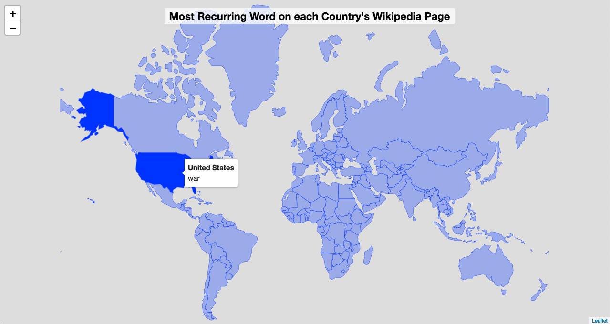

```{r setup, include=FALSE}
knitr::opts_chunk$set(
  echo = TRUE,
  message = FALSE,
  warning = FALSE
)

# install/load needed R packages
if (!require("pacman")) install.packages("pacman")
pacman::p_load(tidyverse, rvest, janitor, WikipediR, purrr, tidyr, tidytext, countrycode, leaflet, rnaturalearth, rnaturalearthdata, htmltools)

```



A friend recently offered me a fun book: *Brilliant maps. An atlas for curious minds*. One of the maps, called *Most recurring word on each country's English Wikipedia page*, particularly caught my attention. This world map shows the most frequent word of each country's English Wikipedia page. An old version of this infographic is available online:


The authors specify in a footnote that they excluded "country", linking words, demonyms and "government". Surprisingly the most recurring word of the English Wikipedia page are often either revealing or funny. For example, the most recurring word of the English Wikipedia page of the USA is, according to the infographic, "war". For China, it would be "dynasty", Australia "new" and Russia "soviet". 

In this article, we will:

- scrape 193 Wikipedia articles and clean the data in a tidy way;
- explore the top recurrings words and make new methodological choices;
- recreate the infographic as an interactive world map using Leaflet.

As always my analysis is fully reproducible, so you can get my R code from my [Github repository](https://github.com/lgnbhl/blogposts/tree/master/leaflet-map) or my online [RStudio Cloud](https://rstudio.cloud/project/800344) session.

## Scraping 193 Wikipedia pages

Firstly, we need a list of all Wikipedia pages we want to scrap. The [Wikipedia page](https://en.wikipedia.org/w/index.php?title=Member_states_of_the_United_Nations&oldid=926737595) of the 193 United Nations states membres will do the trick.

```{r}
library(tidyverse)
library(rvest)
library(janitor)

wikilink_permalink <- "https://en.wikipedia.org/w/index.php?title=Member_states_of_the_United_Nations&oldid=926737595"

# Extract wikitable
wikitable <- wikilink_permalink %>%
  read_html() %>%
  html_nodes("table") %>%
  .[[2]]

# Get wikilinks of all UN members
wikilinks <- wikitable %>%
  html_nodes("a") %>%
  html_attr("href") %>%
  keep(startsWith(., "/wiki/")) %>%
  discard(endsWith(., "and_the_United_Nations")) %>%
  str_remove("/wiki/Viet_Nam") %>% # duplicate with "/wiki/Vietnam"
  str_remove("/wiki/The_Gambia") %>% # duplicate with "/wiki/Gambia"
  str_remove("/wiki/United_Nations_Assistance_Mission_in_Afghanistan") %>%
  str_remove("/wiki/United_Nations_Assistance_Mission_in_Afghanistan") %>%
  str_remove("/wiki/Costa_Rica_in_the_United_Nations") %>%
  str_remove("/wiki/Flag") %>%
  str_replace("S%C3%A3o_Tom%C3%A9_and_Pr%C3%ADncipe", "Sao_Tome_and_Principe") %>%
  na_if("") %>%
  unique() %>%
  na.omit() %>%
  paste0("https://en.wikipedia.org", .)

table <- wikitable %>%
  html_table() %>%
  as_tibble() %>%
  mutate(
    wikilinks = wikilinks,
    page_name = str_remove(wikilinks, ".*/")
  ) %>%
  janitor::clean_names() %>%
  mutate_all(funs(str_remove_all(., "\\[note [0-9]+]|\\[[0-9]+]"))) %>%
  select(member_state = member_state_7_13_14, wikilinks, page_name)

table
```

Now let's use the official Wikipedia API available through the {WikipediR} R package to smoothly download all the related Wikipedia pages and add them into our dataset.

```{r}
library(WikipediR)
library(purrr)
library(tidyr)

table_txt <- table %>%
  mutate(txt = map(page_name, ~ WikipediR::page_content("en", "wikipedia",
    page_name = .x
  )$parse$text$`*`[[1]])) %>%
  mutate(
    txt = map(txt, unlist),
    txt = map(txt, read_html),
    txt = map(txt, html_text)
  ) %>%
  unnest_longer(txt)

# write_csv(table_txt, "data/table_txt.csv")
glimpse(table_txt)
```

Nice! We have all the data we need.

## Getting the most recurring words

We want now to clean the data and extract the most recurring word of each Wikipedia page. We will follow the methodology by removing "country", linking words, demonyms and "government".

Let's get the [demonyms of the countries](https://en.wikipedia.org/wiki/List_of_adjectival_and_demonymic_forms_for_countries_and_nations).

```{r}
wiki_demonyms <- "https://en.wikipedia.org/wiki/List_of_adjectival_and_demonymic_forms_for_countries_and_nations"

table_demonyms <- wiki_demonyms %>%
  read_html() %>%
  html_nodes("table") %>%
  .[[1]] %>%
  html_table() %>%
  as_tibble() %>%
  mutate_all(funs(str_remove_all(., "\\[.]|[(.)]"))) %>%
  mutate_all(funs(str_to_lower)) %>%
  janitor::clean_names()

table_demonyms <- table_demonyms %>%
  mutate(
    adjectivals = str_trim(adjectivals),
    demonyms = str_trim(demonyms),
    adjectivals_unnested = str_split(adjectivals, ", | or | "),
    demonyms_unnested = str_split(demonyms, ", | or |/| ")
  ) %>%
  unnest_longer(adjectivals_unnested) %>%
  unnest_longer(demonyms_unnested)

table_demonyms
```

Now we can clean the dataset following the methodology of the authors, i.e. removing "country", linking words, demonyms and "government".

```{r}
library(tidytext)

# table_txt <- read_csv("data/table_txt.csv")
# table_demonyms <- read_csv("data/demonyms.csv")

table_tidy <- table_txt %>%
  tidytext::unnest_tokens(word, txt) %>%
  anti_join(tidytext::get_stopwords("en"), by = "word") %>%
  anti_join(table_txt %>%
    mutate(word = str_to_lower(member_state)), by = "word") %>%
  anti_join(table_txt %>%
    unnest_tokens(word, member_state), by = "word") %>%
  filter(!word %in% table_demonyms$country_entity_name) %>%
  filter(!word %in% paste0(table_demonyms$country_entity_name, "'s")) %>%
  filter(!word %in% table_demonyms$adjectivals_unnested) %>%
  filter(!word %in% table_demonyms$demonyms_unnested) %>%
  filter(!word %in% c("country", "government"))

table_tidy
```

The results shows that additional stopwords should be added, such as removing numbers, month names, and other additional words. I don't think we can really call this cleaning step "cheating", considering the result of this data analysis. Let's do this.

```{r}
table_tidy2 <- table_tidy %>%
  filter(!word %in% str_to_lower(month.name)) %>%
  filter(!word %in% c(0:2030)) %>%
  filter(!word %in% letters) %>%
  filter(!word %in% c(
    "u.s", "uk", "uae", "drc", "de", "en", "also",
    "retrieved", "archived", "original", "pdf", "edit", "isbn", "p", "pp",
    "output", "redirect", "page", "parser", "mw", "wayback", "main",
    "st", "al", "la", "per", "percent", "cent", "05", "cs1", "one", "two",
    "perú", "d'andorra", "china's", "syria", "brasil", "citation"
  ))
```

Let's have a look at our most recurring words.

```{r}
top1words <- table_tidy2 %>%
  count(member_state, word, sort = TRUE) %>%
  group_by(member_state) %>%
  top_n(1) %>%
  distinct(member_state, .keep_all = TRUE) %>%
  arrange(desc(member_state, n))

top1words
```

Yes, the most recurring word of the United States of America's Wikipedia page is "war" indeed. 

But to which extend the word "war" is more recurring than other words?

```{r}
table_tidy2 %>%
  filter(member_state == "United States of America") %>%
  count(word, sort = TRUE)
```

Just one more occurence than the word "world".

Let's have a closer look at all the top 10 recurring words by country.

```{r}
top10words <- table_tidy2 %>%
  count(member_state, word, sort = T) %>%
  group_by(member_state) %>%
  top_n(10) %>%
  arrange(member_state)

DT::datatable(
  top10words,
  options = list(pageLength = 10, dom = "ftpi"),
  rownames = FALSE,
  caption = "Top 10 recurring words on each country's English Wikipedia page"
)
```

What are the most recurring words in all our tops?

```{r}
table_tidy2 %>%
  count(member_state, word) %>%
  group_by(member_state) %>%
  top_n(10) %>%
  ungroup() %>%
  count(word, sort = TRUE)
```

The words "world", "population" and "national" seem good candidates to be removed as stopwords. Let's try to remove them!

```{r}
top1words_new <- table_tidy2 %>%
  filter(!word %in% c("world", "world's", "population", "national")) %>%
  count(member_state, word, sort = TRUE) %>%
  group_by(member_state) %>%
  top_n(1) %>%
  ungroup() %>%
  distinct(member_state, .keep_all = TRUE) %>%
  arrange(desc(member_state))

top1words_new %>%
  count(word, sort = TRUE)
```

Seven countries have "war" as the most recurring word. Which are they?

```{r}
top1words_new %>%
  filter(word == "war") %>%
  arrange(desc(n))
```

Quite interesting!

Finally, let's make our own map based on this new dataset.

## An interactive world map

As it is a blog article, let's make our world map interactive.

```{r include=FALSE, results="asis"}
cat("
<style>
.leaflet-container {
    background: #FFF;
}
</style>
")
```

```{r}
library(countrycode)
library(leaflet)
library(rnaturalearth)
library(rnaturalearthdata)
library(htmltools)

world <- ne_countries(scale = "small", returnclass = "sf") %>%
  filter(continent != "Antarctica") %>%
  mutate(
    name = recode(name, "Greenland" = "Denmark"),
    iso_a3 = recode(iso_a3, "GRL" = "DNK")
  ) %>%
  select(name, iso_a3, geometry)

top1words_new$iso3c <- countrycode(top1words_new$member_state, "country.name", "iso3c")

world <- world %>%
  inner_join(top1words_new, by = c("iso_a3" = "iso3c"))

labels <- sprintf(
  "<strong>%s</strong><br/>%s",
  world$name, world$word
) %>% lapply(htmltools::HTML)

# reference: https://stackoverflow.com/a/52226825
tag.map.title <- tags$style(HTML("
  .leaflet-control.map-title { 
    transform: translate(-50%,20%);
    position: fixed !important;
    left: 50%;
    text-align: center;
    padding-left: 10px; 
    padding-right: 10px; 
    background: rgba(255,255,255,0.75);
    font-weight: bold;
    font-size: 22px;
  }
"))

title <- tags$div(
  tag.map.title, HTML("Most Recurring Word on each Country's Wikipedia Page")
)

leaflet(world) %>%
  addPolygons(
    weight = 1,
    fillOpacity = 0.3,
    highlight = highlightOptions(
      weight = 2,
      fillOpacity = 1
    ),
    label = labels,
    labelOptions = labelOptions(
      textsize = "15px"
    )
  ) %>%
  addControl(title, position = "topleft", className = "map-title")
```

Hover your mouse on the world map and discover the most recurring words of each country's English Wikipedia page. Yes, they are quite different from the [old version](https://mk0brilliantmaptxoqs.kinstacdn.com/wp-content/uploads/wikipedia-recurring.png) of *Brilliant Maps*.
